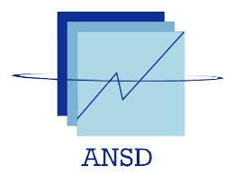

<!---BLOCK_SECTIONBREAK--->


``````{=openxml}

<w:tbl xmlns:w="http://schemas.openxmlformats.org/wordprocessingml/2006/main" xmlns:r="http://schemas.openxmlformats.org/officeDocument/2006/relationships" xmlns:w14="http://schemas.microsoft.com/office/word/2010/wordml" xmlns:wp="http://schemas.openxmlformats.org/drawingml/2006/wordprocessingDrawing" xmlns:a="http://schemas.openxmlformats.org/drawingml/2006/main" xmlns:pic="http://schemas.openxmlformats.org/drawingml/2006/picture"><w:tblPr><w:tblLayout w:type="autofit"/><w:jc w:val="center"/><w:tblW w:type="pct" w:w="5000"/><w:tblLook w:firstRow="1" w:lastRow="0" w:firstColumn="0" w:lastColumn="0" w:noHBand="0" w:noVBand="1"/></w:tblPr><w:tr><w:trPr><w:trHeight w:val="360" w:hRule="auto"/></w:trPr>body1<w:tc><w:tcPr><w:tcBorders><w:bottom w:val="none" w:sz="0" w:space="0" w:color="000000"/><w:top w:val="none" w:sz="0" w:space="0" w:color="000000"/><w:left w:val="none" w:sz="0" w:space="0" w:color="000000"/><w:right w:val="none" w:sz="0" w:space="0" w:color="000000"/></w:tcBorders><w:shd w:val="clear" w:color="auto" w:fill="FFFFFF"/><w:tcMar><w:top w:w="0" w:type="dxa"/><w:bottom w:w="0" w:type="dxa"/><w:left w:w="0" w:type="dxa"/><w:right w:w="0" w:type="dxa"/></w:tcMar><w:vAlign w:val="center"/></w:tcPr><w:p><w:pPr><w:pStyle w:val="Normal"/><w:jc w:val="center"/><w:pBdr><w:bottom w:val="none" w:sz="0" w:space="0" w:color="000000"/><w:top w:val="none" w:sz="0" w:space="0" w:color="000000"/><w:left w:val="none" w:sz="0" w:space="0" w:color="000000"/><w:right w:val="none" w:sz="0" w:space="0" w:color="000000"/></w:pBdr><w:spacing w:after="100" w:before="100" w:line="240"/><w:ind w:left="100" w:right="100" w:firstLine="0" w:firstLineChars="0"/><w:rPr><w:rFonts w:ascii="Times New Roman" w:hAnsi="Times New Roman" w:eastAsia="Times New Roman" w:cs="Times New Roman"/><w:i w:val="false"/><w:b w:val="true"/><w:u w:val="none"/><w:sz w:val="28"/><w:szCs w:val="28"/><w:color w:val="000000"/></w:rPr></w:pPr><w:r xmlns:w="http://schemas.openxmlformats.org/wordprocessingml/2006/main" xmlns:wp="http://schemas.openxmlformats.org/drawingml/2006/wordprocessingDrawing" xmlns:r="http://schemas.openxmlformats.org/officeDocument/2006/relationships" xmlns:w14="http://schemas.microsoft.com/office/word/2010/wordml"><w:rPr><w:rFonts w:ascii="Times New Roman" w:hAnsi="Times New Roman" w:eastAsia="Times New Roman" w:cs="Times New Roman"/><w:i w:val="false"/><w:b w:val="true"/><w:u w:val="none"/><w:sz w:val="28"/><w:szCs w:val="28"/><w:color w:val="000000"/></w:rPr><w:t xml:space="preserve">REPUBLIQUE DU SENEGAL</w:t></w:r></w:p></w:tc></w:tr></w:tbl>
``````

|                                                     |
|:---------------------------------------------------:|
| {width="3cm" height="3cm"} |


``````{=openxml}

<w:tbl xmlns:w="http://schemas.openxmlformats.org/wordprocessingml/2006/main" xmlns:r="http://schemas.openxmlformats.org/officeDocument/2006/relationships" xmlns:w14="http://schemas.microsoft.com/office/word/2010/wordml" xmlns:wp="http://schemas.openxmlformats.org/drawingml/2006/wordprocessingDrawing" xmlns:a="http://schemas.openxmlformats.org/drawingml/2006/main" xmlns:pic="http://schemas.openxmlformats.org/drawingml/2006/picture"><w:tblPr><w:tblLayout w:type="autofit"/><w:jc w:val="center"/><w:tblW w:type="pct" w:w="5000"/><w:tblLook w:firstRow="1" w:lastRow="0" w:firstColumn="0" w:lastColumn="0" w:noHBand="0" w:noVBand="1"/></w:tblPr><w:tr><w:trPr><w:trHeight w:val="360" w:hRule="auto"/></w:trPr>body1<w:tc><w:tcPr><w:tcBorders><w:bottom w:val="none" w:sz="0" w:space="0" w:color="000000"/><w:top w:val="none" w:sz="0" w:space="0" w:color="000000"/><w:left w:val="none" w:sz="0" w:space="0" w:color="000000"/><w:right w:val="none" w:sz="0" w:space="0" w:color="000000"/></w:tcBorders><w:shd w:val="clear" w:color="auto" w:fill="FFFFFF"/><w:tcMar><w:top w:w="0" w:type="dxa"/><w:bottom w:w="0" w:type="dxa"/><w:left w:w="0" w:type="dxa"/><w:right w:w="0" w:type="dxa"/></w:tcMar><w:vAlign w:val="center"/></w:tcPr><w:p><w:pPr><w:pStyle w:val="Normal"/><w:jc w:val="center"/><w:pBdr><w:bottom w:val="none" w:sz="0" w:space="0" w:color="000000"/><w:top w:val="none" w:sz="0" w:space="0" w:color="000000"/><w:left w:val="none" w:sz="0" w:space="0" w:color="000000"/><w:right w:val="none" w:sz="0" w:space="0" w:color="000000"/></w:pBdr><w:spacing w:after="100" w:before="100" w:line="240"/><w:ind w:left="100" w:right="100" w:firstLine="0" w:firstLineChars="0"/><w:rPr><w:rFonts w:ascii="Times New Roman" w:hAnsi="Times New Roman" w:eastAsia="Times New Roman" w:cs="Times New Roman"/><w:i w:val="false"/><w:b w:val="true"/><w:u w:val="none"/><w:sz w:val="28"/><w:szCs w:val="28"/><w:color w:val="000000"/></w:rPr></w:pPr><w:r xmlns:w="http://schemas.openxmlformats.org/wordprocessingml/2006/main" xmlns:wp="http://schemas.openxmlformats.org/drawingml/2006/wordprocessingDrawing" xmlns:r="http://schemas.openxmlformats.org/officeDocument/2006/relationships" xmlns:w14="http://schemas.microsoft.com/office/word/2010/wordml"><w:rPr><w:rFonts w:ascii="Times New Roman" w:hAnsi="Times New Roman" w:eastAsia="Times New Roman" w:cs="Times New Roman"/><w:i w:val="false"/><w:b w:val="true"/><w:u w:val="none"/><w:sz w:val="28"/><w:szCs w:val="28"/><w:color w:val="000000"/></w:rPr><w:t xml:space="preserve">**********</w:t></w:r></w:p></w:tc></w:tr><w:tr><w:trPr><w:trHeight w:val="360" w:hRule="auto"/></w:trPr>body2<w:tc><w:tcPr><w:tcBorders><w:bottom w:val="none" w:sz="0" w:space="0" w:color="000000"/><w:top w:val="none" w:sz="0" w:space="0" w:color="000000"/><w:left w:val="none" w:sz="0" w:space="0" w:color="000000"/><w:right w:val="none" w:sz="0" w:space="0" w:color="000000"/></w:tcBorders><w:shd w:val="clear" w:color="auto" w:fill="FFFFFF"/><w:tcMar><w:top w:w="0" w:type="dxa"/><w:bottom w:w="0" w:type="dxa"/><w:left w:w="0" w:type="dxa"/><w:right w:w="0" w:type="dxa"/></w:tcMar><w:vAlign w:val="center"/></w:tcPr><w:p><w:pPr><w:pStyle w:val="Normal"/><w:jc w:val="center"/><w:pBdr><w:bottom w:val="none" w:sz="0" w:space="0" w:color="000000"/><w:top w:val="none" w:sz="0" w:space="0" w:color="000000"/><w:left w:val="none" w:sz="0" w:space="0" w:color="000000"/><w:right w:val="none" w:sz="0" w:space="0" w:color="000000"/></w:pBdr><w:spacing w:after="100" w:before="100" w:line="240"/><w:ind w:left="100" w:right="100" w:firstLine="0" w:firstLineChars="0"/><w:rPr><w:rFonts w:ascii="Times New Roman" w:hAnsi="Times New Roman" w:eastAsia="Times New Roman" w:cs="Times New Roman"/><w:i w:val="true"/><w:b w:val="true"/><w:u w:val="none"/><w:sz w:val="28"/><w:szCs w:val="28"/><w:color w:val="000000"/></w:rPr></w:pPr><w:r xmlns:w="http://schemas.openxmlformats.org/wordprocessingml/2006/main" xmlns:wp="http://schemas.openxmlformats.org/drawingml/2006/wordprocessingDrawing" xmlns:r="http://schemas.openxmlformats.org/officeDocument/2006/relationships" xmlns:w14="http://schemas.microsoft.com/office/word/2010/wordml"><w:rPr><w:rFonts w:ascii="Times New Roman" w:hAnsi="Times New Roman" w:eastAsia="Times New Roman" w:cs="Times New Roman"/><w:i w:val="true"/><w:b w:val="true"/><w:u w:val="none"/><w:sz w:val="28"/><w:szCs w:val="28"/><w:color w:val="000000"/></w:rPr><w:t xml:space="preserve">Un Peuple - Un But - Une Foi</w:t></w:r></w:p></w:tc></w:tr><w:tr><w:trPr><w:trHeight w:val="360" w:hRule="auto"/></w:trPr>body3<w:tc><w:tcPr><w:tcBorders><w:bottom w:val="none" w:sz="0" w:space="0" w:color="000000"/><w:top w:val="none" w:sz="0" w:space="0" w:color="000000"/><w:left w:val="none" w:sz="0" w:space="0" w:color="000000"/><w:right w:val="none" w:sz="0" w:space="0" w:color="000000"/></w:tcBorders><w:shd w:val="clear" w:color="auto" w:fill="FFFFFF"/><w:tcMar><w:top w:w="0" w:type="dxa"/><w:bottom w:w="0" w:type="dxa"/><w:left w:w="0" w:type="dxa"/><w:right w:w="0" w:type="dxa"/></w:tcMar><w:vAlign w:val="center"/></w:tcPr><w:p><w:pPr><w:pStyle w:val="Normal"/><w:jc w:val="center"/><w:pBdr><w:bottom w:val="none" w:sz="0" w:space="0" w:color="000000"/><w:top w:val="none" w:sz="0" w:space="0" w:color="000000"/><w:left w:val="none" w:sz="0" w:space="0" w:color="000000"/><w:right w:val="none" w:sz="0" w:space="0" w:color="000000"/></w:pBdr><w:spacing w:after="100" w:before="100" w:line="240"/><w:ind w:left="100" w:right="100" w:firstLine="0" w:firstLineChars="0"/><w:rPr><w:rFonts w:ascii="Times New Roman" w:hAnsi="Times New Roman" w:eastAsia="Times New Roman" w:cs="Times New Roman"/><w:i w:val="false"/><w:b w:val="true"/><w:u w:val="none"/><w:sz w:val="28"/><w:szCs w:val="28"/><w:color w:val="000000"/></w:rPr></w:pPr><w:r xmlns:w="http://schemas.openxmlformats.org/wordprocessingml/2006/main" xmlns:wp="http://schemas.openxmlformats.org/drawingml/2006/wordprocessingDrawing" xmlns:r="http://schemas.openxmlformats.org/officeDocument/2006/relationships" xmlns:w14="http://schemas.microsoft.com/office/word/2010/wordml"><w:rPr><w:rFonts w:ascii="Times New Roman" w:hAnsi="Times New Roman" w:eastAsia="Times New Roman" w:cs="Times New Roman"/><w:i w:val="false"/><w:b w:val="true"/><w:u w:val="none"/><w:sz w:val="28"/><w:szCs w:val="28"/><w:color w:val="000000"/></w:rPr><w:t xml:space="preserve">**********</w:t></w:r></w:p></w:tc></w:tr><w:tr><w:trPr><w:trHeight w:val="360" w:hRule="auto"/></w:trPr>body4<w:tc><w:tcPr><w:tcBorders><w:bottom w:val="none" w:sz="0" w:space="0" w:color="000000"/><w:top w:val="none" w:sz="0" w:space="0" w:color="000000"/><w:left w:val="none" w:sz="0" w:space="0" w:color="000000"/><w:right w:val="none" w:sz="0" w:space="0" w:color="000000"/></w:tcBorders><w:shd w:val="clear" w:color="auto" w:fill="FFFFFF"/><w:tcMar><w:top w:w="0" w:type="dxa"/><w:bottom w:w="0" w:type="dxa"/><w:left w:w="0" w:type="dxa"/><w:right w:w="0" w:type="dxa"/></w:tcMar><w:vAlign w:val="center"/></w:tcPr><w:p><w:pPr><w:pStyle w:val="Normal"/><w:jc w:val="center"/><w:pBdr><w:bottom w:val="none" w:sz="0" w:space="0" w:color="000000"/><w:top w:val="none" w:sz="0" w:space="0" w:color="000000"/><w:left w:val="none" w:sz="0" w:space="0" w:color="000000"/><w:right w:val="none" w:sz="0" w:space="0" w:color="000000"/></w:pBdr><w:spacing w:after="100" w:before="100" w:line="240"/><w:ind w:left="100" w:right="100" w:firstLine="0" w:firstLineChars="0"/><w:rPr><w:rFonts w:ascii="Times New Roman" w:hAnsi="Times New Roman" w:eastAsia="Times New Roman" w:cs="Times New Roman"/><w:i w:val="false"/><w:b w:val="true"/><w:u w:val="none"/><w:sz w:val="28"/><w:szCs w:val="28"/><w:color w:val="000000"/></w:rPr></w:pPr><w:r xmlns:w="http://schemas.openxmlformats.org/wordprocessingml/2006/main" xmlns:wp="http://schemas.openxmlformats.org/drawingml/2006/wordprocessingDrawing" xmlns:r="http://schemas.openxmlformats.org/officeDocument/2006/relationships" xmlns:w14="http://schemas.microsoft.com/office/word/2010/wordml"><w:rPr><w:rFonts w:ascii="Times New Roman" w:hAnsi="Times New Roman" w:eastAsia="Times New Roman" w:cs="Times New Roman"/><w:i w:val="false"/><w:b w:val="true"/><w:u w:val="none"/><w:sz w:val="28"/><w:szCs w:val="28"/><w:color w:val="000000"/></w:rPr><w:t xml:space="preserve">Agence nationale de la Statistique et de la démographie</w:t></w:r></w:p></w:tc></w:tr></w:tbl>
``````

|                                          |
|:----------------------------------------:|
| {width="3.5cm"} |


``````{=openxml}

<w:tbl xmlns:w="http://schemas.openxmlformats.org/wordprocessingml/2006/main" xmlns:r="http://schemas.openxmlformats.org/officeDocument/2006/relationships" xmlns:w14="http://schemas.microsoft.com/office/word/2010/wordml" xmlns:wp="http://schemas.openxmlformats.org/drawingml/2006/wordprocessingDrawing" xmlns:a="http://schemas.openxmlformats.org/drawingml/2006/main" xmlns:pic="http://schemas.openxmlformats.org/drawingml/2006/picture"><w:tblPr><w:tblLayout w:type="autofit"/><w:jc w:val="center"/><w:tblW w:type="pct" w:w="5000"/><w:tblLook w:firstRow="1" w:lastRow="0" w:firstColumn="0" w:lastColumn="0" w:noHBand="0" w:noVBand="1"/></w:tblPr><w:tr><w:trPr><w:trHeight w:val="360" w:hRule="auto"/></w:trPr>body1<w:tc><w:tcPr><w:tcBorders><w:bottom w:val="none" w:sz="0" w:space="0" w:color="000000"/><w:top w:val="none" w:sz="0" w:space="0" w:color="000000"/><w:left w:val="none" w:sz="0" w:space="0" w:color="000000"/><w:right w:val="none" w:sz="0" w:space="0" w:color="000000"/></w:tcBorders><w:shd w:val="clear" w:color="auto" w:fill="FFFFFF"/><w:tcMar><w:top w:w="0" w:type="dxa"/><w:bottom w:w="0" w:type="dxa"/><w:left w:w="0" w:type="dxa"/><w:right w:w="0" w:type="dxa"/></w:tcMar><w:vAlign w:val="center"/></w:tcPr><w:p><w:pPr><w:pStyle w:val="Normal"/><w:jc w:val="center"/><w:pBdr><w:bottom w:val="none" w:sz="0" w:space="0" w:color="000000"/><w:top w:val="none" w:sz="0" w:space="0" w:color="000000"/><w:left w:val="none" w:sz="0" w:space="0" w:color="000000"/><w:right w:val="none" w:sz="0" w:space="0" w:color="000000"/></w:pBdr><w:spacing w:after="100" w:before="100" w:line="240"/><w:ind w:left="100" w:right="100" w:firstLine="0" w:firstLineChars="0"/><w:rPr><w:rFonts w:ascii="Times New Roman" w:hAnsi="Times New Roman" w:eastAsia="Times New Roman" w:cs="Times New Roman"/><w:i w:val="false"/><w:b w:val="true"/><w:u w:val="none"/><w:sz w:val="28"/><w:szCs w:val="28"/><w:color w:val="000000"/></w:rPr></w:pPr><w:r xmlns:w="http://schemas.openxmlformats.org/wordprocessingml/2006/main" xmlns:wp="http://schemas.openxmlformats.org/drawingml/2006/wordprocessingDrawing" xmlns:r="http://schemas.openxmlformats.org/officeDocument/2006/relationships" xmlns:w14="http://schemas.microsoft.com/office/word/2010/wordml"><w:rPr><w:rFonts w:ascii="Times New Roman" w:hAnsi="Times New Roman" w:eastAsia="Times New Roman" w:cs="Times New Roman"/><w:i w:val="false"/><w:b w:val="true"/><w:u w:val="none"/><w:sz w:val="28"/><w:szCs w:val="28"/><w:color w:val="000000"/></w:rPr><w:t xml:space="preserve">**********</w:t></w:r></w:p></w:tc></w:tr><w:tr><w:trPr><w:trHeight w:val="360" w:hRule="auto"/></w:trPr>body2<w:tc><w:tcPr><w:tcBorders><w:bottom w:val="none" w:sz="0" w:space="0" w:color="000000"/><w:top w:val="none" w:sz="0" w:space="0" w:color="000000"/><w:left w:val="none" w:sz="0" w:space="0" w:color="000000"/><w:right w:val="none" w:sz="0" w:space="0" w:color="000000"/></w:tcBorders><w:shd w:val="clear" w:color="auto" w:fill="FFFFFF"/><w:tcMar><w:top w:w="0" w:type="dxa"/><w:bottom w:w="0" w:type="dxa"/><w:left w:w="0" w:type="dxa"/><w:right w:w="0" w:type="dxa"/></w:tcMar><w:vAlign w:val="center"/></w:tcPr><w:p><w:pPr><w:pStyle w:val="Normal"/><w:jc w:val="center"/><w:pBdr><w:bottom w:val="none" w:sz="0" w:space="0" w:color="000000"/><w:top w:val="none" w:sz="0" w:space="0" w:color="000000"/><w:left w:val="none" w:sz="0" w:space="0" w:color="000000"/><w:right w:val="none" w:sz="0" w:space="0" w:color="000000"/></w:pBdr><w:spacing w:after="100" w:before="100" w:line="240"/><w:ind w:left="100" w:right="100" w:firstLine="0" w:firstLineChars="0"/><w:rPr><w:rFonts w:ascii="Times New Roman" w:hAnsi="Times New Roman" w:eastAsia="Times New Roman" w:cs="Times New Roman"/><w:i w:val="false"/><w:b w:val="true"/><w:u w:val="none"/><w:sz w:val="28"/><w:szCs w:val="28"/><w:color w:val="000000"/></w:rPr></w:pPr><w:r xmlns:w="http://schemas.openxmlformats.org/wordprocessingml/2006/main" xmlns:wp="http://schemas.openxmlformats.org/drawingml/2006/wordprocessingDrawing" xmlns:r="http://schemas.openxmlformats.org/officeDocument/2006/relationships" xmlns:w14="http://schemas.microsoft.com/office/word/2010/wordml"><w:rPr><w:rFonts w:ascii="Times New Roman" w:hAnsi="Times New Roman" w:eastAsia="Times New Roman" w:cs="Times New Roman"/><w:i w:val="false"/><w:b w:val="true"/><w:u w:val="none"/><w:sz w:val="28"/><w:szCs w:val="28"/><w:color w:val="000000"/></w:rPr><w:t xml:space="preserve">Ecole nationale de la Statistique et de l'Analyse économique Pierre Ndiaye</w:t></w:r></w:p></w:tc></w:tr></w:tbl>
``````

|                                                       |
|:-----------------------------------------------------:|
| {width="2.5cm" height="2cm"} |

##### Projet statistique sur R : Evaluation


$$
$$


``````{=openxml}

<w:tbl xmlns:w="http://schemas.openxmlformats.org/wordprocessingml/2006/main" xmlns:r="http://schemas.openxmlformats.org/officeDocument/2006/relationships" xmlns:w14="http://schemas.microsoft.com/office/word/2010/wordml" xmlns:wp="http://schemas.openxmlformats.org/drawingml/2006/wordprocessingDrawing" xmlns:a="http://schemas.openxmlformats.org/drawingml/2006/main" xmlns:pic="http://schemas.openxmlformats.org/drawingml/2006/picture"><w:tblPr><w:tblLayout w:type="autofit"/><w:jc w:val="center"/><w:tblW w:type="pct" w:w="5000"/><w:tblLook w:firstRow="1" w:lastRow="0" w:firstColumn="0" w:lastColumn="0" w:noHBand="0" w:noVBand="1"/></w:tblPr><w:tr><w:trPr><w:trHeight w:val="360" w:hRule="auto"/></w:trPr>body1<w:tc><w:tcPr><w:tcBorders><w:bottom w:val="none" w:sz="0" w:space="0" w:color="000000"/><w:top w:val="none" w:sz="0" w:space="0" w:color="000000"/><w:left w:val="none" w:sz="0" w:space="0" w:color="000000"/><w:right w:val="none" w:sz="0" w:space="0" w:color="000000"/></w:tcBorders><w:shd w:val="clear" w:color="auto" w:fill="FFFFFF"/><w:tcMar><w:top w:w="0" w:type="dxa"/><w:bottom w:w="0" w:type="dxa"/><w:left w:w="0" w:type="dxa"/><w:right w:w="0" w:type="dxa"/></w:tcMar><w:vAlign w:val="center"/></w:tcPr><w:p><w:pPr><w:pStyle w:val="Normal"/><w:jc w:val="left"/><w:pBdr><w:bottom w:val="none" w:sz="0" w:space="0" w:color="000000"/><w:top w:val="none" w:sz="0" w:space="0" w:color="000000"/><w:left w:val="none" w:sz="0" w:space="0" w:color="000000"/><w:right w:val="none" w:sz="0" w:space="0" w:color="000000"/></w:pBdr><w:spacing w:after="100" w:before="100" w:line="240"/><w:ind w:left="100" w:right="100" w:firstLine="0" w:firstLineChars="0"/><w:rPr><w:rFonts w:ascii="Arial" w:hAnsi="Arial" w:eastAsia="Arial" w:cs="Arial"/><w:i w:val="false"/><w:b w:val="true"/><w:u w:val="none"/><w:sz w:val="22"/><w:szCs w:val="22"/><w:color w:val="000000"/></w:rPr></w:pPr><w:r xmlns:w="http://schemas.openxmlformats.org/wordprocessingml/2006/main" xmlns:wp="http://schemas.openxmlformats.org/drawingml/2006/wordprocessingDrawing" xmlns:r="http://schemas.openxmlformats.org/officeDocument/2006/relationships" xmlns:w14="http://schemas.microsoft.com/office/word/2010/wordml"><w:rPr><w:rFonts w:ascii="Arial" w:hAnsi="Arial" w:eastAsia="Arial" w:cs="Arial"/><w:i w:val="false"/><w:b w:val="true"/><w:u w:val="none"/><w:sz w:val="22"/><w:szCs w:val="22"/><w:color w:val="000000"/></w:rPr><w:t xml:space="preserve">Rédigé par</w:t></w:r></w:p></w:tc><w:tc><w:tcPr><w:tcBorders><w:bottom w:val="none" w:sz="0" w:space="0" w:color="000000"/><w:top w:val="none" w:sz="0" w:space="0" w:color="000000"/><w:left w:val="none" w:sz="0" w:space="0" w:color="000000"/><w:right w:val="none" w:sz="0" w:space="0" w:color="000000"/></w:tcBorders><w:shd w:val="clear" w:color="auto" w:fill="FFFFFF"/><w:tcMar><w:top w:w="0" w:type="dxa"/><w:bottom w:w="0" w:type="dxa"/><w:left w:w="0" w:type="dxa"/><w:right w:w="0" w:type="dxa"/></w:tcMar><w:vAlign w:val="center"/></w:tcPr><w:p><w:pPr><w:pStyle w:val="Normal"/><w:jc w:val="right"/><w:pBdr><w:bottom w:val="none" w:sz="0" w:space="0" w:color="000000"/><w:top w:val="none" w:sz="0" w:space="0" w:color="000000"/><w:left w:val="none" w:sz="0" w:space="0" w:color="000000"/><w:right w:val="none" w:sz="0" w:space="0" w:color="000000"/></w:pBdr><w:spacing w:after="100" w:before="100" w:line="240"/><w:ind w:left="100" w:right="100" w:firstLine="0" w:firstLineChars="0"/><w:rPr><w:rFonts w:ascii="Arial" w:hAnsi="Arial" w:eastAsia="Arial" w:cs="Arial"/><w:i w:val="false"/><w:b w:val="true"/><w:u w:val="none"/><w:sz w:val="22"/><w:szCs w:val="22"/><w:color w:val="000000"/></w:rPr></w:pPr><w:r xmlns:w="http://schemas.openxmlformats.org/wordprocessingml/2006/main" xmlns:wp="http://schemas.openxmlformats.org/drawingml/2006/wordprocessingDrawing" xmlns:r="http://schemas.openxmlformats.org/officeDocument/2006/relationships" xmlns:w14="http://schemas.microsoft.com/office/word/2010/wordml"><w:rPr><w:rFonts w:ascii="Arial" w:hAnsi="Arial" w:eastAsia="Arial" w:cs="Arial"/><w:i w:val="false"/><w:b w:val="true"/><w:u w:val="none"/><w:sz w:val="22"/><w:szCs w:val="22"/><w:color w:val="000000"/></w:rPr><w:t xml:space="preserve">Sous la supervision de</w:t></w:r></w:p></w:tc></w:tr><w:tr><w:trPr><w:trHeight w:val="360" w:hRule="auto"/></w:trPr>body2<w:tc><w:tcPr><w:tcBorders><w:bottom w:val="none" w:sz="0" w:space="0" w:color="000000"/><w:top w:val="none" w:sz="0" w:space="0" w:color="000000"/><w:left w:val="none" w:sz="0" w:space="0" w:color="000000"/><w:right w:val="none" w:sz="0" w:space="0" w:color="000000"/></w:tcBorders><w:shd w:val="clear" w:color="auto" w:fill="FFFFFF"/><w:tcMar><w:top w:w="0" w:type="dxa"/><w:bottom w:w="0" w:type="dxa"/><w:left w:w="0" w:type="dxa"/><w:right w:w="0" w:type="dxa"/></w:tcMar><w:vAlign w:val="center"/></w:tcPr><w:p><w:pPr><w:pStyle w:val="Normal"/><w:jc w:val="left"/><w:pBdr><w:bottom w:val="none" w:sz="0" w:space="0" w:color="000000"/><w:top w:val="none" w:sz="0" w:space="0" w:color="000000"/><w:left w:val="none" w:sz="0" w:space="0" w:color="000000"/><w:right w:val="none" w:sz="0" w:space="0" w:color="000000"/></w:pBdr><w:spacing w:after="100" w:before="100" w:line="240"/><w:ind w:left="100" w:right="100" w:firstLine="0" w:firstLineChars="0"/><w:rPr><w:rFonts w:ascii="Arial" w:hAnsi="Arial" w:eastAsia="Arial" w:cs="Arial"/><w:i w:val="false"/><w:b w:val="false"/><w:u w:val="none"/><w:sz w:val="22"/><w:szCs w:val="22"/><w:color w:val="000000"/></w:rPr></w:pPr><w:r xmlns:w="http://schemas.openxmlformats.org/wordprocessingml/2006/main" xmlns:wp="http://schemas.openxmlformats.org/drawingml/2006/wordprocessingDrawing" xmlns:r="http://schemas.openxmlformats.org/officeDocument/2006/relationships" xmlns:w14="http://schemas.microsoft.com/office/word/2010/wordml"><w:rPr><w:rFonts w:ascii="Arial" w:hAnsi="Arial" w:eastAsia="Arial" w:cs="Arial"/><w:i w:val="false"/><w:b w:val="false"/><w:u w:val="none"/><w:sz w:val="22"/><w:szCs w:val="22"/><w:color w:val="000000"/></w:rPr><w:t xml:space="preserve">SOMA Ben Idriss </w:t></w:r></w:p></w:tc><w:tc><w:tcPr><w:tcBorders><w:bottom w:val="none" w:sz="0" w:space="0" w:color="000000"/><w:top w:val="none" w:sz="0" w:space="0" w:color="000000"/><w:left w:val="none" w:sz="0" w:space="0" w:color="000000"/><w:right w:val="none" w:sz="0" w:space="0" w:color="000000"/></w:tcBorders><w:shd w:val="clear" w:color="auto" w:fill="FFFFFF"/><w:tcMar><w:top w:w="0" w:type="dxa"/><w:bottom w:w="0" w:type="dxa"/><w:left w:w="0" w:type="dxa"/><w:right w:w="0" w:type="dxa"/></w:tcMar><w:vAlign w:val="center"/></w:tcPr><w:p><w:pPr><w:pStyle w:val="Normal"/><w:jc w:val="right"/><w:pBdr><w:bottom w:val="none" w:sz="0" w:space="0" w:color="000000"/><w:top w:val="none" w:sz="0" w:space="0" w:color="000000"/><w:left w:val="none" w:sz="0" w:space="0" w:color="000000"/><w:right w:val="none" w:sz="0" w:space="0" w:color="000000"/></w:pBdr><w:spacing w:after="100" w:before="100" w:line="240"/><w:ind w:left="100" w:right="100" w:firstLine="0" w:firstLineChars="0"/><w:rPr><w:rFonts w:ascii="Arial" w:hAnsi="Arial" w:eastAsia="Arial" w:cs="Arial"/><w:i w:val="false"/><w:b w:val="false"/><w:u w:val="none"/><w:sz w:val="22"/><w:szCs w:val="22"/><w:color w:val="000000"/></w:rPr></w:pPr><w:r xmlns:w="http://schemas.openxmlformats.org/wordprocessingml/2006/main" xmlns:wp="http://schemas.openxmlformats.org/drawingml/2006/wordprocessingDrawing" xmlns:r="http://schemas.openxmlformats.org/officeDocument/2006/relationships" xmlns:w14="http://schemas.microsoft.com/office/word/2010/wordml"><w:rPr><w:rFonts w:ascii="Arial" w:hAnsi="Arial" w:eastAsia="Arial" w:cs="Arial"/><w:i w:val="false"/><w:b w:val="false"/><w:u w:val="none"/><w:sz w:val="22"/><w:szCs w:val="22"/><w:color w:val="000000"/></w:rPr><w:t xml:space="preserve">M. Aboubacar HEMA</w:t></w:r></w:p></w:tc></w:tr><w:tr><w:trPr><w:trHeight w:val="360" w:hRule="auto"/></w:trPr>body3<w:tc><w:tcPr><w:tcBorders><w:bottom w:val="none" w:sz="0" w:space="0" w:color="000000"/><w:top w:val="none" w:sz="0" w:space="0" w:color="000000"/><w:left w:val="none" w:sz="0" w:space="0" w:color="000000"/><w:right w:val="none" w:sz="0" w:space="0" w:color="000000"/></w:tcBorders><w:shd w:val="clear" w:color="auto" w:fill="FFFFFF"/><w:tcMar><w:top w:w="0" w:type="dxa"/><w:bottom w:w="0" w:type="dxa"/><w:left w:w="0" w:type="dxa"/><w:right w:w="0" w:type="dxa"/></w:tcMar><w:vAlign w:val="center"/></w:tcPr><w:p><w:pPr><w:pStyle w:val="Normal"/><w:jc w:val="left"/><w:pBdr><w:bottom w:val="none" w:sz="0" w:space="0" w:color="000000"/><w:top w:val="none" w:sz="0" w:space="0" w:color="000000"/><w:left w:val="none" w:sz="0" w:space="0" w:color="000000"/><w:right w:val="none" w:sz="0" w:space="0" w:color="000000"/></w:pBdr><w:spacing w:after="100" w:before="100" w:line="240"/><w:ind w:left="100" w:right="100" w:firstLine="0" w:firstLineChars="0"/><w:rPr><w:rFonts w:ascii="Arial" w:hAnsi="Arial" w:eastAsia="Arial" w:cs="Arial"/><w:i w:val="true"/><w:b w:val="false"/><w:u w:val="none"/><w:sz w:val="22"/><w:szCs w:val="22"/><w:color w:val="000000"/></w:rPr></w:pPr><w:r xmlns:w="http://schemas.openxmlformats.org/wordprocessingml/2006/main" xmlns:wp="http://schemas.openxmlformats.org/drawingml/2006/wordprocessingDrawing" xmlns:r="http://schemas.openxmlformats.org/officeDocument/2006/relationships" xmlns:w14="http://schemas.microsoft.com/office/word/2010/wordml"><w:rPr><w:rFonts w:ascii="Arial" w:hAnsi="Arial" w:eastAsia="Arial" w:cs="Arial"/><w:i w:val="true"/><w:b w:val="false"/><w:u w:val="none"/><w:sz w:val="22"/><w:szCs w:val="22"/><w:color w:val="000000"/></w:rPr><w:t xml:space="preserve">Élève Ingénieur Statisticien Économiste</w:t></w:r></w:p></w:tc><w:tc><w:tcPr><w:tcBorders><w:bottom w:val="none" w:sz="0" w:space="0" w:color="000000"/><w:top w:val="none" w:sz="0" w:space="0" w:color="000000"/><w:left w:val="none" w:sz="0" w:space="0" w:color="000000"/><w:right w:val="none" w:sz="0" w:space="0" w:color="000000"/></w:tcBorders><w:shd w:val="clear" w:color="auto" w:fill="FFFFFF"/><w:tcMar><w:top w:w="0" w:type="dxa"/><w:bottom w:w="0" w:type="dxa"/><w:left w:w="0" w:type="dxa"/><w:right w:w="0" w:type="dxa"/></w:tcMar><w:vAlign w:val="center"/></w:tcPr><w:p><w:pPr><w:pStyle w:val="Normal"/><w:jc w:val="right"/><w:pBdr><w:bottom w:val="none" w:sz="0" w:space="0" w:color="000000"/><w:top w:val="none" w:sz="0" w:space="0" w:color="000000"/><w:left w:val="none" w:sz="0" w:space="0" w:color="000000"/><w:right w:val="none" w:sz="0" w:space="0" w:color="000000"/></w:pBdr><w:spacing w:after="100" w:before="100" w:line="240"/><w:ind w:left="100" w:right="100" w:firstLine="0" w:firstLineChars="0"/><w:rPr><w:rFonts w:ascii="Arial" w:hAnsi="Arial" w:eastAsia="Arial" w:cs="Arial"/><w:i w:val="true"/><w:b w:val="false"/><w:u w:val="none"/><w:sz w:val="22"/><w:szCs w:val="22"/><w:color w:val="000000"/></w:rPr></w:pPr><w:r xmlns:w="http://schemas.openxmlformats.org/wordprocessingml/2006/main" xmlns:wp="http://schemas.openxmlformats.org/drawingml/2006/wordprocessingDrawing" xmlns:r="http://schemas.openxmlformats.org/officeDocument/2006/relationships" xmlns:w14="http://schemas.microsoft.com/office/word/2010/wordml"><w:rPr><w:rFonts w:ascii="Arial" w:hAnsi="Arial" w:eastAsia="Arial" w:cs="Arial"/><w:i w:val="true"/><w:b w:val="false"/><w:u w:val="none"/><w:sz w:val="22"/><w:szCs w:val="22"/><w:color w:val="000000"/></w:rPr><w:t xml:space="preserve">Data-scientist</w:t></w:r></w:p></w:tc></w:tr></w:tbl>
``````

|                                |
|:------------------------------:|
| **Année académique 2024-2025** |


\newpage


###### Sommaire

```{=openxml}
<w:p><w:pPr/><w:r xmlns:w="http://schemas.openxmlformats.org/wordprocessingml/2006/main" xmlns:wp="http://schemas.openxmlformats.org/drawingml/2006/wordprocessingDrawing" xmlns:r="http://schemas.openxmlformats.org/officeDocument/2006/relationships" xmlns:w14="http://schemas.microsoft.com/office/word/2010/wordml"><w:rPr/><w:fldChar w:fldCharType="begin" w:dirty="true"/></w:r><w:r xmlns:w="http://schemas.openxmlformats.org/wordprocessingml/2006/main" xmlns:wp="http://schemas.openxmlformats.org/drawingml/2006/wordprocessingDrawing" xmlns:r="http://schemas.openxmlformats.org/officeDocument/2006/relationships" xmlns:w14="http://schemas.microsoft.com/office/word/2010/wordml"><w:rPr/><w:instrText xml:space="preserve" w:dirty="true">TOC \o "1-3" \h \z \u</w:instrText></w:r><w:r xmlns:w="http://schemas.openxmlformats.org/wordprocessingml/2006/main" xmlns:wp="http://schemas.openxmlformats.org/drawingml/2006/wordprocessingDrawing" xmlns:r="http://schemas.openxmlformats.org/officeDocument/2006/relationships" xmlns:w14="http://schemas.microsoft.com/office/word/2010/wordml"><w:rPr/><w:fldChar w:fldCharType="end" w:dirty="true"/></w:r></w:p>
```

\newpage


# Introduction 


L’Afrique traverse aujourd’hui une période charnière marquée à la fois par des défis socio-économiques majeurs et par une profonde mutation démographique, politique et environnementale. Dans ce contexte, les déplacements forcés de population constituent un phénomène de plus en plus préoccupant, en particulier dans des pays en crise comme le Soudan du Sud. En 2023, ce pays a connu une recrudescence des conflits internes et des catastrophes naturelles, entraînant des vagues massives de déplacements internes. Ces situations affectent gravement la stabilité des ménages, l’accès à l’alimentation, les conditions de logement et la sécurité.

Le présent rapport s’inscrit dans le cadre d’un projet d’analyse statistique appliquée sous R. Il vise à fournir une lecture quantitative et critique de l’enquête menée sur les déplacés internes du Soudan du Sud en 2023, en exploitant les outils de traitement et d’analyse de données offerts par le logiciel R. À travers une démarche structurée, nous aborderons des aspects fondamentaux de la situation humanitaire des déplacés, allant de la cohérence des bases de données à l’étude détaillée de leurs caractéristiques socio-économiques, en passant par des indicateurs essentiels comme l’indice de surpeuplement, le score de consommation alimentaire (SCA) et l’indice réduit des stratégies de survie (rCSI).

L’objectif de ce travail est double : d’une part, mobiliser les compétences acquises dans le cadre du cours de statistique appliquée pour traiter un cas réel, et d’autre part, mettre en lumière des dynamiques sociales, économiques et nutritionnelles cruciales dans un contexte de déplacement. L’intégralité de l’analyse a été réalisée à l’aide de R Markdown afin de produire un document reproductible, structuré et transparent, conformément aux exigences pédagogiques de cet exercice.

\newpage


# I. Analyse de consistence des bases de données


```
[1] 3058 1312
```

la base principale est consttuée de 3058 observations et de 1312 variables .


```
[1] 22092   144
```

la base individu est constituée de 144 variables  et de 22092  observations 


## Nettoyage des noms des  bases 

On va d'abord standariser les noms de toutes les variables des deux bases en minuscule pour une meilleure analyse .  


Nous allons afficher les noms des 10 prémières variables pour les deux bases 

Pour la base principale : 
 


``````{=openxml}

<w:tbl xmlns:w="http://schemas.openxmlformats.org/wordprocessingml/2006/main" xmlns:r="http://schemas.openxmlformats.org/officeDocument/2006/relationships" xmlns:w14="http://schemas.microsoft.com/office/word/2010/wordml" xmlns:wp="http://schemas.openxmlformats.org/drawingml/2006/wordprocessingDrawing" xmlns:a="http://schemas.openxmlformats.org/drawingml/2006/main" xmlns:pic="http://schemas.openxmlformats.org/drawingml/2006/picture"><w:tblPr><w:tblLayout w:type="autofit"/><w:jc w:val="center"/><w:tblW w:type="pct" w:w="0"/><w:tblLook w:firstRow="1" w:lastRow="0" w:firstColumn="0" w:lastColumn="0" w:noHBand="0" w:noVBand="1"/></w:tblPr><w:tr><w:trPr><w:trHeight w:val="538" w:hRule="auto"/><w:tblHeader/></w:trPr>header 1<w:tc><w:tcPr><w:tcBorders><w:bottom w:val="single" w:sz="16" w:space="0" w:color="000000"/><w:top w:val="single" w:sz="8" w:space="0" w:color="000000"/><w:left w:val="single" w:sz="8" w:space="0" w:color="000000"/><w:right w:val="single" w:sz="8" w:space="0" w:color="000000"/></w:tcBorders><w:shd w:val="clear" w:color="auto" w:fill="D6EAF8"/><w:tcMar><w:top w:w="0" w:type="dxa"/><w:bottom w:w="0" w:type="dxa"/><w:left w:w="0" w:type="dxa"/><w:right w:w="0" w:type="dxa"/></w:tcMar><w:vAlign w:val="center"/></w:tcPr><w:p><w:pPr><w:pStyle w:val="Normal"/><w:jc w:val="center"/><w:pBdr><w:bottom w:val="none" w:sz="0" w:space="0" w:color="000000"/><w:top w:val="none" w:sz="0" w:space="0" w:color="000000"/><w:left w:val="none" w:sz="0" w:space="0" w:color="000000"/><w:right w:val="none" w:sz="0" w:space="0" w:color="000000"/></w:pBdr><w:spacing w:after="100" w:before="100" w:line="240"/><w:ind w:left="100" w:right="100" w:firstLine="0" w:firstLineChars="0"/><w:rPr><w:rFonts w:ascii="Times New Roman" w:hAnsi="Times New Roman" w:eastAsia="Times New Roman" w:cs="Times New Roman"/><w:i w:val="false"/><w:b w:val="false"/><w:u w:val="none"/><w:sz w:val="18"/><w:szCs w:val="18"/><w:color w:val="000000"/></w:rPr></w:pPr><w:r xmlns:w="http://schemas.openxmlformats.org/wordprocessingml/2006/main" xmlns:wp="http://schemas.openxmlformats.org/drawingml/2006/wordprocessingDrawing" xmlns:r="http://schemas.openxmlformats.org/officeDocument/2006/relationships" xmlns:w14="http://schemas.microsoft.com/office/word/2010/wordml"><w:rPr><w:rFonts w:ascii="Times New Roman" w:hAnsi="Times New Roman" w:eastAsia="Times New Roman" w:cs="Times New Roman"/><w:i w:val="false"/><w:b w:val="false"/><w:u w:val="none"/><w:sz w:val="18"/><w:szCs w:val="18"/><w:color w:val="000000"/></w:rPr><w:t xml:space="preserve">Variable</w:t></w:r></w:p></w:tc></w:tr><w:tr><w:trPr><w:trHeight w:val="574" w:hRule="auto"/></w:trPr>body 1<w:tc><w:tcPr><w:tcBorders><w:bottom w:val="single" w:sz="8" w:space="0" w:color="000000"/><w:top w:val="single" w:sz="16" w:space="0" w:color="000000"/><w:left w:val="single" w:sz="8" w:space="0" w:color="000000"/><w:right w:val="single" w:sz="8" w:space="0" w:color="000000"/></w:tcBorders><w:shd w:val="clear" w:color="auto" w:fill="FFFFFF"/><w:tcMar><w:top w:w="0" w:type="dxa"/><w:bottom w:w="0" w:type="dxa"/><w:left w:w="0" w:type="dxa"/><w:right w:w="0" w:type="dxa"/></w:tcMar><w:vAlign w:val="center"/></w:tcPr><w:p><w:pPr><w:pStyle w:val="Normal"/><w:jc w:val="left"/><w:pBdr><w:bottom w:val="none" w:sz="0" w:space="0" w:color="000000"/><w:top w:val="none" w:sz="0" w:space="0" w:color="000000"/><w:left w:val="none" w:sz="0" w:space="0" w:color="000000"/><w:right w:val="none" w:sz="0" w:space="0" w:color="000000"/></w:pBdr><w:spacing w:after="100" w:before="100" w:line="240"/><w:ind w:left="100" w:right="100" w:firstLine="0" w:firstLineChars="0"/><w:rPr><w:rFonts w:ascii="Times New Roman" w:hAnsi="Times New Roman" w:eastAsia="Times New Roman" w:cs="Times New Roman"/><w:i w:val="false"/><w:b w:val="false"/><w:u w:val="none"/><w:sz w:val="18"/><w:szCs w:val="18"/><w:color w:val="000000"/></w:rPr></w:pPr><w:r xmlns:w="http://schemas.openxmlformats.org/wordprocessingml/2006/main" xmlns:wp="http://schemas.openxmlformats.org/drawingml/2006/wordprocessingDrawing" xmlns:r="http://schemas.openxmlformats.org/officeDocument/2006/relationships" xmlns:w14="http://schemas.microsoft.com/office/word/2010/wordml"><w:rPr><w:rFonts w:ascii="Times New Roman" w:hAnsi="Times New Roman" w:eastAsia="Times New Roman" w:cs="Times New Roman"/><w:i w:val="false"/><w:b w:val="false"/><w:u w:val="none"/><w:sz w:val="18"/><w:szCs w:val="18"/><w:color w:val="000000"/></w:rPr><w:t xml:space="preserve">intro_07_1</w:t></w:r></w:p></w:tc></w:tr><w:tr><w:trPr><w:trHeight w:val="520" w:hRule="auto"/></w:trPr>body 2<w:tc><w:tcPr><w:tcBorders><w:bottom w:val="single" w:sz="8" w:space="0" w:color="000000"/><w:top w:val="single" w:sz="8" w:space="0" w:color="000000"/><w:left w:val="single" w:sz="8" w:space="0" w:color="000000"/><w:right w:val="single" w:sz="8" w:space="0" w:color="000000"/></w:tcBorders><w:shd w:val="clear" w:color="auto" w:fill="FFFFFF"/><w:tcMar><w:top w:w="0" w:type="dxa"/><w:bottom w:w="0" w:type="dxa"/><w:left w:w="0" w:type="dxa"/><w:right w:w="0" w:type="dxa"/></w:tcMar><w:vAlign w:val="center"/></w:tcPr><w:p><w:pPr><w:pStyle w:val="Normal"/><w:jc w:val="left"/><w:pBdr><w:bottom w:val="none" w:sz="0" w:space="0" w:color="000000"/><w:top w:val="none" w:sz="0" w:space="0" w:color="000000"/><w:left w:val="none" w:sz="0" w:space="0" w:color="000000"/><w:right w:val="none" w:sz="0" w:space="0" w:color="000000"/></w:pBdr><w:spacing w:after="100" w:before="100" w:line="240"/><w:ind w:left="100" w:right="100" w:firstLine="0" w:firstLineChars="0"/><w:rPr><w:rFonts w:ascii="Times New Roman" w:hAnsi="Times New Roman" w:eastAsia="Times New Roman" w:cs="Times New Roman"/><w:i w:val="false"/><w:b w:val="false"/><w:u w:val="none"/><w:sz w:val="18"/><w:szCs w:val="18"/><w:color w:val="000000"/></w:rPr></w:pPr><w:r xmlns:w="http://schemas.openxmlformats.org/wordprocessingml/2006/main" xmlns:wp="http://schemas.openxmlformats.org/drawingml/2006/wordprocessingDrawing" xmlns:r="http://schemas.openxmlformats.org/officeDocument/2006/relationships" xmlns:w14="http://schemas.microsoft.com/office/word/2010/wordml"><w:rPr><w:rFonts w:ascii="Times New Roman" w:hAnsi="Times New Roman" w:eastAsia="Times New Roman" w:cs="Times New Roman"/><w:i w:val="false"/><w:b w:val="false"/><w:u w:val="none"/><w:sz w:val="18"/><w:szCs w:val="18"/><w:color w:val="000000"/></w:rPr><w:t xml:space="preserve">start</w:t></w:r></w:p></w:tc></w:tr><w:tr><w:trPr><w:trHeight w:val="538" w:hRule="auto"/></w:trPr>body 3<w:tc><w:tcPr><w:tcBorders><w:bottom w:val="single" w:sz="8" w:space="0" w:color="000000"/><w:top w:val="single" w:sz="8" w:space="0" w:color="000000"/><w:left w:val="single" w:sz="8" w:space="0" w:color="000000"/><w:right w:val="single" w:sz="8" w:space="0" w:color="000000"/></w:tcBorders><w:shd w:val="clear" w:color="auto" w:fill="FFFFFF"/><w:tcMar><w:top w:w="0" w:type="dxa"/><w:bottom w:w="0" w:type="dxa"/><w:left w:w="0" w:type="dxa"/><w:right w:w="0" w:type="dxa"/></w:tcMar><w:vAlign w:val="center"/></w:tcPr><w:p><w:pPr><w:pStyle w:val="Normal"/><w:jc w:val="left"/><w:pBdr><w:bottom w:val="none" w:sz="0" w:space="0" w:color="000000"/><w:top w:val="none" w:sz="0" w:space="0" w:color="000000"/><w:left w:val="none" w:sz="0" w:space="0" w:color="000000"/><w:right w:val="none" w:sz="0" w:space="0" w:color="000000"/></w:pBdr><w:spacing w:after="100" w:before="100" w:line="240"/><w:ind w:left="100" w:right="100" w:firstLine="0" w:firstLineChars="0"/><w:rPr><w:rFonts w:ascii="Times New Roman" w:hAnsi="Times New Roman" w:eastAsia="Times New Roman" w:cs="Times New Roman"/><w:i w:val="false"/><w:b w:val="false"/><w:u w:val="none"/><w:sz w:val="18"/><w:szCs w:val="18"/><w:color w:val="000000"/></w:rPr></w:pPr><w:r xmlns:w="http://schemas.openxmlformats.org/wordprocessingml/2006/main" xmlns:wp="http://schemas.openxmlformats.org/drawingml/2006/wordprocessingDrawing" xmlns:r="http://schemas.openxmlformats.org/officeDocument/2006/relationships" xmlns:w14="http://schemas.microsoft.com/office/word/2010/wordml"><w:rPr><w:rFonts w:ascii="Times New Roman" w:hAnsi="Times New Roman" w:eastAsia="Times New Roman" w:cs="Times New Roman"/><w:i w:val="false"/><w:b w:val="false"/><w:u w:val="none"/><w:sz w:val="18"/><w:szCs w:val="18"/><w:color w:val="000000"/></w:rPr><w:t xml:space="preserve">end</w:t></w:r></w:p></w:tc></w:tr><w:tr><w:trPr><w:trHeight w:val="538" w:hRule="auto"/></w:trPr>body 4<w:tc><w:tcPr><w:tcBorders><w:bottom w:val="single" w:sz="8" w:space="0" w:color="000000"/><w:top w:val="single" w:sz="8" w:space="0" w:color="000000"/><w:left w:val="single" w:sz="8" w:space="0" w:color="000000"/><w:right w:val="single" w:sz="8" w:space="0" w:color="000000"/></w:tcBorders><w:shd w:val="clear" w:color="auto" w:fill="FFFFFF"/><w:tcMar><w:top w:w="0" w:type="dxa"/><w:bottom w:w="0" w:type="dxa"/><w:left w:w="0" w:type="dxa"/><w:right w:w="0" w:type="dxa"/></w:tcMar><w:vAlign w:val="center"/></w:tcPr><w:p><w:pPr><w:pStyle w:val="Normal"/><w:jc w:val="left"/><w:pBdr><w:bottom w:val="none" w:sz="0" w:space="0" w:color="000000"/><w:top w:val="none" w:sz="0" w:space="0" w:color="000000"/><w:left w:val="none" w:sz="0" w:space="0" w:color="000000"/><w:right w:val="none" w:sz="0" w:space="0" w:color="000000"/></w:pBdr><w:spacing w:after="100" w:before="100" w:line="240"/><w:ind w:left="100" w:right="100" w:firstLine="0" w:firstLineChars="0"/><w:rPr><w:rFonts w:ascii="Times New Roman" w:hAnsi="Times New Roman" w:eastAsia="Times New Roman" w:cs="Times New Roman"/><w:i w:val="false"/><w:b w:val="false"/><w:u w:val="none"/><w:sz w:val="18"/><w:szCs w:val="18"/><w:color w:val="000000"/></w:rPr></w:pPr><w:r xmlns:w="http://schemas.openxmlformats.org/wordprocessingml/2006/main" xmlns:wp="http://schemas.openxmlformats.org/drawingml/2006/wordprocessingDrawing" xmlns:r="http://schemas.openxmlformats.org/officeDocument/2006/relationships" xmlns:w14="http://schemas.microsoft.com/office/word/2010/wordml"><w:rPr><w:rFonts w:ascii="Times New Roman" w:hAnsi="Times New Roman" w:eastAsia="Times New Roman" w:cs="Times New Roman"/><w:i w:val="false"/><w:b w:val="false"/><w:u w:val="none"/><w:sz w:val="18"/><w:szCs w:val="18"/><w:color w:val="000000"/></w:rPr><w:t xml:space="preserve">admin0</w:t></w:r></w:p></w:tc></w:tr><w:tr><w:trPr><w:trHeight w:val="538" w:hRule="auto"/></w:trPr>body 5<w:tc><w:tcPr><w:tcBorders><w:bottom w:val="single" w:sz="8" w:space="0" w:color="000000"/><w:top w:val="single" w:sz="8" w:space="0" w:color="000000"/><w:left w:val="single" w:sz="8" w:space="0" w:color="000000"/><w:right w:val="single" w:sz="8" w:space="0" w:color="000000"/></w:tcBorders><w:shd w:val="clear" w:color="auto" w:fill="FFFFFF"/><w:tcMar><w:top w:w="0" w:type="dxa"/><w:bottom w:w="0" w:type="dxa"/><w:left w:w="0" w:type="dxa"/><w:right w:w="0" w:type="dxa"/></w:tcMar><w:vAlign w:val="center"/></w:tcPr><w:p><w:pPr><w:pStyle w:val="Normal"/><w:jc w:val="left"/><w:pBdr><w:bottom w:val="none" w:sz="0" w:space="0" w:color="000000"/><w:top w:val="none" w:sz="0" w:space="0" w:color="000000"/><w:left w:val="none" w:sz="0" w:space="0" w:color="000000"/><w:right w:val="none" w:sz="0" w:space="0" w:color="000000"/></w:pBdr><w:spacing w:after="100" w:before="100" w:line="240"/><w:ind w:left="100" w:right="100" w:firstLine="0" w:firstLineChars="0"/><w:rPr><w:rFonts w:ascii="Times New Roman" w:hAnsi="Times New Roman" w:eastAsia="Times New Roman" w:cs="Times New Roman"/><w:i w:val="false"/><w:b w:val="false"/><w:u w:val="none"/><w:sz w:val="18"/><w:szCs w:val="18"/><w:color w:val="000000"/></w:rPr></w:pPr><w:r xmlns:w="http://schemas.openxmlformats.org/wordprocessingml/2006/main" xmlns:wp="http://schemas.openxmlformats.org/drawingml/2006/wordprocessingDrawing" xmlns:r="http://schemas.openxmlformats.org/officeDocument/2006/relationships" xmlns:w14="http://schemas.microsoft.com/office/word/2010/wordml"><w:rPr><w:rFonts w:ascii="Times New Roman" w:hAnsi="Times New Roman" w:eastAsia="Times New Roman" w:cs="Times New Roman"/><w:i w:val="false"/><w:b w:val="false"/><w:u w:val="none"/><w:sz w:val="18"/><w:szCs w:val="18"/><w:color w:val="000000"/></w:rPr><w:t xml:space="preserve">admin1</w:t></w:r></w:p></w:tc></w:tr><w:tr><w:trPr><w:trHeight w:val="538" w:hRule="auto"/></w:trPr>body 6<w:tc><w:tcPr><w:tcBorders><w:bottom w:val="single" w:sz="8" w:space="0" w:color="000000"/><w:top w:val="single" w:sz="8" w:space="0" w:color="000000"/><w:left w:val="single" w:sz="8" w:space="0" w:color="000000"/><w:right w:val="single" w:sz="8" w:space="0" w:color="000000"/></w:tcBorders><w:shd w:val="clear" w:color="auto" w:fill="FFFFFF"/><w:tcMar><w:top w:w="0" w:type="dxa"/><w:bottom w:w="0" w:type="dxa"/><w:left w:w="0" w:type="dxa"/><w:right w:w="0" w:type="dxa"/></w:tcMar><w:vAlign w:val="center"/></w:tcPr><w:p><w:pPr><w:pStyle w:val="Normal"/><w:jc w:val="left"/><w:pBdr><w:bottom w:val="none" w:sz="0" w:space="0" w:color="000000"/><w:top w:val="none" w:sz="0" w:space="0" w:color="000000"/><w:left w:val="none" w:sz="0" w:space="0" w:color="000000"/><w:right w:val="none" w:sz="0" w:space="0" w:color="000000"/></w:pBdr><w:spacing w:after="100" w:before="100" w:line="240"/><w:ind w:left="100" w:right="100" w:firstLine="0" w:firstLineChars="0"/><w:rPr><w:rFonts w:ascii="Times New Roman" w:hAnsi="Times New Roman" w:eastAsia="Times New Roman" w:cs="Times New Roman"/><w:i w:val="false"/><w:b w:val="false"/><w:u w:val="none"/><w:sz w:val="18"/><w:szCs w:val="18"/><w:color w:val="000000"/></w:rPr></w:pPr><w:r xmlns:w="http://schemas.openxmlformats.org/wordprocessingml/2006/main" xmlns:wp="http://schemas.openxmlformats.org/drawingml/2006/wordprocessingDrawing" xmlns:r="http://schemas.openxmlformats.org/officeDocument/2006/relationships" xmlns:w14="http://schemas.microsoft.com/office/word/2010/wordml"><w:rPr><w:rFonts w:ascii="Times New Roman" w:hAnsi="Times New Roman" w:eastAsia="Times New Roman" w:cs="Times New Roman"/><w:i w:val="false"/><w:b w:val="false"/><w:u w:val="none"/><w:sz w:val="18"/><w:szCs w:val="18"/><w:color w:val="000000"/></w:rPr><w:t xml:space="preserve">admin2</w:t></w:r></w:p></w:tc></w:tr><w:tr><w:trPr><w:trHeight w:val="538" w:hRule="auto"/></w:trPr>body 7<w:tc><w:tcPr><w:tcBorders><w:bottom w:val="single" w:sz="8" w:space="0" w:color="000000"/><w:top w:val="single" w:sz="8" w:space="0" w:color="000000"/><w:left w:val="single" w:sz="8" w:space="0" w:color="000000"/><w:right w:val="single" w:sz="8" w:space="0" w:color="000000"/></w:tcBorders><w:shd w:val="clear" w:color="auto" w:fill="FFFFFF"/><w:tcMar><w:top w:w="0" w:type="dxa"/><w:bottom w:w="0" w:type="dxa"/><w:left w:w="0" w:type="dxa"/><w:right w:w="0" w:type="dxa"/></w:tcMar><w:vAlign w:val="center"/></w:tcPr><w:p><w:pPr><w:pStyle w:val="Normal"/><w:jc w:val="left"/><w:pBdr><w:bottom w:val="none" w:sz="0" w:space="0" w:color="000000"/><w:top w:val="none" w:sz="0" w:space="0" w:color="000000"/><w:left w:val="none" w:sz="0" w:space="0" w:color="000000"/><w:right w:val="none" w:sz="0" w:space="0" w:color="000000"/></w:pBdr><w:spacing w:after="100" w:before="100" w:line="240"/><w:ind w:left="100" w:right="100" w:firstLine="0" w:firstLineChars="0"/><w:rPr><w:rFonts w:ascii="Times New Roman" w:hAnsi="Times New Roman" w:eastAsia="Times New Roman" w:cs="Times New Roman"/><w:i w:val="false"/><w:b w:val="false"/><w:u w:val="none"/><w:sz w:val="18"/><w:szCs w:val="18"/><w:color w:val="000000"/></w:rPr></w:pPr><w:r xmlns:w="http://schemas.openxmlformats.org/wordprocessingml/2006/main" xmlns:wp="http://schemas.openxmlformats.org/drawingml/2006/wordprocessingDrawing" xmlns:r="http://schemas.openxmlformats.org/officeDocument/2006/relationships" xmlns:w14="http://schemas.microsoft.com/office/word/2010/wordml"><w:rPr><w:rFonts w:ascii="Times New Roman" w:hAnsi="Times New Roman" w:eastAsia="Times New Roman" w:cs="Times New Roman"/><w:i w:val="false"/><w:b w:val="false"/><w:u w:val="none"/><w:sz w:val="18"/><w:szCs w:val="18"/><w:color w:val="000000"/></w:rPr><w:t xml:space="preserve">admin3</w:t></w:r></w:p></w:tc></w:tr><w:tr><w:trPr><w:trHeight w:val="574" w:hRule="auto"/></w:trPr>body 8<w:tc><w:tcPr><w:tcBorders><w:bottom w:val="single" w:sz="8" w:space="0" w:color="000000"/><w:top w:val="single" w:sz="8" w:space="0" w:color="000000"/><w:left w:val="single" w:sz="8" w:space="0" w:color="000000"/><w:right w:val="single" w:sz="8" w:space="0" w:color="000000"/></w:tcBorders><w:shd w:val="clear" w:color="auto" w:fill="FFFFFF"/><w:tcMar><w:top w:w="0" w:type="dxa"/><w:bottom w:w="0" w:type="dxa"/><w:left w:w="0" w:type="dxa"/><w:right w:w="0" w:type="dxa"/></w:tcMar><w:vAlign w:val="center"/></w:tcPr><w:p><w:pPr><w:pStyle w:val="Normal"/><w:jc w:val="left"/><w:pBdr><w:bottom w:val="none" w:sz="0" w:space="0" w:color="000000"/><w:top w:val="none" w:sz="0" w:space="0" w:color="000000"/><w:left w:val="none" w:sz="0" w:space="0" w:color="000000"/><w:right w:val="none" w:sz="0" w:space="0" w:color="000000"/></w:pBdr><w:spacing w:after="100" w:before="100" w:line="240"/><w:ind w:left="100" w:right="100" w:firstLine="0" w:firstLineChars="0"/><w:rPr><w:rFonts w:ascii="Times New Roman" w:hAnsi="Times New Roman" w:eastAsia="Times New Roman" w:cs="Times New Roman"/><w:i w:val="false"/><w:b w:val="false"/><w:u w:val="none"/><w:sz w:val="18"/><w:szCs w:val="18"/><w:color w:val="000000"/></w:rPr></w:pPr><w:r xmlns:w="http://schemas.openxmlformats.org/wordprocessingml/2006/main" xmlns:wp="http://schemas.openxmlformats.org/drawingml/2006/wordprocessingDrawing" xmlns:r="http://schemas.openxmlformats.org/officeDocument/2006/relationships" xmlns:w14="http://schemas.microsoft.com/office/word/2010/wordml"><w:rPr><w:rFonts w:ascii="Times New Roman" w:hAnsi="Times New Roman" w:eastAsia="Times New Roman" w:cs="Times New Roman"/><w:i w:val="false"/><w:b w:val="false"/><w:u w:val="none"/><w:sz w:val="18"/><w:szCs w:val="18"/><w:color w:val="000000"/></w:rPr><w:t xml:space="preserve">final_01</w:t></w:r></w:p></w:tc></w:tr><w:tr><w:trPr><w:trHeight w:val="538" w:hRule="auto"/></w:trPr>body 9<w:tc><w:tcPr><w:tcBorders><w:bottom w:val="single" w:sz="8" w:space="0" w:color="000000"/><w:top w:val="single" w:sz="8" w:space="0" w:color="000000"/><w:left w:val="single" w:sz="8" w:space="0" w:color="000000"/><w:right w:val="single" w:sz="8" w:space="0" w:color="000000"/></w:tcBorders><w:shd w:val="clear" w:color="auto" w:fill="FFFFFF"/><w:tcMar><w:top w:w="0" w:type="dxa"/><w:bottom w:w="0" w:type="dxa"/><w:left w:w="0" w:type="dxa"/><w:right w:w="0" w:type="dxa"/></w:tcMar><w:vAlign w:val="center"/></w:tcPr><w:p><w:pPr><w:pStyle w:val="Normal"/><w:jc w:val="left"/><w:pBdr><w:bottom w:val="none" w:sz="0" w:space="0" w:color="000000"/><w:top w:val="none" w:sz="0" w:space="0" w:color="000000"/><w:left w:val="none" w:sz="0" w:space="0" w:color="000000"/><w:right w:val="none" w:sz="0" w:space="0" w:color="000000"/></w:pBdr><w:spacing w:after="100" w:before="100" w:line="240"/><w:ind w:left="100" w:right="100" w:firstLine="0" w:firstLineChars="0"/><w:rPr><w:rFonts w:ascii="Times New Roman" w:hAnsi="Times New Roman" w:eastAsia="Times New Roman" w:cs="Times New Roman"/><w:i w:val="false"/><w:b w:val="false"/><w:u w:val="none"/><w:sz w:val="18"/><w:szCs w:val="18"/><w:color w:val="000000"/></w:rPr></w:pPr><w:r xmlns:w="http://schemas.openxmlformats.org/wordprocessingml/2006/main" xmlns:wp="http://schemas.openxmlformats.org/drawingml/2006/wordprocessingDrawing" xmlns:r="http://schemas.openxmlformats.org/officeDocument/2006/relationships" xmlns:w14="http://schemas.microsoft.com/office/word/2010/wordml"><w:rPr><w:rFonts w:ascii="Times New Roman" w:hAnsi="Times New Roman" w:eastAsia="Times New Roman" w:cs="Times New Roman"/><w:i w:val="false"/><w:b w:val="false"/><w:u w:val="none"/><w:sz w:val="18"/><w:szCs w:val="18"/><w:color w:val="000000"/></w:rPr><w:t xml:space="preserve">id</w:t></w:r></w:p></w:tc></w:tr><w:tr><w:trPr><w:trHeight w:val="574" w:hRule="auto"/></w:trPr>body10<w:tc><w:tcPr><w:tcBorders><w:bottom w:val="single" w:sz="16" w:space="0" w:color="000000"/><w:top w:val="single" w:sz="8" w:space="0" w:color="000000"/><w:left w:val="single" w:sz="8" w:space="0" w:color="000000"/><w:right w:val="single" w:sz="8" w:space="0" w:color="000000"/></w:tcBorders><w:shd w:val="clear" w:color="auto" w:fill="FFFFFF"/><w:tcMar><w:top w:w="0" w:type="dxa"/><w:bottom w:w="0" w:type="dxa"/><w:left w:w="0" w:type="dxa"/><w:right w:w="0" w:type="dxa"/></w:tcMar><w:vAlign w:val="center"/></w:tcPr><w:p><w:pPr><w:pStyle w:val="Normal"/><w:jc w:val="left"/><w:pBdr><w:bottom w:val="none" w:sz="0" w:space="0" w:color="000000"/><w:top w:val="none" w:sz="0" w:space="0" w:color="000000"/><w:left w:val="none" w:sz="0" w:space="0" w:color="000000"/><w:right w:val="none" w:sz="0" w:space="0" w:color="000000"/></w:pBdr><w:spacing w:after="100" w:before="100" w:line="240"/><w:ind w:left="100" w:right="100" w:firstLine="0" w:firstLineChars="0"/><w:rPr><w:rFonts w:ascii="Times New Roman" w:hAnsi="Times New Roman" w:eastAsia="Times New Roman" w:cs="Times New Roman"/><w:i w:val="false"/><w:b w:val="false"/><w:u w:val="none"/><w:sz w:val="18"/><w:szCs w:val="18"/><w:color w:val="000000"/></w:rPr></w:pPr><w:r xmlns:w="http://schemas.openxmlformats.org/wordprocessingml/2006/main" xmlns:wp="http://schemas.openxmlformats.org/drawingml/2006/wordprocessingDrawing" xmlns:r="http://schemas.openxmlformats.org/officeDocument/2006/relationships" xmlns:w14="http://schemas.microsoft.com/office/word/2010/wordml"><w:rPr><w:rFonts w:ascii="Times New Roman" w:hAnsi="Times New Roman" w:eastAsia="Times New Roman" w:cs="Times New Roman"/><w:i w:val="false"/><w:b w:val="false"/><w:u w:val="none"/><w:sz w:val="18"/><w:szCs w:val="18"/><w:color w:val="000000"/></w:rPr><w:t xml:space="preserve">positionof_hh</w:t></w:r></w:p></w:tc></w:tr><w:tr><w:trPr><w:trHeight w:val="360" w:hRule="auto"/></w:trPr>footer 1<w:tc><w:tcPr><w:tcBorders><w:bottom w:val="single" w:sz="8" w:space="0" w:color="000000"/><w:top w:val="single" w:sz="16" w:space="0" w:color="000000"/><w:left w:val="single" w:sz="8" w:space="0" w:color="000000"/><w:right w:val="single" w:sz="8" w:space="0" w:color="000000"/></w:tcBorders><w:shd w:val="clear" w:color="auto" w:fill="FFFFFF"/><w:tcMar><w:top w:w="0" w:type="dxa"/><w:bottom w:w="0" w:type="dxa"/><w:left w:w="0" w:type="dxa"/><w:right w:w="0" w:type="dxa"/></w:tcMar><w:vAlign w:val="center"/></w:tcPr><w:p><w:pPr><w:pStyle w:val="Normal"/><w:jc w:val="left"/><w:pBdr><w:bottom w:val="none" w:sz="0" w:space="0" w:color="000000"/><w:top w:val="none" w:sz="0" w:space="0" w:color="000000"/><w:left w:val="none" w:sz="0" w:space="0" w:color="000000"/><w:right w:val="none" w:sz="0" w:space="0" w:color="000000"/></w:pBdr><w:spacing w:after="100" w:before="100" w:line="240"/><w:ind w:left="100" w:right="100" w:firstLine="0" w:firstLineChars="0"/><w:rPr><w:rFonts w:ascii="Arial" w:hAnsi="Arial" w:eastAsia="Arial" w:cs="Arial"/><w:i w:val="false"/><w:b w:val="false"/><w:u w:val="none"/><w:sz w:val="22"/><w:szCs w:val="22"/><w:color w:val="000000"/></w:rPr></w:pPr><w:r xmlns:w="http://schemas.openxmlformats.org/wordprocessingml/2006/main" xmlns:wp="http://schemas.openxmlformats.org/drawingml/2006/wordprocessingDrawing" xmlns:r="http://schemas.openxmlformats.org/officeDocument/2006/relationships" xmlns:w14="http://schemas.microsoft.com/office/word/2010/wordml"><w:rPr><w:rFonts w:ascii="Arial" w:hAnsi="Arial" w:eastAsia="Arial" w:cs="Arial"/><w:i w:val="false"/><w:b w:val="false"/><w:u w:val="none"/><w:sz w:val="22"/><w:szCs w:val="22"/><w:color w:val="000000"/></w:rPr><w:t xml:space="preserve">Source: base principale </w:t></w:r></w:p></w:tc></w:tr></w:tbl>
``````
 
 

Pour la base individu: 


``````{=openxml}

<w:tbl xmlns:w="http://schemas.openxmlformats.org/wordprocessingml/2006/main" xmlns:r="http://schemas.openxmlformats.org/officeDocument/2006/relationships" xmlns:w14="http://schemas.microsoft.com/office/word/2010/wordml" xmlns:wp="http://schemas.openxmlformats.org/drawingml/2006/wordprocessingDrawing" xmlns:a="http://schemas.openxmlformats.org/drawingml/2006/main" xmlns:pic="http://schemas.openxmlformats.org/drawingml/2006/picture"><w:tblPr><w:tblLayout w:type="autofit"/><w:jc w:val="center"/><w:tblW w:type="pct" w:w="0"/><w:tblLook w:firstRow="1" w:lastRow="0" w:firstColumn="0" w:lastColumn="0" w:noHBand="0" w:noVBand="1"/></w:tblPr><w:tr><w:trPr><w:trHeight w:val="538" w:hRule="auto"/><w:tblHeader/></w:trPr>header 1<w:tc><w:tcPr><w:tcBorders><w:bottom w:val="single" w:sz="16" w:space="0" w:color="000000"/><w:top w:val="single" w:sz="8" w:space="0" w:color="000000"/><w:left w:val="single" w:sz="8" w:space="0" w:color="000000"/><w:right w:val="single" w:sz="8" w:space="0" w:color="000000"/></w:tcBorders><w:shd w:val="clear" w:color="auto" w:fill="D6EAF8"/><w:tcMar><w:top w:w="0" w:type="dxa"/><w:bottom w:w="0" w:type="dxa"/><w:left w:w="0" w:type="dxa"/><w:right w:w="0" w:type="dxa"/></w:tcMar><w:vAlign w:val="center"/></w:tcPr><w:p><w:pPr><w:pStyle w:val="Normal"/><w:jc w:val="center"/><w:pBdr><w:bottom w:val="none" w:sz="0" w:space="0" w:color="000000"/><w:top w:val="none" w:sz="0" w:space="0" w:color="000000"/><w:left w:val="none" w:sz="0" w:space="0" w:color="000000"/><w:right w:val="none" w:sz="0" w:space="0" w:color="000000"/></w:pBdr><w:spacing w:after="100" w:before="100" w:line="240"/><w:ind w:left="100" w:right="100" w:firstLine="0" w:firstLineChars="0"/><w:rPr><w:rFonts w:ascii="Times New Roman" w:hAnsi="Times New Roman" w:eastAsia="Times New Roman" w:cs="Times New Roman"/><w:i w:val="false"/><w:b w:val="false"/><w:u w:val="none"/><w:sz w:val="18"/><w:szCs w:val="18"/><w:color w:val="000000"/></w:rPr></w:pPr><w:r xmlns:w="http://schemas.openxmlformats.org/wordprocessingml/2006/main" xmlns:wp="http://schemas.openxmlformats.org/drawingml/2006/wordprocessingDrawing" xmlns:r="http://schemas.openxmlformats.org/officeDocument/2006/relationships" xmlns:w14="http://schemas.microsoft.com/office/word/2010/wordml"><w:rPr><w:rFonts w:ascii="Times New Roman" w:hAnsi="Times New Roman" w:eastAsia="Times New Roman" w:cs="Times New Roman"/><w:i w:val="false"/><w:b w:val="false"/><w:u w:val="none"/><w:sz w:val="18"/><w:szCs w:val="18"/><w:color w:val="000000"/></w:rPr><w:t xml:space="preserve">Variable</w:t></w:r></w:p></w:tc></w:tr><w:tr><w:trPr><w:trHeight w:val="574" w:hRule="auto"/></w:trPr>body 1<w:tc><w:tcPr><w:tcBorders><w:bottom w:val="single" w:sz="8" w:space="0" w:color="000000"/><w:top w:val="single" w:sz="16" w:space="0" w:color="000000"/><w:left w:val="single" w:sz="8" w:space="0" w:color="000000"/><w:right w:val="single" w:sz="8" w:space="0" w:color="000000"/></w:tcBorders><w:shd w:val="clear" w:color="auto" w:fill="FFFFFF"/><w:tcMar><w:top w:w="0" w:type="dxa"/><w:bottom w:w="0" w:type="dxa"/><w:left w:w="0" w:type="dxa"/><w:right w:w="0" w:type="dxa"/></w:tcMar><w:vAlign w:val="center"/></w:tcPr><w:p><w:pPr><w:pStyle w:val="Normal"/><w:jc w:val="left"/><w:pBdr><w:bottom w:val="none" w:sz="0" w:space="0" w:color="000000"/><w:top w:val="none" w:sz="0" w:space="0" w:color="000000"/><w:left w:val="none" w:sz="0" w:space="0" w:color="000000"/><w:right w:val="none" w:sz="0" w:space="0" w:color="000000"/></w:pBdr><w:spacing w:after="100" w:before="100" w:line="240"/><w:ind w:left="100" w:right="100" w:firstLine="0" w:firstLineChars="0"/><w:rPr><w:rFonts w:ascii="Times New Roman" w:hAnsi="Times New Roman" w:eastAsia="Times New Roman" w:cs="Times New Roman"/><w:i w:val="false"/><w:b w:val="false"/><w:u w:val="none"/><w:sz w:val="18"/><w:szCs w:val="18"/><w:color w:val="000000"/></w:rPr></w:pPr><w:r xmlns:w="http://schemas.openxmlformats.org/wordprocessingml/2006/main" xmlns:wp="http://schemas.openxmlformats.org/drawingml/2006/wordprocessingDrawing" xmlns:r="http://schemas.openxmlformats.org/officeDocument/2006/relationships" xmlns:w14="http://schemas.microsoft.com/office/word/2010/wordml"><w:rPr><w:rFonts w:ascii="Times New Roman" w:hAnsi="Times New Roman" w:eastAsia="Times New Roman" w:cs="Times New Roman"/><w:i w:val="false"/><w:b w:val="false"/><w:u w:val="none"/><w:sz w:val="18"/><w:szCs w:val="18"/><w:color w:val="000000"/></w:rPr><w:t xml:space="preserve">intro_07_1</w:t></w:r></w:p></w:tc></w:tr><w:tr><w:trPr><w:trHeight w:val="520" w:hRule="auto"/></w:trPr>body 2<w:tc><w:tcPr><w:tcBorders><w:bottom w:val="single" w:sz="8" w:space="0" w:color="000000"/><w:top w:val="single" w:sz="8" w:space="0" w:color="000000"/><w:left w:val="single" w:sz="8" w:space="0" w:color="000000"/><w:right w:val="single" w:sz="8" w:space="0" w:color="000000"/></w:tcBorders><w:shd w:val="clear" w:color="auto" w:fill="FFFFFF"/><w:tcMar><w:top w:w="0" w:type="dxa"/><w:bottom w:w="0" w:type="dxa"/><w:left w:w="0" w:type="dxa"/><w:right w:w="0" w:type="dxa"/></w:tcMar><w:vAlign w:val="center"/></w:tcPr><w:p><w:pPr><w:pStyle w:val="Normal"/><w:jc w:val="left"/><w:pBdr><w:bottom w:val="none" w:sz="0" w:space="0" w:color="000000"/><w:top w:val="none" w:sz="0" w:space="0" w:color="000000"/><w:left w:val="none" w:sz="0" w:space="0" w:color="000000"/><w:right w:val="none" w:sz="0" w:space="0" w:color="000000"/></w:pBdr><w:spacing w:after="100" w:before="100" w:line="240"/><w:ind w:left="100" w:right="100" w:firstLine="0" w:firstLineChars="0"/><w:rPr><w:rFonts w:ascii="Times New Roman" w:hAnsi="Times New Roman" w:eastAsia="Times New Roman" w:cs="Times New Roman"/><w:i w:val="false"/><w:b w:val="false"/><w:u w:val="none"/><w:sz w:val="18"/><w:szCs w:val="18"/><w:color w:val="000000"/></w:rPr></w:pPr><w:r xmlns:w="http://schemas.openxmlformats.org/wordprocessingml/2006/main" xmlns:wp="http://schemas.openxmlformats.org/drawingml/2006/wordprocessingDrawing" xmlns:r="http://schemas.openxmlformats.org/officeDocument/2006/relationships" xmlns:w14="http://schemas.microsoft.com/office/word/2010/wordml"><w:rPr><w:rFonts w:ascii="Times New Roman" w:hAnsi="Times New Roman" w:eastAsia="Times New Roman" w:cs="Times New Roman"/><w:i w:val="false"/><w:b w:val="false"/><w:u w:val="none"/><w:sz w:val="18"/><w:szCs w:val="18"/><w:color w:val="000000"/></w:rPr><w:t xml:space="preserve">start</w:t></w:r></w:p></w:tc></w:tr><w:tr><w:trPr><w:trHeight w:val="538" w:hRule="auto"/></w:trPr>body 3<w:tc><w:tcPr><w:tcBorders><w:bottom w:val="single" w:sz="8" w:space="0" w:color="000000"/><w:top w:val="single" w:sz="8" w:space="0" w:color="000000"/><w:left w:val="single" w:sz="8" w:space="0" w:color="000000"/><w:right w:val="single" w:sz="8" w:space="0" w:color="000000"/></w:tcBorders><w:shd w:val="clear" w:color="auto" w:fill="FFFFFF"/><w:tcMar><w:top w:w="0" w:type="dxa"/><w:bottom w:w="0" w:type="dxa"/><w:left w:w="0" w:type="dxa"/><w:right w:w="0" w:type="dxa"/></w:tcMar><w:vAlign w:val="center"/></w:tcPr><w:p><w:pPr><w:pStyle w:val="Normal"/><w:jc w:val="left"/><w:pBdr><w:bottom w:val="none" w:sz="0" w:space="0" w:color="000000"/><w:top w:val="none" w:sz="0" w:space="0" w:color="000000"/><w:left w:val="none" w:sz="0" w:space="0" w:color="000000"/><w:right w:val="none" w:sz="0" w:space="0" w:color="000000"/></w:pBdr><w:spacing w:after="100" w:before="100" w:line="240"/><w:ind w:left="100" w:right="100" w:firstLine="0" w:firstLineChars="0"/><w:rPr><w:rFonts w:ascii="Times New Roman" w:hAnsi="Times New Roman" w:eastAsia="Times New Roman" w:cs="Times New Roman"/><w:i w:val="false"/><w:b w:val="false"/><w:u w:val="none"/><w:sz w:val="18"/><w:szCs w:val="18"/><w:color w:val="000000"/></w:rPr></w:pPr><w:r xmlns:w="http://schemas.openxmlformats.org/wordprocessingml/2006/main" xmlns:wp="http://schemas.openxmlformats.org/drawingml/2006/wordprocessingDrawing" xmlns:r="http://schemas.openxmlformats.org/officeDocument/2006/relationships" xmlns:w14="http://schemas.microsoft.com/office/word/2010/wordml"><w:rPr><w:rFonts w:ascii="Times New Roman" w:hAnsi="Times New Roman" w:eastAsia="Times New Roman" w:cs="Times New Roman"/><w:i w:val="false"/><w:b w:val="false"/><w:u w:val="none"/><w:sz w:val="18"/><w:szCs w:val="18"/><w:color w:val="000000"/></w:rPr><w:t xml:space="preserve">end</w:t></w:r></w:p></w:tc></w:tr><w:tr><w:trPr><w:trHeight w:val="538" w:hRule="auto"/></w:trPr>body 4<w:tc><w:tcPr><w:tcBorders><w:bottom w:val="single" w:sz="8" w:space="0" w:color="000000"/><w:top w:val="single" w:sz="8" w:space="0" w:color="000000"/><w:left w:val="single" w:sz="8" w:space="0" w:color="000000"/><w:right w:val="single" w:sz="8" w:space="0" w:color="000000"/></w:tcBorders><w:shd w:val="clear" w:color="auto" w:fill="FFFFFF"/><w:tcMar><w:top w:w="0" w:type="dxa"/><w:bottom w:w="0" w:type="dxa"/><w:left w:w="0" w:type="dxa"/><w:right w:w="0" w:type="dxa"/></w:tcMar><w:vAlign w:val="center"/></w:tcPr><w:p><w:pPr><w:pStyle w:val="Normal"/><w:jc w:val="left"/><w:pBdr><w:bottom w:val="none" w:sz="0" w:space="0" w:color="000000"/><w:top w:val="none" w:sz="0" w:space="0" w:color="000000"/><w:left w:val="none" w:sz="0" w:space="0" w:color="000000"/><w:right w:val="none" w:sz="0" w:space="0" w:color="000000"/></w:pBdr><w:spacing w:after="100" w:before="100" w:line="240"/><w:ind w:left="100" w:right="100" w:firstLine="0" w:firstLineChars="0"/><w:rPr><w:rFonts w:ascii="Times New Roman" w:hAnsi="Times New Roman" w:eastAsia="Times New Roman" w:cs="Times New Roman"/><w:i w:val="false"/><w:b w:val="false"/><w:u w:val="none"/><w:sz w:val="18"/><w:szCs w:val="18"/><w:color w:val="000000"/></w:rPr></w:pPr><w:r xmlns:w="http://schemas.openxmlformats.org/wordprocessingml/2006/main" xmlns:wp="http://schemas.openxmlformats.org/drawingml/2006/wordprocessingDrawing" xmlns:r="http://schemas.openxmlformats.org/officeDocument/2006/relationships" xmlns:w14="http://schemas.microsoft.com/office/word/2010/wordml"><w:rPr><w:rFonts w:ascii="Times New Roman" w:hAnsi="Times New Roman" w:eastAsia="Times New Roman" w:cs="Times New Roman"/><w:i w:val="false"/><w:b w:val="false"/><w:u w:val="none"/><w:sz w:val="18"/><w:szCs w:val="18"/><w:color w:val="000000"/></w:rPr><w:t xml:space="preserve">admin0</w:t></w:r></w:p></w:tc></w:tr><w:tr><w:trPr><w:trHeight w:val="538" w:hRule="auto"/></w:trPr>body 5<w:tc><w:tcPr><w:tcBorders><w:bottom w:val="single" w:sz="8" w:space="0" w:color="000000"/><w:top w:val="single" w:sz="8" w:space="0" w:color="000000"/><w:left w:val="single" w:sz="8" w:space="0" w:color="000000"/><w:right w:val="single" w:sz="8" w:space="0" w:color="000000"/></w:tcBorders><w:shd w:val="clear" w:color="auto" w:fill="FFFFFF"/><w:tcMar><w:top w:w="0" w:type="dxa"/><w:bottom w:w="0" w:type="dxa"/><w:left w:w="0" w:type="dxa"/><w:right w:w="0" w:type="dxa"/></w:tcMar><w:vAlign w:val="center"/></w:tcPr><w:p><w:pPr><w:pStyle w:val="Normal"/><w:jc w:val="left"/><w:pBdr><w:bottom w:val="none" w:sz="0" w:space="0" w:color="000000"/><w:top w:val="none" w:sz="0" w:space="0" w:color="000000"/><w:left w:val="none" w:sz="0" w:space="0" w:color="000000"/><w:right w:val="none" w:sz="0" w:space="0" w:color="000000"/></w:pBdr><w:spacing w:after="100" w:before="100" w:line="240"/><w:ind w:left="100" w:right="100" w:firstLine="0" w:firstLineChars="0"/><w:rPr><w:rFonts w:ascii="Times New Roman" w:hAnsi="Times New Roman" w:eastAsia="Times New Roman" w:cs="Times New Roman"/><w:i w:val="false"/><w:b w:val="false"/><w:u w:val="none"/><w:sz w:val="18"/><w:szCs w:val="18"/><w:color w:val="000000"/></w:rPr></w:pPr><w:r xmlns:w="http://schemas.openxmlformats.org/wordprocessingml/2006/main" xmlns:wp="http://schemas.openxmlformats.org/drawingml/2006/wordprocessingDrawing" xmlns:r="http://schemas.openxmlformats.org/officeDocument/2006/relationships" xmlns:w14="http://schemas.microsoft.com/office/word/2010/wordml"><w:rPr><w:rFonts w:ascii="Times New Roman" w:hAnsi="Times New Roman" w:eastAsia="Times New Roman" w:cs="Times New Roman"/><w:i w:val="false"/><w:b w:val="false"/><w:u w:val="none"/><w:sz w:val="18"/><w:szCs w:val="18"/><w:color w:val="000000"/></w:rPr><w:t xml:space="preserve">admin1</w:t></w:r></w:p></w:tc></w:tr><w:tr><w:trPr><w:trHeight w:val="538" w:hRule="auto"/></w:trPr>body 6<w:tc><w:tcPr><w:tcBorders><w:bottom w:val="single" w:sz="8" w:space="0" w:color="000000"/><w:top w:val="single" w:sz="8" w:space="0" w:color="000000"/><w:left w:val="single" w:sz="8" w:space="0" w:color="000000"/><w:right w:val="single" w:sz="8" w:space="0" w:color="000000"/></w:tcBorders><w:shd w:val="clear" w:color="auto" w:fill="FFFFFF"/><w:tcMar><w:top w:w="0" w:type="dxa"/><w:bottom w:w="0" w:type="dxa"/><w:left w:w="0" w:type="dxa"/><w:right w:w="0" w:type="dxa"/></w:tcMar><w:vAlign w:val="center"/></w:tcPr><w:p><w:pPr><w:pStyle w:val="Normal"/><w:jc w:val="left"/><w:pBdr><w:bottom w:val="none" w:sz="0" w:space="0" w:color="000000"/><w:top w:val="none" w:sz="0" w:space="0" w:color="000000"/><w:left w:val="none" w:sz="0" w:space="0" w:color="000000"/><w:right w:val="none" w:sz="0" w:space="0" w:color="000000"/></w:pBdr><w:spacing w:after="100" w:before="100" w:line="240"/><w:ind w:left="100" w:right="100" w:firstLine="0" w:firstLineChars="0"/><w:rPr><w:rFonts w:ascii="Times New Roman" w:hAnsi="Times New Roman" w:eastAsia="Times New Roman" w:cs="Times New Roman"/><w:i w:val="false"/><w:b w:val="false"/><w:u w:val="none"/><w:sz w:val="18"/><w:szCs w:val="18"/><w:color w:val="000000"/></w:rPr></w:pPr><w:r xmlns:w="http://schemas.openxmlformats.org/wordprocessingml/2006/main" xmlns:wp="http://schemas.openxmlformats.org/drawingml/2006/wordprocessingDrawing" xmlns:r="http://schemas.openxmlformats.org/officeDocument/2006/relationships" xmlns:w14="http://schemas.microsoft.com/office/word/2010/wordml"><w:rPr><w:rFonts w:ascii="Times New Roman" w:hAnsi="Times New Roman" w:eastAsia="Times New Roman" w:cs="Times New Roman"/><w:i w:val="false"/><w:b w:val="false"/><w:u w:val="none"/><w:sz w:val="18"/><w:szCs w:val="18"/><w:color w:val="000000"/></w:rPr><w:t xml:space="preserve">admin2</w:t></w:r></w:p></w:tc></w:tr><w:tr><w:trPr><w:trHeight w:val="538" w:hRule="auto"/></w:trPr>body 7<w:tc><w:tcPr><w:tcBorders><w:bottom w:val="single" w:sz="8" w:space="0" w:color="000000"/><w:top w:val="single" w:sz="8" w:space="0" w:color="000000"/><w:left w:val="single" w:sz="8" w:space="0" w:color="000000"/><w:right w:val="single" w:sz="8" w:space="0" w:color="000000"/></w:tcBorders><w:shd w:val="clear" w:color="auto" w:fill="FFFFFF"/><w:tcMar><w:top w:w="0" w:type="dxa"/><w:bottom w:w="0" w:type="dxa"/><w:left w:w="0" w:type="dxa"/><w:right w:w="0" w:type="dxa"/></w:tcMar><w:vAlign w:val="center"/></w:tcPr><w:p><w:pPr><w:pStyle w:val="Normal"/><w:jc w:val="left"/><w:pBdr><w:bottom w:val="none" w:sz="0" w:space="0" w:color="000000"/><w:top w:val="none" w:sz="0" w:space="0" w:color="000000"/><w:left w:val="none" w:sz="0" w:space="0" w:color="000000"/><w:right w:val="none" w:sz="0" w:space="0" w:color="000000"/></w:pBdr><w:spacing w:after="100" w:before="100" w:line="240"/><w:ind w:left="100" w:right="100" w:firstLine="0" w:firstLineChars="0"/><w:rPr><w:rFonts w:ascii="Times New Roman" w:hAnsi="Times New Roman" w:eastAsia="Times New Roman" w:cs="Times New Roman"/><w:i w:val="false"/><w:b w:val="false"/><w:u w:val="none"/><w:sz w:val="18"/><w:szCs w:val="18"/><w:color w:val="000000"/></w:rPr></w:pPr><w:r xmlns:w="http://schemas.openxmlformats.org/wordprocessingml/2006/main" xmlns:wp="http://schemas.openxmlformats.org/drawingml/2006/wordprocessingDrawing" xmlns:r="http://schemas.openxmlformats.org/officeDocument/2006/relationships" xmlns:w14="http://schemas.microsoft.com/office/word/2010/wordml"><w:rPr><w:rFonts w:ascii="Times New Roman" w:hAnsi="Times New Roman" w:eastAsia="Times New Roman" w:cs="Times New Roman"/><w:i w:val="false"/><w:b w:val="false"/><w:u w:val="none"/><w:sz w:val="18"/><w:szCs w:val="18"/><w:color w:val="000000"/></w:rPr><w:t xml:space="preserve">admin3</w:t></w:r></w:p></w:tc></w:tr><w:tr><w:trPr><w:trHeight w:val="574" w:hRule="auto"/></w:trPr>body 8<w:tc><w:tcPr><w:tcBorders><w:bottom w:val="single" w:sz="8" w:space="0" w:color="000000"/><w:top w:val="single" w:sz="8" w:space="0" w:color="000000"/><w:left w:val="single" w:sz="8" w:space="0" w:color="000000"/><w:right w:val="single" w:sz="8" w:space="0" w:color="000000"/></w:tcBorders><w:shd w:val="clear" w:color="auto" w:fill="FFFFFF"/><w:tcMar><w:top w:w="0" w:type="dxa"/><w:bottom w:w="0" w:type="dxa"/><w:left w:w="0" w:type="dxa"/><w:right w:w="0" w:type="dxa"/></w:tcMar><w:vAlign w:val="center"/></w:tcPr><w:p><w:pPr><w:pStyle w:val="Normal"/><w:jc w:val="left"/><w:pBdr><w:bottom w:val="none" w:sz="0" w:space="0" w:color="000000"/><w:top w:val="none" w:sz="0" w:space="0" w:color="000000"/><w:left w:val="none" w:sz="0" w:space="0" w:color="000000"/><w:right w:val="none" w:sz="0" w:space="0" w:color="000000"/></w:pBdr><w:spacing w:after="100" w:before="100" w:line="240"/><w:ind w:left="100" w:right="100" w:firstLine="0" w:firstLineChars="0"/><w:rPr><w:rFonts w:ascii="Times New Roman" w:hAnsi="Times New Roman" w:eastAsia="Times New Roman" w:cs="Times New Roman"/><w:i w:val="false"/><w:b w:val="false"/><w:u w:val="none"/><w:sz w:val="18"/><w:szCs w:val="18"/><w:color w:val="000000"/></w:rPr></w:pPr><w:r xmlns:w="http://schemas.openxmlformats.org/wordprocessingml/2006/main" xmlns:wp="http://schemas.openxmlformats.org/drawingml/2006/wordprocessingDrawing" xmlns:r="http://schemas.openxmlformats.org/officeDocument/2006/relationships" xmlns:w14="http://schemas.microsoft.com/office/word/2010/wordml"><w:rPr><w:rFonts w:ascii="Times New Roman" w:hAnsi="Times New Roman" w:eastAsia="Times New Roman" w:cs="Times New Roman"/><w:i w:val="false"/><w:b w:val="false"/><w:u w:val="none"/><w:sz w:val="18"/><w:szCs w:val="18"/><w:color w:val="000000"/></w:rPr><w:t xml:space="preserve">final_01</w:t></w:r></w:p></w:tc></w:tr><w:tr><w:trPr><w:trHeight w:val="538" w:hRule="auto"/></w:trPr>body 9<w:tc><w:tcPr><w:tcBorders><w:bottom w:val="single" w:sz="8" w:space="0" w:color="000000"/><w:top w:val="single" w:sz="8" w:space="0" w:color="000000"/><w:left w:val="single" w:sz="8" w:space="0" w:color="000000"/><w:right w:val="single" w:sz="8" w:space="0" w:color="000000"/></w:tcBorders><w:shd w:val="clear" w:color="auto" w:fill="FFFFFF"/><w:tcMar><w:top w:w="0" w:type="dxa"/><w:bottom w:w="0" w:type="dxa"/><w:left w:w="0" w:type="dxa"/><w:right w:w="0" w:type="dxa"/></w:tcMar><w:vAlign w:val="center"/></w:tcPr><w:p><w:pPr><w:pStyle w:val="Normal"/><w:jc w:val="left"/><w:pBdr><w:bottom w:val="none" w:sz="0" w:space="0" w:color="000000"/><w:top w:val="none" w:sz="0" w:space="0" w:color="000000"/><w:left w:val="none" w:sz="0" w:space="0" w:color="000000"/><w:right w:val="none" w:sz="0" w:space="0" w:color="000000"/></w:pBdr><w:spacing w:after="100" w:before="100" w:line="240"/><w:ind w:left="100" w:right="100" w:firstLine="0" w:firstLineChars="0"/><w:rPr><w:rFonts w:ascii="Times New Roman" w:hAnsi="Times New Roman" w:eastAsia="Times New Roman" w:cs="Times New Roman"/><w:i w:val="false"/><w:b w:val="false"/><w:u w:val="none"/><w:sz w:val="18"/><w:szCs w:val="18"/><w:color w:val="000000"/></w:rPr></w:pPr><w:r xmlns:w="http://schemas.openxmlformats.org/wordprocessingml/2006/main" xmlns:wp="http://schemas.openxmlformats.org/drawingml/2006/wordprocessingDrawing" xmlns:r="http://schemas.openxmlformats.org/officeDocument/2006/relationships" xmlns:w14="http://schemas.microsoft.com/office/word/2010/wordml"><w:rPr><w:rFonts w:ascii="Times New Roman" w:hAnsi="Times New Roman" w:eastAsia="Times New Roman" w:cs="Times New Roman"/><w:i w:val="false"/><w:b w:val="false"/><w:u w:val="none"/><w:sz w:val="18"/><w:szCs w:val="18"/><w:color w:val="000000"/></w:rPr><w:t xml:space="preserve">id</w:t></w:r></w:p></w:tc></w:tr><w:tr><w:trPr><w:trHeight w:val="574" w:hRule="auto"/></w:trPr>body10<w:tc><w:tcPr><w:tcBorders><w:bottom w:val="single" w:sz="16" w:space="0" w:color="000000"/><w:top w:val="single" w:sz="8" w:space="0" w:color="000000"/><w:left w:val="single" w:sz="8" w:space="0" w:color="000000"/><w:right w:val="single" w:sz="8" w:space="0" w:color="000000"/></w:tcBorders><w:shd w:val="clear" w:color="auto" w:fill="FFFFFF"/><w:tcMar><w:top w:w="0" w:type="dxa"/><w:bottom w:w="0" w:type="dxa"/><w:left w:w="0" w:type="dxa"/><w:right w:w="0" w:type="dxa"/></w:tcMar><w:vAlign w:val="center"/></w:tcPr><w:p><w:pPr><w:pStyle w:val="Normal"/><w:jc w:val="left"/><w:pBdr><w:bottom w:val="none" w:sz="0" w:space="0" w:color="000000"/><w:top w:val="none" w:sz="0" w:space="0" w:color="000000"/><w:left w:val="none" w:sz="0" w:space="0" w:color="000000"/><w:right w:val="none" w:sz="0" w:space="0" w:color="000000"/></w:pBdr><w:spacing w:after="100" w:before="100" w:line="240"/><w:ind w:left="100" w:right="100" w:firstLine="0" w:firstLineChars="0"/><w:rPr><w:rFonts w:ascii="Times New Roman" w:hAnsi="Times New Roman" w:eastAsia="Times New Roman" w:cs="Times New Roman"/><w:i w:val="false"/><w:b w:val="false"/><w:u w:val="none"/><w:sz w:val="18"/><w:szCs w:val="18"/><w:color w:val="000000"/></w:rPr></w:pPr><w:r xmlns:w="http://schemas.openxmlformats.org/wordprocessingml/2006/main" xmlns:wp="http://schemas.openxmlformats.org/drawingml/2006/wordprocessingDrawing" xmlns:r="http://schemas.openxmlformats.org/officeDocument/2006/relationships" xmlns:w14="http://schemas.microsoft.com/office/word/2010/wordml"><w:rPr><w:rFonts w:ascii="Times New Roman" w:hAnsi="Times New Roman" w:eastAsia="Times New Roman" w:cs="Times New Roman"/><w:i w:val="false"/><w:b w:val="false"/><w:u w:val="none"/><w:sz w:val="18"/><w:szCs w:val="18"/><w:color w:val="000000"/></w:rPr><w:t xml:space="preserve">rosterposition</w:t></w:r></w:p></w:tc></w:tr><w:tr><w:trPr><w:trHeight w:val="360" w:hRule="auto"/></w:trPr>footer 1<w:tc><w:tcPr><w:tcBorders><w:bottom w:val="single" w:sz="8" w:space="0" w:color="000000"/><w:top w:val="single" w:sz="16" w:space="0" w:color="000000"/><w:left w:val="single" w:sz="8" w:space="0" w:color="000000"/><w:right w:val="single" w:sz="8" w:space="0" w:color="000000"/></w:tcBorders><w:shd w:val="clear" w:color="auto" w:fill="FFFFFF"/><w:tcMar><w:top w:w="0" w:type="dxa"/><w:bottom w:w="0" w:type="dxa"/><w:left w:w="0" w:type="dxa"/><w:right w:w="0" w:type="dxa"/></w:tcMar><w:vAlign w:val="center"/></w:tcPr><w:p><w:pPr><w:pStyle w:val="Normal"/><w:jc w:val="left"/><w:pBdr><w:bottom w:val="none" w:sz="0" w:space="0" w:color="000000"/><w:top w:val="none" w:sz="0" w:space="0" w:color="000000"/><w:left w:val="none" w:sz="0" w:space="0" w:color="000000"/><w:right w:val="none" w:sz="0" w:space="0" w:color="000000"/></w:pBdr><w:spacing w:after="100" w:before="100" w:line="240"/><w:ind w:left="100" w:right="100" w:firstLine="0" w:firstLineChars="0"/><w:rPr><w:rFonts w:ascii="Arial" w:hAnsi="Arial" w:eastAsia="Arial" w:cs="Arial"/><w:i w:val="false"/><w:b w:val="false"/><w:u w:val="none"/><w:sz w:val="22"/><w:szCs w:val="22"/><w:color w:val="000000"/></w:rPr></w:pPr><w:r xmlns:w="http://schemas.openxmlformats.org/wordprocessingml/2006/main" xmlns:wp="http://schemas.openxmlformats.org/drawingml/2006/wordprocessingDrawing" xmlns:r="http://schemas.openxmlformats.org/officeDocument/2006/relationships" xmlns:w14="http://schemas.microsoft.com/office/word/2010/wordml"><w:rPr><w:rFonts w:ascii="Arial" w:hAnsi="Arial" w:eastAsia="Arial" w:cs="Arial"/><w:i w:val="false"/><w:b w:val="false"/><w:u w:val="none"/><w:sz w:val="22"/><w:szCs w:val="22"/><w:color w:val="000000"/></w:rPr><w:t xml:space="preserve">Source: base individus  </w:t></w:r></w:p></w:tc></w:tr></w:tbl>
``````


## Nombre de valeurs manquantes

Nombre de valeurs manquantes de la base principale : 


```
[1] 2629978
```

```
[1] 2056475
```
Il ya 2629978 Valeurs manquantes dans la base principale et   2056475  dans la base individus 

Nous allons afficher les colonnes ou les valeurs manquantes dépassent 70% pour la base principale. Voici une répresentation des  valeurs manquantes en fonction des 10 premières valeurs   : 


``````{=openxml}

<w:tbl xmlns:w="http://schemas.openxmlformats.org/wordprocessingml/2006/main" xmlns:r="http://schemas.openxmlformats.org/officeDocument/2006/relationships" xmlns:w14="http://schemas.microsoft.com/office/word/2010/wordml" xmlns:wp="http://schemas.openxmlformats.org/drawingml/2006/wordprocessingDrawing" xmlns:a="http://schemas.openxmlformats.org/drawingml/2006/main" xmlns:pic="http://schemas.openxmlformats.org/drawingml/2006/picture"><w:tblPr><w:tblLayout w:type="autofit"/><w:jc w:val="center"/><w:tblW w:type="pct" w:w="0"/><w:tblLook w:firstRow="1" w:lastRow="0" w:firstColumn="0" w:lastColumn="0" w:noHBand="0" w:noVBand="1"/></w:tblPr><w:tr><w:trPr><w:trHeight w:val="574" w:hRule="auto"/><w:tblHeader/></w:trPr>header 1<w:tc><w:tcPr><w:tcBorders><w:bottom w:val="single" w:sz="16" w:space="0" w:color="000000"/><w:top w:val="single" w:sz="8" w:space="0" w:color="000000"/><w:left w:val="single" w:sz="8" w:space="0" w:color="000000"/><w:right w:val="single" w:sz="8" w:space="0" w:color="000000"/></w:tcBorders><w:shd w:val="clear" w:color="auto" w:fill="D6EAF8"/><w:tcMar><w:top w:w="0" w:type="dxa"/><w:bottom w:w="0" w:type="dxa"/><w:left w:w="0" w:type="dxa"/><w:right w:w="0" w:type="dxa"/></w:tcMar><w:vAlign w:val="center"/></w:tcPr><w:p><w:pPr><w:pStyle w:val="Normal"/><w:jc w:val="center"/><w:pBdr><w:bottom w:val="none" w:sz="0" w:space="0" w:color="000000"/><w:top w:val="none" w:sz="0" w:space="0" w:color="000000"/><w:left w:val="none" w:sz="0" w:space="0" w:color="000000"/><w:right w:val="none" w:sz="0" w:space="0" w:color="000000"/></w:pBdr><w:spacing w:after="100" w:before="100" w:line="240"/><w:ind w:left="100" w:right="100" w:firstLine="0" w:firstLineChars="0"/><w:rPr><w:rFonts w:ascii="Times New Roman" w:hAnsi="Times New Roman" w:eastAsia="Times New Roman" w:cs="Times New Roman"/><w:i w:val="false"/><w:b w:val="false"/><w:u w:val="none"/><w:sz w:val="18"/><w:szCs w:val="18"/><w:color w:val="000000"/></w:rPr></w:pPr><w:r xmlns:w="http://schemas.openxmlformats.org/wordprocessingml/2006/main" xmlns:wp="http://schemas.openxmlformats.org/drawingml/2006/wordprocessingDrawing" xmlns:r="http://schemas.openxmlformats.org/officeDocument/2006/relationships" xmlns:w14="http://schemas.microsoft.com/office/word/2010/wordml"><w:rPr><w:rFonts w:ascii="Times New Roman" w:hAnsi="Times New Roman" w:eastAsia="Times New Roman" w:cs="Times New Roman"/><w:i w:val="false"/><w:b w:val="false"/><w:u w:val="none"/><w:sz w:val="18"/><w:szCs w:val="18"/><w:color w:val="000000"/></w:rPr><w:t xml:space="preserve">Variable</w:t></w:r></w:p></w:tc><w:tc><w:tcPr><w:tcBorders><w:bottom w:val="single" w:sz="16" w:space="0" w:color="000000"/><w:top w:val="single" w:sz="8" w:space="0" w:color="000000"/><w:left w:val="single" w:sz="8" w:space="0" w:color="000000"/><w:right w:val="single" w:sz="8" w:space="0" w:color="000000"/></w:tcBorders><w:shd w:val="clear" w:color="auto" w:fill="D6EAF8"/><w:tcMar><w:top w:w="0" w:type="dxa"/><w:bottom w:w="0" w:type="dxa"/><w:left w:w="0" w:type="dxa"/><w:right w:w="0" w:type="dxa"/></w:tcMar><w:vAlign w:val="center"/></w:tcPr><w:p><w:pPr><w:pStyle w:val="Normal"/><w:jc w:val="center"/><w:pBdr><w:bottom w:val="none" w:sz="0" w:space="0" w:color="000000"/><w:top w:val="none" w:sz="0" w:space="0" w:color="000000"/><w:left w:val="none" w:sz="0" w:space="0" w:color="000000"/><w:right w:val="none" w:sz="0" w:space="0" w:color="000000"/></w:pBdr><w:spacing w:after="100" w:before="100" w:line="240"/><w:ind w:left="100" w:right="100" w:firstLine="0" w:firstLineChars="0"/><w:rPr><w:rFonts w:ascii="Times New Roman" w:hAnsi="Times New Roman" w:eastAsia="Times New Roman" w:cs="Times New Roman"/><w:i w:val="false"/><w:b w:val="false"/><w:u w:val="none"/><w:sz w:val="18"/><w:szCs w:val="18"/><w:color w:val="000000"/></w:rPr></w:pPr><w:r xmlns:w="http://schemas.openxmlformats.org/wordprocessingml/2006/main" xmlns:wp="http://schemas.openxmlformats.org/drawingml/2006/wordprocessingDrawing" xmlns:r="http://schemas.openxmlformats.org/officeDocument/2006/relationships" xmlns:w14="http://schemas.microsoft.com/office/word/2010/wordml"><w:rPr><w:rFonts w:ascii="Times New Roman" w:hAnsi="Times New Roman" w:eastAsia="Times New Roman" w:cs="Times New Roman"/><w:i w:val="false"/><w:b w:val="false"/><w:u w:val="none"/><w:sz w:val="18"/><w:szCs w:val="18"/><w:color w:val="000000"/></w:rPr><w:t xml:space="preserve">Nb_Valeurs_Manquantes</w:t></w:r></w:p></w:tc><w:tc><w:tcPr><w:tcBorders><w:bottom w:val="single" w:sz="16" w:space="0" w:color="000000"/><w:top w:val="single" w:sz="8" w:space="0" w:color="000000"/><w:left w:val="single" w:sz="8" w:space="0" w:color="000000"/><w:right w:val="single" w:sz="8" w:space="0" w:color="000000"/></w:tcBorders><w:shd w:val="clear" w:color="auto" w:fill="D6EAF8"/><w:tcMar><w:top w:w="0" w:type="dxa"/><w:bottom w:w="0" w:type="dxa"/><w:left w:w="0" w:type="dxa"/><w:right w:w="0" w:type="dxa"/></w:tcMar><w:vAlign w:val="center"/></w:tcPr><w:p><w:pPr><w:pStyle w:val="Normal"/><w:jc w:val="center"/><w:pBdr><w:bottom w:val="none" w:sz="0" w:space="0" w:color="000000"/><w:top w:val="none" w:sz="0" w:space="0" w:color="000000"/><w:left w:val="none" w:sz="0" w:space="0" w:color="000000"/><w:right w:val="none" w:sz="0" w:space="0" w:color="000000"/></w:pBdr><w:spacing w:after="100" w:before="100" w:line="240"/><w:ind w:left="100" w:right="100" w:firstLine="0" w:firstLineChars="0"/><w:rPr><w:rFonts w:ascii="Times New Roman" w:hAnsi="Times New Roman" w:eastAsia="Times New Roman" w:cs="Times New Roman"/><w:i w:val="false"/><w:b w:val="false"/><w:u w:val="none"/><w:sz w:val="18"/><w:szCs w:val="18"/><w:color w:val="000000"/></w:rPr></w:pPr><w:r xmlns:w="http://schemas.openxmlformats.org/wordprocessingml/2006/main" xmlns:wp="http://schemas.openxmlformats.org/drawingml/2006/wordprocessingDrawing" xmlns:r="http://schemas.openxmlformats.org/officeDocument/2006/relationships" xmlns:w14="http://schemas.microsoft.com/office/word/2010/wordml"><w:rPr><w:rFonts w:ascii="Times New Roman" w:hAnsi="Times New Roman" w:eastAsia="Times New Roman" w:cs="Times New Roman"/><w:i w:val="false"/><w:b w:val="false"/><w:u w:val="none"/><w:sz w:val="18"/><w:szCs w:val="18"/><w:color w:val="000000"/></w:rPr><w:t xml:space="preserve">Pourcentage</w:t></w:r></w:p></w:tc></w:tr><w:tr><w:trPr><w:trHeight w:val="574" w:hRule="auto"/></w:trPr>body 1<w:tc><w:tcPr><w:tcBorders><w:bottom w:val="single" w:sz="8" w:space="0" w:color="000000"/><w:top w:val="single" w:sz="16" w:space="0" w:color="000000"/><w:left w:val="single" w:sz="8" w:space="0" w:color="000000"/><w:right w:val="single" w:sz="8" w:space="0" w:color="000000"/></w:tcBorders><w:shd w:val="clear" w:color="auto" w:fill="FFFFFF"/><w:tcMar><w:top w:w="0" w:type="dxa"/><w:bottom w:w="0" w:type="dxa"/><w:left w:w="0" w:type="dxa"/><w:right w:w="0" w:type="dxa"/></w:tcMar><w:vAlign w:val="center"/></w:tcPr><w:p><w:pPr><w:pStyle w:val="Normal"/><w:jc w:val="left"/><w:pBdr><w:bottom w:val="none" w:sz="0" w:space="0" w:color="000000"/><w:top w:val="none" w:sz="0" w:space="0" w:color="000000"/><w:left w:val="none" w:sz="0" w:space="0" w:color="000000"/><w:right w:val="none" w:sz="0" w:space="0" w:color="000000"/></w:pBdr><w:spacing w:after="100" w:before="100" w:line="240"/><w:ind w:left="100" w:right="100" w:firstLine="0" w:firstLineChars="0"/><w:rPr><w:rFonts w:ascii="Times New Roman" w:hAnsi="Times New Roman" w:eastAsia="Times New Roman" w:cs="Times New Roman"/><w:i w:val="false"/><w:b w:val="false"/><w:u w:val="none"/><w:sz w:val="18"/><w:szCs w:val="18"/><w:color w:val="000000"/></w:rPr></w:pPr><w:r xmlns:w="http://schemas.openxmlformats.org/wordprocessingml/2006/main" xmlns:wp="http://schemas.openxmlformats.org/drawingml/2006/wordprocessingDrawing" xmlns:r="http://schemas.openxmlformats.org/officeDocument/2006/relationships" xmlns:w14="http://schemas.microsoft.com/office/word/2010/wordml"><w:rPr><w:rFonts w:ascii="Times New Roman" w:hAnsi="Times New Roman" w:eastAsia="Times New Roman" w:cs="Times New Roman"/><w:i w:val="false"/><w:b w:val="false"/><w:u w:val="none"/><w:sz w:val="18"/><w:szCs w:val="18"/><w:color w:val="000000"/></w:rPr><w:t xml:space="preserve">hh_lang03b</w:t></w:r></w:p></w:tc><w:tc><w:tcPr><w:tcBorders><w:bottom w:val="single" w:sz="8" w:space="0" w:color="000000"/><w:top w:val="single" w:sz="16" w:space="0" w:color="000000"/><w:left w:val="single" w:sz="8" w:space="0" w:color="000000"/><w:right w:val="single" w:sz="8" w:space="0" w:color="000000"/></w:tcBorders><w:shd w:val="clear" w:color="auto" w:fill="FFFFFF"/><w:tcMar><w:top w:w="0" w:type="dxa"/><w:bottom w:w="0" w:type="dxa"/><w:left w:w="0" w:type="dxa"/><w:right w:w="0" w:type="dxa"/></w:tcMar><w:vAlign w:val="center"/></w:tcPr><w:p><w:pPr><w:pStyle w:val="Normal"/><w:jc w:val="right"/><w:pBdr><w:bottom w:val="none" w:sz="0" w:space="0" w:color="000000"/><w:top w:val="none" w:sz="0" w:space="0" w:color="000000"/><w:left w:val="none" w:sz="0" w:space="0" w:color="000000"/><w:right w:val="none" w:sz="0" w:space="0" w:color="000000"/></w:pBdr><w:spacing w:after="100" w:before="100" w:line="240"/><w:ind w:left="100" w:right="100" w:firstLine="0" w:firstLineChars="0"/><w:rPr><w:rFonts w:ascii="Times New Roman" w:hAnsi="Times New Roman" w:eastAsia="Times New Roman" w:cs="Times New Roman"/><w:i w:val="false"/><w:b w:val="false"/><w:u w:val="none"/><w:sz w:val="18"/><w:szCs w:val="18"/><w:color w:val="000000"/></w:rPr></w:pPr><w:r xmlns:w="http://schemas.openxmlformats.org/wordprocessingml/2006/main" xmlns:wp="http://schemas.openxmlformats.org/drawingml/2006/wordprocessingDrawing" xmlns:r="http://schemas.openxmlformats.org/officeDocument/2006/relationships" xmlns:w14="http://schemas.microsoft.com/office/word/2010/wordml"><w:rPr><w:rFonts w:ascii="Times New Roman" w:hAnsi="Times New Roman" w:eastAsia="Times New Roman" w:cs="Times New Roman"/><w:i w:val="false"/><w:b w:val="false"/><w:u w:val="none"/><w:sz w:val="18"/><w:szCs w:val="18"/><w:color w:val="000000"/></w:rPr><w:t xml:space="preserve">2,464</w:t></w:r></w:p></w:tc><w:tc><w:tcPr><w:tcBorders><w:bottom w:val="single" w:sz="8" w:space="0" w:color="000000"/><w:top w:val="single" w:sz="16" w:space="0" w:color="000000"/><w:left w:val="single" w:sz="8" w:space="0" w:color="000000"/><w:right w:val="single" w:sz="8" w:space="0" w:color="000000"/></w:tcBorders><w:shd w:val="clear" w:color="auto" w:fill="FFFFFF"/><w:tcMar><w:top w:w="0" w:type="dxa"/><w:bottom w:w="0" w:type="dxa"/><w:left w:w="0" w:type="dxa"/><w:right w:w="0" w:type="dxa"/></w:tcMar><w:vAlign w:val="center"/></w:tcPr><w:p><w:pPr><w:pStyle w:val="Normal"/><w:jc w:val="right"/><w:pBdr><w:bottom w:val="none" w:sz="0" w:space="0" w:color="000000"/><w:top w:val="none" w:sz="0" w:space="0" w:color="000000"/><w:left w:val="none" w:sz="0" w:space="0" w:color="000000"/><w:right w:val="none" w:sz="0" w:space="0" w:color="000000"/></w:pBdr><w:spacing w:after="100" w:before="100" w:line="240"/><w:ind w:left="100" w:right="100" w:firstLine="0" w:firstLineChars="0"/><w:rPr><w:rFonts w:ascii="Times New Roman" w:hAnsi="Times New Roman" w:eastAsia="Times New Roman" w:cs="Times New Roman"/><w:i w:val="false"/><w:b w:val="false"/><w:u w:val="none"/><w:sz w:val="18"/><w:szCs w:val="18"/><w:color w:val="000000"/></w:rPr></w:pPr><w:r xmlns:w="http://schemas.openxmlformats.org/wordprocessingml/2006/main" xmlns:wp="http://schemas.openxmlformats.org/drawingml/2006/wordprocessingDrawing" xmlns:r="http://schemas.openxmlformats.org/officeDocument/2006/relationships" xmlns:w14="http://schemas.microsoft.com/office/word/2010/wordml"><w:rPr><w:rFonts w:ascii="Times New Roman" w:hAnsi="Times New Roman" w:eastAsia="Times New Roman" w:cs="Times New Roman"/><w:i w:val="false"/><w:b w:val="false"/><w:u w:val="none"/><w:sz w:val="18"/><w:szCs w:val="18"/><w:color w:val="000000"/></w:rPr><w:t xml:space="preserve">80.6</w:t></w:r></w:p></w:tc></w:tr><w:tr><w:trPr><w:trHeight w:val="574" w:hRule="auto"/></w:trPr>body 2<w:tc><w:tcPr><w:tcBorders><w:bottom w:val="single" w:sz="8" w:space="0" w:color="000000"/><w:top w:val="single" w:sz="8" w:space="0" w:color="000000"/><w:left w:val="single" w:sz="8" w:space="0" w:color="000000"/><w:right w:val="single" w:sz="8" w:space="0" w:color="000000"/></w:tcBorders><w:shd w:val="clear" w:color="auto" w:fill="FFFFFF"/><w:tcMar><w:top w:w="0" w:type="dxa"/><w:bottom w:w="0" w:type="dxa"/><w:left w:w="0" w:type="dxa"/><w:right w:w="0" w:type="dxa"/></w:tcMar><w:vAlign w:val="center"/></w:tcPr><w:p><w:pPr><w:pStyle w:val="Normal"/><w:jc w:val="left"/><w:pBdr><w:bottom w:val="none" w:sz="0" w:space="0" w:color="000000"/><w:top w:val="none" w:sz="0" w:space="0" w:color="000000"/><w:left w:val="none" w:sz="0" w:space="0" w:color="000000"/><w:right w:val="none" w:sz="0" w:space="0" w:color="000000"/></w:pBdr><w:spacing w:after="100" w:before="100" w:line="240"/><w:ind w:left="100" w:right="100" w:firstLine="0" w:firstLineChars="0"/><w:rPr><w:rFonts w:ascii="Times New Roman" w:hAnsi="Times New Roman" w:eastAsia="Times New Roman" w:cs="Times New Roman"/><w:i w:val="false"/><w:b w:val="false"/><w:u w:val="none"/><w:sz w:val="18"/><w:szCs w:val="18"/><w:color w:val="000000"/></w:rPr></w:pPr><w:r xmlns:w="http://schemas.openxmlformats.org/wordprocessingml/2006/main" xmlns:wp="http://schemas.openxmlformats.org/drawingml/2006/wordprocessingDrawing" xmlns:r="http://schemas.openxmlformats.org/officeDocument/2006/relationships" xmlns:w14="http://schemas.microsoft.com/office/word/2010/wordml"><w:rPr><w:rFonts w:ascii="Times New Roman" w:hAnsi="Times New Roman" w:eastAsia="Times New Roman" w:cs="Times New Roman"/><w:i w:val="false"/><w:b w:val="false"/><w:u w:val="none"/><w:sz w:val="18"/><w:szCs w:val="18"/><w:color w:val="000000"/></w:rPr><w:t xml:space="preserve">hh_31b1</w:t></w:r></w:p></w:tc><w:tc><w:tcPr><w:tcBorders><w:bottom w:val="single" w:sz="8" w:space="0" w:color="000000"/><w:top w:val="single" w:sz="8" w:space="0" w:color="000000"/><w:left w:val="single" w:sz="8" w:space="0" w:color="000000"/><w:right w:val="single" w:sz="8" w:space="0" w:color="000000"/></w:tcBorders><w:shd w:val="clear" w:color="auto" w:fill="FFFFFF"/><w:tcMar><w:top w:w="0" w:type="dxa"/><w:bottom w:w="0" w:type="dxa"/><w:left w:w="0" w:type="dxa"/><w:right w:w="0" w:type="dxa"/></w:tcMar><w:vAlign w:val="center"/></w:tcPr><w:p><w:pPr><w:pStyle w:val="Normal"/><w:jc w:val="right"/><w:pBdr><w:bottom w:val="none" w:sz="0" w:space="0" w:color="000000"/><w:top w:val="none" w:sz="0" w:space="0" w:color="000000"/><w:left w:val="none" w:sz="0" w:space="0" w:color="000000"/><w:right w:val="none" w:sz="0" w:space="0" w:color="000000"/></w:pBdr><w:spacing w:after="100" w:before="100" w:line="240"/><w:ind w:left="100" w:right="100" w:firstLine="0" w:firstLineChars="0"/><w:rPr><w:rFonts w:ascii="Times New Roman" w:hAnsi="Times New Roman" w:eastAsia="Times New Roman" w:cs="Times New Roman"/><w:i w:val="false"/><w:b w:val="false"/><w:u w:val="none"/><w:sz w:val="18"/><w:szCs w:val="18"/><w:color w:val="000000"/></w:rPr></w:pPr><w:r xmlns:w="http://schemas.openxmlformats.org/wordprocessingml/2006/main" xmlns:wp="http://schemas.openxmlformats.org/drawingml/2006/wordprocessingDrawing" xmlns:r="http://schemas.openxmlformats.org/officeDocument/2006/relationships" xmlns:w14="http://schemas.microsoft.com/office/word/2010/wordml"><w:rPr><w:rFonts w:ascii="Times New Roman" w:hAnsi="Times New Roman" w:eastAsia="Times New Roman" w:cs="Times New Roman"/><w:i w:val="false"/><w:b w:val="false"/><w:u w:val="none"/><w:sz w:val="18"/><w:szCs w:val="18"/><w:color w:val="000000"/></w:rPr><w:t xml:space="preserve">3,056</w:t></w:r></w:p></w:tc><w:tc><w:tcPr><w:tcBorders><w:bottom w:val="single" w:sz="8" w:space="0" w:color="000000"/><w:top w:val="single" w:sz="8" w:space="0" w:color="000000"/><w:left w:val="single" w:sz="8" w:space="0" w:color="000000"/><w:right w:val="single" w:sz="8" w:space="0" w:color="000000"/></w:tcBorders><w:shd w:val="clear" w:color="auto" w:fill="FFFFFF"/><w:tcMar><w:top w:w="0" w:type="dxa"/><w:bottom w:w="0" w:type="dxa"/><w:left w:w="0" w:type="dxa"/><w:right w:w="0" w:type="dxa"/></w:tcMar><w:vAlign w:val="center"/></w:tcPr><w:p><w:pPr><w:pStyle w:val="Normal"/><w:jc w:val="right"/><w:pBdr><w:bottom w:val="none" w:sz="0" w:space="0" w:color="000000"/><w:top w:val="none" w:sz="0" w:space="0" w:color="000000"/><w:left w:val="none" w:sz="0" w:space="0" w:color="000000"/><w:right w:val="none" w:sz="0" w:space="0" w:color="000000"/></w:pBdr><w:spacing w:after="100" w:before="100" w:line="240"/><w:ind w:left="100" w:right="100" w:firstLine="0" w:firstLineChars="0"/><w:rPr><w:rFonts w:ascii="Times New Roman" w:hAnsi="Times New Roman" w:eastAsia="Times New Roman" w:cs="Times New Roman"/><w:i w:val="false"/><w:b w:val="false"/><w:u w:val="none"/><w:sz w:val="18"/><w:szCs w:val="18"/><w:color w:val="000000"/></w:rPr></w:pPr><w:r xmlns:w="http://schemas.openxmlformats.org/wordprocessingml/2006/main" xmlns:wp="http://schemas.openxmlformats.org/drawingml/2006/wordprocessingDrawing" xmlns:r="http://schemas.openxmlformats.org/officeDocument/2006/relationships" xmlns:w14="http://schemas.microsoft.com/office/word/2010/wordml"><w:rPr><w:rFonts w:ascii="Times New Roman" w:hAnsi="Times New Roman" w:eastAsia="Times New Roman" w:cs="Times New Roman"/><w:i w:val="false"/><w:b w:val="false"/><w:u w:val="none"/><w:sz w:val="18"/><w:szCs w:val="18"/><w:color w:val="000000"/></w:rPr><w:t xml:space="preserve">99.9</w:t></w:r></w:p></w:tc></w:tr><w:tr><w:trPr><w:trHeight w:val="574" w:hRule="auto"/></w:trPr>body 3<w:tc><w:tcPr><w:tcBorders><w:bottom w:val="single" w:sz="8" w:space="0" w:color="000000"/><w:top w:val="single" w:sz="8" w:space="0" w:color="000000"/><w:left w:val="single" w:sz="8" w:space="0" w:color="000000"/><w:right w:val="single" w:sz="8" w:space="0" w:color="000000"/></w:tcBorders><w:shd w:val="clear" w:color="auto" w:fill="FFFFFF"/><w:tcMar><w:top w:w="0" w:type="dxa"/><w:bottom w:w="0" w:type="dxa"/><w:left w:w="0" w:type="dxa"/><w:right w:w="0" w:type="dxa"/></w:tcMar><w:vAlign w:val="center"/></w:tcPr><w:p><w:pPr><w:pStyle w:val="Normal"/><w:jc w:val="left"/><w:pBdr><w:bottom w:val="none" w:sz="0" w:space="0" w:color="000000"/><w:top w:val="none" w:sz="0" w:space="0" w:color="000000"/><w:left w:val="none" w:sz="0" w:space="0" w:color="000000"/><w:right w:val="none" w:sz="0" w:space="0" w:color="000000"/></w:pBdr><w:spacing w:after="100" w:before="100" w:line="240"/><w:ind w:left="100" w:right="100" w:firstLine="0" w:firstLineChars="0"/><w:rPr><w:rFonts w:ascii="Times New Roman" w:hAnsi="Times New Roman" w:eastAsia="Times New Roman" w:cs="Times New Roman"/><w:i w:val="false"/><w:b w:val="false"/><w:u w:val="none"/><w:sz w:val="18"/><w:szCs w:val="18"/><w:color w:val="000000"/></w:rPr></w:pPr><w:r xmlns:w="http://schemas.openxmlformats.org/wordprocessingml/2006/main" xmlns:wp="http://schemas.openxmlformats.org/drawingml/2006/wordprocessingDrawing" xmlns:r="http://schemas.openxmlformats.org/officeDocument/2006/relationships" xmlns:w14="http://schemas.microsoft.com/office/word/2010/wordml"><w:rPr><w:rFonts w:ascii="Times New Roman" w:hAnsi="Times New Roman" w:eastAsia="Times New Roman" w:cs="Times New Roman"/><w:i w:val="false"/><w:b w:val="false"/><w:u w:val="none"/><w:sz w:val="18"/><w:szCs w:val="18"/><w:color w:val="000000"/></w:rPr><w:t xml:space="preserve">hh_31b2</w:t></w:r></w:p></w:tc><w:tc><w:tcPr><w:tcBorders><w:bottom w:val="single" w:sz="8" w:space="0" w:color="000000"/><w:top w:val="single" w:sz="8" w:space="0" w:color="000000"/><w:left w:val="single" w:sz="8" w:space="0" w:color="000000"/><w:right w:val="single" w:sz="8" w:space="0" w:color="000000"/></w:tcBorders><w:shd w:val="clear" w:color="auto" w:fill="FFFFFF"/><w:tcMar><w:top w:w="0" w:type="dxa"/><w:bottom w:w="0" w:type="dxa"/><w:left w:w="0" w:type="dxa"/><w:right w:w="0" w:type="dxa"/></w:tcMar><w:vAlign w:val="center"/></w:tcPr><w:p><w:pPr><w:pStyle w:val="Normal"/><w:jc w:val="right"/><w:pBdr><w:bottom w:val="none" w:sz="0" w:space="0" w:color="000000"/><w:top w:val="none" w:sz="0" w:space="0" w:color="000000"/><w:left w:val="none" w:sz="0" w:space="0" w:color="000000"/><w:right w:val="none" w:sz="0" w:space="0" w:color="000000"/></w:pBdr><w:spacing w:after="100" w:before="100" w:line="240"/><w:ind w:left="100" w:right="100" w:firstLine="0" w:firstLineChars="0"/><w:rPr><w:rFonts w:ascii="Times New Roman" w:hAnsi="Times New Roman" w:eastAsia="Times New Roman" w:cs="Times New Roman"/><w:i w:val="false"/><w:b w:val="false"/><w:u w:val="none"/><w:sz w:val="18"/><w:szCs w:val="18"/><w:color w:val="000000"/></w:rPr></w:pPr><w:r xmlns:w="http://schemas.openxmlformats.org/wordprocessingml/2006/main" xmlns:wp="http://schemas.openxmlformats.org/drawingml/2006/wordprocessingDrawing" xmlns:r="http://schemas.openxmlformats.org/officeDocument/2006/relationships" xmlns:w14="http://schemas.microsoft.com/office/word/2010/wordml"><w:rPr><w:rFonts w:ascii="Times New Roman" w:hAnsi="Times New Roman" w:eastAsia="Times New Roman" w:cs="Times New Roman"/><w:i w:val="false"/><w:b w:val="false"/><w:u w:val="none"/><w:sz w:val="18"/><w:szCs w:val="18"/><w:color w:val="000000"/></w:rPr><w:t xml:space="preserve">3,056</w:t></w:r></w:p></w:tc><w:tc><w:tcPr><w:tcBorders><w:bottom w:val="single" w:sz="8" w:space="0" w:color="000000"/><w:top w:val="single" w:sz="8" w:space="0" w:color="000000"/><w:left w:val="single" w:sz="8" w:space="0" w:color="000000"/><w:right w:val="single" w:sz="8" w:space="0" w:color="000000"/></w:tcBorders><w:shd w:val="clear" w:color="auto" w:fill="FFFFFF"/><w:tcMar><w:top w:w="0" w:type="dxa"/><w:bottom w:w="0" w:type="dxa"/><w:left w:w="0" w:type="dxa"/><w:right w:w="0" w:type="dxa"/></w:tcMar><w:vAlign w:val="center"/></w:tcPr><w:p><w:pPr><w:pStyle w:val="Normal"/><w:jc w:val="right"/><w:pBdr><w:bottom w:val="none" w:sz="0" w:space="0" w:color="000000"/><w:top w:val="none" w:sz="0" w:space="0" w:color="000000"/><w:left w:val="none" w:sz="0" w:space="0" w:color="000000"/><w:right w:val="none" w:sz="0" w:space="0" w:color="000000"/></w:pBdr><w:spacing w:after="100" w:before="100" w:line="240"/><w:ind w:left="100" w:right="100" w:firstLine="0" w:firstLineChars="0"/><w:rPr><w:rFonts w:ascii="Times New Roman" w:hAnsi="Times New Roman" w:eastAsia="Times New Roman" w:cs="Times New Roman"/><w:i w:val="false"/><w:b w:val="false"/><w:u w:val="none"/><w:sz w:val="18"/><w:szCs w:val="18"/><w:color w:val="000000"/></w:rPr></w:pPr><w:r xmlns:w="http://schemas.openxmlformats.org/wordprocessingml/2006/main" xmlns:wp="http://schemas.openxmlformats.org/drawingml/2006/wordprocessingDrawing" xmlns:r="http://schemas.openxmlformats.org/officeDocument/2006/relationships" xmlns:w14="http://schemas.microsoft.com/office/word/2010/wordml"><w:rPr><w:rFonts w:ascii="Times New Roman" w:hAnsi="Times New Roman" w:eastAsia="Times New Roman" w:cs="Times New Roman"/><w:i w:val="false"/><w:b w:val="false"/><w:u w:val="none"/><w:sz w:val="18"/><w:szCs w:val="18"/><w:color w:val="000000"/></w:rPr><w:t xml:space="preserve">99.9</w:t></w:r></w:p></w:tc></w:tr><w:tr><w:trPr><w:trHeight w:val="574" w:hRule="auto"/></w:trPr>body 4<w:tc><w:tcPr><w:tcBorders><w:bottom w:val="single" w:sz="8" w:space="0" w:color="000000"/><w:top w:val="single" w:sz="8" w:space="0" w:color="000000"/><w:left w:val="single" w:sz="8" w:space="0" w:color="000000"/><w:right w:val="single" w:sz="8" w:space="0" w:color="000000"/></w:tcBorders><w:shd w:val="clear" w:color="auto" w:fill="FFFFFF"/><w:tcMar><w:top w:w="0" w:type="dxa"/><w:bottom w:w="0" w:type="dxa"/><w:left w:w="0" w:type="dxa"/><w:right w:w="0" w:type="dxa"/></w:tcMar><w:vAlign w:val="center"/></w:tcPr><w:p><w:pPr><w:pStyle w:val="Normal"/><w:jc w:val="left"/><w:pBdr><w:bottom w:val="none" w:sz="0" w:space="0" w:color="000000"/><w:top w:val="none" w:sz="0" w:space="0" w:color="000000"/><w:left w:val="none" w:sz="0" w:space="0" w:color="000000"/><w:right w:val="none" w:sz="0" w:space="0" w:color="000000"/></w:pBdr><w:spacing w:after="100" w:before="100" w:line="240"/><w:ind w:left="100" w:right="100" w:firstLine="0" w:firstLineChars="0"/><w:rPr><w:rFonts w:ascii="Times New Roman" w:hAnsi="Times New Roman" w:eastAsia="Times New Roman" w:cs="Times New Roman"/><w:i w:val="false"/><w:b w:val="false"/><w:u w:val="none"/><w:sz w:val="18"/><w:szCs w:val="18"/><w:color w:val="000000"/></w:rPr></w:pPr><w:r xmlns:w="http://schemas.openxmlformats.org/wordprocessingml/2006/main" xmlns:wp="http://schemas.openxmlformats.org/drawingml/2006/wordprocessingDrawing" xmlns:r="http://schemas.openxmlformats.org/officeDocument/2006/relationships" xmlns:w14="http://schemas.microsoft.com/office/word/2010/wordml"><w:rPr><w:rFonts w:ascii="Times New Roman" w:hAnsi="Times New Roman" w:eastAsia="Times New Roman" w:cs="Times New Roman"/><w:i w:val="false"/><w:b w:val="false"/><w:u w:val="none"/><w:sz w:val="18"/><w:szCs w:val="18"/><w:color w:val="000000"/></w:rPr><w:t xml:space="preserve">hh_31b3</w:t></w:r></w:p></w:tc><w:tc><w:tcPr><w:tcBorders><w:bottom w:val="single" w:sz="8" w:space="0" w:color="000000"/><w:top w:val="single" w:sz="8" w:space="0" w:color="000000"/><w:left w:val="single" w:sz="8" w:space="0" w:color="000000"/><w:right w:val="single" w:sz="8" w:space="0" w:color="000000"/></w:tcBorders><w:shd w:val="clear" w:color="auto" w:fill="FFFFFF"/><w:tcMar><w:top w:w="0" w:type="dxa"/><w:bottom w:w="0" w:type="dxa"/><w:left w:w="0" w:type="dxa"/><w:right w:w="0" w:type="dxa"/></w:tcMar><w:vAlign w:val="center"/></w:tcPr><w:p><w:pPr><w:pStyle w:val="Normal"/><w:jc w:val="right"/><w:pBdr><w:bottom w:val="none" w:sz="0" w:space="0" w:color="000000"/><w:top w:val="none" w:sz="0" w:space="0" w:color="000000"/><w:left w:val="none" w:sz="0" w:space="0" w:color="000000"/><w:right w:val="none" w:sz="0" w:space="0" w:color="000000"/></w:pBdr><w:spacing w:after="100" w:before="100" w:line="240"/><w:ind w:left="100" w:right="100" w:firstLine="0" w:firstLineChars="0"/><w:rPr><w:rFonts w:ascii="Times New Roman" w:hAnsi="Times New Roman" w:eastAsia="Times New Roman" w:cs="Times New Roman"/><w:i w:val="false"/><w:b w:val="false"/><w:u w:val="none"/><w:sz w:val="18"/><w:szCs w:val="18"/><w:color w:val="000000"/></w:rPr></w:pPr><w:r xmlns:w="http://schemas.openxmlformats.org/wordprocessingml/2006/main" xmlns:wp="http://schemas.openxmlformats.org/drawingml/2006/wordprocessingDrawing" xmlns:r="http://schemas.openxmlformats.org/officeDocument/2006/relationships" xmlns:w14="http://schemas.microsoft.com/office/word/2010/wordml"><w:rPr><w:rFonts w:ascii="Times New Roman" w:hAnsi="Times New Roman" w:eastAsia="Times New Roman" w:cs="Times New Roman"/><w:i w:val="false"/><w:b w:val="false"/><w:u w:val="none"/><w:sz w:val="18"/><w:szCs w:val="18"/><w:color w:val="000000"/></w:rPr><w:t xml:space="preserve">3,056</w:t></w:r></w:p></w:tc><w:tc><w:tcPr><w:tcBorders><w:bottom w:val="single" w:sz="8" w:space="0" w:color="000000"/><w:top w:val="single" w:sz="8" w:space="0" w:color="000000"/><w:left w:val="single" w:sz="8" w:space="0" w:color="000000"/><w:right w:val="single" w:sz="8" w:space="0" w:color="000000"/></w:tcBorders><w:shd w:val="clear" w:color="auto" w:fill="FFFFFF"/><w:tcMar><w:top w:w="0" w:type="dxa"/><w:bottom w:w="0" w:type="dxa"/><w:left w:w="0" w:type="dxa"/><w:right w:w="0" w:type="dxa"/></w:tcMar><w:vAlign w:val="center"/></w:tcPr><w:p><w:pPr><w:pStyle w:val="Normal"/><w:jc w:val="right"/><w:pBdr><w:bottom w:val="none" w:sz="0" w:space="0" w:color="000000"/><w:top w:val="none" w:sz="0" w:space="0" w:color="000000"/><w:left w:val="none" w:sz="0" w:space="0" w:color="000000"/><w:right w:val="none" w:sz="0" w:space="0" w:color="000000"/></w:pBdr><w:spacing w:after="100" w:before="100" w:line="240"/><w:ind w:left="100" w:right="100" w:firstLine="0" w:firstLineChars="0"/><w:rPr><w:rFonts w:ascii="Times New Roman" w:hAnsi="Times New Roman" w:eastAsia="Times New Roman" w:cs="Times New Roman"/><w:i w:val="false"/><w:b w:val="false"/><w:u w:val="none"/><w:sz w:val="18"/><w:szCs w:val="18"/><w:color w:val="000000"/></w:rPr></w:pPr><w:r xmlns:w="http://schemas.openxmlformats.org/wordprocessingml/2006/main" xmlns:wp="http://schemas.openxmlformats.org/drawingml/2006/wordprocessingDrawing" xmlns:r="http://schemas.openxmlformats.org/officeDocument/2006/relationships" xmlns:w14="http://schemas.microsoft.com/office/word/2010/wordml"><w:rPr><w:rFonts w:ascii="Times New Roman" w:hAnsi="Times New Roman" w:eastAsia="Times New Roman" w:cs="Times New Roman"/><w:i w:val="false"/><w:b w:val="false"/><w:u w:val="none"/><w:sz w:val="18"/><w:szCs w:val="18"/><w:color w:val="000000"/></w:rPr><w:t xml:space="preserve">99.9</w:t></w:r></w:p></w:tc></w:tr><w:tr><w:trPr><w:trHeight w:val="574" w:hRule="auto"/></w:trPr>body 5<w:tc><w:tcPr><w:tcBorders><w:bottom w:val="single" w:sz="8" w:space="0" w:color="000000"/><w:top w:val="single" w:sz="8" w:space="0" w:color="000000"/><w:left w:val="single" w:sz="8" w:space="0" w:color="000000"/><w:right w:val="single" w:sz="8" w:space="0" w:color="000000"/></w:tcBorders><w:shd w:val="clear" w:color="auto" w:fill="FFFFFF"/><w:tcMar><w:top w:w="0" w:type="dxa"/><w:bottom w:w="0" w:type="dxa"/><w:left w:w="0" w:type="dxa"/><w:right w:w="0" w:type="dxa"/></w:tcMar><w:vAlign w:val="center"/></w:tcPr><w:p><w:pPr><w:pStyle w:val="Normal"/><w:jc w:val="left"/><w:pBdr><w:bottom w:val="none" w:sz="0" w:space="0" w:color="000000"/><w:top w:val="none" w:sz="0" w:space="0" w:color="000000"/><w:left w:val="none" w:sz="0" w:space="0" w:color="000000"/><w:right w:val="none" w:sz="0" w:space="0" w:color="000000"/></w:pBdr><w:spacing w:after="100" w:before="100" w:line="240"/><w:ind w:left="100" w:right="100" w:firstLine="0" w:firstLineChars="0"/><w:rPr><w:rFonts w:ascii="Times New Roman" w:hAnsi="Times New Roman" w:eastAsia="Times New Roman" w:cs="Times New Roman"/><w:i w:val="false"/><w:b w:val="false"/><w:u w:val="none"/><w:sz w:val="18"/><w:szCs w:val="18"/><w:color w:val="000000"/></w:rPr></w:pPr><w:r xmlns:w="http://schemas.openxmlformats.org/wordprocessingml/2006/main" xmlns:wp="http://schemas.openxmlformats.org/drawingml/2006/wordprocessingDrawing" xmlns:r="http://schemas.openxmlformats.org/officeDocument/2006/relationships" xmlns:w14="http://schemas.microsoft.com/office/word/2010/wordml"><w:rPr><w:rFonts w:ascii="Times New Roman" w:hAnsi="Times New Roman" w:eastAsia="Times New Roman" w:cs="Times New Roman"/><w:i w:val="false"/><w:b w:val="false"/><w:u w:val="none"/><w:sz w:val="18"/><w:szCs w:val="18"/><w:color w:val="000000"/></w:rPr><w:t xml:space="preserve">hh_31b4</w:t></w:r></w:p></w:tc><w:tc><w:tcPr><w:tcBorders><w:bottom w:val="single" w:sz="8" w:space="0" w:color="000000"/><w:top w:val="single" w:sz="8" w:space="0" w:color="000000"/><w:left w:val="single" w:sz="8" w:space="0" w:color="000000"/><w:right w:val="single" w:sz="8" w:space="0" w:color="000000"/></w:tcBorders><w:shd w:val="clear" w:color="auto" w:fill="FFFFFF"/><w:tcMar><w:top w:w="0" w:type="dxa"/><w:bottom w:w="0" w:type="dxa"/><w:left w:w="0" w:type="dxa"/><w:right w:w="0" w:type="dxa"/></w:tcMar><w:vAlign w:val="center"/></w:tcPr><w:p><w:pPr><w:pStyle w:val="Normal"/><w:jc w:val="right"/><w:pBdr><w:bottom w:val="none" w:sz="0" w:space="0" w:color="000000"/><w:top w:val="none" w:sz="0" w:space="0" w:color="000000"/><w:left w:val="none" w:sz="0" w:space="0" w:color="000000"/><w:right w:val="none" w:sz="0" w:space="0" w:color="000000"/></w:pBdr><w:spacing w:after="100" w:before="100" w:line="240"/><w:ind w:left="100" w:right="100" w:firstLine="0" w:firstLineChars="0"/><w:rPr><w:rFonts w:ascii="Times New Roman" w:hAnsi="Times New Roman" w:eastAsia="Times New Roman" w:cs="Times New Roman"/><w:i w:val="false"/><w:b w:val="false"/><w:u w:val="none"/><w:sz w:val="18"/><w:szCs w:val="18"/><w:color w:val="000000"/></w:rPr></w:pPr><w:r xmlns:w="http://schemas.openxmlformats.org/wordprocessingml/2006/main" xmlns:wp="http://schemas.openxmlformats.org/drawingml/2006/wordprocessingDrawing" xmlns:r="http://schemas.openxmlformats.org/officeDocument/2006/relationships" xmlns:w14="http://schemas.microsoft.com/office/word/2010/wordml"><w:rPr><w:rFonts w:ascii="Times New Roman" w:hAnsi="Times New Roman" w:eastAsia="Times New Roman" w:cs="Times New Roman"/><w:i w:val="false"/><w:b w:val="false"/><w:u w:val="none"/><w:sz w:val="18"/><w:szCs w:val="18"/><w:color w:val="000000"/></w:rPr><w:t xml:space="preserve">3,056</w:t></w:r></w:p></w:tc><w:tc><w:tcPr><w:tcBorders><w:bottom w:val="single" w:sz="8" w:space="0" w:color="000000"/><w:top w:val="single" w:sz="8" w:space="0" w:color="000000"/><w:left w:val="single" w:sz="8" w:space="0" w:color="000000"/><w:right w:val="single" w:sz="8" w:space="0" w:color="000000"/></w:tcBorders><w:shd w:val="clear" w:color="auto" w:fill="FFFFFF"/><w:tcMar><w:top w:w="0" w:type="dxa"/><w:bottom w:w="0" w:type="dxa"/><w:left w:w="0" w:type="dxa"/><w:right w:w="0" w:type="dxa"/></w:tcMar><w:vAlign w:val="center"/></w:tcPr><w:p><w:pPr><w:pStyle w:val="Normal"/><w:jc w:val="right"/><w:pBdr><w:bottom w:val="none" w:sz="0" w:space="0" w:color="000000"/><w:top w:val="none" w:sz="0" w:space="0" w:color="000000"/><w:left w:val="none" w:sz="0" w:space="0" w:color="000000"/><w:right w:val="none" w:sz="0" w:space="0" w:color="000000"/></w:pBdr><w:spacing w:after="100" w:before="100" w:line="240"/><w:ind w:left="100" w:right="100" w:firstLine="0" w:firstLineChars="0"/><w:rPr><w:rFonts w:ascii="Times New Roman" w:hAnsi="Times New Roman" w:eastAsia="Times New Roman" w:cs="Times New Roman"/><w:i w:val="false"/><w:b w:val="false"/><w:u w:val="none"/><w:sz w:val="18"/><w:szCs w:val="18"/><w:color w:val="000000"/></w:rPr></w:pPr><w:r xmlns:w="http://schemas.openxmlformats.org/wordprocessingml/2006/main" xmlns:wp="http://schemas.openxmlformats.org/drawingml/2006/wordprocessingDrawing" xmlns:r="http://schemas.openxmlformats.org/officeDocument/2006/relationships" xmlns:w14="http://schemas.microsoft.com/office/word/2010/wordml"><w:rPr><w:rFonts w:ascii="Times New Roman" w:hAnsi="Times New Roman" w:eastAsia="Times New Roman" w:cs="Times New Roman"/><w:i w:val="false"/><w:b w:val="false"/><w:u w:val="none"/><w:sz w:val="18"/><w:szCs w:val="18"/><w:color w:val="000000"/></w:rPr><w:t xml:space="preserve">99.9</w:t></w:r></w:p></w:tc></w:tr><w:tr><w:trPr><w:trHeight w:val="574" w:hRule="auto"/></w:trPr>body 6<w:tc><w:tcPr><w:tcBorders><w:bottom w:val="single" w:sz="8" w:space="0" w:color="000000"/><w:top w:val="single" w:sz="8" w:space="0" w:color="000000"/><w:left w:val="single" w:sz="8" w:space="0" w:color="000000"/><w:right w:val="single" w:sz="8" w:space="0" w:color="000000"/></w:tcBorders><w:shd w:val="clear" w:color="auto" w:fill="FFFFFF"/><w:tcMar><w:top w:w="0" w:type="dxa"/><w:bottom w:w="0" w:type="dxa"/><w:left w:w="0" w:type="dxa"/><w:right w:w="0" w:type="dxa"/></w:tcMar><w:vAlign w:val="center"/></w:tcPr><w:p><w:pPr><w:pStyle w:val="Normal"/><w:jc w:val="left"/><w:pBdr><w:bottom w:val="none" w:sz="0" w:space="0" w:color="000000"/><w:top w:val="none" w:sz="0" w:space="0" w:color="000000"/><w:left w:val="none" w:sz="0" w:space="0" w:color="000000"/><w:right w:val="none" w:sz="0" w:space="0" w:color="000000"/></w:pBdr><w:spacing w:after="100" w:before="100" w:line="240"/><w:ind w:left="100" w:right="100" w:firstLine="0" w:firstLineChars="0"/><w:rPr><w:rFonts w:ascii="Times New Roman" w:hAnsi="Times New Roman" w:eastAsia="Times New Roman" w:cs="Times New Roman"/><w:i w:val="false"/><w:b w:val="false"/><w:u w:val="none"/><w:sz w:val="18"/><w:szCs w:val="18"/><w:color w:val="000000"/></w:rPr></w:pPr><w:r xmlns:w="http://schemas.openxmlformats.org/wordprocessingml/2006/main" xmlns:wp="http://schemas.openxmlformats.org/drawingml/2006/wordprocessingDrawing" xmlns:r="http://schemas.openxmlformats.org/officeDocument/2006/relationships" xmlns:w14="http://schemas.microsoft.com/office/word/2010/wordml"><w:rPr><w:rFonts w:ascii="Times New Roman" w:hAnsi="Times New Roman" w:eastAsia="Times New Roman" w:cs="Times New Roman"/><w:i w:val="false"/><w:b w:val="false"/><w:u w:val="none"/><w:sz w:val="18"/><w:szCs w:val="18"/><w:color w:val="000000"/></w:rPr><w:t xml:space="preserve">hh_31b5</w:t></w:r></w:p></w:tc><w:tc><w:tcPr><w:tcBorders><w:bottom w:val="single" w:sz="8" w:space="0" w:color="000000"/><w:top w:val="single" w:sz="8" w:space="0" w:color="000000"/><w:left w:val="single" w:sz="8" w:space="0" w:color="000000"/><w:right w:val="single" w:sz="8" w:space="0" w:color="000000"/></w:tcBorders><w:shd w:val="clear" w:color="auto" w:fill="FFFFFF"/><w:tcMar><w:top w:w="0" w:type="dxa"/><w:bottom w:w="0" w:type="dxa"/><w:left w:w="0" w:type="dxa"/><w:right w:w="0" w:type="dxa"/></w:tcMar><w:vAlign w:val="center"/></w:tcPr><w:p><w:pPr><w:pStyle w:val="Normal"/><w:jc w:val="right"/><w:pBdr><w:bottom w:val="none" w:sz="0" w:space="0" w:color="000000"/><w:top w:val="none" w:sz="0" w:space="0" w:color="000000"/><w:left w:val="none" w:sz="0" w:space="0" w:color="000000"/><w:right w:val="none" w:sz="0" w:space="0" w:color="000000"/></w:pBdr><w:spacing w:after="100" w:before="100" w:line="240"/><w:ind w:left="100" w:right="100" w:firstLine="0" w:firstLineChars="0"/><w:rPr><w:rFonts w:ascii="Times New Roman" w:hAnsi="Times New Roman" w:eastAsia="Times New Roman" w:cs="Times New Roman"/><w:i w:val="false"/><w:b w:val="false"/><w:u w:val="none"/><w:sz w:val="18"/><w:szCs w:val="18"/><w:color w:val="000000"/></w:rPr></w:pPr><w:r xmlns:w="http://schemas.openxmlformats.org/wordprocessingml/2006/main" xmlns:wp="http://schemas.openxmlformats.org/drawingml/2006/wordprocessingDrawing" xmlns:r="http://schemas.openxmlformats.org/officeDocument/2006/relationships" xmlns:w14="http://schemas.microsoft.com/office/word/2010/wordml"><w:rPr><w:rFonts w:ascii="Times New Roman" w:hAnsi="Times New Roman" w:eastAsia="Times New Roman" w:cs="Times New Roman"/><w:i w:val="false"/><w:b w:val="false"/><w:u w:val="none"/><w:sz w:val="18"/><w:szCs w:val="18"/><w:color w:val="000000"/></w:rPr><w:t xml:space="preserve">3,056</w:t></w:r></w:p></w:tc><w:tc><w:tcPr><w:tcBorders><w:bottom w:val="single" w:sz="8" w:space="0" w:color="000000"/><w:top w:val="single" w:sz="8" w:space="0" w:color="000000"/><w:left w:val="single" w:sz="8" w:space="0" w:color="000000"/><w:right w:val="single" w:sz="8" w:space="0" w:color="000000"/></w:tcBorders><w:shd w:val="clear" w:color="auto" w:fill="FFFFFF"/><w:tcMar><w:top w:w="0" w:type="dxa"/><w:bottom w:w="0" w:type="dxa"/><w:left w:w="0" w:type="dxa"/><w:right w:w="0" w:type="dxa"/></w:tcMar><w:vAlign w:val="center"/></w:tcPr><w:p><w:pPr><w:pStyle w:val="Normal"/><w:jc w:val="right"/><w:pBdr><w:bottom w:val="none" w:sz="0" w:space="0" w:color="000000"/><w:top w:val="none" w:sz="0" w:space="0" w:color="000000"/><w:left w:val="none" w:sz="0" w:space="0" w:color="000000"/><w:right w:val="none" w:sz="0" w:space="0" w:color="000000"/></w:pBdr><w:spacing w:after="100" w:before="100" w:line="240"/><w:ind w:left="100" w:right="100" w:firstLine="0" w:firstLineChars="0"/><w:rPr><w:rFonts w:ascii="Times New Roman" w:hAnsi="Times New Roman" w:eastAsia="Times New Roman" w:cs="Times New Roman"/><w:i w:val="false"/><w:b w:val="false"/><w:u w:val="none"/><w:sz w:val="18"/><w:szCs w:val="18"/><w:color w:val="000000"/></w:rPr></w:pPr><w:r xmlns:w="http://schemas.openxmlformats.org/wordprocessingml/2006/main" xmlns:wp="http://schemas.openxmlformats.org/drawingml/2006/wordprocessingDrawing" xmlns:r="http://schemas.openxmlformats.org/officeDocument/2006/relationships" xmlns:w14="http://schemas.microsoft.com/office/word/2010/wordml"><w:rPr><w:rFonts w:ascii="Times New Roman" w:hAnsi="Times New Roman" w:eastAsia="Times New Roman" w:cs="Times New Roman"/><w:i w:val="false"/><w:b w:val="false"/><w:u w:val="none"/><w:sz w:val="18"/><w:szCs w:val="18"/><w:color w:val="000000"/></w:rPr><w:t xml:space="preserve">99.9</w:t></w:r></w:p></w:tc></w:tr><w:tr><w:trPr><w:trHeight w:val="574" w:hRule="auto"/></w:trPr>body 7<w:tc><w:tcPr><w:tcBorders><w:bottom w:val="single" w:sz="8" w:space="0" w:color="000000"/><w:top w:val="single" w:sz="8" w:space="0" w:color="000000"/><w:left w:val="single" w:sz="8" w:space="0" w:color="000000"/><w:right w:val="single" w:sz="8" w:space="0" w:color="000000"/></w:tcBorders><w:shd w:val="clear" w:color="auto" w:fill="FFFFFF"/><w:tcMar><w:top w:w="0" w:type="dxa"/><w:bottom w:w="0" w:type="dxa"/><w:left w:w="0" w:type="dxa"/><w:right w:w="0" w:type="dxa"/></w:tcMar><w:vAlign w:val="center"/></w:tcPr><w:p><w:pPr><w:pStyle w:val="Normal"/><w:jc w:val="left"/><w:pBdr><w:bottom w:val="none" w:sz="0" w:space="0" w:color="000000"/><w:top w:val="none" w:sz="0" w:space="0" w:color="000000"/><w:left w:val="none" w:sz="0" w:space="0" w:color="000000"/><w:right w:val="none" w:sz="0" w:space="0" w:color="000000"/></w:pBdr><w:spacing w:after="100" w:before="100" w:line="240"/><w:ind w:left="100" w:right="100" w:firstLine="0" w:firstLineChars="0"/><w:rPr><w:rFonts w:ascii="Times New Roman" w:hAnsi="Times New Roman" w:eastAsia="Times New Roman" w:cs="Times New Roman"/><w:i w:val="false"/><w:b w:val="false"/><w:u w:val="none"/><w:sz w:val="18"/><w:szCs w:val="18"/><w:color w:val="000000"/></w:rPr></w:pPr><w:r xmlns:w="http://schemas.openxmlformats.org/wordprocessingml/2006/main" xmlns:wp="http://schemas.openxmlformats.org/drawingml/2006/wordprocessingDrawing" xmlns:r="http://schemas.openxmlformats.org/officeDocument/2006/relationships" xmlns:w14="http://schemas.microsoft.com/office/word/2010/wordml"><w:rPr><w:rFonts w:ascii="Times New Roman" w:hAnsi="Times New Roman" w:eastAsia="Times New Roman" w:cs="Times New Roman"/><w:i w:val="false"/><w:b w:val="false"/><w:u w:val="none"/><w:sz w:val="18"/><w:szCs w:val="18"/><w:color w:val="000000"/></w:rPr><w:t xml:space="preserve">hh_31b6</w:t></w:r></w:p></w:tc><w:tc><w:tcPr><w:tcBorders><w:bottom w:val="single" w:sz="8" w:space="0" w:color="000000"/><w:top w:val="single" w:sz="8" w:space="0" w:color="000000"/><w:left w:val="single" w:sz="8" w:space="0" w:color="000000"/><w:right w:val="single" w:sz="8" w:space="0" w:color="000000"/></w:tcBorders><w:shd w:val="clear" w:color="auto" w:fill="FFFFFF"/><w:tcMar><w:top w:w="0" w:type="dxa"/><w:bottom w:w="0" w:type="dxa"/><w:left w:w="0" w:type="dxa"/><w:right w:w="0" w:type="dxa"/></w:tcMar><w:vAlign w:val="center"/></w:tcPr><w:p><w:pPr><w:pStyle w:val="Normal"/><w:jc w:val="right"/><w:pBdr><w:bottom w:val="none" w:sz="0" w:space="0" w:color="000000"/><w:top w:val="none" w:sz="0" w:space="0" w:color="000000"/><w:left w:val="none" w:sz="0" w:space="0" w:color="000000"/><w:right w:val="none" w:sz="0" w:space="0" w:color="000000"/></w:pBdr><w:spacing w:after="100" w:before="100" w:line="240"/><w:ind w:left="100" w:right="100" w:firstLine="0" w:firstLineChars="0"/><w:rPr><w:rFonts w:ascii="Times New Roman" w:hAnsi="Times New Roman" w:eastAsia="Times New Roman" w:cs="Times New Roman"/><w:i w:val="false"/><w:b w:val="false"/><w:u w:val="none"/><w:sz w:val="18"/><w:szCs w:val="18"/><w:color w:val="000000"/></w:rPr></w:pPr><w:r xmlns:w="http://schemas.openxmlformats.org/wordprocessingml/2006/main" xmlns:wp="http://schemas.openxmlformats.org/drawingml/2006/wordprocessingDrawing" xmlns:r="http://schemas.openxmlformats.org/officeDocument/2006/relationships" xmlns:w14="http://schemas.microsoft.com/office/word/2010/wordml"><w:rPr><w:rFonts w:ascii="Times New Roman" w:hAnsi="Times New Roman" w:eastAsia="Times New Roman" w:cs="Times New Roman"/><w:i w:val="false"/><w:b w:val="false"/><w:u w:val="none"/><w:sz w:val="18"/><w:szCs w:val="18"/><w:color w:val="000000"/></w:rPr><w:t xml:space="preserve">3,056</w:t></w:r></w:p></w:tc><w:tc><w:tcPr><w:tcBorders><w:bottom w:val="single" w:sz="8" w:space="0" w:color="000000"/><w:top w:val="single" w:sz="8" w:space="0" w:color="000000"/><w:left w:val="single" w:sz="8" w:space="0" w:color="000000"/><w:right w:val="single" w:sz="8" w:space="0" w:color="000000"/></w:tcBorders><w:shd w:val="clear" w:color="auto" w:fill="FFFFFF"/><w:tcMar><w:top w:w="0" w:type="dxa"/><w:bottom w:w="0" w:type="dxa"/><w:left w:w="0" w:type="dxa"/><w:right w:w="0" w:type="dxa"/></w:tcMar><w:vAlign w:val="center"/></w:tcPr><w:p><w:pPr><w:pStyle w:val="Normal"/><w:jc w:val="right"/><w:pBdr><w:bottom w:val="none" w:sz="0" w:space="0" w:color="000000"/><w:top w:val="none" w:sz="0" w:space="0" w:color="000000"/><w:left w:val="none" w:sz="0" w:space="0" w:color="000000"/><w:right w:val="none" w:sz="0" w:space="0" w:color="000000"/></w:pBdr><w:spacing w:after="100" w:before="100" w:line="240"/><w:ind w:left="100" w:right="100" w:firstLine="0" w:firstLineChars="0"/><w:rPr><w:rFonts w:ascii="Times New Roman" w:hAnsi="Times New Roman" w:eastAsia="Times New Roman" w:cs="Times New Roman"/><w:i w:val="false"/><w:b w:val="false"/><w:u w:val="none"/><w:sz w:val="18"/><w:szCs w:val="18"/><w:color w:val="000000"/></w:rPr></w:pPr><w:r xmlns:w="http://schemas.openxmlformats.org/wordprocessingml/2006/main" xmlns:wp="http://schemas.openxmlformats.org/drawingml/2006/wordprocessingDrawing" xmlns:r="http://schemas.openxmlformats.org/officeDocument/2006/relationships" xmlns:w14="http://schemas.microsoft.com/office/word/2010/wordml"><w:rPr><w:rFonts w:ascii="Times New Roman" w:hAnsi="Times New Roman" w:eastAsia="Times New Roman" w:cs="Times New Roman"/><w:i w:val="false"/><w:b w:val="false"/><w:u w:val="none"/><w:sz w:val="18"/><w:szCs w:val="18"/><w:color w:val="000000"/></w:rPr><w:t xml:space="preserve">99.9</w:t></w:r></w:p></w:tc></w:tr><w:tr><w:trPr><w:trHeight w:val="574" w:hRule="auto"/></w:trPr>body 8<w:tc><w:tcPr><w:tcBorders><w:bottom w:val="single" w:sz="8" w:space="0" w:color="000000"/><w:top w:val="single" w:sz="8" w:space="0" w:color="000000"/><w:left w:val="single" w:sz="8" w:space="0" w:color="000000"/><w:right w:val="single" w:sz="8" w:space="0" w:color="000000"/></w:tcBorders><w:shd w:val="clear" w:color="auto" w:fill="FFFFFF"/><w:tcMar><w:top w:w="0" w:type="dxa"/><w:bottom w:w="0" w:type="dxa"/><w:left w:w="0" w:type="dxa"/><w:right w:w="0" w:type="dxa"/></w:tcMar><w:vAlign w:val="center"/></w:tcPr><w:p><w:pPr><w:pStyle w:val="Normal"/><w:jc w:val="left"/><w:pBdr><w:bottom w:val="none" w:sz="0" w:space="0" w:color="000000"/><w:top w:val="none" w:sz="0" w:space="0" w:color="000000"/><w:left w:val="none" w:sz="0" w:space="0" w:color="000000"/><w:right w:val="none" w:sz="0" w:space="0" w:color="000000"/></w:pBdr><w:spacing w:after="100" w:before="100" w:line="240"/><w:ind w:left="100" w:right="100" w:firstLine="0" w:firstLineChars="0"/><w:rPr><w:rFonts w:ascii="Times New Roman" w:hAnsi="Times New Roman" w:eastAsia="Times New Roman" w:cs="Times New Roman"/><w:i w:val="false"/><w:b w:val="false"/><w:u w:val="none"/><w:sz w:val="18"/><w:szCs w:val="18"/><w:color w:val="000000"/></w:rPr></w:pPr><w:r xmlns:w="http://schemas.openxmlformats.org/wordprocessingml/2006/main" xmlns:wp="http://schemas.openxmlformats.org/drawingml/2006/wordprocessingDrawing" xmlns:r="http://schemas.openxmlformats.org/officeDocument/2006/relationships" xmlns:w14="http://schemas.microsoft.com/office/word/2010/wordml"><w:rPr><w:rFonts w:ascii="Times New Roman" w:hAnsi="Times New Roman" w:eastAsia="Times New Roman" w:cs="Times New Roman"/><w:i w:val="false"/><w:b w:val="false"/><w:u w:val="none"/><w:sz w:val="18"/><w:szCs w:val="18"/><w:color w:val="000000"/></w:rPr><w:t xml:space="preserve">hh_31b7</w:t></w:r></w:p></w:tc><w:tc><w:tcPr><w:tcBorders><w:bottom w:val="single" w:sz="8" w:space="0" w:color="000000"/><w:top w:val="single" w:sz="8" w:space="0" w:color="000000"/><w:left w:val="single" w:sz="8" w:space="0" w:color="000000"/><w:right w:val="single" w:sz="8" w:space="0" w:color="000000"/></w:tcBorders><w:shd w:val="clear" w:color="auto" w:fill="FFFFFF"/><w:tcMar><w:top w:w="0" w:type="dxa"/><w:bottom w:w="0" w:type="dxa"/><w:left w:w="0" w:type="dxa"/><w:right w:w="0" w:type="dxa"/></w:tcMar><w:vAlign w:val="center"/></w:tcPr><w:p><w:pPr><w:pStyle w:val="Normal"/><w:jc w:val="right"/><w:pBdr><w:bottom w:val="none" w:sz="0" w:space="0" w:color="000000"/><w:top w:val="none" w:sz="0" w:space="0" w:color="000000"/><w:left w:val="none" w:sz="0" w:space="0" w:color="000000"/><w:right w:val="none" w:sz="0" w:space="0" w:color="000000"/></w:pBdr><w:spacing w:after="100" w:before="100" w:line="240"/><w:ind w:left="100" w:right="100" w:firstLine="0" w:firstLineChars="0"/><w:rPr><w:rFonts w:ascii="Times New Roman" w:hAnsi="Times New Roman" w:eastAsia="Times New Roman" w:cs="Times New Roman"/><w:i w:val="false"/><w:b w:val="false"/><w:u w:val="none"/><w:sz w:val="18"/><w:szCs w:val="18"/><w:color w:val="000000"/></w:rPr></w:pPr><w:r xmlns:w="http://schemas.openxmlformats.org/wordprocessingml/2006/main" xmlns:wp="http://schemas.openxmlformats.org/drawingml/2006/wordprocessingDrawing" xmlns:r="http://schemas.openxmlformats.org/officeDocument/2006/relationships" xmlns:w14="http://schemas.microsoft.com/office/word/2010/wordml"><w:rPr><w:rFonts w:ascii="Times New Roman" w:hAnsi="Times New Roman" w:eastAsia="Times New Roman" w:cs="Times New Roman"/><w:i w:val="false"/><w:b w:val="false"/><w:u w:val="none"/><w:sz w:val="18"/><w:szCs w:val="18"/><w:color w:val="000000"/></w:rPr><w:t xml:space="preserve">3,056</w:t></w:r></w:p></w:tc><w:tc><w:tcPr><w:tcBorders><w:bottom w:val="single" w:sz="8" w:space="0" w:color="000000"/><w:top w:val="single" w:sz="8" w:space="0" w:color="000000"/><w:left w:val="single" w:sz="8" w:space="0" w:color="000000"/><w:right w:val="single" w:sz="8" w:space="0" w:color="000000"/></w:tcBorders><w:shd w:val="clear" w:color="auto" w:fill="FFFFFF"/><w:tcMar><w:top w:w="0" w:type="dxa"/><w:bottom w:w="0" w:type="dxa"/><w:left w:w="0" w:type="dxa"/><w:right w:w="0" w:type="dxa"/></w:tcMar><w:vAlign w:val="center"/></w:tcPr><w:p><w:pPr><w:pStyle w:val="Normal"/><w:jc w:val="right"/><w:pBdr><w:bottom w:val="none" w:sz="0" w:space="0" w:color="000000"/><w:top w:val="none" w:sz="0" w:space="0" w:color="000000"/><w:left w:val="none" w:sz="0" w:space="0" w:color="000000"/><w:right w:val="none" w:sz="0" w:space="0" w:color="000000"/></w:pBdr><w:spacing w:after="100" w:before="100" w:line="240"/><w:ind w:left="100" w:right="100" w:firstLine="0" w:firstLineChars="0"/><w:rPr><w:rFonts w:ascii="Times New Roman" w:hAnsi="Times New Roman" w:eastAsia="Times New Roman" w:cs="Times New Roman"/><w:i w:val="false"/><w:b w:val="false"/><w:u w:val="none"/><w:sz w:val="18"/><w:szCs w:val="18"/><w:color w:val="000000"/></w:rPr></w:pPr><w:r xmlns:w="http://schemas.openxmlformats.org/wordprocessingml/2006/main" xmlns:wp="http://schemas.openxmlformats.org/drawingml/2006/wordprocessingDrawing" xmlns:r="http://schemas.openxmlformats.org/officeDocument/2006/relationships" xmlns:w14="http://schemas.microsoft.com/office/word/2010/wordml"><w:rPr><w:rFonts w:ascii="Times New Roman" w:hAnsi="Times New Roman" w:eastAsia="Times New Roman" w:cs="Times New Roman"/><w:i w:val="false"/><w:b w:val="false"/><w:u w:val="none"/><w:sz w:val="18"/><w:szCs w:val="18"/><w:color w:val="000000"/></w:rPr><w:t xml:space="preserve">99.9</w:t></w:r></w:p></w:tc></w:tr><w:tr><w:trPr><w:trHeight w:val="574" w:hRule="auto"/></w:trPr>body 9<w:tc><w:tcPr><w:tcBorders><w:bottom w:val="single" w:sz="8" w:space="0" w:color="000000"/><w:top w:val="single" w:sz="8" w:space="0" w:color="000000"/><w:left w:val="single" w:sz="8" w:space="0" w:color="000000"/><w:right w:val="single" w:sz="8" w:space="0" w:color="000000"/></w:tcBorders><w:shd w:val="clear" w:color="auto" w:fill="FFFFFF"/><w:tcMar><w:top w:w="0" w:type="dxa"/><w:bottom w:w="0" w:type="dxa"/><w:left w:w="0" w:type="dxa"/><w:right w:w="0" w:type="dxa"/></w:tcMar><w:vAlign w:val="center"/></w:tcPr><w:p><w:pPr><w:pStyle w:val="Normal"/><w:jc w:val="left"/><w:pBdr><w:bottom w:val="none" w:sz="0" w:space="0" w:color="000000"/><w:top w:val="none" w:sz="0" w:space="0" w:color="000000"/><w:left w:val="none" w:sz="0" w:space="0" w:color="000000"/><w:right w:val="none" w:sz="0" w:space="0" w:color="000000"/></w:pBdr><w:spacing w:after="100" w:before="100" w:line="240"/><w:ind w:left="100" w:right="100" w:firstLine="0" w:firstLineChars="0"/><w:rPr><w:rFonts w:ascii="Times New Roman" w:hAnsi="Times New Roman" w:eastAsia="Times New Roman" w:cs="Times New Roman"/><w:i w:val="false"/><w:b w:val="false"/><w:u w:val="none"/><w:sz w:val="18"/><w:szCs w:val="18"/><w:color w:val="000000"/></w:rPr></w:pPr><w:r xmlns:w="http://schemas.openxmlformats.org/wordprocessingml/2006/main" xmlns:wp="http://schemas.openxmlformats.org/drawingml/2006/wordprocessingDrawing" xmlns:r="http://schemas.openxmlformats.org/officeDocument/2006/relationships" xmlns:w14="http://schemas.microsoft.com/office/word/2010/wordml"><w:rPr><w:rFonts w:ascii="Times New Roman" w:hAnsi="Times New Roman" w:eastAsia="Times New Roman" w:cs="Times New Roman"/><w:i w:val="false"/><w:b w:val="false"/><w:u w:val="none"/><w:sz w:val="18"/><w:szCs w:val="18"/><w:color w:val="000000"/></w:rPr><w:t xml:space="preserve">hh_31b8</w:t></w:r></w:p></w:tc><w:tc><w:tcPr><w:tcBorders><w:bottom w:val="single" w:sz="8" w:space="0" w:color="000000"/><w:top w:val="single" w:sz="8" w:space="0" w:color="000000"/><w:left w:val="single" w:sz="8" w:space="0" w:color="000000"/><w:right w:val="single" w:sz="8" w:space="0" w:color="000000"/></w:tcBorders><w:shd w:val="clear" w:color="auto" w:fill="FFFFFF"/><w:tcMar><w:top w:w="0" w:type="dxa"/><w:bottom w:w="0" w:type="dxa"/><w:left w:w="0" w:type="dxa"/><w:right w:w="0" w:type="dxa"/></w:tcMar><w:vAlign w:val="center"/></w:tcPr><w:p><w:pPr><w:pStyle w:val="Normal"/><w:jc w:val="right"/><w:pBdr><w:bottom w:val="none" w:sz="0" w:space="0" w:color="000000"/><w:top w:val="none" w:sz="0" w:space="0" w:color="000000"/><w:left w:val="none" w:sz="0" w:space="0" w:color="000000"/><w:right w:val="none" w:sz="0" w:space="0" w:color="000000"/></w:pBdr><w:spacing w:after="100" w:before="100" w:line="240"/><w:ind w:left="100" w:right="100" w:firstLine="0" w:firstLineChars="0"/><w:rPr><w:rFonts w:ascii="Times New Roman" w:hAnsi="Times New Roman" w:eastAsia="Times New Roman" w:cs="Times New Roman"/><w:i w:val="false"/><w:b w:val="false"/><w:u w:val="none"/><w:sz w:val="18"/><w:szCs w:val="18"/><w:color w:val="000000"/></w:rPr></w:pPr><w:r xmlns:w="http://schemas.openxmlformats.org/wordprocessingml/2006/main" xmlns:wp="http://schemas.openxmlformats.org/drawingml/2006/wordprocessingDrawing" xmlns:r="http://schemas.openxmlformats.org/officeDocument/2006/relationships" xmlns:w14="http://schemas.microsoft.com/office/word/2010/wordml"><w:rPr><w:rFonts w:ascii="Times New Roman" w:hAnsi="Times New Roman" w:eastAsia="Times New Roman" w:cs="Times New Roman"/><w:i w:val="false"/><w:b w:val="false"/><w:u w:val="none"/><w:sz w:val="18"/><w:szCs w:val="18"/><w:color w:val="000000"/></w:rPr><w:t xml:space="preserve">3,056</w:t></w:r></w:p></w:tc><w:tc><w:tcPr><w:tcBorders><w:bottom w:val="single" w:sz="8" w:space="0" w:color="000000"/><w:top w:val="single" w:sz="8" w:space="0" w:color="000000"/><w:left w:val="single" w:sz="8" w:space="0" w:color="000000"/><w:right w:val="single" w:sz="8" w:space="0" w:color="000000"/></w:tcBorders><w:shd w:val="clear" w:color="auto" w:fill="FFFFFF"/><w:tcMar><w:top w:w="0" w:type="dxa"/><w:bottom w:w="0" w:type="dxa"/><w:left w:w="0" w:type="dxa"/><w:right w:w="0" w:type="dxa"/></w:tcMar><w:vAlign w:val="center"/></w:tcPr><w:p><w:pPr><w:pStyle w:val="Normal"/><w:jc w:val="right"/><w:pBdr><w:bottom w:val="none" w:sz="0" w:space="0" w:color="000000"/><w:top w:val="none" w:sz="0" w:space="0" w:color="000000"/><w:left w:val="none" w:sz="0" w:space="0" w:color="000000"/><w:right w:val="none" w:sz="0" w:space="0" w:color="000000"/></w:pBdr><w:spacing w:after="100" w:before="100" w:line="240"/><w:ind w:left="100" w:right="100" w:firstLine="0" w:firstLineChars="0"/><w:rPr><w:rFonts w:ascii="Times New Roman" w:hAnsi="Times New Roman" w:eastAsia="Times New Roman" w:cs="Times New Roman"/><w:i w:val="false"/><w:b w:val="false"/><w:u w:val="none"/><w:sz w:val="18"/><w:szCs w:val="18"/><w:color w:val="000000"/></w:rPr></w:pPr><w:r xmlns:w="http://schemas.openxmlformats.org/wordprocessingml/2006/main" xmlns:wp="http://schemas.openxmlformats.org/drawingml/2006/wordprocessingDrawing" xmlns:r="http://schemas.openxmlformats.org/officeDocument/2006/relationships" xmlns:w14="http://schemas.microsoft.com/office/word/2010/wordml"><w:rPr><w:rFonts w:ascii="Times New Roman" w:hAnsi="Times New Roman" w:eastAsia="Times New Roman" w:cs="Times New Roman"/><w:i w:val="false"/><w:b w:val="false"/><w:u w:val="none"/><w:sz w:val="18"/><w:szCs w:val="18"/><w:color w:val="000000"/></w:rPr><w:t xml:space="preserve">99.9</w:t></w:r></w:p></w:tc></w:tr><w:tr><w:trPr><w:trHeight w:val="574" w:hRule="auto"/></w:trPr>body10<w:tc><w:tcPr><w:tcBorders><w:bottom w:val="single" w:sz="16" w:space="0" w:color="000000"/><w:top w:val="single" w:sz="8" w:space="0" w:color="000000"/><w:left w:val="single" w:sz="8" w:space="0" w:color="000000"/><w:right w:val="single" w:sz="8" w:space="0" w:color="000000"/></w:tcBorders><w:shd w:val="clear" w:color="auto" w:fill="FFFFFF"/><w:tcMar><w:top w:w="0" w:type="dxa"/><w:bottom w:w="0" w:type="dxa"/><w:left w:w="0" w:type="dxa"/><w:right w:w="0" w:type="dxa"/></w:tcMar><w:vAlign w:val="center"/></w:tcPr><w:p><w:pPr><w:pStyle w:val="Normal"/><w:jc w:val="left"/><w:pBdr><w:bottom w:val="none" w:sz="0" w:space="0" w:color="000000"/><w:top w:val="none" w:sz="0" w:space="0" w:color="000000"/><w:left w:val="none" w:sz="0" w:space="0" w:color="000000"/><w:right w:val="none" w:sz="0" w:space="0" w:color="000000"/></w:pBdr><w:spacing w:after="100" w:before="100" w:line="240"/><w:ind w:left="100" w:right="100" w:firstLine="0" w:firstLineChars="0"/><w:rPr><w:rFonts w:ascii="Times New Roman" w:hAnsi="Times New Roman" w:eastAsia="Times New Roman" w:cs="Times New Roman"/><w:i w:val="false"/><w:b w:val="false"/><w:u w:val="none"/><w:sz w:val="18"/><w:szCs w:val="18"/><w:color w:val="000000"/></w:rPr></w:pPr><w:r xmlns:w="http://schemas.openxmlformats.org/wordprocessingml/2006/main" xmlns:wp="http://schemas.openxmlformats.org/drawingml/2006/wordprocessingDrawing" xmlns:r="http://schemas.openxmlformats.org/officeDocument/2006/relationships" xmlns:w14="http://schemas.microsoft.com/office/word/2010/wordml"><w:rPr><w:rFonts w:ascii="Times New Roman" w:hAnsi="Times New Roman" w:eastAsia="Times New Roman" w:cs="Times New Roman"/><w:i w:val="false"/><w:b w:val="false"/><w:u w:val="none"/><w:sz w:val="18"/><w:szCs w:val="18"/><w:color w:val="000000"/></w:rPr><w:t xml:space="preserve">hh_31b9</w:t></w:r></w:p></w:tc><w:tc><w:tcPr><w:tcBorders><w:bottom w:val="single" w:sz="16" w:space="0" w:color="000000"/><w:top w:val="single" w:sz="8" w:space="0" w:color="000000"/><w:left w:val="single" w:sz="8" w:space="0" w:color="000000"/><w:right w:val="single" w:sz="8" w:space="0" w:color="000000"/></w:tcBorders><w:shd w:val="clear" w:color="auto" w:fill="FFFFFF"/><w:tcMar><w:top w:w="0" w:type="dxa"/><w:bottom w:w="0" w:type="dxa"/><w:left w:w="0" w:type="dxa"/><w:right w:w="0" w:type="dxa"/></w:tcMar><w:vAlign w:val="center"/></w:tcPr><w:p><w:pPr><w:pStyle w:val="Normal"/><w:jc w:val="right"/><w:pBdr><w:bottom w:val="none" w:sz="0" w:space="0" w:color="000000"/><w:top w:val="none" w:sz="0" w:space="0" w:color="000000"/><w:left w:val="none" w:sz="0" w:space="0" w:color="000000"/><w:right w:val="none" w:sz="0" w:space="0" w:color="000000"/></w:pBdr><w:spacing w:after="100" w:before="100" w:line="240"/><w:ind w:left="100" w:right="100" w:firstLine="0" w:firstLineChars="0"/><w:rPr><w:rFonts w:ascii="Times New Roman" w:hAnsi="Times New Roman" w:eastAsia="Times New Roman" w:cs="Times New Roman"/><w:i w:val="false"/><w:b w:val="false"/><w:u w:val="none"/><w:sz w:val="18"/><w:szCs w:val="18"/><w:color w:val="000000"/></w:rPr></w:pPr><w:r xmlns:w="http://schemas.openxmlformats.org/wordprocessingml/2006/main" xmlns:wp="http://schemas.openxmlformats.org/drawingml/2006/wordprocessingDrawing" xmlns:r="http://schemas.openxmlformats.org/officeDocument/2006/relationships" xmlns:w14="http://schemas.microsoft.com/office/word/2010/wordml"><w:rPr><w:rFonts w:ascii="Times New Roman" w:hAnsi="Times New Roman" w:eastAsia="Times New Roman" w:cs="Times New Roman"/><w:i w:val="false"/><w:b w:val="false"/><w:u w:val="none"/><w:sz w:val="18"/><w:szCs w:val="18"/><w:color w:val="000000"/></w:rPr><w:t xml:space="preserve">3,056</w:t></w:r></w:p></w:tc><w:tc><w:tcPr><w:tcBorders><w:bottom w:val="single" w:sz="16" w:space="0" w:color="000000"/><w:top w:val="single" w:sz="8" w:space="0" w:color="000000"/><w:left w:val="single" w:sz="8" w:space="0" w:color="000000"/><w:right w:val="single" w:sz="8" w:space="0" w:color="000000"/></w:tcBorders><w:shd w:val="clear" w:color="auto" w:fill="FFFFFF"/><w:tcMar><w:top w:w="0" w:type="dxa"/><w:bottom w:w="0" w:type="dxa"/><w:left w:w="0" w:type="dxa"/><w:right w:w="0" w:type="dxa"/></w:tcMar><w:vAlign w:val="center"/></w:tcPr><w:p><w:pPr><w:pStyle w:val="Normal"/><w:jc w:val="right"/><w:pBdr><w:bottom w:val="none" w:sz="0" w:space="0" w:color="000000"/><w:top w:val="none" w:sz="0" w:space="0" w:color="000000"/><w:left w:val="none" w:sz="0" w:space="0" w:color="000000"/><w:right w:val="none" w:sz="0" w:space="0" w:color="000000"/></w:pBdr><w:spacing w:after="100" w:before="100" w:line="240"/><w:ind w:left="100" w:right="100" w:firstLine="0" w:firstLineChars="0"/><w:rPr><w:rFonts w:ascii="Times New Roman" w:hAnsi="Times New Roman" w:eastAsia="Times New Roman" w:cs="Times New Roman"/><w:i w:val="false"/><w:b w:val="false"/><w:u w:val="none"/><w:sz w:val="18"/><w:szCs w:val="18"/><w:color w:val="000000"/></w:rPr></w:pPr><w:r xmlns:w="http://schemas.openxmlformats.org/wordprocessingml/2006/main" xmlns:wp="http://schemas.openxmlformats.org/drawingml/2006/wordprocessingDrawing" xmlns:r="http://schemas.openxmlformats.org/officeDocument/2006/relationships" xmlns:w14="http://schemas.microsoft.com/office/word/2010/wordml"><w:rPr><w:rFonts w:ascii="Times New Roman" w:hAnsi="Times New Roman" w:eastAsia="Times New Roman" w:cs="Times New Roman"/><w:i w:val="false"/><w:b w:val="false"/><w:u w:val="none"/><w:sz w:val="18"/><w:szCs w:val="18"/><w:color w:val="000000"/></w:rPr><w:t xml:space="preserve">99.9</w:t></w:r></w:p></w:tc></w:tr><w:tr><w:trPr><w:trHeight w:val="360" w:hRule="auto"/></w:trPr>footer 1<w:tc><w:tcPr><w:gridSpan w:val="3"/><w:tcBorders><w:bottom w:val="single" w:sz="8" w:space="0" w:color="000000"/><w:top w:val="single" w:sz="16" w:space="0" w:color="000000"/><w:left w:val="single" w:sz="8" w:space="0" w:color="000000"/><w:right w:val="single" w:sz="8" w:space="0" w:color="000000"/></w:tcBorders><w:shd w:val="clear" w:color="auto" w:fill="FFFFFF"/><w:tcMar><w:top w:w="0" w:type="dxa"/><w:bottom w:w="0" w:type="dxa"/><w:left w:w="0" w:type="dxa"/><w:right w:w="0" w:type="dxa"/></w:tcMar><w:vAlign w:val="center"/></w:tcPr><w:p><w:pPr><w:pStyle w:val="Normal"/><w:jc w:val="left"/><w:pBdr><w:bottom w:val="none" w:sz="0" w:space="0" w:color="000000"/><w:top w:val="none" w:sz="0" w:space="0" w:color="000000"/><w:left w:val="none" w:sz="0" w:space="0" w:color="000000"/><w:right w:val="none" w:sz="0" w:space="0" w:color="000000"/></w:pBdr><w:spacing w:after="100" w:before="100" w:line="240"/><w:ind w:left="100" w:right="100" w:firstLine="0" w:firstLineChars="0"/><w:rPr><w:rFonts w:ascii="Arial" w:hAnsi="Arial" w:eastAsia="Arial" w:cs="Arial"/><w:i w:val="false"/><w:b w:val="false"/><w:u w:val="none"/><w:sz w:val="22"/><w:szCs w:val="22"/><w:color w:val="000000"/></w:rPr></w:pPr><w:r xmlns:w="http://schemas.openxmlformats.org/wordprocessingml/2006/main" xmlns:wp="http://schemas.openxmlformats.org/drawingml/2006/wordprocessingDrawing" xmlns:r="http://schemas.openxmlformats.org/officeDocument/2006/relationships" xmlns:w14="http://schemas.microsoft.com/office/word/2010/wordml"><w:rPr><w:rFonts w:ascii="Arial" w:hAnsi="Arial" w:eastAsia="Arial" w:cs="Arial"/><w:i w:val="false"/><w:b w:val="false"/><w:u w:val="none"/><w:sz w:val="22"/><w:szCs w:val="22"/><w:color w:val="000000"/></w:rPr><w:t xml:space="preserve">Source : base principale .</w:t></w:r></w:p></w:tc></w:tr></w:tbl>
``````


```
[1] 807   3
```

Une analyse des valeurs manquantes révèle que 807 variables présentent plus de 70 % de données manquantes dans la base principale. Ces variables, majoritairement incomplètes, risquent de biaiser les résultats sans apporter une valeur ajoutée significative à l’analyse. Par conséquent, elles seront supprimées afin d’améliorer la qualité et la robustesse des analyses statistiques à venir.


Nous allons afficher les colonnes ou les valeurs manquantes dépassent 70% pour la base individus :


``````{=openxml}

<w:tbl xmlns:w="http://schemas.openxmlformats.org/wordprocessingml/2006/main" xmlns:r="http://schemas.openxmlformats.org/officeDocument/2006/relationships" xmlns:w14="http://schemas.microsoft.com/office/word/2010/wordml" xmlns:wp="http://schemas.openxmlformats.org/drawingml/2006/wordprocessingDrawing" xmlns:a="http://schemas.openxmlformats.org/drawingml/2006/main" xmlns:pic="http://schemas.openxmlformats.org/drawingml/2006/picture"><w:tblPr><w:tblLayout w:type="autofit"/><w:jc w:val="center"/><w:tblW w:type="pct" w:w="0"/><w:tblLook w:firstRow="1" w:lastRow="0" w:firstColumn="0" w:lastColumn="0" w:noHBand="0" w:noVBand="1"/></w:tblPr><w:tr><w:trPr><w:trHeight w:val="574" w:hRule="auto"/><w:tblHeader/></w:trPr>header 1<w:tc><w:tcPr><w:tcBorders><w:bottom w:val="single" w:sz="16" w:space="0" w:color="000000"/><w:top w:val="single" w:sz="8" w:space="0" w:color="000000"/><w:left w:val="single" w:sz="8" w:space="0" w:color="000000"/><w:right w:val="single" w:sz="8" w:space="0" w:color="000000"/></w:tcBorders><w:shd w:val="clear" w:color="auto" w:fill="D6EAF8"/><w:tcMar><w:top w:w="0" w:type="dxa"/><w:bottom w:w="0" w:type="dxa"/><w:left w:w="0" w:type="dxa"/><w:right w:w="0" w:type="dxa"/></w:tcMar><w:vAlign w:val="center"/></w:tcPr><w:p><w:pPr><w:pStyle w:val="Normal"/><w:jc w:val="center"/><w:pBdr><w:bottom w:val="none" w:sz="0" w:space="0" w:color="000000"/><w:top w:val="none" w:sz="0" w:space="0" w:color="000000"/><w:left w:val="none" w:sz="0" w:space="0" w:color="000000"/><w:right w:val="none" w:sz="0" w:space="0" w:color="000000"/></w:pBdr><w:spacing w:after="100" w:before="100" w:line="240"/><w:ind w:left="100" w:right="100" w:firstLine="0" w:firstLineChars="0"/><w:rPr><w:rFonts w:ascii="Times New Roman" w:hAnsi="Times New Roman" w:eastAsia="Times New Roman" w:cs="Times New Roman"/><w:i w:val="false"/><w:b w:val="false"/><w:u w:val="none"/><w:sz w:val="18"/><w:szCs w:val="18"/><w:color w:val="000000"/></w:rPr></w:pPr><w:r xmlns:w="http://schemas.openxmlformats.org/wordprocessingml/2006/main" xmlns:wp="http://schemas.openxmlformats.org/drawingml/2006/wordprocessingDrawing" xmlns:r="http://schemas.openxmlformats.org/officeDocument/2006/relationships" xmlns:w14="http://schemas.microsoft.com/office/word/2010/wordml"><w:rPr><w:rFonts w:ascii="Times New Roman" w:hAnsi="Times New Roman" w:eastAsia="Times New Roman" w:cs="Times New Roman"/><w:i w:val="false"/><w:b w:val="false"/><w:u w:val="none"/><w:sz w:val="18"/><w:szCs w:val="18"/><w:color w:val="000000"/></w:rPr><w:t xml:space="preserve">Variable</w:t></w:r></w:p></w:tc><w:tc><w:tcPr><w:tcBorders><w:bottom w:val="single" w:sz="16" w:space="0" w:color="000000"/><w:top w:val="single" w:sz="8" w:space="0" w:color="000000"/><w:left w:val="single" w:sz="8" w:space="0" w:color="000000"/><w:right w:val="single" w:sz="8" w:space="0" w:color="000000"/></w:tcBorders><w:shd w:val="clear" w:color="auto" w:fill="D6EAF8"/><w:tcMar><w:top w:w="0" w:type="dxa"/><w:bottom w:w="0" w:type="dxa"/><w:left w:w="0" w:type="dxa"/><w:right w:w="0" w:type="dxa"/></w:tcMar><w:vAlign w:val="center"/></w:tcPr><w:p><w:pPr><w:pStyle w:val="Normal"/><w:jc w:val="center"/><w:pBdr><w:bottom w:val="none" w:sz="0" w:space="0" w:color="000000"/><w:top w:val="none" w:sz="0" w:space="0" w:color="000000"/><w:left w:val="none" w:sz="0" w:space="0" w:color="000000"/><w:right w:val="none" w:sz="0" w:space="0" w:color="000000"/></w:pBdr><w:spacing w:after="100" w:before="100" w:line="240"/><w:ind w:left="100" w:right="100" w:firstLine="0" w:firstLineChars="0"/><w:rPr><w:rFonts w:ascii="Times New Roman" w:hAnsi="Times New Roman" w:eastAsia="Times New Roman" w:cs="Times New Roman"/><w:i w:val="false"/><w:b w:val="false"/><w:u w:val="none"/><w:sz w:val="18"/><w:szCs w:val="18"/><w:color w:val="000000"/></w:rPr></w:pPr><w:r xmlns:w="http://schemas.openxmlformats.org/wordprocessingml/2006/main" xmlns:wp="http://schemas.openxmlformats.org/drawingml/2006/wordprocessingDrawing" xmlns:r="http://schemas.openxmlformats.org/officeDocument/2006/relationships" xmlns:w14="http://schemas.microsoft.com/office/word/2010/wordml"><w:rPr><w:rFonts w:ascii="Times New Roman" w:hAnsi="Times New Roman" w:eastAsia="Times New Roman" w:cs="Times New Roman"/><w:i w:val="false"/><w:b w:val="false"/><w:u w:val="none"/><w:sz w:val="18"/><w:szCs w:val="18"/><w:color w:val="000000"/></w:rPr><w:t xml:space="preserve">Nb_Valeurs_Manquantes</w:t></w:r></w:p></w:tc><w:tc><w:tcPr><w:tcBorders><w:bottom w:val="single" w:sz="16" w:space="0" w:color="000000"/><w:top w:val="single" w:sz="8" w:space="0" w:color="000000"/><w:left w:val="single" w:sz="8" w:space="0" w:color="000000"/><w:right w:val="single" w:sz="8" w:space="0" w:color="000000"/></w:tcBorders><w:shd w:val="clear" w:color="auto" w:fill="D6EAF8"/><w:tcMar><w:top w:w="0" w:type="dxa"/><w:bottom w:w="0" w:type="dxa"/><w:left w:w="0" w:type="dxa"/><w:right w:w="0" w:type="dxa"/></w:tcMar><w:vAlign w:val="center"/></w:tcPr><w:p><w:pPr><w:pStyle w:val="Normal"/><w:jc w:val="center"/><w:pBdr><w:bottom w:val="none" w:sz="0" w:space="0" w:color="000000"/><w:top w:val="none" w:sz="0" w:space="0" w:color="000000"/><w:left w:val="none" w:sz="0" w:space="0" w:color="000000"/><w:right w:val="none" w:sz="0" w:space="0" w:color="000000"/></w:pBdr><w:spacing w:after="100" w:before="100" w:line="240"/><w:ind w:left="100" w:right="100" w:firstLine="0" w:firstLineChars="0"/><w:rPr><w:rFonts w:ascii="Times New Roman" w:hAnsi="Times New Roman" w:eastAsia="Times New Roman" w:cs="Times New Roman"/><w:i w:val="false"/><w:b w:val="false"/><w:u w:val="none"/><w:sz w:val="18"/><w:szCs w:val="18"/><w:color w:val="000000"/></w:rPr></w:pPr><w:r xmlns:w="http://schemas.openxmlformats.org/wordprocessingml/2006/main" xmlns:wp="http://schemas.openxmlformats.org/drawingml/2006/wordprocessingDrawing" xmlns:r="http://schemas.openxmlformats.org/officeDocument/2006/relationships" xmlns:w14="http://schemas.microsoft.com/office/word/2010/wordml"><w:rPr><w:rFonts w:ascii="Times New Roman" w:hAnsi="Times New Roman" w:eastAsia="Times New Roman" w:cs="Times New Roman"/><w:i w:val="false"/><w:b w:val="false"/><w:u w:val="none"/><w:sz w:val="18"/><w:szCs w:val="18"/><w:color w:val="000000"/></w:rPr><w:t xml:space="preserve">Pourcentage</w:t></w:r></w:p></w:tc></w:tr><w:tr><w:trPr><w:trHeight w:val="574" w:hRule="auto"/></w:trPr>body 1<w:tc><w:tcPr><w:tcBorders><w:bottom w:val="single" w:sz="8" w:space="0" w:color="000000"/><w:top w:val="single" w:sz="16" w:space="0" w:color="000000"/><w:left w:val="single" w:sz="8" w:space="0" w:color="000000"/><w:right w:val="single" w:sz="8" w:space="0" w:color="000000"/></w:tcBorders><w:shd w:val="clear" w:color="auto" w:fill="FFFFFF"/><w:tcMar><w:top w:w="0" w:type="dxa"/><w:bottom w:w="0" w:type="dxa"/><w:left w:w="0" w:type="dxa"/><w:right w:w="0" w:type="dxa"/></w:tcMar><w:vAlign w:val="center"/></w:tcPr><w:p><w:pPr><w:pStyle w:val="Normal"/><w:jc w:val="left"/><w:pBdr><w:bottom w:val="none" w:sz="0" w:space="0" w:color="000000"/><w:top w:val="none" w:sz="0" w:space="0" w:color="000000"/><w:left w:val="none" w:sz="0" w:space="0" w:color="000000"/><w:right w:val="none" w:sz="0" w:space="0" w:color="000000"/></w:pBdr><w:spacing w:after="100" w:before="100" w:line="240"/><w:ind w:left="100" w:right="100" w:firstLine="0" w:firstLineChars="0"/><w:rPr><w:rFonts w:ascii="Times New Roman" w:hAnsi="Times New Roman" w:eastAsia="Times New Roman" w:cs="Times New Roman"/><w:i w:val="false"/><w:b w:val="false"/><w:u w:val="none"/><w:sz w:val="18"/><w:szCs w:val="18"/><w:color w:val="000000"/></w:rPr></w:pPr><w:r xmlns:w="http://schemas.openxmlformats.org/wordprocessingml/2006/main" xmlns:wp="http://schemas.openxmlformats.org/drawingml/2006/wordprocessingDrawing" xmlns:r="http://schemas.openxmlformats.org/officeDocument/2006/relationships" xmlns:w14="http://schemas.microsoft.com/office/word/2010/wordml"><w:rPr><w:rFonts w:ascii="Times New Roman" w:hAnsi="Times New Roman" w:eastAsia="Times New Roman" w:cs="Times New Roman"/><w:i w:val="false"/><w:b w:val="false"/><w:u w:val="none"/><w:sz w:val="18"/><w:szCs w:val="18"/><w:color w:val="000000"/></w:rPr><w:t xml:space="preserve">hh_00a_year</w:t></w:r></w:p></w:tc><w:tc><w:tcPr><w:tcBorders><w:bottom w:val="single" w:sz="8" w:space="0" w:color="000000"/><w:top w:val="single" w:sz="16" w:space="0" w:color="000000"/><w:left w:val="single" w:sz="8" w:space="0" w:color="000000"/><w:right w:val="single" w:sz="8" w:space="0" w:color="000000"/></w:tcBorders><w:shd w:val="clear" w:color="auto" w:fill="FFFFFF"/><w:tcMar><w:top w:w="0" w:type="dxa"/><w:bottom w:w="0" w:type="dxa"/><w:left w:w="0" w:type="dxa"/><w:right w:w="0" w:type="dxa"/></w:tcMar><w:vAlign w:val="center"/></w:tcPr><w:p><w:pPr><w:pStyle w:val="Normal"/><w:jc w:val="right"/><w:pBdr><w:bottom w:val="none" w:sz="0" w:space="0" w:color="000000"/><w:top w:val="none" w:sz="0" w:space="0" w:color="000000"/><w:left w:val="none" w:sz="0" w:space="0" w:color="000000"/><w:right w:val="none" w:sz="0" w:space="0" w:color="000000"/></w:pBdr><w:spacing w:after="100" w:before="100" w:line="240"/><w:ind w:left="100" w:right="100" w:firstLine="0" w:firstLineChars="0"/><w:rPr><w:rFonts w:ascii="Times New Roman" w:hAnsi="Times New Roman" w:eastAsia="Times New Roman" w:cs="Times New Roman"/><w:i w:val="false"/><w:b w:val="false"/><w:u w:val="none"/><w:sz w:val="18"/><w:szCs w:val="18"/><w:color w:val="000000"/></w:rPr></w:pPr><w:r xmlns:w="http://schemas.openxmlformats.org/wordprocessingml/2006/main" xmlns:wp="http://schemas.openxmlformats.org/drawingml/2006/wordprocessingDrawing" xmlns:r="http://schemas.openxmlformats.org/officeDocument/2006/relationships" xmlns:w14="http://schemas.microsoft.com/office/word/2010/wordml"><w:rPr><w:rFonts w:ascii="Times New Roman" w:hAnsi="Times New Roman" w:eastAsia="Times New Roman" w:cs="Times New Roman"/><w:i w:val="false"/><w:b w:val="false"/><w:u w:val="none"/><w:sz w:val="18"/><w:szCs w:val="18"/><w:color w:val="000000"/></w:rPr><w:t xml:space="preserve">20,282</w:t></w:r></w:p></w:tc><w:tc><w:tcPr><w:tcBorders><w:bottom w:val="single" w:sz="8" w:space="0" w:color="000000"/><w:top w:val="single" w:sz="16" w:space="0" w:color="000000"/><w:left w:val="single" w:sz="8" w:space="0" w:color="000000"/><w:right w:val="single" w:sz="8" w:space="0" w:color="000000"/></w:tcBorders><w:shd w:val="clear" w:color="auto" w:fill="FFFFFF"/><w:tcMar><w:top w:w="0" w:type="dxa"/><w:bottom w:w="0" w:type="dxa"/><w:left w:w="0" w:type="dxa"/><w:right w:w="0" w:type="dxa"/></w:tcMar><w:vAlign w:val="center"/></w:tcPr><w:p><w:pPr><w:pStyle w:val="Normal"/><w:jc w:val="right"/><w:pBdr><w:bottom w:val="none" w:sz="0" w:space="0" w:color="000000"/><w:top w:val="none" w:sz="0" w:space="0" w:color="000000"/><w:left w:val="none" w:sz="0" w:space="0" w:color="000000"/><w:right w:val="none" w:sz="0" w:space="0" w:color="000000"/></w:pBdr><w:spacing w:after="100" w:before="100" w:line="240"/><w:ind w:left="100" w:right="100" w:firstLine="0" w:firstLineChars="0"/><w:rPr><w:rFonts w:ascii="Times New Roman" w:hAnsi="Times New Roman" w:eastAsia="Times New Roman" w:cs="Times New Roman"/><w:i w:val="false"/><w:b w:val="false"/><w:u w:val="none"/><w:sz w:val="18"/><w:szCs w:val="18"/><w:color w:val="000000"/></w:rPr></w:pPr><w:r xmlns:w="http://schemas.openxmlformats.org/wordprocessingml/2006/main" xmlns:wp="http://schemas.openxmlformats.org/drawingml/2006/wordprocessingDrawing" xmlns:r="http://schemas.openxmlformats.org/officeDocument/2006/relationships" xmlns:w14="http://schemas.microsoft.com/office/word/2010/wordml"><w:rPr><w:rFonts w:ascii="Times New Roman" w:hAnsi="Times New Roman" w:eastAsia="Times New Roman" w:cs="Times New Roman"/><w:i w:val="false"/><w:b w:val="false"/><w:u w:val="none"/><w:sz w:val="18"/><w:szCs w:val="18"/><w:color w:val="000000"/></w:rPr><w:t xml:space="preserve">91.8</w:t></w:r></w:p></w:tc></w:tr><w:tr><w:trPr><w:trHeight w:val="574" w:hRule="auto"/></w:trPr>body 2<w:tc><w:tcPr><w:tcBorders><w:bottom w:val="single" w:sz="8" w:space="0" w:color="000000"/><w:top w:val="single" w:sz="8" w:space="0" w:color="000000"/><w:left w:val="single" w:sz="8" w:space="0" w:color="000000"/><w:right w:val="single" w:sz="8" w:space="0" w:color="000000"/></w:tcBorders><w:shd w:val="clear" w:color="auto" w:fill="FFFFFF"/><w:tcMar><w:top w:w="0" w:type="dxa"/><w:bottom w:w="0" w:type="dxa"/><w:left w:w="0" w:type="dxa"/><w:right w:w="0" w:type="dxa"/></w:tcMar><w:vAlign w:val="center"/></w:tcPr><w:p><w:pPr><w:pStyle w:val="Normal"/><w:jc w:val="left"/><w:pBdr><w:bottom w:val="none" w:sz="0" w:space="0" w:color="000000"/><w:top w:val="none" w:sz="0" w:space="0" w:color="000000"/><w:left w:val="none" w:sz="0" w:space="0" w:color="000000"/><w:right w:val="none" w:sz="0" w:space="0" w:color="000000"/></w:pBdr><w:spacing w:after="100" w:before="100" w:line="240"/><w:ind w:left="100" w:right="100" w:firstLine="0" w:firstLineChars="0"/><w:rPr><w:rFonts w:ascii="Times New Roman" w:hAnsi="Times New Roman" w:eastAsia="Times New Roman" w:cs="Times New Roman"/><w:i w:val="false"/><w:b w:val="false"/><w:u w:val="none"/><w:sz w:val="18"/><w:szCs w:val="18"/><w:color w:val="000000"/></w:rPr></w:pPr><w:r xmlns:w="http://schemas.openxmlformats.org/wordprocessingml/2006/main" xmlns:wp="http://schemas.openxmlformats.org/drawingml/2006/wordprocessingDrawing" xmlns:r="http://schemas.openxmlformats.org/officeDocument/2006/relationships" xmlns:w14="http://schemas.microsoft.com/office/word/2010/wordml"><w:rPr><w:rFonts w:ascii="Times New Roman" w:hAnsi="Times New Roman" w:eastAsia="Times New Roman" w:cs="Times New Roman"/><w:i w:val="false"/><w:b w:val="false"/><w:u w:val="none"/><w:sz w:val="18"/><w:szCs w:val="18"/><w:color w:val="000000"/></w:rPr><w:t xml:space="preserve">hh_00a_month</w:t></w:r></w:p></w:tc><w:tc><w:tcPr><w:tcBorders><w:bottom w:val="single" w:sz="8" w:space="0" w:color="000000"/><w:top w:val="single" w:sz="8" w:space="0" w:color="000000"/><w:left w:val="single" w:sz="8" w:space="0" w:color="000000"/><w:right w:val="single" w:sz="8" w:space="0" w:color="000000"/></w:tcBorders><w:shd w:val="clear" w:color="auto" w:fill="FFFFFF"/><w:tcMar><w:top w:w="0" w:type="dxa"/><w:bottom w:w="0" w:type="dxa"/><w:left w:w="0" w:type="dxa"/><w:right w:w="0" w:type="dxa"/></w:tcMar><w:vAlign w:val="center"/></w:tcPr><w:p><w:pPr><w:pStyle w:val="Normal"/><w:jc w:val="right"/><w:pBdr><w:bottom w:val="none" w:sz="0" w:space="0" w:color="000000"/><w:top w:val="none" w:sz="0" w:space="0" w:color="000000"/><w:left w:val="none" w:sz="0" w:space="0" w:color="000000"/><w:right w:val="none" w:sz="0" w:space="0" w:color="000000"/></w:pBdr><w:spacing w:after="100" w:before="100" w:line="240"/><w:ind w:left="100" w:right="100" w:firstLine="0" w:firstLineChars="0"/><w:rPr><w:rFonts w:ascii="Times New Roman" w:hAnsi="Times New Roman" w:eastAsia="Times New Roman" w:cs="Times New Roman"/><w:i w:val="false"/><w:b w:val="false"/><w:u w:val="none"/><w:sz w:val="18"/><w:szCs w:val="18"/><w:color w:val="000000"/></w:rPr></w:pPr><w:r xmlns:w="http://schemas.openxmlformats.org/wordprocessingml/2006/main" xmlns:wp="http://schemas.openxmlformats.org/drawingml/2006/wordprocessingDrawing" xmlns:r="http://schemas.openxmlformats.org/officeDocument/2006/relationships" xmlns:w14="http://schemas.microsoft.com/office/word/2010/wordml"><w:rPr><w:rFonts w:ascii="Times New Roman" w:hAnsi="Times New Roman" w:eastAsia="Times New Roman" w:cs="Times New Roman"/><w:i w:val="false"/><w:b w:val="false"/><w:u w:val="none"/><w:sz w:val="18"/><w:szCs w:val="18"/><w:color w:val="000000"/></w:rPr><w:t xml:space="preserve">20,268</w:t></w:r></w:p></w:tc><w:tc><w:tcPr><w:tcBorders><w:bottom w:val="single" w:sz="8" w:space="0" w:color="000000"/><w:top w:val="single" w:sz="8" w:space="0" w:color="000000"/><w:left w:val="single" w:sz="8" w:space="0" w:color="000000"/><w:right w:val="single" w:sz="8" w:space="0" w:color="000000"/></w:tcBorders><w:shd w:val="clear" w:color="auto" w:fill="FFFFFF"/><w:tcMar><w:top w:w="0" w:type="dxa"/><w:bottom w:w="0" w:type="dxa"/><w:left w:w="0" w:type="dxa"/><w:right w:w="0" w:type="dxa"/></w:tcMar><w:vAlign w:val="center"/></w:tcPr><w:p><w:pPr><w:pStyle w:val="Normal"/><w:jc w:val="right"/><w:pBdr><w:bottom w:val="none" w:sz="0" w:space="0" w:color="000000"/><w:top w:val="none" w:sz="0" w:space="0" w:color="000000"/><w:left w:val="none" w:sz="0" w:space="0" w:color="000000"/><w:right w:val="none" w:sz="0" w:space="0" w:color="000000"/></w:pBdr><w:spacing w:after="100" w:before="100" w:line="240"/><w:ind w:left="100" w:right="100" w:firstLine="0" w:firstLineChars="0"/><w:rPr><w:rFonts w:ascii="Times New Roman" w:hAnsi="Times New Roman" w:eastAsia="Times New Roman" w:cs="Times New Roman"/><w:i w:val="false"/><w:b w:val="false"/><w:u w:val="none"/><w:sz w:val="18"/><w:szCs w:val="18"/><w:color w:val="000000"/></w:rPr></w:pPr><w:r xmlns:w="http://schemas.openxmlformats.org/wordprocessingml/2006/main" xmlns:wp="http://schemas.openxmlformats.org/drawingml/2006/wordprocessingDrawing" xmlns:r="http://schemas.openxmlformats.org/officeDocument/2006/relationships" xmlns:w14="http://schemas.microsoft.com/office/word/2010/wordml"><w:rPr><w:rFonts w:ascii="Times New Roman" w:hAnsi="Times New Roman" w:eastAsia="Times New Roman" w:cs="Times New Roman"/><w:i w:val="false"/><w:b w:val="false"/><w:u w:val="none"/><w:sz w:val="18"/><w:szCs w:val="18"/><w:color w:val="000000"/></w:rPr><w:t xml:space="preserve">91.7</w:t></w:r></w:p></w:tc></w:tr><w:tr><w:trPr><w:trHeight w:val="574" w:hRule="auto"/></w:trPr>body 3<w:tc><w:tcPr><w:tcBorders><w:bottom w:val="single" w:sz="8" w:space="0" w:color="000000"/><w:top w:val="single" w:sz="8" w:space="0" w:color="000000"/><w:left w:val="single" w:sz="8" w:space="0" w:color="000000"/><w:right w:val="single" w:sz="8" w:space="0" w:color="000000"/></w:tcBorders><w:shd w:val="clear" w:color="auto" w:fill="FFFFFF"/><w:tcMar><w:top w:w="0" w:type="dxa"/><w:bottom w:w="0" w:type="dxa"/><w:left w:w="0" w:type="dxa"/><w:right w:w="0" w:type="dxa"/></w:tcMar><w:vAlign w:val="center"/></w:tcPr><w:p><w:pPr><w:pStyle w:val="Normal"/><w:jc w:val="left"/><w:pBdr><w:bottom w:val="none" w:sz="0" w:space="0" w:color="000000"/><w:top w:val="none" w:sz="0" w:space="0" w:color="000000"/><w:left w:val="none" w:sz="0" w:space="0" w:color="000000"/><w:right w:val="none" w:sz="0" w:space="0" w:color="000000"/></w:pBdr><w:spacing w:after="100" w:before="100" w:line="240"/><w:ind w:left="100" w:right="100" w:firstLine="0" w:firstLineChars="0"/><w:rPr><w:rFonts w:ascii="Times New Roman" w:hAnsi="Times New Roman" w:eastAsia="Times New Roman" w:cs="Times New Roman"/><w:i w:val="false"/><w:b w:val="false"/><w:u w:val="none"/><w:sz w:val="18"/><w:szCs w:val="18"/><w:color w:val="000000"/></w:rPr></w:pPr><w:r xmlns:w="http://schemas.openxmlformats.org/wordprocessingml/2006/main" xmlns:wp="http://schemas.openxmlformats.org/drawingml/2006/wordprocessingDrawing" xmlns:r="http://schemas.openxmlformats.org/officeDocument/2006/relationships" xmlns:w14="http://schemas.microsoft.com/office/word/2010/wordml"><w:rPr><w:rFonts w:ascii="Times New Roman" w:hAnsi="Times New Roman" w:eastAsia="Times New Roman" w:cs="Times New Roman"/><w:i w:val="false"/><w:b w:val="false"/><w:u w:val="none"/><w:sz w:val="18"/><w:szCs w:val="18"/><w:color w:val="000000"/></w:rPr><w:t xml:space="preserve">hh_00b_year</w:t></w:r></w:p></w:tc><w:tc><w:tcPr><w:tcBorders><w:bottom w:val="single" w:sz="8" w:space="0" w:color="000000"/><w:top w:val="single" w:sz="8" w:space="0" w:color="000000"/><w:left w:val="single" w:sz="8" w:space="0" w:color="000000"/><w:right w:val="single" w:sz="8" w:space="0" w:color="000000"/></w:tcBorders><w:shd w:val="clear" w:color="auto" w:fill="FFFFFF"/><w:tcMar><w:top w:w="0" w:type="dxa"/><w:bottom w:w="0" w:type="dxa"/><w:left w:w="0" w:type="dxa"/><w:right w:w="0" w:type="dxa"/></w:tcMar><w:vAlign w:val="center"/></w:tcPr><w:p><w:pPr><w:pStyle w:val="Normal"/><w:jc w:val="right"/><w:pBdr><w:bottom w:val="none" w:sz="0" w:space="0" w:color="000000"/><w:top w:val="none" w:sz="0" w:space="0" w:color="000000"/><w:left w:val="none" w:sz="0" w:space="0" w:color="000000"/><w:right w:val="none" w:sz="0" w:space="0" w:color="000000"/></w:pBdr><w:spacing w:after="100" w:before="100" w:line="240"/><w:ind w:left="100" w:right="100" w:firstLine="0" w:firstLineChars="0"/><w:rPr><w:rFonts w:ascii="Times New Roman" w:hAnsi="Times New Roman" w:eastAsia="Times New Roman" w:cs="Times New Roman"/><w:i w:val="false"/><w:b w:val="false"/><w:u w:val="none"/><w:sz w:val="18"/><w:szCs w:val="18"/><w:color w:val="000000"/></w:rPr></w:pPr><w:r xmlns:w="http://schemas.openxmlformats.org/wordprocessingml/2006/main" xmlns:wp="http://schemas.openxmlformats.org/drawingml/2006/wordprocessingDrawing" xmlns:r="http://schemas.openxmlformats.org/officeDocument/2006/relationships" xmlns:w14="http://schemas.microsoft.com/office/word/2010/wordml"><w:rPr><w:rFonts w:ascii="Times New Roman" w:hAnsi="Times New Roman" w:eastAsia="Times New Roman" w:cs="Times New Roman"/><w:i w:val="false"/><w:b w:val="false"/><w:u w:val="none"/><w:sz w:val="18"/><w:szCs w:val="18"/><w:color w:val="000000"/></w:rPr><w:t xml:space="preserve">22,077</w:t></w:r></w:p></w:tc><w:tc><w:tcPr><w:tcBorders><w:bottom w:val="single" w:sz="8" w:space="0" w:color="000000"/><w:top w:val="single" w:sz="8" w:space="0" w:color="000000"/><w:left w:val="single" w:sz="8" w:space="0" w:color="000000"/><w:right w:val="single" w:sz="8" w:space="0" w:color="000000"/></w:tcBorders><w:shd w:val="clear" w:color="auto" w:fill="FFFFFF"/><w:tcMar><w:top w:w="0" w:type="dxa"/><w:bottom w:w="0" w:type="dxa"/><w:left w:w="0" w:type="dxa"/><w:right w:w="0" w:type="dxa"/></w:tcMar><w:vAlign w:val="center"/></w:tcPr><w:p><w:pPr><w:pStyle w:val="Normal"/><w:jc w:val="right"/><w:pBdr><w:bottom w:val="none" w:sz="0" w:space="0" w:color="000000"/><w:top w:val="none" w:sz="0" w:space="0" w:color="000000"/><w:left w:val="none" w:sz="0" w:space="0" w:color="000000"/><w:right w:val="none" w:sz="0" w:space="0" w:color="000000"/></w:pBdr><w:spacing w:after="100" w:before="100" w:line="240"/><w:ind w:left="100" w:right="100" w:firstLine="0" w:firstLineChars="0"/><w:rPr><w:rFonts w:ascii="Times New Roman" w:hAnsi="Times New Roman" w:eastAsia="Times New Roman" w:cs="Times New Roman"/><w:i w:val="false"/><w:b w:val="false"/><w:u w:val="none"/><w:sz w:val="18"/><w:szCs w:val="18"/><w:color w:val="000000"/></w:rPr></w:pPr><w:r xmlns:w="http://schemas.openxmlformats.org/wordprocessingml/2006/main" xmlns:wp="http://schemas.openxmlformats.org/drawingml/2006/wordprocessingDrawing" xmlns:r="http://schemas.openxmlformats.org/officeDocument/2006/relationships" xmlns:w14="http://schemas.microsoft.com/office/word/2010/wordml"><w:rPr><w:rFonts w:ascii="Times New Roman" w:hAnsi="Times New Roman" w:eastAsia="Times New Roman" w:cs="Times New Roman"/><w:i w:val="false"/><w:b w:val="false"/><w:u w:val="none"/><w:sz w:val="18"/><w:szCs w:val="18"/><w:color w:val="000000"/></w:rPr><w:t xml:space="preserve">99.9</w:t></w:r></w:p></w:tc></w:tr><w:tr><w:trPr><w:trHeight w:val="574" w:hRule="auto"/></w:trPr>body 4<w:tc><w:tcPr><w:tcBorders><w:bottom w:val="single" w:sz="8" w:space="0" w:color="000000"/><w:top w:val="single" w:sz="8" w:space="0" w:color="000000"/><w:left w:val="single" w:sz="8" w:space="0" w:color="000000"/><w:right w:val="single" w:sz="8" w:space="0" w:color="000000"/></w:tcBorders><w:shd w:val="clear" w:color="auto" w:fill="FFFFFF"/><w:tcMar><w:top w:w="0" w:type="dxa"/><w:bottom w:w="0" w:type="dxa"/><w:left w:w="0" w:type="dxa"/><w:right w:w="0" w:type="dxa"/></w:tcMar><w:vAlign w:val="center"/></w:tcPr><w:p><w:pPr><w:pStyle w:val="Normal"/><w:jc w:val="left"/><w:pBdr><w:bottom w:val="none" w:sz="0" w:space="0" w:color="000000"/><w:top w:val="none" w:sz="0" w:space="0" w:color="000000"/><w:left w:val="none" w:sz="0" w:space="0" w:color="000000"/><w:right w:val="none" w:sz="0" w:space="0" w:color="000000"/></w:pBdr><w:spacing w:after="100" w:before="100" w:line="240"/><w:ind w:left="100" w:right="100" w:firstLine="0" w:firstLineChars="0"/><w:rPr><w:rFonts w:ascii="Times New Roman" w:hAnsi="Times New Roman" w:eastAsia="Times New Roman" w:cs="Times New Roman"/><w:i w:val="false"/><w:b w:val="false"/><w:u w:val="none"/><w:sz w:val="18"/><w:szCs w:val="18"/><w:color w:val="000000"/></w:rPr></w:pPr><w:r xmlns:w="http://schemas.openxmlformats.org/wordprocessingml/2006/main" xmlns:wp="http://schemas.openxmlformats.org/drawingml/2006/wordprocessingDrawing" xmlns:r="http://schemas.openxmlformats.org/officeDocument/2006/relationships" xmlns:w14="http://schemas.microsoft.com/office/word/2010/wordml"><w:rPr><w:rFonts w:ascii="Times New Roman" w:hAnsi="Times New Roman" w:eastAsia="Times New Roman" w:cs="Times New Roman"/><w:i w:val="false"/><w:b w:val="false"/><w:u w:val="none"/><w:sz w:val="18"/><w:szCs w:val="18"/><w:color w:val="000000"/></w:rPr><w:t xml:space="preserve">hh_00b_month</w:t></w:r></w:p></w:tc><w:tc><w:tcPr><w:tcBorders><w:bottom w:val="single" w:sz="8" w:space="0" w:color="000000"/><w:top w:val="single" w:sz="8" w:space="0" w:color="000000"/><w:left w:val="single" w:sz="8" w:space="0" w:color="000000"/><w:right w:val="single" w:sz="8" w:space="0" w:color="000000"/></w:tcBorders><w:shd w:val="clear" w:color="auto" w:fill="FFFFFF"/><w:tcMar><w:top w:w="0" w:type="dxa"/><w:bottom w:w="0" w:type="dxa"/><w:left w:w="0" w:type="dxa"/><w:right w:w="0" w:type="dxa"/></w:tcMar><w:vAlign w:val="center"/></w:tcPr><w:p><w:pPr><w:pStyle w:val="Normal"/><w:jc w:val="right"/><w:pBdr><w:bottom w:val="none" w:sz="0" w:space="0" w:color="000000"/><w:top w:val="none" w:sz="0" w:space="0" w:color="000000"/><w:left w:val="none" w:sz="0" w:space="0" w:color="000000"/><w:right w:val="none" w:sz="0" w:space="0" w:color="000000"/></w:pBdr><w:spacing w:after="100" w:before="100" w:line="240"/><w:ind w:left="100" w:right="100" w:firstLine="0" w:firstLineChars="0"/><w:rPr><w:rFonts w:ascii="Times New Roman" w:hAnsi="Times New Roman" w:eastAsia="Times New Roman" w:cs="Times New Roman"/><w:i w:val="false"/><w:b w:val="false"/><w:u w:val="none"/><w:sz w:val="18"/><w:szCs w:val="18"/><w:color w:val="000000"/></w:rPr></w:pPr><w:r xmlns:w="http://schemas.openxmlformats.org/wordprocessingml/2006/main" xmlns:wp="http://schemas.openxmlformats.org/drawingml/2006/wordprocessingDrawing" xmlns:r="http://schemas.openxmlformats.org/officeDocument/2006/relationships" xmlns:w14="http://schemas.microsoft.com/office/word/2010/wordml"><w:rPr><w:rFonts w:ascii="Times New Roman" w:hAnsi="Times New Roman" w:eastAsia="Times New Roman" w:cs="Times New Roman"/><w:i w:val="false"/><w:b w:val="false"/><w:u w:val="none"/><w:sz w:val="18"/><w:szCs w:val="18"/><w:color w:val="000000"/></w:rPr><w:t xml:space="preserve">22,089</w:t></w:r></w:p></w:tc><w:tc><w:tcPr><w:tcBorders><w:bottom w:val="single" w:sz="8" w:space="0" w:color="000000"/><w:top w:val="single" w:sz="8" w:space="0" w:color="000000"/><w:left w:val="single" w:sz="8" w:space="0" w:color="000000"/><w:right w:val="single" w:sz="8" w:space="0" w:color="000000"/></w:tcBorders><w:shd w:val="clear" w:color="auto" w:fill="FFFFFF"/><w:tcMar><w:top w:w="0" w:type="dxa"/><w:bottom w:w="0" w:type="dxa"/><w:left w:w="0" w:type="dxa"/><w:right w:w="0" w:type="dxa"/></w:tcMar><w:vAlign w:val="center"/></w:tcPr><w:p><w:pPr><w:pStyle w:val="Normal"/><w:jc w:val="right"/><w:pBdr><w:bottom w:val="none" w:sz="0" w:space="0" w:color="000000"/><w:top w:val="none" w:sz="0" w:space="0" w:color="000000"/><w:left w:val="none" w:sz="0" w:space="0" w:color="000000"/><w:right w:val="none" w:sz="0" w:space="0" w:color="000000"/></w:pBdr><w:spacing w:after="100" w:before="100" w:line="240"/><w:ind w:left="100" w:right="100" w:firstLine="0" w:firstLineChars="0"/><w:rPr><w:rFonts w:ascii="Times New Roman" w:hAnsi="Times New Roman" w:eastAsia="Times New Roman" w:cs="Times New Roman"/><w:i w:val="false"/><w:b w:val="false"/><w:u w:val="none"/><w:sz w:val="18"/><w:szCs w:val="18"/><w:color w:val="000000"/></w:rPr></w:pPr><w:r xmlns:w="http://schemas.openxmlformats.org/wordprocessingml/2006/main" xmlns:wp="http://schemas.openxmlformats.org/drawingml/2006/wordprocessingDrawing" xmlns:r="http://schemas.openxmlformats.org/officeDocument/2006/relationships" xmlns:w14="http://schemas.microsoft.com/office/word/2010/wordml"><w:rPr><w:rFonts w:ascii="Times New Roman" w:hAnsi="Times New Roman" w:eastAsia="Times New Roman" w:cs="Times New Roman"/><w:i w:val="false"/><w:b w:val="false"/><w:u w:val="none"/><w:sz w:val="18"/><w:szCs w:val="18"/><w:color w:val="000000"/></w:rPr><w:t xml:space="preserve">100.0</w:t></w:r></w:p></w:tc></w:tr><w:tr><w:trPr><w:trHeight w:val="574" w:hRule="auto"/></w:trPr>body 5<w:tc><w:tcPr><w:tcBorders><w:bottom w:val="single" w:sz="8" w:space="0" w:color="000000"/><w:top w:val="single" w:sz="8" w:space="0" w:color="000000"/><w:left w:val="single" w:sz="8" w:space="0" w:color="000000"/><w:right w:val="single" w:sz="8" w:space="0" w:color="000000"/></w:tcBorders><w:shd w:val="clear" w:color="auto" w:fill="FFFFFF"/><w:tcMar><w:top w:w="0" w:type="dxa"/><w:bottom w:w="0" w:type="dxa"/><w:left w:w="0" w:type="dxa"/><w:right w:w="0" w:type="dxa"/></w:tcMar><w:vAlign w:val="center"/></w:tcPr><w:p><w:pPr><w:pStyle w:val="Normal"/><w:jc w:val="left"/><w:pBdr><w:bottom w:val="none" w:sz="0" w:space="0" w:color="000000"/><w:top w:val="none" w:sz="0" w:space="0" w:color="000000"/><w:left w:val="none" w:sz="0" w:space="0" w:color="000000"/><w:right w:val="none" w:sz="0" w:space="0" w:color="000000"/></w:pBdr><w:spacing w:after="100" w:before="100" w:line="240"/><w:ind w:left="100" w:right="100" w:firstLine="0" w:firstLineChars="0"/><w:rPr><w:rFonts w:ascii="Times New Roman" w:hAnsi="Times New Roman" w:eastAsia="Times New Roman" w:cs="Times New Roman"/><w:i w:val="false"/><w:b w:val="false"/><w:u w:val="none"/><w:sz w:val="18"/><w:szCs w:val="18"/><w:color w:val="000000"/></w:rPr></w:pPr><w:r xmlns:w="http://schemas.openxmlformats.org/wordprocessingml/2006/main" xmlns:wp="http://schemas.openxmlformats.org/drawingml/2006/wordprocessingDrawing" xmlns:r="http://schemas.openxmlformats.org/officeDocument/2006/relationships" xmlns:w14="http://schemas.microsoft.com/office/word/2010/wordml"><w:rPr><w:rFonts w:ascii="Times New Roman" w:hAnsi="Times New Roman" w:eastAsia="Times New Roman" w:cs="Times New Roman"/><w:i w:val="false"/><w:b w:val="false"/><w:u w:val="none"/><w:sz w:val="18"/><w:szCs w:val="18"/><w:color w:val="000000"/></w:rPr><w:t xml:space="preserve">hh_11b</w:t></w:r></w:p></w:tc><w:tc><w:tcPr><w:tcBorders><w:bottom w:val="single" w:sz="8" w:space="0" w:color="000000"/><w:top w:val="single" w:sz="8" w:space="0" w:color="000000"/><w:left w:val="single" w:sz="8" w:space="0" w:color="000000"/><w:right w:val="single" w:sz="8" w:space="0" w:color="000000"/></w:tcBorders><w:shd w:val="clear" w:color="auto" w:fill="FFFFFF"/><w:tcMar><w:top w:w="0" w:type="dxa"/><w:bottom w:w="0" w:type="dxa"/><w:left w:w="0" w:type="dxa"/><w:right w:w="0" w:type="dxa"/></w:tcMar><w:vAlign w:val="center"/></w:tcPr><w:p><w:pPr><w:pStyle w:val="Normal"/><w:jc w:val="right"/><w:pBdr><w:bottom w:val="none" w:sz="0" w:space="0" w:color="000000"/><w:top w:val="none" w:sz="0" w:space="0" w:color="000000"/><w:left w:val="none" w:sz="0" w:space="0" w:color="000000"/><w:right w:val="none" w:sz="0" w:space="0" w:color="000000"/></w:pBdr><w:spacing w:after="100" w:before="100" w:line="240"/><w:ind w:left="100" w:right="100" w:firstLine="0" w:firstLineChars="0"/><w:rPr><w:rFonts w:ascii="Times New Roman" w:hAnsi="Times New Roman" w:eastAsia="Times New Roman" w:cs="Times New Roman"/><w:i w:val="false"/><w:b w:val="false"/><w:u w:val="none"/><w:sz w:val="18"/><w:szCs w:val="18"/><w:color w:val="000000"/></w:rPr></w:pPr><w:r xmlns:w="http://schemas.openxmlformats.org/wordprocessingml/2006/main" xmlns:wp="http://schemas.openxmlformats.org/drawingml/2006/wordprocessingDrawing" xmlns:r="http://schemas.openxmlformats.org/officeDocument/2006/relationships" xmlns:w14="http://schemas.microsoft.com/office/word/2010/wordml"><w:rPr><w:rFonts w:ascii="Times New Roman" w:hAnsi="Times New Roman" w:eastAsia="Times New Roman" w:cs="Times New Roman"/><w:i w:val="false"/><w:b w:val="false"/><w:u w:val="none"/><w:sz w:val="18"/><w:szCs w:val="18"/><w:color w:val="000000"/></w:rPr><w:t xml:space="preserve">22,025</w:t></w:r></w:p></w:tc><w:tc><w:tcPr><w:tcBorders><w:bottom w:val="single" w:sz="8" w:space="0" w:color="000000"/><w:top w:val="single" w:sz="8" w:space="0" w:color="000000"/><w:left w:val="single" w:sz="8" w:space="0" w:color="000000"/><w:right w:val="single" w:sz="8" w:space="0" w:color="000000"/></w:tcBorders><w:shd w:val="clear" w:color="auto" w:fill="FFFFFF"/><w:tcMar><w:top w:w="0" w:type="dxa"/><w:bottom w:w="0" w:type="dxa"/><w:left w:w="0" w:type="dxa"/><w:right w:w="0" w:type="dxa"/></w:tcMar><w:vAlign w:val="center"/></w:tcPr><w:p><w:pPr><w:pStyle w:val="Normal"/><w:jc w:val="right"/><w:pBdr><w:bottom w:val="none" w:sz="0" w:space="0" w:color="000000"/><w:top w:val="none" w:sz="0" w:space="0" w:color="000000"/><w:left w:val="none" w:sz="0" w:space="0" w:color="000000"/><w:right w:val="none" w:sz="0" w:space="0" w:color="000000"/></w:pBdr><w:spacing w:after="100" w:before="100" w:line="240"/><w:ind w:left="100" w:right="100" w:firstLine="0" w:firstLineChars="0"/><w:rPr><w:rFonts w:ascii="Times New Roman" w:hAnsi="Times New Roman" w:eastAsia="Times New Roman" w:cs="Times New Roman"/><w:i w:val="false"/><w:b w:val="false"/><w:u w:val="none"/><w:sz w:val="18"/><w:szCs w:val="18"/><w:color w:val="000000"/></w:rPr></w:pPr><w:r xmlns:w="http://schemas.openxmlformats.org/wordprocessingml/2006/main" xmlns:wp="http://schemas.openxmlformats.org/drawingml/2006/wordprocessingDrawing" xmlns:r="http://schemas.openxmlformats.org/officeDocument/2006/relationships" xmlns:w14="http://schemas.microsoft.com/office/word/2010/wordml"><w:rPr><w:rFonts w:ascii="Times New Roman" w:hAnsi="Times New Roman" w:eastAsia="Times New Roman" w:cs="Times New Roman"/><w:i w:val="false"/><w:b w:val="false"/><w:u w:val="none"/><w:sz w:val="18"/><w:szCs w:val="18"/><w:color w:val="000000"/></w:rPr><w:t xml:space="preserve">99.7</w:t></w:r></w:p></w:tc></w:tr><w:tr><w:trPr><w:trHeight w:val="574" w:hRule="auto"/></w:trPr>body 6<w:tc><w:tcPr><w:tcBorders><w:bottom w:val="single" w:sz="8" w:space="0" w:color="000000"/><w:top w:val="single" w:sz="8" w:space="0" w:color="000000"/><w:left w:val="single" w:sz="8" w:space="0" w:color="000000"/><w:right w:val="single" w:sz="8" w:space="0" w:color="000000"/></w:tcBorders><w:shd w:val="clear" w:color="auto" w:fill="FFFFFF"/><w:tcMar><w:top w:w="0" w:type="dxa"/><w:bottom w:w="0" w:type="dxa"/><w:left w:w="0" w:type="dxa"/><w:right w:w="0" w:type="dxa"/></w:tcMar><w:vAlign w:val="center"/></w:tcPr><w:p><w:pPr><w:pStyle w:val="Normal"/><w:jc w:val="left"/><w:pBdr><w:bottom w:val="none" w:sz="0" w:space="0" w:color="000000"/><w:top w:val="none" w:sz="0" w:space="0" w:color="000000"/><w:left w:val="none" w:sz="0" w:space="0" w:color="000000"/><w:right w:val="none" w:sz="0" w:space="0" w:color="000000"/></w:pBdr><w:spacing w:after="100" w:before="100" w:line="240"/><w:ind w:left="100" w:right="100" w:firstLine="0" w:firstLineChars="0"/><w:rPr><w:rFonts w:ascii="Times New Roman" w:hAnsi="Times New Roman" w:eastAsia="Times New Roman" w:cs="Times New Roman"/><w:i w:val="false"/><w:b w:val="false"/><w:u w:val="none"/><w:sz w:val="18"/><w:szCs w:val="18"/><w:color w:val="000000"/></w:rPr></w:pPr><w:r xmlns:w="http://schemas.openxmlformats.org/wordprocessingml/2006/main" xmlns:wp="http://schemas.openxmlformats.org/drawingml/2006/wordprocessingDrawing" xmlns:r="http://schemas.openxmlformats.org/officeDocument/2006/relationships" xmlns:w14="http://schemas.microsoft.com/office/word/2010/wordml"><w:rPr><w:rFonts w:ascii="Times New Roman" w:hAnsi="Times New Roman" w:eastAsia="Times New Roman" w:cs="Times New Roman"/><w:i w:val="false"/><w:b w:val="false"/><w:u w:val="none"/><w:sz w:val="18"/><w:szCs w:val="18"/><w:color w:val="000000"/></w:rPr><w:t xml:space="preserve">id_01a</w:t></w:r></w:p></w:tc><w:tc><w:tcPr><w:tcBorders><w:bottom w:val="single" w:sz="8" w:space="0" w:color="000000"/><w:top w:val="single" w:sz="8" w:space="0" w:color="000000"/><w:left w:val="single" w:sz="8" w:space="0" w:color="000000"/><w:right w:val="single" w:sz="8" w:space="0" w:color="000000"/></w:tcBorders><w:shd w:val="clear" w:color="auto" w:fill="FFFFFF"/><w:tcMar><w:top w:w="0" w:type="dxa"/><w:bottom w:w="0" w:type="dxa"/><w:left w:w="0" w:type="dxa"/><w:right w:w="0" w:type="dxa"/></w:tcMar><w:vAlign w:val="center"/></w:tcPr><w:p><w:pPr><w:pStyle w:val="Normal"/><w:jc w:val="right"/><w:pBdr><w:bottom w:val="none" w:sz="0" w:space="0" w:color="000000"/><w:top w:val="none" w:sz="0" w:space="0" w:color="000000"/><w:left w:val="none" w:sz="0" w:space="0" w:color="000000"/><w:right w:val="none" w:sz="0" w:space="0" w:color="000000"/></w:pBdr><w:spacing w:after="100" w:before="100" w:line="240"/><w:ind w:left="100" w:right="100" w:firstLine="0" w:firstLineChars="0"/><w:rPr><w:rFonts w:ascii="Times New Roman" w:hAnsi="Times New Roman" w:eastAsia="Times New Roman" w:cs="Times New Roman"/><w:i w:val="false"/><w:b w:val="false"/><w:u w:val="none"/><w:sz w:val="18"/><w:szCs w:val="18"/><w:color w:val="000000"/></w:rPr></w:pPr><w:r xmlns:w="http://schemas.openxmlformats.org/wordprocessingml/2006/main" xmlns:wp="http://schemas.openxmlformats.org/drawingml/2006/wordprocessingDrawing" xmlns:r="http://schemas.openxmlformats.org/officeDocument/2006/relationships" xmlns:w14="http://schemas.microsoft.com/office/word/2010/wordml"><w:rPr><w:rFonts w:ascii="Times New Roman" w:hAnsi="Times New Roman" w:eastAsia="Times New Roman" w:cs="Times New Roman"/><w:i w:val="false"/><w:b w:val="false"/><w:u w:val="none"/><w:sz w:val="18"/><w:szCs w:val="18"/><w:color w:val="000000"/></w:rPr><w:t xml:space="preserve">17,885</w:t></w:r></w:p></w:tc><w:tc><w:tcPr><w:tcBorders><w:bottom w:val="single" w:sz="8" w:space="0" w:color="000000"/><w:top w:val="single" w:sz="8" w:space="0" w:color="000000"/><w:left w:val="single" w:sz="8" w:space="0" w:color="000000"/><w:right w:val="single" w:sz="8" w:space="0" w:color="000000"/></w:tcBorders><w:shd w:val="clear" w:color="auto" w:fill="FFFFFF"/><w:tcMar><w:top w:w="0" w:type="dxa"/><w:bottom w:w="0" w:type="dxa"/><w:left w:w="0" w:type="dxa"/><w:right w:w="0" w:type="dxa"/></w:tcMar><w:vAlign w:val="center"/></w:tcPr><w:p><w:pPr><w:pStyle w:val="Normal"/><w:jc w:val="right"/><w:pBdr><w:bottom w:val="none" w:sz="0" w:space="0" w:color="000000"/><w:top w:val="none" w:sz="0" w:space="0" w:color="000000"/><w:left w:val="none" w:sz="0" w:space="0" w:color="000000"/><w:right w:val="none" w:sz="0" w:space="0" w:color="000000"/></w:pBdr><w:spacing w:after="100" w:before="100" w:line="240"/><w:ind w:left="100" w:right="100" w:firstLine="0" w:firstLineChars="0"/><w:rPr><w:rFonts w:ascii="Times New Roman" w:hAnsi="Times New Roman" w:eastAsia="Times New Roman" w:cs="Times New Roman"/><w:i w:val="false"/><w:b w:val="false"/><w:u w:val="none"/><w:sz w:val="18"/><w:szCs w:val="18"/><w:color w:val="000000"/></w:rPr></w:pPr><w:r xmlns:w="http://schemas.openxmlformats.org/wordprocessingml/2006/main" xmlns:wp="http://schemas.openxmlformats.org/drawingml/2006/wordprocessingDrawing" xmlns:r="http://schemas.openxmlformats.org/officeDocument/2006/relationships" xmlns:w14="http://schemas.microsoft.com/office/word/2010/wordml"><w:rPr><w:rFonts w:ascii="Times New Roman" w:hAnsi="Times New Roman" w:eastAsia="Times New Roman" w:cs="Times New Roman"/><w:i w:val="false"/><w:b w:val="false"/><w:u w:val="none"/><w:sz w:val="18"/><w:szCs w:val="18"/><w:color w:val="000000"/></w:rPr><w:t xml:space="preserve">81.0</w:t></w:r></w:p></w:tc></w:tr><w:tr><w:trPr><w:trHeight w:val="574" w:hRule="auto"/></w:trPr>body 7<w:tc><w:tcPr><w:tcBorders><w:bottom w:val="single" w:sz="8" w:space="0" w:color="000000"/><w:top w:val="single" w:sz="8" w:space="0" w:color="000000"/><w:left w:val="single" w:sz="8" w:space="0" w:color="000000"/><w:right w:val="single" w:sz="8" w:space="0" w:color="000000"/></w:tcBorders><w:shd w:val="clear" w:color="auto" w:fill="FFFFFF"/><w:tcMar><w:top w:w="0" w:type="dxa"/><w:bottom w:w="0" w:type="dxa"/><w:left w:w="0" w:type="dxa"/><w:right w:w="0" w:type="dxa"/></w:tcMar><w:vAlign w:val="center"/></w:tcPr><w:p><w:pPr><w:pStyle w:val="Normal"/><w:jc w:val="left"/><w:pBdr><w:bottom w:val="none" w:sz="0" w:space="0" w:color="000000"/><w:top w:val="none" w:sz="0" w:space="0" w:color="000000"/><w:left w:val="none" w:sz="0" w:space="0" w:color="000000"/><w:right w:val="none" w:sz="0" w:space="0" w:color="000000"/></w:pBdr><w:spacing w:after="100" w:before="100" w:line="240"/><w:ind w:left="100" w:right="100" w:firstLine="0" w:firstLineChars="0"/><w:rPr><w:rFonts w:ascii="Times New Roman" w:hAnsi="Times New Roman" w:eastAsia="Times New Roman" w:cs="Times New Roman"/><w:i w:val="false"/><w:b w:val="false"/><w:u w:val="none"/><w:sz w:val="18"/><w:szCs w:val="18"/><w:color w:val="000000"/></w:rPr></w:pPr><w:r xmlns:w="http://schemas.openxmlformats.org/wordprocessingml/2006/main" xmlns:wp="http://schemas.openxmlformats.org/drawingml/2006/wordprocessingDrawing" xmlns:r="http://schemas.openxmlformats.org/officeDocument/2006/relationships" xmlns:w14="http://schemas.microsoft.com/office/word/2010/wordml"><w:rPr><w:rFonts w:ascii="Times New Roman" w:hAnsi="Times New Roman" w:eastAsia="Times New Roman" w:cs="Times New Roman"/><w:i w:val="false"/><w:b w:val="false"/><w:u w:val="none"/><w:sz w:val="18"/><w:szCs w:val="18"/><w:color w:val="000000"/></w:rPr><w:t xml:space="preserve">id_01b</w:t></w:r></w:p></w:tc><w:tc><w:tcPr><w:tcBorders><w:bottom w:val="single" w:sz="8" w:space="0" w:color="000000"/><w:top w:val="single" w:sz="8" w:space="0" w:color="000000"/><w:left w:val="single" w:sz="8" w:space="0" w:color="000000"/><w:right w:val="single" w:sz="8" w:space="0" w:color="000000"/></w:tcBorders><w:shd w:val="clear" w:color="auto" w:fill="FFFFFF"/><w:tcMar><w:top w:w="0" w:type="dxa"/><w:bottom w:w="0" w:type="dxa"/><w:left w:w="0" w:type="dxa"/><w:right w:w="0" w:type="dxa"/></w:tcMar><w:vAlign w:val="center"/></w:tcPr><w:p><w:pPr><w:pStyle w:val="Normal"/><w:jc w:val="right"/><w:pBdr><w:bottom w:val="none" w:sz="0" w:space="0" w:color="000000"/><w:top w:val="none" w:sz="0" w:space="0" w:color="000000"/><w:left w:val="none" w:sz="0" w:space="0" w:color="000000"/><w:right w:val="none" w:sz="0" w:space="0" w:color="000000"/></w:pBdr><w:spacing w:after="100" w:before="100" w:line="240"/><w:ind w:left="100" w:right="100" w:firstLine="0" w:firstLineChars="0"/><w:rPr><w:rFonts w:ascii="Times New Roman" w:hAnsi="Times New Roman" w:eastAsia="Times New Roman" w:cs="Times New Roman"/><w:i w:val="false"/><w:b w:val="false"/><w:u w:val="none"/><w:sz w:val="18"/><w:szCs w:val="18"/><w:color w:val="000000"/></w:rPr></w:pPr><w:r xmlns:w="http://schemas.openxmlformats.org/wordprocessingml/2006/main" xmlns:wp="http://schemas.openxmlformats.org/drawingml/2006/wordprocessingDrawing" xmlns:r="http://schemas.openxmlformats.org/officeDocument/2006/relationships" xmlns:w14="http://schemas.microsoft.com/office/word/2010/wordml"><w:rPr><w:rFonts w:ascii="Times New Roman" w:hAnsi="Times New Roman" w:eastAsia="Times New Roman" w:cs="Times New Roman"/><w:i w:val="false"/><w:b w:val="false"/><w:u w:val="none"/><w:sz w:val="18"/><w:szCs w:val="18"/><w:color w:val="000000"/></w:rPr><w:t xml:space="preserve">15,815</w:t></w:r></w:p></w:tc><w:tc><w:tcPr><w:tcBorders><w:bottom w:val="single" w:sz="8" w:space="0" w:color="000000"/><w:top w:val="single" w:sz="8" w:space="0" w:color="000000"/><w:left w:val="single" w:sz="8" w:space="0" w:color="000000"/><w:right w:val="single" w:sz="8" w:space="0" w:color="000000"/></w:tcBorders><w:shd w:val="clear" w:color="auto" w:fill="FFFFFF"/><w:tcMar><w:top w:w="0" w:type="dxa"/><w:bottom w:w="0" w:type="dxa"/><w:left w:w="0" w:type="dxa"/><w:right w:w="0" w:type="dxa"/></w:tcMar><w:vAlign w:val="center"/></w:tcPr><w:p><w:pPr><w:pStyle w:val="Normal"/><w:jc w:val="right"/><w:pBdr><w:bottom w:val="none" w:sz="0" w:space="0" w:color="000000"/><w:top w:val="none" w:sz="0" w:space="0" w:color="000000"/><w:left w:val="none" w:sz="0" w:space="0" w:color="000000"/><w:right w:val="none" w:sz="0" w:space="0" w:color="000000"/></w:pBdr><w:spacing w:after="100" w:before="100" w:line="240"/><w:ind w:left="100" w:right="100" w:firstLine="0" w:firstLineChars="0"/><w:rPr><w:rFonts w:ascii="Times New Roman" w:hAnsi="Times New Roman" w:eastAsia="Times New Roman" w:cs="Times New Roman"/><w:i w:val="false"/><w:b w:val="false"/><w:u w:val="none"/><w:sz w:val="18"/><w:szCs w:val="18"/><w:color w:val="000000"/></w:rPr></w:pPr><w:r xmlns:w="http://schemas.openxmlformats.org/wordprocessingml/2006/main" xmlns:wp="http://schemas.openxmlformats.org/drawingml/2006/wordprocessingDrawing" xmlns:r="http://schemas.openxmlformats.org/officeDocument/2006/relationships" xmlns:w14="http://schemas.microsoft.com/office/word/2010/wordml"><w:rPr><w:rFonts w:ascii="Times New Roman" w:hAnsi="Times New Roman" w:eastAsia="Times New Roman" w:cs="Times New Roman"/><w:i w:val="false"/><w:b w:val="false"/><w:u w:val="none"/><w:sz w:val="18"/><w:szCs w:val="18"/><w:color w:val="000000"/></w:rPr><w:t xml:space="preserve">71.6</w:t></w:r></w:p></w:tc></w:tr><w:tr><w:trPr><w:trHeight w:val="574" w:hRule="auto"/></w:trPr>body 8<w:tc><w:tcPr><w:tcBorders><w:bottom w:val="single" w:sz="8" w:space="0" w:color="000000"/><w:top w:val="single" w:sz="8" w:space="0" w:color="000000"/><w:left w:val="single" w:sz="8" w:space="0" w:color="000000"/><w:right w:val="single" w:sz="8" w:space="0" w:color="000000"/></w:tcBorders><w:shd w:val="clear" w:color="auto" w:fill="FFFFFF"/><w:tcMar><w:top w:w="0" w:type="dxa"/><w:bottom w:w="0" w:type="dxa"/><w:left w:w="0" w:type="dxa"/><w:right w:w="0" w:type="dxa"/></w:tcMar><w:vAlign w:val="center"/></w:tcPr><w:p><w:pPr><w:pStyle w:val="Normal"/><w:jc w:val="left"/><w:pBdr><w:bottom w:val="none" w:sz="0" w:space="0" w:color="000000"/><w:top w:val="none" w:sz="0" w:space="0" w:color="000000"/><w:left w:val="none" w:sz="0" w:space="0" w:color="000000"/><w:right w:val="none" w:sz="0" w:space="0" w:color="000000"/></w:pBdr><w:spacing w:after="100" w:before="100" w:line="240"/><w:ind w:left="100" w:right="100" w:firstLine="0" w:firstLineChars="0"/><w:rPr><w:rFonts w:ascii="Times New Roman" w:hAnsi="Times New Roman" w:eastAsia="Times New Roman" w:cs="Times New Roman"/><w:i w:val="false"/><w:b w:val="false"/><w:u w:val="none"/><w:sz w:val="18"/><w:szCs w:val="18"/><w:color w:val="000000"/></w:rPr></w:pPr><w:r xmlns:w="http://schemas.openxmlformats.org/wordprocessingml/2006/main" xmlns:wp="http://schemas.openxmlformats.org/drawingml/2006/wordprocessingDrawing" xmlns:r="http://schemas.openxmlformats.org/officeDocument/2006/relationships" xmlns:w14="http://schemas.microsoft.com/office/word/2010/wordml"><w:rPr><w:rFonts w:ascii="Times New Roman" w:hAnsi="Times New Roman" w:eastAsia="Times New Roman" w:cs="Times New Roman"/><w:i w:val="false"/><w:b w:val="false"/><w:u w:val="none"/><w:sz w:val="18"/><w:szCs w:val="18"/><w:color w:val="000000"/></w:rPr><w:t xml:space="preserve">id_02</w:t></w:r></w:p></w:tc><w:tc><w:tcPr><w:tcBorders><w:bottom w:val="single" w:sz="8" w:space="0" w:color="000000"/><w:top w:val="single" w:sz="8" w:space="0" w:color="000000"/><w:left w:val="single" w:sz="8" w:space="0" w:color="000000"/><w:right w:val="single" w:sz="8" w:space="0" w:color="000000"/></w:tcBorders><w:shd w:val="clear" w:color="auto" w:fill="FFFFFF"/><w:tcMar><w:top w:w="0" w:type="dxa"/><w:bottom w:w="0" w:type="dxa"/><w:left w:w="0" w:type="dxa"/><w:right w:w="0" w:type="dxa"/></w:tcMar><w:vAlign w:val="center"/></w:tcPr><w:p><w:pPr><w:pStyle w:val="Normal"/><w:jc w:val="right"/><w:pBdr><w:bottom w:val="none" w:sz="0" w:space="0" w:color="000000"/><w:top w:val="none" w:sz="0" w:space="0" w:color="000000"/><w:left w:val="none" w:sz="0" w:space="0" w:color="000000"/><w:right w:val="none" w:sz="0" w:space="0" w:color="000000"/></w:pBdr><w:spacing w:after="100" w:before="100" w:line="240"/><w:ind w:left="100" w:right="100" w:firstLine="0" w:firstLineChars="0"/><w:rPr><w:rFonts w:ascii="Times New Roman" w:hAnsi="Times New Roman" w:eastAsia="Times New Roman" w:cs="Times New Roman"/><w:i w:val="false"/><w:b w:val="false"/><w:u w:val="none"/><w:sz w:val="18"/><w:szCs w:val="18"/><w:color w:val="000000"/></w:rPr></w:pPr><w:r xmlns:w="http://schemas.openxmlformats.org/wordprocessingml/2006/main" xmlns:wp="http://schemas.openxmlformats.org/drawingml/2006/wordprocessingDrawing" xmlns:r="http://schemas.openxmlformats.org/officeDocument/2006/relationships" xmlns:w14="http://schemas.microsoft.com/office/word/2010/wordml"><w:rPr><w:rFonts w:ascii="Times New Roman" w:hAnsi="Times New Roman" w:eastAsia="Times New Roman" w:cs="Times New Roman"/><w:i w:val="false"/><w:b w:val="false"/><w:u w:val="none"/><w:sz w:val="18"/><w:szCs w:val="18"/><w:color w:val="000000"/></w:rPr><w:t xml:space="preserve">15,851</w:t></w:r></w:p></w:tc><w:tc><w:tcPr><w:tcBorders><w:bottom w:val="single" w:sz="8" w:space="0" w:color="000000"/><w:top w:val="single" w:sz="8" w:space="0" w:color="000000"/><w:left w:val="single" w:sz="8" w:space="0" w:color="000000"/><w:right w:val="single" w:sz="8" w:space="0" w:color="000000"/></w:tcBorders><w:shd w:val="clear" w:color="auto" w:fill="FFFFFF"/><w:tcMar><w:top w:w="0" w:type="dxa"/><w:bottom w:w="0" w:type="dxa"/><w:left w:w="0" w:type="dxa"/><w:right w:w="0" w:type="dxa"/></w:tcMar><w:vAlign w:val="center"/></w:tcPr><w:p><w:pPr><w:pStyle w:val="Normal"/><w:jc w:val="right"/><w:pBdr><w:bottom w:val="none" w:sz="0" w:space="0" w:color="000000"/><w:top w:val="none" w:sz="0" w:space="0" w:color="000000"/><w:left w:val="none" w:sz="0" w:space="0" w:color="000000"/><w:right w:val="none" w:sz="0" w:space="0" w:color="000000"/></w:pBdr><w:spacing w:after="100" w:before="100" w:line="240"/><w:ind w:left="100" w:right="100" w:firstLine="0" w:firstLineChars="0"/><w:rPr><w:rFonts w:ascii="Times New Roman" w:hAnsi="Times New Roman" w:eastAsia="Times New Roman" w:cs="Times New Roman"/><w:i w:val="false"/><w:b w:val="false"/><w:u w:val="none"/><w:sz w:val="18"/><w:szCs w:val="18"/><w:color w:val="000000"/></w:rPr></w:pPr><w:r xmlns:w="http://schemas.openxmlformats.org/wordprocessingml/2006/main" xmlns:wp="http://schemas.openxmlformats.org/drawingml/2006/wordprocessingDrawing" xmlns:r="http://schemas.openxmlformats.org/officeDocument/2006/relationships" xmlns:w14="http://schemas.microsoft.com/office/word/2010/wordml"><w:rPr><w:rFonts w:ascii="Times New Roman" w:hAnsi="Times New Roman" w:eastAsia="Times New Roman" w:cs="Times New Roman"/><w:i w:val="false"/><w:b w:val="false"/><w:u w:val="none"/><w:sz w:val="18"/><w:szCs w:val="18"/><w:color w:val="000000"/></w:rPr><w:t xml:space="preserve">71.7</w:t></w:r></w:p></w:tc></w:tr><w:tr><w:trPr><w:trHeight w:val="574" w:hRule="auto"/></w:trPr>body 9<w:tc><w:tcPr><w:tcBorders><w:bottom w:val="single" w:sz="8" w:space="0" w:color="000000"/><w:top w:val="single" w:sz="8" w:space="0" w:color="000000"/><w:left w:val="single" w:sz="8" w:space="0" w:color="000000"/><w:right w:val="single" w:sz="8" w:space="0" w:color="000000"/></w:tcBorders><w:shd w:val="clear" w:color="auto" w:fill="FFFFFF"/><w:tcMar><w:top w:w="0" w:type="dxa"/><w:bottom w:w="0" w:type="dxa"/><w:left w:w="0" w:type="dxa"/><w:right w:w="0" w:type="dxa"/></w:tcMar><w:vAlign w:val="center"/></w:tcPr><w:p><w:pPr><w:pStyle w:val="Normal"/><w:jc w:val="left"/><w:pBdr><w:bottom w:val="none" w:sz="0" w:space="0" w:color="000000"/><w:top w:val="none" w:sz="0" w:space="0" w:color="000000"/><w:left w:val="none" w:sz="0" w:space="0" w:color="000000"/><w:right w:val="none" w:sz="0" w:space="0" w:color="000000"/></w:pBdr><w:spacing w:after="100" w:before="100" w:line="240"/><w:ind w:left="100" w:right="100" w:firstLine="0" w:firstLineChars="0"/><w:rPr><w:rFonts w:ascii="Times New Roman" w:hAnsi="Times New Roman" w:eastAsia="Times New Roman" w:cs="Times New Roman"/><w:i w:val="false"/><w:b w:val="false"/><w:u w:val="none"/><w:sz w:val="18"/><w:szCs w:val="18"/><w:color w:val="000000"/></w:rPr></w:pPr><w:r xmlns:w="http://schemas.openxmlformats.org/wordprocessingml/2006/main" xmlns:wp="http://schemas.openxmlformats.org/drawingml/2006/wordprocessingDrawing" xmlns:r="http://schemas.openxmlformats.org/officeDocument/2006/relationships" xmlns:w14="http://schemas.microsoft.com/office/word/2010/wordml"><w:rPr><w:rFonts w:ascii="Times New Roman" w:hAnsi="Times New Roman" w:eastAsia="Times New Roman" w:cs="Times New Roman"/><w:i w:val="false"/><w:b w:val="false"/><w:u w:val="none"/><w:sz w:val="18"/><w:szCs w:val="18"/><w:color w:val="000000"/></w:rPr><w:t xml:space="preserve">id_03</w:t></w:r></w:p></w:tc><w:tc><w:tcPr><w:tcBorders><w:bottom w:val="single" w:sz="8" w:space="0" w:color="000000"/><w:top w:val="single" w:sz="8" w:space="0" w:color="000000"/><w:left w:val="single" w:sz="8" w:space="0" w:color="000000"/><w:right w:val="single" w:sz="8" w:space="0" w:color="000000"/></w:tcBorders><w:shd w:val="clear" w:color="auto" w:fill="FFFFFF"/><w:tcMar><w:top w:w="0" w:type="dxa"/><w:bottom w:w="0" w:type="dxa"/><w:left w:w="0" w:type="dxa"/><w:right w:w="0" w:type="dxa"/></w:tcMar><w:vAlign w:val="center"/></w:tcPr><w:p><w:pPr><w:pStyle w:val="Normal"/><w:jc w:val="right"/><w:pBdr><w:bottom w:val="none" w:sz="0" w:space="0" w:color="000000"/><w:top w:val="none" w:sz="0" w:space="0" w:color="000000"/><w:left w:val="none" w:sz="0" w:space="0" w:color="000000"/><w:right w:val="none" w:sz="0" w:space="0" w:color="000000"/></w:pBdr><w:spacing w:after="100" w:before="100" w:line="240"/><w:ind w:left="100" w:right="100" w:firstLine="0" w:firstLineChars="0"/><w:rPr><w:rFonts w:ascii="Times New Roman" w:hAnsi="Times New Roman" w:eastAsia="Times New Roman" w:cs="Times New Roman"/><w:i w:val="false"/><w:b w:val="false"/><w:u w:val="none"/><w:sz w:val="18"/><w:szCs w:val="18"/><w:color w:val="000000"/></w:rPr></w:pPr><w:r xmlns:w="http://schemas.openxmlformats.org/wordprocessingml/2006/main" xmlns:wp="http://schemas.openxmlformats.org/drawingml/2006/wordprocessingDrawing" xmlns:r="http://schemas.openxmlformats.org/officeDocument/2006/relationships" xmlns:w14="http://schemas.microsoft.com/office/word/2010/wordml"><w:rPr><w:rFonts w:ascii="Times New Roman" w:hAnsi="Times New Roman" w:eastAsia="Times New Roman" w:cs="Times New Roman"/><w:i w:val="false"/><w:b w:val="false"/><w:u w:val="none"/><w:sz w:val="18"/><w:szCs w:val="18"/><w:color w:val="000000"/></w:rPr><w:t xml:space="preserve">16,137</w:t></w:r></w:p></w:tc><w:tc><w:tcPr><w:tcBorders><w:bottom w:val="single" w:sz="8" w:space="0" w:color="000000"/><w:top w:val="single" w:sz="8" w:space="0" w:color="000000"/><w:left w:val="single" w:sz="8" w:space="0" w:color="000000"/><w:right w:val="single" w:sz="8" w:space="0" w:color="000000"/></w:tcBorders><w:shd w:val="clear" w:color="auto" w:fill="FFFFFF"/><w:tcMar><w:top w:w="0" w:type="dxa"/><w:bottom w:w="0" w:type="dxa"/><w:left w:w="0" w:type="dxa"/><w:right w:w="0" w:type="dxa"/></w:tcMar><w:vAlign w:val="center"/></w:tcPr><w:p><w:pPr><w:pStyle w:val="Normal"/><w:jc w:val="right"/><w:pBdr><w:bottom w:val="none" w:sz="0" w:space="0" w:color="000000"/><w:top w:val="none" w:sz="0" w:space="0" w:color="000000"/><w:left w:val="none" w:sz="0" w:space="0" w:color="000000"/><w:right w:val="none" w:sz="0" w:space="0" w:color="000000"/></w:pBdr><w:spacing w:after="100" w:before="100" w:line="240"/><w:ind w:left="100" w:right="100" w:firstLine="0" w:firstLineChars="0"/><w:rPr><w:rFonts w:ascii="Times New Roman" w:hAnsi="Times New Roman" w:eastAsia="Times New Roman" w:cs="Times New Roman"/><w:i w:val="false"/><w:b w:val="false"/><w:u w:val="none"/><w:sz w:val="18"/><w:szCs w:val="18"/><w:color w:val="000000"/></w:rPr></w:pPr><w:r xmlns:w="http://schemas.openxmlformats.org/wordprocessingml/2006/main" xmlns:wp="http://schemas.openxmlformats.org/drawingml/2006/wordprocessingDrawing" xmlns:r="http://schemas.openxmlformats.org/officeDocument/2006/relationships" xmlns:w14="http://schemas.microsoft.com/office/word/2010/wordml"><w:rPr><w:rFonts w:ascii="Times New Roman" w:hAnsi="Times New Roman" w:eastAsia="Times New Roman" w:cs="Times New Roman"/><w:i w:val="false"/><w:b w:val="false"/><w:u w:val="none"/><w:sz w:val="18"/><w:szCs w:val="18"/><w:color w:val="000000"/></w:rPr><w:t xml:space="preserve">73.0</w:t></w:r></w:p></w:tc></w:tr><w:tr><w:trPr><w:trHeight w:val="574" w:hRule="auto"/></w:trPr>body10<w:tc><w:tcPr><w:tcBorders><w:bottom w:val="single" w:sz="16" w:space="0" w:color="000000"/><w:top w:val="single" w:sz="8" w:space="0" w:color="000000"/><w:left w:val="single" w:sz="8" w:space="0" w:color="000000"/><w:right w:val="single" w:sz="8" w:space="0" w:color="000000"/></w:tcBorders><w:shd w:val="clear" w:color="auto" w:fill="FFFFFF"/><w:tcMar><w:top w:w="0" w:type="dxa"/><w:bottom w:w="0" w:type="dxa"/><w:left w:w="0" w:type="dxa"/><w:right w:w="0" w:type="dxa"/></w:tcMar><w:vAlign w:val="center"/></w:tcPr><w:p><w:pPr><w:pStyle w:val="Normal"/><w:jc w:val="left"/><w:pBdr><w:bottom w:val="none" w:sz="0" w:space="0" w:color="000000"/><w:top w:val="none" w:sz="0" w:space="0" w:color="000000"/><w:left w:val="none" w:sz="0" w:space="0" w:color="000000"/><w:right w:val="none" w:sz="0" w:space="0" w:color="000000"/></w:pBdr><w:spacing w:after="100" w:before="100" w:line="240"/><w:ind w:left="100" w:right="100" w:firstLine="0" w:firstLineChars="0"/><w:rPr><w:rFonts w:ascii="Times New Roman" w:hAnsi="Times New Roman" w:eastAsia="Times New Roman" w:cs="Times New Roman"/><w:i w:val="false"/><w:b w:val="false"/><w:u w:val="none"/><w:sz w:val="18"/><w:szCs w:val="18"/><w:color w:val="000000"/></w:rPr></w:pPr><w:r xmlns:w="http://schemas.openxmlformats.org/wordprocessingml/2006/main" xmlns:wp="http://schemas.openxmlformats.org/drawingml/2006/wordprocessingDrawing" xmlns:r="http://schemas.openxmlformats.org/officeDocument/2006/relationships" xmlns:w14="http://schemas.microsoft.com/office/word/2010/wordml"><w:rPr><w:rFonts w:ascii="Times New Roman" w:hAnsi="Times New Roman" w:eastAsia="Times New Roman" w:cs="Times New Roman"/><w:i w:val="false"/><w:b w:val="false"/><w:u w:val="none"/><w:sz w:val="18"/><w:szCs w:val="18"/><w:color w:val="000000"/></w:rPr><w:t xml:space="preserve">id_04</w:t></w:r></w:p></w:tc><w:tc><w:tcPr><w:tcBorders><w:bottom w:val="single" w:sz="16" w:space="0" w:color="000000"/><w:top w:val="single" w:sz="8" w:space="0" w:color="000000"/><w:left w:val="single" w:sz="8" w:space="0" w:color="000000"/><w:right w:val="single" w:sz="8" w:space="0" w:color="000000"/></w:tcBorders><w:shd w:val="clear" w:color="auto" w:fill="FFFFFF"/><w:tcMar><w:top w:w="0" w:type="dxa"/><w:bottom w:w="0" w:type="dxa"/><w:left w:w="0" w:type="dxa"/><w:right w:w="0" w:type="dxa"/></w:tcMar><w:vAlign w:val="center"/></w:tcPr><w:p><w:pPr><w:pStyle w:val="Normal"/><w:jc w:val="right"/><w:pBdr><w:bottom w:val="none" w:sz="0" w:space="0" w:color="000000"/><w:top w:val="none" w:sz="0" w:space="0" w:color="000000"/><w:left w:val="none" w:sz="0" w:space="0" w:color="000000"/><w:right w:val="none" w:sz="0" w:space="0" w:color="000000"/></w:pBdr><w:spacing w:after="100" w:before="100" w:line="240"/><w:ind w:left="100" w:right="100" w:firstLine="0" w:firstLineChars="0"/><w:rPr><w:rFonts w:ascii="Times New Roman" w:hAnsi="Times New Roman" w:eastAsia="Times New Roman" w:cs="Times New Roman"/><w:i w:val="false"/><w:b w:val="false"/><w:u w:val="none"/><w:sz w:val="18"/><w:szCs w:val="18"/><w:color w:val="000000"/></w:rPr></w:pPr><w:r xmlns:w="http://schemas.openxmlformats.org/wordprocessingml/2006/main" xmlns:wp="http://schemas.openxmlformats.org/drawingml/2006/wordprocessingDrawing" xmlns:r="http://schemas.openxmlformats.org/officeDocument/2006/relationships" xmlns:w14="http://schemas.microsoft.com/office/word/2010/wordml"><w:rPr><w:rFonts w:ascii="Times New Roman" w:hAnsi="Times New Roman" w:eastAsia="Times New Roman" w:cs="Times New Roman"/><w:i w:val="false"/><w:b w:val="false"/><w:u w:val="none"/><w:sz w:val="18"/><w:szCs w:val="18"/><w:color w:val="000000"/></w:rPr><w:t xml:space="preserve">21,852</w:t></w:r></w:p></w:tc><w:tc><w:tcPr><w:tcBorders><w:bottom w:val="single" w:sz="16" w:space="0" w:color="000000"/><w:top w:val="single" w:sz="8" w:space="0" w:color="000000"/><w:left w:val="single" w:sz="8" w:space="0" w:color="000000"/><w:right w:val="single" w:sz="8" w:space="0" w:color="000000"/></w:tcBorders><w:shd w:val="clear" w:color="auto" w:fill="FFFFFF"/><w:tcMar><w:top w:w="0" w:type="dxa"/><w:bottom w:w="0" w:type="dxa"/><w:left w:w="0" w:type="dxa"/><w:right w:w="0" w:type="dxa"/></w:tcMar><w:vAlign w:val="center"/></w:tcPr><w:p><w:pPr><w:pStyle w:val="Normal"/><w:jc w:val="right"/><w:pBdr><w:bottom w:val="none" w:sz="0" w:space="0" w:color="000000"/><w:top w:val="none" w:sz="0" w:space="0" w:color="000000"/><w:left w:val="none" w:sz="0" w:space="0" w:color="000000"/><w:right w:val="none" w:sz="0" w:space="0" w:color="000000"/></w:pBdr><w:spacing w:after="100" w:before="100" w:line="240"/><w:ind w:left="100" w:right="100" w:firstLine="0" w:firstLineChars="0"/><w:rPr><w:rFonts w:ascii="Times New Roman" w:hAnsi="Times New Roman" w:eastAsia="Times New Roman" w:cs="Times New Roman"/><w:i w:val="false"/><w:b w:val="false"/><w:u w:val="none"/><w:sz w:val="18"/><w:szCs w:val="18"/><w:color w:val="000000"/></w:rPr></w:pPr><w:r xmlns:w="http://schemas.openxmlformats.org/wordprocessingml/2006/main" xmlns:wp="http://schemas.openxmlformats.org/drawingml/2006/wordprocessingDrawing" xmlns:r="http://schemas.openxmlformats.org/officeDocument/2006/relationships" xmlns:w14="http://schemas.microsoft.com/office/word/2010/wordml"><w:rPr><w:rFonts w:ascii="Times New Roman" w:hAnsi="Times New Roman" w:eastAsia="Times New Roman" w:cs="Times New Roman"/><w:i w:val="false"/><w:b w:val="false"/><w:u w:val="none"/><w:sz w:val="18"/><w:szCs w:val="18"/><w:color w:val="000000"/></w:rPr><w:t xml:space="preserve">98.9</w:t></w:r></w:p></w:tc></w:tr><w:tr><w:trPr><w:trHeight w:val="360" w:hRule="auto"/></w:trPr>footer 1<w:tc><w:tcPr><w:gridSpan w:val="3"/><w:tcBorders><w:bottom w:val="single" w:sz="8" w:space="0" w:color="000000"/><w:top w:val="single" w:sz="16" w:space="0" w:color="000000"/><w:left w:val="single" w:sz="8" w:space="0" w:color="000000"/><w:right w:val="single" w:sz="8" w:space="0" w:color="000000"/></w:tcBorders><w:shd w:val="clear" w:color="auto" w:fill="FFFFFF"/><w:tcMar><w:top w:w="0" w:type="dxa"/><w:bottom w:w="0" w:type="dxa"/><w:left w:w="0" w:type="dxa"/><w:right w:w="0" w:type="dxa"/></w:tcMar><w:vAlign w:val="center"/></w:tcPr><w:p><w:pPr><w:pStyle w:val="Normal"/><w:jc w:val="left"/><w:pBdr><w:bottom w:val="none" w:sz="0" w:space="0" w:color="000000"/><w:top w:val="none" w:sz="0" w:space="0" w:color="000000"/><w:left w:val="none" w:sz="0" w:space="0" w:color="000000"/><w:right w:val="none" w:sz="0" w:space="0" w:color="000000"/></w:pBdr><w:spacing w:after="100" w:before="100" w:line="240"/><w:ind w:left="100" w:right="100" w:firstLine="0" w:firstLineChars="0"/><w:rPr><w:rFonts w:ascii="Arial" w:hAnsi="Arial" w:eastAsia="Arial" w:cs="Arial"/><w:i w:val="false"/><w:b w:val="false"/><w:u w:val="none"/><w:sz w:val="22"/><w:szCs w:val="22"/><w:color w:val="000000"/></w:rPr></w:pPr><w:r xmlns:w="http://schemas.openxmlformats.org/wordprocessingml/2006/main" xmlns:wp="http://schemas.openxmlformats.org/drawingml/2006/wordprocessingDrawing" xmlns:r="http://schemas.openxmlformats.org/officeDocument/2006/relationships" xmlns:w14="http://schemas.microsoft.com/office/word/2010/wordml"><w:rPr><w:rFonts w:ascii="Arial" w:hAnsi="Arial" w:eastAsia="Arial" w:cs="Arial"/><w:i w:val="false"/><w:b w:val="false"/><w:u w:val="none"/><w:sz w:val="22"/><w:szCs w:val="22"/><w:color w:val="000000"/></w:rPr><w:t xml:space="preserve">Source : base individu .</w:t></w:r></w:p></w:tc></w:tr></w:tbl>
``````


Nous allons à présent supprimer  les variables ou il ya 70% de na dans la base principale et dans la base individus 


### Présence de doublons 


```
[1] 0
```


Il ya 0 doublons dans la base principale 


```
[1] 0
```
Il ya 0 doublons dans la base individus 


Après ca nous allons supprimer les lignes et les colonnes entièrement vides dans les deux bases 


Les données disponibles se composent de deux bases complémentaires : une base individuelle renseignant les caractéristiques sociodémographiques des personnes enquêtées, et une base ménage fournissant des informations sur leur environnement de vie. Ces deux bases sont reliées par un identifiant commun du ménage, ce qui permet d’associer chaque individu à son ménage et de croiser les informations pour une analyse plus approfondie.


##  liens entre les deux  bases 


```
[1] 3058
```

On voit qu'il y a 3058 ID qui se répètent dans les deux bases ce qui correspond au nombre d'observations de la base principale  . 

Nous allons voir les variables communes entre les deux bases 


```
 [1] "intro_07_1"        "start"             "end"              
 [4] "admin0"            "admin1"            "admin2"           
 [7] "admin3"            "final_01"          "id"               
[10] "intro_camp_label"  "wgh_samp_resc_pop" "wgh_samp_resc_str"
```


Les variables communes entre les deux bases sont : intro_07_1, start, end, admin0, admin1, admin2, admin3, final_01, id, intro_camp_label, wgh_samp_resc_pop, et wgh_samp_resc_str. Ces variables, notamment l’identifiant unique id et les informations géographiques (admin0 à admin3), permettront de lier les informations relatives aux individus à celles des ménages pour une analyse croisée et cohérente des données.


# II.	Analyse socio-economique des deplaces internes du Sudan en 2023


## 	Pyramide des ages des individus


```{=openxml}
<w:p><w:pPr><w:jc w:val="center"/><w:pStyle w:val="Normal"/></w:pPr><w:r><w:rPr/><w:drawing xmlns:r="http://schemas.openxmlformats.org/officeDocument/2006/relationships"><wp:inline distT="0" distB="0" distL="0" distR="0"><wp:extent cx="4572000" cy="3657600"/><wp:docPr id="" name="" descr=""/><wp:cNvGraphicFramePr><a:graphicFrameLocks xmlns:a="http://schemas.openxmlformats.org/drawingml/2006/main" noChangeAspect="1"/></wp:cNvGraphicFramePr><a:graphic xmlns:a="http://schemas.openxmlformats.org/drawingml/2006/main"><a:graphicData uri="http://schemas.openxmlformats.org/drawingml/2006/picture"><pic:pic xmlns:pic="http://schemas.openxmlformats.org/drawingml/2006/picture"><pic:nvPicPr><pic:cNvPr id="" name=""/><pic:cNvPicPr><a:picLocks noChangeAspect="1" noChangeArrowheads="1"/></pic:cNvPicPr></pic:nvPicPr><pic:blipFill><a:blip cstate="print" r:embed="C:\Users\USER\AppData\Local\Temp\Rtmp8mXtcm\filed305ab82567.png"/><a:stretch><a:fillRect/></a:stretch></pic:blipFill><pic:spPr bwMode="auto"><a:xfrm><a:off x="0" y="0"/><a:ext cx="63500" cy="50800"/></a:xfrm><a:prstGeom prst="rect"><a:avLst/></a:prstGeom><a:noFill/></pic:spPr></pic:pic></a:graphicData></a:graphic></wp:inline></w:drawing></w:r></w:p>
```


La pyramide des âges présente une structure équilibrée entre hommes et femmes, avec une base légèrement plus large indiquant une population jeune. Les tranches d'âge actives (20-50 ans) sont bien représentées, suggérant un potentiel économique important. La proportion réduite des 65+ reflète une espérance de vie modérée. Cette distribution appelle des politiques ciblées sur l'emploi des jeunes et la couverture santé des seniors.


## 	Caracteristiques du chef de menage 


```{=openxml}
<w:tbl xmlns:w="http://schemas.openxmlformats.org/wordprocessingml/2006/main" xmlns:wp="http://schemas.openxmlformats.org/drawingml/2006/wordprocessingDrawing" xmlns:r="http://schemas.openxmlformats.org/officeDocument/2006/relationships" xmlns:w14="http://schemas.microsoft.com/office/word/2010/wordml"><w:tblPr><w:tblCellMar><w:top w:w="0" w:type="dxa"></w:top><w:bottom w:w="0" w:type="dxa"></w:bottom><w:start w:w="60" w:type="dxa"></w:start><w:end w:w="60" w:type="dxa"></w:end></w:tblCellMar><w:tblW w:type="auto" w:w="0"></w:tblW><w:tblLook w:firstRow="0" w:lastRow="0" w:firstColumn="0" w:lastColumn="0" w:noHBand="0" w:noVBand="0"></w:tblLook><w:jc w:val="center"></w:jc></w:tblPr><w:tr><w:trPr><w:cantSplit></w:cantSplit><w:tblHeader></w:tblHeader></w:trPr><w:tc><w:tcPr><w:tcBorders><w:top w:val="single" w:sz="16" w:space="0" w:color="D3D3D3"></w:top><w:bottom w:val="single" w:sz="16" w:space="0" w:color="D3D3D3"></w:bottom><w:start w:val="single" w:space="0" w:color="D3D3D3"></w:start></w:tcBorders></w:tcPr><w:p>
  <w:pPr>
    <w:spacing w:before="0" w:after="60"/>
    <w:keepNext/>
    <w:jc w:val="start"/>
  </w:pPr>
  <w:r>
    <w:rPr>
      <w:b w:val="true"/>
      <w:rFonts w:ascii="Calibri" w:hAnsi="Calibri"/>
      <w:sz w:val="20"/>
    </w:rPr>
    <w:t xml:space="preserve">Caractéristiques du chef de ménage</w:t>
  </w:r>
</w:p></w:tc><w:tc><w:tcPr><w:tcBorders><w:top w:val="single" w:sz="16" w:space="0" w:color="D3D3D3"></w:top><w:bottom w:val="single" w:sz="16" w:space="0" w:color="D3D3D3"></w:bottom></w:tcBorders></w:tcPr><w:p>
  <w:pPr>
    <w:spacing w:before="0" w:after="60"/>
    <w:keepNext/>
    <w:jc w:val="center"/>
  </w:pPr>
  <w:r>
    <w:rPr>
      <w:b w:val="true"/>
      <w:rFonts w:ascii="Calibri" w:hAnsi="Calibri"/>
      <w:sz w:val="20"/>
    </w:rPr>
    <w:t xml:space="preserve">N</w:t>
  </w:r>
</w:p></w:tc><w:tc><w:tcPr><w:tcBorders><w:top w:val="single" w:sz="16" w:space="0" w:color="D3D3D3"></w:top><w:bottom w:val="single" w:sz="16" w:space="0" w:color="D3D3D3"></w:bottom></w:tcBorders></w:tcPr><w:p>
  <w:pPr>
    <w:spacing w:before="0" w:after="60"/>
    <w:keepNext/>
    <w:jc w:val="center"/>
  </w:pPr>
  <w:r>
    <w:rPr>
      <w:b w:val="true"/>
      <w:rFonts w:ascii="Calibri" w:hAnsi="Calibri"/>
      <w:sz w:val="20"/>
    </w:rPr>
    <w:t xml:space="preserve">Refugees</w:t>
  </w:r>
  <w:r>
    <w:rPr>
      <w:rFonts w:ascii="Calibri" w:hAnsi="Calibri"/>
      <w:sz w:val="20"/>
    </w:rPr>
    <w:t xml:space="preserve"/>
  </w:r>
  <w:r xmlns:w="http://schemas.openxmlformats.org/wordprocessingml/2006/main">
    <w:rPr>
      <w:rFonts w:ascii="Calibri" w:hAnsi="Calibri"/>
      <w:sz w:val="20"/>
    </w:rPr>
    <w:t xml:space="preserve"> </w:t>
  </w:r>
  <w:r>
    <w:rPr>
      <w:rFonts w:ascii="Calibri" w:hAnsi="Calibri"/>
      <w:sz w:val="20"/>
    </w:rPr>
    <w:t xml:space="preserve">N = 2,040</w:t>
  </w:r>
  <w:r>
    <w:rPr>
      <w:vertAlign w:val="superscript"/>
      <w:i/>
      <w:rFonts w:ascii="Calibri" w:hAnsi="Calibri"/>
      <w:sz w:val="20"/>
    </w:rPr>
    <w:t xml:space="default">1</w:t>
  </w:r>
</w:p></w:tc><w:tc><w:tcPr><w:tcBorders><w:top w:val="single" w:sz="16" w:space="0" w:color="D3D3D3"></w:top><w:bottom w:val="single" w:sz="16" w:space="0" w:color="D3D3D3"></w:bottom></w:tcBorders></w:tcPr><w:p>
  <w:pPr>
    <w:spacing w:before="0" w:after="60"/>
    <w:keepNext/>
    <w:jc w:val="center"/>
  </w:pPr>
  <w:r>
    <w:rPr>
      <w:b w:val="true"/>
      <w:rFonts w:ascii="Calibri" w:hAnsi="Calibri"/>
      <w:sz w:val="20"/>
    </w:rPr>
    <w:t xml:space="preserve">Host community North</w:t>
  </w:r>
  <w:r>
    <w:rPr>
      <w:rFonts w:ascii="Calibri" w:hAnsi="Calibri"/>
      <w:sz w:val="20"/>
    </w:rPr>
    <w:t xml:space="preserve"/>
  </w:r>
  <w:r xmlns:w="http://schemas.openxmlformats.org/wordprocessingml/2006/main">
    <w:rPr>
      <w:rFonts w:ascii="Calibri" w:hAnsi="Calibri"/>
      <w:sz w:val="20"/>
    </w:rPr>
    <w:t xml:space="preserve"> </w:t>
  </w:r>
  <w:r>
    <w:rPr>
      <w:rFonts w:ascii="Calibri" w:hAnsi="Calibri"/>
      <w:sz w:val="20"/>
    </w:rPr>
    <w:t xml:space="preserve">N = 987</w:t>
  </w:r>
  <w:r>
    <w:rPr>
      <w:vertAlign w:val="superscript"/>
      <w:i/>
      <w:rFonts w:ascii="Calibri" w:hAnsi="Calibri"/>
      <w:sz w:val="20"/>
    </w:rPr>
    <w:t xml:space="default">1</w:t>
  </w:r>
</w:p></w:tc><w:tc><w:tcPr><w:tcBorders><w:top w:val="single" w:sz="16" w:space="0" w:color="D3D3D3"></w:top><w:bottom w:val="single" w:sz="16" w:space="0" w:color="D3D3D3"></w:bottom><w:end w:val="single" w:space="0" w:color="D3D3D3"></w:end></w:tcBorders></w:tcPr><w:p>
  <w:pPr>
    <w:spacing w:before="0" w:after="60"/>
    <w:keepNext/>
    <w:jc w:val="center"/>
  </w:pPr>
  <w:r>
    <w:rPr>
      <w:b w:val="true"/>
      <w:rFonts w:ascii="Calibri" w:hAnsi="Calibri"/>
      <w:sz w:val="20"/>
    </w:rPr>
    <w:t xml:space="preserve">p-value</w:t>
  </w:r>
  <w:r>
    <w:rPr>
      <w:vertAlign w:val="superscript"/>
      <w:i/>
      <w:rFonts w:ascii="Calibri" w:hAnsi="Calibri"/>
      <w:sz w:val="20"/>
    </w:rPr>
    <w:t xml:space="default">2</w:t>
  </w:r>
</w:p></w:tc></w:tr><w:tr><w:trPr><w:cantSplit></w:cantSplit></w:trPr><w:tc><w:tcPr><w:tcBorders><w:top w:val="single" w:space="0" w:color="D3D3D3"></w:top><w:bottom w:val="single" w:space="0" w:color="D3D3D3"></w:bottom><w:start w:val="single" w:space="0" w:color="D3D3D3"></w:start><w:end w:val="single" w:space="0" w:color="D3D3D3"></w:end></w:tcBorders></w:tcPr><w:p>
  <w:pPr>
    <w:spacing w:before="0" w:after="60"/>
    <w:keepNext/>
    <w:jc w:val="start"/>
  </w:pPr>
  <w:r>
    <w:rPr>
      <w:rFonts w:ascii="Calibri" w:hAnsi="Calibri"/>
      <w:sz w:val="20"/>
      <w:b w:val="true"/>
    </w:rPr>
    <w:t xml:space="default">ageYears</w:t>
  </w:r>
</w:p></w:tc><w:tc><w:tcPr><w:tcBorders><w:top w:val="single" w:space="0" w:color="D3D3D3"></w:top><w:bottom w:val="single" w:space="0" w:color="D3D3D3"></w:bottom><w:start w:val="single" w:space="0" w:color="D3D3D3"></w:start><w:end w:val="single" w:space="0" w:color="D3D3D3"></w:end></w:tcBorders></w:tcPr><w:p>
  <w:pPr>
    <w:spacing w:before="0" w:after="60"/>
    <w:keepNext/>
    <w:jc w:val="center"/>
  </w:pPr>
  <w:r>
    <w:rPr>
      <w:rFonts w:ascii="Calibri" w:hAnsi="Calibri"/>
      <w:sz w:val="20"/>
    </w:rPr>
    <w:t xml:space="default">3,027</w:t>
  </w:r>
</w:p></w:tc><w:tc><w:tcPr><w:tcBorders><w:top w:val="single" w:space="0" w:color="D3D3D3"></w:top><w:bottom w:val="single" w:space="0" w:color="D3D3D3"></w:bottom><w:start w:val="single" w:space="0" w:color="D3D3D3"></w:start><w:end w:val="single" w:space="0" w:color="D3D3D3"></w:end></w:tcBorders></w:tcPr><w:p>
  <w:pPr>
    <w:spacing w:before="0" w:after="60"/>
    <w:keepNext/>
    <w:jc w:val="center"/>
  </w:pPr>
  <w:r>
    <w:rPr>
      <w:rFonts w:ascii="Calibri" w:hAnsi="Calibri"/>
      <w:sz w:val="20"/>
    </w:rPr>
    <w:t xml:space="default">36 (1, 59)</w:t>
  </w:r>
</w:p></w:tc><w:tc><w:tcPr><w:tcBorders><w:top w:val="single" w:space="0" w:color="D3D3D3"></w:top><w:bottom w:val="single" w:space="0" w:color="D3D3D3"></w:bottom><w:start w:val="single" w:space="0" w:color="D3D3D3"></w:start><w:end w:val="single" w:space="0" w:color="D3D3D3"></w:end></w:tcBorders></w:tcPr><w:p>
  <w:pPr>
    <w:spacing w:before="0" w:after="60"/>
    <w:keepNext/>
    <w:jc w:val="center"/>
  </w:pPr>
  <w:r>
    <w:rPr>
      <w:rFonts w:ascii="Calibri" w:hAnsi="Calibri"/>
      <w:sz w:val="20"/>
    </w:rPr>
    <w:t xml:space="default">37 (2, 59)</w:t>
  </w:r>
</w:p></w:tc><w:tc><w:tcPr><w:tcBorders><w:top w:val="single" w:space="0" w:color="D3D3D3"></w:top><w:bottom w:val="single" w:space="0" w:color="D3D3D3"></w:bottom><w:start w:val="single" w:space="0" w:color="D3D3D3"></w:start><w:end w:val="single" w:space="0" w:color="D3D3D3"></w:end></w:tcBorders></w:tcPr><w:p>
  <w:pPr>
    <w:spacing w:before="0" w:after="60"/>
    <w:keepNext/>
    <w:jc w:val="center"/>
  </w:pPr>
  <w:r>
    <w:rPr>
      <w:rFonts w:ascii="Calibri" w:hAnsi="Calibri"/>
      <w:sz w:val="20"/>
    </w:rPr>
    <w:t xml:space="default">0.2</w:t>
  </w:r>
</w:p></w:tc></w:tr>
<w:tr><w:trPr><w:cantSplit></w:cantSplit></w:trPr><w:tc><w:tcPr><w:tcBorders><w:top w:val="single" w:space="0" w:color="D3D3D3"></w:top><w:bottom w:val="single" w:space="0" w:color="D3D3D3"></w:bottom><w:start w:val="single" w:space="0" w:color="D3D3D3"></w:start><w:end w:val="single" w:space="0" w:color="D3D3D3"></w:end></w:tcBorders></w:tcPr><w:p>
  <w:pPr>
    <w:spacing w:before="0" w:after="60"/>
    <w:keepNext/>
    <w:jc w:val="start"/>
  </w:pPr>
  <w:r>
    <w:rPr>
      <w:rFonts w:ascii="Calibri" w:hAnsi="Calibri"/>
      <w:sz w:val="20"/>
      <w:b w:val="true"/>
    </w:rPr>
    <w:t xml:space="default">Sexe</w:t>
  </w:r>
</w:p></w:tc><w:tc><w:tcPr><w:tcBorders><w:top w:val="single" w:space="0" w:color="D3D3D3"></w:top><w:bottom w:val="single" w:space="0" w:color="D3D3D3"></w:bottom><w:start w:val="single" w:space="0" w:color="D3D3D3"></w:start><w:end w:val="single" w:space="0" w:color="D3D3D3"></w:end></w:tcBorders></w:tcPr><w:p>
  <w:pPr>
    <w:spacing w:before="0" w:after="60"/>
    <w:keepNext/>
    <w:jc w:val="center"/>
  </w:pPr>
  <w:r>
    <w:rPr>
      <w:rFonts w:ascii="Calibri" w:hAnsi="Calibri"/>
      <w:sz w:val="20"/>
    </w:rPr>
    <w:t xml:space="default">3,027</w:t>
  </w:r>
</w:p></w:tc><w:tc><w:tcPr><w:tcBorders><w:top w:val="single" w:space="0" w:color="D3D3D3"></w:top><w:bottom w:val="single" w:space="0" w:color="D3D3D3"></w:bottom><w:start w:val="single" w:space="0" w:color="D3D3D3"></w:start><w:end w:val="single" w:space="0" w:color="D3D3D3"></w:end></w:tcBorders></w:tcPr><w:p>
  <w:pPr>
    <w:spacing w:before="0" w:after="60"/>
    <w:keepNext/>
    <w:jc w:val="center"/>
  </w:pPr>
  <w:r>
    <w:rPr>
      <w:rFonts w:ascii="Calibri" w:hAnsi="Calibri"/>
      <w:sz w:val="20"/>
    </w:rPr>
    <w:t xml:space="default"/>
  </w:r>
</w:p></w:tc><w:tc><w:tcPr><w:tcBorders><w:top w:val="single" w:space="0" w:color="D3D3D3"></w:top><w:bottom w:val="single" w:space="0" w:color="D3D3D3"></w:bottom><w:start w:val="single" w:space="0" w:color="D3D3D3"></w:start><w:end w:val="single" w:space="0" w:color="D3D3D3"></w:end></w:tcBorders></w:tcPr><w:p>
  <w:pPr>
    <w:spacing w:before="0" w:after="60"/>
    <w:keepNext/>
    <w:jc w:val="center"/>
  </w:pPr>
  <w:r>
    <w:rPr>
      <w:rFonts w:ascii="Calibri" w:hAnsi="Calibri"/>
      <w:sz w:val="20"/>
    </w:rPr>
    <w:t xml:space="default"/>
  </w:r>
</w:p></w:tc><w:tc><w:tcPr><w:tcBorders><w:top w:val="single" w:space="0" w:color="D3D3D3"></w:top><w:bottom w:val="single" w:space="0" w:color="D3D3D3"></w:bottom><w:start w:val="single" w:space="0" w:color="D3D3D3"></w:start><w:end w:val="single" w:space="0" w:color="D3D3D3"></w:end></w:tcBorders></w:tcPr><w:p>
  <w:pPr>
    <w:spacing w:before="0" w:after="60"/>
    <w:keepNext/>
    <w:jc w:val="center"/>
  </w:pPr>
  <w:r>
    <w:rPr>
      <w:rFonts w:ascii="Calibri" w:hAnsi="Calibri"/>
      <w:sz w:val="20"/>
    </w:rPr>
    <w:t xml:space="default">0.4</w:t>
  </w:r>
</w:p></w:tc></w:tr>
<w:tr><w:trPr><w:cantSplit></w:cantSplit></w:trPr><w:tc><w:tcPr><w:tcBorders><w:top w:val="single" w:space="0" w:color="D3D3D3"></w:top><w:bottom w:val="single" w:space="0" w:color="D3D3D3"></w:bottom><w:start w:val="single" w:space="0" w:color="D3D3D3"></w:start><w:end w:val="single" w:space="0" w:color="D3D3D3"></w:end></w:tcBorders></w:tcPr><w:p>
  <w:pPr>
    <w:spacing w:before="0" w:after="60"/>
    <w:keepNext/>
    <w:jc w:val="start"/>
  </w:pPr>
  <w:r>
    <w:rPr>
      <w:rFonts w:ascii="Calibri" w:hAnsi="Calibri"/>
      <w:sz w:val="20"/>
    </w:rPr>
    <w:t xml:space="default">    Male</w:t>
  </w:r>
</w:p></w:tc><w:tc><w:tcPr><w:tcBorders><w:top w:val="single" w:space="0" w:color="D3D3D3"></w:top><w:bottom w:val="single" w:space="0" w:color="D3D3D3"></w:bottom><w:start w:val="single" w:space="0" w:color="D3D3D3"></w:start><w:end w:val="single" w:space="0" w:color="D3D3D3"></w:end></w:tcBorders></w:tcPr><w:p>
  <w:pPr>
    <w:spacing w:before="0" w:after="60"/>
    <w:keepNext/>
    <w:jc w:val="center"/>
  </w:pPr>
  <w:r>
    <w:rPr>
      <w:rFonts w:ascii="Calibri" w:hAnsi="Calibri"/>
      <w:sz w:val="20"/>
    </w:rPr>
    <w:t xml:space="default"/>
  </w:r>
</w:p></w:tc><w:tc><w:tcPr><w:tcBorders><w:top w:val="single" w:space="0" w:color="D3D3D3"></w:top><w:bottom w:val="single" w:space="0" w:color="D3D3D3"></w:bottom><w:start w:val="single" w:space="0" w:color="D3D3D3"></w:start><w:end w:val="single" w:space="0" w:color="D3D3D3"></w:end></w:tcBorders></w:tcPr><w:p>
  <w:pPr>
    <w:spacing w:before="0" w:after="60"/>
    <w:keepNext/>
    <w:jc w:val="center"/>
  </w:pPr>
  <w:r>
    <w:rPr>
      <w:rFonts w:ascii="Calibri" w:hAnsi="Calibri"/>
      <w:sz w:val="20"/>
    </w:rPr>
    <w:t xml:space="default">45%</w:t>
  </w:r>
</w:p></w:tc><w:tc><w:tcPr><w:tcBorders><w:top w:val="single" w:space="0" w:color="D3D3D3"></w:top><w:bottom w:val="single" w:space="0" w:color="D3D3D3"></w:bottom><w:start w:val="single" w:space="0" w:color="D3D3D3"></w:start><w:end w:val="single" w:space="0" w:color="D3D3D3"></w:end></w:tcBorders></w:tcPr><w:p>
  <w:pPr>
    <w:spacing w:before="0" w:after="60"/>
    <w:keepNext/>
    <w:jc w:val="center"/>
  </w:pPr>
  <w:r>
    <w:rPr>
      <w:rFonts w:ascii="Calibri" w:hAnsi="Calibri"/>
      <w:sz w:val="20"/>
    </w:rPr>
    <w:t xml:space="default">47%</w:t>
  </w:r>
</w:p></w:tc><w:tc><w:tcPr><w:tcBorders><w:top w:val="single" w:space="0" w:color="D3D3D3"></w:top><w:bottom w:val="single" w:space="0" w:color="D3D3D3"></w:bottom><w:start w:val="single" w:space="0" w:color="D3D3D3"></w:start><w:end w:val="single" w:space="0" w:color="D3D3D3"></w:end></w:tcBorders></w:tcPr><w:p>
  <w:pPr>
    <w:spacing w:before="0" w:after="60"/>
    <w:keepNext/>
    <w:jc w:val="center"/>
  </w:pPr>
  <w:r>
    <w:rPr>
      <w:rFonts w:ascii="Calibri" w:hAnsi="Calibri"/>
      <w:sz w:val="20"/>
    </w:rPr>
    <w:t xml:space="default"/>
  </w:r>
</w:p></w:tc></w:tr>
<w:tr><w:trPr><w:cantSplit></w:cantSplit></w:trPr><w:tc><w:tcPr><w:tcBorders><w:top w:val="single" w:space="0" w:color="D3D3D3"></w:top><w:bottom w:val="single" w:space="0" w:color="D3D3D3"></w:bottom><w:start w:val="single" w:space="0" w:color="D3D3D3"></w:start><w:end w:val="single" w:space="0" w:color="D3D3D3"></w:end></w:tcBorders></w:tcPr><w:p>
  <w:pPr>
    <w:spacing w:before="0" w:after="60"/>
    <w:keepNext/>
    <w:jc w:val="start"/>
  </w:pPr>
  <w:r>
    <w:rPr>
      <w:rFonts w:ascii="Calibri" w:hAnsi="Calibri"/>
      <w:sz w:val="20"/>
    </w:rPr>
    <w:t xml:space="default">    Female</w:t>
  </w:r>
</w:p></w:tc><w:tc><w:tcPr><w:tcBorders><w:top w:val="single" w:space="0" w:color="D3D3D3"></w:top><w:bottom w:val="single" w:space="0" w:color="D3D3D3"></w:bottom><w:start w:val="single" w:space="0" w:color="D3D3D3"></w:start><w:end w:val="single" w:space="0" w:color="D3D3D3"></w:end></w:tcBorders></w:tcPr><w:p>
  <w:pPr>
    <w:spacing w:before="0" w:after="60"/>
    <w:keepNext/>
    <w:jc w:val="center"/>
  </w:pPr>
  <w:r>
    <w:rPr>
      <w:rFonts w:ascii="Calibri" w:hAnsi="Calibri"/>
      <w:sz w:val="20"/>
    </w:rPr>
    <w:t xml:space="default"/>
  </w:r>
</w:p></w:tc><w:tc><w:tcPr><w:tcBorders><w:top w:val="single" w:space="0" w:color="D3D3D3"></w:top><w:bottom w:val="single" w:space="0" w:color="D3D3D3"></w:bottom><w:start w:val="single" w:space="0" w:color="D3D3D3"></w:start><w:end w:val="single" w:space="0" w:color="D3D3D3"></w:end></w:tcBorders></w:tcPr><w:p>
  <w:pPr>
    <w:spacing w:before="0" w:after="60"/>
    <w:keepNext/>
    <w:jc w:val="center"/>
  </w:pPr>
  <w:r>
    <w:rPr>
      <w:rFonts w:ascii="Calibri" w:hAnsi="Calibri"/>
      <w:sz w:val="20"/>
    </w:rPr>
    <w:t xml:space="default">55%</w:t>
  </w:r>
</w:p></w:tc><w:tc><w:tcPr><w:tcBorders><w:top w:val="single" w:space="0" w:color="D3D3D3"></w:top><w:bottom w:val="single" w:space="0" w:color="D3D3D3"></w:bottom><w:start w:val="single" w:space="0" w:color="D3D3D3"></w:start><w:end w:val="single" w:space="0" w:color="D3D3D3"></w:end></w:tcBorders></w:tcPr><w:p>
  <w:pPr>
    <w:spacing w:before="0" w:after="60"/>
    <w:keepNext/>
    <w:jc w:val="center"/>
  </w:pPr>
  <w:r>
    <w:rPr>
      <w:rFonts w:ascii="Calibri" w:hAnsi="Calibri"/>
      <w:sz w:val="20"/>
    </w:rPr>
    <w:t xml:space="default">53%</w:t>
  </w:r>
</w:p></w:tc><w:tc><w:tcPr><w:tcBorders><w:top w:val="single" w:space="0" w:color="D3D3D3"></w:top><w:bottom w:val="single" w:space="0" w:color="D3D3D3"></w:bottom><w:start w:val="single" w:space="0" w:color="D3D3D3"></w:start><w:end w:val="single" w:space="0" w:color="D3D3D3"></w:end></w:tcBorders></w:tcPr><w:p>
  <w:pPr>
    <w:spacing w:before="0" w:after="60"/>
    <w:keepNext/>
    <w:jc w:val="center"/>
  </w:pPr>
  <w:r>
    <w:rPr>
      <w:rFonts w:ascii="Calibri" w:hAnsi="Calibri"/>
      <w:sz w:val="20"/>
    </w:rPr>
    <w:t xml:space="default"/>
  </w:r>
</w:p></w:tc></w:tr>
<w:tr><w:trPr><w:cantSplit></w:cantSplit></w:trPr><w:tc><w:tcPr><w:tcBorders><w:top w:val="single" w:space="0" w:color="D3D3D3"></w:top><w:bottom w:val="single" w:space="0" w:color="D3D3D3"></w:bottom><w:start w:val="single" w:space="0" w:color="D3D3D3"></w:start><w:end w:val="single" w:space="0" w:color="D3D3D3"></w:end></w:tcBorders></w:tcPr><w:p>
  <w:pPr>
    <w:spacing w:before="0" w:after="60"/>
    <w:keepNext/>
    <w:jc w:val="start"/>
  </w:pPr>
  <w:r>
    <w:rPr>
      <w:rFonts w:ascii="Calibri" w:hAnsi="Calibri"/>
      <w:sz w:val="20"/>
      <w:b w:val="true"/>
    </w:rPr>
    <w:t xml:space="default">What is [your/name's] present marital status?</w:t>
  </w:r>
</w:p></w:tc><w:tc><w:tcPr><w:tcBorders><w:top w:val="single" w:space="0" w:color="D3D3D3"></w:top><w:bottom w:val="single" w:space="0" w:color="D3D3D3"></w:bottom><w:start w:val="single" w:space="0" w:color="D3D3D3"></w:start><w:end w:val="single" w:space="0" w:color="D3D3D3"></w:end></w:tcBorders></w:tcPr><w:p>
  <w:pPr>
    <w:spacing w:before="0" w:after="60"/>
    <w:keepNext/>
    <w:jc w:val="center"/>
  </w:pPr>
  <w:r>
    <w:rPr>
      <w:rFonts w:ascii="Calibri" w:hAnsi="Calibri"/>
      <w:sz w:val="20"/>
    </w:rPr>
    <w:t xml:space="default">3,011</w:t>
  </w:r>
</w:p></w:tc><w:tc><w:tcPr><w:tcBorders><w:top w:val="single" w:space="0" w:color="D3D3D3"></w:top><w:bottom w:val="single" w:space="0" w:color="D3D3D3"></w:bottom><w:start w:val="single" w:space="0" w:color="D3D3D3"></w:start><w:end w:val="single" w:space="0" w:color="D3D3D3"></w:end></w:tcBorders></w:tcPr><w:p>
  <w:pPr>
    <w:spacing w:before="0" w:after="60"/>
    <w:keepNext/>
    <w:jc w:val="center"/>
  </w:pPr>
  <w:r>
    <w:rPr>
      <w:rFonts w:ascii="Calibri" w:hAnsi="Calibri"/>
      <w:sz w:val="20"/>
    </w:rPr>
    <w:t xml:space="default"/>
  </w:r>
</w:p></w:tc><w:tc><w:tcPr><w:tcBorders><w:top w:val="single" w:space="0" w:color="D3D3D3"></w:top><w:bottom w:val="single" w:space="0" w:color="D3D3D3"></w:bottom><w:start w:val="single" w:space="0" w:color="D3D3D3"></w:start><w:end w:val="single" w:space="0" w:color="D3D3D3"></w:end></w:tcBorders></w:tcPr><w:p>
  <w:pPr>
    <w:spacing w:before="0" w:after="60"/>
    <w:keepNext/>
    <w:jc w:val="center"/>
  </w:pPr>
  <w:r>
    <w:rPr>
      <w:rFonts w:ascii="Calibri" w:hAnsi="Calibri"/>
      <w:sz w:val="20"/>
    </w:rPr>
    <w:t xml:space="default"/>
  </w:r>
</w:p></w:tc><w:tc><w:tcPr><w:tcBorders><w:top w:val="single" w:space="0" w:color="D3D3D3"></w:top><w:bottom w:val="single" w:space="0" w:color="D3D3D3"></w:bottom><w:start w:val="single" w:space="0" w:color="D3D3D3"></w:start><w:end w:val="single" w:space="0" w:color="D3D3D3"></w:end></w:tcBorders></w:tcPr><w:p>
  <w:pPr>
    <w:spacing w:before="0" w:after="60"/>
    <w:keepNext/>
    <w:jc w:val="center"/>
  </w:pPr>
  <w:r>
    <w:rPr>
      <w:rFonts w:ascii="Calibri" w:hAnsi="Calibri"/>
      <w:sz w:val="20"/>
    </w:rPr>
    <w:t xml:space="default">&lt;0.001</w:t>
  </w:r>
</w:p></w:tc></w:tr>
<w:tr><w:trPr><w:cantSplit></w:cantSplit></w:trPr><w:tc><w:tcPr><w:tcBorders><w:top w:val="single" w:space="0" w:color="D3D3D3"></w:top><w:bottom w:val="single" w:space="0" w:color="D3D3D3"></w:bottom><w:start w:val="single" w:space="0" w:color="D3D3D3"></w:start><w:end w:val="single" w:space="0" w:color="D3D3D3"></w:end></w:tcBorders></w:tcPr><w:p>
  <w:pPr>
    <w:spacing w:before="0" w:after="60"/>
    <w:keepNext/>
    <w:jc w:val="start"/>
  </w:pPr>
  <w:r>
    <w:rPr>
      <w:rFonts w:ascii="Calibri" w:hAnsi="Calibri"/>
      <w:sz w:val="20"/>
    </w:rPr>
    <w:t xml:space="default">    monogamous/married</w:t>
  </w:r>
</w:p></w:tc><w:tc><w:tcPr><w:tcBorders><w:top w:val="single" w:space="0" w:color="D3D3D3"></w:top><w:bottom w:val="single" w:space="0" w:color="D3D3D3"></w:bottom><w:start w:val="single" w:space="0" w:color="D3D3D3"></w:start><w:end w:val="single" w:space="0" w:color="D3D3D3"></w:end></w:tcBorders></w:tcPr><w:p>
  <w:pPr>
    <w:spacing w:before="0" w:after="60"/>
    <w:keepNext/>
    <w:jc w:val="center"/>
  </w:pPr>
  <w:r>
    <w:rPr>
      <w:rFonts w:ascii="Calibri" w:hAnsi="Calibri"/>
      <w:sz w:val="20"/>
    </w:rPr>
    <w:t xml:space="default"/>
  </w:r>
</w:p></w:tc><w:tc><w:tcPr><w:tcBorders><w:top w:val="single" w:space="0" w:color="D3D3D3"></w:top><w:bottom w:val="single" w:space="0" w:color="D3D3D3"></w:bottom><w:start w:val="single" w:space="0" w:color="D3D3D3"></w:start><w:end w:val="single" w:space="0" w:color="D3D3D3"></w:end></w:tcBorders></w:tcPr><w:p>
  <w:pPr>
    <w:spacing w:before="0" w:after="60"/>
    <w:keepNext/>
    <w:jc w:val="center"/>
  </w:pPr>
  <w:r>
    <w:rPr>
      <w:rFonts w:ascii="Calibri" w:hAnsi="Calibri"/>
      <w:sz w:val="20"/>
    </w:rPr>
    <w:t xml:space="default">61%</w:t>
  </w:r>
</w:p></w:tc><w:tc><w:tcPr><w:tcBorders><w:top w:val="single" w:space="0" w:color="D3D3D3"></w:top><w:bottom w:val="single" w:space="0" w:color="D3D3D3"></w:bottom><w:start w:val="single" w:space="0" w:color="D3D3D3"></w:start><w:end w:val="single" w:space="0" w:color="D3D3D3"></w:end></w:tcBorders></w:tcPr><w:p>
  <w:pPr>
    <w:spacing w:before="0" w:after="60"/>
    <w:keepNext/>
    <w:jc w:val="center"/>
  </w:pPr>
  <w:r>
    <w:rPr>
      <w:rFonts w:ascii="Calibri" w:hAnsi="Calibri"/>
      <w:sz w:val="20"/>
    </w:rPr>
    <w:t xml:space="default">76%</w:t>
  </w:r>
</w:p></w:tc><w:tc><w:tcPr><w:tcBorders><w:top w:val="single" w:space="0" w:color="D3D3D3"></w:top><w:bottom w:val="single" w:space="0" w:color="D3D3D3"></w:bottom><w:start w:val="single" w:space="0" w:color="D3D3D3"></w:start><w:end w:val="single" w:space="0" w:color="D3D3D3"></w:end></w:tcBorders></w:tcPr><w:p>
  <w:pPr>
    <w:spacing w:before="0" w:after="60"/>
    <w:keepNext/>
    <w:jc w:val="center"/>
  </w:pPr>
  <w:r>
    <w:rPr>
      <w:rFonts w:ascii="Calibri" w:hAnsi="Calibri"/>
      <w:sz w:val="20"/>
    </w:rPr>
    <w:t xml:space="default"/>
  </w:r>
</w:p></w:tc></w:tr>
<w:tr><w:trPr><w:cantSplit></w:cantSplit></w:trPr><w:tc><w:tcPr><w:tcBorders><w:top w:val="single" w:space="0" w:color="D3D3D3"></w:top><w:bottom w:val="single" w:space="0" w:color="D3D3D3"></w:bottom><w:start w:val="single" w:space="0" w:color="D3D3D3"></w:start><w:end w:val="single" w:space="0" w:color="D3D3D3"></w:end></w:tcBorders></w:tcPr><w:p>
  <w:pPr>
    <w:spacing w:before="0" w:after="60"/>
    <w:keepNext/>
    <w:jc w:val="start"/>
  </w:pPr>
  <w:r>
    <w:rPr>
      <w:rFonts w:ascii="Calibri" w:hAnsi="Calibri"/>
      <w:sz w:val="20"/>
    </w:rPr>
    <w:t xml:space="default">    polygamous/married</w:t>
  </w:r>
</w:p></w:tc><w:tc><w:tcPr><w:tcBorders><w:top w:val="single" w:space="0" w:color="D3D3D3"></w:top><w:bottom w:val="single" w:space="0" w:color="D3D3D3"></w:bottom><w:start w:val="single" w:space="0" w:color="D3D3D3"></w:start><w:end w:val="single" w:space="0" w:color="D3D3D3"></w:end></w:tcBorders></w:tcPr><w:p>
  <w:pPr>
    <w:spacing w:before="0" w:after="60"/>
    <w:keepNext/>
    <w:jc w:val="center"/>
  </w:pPr>
  <w:r>
    <w:rPr>
      <w:rFonts w:ascii="Calibri" w:hAnsi="Calibri"/>
      <w:sz w:val="20"/>
    </w:rPr>
    <w:t xml:space="default"/>
  </w:r>
</w:p></w:tc><w:tc><w:tcPr><w:tcBorders><w:top w:val="single" w:space="0" w:color="D3D3D3"></w:top><w:bottom w:val="single" w:space="0" w:color="D3D3D3"></w:bottom><w:start w:val="single" w:space="0" w:color="D3D3D3"></w:start><w:end w:val="single" w:space="0" w:color="D3D3D3"></w:end></w:tcBorders></w:tcPr><w:p>
  <w:pPr>
    <w:spacing w:before="0" w:after="60"/>
    <w:keepNext/>
    <w:jc w:val="center"/>
  </w:pPr>
  <w:r>
    <w:rPr>
      <w:rFonts w:ascii="Calibri" w:hAnsi="Calibri"/>
      <w:sz w:val="20"/>
    </w:rPr>
    <w:t xml:space="default">11%</w:t>
  </w:r>
</w:p></w:tc><w:tc><w:tcPr><w:tcBorders><w:top w:val="single" w:space="0" w:color="D3D3D3"></w:top><w:bottom w:val="single" w:space="0" w:color="D3D3D3"></w:bottom><w:start w:val="single" w:space="0" w:color="D3D3D3"></w:start><w:end w:val="single" w:space="0" w:color="D3D3D3"></w:end></w:tcBorders></w:tcPr><w:p>
  <w:pPr>
    <w:spacing w:before="0" w:after="60"/>
    <w:keepNext/>
    <w:jc w:val="center"/>
  </w:pPr>
  <w:r>
    <w:rPr>
      <w:rFonts w:ascii="Calibri" w:hAnsi="Calibri"/>
      <w:sz w:val="20"/>
    </w:rPr>
    <w:t xml:space="default">12%</w:t>
  </w:r>
</w:p></w:tc><w:tc><w:tcPr><w:tcBorders><w:top w:val="single" w:space="0" w:color="D3D3D3"></w:top><w:bottom w:val="single" w:space="0" w:color="D3D3D3"></w:bottom><w:start w:val="single" w:space="0" w:color="D3D3D3"></w:start><w:end w:val="single" w:space="0" w:color="D3D3D3"></w:end></w:tcBorders></w:tcPr><w:p>
  <w:pPr>
    <w:spacing w:before="0" w:after="60"/>
    <w:keepNext/>
    <w:jc w:val="center"/>
  </w:pPr>
  <w:r>
    <w:rPr>
      <w:rFonts w:ascii="Calibri" w:hAnsi="Calibri"/>
      <w:sz w:val="20"/>
    </w:rPr>
    <w:t xml:space="default"/>
  </w:r>
</w:p></w:tc></w:tr>
<w:tr><w:trPr><w:cantSplit></w:cantSplit></w:trPr><w:tc><w:tcPr><w:tcBorders><w:top w:val="single" w:space="0" w:color="D3D3D3"></w:top><w:bottom w:val="single" w:space="0" w:color="D3D3D3"></w:bottom><w:start w:val="single" w:space="0" w:color="D3D3D3"></w:start><w:end w:val="single" w:space="0" w:color="D3D3D3"></w:end></w:tcBorders></w:tcPr><w:p>
  <w:pPr>
    <w:spacing w:before="0" w:after="60"/>
    <w:keepNext/>
    <w:jc w:val="start"/>
  </w:pPr>
  <w:r>
    <w:rPr>
      <w:rFonts w:ascii="Calibri" w:hAnsi="Calibri"/>
      <w:sz w:val="20"/>
    </w:rPr>
    <w:t xml:space="default">    non-formal union</w:t>
  </w:r>
</w:p></w:tc><w:tc><w:tcPr><w:tcBorders><w:top w:val="single" w:space="0" w:color="D3D3D3"></w:top><w:bottom w:val="single" w:space="0" w:color="D3D3D3"></w:bottom><w:start w:val="single" w:space="0" w:color="D3D3D3"></w:start><w:end w:val="single" w:space="0" w:color="D3D3D3"></w:end></w:tcBorders></w:tcPr><w:p>
  <w:pPr>
    <w:spacing w:before="0" w:after="60"/>
    <w:keepNext/>
    <w:jc w:val="center"/>
  </w:pPr>
  <w:r>
    <w:rPr>
      <w:rFonts w:ascii="Calibri" w:hAnsi="Calibri"/>
      <w:sz w:val="20"/>
    </w:rPr>
    <w:t xml:space="default"/>
  </w:r>
</w:p></w:tc><w:tc><w:tcPr><w:tcBorders><w:top w:val="single" w:space="0" w:color="D3D3D3"></w:top><w:bottom w:val="single" w:space="0" w:color="D3D3D3"></w:bottom><w:start w:val="single" w:space="0" w:color="D3D3D3"></w:start><w:end w:val="single" w:space="0" w:color="D3D3D3"></w:end></w:tcBorders></w:tcPr><w:p>
  <w:pPr>
    <w:spacing w:before="0" w:after="60"/>
    <w:keepNext/>
    <w:jc w:val="center"/>
  </w:pPr>
  <w:r>
    <w:rPr>
      <w:rFonts w:ascii="Calibri" w:hAnsi="Calibri"/>
      <w:sz w:val="20"/>
    </w:rPr>
    <w:t xml:space="default">0.6%</w:t>
  </w:r>
</w:p></w:tc><w:tc><w:tcPr><w:tcBorders><w:top w:val="single" w:space="0" w:color="D3D3D3"></w:top><w:bottom w:val="single" w:space="0" w:color="D3D3D3"></w:bottom><w:start w:val="single" w:space="0" w:color="D3D3D3"></w:start><w:end w:val="single" w:space="0" w:color="D3D3D3"></w:end></w:tcBorders></w:tcPr><w:p>
  <w:pPr>
    <w:spacing w:before="0" w:after="60"/>
    <w:keepNext/>
    <w:jc w:val="center"/>
  </w:pPr>
  <w:r>
    <w:rPr>
      <w:rFonts w:ascii="Calibri" w:hAnsi="Calibri"/>
      <w:sz w:val="20"/>
    </w:rPr>
    <w:t xml:space="default">0.3%</w:t>
  </w:r>
</w:p></w:tc><w:tc><w:tcPr><w:tcBorders><w:top w:val="single" w:space="0" w:color="D3D3D3"></w:top><w:bottom w:val="single" w:space="0" w:color="D3D3D3"></w:bottom><w:start w:val="single" w:space="0" w:color="D3D3D3"></w:start><w:end w:val="single" w:space="0" w:color="D3D3D3"></w:end></w:tcBorders></w:tcPr><w:p>
  <w:pPr>
    <w:spacing w:before="0" w:after="60"/>
    <w:keepNext/>
    <w:jc w:val="center"/>
  </w:pPr>
  <w:r>
    <w:rPr>
      <w:rFonts w:ascii="Calibri" w:hAnsi="Calibri"/>
      <w:sz w:val="20"/>
    </w:rPr>
    <w:t xml:space="default"/>
  </w:r>
</w:p></w:tc></w:tr>
<w:tr><w:trPr><w:cantSplit></w:cantSplit></w:trPr><w:tc><w:tcPr><w:tcBorders><w:top w:val="single" w:space="0" w:color="D3D3D3"></w:top><w:bottom w:val="single" w:space="0" w:color="D3D3D3"></w:bottom><w:start w:val="single" w:space="0" w:color="D3D3D3"></w:start><w:end w:val="single" w:space="0" w:color="D3D3D3"></w:end></w:tcBorders></w:tcPr><w:p>
  <w:pPr>
    <w:spacing w:before="0" w:after="60"/>
    <w:keepNext/>
    <w:jc w:val="start"/>
  </w:pPr>
  <w:r>
    <w:rPr>
      <w:rFonts w:ascii="Calibri" w:hAnsi="Calibri"/>
      <w:sz w:val="20"/>
    </w:rPr>
    <w:t xml:space="default">    separated</w:t>
  </w:r>
</w:p></w:tc><w:tc><w:tcPr><w:tcBorders><w:top w:val="single" w:space="0" w:color="D3D3D3"></w:top><w:bottom w:val="single" w:space="0" w:color="D3D3D3"></w:bottom><w:start w:val="single" w:space="0" w:color="D3D3D3"></w:start><w:end w:val="single" w:space="0" w:color="D3D3D3"></w:end></w:tcBorders></w:tcPr><w:p>
  <w:pPr>
    <w:spacing w:before="0" w:after="60"/>
    <w:keepNext/>
    <w:jc w:val="center"/>
  </w:pPr>
  <w:r>
    <w:rPr>
      <w:rFonts w:ascii="Calibri" w:hAnsi="Calibri"/>
      <w:sz w:val="20"/>
    </w:rPr>
    <w:t xml:space="default"/>
  </w:r>
</w:p></w:tc><w:tc><w:tcPr><w:tcBorders><w:top w:val="single" w:space="0" w:color="D3D3D3"></w:top><w:bottom w:val="single" w:space="0" w:color="D3D3D3"></w:bottom><w:start w:val="single" w:space="0" w:color="D3D3D3"></w:start><w:end w:val="single" w:space="0" w:color="D3D3D3"></w:end></w:tcBorders></w:tcPr><w:p>
  <w:pPr>
    <w:spacing w:before="0" w:after="60"/>
    <w:keepNext/>
    <w:jc w:val="center"/>
  </w:pPr>
  <w:r>
    <w:rPr>
      <w:rFonts w:ascii="Calibri" w:hAnsi="Calibri"/>
      <w:sz w:val="20"/>
    </w:rPr>
    <w:t xml:space="default">5.3%</w:t>
  </w:r>
</w:p></w:tc><w:tc><w:tcPr><w:tcBorders><w:top w:val="single" w:space="0" w:color="D3D3D3"></w:top><w:bottom w:val="single" w:space="0" w:color="D3D3D3"></w:bottom><w:start w:val="single" w:space="0" w:color="D3D3D3"></w:start><w:end w:val="single" w:space="0" w:color="D3D3D3"></w:end></w:tcBorders></w:tcPr><w:p>
  <w:pPr>
    <w:spacing w:before="0" w:after="60"/>
    <w:keepNext/>
    <w:jc w:val="center"/>
  </w:pPr>
  <w:r>
    <w:rPr>
      <w:rFonts w:ascii="Calibri" w:hAnsi="Calibri"/>
      <w:sz w:val="20"/>
    </w:rPr>
    <w:t xml:space="default">1.7%</w:t>
  </w:r>
</w:p></w:tc><w:tc><w:tcPr><w:tcBorders><w:top w:val="single" w:space="0" w:color="D3D3D3"></w:top><w:bottom w:val="single" w:space="0" w:color="D3D3D3"></w:bottom><w:start w:val="single" w:space="0" w:color="D3D3D3"></w:start><w:end w:val="single" w:space="0" w:color="D3D3D3"></w:end></w:tcBorders></w:tcPr><w:p>
  <w:pPr>
    <w:spacing w:before="0" w:after="60"/>
    <w:keepNext/>
    <w:jc w:val="center"/>
  </w:pPr>
  <w:r>
    <w:rPr>
      <w:rFonts w:ascii="Calibri" w:hAnsi="Calibri"/>
      <w:sz w:val="20"/>
    </w:rPr>
    <w:t xml:space="default"/>
  </w:r>
</w:p></w:tc></w:tr>
<w:tr><w:trPr><w:cantSplit></w:cantSplit></w:trPr><w:tc><w:tcPr><w:tcBorders><w:top w:val="single" w:space="0" w:color="D3D3D3"></w:top><w:bottom w:val="single" w:space="0" w:color="D3D3D3"></w:bottom><w:start w:val="single" w:space="0" w:color="D3D3D3"></w:start><w:end w:val="single" w:space="0" w:color="D3D3D3"></w:end></w:tcBorders></w:tcPr><w:p>
  <w:pPr>
    <w:spacing w:before="0" w:after="60"/>
    <w:keepNext/>
    <w:jc w:val="start"/>
  </w:pPr>
  <w:r>
    <w:rPr>
      <w:rFonts w:ascii="Calibri" w:hAnsi="Calibri"/>
      <w:sz w:val="20"/>
    </w:rPr>
    <w:t xml:space="default">    divorced</w:t>
  </w:r>
</w:p></w:tc><w:tc><w:tcPr><w:tcBorders><w:top w:val="single" w:space="0" w:color="D3D3D3"></w:top><w:bottom w:val="single" w:space="0" w:color="D3D3D3"></w:bottom><w:start w:val="single" w:space="0" w:color="D3D3D3"></w:start><w:end w:val="single" w:space="0" w:color="D3D3D3"></w:end></w:tcBorders></w:tcPr><w:p>
  <w:pPr>
    <w:spacing w:before="0" w:after="60"/>
    <w:keepNext/>
    <w:jc w:val="center"/>
  </w:pPr>
  <w:r>
    <w:rPr>
      <w:rFonts w:ascii="Calibri" w:hAnsi="Calibri"/>
      <w:sz w:val="20"/>
    </w:rPr>
    <w:t xml:space="default"/>
  </w:r>
</w:p></w:tc><w:tc><w:tcPr><w:tcBorders><w:top w:val="single" w:space="0" w:color="D3D3D3"></w:top><w:bottom w:val="single" w:space="0" w:color="D3D3D3"></w:bottom><w:start w:val="single" w:space="0" w:color="D3D3D3"></w:start><w:end w:val="single" w:space="0" w:color="D3D3D3"></w:end></w:tcBorders></w:tcPr><w:p>
  <w:pPr>
    <w:spacing w:before="0" w:after="60"/>
    <w:keepNext/>
    <w:jc w:val="center"/>
  </w:pPr>
  <w:r>
    <w:rPr>
      <w:rFonts w:ascii="Calibri" w:hAnsi="Calibri"/>
      <w:sz w:val="20"/>
    </w:rPr>
    <w:t xml:space="default">3.1%</w:t>
  </w:r>
</w:p></w:tc><w:tc><w:tcPr><w:tcBorders><w:top w:val="single" w:space="0" w:color="D3D3D3"></w:top><w:bottom w:val="single" w:space="0" w:color="D3D3D3"></w:bottom><w:start w:val="single" w:space="0" w:color="D3D3D3"></w:start><w:end w:val="single" w:space="0" w:color="D3D3D3"></w:end></w:tcBorders></w:tcPr><w:p>
  <w:pPr>
    <w:spacing w:before="0" w:after="60"/>
    <w:keepNext/>
    <w:jc w:val="center"/>
  </w:pPr>
  <w:r>
    <w:rPr>
      <w:rFonts w:ascii="Calibri" w:hAnsi="Calibri"/>
      <w:sz w:val="20"/>
    </w:rPr>
    <w:t xml:space="default">1.2%</w:t>
  </w:r>
</w:p></w:tc><w:tc><w:tcPr><w:tcBorders><w:top w:val="single" w:space="0" w:color="D3D3D3"></w:top><w:bottom w:val="single" w:space="0" w:color="D3D3D3"></w:bottom><w:start w:val="single" w:space="0" w:color="D3D3D3"></w:start><w:end w:val="single" w:space="0" w:color="D3D3D3"></w:end></w:tcBorders></w:tcPr><w:p>
  <w:pPr>
    <w:spacing w:before="0" w:after="60"/>
    <w:keepNext/>
    <w:jc w:val="center"/>
  </w:pPr>
  <w:r>
    <w:rPr>
      <w:rFonts w:ascii="Calibri" w:hAnsi="Calibri"/>
      <w:sz w:val="20"/>
    </w:rPr>
    <w:t xml:space="default"/>
  </w:r>
</w:p></w:tc></w:tr>
<w:tr><w:trPr><w:cantSplit></w:cantSplit></w:trPr><w:tc><w:tcPr><w:tcBorders><w:top w:val="single" w:space="0" w:color="D3D3D3"></w:top><w:bottom w:val="single" w:space="0" w:color="D3D3D3"></w:bottom><w:start w:val="single" w:space="0" w:color="D3D3D3"></w:start><w:end w:val="single" w:space="0" w:color="D3D3D3"></w:end></w:tcBorders></w:tcPr><w:p>
  <w:pPr>
    <w:spacing w:before="0" w:after="60"/>
    <w:keepNext/>
    <w:jc w:val="start"/>
  </w:pPr>
  <w:r>
    <w:rPr>
      <w:rFonts w:ascii="Calibri" w:hAnsi="Calibri"/>
      <w:sz w:val="20"/>
    </w:rPr>
    <w:t xml:space="default">    widow or widower</w:t>
  </w:r>
</w:p></w:tc><w:tc><w:tcPr><w:tcBorders><w:top w:val="single" w:space="0" w:color="D3D3D3"></w:top><w:bottom w:val="single" w:space="0" w:color="D3D3D3"></w:bottom><w:start w:val="single" w:space="0" w:color="D3D3D3"></w:start><w:end w:val="single" w:space="0" w:color="D3D3D3"></w:end></w:tcBorders></w:tcPr><w:p>
  <w:pPr>
    <w:spacing w:before="0" w:after="60"/>
    <w:keepNext/>
    <w:jc w:val="center"/>
  </w:pPr>
  <w:r>
    <w:rPr>
      <w:rFonts w:ascii="Calibri" w:hAnsi="Calibri"/>
      <w:sz w:val="20"/>
    </w:rPr>
    <w:t xml:space="default"/>
  </w:r>
</w:p></w:tc><w:tc><w:tcPr><w:tcBorders><w:top w:val="single" w:space="0" w:color="D3D3D3"></w:top><w:bottom w:val="single" w:space="0" w:color="D3D3D3"></w:bottom><w:start w:val="single" w:space="0" w:color="D3D3D3"></w:start><w:end w:val="single" w:space="0" w:color="D3D3D3"></w:end></w:tcBorders></w:tcPr><w:p>
  <w:pPr>
    <w:spacing w:before="0" w:after="60"/>
    <w:keepNext/>
    <w:jc w:val="center"/>
  </w:pPr>
  <w:r>
    <w:rPr>
      <w:rFonts w:ascii="Calibri" w:hAnsi="Calibri"/>
      <w:sz w:val="20"/>
    </w:rPr>
    <w:t xml:space="default">5.4%</w:t>
  </w:r>
</w:p></w:tc><w:tc><w:tcPr><w:tcBorders><w:top w:val="single" w:space="0" w:color="D3D3D3"></w:top><w:bottom w:val="single" w:space="0" w:color="D3D3D3"></w:bottom><w:start w:val="single" w:space="0" w:color="D3D3D3"></w:start><w:end w:val="single" w:space="0" w:color="D3D3D3"></w:end></w:tcBorders></w:tcPr><w:p>
  <w:pPr>
    <w:spacing w:before="0" w:after="60"/>
    <w:keepNext/>
    <w:jc w:val="center"/>
  </w:pPr>
  <w:r>
    <w:rPr>
      <w:rFonts w:ascii="Calibri" w:hAnsi="Calibri"/>
      <w:sz w:val="20"/>
    </w:rPr>
    <w:t xml:space="default">4.8%</w:t>
  </w:r>
</w:p></w:tc><w:tc><w:tcPr><w:tcBorders><w:top w:val="single" w:space="0" w:color="D3D3D3"></w:top><w:bottom w:val="single" w:space="0" w:color="D3D3D3"></w:bottom><w:start w:val="single" w:space="0" w:color="D3D3D3"></w:start><w:end w:val="single" w:space="0" w:color="D3D3D3"></w:end></w:tcBorders></w:tcPr><w:p>
  <w:pPr>
    <w:spacing w:before="0" w:after="60"/>
    <w:keepNext/>
    <w:jc w:val="center"/>
  </w:pPr>
  <w:r>
    <w:rPr>
      <w:rFonts w:ascii="Calibri" w:hAnsi="Calibri"/>
      <w:sz w:val="20"/>
    </w:rPr>
    <w:t xml:space="default"/>
  </w:r>
</w:p></w:tc></w:tr>
<w:tr><w:trPr><w:cantSplit></w:cantSplit></w:trPr><w:tc><w:tcPr><w:tcBorders><w:top w:val="single" w:space="0" w:color="D3D3D3"></w:top><w:bottom w:val="single" w:space="0" w:color="D3D3D3"></w:bottom><w:start w:val="single" w:space="0" w:color="D3D3D3"></w:start><w:end w:val="single" w:space="0" w:color="D3D3D3"></w:end></w:tcBorders></w:tcPr><w:p>
  <w:pPr>
    <w:spacing w:before="0" w:after="60"/>
    <w:keepNext/>
    <w:jc w:val="start"/>
  </w:pPr>
  <w:r>
    <w:rPr>
      <w:rFonts w:ascii="Calibri" w:hAnsi="Calibri"/>
      <w:sz w:val="20"/>
    </w:rPr>
    <w:t xml:space="default">    never married</w:t>
  </w:r>
</w:p></w:tc><w:tc><w:tcPr><w:tcBorders><w:top w:val="single" w:space="0" w:color="D3D3D3"></w:top><w:bottom w:val="single" w:space="0" w:color="D3D3D3"></w:bottom><w:start w:val="single" w:space="0" w:color="D3D3D3"></w:start><w:end w:val="single" w:space="0" w:color="D3D3D3"></w:end></w:tcBorders></w:tcPr><w:p>
  <w:pPr>
    <w:spacing w:before="0" w:after="60"/>
    <w:keepNext/>
    <w:jc w:val="center"/>
  </w:pPr>
  <w:r>
    <w:rPr>
      <w:rFonts w:ascii="Calibri" w:hAnsi="Calibri"/>
      <w:sz w:val="20"/>
    </w:rPr>
    <w:t xml:space="default"/>
  </w:r>
</w:p></w:tc><w:tc><w:tcPr><w:tcBorders><w:top w:val="single" w:space="0" w:color="D3D3D3"></w:top><w:bottom w:val="single" w:space="0" w:color="D3D3D3"></w:bottom><w:start w:val="single" w:space="0" w:color="D3D3D3"></w:start><w:end w:val="single" w:space="0" w:color="D3D3D3"></w:end></w:tcBorders></w:tcPr><w:p>
  <w:pPr>
    <w:spacing w:before="0" w:after="60"/>
    <w:keepNext/>
    <w:jc w:val="center"/>
  </w:pPr>
  <w:r>
    <w:rPr>
      <w:rFonts w:ascii="Calibri" w:hAnsi="Calibri"/>
      <w:sz w:val="20"/>
    </w:rPr>
    <w:t xml:space="default">13%</w:t>
  </w:r>
</w:p></w:tc><w:tc><w:tcPr><w:tcBorders><w:top w:val="single" w:space="0" w:color="D3D3D3"></w:top><w:bottom w:val="single" w:space="0" w:color="D3D3D3"></w:bottom><w:start w:val="single" w:space="0" w:color="D3D3D3"></w:start><w:end w:val="single" w:space="0" w:color="D3D3D3"></w:end></w:tcBorders></w:tcPr><w:p>
  <w:pPr>
    <w:spacing w:before="0" w:after="60"/>
    <w:keepNext/>
    <w:jc w:val="center"/>
  </w:pPr>
  <w:r>
    <w:rPr>
      <w:rFonts w:ascii="Calibri" w:hAnsi="Calibri"/>
      <w:sz w:val="20"/>
    </w:rPr>
    <w:t xml:space="default">3.8%</w:t>
  </w:r>
</w:p></w:tc><w:tc><w:tcPr><w:tcBorders><w:top w:val="single" w:space="0" w:color="D3D3D3"></w:top><w:bottom w:val="single" w:space="0" w:color="D3D3D3"></w:bottom><w:start w:val="single" w:space="0" w:color="D3D3D3"></w:start><w:end w:val="single" w:space="0" w:color="D3D3D3"></w:end></w:tcBorders></w:tcPr><w:p>
  <w:pPr>
    <w:spacing w:before="0" w:after="60"/>
    <w:keepNext/>
    <w:jc w:val="center"/>
  </w:pPr>
  <w:r>
    <w:rPr>
      <w:rFonts w:ascii="Calibri" w:hAnsi="Calibri"/>
      <w:sz w:val="20"/>
    </w:rPr>
    <w:t xml:space="default"/>
  </w:r>
</w:p></w:tc></w:tr><w:tr><w:trPr><w:cantSplit></w:cantSplit></w:trPr><w:tc><w:tcPr><w:gridSpan w:val="5"/></w:tcPr><w:p>
  <w:pPr>
    <w:spacing w:before="0" w:after="60"/>
    <w:keepNext/>
  </w:pPr>
  <w:r>
    <w:rPr>
      <w:vertAlign w:val="superscript"/>
      <w:i/>
      <w:rFonts w:ascii="Calibri" w:hAnsi="Calibri"/>
      <w:sz w:val="20"/>
    </w:rPr>
    <w:t xml:space="default">1</w:t>
  </w:r>
  <w:r>
    <w:rPr>
      <w:rFonts w:ascii="Calibri" w:hAnsi="Calibri"/>
      <w:sz w:val="20"/>
    </w:rPr>
    <w:t xml:space="default">Mean (Min, Max); %</w:t>
  </w:r>
</w:p></w:tc></w:tr>
<w:tr><w:trPr><w:cantSplit></w:cantSplit></w:trPr><w:tc><w:tcPr><w:gridSpan w:val="5"/></w:tcPr><w:p>
  <w:pPr>
    <w:spacing w:before="0" w:after="60"/>
    <w:keepNext/>
  </w:pPr>
  <w:r>
    <w:rPr>
      <w:vertAlign w:val="superscript"/>
      <w:i/>
      <w:rFonts w:ascii="Calibri" w:hAnsi="Calibri"/>
      <w:sz w:val="20"/>
    </w:rPr>
    <w:t xml:space="default">2</w:t>
  </w:r>
  <w:r>
    <w:rPr>
      <w:rFonts w:ascii="Calibri" w:hAnsi="Calibri"/>
      <w:sz w:val="20"/>
    </w:rPr>
    <w:t xml:space="default">Wilcoxon rank sum test; Pearson's Chi-squared test</w:t>
  </w:r>
</w:p></w:tc></w:tr></w:tbl>
```


## 3)	Crowding Index ou l’indice d’affluence


### le nombre d’individu par menage


``````{=openxml}

<w:tbl xmlns:w="http://schemas.openxmlformats.org/wordprocessingml/2006/main" xmlns:r="http://schemas.openxmlformats.org/officeDocument/2006/relationships" xmlns:w14="http://schemas.microsoft.com/office/word/2010/wordml" xmlns:wp="http://schemas.openxmlformats.org/drawingml/2006/wordprocessingDrawing" xmlns:a="http://schemas.openxmlformats.org/drawingml/2006/main" xmlns:pic="http://schemas.openxmlformats.org/drawingml/2006/picture"><w:tblPr><w:tblLayout w:type="autofit"/><w:jc w:val="center"/><w:tblW w:type="pct" w:w="0"/><w:tblLook w:firstRow="1" w:lastRow="0" w:firstColumn="0" w:lastColumn="0" w:noHBand="0" w:noVBand="1"/></w:tblPr><w:tr><w:trPr><w:trHeight w:val="404" w:hRule="auto"/><w:tblHeader/></w:trPr>header1<w:tc><w:tcPr><w:tcBorders><w:bottom w:val="single" w:sz="16" w:space="0" w:color="000000"/><w:top w:val="single" w:sz="8" w:space="0" w:color="000000"/><w:left w:val="single" w:sz="8" w:space="0" w:color="000000"/><w:right w:val="single" w:sz="8" w:space="0" w:color="000000"/></w:tcBorders><w:shd w:val="clear" w:color="auto" w:fill="D6EAF8"/><w:tcMar><w:top w:w="0" w:type="dxa"/><w:bottom w:w="0" w:type="dxa"/><w:left w:w="0" w:type="dxa"/><w:right w:w="0" w:type="dxa"/></w:tcMar><w:vAlign w:val="center"/></w:tcPr><w:p><w:pPr><w:pStyle w:val="Normal"/><w:jc w:val="center"/><w:pBdr><w:bottom w:val="none" w:sz="0" w:space="0" w:color="000000"/><w:top w:val="none" w:sz="0" w:space="0" w:color="000000"/><w:left w:val="none" w:sz="0" w:space="0" w:color="000000"/><w:right w:val="none" w:sz="0" w:space="0" w:color="000000"/></w:pBdr><w:spacing w:after="40" w:before="40" w:line="240"/><w:ind w:left="100" w:right="100" w:firstLine="0" w:firstLineChars="0"/><w:rPr><w:rFonts w:ascii="Times New Roman" w:hAnsi="Times New Roman" w:eastAsia="Times New Roman" w:cs="Times New Roman"/><w:i w:val="false"/><w:b w:val="false"/><w:u w:val="none"/><w:sz w:val="18"/><w:szCs w:val="18"/><w:color w:val="000000"/></w:rPr></w:pPr><w:r xmlns:w="http://schemas.openxmlformats.org/wordprocessingml/2006/main" xmlns:wp="http://schemas.openxmlformats.org/drawingml/2006/wordprocessingDrawing" xmlns:r="http://schemas.openxmlformats.org/officeDocument/2006/relationships" xmlns:w14="http://schemas.microsoft.com/office/word/2010/wordml"><w:rPr><w:rFonts w:ascii="Times New Roman" w:hAnsi="Times New Roman" w:eastAsia="Times New Roman" w:cs="Times New Roman"/><w:i w:val="false"/><w:b w:val="true"/><w:u w:val="none"/><w:sz w:val="18"/><w:szCs w:val="18"/><w:color w:val="000000"/></w:rPr><w:t xml:space="preserve">Characteristic</w:t></w:r></w:p></w:tc><w:tc><w:tcPr><w:tcBorders><w:bottom w:val="single" w:sz="16" w:space="0" w:color="000000"/><w:top w:val="single" w:sz="8" w:space="0" w:color="000000"/><w:left w:val="single" w:sz="8" w:space="0" w:color="000000"/><w:right w:val="single" w:sz="8" w:space="0" w:color="000000"/></w:tcBorders><w:shd w:val="clear" w:color="auto" w:fill="D6EAF8"/><w:tcMar><w:top w:w="0" w:type="dxa"/><w:bottom w:w="0" w:type="dxa"/><w:left w:w="0" w:type="dxa"/><w:right w:w="0" w:type="dxa"/></w:tcMar><w:vAlign w:val="center"/></w:tcPr><w:p><w:pPr><w:pStyle w:val="Normal"/><w:jc w:val="center"/><w:pBdr><w:bottom w:val="none" w:sz="0" w:space="0" w:color="000000"/><w:top w:val="none" w:sz="0" w:space="0" w:color="000000"/><w:left w:val="none" w:sz="0" w:space="0" w:color="000000"/><w:right w:val="none" w:sz="0" w:space="0" w:color="000000"/></w:pBdr><w:spacing w:after="40" w:before="40" w:line="240"/><w:ind w:left="100" w:right="100" w:firstLine="0" w:firstLineChars="0"/><w:rPr><w:rFonts w:ascii="Times New Roman" w:hAnsi="Times New Roman" w:eastAsia="Times New Roman" w:cs="Times New Roman"/><w:i w:val="false"/><w:b w:val="false"/><w:u w:val="none"/><w:sz w:val="18"/><w:szCs w:val="18"/><w:color w:val="000000"/></w:rPr></w:pPr><w:r xmlns:w="http://schemas.openxmlformats.org/wordprocessingml/2006/main" xmlns:wp="http://schemas.openxmlformats.org/drawingml/2006/wordprocessingDrawing" xmlns:r="http://schemas.openxmlformats.org/officeDocument/2006/relationships" xmlns:w14="http://schemas.microsoft.com/office/word/2010/wordml"><w:rPr><w:rFonts w:ascii="Times New Roman" w:hAnsi="Times New Roman" w:eastAsia="Times New Roman" w:cs="Times New Roman"/><w:i w:val="false"/><w:b w:val="true"/><w:u w:val="none"/><w:sz w:val="18"/><w:szCs w:val="18"/><w:color w:val="000000"/></w:rPr><w:t xml:space="preserve">N = 3,058</w:t></w:r><w:r xmlns:w="http://schemas.openxmlformats.org/wordprocessingml/2006/main" xmlns:wp="http://schemas.openxmlformats.org/drawingml/2006/wordprocessingDrawing" xmlns:r="http://schemas.openxmlformats.org/officeDocument/2006/relationships" xmlns:w14="http://schemas.microsoft.com/office/word/2010/wordml"><w:rPr><w:rFonts w:ascii="Times New Roman" w:hAnsi="Times New Roman" w:eastAsia="Times New Roman" w:cs="Times New Roman"/><w:i w:val="false"/><w:b w:val="false"/><w:u w:val="none"/><w:vertAlign w:val="superscript"/><w:sz w:val="18"/><w:szCs w:val="18"/><w:color w:val="000000"/></w:rPr><w:t xml:space="preserve">1</w:t></w:r></w:p></w:tc></w:tr><w:tr><w:trPr><w:trHeight w:val="574" w:hRule="auto"/></w:trPr>body1<w:tc><w:tcPr><w:tcBorders><w:bottom w:val="single" w:sz="16" w:space="0" w:color="000000"/><w:top w:val="single" w:sz="16" w:space="0" w:color="000000"/><w:left w:val="single" w:sz="8" w:space="0" w:color="000000"/><w:right w:val="single" w:sz="8" w:space="0" w:color="000000"/></w:tcBorders><w:shd w:val="clear" w:color="auto" w:fill="FFFFFF"/><w:tcMar><w:top w:w="0" w:type="dxa"/><w:bottom w:w="0" w:type="dxa"/><w:left w:w="0" w:type="dxa"/><w:right w:w="0" w:type="dxa"/></w:tcMar><w:vAlign w:val="top"/></w:tcPr><w:p><w:pPr><w:pStyle w:val="Normal"/><w:jc w:val="left"/><w:pBdr><w:bottom w:val="none" w:sz="0" w:space="0" w:color="000000"/><w:top w:val="none" w:sz="0" w:space="0" w:color="000000"/><w:left w:val="none" w:sz="0" w:space="0" w:color="000000"/><w:right w:val="none" w:sz="0" w:space="0" w:color="000000"/></w:pBdr><w:spacing w:after="100" w:before="100" w:line="240"/><w:ind w:left="100" w:right="100" w:firstLine="0" w:firstLineChars="0"/><w:rPr><w:rFonts w:ascii="Times New Roman" w:hAnsi="Times New Roman" w:eastAsia="Times New Roman" w:cs="Times New Roman"/><w:i w:val="false"/><w:b w:val="false"/><w:u w:val="none"/><w:sz w:val="18"/><w:szCs w:val="18"/><w:color w:val="000000"/></w:rPr></w:pPr><w:r xmlns:w="http://schemas.openxmlformats.org/wordprocessingml/2006/main" xmlns:wp="http://schemas.openxmlformats.org/drawingml/2006/wordprocessingDrawing" xmlns:r="http://schemas.openxmlformats.org/officeDocument/2006/relationships" xmlns:w14="http://schemas.microsoft.com/office/word/2010/wordml"><w:rPr><w:rFonts w:ascii="Times New Roman" w:hAnsi="Times New Roman" w:eastAsia="Times New Roman" w:cs="Times New Roman"/><w:i w:val="false"/><w:b w:val="false"/><w:u w:val="none"/><w:sz w:val="18"/><w:szCs w:val="18"/><w:color w:val="000000"/></w:rPr><w:t xml:space="preserve">nombre_personnes</w:t></w:r></w:p></w:tc><w:tc><w:tcPr><w:tcBorders><w:bottom w:val="single" w:sz="16" w:space="0" w:color="000000"/><w:top w:val="single" w:sz="16" w:space="0" w:color="000000"/><w:left w:val="single" w:sz="8" w:space="0" w:color="000000"/><w:right w:val="single" w:sz="8" w:space="0" w:color="000000"/></w:tcBorders><w:shd w:val="clear" w:color="auto" w:fill="FFFFFF"/><w:tcMar><w:top w:w="0" w:type="dxa"/><w:bottom w:w="0" w:type="dxa"/><w:left w:w="0" w:type="dxa"/><w:right w:w="0" w:type="dxa"/></w:tcMar><w:vAlign w:val="top"/></w:tcPr><w:p><w:pPr><w:pStyle w:val="Normal"/><w:jc w:val="center"/><w:pBdr><w:bottom w:val="none" w:sz="0" w:space="0" w:color="000000"/><w:top w:val="none" w:sz="0" w:space="0" w:color="000000"/><w:left w:val="none" w:sz="0" w:space="0" w:color="000000"/><w:right w:val="none" w:sz="0" w:space="0" w:color="000000"/></w:pBdr><w:spacing w:after="100" w:before="100" w:line="240"/><w:ind w:left="100" w:right="100" w:firstLine="0" w:firstLineChars="0"/><w:rPr><w:rFonts w:ascii="Times New Roman" w:hAnsi="Times New Roman" w:eastAsia="Times New Roman" w:cs="Times New Roman"/><w:i w:val="false"/><w:b w:val="false"/><w:u w:val="none"/><w:sz w:val="18"/><w:szCs w:val="18"/><w:color w:val="000000"/></w:rPr></w:pPr><w:r xmlns:w="http://schemas.openxmlformats.org/wordprocessingml/2006/main" xmlns:wp="http://schemas.openxmlformats.org/drawingml/2006/wordprocessingDrawing" xmlns:r="http://schemas.openxmlformats.org/officeDocument/2006/relationships" xmlns:w14="http://schemas.microsoft.com/office/word/2010/wordml"><w:rPr><w:rFonts w:ascii="Times New Roman" w:hAnsi="Times New Roman" w:eastAsia="Times New Roman" w:cs="Times New Roman"/><w:i w:val="false"/><w:b w:val="false"/><w:u w:val="none"/><w:sz w:val="18"/><w:szCs w:val="18"/><w:color w:val="000000"/></w:rPr><w:t xml:space="preserve">6.9 (3.1) | Médiane: 7.0 | Min: 0.0 | Max: 17.0</w:t></w:r></w:p></w:tc></w:tr><w:tr><w:trPr><w:trHeight w:val="360" w:hRule="auto"/></w:trPr>footer1<w:tc><w:tcPr><w:gridSpan w:val="2"/><w:tcBorders><w:bottom w:val="single" w:sz="8" w:space="0" w:color="000000"/><w:top w:val="single" w:sz="16" w:space="0" w:color="000000"/><w:left w:val="single" w:sz="8" w:space="0" w:color="000000"/><w:right w:val="single" w:sz="8" w:space="0" w:color="000000"/></w:tcBorders><w:shd w:val="clear" w:color="auto" w:fill="FFFFFF"/><w:tcMar><w:top w:w="0" w:type="dxa"/><w:bottom w:w="0" w:type="dxa"/><w:left w:w="0" w:type="dxa"/><w:right w:w="0" w:type="dxa"/></w:tcMar><w:vAlign w:val="center"/></w:tcPr><w:p><w:pPr><w:pStyle w:val="Normal"/><w:jc w:val="left"/><w:pBdr><w:bottom w:val="none" w:sz="0" w:space="0" w:color="000000"/><w:top w:val="none" w:sz="0" w:space="0" w:color="000000"/><w:left w:val="none" w:sz="0" w:space="0" w:color="000000"/><w:right w:val="none" w:sz="0" w:space="0" w:color="000000"/></w:pBdr><w:spacing w:after="100" w:before="100" w:line="240"/><w:ind w:left="100" w:right="100" w:firstLine="0" w:firstLineChars="0"/><w:rPr><w:rFonts w:ascii="Times New Roman" w:hAnsi="Times New Roman" w:eastAsia="Times New Roman" w:cs="Times New Roman"/><w:i w:val="false"/><w:b w:val="false"/><w:u w:val="none"/><w:sz w:val="18"/><w:szCs w:val="18"/><w:color w:val="000000"/></w:rPr></w:pPr><w:r xmlns:w="http://schemas.openxmlformats.org/wordprocessingml/2006/main" xmlns:wp="http://schemas.openxmlformats.org/drawingml/2006/wordprocessingDrawing" xmlns:r="http://schemas.openxmlformats.org/officeDocument/2006/relationships" xmlns:w14="http://schemas.microsoft.com/office/word/2010/wordml"><w:rPr><w:rFonts w:ascii="Times New Roman" w:hAnsi="Times New Roman" w:eastAsia="Times New Roman" w:cs="Times New Roman"/><w:i w:val="false"/><w:b w:val="false"/><w:u w:val="none"/><w:vertAlign w:val="superscript"/><w:sz w:val="18"/><w:szCs w:val="18"/><w:color w:val="000000"/></w:rPr><w:t xml:space="preserve">1</w:t></w:r><w:r xmlns:w="http://schemas.openxmlformats.org/wordprocessingml/2006/main" xmlns:wp="http://schemas.openxmlformats.org/drawingml/2006/wordprocessingDrawing" xmlns:r="http://schemas.openxmlformats.org/officeDocument/2006/relationships" xmlns:w14="http://schemas.microsoft.com/office/word/2010/wordml"><w:rPr><w:rFonts w:ascii="Times New Roman" w:hAnsi="Times New Roman" w:eastAsia="Times New Roman" w:cs="Times New Roman"/><w:i w:val="false"/><w:b w:val="false"/><w:u w:val="none"/><w:sz w:val="18"/><w:szCs w:val="18"/><w:color w:val="000000"/></w:rPr><w:t xml:space="preserve">Mean (SD) | Médiane: Median | Min: Min | Max: Max</w:t></w:r></w:p></w:tc></w:tr><w:tr><w:trPr><w:trHeight w:val="360" w:hRule="auto"/></w:trPr>footer2<w:tc><w:tcPr><w:gridSpan w:val="2"/><w:tcBorders><w:bottom w:val="single" w:sz="8" w:space="0" w:color="000000"/><w:top w:val="single" w:sz="8" w:space="0" w:color="000000"/><w:left w:val="single" w:sz="8" w:space="0" w:color="000000"/><w:right w:val="single" w:sz="8" w:space="0" w:color="000000"/></w:tcBorders><w:shd w:val="clear" w:color="auto" w:fill="FFFFFF"/><w:tcMar><w:top w:w="0" w:type="dxa"/><w:bottom w:w="0" w:type="dxa"/><w:left w:w="0" w:type="dxa"/><w:right w:w="0" w:type="dxa"/></w:tcMar><w:vAlign w:val="center"/></w:tcPr><w:p><w:pPr><w:pStyle w:val="Normal"/><w:jc w:val="left"/><w:pBdr><w:bottom w:val="none" w:sz="0" w:space="0" w:color="000000"/><w:top w:val="none" w:sz="0" w:space="0" w:color="000000"/><w:left w:val="none" w:sz="0" w:space="0" w:color="000000"/><w:right w:val="none" w:sz="0" w:space="0" w:color="000000"/></w:pBdr><w:spacing w:after="100" w:before="100" w:line="240"/><w:ind w:left="100" w:right="100" w:firstLine="0" w:firstLineChars="0"/><w:rPr><w:rFonts w:ascii="Times New Roman" w:hAnsi="Times New Roman" w:eastAsia="Times New Roman" w:cs="Times New Roman"/><w:i w:val="false"/><w:b w:val="false"/><w:u w:val="none"/><w:sz w:val="18"/><w:szCs w:val="18"/><w:color w:val="000000"/></w:rPr></w:pPr><w:r xmlns:w="http://schemas.openxmlformats.org/wordprocessingml/2006/main" xmlns:wp="http://schemas.openxmlformats.org/drawingml/2006/wordprocessingDrawing" xmlns:r="http://schemas.openxmlformats.org/officeDocument/2006/relationships" xmlns:w14="http://schemas.microsoft.com/office/word/2010/wordml"><w:rPr><w:rFonts w:ascii="Times New Roman" w:hAnsi="Times New Roman" w:eastAsia="Times New Roman" w:cs="Times New Roman"/><w:i w:val="false"/><w:b w:val="false"/><w:u w:val="none"/><w:sz w:val="18"/><w:szCs w:val="18"/><w:color w:val="000000"/></w:rPr><w:t xml:space="preserve">Source: Base principale.</w:t></w:r></w:p></w:tc></w:tr></w:tbl>
``````

Le tableau ci-dessus présente les statistiques descriptives de la variable nombre_personnes (le nombre de personnes dans chaque ménage), avec un total de 3 058 ménages inclus dans l’analyse (N = 3,058).

    Moyenne (écart-type) : La moyenne du nombre de personnes dans un ménage est de 6,9 avec un écart-type de 3,1. Cela indique une légère variation autour de la moyenne, avec certains ménages ayant beaucoup plus de personnes que la moyenne.

    Médiane : La médiane du nombre de personnes dans un ménage est de 7,0. Cela signifie que la moitié des ménages ont un nombre de personnes inférieur ou égal à 7, et l’autre moitié a un nombre supérieur ou égal à 7.

    Min - Max : Le nombre de personnes dans les ménages varie de 0 (un ménage sans personnes, potentiellement une valeur aberrante ou une erreur) à 17. Ce large écart montre qu’il existe des ménages de tailles variées.

Ces informations mettent en lumière une certaine hétérogénéité dans la taille des ménages observés.


``````{=openxml}

<w:tbl xmlns:w="http://schemas.openxmlformats.org/wordprocessingml/2006/main" xmlns:r="http://schemas.openxmlformats.org/officeDocument/2006/relationships" xmlns:w14="http://schemas.microsoft.com/office/word/2010/wordml" xmlns:wp="http://schemas.openxmlformats.org/drawingml/2006/wordprocessingDrawing" xmlns:a="http://schemas.openxmlformats.org/drawingml/2006/main" xmlns:pic="http://schemas.openxmlformats.org/drawingml/2006/picture"><w:tblPr><w:tblLayout w:type="autofit"/><w:jc w:val="center"/><w:tblW w:type="pct" w:w="0"/><w:tblLook w:firstRow="1" w:lastRow="0" w:firstColumn="0" w:lastColumn="0" w:noHBand="0" w:noVBand="1"/></w:tblPr><w:tr><w:trPr><w:trHeight w:val="414" w:hRule="auto"/><w:tblHeader/></w:trPr>header1<w:tc><w:tcPr><w:tcBorders><w:bottom w:val="single" w:sz="16" w:space="0" w:color="000000"/><w:top w:val="single" w:sz="8" w:space="0" w:color="000000"/><w:left w:val="single" w:sz="8" w:space="0" w:color="000000"/><w:right w:val="single" w:sz="8" w:space="0" w:color="000000"/></w:tcBorders><w:shd w:val="clear" w:color="auto" w:fill="D6EAF8"/><w:tcMar><w:top w:w="0" w:type="dxa"/><w:bottom w:w="0" w:type="dxa"/><w:left w:w="0" w:type="dxa"/><w:right w:w="0" w:type="dxa"/></w:tcMar><w:vAlign w:val="center"/></w:tcPr><w:p><w:pPr><w:pStyle w:val="Normal"/><w:jc w:val="center"/><w:pBdr><w:bottom w:val="none" w:sz="0" w:space="0" w:color="000000"/><w:top w:val="none" w:sz="0" w:space="0" w:color="000000"/><w:left w:val="none" w:sz="0" w:space="0" w:color="000000"/><w:right w:val="none" w:sz="0" w:space="0" w:color="000000"/></w:pBdr><w:spacing w:after="40" w:before="40" w:line="240"/><w:ind w:left="100" w:right="100" w:firstLine="0" w:firstLineChars="0"/><w:rPr><w:rFonts w:ascii="Times New Roman" w:hAnsi="Times New Roman" w:eastAsia="Times New Roman" w:cs="Times New Roman"/><w:i w:val="false"/><w:b w:val="false"/><w:u w:val="none"/><w:sz w:val="18"/><w:szCs w:val="18"/><w:color w:val="000000"/></w:rPr></w:pPr><w:r xmlns:w="http://schemas.openxmlformats.org/wordprocessingml/2006/main" xmlns:wp="http://schemas.openxmlformats.org/drawingml/2006/wordprocessingDrawing" xmlns:r="http://schemas.openxmlformats.org/officeDocument/2006/relationships" xmlns:w14="http://schemas.microsoft.com/office/word/2010/wordml"><w:rPr><w:rFonts w:ascii="Times New Roman" w:hAnsi="Times New Roman" w:eastAsia="Times New Roman" w:cs="Times New Roman"/><w:i w:val="false"/><w:b w:val="false"/><w:u w:val="none"/><w:sz w:val="18"/><w:szCs w:val="18"/><w:color w:val="000000"/></w:rPr><w:t xml:space="preserve">Nombre de pièces</w:t></w:r></w:p></w:tc><w:tc><w:tcPr><w:tcBorders><w:bottom w:val="single" w:sz="16" w:space="0" w:color="000000"/><w:top w:val="single" w:sz="8" w:space="0" w:color="000000"/><w:left w:val="single" w:sz="8" w:space="0" w:color="000000"/><w:right w:val="single" w:sz="8" w:space="0" w:color="000000"/></w:tcBorders><w:shd w:val="clear" w:color="auto" w:fill="D6EAF8"/><w:tcMar><w:top w:w="0" w:type="dxa"/><w:bottom w:w="0" w:type="dxa"/><w:left w:w="0" w:type="dxa"/><w:right w:w="0" w:type="dxa"/></w:tcMar><w:vAlign w:val="center"/></w:tcPr><w:p><w:pPr><w:pStyle w:val="Normal"/><w:jc w:val="center"/><w:pBdr><w:bottom w:val="none" w:sz="0" w:space="0" w:color="000000"/><w:top w:val="none" w:sz="0" w:space="0" w:color="000000"/><w:left w:val="none" w:sz="0" w:space="0" w:color="000000"/><w:right w:val="none" w:sz="0" w:space="0" w:color="000000"/></w:pBdr><w:spacing w:after="40" w:before="40" w:line="240"/><w:ind w:left="100" w:right="100" w:firstLine="0" w:firstLineChars="0"/><w:rPr><w:rFonts w:ascii="Times New Roman" w:hAnsi="Times New Roman" w:eastAsia="Times New Roman" w:cs="Times New Roman"/><w:i w:val="false"/><w:b w:val="false"/><w:u w:val="none"/><w:sz w:val="18"/><w:szCs w:val="18"/><w:color w:val="000000"/></w:rPr></w:pPr><w:r xmlns:w="http://schemas.openxmlformats.org/wordprocessingml/2006/main" xmlns:wp="http://schemas.openxmlformats.org/drawingml/2006/wordprocessingDrawing" xmlns:r="http://schemas.openxmlformats.org/officeDocument/2006/relationships" xmlns:w14="http://schemas.microsoft.com/office/word/2010/wordml"><w:rPr><w:rFonts w:ascii="Times New Roman" w:hAnsi="Times New Roman" w:eastAsia="Times New Roman" w:cs="Times New Roman"/><w:i w:val="false"/><w:b w:val="true"/><w:u w:val="none"/><w:sz w:val="18"/><w:szCs w:val="18"/><w:color w:val="000000"/></w:rPr><w:t xml:space="preserve">N = 3,058</w:t></w:r></w:p></w:tc></w:tr><w:tr><w:trPr><w:trHeight w:val="574" w:hRule="auto"/></w:trPr>body1<w:tc><w:tcPr><w:tcBorders><w:bottom w:val="single" w:sz="8" w:space="0" w:color="000000"/><w:top w:val="single" w:sz="16" w:space="0" w:color="000000"/><w:left w:val="single" w:sz="8" w:space="0" w:color="000000"/><w:right w:val="single" w:sz="8" w:space="0" w:color="000000"/></w:tcBorders><w:shd w:val="clear" w:color="auto" w:fill="FFFFFF"/><w:tcMar><w:top w:w="0" w:type="dxa"/><w:bottom w:w="0" w:type="dxa"/><w:left w:w="0" w:type="dxa"/><w:right w:w="0" w:type="dxa"/></w:tcMar><w:vAlign w:val="top"/></w:tcPr><w:p><w:pPr><w:pStyle w:val="Normal"/><w:jc w:val="left"/><w:pBdr><w:bottom w:val="none" w:sz="0" w:space="0" w:color="000000"/><w:top w:val="none" w:sz="0" w:space="0" w:color="000000"/><w:left w:val="none" w:sz="0" w:space="0" w:color="000000"/><w:right w:val="none" w:sz="0" w:space="0" w:color="000000"/></w:pBdr><w:spacing w:after="100" w:before="100" w:line="240"/><w:ind w:left="100" w:right="100" w:firstLine="0" w:firstLineChars="0"/><w:rPr><w:rFonts w:ascii="Times New Roman" w:hAnsi="Times New Roman" w:eastAsia="Times New Roman" w:cs="Times New Roman"/><w:i w:val="false"/><w:b w:val="false"/><w:u w:val="none"/><w:sz w:val="18"/><w:szCs w:val="18"/><w:color w:val="000000"/></w:rPr></w:pPr><w:r xmlns:w="http://schemas.openxmlformats.org/wordprocessingml/2006/main" xmlns:wp="http://schemas.openxmlformats.org/drawingml/2006/wordprocessingDrawing" xmlns:r="http://schemas.openxmlformats.org/officeDocument/2006/relationships" xmlns:w14="http://schemas.microsoft.com/office/word/2010/wordml"><w:rPr><w:rFonts w:ascii="Times New Roman" w:hAnsi="Times New Roman" w:eastAsia="Times New Roman" w:cs="Times New Roman"/><w:i w:val="false"/><w:b w:val="false"/><w:u w:val="none"/><w:sz w:val="18"/><w:szCs w:val="18"/><w:color w:val="000000"/></w:rPr><w:t xml:space="preserve">How many separate rooms do the members of your HH occupy?</w:t></w:r></w:p></w:tc><w:tc><w:tcPr><w:tcBorders><w:bottom w:val="single" w:sz="8" w:space="0" w:color="000000"/><w:top w:val="single" w:sz="16" w:space="0" w:color="000000"/><w:left w:val="single" w:sz="8" w:space="0" w:color="000000"/><w:right w:val="single" w:sz="8" w:space="0" w:color="000000"/></w:tcBorders><w:shd w:val="clear" w:color="auto" w:fill="FFFFFF"/><w:tcMar><w:top w:w="0" w:type="dxa"/><w:bottom w:w="0" w:type="dxa"/><w:left w:w="0" w:type="dxa"/><w:right w:w="0" w:type="dxa"/></w:tcMar><w:vAlign w:val="top"/></w:tcPr><w:p><w:pPr><w:pStyle w:val="Normal"/><w:jc w:val="center"/><w:pBdr><w:bottom w:val="none" w:sz="0" w:space="0" w:color="000000"/><w:top w:val="none" w:sz="0" w:space="0" w:color="000000"/><w:left w:val="none" w:sz="0" w:space="0" w:color="000000"/><w:right w:val="none" w:sz="0" w:space="0" w:color="000000"/></w:pBdr><w:spacing w:after="100" w:before="100" w:line="240"/><w:ind w:left="100" w:right="100" w:firstLine="0" w:firstLineChars="0"/><w:rPr><w:rFonts w:ascii="Times New Roman" w:hAnsi="Times New Roman" w:eastAsia="Times New Roman" w:cs="Times New Roman"/><w:i w:val="false"/><w:b w:val="false"/><w:u w:val="none"/><w:sz w:val="18"/><w:szCs w:val="18"/><w:color w:val="000000"/></w:rPr></w:pPr><w:r xmlns:w="http://schemas.openxmlformats.org/wordprocessingml/2006/main" xmlns:wp="http://schemas.openxmlformats.org/drawingml/2006/wordprocessingDrawing" xmlns:r="http://schemas.openxmlformats.org/officeDocument/2006/relationships" xmlns:w14="http://schemas.microsoft.com/office/word/2010/wordml"><w:rPr><w:rFonts w:ascii="Times New Roman" w:hAnsi="Times New Roman" w:eastAsia="Times New Roman" w:cs="Times New Roman"/><w:i w:val="false"/><w:b w:val="false"/><w:u w:val="none"/><w:sz w:val="18"/><w:szCs w:val="18"/><w:color w:val="000000"/></w:rPr><w:t xml:space="preserve"></w:t></w:r></w:p></w:tc></w:tr><w:tr><w:trPr><w:trHeight w:val="535" w:hRule="auto"/></w:trPr>body2<w:tc><w:tcPr><w:tcBorders><w:bottom w:val="single" w:sz="8" w:space="0" w:color="000000"/><w:top w:val="single" w:sz="8" w:space="0" w:color="000000"/><w:left w:val="single" w:sz="8" w:space="0" w:color="000000"/><w:right w:val="single" w:sz="8" w:space="0" w:color="000000"/></w:tcBorders><w:shd w:val="clear" w:color="auto" w:fill="FFFFFF"/><w:tcMar><w:top w:w="0" w:type="dxa"/><w:bottom w:w="0" w:type="dxa"/><w:left w:w="0" w:type="dxa"/><w:right w:w="0" w:type="dxa"/></w:tcMar><w:vAlign w:val="top"/></w:tcPr><w:p><w:pPr><w:pStyle w:val="Normal"/><w:jc w:val="left"/><w:pBdr><w:bottom w:val="none" w:sz="0" w:space="0" w:color="000000"/><w:top w:val="none" w:sz="0" w:space="0" w:color="000000"/><w:left w:val="none" w:sz="0" w:space="0" w:color="000000"/><w:right w:val="none" w:sz="0" w:space="0" w:color="000000"/></w:pBdr><w:spacing w:after="100" w:before="100" w:line="240"/><w:ind w:left="300" w:right="100" w:firstLine="0" w:firstLineChars="0"/><w:rPr><w:rFonts w:ascii="Times New Roman" w:hAnsi="Times New Roman" w:eastAsia="Times New Roman" w:cs="Times New Roman"/><w:i w:val="false"/><w:b w:val="false"/><w:u w:val="none"/><w:sz w:val="18"/><w:szCs w:val="18"/><w:color w:val="000000"/></w:rPr></w:pPr><w:r xmlns:w="http://schemas.openxmlformats.org/wordprocessingml/2006/main" xmlns:wp="http://schemas.openxmlformats.org/drawingml/2006/wordprocessingDrawing" xmlns:r="http://schemas.openxmlformats.org/officeDocument/2006/relationships" xmlns:w14="http://schemas.microsoft.com/office/word/2010/wordml"><w:rPr><w:rFonts w:ascii="Times New Roman" w:hAnsi="Times New Roman" w:eastAsia="Times New Roman" w:cs="Times New Roman"/><w:i w:val="false"/><w:b w:val="false"/><w:u w:val="none"/><w:sz w:val="18"/><w:szCs w:val="18"/><w:color w:val="000000"/></w:rPr><w:t xml:space="preserve">Mean ± SD</w:t></w:r></w:p></w:tc><w:tc><w:tcPr><w:tcBorders><w:bottom w:val="single" w:sz="8" w:space="0" w:color="000000"/><w:top w:val="single" w:sz="8" w:space="0" w:color="000000"/><w:left w:val="single" w:sz="8" w:space="0" w:color="000000"/><w:right w:val="single" w:sz="8" w:space="0" w:color="000000"/></w:tcBorders><w:shd w:val="clear" w:color="auto" w:fill="FFFFFF"/><w:tcMar><w:top w:w="0" w:type="dxa"/><w:bottom w:w="0" w:type="dxa"/><w:left w:w="0" w:type="dxa"/><w:right w:w="0" w:type="dxa"/></w:tcMar><w:vAlign w:val="top"/></w:tcPr><w:p><w:pPr><w:pStyle w:val="Normal"/><w:jc w:val="center"/><w:pBdr><w:bottom w:val="none" w:sz="0" w:space="0" w:color="000000"/><w:top w:val="none" w:sz="0" w:space="0" w:color="000000"/><w:left w:val="none" w:sz="0" w:space="0" w:color="000000"/><w:right w:val="none" w:sz="0" w:space="0" w:color="000000"/></w:pBdr><w:spacing w:after="100" w:before="100" w:line="240"/><w:ind w:left="100" w:right="100" w:firstLine="0" w:firstLineChars="0"/><w:rPr><w:rFonts w:ascii="Times New Roman" w:hAnsi="Times New Roman" w:eastAsia="Times New Roman" w:cs="Times New Roman"/><w:i w:val="false"/><w:b w:val="false"/><w:u w:val="none"/><w:sz w:val="18"/><w:szCs w:val="18"/><w:color w:val="000000"/></w:rPr></w:pPr><w:r xmlns:w="http://schemas.openxmlformats.org/wordprocessingml/2006/main" xmlns:wp="http://schemas.openxmlformats.org/drawingml/2006/wordprocessingDrawing" xmlns:r="http://schemas.openxmlformats.org/officeDocument/2006/relationships" xmlns:w14="http://schemas.microsoft.com/office/word/2010/wordml"><w:rPr><w:rFonts w:ascii="Times New Roman" w:hAnsi="Times New Roman" w:eastAsia="Times New Roman" w:cs="Times New Roman"/><w:i w:val="false"/><w:b w:val="false"/><w:u w:val="none"/><w:sz w:val="18"/><w:szCs w:val="18"/><w:color w:val="000000"/></w:rPr><w:t xml:space="preserve">2.39 ± 1.32</w:t></w:r></w:p></w:tc></w:tr><w:tr><w:trPr><w:trHeight w:val="538" w:hRule="auto"/></w:trPr>body3<w:tc><w:tcPr><w:tcBorders><w:bottom w:val="single" w:sz="8" w:space="0" w:color="000000"/><w:top w:val="single" w:sz="8" w:space="0" w:color="000000"/><w:left w:val="single" w:sz="8" w:space="0" w:color="000000"/><w:right w:val="single" w:sz="8" w:space="0" w:color="000000"/></w:tcBorders><w:shd w:val="clear" w:color="auto" w:fill="FFFFFF"/><w:tcMar><w:top w:w="0" w:type="dxa"/><w:bottom w:w="0" w:type="dxa"/><w:left w:w="0" w:type="dxa"/><w:right w:w="0" w:type="dxa"/></w:tcMar><w:vAlign w:val="top"/></w:tcPr><w:p><w:pPr><w:pStyle w:val="Normal"/><w:jc w:val="left"/><w:pBdr><w:bottom w:val="none" w:sz="0" w:space="0" w:color="000000"/><w:top w:val="none" w:sz="0" w:space="0" w:color="000000"/><w:left w:val="none" w:sz="0" w:space="0" w:color="000000"/><w:right w:val="none" w:sz="0" w:space="0" w:color="000000"/></w:pBdr><w:spacing w:after="100" w:before="100" w:line="240"/><w:ind w:left="300" w:right="100" w:firstLine="0" w:firstLineChars="0"/><w:rPr><w:rFonts w:ascii="Times New Roman" w:hAnsi="Times New Roman" w:eastAsia="Times New Roman" w:cs="Times New Roman"/><w:i w:val="false"/><w:b w:val="false"/><w:u w:val="none"/><w:sz w:val="18"/><w:szCs w:val="18"/><w:color w:val="000000"/></w:rPr></w:pPr><w:r xmlns:w="http://schemas.openxmlformats.org/wordprocessingml/2006/main" xmlns:wp="http://schemas.openxmlformats.org/drawingml/2006/wordprocessingDrawing" xmlns:r="http://schemas.openxmlformats.org/officeDocument/2006/relationships" xmlns:w14="http://schemas.microsoft.com/office/word/2010/wordml"><w:rPr><w:rFonts w:ascii="Times New Roman" w:hAnsi="Times New Roman" w:eastAsia="Times New Roman" w:cs="Times New Roman"/><w:i w:val="false"/><w:b w:val="false"/><w:u w:val="none"/><w:sz w:val="18"/><w:szCs w:val="18"/><w:color w:val="000000"/></w:rPr><w:t xml:space="preserve">Median</w:t></w:r></w:p></w:tc><w:tc><w:tcPr><w:tcBorders><w:bottom w:val="single" w:sz="8" w:space="0" w:color="000000"/><w:top w:val="single" w:sz="8" w:space="0" w:color="000000"/><w:left w:val="single" w:sz="8" w:space="0" w:color="000000"/><w:right w:val="single" w:sz="8" w:space="0" w:color="000000"/></w:tcBorders><w:shd w:val="clear" w:color="auto" w:fill="FFFFFF"/><w:tcMar><w:top w:w="0" w:type="dxa"/><w:bottom w:w="0" w:type="dxa"/><w:left w:w="0" w:type="dxa"/><w:right w:w="0" w:type="dxa"/></w:tcMar><w:vAlign w:val="top"/></w:tcPr><w:p><w:pPr><w:pStyle w:val="Normal"/><w:jc w:val="center"/><w:pBdr><w:bottom w:val="none" w:sz="0" w:space="0" w:color="000000"/><w:top w:val="none" w:sz="0" w:space="0" w:color="000000"/><w:left w:val="none" w:sz="0" w:space="0" w:color="000000"/><w:right w:val="none" w:sz="0" w:space="0" w:color="000000"/></w:pBdr><w:spacing w:after="100" w:before="100" w:line="240"/><w:ind w:left="100" w:right="100" w:firstLine="0" w:firstLineChars="0"/><w:rPr><w:rFonts w:ascii="Times New Roman" w:hAnsi="Times New Roman" w:eastAsia="Times New Roman" w:cs="Times New Roman"/><w:i w:val="false"/><w:b w:val="false"/><w:u w:val="none"/><w:sz w:val="18"/><w:szCs w:val="18"/><w:color w:val="000000"/></w:rPr></w:pPr><w:r xmlns:w="http://schemas.openxmlformats.org/wordprocessingml/2006/main" xmlns:wp="http://schemas.openxmlformats.org/drawingml/2006/wordprocessingDrawing" xmlns:r="http://schemas.openxmlformats.org/officeDocument/2006/relationships" xmlns:w14="http://schemas.microsoft.com/office/word/2010/wordml"><w:rPr><w:rFonts w:ascii="Times New Roman" w:hAnsi="Times New Roman" w:eastAsia="Times New Roman" w:cs="Times New Roman"/><w:i w:val="false"/><w:b w:val="false"/><w:u w:val="none"/><w:sz w:val="18"/><w:szCs w:val="18"/><w:color w:val="000000"/></w:rPr><w:t xml:space="preserve">2.00</w:t></w:r></w:p></w:tc></w:tr><w:tr><w:trPr><w:trHeight w:val="537" w:hRule="auto"/></w:trPr>body4<w:tc><w:tcPr><w:tcBorders><w:bottom w:val="single" w:sz="16" w:space="0" w:color="000000"/><w:top w:val="single" w:sz="8" w:space="0" w:color="000000"/><w:left w:val="single" w:sz="8" w:space="0" w:color="000000"/><w:right w:val="single" w:sz="8" w:space="0" w:color="000000"/></w:tcBorders><w:shd w:val="clear" w:color="auto" w:fill="FFFFFF"/><w:tcMar><w:top w:w="0" w:type="dxa"/><w:bottom w:w="0" w:type="dxa"/><w:left w:w="0" w:type="dxa"/><w:right w:w="0" w:type="dxa"/></w:tcMar><w:vAlign w:val="top"/></w:tcPr><w:p><w:pPr><w:pStyle w:val="Normal"/><w:jc w:val="left"/><w:pBdr><w:bottom w:val="none" w:sz="0" w:space="0" w:color="000000"/><w:top w:val="none" w:sz="0" w:space="0" w:color="000000"/><w:left w:val="none" w:sz="0" w:space="0" w:color="000000"/><w:right w:val="none" w:sz="0" w:space="0" w:color="000000"/></w:pBdr><w:spacing w:after="100" w:before="100" w:line="240"/><w:ind w:left="300" w:right="100" w:firstLine="0" w:firstLineChars="0"/><w:rPr><w:rFonts w:ascii="Times New Roman" w:hAnsi="Times New Roman" w:eastAsia="Times New Roman" w:cs="Times New Roman"/><w:i w:val="false"/><w:b w:val="false"/><w:u w:val="none"/><w:sz w:val="18"/><w:szCs w:val="18"/><w:color w:val="000000"/></w:rPr></w:pPr><w:r xmlns:w="http://schemas.openxmlformats.org/wordprocessingml/2006/main" xmlns:wp="http://schemas.openxmlformats.org/drawingml/2006/wordprocessingDrawing" xmlns:r="http://schemas.openxmlformats.org/officeDocument/2006/relationships" xmlns:w14="http://schemas.microsoft.com/office/word/2010/wordml"><w:rPr><w:rFonts w:ascii="Times New Roman" w:hAnsi="Times New Roman" w:eastAsia="Times New Roman" w:cs="Times New Roman"/><w:i w:val="false"/><w:b w:val="false"/><w:u w:val="none"/><w:sz w:val="18"/><w:szCs w:val="18"/><w:color w:val="000000"/></w:rPr><w:t xml:space="preserve">Min - Max</w:t></w:r></w:p></w:tc><w:tc><w:tcPr><w:tcBorders><w:bottom w:val="single" w:sz="16" w:space="0" w:color="000000"/><w:top w:val="single" w:sz="8" w:space="0" w:color="000000"/><w:left w:val="single" w:sz="8" w:space="0" w:color="000000"/><w:right w:val="single" w:sz="8" w:space="0" w:color="000000"/></w:tcBorders><w:shd w:val="clear" w:color="auto" w:fill="FFFFFF"/><w:tcMar><w:top w:w="0" w:type="dxa"/><w:bottom w:w="0" w:type="dxa"/><w:left w:w="0" w:type="dxa"/><w:right w:w="0" w:type="dxa"/></w:tcMar><w:vAlign w:val="top"/></w:tcPr><w:p><w:pPr><w:pStyle w:val="Normal"/><w:jc w:val="center"/><w:pBdr><w:bottom w:val="none" w:sz="0" w:space="0" w:color="000000"/><w:top w:val="none" w:sz="0" w:space="0" w:color="000000"/><w:left w:val="none" w:sz="0" w:space="0" w:color="000000"/><w:right w:val="none" w:sz="0" w:space="0" w:color="000000"/></w:pBdr><w:spacing w:after="100" w:before="100" w:line="240"/><w:ind w:left="100" w:right="100" w:firstLine="0" w:firstLineChars="0"/><w:rPr><w:rFonts w:ascii="Times New Roman" w:hAnsi="Times New Roman" w:eastAsia="Times New Roman" w:cs="Times New Roman"/><w:i w:val="false"/><w:b w:val="false"/><w:u w:val="none"/><w:sz w:val="18"/><w:szCs w:val="18"/><w:color w:val="000000"/></w:rPr></w:pPr><w:r xmlns:w="http://schemas.openxmlformats.org/wordprocessingml/2006/main" xmlns:wp="http://schemas.openxmlformats.org/drawingml/2006/wordprocessingDrawing" xmlns:r="http://schemas.openxmlformats.org/officeDocument/2006/relationships" xmlns:w14="http://schemas.microsoft.com/office/word/2010/wordml"><w:rPr><w:rFonts w:ascii="Times New Roman" w:hAnsi="Times New Roman" w:eastAsia="Times New Roman" w:cs="Times New Roman"/><w:i w:val="false"/><w:b w:val="false"/><w:u w:val="none"/><w:sz w:val="18"/><w:szCs w:val="18"/><w:color w:val="000000"/></w:rPr><w:t xml:space="preserve">1.00 - 21.00</w:t></w:r></w:p></w:tc></w:tr><w:tr><w:trPr><w:trHeight w:val="360" w:hRule="auto"/></w:trPr>footer1<w:tc><w:tcPr><w:gridSpan w:val="2"/><w:tcBorders><w:bottom w:val="single" w:sz="8" w:space="0" w:color="000000"/><w:top w:val="single" w:sz="16" w:space="0" w:color="000000"/><w:left w:val="single" w:sz="8" w:space="0" w:color="000000"/><w:right w:val="single" w:sz="8" w:space="0" w:color="000000"/></w:tcBorders><w:shd w:val="clear" w:color="auto" w:fill="FFFFFF"/><w:tcMar><w:top w:w="0" w:type="dxa"/><w:bottom w:w="0" w:type="dxa"/><w:left w:w="0" w:type="dxa"/><w:right w:w="0" w:type="dxa"/></w:tcMar><w:vAlign w:val="center"/></w:tcPr><w:p><w:pPr><w:pStyle w:val="Normal"/><w:jc w:val="left"/><w:pBdr><w:bottom w:val="none" w:sz="0" w:space="0" w:color="000000"/><w:top w:val="none" w:sz="0" w:space="0" w:color="000000"/><w:left w:val="none" w:sz="0" w:space="0" w:color="000000"/><w:right w:val="none" w:sz="0" w:space="0" w:color="000000"/></w:pBdr><w:spacing w:after="100" w:before="100" w:line="240"/><w:ind w:left="100" w:right="100" w:firstLine="0" w:firstLineChars="0"/><w:rPr><w:rFonts w:ascii="Arial" w:hAnsi="Arial" w:eastAsia="Arial" w:cs="Arial"/><w:i w:val="false"/><w:b w:val="false"/><w:u w:val="none"/><w:sz w:val="22"/><w:szCs w:val="22"/><w:color w:val="000000"/></w:rPr></w:pPr><w:r xmlns:w="http://schemas.openxmlformats.org/wordprocessingml/2006/main" xmlns:wp="http://schemas.openxmlformats.org/drawingml/2006/wordprocessingDrawing" xmlns:r="http://schemas.openxmlformats.org/officeDocument/2006/relationships" xmlns:w14="http://schemas.microsoft.com/office/word/2010/wordml"><w:rPr><w:rFonts w:ascii="Arial" w:hAnsi="Arial" w:eastAsia="Arial" w:cs="Arial"/><w:i w:val="false"/><w:b w:val="false"/><w:u w:val="none"/><w:sz w:val="22"/><w:szCs w:val="22"/><w:color w:val="000000"/></w:rPr><w:t xml:space="preserve">Source: Base principale.</w:t></w:r></w:p></w:tc></w:tr></w:tbl>
``````


Le tableau ci-dessus présente les statistiques descriptives de la variable Nombre de pièces (nombre de pièces occupées par les membres du ménage), avec un total de 3 058 ménages inclus dans l’analyse (N = 3,058).

Moyenne (écart-type) : La moyenne du nombre de pièces par ménage est de 2,39 avec un écart-type de 1,32. Cela indique que, en moyenne, chaque ménage occupe environ 2 à 3 pièces, avec une variation notable (écart-type élevé) montrant des différences significatives entre les ménages.

Médiane : La médiane du nombre de pièces est de 2,00. Cela signifie que la moitié des ménages occupent 2 pièces ou moins, et l’autre moitié occupe 2 pièces ou plus.

Min - Max : Le nombre de pièces dans les ménages varie de 1 à 21, avec des valeurs extrêmes qui indiquent une large variabilité dans la taille des logements.

Ces statistiques suggèrent que la plupart des ménages occupent un petit nombre de pièces, bien que certains ménages occupent un nombre beaucoup plus élevé.

L'indice d'affluence (ou "crowding index") est une mesure qui permet d'évaluer l'intensité de l'occupation d'un logement.
 Il est calculé en divisant le nombre d'individus d'un ménage par le nombre de pièces du logement, en excluant la cuisine et les couloirs.
 La formule de l'indice est la suivante :
 
Crowding Index = Nombre d'individus par ménage / Nombre de pièces du logement
 Interprétation :
 - Si l'indice est inférieur à 1, cela signifie qu'il y a moins d'individus que de pièces dans le logement, 
   ce qui peut être un indicateur d'un logement relativement spacieux.
 - Si l'indice est égal à 1, cela signifie qu'il y a un nombre égal d'individus et de pièces, ce qui peut être considéré 
   comme une occupation standard.
 - Si l'indice est supérieur à 1, cela indique qu'il y a plus d'individus que de pièces, signalant potentiellement un problème 
  de surpeuplement dans le logement.

 En calculant cet indice, on cherche à mieux comprendre la densité d'occupation des ménages. Une valeur plus élevée pourrait 
 indiquer une surpopulation, tandis qu'une valeur plus basse pourrait signifier un logement plus spacieux.

### Calcul de l'indice d'affluence

nous allons calculer l'indicateur pour chaque ménage. 


### 	La proportion de menage dont le crowding index est: <1, 1<= crowding_index<2, 2<= crowding_index<3 et >=3


``````{=openxml}

<w:tbl xmlns:w="http://schemas.openxmlformats.org/wordprocessingml/2006/main" xmlns:r="http://schemas.openxmlformats.org/officeDocument/2006/relationships" xmlns:w14="http://schemas.microsoft.com/office/word/2010/wordml" xmlns:wp="http://schemas.openxmlformats.org/drawingml/2006/wordprocessingDrawing" xmlns:a="http://schemas.openxmlformats.org/drawingml/2006/main" xmlns:pic="http://schemas.openxmlformats.org/drawingml/2006/picture"><w:tblPr><w:tblLayout w:type="autofit"/><w:jc w:val="center"/><w:tblW w:type="pct" w:w="0"/><w:tblLook w:firstRow="1" w:lastRow="0" w:firstColumn="0" w:lastColumn="0" w:noHBand="0" w:noVBand="1"/></w:tblPr><w:tr><w:trPr><w:trHeight w:val="574" w:hRule="auto"/><w:tblHeader/></w:trPr>header1<w:tc><w:tcPr><w:tcBorders><w:bottom w:val="single" w:sz="16" w:space="0" w:color="000000"/><w:top w:val="single" w:sz="8" w:space="0" w:color="000000"/><w:left w:val="single" w:sz="8" w:space="0" w:color="000000"/><w:right w:val="single" w:sz="8" w:space="0" w:color="000000"/></w:tcBorders><w:shd w:val="clear" w:color="auto" w:fill="D6EAF8"/><w:tcMar><w:top w:w="0" w:type="dxa"/><w:bottom w:w="0" w:type="dxa"/><w:left w:w="0" w:type="dxa"/><w:right w:w="0" w:type="dxa"/></w:tcMar><w:vAlign w:val="center"/></w:tcPr><w:p><w:pPr><w:pStyle w:val="Normal"/><w:jc w:val="center"/><w:pBdr><w:bottom w:val="none" w:sz="0" w:space="0" w:color="000000"/><w:top w:val="none" w:sz="0" w:space="0" w:color="000000"/><w:left w:val="none" w:sz="0" w:space="0" w:color="000000"/><w:right w:val="none" w:sz="0" w:space="0" w:color="000000"/></w:pBdr><w:spacing w:after="100" w:before="100" w:line="240"/><w:ind w:left="100" w:right="100" w:firstLine="0" w:firstLineChars="0"/><w:rPr><w:rFonts w:ascii="Times New Roman" w:hAnsi="Times New Roman" w:eastAsia="Times New Roman" w:cs="Times New Roman"/><w:i w:val="false"/><w:b w:val="false"/><w:u w:val="none"/><w:sz w:val="18"/><w:szCs w:val="18"/><w:color w:val="000000"/></w:rPr></w:pPr><w:r xmlns:w="http://schemas.openxmlformats.org/wordprocessingml/2006/main" xmlns:wp="http://schemas.openxmlformats.org/drawingml/2006/wordprocessingDrawing" xmlns:r="http://schemas.openxmlformats.org/officeDocument/2006/relationships" xmlns:w14="http://schemas.microsoft.com/office/word/2010/wordml"><w:rPr><w:rFonts w:ascii="Times New Roman" w:hAnsi="Times New Roman" w:eastAsia="Times New Roman" w:cs="Times New Roman"/><w:i w:val="false"/><w:b w:val="false"/><w:u w:val="none"/><w:sz w:val="18"/><w:szCs w:val="18"/><w:color w:val="000000"/></w:rPr><w:t xml:space="preserve">crowding_cat</w:t></w:r></w:p></w:tc><w:tc><w:tcPr><w:tcBorders><w:bottom w:val="single" w:sz="16" w:space="0" w:color="000000"/><w:top w:val="single" w:sz="8" w:space="0" w:color="000000"/><w:left w:val="single" w:sz="8" w:space="0" w:color="000000"/><w:right w:val="single" w:sz="8" w:space="0" w:color="000000"/></w:tcBorders><w:shd w:val="clear" w:color="auto" w:fill="D6EAF8"/><w:tcMar><w:top w:w="0" w:type="dxa"/><w:bottom w:w="0" w:type="dxa"/><w:left w:w="0" w:type="dxa"/><w:right w:w="0" w:type="dxa"/></w:tcMar><w:vAlign w:val="center"/></w:tcPr><w:p><w:pPr><w:pStyle w:val="Normal"/><w:jc w:val="center"/><w:pBdr><w:bottom w:val="none" w:sz="0" w:space="0" w:color="000000"/><w:top w:val="none" w:sz="0" w:space="0" w:color="000000"/><w:left w:val="none" w:sz="0" w:space="0" w:color="000000"/><w:right w:val="none" w:sz="0" w:space="0" w:color="000000"/></w:pBdr><w:spacing w:after="100" w:before="100" w:line="240"/><w:ind w:left="100" w:right="100" w:firstLine="0" w:firstLineChars="0"/><w:rPr><w:rFonts w:ascii="Times New Roman" w:hAnsi="Times New Roman" w:eastAsia="Times New Roman" w:cs="Times New Roman"/><w:i w:val="false"/><w:b w:val="false"/><w:u w:val="none"/><w:sz w:val="18"/><w:szCs w:val="18"/><w:color w:val="000000"/></w:rPr></w:pPr><w:r xmlns:w="http://schemas.openxmlformats.org/wordprocessingml/2006/main" xmlns:wp="http://schemas.openxmlformats.org/drawingml/2006/wordprocessingDrawing" xmlns:r="http://schemas.openxmlformats.org/officeDocument/2006/relationships" xmlns:w14="http://schemas.microsoft.com/office/word/2010/wordml"><w:rPr><w:rFonts w:ascii="Times New Roman" w:hAnsi="Times New Roman" w:eastAsia="Times New Roman" w:cs="Times New Roman"/><w:i w:val="false"/><w:b w:val="false"/><w:u w:val="none"/><w:sz w:val="18"/><w:szCs w:val="18"/><w:color w:val="000000"/></w:rPr><w:t xml:space="preserve">n</w:t></w:r></w:p></w:tc><w:tc><w:tcPr><w:tcBorders><w:bottom w:val="single" w:sz="16" w:space="0" w:color="000000"/><w:top w:val="single" w:sz="8" w:space="0" w:color="000000"/><w:left w:val="single" w:sz="8" w:space="0" w:color="000000"/><w:right w:val="single" w:sz="8" w:space="0" w:color="000000"/></w:tcBorders><w:shd w:val="clear" w:color="auto" w:fill="D6EAF8"/><w:tcMar><w:top w:w="0" w:type="dxa"/><w:bottom w:w="0" w:type="dxa"/><w:left w:w="0" w:type="dxa"/><w:right w:w="0" w:type="dxa"/></w:tcMar><w:vAlign w:val="center"/></w:tcPr><w:p><w:pPr><w:pStyle w:val="Normal"/><w:jc w:val="center"/><w:pBdr><w:bottom w:val="none" w:sz="0" w:space="0" w:color="000000"/><w:top w:val="none" w:sz="0" w:space="0" w:color="000000"/><w:left w:val="none" w:sz="0" w:space="0" w:color="000000"/><w:right w:val="none" w:sz="0" w:space="0" w:color="000000"/></w:pBdr><w:spacing w:after="100" w:before="100" w:line="240"/><w:ind w:left="100" w:right="100" w:firstLine="0" w:firstLineChars="0"/><w:rPr><w:rFonts w:ascii="Times New Roman" w:hAnsi="Times New Roman" w:eastAsia="Times New Roman" w:cs="Times New Roman"/><w:i w:val="false"/><w:b w:val="false"/><w:u w:val="none"/><w:sz w:val="18"/><w:szCs w:val="18"/><w:color w:val="000000"/></w:rPr></w:pPr><w:r xmlns:w="http://schemas.openxmlformats.org/wordprocessingml/2006/main" xmlns:wp="http://schemas.openxmlformats.org/drawingml/2006/wordprocessingDrawing" xmlns:r="http://schemas.openxmlformats.org/officeDocument/2006/relationships" xmlns:w14="http://schemas.microsoft.com/office/word/2010/wordml"><w:rPr><w:rFonts w:ascii="Times New Roman" w:hAnsi="Times New Roman" w:eastAsia="Times New Roman" w:cs="Times New Roman"/><w:i w:val="false"/><w:b w:val="false"/><w:u w:val="none"/><w:sz w:val="18"/><w:szCs w:val="18"/><w:color w:val="000000"/></w:rPr><w:t xml:space="preserve">proportion</w:t></w:r></w:p></w:tc></w:tr><w:tr><w:trPr><w:trHeight w:val="535" w:hRule="auto"/></w:trPr>body1<w:tc><w:tcPr><w:tcBorders><w:bottom w:val="single" w:sz="8" w:space="0" w:color="000000"/><w:top w:val="single" w:sz="16" w:space="0" w:color="000000"/><w:left w:val="single" w:sz="8" w:space="0" w:color="000000"/><w:right w:val="single" w:sz="8" w:space="0" w:color="000000"/></w:tcBorders><w:shd w:val="clear" w:color="auto" w:fill="FFFFFF"/><w:tcMar><w:top w:w="0" w:type="dxa"/><w:bottom w:w="0" w:type="dxa"/><w:left w:w="0" w:type="dxa"/><w:right w:w="0" w:type="dxa"/></w:tcMar><w:vAlign w:val="center"/></w:tcPr><w:p><w:pPr><w:pStyle w:val="Normal"/><w:jc w:val="left"/><w:pBdr><w:bottom w:val="none" w:sz="0" w:space="0" w:color="000000"/><w:top w:val="none" w:sz="0" w:space="0" w:color="000000"/><w:left w:val="none" w:sz="0" w:space="0" w:color="000000"/><w:right w:val="none" w:sz="0" w:space="0" w:color="000000"/></w:pBdr><w:spacing w:after="100" w:before="100" w:line="240"/><w:ind w:left="100" w:right="100" w:firstLine="0" w:firstLineChars="0"/><w:rPr><w:rFonts w:ascii="Times New Roman" w:hAnsi="Times New Roman" w:eastAsia="Times New Roman" w:cs="Times New Roman"/><w:i w:val="false"/><w:b w:val="false"/><w:u w:val="none"/><w:sz w:val="18"/><w:szCs w:val="18"/><w:color w:val="000000"/></w:rPr></w:pPr><w:r xmlns:w="http://schemas.openxmlformats.org/wordprocessingml/2006/main" xmlns:wp="http://schemas.openxmlformats.org/drawingml/2006/wordprocessingDrawing" xmlns:r="http://schemas.openxmlformats.org/officeDocument/2006/relationships" xmlns:w14="http://schemas.microsoft.com/office/word/2010/wordml"><w:rPr><w:rFonts w:ascii="Times New Roman" w:hAnsi="Times New Roman" w:eastAsia="Times New Roman" w:cs="Times New Roman"/><w:i w:val="false"/><w:b w:val="false"/><w:u w:val="none"/><w:sz w:val="18"/><w:szCs w:val="18"/><w:color w:val="000000"/></w:rPr><w:t xml:space="preserve">1-2</w:t></w:r></w:p></w:tc><w:tc><w:tcPr><w:tcBorders><w:bottom w:val="single" w:sz="8" w:space="0" w:color="000000"/><w:top w:val="single" w:sz="16" w:space="0" w:color="000000"/><w:left w:val="single" w:sz="8" w:space="0" w:color="000000"/><w:right w:val="single" w:sz="8" w:space="0" w:color="000000"/></w:tcBorders><w:shd w:val="clear" w:color="auto" w:fill="FFFFFF"/><w:tcMar><w:top w:w="0" w:type="dxa"/><w:bottom w:w="0" w:type="dxa"/><w:left w:w="0" w:type="dxa"/><w:right w:w="0" w:type="dxa"/></w:tcMar><w:vAlign w:val="center"/></w:tcPr><w:p><w:pPr><w:pStyle w:val="Normal"/><w:jc w:val="right"/><w:pBdr><w:bottom w:val="none" w:sz="0" w:space="0" w:color="000000"/><w:top w:val="none" w:sz="0" w:space="0" w:color="000000"/><w:left w:val="none" w:sz="0" w:space="0" w:color="000000"/><w:right w:val="none" w:sz="0" w:space="0" w:color="000000"/></w:pBdr><w:spacing w:after="100" w:before="100" w:line="240"/><w:ind w:left="100" w:right="100" w:firstLine="0" w:firstLineChars="0"/><w:rPr><w:rFonts w:ascii="Times New Roman" w:hAnsi="Times New Roman" w:eastAsia="Times New Roman" w:cs="Times New Roman"/><w:i w:val="false"/><w:b w:val="false"/><w:u w:val="none"/><w:sz w:val="18"/><w:szCs w:val="18"/><w:color w:val="000000"/></w:rPr></w:pPr><w:r xmlns:w="http://schemas.openxmlformats.org/wordprocessingml/2006/main" xmlns:wp="http://schemas.openxmlformats.org/drawingml/2006/wordprocessingDrawing" xmlns:r="http://schemas.openxmlformats.org/officeDocument/2006/relationships" xmlns:w14="http://schemas.microsoft.com/office/word/2010/wordml"><w:rPr><w:rFonts w:ascii="Times New Roman" w:hAnsi="Times New Roman" w:eastAsia="Times New Roman" w:cs="Times New Roman"/><w:i w:val="false"/><w:b w:val="false"/><w:u w:val="none"/><w:sz w:val="18"/><w:szCs w:val="18"/><w:color w:val="000000"/></w:rPr><w:t xml:space="preserve">507</w:t></w:r></w:p></w:tc><w:tc><w:tcPr><w:tcBorders><w:bottom w:val="single" w:sz="8" w:space="0" w:color="000000"/><w:top w:val="single" w:sz="16" w:space="0" w:color="000000"/><w:left w:val="single" w:sz="8" w:space="0" w:color="000000"/><w:right w:val="single" w:sz="8" w:space="0" w:color="000000"/></w:tcBorders><w:shd w:val="clear" w:color="auto" w:fill="FFFFFF"/><w:tcMar><w:top w:w="0" w:type="dxa"/><w:bottom w:w="0" w:type="dxa"/><w:left w:w="0" w:type="dxa"/><w:right w:w="0" w:type="dxa"/></w:tcMar><w:vAlign w:val="center"/></w:tcPr><w:p><w:pPr><w:pStyle w:val="Normal"/><w:jc w:val="right"/><w:pBdr><w:bottom w:val="none" w:sz="0" w:space="0" w:color="000000"/><w:top w:val="none" w:sz="0" w:space="0" w:color="000000"/><w:left w:val="none" w:sz="0" w:space="0" w:color="000000"/><w:right w:val="none" w:sz="0" w:space="0" w:color="000000"/></w:pBdr><w:spacing w:after="100" w:before="100" w:line="240"/><w:ind w:left="100" w:right="100" w:firstLine="0" w:firstLineChars="0"/><w:rPr><w:rFonts w:ascii="Times New Roman" w:hAnsi="Times New Roman" w:eastAsia="Times New Roman" w:cs="Times New Roman"/><w:i w:val="false"/><w:b w:val="false"/><w:u w:val="none"/><w:sz w:val="18"/><w:szCs w:val="18"/><w:color w:val="000000"/></w:rPr></w:pPr><w:r xmlns:w="http://schemas.openxmlformats.org/wordprocessingml/2006/main" xmlns:wp="http://schemas.openxmlformats.org/drawingml/2006/wordprocessingDrawing" xmlns:r="http://schemas.openxmlformats.org/officeDocument/2006/relationships" xmlns:w14="http://schemas.microsoft.com/office/word/2010/wordml"><w:rPr><w:rFonts w:ascii="Times New Roman" w:hAnsi="Times New Roman" w:eastAsia="Times New Roman" w:cs="Times New Roman"/><w:i w:val="false"/><w:b w:val="false"/><w:u w:val="none"/><w:sz w:val="18"/><w:szCs w:val="18"/><w:color w:val="000000"/></w:rPr><w:t xml:space="preserve">16.6</w:t></w:r></w:p></w:tc></w:tr><w:tr><w:trPr><w:trHeight w:val="535" w:hRule="auto"/></w:trPr>body2<w:tc><w:tcPr><w:tcBorders><w:bottom w:val="single" w:sz="8" w:space="0" w:color="000000"/><w:top w:val="single" w:sz="8" w:space="0" w:color="000000"/><w:left w:val="single" w:sz="8" w:space="0" w:color="000000"/><w:right w:val="single" w:sz="8" w:space="0" w:color="000000"/></w:tcBorders><w:shd w:val="clear" w:color="auto" w:fill="FFFFFF"/><w:tcMar><w:top w:w="0" w:type="dxa"/><w:bottom w:w="0" w:type="dxa"/><w:left w:w="0" w:type="dxa"/><w:right w:w="0" w:type="dxa"/></w:tcMar><w:vAlign w:val="center"/></w:tcPr><w:p><w:pPr><w:pStyle w:val="Normal"/><w:jc w:val="left"/><w:pBdr><w:bottom w:val="none" w:sz="0" w:space="0" w:color="000000"/><w:top w:val="none" w:sz="0" w:space="0" w:color="000000"/><w:left w:val="none" w:sz="0" w:space="0" w:color="000000"/><w:right w:val="none" w:sz="0" w:space="0" w:color="000000"/></w:pBdr><w:spacing w:after="100" w:before="100" w:line="240"/><w:ind w:left="100" w:right="100" w:firstLine="0" w:firstLineChars="0"/><w:rPr><w:rFonts w:ascii="Times New Roman" w:hAnsi="Times New Roman" w:eastAsia="Times New Roman" w:cs="Times New Roman"/><w:i w:val="false"/><w:b w:val="false"/><w:u w:val="none"/><w:sz w:val="18"/><w:szCs w:val="18"/><w:color w:val="000000"/></w:rPr></w:pPr><w:r xmlns:w="http://schemas.openxmlformats.org/wordprocessingml/2006/main" xmlns:wp="http://schemas.openxmlformats.org/drawingml/2006/wordprocessingDrawing" xmlns:r="http://schemas.openxmlformats.org/officeDocument/2006/relationships" xmlns:w14="http://schemas.microsoft.com/office/word/2010/wordml"><w:rPr><w:rFonts w:ascii="Times New Roman" w:hAnsi="Times New Roman" w:eastAsia="Times New Roman" w:cs="Times New Roman"/><w:i w:val="false"/><w:b w:val="false"/><w:u w:val="none"/><w:sz w:val="18"/><w:szCs w:val="18"/><w:color w:val="000000"/></w:rPr><w:t xml:space="preserve">2-3</w:t></w:r></w:p></w:tc><w:tc><w:tcPr><w:tcBorders><w:bottom w:val="single" w:sz="8" w:space="0" w:color="000000"/><w:top w:val="single" w:sz="8" w:space="0" w:color="000000"/><w:left w:val="single" w:sz="8" w:space="0" w:color="000000"/><w:right w:val="single" w:sz="8" w:space="0" w:color="000000"/></w:tcBorders><w:shd w:val="clear" w:color="auto" w:fill="FFFFFF"/><w:tcMar><w:top w:w="0" w:type="dxa"/><w:bottom w:w="0" w:type="dxa"/><w:left w:w="0" w:type="dxa"/><w:right w:w="0" w:type="dxa"/></w:tcMar><w:vAlign w:val="center"/></w:tcPr><w:p><w:pPr><w:pStyle w:val="Normal"/><w:jc w:val="right"/><w:pBdr><w:bottom w:val="none" w:sz="0" w:space="0" w:color="000000"/><w:top w:val="none" w:sz="0" w:space="0" w:color="000000"/><w:left w:val="none" w:sz="0" w:space="0" w:color="000000"/><w:right w:val="none" w:sz="0" w:space="0" w:color="000000"/></w:pBdr><w:spacing w:after="100" w:before="100" w:line="240"/><w:ind w:left="100" w:right="100" w:firstLine="0" w:firstLineChars="0"/><w:rPr><w:rFonts w:ascii="Times New Roman" w:hAnsi="Times New Roman" w:eastAsia="Times New Roman" w:cs="Times New Roman"/><w:i w:val="false"/><w:b w:val="false"/><w:u w:val="none"/><w:sz w:val="18"/><w:szCs w:val="18"/><w:color w:val="000000"/></w:rPr></w:pPr><w:r xmlns:w="http://schemas.openxmlformats.org/wordprocessingml/2006/main" xmlns:wp="http://schemas.openxmlformats.org/drawingml/2006/wordprocessingDrawing" xmlns:r="http://schemas.openxmlformats.org/officeDocument/2006/relationships" xmlns:w14="http://schemas.microsoft.com/office/word/2010/wordml"><w:rPr><w:rFonts w:ascii="Times New Roman" w:hAnsi="Times New Roman" w:eastAsia="Times New Roman" w:cs="Times New Roman"/><w:i w:val="false"/><w:b w:val="false"/><w:u w:val="none"/><w:sz w:val="18"/><w:szCs w:val="18"/><w:color w:val="000000"/></w:rPr><w:t xml:space="preserve">740</w:t></w:r></w:p></w:tc><w:tc><w:tcPr><w:tcBorders><w:bottom w:val="single" w:sz="8" w:space="0" w:color="000000"/><w:top w:val="single" w:sz="8" w:space="0" w:color="000000"/><w:left w:val="single" w:sz="8" w:space="0" w:color="000000"/><w:right w:val="single" w:sz="8" w:space="0" w:color="000000"/></w:tcBorders><w:shd w:val="clear" w:color="auto" w:fill="FFFFFF"/><w:tcMar><w:top w:w="0" w:type="dxa"/><w:bottom w:w="0" w:type="dxa"/><w:left w:w="0" w:type="dxa"/><w:right w:w="0" w:type="dxa"/></w:tcMar><w:vAlign w:val="center"/></w:tcPr><w:p><w:pPr><w:pStyle w:val="Normal"/><w:jc w:val="right"/><w:pBdr><w:bottom w:val="none" w:sz="0" w:space="0" w:color="000000"/><w:top w:val="none" w:sz="0" w:space="0" w:color="000000"/><w:left w:val="none" w:sz="0" w:space="0" w:color="000000"/><w:right w:val="none" w:sz="0" w:space="0" w:color="000000"/></w:pBdr><w:spacing w:after="100" w:before="100" w:line="240"/><w:ind w:left="100" w:right="100" w:firstLine="0" w:firstLineChars="0"/><w:rPr><w:rFonts w:ascii="Times New Roman" w:hAnsi="Times New Roman" w:eastAsia="Times New Roman" w:cs="Times New Roman"/><w:i w:val="false"/><w:b w:val="false"/><w:u w:val="none"/><w:sz w:val="18"/><w:szCs w:val="18"/><w:color w:val="000000"/></w:rPr></w:pPr><w:r xmlns:w="http://schemas.openxmlformats.org/wordprocessingml/2006/main" xmlns:wp="http://schemas.openxmlformats.org/drawingml/2006/wordprocessingDrawing" xmlns:r="http://schemas.openxmlformats.org/officeDocument/2006/relationships" xmlns:w14="http://schemas.microsoft.com/office/word/2010/wordml"><w:rPr><w:rFonts w:ascii="Times New Roman" w:hAnsi="Times New Roman" w:eastAsia="Times New Roman" w:cs="Times New Roman"/><w:i w:val="false"/><w:b w:val="false"/><w:u w:val="none"/><w:sz w:val="18"/><w:szCs w:val="18"/><w:color w:val="000000"/></w:rPr><w:t xml:space="preserve">24.2</w:t></w:r></w:p></w:tc></w:tr><w:tr><w:trPr><w:trHeight w:val="535" w:hRule="auto"/></w:trPr>body3<w:tc><w:tcPr><w:tcBorders><w:bottom w:val="single" w:sz="8" w:space="0" w:color="000000"/><w:top w:val="single" w:sz="8" w:space="0" w:color="000000"/><w:left w:val="single" w:sz="8" w:space="0" w:color="000000"/><w:right w:val="single" w:sz="8" w:space="0" w:color="000000"/></w:tcBorders><w:shd w:val="clear" w:color="auto" w:fill="FFFFFF"/><w:tcMar><w:top w:w="0" w:type="dxa"/><w:bottom w:w="0" w:type="dxa"/><w:left w:w="0" w:type="dxa"/><w:right w:w="0" w:type="dxa"/></w:tcMar><w:vAlign w:val="center"/></w:tcPr><w:p><w:pPr><w:pStyle w:val="Normal"/><w:jc w:val="left"/><w:pBdr><w:bottom w:val="none" w:sz="0" w:space="0" w:color="000000"/><w:top w:val="none" w:sz="0" w:space="0" w:color="000000"/><w:left w:val="none" w:sz="0" w:space="0" w:color="000000"/><w:right w:val="none" w:sz="0" w:space="0" w:color="000000"/></w:pBdr><w:spacing w:after="100" w:before="100" w:line="240"/><w:ind w:left="100" w:right="100" w:firstLine="0" w:firstLineChars="0"/><w:rPr><w:rFonts w:ascii="Times New Roman" w:hAnsi="Times New Roman" w:eastAsia="Times New Roman" w:cs="Times New Roman"/><w:i w:val="false"/><w:b w:val="false"/><w:u w:val="none"/><w:sz w:val="18"/><w:szCs w:val="18"/><w:color w:val="000000"/></w:rPr></w:pPr><w:r xmlns:w="http://schemas.openxmlformats.org/wordprocessingml/2006/main" xmlns:wp="http://schemas.openxmlformats.org/drawingml/2006/wordprocessingDrawing" xmlns:r="http://schemas.openxmlformats.org/officeDocument/2006/relationships" xmlns:w14="http://schemas.microsoft.com/office/word/2010/wordml"><w:rPr><w:rFonts w:ascii="Times New Roman" w:hAnsi="Times New Roman" w:eastAsia="Times New Roman" w:cs="Times New Roman"/><w:i w:val="false"/><w:b w:val="false"/><w:u w:val="none"/><w:sz w:val="18"/><w:szCs w:val="18"/><w:color w:val="000000"/></w:rPr><w:t xml:space="preserve">&lt;1</w:t></w:r></w:p></w:tc><w:tc><w:tcPr><w:tcBorders><w:bottom w:val="single" w:sz="8" w:space="0" w:color="000000"/><w:top w:val="single" w:sz="8" w:space="0" w:color="000000"/><w:left w:val="single" w:sz="8" w:space="0" w:color="000000"/><w:right w:val="single" w:sz="8" w:space="0" w:color="000000"/></w:tcBorders><w:shd w:val="clear" w:color="auto" w:fill="FFFFFF"/><w:tcMar><w:top w:w="0" w:type="dxa"/><w:bottom w:w="0" w:type="dxa"/><w:left w:w="0" w:type="dxa"/><w:right w:w="0" w:type="dxa"/></w:tcMar><w:vAlign w:val="center"/></w:tcPr><w:p><w:pPr><w:pStyle w:val="Normal"/><w:jc w:val="right"/><w:pBdr><w:bottom w:val="none" w:sz="0" w:space="0" w:color="000000"/><w:top w:val="none" w:sz="0" w:space="0" w:color="000000"/><w:left w:val="none" w:sz="0" w:space="0" w:color="000000"/><w:right w:val="none" w:sz="0" w:space="0" w:color="000000"/></w:pBdr><w:spacing w:after="100" w:before="100" w:line="240"/><w:ind w:left="100" w:right="100" w:firstLine="0" w:firstLineChars="0"/><w:rPr><w:rFonts w:ascii="Times New Roman" w:hAnsi="Times New Roman" w:eastAsia="Times New Roman" w:cs="Times New Roman"/><w:i w:val="false"/><w:b w:val="false"/><w:u w:val="none"/><w:sz w:val="18"/><w:szCs w:val="18"/><w:color w:val="000000"/></w:rPr></w:pPr><w:r xmlns:w="http://schemas.openxmlformats.org/wordprocessingml/2006/main" xmlns:wp="http://schemas.openxmlformats.org/drawingml/2006/wordprocessingDrawing" xmlns:r="http://schemas.openxmlformats.org/officeDocument/2006/relationships" xmlns:w14="http://schemas.microsoft.com/office/word/2010/wordml"><w:rPr><w:rFonts w:ascii="Times New Roman" w:hAnsi="Times New Roman" w:eastAsia="Times New Roman" w:cs="Times New Roman"/><w:i w:val="false"/><w:b w:val="false"/><w:u w:val="none"/><w:sz w:val="18"/><w:szCs w:val="18"/><w:color w:val="000000"/></w:rPr><w:t xml:space="preserve">123</w:t></w:r></w:p></w:tc><w:tc><w:tcPr><w:tcBorders><w:bottom w:val="single" w:sz="8" w:space="0" w:color="000000"/><w:top w:val="single" w:sz="8" w:space="0" w:color="000000"/><w:left w:val="single" w:sz="8" w:space="0" w:color="000000"/><w:right w:val="single" w:sz="8" w:space="0" w:color="000000"/></w:tcBorders><w:shd w:val="clear" w:color="auto" w:fill="FFFFFF"/><w:tcMar><w:top w:w="0" w:type="dxa"/><w:bottom w:w="0" w:type="dxa"/><w:left w:w="0" w:type="dxa"/><w:right w:w="0" w:type="dxa"/></w:tcMar><w:vAlign w:val="center"/></w:tcPr><w:p><w:pPr><w:pStyle w:val="Normal"/><w:jc w:val="right"/><w:pBdr><w:bottom w:val="none" w:sz="0" w:space="0" w:color="000000"/><w:top w:val="none" w:sz="0" w:space="0" w:color="000000"/><w:left w:val="none" w:sz="0" w:space="0" w:color="000000"/><w:right w:val="none" w:sz="0" w:space="0" w:color="000000"/></w:pBdr><w:spacing w:after="100" w:before="100" w:line="240"/><w:ind w:left="100" w:right="100" w:firstLine="0" w:firstLineChars="0"/><w:rPr><w:rFonts w:ascii="Times New Roman" w:hAnsi="Times New Roman" w:eastAsia="Times New Roman" w:cs="Times New Roman"/><w:i w:val="false"/><w:b w:val="false"/><w:u w:val="none"/><w:sz w:val="18"/><w:szCs w:val="18"/><w:color w:val="000000"/></w:rPr></w:pPr><w:r xmlns:w="http://schemas.openxmlformats.org/wordprocessingml/2006/main" xmlns:wp="http://schemas.openxmlformats.org/drawingml/2006/wordprocessingDrawing" xmlns:r="http://schemas.openxmlformats.org/officeDocument/2006/relationships" xmlns:w14="http://schemas.microsoft.com/office/word/2010/wordml"><w:rPr><w:rFonts w:ascii="Times New Roman" w:hAnsi="Times New Roman" w:eastAsia="Times New Roman" w:cs="Times New Roman"/><w:i w:val="false"/><w:b w:val="false"/><w:u w:val="none"/><w:sz w:val="18"/><w:szCs w:val="18"/><w:color w:val="000000"/></w:rPr><w:t xml:space="preserve">4.0</w:t></w:r></w:p></w:tc></w:tr><w:tr><w:trPr><w:trHeight w:val="562" w:hRule="auto"/></w:trPr>body4<w:tc><w:tcPr><w:tcBorders><w:bottom w:val="single" w:sz="16" w:space="0" w:color="000000"/><w:top w:val="single" w:sz="8" w:space="0" w:color="000000"/><w:left w:val="single" w:sz="8" w:space="0" w:color="000000"/><w:right w:val="single" w:sz="8" w:space="0" w:color="000000"/></w:tcBorders><w:shd w:val="clear" w:color="auto" w:fill="FFFFFF"/><w:tcMar><w:top w:w="0" w:type="dxa"/><w:bottom w:w="0" w:type="dxa"/><w:left w:w="0" w:type="dxa"/><w:right w:w="0" w:type="dxa"/></w:tcMar><w:vAlign w:val="center"/></w:tcPr><w:p><w:pPr><w:pStyle w:val="Normal"/><w:jc w:val="left"/><w:pBdr><w:bottom w:val="none" w:sz="0" w:space="0" w:color="000000"/><w:top w:val="none" w:sz="0" w:space="0" w:color="000000"/><w:left w:val="none" w:sz="0" w:space="0" w:color="000000"/><w:right w:val="none" w:sz="0" w:space="0" w:color="000000"/></w:pBdr><w:spacing w:after="100" w:before="100" w:line="240"/><w:ind w:left="100" w:right="100" w:firstLine="0" w:firstLineChars="0"/><w:rPr><w:rFonts w:ascii="Times New Roman" w:hAnsi="Times New Roman" w:eastAsia="Times New Roman" w:cs="Times New Roman"/><w:i w:val="false"/><w:b w:val="false"/><w:u w:val="none"/><w:sz w:val="18"/><w:szCs w:val="18"/><w:color w:val="000000"/></w:rPr></w:pPr><w:r xmlns:w="http://schemas.openxmlformats.org/wordprocessingml/2006/main" xmlns:wp="http://schemas.openxmlformats.org/drawingml/2006/wordprocessingDrawing" xmlns:r="http://schemas.openxmlformats.org/officeDocument/2006/relationships" xmlns:w14="http://schemas.microsoft.com/office/word/2010/wordml"><w:rPr><w:rFonts w:ascii="Times New Roman" w:hAnsi="Times New Roman" w:eastAsia="Times New Roman" w:cs="Times New Roman"/><w:i w:val="false"/><w:b w:val="false"/><w:u w:val="none"/><w:sz w:val="18"/><w:szCs w:val="18"/><w:color w:val="000000"/></w:rPr><w:t xml:space="preserve">&gt;=3</w:t></w:r></w:p></w:tc><w:tc><w:tcPr><w:tcBorders><w:bottom w:val="single" w:sz="16" w:space="0" w:color="000000"/><w:top w:val="single" w:sz="8" w:space="0" w:color="000000"/><w:left w:val="single" w:sz="8" w:space="0" w:color="000000"/><w:right w:val="single" w:sz="8" w:space="0" w:color="000000"/></w:tcBorders><w:shd w:val="clear" w:color="auto" w:fill="FFFFFF"/><w:tcMar><w:top w:w="0" w:type="dxa"/><w:bottom w:w="0" w:type="dxa"/><w:left w:w="0" w:type="dxa"/><w:right w:w="0" w:type="dxa"/></w:tcMar><w:vAlign w:val="center"/></w:tcPr><w:p><w:pPr><w:pStyle w:val="Normal"/><w:jc w:val="right"/><w:pBdr><w:bottom w:val="none" w:sz="0" w:space="0" w:color="000000"/><w:top w:val="none" w:sz="0" w:space="0" w:color="000000"/><w:left w:val="none" w:sz="0" w:space="0" w:color="000000"/><w:right w:val="none" w:sz="0" w:space="0" w:color="000000"/></w:pBdr><w:spacing w:after="100" w:before="100" w:line="240"/><w:ind w:left="100" w:right="100" w:firstLine="0" w:firstLineChars="0"/><w:rPr><w:rFonts w:ascii="Times New Roman" w:hAnsi="Times New Roman" w:eastAsia="Times New Roman" w:cs="Times New Roman"/><w:i w:val="false"/><w:b w:val="false"/><w:u w:val="none"/><w:sz w:val="18"/><w:szCs w:val="18"/><w:color w:val="000000"/></w:rPr></w:pPr><w:r xmlns:w="http://schemas.openxmlformats.org/wordprocessingml/2006/main" xmlns:wp="http://schemas.openxmlformats.org/drawingml/2006/wordprocessingDrawing" xmlns:r="http://schemas.openxmlformats.org/officeDocument/2006/relationships" xmlns:w14="http://schemas.microsoft.com/office/word/2010/wordml"><w:rPr><w:rFonts w:ascii="Times New Roman" w:hAnsi="Times New Roman" w:eastAsia="Times New Roman" w:cs="Times New Roman"/><w:i w:val="false"/><w:b w:val="false"/><w:u w:val="none"/><w:sz w:val="18"/><w:szCs w:val="18"/><w:color w:val="000000"/></w:rPr><w:t xml:space="preserve">1,682</w:t></w:r></w:p></w:tc><w:tc><w:tcPr><w:tcBorders><w:bottom w:val="single" w:sz="16" w:space="0" w:color="000000"/><w:top w:val="single" w:sz="8" w:space="0" w:color="000000"/><w:left w:val="single" w:sz="8" w:space="0" w:color="000000"/><w:right w:val="single" w:sz="8" w:space="0" w:color="000000"/></w:tcBorders><w:shd w:val="clear" w:color="auto" w:fill="FFFFFF"/><w:tcMar><w:top w:w="0" w:type="dxa"/><w:bottom w:w="0" w:type="dxa"/><w:left w:w="0" w:type="dxa"/><w:right w:w="0" w:type="dxa"/></w:tcMar><w:vAlign w:val="center"/></w:tcPr><w:p><w:pPr><w:pStyle w:val="Normal"/><w:jc w:val="right"/><w:pBdr><w:bottom w:val="none" w:sz="0" w:space="0" w:color="000000"/><w:top w:val="none" w:sz="0" w:space="0" w:color="000000"/><w:left w:val="none" w:sz="0" w:space="0" w:color="000000"/><w:right w:val="none" w:sz="0" w:space="0" w:color="000000"/></w:pBdr><w:spacing w:after="100" w:before="100" w:line="240"/><w:ind w:left="100" w:right="100" w:firstLine="0" w:firstLineChars="0"/><w:rPr><w:rFonts w:ascii="Times New Roman" w:hAnsi="Times New Roman" w:eastAsia="Times New Roman" w:cs="Times New Roman"/><w:i w:val="false"/><w:b w:val="false"/><w:u w:val="none"/><w:sz w:val="18"/><w:szCs w:val="18"/><w:color w:val="000000"/></w:rPr></w:pPr><w:r xmlns:w="http://schemas.openxmlformats.org/wordprocessingml/2006/main" xmlns:wp="http://schemas.openxmlformats.org/drawingml/2006/wordprocessingDrawing" xmlns:r="http://schemas.openxmlformats.org/officeDocument/2006/relationships" xmlns:w14="http://schemas.microsoft.com/office/word/2010/wordml"><w:rPr><w:rFonts w:ascii="Times New Roman" w:hAnsi="Times New Roman" w:eastAsia="Times New Roman" w:cs="Times New Roman"/><w:i w:val="false"/><w:b w:val="false"/><w:u w:val="none"/><w:sz w:val="18"/><w:szCs w:val="18"/><w:color w:val="000000"/></w:rPr><w:t xml:space="preserve">55.1</w:t></w:r></w:p></w:tc></w:tr><w:tr><w:trPr><w:trHeight w:val="360" w:hRule="auto"/></w:trPr>footer1<w:tc><w:tcPr><w:gridSpan w:val="3"/><w:tcBorders><w:bottom w:val="single" w:sz="8" w:space="0" w:color="000000"/><w:top w:val="single" w:sz="16" w:space="0" w:color="000000"/><w:left w:val="single" w:sz="8" w:space="0" w:color="000000"/><w:right w:val="single" w:sz="8" w:space="0" w:color="000000"/></w:tcBorders><w:shd w:val="clear" w:color="auto" w:fill="FFFFFF"/><w:tcMar><w:top w:w="0" w:type="dxa"/><w:bottom w:w="0" w:type="dxa"/><w:left w:w="0" w:type="dxa"/><w:right w:w="0" w:type="dxa"/></w:tcMar><w:vAlign w:val="center"/></w:tcPr><w:p><w:pPr><w:pStyle w:val="Normal"/><w:jc w:val="left"/><w:pBdr><w:bottom w:val="none" w:sz="0" w:space="0" w:color="000000"/><w:top w:val="none" w:sz="0" w:space="0" w:color="000000"/><w:left w:val="none" w:sz="0" w:space="0" w:color="000000"/><w:right w:val="none" w:sz="0" w:space="0" w:color="000000"/></w:pBdr><w:spacing w:after="100" w:before="100" w:line="240"/><w:ind w:left="100" w:right="100" w:firstLine="0" w:firstLineChars="0"/><w:rPr><w:rFonts w:ascii="Arial" w:hAnsi="Arial" w:eastAsia="Arial" w:cs="Arial"/><w:i w:val="false"/><w:b w:val="false"/><w:u w:val="none"/><w:sz w:val="22"/><w:szCs w:val="22"/><w:color w:val="000000"/></w:rPr></w:pPr><w:r xmlns:w="http://schemas.openxmlformats.org/wordprocessingml/2006/main" xmlns:wp="http://schemas.openxmlformats.org/drawingml/2006/wordprocessingDrawing" xmlns:r="http://schemas.openxmlformats.org/officeDocument/2006/relationships" xmlns:w14="http://schemas.microsoft.com/office/word/2010/wordml"><w:rPr><w:rFonts w:ascii="Arial" w:hAnsi="Arial" w:eastAsia="Arial" w:cs="Arial"/><w:i w:val="false"/><w:b w:val="false"/><w:u w:val="none"/><w:sz w:val="22"/><w:szCs w:val="22"/><w:color w:val="000000"/></w:rPr><w:t xml:space="preserve">Source: Base principale.</w:t></w:r></w:p></w:tc></w:tr></w:tbl>
``````


Le tableau montre la répartition des ménages selon l'indice d'affluence. Environ 4,0% des ménages ont un indice inférieur à 1, indiquant une faible densité de personnes par pièce. 16,6% des ménages ont un indice entre 1 et 2, tandis que 24,2% se situent entre 2 et 3, suggérant une densité moyenne. La majorité des ménages, soit 55,1%, ont un indice supérieur ou égal à 3, ce qui indique une forte densité et potentiellement des conditions de surpeuplement. Ces données peuvent éclairer les politiques sur le logement et l'aide aux populations vulnérables.


### statistiques suivant que le menage soit un refugie ou un member de la communaute d’acceuil (host community North)


``````{=openxml}

<w:tbl xmlns:w="http://schemas.openxmlformats.org/wordprocessingml/2006/main" xmlns:r="http://schemas.openxmlformats.org/officeDocument/2006/relationships" xmlns:w14="http://schemas.microsoft.com/office/word/2010/wordml" xmlns:wp="http://schemas.openxmlformats.org/drawingml/2006/wordprocessingDrawing" xmlns:a="http://schemas.openxmlformats.org/drawingml/2006/main" xmlns:pic="http://schemas.openxmlformats.org/drawingml/2006/picture"><w:tblPr><w:tblLayout w:type="autofit"/><w:jc w:val="center"/><w:tblW w:type="pct" w:w="0"/><w:tblLook w:firstRow="1" w:lastRow="0" w:firstColumn="0" w:lastColumn="0" w:noHBand="0" w:noVBand="1"/></w:tblPr><w:tr><w:trPr><w:trHeight w:val="574" w:hRule="auto"/><w:tblHeader/></w:trPr>header1<w:tc><w:tcPr><w:tcBorders><w:bottom w:val="single" w:sz="16" w:space="0" w:color="000000"/><w:top w:val="single" w:sz="8" w:space="0" w:color="000000"/><w:left w:val="single" w:sz="8" w:space="0" w:color="000000"/><w:right w:val="single" w:sz="8" w:space="0" w:color="000000"/></w:tcBorders><w:shd w:val="clear" w:color="auto" w:fill="D6EAF8"/><w:tcMar><w:top w:w="0" w:type="dxa"/><w:bottom w:w="0" w:type="dxa"/><w:left w:w="0" w:type="dxa"/><w:right w:w="0" w:type="dxa"/></w:tcMar><w:vAlign w:val="center"/></w:tcPr><w:p><w:pPr><w:pStyle w:val="Normal"/><w:jc w:val="center"/><w:pBdr><w:bottom w:val="none" w:sz="0" w:space="0" w:color="000000"/><w:top w:val="none" w:sz="0" w:space="0" w:color="000000"/><w:left w:val="none" w:sz="0" w:space="0" w:color="000000"/><w:right w:val="none" w:sz="0" w:space="0" w:color="000000"/></w:pBdr><w:spacing w:after="100" w:before="100" w:line="240"/><w:ind w:left="100" w:right="100" w:firstLine="0" w:firstLineChars="0"/><w:rPr><w:rFonts w:ascii="Times New Roman" w:hAnsi="Times New Roman" w:eastAsia="Times New Roman" w:cs="Times New Roman"/><w:i w:val="false"/><w:b w:val="false"/><w:u w:val="none"/><w:sz w:val="18"/><w:szCs w:val="18"/><w:color w:val="000000"/></w:rPr></w:pPr><w:r xmlns:w="http://schemas.openxmlformats.org/wordprocessingml/2006/main" xmlns:wp="http://schemas.openxmlformats.org/drawingml/2006/wordprocessingDrawing" xmlns:r="http://schemas.openxmlformats.org/officeDocument/2006/relationships" xmlns:w14="http://schemas.microsoft.com/office/word/2010/wordml"><w:rPr><w:rFonts w:ascii="Times New Roman" w:hAnsi="Times New Roman" w:eastAsia="Times New Roman" w:cs="Times New Roman"/><w:i w:val="false"/><w:b w:val="false"/><w:u w:val="none"/><w:sz w:val="18"/><w:szCs w:val="18"/><w:color w:val="000000"/></w:rPr><w:t xml:space="preserve">Population group</w:t></w:r></w:p></w:tc><w:tc><w:tcPr><w:tcBorders><w:bottom w:val="single" w:sz="16" w:space="0" w:color="000000"/><w:top w:val="single" w:sz="8" w:space="0" w:color="000000"/><w:left w:val="single" w:sz="8" w:space="0" w:color="000000"/><w:right w:val="single" w:sz="8" w:space="0" w:color="000000"/></w:tcBorders><w:shd w:val="clear" w:color="auto" w:fill="D6EAF8"/><w:tcMar><w:top w:w="0" w:type="dxa"/><w:bottom w:w="0" w:type="dxa"/><w:left w:w="0" w:type="dxa"/><w:right w:w="0" w:type="dxa"/></w:tcMar><w:vAlign w:val="center"/></w:tcPr><w:p><w:pPr><w:pStyle w:val="Normal"/><w:jc w:val="center"/><w:pBdr><w:bottom w:val="none" w:sz="0" w:space="0" w:color="000000"/><w:top w:val="none" w:sz="0" w:space="0" w:color="000000"/><w:left w:val="none" w:sz="0" w:space="0" w:color="000000"/><w:right w:val="none" w:sz="0" w:space="0" w:color="000000"/></w:pBdr><w:spacing w:after="100" w:before="100" w:line="240"/><w:ind w:left="100" w:right="100" w:firstLine="0" w:firstLineChars="0"/><w:rPr><w:rFonts w:ascii="Times New Roman" w:hAnsi="Times New Roman" w:eastAsia="Times New Roman" w:cs="Times New Roman"/><w:i w:val="false"/><w:b w:val="false"/><w:u w:val="none"/><w:sz w:val="18"/><w:szCs w:val="18"/><w:color w:val="000000"/></w:rPr></w:pPr><w:r xmlns:w="http://schemas.openxmlformats.org/wordprocessingml/2006/main" xmlns:wp="http://schemas.openxmlformats.org/drawingml/2006/wordprocessingDrawing" xmlns:r="http://schemas.openxmlformats.org/officeDocument/2006/relationships" xmlns:w14="http://schemas.microsoft.com/office/word/2010/wordml"><w:rPr><w:rFonts w:ascii="Times New Roman" w:hAnsi="Times New Roman" w:eastAsia="Times New Roman" w:cs="Times New Roman"/><w:i w:val="false"/><w:b w:val="false"/><w:u w:val="none"/><w:sz w:val="18"/><w:szCs w:val="18"/><w:color w:val="000000"/></w:rPr><w:t xml:space="preserve">mean_crowding_index</w:t></w:r></w:p></w:tc><w:tc><w:tcPr><w:tcBorders><w:bottom w:val="single" w:sz="16" w:space="0" w:color="000000"/><w:top w:val="single" w:sz="8" w:space="0" w:color="000000"/><w:left w:val="single" w:sz="8" w:space="0" w:color="000000"/><w:right w:val="single" w:sz="8" w:space="0" w:color="000000"/></w:tcBorders><w:shd w:val="clear" w:color="auto" w:fill="D6EAF8"/><w:tcMar><w:top w:w="0" w:type="dxa"/><w:bottom w:w="0" w:type="dxa"/><w:left w:w="0" w:type="dxa"/><w:right w:w="0" w:type="dxa"/></w:tcMar><w:vAlign w:val="center"/></w:tcPr><w:p><w:pPr><w:pStyle w:val="Normal"/><w:jc w:val="center"/><w:pBdr><w:bottom w:val="none" w:sz="0" w:space="0" w:color="000000"/><w:top w:val="none" w:sz="0" w:space="0" w:color="000000"/><w:left w:val="none" w:sz="0" w:space="0" w:color="000000"/><w:right w:val="none" w:sz="0" w:space="0" w:color="000000"/></w:pBdr><w:spacing w:after="100" w:before="100" w:line="240"/><w:ind w:left="100" w:right="100" w:firstLine="0" w:firstLineChars="0"/><w:rPr><w:rFonts w:ascii="Times New Roman" w:hAnsi="Times New Roman" w:eastAsia="Times New Roman" w:cs="Times New Roman"/><w:i w:val="false"/><w:b w:val="false"/><w:u w:val="none"/><w:sz w:val="18"/><w:szCs w:val="18"/><w:color w:val="000000"/></w:rPr></w:pPr><w:r xmlns:w="http://schemas.openxmlformats.org/wordprocessingml/2006/main" xmlns:wp="http://schemas.openxmlformats.org/drawingml/2006/wordprocessingDrawing" xmlns:r="http://schemas.openxmlformats.org/officeDocument/2006/relationships" xmlns:w14="http://schemas.microsoft.com/office/word/2010/wordml"><w:rPr><w:rFonts w:ascii="Times New Roman" w:hAnsi="Times New Roman" w:eastAsia="Times New Roman" w:cs="Times New Roman"/><w:i w:val="false"/><w:b w:val="false"/><w:u w:val="none"/><w:sz w:val="18"/><w:szCs w:val="18"/><w:color w:val="000000"/></w:rPr><w:t xml:space="preserve">median_crowding_index</w:t></w:r></w:p></w:tc><w:tc><w:tcPr><w:tcBorders><w:bottom w:val="single" w:sz="16" w:space="0" w:color="000000"/><w:top w:val="single" w:sz="8" w:space="0" w:color="000000"/><w:left w:val="single" w:sz="8" w:space="0" w:color="000000"/><w:right w:val="single" w:sz="8" w:space="0" w:color="000000"/></w:tcBorders><w:shd w:val="clear" w:color="auto" w:fill="D6EAF8"/><w:tcMar><w:top w:w="0" w:type="dxa"/><w:bottom w:w="0" w:type="dxa"/><w:left w:w="0" w:type="dxa"/><w:right w:w="0" w:type="dxa"/></w:tcMar><w:vAlign w:val="center"/></w:tcPr><w:p><w:pPr><w:pStyle w:val="Normal"/><w:jc w:val="center"/><w:pBdr><w:bottom w:val="none" w:sz="0" w:space="0" w:color="000000"/><w:top w:val="none" w:sz="0" w:space="0" w:color="000000"/><w:left w:val="none" w:sz="0" w:space="0" w:color="000000"/><w:right w:val="none" w:sz="0" w:space="0" w:color="000000"/></w:pBdr><w:spacing w:after="100" w:before="100" w:line="240"/><w:ind w:left="100" w:right="100" w:firstLine="0" w:firstLineChars="0"/><w:rPr><w:rFonts w:ascii="Times New Roman" w:hAnsi="Times New Roman" w:eastAsia="Times New Roman" w:cs="Times New Roman"/><w:i w:val="false"/><w:b w:val="false"/><w:u w:val="none"/><w:sz w:val="18"/><w:szCs w:val="18"/><w:color w:val="000000"/></w:rPr></w:pPr><w:r xmlns:w="http://schemas.openxmlformats.org/wordprocessingml/2006/main" xmlns:wp="http://schemas.openxmlformats.org/drawingml/2006/wordprocessingDrawing" xmlns:r="http://schemas.openxmlformats.org/officeDocument/2006/relationships" xmlns:w14="http://schemas.microsoft.com/office/word/2010/wordml"><w:rPr><w:rFonts w:ascii="Times New Roman" w:hAnsi="Times New Roman" w:eastAsia="Times New Roman" w:cs="Times New Roman"/><w:i w:val="false"/><w:b w:val="false"/><w:u w:val="none"/><w:sz w:val="18"/><w:szCs w:val="18"/><w:color w:val="000000"/></w:rPr><w:t xml:space="preserve">sd_crowding_index</w:t></w:r></w:p></w:tc><w:tc><w:tcPr><w:tcBorders><w:bottom w:val="single" w:sz="16" w:space="0" w:color="000000"/><w:top w:val="single" w:sz="8" w:space="0" w:color="000000"/><w:left w:val="single" w:sz="8" w:space="0" w:color="000000"/><w:right w:val="single" w:sz="8" w:space="0" w:color="000000"/></w:tcBorders><w:shd w:val="clear" w:color="auto" w:fill="D6EAF8"/><w:tcMar><w:top w:w="0" w:type="dxa"/><w:bottom w:w="0" w:type="dxa"/><w:left w:w="0" w:type="dxa"/><w:right w:w="0" w:type="dxa"/></w:tcMar><w:vAlign w:val="center"/></w:tcPr><w:p><w:pPr><w:pStyle w:val="Normal"/><w:jc w:val="center"/><w:pBdr><w:bottom w:val="none" w:sz="0" w:space="0" w:color="000000"/><w:top w:val="none" w:sz="0" w:space="0" w:color="000000"/><w:left w:val="none" w:sz="0" w:space="0" w:color="000000"/><w:right w:val="none" w:sz="0" w:space="0" w:color="000000"/></w:pBdr><w:spacing w:after="100" w:before="100" w:line="240"/><w:ind w:left="100" w:right="100" w:firstLine="0" w:firstLineChars="0"/><w:rPr><w:rFonts w:ascii="Times New Roman" w:hAnsi="Times New Roman" w:eastAsia="Times New Roman" w:cs="Times New Roman"/><w:i w:val="false"/><w:b w:val="false"/><w:u w:val="none"/><w:sz w:val="18"/><w:szCs w:val="18"/><w:color w:val="000000"/></w:rPr></w:pPr><w:r xmlns:w="http://schemas.openxmlformats.org/wordprocessingml/2006/main" xmlns:wp="http://schemas.openxmlformats.org/drawingml/2006/wordprocessingDrawing" xmlns:r="http://schemas.openxmlformats.org/officeDocument/2006/relationships" xmlns:w14="http://schemas.microsoft.com/office/word/2010/wordml"><w:rPr><w:rFonts w:ascii="Times New Roman" w:hAnsi="Times New Roman" w:eastAsia="Times New Roman" w:cs="Times New Roman"/><w:i w:val="false"/><w:b w:val="false"/><w:u w:val="none"/><w:sz w:val="18"/><w:szCs w:val="18"/><w:color w:val="000000"/></w:rPr><w:t xml:space="preserve">min_crowding_index</w:t></w:r></w:p></w:tc><w:tc><w:tcPr><w:tcBorders><w:bottom w:val="single" w:sz="16" w:space="0" w:color="000000"/><w:top w:val="single" w:sz="8" w:space="0" w:color="000000"/><w:left w:val="single" w:sz="8" w:space="0" w:color="000000"/><w:right w:val="single" w:sz="8" w:space="0" w:color="000000"/></w:tcBorders><w:shd w:val="clear" w:color="auto" w:fill="D6EAF8"/><w:tcMar><w:top w:w="0" w:type="dxa"/><w:bottom w:w="0" w:type="dxa"/><w:left w:w="0" w:type="dxa"/><w:right w:w="0" w:type="dxa"/></w:tcMar><w:vAlign w:val="center"/></w:tcPr><w:p><w:pPr><w:pStyle w:val="Normal"/><w:jc w:val="center"/><w:pBdr><w:bottom w:val="none" w:sz="0" w:space="0" w:color="000000"/><w:top w:val="none" w:sz="0" w:space="0" w:color="000000"/><w:left w:val="none" w:sz="0" w:space="0" w:color="000000"/><w:right w:val="none" w:sz="0" w:space="0" w:color="000000"/></w:pBdr><w:spacing w:after="100" w:before="100" w:line="240"/><w:ind w:left="100" w:right="100" w:firstLine="0" w:firstLineChars="0"/><w:rPr><w:rFonts w:ascii="Times New Roman" w:hAnsi="Times New Roman" w:eastAsia="Times New Roman" w:cs="Times New Roman"/><w:i w:val="false"/><w:b w:val="false"/><w:u w:val="none"/><w:sz w:val="18"/><w:szCs w:val="18"/><w:color w:val="000000"/></w:rPr></w:pPr><w:r xmlns:w="http://schemas.openxmlformats.org/wordprocessingml/2006/main" xmlns:wp="http://schemas.openxmlformats.org/drawingml/2006/wordprocessingDrawing" xmlns:r="http://schemas.openxmlformats.org/officeDocument/2006/relationships" xmlns:w14="http://schemas.microsoft.com/office/word/2010/wordml"><w:rPr><w:rFonts w:ascii="Times New Roman" w:hAnsi="Times New Roman" w:eastAsia="Times New Roman" w:cs="Times New Roman"/><w:i w:val="false"/><w:b w:val="false"/><w:u w:val="none"/><w:sz w:val="18"/><w:szCs w:val="18"/><w:color w:val="000000"/></w:rPr><w:t xml:space="preserve">max_crowding_index</w:t></w:r></w:p></w:tc><w:tc><w:tcPr><w:tcBorders><w:bottom w:val="single" w:sz="16" w:space="0" w:color="000000"/><w:top w:val="single" w:sz="8" w:space="0" w:color="000000"/><w:left w:val="single" w:sz="8" w:space="0" w:color="000000"/><w:right w:val="single" w:sz="8" w:space="0" w:color="000000"/></w:tcBorders><w:shd w:val="clear" w:color="auto" w:fill="D6EAF8"/><w:tcMar><w:top w:w="0" w:type="dxa"/><w:bottom w:w="0" w:type="dxa"/><w:left w:w="0" w:type="dxa"/><w:right w:w="0" w:type="dxa"/></w:tcMar><w:vAlign w:val="center"/></w:tcPr><w:p><w:pPr><w:pStyle w:val="Normal"/><w:jc w:val="center"/><w:pBdr><w:bottom w:val="none" w:sz="0" w:space="0" w:color="000000"/><w:top w:val="none" w:sz="0" w:space="0" w:color="000000"/><w:left w:val="none" w:sz="0" w:space="0" w:color="000000"/><w:right w:val="none" w:sz="0" w:space="0" w:color="000000"/></w:pBdr><w:spacing w:after="100" w:before="100" w:line="240"/><w:ind w:left="100" w:right="100" w:firstLine="0" w:firstLineChars="0"/><w:rPr><w:rFonts w:ascii="Times New Roman" w:hAnsi="Times New Roman" w:eastAsia="Times New Roman" w:cs="Times New Roman"/><w:i w:val="false"/><w:b w:val="false"/><w:u w:val="none"/><w:sz w:val="18"/><w:szCs w:val="18"/><w:color w:val="000000"/></w:rPr></w:pPr><w:r xmlns:w="http://schemas.openxmlformats.org/wordprocessingml/2006/main" xmlns:wp="http://schemas.openxmlformats.org/drawingml/2006/wordprocessingDrawing" xmlns:r="http://schemas.openxmlformats.org/officeDocument/2006/relationships" xmlns:w14="http://schemas.microsoft.com/office/word/2010/wordml"><w:rPr><w:rFonts w:ascii="Times New Roman" w:hAnsi="Times New Roman" w:eastAsia="Times New Roman" w:cs="Times New Roman"/><w:i w:val="false"/><w:b w:val="false"/><w:u w:val="none"/><w:sz w:val="18"/><w:szCs w:val="18"/><w:color w:val="000000"/></w:rPr><w:t xml:space="preserve">count</w:t></w:r></w:p></w:tc></w:tr><w:tr><w:trPr><w:trHeight w:val="574" w:hRule="auto"/></w:trPr>body1<w:tc><w:tcPr><w:tcBorders><w:bottom w:val="single" w:sz="8" w:space="0" w:color="000000"/><w:top w:val="single" w:sz="16" w:space="0" w:color="000000"/><w:left w:val="single" w:sz="8" w:space="0" w:color="000000"/><w:right w:val="single" w:sz="8" w:space="0" w:color="000000"/></w:tcBorders><w:shd w:val="clear" w:color="auto" w:fill="FFFFFF"/><w:tcMar><w:top w:w="0" w:type="dxa"/><w:bottom w:w="0" w:type="dxa"/><w:left w:w="0" w:type="dxa"/><w:right w:w="0" w:type="dxa"/></w:tcMar><w:vAlign w:val="center"/></w:tcPr><w:p><w:pPr><w:pStyle w:val="Normal"/><w:jc w:val="left"/><w:pBdr><w:bottom w:val="none" w:sz="0" w:space="0" w:color="000000"/><w:top w:val="none" w:sz="0" w:space="0" w:color="000000"/><w:left w:val="none" w:sz="0" w:space="0" w:color="000000"/><w:right w:val="none" w:sz="0" w:space="0" w:color="000000"/></w:pBdr><w:spacing w:after="100" w:before="100" w:line="240"/><w:ind w:left="100" w:right="100" w:firstLine="0" w:firstLineChars="0"/><w:rPr><w:rFonts w:ascii="Times New Roman" w:hAnsi="Times New Roman" w:eastAsia="Times New Roman" w:cs="Times New Roman"/><w:i w:val="false"/><w:b w:val="false"/><w:u w:val="none"/><w:sz w:val="18"/><w:szCs w:val="18"/><w:color w:val="000000"/></w:rPr></w:pPr><w:r xmlns:w="http://schemas.openxmlformats.org/wordprocessingml/2006/main" xmlns:wp="http://schemas.openxmlformats.org/drawingml/2006/wordprocessingDrawing" xmlns:r="http://schemas.openxmlformats.org/officeDocument/2006/relationships" xmlns:w14="http://schemas.microsoft.com/office/word/2010/wordml"><w:rPr><w:rFonts w:ascii="Times New Roman" w:hAnsi="Times New Roman" w:eastAsia="Times New Roman" w:cs="Times New Roman"/><w:i w:val="false"/><w:b w:val="false"/><w:u w:val="none"/><w:sz w:val="18"/><w:szCs w:val="18"/><w:color w:val="000000"/></w:rPr><w:t xml:space="preserve">Refugees</w:t></w:r></w:p></w:tc><w:tc><w:tcPr><w:tcBorders><w:bottom w:val="single" w:sz="8" w:space="0" w:color="000000"/><w:top w:val="single" w:sz="16" w:space="0" w:color="000000"/><w:left w:val="single" w:sz="8" w:space="0" w:color="000000"/><w:right w:val="single" w:sz="8" w:space="0" w:color="000000"/></w:tcBorders><w:shd w:val="clear" w:color="auto" w:fill="FFFFFF"/><w:tcMar><w:top w:w="0" w:type="dxa"/><w:bottom w:w="0" w:type="dxa"/><w:left w:w="0" w:type="dxa"/><w:right w:w="0" w:type="dxa"/></w:tcMar><w:vAlign w:val="center"/></w:tcPr><w:p><w:pPr><w:pStyle w:val="Normal"/><w:jc w:val="right"/><w:pBdr><w:bottom w:val="none" w:sz="0" w:space="0" w:color="000000"/><w:top w:val="none" w:sz="0" w:space="0" w:color="000000"/><w:left w:val="none" w:sz="0" w:space="0" w:color="000000"/><w:right w:val="none" w:sz="0" w:space="0" w:color="000000"/></w:pBdr><w:spacing w:after="100" w:before="100" w:line="240"/><w:ind w:left="100" w:right="100" w:firstLine="0" w:firstLineChars="0"/><w:rPr><w:rFonts w:ascii="Times New Roman" w:hAnsi="Times New Roman" w:eastAsia="Times New Roman" w:cs="Times New Roman"/><w:i w:val="false"/><w:b w:val="false"/><w:u w:val="none"/><w:sz w:val="18"/><w:szCs w:val="18"/><w:color w:val="000000"/></w:rPr></w:pPr><w:r xmlns:w="http://schemas.openxmlformats.org/wordprocessingml/2006/main" xmlns:wp="http://schemas.openxmlformats.org/drawingml/2006/wordprocessingDrawing" xmlns:r="http://schemas.openxmlformats.org/officeDocument/2006/relationships" xmlns:w14="http://schemas.microsoft.com/office/word/2010/wordml"><w:rPr><w:rFonts w:ascii="Times New Roman" w:hAnsi="Times New Roman" w:eastAsia="Times New Roman" w:cs="Times New Roman"/><w:i w:val="false"/><w:b w:val="false"/><w:u w:val="none"/><w:sz w:val="18"/><w:szCs w:val="18"/><w:color w:val="000000"/></w:rPr><w:t xml:space="preserve">3.292494</w:t></w:r></w:p></w:tc><w:tc><w:tcPr><w:tcBorders><w:bottom w:val="single" w:sz="8" w:space="0" w:color="000000"/><w:top w:val="single" w:sz="16" w:space="0" w:color="000000"/><w:left w:val="single" w:sz="8" w:space="0" w:color="000000"/><w:right w:val="single" w:sz="8" w:space="0" w:color="000000"/></w:tcBorders><w:shd w:val="clear" w:color="auto" w:fill="FFFFFF"/><w:tcMar><w:top w:w="0" w:type="dxa"/><w:bottom w:w="0" w:type="dxa"/><w:left w:w="0" w:type="dxa"/><w:right w:w="0" w:type="dxa"/></w:tcMar><w:vAlign w:val="center"/></w:tcPr><w:p><w:pPr><w:pStyle w:val="Normal"/><w:jc w:val="right"/><w:pBdr><w:bottom w:val="none" w:sz="0" w:space="0" w:color="000000"/><w:top w:val="none" w:sz="0" w:space="0" w:color="000000"/><w:left w:val="none" w:sz="0" w:space="0" w:color="000000"/><w:right w:val="none" w:sz="0" w:space="0" w:color="000000"/></w:pBdr><w:spacing w:after="100" w:before="100" w:line="240"/><w:ind w:left="100" w:right="100" w:firstLine="0" w:firstLineChars="0"/><w:rPr><w:rFonts w:ascii="Times New Roman" w:hAnsi="Times New Roman" w:eastAsia="Times New Roman" w:cs="Times New Roman"/><w:i w:val="false"/><w:b w:val="false"/><w:u w:val="none"/><w:sz w:val="18"/><w:szCs w:val="18"/><w:color w:val="000000"/></w:rPr></w:pPr><w:r xmlns:w="http://schemas.openxmlformats.org/wordprocessingml/2006/main" xmlns:wp="http://schemas.openxmlformats.org/drawingml/2006/wordprocessingDrawing" xmlns:r="http://schemas.openxmlformats.org/officeDocument/2006/relationships" xmlns:w14="http://schemas.microsoft.com/office/word/2010/wordml"><w:rPr><w:rFonts w:ascii="Times New Roman" w:hAnsi="Times New Roman" w:eastAsia="Times New Roman" w:cs="Times New Roman"/><w:i w:val="false"/><w:b w:val="false"/><w:u w:val="none"/><w:sz w:val="18"/><w:szCs w:val="18"/><w:color w:val="000000"/></w:rPr><w:t xml:space="preserve">3</w:t></w:r></w:p></w:tc><w:tc><w:tcPr><w:tcBorders><w:bottom w:val="single" w:sz="8" w:space="0" w:color="000000"/><w:top w:val="single" w:sz="16" w:space="0" w:color="000000"/><w:left w:val="single" w:sz="8" w:space="0" w:color="000000"/><w:right w:val="single" w:sz="8" w:space="0" w:color="000000"/></w:tcBorders><w:shd w:val="clear" w:color="auto" w:fill="FFFFFF"/><w:tcMar><w:top w:w="0" w:type="dxa"/><w:bottom w:w="0" w:type="dxa"/><w:left w:w="0" w:type="dxa"/><w:right w:w="0" w:type="dxa"/></w:tcMar><w:vAlign w:val="center"/></w:tcPr><w:p><w:pPr><w:pStyle w:val="Normal"/><w:jc w:val="right"/><w:pBdr><w:bottom w:val="none" w:sz="0" w:space="0" w:color="000000"/><w:top w:val="none" w:sz="0" w:space="0" w:color="000000"/><w:left w:val="none" w:sz="0" w:space="0" w:color="000000"/><w:right w:val="none" w:sz="0" w:space="0" w:color="000000"/></w:pBdr><w:spacing w:after="100" w:before="100" w:line="240"/><w:ind w:left="100" w:right="100" w:firstLine="0" w:firstLineChars="0"/><w:rPr><w:rFonts w:ascii="Times New Roman" w:hAnsi="Times New Roman" w:eastAsia="Times New Roman" w:cs="Times New Roman"/><w:i w:val="false"/><w:b w:val="false"/><w:u w:val="none"/><w:sz w:val="18"/><w:szCs w:val="18"/><w:color w:val="000000"/></w:rPr></w:pPr><w:r xmlns:w="http://schemas.openxmlformats.org/wordprocessingml/2006/main" xmlns:wp="http://schemas.openxmlformats.org/drawingml/2006/wordprocessingDrawing" xmlns:r="http://schemas.openxmlformats.org/officeDocument/2006/relationships" xmlns:w14="http://schemas.microsoft.com/office/word/2010/wordml"><w:rPr><w:rFonts w:ascii="Times New Roman" w:hAnsi="Times New Roman" w:eastAsia="Times New Roman" w:cs="Times New Roman"/><w:i w:val="false"/><w:b w:val="false"/><w:u w:val="none"/><w:sz w:val="18"/><w:szCs w:val="18"/><w:color w:val="000000"/></w:rPr><w:t xml:space="preserve">1.994662</w:t></w:r></w:p></w:tc><w:tc><w:tcPr><w:tcBorders><w:bottom w:val="single" w:sz="8" w:space="0" w:color="000000"/><w:top w:val="single" w:sz="16" w:space="0" w:color="000000"/><w:left w:val="single" w:sz="8" w:space="0" w:color="000000"/><w:right w:val="single" w:sz="8" w:space="0" w:color="000000"/></w:tcBorders><w:shd w:val="clear" w:color="auto" w:fill="FFFFFF"/><w:tcMar><w:top w:w="0" w:type="dxa"/><w:bottom w:w="0" w:type="dxa"/><w:left w:w="0" w:type="dxa"/><w:right w:w="0" w:type="dxa"/></w:tcMar><w:vAlign w:val="center"/></w:tcPr><w:p><w:pPr><w:pStyle w:val="Normal"/><w:jc w:val="right"/><w:pBdr><w:bottom w:val="none" w:sz="0" w:space="0" w:color="000000"/><w:top w:val="none" w:sz="0" w:space="0" w:color="000000"/><w:left w:val="none" w:sz="0" w:space="0" w:color="000000"/><w:right w:val="none" w:sz="0" w:space="0" w:color="000000"/></w:pBdr><w:spacing w:after="100" w:before="100" w:line="240"/><w:ind w:left="100" w:right="100" w:firstLine="0" w:firstLineChars="0"/><w:rPr><w:rFonts w:ascii="Times New Roman" w:hAnsi="Times New Roman" w:eastAsia="Times New Roman" w:cs="Times New Roman"/><w:i w:val="false"/><w:b w:val="false"/><w:u w:val="none"/><w:sz w:val="18"/><w:szCs w:val="18"/><w:color w:val="000000"/></w:rPr></w:pPr><w:r xmlns:w="http://schemas.openxmlformats.org/wordprocessingml/2006/main" xmlns:wp="http://schemas.openxmlformats.org/drawingml/2006/wordprocessingDrawing" xmlns:r="http://schemas.openxmlformats.org/officeDocument/2006/relationships" xmlns:w14="http://schemas.microsoft.com/office/word/2010/wordml"><w:rPr><w:rFonts w:ascii="Times New Roman" w:hAnsi="Times New Roman" w:eastAsia="Times New Roman" w:cs="Times New Roman"/><w:i w:val="false"/><w:b w:val="false"/><w:u w:val="none"/><w:sz w:val="18"/><w:szCs w:val="18"/><w:color w:val="000000"/></w:rPr><w:t xml:space="preserve">0</w:t></w:r></w:p></w:tc><w:tc><w:tcPr><w:tcBorders><w:bottom w:val="single" w:sz="8" w:space="0" w:color="000000"/><w:top w:val="single" w:sz="16" w:space="0" w:color="000000"/><w:left w:val="single" w:sz="8" w:space="0" w:color="000000"/><w:right w:val="single" w:sz="8" w:space="0" w:color="000000"/></w:tcBorders><w:shd w:val="clear" w:color="auto" w:fill="FFFFFF"/><w:tcMar><w:top w:w="0" w:type="dxa"/><w:bottom w:w="0" w:type="dxa"/><w:left w:w="0" w:type="dxa"/><w:right w:w="0" w:type="dxa"/></w:tcMar><w:vAlign w:val="center"/></w:tcPr><w:p><w:pPr><w:pStyle w:val="Normal"/><w:jc w:val="right"/><w:pBdr><w:bottom w:val="none" w:sz="0" w:space="0" w:color="000000"/><w:top w:val="none" w:sz="0" w:space="0" w:color="000000"/><w:left w:val="none" w:sz="0" w:space="0" w:color="000000"/><w:right w:val="none" w:sz="0" w:space="0" w:color="000000"/></w:pBdr><w:spacing w:after="100" w:before="100" w:line="240"/><w:ind w:left="100" w:right="100" w:firstLine="0" w:firstLineChars="0"/><w:rPr><w:rFonts w:ascii="Times New Roman" w:hAnsi="Times New Roman" w:eastAsia="Times New Roman" w:cs="Times New Roman"/><w:i w:val="false"/><w:b w:val="false"/><w:u w:val="none"/><w:sz w:val="18"/><w:szCs w:val="18"/><w:color w:val="000000"/></w:rPr></w:pPr><w:r xmlns:w="http://schemas.openxmlformats.org/wordprocessingml/2006/main" xmlns:wp="http://schemas.openxmlformats.org/drawingml/2006/wordprocessingDrawing" xmlns:r="http://schemas.openxmlformats.org/officeDocument/2006/relationships" xmlns:w14="http://schemas.microsoft.com/office/word/2010/wordml"><w:rPr><w:rFonts w:ascii="Times New Roman" w:hAnsi="Times New Roman" w:eastAsia="Times New Roman" w:cs="Times New Roman"/><w:i w:val="false"/><w:b w:val="false"/><w:u w:val="none"/><w:sz w:val="18"/><w:szCs w:val="18"/><w:color w:val="000000"/></w:rPr><w:t xml:space="preserve">14</w:t></w:r></w:p></w:tc><w:tc><w:tcPr><w:tcBorders><w:bottom w:val="single" w:sz="8" w:space="0" w:color="000000"/><w:top w:val="single" w:sz="16" w:space="0" w:color="000000"/><w:left w:val="single" w:sz="8" w:space="0" w:color="000000"/><w:right w:val="single" w:sz="8" w:space="0" w:color="000000"/></w:tcBorders><w:shd w:val="clear" w:color="auto" w:fill="FFFFFF"/><w:tcMar><w:top w:w="0" w:type="dxa"/><w:bottom w:w="0" w:type="dxa"/><w:left w:w="0" w:type="dxa"/><w:right w:w="0" w:type="dxa"/></w:tcMar><w:vAlign w:val="center"/></w:tcPr><w:p><w:pPr><w:pStyle w:val="Normal"/><w:jc w:val="right"/><w:pBdr><w:bottom w:val="none" w:sz="0" w:space="0" w:color="000000"/><w:top w:val="none" w:sz="0" w:space="0" w:color="000000"/><w:left w:val="none" w:sz="0" w:space="0" w:color="000000"/><w:right w:val="none" w:sz="0" w:space="0" w:color="000000"/></w:pBdr><w:spacing w:after="100" w:before="100" w:line="240"/><w:ind w:left="100" w:right="100" w:firstLine="0" w:firstLineChars="0"/><w:rPr><w:rFonts w:ascii="Times New Roman" w:hAnsi="Times New Roman" w:eastAsia="Times New Roman" w:cs="Times New Roman"/><w:i w:val="false"/><w:b w:val="false"/><w:u w:val="none"/><w:sz w:val="18"/><w:szCs w:val="18"/><w:color w:val="000000"/></w:rPr></w:pPr><w:r xmlns:w="http://schemas.openxmlformats.org/wordprocessingml/2006/main" xmlns:wp="http://schemas.openxmlformats.org/drawingml/2006/wordprocessingDrawing" xmlns:r="http://schemas.openxmlformats.org/officeDocument/2006/relationships" xmlns:w14="http://schemas.microsoft.com/office/word/2010/wordml"><w:rPr><w:rFonts w:ascii="Times New Roman" w:hAnsi="Times New Roman" w:eastAsia="Times New Roman" w:cs="Times New Roman"/><w:i w:val="false"/><w:b w:val="false"/><w:u w:val="none"/><w:sz w:val="18"/><w:szCs w:val="18"/><w:color w:val="000000"/></w:rPr><w:t xml:space="preserve">2,064</w:t></w:r></w:p></w:tc></w:tr><w:tr><w:trPr><w:trHeight w:val="574" w:hRule="auto"/></w:trPr>body2<w:tc><w:tcPr><w:tcBorders><w:bottom w:val="single" w:sz="16" w:space="0" w:color="000000"/><w:top w:val="single" w:sz="8" w:space="0" w:color="000000"/><w:left w:val="single" w:sz="8" w:space="0" w:color="000000"/><w:right w:val="single" w:sz="8" w:space="0" w:color="000000"/></w:tcBorders><w:shd w:val="clear" w:color="auto" w:fill="FFFFFF"/><w:tcMar><w:top w:w="0" w:type="dxa"/><w:bottom w:w="0" w:type="dxa"/><w:left w:w="0" w:type="dxa"/><w:right w:w="0" w:type="dxa"/></w:tcMar><w:vAlign w:val="center"/></w:tcPr><w:p><w:pPr><w:pStyle w:val="Normal"/><w:jc w:val="left"/><w:pBdr><w:bottom w:val="none" w:sz="0" w:space="0" w:color="000000"/><w:top w:val="none" w:sz="0" w:space="0" w:color="000000"/><w:left w:val="none" w:sz="0" w:space="0" w:color="000000"/><w:right w:val="none" w:sz="0" w:space="0" w:color="000000"/></w:pBdr><w:spacing w:after="100" w:before="100" w:line="240"/><w:ind w:left="100" w:right="100" w:firstLine="0" w:firstLineChars="0"/><w:rPr><w:rFonts w:ascii="Times New Roman" w:hAnsi="Times New Roman" w:eastAsia="Times New Roman" w:cs="Times New Roman"/><w:i w:val="false"/><w:b w:val="false"/><w:u w:val="none"/><w:sz w:val="18"/><w:szCs w:val="18"/><w:color w:val="000000"/></w:rPr></w:pPr><w:r xmlns:w="http://schemas.openxmlformats.org/wordprocessingml/2006/main" xmlns:wp="http://schemas.openxmlformats.org/drawingml/2006/wordprocessingDrawing" xmlns:r="http://schemas.openxmlformats.org/officeDocument/2006/relationships" xmlns:w14="http://schemas.microsoft.com/office/word/2010/wordml"><w:rPr><w:rFonts w:ascii="Times New Roman" w:hAnsi="Times New Roman" w:eastAsia="Times New Roman" w:cs="Times New Roman"/><w:i w:val="false"/><w:b w:val="false"/><w:u w:val="none"/><w:sz w:val="18"/><w:szCs w:val="18"/><w:color w:val="000000"/></w:rPr><w:t xml:space="preserve">Host community North</w:t></w:r></w:p></w:tc><w:tc><w:tcPr><w:tcBorders><w:bottom w:val="single" w:sz="16" w:space="0" w:color="000000"/><w:top w:val="single" w:sz="8" w:space="0" w:color="000000"/><w:left w:val="single" w:sz="8" w:space="0" w:color="000000"/><w:right w:val="single" w:sz="8" w:space="0" w:color="000000"/></w:tcBorders><w:shd w:val="clear" w:color="auto" w:fill="FFFFFF"/><w:tcMar><w:top w:w="0" w:type="dxa"/><w:bottom w:w="0" w:type="dxa"/><w:left w:w="0" w:type="dxa"/><w:right w:w="0" w:type="dxa"/></w:tcMar><w:vAlign w:val="center"/></w:tcPr><w:p><w:pPr><w:pStyle w:val="Normal"/><w:jc w:val="right"/><w:pBdr><w:bottom w:val="none" w:sz="0" w:space="0" w:color="000000"/><w:top w:val="none" w:sz="0" w:space="0" w:color="000000"/><w:left w:val="none" w:sz="0" w:space="0" w:color="000000"/><w:right w:val="none" w:sz="0" w:space="0" w:color="000000"/></w:pBdr><w:spacing w:after="100" w:before="100" w:line="240"/><w:ind w:left="100" w:right="100" w:firstLine="0" w:firstLineChars="0"/><w:rPr><w:rFonts w:ascii="Times New Roman" w:hAnsi="Times New Roman" w:eastAsia="Times New Roman" w:cs="Times New Roman"/><w:i w:val="false"/><w:b w:val="false"/><w:u w:val="none"/><w:sz w:val="18"/><w:szCs w:val="18"/><w:color w:val="000000"/></w:rPr></w:pPr><w:r xmlns:w="http://schemas.openxmlformats.org/wordprocessingml/2006/main" xmlns:wp="http://schemas.openxmlformats.org/drawingml/2006/wordprocessingDrawing" xmlns:r="http://schemas.openxmlformats.org/officeDocument/2006/relationships" xmlns:w14="http://schemas.microsoft.com/office/word/2010/wordml"><w:rPr><w:rFonts w:ascii="Times New Roman" w:hAnsi="Times New Roman" w:eastAsia="Times New Roman" w:cs="Times New Roman"/><w:i w:val="false"/><w:b w:val="false"/><w:u w:val="none"/><w:sz w:val="18"/><w:szCs w:val="18"/><w:color w:val="000000"/></w:rPr><w:t xml:space="preserve">3.690677</w:t></w:r></w:p></w:tc><w:tc><w:tcPr><w:tcBorders><w:bottom w:val="single" w:sz="16" w:space="0" w:color="000000"/><w:top w:val="single" w:sz="8" w:space="0" w:color="000000"/><w:left w:val="single" w:sz="8" w:space="0" w:color="000000"/><w:right w:val="single" w:sz="8" w:space="0" w:color="000000"/></w:tcBorders><w:shd w:val="clear" w:color="auto" w:fill="FFFFFF"/><w:tcMar><w:top w:w="0" w:type="dxa"/><w:bottom w:w="0" w:type="dxa"/><w:left w:w="0" w:type="dxa"/><w:right w:w="0" w:type="dxa"/></w:tcMar><w:vAlign w:val="center"/></w:tcPr><w:p><w:pPr><w:pStyle w:val="Normal"/><w:jc w:val="right"/><w:pBdr><w:bottom w:val="none" w:sz="0" w:space="0" w:color="000000"/><w:top w:val="none" w:sz="0" w:space="0" w:color="000000"/><w:left w:val="none" w:sz="0" w:space="0" w:color="000000"/><w:right w:val="none" w:sz="0" w:space="0" w:color="000000"/></w:pBdr><w:spacing w:after="100" w:before="100" w:line="240"/><w:ind w:left="100" w:right="100" w:firstLine="0" w:firstLineChars="0"/><w:rPr><w:rFonts w:ascii="Times New Roman" w:hAnsi="Times New Roman" w:eastAsia="Times New Roman" w:cs="Times New Roman"/><w:i w:val="false"/><w:b w:val="false"/><w:u w:val="none"/><w:sz w:val="18"/><w:szCs w:val="18"/><w:color w:val="000000"/></w:rPr></w:pPr><w:r xmlns:w="http://schemas.openxmlformats.org/wordprocessingml/2006/main" xmlns:wp="http://schemas.openxmlformats.org/drawingml/2006/wordprocessingDrawing" xmlns:r="http://schemas.openxmlformats.org/officeDocument/2006/relationships" xmlns:w14="http://schemas.microsoft.com/office/word/2010/wordml"><w:rPr><w:rFonts w:ascii="Times New Roman" w:hAnsi="Times New Roman" w:eastAsia="Times New Roman" w:cs="Times New Roman"/><w:i w:val="false"/><w:b w:val="false"/><w:u w:val="none"/><w:sz w:val="18"/><w:szCs w:val="18"/><w:color w:val="000000"/></w:rPr><w:t xml:space="preserve">3</w:t></w:r></w:p></w:tc><w:tc><w:tcPr><w:tcBorders><w:bottom w:val="single" w:sz="16" w:space="0" w:color="000000"/><w:top w:val="single" w:sz="8" w:space="0" w:color="000000"/><w:left w:val="single" w:sz="8" w:space="0" w:color="000000"/><w:right w:val="single" w:sz="8" w:space="0" w:color="000000"/></w:tcBorders><w:shd w:val="clear" w:color="auto" w:fill="FFFFFF"/><w:tcMar><w:top w:w="0" w:type="dxa"/><w:bottom w:w="0" w:type="dxa"/><w:left w:w="0" w:type="dxa"/><w:right w:w="0" w:type="dxa"/></w:tcMar><w:vAlign w:val="center"/></w:tcPr><w:p><w:pPr><w:pStyle w:val="Normal"/><w:jc w:val="right"/><w:pBdr><w:bottom w:val="none" w:sz="0" w:space="0" w:color="000000"/><w:top w:val="none" w:sz="0" w:space="0" w:color="000000"/><w:left w:val="none" w:sz="0" w:space="0" w:color="000000"/><w:right w:val="none" w:sz="0" w:space="0" w:color="000000"/></w:pBdr><w:spacing w:after="100" w:before="100" w:line="240"/><w:ind w:left="100" w:right="100" w:firstLine="0" w:firstLineChars="0"/><w:rPr><w:rFonts w:ascii="Times New Roman" w:hAnsi="Times New Roman" w:eastAsia="Times New Roman" w:cs="Times New Roman"/><w:i w:val="false"/><w:b w:val="false"/><w:u w:val="none"/><w:sz w:val="18"/><w:szCs w:val="18"/><w:color w:val="000000"/></w:rPr></w:pPr><w:r xmlns:w="http://schemas.openxmlformats.org/wordprocessingml/2006/main" xmlns:wp="http://schemas.openxmlformats.org/drawingml/2006/wordprocessingDrawing" xmlns:r="http://schemas.openxmlformats.org/officeDocument/2006/relationships" xmlns:w14="http://schemas.microsoft.com/office/word/2010/wordml"><w:rPr><w:rFonts w:ascii="Times New Roman" w:hAnsi="Times New Roman" w:eastAsia="Times New Roman" w:cs="Times New Roman"/><w:i w:val="false"/><w:b w:val="false"/><w:u w:val="none"/><w:sz w:val="18"/><w:szCs w:val="18"/><w:color w:val="000000"/></w:rPr><w:t xml:space="preserve">2.217085</w:t></w:r></w:p></w:tc><w:tc><w:tcPr><w:tcBorders><w:bottom w:val="single" w:sz="16" w:space="0" w:color="000000"/><w:top w:val="single" w:sz="8" w:space="0" w:color="000000"/><w:left w:val="single" w:sz="8" w:space="0" w:color="000000"/><w:right w:val="single" w:sz="8" w:space="0" w:color="000000"/></w:tcBorders><w:shd w:val="clear" w:color="auto" w:fill="FFFFFF"/><w:tcMar><w:top w:w="0" w:type="dxa"/><w:bottom w:w="0" w:type="dxa"/><w:left w:w="0" w:type="dxa"/><w:right w:w="0" w:type="dxa"/></w:tcMar><w:vAlign w:val="center"/></w:tcPr><w:p><w:pPr><w:pStyle w:val="Normal"/><w:jc w:val="right"/><w:pBdr><w:bottom w:val="none" w:sz="0" w:space="0" w:color="000000"/><w:top w:val="none" w:sz="0" w:space="0" w:color="000000"/><w:left w:val="none" w:sz="0" w:space="0" w:color="000000"/><w:right w:val="none" w:sz="0" w:space="0" w:color="000000"/></w:pBdr><w:spacing w:after="100" w:before="100" w:line="240"/><w:ind w:left="100" w:right="100" w:firstLine="0" w:firstLineChars="0"/><w:rPr><w:rFonts w:ascii="Times New Roman" w:hAnsi="Times New Roman" w:eastAsia="Times New Roman" w:cs="Times New Roman"/><w:i w:val="false"/><w:b w:val="false"/><w:u w:val="none"/><w:sz w:val="18"/><w:szCs w:val="18"/><w:color w:val="000000"/></w:rPr></w:pPr><w:r xmlns:w="http://schemas.openxmlformats.org/wordprocessingml/2006/main" xmlns:wp="http://schemas.openxmlformats.org/drawingml/2006/wordprocessingDrawing" xmlns:r="http://schemas.openxmlformats.org/officeDocument/2006/relationships" xmlns:w14="http://schemas.microsoft.com/office/word/2010/wordml"><w:rPr><w:rFonts w:ascii="Times New Roman" w:hAnsi="Times New Roman" w:eastAsia="Times New Roman" w:cs="Times New Roman"/><w:i w:val="false"/><w:b w:val="false"/><w:u w:val="none"/><w:sz w:val="18"/><w:szCs w:val="18"/><w:color w:val="000000"/></w:rPr><w:t xml:space="preserve">0</w:t></w:r></w:p></w:tc><w:tc><w:tcPr><w:tcBorders><w:bottom w:val="single" w:sz="16" w:space="0" w:color="000000"/><w:top w:val="single" w:sz="8" w:space="0" w:color="000000"/><w:left w:val="single" w:sz="8" w:space="0" w:color="000000"/><w:right w:val="single" w:sz="8" w:space="0" w:color="000000"/></w:tcBorders><w:shd w:val="clear" w:color="auto" w:fill="FFFFFF"/><w:tcMar><w:top w:w="0" w:type="dxa"/><w:bottom w:w="0" w:type="dxa"/><w:left w:w="0" w:type="dxa"/><w:right w:w="0" w:type="dxa"/></w:tcMar><w:vAlign w:val="center"/></w:tcPr><w:p><w:pPr><w:pStyle w:val="Normal"/><w:jc w:val="right"/><w:pBdr><w:bottom w:val="none" w:sz="0" w:space="0" w:color="000000"/><w:top w:val="none" w:sz="0" w:space="0" w:color="000000"/><w:left w:val="none" w:sz="0" w:space="0" w:color="000000"/><w:right w:val="none" w:sz="0" w:space="0" w:color="000000"/></w:pBdr><w:spacing w:after="100" w:before="100" w:line="240"/><w:ind w:left="100" w:right="100" w:firstLine="0" w:firstLineChars="0"/><w:rPr><w:rFonts w:ascii="Times New Roman" w:hAnsi="Times New Roman" w:eastAsia="Times New Roman" w:cs="Times New Roman"/><w:i w:val="false"/><w:b w:val="false"/><w:u w:val="none"/><w:sz w:val="18"/><w:szCs w:val="18"/><w:color w:val="000000"/></w:rPr></w:pPr><w:r xmlns:w="http://schemas.openxmlformats.org/wordprocessingml/2006/main" xmlns:wp="http://schemas.openxmlformats.org/drawingml/2006/wordprocessingDrawing" xmlns:r="http://schemas.openxmlformats.org/officeDocument/2006/relationships" xmlns:w14="http://schemas.microsoft.com/office/word/2010/wordml"><w:rPr><w:rFonts w:ascii="Times New Roman" w:hAnsi="Times New Roman" w:eastAsia="Times New Roman" w:cs="Times New Roman"/><w:i w:val="false"/><w:b w:val="false"/><w:u w:val="none"/><w:sz w:val="18"/><w:szCs w:val="18"/><w:color w:val="000000"/></w:rPr><w:t xml:space="preserve">13</w:t></w:r></w:p></w:tc><w:tc><w:tcPr><w:tcBorders><w:bottom w:val="single" w:sz="16" w:space="0" w:color="000000"/><w:top w:val="single" w:sz="8" w:space="0" w:color="000000"/><w:left w:val="single" w:sz="8" w:space="0" w:color="000000"/><w:right w:val="single" w:sz="8" w:space="0" w:color="000000"/></w:tcBorders><w:shd w:val="clear" w:color="auto" w:fill="FFFFFF"/><w:tcMar><w:top w:w="0" w:type="dxa"/><w:bottom w:w="0" w:type="dxa"/><w:left w:w="0" w:type="dxa"/><w:right w:w="0" w:type="dxa"/></w:tcMar><w:vAlign w:val="center"/></w:tcPr><w:p><w:pPr><w:pStyle w:val="Normal"/><w:jc w:val="right"/><w:pBdr><w:bottom w:val="none" w:sz="0" w:space="0" w:color="000000"/><w:top w:val="none" w:sz="0" w:space="0" w:color="000000"/><w:left w:val="none" w:sz="0" w:space="0" w:color="000000"/><w:right w:val="none" w:sz="0" w:space="0" w:color="000000"/></w:pBdr><w:spacing w:after="100" w:before="100" w:line="240"/><w:ind w:left="100" w:right="100" w:firstLine="0" w:firstLineChars="0"/><w:rPr><w:rFonts w:ascii="Times New Roman" w:hAnsi="Times New Roman" w:eastAsia="Times New Roman" w:cs="Times New Roman"/><w:i w:val="false"/><w:b w:val="false"/><w:u w:val="none"/><w:sz w:val="18"/><w:szCs w:val="18"/><w:color w:val="000000"/></w:rPr></w:pPr><w:r xmlns:w="http://schemas.openxmlformats.org/wordprocessingml/2006/main" xmlns:wp="http://schemas.openxmlformats.org/drawingml/2006/wordprocessingDrawing" xmlns:r="http://schemas.openxmlformats.org/officeDocument/2006/relationships" xmlns:w14="http://schemas.microsoft.com/office/word/2010/wordml"><w:rPr><w:rFonts w:ascii="Times New Roman" w:hAnsi="Times New Roman" w:eastAsia="Times New Roman" w:cs="Times New Roman"/><w:i w:val="false"/><w:b w:val="false"/><w:u w:val="none"/><w:sz w:val="18"/><w:szCs w:val="18"/><w:color w:val="000000"/></w:rPr><w:t xml:space="preserve">988</w:t></w:r></w:p></w:tc></w:tr><w:tr><w:trPr><w:trHeight w:val="360" w:hRule="auto"/></w:trPr>footer1<w:tc><w:tcPr><w:gridSpan w:val="7"/><w:tcBorders><w:bottom w:val="single" w:sz="8" w:space="0" w:color="000000"/><w:top w:val="single" w:sz="16" w:space="0" w:color="000000"/><w:left w:val="single" w:sz="8" w:space="0" w:color="000000"/><w:right w:val="single" w:sz="8" w:space="0" w:color="000000"/></w:tcBorders><w:shd w:val="clear" w:color="auto" w:fill="FFFFFF"/><w:tcMar><w:top w:w="0" w:type="dxa"/><w:bottom w:w="0" w:type="dxa"/><w:left w:w="0" w:type="dxa"/><w:right w:w="0" w:type="dxa"/></w:tcMar><w:vAlign w:val="center"/></w:tcPr><w:p><w:pPr><w:pStyle w:val="Normal"/><w:jc w:val="left"/><w:pBdr><w:bottom w:val="none" w:sz="0" w:space="0" w:color="000000"/><w:top w:val="none" w:sz="0" w:space="0" w:color="000000"/><w:left w:val="none" w:sz="0" w:space="0" w:color="000000"/><w:right w:val="none" w:sz="0" w:space="0" w:color="000000"/></w:pBdr><w:spacing w:after="100" w:before="100" w:line="240"/><w:ind w:left="100" w:right="100" w:firstLine="0" w:firstLineChars="0"/><w:rPr><w:rFonts w:ascii="Arial" w:hAnsi="Arial" w:eastAsia="Arial" w:cs="Arial"/><w:i w:val="false"/><w:b w:val="false"/><w:u w:val="none"/><w:sz w:val="22"/><w:szCs w:val="22"/><w:color w:val="000000"/></w:rPr></w:pPr><w:r xmlns:w="http://schemas.openxmlformats.org/wordprocessingml/2006/main" xmlns:wp="http://schemas.openxmlformats.org/drawingml/2006/wordprocessingDrawing" xmlns:r="http://schemas.openxmlformats.org/officeDocument/2006/relationships" xmlns:w14="http://schemas.microsoft.com/office/word/2010/wordml"><w:rPr><w:rFonts w:ascii="Arial" w:hAnsi="Arial" w:eastAsia="Arial" w:cs="Arial"/><w:i w:val="false"/><w:b w:val="false"/><w:u w:val="none"/><w:sz w:val="22"/><w:szCs w:val="22"/><w:color w:val="000000"/></w:rPr><w:t xml:space="preserve">Source: Base principale.</w:t></w:r></w:p></w:tc></w:tr></w:tbl>
``````


Les statistiques sur l'indice d'affluence (crowding index) révèlent des différences notables entre les réfugiés et les membres de la communauté d'accueil du Nord. Pour les réfugiés, l'indice moyen est de 3,29, avec une médiane de 3, ce qui indique une densité relativement élevée de personnes par pièce, bien que l'écart-type de 1,99 montre une certaine variabilité. L'indice d'affluence varie de 0 à 14, avec un total de 2 064 ménages dans ce groupe.

Pour la communauté d'accueil du Nord, l'indice moyen est plus élevé à 3,69, avec une médiane de 3, et un écart-type de 2,22, suggérant également une densité élevée mais avec une plus grande dispersion. Les indices varient de 0 à 13, et il y a 988 ménages dans ce groupe.

Ces résultats montrent que les deux groupes vivent dans des conditions de densité relativement élevées, avec une légère différence entre les deux en termes de moyenne et de variabilité.


#	Analyse de la securite alimentaire des deplaces internes

### 	Score de consommation alimentaire (SCA): 


``````{=openxml}
<w:p xmlns:w="http://schemas.openxmlformats.org/wordprocessingml/2006/main" xmlns:wp="http://schemas.openxmlformats.org/drawingml/2006/wordprocessingDrawing" xmlns:r="http://schemas.openxmlformats.org/officeDocument/2006/relationships" xmlns:w14="http://schemas.microsoft.com/office/word/2010/wordml"><w:pPr><w:pStyle w:val="TableCaption"/><w:jc w:val="center"/><w:keepNext/><w:pBdr><w:bottom w:val="none" w:sz="0" w:space="0" w:color="000000"/><w:top w:val="none" w:sz="0" w:space="0" w:color="000000"/><w:left w:val="none" w:sz="0" w:space="0" w:color="000000"/><w:right w:val="none" w:sz="0" w:space="0" w:color="000000"/></w:pBdr><w:spacing w:after="60" w:before="60" w:line="240"/><w:ind w:left="60" w:right="60" w:firstLine="0" w:firstLineChars="0"/></w:pPr><w:r><w:t xml:space="preserve">Score de consommation alimentaire (SCA)</w:t></w:r></w:p>
<w:tbl xmlns:w="http://schemas.openxmlformats.org/wordprocessingml/2006/main" xmlns:r="http://schemas.openxmlformats.org/officeDocument/2006/relationships" xmlns:w14="http://schemas.microsoft.com/office/word/2010/wordml" xmlns:wp="http://schemas.openxmlformats.org/drawingml/2006/wordprocessingDrawing" xmlns:a="http://schemas.openxmlformats.org/drawingml/2006/main" xmlns:pic="http://schemas.openxmlformats.org/drawingml/2006/picture"><w:tblPr><w:tblLayout w:type="autofit"/><w:jc w:val="center"/><w:tblW w:type="pct" w:w="0"/><w:tblLook w:firstRow="1" w:lastRow="0" w:firstColumn="0" w:lastColumn="0" w:noHBand="0" w:noVBand="1"/></w:tblPr><w:tr><w:trPr><w:trHeight w:val="414" w:hRule="auto"/><w:tblHeader/></w:trPr>header  1<w:tc><w:tcPr><w:tcBorders><w:bottom w:val="single" w:sz="16" w:space="0" w:color="000000"/><w:top w:val="single" w:sz="8" w:space="0" w:color="000000"/><w:left w:val="single" w:sz="8" w:space="0" w:color="000000"/><w:right w:val="single" w:sz="8" w:space="0" w:color="000000"/></w:tcBorders><w:shd w:val="clear" w:color="auto" w:fill="D6EAF8"/><w:tcMar><w:top w:w="0" w:type="dxa"/><w:bottom w:w="0" w:type="dxa"/><w:left w:w="0" w:type="dxa"/><w:right w:w="0" w:type="dxa"/></w:tcMar><w:vAlign w:val="center"/></w:tcPr><w:p><w:pPr><w:pStyle w:val="Normal"/><w:jc w:val="center"/><w:pBdr><w:bottom w:val="none" w:sz="0" w:space="0" w:color="000000"/><w:top w:val="none" w:sz="0" w:space="0" w:color="000000"/><w:left w:val="none" w:sz="0" w:space="0" w:color="000000"/><w:right w:val="none" w:sz="0" w:space="0" w:color="000000"/></w:pBdr><w:spacing w:after="40" w:before="40" w:line="240"/><w:ind w:left="100" w:right="100" w:firstLine="0" w:firstLineChars="0"/><w:rPr><w:rFonts w:ascii="Times New Roman" w:hAnsi="Times New Roman" w:eastAsia="Times New Roman" w:cs="Times New Roman"/><w:i w:val="false"/><w:b w:val="false"/><w:u w:val="none"/><w:sz w:val="18"/><w:szCs w:val="18"/><w:color w:val="000000"/></w:rPr></w:pPr><w:r xmlns:w="http://schemas.openxmlformats.org/wordprocessingml/2006/main" xmlns:wp="http://schemas.openxmlformats.org/drawingml/2006/wordprocessingDrawing" xmlns:r="http://schemas.openxmlformats.org/officeDocument/2006/relationships" xmlns:w14="http://schemas.microsoft.com/office/word/2010/wordml"><w:rPr><w:rFonts w:ascii="Times New Roman" w:hAnsi="Times New Roman" w:eastAsia="Times New Roman" w:cs="Times New Roman"/><w:i w:val="false"/><w:b w:val="false"/><w:u w:val="none"/><w:sz w:val="18"/><w:szCs w:val="18"/><w:color w:val="000000"/></w:rPr><w:t xml:space="preserve">Score de consommation alimentaire (SCA)</w:t></w:r></w:p></w:tc><w:tc><w:tcPr><w:tcBorders><w:bottom w:val="single" w:sz="16" w:space="0" w:color="000000"/><w:top w:val="single" w:sz="8" w:space="0" w:color="000000"/><w:left w:val="single" w:sz="8" w:space="0" w:color="000000"/><w:right w:val="single" w:sz="8" w:space="0" w:color="000000"/></w:tcBorders><w:shd w:val="clear" w:color="auto" w:fill="D6EAF8"/><w:tcMar><w:top w:w="0" w:type="dxa"/><w:bottom w:w="0" w:type="dxa"/><w:left w:w="0" w:type="dxa"/><w:right w:w="0" w:type="dxa"/></w:tcMar><w:vAlign w:val="center"/></w:tcPr><w:p><w:pPr><w:pStyle w:val="Normal"/><w:jc w:val="center"/><w:pBdr><w:bottom w:val="none" w:sz="0" w:space="0" w:color="000000"/><w:top w:val="none" w:sz="0" w:space="0" w:color="000000"/><w:left w:val="none" w:sz="0" w:space="0" w:color="000000"/><w:right w:val="none" w:sz="0" w:space="0" w:color="000000"/></w:pBdr><w:spacing w:after="40" w:before="40" w:line="240"/><w:ind w:left="100" w:right="100" w:firstLine="0" w:firstLineChars="0"/><w:rPr><w:rFonts w:ascii="Times New Roman" w:hAnsi="Times New Roman" w:eastAsia="Times New Roman" w:cs="Times New Roman"/><w:i w:val="false"/><w:b w:val="false"/><w:u w:val="none"/><w:sz w:val="18"/><w:szCs w:val="18"/><w:color w:val="000000"/></w:rPr></w:pPr><w:r xmlns:w="http://schemas.openxmlformats.org/wordprocessingml/2006/main" xmlns:wp="http://schemas.openxmlformats.org/drawingml/2006/wordprocessingDrawing" xmlns:r="http://schemas.openxmlformats.org/officeDocument/2006/relationships" xmlns:w14="http://schemas.microsoft.com/office/word/2010/wordml"><w:rPr><w:rFonts w:ascii="Times New Roman" w:hAnsi="Times New Roman" w:eastAsia="Times New Roman" w:cs="Times New Roman"/><w:i w:val="false"/><w:b w:val="false"/><w:u w:val="none"/><w:sz w:val="18"/><w:szCs w:val="18"/><w:color w:val="000000"/></w:rPr><w:t xml:space="preserve">Score de consommation alimentaire (SCA)</w:t></w:r><w:r xmlns:w="http://schemas.openxmlformats.org/wordprocessingml/2006/main" xmlns:wp="http://schemas.openxmlformats.org/drawingml/2006/wordprocessingDrawing" xmlns:r="http://schemas.openxmlformats.org/officeDocument/2006/relationships" xmlns:w14="http://schemas.microsoft.com/office/word/2010/wordml"><w:rPr><w:rFonts w:ascii="Times New Roman" w:hAnsi="Times New Roman" w:eastAsia="Times New Roman" w:cs="Times New Roman"/><w:i w:val="false"/><w:b w:val="false"/><w:u w:val="none"/><w:vertAlign w:val="superscript"/><w:sz w:val="18"/><w:szCs w:val="18"/><w:color w:val="000000"/></w:rPr><w:t xml:space="preserve">1</w:t></w:r></w:p></w:tc></w:tr><w:tr><w:trPr><w:trHeight w:val="574" w:hRule="auto"/></w:trPr>body  1<w:tc><w:tcPr><w:tcBorders><w:bottom w:val="single" w:sz="8" w:space="0" w:color="000000"/><w:top w:val="single" w:sz="16" w:space="0" w:color="000000"/><w:left w:val="single" w:sz="8" w:space="0" w:color="000000"/><w:right w:val="single" w:sz="8" w:space="0" w:color="000000"/></w:tcBorders><w:shd w:val="clear" w:color="auto" w:fill="FFFFFF"/><w:tcMar><w:top w:w="0" w:type="dxa"/><w:bottom w:w="0" w:type="dxa"/><w:left w:w="0" w:type="dxa"/><w:right w:w="0" w:type="dxa"/></w:tcMar><w:vAlign w:val="top"/></w:tcPr><w:p><w:pPr><w:pStyle w:val="Normal"/><w:jc w:val="left"/><w:pBdr><w:bottom w:val="none" w:sz="0" w:space="0" w:color="000000"/><w:top w:val="none" w:sz="0" w:space="0" w:color="000000"/><w:left w:val="none" w:sz="0" w:space="0" w:color="000000"/><w:right w:val="none" w:sz="0" w:space="0" w:color="000000"/></w:pBdr><w:spacing w:after="100" w:before="100" w:line="240"/><w:ind w:left="100" w:right="100" w:firstLine="0" w:firstLineChars="0"/><w:rPr><w:rFonts w:ascii="Times New Roman" w:hAnsi="Times New Roman" w:eastAsia="Times New Roman" w:cs="Times New Roman"/><w:i w:val="false"/><w:b w:val="false"/><w:u w:val="none"/><w:sz w:val="18"/><w:szCs w:val="18"/><w:color w:val="000000"/></w:rPr></w:pPr><w:r xmlns:w="http://schemas.openxmlformats.org/wordprocessingml/2006/main" xmlns:wp="http://schemas.openxmlformats.org/drawingml/2006/wordprocessingDrawing" xmlns:r="http://schemas.openxmlformats.org/officeDocument/2006/relationships" xmlns:w14="http://schemas.microsoft.com/office/word/2010/wordml"><w:rPr><w:rFonts w:ascii="Times New Roman" w:hAnsi="Times New Roman" w:eastAsia="Times New Roman" w:cs="Times New Roman"/><w:i w:val="false"/><w:b w:val="false"/><w:u w:val="none"/><w:sz w:val="18"/><w:szCs w:val="18"/><w:color w:val="000000"/></w:rPr><w:t xml:space="preserve">Days most hh members ate cereals, grains, roots and tubers Rice(Past 7days)</w:t></w:r></w:p></w:tc><w:tc><w:tcPr><w:tcBorders><w:bottom w:val="single" w:sz="8" w:space="0" w:color="000000"/><w:top w:val="single" w:sz="16" w:space="0" w:color="000000"/><w:left w:val="single" w:sz="8" w:space="0" w:color="000000"/><w:right w:val="single" w:sz="8" w:space="0" w:color="000000"/></w:tcBorders><w:shd w:val="clear" w:color="auto" w:fill="FFFFFF"/><w:tcMar><w:top w:w="0" w:type="dxa"/><w:bottom w:w="0" w:type="dxa"/><w:left w:w="0" w:type="dxa"/><w:right w:w="0" w:type="dxa"/></w:tcMar><w:vAlign w:val="top"/></w:tcPr><w:p><w:pPr><w:pStyle w:val="Normal"/><w:jc w:val="center"/><w:pBdr><w:bottom w:val="none" w:sz="0" w:space="0" w:color="000000"/><w:top w:val="none" w:sz="0" w:space="0" w:color="000000"/><w:left w:val="none" w:sz="0" w:space="0" w:color="000000"/><w:right w:val="none" w:sz="0" w:space="0" w:color="000000"/></w:pBdr><w:spacing w:after="100" w:before="100" w:line="240"/><w:ind w:left="100" w:right="100" w:firstLine="0" w:firstLineChars="0"/><w:rPr><w:rFonts w:ascii="Times New Roman" w:hAnsi="Times New Roman" w:eastAsia="Times New Roman" w:cs="Times New Roman"/><w:i w:val="false"/><w:b w:val="false"/><w:u w:val="none"/><w:sz w:val="18"/><w:szCs w:val="18"/><w:color w:val="000000"/></w:rPr></w:pPr><w:r xmlns:w="http://schemas.openxmlformats.org/wordprocessingml/2006/main" xmlns:wp="http://schemas.openxmlformats.org/drawingml/2006/wordprocessingDrawing" xmlns:r="http://schemas.openxmlformats.org/officeDocument/2006/relationships" xmlns:w14="http://schemas.microsoft.com/office/word/2010/wordml"><w:rPr><w:rFonts w:ascii="Times New Roman" w:hAnsi="Times New Roman" w:eastAsia="Times New Roman" w:cs="Times New Roman"/><w:i w:val="false"/><w:b w:val="false"/><w:u w:val="none"/><w:sz w:val="18"/><w:szCs w:val="18"/><w:color w:val="000000"/></w:rPr><w:t xml:space="preserve"></w:t></w:r></w:p></w:tc></w:tr><w:tr><w:trPr><w:trHeight w:val="574" w:hRule="auto"/></w:trPr>body  2<w:tc><w:tcPr><w:tcBorders><w:bottom w:val="single" w:sz="8" w:space="0" w:color="000000"/><w:top w:val="single" w:sz="8" w:space="0" w:color="000000"/><w:left w:val="single" w:sz="8" w:space="0" w:color="000000"/><w:right w:val="single" w:sz="8" w:space="0" w:color="000000"/></w:tcBorders><w:shd w:val="clear" w:color="auto" w:fill="F8F8F8"/><w:tcMar><w:top w:w="0" w:type="dxa"/><w:bottom w:w="0" w:type="dxa"/><w:left w:w="0" w:type="dxa"/><w:right w:w="0" w:type="dxa"/></w:tcMar><w:vAlign w:val="top"/></w:tcPr><w:p><w:pPr><w:pStyle w:val="Normal"/><w:jc w:val="left"/><w:pBdr><w:bottom w:val="none" w:sz="0" w:space="0" w:color="000000"/><w:top w:val="none" w:sz="0" w:space="0" w:color="000000"/><w:left w:val="none" w:sz="0" w:space="0" w:color="000000"/><w:right w:val="none" w:sz="0" w:space="0" w:color="000000"/></w:pBdr><w:spacing w:after="100" w:before="100" w:line="240"/><w:ind w:left="300" w:right="100" w:firstLine="0" w:firstLineChars="0"/><w:rPr><w:rFonts w:ascii="Times New Roman" w:hAnsi="Times New Roman" w:eastAsia="Times New Roman" w:cs="Times New Roman"/><w:i w:val="false"/><w:b w:val="false"/><w:u w:val="none"/><w:sz w:val="18"/><w:szCs w:val="18"/><w:color w:val="000000"/></w:rPr></w:pPr><w:r xmlns:w="http://schemas.openxmlformats.org/wordprocessingml/2006/main" xmlns:wp="http://schemas.openxmlformats.org/drawingml/2006/wordprocessingDrawing" xmlns:r="http://schemas.openxmlformats.org/officeDocument/2006/relationships" xmlns:w14="http://schemas.microsoft.com/office/word/2010/wordml"><w:rPr><w:rFonts w:ascii="Times New Roman" w:hAnsi="Times New Roman" w:eastAsia="Times New Roman" w:cs="Times New Roman"/><w:i w:val="false"/><w:b w:val="false"/><w:u w:val="none"/><w:sz w:val="18"/><w:szCs w:val="18"/><w:color w:val="000000"/></w:rPr><w:t xml:space="preserve">0</w:t></w:r></w:p></w:tc><w:tc><w:tcPr><w:tcBorders><w:bottom w:val="single" w:sz="8" w:space="0" w:color="000000"/><w:top w:val="single" w:sz="8" w:space="0" w:color="000000"/><w:left w:val="single" w:sz="8" w:space="0" w:color="000000"/><w:right w:val="single" w:sz="8" w:space="0" w:color="000000"/></w:tcBorders><w:shd w:val="clear" w:color="auto" w:fill="F8F8F8"/><w:tcMar><w:top w:w="0" w:type="dxa"/><w:bottom w:w="0" w:type="dxa"/><w:left w:w="0" w:type="dxa"/><w:right w:w="0" w:type="dxa"/></w:tcMar><w:vAlign w:val="top"/></w:tcPr><w:p><w:pPr><w:pStyle w:val="Normal"/><w:jc w:val="center"/><w:pBdr><w:bottom w:val="none" w:sz="0" w:space="0" w:color="000000"/><w:top w:val="none" w:sz="0" w:space="0" w:color="000000"/><w:left w:val="none" w:sz="0" w:space="0" w:color="000000"/><w:right w:val="none" w:sz="0" w:space="0" w:color="000000"/></w:pBdr><w:spacing w:after="100" w:before="100" w:line="240"/><w:ind w:left="100" w:right="100" w:firstLine="0" w:firstLineChars="0"/><w:rPr><w:rFonts w:ascii="Times New Roman" w:hAnsi="Times New Roman" w:eastAsia="Times New Roman" w:cs="Times New Roman"/><w:i w:val="false"/><w:b w:val="false"/><w:u w:val="none"/><w:sz w:val="18"/><w:szCs w:val="18"/><w:color w:val="000000"/></w:rPr></w:pPr><w:r xmlns:w="http://schemas.openxmlformats.org/wordprocessingml/2006/main" xmlns:wp="http://schemas.openxmlformats.org/drawingml/2006/wordprocessingDrawing" xmlns:r="http://schemas.openxmlformats.org/officeDocument/2006/relationships" xmlns:w14="http://schemas.microsoft.com/office/word/2010/wordml"><w:rPr><w:rFonts w:ascii="Times New Roman" w:hAnsi="Times New Roman" w:eastAsia="Times New Roman" w:cs="Times New Roman"/><w:i w:val="false"/><w:b w:val="false"/><w:u w:val="none"/><w:sz w:val="18"/><w:szCs w:val="18"/><w:color w:val="000000"/></w:rPr><w:t xml:space="preserve">674 (22%)</w:t></w:r></w:p></w:tc></w:tr><w:tr><w:trPr><w:trHeight w:val="574" w:hRule="auto"/></w:trPr>body  3<w:tc><w:tcPr><w:tcBorders><w:bottom w:val="single" w:sz="8" w:space="0" w:color="000000"/><w:top w:val="single" w:sz="8" w:space="0" w:color="000000"/><w:left w:val="single" w:sz="8" w:space="0" w:color="000000"/><w:right w:val="single" w:sz="8" w:space="0" w:color="000000"/></w:tcBorders><w:shd w:val="clear" w:color="auto" w:fill="FFFFFF"/><w:tcMar><w:top w:w="0" w:type="dxa"/><w:bottom w:w="0" w:type="dxa"/><w:left w:w="0" w:type="dxa"/><w:right w:w="0" w:type="dxa"/></w:tcMar><w:vAlign w:val="top"/></w:tcPr><w:p><w:pPr><w:pStyle w:val="Normal"/><w:jc w:val="left"/><w:pBdr><w:bottom w:val="none" w:sz="0" w:space="0" w:color="000000"/><w:top w:val="none" w:sz="0" w:space="0" w:color="000000"/><w:left w:val="none" w:sz="0" w:space="0" w:color="000000"/><w:right w:val="none" w:sz="0" w:space="0" w:color="000000"/></w:pBdr><w:spacing w:after="100" w:before="100" w:line="240"/><w:ind w:left="300" w:right="100" w:firstLine="0" w:firstLineChars="0"/><w:rPr><w:rFonts w:ascii="Times New Roman" w:hAnsi="Times New Roman" w:eastAsia="Times New Roman" w:cs="Times New Roman"/><w:i w:val="false"/><w:b w:val="false"/><w:u w:val="none"/><w:sz w:val="18"/><w:szCs w:val="18"/><w:color w:val="000000"/></w:rPr></w:pPr><w:r xmlns:w="http://schemas.openxmlformats.org/wordprocessingml/2006/main" xmlns:wp="http://schemas.openxmlformats.org/drawingml/2006/wordprocessingDrawing" xmlns:r="http://schemas.openxmlformats.org/officeDocument/2006/relationships" xmlns:w14="http://schemas.microsoft.com/office/word/2010/wordml"><w:rPr><w:rFonts w:ascii="Times New Roman" w:hAnsi="Times New Roman" w:eastAsia="Times New Roman" w:cs="Times New Roman"/><w:i w:val="false"/><w:b w:val="false"/><w:u w:val="none"/><w:sz w:val="18"/><w:szCs w:val="18"/><w:color w:val="000000"/></w:rPr><w:t xml:space="preserve">1</w:t></w:r></w:p></w:tc><w:tc><w:tcPr><w:tcBorders><w:bottom w:val="single" w:sz="8" w:space="0" w:color="000000"/><w:top w:val="single" w:sz="8" w:space="0" w:color="000000"/><w:left w:val="single" w:sz="8" w:space="0" w:color="000000"/><w:right w:val="single" w:sz="8" w:space="0" w:color="000000"/></w:tcBorders><w:shd w:val="clear" w:color="auto" w:fill="FFFFFF"/><w:tcMar><w:top w:w="0" w:type="dxa"/><w:bottom w:w="0" w:type="dxa"/><w:left w:w="0" w:type="dxa"/><w:right w:w="0" w:type="dxa"/></w:tcMar><w:vAlign w:val="top"/></w:tcPr><w:p><w:pPr><w:pStyle w:val="Normal"/><w:jc w:val="center"/><w:pBdr><w:bottom w:val="none" w:sz="0" w:space="0" w:color="000000"/><w:top w:val="none" w:sz="0" w:space="0" w:color="000000"/><w:left w:val="none" w:sz="0" w:space="0" w:color="000000"/><w:right w:val="none" w:sz="0" w:space="0" w:color="000000"/></w:pBdr><w:spacing w:after="100" w:before="100" w:line="240"/><w:ind w:left="100" w:right="100" w:firstLine="0" w:firstLineChars="0"/><w:rPr><w:rFonts w:ascii="Times New Roman" w:hAnsi="Times New Roman" w:eastAsia="Times New Roman" w:cs="Times New Roman"/><w:i w:val="false"/><w:b w:val="false"/><w:u w:val="none"/><w:sz w:val="18"/><w:szCs w:val="18"/><w:color w:val="000000"/></w:rPr></w:pPr><w:r xmlns:w="http://schemas.openxmlformats.org/wordprocessingml/2006/main" xmlns:wp="http://schemas.openxmlformats.org/drawingml/2006/wordprocessingDrawing" xmlns:r="http://schemas.openxmlformats.org/officeDocument/2006/relationships" xmlns:w14="http://schemas.microsoft.com/office/word/2010/wordml"><w:rPr><w:rFonts w:ascii="Times New Roman" w:hAnsi="Times New Roman" w:eastAsia="Times New Roman" w:cs="Times New Roman"/><w:i w:val="false"/><w:b w:val="false"/><w:u w:val="none"/><w:sz w:val="18"/><w:szCs w:val="18"/><w:color w:val="000000"/></w:rPr><w:t xml:space="preserve">450 (15%)</w:t></w:r></w:p></w:tc></w:tr><w:tr><w:trPr><w:trHeight w:val="574" w:hRule="auto"/></w:trPr>body  4<w:tc><w:tcPr><w:tcBorders><w:bottom w:val="single" w:sz="8" w:space="0" w:color="000000"/><w:top w:val="single" w:sz="8" w:space="0" w:color="000000"/><w:left w:val="single" w:sz="8" w:space="0" w:color="000000"/><w:right w:val="single" w:sz="8" w:space="0" w:color="000000"/></w:tcBorders><w:shd w:val="clear" w:color="auto" w:fill="F8F8F8"/><w:tcMar><w:top w:w="0" w:type="dxa"/><w:bottom w:w="0" w:type="dxa"/><w:left w:w="0" w:type="dxa"/><w:right w:w="0" w:type="dxa"/></w:tcMar><w:vAlign w:val="top"/></w:tcPr><w:p><w:pPr><w:pStyle w:val="Normal"/><w:jc w:val="left"/><w:pBdr><w:bottom w:val="none" w:sz="0" w:space="0" w:color="000000"/><w:top w:val="none" w:sz="0" w:space="0" w:color="000000"/><w:left w:val="none" w:sz="0" w:space="0" w:color="000000"/><w:right w:val="none" w:sz="0" w:space="0" w:color="000000"/></w:pBdr><w:spacing w:after="100" w:before="100" w:line="240"/><w:ind w:left="300" w:right="100" w:firstLine="0" w:firstLineChars="0"/><w:rPr><w:rFonts w:ascii="Times New Roman" w:hAnsi="Times New Roman" w:eastAsia="Times New Roman" w:cs="Times New Roman"/><w:i w:val="false"/><w:b w:val="false"/><w:u w:val="none"/><w:sz w:val="18"/><w:szCs w:val="18"/><w:color w:val="000000"/></w:rPr></w:pPr><w:r xmlns:w="http://schemas.openxmlformats.org/wordprocessingml/2006/main" xmlns:wp="http://schemas.openxmlformats.org/drawingml/2006/wordprocessingDrawing" xmlns:r="http://schemas.openxmlformats.org/officeDocument/2006/relationships" xmlns:w14="http://schemas.microsoft.com/office/word/2010/wordml"><w:rPr><w:rFonts w:ascii="Times New Roman" w:hAnsi="Times New Roman" w:eastAsia="Times New Roman" w:cs="Times New Roman"/><w:i w:val="false"/><w:b w:val="false"/><w:u w:val="none"/><w:sz w:val="18"/><w:szCs w:val="18"/><w:color w:val="000000"/></w:rPr><w:t xml:space="preserve">2</w:t></w:r></w:p></w:tc><w:tc><w:tcPr><w:tcBorders><w:bottom w:val="single" w:sz="8" w:space="0" w:color="000000"/><w:top w:val="single" w:sz="8" w:space="0" w:color="000000"/><w:left w:val="single" w:sz="8" w:space="0" w:color="000000"/><w:right w:val="single" w:sz="8" w:space="0" w:color="000000"/></w:tcBorders><w:shd w:val="clear" w:color="auto" w:fill="F8F8F8"/><w:tcMar><w:top w:w="0" w:type="dxa"/><w:bottom w:w="0" w:type="dxa"/><w:left w:w="0" w:type="dxa"/><w:right w:w="0" w:type="dxa"/></w:tcMar><w:vAlign w:val="top"/></w:tcPr><w:p><w:pPr><w:pStyle w:val="Normal"/><w:jc w:val="center"/><w:pBdr><w:bottom w:val="none" w:sz="0" w:space="0" w:color="000000"/><w:top w:val="none" w:sz="0" w:space="0" w:color="000000"/><w:left w:val="none" w:sz="0" w:space="0" w:color="000000"/><w:right w:val="none" w:sz="0" w:space="0" w:color="000000"/></w:pBdr><w:spacing w:after="100" w:before="100" w:line="240"/><w:ind w:left="100" w:right="100" w:firstLine="0" w:firstLineChars="0"/><w:rPr><w:rFonts w:ascii="Times New Roman" w:hAnsi="Times New Roman" w:eastAsia="Times New Roman" w:cs="Times New Roman"/><w:i w:val="false"/><w:b w:val="false"/><w:u w:val="none"/><w:sz w:val="18"/><w:szCs w:val="18"/><w:color w:val="000000"/></w:rPr></w:pPr><w:r xmlns:w="http://schemas.openxmlformats.org/wordprocessingml/2006/main" xmlns:wp="http://schemas.openxmlformats.org/drawingml/2006/wordprocessingDrawing" xmlns:r="http://schemas.openxmlformats.org/officeDocument/2006/relationships" xmlns:w14="http://schemas.microsoft.com/office/word/2010/wordml"><w:rPr><w:rFonts w:ascii="Times New Roman" w:hAnsi="Times New Roman" w:eastAsia="Times New Roman" w:cs="Times New Roman"/><w:i w:val="false"/><w:b w:val="false"/><w:u w:val="none"/><w:sz w:val="18"/><w:szCs w:val="18"/><w:color w:val="000000"/></w:rPr><w:t xml:space="preserve">252 (8.3%)</w:t></w:r></w:p></w:tc></w:tr><w:tr><w:trPr><w:trHeight w:val="574" w:hRule="auto"/></w:trPr>body  5<w:tc><w:tcPr><w:tcBorders><w:bottom w:val="single" w:sz="8" w:space="0" w:color="000000"/><w:top w:val="single" w:sz="8" w:space="0" w:color="000000"/><w:left w:val="single" w:sz="8" w:space="0" w:color="000000"/><w:right w:val="single" w:sz="8" w:space="0" w:color="000000"/></w:tcBorders><w:shd w:val="clear" w:color="auto" w:fill="FFFFFF"/><w:tcMar><w:top w:w="0" w:type="dxa"/><w:bottom w:w="0" w:type="dxa"/><w:left w:w="0" w:type="dxa"/><w:right w:w="0" w:type="dxa"/></w:tcMar><w:vAlign w:val="top"/></w:tcPr><w:p><w:pPr><w:pStyle w:val="Normal"/><w:jc w:val="left"/><w:pBdr><w:bottom w:val="none" w:sz="0" w:space="0" w:color="000000"/><w:top w:val="none" w:sz="0" w:space="0" w:color="000000"/><w:left w:val="none" w:sz="0" w:space="0" w:color="000000"/><w:right w:val="none" w:sz="0" w:space="0" w:color="000000"/></w:pBdr><w:spacing w:after="100" w:before="100" w:line="240"/><w:ind w:left="300" w:right="100" w:firstLine="0" w:firstLineChars="0"/><w:rPr><w:rFonts w:ascii="Times New Roman" w:hAnsi="Times New Roman" w:eastAsia="Times New Roman" w:cs="Times New Roman"/><w:i w:val="false"/><w:b w:val="false"/><w:u w:val="none"/><w:sz w:val="18"/><w:szCs w:val="18"/><w:color w:val="000000"/></w:rPr></w:pPr><w:r xmlns:w="http://schemas.openxmlformats.org/wordprocessingml/2006/main" xmlns:wp="http://schemas.openxmlformats.org/drawingml/2006/wordprocessingDrawing" xmlns:r="http://schemas.openxmlformats.org/officeDocument/2006/relationships" xmlns:w14="http://schemas.microsoft.com/office/word/2010/wordml"><w:rPr><w:rFonts w:ascii="Times New Roman" w:hAnsi="Times New Roman" w:eastAsia="Times New Roman" w:cs="Times New Roman"/><w:i w:val="false"/><w:b w:val="false"/><w:u w:val="none"/><w:sz w:val="18"/><w:szCs w:val="18"/><w:color w:val="000000"/></w:rPr><w:t xml:space="preserve">3</w:t></w:r></w:p></w:tc><w:tc><w:tcPr><w:tcBorders><w:bottom w:val="single" w:sz="8" w:space="0" w:color="000000"/><w:top w:val="single" w:sz="8" w:space="0" w:color="000000"/><w:left w:val="single" w:sz="8" w:space="0" w:color="000000"/><w:right w:val="single" w:sz="8" w:space="0" w:color="000000"/></w:tcBorders><w:shd w:val="clear" w:color="auto" w:fill="FFFFFF"/><w:tcMar><w:top w:w="0" w:type="dxa"/><w:bottom w:w="0" w:type="dxa"/><w:left w:w="0" w:type="dxa"/><w:right w:w="0" w:type="dxa"/></w:tcMar><w:vAlign w:val="top"/></w:tcPr><w:p><w:pPr><w:pStyle w:val="Normal"/><w:jc w:val="center"/><w:pBdr><w:bottom w:val="none" w:sz="0" w:space="0" w:color="000000"/><w:top w:val="none" w:sz="0" w:space="0" w:color="000000"/><w:left w:val="none" w:sz="0" w:space="0" w:color="000000"/><w:right w:val="none" w:sz="0" w:space="0" w:color="000000"/></w:pBdr><w:spacing w:after="100" w:before="100" w:line="240"/><w:ind w:left="100" w:right="100" w:firstLine="0" w:firstLineChars="0"/><w:rPr><w:rFonts w:ascii="Times New Roman" w:hAnsi="Times New Roman" w:eastAsia="Times New Roman" w:cs="Times New Roman"/><w:i w:val="false"/><w:b w:val="false"/><w:u w:val="none"/><w:sz w:val="18"/><w:szCs w:val="18"/><w:color w:val="000000"/></w:rPr></w:pPr><w:r xmlns:w="http://schemas.openxmlformats.org/wordprocessingml/2006/main" xmlns:wp="http://schemas.openxmlformats.org/drawingml/2006/wordprocessingDrawing" xmlns:r="http://schemas.openxmlformats.org/officeDocument/2006/relationships" xmlns:w14="http://schemas.microsoft.com/office/word/2010/wordml"><w:rPr><w:rFonts w:ascii="Times New Roman" w:hAnsi="Times New Roman" w:eastAsia="Times New Roman" w:cs="Times New Roman"/><w:i w:val="false"/><w:b w:val="false"/><w:u w:val="none"/><w:sz w:val="18"/><w:szCs w:val="18"/><w:color w:val="000000"/></w:rPr><w:t xml:space="preserve">365 (12%)</w:t></w:r></w:p></w:tc></w:tr><w:tr><w:trPr><w:trHeight w:val="574" w:hRule="auto"/></w:trPr>body  6<w:tc><w:tcPr><w:tcBorders><w:bottom w:val="single" w:sz="8" w:space="0" w:color="000000"/><w:top w:val="single" w:sz="8" w:space="0" w:color="000000"/><w:left w:val="single" w:sz="8" w:space="0" w:color="000000"/><w:right w:val="single" w:sz="8" w:space="0" w:color="000000"/></w:tcBorders><w:shd w:val="clear" w:color="auto" w:fill="F8F8F8"/><w:tcMar><w:top w:w="0" w:type="dxa"/><w:bottom w:w="0" w:type="dxa"/><w:left w:w="0" w:type="dxa"/><w:right w:w="0" w:type="dxa"/></w:tcMar><w:vAlign w:val="top"/></w:tcPr><w:p><w:pPr><w:pStyle w:val="Normal"/><w:jc w:val="left"/><w:pBdr><w:bottom w:val="none" w:sz="0" w:space="0" w:color="000000"/><w:top w:val="none" w:sz="0" w:space="0" w:color="000000"/><w:left w:val="none" w:sz="0" w:space="0" w:color="000000"/><w:right w:val="none" w:sz="0" w:space="0" w:color="000000"/></w:pBdr><w:spacing w:after="100" w:before="100" w:line="240"/><w:ind w:left="300" w:right="100" w:firstLine="0" w:firstLineChars="0"/><w:rPr><w:rFonts w:ascii="Times New Roman" w:hAnsi="Times New Roman" w:eastAsia="Times New Roman" w:cs="Times New Roman"/><w:i w:val="false"/><w:b w:val="false"/><w:u w:val="none"/><w:sz w:val="18"/><w:szCs w:val="18"/><w:color w:val="000000"/></w:rPr></w:pPr><w:r xmlns:w="http://schemas.openxmlformats.org/wordprocessingml/2006/main" xmlns:wp="http://schemas.openxmlformats.org/drawingml/2006/wordprocessingDrawing" xmlns:r="http://schemas.openxmlformats.org/officeDocument/2006/relationships" xmlns:w14="http://schemas.microsoft.com/office/word/2010/wordml"><w:rPr><w:rFonts w:ascii="Times New Roman" w:hAnsi="Times New Roman" w:eastAsia="Times New Roman" w:cs="Times New Roman"/><w:i w:val="false"/><w:b w:val="false"/><w:u w:val="none"/><w:sz w:val="18"/><w:szCs w:val="18"/><w:color w:val="000000"/></w:rPr><w:t xml:space="preserve">4</w:t></w:r></w:p></w:tc><w:tc><w:tcPr><w:tcBorders><w:bottom w:val="single" w:sz="8" w:space="0" w:color="000000"/><w:top w:val="single" w:sz="8" w:space="0" w:color="000000"/><w:left w:val="single" w:sz="8" w:space="0" w:color="000000"/><w:right w:val="single" w:sz="8" w:space="0" w:color="000000"/></w:tcBorders><w:shd w:val="clear" w:color="auto" w:fill="F8F8F8"/><w:tcMar><w:top w:w="0" w:type="dxa"/><w:bottom w:w="0" w:type="dxa"/><w:left w:w="0" w:type="dxa"/><w:right w:w="0" w:type="dxa"/></w:tcMar><w:vAlign w:val="top"/></w:tcPr><w:p><w:pPr><w:pStyle w:val="Normal"/><w:jc w:val="center"/><w:pBdr><w:bottom w:val="none" w:sz="0" w:space="0" w:color="000000"/><w:top w:val="none" w:sz="0" w:space="0" w:color="000000"/><w:left w:val="none" w:sz="0" w:space="0" w:color="000000"/><w:right w:val="none" w:sz="0" w:space="0" w:color="000000"/></w:pBdr><w:spacing w:after="100" w:before="100" w:line="240"/><w:ind w:left="100" w:right="100" w:firstLine="0" w:firstLineChars="0"/><w:rPr><w:rFonts w:ascii="Times New Roman" w:hAnsi="Times New Roman" w:eastAsia="Times New Roman" w:cs="Times New Roman"/><w:i w:val="false"/><w:b w:val="false"/><w:u w:val="none"/><w:sz w:val="18"/><w:szCs w:val="18"/><w:color w:val="000000"/></w:rPr></w:pPr><w:r xmlns:w="http://schemas.openxmlformats.org/wordprocessingml/2006/main" xmlns:wp="http://schemas.openxmlformats.org/drawingml/2006/wordprocessingDrawing" xmlns:r="http://schemas.openxmlformats.org/officeDocument/2006/relationships" xmlns:w14="http://schemas.microsoft.com/office/word/2010/wordml"><w:rPr><w:rFonts w:ascii="Times New Roman" w:hAnsi="Times New Roman" w:eastAsia="Times New Roman" w:cs="Times New Roman"/><w:i w:val="false"/><w:b w:val="false"/><w:u w:val="none"/><w:sz w:val="18"/><w:szCs w:val="18"/><w:color w:val="000000"/></w:rPr><w:t xml:space="preserve">230 (7.5%)</w:t></w:r></w:p></w:tc></w:tr><w:tr><w:trPr><w:trHeight w:val="574" w:hRule="auto"/></w:trPr>body  7<w:tc><w:tcPr><w:tcBorders><w:bottom w:val="single" w:sz="8" w:space="0" w:color="000000"/><w:top w:val="single" w:sz="8" w:space="0" w:color="000000"/><w:left w:val="single" w:sz="8" w:space="0" w:color="000000"/><w:right w:val="single" w:sz="8" w:space="0" w:color="000000"/></w:tcBorders><w:shd w:val="clear" w:color="auto" w:fill="FFFFFF"/><w:tcMar><w:top w:w="0" w:type="dxa"/><w:bottom w:w="0" w:type="dxa"/><w:left w:w="0" w:type="dxa"/><w:right w:w="0" w:type="dxa"/></w:tcMar><w:vAlign w:val="top"/></w:tcPr><w:p><w:pPr><w:pStyle w:val="Normal"/><w:jc w:val="left"/><w:pBdr><w:bottom w:val="none" w:sz="0" w:space="0" w:color="000000"/><w:top w:val="none" w:sz="0" w:space="0" w:color="000000"/><w:left w:val="none" w:sz="0" w:space="0" w:color="000000"/><w:right w:val="none" w:sz="0" w:space="0" w:color="000000"/></w:pBdr><w:spacing w:after="100" w:before="100" w:line="240"/><w:ind w:left="300" w:right="100" w:firstLine="0" w:firstLineChars="0"/><w:rPr><w:rFonts w:ascii="Times New Roman" w:hAnsi="Times New Roman" w:eastAsia="Times New Roman" w:cs="Times New Roman"/><w:i w:val="false"/><w:b w:val="false"/><w:u w:val="none"/><w:sz w:val="18"/><w:szCs w:val="18"/><w:color w:val="000000"/></w:rPr></w:pPr><w:r xmlns:w="http://schemas.openxmlformats.org/wordprocessingml/2006/main" xmlns:wp="http://schemas.openxmlformats.org/drawingml/2006/wordprocessingDrawing" xmlns:r="http://schemas.openxmlformats.org/officeDocument/2006/relationships" xmlns:w14="http://schemas.microsoft.com/office/word/2010/wordml"><w:rPr><w:rFonts w:ascii="Times New Roman" w:hAnsi="Times New Roman" w:eastAsia="Times New Roman" w:cs="Times New Roman"/><w:i w:val="false"/><w:b w:val="false"/><w:u w:val="none"/><w:sz w:val="18"/><w:szCs w:val="18"/><w:color w:val="000000"/></w:rPr><w:t xml:space="preserve">5</w:t></w:r></w:p></w:tc><w:tc><w:tcPr><w:tcBorders><w:bottom w:val="single" w:sz="8" w:space="0" w:color="000000"/><w:top w:val="single" w:sz="8" w:space="0" w:color="000000"/><w:left w:val="single" w:sz="8" w:space="0" w:color="000000"/><w:right w:val="single" w:sz="8" w:space="0" w:color="000000"/></w:tcBorders><w:shd w:val="clear" w:color="auto" w:fill="FFFFFF"/><w:tcMar><w:top w:w="0" w:type="dxa"/><w:bottom w:w="0" w:type="dxa"/><w:left w:w="0" w:type="dxa"/><w:right w:w="0" w:type="dxa"/></w:tcMar><w:vAlign w:val="top"/></w:tcPr><w:p><w:pPr><w:pStyle w:val="Normal"/><w:jc w:val="center"/><w:pBdr><w:bottom w:val="none" w:sz="0" w:space="0" w:color="000000"/><w:top w:val="none" w:sz="0" w:space="0" w:color="000000"/><w:left w:val="none" w:sz="0" w:space="0" w:color="000000"/><w:right w:val="none" w:sz="0" w:space="0" w:color="000000"/></w:pBdr><w:spacing w:after="100" w:before="100" w:line="240"/><w:ind w:left="100" w:right="100" w:firstLine="0" w:firstLineChars="0"/><w:rPr><w:rFonts w:ascii="Times New Roman" w:hAnsi="Times New Roman" w:eastAsia="Times New Roman" w:cs="Times New Roman"/><w:i w:val="false"/><w:b w:val="false"/><w:u w:val="none"/><w:sz w:val="18"/><w:szCs w:val="18"/><w:color w:val="000000"/></w:rPr></w:pPr><w:r xmlns:w="http://schemas.openxmlformats.org/wordprocessingml/2006/main" xmlns:wp="http://schemas.openxmlformats.org/drawingml/2006/wordprocessingDrawing" xmlns:r="http://schemas.openxmlformats.org/officeDocument/2006/relationships" xmlns:w14="http://schemas.microsoft.com/office/word/2010/wordml"><w:rPr><w:rFonts w:ascii="Times New Roman" w:hAnsi="Times New Roman" w:eastAsia="Times New Roman" w:cs="Times New Roman"/><w:i w:val="false"/><w:b w:val="false"/><w:u w:val="none"/><w:sz w:val="18"/><w:szCs w:val="18"/><w:color w:val="000000"/></w:rPr><w:t xml:space="preserve">297 (9.7%)</w:t></w:r></w:p></w:tc></w:tr><w:tr><w:trPr><w:trHeight w:val="574" w:hRule="auto"/></w:trPr>body  8<w:tc><w:tcPr><w:tcBorders><w:bottom w:val="single" w:sz="8" w:space="0" w:color="000000"/><w:top w:val="single" w:sz="8" w:space="0" w:color="000000"/><w:left w:val="single" w:sz="8" w:space="0" w:color="000000"/><w:right w:val="single" w:sz="8" w:space="0" w:color="000000"/></w:tcBorders><w:shd w:val="clear" w:color="auto" w:fill="F8F8F8"/><w:tcMar><w:top w:w="0" w:type="dxa"/><w:bottom w:w="0" w:type="dxa"/><w:left w:w="0" w:type="dxa"/><w:right w:w="0" w:type="dxa"/></w:tcMar><w:vAlign w:val="top"/></w:tcPr><w:p><w:pPr><w:pStyle w:val="Normal"/><w:jc w:val="left"/><w:pBdr><w:bottom w:val="none" w:sz="0" w:space="0" w:color="000000"/><w:top w:val="none" w:sz="0" w:space="0" w:color="000000"/><w:left w:val="none" w:sz="0" w:space="0" w:color="000000"/><w:right w:val="none" w:sz="0" w:space="0" w:color="000000"/></w:pBdr><w:spacing w:after="100" w:before="100" w:line="240"/><w:ind w:left="300" w:right="100" w:firstLine="0" w:firstLineChars="0"/><w:rPr><w:rFonts w:ascii="Times New Roman" w:hAnsi="Times New Roman" w:eastAsia="Times New Roman" w:cs="Times New Roman"/><w:i w:val="false"/><w:b w:val="false"/><w:u w:val="none"/><w:sz w:val="18"/><w:szCs w:val="18"/><w:color w:val="000000"/></w:rPr></w:pPr><w:r xmlns:w="http://schemas.openxmlformats.org/wordprocessingml/2006/main" xmlns:wp="http://schemas.openxmlformats.org/drawingml/2006/wordprocessingDrawing" xmlns:r="http://schemas.openxmlformats.org/officeDocument/2006/relationships" xmlns:w14="http://schemas.microsoft.com/office/word/2010/wordml"><w:rPr><w:rFonts w:ascii="Times New Roman" w:hAnsi="Times New Roman" w:eastAsia="Times New Roman" w:cs="Times New Roman"/><w:i w:val="false"/><w:b w:val="false"/><w:u w:val="none"/><w:sz w:val="18"/><w:szCs w:val="18"/><w:color w:val="000000"/></w:rPr><w:t xml:space="preserve">6</w:t></w:r></w:p></w:tc><w:tc><w:tcPr><w:tcBorders><w:bottom w:val="single" w:sz="8" w:space="0" w:color="000000"/><w:top w:val="single" w:sz="8" w:space="0" w:color="000000"/><w:left w:val="single" w:sz="8" w:space="0" w:color="000000"/><w:right w:val="single" w:sz="8" w:space="0" w:color="000000"/></w:tcBorders><w:shd w:val="clear" w:color="auto" w:fill="F8F8F8"/><w:tcMar><w:top w:w="0" w:type="dxa"/><w:bottom w:w="0" w:type="dxa"/><w:left w:w="0" w:type="dxa"/><w:right w:w="0" w:type="dxa"/></w:tcMar><w:vAlign w:val="top"/></w:tcPr><w:p><w:pPr><w:pStyle w:val="Normal"/><w:jc w:val="center"/><w:pBdr><w:bottom w:val="none" w:sz="0" w:space="0" w:color="000000"/><w:top w:val="none" w:sz="0" w:space="0" w:color="000000"/><w:left w:val="none" w:sz="0" w:space="0" w:color="000000"/><w:right w:val="none" w:sz="0" w:space="0" w:color="000000"/></w:pBdr><w:spacing w:after="100" w:before="100" w:line="240"/><w:ind w:left="100" w:right="100" w:firstLine="0" w:firstLineChars="0"/><w:rPr><w:rFonts w:ascii="Times New Roman" w:hAnsi="Times New Roman" w:eastAsia="Times New Roman" w:cs="Times New Roman"/><w:i w:val="false"/><w:b w:val="false"/><w:u w:val="none"/><w:sz w:val="18"/><w:szCs w:val="18"/><w:color w:val="000000"/></w:rPr></w:pPr><w:r xmlns:w="http://schemas.openxmlformats.org/wordprocessingml/2006/main" xmlns:wp="http://schemas.openxmlformats.org/drawingml/2006/wordprocessingDrawing" xmlns:r="http://schemas.openxmlformats.org/officeDocument/2006/relationships" xmlns:w14="http://schemas.microsoft.com/office/word/2010/wordml"><w:rPr><w:rFonts w:ascii="Times New Roman" w:hAnsi="Times New Roman" w:eastAsia="Times New Roman" w:cs="Times New Roman"/><w:i w:val="false"/><w:b w:val="false"/><w:u w:val="none"/><w:sz w:val="18"/><w:szCs w:val="18"/><w:color w:val="000000"/></w:rPr><w:t xml:space="preserve">92 (3.0%)</w:t></w:r></w:p></w:tc></w:tr><w:tr><w:trPr><w:trHeight w:val="574" w:hRule="auto"/></w:trPr>body  9<w:tc><w:tcPr><w:tcBorders><w:bottom w:val="single" w:sz="8" w:space="0" w:color="000000"/><w:top w:val="single" w:sz="8" w:space="0" w:color="000000"/><w:left w:val="single" w:sz="8" w:space="0" w:color="000000"/><w:right w:val="single" w:sz="8" w:space="0" w:color="000000"/></w:tcBorders><w:shd w:val="clear" w:color="auto" w:fill="FFFFFF"/><w:tcMar><w:top w:w="0" w:type="dxa"/><w:bottom w:w="0" w:type="dxa"/><w:left w:w="0" w:type="dxa"/><w:right w:w="0" w:type="dxa"/></w:tcMar><w:vAlign w:val="top"/></w:tcPr><w:p><w:pPr><w:pStyle w:val="Normal"/><w:jc w:val="left"/><w:pBdr><w:bottom w:val="none" w:sz="0" w:space="0" w:color="000000"/><w:top w:val="none" w:sz="0" w:space="0" w:color="000000"/><w:left w:val="none" w:sz="0" w:space="0" w:color="000000"/><w:right w:val="none" w:sz="0" w:space="0" w:color="000000"/></w:pBdr><w:spacing w:after="100" w:before="100" w:line="240"/><w:ind w:left="300" w:right="100" w:firstLine="0" w:firstLineChars="0"/><w:rPr><w:rFonts w:ascii="Times New Roman" w:hAnsi="Times New Roman" w:eastAsia="Times New Roman" w:cs="Times New Roman"/><w:i w:val="false"/><w:b w:val="false"/><w:u w:val="none"/><w:sz w:val="18"/><w:szCs w:val="18"/><w:color w:val="000000"/></w:rPr></w:pPr><w:r xmlns:w="http://schemas.openxmlformats.org/wordprocessingml/2006/main" xmlns:wp="http://schemas.openxmlformats.org/drawingml/2006/wordprocessingDrawing" xmlns:r="http://schemas.openxmlformats.org/officeDocument/2006/relationships" xmlns:w14="http://schemas.microsoft.com/office/word/2010/wordml"><w:rPr><w:rFonts w:ascii="Times New Roman" w:hAnsi="Times New Roman" w:eastAsia="Times New Roman" w:cs="Times New Roman"/><w:i w:val="false"/><w:b w:val="false"/><w:u w:val="none"/><w:sz w:val="18"/><w:szCs w:val="18"/><w:color w:val="000000"/></w:rPr><w:t xml:space="preserve">7</w:t></w:r></w:p></w:tc><w:tc><w:tcPr><w:tcBorders><w:bottom w:val="single" w:sz="8" w:space="0" w:color="000000"/><w:top w:val="single" w:sz="8" w:space="0" w:color="000000"/><w:left w:val="single" w:sz="8" w:space="0" w:color="000000"/><w:right w:val="single" w:sz="8" w:space="0" w:color="000000"/></w:tcBorders><w:shd w:val="clear" w:color="auto" w:fill="FFFFFF"/><w:tcMar><w:top w:w="0" w:type="dxa"/><w:bottom w:w="0" w:type="dxa"/><w:left w:w="0" w:type="dxa"/><w:right w:w="0" w:type="dxa"/></w:tcMar><w:vAlign w:val="top"/></w:tcPr><w:p><w:pPr><w:pStyle w:val="Normal"/><w:jc w:val="center"/><w:pBdr><w:bottom w:val="none" w:sz="0" w:space="0" w:color="000000"/><w:top w:val="none" w:sz="0" w:space="0" w:color="000000"/><w:left w:val="none" w:sz="0" w:space="0" w:color="000000"/><w:right w:val="none" w:sz="0" w:space="0" w:color="000000"/></w:pBdr><w:spacing w:after="100" w:before="100" w:line="240"/><w:ind w:left="100" w:right="100" w:firstLine="0" w:firstLineChars="0"/><w:rPr><w:rFonts w:ascii="Times New Roman" w:hAnsi="Times New Roman" w:eastAsia="Times New Roman" w:cs="Times New Roman"/><w:i w:val="false"/><w:b w:val="false"/><w:u w:val="none"/><w:sz w:val="18"/><w:szCs w:val="18"/><w:color w:val="000000"/></w:rPr></w:pPr><w:r xmlns:w="http://schemas.openxmlformats.org/wordprocessingml/2006/main" xmlns:wp="http://schemas.openxmlformats.org/drawingml/2006/wordprocessingDrawing" xmlns:r="http://schemas.openxmlformats.org/officeDocument/2006/relationships" xmlns:w14="http://schemas.microsoft.com/office/word/2010/wordml"><w:rPr><w:rFonts w:ascii="Times New Roman" w:hAnsi="Times New Roman" w:eastAsia="Times New Roman" w:cs="Times New Roman"/><w:i w:val="false"/><w:b w:val="false"/><w:u w:val="none"/><w:sz w:val="18"/><w:szCs w:val="18"/><w:color w:val="000000"/></w:rPr><w:t xml:space="preserve">689 (23%)</w:t></w:r></w:p></w:tc></w:tr><w:tr><w:trPr><w:trHeight w:val="538" w:hRule="auto"/></w:trPr>body 10<w:tc><w:tcPr><w:tcBorders><w:bottom w:val="single" w:sz="8" w:space="0" w:color="000000"/><w:top w:val="single" w:sz="8" w:space="0" w:color="000000"/><w:left w:val="single" w:sz="8" w:space="0" w:color="000000"/><w:right w:val="single" w:sz="8" w:space="0" w:color="000000"/></w:tcBorders><w:shd w:val="clear" w:color="auto" w:fill="F8F8F8"/><w:tcMar><w:top w:w="0" w:type="dxa"/><w:bottom w:w="0" w:type="dxa"/><w:left w:w="0" w:type="dxa"/><w:right w:w="0" w:type="dxa"/></w:tcMar><w:vAlign w:val="top"/></w:tcPr><w:p><w:pPr><w:pStyle w:val="Normal"/><w:jc w:val="left"/><w:pBdr><w:bottom w:val="none" w:sz="0" w:space="0" w:color="000000"/><w:top w:val="none" w:sz="0" w:space="0" w:color="000000"/><w:left w:val="none" w:sz="0" w:space="0" w:color="000000"/><w:right w:val="none" w:sz="0" w:space="0" w:color="000000"/></w:pBdr><w:spacing w:after="100" w:before="100" w:line="240"/><w:ind w:left="300" w:right="100" w:firstLine="0" w:firstLineChars="0"/><w:rPr><w:rFonts w:ascii="Times New Roman" w:hAnsi="Times New Roman" w:eastAsia="Times New Roman" w:cs="Times New Roman"/><w:i w:val="false"/><w:b w:val="false"/><w:u w:val="none"/><w:sz w:val="18"/><w:szCs w:val="18"/><w:color w:val="000000"/></w:rPr></w:pPr><w:r xmlns:w="http://schemas.openxmlformats.org/wordprocessingml/2006/main" xmlns:wp="http://schemas.openxmlformats.org/drawingml/2006/wordprocessingDrawing" xmlns:r="http://schemas.openxmlformats.org/officeDocument/2006/relationships" xmlns:w14="http://schemas.microsoft.com/office/word/2010/wordml"><w:rPr><w:rFonts w:ascii="Times New Roman" w:hAnsi="Times New Roman" w:eastAsia="Times New Roman" w:cs="Times New Roman"/><w:i w:val="false"/><w:b w:val="false"/><w:u w:val="none"/><w:sz w:val="18"/><w:szCs w:val="18"/><w:color w:val="000000"/></w:rPr><w:t xml:space="preserve">Unknown</w:t></w:r></w:p></w:tc><w:tc><w:tcPr><w:tcBorders><w:bottom w:val="single" w:sz="8" w:space="0" w:color="000000"/><w:top w:val="single" w:sz="8" w:space="0" w:color="000000"/><w:left w:val="single" w:sz="8" w:space="0" w:color="000000"/><w:right w:val="single" w:sz="8" w:space="0" w:color="000000"/></w:tcBorders><w:shd w:val="clear" w:color="auto" w:fill="F8F8F8"/><w:tcMar><w:top w:w="0" w:type="dxa"/><w:bottom w:w="0" w:type="dxa"/><w:left w:w="0" w:type="dxa"/><w:right w:w="0" w:type="dxa"/></w:tcMar><w:vAlign w:val="top"/></w:tcPr><w:p><w:pPr><w:pStyle w:val="Normal"/><w:jc w:val="center"/><w:pBdr><w:bottom w:val="none" w:sz="0" w:space="0" w:color="000000"/><w:top w:val="none" w:sz="0" w:space="0" w:color="000000"/><w:left w:val="none" w:sz="0" w:space="0" w:color="000000"/><w:right w:val="none" w:sz="0" w:space="0" w:color="000000"/></w:pBdr><w:spacing w:after="100" w:before="100" w:line="240"/><w:ind w:left="100" w:right="100" w:firstLine="0" w:firstLineChars="0"/><w:rPr><w:rFonts w:ascii="Times New Roman" w:hAnsi="Times New Roman" w:eastAsia="Times New Roman" w:cs="Times New Roman"/><w:i w:val="false"/><w:b w:val="false"/><w:u w:val="none"/><w:sz w:val="18"/><w:szCs w:val="18"/><w:color w:val="000000"/></w:rPr></w:pPr><w:r xmlns:w="http://schemas.openxmlformats.org/wordprocessingml/2006/main" xmlns:wp="http://schemas.openxmlformats.org/drawingml/2006/wordprocessingDrawing" xmlns:r="http://schemas.openxmlformats.org/officeDocument/2006/relationships" xmlns:w14="http://schemas.microsoft.com/office/word/2010/wordml"><w:rPr><w:rFonts w:ascii="Times New Roman" w:hAnsi="Times New Roman" w:eastAsia="Times New Roman" w:cs="Times New Roman"/><w:i w:val="false"/><w:b w:val="false"/><w:u w:val="none"/><w:sz w:val="18"/><w:szCs w:val="18"/><w:color w:val="000000"/></w:rPr><w:t xml:space="preserve">3</w:t></w:r></w:p></w:tc></w:tr><w:tr><w:trPr><w:trHeight w:val="574" w:hRule="auto"/></w:trPr>body 11<w:tc><w:tcPr><w:tcBorders><w:bottom w:val="single" w:sz="8" w:space="0" w:color="000000"/><w:top w:val="single" w:sz="8" w:space="0" w:color="000000"/><w:left w:val="single" w:sz="8" w:space="0" w:color="000000"/><w:right w:val="single" w:sz="8" w:space="0" w:color="000000"/></w:tcBorders><w:shd w:val="clear" w:color="auto" w:fill="FFFFFF"/><w:tcMar><w:top w:w="0" w:type="dxa"/><w:bottom w:w="0" w:type="dxa"/><w:left w:w="0" w:type="dxa"/><w:right w:w="0" w:type="dxa"/></w:tcMar><w:vAlign w:val="top"/></w:tcPr><w:p><w:pPr><w:pStyle w:val="Normal"/><w:jc w:val="left"/><w:pBdr><w:bottom w:val="none" w:sz="0" w:space="0" w:color="000000"/><w:top w:val="none" w:sz="0" w:space="0" w:color="000000"/><w:left w:val="none" w:sz="0" w:space="0" w:color="000000"/><w:right w:val="none" w:sz="0" w:space="0" w:color="000000"/></w:pBdr><w:spacing w:after="100" w:before="100" w:line="240"/><w:ind w:left="100" w:right="100" w:firstLine="0" w:firstLineChars="0"/><w:rPr><w:rFonts w:ascii="Times New Roman" w:hAnsi="Times New Roman" w:eastAsia="Times New Roman" w:cs="Times New Roman"/><w:i w:val="false"/><w:b w:val="false"/><w:u w:val="none"/><w:sz w:val="18"/><w:szCs w:val="18"/><w:color w:val="000000"/></w:rPr></w:pPr><w:r xmlns:w="http://schemas.openxmlformats.org/wordprocessingml/2006/main" xmlns:wp="http://schemas.openxmlformats.org/drawingml/2006/wordprocessingDrawing" xmlns:r="http://schemas.openxmlformats.org/officeDocument/2006/relationships" xmlns:w14="http://schemas.microsoft.com/office/word/2010/wordml"><w:rPr><w:rFonts w:ascii="Times New Roman" w:hAnsi="Times New Roman" w:eastAsia="Times New Roman" w:cs="Times New Roman"/><w:i w:val="false"/><w:b w:val="false"/><w:u w:val="none"/><w:sz w:val="18"/><w:szCs w:val="18"/><w:color w:val="000000"/></w:rPr><w:t xml:space="preserve">Food_div1: How was this food acquired? Main source of food (Past 7 days)</w:t></w:r></w:p></w:tc><w:tc><w:tcPr><w:tcBorders><w:bottom w:val="single" w:sz="8" w:space="0" w:color="000000"/><w:top w:val="single" w:sz="8" w:space="0" w:color="000000"/><w:left w:val="single" w:sz="8" w:space="0" w:color="000000"/><w:right w:val="single" w:sz="8" w:space="0" w:color="000000"/></w:tcBorders><w:shd w:val="clear" w:color="auto" w:fill="FFFFFF"/><w:tcMar><w:top w:w="0" w:type="dxa"/><w:bottom w:w="0" w:type="dxa"/><w:left w:w="0" w:type="dxa"/><w:right w:w="0" w:type="dxa"/></w:tcMar><w:vAlign w:val="top"/></w:tcPr><w:p><w:pPr><w:pStyle w:val="Normal"/><w:jc w:val="center"/><w:pBdr><w:bottom w:val="none" w:sz="0" w:space="0" w:color="000000"/><w:top w:val="none" w:sz="0" w:space="0" w:color="000000"/><w:left w:val="none" w:sz="0" w:space="0" w:color="000000"/><w:right w:val="none" w:sz="0" w:space="0" w:color="000000"/></w:pBdr><w:spacing w:after="100" w:before="100" w:line="240"/><w:ind w:left="100" w:right="100" w:firstLine="0" w:firstLineChars="0"/><w:rPr><w:rFonts w:ascii="Times New Roman" w:hAnsi="Times New Roman" w:eastAsia="Times New Roman" w:cs="Times New Roman"/><w:i w:val="false"/><w:b w:val="false"/><w:u w:val="none"/><w:sz w:val="18"/><w:szCs w:val="18"/><w:color w:val="000000"/></w:rPr></w:pPr><w:r xmlns:w="http://schemas.openxmlformats.org/wordprocessingml/2006/main" xmlns:wp="http://schemas.openxmlformats.org/drawingml/2006/wordprocessingDrawing" xmlns:r="http://schemas.openxmlformats.org/officeDocument/2006/relationships" xmlns:w14="http://schemas.microsoft.com/office/word/2010/wordml"><w:rPr><w:rFonts w:ascii="Times New Roman" w:hAnsi="Times New Roman" w:eastAsia="Times New Roman" w:cs="Times New Roman"/><w:i w:val="false"/><w:b w:val="false"/><w:u w:val="none"/><w:sz w:val="18"/><w:szCs w:val="18"/><w:color w:val="000000"/></w:rPr><w:t xml:space="preserve"></w:t></w:r></w:p></w:tc></w:tr><w:tr><w:trPr><w:trHeight w:val="574" w:hRule="auto"/></w:trPr>body 12<w:tc><w:tcPr><w:tcBorders><w:bottom w:val="single" w:sz="8" w:space="0" w:color="000000"/><w:top w:val="single" w:sz="8" w:space="0" w:color="000000"/><w:left w:val="single" w:sz="8" w:space="0" w:color="000000"/><w:right w:val="single" w:sz="8" w:space="0" w:color="000000"/></w:tcBorders><w:shd w:val="clear" w:color="auto" w:fill="F8F8F8"/><w:tcMar><w:top w:w="0" w:type="dxa"/><w:bottom w:w="0" w:type="dxa"/><w:left w:w="0" w:type="dxa"/><w:right w:w="0" w:type="dxa"/></w:tcMar><w:vAlign w:val="top"/></w:tcPr><w:p><w:pPr><w:pStyle w:val="Normal"/><w:jc w:val="left"/><w:pBdr><w:bottom w:val="none" w:sz="0" w:space="0" w:color="000000"/><w:top w:val="none" w:sz="0" w:space="0" w:color="000000"/><w:left w:val="none" w:sz="0" w:space="0" w:color="000000"/><w:right w:val="none" w:sz="0" w:space="0" w:color="000000"/></w:pBdr><w:spacing w:after="100" w:before="100" w:line="240"/><w:ind w:left="300" w:right="100" w:firstLine="0" w:firstLineChars="0"/><w:rPr><w:rFonts w:ascii="Times New Roman" w:hAnsi="Times New Roman" w:eastAsia="Times New Roman" w:cs="Times New Roman"/><w:i w:val="false"/><w:b w:val="false"/><w:u w:val="none"/><w:sz w:val="18"/><w:szCs w:val="18"/><w:color w:val="000000"/></w:rPr></w:pPr><w:r xmlns:w="http://schemas.openxmlformats.org/wordprocessingml/2006/main" xmlns:wp="http://schemas.openxmlformats.org/drawingml/2006/wordprocessingDrawing" xmlns:r="http://schemas.openxmlformats.org/officeDocument/2006/relationships" xmlns:w14="http://schemas.microsoft.com/office/word/2010/wordml"><w:rPr><w:rFonts w:ascii="Times New Roman" w:hAnsi="Times New Roman" w:eastAsia="Times New Roman" w:cs="Times New Roman"/><w:i w:val="false"/><w:b w:val="false"/><w:u w:val="none"/><w:sz w:val="18"/><w:szCs w:val="18"/><w:color w:val="000000"/></w:rPr><w:t xml:space="preserve">own production (crops, livestock, fishing / hunting, gathering)</w:t></w:r></w:p></w:tc><w:tc><w:tcPr><w:tcBorders><w:bottom w:val="single" w:sz="8" w:space="0" w:color="000000"/><w:top w:val="single" w:sz="8" w:space="0" w:color="000000"/><w:left w:val="single" w:sz="8" w:space="0" w:color="000000"/><w:right w:val="single" w:sz="8" w:space="0" w:color="000000"/></w:tcBorders><w:shd w:val="clear" w:color="auto" w:fill="F8F8F8"/><w:tcMar><w:top w:w="0" w:type="dxa"/><w:bottom w:w="0" w:type="dxa"/><w:left w:w="0" w:type="dxa"/><w:right w:w="0" w:type="dxa"/></w:tcMar><w:vAlign w:val="top"/></w:tcPr><w:p><w:pPr><w:pStyle w:val="Normal"/><w:jc w:val="center"/><w:pBdr><w:bottom w:val="none" w:sz="0" w:space="0" w:color="000000"/><w:top w:val="none" w:sz="0" w:space="0" w:color="000000"/><w:left w:val="none" w:sz="0" w:space="0" w:color="000000"/><w:right w:val="none" w:sz="0" w:space="0" w:color="000000"/></w:pBdr><w:spacing w:after="100" w:before="100" w:line="240"/><w:ind w:left="100" w:right="100" w:firstLine="0" w:firstLineChars="0"/><w:rPr><w:rFonts w:ascii="Times New Roman" w:hAnsi="Times New Roman" w:eastAsia="Times New Roman" w:cs="Times New Roman"/><w:i w:val="false"/><w:b w:val="false"/><w:u w:val="none"/><w:sz w:val="18"/><w:szCs w:val="18"/><w:color w:val="000000"/></w:rPr></w:pPr><w:r xmlns:w="http://schemas.openxmlformats.org/wordprocessingml/2006/main" xmlns:wp="http://schemas.openxmlformats.org/drawingml/2006/wordprocessingDrawing" xmlns:r="http://schemas.openxmlformats.org/officeDocument/2006/relationships" xmlns:w14="http://schemas.microsoft.com/office/word/2010/wordml"><w:rPr><w:rFonts w:ascii="Times New Roman" w:hAnsi="Times New Roman" w:eastAsia="Times New Roman" w:cs="Times New Roman"/><w:i w:val="false"/><w:b w:val="false"/><w:u w:val="none"/><w:sz w:val="18"/><w:szCs w:val="18"/><w:color w:val="000000"/></w:rPr><w:t xml:space="preserve">397 (17%)</w:t></w:r></w:p></w:tc></w:tr><w:tr><w:trPr><w:trHeight w:val="574" w:hRule="auto"/></w:trPr>body 13<w:tc><w:tcPr><w:tcBorders><w:bottom w:val="single" w:sz="8" w:space="0" w:color="000000"/><w:top w:val="single" w:sz="8" w:space="0" w:color="000000"/><w:left w:val="single" w:sz="8" w:space="0" w:color="000000"/><w:right w:val="single" w:sz="8" w:space="0" w:color="000000"/></w:tcBorders><w:shd w:val="clear" w:color="auto" w:fill="FFFFFF"/><w:tcMar><w:top w:w="0" w:type="dxa"/><w:bottom w:w="0" w:type="dxa"/><w:left w:w="0" w:type="dxa"/><w:right w:w="0" w:type="dxa"/></w:tcMar><w:vAlign w:val="top"/></w:tcPr><w:p><w:pPr><w:pStyle w:val="Normal"/><w:jc w:val="left"/><w:pBdr><w:bottom w:val="none" w:sz="0" w:space="0" w:color="000000"/><w:top w:val="none" w:sz="0" w:space="0" w:color="000000"/><w:left w:val="none" w:sz="0" w:space="0" w:color="000000"/><w:right w:val="none" w:sz="0" w:space="0" w:color="000000"/></w:pBdr><w:spacing w:after="100" w:before="100" w:line="240"/><w:ind w:left="300" w:right="100" w:firstLine="0" w:firstLineChars="0"/><w:rPr><w:rFonts w:ascii="Times New Roman" w:hAnsi="Times New Roman" w:eastAsia="Times New Roman" w:cs="Times New Roman"/><w:i w:val="false"/><w:b w:val="false"/><w:u w:val="none"/><w:sz w:val="18"/><w:szCs w:val="18"/><w:color w:val="000000"/></w:rPr></w:pPr><w:r xmlns:w="http://schemas.openxmlformats.org/wordprocessingml/2006/main" xmlns:wp="http://schemas.openxmlformats.org/drawingml/2006/wordprocessingDrawing" xmlns:r="http://schemas.openxmlformats.org/officeDocument/2006/relationships" xmlns:w14="http://schemas.microsoft.com/office/word/2010/wordml"><w:rPr><w:rFonts w:ascii="Times New Roman" w:hAnsi="Times New Roman" w:eastAsia="Times New Roman" w:cs="Times New Roman"/><w:i w:val="false"/><w:b w:val="false"/><w:u w:val="none"/><w:sz w:val="18"/><w:szCs w:val="18"/><w:color w:val="000000"/></w:rPr><w:t xml:space="preserve">against money on market</w:t></w:r></w:p></w:tc><w:tc><w:tcPr><w:tcBorders><w:bottom w:val="single" w:sz="8" w:space="0" w:color="000000"/><w:top w:val="single" w:sz="8" w:space="0" w:color="000000"/><w:left w:val="single" w:sz="8" w:space="0" w:color="000000"/><w:right w:val="single" w:sz="8" w:space="0" w:color="000000"/></w:tcBorders><w:shd w:val="clear" w:color="auto" w:fill="FFFFFF"/><w:tcMar><w:top w:w="0" w:type="dxa"/><w:bottom w:w="0" w:type="dxa"/><w:left w:w="0" w:type="dxa"/><w:right w:w="0" w:type="dxa"/></w:tcMar><w:vAlign w:val="top"/></w:tcPr><w:p><w:pPr><w:pStyle w:val="Normal"/><w:jc w:val="center"/><w:pBdr><w:bottom w:val="none" w:sz="0" w:space="0" w:color="000000"/><w:top w:val="none" w:sz="0" w:space="0" w:color="000000"/><w:left w:val="none" w:sz="0" w:space="0" w:color="000000"/><w:right w:val="none" w:sz="0" w:space="0" w:color="000000"/></w:pBdr><w:spacing w:after="100" w:before="100" w:line="240"/><w:ind w:left="100" w:right="100" w:firstLine="0" w:firstLineChars="0"/><w:rPr><w:rFonts w:ascii="Times New Roman" w:hAnsi="Times New Roman" w:eastAsia="Times New Roman" w:cs="Times New Roman"/><w:i w:val="false"/><w:b w:val="false"/><w:u w:val="none"/><w:sz w:val="18"/><w:szCs w:val="18"/><w:color w:val="000000"/></w:rPr></w:pPr><w:r xmlns:w="http://schemas.openxmlformats.org/wordprocessingml/2006/main" xmlns:wp="http://schemas.openxmlformats.org/drawingml/2006/wordprocessingDrawing" xmlns:r="http://schemas.openxmlformats.org/officeDocument/2006/relationships" xmlns:w14="http://schemas.microsoft.com/office/word/2010/wordml"><w:rPr><w:rFonts w:ascii="Times New Roman" w:hAnsi="Times New Roman" w:eastAsia="Times New Roman" w:cs="Times New Roman"/><w:i w:val="false"/><w:b w:val="false"/><w:u w:val="none"/><w:sz w:val="18"/><w:szCs w:val="18"/><w:color w:val="000000"/></w:rPr><w:t xml:space="preserve">1,441 (61%)</w:t></w:r></w:p></w:tc></w:tr><w:tr><w:trPr><w:trHeight w:val="574" w:hRule="auto"/></w:trPr>body 14<w:tc><w:tcPr><w:tcBorders><w:bottom w:val="single" w:sz="8" w:space="0" w:color="000000"/><w:top w:val="single" w:sz="8" w:space="0" w:color="000000"/><w:left w:val="single" w:sz="8" w:space="0" w:color="000000"/><w:right w:val="single" w:sz="8" w:space="0" w:color="000000"/></w:tcBorders><w:shd w:val="clear" w:color="auto" w:fill="F8F8F8"/><w:tcMar><w:top w:w="0" w:type="dxa"/><w:bottom w:w="0" w:type="dxa"/><w:left w:w="0" w:type="dxa"/><w:right w:w="0" w:type="dxa"/></w:tcMar><w:vAlign w:val="top"/></w:tcPr><w:p><w:pPr><w:pStyle w:val="Normal"/><w:jc w:val="left"/><w:pBdr><w:bottom w:val="none" w:sz="0" w:space="0" w:color="000000"/><w:top w:val="none" w:sz="0" w:space="0" w:color="000000"/><w:left w:val="none" w:sz="0" w:space="0" w:color="000000"/><w:right w:val="none" w:sz="0" w:space="0" w:color="000000"/></w:pBdr><w:spacing w:after="100" w:before="100" w:line="240"/><w:ind w:left="300" w:right="100" w:firstLine="0" w:firstLineChars="0"/><w:rPr><w:rFonts w:ascii="Times New Roman" w:hAnsi="Times New Roman" w:eastAsia="Times New Roman" w:cs="Times New Roman"/><w:i w:val="false"/><w:b w:val="false"/><w:u w:val="none"/><w:sz w:val="18"/><w:szCs w:val="18"/><w:color w:val="000000"/></w:rPr></w:pPr><w:r xmlns:w="http://schemas.openxmlformats.org/wordprocessingml/2006/main" xmlns:wp="http://schemas.openxmlformats.org/drawingml/2006/wordprocessingDrawing" xmlns:r="http://schemas.openxmlformats.org/officeDocument/2006/relationships" xmlns:w14="http://schemas.microsoft.com/office/word/2010/wordml"><w:rPr><w:rFonts w:ascii="Times New Roman" w:hAnsi="Times New Roman" w:eastAsia="Times New Roman" w:cs="Times New Roman"/><w:i w:val="false"/><w:b w:val="false"/><w:u w:val="none"/><w:sz w:val="18"/><w:szCs w:val="18"/><w:color w:val="000000"/></w:rPr><w:t xml:space="preserve">barter trade</w:t></w:r></w:p></w:tc><w:tc><w:tcPr><w:tcBorders><w:bottom w:val="single" w:sz="8" w:space="0" w:color="000000"/><w:top w:val="single" w:sz="8" w:space="0" w:color="000000"/><w:left w:val="single" w:sz="8" w:space="0" w:color="000000"/><w:right w:val="single" w:sz="8" w:space="0" w:color="000000"/></w:tcBorders><w:shd w:val="clear" w:color="auto" w:fill="F8F8F8"/><w:tcMar><w:top w:w="0" w:type="dxa"/><w:bottom w:w="0" w:type="dxa"/><w:left w:w="0" w:type="dxa"/><w:right w:w="0" w:type="dxa"/></w:tcMar><w:vAlign w:val="top"/></w:tcPr><w:p><w:pPr><w:pStyle w:val="Normal"/><w:jc w:val="center"/><w:pBdr><w:bottom w:val="none" w:sz="0" w:space="0" w:color="000000"/><w:top w:val="none" w:sz="0" w:space="0" w:color="000000"/><w:left w:val="none" w:sz="0" w:space="0" w:color="000000"/><w:right w:val="none" w:sz="0" w:space="0" w:color="000000"/></w:pBdr><w:spacing w:after="100" w:before="100" w:line="240"/><w:ind w:left="100" w:right="100" w:firstLine="0" w:firstLineChars="0"/><w:rPr><w:rFonts w:ascii="Times New Roman" w:hAnsi="Times New Roman" w:eastAsia="Times New Roman" w:cs="Times New Roman"/><w:i w:val="false"/><w:b w:val="false"/><w:u w:val="none"/><w:sz w:val="18"/><w:szCs w:val="18"/><w:color w:val="000000"/></w:rPr></w:pPr><w:r xmlns:w="http://schemas.openxmlformats.org/wordprocessingml/2006/main" xmlns:wp="http://schemas.openxmlformats.org/drawingml/2006/wordprocessingDrawing" xmlns:r="http://schemas.openxmlformats.org/officeDocument/2006/relationships" xmlns:w14="http://schemas.microsoft.com/office/word/2010/wordml"><w:rPr><w:rFonts w:ascii="Times New Roman" w:hAnsi="Times New Roman" w:eastAsia="Times New Roman" w:cs="Times New Roman"/><w:i w:val="false"/><w:b w:val="false"/><w:u w:val="none"/><w:sz w:val="18"/><w:szCs w:val="18"/><w:color w:val="000000"/></w:rPr><w:t xml:space="preserve">11 (0.5%)</w:t></w:r></w:p></w:tc></w:tr><w:tr><w:trPr><w:trHeight w:val="574" w:hRule="auto"/></w:trPr>body 15<w:tc><w:tcPr><w:tcBorders><w:bottom w:val="single" w:sz="8" w:space="0" w:color="000000"/><w:top w:val="single" w:sz="8" w:space="0" w:color="000000"/><w:left w:val="single" w:sz="8" w:space="0" w:color="000000"/><w:right w:val="single" w:sz="8" w:space="0" w:color="000000"/></w:tcBorders><w:shd w:val="clear" w:color="auto" w:fill="FFFFFF"/><w:tcMar><w:top w:w="0" w:type="dxa"/><w:bottom w:w="0" w:type="dxa"/><w:left w:w="0" w:type="dxa"/><w:right w:w="0" w:type="dxa"/></w:tcMar><w:vAlign w:val="top"/></w:tcPr><w:p><w:pPr><w:pStyle w:val="Normal"/><w:jc w:val="left"/><w:pBdr><w:bottom w:val="none" w:sz="0" w:space="0" w:color="000000"/><w:top w:val="none" w:sz="0" w:space="0" w:color="000000"/><w:left w:val="none" w:sz="0" w:space="0" w:color="000000"/><w:right w:val="none" w:sz="0" w:space="0" w:color="000000"/></w:pBdr><w:spacing w:after="100" w:before="100" w:line="240"/><w:ind w:left="300" w:right="100" w:firstLine="0" w:firstLineChars="0"/><w:rPr><w:rFonts w:ascii="Times New Roman" w:hAnsi="Times New Roman" w:eastAsia="Times New Roman" w:cs="Times New Roman"/><w:i w:val="false"/><w:b w:val="false"/><w:u w:val="none"/><w:sz w:val="18"/><w:szCs w:val="18"/><w:color w:val="000000"/></w:rPr></w:pPr><w:r xmlns:w="http://schemas.openxmlformats.org/wordprocessingml/2006/main" xmlns:wp="http://schemas.openxmlformats.org/drawingml/2006/wordprocessingDrawing" xmlns:r="http://schemas.openxmlformats.org/officeDocument/2006/relationships" xmlns:w14="http://schemas.microsoft.com/office/word/2010/wordml"><w:rPr><w:rFonts w:ascii="Times New Roman" w:hAnsi="Times New Roman" w:eastAsia="Times New Roman" w:cs="Times New Roman"/><w:i w:val="false"/><w:b w:val="false"/><w:u w:val="none"/><w:sz w:val="18"/><w:szCs w:val="18"/><w:color w:val="000000"/></w:rPr><w:t xml:space="preserve">aid from ngos / international organizations</w:t></w:r></w:p></w:tc><w:tc><w:tcPr><w:tcBorders><w:bottom w:val="single" w:sz="8" w:space="0" w:color="000000"/><w:top w:val="single" w:sz="8" w:space="0" w:color="000000"/><w:left w:val="single" w:sz="8" w:space="0" w:color="000000"/><w:right w:val="single" w:sz="8" w:space="0" w:color="000000"/></w:tcBorders><w:shd w:val="clear" w:color="auto" w:fill="FFFFFF"/><w:tcMar><w:top w:w="0" w:type="dxa"/><w:bottom w:w="0" w:type="dxa"/><w:left w:w="0" w:type="dxa"/><w:right w:w="0" w:type="dxa"/></w:tcMar><w:vAlign w:val="top"/></w:tcPr><w:p><w:pPr><w:pStyle w:val="Normal"/><w:jc w:val="center"/><w:pBdr><w:bottom w:val="none" w:sz="0" w:space="0" w:color="000000"/><w:top w:val="none" w:sz="0" w:space="0" w:color="000000"/><w:left w:val="none" w:sz="0" w:space="0" w:color="000000"/><w:right w:val="none" w:sz="0" w:space="0" w:color="000000"/></w:pBdr><w:spacing w:after="100" w:before="100" w:line="240"/><w:ind w:left="100" w:right="100" w:firstLine="0" w:firstLineChars="0"/><w:rPr><w:rFonts w:ascii="Times New Roman" w:hAnsi="Times New Roman" w:eastAsia="Times New Roman" w:cs="Times New Roman"/><w:i w:val="false"/><w:b w:val="false"/><w:u w:val="none"/><w:sz w:val="18"/><w:szCs w:val="18"/><w:color w:val="000000"/></w:rPr></w:pPr><w:r xmlns:w="http://schemas.openxmlformats.org/wordprocessingml/2006/main" xmlns:wp="http://schemas.openxmlformats.org/drawingml/2006/wordprocessingDrawing" xmlns:r="http://schemas.openxmlformats.org/officeDocument/2006/relationships" xmlns:w14="http://schemas.microsoft.com/office/word/2010/wordml"><w:rPr><w:rFonts w:ascii="Times New Roman" w:hAnsi="Times New Roman" w:eastAsia="Times New Roman" w:cs="Times New Roman"/><w:i w:val="false"/><w:b w:val="false"/><w:u w:val="none"/><w:sz w:val="18"/><w:szCs w:val="18"/><w:color w:val="000000"/></w:rPr><w:t xml:space="preserve">435 (18%)</w:t></w:r></w:p></w:tc></w:tr><w:tr><w:trPr><w:trHeight w:val="574" w:hRule="auto"/></w:trPr>body 16<w:tc><w:tcPr><w:tcBorders><w:bottom w:val="single" w:sz="8" w:space="0" w:color="000000"/><w:top w:val="single" w:sz="8" w:space="0" w:color="000000"/><w:left w:val="single" w:sz="8" w:space="0" w:color="000000"/><w:right w:val="single" w:sz="8" w:space="0" w:color="000000"/></w:tcBorders><w:shd w:val="clear" w:color="auto" w:fill="F8F8F8"/><w:tcMar><w:top w:w="0" w:type="dxa"/><w:bottom w:w="0" w:type="dxa"/><w:left w:w="0" w:type="dxa"/><w:right w:w="0" w:type="dxa"/></w:tcMar><w:vAlign w:val="top"/></w:tcPr><w:p><w:pPr><w:pStyle w:val="Normal"/><w:jc w:val="left"/><w:pBdr><w:bottom w:val="none" w:sz="0" w:space="0" w:color="000000"/><w:top w:val="none" w:sz="0" w:space="0" w:color="000000"/><w:left w:val="none" w:sz="0" w:space="0" w:color="000000"/><w:right w:val="none" w:sz="0" w:space="0" w:color="000000"/></w:pBdr><w:spacing w:after="100" w:before="100" w:line="240"/><w:ind w:left="300" w:right="100" w:firstLine="0" w:firstLineChars="0"/><w:rPr><w:rFonts w:ascii="Times New Roman" w:hAnsi="Times New Roman" w:eastAsia="Times New Roman" w:cs="Times New Roman"/><w:i w:val="false"/><w:b w:val="false"/><w:u w:val="none"/><w:sz w:val="18"/><w:szCs w:val="18"/><w:color w:val="000000"/></w:rPr></w:pPr><w:r xmlns:w="http://schemas.openxmlformats.org/wordprocessingml/2006/main" xmlns:wp="http://schemas.openxmlformats.org/drawingml/2006/wordprocessingDrawing" xmlns:r="http://schemas.openxmlformats.org/officeDocument/2006/relationships" xmlns:w14="http://schemas.microsoft.com/office/word/2010/wordml"><w:rPr><w:rFonts w:ascii="Times New Roman" w:hAnsi="Times New Roman" w:eastAsia="Times New Roman" w:cs="Times New Roman"/><w:i w:val="false"/><w:b w:val="false"/><w:u w:val="none"/><w:sz w:val="18"/><w:szCs w:val="18"/><w:color w:val="000000"/></w:rPr><w:t xml:space="preserve">aid from peers (family relatives, friends, neighbours)</w:t></w:r></w:p></w:tc><w:tc><w:tcPr><w:tcBorders><w:bottom w:val="single" w:sz="8" w:space="0" w:color="000000"/><w:top w:val="single" w:sz="8" w:space="0" w:color="000000"/><w:left w:val="single" w:sz="8" w:space="0" w:color="000000"/><w:right w:val="single" w:sz="8" w:space="0" w:color="000000"/></w:tcBorders><w:shd w:val="clear" w:color="auto" w:fill="F8F8F8"/><w:tcMar><w:top w:w="0" w:type="dxa"/><w:bottom w:w="0" w:type="dxa"/><w:left w:w="0" w:type="dxa"/><w:right w:w="0" w:type="dxa"/></w:tcMar><w:vAlign w:val="top"/></w:tcPr><w:p><w:pPr><w:pStyle w:val="Normal"/><w:jc w:val="center"/><w:pBdr><w:bottom w:val="none" w:sz="0" w:space="0" w:color="000000"/><w:top w:val="none" w:sz="0" w:space="0" w:color="000000"/><w:left w:val="none" w:sz="0" w:space="0" w:color="000000"/><w:right w:val="none" w:sz="0" w:space="0" w:color="000000"/></w:pBdr><w:spacing w:after="100" w:before="100" w:line="240"/><w:ind w:left="100" w:right="100" w:firstLine="0" w:firstLineChars="0"/><w:rPr><w:rFonts w:ascii="Times New Roman" w:hAnsi="Times New Roman" w:eastAsia="Times New Roman" w:cs="Times New Roman"/><w:i w:val="false"/><w:b w:val="false"/><w:u w:val="none"/><w:sz w:val="18"/><w:szCs w:val="18"/><w:color w:val="000000"/></w:rPr></w:pPr><w:r xmlns:w="http://schemas.openxmlformats.org/wordprocessingml/2006/main" xmlns:wp="http://schemas.openxmlformats.org/drawingml/2006/wordprocessingDrawing" xmlns:r="http://schemas.openxmlformats.org/officeDocument/2006/relationships" xmlns:w14="http://schemas.microsoft.com/office/word/2010/wordml"><w:rPr><w:rFonts w:ascii="Times New Roman" w:hAnsi="Times New Roman" w:eastAsia="Times New Roman" w:cs="Times New Roman"/><w:i w:val="false"/><w:b w:val="false"/><w:u w:val="none"/><w:sz w:val="18"/><w:szCs w:val="18"/><w:color w:val="000000"/></w:rPr><w:t xml:space="preserve">68 (2.9%)</w:t></w:r></w:p></w:tc></w:tr><w:tr><w:trPr><w:trHeight w:val="574" w:hRule="auto"/></w:trPr>body 17<w:tc><w:tcPr><w:tcBorders><w:bottom w:val="single" w:sz="8" w:space="0" w:color="000000"/><w:top w:val="single" w:sz="8" w:space="0" w:color="000000"/><w:left w:val="single" w:sz="8" w:space="0" w:color="000000"/><w:right w:val="single" w:sz="8" w:space="0" w:color="000000"/></w:tcBorders><w:shd w:val="clear" w:color="auto" w:fill="FFFFFF"/><w:tcMar><w:top w:w="0" w:type="dxa"/><w:bottom w:w="0" w:type="dxa"/><w:left w:w="0" w:type="dxa"/><w:right w:w="0" w:type="dxa"/></w:tcMar><w:vAlign w:val="top"/></w:tcPr><w:p><w:pPr><w:pStyle w:val="Normal"/><w:jc w:val="left"/><w:pBdr><w:bottom w:val="none" w:sz="0" w:space="0" w:color="000000"/><w:top w:val="none" w:sz="0" w:space="0" w:color="000000"/><w:left w:val="none" w:sz="0" w:space="0" w:color="000000"/><w:right w:val="none" w:sz="0" w:space="0" w:color="000000"/></w:pBdr><w:spacing w:after="100" w:before="100" w:line="240"/><w:ind w:left="300" w:right="100" w:firstLine="0" w:firstLineChars="0"/><w:rPr><w:rFonts w:ascii="Times New Roman" w:hAnsi="Times New Roman" w:eastAsia="Times New Roman" w:cs="Times New Roman"/><w:i w:val="false"/><w:b w:val="false"/><w:u w:val="none"/><w:sz w:val="18"/><w:szCs w:val="18"/><w:color w:val="000000"/></w:rPr></w:pPr><w:r xmlns:w="http://schemas.openxmlformats.org/wordprocessingml/2006/main" xmlns:wp="http://schemas.openxmlformats.org/drawingml/2006/wordprocessingDrawing" xmlns:r="http://schemas.openxmlformats.org/officeDocument/2006/relationships" xmlns:w14="http://schemas.microsoft.com/office/word/2010/wordml"><w:rPr><w:rFonts w:ascii="Times New Roman" w:hAnsi="Times New Roman" w:eastAsia="Times New Roman" w:cs="Times New Roman"/><w:i w:val="false"/><w:b w:val="false"/><w:u w:val="none"/><w:sz w:val="18"/><w:szCs w:val="18"/><w:color w:val="000000"/></w:rPr><w:t xml:space="preserve">other: specify</w:t></w:r></w:p></w:tc><w:tc><w:tcPr><w:tcBorders><w:bottom w:val="single" w:sz="8" w:space="0" w:color="000000"/><w:top w:val="single" w:sz="8" w:space="0" w:color="000000"/><w:left w:val="single" w:sz="8" w:space="0" w:color="000000"/><w:right w:val="single" w:sz="8" w:space="0" w:color="000000"/></w:tcBorders><w:shd w:val="clear" w:color="auto" w:fill="FFFFFF"/><w:tcMar><w:top w:w="0" w:type="dxa"/><w:bottom w:w="0" w:type="dxa"/><w:left w:w="0" w:type="dxa"/><w:right w:w="0" w:type="dxa"/></w:tcMar><w:vAlign w:val="top"/></w:tcPr><w:p><w:pPr><w:pStyle w:val="Normal"/><w:jc w:val="center"/><w:pBdr><w:bottom w:val="none" w:sz="0" w:space="0" w:color="000000"/><w:top w:val="none" w:sz="0" w:space="0" w:color="000000"/><w:left w:val="none" w:sz="0" w:space="0" w:color="000000"/><w:right w:val="none" w:sz="0" w:space="0" w:color="000000"/></w:pBdr><w:spacing w:after="100" w:before="100" w:line="240"/><w:ind w:left="100" w:right="100" w:firstLine="0" w:firstLineChars="0"/><w:rPr><w:rFonts w:ascii="Times New Roman" w:hAnsi="Times New Roman" w:eastAsia="Times New Roman" w:cs="Times New Roman"/><w:i w:val="false"/><w:b w:val="false"/><w:u w:val="none"/><w:sz w:val="18"/><w:szCs w:val="18"/><w:color w:val="000000"/></w:rPr></w:pPr><w:r xmlns:w="http://schemas.openxmlformats.org/wordprocessingml/2006/main" xmlns:wp="http://schemas.openxmlformats.org/drawingml/2006/wordprocessingDrawing" xmlns:r="http://schemas.openxmlformats.org/officeDocument/2006/relationships" xmlns:w14="http://schemas.microsoft.com/office/word/2010/wordml"><w:rPr><w:rFonts w:ascii="Times New Roman" w:hAnsi="Times New Roman" w:eastAsia="Times New Roman" w:cs="Times New Roman"/><w:i w:val="false"/><w:b w:val="false"/><w:u w:val="none"/><w:sz w:val="18"/><w:szCs w:val="18"/><w:color w:val="000000"/></w:rPr><w:t xml:space="preserve">19 (0.8%)</w:t></w:r></w:p></w:tc></w:tr><w:tr><w:trPr><w:trHeight w:val="574" w:hRule="auto"/></w:trPr>body 18<w:tc><w:tcPr><w:tcBorders><w:bottom w:val="single" w:sz="8" w:space="0" w:color="000000"/><w:top w:val="single" w:sz="8" w:space="0" w:color="000000"/><w:left w:val="single" w:sz="8" w:space="0" w:color="000000"/><w:right w:val="single" w:sz="8" w:space="0" w:color="000000"/></w:tcBorders><w:shd w:val="clear" w:color="auto" w:fill="F8F8F8"/><w:tcMar><w:top w:w="0" w:type="dxa"/><w:bottom w:w="0" w:type="dxa"/><w:left w:w="0" w:type="dxa"/><w:right w:w="0" w:type="dxa"/></w:tcMar><w:vAlign w:val="top"/></w:tcPr><w:p><w:pPr><w:pStyle w:val="Normal"/><w:jc w:val="left"/><w:pBdr><w:bottom w:val="none" w:sz="0" w:space="0" w:color="000000"/><w:top w:val="none" w:sz="0" w:space="0" w:color="000000"/><w:left w:val="none" w:sz="0" w:space="0" w:color="000000"/><w:right w:val="none" w:sz="0" w:space="0" w:color="000000"/></w:pBdr><w:spacing w:after="100" w:before="100" w:line="240"/><w:ind w:left="300" w:right="100" w:firstLine="0" w:firstLineChars="0"/><w:rPr><w:rFonts w:ascii="Times New Roman" w:hAnsi="Times New Roman" w:eastAsia="Times New Roman" w:cs="Times New Roman"/><w:i w:val="false"/><w:b w:val="false"/><w:u w:val="none"/><w:sz w:val="18"/><w:szCs w:val="18"/><w:color w:val="000000"/></w:rPr></w:pPr><w:r xmlns:w="http://schemas.openxmlformats.org/wordprocessingml/2006/main" xmlns:wp="http://schemas.openxmlformats.org/drawingml/2006/wordprocessingDrawing" xmlns:r="http://schemas.openxmlformats.org/officeDocument/2006/relationships" xmlns:w14="http://schemas.microsoft.com/office/word/2010/wordml"><w:rPr><w:rFonts w:ascii="Times New Roman" w:hAnsi="Times New Roman" w:eastAsia="Times New Roman" w:cs="Times New Roman"/><w:i w:val="false"/><w:b w:val="false"/><w:u w:val="none"/><w:sz w:val="18"/><w:szCs w:val="18"/><w:color w:val="000000"/></w:rPr><w:t xml:space="preserve">don't know</w:t></w:r></w:p></w:tc><w:tc><w:tcPr><w:tcBorders><w:bottom w:val="single" w:sz="8" w:space="0" w:color="000000"/><w:top w:val="single" w:sz="8" w:space="0" w:color="000000"/><w:left w:val="single" w:sz="8" w:space="0" w:color="000000"/><w:right w:val="single" w:sz="8" w:space="0" w:color="000000"/></w:tcBorders><w:shd w:val="clear" w:color="auto" w:fill="F8F8F8"/><w:tcMar><w:top w:w="0" w:type="dxa"/><w:bottom w:w="0" w:type="dxa"/><w:left w:w="0" w:type="dxa"/><w:right w:w="0" w:type="dxa"/></w:tcMar><w:vAlign w:val="top"/></w:tcPr><w:p><w:pPr><w:pStyle w:val="Normal"/><w:jc w:val="center"/><w:pBdr><w:bottom w:val="none" w:sz="0" w:space="0" w:color="000000"/><w:top w:val="none" w:sz="0" w:space="0" w:color="000000"/><w:left w:val="none" w:sz="0" w:space="0" w:color="000000"/><w:right w:val="none" w:sz="0" w:space="0" w:color="000000"/></w:pBdr><w:spacing w:after="100" w:before="100" w:line="240"/><w:ind w:left="100" w:right="100" w:firstLine="0" w:firstLineChars="0"/><w:rPr><w:rFonts w:ascii="Times New Roman" w:hAnsi="Times New Roman" w:eastAsia="Times New Roman" w:cs="Times New Roman"/><w:i w:val="false"/><w:b w:val="false"/><w:u w:val="none"/><w:sz w:val="18"/><w:szCs w:val="18"/><w:color w:val="000000"/></w:rPr></w:pPr><w:r xmlns:w="http://schemas.openxmlformats.org/wordprocessingml/2006/main" xmlns:wp="http://schemas.openxmlformats.org/drawingml/2006/wordprocessingDrawing" xmlns:r="http://schemas.openxmlformats.org/officeDocument/2006/relationships" xmlns:w14="http://schemas.microsoft.com/office/word/2010/wordml"><w:rPr><w:rFonts w:ascii="Times New Roman" w:hAnsi="Times New Roman" w:eastAsia="Times New Roman" w:cs="Times New Roman"/><w:i w:val="false"/><w:b w:val="false"/><w:u w:val="none"/><w:sz w:val="18"/><w:szCs w:val="18"/><w:color w:val="000000"/></w:rPr><w:t xml:space="preserve">2 (&lt;0.1%)</w:t></w:r></w:p></w:tc></w:tr><w:tr><w:trPr><w:trHeight w:val="574" w:hRule="auto"/></w:trPr>body 19<w:tc><w:tcPr><w:tcBorders><w:bottom w:val="single" w:sz="8" w:space="0" w:color="000000"/><w:top w:val="single" w:sz="8" w:space="0" w:color="000000"/><w:left w:val="single" w:sz="8" w:space="0" w:color="000000"/><w:right w:val="single" w:sz="8" w:space="0" w:color="000000"/></w:tcBorders><w:shd w:val="clear" w:color="auto" w:fill="FFFFFF"/><w:tcMar><w:top w:w="0" w:type="dxa"/><w:bottom w:w="0" w:type="dxa"/><w:left w:w="0" w:type="dxa"/><w:right w:w="0" w:type="dxa"/></w:tcMar><w:vAlign w:val="top"/></w:tcPr><w:p><w:pPr><w:pStyle w:val="Normal"/><w:jc w:val="left"/><w:pBdr><w:bottom w:val="none" w:sz="0" w:space="0" w:color="000000"/><w:top w:val="none" w:sz="0" w:space="0" w:color="000000"/><w:left w:val="none" w:sz="0" w:space="0" w:color="000000"/><w:right w:val="none" w:sz="0" w:space="0" w:color="000000"/></w:pBdr><w:spacing w:after="100" w:before="100" w:line="240"/><w:ind w:left="300" w:right="100" w:firstLine="0" w:firstLineChars="0"/><w:rPr><w:rFonts w:ascii="Times New Roman" w:hAnsi="Times New Roman" w:eastAsia="Times New Roman" w:cs="Times New Roman"/><w:i w:val="false"/><w:b w:val="false"/><w:u w:val="none"/><w:sz w:val="18"/><w:szCs w:val="18"/><w:color w:val="000000"/></w:rPr></w:pPr><w:r xmlns:w="http://schemas.openxmlformats.org/wordprocessingml/2006/main" xmlns:wp="http://schemas.openxmlformats.org/drawingml/2006/wordprocessingDrawing" xmlns:r="http://schemas.openxmlformats.org/officeDocument/2006/relationships" xmlns:w14="http://schemas.microsoft.com/office/word/2010/wordml"><w:rPr><w:rFonts w:ascii="Times New Roman" w:hAnsi="Times New Roman" w:eastAsia="Times New Roman" w:cs="Times New Roman"/><w:i w:val="false"/><w:b w:val="false"/><w:u w:val="none"/><w:sz w:val="18"/><w:szCs w:val="18"/><w:color w:val="000000"/></w:rPr><w:t xml:space="preserve">refuse to answer</w:t></w:r></w:p></w:tc><w:tc><w:tcPr><w:tcBorders><w:bottom w:val="single" w:sz="8" w:space="0" w:color="000000"/><w:top w:val="single" w:sz="8" w:space="0" w:color="000000"/><w:left w:val="single" w:sz="8" w:space="0" w:color="000000"/><w:right w:val="single" w:sz="8" w:space="0" w:color="000000"/></w:tcBorders><w:shd w:val="clear" w:color="auto" w:fill="FFFFFF"/><w:tcMar><w:top w:w="0" w:type="dxa"/><w:bottom w:w="0" w:type="dxa"/><w:left w:w="0" w:type="dxa"/><w:right w:w="0" w:type="dxa"/></w:tcMar><w:vAlign w:val="top"/></w:tcPr><w:p><w:pPr><w:pStyle w:val="Normal"/><w:jc w:val="center"/><w:pBdr><w:bottom w:val="none" w:sz="0" w:space="0" w:color="000000"/><w:top w:val="none" w:sz="0" w:space="0" w:color="000000"/><w:left w:val="none" w:sz="0" w:space="0" w:color="000000"/><w:right w:val="none" w:sz="0" w:space="0" w:color="000000"/></w:pBdr><w:spacing w:after="100" w:before="100" w:line="240"/><w:ind w:left="100" w:right="100" w:firstLine="0" w:firstLineChars="0"/><w:rPr><w:rFonts w:ascii="Times New Roman" w:hAnsi="Times New Roman" w:eastAsia="Times New Roman" w:cs="Times New Roman"/><w:i w:val="false"/><w:b w:val="false"/><w:u w:val="none"/><w:sz w:val="18"/><w:szCs w:val="18"/><w:color w:val="000000"/></w:rPr></w:pPr><w:r xmlns:w="http://schemas.openxmlformats.org/wordprocessingml/2006/main" xmlns:wp="http://schemas.openxmlformats.org/drawingml/2006/wordprocessingDrawing" xmlns:r="http://schemas.openxmlformats.org/officeDocument/2006/relationships" xmlns:w14="http://schemas.microsoft.com/office/word/2010/wordml"><w:rPr><w:rFonts w:ascii="Times New Roman" w:hAnsi="Times New Roman" w:eastAsia="Times New Roman" w:cs="Times New Roman"/><w:i w:val="false"/><w:b w:val="false"/><w:u w:val="none"/><w:sz w:val="18"/><w:szCs w:val="18"/><w:color w:val="000000"/></w:rPr><w:t xml:space="preserve">2 (&lt;0.1%)</w:t></w:r></w:p></w:tc></w:tr><w:tr><w:trPr><w:trHeight w:val="538" w:hRule="auto"/></w:trPr>body 20<w:tc><w:tcPr><w:tcBorders><w:bottom w:val="single" w:sz="8" w:space="0" w:color="000000"/><w:top w:val="single" w:sz="8" w:space="0" w:color="000000"/><w:left w:val="single" w:sz="8" w:space="0" w:color="000000"/><w:right w:val="single" w:sz="8" w:space="0" w:color="000000"/></w:tcBorders><w:shd w:val="clear" w:color="auto" w:fill="F8F8F8"/><w:tcMar><w:top w:w="0" w:type="dxa"/><w:bottom w:w="0" w:type="dxa"/><w:left w:w="0" w:type="dxa"/><w:right w:w="0" w:type="dxa"/></w:tcMar><w:vAlign w:val="top"/></w:tcPr><w:p><w:pPr><w:pStyle w:val="Normal"/><w:jc w:val="left"/><w:pBdr><w:bottom w:val="none" w:sz="0" w:space="0" w:color="000000"/><w:top w:val="none" w:sz="0" w:space="0" w:color="000000"/><w:left w:val="none" w:sz="0" w:space="0" w:color="000000"/><w:right w:val="none" w:sz="0" w:space="0" w:color="000000"/></w:pBdr><w:spacing w:after="100" w:before="100" w:line="240"/><w:ind w:left="300" w:right="100" w:firstLine="0" w:firstLineChars="0"/><w:rPr><w:rFonts w:ascii="Times New Roman" w:hAnsi="Times New Roman" w:eastAsia="Times New Roman" w:cs="Times New Roman"/><w:i w:val="false"/><w:b w:val="false"/><w:u w:val="none"/><w:sz w:val="18"/><w:szCs w:val="18"/><w:color w:val="000000"/></w:rPr></w:pPr><w:r xmlns:w="http://schemas.openxmlformats.org/wordprocessingml/2006/main" xmlns:wp="http://schemas.openxmlformats.org/drawingml/2006/wordprocessingDrawing" xmlns:r="http://schemas.openxmlformats.org/officeDocument/2006/relationships" xmlns:w14="http://schemas.microsoft.com/office/word/2010/wordml"><w:rPr><w:rFonts w:ascii="Times New Roman" w:hAnsi="Times New Roman" w:eastAsia="Times New Roman" w:cs="Times New Roman"/><w:i w:val="false"/><w:b w:val="false"/><w:u w:val="none"/><w:sz w:val="18"/><w:szCs w:val="18"/><w:color w:val="000000"/></w:rPr><w:t xml:space="preserve">Unknown</w:t></w:r></w:p></w:tc><w:tc><w:tcPr><w:tcBorders><w:bottom w:val="single" w:sz="8" w:space="0" w:color="000000"/><w:top w:val="single" w:sz="8" w:space="0" w:color="000000"/><w:left w:val="single" w:sz="8" w:space="0" w:color="000000"/><w:right w:val="single" w:sz="8" w:space="0" w:color="000000"/></w:tcBorders><w:shd w:val="clear" w:color="auto" w:fill="F8F8F8"/><w:tcMar><w:top w:w="0" w:type="dxa"/><w:bottom w:w="0" w:type="dxa"/><w:left w:w="0" w:type="dxa"/><w:right w:w="0" w:type="dxa"/></w:tcMar><w:vAlign w:val="top"/></w:tcPr><w:p><w:pPr><w:pStyle w:val="Normal"/><w:jc w:val="center"/><w:pBdr><w:bottom w:val="none" w:sz="0" w:space="0" w:color="000000"/><w:top w:val="none" w:sz="0" w:space="0" w:color="000000"/><w:left w:val="none" w:sz="0" w:space="0" w:color="000000"/><w:right w:val="none" w:sz="0" w:space="0" w:color="000000"/></w:pBdr><w:spacing w:after="100" w:before="100" w:line="240"/><w:ind w:left="100" w:right="100" w:firstLine="0" w:firstLineChars="0"/><w:rPr><w:rFonts w:ascii="Times New Roman" w:hAnsi="Times New Roman" w:eastAsia="Times New Roman" w:cs="Times New Roman"/><w:i w:val="false"/><w:b w:val="false"/><w:u w:val="none"/><w:sz w:val="18"/><w:szCs w:val="18"/><w:color w:val="000000"/></w:rPr></w:pPr><w:r xmlns:w="http://schemas.openxmlformats.org/wordprocessingml/2006/main" xmlns:wp="http://schemas.openxmlformats.org/drawingml/2006/wordprocessingDrawing" xmlns:r="http://schemas.openxmlformats.org/officeDocument/2006/relationships" xmlns:w14="http://schemas.microsoft.com/office/word/2010/wordml"><w:rPr><w:rFonts w:ascii="Times New Roman" w:hAnsi="Times New Roman" w:eastAsia="Times New Roman" w:cs="Times New Roman"/><w:i w:val="false"/><w:b w:val="false"/><w:u w:val="none"/><w:sz w:val="18"/><w:szCs w:val="18"/><w:color w:val="000000"/></w:rPr><w:t xml:space="preserve">677</w:t></w:r></w:p></w:tc></w:tr><w:tr><w:trPr><w:trHeight w:val="574" w:hRule="auto"/></w:trPr>body 21<w:tc><w:tcPr><w:tcBorders><w:bottom w:val="single" w:sz="8" w:space="0" w:color="000000"/><w:top w:val="single" w:sz="8" w:space="0" w:color="000000"/><w:left w:val="single" w:sz="8" w:space="0" w:color="000000"/><w:right w:val="single" w:sz="8" w:space="0" w:color="000000"/></w:tcBorders><w:shd w:val="clear" w:color="auto" w:fill="FFFFFF"/><w:tcMar><w:top w:w="0" w:type="dxa"/><w:bottom w:w="0" w:type="dxa"/><w:left w:w="0" w:type="dxa"/><w:right w:w="0" w:type="dxa"/></w:tcMar><w:vAlign w:val="top"/></w:tcPr><w:p><w:pPr><w:pStyle w:val="Normal"/><w:jc w:val="left"/><w:pBdr><w:bottom w:val="none" w:sz="0" w:space="0" w:color="000000"/><w:top w:val="none" w:sz="0" w:space="0" w:color="000000"/><w:left w:val="none" w:sz="0" w:space="0" w:color="000000"/><w:right w:val="none" w:sz="0" w:space="0" w:color="000000"/></w:pBdr><w:spacing w:after="100" w:before="100" w:line="240"/><w:ind w:left="100" w:right="100" w:firstLine="0" w:firstLineChars="0"/><w:rPr><w:rFonts w:ascii="Times New Roman" w:hAnsi="Times New Roman" w:eastAsia="Times New Roman" w:cs="Times New Roman"/><w:i w:val="false"/><w:b w:val="false"/><w:u w:val="none"/><w:sz w:val="18"/><w:szCs w:val="18"/><w:color w:val="000000"/></w:rPr></w:pPr><w:r xmlns:w="http://schemas.openxmlformats.org/wordprocessingml/2006/main" xmlns:wp="http://schemas.openxmlformats.org/drawingml/2006/wordprocessingDrawing" xmlns:r="http://schemas.openxmlformats.org/officeDocument/2006/relationships" xmlns:w14="http://schemas.microsoft.com/office/word/2010/wordml"><w:rPr><w:rFonts w:ascii="Times New Roman" w:hAnsi="Times New Roman" w:eastAsia="Times New Roman" w:cs="Times New Roman"/><w:i w:val="false"/><w:b w:val="false"/><w:u w:val="none"/><w:sz w:val="18"/><w:szCs w:val="18"/><w:color w:val="000000"/></w:rPr><w:t xml:space="preserve">Food_div1 : Quantity eaten was sufficient to cover the HH needs? (Past 7 d)</w:t></w:r></w:p></w:tc><w:tc><w:tcPr><w:tcBorders><w:bottom w:val="single" w:sz="8" w:space="0" w:color="000000"/><w:top w:val="single" w:sz="8" w:space="0" w:color="000000"/><w:left w:val="single" w:sz="8" w:space="0" w:color="000000"/><w:right w:val="single" w:sz="8" w:space="0" w:color="000000"/></w:tcBorders><w:shd w:val="clear" w:color="auto" w:fill="FFFFFF"/><w:tcMar><w:top w:w="0" w:type="dxa"/><w:bottom w:w="0" w:type="dxa"/><w:left w:w="0" w:type="dxa"/><w:right w:w="0" w:type="dxa"/></w:tcMar><w:vAlign w:val="top"/></w:tcPr><w:p><w:pPr><w:pStyle w:val="Normal"/><w:jc w:val="center"/><w:pBdr><w:bottom w:val="none" w:sz="0" w:space="0" w:color="000000"/><w:top w:val="none" w:sz="0" w:space="0" w:color="000000"/><w:left w:val="none" w:sz="0" w:space="0" w:color="000000"/><w:right w:val="none" w:sz="0" w:space="0" w:color="000000"/></w:pBdr><w:spacing w:after="100" w:before="100" w:line="240"/><w:ind w:left="100" w:right="100" w:firstLine="0" w:firstLineChars="0"/><w:rPr><w:rFonts w:ascii="Times New Roman" w:hAnsi="Times New Roman" w:eastAsia="Times New Roman" w:cs="Times New Roman"/><w:i w:val="false"/><w:b w:val="false"/><w:u w:val="none"/><w:sz w:val="18"/><w:szCs w:val="18"/><w:color w:val="000000"/></w:rPr></w:pPr><w:r xmlns:w="http://schemas.openxmlformats.org/wordprocessingml/2006/main" xmlns:wp="http://schemas.openxmlformats.org/drawingml/2006/wordprocessingDrawing" xmlns:r="http://schemas.openxmlformats.org/officeDocument/2006/relationships" xmlns:w14="http://schemas.microsoft.com/office/word/2010/wordml"><w:rPr><w:rFonts w:ascii="Times New Roman" w:hAnsi="Times New Roman" w:eastAsia="Times New Roman" w:cs="Times New Roman"/><w:i w:val="false"/><w:b w:val="false"/><w:u w:val="none"/><w:sz w:val="18"/><w:szCs w:val="18"/><w:color w:val="000000"/></w:rPr><w:t xml:space="preserve"></w:t></w:r></w:p></w:tc></w:tr><w:tr><w:trPr><w:trHeight w:val="574" w:hRule="auto"/></w:trPr>body 22<w:tc><w:tcPr><w:tcBorders><w:bottom w:val="single" w:sz="8" w:space="0" w:color="000000"/><w:top w:val="single" w:sz="8" w:space="0" w:color="000000"/><w:left w:val="single" w:sz="8" w:space="0" w:color="000000"/><w:right w:val="single" w:sz="8" w:space="0" w:color="000000"/></w:tcBorders><w:shd w:val="clear" w:color="auto" w:fill="FFFFFF"/><w:tcMar><w:top w:w="0" w:type="dxa"/><w:bottom w:w="0" w:type="dxa"/><w:left w:w="0" w:type="dxa"/><w:right w:w="0" w:type="dxa"/></w:tcMar><w:vAlign w:val="top"/></w:tcPr><w:p><w:pPr><w:pStyle w:val="Normal"/><w:jc w:val="left"/><w:pBdr><w:bottom w:val="none" w:sz="0" w:space="0" w:color="000000"/><w:top w:val="none" w:sz="0" w:space="0" w:color="000000"/><w:left w:val="none" w:sz="0" w:space="0" w:color="000000"/><w:right w:val="none" w:sz="0" w:space="0" w:color="000000"/></w:pBdr><w:spacing w:after="100" w:before="100" w:line="240"/><w:ind w:left="300" w:right="100" w:firstLine="0" w:firstLineChars="0"/><w:rPr><w:rFonts w:ascii="Times New Roman" w:hAnsi="Times New Roman" w:eastAsia="Times New Roman" w:cs="Times New Roman"/><w:i w:val="false"/><w:b w:val="false"/><w:u w:val="none"/><w:sz w:val="18"/><w:szCs w:val="18"/><w:color w:val="000000"/></w:rPr></w:pPr><w:r xmlns:w="http://schemas.openxmlformats.org/wordprocessingml/2006/main" xmlns:wp="http://schemas.openxmlformats.org/drawingml/2006/wordprocessingDrawing" xmlns:r="http://schemas.openxmlformats.org/officeDocument/2006/relationships" xmlns:w14="http://schemas.microsoft.com/office/word/2010/wordml"><w:rPr><w:rFonts w:ascii="Times New Roman" w:hAnsi="Times New Roman" w:eastAsia="Times New Roman" w:cs="Times New Roman"/><w:i w:val="false"/><w:b w:val="false"/><w:u w:val="none"/><w:sz w:val="18"/><w:szCs w:val="18"/><w:color w:val="000000"/></w:rPr><w:t xml:space="preserve">sufficient</w:t></w:r></w:p></w:tc><w:tc><w:tcPr><w:tcBorders><w:bottom w:val="single" w:sz="8" w:space="0" w:color="000000"/><w:top w:val="single" w:sz="8" w:space="0" w:color="000000"/><w:left w:val="single" w:sz="8" w:space="0" w:color="000000"/><w:right w:val="single" w:sz="8" w:space="0" w:color="000000"/></w:tcBorders><w:shd w:val="clear" w:color="auto" w:fill="FFFFFF"/><w:tcMar><w:top w:w="0" w:type="dxa"/><w:bottom w:w="0" w:type="dxa"/><w:left w:w="0" w:type="dxa"/><w:right w:w="0" w:type="dxa"/></w:tcMar><w:vAlign w:val="top"/></w:tcPr><w:p><w:pPr><w:pStyle w:val="Normal"/><w:jc w:val="center"/><w:pBdr><w:bottom w:val="none" w:sz="0" w:space="0" w:color="000000"/><w:top w:val="none" w:sz="0" w:space="0" w:color="000000"/><w:left w:val="none" w:sz="0" w:space="0" w:color="000000"/><w:right w:val="none" w:sz="0" w:space="0" w:color="000000"/></w:pBdr><w:spacing w:after="100" w:before="100" w:line="240"/><w:ind w:left="100" w:right="100" w:firstLine="0" w:firstLineChars="0"/><w:rPr><w:rFonts w:ascii="Times New Roman" w:hAnsi="Times New Roman" w:eastAsia="Times New Roman" w:cs="Times New Roman"/><w:i w:val="false"/><w:b w:val="false"/><w:u w:val="none"/><w:sz w:val="18"/><w:szCs w:val="18"/><w:color w:val="000000"/></w:rPr></w:pPr><w:r xmlns:w="http://schemas.openxmlformats.org/wordprocessingml/2006/main" xmlns:wp="http://schemas.openxmlformats.org/drawingml/2006/wordprocessingDrawing" xmlns:r="http://schemas.openxmlformats.org/officeDocument/2006/relationships" xmlns:w14="http://schemas.microsoft.com/office/word/2010/wordml"><w:rPr><w:rFonts w:ascii="Times New Roman" w:hAnsi="Times New Roman" w:eastAsia="Times New Roman" w:cs="Times New Roman"/><w:i w:val="false"/><w:b w:val="false"/><w:u w:val="none"/><w:sz w:val="18"/><w:szCs w:val="18"/><w:color w:val="000000"/></w:rPr><w:t xml:space="preserve">486 (20%)</w:t></w:r></w:p></w:tc></w:tr><w:tr><w:trPr><w:trHeight w:val="574" w:hRule="auto"/></w:trPr>body 23<w:tc><w:tcPr><w:tcBorders><w:bottom w:val="single" w:sz="8" w:space="0" w:color="000000"/><w:top w:val="single" w:sz="8" w:space="0" w:color="000000"/><w:left w:val="single" w:sz="8" w:space="0" w:color="000000"/><w:right w:val="single" w:sz="8" w:space="0" w:color="000000"/></w:tcBorders><w:shd w:val="clear" w:color="auto" w:fill="FFFFFF"/><w:tcMar><w:top w:w="0" w:type="dxa"/><w:bottom w:w="0" w:type="dxa"/><w:left w:w="0" w:type="dxa"/><w:right w:w="0" w:type="dxa"/></w:tcMar><w:vAlign w:val="top"/></w:tcPr><w:p><w:pPr><w:pStyle w:val="Normal"/><w:jc w:val="left"/><w:pBdr><w:bottom w:val="none" w:sz="0" w:space="0" w:color="000000"/><w:top w:val="none" w:sz="0" w:space="0" w:color="000000"/><w:left w:val="none" w:sz="0" w:space="0" w:color="000000"/><w:right w:val="none" w:sz="0" w:space="0" w:color="000000"/></w:pBdr><w:spacing w:after="100" w:before="100" w:line="240"/><w:ind w:left="300" w:right="100" w:firstLine="0" w:firstLineChars="0"/><w:rPr><w:rFonts w:ascii="Times New Roman" w:hAnsi="Times New Roman" w:eastAsia="Times New Roman" w:cs="Times New Roman"/><w:i w:val="false"/><w:b w:val="false"/><w:u w:val="none"/><w:sz w:val="18"/><w:szCs w:val="18"/><w:color w:val="000000"/></w:rPr></w:pPr><w:r xmlns:w="http://schemas.openxmlformats.org/wordprocessingml/2006/main" xmlns:wp="http://schemas.openxmlformats.org/drawingml/2006/wordprocessingDrawing" xmlns:r="http://schemas.openxmlformats.org/officeDocument/2006/relationships" xmlns:w14="http://schemas.microsoft.com/office/word/2010/wordml"><w:rPr><w:rFonts w:ascii="Times New Roman" w:hAnsi="Times New Roman" w:eastAsia="Times New Roman" w:cs="Times New Roman"/><w:i w:val="false"/><w:b w:val="false"/><w:u w:val="none"/><w:sz w:val="18"/><w:szCs w:val="18"/><w:color w:val="000000"/></w:rPr><w:t xml:space="preserve">insufficient</w:t></w:r></w:p></w:tc><w:tc><w:tcPr><w:tcBorders><w:bottom w:val="single" w:sz="8" w:space="0" w:color="000000"/><w:top w:val="single" w:sz="8" w:space="0" w:color="000000"/><w:left w:val="single" w:sz="8" w:space="0" w:color="000000"/><w:right w:val="single" w:sz="8" w:space="0" w:color="000000"/></w:tcBorders><w:shd w:val="clear" w:color="auto" w:fill="FFFFFF"/><w:tcMar><w:top w:w="0" w:type="dxa"/><w:bottom w:w="0" w:type="dxa"/><w:left w:w="0" w:type="dxa"/><w:right w:w="0" w:type="dxa"/></w:tcMar><w:vAlign w:val="top"/></w:tcPr><w:p><w:pPr><w:pStyle w:val="Normal"/><w:jc w:val="center"/><w:pBdr><w:bottom w:val="none" w:sz="0" w:space="0" w:color="000000"/><w:top w:val="none" w:sz="0" w:space="0" w:color="000000"/><w:left w:val="none" w:sz="0" w:space="0" w:color="000000"/><w:right w:val="none" w:sz="0" w:space="0" w:color="000000"/></w:pBdr><w:spacing w:after="100" w:before="100" w:line="240"/><w:ind w:left="100" w:right="100" w:firstLine="0" w:firstLineChars="0"/><w:rPr><w:rFonts w:ascii="Times New Roman" w:hAnsi="Times New Roman" w:eastAsia="Times New Roman" w:cs="Times New Roman"/><w:i w:val="false"/><w:b w:val="false"/><w:u w:val="none"/><w:sz w:val="18"/><w:szCs w:val="18"/><w:color w:val="000000"/></w:rPr></w:pPr><w:r xmlns:w="http://schemas.openxmlformats.org/wordprocessingml/2006/main" xmlns:wp="http://schemas.openxmlformats.org/drawingml/2006/wordprocessingDrawing" xmlns:r="http://schemas.openxmlformats.org/officeDocument/2006/relationships" xmlns:w14="http://schemas.microsoft.com/office/word/2010/wordml"><w:rPr><w:rFonts w:ascii="Times New Roman" w:hAnsi="Times New Roman" w:eastAsia="Times New Roman" w:cs="Times New Roman"/><w:i w:val="false"/><w:b w:val="false"/><w:u w:val="none"/><w:sz w:val="18"/><w:szCs w:val="18"/><w:color w:val="000000"/></w:rPr><w:t xml:space="preserve">1,874 (79%)</w:t></w:r></w:p></w:tc></w:tr><w:tr><w:trPr><w:trHeight w:val="574" w:hRule="auto"/></w:trPr>body 24<w:tc><w:tcPr><w:tcBorders><w:bottom w:val="single" w:sz="8" w:space="0" w:color="000000"/><w:top w:val="single" w:sz="8" w:space="0" w:color="000000"/><w:left w:val="single" w:sz="8" w:space="0" w:color="000000"/><w:right w:val="single" w:sz="8" w:space="0" w:color="000000"/></w:tcBorders><w:shd w:val="clear" w:color="auto" w:fill="FFFFFF"/><w:tcMar><w:top w:w="0" w:type="dxa"/><w:bottom w:w="0" w:type="dxa"/><w:left w:w="0" w:type="dxa"/><w:right w:w="0" w:type="dxa"/></w:tcMar><w:vAlign w:val="top"/></w:tcPr><w:p><w:pPr><w:pStyle w:val="Normal"/><w:jc w:val="left"/><w:pBdr><w:bottom w:val="none" w:sz="0" w:space="0" w:color="000000"/><w:top w:val="none" w:sz="0" w:space="0" w:color="000000"/><w:left w:val="none" w:sz="0" w:space="0" w:color="000000"/><w:right w:val="none" w:sz="0" w:space="0" w:color="000000"/></w:pBdr><w:spacing w:after="100" w:before="100" w:line="240"/><w:ind w:left="300" w:right="100" w:firstLine="0" w:firstLineChars="0"/><w:rPr><w:rFonts w:ascii="Times New Roman" w:hAnsi="Times New Roman" w:eastAsia="Times New Roman" w:cs="Times New Roman"/><w:i w:val="false"/><w:b w:val="false"/><w:u w:val="none"/><w:sz w:val="18"/><w:szCs w:val="18"/><w:color w:val="000000"/></w:rPr></w:pPr><w:r xmlns:w="http://schemas.openxmlformats.org/wordprocessingml/2006/main" xmlns:wp="http://schemas.openxmlformats.org/drawingml/2006/wordprocessingDrawing" xmlns:r="http://schemas.openxmlformats.org/officeDocument/2006/relationships" xmlns:w14="http://schemas.microsoft.com/office/word/2010/wordml"><w:rPr><w:rFonts w:ascii="Times New Roman" w:hAnsi="Times New Roman" w:eastAsia="Times New Roman" w:cs="Times New Roman"/><w:i w:val="false"/><w:b w:val="false"/><w:u w:val="none"/><w:sz w:val="18"/><w:szCs w:val="18"/><w:color w:val="000000"/></w:rPr><w:t xml:space="preserve">don't know</w:t></w:r></w:p></w:tc><w:tc><w:tcPr><w:tcBorders><w:bottom w:val="single" w:sz="8" w:space="0" w:color="000000"/><w:top w:val="single" w:sz="8" w:space="0" w:color="000000"/><w:left w:val="single" w:sz="8" w:space="0" w:color="000000"/><w:right w:val="single" w:sz="8" w:space="0" w:color="000000"/></w:tcBorders><w:shd w:val="clear" w:color="auto" w:fill="FFFFFF"/><w:tcMar><w:top w:w="0" w:type="dxa"/><w:bottom w:w="0" w:type="dxa"/><w:left w:w="0" w:type="dxa"/><w:right w:w="0" w:type="dxa"/></w:tcMar><w:vAlign w:val="top"/></w:tcPr><w:p><w:pPr><w:pStyle w:val="Normal"/><w:jc w:val="center"/><w:pBdr><w:bottom w:val="none" w:sz="0" w:space="0" w:color="000000"/><w:top w:val="none" w:sz="0" w:space="0" w:color="000000"/><w:left w:val="none" w:sz="0" w:space="0" w:color="000000"/><w:right w:val="none" w:sz="0" w:space="0" w:color="000000"/></w:pBdr><w:spacing w:after="100" w:before="100" w:line="240"/><w:ind w:left="100" w:right="100" w:firstLine="0" w:firstLineChars="0"/><w:rPr><w:rFonts w:ascii="Times New Roman" w:hAnsi="Times New Roman" w:eastAsia="Times New Roman" w:cs="Times New Roman"/><w:i w:val="false"/><w:b w:val="false"/><w:u w:val="none"/><w:sz w:val="18"/><w:szCs w:val="18"/><w:color w:val="000000"/></w:rPr></w:pPr><w:r xmlns:w="http://schemas.openxmlformats.org/wordprocessingml/2006/main" xmlns:wp="http://schemas.openxmlformats.org/drawingml/2006/wordprocessingDrawing" xmlns:r="http://schemas.openxmlformats.org/officeDocument/2006/relationships" xmlns:w14="http://schemas.microsoft.com/office/word/2010/wordml"><w:rPr><w:rFonts w:ascii="Times New Roman" w:hAnsi="Times New Roman" w:eastAsia="Times New Roman" w:cs="Times New Roman"/><w:i w:val="false"/><w:b w:val="false"/><w:u w:val="none"/><w:sz w:val="18"/><w:szCs w:val="18"/><w:color w:val="000000"/></w:rPr><w:t xml:space="preserve">12 (0.5%)</w:t></w:r></w:p></w:tc></w:tr><w:tr><w:trPr><w:trHeight w:val="538" w:hRule="auto"/></w:trPr>body 25<w:tc><w:tcPr><w:tcBorders><w:bottom w:val="single" w:sz="8" w:space="0" w:color="000000"/><w:top w:val="single" w:sz="8" w:space="0" w:color="000000"/><w:left w:val="single" w:sz="8" w:space="0" w:color="000000"/><w:right w:val="single" w:sz="8" w:space="0" w:color="000000"/></w:tcBorders><w:shd w:val="clear" w:color="auto" w:fill="FFFFFF"/><w:tcMar><w:top w:w="0" w:type="dxa"/><w:bottom w:w="0" w:type="dxa"/><w:left w:w="0" w:type="dxa"/><w:right w:w="0" w:type="dxa"/></w:tcMar><w:vAlign w:val="top"/></w:tcPr><w:p><w:pPr><w:pStyle w:val="Normal"/><w:jc w:val="left"/><w:pBdr><w:bottom w:val="none" w:sz="0" w:space="0" w:color="000000"/><w:top w:val="none" w:sz="0" w:space="0" w:color="000000"/><w:left w:val="none" w:sz="0" w:space="0" w:color="000000"/><w:right w:val="none" w:sz="0" w:space="0" w:color="000000"/></w:pBdr><w:spacing w:after="100" w:before="100" w:line="240"/><w:ind w:left="300" w:right="100" w:firstLine="0" w:firstLineChars="0"/><w:rPr><w:rFonts w:ascii="Times New Roman" w:hAnsi="Times New Roman" w:eastAsia="Times New Roman" w:cs="Times New Roman"/><w:i w:val="false"/><w:b w:val="false"/><w:u w:val="none"/><w:sz w:val="18"/><w:szCs w:val="18"/><w:color w:val="000000"/></w:rPr></w:pPr><w:r xmlns:w="http://schemas.openxmlformats.org/wordprocessingml/2006/main" xmlns:wp="http://schemas.openxmlformats.org/drawingml/2006/wordprocessingDrawing" xmlns:r="http://schemas.openxmlformats.org/officeDocument/2006/relationships" xmlns:w14="http://schemas.microsoft.com/office/word/2010/wordml"><w:rPr><w:rFonts w:ascii="Times New Roman" w:hAnsi="Times New Roman" w:eastAsia="Times New Roman" w:cs="Times New Roman"/><w:i w:val="false"/><w:b w:val="false"/><w:u w:val="none"/><w:sz w:val="18"/><w:szCs w:val="18"/><w:color w:val="000000"/></w:rPr><w:t xml:space="preserve">Unknown</w:t></w:r></w:p></w:tc><w:tc><w:tcPr><w:tcBorders><w:bottom w:val="single" w:sz="8" w:space="0" w:color="000000"/><w:top w:val="single" w:sz="8" w:space="0" w:color="000000"/><w:left w:val="single" w:sz="8" w:space="0" w:color="000000"/><w:right w:val="single" w:sz="8" w:space="0" w:color="000000"/></w:tcBorders><w:shd w:val="clear" w:color="auto" w:fill="FFFFFF"/><w:tcMar><w:top w:w="0" w:type="dxa"/><w:bottom w:w="0" w:type="dxa"/><w:left w:w="0" w:type="dxa"/><w:right w:w="0" w:type="dxa"/></w:tcMar><w:vAlign w:val="top"/></w:tcPr><w:p><w:pPr><w:pStyle w:val="Normal"/><w:jc w:val="center"/><w:pBdr><w:bottom w:val="none" w:sz="0" w:space="0" w:color="000000"/><w:top w:val="none" w:sz="0" w:space="0" w:color="000000"/><w:left w:val="none" w:sz="0" w:space="0" w:color="000000"/><w:right w:val="none" w:sz="0" w:space="0" w:color="000000"/></w:pBdr><w:spacing w:after="100" w:before="100" w:line="240"/><w:ind w:left="100" w:right="100" w:firstLine="0" w:firstLineChars="0"/><w:rPr><w:rFonts w:ascii="Times New Roman" w:hAnsi="Times New Roman" w:eastAsia="Times New Roman" w:cs="Times New Roman"/><w:i w:val="false"/><w:b w:val="false"/><w:u w:val="none"/><w:sz w:val="18"/><w:szCs w:val="18"/><w:color w:val="000000"/></w:rPr></w:pPr><w:r xmlns:w="http://schemas.openxmlformats.org/wordprocessingml/2006/main" xmlns:wp="http://schemas.openxmlformats.org/drawingml/2006/wordprocessingDrawing" xmlns:r="http://schemas.openxmlformats.org/officeDocument/2006/relationships" xmlns:w14="http://schemas.microsoft.com/office/word/2010/wordml"><w:rPr><w:rFonts w:ascii="Times New Roman" w:hAnsi="Times New Roman" w:eastAsia="Times New Roman" w:cs="Times New Roman"/><w:i w:val="false"/><w:b w:val="false"/><w:u w:val="none"/><w:sz w:val="18"/><w:szCs w:val="18"/><w:color w:val="000000"/></w:rPr><w:t xml:space="preserve">680</w:t></w:r></w:p></w:tc></w:tr><w:tr><w:trPr><w:trHeight w:val="574" w:hRule="auto"/></w:trPr>body 26<w:tc><w:tcPr><w:tcBorders><w:bottom w:val="single" w:sz="8" w:space="0" w:color="000000"/><w:top w:val="single" w:sz="8" w:space="0" w:color="000000"/><w:left w:val="single" w:sz="8" w:space="0" w:color="000000"/><w:right w:val="single" w:sz="8" w:space="0" w:color="000000"/></w:tcBorders><w:shd w:val="clear" w:color="auto" w:fill="FFFFFF"/><w:tcMar><w:top w:w="0" w:type="dxa"/><w:bottom w:w="0" w:type="dxa"/><w:left w:w="0" w:type="dxa"/><w:right w:w="0" w:type="dxa"/></w:tcMar><w:vAlign w:val="top"/></w:tcPr><w:p><w:pPr><w:pStyle w:val="Normal"/><w:jc w:val="left"/><w:pBdr><w:bottom w:val="none" w:sz="0" w:space="0" w:color="000000"/><w:top w:val="none" w:sz="0" w:space="0" w:color="000000"/><w:left w:val="none" w:sz="0" w:space="0" w:color="000000"/><w:right w:val="none" w:sz="0" w:space="0" w:color="000000"/></w:pBdr><w:spacing w:after="100" w:before="100" w:line="240"/><w:ind w:left="100" w:right="100" w:firstLine="0" w:firstLineChars="0"/><w:rPr><w:rFonts w:ascii="Times New Roman" w:hAnsi="Times New Roman" w:eastAsia="Times New Roman" w:cs="Times New Roman"/><w:i w:val="false"/><w:b w:val="false"/><w:u w:val="none"/><w:sz w:val="18"/><w:szCs w:val="18"/><w:color w:val="000000"/></w:rPr></w:pPr><w:r xmlns:w="http://schemas.openxmlformats.org/wordprocessingml/2006/main" xmlns:wp="http://schemas.openxmlformats.org/drawingml/2006/wordprocessingDrawing" xmlns:r="http://schemas.openxmlformats.org/officeDocument/2006/relationships" xmlns:w14="http://schemas.microsoft.com/office/word/2010/wordml"><w:rPr><w:rFonts w:ascii="Times New Roman" w:hAnsi="Times New Roman" w:eastAsia="Times New Roman" w:cs="Times New Roman"/><w:i w:val="false"/><w:b w:val="false"/><w:u w:val="none"/><w:sz w:val="18"/><w:szCs w:val="18"/><w:color w:val="000000"/></w:rPr><w:t xml:space="preserve">Days most hh members ate ulses/ legumes / nuts: beans, cowpeas (Past 7days)</w:t></w:r></w:p></w:tc><w:tc><w:tcPr><w:tcBorders><w:bottom w:val="single" w:sz="8" w:space="0" w:color="000000"/><w:top w:val="single" w:sz="8" w:space="0" w:color="000000"/><w:left w:val="single" w:sz="8" w:space="0" w:color="000000"/><w:right w:val="single" w:sz="8" w:space="0" w:color="000000"/></w:tcBorders><w:shd w:val="clear" w:color="auto" w:fill="FFFFFF"/><w:tcMar><w:top w:w="0" w:type="dxa"/><w:bottom w:w="0" w:type="dxa"/><w:left w:w="0" w:type="dxa"/><w:right w:w="0" w:type="dxa"/></w:tcMar><w:vAlign w:val="top"/></w:tcPr><w:p><w:pPr><w:pStyle w:val="Normal"/><w:jc w:val="center"/><w:pBdr><w:bottom w:val="none" w:sz="0" w:space="0" w:color="000000"/><w:top w:val="none" w:sz="0" w:space="0" w:color="000000"/><w:left w:val="none" w:sz="0" w:space="0" w:color="000000"/><w:right w:val="none" w:sz="0" w:space="0" w:color="000000"/></w:pBdr><w:spacing w:after="100" w:before="100" w:line="240"/><w:ind w:left="100" w:right="100" w:firstLine="0" w:firstLineChars="0"/><w:rPr><w:rFonts w:ascii="Times New Roman" w:hAnsi="Times New Roman" w:eastAsia="Times New Roman" w:cs="Times New Roman"/><w:i w:val="false"/><w:b w:val="false"/><w:u w:val="none"/><w:sz w:val="18"/><w:szCs w:val="18"/><w:color w:val="000000"/></w:rPr></w:pPr><w:r xmlns:w="http://schemas.openxmlformats.org/wordprocessingml/2006/main" xmlns:wp="http://schemas.openxmlformats.org/drawingml/2006/wordprocessingDrawing" xmlns:r="http://schemas.openxmlformats.org/officeDocument/2006/relationships" xmlns:w14="http://schemas.microsoft.com/office/word/2010/wordml"><w:rPr><w:rFonts w:ascii="Times New Roman" w:hAnsi="Times New Roman" w:eastAsia="Times New Roman" w:cs="Times New Roman"/><w:i w:val="false"/><w:b w:val="false"/><w:u w:val="none"/><w:sz w:val="18"/><w:szCs w:val="18"/><w:color w:val="000000"/></w:rPr><w:t xml:space="preserve"></w:t></w:r></w:p></w:tc></w:tr><w:tr><w:trPr><w:trHeight w:val="574" w:hRule="auto"/></w:trPr>body 27<w:tc><w:tcPr><w:tcBorders><w:bottom w:val="single" w:sz="8" w:space="0" w:color="000000"/><w:top w:val="single" w:sz="8" w:space="0" w:color="000000"/><w:left w:val="single" w:sz="8" w:space="0" w:color="000000"/><w:right w:val="single" w:sz="8" w:space="0" w:color="000000"/></w:tcBorders><w:shd w:val="clear" w:color="auto" w:fill="FFFFFF"/><w:tcMar><w:top w:w="0" w:type="dxa"/><w:bottom w:w="0" w:type="dxa"/><w:left w:w="0" w:type="dxa"/><w:right w:w="0" w:type="dxa"/></w:tcMar><w:vAlign w:val="top"/></w:tcPr><w:p><w:pPr><w:pStyle w:val="Normal"/><w:jc w:val="left"/><w:pBdr><w:bottom w:val="none" w:sz="0" w:space="0" w:color="000000"/><w:top w:val="none" w:sz="0" w:space="0" w:color="000000"/><w:left w:val="none" w:sz="0" w:space="0" w:color="000000"/><w:right w:val="none" w:sz="0" w:space="0" w:color="000000"/></w:pBdr><w:spacing w:after="100" w:before="100" w:line="240"/><w:ind w:left="300" w:right="100" w:firstLine="0" w:firstLineChars="0"/><w:rPr><w:rFonts w:ascii="Times New Roman" w:hAnsi="Times New Roman" w:eastAsia="Times New Roman" w:cs="Times New Roman"/><w:i w:val="false"/><w:b w:val="false"/><w:u w:val="none"/><w:sz w:val="18"/><w:szCs w:val="18"/><w:color w:val="000000"/></w:rPr></w:pPr><w:r xmlns:w="http://schemas.openxmlformats.org/wordprocessingml/2006/main" xmlns:wp="http://schemas.openxmlformats.org/drawingml/2006/wordprocessingDrawing" xmlns:r="http://schemas.openxmlformats.org/officeDocument/2006/relationships" xmlns:w14="http://schemas.microsoft.com/office/word/2010/wordml"><w:rPr><w:rFonts w:ascii="Times New Roman" w:hAnsi="Times New Roman" w:eastAsia="Times New Roman" w:cs="Times New Roman"/><w:i w:val="false"/><w:b w:val="false"/><w:u w:val="none"/><w:sz w:val="18"/><w:szCs w:val="18"/><w:color w:val="000000"/></w:rPr><w:t xml:space="preserve">0</w:t></w:r></w:p></w:tc><w:tc><w:tcPr><w:tcBorders><w:bottom w:val="single" w:sz="8" w:space="0" w:color="000000"/><w:top w:val="single" w:sz="8" w:space="0" w:color="000000"/><w:left w:val="single" w:sz="8" w:space="0" w:color="000000"/><w:right w:val="single" w:sz="8" w:space="0" w:color="000000"/></w:tcBorders><w:shd w:val="clear" w:color="auto" w:fill="FFFFFF"/><w:tcMar><w:top w:w="0" w:type="dxa"/><w:bottom w:w="0" w:type="dxa"/><w:left w:w="0" w:type="dxa"/><w:right w:w="0" w:type="dxa"/></w:tcMar><w:vAlign w:val="top"/></w:tcPr><w:p><w:pPr><w:pStyle w:val="Normal"/><w:jc w:val="center"/><w:pBdr><w:bottom w:val="none" w:sz="0" w:space="0" w:color="000000"/><w:top w:val="none" w:sz="0" w:space="0" w:color="000000"/><w:left w:val="none" w:sz="0" w:space="0" w:color="000000"/><w:right w:val="none" w:sz="0" w:space="0" w:color="000000"/></w:pBdr><w:spacing w:after="100" w:before="100" w:line="240"/><w:ind w:left="100" w:right="100" w:firstLine="0" w:firstLineChars="0"/><w:rPr><w:rFonts w:ascii="Times New Roman" w:hAnsi="Times New Roman" w:eastAsia="Times New Roman" w:cs="Times New Roman"/><w:i w:val="false"/><w:b w:val="false"/><w:u w:val="none"/><w:sz w:val="18"/><w:szCs w:val="18"/><w:color w:val="000000"/></w:rPr></w:pPr><w:r xmlns:w="http://schemas.openxmlformats.org/wordprocessingml/2006/main" xmlns:wp="http://schemas.openxmlformats.org/drawingml/2006/wordprocessingDrawing" xmlns:r="http://schemas.openxmlformats.org/officeDocument/2006/relationships" xmlns:w14="http://schemas.microsoft.com/office/word/2010/wordml"><w:rPr><w:rFonts w:ascii="Times New Roman" w:hAnsi="Times New Roman" w:eastAsia="Times New Roman" w:cs="Times New Roman"/><w:i w:val="false"/><w:b w:val="false"/><w:u w:val="none"/><w:sz w:val="18"/><w:szCs w:val="18"/><w:color w:val="000000"/></w:rPr><w:t xml:space="preserve">1,896 (62%)</w:t></w:r></w:p></w:tc></w:tr><w:tr><w:trPr><w:trHeight w:val="574" w:hRule="auto"/></w:trPr>body 28<w:tc><w:tcPr><w:tcBorders><w:bottom w:val="single" w:sz="8" w:space="0" w:color="000000"/><w:top w:val="single" w:sz="8" w:space="0" w:color="000000"/><w:left w:val="single" w:sz="8" w:space="0" w:color="000000"/><w:right w:val="single" w:sz="8" w:space="0" w:color="000000"/></w:tcBorders><w:shd w:val="clear" w:color="auto" w:fill="FFFFFF"/><w:tcMar><w:top w:w="0" w:type="dxa"/><w:bottom w:w="0" w:type="dxa"/><w:left w:w="0" w:type="dxa"/><w:right w:w="0" w:type="dxa"/></w:tcMar><w:vAlign w:val="top"/></w:tcPr><w:p><w:pPr><w:pStyle w:val="Normal"/><w:jc w:val="left"/><w:pBdr><w:bottom w:val="none" w:sz="0" w:space="0" w:color="000000"/><w:top w:val="none" w:sz="0" w:space="0" w:color="000000"/><w:left w:val="none" w:sz="0" w:space="0" w:color="000000"/><w:right w:val="none" w:sz="0" w:space="0" w:color="000000"/></w:pBdr><w:spacing w:after="100" w:before="100" w:line="240"/><w:ind w:left="300" w:right="100" w:firstLine="0" w:firstLineChars="0"/><w:rPr><w:rFonts w:ascii="Times New Roman" w:hAnsi="Times New Roman" w:eastAsia="Times New Roman" w:cs="Times New Roman"/><w:i w:val="false"/><w:b w:val="false"/><w:u w:val="none"/><w:sz w:val="18"/><w:szCs w:val="18"/><w:color w:val="000000"/></w:rPr></w:pPr><w:r xmlns:w="http://schemas.openxmlformats.org/wordprocessingml/2006/main" xmlns:wp="http://schemas.openxmlformats.org/drawingml/2006/wordprocessingDrawing" xmlns:r="http://schemas.openxmlformats.org/officeDocument/2006/relationships" xmlns:w14="http://schemas.microsoft.com/office/word/2010/wordml"><w:rPr><w:rFonts w:ascii="Times New Roman" w:hAnsi="Times New Roman" w:eastAsia="Times New Roman" w:cs="Times New Roman"/><w:i w:val="false"/><w:b w:val="false"/><w:u w:val="none"/><w:sz w:val="18"/><w:szCs w:val="18"/><w:color w:val="000000"/></w:rPr><w:t xml:space="preserve">1</w:t></w:r></w:p></w:tc><w:tc><w:tcPr><w:tcBorders><w:bottom w:val="single" w:sz="8" w:space="0" w:color="000000"/><w:top w:val="single" w:sz="8" w:space="0" w:color="000000"/><w:left w:val="single" w:sz="8" w:space="0" w:color="000000"/><w:right w:val="single" w:sz="8" w:space="0" w:color="000000"/></w:tcBorders><w:shd w:val="clear" w:color="auto" w:fill="FFFFFF"/><w:tcMar><w:top w:w="0" w:type="dxa"/><w:bottom w:w="0" w:type="dxa"/><w:left w:w="0" w:type="dxa"/><w:right w:w="0" w:type="dxa"/></w:tcMar><w:vAlign w:val="top"/></w:tcPr><w:p><w:pPr><w:pStyle w:val="Normal"/><w:jc w:val="center"/><w:pBdr><w:bottom w:val="none" w:sz="0" w:space="0" w:color="000000"/><w:top w:val="none" w:sz="0" w:space="0" w:color="000000"/><w:left w:val="none" w:sz="0" w:space="0" w:color="000000"/><w:right w:val="none" w:sz="0" w:space="0" w:color="000000"/></w:pBdr><w:spacing w:after="100" w:before="100" w:line="240"/><w:ind w:left="100" w:right="100" w:firstLine="0" w:firstLineChars="0"/><w:rPr><w:rFonts w:ascii="Times New Roman" w:hAnsi="Times New Roman" w:eastAsia="Times New Roman" w:cs="Times New Roman"/><w:i w:val="false"/><w:b w:val="false"/><w:u w:val="none"/><w:sz w:val="18"/><w:szCs w:val="18"/><w:color w:val="000000"/></w:rPr></w:pPr><w:r xmlns:w="http://schemas.openxmlformats.org/wordprocessingml/2006/main" xmlns:wp="http://schemas.openxmlformats.org/drawingml/2006/wordprocessingDrawing" xmlns:r="http://schemas.openxmlformats.org/officeDocument/2006/relationships" xmlns:w14="http://schemas.microsoft.com/office/word/2010/wordml"><w:rPr><w:rFonts w:ascii="Times New Roman" w:hAnsi="Times New Roman" w:eastAsia="Times New Roman" w:cs="Times New Roman"/><w:i w:val="false"/><w:b w:val="false"/><w:u w:val="none"/><w:sz w:val="18"/><w:szCs w:val="18"/><w:color w:val="000000"/></w:rPr><w:t xml:space="preserve">316 (10%)</w:t></w:r></w:p></w:tc></w:tr><w:tr><w:trPr><w:trHeight w:val="574" w:hRule="auto"/></w:trPr>body 29<w:tc><w:tcPr><w:tcBorders><w:bottom w:val="single" w:sz="8" w:space="0" w:color="000000"/><w:top w:val="single" w:sz="8" w:space="0" w:color="000000"/><w:left w:val="single" w:sz="8" w:space="0" w:color="000000"/><w:right w:val="single" w:sz="8" w:space="0" w:color="000000"/></w:tcBorders><w:shd w:val="clear" w:color="auto" w:fill="FFFFFF"/><w:tcMar><w:top w:w="0" w:type="dxa"/><w:bottom w:w="0" w:type="dxa"/><w:left w:w="0" w:type="dxa"/><w:right w:w="0" w:type="dxa"/></w:tcMar><w:vAlign w:val="top"/></w:tcPr><w:p><w:pPr><w:pStyle w:val="Normal"/><w:jc w:val="left"/><w:pBdr><w:bottom w:val="none" w:sz="0" w:space="0" w:color="000000"/><w:top w:val="none" w:sz="0" w:space="0" w:color="000000"/><w:left w:val="none" w:sz="0" w:space="0" w:color="000000"/><w:right w:val="none" w:sz="0" w:space="0" w:color="000000"/></w:pBdr><w:spacing w:after="100" w:before="100" w:line="240"/><w:ind w:left="300" w:right="100" w:firstLine="0" w:firstLineChars="0"/><w:rPr><w:rFonts w:ascii="Times New Roman" w:hAnsi="Times New Roman" w:eastAsia="Times New Roman" w:cs="Times New Roman"/><w:i w:val="false"/><w:b w:val="false"/><w:u w:val="none"/><w:sz w:val="18"/><w:szCs w:val="18"/><w:color w:val="000000"/></w:rPr></w:pPr><w:r xmlns:w="http://schemas.openxmlformats.org/wordprocessingml/2006/main" xmlns:wp="http://schemas.openxmlformats.org/drawingml/2006/wordprocessingDrawing" xmlns:r="http://schemas.openxmlformats.org/officeDocument/2006/relationships" xmlns:w14="http://schemas.microsoft.com/office/word/2010/wordml"><w:rPr><w:rFonts w:ascii="Times New Roman" w:hAnsi="Times New Roman" w:eastAsia="Times New Roman" w:cs="Times New Roman"/><w:i w:val="false"/><w:b w:val="false"/><w:u w:val="none"/><w:sz w:val="18"/><w:szCs w:val="18"/><w:color w:val="000000"/></w:rPr><w:t xml:space="preserve">2</w:t></w:r></w:p></w:tc><w:tc><w:tcPr><w:tcBorders><w:bottom w:val="single" w:sz="8" w:space="0" w:color="000000"/><w:top w:val="single" w:sz="8" w:space="0" w:color="000000"/><w:left w:val="single" w:sz="8" w:space="0" w:color="000000"/><w:right w:val="single" w:sz="8" w:space="0" w:color="000000"/></w:tcBorders><w:shd w:val="clear" w:color="auto" w:fill="FFFFFF"/><w:tcMar><w:top w:w="0" w:type="dxa"/><w:bottom w:w="0" w:type="dxa"/><w:left w:w="0" w:type="dxa"/><w:right w:w="0" w:type="dxa"/></w:tcMar><w:vAlign w:val="top"/></w:tcPr><w:p><w:pPr><w:pStyle w:val="Normal"/><w:jc w:val="center"/><w:pBdr><w:bottom w:val="none" w:sz="0" w:space="0" w:color="000000"/><w:top w:val="none" w:sz="0" w:space="0" w:color="000000"/><w:left w:val="none" w:sz="0" w:space="0" w:color="000000"/><w:right w:val="none" w:sz="0" w:space="0" w:color="000000"/></w:pBdr><w:spacing w:after="100" w:before="100" w:line="240"/><w:ind w:left="100" w:right="100" w:firstLine="0" w:firstLineChars="0"/><w:rPr><w:rFonts w:ascii="Times New Roman" w:hAnsi="Times New Roman" w:eastAsia="Times New Roman" w:cs="Times New Roman"/><w:i w:val="false"/><w:b w:val="false"/><w:u w:val="none"/><w:sz w:val="18"/><w:szCs w:val="18"/><w:color w:val="000000"/></w:rPr></w:pPr><w:r xmlns:w="http://schemas.openxmlformats.org/wordprocessingml/2006/main" xmlns:wp="http://schemas.openxmlformats.org/drawingml/2006/wordprocessingDrawing" xmlns:r="http://schemas.openxmlformats.org/officeDocument/2006/relationships" xmlns:w14="http://schemas.microsoft.com/office/word/2010/wordml"><w:rPr><w:rFonts w:ascii="Times New Roman" w:hAnsi="Times New Roman" w:eastAsia="Times New Roman" w:cs="Times New Roman"/><w:i w:val="false"/><w:b w:val="false"/><w:u w:val="none"/><w:sz w:val="18"/><w:szCs w:val="18"/><w:color w:val="000000"/></w:rPr><w:t xml:space="preserve">276 (9.1%)</w:t></w:r></w:p></w:tc></w:tr><w:tr><w:trPr><w:trHeight w:val="574" w:hRule="auto"/></w:trPr>body 30<w:tc><w:tcPr><w:tcBorders><w:bottom w:val="single" w:sz="8" w:space="0" w:color="000000"/><w:top w:val="single" w:sz="8" w:space="0" w:color="000000"/><w:left w:val="single" w:sz="8" w:space="0" w:color="000000"/><w:right w:val="single" w:sz="8" w:space="0" w:color="000000"/></w:tcBorders><w:shd w:val="clear" w:color="auto" w:fill="FFFFFF"/><w:tcMar><w:top w:w="0" w:type="dxa"/><w:bottom w:w="0" w:type="dxa"/><w:left w:w="0" w:type="dxa"/><w:right w:w="0" w:type="dxa"/></w:tcMar><w:vAlign w:val="top"/></w:tcPr><w:p><w:pPr><w:pStyle w:val="Normal"/><w:jc w:val="left"/><w:pBdr><w:bottom w:val="none" w:sz="0" w:space="0" w:color="000000"/><w:top w:val="none" w:sz="0" w:space="0" w:color="000000"/><w:left w:val="none" w:sz="0" w:space="0" w:color="000000"/><w:right w:val="none" w:sz="0" w:space="0" w:color="000000"/></w:pBdr><w:spacing w:after="100" w:before="100" w:line="240"/><w:ind w:left="300" w:right="100" w:firstLine="0" w:firstLineChars="0"/><w:rPr><w:rFonts w:ascii="Times New Roman" w:hAnsi="Times New Roman" w:eastAsia="Times New Roman" w:cs="Times New Roman"/><w:i w:val="false"/><w:b w:val="false"/><w:u w:val="none"/><w:sz w:val="18"/><w:szCs w:val="18"/><w:color w:val="000000"/></w:rPr></w:pPr><w:r xmlns:w="http://schemas.openxmlformats.org/wordprocessingml/2006/main" xmlns:wp="http://schemas.openxmlformats.org/drawingml/2006/wordprocessingDrawing" xmlns:r="http://schemas.openxmlformats.org/officeDocument/2006/relationships" xmlns:w14="http://schemas.microsoft.com/office/word/2010/wordml"><w:rPr><w:rFonts w:ascii="Times New Roman" w:hAnsi="Times New Roman" w:eastAsia="Times New Roman" w:cs="Times New Roman"/><w:i w:val="false"/><w:b w:val="false"/><w:u w:val="none"/><w:sz w:val="18"/><w:szCs w:val="18"/><w:color w:val="000000"/></w:rPr><w:t xml:space="preserve">3</w:t></w:r></w:p></w:tc><w:tc><w:tcPr><w:tcBorders><w:bottom w:val="single" w:sz="8" w:space="0" w:color="000000"/><w:top w:val="single" w:sz="8" w:space="0" w:color="000000"/><w:left w:val="single" w:sz="8" w:space="0" w:color="000000"/><w:right w:val="single" w:sz="8" w:space="0" w:color="000000"/></w:tcBorders><w:shd w:val="clear" w:color="auto" w:fill="FFFFFF"/><w:tcMar><w:top w:w="0" w:type="dxa"/><w:bottom w:w="0" w:type="dxa"/><w:left w:w="0" w:type="dxa"/><w:right w:w="0" w:type="dxa"/></w:tcMar><w:vAlign w:val="top"/></w:tcPr><w:p><w:pPr><w:pStyle w:val="Normal"/><w:jc w:val="center"/><w:pBdr><w:bottom w:val="none" w:sz="0" w:space="0" w:color="000000"/><w:top w:val="none" w:sz="0" w:space="0" w:color="000000"/><w:left w:val="none" w:sz="0" w:space="0" w:color="000000"/><w:right w:val="none" w:sz="0" w:space="0" w:color="000000"/></w:pBdr><w:spacing w:after="100" w:before="100" w:line="240"/><w:ind w:left="100" w:right="100" w:firstLine="0" w:firstLineChars="0"/><w:rPr><w:rFonts w:ascii="Times New Roman" w:hAnsi="Times New Roman" w:eastAsia="Times New Roman" w:cs="Times New Roman"/><w:i w:val="false"/><w:b w:val="false"/><w:u w:val="none"/><w:sz w:val="18"/><w:szCs w:val="18"/><w:color w:val="000000"/></w:rPr></w:pPr><w:r xmlns:w="http://schemas.openxmlformats.org/wordprocessingml/2006/main" xmlns:wp="http://schemas.openxmlformats.org/drawingml/2006/wordprocessingDrawing" xmlns:r="http://schemas.openxmlformats.org/officeDocument/2006/relationships" xmlns:w14="http://schemas.microsoft.com/office/word/2010/wordml"><w:rPr><w:rFonts w:ascii="Times New Roman" w:hAnsi="Times New Roman" w:eastAsia="Times New Roman" w:cs="Times New Roman"/><w:i w:val="false"/><w:b w:val="false"/><w:u w:val="none"/><w:sz w:val="18"/><w:szCs w:val="18"/><w:color w:val="000000"/></w:rPr><w:t xml:space="preserve">228 (7.5%)</w:t></w:r></w:p></w:tc></w:tr><w:tr><w:trPr><w:trHeight w:val="574" w:hRule="auto"/></w:trPr>body 31<w:tc><w:tcPr><w:tcBorders><w:bottom w:val="single" w:sz="8" w:space="0" w:color="000000"/><w:top w:val="single" w:sz="8" w:space="0" w:color="000000"/><w:left w:val="single" w:sz="8" w:space="0" w:color="000000"/><w:right w:val="single" w:sz="8" w:space="0" w:color="000000"/></w:tcBorders><w:shd w:val="clear" w:color="auto" w:fill="FFFFFF"/><w:tcMar><w:top w:w="0" w:type="dxa"/><w:bottom w:w="0" w:type="dxa"/><w:left w:w="0" w:type="dxa"/><w:right w:w="0" w:type="dxa"/></w:tcMar><w:vAlign w:val="top"/></w:tcPr><w:p><w:pPr><w:pStyle w:val="Normal"/><w:jc w:val="left"/><w:pBdr><w:bottom w:val="none" w:sz="0" w:space="0" w:color="000000"/><w:top w:val="none" w:sz="0" w:space="0" w:color="000000"/><w:left w:val="none" w:sz="0" w:space="0" w:color="000000"/><w:right w:val="none" w:sz="0" w:space="0" w:color="000000"/></w:pBdr><w:spacing w:after="100" w:before="100" w:line="240"/><w:ind w:left="300" w:right="100" w:firstLine="0" w:firstLineChars="0"/><w:rPr><w:rFonts w:ascii="Times New Roman" w:hAnsi="Times New Roman" w:eastAsia="Times New Roman" w:cs="Times New Roman"/><w:i w:val="false"/><w:b w:val="false"/><w:u w:val="none"/><w:sz w:val="18"/><w:szCs w:val="18"/><w:color w:val="000000"/></w:rPr></w:pPr><w:r xmlns:w="http://schemas.openxmlformats.org/wordprocessingml/2006/main" xmlns:wp="http://schemas.openxmlformats.org/drawingml/2006/wordprocessingDrawing" xmlns:r="http://schemas.openxmlformats.org/officeDocument/2006/relationships" xmlns:w14="http://schemas.microsoft.com/office/word/2010/wordml"><w:rPr><w:rFonts w:ascii="Times New Roman" w:hAnsi="Times New Roman" w:eastAsia="Times New Roman" w:cs="Times New Roman"/><w:i w:val="false"/><w:b w:val="false"/><w:u w:val="none"/><w:sz w:val="18"/><w:szCs w:val="18"/><w:color w:val="000000"/></w:rPr><w:t xml:space="preserve">4</w:t></w:r></w:p></w:tc><w:tc><w:tcPr><w:tcBorders><w:bottom w:val="single" w:sz="8" w:space="0" w:color="000000"/><w:top w:val="single" w:sz="8" w:space="0" w:color="000000"/><w:left w:val="single" w:sz="8" w:space="0" w:color="000000"/><w:right w:val="single" w:sz="8" w:space="0" w:color="000000"/></w:tcBorders><w:shd w:val="clear" w:color="auto" w:fill="FFFFFF"/><w:tcMar><w:top w:w="0" w:type="dxa"/><w:bottom w:w="0" w:type="dxa"/><w:left w:w="0" w:type="dxa"/><w:right w:w="0" w:type="dxa"/></w:tcMar><w:vAlign w:val="top"/></w:tcPr><w:p><w:pPr><w:pStyle w:val="Normal"/><w:jc w:val="center"/><w:pBdr><w:bottom w:val="none" w:sz="0" w:space="0" w:color="000000"/><w:top w:val="none" w:sz="0" w:space="0" w:color="000000"/><w:left w:val="none" w:sz="0" w:space="0" w:color="000000"/><w:right w:val="none" w:sz="0" w:space="0" w:color="000000"/></w:pBdr><w:spacing w:after="100" w:before="100" w:line="240"/><w:ind w:left="100" w:right="100" w:firstLine="0" w:firstLineChars="0"/><w:rPr><w:rFonts w:ascii="Times New Roman" w:hAnsi="Times New Roman" w:eastAsia="Times New Roman" w:cs="Times New Roman"/><w:i w:val="false"/><w:b w:val="false"/><w:u w:val="none"/><w:sz w:val="18"/><w:szCs w:val="18"/><w:color w:val="000000"/></w:rPr></w:pPr><w:r xmlns:w="http://schemas.openxmlformats.org/wordprocessingml/2006/main" xmlns:wp="http://schemas.openxmlformats.org/drawingml/2006/wordprocessingDrawing" xmlns:r="http://schemas.openxmlformats.org/officeDocument/2006/relationships" xmlns:w14="http://schemas.microsoft.com/office/word/2010/wordml"><w:rPr><w:rFonts w:ascii="Times New Roman" w:hAnsi="Times New Roman" w:eastAsia="Times New Roman" w:cs="Times New Roman"/><w:i w:val="false"/><w:b w:val="false"/><w:u w:val="none"/><w:sz w:val="18"/><w:szCs w:val="18"/><w:color w:val="000000"/></w:rPr><w:t xml:space="preserve">89 (2.9%)</w:t></w:r></w:p></w:tc></w:tr><w:tr><w:trPr><w:trHeight w:val="574" w:hRule="auto"/></w:trPr>body 32<w:tc><w:tcPr><w:tcBorders><w:bottom w:val="single" w:sz="8" w:space="0" w:color="000000"/><w:top w:val="single" w:sz="8" w:space="0" w:color="000000"/><w:left w:val="single" w:sz="8" w:space="0" w:color="000000"/><w:right w:val="single" w:sz="8" w:space="0" w:color="000000"/></w:tcBorders><w:shd w:val="clear" w:color="auto" w:fill="FFFFFF"/><w:tcMar><w:top w:w="0" w:type="dxa"/><w:bottom w:w="0" w:type="dxa"/><w:left w:w="0" w:type="dxa"/><w:right w:w="0" w:type="dxa"/></w:tcMar><w:vAlign w:val="top"/></w:tcPr><w:p><w:pPr><w:pStyle w:val="Normal"/><w:jc w:val="left"/><w:pBdr><w:bottom w:val="none" w:sz="0" w:space="0" w:color="000000"/><w:top w:val="none" w:sz="0" w:space="0" w:color="000000"/><w:left w:val="none" w:sz="0" w:space="0" w:color="000000"/><w:right w:val="none" w:sz="0" w:space="0" w:color="000000"/></w:pBdr><w:spacing w:after="100" w:before="100" w:line="240"/><w:ind w:left="300" w:right="100" w:firstLine="0" w:firstLineChars="0"/><w:rPr><w:rFonts w:ascii="Times New Roman" w:hAnsi="Times New Roman" w:eastAsia="Times New Roman" w:cs="Times New Roman"/><w:i w:val="false"/><w:b w:val="false"/><w:u w:val="none"/><w:sz w:val="18"/><w:szCs w:val="18"/><w:color w:val="000000"/></w:rPr></w:pPr><w:r xmlns:w="http://schemas.openxmlformats.org/wordprocessingml/2006/main" xmlns:wp="http://schemas.openxmlformats.org/drawingml/2006/wordprocessingDrawing" xmlns:r="http://schemas.openxmlformats.org/officeDocument/2006/relationships" xmlns:w14="http://schemas.microsoft.com/office/word/2010/wordml"><w:rPr><w:rFonts w:ascii="Times New Roman" w:hAnsi="Times New Roman" w:eastAsia="Times New Roman" w:cs="Times New Roman"/><w:i w:val="false"/><w:b w:val="false"/><w:u w:val="none"/><w:sz w:val="18"/><w:szCs w:val="18"/><w:color w:val="000000"/></w:rPr><w:t xml:space="preserve">5</w:t></w:r></w:p></w:tc><w:tc><w:tcPr><w:tcBorders><w:bottom w:val="single" w:sz="8" w:space="0" w:color="000000"/><w:top w:val="single" w:sz="8" w:space="0" w:color="000000"/><w:left w:val="single" w:sz="8" w:space="0" w:color="000000"/><w:right w:val="single" w:sz="8" w:space="0" w:color="000000"/></w:tcBorders><w:shd w:val="clear" w:color="auto" w:fill="FFFFFF"/><w:tcMar><w:top w:w="0" w:type="dxa"/><w:bottom w:w="0" w:type="dxa"/><w:left w:w="0" w:type="dxa"/><w:right w:w="0" w:type="dxa"/></w:tcMar><w:vAlign w:val="top"/></w:tcPr><w:p><w:pPr><w:pStyle w:val="Normal"/><w:jc w:val="center"/><w:pBdr><w:bottom w:val="none" w:sz="0" w:space="0" w:color="000000"/><w:top w:val="none" w:sz="0" w:space="0" w:color="000000"/><w:left w:val="none" w:sz="0" w:space="0" w:color="000000"/><w:right w:val="none" w:sz="0" w:space="0" w:color="000000"/></w:pBdr><w:spacing w:after="100" w:before="100" w:line="240"/><w:ind w:left="100" w:right="100" w:firstLine="0" w:firstLineChars="0"/><w:rPr><w:rFonts w:ascii="Times New Roman" w:hAnsi="Times New Roman" w:eastAsia="Times New Roman" w:cs="Times New Roman"/><w:i w:val="false"/><w:b w:val="false"/><w:u w:val="none"/><w:sz w:val="18"/><w:szCs w:val="18"/><w:color w:val="000000"/></w:rPr></w:pPr><w:r xmlns:w="http://schemas.openxmlformats.org/wordprocessingml/2006/main" xmlns:wp="http://schemas.openxmlformats.org/drawingml/2006/wordprocessingDrawing" xmlns:r="http://schemas.openxmlformats.org/officeDocument/2006/relationships" xmlns:w14="http://schemas.microsoft.com/office/word/2010/wordml"><w:rPr><w:rFonts w:ascii="Times New Roman" w:hAnsi="Times New Roman" w:eastAsia="Times New Roman" w:cs="Times New Roman"/><w:i w:val="false"/><w:b w:val="false"/><w:u w:val="none"/><w:sz w:val="18"/><w:szCs w:val="18"/><w:color w:val="000000"/></w:rPr><w:t xml:space="preserve">86 (2.8%)</w:t></w:r></w:p></w:tc></w:tr><w:tr><w:trPr><w:trHeight w:val="574" w:hRule="auto"/></w:trPr>body 33<w:tc><w:tcPr><w:tcBorders><w:bottom w:val="single" w:sz="8" w:space="0" w:color="000000"/><w:top w:val="single" w:sz="8" w:space="0" w:color="000000"/><w:left w:val="single" w:sz="8" w:space="0" w:color="000000"/><w:right w:val="single" w:sz="8" w:space="0" w:color="000000"/></w:tcBorders><w:shd w:val="clear" w:color="auto" w:fill="FFFFFF"/><w:tcMar><w:top w:w="0" w:type="dxa"/><w:bottom w:w="0" w:type="dxa"/><w:left w:w="0" w:type="dxa"/><w:right w:w="0" w:type="dxa"/></w:tcMar><w:vAlign w:val="top"/></w:tcPr><w:p><w:pPr><w:pStyle w:val="Normal"/><w:jc w:val="left"/><w:pBdr><w:bottom w:val="none" w:sz="0" w:space="0" w:color="000000"/><w:top w:val="none" w:sz="0" w:space="0" w:color="000000"/><w:left w:val="none" w:sz="0" w:space="0" w:color="000000"/><w:right w:val="none" w:sz="0" w:space="0" w:color="000000"/></w:pBdr><w:spacing w:after="100" w:before="100" w:line="240"/><w:ind w:left="300" w:right="100" w:firstLine="0" w:firstLineChars="0"/><w:rPr><w:rFonts w:ascii="Times New Roman" w:hAnsi="Times New Roman" w:eastAsia="Times New Roman" w:cs="Times New Roman"/><w:i w:val="false"/><w:b w:val="false"/><w:u w:val="none"/><w:sz w:val="18"/><w:szCs w:val="18"/><w:color w:val="000000"/></w:rPr></w:pPr><w:r xmlns:w="http://schemas.openxmlformats.org/wordprocessingml/2006/main" xmlns:wp="http://schemas.openxmlformats.org/drawingml/2006/wordprocessingDrawing" xmlns:r="http://schemas.openxmlformats.org/officeDocument/2006/relationships" xmlns:w14="http://schemas.microsoft.com/office/word/2010/wordml"><w:rPr><w:rFonts w:ascii="Times New Roman" w:hAnsi="Times New Roman" w:eastAsia="Times New Roman" w:cs="Times New Roman"/><w:i w:val="false"/><w:b w:val="false"/><w:u w:val="none"/><w:sz w:val="18"/><w:szCs w:val="18"/><w:color w:val="000000"/></w:rPr><w:t xml:space="preserve">6</w:t></w:r></w:p></w:tc><w:tc><w:tcPr><w:tcBorders><w:bottom w:val="single" w:sz="8" w:space="0" w:color="000000"/><w:top w:val="single" w:sz="8" w:space="0" w:color="000000"/><w:left w:val="single" w:sz="8" w:space="0" w:color="000000"/><w:right w:val="single" w:sz="8" w:space="0" w:color="000000"/></w:tcBorders><w:shd w:val="clear" w:color="auto" w:fill="FFFFFF"/><w:tcMar><w:top w:w="0" w:type="dxa"/><w:bottom w:w="0" w:type="dxa"/><w:left w:w="0" w:type="dxa"/><w:right w:w="0" w:type="dxa"/></w:tcMar><w:vAlign w:val="top"/></w:tcPr><w:p><w:pPr><w:pStyle w:val="Normal"/><w:jc w:val="center"/><w:pBdr><w:bottom w:val="none" w:sz="0" w:space="0" w:color="000000"/><w:top w:val="none" w:sz="0" w:space="0" w:color="000000"/><w:left w:val="none" w:sz="0" w:space="0" w:color="000000"/><w:right w:val="none" w:sz="0" w:space="0" w:color="000000"/></w:pBdr><w:spacing w:after="100" w:before="100" w:line="240"/><w:ind w:left="100" w:right="100" w:firstLine="0" w:firstLineChars="0"/><w:rPr><w:rFonts w:ascii="Times New Roman" w:hAnsi="Times New Roman" w:eastAsia="Times New Roman" w:cs="Times New Roman"/><w:i w:val="false"/><w:b w:val="false"/><w:u w:val="none"/><w:sz w:val="18"/><w:szCs w:val="18"/><w:color w:val="000000"/></w:rPr></w:pPr><w:r xmlns:w="http://schemas.openxmlformats.org/wordprocessingml/2006/main" xmlns:wp="http://schemas.openxmlformats.org/drawingml/2006/wordprocessingDrawing" xmlns:r="http://schemas.openxmlformats.org/officeDocument/2006/relationships" xmlns:w14="http://schemas.microsoft.com/office/word/2010/wordml"><w:rPr><w:rFonts w:ascii="Times New Roman" w:hAnsi="Times New Roman" w:eastAsia="Times New Roman" w:cs="Times New Roman"/><w:i w:val="false"/><w:b w:val="false"/><w:u w:val="none"/><w:sz w:val="18"/><w:szCs w:val="18"/><w:color w:val="000000"/></w:rPr><w:t xml:space="preserve">43 (1.4%)</w:t></w:r></w:p></w:tc></w:tr><w:tr><w:trPr><w:trHeight w:val="574" w:hRule="auto"/></w:trPr>body 34<w:tc><w:tcPr><w:tcBorders><w:bottom w:val="single" w:sz="8" w:space="0" w:color="000000"/><w:top w:val="single" w:sz="8" w:space="0" w:color="000000"/><w:left w:val="single" w:sz="8" w:space="0" w:color="000000"/><w:right w:val="single" w:sz="8" w:space="0" w:color="000000"/></w:tcBorders><w:shd w:val="clear" w:color="auto" w:fill="FFFFFF"/><w:tcMar><w:top w:w="0" w:type="dxa"/><w:bottom w:w="0" w:type="dxa"/><w:left w:w="0" w:type="dxa"/><w:right w:w="0" w:type="dxa"/></w:tcMar><w:vAlign w:val="top"/></w:tcPr><w:p><w:pPr><w:pStyle w:val="Normal"/><w:jc w:val="left"/><w:pBdr><w:bottom w:val="none" w:sz="0" w:space="0" w:color="000000"/><w:top w:val="none" w:sz="0" w:space="0" w:color="000000"/><w:left w:val="none" w:sz="0" w:space="0" w:color="000000"/><w:right w:val="none" w:sz="0" w:space="0" w:color="000000"/></w:pBdr><w:spacing w:after="100" w:before="100" w:line="240"/><w:ind w:left="300" w:right="100" w:firstLine="0" w:firstLineChars="0"/><w:rPr><w:rFonts w:ascii="Times New Roman" w:hAnsi="Times New Roman" w:eastAsia="Times New Roman" w:cs="Times New Roman"/><w:i w:val="false"/><w:b w:val="false"/><w:u w:val="none"/><w:sz w:val="18"/><w:szCs w:val="18"/><w:color w:val="000000"/></w:rPr></w:pPr><w:r xmlns:w="http://schemas.openxmlformats.org/wordprocessingml/2006/main" xmlns:wp="http://schemas.openxmlformats.org/drawingml/2006/wordprocessingDrawing" xmlns:r="http://schemas.openxmlformats.org/officeDocument/2006/relationships" xmlns:w14="http://schemas.microsoft.com/office/word/2010/wordml"><w:rPr><w:rFonts w:ascii="Times New Roman" w:hAnsi="Times New Roman" w:eastAsia="Times New Roman" w:cs="Times New Roman"/><w:i w:val="false"/><w:b w:val="false"/><w:u w:val="none"/><w:sz w:val="18"/><w:szCs w:val="18"/><w:color w:val="000000"/></w:rPr><w:t xml:space="preserve">7</w:t></w:r></w:p></w:tc><w:tc><w:tcPr><w:tcBorders><w:bottom w:val="single" w:sz="8" w:space="0" w:color="000000"/><w:top w:val="single" w:sz="8" w:space="0" w:color="000000"/><w:left w:val="single" w:sz="8" w:space="0" w:color="000000"/><w:right w:val="single" w:sz="8" w:space="0" w:color="000000"/></w:tcBorders><w:shd w:val="clear" w:color="auto" w:fill="FFFFFF"/><w:tcMar><w:top w:w="0" w:type="dxa"/><w:bottom w:w="0" w:type="dxa"/><w:left w:w="0" w:type="dxa"/><w:right w:w="0" w:type="dxa"/></w:tcMar><w:vAlign w:val="top"/></w:tcPr><w:p><w:pPr><w:pStyle w:val="Normal"/><w:jc w:val="center"/><w:pBdr><w:bottom w:val="none" w:sz="0" w:space="0" w:color="000000"/><w:top w:val="none" w:sz="0" w:space="0" w:color="000000"/><w:left w:val="none" w:sz="0" w:space="0" w:color="000000"/><w:right w:val="none" w:sz="0" w:space="0" w:color="000000"/></w:pBdr><w:spacing w:after="100" w:before="100" w:line="240"/><w:ind w:left="100" w:right="100" w:firstLine="0" w:firstLineChars="0"/><w:rPr><w:rFonts w:ascii="Times New Roman" w:hAnsi="Times New Roman" w:eastAsia="Times New Roman" w:cs="Times New Roman"/><w:i w:val="false"/><w:b w:val="false"/><w:u w:val="none"/><w:sz w:val="18"/><w:szCs w:val="18"/><w:color w:val="000000"/></w:rPr></w:pPr><w:r xmlns:w="http://schemas.openxmlformats.org/wordprocessingml/2006/main" xmlns:wp="http://schemas.openxmlformats.org/drawingml/2006/wordprocessingDrawing" xmlns:r="http://schemas.openxmlformats.org/officeDocument/2006/relationships" xmlns:w14="http://schemas.microsoft.com/office/word/2010/wordml"><w:rPr><w:rFonts w:ascii="Times New Roman" w:hAnsi="Times New Roman" w:eastAsia="Times New Roman" w:cs="Times New Roman"/><w:i w:val="false"/><w:b w:val="false"/><w:u w:val="none"/><w:sz w:val="18"/><w:szCs w:val="18"/><w:color w:val="000000"/></w:rPr><w:t xml:space="preserve">112 (3.7%)</w:t></w:r></w:p></w:tc></w:tr><w:tr><w:trPr><w:trHeight w:val="538" w:hRule="auto"/></w:trPr>body 35<w:tc><w:tcPr><w:tcBorders><w:bottom w:val="single" w:sz="8" w:space="0" w:color="000000"/><w:top w:val="single" w:sz="8" w:space="0" w:color="000000"/><w:left w:val="single" w:sz="8" w:space="0" w:color="000000"/><w:right w:val="single" w:sz="8" w:space="0" w:color="000000"/></w:tcBorders><w:shd w:val="clear" w:color="auto" w:fill="FFFFFF"/><w:tcMar><w:top w:w="0" w:type="dxa"/><w:bottom w:w="0" w:type="dxa"/><w:left w:w="0" w:type="dxa"/><w:right w:w="0" w:type="dxa"/></w:tcMar><w:vAlign w:val="top"/></w:tcPr><w:p><w:pPr><w:pStyle w:val="Normal"/><w:jc w:val="left"/><w:pBdr><w:bottom w:val="none" w:sz="0" w:space="0" w:color="000000"/><w:top w:val="none" w:sz="0" w:space="0" w:color="000000"/><w:left w:val="none" w:sz="0" w:space="0" w:color="000000"/><w:right w:val="none" w:sz="0" w:space="0" w:color="000000"/></w:pBdr><w:spacing w:after="100" w:before="100" w:line="240"/><w:ind w:left="300" w:right="100" w:firstLine="0" w:firstLineChars="0"/><w:rPr><w:rFonts w:ascii="Times New Roman" w:hAnsi="Times New Roman" w:eastAsia="Times New Roman" w:cs="Times New Roman"/><w:i w:val="false"/><w:b w:val="false"/><w:u w:val="none"/><w:sz w:val="18"/><w:szCs w:val="18"/><w:color w:val="000000"/></w:rPr></w:pPr><w:r xmlns:w="http://schemas.openxmlformats.org/wordprocessingml/2006/main" xmlns:wp="http://schemas.openxmlformats.org/drawingml/2006/wordprocessingDrawing" xmlns:r="http://schemas.openxmlformats.org/officeDocument/2006/relationships" xmlns:w14="http://schemas.microsoft.com/office/word/2010/wordml"><w:rPr><w:rFonts w:ascii="Times New Roman" w:hAnsi="Times New Roman" w:eastAsia="Times New Roman" w:cs="Times New Roman"/><w:i w:val="false"/><w:b w:val="false"/><w:u w:val="none"/><w:sz w:val="18"/><w:szCs w:val="18"/><w:color w:val="000000"/></w:rPr><w:t xml:space="preserve">Unknown</w:t></w:r></w:p></w:tc><w:tc><w:tcPr><w:tcBorders><w:bottom w:val="single" w:sz="8" w:space="0" w:color="000000"/><w:top w:val="single" w:sz="8" w:space="0" w:color="000000"/><w:left w:val="single" w:sz="8" w:space="0" w:color="000000"/><w:right w:val="single" w:sz="8" w:space="0" w:color="000000"/></w:tcBorders><w:shd w:val="clear" w:color="auto" w:fill="FFFFFF"/><w:tcMar><w:top w:w="0" w:type="dxa"/><w:bottom w:w="0" w:type="dxa"/><w:left w:w="0" w:type="dxa"/><w:right w:w="0" w:type="dxa"/></w:tcMar><w:vAlign w:val="top"/></w:tcPr><w:p><w:pPr><w:pStyle w:val="Normal"/><w:jc w:val="center"/><w:pBdr><w:bottom w:val="none" w:sz="0" w:space="0" w:color="000000"/><w:top w:val="none" w:sz="0" w:space="0" w:color="000000"/><w:left w:val="none" w:sz="0" w:space="0" w:color="000000"/><w:right w:val="none" w:sz="0" w:space="0" w:color="000000"/></w:pBdr><w:spacing w:after="100" w:before="100" w:line="240"/><w:ind w:left="100" w:right="100" w:firstLine="0" w:firstLineChars="0"/><w:rPr><w:rFonts w:ascii="Times New Roman" w:hAnsi="Times New Roman" w:eastAsia="Times New Roman" w:cs="Times New Roman"/><w:i w:val="false"/><w:b w:val="false"/><w:u w:val="none"/><w:sz w:val="18"/><w:szCs w:val="18"/><w:color w:val="000000"/></w:rPr></w:pPr><w:r xmlns:w="http://schemas.openxmlformats.org/wordprocessingml/2006/main" xmlns:wp="http://schemas.openxmlformats.org/drawingml/2006/wordprocessingDrawing" xmlns:r="http://schemas.openxmlformats.org/officeDocument/2006/relationships" xmlns:w14="http://schemas.microsoft.com/office/word/2010/wordml"><w:rPr><w:rFonts w:ascii="Times New Roman" w:hAnsi="Times New Roman" w:eastAsia="Times New Roman" w:cs="Times New Roman"/><w:i w:val="false"/><w:b w:val="false"/><w:u w:val="none"/><w:sz w:val="18"/><w:szCs w:val="18"/><w:color w:val="000000"/></w:rPr><w:t xml:space="preserve">6</w:t></w:r></w:p></w:tc></w:tr><w:tr><w:trPr><w:trHeight w:val="574" w:hRule="auto"/></w:trPr>body 36<w:tc><w:tcPr><w:tcBorders><w:bottom w:val="single" w:sz="8" w:space="0" w:color="000000"/><w:top w:val="single" w:sz="8" w:space="0" w:color="000000"/><w:left w:val="single" w:sz="8" w:space="0" w:color="000000"/><w:right w:val="single" w:sz="8" w:space="0" w:color="000000"/></w:tcBorders><w:shd w:val="clear" w:color="auto" w:fill="FFFFFF"/><w:tcMar><w:top w:w="0" w:type="dxa"/><w:bottom w:w="0" w:type="dxa"/><w:left w:w="0" w:type="dxa"/><w:right w:w="0" w:type="dxa"/></w:tcMar><w:vAlign w:val="top"/></w:tcPr><w:p><w:pPr><w:pStyle w:val="Normal"/><w:jc w:val="left"/><w:pBdr><w:bottom w:val="none" w:sz="0" w:space="0" w:color="000000"/><w:top w:val="none" w:sz="0" w:space="0" w:color="000000"/><w:left w:val="none" w:sz="0" w:space="0" w:color="000000"/><w:right w:val="none" w:sz="0" w:space="0" w:color="000000"/></w:pBdr><w:spacing w:after="100" w:before="100" w:line="240"/><w:ind w:left="100" w:right="100" w:firstLine="0" w:firstLineChars="0"/><w:rPr><w:rFonts w:ascii="Times New Roman" w:hAnsi="Times New Roman" w:eastAsia="Times New Roman" w:cs="Times New Roman"/><w:i w:val="false"/><w:b w:val="false"/><w:u w:val="none"/><w:sz w:val="18"/><w:szCs w:val="18"/><w:color w:val="000000"/></w:rPr></w:pPr><w:r xmlns:w="http://schemas.openxmlformats.org/wordprocessingml/2006/main" xmlns:wp="http://schemas.openxmlformats.org/drawingml/2006/wordprocessingDrawing" xmlns:r="http://schemas.openxmlformats.org/officeDocument/2006/relationships" xmlns:w14="http://schemas.microsoft.com/office/word/2010/wordml"><w:rPr><w:rFonts w:ascii="Times New Roman" w:hAnsi="Times New Roman" w:eastAsia="Times New Roman" w:cs="Times New Roman"/><w:i w:val="false"/><w:b w:val="false"/><w:u w:val="none"/><w:sz w:val="18"/><w:szCs w:val="18"/><w:color w:val="000000"/></w:rPr><w:t xml:space="preserve">Food_div2: How was this food acquired? Main source of food (Past 7 days)</w:t></w:r></w:p></w:tc><w:tc><w:tcPr><w:tcBorders><w:bottom w:val="single" w:sz="8" w:space="0" w:color="000000"/><w:top w:val="single" w:sz="8" w:space="0" w:color="000000"/><w:left w:val="single" w:sz="8" w:space="0" w:color="000000"/><w:right w:val="single" w:sz="8" w:space="0" w:color="000000"/></w:tcBorders><w:shd w:val="clear" w:color="auto" w:fill="FFFFFF"/><w:tcMar><w:top w:w="0" w:type="dxa"/><w:bottom w:w="0" w:type="dxa"/><w:left w:w="0" w:type="dxa"/><w:right w:w="0" w:type="dxa"/></w:tcMar><w:vAlign w:val="top"/></w:tcPr><w:p><w:pPr><w:pStyle w:val="Normal"/><w:jc w:val="center"/><w:pBdr><w:bottom w:val="none" w:sz="0" w:space="0" w:color="000000"/><w:top w:val="none" w:sz="0" w:space="0" w:color="000000"/><w:left w:val="none" w:sz="0" w:space="0" w:color="000000"/><w:right w:val="none" w:sz="0" w:space="0" w:color="000000"/></w:pBdr><w:spacing w:after="100" w:before="100" w:line="240"/><w:ind w:left="100" w:right="100" w:firstLine="0" w:firstLineChars="0"/><w:rPr><w:rFonts w:ascii="Times New Roman" w:hAnsi="Times New Roman" w:eastAsia="Times New Roman" w:cs="Times New Roman"/><w:i w:val="false"/><w:b w:val="false"/><w:u w:val="none"/><w:sz w:val="18"/><w:szCs w:val="18"/><w:color w:val="000000"/></w:rPr></w:pPr><w:r xmlns:w="http://schemas.openxmlformats.org/wordprocessingml/2006/main" xmlns:wp="http://schemas.openxmlformats.org/drawingml/2006/wordprocessingDrawing" xmlns:r="http://schemas.openxmlformats.org/officeDocument/2006/relationships" xmlns:w14="http://schemas.microsoft.com/office/word/2010/wordml"><w:rPr><w:rFonts w:ascii="Times New Roman" w:hAnsi="Times New Roman" w:eastAsia="Times New Roman" w:cs="Times New Roman"/><w:i w:val="false"/><w:b w:val="false"/><w:u w:val="none"/><w:sz w:val="18"/><w:szCs w:val="18"/><w:color w:val="000000"/></w:rPr><w:t xml:space="preserve"></w:t></w:r></w:p></w:tc></w:tr><w:tr><w:trPr><w:trHeight w:val="574" w:hRule="auto"/></w:trPr>body 37<w:tc><w:tcPr><w:tcBorders><w:bottom w:val="single" w:sz="8" w:space="0" w:color="000000"/><w:top w:val="single" w:sz="8" w:space="0" w:color="000000"/><w:left w:val="single" w:sz="8" w:space="0" w:color="000000"/><w:right w:val="single" w:sz="8" w:space="0" w:color="000000"/></w:tcBorders><w:shd w:val="clear" w:color="auto" w:fill="FFFFFF"/><w:tcMar><w:top w:w="0" w:type="dxa"/><w:bottom w:w="0" w:type="dxa"/><w:left w:w="0" w:type="dxa"/><w:right w:w="0" w:type="dxa"/></w:tcMar><w:vAlign w:val="top"/></w:tcPr><w:p><w:pPr><w:pStyle w:val="Normal"/><w:jc w:val="left"/><w:pBdr><w:bottom w:val="none" w:sz="0" w:space="0" w:color="000000"/><w:top w:val="none" w:sz="0" w:space="0" w:color="000000"/><w:left w:val="none" w:sz="0" w:space="0" w:color="000000"/><w:right w:val="none" w:sz="0" w:space="0" w:color="000000"/></w:pBdr><w:spacing w:after="100" w:before="100" w:line="240"/><w:ind w:left="300" w:right="100" w:firstLine="0" w:firstLineChars="0"/><w:rPr><w:rFonts w:ascii="Times New Roman" w:hAnsi="Times New Roman" w:eastAsia="Times New Roman" w:cs="Times New Roman"/><w:i w:val="false"/><w:b w:val="false"/><w:u w:val="none"/><w:sz w:val="18"/><w:szCs w:val="18"/><w:color w:val="000000"/></w:rPr></w:pPr><w:r xmlns:w="http://schemas.openxmlformats.org/wordprocessingml/2006/main" xmlns:wp="http://schemas.openxmlformats.org/drawingml/2006/wordprocessingDrawing" xmlns:r="http://schemas.openxmlformats.org/officeDocument/2006/relationships" xmlns:w14="http://schemas.microsoft.com/office/word/2010/wordml"><w:rPr><w:rFonts w:ascii="Times New Roman" w:hAnsi="Times New Roman" w:eastAsia="Times New Roman" w:cs="Times New Roman"/><w:i w:val="false"/><w:b w:val="false"/><w:u w:val="none"/><w:sz w:val="18"/><w:szCs w:val="18"/><w:color w:val="000000"/></w:rPr><w:t xml:space="preserve">own production (crops, livestock, fishing / hunting, gathering)</w:t></w:r></w:p></w:tc><w:tc><w:tcPr><w:tcBorders><w:bottom w:val="single" w:sz="8" w:space="0" w:color="000000"/><w:top w:val="single" w:sz="8" w:space="0" w:color="000000"/><w:left w:val="single" w:sz="8" w:space="0" w:color="000000"/><w:right w:val="single" w:sz="8" w:space="0" w:color="000000"/></w:tcBorders><w:shd w:val="clear" w:color="auto" w:fill="FFFFFF"/><w:tcMar><w:top w:w="0" w:type="dxa"/><w:bottom w:w="0" w:type="dxa"/><w:left w:w="0" w:type="dxa"/><w:right w:w="0" w:type="dxa"/></w:tcMar><w:vAlign w:val="top"/></w:tcPr><w:p><w:pPr><w:pStyle w:val="Normal"/><w:jc w:val="center"/><w:pBdr><w:bottom w:val="none" w:sz="0" w:space="0" w:color="000000"/><w:top w:val="none" w:sz="0" w:space="0" w:color="000000"/><w:left w:val="none" w:sz="0" w:space="0" w:color="000000"/><w:right w:val="none" w:sz="0" w:space="0" w:color="000000"/></w:pBdr><w:spacing w:after="100" w:before="100" w:line="240"/><w:ind w:left="100" w:right="100" w:firstLine="0" w:firstLineChars="0"/><w:rPr><w:rFonts w:ascii="Times New Roman" w:hAnsi="Times New Roman" w:eastAsia="Times New Roman" w:cs="Times New Roman"/><w:i w:val="false"/><w:b w:val="false"/><w:u w:val="none"/><w:sz w:val="18"/><w:szCs w:val="18"/><w:color w:val="000000"/></w:rPr></w:pPr><w:r xmlns:w="http://schemas.openxmlformats.org/wordprocessingml/2006/main" xmlns:wp="http://schemas.openxmlformats.org/drawingml/2006/wordprocessingDrawing" xmlns:r="http://schemas.openxmlformats.org/officeDocument/2006/relationships" xmlns:w14="http://schemas.microsoft.com/office/word/2010/wordml"><w:rPr><w:rFonts w:ascii="Times New Roman" w:hAnsi="Times New Roman" w:eastAsia="Times New Roman" w:cs="Times New Roman"/><w:i w:val="false"/><w:b w:val="false"/><w:u w:val="none"/><w:sz w:val="18"/><w:szCs w:val="18"/><w:color w:val="000000"/></w:rPr><w:t xml:space="preserve">227 (20%)</w:t></w:r></w:p></w:tc></w:tr><w:tr><w:trPr><w:trHeight w:val="574" w:hRule="auto"/></w:trPr>body 38<w:tc><w:tcPr><w:tcBorders><w:bottom w:val="single" w:sz="8" w:space="0" w:color="000000"/><w:top w:val="single" w:sz="8" w:space="0" w:color="000000"/><w:left w:val="single" w:sz="8" w:space="0" w:color="000000"/><w:right w:val="single" w:sz="8" w:space="0" w:color="000000"/></w:tcBorders><w:shd w:val="clear" w:color="auto" w:fill="FFFFFF"/><w:tcMar><w:top w:w="0" w:type="dxa"/><w:bottom w:w="0" w:type="dxa"/><w:left w:w="0" w:type="dxa"/><w:right w:w="0" w:type="dxa"/></w:tcMar><w:vAlign w:val="top"/></w:tcPr><w:p><w:pPr><w:pStyle w:val="Normal"/><w:jc w:val="left"/><w:pBdr><w:bottom w:val="none" w:sz="0" w:space="0" w:color="000000"/><w:top w:val="none" w:sz="0" w:space="0" w:color="000000"/><w:left w:val="none" w:sz="0" w:space="0" w:color="000000"/><w:right w:val="none" w:sz="0" w:space="0" w:color="000000"/></w:pBdr><w:spacing w:after="100" w:before="100" w:line="240"/><w:ind w:left="300" w:right="100" w:firstLine="0" w:firstLineChars="0"/><w:rPr><w:rFonts w:ascii="Times New Roman" w:hAnsi="Times New Roman" w:eastAsia="Times New Roman" w:cs="Times New Roman"/><w:i w:val="false"/><w:b w:val="false"/><w:u w:val="none"/><w:sz w:val="18"/><w:szCs w:val="18"/><w:color w:val="000000"/></w:rPr></w:pPr><w:r xmlns:w="http://schemas.openxmlformats.org/wordprocessingml/2006/main" xmlns:wp="http://schemas.openxmlformats.org/drawingml/2006/wordprocessingDrawing" xmlns:r="http://schemas.openxmlformats.org/officeDocument/2006/relationships" xmlns:w14="http://schemas.microsoft.com/office/word/2010/wordml"><w:rPr><w:rFonts w:ascii="Times New Roman" w:hAnsi="Times New Roman" w:eastAsia="Times New Roman" w:cs="Times New Roman"/><w:i w:val="false"/><w:b w:val="false"/><w:u w:val="none"/><w:sz w:val="18"/><w:szCs w:val="18"/><w:color w:val="000000"/></w:rPr><w:t xml:space="preserve">against money on market</w:t></w:r></w:p></w:tc><w:tc><w:tcPr><w:tcBorders><w:bottom w:val="single" w:sz="8" w:space="0" w:color="000000"/><w:top w:val="single" w:sz="8" w:space="0" w:color="000000"/><w:left w:val="single" w:sz="8" w:space="0" w:color="000000"/><w:right w:val="single" w:sz="8" w:space="0" w:color="000000"/></w:tcBorders><w:shd w:val="clear" w:color="auto" w:fill="FFFFFF"/><w:tcMar><w:top w:w="0" w:type="dxa"/><w:bottom w:w="0" w:type="dxa"/><w:left w:w="0" w:type="dxa"/><w:right w:w="0" w:type="dxa"/></w:tcMar><w:vAlign w:val="top"/></w:tcPr><w:p><w:pPr><w:pStyle w:val="Normal"/><w:jc w:val="center"/><w:pBdr><w:bottom w:val="none" w:sz="0" w:space="0" w:color="000000"/><w:top w:val="none" w:sz="0" w:space="0" w:color="000000"/><w:left w:val="none" w:sz="0" w:space="0" w:color="000000"/><w:right w:val="none" w:sz="0" w:space="0" w:color="000000"/></w:pBdr><w:spacing w:after="100" w:before="100" w:line="240"/><w:ind w:left="100" w:right="100" w:firstLine="0" w:firstLineChars="0"/><w:rPr><w:rFonts w:ascii="Times New Roman" w:hAnsi="Times New Roman" w:eastAsia="Times New Roman" w:cs="Times New Roman"/><w:i w:val="false"/><w:b w:val="false"/><w:u w:val="none"/><w:sz w:val="18"/><w:szCs w:val="18"/><w:color w:val="000000"/></w:rPr></w:pPr><w:r xmlns:w="http://schemas.openxmlformats.org/wordprocessingml/2006/main" xmlns:wp="http://schemas.openxmlformats.org/drawingml/2006/wordprocessingDrawing" xmlns:r="http://schemas.openxmlformats.org/officeDocument/2006/relationships" xmlns:w14="http://schemas.microsoft.com/office/word/2010/wordml"><w:rPr><w:rFonts w:ascii="Times New Roman" w:hAnsi="Times New Roman" w:eastAsia="Times New Roman" w:cs="Times New Roman"/><w:i w:val="false"/><w:b w:val="false"/><w:u w:val="none"/><w:sz w:val="18"/><w:szCs w:val="18"/><w:color w:val="000000"/></w:rPr><w:t xml:space="preserve">690 (60%)</w:t></w:r></w:p></w:tc></w:tr><w:tr><w:trPr><w:trHeight w:val="574" w:hRule="auto"/></w:trPr>body 39<w:tc><w:tcPr><w:tcBorders><w:bottom w:val="single" w:sz="8" w:space="0" w:color="000000"/><w:top w:val="single" w:sz="8" w:space="0" w:color="000000"/><w:left w:val="single" w:sz="8" w:space="0" w:color="000000"/><w:right w:val="single" w:sz="8" w:space="0" w:color="000000"/></w:tcBorders><w:shd w:val="clear" w:color="auto" w:fill="FFFFFF"/><w:tcMar><w:top w:w="0" w:type="dxa"/><w:bottom w:w="0" w:type="dxa"/><w:left w:w="0" w:type="dxa"/><w:right w:w="0" w:type="dxa"/></w:tcMar><w:vAlign w:val="top"/></w:tcPr><w:p><w:pPr><w:pStyle w:val="Normal"/><w:jc w:val="left"/><w:pBdr><w:bottom w:val="none" w:sz="0" w:space="0" w:color="000000"/><w:top w:val="none" w:sz="0" w:space="0" w:color="000000"/><w:left w:val="none" w:sz="0" w:space="0" w:color="000000"/><w:right w:val="none" w:sz="0" w:space="0" w:color="000000"/></w:pBdr><w:spacing w:after="100" w:before="100" w:line="240"/><w:ind w:left="300" w:right="100" w:firstLine="0" w:firstLineChars="0"/><w:rPr><w:rFonts w:ascii="Times New Roman" w:hAnsi="Times New Roman" w:eastAsia="Times New Roman" w:cs="Times New Roman"/><w:i w:val="false"/><w:b w:val="false"/><w:u w:val="none"/><w:sz w:val="18"/><w:szCs w:val="18"/><w:color w:val="000000"/></w:rPr></w:pPr><w:r xmlns:w="http://schemas.openxmlformats.org/wordprocessingml/2006/main" xmlns:wp="http://schemas.openxmlformats.org/drawingml/2006/wordprocessingDrawing" xmlns:r="http://schemas.openxmlformats.org/officeDocument/2006/relationships" xmlns:w14="http://schemas.microsoft.com/office/word/2010/wordml"><w:rPr><w:rFonts w:ascii="Times New Roman" w:hAnsi="Times New Roman" w:eastAsia="Times New Roman" w:cs="Times New Roman"/><w:i w:val="false"/><w:b w:val="false"/><w:u w:val="none"/><w:sz w:val="18"/><w:szCs w:val="18"/><w:color w:val="000000"/></w:rPr><w:t xml:space="preserve">barter trade</w:t></w:r></w:p></w:tc><w:tc><w:tcPr><w:tcBorders><w:bottom w:val="single" w:sz="8" w:space="0" w:color="000000"/><w:top w:val="single" w:sz="8" w:space="0" w:color="000000"/><w:left w:val="single" w:sz="8" w:space="0" w:color="000000"/><w:right w:val="single" w:sz="8" w:space="0" w:color="000000"/></w:tcBorders><w:shd w:val="clear" w:color="auto" w:fill="FFFFFF"/><w:tcMar><w:top w:w="0" w:type="dxa"/><w:bottom w:w="0" w:type="dxa"/><w:left w:w="0" w:type="dxa"/><w:right w:w="0" w:type="dxa"/></w:tcMar><w:vAlign w:val="top"/></w:tcPr><w:p><w:pPr><w:pStyle w:val="Normal"/><w:jc w:val="center"/><w:pBdr><w:bottom w:val="none" w:sz="0" w:space="0" w:color="000000"/><w:top w:val="none" w:sz="0" w:space="0" w:color="000000"/><w:left w:val="none" w:sz="0" w:space="0" w:color="000000"/><w:right w:val="none" w:sz="0" w:space="0" w:color="000000"/></w:pBdr><w:spacing w:after="100" w:before="100" w:line="240"/><w:ind w:left="100" w:right="100" w:firstLine="0" w:firstLineChars="0"/><w:rPr><w:rFonts w:ascii="Times New Roman" w:hAnsi="Times New Roman" w:eastAsia="Times New Roman" w:cs="Times New Roman"/><w:i w:val="false"/><w:b w:val="false"/><w:u w:val="none"/><w:sz w:val="18"/><w:szCs w:val="18"/><w:color w:val="000000"/></w:rPr></w:pPr><w:r xmlns:w="http://schemas.openxmlformats.org/wordprocessingml/2006/main" xmlns:wp="http://schemas.openxmlformats.org/drawingml/2006/wordprocessingDrawing" xmlns:r="http://schemas.openxmlformats.org/officeDocument/2006/relationships" xmlns:w14="http://schemas.microsoft.com/office/word/2010/wordml"><w:rPr><w:rFonts w:ascii="Times New Roman" w:hAnsi="Times New Roman" w:eastAsia="Times New Roman" w:cs="Times New Roman"/><w:i w:val="false"/><w:b w:val="false"/><w:u w:val="none"/><w:sz w:val="18"/><w:szCs w:val="18"/><w:color w:val="000000"/></w:rPr><w:t xml:space="preserve">2 (0.2%)</w:t></w:r></w:p></w:tc></w:tr><w:tr><w:trPr><w:trHeight w:val="574" w:hRule="auto"/></w:trPr>body 40<w:tc><w:tcPr><w:tcBorders><w:bottom w:val="single" w:sz="8" w:space="0" w:color="000000"/><w:top w:val="single" w:sz="8" w:space="0" w:color="000000"/><w:left w:val="single" w:sz="8" w:space="0" w:color="000000"/><w:right w:val="single" w:sz="8" w:space="0" w:color="000000"/></w:tcBorders><w:shd w:val="clear" w:color="auto" w:fill="FFFFFF"/><w:tcMar><w:top w:w="0" w:type="dxa"/><w:bottom w:w="0" w:type="dxa"/><w:left w:w="0" w:type="dxa"/><w:right w:w="0" w:type="dxa"/></w:tcMar><w:vAlign w:val="top"/></w:tcPr><w:p><w:pPr><w:pStyle w:val="Normal"/><w:jc w:val="left"/><w:pBdr><w:bottom w:val="none" w:sz="0" w:space="0" w:color="000000"/><w:top w:val="none" w:sz="0" w:space="0" w:color="000000"/><w:left w:val="none" w:sz="0" w:space="0" w:color="000000"/><w:right w:val="none" w:sz="0" w:space="0" w:color="000000"/></w:pBdr><w:spacing w:after="100" w:before="100" w:line="240"/><w:ind w:left="300" w:right="100" w:firstLine="0" w:firstLineChars="0"/><w:rPr><w:rFonts w:ascii="Times New Roman" w:hAnsi="Times New Roman" w:eastAsia="Times New Roman" w:cs="Times New Roman"/><w:i w:val="false"/><w:b w:val="false"/><w:u w:val="none"/><w:sz w:val="18"/><w:szCs w:val="18"/><w:color w:val="000000"/></w:rPr></w:pPr><w:r xmlns:w="http://schemas.openxmlformats.org/wordprocessingml/2006/main" xmlns:wp="http://schemas.openxmlformats.org/drawingml/2006/wordprocessingDrawing" xmlns:r="http://schemas.openxmlformats.org/officeDocument/2006/relationships" xmlns:w14="http://schemas.microsoft.com/office/word/2010/wordml"><w:rPr><w:rFonts w:ascii="Times New Roman" w:hAnsi="Times New Roman" w:eastAsia="Times New Roman" w:cs="Times New Roman"/><w:i w:val="false"/><w:b w:val="false"/><w:u w:val="none"/><w:sz w:val="18"/><w:szCs w:val="18"/><w:color w:val="000000"/></w:rPr><w:t xml:space="preserve">aid from ngos / international organizations</w:t></w:r></w:p></w:tc><w:tc><w:tcPr><w:tcBorders><w:bottom w:val="single" w:sz="8" w:space="0" w:color="000000"/><w:top w:val="single" w:sz="8" w:space="0" w:color="000000"/><w:left w:val="single" w:sz="8" w:space="0" w:color="000000"/><w:right w:val="single" w:sz="8" w:space="0" w:color="000000"/></w:tcBorders><w:shd w:val="clear" w:color="auto" w:fill="FFFFFF"/><w:tcMar><w:top w:w="0" w:type="dxa"/><w:bottom w:w="0" w:type="dxa"/><w:left w:w="0" w:type="dxa"/><w:right w:w="0" w:type="dxa"/></w:tcMar><w:vAlign w:val="top"/></w:tcPr><w:p><w:pPr><w:pStyle w:val="Normal"/><w:jc w:val="center"/><w:pBdr><w:bottom w:val="none" w:sz="0" w:space="0" w:color="000000"/><w:top w:val="none" w:sz="0" w:space="0" w:color="000000"/><w:left w:val="none" w:sz="0" w:space="0" w:color="000000"/><w:right w:val="none" w:sz="0" w:space="0" w:color="000000"/></w:pBdr><w:spacing w:after="100" w:before="100" w:line="240"/><w:ind w:left="100" w:right="100" w:firstLine="0" w:firstLineChars="0"/><w:rPr><w:rFonts w:ascii="Times New Roman" w:hAnsi="Times New Roman" w:eastAsia="Times New Roman" w:cs="Times New Roman"/><w:i w:val="false"/><w:b w:val="false"/><w:u w:val="none"/><w:sz w:val="18"/><w:szCs w:val="18"/><w:color w:val="000000"/></w:rPr></w:pPr><w:r xmlns:w="http://schemas.openxmlformats.org/wordprocessingml/2006/main" xmlns:wp="http://schemas.openxmlformats.org/drawingml/2006/wordprocessingDrawing" xmlns:r="http://schemas.openxmlformats.org/officeDocument/2006/relationships" xmlns:w14="http://schemas.microsoft.com/office/word/2010/wordml"><w:rPr><w:rFonts w:ascii="Times New Roman" w:hAnsi="Times New Roman" w:eastAsia="Times New Roman" w:cs="Times New Roman"/><w:i w:val="false"/><w:b w:val="false"/><w:u w:val="none"/><w:sz w:val="18"/><w:szCs w:val="18"/><w:color w:val="000000"/></w:rPr><w:t xml:space="preserve">200 (17%)</w:t></w:r></w:p></w:tc></w:tr><w:tr><w:trPr><w:trHeight w:val="574" w:hRule="auto"/></w:trPr>body 41<w:tc><w:tcPr><w:tcBorders><w:bottom w:val="single" w:sz="8" w:space="0" w:color="000000"/><w:top w:val="single" w:sz="8" w:space="0" w:color="000000"/><w:left w:val="single" w:sz="8" w:space="0" w:color="000000"/><w:right w:val="single" w:sz="8" w:space="0" w:color="000000"/></w:tcBorders><w:shd w:val="clear" w:color="auto" w:fill="FFFFFF"/><w:tcMar><w:top w:w="0" w:type="dxa"/><w:bottom w:w="0" w:type="dxa"/><w:left w:w="0" w:type="dxa"/><w:right w:w="0" w:type="dxa"/></w:tcMar><w:vAlign w:val="top"/></w:tcPr><w:p><w:pPr><w:pStyle w:val="Normal"/><w:jc w:val="left"/><w:pBdr><w:bottom w:val="none" w:sz="0" w:space="0" w:color="000000"/><w:top w:val="none" w:sz="0" w:space="0" w:color="000000"/><w:left w:val="none" w:sz="0" w:space="0" w:color="000000"/><w:right w:val="none" w:sz="0" w:space="0" w:color="000000"/></w:pBdr><w:spacing w:after="100" w:before="100" w:line="240"/><w:ind w:left="300" w:right="100" w:firstLine="0" w:firstLineChars="0"/><w:rPr><w:rFonts w:ascii="Times New Roman" w:hAnsi="Times New Roman" w:eastAsia="Times New Roman" w:cs="Times New Roman"/><w:i w:val="false"/><w:b w:val="false"/><w:u w:val="none"/><w:sz w:val="18"/><w:szCs w:val="18"/><w:color w:val="000000"/></w:rPr></w:pPr><w:r xmlns:w="http://schemas.openxmlformats.org/wordprocessingml/2006/main" xmlns:wp="http://schemas.openxmlformats.org/drawingml/2006/wordprocessingDrawing" xmlns:r="http://schemas.openxmlformats.org/officeDocument/2006/relationships" xmlns:w14="http://schemas.microsoft.com/office/word/2010/wordml"><w:rPr><w:rFonts w:ascii="Times New Roman" w:hAnsi="Times New Roman" w:eastAsia="Times New Roman" w:cs="Times New Roman"/><w:i w:val="false"/><w:b w:val="false"/><w:u w:val="none"/><w:sz w:val="18"/><w:szCs w:val="18"/><w:color w:val="000000"/></w:rPr><w:t xml:space="preserve">aid from peers (family relatives, friends, neighbours)</w:t></w:r></w:p></w:tc><w:tc><w:tcPr><w:tcBorders><w:bottom w:val="single" w:sz="8" w:space="0" w:color="000000"/><w:top w:val="single" w:sz="8" w:space="0" w:color="000000"/><w:left w:val="single" w:sz="8" w:space="0" w:color="000000"/><w:right w:val="single" w:sz="8" w:space="0" w:color="000000"/></w:tcBorders><w:shd w:val="clear" w:color="auto" w:fill="FFFFFF"/><w:tcMar><w:top w:w="0" w:type="dxa"/><w:bottom w:w="0" w:type="dxa"/><w:left w:w="0" w:type="dxa"/><w:right w:w="0" w:type="dxa"/></w:tcMar><w:vAlign w:val="top"/></w:tcPr><w:p><w:pPr><w:pStyle w:val="Normal"/><w:jc w:val="center"/><w:pBdr><w:bottom w:val="none" w:sz="0" w:space="0" w:color="000000"/><w:top w:val="none" w:sz="0" w:space="0" w:color="000000"/><w:left w:val="none" w:sz="0" w:space="0" w:color="000000"/><w:right w:val="none" w:sz="0" w:space="0" w:color="000000"/></w:pBdr><w:spacing w:after="100" w:before="100" w:line="240"/><w:ind w:left="100" w:right="100" w:firstLine="0" w:firstLineChars="0"/><w:rPr><w:rFonts w:ascii="Times New Roman" w:hAnsi="Times New Roman" w:eastAsia="Times New Roman" w:cs="Times New Roman"/><w:i w:val="false"/><w:b w:val="false"/><w:u w:val="none"/><w:sz w:val="18"/><w:szCs w:val="18"/><w:color w:val="000000"/></w:rPr></w:pPr><w:r xmlns:w="http://schemas.openxmlformats.org/wordprocessingml/2006/main" xmlns:wp="http://schemas.openxmlformats.org/drawingml/2006/wordprocessingDrawing" xmlns:r="http://schemas.openxmlformats.org/officeDocument/2006/relationships" xmlns:w14="http://schemas.microsoft.com/office/word/2010/wordml"><w:rPr><w:rFonts w:ascii="Times New Roman" w:hAnsi="Times New Roman" w:eastAsia="Times New Roman" w:cs="Times New Roman"/><w:i w:val="false"/><w:b w:val="false"/><w:u w:val="none"/><w:sz w:val="18"/><w:szCs w:val="18"/><w:color w:val="000000"/></w:rPr><w:t xml:space="preserve">27 (2.3%)</w:t></w:r></w:p></w:tc></w:tr><w:tr><w:trPr><w:trHeight w:val="574" w:hRule="auto"/></w:trPr>body 42<w:tc><w:tcPr><w:tcBorders><w:bottom w:val="single" w:sz="8" w:space="0" w:color="000000"/><w:top w:val="single" w:sz="8" w:space="0" w:color="000000"/><w:left w:val="single" w:sz="8" w:space="0" w:color="000000"/><w:right w:val="single" w:sz="8" w:space="0" w:color="000000"/></w:tcBorders><w:shd w:val="clear" w:color="auto" w:fill="FFFFFF"/><w:tcMar><w:top w:w="0" w:type="dxa"/><w:bottom w:w="0" w:type="dxa"/><w:left w:w="0" w:type="dxa"/><w:right w:w="0" w:type="dxa"/></w:tcMar><w:vAlign w:val="top"/></w:tcPr><w:p><w:pPr><w:pStyle w:val="Normal"/><w:jc w:val="left"/><w:pBdr><w:bottom w:val="none" w:sz="0" w:space="0" w:color="000000"/><w:top w:val="none" w:sz="0" w:space="0" w:color="000000"/><w:left w:val="none" w:sz="0" w:space="0" w:color="000000"/><w:right w:val="none" w:sz="0" w:space="0" w:color="000000"/></w:pBdr><w:spacing w:after="100" w:before="100" w:line="240"/><w:ind w:left="300" w:right="100" w:firstLine="0" w:firstLineChars="0"/><w:rPr><w:rFonts w:ascii="Times New Roman" w:hAnsi="Times New Roman" w:eastAsia="Times New Roman" w:cs="Times New Roman"/><w:i w:val="false"/><w:b w:val="false"/><w:u w:val="none"/><w:sz w:val="18"/><w:szCs w:val="18"/><w:color w:val="000000"/></w:rPr></w:pPr><w:r xmlns:w="http://schemas.openxmlformats.org/wordprocessingml/2006/main" xmlns:wp="http://schemas.openxmlformats.org/drawingml/2006/wordprocessingDrawing" xmlns:r="http://schemas.openxmlformats.org/officeDocument/2006/relationships" xmlns:w14="http://schemas.microsoft.com/office/word/2010/wordml"><w:rPr><w:rFonts w:ascii="Times New Roman" w:hAnsi="Times New Roman" w:eastAsia="Times New Roman" w:cs="Times New Roman"/><w:i w:val="false"/><w:b w:val="false"/><w:u w:val="none"/><w:sz w:val="18"/><w:szCs w:val="18"/><w:color w:val="000000"/></w:rPr><w:t xml:space="preserve">other: specify</w:t></w:r></w:p></w:tc><w:tc><w:tcPr><w:tcBorders><w:bottom w:val="single" w:sz="8" w:space="0" w:color="000000"/><w:top w:val="single" w:sz="8" w:space="0" w:color="000000"/><w:left w:val="single" w:sz="8" w:space="0" w:color="000000"/><w:right w:val="single" w:sz="8" w:space="0" w:color="000000"/></w:tcBorders><w:shd w:val="clear" w:color="auto" w:fill="FFFFFF"/><w:tcMar><w:top w:w="0" w:type="dxa"/><w:bottom w:w="0" w:type="dxa"/><w:left w:w="0" w:type="dxa"/><w:right w:w="0" w:type="dxa"/></w:tcMar><w:vAlign w:val="top"/></w:tcPr><w:p><w:pPr><w:pStyle w:val="Normal"/><w:jc w:val="center"/><w:pBdr><w:bottom w:val="none" w:sz="0" w:space="0" w:color="000000"/><w:top w:val="none" w:sz="0" w:space="0" w:color="000000"/><w:left w:val="none" w:sz="0" w:space="0" w:color="000000"/><w:right w:val="none" w:sz="0" w:space="0" w:color="000000"/></w:pBdr><w:spacing w:after="100" w:before="100" w:line="240"/><w:ind w:left="100" w:right="100" w:firstLine="0" w:firstLineChars="0"/><w:rPr><w:rFonts w:ascii="Times New Roman" w:hAnsi="Times New Roman" w:eastAsia="Times New Roman" w:cs="Times New Roman"/><w:i w:val="false"/><w:b w:val="false"/><w:u w:val="none"/><w:sz w:val="18"/><w:szCs w:val="18"/><w:color w:val="000000"/></w:rPr></w:pPr><w:r xmlns:w="http://schemas.openxmlformats.org/wordprocessingml/2006/main" xmlns:wp="http://schemas.openxmlformats.org/drawingml/2006/wordprocessingDrawing" xmlns:r="http://schemas.openxmlformats.org/officeDocument/2006/relationships" xmlns:w14="http://schemas.microsoft.com/office/word/2010/wordml"><w:rPr><w:rFonts w:ascii="Times New Roman" w:hAnsi="Times New Roman" w:eastAsia="Times New Roman" w:cs="Times New Roman"/><w:i w:val="false"/><w:b w:val="false"/><w:u w:val="none"/><w:sz w:val="18"/><w:szCs w:val="18"/><w:color w:val="000000"/></w:rPr><w:t xml:space="preserve">4 (0.3%)</w:t></w:r></w:p></w:tc></w:tr><w:tr><w:trPr><w:trHeight w:val="574" w:hRule="auto"/></w:trPr>body 43<w:tc><w:tcPr><w:tcBorders><w:bottom w:val="single" w:sz="8" w:space="0" w:color="000000"/><w:top w:val="single" w:sz="8" w:space="0" w:color="000000"/><w:left w:val="single" w:sz="8" w:space="0" w:color="000000"/><w:right w:val="single" w:sz="8" w:space="0" w:color="000000"/></w:tcBorders><w:shd w:val="clear" w:color="auto" w:fill="FFFFFF"/><w:tcMar><w:top w:w="0" w:type="dxa"/><w:bottom w:w="0" w:type="dxa"/><w:left w:w="0" w:type="dxa"/><w:right w:w="0" w:type="dxa"/></w:tcMar><w:vAlign w:val="top"/></w:tcPr><w:p><w:pPr><w:pStyle w:val="Normal"/><w:jc w:val="left"/><w:pBdr><w:bottom w:val="none" w:sz="0" w:space="0" w:color="000000"/><w:top w:val="none" w:sz="0" w:space="0" w:color="000000"/><w:left w:val="none" w:sz="0" w:space="0" w:color="000000"/><w:right w:val="none" w:sz="0" w:space="0" w:color="000000"/></w:pBdr><w:spacing w:after="100" w:before="100" w:line="240"/><w:ind w:left="300" w:right="100" w:firstLine="0" w:firstLineChars="0"/><w:rPr><w:rFonts w:ascii="Times New Roman" w:hAnsi="Times New Roman" w:eastAsia="Times New Roman" w:cs="Times New Roman"/><w:i w:val="false"/><w:b w:val="false"/><w:u w:val="none"/><w:sz w:val="18"/><w:szCs w:val="18"/><w:color w:val="000000"/></w:rPr></w:pPr><w:r xmlns:w="http://schemas.openxmlformats.org/wordprocessingml/2006/main" xmlns:wp="http://schemas.openxmlformats.org/drawingml/2006/wordprocessingDrawing" xmlns:r="http://schemas.openxmlformats.org/officeDocument/2006/relationships" xmlns:w14="http://schemas.microsoft.com/office/word/2010/wordml"><w:rPr><w:rFonts w:ascii="Times New Roman" w:hAnsi="Times New Roman" w:eastAsia="Times New Roman" w:cs="Times New Roman"/><w:i w:val="false"/><w:b w:val="false"/><w:u w:val="none"/><w:sz w:val="18"/><w:szCs w:val="18"/><w:color w:val="000000"/></w:rPr><w:t xml:space="preserve">don't know</w:t></w:r></w:p></w:tc><w:tc><w:tcPr><w:tcBorders><w:bottom w:val="single" w:sz="8" w:space="0" w:color="000000"/><w:top w:val="single" w:sz="8" w:space="0" w:color="000000"/><w:left w:val="single" w:sz="8" w:space="0" w:color="000000"/><w:right w:val="single" w:sz="8" w:space="0" w:color="000000"/></w:tcBorders><w:shd w:val="clear" w:color="auto" w:fill="FFFFFF"/><w:tcMar><w:top w:w="0" w:type="dxa"/><w:bottom w:w="0" w:type="dxa"/><w:left w:w="0" w:type="dxa"/><w:right w:w="0" w:type="dxa"/></w:tcMar><w:vAlign w:val="top"/></w:tcPr><w:p><w:pPr><w:pStyle w:val="Normal"/><w:jc w:val="center"/><w:pBdr><w:bottom w:val="none" w:sz="0" w:space="0" w:color="000000"/><w:top w:val="none" w:sz="0" w:space="0" w:color="000000"/><w:left w:val="none" w:sz="0" w:space="0" w:color="000000"/><w:right w:val="none" w:sz="0" w:space="0" w:color="000000"/></w:pBdr><w:spacing w:after="100" w:before="100" w:line="240"/><w:ind w:left="100" w:right="100" w:firstLine="0" w:firstLineChars="0"/><w:rPr><w:rFonts w:ascii="Times New Roman" w:hAnsi="Times New Roman" w:eastAsia="Times New Roman" w:cs="Times New Roman"/><w:i w:val="false"/><w:b w:val="false"/><w:u w:val="none"/><w:sz w:val="18"/><w:szCs w:val="18"/><w:color w:val="000000"/></w:rPr></w:pPr><w:r xmlns:w="http://schemas.openxmlformats.org/wordprocessingml/2006/main" xmlns:wp="http://schemas.openxmlformats.org/drawingml/2006/wordprocessingDrawing" xmlns:r="http://schemas.openxmlformats.org/officeDocument/2006/relationships" xmlns:w14="http://schemas.microsoft.com/office/word/2010/wordml"><w:rPr><w:rFonts w:ascii="Times New Roman" w:hAnsi="Times New Roman" w:eastAsia="Times New Roman" w:cs="Times New Roman"/><w:i w:val="false"/><w:b w:val="false"/><w:u w:val="none"/><w:sz w:val="18"/><w:szCs w:val="18"/><w:color w:val="000000"/></w:rPr><w:t xml:space="preserve">1 (&lt;0.1%)</w:t></w:r></w:p></w:tc></w:tr><w:tr><w:trPr><w:trHeight w:val="574" w:hRule="auto"/></w:trPr>body 44<w:tc><w:tcPr><w:tcBorders><w:bottom w:val="single" w:sz="8" w:space="0" w:color="000000"/><w:top w:val="single" w:sz="8" w:space="0" w:color="000000"/><w:left w:val="single" w:sz="8" w:space="0" w:color="000000"/><w:right w:val="single" w:sz="8" w:space="0" w:color="000000"/></w:tcBorders><w:shd w:val="clear" w:color="auto" w:fill="FFFFFF"/><w:tcMar><w:top w:w="0" w:type="dxa"/><w:bottom w:w="0" w:type="dxa"/><w:left w:w="0" w:type="dxa"/><w:right w:w="0" w:type="dxa"/></w:tcMar><w:vAlign w:val="top"/></w:tcPr><w:p><w:pPr><w:pStyle w:val="Normal"/><w:jc w:val="left"/><w:pBdr><w:bottom w:val="none" w:sz="0" w:space="0" w:color="000000"/><w:top w:val="none" w:sz="0" w:space="0" w:color="000000"/><w:left w:val="none" w:sz="0" w:space="0" w:color="000000"/><w:right w:val="none" w:sz="0" w:space="0" w:color="000000"/></w:pBdr><w:spacing w:after="100" w:before="100" w:line="240"/><w:ind w:left="300" w:right="100" w:firstLine="0" w:firstLineChars="0"/><w:rPr><w:rFonts w:ascii="Times New Roman" w:hAnsi="Times New Roman" w:eastAsia="Times New Roman" w:cs="Times New Roman"/><w:i w:val="false"/><w:b w:val="false"/><w:u w:val="none"/><w:sz w:val="18"/><w:szCs w:val="18"/><w:color w:val="000000"/></w:rPr></w:pPr><w:r xmlns:w="http://schemas.openxmlformats.org/wordprocessingml/2006/main" xmlns:wp="http://schemas.openxmlformats.org/drawingml/2006/wordprocessingDrawing" xmlns:r="http://schemas.openxmlformats.org/officeDocument/2006/relationships" xmlns:w14="http://schemas.microsoft.com/office/word/2010/wordml"><w:rPr><w:rFonts w:ascii="Times New Roman" w:hAnsi="Times New Roman" w:eastAsia="Times New Roman" w:cs="Times New Roman"/><w:i w:val="false"/><w:b w:val="false"/><w:u w:val="none"/><w:sz w:val="18"/><w:szCs w:val="18"/><w:color w:val="000000"/></w:rPr><w:t xml:space="preserve">refuse to answer</w:t></w:r></w:p></w:tc><w:tc><w:tcPr><w:tcBorders><w:bottom w:val="single" w:sz="8" w:space="0" w:color="000000"/><w:top w:val="single" w:sz="8" w:space="0" w:color="000000"/><w:left w:val="single" w:sz="8" w:space="0" w:color="000000"/><w:right w:val="single" w:sz="8" w:space="0" w:color="000000"/></w:tcBorders><w:shd w:val="clear" w:color="auto" w:fill="FFFFFF"/><w:tcMar><w:top w:w="0" w:type="dxa"/><w:bottom w:w="0" w:type="dxa"/><w:left w:w="0" w:type="dxa"/><w:right w:w="0" w:type="dxa"/></w:tcMar><w:vAlign w:val="top"/></w:tcPr><w:p><w:pPr><w:pStyle w:val="Normal"/><w:jc w:val="center"/><w:pBdr><w:bottom w:val="none" w:sz="0" w:space="0" w:color="000000"/><w:top w:val="none" w:sz="0" w:space="0" w:color="000000"/><w:left w:val="none" w:sz="0" w:space="0" w:color="000000"/><w:right w:val="none" w:sz="0" w:space="0" w:color="000000"/></w:pBdr><w:spacing w:after="100" w:before="100" w:line="240"/><w:ind w:left="100" w:right="100" w:firstLine="0" w:firstLineChars="0"/><w:rPr><w:rFonts w:ascii="Times New Roman" w:hAnsi="Times New Roman" w:eastAsia="Times New Roman" w:cs="Times New Roman"/><w:i w:val="false"/><w:b w:val="false"/><w:u w:val="none"/><w:sz w:val="18"/><w:szCs w:val="18"/><w:color w:val="000000"/></w:rPr></w:pPr><w:r xmlns:w="http://schemas.openxmlformats.org/wordprocessingml/2006/main" xmlns:wp="http://schemas.openxmlformats.org/drawingml/2006/wordprocessingDrawing" xmlns:r="http://schemas.openxmlformats.org/officeDocument/2006/relationships" xmlns:w14="http://schemas.microsoft.com/office/word/2010/wordml"><w:rPr><w:rFonts w:ascii="Times New Roman" w:hAnsi="Times New Roman" w:eastAsia="Times New Roman" w:cs="Times New Roman"/><w:i w:val="false"/><w:b w:val="false"/><w:u w:val="none"/><w:sz w:val="18"/><w:szCs w:val="18"/><w:color w:val="000000"/></w:rPr><w:t xml:space="preserve">1 (&lt;0.1%)</w:t></w:r></w:p></w:tc></w:tr><w:tr><w:trPr><w:trHeight w:val="562" w:hRule="auto"/></w:trPr>body 45<w:tc><w:tcPr><w:tcBorders><w:bottom w:val="single" w:sz="8" w:space="0" w:color="000000"/><w:top w:val="single" w:sz="8" w:space="0" w:color="000000"/><w:left w:val="single" w:sz="8" w:space="0" w:color="000000"/><w:right w:val="single" w:sz="8" w:space="0" w:color="000000"/></w:tcBorders><w:shd w:val="clear" w:color="auto" w:fill="FFFFFF"/><w:tcMar><w:top w:w="0" w:type="dxa"/><w:bottom w:w="0" w:type="dxa"/><w:left w:w="0" w:type="dxa"/><w:right w:w="0" w:type="dxa"/></w:tcMar><w:vAlign w:val="top"/></w:tcPr><w:p><w:pPr><w:pStyle w:val="Normal"/><w:jc w:val="left"/><w:pBdr><w:bottom w:val="none" w:sz="0" w:space="0" w:color="000000"/><w:top w:val="none" w:sz="0" w:space="0" w:color="000000"/><w:left w:val="none" w:sz="0" w:space="0" w:color="000000"/><w:right w:val="none" w:sz="0" w:space="0" w:color="000000"/></w:pBdr><w:spacing w:after="100" w:before="100" w:line="240"/><w:ind w:left="300" w:right="100" w:firstLine="0" w:firstLineChars="0"/><w:rPr><w:rFonts w:ascii="Times New Roman" w:hAnsi="Times New Roman" w:eastAsia="Times New Roman" w:cs="Times New Roman"/><w:i w:val="false"/><w:b w:val="false"/><w:u w:val="none"/><w:sz w:val="18"/><w:szCs w:val="18"/><w:color w:val="000000"/></w:rPr></w:pPr><w:r xmlns:w="http://schemas.openxmlformats.org/wordprocessingml/2006/main" xmlns:wp="http://schemas.openxmlformats.org/drawingml/2006/wordprocessingDrawing" xmlns:r="http://schemas.openxmlformats.org/officeDocument/2006/relationships" xmlns:w14="http://schemas.microsoft.com/office/word/2010/wordml"><w:rPr><w:rFonts w:ascii="Times New Roman" w:hAnsi="Times New Roman" w:eastAsia="Times New Roman" w:cs="Times New Roman"/><w:i w:val="false"/><w:b w:val="false"/><w:u w:val="none"/><w:sz w:val="18"/><w:szCs w:val="18"/><w:color w:val="000000"/></w:rPr><w:t xml:space="preserve">Unknown</w:t></w:r></w:p></w:tc><w:tc><w:tcPr><w:tcBorders><w:bottom w:val="single" w:sz="8" w:space="0" w:color="000000"/><w:top w:val="single" w:sz="8" w:space="0" w:color="000000"/><w:left w:val="single" w:sz="8" w:space="0" w:color="000000"/><w:right w:val="single" w:sz="8" w:space="0" w:color="000000"/></w:tcBorders><w:shd w:val="clear" w:color="auto" w:fill="FFFFFF"/><w:tcMar><w:top w:w="0" w:type="dxa"/><w:bottom w:w="0" w:type="dxa"/><w:left w:w="0" w:type="dxa"/><w:right w:w="0" w:type="dxa"/></w:tcMar><w:vAlign w:val="top"/></w:tcPr><w:p><w:pPr><w:pStyle w:val="Normal"/><w:jc w:val="center"/><w:pBdr><w:bottom w:val="none" w:sz="0" w:space="0" w:color="000000"/><w:top w:val="none" w:sz="0" w:space="0" w:color="000000"/><w:left w:val="none" w:sz="0" w:space="0" w:color="000000"/><w:right w:val="none" w:sz="0" w:space="0" w:color="000000"/></w:pBdr><w:spacing w:after="100" w:before="100" w:line="240"/><w:ind w:left="100" w:right="100" w:firstLine="0" w:firstLineChars="0"/><w:rPr><w:rFonts w:ascii="Times New Roman" w:hAnsi="Times New Roman" w:eastAsia="Times New Roman" w:cs="Times New Roman"/><w:i w:val="false"/><w:b w:val="false"/><w:u w:val="none"/><w:sz w:val="18"/><w:szCs w:val="18"/><w:color w:val="000000"/></w:rPr></w:pPr><w:r xmlns:w="http://schemas.openxmlformats.org/wordprocessingml/2006/main" xmlns:wp="http://schemas.openxmlformats.org/drawingml/2006/wordprocessingDrawing" xmlns:r="http://schemas.openxmlformats.org/officeDocument/2006/relationships" xmlns:w14="http://schemas.microsoft.com/office/word/2010/wordml"><w:rPr><w:rFonts w:ascii="Times New Roman" w:hAnsi="Times New Roman" w:eastAsia="Times New Roman" w:cs="Times New Roman"/><w:i w:val="false"/><w:b w:val="false"/><w:u w:val="none"/><w:sz w:val="18"/><w:szCs w:val="18"/><w:color w:val="000000"/></w:rPr><w:t xml:space="preserve">1,900</w:t></w:r></w:p></w:tc></w:tr><w:tr><w:trPr><w:trHeight w:val="574" w:hRule="auto"/></w:trPr>body 46<w:tc><w:tcPr><w:tcBorders><w:bottom w:val="single" w:sz="8" w:space="0" w:color="000000"/><w:top w:val="single" w:sz="8" w:space="0" w:color="000000"/><w:left w:val="single" w:sz="8" w:space="0" w:color="000000"/><w:right w:val="single" w:sz="8" w:space="0" w:color="000000"/></w:tcBorders><w:shd w:val="clear" w:color="auto" w:fill="FFFFFF"/><w:tcMar><w:top w:w="0" w:type="dxa"/><w:bottom w:w="0" w:type="dxa"/><w:left w:w="0" w:type="dxa"/><w:right w:w="0" w:type="dxa"/></w:tcMar><w:vAlign w:val="top"/></w:tcPr><w:p><w:pPr><w:pStyle w:val="Normal"/><w:jc w:val="left"/><w:pBdr><w:bottom w:val="none" w:sz="0" w:space="0" w:color="000000"/><w:top w:val="none" w:sz="0" w:space="0" w:color="000000"/><w:left w:val="none" w:sz="0" w:space="0" w:color="000000"/><w:right w:val="none" w:sz="0" w:space="0" w:color="000000"/></w:pBdr><w:spacing w:after="100" w:before="100" w:line="240"/><w:ind w:left="100" w:right="100" w:firstLine="0" w:firstLineChars="0"/><w:rPr><w:rFonts w:ascii="Times New Roman" w:hAnsi="Times New Roman" w:eastAsia="Times New Roman" w:cs="Times New Roman"/><w:i w:val="false"/><w:b w:val="false"/><w:u w:val="none"/><w:sz w:val="18"/><w:szCs w:val="18"/><w:color w:val="000000"/></w:rPr></w:pPr><w:r xmlns:w="http://schemas.openxmlformats.org/wordprocessingml/2006/main" xmlns:wp="http://schemas.openxmlformats.org/drawingml/2006/wordprocessingDrawing" xmlns:r="http://schemas.openxmlformats.org/officeDocument/2006/relationships" xmlns:w14="http://schemas.microsoft.com/office/word/2010/wordml"><w:rPr><w:rFonts w:ascii="Times New Roman" w:hAnsi="Times New Roman" w:eastAsia="Times New Roman" w:cs="Times New Roman"/><w:i w:val="false"/><w:b w:val="false"/><w:u w:val="none"/><w:sz w:val="18"/><w:szCs w:val="18"/><w:color w:val="000000"/></w:rPr><w:t xml:space="preserve">Food_div2 : Quantity eaten was sufficient to cover the HH needs? (Past 7 d)</w:t></w:r></w:p></w:tc><w:tc><w:tcPr><w:tcBorders><w:bottom w:val="single" w:sz="8" w:space="0" w:color="000000"/><w:top w:val="single" w:sz="8" w:space="0" w:color="000000"/><w:left w:val="single" w:sz="8" w:space="0" w:color="000000"/><w:right w:val="single" w:sz="8" w:space="0" w:color="000000"/></w:tcBorders><w:shd w:val="clear" w:color="auto" w:fill="FFFFFF"/><w:tcMar><w:top w:w="0" w:type="dxa"/><w:bottom w:w="0" w:type="dxa"/><w:left w:w="0" w:type="dxa"/><w:right w:w="0" w:type="dxa"/></w:tcMar><w:vAlign w:val="top"/></w:tcPr><w:p><w:pPr><w:pStyle w:val="Normal"/><w:jc w:val="center"/><w:pBdr><w:bottom w:val="none" w:sz="0" w:space="0" w:color="000000"/><w:top w:val="none" w:sz="0" w:space="0" w:color="000000"/><w:left w:val="none" w:sz="0" w:space="0" w:color="000000"/><w:right w:val="none" w:sz="0" w:space="0" w:color="000000"/></w:pBdr><w:spacing w:after="100" w:before="100" w:line="240"/><w:ind w:left="100" w:right="100" w:firstLine="0" w:firstLineChars="0"/><w:rPr><w:rFonts w:ascii="Times New Roman" w:hAnsi="Times New Roman" w:eastAsia="Times New Roman" w:cs="Times New Roman"/><w:i w:val="false"/><w:b w:val="false"/><w:u w:val="none"/><w:sz w:val="18"/><w:szCs w:val="18"/><w:color w:val="000000"/></w:rPr></w:pPr><w:r xmlns:w="http://schemas.openxmlformats.org/wordprocessingml/2006/main" xmlns:wp="http://schemas.openxmlformats.org/drawingml/2006/wordprocessingDrawing" xmlns:r="http://schemas.openxmlformats.org/officeDocument/2006/relationships" xmlns:w14="http://schemas.microsoft.com/office/word/2010/wordml"><w:rPr><w:rFonts w:ascii="Times New Roman" w:hAnsi="Times New Roman" w:eastAsia="Times New Roman" w:cs="Times New Roman"/><w:i w:val="false"/><w:b w:val="false"/><w:u w:val="none"/><w:sz w:val="18"/><w:szCs w:val="18"/><w:color w:val="000000"/></w:rPr><w:t xml:space="preserve"></w:t></w:r></w:p></w:tc></w:tr><w:tr><w:trPr><w:trHeight w:val="574" w:hRule="auto"/></w:trPr>body 47<w:tc><w:tcPr><w:tcBorders><w:bottom w:val="single" w:sz="8" w:space="0" w:color="000000"/><w:top w:val="single" w:sz="8" w:space="0" w:color="000000"/><w:left w:val="single" w:sz="8" w:space="0" w:color="000000"/><w:right w:val="single" w:sz="8" w:space="0" w:color="000000"/></w:tcBorders><w:shd w:val="clear" w:color="auto" w:fill="FFFFFF"/><w:tcMar><w:top w:w="0" w:type="dxa"/><w:bottom w:w="0" w:type="dxa"/><w:left w:w="0" w:type="dxa"/><w:right w:w="0" w:type="dxa"/></w:tcMar><w:vAlign w:val="top"/></w:tcPr><w:p><w:pPr><w:pStyle w:val="Normal"/><w:jc w:val="left"/><w:pBdr><w:bottom w:val="none" w:sz="0" w:space="0" w:color="000000"/><w:top w:val="none" w:sz="0" w:space="0" w:color="000000"/><w:left w:val="none" w:sz="0" w:space="0" w:color="000000"/><w:right w:val="none" w:sz="0" w:space="0" w:color="000000"/></w:pBdr><w:spacing w:after="100" w:before="100" w:line="240"/><w:ind w:left="300" w:right="100" w:firstLine="0" w:firstLineChars="0"/><w:rPr><w:rFonts w:ascii="Times New Roman" w:hAnsi="Times New Roman" w:eastAsia="Times New Roman" w:cs="Times New Roman"/><w:i w:val="false"/><w:b w:val="false"/><w:u w:val="none"/><w:sz w:val="18"/><w:szCs w:val="18"/><w:color w:val="000000"/></w:rPr></w:pPr><w:r xmlns:w="http://schemas.openxmlformats.org/wordprocessingml/2006/main" xmlns:wp="http://schemas.openxmlformats.org/drawingml/2006/wordprocessingDrawing" xmlns:r="http://schemas.openxmlformats.org/officeDocument/2006/relationships" xmlns:w14="http://schemas.microsoft.com/office/word/2010/wordml"><w:rPr><w:rFonts w:ascii="Times New Roman" w:hAnsi="Times New Roman" w:eastAsia="Times New Roman" w:cs="Times New Roman"/><w:i w:val="false"/><w:b w:val="false"/><w:u w:val="none"/><w:sz w:val="18"/><w:szCs w:val="18"/><w:color w:val="000000"/></w:rPr><w:t xml:space="preserve">sufficient</w:t></w:r></w:p></w:tc><w:tc><w:tcPr><w:tcBorders><w:bottom w:val="single" w:sz="8" w:space="0" w:color="000000"/><w:top w:val="single" w:sz="8" w:space="0" w:color="000000"/><w:left w:val="single" w:sz="8" w:space="0" w:color="000000"/><w:right w:val="single" w:sz="8" w:space="0" w:color="000000"/></w:tcBorders><w:shd w:val="clear" w:color="auto" w:fill="FFFFFF"/><w:tcMar><w:top w:w="0" w:type="dxa"/><w:bottom w:w="0" w:type="dxa"/><w:left w:w="0" w:type="dxa"/><w:right w:w="0" w:type="dxa"/></w:tcMar><w:vAlign w:val="top"/></w:tcPr><w:p><w:pPr><w:pStyle w:val="Normal"/><w:jc w:val="center"/><w:pBdr><w:bottom w:val="none" w:sz="0" w:space="0" w:color="000000"/><w:top w:val="none" w:sz="0" w:space="0" w:color="000000"/><w:left w:val="none" w:sz="0" w:space="0" w:color="000000"/><w:right w:val="none" w:sz="0" w:space="0" w:color="000000"/></w:pBdr><w:spacing w:after="100" w:before="100" w:line="240"/><w:ind w:left="100" w:right="100" w:firstLine="0" w:firstLineChars="0"/><w:rPr><w:rFonts w:ascii="Times New Roman" w:hAnsi="Times New Roman" w:eastAsia="Times New Roman" w:cs="Times New Roman"/><w:i w:val="false"/><w:b w:val="false"/><w:u w:val="none"/><w:sz w:val="18"/><w:szCs w:val="18"/><w:color w:val="000000"/></w:rPr></w:pPr><w:r xmlns:w="http://schemas.openxmlformats.org/wordprocessingml/2006/main" xmlns:wp="http://schemas.openxmlformats.org/drawingml/2006/wordprocessingDrawing" xmlns:r="http://schemas.openxmlformats.org/officeDocument/2006/relationships" xmlns:w14="http://schemas.microsoft.com/office/word/2010/wordml"><w:rPr><w:rFonts w:ascii="Times New Roman" w:hAnsi="Times New Roman" w:eastAsia="Times New Roman" w:cs="Times New Roman"/><w:i w:val="false"/><w:b w:val="false"/><w:u w:val="none"/><w:sz w:val="18"/><w:szCs w:val="18"/><w:color w:val="000000"/></w:rPr><w:t xml:space="preserve">317 (28%)</w:t></w:r></w:p></w:tc></w:tr><w:tr><w:trPr><w:trHeight w:val="574" w:hRule="auto"/></w:trPr>body 48<w:tc><w:tcPr><w:tcBorders><w:bottom w:val="single" w:sz="8" w:space="0" w:color="000000"/><w:top w:val="single" w:sz="8" w:space="0" w:color="000000"/><w:left w:val="single" w:sz="8" w:space="0" w:color="000000"/><w:right w:val="single" w:sz="8" w:space="0" w:color="000000"/></w:tcBorders><w:shd w:val="clear" w:color="auto" w:fill="FFFFFF"/><w:tcMar><w:top w:w="0" w:type="dxa"/><w:bottom w:w="0" w:type="dxa"/><w:left w:w="0" w:type="dxa"/><w:right w:w="0" w:type="dxa"/></w:tcMar><w:vAlign w:val="top"/></w:tcPr><w:p><w:pPr><w:pStyle w:val="Normal"/><w:jc w:val="left"/><w:pBdr><w:bottom w:val="none" w:sz="0" w:space="0" w:color="000000"/><w:top w:val="none" w:sz="0" w:space="0" w:color="000000"/><w:left w:val="none" w:sz="0" w:space="0" w:color="000000"/><w:right w:val="none" w:sz="0" w:space="0" w:color="000000"/></w:pBdr><w:spacing w:after="100" w:before="100" w:line="240"/><w:ind w:left="300" w:right="100" w:firstLine="0" w:firstLineChars="0"/><w:rPr><w:rFonts w:ascii="Times New Roman" w:hAnsi="Times New Roman" w:eastAsia="Times New Roman" w:cs="Times New Roman"/><w:i w:val="false"/><w:b w:val="false"/><w:u w:val="none"/><w:sz w:val="18"/><w:szCs w:val="18"/><w:color w:val="000000"/></w:rPr></w:pPr><w:r xmlns:w="http://schemas.openxmlformats.org/wordprocessingml/2006/main" xmlns:wp="http://schemas.openxmlformats.org/drawingml/2006/wordprocessingDrawing" xmlns:r="http://schemas.openxmlformats.org/officeDocument/2006/relationships" xmlns:w14="http://schemas.microsoft.com/office/word/2010/wordml"><w:rPr><w:rFonts w:ascii="Times New Roman" w:hAnsi="Times New Roman" w:eastAsia="Times New Roman" w:cs="Times New Roman"/><w:i w:val="false"/><w:b w:val="false"/><w:u w:val="none"/><w:sz w:val="18"/><w:szCs w:val="18"/><w:color w:val="000000"/></w:rPr><w:t xml:space="preserve">insufficient</w:t></w:r></w:p></w:tc><w:tc><w:tcPr><w:tcBorders><w:bottom w:val="single" w:sz="8" w:space="0" w:color="000000"/><w:top w:val="single" w:sz="8" w:space="0" w:color="000000"/><w:left w:val="single" w:sz="8" w:space="0" w:color="000000"/><w:right w:val="single" w:sz="8" w:space="0" w:color="000000"/></w:tcBorders><w:shd w:val="clear" w:color="auto" w:fill="FFFFFF"/><w:tcMar><w:top w:w="0" w:type="dxa"/><w:bottom w:w="0" w:type="dxa"/><w:left w:w="0" w:type="dxa"/><w:right w:w="0" w:type="dxa"/></w:tcMar><w:vAlign w:val="top"/></w:tcPr><w:p><w:pPr><w:pStyle w:val="Normal"/><w:jc w:val="center"/><w:pBdr><w:bottom w:val="none" w:sz="0" w:space="0" w:color="000000"/><w:top w:val="none" w:sz="0" w:space="0" w:color="000000"/><w:left w:val="none" w:sz="0" w:space="0" w:color="000000"/><w:right w:val="none" w:sz="0" w:space="0" w:color="000000"/></w:pBdr><w:spacing w:after="100" w:before="100" w:line="240"/><w:ind w:left="100" w:right="100" w:firstLine="0" w:firstLineChars="0"/><w:rPr><w:rFonts w:ascii="Times New Roman" w:hAnsi="Times New Roman" w:eastAsia="Times New Roman" w:cs="Times New Roman"/><w:i w:val="false"/><w:b w:val="false"/><w:u w:val="none"/><w:sz w:val="18"/><w:szCs w:val="18"/><w:color w:val="000000"/></w:rPr></w:pPr><w:r xmlns:w="http://schemas.openxmlformats.org/wordprocessingml/2006/main" xmlns:wp="http://schemas.openxmlformats.org/drawingml/2006/wordprocessingDrawing" xmlns:r="http://schemas.openxmlformats.org/officeDocument/2006/relationships" xmlns:w14="http://schemas.microsoft.com/office/word/2010/wordml"><w:rPr><w:rFonts w:ascii="Times New Roman" w:hAnsi="Times New Roman" w:eastAsia="Times New Roman" w:cs="Times New Roman"/><w:i w:val="false"/><w:b w:val="false"/><w:u w:val="none"/><w:sz w:val="18"/><w:szCs w:val="18"/><w:color w:val="000000"/></w:rPr><w:t xml:space="preserve">831 (72%)</w:t></w:r></w:p></w:tc></w:tr><w:tr><w:trPr><w:trHeight w:val="574" w:hRule="auto"/></w:trPr>body 49<w:tc><w:tcPr><w:tcBorders><w:bottom w:val="single" w:sz="8" w:space="0" w:color="000000"/><w:top w:val="single" w:sz="8" w:space="0" w:color="000000"/><w:left w:val="single" w:sz="8" w:space="0" w:color="000000"/><w:right w:val="single" w:sz="8" w:space="0" w:color="000000"/></w:tcBorders><w:shd w:val="clear" w:color="auto" w:fill="FFFFFF"/><w:tcMar><w:top w:w="0" w:type="dxa"/><w:bottom w:w="0" w:type="dxa"/><w:left w:w="0" w:type="dxa"/><w:right w:w="0" w:type="dxa"/></w:tcMar><w:vAlign w:val="top"/></w:tcPr><w:p><w:pPr><w:pStyle w:val="Normal"/><w:jc w:val="left"/><w:pBdr><w:bottom w:val="none" w:sz="0" w:space="0" w:color="000000"/><w:top w:val="none" w:sz="0" w:space="0" w:color="000000"/><w:left w:val="none" w:sz="0" w:space="0" w:color="000000"/><w:right w:val="none" w:sz="0" w:space="0" w:color="000000"/></w:pBdr><w:spacing w:after="100" w:before="100" w:line="240"/><w:ind w:left="300" w:right="100" w:firstLine="0" w:firstLineChars="0"/><w:rPr><w:rFonts w:ascii="Times New Roman" w:hAnsi="Times New Roman" w:eastAsia="Times New Roman" w:cs="Times New Roman"/><w:i w:val="false"/><w:b w:val="false"/><w:u w:val="none"/><w:sz w:val="18"/><w:szCs w:val="18"/><w:color w:val="000000"/></w:rPr></w:pPr><w:r xmlns:w="http://schemas.openxmlformats.org/wordprocessingml/2006/main" xmlns:wp="http://schemas.openxmlformats.org/drawingml/2006/wordprocessingDrawing" xmlns:r="http://schemas.openxmlformats.org/officeDocument/2006/relationships" xmlns:w14="http://schemas.microsoft.com/office/word/2010/wordml"><w:rPr><w:rFonts w:ascii="Times New Roman" w:hAnsi="Times New Roman" w:eastAsia="Times New Roman" w:cs="Times New Roman"/><w:i w:val="false"/><w:b w:val="false"/><w:u w:val="none"/><w:sz w:val="18"/><w:szCs w:val="18"/><w:color w:val="000000"/></w:rPr><w:t xml:space="preserve">don't know</w:t></w:r></w:p></w:tc><w:tc><w:tcPr><w:tcBorders><w:bottom w:val="single" w:sz="8" w:space="0" w:color="000000"/><w:top w:val="single" w:sz="8" w:space="0" w:color="000000"/><w:left w:val="single" w:sz="8" w:space="0" w:color="000000"/><w:right w:val="single" w:sz="8" w:space="0" w:color="000000"/></w:tcBorders><w:shd w:val="clear" w:color="auto" w:fill="FFFFFF"/><w:tcMar><w:top w:w="0" w:type="dxa"/><w:bottom w:w="0" w:type="dxa"/><w:left w:w="0" w:type="dxa"/><w:right w:w="0" w:type="dxa"/></w:tcMar><w:vAlign w:val="top"/></w:tcPr><w:p><w:pPr><w:pStyle w:val="Normal"/><w:jc w:val="center"/><w:pBdr><w:bottom w:val="none" w:sz="0" w:space="0" w:color="000000"/><w:top w:val="none" w:sz="0" w:space="0" w:color="000000"/><w:left w:val="none" w:sz="0" w:space="0" w:color="000000"/><w:right w:val="none" w:sz="0" w:space="0" w:color="000000"/></w:pBdr><w:spacing w:after="100" w:before="100" w:line="240"/><w:ind w:left="100" w:right="100" w:firstLine="0" w:firstLineChars="0"/><w:rPr><w:rFonts w:ascii="Times New Roman" w:hAnsi="Times New Roman" w:eastAsia="Times New Roman" w:cs="Times New Roman"/><w:i w:val="false"/><w:b w:val="false"/><w:u w:val="none"/><w:sz w:val="18"/><w:szCs w:val="18"/><w:color w:val="000000"/></w:rPr></w:pPr><w:r xmlns:w="http://schemas.openxmlformats.org/wordprocessingml/2006/main" xmlns:wp="http://schemas.openxmlformats.org/drawingml/2006/wordprocessingDrawing" xmlns:r="http://schemas.openxmlformats.org/officeDocument/2006/relationships" xmlns:w14="http://schemas.microsoft.com/office/word/2010/wordml"><w:rPr><w:rFonts w:ascii="Times New Roman" w:hAnsi="Times New Roman" w:eastAsia="Times New Roman" w:cs="Times New Roman"/><w:i w:val="false"/><w:b w:val="false"/><w:u w:val="none"/><w:sz w:val="18"/><w:szCs w:val="18"/><w:color w:val="000000"/></w:rPr><w:t xml:space="preserve">4 (0.3%)</w:t></w:r></w:p></w:tc></w:tr><w:tr><w:trPr><w:trHeight w:val="562" w:hRule="auto"/></w:trPr>body 50<w:tc><w:tcPr><w:tcBorders><w:bottom w:val="single" w:sz="8" w:space="0" w:color="000000"/><w:top w:val="single" w:sz="8" w:space="0" w:color="000000"/><w:left w:val="single" w:sz="8" w:space="0" w:color="000000"/><w:right w:val="single" w:sz="8" w:space="0" w:color="000000"/></w:tcBorders><w:shd w:val="clear" w:color="auto" w:fill="FFFFFF"/><w:tcMar><w:top w:w="0" w:type="dxa"/><w:bottom w:w="0" w:type="dxa"/><w:left w:w="0" w:type="dxa"/><w:right w:w="0" w:type="dxa"/></w:tcMar><w:vAlign w:val="top"/></w:tcPr><w:p><w:pPr><w:pStyle w:val="Normal"/><w:jc w:val="left"/><w:pBdr><w:bottom w:val="none" w:sz="0" w:space="0" w:color="000000"/><w:top w:val="none" w:sz="0" w:space="0" w:color="000000"/><w:left w:val="none" w:sz="0" w:space="0" w:color="000000"/><w:right w:val="none" w:sz="0" w:space="0" w:color="000000"/></w:pBdr><w:spacing w:after="100" w:before="100" w:line="240"/><w:ind w:left="300" w:right="100" w:firstLine="0" w:firstLineChars="0"/><w:rPr><w:rFonts w:ascii="Times New Roman" w:hAnsi="Times New Roman" w:eastAsia="Times New Roman" w:cs="Times New Roman"/><w:i w:val="false"/><w:b w:val="false"/><w:u w:val="none"/><w:sz w:val="18"/><w:szCs w:val="18"/><w:color w:val="000000"/></w:rPr></w:pPr><w:r xmlns:w="http://schemas.openxmlformats.org/wordprocessingml/2006/main" xmlns:wp="http://schemas.openxmlformats.org/drawingml/2006/wordprocessingDrawing" xmlns:r="http://schemas.openxmlformats.org/officeDocument/2006/relationships" xmlns:w14="http://schemas.microsoft.com/office/word/2010/wordml"><w:rPr><w:rFonts w:ascii="Times New Roman" w:hAnsi="Times New Roman" w:eastAsia="Times New Roman" w:cs="Times New Roman"/><w:i w:val="false"/><w:b w:val="false"/><w:u w:val="none"/><w:sz w:val="18"/><w:szCs w:val="18"/><w:color w:val="000000"/></w:rPr><w:t xml:space="preserve">Unknown</w:t></w:r></w:p></w:tc><w:tc><w:tcPr><w:tcBorders><w:bottom w:val="single" w:sz="8" w:space="0" w:color="000000"/><w:top w:val="single" w:sz="8" w:space="0" w:color="000000"/><w:left w:val="single" w:sz="8" w:space="0" w:color="000000"/><w:right w:val="single" w:sz="8" w:space="0" w:color="000000"/></w:tcBorders><w:shd w:val="clear" w:color="auto" w:fill="FFFFFF"/><w:tcMar><w:top w:w="0" w:type="dxa"/><w:bottom w:w="0" w:type="dxa"/><w:left w:w="0" w:type="dxa"/><w:right w:w="0" w:type="dxa"/></w:tcMar><w:vAlign w:val="top"/></w:tcPr><w:p><w:pPr><w:pStyle w:val="Normal"/><w:jc w:val="center"/><w:pBdr><w:bottom w:val="none" w:sz="0" w:space="0" w:color="000000"/><w:top w:val="none" w:sz="0" w:space="0" w:color="000000"/><w:left w:val="none" w:sz="0" w:space="0" w:color="000000"/><w:right w:val="none" w:sz="0" w:space="0" w:color="000000"/></w:pBdr><w:spacing w:after="100" w:before="100" w:line="240"/><w:ind w:left="100" w:right="100" w:firstLine="0" w:firstLineChars="0"/><w:rPr><w:rFonts w:ascii="Times New Roman" w:hAnsi="Times New Roman" w:eastAsia="Times New Roman" w:cs="Times New Roman"/><w:i w:val="false"/><w:b w:val="false"/><w:u w:val="none"/><w:sz w:val="18"/><w:szCs w:val="18"/><w:color w:val="000000"/></w:rPr></w:pPr><w:r xmlns:w="http://schemas.openxmlformats.org/wordprocessingml/2006/main" xmlns:wp="http://schemas.openxmlformats.org/drawingml/2006/wordprocessingDrawing" xmlns:r="http://schemas.openxmlformats.org/officeDocument/2006/relationships" xmlns:w14="http://schemas.microsoft.com/office/word/2010/wordml"><w:rPr><w:rFonts w:ascii="Times New Roman" w:hAnsi="Times New Roman" w:eastAsia="Times New Roman" w:cs="Times New Roman"/><w:i w:val="false"/><w:b w:val="false"/><w:u w:val="none"/><w:sz w:val="18"/><w:szCs w:val="18"/><w:color w:val="000000"/></w:rPr><w:t xml:space="preserve">1,900</w:t></w:r></w:p></w:tc></w:tr><w:tr><w:trPr><w:trHeight w:val="574" w:hRule="auto"/></w:trPr>body 51<w:tc><w:tcPr><w:tcBorders><w:bottom w:val="single" w:sz="8" w:space="0" w:color="000000"/><w:top w:val="single" w:sz="8" w:space="0" w:color="000000"/><w:left w:val="single" w:sz="8" w:space="0" w:color="000000"/><w:right w:val="single" w:sz="8" w:space="0" w:color="000000"/></w:tcBorders><w:shd w:val="clear" w:color="auto" w:fill="FFFFFF"/><w:tcMar><w:top w:w="0" w:type="dxa"/><w:bottom w:w="0" w:type="dxa"/><w:left w:w="0" w:type="dxa"/><w:right w:w="0" w:type="dxa"/></w:tcMar><w:vAlign w:val="top"/></w:tcPr><w:p><w:pPr><w:pStyle w:val="Normal"/><w:jc w:val="left"/><w:pBdr><w:bottom w:val="none" w:sz="0" w:space="0" w:color="000000"/><w:top w:val="none" w:sz="0" w:space="0" w:color="000000"/><w:left w:val="none" w:sz="0" w:space="0" w:color="000000"/><w:right w:val="none" w:sz="0" w:space="0" w:color="000000"/></w:pBdr><w:spacing w:after="100" w:before="100" w:line="240"/><w:ind w:left="100" w:right="100" w:firstLine="0" w:firstLineChars="0"/><w:rPr><w:rFonts w:ascii="Times New Roman" w:hAnsi="Times New Roman" w:eastAsia="Times New Roman" w:cs="Times New Roman"/><w:i w:val="false"/><w:b w:val="false"/><w:u w:val="none"/><w:sz w:val="18"/><w:szCs w:val="18"/><w:color w:val="000000"/></w:rPr></w:pPr><w:r xmlns:w="http://schemas.openxmlformats.org/wordprocessingml/2006/main" xmlns:wp="http://schemas.openxmlformats.org/drawingml/2006/wordprocessingDrawing" xmlns:r="http://schemas.openxmlformats.org/officeDocument/2006/relationships" xmlns:w14="http://schemas.microsoft.com/office/word/2010/wordml"><w:rPr><w:rFonts w:ascii="Times New Roman" w:hAnsi="Times New Roman" w:eastAsia="Times New Roman" w:cs="Times New Roman"/><w:i w:val="false"/><w:b w:val="false"/><w:u w:val="none"/><w:sz w:val="18"/><w:szCs w:val="18"/><w:color w:val="000000"/></w:rPr><w:t xml:space="preserve">Days most hh members ate milk and other dairy products...(Past 7days)</w:t></w:r></w:p></w:tc><w:tc><w:tcPr><w:tcBorders><w:bottom w:val="single" w:sz="8" w:space="0" w:color="000000"/><w:top w:val="single" w:sz="8" w:space="0" w:color="000000"/><w:left w:val="single" w:sz="8" w:space="0" w:color="000000"/><w:right w:val="single" w:sz="8" w:space="0" w:color="000000"/></w:tcBorders><w:shd w:val="clear" w:color="auto" w:fill="FFFFFF"/><w:tcMar><w:top w:w="0" w:type="dxa"/><w:bottom w:w="0" w:type="dxa"/><w:left w:w="0" w:type="dxa"/><w:right w:w="0" w:type="dxa"/></w:tcMar><w:vAlign w:val="top"/></w:tcPr><w:p><w:pPr><w:pStyle w:val="Normal"/><w:jc w:val="center"/><w:pBdr><w:bottom w:val="none" w:sz="0" w:space="0" w:color="000000"/><w:top w:val="none" w:sz="0" w:space="0" w:color="000000"/><w:left w:val="none" w:sz="0" w:space="0" w:color="000000"/><w:right w:val="none" w:sz="0" w:space="0" w:color="000000"/></w:pBdr><w:spacing w:after="100" w:before="100" w:line="240"/><w:ind w:left="100" w:right="100" w:firstLine="0" w:firstLineChars="0"/><w:rPr><w:rFonts w:ascii="Times New Roman" w:hAnsi="Times New Roman" w:eastAsia="Times New Roman" w:cs="Times New Roman"/><w:i w:val="false"/><w:b w:val="false"/><w:u w:val="none"/><w:sz w:val="18"/><w:szCs w:val="18"/><w:color w:val="000000"/></w:rPr></w:pPr><w:r xmlns:w="http://schemas.openxmlformats.org/wordprocessingml/2006/main" xmlns:wp="http://schemas.openxmlformats.org/drawingml/2006/wordprocessingDrawing" xmlns:r="http://schemas.openxmlformats.org/officeDocument/2006/relationships" xmlns:w14="http://schemas.microsoft.com/office/word/2010/wordml"><w:rPr><w:rFonts w:ascii="Times New Roman" w:hAnsi="Times New Roman" w:eastAsia="Times New Roman" w:cs="Times New Roman"/><w:i w:val="false"/><w:b w:val="false"/><w:u w:val="none"/><w:sz w:val="18"/><w:szCs w:val="18"/><w:color w:val="000000"/></w:rPr><w:t xml:space="preserve"></w:t></w:r></w:p></w:tc></w:tr><w:tr><w:trPr><w:trHeight w:val="574" w:hRule="auto"/></w:trPr>body 52<w:tc><w:tcPr><w:tcBorders><w:bottom w:val="single" w:sz="8" w:space="0" w:color="000000"/><w:top w:val="single" w:sz="8" w:space="0" w:color="000000"/><w:left w:val="single" w:sz="8" w:space="0" w:color="000000"/><w:right w:val="single" w:sz="8" w:space="0" w:color="000000"/></w:tcBorders><w:shd w:val="clear" w:color="auto" w:fill="FFFFFF"/><w:tcMar><w:top w:w="0" w:type="dxa"/><w:bottom w:w="0" w:type="dxa"/><w:left w:w="0" w:type="dxa"/><w:right w:w="0" w:type="dxa"/></w:tcMar><w:vAlign w:val="top"/></w:tcPr><w:p><w:pPr><w:pStyle w:val="Normal"/><w:jc w:val="left"/><w:pBdr><w:bottom w:val="none" w:sz="0" w:space="0" w:color="000000"/><w:top w:val="none" w:sz="0" w:space="0" w:color="000000"/><w:left w:val="none" w:sz="0" w:space="0" w:color="000000"/><w:right w:val="none" w:sz="0" w:space="0" w:color="000000"/></w:pBdr><w:spacing w:after="100" w:before="100" w:line="240"/><w:ind w:left="300" w:right="100" w:firstLine="0" w:firstLineChars="0"/><w:rPr><w:rFonts w:ascii="Times New Roman" w:hAnsi="Times New Roman" w:eastAsia="Times New Roman" w:cs="Times New Roman"/><w:i w:val="false"/><w:b w:val="false"/><w:u w:val="none"/><w:sz w:val="18"/><w:szCs w:val="18"/><w:color w:val="000000"/></w:rPr></w:pPr><w:r xmlns:w="http://schemas.openxmlformats.org/wordprocessingml/2006/main" xmlns:wp="http://schemas.openxmlformats.org/drawingml/2006/wordprocessingDrawing" xmlns:r="http://schemas.openxmlformats.org/officeDocument/2006/relationships" xmlns:w14="http://schemas.microsoft.com/office/word/2010/wordml"><w:rPr><w:rFonts w:ascii="Times New Roman" w:hAnsi="Times New Roman" w:eastAsia="Times New Roman" w:cs="Times New Roman"/><w:i w:val="false"/><w:b w:val="false"/><w:u w:val="none"/><w:sz w:val="18"/><w:szCs w:val="18"/><w:color w:val="000000"/></w:rPr><w:t xml:space="preserve">0</w:t></w:r></w:p></w:tc><w:tc><w:tcPr><w:tcBorders><w:bottom w:val="single" w:sz="8" w:space="0" w:color="000000"/><w:top w:val="single" w:sz="8" w:space="0" w:color="000000"/><w:left w:val="single" w:sz="8" w:space="0" w:color="000000"/><w:right w:val="single" w:sz="8" w:space="0" w:color="000000"/></w:tcBorders><w:shd w:val="clear" w:color="auto" w:fill="FFFFFF"/><w:tcMar><w:top w:w="0" w:type="dxa"/><w:bottom w:w="0" w:type="dxa"/><w:left w:w="0" w:type="dxa"/><w:right w:w="0" w:type="dxa"/></w:tcMar><w:vAlign w:val="top"/></w:tcPr><w:p><w:pPr><w:pStyle w:val="Normal"/><w:jc w:val="center"/><w:pBdr><w:bottom w:val="none" w:sz="0" w:space="0" w:color="000000"/><w:top w:val="none" w:sz="0" w:space="0" w:color="000000"/><w:left w:val="none" w:sz="0" w:space="0" w:color="000000"/><w:right w:val="none" w:sz="0" w:space="0" w:color="000000"/></w:pBdr><w:spacing w:after="100" w:before="100" w:line="240"/><w:ind w:left="100" w:right="100" w:firstLine="0" w:firstLineChars="0"/><w:rPr><w:rFonts w:ascii="Times New Roman" w:hAnsi="Times New Roman" w:eastAsia="Times New Roman" w:cs="Times New Roman"/><w:i w:val="false"/><w:b w:val="false"/><w:u w:val="none"/><w:sz w:val="18"/><w:szCs w:val="18"/><w:color w:val="000000"/></w:rPr></w:pPr><w:r xmlns:w="http://schemas.openxmlformats.org/wordprocessingml/2006/main" xmlns:wp="http://schemas.openxmlformats.org/drawingml/2006/wordprocessingDrawing" xmlns:r="http://schemas.openxmlformats.org/officeDocument/2006/relationships" xmlns:w14="http://schemas.microsoft.com/office/word/2010/wordml"><w:rPr><w:rFonts w:ascii="Times New Roman" w:hAnsi="Times New Roman" w:eastAsia="Times New Roman" w:cs="Times New Roman"/><w:i w:val="false"/><w:b w:val="false"/><w:u w:val="none"/><w:sz w:val="18"/><w:szCs w:val="18"/><w:color w:val="000000"/></w:rPr><w:t xml:space="preserve">2,474 (81%)</w:t></w:r></w:p></w:tc></w:tr><w:tr><w:trPr><w:trHeight w:val="574" w:hRule="auto"/></w:trPr>body 53<w:tc><w:tcPr><w:tcBorders><w:bottom w:val="single" w:sz="8" w:space="0" w:color="000000"/><w:top w:val="single" w:sz="8" w:space="0" w:color="000000"/><w:left w:val="single" w:sz="8" w:space="0" w:color="000000"/><w:right w:val="single" w:sz="8" w:space="0" w:color="000000"/></w:tcBorders><w:shd w:val="clear" w:color="auto" w:fill="FFFFFF"/><w:tcMar><w:top w:w="0" w:type="dxa"/><w:bottom w:w="0" w:type="dxa"/><w:left w:w="0" w:type="dxa"/><w:right w:w="0" w:type="dxa"/></w:tcMar><w:vAlign w:val="top"/></w:tcPr><w:p><w:pPr><w:pStyle w:val="Normal"/><w:jc w:val="left"/><w:pBdr><w:bottom w:val="none" w:sz="0" w:space="0" w:color="000000"/><w:top w:val="none" w:sz="0" w:space="0" w:color="000000"/><w:left w:val="none" w:sz="0" w:space="0" w:color="000000"/><w:right w:val="none" w:sz="0" w:space="0" w:color="000000"/></w:pBdr><w:spacing w:after="100" w:before="100" w:line="240"/><w:ind w:left="300" w:right="100" w:firstLine="0" w:firstLineChars="0"/><w:rPr><w:rFonts w:ascii="Times New Roman" w:hAnsi="Times New Roman" w:eastAsia="Times New Roman" w:cs="Times New Roman"/><w:i w:val="false"/><w:b w:val="false"/><w:u w:val="none"/><w:sz w:val="18"/><w:szCs w:val="18"/><w:color w:val="000000"/></w:rPr></w:pPr><w:r xmlns:w="http://schemas.openxmlformats.org/wordprocessingml/2006/main" xmlns:wp="http://schemas.openxmlformats.org/drawingml/2006/wordprocessingDrawing" xmlns:r="http://schemas.openxmlformats.org/officeDocument/2006/relationships" xmlns:w14="http://schemas.microsoft.com/office/word/2010/wordml"><w:rPr><w:rFonts w:ascii="Times New Roman" w:hAnsi="Times New Roman" w:eastAsia="Times New Roman" w:cs="Times New Roman"/><w:i w:val="false"/><w:b w:val="false"/><w:u w:val="none"/><w:sz w:val="18"/><w:szCs w:val="18"/><w:color w:val="000000"/></w:rPr><w:t xml:space="preserve">1</w:t></w:r></w:p></w:tc><w:tc><w:tcPr><w:tcBorders><w:bottom w:val="single" w:sz="8" w:space="0" w:color="000000"/><w:top w:val="single" w:sz="8" w:space="0" w:color="000000"/><w:left w:val="single" w:sz="8" w:space="0" w:color="000000"/><w:right w:val="single" w:sz="8" w:space="0" w:color="000000"/></w:tcBorders><w:shd w:val="clear" w:color="auto" w:fill="FFFFFF"/><w:tcMar><w:top w:w="0" w:type="dxa"/><w:bottom w:w="0" w:type="dxa"/><w:left w:w="0" w:type="dxa"/><w:right w:w="0" w:type="dxa"/></w:tcMar><w:vAlign w:val="top"/></w:tcPr><w:p><w:pPr><w:pStyle w:val="Normal"/><w:jc w:val="center"/><w:pBdr><w:bottom w:val="none" w:sz="0" w:space="0" w:color="000000"/><w:top w:val="none" w:sz="0" w:space="0" w:color="000000"/><w:left w:val="none" w:sz="0" w:space="0" w:color="000000"/><w:right w:val="none" w:sz="0" w:space="0" w:color="000000"/></w:pBdr><w:spacing w:after="100" w:before="100" w:line="240"/><w:ind w:left="100" w:right="100" w:firstLine="0" w:firstLineChars="0"/><w:rPr><w:rFonts w:ascii="Times New Roman" w:hAnsi="Times New Roman" w:eastAsia="Times New Roman" w:cs="Times New Roman"/><w:i w:val="false"/><w:b w:val="false"/><w:u w:val="none"/><w:sz w:val="18"/><w:szCs w:val="18"/><w:color w:val="000000"/></w:rPr></w:pPr><w:r xmlns:w="http://schemas.openxmlformats.org/wordprocessingml/2006/main" xmlns:wp="http://schemas.openxmlformats.org/drawingml/2006/wordprocessingDrawing" xmlns:r="http://schemas.openxmlformats.org/officeDocument/2006/relationships" xmlns:w14="http://schemas.microsoft.com/office/word/2010/wordml"><w:rPr><w:rFonts w:ascii="Times New Roman" w:hAnsi="Times New Roman" w:eastAsia="Times New Roman" w:cs="Times New Roman"/><w:i w:val="false"/><w:b w:val="false"/><w:u w:val="none"/><w:sz w:val="18"/><w:szCs w:val="18"/><w:color w:val="000000"/></w:rPr><w:t xml:space="preserve">227 (7.5%)</w:t></w:r></w:p></w:tc></w:tr><w:tr><w:trPr><w:trHeight w:val="574" w:hRule="auto"/></w:trPr>body 54<w:tc><w:tcPr><w:tcBorders><w:bottom w:val="single" w:sz="8" w:space="0" w:color="000000"/><w:top w:val="single" w:sz="8" w:space="0" w:color="000000"/><w:left w:val="single" w:sz="8" w:space="0" w:color="000000"/><w:right w:val="single" w:sz="8" w:space="0" w:color="000000"/></w:tcBorders><w:shd w:val="clear" w:color="auto" w:fill="FFFFFF"/><w:tcMar><w:top w:w="0" w:type="dxa"/><w:bottom w:w="0" w:type="dxa"/><w:left w:w="0" w:type="dxa"/><w:right w:w="0" w:type="dxa"/></w:tcMar><w:vAlign w:val="top"/></w:tcPr><w:p><w:pPr><w:pStyle w:val="Normal"/><w:jc w:val="left"/><w:pBdr><w:bottom w:val="none" w:sz="0" w:space="0" w:color="000000"/><w:top w:val="none" w:sz="0" w:space="0" w:color="000000"/><w:left w:val="none" w:sz="0" w:space="0" w:color="000000"/><w:right w:val="none" w:sz="0" w:space="0" w:color="000000"/></w:pBdr><w:spacing w:after="100" w:before="100" w:line="240"/><w:ind w:left="300" w:right="100" w:firstLine="0" w:firstLineChars="0"/><w:rPr><w:rFonts w:ascii="Times New Roman" w:hAnsi="Times New Roman" w:eastAsia="Times New Roman" w:cs="Times New Roman"/><w:i w:val="false"/><w:b w:val="false"/><w:u w:val="none"/><w:sz w:val="18"/><w:szCs w:val="18"/><w:color w:val="000000"/></w:rPr></w:pPr><w:r xmlns:w="http://schemas.openxmlformats.org/wordprocessingml/2006/main" xmlns:wp="http://schemas.openxmlformats.org/drawingml/2006/wordprocessingDrawing" xmlns:r="http://schemas.openxmlformats.org/officeDocument/2006/relationships" xmlns:w14="http://schemas.microsoft.com/office/word/2010/wordml"><w:rPr><w:rFonts w:ascii="Times New Roman" w:hAnsi="Times New Roman" w:eastAsia="Times New Roman" w:cs="Times New Roman"/><w:i w:val="false"/><w:b w:val="false"/><w:u w:val="none"/><w:sz w:val="18"/><w:szCs w:val="18"/><w:color w:val="000000"/></w:rPr><w:t xml:space="preserve">2</w:t></w:r></w:p></w:tc><w:tc><w:tcPr><w:tcBorders><w:bottom w:val="single" w:sz="8" w:space="0" w:color="000000"/><w:top w:val="single" w:sz="8" w:space="0" w:color="000000"/><w:left w:val="single" w:sz="8" w:space="0" w:color="000000"/><w:right w:val="single" w:sz="8" w:space="0" w:color="000000"/></w:tcBorders><w:shd w:val="clear" w:color="auto" w:fill="FFFFFF"/><w:tcMar><w:top w:w="0" w:type="dxa"/><w:bottom w:w="0" w:type="dxa"/><w:left w:w="0" w:type="dxa"/><w:right w:w="0" w:type="dxa"/></w:tcMar><w:vAlign w:val="top"/></w:tcPr><w:p><w:pPr><w:pStyle w:val="Normal"/><w:jc w:val="center"/><w:pBdr><w:bottom w:val="none" w:sz="0" w:space="0" w:color="000000"/><w:top w:val="none" w:sz="0" w:space="0" w:color="000000"/><w:left w:val="none" w:sz="0" w:space="0" w:color="000000"/><w:right w:val="none" w:sz="0" w:space="0" w:color="000000"/></w:pBdr><w:spacing w:after="100" w:before="100" w:line="240"/><w:ind w:left="100" w:right="100" w:firstLine="0" w:firstLineChars="0"/><w:rPr><w:rFonts w:ascii="Times New Roman" w:hAnsi="Times New Roman" w:eastAsia="Times New Roman" w:cs="Times New Roman"/><w:i w:val="false"/><w:b w:val="false"/><w:u w:val="none"/><w:sz w:val="18"/><w:szCs w:val="18"/><w:color w:val="000000"/></w:rPr></w:pPr><w:r xmlns:w="http://schemas.openxmlformats.org/wordprocessingml/2006/main" xmlns:wp="http://schemas.openxmlformats.org/drawingml/2006/wordprocessingDrawing" xmlns:r="http://schemas.openxmlformats.org/officeDocument/2006/relationships" xmlns:w14="http://schemas.microsoft.com/office/word/2010/wordml"><w:rPr><w:rFonts w:ascii="Times New Roman" w:hAnsi="Times New Roman" w:eastAsia="Times New Roman" w:cs="Times New Roman"/><w:i w:val="false"/><w:b w:val="false"/><w:u w:val="none"/><w:sz w:val="18"/><w:szCs w:val="18"/><w:color w:val="000000"/></w:rPr><w:t xml:space="preserve">113 (3.7%)</w:t></w:r></w:p></w:tc></w:tr><w:tr><w:trPr><w:trHeight w:val="574" w:hRule="auto"/></w:trPr>body 55<w:tc><w:tcPr><w:tcBorders><w:bottom w:val="single" w:sz="8" w:space="0" w:color="000000"/><w:top w:val="single" w:sz="8" w:space="0" w:color="000000"/><w:left w:val="single" w:sz="8" w:space="0" w:color="000000"/><w:right w:val="single" w:sz="8" w:space="0" w:color="000000"/></w:tcBorders><w:shd w:val="clear" w:color="auto" w:fill="FFFFFF"/><w:tcMar><w:top w:w="0" w:type="dxa"/><w:bottom w:w="0" w:type="dxa"/><w:left w:w="0" w:type="dxa"/><w:right w:w="0" w:type="dxa"/></w:tcMar><w:vAlign w:val="top"/></w:tcPr><w:p><w:pPr><w:pStyle w:val="Normal"/><w:jc w:val="left"/><w:pBdr><w:bottom w:val="none" w:sz="0" w:space="0" w:color="000000"/><w:top w:val="none" w:sz="0" w:space="0" w:color="000000"/><w:left w:val="none" w:sz="0" w:space="0" w:color="000000"/><w:right w:val="none" w:sz="0" w:space="0" w:color="000000"/></w:pBdr><w:spacing w:after="100" w:before="100" w:line="240"/><w:ind w:left="300" w:right="100" w:firstLine="0" w:firstLineChars="0"/><w:rPr><w:rFonts w:ascii="Times New Roman" w:hAnsi="Times New Roman" w:eastAsia="Times New Roman" w:cs="Times New Roman"/><w:i w:val="false"/><w:b w:val="false"/><w:u w:val="none"/><w:sz w:val="18"/><w:szCs w:val="18"/><w:color w:val="000000"/></w:rPr></w:pPr><w:r xmlns:w="http://schemas.openxmlformats.org/wordprocessingml/2006/main" xmlns:wp="http://schemas.openxmlformats.org/drawingml/2006/wordprocessingDrawing" xmlns:r="http://schemas.openxmlformats.org/officeDocument/2006/relationships" xmlns:w14="http://schemas.microsoft.com/office/word/2010/wordml"><w:rPr><w:rFonts w:ascii="Times New Roman" w:hAnsi="Times New Roman" w:eastAsia="Times New Roman" w:cs="Times New Roman"/><w:i w:val="false"/><w:b w:val="false"/><w:u w:val="none"/><w:sz w:val="18"/><w:szCs w:val="18"/><w:color w:val="000000"/></w:rPr><w:t xml:space="preserve">3</w:t></w:r></w:p></w:tc><w:tc><w:tcPr><w:tcBorders><w:bottom w:val="single" w:sz="8" w:space="0" w:color="000000"/><w:top w:val="single" w:sz="8" w:space="0" w:color="000000"/><w:left w:val="single" w:sz="8" w:space="0" w:color="000000"/><w:right w:val="single" w:sz="8" w:space="0" w:color="000000"/></w:tcBorders><w:shd w:val="clear" w:color="auto" w:fill="FFFFFF"/><w:tcMar><w:top w:w="0" w:type="dxa"/><w:bottom w:w="0" w:type="dxa"/><w:left w:w="0" w:type="dxa"/><w:right w:w="0" w:type="dxa"/></w:tcMar><w:vAlign w:val="top"/></w:tcPr><w:p><w:pPr><w:pStyle w:val="Normal"/><w:jc w:val="center"/><w:pBdr><w:bottom w:val="none" w:sz="0" w:space="0" w:color="000000"/><w:top w:val="none" w:sz="0" w:space="0" w:color="000000"/><w:left w:val="none" w:sz="0" w:space="0" w:color="000000"/><w:right w:val="none" w:sz="0" w:space="0" w:color="000000"/></w:pBdr><w:spacing w:after="100" w:before="100" w:line="240"/><w:ind w:left="100" w:right="100" w:firstLine="0" w:firstLineChars="0"/><w:rPr><w:rFonts w:ascii="Times New Roman" w:hAnsi="Times New Roman" w:eastAsia="Times New Roman" w:cs="Times New Roman"/><w:i w:val="false"/><w:b w:val="false"/><w:u w:val="none"/><w:sz w:val="18"/><w:szCs w:val="18"/><w:color w:val="000000"/></w:rPr></w:pPr><w:r xmlns:w="http://schemas.openxmlformats.org/wordprocessingml/2006/main" xmlns:wp="http://schemas.openxmlformats.org/drawingml/2006/wordprocessingDrawing" xmlns:r="http://schemas.openxmlformats.org/officeDocument/2006/relationships" xmlns:w14="http://schemas.microsoft.com/office/word/2010/wordml"><w:rPr><w:rFonts w:ascii="Times New Roman" w:hAnsi="Times New Roman" w:eastAsia="Times New Roman" w:cs="Times New Roman"/><w:i w:val="false"/><w:b w:val="false"/><w:u w:val="none"/><w:sz w:val="18"/><w:szCs w:val="18"/><w:color w:val="000000"/></w:rPr><w:t xml:space="preserve">79 (2.6%)</w:t></w:r></w:p></w:tc></w:tr><w:tr><w:trPr><w:trHeight w:val="574" w:hRule="auto"/></w:trPr>body 56<w:tc><w:tcPr><w:tcBorders><w:bottom w:val="single" w:sz="8" w:space="0" w:color="000000"/><w:top w:val="single" w:sz="8" w:space="0" w:color="000000"/><w:left w:val="single" w:sz="8" w:space="0" w:color="000000"/><w:right w:val="single" w:sz="8" w:space="0" w:color="000000"/></w:tcBorders><w:shd w:val="clear" w:color="auto" w:fill="FFFFFF"/><w:tcMar><w:top w:w="0" w:type="dxa"/><w:bottom w:w="0" w:type="dxa"/><w:left w:w="0" w:type="dxa"/><w:right w:w="0" w:type="dxa"/></w:tcMar><w:vAlign w:val="top"/></w:tcPr><w:p><w:pPr><w:pStyle w:val="Normal"/><w:jc w:val="left"/><w:pBdr><w:bottom w:val="none" w:sz="0" w:space="0" w:color="000000"/><w:top w:val="none" w:sz="0" w:space="0" w:color="000000"/><w:left w:val="none" w:sz="0" w:space="0" w:color="000000"/><w:right w:val="none" w:sz="0" w:space="0" w:color="000000"/></w:pBdr><w:spacing w:after="100" w:before="100" w:line="240"/><w:ind w:left="300" w:right="100" w:firstLine="0" w:firstLineChars="0"/><w:rPr><w:rFonts w:ascii="Times New Roman" w:hAnsi="Times New Roman" w:eastAsia="Times New Roman" w:cs="Times New Roman"/><w:i w:val="false"/><w:b w:val="false"/><w:u w:val="none"/><w:sz w:val="18"/><w:szCs w:val="18"/><w:color w:val="000000"/></w:rPr></w:pPr><w:r xmlns:w="http://schemas.openxmlformats.org/wordprocessingml/2006/main" xmlns:wp="http://schemas.openxmlformats.org/drawingml/2006/wordprocessingDrawing" xmlns:r="http://schemas.openxmlformats.org/officeDocument/2006/relationships" xmlns:w14="http://schemas.microsoft.com/office/word/2010/wordml"><w:rPr><w:rFonts w:ascii="Times New Roman" w:hAnsi="Times New Roman" w:eastAsia="Times New Roman" w:cs="Times New Roman"/><w:i w:val="false"/><w:b w:val="false"/><w:u w:val="none"/><w:sz w:val="18"/><w:szCs w:val="18"/><w:color w:val="000000"/></w:rPr><w:t xml:space="preserve">4</w:t></w:r></w:p></w:tc><w:tc><w:tcPr><w:tcBorders><w:bottom w:val="single" w:sz="8" w:space="0" w:color="000000"/><w:top w:val="single" w:sz="8" w:space="0" w:color="000000"/><w:left w:val="single" w:sz="8" w:space="0" w:color="000000"/><w:right w:val="single" w:sz="8" w:space="0" w:color="000000"/></w:tcBorders><w:shd w:val="clear" w:color="auto" w:fill="FFFFFF"/><w:tcMar><w:top w:w="0" w:type="dxa"/><w:bottom w:w="0" w:type="dxa"/><w:left w:w="0" w:type="dxa"/><w:right w:w="0" w:type="dxa"/></w:tcMar><w:vAlign w:val="top"/></w:tcPr><w:p><w:pPr><w:pStyle w:val="Normal"/><w:jc w:val="center"/><w:pBdr><w:bottom w:val="none" w:sz="0" w:space="0" w:color="000000"/><w:top w:val="none" w:sz="0" w:space="0" w:color="000000"/><w:left w:val="none" w:sz="0" w:space="0" w:color="000000"/><w:right w:val="none" w:sz="0" w:space="0" w:color="000000"/></w:pBdr><w:spacing w:after="100" w:before="100" w:line="240"/><w:ind w:left="100" w:right="100" w:firstLine="0" w:firstLineChars="0"/><w:rPr><w:rFonts w:ascii="Times New Roman" w:hAnsi="Times New Roman" w:eastAsia="Times New Roman" w:cs="Times New Roman"/><w:i w:val="false"/><w:b w:val="false"/><w:u w:val="none"/><w:sz w:val="18"/><w:szCs w:val="18"/><w:color w:val="000000"/></w:rPr></w:pPr><w:r xmlns:w="http://schemas.openxmlformats.org/wordprocessingml/2006/main" xmlns:wp="http://schemas.openxmlformats.org/drawingml/2006/wordprocessingDrawing" xmlns:r="http://schemas.openxmlformats.org/officeDocument/2006/relationships" xmlns:w14="http://schemas.microsoft.com/office/word/2010/wordml"><w:rPr><w:rFonts w:ascii="Times New Roman" w:hAnsi="Times New Roman" w:eastAsia="Times New Roman" w:cs="Times New Roman"/><w:i w:val="false"/><w:b w:val="false"/><w:u w:val="none"/><w:sz w:val="18"/><w:szCs w:val="18"/><w:color w:val="000000"/></w:rPr><w:t xml:space="preserve">27 (0.9%)</w:t></w:r></w:p></w:tc></w:tr><w:tr><w:trPr><w:trHeight w:val="574" w:hRule="auto"/></w:trPr>body 57<w:tc><w:tcPr><w:tcBorders><w:bottom w:val="single" w:sz="8" w:space="0" w:color="000000"/><w:top w:val="single" w:sz="8" w:space="0" w:color="000000"/><w:left w:val="single" w:sz="8" w:space="0" w:color="000000"/><w:right w:val="single" w:sz="8" w:space="0" w:color="000000"/></w:tcBorders><w:shd w:val="clear" w:color="auto" w:fill="FFFFFF"/><w:tcMar><w:top w:w="0" w:type="dxa"/><w:bottom w:w="0" w:type="dxa"/><w:left w:w="0" w:type="dxa"/><w:right w:w="0" w:type="dxa"/></w:tcMar><w:vAlign w:val="top"/></w:tcPr><w:p><w:pPr><w:pStyle w:val="Normal"/><w:jc w:val="left"/><w:pBdr><w:bottom w:val="none" w:sz="0" w:space="0" w:color="000000"/><w:top w:val="none" w:sz="0" w:space="0" w:color="000000"/><w:left w:val="none" w:sz="0" w:space="0" w:color="000000"/><w:right w:val="none" w:sz="0" w:space="0" w:color="000000"/></w:pBdr><w:spacing w:after="100" w:before="100" w:line="240"/><w:ind w:left="300" w:right="100" w:firstLine="0" w:firstLineChars="0"/><w:rPr><w:rFonts w:ascii="Times New Roman" w:hAnsi="Times New Roman" w:eastAsia="Times New Roman" w:cs="Times New Roman"/><w:i w:val="false"/><w:b w:val="false"/><w:u w:val="none"/><w:sz w:val="18"/><w:szCs w:val="18"/><w:color w:val="000000"/></w:rPr></w:pPr><w:r xmlns:w="http://schemas.openxmlformats.org/wordprocessingml/2006/main" xmlns:wp="http://schemas.openxmlformats.org/drawingml/2006/wordprocessingDrawing" xmlns:r="http://schemas.openxmlformats.org/officeDocument/2006/relationships" xmlns:w14="http://schemas.microsoft.com/office/word/2010/wordml"><w:rPr><w:rFonts w:ascii="Times New Roman" w:hAnsi="Times New Roman" w:eastAsia="Times New Roman" w:cs="Times New Roman"/><w:i w:val="false"/><w:b w:val="false"/><w:u w:val="none"/><w:sz w:val="18"/><w:szCs w:val="18"/><w:color w:val="000000"/></w:rPr><w:t xml:space="preserve">5</w:t></w:r></w:p></w:tc><w:tc><w:tcPr><w:tcBorders><w:bottom w:val="single" w:sz="8" w:space="0" w:color="000000"/><w:top w:val="single" w:sz="8" w:space="0" w:color="000000"/><w:left w:val="single" w:sz="8" w:space="0" w:color="000000"/><w:right w:val="single" w:sz="8" w:space="0" w:color="000000"/></w:tcBorders><w:shd w:val="clear" w:color="auto" w:fill="FFFFFF"/><w:tcMar><w:top w:w="0" w:type="dxa"/><w:bottom w:w="0" w:type="dxa"/><w:left w:w="0" w:type="dxa"/><w:right w:w="0" w:type="dxa"/></w:tcMar><w:vAlign w:val="top"/></w:tcPr><w:p><w:pPr><w:pStyle w:val="Normal"/><w:jc w:val="center"/><w:pBdr><w:bottom w:val="none" w:sz="0" w:space="0" w:color="000000"/><w:top w:val="none" w:sz="0" w:space="0" w:color="000000"/><w:left w:val="none" w:sz="0" w:space="0" w:color="000000"/><w:right w:val="none" w:sz="0" w:space="0" w:color="000000"/></w:pBdr><w:spacing w:after="100" w:before="100" w:line="240"/><w:ind w:left="100" w:right="100" w:firstLine="0" w:firstLineChars="0"/><w:rPr><w:rFonts w:ascii="Times New Roman" w:hAnsi="Times New Roman" w:eastAsia="Times New Roman" w:cs="Times New Roman"/><w:i w:val="false"/><w:b w:val="false"/><w:u w:val="none"/><w:sz w:val="18"/><w:szCs w:val="18"/><w:color w:val="000000"/></w:rPr></w:pPr><w:r xmlns:w="http://schemas.openxmlformats.org/wordprocessingml/2006/main" xmlns:wp="http://schemas.openxmlformats.org/drawingml/2006/wordprocessingDrawing" xmlns:r="http://schemas.openxmlformats.org/officeDocument/2006/relationships" xmlns:w14="http://schemas.microsoft.com/office/word/2010/wordml"><w:rPr><w:rFonts w:ascii="Times New Roman" w:hAnsi="Times New Roman" w:eastAsia="Times New Roman" w:cs="Times New Roman"/><w:i w:val="false"/><w:b w:val="false"/><w:u w:val="none"/><w:sz w:val="18"/><w:szCs w:val="18"/><w:color w:val="000000"/></w:rPr><w:t xml:space="preserve">38 (1.2%)</w:t></w:r></w:p></w:tc></w:tr><w:tr><w:trPr><w:trHeight w:val="574" w:hRule="auto"/></w:trPr>body 58<w:tc><w:tcPr><w:tcBorders><w:bottom w:val="single" w:sz="8" w:space="0" w:color="000000"/><w:top w:val="single" w:sz="8" w:space="0" w:color="000000"/><w:left w:val="single" w:sz="8" w:space="0" w:color="000000"/><w:right w:val="single" w:sz="8" w:space="0" w:color="000000"/></w:tcBorders><w:shd w:val="clear" w:color="auto" w:fill="FFFFFF"/><w:tcMar><w:top w:w="0" w:type="dxa"/><w:bottom w:w="0" w:type="dxa"/><w:left w:w="0" w:type="dxa"/><w:right w:w="0" w:type="dxa"/></w:tcMar><w:vAlign w:val="top"/></w:tcPr><w:p><w:pPr><w:pStyle w:val="Normal"/><w:jc w:val="left"/><w:pBdr><w:bottom w:val="none" w:sz="0" w:space="0" w:color="000000"/><w:top w:val="none" w:sz="0" w:space="0" w:color="000000"/><w:left w:val="none" w:sz="0" w:space="0" w:color="000000"/><w:right w:val="none" w:sz="0" w:space="0" w:color="000000"/></w:pBdr><w:spacing w:after="100" w:before="100" w:line="240"/><w:ind w:left="300" w:right="100" w:firstLine="0" w:firstLineChars="0"/><w:rPr><w:rFonts w:ascii="Times New Roman" w:hAnsi="Times New Roman" w:eastAsia="Times New Roman" w:cs="Times New Roman"/><w:i w:val="false"/><w:b w:val="false"/><w:u w:val="none"/><w:sz w:val="18"/><w:szCs w:val="18"/><w:color w:val="000000"/></w:rPr></w:pPr><w:r xmlns:w="http://schemas.openxmlformats.org/wordprocessingml/2006/main" xmlns:wp="http://schemas.openxmlformats.org/drawingml/2006/wordprocessingDrawing" xmlns:r="http://schemas.openxmlformats.org/officeDocument/2006/relationships" xmlns:w14="http://schemas.microsoft.com/office/word/2010/wordml"><w:rPr><w:rFonts w:ascii="Times New Roman" w:hAnsi="Times New Roman" w:eastAsia="Times New Roman" w:cs="Times New Roman"/><w:i w:val="false"/><w:b w:val="false"/><w:u w:val="none"/><w:sz w:val="18"/><w:szCs w:val="18"/><w:color w:val="000000"/></w:rPr><w:t xml:space="preserve">6</w:t></w:r></w:p></w:tc><w:tc><w:tcPr><w:tcBorders><w:bottom w:val="single" w:sz="8" w:space="0" w:color="000000"/><w:top w:val="single" w:sz="8" w:space="0" w:color="000000"/><w:left w:val="single" w:sz="8" w:space="0" w:color="000000"/><w:right w:val="single" w:sz="8" w:space="0" w:color="000000"/></w:tcBorders><w:shd w:val="clear" w:color="auto" w:fill="FFFFFF"/><w:tcMar><w:top w:w="0" w:type="dxa"/><w:bottom w:w="0" w:type="dxa"/><w:left w:w="0" w:type="dxa"/><w:right w:w="0" w:type="dxa"/></w:tcMar><w:vAlign w:val="top"/></w:tcPr><w:p><w:pPr><w:pStyle w:val="Normal"/><w:jc w:val="center"/><w:pBdr><w:bottom w:val="none" w:sz="0" w:space="0" w:color="000000"/><w:top w:val="none" w:sz="0" w:space="0" w:color="000000"/><w:left w:val="none" w:sz="0" w:space="0" w:color="000000"/><w:right w:val="none" w:sz="0" w:space="0" w:color="000000"/></w:pBdr><w:spacing w:after="100" w:before="100" w:line="240"/><w:ind w:left="100" w:right="100" w:firstLine="0" w:firstLineChars="0"/><w:rPr><w:rFonts w:ascii="Times New Roman" w:hAnsi="Times New Roman" w:eastAsia="Times New Roman" w:cs="Times New Roman"/><w:i w:val="false"/><w:b w:val="false"/><w:u w:val="none"/><w:sz w:val="18"/><w:szCs w:val="18"/><w:color w:val="000000"/></w:rPr></w:pPr><w:r xmlns:w="http://schemas.openxmlformats.org/wordprocessingml/2006/main" xmlns:wp="http://schemas.openxmlformats.org/drawingml/2006/wordprocessingDrawing" xmlns:r="http://schemas.openxmlformats.org/officeDocument/2006/relationships" xmlns:w14="http://schemas.microsoft.com/office/word/2010/wordml"><w:rPr><w:rFonts w:ascii="Times New Roman" w:hAnsi="Times New Roman" w:eastAsia="Times New Roman" w:cs="Times New Roman"/><w:i w:val="false"/><w:b w:val="false"/><w:u w:val="none"/><w:sz w:val="18"/><w:szCs w:val="18"/><w:color w:val="000000"/></w:rPr><w:t xml:space="preserve">15 (0.5%)</w:t></w:r></w:p></w:tc></w:tr><w:tr><w:trPr><w:trHeight w:val="574" w:hRule="auto"/></w:trPr>body 59<w:tc><w:tcPr><w:tcBorders><w:bottom w:val="single" w:sz="8" w:space="0" w:color="000000"/><w:top w:val="single" w:sz="8" w:space="0" w:color="000000"/><w:left w:val="single" w:sz="8" w:space="0" w:color="000000"/><w:right w:val="single" w:sz="8" w:space="0" w:color="000000"/></w:tcBorders><w:shd w:val="clear" w:color="auto" w:fill="FFFFFF"/><w:tcMar><w:top w:w="0" w:type="dxa"/><w:bottom w:w="0" w:type="dxa"/><w:left w:w="0" w:type="dxa"/><w:right w:w="0" w:type="dxa"/></w:tcMar><w:vAlign w:val="top"/></w:tcPr><w:p><w:pPr><w:pStyle w:val="Normal"/><w:jc w:val="left"/><w:pBdr><w:bottom w:val="none" w:sz="0" w:space="0" w:color="000000"/><w:top w:val="none" w:sz="0" w:space="0" w:color="000000"/><w:left w:val="none" w:sz="0" w:space="0" w:color="000000"/><w:right w:val="none" w:sz="0" w:space="0" w:color="000000"/></w:pBdr><w:spacing w:after="100" w:before="100" w:line="240"/><w:ind w:left="300" w:right="100" w:firstLine="0" w:firstLineChars="0"/><w:rPr><w:rFonts w:ascii="Times New Roman" w:hAnsi="Times New Roman" w:eastAsia="Times New Roman" w:cs="Times New Roman"/><w:i w:val="false"/><w:b w:val="false"/><w:u w:val="none"/><w:sz w:val="18"/><w:szCs w:val="18"/><w:color w:val="000000"/></w:rPr></w:pPr><w:r xmlns:w="http://schemas.openxmlformats.org/wordprocessingml/2006/main" xmlns:wp="http://schemas.openxmlformats.org/drawingml/2006/wordprocessingDrawing" xmlns:r="http://schemas.openxmlformats.org/officeDocument/2006/relationships" xmlns:w14="http://schemas.microsoft.com/office/word/2010/wordml"><w:rPr><w:rFonts w:ascii="Times New Roman" w:hAnsi="Times New Roman" w:eastAsia="Times New Roman" w:cs="Times New Roman"/><w:i w:val="false"/><w:b w:val="false"/><w:u w:val="none"/><w:sz w:val="18"/><w:szCs w:val="18"/><w:color w:val="000000"/></w:rPr><w:t xml:space="preserve">7</w:t></w:r></w:p></w:tc><w:tc><w:tcPr><w:tcBorders><w:bottom w:val="single" w:sz="8" w:space="0" w:color="000000"/><w:top w:val="single" w:sz="8" w:space="0" w:color="000000"/><w:left w:val="single" w:sz="8" w:space="0" w:color="000000"/><w:right w:val="single" w:sz="8" w:space="0" w:color="000000"/></w:tcBorders><w:shd w:val="clear" w:color="auto" w:fill="FFFFFF"/><w:tcMar><w:top w:w="0" w:type="dxa"/><w:bottom w:w="0" w:type="dxa"/><w:left w:w="0" w:type="dxa"/><w:right w:w="0" w:type="dxa"/></w:tcMar><w:vAlign w:val="top"/></w:tcPr><w:p><w:pPr><w:pStyle w:val="Normal"/><w:jc w:val="center"/><w:pBdr><w:bottom w:val="none" w:sz="0" w:space="0" w:color="000000"/><w:top w:val="none" w:sz="0" w:space="0" w:color="000000"/><w:left w:val="none" w:sz="0" w:space="0" w:color="000000"/><w:right w:val="none" w:sz="0" w:space="0" w:color="000000"/></w:pBdr><w:spacing w:after="100" w:before="100" w:line="240"/><w:ind w:left="100" w:right="100" w:firstLine="0" w:firstLineChars="0"/><w:rPr><w:rFonts w:ascii="Times New Roman" w:hAnsi="Times New Roman" w:eastAsia="Times New Roman" w:cs="Times New Roman"/><w:i w:val="false"/><w:b w:val="false"/><w:u w:val="none"/><w:sz w:val="18"/><w:szCs w:val="18"/><w:color w:val="000000"/></w:rPr></w:pPr><w:r xmlns:w="http://schemas.openxmlformats.org/wordprocessingml/2006/main" xmlns:wp="http://schemas.openxmlformats.org/drawingml/2006/wordprocessingDrawing" xmlns:r="http://schemas.openxmlformats.org/officeDocument/2006/relationships" xmlns:w14="http://schemas.microsoft.com/office/word/2010/wordml"><w:rPr><w:rFonts w:ascii="Times New Roman" w:hAnsi="Times New Roman" w:eastAsia="Times New Roman" w:cs="Times New Roman"/><w:i w:val="false"/><w:b w:val="false"/><w:u w:val="none"/><w:sz w:val="18"/><w:szCs w:val="18"/><w:color w:val="000000"/></w:rPr><w:t xml:space="preserve">72 (2.4%)</w:t></w:r></w:p></w:tc></w:tr><w:tr><w:trPr><w:trHeight w:val="538" w:hRule="auto"/></w:trPr>body 60<w:tc><w:tcPr><w:tcBorders><w:bottom w:val="single" w:sz="8" w:space="0" w:color="000000"/><w:top w:val="single" w:sz="8" w:space="0" w:color="000000"/><w:left w:val="single" w:sz="8" w:space="0" w:color="000000"/><w:right w:val="single" w:sz="8" w:space="0" w:color="000000"/></w:tcBorders><w:shd w:val="clear" w:color="auto" w:fill="FFFFFF"/><w:tcMar><w:top w:w="0" w:type="dxa"/><w:bottom w:w="0" w:type="dxa"/><w:left w:w="0" w:type="dxa"/><w:right w:w="0" w:type="dxa"/></w:tcMar><w:vAlign w:val="top"/></w:tcPr><w:p><w:pPr><w:pStyle w:val="Normal"/><w:jc w:val="left"/><w:pBdr><w:bottom w:val="none" w:sz="0" w:space="0" w:color="000000"/><w:top w:val="none" w:sz="0" w:space="0" w:color="000000"/><w:left w:val="none" w:sz="0" w:space="0" w:color="000000"/><w:right w:val="none" w:sz="0" w:space="0" w:color="000000"/></w:pBdr><w:spacing w:after="100" w:before="100" w:line="240"/><w:ind w:left="300" w:right="100" w:firstLine="0" w:firstLineChars="0"/><w:rPr><w:rFonts w:ascii="Times New Roman" w:hAnsi="Times New Roman" w:eastAsia="Times New Roman" w:cs="Times New Roman"/><w:i w:val="false"/><w:b w:val="false"/><w:u w:val="none"/><w:sz w:val="18"/><w:szCs w:val="18"/><w:color w:val="000000"/></w:rPr></w:pPr><w:r xmlns:w="http://schemas.openxmlformats.org/wordprocessingml/2006/main" xmlns:wp="http://schemas.openxmlformats.org/drawingml/2006/wordprocessingDrawing" xmlns:r="http://schemas.openxmlformats.org/officeDocument/2006/relationships" xmlns:w14="http://schemas.microsoft.com/office/word/2010/wordml"><w:rPr><w:rFonts w:ascii="Times New Roman" w:hAnsi="Times New Roman" w:eastAsia="Times New Roman" w:cs="Times New Roman"/><w:i w:val="false"/><w:b w:val="false"/><w:u w:val="none"/><w:sz w:val="18"/><w:szCs w:val="18"/><w:color w:val="000000"/></w:rPr><w:t xml:space="preserve">Unknown</w:t></w:r></w:p></w:tc><w:tc><w:tcPr><w:tcBorders><w:bottom w:val="single" w:sz="8" w:space="0" w:color="000000"/><w:top w:val="single" w:sz="8" w:space="0" w:color="000000"/><w:left w:val="single" w:sz="8" w:space="0" w:color="000000"/><w:right w:val="single" w:sz="8" w:space="0" w:color="000000"/></w:tcBorders><w:shd w:val="clear" w:color="auto" w:fill="FFFFFF"/><w:tcMar><w:top w:w="0" w:type="dxa"/><w:bottom w:w="0" w:type="dxa"/><w:left w:w="0" w:type="dxa"/><w:right w:w="0" w:type="dxa"/></w:tcMar><w:vAlign w:val="top"/></w:tcPr><w:p><w:pPr><w:pStyle w:val="Normal"/><w:jc w:val="center"/><w:pBdr><w:bottom w:val="none" w:sz="0" w:space="0" w:color="000000"/><w:top w:val="none" w:sz="0" w:space="0" w:color="000000"/><w:left w:val="none" w:sz="0" w:space="0" w:color="000000"/><w:right w:val="none" w:sz="0" w:space="0" w:color="000000"/></w:pBdr><w:spacing w:after="100" w:before="100" w:line="240"/><w:ind w:left="100" w:right="100" w:firstLine="0" w:firstLineChars="0"/><w:rPr><w:rFonts w:ascii="Times New Roman" w:hAnsi="Times New Roman" w:eastAsia="Times New Roman" w:cs="Times New Roman"/><w:i w:val="false"/><w:b w:val="false"/><w:u w:val="none"/><w:sz w:val="18"/><w:szCs w:val="18"/><w:color w:val="000000"/></w:rPr></w:pPr><w:r xmlns:w="http://schemas.openxmlformats.org/wordprocessingml/2006/main" xmlns:wp="http://schemas.openxmlformats.org/drawingml/2006/wordprocessingDrawing" xmlns:r="http://schemas.openxmlformats.org/officeDocument/2006/relationships" xmlns:w14="http://schemas.microsoft.com/office/word/2010/wordml"><w:rPr><w:rFonts w:ascii="Times New Roman" w:hAnsi="Times New Roman" w:eastAsia="Times New Roman" w:cs="Times New Roman"/><w:i w:val="false"/><w:b w:val="false"/><w:u w:val="none"/><w:sz w:val="18"/><w:szCs w:val="18"/><w:color w:val="000000"/></w:rPr><w:t xml:space="preserve">7</w:t></w:r></w:p></w:tc></w:tr><w:tr><w:trPr><w:trHeight w:val="574" w:hRule="auto"/></w:trPr>body 61<w:tc><w:tcPr><w:tcBorders><w:bottom w:val="single" w:sz="8" w:space="0" w:color="000000"/><w:top w:val="single" w:sz="8" w:space="0" w:color="000000"/><w:left w:val="single" w:sz="8" w:space="0" w:color="000000"/><w:right w:val="single" w:sz="8" w:space="0" w:color="000000"/></w:tcBorders><w:shd w:val="clear" w:color="auto" w:fill="FFFFFF"/><w:tcMar><w:top w:w="0" w:type="dxa"/><w:bottom w:w="0" w:type="dxa"/><w:left w:w="0" w:type="dxa"/><w:right w:w="0" w:type="dxa"/></w:tcMar><w:vAlign w:val="top"/></w:tcPr><w:p><w:pPr><w:pStyle w:val="Normal"/><w:jc w:val="left"/><w:pBdr><w:bottom w:val="none" w:sz="0" w:space="0" w:color="000000"/><w:top w:val="none" w:sz="0" w:space="0" w:color="000000"/><w:left w:val="none" w:sz="0" w:space="0" w:color="000000"/><w:right w:val="none" w:sz="0" w:space="0" w:color="000000"/></w:pBdr><w:spacing w:after="100" w:before="100" w:line="240"/><w:ind w:left="100" w:right="100" w:firstLine="0" w:firstLineChars="0"/><w:rPr><w:rFonts w:ascii="Times New Roman" w:hAnsi="Times New Roman" w:eastAsia="Times New Roman" w:cs="Times New Roman"/><w:i w:val="false"/><w:b w:val="false"/><w:u w:val="none"/><w:sz w:val="18"/><w:szCs w:val="18"/><w:color w:val="000000"/></w:rPr></w:pPr><w:r xmlns:w="http://schemas.openxmlformats.org/wordprocessingml/2006/main" xmlns:wp="http://schemas.openxmlformats.org/drawingml/2006/wordprocessingDrawing" xmlns:r="http://schemas.openxmlformats.org/officeDocument/2006/relationships" xmlns:w14="http://schemas.microsoft.com/office/word/2010/wordml"><w:rPr><w:rFonts w:ascii="Times New Roman" w:hAnsi="Times New Roman" w:eastAsia="Times New Roman" w:cs="Times New Roman"/><w:i w:val="false"/><w:b w:val="false"/><w:u w:val="none"/><w:sz w:val="18"/><w:szCs w:val="18"/><w:color w:val="000000"/></w:rPr><w:t xml:space="preserve">Days most hh members ate meat, fish and eggs...(Past 7days)</w:t></w:r></w:p></w:tc><w:tc><w:tcPr><w:tcBorders><w:bottom w:val="single" w:sz="8" w:space="0" w:color="000000"/><w:top w:val="single" w:sz="8" w:space="0" w:color="000000"/><w:left w:val="single" w:sz="8" w:space="0" w:color="000000"/><w:right w:val="single" w:sz="8" w:space="0" w:color="000000"/></w:tcBorders><w:shd w:val="clear" w:color="auto" w:fill="FFFFFF"/><w:tcMar><w:top w:w="0" w:type="dxa"/><w:bottom w:w="0" w:type="dxa"/><w:left w:w="0" w:type="dxa"/><w:right w:w="0" w:type="dxa"/></w:tcMar><w:vAlign w:val="top"/></w:tcPr><w:p><w:pPr><w:pStyle w:val="Normal"/><w:jc w:val="center"/><w:pBdr><w:bottom w:val="none" w:sz="0" w:space="0" w:color="000000"/><w:top w:val="none" w:sz="0" w:space="0" w:color="000000"/><w:left w:val="none" w:sz="0" w:space="0" w:color="000000"/><w:right w:val="none" w:sz="0" w:space="0" w:color="000000"/></w:pBdr><w:spacing w:after="100" w:before="100" w:line="240"/><w:ind w:left="100" w:right="100" w:firstLine="0" w:firstLineChars="0"/><w:rPr><w:rFonts w:ascii="Times New Roman" w:hAnsi="Times New Roman" w:eastAsia="Times New Roman" w:cs="Times New Roman"/><w:i w:val="false"/><w:b w:val="false"/><w:u w:val="none"/><w:sz w:val="18"/><w:szCs w:val="18"/><w:color w:val="000000"/></w:rPr></w:pPr><w:r xmlns:w="http://schemas.openxmlformats.org/wordprocessingml/2006/main" xmlns:wp="http://schemas.openxmlformats.org/drawingml/2006/wordprocessingDrawing" xmlns:r="http://schemas.openxmlformats.org/officeDocument/2006/relationships" xmlns:w14="http://schemas.microsoft.com/office/word/2010/wordml"><w:rPr><w:rFonts w:ascii="Times New Roman" w:hAnsi="Times New Roman" w:eastAsia="Times New Roman" w:cs="Times New Roman"/><w:i w:val="false"/><w:b w:val="false"/><w:u w:val="none"/><w:sz w:val="18"/><w:szCs w:val="18"/><w:color w:val="000000"/></w:rPr><w:t xml:space="preserve"></w:t></w:r></w:p></w:tc></w:tr><w:tr><w:trPr><w:trHeight w:val="574" w:hRule="auto"/></w:trPr>body 62<w:tc><w:tcPr><w:tcBorders><w:bottom w:val="single" w:sz="8" w:space="0" w:color="000000"/><w:top w:val="single" w:sz="8" w:space="0" w:color="000000"/><w:left w:val="single" w:sz="8" w:space="0" w:color="000000"/><w:right w:val="single" w:sz="8" w:space="0" w:color="000000"/></w:tcBorders><w:shd w:val="clear" w:color="auto" w:fill="FFFFFF"/><w:tcMar><w:top w:w="0" w:type="dxa"/><w:bottom w:w="0" w:type="dxa"/><w:left w:w="0" w:type="dxa"/><w:right w:w="0" w:type="dxa"/></w:tcMar><w:vAlign w:val="top"/></w:tcPr><w:p><w:pPr><w:pStyle w:val="Normal"/><w:jc w:val="left"/><w:pBdr><w:bottom w:val="none" w:sz="0" w:space="0" w:color="000000"/><w:top w:val="none" w:sz="0" w:space="0" w:color="000000"/><w:left w:val="none" w:sz="0" w:space="0" w:color="000000"/><w:right w:val="none" w:sz="0" w:space="0" w:color="000000"/></w:pBdr><w:spacing w:after="100" w:before="100" w:line="240"/><w:ind w:left="300" w:right="100" w:firstLine="0" w:firstLineChars="0"/><w:rPr><w:rFonts w:ascii="Times New Roman" w:hAnsi="Times New Roman" w:eastAsia="Times New Roman" w:cs="Times New Roman"/><w:i w:val="false"/><w:b w:val="false"/><w:u w:val="none"/><w:sz w:val="18"/><w:szCs w:val="18"/><w:color w:val="000000"/></w:rPr></w:pPr><w:r xmlns:w="http://schemas.openxmlformats.org/wordprocessingml/2006/main" xmlns:wp="http://schemas.openxmlformats.org/drawingml/2006/wordprocessingDrawing" xmlns:r="http://schemas.openxmlformats.org/officeDocument/2006/relationships" xmlns:w14="http://schemas.microsoft.com/office/word/2010/wordml"><w:rPr><w:rFonts w:ascii="Times New Roman" w:hAnsi="Times New Roman" w:eastAsia="Times New Roman" w:cs="Times New Roman"/><w:i w:val="false"/><w:b w:val="false"/><w:u w:val="none"/><w:sz w:val="18"/><w:szCs w:val="18"/><w:color w:val="000000"/></w:rPr><w:t xml:space="preserve">0</w:t></w:r></w:p></w:tc><w:tc><w:tcPr><w:tcBorders><w:bottom w:val="single" w:sz="8" w:space="0" w:color="000000"/><w:top w:val="single" w:sz="8" w:space="0" w:color="000000"/><w:left w:val="single" w:sz="8" w:space="0" w:color="000000"/><w:right w:val="single" w:sz="8" w:space="0" w:color="000000"/></w:tcBorders><w:shd w:val="clear" w:color="auto" w:fill="FFFFFF"/><w:tcMar><w:top w:w="0" w:type="dxa"/><w:bottom w:w="0" w:type="dxa"/><w:left w:w="0" w:type="dxa"/><w:right w:w="0" w:type="dxa"/></w:tcMar><w:vAlign w:val="top"/></w:tcPr><w:p><w:pPr><w:pStyle w:val="Normal"/><w:jc w:val="center"/><w:pBdr><w:bottom w:val="none" w:sz="0" w:space="0" w:color="000000"/><w:top w:val="none" w:sz="0" w:space="0" w:color="000000"/><w:left w:val="none" w:sz="0" w:space="0" w:color="000000"/><w:right w:val="none" w:sz="0" w:space="0" w:color="000000"/></w:pBdr><w:spacing w:after="100" w:before="100" w:line="240"/><w:ind w:left="100" w:right="100" w:firstLine="0" w:firstLineChars="0"/><w:rPr><w:rFonts w:ascii="Times New Roman" w:hAnsi="Times New Roman" w:eastAsia="Times New Roman" w:cs="Times New Roman"/><w:i w:val="false"/><w:b w:val="false"/><w:u w:val="none"/><w:sz w:val="18"/><w:szCs w:val="18"/><w:color w:val="000000"/></w:rPr></w:pPr><w:r xmlns:w="http://schemas.openxmlformats.org/wordprocessingml/2006/main" xmlns:wp="http://schemas.openxmlformats.org/drawingml/2006/wordprocessingDrawing" xmlns:r="http://schemas.openxmlformats.org/officeDocument/2006/relationships" xmlns:w14="http://schemas.microsoft.com/office/word/2010/wordml"><w:rPr><w:rFonts w:ascii="Times New Roman" w:hAnsi="Times New Roman" w:eastAsia="Times New Roman" w:cs="Times New Roman"/><w:i w:val="false"/><w:b w:val="false"/><w:u w:val="none"/><w:sz w:val="18"/><w:szCs w:val="18"/><w:color w:val="000000"/></w:rPr><w:t xml:space="preserve">2,176 (72%)</w:t></w:r></w:p></w:tc></w:tr><w:tr><w:trPr><w:trHeight w:val="574" w:hRule="auto"/></w:trPr>body 63<w:tc><w:tcPr><w:tcBorders><w:bottom w:val="single" w:sz="8" w:space="0" w:color="000000"/><w:top w:val="single" w:sz="8" w:space="0" w:color="000000"/><w:left w:val="single" w:sz="8" w:space="0" w:color="000000"/><w:right w:val="single" w:sz="8" w:space="0" w:color="000000"/></w:tcBorders><w:shd w:val="clear" w:color="auto" w:fill="FFFFFF"/><w:tcMar><w:top w:w="0" w:type="dxa"/><w:bottom w:w="0" w:type="dxa"/><w:left w:w="0" w:type="dxa"/><w:right w:w="0" w:type="dxa"/></w:tcMar><w:vAlign w:val="top"/></w:tcPr><w:p><w:pPr><w:pStyle w:val="Normal"/><w:jc w:val="left"/><w:pBdr><w:bottom w:val="none" w:sz="0" w:space="0" w:color="000000"/><w:top w:val="none" w:sz="0" w:space="0" w:color="000000"/><w:left w:val="none" w:sz="0" w:space="0" w:color="000000"/><w:right w:val="none" w:sz="0" w:space="0" w:color="000000"/></w:pBdr><w:spacing w:after="100" w:before="100" w:line="240"/><w:ind w:left="300" w:right="100" w:firstLine="0" w:firstLineChars="0"/><w:rPr><w:rFonts w:ascii="Times New Roman" w:hAnsi="Times New Roman" w:eastAsia="Times New Roman" w:cs="Times New Roman"/><w:i w:val="false"/><w:b w:val="false"/><w:u w:val="none"/><w:sz w:val="18"/><w:szCs w:val="18"/><w:color w:val="000000"/></w:rPr></w:pPr><w:r xmlns:w="http://schemas.openxmlformats.org/wordprocessingml/2006/main" xmlns:wp="http://schemas.openxmlformats.org/drawingml/2006/wordprocessingDrawing" xmlns:r="http://schemas.openxmlformats.org/officeDocument/2006/relationships" xmlns:w14="http://schemas.microsoft.com/office/word/2010/wordml"><w:rPr><w:rFonts w:ascii="Times New Roman" w:hAnsi="Times New Roman" w:eastAsia="Times New Roman" w:cs="Times New Roman"/><w:i w:val="false"/><w:b w:val="false"/><w:u w:val="none"/><w:sz w:val="18"/><w:szCs w:val="18"/><w:color w:val="000000"/></w:rPr><w:t xml:space="preserve">1</w:t></w:r></w:p></w:tc><w:tc><w:tcPr><w:tcBorders><w:bottom w:val="single" w:sz="8" w:space="0" w:color="000000"/><w:top w:val="single" w:sz="8" w:space="0" w:color="000000"/><w:left w:val="single" w:sz="8" w:space="0" w:color="000000"/><w:right w:val="single" w:sz="8" w:space="0" w:color="000000"/></w:tcBorders><w:shd w:val="clear" w:color="auto" w:fill="FFFFFF"/><w:tcMar><w:top w:w="0" w:type="dxa"/><w:bottom w:w="0" w:type="dxa"/><w:left w:w="0" w:type="dxa"/><w:right w:w="0" w:type="dxa"/></w:tcMar><w:vAlign w:val="top"/></w:tcPr><w:p><w:pPr><w:pStyle w:val="Normal"/><w:jc w:val="center"/><w:pBdr><w:bottom w:val="none" w:sz="0" w:space="0" w:color="000000"/><w:top w:val="none" w:sz="0" w:space="0" w:color="000000"/><w:left w:val="none" w:sz="0" w:space="0" w:color="000000"/><w:right w:val="none" w:sz="0" w:space="0" w:color="000000"/></w:pBdr><w:spacing w:after="100" w:before="100" w:line="240"/><w:ind w:left="100" w:right="100" w:firstLine="0" w:firstLineChars="0"/><w:rPr><w:rFonts w:ascii="Times New Roman" w:hAnsi="Times New Roman" w:eastAsia="Times New Roman" w:cs="Times New Roman"/><w:i w:val="false"/><w:b w:val="false"/><w:u w:val="none"/><w:sz w:val="18"/><w:szCs w:val="18"/><w:color w:val="000000"/></w:rPr></w:pPr><w:r xmlns:w="http://schemas.openxmlformats.org/wordprocessingml/2006/main" xmlns:wp="http://schemas.openxmlformats.org/drawingml/2006/wordprocessingDrawing" xmlns:r="http://schemas.openxmlformats.org/officeDocument/2006/relationships" xmlns:w14="http://schemas.microsoft.com/office/word/2010/wordml"><w:rPr><w:rFonts w:ascii="Times New Roman" w:hAnsi="Times New Roman" w:eastAsia="Times New Roman" w:cs="Times New Roman"/><w:i w:val="false"/><w:b w:val="false"/><w:u w:val="none"/><w:sz w:val="18"/><w:szCs w:val="18"/><w:color w:val="000000"/></w:rPr><w:t xml:space="preserve">397 (13%)</w:t></w:r></w:p></w:tc></w:tr><w:tr><w:trPr><w:trHeight w:val="574" w:hRule="auto"/></w:trPr>body 64<w:tc><w:tcPr><w:tcBorders><w:bottom w:val="single" w:sz="8" w:space="0" w:color="000000"/><w:top w:val="single" w:sz="8" w:space="0" w:color="000000"/><w:left w:val="single" w:sz="8" w:space="0" w:color="000000"/><w:right w:val="single" w:sz="8" w:space="0" w:color="000000"/></w:tcBorders><w:shd w:val="clear" w:color="auto" w:fill="FFFFFF"/><w:tcMar><w:top w:w="0" w:type="dxa"/><w:bottom w:w="0" w:type="dxa"/><w:left w:w="0" w:type="dxa"/><w:right w:w="0" w:type="dxa"/></w:tcMar><w:vAlign w:val="top"/></w:tcPr><w:p><w:pPr><w:pStyle w:val="Normal"/><w:jc w:val="left"/><w:pBdr><w:bottom w:val="none" w:sz="0" w:space="0" w:color="000000"/><w:top w:val="none" w:sz="0" w:space="0" w:color="000000"/><w:left w:val="none" w:sz="0" w:space="0" w:color="000000"/><w:right w:val="none" w:sz="0" w:space="0" w:color="000000"/></w:pBdr><w:spacing w:after="100" w:before="100" w:line="240"/><w:ind w:left="300" w:right="100" w:firstLine="0" w:firstLineChars="0"/><w:rPr><w:rFonts w:ascii="Times New Roman" w:hAnsi="Times New Roman" w:eastAsia="Times New Roman" w:cs="Times New Roman"/><w:i w:val="false"/><w:b w:val="false"/><w:u w:val="none"/><w:sz w:val="18"/><w:szCs w:val="18"/><w:color w:val="000000"/></w:rPr></w:pPr><w:r xmlns:w="http://schemas.openxmlformats.org/wordprocessingml/2006/main" xmlns:wp="http://schemas.openxmlformats.org/drawingml/2006/wordprocessingDrawing" xmlns:r="http://schemas.openxmlformats.org/officeDocument/2006/relationships" xmlns:w14="http://schemas.microsoft.com/office/word/2010/wordml"><w:rPr><w:rFonts w:ascii="Times New Roman" w:hAnsi="Times New Roman" w:eastAsia="Times New Roman" w:cs="Times New Roman"/><w:i w:val="false"/><w:b w:val="false"/><w:u w:val="none"/><w:sz w:val="18"/><w:szCs w:val="18"/><w:color w:val="000000"/></w:rPr><w:t xml:space="preserve">2</w:t></w:r></w:p></w:tc><w:tc><w:tcPr><w:tcBorders><w:bottom w:val="single" w:sz="8" w:space="0" w:color="000000"/><w:top w:val="single" w:sz="8" w:space="0" w:color="000000"/><w:left w:val="single" w:sz="8" w:space="0" w:color="000000"/><w:right w:val="single" w:sz="8" w:space="0" w:color="000000"/></w:tcBorders><w:shd w:val="clear" w:color="auto" w:fill="FFFFFF"/><w:tcMar><w:top w:w="0" w:type="dxa"/><w:bottom w:w="0" w:type="dxa"/><w:left w:w="0" w:type="dxa"/><w:right w:w="0" w:type="dxa"/></w:tcMar><w:vAlign w:val="top"/></w:tcPr><w:p><w:pPr><w:pStyle w:val="Normal"/><w:jc w:val="center"/><w:pBdr><w:bottom w:val="none" w:sz="0" w:space="0" w:color="000000"/><w:top w:val="none" w:sz="0" w:space="0" w:color="000000"/><w:left w:val="none" w:sz="0" w:space="0" w:color="000000"/><w:right w:val="none" w:sz="0" w:space="0" w:color="000000"/></w:pBdr><w:spacing w:after="100" w:before="100" w:line="240"/><w:ind w:left="100" w:right="100" w:firstLine="0" w:firstLineChars="0"/><w:rPr><w:rFonts w:ascii="Times New Roman" w:hAnsi="Times New Roman" w:eastAsia="Times New Roman" w:cs="Times New Roman"/><w:i w:val="false"/><w:b w:val="false"/><w:u w:val="none"/><w:sz w:val="18"/><w:szCs w:val="18"/><w:color w:val="000000"/></w:rPr></w:pPr><w:r xmlns:w="http://schemas.openxmlformats.org/wordprocessingml/2006/main" xmlns:wp="http://schemas.openxmlformats.org/drawingml/2006/wordprocessingDrawing" xmlns:r="http://schemas.openxmlformats.org/officeDocument/2006/relationships" xmlns:w14="http://schemas.microsoft.com/office/word/2010/wordml"><w:rPr><w:rFonts w:ascii="Times New Roman" w:hAnsi="Times New Roman" w:eastAsia="Times New Roman" w:cs="Times New Roman"/><w:i w:val="false"/><w:b w:val="false"/><w:u w:val="none"/><w:sz w:val="18"/><w:szCs w:val="18"/><w:color w:val="000000"/></w:rPr><w:t xml:space="preserve">230 (7.6%)</w:t></w:r></w:p></w:tc></w:tr><w:tr><w:trPr><w:trHeight w:val="574" w:hRule="auto"/></w:trPr>body 65<w:tc><w:tcPr><w:tcBorders><w:bottom w:val="single" w:sz="8" w:space="0" w:color="000000"/><w:top w:val="single" w:sz="8" w:space="0" w:color="000000"/><w:left w:val="single" w:sz="8" w:space="0" w:color="000000"/><w:right w:val="single" w:sz="8" w:space="0" w:color="000000"/></w:tcBorders><w:shd w:val="clear" w:color="auto" w:fill="FFFFFF"/><w:tcMar><w:top w:w="0" w:type="dxa"/><w:bottom w:w="0" w:type="dxa"/><w:left w:w="0" w:type="dxa"/><w:right w:w="0" w:type="dxa"/></w:tcMar><w:vAlign w:val="top"/></w:tcPr><w:p><w:pPr><w:pStyle w:val="Normal"/><w:jc w:val="left"/><w:pBdr><w:bottom w:val="none" w:sz="0" w:space="0" w:color="000000"/><w:top w:val="none" w:sz="0" w:space="0" w:color="000000"/><w:left w:val="none" w:sz="0" w:space="0" w:color="000000"/><w:right w:val="none" w:sz="0" w:space="0" w:color="000000"/></w:pBdr><w:spacing w:after="100" w:before="100" w:line="240"/><w:ind w:left="300" w:right="100" w:firstLine="0" w:firstLineChars="0"/><w:rPr><w:rFonts w:ascii="Times New Roman" w:hAnsi="Times New Roman" w:eastAsia="Times New Roman" w:cs="Times New Roman"/><w:i w:val="false"/><w:b w:val="false"/><w:u w:val="none"/><w:sz w:val="18"/><w:szCs w:val="18"/><w:color w:val="000000"/></w:rPr></w:pPr><w:r xmlns:w="http://schemas.openxmlformats.org/wordprocessingml/2006/main" xmlns:wp="http://schemas.openxmlformats.org/drawingml/2006/wordprocessingDrawing" xmlns:r="http://schemas.openxmlformats.org/officeDocument/2006/relationships" xmlns:w14="http://schemas.microsoft.com/office/word/2010/wordml"><w:rPr><w:rFonts w:ascii="Times New Roman" w:hAnsi="Times New Roman" w:eastAsia="Times New Roman" w:cs="Times New Roman"/><w:i w:val="false"/><w:b w:val="false"/><w:u w:val="none"/><w:sz w:val="18"/><w:szCs w:val="18"/><w:color w:val="000000"/></w:rPr><w:t xml:space="preserve">3</w:t></w:r></w:p></w:tc><w:tc><w:tcPr><w:tcBorders><w:bottom w:val="single" w:sz="8" w:space="0" w:color="000000"/><w:top w:val="single" w:sz="8" w:space="0" w:color="000000"/><w:left w:val="single" w:sz="8" w:space="0" w:color="000000"/><w:right w:val="single" w:sz="8" w:space="0" w:color="000000"/></w:tcBorders><w:shd w:val="clear" w:color="auto" w:fill="FFFFFF"/><w:tcMar><w:top w:w="0" w:type="dxa"/><w:bottom w:w="0" w:type="dxa"/><w:left w:w="0" w:type="dxa"/><w:right w:w="0" w:type="dxa"/></w:tcMar><w:vAlign w:val="top"/></w:tcPr><w:p><w:pPr><w:pStyle w:val="Normal"/><w:jc w:val="center"/><w:pBdr><w:bottom w:val="none" w:sz="0" w:space="0" w:color="000000"/><w:top w:val="none" w:sz="0" w:space="0" w:color="000000"/><w:left w:val="none" w:sz="0" w:space="0" w:color="000000"/><w:right w:val="none" w:sz="0" w:space="0" w:color="000000"/></w:pBdr><w:spacing w:after="100" w:before="100" w:line="240"/><w:ind w:left="100" w:right="100" w:firstLine="0" w:firstLineChars="0"/><w:rPr><w:rFonts w:ascii="Times New Roman" w:hAnsi="Times New Roman" w:eastAsia="Times New Roman" w:cs="Times New Roman"/><w:i w:val="false"/><w:b w:val="false"/><w:u w:val="none"/><w:sz w:val="18"/><w:szCs w:val="18"/><w:color w:val="000000"/></w:rPr></w:pPr><w:r xmlns:w="http://schemas.openxmlformats.org/wordprocessingml/2006/main" xmlns:wp="http://schemas.openxmlformats.org/drawingml/2006/wordprocessingDrawing" xmlns:r="http://schemas.openxmlformats.org/officeDocument/2006/relationships" xmlns:w14="http://schemas.microsoft.com/office/word/2010/wordml"><w:rPr><w:rFonts w:ascii="Times New Roman" w:hAnsi="Times New Roman" w:eastAsia="Times New Roman" w:cs="Times New Roman"/><w:i w:val="false"/><w:b w:val="false"/><w:u w:val="none"/><w:sz w:val="18"/><w:szCs w:val="18"/><w:color w:val="000000"/></w:rPr><w:t xml:space="preserve">122 (4.0%)</w:t></w:r></w:p></w:tc></w:tr><w:tr><w:trPr><w:trHeight w:val="574" w:hRule="auto"/></w:trPr>body 66<w:tc><w:tcPr><w:tcBorders><w:bottom w:val="single" w:sz="8" w:space="0" w:color="000000"/><w:top w:val="single" w:sz="8" w:space="0" w:color="000000"/><w:left w:val="single" w:sz="8" w:space="0" w:color="000000"/><w:right w:val="single" w:sz="8" w:space="0" w:color="000000"/></w:tcBorders><w:shd w:val="clear" w:color="auto" w:fill="FFFFFF"/><w:tcMar><w:top w:w="0" w:type="dxa"/><w:bottom w:w="0" w:type="dxa"/><w:left w:w="0" w:type="dxa"/><w:right w:w="0" w:type="dxa"/></w:tcMar><w:vAlign w:val="top"/></w:tcPr><w:p><w:pPr><w:pStyle w:val="Normal"/><w:jc w:val="left"/><w:pBdr><w:bottom w:val="none" w:sz="0" w:space="0" w:color="000000"/><w:top w:val="none" w:sz="0" w:space="0" w:color="000000"/><w:left w:val="none" w:sz="0" w:space="0" w:color="000000"/><w:right w:val="none" w:sz="0" w:space="0" w:color="000000"/></w:pBdr><w:spacing w:after="100" w:before="100" w:line="240"/><w:ind w:left="300" w:right="100" w:firstLine="0" w:firstLineChars="0"/><w:rPr><w:rFonts w:ascii="Times New Roman" w:hAnsi="Times New Roman" w:eastAsia="Times New Roman" w:cs="Times New Roman"/><w:i w:val="false"/><w:b w:val="false"/><w:u w:val="none"/><w:sz w:val="18"/><w:szCs w:val="18"/><w:color w:val="000000"/></w:rPr></w:pPr><w:r xmlns:w="http://schemas.openxmlformats.org/wordprocessingml/2006/main" xmlns:wp="http://schemas.openxmlformats.org/drawingml/2006/wordprocessingDrawing" xmlns:r="http://schemas.openxmlformats.org/officeDocument/2006/relationships" xmlns:w14="http://schemas.microsoft.com/office/word/2010/wordml"><w:rPr><w:rFonts w:ascii="Times New Roman" w:hAnsi="Times New Roman" w:eastAsia="Times New Roman" w:cs="Times New Roman"/><w:i w:val="false"/><w:b w:val="false"/><w:u w:val="none"/><w:sz w:val="18"/><w:szCs w:val="18"/><w:color w:val="000000"/></w:rPr><w:t xml:space="preserve">4</w:t></w:r></w:p></w:tc><w:tc><w:tcPr><w:tcBorders><w:bottom w:val="single" w:sz="8" w:space="0" w:color="000000"/><w:top w:val="single" w:sz="8" w:space="0" w:color="000000"/><w:left w:val="single" w:sz="8" w:space="0" w:color="000000"/><w:right w:val="single" w:sz="8" w:space="0" w:color="000000"/></w:tcBorders><w:shd w:val="clear" w:color="auto" w:fill="FFFFFF"/><w:tcMar><w:top w:w="0" w:type="dxa"/><w:bottom w:w="0" w:type="dxa"/><w:left w:w="0" w:type="dxa"/><w:right w:w="0" w:type="dxa"/></w:tcMar><w:vAlign w:val="top"/></w:tcPr><w:p><w:pPr><w:pStyle w:val="Normal"/><w:jc w:val="center"/><w:pBdr><w:bottom w:val="none" w:sz="0" w:space="0" w:color="000000"/><w:top w:val="none" w:sz="0" w:space="0" w:color="000000"/><w:left w:val="none" w:sz="0" w:space="0" w:color="000000"/><w:right w:val="none" w:sz="0" w:space="0" w:color="000000"/></w:pBdr><w:spacing w:after="100" w:before="100" w:line="240"/><w:ind w:left="100" w:right="100" w:firstLine="0" w:firstLineChars="0"/><w:rPr><w:rFonts w:ascii="Times New Roman" w:hAnsi="Times New Roman" w:eastAsia="Times New Roman" w:cs="Times New Roman"/><w:i w:val="false"/><w:b w:val="false"/><w:u w:val="none"/><w:sz w:val="18"/><w:szCs w:val="18"/><w:color w:val="000000"/></w:rPr></w:pPr><w:r xmlns:w="http://schemas.openxmlformats.org/wordprocessingml/2006/main" xmlns:wp="http://schemas.openxmlformats.org/drawingml/2006/wordprocessingDrawing" xmlns:r="http://schemas.openxmlformats.org/officeDocument/2006/relationships" xmlns:w14="http://schemas.microsoft.com/office/word/2010/wordml"><w:rPr><w:rFonts w:ascii="Times New Roman" w:hAnsi="Times New Roman" w:eastAsia="Times New Roman" w:cs="Times New Roman"/><w:i w:val="false"/><w:b w:val="false"/><w:u w:val="none"/><w:sz w:val="18"/><w:szCs w:val="18"/><w:color w:val="000000"/></w:rPr><w:t xml:space="preserve">34 (1.1%)</w:t></w:r></w:p></w:tc></w:tr><w:tr><w:trPr><w:trHeight w:val="574" w:hRule="auto"/></w:trPr>body 67<w:tc><w:tcPr><w:tcBorders><w:bottom w:val="single" w:sz="8" w:space="0" w:color="000000"/><w:top w:val="single" w:sz="8" w:space="0" w:color="000000"/><w:left w:val="single" w:sz="8" w:space="0" w:color="000000"/><w:right w:val="single" w:sz="8" w:space="0" w:color="000000"/></w:tcBorders><w:shd w:val="clear" w:color="auto" w:fill="FFFFFF"/><w:tcMar><w:top w:w="0" w:type="dxa"/><w:bottom w:w="0" w:type="dxa"/><w:left w:w="0" w:type="dxa"/><w:right w:w="0" w:type="dxa"/></w:tcMar><w:vAlign w:val="top"/></w:tcPr><w:p><w:pPr><w:pStyle w:val="Normal"/><w:jc w:val="left"/><w:pBdr><w:bottom w:val="none" w:sz="0" w:space="0" w:color="000000"/><w:top w:val="none" w:sz="0" w:space="0" w:color="000000"/><w:left w:val="none" w:sz="0" w:space="0" w:color="000000"/><w:right w:val="none" w:sz="0" w:space="0" w:color="000000"/></w:pBdr><w:spacing w:after="100" w:before="100" w:line="240"/><w:ind w:left="300" w:right="100" w:firstLine="0" w:firstLineChars="0"/><w:rPr><w:rFonts w:ascii="Times New Roman" w:hAnsi="Times New Roman" w:eastAsia="Times New Roman" w:cs="Times New Roman"/><w:i w:val="false"/><w:b w:val="false"/><w:u w:val="none"/><w:sz w:val="18"/><w:szCs w:val="18"/><w:color w:val="000000"/></w:rPr></w:pPr><w:r xmlns:w="http://schemas.openxmlformats.org/wordprocessingml/2006/main" xmlns:wp="http://schemas.openxmlformats.org/drawingml/2006/wordprocessingDrawing" xmlns:r="http://schemas.openxmlformats.org/officeDocument/2006/relationships" xmlns:w14="http://schemas.microsoft.com/office/word/2010/wordml"><w:rPr><w:rFonts w:ascii="Times New Roman" w:hAnsi="Times New Roman" w:eastAsia="Times New Roman" w:cs="Times New Roman"/><w:i w:val="false"/><w:b w:val="false"/><w:u w:val="none"/><w:sz w:val="18"/><w:szCs w:val="18"/><w:color w:val="000000"/></w:rPr><w:t xml:space="preserve">5</w:t></w:r></w:p></w:tc><w:tc><w:tcPr><w:tcBorders><w:bottom w:val="single" w:sz="8" w:space="0" w:color="000000"/><w:top w:val="single" w:sz="8" w:space="0" w:color="000000"/><w:left w:val="single" w:sz="8" w:space="0" w:color="000000"/><w:right w:val="single" w:sz="8" w:space="0" w:color="000000"/></w:tcBorders><w:shd w:val="clear" w:color="auto" w:fill="FFFFFF"/><w:tcMar><w:top w:w="0" w:type="dxa"/><w:bottom w:w="0" w:type="dxa"/><w:left w:w="0" w:type="dxa"/><w:right w:w="0" w:type="dxa"/></w:tcMar><w:vAlign w:val="top"/></w:tcPr><w:p><w:pPr><w:pStyle w:val="Normal"/><w:jc w:val="center"/><w:pBdr><w:bottom w:val="none" w:sz="0" w:space="0" w:color="000000"/><w:top w:val="none" w:sz="0" w:space="0" w:color="000000"/><w:left w:val="none" w:sz="0" w:space="0" w:color="000000"/><w:right w:val="none" w:sz="0" w:space="0" w:color="000000"/></w:pBdr><w:spacing w:after="100" w:before="100" w:line="240"/><w:ind w:left="100" w:right="100" w:firstLine="0" w:firstLineChars="0"/><w:rPr><w:rFonts w:ascii="Times New Roman" w:hAnsi="Times New Roman" w:eastAsia="Times New Roman" w:cs="Times New Roman"/><w:i w:val="false"/><w:b w:val="false"/><w:u w:val="none"/><w:sz w:val="18"/><w:szCs w:val="18"/><w:color w:val="000000"/></w:rPr></w:pPr><w:r xmlns:w="http://schemas.openxmlformats.org/wordprocessingml/2006/main" xmlns:wp="http://schemas.openxmlformats.org/drawingml/2006/wordprocessingDrawing" xmlns:r="http://schemas.openxmlformats.org/officeDocument/2006/relationships" xmlns:w14="http://schemas.microsoft.com/office/word/2010/wordml"><w:rPr><w:rFonts w:ascii="Times New Roman" w:hAnsi="Times New Roman" w:eastAsia="Times New Roman" w:cs="Times New Roman"/><w:i w:val="false"/><w:b w:val="false"/><w:u w:val="none"/><w:sz w:val="18"/><w:szCs w:val="18"/><w:color w:val="000000"/></w:rPr><w:t xml:space="preserve">31 (1.0%)</w:t></w:r></w:p></w:tc></w:tr><w:tr><w:trPr><w:trHeight w:val="574" w:hRule="auto"/></w:trPr>body 68<w:tc><w:tcPr><w:tcBorders><w:bottom w:val="single" w:sz="8" w:space="0" w:color="000000"/><w:top w:val="single" w:sz="8" w:space="0" w:color="000000"/><w:left w:val="single" w:sz="8" w:space="0" w:color="000000"/><w:right w:val="single" w:sz="8" w:space="0" w:color="000000"/></w:tcBorders><w:shd w:val="clear" w:color="auto" w:fill="FFFFFF"/><w:tcMar><w:top w:w="0" w:type="dxa"/><w:bottom w:w="0" w:type="dxa"/><w:left w:w="0" w:type="dxa"/><w:right w:w="0" w:type="dxa"/></w:tcMar><w:vAlign w:val="top"/></w:tcPr><w:p><w:pPr><w:pStyle w:val="Normal"/><w:jc w:val="left"/><w:pBdr><w:bottom w:val="none" w:sz="0" w:space="0" w:color="000000"/><w:top w:val="none" w:sz="0" w:space="0" w:color="000000"/><w:left w:val="none" w:sz="0" w:space="0" w:color="000000"/><w:right w:val="none" w:sz="0" w:space="0" w:color="000000"/></w:pBdr><w:spacing w:after="100" w:before="100" w:line="240"/><w:ind w:left="300" w:right="100" w:firstLine="0" w:firstLineChars="0"/><w:rPr><w:rFonts w:ascii="Times New Roman" w:hAnsi="Times New Roman" w:eastAsia="Times New Roman" w:cs="Times New Roman"/><w:i w:val="false"/><w:b w:val="false"/><w:u w:val="none"/><w:sz w:val="18"/><w:szCs w:val="18"/><w:color w:val="000000"/></w:rPr></w:pPr><w:r xmlns:w="http://schemas.openxmlformats.org/wordprocessingml/2006/main" xmlns:wp="http://schemas.openxmlformats.org/drawingml/2006/wordprocessingDrawing" xmlns:r="http://schemas.openxmlformats.org/officeDocument/2006/relationships" xmlns:w14="http://schemas.microsoft.com/office/word/2010/wordml"><w:rPr><w:rFonts w:ascii="Times New Roman" w:hAnsi="Times New Roman" w:eastAsia="Times New Roman" w:cs="Times New Roman"/><w:i w:val="false"/><w:b w:val="false"/><w:u w:val="none"/><w:sz w:val="18"/><w:szCs w:val="18"/><w:color w:val="000000"/></w:rPr><w:t xml:space="preserve">6</w:t></w:r></w:p></w:tc><w:tc><w:tcPr><w:tcBorders><w:bottom w:val="single" w:sz="8" w:space="0" w:color="000000"/><w:top w:val="single" w:sz="8" w:space="0" w:color="000000"/><w:left w:val="single" w:sz="8" w:space="0" w:color="000000"/><w:right w:val="single" w:sz="8" w:space="0" w:color="000000"/></w:tcBorders><w:shd w:val="clear" w:color="auto" w:fill="FFFFFF"/><w:tcMar><w:top w:w="0" w:type="dxa"/><w:bottom w:w="0" w:type="dxa"/><w:left w:w="0" w:type="dxa"/><w:right w:w="0" w:type="dxa"/></w:tcMar><w:vAlign w:val="top"/></w:tcPr><w:p><w:pPr><w:pStyle w:val="Normal"/><w:jc w:val="center"/><w:pBdr><w:bottom w:val="none" w:sz="0" w:space="0" w:color="000000"/><w:top w:val="none" w:sz="0" w:space="0" w:color="000000"/><w:left w:val="none" w:sz="0" w:space="0" w:color="000000"/><w:right w:val="none" w:sz="0" w:space="0" w:color="000000"/></w:pBdr><w:spacing w:after="100" w:before="100" w:line="240"/><w:ind w:left="100" w:right="100" w:firstLine="0" w:firstLineChars="0"/><w:rPr><w:rFonts w:ascii="Times New Roman" w:hAnsi="Times New Roman" w:eastAsia="Times New Roman" w:cs="Times New Roman"/><w:i w:val="false"/><w:b w:val="false"/><w:u w:val="none"/><w:sz w:val="18"/><w:szCs w:val="18"/><w:color w:val="000000"/></w:rPr></w:pPr><w:r xmlns:w="http://schemas.openxmlformats.org/wordprocessingml/2006/main" xmlns:wp="http://schemas.openxmlformats.org/drawingml/2006/wordprocessingDrawing" xmlns:r="http://schemas.openxmlformats.org/officeDocument/2006/relationships" xmlns:w14="http://schemas.microsoft.com/office/word/2010/wordml"><w:rPr><w:rFonts w:ascii="Times New Roman" w:hAnsi="Times New Roman" w:eastAsia="Times New Roman" w:cs="Times New Roman"/><w:i w:val="false"/><w:b w:val="false"/><w:u w:val="none"/><w:sz w:val="18"/><w:szCs w:val="18"/><w:color w:val="000000"/></w:rPr><w:t xml:space="preserve">12 (0.4%)</w:t></w:r></w:p></w:tc></w:tr><w:tr><w:trPr><w:trHeight w:val="574" w:hRule="auto"/></w:trPr>body 69<w:tc><w:tcPr><w:tcBorders><w:bottom w:val="single" w:sz="8" w:space="0" w:color="000000"/><w:top w:val="single" w:sz="8" w:space="0" w:color="000000"/><w:left w:val="single" w:sz="8" w:space="0" w:color="000000"/><w:right w:val="single" w:sz="8" w:space="0" w:color="000000"/></w:tcBorders><w:shd w:val="clear" w:color="auto" w:fill="FFFFFF"/><w:tcMar><w:top w:w="0" w:type="dxa"/><w:bottom w:w="0" w:type="dxa"/><w:left w:w="0" w:type="dxa"/><w:right w:w="0" w:type="dxa"/></w:tcMar><w:vAlign w:val="top"/></w:tcPr><w:p><w:pPr><w:pStyle w:val="Normal"/><w:jc w:val="left"/><w:pBdr><w:bottom w:val="none" w:sz="0" w:space="0" w:color="000000"/><w:top w:val="none" w:sz="0" w:space="0" w:color="000000"/><w:left w:val="none" w:sz="0" w:space="0" w:color="000000"/><w:right w:val="none" w:sz="0" w:space="0" w:color="000000"/></w:pBdr><w:spacing w:after="100" w:before="100" w:line="240"/><w:ind w:left="300" w:right="100" w:firstLine="0" w:firstLineChars="0"/><w:rPr><w:rFonts w:ascii="Times New Roman" w:hAnsi="Times New Roman" w:eastAsia="Times New Roman" w:cs="Times New Roman"/><w:i w:val="false"/><w:b w:val="false"/><w:u w:val="none"/><w:sz w:val="18"/><w:szCs w:val="18"/><w:color w:val="000000"/></w:rPr></w:pPr><w:r xmlns:w="http://schemas.openxmlformats.org/wordprocessingml/2006/main" xmlns:wp="http://schemas.openxmlformats.org/drawingml/2006/wordprocessingDrawing" xmlns:r="http://schemas.openxmlformats.org/officeDocument/2006/relationships" xmlns:w14="http://schemas.microsoft.com/office/word/2010/wordml"><w:rPr><w:rFonts w:ascii="Times New Roman" w:hAnsi="Times New Roman" w:eastAsia="Times New Roman" w:cs="Times New Roman"/><w:i w:val="false"/><w:b w:val="false"/><w:u w:val="none"/><w:sz w:val="18"/><w:szCs w:val="18"/><w:color w:val="000000"/></w:rPr><w:t xml:space="preserve">7</w:t></w:r></w:p></w:tc><w:tc><w:tcPr><w:tcBorders><w:bottom w:val="single" w:sz="8" w:space="0" w:color="000000"/><w:top w:val="single" w:sz="8" w:space="0" w:color="000000"/><w:left w:val="single" w:sz="8" w:space="0" w:color="000000"/><w:right w:val="single" w:sz="8" w:space="0" w:color="000000"/></w:tcBorders><w:shd w:val="clear" w:color="auto" w:fill="FFFFFF"/><w:tcMar><w:top w:w="0" w:type="dxa"/><w:bottom w:w="0" w:type="dxa"/><w:left w:w="0" w:type="dxa"/><w:right w:w="0" w:type="dxa"/></w:tcMar><w:vAlign w:val="top"/></w:tcPr><w:p><w:pPr><w:pStyle w:val="Normal"/><w:jc w:val="center"/><w:pBdr><w:bottom w:val="none" w:sz="0" w:space="0" w:color="000000"/><w:top w:val="none" w:sz="0" w:space="0" w:color="000000"/><w:left w:val="none" w:sz="0" w:space="0" w:color="000000"/><w:right w:val="none" w:sz="0" w:space="0" w:color="000000"/></w:pBdr><w:spacing w:after="100" w:before="100" w:line="240"/><w:ind w:left="100" w:right="100" w:firstLine="0" w:firstLineChars="0"/><w:rPr><w:rFonts w:ascii="Times New Roman" w:hAnsi="Times New Roman" w:eastAsia="Times New Roman" w:cs="Times New Roman"/><w:i w:val="false"/><w:b w:val="false"/><w:u w:val="none"/><w:sz w:val="18"/><w:szCs w:val="18"/><w:color w:val="000000"/></w:rPr></w:pPr><w:r xmlns:w="http://schemas.openxmlformats.org/wordprocessingml/2006/main" xmlns:wp="http://schemas.openxmlformats.org/drawingml/2006/wordprocessingDrawing" xmlns:r="http://schemas.openxmlformats.org/officeDocument/2006/relationships" xmlns:w14="http://schemas.microsoft.com/office/word/2010/wordml"><w:rPr><w:rFonts w:ascii="Times New Roman" w:hAnsi="Times New Roman" w:eastAsia="Times New Roman" w:cs="Times New Roman"/><w:i w:val="false"/><w:b w:val="false"/><w:u w:val="none"/><w:sz w:val="18"/><w:szCs w:val="18"/><w:color w:val="000000"/></w:rPr><w:t xml:space="preserve">40 (1.3%)</w:t></w:r></w:p></w:tc></w:tr><w:tr><w:trPr><w:trHeight w:val="538" w:hRule="auto"/></w:trPr>body 70<w:tc><w:tcPr><w:tcBorders><w:bottom w:val="single" w:sz="8" w:space="0" w:color="000000"/><w:top w:val="single" w:sz="8" w:space="0" w:color="000000"/><w:left w:val="single" w:sz="8" w:space="0" w:color="000000"/><w:right w:val="single" w:sz="8" w:space="0" w:color="000000"/></w:tcBorders><w:shd w:val="clear" w:color="auto" w:fill="FFFFFF"/><w:tcMar><w:top w:w="0" w:type="dxa"/><w:bottom w:w="0" w:type="dxa"/><w:left w:w="0" w:type="dxa"/><w:right w:w="0" w:type="dxa"/></w:tcMar><w:vAlign w:val="top"/></w:tcPr><w:p><w:pPr><w:pStyle w:val="Normal"/><w:jc w:val="left"/><w:pBdr><w:bottom w:val="none" w:sz="0" w:space="0" w:color="000000"/><w:top w:val="none" w:sz="0" w:space="0" w:color="000000"/><w:left w:val="none" w:sz="0" w:space="0" w:color="000000"/><w:right w:val="none" w:sz="0" w:space="0" w:color="000000"/></w:pBdr><w:spacing w:after="100" w:before="100" w:line="240"/><w:ind w:left="300" w:right="100" w:firstLine="0" w:firstLineChars="0"/><w:rPr><w:rFonts w:ascii="Times New Roman" w:hAnsi="Times New Roman" w:eastAsia="Times New Roman" w:cs="Times New Roman"/><w:i w:val="false"/><w:b w:val="false"/><w:u w:val="none"/><w:sz w:val="18"/><w:szCs w:val="18"/><w:color w:val="000000"/></w:rPr></w:pPr><w:r xmlns:w="http://schemas.openxmlformats.org/wordprocessingml/2006/main" xmlns:wp="http://schemas.openxmlformats.org/drawingml/2006/wordprocessingDrawing" xmlns:r="http://schemas.openxmlformats.org/officeDocument/2006/relationships" xmlns:w14="http://schemas.microsoft.com/office/word/2010/wordml"><w:rPr><w:rFonts w:ascii="Times New Roman" w:hAnsi="Times New Roman" w:eastAsia="Times New Roman" w:cs="Times New Roman"/><w:i w:val="false"/><w:b w:val="false"/><w:u w:val="none"/><w:sz w:val="18"/><w:szCs w:val="18"/><w:color w:val="000000"/></w:rPr><w:t xml:space="preserve">Unknown</w:t></w:r></w:p></w:tc><w:tc><w:tcPr><w:tcBorders><w:bottom w:val="single" w:sz="8" w:space="0" w:color="000000"/><w:top w:val="single" w:sz="8" w:space="0" w:color="000000"/><w:left w:val="single" w:sz="8" w:space="0" w:color="000000"/><w:right w:val="single" w:sz="8" w:space="0" w:color="000000"/></w:tcBorders><w:shd w:val="clear" w:color="auto" w:fill="FFFFFF"/><w:tcMar><w:top w:w="0" w:type="dxa"/><w:bottom w:w="0" w:type="dxa"/><w:left w:w="0" w:type="dxa"/><w:right w:w="0" w:type="dxa"/></w:tcMar><w:vAlign w:val="top"/></w:tcPr><w:p><w:pPr><w:pStyle w:val="Normal"/><w:jc w:val="center"/><w:pBdr><w:bottom w:val="none" w:sz="0" w:space="0" w:color="000000"/><w:top w:val="none" w:sz="0" w:space="0" w:color="000000"/><w:left w:val="none" w:sz="0" w:space="0" w:color="000000"/><w:right w:val="none" w:sz="0" w:space="0" w:color="000000"/></w:pBdr><w:spacing w:after="100" w:before="100" w:line="240"/><w:ind w:left="100" w:right="100" w:firstLine="0" w:firstLineChars="0"/><w:rPr><w:rFonts w:ascii="Times New Roman" w:hAnsi="Times New Roman" w:eastAsia="Times New Roman" w:cs="Times New Roman"/><w:i w:val="false"/><w:b w:val="false"/><w:u w:val="none"/><w:sz w:val="18"/><w:szCs w:val="18"/><w:color w:val="000000"/></w:rPr></w:pPr><w:r xmlns:w="http://schemas.openxmlformats.org/wordprocessingml/2006/main" xmlns:wp="http://schemas.openxmlformats.org/drawingml/2006/wordprocessingDrawing" xmlns:r="http://schemas.openxmlformats.org/officeDocument/2006/relationships" xmlns:w14="http://schemas.microsoft.com/office/word/2010/wordml"><w:rPr><w:rFonts w:ascii="Times New Roman" w:hAnsi="Times New Roman" w:eastAsia="Times New Roman" w:cs="Times New Roman"/><w:i w:val="false"/><w:b w:val="false"/><w:u w:val="none"/><w:sz w:val="18"/><w:szCs w:val="18"/><w:color w:val="000000"/></w:rPr><w:t xml:space="preserve">10</w:t></w:r></w:p></w:tc></w:tr><w:tr><w:trPr><w:trHeight w:val="574" w:hRule="auto"/></w:trPr>body 71<w:tc><w:tcPr><w:tcBorders><w:bottom w:val="single" w:sz="8" w:space="0" w:color="000000"/><w:top w:val="single" w:sz="8" w:space="0" w:color="000000"/><w:left w:val="single" w:sz="8" w:space="0" w:color="000000"/><w:right w:val="single" w:sz="8" w:space="0" w:color="000000"/></w:tcBorders><w:shd w:val="clear" w:color="auto" w:fill="FFFFFF"/><w:tcMar><w:top w:w="0" w:type="dxa"/><w:bottom w:w="0" w:type="dxa"/><w:left w:w="0" w:type="dxa"/><w:right w:w="0" w:type="dxa"/></w:tcMar><w:vAlign w:val="top"/></w:tcPr><w:p><w:pPr><w:pStyle w:val="Normal"/><w:jc w:val="left"/><w:pBdr><w:bottom w:val="none" w:sz="0" w:space="0" w:color="000000"/><w:top w:val="none" w:sz="0" w:space="0" w:color="000000"/><w:left w:val="none" w:sz="0" w:space="0" w:color="000000"/><w:right w:val="none" w:sz="0" w:space="0" w:color="000000"/></w:pBdr><w:spacing w:after="100" w:before="100" w:line="240"/><w:ind w:left="100" w:right="100" w:firstLine="0" w:firstLineChars="0"/><w:rPr><w:rFonts w:ascii="Times New Roman" w:hAnsi="Times New Roman" w:eastAsia="Times New Roman" w:cs="Times New Roman"/><w:i w:val="false"/><w:b w:val="false"/><w:u w:val="none"/><w:sz w:val="18"/><w:szCs w:val="18"/><w:color w:val="000000"/></w:rPr></w:pPr><w:r xmlns:w="http://schemas.openxmlformats.org/wordprocessingml/2006/main" xmlns:wp="http://schemas.openxmlformats.org/drawingml/2006/wordprocessingDrawing" xmlns:r="http://schemas.openxmlformats.org/officeDocument/2006/relationships" xmlns:w14="http://schemas.microsoft.com/office/word/2010/wordml"><w:rPr><w:rFonts w:ascii="Times New Roman" w:hAnsi="Times New Roman" w:eastAsia="Times New Roman" w:cs="Times New Roman"/><w:i w:val="false"/><w:b w:val="false"/><w:u w:val="none"/><w:sz w:val="18"/><w:szCs w:val="18"/><w:color w:val="000000"/></w:rPr><w:t xml:space="preserve">Days most hh members ate vegetables and leaves: spinach, onion (Past 7days)</w:t></w:r></w:p></w:tc><w:tc><w:tcPr><w:tcBorders><w:bottom w:val="single" w:sz="8" w:space="0" w:color="000000"/><w:top w:val="single" w:sz="8" w:space="0" w:color="000000"/><w:left w:val="single" w:sz="8" w:space="0" w:color="000000"/><w:right w:val="single" w:sz="8" w:space="0" w:color="000000"/></w:tcBorders><w:shd w:val="clear" w:color="auto" w:fill="FFFFFF"/><w:tcMar><w:top w:w="0" w:type="dxa"/><w:bottom w:w="0" w:type="dxa"/><w:left w:w="0" w:type="dxa"/><w:right w:w="0" w:type="dxa"/></w:tcMar><w:vAlign w:val="top"/></w:tcPr><w:p><w:pPr><w:pStyle w:val="Normal"/><w:jc w:val="center"/><w:pBdr><w:bottom w:val="none" w:sz="0" w:space="0" w:color="000000"/><w:top w:val="none" w:sz="0" w:space="0" w:color="000000"/><w:left w:val="none" w:sz="0" w:space="0" w:color="000000"/><w:right w:val="none" w:sz="0" w:space="0" w:color="000000"/></w:pBdr><w:spacing w:after="100" w:before="100" w:line="240"/><w:ind w:left="100" w:right="100" w:firstLine="0" w:firstLineChars="0"/><w:rPr><w:rFonts w:ascii="Times New Roman" w:hAnsi="Times New Roman" w:eastAsia="Times New Roman" w:cs="Times New Roman"/><w:i w:val="false"/><w:b w:val="false"/><w:u w:val="none"/><w:sz w:val="18"/><w:szCs w:val="18"/><w:color w:val="000000"/></w:rPr></w:pPr><w:r xmlns:w="http://schemas.openxmlformats.org/wordprocessingml/2006/main" xmlns:wp="http://schemas.openxmlformats.org/drawingml/2006/wordprocessingDrawing" xmlns:r="http://schemas.openxmlformats.org/officeDocument/2006/relationships" xmlns:w14="http://schemas.microsoft.com/office/word/2010/wordml"><w:rPr><w:rFonts w:ascii="Times New Roman" w:hAnsi="Times New Roman" w:eastAsia="Times New Roman" w:cs="Times New Roman"/><w:i w:val="false"/><w:b w:val="false"/><w:u w:val="none"/><w:sz w:val="18"/><w:szCs w:val="18"/><w:color w:val="000000"/></w:rPr><w:t xml:space="preserve"></w:t></w:r></w:p></w:tc></w:tr><w:tr><w:trPr><w:trHeight w:val="574" w:hRule="auto"/></w:trPr>body 72<w:tc><w:tcPr><w:tcBorders><w:bottom w:val="single" w:sz="8" w:space="0" w:color="000000"/><w:top w:val="single" w:sz="8" w:space="0" w:color="000000"/><w:left w:val="single" w:sz="8" w:space="0" w:color="000000"/><w:right w:val="single" w:sz="8" w:space="0" w:color="000000"/></w:tcBorders><w:shd w:val="clear" w:color="auto" w:fill="FFFFFF"/><w:tcMar><w:top w:w="0" w:type="dxa"/><w:bottom w:w="0" w:type="dxa"/><w:left w:w="0" w:type="dxa"/><w:right w:w="0" w:type="dxa"/></w:tcMar><w:vAlign w:val="top"/></w:tcPr><w:p><w:pPr><w:pStyle w:val="Normal"/><w:jc w:val="left"/><w:pBdr><w:bottom w:val="none" w:sz="0" w:space="0" w:color="000000"/><w:top w:val="none" w:sz="0" w:space="0" w:color="000000"/><w:left w:val="none" w:sz="0" w:space="0" w:color="000000"/><w:right w:val="none" w:sz="0" w:space="0" w:color="000000"/></w:pBdr><w:spacing w:after="100" w:before="100" w:line="240"/><w:ind w:left="300" w:right="100" w:firstLine="0" w:firstLineChars="0"/><w:rPr><w:rFonts w:ascii="Times New Roman" w:hAnsi="Times New Roman" w:eastAsia="Times New Roman" w:cs="Times New Roman"/><w:i w:val="false"/><w:b w:val="false"/><w:u w:val="none"/><w:sz w:val="18"/><w:szCs w:val="18"/><w:color w:val="000000"/></w:rPr></w:pPr><w:r xmlns:w="http://schemas.openxmlformats.org/wordprocessingml/2006/main" xmlns:wp="http://schemas.openxmlformats.org/drawingml/2006/wordprocessingDrawing" xmlns:r="http://schemas.openxmlformats.org/officeDocument/2006/relationships" xmlns:w14="http://schemas.microsoft.com/office/word/2010/wordml"><w:rPr><w:rFonts w:ascii="Times New Roman" w:hAnsi="Times New Roman" w:eastAsia="Times New Roman" w:cs="Times New Roman"/><w:i w:val="false"/><w:b w:val="false"/><w:u w:val="none"/><w:sz w:val="18"/><w:szCs w:val="18"/><w:color w:val="000000"/></w:rPr><w:t xml:space="preserve">0</w:t></w:r></w:p></w:tc><w:tc><w:tcPr><w:tcBorders><w:bottom w:val="single" w:sz="8" w:space="0" w:color="000000"/><w:top w:val="single" w:sz="8" w:space="0" w:color="000000"/><w:left w:val="single" w:sz="8" w:space="0" w:color="000000"/><w:right w:val="single" w:sz="8" w:space="0" w:color="000000"/></w:tcBorders><w:shd w:val="clear" w:color="auto" w:fill="FFFFFF"/><w:tcMar><w:top w:w="0" w:type="dxa"/><w:bottom w:w="0" w:type="dxa"/><w:left w:w="0" w:type="dxa"/><w:right w:w="0" w:type="dxa"/></w:tcMar><w:vAlign w:val="top"/></w:tcPr><w:p><w:pPr><w:pStyle w:val="Normal"/><w:jc w:val="center"/><w:pBdr><w:bottom w:val="none" w:sz="0" w:space="0" w:color="000000"/><w:top w:val="none" w:sz="0" w:space="0" w:color="000000"/><w:left w:val="none" w:sz="0" w:space="0" w:color="000000"/><w:right w:val="none" w:sz="0" w:space="0" w:color="000000"/></w:pBdr><w:spacing w:after="100" w:before="100" w:line="240"/><w:ind w:left="100" w:right="100" w:firstLine="0" w:firstLineChars="0"/><w:rPr><w:rFonts w:ascii="Times New Roman" w:hAnsi="Times New Roman" w:eastAsia="Times New Roman" w:cs="Times New Roman"/><w:i w:val="false"/><w:b w:val="false"/><w:u w:val="none"/><w:sz w:val="18"/><w:szCs w:val="18"/><w:color w:val="000000"/></w:rPr></w:pPr><w:r xmlns:w="http://schemas.openxmlformats.org/wordprocessingml/2006/main" xmlns:wp="http://schemas.openxmlformats.org/drawingml/2006/wordprocessingDrawing" xmlns:r="http://schemas.openxmlformats.org/officeDocument/2006/relationships" xmlns:w14="http://schemas.microsoft.com/office/word/2010/wordml"><w:rPr><w:rFonts w:ascii="Times New Roman" w:hAnsi="Times New Roman" w:eastAsia="Times New Roman" w:cs="Times New Roman"/><w:i w:val="false"/><w:b w:val="false"/><w:u w:val="none"/><w:sz w:val="18"/><w:szCs w:val="18"/><w:color w:val="000000"/></w:rPr><w:t xml:space="preserve">2,097 (69%)</w:t></w:r></w:p></w:tc></w:tr><w:tr><w:trPr><w:trHeight w:val="574" w:hRule="auto"/></w:trPr>body 73<w:tc><w:tcPr><w:tcBorders><w:bottom w:val="single" w:sz="8" w:space="0" w:color="000000"/><w:top w:val="single" w:sz="8" w:space="0" w:color="000000"/><w:left w:val="single" w:sz="8" w:space="0" w:color="000000"/><w:right w:val="single" w:sz="8" w:space="0" w:color="000000"/></w:tcBorders><w:shd w:val="clear" w:color="auto" w:fill="FFFFFF"/><w:tcMar><w:top w:w="0" w:type="dxa"/><w:bottom w:w="0" w:type="dxa"/><w:left w:w="0" w:type="dxa"/><w:right w:w="0" w:type="dxa"/></w:tcMar><w:vAlign w:val="top"/></w:tcPr><w:p><w:pPr><w:pStyle w:val="Normal"/><w:jc w:val="left"/><w:pBdr><w:bottom w:val="none" w:sz="0" w:space="0" w:color="000000"/><w:top w:val="none" w:sz="0" w:space="0" w:color="000000"/><w:left w:val="none" w:sz="0" w:space="0" w:color="000000"/><w:right w:val="none" w:sz="0" w:space="0" w:color="000000"/></w:pBdr><w:spacing w:after="100" w:before="100" w:line="240"/><w:ind w:left="300" w:right="100" w:firstLine="0" w:firstLineChars="0"/><w:rPr><w:rFonts w:ascii="Times New Roman" w:hAnsi="Times New Roman" w:eastAsia="Times New Roman" w:cs="Times New Roman"/><w:i w:val="false"/><w:b w:val="false"/><w:u w:val="none"/><w:sz w:val="18"/><w:szCs w:val="18"/><w:color w:val="000000"/></w:rPr></w:pPr><w:r xmlns:w="http://schemas.openxmlformats.org/wordprocessingml/2006/main" xmlns:wp="http://schemas.openxmlformats.org/drawingml/2006/wordprocessingDrawing" xmlns:r="http://schemas.openxmlformats.org/officeDocument/2006/relationships" xmlns:w14="http://schemas.microsoft.com/office/word/2010/wordml"><w:rPr><w:rFonts w:ascii="Times New Roman" w:hAnsi="Times New Roman" w:eastAsia="Times New Roman" w:cs="Times New Roman"/><w:i w:val="false"/><w:b w:val="false"/><w:u w:val="none"/><w:sz w:val="18"/><w:szCs w:val="18"/><w:color w:val="000000"/></w:rPr><w:t xml:space="preserve">1</w:t></w:r></w:p></w:tc><w:tc><w:tcPr><w:tcBorders><w:bottom w:val="single" w:sz="8" w:space="0" w:color="000000"/><w:top w:val="single" w:sz="8" w:space="0" w:color="000000"/><w:left w:val="single" w:sz="8" w:space="0" w:color="000000"/><w:right w:val="single" w:sz="8" w:space="0" w:color="000000"/></w:tcBorders><w:shd w:val="clear" w:color="auto" w:fill="FFFFFF"/><w:tcMar><w:top w:w="0" w:type="dxa"/><w:bottom w:w="0" w:type="dxa"/><w:left w:w="0" w:type="dxa"/><w:right w:w="0" w:type="dxa"/></w:tcMar><w:vAlign w:val="top"/></w:tcPr><w:p><w:pPr><w:pStyle w:val="Normal"/><w:jc w:val="center"/><w:pBdr><w:bottom w:val="none" w:sz="0" w:space="0" w:color="000000"/><w:top w:val="none" w:sz="0" w:space="0" w:color="000000"/><w:left w:val="none" w:sz="0" w:space="0" w:color="000000"/><w:right w:val="none" w:sz="0" w:space="0" w:color="000000"/></w:pBdr><w:spacing w:after="100" w:before="100" w:line="240"/><w:ind w:left="100" w:right="100" w:firstLine="0" w:firstLineChars="0"/><w:rPr><w:rFonts w:ascii="Times New Roman" w:hAnsi="Times New Roman" w:eastAsia="Times New Roman" w:cs="Times New Roman"/><w:i w:val="false"/><w:b w:val="false"/><w:u w:val="none"/><w:sz w:val="18"/><w:szCs w:val="18"/><w:color w:val="000000"/></w:rPr></w:pPr><w:r xmlns:w="http://schemas.openxmlformats.org/wordprocessingml/2006/main" xmlns:wp="http://schemas.openxmlformats.org/drawingml/2006/wordprocessingDrawing" xmlns:r="http://schemas.openxmlformats.org/officeDocument/2006/relationships" xmlns:w14="http://schemas.microsoft.com/office/word/2010/wordml"><w:rPr><w:rFonts w:ascii="Times New Roman" w:hAnsi="Times New Roman" w:eastAsia="Times New Roman" w:cs="Times New Roman"/><w:i w:val="false"/><w:b w:val="false"/><w:u w:val="none"/><w:sz w:val="18"/><w:szCs w:val="18"/><w:color w:val="000000"/></w:rPr><w:t xml:space="preserve">244 (8.0%)</w:t></w:r></w:p></w:tc></w:tr><w:tr><w:trPr><w:trHeight w:val="574" w:hRule="auto"/></w:trPr>body 74<w:tc><w:tcPr><w:tcBorders><w:bottom w:val="single" w:sz="8" w:space="0" w:color="000000"/><w:top w:val="single" w:sz="8" w:space="0" w:color="000000"/><w:left w:val="single" w:sz="8" w:space="0" w:color="000000"/><w:right w:val="single" w:sz="8" w:space="0" w:color="000000"/></w:tcBorders><w:shd w:val="clear" w:color="auto" w:fill="FFFFFF"/><w:tcMar><w:top w:w="0" w:type="dxa"/><w:bottom w:w="0" w:type="dxa"/><w:left w:w="0" w:type="dxa"/><w:right w:w="0" w:type="dxa"/></w:tcMar><w:vAlign w:val="top"/></w:tcPr><w:p><w:pPr><w:pStyle w:val="Normal"/><w:jc w:val="left"/><w:pBdr><w:bottom w:val="none" w:sz="0" w:space="0" w:color="000000"/><w:top w:val="none" w:sz="0" w:space="0" w:color="000000"/><w:left w:val="none" w:sz="0" w:space="0" w:color="000000"/><w:right w:val="none" w:sz="0" w:space="0" w:color="000000"/></w:pBdr><w:spacing w:after="100" w:before="100" w:line="240"/><w:ind w:left="300" w:right="100" w:firstLine="0" w:firstLineChars="0"/><w:rPr><w:rFonts w:ascii="Times New Roman" w:hAnsi="Times New Roman" w:eastAsia="Times New Roman" w:cs="Times New Roman"/><w:i w:val="false"/><w:b w:val="false"/><w:u w:val="none"/><w:sz w:val="18"/><w:szCs w:val="18"/><w:color w:val="000000"/></w:rPr></w:pPr><w:r xmlns:w="http://schemas.openxmlformats.org/wordprocessingml/2006/main" xmlns:wp="http://schemas.openxmlformats.org/drawingml/2006/wordprocessingDrawing" xmlns:r="http://schemas.openxmlformats.org/officeDocument/2006/relationships" xmlns:w14="http://schemas.microsoft.com/office/word/2010/wordml"><w:rPr><w:rFonts w:ascii="Times New Roman" w:hAnsi="Times New Roman" w:eastAsia="Times New Roman" w:cs="Times New Roman"/><w:i w:val="false"/><w:b w:val="false"/><w:u w:val="none"/><w:sz w:val="18"/><w:szCs w:val="18"/><w:color w:val="000000"/></w:rPr><w:t xml:space="preserve">2</w:t></w:r></w:p></w:tc><w:tc><w:tcPr><w:tcBorders><w:bottom w:val="single" w:sz="8" w:space="0" w:color="000000"/><w:top w:val="single" w:sz="8" w:space="0" w:color="000000"/><w:left w:val="single" w:sz="8" w:space="0" w:color="000000"/><w:right w:val="single" w:sz="8" w:space="0" w:color="000000"/></w:tcBorders><w:shd w:val="clear" w:color="auto" w:fill="FFFFFF"/><w:tcMar><w:top w:w="0" w:type="dxa"/><w:bottom w:w="0" w:type="dxa"/><w:left w:w="0" w:type="dxa"/><w:right w:w="0" w:type="dxa"/></w:tcMar><w:vAlign w:val="top"/></w:tcPr><w:p><w:pPr><w:pStyle w:val="Normal"/><w:jc w:val="center"/><w:pBdr><w:bottom w:val="none" w:sz="0" w:space="0" w:color="000000"/><w:top w:val="none" w:sz="0" w:space="0" w:color="000000"/><w:left w:val="none" w:sz="0" w:space="0" w:color="000000"/><w:right w:val="none" w:sz="0" w:space="0" w:color="000000"/></w:pBdr><w:spacing w:after="100" w:before="100" w:line="240"/><w:ind w:left="100" w:right="100" w:firstLine="0" w:firstLineChars="0"/><w:rPr><w:rFonts w:ascii="Times New Roman" w:hAnsi="Times New Roman" w:eastAsia="Times New Roman" w:cs="Times New Roman"/><w:i w:val="false"/><w:b w:val="false"/><w:u w:val="none"/><w:sz w:val="18"/><w:szCs w:val="18"/><w:color w:val="000000"/></w:rPr></w:pPr><w:r xmlns:w="http://schemas.openxmlformats.org/wordprocessingml/2006/main" xmlns:wp="http://schemas.openxmlformats.org/drawingml/2006/wordprocessingDrawing" xmlns:r="http://schemas.openxmlformats.org/officeDocument/2006/relationships" xmlns:w14="http://schemas.microsoft.com/office/word/2010/wordml"><w:rPr><w:rFonts w:ascii="Times New Roman" w:hAnsi="Times New Roman" w:eastAsia="Times New Roman" w:cs="Times New Roman"/><w:i w:val="false"/><w:b w:val="false"/><w:u w:val="none"/><w:sz w:val="18"/><w:szCs w:val="18"/><w:color w:val="000000"/></w:rPr><w:t xml:space="preserve">243 (8.0%)</w:t></w:r></w:p></w:tc></w:tr><w:tr><w:trPr><w:trHeight w:val="574" w:hRule="auto"/></w:trPr>body 75<w:tc><w:tcPr><w:tcBorders><w:bottom w:val="single" w:sz="8" w:space="0" w:color="000000"/><w:top w:val="single" w:sz="8" w:space="0" w:color="000000"/><w:left w:val="single" w:sz="8" w:space="0" w:color="000000"/><w:right w:val="single" w:sz="8" w:space="0" w:color="000000"/></w:tcBorders><w:shd w:val="clear" w:color="auto" w:fill="FFFFFF"/><w:tcMar><w:top w:w="0" w:type="dxa"/><w:bottom w:w="0" w:type="dxa"/><w:left w:w="0" w:type="dxa"/><w:right w:w="0" w:type="dxa"/></w:tcMar><w:vAlign w:val="top"/></w:tcPr><w:p><w:pPr><w:pStyle w:val="Normal"/><w:jc w:val="left"/><w:pBdr><w:bottom w:val="none" w:sz="0" w:space="0" w:color="000000"/><w:top w:val="none" w:sz="0" w:space="0" w:color="000000"/><w:left w:val="none" w:sz="0" w:space="0" w:color="000000"/><w:right w:val="none" w:sz="0" w:space="0" w:color="000000"/></w:pBdr><w:spacing w:after="100" w:before="100" w:line="240"/><w:ind w:left="300" w:right="100" w:firstLine="0" w:firstLineChars="0"/><w:rPr><w:rFonts w:ascii="Times New Roman" w:hAnsi="Times New Roman" w:eastAsia="Times New Roman" w:cs="Times New Roman"/><w:i w:val="false"/><w:b w:val="false"/><w:u w:val="none"/><w:sz w:val="18"/><w:szCs w:val="18"/><w:color w:val="000000"/></w:rPr></w:pPr><w:r xmlns:w="http://schemas.openxmlformats.org/wordprocessingml/2006/main" xmlns:wp="http://schemas.openxmlformats.org/drawingml/2006/wordprocessingDrawing" xmlns:r="http://schemas.openxmlformats.org/officeDocument/2006/relationships" xmlns:w14="http://schemas.microsoft.com/office/word/2010/wordml"><w:rPr><w:rFonts w:ascii="Times New Roman" w:hAnsi="Times New Roman" w:eastAsia="Times New Roman" w:cs="Times New Roman"/><w:i w:val="false"/><w:b w:val="false"/><w:u w:val="none"/><w:sz w:val="18"/><w:szCs w:val="18"/><w:color w:val="000000"/></w:rPr><w:t xml:space="preserve">3</w:t></w:r></w:p></w:tc><w:tc><w:tcPr><w:tcBorders><w:bottom w:val="single" w:sz="8" w:space="0" w:color="000000"/><w:top w:val="single" w:sz="8" w:space="0" w:color="000000"/><w:left w:val="single" w:sz="8" w:space="0" w:color="000000"/><w:right w:val="single" w:sz="8" w:space="0" w:color="000000"/></w:tcBorders><w:shd w:val="clear" w:color="auto" w:fill="FFFFFF"/><w:tcMar><w:top w:w="0" w:type="dxa"/><w:bottom w:w="0" w:type="dxa"/><w:left w:w="0" w:type="dxa"/><w:right w:w="0" w:type="dxa"/></w:tcMar><w:vAlign w:val="top"/></w:tcPr><w:p><w:pPr><w:pStyle w:val="Normal"/><w:jc w:val="center"/><w:pBdr><w:bottom w:val="none" w:sz="0" w:space="0" w:color="000000"/><w:top w:val="none" w:sz="0" w:space="0" w:color="000000"/><w:left w:val="none" w:sz="0" w:space="0" w:color="000000"/><w:right w:val="none" w:sz="0" w:space="0" w:color="000000"/></w:pBdr><w:spacing w:after="100" w:before="100" w:line="240"/><w:ind w:left="100" w:right="100" w:firstLine="0" w:firstLineChars="0"/><w:rPr><w:rFonts w:ascii="Times New Roman" w:hAnsi="Times New Roman" w:eastAsia="Times New Roman" w:cs="Times New Roman"/><w:i w:val="false"/><w:b w:val="false"/><w:u w:val="none"/><w:sz w:val="18"/><w:szCs w:val="18"/><w:color w:val="000000"/></w:rPr></w:pPr><w:r xmlns:w="http://schemas.openxmlformats.org/wordprocessingml/2006/main" xmlns:wp="http://schemas.openxmlformats.org/drawingml/2006/wordprocessingDrawing" xmlns:r="http://schemas.openxmlformats.org/officeDocument/2006/relationships" xmlns:w14="http://schemas.microsoft.com/office/word/2010/wordml"><w:rPr><w:rFonts w:ascii="Times New Roman" w:hAnsi="Times New Roman" w:eastAsia="Times New Roman" w:cs="Times New Roman"/><w:i w:val="false"/><w:b w:val="false"/><w:u w:val="none"/><w:sz w:val="18"/><w:szCs w:val="18"/><w:color w:val="000000"/></w:rPr><w:t xml:space="preserve">175 (5.8%)</w:t></w:r></w:p></w:tc></w:tr><w:tr><w:trPr><w:trHeight w:val="574" w:hRule="auto"/></w:trPr>body 76<w:tc><w:tcPr><w:tcBorders><w:bottom w:val="single" w:sz="8" w:space="0" w:color="000000"/><w:top w:val="single" w:sz="8" w:space="0" w:color="000000"/><w:left w:val="single" w:sz="8" w:space="0" w:color="000000"/><w:right w:val="single" w:sz="8" w:space="0" w:color="000000"/></w:tcBorders><w:shd w:val="clear" w:color="auto" w:fill="FFFFFF"/><w:tcMar><w:top w:w="0" w:type="dxa"/><w:bottom w:w="0" w:type="dxa"/><w:left w:w="0" w:type="dxa"/><w:right w:w="0" w:type="dxa"/></w:tcMar><w:vAlign w:val="top"/></w:tcPr><w:p><w:pPr><w:pStyle w:val="Normal"/><w:jc w:val="left"/><w:pBdr><w:bottom w:val="none" w:sz="0" w:space="0" w:color="000000"/><w:top w:val="none" w:sz="0" w:space="0" w:color="000000"/><w:left w:val="none" w:sz="0" w:space="0" w:color="000000"/><w:right w:val="none" w:sz="0" w:space="0" w:color="000000"/></w:pBdr><w:spacing w:after="100" w:before="100" w:line="240"/><w:ind w:left="300" w:right="100" w:firstLine="0" w:firstLineChars="0"/><w:rPr><w:rFonts w:ascii="Times New Roman" w:hAnsi="Times New Roman" w:eastAsia="Times New Roman" w:cs="Times New Roman"/><w:i w:val="false"/><w:b w:val="false"/><w:u w:val="none"/><w:sz w:val="18"/><w:szCs w:val="18"/><w:color w:val="000000"/></w:rPr></w:pPr><w:r xmlns:w="http://schemas.openxmlformats.org/wordprocessingml/2006/main" xmlns:wp="http://schemas.openxmlformats.org/drawingml/2006/wordprocessingDrawing" xmlns:r="http://schemas.openxmlformats.org/officeDocument/2006/relationships" xmlns:w14="http://schemas.microsoft.com/office/word/2010/wordml"><w:rPr><w:rFonts w:ascii="Times New Roman" w:hAnsi="Times New Roman" w:eastAsia="Times New Roman" w:cs="Times New Roman"/><w:i w:val="false"/><w:b w:val="false"/><w:u w:val="none"/><w:sz w:val="18"/><w:szCs w:val="18"/><w:color w:val="000000"/></w:rPr><w:t xml:space="preserve">4</w:t></w:r></w:p></w:tc><w:tc><w:tcPr><w:tcBorders><w:bottom w:val="single" w:sz="8" w:space="0" w:color="000000"/><w:top w:val="single" w:sz="8" w:space="0" w:color="000000"/><w:left w:val="single" w:sz="8" w:space="0" w:color="000000"/><w:right w:val="single" w:sz="8" w:space="0" w:color="000000"/></w:tcBorders><w:shd w:val="clear" w:color="auto" w:fill="FFFFFF"/><w:tcMar><w:top w:w="0" w:type="dxa"/><w:bottom w:w="0" w:type="dxa"/><w:left w:w="0" w:type="dxa"/><w:right w:w="0" w:type="dxa"/></w:tcMar><w:vAlign w:val="top"/></w:tcPr><w:p><w:pPr><w:pStyle w:val="Normal"/><w:jc w:val="center"/><w:pBdr><w:bottom w:val="none" w:sz="0" w:space="0" w:color="000000"/><w:top w:val="none" w:sz="0" w:space="0" w:color="000000"/><w:left w:val="none" w:sz="0" w:space="0" w:color="000000"/><w:right w:val="none" w:sz="0" w:space="0" w:color="000000"/></w:pBdr><w:spacing w:after="100" w:before="100" w:line="240"/><w:ind w:left="100" w:right="100" w:firstLine="0" w:firstLineChars="0"/><w:rPr><w:rFonts w:ascii="Times New Roman" w:hAnsi="Times New Roman" w:eastAsia="Times New Roman" w:cs="Times New Roman"/><w:i w:val="false"/><w:b w:val="false"/><w:u w:val="none"/><w:sz w:val="18"/><w:szCs w:val="18"/><w:color w:val="000000"/></w:rPr></w:pPr><w:r xmlns:w="http://schemas.openxmlformats.org/wordprocessingml/2006/main" xmlns:wp="http://schemas.openxmlformats.org/drawingml/2006/wordprocessingDrawing" xmlns:r="http://schemas.openxmlformats.org/officeDocument/2006/relationships" xmlns:w14="http://schemas.microsoft.com/office/word/2010/wordml"><w:rPr><w:rFonts w:ascii="Times New Roman" w:hAnsi="Times New Roman" w:eastAsia="Times New Roman" w:cs="Times New Roman"/><w:i w:val="false"/><w:b w:val="false"/><w:u w:val="none"/><w:sz w:val="18"/><w:szCs w:val="18"/><w:color w:val="000000"/></w:rPr><w:t xml:space="preserve">91 (3.0%)</w:t></w:r></w:p></w:tc></w:tr><w:tr><w:trPr><w:trHeight w:val="574" w:hRule="auto"/></w:trPr>body 77<w:tc><w:tcPr><w:tcBorders><w:bottom w:val="single" w:sz="8" w:space="0" w:color="000000"/><w:top w:val="single" w:sz="8" w:space="0" w:color="000000"/><w:left w:val="single" w:sz="8" w:space="0" w:color="000000"/><w:right w:val="single" w:sz="8" w:space="0" w:color="000000"/></w:tcBorders><w:shd w:val="clear" w:color="auto" w:fill="FFFFFF"/><w:tcMar><w:top w:w="0" w:type="dxa"/><w:bottom w:w="0" w:type="dxa"/><w:left w:w="0" w:type="dxa"/><w:right w:w="0" w:type="dxa"/></w:tcMar><w:vAlign w:val="top"/></w:tcPr><w:p><w:pPr><w:pStyle w:val="Normal"/><w:jc w:val="left"/><w:pBdr><w:bottom w:val="none" w:sz="0" w:space="0" w:color="000000"/><w:top w:val="none" w:sz="0" w:space="0" w:color="000000"/><w:left w:val="none" w:sz="0" w:space="0" w:color="000000"/><w:right w:val="none" w:sz="0" w:space="0" w:color="000000"/></w:pBdr><w:spacing w:after="100" w:before="100" w:line="240"/><w:ind w:left="300" w:right="100" w:firstLine="0" w:firstLineChars="0"/><w:rPr><w:rFonts w:ascii="Times New Roman" w:hAnsi="Times New Roman" w:eastAsia="Times New Roman" w:cs="Times New Roman"/><w:i w:val="false"/><w:b w:val="false"/><w:u w:val="none"/><w:sz w:val="18"/><w:szCs w:val="18"/><w:color w:val="000000"/></w:rPr></w:pPr><w:r xmlns:w="http://schemas.openxmlformats.org/wordprocessingml/2006/main" xmlns:wp="http://schemas.openxmlformats.org/drawingml/2006/wordprocessingDrawing" xmlns:r="http://schemas.openxmlformats.org/officeDocument/2006/relationships" xmlns:w14="http://schemas.microsoft.com/office/word/2010/wordml"><w:rPr><w:rFonts w:ascii="Times New Roman" w:hAnsi="Times New Roman" w:eastAsia="Times New Roman" w:cs="Times New Roman"/><w:i w:val="false"/><w:b w:val="false"/><w:u w:val="none"/><w:sz w:val="18"/><w:szCs w:val="18"/><w:color w:val="000000"/></w:rPr><w:t xml:space="preserve">5</w:t></w:r></w:p></w:tc><w:tc><w:tcPr><w:tcBorders><w:bottom w:val="single" w:sz="8" w:space="0" w:color="000000"/><w:top w:val="single" w:sz="8" w:space="0" w:color="000000"/><w:left w:val="single" w:sz="8" w:space="0" w:color="000000"/><w:right w:val="single" w:sz="8" w:space="0" w:color="000000"/></w:tcBorders><w:shd w:val="clear" w:color="auto" w:fill="FFFFFF"/><w:tcMar><w:top w:w="0" w:type="dxa"/><w:bottom w:w="0" w:type="dxa"/><w:left w:w="0" w:type="dxa"/><w:right w:w="0" w:type="dxa"/></w:tcMar><w:vAlign w:val="top"/></w:tcPr><w:p><w:pPr><w:pStyle w:val="Normal"/><w:jc w:val="center"/><w:pBdr><w:bottom w:val="none" w:sz="0" w:space="0" w:color="000000"/><w:top w:val="none" w:sz="0" w:space="0" w:color="000000"/><w:left w:val="none" w:sz="0" w:space="0" w:color="000000"/><w:right w:val="none" w:sz="0" w:space="0" w:color="000000"/></w:pBdr><w:spacing w:after="100" w:before="100" w:line="240"/><w:ind w:left="100" w:right="100" w:firstLine="0" w:firstLineChars="0"/><w:rPr><w:rFonts w:ascii="Times New Roman" w:hAnsi="Times New Roman" w:eastAsia="Times New Roman" w:cs="Times New Roman"/><w:i w:val="false"/><w:b w:val="false"/><w:u w:val="none"/><w:sz w:val="18"/><w:szCs w:val="18"/><w:color w:val="000000"/></w:rPr></w:pPr><w:r xmlns:w="http://schemas.openxmlformats.org/wordprocessingml/2006/main" xmlns:wp="http://schemas.openxmlformats.org/drawingml/2006/wordprocessingDrawing" xmlns:r="http://schemas.openxmlformats.org/officeDocument/2006/relationships" xmlns:w14="http://schemas.microsoft.com/office/word/2010/wordml"><w:rPr><w:rFonts w:ascii="Times New Roman" w:hAnsi="Times New Roman" w:eastAsia="Times New Roman" w:cs="Times New Roman"/><w:i w:val="false"/><w:b w:val="false"/><w:u w:val="none"/><w:sz w:val="18"/><w:szCs w:val="18"/><w:color w:val="000000"/></w:rPr><w:t xml:space="preserve">64 (2.1%)</w:t></w:r></w:p></w:tc></w:tr><w:tr><w:trPr><w:trHeight w:val="574" w:hRule="auto"/></w:trPr>body 78<w:tc><w:tcPr><w:tcBorders><w:bottom w:val="single" w:sz="8" w:space="0" w:color="000000"/><w:top w:val="single" w:sz="8" w:space="0" w:color="000000"/><w:left w:val="single" w:sz="8" w:space="0" w:color="000000"/><w:right w:val="single" w:sz="8" w:space="0" w:color="000000"/></w:tcBorders><w:shd w:val="clear" w:color="auto" w:fill="FFFFFF"/><w:tcMar><w:top w:w="0" w:type="dxa"/><w:bottom w:w="0" w:type="dxa"/><w:left w:w="0" w:type="dxa"/><w:right w:w="0" w:type="dxa"/></w:tcMar><w:vAlign w:val="top"/></w:tcPr><w:p><w:pPr><w:pStyle w:val="Normal"/><w:jc w:val="left"/><w:pBdr><w:bottom w:val="none" w:sz="0" w:space="0" w:color="000000"/><w:top w:val="none" w:sz="0" w:space="0" w:color="000000"/><w:left w:val="none" w:sz="0" w:space="0" w:color="000000"/><w:right w:val="none" w:sz="0" w:space="0" w:color="000000"/></w:pBdr><w:spacing w:after="100" w:before="100" w:line="240"/><w:ind w:left="300" w:right="100" w:firstLine="0" w:firstLineChars="0"/><w:rPr><w:rFonts w:ascii="Times New Roman" w:hAnsi="Times New Roman" w:eastAsia="Times New Roman" w:cs="Times New Roman"/><w:i w:val="false"/><w:b w:val="false"/><w:u w:val="none"/><w:sz w:val="18"/><w:szCs w:val="18"/><w:color w:val="000000"/></w:rPr></w:pPr><w:r xmlns:w="http://schemas.openxmlformats.org/wordprocessingml/2006/main" xmlns:wp="http://schemas.openxmlformats.org/drawingml/2006/wordprocessingDrawing" xmlns:r="http://schemas.openxmlformats.org/officeDocument/2006/relationships" xmlns:w14="http://schemas.microsoft.com/office/word/2010/wordml"><w:rPr><w:rFonts w:ascii="Times New Roman" w:hAnsi="Times New Roman" w:eastAsia="Times New Roman" w:cs="Times New Roman"/><w:i w:val="false"/><w:b w:val="false"/><w:u w:val="none"/><w:sz w:val="18"/><w:szCs w:val="18"/><w:color w:val="000000"/></w:rPr><w:t xml:space="preserve">6</w:t></w:r></w:p></w:tc><w:tc><w:tcPr><w:tcBorders><w:bottom w:val="single" w:sz="8" w:space="0" w:color="000000"/><w:top w:val="single" w:sz="8" w:space="0" w:color="000000"/><w:left w:val="single" w:sz="8" w:space="0" w:color="000000"/><w:right w:val="single" w:sz="8" w:space="0" w:color="000000"/></w:tcBorders><w:shd w:val="clear" w:color="auto" w:fill="FFFFFF"/><w:tcMar><w:top w:w="0" w:type="dxa"/><w:bottom w:w="0" w:type="dxa"/><w:left w:w="0" w:type="dxa"/><w:right w:w="0" w:type="dxa"/></w:tcMar><w:vAlign w:val="top"/></w:tcPr><w:p><w:pPr><w:pStyle w:val="Normal"/><w:jc w:val="center"/><w:pBdr><w:bottom w:val="none" w:sz="0" w:space="0" w:color="000000"/><w:top w:val="none" w:sz="0" w:space="0" w:color="000000"/><w:left w:val="none" w:sz="0" w:space="0" w:color="000000"/><w:right w:val="none" w:sz="0" w:space="0" w:color="000000"/></w:pBdr><w:spacing w:after="100" w:before="100" w:line="240"/><w:ind w:left="100" w:right="100" w:firstLine="0" w:firstLineChars="0"/><w:rPr><w:rFonts w:ascii="Times New Roman" w:hAnsi="Times New Roman" w:eastAsia="Times New Roman" w:cs="Times New Roman"/><w:i w:val="false"/><w:b w:val="false"/><w:u w:val="none"/><w:sz w:val="18"/><w:szCs w:val="18"/><w:color w:val="000000"/></w:rPr></w:pPr><w:r xmlns:w="http://schemas.openxmlformats.org/wordprocessingml/2006/main" xmlns:wp="http://schemas.openxmlformats.org/drawingml/2006/wordprocessingDrawing" xmlns:r="http://schemas.openxmlformats.org/officeDocument/2006/relationships" xmlns:w14="http://schemas.microsoft.com/office/word/2010/wordml"><w:rPr><w:rFonts w:ascii="Times New Roman" w:hAnsi="Times New Roman" w:eastAsia="Times New Roman" w:cs="Times New Roman"/><w:i w:val="false"/><w:b w:val="false"/><w:u w:val="none"/><w:sz w:val="18"/><w:szCs w:val="18"/><w:color w:val="000000"/></w:rPr><w:t xml:space="preserve">14 (0.5%)</w:t></w:r></w:p></w:tc></w:tr><w:tr><w:trPr><w:trHeight w:val="574" w:hRule="auto"/></w:trPr>body 79<w:tc><w:tcPr><w:tcBorders><w:bottom w:val="single" w:sz="8" w:space="0" w:color="000000"/><w:top w:val="single" w:sz="8" w:space="0" w:color="000000"/><w:left w:val="single" w:sz="8" w:space="0" w:color="000000"/><w:right w:val="single" w:sz="8" w:space="0" w:color="000000"/></w:tcBorders><w:shd w:val="clear" w:color="auto" w:fill="FFFFFF"/><w:tcMar><w:top w:w="0" w:type="dxa"/><w:bottom w:w="0" w:type="dxa"/><w:left w:w="0" w:type="dxa"/><w:right w:w="0" w:type="dxa"/></w:tcMar><w:vAlign w:val="top"/></w:tcPr><w:p><w:pPr><w:pStyle w:val="Normal"/><w:jc w:val="left"/><w:pBdr><w:bottom w:val="none" w:sz="0" w:space="0" w:color="000000"/><w:top w:val="none" w:sz="0" w:space="0" w:color="000000"/><w:left w:val="none" w:sz="0" w:space="0" w:color="000000"/><w:right w:val="none" w:sz="0" w:space="0" w:color="000000"/></w:pBdr><w:spacing w:after="100" w:before="100" w:line="240"/><w:ind w:left="300" w:right="100" w:firstLine="0" w:firstLineChars="0"/><w:rPr><w:rFonts w:ascii="Times New Roman" w:hAnsi="Times New Roman" w:eastAsia="Times New Roman" w:cs="Times New Roman"/><w:i w:val="false"/><w:b w:val="false"/><w:u w:val="none"/><w:sz w:val="18"/><w:szCs w:val="18"/><w:color w:val="000000"/></w:rPr></w:pPr><w:r xmlns:w="http://schemas.openxmlformats.org/wordprocessingml/2006/main" xmlns:wp="http://schemas.openxmlformats.org/drawingml/2006/wordprocessingDrawing" xmlns:r="http://schemas.openxmlformats.org/officeDocument/2006/relationships" xmlns:w14="http://schemas.microsoft.com/office/word/2010/wordml"><w:rPr><w:rFonts w:ascii="Times New Roman" w:hAnsi="Times New Roman" w:eastAsia="Times New Roman" w:cs="Times New Roman"/><w:i w:val="false"/><w:b w:val="false"/><w:u w:val="none"/><w:sz w:val="18"/><w:szCs w:val="18"/><w:color w:val="000000"/></w:rPr><w:t xml:space="preserve">7</w:t></w:r></w:p></w:tc><w:tc><w:tcPr><w:tcBorders><w:bottom w:val="single" w:sz="8" w:space="0" w:color="000000"/><w:top w:val="single" w:sz="8" w:space="0" w:color="000000"/><w:left w:val="single" w:sz="8" w:space="0" w:color="000000"/><w:right w:val="single" w:sz="8" w:space="0" w:color="000000"/></w:tcBorders><w:shd w:val="clear" w:color="auto" w:fill="FFFFFF"/><w:tcMar><w:top w:w="0" w:type="dxa"/><w:bottom w:w="0" w:type="dxa"/><w:left w:w="0" w:type="dxa"/><w:right w:w="0" w:type="dxa"/></w:tcMar><w:vAlign w:val="top"/></w:tcPr><w:p><w:pPr><w:pStyle w:val="Normal"/><w:jc w:val="center"/><w:pBdr><w:bottom w:val="none" w:sz="0" w:space="0" w:color="000000"/><w:top w:val="none" w:sz="0" w:space="0" w:color="000000"/><w:left w:val="none" w:sz="0" w:space="0" w:color="000000"/><w:right w:val="none" w:sz="0" w:space="0" w:color="000000"/></w:pBdr><w:spacing w:after="100" w:before="100" w:line="240"/><w:ind w:left="100" w:right="100" w:firstLine="0" w:firstLineChars="0"/><w:rPr><w:rFonts w:ascii="Times New Roman" w:hAnsi="Times New Roman" w:eastAsia="Times New Roman" w:cs="Times New Roman"/><w:i w:val="false"/><w:b w:val="false"/><w:u w:val="none"/><w:sz w:val="18"/><w:szCs w:val="18"/><w:color w:val="000000"/></w:rPr></w:pPr><w:r xmlns:w="http://schemas.openxmlformats.org/wordprocessingml/2006/main" xmlns:wp="http://schemas.openxmlformats.org/drawingml/2006/wordprocessingDrawing" xmlns:r="http://schemas.openxmlformats.org/officeDocument/2006/relationships" xmlns:w14="http://schemas.microsoft.com/office/word/2010/wordml"><w:rPr><w:rFonts w:ascii="Times New Roman" w:hAnsi="Times New Roman" w:eastAsia="Times New Roman" w:cs="Times New Roman"/><w:i w:val="false"/><w:b w:val="false"/><w:u w:val="none"/><w:sz w:val="18"/><w:szCs w:val="18"/><w:color w:val="000000"/></w:rPr><w:t xml:space="preserve">111 (3.7%)</w:t></w:r></w:p></w:tc></w:tr><w:tr><w:trPr><w:trHeight w:val="538" w:hRule="auto"/></w:trPr>body 80<w:tc><w:tcPr><w:tcBorders><w:bottom w:val="single" w:sz="8" w:space="0" w:color="000000"/><w:top w:val="single" w:sz="8" w:space="0" w:color="000000"/><w:left w:val="single" w:sz="8" w:space="0" w:color="000000"/><w:right w:val="single" w:sz="8" w:space="0" w:color="000000"/></w:tcBorders><w:shd w:val="clear" w:color="auto" w:fill="FFFFFF"/><w:tcMar><w:top w:w="0" w:type="dxa"/><w:bottom w:w="0" w:type="dxa"/><w:left w:w="0" w:type="dxa"/><w:right w:w="0" w:type="dxa"/></w:tcMar><w:vAlign w:val="top"/></w:tcPr><w:p><w:pPr><w:pStyle w:val="Normal"/><w:jc w:val="left"/><w:pBdr><w:bottom w:val="none" w:sz="0" w:space="0" w:color="000000"/><w:top w:val="none" w:sz="0" w:space="0" w:color="000000"/><w:left w:val="none" w:sz="0" w:space="0" w:color="000000"/><w:right w:val="none" w:sz="0" w:space="0" w:color="000000"/></w:pBdr><w:spacing w:after="100" w:before="100" w:line="240"/><w:ind w:left="300" w:right="100" w:firstLine="0" w:firstLineChars="0"/><w:rPr><w:rFonts w:ascii="Times New Roman" w:hAnsi="Times New Roman" w:eastAsia="Times New Roman" w:cs="Times New Roman"/><w:i w:val="false"/><w:b w:val="false"/><w:u w:val="none"/><w:sz w:val="18"/><w:szCs w:val="18"/><w:color w:val="000000"/></w:rPr></w:pPr><w:r xmlns:w="http://schemas.openxmlformats.org/wordprocessingml/2006/main" xmlns:wp="http://schemas.openxmlformats.org/drawingml/2006/wordprocessingDrawing" xmlns:r="http://schemas.openxmlformats.org/officeDocument/2006/relationships" xmlns:w14="http://schemas.microsoft.com/office/word/2010/wordml"><w:rPr><w:rFonts w:ascii="Times New Roman" w:hAnsi="Times New Roman" w:eastAsia="Times New Roman" w:cs="Times New Roman"/><w:i w:val="false"/><w:b w:val="false"/><w:u w:val="none"/><w:sz w:val="18"/><w:szCs w:val="18"/><w:color w:val="000000"/></w:rPr><w:t xml:space="preserve">Unknown</w:t></w:r></w:p></w:tc><w:tc><w:tcPr><w:tcBorders><w:bottom w:val="single" w:sz="8" w:space="0" w:color="000000"/><w:top w:val="single" w:sz="8" w:space="0" w:color="000000"/><w:left w:val="single" w:sz="8" w:space="0" w:color="000000"/><w:right w:val="single" w:sz="8" w:space="0" w:color="000000"/></w:tcBorders><w:shd w:val="clear" w:color="auto" w:fill="FFFFFF"/><w:tcMar><w:top w:w="0" w:type="dxa"/><w:bottom w:w="0" w:type="dxa"/><w:left w:w="0" w:type="dxa"/><w:right w:w="0" w:type="dxa"/></w:tcMar><w:vAlign w:val="top"/></w:tcPr><w:p><w:pPr><w:pStyle w:val="Normal"/><w:jc w:val="center"/><w:pBdr><w:bottom w:val="none" w:sz="0" w:space="0" w:color="000000"/><w:top w:val="none" w:sz="0" w:space="0" w:color="000000"/><w:left w:val="none" w:sz="0" w:space="0" w:color="000000"/><w:right w:val="none" w:sz="0" w:space="0" w:color="000000"/></w:pBdr><w:spacing w:after="100" w:before="100" w:line="240"/><w:ind w:left="100" w:right="100" w:firstLine="0" w:firstLineChars="0"/><w:rPr><w:rFonts w:ascii="Times New Roman" w:hAnsi="Times New Roman" w:eastAsia="Times New Roman" w:cs="Times New Roman"/><w:i w:val="false"/><w:b w:val="false"/><w:u w:val="none"/><w:sz w:val="18"/><w:szCs w:val="18"/><w:color w:val="000000"/></w:rPr></w:pPr><w:r xmlns:w="http://schemas.openxmlformats.org/wordprocessingml/2006/main" xmlns:wp="http://schemas.openxmlformats.org/drawingml/2006/wordprocessingDrawing" xmlns:r="http://schemas.openxmlformats.org/officeDocument/2006/relationships" xmlns:w14="http://schemas.microsoft.com/office/word/2010/wordml"><w:rPr><w:rFonts w:ascii="Times New Roman" w:hAnsi="Times New Roman" w:eastAsia="Times New Roman" w:cs="Times New Roman"/><w:i w:val="false"/><w:b w:val="false"/><w:u w:val="none"/><w:sz w:val="18"/><w:szCs w:val="18"/><w:color w:val="000000"/></w:rPr><w:t xml:space="preserve">13</w:t></w:r></w:p></w:tc></w:tr><w:tr><w:trPr><w:trHeight w:val="574" w:hRule="auto"/></w:trPr>body 81<w:tc><w:tcPr><w:tcBorders><w:bottom w:val="single" w:sz="8" w:space="0" w:color="000000"/><w:top w:val="single" w:sz="8" w:space="0" w:color="000000"/><w:left w:val="single" w:sz="8" w:space="0" w:color="000000"/><w:right w:val="single" w:sz="8" w:space="0" w:color="000000"/></w:tcBorders><w:shd w:val="clear" w:color="auto" w:fill="FFFFFF"/><w:tcMar><w:top w:w="0" w:type="dxa"/><w:bottom w:w="0" w:type="dxa"/><w:left w:w="0" w:type="dxa"/><w:right w:w="0" w:type="dxa"/></w:tcMar><w:vAlign w:val="top"/></w:tcPr><w:p><w:pPr><w:pStyle w:val="Normal"/><w:jc w:val="left"/><w:pBdr><w:bottom w:val="none" w:sz="0" w:space="0" w:color="000000"/><w:top w:val="none" w:sz="0" w:space="0" w:color="000000"/><w:left w:val="none" w:sz="0" w:space="0" w:color="000000"/><w:right w:val="none" w:sz="0" w:space="0" w:color="000000"/></w:pBdr><w:spacing w:after="100" w:before="100" w:line="240"/><w:ind w:left="100" w:right="100" w:firstLine="0" w:firstLineChars="0"/><w:rPr><w:rFonts w:ascii="Times New Roman" w:hAnsi="Times New Roman" w:eastAsia="Times New Roman" w:cs="Times New Roman"/><w:i w:val="false"/><w:b w:val="false"/><w:u w:val="none"/><w:sz w:val="18"/><w:szCs w:val="18"/><w:color w:val="000000"/></w:rPr></w:pPr><w:r xmlns:w="http://schemas.openxmlformats.org/wordprocessingml/2006/main" xmlns:wp="http://schemas.openxmlformats.org/drawingml/2006/wordprocessingDrawing" xmlns:r="http://schemas.openxmlformats.org/officeDocument/2006/relationships" xmlns:w14="http://schemas.microsoft.com/office/word/2010/wordml"><w:rPr><w:rFonts w:ascii="Times New Roman" w:hAnsi="Times New Roman" w:eastAsia="Times New Roman" w:cs="Times New Roman"/><w:i w:val="false"/><w:b w:val="false"/><w:u w:val="none"/><w:sz w:val="18"/><w:szCs w:val="18"/><w:color w:val="000000"/></w:rPr><w:t xml:space="preserve">Food_div5: How was this food acquired? Main source of food (Past 7 days)</w:t></w:r></w:p></w:tc><w:tc><w:tcPr><w:tcBorders><w:bottom w:val="single" w:sz="8" w:space="0" w:color="000000"/><w:top w:val="single" w:sz="8" w:space="0" w:color="000000"/><w:left w:val="single" w:sz="8" w:space="0" w:color="000000"/><w:right w:val="single" w:sz="8" w:space="0" w:color="000000"/></w:tcBorders><w:shd w:val="clear" w:color="auto" w:fill="FFFFFF"/><w:tcMar><w:top w:w="0" w:type="dxa"/><w:bottom w:w="0" w:type="dxa"/><w:left w:w="0" w:type="dxa"/><w:right w:w="0" w:type="dxa"/></w:tcMar><w:vAlign w:val="top"/></w:tcPr><w:p><w:pPr><w:pStyle w:val="Normal"/><w:jc w:val="center"/><w:pBdr><w:bottom w:val="none" w:sz="0" w:space="0" w:color="000000"/><w:top w:val="none" w:sz="0" w:space="0" w:color="000000"/><w:left w:val="none" w:sz="0" w:space="0" w:color="000000"/><w:right w:val="none" w:sz="0" w:space="0" w:color="000000"/></w:pBdr><w:spacing w:after="100" w:before="100" w:line="240"/><w:ind w:left="100" w:right="100" w:firstLine="0" w:firstLineChars="0"/><w:rPr><w:rFonts w:ascii="Times New Roman" w:hAnsi="Times New Roman" w:eastAsia="Times New Roman" w:cs="Times New Roman"/><w:i w:val="false"/><w:b w:val="false"/><w:u w:val="none"/><w:sz w:val="18"/><w:szCs w:val="18"/><w:color w:val="000000"/></w:rPr></w:pPr><w:r xmlns:w="http://schemas.openxmlformats.org/wordprocessingml/2006/main" xmlns:wp="http://schemas.openxmlformats.org/drawingml/2006/wordprocessingDrawing" xmlns:r="http://schemas.openxmlformats.org/officeDocument/2006/relationships" xmlns:w14="http://schemas.microsoft.com/office/word/2010/wordml"><w:rPr><w:rFonts w:ascii="Times New Roman" w:hAnsi="Times New Roman" w:eastAsia="Times New Roman" w:cs="Times New Roman"/><w:i w:val="false"/><w:b w:val="false"/><w:u w:val="none"/><w:sz w:val="18"/><w:szCs w:val="18"/><w:color w:val="000000"/></w:rPr><w:t xml:space="preserve"></w:t></w:r></w:p></w:tc></w:tr><w:tr><w:trPr><w:trHeight w:val="574" w:hRule="auto"/></w:trPr>body 82<w:tc><w:tcPr><w:tcBorders><w:bottom w:val="single" w:sz="8" w:space="0" w:color="000000"/><w:top w:val="single" w:sz="8" w:space="0" w:color="000000"/><w:left w:val="single" w:sz="8" w:space="0" w:color="000000"/><w:right w:val="single" w:sz="8" w:space="0" w:color="000000"/></w:tcBorders><w:shd w:val="clear" w:color="auto" w:fill="FFFFFF"/><w:tcMar><w:top w:w="0" w:type="dxa"/><w:bottom w:w="0" w:type="dxa"/><w:left w:w="0" w:type="dxa"/><w:right w:w="0" w:type="dxa"/></w:tcMar><w:vAlign w:val="top"/></w:tcPr><w:p><w:pPr><w:pStyle w:val="Normal"/><w:jc w:val="left"/><w:pBdr><w:bottom w:val="none" w:sz="0" w:space="0" w:color="000000"/><w:top w:val="none" w:sz="0" w:space="0" w:color="000000"/><w:left w:val="none" w:sz="0" w:space="0" w:color="000000"/><w:right w:val="none" w:sz="0" w:space="0" w:color="000000"/></w:pBdr><w:spacing w:after="100" w:before="100" w:line="240"/><w:ind w:left="300" w:right="100" w:firstLine="0" w:firstLineChars="0"/><w:rPr><w:rFonts w:ascii="Times New Roman" w:hAnsi="Times New Roman" w:eastAsia="Times New Roman" w:cs="Times New Roman"/><w:i w:val="false"/><w:b w:val="false"/><w:u w:val="none"/><w:sz w:val="18"/><w:szCs w:val="18"/><w:color w:val="000000"/></w:rPr></w:pPr><w:r xmlns:w="http://schemas.openxmlformats.org/wordprocessingml/2006/main" xmlns:wp="http://schemas.openxmlformats.org/drawingml/2006/wordprocessingDrawing" xmlns:r="http://schemas.openxmlformats.org/officeDocument/2006/relationships" xmlns:w14="http://schemas.microsoft.com/office/word/2010/wordml"><w:rPr><w:rFonts w:ascii="Times New Roman" w:hAnsi="Times New Roman" w:eastAsia="Times New Roman" w:cs="Times New Roman"/><w:i w:val="false"/><w:b w:val="false"/><w:u w:val="none"/><w:sz w:val="18"/><w:szCs w:val="18"/><w:color w:val="000000"/></w:rPr><w:t xml:space="preserve">own production (crops, livestock, fishing / hunting, gathering)</w:t></w:r></w:p></w:tc><w:tc><w:tcPr><w:tcBorders><w:bottom w:val="single" w:sz="8" w:space="0" w:color="000000"/><w:top w:val="single" w:sz="8" w:space="0" w:color="000000"/><w:left w:val="single" w:sz="8" w:space="0" w:color="000000"/><w:right w:val="single" w:sz="8" w:space="0" w:color="000000"/></w:tcBorders><w:shd w:val="clear" w:color="auto" w:fill="FFFFFF"/><w:tcMar><w:top w:w="0" w:type="dxa"/><w:bottom w:w="0" w:type="dxa"/><w:left w:w="0" w:type="dxa"/><w:right w:w="0" w:type="dxa"/></w:tcMar><w:vAlign w:val="top"/></w:tcPr><w:p><w:pPr><w:pStyle w:val="Normal"/><w:jc w:val="center"/><w:pBdr><w:bottom w:val="none" w:sz="0" w:space="0" w:color="000000"/><w:top w:val="none" w:sz="0" w:space="0" w:color="000000"/><w:left w:val="none" w:sz="0" w:space="0" w:color="000000"/><w:right w:val="none" w:sz="0" w:space="0" w:color="000000"/></w:pBdr><w:spacing w:after="100" w:before="100" w:line="240"/><w:ind w:left="100" w:right="100" w:firstLine="0" w:firstLineChars="0"/><w:rPr><w:rFonts w:ascii="Times New Roman" w:hAnsi="Times New Roman" w:eastAsia="Times New Roman" w:cs="Times New Roman"/><w:i w:val="false"/><w:b w:val="false"/><w:u w:val="none"/><w:sz w:val="18"/><w:szCs w:val="18"/><w:color w:val="000000"/></w:rPr></w:pPr><w:r xmlns:w="http://schemas.openxmlformats.org/wordprocessingml/2006/main" xmlns:wp="http://schemas.openxmlformats.org/drawingml/2006/wordprocessingDrawing" xmlns:r="http://schemas.openxmlformats.org/officeDocument/2006/relationships" xmlns:w14="http://schemas.microsoft.com/office/word/2010/wordml"><w:rPr><w:rFonts w:ascii="Times New Roman" w:hAnsi="Times New Roman" w:eastAsia="Times New Roman" w:cs="Times New Roman"/><w:i w:val="false"/><w:b w:val="false"/><w:u w:val="none"/><w:sz w:val="18"/><w:szCs w:val="18"/><w:color w:val="000000"/></w:rPr><w:t xml:space="preserve">222 (23%)</w:t></w:r></w:p></w:tc></w:tr><w:tr><w:trPr><w:trHeight w:val="574" w:hRule="auto"/></w:trPr>body 83<w:tc><w:tcPr><w:tcBorders><w:bottom w:val="single" w:sz="8" w:space="0" w:color="000000"/><w:top w:val="single" w:sz="8" w:space="0" w:color="000000"/><w:left w:val="single" w:sz="8" w:space="0" w:color="000000"/><w:right w:val="single" w:sz="8" w:space="0" w:color="000000"/></w:tcBorders><w:shd w:val="clear" w:color="auto" w:fill="FFFFFF"/><w:tcMar><w:top w:w="0" w:type="dxa"/><w:bottom w:w="0" w:type="dxa"/><w:left w:w="0" w:type="dxa"/><w:right w:w="0" w:type="dxa"/></w:tcMar><w:vAlign w:val="top"/></w:tcPr><w:p><w:pPr><w:pStyle w:val="Normal"/><w:jc w:val="left"/><w:pBdr><w:bottom w:val="none" w:sz="0" w:space="0" w:color="000000"/><w:top w:val="none" w:sz="0" w:space="0" w:color="000000"/><w:left w:val="none" w:sz="0" w:space="0" w:color="000000"/><w:right w:val="none" w:sz="0" w:space="0" w:color="000000"/></w:pBdr><w:spacing w:after="100" w:before="100" w:line="240"/><w:ind w:left="300" w:right="100" w:firstLine="0" w:firstLineChars="0"/><w:rPr><w:rFonts w:ascii="Times New Roman" w:hAnsi="Times New Roman" w:eastAsia="Times New Roman" w:cs="Times New Roman"/><w:i w:val="false"/><w:b w:val="false"/><w:u w:val="none"/><w:sz w:val="18"/><w:szCs w:val="18"/><w:color w:val="000000"/></w:rPr></w:pPr><w:r xmlns:w="http://schemas.openxmlformats.org/wordprocessingml/2006/main" xmlns:wp="http://schemas.openxmlformats.org/drawingml/2006/wordprocessingDrawing" xmlns:r="http://schemas.openxmlformats.org/officeDocument/2006/relationships" xmlns:w14="http://schemas.microsoft.com/office/word/2010/wordml"><w:rPr><w:rFonts w:ascii="Times New Roman" w:hAnsi="Times New Roman" w:eastAsia="Times New Roman" w:cs="Times New Roman"/><w:i w:val="false"/><w:b w:val="false"/><w:u w:val="none"/><w:sz w:val="18"/><w:szCs w:val="18"/><w:color w:val="000000"/></w:rPr><w:t xml:space="preserve">against money on market</w:t></w:r></w:p></w:tc><w:tc><w:tcPr><w:tcBorders><w:bottom w:val="single" w:sz="8" w:space="0" w:color="000000"/><w:top w:val="single" w:sz="8" w:space="0" w:color="000000"/><w:left w:val="single" w:sz="8" w:space="0" w:color="000000"/><w:right w:val="single" w:sz="8" w:space="0" w:color="000000"/></w:tcBorders><w:shd w:val="clear" w:color="auto" w:fill="FFFFFF"/><w:tcMar><w:top w:w="0" w:type="dxa"/><w:bottom w:w="0" w:type="dxa"/><w:left w:w="0" w:type="dxa"/><w:right w:w="0" w:type="dxa"/></w:tcMar><w:vAlign w:val="top"/></w:tcPr><w:p><w:pPr><w:pStyle w:val="Normal"/><w:jc w:val="center"/><w:pBdr><w:bottom w:val="none" w:sz="0" w:space="0" w:color="000000"/><w:top w:val="none" w:sz="0" w:space="0" w:color="000000"/><w:left w:val="none" w:sz="0" w:space="0" w:color="000000"/><w:right w:val="none" w:sz="0" w:space="0" w:color="000000"/></w:pBdr><w:spacing w:after="100" w:before="100" w:line="240"/><w:ind w:left="100" w:right="100" w:firstLine="0" w:firstLineChars="0"/><w:rPr><w:rFonts w:ascii="Times New Roman" w:hAnsi="Times New Roman" w:eastAsia="Times New Roman" w:cs="Times New Roman"/><w:i w:val="false"/><w:b w:val="false"/><w:u w:val="none"/><w:sz w:val="18"/><w:szCs w:val="18"/><w:color w:val="000000"/></w:rPr></w:pPr><w:r xmlns:w="http://schemas.openxmlformats.org/wordprocessingml/2006/main" xmlns:wp="http://schemas.openxmlformats.org/drawingml/2006/wordprocessingDrawing" xmlns:r="http://schemas.openxmlformats.org/officeDocument/2006/relationships" xmlns:w14="http://schemas.microsoft.com/office/word/2010/wordml"><w:rPr><w:rFonts w:ascii="Times New Roman" w:hAnsi="Times New Roman" w:eastAsia="Times New Roman" w:cs="Times New Roman"/><w:i w:val="false"/><w:b w:val="false"/><w:u w:val="none"/><w:sz w:val="18"/><w:szCs w:val="18"/><w:color w:val="000000"/></w:rPr><w:t xml:space="preserve">665 (70%)</w:t></w:r></w:p></w:tc></w:tr><w:tr><w:trPr><w:trHeight w:val="574" w:hRule="auto"/></w:trPr>body 84<w:tc><w:tcPr><w:tcBorders><w:bottom w:val="single" w:sz="8" w:space="0" w:color="000000"/><w:top w:val="single" w:sz="8" w:space="0" w:color="000000"/><w:left w:val="single" w:sz="8" w:space="0" w:color="000000"/><w:right w:val="single" w:sz="8" w:space="0" w:color="000000"/></w:tcBorders><w:shd w:val="clear" w:color="auto" w:fill="FFFFFF"/><w:tcMar><w:top w:w="0" w:type="dxa"/><w:bottom w:w="0" w:type="dxa"/><w:left w:w="0" w:type="dxa"/><w:right w:w="0" w:type="dxa"/></w:tcMar><w:vAlign w:val="top"/></w:tcPr><w:p><w:pPr><w:pStyle w:val="Normal"/><w:jc w:val="left"/><w:pBdr><w:bottom w:val="none" w:sz="0" w:space="0" w:color="000000"/><w:top w:val="none" w:sz="0" w:space="0" w:color="000000"/><w:left w:val="none" w:sz="0" w:space="0" w:color="000000"/><w:right w:val="none" w:sz="0" w:space="0" w:color="000000"/></w:pBdr><w:spacing w:after="100" w:before="100" w:line="240"/><w:ind w:left="300" w:right="100" w:firstLine="0" w:firstLineChars="0"/><w:rPr><w:rFonts w:ascii="Times New Roman" w:hAnsi="Times New Roman" w:eastAsia="Times New Roman" w:cs="Times New Roman"/><w:i w:val="false"/><w:b w:val="false"/><w:u w:val="none"/><w:sz w:val="18"/><w:szCs w:val="18"/><w:color w:val="000000"/></w:rPr></w:pPr><w:r xmlns:w="http://schemas.openxmlformats.org/wordprocessingml/2006/main" xmlns:wp="http://schemas.openxmlformats.org/drawingml/2006/wordprocessingDrawing" xmlns:r="http://schemas.openxmlformats.org/officeDocument/2006/relationships" xmlns:w14="http://schemas.microsoft.com/office/word/2010/wordml"><w:rPr><w:rFonts w:ascii="Times New Roman" w:hAnsi="Times New Roman" w:eastAsia="Times New Roman" w:cs="Times New Roman"/><w:i w:val="false"/><w:b w:val="false"/><w:u w:val="none"/><w:sz w:val="18"/><w:szCs w:val="18"/><w:color w:val="000000"/></w:rPr><w:t xml:space="preserve">barter trade</w:t></w:r></w:p></w:tc><w:tc><w:tcPr><w:tcBorders><w:bottom w:val="single" w:sz="8" w:space="0" w:color="000000"/><w:top w:val="single" w:sz="8" w:space="0" w:color="000000"/><w:left w:val="single" w:sz="8" w:space="0" w:color="000000"/><w:right w:val="single" w:sz="8" w:space="0" w:color="000000"/></w:tcBorders><w:shd w:val="clear" w:color="auto" w:fill="FFFFFF"/><w:tcMar><w:top w:w="0" w:type="dxa"/><w:bottom w:w="0" w:type="dxa"/><w:left w:w="0" w:type="dxa"/><w:right w:w="0" w:type="dxa"/></w:tcMar><w:vAlign w:val="top"/></w:tcPr><w:p><w:pPr><w:pStyle w:val="Normal"/><w:jc w:val="center"/><w:pBdr><w:bottom w:val="none" w:sz="0" w:space="0" w:color="000000"/><w:top w:val="none" w:sz="0" w:space="0" w:color="000000"/><w:left w:val="none" w:sz="0" w:space="0" w:color="000000"/><w:right w:val="none" w:sz="0" w:space="0" w:color="000000"/></w:pBdr><w:spacing w:after="100" w:before="100" w:line="240"/><w:ind w:left="100" w:right="100" w:firstLine="0" w:firstLineChars="0"/><w:rPr><w:rFonts w:ascii="Times New Roman" w:hAnsi="Times New Roman" w:eastAsia="Times New Roman" w:cs="Times New Roman"/><w:i w:val="false"/><w:b w:val="false"/><w:u w:val="none"/><w:sz w:val="18"/><w:szCs w:val="18"/><w:color w:val="000000"/></w:rPr></w:pPr><w:r xmlns:w="http://schemas.openxmlformats.org/wordprocessingml/2006/main" xmlns:wp="http://schemas.openxmlformats.org/drawingml/2006/wordprocessingDrawing" xmlns:r="http://schemas.openxmlformats.org/officeDocument/2006/relationships" xmlns:w14="http://schemas.microsoft.com/office/word/2010/wordml"><w:rPr><w:rFonts w:ascii="Times New Roman" w:hAnsi="Times New Roman" w:eastAsia="Times New Roman" w:cs="Times New Roman"/><w:i w:val="false"/><w:b w:val="false"/><w:u w:val="none"/><w:sz w:val="18"/><w:szCs w:val="18"/><w:color w:val="000000"/></w:rPr><w:t xml:space="preserve">5 (0.5%)</w:t></w:r></w:p></w:tc></w:tr><w:tr><w:trPr><w:trHeight w:val="574" w:hRule="auto"/></w:trPr>body 85<w:tc><w:tcPr><w:tcBorders><w:bottom w:val="single" w:sz="8" w:space="0" w:color="000000"/><w:top w:val="single" w:sz="8" w:space="0" w:color="000000"/><w:left w:val="single" w:sz="8" w:space="0" w:color="000000"/><w:right w:val="single" w:sz="8" w:space="0" w:color="000000"/></w:tcBorders><w:shd w:val="clear" w:color="auto" w:fill="FFFFFF"/><w:tcMar><w:top w:w="0" w:type="dxa"/><w:bottom w:w="0" w:type="dxa"/><w:left w:w="0" w:type="dxa"/><w:right w:w="0" w:type="dxa"/></w:tcMar><w:vAlign w:val="top"/></w:tcPr><w:p><w:pPr><w:pStyle w:val="Normal"/><w:jc w:val="left"/><w:pBdr><w:bottom w:val="none" w:sz="0" w:space="0" w:color="000000"/><w:top w:val="none" w:sz="0" w:space="0" w:color="000000"/><w:left w:val="none" w:sz="0" w:space="0" w:color="000000"/><w:right w:val="none" w:sz="0" w:space="0" w:color="000000"/></w:pBdr><w:spacing w:after="100" w:before="100" w:line="240"/><w:ind w:left="300" w:right="100" w:firstLine="0" w:firstLineChars="0"/><w:rPr><w:rFonts w:ascii="Times New Roman" w:hAnsi="Times New Roman" w:eastAsia="Times New Roman" w:cs="Times New Roman"/><w:i w:val="false"/><w:b w:val="false"/><w:u w:val="none"/><w:sz w:val="18"/><w:szCs w:val="18"/><w:color w:val="000000"/></w:rPr></w:pPr><w:r xmlns:w="http://schemas.openxmlformats.org/wordprocessingml/2006/main" xmlns:wp="http://schemas.openxmlformats.org/drawingml/2006/wordprocessingDrawing" xmlns:r="http://schemas.openxmlformats.org/officeDocument/2006/relationships" xmlns:w14="http://schemas.microsoft.com/office/word/2010/wordml"><w:rPr><w:rFonts w:ascii="Times New Roman" w:hAnsi="Times New Roman" w:eastAsia="Times New Roman" w:cs="Times New Roman"/><w:i w:val="false"/><w:b w:val="false"/><w:u w:val="none"/><w:sz w:val="18"/><w:szCs w:val="18"/><w:color w:val="000000"/></w:rPr><w:t xml:space="preserve">aid from ngos / international organizations</w:t></w:r></w:p></w:tc><w:tc><w:tcPr><w:tcBorders><w:bottom w:val="single" w:sz="8" w:space="0" w:color="000000"/><w:top w:val="single" w:sz="8" w:space="0" w:color="000000"/><w:left w:val="single" w:sz="8" w:space="0" w:color="000000"/><w:right w:val="single" w:sz="8" w:space="0" w:color="000000"/></w:tcBorders><w:shd w:val="clear" w:color="auto" w:fill="FFFFFF"/><w:tcMar><w:top w:w="0" w:type="dxa"/><w:bottom w:w="0" w:type="dxa"/><w:left w:w="0" w:type="dxa"/><w:right w:w="0" w:type="dxa"/></w:tcMar><w:vAlign w:val="top"/></w:tcPr><w:p><w:pPr><w:pStyle w:val="Normal"/><w:jc w:val="center"/><w:pBdr><w:bottom w:val="none" w:sz="0" w:space="0" w:color="000000"/><w:top w:val="none" w:sz="0" w:space="0" w:color="000000"/><w:left w:val="none" w:sz="0" w:space="0" w:color="000000"/><w:right w:val="none" w:sz="0" w:space="0" w:color="000000"/></w:pBdr><w:spacing w:after="100" w:before="100" w:line="240"/><w:ind w:left="100" w:right="100" w:firstLine="0" w:firstLineChars="0"/><w:rPr><w:rFonts w:ascii="Times New Roman" w:hAnsi="Times New Roman" w:eastAsia="Times New Roman" w:cs="Times New Roman"/><w:i w:val="false"/><w:b w:val="false"/><w:u w:val="none"/><w:sz w:val="18"/><w:szCs w:val="18"/><w:color w:val="000000"/></w:rPr></w:pPr><w:r xmlns:w="http://schemas.openxmlformats.org/wordprocessingml/2006/main" xmlns:wp="http://schemas.openxmlformats.org/drawingml/2006/wordprocessingDrawing" xmlns:r="http://schemas.openxmlformats.org/officeDocument/2006/relationships" xmlns:w14="http://schemas.microsoft.com/office/word/2010/wordml"><w:rPr><w:rFonts w:ascii="Times New Roman" w:hAnsi="Times New Roman" w:eastAsia="Times New Roman" w:cs="Times New Roman"/><w:i w:val="false"/><w:b w:val="false"/><w:u w:val="none"/><w:sz w:val="18"/><w:szCs w:val="18"/><w:color w:val="000000"/></w:rPr><w:t xml:space="preserve">8 (0.8%)</w:t></w:r></w:p></w:tc></w:tr><w:tr><w:trPr><w:trHeight w:val="574" w:hRule="auto"/></w:trPr>body 86<w:tc><w:tcPr><w:tcBorders><w:bottom w:val="single" w:sz="8" w:space="0" w:color="000000"/><w:top w:val="single" w:sz="8" w:space="0" w:color="000000"/><w:left w:val="single" w:sz="8" w:space="0" w:color="000000"/><w:right w:val="single" w:sz="8" w:space="0" w:color="000000"/></w:tcBorders><w:shd w:val="clear" w:color="auto" w:fill="FFFFFF"/><w:tcMar><w:top w:w="0" w:type="dxa"/><w:bottom w:w="0" w:type="dxa"/><w:left w:w="0" w:type="dxa"/><w:right w:w="0" w:type="dxa"/></w:tcMar><w:vAlign w:val="top"/></w:tcPr><w:p><w:pPr><w:pStyle w:val="Normal"/><w:jc w:val="left"/><w:pBdr><w:bottom w:val="none" w:sz="0" w:space="0" w:color="000000"/><w:top w:val="none" w:sz="0" w:space="0" w:color="000000"/><w:left w:val="none" w:sz="0" w:space="0" w:color="000000"/><w:right w:val="none" w:sz="0" w:space="0" w:color="000000"/></w:pBdr><w:spacing w:after="100" w:before="100" w:line="240"/><w:ind w:left="300" w:right="100" w:firstLine="0" w:firstLineChars="0"/><w:rPr><w:rFonts w:ascii="Times New Roman" w:hAnsi="Times New Roman" w:eastAsia="Times New Roman" w:cs="Times New Roman"/><w:i w:val="false"/><w:b w:val="false"/><w:u w:val="none"/><w:sz w:val="18"/><w:szCs w:val="18"/><w:color w:val="000000"/></w:rPr></w:pPr><w:r xmlns:w="http://schemas.openxmlformats.org/wordprocessingml/2006/main" xmlns:wp="http://schemas.openxmlformats.org/drawingml/2006/wordprocessingDrawing" xmlns:r="http://schemas.openxmlformats.org/officeDocument/2006/relationships" xmlns:w14="http://schemas.microsoft.com/office/word/2010/wordml"><w:rPr><w:rFonts w:ascii="Times New Roman" w:hAnsi="Times New Roman" w:eastAsia="Times New Roman" w:cs="Times New Roman"/><w:i w:val="false"/><w:b w:val="false"/><w:u w:val="none"/><w:sz w:val="18"/><w:szCs w:val="18"/><w:color w:val="000000"/></w:rPr><w:t xml:space="preserve">aid from peers (family relatives, friends, neighbours)</w:t></w:r></w:p></w:tc><w:tc><w:tcPr><w:tcBorders><w:bottom w:val="single" w:sz="8" w:space="0" w:color="000000"/><w:top w:val="single" w:sz="8" w:space="0" w:color="000000"/><w:left w:val="single" w:sz="8" w:space="0" w:color="000000"/><w:right w:val="single" w:sz="8" w:space="0" w:color="000000"/></w:tcBorders><w:shd w:val="clear" w:color="auto" w:fill="FFFFFF"/><w:tcMar><w:top w:w="0" w:type="dxa"/><w:bottom w:w="0" w:type="dxa"/><w:left w:w="0" w:type="dxa"/><w:right w:w="0" w:type="dxa"/></w:tcMar><w:vAlign w:val="top"/></w:tcPr><w:p><w:pPr><w:pStyle w:val="Normal"/><w:jc w:val="center"/><w:pBdr><w:bottom w:val="none" w:sz="0" w:space="0" w:color="000000"/><w:top w:val="none" w:sz="0" w:space="0" w:color="000000"/><w:left w:val="none" w:sz="0" w:space="0" w:color="000000"/><w:right w:val="none" w:sz="0" w:space="0" w:color="000000"/></w:pBdr><w:spacing w:after="100" w:before="100" w:line="240"/><w:ind w:left="100" w:right="100" w:firstLine="0" w:firstLineChars="0"/><w:rPr><w:rFonts w:ascii="Times New Roman" w:hAnsi="Times New Roman" w:eastAsia="Times New Roman" w:cs="Times New Roman"/><w:i w:val="false"/><w:b w:val="false"/><w:u w:val="none"/><w:sz w:val="18"/><w:szCs w:val="18"/><w:color w:val="000000"/></w:rPr></w:pPr><w:r xmlns:w="http://schemas.openxmlformats.org/wordprocessingml/2006/main" xmlns:wp="http://schemas.openxmlformats.org/drawingml/2006/wordprocessingDrawing" xmlns:r="http://schemas.openxmlformats.org/officeDocument/2006/relationships" xmlns:w14="http://schemas.microsoft.com/office/word/2010/wordml"><w:rPr><w:rFonts w:ascii="Times New Roman" w:hAnsi="Times New Roman" w:eastAsia="Times New Roman" w:cs="Times New Roman"/><w:i w:val="false"/><w:b w:val="false"/><w:u w:val="none"/><w:sz w:val="18"/><w:szCs w:val="18"/><w:color w:val="000000"/></w:rPr><w:t xml:space="preserve">10 (1.1%)</w:t></w:r></w:p></w:tc></w:tr><w:tr><w:trPr><w:trHeight w:val="574" w:hRule="auto"/></w:trPr>body 87<w:tc><w:tcPr><w:tcBorders><w:bottom w:val="single" w:sz="8" w:space="0" w:color="000000"/><w:top w:val="single" w:sz="8" w:space="0" w:color="000000"/><w:left w:val="single" w:sz="8" w:space="0" w:color="000000"/><w:right w:val="single" w:sz="8" w:space="0" w:color="000000"/></w:tcBorders><w:shd w:val="clear" w:color="auto" w:fill="FFFFFF"/><w:tcMar><w:top w:w="0" w:type="dxa"/><w:bottom w:w="0" w:type="dxa"/><w:left w:w="0" w:type="dxa"/><w:right w:w="0" w:type="dxa"/></w:tcMar><w:vAlign w:val="top"/></w:tcPr><w:p><w:pPr><w:pStyle w:val="Normal"/><w:jc w:val="left"/><w:pBdr><w:bottom w:val="none" w:sz="0" w:space="0" w:color="000000"/><w:top w:val="none" w:sz="0" w:space="0" w:color="000000"/><w:left w:val="none" w:sz="0" w:space="0" w:color="000000"/><w:right w:val="none" w:sz="0" w:space="0" w:color="000000"/></w:pBdr><w:spacing w:after="100" w:before="100" w:line="240"/><w:ind w:left="300" w:right="100" w:firstLine="0" w:firstLineChars="0"/><w:rPr><w:rFonts w:ascii="Times New Roman" w:hAnsi="Times New Roman" w:eastAsia="Times New Roman" w:cs="Times New Roman"/><w:i w:val="false"/><w:b w:val="false"/><w:u w:val="none"/><w:sz w:val="18"/><w:szCs w:val="18"/><w:color w:val="000000"/></w:rPr></w:pPr><w:r xmlns:w="http://schemas.openxmlformats.org/wordprocessingml/2006/main" xmlns:wp="http://schemas.openxmlformats.org/drawingml/2006/wordprocessingDrawing" xmlns:r="http://schemas.openxmlformats.org/officeDocument/2006/relationships" xmlns:w14="http://schemas.microsoft.com/office/word/2010/wordml"><w:rPr><w:rFonts w:ascii="Times New Roman" w:hAnsi="Times New Roman" w:eastAsia="Times New Roman" w:cs="Times New Roman"/><w:i w:val="false"/><w:b w:val="false"/><w:u w:val="none"/><w:sz w:val="18"/><w:szCs w:val="18"/><w:color w:val="000000"/></w:rPr><w:t xml:space="preserve">other: specify</w:t></w:r></w:p></w:tc><w:tc><w:tcPr><w:tcBorders><w:bottom w:val="single" w:sz="8" w:space="0" w:color="000000"/><w:top w:val="single" w:sz="8" w:space="0" w:color="000000"/><w:left w:val="single" w:sz="8" w:space="0" w:color="000000"/><w:right w:val="single" w:sz="8" w:space="0" w:color="000000"/></w:tcBorders><w:shd w:val="clear" w:color="auto" w:fill="FFFFFF"/><w:tcMar><w:top w:w="0" w:type="dxa"/><w:bottom w:w="0" w:type="dxa"/><w:left w:w="0" w:type="dxa"/><w:right w:w="0" w:type="dxa"/></w:tcMar><w:vAlign w:val="top"/></w:tcPr><w:p><w:pPr><w:pStyle w:val="Normal"/><w:jc w:val="center"/><w:pBdr><w:bottom w:val="none" w:sz="0" w:space="0" w:color="000000"/><w:top w:val="none" w:sz="0" w:space="0" w:color="000000"/><w:left w:val="none" w:sz="0" w:space="0" w:color="000000"/><w:right w:val="none" w:sz="0" w:space="0" w:color="000000"/></w:pBdr><w:spacing w:after="100" w:before="100" w:line="240"/><w:ind w:left="100" w:right="100" w:firstLine="0" w:firstLineChars="0"/><w:rPr><w:rFonts w:ascii="Times New Roman" w:hAnsi="Times New Roman" w:eastAsia="Times New Roman" w:cs="Times New Roman"/><w:i w:val="false"/><w:b w:val="false"/><w:u w:val="none"/><w:sz w:val="18"/><w:szCs w:val="18"/><w:color w:val="000000"/></w:rPr></w:pPr><w:r xmlns:w="http://schemas.openxmlformats.org/wordprocessingml/2006/main" xmlns:wp="http://schemas.openxmlformats.org/drawingml/2006/wordprocessingDrawing" xmlns:r="http://schemas.openxmlformats.org/officeDocument/2006/relationships" xmlns:w14="http://schemas.microsoft.com/office/word/2010/wordml"><w:rPr><w:rFonts w:ascii="Times New Roman" w:hAnsi="Times New Roman" w:eastAsia="Times New Roman" w:cs="Times New Roman"/><w:i w:val="false"/><w:b w:val="false"/><w:u w:val="none"/><w:sz w:val="18"/><w:szCs w:val="18"/><w:color w:val="000000"/></w:rPr><w:t xml:space="preserve">33 (3.5%)</w:t></w:r></w:p></w:tc></w:tr><w:tr><w:trPr><w:trHeight w:val="574" w:hRule="auto"/></w:trPr>body 88<w:tc><w:tcPr><w:tcBorders><w:bottom w:val="single" w:sz="8" w:space="0" w:color="000000"/><w:top w:val="single" w:sz="8" w:space="0" w:color="000000"/><w:left w:val="single" w:sz="8" w:space="0" w:color="000000"/><w:right w:val="single" w:sz="8" w:space="0" w:color="000000"/></w:tcBorders><w:shd w:val="clear" w:color="auto" w:fill="FFFFFF"/><w:tcMar><w:top w:w="0" w:type="dxa"/><w:bottom w:w="0" w:type="dxa"/><w:left w:w="0" w:type="dxa"/><w:right w:w="0" w:type="dxa"/></w:tcMar><w:vAlign w:val="top"/></w:tcPr><w:p><w:pPr><w:pStyle w:val="Normal"/><w:jc w:val="left"/><w:pBdr><w:bottom w:val="none" w:sz="0" w:space="0" w:color="000000"/><w:top w:val="none" w:sz="0" w:space="0" w:color="000000"/><w:left w:val="none" w:sz="0" w:space="0" w:color="000000"/><w:right w:val="none" w:sz="0" w:space="0" w:color="000000"/></w:pBdr><w:spacing w:after="100" w:before="100" w:line="240"/><w:ind w:left="300" w:right="100" w:firstLine="0" w:firstLineChars="0"/><w:rPr><w:rFonts w:ascii="Times New Roman" w:hAnsi="Times New Roman" w:eastAsia="Times New Roman" w:cs="Times New Roman"/><w:i w:val="false"/><w:b w:val="false"/><w:u w:val="none"/><w:sz w:val="18"/><w:szCs w:val="18"/><w:color w:val="000000"/></w:rPr></w:pPr><w:r xmlns:w="http://schemas.openxmlformats.org/wordprocessingml/2006/main" xmlns:wp="http://schemas.openxmlformats.org/drawingml/2006/wordprocessingDrawing" xmlns:r="http://schemas.openxmlformats.org/officeDocument/2006/relationships" xmlns:w14="http://schemas.microsoft.com/office/word/2010/wordml"><w:rPr><w:rFonts w:ascii="Times New Roman" w:hAnsi="Times New Roman" w:eastAsia="Times New Roman" w:cs="Times New Roman"/><w:i w:val="false"/><w:b w:val="false"/><w:u w:val="none"/><w:sz w:val="18"/><w:szCs w:val="18"/><w:color w:val="000000"/></w:rPr><w:t xml:space="preserve">don't know</w:t></w:r></w:p></w:tc><w:tc><w:tcPr><w:tcBorders><w:bottom w:val="single" w:sz="8" w:space="0" w:color="000000"/><w:top w:val="single" w:sz="8" w:space="0" w:color="000000"/><w:left w:val="single" w:sz="8" w:space="0" w:color="000000"/><w:right w:val="single" w:sz="8" w:space="0" w:color="000000"/></w:tcBorders><w:shd w:val="clear" w:color="auto" w:fill="FFFFFF"/><w:tcMar><w:top w:w="0" w:type="dxa"/><w:bottom w:w="0" w:type="dxa"/><w:left w:w="0" w:type="dxa"/><w:right w:w="0" w:type="dxa"/></w:tcMar><w:vAlign w:val="top"/></w:tcPr><w:p><w:pPr><w:pStyle w:val="Normal"/><w:jc w:val="center"/><w:pBdr><w:bottom w:val="none" w:sz="0" w:space="0" w:color="000000"/><w:top w:val="none" w:sz="0" w:space="0" w:color="000000"/><w:left w:val="none" w:sz="0" w:space="0" w:color="000000"/><w:right w:val="none" w:sz="0" w:space="0" w:color="000000"/></w:pBdr><w:spacing w:after="100" w:before="100" w:line="240"/><w:ind w:left="100" w:right="100" w:firstLine="0" w:firstLineChars="0"/><w:rPr><w:rFonts w:ascii="Times New Roman" w:hAnsi="Times New Roman" w:eastAsia="Times New Roman" w:cs="Times New Roman"/><w:i w:val="false"/><w:b w:val="false"/><w:u w:val="none"/><w:sz w:val="18"/><w:szCs w:val="18"/><w:color w:val="000000"/></w:rPr></w:pPr><w:r xmlns:w="http://schemas.openxmlformats.org/wordprocessingml/2006/main" xmlns:wp="http://schemas.openxmlformats.org/drawingml/2006/wordprocessingDrawing" xmlns:r="http://schemas.openxmlformats.org/officeDocument/2006/relationships" xmlns:w14="http://schemas.microsoft.com/office/word/2010/wordml"><w:rPr><w:rFonts w:ascii="Times New Roman" w:hAnsi="Times New Roman" w:eastAsia="Times New Roman" w:cs="Times New Roman"/><w:i w:val="false"/><w:b w:val="false"/><w:u w:val="none"/><w:sz w:val="18"/><w:szCs w:val="18"/><w:color w:val="000000"/></w:rPr><w:t xml:space="preserve">2 (0.2%)</w:t></w:r></w:p></w:tc></w:tr><w:tr><w:trPr><w:trHeight w:val="574" w:hRule="auto"/></w:trPr>body 89<w:tc><w:tcPr><w:tcBorders><w:bottom w:val="single" w:sz="8" w:space="0" w:color="000000"/><w:top w:val="single" w:sz="8" w:space="0" w:color="000000"/><w:left w:val="single" w:sz="8" w:space="0" w:color="000000"/><w:right w:val="single" w:sz="8" w:space="0" w:color="000000"/></w:tcBorders><w:shd w:val="clear" w:color="auto" w:fill="FFFFFF"/><w:tcMar><w:top w:w="0" w:type="dxa"/><w:bottom w:w="0" w:type="dxa"/><w:left w:w="0" w:type="dxa"/><w:right w:w="0" w:type="dxa"/></w:tcMar><w:vAlign w:val="top"/></w:tcPr><w:p><w:pPr><w:pStyle w:val="Normal"/><w:jc w:val="left"/><w:pBdr><w:bottom w:val="none" w:sz="0" w:space="0" w:color="000000"/><w:top w:val="none" w:sz="0" w:space="0" w:color="000000"/><w:left w:val="none" w:sz="0" w:space="0" w:color="000000"/><w:right w:val="none" w:sz="0" w:space="0" w:color="000000"/></w:pBdr><w:spacing w:after="100" w:before="100" w:line="240"/><w:ind w:left="300" w:right="100" w:firstLine="0" w:firstLineChars="0"/><w:rPr><w:rFonts w:ascii="Times New Roman" w:hAnsi="Times New Roman" w:eastAsia="Times New Roman" w:cs="Times New Roman"/><w:i w:val="false"/><w:b w:val="false"/><w:u w:val="none"/><w:sz w:val="18"/><w:szCs w:val="18"/><w:color w:val="000000"/></w:rPr></w:pPr><w:r xmlns:w="http://schemas.openxmlformats.org/wordprocessingml/2006/main" xmlns:wp="http://schemas.openxmlformats.org/drawingml/2006/wordprocessingDrawing" xmlns:r="http://schemas.openxmlformats.org/officeDocument/2006/relationships" xmlns:w14="http://schemas.microsoft.com/office/word/2010/wordml"><w:rPr><w:rFonts w:ascii="Times New Roman" w:hAnsi="Times New Roman" w:eastAsia="Times New Roman" w:cs="Times New Roman"/><w:i w:val="false"/><w:b w:val="false"/><w:u w:val="none"/><w:sz w:val="18"/><w:szCs w:val="18"/><w:color w:val="000000"/></w:rPr><w:t xml:space="preserve">refuse to answer</w:t></w:r></w:p></w:tc><w:tc><w:tcPr><w:tcBorders><w:bottom w:val="single" w:sz="8" w:space="0" w:color="000000"/><w:top w:val="single" w:sz="8" w:space="0" w:color="000000"/><w:left w:val="single" w:sz="8" w:space="0" w:color="000000"/><w:right w:val="single" w:sz="8" w:space="0" w:color="000000"/></w:tcBorders><w:shd w:val="clear" w:color="auto" w:fill="FFFFFF"/><w:tcMar><w:top w:w="0" w:type="dxa"/><w:bottom w:w="0" w:type="dxa"/><w:left w:w="0" w:type="dxa"/><w:right w:w="0" w:type="dxa"/></w:tcMar><w:vAlign w:val="top"/></w:tcPr><w:p><w:pPr><w:pStyle w:val="Normal"/><w:jc w:val="center"/><w:pBdr><w:bottom w:val="none" w:sz="0" w:space="0" w:color="000000"/><w:top w:val="none" w:sz="0" w:space="0" w:color="000000"/><w:left w:val="none" w:sz="0" w:space="0" w:color="000000"/><w:right w:val="none" w:sz="0" w:space="0" w:color="000000"/></w:pBdr><w:spacing w:after="100" w:before="100" w:line="240"/><w:ind w:left="100" w:right="100" w:firstLine="0" w:firstLineChars="0"/><w:rPr><w:rFonts w:ascii="Times New Roman" w:hAnsi="Times New Roman" w:eastAsia="Times New Roman" w:cs="Times New Roman"/><w:i w:val="false"/><w:b w:val="false"/><w:u w:val="none"/><w:sz w:val="18"/><w:szCs w:val="18"/><w:color w:val="000000"/></w:rPr></w:pPr><w:r xmlns:w="http://schemas.openxmlformats.org/wordprocessingml/2006/main" xmlns:wp="http://schemas.openxmlformats.org/drawingml/2006/wordprocessingDrawing" xmlns:r="http://schemas.openxmlformats.org/officeDocument/2006/relationships" xmlns:w14="http://schemas.microsoft.com/office/word/2010/wordml"><w:rPr><w:rFonts w:ascii="Times New Roman" w:hAnsi="Times New Roman" w:eastAsia="Times New Roman" w:cs="Times New Roman"/><w:i w:val="false"/><w:b w:val="false"/><w:u w:val="none"/><w:sz w:val="18"/><w:szCs w:val="18"/><w:color w:val="000000"/></w:rPr><w:t xml:space="preserve">1 (0.1%)</w:t></w:r></w:p></w:tc></w:tr><w:tr><w:trPr><w:trHeight w:val="562" w:hRule="auto"/></w:trPr>body 90<w:tc><w:tcPr><w:tcBorders><w:bottom w:val="single" w:sz="8" w:space="0" w:color="000000"/><w:top w:val="single" w:sz="8" w:space="0" w:color="000000"/><w:left w:val="single" w:sz="8" w:space="0" w:color="000000"/><w:right w:val="single" w:sz="8" w:space="0" w:color="000000"/></w:tcBorders><w:shd w:val="clear" w:color="auto" w:fill="FFFFFF"/><w:tcMar><w:top w:w="0" w:type="dxa"/><w:bottom w:w="0" w:type="dxa"/><w:left w:w="0" w:type="dxa"/><w:right w:w="0" w:type="dxa"/></w:tcMar><w:vAlign w:val="top"/></w:tcPr><w:p><w:pPr><w:pStyle w:val="Normal"/><w:jc w:val="left"/><w:pBdr><w:bottom w:val="none" w:sz="0" w:space="0" w:color="000000"/><w:top w:val="none" w:sz="0" w:space="0" w:color="000000"/><w:left w:val="none" w:sz="0" w:space="0" w:color="000000"/><w:right w:val="none" w:sz="0" w:space="0" w:color="000000"/></w:pBdr><w:spacing w:after="100" w:before="100" w:line="240"/><w:ind w:left="300" w:right="100" w:firstLine="0" w:firstLineChars="0"/><w:rPr><w:rFonts w:ascii="Times New Roman" w:hAnsi="Times New Roman" w:eastAsia="Times New Roman" w:cs="Times New Roman"/><w:i w:val="false"/><w:b w:val="false"/><w:u w:val="none"/><w:sz w:val="18"/><w:szCs w:val="18"/><w:color w:val="000000"/></w:rPr></w:pPr><w:r xmlns:w="http://schemas.openxmlformats.org/wordprocessingml/2006/main" xmlns:wp="http://schemas.openxmlformats.org/drawingml/2006/wordprocessingDrawing" xmlns:r="http://schemas.openxmlformats.org/officeDocument/2006/relationships" xmlns:w14="http://schemas.microsoft.com/office/word/2010/wordml"><w:rPr><w:rFonts w:ascii="Times New Roman" w:hAnsi="Times New Roman" w:eastAsia="Times New Roman" w:cs="Times New Roman"/><w:i w:val="false"/><w:b w:val="false"/><w:u w:val="none"/><w:sz w:val="18"/><w:szCs w:val="18"/><w:color w:val="000000"/></w:rPr><w:t xml:space="preserve">Unknown</w:t></w:r></w:p></w:tc><w:tc><w:tcPr><w:tcBorders><w:bottom w:val="single" w:sz="8" w:space="0" w:color="000000"/><w:top w:val="single" w:sz="8" w:space="0" w:color="000000"/><w:left w:val="single" w:sz="8" w:space="0" w:color="000000"/><w:right w:val="single" w:sz="8" w:space="0" w:color="000000"/></w:tcBorders><w:shd w:val="clear" w:color="auto" w:fill="FFFFFF"/><w:tcMar><w:top w:w="0" w:type="dxa"/><w:bottom w:w="0" w:type="dxa"/><w:left w:w="0" w:type="dxa"/><w:right w:w="0" w:type="dxa"/></w:tcMar><w:vAlign w:val="top"/></w:tcPr><w:p><w:pPr><w:pStyle w:val="Normal"/><w:jc w:val="center"/><w:pBdr><w:bottom w:val="none" w:sz="0" w:space="0" w:color="000000"/><w:top w:val="none" w:sz="0" w:space="0" w:color="000000"/><w:left w:val="none" w:sz="0" w:space="0" w:color="000000"/><w:right w:val="none" w:sz="0" w:space="0" w:color="000000"/></w:pBdr><w:spacing w:after="100" w:before="100" w:line="240"/><w:ind w:left="100" w:right="100" w:firstLine="0" w:firstLineChars="0"/><w:rPr><w:rFonts w:ascii="Times New Roman" w:hAnsi="Times New Roman" w:eastAsia="Times New Roman" w:cs="Times New Roman"/><w:i w:val="false"/><w:b w:val="false"/><w:u w:val="none"/><w:sz w:val="18"/><w:szCs w:val="18"/><w:color w:val="000000"/></w:rPr></w:pPr><w:r xmlns:w="http://schemas.openxmlformats.org/wordprocessingml/2006/main" xmlns:wp="http://schemas.openxmlformats.org/drawingml/2006/wordprocessingDrawing" xmlns:r="http://schemas.openxmlformats.org/officeDocument/2006/relationships" xmlns:w14="http://schemas.microsoft.com/office/word/2010/wordml"><w:rPr><w:rFonts w:ascii="Times New Roman" w:hAnsi="Times New Roman" w:eastAsia="Times New Roman" w:cs="Times New Roman"/><w:i w:val="false"/><w:b w:val="false"/><w:u w:val="none"/><w:sz w:val="18"/><w:szCs w:val="18"/><w:color w:val="000000"/></w:rPr><w:t xml:space="preserve">2,106</w:t></w:r></w:p></w:tc></w:tr><w:tr><w:trPr><w:trHeight w:val="574" w:hRule="auto"/></w:trPr>body 91<w:tc><w:tcPr><w:tcBorders><w:bottom w:val="single" w:sz="8" w:space="0" w:color="000000"/><w:top w:val="single" w:sz="8" w:space="0" w:color="000000"/><w:left w:val="single" w:sz="8" w:space="0" w:color="000000"/><w:right w:val="single" w:sz="8" w:space="0" w:color="000000"/></w:tcBorders><w:shd w:val="clear" w:color="auto" w:fill="FFFFFF"/><w:tcMar><w:top w:w="0" w:type="dxa"/><w:bottom w:w="0" w:type="dxa"/><w:left w:w="0" w:type="dxa"/><w:right w:w="0" w:type="dxa"/></w:tcMar><w:vAlign w:val="top"/></w:tcPr><w:p><w:pPr><w:pStyle w:val="Normal"/><w:jc w:val="left"/><w:pBdr><w:bottom w:val="none" w:sz="0" w:space="0" w:color="000000"/><w:top w:val="none" w:sz="0" w:space="0" w:color="000000"/><w:left w:val="none" w:sz="0" w:space="0" w:color="000000"/><w:right w:val="none" w:sz="0" w:space="0" w:color="000000"/></w:pBdr><w:spacing w:after="100" w:before="100" w:line="240"/><w:ind w:left="100" w:right="100" w:firstLine="0" w:firstLineChars="0"/><w:rPr><w:rFonts w:ascii="Times New Roman" w:hAnsi="Times New Roman" w:eastAsia="Times New Roman" w:cs="Times New Roman"/><w:i w:val="false"/><w:b w:val="false"/><w:u w:val="none"/><w:sz w:val="18"/><w:szCs w:val="18"/><w:color w:val="000000"/></w:rPr></w:pPr><w:r xmlns:w="http://schemas.openxmlformats.org/wordprocessingml/2006/main" xmlns:wp="http://schemas.openxmlformats.org/drawingml/2006/wordprocessingDrawing" xmlns:r="http://schemas.openxmlformats.org/officeDocument/2006/relationships" xmlns:w14="http://schemas.microsoft.com/office/word/2010/wordml"><w:rPr><w:rFonts w:ascii="Times New Roman" w:hAnsi="Times New Roman" w:eastAsia="Times New Roman" w:cs="Times New Roman"/><w:i w:val="false"/><w:b w:val="false"/><w:u w:val="none"/><w:sz w:val="18"/><w:szCs w:val="18"/><w:color w:val="000000"/></w:rPr><w:t xml:space="preserve">Food_div5 : Quantity eaten was sufficient to cover the HH needs? (Past 7 d)</w:t></w:r></w:p></w:tc><w:tc><w:tcPr><w:tcBorders><w:bottom w:val="single" w:sz="8" w:space="0" w:color="000000"/><w:top w:val="single" w:sz="8" w:space="0" w:color="000000"/><w:left w:val="single" w:sz="8" w:space="0" w:color="000000"/><w:right w:val="single" w:sz="8" w:space="0" w:color="000000"/></w:tcBorders><w:shd w:val="clear" w:color="auto" w:fill="FFFFFF"/><w:tcMar><w:top w:w="0" w:type="dxa"/><w:bottom w:w="0" w:type="dxa"/><w:left w:w="0" w:type="dxa"/><w:right w:w="0" w:type="dxa"/></w:tcMar><w:vAlign w:val="top"/></w:tcPr><w:p><w:pPr><w:pStyle w:val="Normal"/><w:jc w:val="center"/><w:pBdr><w:bottom w:val="none" w:sz="0" w:space="0" w:color="000000"/><w:top w:val="none" w:sz="0" w:space="0" w:color="000000"/><w:left w:val="none" w:sz="0" w:space="0" w:color="000000"/><w:right w:val="none" w:sz="0" w:space="0" w:color="000000"/></w:pBdr><w:spacing w:after="100" w:before="100" w:line="240"/><w:ind w:left="100" w:right="100" w:firstLine="0" w:firstLineChars="0"/><w:rPr><w:rFonts w:ascii="Times New Roman" w:hAnsi="Times New Roman" w:eastAsia="Times New Roman" w:cs="Times New Roman"/><w:i w:val="false"/><w:b w:val="false"/><w:u w:val="none"/><w:sz w:val="18"/><w:szCs w:val="18"/><w:color w:val="000000"/></w:rPr></w:pPr><w:r xmlns:w="http://schemas.openxmlformats.org/wordprocessingml/2006/main" xmlns:wp="http://schemas.openxmlformats.org/drawingml/2006/wordprocessingDrawing" xmlns:r="http://schemas.openxmlformats.org/officeDocument/2006/relationships" xmlns:w14="http://schemas.microsoft.com/office/word/2010/wordml"><w:rPr><w:rFonts w:ascii="Times New Roman" w:hAnsi="Times New Roman" w:eastAsia="Times New Roman" w:cs="Times New Roman"/><w:i w:val="false"/><w:b w:val="false"/><w:u w:val="none"/><w:sz w:val="18"/><w:szCs w:val="18"/><w:color w:val="000000"/></w:rPr><w:t xml:space="preserve"></w:t></w:r></w:p></w:tc></w:tr><w:tr><w:trPr><w:trHeight w:val="574" w:hRule="auto"/></w:trPr>body 92<w:tc><w:tcPr><w:tcBorders><w:bottom w:val="single" w:sz="8" w:space="0" w:color="000000"/><w:top w:val="single" w:sz="8" w:space="0" w:color="000000"/><w:left w:val="single" w:sz="8" w:space="0" w:color="000000"/><w:right w:val="single" w:sz="8" w:space="0" w:color="000000"/></w:tcBorders><w:shd w:val="clear" w:color="auto" w:fill="FFFFFF"/><w:tcMar><w:top w:w="0" w:type="dxa"/><w:bottom w:w="0" w:type="dxa"/><w:left w:w="0" w:type="dxa"/><w:right w:w="0" w:type="dxa"/></w:tcMar><w:vAlign w:val="top"/></w:tcPr><w:p><w:pPr><w:pStyle w:val="Normal"/><w:jc w:val="left"/><w:pBdr><w:bottom w:val="none" w:sz="0" w:space="0" w:color="000000"/><w:top w:val="none" w:sz="0" w:space="0" w:color="000000"/><w:left w:val="none" w:sz="0" w:space="0" w:color="000000"/><w:right w:val="none" w:sz="0" w:space="0" w:color="000000"/></w:pBdr><w:spacing w:after="100" w:before="100" w:line="240"/><w:ind w:left="300" w:right="100" w:firstLine="0" w:firstLineChars="0"/><w:rPr><w:rFonts w:ascii="Times New Roman" w:hAnsi="Times New Roman" w:eastAsia="Times New Roman" w:cs="Times New Roman"/><w:i w:val="false"/><w:b w:val="false"/><w:u w:val="none"/><w:sz w:val="18"/><w:szCs w:val="18"/><w:color w:val="000000"/></w:rPr></w:pPr><w:r xmlns:w="http://schemas.openxmlformats.org/wordprocessingml/2006/main" xmlns:wp="http://schemas.openxmlformats.org/drawingml/2006/wordprocessingDrawing" xmlns:r="http://schemas.openxmlformats.org/officeDocument/2006/relationships" xmlns:w14="http://schemas.microsoft.com/office/word/2010/wordml"><w:rPr><w:rFonts w:ascii="Times New Roman" w:hAnsi="Times New Roman" w:eastAsia="Times New Roman" w:cs="Times New Roman"/><w:i w:val="false"/><w:b w:val="false"/><w:u w:val="none"/><w:sz w:val="18"/><w:szCs w:val="18"/><w:color w:val="000000"/></w:rPr><w:t xml:space="preserve">sufficient</w:t></w:r></w:p></w:tc><w:tc><w:tcPr><w:tcBorders><w:bottom w:val="single" w:sz="8" w:space="0" w:color="000000"/><w:top w:val="single" w:sz="8" w:space="0" w:color="000000"/><w:left w:val="single" w:sz="8" w:space="0" w:color="000000"/><w:right w:val="single" w:sz="8" w:space="0" w:color="000000"/></w:tcBorders><w:shd w:val="clear" w:color="auto" w:fill="FFFFFF"/><w:tcMar><w:top w:w="0" w:type="dxa"/><w:bottom w:w="0" w:type="dxa"/><w:left w:w="0" w:type="dxa"/><w:right w:w="0" w:type="dxa"/></w:tcMar><w:vAlign w:val="top"/></w:tcPr><w:p><w:pPr><w:pStyle w:val="Normal"/><w:jc w:val="center"/><w:pBdr><w:bottom w:val="none" w:sz="0" w:space="0" w:color="000000"/><w:top w:val="none" w:sz="0" w:space="0" w:color="000000"/><w:left w:val="none" w:sz="0" w:space="0" w:color="000000"/><w:right w:val="none" w:sz="0" w:space="0" w:color="000000"/></w:pBdr><w:spacing w:after="100" w:before="100" w:line="240"/><w:ind w:left="100" w:right="100" w:firstLine="0" w:firstLineChars="0"/><w:rPr><w:rFonts w:ascii="Times New Roman" w:hAnsi="Times New Roman" w:eastAsia="Times New Roman" w:cs="Times New Roman"/><w:i w:val="false"/><w:b w:val="false"/><w:u w:val="none"/><w:sz w:val="18"/><w:szCs w:val="18"/><w:color w:val="000000"/></w:rPr></w:pPr><w:r xmlns:w="http://schemas.openxmlformats.org/wordprocessingml/2006/main" xmlns:wp="http://schemas.openxmlformats.org/drawingml/2006/wordprocessingDrawing" xmlns:r="http://schemas.openxmlformats.org/officeDocument/2006/relationships" xmlns:w14="http://schemas.microsoft.com/office/word/2010/wordml"><w:rPr><w:rFonts w:ascii="Times New Roman" w:hAnsi="Times New Roman" w:eastAsia="Times New Roman" w:cs="Times New Roman"/><w:i w:val="false"/><w:b w:val="false"/><w:u w:val="none"/><w:sz w:val="18"/><w:szCs w:val="18"/><w:color w:val="000000"/></w:rPr><w:t xml:space="preserve">262 (28%)</w:t></w:r></w:p></w:tc></w:tr><w:tr><w:trPr><w:trHeight w:val="574" w:hRule="auto"/></w:trPr>body 93<w:tc><w:tcPr><w:tcBorders><w:bottom w:val="single" w:sz="8" w:space="0" w:color="000000"/><w:top w:val="single" w:sz="8" w:space="0" w:color="000000"/><w:left w:val="single" w:sz="8" w:space="0" w:color="000000"/><w:right w:val="single" w:sz="8" w:space="0" w:color="000000"/></w:tcBorders><w:shd w:val="clear" w:color="auto" w:fill="FFFFFF"/><w:tcMar><w:top w:w="0" w:type="dxa"/><w:bottom w:w="0" w:type="dxa"/><w:left w:w="0" w:type="dxa"/><w:right w:w="0" w:type="dxa"/></w:tcMar><w:vAlign w:val="top"/></w:tcPr><w:p><w:pPr><w:pStyle w:val="Normal"/><w:jc w:val="left"/><w:pBdr><w:bottom w:val="none" w:sz="0" w:space="0" w:color="000000"/><w:top w:val="none" w:sz="0" w:space="0" w:color="000000"/><w:left w:val="none" w:sz="0" w:space="0" w:color="000000"/><w:right w:val="none" w:sz="0" w:space="0" w:color="000000"/></w:pBdr><w:spacing w:after="100" w:before="100" w:line="240"/><w:ind w:left="300" w:right="100" w:firstLine="0" w:firstLineChars="0"/><w:rPr><w:rFonts w:ascii="Times New Roman" w:hAnsi="Times New Roman" w:eastAsia="Times New Roman" w:cs="Times New Roman"/><w:i w:val="false"/><w:b w:val="false"/><w:u w:val="none"/><w:sz w:val="18"/><w:szCs w:val="18"/><w:color w:val="000000"/></w:rPr></w:pPr><w:r xmlns:w="http://schemas.openxmlformats.org/wordprocessingml/2006/main" xmlns:wp="http://schemas.openxmlformats.org/drawingml/2006/wordprocessingDrawing" xmlns:r="http://schemas.openxmlformats.org/officeDocument/2006/relationships" xmlns:w14="http://schemas.microsoft.com/office/word/2010/wordml"><w:rPr><w:rFonts w:ascii="Times New Roman" w:hAnsi="Times New Roman" w:eastAsia="Times New Roman" w:cs="Times New Roman"/><w:i w:val="false"/><w:b w:val="false"/><w:u w:val="none"/><w:sz w:val="18"/><w:szCs w:val="18"/><w:color w:val="000000"/></w:rPr><w:t xml:space="preserve">insufficient</w:t></w:r></w:p></w:tc><w:tc><w:tcPr><w:tcBorders><w:bottom w:val="single" w:sz="8" w:space="0" w:color="000000"/><w:top w:val="single" w:sz="8" w:space="0" w:color="000000"/><w:left w:val="single" w:sz="8" w:space="0" w:color="000000"/><w:right w:val="single" w:sz="8" w:space="0" w:color="000000"/></w:tcBorders><w:shd w:val="clear" w:color="auto" w:fill="FFFFFF"/><w:tcMar><w:top w:w="0" w:type="dxa"/><w:bottom w:w="0" w:type="dxa"/><w:left w:w="0" w:type="dxa"/><w:right w:w="0" w:type="dxa"/></w:tcMar><w:vAlign w:val="top"/></w:tcPr><w:p><w:pPr><w:pStyle w:val="Normal"/><w:jc w:val="center"/><w:pBdr><w:bottom w:val="none" w:sz="0" w:space="0" w:color="000000"/><w:top w:val="none" w:sz="0" w:space="0" w:color="000000"/><w:left w:val="none" w:sz="0" w:space="0" w:color="000000"/><w:right w:val="none" w:sz="0" w:space="0" w:color="000000"/></w:pBdr><w:spacing w:after="100" w:before="100" w:line="240"/><w:ind w:left="100" w:right="100" w:firstLine="0" w:firstLineChars="0"/><w:rPr><w:rFonts w:ascii="Times New Roman" w:hAnsi="Times New Roman" w:eastAsia="Times New Roman" w:cs="Times New Roman"/><w:i w:val="false"/><w:b w:val="false"/><w:u w:val="none"/><w:sz w:val="18"/><w:szCs w:val="18"/><w:color w:val="000000"/></w:rPr></w:pPr><w:r xmlns:w="http://schemas.openxmlformats.org/wordprocessingml/2006/main" xmlns:wp="http://schemas.openxmlformats.org/drawingml/2006/wordprocessingDrawing" xmlns:r="http://schemas.openxmlformats.org/officeDocument/2006/relationships" xmlns:w14="http://schemas.microsoft.com/office/word/2010/wordml"><w:rPr><w:rFonts w:ascii="Times New Roman" w:hAnsi="Times New Roman" w:eastAsia="Times New Roman" w:cs="Times New Roman"/><w:i w:val="false"/><w:b w:val="false"/><w:u w:val="none"/><w:sz w:val="18"/><w:szCs w:val="18"/><w:color w:val="000000"/></w:rPr><w:t xml:space="preserve">673 (71%)</w:t></w:r></w:p></w:tc></w:tr><w:tr><w:trPr><w:trHeight w:val="574" w:hRule="auto"/></w:trPr>body 94<w:tc><w:tcPr><w:tcBorders><w:bottom w:val="single" w:sz="8" w:space="0" w:color="000000"/><w:top w:val="single" w:sz="8" w:space="0" w:color="000000"/><w:left w:val="single" w:sz="8" w:space="0" w:color="000000"/><w:right w:val="single" w:sz="8" w:space="0" w:color="000000"/></w:tcBorders><w:shd w:val="clear" w:color="auto" w:fill="FFFFFF"/><w:tcMar><w:top w:w="0" w:type="dxa"/><w:bottom w:w="0" w:type="dxa"/><w:left w:w="0" w:type="dxa"/><w:right w:w="0" w:type="dxa"/></w:tcMar><w:vAlign w:val="top"/></w:tcPr><w:p><w:pPr><w:pStyle w:val="Normal"/><w:jc w:val="left"/><w:pBdr><w:bottom w:val="none" w:sz="0" w:space="0" w:color="000000"/><w:top w:val="none" w:sz="0" w:space="0" w:color="000000"/><w:left w:val="none" w:sz="0" w:space="0" w:color="000000"/><w:right w:val="none" w:sz="0" w:space="0" w:color="000000"/></w:pBdr><w:spacing w:after="100" w:before="100" w:line="240"/><w:ind w:left="300" w:right="100" w:firstLine="0" w:firstLineChars="0"/><w:rPr><w:rFonts w:ascii="Times New Roman" w:hAnsi="Times New Roman" w:eastAsia="Times New Roman" w:cs="Times New Roman"/><w:i w:val="false"/><w:b w:val="false"/><w:u w:val="none"/><w:sz w:val="18"/><w:szCs w:val="18"/><w:color w:val="000000"/></w:rPr></w:pPr><w:r xmlns:w="http://schemas.openxmlformats.org/wordprocessingml/2006/main" xmlns:wp="http://schemas.openxmlformats.org/drawingml/2006/wordprocessingDrawing" xmlns:r="http://schemas.openxmlformats.org/officeDocument/2006/relationships" xmlns:w14="http://schemas.microsoft.com/office/word/2010/wordml"><w:rPr><w:rFonts w:ascii="Times New Roman" w:hAnsi="Times New Roman" w:eastAsia="Times New Roman" w:cs="Times New Roman"/><w:i w:val="false"/><w:b w:val="false"/><w:u w:val="none"/><w:sz w:val="18"/><w:szCs w:val="18"/><w:color w:val="000000"/></w:rPr><w:t xml:space="preserve">don't know</w:t></w:r></w:p></w:tc><w:tc><w:tcPr><w:tcBorders><w:bottom w:val="single" w:sz="8" w:space="0" w:color="000000"/><w:top w:val="single" w:sz="8" w:space="0" w:color="000000"/><w:left w:val="single" w:sz="8" w:space="0" w:color="000000"/><w:right w:val="single" w:sz="8" w:space="0" w:color="000000"/></w:tcBorders><w:shd w:val="clear" w:color="auto" w:fill="FFFFFF"/><w:tcMar><w:top w:w="0" w:type="dxa"/><w:bottom w:w="0" w:type="dxa"/><w:left w:w="0" w:type="dxa"/><w:right w:w="0" w:type="dxa"/></w:tcMar><w:vAlign w:val="top"/></w:tcPr><w:p><w:pPr><w:pStyle w:val="Normal"/><w:jc w:val="center"/><w:pBdr><w:bottom w:val="none" w:sz="0" w:space="0" w:color="000000"/><w:top w:val="none" w:sz="0" w:space="0" w:color="000000"/><w:left w:val="none" w:sz="0" w:space="0" w:color="000000"/><w:right w:val="none" w:sz="0" w:space="0" w:color="000000"/></w:pBdr><w:spacing w:after="100" w:before="100" w:line="240"/><w:ind w:left="100" w:right="100" w:firstLine="0" w:firstLineChars="0"/><w:rPr><w:rFonts w:ascii="Times New Roman" w:hAnsi="Times New Roman" w:eastAsia="Times New Roman" w:cs="Times New Roman"/><w:i w:val="false"/><w:b w:val="false"/><w:u w:val="none"/><w:sz w:val="18"/><w:szCs w:val="18"/><w:color w:val="000000"/></w:rPr></w:pPr><w:r xmlns:w="http://schemas.openxmlformats.org/wordprocessingml/2006/main" xmlns:wp="http://schemas.openxmlformats.org/drawingml/2006/wordprocessingDrawing" xmlns:r="http://schemas.openxmlformats.org/officeDocument/2006/relationships" xmlns:w14="http://schemas.microsoft.com/office/word/2010/wordml"><w:rPr><w:rFonts w:ascii="Times New Roman" w:hAnsi="Times New Roman" w:eastAsia="Times New Roman" w:cs="Times New Roman"/><w:i w:val="false"/><w:b w:val="false"/><w:u w:val="none"/><w:sz w:val="18"/><w:szCs w:val="18"/><w:color w:val="000000"/></w:rPr><w:t xml:space="preserve">11 (1.2%)</w:t></w:r></w:p></w:tc></w:tr><w:tr><w:trPr><w:trHeight w:val="562" w:hRule="auto"/></w:trPr>body 95<w:tc><w:tcPr><w:tcBorders><w:bottom w:val="single" w:sz="8" w:space="0" w:color="000000"/><w:top w:val="single" w:sz="8" w:space="0" w:color="000000"/><w:left w:val="single" w:sz="8" w:space="0" w:color="000000"/><w:right w:val="single" w:sz="8" w:space="0" w:color="000000"/></w:tcBorders><w:shd w:val="clear" w:color="auto" w:fill="FFFFFF"/><w:tcMar><w:top w:w="0" w:type="dxa"/><w:bottom w:w="0" w:type="dxa"/><w:left w:w="0" w:type="dxa"/><w:right w:w="0" w:type="dxa"/></w:tcMar><w:vAlign w:val="top"/></w:tcPr><w:p><w:pPr><w:pStyle w:val="Normal"/><w:jc w:val="left"/><w:pBdr><w:bottom w:val="none" w:sz="0" w:space="0" w:color="000000"/><w:top w:val="none" w:sz="0" w:space="0" w:color="000000"/><w:left w:val="none" w:sz="0" w:space="0" w:color="000000"/><w:right w:val="none" w:sz="0" w:space="0" w:color="000000"/></w:pBdr><w:spacing w:after="100" w:before="100" w:line="240"/><w:ind w:left="300" w:right="100" w:firstLine="0" w:firstLineChars="0"/><w:rPr><w:rFonts w:ascii="Times New Roman" w:hAnsi="Times New Roman" w:eastAsia="Times New Roman" w:cs="Times New Roman"/><w:i w:val="false"/><w:b w:val="false"/><w:u w:val="none"/><w:sz w:val="18"/><w:szCs w:val="18"/><w:color w:val="000000"/></w:rPr></w:pPr><w:r xmlns:w="http://schemas.openxmlformats.org/wordprocessingml/2006/main" xmlns:wp="http://schemas.openxmlformats.org/drawingml/2006/wordprocessingDrawing" xmlns:r="http://schemas.openxmlformats.org/officeDocument/2006/relationships" xmlns:w14="http://schemas.microsoft.com/office/word/2010/wordml"><w:rPr><w:rFonts w:ascii="Times New Roman" w:hAnsi="Times New Roman" w:eastAsia="Times New Roman" w:cs="Times New Roman"/><w:i w:val="false"/><w:b w:val="false"/><w:u w:val="none"/><w:sz w:val="18"/><w:szCs w:val="18"/><w:color w:val="000000"/></w:rPr><w:t xml:space="preserve">Unknown</w:t></w:r></w:p></w:tc><w:tc><w:tcPr><w:tcBorders><w:bottom w:val="single" w:sz="8" w:space="0" w:color="000000"/><w:top w:val="single" w:sz="8" w:space="0" w:color="000000"/><w:left w:val="single" w:sz="8" w:space="0" w:color="000000"/><w:right w:val="single" w:sz="8" w:space="0" w:color="000000"/></w:tcBorders><w:shd w:val="clear" w:color="auto" w:fill="FFFFFF"/><w:tcMar><w:top w:w="0" w:type="dxa"/><w:bottom w:w="0" w:type="dxa"/><w:left w:w="0" w:type="dxa"/><w:right w:w="0" w:type="dxa"/></w:tcMar><w:vAlign w:val="top"/></w:tcPr><w:p><w:pPr><w:pStyle w:val="Normal"/><w:jc w:val="center"/><w:pBdr><w:bottom w:val="none" w:sz="0" w:space="0" w:color="000000"/><w:top w:val="none" w:sz="0" w:space="0" w:color="000000"/><w:left w:val="none" w:sz="0" w:space="0" w:color="000000"/><w:right w:val="none" w:sz="0" w:space="0" w:color="000000"/></w:pBdr><w:spacing w:after="100" w:before="100" w:line="240"/><w:ind w:left="100" w:right="100" w:firstLine="0" w:firstLineChars="0"/><w:rPr><w:rFonts w:ascii="Times New Roman" w:hAnsi="Times New Roman" w:eastAsia="Times New Roman" w:cs="Times New Roman"/><w:i w:val="false"/><w:b w:val="false"/><w:u w:val="none"/><w:sz w:val="18"/><w:szCs w:val="18"/><w:color w:val="000000"/></w:rPr></w:pPr><w:r xmlns:w="http://schemas.openxmlformats.org/wordprocessingml/2006/main" xmlns:wp="http://schemas.openxmlformats.org/drawingml/2006/wordprocessingDrawing" xmlns:r="http://schemas.openxmlformats.org/officeDocument/2006/relationships" xmlns:w14="http://schemas.microsoft.com/office/word/2010/wordml"><w:rPr><w:rFonts w:ascii="Times New Roman" w:hAnsi="Times New Roman" w:eastAsia="Times New Roman" w:cs="Times New Roman"/><w:i w:val="false"/><w:b w:val="false"/><w:u w:val="none"/><w:sz w:val="18"/><w:szCs w:val="18"/><w:color w:val="000000"/></w:rPr><w:t xml:space="preserve">2,106</w:t></w:r></w:p></w:tc></w:tr><w:tr><w:trPr><w:trHeight w:val="574" w:hRule="auto"/></w:trPr>body 96<w:tc><w:tcPr><w:tcBorders><w:bottom w:val="single" w:sz="8" w:space="0" w:color="000000"/><w:top w:val="single" w:sz="8" w:space="0" w:color="000000"/><w:left w:val="single" w:sz="8" w:space="0" w:color="000000"/><w:right w:val="single" w:sz="8" w:space="0" w:color="000000"/></w:tcBorders><w:shd w:val="clear" w:color="auto" w:fill="FFFFFF"/><w:tcMar><w:top w:w="0" w:type="dxa"/><w:bottom w:w="0" w:type="dxa"/><w:left w:w="0" w:type="dxa"/><w:right w:w="0" w:type="dxa"/></w:tcMar><w:vAlign w:val="top"/></w:tcPr><w:p><w:pPr><w:pStyle w:val="Normal"/><w:jc w:val="left"/><w:pBdr><w:bottom w:val="none" w:sz="0" w:space="0" w:color="000000"/><w:top w:val="none" w:sz="0" w:space="0" w:color="000000"/><w:left w:val="none" w:sz="0" w:space="0" w:color="000000"/><w:right w:val="none" w:sz="0" w:space="0" w:color="000000"/></w:pBdr><w:spacing w:after="100" w:before="100" w:line="240"/><w:ind w:left="100" w:right="100" w:firstLine="0" w:firstLineChars="0"/><w:rPr><w:rFonts w:ascii="Times New Roman" w:hAnsi="Times New Roman" w:eastAsia="Times New Roman" w:cs="Times New Roman"/><w:i w:val="false"/><w:b w:val="false"/><w:u w:val="none"/><w:sz w:val="18"/><w:szCs w:val="18"/><w:color w:val="000000"/></w:rPr></w:pPr><w:r xmlns:w="http://schemas.openxmlformats.org/wordprocessingml/2006/main" xmlns:wp="http://schemas.openxmlformats.org/drawingml/2006/wordprocessingDrawing" xmlns:r="http://schemas.openxmlformats.org/officeDocument/2006/relationships" xmlns:w14="http://schemas.microsoft.com/office/word/2010/wordml"><w:rPr><w:rFonts w:ascii="Times New Roman" w:hAnsi="Times New Roman" w:eastAsia="Times New Roman" w:cs="Times New Roman"/><w:i w:val="false"/><w:b w:val="false"/><w:u w:val="none"/><w:sz w:val="18"/><w:szCs w:val="18"/><w:color w:val="000000"/></w:rPr><w:t xml:space="preserve">Days most hh members ate orange vegetables: carrot, red pepper (Past 7days)</w:t></w:r></w:p></w:tc><w:tc><w:tcPr><w:tcBorders><w:bottom w:val="single" w:sz="8" w:space="0" w:color="000000"/><w:top w:val="single" w:sz="8" w:space="0" w:color="000000"/><w:left w:val="single" w:sz="8" w:space="0" w:color="000000"/><w:right w:val="single" w:sz="8" w:space="0" w:color="000000"/></w:tcBorders><w:shd w:val="clear" w:color="auto" w:fill="FFFFFF"/><w:tcMar><w:top w:w="0" w:type="dxa"/><w:bottom w:w="0" w:type="dxa"/><w:left w:w="0" w:type="dxa"/><w:right w:w="0" w:type="dxa"/></w:tcMar><w:vAlign w:val="top"/></w:tcPr><w:p><w:pPr><w:pStyle w:val="Normal"/><w:jc w:val="center"/><w:pBdr><w:bottom w:val="none" w:sz="0" w:space="0" w:color="000000"/><w:top w:val="none" w:sz="0" w:space="0" w:color="000000"/><w:left w:val="none" w:sz="0" w:space="0" w:color="000000"/><w:right w:val="none" w:sz="0" w:space="0" w:color="000000"/></w:pBdr><w:spacing w:after="100" w:before="100" w:line="240"/><w:ind w:left="100" w:right="100" w:firstLine="0" w:firstLineChars="0"/><w:rPr><w:rFonts w:ascii="Times New Roman" w:hAnsi="Times New Roman" w:eastAsia="Times New Roman" w:cs="Times New Roman"/><w:i w:val="false"/><w:b w:val="false"/><w:u w:val="none"/><w:sz w:val="18"/><w:szCs w:val="18"/><w:color w:val="000000"/></w:rPr></w:pPr><w:r xmlns:w="http://schemas.openxmlformats.org/wordprocessingml/2006/main" xmlns:wp="http://schemas.openxmlformats.org/drawingml/2006/wordprocessingDrawing" xmlns:r="http://schemas.openxmlformats.org/officeDocument/2006/relationships" xmlns:w14="http://schemas.microsoft.com/office/word/2010/wordml"><w:rPr><w:rFonts w:ascii="Times New Roman" w:hAnsi="Times New Roman" w:eastAsia="Times New Roman" w:cs="Times New Roman"/><w:i w:val="false"/><w:b w:val="false"/><w:u w:val="none"/><w:sz w:val="18"/><w:szCs w:val="18"/><w:color w:val="000000"/></w:rPr><w:t xml:space="preserve"></w:t></w:r></w:p></w:tc></w:tr><w:tr><w:trPr><w:trHeight w:val="574" w:hRule="auto"/></w:trPr>body 97<w:tc><w:tcPr><w:tcBorders><w:bottom w:val="single" w:sz="8" w:space="0" w:color="000000"/><w:top w:val="single" w:sz="8" w:space="0" w:color="000000"/><w:left w:val="single" w:sz="8" w:space="0" w:color="000000"/><w:right w:val="single" w:sz="8" w:space="0" w:color="000000"/></w:tcBorders><w:shd w:val="clear" w:color="auto" w:fill="FFFFFF"/><w:tcMar><w:top w:w="0" w:type="dxa"/><w:bottom w:w="0" w:type="dxa"/><w:left w:w="0" w:type="dxa"/><w:right w:w="0" w:type="dxa"/></w:tcMar><w:vAlign w:val="top"/></w:tcPr><w:p><w:pPr><w:pStyle w:val="Normal"/><w:jc w:val="left"/><w:pBdr><w:bottom w:val="none" w:sz="0" w:space="0" w:color="000000"/><w:top w:val="none" w:sz="0" w:space="0" w:color="000000"/><w:left w:val="none" w:sz="0" w:space="0" w:color="000000"/><w:right w:val="none" w:sz="0" w:space="0" w:color="000000"/></w:pBdr><w:spacing w:after="100" w:before="100" w:line="240"/><w:ind w:left="300" w:right="100" w:firstLine="0" w:firstLineChars="0"/><w:rPr><w:rFonts w:ascii="Times New Roman" w:hAnsi="Times New Roman" w:eastAsia="Times New Roman" w:cs="Times New Roman"/><w:i w:val="false"/><w:b w:val="false"/><w:u w:val="none"/><w:sz w:val="18"/><w:szCs w:val="18"/><w:color w:val="000000"/></w:rPr></w:pPr><w:r xmlns:w="http://schemas.openxmlformats.org/wordprocessingml/2006/main" xmlns:wp="http://schemas.openxmlformats.org/drawingml/2006/wordprocessingDrawing" xmlns:r="http://schemas.openxmlformats.org/officeDocument/2006/relationships" xmlns:w14="http://schemas.microsoft.com/office/word/2010/wordml"><w:rPr><w:rFonts w:ascii="Times New Roman" w:hAnsi="Times New Roman" w:eastAsia="Times New Roman" w:cs="Times New Roman"/><w:i w:val="false"/><w:b w:val="false"/><w:u w:val="none"/><w:sz w:val="18"/><w:szCs w:val="18"/><w:color w:val="000000"/></w:rPr><w:t xml:space="preserve">0</w:t></w:r></w:p></w:tc><w:tc><w:tcPr><w:tcBorders><w:bottom w:val="single" w:sz="8" w:space="0" w:color="000000"/><w:top w:val="single" w:sz="8" w:space="0" w:color="000000"/><w:left w:val="single" w:sz="8" w:space="0" w:color="000000"/><w:right w:val="single" w:sz="8" w:space="0" w:color="000000"/></w:tcBorders><w:shd w:val="clear" w:color="auto" w:fill="FFFFFF"/><w:tcMar><w:top w:w="0" w:type="dxa"/><w:bottom w:w="0" w:type="dxa"/><w:left w:w="0" w:type="dxa"/><w:right w:w="0" w:type="dxa"/></w:tcMar><w:vAlign w:val="top"/></w:tcPr><w:p><w:pPr><w:pStyle w:val="Normal"/><w:jc w:val="center"/><w:pBdr><w:bottom w:val="none" w:sz="0" w:space="0" w:color="000000"/><w:top w:val="none" w:sz="0" w:space="0" w:color="000000"/><w:left w:val="none" w:sz="0" w:space="0" w:color="000000"/><w:right w:val="none" w:sz="0" w:space="0" w:color="000000"/></w:pBdr><w:spacing w:after="100" w:before="100" w:line="240"/><w:ind w:left="100" w:right="100" w:firstLine="0" w:firstLineChars="0"/><w:rPr><w:rFonts w:ascii="Times New Roman" w:hAnsi="Times New Roman" w:eastAsia="Times New Roman" w:cs="Times New Roman"/><w:i w:val="false"/><w:b w:val="false"/><w:u w:val="none"/><w:sz w:val="18"/><w:szCs w:val="18"/><w:color w:val="000000"/></w:rPr></w:pPr><w:r xmlns:w="http://schemas.openxmlformats.org/wordprocessingml/2006/main" xmlns:wp="http://schemas.openxmlformats.org/drawingml/2006/wordprocessingDrawing" xmlns:r="http://schemas.openxmlformats.org/officeDocument/2006/relationships" xmlns:w14="http://schemas.microsoft.com/office/word/2010/wordml"><w:rPr><w:rFonts w:ascii="Times New Roman" w:hAnsi="Times New Roman" w:eastAsia="Times New Roman" w:cs="Times New Roman"/><w:i w:val="false"/><w:b w:val="false"/><w:u w:val="none"/><w:sz w:val="18"/><w:szCs w:val="18"/><w:color w:val="000000"/></w:rPr><w:t xml:space="preserve">717 (76%)</w:t></w:r></w:p></w:tc></w:tr><w:tr><w:trPr><w:trHeight w:val="574" w:hRule="auto"/></w:trPr>body 98<w:tc><w:tcPr><w:tcBorders><w:bottom w:val="single" w:sz="8" w:space="0" w:color="000000"/><w:top w:val="single" w:sz="8" w:space="0" w:color="000000"/><w:left w:val="single" w:sz="8" w:space="0" w:color="000000"/><w:right w:val="single" w:sz="8" w:space="0" w:color="000000"/></w:tcBorders><w:shd w:val="clear" w:color="auto" w:fill="FFFFFF"/><w:tcMar><w:top w:w="0" w:type="dxa"/><w:bottom w:w="0" w:type="dxa"/><w:left w:w="0" w:type="dxa"/><w:right w:w="0" w:type="dxa"/></w:tcMar><w:vAlign w:val="top"/></w:tcPr><w:p><w:pPr><w:pStyle w:val="Normal"/><w:jc w:val="left"/><w:pBdr><w:bottom w:val="none" w:sz="0" w:space="0" w:color="000000"/><w:top w:val="none" w:sz="0" w:space="0" w:color="000000"/><w:left w:val="none" w:sz="0" w:space="0" w:color="000000"/><w:right w:val="none" w:sz="0" w:space="0" w:color="000000"/></w:pBdr><w:spacing w:after="100" w:before="100" w:line="240"/><w:ind w:left="300" w:right="100" w:firstLine="0" w:firstLineChars="0"/><w:rPr><w:rFonts w:ascii="Times New Roman" w:hAnsi="Times New Roman" w:eastAsia="Times New Roman" w:cs="Times New Roman"/><w:i w:val="false"/><w:b w:val="false"/><w:u w:val="none"/><w:sz w:val="18"/><w:szCs w:val="18"/><w:color w:val="000000"/></w:rPr></w:pPr><w:r xmlns:w="http://schemas.openxmlformats.org/wordprocessingml/2006/main" xmlns:wp="http://schemas.openxmlformats.org/drawingml/2006/wordprocessingDrawing" xmlns:r="http://schemas.openxmlformats.org/officeDocument/2006/relationships" xmlns:w14="http://schemas.microsoft.com/office/word/2010/wordml"><w:rPr><w:rFonts w:ascii="Times New Roman" w:hAnsi="Times New Roman" w:eastAsia="Times New Roman" w:cs="Times New Roman"/><w:i w:val="false"/><w:b w:val="false"/><w:u w:val="none"/><w:sz w:val="18"/><w:szCs w:val="18"/><w:color w:val="000000"/></w:rPr><w:t xml:space="preserve">1</w:t></w:r></w:p></w:tc><w:tc><w:tcPr><w:tcBorders><w:bottom w:val="single" w:sz="8" w:space="0" w:color="000000"/><w:top w:val="single" w:sz="8" w:space="0" w:color="000000"/><w:left w:val="single" w:sz="8" w:space="0" w:color="000000"/><w:right w:val="single" w:sz="8" w:space="0" w:color="000000"/></w:tcBorders><w:shd w:val="clear" w:color="auto" w:fill="FFFFFF"/><w:tcMar><w:top w:w="0" w:type="dxa"/><w:bottom w:w="0" w:type="dxa"/><w:left w:w="0" w:type="dxa"/><w:right w:w="0" w:type="dxa"/></w:tcMar><w:vAlign w:val="top"/></w:tcPr><w:p><w:pPr><w:pStyle w:val="Normal"/><w:jc w:val="center"/><w:pBdr><w:bottom w:val="none" w:sz="0" w:space="0" w:color="000000"/><w:top w:val="none" w:sz="0" w:space="0" w:color="000000"/><w:left w:val="none" w:sz="0" w:space="0" w:color="000000"/><w:right w:val="none" w:sz="0" w:space="0" w:color="000000"/></w:pBdr><w:spacing w:after="100" w:before="100" w:line="240"/><w:ind w:left="100" w:right="100" w:firstLine="0" w:firstLineChars="0"/><w:rPr><w:rFonts w:ascii="Times New Roman" w:hAnsi="Times New Roman" w:eastAsia="Times New Roman" w:cs="Times New Roman"/><w:i w:val="false"/><w:b w:val="false"/><w:u w:val="none"/><w:sz w:val="18"/><w:szCs w:val="18"/><w:color w:val="000000"/></w:rPr></w:pPr><w:r xmlns:w="http://schemas.openxmlformats.org/wordprocessingml/2006/main" xmlns:wp="http://schemas.openxmlformats.org/drawingml/2006/wordprocessingDrawing" xmlns:r="http://schemas.openxmlformats.org/officeDocument/2006/relationships" xmlns:w14="http://schemas.microsoft.com/office/word/2010/wordml"><w:rPr><w:rFonts w:ascii="Times New Roman" w:hAnsi="Times New Roman" w:eastAsia="Times New Roman" w:cs="Times New Roman"/><w:i w:val="false"/><w:b w:val="false"/><w:u w:val="none"/><w:sz w:val="18"/><w:szCs w:val="18"/><w:color w:val="000000"/></w:rPr><w:t xml:space="preserve">50 (5.3%)</w:t></w:r></w:p></w:tc></w:tr><w:tr><w:trPr><w:trHeight w:val="574" w:hRule="auto"/></w:trPr>body 99<w:tc><w:tcPr><w:tcBorders><w:bottom w:val="single" w:sz="8" w:space="0" w:color="000000"/><w:top w:val="single" w:sz="8" w:space="0" w:color="000000"/><w:left w:val="single" w:sz="8" w:space="0" w:color="000000"/><w:right w:val="single" w:sz="8" w:space="0" w:color="000000"/></w:tcBorders><w:shd w:val="clear" w:color="auto" w:fill="FFFFFF"/><w:tcMar><w:top w:w="0" w:type="dxa"/><w:bottom w:w="0" w:type="dxa"/><w:left w:w="0" w:type="dxa"/><w:right w:w="0" w:type="dxa"/></w:tcMar><w:vAlign w:val="top"/></w:tcPr><w:p><w:pPr><w:pStyle w:val="Normal"/><w:jc w:val="left"/><w:pBdr><w:bottom w:val="none" w:sz="0" w:space="0" w:color="000000"/><w:top w:val="none" w:sz="0" w:space="0" w:color="000000"/><w:left w:val="none" w:sz="0" w:space="0" w:color="000000"/><w:right w:val="none" w:sz="0" w:space="0" w:color="000000"/></w:pBdr><w:spacing w:after="100" w:before="100" w:line="240"/><w:ind w:left="300" w:right="100" w:firstLine="0" w:firstLineChars="0"/><w:rPr><w:rFonts w:ascii="Times New Roman" w:hAnsi="Times New Roman" w:eastAsia="Times New Roman" w:cs="Times New Roman"/><w:i w:val="false"/><w:b w:val="false"/><w:u w:val="none"/><w:sz w:val="18"/><w:szCs w:val="18"/><w:color w:val="000000"/></w:rPr></w:pPr><w:r xmlns:w="http://schemas.openxmlformats.org/wordprocessingml/2006/main" xmlns:wp="http://schemas.openxmlformats.org/drawingml/2006/wordprocessingDrawing" xmlns:r="http://schemas.openxmlformats.org/officeDocument/2006/relationships" xmlns:w14="http://schemas.microsoft.com/office/word/2010/wordml"><w:rPr><w:rFonts w:ascii="Times New Roman" w:hAnsi="Times New Roman" w:eastAsia="Times New Roman" w:cs="Times New Roman"/><w:i w:val="false"/><w:b w:val="false"/><w:u w:val="none"/><w:sz w:val="18"/><w:szCs w:val="18"/><w:color w:val="000000"/></w:rPr><w:t xml:space="preserve">2</w:t></w:r></w:p></w:tc><w:tc><w:tcPr><w:tcBorders><w:bottom w:val="single" w:sz="8" w:space="0" w:color="000000"/><w:top w:val="single" w:sz="8" w:space="0" w:color="000000"/><w:left w:val="single" w:sz="8" w:space="0" w:color="000000"/><w:right w:val="single" w:sz="8" w:space="0" w:color="000000"/></w:tcBorders><w:shd w:val="clear" w:color="auto" w:fill="FFFFFF"/><w:tcMar><w:top w:w="0" w:type="dxa"/><w:bottom w:w="0" w:type="dxa"/><w:left w:w="0" w:type="dxa"/><w:right w:w="0" w:type="dxa"/></w:tcMar><w:vAlign w:val="top"/></w:tcPr><w:p><w:pPr><w:pStyle w:val="Normal"/><w:jc w:val="center"/><w:pBdr><w:bottom w:val="none" w:sz="0" w:space="0" w:color="000000"/><w:top w:val="none" w:sz="0" w:space="0" w:color="000000"/><w:left w:val="none" w:sz="0" w:space="0" w:color="000000"/><w:right w:val="none" w:sz="0" w:space="0" w:color="000000"/></w:pBdr><w:spacing w:after="100" w:before="100" w:line="240"/><w:ind w:left="100" w:right="100" w:firstLine="0" w:firstLineChars="0"/><w:rPr><w:rFonts w:ascii="Times New Roman" w:hAnsi="Times New Roman" w:eastAsia="Times New Roman" w:cs="Times New Roman"/><w:i w:val="false"/><w:b w:val="false"/><w:u w:val="none"/><w:sz w:val="18"/><w:szCs w:val="18"/><w:color w:val="000000"/></w:rPr></w:pPr><w:r xmlns:w="http://schemas.openxmlformats.org/wordprocessingml/2006/main" xmlns:wp="http://schemas.openxmlformats.org/drawingml/2006/wordprocessingDrawing" xmlns:r="http://schemas.openxmlformats.org/officeDocument/2006/relationships" xmlns:w14="http://schemas.microsoft.com/office/word/2010/wordml"><w:rPr><w:rFonts w:ascii="Times New Roman" w:hAnsi="Times New Roman" w:eastAsia="Times New Roman" w:cs="Times New Roman"/><w:i w:val="false"/><w:b w:val="false"/><w:u w:val="none"/><w:sz w:val="18"/><w:szCs w:val="18"/><w:color w:val="000000"/></w:rPr><w:t xml:space="preserve">63 (6.7%)</w:t></w:r></w:p></w:tc></w:tr><w:tr><w:trPr><w:trHeight w:val="574" w:hRule="auto"/></w:trPr>body100<w:tc><w:tcPr><w:tcBorders><w:bottom w:val="single" w:sz="8" w:space="0" w:color="000000"/><w:top w:val="single" w:sz="8" w:space="0" w:color="000000"/><w:left w:val="single" w:sz="8" w:space="0" w:color="000000"/><w:right w:val="single" w:sz="8" w:space="0" w:color="000000"/></w:tcBorders><w:shd w:val="clear" w:color="auto" w:fill="FFFFFF"/><w:tcMar><w:top w:w="0" w:type="dxa"/><w:bottom w:w="0" w:type="dxa"/><w:left w:w="0" w:type="dxa"/><w:right w:w="0" w:type="dxa"/></w:tcMar><w:vAlign w:val="top"/></w:tcPr><w:p><w:pPr><w:pStyle w:val="Normal"/><w:jc w:val="left"/><w:pBdr><w:bottom w:val="none" w:sz="0" w:space="0" w:color="000000"/><w:top w:val="none" w:sz="0" w:space="0" w:color="000000"/><w:left w:val="none" w:sz="0" w:space="0" w:color="000000"/><w:right w:val="none" w:sz="0" w:space="0" w:color="000000"/></w:pBdr><w:spacing w:after="100" w:before="100" w:line="240"/><w:ind w:left="300" w:right="100" w:firstLine="0" w:firstLineChars="0"/><w:rPr><w:rFonts w:ascii="Times New Roman" w:hAnsi="Times New Roman" w:eastAsia="Times New Roman" w:cs="Times New Roman"/><w:i w:val="false"/><w:b w:val="false"/><w:u w:val="none"/><w:sz w:val="18"/><w:szCs w:val="18"/><w:color w:val="000000"/></w:rPr></w:pPr><w:r xmlns:w="http://schemas.openxmlformats.org/wordprocessingml/2006/main" xmlns:wp="http://schemas.openxmlformats.org/drawingml/2006/wordprocessingDrawing" xmlns:r="http://schemas.openxmlformats.org/officeDocument/2006/relationships" xmlns:w14="http://schemas.microsoft.com/office/word/2010/wordml"><w:rPr><w:rFonts w:ascii="Times New Roman" w:hAnsi="Times New Roman" w:eastAsia="Times New Roman" w:cs="Times New Roman"/><w:i w:val="false"/><w:b w:val="false"/><w:u w:val="none"/><w:sz w:val="18"/><w:szCs w:val="18"/><w:color w:val="000000"/></w:rPr><w:t xml:space="preserve">3</w:t></w:r></w:p></w:tc><w:tc><w:tcPr><w:tcBorders><w:bottom w:val="single" w:sz="8" w:space="0" w:color="000000"/><w:top w:val="single" w:sz="8" w:space="0" w:color="000000"/><w:left w:val="single" w:sz="8" w:space="0" w:color="000000"/><w:right w:val="single" w:sz="8" w:space="0" w:color="000000"/></w:tcBorders><w:shd w:val="clear" w:color="auto" w:fill="FFFFFF"/><w:tcMar><w:top w:w="0" w:type="dxa"/><w:bottom w:w="0" w:type="dxa"/><w:left w:w="0" w:type="dxa"/><w:right w:w="0" w:type="dxa"/></w:tcMar><w:vAlign w:val="top"/></w:tcPr><w:p><w:pPr><w:pStyle w:val="Normal"/><w:jc w:val="center"/><w:pBdr><w:bottom w:val="none" w:sz="0" w:space="0" w:color="000000"/><w:top w:val="none" w:sz="0" w:space="0" w:color="000000"/><w:left w:val="none" w:sz="0" w:space="0" w:color="000000"/><w:right w:val="none" w:sz="0" w:space="0" w:color="000000"/></w:pBdr><w:spacing w:after="100" w:before="100" w:line="240"/><w:ind w:left="100" w:right="100" w:firstLine="0" w:firstLineChars="0"/><w:rPr><w:rFonts w:ascii="Times New Roman" w:hAnsi="Times New Roman" w:eastAsia="Times New Roman" w:cs="Times New Roman"/><w:i w:val="false"/><w:b w:val="false"/><w:u w:val="none"/><w:sz w:val="18"/><w:szCs w:val="18"/><w:color w:val="000000"/></w:rPr></w:pPr><w:r xmlns:w="http://schemas.openxmlformats.org/wordprocessingml/2006/main" xmlns:wp="http://schemas.openxmlformats.org/drawingml/2006/wordprocessingDrawing" xmlns:r="http://schemas.openxmlformats.org/officeDocument/2006/relationships" xmlns:w14="http://schemas.microsoft.com/office/word/2010/wordml"><w:rPr><w:rFonts w:ascii="Times New Roman" w:hAnsi="Times New Roman" w:eastAsia="Times New Roman" w:cs="Times New Roman"/><w:i w:val="false"/><w:b w:val="false"/><w:u w:val="none"/><w:sz w:val="18"/><w:szCs w:val="18"/><w:color w:val="000000"/></w:rPr><w:t xml:space="preserve">31 (3.3%)</w:t></w:r></w:p></w:tc></w:tr><w:tr><w:trPr><w:trHeight w:val="574" w:hRule="auto"/></w:trPr>body101<w:tc><w:tcPr><w:tcBorders><w:bottom w:val="single" w:sz="8" w:space="0" w:color="000000"/><w:top w:val="single" w:sz="8" w:space="0" w:color="000000"/><w:left w:val="single" w:sz="8" w:space="0" w:color="000000"/><w:right w:val="single" w:sz="8" w:space="0" w:color="000000"/></w:tcBorders><w:shd w:val="clear" w:color="auto" w:fill="FFFFFF"/><w:tcMar><w:top w:w="0" w:type="dxa"/><w:bottom w:w="0" w:type="dxa"/><w:left w:w="0" w:type="dxa"/><w:right w:w="0" w:type="dxa"/></w:tcMar><w:vAlign w:val="top"/></w:tcPr><w:p><w:pPr><w:pStyle w:val="Normal"/><w:jc w:val="left"/><w:pBdr><w:bottom w:val="none" w:sz="0" w:space="0" w:color="000000"/><w:top w:val="none" w:sz="0" w:space="0" w:color="000000"/><w:left w:val="none" w:sz="0" w:space="0" w:color="000000"/><w:right w:val="none" w:sz="0" w:space="0" w:color="000000"/></w:pBdr><w:spacing w:after="100" w:before="100" w:line="240"/><w:ind w:left="300" w:right="100" w:firstLine="0" w:firstLineChars="0"/><w:rPr><w:rFonts w:ascii="Times New Roman" w:hAnsi="Times New Roman" w:eastAsia="Times New Roman" w:cs="Times New Roman"/><w:i w:val="false"/><w:b w:val="false"/><w:u w:val="none"/><w:sz w:val="18"/><w:szCs w:val="18"/><w:color w:val="000000"/></w:rPr></w:pPr><w:r xmlns:w="http://schemas.openxmlformats.org/wordprocessingml/2006/main" xmlns:wp="http://schemas.openxmlformats.org/drawingml/2006/wordprocessingDrawing" xmlns:r="http://schemas.openxmlformats.org/officeDocument/2006/relationships" xmlns:w14="http://schemas.microsoft.com/office/word/2010/wordml"><w:rPr><w:rFonts w:ascii="Times New Roman" w:hAnsi="Times New Roman" w:eastAsia="Times New Roman" w:cs="Times New Roman"/><w:i w:val="false"/><w:b w:val="false"/><w:u w:val="none"/><w:sz w:val="18"/><w:szCs w:val="18"/><w:color w:val="000000"/></w:rPr><w:t xml:space="preserve">4</w:t></w:r></w:p></w:tc><w:tc><w:tcPr><w:tcBorders><w:bottom w:val="single" w:sz="8" w:space="0" w:color="000000"/><w:top w:val="single" w:sz="8" w:space="0" w:color="000000"/><w:left w:val="single" w:sz="8" w:space="0" w:color="000000"/><w:right w:val="single" w:sz="8" w:space="0" w:color="000000"/></w:tcBorders><w:shd w:val="clear" w:color="auto" w:fill="FFFFFF"/><w:tcMar><w:top w:w="0" w:type="dxa"/><w:bottom w:w="0" w:type="dxa"/><w:left w:w="0" w:type="dxa"/><w:right w:w="0" w:type="dxa"/></w:tcMar><w:vAlign w:val="top"/></w:tcPr><w:p><w:pPr><w:pStyle w:val="Normal"/><w:jc w:val="center"/><w:pBdr><w:bottom w:val="none" w:sz="0" w:space="0" w:color="000000"/><w:top w:val="none" w:sz="0" w:space="0" w:color="000000"/><w:left w:val="none" w:sz="0" w:space="0" w:color="000000"/><w:right w:val="none" w:sz="0" w:space="0" w:color="000000"/></w:pBdr><w:spacing w:after="100" w:before="100" w:line="240"/><w:ind w:left="100" w:right="100" w:firstLine="0" w:firstLineChars="0"/><w:rPr><w:rFonts w:ascii="Times New Roman" w:hAnsi="Times New Roman" w:eastAsia="Times New Roman" w:cs="Times New Roman"/><w:i w:val="false"/><w:b w:val="false"/><w:u w:val="none"/><w:sz w:val="18"/><w:szCs w:val="18"/><w:color w:val="000000"/></w:rPr></w:pPr><w:r xmlns:w="http://schemas.openxmlformats.org/wordprocessingml/2006/main" xmlns:wp="http://schemas.openxmlformats.org/drawingml/2006/wordprocessingDrawing" xmlns:r="http://schemas.openxmlformats.org/officeDocument/2006/relationships" xmlns:w14="http://schemas.microsoft.com/office/word/2010/wordml"><w:rPr><w:rFonts w:ascii="Times New Roman" w:hAnsi="Times New Roman" w:eastAsia="Times New Roman" w:cs="Times New Roman"/><w:i w:val="false"/><w:b w:val="false"/><w:u w:val="none"/><w:sz w:val="18"/><w:szCs w:val="18"/><w:color w:val="000000"/></w:rPr><w:t xml:space="preserve">31 (3.3%)</w:t></w:r></w:p></w:tc></w:tr><w:tr><w:trPr><w:trHeight w:val="574" w:hRule="auto"/></w:trPr>body102<w:tc><w:tcPr><w:tcBorders><w:bottom w:val="single" w:sz="8" w:space="0" w:color="000000"/><w:top w:val="single" w:sz="8" w:space="0" w:color="000000"/><w:left w:val="single" w:sz="8" w:space="0" w:color="000000"/><w:right w:val="single" w:sz="8" w:space="0" w:color="000000"/></w:tcBorders><w:shd w:val="clear" w:color="auto" w:fill="FFFFFF"/><w:tcMar><w:top w:w="0" w:type="dxa"/><w:bottom w:w="0" w:type="dxa"/><w:left w:w="0" w:type="dxa"/><w:right w:w="0" w:type="dxa"/></w:tcMar><w:vAlign w:val="top"/></w:tcPr><w:p><w:pPr><w:pStyle w:val="Normal"/><w:jc w:val="left"/><w:pBdr><w:bottom w:val="none" w:sz="0" w:space="0" w:color="000000"/><w:top w:val="none" w:sz="0" w:space="0" w:color="000000"/><w:left w:val="none" w:sz="0" w:space="0" w:color="000000"/><w:right w:val="none" w:sz="0" w:space="0" w:color="000000"/></w:pBdr><w:spacing w:after="100" w:before="100" w:line="240"/><w:ind w:left="300" w:right="100" w:firstLine="0" w:firstLineChars="0"/><w:rPr><w:rFonts w:ascii="Times New Roman" w:hAnsi="Times New Roman" w:eastAsia="Times New Roman" w:cs="Times New Roman"/><w:i w:val="false"/><w:b w:val="false"/><w:u w:val="none"/><w:sz w:val="18"/><w:szCs w:val="18"/><w:color w:val="000000"/></w:rPr></w:pPr><w:r xmlns:w="http://schemas.openxmlformats.org/wordprocessingml/2006/main" xmlns:wp="http://schemas.openxmlformats.org/drawingml/2006/wordprocessingDrawing" xmlns:r="http://schemas.openxmlformats.org/officeDocument/2006/relationships" xmlns:w14="http://schemas.microsoft.com/office/word/2010/wordml"><w:rPr><w:rFonts w:ascii="Times New Roman" w:hAnsi="Times New Roman" w:eastAsia="Times New Roman" w:cs="Times New Roman"/><w:i w:val="false"/><w:b w:val="false"/><w:u w:val="none"/><w:sz w:val="18"/><w:szCs w:val="18"/><w:color w:val="000000"/></w:rPr><w:t xml:space="preserve">5</w:t></w:r></w:p></w:tc><w:tc><w:tcPr><w:tcBorders><w:bottom w:val="single" w:sz="8" w:space="0" w:color="000000"/><w:top w:val="single" w:sz="8" w:space="0" w:color="000000"/><w:left w:val="single" w:sz="8" w:space="0" w:color="000000"/><w:right w:val="single" w:sz="8" w:space="0" w:color="000000"/></w:tcBorders><w:shd w:val="clear" w:color="auto" w:fill="FFFFFF"/><w:tcMar><w:top w:w="0" w:type="dxa"/><w:bottom w:w="0" w:type="dxa"/><w:left w:w="0" w:type="dxa"/><w:right w:w="0" w:type="dxa"/></w:tcMar><w:vAlign w:val="top"/></w:tcPr><w:p><w:pPr><w:pStyle w:val="Normal"/><w:jc w:val="center"/><w:pBdr><w:bottom w:val="none" w:sz="0" w:space="0" w:color="000000"/><w:top w:val="none" w:sz="0" w:space="0" w:color="000000"/><w:left w:val="none" w:sz="0" w:space="0" w:color="000000"/><w:right w:val="none" w:sz="0" w:space="0" w:color="000000"/></w:pBdr><w:spacing w:after="100" w:before="100" w:line="240"/><w:ind w:left="100" w:right="100" w:firstLine="0" w:firstLineChars="0"/><w:rPr><w:rFonts w:ascii="Times New Roman" w:hAnsi="Times New Roman" w:eastAsia="Times New Roman" w:cs="Times New Roman"/><w:i w:val="false"/><w:b w:val="false"/><w:u w:val="none"/><w:sz w:val="18"/><w:szCs w:val="18"/><w:color w:val="000000"/></w:rPr></w:pPr><w:r xmlns:w="http://schemas.openxmlformats.org/wordprocessingml/2006/main" xmlns:wp="http://schemas.openxmlformats.org/drawingml/2006/wordprocessingDrawing" xmlns:r="http://schemas.openxmlformats.org/officeDocument/2006/relationships" xmlns:w14="http://schemas.microsoft.com/office/word/2010/wordml"><w:rPr><w:rFonts w:ascii="Times New Roman" w:hAnsi="Times New Roman" w:eastAsia="Times New Roman" w:cs="Times New Roman"/><w:i w:val="false"/><w:b w:val="false"/><w:u w:val="none"/><w:sz w:val="18"/><w:szCs w:val="18"/><w:color w:val="000000"/></w:rPr><w:t xml:space="preserve">32 (3.4%)</w:t></w:r></w:p></w:tc></w:tr><w:tr><w:trPr><w:trHeight w:val="574" w:hRule="auto"/></w:trPr>body103<w:tc><w:tcPr><w:tcBorders><w:bottom w:val="single" w:sz="8" w:space="0" w:color="000000"/><w:top w:val="single" w:sz="8" w:space="0" w:color="000000"/><w:left w:val="single" w:sz="8" w:space="0" w:color="000000"/><w:right w:val="single" w:sz="8" w:space="0" w:color="000000"/></w:tcBorders><w:shd w:val="clear" w:color="auto" w:fill="FFFFFF"/><w:tcMar><w:top w:w="0" w:type="dxa"/><w:bottom w:w="0" w:type="dxa"/><w:left w:w="0" w:type="dxa"/><w:right w:w="0" w:type="dxa"/></w:tcMar><w:vAlign w:val="top"/></w:tcPr><w:p><w:pPr><w:pStyle w:val="Normal"/><w:jc w:val="left"/><w:pBdr><w:bottom w:val="none" w:sz="0" w:space="0" w:color="000000"/><w:top w:val="none" w:sz="0" w:space="0" w:color="000000"/><w:left w:val="none" w:sz="0" w:space="0" w:color="000000"/><w:right w:val="none" w:sz="0" w:space="0" w:color="000000"/></w:pBdr><w:spacing w:after="100" w:before="100" w:line="240"/><w:ind w:left="300" w:right="100" w:firstLine="0" w:firstLineChars="0"/><w:rPr><w:rFonts w:ascii="Times New Roman" w:hAnsi="Times New Roman" w:eastAsia="Times New Roman" w:cs="Times New Roman"/><w:i w:val="false"/><w:b w:val="false"/><w:u w:val="none"/><w:sz w:val="18"/><w:szCs w:val="18"/><w:color w:val="000000"/></w:rPr></w:pPr><w:r xmlns:w="http://schemas.openxmlformats.org/wordprocessingml/2006/main" xmlns:wp="http://schemas.openxmlformats.org/drawingml/2006/wordprocessingDrawing" xmlns:r="http://schemas.openxmlformats.org/officeDocument/2006/relationships" xmlns:w14="http://schemas.microsoft.com/office/word/2010/wordml"><w:rPr><w:rFonts w:ascii="Times New Roman" w:hAnsi="Times New Roman" w:eastAsia="Times New Roman" w:cs="Times New Roman"/><w:i w:val="false"/><w:b w:val="false"/><w:u w:val="none"/><w:sz w:val="18"/><w:szCs w:val="18"/><w:color w:val="000000"/></w:rPr><w:t xml:space="preserve">6</w:t></w:r></w:p></w:tc><w:tc><w:tcPr><w:tcBorders><w:bottom w:val="single" w:sz="8" w:space="0" w:color="000000"/><w:top w:val="single" w:sz="8" w:space="0" w:color="000000"/><w:left w:val="single" w:sz="8" w:space="0" w:color="000000"/><w:right w:val="single" w:sz="8" w:space="0" w:color="000000"/></w:tcBorders><w:shd w:val="clear" w:color="auto" w:fill="FFFFFF"/><w:tcMar><w:top w:w="0" w:type="dxa"/><w:bottom w:w="0" w:type="dxa"/><w:left w:w="0" w:type="dxa"/><w:right w:w="0" w:type="dxa"/></w:tcMar><w:vAlign w:val="top"/></w:tcPr><w:p><w:pPr><w:pStyle w:val="Normal"/><w:jc w:val="center"/><w:pBdr><w:bottom w:val="none" w:sz="0" w:space="0" w:color="000000"/><w:top w:val="none" w:sz="0" w:space="0" w:color="000000"/><w:left w:val="none" w:sz="0" w:space="0" w:color="000000"/><w:right w:val="none" w:sz="0" w:space="0" w:color="000000"/></w:pBdr><w:spacing w:after="100" w:before="100" w:line="240"/><w:ind w:left="100" w:right="100" w:firstLine="0" w:firstLineChars="0"/><w:rPr><w:rFonts w:ascii="Times New Roman" w:hAnsi="Times New Roman" w:eastAsia="Times New Roman" w:cs="Times New Roman"/><w:i w:val="false"/><w:b w:val="false"/><w:u w:val="none"/><w:sz w:val="18"/><w:szCs w:val="18"/><w:color w:val="000000"/></w:rPr></w:pPr><w:r xmlns:w="http://schemas.openxmlformats.org/wordprocessingml/2006/main" xmlns:wp="http://schemas.openxmlformats.org/drawingml/2006/wordprocessingDrawing" xmlns:r="http://schemas.openxmlformats.org/officeDocument/2006/relationships" xmlns:w14="http://schemas.microsoft.com/office/word/2010/wordml"><w:rPr><w:rFonts w:ascii="Times New Roman" w:hAnsi="Times New Roman" w:eastAsia="Times New Roman" w:cs="Times New Roman"/><w:i w:val="false"/><w:b w:val="false"/><w:u w:val="none"/><w:sz w:val="18"/><w:szCs w:val="18"/><w:color w:val="000000"/></w:rPr><w:t xml:space="preserve">4 (0.4%)</w:t></w:r></w:p></w:tc></w:tr><w:tr><w:trPr><w:trHeight w:val="574" w:hRule="auto"/></w:trPr>body104<w:tc><w:tcPr><w:tcBorders><w:bottom w:val="single" w:sz="8" w:space="0" w:color="000000"/><w:top w:val="single" w:sz="8" w:space="0" w:color="000000"/><w:left w:val="single" w:sz="8" w:space="0" w:color="000000"/><w:right w:val="single" w:sz="8" w:space="0" w:color="000000"/></w:tcBorders><w:shd w:val="clear" w:color="auto" w:fill="FFFFFF"/><w:tcMar><w:top w:w="0" w:type="dxa"/><w:bottom w:w="0" w:type="dxa"/><w:left w:w="0" w:type="dxa"/><w:right w:w="0" w:type="dxa"/></w:tcMar><w:vAlign w:val="top"/></w:tcPr><w:p><w:pPr><w:pStyle w:val="Normal"/><w:jc w:val="left"/><w:pBdr><w:bottom w:val="none" w:sz="0" w:space="0" w:color="000000"/><w:top w:val="none" w:sz="0" w:space="0" w:color="000000"/><w:left w:val="none" w:sz="0" w:space="0" w:color="000000"/><w:right w:val="none" w:sz="0" w:space="0" w:color="000000"/></w:pBdr><w:spacing w:after="100" w:before="100" w:line="240"/><w:ind w:left="300" w:right="100" w:firstLine="0" w:firstLineChars="0"/><w:rPr><w:rFonts w:ascii="Times New Roman" w:hAnsi="Times New Roman" w:eastAsia="Times New Roman" w:cs="Times New Roman"/><w:i w:val="false"/><w:b w:val="false"/><w:u w:val="none"/><w:sz w:val="18"/><w:szCs w:val="18"/><w:color w:val="000000"/></w:rPr></w:pPr><w:r xmlns:w="http://schemas.openxmlformats.org/wordprocessingml/2006/main" xmlns:wp="http://schemas.openxmlformats.org/drawingml/2006/wordprocessingDrawing" xmlns:r="http://schemas.openxmlformats.org/officeDocument/2006/relationships" xmlns:w14="http://schemas.microsoft.com/office/word/2010/wordml"><w:rPr><w:rFonts w:ascii="Times New Roman" w:hAnsi="Times New Roman" w:eastAsia="Times New Roman" w:cs="Times New Roman"/><w:i w:val="false"/><w:b w:val="false"/><w:u w:val="none"/><w:sz w:val="18"/><w:szCs w:val="18"/><w:color w:val="000000"/></w:rPr><w:t xml:space="preserve">7</w:t></w:r></w:p></w:tc><w:tc><w:tcPr><w:tcBorders><w:bottom w:val="single" w:sz="8" w:space="0" w:color="000000"/><w:top w:val="single" w:sz="8" w:space="0" w:color="000000"/><w:left w:val="single" w:sz="8" w:space="0" w:color="000000"/><w:right w:val="single" w:sz="8" w:space="0" w:color="000000"/></w:tcBorders><w:shd w:val="clear" w:color="auto" w:fill="FFFFFF"/><w:tcMar><w:top w:w="0" w:type="dxa"/><w:bottom w:w="0" w:type="dxa"/><w:left w:w="0" w:type="dxa"/><w:right w:w="0" w:type="dxa"/></w:tcMar><w:vAlign w:val="top"/></w:tcPr><w:p><w:pPr><w:pStyle w:val="Normal"/><w:jc w:val="center"/><w:pBdr><w:bottom w:val="none" w:sz="0" w:space="0" w:color="000000"/><w:top w:val="none" w:sz="0" w:space="0" w:color="000000"/><w:left w:val="none" w:sz="0" w:space="0" w:color="000000"/><w:right w:val="none" w:sz="0" w:space="0" w:color="000000"/></w:pBdr><w:spacing w:after="100" w:before="100" w:line="240"/><w:ind w:left="100" w:right="100" w:firstLine="0" w:firstLineChars="0"/><w:rPr><w:rFonts w:ascii="Times New Roman" w:hAnsi="Times New Roman" w:eastAsia="Times New Roman" w:cs="Times New Roman"/><w:i w:val="false"/><w:b w:val="false"/><w:u w:val="none"/><w:sz w:val="18"/><w:szCs w:val="18"/><w:color w:val="000000"/></w:rPr></w:pPr><w:r xmlns:w="http://schemas.openxmlformats.org/wordprocessingml/2006/main" xmlns:wp="http://schemas.openxmlformats.org/drawingml/2006/wordprocessingDrawing" xmlns:r="http://schemas.openxmlformats.org/officeDocument/2006/relationships" xmlns:w14="http://schemas.microsoft.com/office/word/2010/wordml"><w:rPr><w:rFonts w:ascii="Times New Roman" w:hAnsi="Times New Roman" w:eastAsia="Times New Roman" w:cs="Times New Roman"/><w:i w:val="false"/><w:b w:val="false"/><w:u w:val="none"/><w:sz w:val="18"/><w:szCs w:val="18"/><w:color w:val="000000"/></w:rPr><w:t xml:space="preserve">14 (1.5%)</w:t></w:r></w:p></w:tc></w:tr><w:tr><w:trPr><w:trHeight w:val="562" w:hRule="auto"/></w:trPr>body105<w:tc><w:tcPr><w:tcBorders><w:bottom w:val="single" w:sz="8" w:space="0" w:color="000000"/><w:top w:val="single" w:sz="8" w:space="0" w:color="000000"/><w:left w:val="single" w:sz="8" w:space="0" w:color="000000"/><w:right w:val="single" w:sz="8" w:space="0" w:color="000000"/></w:tcBorders><w:shd w:val="clear" w:color="auto" w:fill="FFFFFF"/><w:tcMar><w:top w:w="0" w:type="dxa"/><w:bottom w:w="0" w:type="dxa"/><w:left w:w="0" w:type="dxa"/><w:right w:w="0" w:type="dxa"/></w:tcMar><w:vAlign w:val="top"/></w:tcPr><w:p><w:pPr><w:pStyle w:val="Normal"/><w:jc w:val="left"/><w:pBdr><w:bottom w:val="none" w:sz="0" w:space="0" w:color="000000"/><w:top w:val="none" w:sz="0" w:space="0" w:color="000000"/><w:left w:val="none" w:sz="0" w:space="0" w:color="000000"/><w:right w:val="none" w:sz="0" w:space="0" w:color="000000"/></w:pBdr><w:spacing w:after="100" w:before="100" w:line="240"/><w:ind w:left="300" w:right="100" w:firstLine="0" w:firstLineChars="0"/><w:rPr><w:rFonts w:ascii="Times New Roman" w:hAnsi="Times New Roman" w:eastAsia="Times New Roman" w:cs="Times New Roman"/><w:i w:val="false"/><w:b w:val="false"/><w:u w:val="none"/><w:sz w:val="18"/><w:szCs w:val="18"/><w:color w:val="000000"/></w:rPr></w:pPr><w:r xmlns:w="http://schemas.openxmlformats.org/wordprocessingml/2006/main" xmlns:wp="http://schemas.openxmlformats.org/drawingml/2006/wordprocessingDrawing" xmlns:r="http://schemas.openxmlformats.org/officeDocument/2006/relationships" xmlns:w14="http://schemas.microsoft.com/office/word/2010/wordml"><w:rPr><w:rFonts w:ascii="Times New Roman" w:hAnsi="Times New Roman" w:eastAsia="Times New Roman" w:cs="Times New Roman"/><w:i w:val="false"/><w:b w:val="false"/><w:u w:val="none"/><w:sz w:val="18"/><w:szCs w:val="18"/><w:color w:val="000000"/></w:rPr><w:t xml:space="preserve">Unknown</w:t></w:r></w:p></w:tc><w:tc><w:tcPr><w:tcBorders><w:bottom w:val="single" w:sz="8" w:space="0" w:color="000000"/><w:top w:val="single" w:sz="8" w:space="0" w:color="000000"/><w:left w:val="single" w:sz="8" w:space="0" w:color="000000"/><w:right w:val="single" w:sz="8" w:space="0" w:color="000000"/></w:tcBorders><w:shd w:val="clear" w:color="auto" w:fill="FFFFFF"/><w:tcMar><w:top w:w="0" w:type="dxa"/><w:bottom w:w="0" w:type="dxa"/><w:left w:w="0" w:type="dxa"/><w:right w:w="0" w:type="dxa"/></w:tcMar><w:vAlign w:val="top"/></w:tcPr><w:p><w:pPr><w:pStyle w:val="Normal"/><w:jc w:val="center"/><w:pBdr><w:bottom w:val="none" w:sz="0" w:space="0" w:color="000000"/><w:top w:val="none" w:sz="0" w:space="0" w:color="000000"/><w:left w:val="none" w:sz="0" w:space="0" w:color="000000"/><w:right w:val="none" w:sz="0" w:space="0" w:color="000000"/></w:pBdr><w:spacing w:after="100" w:before="100" w:line="240"/><w:ind w:left="100" w:right="100" w:firstLine="0" w:firstLineChars="0"/><w:rPr><w:rFonts w:ascii="Times New Roman" w:hAnsi="Times New Roman" w:eastAsia="Times New Roman" w:cs="Times New Roman"/><w:i w:val="false"/><w:b w:val="false"/><w:u w:val="none"/><w:sz w:val="18"/><w:szCs w:val="18"/><w:color w:val="000000"/></w:rPr></w:pPr><w:r xmlns:w="http://schemas.openxmlformats.org/wordprocessingml/2006/main" xmlns:wp="http://schemas.openxmlformats.org/drawingml/2006/wordprocessingDrawing" xmlns:r="http://schemas.openxmlformats.org/officeDocument/2006/relationships" xmlns:w14="http://schemas.microsoft.com/office/word/2010/wordml"><w:rPr><w:rFonts w:ascii="Times New Roman" w:hAnsi="Times New Roman" w:eastAsia="Times New Roman" w:cs="Times New Roman"/><w:i w:val="false"/><w:b w:val="false"/><w:u w:val="none"/><w:sz w:val="18"/><w:szCs w:val="18"/><w:color w:val="000000"/></w:rPr><w:t xml:space="preserve">2,110</w:t></w:r></w:p></w:tc></w:tr><w:tr><w:trPr><w:trHeight w:val="574" w:hRule="auto"/></w:trPr>body106<w:tc><w:tcPr><w:tcBorders><w:bottom w:val="single" w:sz="8" w:space="0" w:color="000000"/><w:top w:val="single" w:sz="8" w:space="0" w:color="000000"/><w:left w:val="single" w:sz="8" w:space="0" w:color="000000"/><w:right w:val="single" w:sz="8" w:space="0" w:color="000000"/></w:tcBorders><w:shd w:val="clear" w:color="auto" w:fill="FFFFFF"/><w:tcMar><w:top w:w="0" w:type="dxa"/><w:bottom w:w="0" w:type="dxa"/><w:left w:w="0" w:type="dxa"/><w:right w:w="0" w:type="dxa"/></w:tcMar><w:vAlign w:val="top"/></w:tcPr><w:p><w:pPr><w:pStyle w:val="Normal"/><w:jc w:val="left"/><w:pBdr><w:bottom w:val="none" w:sz="0" w:space="0" w:color="000000"/><w:top w:val="none" w:sz="0" w:space="0" w:color="000000"/><w:left w:val="none" w:sz="0" w:space="0" w:color="000000"/><w:right w:val="none" w:sz="0" w:space="0" w:color="000000"/></w:pBdr><w:spacing w:after="100" w:before="100" w:line="240"/><w:ind w:left="100" w:right="100" w:firstLine="0" w:firstLineChars="0"/><w:rPr><w:rFonts w:ascii="Times New Roman" w:hAnsi="Times New Roman" w:eastAsia="Times New Roman" w:cs="Times New Roman"/><w:i w:val="false"/><w:b w:val="false"/><w:u w:val="none"/><w:sz w:val="18"/><w:szCs w:val="18"/><w:color w:val="000000"/></w:rPr></w:pPr><w:r xmlns:w="http://schemas.openxmlformats.org/wordprocessingml/2006/main" xmlns:wp="http://schemas.openxmlformats.org/drawingml/2006/wordprocessingDrawing" xmlns:r="http://schemas.openxmlformats.org/officeDocument/2006/relationships" xmlns:w14="http://schemas.microsoft.com/office/word/2010/wordml"><w:rPr><w:rFonts w:ascii="Times New Roman" w:hAnsi="Times New Roman" w:eastAsia="Times New Roman" w:cs="Times New Roman"/><w:i w:val="false"/><w:b w:val="false"/><w:u w:val="none"/><w:sz w:val="18"/><w:szCs w:val="18"/><w:color w:val="000000"/></w:rPr><w:t xml:space="preserve">Days most hh members ate green leafy vegetables: spinach,… (Past 7days)</w:t></w:r></w:p></w:tc><w:tc><w:tcPr><w:tcBorders><w:bottom w:val="single" w:sz="8" w:space="0" w:color="000000"/><w:top w:val="single" w:sz="8" w:space="0" w:color="000000"/><w:left w:val="single" w:sz="8" w:space="0" w:color="000000"/><w:right w:val="single" w:sz="8" w:space="0" w:color="000000"/></w:tcBorders><w:shd w:val="clear" w:color="auto" w:fill="FFFFFF"/><w:tcMar><w:top w:w="0" w:type="dxa"/><w:bottom w:w="0" w:type="dxa"/><w:left w:w="0" w:type="dxa"/><w:right w:w="0" w:type="dxa"/></w:tcMar><w:vAlign w:val="top"/></w:tcPr><w:p><w:pPr><w:pStyle w:val="Normal"/><w:jc w:val="center"/><w:pBdr><w:bottom w:val="none" w:sz="0" w:space="0" w:color="000000"/><w:top w:val="none" w:sz="0" w:space="0" w:color="000000"/><w:left w:val="none" w:sz="0" w:space="0" w:color="000000"/><w:right w:val="none" w:sz="0" w:space="0" w:color="000000"/></w:pBdr><w:spacing w:after="100" w:before="100" w:line="240"/><w:ind w:left="100" w:right="100" w:firstLine="0" w:firstLineChars="0"/><w:rPr><w:rFonts w:ascii="Times New Roman" w:hAnsi="Times New Roman" w:eastAsia="Times New Roman" w:cs="Times New Roman"/><w:i w:val="false"/><w:b w:val="false"/><w:u w:val="none"/><w:sz w:val="18"/><w:szCs w:val="18"/><w:color w:val="000000"/></w:rPr></w:pPr><w:r xmlns:w="http://schemas.openxmlformats.org/wordprocessingml/2006/main" xmlns:wp="http://schemas.openxmlformats.org/drawingml/2006/wordprocessingDrawing" xmlns:r="http://schemas.openxmlformats.org/officeDocument/2006/relationships" xmlns:w14="http://schemas.microsoft.com/office/word/2010/wordml"><w:rPr><w:rFonts w:ascii="Times New Roman" w:hAnsi="Times New Roman" w:eastAsia="Times New Roman" w:cs="Times New Roman"/><w:i w:val="false"/><w:b w:val="false"/><w:u w:val="none"/><w:sz w:val="18"/><w:szCs w:val="18"/><w:color w:val="000000"/></w:rPr><w:t xml:space="preserve"></w:t></w:r></w:p></w:tc></w:tr><w:tr><w:trPr><w:trHeight w:val="574" w:hRule="auto"/></w:trPr>body107<w:tc><w:tcPr><w:tcBorders><w:bottom w:val="single" w:sz="8" w:space="0" w:color="000000"/><w:top w:val="single" w:sz="8" w:space="0" w:color="000000"/><w:left w:val="single" w:sz="8" w:space="0" w:color="000000"/><w:right w:val="single" w:sz="8" w:space="0" w:color="000000"/></w:tcBorders><w:shd w:val="clear" w:color="auto" w:fill="FFFFFF"/><w:tcMar><w:top w:w="0" w:type="dxa"/><w:bottom w:w="0" w:type="dxa"/><w:left w:w="0" w:type="dxa"/><w:right w:w="0" w:type="dxa"/></w:tcMar><w:vAlign w:val="top"/></w:tcPr><w:p><w:pPr><w:pStyle w:val="Normal"/><w:jc w:val="left"/><w:pBdr><w:bottom w:val="none" w:sz="0" w:space="0" w:color="000000"/><w:top w:val="none" w:sz="0" w:space="0" w:color="000000"/><w:left w:val="none" w:sz="0" w:space="0" w:color="000000"/><w:right w:val="none" w:sz="0" w:space="0" w:color="000000"/></w:pBdr><w:spacing w:after="100" w:before="100" w:line="240"/><w:ind w:left="300" w:right="100" w:firstLine="0" w:firstLineChars="0"/><w:rPr><w:rFonts w:ascii="Times New Roman" w:hAnsi="Times New Roman" w:eastAsia="Times New Roman" w:cs="Times New Roman"/><w:i w:val="false"/><w:b w:val="false"/><w:u w:val="none"/><w:sz w:val="18"/><w:szCs w:val="18"/><w:color w:val="000000"/></w:rPr></w:pPr><w:r xmlns:w="http://schemas.openxmlformats.org/wordprocessingml/2006/main" xmlns:wp="http://schemas.openxmlformats.org/drawingml/2006/wordprocessingDrawing" xmlns:r="http://schemas.openxmlformats.org/officeDocument/2006/relationships" xmlns:w14="http://schemas.microsoft.com/office/word/2010/wordml"><w:rPr><w:rFonts w:ascii="Times New Roman" w:hAnsi="Times New Roman" w:eastAsia="Times New Roman" w:cs="Times New Roman"/><w:i w:val="false"/><w:b w:val="false"/><w:u w:val="none"/><w:sz w:val="18"/><w:szCs w:val="18"/><w:color w:val="000000"/></w:rPr><w:t xml:space="preserve">0</w:t></w:r></w:p></w:tc><w:tc><w:tcPr><w:tcBorders><w:bottom w:val="single" w:sz="8" w:space="0" w:color="000000"/><w:top w:val="single" w:sz="8" w:space="0" w:color="000000"/><w:left w:val="single" w:sz="8" w:space="0" w:color="000000"/><w:right w:val="single" w:sz="8" w:space="0" w:color="000000"/></w:tcBorders><w:shd w:val="clear" w:color="auto" w:fill="FFFFFF"/><w:tcMar><w:top w:w="0" w:type="dxa"/><w:bottom w:w="0" w:type="dxa"/><w:left w:w="0" w:type="dxa"/><w:right w:w="0" w:type="dxa"/></w:tcMar><w:vAlign w:val="top"/></w:tcPr><w:p><w:pPr><w:pStyle w:val="Normal"/><w:jc w:val="center"/><w:pBdr><w:bottom w:val="none" w:sz="0" w:space="0" w:color="000000"/><w:top w:val="none" w:sz="0" w:space="0" w:color="000000"/><w:left w:val="none" w:sz="0" w:space="0" w:color="000000"/><w:right w:val="none" w:sz="0" w:space="0" w:color="000000"/></w:pBdr><w:spacing w:after="100" w:before="100" w:line="240"/><w:ind w:left="100" w:right="100" w:firstLine="0" w:firstLineChars="0"/><w:rPr><w:rFonts w:ascii="Times New Roman" w:hAnsi="Times New Roman" w:eastAsia="Times New Roman" w:cs="Times New Roman"/><w:i w:val="false"/><w:b w:val="false"/><w:u w:val="none"/><w:sz w:val="18"/><w:szCs w:val="18"/><w:color w:val="000000"/></w:rPr></w:pPr><w:r xmlns:w="http://schemas.openxmlformats.org/wordprocessingml/2006/main" xmlns:wp="http://schemas.openxmlformats.org/drawingml/2006/wordprocessingDrawing" xmlns:r="http://schemas.openxmlformats.org/officeDocument/2006/relationships" xmlns:w14="http://schemas.microsoft.com/office/word/2010/wordml"><w:rPr><w:rFonts w:ascii="Times New Roman" w:hAnsi="Times New Roman" w:eastAsia="Times New Roman" w:cs="Times New Roman"/><w:i w:val="false"/><w:b w:val="false"/><w:u w:val="none"/><w:sz w:val="18"/><w:szCs w:val="18"/><w:color w:val="000000"/></w:rPr><w:t xml:space="preserve">405 (43%)</w:t></w:r></w:p></w:tc></w:tr><w:tr><w:trPr><w:trHeight w:val="574" w:hRule="auto"/></w:trPr>body108<w:tc><w:tcPr><w:tcBorders><w:bottom w:val="single" w:sz="8" w:space="0" w:color="000000"/><w:top w:val="single" w:sz="8" w:space="0" w:color="000000"/><w:left w:val="single" w:sz="8" w:space="0" w:color="000000"/><w:right w:val="single" w:sz="8" w:space="0" w:color="000000"/></w:tcBorders><w:shd w:val="clear" w:color="auto" w:fill="FFFFFF"/><w:tcMar><w:top w:w="0" w:type="dxa"/><w:bottom w:w="0" w:type="dxa"/><w:left w:w="0" w:type="dxa"/><w:right w:w="0" w:type="dxa"/></w:tcMar><w:vAlign w:val="top"/></w:tcPr><w:p><w:pPr><w:pStyle w:val="Normal"/><w:jc w:val="left"/><w:pBdr><w:bottom w:val="none" w:sz="0" w:space="0" w:color="000000"/><w:top w:val="none" w:sz="0" w:space="0" w:color="000000"/><w:left w:val="none" w:sz="0" w:space="0" w:color="000000"/><w:right w:val="none" w:sz="0" w:space="0" w:color="000000"/></w:pBdr><w:spacing w:after="100" w:before="100" w:line="240"/><w:ind w:left="300" w:right="100" w:firstLine="0" w:firstLineChars="0"/><w:rPr><w:rFonts w:ascii="Times New Roman" w:hAnsi="Times New Roman" w:eastAsia="Times New Roman" w:cs="Times New Roman"/><w:i w:val="false"/><w:b w:val="false"/><w:u w:val="none"/><w:sz w:val="18"/><w:szCs w:val="18"/><w:color w:val="000000"/></w:rPr></w:pPr><w:r xmlns:w="http://schemas.openxmlformats.org/wordprocessingml/2006/main" xmlns:wp="http://schemas.openxmlformats.org/drawingml/2006/wordprocessingDrawing" xmlns:r="http://schemas.openxmlformats.org/officeDocument/2006/relationships" xmlns:w14="http://schemas.microsoft.com/office/word/2010/wordml"><w:rPr><w:rFonts w:ascii="Times New Roman" w:hAnsi="Times New Roman" w:eastAsia="Times New Roman" w:cs="Times New Roman"/><w:i w:val="false"/><w:b w:val="false"/><w:u w:val="none"/><w:sz w:val="18"/><w:szCs w:val="18"/><w:color w:val="000000"/></w:rPr><w:t xml:space="preserve">1</w:t></w:r></w:p></w:tc><w:tc><w:tcPr><w:tcBorders><w:bottom w:val="single" w:sz="8" w:space="0" w:color="000000"/><w:top w:val="single" w:sz="8" w:space="0" w:color="000000"/><w:left w:val="single" w:sz="8" w:space="0" w:color="000000"/><w:right w:val="single" w:sz="8" w:space="0" w:color="000000"/></w:tcBorders><w:shd w:val="clear" w:color="auto" w:fill="FFFFFF"/><w:tcMar><w:top w:w="0" w:type="dxa"/><w:bottom w:w="0" w:type="dxa"/><w:left w:w="0" w:type="dxa"/><w:right w:w="0" w:type="dxa"/></w:tcMar><w:vAlign w:val="top"/></w:tcPr><w:p><w:pPr><w:pStyle w:val="Normal"/><w:jc w:val="center"/><w:pBdr><w:bottom w:val="none" w:sz="0" w:space="0" w:color="000000"/><w:top w:val="none" w:sz="0" w:space="0" w:color="000000"/><w:left w:val="none" w:sz="0" w:space="0" w:color="000000"/><w:right w:val="none" w:sz="0" w:space="0" w:color="000000"/></w:pBdr><w:spacing w:after="100" w:before="100" w:line="240"/><w:ind w:left="100" w:right="100" w:firstLine="0" w:firstLineChars="0"/><w:rPr><w:rFonts w:ascii="Times New Roman" w:hAnsi="Times New Roman" w:eastAsia="Times New Roman" w:cs="Times New Roman"/><w:i w:val="false"/><w:b w:val="false"/><w:u w:val="none"/><w:sz w:val="18"/><w:szCs w:val="18"/><w:color w:val="000000"/></w:rPr></w:pPr><w:r xmlns:w="http://schemas.openxmlformats.org/wordprocessingml/2006/main" xmlns:wp="http://schemas.openxmlformats.org/drawingml/2006/wordprocessingDrawing" xmlns:r="http://schemas.openxmlformats.org/officeDocument/2006/relationships" xmlns:w14="http://schemas.microsoft.com/office/word/2010/wordml"><w:rPr><w:rFonts w:ascii="Times New Roman" w:hAnsi="Times New Roman" w:eastAsia="Times New Roman" w:cs="Times New Roman"/><w:i w:val="false"/><w:b w:val="false"/><w:u w:val="none"/><w:sz w:val="18"/><w:szCs w:val="18"/><w:color w:val="000000"/></w:rPr><w:t xml:space="preserve">41 (4.4%)</w:t></w:r></w:p></w:tc></w:tr><w:tr><w:trPr><w:trHeight w:val="574" w:hRule="auto"/></w:trPr>body109<w:tc><w:tcPr><w:tcBorders><w:bottom w:val="single" w:sz="8" w:space="0" w:color="000000"/><w:top w:val="single" w:sz="8" w:space="0" w:color="000000"/><w:left w:val="single" w:sz="8" w:space="0" w:color="000000"/><w:right w:val="single" w:sz="8" w:space="0" w:color="000000"/></w:tcBorders><w:shd w:val="clear" w:color="auto" w:fill="FFFFFF"/><w:tcMar><w:top w:w="0" w:type="dxa"/><w:bottom w:w="0" w:type="dxa"/><w:left w:w="0" w:type="dxa"/><w:right w:w="0" w:type="dxa"/></w:tcMar><w:vAlign w:val="top"/></w:tcPr><w:p><w:pPr><w:pStyle w:val="Normal"/><w:jc w:val="left"/><w:pBdr><w:bottom w:val="none" w:sz="0" w:space="0" w:color="000000"/><w:top w:val="none" w:sz="0" w:space="0" w:color="000000"/><w:left w:val="none" w:sz="0" w:space="0" w:color="000000"/><w:right w:val="none" w:sz="0" w:space="0" w:color="000000"/></w:pBdr><w:spacing w:after="100" w:before="100" w:line="240"/><w:ind w:left="300" w:right="100" w:firstLine="0" w:firstLineChars="0"/><w:rPr><w:rFonts w:ascii="Times New Roman" w:hAnsi="Times New Roman" w:eastAsia="Times New Roman" w:cs="Times New Roman"/><w:i w:val="false"/><w:b w:val="false"/><w:u w:val="none"/><w:sz w:val="18"/><w:szCs w:val="18"/><w:color w:val="000000"/></w:rPr></w:pPr><w:r xmlns:w="http://schemas.openxmlformats.org/wordprocessingml/2006/main" xmlns:wp="http://schemas.openxmlformats.org/drawingml/2006/wordprocessingDrawing" xmlns:r="http://schemas.openxmlformats.org/officeDocument/2006/relationships" xmlns:w14="http://schemas.microsoft.com/office/word/2010/wordml"><w:rPr><w:rFonts w:ascii="Times New Roman" w:hAnsi="Times New Roman" w:eastAsia="Times New Roman" w:cs="Times New Roman"/><w:i w:val="false"/><w:b w:val="false"/><w:u w:val="none"/><w:sz w:val="18"/><w:szCs w:val="18"/><w:color w:val="000000"/></w:rPr><w:t xml:space="preserve">2</w:t></w:r></w:p></w:tc><w:tc><w:tcPr><w:tcBorders><w:bottom w:val="single" w:sz="8" w:space="0" w:color="000000"/><w:top w:val="single" w:sz="8" w:space="0" w:color="000000"/><w:left w:val="single" w:sz="8" w:space="0" w:color="000000"/><w:right w:val="single" w:sz="8" w:space="0" w:color="000000"/></w:tcBorders><w:shd w:val="clear" w:color="auto" w:fill="FFFFFF"/><w:tcMar><w:top w:w="0" w:type="dxa"/><w:bottom w:w="0" w:type="dxa"/><w:left w:w="0" w:type="dxa"/><w:right w:w="0" w:type="dxa"/></w:tcMar><w:vAlign w:val="top"/></w:tcPr><w:p><w:pPr><w:pStyle w:val="Normal"/><w:jc w:val="center"/><w:pBdr><w:bottom w:val="none" w:sz="0" w:space="0" w:color="000000"/><w:top w:val="none" w:sz="0" w:space="0" w:color="000000"/><w:left w:val="none" w:sz="0" w:space="0" w:color="000000"/><w:right w:val="none" w:sz="0" w:space="0" w:color="000000"/></w:pBdr><w:spacing w:after="100" w:before="100" w:line="240"/><w:ind w:left="100" w:right="100" w:firstLine="0" w:firstLineChars="0"/><w:rPr><w:rFonts w:ascii="Times New Roman" w:hAnsi="Times New Roman" w:eastAsia="Times New Roman" w:cs="Times New Roman"/><w:i w:val="false"/><w:b w:val="false"/><w:u w:val="none"/><w:sz w:val="18"/><w:szCs w:val="18"/><w:color w:val="000000"/></w:rPr></w:pPr><w:r xmlns:w="http://schemas.openxmlformats.org/wordprocessingml/2006/main" xmlns:wp="http://schemas.openxmlformats.org/drawingml/2006/wordprocessingDrawing" xmlns:r="http://schemas.openxmlformats.org/officeDocument/2006/relationships" xmlns:w14="http://schemas.microsoft.com/office/word/2010/wordml"><w:rPr><w:rFonts w:ascii="Times New Roman" w:hAnsi="Times New Roman" w:eastAsia="Times New Roman" w:cs="Times New Roman"/><w:i w:val="false"/><w:b w:val="false"/><w:u w:val="none"/><w:sz w:val="18"/><w:szCs w:val="18"/><w:color w:val="000000"/></w:rPr><w:t xml:space="preserve">88 (9.3%)</w:t></w:r></w:p></w:tc></w:tr><w:tr><w:trPr><w:trHeight w:val="574" w:hRule="auto"/></w:trPr>body110<w:tc><w:tcPr><w:tcBorders><w:bottom w:val="single" w:sz="8" w:space="0" w:color="000000"/><w:top w:val="single" w:sz="8" w:space="0" w:color="000000"/><w:left w:val="single" w:sz="8" w:space="0" w:color="000000"/><w:right w:val="single" w:sz="8" w:space="0" w:color="000000"/></w:tcBorders><w:shd w:val="clear" w:color="auto" w:fill="FFFFFF"/><w:tcMar><w:top w:w="0" w:type="dxa"/><w:bottom w:w="0" w:type="dxa"/><w:left w:w="0" w:type="dxa"/><w:right w:w="0" w:type="dxa"/></w:tcMar><w:vAlign w:val="top"/></w:tcPr><w:p><w:pPr><w:pStyle w:val="Normal"/><w:jc w:val="left"/><w:pBdr><w:bottom w:val="none" w:sz="0" w:space="0" w:color="000000"/><w:top w:val="none" w:sz="0" w:space="0" w:color="000000"/><w:left w:val="none" w:sz="0" w:space="0" w:color="000000"/><w:right w:val="none" w:sz="0" w:space="0" w:color="000000"/></w:pBdr><w:spacing w:after="100" w:before="100" w:line="240"/><w:ind w:left="300" w:right="100" w:firstLine="0" w:firstLineChars="0"/><w:rPr><w:rFonts w:ascii="Times New Roman" w:hAnsi="Times New Roman" w:eastAsia="Times New Roman" w:cs="Times New Roman"/><w:i w:val="false"/><w:b w:val="false"/><w:u w:val="none"/><w:sz w:val="18"/><w:szCs w:val="18"/><w:color w:val="000000"/></w:rPr></w:pPr><w:r xmlns:w="http://schemas.openxmlformats.org/wordprocessingml/2006/main" xmlns:wp="http://schemas.openxmlformats.org/drawingml/2006/wordprocessingDrawing" xmlns:r="http://schemas.openxmlformats.org/officeDocument/2006/relationships" xmlns:w14="http://schemas.microsoft.com/office/word/2010/wordml"><w:rPr><w:rFonts w:ascii="Times New Roman" w:hAnsi="Times New Roman" w:eastAsia="Times New Roman" w:cs="Times New Roman"/><w:i w:val="false"/><w:b w:val="false"/><w:u w:val="none"/><w:sz w:val="18"/><w:szCs w:val="18"/><w:color w:val="000000"/></w:rPr><w:t xml:space="preserve">3</w:t></w:r></w:p></w:tc><w:tc><w:tcPr><w:tcBorders><w:bottom w:val="single" w:sz="8" w:space="0" w:color="000000"/><w:top w:val="single" w:sz="8" w:space="0" w:color="000000"/><w:left w:val="single" w:sz="8" w:space="0" w:color="000000"/><w:right w:val="single" w:sz="8" w:space="0" w:color="000000"/></w:tcBorders><w:shd w:val="clear" w:color="auto" w:fill="FFFFFF"/><w:tcMar><w:top w:w="0" w:type="dxa"/><w:bottom w:w="0" w:type="dxa"/><w:left w:w="0" w:type="dxa"/><w:right w:w="0" w:type="dxa"/></w:tcMar><w:vAlign w:val="top"/></w:tcPr><w:p><w:pPr><w:pStyle w:val="Normal"/><w:jc w:val="center"/><w:pBdr><w:bottom w:val="none" w:sz="0" w:space="0" w:color="000000"/><w:top w:val="none" w:sz="0" w:space="0" w:color="000000"/><w:left w:val="none" w:sz="0" w:space="0" w:color="000000"/><w:right w:val="none" w:sz="0" w:space="0" w:color="000000"/></w:pBdr><w:spacing w:after="100" w:before="100" w:line="240"/><w:ind w:left="100" w:right="100" w:firstLine="0" w:firstLineChars="0"/><w:rPr><w:rFonts w:ascii="Times New Roman" w:hAnsi="Times New Roman" w:eastAsia="Times New Roman" w:cs="Times New Roman"/><w:i w:val="false"/><w:b w:val="false"/><w:u w:val="none"/><w:sz w:val="18"/><w:szCs w:val="18"/><w:color w:val="000000"/></w:rPr></w:pPr><w:r xmlns:w="http://schemas.openxmlformats.org/wordprocessingml/2006/main" xmlns:wp="http://schemas.openxmlformats.org/drawingml/2006/wordprocessingDrawing" xmlns:r="http://schemas.openxmlformats.org/officeDocument/2006/relationships" xmlns:w14="http://schemas.microsoft.com/office/word/2010/wordml"><w:rPr><w:rFonts w:ascii="Times New Roman" w:hAnsi="Times New Roman" w:eastAsia="Times New Roman" w:cs="Times New Roman"/><w:i w:val="false"/><w:b w:val="false"/><w:u w:val="none"/><w:sz w:val="18"/><w:szCs w:val="18"/><w:color w:val="000000"/></w:rPr><w:t xml:space="preserve">121 (13%)</w:t></w:r></w:p></w:tc></w:tr><w:tr><w:trPr><w:trHeight w:val="574" w:hRule="auto"/></w:trPr>body111<w:tc><w:tcPr><w:tcBorders><w:bottom w:val="single" w:sz="8" w:space="0" w:color="000000"/><w:top w:val="single" w:sz="8" w:space="0" w:color="000000"/><w:left w:val="single" w:sz="8" w:space="0" w:color="000000"/><w:right w:val="single" w:sz="8" w:space="0" w:color="000000"/></w:tcBorders><w:shd w:val="clear" w:color="auto" w:fill="FFFFFF"/><w:tcMar><w:top w:w="0" w:type="dxa"/><w:bottom w:w="0" w:type="dxa"/><w:left w:w="0" w:type="dxa"/><w:right w:w="0" w:type="dxa"/></w:tcMar><w:vAlign w:val="top"/></w:tcPr><w:p><w:pPr><w:pStyle w:val="Normal"/><w:jc w:val="left"/><w:pBdr><w:bottom w:val="none" w:sz="0" w:space="0" w:color="000000"/><w:top w:val="none" w:sz="0" w:space="0" w:color="000000"/><w:left w:val="none" w:sz="0" w:space="0" w:color="000000"/><w:right w:val="none" w:sz="0" w:space="0" w:color="000000"/></w:pBdr><w:spacing w:after="100" w:before="100" w:line="240"/><w:ind w:left="300" w:right="100" w:firstLine="0" w:firstLineChars="0"/><w:rPr><w:rFonts w:ascii="Times New Roman" w:hAnsi="Times New Roman" w:eastAsia="Times New Roman" w:cs="Times New Roman"/><w:i w:val="false"/><w:b w:val="false"/><w:u w:val="none"/><w:sz w:val="18"/><w:szCs w:val="18"/><w:color w:val="000000"/></w:rPr></w:pPr><w:r xmlns:w="http://schemas.openxmlformats.org/wordprocessingml/2006/main" xmlns:wp="http://schemas.openxmlformats.org/drawingml/2006/wordprocessingDrawing" xmlns:r="http://schemas.openxmlformats.org/officeDocument/2006/relationships" xmlns:w14="http://schemas.microsoft.com/office/word/2010/wordml"><w:rPr><w:rFonts w:ascii="Times New Roman" w:hAnsi="Times New Roman" w:eastAsia="Times New Roman" w:cs="Times New Roman"/><w:i w:val="false"/><w:b w:val="false"/><w:u w:val="none"/><w:sz w:val="18"/><w:szCs w:val="18"/><w:color w:val="000000"/></w:rPr><w:t xml:space="preserve">4</w:t></w:r></w:p></w:tc><w:tc><w:tcPr><w:tcBorders><w:bottom w:val="single" w:sz="8" w:space="0" w:color="000000"/><w:top w:val="single" w:sz="8" w:space="0" w:color="000000"/><w:left w:val="single" w:sz="8" w:space="0" w:color="000000"/><w:right w:val="single" w:sz="8" w:space="0" w:color="000000"/></w:tcBorders><w:shd w:val="clear" w:color="auto" w:fill="FFFFFF"/><w:tcMar><w:top w:w="0" w:type="dxa"/><w:bottom w:w="0" w:type="dxa"/><w:left w:w="0" w:type="dxa"/><w:right w:w="0" w:type="dxa"/></w:tcMar><w:vAlign w:val="top"/></w:tcPr><w:p><w:pPr><w:pStyle w:val="Normal"/><w:jc w:val="center"/><w:pBdr><w:bottom w:val="none" w:sz="0" w:space="0" w:color="000000"/><w:top w:val="none" w:sz="0" w:space="0" w:color="000000"/><w:left w:val="none" w:sz="0" w:space="0" w:color="000000"/><w:right w:val="none" w:sz="0" w:space="0" w:color="000000"/></w:pBdr><w:spacing w:after="100" w:before="100" w:line="240"/><w:ind w:left="100" w:right="100" w:firstLine="0" w:firstLineChars="0"/><w:rPr><w:rFonts w:ascii="Times New Roman" w:hAnsi="Times New Roman" w:eastAsia="Times New Roman" w:cs="Times New Roman"/><w:i w:val="false"/><w:b w:val="false"/><w:u w:val="none"/><w:sz w:val="18"/><w:szCs w:val="18"/><w:color w:val="000000"/></w:rPr></w:pPr><w:r xmlns:w="http://schemas.openxmlformats.org/wordprocessingml/2006/main" xmlns:wp="http://schemas.openxmlformats.org/drawingml/2006/wordprocessingDrawing" xmlns:r="http://schemas.openxmlformats.org/officeDocument/2006/relationships" xmlns:w14="http://schemas.microsoft.com/office/word/2010/wordml"><w:rPr><w:rFonts w:ascii="Times New Roman" w:hAnsi="Times New Roman" w:eastAsia="Times New Roman" w:cs="Times New Roman"/><w:i w:val="false"/><w:b w:val="false"/><w:u w:val="none"/><w:sz w:val="18"/><w:szCs w:val="18"/><w:color w:val="000000"/></w:rPr><w:t xml:space="preserve">97 (10%)</w:t></w:r></w:p></w:tc></w:tr><w:tr><w:trPr><w:trHeight w:val="574" w:hRule="auto"/></w:trPr>body112<w:tc><w:tcPr><w:tcBorders><w:bottom w:val="single" w:sz="8" w:space="0" w:color="000000"/><w:top w:val="single" w:sz="8" w:space="0" w:color="000000"/><w:left w:val="single" w:sz="8" w:space="0" w:color="000000"/><w:right w:val="single" w:sz="8" w:space="0" w:color="000000"/></w:tcBorders><w:shd w:val="clear" w:color="auto" w:fill="FFFFFF"/><w:tcMar><w:top w:w="0" w:type="dxa"/><w:bottom w:w="0" w:type="dxa"/><w:left w:w="0" w:type="dxa"/><w:right w:w="0" w:type="dxa"/></w:tcMar><w:vAlign w:val="top"/></w:tcPr><w:p><w:pPr><w:pStyle w:val="Normal"/><w:jc w:val="left"/><w:pBdr><w:bottom w:val="none" w:sz="0" w:space="0" w:color="000000"/><w:top w:val="none" w:sz="0" w:space="0" w:color="000000"/><w:left w:val="none" w:sz="0" w:space="0" w:color="000000"/><w:right w:val="none" w:sz="0" w:space="0" w:color="000000"/></w:pBdr><w:spacing w:after="100" w:before="100" w:line="240"/><w:ind w:left="300" w:right="100" w:firstLine="0" w:firstLineChars="0"/><w:rPr><w:rFonts w:ascii="Times New Roman" w:hAnsi="Times New Roman" w:eastAsia="Times New Roman" w:cs="Times New Roman"/><w:i w:val="false"/><w:b w:val="false"/><w:u w:val="none"/><w:sz w:val="18"/><w:szCs w:val="18"/><w:color w:val="000000"/></w:rPr></w:pPr><w:r xmlns:w="http://schemas.openxmlformats.org/wordprocessingml/2006/main" xmlns:wp="http://schemas.openxmlformats.org/drawingml/2006/wordprocessingDrawing" xmlns:r="http://schemas.openxmlformats.org/officeDocument/2006/relationships" xmlns:w14="http://schemas.microsoft.com/office/word/2010/wordml"><w:rPr><w:rFonts w:ascii="Times New Roman" w:hAnsi="Times New Roman" w:eastAsia="Times New Roman" w:cs="Times New Roman"/><w:i w:val="false"/><w:b w:val="false"/><w:u w:val="none"/><w:sz w:val="18"/><w:szCs w:val="18"/><w:color w:val="000000"/></w:rPr><w:t xml:space="preserve">5</w:t></w:r></w:p></w:tc><w:tc><w:tcPr><w:tcBorders><w:bottom w:val="single" w:sz="8" w:space="0" w:color="000000"/><w:top w:val="single" w:sz="8" w:space="0" w:color="000000"/><w:left w:val="single" w:sz="8" w:space="0" w:color="000000"/><w:right w:val="single" w:sz="8" w:space="0" w:color="000000"/></w:tcBorders><w:shd w:val="clear" w:color="auto" w:fill="FFFFFF"/><w:tcMar><w:top w:w="0" w:type="dxa"/><w:bottom w:w="0" w:type="dxa"/><w:left w:w="0" w:type="dxa"/><w:right w:w="0" w:type="dxa"/></w:tcMar><w:vAlign w:val="top"/></w:tcPr><w:p><w:pPr><w:pStyle w:val="Normal"/><w:jc w:val="center"/><w:pBdr><w:bottom w:val="none" w:sz="0" w:space="0" w:color="000000"/><w:top w:val="none" w:sz="0" w:space="0" w:color="000000"/><w:left w:val="none" w:sz="0" w:space="0" w:color="000000"/><w:right w:val="none" w:sz="0" w:space="0" w:color="000000"/></w:pBdr><w:spacing w:after="100" w:before="100" w:line="240"/><w:ind w:left="100" w:right="100" w:firstLine="0" w:firstLineChars="0"/><w:rPr><w:rFonts w:ascii="Times New Roman" w:hAnsi="Times New Roman" w:eastAsia="Times New Roman" w:cs="Times New Roman"/><w:i w:val="false"/><w:b w:val="false"/><w:u w:val="none"/><w:sz w:val="18"/><w:szCs w:val="18"/><w:color w:val="000000"/></w:rPr></w:pPr><w:r xmlns:w="http://schemas.openxmlformats.org/wordprocessingml/2006/main" xmlns:wp="http://schemas.openxmlformats.org/drawingml/2006/wordprocessingDrawing" xmlns:r="http://schemas.openxmlformats.org/officeDocument/2006/relationships" xmlns:w14="http://schemas.microsoft.com/office/word/2010/wordml"><w:rPr><w:rFonts w:ascii="Times New Roman" w:hAnsi="Times New Roman" w:eastAsia="Times New Roman" w:cs="Times New Roman"/><w:i w:val="false"/><w:b w:val="false"/><w:u w:val="none"/><w:sz w:val="18"/><w:szCs w:val="18"/><w:color w:val="000000"/></w:rPr><w:t xml:space="preserve">97 (10%)</w:t></w:r></w:p></w:tc></w:tr><w:tr><w:trPr><w:trHeight w:val="574" w:hRule="auto"/></w:trPr>body113<w:tc><w:tcPr><w:tcBorders><w:bottom w:val="single" w:sz="8" w:space="0" w:color="000000"/><w:top w:val="single" w:sz="8" w:space="0" w:color="000000"/><w:left w:val="single" w:sz="8" w:space="0" w:color="000000"/><w:right w:val="single" w:sz="8" w:space="0" w:color="000000"/></w:tcBorders><w:shd w:val="clear" w:color="auto" w:fill="FFFFFF"/><w:tcMar><w:top w:w="0" w:type="dxa"/><w:bottom w:w="0" w:type="dxa"/><w:left w:w="0" w:type="dxa"/><w:right w:w="0" w:type="dxa"/></w:tcMar><w:vAlign w:val="top"/></w:tcPr><w:p><w:pPr><w:pStyle w:val="Normal"/><w:jc w:val="left"/><w:pBdr><w:bottom w:val="none" w:sz="0" w:space="0" w:color="000000"/><w:top w:val="none" w:sz="0" w:space="0" w:color="000000"/><w:left w:val="none" w:sz="0" w:space="0" w:color="000000"/><w:right w:val="none" w:sz="0" w:space="0" w:color="000000"/></w:pBdr><w:spacing w:after="100" w:before="100" w:line="240"/><w:ind w:left="300" w:right="100" w:firstLine="0" w:firstLineChars="0"/><w:rPr><w:rFonts w:ascii="Times New Roman" w:hAnsi="Times New Roman" w:eastAsia="Times New Roman" w:cs="Times New Roman"/><w:i w:val="false"/><w:b w:val="false"/><w:u w:val="none"/><w:sz w:val="18"/><w:szCs w:val="18"/><w:color w:val="000000"/></w:rPr></w:pPr><w:r xmlns:w="http://schemas.openxmlformats.org/wordprocessingml/2006/main" xmlns:wp="http://schemas.openxmlformats.org/drawingml/2006/wordprocessingDrawing" xmlns:r="http://schemas.openxmlformats.org/officeDocument/2006/relationships" xmlns:w14="http://schemas.microsoft.com/office/word/2010/wordml"><w:rPr><w:rFonts w:ascii="Times New Roman" w:hAnsi="Times New Roman" w:eastAsia="Times New Roman" w:cs="Times New Roman"/><w:i w:val="false"/><w:b w:val="false"/><w:u w:val="none"/><w:sz w:val="18"/><w:szCs w:val="18"/><w:color w:val="000000"/></w:rPr><w:t xml:space="preserve">6</w:t></w:r></w:p></w:tc><w:tc><w:tcPr><w:tcBorders><w:bottom w:val="single" w:sz="8" w:space="0" w:color="000000"/><w:top w:val="single" w:sz="8" w:space="0" w:color="000000"/><w:left w:val="single" w:sz="8" w:space="0" w:color="000000"/><w:right w:val="single" w:sz="8" w:space="0" w:color="000000"/></w:tcBorders><w:shd w:val="clear" w:color="auto" w:fill="FFFFFF"/><w:tcMar><w:top w:w="0" w:type="dxa"/><w:bottom w:w="0" w:type="dxa"/><w:left w:w="0" w:type="dxa"/><w:right w:w="0" w:type="dxa"/></w:tcMar><w:vAlign w:val="top"/></w:tcPr><w:p><w:pPr><w:pStyle w:val="Normal"/><w:jc w:val="center"/><w:pBdr><w:bottom w:val="none" w:sz="0" w:space="0" w:color="000000"/><w:top w:val="none" w:sz="0" w:space="0" w:color="000000"/><w:left w:val="none" w:sz="0" w:space="0" w:color="000000"/><w:right w:val="none" w:sz="0" w:space="0" w:color="000000"/></w:pBdr><w:spacing w:after="100" w:before="100" w:line="240"/><w:ind w:left="100" w:right="100" w:firstLine="0" w:firstLineChars="0"/><w:rPr><w:rFonts w:ascii="Times New Roman" w:hAnsi="Times New Roman" w:eastAsia="Times New Roman" w:cs="Times New Roman"/><w:i w:val="false"/><w:b w:val="false"/><w:u w:val="none"/><w:sz w:val="18"/><w:szCs w:val="18"/><w:color w:val="000000"/></w:rPr></w:pPr><w:r xmlns:w="http://schemas.openxmlformats.org/wordprocessingml/2006/main" xmlns:wp="http://schemas.openxmlformats.org/drawingml/2006/wordprocessingDrawing" xmlns:r="http://schemas.openxmlformats.org/officeDocument/2006/relationships" xmlns:w14="http://schemas.microsoft.com/office/word/2010/wordml"><w:rPr><w:rFonts w:ascii="Times New Roman" w:hAnsi="Times New Roman" w:eastAsia="Times New Roman" w:cs="Times New Roman"/><w:i w:val="false"/><w:b w:val="false"/><w:u w:val="none"/><w:sz w:val="18"/><w:szCs w:val="18"/><w:color w:val="000000"/></w:rPr><w:t xml:space="preserve">32 (3.4%)</w:t></w:r></w:p></w:tc></w:tr><w:tr><w:trPr><w:trHeight w:val="574" w:hRule="auto"/></w:trPr>body114<w:tc><w:tcPr><w:tcBorders><w:bottom w:val="single" w:sz="8" w:space="0" w:color="000000"/><w:top w:val="single" w:sz="8" w:space="0" w:color="000000"/><w:left w:val="single" w:sz="8" w:space="0" w:color="000000"/><w:right w:val="single" w:sz="8" w:space="0" w:color="000000"/></w:tcBorders><w:shd w:val="clear" w:color="auto" w:fill="FFFFFF"/><w:tcMar><w:top w:w="0" w:type="dxa"/><w:bottom w:w="0" w:type="dxa"/><w:left w:w="0" w:type="dxa"/><w:right w:w="0" w:type="dxa"/></w:tcMar><w:vAlign w:val="top"/></w:tcPr><w:p><w:pPr><w:pStyle w:val="Normal"/><w:jc w:val="left"/><w:pBdr><w:bottom w:val="none" w:sz="0" w:space="0" w:color="000000"/><w:top w:val="none" w:sz="0" w:space="0" w:color="000000"/><w:left w:val="none" w:sz="0" w:space="0" w:color="000000"/><w:right w:val="none" w:sz="0" w:space="0" w:color="000000"/></w:pBdr><w:spacing w:after="100" w:before="100" w:line="240"/><w:ind w:left="300" w:right="100" w:firstLine="0" w:firstLineChars="0"/><w:rPr><w:rFonts w:ascii="Times New Roman" w:hAnsi="Times New Roman" w:eastAsia="Times New Roman" w:cs="Times New Roman"/><w:i w:val="false"/><w:b w:val="false"/><w:u w:val="none"/><w:sz w:val="18"/><w:szCs w:val="18"/><w:color w:val="000000"/></w:rPr></w:pPr><w:r xmlns:w="http://schemas.openxmlformats.org/wordprocessingml/2006/main" xmlns:wp="http://schemas.openxmlformats.org/drawingml/2006/wordprocessingDrawing" xmlns:r="http://schemas.openxmlformats.org/officeDocument/2006/relationships" xmlns:w14="http://schemas.microsoft.com/office/word/2010/wordml"><w:rPr><w:rFonts w:ascii="Times New Roman" w:hAnsi="Times New Roman" w:eastAsia="Times New Roman" w:cs="Times New Roman"/><w:i w:val="false"/><w:b w:val="false"/><w:u w:val="none"/><w:sz w:val="18"/><w:szCs w:val="18"/><w:color w:val="000000"/></w:rPr><w:t xml:space="preserve">7</w:t></w:r></w:p></w:tc><w:tc><w:tcPr><w:tcBorders><w:bottom w:val="single" w:sz="8" w:space="0" w:color="000000"/><w:top w:val="single" w:sz="8" w:space="0" w:color="000000"/><w:left w:val="single" w:sz="8" w:space="0" w:color="000000"/><w:right w:val="single" w:sz="8" w:space="0" w:color="000000"/></w:tcBorders><w:shd w:val="clear" w:color="auto" w:fill="FFFFFF"/><w:tcMar><w:top w:w="0" w:type="dxa"/><w:bottom w:w="0" w:type="dxa"/><w:left w:w="0" w:type="dxa"/><w:right w:w="0" w:type="dxa"/></w:tcMar><w:vAlign w:val="top"/></w:tcPr><w:p><w:pPr><w:pStyle w:val="Normal"/><w:jc w:val="center"/><w:pBdr><w:bottom w:val="none" w:sz="0" w:space="0" w:color="000000"/><w:top w:val="none" w:sz="0" w:space="0" w:color="000000"/><w:left w:val="none" w:sz="0" w:space="0" w:color="000000"/><w:right w:val="none" w:sz="0" w:space="0" w:color="000000"/></w:pBdr><w:spacing w:after="100" w:before="100" w:line="240"/><w:ind w:left="100" w:right="100" w:firstLine="0" w:firstLineChars="0"/><w:rPr><w:rFonts w:ascii="Times New Roman" w:hAnsi="Times New Roman" w:eastAsia="Times New Roman" w:cs="Times New Roman"/><w:i w:val="false"/><w:b w:val="false"/><w:u w:val="none"/><w:sz w:val="18"/><w:szCs w:val="18"/><w:color w:val="000000"/></w:rPr></w:pPr><w:r xmlns:w="http://schemas.openxmlformats.org/wordprocessingml/2006/main" xmlns:wp="http://schemas.openxmlformats.org/drawingml/2006/wordprocessingDrawing" xmlns:r="http://schemas.openxmlformats.org/officeDocument/2006/relationships" xmlns:w14="http://schemas.microsoft.com/office/word/2010/wordml"><w:rPr><w:rFonts w:ascii="Times New Roman" w:hAnsi="Times New Roman" w:eastAsia="Times New Roman" w:cs="Times New Roman"/><w:i w:val="false"/><w:b w:val="false"/><w:u w:val="none"/><w:sz w:val="18"/><w:szCs w:val="18"/><w:color w:val="000000"/></w:rPr><w:t xml:space="preserve">61 (6.5%)</w:t></w:r></w:p></w:tc></w:tr><w:tr><w:trPr><w:trHeight w:val="562" w:hRule="auto"/></w:trPr>body115<w:tc><w:tcPr><w:tcBorders><w:bottom w:val="single" w:sz="8" w:space="0" w:color="000000"/><w:top w:val="single" w:sz="8" w:space="0" w:color="000000"/><w:left w:val="single" w:sz="8" w:space="0" w:color="000000"/><w:right w:val="single" w:sz="8" w:space="0" w:color="000000"/></w:tcBorders><w:shd w:val="clear" w:color="auto" w:fill="FFFFFF"/><w:tcMar><w:top w:w="0" w:type="dxa"/><w:bottom w:w="0" w:type="dxa"/><w:left w:w="0" w:type="dxa"/><w:right w:w="0" w:type="dxa"/></w:tcMar><w:vAlign w:val="top"/></w:tcPr><w:p><w:pPr><w:pStyle w:val="Normal"/><w:jc w:val="left"/><w:pBdr><w:bottom w:val="none" w:sz="0" w:space="0" w:color="000000"/><w:top w:val="none" w:sz="0" w:space="0" w:color="000000"/><w:left w:val="none" w:sz="0" w:space="0" w:color="000000"/><w:right w:val="none" w:sz="0" w:space="0" w:color="000000"/></w:pBdr><w:spacing w:after="100" w:before="100" w:line="240"/><w:ind w:left="300" w:right="100" w:firstLine="0" w:firstLineChars="0"/><w:rPr><w:rFonts w:ascii="Times New Roman" w:hAnsi="Times New Roman" w:eastAsia="Times New Roman" w:cs="Times New Roman"/><w:i w:val="false"/><w:b w:val="false"/><w:u w:val="none"/><w:sz w:val="18"/><w:szCs w:val="18"/><w:color w:val="000000"/></w:rPr></w:pPr><w:r xmlns:w="http://schemas.openxmlformats.org/wordprocessingml/2006/main" xmlns:wp="http://schemas.openxmlformats.org/drawingml/2006/wordprocessingDrawing" xmlns:r="http://schemas.openxmlformats.org/officeDocument/2006/relationships" xmlns:w14="http://schemas.microsoft.com/office/word/2010/wordml"><w:rPr><w:rFonts w:ascii="Times New Roman" w:hAnsi="Times New Roman" w:eastAsia="Times New Roman" w:cs="Times New Roman"/><w:i w:val="false"/><w:b w:val="false"/><w:u w:val="none"/><w:sz w:val="18"/><w:szCs w:val="18"/><w:color w:val="000000"/></w:rPr><w:t xml:space="preserve">Unknown</w:t></w:r></w:p></w:tc><w:tc><w:tcPr><w:tcBorders><w:bottom w:val="single" w:sz="8" w:space="0" w:color="000000"/><w:top w:val="single" w:sz="8" w:space="0" w:color="000000"/><w:left w:val="single" w:sz="8" w:space="0" w:color="000000"/><w:right w:val="single" w:sz="8" w:space="0" w:color="000000"/></w:tcBorders><w:shd w:val="clear" w:color="auto" w:fill="FFFFFF"/><w:tcMar><w:top w:w="0" w:type="dxa"/><w:bottom w:w="0" w:type="dxa"/><w:left w:w="0" w:type="dxa"/><w:right w:w="0" w:type="dxa"/></w:tcMar><w:vAlign w:val="top"/></w:tcPr><w:p><w:pPr><w:pStyle w:val="Normal"/><w:jc w:val="center"/><w:pBdr><w:bottom w:val="none" w:sz="0" w:space="0" w:color="000000"/><w:top w:val="none" w:sz="0" w:space="0" w:color="000000"/><w:left w:val="none" w:sz="0" w:space="0" w:color="000000"/><w:right w:val="none" w:sz="0" w:space="0" w:color="000000"/></w:pBdr><w:spacing w:after="100" w:before="100" w:line="240"/><w:ind w:left="100" w:right="100" w:firstLine="0" w:firstLineChars="0"/><w:rPr><w:rFonts w:ascii="Times New Roman" w:hAnsi="Times New Roman" w:eastAsia="Times New Roman" w:cs="Times New Roman"/><w:i w:val="false"/><w:b w:val="false"/><w:u w:val="none"/><w:sz w:val="18"/><w:szCs w:val="18"/><w:color w:val="000000"/></w:rPr></w:pPr><w:r xmlns:w="http://schemas.openxmlformats.org/wordprocessingml/2006/main" xmlns:wp="http://schemas.openxmlformats.org/drawingml/2006/wordprocessingDrawing" xmlns:r="http://schemas.openxmlformats.org/officeDocument/2006/relationships" xmlns:w14="http://schemas.microsoft.com/office/word/2010/wordml"><w:rPr><w:rFonts w:ascii="Times New Roman" w:hAnsi="Times New Roman" w:eastAsia="Times New Roman" w:cs="Times New Roman"/><w:i w:val="false"/><w:b w:val="false"/><w:u w:val="none"/><w:sz w:val="18"/><w:szCs w:val="18"/><w:color w:val="000000"/></w:rPr><w:t xml:space="preserve">2,110</w:t></w:r></w:p></w:tc></w:tr><w:tr><w:trPr><w:trHeight w:val="574" w:hRule="auto"/></w:trPr>body116<w:tc><w:tcPr><w:tcBorders><w:bottom w:val="single" w:sz="8" w:space="0" w:color="000000"/><w:top w:val="single" w:sz="8" w:space="0" w:color="000000"/><w:left w:val="single" w:sz="8" w:space="0" w:color="000000"/><w:right w:val="single" w:sz="8" w:space="0" w:color="000000"/></w:tcBorders><w:shd w:val="clear" w:color="auto" w:fill="FFFFFF"/><w:tcMar><w:top w:w="0" w:type="dxa"/><w:bottom w:w="0" w:type="dxa"/><w:left w:w="0" w:type="dxa"/><w:right w:w="0" w:type="dxa"/></w:tcMar><w:vAlign w:val="top"/></w:tcPr><w:p><w:pPr><w:pStyle w:val="Normal"/><w:jc w:val="left"/><w:pBdr><w:bottom w:val="none" w:sz="0" w:space="0" w:color="000000"/><w:top w:val="none" w:sz="0" w:space="0" w:color="000000"/><w:left w:val="none" w:sz="0" w:space="0" w:color="000000"/><w:right w:val="none" w:sz="0" w:space="0" w:color="000000"/></w:pBdr><w:spacing w:after="100" w:before="100" w:line="240"/><w:ind w:left="100" w:right="100" w:firstLine="0" w:firstLineChars="0"/><w:rPr><w:rFonts w:ascii="Times New Roman" w:hAnsi="Times New Roman" w:eastAsia="Times New Roman" w:cs="Times New Roman"/><w:i w:val="false"/><w:b w:val="false"/><w:u w:val="none"/><w:sz w:val="18"/><w:szCs w:val="18"/><w:color w:val="000000"/></w:rPr></w:pPr><w:r xmlns:w="http://schemas.openxmlformats.org/wordprocessingml/2006/main" xmlns:wp="http://schemas.openxmlformats.org/drawingml/2006/wordprocessingDrawing" xmlns:r="http://schemas.openxmlformats.org/officeDocument/2006/relationships" xmlns:w14="http://schemas.microsoft.com/office/word/2010/wordml"><w:rPr><w:rFonts w:ascii="Times New Roman" w:hAnsi="Times New Roman" w:eastAsia="Times New Roman" w:cs="Times New Roman"/><w:i w:val="false"/><w:b w:val="false"/><w:u w:val="none"/><w:sz w:val="18"/><w:szCs w:val="18"/><w:color w:val="000000"/></w:rPr><w:t xml:space="preserve">Days most hh members ate fruits (Past7 days)</w:t></w:r></w:p></w:tc><w:tc><w:tcPr><w:tcBorders><w:bottom w:val="single" w:sz="8" w:space="0" w:color="000000"/><w:top w:val="single" w:sz="8" w:space="0" w:color="000000"/><w:left w:val="single" w:sz="8" w:space="0" w:color="000000"/><w:right w:val="single" w:sz="8" w:space="0" w:color="000000"/></w:tcBorders><w:shd w:val="clear" w:color="auto" w:fill="FFFFFF"/><w:tcMar><w:top w:w="0" w:type="dxa"/><w:bottom w:w="0" w:type="dxa"/><w:left w:w="0" w:type="dxa"/><w:right w:w="0" w:type="dxa"/></w:tcMar><w:vAlign w:val="top"/></w:tcPr><w:p><w:pPr><w:pStyle w:val="Normal"/><w:jc w:val="center"/><w:pBdr><w:bottom w:val="none" w:sz="0" w:space="0" w:color="000000"/><w:top w:val="none" w:sz="0" w:space="0" w:color="000000"/><w:left w:val="none" w:sz="0" w:space="0" w:color="000000"/><w:right w:val="none" w:sz="0" w:space="0" w:color="000000"/></w:pBdr><w:spacing w:after="100" w:before="100" w:line="240"/><w:ind w:left="100" w:right="100" w:firstLine="0" w:firstLineChars="0"/><w:rPr><w:rFonts w:ascii="Times New Roman" w:hAnsi="Times New Roman" w:eastAsia="Times New Roman" w:cs="Times New Roman"/><w:i w:val="false"/><w:b w:val="false"/><w:u w:val="none"/><w:sz w:val="18"/><w:szCs w:val="18"/><w:color w:val="000000"/></w:rPr></w:pPr><w:r xmlns:w="http://schemas.openxmlformats.org/wordprocessingml/2006/main" xmlns:wp="http://schemas.openxmlformats.org/drawingml/2006/wordprocessingDrawing" xmlns:r="http://schemas.openxmlformats.org/officeDocument/2006/relationships" xmlns:w14="http://schemas.microsoft.com/office/word/2010/wordml"><w:rPr><w:rFonts w:ascii="Times New Roman" w:hAnsi="Times New Roman" w:eastAsia="Times New Roman" w:cs="Times New Roman"/><w:i w:val="false"/><w:b w:val="false"/><w:u w:val="none"/><w:sz w:val="18"/><w:szCs w:val="18"/><w:color w:val="000000"/></w:rPr><w:t xml:space="preserve"></w:t></w:r></w:p></w:tc></w:tr><w:tr><w:trPr><w:trHeight w:val="574" w:hRule="auto"/></w:trPr>body117<w:tc><w:tcPr><w:tcBorders><w:bottom w:val="single" w:sz="8" w:space="0" w:color="000000"/><w:top w:val="single" w:sz="8" w:space="0" w:color="000000"/><w:left w:val="single" w:sz="8" w:space="0" w:color="000000"/><w:right w:val="single" w:sz="8" w:space="0" w:color="000000"/></w:tcBorders><w:shd w:val="clear" w:color="auto" w:fill="FFFFFF"/><w:tcMar><w:top w:w="0" w:type="dxa"/><w:bottom w:w="0" w:type="dxa"/><w:left w:w="0" w:type="dxa"/><w:right w:w="0" w:type="dxa"/></w:tcMar><w:vAlign w:val="top"/></w:tcPr><w:p><w:pPr><w:pStyle w:val="Normal"/><w:jc w:val="left"/><w:pBdr><w:bottom w:val="none" w:sz="0" w:space="0" w:color="000000"/><w:top w:val="none" w:sz="0" w:space="0" w:color="000000"/><w:left w:val="none" w:sz="0" w:space="0" w:color="000000"/><w:right w:val="none" w:sz="0" w:space="0" w:color="000000"/></w:pBdr><w:spacing w:after="100" w:before="100" w:line="240"/><w:ind w:left="300" w:right="100" w:firstLine="0" w:firstLineChars="0"/><w:rPr><w:rFonts w:ascii="Times New Roman" w:hAnsi="Times New Roman" w:eastAsia="Times New Roman" w:cs="Times New Roman"/><w:i w:val="false"/><w:b w:val="false"/><w:u w:val="none"/><w:sz w:val="18"/><w:szCs w:val="18"/><w:color w:val="000000"/></w:rPr></w:pPr><w:r xmlns:w="http://schemas.openxmlformats.org/wordprocessingml/2006/main" xmlns:wp="http://schemas.openxmlformats.org/drawingml/2006/wordprocessingDrawing" xmlns:r="http://schemas.openxmlformats.org/officeDocument/2006/relationships" xmlns:w14="http://schemas.microsoft.com/office/word/2010/wordml"><w:rPr><w:rFonts w:ascii="Times New Roman" w:hAnsi="Times New Roman" w:eastAsia="Times New Roman" w:cs="Times New Roman"/><w:i w:val="false"/><w:b w:val="false"/><w:u w:val="none"/><w:sz w:val="18"/><w:szCs w:val="18"/><w:color w:val="000000"/></w:rPr><w:t xml:space="preserve">0</w:t></w:r></w:p></w:tc><w:tc><w:tcPr><w:tcBorders><w:bottom w:val="single" w:sz="8" w:space="0" w:color="000000"/><w:top w:val="single" w:sz="8" w:space="0" w:color="000000"/><w:left w:val="single" w:sz="8" w:space="0" w:color="000000"/><w:right w:val="single" w:sz="8" w:space="0" w:color="000000"/></w:tcBorders><w:shd w:val="clear" w:color="auto" w:fill="FFFFFF"/><w:tcMar><w:top w:w="0" w:type="dxa"/><w:bottom w:w="0" w:type="dxa"/><w:left w:w="0" w:type="dxa"/><w:right w:w="0" w:type="dxa"/></w:tcMar><w:vAlign w:val="top"/></w:tcPr><w:p><w:pPr><w:pStyle w:val="Normal"/><w:jc w:val="center"/><w:pBdr><w:bottom w:val="none" w:sz="0" w:space="0" w:color="000000"/><w:top w:val="none" w:sz="0" w:space="0" w:color="000000"/><w:left w:val="none" w:sz="0" w:space="0" w:color="000000"/><w:right w:val="none" w:sz="0" w:space="0" w:color="000000"/></w:pBdr><w:spacing w:after="100" w:before="100" w:line="240"/><w:ind w:left="100" w:right="100" w:firstLine="0" w:firstLineChars="0"/><w:rPr><w:rFonts w:ascii="Times New Roman" w:hAnsi="Times New Roman" w:eastAsia="Times New Roman" w:cs="Times New Roman"/><w:i w:val="false"/><w:b w:val="false"/><w:u w:val="none"/><w:sz w:val="18"/><w:szCs w:val="18"/><w:color w:val="000000"/></w:rPr></w:pPr><w:r xmlns:w="http://schemas.openxmlformats.org/wordprocessingml/2006/main" xmlns:wp="http://schemas.openxmlformats.org/drawingml/2006/wordprocessingDrawing" xmlns:r="http://schemas.openxmlformats.org/officeDocument/2006/relationships" xmlns:w14="http://schemas.microsoft.com/office/word/2010/wordml"><w:rPr><w:rFonts w:ascii="Times New Roman" w:hAnsi="Times New Roman" w:eastAsia="Times New Roman" w:cs="Times New Roman"/><w:i w:val="false"/><w:b w:val="false"/><w:u w:val="none"/><w:sz w:val="18"/><w:szCs w:val="18"/><w:color w:val="000000"/></w:rPr><w:t xml:space="preserve">2,773 (91%)</w:t></w:r></w:p></w:tc></w:tr><w:tr><w:trPr><w:trHeight w:val="574" w:hRule="auto"/></w:trPr>body118<w:tc><w:tcPr><w:tcBorders><w:bottom w:val="single" w:sz="8" w:space="0" w:color="000000"/><w:top w:val="single" w:sz="8" w:space="0" w:color="000000"/><w:left w:val="single" w:sz="8" w:space="0" w:color="000000"/><w:right w:val="single" w:sz="8" w:space="0" w:color="000000"/></w:tcBorders><w:shd w:val="clear" w:color="auto" w:fill="FFFFFF"/><w:tcMar><w:top w:w="0" w:type="dxa"/><w:bottom w:w="0" w:type="dxa"/><w:left w:w="0" w:type="dxa"/><w:right w:w="0" w:type="dxa"/></w:tcMar><w:vAlign w:val="top"/></w:tcPr><w:p><w:pPr><w:pStyle w:val="Normal"/><w:jc w:val="left"/><w:pBdr><w:bottom w:val="none" w:sz="0" w:space="0" w:color="000000"/><w:top w:val="none" w:sz="0" w:space="0" w:color="000000"/><w:left w:val="none" w:sz="0" w:space="0" w:color="000000"/><w:right w:val="none" w:sz="0" w:space="0" w:color="000000"/></w:pBdr><w:spacing w:after="100" w:before="100" w:line="240"/><w:ind w:left="300" w:right="100" w:firstLine="0" w:firstLineChars="0"/><w:rPr><w:rFonts w:ascii="Times New Roman" w:hAnsi="Times New Roman" w:eastAsia="Times New Roman" w:cs="Times New Roman"/><w:i w:val="false"/><w:b w:val="false"/><w:u w:val="none"/><w:sz w:val="18"/><w:szCs w:val="18"/><w:color w:val="000000"/></w:rPr></w:pPr><w:r xmlns:w="http://schemas.openxmlformats.org/wordprocessingml/2006/main" xmlns:wp="http://schemas.openxmlformats.org/drawingml/2006/wordprocessingDrawing" xmlns:r="http://schemas.openxmlformats.org/officeDocument/2006/relationships" xmlns:w14="http://schemas.microsoft.com/office/word/2010/wordml"><w:rPr><w:rFonts w:ascii="Times New Roman" w:hAnsi="Times New Roman" w:eastAsia="Times New Roman" w:cs="Times New Roman"/><w:i w:val="false"/><w:b w:val="false"/><w:u w:val="none"/><w:sz w:val="18"/><w:szCs w:val="18"/><w:color w:val="000000"/></w:rPr><w:t xml:space="preserve">1</w:t></w:r></w:p></w:tc><w:tc><w:tcPr><w:tcBorders><w:bottom w:val="single" w:sz="8" w:space="0" w:color="000000"/><w:top w:val="single" w:sz="8" w:space="0" w:color="000000"/><w:left w:val="single" w:sz="8" w:space="0" w:color="000000"/><w:right w:val="single" w:sz="8" w:space="0" w:color="000000"/></w:tcBorders><w:shd w:val="clear" w:color="auto" w:fill="FFFFFF"/><w:tcMar><w:top w:w="0" w:type="dxa"/><w:bottom w:w="0" w:type="dxa"/><w:left w:w="0" w:type="dxa"/><w:right w:w="0" w:type="dxa"/></w:tcMar><w:vAlign w:val="top"/></w:tcPr><w:p><w:pPr><w:pStyle w:val="Normal"/><w:jc w:val="center"/><w:pBdr><w:bottom w:val="none" w:sz="0" w:space="0" w:color="000000"/><w:top w:val="none" w:sz="0" w:space="0" w:color="000000"/><w:left w:val="none" w:sz="0" w:space="0" w:color="000000"/><w:right w:val="none" w:sz="0" w:space="0" w:color="000000"/></w:pBdr><w:spacing w:after="100" w:before="100" w:line="240"/><w:ind w:left="100" w:right="100" w:firstLine="0" w:firstLineChars="0"/><w:rPr><w:rFonts w:ascii="Times New Roman" w:hAnsi="Times New Roman" w:eastAsia="Times New Roman" w:cs="Times New Roman"/><w:i w:val="false"/><w:b w:val="false"/><w:u w:val="none"/><w:sz w:val="18"/><w:szCs w:val="18"/><w:color w:val="000000"/></w:rPr></w:pPr><w:r xmlns:w="http://schemas.openxmlformats.org/wordprocessingml/2006/main" xmlns:wp="http://schemas.openxmlformats.org/drawingml/2006/wordprocessingDrawing" xmlns:r="http://schemas.openxmlformats.org/officeDocument/2006/relationships" xmlns:w14="http://schemas.microsoft.com/office/word/2010/wordml"><w:rPr><w:rFonts w:ascii="Times New Roman" w:hAnsi="Times New Roman" w:eastAsia="Times New Roman" w:cs="Times New Roman"/><w:i w:val="false"/><w:b w:val="false"/><w:u w:val="none"/><w:sz w:val="18"/><w:szCs w:val="18"/><w:color w:val="000000"/></w:rPr><w:t xml:space="preserve">55 (1.8%)</w:t></w:r></w:p></w:tc></w:tr><w:tr><w:trPr><w:trHeight w:val="574" w:hRule="auto"/></w:trPr>body119<w:tc><w:tcPr><w:tcBorders><w:bottom w:val="single" w:sz="8" w:space="0" w:color="000000"/><w:top w:val="single" w:sz="8" w:space="0" w:color="000000"/><w:left w:val="single" w:sz="8" w:space="0" w:color="000000"/><w:right w:val="single" w:sz="8" w:space="0" w:color="000000"/></w:tcBorders><w:shd w:val="clear" w:color="auto" w:fill="FFFFFF"/><w:tcMar><w:top w:w="0" w:type="dxa"/><w:bottom w:w="0" w:type="dxa"/><w:left w:w="0" w:type="dxa"/><w:right w:w="0" w:type="dxa"/></w:tcMar><w:vAlign w:val="top"/></w:tcPr><w:p><w:pPr><w:pStyle w:val="Normal"/><w:jc w:val="left"/><w:pBdr><w:bottom w:val="none" w:sz="0" w:space="0" w:color="000000"/><w:top w:val="none" w:sz="0" w:space="0" w:color="000000"/><w:left w:val="none" w:sz="0" w:space="0" w:color="000000"/><w:right w:val="none" w:sz="0" w:space="0" w:color="000000"/></w:pBdr><w:spacing w:after="100" w:before="100" w:line="240"/><w:ind w:left="300" w:right="100" w:firstLine="0" w:firstLineChars="0"/><w:rPr><w:rFonts w:ascii="Times New Roman" w:hAnsi="Times New Roman" w:eastAsia="Times New Roman" w:cs="Times New Roman"/><w:i w:val="false"/><w:b w:val="false"/><w:u w:val="none"/><w:sz w:val="18"/><w:szCs w:val="18"/><w:color w:val="000000"/></w:rPr></w:pPr><w:r xmlns:w="http://schemas.openxmlformats.org/wordprocessingml/2006/main" xmlns:wp="http://schemas.openxmlformats.org/drawingml/2006/wordprocessingDrawing" xmlns:r="http://schemas.openxmlformats.org/officeDocument/2006/relationships" xmlns:w14="http://schemas.microsoft.com/office/word/2010/wordml"><w:rPr><w:rFonts w:ascii="Times New Roman" w:hAnsi="Times New Roman" w:eastAsia="Times New Roman" w:cs="Times New Roman"/><w:i w:val="false"/><w:b w:val="false"/><w:u w:val="none"/><w:sz w:val="18"/><w:szCs w:val="18"/><w:color w:val="000000"/></w:rPr><w:t xml:space="preserve">2</w:t></w:r></w:p></w:tc><w:tc><w:tcPr><w:tcBorders><w:bottom w:val="single" w:sz="8" w:space="0" w:color="000000"/><w:top w:val="single" w:sz="8" w:space="0" w:color="000000"/><w:left w:val="single" w:sz="8" w:space="0" w:color="000000"/><w:right w:val="single" w:sz="8" w:space="0" w:color="000000"/></w:tcBorders><w:shd w:val="clear" w:color="auto" w:fill="FFFFFF"/><w:tcMar><w:top w:w="0" w:type="dxa"/><w:bottom w:w="0" w:type="dxa"/><w:left w:w="0" w:type="dxa"/><w:right w:w="0" w:type="dxa"/></w:tcMar><w:vAlign w:val="top"/></w:tcPr><w:p><w:pPr><w:pStyle w:val="Normal"/><w:jc w:val="center"/><w:pBdr><w:bottom w:val="none" w:sz="0" w:space="0" w:color="000000"/><w:top w:val="none" w:sz="0" w:space="0" w:color="000000"/><w:left w:val="none" w:sz="0" w:space="0" w:color="000000"/><w:right w:val="none" w:sz="0" w:space="0" w:color="000000"/></w:pBdr><w:spacing w:after="100" w:before="100" w:line="240"/><w:ind w:left="100" w:right="100" w:firstLine="0" w:firstLineChars="0"/><w:rPr><w:rFonts w:ascii="Times New Roman" w:hAnsi="Times New Roman" w:eastAsia="Times New Roman" w:cs="Times New Roman"/><w:i w:val="false"/><w:b w:val="false"/><w:u w:val="none"/><w:sz w:val="18"/><w:szCs w:val="18"/><w:color w:val="000000"/></w:rPr></w:pPr><w:r xmlns:w="http://schemas.openxmlformats.org/wordprocessingml/2006/main" xmlns:wp="http://schemas.openxmlformats.org/drawingml/2006/wordprocessingDrawing" xmlns:r="http://schemas.openxmlformats.org/officeDocument/2006/relationships" xmlns:w14="http://schemas.microsoft.com/office/word/2010/wordml"><w:rPr><w:rFonts w:ascii="Times New Roman" w:hAnsi="Times New Roman" w:eastAsia="Times New Roman" w:cs="Times New Roman"/><w:i w:val="false"/><w:b w:val="false"/><w:u w:val="none"/><w:sz w:val="18"/><w:szCs w:val="18"/><w:color w:val="000000"/></w:rPr><w:t xml:space="preserve">55 (1.8%)</w:t></w:r></w:p></w:tc></w:tr><w:tr><w:trPr><w:trHeight w:val="574" w:hRule="auto"/></w:trPr>body120<w:tc><w:tcPr><w:tcBorders><w:bottom w:val="single" w:sz="8" w:space="0" w:color="000000"/><w:top w:val="single" w:sz="8" w:space="0" w:color="000000"/><w:left w:val="single" w:sz="8" w:space="0" w:color="000000"/><w:right w:val="single" w:sz="8" w:space="0" w:color="000000"/></w:tcBorders><w:shd w:val="clear" w:color="auto" w:fill="FFFFFF"/><w:tcMar><w:top w:w="0" w:type="dxa"/><w:bottom w:w="0" w:type="dxa"/><w:left w:w="0" w:type="dxa"/><w:right w:w="0" w:type="dxa"/></w:tcMar><w:vAlign w:val="top"/></w:tcPr><w:p><w:pPr><w:pStyle w:val="Normal"/><w:jc w:val="left"/><w:pBdr><w:bottom w:val="none" w:sz="0" w:space="0" w:color="000000"/><w:top w:val="none" w:sz="0" w:space="0" w:color="000000"/><w:left w:val="none" w:sz="0" w:space="0" w:color="000000"/><w:right w:val="none" w:sz="0" w:space="0" w:color="000000"/></w:pBdr><w:spacing w:after="100" w:before="100" w:line="240"/><w:ind w:left="300" w:right="100" w:firstLine="0" w:firstLineChars="0"/><w:rPr><w:rFonts w:ascii="Times New Roman" w:hAnsi="Times New Roman" w:eastAsia="Times New Roman" w:cs="Times New Roman"/><w:i w:val="false"/><w:b w:val="false"/><w:u w:val="none"/><w:sz w:val="18"/><w:szCs w:val="18"/><w:color w:val="000000"/></w:rPr></w:pPr><w:r xmlns:w="http://schemas.openxmlformats.org/wordprocessingml/2006/main" xmlns:wp="http://schemas.openxmlformats.org/drawingml/2006/wordprocessingDrawing" xmlns:r="http://schemas.openxmlformats.org/officeDocument/2006/relationships" xmlns:w14="http://schemas.microsoft.com/office/word/2010/wordml"><w:rPr><w:rFonts w:ascii="Times New Roman" w:hAnsi="Times New Roman" w:eastAsia="Times New Roman" w:cs="Times New Roman"/><w:i w:val="false"/><w:b w:val="false"/><w:u w:val="none"/><w:sz w:val="18"/><w:szCs w:val="18"/><w:color w:val="000000"/></w:rPr><w:t xml:space="preserve">3</w:t></w:r></w:p></w:tc><w:tc><w:tcPr><w:tcBorders><w:bottom w:val="single" w:sz="8" w:space="0" w:color="000000"/><w:top w:val="single" w:sz="8" w:space="0" w:color="000000"/><w:left w:val="single" w:sz="8" w:space="0" w:color="000000"/><w:right w:val="single" w:sz="8" w:space="0" w:color="000000"/></w:tcBorders><w:shd w:val="clear" w:color="auto" w:fill="FFFFFF"/><w:tcMar><w:top w:w="0" w:type="dxa"/><w:bottom w:w="0" w:type="dxa"/><w:left w:w="0" w:type="dxa"/><w:right w:w="0" w:type="dxa"/></w:tcMar><w:vAlign w:val="top"/></w:tcPr><w:p><w:pPr><w:pStyle w:val="Normal"/><w:jc w:val="center"/><w:pBdr><w:bottom w:val="none" w:sz="0" w:space="0" w:color="000000"/><w:top w:val="none" w:sz="0" w:space="0" w:color="000000"/><w:left w:val="none" w:sz="0" w:space="0" w:color="000000"/><w:right w:val="none" w:sz="0" w:space="0" w:color="000000"/></w:pBdr><w:spacing w:after="100" w:before="100" w:line="240"/><w:ind w:left="100" w:right="100" w:firstLine="0" w:firstLineChars="0"/><w:rPr><w:rFonts w:ascii="Times New Roman" w:hAnsi="Times New Roman" w:eastAsia="Times New Roman" w:cs="Times New Roman"/><w:i w:val="false"/><w:b w:val="false"/><w:u w:val="none"/><w:sz w:val="18"/><w:szCs w:val="18"/><w:color w:val="000000"/></w:rPr></w:pPr><w:r xmlns:w="http://schemas.openxmlformats.org/wordprocessingml/2006/main" xmlns:wp="http://schemas.openxmlformats.org/drawingml/2006/wordprocessingDrawing" xmlns:r="http://schemas.openxmlformats.org/officeDocument/2006/relationships" xmlns:w14="http://schemas.microsoft.com/office/word/2010/wordml"><w:rPr><w:rFonts w:ascii="Times New Roman" w:hAnsi="Times New Roman" w:eastAsia="Times New Roman" w:cs="Times New Roman"/><w:i w:val="false"/><w:b w:val="false"/><w:u w:val="none"/><w:sz w:val="18"/><w:szCs w:val="18"/><w:color w:val="000000"/></w:rPr><w:t xml:space="preserve">47 (1.5%)</w:t></w:r></w:p></w:tc></w:tr><w:tr><w:trPr><w:trHeight w:val="574" w:hRule="auto"/></w:trPr>body121<w:tc><w:tcPr><w:tcBorders><w:bottom w:val="single" w:sz="8" w:space="0" w:color="000000"/><w:top w:val="single" w:sz="8" w:space="0" w:color="000000"/><w:left w:val="single" w:sz="8" w:space="0" w:color="000000"/><w:right w:val="single" w:sz="8" w:space="0" w:color="000000"/></w:tcBorders><w:shd w:val="clear" w:color="auto" w:fill="FFFFFF"/><w:tcMar><w:top w:w="0" w:type="dxa"/><w:bottom w:w="0" w:type="dxa"/><w:left w:w="0" w:type="dxa"/><w:right w:w="0" w:type="dxa"/></w:tcMar><w:vAlign w:val="top"/></w:tcPr><w:p><w:pPr><w:pStyle w:val="Normal"/><w:jc w:val="left"/><w:pBdr><w:bottom w:val="none" w:sz="0" w:space="0" w:color="000000"/><w:top w:val="none" w:sz="0" w:space="0" w:color="000000"/><w:left w:val="none" w:sz="0" w:space="0" w:color="000000"/><w:right w:val="none" w:sz="0" w:space="0" w:color="000000"/></w:pBdr><w:spacing w:after="100" w:before="100" w:line="240"/><w:ind w:left="300" w:right="100" w:firstLine="0" w:firstLineChars="0"/><w:rPr><w:rFonts w:ascii="Times New Roman" w:hAnsi="Times New Roman" w:eastAsia="Times New Roman" w:cs="Times New Roman"/><w:i w:val="false"/><w:b w:val="false"/><w:u w:val="none"/><w:sz w:val="18"/><w:szCs w:val="18"/><w:color w:val="000000"/></w:rPr></w:pPr><w:r xmlns:w="http://schemas.openxmlformats.org/wordprocessingml/2006/main" xmlns:wp="http://schemas.openxmlformats.org/drawingml/2006/wordprocessingDrawing" xmlns:r="http://schemas.openxmlformats.org/officeDocument/2006/relationships" xmlns:w14="http://schemas.microsoft.com/office/word/2010/wordml"><w:rPr><w:rFonts w:ascii="Times New Roman" w:hAnsi="Times New Roman" w:eastAsia="Times New Roman" w:cs="Times New Roman"/><w:i w:val="false"/><w:b w:val="false"/><w:u w:val="none"/><w:sz w:val="18"/><w:szCs w:val="18"/><w:color w:val="000000"/></w:rPr><w:t xml:space="preserve">4</w:t></w:r></w:p></w:tc><w:tc><w:tcPr><w:tcBorders><w:bottom w:val="single" w:sz="8" w:space="0" w:color="000000"/><w:top w:val="single" w:sz="8" w:space="0" w:color="000000"/><w:left w:val="single" w:sz="8" w:space="0" w:color="000000"/><w:right w:val="single" w:sz="8" w:space="0" w:color="000000"/></w:tcBorders><w:shd w:val="clear" w:color="auto" w:fill="FFFFFF"/><w:tcMar><w:top w:w="0" w:type="dxa"/><w:bottom w:w="0" w:type="dxa"/><w:left w:w="0" w:type="dxa"/><w:right w:w="0" w:type="dxa"/></w:tcMar><w:vAlign w:val="top"/></w:tcPr><w:p><w:pPr><w:pStyle w:val="Normal"/><w:jc w:val="center"/><w:pBdr><w:bottom w:val="none" w:sz="0" w:space="0" w:color="000000"/><w:top w:val="none" w:sz="0" w:space="0" w:color="000000"/><w:left w:val="none" w:sz="0" w:space="0" w:color="000000"/><w:right w:val="none" w:sz="0" w:space="0" w:color="000000"/></w:pBdr><w:spacing w:after="100" w:before="100" w:line="240"/><w:ind w:left="100" w:right="100" w:firstLine="0" w:firstLineChars="0"/><w:rPr><w:rFonts w:ascii="Times New Roman" w:hAnsi="Times New Roman" w:eastAsia="Times New Roman" w:cs="Times New Roman"/><w:i w:val="false"/><w:b w:val="false"/><w:u w:val="none"/><w:sz w:val="18"/><w:szCs w:val="18"/><w:color w:val="000000"/></w:rPr></w:pPr><w:r xmlns:w="http://schemas.openxmlformats.org/wordprocessingml/2006/main" xmlns:wp="http://schemas.openxmlformats.org/drawingml/2006/wordprocessingDrawing" xmlns:r="http://schemas.openxmlformats.org/officeDocument/2006/relationships" xmlns:w14="http://schemas.microsoft.com/office/word/2010/wordml"><w:rPr><w:rFonts w:ascii="Times New Roman" w:hAnsi="Times New Roman" w:eastAsia="Times New Roman" w:cs="Times New Roman"/><w:i w:val="false"/><w:b w:val="false"/><w:u w:val="none"/><w:sz w:val="18"/><w:szCs w:val="18"/><w:color w:val="000000"/></w:rPr><w:t xml:space="preserve">25 (0.8%)</w:t></w:r></w:p></w:tc></w:tr><w:tr><w:trPr><w:trHeight w:val="574" w:hRule="auto"/></w:trPr>body122<w:tc><w:tcPr><w:tcBorders><w:bottom w:val="single" w:sz="8" w:space="0" w:color="000000"/><w:top w:val="single" w:sz="8" w:space="0" w:color="000000"/><w:left w:val="single" w:sz="8" w:space="0" w:color="000000"/><w:right w:val="single" w:sz="8" w:space="0" w:color="000000"/></w:tcBorders><w:shd w:val="clear" w:color="auto" w:fill="FFFFFF"/><w:tcMar><w:top w:w="0" w:type="dxa"/><w:bottom w:w="0" w:type="dxa"/><w:left w:w="0" w:type="dxa"/><w:right w:w="0" w:type="dxa"/></w:tcMar><w:vAlign w:val="top"/></w:tcPr><w:p><w:pPr><w:pStyle w:val="Normal"/><w:jc w:val="left"/><w:pBdr><w:bottom w:val="none" w:sz="0" w:space="0" w:color="000000"/><w:top w:val="none" w:sz="0" w:space="0" w:color="000000"/><w:left w:val="none" w:sz="0" w:space="0" w:color="000000"/><w:right w:val="none" w:sz="0" w:space="0" w:color="000000"/></w:pBdr><w:spacing w:after="100" w:before="100" w:line="240"/><w:ind w:left="300" w:right="100" w:firstLine="0" w:firstLineChars="0"/><w:rPr><w:rFonts w:ascii="Times New Roman" w:hAnsi="Times New Roman" w:eastAsia="Times New Roman" w:cs="Times New Roman"/><w:i w:val="false"/><w:b w:val="false"/><w:u w:val="none"/><w:sz w:val="18"/><w:szCs w:val="18"/><w:color w:val="000000"/></w:rPr></w:pPr><w:r xmlns:w="http://schemas.openxmlformats.org/wordprocessingml/2006/main" xmlns:wp="http://schemas.openxmlformats.org/drawingml/2006/wordprocessingDrawing" xmlns:r="http://schemas.openxmlformats.org/officeDocument/2006/relationships" xmlns:w14="http://schemas.microsoft.com/office/word/2010/wordml"><w:rPr><w:rFonts w:ascii="Times New Roman" w:hAnsi="Times New Roman" w:eastAsia="Times New Roman" w:cs="Times New Roman"/><w:i w:val="false"/><w:b w:val="false"/><w:u w:val="none"/><w:sz w:val="18"/><w:szCs w:val="18"/><w:color w:val="000000"/></w:rPr><w:t xml:space="preserve">5</w:t></w:r></w:p></w:tc><w:tc><w:tcPr><w:tcBorders><w:bottom w:val="single" w:sz="8" w:space="0" w:color="000000"/><w:top w:val="single" w:sz="8" w:space="0" w:color="000000"/><w:left w:val="single" w:sz="8" w:space="0" w:color="000000"/><w:right w:val="single" w:sz="8" w:space="0" w:color="000000"/></w:tcBorders><w:shd w:val="clear" w:color="auto" w:fill="FFFFFF"/><w:tcMar><w:top w:w="0" w:type="dxa"/><w:bottom w:w="0" w:type="dxa"/><w:left w:w="0" w:type="dxa"/><w:right w:w="0" w:type="dxa"/></w:tcMar><w:vAlign w:val="top"/></w:tcPr><w:p><w:pPr><w:pStyle w:val="Normal"/><w:jc w:val="center"/><w:pBdr><w:bottom w:val="none" w:sz="0" w:space="0" w:color="000000"/><w:top w:val="none" w:sz="0" w:space="0" w:color="000000"/><w:left w:val="none" w:sz="0" w:space="0" w:color="000000"/><w:right w:val="none" w:sz="0" w:space="0" w:color="000000"/></w:pBdr><w:spacing w:after="100" w:before="100" w:line="240"/><w:ind w:left="100" w:right="100" w:firstLine="0" w:firstLineChars="0"/><w:rPr><w:rFonts w:ascii="Times New Roman" w:hAnsi="Times New Roman" w:eastAsia="Times New Roman" w:cs="Times New Roman"/><w:i w:val="false"/><w:b w:val="false"/><w:u w:val="none"/><w:sz w:val="18"/><w:szCs w:val="18"/><w:color w:val="000000"/></w:rPr></w:pPr><w:r xmlns:w="http://schemas.openxmlformats.org/wordprocessingml/2006/main" xmlns:wp="http://schemas.openxmlformats.org/drawingml/2006/wordprocessingDrawing" xmlns:r="http://schemas.openxmlformats.org/officeDocument/2006/relationships" xmlns:w14="http://schemas.microsoft.com/office/word/2010/wordml"><w:rPr><w:rFonts w:ascii="Times New Roman" w:hAnsi="Times New Roman" w:eastAsia="Times New Roman" w:cs="Times New Roman"/><w:i w:val="false"/><w:b w:val="false"/><w:u w:val="none"/><w:sz w:val="18"/><w:szCs w:val="18"/><w:color w:val="000000"/></w:rPr><w:t xml:space="preserve">38 (1.3%)</w:t></w:r></w:p></w:tc></w:tr><w:tr><w:trPr><w:trHeight w:val="574" w:hRule="auto"/></w:trPr>body123<w:tc><w:tcPr><w:tcBorders><w:bottom w:val="single" w:sz="8" w:space="0" w:color="000000"/><w:top w:val="single" w:sz="8" w:space="0" w:color="000000"/><w:left w:val="single" w:sz="8" w:space="0" w:color="000000"/><w:right w:val="single" w:sz="8" w:space="0" w:color="000000"/></w:tcBorders><w:shd w:val="clear" w:color="auto" w:fill="FFFFFF"/><w:tcMar><w:top w:w="0" w:type="dxa"/><w:bottom w:w="0" w:type="dxa"/><w:left w:w="0" w:type="dxa"/><w:right w:w="0" w:type="dxa"/></w:tcMar><w:vAlign w:val="top"/></w:tcPr><w:p><w:pPr><w:pStyle w:val="Normal"/><w:jc w:val="left"/><w:pBdr><w:bottom w:val="none" w:sz="0" w:space="0" w:color="000000"/><w:top w:val="none" w:sz="0" w:space="0" w:color="000000"/><w:left w:val="none" w:sz="0" w:space="0" w:color="000000"/><w:right w:val="none" w:sz="0" w:space="0" w:color="000000"/></w:pBdr><w:spacing w:after="100" w:before="100" w:line="240"/><w:ind w:left="300" w:right="100" w:firstLine="0" w:firstLineChars="0"/><w:rPr><w:rFonts w:ascii="Times New Roman" w:hAnsi="Times New Roman" w:eastAsia="Times New Roman" w:cs="Times New Roman"/><w:i w:val="false"/><w:b w:val="false"/><w:u w:val="none"/><w:sz w:val="18"/><w:szCs w:val="18"/><w:color w:val="000000"/></w:rPr></w:pPr><w:r xmlns:w="http://schemas.openxmlformats.org/wordprocessingml/2006/main" xmlns:wp="http://schemas.openxmlformats.org/drawingml/2006/wordprocessingDrawing" xmlns:r="http://schemas.openxmlformats.org/officeDocument/2006/relationships" xmlns:w14="http://schemas.microsoft.com/office/word/2010/wordml"><w:rPr><w:rFonts w:ascii="Times New Roman" w:hAnsi="Times New Roman" w:eastAsia="Times New Roman" w:cs="Times New Roman"/><w:i w:val="false"/><w:b w:val="false"/><w:u w:val="none"/><w:sz w:val="18"/><w:szCs w:val="18"/><w:color w:val="000000"/></w:rPr><w:t xml:space="preserve">6</w:t></w:r></w:p></w:tc><w:tc><w:tcPr><w:tcBorders><w:bottom w:val="single" w:sz="8" w:space="0" w:color="000000"/><w:top w:val="single" w:sz="8" w:space="0" w:color="000000"/><w:left w:val="single" w:sz="8" w:space="0" w:color="000000"/><w:right w:val="single" w:sz="8" w:space="0" w:color="000000"/></w:tcBorders><w:shd w:val="clear" w:color="auto" w:fill="FFFFFF"/><w:tcMar><w:top w:w="0" w:type="dxa"/><w:bottom w:w="0" w:type="dxa"/><w:left w:w="0" w:type="dxa"/><w:right w:w="0" w:type="dxa"/></w:tcMar><w:vAlign w:val="top"/></w:tcPr><w:p><w:pPr><w:pStyle w:val="Normal"/><w:jc w:val="center"/><w:pBdr><w:bottom w:val="none" w:sz="0" w:space="0" w:color="000000"/><w:top w:val="none" w:sz="0" w:space="0" w:color="000000"/><w:left w:val="none" w:sz="0" w:space="0" w:color="000000"/><w:right w:val="none" w:sz="0" w:space="0" w:color="000000"/></w:pBdr><w:spacing w:after="100" w:before="100" w:line="240"/><w:ind w:left="100" w:right="100" w:firstLine="0" w:firstLineChars="0"/><w:rPr><w:rFonts w:ascii="Times New Roman" w:hAnsi="Times New Roman" w:eastAsia="Times New Roman" w:cs="Times New Roman"/><w:i w:val="false"/><w:b w:val="false"/><w:u w:val="none"/><w:sz w:val="18"/><w:szCs w:val="18"/><w:color w:val="000000"/></w:rPr></w:pPr><w:r xmlns:w="http://schemas.openxmlformats.org/wordprocessingml/2006/main" xmlns:wp="http://schemas.openxmlformats.org/drawingml/2006/wordprocessingDrawing" xmlns:r="http://schemas.openxmlformats.org/officeDocument/2006/relationships" xmlns:w14="http://schemas.microsoft.com/office/word/2010/wordml"><w:rPr><w:rFonts w:ascii="Times New Roman" w:hAnsi="Times New Roman" w:eastAsia="Times New Roman" w:cs="Times New Roman"/><w:i w:val="false"/><w:b w:val="false"/><w:u w:val="none"/><w:sz w:val="18"/><w:szCs w:val="18"/><w:color w:val="000000"/></w:rPr><w:t xml:space="preserve">3 (&lt;0.1%)</w:t></w:r></w:p></w:tc></w:tr><w:tr><w:trPr><w:trHeight w:val="574" w:hRule="auto"/></w:trPr>body124<w:tc><w:tcPr><w:tcBorders><w:bottom w:val="single" w:sz="8" w:space="0" w:color="000000"/><w:top w:val="single" w:sz="8" w:space="0" w:color="000000"/><w:left w:val="single" w:sz="8" w:space="0" w:color="000000"/><w:right w:val="single" w:sz="8" w:space="0" w:color="000000"/></w:tcBorders><w:shd w:val="clear" w:color="auto" w:fill="FFFFFF"/><w:tcMar><w:top w:w="0" w:type="dxa"/><w:bottom w:w="0" w:type="dxa"/><w:left w:w="0" w:type="dxa"/><w:right w:w="0" w:type="dxa"/></w:tcMar><w:vAlign w:val="top"/></w:tcPr><w:p><w:pPr><w:pStyle w:val="Normal"/><w:jc w:val="left"/><w:pBdr><w:bottom w:val="none" w:sz="0" w:space="0" w:color="000000"/><w:top w:val="none" w:sz="0" w:space="0" w:color="000000"/><w:left w:val="none" w:sz="0" w:space="0" w:color="000000"/><w:right w:val="none" w:sz="0" w:space="0" w:color="000000"/></w:pBdr><w:spacing w:after="100" w:before="100" w:line="240"/><w:ind w:left="300" w:right="100" w:firstLine="0" w:firstLineChars="0"/><w:rPr><w:rFonts w:ascii="Times New Roman" w:hAnsi="Times New Roman" w:eastAsia="Times New Roman" w:cs="Times New Roman"/><w:i w:val="false"/><w:b w:val="false"/><w:u w:val="none"/><w:sz w:val="18"/><w:szCs w:val="18"/><w:color w:val="000000"/></w:rPr></w:pPr><w:r xmlns:w="http://schemas.openxmlformats.org/wordprocessingml/2006/main" xmlns:wp="http://schemas.openxmlformats.org/drawingml/2006/wordprocessingDrawing" xmlns:r="http://schemas.openxmlformats.org/officeDocument/2006/relationships" xmlns:w14="http://schemas.microsoft.com/office/word/2010/wordml"><w:rPr><w:rFonts w:ascii="Times New Roman" w:hAnsi="Times New Roman" w:eastAsia="Times New Roman" w:cs="Times New Roman"/><w:i w:val="false"/><w:b w:val="false"/><w:u w:val="none"/><w:sz w:val="18"/><w:szCs w:val="18"/><w:color w:val="000000"/></w:rPr><w:t xml:space="preserve">7</w:t></w:r></w:p></w:tc><w:tc><w:tcPr><w:tcBorders><w:bottom w:val="single" w:sz="8" w:space="0" w:color="000000"/><w:top w:val="single" w:sz="8" w:space="0" w:color="000000"/><w:left w:val="single" w:sz="8" w:space="0" w:color="000000"/><w:right w:val="single" w:sz="8" w:space="0" w:color="000000"/></w:tcBorders><w:shd w:val="clear" w:color="auto" w:fill="FFFFFF"/><w:tcMar><w:top w:w="0" w:type="dxa"/><w:bottom w:w="0" w:type="dxa"/><w:left w:w="0" w:type="dxa"/><w:right w:w="0" w:type="dxa"/></w:tcMar><w:vAlign w:val="top"/></w:tcPr><w:p><w:pPr><w:pStyle w:val="Normal"/><w:jc w:val="center"/><w:pBdr><w:bottom w:val="none" w:sz="0" w:space="0" w:color="000000"/><w:top w:val="none" w:sz="0" w:space="0" w:color="000000"/><w:left w:val="none" w:sz="0" w:space="0" w:color="000000"/><w:right w:val="none" w:sz="0" w:space="0" w:color="000000"/></w:pBdr><w:spacing w:after="100" w:before="100" w:line="240"/><w:ind w:left="100" w:right="100" w:firstLine="0" w:firstLineChars="0"/><w:rPr><w:rFonts w:ascii="Times New Roman" w:hAnsi="Times New Roman" w:eastAsia="Times New Roman" w:cs="Times New Roman"/><w:i w:val="false"/><w:b w:val="false"/><w:u w:val="none"/><w:sz w:val="18"/><w:szCs w:val="18"/><w:color w:val="000000"/></w:rPr></w:pPr><w:r xmlns:w="http://schemas.openxmlformats.org/wordprocessingml/2006/main" xmlns:wp="http://schemas.openxmlformats.org/drawingml/2006/wordprocessingDrawing" xmlns:r="http://schemas.openxmlformats.org/officeDocument/2006/relationships" xmlns:w14="http://schemas.microsoft.com/office/word/2010/wordml"><w:rPr><w:rFonts w:ascii="Times New Roman" w:hAnsi="Times New Roman" w:eastAsia="Times New Roman" w:cs="Times New Roman"/><w:i w:val="false"/><w:b w:val="false"/><w:u w:val="none"/><w:sz w:val="18"/><w:szCs w:val="18"/><w:color w:val="000000"/></w:rPr><w:t xml:space="preserve">42 (1.4%)</w:t></w:r></w:p></w:tc></w:tr><w:tr><w:trPr><w:trHeight w:val="538" w:hRule="auto"/></w:trPr>body125<w:tc><w:tcPr><w:tcBorders><w:bottom w:val="single" w:sz="8" w:space="0" w:color="000000"/><w:top w:val="single" w:sz="8" w:space="0" w:color="000000"/><w:left w:val="single" w:sz="8" w:space="0" w:color="000000"/><w:right w:val="single" w:sz="8" w:space="0" w:color="000000"/></w:tcBorders><w:shd w:val="clear" w:color="auto" w:fill="FFFFFF"/><w:tcMar><w:top w:w="0" w:type="dxa"/><w:bottom w:w="0" w:type="dxa"/><w:left w:w="0" w:type="dxa"/><w:right w:w="0" w:type="dxa"/></w:tcMar><w:vAlign w:val="top"/></w:tcPr><w:p><w:pPr><w:pStyle w:val="Normal"/><w:jc w:val="left"/><w:pBdr><w:bottom w:val="none" w:sz="0" w:space="0" w:color="000000"/><w:top w:val="none" w:sz="0" w:space="0" w:color="000000"/><w:left w:val="none" w:sz="0" w:space="0" w:color="000000"/><w:right w:val="none" w:sz="0" w:space="0" w:color="000000"/></w:pBdr><w:spacing w:after="100" w:before="100" w:line="240"/><w:ind w:left="300" w:right="100" w:firstLine="0" w:firstLineChars="0"/><w:rPr><w:rFonts w:ascii="Times New Roman" w:hAnsi="Times New Roman" w:eastAsia="Times New Roman" w:cs="Times New Roman"/><w:i w:val="false"/><w:b w:val="false"/><w:u w:val="none"/><w:sz w:val="18"/><w:szCs w:val="18"/><w:color w:val="000000"/></w:rPr></w:pPr><w:r xmlns:w="http://schemas.openxmlformats.org/wordprocessingml/2006/main" xmlns:wp="http://schemas.openxmlformats.org/drawingml/2006/wordprocessingDrawing" xmlns:r="http://schemas.openxmlformats.org/officeDocument/2006/relationships" xmlns:w14="http://schemas.microsoft.com/office/word/2010/wordml"><w:rPr><w:rFonts w:ascii="Times New Roman" w:hAnsi="Times New Roman" w:eastAsia="Times New Roman" w:cs="Times New Roman"/><w:i w:val="false"/><w:b w:val="false"/><w:u w:val="none"/><w:sz w:val="18"/><w:szCs w:val="18"/><w:color w:val="000000"/></w:rPr><w:t xml:space="preserve">Unknown</w:t></w:r></w:p></w:tc><w:tc><w:tcPr><w:tcBorders><w:bottom w:val="single" w:sz="8" w:space="0" w:color="000000"/><w:top w:val="single" w:sz="8" w:space="0" w:color="000000"/><w:left w:val="single" w:sz="8" w:space="0" w:color="000000"/><w:right w:val="single" w:sz="8" w:space="0" w:color="000000"/></w:tcBorders><w:shd w:val="clear" w:color="auto" w:fill="FFFFFF"/><w:tcMar><w:top w:w="0" w:type="dxa"/><w:bottom w:w="0" w:type="dxa"/><w:left w:w="0" w:type="dxa"/><w:right w:w="0" w:type="dxa"/></w:tcMar><w:vAlign w:val="top"/></w:tcPr><w:p><w:pPr><w:pStyle w:val="Normal"/><w:jc w:val="center"/><w:pBdr><w:bottom w:val="none" w:sz="0" w:space="0" w:color="000000"/><w:top w:val="none" w:sz="0" w:space="0" w:color="000000"/><w:left w:val="none" w:sz="0" w:space="0" w:color="000000"/><w:right w:val="none" w:sz="0" w:space="0" w:color="000000"/></w:pBdr><w:spacing w:after="100" w:before="100" w:line="240"/><w:ind w:left="100" w:right="100" w:firstLine="0" w:firstLineChars="0"/><w:rPr><w:rFonts w:ascii="Times New Roman" w:hAnsi="Times New Roman" w:eastAsia="Times New Roman" w:cs="Times New Roman"/><w:i w:val="false"/><w:b w:val="false"/><w:u w:val="none"/><w:sz w:val="18"/><w:szCs w:val="18"/><w:color w:val="000000"/></w:rPr></w:pPr><w:r xmlns:w="http://schemas.openxmlformats.org/wordprocessingml/2006/main" xmlns:wp="http://schemas.openxmlformats.org/drawingml/2006/wordprocessingDrawing" xmlns:r="http://schemas.openxmlformats.org/officeDocument/2006/relationships" xmlns:w14="http://schemas.microsoft.com/office/word/2010/wordml"><w:rPr><w:rFonts w:ascii="Times New Roman" w:hAnsi="Times New Roman" w:eastAsia="Times New Roman" w:cs="Times New Roman"/><w:i w:val="false"/><w:b w:val="false"/><w:u w:val="none"/><w:sz w:val="18"/><w:szCs w:val="18"/><w:color w:val="000000"/></w:rPr><w:t xml:space="preserve">14</w:t></w:r></w:p></w:tc></w:tr><w:tr><w:trPr><w:trHeight w:val="574" w:hRule="auto"/></w:trPr>body126<w:tc><w:tcPr><w:tcBorders><w:bottom w:val="single" w:sz="8" w:space="0" w:color="000000"/><w:top w:val="single" w:sz="8" w:space="0" w:color="000000"/><w:left w:val="single" w:sz="8" w:space="0" w:color="000000"/><w:right w:val="single" w:sz="8" w:space="0" w:color="000000"/></w:tcBorders><w:shd w:val="clear" w:color="auto" w:fill="FFFFFF"/><w:tcMar><w:top w:w="0" w:type="dxa"/><w:bottom w:w="0" w:type="dxa"/><w:left w:w="0" w:type="dxa"/><w:right w:w="0" w:type="dxa"/></w:tcMar><w:vAlign w:val="top"/></w:tcPr><w:p><w:pPr><w:pStyle w:val="Normal"/><w:jc w:val="left"/><w:pBdr><w:bottom w:val="none" w:sz="0" w:space="0" w:color="000000"/><w:top w:val="none" w:sz="0" w:space="0" w:color="000000"/><w:left w:val="none" w:sz="0" w:space="0" w:color="000000"/><w:right w:val="none" w:sz="0" w:space="0" w:color="000000"/></w:pBdr><w:spacing w:after="100" w:before="100" w:line="240"/><w:ind w:left="100" w:right="100" w:firstLine="0" w:firstLineChars="0"/><w:rPr><w:rFonts w:ascii="Times New Roman" w:hAnsi="Times New Roman" w:eastAsia="Times New Roman" w:cs="Times New Roman"/><w:i w:val="false"/><w:b w:val="false"/><w:u w:val="none"/><w:sz w:val="18"/><w:szCs w:val="18"/><w:color w:val="000000"/></w:rPr></w:pPr><w:r xmlns:w="http://schemas.openxmlformats.org/wordprocessingml/2006/main" xmlns:wp="http://schemas.openxmlformats.org/drawingml/2006/wordprocessingDrawing" xmlns:r="http://schemas.openxmlformats.org/officeDocument/2006/relationships" xmlns:w14="http://schemas.microsoft.com/office/word/2010/wordml"><w:rPr><w:rFonts w:ascii="Times New Roman" w:hAnsi="Times New Roman" w:eastAsia="Times New Roman" w:cs="Times New Roman"/><w:i w:val="false"/><w:b w:val="false"/><w:u w:val="none"/><w:sz w:val="18"/><w:szCs w:val="18"/><w:color w:val="000000"/></w:rPr><w:t xml:space="preserve">Days most hh members ate oil/fat/butter: vegetable oil, palm oil(Past 7days)</w:t></w:r></w:p></w:tc><w:tc><w:tcPr><w:tcBorders><w:bottom w:val="single" w:sz="8" w:space="0" w:color="000000"/><w:top w:val="single" w:sz="8" w:space="0" w:color="000000"/><w:left w:val="single" w:sz="8" w:space="0" w:color="000000"/><w:right w:val="single" w:sz="8" w:space="0" w:color="000000"/></w:tcBorders><w:shd w:val="clear" w:color="auto" w:fill="FFFFFF"/><w:tcMar><w:top w:w="0" w:type="dxa"/><w:bottom w:w="0" w:type="dxa"/><w:left w:w="0" w:type="dxa"/><w:right w:w="0" w:type="dxa"/></w:tcMar><w:vAlign w:val="top"/></w:tcPr><w:p><w:pPr><w:pStyle w:val="Normal"/><w:jc w:val="center"/><w:pBdr><w:bottom w:val="none" w:sz="0" w:space="0" w:color="000000"/><w:top w:val="none" w:sz="0" w:space="0" w:color="000000"/><w:left w:val="none" w:sz="0" w:space="0" w:color="000000"/><w:right w:val="none" w:sz="0" w:space="0" w:color="000000"/></w:pBdr><w:spacing w:after="100" w:before="100" w:line="240"/><w:ind w:left="100" w:right="100" w:firstLine="0" w:firstLineChars="0"/><w:rPr><w:rFonts w:ascii="Times New Roman" w:hAnsi="Times New Roman" w:eastAsia="Times New Roman" w:cs="Times New Roman"/><w:i w:val="false"/><w:b w:val="false"/><w:u w:val="none"/><w:sz w:val="18"/><w:szCs w:val="18"/><w:color w:val="000000"/></w:rPr></w:pPr><w:r xmlns:w="http://schemas.openxmlformats.org/wordprocessingml/2006/main" xmlns:wp="http://schemas.openxmlformats.org/drawingml/2006/wordprocessingDrawing" xmlns:r="http://schemas.openxmlformats.org/officeDocument/2006/relationships" xmlns:w14="http://schemas.microsoft.com/office/word/2010/wordml"><w:rPr><w:rFonts w:ascii="Times New Roman" w:hAnsi="Times New Roman" w:eastAsia="Times New Roman" w:cs="Times New Roman"/><w:i w:val="false"/><w:b w:val="false"/><w:u w:val="none"/><w:sz w:val="18"/><w:szCs w:val="18"/><w:color w:val="000000"/></w:rPr><w:t xml:space="preserve"></w:t></w:r></w:p></w:tc></w:tr><w:tr><w:trPr><w:trHeight w:val="574" w:hRule="auto"/></w:trPr>body127<w:tc><w:tcPr><w:tcBorders><w:bottom w:val="single" w:sz="8" w:space="0" w:color="000000"/><w:top w:val="single" w:sz="8" w:space="0" w:color="000000"/><w:left w:val="single" w:sz="8" w:space="0" w:color="000000"/><w:right w:val="single" w:sz="8" w:space="0" w:color="000000"/></w:tcBorders><w:shd w:val="clear" w:color="auto" w:fill="FFFFFF"/><w:tcMar><w:top w:w="0" w:type="dxa"/><w:bottom w:w="0" w:type="dxa"/><w:left w:w="0" w:type="dxa"/><w:right w:w="0" w:type="dxa"/></w:tcMar><w:vAlign w:val="top"/></w:tcPr><w:p><w:pPr><w:pStyle w:val="Normal"/><w:jc w:val="left"/><w:pBdr><w:bottom w:val="none" w:sz="0" w:space="0" w:color="000000"/><w:top w:val="none" w:sz="0" w:space="0" w:color="000000"/><w:left w:val="none" w:sz="0" w:space="0" w:color="000000"/><w:right w:val="none" w:sz="0" w:space="0" w:color="000000"/></w:pBdr><w:spacing w:after="100" w:before="100" w:line="240"/><w:ind w:left="300" w:right="100" w:firstLine="0" w:firstLineChars="0"/><w:rPr><w:rFonts w:ascii="Times New Roman" w:hAnsi="Times New Roman" w:eastAsia="Times New Roman" w:cs="Times New Roman"/><w:i w:val="false"/><w:b w:val="false"/><w:u w:val="none"/><w:sz w:val="18"/><w:szCs w:val="18"/><w:color w:val="000000"/></w:rPr></w:pPr><w:r xmlns:w="http://schemas.openxmlformats.org/wordprocessingml/2006/main" xmlns:wp="http://schemas.openxmlformats.org/drawingml/2006/wordprocessingDrawing" xmlns:r="http://schemas.openxmlformats.org/officeDocument/2006/relationships" xmlns:w14="http://schemas.microsoft.com/office/word/2010/wordml"><w:rPr><w:rFonts w:ascii="Times New Roman" w:hAnsi="Times New Roman" w:eastAsia="Times New Roman" w:cs="Times New Roman"/><w:i w:val="false"/><w:b w:val="false"/><w:u w:val="none"/><w:sz w:val="18"/><w:szCs w:val="18"/><w:color w:val="000000"/></w:rPr><w:t xml:space="preserve">0</w:t></w:r></w:p></w:tc><w:tc><w:tcPr><w:tcBorders><w:bottom w:val="single" w:sz="8" w:space="0" w:color="000000"/><w:top w:val="single" w:sz="8" w:space="0" w:color="000000"/><w:left w:val="single" w:sz="8" w:space="0" w:color="000000"/><w:right w:val="single" w:sz="8" w:space="0" w:color="000000"/></w:tcBorders><w:shd w:val="clear" w:color="auto" w:fill="FFFFFF"/><w:tcMar><w:top w:w="0" w:type="dxa"/><w:bottom w:w="0" w:type="dxa"/><w:left w:w="0" w:type="dxa"/><w:right w:w="0" w:type="dxa"/></w:tcMar><w:vAlign w:val="top"/></w:tcPr><w:p><w:pPr><w:pStyle w:val="Normal"/><w:jc w:val="center"/><w:pBdr><w:bottom w:val="none" w:sz="0" w:space="0" w:color="000000"/><w:top w:val="none" w:sz="0" w:space="0" w:color="000000"/><w:left w:val="none" w:sz="0" w:space="0" w:color="000000"/><w:right w:val="none" w:sz="0" w:space="0" w:color="000000"/></w:pBdr><w:spacing w:after="100" w:before="100" w:line="240"/><w:ind w:left="100" w:right="100" w:firstLine="0" w:firstLineChars="0"/><w:rPr><w:rFonts w:ascii="Times New Roman" w:hAnsi="Times New Roman" w:eastAsia="Times New Roman" w:cs="Times New Roman"/><w:i w:val="false"/><w:b w:val="false"/><w:u w:val="none"/><w:sz w:val="18"/><w:szCs w:val="18"/><w:color w:val="000000"/></w:rPr></w:pPr><w:r xmlns:w="http://schemas.openxmlformats.org/wordprocessingml/2006/main" xmlns:wp="http://schemas.openxmlformats.org/drawingml/2006/wordprocessingDrawing" xmlns:r="http://schemas.openxmlformats.org/officeDocument/2006/relationships" xmlns:w14="http://schemas.microsoft.com/office/word/2010/wordml"><w:rPr><w:rFonts w:ascii="Times New Roman" w:hAnsi="Times New Roman" w:eastAsia="Times New Roman" w:cs="Times New Roman"/><w:i w:val="false"/><w:b w:val="false"/><w:u w:val="none"/><w:sz w:val="18"/><w:szCs w:val="18"/><w:color w:val="000000"/></w:rPr><w:t xml:space="preserve">2,141 (70%)</w:t></w:r></w:p></w:tc></w:tr><w:tr><w:trPr><w:trHeight w:val="574" w:hRule="auto"/></w:trPr>body128<w:tc><w:tcPr><w:tcBorders><w:bottom w:val="single" w:sz="8" w:space="0" w:color="000000"/><w:top w:val="single" w:sz="8" w:space="0" w:color="000000"/><w:left w:val="single" w:sz="8" w:space="0" w:color="000000"/><w:right w:val="single" w:sz="8" w:space="0" w:color="000000"/></w:tcBorders><w:shd w:val="clear" w:color="auto" w:fill="FFFFFF"/><w:tcMar><w:top w:w="0" w:type="dxa"/><w:bottom w:w="0" w:type="dxa"/><w:left w:w="0" w:type="dxa"/><w:right w:w="0" w:type="dxa"/></w:tcMar><w:vAlign w:val="top"/></w:tcPr><w:p><w:pPr><w:pStyle w:val="Normal"/><w:jc w:val="left"/><w:pBdr><w:bottom w:val="none" w:sz="0" w:space="0" w:color="000000"/><w:top w:val="none" w:sz="0" w:space="0" w:color="000000"/><w:left w:val="none" w:sz="0" w:space="0" w:color="000000"/><w:right w:val="none" w:sz="0" w:space="0" w:color="000000"/></w:pBdr><w:spacing w:after="100" w:before="100" w:line="240"/><w:ind w:left="300" w:right="100" w:firstLine="0" w:firstLineChars="0"/><w:rPr><w:rFonts w:ascii="Times New Roman" w:hAnsi="Times New Roman" w:eastAsia="Times New Roman" w:cs="Times New Roman"/><w:i w:val="false"/><w:b w:val="false"/><w:u w:val="none"/><w:sz w:val="18"/><w:szCs w:val="18"/><w:color w:val="000000"/></w:rPr></w:pPr><w:r xmlns:w="http://schemas.openxmlformats.org/wordprocessingml/2006/main" xmlns:wp="http://schemas.openxmlformats.org/drawingml/2006/wordprocessingDrawing" xmlns:r="http://schemas.openxmlformats.org/officeDocument/2006/relationships" xmlns:w14="http://schemas.microsoft.com/office/word/2010/wordml"><w:rPr><w:rFonts w:ascii="Times New Roman" w:hAnsi="Times New Roman" w:eastAsia="Times New Roman" w:cs="Times New Roman"/><w:i w:val="false"/><w:b w:val="false"/><w:u w:val="none"/><w:sz w:val="18"/><w:szCs w:val="18"/><w:color w:val="000000"/></w:rPr><w:t xml:space="preserve">1</w:t></w:r></w:p></w:tc><w:tc><w:tcPr><w:tcBorders><w:bottom w:val="single" w:sz="8" w:space="0" w:color="000000"/><w:top w:val="single" w:sz="8" w:space="0" w:color="000000"/><w:left w:val="single" w:sz="8" w:space="0" w:color="000000"/><w:right w:val="single" w:sz="8" w:space="0" w:color="000000"/></w:tcBorders><w:shd w:val="clear" w:color="auto" w:fill="FFFFFF"/><w:tcMar><w:top w:w="0" w:type="dxa"/><w:bottom w:w="0" w:type="dxa"/><w:left w:w="0" w:type="dxa"/><w:right w:w="0" w:type="dxa"/></w:tcMar><w:vAlign w:val="top"/></w:tcPr><w:p><w:pPr><w:pStyle w:val="Normal"/><w:jc w:val="center"/><w:pBdr><w:bottom w:val="none" w:sz="0" w:space="0" w:color="000000"/><w:top w:val="none" w:sz="0" w:space="0" w:color="000000"/><w:left w:val="none" w:sz="0" w:space="0" w:color="000000"/><w:right w:val="none" w:sz="0" w:space="0" w:color="000000"/></w:pBdr><w:spacing w:after="100" w:before="100" w:line="240"/><w:ind w:left="100" w:right="100" w:firstLine="0" w:firstLineChars="0"/><w:rPr><w:rFonts w:ascii="Times New Roman" w:hAnsi="Times New Roman" w:eastAsia="Times New Roman" w:cs="Times New Roman"/><w:i w:val="false"/><w:b w:val="false"/><w:u w:val="none"/><w:sz w:val="18"/><w:szCs w:val="18"/><w:color w:val="000000"/></w:rPr></w:pPr><w:r xmlns:w="http://schemas.openxmlformats.org/wordprocessingml/2006/main" xmlns:wp="http://schemas.openxmlformats.org/drawingml/2006/wordprocessingDrawing" xmlns:r="http://schemas.openxmlformats.org/officeDocument/2006/relationships" xmlns:w14="http://schemas.microsoft.com/office/word/2010/wordml"><w:rPr><w:rFonts w:ascii="Times New Roman" w:hAnsi="Times New Roman" w:eastAsia="Times New Roman" w:cs="Times New Roman"/><w:i w:val="false"/><w:b w:val="false"/><w:u w:val="none"/><w:sz w:val="18"/><w:szCs w:val="18"/><w:color w:val="000000"/></w:rPr><w:t xml:space="preserve">152 (5.0%)</w:t></w:r></w:p></w:tc></w:tr><w:tr><w:trPr><w:trHeight w:val="574" w:hRule="auto"/></w:trPr>body129<w:tc><w:tcPr><w:tcBorders><w:bottom w:val="single" w:sz="8" w:space="0" w:color="000000"/><w:top w:val="single" w:sz="8" w:space="0" w:color="000000"/><w:left w:val="single" w:sz="8" w:space="0" w:color="000000"/><w:right w:val="single" w:sz="8" w:space="0" w:color="000000"/></w:tcBorders><w:shd w:val="clear" w:color="auto" w:fill="FFFFFF"/><w:tcMar><w:top w:w="0" w:type="dxa"/><w:bottom w:w="0" w:type="dxa"/><w:left w:w="0" w:type="dxa"/><w:right w:w="0" w:type="dxa"/></w:tcMar><w:vAlign w:val="top"/></w:tcPr><w:p><w:pPr><w:pStyle w:val="Normal"/><w:jc w:val="left"/><w:pBdr><w:bottom w:val="none" w:sz="0" w:space="0" w:color="000000"/><w:top w:val="none" w:sz="0" w:space="0" w:color="000000"/><w:left w:val="none" w:sz="0" w:space="0" w:color="000000"/><w:right w:val="none" w:sz="0" w:space="0" w:color="000000"/></w:pBdr><w:spacing w:after="100" w:before="100" w:line="240"/><w:ind w:left="300" w:right="100" w:firstLine="0" w:firstLineChars="0"/><w:rPr><w:rFonts w:ascii="Times New Roman" w:hAnsi="Times New Roman" w:eastAsia="Times New Roman" w:cs="Times New Roman"/><w:i w:val="false"/><w:b w:val="false"/><w:u w:val="none"/><w:sz w:val="18"/><w:szCs w:val="18"/><w:color w:val="000000"/></w:rPr></w:pPr><w:r xmlns:w="http://schemas.openxmlformats.org/wordprocessingml/2006/main" xmlns:wp="http://schemas.openxmlformats.org/drawingml/2006/wordprocessingDrawing" xmlns:r="http://schemas.openxmlformats.org/officeDocument/2006/relationships" xmlns:w14="http://schemas.microsoft.com/office/word/2010/wordml"><w:rPr><w:rFonts w:ascii="Times New Roman" w:hAnsi="Times New Roman" w:eastAsia="Times New Roman" w:cs="Times New Roman"/><w:i w:val="false"/><w:b w:val="false"/><w:u w:val="none"/><w:sz w:val="18"/><w:szCs w:val="18"/><w:color w:val="000000"/></w:rPr><w:t xml:space="preserve">2</w:t></w:r></w:p></w:tc><w:tc><w:tcPr><w:tcBorders><w:bottom w:val="single" w:sz="8" w:space="0" w:color="000000"/><w:top w:val="single" w:sz="8" w:space="0" w:color="000000"/><w:left w:val="single" w:sz="8" w:space="0" w:color="000000"/><w:right w:val="single" w:sz="8" w:space="0" w:color="000000"/></w:tcBorders><w:shd w:val="clear" w:color="auto" w:fill="FFFFFF"/><w:tcMar><w:top w:w="0" w:type="dxa"/><w:bottom w:w="0" w:type="dxa"/><w:left w:w="0" w:type="dxa"/><w:right w:w="0" w:type="dxa"/></w:tcMar><w:vAlign w:val="top"/></w:tcPr><w:p><w:pPr><w:pStyle w:val="Normal"/><w:jc w:val="center"/><w:pBdr><w:bottom w:val="none" w:sz="0" w:space="0" w:color="000000"/><w:top w:val="none" w:sz="0" w:space="0" w:color="000000"/><w:left w:val="none" w:sz="0" w:space="0" w:color="000000"/><w:right w:val="none" w:sz="0" w:space="0" w:color="000000"/></w:pBdr><w:spacing w:after="100" w:before="100" w:line="240"/><w:ind w:left="100" w:right="100" w:firstLine="0" w:firstLineChars="0"/><w:rPr><w:rFonts w:ascii="Times New Roman" w:hAnsi="Times New Roman" w:eastAsia="Times New Roman" w:cs="Times New Roman"/><w:i w:val="false"/><w:b w:val="false"/><w:u w:val="none"/><w:sz w:val="18"/><w:szCs w:val="18"/><w:color w:val="000000"/></w:rPr></w:pPr><w:r xmlns:w="http://schemas.openxmlformats.org/wordprocessingml/2006/main" xmlns:wp="http://schemas.openxmlformats.org/drawingml/2006/wordprocessingDrawing" xmlns:r="http://schemas.openxmlformats.org/officeDocument/2006/relationships" xmlns:w14="http://schemas.microsoft.com/office/word/2010/wordml"><w:rPr><w:rFonts w:ascii="Times New Roman" w:hAnsi="Times New Roman" w:eastAsia="Times New Roman" w:cs="Times New Roman"/><w:i w:val="false"/><w:b w:val="false"/><w:u w:val="none"/><w:sz w:val="18"/><w:szCs w:val="18"/><w:color w:val="000000"/></w:rPr><w:t xml:space="preserve">198 (6.5%)</w:t></w:r></w:p></w:tc></w:tr><w:tr><w:trPr><w:trHeight w:val="574" w:hRule="auto"/></w:trPr>body130<w:tc><w:tcPr><w:tcBorders><w:bottom w:val="single" w:sz="8" w:space="0" w:color="000000"/><w:top w:val="single" w:sz="8" w:space="0" w:color="000000"/><w:left w:val="single" w:sz="8" w:space="0" w:color="000000"/><w:right w:val="single" w:sz="8" w:space="0" w:color="000000"/></w:tcBorders><w:shd w:val="clear" w:color="auto" w:fill="FFFFFF"/><w:tcMar><w:top w:w="0" w:type="dxa"/><w:bottom w:w="0" w:type="dxa"/><w:left w:w="0" w:type="dxa"/><w:right w:w="0" w:type="dxa"/></w:tcMar><w:vAlign w:val="top"/></w:tcPr><w:p><w:pPr><w:pStyle w:val="Normal"/><w:jc w:val="left"/><w:pBdr><w:bottom w:val="none" w:sz="0" w:space="0" w:color="000000"/><w:top w:val="none" w:sz="0" w:space="0" w:color="000000"/><w:left w:val="none" w:sz="0" w:space="0" w:color="000000"/><w:right w:val="none" w:sz="0" w:space="0" w:color="000000"/></w:pBdr><w:spacing w:after="100" w:before="100" w:line="240"/><w:ind w:left="300" w:right="100" w:firstLine="0" w:firstLineChars="0"/><w:rPr><w:rFonts w:ascii="Times New Roman" w:hAnsi="Times New Roman" w:eastAsia="Times New Roman" w:cs="Times New Roman"/><w:i w:val="false"/><w:b w:val="false"/><w:u w:val="none"/><w:sz w:val="18"/><w:szCs w:val="18"/><w:color w:val="000000"/></w:rPr></w:pPr><w:r xmlns:w="http://schemas.openxmlformats.org/wordprocessingml/2006/main" xmlns:wp="http://schemas.openxmlformats.org/drawingml/2006/wordprocessingDrawing" xmlns:r="http://schemas.openxmlformats.org/officeDocument/2006/relationships" xmlns:w14="http://schemas.microsoft.com/office/word/2010/wordml"><w:rPr><w:rFonts w:ascii="Times New Roman" w:hAnsi="Times New Roman" w:eastAsia="Times New Roman" w:cs="Times New Roman"/><w:i w:val="false"/><w:b w:val="false"/><w:u w:val="none"/><w:sz w:val="18"/><w:szCs w:val="18"/><w:color w:val="000000"/></w:rPr><w:t xml:space="preserve">3</w:t></w:r></w:p></w:tc><w:tc><w:tcPr><w:tcBorders><w:bottom w:val="single" w:sz="8" w:space="0" w:color="000000"/><w:top w:val="single" w:sz="8" w:space="0" w:color="000000"/><w:left w:val="single" w:sz="8" w:space="0" w:color="000000"/><w:right w:val="single" w:sz="8" w:space="0" w:color="000000"/></w:tcBorders><w:shd w:val="clear" w:color="auto" w:fill="FFFFFF"/><w:tcMar><w:top w:w="0" w:type="dxa"/><w:bottom w:w="0" w:type="dxa"/><w:left w:w="0" w:type="dxa"/><w:right w:w="0" w:type="dxa"/></w:tcMar><w:vAlign w:val="top"/></w:tcPr><w:p><w:pPr><w:pStyle w:val="Normal"/><w:jc w:val="center"/><w:pBdr><w:bottom w:val="none" w:sz="0" w:space="0" w:color="000000"/><w:top w:val="none" w:sz="0" w:space="0" w:color="000000"/><w:left w:val="none" w:sz="0" w:space="0" w:color="000000"/><w:right w:val="none" w:sz="0" w:space="0" w:color="000000"/></w:pBdr><w:spacing w:after="100" w:before="100" w:line="240"/><w:ind w:left="100" w:right="100" w:firstLine="0" w:firstLineChars="0"/><w:rPr><w:rFonts w:ascii="Times New Roman" w:hAnsi="Times New Roman" w:eastAsia="Times New Roman" w:cs="Times New Roman"/><w:i w:val="false"/><w:b w:val="false"/><w:u w:val="none"/><w:sz w:val="18"/><w:szCs w:val="18"/><w:color w:val="000000"/></w:rPr></w:pPr><w:r xmlns:w="http://schemas.openxmlformats.org/wordprocessingml/2006/main" xmlns:wp="http://schemas.openxmlformats.org/drawingml/2006/wordprocessingDrawing" xmlns:r="http://schemas.openxmlformats.org/officeDocument/2006/relationships" xmlns:w14="http://schemas.microsoft.com/office/word/2010/wordml"><w:rPr><w:rFonts w:ascii="Times New Roman" w:hAnsi="Times New Roman" w:eastAsia="Times New Roman" w:cs="Times New Roman"/><w:i w:val="false"/><w:b w:val="false"/><w:u w:val="none"/><w:sz w:val="18"/><w:szCs w:val="18"/><w:color w:val="000000"/></w:rPr><w:t xml:space="preserve">199 (6.5%)</w:t></w:r></w:p></w:tc></w:tr><w:tr><w:trPr><w:trHeight w:val="574" w:hRule="auto"/></w:trPr>body131<w:tc><w:tcPr><w:tcBorders><w:bottom w:val="single" w:sz="8" w:space="0" w:color="000000"/><w:top w:val="single" w:sz="8" w:space="0" w:color="000000"/><w:left w:val="single" w:sz="8" w:space="0" w:color="000000"/><w:right w:val="single" w:sz="8" w:space="0" w:color="000000"/></w:tcBorders><w:shd w:val="clear" w:color="auto" w:fill="FFFFFF"/><w:tcMar><w:top w:w="0" w:type="dxa"/><w:bottom w:w="0" w:type="dxa"/><w:left w:w="0" w:type="dxa"/><w:right w:w="0" w:type="dxa"/></w:tcMar><w:vAlign w:val="top"/></w:tcPr><w:p><w:pPr><w:pStyle w:val="Normal"/><w:jc w:val="left"/><w:pBdr><w:bottom w:val="none" w:sz="0" w:space="0" w:color="000000"/><w:top w:val="none" w:sz="0" w:space="0" w:color="000000"/><w:left w:val="none" w:sz="0" w:space="0" w:color="000000"/><w:right w:val="none" w:sz="0" w:space="0" w:color="000000"/></w:pBdr><w:spacing w:after="100" w:before="100" w:line="240"/><w:ind w:left="300" w:right="100" w:firstLine="0" w:firstLineChars="0"/><w:rPr><w:rFonts w:ascii="Times New Roman" w:hAnsi="Times New Roman" w:eastAsia="Times New Roman" w:cs="Times New Roman"/><w:i w:val="false"/><w:b w:val="false"/><w:u w:val="none"/><w:sz w:val="18"/><w:szCs w:val="18"/><w:color w:val="000000"/></w:rPr></w:pPr><w:r xmlns:w="http://schemas.openxmlformats.org/wordprocessingml/2006/main" xmlns:wp="http://schemas.openxmlformats.org/drawingml/2006/wordprocessingDrawing" xmlns:r="http://schemas.openxmlformats.org/officeDocument/2006/relationships" xmlns:w14="http://schemas.microsoft.com/office/word/2010/wordml"><w:rPr><w:rFonts w:ascii="Times New Roman" w:hAnsi="Times New Roman" w:eastAsia="Times New Roman" w:cs="Times New Roman"/><w:i w:val="false"/><w:b w:val="false"/><w:u w:val="none"/><w:sz w:val="18"/><w:szCs w:val="18"/><w:color w:val="000000"/></w:rPr><w:t xml:space="preserve">4</w:t></w:r></w:p></w:tc><w:tc><w:tcPr><w:tcBorders><w:bottom w:val="single" w:sz="8" w:space="0" w:color="000000"/><w:top w:val="single" w:sz="8" w:space="0" w:color="000000"/><w:left w:val="single" w:sz="8" w:space="0" w:color="000000"/><w:right w:val="single" w:sz="8" w:space="0" w:color="000000"/></w:tcBorders><w:shd w:val="clear" w:color="auto" w:fill="FFFFFF"/><w:tcMar><w:top w:w="0" w:type="dxa"/><w:bottom w:w="0" w:type="dxa"/><w:left w:w="0" w:type="dxa"/><w:right w:w="0" w:type="dxa"/></w:tcMar><w:vAlign w:val="top"/></w:tcPr><w:p><w:pPr><w:pStyle w:val="Normal"/><w:jc w:val="center"/><w:pBdr><w:bottom w:val="none" w:sz="0" w:space="0" w:color="000000"/><w:top w:val="none" w:sz="0" w:space="0" w:color="000000"/><w:left w:val="none" w:sz="0" w:space="0" w:color="000000"/><w:right w:val="none" w:sz="0" w:space="0" w:color="000000"/></w:pBdr><w:spacing w:after="100" w:before="100" w:line="240"/><w:ind w:left="100" w:right="100" w:firstLine="0" w:firstLineChars="0"/><w:rPr><w:rFonts w:ascii="Times New Roman" w:hAnsi="Times New Roman" w:eastAsia="Times New Roman" w:cs="Times New Roman"/><w:i w:val="false"/><w:b w:val="false"/><w:u w:val="none"/><w:sz w:val="18"/><w:szCs w:val="18"/><w:color w:val="000000"/></w:rPr></w:pPr><w:r xmlns:w="http://schemas.openxmlformats.org/wordprocessingml/2006/main" xmlns:wp="http://schemas.openxmlformats.org/drawingml/2006/wordprocessingDrawing" xmlns:r="http://schemas.openxmlformats.org/officeDocument/2006/relationships" xmlns:w14="http://schemas.microsoft.com/office/word/2010/wordml"><w:rPr><w:rFonts w:ascii="Times New Roman" w:hAnsi="Times New Roman" w:eastAsia="Times New Roman" w:cs="Times New Roman"/><w:i w:val="false"/><w:b w:val="false"/><w:u w:val="none"/><w:sz w:val="18"/><w:szCs w:val="18"/><w:color w:val="000000"/></w:rPr><w:t xml:space="preserve">109 (3.6%)</w:t></w:r></w:p></w:tc></w:tr><w:tr><w:trPr><w:trHeight w:val="574" w:hRule="auto"/></w:trPr>body132<w:tc><w:tcPr><w:tcBorders><w:bottom w:val="single" w:sz="8" w:space="0" w:color="000000"/><w:top w:val="single" w:sz="8" w:space="0" w:color="000000"/><w:left w:val="single" w:sz="8" w:space="0" w:color="000000"/><w:right w:val="single" w:sz="8" w:space="0" w:color="000000"/></w:tcBorders><w:shd w:val="clear" w:color="auto" w:fill="FFFFFF"/><w:tcMar><w:top w:w="0" w:type="dxa"/><w:bottom w:w="0" w:type="dxa"/><w:left w:w="0" w:type="dxa"/><w:right w:w="0" w:type="dxa"/></w:tcMar><w:vAlign w:val="top"/></w:tcPr><w:p><w:pPr><w:pStyle w:val="Normal"/><w:jc w:val="left"/><w:pBdr><w:bottom w:val="none" w:sz="0" w:space="0" w:color="000000"/><w:top w:val="none" w:sz="0" w:space="0" w:color="000000"/><w:left w:val="none" w:sz="0" w:space="0" w:color="000000"/><w:right w:val="none" w:sz="0" w:space="0" w:color="000000"/></w:pBdr><w:spacing w:after="100" w:before="100" w:line="240"/><w:ind w:left="300" w:right="100" w:firstLine="0" w:firstLineChars="0"/><w:rPr><w:rFonts w:ascii="Times New Roman" w:hAnsi="Times New Roman" w:eastAsia="Times New Roman" w:cs="Times New Roman"/><w:i w:val="false"/><w:b w:val="false"/><w:u w:val="none"/><w:sz w:val="18"/><w:szCs w:val="18"/><w:color w:val="000000"/></w:rPr></w:pPr><w:r xmlns:w="http://schemas.openxmlformats.org/wordprocessingml/2006/main" xmlns:wp="http://schemas.openxmlformats.org/drawingml/2006/wordprocessingDrawing" xmlns:r="http://schemas.openxmlformats.org/officeDocument/2006/relationships" xmlns:w14="http://schemas.microsoft.com/office/word/2010/wordml"><w:rPr><w:rFonts w:ascii="Times New Roman" w:hAnsi="Times New Roman" w:eastAsia="Times New Roman" w:cs="Times New Roman"/><w:i w:val="false"/><w:b w:val="false"/><w:u w:val="none"/><w:sz w:val="18"/><w:szCs w:val="18"/><w:color w:val="000000"/></w:rPr><w:t xml:space="preserve">5</w:t></w:r></w:p></w:tc><w:tc><w:tcPr><w:tcBorders><w:bottom w:val="single" w:sz="8" w:space="0" w:color="000000"/><w:top w:val="single" w:sz="8" w:space="0" w:color="000000"/><w:left w:val="single" w:sz="8" w:space="0" w:color="000000"/><w:right w:val="single" w:sz="8" w:space="0" w:color="000000"/></w:tcBorders><w:shd w:val="clear" w:color="auto" w:fill="FFFFFF"/><w:tcMar><w:top w:w="0" w:type="dxa"/><w:bottom w:w="0" w:type="dxa"/><w:left w:w="0" w:type="dxa"/><w:right w:w="0" w:type="dxa"/></w:tcMar><w:vAlign w:val="top"/></w:tcPr><w:p><w:pPr><w:pStyle w:val="Normal"/><w:jc w:val="center"/><w:pBdr><w:bottom w:val="none" w:sz="0" w:space="0" w:color="000000"/><w:top w:val="none" w:sz="0" w:space="0" w:color="000000"/><w:left w:val="none" w:sz="0" w:space="0" w:color="000000"/><w:right w:val="none" w:sz="0" w:space="0" w:color="000000"/></w:pBdr><w:spacing w:after="100" w:before="100" w:line="240"/><w:ind w:left="100" w:right="100" w:firstLine="0" w:firstLineChars="0"/><w:rPr><w:rFonts w:ascii="Times New Roman" w:hAnsi="Times New Roman" w:eastAsia="Times New Roman" w:cs="Times New Roman"/><w:i w:val="false"/><w:b w:val="false"/><w:u w:val="none"/><w:sz w:val="18"/><w:szCs w:val="18"/><w:color w:val="000000"/></w:rPr></w:pPr><w:r xmlns:w="http://schemas.openxmlformats.org/wordprocessingml/2006/main" xmlns:wp="http://schemas.openxmlformats.org/drawingml/2006/wordprocessingDrawing" xmlns:r="http://schemas.openxmlformats.org/officeDocument/2006/relationships" xmlns:w14="http://schemas.microsoft.com/office/word/2010/wordml"><w:rPr><w:rFonts w:ascii="Times New Roman" w:hAnsi="Times New Roman" w:eastAsia="Times New Roman" w:cs="Times New Roman"/><w:i w:val="false"/><w:b w:val="false"/><w:u w:val="none"/><w:sz w:val="18"/><w:szCs w:val="18"/><w:color w:val="000000"/></w:rPr><w:t xml:space="preserve">70 (2.3%)</w:t></w:r></w:p></w:tc></w:tr><w:tr><w:trPr><w:trHeight w:val="574" w:hRule="auto"/></w:trPr>body133<w:tc><w:tcPr><w:tcBorders><w:bottom w:val="single" w:sz="8" w:space="0" w:color="000000"/><w:top w:val="single" w:sz="8" w:space="0" w:color="000000"/><w:left w:val="single" w:sz="8" w:space="0" w:color="000000"/><w:right w:val="single" w:sz="8" w:space="0" w:color="000000"/></w:tcBorders><w:shd w:val="clear" w:color="auto" w:fill="FFFFFF"/><w:tcMar><w:top w:w="0" w:type="dxa"/><w:bottom w:w="0" w:type="dxa"/><w:left w:w="0" w:type="dxa"/><w:right w:w="0" w:type="dxa"/></w:tcMar><w:vAlign w:val="top"/></w:tcPr><w:p><w:pPr><w:pStyle w:val="Normal"/><w:jc w:val="left"/><w:pBdr><w:bottom w:val="none" w:sz="0" w:space="0" w:color="000000"/><w:top w:val="none" w:sz="0" w:space="0" w:color="000000"/><w:left w:val="none" w:sz="0" w:space="0" w:color="000000"/><w:right w:val="none" w:sz="0" w:space="0" w:color="000000"/></w:pBdr><w:spacing w:after="100" w:before="100" w:line="240"/><w:ind w:left="300" w:right="100" w:firstLine="0" w:firstLineChars="0"/><w:rPr><w:rFonts w:ascii="Times New Roman" w:hAnsi="Times New Roman" w:eastAsia="Times New Roman" w:cs="Times New Roman"/><w:i w:val="false"/><w:b w:val="false"/><w:u w:val="none"/><w:sz w:val="18"/><w:szCs w:val="18"/><w:color w:val="000000"/></w:rPr></w:pPr><w:r xmlns:w="http://schemas.openxmlformats.org/wordprocessingml/2006/main" xmlns:wp="http://schemas.openxmlformats.org/drawingml/2006/wordprocessingDrawing" xmlns:r="http://schemas.openxmlformats.org/officeDocument/2006/relationships" xmlns:w14="http://schemas.microsoft.com/office/word/2010/wordml"><w:rPr><w:rFonts w:ascii="Times New Roman" w:hAnsi="Times New Roman" w:eastAsia="Times New Roman" w:cs="Times New Roman"/><w:i w:val="false"/><w:b w:val="false"/><w:u w:val="none"/><w:sz w:val="18"/><w:szCs w:val="18"/><w:color w:val="000000"/></w:rPr><w:t xml:space="preserve">6</w:t></w:r></w:p></w:tc><w:tc><w:tcPr><w:tcBorders><w:bottom w:val="single" w:sz="8" w:space="0" w:color="000000"/><w:top w:val="single" w:sz="8" w:space="0" w:color="000000"/><w:left w:val="single" w:sz="8" w:space="0" w:color="000000"/><w:right w:val="single" w:sz="8" w:space="0" w:color="000000"/></w:tcBorders><w:shd w:val="clear" w:color="auto" w:fill="FFFFFF"/><w:tcMar><w:top w:w="0" w:type="dxa"/><w:bottom w:w="0" w:type="dxa"/><w:left w:w="0" w:type="dxa"/><w:right w:w="0" w:type="dxa"/></w:tcMar><w:vAlign w:val="top"/></w:tcPr><w:p><w:pPr><w:pStyle w:val="Normal"/><w:jc w:val="center"/><w:pBdr><w:bottom w:val="none" w:sz="0" w:space="0" w:color="000000"/><w:top w:val="none" w:sz="0" w:space="0" w:color="000000"/><w:left w:val="none" w:sz="0" w:space="0" w:color="000000"/><w:right w:val="none" w:sz="0" w:space="0" w:color="000000"/></w:pBdr><w:spacing w:after="100" w:before="100" w:line="240"/><w:ind w:left="100" w:right="100" w:firstLine="0" w:firstLineChars="0"/><w:rPr><w:rFonts w:ascii="Times New Roman" w:hAnsi="Times New Roman" w:eastAsia="Times New Roman" w:cs="Times New Roman"/><w:i w:val="false"/><w:b w:val="false"/><w:u w:val="none"/><w:sz w:val="18"/><w:szCs w:val="18"/><w:color w:val="000000"/></w:rPr></w:pPr><w:r xmlns:w="http://schemas.openxmlformats.org/wordprocessingml/2006/main" xmlns:wp="http://schemas.openxmlformats.org/drawingml/2006/wordprocessingDrawing" xmlns:r="http://schemas.openxmlformats.org/officeDocument/2006/relationships" xmlns:w14="http://schemas.microsoft.com/office/word/2010/wordml"><w:rPr><w:rFonts w:ascii="Times New Roman" w:hAnsi="Times New Roman" w:eastAsia="Times New Roman" w:cs="Times New Roman"/><w:i w:val="false"/><w:b w:val="false"/><w:u w:val="none"/><w:sz w:val="18"/><w:szCs w:val="18"/><w:color w:val="000000"/></w:rPr><w:t xml:space="preserve">40 (1.3%)</w:t></w:r></w:p></w:tc></w:tr><w:tr><w:trPr><w:trHeight w:val="574" w:hRule="auto"/></w:trPr>body134<w:tc><w:tcPr><w:tcBorders><w:bottom w:val="single" w:sz="8" w:space="0" w:color="000000"/><w:top w:val="single" w:sz="8" w:space="0" w:color="000000"/><w:left w:val="single" w:sz="8" w:space="0" w:color="000000"/><w:right w:val="single" w:sz="8" w:space="0" w:color="000000"/></w:tcBorders><w:shd w:val="clear" w:color="auto" w:fill="FFFFFF"/><w:tcMar><w:top w:w="0" w:type="dxa"/><w:bottom w:w="0" w:type="dxa"/><w:left w:w="0" w:type="dxa"/><w:right w:w="0" w:type="dxa"/></w:tcMar><w:vAlign w:val="top"/></w:tcPr><w:p><w:pPr><w:pStyle w:val="Normal"/><w:jc w:val="left"/><w:pBdr><w:bottom w:val="none" w:sz="0" w:space="0" w:color="000000"/><w:top w:val="none" w:sz="0" w:space="0" w:color="000000"/><w:left w:val="none" w:sz="0" w:space="0" w:color="000000"/><w:right w:val="none" w:sz="0" w:space="0" w:color="000000"/></w:pBdr><w:spacing w:after="100" w:before="100" w:line="240"/><w:ind w:left="300" w:right="100" w:firstLine="0" w:firstLineChars="0"/><w:rPr><w:rFonts w:ascii="Times New Roman" w:hAnsi="Times New Roman" w:eastAsia="Times New Roman" w:cs="Times New Roman"/><w:i w:val="false"/><w:b w:val="false"/><w:u w:val="none"/><w:sz w:val="18"/><w:szCs w:val="18"/><w:color w:val="000000"/></w:rPr></w:pPr><w:r xmlns:w="http://schemas.openxmlformats.org/wordprocessingml/2006/main" xmlns:wp="http://schemas.openxmlformats.org/drawingml/2006/wordprocessingDrawing" xmlns:r="http://schemas.openxmlformats.org/officeDocument/2006/relationships" xmlns:w14="http://schemas.microsoft.com/office/word/2010/wordml"><w:rPr><w:rFonts w:ascii="Times New Roman" w:hAnsi="Times New Roman" w:eastAsia="Times New Roman" w:cs="Times New Roman"/><w:i w:val="false"/><w:b w:val="false"/><w:u w:val="none"/><w:sz w:val="18"/><w:szCs w:val="18"/><w:color w:val="000000"/></w:rPr><w:t xml:space="preserve">7</w:t></w:r></w:p></w:tc><w:tc><w:tcPr><w:tcBorders><w:bottom w:val="single" w:sz="8" w:space="0" w:color="000000"/><w:top w:val="single" w:sz="8" w:space="0" w:color="000000"/><w:left w:val="single" w:sz="8" w:space="0" w:color="000000"/><w:right w:val="single" w:sz="8" w:space="0" w:color="000000"/></w:tcBorders><w:shd w:val="clear" w:color="auto" w:fill="FFFFFF"/><w:tcMar><w:top w:w="0" w:type="dxa"/><w:bottom w:w="0" w:type="dxa"/><w:left w:w="0" w:type="dxa"/><w:right w:w="0" w:type="dxa"/></w:tcMar><w:vAlign w:val="top"/></w:tcPr><w:p><w:pPr><w:pStyle w:val="Normal"/><w:jc w:val="center"/><w:pBdr><w:bottom w:val="none" w:sz="0" w:space="0" w:color="000000"/><w:top w:val="none" w:sz="0" w:space="0" w:color="000000"/><w:left w:val="none" w:sz="0" w:space="0" w:color="000000"/><w:right w:val="none" w:sz="0" w:space="0" w:color="000000"/></w:pBdr><w:spacing w:after="100" w:before="100" w:line="240"/><w:ind w:left="100" w:right="100" w:firstLine="0" w:firstLineChars="0"/><w:rPr><w:rFonts w:ascii="Times New Roman" w:hAnsi="Times New Roman" w:eastAsia="Times New Roman" w:cs="Times New Roman"/><w:i w:val="false"/><w:b w:val="false"/><w:u w:val="none"/><w:sz w:val="18"/><w:szCs w:val="18"/><w:color w:val="000000"/></w:rPr></w:pPr><w:r xmlns:w="http://schemas.openxmlformats.org/wordprocessingml/2006/main" xmlns:wp="http://schemas.openxmlformats.org/drawingml/2006/wordprocessingDrawing" xmlns:r="http://schemas.openxmlformats.org/officeDocument/2006/relationships" xmlns:w14="http://schemas.microsoft.com/office/word/2010/wordml"><w:rPr><w:rFonts w:ascii="Times New Roman" w:hAnsi="Times New Roman" w:eastAsia="Times New Roman" w:cs="Times New Roman"/><w:i w:val="false"/><w:b w:val="false"/><w:u w:val="none"/><w:sz w:val="18"/><w:szCs w:val="18"/><w:color w:val="000000"/></w:rPr><w:t xml:space="preserve">133 (4.4%)</w:t></w:r></w:p></w:tc></w:tr><w:tr><w:trPr><w:trHeight w:val="538" w:hRule="auto"/></w:trPr>body135<w:tc><w:tcPr><w:tcBorders><w:bottom w:val="single" w:sz="8" w:space="0" w:color="000000"/><w:top w:val="single" w:sz="8" w:space="0" w:color="000000"/><w:left w:val="single" w:sz="8" w:space="0" w:color="000000"/><w:right w:val="single" w:sz="8" w:space="0" w:color="000000"/></w:tcBorders><w:shd w:val="clear" w:color="auto" w:fill="FFFFFF"/><w:tcMar><w:top w:w="0" w:type="dxa"/><w:bottom w:w="0" w:type="dxa"/><w:left w:w="0" w:type="dxa"/><w:right w:w="0" w:type="dxa"/></w:tcMar><w:vAlign w:val="top"/></w:tcPr><w:p><w:pPr><w:pStyle w:val="Normal"/><w:jc w:val="left"/><w:pBdr><w:bottom w:val="none" w:sz="0" w:space="0" w:color="000000"/><w:top w:val="none" w:sz="0" w:space="0" w:color="000000"/><w:left w:val="none" w:sz="0" w:space="0" w:color="000000"/><w:right w:val="none" w:sz="0" w:space="0" w:color="000000"/></w:pBdr><w:spacing w:after="100" w:before="100" w:line="240"/><w:ind w:left="300" w:right="100" w:firstLine="0" w:firstLineChars="0"/><w:rPr><w:rFonts w:ascii="Times New Roman" w:hAnsi="Times New Roman" w:eastAsia="Times New Roman" w:cs="Times New Roman"/><w:i w:val="false"/><w:b w:val="false"/><w:u w:val="none"/><w:sz w:val="18"/><w:szCs w:val="18"/><w:color w:val="000000"/></w:rPr></w:pPr><w:r xmlns:w="http://schemas.openxmlformats.org/wordprocessingml/2006/main" xmlns:wp="http://schemas.openxmlformats.org/drawingml/2006/wordprocessingDrawing" xmlns:r="http://schemas.openxmlformats.org/officeDocument/2006/relationships" xmlns:w14="http://schemas.microsoft.com/office/word/2010/wordml"><w:rPr><w:rFonts w:ascii="Times New Roman" w:hAnsi="Times New Roman" w:eastAsia="Times New Roman" w:cs="Times New Roman"/><w:i w:val="false"/><w:b w:val="false"/><w:u w:val="none"/><w:sz w:val="18"/><w:szCs w:val="18"/><w:color w:val="000000"/></w:rPr><w:t xml:space="preserve">Unknown</w:t></w:r></w:p></w:tc><w:tc><w:tcPr><w:tcBorders><w:bottom w:val="single" w:sz="8" w:space="0" w:color="000000"/><w:top w:val="single" w:sz="8" w:space="0" w:color="000000"/><w:left w:val="single" w:sz="8" w:space="0" w:color="000000"/><w:right w:val="single" w:sz="8" w:space="0" w:color="000000"/></w:tcBorders><w:shd w:val="clear" w:color="auto" w:fill="FFFFFF"/><w:tcMar><w:top w:w="0" w:type="dxa"/><w:bottom w:w="0" w:type="dxa"/><w:left w:w="0" w:type="dxa"/><w:right w:w="0" w:type="dxa"/></w:tcMar><w:vAlign w:val="top"/></w:tcPr><w:p><w:pPr><w:pStyle w:val="Normal"/><w:jc w:val="center"/><w:pBdr><w:bottom w:val="none" w:sz="0" w:space="0" w:color="000000"/><w:top w:val="none" w:sz="0" w:space="0" w:color="000000"/><w:left w:val="none" w:sz="0" w:space="0" w:color="000000"/><w:right w:val="none" w:sz="0" w:space="0" w:color="000000"/></w:pBdr><w:spacing w:after="100" w:before="100" w:line="240"/><w:ind w:left="100" w:right="100" w:firstLine="0" w:firstLineChars="0"/><w:rPr><w:rFonts w:ascii="Times New Roman" w:hAnsi="Times New Roman" w:eastAsia="Times New Roman" w:cs="Times New Roman"/><w:i w:val="false"/><w:b w:val="false"/><w:u w:val="none"/><w:sz w:val="18"/><w:szCs w:val="18"/><w:color w:val="000000"/></w:rPr></w:pPr><w:r xmlns:w="http://schemas.openxmlformats.org/wordprocessingml/2006/main" xmlns:wp="http://schemas.openxmlformats.org/drawingml/2006/wordprocessingDrawing" xmlns:r="http://schemas.openxmlformats.org/officeDocument/2006/relationships" xmlns:w14="http://schemas.microsoft.com/office/word/2010/wordml"><w:rPr><w:rFonts w:ascii="Times New Roman" w:hAnsi="Times New Roman" w:eastAsia="Times New Roman" w:cs="Times New Roman"/><w:i w:val="false"/><w:b w:val="false"/><w:u w:val="none"/><w:sz w:val="18"/><w:szCs w:val="18"/><w:color w:val="000000"/></w:rPr><w:t xml:space="preserve">10</w:t></w:r></w:p></w:tc></w:tr><w:tr><w:trPr><w:trHeight w:val="575" w:hRule="auto"/></w:trPr>body136<w:tc><w:tcPr><w:tcBorders><w:bottom w:val="single" w:sz="8" w:space="0" w:color="000000"/><w:top w:val="single" w:sz="8" w:space="0" w:color="000000"/><w:left w:val="single" w:sz="8" w:space="0" w:color="000000"/><w:right w:val="single" w:sz="8" w:space="0" w:color="000000"/></w:tcBorders><w:shd w:val="clear" w:color="auto" w:fill="FFFFFF"/><w:tcMar><w:top w:w="0" w:type="dxa"/><w:bottom w:w="0" w:type="dxa"/><w:left w:w="0" w:type="dxa"/><w:right w:w="0" w:type="dxa"/></w:tcMar><w:vAlign w:val="top"/></w:tcPr><w:p><w:pPr><w:pStyle w:val="Normal"/><w:jc w:val="left"/><w:pBdr><w:bottom w:val="none" w:sz="0" w:space="0" w:color="000000"/><w:top w:val="none" w:sz="0" w:space="0" w:color="000000"/><w:left w:val="none" w:sz="0" w:space="0" w:color="000000"/><w:right w:val="none" w:sz="0" w:space="0" w:color="000000"/></w:pBdr><w:spacing w:after="100" w:before="100" w:line="240"/><w:ind w:left="100" w:right="100" w:firstLine="0" w:firstLineChars="0"/><w:rPr><w:rFonts w:ascii="Times New Roman" w:hAnsi="Times New Roman" w:eastAsia="Times New Roman" w:cs="Times New Roman"/><w:i w:val="false"/><w:b w:val="false"/><w:u w:val="none"/><w:sz w:val="18"/><w:szCs w:val="18"/><w:color w:val="000000"/></w:rPr></w:pPr><w:r xmlns:w="http://schemas.openxmlformats.org/wordprocessingml/2006/main" xmlns:wp="http://schemas.openxmlformats.org/drawingml/2006/wordprocessingDrawing" xmlns:r="http://schemas.openxmlformats.org/officeDocument/2006/relationships" xmlns:w14="http://schemas.microsoft.com/office/word/2010/wordml"><w:rPr><w:rFonts w:ascii="Times New Roman" w:hAnsi="Times New Roman" w:eastAsia="Times New Roman" w:cs="Times New Roman"/><w:i w:val="false"/><w:b w:val="false"/><w:u w:val="none"/><w:sz w:val="18"/><w:szCs w:val="18"/><w:color w:val="000000"/></w:rPr><w:t xml:space="preserve">Days most hh members ate sugar or sweet: sugar, honey, jam, cakes(Past 7days)</w:t></w:r></w:p></w:tc><w:tc><w:tcPr><w:tcBorders><w:bottom w:val="single" w:sz="8" w:space="0" w:color="000000"/><w:top w:val="single" w:sz="8" w:space="0" w:color="000000"/><w:left w:val="single" w:sz="8" w:space="0" w:color="000000"/><w:right w:val="single" w:sz="8" w:space="0" w:color="000000"/></w:tcBorders><w:shd w:val="clear" w:color="auto" w:fill="FFFFFF"/><w:tcMar><w:top w:w="0" w:type="dxa"/><w:bottom w:w="0" w:type="dxa"/><w:left w:w="0" w:type="dxa"/><w:right w:w="0" w:type="dxa"/></w:tcMar><w:vAlign w:val="top"/></w:tcPr><w:p><w:pPr><w:pStyle w:val="Normal"/><w:jc w:val="center"/><w:pBdr><w:bottom w:val="none" w:sz="0" w:space="0" w:color="000000"/><w:top w:val="none" w:sz="0" w:space="0" w:color="000000"/><w:left w:val="none" w:sz="0" w:space="0" w:color="000000"/><w:right w:val="none" w:sz="0" w:space="0" w:color="000000"/></w:pBdr><w:spacing w:after="100" w:before="100" w:line="240"/><w:ind w:left="100" w:right="100" w:firstLine="0" w:firstLineChars="0"/><w:rPr><w:rFonts w:ascii="Times New Roman" w:hAnsi="Times New Roman" w:eastAsia="Times New Roman" w:cs="Times New Roman"/><w:i w:val="false"/><w:b w:val="false"/><w:u w:val="none"/><w:sz w:val="18"/><w:szCs w:val="18"/><w:color w:val="000000"/></w:rPr></w:pPr><w:r xmlns:w="http://schemas.openxmlformats.org/wordprocessingml/2006/main" xmlns:wp="http://schemas.openxmlformats.org/drawingml/2006/wordprocessingDrawing" xmlns:r="http://schemas.openxmlformats.org/officeDocument/2006/relationships" xmlns:w14="http://schemas.microsoft.com/office/word/2010/wordml"><w:rPr><w:rFonts w:ascii="Times New Roman" w:hAnsi="Times New Roman" w:eastAsia="Times New Roman" w:cs="Times New Roman"/><w:i w:val="false"/><w:b w:val="false"/><w:u w:val="none"/><w:sz w:val="18"/><w:szCs w:val="18"/><w:color w:val="000000"/></w:rPr><w:t xml:space="preserve"></w:t></w:r></w:p></w:tc></w:tr><w:tr><w:trPr><w:trHeight w:val="574" w:hRule="auto"/></w:trPr>body137<w:tc><w:tcPr><w:tcBorders><w:bottom w:val="single" w:sz="8" w:space="0" w:color="000000"/><w:top w:val="single" w:sz="8" w:space="0" w:color="000000"/><w:left w:val="single" w:sz="8" w:space="0" w:color="000000"/><w:right w:val="single" w:sz="8" w:space="0" w:color="000000"/></w:tcBorders><w:shd w:val="clear" w:color="auto" w:fill="FFFFFF"/><w:tcMar><w:top w:w="0" w:type="dxa"/><w:bottom w:w="0" w:type="dxa"/><w:left w:w="0" w:type="dxa"/><w:right w:w="0" w:type="dxa"/></w:tcMar><w:vAlign w:val="top"/></w:tcPr><w:p><w:pPr><w:pStyle w:val="Normal"/><w:jc w:val="left"/><w:pBdr><w:bottom w:val="none" w:sz="0" w:space="0" w:color="000000"/><w:top w:val="none" w:sz="0" w:space="0" w:color="000000"/><w:left w:val="none" w:sz="0" w:space="0" w:color="000000"/><w:right w:val="none" w:sz="0" w:space="0" w:color="000000"/></w:pBdr><w:spacing w:after="100" w:before="100" w:line="240"/><w:ind w:left="300" w:right="100" w:firstLine="0" w:firstLineChars="0"/><w:rPr><w:rFonts w:ascii="Times New Roman" w:hAnsi="Times New Roman" w:eastAsia="Times New Roman" w:cs="Times New Roman"/><w:i w:val="false"/><w:b w:val="false"/><w:u w:val="none"/><w:sz w:val="18"/><w:szCs w:val="18"/><w:color w:val="000000"/></w:rPr></w:pPr><w:r xmlns:w="http://schemas.openxmlformats.org/wordprocessingml/2006/main" xmlns:wp="http://schemas.openxmlformats.org/drawingml/2006/wordprocessingDrawing" xmlns:r="http://schemas.openxmlformats.org/officeDocument/2006/relationships" xmlns:w14="http://schemas.microsoft.com/office/word/2010/wordml"><w:rPr><w:rFonts w:ascii="Times New Roman" w:hAnsi="Times New Roman" w:eastAsia="Times New Roman" w:cs="Times New Roman"/><w:i w:val="false"/><w:b w:val="false"/><w:u w:val="none"/><w:sz w:val="18"/><w:szCs w:val="18"/><w:color w:val="000000"/></w:rPr><w:t xml:space="preserve">0</w:t></w:r></w:p></w:tc><w:tc><w:tcPr><w:tcBorders><w:bottom w:val="single" w:sz="8" w:space="0" w:color="000000"/><w:top w:val="single" w:sz="8" w:space="0" w:color="000000"/><w:left w:val="single" w:sz="8" w:space="0" w:color="000000"/><w:right w:val="single" w:sz="8" w:space="0" w:color="000000"/></w:tcBorders><w:shd w:val="clear" w:color="auto" w:fill="FFFFFF"/><w:tcMar><w:top w:w="0" w:type="dxa"/><w:bottom w:w="0" w:type="dxa"/><w:left w:w="0" w:type="dxa"/><w:right w:w="0" w:type="dxa"/></w:tcMar><w:vAlign w:val="top"/></w:tcPr><w:p><w:pPr><w:pStyle w:val="Normal"/><w:jc w:val="center"/><w:pBdr><w:bottom w:val="none" w:sz="0" w:space="0" w:color="000000"/><w:top w:val="none" w:sz="0" w:space="0" w:color="000000"/><w:left w:val="none" w:sz="0" w:space="0" w:color="000000"/><w:right w:val="none" w:sz="0" w:space="0" w:color="000000"/></w:pBdr><w:spacing w:after="100" w:before="100" w:line="240"/><w:ind w:left="100" w:right="100" w:firstLine="0" w:firstLineChars="0"/><w:rPr><w:rFonts w:ascii="Times New Roman" w:hAnsi="Times New Roman" w:eastAsia="Times New Roman" w:cs="Times New Roman"/><w:i w:val="false"/><w:b w:val="false"/><w:u w:val="none"/><w:sz w:val="18"/><w:szCs w:val="18"/><w:color w:val="000000"/></w:rPr></w:pPr><w:r xmlns:w="http://schemas.openxmlformats.org/wordprocessingml/2006/main" xmlns:wp="http://schemas.openxmlformats.org/drawingml/2006/wordprocessingDrawing" xmlns:r="http://schemas.openxmlformats.org/officeDocument/2006/relationships" xmlns:w14="http://schemas.microsoft.com/office/word/2010/wordml"><w:rPr><w:rFonts w:ascii="Times New Roman" w:hAnsi="Times New Roman" w:eastAsia="Times New Roman" w:cs="Times New Roman"/><w:i w:val="false"/><w:b w:val="false"/><w:u w:val="none"/><w:sz w:val="18"/><w:szCs w:val="18"/><w:color w:val="000000"/></w:rPr><w:t xml:space="preserve">2,277 (75%)</w:t></w:r></w:p></w:tc></w:tr><w:tr><w:trPr><w:trHeight w:val="574" w:hRule="auto"/></w:trPr>body138<w:tc><w:tcPr><w:tcBorders><w:bottom w:val="single" w:sz="8" w:space="0" w:color="000000"/><w:top w:val="single" w:sz="8" w:space="0" w:color="000000"/><w:left w:val="single" w:sz="8" w:space="0" w:color="000000"/><w:right w:val="single" w:sz="8" w:space="0" w:color="000000"/></w:tcBorders><w:shd w:val="clear" w:color="auto" w:fill="FFFFFF"/><w:tcMar><w:top w:w="0" w:type="dxa"/><w:bottom w:w="0" w:type="dxa"/><w:left w:w="0" w:type="dxa"/><w:right w:w="0" w:type="dxa"/></w:tcMar><w:vAlign w:val="top"/></w:tcPr><w:p><w:pPr><w:pStyle w:val="Normal"/><w:jc w:val="left"/><w:pBdr><w:bottom w:val="none" w:sz="0" w:space="0" w:color="000000"/><w:top w:val="none" w:sz="0" w:space="0" w:color="000000"/><w:left w:val="none" w:sz="0" w:space="0" w:color="000000"/><w:right w:val="none" w:sz="0" w:space="0" w:color="000000"/></w:pBdr><w:spacing w:after="100" w:before="100" w:line="240"/><w:ind w:left="300" w:right="100" w:firstLine="0" w:firstLineChars="0"/><w:rPr><w:rFonts w:ascii="Times New Roman" w:hAnsi="Times New Roman" w:eastAsia="Times New Roman" w:cs="Times New Roman"/><w:i w:val="false"/><w:b w:val="false"/><w:u w:val="none"/><w:sz w:val="18"/><w:szCs w:val="18"/><w:color w:val="000000"/></w:rPr></w:pPr><w:r xmlns:w="http://schemas.openxmlformats.org/wordprocessingml/2006/main" xmlns:wp="http://schemas.openxmlformats.org/drawingml/2006/wordprocessingDrawing" xmlns:r="http://schemas.openxmlformats.org/officeDocument/2006/relationships" xmlns:w14="http://schemas.microsoft.com/office/word/2010/wordml"><w:rPr><w:rFonts w:ascii="Times New Roman" w:hAnsi="Times New Roman" w:eastAsia="Times New Roman" w:cs="Times New Roman"/><w:i w:val="false"/><w:b w:val="false"/><w:u w:val="none"/><w:sz w:val="18"/><w:szCs w:val="18"/><w:color w:val="000000"/></w:rPr><w:t xml:space="preserve">1</w:t></w:r></w:p></w:tc><w:tc><w:tcPr><w:tcBorders><w:bottom w:val="single" w:sz="8" w:space="0" w:color="000000"/><w:top w:val="single" w:sz="8" w:space="0" w:color="000000"/><w:left w:val="single" w:sz="8" w:space="0" w:color="000000"/><w:right w:val="single" w:sz="8" w:space="0" w:color="000000"/></w:tcBorders><w:shd w:val="clear" w:color="auto" w:fill="FFFFFF"/><w:tcMar><w:top w:w="0" w:type="dxa"/><w:bottom w:w="0" w:type="dxa"/><w:left w:w="0" w:type="dxa"/><w:right w:w="0" w:type="dxa"/></w:tcMar><w:vAlign w:val="top"/></w:tcPr><w:p><w:pPr><w:pStyle w:val="Normal"/><w:jc w:val="center"/><w:pBdr><w:bottom w:val="none" w:sz="0" w:space="0" w:color="000000"/><w:top w:val="none" w:sz="0" w:space="0" w:color="000000"/><w:left w:val="none" w:sz="0" w:space="0" w:color="000000"/><w:right w:val="none" w:sz="0" w:space="0" w:color="000000"/></w:pBdr><w:spacing w:after="100" w:before="100" w:line="240"/><w:ind w:left="100" w:right="100" w:firstLine="0" w:firstLineChars="0"/><w:rPr><w:rFonts w:ascii="Times New Roman" w:hAnsi="Times New Roman" w:eastAsia="Times New Roman" w:cs="Times New Roman"/><w:i w:val="false"/><w:b w:val="false"/><w:u w:val="none"/><w:sz w:val="18"/><w:szCs w:val="18"/><w:color w:val="000000"/></w:rPr></w:pPr><w:r xmlns:w="http://schemas.openxmlformats.org/wordprocessingml/2006/main" xmlns:wp="http://schemas.openxmlformats.org/drawingml/2006/wordprocessingDrawing" xmlns:r="http://schemas.openxmlformats.org/officeDocument/2006/relationships" xmlns:w14="http://schemas.microsoft.com/office/word/2010/wordml"><w:rPr><w:rFonts w:ascii="Times New Roman" w:hAnsi="Times New Roman" w:eastAsia="Times New Roman" w:cs="Times New Roman"/><w:i w:val="false"/><w:b w:val="false"/><w:u w:val="none"/><w:sz w:val="18"/><w:szCs w:val="18"/><w:color w:val="000000"/></w:rPr><w:t xml:space="preserve">193 (6.4%)</w:t></w:r></w:p></w:tc></w:tr><w:tr><w:trPr><w:trHeight w:val="574" w:hRule="auto"/></w:trPr>body139<w:tc><w:tcPr><w:tcBorders><w:bottom w:val="single" w:sz="8" w:space="0" w:color="000000"/><w:top w:val="single" w:sz="8" w:space="0" w:color="000000"/><w:left w:val="single" w:sz="8" w:space="0" w:color="000000"/><w:right w:val="single" w:sz="8" w:space="0" w:color="000000"/></w:tcBorders><w:shd w:val="clear" w:color="auto" w:fill="FFFFFF"/><w:tcMar><w:top w:w="0" w:type="dxa"/><w:bottom w:w="0" w:type="dxa"/><w:left w:w="0" w:type="dxa"/><w:right w:w="0" w:type="dxa"/></w:tcMar><w:vAlign w:val="top"/></w:tcPr><w:p><w:pPr><w:pStyle w:val="Normal"/><w:jc w:val="left"/><w:pBdr><w:bottom w:val="none" w:sz="0" w:space="0" w:color="000000"/><w:top w:val="none" w:sz="0" w:space="0" w:color="000000"/><w:left w:val="none" w:sz="0" w:space="0" w:color="000000"/><w:right w:val="none" w:sz="0" w:space="0" w:color="000000"/></w:pBdr><w:spacing w:after="100" w:before="100" w:line="240"/><w:ind w:left="300" w:right="100" w:firstLine="0" w:firstLineChars="0"/><w:rPr><w:rFonts w:ascii="Times New Roman" w:hAnsi="Times New Roman" w:eastAsia="Times New Roman" w:cs="Times New Roman"/><w:i w:val="false"/><w:b w:val="false"/><w:u w:val="none"/><w:sz w:val="18"/><w:szCs w:val="18"/><w:color w:val="000000"/></w:rPr></w:pPr><w:r xmlns:w="http://schemas.openxmlformats.org/wordprocessingml/2006/main" xmlns:wp="http://schemas.openxmlformats.org/drawingml/2006/wordprocessingDrawing" xmlns:r="http://schemas.openxmlformats.org/officeDocument/2006/relationships" xmlns:w14="http://schemas.microsoft.com/office/word/2010/wordml"><w:rPr><w:rFonts w:ascii="Times New Roman" w:hAnsi="Times New Roman" w:eastAsia="Times New Roman" w:cs="Times New Roman"/><w:i w:val="false"/><w:b w:val="false"/><w:u w:val="none"/><w:sz w:val="18"/><w:szCs w:val="18"/><w:color w:val="000000"/></w:rPr><w:t xml:space="preserve">2</w:t></w:r></w:p></w:tc><w:tc><w:tcPr><w:tcBorders><w:bottom w:val="single" w:sz="8" w:space="0" w:color="000000"/><w:top w:val="single" w:sz="8" w:space="0" w:color="000000"/><w:left w:val="single" w:sz="8" w:space="0" w:color="000000"/><w:right w:val="single" w:sz="8" w:space="0" w:color="000000"/></w:tcBorders><w:shd w:val="clear" w:color="auto" w:fill="FFFFFF"/><w:tcMar><w:top w:w="0" w:type="dxa"/><w:bottom w:w="0" w:type="dxa"/><w:left w:w="0" w:type="dxa"/><w:right w:w="0" w:type="dxa"/></w:tcMar><w:vAlign w:val="top"/></w:tcPr><w:p><w:pPr><w:pStyle w:val="Normal"/><w:jc w:val="center"/><w:pBdr><w:bottom w:val="none" w:sz="0" w:space="0" w:color="000000"/><w:top w:val="none" w:sz="0" w:space="0" w:color="000000"/><w:left w:val="none" w:sz="0" w:space="0" w:color="000000"/><w:right w:val="none" w:sz="0" w:space="0" w:color="000000"/></w:pBdr><w:spacing w:after="100" w:before="100" w:line="240"/><w:ind w:left="100" w:right="100" w:firstLine="0" w:firstLineChars="0"/><w:rPr><w:rFonts w:ascii="Times New Roman" w:hAnsi="Times New Roman" w:eastAsia="Times New Roman" w:cs="Times New Roman"/><w:i w:val="false"/><w:b w:val="false"/><w:u w:val="none"/><w:sz w:val="18"/><w:szCs w:val="18"/><w:color w:val="000000"/></w:rPr></w:pPr><w:r xmlns:w="http://schemas.openxmlformats.org/wordprocessingml/2006/main" xmlns:wp="http://schemas.openxmlformats.org/drawingml/2006/wordprocessingDrawing" xmlns:r="http://schemas.openxmlformats.org/officeDocument/2006/relationships" xmlns:w14="http://schemas.microsoft.com/office/word/2010/wordml"><w:rPr><w:rFonts w:ascii="Times New Roman" w:hAnsi="Times New Roman" w:eastAsia="Times New Roman" w:cs="Times New Roman"/><w:i w:val="false"/><w:b w:val="false"/><w:u w:val="none"/><w:sz w:val="18"/><w:szCs w:val="18"/><w:color w:val="000000"/></w:rPr><w:t xml:space="preserve">161 (5.3%)</w:t></w:r></w:p></w:tc></w:tr><w:tr><w:trPr><w:trHeight w:val="574" w:hRule="auto"/></w:trPr>body140<w:tc><w:tcPr><w:tcBorders><w:bottom w:val="single" w:sz="8" w:space="0" w:color="000000"/><w:top w:val="single" w:sz="8" w:space="0" w:color="000000"/><w:left w:val="single" w:sz="8" w:space="0" w:color="000000"/><w:right w:val="single" w:sz="8" w:space="0" w:color="000000"/></w:tcBorders><w:shd w:val="clear" w:color="auto" w:fill="FFFFFF"/><w:tcMar><w:top w:w="0" w:type="dxa"/><w:bottom w:w="0" w:type="dxa"/><w:left w:w="0" w:type="dxa"/><w:right w:w="0" w:type="dxa"/></w:tcMar><w:vAlign w:val="top"/></w:tcPr><w:p><w:pPr><w:pStyle w:val="Normal"/><w:jc w:val="left"/><w:pBdr><w:bottom w:val="none" w:sz="0" w:space="0" w:color="000000"/><w:top w:val="none" w:sz="0" w:space="0" w:color="000000"/><w:left w:val="none" w:sz="0" w:space="0" w:color="000000"/><w:right w:val="none" w:sz="0" w:space="0" w:color="000000"/></w:pBdr><w:spacing w:after="100" w:before="100" w:line="240"/><w:ind w:left="300" w:right="100" w:firstLine="0" w:firstLineChars="0"/><w:rPr><w:rFonts w:ascii="Times New Roman" w:hAnsi="Times New Roman" w:eastAsia="Times New Roman" w:cs="Times New Roman"/><w:i w:val="false"/><w:b w:val="false"/><w:u w:val="none"/><w:sz w:val="18"/><w:szCs w:val="18"/><w:color w:val="000000"/></w:rPr></w:pPr><w:r xmlns:w="http://schemas.openxmlformats.org/wordprocessingml/2006/main" xmlns:wp="http://schemas.openxmlformats.org/drawingml/2006/wordprocessingDrawing" xmlns:r="http://schemas.openxmlformats.org/officeDocument/2006/relationships" xmlns:w14="http://schemas.microsoft.com/office/word/2010/wordml"><w:rPr><w:rFonts w:ascii="Times New Roman" w:hAnsi="Times New Roman" w:eastAsia="Times New Roman" w:cs="Times New Roman"/><w:i w:val="false"/><w:b w:val="false"/><w:u w:val="none"/><w:sz w:val="18"/><w:szCs w:val="18"/><w:color w:val="000000"/></w:rPr><w:t xml:space="preserve">3</w:t></w:r></w:p></w:tc><w:tc><w:tcPr><w:tcBorders><w:bottom w:val="single" w:sz="8" w:space="0" w:color="000000"/><w:top w:val="single" w:sz="8" w:space="0" w:color="000000"/><w:left w:val="single" w:sz="8" w:space="0" w:color="000000"/><w:right w:val="single" w:sz="8" w:space="0" w:color="000000"/></w:tcBorders><w:shd w:val="clear" w:color="auto" w:fill="FFFFFF"/><w:tcMar><w:top w:w="0" w:type="dxa"/><w:bottom w:w="0" w:type="dxa"/><w:left w:w="0" w:type="dxa"/><w:right w:w="0" w:type="dxa"/></w:tcMar><w:vAlign w:val="top"/></w:tcPr><w:p><w:pPr><w:pStyle w:val="Normal"/><w:jc w:val="center"/><w:pBdr><w:bottom w:val="none" w:sz="0" w:space="0" w:color="000000"/><w:top w:val="none" w:sz="0" w:space="0" w:color="000000"/><w:left w:val="none" w:sz="0" w:space="0" w:color="000000"/><w:right w:val="none" w:sz="0" w:space="0" w:color="000000"/></w:pBdr><w:spacing w:after="100" w:before="100" w:line="240"/><w:ind w:left="100" w:right="100" w:firstLine="0" w:firstLineChars="0"/><w:rPr><w:rFonts w:ascii="Times New Roman" w:hAnsi="Times New Roman" w:eastAsia="Times New Roman" w:cs="Times New Roman"/><w:i w:val="false"/><w:b w:val="false"/><w:u w:val="none"/><w:sz w:val="18"/><w:szCs w:val="18"/><w:color w:val="000000"/></w:rPr></w:pPr><w:r xmlns:w="http://schemas.openxmlformats.org/wordprocessingml/2006/main" xmlns:wp="http://schemas.openxmlformats.org/drawingml/2006/wordprocessingDrawing" xmlns:r="http://schemas.openxmlformats.org/officeDocument/2006/relationships" xmlns:w14="http://schemas.microsoft.com/office/word/2010/wordml"><w:rPr><w:rFonts w:ascii="Times New Roman" w:hAnsi="Times New Roman" w:eastAsia="Times New Roman" w:cs="Times New Roman"/><w:i w:val="false"/><w:b w:val="false"/><w:u w:val="none"/><w:sz w:val="18"/><w:szCs w:val="18"/><w:color w:val="000000"/></w:rPr><w:t xml:space="preserve">129 (4.2%)</w:t></w:r></w:p></w:tc></w:tr><w:tr><w:trPr><w:trHeight w:val="574" w:hRule="auto"/></w:trPr>body141<w:tc><w:tcPr><w:tcBorders><w:bottom w:val="single" w:sz="8" w:space="0" w:color="000000"/><w:top w:val="single" w:sz="8" w:space="0" w:color="000000"/><w:left w:val="single" w:sz="8" w:space="0" w:color="000000"/><w:right w:val="single" w:sz="8" w:space="0" w:color="000000"/></w:tcBorders><w:shd w:val="clear" w:color="auto" w:fill="FFFFFF"/><w:tcMar><w:top w:w="0" w:type="dxa"/><w:bottom w:w="0" w:type="dxa"/><w:left w:w="0" w:type="dxa"/><w:right w:w="0" w:type="dxa"/></w:tcMar><w:vAlign w:val="top"/></w:tcPr><w:p><w:pPr><w:pStyle w:val="Normal"/><w:jc w:val="left"/><w:pBdr><w:bottom w:val="none" w:sz="0" w:space="0" w:color="000000"/><w:top w:val="none" w:sz="0" w:space="0" w:color="000000"/><w:left w:val="none" w:sz="0" w:space="0" w:color="000000"/><w:right w:val="none" w:sz="0" w:space="0" w:color="000000"/></w:pBdr><w:spacing w:after="100" w:before="100" w:line="240"/><w:ind w:left="300" w:right="100" w:firstLine="0" w:firstLineChars="0"/><w:rPr><w:rFonts w:ascii="Times New Roman" w:hAnsi="Times New Roman" w:eastAsia="Times New Roman" w:cs="Times New Roman"/><w:i w:val="false"/><w:b w:val="false"/><w:u w:val="none"/><w:sz w:val="18"/><w:szCs w:val="18"/><w:color w:val="000000"/></w:rPr></w:pPr><w:r xmlns:w="http://schemas.openxmlformats.org/wordprocessingml/2006/main" xmlns:wp="http://schemas.openxmlformats.org/drawingml/2006/wordprocessingDrawing" xmlns:r="http://schemas.openxmlformats.org/officeDocument/2006/relationships" xmlns:w14="http://schemas.microsoft.com/office/word/2010/wordml"><w:rPr><w:rFonts w:ascii="Times New Roman" w:hAnsi="Times New Roman" w:eastAsia="Times New Roman" w:cs="Times New Roman"/><w:i w:val="false"/><w:b w:val="false"/><w:u w:val="none"/><w:sz w:val="18"/><w:szCs w:val="18"/><w:color w:val="000000"/></w:rPr><w:t xml:space="preserve">4</w:t></w:r></w:p></w:tc><w:tc><w:tcPr><w:tcBorders><w:bottom w:val="single" w:sz="8" w:space="0" w:color="000000"/><w:top w:val="single" w:sz="8" w:space="0" w:color="000000"/><w:left w:val="single" w:sz="8" w:space="0" w:color="000000"/><w:right w:val="single" w:sz="8" w:space="0" w:color="000000"/></w:tcBorders><w:shd w:val="clear" w:color="auto" w:fill="FFFFFF"/><w:tcMar><w:top w:w="0" w:type="dxa"/><w:bottom w:w="0" w:type="dxa"/><w:left w:w="0" w:type="dxa"/><w:right w:w="0" w:type="dxa"/></w:tcMar><w:vAlign w:val="top"/></w:tcPr><w:p><w:pPr><w:pStyle w:val="Normal"/><w:jc w:val="center"/><w:pBdr><w:bottom w:val="none" w:sz="0" w:space="0" w:color="000000"/><w:top w:val="none" w:sz="0" w:space="0" w:color="000000"/><w:left w:val="none" w:sz="0" w:space="0" w:color="000000"/><w:right w:val="none" w:sz="0" w:space="0" w:color="000000"/></w:pBdr><w:spacing w:after="100" w:before="100" w:line="240"/><w:ind w:left="100" w:right="100" w:firstLine="0" w:firstLineChars="0"/><w:rPr><w:rFonts w:ascii="Times New Roman" w:hAnsi="Times New Roman" w:eastAsia="Times New Roman" w:cs="Times New Roman"/><w:i w:val="false"/><w:b w:val="false"/><w:u w:val="none"/><w:sz w:val="18"/><w:szCs w:val="18"/><w:color w:val="000000"/></w:rPr></w:pPr><w:r xmlns:w="http://schemas.openxmlformats.org/wordprocessingml/2006/main" xmlns:wp="http://schemas.openxmlformats.org/drawingml/2006/wordprocessingDrawing" xmlns:r="http://schemas.openxmlformats.org/officeDocument/2006/relationships" xmlns:w14="http://schemas.microsoft.com/office/word/2010/wordml"><w:rPr><w:rFonts w:ascii="Times New Roman" w:hAnsi="Times New Roman" w:eastAsia="Times New Roman" w:cs="Times New Roman"/><w:i w:val="false"/><w:b w:val="false"/><w:u w:val="none"/><w:sz w:val="18"/><w:szCs w:val="18"/><w:color w:val="000000"/></w:rPr><w:t xml:space="preserve">73 (2.4%)</w:t></w:r></w:p></w:tc></w:tr><w:tr><w:trPr><w:trHeight w:val="574" w:hRule="auto"/></w:trPr>body142<w:tc><w:tcPr><w:tcBorders><w:bottom w:val="single" w:sz="8" w:space="0" w:color="000000"/><w:top w:val="single" w:sz="8" w:space="0" w:color="000000"/><w:left w:val="single" w:sz="8" w:space="0" w:color="000000"/><w:right w:val="single" w:sz="8" w:space="0" w:color="000000"/></w:tcBorders><w:shd w:val="clear" w:color="auto" w:fill="FFFFFF"/><w:tcMar><w:top w:w="0" w:type="dxa"/><w:bottom w:w="0" w:type="dxa"/><w:left w:w="0" w:type="dxa"/><w:right w:w="0" w:type="dxa"/></w:tcMar><w:vAlign w:val="top"/></w:tcPr><w:p><w:pPr><w:pStyle w:val="Normal"/><w:jc w:val="left"/><w:pBdr><w:bottom w:val="none" w:sz="0" w:space="0" w:color="000000"/><w:top w:val="none" w:sz="0" w:space="0" w:color="000000"/><w:left w:val="none" w:sz="0" w:space="0" w:color="000000"/><w:right w:val="none" w:sz="0" w:space="0" w:color="000000"/></w:pBdr><w:spacing w:after="100" w:before="100" w:line="240"/><w:ind w:left="300" w:right="100" w:firstLine="0" w:firstLineChars="0"/><w:rPr><w:rFonts w:ascii="Times New Roman" w:hAnsi="Times New Roman" w:eastAsia="Times New Roman" w:cs="Times New Roman"/><w:i w:val="false"/><w:b w:val="false"/><w:u w:val="none"/><w:sz w:val="18"/><w:szCs w:val="18"/><w:color w:val="000000"/></w:rPr></w:pPr><w:r xmlns:w="http://schemas.openxmlformats.org/wordprocessingml/2006/main" xmlns:wp="http://schemas.openxmlformats.org/drawingml/2006/wordprocessingDrawing" xmlns:r="http://schemas.openxmlformats.org/officeDocument/2006/relationships" xmlns:w14="http://schemas.microsoft.com/office/word/2010/wordml"><w:rPr><w:rFonts w:ascii="Times New Roman" w:hAnsi="Times New Roman" w:eastAsia="Times New Roman" w:cs="Times New Roman"/><w:i w:val="false"/><w:b w:val="false"/><w:u w:val="none"/><w:sz w:val="18"/><w:szCs w:val="18"/><w:color w:val="000000"/></w:rPr><w:t xml:space="preserve">5</w:t></w:r></w:p></w:tc><w:tc><w:tcPr><w:tcBorders><w:bottom w:val="single" w:sz="8" w:space="0" w:color="000000"/><w:top w:val="single" w:sz="8" w:space="0" w:color="000000"/><w:left w:val="single" w:sz="8" w:space="0" w:color="000000"/><w:right w:val="single" w:sz="8" w:space="0" w:color="000000"/></w:tcBorders><w:shd w:val="clear" w:color="auto" w:fill="FFFFFF"/><w:tcMar><w:top w:w="0" w:type="dxa"/><w:bottom w:w="0" w:type="dxa"/><w:left w:w="0" w:type="dxa"/><w:right w:w="0" w:type="dxa"/></w:tcMar><w:vAlign w:val="top"/></w:tcPr><w:p><w:pPr><w:pStyle w:val="Normal"/><w:jc w:val="center"/><w:pBdr><w:bottom w:val="none" w:sz="0" w:space="0" w:color="000000"/><w:top w:val="none" w:sz="0" w:space="0" w:color="000000"/><w:left w:val="none" w:sz="0" w:space="0" w:color="000000"/><w:right w:val="none" w:sz="0" w:space="0" w:color="000000"/></w:pBdr><w:spacing w:after="100" w:before="100" w:line="240"/><w:ind w:left="100" w:right="100" w:firstLine="0" w:firstLineChars="0"/><w:rPr><w:rFonts w:ascii="Times New Roman" w:hAnsi="Times New Roman" w:eastAsia="Times New Roman" w:cs="Times New Roman"/><w:i w:val="false"/><w:b w:val="false"/><w:u w:val="none"/><w:sz w:val="18"/><w:szCs w:val="18"/><w:color w:val="000000"/></w:rPr></w:pPr><w:r xmlns:w="http://schemas.openxmlformats.org/wordprocessingml/2006/main" xmlns:wp="http://schemas.openxmlformats.org/drawingml/2006/wordprocessingDrawing" xmlns:r="http://schemas.openxmlformats.org/officeDocument/2006/relationships" xmlns:w14="http://schemas.microsoft.com/office/word/2010/wordml"><w:rPr><w:rFonts w:ascii="Times New Roman" w:hAnsi="Times New Roman" w:eastAsia="Times New Roman" w:cs="Times New Roman"/><w:i w:val="false"/><w:b w:val="false"/><w:u w:val="none"/><w:sz w:val="18"/><w:szCs w:val="18"/><w:color w:val="000000"/></w:rPr><w:t xml:space="preserve">66 (2.2%)</w:t></w:r></w:p></w:tc></w:tr><w:tr><w:trPr><w:trHeight w:val="574" w:hRule="auto"/></w:trPr>body143<w:tc><w:tcPr><w:tcBorders><w:bottom w:val="single" w:sz="8" w:space="0" w:color="000000"/><w:top w:val="single" w:sz="8" w:space="0" w:color="000000"/><w:left w:val="single" w:sz="8" w:space="0" w:color="000000"/><w:right w:val="single" w:sz="8" w:space="0" w:color="000000"/></w:tcBorders><w:shd w:val="clear" w:color="auto" w:fill="FFFFFF"/><w:tcMar><w:top w:w="0" w:type="dxa"/><w:bottom w:w="0" w:type="dxa"/><w:left w:w="0" w:type="dxa"/><w:right w:w="0" w:type="dxa"/></w:tcMar><w:vAlign w:val="top"/></w:tcPr><w:p><w:pPr><w:pStyle w:val="Normal"/><w:jc w:val="left"/><w:pBdr><w:bottom w:val="none" w:sz="0" w:space="0" w:color="000000"/><w:top w:val="none" w:sz="0" w:space="0" w:color="000000"/><w:left w:val="none" w:sz="0" w:space="0" w:color="000000"/><w:right w:val="none" w:sz="0" w:space="0" w:color="000000"/></w:pBdr><w:spacing w:after="100" w:before="100" w:line="240"/><w:ind w:left="300" w:right="100" w:firstLine="0" w:firstLineChars="0"/><w:rPr><w:rFonts w:ascii="Times New Roman" w:hAnsi="Times New Roman" w:eastAsia="Times New Roman" w:cs="Times New Roman"/><w:i w:val="false"/><w:b w:val="false"/><w:u w:val="none"/><w:sz w:val="18"/><w:szCs w:val="18"/><w:color w:val="000000"/></w:rPr></w:pPr><w:r xmlns:w="http://schemas.openxmlformats.org/wordprocessingml/2006/main" xmlns:wp="http://schemas.openxmlformats.org/drawingml/2006/wordprocessingDrawing" xmlns:r="http://schemas.openxmlformats.org/officeDocument/2006/relationships" xmlns:w14="http://schemas.microsoft.com/office/word/2010/wordml"><w:rPr><w:rFonts w:ascii="Times New Roman" w:hAnsi="Times New Roman" w:eastAsia="Times New Roman" w:cs="Times New Roman"/><w:i w:val="false"/><w:b w:val="false"/><w:u w:val="none"/><w:sz w:val="18"/><w:szCs w:val="18"/><w:color w:val="000000"/></w:rPr><w:t xml:space="preserve">6</w:t></w:r></w:p></w:tc><w:tc><w:tcPr><w:tcBorders><w:bottom w:val="single" w:sz="8" w:space="0" w:color="000000"/><w:top w:val="single" w:sz="8" w:space="0" w:color="000000"/><w:left w:val="single" w:sz="8" w:space="0" w:color="000000"/><w:right w:val="single" w:sz="8" w:space="0" w:color="000000"/></w:tcBorders><w:shd w:val="clear" w:color="auto" w:fill="FFFFFF"/><w:tcMar><w:top w:w="0" w:type="dxa"/><w:bottom w:w="0" w:type="dxa"/><w:left w:w="0" w:type="dxa"/><w:right w:w="0" w:type="dxa"/></w:tcMar><w:vAlign w:val="top"/></w:tcPr><w:p><w:pPr><w:pStyle w:val="Normal"/><w:jc w:val="center"/><w:pBdr><w:bottom w:val="none" w:sz="0" w:space="0" w:color="000000"/><w:top w:val="none" w:sz="0" w:space="0" w:color="000000"/><w:left w:val="none" w:sz="0" w:space="0" w:color="000000"/><w:right w:val="none" w:sz="0" w:space="0" w:color="000000"/></w:pBdr><w:spacing w:after="100" w:before="100" w:line="240"/><w:ind w:left="100" w:right="100" w:firstLine="0" w:firstLineChars="0"/><w:rPr><w:rFonts w:ascii="Times New Roman" w:hAnsi="Times New Roman" w:eastAsia="Times New Roman" w:cs="Times New Roman"/><w:i w:val="false"/><w:b w:val="false"/><w:u w:val="none"/><w:sz w:val="18"/><w:szCs w:val="18"/><w:color w:val="000000"/></w:rPr></w:pPr><w:r xmlns:w="http://schemas.openxmlformats.org/wordprocessingml/2006/main" xmlns:wp="http://schemas.openxmlformats.org/drawingml/2006/wordprocessingDrawing" xmlns:r="http://schemas.openxmlformats.org/officeDocument/2006/relationships" xmlns:w14="http://schemas.microsoft.com/office/word/2010/wordml"><w:rPr><w:rFonts w:ascii="Times New Roman" w:hAnsi="Times New Roman" w:eastAsia="Times New Roman" w:cs="Times New Roman"/><w:i w:val="false"/><w:b w:val="false"/><w:u w:val="none"/><w:sz w:val="18"/><w:szCs w:val="18"/><w:color w:val="000000"/></w:rPr><w:t xml:space="preserve">33 (1.1%)</w:t></w:r></w:p></w:tc></w:tr><w:tr><w:trPr><w:trHeight w:val="574" w:hRule="auto"/></w:trPr>body144<w:tc><w:tcPr><w:tcBorders><w:bottom w:val="single" w:sz="8" w:space="0" w:color="000000"/><w:top w:val="single" w:sz="8" w:space="0" w:color="000000"/><w:left w:val="single" w:sz="8" w:space="0" w:color="000000"/><w:right w:val="single" w:sz="8" w:space="0" w:color="000000"/></w:tcBorders><w:shd w:val="clear" w:color="auto" w:fill="FFFFFF"/><w:tcMar><w:top w:w="0" w:type="dxa"/><w:bottom w:w="0" w:type="dxa"/><w:left w:w="0" w:type="dxa"/><w:right w:w="0" w:type="dxa"/></w:tcMar><w:vAlign w:val="top"/></w:tcPr><w:p><w:pPr><w:pStyle w:val="Normal"/><w:jc w:val="left"/><w:pBdr><w:bottom w:val="none" w:sz="0" w:space="0" w:color="000000"/><w:top w:val="none" w:sz="0" w:space="0" w:color="000000"/><w:left w:val="none" w:sz="0" w:space="0" w:color="000000"/><w:right w:val="none" w:sz="0" w:space="0" w:color="000000"/></w:pBdr><w:spacing w:after="100" w:before="100" w:line="240"/><w:ind w:left="300" w:right="100" w:firstLine="0" w:firstLineChars="0"/><w:rPr><w:rFonts w:ascii="Times New Roman" w:hAnsi="Times New Roman" w:eastAsia="Times New Roman" w:cs="Times New Roman"/><w:i w:val="false"/><w:b w:val="false"/><w:u w:val="none"/><w:sz w:val="18"/><w:szCs w:val="18"/><w:color w:val="000000"/></w:rPr></w:pPr><w:r xmlns:w="http://schemas.openxmlformats.org/wordprocessingml/2006/main" xmlns:wp="http://schemas.openxmlformats.org/drawingml/2006/wordprocessingDrawing" xmlns:r="http://schemas.openxmlformats.org/officeDocument/2006/relationships" xmlns:w14="http://schemas.microsoft.com/office/word/2010/wordml"><w:rPr><w:rFonts w:ascii="Times New Roman" w:hAnsi="Times New Roman" w:eastAsia="Times New Roman" w:cs="Times New Roman"/><w:i w:val="false"/><w:b w:val="false"/><w:u w:val="none"/><w:sz w:val="18"/><w:szCs w:val="18"/><w:color w:val="000000"/></w:rPr><w:t xml:space="preserve">7</w:t></w:r></w:p></w:tc><w:tc><w:tcPr><w:tcBorders><w:bottom w:val="single" w:sz="8" w:space="0" w:color="000000"/><w:top w:val="single" w:sz="8" w:space="0" w:color="000000"/><w:left w:val="single" w:sz="8" w:space="0" w:color="000000"/><w:right w:val="single" w:sz="8" w:space="0" w:color="000000"/></w:tcBorders><w:shd w:val="clear" w:color="auto" w:fill="FFFFFF"/><w:tcMar><w:top w:w="0" w:type="dxa"/><w:bottom w:w="0" w:type="dxa"/><w:left w:w="0" w:type="dxa"/><w:right w:w="0" w:type="dxa"/></w:tcMar><w:vAlign w:val="top"/></w:tcPr><w:p><w:pPr><w:pStyle w:val="Normal"/><w:jc w:val="center"/><w:pBdr><w:bottom w:val="none" w:sz="0" w:space="0" w:color="000000"/><w:top w:val="none" w:sz="0" w:space="0" w:color="000000"/><w:left w:val="none" w:sz="0" w:space="0" w:color="000000"/><w:right w:val="none" w:sz="0" w:space="0" w:color="000000"/></w:pBdr><w:spacing w:after="100" w:before="100" w:line="240"/><w:ind w:left="100" w:right="100" w:firstLine="0" w:firstLineChars="0"/><w:rPr><w:rFonts w:ascii="Times New Roman" w:hAnsi="Times New Roman" w:eastAsia="Times New Roman" w:cs="Times New Roman"/><w:i w:val="false"/><w:b w:val="false"/><w:u w:val="none"/><w:sz w:val="18"/><w:szCs w:val="18"/><w:color w:val="000000"/></w:rPr></w:pPr><w:r xmlns:w="http://schemas.openxmlformats.org/wordprocessingml/2006/main" xmlns:wp="http://schemas.openxmlformats.org/drawingml/2006/wordprocessingDrawing" xmlns:r="http://schemas.openxmlformats.org/officeDocument/2006/relationships" xmlns:w14="http://schemas.microsoft.com/office/word/2010/wordml"><w:rPr><w:rFonts w:ascii="Times New Roman" w:hAnsi="Times New Roman" w:eastAsia="Times New Roman" w:cs="Times New Roman"/><w:i w:val="false"/><w:b w:val="false"/><w:u w:val="none"/><w:sz w:val="18"/><w:szCs w:val="18"/><w:color w:val="000000"/></w:rPr><w:t xml:space="preserve">105 (3.5%)</w:t></w:r></w:p></w:tc></w:tr><w:tr><w:trPr><w:trHeight w:val="538" w:hRule="auto"/></w:trPr>body145<w:tc><w:tcPr><w:tcBorders><w:bottom w:val="single" w:sz="8" w:space="0" w:color="000000"/><w:top w:val="single" w:sz="8" w:space="0" w:color="000000"/><w:left w:val="single" w:sz="8" w:space="0" w:color="000000"/><w:right w:val="single" w:sz="8" w:space="0" w:color="000000"/></w:tcBorders><w:shd w:val="clear" w:color="auto" w:fill="FFFFFF"/><w:tcMar><w:top w:w="0" w:type="dxa"/><w:bottom w:w="0" w:type="dxa"/><w:left w:w="0" w:type="dxa"/><w:right w:w="0" w:type="dxa"/></w:tcMar><w:vAlign w:val="top"/></w:tcPr><w:p><w:pPr><w:pStyle w:val="Normal"/><w:jc w:val="left"/><w:pBdr><w:bottom w:val="none" w:sz="0" w:space="0" w:color="000000"/><w:top w:val="none" w:sz="0" w:space="0" w:color="000000"/><w:left w:val="none" w:sz="0" w:space="0" w:color="000000"/><w:right w:val="none" w:sz="0" w:space="0" w:color="000000"/></w:pBdr><w:spacing w:after="100" w:before="100" w:line="240"/><w:ind w:left="300" w:right="100" w:firstLine="0" w:firstLineChars="0"/><w:rPr><w:rFonts w:ascii="Times New Roman" w:hAnsi="Times New Roman" w:eastAsia="Times New Roman" w:cs="Times New Roman"/><w:i w:val="false"/><w:b w:val="false"/><w:u w:val="none"/><w:sz w:val="18"/><w:szCs w:val="18"/><w:color w:val="000000"/></w:rPr></w:pPr><w:r xmlns:w="http://schemas.openxmlformats.org/wordprocessingml/2006/main" xmlns:wp="http://schemas.openxmlformats.org/drawingml/2006/wordprocessingDrawing" xmlns:r="http://schemas.openxmlformats.org/officeDocument/2006/relationships" xmlns:w14="http://schemas.microsoft.com/office/word/2010/wordml"><w:rPr><w:rFonts w:ascii="Times New Roman" w:hAnsi="Times New Roman" w:eastAsia="Times New Roman" w:cs="Times New Roman"/><w:i w:val="false"/><w:b w:val="false"/><w:u w:val="none"/><w:sz w:val="18"/><w:szCs w:val="18"/><w:color w:val="000000"/></w:rPr><w:t xml:space="preserve">Unknown</w:t></w:r></w:p></w:tc><w:tc><w:tcPr><w:tcBorders><w:bottom w:val="single" w:sz="8" w:space="0" w:color="000000"/><w:top w:val="single" w:sz="8" w:space="0" w:color="000000"/><w:left w:val="single" w:sz="8" w:space="0" w:color="000000"/><w:right w:val="single" w:sz="8" w:space="0" w:color="000000"/></w:tcBorders><w:shd w:val="clear" w:color="auto" w:fill="FFFFFF"/><w:tcMar><w:top w:w="0" w:type="dxa"/><w:bottom w:w="0" w:type="dxa"/><w:left w:w="0" w:type="dxa"/><w:right w:w="0" w:type="dxa"/></w:tcMar><w:vAlign w:val="top"/></w:tcPr><w:p><w:pPr><w:pStyle w:val="Normal"/><w:jc w:val="center"/><w:pBdr><w:bottom w:val="none" w:sz="0" w:space="0" w:color="000000"/><w:top w:val="none" w:sz="0" w:space="0" w:color="000000"/><w:left w:val="none" w:sz="0" w:space="0" w:color="000000"/><w:right w:val="none" w:sz="0" w:space="0" w:color="000000"/></w:pBdr><w:spacing w:after="100" w:before="100" w:line="240"/><w:ind w:left="100" w:right="100" w:firstLine="0" w:firstLineChars="0"/><w:rPr><w:rFonts w:ascii="Times New Roman" w:hAnsi="Times New Roman" w:eastAsia="Times New Roman" w:cs="Times New Roman"/><w:i w:val="false"/><w:b w:val="false"/><w:u w:val="none"/><w:sz w:val="18"/><w:szCs w:val="18"/><w:color w:val="000000"/></w:rPr></w:pPr><w:r xmlns:w="http://schemas.openxmlformats.org/wordprocessingml/2006/main" xmlns:wp="http://schemas.openxmlformats.org/drawingml/2006/wordprocessingDrawing" xmlns:r="http://schemas.openxmlformats.org/officeDocument/2006/relationships" xmlns:w14="http://schemas.microsoft.com/office/word/2010/wordml"><w:rPr><w:rFonts w:ascii="Times New Roman" w:hAnsi="Times New Roman" w:eastAsia="Times New Roman" w:cs="Times New Roman"/><w:i w:val="false"/><w:b w:val="false"/><w:u w:val="none"/><w:sz w:val="18"/><w:szCs w:val="18"/><w:color w:val="000000"/></w:rPr><w:t xml:space="preserve">15</w:t></w:r></w:p></w:tc></w:tr><w:tr><w:trPr><w:trHeight w:val="574" w:hRule="auto"/></w:trPr>body146<w:tc><w:tcPr><w:tcBorders><w:bottom w:val="single" w:sz="8" w:space="0" w:color="000000"/><w:top w:val="single" w:sz="8" w:space="0" w:color="000000"/><w:left w:val="single" w:sz="8" w:space="0" w:color="000000"/><w:right w:val="single" w:sz="8" w:space="0" w:color="000000"/></w:tcBorders><w:shd w:val="clear" w:color="auto" w:fill="FFFFFF"/><w:tcMar><w:top w:w="0" w:type="dxa"/><w:bottom w:w="0" w:type="dxa"/><w:left w:w="0" w:type="dxa"/><w:right w:w="0" w:type="dxa"/></w:tcMar><w:vAlign w:val="top"/></w:tcPr><w:p><w:pPr><w:pStyle w:val="Normal"/><w:jc w:val="left"/><w:pBdr><w:bottom w:val="none" w:sz="0" w:space="0" w:color="000000"/><w:top w:val="none" w:sz="0" w:space="0" w:color="000000"/><w:left w:val="none" w:sz="0" w:space="0" w:color="000000"/><w:right w:val="none" w:sz="0" w:space="0" w:color="000000"/></w:pBdr><w:spacing w:after="100" w:before="100" w:line="240"/><w:ind w:left="100" w:right="100" w:firstLine="0" w:firstLineChars="0"/><w:rPr><w:rFonts w:ascii="Times New Roman" w:hAnsi="Times New Roman" w:eastAsia="Times New Roman" w:cs="Times New Roman"/><w:i w:val="false"/><w:b w:val="false"/><w:u w:val="none"/><w:sz w:val="18"/><w:szCs w:val="18"/><w:color w:val="000000"/></w:rPr></w:pPr><w:r xmlns:w="http://schemas.openxmlformats.org/wordprocessingml/2006/main" xmlns:wp="http://schemas.openxmlformats.org/drawingml/2006/wordprocessingDrawing" xmlns:r="http://schemas.openxmlformats.org/officeDocument/2006/relationships" xmlns:w14="http://schemas.microsoft.com/office/word/2010/wordml"><w:rPr><w:rFonts w:ascii="Times New Roman" w:hAnsi="Times New Roman" w:eastAsia="Times New Roman" w:cs="Times New Roman"/><w:i w:val="false"/><w:b w:val="false"/><w:u w:val="none"/><w:sz w:val="18"/><w:szCs w:val="18"/><w:color w:val="000000"/></w:rPr><w:t xml:space="preserve">Days most hh members ate condiments: tea, coffee/cocoa, salt...(Past 7days)</w:t></w:r></w:p></w:tc><w:tc><w:tcPr><w:tcBorders><w:bottom w:val="single" w:sz="8" w:space="0" w:color="000000"/><w:top w:val="single" w:sz="8" w:space="0" w:color="000000"/><w:left w:val="single" w:sz="8" w:space="0" w:color="000000"/><w:right w:val="single" w:sz="8" w:space="0" w:color="000000"/></w:tcBorders><w:shd w:val="clear" w:color="auto" w:fill="FFFFFF"/><w:tcMar><w:top w:w="0" w:type="dxa"/><w:bottom w:w="0" w:type="dxa"/><w:left w:w="0" w:type="dxa"/><w:right w:w="0" w:type="dxa"/></w:tcMar><w:vAlign w:val="top"/></w:tcPr><w:p><w:pPr><w:pStyle w:val="Normal"/><w:jc w:val="center"/><w:pBdr><w:bottom w:val="none" w:sz="0" w:space="0" w:color="000000"/><w:top w:val="none" w:sz="0" w:space="0" w:color="000000"/><w:left w:val="none" w:sz="0" w:space="0" w:color="000000"/><w:right w:val="none" w:sz="0" w:space="0" w:color="000000"/></w:pBdr><w:spacing w:after="100" w:before="100" w:line="240"/><w:ind w:left="100" w:right="100" w:firstLine="0" w:firstLineChars="0"/><w:rPr><w:rFonts w:ascii="Times New Roman" w:hAnsi="Times New Roman" w:eastAsia="Times New Roman" w:cs="Times New Roman"/><w:i w:val="false"/><w:b w:val="false"/><w:u w:val="none"/><w:sz w:val="18"/><w:szCs w:val="18"/><w:color w:val="000000"/></w:rPr></w:pPr><w:r xmlns:w="http://schemas.openxmlformats.org/wordprocessingml/2006/main" xmlns:wp="http://schemas.openxmlformats.org/drawingml/2006/wordprocessingDrawing" xmlns:r="http://schemas.openxmlformats.org/officeDocument/2006/relationships" xmlns:w14="http://schemas.microsoft.com/office/word/2010/wordml"><w:rPr><w:rFonts w:ascii="Times New Roman" w:hAnsi="Times New Roman" w:eastAsia="Times New Roman" w:cs="Times New Roman"/><w:i w:val="false"/><w:b w:val="false"/><w:u w:val="none"/><w:sz w:val="18"/><w:szCs w:val="18"/><w:color w:val="000000"/></w:rPr><w:t xml:space="preserve"></w:t></w:r></w:p></w:tc></w:tr><w:tr><w:trPr><w:trHeight w:val="574" w:hRule="auto"/></w:trPr>body147<w:tc><w:tcPr><w:tcBorders><w:bottom w:val="single" w:sz="8" w:space="0" w:color="000000"/><w:top w:val="single" w:sz="8" w:space="0" w:color="000000"/><w:left w:val="single" w:sz="8" w:space="0" w:color="000000"/><w:right w:val="single" w:sz="8" w:space="0" w:color="000000"/></w:tcBorders><w:shd w:val="clear" w:color="auto" w:fill="FFFFFF"/><w:tcMar><w:top w:w="0" w:type="dxa"/><w:bottom w:w="0" w:type="dxa"/><w:left w:w="0" w:type="dxa"/><w:right w:w="0" w:type="dxa"/></w:tcMar><w:vAlign w:val="top"/></w:tcPr><w:p><w:pPr><w:pStyle w:val="Normal"/><w:jc w:val="left"/><w:pBdr><w:bottom w:val="none" w:sz="0" w:space="0" w:color="000000"/><w:top w:val="none" w:sz="0" w:space="0" w:color="000000"/><w:left w:val="none" w:sz="0" w:space="0" w:color="000000"/><w:right w:val="none" w:sz="0" w:space="0" w:color="000000"/></w:pBdr><w:spacing w:after="100" w:before="100" w:line="240"/><w:ind w:left="300" w:right="100" w:firstLine="0" w:firstLineChars="0"/><w:rPr><w:rFonts w:ascii="Times New Roman" w:hAnsi="Times New Roman" w:eastAsia="Times New Roman" w:cs="Times New Roman"/><w:i w:val="false"/><w:b w:val="false"/><w:u w:val="none"/><w:sz w:val="18"/><w:szCs w:val="18"/><w:color w:val="000000"/></w:rPr></w:pPr><w:r xmlns:w="http://schemas.openxmlformats.org/wordprocessingml/2006/main" xmlns:wp="http://schemas.openxmlformats.org/drawingml/2006/wordprocessingDrawing" xmlns:r="http://schemas.openxmlformats.org/officeDocument/2006/relationships" xmlns:w14="http://schemas.microsoft.com/office/word/2010/wordml"><w:rPr><w:rFonts w:ascii="Times New Roman" w:hAnsi="Times New Roman" w:eastAsia="Times New Roman" w:cs="Times New Roman"/><w:i w:val="false"/><w:b w:val="false"/><w:u w:val="none"/><w:sz w:val="18"/><w:szCs w:val="18"/><w:color w:val="000000"/></w:rPr><w:t xml:space="preserve">0</w:t></w:r></w:p></w:tc><w:tc><w:tcPr><w:tcBorders><w:bottom w:val="single" w:sz="8" w:space="0" w:color="000000"/><w:top w:val="single" w:sz="8" w:space="0" w:color="000000"/><w:left w:val="single" w:sz="8" w:space="0" w:color="000000"/><w:right w:val="single" w:sz="8" w:space="0" w:color="000000"/></w:tcBorders><w:shd w:val="clear" w:color="auto" w:fill="FFFFFF"/><w:tcMar><w:top w:w="0" w:type="dxa"/><w:bottom w:w="0" w:type="dxa"/><w:left w:w="0" w:type="dxa"/><w:right w:w="0" w:type="dxa"/></w:tcMar><w:vAlign w:val="top"/></w:tcPr><w:p><w:pPr><w:pStyle w:val="Normal"/><w:jc w:val="center"/><w:pBdr><w:bottom w:val="none" w:sz="0" w:space="0" w:color="000000"/><w:top w:val="none" w:sz="0" w:space="0" w:color="000000"/><w:left w:val="none" w:sz="0" w:space="0" w:color="000000"/><w:right w:val="none" w:sz="0" w:space="0" w:color="000000"/></w:pBdr><w:spacing w:after="100" w:before="100" w:line="240"/><w:ind w:left="100" w:right="100" w:firstLine="0" w:firstLineChars="0"/><w:rPr><w:rFonts w:ascii="Times New Roman" w:hAnsi="Times New Roman" w:eastAsia="Times New Roman" w:cs="Times New Roman"/><w:i w:val="false"/><w:b w:val="false"/><w:u w:val="none"/><w:sz w:val="18"/><w:szCs w:val="18"/><w:color w:val="000000"/></w:rPr></w:pPr><w:r xmlns:w="http://schemas.openxmlformats.org/wordprocessingml/2006/main" xmlns:wp="http://schemas.openxmlformats.org/drawingml/2006/wordprocessingDrawing" xmlns:r="http://schemas.openxmlformats.org/officeDocument/2006/relationships" xmlns:w14="http://schemas.microsoft.com/office/word/2010/wordml"><w:rPr><w:rFonts w:ascii="Times New Roman" w:hAnsi="Times New Roman" w:eastAsia="Times New Roman" w:cs="Times New Roman"/><w:i w:val="false"/><w:b w:val="false"/><w:u w:val="none"/><w:sz w:val="18"/><w:szCs w:val="18"/><w:color w:val="000000"/></w:rPr><w:t xml:space="preserve">2,238 (74%)</w:t></w:r></w:p></w:tc></w:tr><w:tr><w:trPr><w:trHeight w:val="574" w:hRule="auto"/></w:trPr>body148<w:tc><w:tcPr><w:tcBorders><w:bottom w:val="single" w:sz="8" w:space="0" w:color="000000"/><w:top w:val="single" w:sz="8" w:space="0" w:color="000000"/><w:left w:val="single" w:sz="8" w:space="0" w:color="000000"/><w:right w:val="single" w:sz="8" w:space="0" w:color="000000"/></w:tcBorders><w:shd w:val="clear" w:color="auto" w:fill="FFFFFF"/><w:tcMar><w:top w:w="0" w:type="dxa"/><w:bottom w:w="0" w:type="dxa"/><w:left w:w="0" w:type="dxa"/><w:right w:w="0" w:type="dxa"/></w:tcMar><w:vAlign w:val="top"/></w:tcPr><w:p><w:pPr><w:pStyle w:val="Normal"/><w:jc w:val="left"/><w:pBdr><w:bottom w:val="none" w:sz="0" w:space="0" w:color="000000"/><w:top w:val="none" w:sz="0" w:space="0" w:color="000000"/><w:left w:val="none" w:sz="0" w:space="0" w:color="000000"/><w:right w:val="none" w:sz="0" w:space="0" w:color="000000"/></w:pBdr><w:spacing w:after="100" w:before="100" w:line="240"/><w:ind w:left="300" w:right="100" w:firstLine="0" w:firstLineChars="0"/><w:rPr><w:rFonts w:ascii="Times New Roman" w:hAnsi="Times New Roman" w:eastAsia="Times New Roman" w:cs="Times New Roman"/><w:i w:val="false"/><w:b w:val="false"/><w:u w:val="none"/><w:sz w:val="18"/><w:szCs w:val="18"/><w:color w:val="000000"/></w:rPr></w:pPr><w:r xmlns:w="http://schemas.openxmlformats.org/wordprocessingml/2006/main" xmlns:wp="http://schemas.openxmlformats.org/drawingml/2006/wordprocessingDrawing" xmlns:r="http://schemas.openxmlformats.org/officeDocument/2006/relationships" xmlns:w14="http://schemas.microsoft.com/office/word/2010/wordml"><w:rPr><w:rFonts w:ascii="Times New Roman" w:hAnsi="Times New Roman" w:eastAsia="Times New Roman" w:cs="Times New Roman"/><w:i w:val="false"/><w:b w:val="false"/><w:u w:val="none"/><w:sz w:val="18"/><w:szCs w:val="18"/><w:color w:val="000000"/></w:rPr><w:t xml:space="preserve">1</w:t></w:r></w:p></w:tc><w:tc><w:tcPr><w:tcBorders><w:bottom w:val="single" w:sz="8" w:space="0" w:color="000000"/><w:top w:val="single" w:sz="8" w:space="0" w:color="000000"/><w:left w:val="single" w:sz="8" w:space="0" w:color="000000"/><w:right w:val="single" w:sz="8" w:space="0" w:color="000000"/></w:tcBorders><w:shd w:val="clear" w:color="auto" w:fill="FFFFFF"/><w:tcMar><w:top w:w="0" w:type="dxa"/><w:bottom w:w="0" w:type="dxa"/><w:left w:w="0" w:type="dxa"/><w:right w:w="0" w:type="dxa"/></w:tcMar><w:vAlign w:val="top"/></w:tcPr><w:p><w:pPr><w:pStyle w:val="Normal"/><w:jc w:val="center"/><w:pBdr><w:bottom w:val="none" w:sz="0" w:space="0" w:color="000000"/><w:top w:val="none" w:sz="0" w:space="0" w:color="000000"/><w:left w:val="none" w:sz="0" w:space="0" w:color="000000"/><w:right w:val="none" w:sz="0" w:space="0" w:color="000000"/></w:pBdr><w:spacing w:after="100" w:before="100" w:line="240"/><w:ind w:left="100" w:right="100" w:firstLine="0" w:firstLineChars="0"/><w:rPr><w:rFonts w:ascii="Times New Roman" w:hAnsi="Times New Roman" w:eastAsia="Times New Roman" w:cs="Times New Roman"/><w:i w:val="false"/><w:b w:val="false"/><w:u w:val="none"/><w:sz w:val="18"/><w:szCs w:val="18"/><w:color w:val="000000"/></w:rPr></w:pPr><w:r xmlns:w="http://schemas.openxmlformats.org/wordprocessingml/2006/main" xmlns:wp="http://schemas.openxmlformats.org/drawingml/2006/wordprocessingDrawing" xmlns:r="http://schemas.openxmlformats.org/officeDocument/2006/relationships" xmlns:w14="http://schemas.microsoft.com/office/word/2010/wordml"><w:rPr><w:rFonts w:ascii="Times New Roman" w:hAnsi="Times New Roman" w:eastAsia="Times New Roman" w:cs="Times New Roman"/><w:i w:val="false"/><w:b w:val="false"/><w:u w:val="none"/><w:sz w:val="18"/><w:szCs w:val="18"/><w:color w:val="000000"/></w:rPr><w:t xml:space="preserve">131 (4.3%)</w:t></w:r></w:p></w:tc></w:tr><w:tr><w:trPr><w:trHeight w:val="574" w:hRule="auto"/></w:trPr>body149<w:tc><w:tcPr><w:tcBorders><w:bottom w:val="single" w:sz="8" w:space="0" w:color="000000"/><w:top w:val="single" w:sz="8" w:space="0" w:color="000000"/><w:left w:val="single" w:sz="8" w:space="0" w:color="000000"/><w:right w:val="single" w:sz="8" w:space="0" w:color="000000"/></w:tcBorders><w:shd w:val="clear" w:color="auto" w:fill="FFFFFF"/><w:tcMar><w:top w:w="0" w:type="dxa"/><w:bottom w:w="0" w:type="dxa"/><w:left w:w="0" w:type="dxa"/><w:right w:w="0" w:type="dxa"/></w:tcMar><w:vAlign w:val="top"/></w:tcPr><w:p><w:pPr><w:pStyle w:val="Normal"/><w:jc w:val="left"/><w:pBdr><w:bottom w:val="none" w:sz="0" w:space="0" w:color="000000"/><w:top w:val="none" w:sz="0" w:space="0" w:color="000000"/><w:left w:val="none" w:sz="0" w:space="0" w:color="000000"/><w:right w:val="none" w:sz="0" w:space="0" w:color="000000"/></w:pBdr><w:spacing w:after="100" w:before="100" w:line="240"/><w:ind w:left="300" w:right="100" w:firstLine="0" w:firstLineChars="0"/><w:rPr><w:rFonts w:ascii="Times New Roman" w:hAnsi="Times New Roman" w:eastAsia="Times New Roman" w:cs="Times New Roman"/><w:i w:val="false"/><w:b w:val="false"/><w:u w:val="none"/><w:sz w:val="18"/><w:szCs w:val="18"/><w:color w:val="000000"/></w:rPr></w:pPr><w:r xmlns:w="http://schemas.openxmlformats.org/wordprocessingml/2006/main" xmlns:wp="http://schemas.openxmlformats.org/drawingml/2006/wordprocessingDrawing" xmlns:r="http://schemas.openxmlformats.org/officeDocument/2006/relationships" xmlns:w14="http://schemas.microsoft.com/office/word/2010/wordml"><w:rPr><w:rFonts w:ascii="Times New Roman" w:hAnsi="Times New Roman" w:eastAsia="Times New Roman" w:cs="Times New Roman"/><w:i w:val="false"/><w:b w:val="false"/><w:u w:val="none"/><w:sz w:val="18"/><w:szCs w:val="18"/><w:color w:val="000000"/></w:rPr><w:t xml:space="preserve">2</w:t></w:r></w:p></w:tc><w:tc><w:tcPr><w:tcBorders><w:bottom w:val="single" w:sz="8" w:space="0" w:color="000000"/><w:top w:val="single" w:sz="8" w:space="0" w:color="000000"/><w:left w:val="single" w:sz="8" w:space="0" w:color="000000"/><w:right w:val="single" w:sz="8" w:space="0" w:color="000000"/></w:tcBorders><w:shd w:val="clear" w:color="auto" w:fill="FFFFFF"/><w:tcMar><w:top w:w="0" w:type="dxa"/><w:bottom w:w="0" w:type="dxa"/><w:left w:w="0" w:type="dxa"/><w:right w:w="0" w:type="dxa"/></w:tcMar><w:vAlign w:val="top"/></w:tcPr><w:p><w:pPr><w:pStyle w:val="Normal"/><w:jc w:val="center"/><w:pBdr><w:bottom w:val="none" w:sz="0" w:space="0" w:color="000000"/><w:top w:val="none" w:sz="0" w:space="0" w:color="000000"/><w:left w:val="none" w:sz="0" w:space="0" w:color="000000"/><w:right w:val="none" w:sz="0" w:space="0" w:color="000000"/></w:pBdr><w:spacing w:after="100" w:before="100" w:line="240"/><w:ind w:left="100" w:right="100" w:firstLine="0" w:firstLineChars="0"/><w:rPr><w:rFonts w:ascii="Times New Roman" w:hAnsi="Times New Roman" w:eastAsia="Times New Roman" w:cs="Times New Roman"/><w:i w:val="false"/><w:b w:val="false"/><w:u w:val="none"/><w:sz w:val="18"/><w:szCs w:val="18"/><w:color w:val="000000"/></w:rPr></w:pPr><w:r xmlns:w="http://schemas.openxmlformats.org/wordprocessingml/2006/main" xmlns:wp="http://schemas.openxmlformats.org/drawingml/2006/wordprocessingDrawing" xmlns:r="http://schemas.openxmlformats.org/officeDocument/2006/relationships" xmlns:w14="http://schemas.microsoft.com/office/word/2010/wordml"><w:rPr><w:rFonts w:ascii="Times New Roman" w:hAnsi="Times New Roman" w:eastAsia="Times New Roman" w:cs="Times New Roman"/><w:i w:val="false"/><w:b w:val="false"/><w:u w:val="none"/><w:sz w:val="18"/><w:szCs w:val="18"/><w:color w:val="000000"/></w:rPr><w:t xml:space="preserve">173 (5.7%)</w:t></w:r></w:p></w:tc></w:tr><w:tr><w:trPr><w:trHeight w:val="574" w:hRule="auto"/></w:trPr>body150<w:tc><w:tcPr><w:tcBorders><w:bottom w:val="single" w:sz="8" w:space="0" w:color="000000"/><w:top w:val="single" w:sz="8" w:space="0" w:color="000000"/><w:left w:val="single" w:sz="8" w:space="0" w:color="000000"/><w:right w:val="single" w:sz="8" w:space="0" w:color="000000"/></w:tcBorders><w:shd w:val="clear" w:color="auto" w:fill="FFFFFF"/><w:tcMar><w:top w:w="0" w:type="dxa"/><w:bottom w:w="0" w:type="dxa"/><w:left w:w="0" w:type="dxa"/><w:right w:w="0" w:type="dxa"/></w:tcMar><w:vAlign w:val="top"/></w:tcPr><w:p><w:pPr><w:pStyle w:val="Normal"/><w:jc w:val="left"/><w:pBdr><w:bottom w:val="none" w:sz="0" w:space="0" w:color="000000"/><w:top w:val="none" w:sz="0" w:space="0" w:color="000000"/><w:left w:val="none" w:sz="0" w:space="0" w:color="000000"/><w:right w:val="none" w:sz="0" w:space="0" w:color="000000"/></w:pBdr><w:spacing w:after="100" w:before="100" w:line="240"/><w:ind w:left="300" w:right="100" w:firstLine="0" w:firstLineChars="0"/><w:rPr><w:rFonts w:ascii="Times New Roman" w:hAnsi="Times New Roman" w:eastAsia="Times New Roman" w:cs="Times New Roman"/><w:i w:val="false"/><w:b w:val="false"/><w:u w:val="none"/><w:sz w:val="18"/><w:szCs w:val="18"/><w:color w:val="000000"/></w:rPr></w:pPr><w:r xmlns:w="http://schemas.openxmlformats.org/wordprocessingml/2006/main" xmlns:wp="http://schemas.openxmlformats.org/drawingml/2006/wordprocessingDrawing" xmlns:r="http://schemas.openxmlformats.org/officeDocument/2006/relationships" xmlns:w14="http://schemas.microsoft.com/office/word/2010/wordml"><w:rPr><w:rFonts w:ascii="Times New Roman" w:hAnsi="Times New Roman" w:eastAsia="Times New Roman" w:cs="Times New Roman"/><w:i w:val="false"/><w:b w:val="false"/><w:u w:val="none"/><w:sz w:val="18"/><w:szCs w:val="18"/><w:color w:val="000000"/></w:rPr><w:t xml:space="preserve">3</w:t></w:r></w:p></w:tc><w:tc><w:tcPr><w:tcBorders><w:bottom w:val="single" w:sz="8" w:space="0" w:color="000000"/><w:top w:val="single" w:sz="8" w:space="0" w:color="000000"/><w:left w:val="single" w:sz="8" w:space="0" w:color="000000"/><w:right w:val="single" w:sz="8" w:space="0" w:color="000000"/></w:tcBorders><w:shd w:val="clear" w:color="auto" w:fill="FFFFFF"/><w:tcMar><w:top w:w="0" w:type="dxa"/><w:bottom w:w="0" w:type="dxa"/><w:left w:w="0" w:type="dxa"/><w:right w:w="0" w:type="dxa"/></w:tcMar><w:vAlign w:val="top"/></w:tcPr><w:p><w:pPr><w:pStyle w:val="Normal"/><w:jc w:val="center"/><w:pBdr><w:bottom w:val="none" w:sz="0" w:space="0" w:color="000000"/><w:top w:val="none" w:sz="0" w:space="0" w:color="000000"/><w:left w:val="none" w:sz="0" w:space="0" w:color="000000"/><w:right w:val="none" w:sz="0" w:space="0" w:color="000000"/></w:pBdr><w:spacing w:after="100" w:before="100" w:line="240"/><w:ind w:left="100" w:right="100" w:firstLine="0" w:firstLineChars="0"/><w:rPr><w:rFonts w:ascii="Times New Roman" w:hAnsi="Times New Roman" w:eastAsia="Times New Roman" w:cs="Times New Roman"/><w:i w:val="false"/><w:b w:val="false"/><w:u w:val="none"/><w:sz w:val="18"/><w:szCs w:val="18"/><w:color w:val="000000"/></w:rPr></w:pPr><w:r xmlns:w="http://schemas.openxmlformats.org/wordprocessingml/2006/main" xmlns:wp="http://schemas.openxmlformats.org/drawingml/2006/wordprocessingDrawing" xmlns:r="http://schemas.openxmlformats.org/officeDocument/2006/relationships" xmlns:w14="http://schemas.microsoft.com/office/word/2010/wordml"><w:rPr><w:rFonts w:ascii="Times New Roman" w:hAnsi="Times New Roman" w:eastAsia="Times New Roman" w:cs="Times New Roman"/><w:i w:val="false"/><w:b w:val="false"/><w:u w:val="none"/><w:sz w:val="18"/><w:szCs w:val="18"/><w:color w:val="000000"/></w:rPr><w:t xml:space="preserve">173 (5.7%)</w:t></w:r></w:p></w:tc></w:tr><w:tr><w:trPr><w:trHeight w:val="574" w:hRule="auto"/></w:trPr>body151<w:tc><w:tcPr><w:tcBorders><w:bottom w:val="single" w:sz="8" w:space="0" w:color="000000"/><w:top w:val="single" w:sz="8" w:space="0" w:color="000000"/><w:left w:val="single" w:sz="8" w:space="0" w:color="000000"/><w:right w:val="single" w:sz="8" w:space="0" w:color="000000"/></w:tcBorders><w:shd w:val="clear" w:color="auto" w:fill="FFFFFF"/><w:tcMar><w:top w:w="0" w:type="dxa"/><w:bottom w:w="0" w:type="dxa"/><w:left w:w="0" w:type="dxa"/><w:right w:w="0" w:type="dxa"/></w:tcMar><w:vAlign w:val="top"/></w:tcPr><w:p><w:pPr><w:pStyle w:val="Normal"/><w:jc w:val="left"/><w:pBdr><w:bottom w:val="none" w:sz="0" w:space="0" w:color="000000"/><w:top w:val="none" w:sz="0" w:space="0" w:color="000000"/><w:left w:val="none" w:sz="0" w:space="0" w:color="000000"/><w:right w:val="none" w:sz="0" w:space="0" w:color="000000"/></w:pBdr><w:spacing w:after="100" w:before="100" w:line="240"/><w:ind w:left="300" w:right="100" w:firstLine="0" w:firstLineChars="0"/><w:rPr><w:rFonts w:ascii="Times New Roman" w:hAnsi="Times New Roman" w:eastAsia="Times New Roman" w:cs="Times New Roman"/><w:i w:val="false"/><w:b w:val="false"/><w:u w:val="none"/><w:sz w:val="18"/><w:szCs w:val="18"/><w:color w:val="000000"/></w:rPr></w:pPr><w:r xmlns:w="http://schemas.openxmlformats.org/wordprocessingml/2006/main" xmlns:wp="http://schemas.openxmlformats.org/drawingml/2006/wordprocessingDrawing" xmlns:r="http://schemas.openxmlformats.org/officeDocument/2006/relationships" xmlns:w14="http://schemas.microsoft.com/office/word/2010/wordml"><w:rPr><w:rFonts w:ascii="Times New Roman" w:hAnsi="Times New Roman" w:eastAsia="Times New Roman" w:cs="Times New Roman"/><w:i w:val="false"/><w:b w:val="false"/><w:u w:val="none"/><w:sz w:val="18"/><w:szCs w:val="18"/><w:color w:val="000000"/></w:rPr><w:t xml:space="preserve">4</w:t></w:r></w:p></w:tc><w:tc><w:tcPr><w:tcBorders><w:bottom w:val="single" w:sz="8" w:space="0" w:color="000000"/><w:top w:val="single" w:sz="8" w:space="0" w:color="000000"/><w:left w:val="single" w:sz="8" w:space="0" w:color="000000"/><w:right w:val="single" w:sz="8" w:space="0" w:color="000000"/></w:tcBorders><w:shd w:val="clear" w:color="auto" w:fill="FFFFFF"/><w:tcMar><w:top w:w="0" w:type="dxa"/><w:bottom w:w="0" w:type="dxa"/><w:left w:w="0" w:type="dxa"/><w:right w:w="0" w:type="dxa"/></w:tcMar><w:vAlign w:val="top"/></w:tcPr><w:p><w:pPr><w:pStyle w:val="Normal"/><w:jc w:val="center"/><w:pBdr><w:bottom w:val="none" w:sz="0" w:space="0" w:color="000000"/><w:top w:val="none" w:sz="0" w:space="0" w:color="000000"/><w:left w:val="none" w:sz="0" w:space="0" w:color="000000"/><w:right w:val="none" w:sz="0" w:space="0" w:color="000000"/></w:pBdr><w:spacing w:after="100" w:before="100" w:line="240"/><w:ind w:left="100" w:right="100" w:firstLine="0" w:firstLineChars="0"/><w:rPr><w:rFonts w:ascii="Times New Roman" w:hAnsi="Times New Roman" w:eastAsia="Times New Roman" w:cs="Times New Roman"/><w:i w:val="false"/><w:b w:val="false"/><w:u w:val="none"/><w:sz w:val="18"/><w:szCs w:val="18"/><w:color w:val="000000"/></w:rPr></w:pPr><w:r xmlns:w="http://schemas.openxmlformats.org/wordprocessingml/2006/main" xmlns:wp="http://schemas.openxmlformats.org/drawingml/2006/wordprocessingDrawing" xmlns:r="http://schemas.openxmlformats.org/officeDocument/2006/relationships" xmlns:w14="http://schemas.microsoft.com/office/word/2010/wordml"><w:rPr><w:rFonts w:ascii="Times New Roman" w:hAnsi="Times New Roman" w:eastAsia="Times New Roman" w:cs="Times New Roman"/><w:i w:val="false"/><w:b w:val="false"/><w:u w:val="none"/><w:sz w:val="18"/><w:szCs w:val="18"/><w:color w:val="000000"/></w:rPr><w:t xml:space="preserve">70 (2.3%)</w:t></w:r></w:p></w:tc></w:tr><w:tr><w:trPr><w:trHeight w:val="574" w:hRule="auto"/></w:trPr>body152<w:tc><w:tcPr><w:tcBorders><w:bottom w:val="single" w:sz="8" w:space="0" w:color="000000"/><w:top w:val="single" w:sz="8" w:space="0" w:color="000000"/><w:left w:val="single" w:sz="8" w:space="0" w:color="000000"/><w:right w:val="single" w:sz="8" w:space="0" w:color="000000"/></w:tcBorders><w:shd w:val="clear" w:color="auto" w:fill="FFFFFF"/><w:tcMar><w:top w:w="0" w:type="dxa"/><w:bottom w:w="0" w:type="dxa"/><w:left w:w="0" w:type="dxa"/><w:right w:w="0" w:type="dxa"/></w:tcMar><w:vAlign w:val="top"/></w:tcPr><w:p><w:pPr><w:pStyle w:val="Normal"/><w:jc w:val="left"/><w:pBdr><w:bottom w:val="none" w:sz="0" w:space="0" w:color="000000"/><w:top w:val="none" w:sz="0" w:space="0" w:color="000000"/><w:left w:val="none" w:sz="0" w:space="0" w:color="000000"/><w:right w:val="none" w:sz="0" w:space="0" w:color="000000"/></w:pBdr><w:spacing w:after="100" w:before="100" w:line="240"/><w:ind w:left="300" w:right="100" w:firstLine="0" w:firstLineChars="0"/><w:rPr><w:rFonts w:ascii="Times New Roman" w:hAnsi="Times New Roman" w:eastAsia="Times New Roman" w:cs="Times New Roman"/><w:i w:val="false"/><w:b w:val="false"/><w:u w:val="none"/><w:sz w:val="18"/><w:szCs w:val="18"/><w:color w:val="000000"/></w:rPr></w:pPr><w:r xmlns:w="http://schemas.openxmlformats.org/wordprocessingml/2006/main" xmlns:wp="http://schemas.openxmlformats.org/drawingml/2006/wordprocessingDrawing" xmlns:r="http://schemas.openxmlformats.org/officeDocument/2006/relationships" xmlns:w14="http://schemas.microsoft.com/office/word/2010/wordml"><w:rPr><w:rFonts w:ascii="Times New Roman" w:hAnsi="Times New Roman" w:eastAsia="Times New Roman" w:cs="Times New Roman"/><w:i w:val="false"/><w:b w:val="false"/><w:u w:val="none"/><w:sz w:val="18"/><w:szCs w:val="18"/><w:color w:val="000000"/></w:rPr><w:t xml:space="preserve">5</w:t></w:r></w:p></w:tc><w:tc><w:tcPr><w:tcBorders><w:bottom w:val="single" w:sz="8" w:space="0" w:color="000000"/><w:top w:val="single" w:sz="8" w:space="0" w:color="000000"/><w:left w:val="single" w:sz="8" w:space="0" w:color="000000"/><w:right w:val="single" w:sz="8" w:space="0" w:color="000000"/></w:tcBorders><w:shd w:val="clear" w:color="auto" w:fill="FFFFFF"/><w:tcMar><w:top w:w="0" w:type="dxa"/><w:bottom w:w="0" w:type="dxa"/><w:left w:w="0" w:type="dxa"/><w:right w:w="0" w:type="dxa"/></w:tcMar><w:vAlign w:val="top"/></w:tcPr><w:p><w:pPr><w:pStyle w:val="Normal"/><w:jc w:val="center"/><w:pBdr><w:bottom w:val="none" w:sz="0" w:space="0" w:color="000000"/><w:top w:val="none" w:sz="0" w:space="0" w:color="000000"/><w:left w:val="none" w:sz="0" w:space="0" w:color="000000"/><w:right w:val="none" w:sz="0" w:space="0" w:color="000000"/></w:pBdr><w:spacing w:after="100" w:before="100" w:line="240"/><w:ind w:left="100" w:right="100" w:firstLine="0" w:firstLineChars="0"/><w:rPr><w:rFonts w:ascii="Times New Roman" w:hAnsi="Times New Roman" w:eastAsia="Times New Roman" w:cs="Times New Roman"/><w:i w:val="false"/><w:b w:val="false"/><w:u w:val="none"/><w:sz w:val="18"/><w:szCs w:val="18"/><w:color w:val="000000"/></w:rPr></w:pPr><w:r xmlns:w="http://schemas.openxmlformats.org/wordprocessingml/2006/main" xmlns:wp="http://schemas.openxmlformats.org/drawingml/2006/wordprocessingDrawing" xmlns:r="http://schemas.openxmlformats.org/officeDocument/2006/relationships" xmlns:w14="http://schemas.microsoft.com/office/word/2010/wordml"><w:rPr><w:rFonts w:ascii="Times New Roman" w:hAnsi="Times New Roman" w:eastAsia="Times New Roman" w:cs="Times New Roman"/><w:i w:val="false"/><w:b w:val="false"/><w:u w:val="none"/><w:sz w:val="18"/><w:szCs w:val="18"/><w:color w:val="000000"/></w:rPr><w:t xml:space="preserve">82 (2.7%)</w:t></w:r></w:p></w:tc></w:tr><w:tr><w:trPr><w:trHeight w:val="574" w:hRule="auto"/></w:trPr>body153<w:tc><w:tcPr><w:tcBorders><w:bottom w:val="single" w:sz="8" w:space="0" w:color="000000"/><w:top w:val="single" w:sz="8" w:space="0" w:color="000000"/><w:left w:val="single" w:sz="8" w:space="0" w:color="000000"/><w:right w:val="single" w:sz="8" w:space="0" w:color="000000"/></w:tcBorders><w:shd w:val="clear" w:color="auto" w:fill="FFFFFF"/><w:tcMar><w:top w:w="0" w:type="dxa"/><w:bottom w:w="0" w:type="dxa"/><w:left w:w="0" w:type="dxa"/><w:right w:w="0" w:type="dxa"/></w:tcMar><w:vAlign w:val="top"/></w:tcPr><w:p><w:pPr><w:pStyle w:val="Normal"/><w:jc w:val="left"/><w:pBdr><w:bottom w:val="none" w:sz="0" w:space="0" w:color="000000"/><w:top w:val="none" w:sz="0" w:space="0" w:color="000000"/><w:left w:val="none" w:sz="0" w:space="0" w:color="000000"/><w:right w:val="none" w:sz="0" w:space="0" w:color="000000"/></w:pBdr><w:spacing w:after="100" w:before="100" w:line="240"/><w:ind w:left="300" w:right="100" w:firstLine="0" w:firstLineChars="0"/><w:rPr><w:rFonts w:ascii="Times New Roman" w:hAnsi="Times New Roman" w:eastAsia="Times New Roman" w:cs="Times New Roman"/><w:i w:val="false"/><w:b w:val="false"/><w:u w:val="none"/><w:sz w:val="18"/><w:szCs w:val="18"/><w:color w:val="000000"/></w:rPr></w:pPr><w:r xmlns:w="http://schemas.openxmlformats.org/wordprocessingml/2006/main" xmlns:wp="http://schemas.openxmlformats.org/drawingml/2006/wordprocessingDrawing" xmlns:r="http://schemas.openxmlformats.org/officeDocument/2006/relationships" xmlns:w14="http://schemas.microsoft.com/office/word/2010/wordml"><w:rPr><w:rFonts w:ascii="Times New Roman" w:hAnsi="Times New Roman" w:eastAsia="Times New Roman" w:cs="Times New Roman"/><w:i w:val="false"/><w:b w:val="false"/><w:u w:val="none"/><w:sz w:val="18"/><w:szCs w:val="18"/><w:color w:val="000000"/></w:rPr><w:t xml:space="preserve">6</w:t></w:r></w:p></w:tc><w:tc><w:tcPr><w:tcBorders><w:bottom w:val="single" w:sz="8" w:space="0" w:color="000000"/><w:top w:val="single" w:sz="8" w:space="0" w:color="000000"/><w:left w:val="single" w:sz="8" w:space="0" w:color="000000"/><w:right w:val="single" w:sz="8" w:space="0" w:color="000000"/></w:tcBorders><w:shd w:val="clear" w:color="auto" w:fill="FFFFFF"/><w:tcMar><w:top w:w="0" w:type="dxa"/><w:bottom w:w="0" w:type="dxa"/><w:left w:w="0" w:type="dxa"/><w:right w:w="0" w:type="dxa"/></w:tcMar><w:vAlign w:val="top"/></w:tcPr><w:p><w:pPr><w:pStyle w:val="Normal"/><w:jc w:val="center"/><w:pBdr><w:bottom w:val="none" w:sz="0" w:space="0" w:color="000000"/><w:top w:val="none" w:sz="0" w:space="0" w:color="000000"/><w:left w:val="none" w:sz="0" w:space="0" w:color="000000"/><w:right w:val="none" w:sz="0" w:space="0" w:color="000000"/></w:pBdr><w:spacing w:after="100" w:before="100" w:line="240"/><w:ind w:left="100" w:right="100" w:firstLine="0" w:firstLineChars="0"/><w:rPr><w:rFonts w:ascii="Times New Roman" w:hAnsi="Times New Roman" w:eastAsia="Times New Roman" w:cs="Times New Roman"/><w:i w:val="false"/><w:b w:val="false"/><w:u w:val="none"/><w:sz w:val="18"/><w:szCs w:val="18"/><w:color w:val="000000"/></w:rPr></w:pPr><w:r xmlns:w="http://schemas.openxmlformats.org/wordprocessingml/2006/main" xmlns:wp="http://schemas.openxmlformats.org/drawingml/2006/wordprocessingDrawing" xmlns:r="http://schemas.openxmlformats.org/officeDocument/2006/relationships" xmlns:w14="http://schemas.microsoft.com/office/word/2010/wordml"><w:rPr><w:rFonts w:ascii="Times New Roman" w:hAnsi="Times New Roman" w:eastAsia="Times New Roman" w:cs="Times New Roman"/><w:i w:val="false"/><w:b w:val="false"/><w:u w:val="none"/><w:sz w:val="18"/><w:szCs w:val="18"/><w:color w:val="000000"/></w:rPr><w:t xml:space="preserve">36 (1.2%)</w:t></w:r></w:p></w:tc></w:tr><w:tr><w:trPr><w:trHeight w:val="574" w:hRule="auto"/></w:trPr>body154<w:tc><w:tcPr><w:tcBorders><w:bottom w:val="single" w:sz="8" w:space="0" w:color="000000"/><w:top w:val="single" w:sz="8" w:space="0" w:color="000000"/><w:left w:val="single" w:sz="8" w:space="0" w:color="000000"/><w:right w:val="single" w:sz="8" w:space="0" w:color="000000"/></w:tcBorders><w:shd w:val="clear" w:color="auto" w:fill="FFFFFF"/><w:tcMar><w:top w:w="0" w:type="dxa"/><w:bottom w:w="0" w:type="dxa"/><w:left w:w="0" w:type="dxa"/><w:right w:w="0" w:type="dxa"/></w:tcMar><w:vAlign w:val="top"/></w:tcPr><w:p><w:pPr><w:pStyle w:val="Normal"/><w:jc w:val="left"/><w:pBdr><w:bottom w:val="none" w:sz="0" w:space="0" w:color="000000"/><w:top w:val="none" w:sz="0" w:space="0" w:color="000000"/><w:left w:val="none" w:sz="0" w:space="0" w:color="000000"/><w:right w:val="none" w:sz="0" w:space="0" w:color="000000"/></w:pBdr><w:spacing w:after="100" w:before="100" w:line="240"/><w:ind w:left="300" w:right="100" w:firstLine="0" w:firstLineChars="0"/><w:rPr><w:rFonts w:ascii="Times New Roman" w:hAnsi="Times New Roman" w:eastAsia="Times New Roman" w:cs="Times New Roman"/><w:i w:val="false"/><w:b w:val="false"/><w:u w:val="none"/><w:sz w:val="18"/><w:szCs w:val="18"/><w:color w:val="000000"/></w:rPr></w:pPr><w:r xmlns:w="http://schemas.openxmlformats.org/wordprocessingml/2006/main" xmlns:wp="http://schemas.openxmlformats.org/drawingml/2006/wordprocessingDrawing" xmlns:r="http://schemas.openxmlformats.org/officeDocument/2006/relationships" xmlns:w14="http://schemas.microsoft.com/office/word/2010/wordml"><w:rPr><w:rFonts w:ascii="Times New Roman" w:hAnsi="Times New Roman" w:eastAsia="Times New Roman" w:cs="Times New Roman"/><w:i w:val="false"/><w:b w:val="false"/><w:u w:val="none"/><w:sz w:val="18"/><w:szCs w:val="18"/><w:color w:val="000000"/></w:rPr><w:t xml:space="preserve">7</w:t></w:r></w:p></w:tc><w:tc><w:tcPr><w:tcBorders><w:bottom w:val="single" w:sz="8" w:space="0" w:color="000000"/><w:top w:val="single" w:sz="8" w:space="0" w:color="000000"/><w:left w:val="single" w:sz="8" w:space="0" w:color="000000"/><w:right w:val="single" w:sz="8" w:space="0" w:color="000000"/></w:tcBorders><w:shd w:val="clear" w:color="auto" w:fill="FFFFFF"/><w:tcMar><w:top w:w="0" w:type="dxa"/><w:bottom w:w="0" w:type="dxa"/><w:left w:w="0" w:type="dxa"/><w:right w:w="0" w:type="dxa"/></w:tcMar><w:vAlign w:val="top"/></w:tcPr><w:p><w:pPr><w:pStyle w:val="Normal"/><w:jc w:val="center"/><w:pBdr><w:bottom w:val="none" w:sz="0" w:space="0" w:color="000000"/><w:top w:val="none" w:sz="0" w:space="0" w:color="000000"/><w:left w:val="none" w:sz="0" w:space="0" w:color="000000"/><w:right w:val="none" w:sz="0" w:space="0" w:color="000000"/></w:pBdr><w:spacing w:after="100" w:before="100" w:line="240"/><w:ind w:left="100" w:right="100" w:firstLine="0" w:firstLineChars="0"/><w:rPr><w:rFonts w:ascii="Times New Roman" w:hAnsi="Times New Roman" w:eastAsia="Times New Roman" w:cs="Times New Roman"/><w:i w:val="false"/><w:b w:val="false"/><w:u w:val="none"/><w:sz w:val="18"/><w:szCs w:val="18"/><w:color w:val="000000"/></w:rPr></w:pPr><w:r xmlns:w="http://schemas.openxmlformats.org/wordprocessingml/2006/main" xmlns:wp="http://schemas.openxmlformats.org/drawingml/2006/wordprocessingDrawing" xmlns:r="http://schemas.openxmlformats.org/officeDocument/2006/relationships" xmlns:w14="http://schemas.microsoft.com/office/word/2010/wordml"><w:rPr><w:rFonts w:ascii="Times New Roman" w:hAnsi="Times New Roman" w:eastAsia="Times New Roman" w:cs="Times New Roman"/><w:i w:val="false"/><w:b w:val="false"/><w:u w:val="none"/><w:sz w:val="18"/><w:szCs w:val="18"/><w:color w:val="000000"/></w:rPr><w:t xml:space="preserve">138 (4.5%)</w:t></w:r></w:p></w:tc></w:tr><w:tr><w:trPr><w:trHeight w:val="538" w:hRule="auto"/></w:trPr>body155<w:tc><w:tcPr><w:tcBorders><w:bottom w:val="single" w:sz="16" w:space="0" w:color="000000"/><w:top w:val="single" w:sz="8" w:space="0" w:color="000000"/><w:left w:val="single" w:sz="8" w:space="0" w:color="000000"/><w:right w:val="single" w:sz="8" w:space="0" w:color="000000"/></w:tcBorders><w:shd w:val="clear" w:color="auto" w:fill="FFFFFF"/><w:tcMar><w:top w:w="0" w:type="dxa"/><w:bottom w:w="0" w:type="dxa"/><w:left w:w="0" w:type="dxa"/><w:right w:w="0" w:type="dxa"/></w:tcMar><w:vAlign w:val="top"/></w:tcPr><w:p><w:pPr><w:pStyle w:val="Normal"/><w:jc w:val="left"/><w:pBdr><w:bottom w:val="none" w:sz="0" w:space="0" w:color="000000"/><w:top w:val="none" w:sz="0" w:space="0" w:color="000000"/><w:left w:val="none" w:sz="0" w:space="0" w:color="000000"/><w:right w:val="none" w:sz="0" w:space="0" w:color="000000"/></w:pBdr><w:spacing w:after="100" w:before="100" w:line="240"/><w:ind w:left="300" w:right="100" w:firstLine="0" w:firstLineChars="0"/><w:rPr><w:rFonts w:ascii="Times New Roman" w:hAnsi="Times New Roman" w:eastAsia="Times New Roman" w:cs="Times New Roman"/><w:i w:val="false"/><w:b w:val="false"/><w:u w:val="none"/><w:sz w:val="18"/><w:szCs w:val="18"/><w:color w:val="000000"/></w:rPr></w:pPr><w:r xmlns:w="http://schemas.openxmlformats.org/wordprocessingml/2006/main" xmlns:wp="http://schemas.openxmlformats.org/drawingml/2006/wordprocessingDrawing" xmlns:r="http://schemas.openxmlformats.org/officeDocument/2006/relationships" xmlns:w14="http://schemas.microsoft.com/office/word/2010/wordml"><w:rPr><w:rFonts w:ascii="Times New Roman" w:hAnsi="Times New Roman" w:eastAsia="Times New Roman" w:cs="Times New Roman"/><w:i w:val="false"/><w:b w:val="false"/><w:u w:val="none"/><w:sz w:val="18"/><w:szCs w:val="18"/><w:color w:val="000000"/></w:rPr><w:t xml:space="preserve">Unknown</w:t></w:r></w:p></w:tc><w:tc><w:tcPr><w:tcBorders><w:bottom w:val="single" w:sz="16" w:space="0" w:color="000000"/><w:top w:val="single" w:sz="8" w:space="0" w:color="000000"/><w:left w:val="single" w:sz="8" w:space="0" w:color="000000"/><w:right w:val="single" w:sz="8" w:space="0" w:color="000000"/></w:tcBorders><w:shd w:val="clear" w:color="auto" w:fill="FFFFFF"/><w:tcMar><w:top w:w="0" w:type="dxa"/><w:bottom w:w="0" w:type="dxa"/><w:left w:w="0" w:type="dxa"/><w:right w:w="0" w:type="dxa"/></w:tcMar><w:vAlign w:val="top"/></w:tcPr><w:p><w:pPr><w:pStyle w:val="Normal"/><w:jc w:val="center"/><w:pBdr><w:bottom w:val="none" w:sz="0" w:space="0" w:color="000000"/><w:top w:val="none" w:sz="0" w:space="0" w:color="000000"/><w:left w:val="none" w:sz="0" w:space="0" w:color="000000"/><w:right w:val="none" w:sz="0" w:space="0" w:color="000000"/></w:pBdr><w:spacing w:after="100" w:before="100" w:line="240"/><w:ind w:left="100" w:right="100" w:firstLine="0" w:firstLineChars="0"/><w:rPr><w:rFonts w:ascii="Times New Roman" w:hAnsi="Times New Roman" w:eastAsia="Times New Roman" w:cs="Times New Roman"/><w:i w:val="false"/><w:b w:val="false"/><w:u w:val="none"/><w:sz w:val="18"/><w:szCs w:val="18"/><w:color w:val="000000"/></w:rPr></w:pPr><w:r xmlns:w="http://schemas.openxmlformats.org/wordprocessingml/2006/main" xmlns:wp="http://schemas.openxmlformats.org/drawingml/2006/wordprocessingDrawing" xmlns:r="http://schemas.openxmlformats.org/officeDocument/2006/relationships" xmlns:w14="http://schemas.microsoft.com/office/word/2010/wordml"><w:rPr><w:rFonts w:ascii="Times New Roman" w:hAnsi="Times New Roman" w:eastAsia="Times New Roman" w:cs="Times New Roman"/><w:i w:val="false"/><w:b w:val="false"/><w:u w:val="none"/><w:sz w:val="18"/><w:szCs w:val="18"/><w:color w:val="000000"/></w:rPr><w:t xml:space="preserve">11</w:t></w:r></w:p></w:tc></w:tr><w:tr><w:trPr><w:trHeight w:val="360" w:hRule="auto"/></w:trPr>footer  1<w:tc><w:tcPr><w:gridSpan w:val="2"/><w:tcBorders><w:bottom w:val="single" w:sz="8" w:space="0" w:color="000000"/><w:top w:val="single" w:sz="16" w:space="0" w:color="000000"/><w:left w:val="single" w:sz="8" w:space="0" w:color="000000"/><w:right w:val="single" w:sz="8" w:space="0" w:color="000000"/></w:tcBorders><w:shd w:val="clear" w:color="auto" w:fill="FFFFFF"/><w:tcMar><w:top w:w="0" w:type="dxa"/><w:bottom w:w="0" w:type="dxa"/><w:left w:w="0" w:type="dxa"/><w:right w:w="0" w:type="dxa"/></w:tcMar><w:vAlign w:val="center"/></w:tcPr><w:p><w:pPr><w:pStyle w:val="Normal"/><w:jc w:val="left"/><w:pBdr><w:bottom w:val="none" w:sz="0" w:space="0" w:color="000000"/><w:top w:val="none" w:sz="0" w:space="0" w:color="000000"/><w:left w:val="none" w:sz="0" w:space="0" w:color="000000"/><w:right w:val="none" w:sz="0" w:space="0" w:color="000000"/></w:pBdr><w:spacing w:after="100" w:before="100" w:line="240"/><w:ind w:left="100" w:right="100" w:firstLine="0" w:firstLineChars="0"/><w:rPr><w:rFonts w:ascii="Times New Roman" w:hAnsi="Times New Roman" w:eastAsia="Times New Roman" w:cs="Times New Roman"/><w:i w:val="false"/><w:b w:val="false"/><w:u w:val="none"/><w:sz w:val="18"/><w:szCs w:val="18"/><w:color w:val="000000"/></w:rPr></w:pPr><w:r xmlns:w="http://schemas.openxmlformats.org/wordprocessingml/2006/main" xmlns:wp="http://schemas.openxmlformats.org/drawingml/2006/wordprocessingDrawing" xmlns:r="http://schemas.openxmlformats.org/officeDocument/2006/relationships" xmlns:w14="http://schemas.microsoft.com/office/word/2010/wordml"><w:rPr><w:rFonts w:ascii="Times New Roman" w:hAnsi="Times New Roman" w:eastAsia="Times New Roman" w:cs="Times New Roman"/><w:i w:val="false"/><w:b w:val="false"/><w:u w:val="none"/><w:vertAlign w:val="superscript"/><w:sz w:val="18"/><w:szCs w:val="18"/><w:color w:val="000000"/></w:rPr><w:t xml:space="preserve">1</w:t></w:r><w:r xmlns:w="http://schemas.openxmlformats.org/wordprocessingml/2006/main" xmlns:wp="http://schemas.openxmlformats.org/drawingml/2006/wordprocessingDrawing" xmlns:r="http://schemas.openxmlformats.org/officeDocument/2006/relationships" xmlns:w14="http://schemas.microsoft.com/office/word/2010/wordml"><w:rPr><w:rFonts w:ascii="Times New Roman" w:hAnsi="Times New Roman" w:eastAsia="Times New Roman" w:cs="Times New Roman"/><w:i w:val="false"/><w:b w:val="false"/><w:u w:val="none"/><w:sz w:val="18"/><w:szCs w:val="18"/><w:color w:val="000000"/></w:rPr><w:t xml:space="preserve">n (%)</w:t></w:r></w:p></w:tc></w:tr><w:tr><w:trPr><w:trHeight w:val="360" w:hRule="auto"/></w:trPr>footer  2<w:tc><w:tcPr><w:gridSpan w:val="2"/><w:tcBorders><w:bottom w:val="single" w:sz="8" w:space="0" w:color="000000"/><w:top w:val="single" w:sz="8" w:space="0" w:color="000000"/><w:left w:val="single" w:sz="8" w:space="0" w:color="000000"/><w:right w:val="single" w:sz="8" w:space="0" w:color="000000"/></w:tcBorders><w:shd w:val="clear" w:color="auto" w:fill="FFFFFF"/><w:tcMar><w:top w:w="0" w:type="dxa"/><w:bottom w:w="0" w:type="dxa"/><w:left w:w="0" w:type="dxa"/><w:right w:w="0" w:type="dxa"/></w:tcMar><w:vAlign w:val="center"/></w:tcPr><w:p><w:pPr><w:pStyle w:val="Normal"/><w:jc w:val="left"/><w:pBdr><w:bottom w:val="none" w:sz="0" w:space="0" w:color="000000"/><w:top w:val="none" w:sz="0" w:space="0" w:color="000000"/><w:left w:val="none" w:sz="0" w:space="0" w:color="000000"/><w:right w:val="none" w:sz="0" w:space="0" w:color="000000"/></w:pBdr><w:spacing w:after="100" w:before="100" w:line="240"/><w:ind w:left="100" w:right="100" w:firstLine="0" w:firstLineChars="0"/><w:rPr><w:rFonts w:ascii="Times New Roman" w:hAnsi="Times New Roman" w:eastAsia="Times New Roman" w:cs="Times New Roman"/><w:i w:val="false"/><w:b w:val="false"/><w:u w:val="none"/><w:sz w:val="18"/><w:szCs w:val="18"/><w:color w:val="000000"/></w:rPr></w:pPr><w:r xmlns:w="http://schemas.openxmlformats.org/wordprocessingml/2006/main" xmlns:wp="http://schemas.openxmlformats.org/drawingml/2006/wordprocessingDrawing" xmlns:r="http://schemas.openxmlformats.org/officeDocument/2006/relationships" xmlns:w14="http://schemas.microsoft.com/office/word/2010/wordml"><w:rPr><w:rFonts w:ascii="Times New Roman" w:hAnsi="Times New Roman" w:eastAsia="Times New Roman" w:cs="Times New Roman"/><w:i w:val="false"/><w:b w:val="false"/><w:u w:val="none"/><w:sz w:val="18"/><w:szCs w:val="18"/><w:color w:val="000000"/></w:rPr><w:t xml:space="preserve">Source: Base princpale</w:t></w:r></w:p></w:tc></w:tr></w:tbl>
``````


Les données révèlent une insécurité alimentaire aiguë au sein des ménages enquêtés. Près de 84 % ont manqué de nourriture ou d’argent pour se nourrir au cours des 7 derniers jours, et 89 % ont exprimé une inquiétude à ce sujet. Une majorité significative a été contrainte d’adopter des stratégies de survie : 83 % ont réduit la diversité ou la qualité de leur alimentation, 85 % ont mangé moins que nécessaire, et 70 % des adultes ont sacrifié leurs repas au profit des enfants. Le recours à l’aide extérieure ou à des moyens extrêmes comme emprunter, vendre des biens ou mendier reste fréquent. En somme, les indicateurs pointent vers une crise alimentaire grave, marquée par des privations fréquentes et des mécanismes d’adaptation à court terme, souvent non durables.

### score de consommation alimentaire 


``````{=openxml}

<w:tbl xmlns:w="http://schemas.openxmlformats.org/wordprocessingml/2006/main" xmlns:r="http://schemas.openxmlformats.org/officeDocument/2006/relationships" xmlns:w14="http://schemas.microsoft.com/office/word/2010/wordml" xmlns:wp="http://schemas.openxmlformats.org/drawingml/2006/wordprocessingDrawing" xmlns:a="http://schemas.openxmlformats.org/drawingml/2006/main" xmlns:pic="http://schemas.openxmlformats.org/drawingml/2006/picture"><w:tblPr><w:tblLayout w:type="fixed"/><w:jc w:val="center"/><w:tblLook w:firstRow="1" w:lastRow="0" w:firstColumn="0" w:lastColumn="0" w:noHBand="0" w:noVBand="1"/></w:tblPr><w:tblGrid><w:gridCol w:w="3003"/><w:gridCol w:w="1487"/><w:gridCol w:w="961"/></w:tblGrid><w:tr><w:trPr><w:trHeight w:val="615" w:hRule="auto"/><w:tblHeader/></w:trPr>header 1<w:tc><w:tcPr><w:tcBorders><w:bottom w:val="single" w:sz="12" w:space="0" w:color="666666"/><w:top w:val="single" w:sz="12" w:space="0" w:color="666666"/><w:left w:val="none" w:sz="0" w:space="0" w:color="000000"/><w:right w:val="none" w:sz="0" w:space="0" w:color="000000"/></w:tcBorders><w:shd w:val="clear" w:color="auto" w:fill="FFFFFF"/><w:tcMar><w:top w:w="0" w:type="dxa"/><w:bottom w:w="0" w:type="dxa"/><w:left w:w="0" w:type="dxa"/><w:right w:w="0" w:type="dxa"/></w:tcMar><w:vAlign w:val="center"/></w:tcPr><w:p><w:pPr><w:pStyle w:val="Normal"/><w:jc w:val="center"/><w:pBdr><w:bottom w:val="none" w:sz="0" w:space="0" w:color="000000"/><w:top w:val="none" w:sz="0" w:space="0" w:color="000000"/><w:left w:val="none" w:sz="0" w:space="0" w:color="000000"/><w:right w:val="none" w:sz="0" w:space="0" w:color="000000"/></w:pBdr><w:spacing w:after="100" w:before="100" w:line="240"/><w:ind w:left="100" w:right="100" w:firstLine="0" w:firstLineChars="0"/><w:rPr><w:rFonts w:ascii="Arial" w:hAnsi="Arial" w:eastAsia="Arial" w:cs="Arial"/><w:i w:val="false"/><w:b w:val="true"/><w:u w:val="none"/><w:sz w:val="22"/><w:szCs w:val="22"/><w:color w:val="000000"/></w:rPr></w:pPr><w:r xmlns:w="http://schemas.openxmlformats.org/wordprocessingml/2006/main" xmlns:wp="http://schemas.openxmlformats.org/drawingml/2006/wordprocessingDrawing" xmlns:r="http://schemas.openxmlformats.org/officeDocument/2006/relationships" xmlns:w14="http://schemas.microsoft.com/office/word/2010/wordml"><w:rPr><w:rFonts w:ascii="Arial" w:hAnsi="Arial" w:eastAsia="Arial" w:cs="Arial"/><w:i w:val="false"/><w:b w:val="true"/><w:u w:val="none"/><w:sz w:val="22"/><w:szCs w:val="22"/><w:color w:val="000000"/></w:rPr><w:t xml:space="preserve">Groupe.alimentaire</w:t></w:r></w:p></w:tc><w:tc><w:tcPr><w:tcBorders><w:bottom w:val="single" w:sz="12" w:space="0" w:color="666666"/><w:top w:val="single" w:sz="12" w:space="0" w:color="666666"/><w:left w:val="none" w:sz="0" w:space="0" w:color="000000"/><w:right w:val="none" w:sz="0" w:space="0" w:color="000000"/></w:tcBorders><w:shd w:val="clear" w:color="auto" w:fill="FFFFFF"/><w:tcMar><w:top w:w="0" w:type="dxa"/><w:bottom w:w="0" w:type="dxa"/><w:left w:w="0" w:type="dxa"/><w:right w:w="0" w:type="dxa"/></w:tcMar><w:vAlign w:val="center"/></w:tcPr><w:p><w:pPr><w:pStyle w:val="Normal"/><w:jc w:val="center"/><w:pBdr><w:bottom w:val="none" w:sz="0" w:space="0" w:color="000000"/><w:top w:val="none" w:sz="0" w:space="0" w:color="000000"/><w:left w:val="none" w:sz="0" w:space="0" w:color="000000"/><w:right w:val="none" w:sz="0" w:space="0" w:color="000000"/></w:pBdr><w:spacing w:after="100" w:before="100" w:line="240"/><w:ind w:left="100" w:right="100" w:firstLine="0" w:firstLineChars="0"/><w:rPr><w:rFonts w:ascii="Arial" w:hAnsi="Arial" w:eastAsia="Arial" w:cs="Arial"/><w:i w:val="false"/><w:b w:val="true"/><w:u w:val="none"/><w:sz w:val="22"/><w:szCs w:val="22"/><w:color w:val="000000"/></w:rPr></w:pPr><w:r xmlns:w="http://schemas.openxmlformats.org/wordprocessingml/2006/main" xmlns:wp="http://schemas.openxmlformats.org/drawingml/2006/wordprocessingDrawing" xmlns:r="http://schemas.openxmlformats.org/officeDocument/2006/relationships" xmlns:w14="http://schemas.microsoft.com/office/word/2010/wordml"><w:rPr><w:rFonts w:ascii="Arial" w:hAnsi="Arial" w:eastAsia="Arial" w:cs="Arial"/><w:i w:val="false"/><w:b w:val="true"/><w:u w:val="none"/><w:sz w:val="22"/><w:szCs w:val="22"/><w:color w:val="000000"/></w:rPr><w:t xml:space="preserve">Variable</w:t></w:r></w:p></w:tc><w:tc><w:tcPr><w:tcBorders><w:bottom w:val="single" w:sz="12" w:space="0" w:color="666666"/><w:top w:val="single" w:sz="12" w:space="0" w:color="666666"/><w:left w:val="none" w:sz="0" w:space="0" w:color="000000"/><w:right w:val="none" w:sz="0" w:space="0" w:color="000000"/></w:tcBorders><w:shd w:val="clear" w:color="auto" w:fill="FFFFFF"/><w:tcMar><w:top w:w="0" w:type="dxa"/><w:bottom w:w="0" w:type="dxa"/><w:left w:w="0" w:type="dxa"/><w:right w:w="0" w:type="dxa"/></w:tcMar><w:vAlign w:val="center"/></w:tcPr><w:p><w:pPr><w:pStyle w:val="Normal"/><w:jc w:val="center"/><w:pBdr><w:bottom w:val="none" w:sz="0" w:space="0" w:color="000000"/><w:top w:val="none" w:sz="0" w:space="0" w:color="000000"/><w:left w:val="none" w:sz="0" w:space="0" w:color="000000"/><w:right w:val="none" w:sz="0" w:space="0" w:color="000000"/></w:pBdr><w:spacing w:after="100" w:before="100" w:line="240"/><w:ind w:left="100" w:right="100" w:firstLine="0" w:firstLineChars="0"/><w:rPr><w:rFonts w:ascii="Arial" w:hAnsi="Arial" w:eastAsia="Arial" w:cs="Arial"/><w:i w:val="false"/><w:b w:val="true"/><w:u w:val="none"/><w:sz w:val="22"/><w:szCs w:val="22"/><w:color w:val="000000"/></w:rPr></w:pPr><w:r xmlns:w="http://schemas.openxmlformats.org/wordprocessingml/2006/main" xmlns:wp="http://schemas.openxmlformats.org/drawingml/2006/wordprocessingDrawing" xmlns:r="http://schemas.openxmlformats.org/officeDocument/2006/relationships" xmlns:w14="http://schemas.microsoft.com/office/word/2010/wordml"><w:rPr><w:rFonts w:ascii="Arial" w:hAnsi="Arial" w:eastAsia="Arial" w:cs="Arial"/><w:i w:val="false"/><w:b w:val="true"/><w:u w:val="none"/><w:sz w:val="22"/><w:szCs w:val="22"/><w:color w:val="000000"/></w:rPr><w:t xml:space="preserve">Poids</w:t></w:r></w:p></w:tc></w:tr><w:tr><w:trPr><w:trHeight w:val="615" w:hRule="auto"/></w:trPr>body 1<w:tc><w:tcPr><w:tcBorders><w:bottom w:val="none" w:sz="0" w:space="0" w:color="000000"/><w:top w:val="single" w:sz="12" w:space="0" w:color="666666"/><w:left w:val="none" w:sz="0" w:space="0" w:color="000000"/><w:right w:val="none" w:sz="0" w:space="0" w:color="000000"/></w:tcBorders><w:shd w:val="clear" w:color="auto" w:fill="FFFFFF"/><w:tcMar><w:top w:w="0" w:type="dxa"/><w:bottom w:w="0" w:type="dxa"/><w:left w:w="0" w:type="dxa"/><w:right w:w="0" w:type="dxa"/></w:tcMar><w:vAlign w:val="center"/></w:tcPr><w:p><w:pPr><w:pStyle w:val="Normal"/><w:jc w:val="center"/><w:pBdr><w:bottom w:val="none" w:sz="0" w:space="0" w:color="000000"/><w:top w:val="none" w:sz="0" w:space="0" w:color="000000"/><w:left w:val="none" w:sz="0" w:space="0" w:color="000000"/><w:right w:val="none" w:sz="0" w:space="0" w:color="000000"/></w:pBdr><w:spacing w:after="100" w:before="100" w:line="240"/><w:ind w:left="100" w:right="100" w:firstLine="0" w:firstLineChars="0"/><w:rPr><w:rFonts w:ascii="Arial" w:hAnsi="Arial" w:eastAsia="Arial" w:cs="Arial"/><w:i w:val="false"/><w:b w:val="false"/><w:u w:val="none"/><w:sz w:val="22"/><w:szCs w:val="22"/><w:color w:val="000000"/></w:rPr></w:pPr><w:r xmlns:w="http://schemas.openxmlformats.org/wordprocessingml/2006/main" xmlns:wp="http://schemas.openxmlformats.org/drawingml/2006/wordprocessingDrawing" xmlns:r="http://schemas.openxmlformats.org/officeDocument/2006/relationships" xmlns:w14="http://schemas.microsoft.com/office/word/2010/wordml"><w:rPr><w:rFonts w:ascii="Arial" w:hAnsi="Arial" w:eastAsia="Arial" w:cs="Arial"/><w:i w:val="false"/><w:b w:val="false"/><w:u w:val="none"/><w:sz w:val="22"/><w:szCs w:val="22"/><w:color w:val="000000"/></w:rPr><w:t xml:space="preserve">Céréales et tubercules</w:t></w:r></w:p></w:tc><w:tc><w:tcPr><w:tcBorders><w:bottom w:val="none" w:sz="0" w:space="0" w:color="000000"/><w:top w:val="single" w:sz="12" w:space="0" w:color="666666"/><w:left w:val="none" w:sz="0" w:space="0" w:color="000000"/><w:right w:val="none" w:sz="0" w:space="0" w:color="000000"/></w:tcBorders><w:shd w:val="clear" w:color="auto" w:fill="FFFFFF"/><w:tcMar><w:top w:w="0" w:type="dxa"/><w:bottom w:w="0" w:type="dxa"/><w:left w:w="0" w:type="dxa"/><w:right w:w="0" w:type="dxa"/></w:tcMar><w:vAlign w:val="center"/></w:tcPr><w:p><w:pPr><w:pStyle w:val="Normal"/><w:jc w:val="center"/><w:pBdr><w:bottom w:val="none" w:sz="0" w:space="0" w:color="000000"/><w:top w:val="none" w:sz="0" w:space="0" w:color="000000"/><w:left w:val="none" w:sz="0" w:space="0" w:color="000000"/><w:right w:val="none" w:sz="0" w:space="0" w:color="000000"/></w:pBdr><w:spacing w:after="100" w:before="100" w:line="240"/><w:ind w:left="100" w:right="100" w:firstLine="0" w:firstLineChars="0"/><w:rPr><w:rFonts w:ascii="Arial" w:hAnsi="Arial" w:eastAsia="Arial" w:cs="Arial"/><w:i w:val="false"/><w:b w:val="false"/><w:u w:val="none"/><w:sz w:val="22"/><w:szCs w:val="22"/><w:color w:val="000000"/></w:rPr></w:pPr><w:r xmlns:w="http://schemas.openxmlformats.org/wordprocessingml/2006/main" xmlns:wp="http://schemas.openxmlformats.org/drawingml/2006/wordprocessingDrawing" xmlns:r="http://schemas.openxmlformats.org/officeDocument/2006/relationships" xmlns:w14="http://schemas.microsoft.com/office/word/2010/wordml"><w:rPr><w:rFonts w:ascii="Arial" w:hAnsi="Arial" w:eastAsia="Arial" w:cs="Arial"/><w:i w:val="false"/><w:b w:val="false"/><w:u w:val="none"/><w:sz w:val="22"/><w:szCs w:val="22"/><w:color w:val="000000"/></w:rPr><w:t xml:space="preserve">food_div1</w:t></w:r></w:p></w:tc><w:tc><w:tcPr><w:tcBorders><w:bottom w:val="none" w:sz="0" w:space="0" w:color="000000"/><w:top w:val="single" w:sz="12" w:space="0" w:color="666666"/><w:left w:val="none" w:sz="0" w:space="0" w:color="000000"/><w:right w:val="none" w:sz="0" w:space="0" w:color="000000"/></w:tcBorders><w:shd w:val="clear" w:color="auto" w:fill="FFFFFF"/><w:tcMar><w:top w:w="0" w:type="dxa"/><w:bottom w:w="0" w:type="dxa"/><w:left w:w="0" w:type="dxa"/><w:right w:w="0" w:type="dxa"/></w:tcMar><w:vAlign w:val="center"/></w:tcPr><w:p><w:pPr><w:pStyle w:val="Normal"/><w:jc w:val="center"/><w:pBdr><w:bottom w:val="none" w:sz="0" w:space="0" w:color="000000"/><w:top w:val="none" w:sz="0" w:space="0" w:color="000000"/><w:left w:val="none" w:sz="0" w:space="0" w:color="000000"/><w:right w:val="none" w:sz="0" w:space="0" w:color="000000"/></w:pBdr><w:spacing w:after="100" w:before="100" w:line="240"/><w:ind w:left="100" w:right="100" w:firstLine="0" w:firstLineChars="0"/><w:rPr><w:rFonts w:ascii="Arial" w:hAnsi="Arial" w:eastAsia="Arial" w:cs="Arial"/><w:i w:val="false"/><w:b w:val="false"/><w:u w:val="none"/><w:sz w:val="22"/><w:szCs w:val="22"/><w:color w:val="000000"/></w:rPr></w:pPr><w:r xmlns:w="http://schemas.openxmlformats.org/wordprocessingml/2006/main" xmlns:wp="http://schemas.openxmlformats.org/drawingml/2006/wordprocessingDrawing" xmlns:r="http://schemas.openxmlformats.org/officeDocument/2006/relationships" xmlns:w14="http://schemas.microsoft.com/office/word/2010/wordml"><w:rPr><w:rFonts w:ascii="Arial" w:hAnsi="Arial" w:eastAsia="Arial" w:cs="Arial"/><w:i w:val="false"/><w:b w:val="false"/><w:u w:val="none"/><w:sz w:val="22"/><w:szCs w:val="22"/><w:color w:val="000000"/></w:rPr><w:t xml:space="preserve">2.0</w:t></w:r></w:p></w:tc></w:tr><w:tr><w:trPr><w:trHeight w:val="615" w:hRule="auto"/></w:trPr>body 2<w:tc><w:tcPr><w:tcBorders><w:bottom w:val="none" w:sz="0" w:space="0" w:color="000000"/><w:top w:val="none" w:sz="0" w:space="0" w:color="000000"/><w:left w:val="none" w:sz="0" w:space="0" w:color="000000"/><w:right w:val="none" w:sz="0" w:space="0" w:color="000000"/></w:tcBorders><w:shd w:val="clear" w:color="auto" w:fill="FFFFFF"/><w:tcMar><w:top w:w="0" w:type="dxa"/><w:bottom w:w="0" w:type="dxa"/><w:left w:w="0" w:type="dxa"/><w:right w:w="0" w:type="dxa"/></w:tcMar><w:vAlign w:val="center"/></w:tcPr><w:p><w:pPr><w:pStyle w:val="Normal"/><w:jc w:val="center"/><w:pBdr><w:bottom w:val="none" w:sz="0" w:space="0" w:color="000000"/><w:top w:val="none" w:sz="0" w:space="0" w:color="000000"/><w:left w:val="none" w:sz="0" w:space="0" w:color="000000"/><w:right w:val="none" w:sz="0" w:space="0" w:color="000000"/></w:pBdr><w:spacing w:after="100" w:before="100" w:line="240"/><w:ind w:left="100" w:right="100" w:firstLine="0" w:firstLineChars="0"/><w:rPr><w:rFonts w:ascii="Arial" w:hAnsi="Arial" w:eastAsia="Arial" w:cs="Arial"/><w:i w:val="false"/><w:b w:val="false"/><w:u w:val="none"/><w:sz w:val="22"/><w:szCs w:val="22"/><w:color w:val="000000"/></w:rPr></w:pPr><w:r xmlns:w="http://schemas.openxmlformats.org/wordprocessingml/2006/main" xmlns:wp="http://schemas.openxmlformats.org/drawingml/2006/wordprocessingDrawing" xmlns:r="http://schemas.openxmlformats.org/officeDocument/2006/relationships" xmlns:w14="http://schemas.microsoft.com/office/word/2010/wordml"><w:rPr><w:rFonts w:ascii="Arial" w:hAnsi="Arial" w:eastAsia="Arial" w:cs="Arial"/><w:i w:val="false"/><w:b w:val="false"/><w:u w:val="none"/><w:sz w:val="22"/><w:szCs w:val="22"/><w:color w:val="000000"/></w:rPr><w:t xml:space="preserve">Légumineuses</w:t></w:r></w:p></w:tc><w:tc><w:tcPr><w:tcBorders><w:bottom w:val="none" w:sz="0" w:space="0" w:color="000000"/><w:top w:val="none" w:sz="0" w:space="0" w:color="000000"/><w:left w:val="none" w:sz="0" w:space="0" w:color="000000"/><w:right w:val="none" w:sz="0" w:space="0" w:color="000000"/></w:tcBorders><w:shd w:val="clear" w:color="auto" w:fill="FFFFFF"/><w:tcMar><w:top w:w="0" w:type="dxa"/><w:bottom w:w="0" w:type="dxa"/><w:left w:w="0" w:type="dxa"/><w:right w:w="0" w:type="dxa"/></w:tcMar><w:vAlign w:val="center"/></w:tcPr><w:p><w:pPr><w:pStyle w:val="Normal"/><w:jc w:val="center"/><w:pBdr><w:bottom w:val="none" w:sz="0" w:space="0" w:color="000000"/><w:top w:val="none" w:sz="0" w:space="0" w:color="000000"/><w:left w:val="none" w:sz="0" w:space="0" w:color="000000"/><w:right w:val="none" w:sz="0" w:space="0" w:color="000000"/></w:pBdr><w:spacing w:after="100" w:before="100" w:line="240"/><w:ind w:left="100" w:right="100" w:firstLine="0" w:firstLineChars="0"/><w:rPr><w:rFonts w:ascii="Arial" w:hAnsi="Arial" w:eastAsia="Arial" w:cs="Arial"/><w:i w:val="false"/><w:b w:val="false"/><w:u w:val="none"/><w:sz w:val="22"/><w:szCs w:val="22"/><w:color w:val="000000"/></w:rPr></w:pPr><w:r xmlns:w="http://schemas.openxmlformats.org/wordprocessingml/2006/main" xmlns:wp="http://schemas.openxmlformats.org/drawingml/2006/wordprocessingDrawing" xmlns:r="http://schemas.openxmlformats.org/officeDocument/2006/relationships" xmlns:w14="http://schemas.microsoft.com/office/word/2010/wordml"><w:rPr><w:rFonts w:ascii="Arial" w:hAnsi="Arial" w:eastAsia="Arial" w:cs="Arial"/><w:i w:val="false"/><w:b w:val="false"/><w:u w:val="none"/><w:sz w:val="22"/><w:szCs w:val="22"/><w:color w:val="000000"/></w:rPr><w:t xml:space="preserve">food_div2</w:t></w:r></w:p></w:tc><w:tc><w:tcPr><w:tcBorders><w:bottom w:val="none" w:sz="0" w:space="0" w:color="000000"/><w:top w:val="none" w:sz="0" w:space="0" w:color="000000"/><w:left w:val="none" w:sz="0" w:space="0" w:color="000000"/><w:right w:val="none" w:sz="0" w:space="0" w:color="000000"/></w:tcBorders><w:shd w:val="clear" w:color="auto" w:fill="FFFFFF"/><w:tcMar><w:top w:w="0" w:type="dxa"/><w:bottom w:w="0" w:type="dxa"/><w:left w:w="0" w:type="dxa"/><w:right w:w="0" w:type="dxa"/></w:tcMar><w:vAlign w:val="center"/></w:tcPr><w:p><w:pPr><w:pStyle w:val="Normal"/><w:jc w:val="center"/><w:pBdr><w:bottom w:val="none" w:sz="0" w:space="0" w:color="000000"/><w:top w:val="none" w:sz="0" w:space="0" w:color="000000"/><w:left w:val="none" w:sz="0" w:space="0" w:color="000000"/><w:right w:val="none" w:sz="0" w:space="0" w:color="000000"/></w:pBdr><w:spacing w:after="100" w:before="100" w:line="240"/><w:ind w:left="100" w:right="100" w:firstLine="0" w:firstLineChars="0"/><w:rPr><w:rFonts w:ascii="Arial" w:hAnsi="Arial" w:eastAsia="Arial" w:cs="Arial"/><w:i w:val="false"/><w:b w:val="false"/><w:u w:val="none"/><w:sz w:val="22"/><w:szCs w:val="22"/><w:color w:val="000000"/></w:rPr></w:pPr><w:r xmlns:w="http://schemas.openxmlformats.org/wordprocessingml/2006/main" xmlns:wp="http://schemas.openxmlformats.org/drawingml/2006/wordprocessingDrawing" xmlns:r="http://schemas.openxmlformats.org/officeDocument/2006/relationships" xmlns:w14="http://schemas.microsoft.com/office/word/2010/wordml"><w:rPr><w:rFonts w:ascii="Arial" w:hAnsi="Arial" w:eastAsia="Arial" w:cs="Arial"/><w:i w:val="false"/><w:b w:val="false"/><w:u w:val="none"/><w:sz w:val="22"/><w:szCs w:val="22"/><w:color w:val="000000"/></w:rPr><w:t xml:space="preserve">3.0</w:t></w:r></w:p></w:tc></w:tr><w:tr><w:trPr><w:trHeight w:val="615" w:hRule="auto"/></w:trPr>body 3<w:tc><w:tcPr><w:tcBorders><w:bottom w:val="none" w:sz="0" w:space="0" w:color="000000"/><w:top w:val="none" w:sz="0" w:space="0" w:color="000000"/><w:left w:val="none" w:sz="0" w:space="0" w:color="000000"/><w:right w:val="none" w:sz="0" w:space="0" w:color="000000"/></w:tcBorders><w:shd w:val="clear" w:color="auto" w:fill="FFFFFF"/><w:tcMar><w:top w:w="0" w:type="dxa"/><w:bottom w:w="0" w:type="dxa"/><w:left w:w="0" w:type="dxa"/><w:right w:w="0" w:type="dxa"/></w:tcMar><w:vAlign w:val="center"/></w:tcPr><w:p><w:pPr><w:pStyle w:val="Normal"/><w:jc w:val="center"/><w:pBdr><w:bottom w:val="none" w:sz="0" w:space="0" w:color="000000"/><w:top w:val="none" w:sz="0" w:space="0" w:color="000000"/><w:left w:val="none" w:sz="0" w:space="0" w:color="000000"/><w:right w:val="none" w:sz="0" w:space="0" w:color="000000"/></w:pBdr><w:spacing w:after="100" w:before="100" w:line="240"/><w:ind w:left="100" w:right="100" w:firstLine="0" w:firstLineChars="0"/><w:rPr><w:rFonts w:ascii="Arial" w:hAnsi="Arial" w:eastAsia="Arial" w:cs="Arial"/><w:i w:val="false"/><w:b w:val="false"/><w:u w:val="none"/><w:sz w:val="22"/><w:szCs w:val="22"/><w:color w:val="000000"/></w:rPr></w:pPr><w:r xmlns:w="http://schemas.openxmlformats.org/wordprocessingml/2006/main" xmlns:wp="http://schemas.openxmlformats.org/drawingml/2006/wordprocessingDrawing" xmlns:r="http://schemas.openxmlformats.org/officeDocument/2006/relationships" xmlns:w14="http://schemas.microsoft.com/office/word/2010/wordml"><w:rPr><w:rFonts w:ascii="Arial" w:hAnsi="Arial" w:eastAsia="Arial" w:cs="Arial"/><w:i w:val="false"/><w:b w:val="false"/><w:u w:val="none"/><w:sz w:val="22"/><w:szCs w:val="22"/><w:color w:val="000000"/></w:rPr><w:t xml:space="preserve">Lait et produits laitiers</w:t></w:r></w:p></w:tc><w:tc><w:tcPr><w:tcBorders><w:bottom w:val="none" w:sz="0" w:space="0" w:color="000000"/><w:top w:val="none" w:sz="0" w:space="0" w:color="000000"/><w:left w:val="none" w:sz="0" w:space="0" w:color="000000"/><w:right w:val="none" w:sz="0" w:space="0" w:color="000000"/></w:tcBorders><w:shd w:val="clear" w:color="auto" w:fill="FFFFFF"/><w:tcMar><w:top w:w="0" w:type="dxa"/><w:bottom w:w="0" w:type="dxa"/><w:left w:w="0" w:type="dxa"/><w:right w:w="0" w:type="dxa"/></w:tcMar><w:vAlign w:val="center"/></w:tcPr><w:p><w:pPr><w:pStyle w:val="Normal"/><w:jc w:val="center"/><w:pBdr><w:bottom w:val="none" w:sz="0" w:space="0" w:color="000000"/><w:top w:val="none" w:sz="0" w:space="0" w:color="000000"/><w:left w:val="none" w:sz="0" w:space="0" w:color="000000"/><w:right w:val="none" w:sz="0" w:space="0" w:color="000000"/></w:pBdr><w:spacing w:after="100" w:before="100" w:line="240"/><w:ind w:left="100" w:right="100" w:firstLine="0" w:firstLineChars="0"/><w:rPr><w:rFonts w:ascii="Arial" w:hAnsi="Arial" w:eastAsia="Arial" w:cs="Arial"/><w:i w:val="false"/><w:b w:val="false"/><w:u w:val="none"/><w:sz w:val="22"/><w:szCs w:val="22"/><w:color w:val="000000"/></w:rPr></w:pPr><w:r xmlns:w="http://schemas.openxmlformats.org/wordprocessingml/2006/main" xmlns:wp="http://schemas.openxmlformats.org/drawingml/2006/wordprocessingDrawing" xmlns:r="http://schemas.openxmlformats.org/officeDocument/2006/relationships" xmlns:w14="http://schemas.microsoft.com/office/word/2010/wordml"><w:rPr><w:rFonts w:ascii="Arial" w:hAnsi="Arial" w:eastAsia="Arial" w:cs="Arial"/><w:i w:val="false"/><w:b w:val="false"/><w:u w:val="none"/><w:sz w:val="22"/><w:szCs w:val="22"/><w:color w:val="000000"/></w:rPr><w:t xml:space="preserve">food_div3</w:t></w:r></w:p></w:tc><w:tc><w:tcPr><w:tcBorders><w:bottom w:val="none" w:sz="0" w:space="0" w:color="000000"/><w:top w:val="none" w:sz="0" w:space="0" w:color="000000"/><w:left w:val="none" w:sz="0" w:space="0" w:color="000000"/><w:right w:val="none" w:sz="0" w:space="0" w:color="000000"/></w:tcBorders><w:shd w:val="clear" w:color="auto" w:fill="FFFFFF"/><w:tcMar><w:top w:w="0" w:type="dxa"/><w:bottom w:w="0" w:type="dxa"/><w:left w:w="0" w:type="dxa"/><w:right w:w="0" w:type="dxa"/></w:tcMar><w:vAlign w:val="center"/></w:tcPr><w:p><w:pPr><w:pStyle w:val="Normal"/><w:jc w:val="center"/><w:pBdr><w:bottom w:val="none" w:sz="0" w:space="0" w:color="000000"/><w:top w:val="none" w:sz="0" w:space="0" w:color="000000"/><w:left w:val="none" w:sz="0" w:space="0" w:color="000000"/><w:right w:val="none" w:sz="0" w:space="0" w:color="000000"/></w:pBdr><w:spacing w:after="100" w:before="100" w:line="240"/><w:ind w:left="100" w:right="100" w:firstLine="0" w:firstLineChars="0"/><w:rPr><w:rFonts w:ascii="Arial" w:hAnsi="Arial" w:eastAsia="Arial" w:cs="Arial"/><w:i w:val="false"/><w:b w:val="false"/><w:u w:val="none"/><w:sz w:val="22"/><w:szCs w:val="22"/><w:color w:val="000000"/></w:rPr></w:pPr><w:r xmlns:w="http://schemas.openxmlformats.org/wordprocessingml/2006/main" xmlns:wp="http://schemas.openxmlformats.org/drawingml/2006/wordprocessingDrawing" xmlns:r="http://schemas.openxmlformats.org/officeDocument/2006/relationships" xmlns:w14="http://schemas.microsoft.com/office/word/2010/wordml"><w:rPr><w:rFonts w:ascii="Arial" w:hAnsi="Arial" w:eastAsia="Arial" w:cs="Arial"/><w:i w:val="false"/><w:b w:val="false"/><w:u w:val="none"/><w:sz w:val="22"/><w:szCs w:val="22"/><w:color w:val="000000"/></w:rPr><w:t xml:space="preserve">4.0</w:t></w:r></w:p></w:tc></w:tr><w:tr><w:trPr><w:trHeight w:val="615" w:hRule="auto"/></w:trPr>body 4<w:tc><w:tcPr><w:tcBorders><w:bottom w:val="none" w:sz="0" w:space="0" w:color="000000"/><w:top w:val="none" w:sz="0" w:space="0" w:color="000000"/><w:left w:val="none" w:sz="0" w:space="0" w:color="000000"/><w:right w:val="none" w:sz="0" w:space="0" w:color="000000"/></w:tcBorders><w:shd w:val="clear" w:color="auto" w:fill="FFFFFF"/><w:tcMar><w:top w:w="0" w:type="dxa"/><w:bottom w:w="0" w:type="dxa"/><w:left w:w="0" w:type="dxa"/><w:right w:w="0" w:type="dxa"/></w:tcMar><w:vAlign w:val="center"/></w:tcPr><w:p><w:pPr><w:pStyle w:val="Normal"/><w:jc w:val="center"/><w:pBdr><w:bottom w:val="none" w:sz="0" w:space="0" w:color="000000"/><w:top w:val="none" w:sz="0" w:space="0" w:color="000000"/><w:left w:val="none" w:sz="0" w:space="0" w:color="000000"/><w:right w:val="none" w:sz="0" w:space="0" w:color="000000"/></w:pBdr><w:spacing w:after="100" w:before="100" w:line="240"/><w:ind w:left="100" w:right="100" w:firstLine="0" w:firstLineChars="0"/><w:rPr><w:rFonts w:ascii="Arial" w:hAnsi="Arial" w:eastAsia="Arial" w:cs="Arial"/><w:i w:val="false"/><w:b w:val="false"/><w:u w:val="none"/><w:sz w:val="22"/><w:szCs w:val="22"/><w:color w:val="000000"/></w:rPr></w:pPr><w:r xmlns:w="http://schemas.openxmlformats.org/wordprocessingml/2006/main" xmlns:wp="http://schemas.openxmlformats.org/drawingml/2006/wordprocessingDrawing" xmlns:r="http://schemas.openxmlformats.org/officeDocument/2006/relationships" xmlns:w14="http://schemas.microsoft.com/office/word/2010/wordml"><w:rPr><w:rFonts w:ascii="Arial" w:hAnsi="Arial" w:eastAsia="Arial" w:cs="Arial"/><w:i w:val="false"/><w:b w:val="false"/><w:u w:val="none"/><w:sz w:val="22"/><w:szCs w:val="22"/><w:color w:val="000000"/></w:rPr><w:t xml:space="preserve">Viande, poisson et œufs</w:t></w:r></w:p></w:tc><w:tc><w:tcPr><w:tcBorders><w:bottom w:val="none" w:sz="0" w:space="0" w:color="000000"/><w:top w:val="none" w:sz="0" w:space="0" w:color="000000"/><w:left w:val="none" w:sz="0" w:space="0" w:color="000000"/><w:right w:val="none" w:sz="0" w:space="0" w:color="000000"/></w:tcBorders><w:shd w:val="clear" w:color="auto" w:fill="FFFFFF"/><w:tcMar><w:top w:w="0" w:type="dxa"/><w:bottom w:w="0" w:type="dxa"/><w:left w:w="0" w:type="dxa"/><w:right w:w="0" w:type="dxa"/></w:tcMar><w:vAlign w:val="center"/></w:tcPr><w:p><w:pPr><w:pStyle w:val="Normal"/><w:jc w:val="center"/><w:pBdr><w:bottom w:val="none" w:sz="0" w:space="0" w:color="000000"/><w:top w:val="none" w:sz="0" w:space="0" w:color="000000"/><w:left w:val="none" w:sz="0" w:space="0" w:color="000000"/><w:right w:val="none" w:sz="0" w:space="0" w:color="000000"/></w:pBdr><w:spacing w:after="100" w:before="100" w:line="240"/><w:ind w:left="100" w:right="100" w:firstLine="0" w:firstLineChars="0"/><w:rPr><w:rFonts w:ascii="Arial" w:hAnsi="Arial" w:eastAsia="Arial" w:cs="Arial"/><w:i w:val="false"/><w:b w:val="false"/><w:u w:val="none"/><w:sz w:val="22"/><w:szCs w:val="22"/><w:color w:val="000000"/></w:rPr></w:pPr><w:r xmlns:w="http://schemas.openxmlformats.org/wordprocessingml/2006/main" xmlns:wp="http://schemas.openxmlformats.org/drawingml/2006/wordprocessingDrawing" xmlns:r="http://schemas.openxmlformats.org/officeDocument/2006/relationships" xmlns:w14="http://schemas.microsoft.com/office/word/2010/wordml"><w:rPr><w:rFonts w:ascii="Arial" w:hAnsi="Arial" w:eastAsia="Arial" w:cs="Arial"/><w:i w:val="false"/><w:b w:val="false"/><w:u w:val="none"/><w:sz w:val="22"/><w:szCs w:val="22"/><w:color w:val="000000"/></w:rPr><w:t xml:space="preserve">food_div4</w:t></w:r></w:p></w:tc><w:tc><w:tcPr><w:tcBorders><w:bottom w:val="none" w:sz="0" w:space="0" w:color="000000"/><w:top w:val="none" w:sz="0" w:space="0" w:color="000000"/><w:left w:val="none" w:sz="0" w:space="0" w:color="000000"/><w:right w:val="none" w:sz="0" w:space="0" w:color="000000"/></w:tcBorders><w:shd w:val="clear" w:color="auto" w:fill="FFFFFF"/><w:tcMar><w:top w:w="0" w:type="dxa"/><w:bottom w:w="0" w:type="dxa"/><w:left w:w="0" w:type="dxa"/><w:right w:w="0" w:type="dxa"/></w:tcMar><w:vAlign w:val="center"/></w:tcPr><w:p><w:pPr><w:pStyle w:val="Normal"/><w:jc w:val="center"/><w:pBdr><w:bottom w:val="none" w:sz="0" w:space="0" w:color="000000"/><w:top w:val="none" w:sz="0" w:space="0" w:color="000000"/><w:left w:val="none" w:sz="0" w:space="0" w:color="000000"/><w:right w:val="none" w:sz="0" w:space="0" w:color="000000"/></w:pBdr><w:spacing w:after="100" w:before="100" w:line="240"/><w:ind w:left="100" w:right="100" w:firstLine="0" w:firstLineChars="0"/><w:rPr><w:rFonts w:ascii="Arial" w:hAnsi="Arial" w:eastAsia="Arial" w:cs="Arial"/><w:i w:val="false"/><w:b w:val="false"/><w:u w:val="none"/><w:sz w:val="22"/><w:szCs w:val="22"/><w:color w:val="000000"/></w:rPr></w:pPr><w:r xmlns:w="http://schemas.openxmlformats.org/wordprocessingml/2006/main" xmlns:wp="http://schemas.openxmlformats.org/drawingml/2006/wordprocessingDrawing" xmlns:r="http://schemas.openxmlformats.org/officeDocument/2006/relationships" xmlns:w14="http://schemas.microsoft.com/office/word/2010/wordml"><w:rPr><w:rFonts w:ascii="Arial" w:hAnsi="Arial" w:eastAsia="Arial" w:cs="Arial"/><w:i w:val="false"/><w:b w:val="false"/><w:u w:val="none"/><w:sz w:val="22"/><w:szCs w:val="22"/><w:color w:val="000000"/></w:rPr><w:t xml:space="preserve">4.0</w:t></w:r></w:p></w:tc></w:tr><w:tr><w:trPr><w:trHeight w:val="615" w:hRule="auto"/></w:trPr>body 5<w:tc><w:tcPr><w:tcBorders><w:bottom w:val="none" w:sz="0" w:space="0" w:color="000000"/><w:top w:val="none" w:sz="0" w:space="0" w:color="000000"/><w:left w:val="none" w:sz="0" w:space="0" w:color="000000"/><w:right w:val="none" w:sz="0" w:space="0" w:color="000000"/></w:tcBorders><w:shd w:val="clear" w:color="auto" w:fill="FFFFFF"/><w:tcMar><w:top w:w="0" w:type="dxa"/><w:bottom w:w="0" w:type="dxa"/><w:left w:w="0" w:type="dxa"/><w:right w:w="0" w:type="dxa"/></w:tcMar><w:vAlign w:val="center"/></w:tcPr><w:p><w:pPr><w:pStyle w:val="Normal"/><w:jc w:val="center"/><w:pBdr><w:bottom w:val="none" w:sz="0" w:space="0" w:color="000000"/><w:top w:val="none" w:sz="0" w:space="0" w:color="000000"/><w:left w:val="none" w:sz="0" w:space="0" w:color="000000"/><w:right w:val="none" w:sz="0" w:space="0" w:color="000000"/></w:pBdr><w:spacing w:after="100" w:before="100" w:line="240"/><w:ind w:left="100" w:right="100" w:firstLine="0" w:firstLineChars="0"/><w:rPr><w:rFonts w:ascii="Arial" w:hAnsi="Arial" w:eastAsia="Arial" w:cs="Arial"/><w:i w:val="false"/><w:b w:val="false"/><w:u w:val="none"/><w:sz w:val="22"/><w:szCs w:val="22"/><w:color w:val="000000"/></w:rPr></w:pPr><w:r xmlns:w="http://schemas.openxmlformats.org/wordprocessingml/2006/main" xmlns:wp="http://schemas.openxmlformats.org/drawingml/2006/wordprocessingDrawing" xmlns:r="http://schemas.openxmlformats.org/officeDocument/2006/relationships" xmlns:w14="http://schemas.microsoft.com/office/word/2010/wordml"><w:rPr><w:rFonts w:ascii="Arial" w:hAnsi="Arial" w:eastAsia="Arial" w:cs="Arial"/><w:i w:val="false"/><w:b w:val="false"/><w:u w:val="none"/><w:sz w:val="22"/><w:szCs w:val="22"/><w:color w:val="000000"/></w:rPr><w:t xml:space="preserve">Légumes</w:t></w:r></w:p></w:tc><w:tc><w:tcPr><w:tcBorders><w:bottom w:val="none" w:sz="0" w:space="0" w:color="000000"/><w:top w:val="none" w:sz="0" w:space="0" w:color="000000"/><w:left w:val="none" w:sz="0" w:space="0" w:color="000000"/><w:right w:val="none" w:sz="0" w:space="0" w:color="000000"/></w:tcBorders><w:shd w:val="clear" w:color="auto" w:fill="FFFFFF"/><w:tcMar><w:top w:w="0" w:type="dxa"/><w:bottom w:w="0" w:type="dxa"/><w:left w:w="0" w:type="dxa"/><w:right w:w="0" w:type="dxa"/></w:tcMar><w:vAlign w:val="center"/></w:tcPr><w:p><w:pPr><w:pStyle w:val="Normal"/><w:jc w:val="center"/><w:pBdr><w:bottom w:val="none" w:sz="0" w:space="0" w:color="000000"/><w:top w:val="none" w:sz="0" w:space="0" w:color="000000"/><w:left w:val="none" w:sz="0" w:space="0" w:color="000000"/><w:right w:val="none" w:sz="0" w:space="0" w:color="000000"/></w:pBdr><w:spacing w:after="100" w:before="100" w:line="240"/><w:ind w:left="100" w:right="100" w:firstLine="0" w:firstLineChars="0"/><w:rPr><w:rFonts w:ascii="Arial" w:hAnsi="Arial" w:eastAsia="Arial" w:cs="Arial"/><w:i w:val="false"/><w:b w:val="false"/><w:u w:val="none"/><w:sz w:val="22"/><w:szCs w:val="22"/><w:color w:val="000000"/></w:rPr></w:pPr><w:r xmlns:w="http://schemas.openxmlformats.org/wordprocessingml/2006/main" xmlns:wp="http://schemas.openxmlformats.org/drawingml/2006/wordprocessingDrawing" xmlns:r="http://schemas.openxmlformats.org/officeDocument/2006/relationships" xmlns:w14="http://schemas.microsoft.com/office/word/2010/wordml"><w:rPr><w:rFonts w:ascii="Arial" w:hAnsi="Arial" w:eastAsia="Arial" w:cs="Arial"/><w:i w:val="false"/><w:b w:val="false"/><w:u w:val="none"/><w:sz w:val="22"/><w:szCs w:val="22"/><w:color w:val="000000"/></w:rPr><w:t xml:space="preserve">food_div5</w:t></w:r></w:p></w:tc><w:tc><w:tcPr><w:tcBorders><w:bottom w:val="none" w:sz="0" w:space="0" w:color="000000"/><w:top w:val="none" w:sz="0" w:space="0" w:color="000000"/><w:left w:val="none" w:sz="0" w:space="0" w:color="000000"/><w:right w:val="none" w:sz="0" w:space="0" w:color="000000"/></w:tcBorders><w:shd w:val="clear" w:color="auto" w:fill="FFFFFF"/><w:tcMar><w:top w:w="0" w:type="dxa"/><w:bottom w:w="0" w:type="dxa"/><w:left w:w="0" w:type="dxa"/><w:right w:w="0" w:type="dxa"/></w:tcMar><w:vAlign w:val="center"/></w:tcPr><w:p><w:pPr><w:pStyle w:val="Normal"/><w:jc w:val="center"/><w:pBdr><w:bottom w:val="none" w:sz="0" w:space="0" w:color="000000"/><w:top w:val="none" w:sz="0" w:space="0" w:color="000000"/><w:left w:val="none" w:sz="0" w:space="0" w:color="000000"/><w:right w:val="none" w:sz="0" w:space="0" w:color="000000"/></w:pBdr><w:spacing w:after="100" w:before="100" w:line="240"/><w:ind w:left="100" w:right="100" w:firstLine="0" w:firstLineChars="0"/><w:rPr><w:rFonts w:ascii="Arial" w:hAnsi="Arial" w:eastAsia="Arial" w:cs="Arial"/><w:i w:val="false"/><w:b w:val="false"/><w:u w:val="none"/><w:sz w:val="22"/><w:szCs w:val="22"/><w:color w:val="000000"/></w:rPr></w:pPr><w:r xmlns:w="http://schemas.openxmlformats.org/wordprocessingml/2006/main" xmlns:wp="http://schemas.openxmlformats.org/drawingml/2006/wordprocessingDrawing" xmlns:r="http://schemas.openxmlformats.org/officeDocument/2006/relationships" xmlns:w14="http://schemas.microsoft.com/office/word/2010/wordml"><w:rPr><w:rFonts w:ascii="Arial" w:hAnsi="Arial" w:eastAsia="Arial" w:cs="Arial"/><w:i w:val="false"/><w:b w:val="false"/><w:u w:val="none"/><w:sz w:val="22"/><w:szCs w:val="22"/><w:color w:val="000000"/></w:rPr><w:t xml:space="preserve">1.0</w:t></w:r></w:p></w:tc></w:tr><w:tr><w:trPr><w:trHeight w:val="615" w:hRule="auto"/></w:trPr>body 6<w:tc><w:tcPr><w:tcBorders><w:bottom w:val="none" w:sz="0" w:space="0" w:color="000000"/><w:top w:val="none" w:sz="0" w:space="0" w:color="000000"/><w:left w:val="none" w:sz="0" w:space="0" w:color="000000"/><w:right w:val="none" w:sz="0" w:space="0" w:color="000000"/></w:tcBorders><w:shd w:val="clear" w:color="auto" w:fill="FFFFFF"/><w:tcMar><w:top w:w="0" w:type="dxa"/><w:bottom w:w="0" w:type="dxa"/><w:left w:w="0" w:type="dxa"/><w:right w:w="0" w:type="dxa"/></w:tcMar><w:vAlign w:val="center"/></w:tcPr><w:p><w:pPr><w:pStyle w:val="Normal"/><w:jc w:val="center"/><w:pBdr><w:bottom w:val="none" w:sz="0" w:space="0" w:color="000000"/><w:top w:val="none" w:sz="0" w:space="0" w:color="000000"/><w:left w:val="none" w:sz="0" w:space="0" w:color="000000"/><w:right w:val="none" w:sz="0" w:space="0" w:color="000000"/></w:pBdr><w:spacing w:after="100" w:before="100" w:line="240"/><w:ind w:left="100" w:right="100" w:firstLine="0" w:firstLineChars="0"/><w:rPr><w:rFonts w:ascii="Arial" w:hAnsi="Arial" w:eastAsia="Arial" w:cs="Arial"/><w:i w:val="false"/><w:b w:val="false"/><w:u w:val="none"/><w:sz w:val="22"/><w:szCs w:val="22"/><w:color w:val="000000"/></w:rPr></w:pPr><w:r xmlns:w="http://schemas.openxmlformats.org/wordprocessingml/2006/main" xmlns:wp="http://schemas.openxmlformats.org/drawingml/2006/wordprocessingDrawing" xmlns:r="http://schemas.openxmlformats.org/officeDocument/2006/relationships" xmlns:w14="http://schemas.microsoft.com/office/word/2010/wordml"><w:rPr><w:rFonts w:ascii="Arial" w:hAnsi="Arial" w:eastAsia="Arial" w:cs="Arial"/><w:i w:val="false"/><w:b w:val="false"/><w:u w:val="none"/><w:sz w:val="22"/><w:szCs w:val="22"/><w:color w:val="000000"/></w:rPr><w:t xml:space="preserve">Fruits</w:t></w:r></w:p></w:tc><w:tc><w:tcPr><w:tcBorders><w:bottom w:val="none" w:sz="0" w:space="0" w:color="000000"/><w:top w:val="none" w:sz="0" w:space="0" w:color="000000"/><w:left w:val="none" w:sz="0" w:space="0" w:color="000000"/><w:right w:val="none" w:sz="0" w:space="0" w:color="000000"/></w:tcBorders><w:shd w:val="clear" w:color="auto" w:fill="FFFFFF"/><w:tcMar><w:top w:w="0" w:type="dxa"/><w:bottom w:w="0" w:type="dxa"/><w:left w:w="0" w:type="dxa"/><w:right w:w="0" w:type="dxa"/></w:tcMar><w:vAlign w:val="center"/></w:tcPr><w:p><w:pPr><w:pStyle w:val="Normal"/><w:jc w:val="center"/><w:pBdr><w:bottom w:val="none" w:sz="0" w:space="0" w:color="000000"/><w:top w:val="none" w:sz="0" w:space="0" w:color="000000"/><w:left w:val="none" w:sz="0" w:space="0" w:color="000000"/><w:right w:val="none" w:sz="0" w:space="0" w:color="000000"/></w:pBdr><w:spacing w:after="100" w:before="100" w:line="240"/><w:ind w:left="100" w:right="100" w:firstLine="0" w:firstLineChars="0"/><w:rPr><w:rFonts w:ascii="Arial" w:hAnsi="Arial" w:eastAsia="Arial" w:cs="Arial"/><w:i w:val="false"/><w:b w:val="false"/><w:u w:val="none"/><w:sz w:val="22"/><w:szCs w:val="22"/><w:color w:val="000000"/></w:rPr></w:pPr><w:r xmlns:w="http://schemas.openxmlformats.org/wordprocessingml/2006/main" xmlns:wp="http://schemas.openxmlformats.org/drawingml/2006/wordprocessingDrawing" xmlns:r="http://schemas.openxmlformats.org/officeDocument/2006/relationships" xmlns:w14="http://schemas.microsoft.com/office/word/2010/wordml"><w:rPr><w:rFonts w:ascii="Arial" w:hAnsi="Arial" w:eastAsia="Arial" w:cs="Arial"/><w:i w:val="false"/><w:b w:val="false"/><w:u w:val="none"/><w:sz w:val="22"/><w:szCs w:val="22"/><w:color w:val="000000"/></w:rPr><w:t xml:space="preserve">food_div6</w:t></w:r></w:p></w:tc><w:tc><w:tcPr><w:tcBorders><w:bottom w:val="none" w:sz="0" w:space="0" w:color="000000"/><w:top w:val="none" w:sz="0" w:space="0" w:color="000000"/><w:left w:val="none" w:sz="0" w:space="0" w:color="000000"/><w:right w:val="none" w:sz="0" w:space="0" w:color="000000"/></w:tcBorders><w:shd w:val="clear" w:color="auto" w:fill="FFFFFF"/><w:tcMar><w:top w:w="0" w:type="dxa"/><w:bottom w:w="0" w:type="dxa"/><w:left w:w="0" w:type="dxa"/><w:right w:w="0" w:type="dxa"/></w:tcMar><w:vAlign w:val="center"/></w:tcPr><w:p><w:pPr><w:pStyle w:val="Normal"/><w:jc w:val="center"/><w:pBdr><w:bottom w:val="none" w:sz="0" w:space="0" w:color="000000"/><w:top w:val="none" w:sz="0" w:space="0" w:color="000000"/><w:left w:val="none" w:sz="0" w:space="0" w:color="000000"/><w:right w:val="none" w:sz="0" w:space="0" w:color="000000"/></w:pBdr><w:spacing w:after="100" w:before="100" w:line="240"/><w:ind w:left="100" w:right="100" w:firstLine="0" w:firstLineChars="0"/><w:rPr><w:rFonts w:ascii="Arial" w:hAnsi="Arial" w:eastAsia="Arial" w:cs="Arial"/><w:i w:val="false"/><w:b w:val="false"/><w:u w:val="none"/><w:sz w:val="22"/><w:szCs w:val="22"/><w:color w:val="000000"/></w:rPr></w:pPr><w:r xmlns:w="http://schemas.openxmlformats.org/wordprocessingml/2006/main" xmlns:wp="http://schemas.openxmlformats.org/drawingml/2006/wordprocessingDrawing" xmlns:r="http://schemas.openxmlformats.org/officeDocument/2006/relationships" xmlns:w14="http://schemas.microsoft.com/office/word/2010/wordml"><w:rPr><w:rFonts w:ascii="Arial" w:hAnsi="Arial" w:eastAsia="Arial" w:cs="Arial"/><w:i w:val="false"/><w:b w:val="false"/><w:u w:val="none"/><w:sz w:val="22"/><w:szCs w:val="22"/><w:color w:val="000000"/></w:rPr><w:t xml:space="preserve">1.0</w:t></w:r></w:p></w:tc></w:tr><w:tr><w:trPr><w:trHeight w:val="615" w:hRule="auto"/></w:trPr>body 7<w:tc><w:tcPr><w:tcBorders><w:bottom w:val="none" w:sz="0" w:space="0" w:color="000000"/><w:top w:val="none" w:sz="0" w:space="0" w:color="000000"/><w:left w:val="none" w:sz="0" w:space="0" w:color="000000"/><w:right w:val="none" w:sz="0" w:space="0" w:color="000000"/></w:tcBorders><w:shd w:val="clear" w:color="auto" w:fill="FFFFFF"/><w:tcMar><w:top w:w="0" w:type="dxa"/><w:bottom w:w="0" w:type="dxa"/><w:left w:w="0" w:type="dxa"/><w:right w:w="0" w:type="dxa"/></w:tcMar><w:vAlign w:val="center"/></w:tcPr><w:p><w:pPr><w:pStyle w:val="Normal"/><w:jc w:val="center"/><w:pBdr><w:bottom w:val="none" w:sz="0" w:space="0" w:color="000000"/><w:top w:val="none" w:sz="0" w:space="0" w:color="000000"/><w:left w:val="none" w:sz="0" w:space="0" w:color="000000"/><w:right w:val="none" w:sz="0" w:space="0" w:color="000000"/></w:pBdr><w:spacing w:after="100" w:before="100" w:line="240"/><w:ind w:left="100" w:right="100" w:firstLine="0" w:firstLineChars="0"/><w:rPr><w:rFonts w:ascii="Arial" w:hAnsi="Arial" w:eastAsia="Arial" w:cs="Arial"/><w:i w:val="false"/><w:b w:val="false"/><w:u w:val="none"/><w:sz w:val="22"/><w:szCs w:val="22"/><w:color w:val="000000"/></w:rPr></w:pPr><w:r xmlns:w="http://schemas.openxmlformats.org/wordprocessingml/2006/main" xmlns:wp="http://schemas.openxmlformats.org/drawingml/2006/wordprocessingDrawing" xmlns:r="http://schemas.openxmlformats.org/officeDocument/2006/relationships" xmlns:w14="http://schemas.microsoft.com/office/word/2010/wordml"><w:rPr><w:rFonts w:ascii="Arial" w:hAnsi="Arial" w:eastAsia="Arial" w:cs="Arial"/><w:i w:val="false"/><w:b w:val="false"/><w:u w:val="none"/><w:sz w:val="22"/><w:szCs w:val="22"/><w:color w:val="000000"/></w:rPr><w:t xml:space="preserve">Fruits riches en vitamine A</w:t></w:r></w:p></w:tc><w:tc><w:tcPr><w:tcBorders><w:bottom w:val="none" w:sz="0" w:space="0" w:color="000000"/><w:top w:val="none" w:sz="0" w:space="0" w:color="000000"/><w:left w:val="none" w:sz="0" w:space="0" w:color="000000"/><w:right w:val="none" w:sz="0" w:space="0" w:color="000000"/></w:tcBorders><w:shd w:val="clear" w:color="auto" w:fill="FFFFFF"/><w:tcMar><w:top w:w="0" w:type="dxa"/><w:bottom w:w="0" w:type="dxa"/><w:left w:w="0" w:type="dxa"/><w:right w:w="0" w:type="dxa"/></w:tcMar><w:vAlign w:val="center"/></w:tcPr><w:p><w:pPr><w:pStyle w:val="Normal"/><w:jc w:val="center"/><w:pBdr><w:bottom w:val="none" w:sz="0" w:space="0" w:color="000000"/><w:top w:val="none" w:sz="0" w:space="0" w:color="000000"/><w:left w:val="none" w:sz="0" w:space="0" w:color="000000"/><w:right w:val="none" w:sz="0" w:space="0" w:color="000000"/></w:pBdr><w:spacing w:after="100" w:before="100" w:line="240"/><w:ind w:left="100" w:right="100" w:firstLine="0" w:firstLineChars="0"/><w:rPr><w:rFonts w:ascii="Arial" w:hAnsi="Arial" w:eastAsia="Arial" w:cs="Arial"/><w:i w:val="false"/><w:b w:val="false"/><w:u w:val="none"/><w:sz w:val="22"/><w:szCs w:val="22"/><w:color w:val="000000"/></w:rPr></w:pPr><w:r xmlns:w="http://schemas.openxmlformats.org/wordprocessingml/2006/main" xmlns:wp="http://schemas.openxmlformats.org/drawingml/2006/wordprocessingDrawing" xmlns:r="http://schemas.openxmlformats.org/officeDocument/2006/relationships" xmlns:w14="http://schemas.microsoft.com/office/word/2010/wordml"><w:rPr><w:rFonts w:ascii="Arial" w:hAnsi="Arial" w:eastAsia="Arial" w:cs="Arial"/><w:i w:val="false"/><w:b w:val="false"/><w:u w:val="none"/><w:sz w:val="22"/><w:szCs w:val="22"/><w:color w:val="000000"/></w:rPr><w:t xml:space="preserve">food_div61</w:t></w:r></w:p></w:tc><w:tc><w:tcPr><w:tcBorders><w:bottom w:val="none" w:sz="0" w:space="0" w:color="000000"/><w:top w:val="none" w:sz="0" w:space="0" w:color="000000"/><w:left w:val="none" w:sz="0" w:space="0" w:color="000000"/><w:right w:val="none" w:sz="0" w:space="0" w:color="000000"/></w:tcBorders><w:shd w:val="clear" w:color="auto" w:fill="FFFFFF"/><w:tcMar><w:top w:w="0" w:type="dxa"/><w:bottom w:w="0" w:type="dxa"/><w:left w:w="0" w:type="dxa"/><w:right w:w="0" w:type="dxa"/></w:tcMar><w:vAlign w:val="center"/></w:tcPr><w:p><w:pPr><w:pStyle w:val="Normal"/><w:jc w:val="center"/><w:pBdr><w:bottom w:val="none" w:sz="0" w:space="0" w:color="000000"/><w:top w:val="none" w:sz="0" w:space="0" w:color="000000"/><w:left w:val="none" w:sz="0" w:space="0" w:color="000000"/><w:right w:val="none" w:sz="0" w:space="0" w:color="000000"/></w:pBdr><w:spacing w:after="100" w:before="100" w:line="240"/><w:ind w:left="100" w:right="100" w:firstLine="0" w:firstLineChars="0"/><w:rPr><w:rFonts w:ascii="Arial" w:hAnsi="Arial" w:eastAsia="Arial" w:cs="Arial"/><w:i w:val="false"/><w:b w:val="false"/><w:u w:val="none"/><w:sz w:val="22"/><w:szCs w:val="22"/><w:color w:val="000000"/></w:rPr></w:pPr><w:r xmlns:w="http://schemas.openxmlformats.org/wordprocessingml/2006/main" xmlns:wp="http://schemas.openxmlformats.org/drawingml/2006/wordprocessingDrawing" xmlns:r="http://schemas.openxmlformats.org/officeDocument/2006/relationships" xmlns:w14="http://schemas.microsoft.com/office/word/2010/wordml"><w:rPr><w:rFonts w:ascii="Arial" w:hAnsi="Arial" w:eastAsia="Arial" w:cs="Arial"/><w:i w:val="false"/><w:b w:val="false"/><w:u w:val="none"/><w:sz w:val="22"/><w:szCs w:val="22"/><w:color w:val="000000"/></w:rPr><w:t xml:space="preserve">1.0</w:t></w:r></w:p></w:tc></w:tr><w:tr><w:trPr><w:trHeight w:val="615" w:hRule="auto"/></w:trPr>body 8<w:tc><w:tcPr><w:tcBorders><w:bottom w:val="none" w:sz="0" w:space="0" w:color="000000"/><w:top w:val="none" w:sz="0" w:space="0" w:color="000000"/><w:left w:val="none" w:sz="0" w:space="0" w:color="000000"/><w:right w:val="none" w:sz="0" w:space="0" w:color="000000"/></w:tcBorders><w:shd w:val="clear" w:color="auto" w:fill="FFFFFF"/><w:tcMar><w:top w:w="0" w:type="dxa"/><w:bottom w:w="0" w:type="dxa"/><w:left w:w="0" w:type="dxa"/><w:right w:w="0" w:type="dxa"/></w:tcMar><w:vAlign w:val="center"/></w:tcPr><w:p><w:pPr><w:pStyle w:val="Normal"/><w:jc w:val="center"/><w:pBdr><w:bottom w:val="none" w:sz="0" w:space="0" w:color="000000"/><w:top w:val="none" w:sz="0" w:space="0" w:color="000000"/><w:left w:val="none" w:sz="0" w:space="0" w:color="000000"/><w:right w:val="none" w:sz="0" w:space="0" w:color="000000"/></w:pBdr><w:spacing w:after="100" w:before="100" w:line="240"/><w:ind w:left="100" w:right="100" w:firstLine="0" w:firstLineChars="0"/><w:rPr><w:rFonts w:ascii="Arial" w:hAnsi="Arial" w:eastAsia="Arial" w:cs="Arial"/><w:i w:val="false"/><w:b w:val="false"/><w:u w:val="none"/><w:sz w:val="22"/><w:szCs w:val="22"/><w:color w:val="000000"/></w:rPr></w:pPr><w:r xmlns:w="http://schemas.openxmlformats.org/wordprocessingml/2006/main" xmlns:wp="http://schemas.openxmlformats.org/drawingml/2006/wordprocessingDrawing" xmlns:r="http://schemas.openxmlformats.org/officeDocument/2006/relationships" xmlns:w14="http://schemas.microsoft.com/office/word/2010/wordml"><w:rPr><w:rFonts w:ascii="Arial" w:hAnsi="Arial" w:eastAsia="Arial" w:cs="Arial"/><w:i w:val="false"/><w:b w:val="false"/><w:u w:val="none"/><w:sz w:val="22"/><w:szCs w:val="22"/><w:color w:val="000000"/></w:rPr><w:t xml:space="preserve">Huiles et graisses</w:t></w:r></w:p></w:tc><w:tc><w:tcPr><w:tcBorders><w:bottom w:val="none" w:sz="0" w:space="0" w:color="000000"/><w:top w:val="none" w:sz="0" w:space="0" w:color="000000"/><w:left w:val="none" w:sz="0" w:space="0" w:color="000000"/><w:right w:val="none" w:sz="0" w:space="0" w:color="000000"/></w:tcBorders><w:shd w:val="clear" w:color="auto" w:fill="FFFFFF"/><w:tcMar><w:top w:w="0" w:type="dxa"/><w:bottom w:w="0" w:type="dxa"/><w:left w:w="0" w:type="dxa"/><w:right w:w="0" w:type="dxa"/></w:tcMar><w:vAlign w:val="center"/></w:tcPr><w:p><w:pPr><w:pStyle w:val="Normal"/><w:jc w:val="center"/><w:pBdr><w:bottom w:val="none" w:sz="0" w:space="0" w:color="000000"/><w:top w:val="none" w:sz="0" w:space="0" w:color="000000"/><w:left w:val="none" w:sz="0" w:space="0" w:color="000000"/><w:right w:val="none" w:sz="0" w:space="0" w:color="000000"/></w:pBdr><w:spacing w:after="100" w:before="100" w:line="240"/><w:ind w:left="100" w:right="100" w:firstLine="0" w:firstLineChars="0"/><w:rPr><w:rFonts w:ascii="Arial" w:hAnsi="Arial" w:eastAsia="Arial" w:cs="Arial"/><w:i w:val="false"/><w:b w:val="false"/><w:u w:val="none"/><w:sz w:val="22"/><w:szCs w:val="22"/><w:color w:val="000000"/></w:rPr></w:pPr><w:r xmlns:w="http://schemas.openxmlformats.org/wordprocessingml/2006/main" xmlns:wp="http://schemas.openxmlformats.org/drawingml/2006/wordprocessingDrawing" xmlns:r="http://schemas.openxmlformats.org/officeDocument/2006/relationships" xmlns:w14="http://schemas.microsoft.com/office/word/2010/wordml"><w:rPr><w:rFonts w:ascii="Arial" w:hAnsi="Arial" w:eastAsia="Arial" w:cs="Arial"/><w:i w:val="false"/><w:b w:val="false"/><w:u w:val="none"/><w:sz w:val="22"/><w:szCs w:val="22"/><w:color w:val="000000"/></w:rPr><w:t xml:space="preserve">food_div7</w:t></w:r></w:p></w:tc><w:tc><w:tcPr><w:tcBorders><w:bottom w:val="none" w:sz="0" w:space="0" w:color="000000"/><w:top w:val="none" w:sz="0" w:space="0" w:color="000000"/><w:left w:val="none" w:sz="0" w:space="0" w:color="000000"/><w:right w:val="none" w:sz="0" w:space="0" w:color="000000"/></w:tcBorders><w:shd w:val="clear" w:color="auto" w:fill="FFFFFF"/><w:tcMar><w:top w:w="0" w:type="dxa"/><w:bottom w:w="0" w:type="dxa"/><w:left w:w="0" w:type="dxa"/><w:right w:w="0" w:type="dxa"/></w:tcMar><w:vAlign w:val="center"/></w:tcPr><w:p><w:pPr><w:pStyle w:val="Normal"/><w:jc w:val="center"/><w:pBdr><w:bottom w:val="none" w:sz="0" w:space="0" w:color="000000"/><w:top w:val="none" w:sz="0" w:space="0" w:color="000000"/><w:left w:val="none" w:sz="0" w:space="0" w:color="000000"/><w:right w:val="none" w:sz="0" w:space="0" w:color="000000"/></w:pBdr><w:spacing w:after="100" w:before="100" w:line="240"/><w:ind w:left="100" w:right="100" w:firstLine="0" w:firstLineChars="0"/><w:rPr><w:rFonts w:ascii="Arial" w:hAnsi="Arial" w:eastAsia="Arial" w:cs="Arial"/><w:i w:val="false"/><w:b w:val="false"/><w:u w:val="none"/><w:sz w:val="22"/><w:szCs w:val="22"/><w:color w:val="000000"/></w:rPr></w:pPr><w:r xmlns:w="http://schemas.openxmlformats.org/wordprocessingml/2006/main" xmlns:wp="http://schemas.openxmlformats.org/drawingml/2006/wordprocessingDrawing" xmlns:r="http://schemas.openxmlformats.org/officeDocument/2006/relationships" xmlns:w14="http://schemas.microsoft.com/office/word/2010/wordml"><w:rPr><w:rFonts w:ascii="Arial" w:hAnsi="Arial" w:eastAsia="Arial" w:cs="Arial"/><w:i w:val="false"/><w:b w:val="false"/><w:u w:val="none"/><w:sz w:val="22"/><w:szCs w:val="22"/><w:color w:val="000000"/></w:rPr><w:t xml:space="preserve">0.5</w:t></w:r></w:p></w:tc></w:tr><w:tr><w:trPr><w:trHeight w:val="615" w:hRule="auto"/></w:trPr>body 9<w:tc><w:tcPr><w:tcBorders><w:bottom w:val="none" w:sz="0" w:space="0" w:color="000000"/><w:top w:val="none" w:sz="0" w:space="0" w:color="000000"/><w:left w:val="none" w:sz="0" w:space="0" w:color="000000"/><w:right w:val="none" w:sz="0" w:space="0" w:color="000000"/></w:tcBorders><w:shd w:val="clear" w:color="auto" w:fill="FFFFFF"/><w:tcMar><w:top w:w="0" w:type="dxa"/><w:bottom w:w="0" w:type="dxa"/><w:left w:w="0" w:type="dxa"/><w:right w:w="0" w:type="dxa"/></w:tcMar><w:vAlign w:val="center"/></w:tcPr><w:p><w:pPr><w:pStyle w:val="Normal"/><w:jc w:val="center"/><w:pBdr><w:bottom w:val="none" w:sz="0" w:space="0" w:color="000000"/><w:top w:val="none" w:sz="0" w:space="0" w:color="000000"/><w:left w:val="none" w:sz="0" w:space="0" w:color="000000"/><w:right w:val="none" w:sz="0" w:space="0" w:color="000000"/></w:pBdr><w:spacing w:after="100" w:before="100" w:line="240"/><w:ind w:left="100" w:right="100" w:firstLine="0" w:firstLineChars="0"/><w:rPr><w:rFonts w:ascii="Arial" w:hAnsi="Arial" w:eastAsia="Arial" w:cs="Arial"/><w:i w:val="false"/><w:b w:val="false"/><w:u w:val="none"/><w:sz w:val="22"/><w:szCs w:val="22"/><w:color w:val="000000"/></w:rPr></w:pPr><w:r xmlns:w="http://schemas.openxmlformats.org/wordprocessingml/2006/main" xmlns:wp="http://schemas.openxmlformats.org/drawingml/2006/wordprocessingDrawing" xmlns:r="http://schemas.openxmlformats.org/officeDocument/2006/relationships" xmlns:w14="http://schemas.microsoft.com/office/word/2010/wordml"><w:rPr><w:rFonts w:ascii="Arial" w:hAnsi="Arial" w:eastAsia="Arial" w:cs="Arial"/><w:i w:val="false"/><w:b w:val="false"/><w:u w:val="none"/><w:sz w:val="22"/><w:szCs w:val="22"/><w:color w:val="000000"/></w:rPr><w:t xml:space="preserve">Sucres</w:t></w:r></w:p></w:tc><w:tc><w:tcPr><w:tcBorders><w:bottom w:val="none" w:sz="0" w:space="0" w:color="000000"/><w:top w:val="none" w:sz="0" w:space="0" w:color="000000"/><w:left w:val="none" w:sz="0" w:space="0" w:color="000000"/><w:right w:val="none" w:sz="0" w:space="0" w:color="000000"/></w:tcBorders><w:shd w:val="clear" w:color="auto" w:fill="FFFFFF"/><w:tcMar><w:top w:w="0" w:type="dxa"/><w:bottom w:w="0" w:type="dxa"/><w:left w:w="0" w:type="dxa"/><w:right w:w="0" w:type="dxa"/></w:tcMar><w:vAlign w:val="center"/></w:tcPr><w:p><w:pPr><w:pStyle w:val="Normal"/><w:jc w:val="center"/><w:pBdr><w:bottom w:val="none" w:sz="0" w:space="0" w:color="000000"/><w:top w:val="none" w:sz="0" w:space="0" w:color="000000"/><w:left w:val="none" w:sz="0" w:space="0" w:color="000000"/><w:right w:val="none" w:sz="0" w:space="0" w:color="000000"/></w:pBdr><w:spacing w:after="100" w:before="100" w:line="240"/><w:ind w:left="100" w:right="100" w:firstLine="0" w:firstLineChars="0"/><w:rPr><w:rFonts w:ascii="Arial" w:hAnsi="Arial" w:eastAsia="Arial" w:cs="Arial"/><w:i w:val="false"/><w:b w:val="false"/><w:u w:val="none"/><w:sz w:val="22"/><w:szCs w:val="22"/><w:color w:val="000000"/></w:rPr></w:pPr><w:r xmlns:w="http://schemas.openxmlformats.org/wordprocessingml/2006/main" xmlns:wp="http://schemas.openxmlformats.org/drawingml/2006/wordprocessingDrawing" xmlns:r="http://schemas.openxmlformats.org/officeDocument/2006/relationships" xmlns:w14="http://schemas.microsoft.com/office/word/2010/wordml"><w:rPr><w:rFonts w:ascii="Arial" w:hAnsi="Arial" w:eastAsia="Arial" w:cs="Arial"/><w:i w:val="false"/><w:b w:val="false"/><w:u w:val="none"/><w:sz w:val="22"/><w:szCs w:val="22"/><w:color w:val="000000"/></w:rPr><w:t xml:space="preserve">food_div8</w:t></w:r></w:p></w:tc><w:tc><w:tcPr><w:tcBorders><w:bottom w:val="none" w:sz="0" w:space="0" w:color="000000"/><w:top w:val="none" w:sz="0" w:space="0" w:color="000000"/><w:left w:val="none" w:sz="0" w:space="0" w:color="000000"/><w:right w:val="none" w:sz="0" w:space="0" w:color="000000"/></w:tcBorders><w:shd w:val="clear" w:color="auto" w:fill="FFFFFF"/><w:tcMar><w:top w:w="0" w:type="dxa"/><w:bottom w:w="0" w:type="dxa"/><w:left w:w="0" w:type="dxa"/><w:right w:w="0" w:type="dxa"/></w:tcMar><w:vAlign w:val="center"/></w:tcPr><w:p><w:pPr><w:pStyle w:val="Normal"/><w:jc w:val="center"/><w:pBdr><w:bottom w:val="none" w:sz="0" w:space="0" w:color="000000"/><w:top w:val="none" w:sz="0" w:space="0" w:color="000000"/><w:left w:val="none" w:sz="0" w:space="0" w:color="000000"/><w:right w:val="none" w:sz="0" w:space="0" w:color="000000"/></w:pBdr><w:spacing w:after="100" w:before="100" w:line="240"/><w:ind w:left="100" w:right="100" w:firstLine="0" w:firstLineChars="0"/><w:rPr><w:rFonts w:ascii="Arial" w:hAnsi="Arial" w:eastAsia="Arial" w:cs="Arial"/><w:i w:val="false"/><w:b w:val="false"/><w:u w:val="none"/><w:sz w:val="22"/><w:szCs w:val="22"/><w:color w:val="000000"/></w:rPr></w:pPr><w:r xmlns:w="http://schemas.openxmlformats.org/wordprocessingml/2006/main" xmlns:wp="http://schemas.openxmlformats.org/drawingml/2006/wordprocessingDrawing" xmlns:r="http://schemas.openxmlformats.org/officeDocument/2006/relationships" xmlns:w14="http://schemas.microsoft.com/office/word/2010/wordml"><w:rPr><w:rFonts w:ascii="Arial" w:hAnsi="Arial" w:eastAsia="Arial" w:cs="Arial"/><w:i w:val="false"/><w:b w:val="false"/><w:u w:val="none"/><w:sz w:val="22"/><w:szCs w:val="22"/><w:color w:val="000000"/></w:rPr><w:t xml:space="preserve">0.5</w:t></w:r></w:p></w:tc></w:tr><w:tr><w:trPr><w:trHeight w:val="615" w:hRule="auto"/></w:trPr>body10<w:tc><w:tcPr><w:tcBorders><w:bottom w:val="single" w:sz="12" w:space="0" w:color="666666"/><w:top w:val="none" w:sz="0" w:space="0" w:color="000000"/><w:left w:val="none" w:sz="0" w:space="0" w:color="000000"/><w:right w:val="none" w:sz="0" w:space="0" w:color="000000"/></w:tcBorders><w:shd w:val="clear" w:color="auto" w:fill="FFFFFF"/><w:tcMar><w:top w:w="0" w:type="dxa"/><w:bottom w:w="0" w:type="dxa"/><w:left w:w="0" w:type="dxa"/><w:right w:w="0" w:type="dxa"/></w:tcMar><w:vAlign w:val="center"/></w:tcPr><w:p><w:pPr><w:pStyle w:val="Normal"/><w:jc w:val="center"/><w:pBdr><w:bottom w:val="none" w:sz="0" w:space="0" w:color="000000"/><w:top w:val="none" w:sz="0" w:space="0" w:color="000000"/><w:left w:val="none" w:sz="0" w:space="0" w:color="000000"/><w:right w:val="none" w:sz="0" w:space="0" w:color="000000"/></w:pBdr><w:spacing w:after="100" w:before="100" w:line="240"/><w:ind w:left="100" w:right="100" w:firstLine="0" w:firstLineChars="0"/><w:rPr><w:rFonts w:ascii="Arial" w:hAnsi="Arial" w:eastAsia="Arial" w:cs="Arial"/><w:i w:val="false"/><w:b w:val="false"/><w:u w:val="none"/><w:sz w:val="22"/><w:szCs w:val="22"/><w:color w:val="000000"/></w:rPr></w:pPr><w:r xmlns:w="http://schemas.openxmlformats.org/wordprocessingml/2006/main" xmlns:wp="http://schemas.openxmlformats.org/drawingml/2006/wordprocessingDrawing" xmlns:r="http://schemas.openxmlformats.org/officeDocument/2006/relationships" xmlns:w14="http://schemas.microsoft.com/office/word/2010/wordml"><w:rPr><w:rFonts w:ascii="Arial" w:hAnsi="Arial" w:eastAsia="Arial" w:cs="Arial"/><w:i w:val="false"/><w:b w:val="false"/><w:u w:val="none"/><w:sz w:val="22"/><w:szCs w:val="22"/><w:color w:val="000000"/></w:rPr><w:t xml:space="preserve">Condiments/épices</w:t></w:r></w:p></w:tc><w:tc><w:tcPr><w:tcBorders><w:bottom w:val="single" w:sz="12" w:space="0" w:color="666666"/><w:top w:val="none" w:sz="0" w:space="0" w:color="000000"/><w:left w:val="none" w:sz="0" w:space="0" w:color="000000"/><w:right w:val="none" w:sz="0" w:space="0" w:color="000000"/></w:tcBorders><w:shd w:val="clear" w:color="auto" w:fill="FFFFFF"/><w:tcMar><w:top w:w="0" w:type="dxa"/><w:bottom w:w="0" w:type="dxa"/><w:left w:w="0" w:type="dxa"/><w:right w:w="0" w:type="dxa"/></w:tcMar><w:vAlign w:val="center"/></w:tcPr><w:p><w:pPr><w:pStyle w:val="Normal"/><w:jc w:val="center"/><w:pBdr><w:bottom w:val="none" w:sz="0" w:space="0" w:color="000000"/><w:top w:val="none" w:sz="0" w:space="0" w:color="000000"/><w:left w:val="none" w:sz="0" w:space="0" w:color="000000"/><w:right w:val="none" w:sz="0" w:space="0" w:color="000000"/></w:pBdr><w:spacing w:after="100" w:before="100" w:line="240"/><w:ind w:left="100" w:right="100" w:firstLine="0" w:firstLineChars="0"/><w:rPr><w:rFonts w:ascii="Arial" w:hAnsi="Arial" w:eastAsia="Arial" w:cs="Arial"/><w:i w:val="false"/><w:b w:val="false"/><w:u w:val="none"/><w:sz w:val="22"/><w:szCs w:val="22"/><w:color w:val="000000"/></w:rPr></w:pPr><w:r xmlns:w="http://schemas.openxmlformats.org/wordprocessingml/2006/main" xmlns:wp="http://schemas.openxmlformats.org/drawingml/2006/wordprocessingDrawing" xmlns:r="http://schemas.openxmlformats.org/officeDocument/2006/relationships" xmlns:w14="http://schemas.microsoft.com/office/word/2010/wordml"><w:rPr><w:rFonts w:ascii="Arial" w:hAnsi="Arial" w:eastAsia="Arial" w:cs="Arial"/><w:i w:val="false"/><w:b w:val="false"/><w:u w:val="none"/><w:sz w:val="22"/><w:szCs w:val="22"/><w:color w:val="000000"/></w:rPr><w:t xml:space="preserve">food_div9</w:t></w:r></w:p></w:tc><w:tc><w:tcPr><w:tcBorders><w:bottom w:val="single" w:sz="12" w:space="0" w:color="666666"/><w:top w:val="none" w:sz="0" w:space="0" w:color="000000"/><w:left w:val="none" w:sz="0" w:space="0" w:color="000000"/><w:right w:val="none" w:sz="0" w:space="0" w:color="000000"/></w:tcBorders><w:shd w:val="clear" w:color="auto" w:fill="FFFFFF"/><w:tcMar><w:top w:w="0" w:type="dxa"/><w:bottom w:w="0" w:type="dxa"/><w:left w:w="0" w:type="dxa"/><w:right w:w="0" w:type="dxa"/></w:tcMar><w:vAlign w:val="center"/></w:tcPr><w:p><w:pPr><w:pStyle w:val="Normal"/><w:jc w:val="center"/><w:pBdr><w:bottom w:val="none" w:sz="0" w:space="0" w:color="000000"/><w:top w:val="none" w:sz="0" w:space="0" w:color="000000"/><w:left w:val="none" w:sz="0" w:space="0" w:color="000000"/><w:right w:val="none" w:sz="0" w:space="0" w:color="000000"/></w:pBdr><w:spacing w:after="100" w:before="100" w:line="240"/><w:ind w:left="100" w:right="100" w:firstLine="0" w:firstLineChars="0"/><w:rPr><w:rFonts w:ascii="Arial" w:hAnsi="Arial" w:eastAsia="Arial" w:cs="Arial"/><w:i w:val="false"/><w:b w:val="false"/><w:u w:val="none"/><w:sz w:val="22"/><w:szCs w:val="22"/><w:color w:val="000000"/></w:rPr></w:pPr><w:r xmlns:w="http://schemas.openxmlformats.org/wordprocessingml/2006/main" xmlns:wp="http://schemas.openxmlformats.org/drawingml/2006/wordprocessingDrawing" xmlns:r="http://schemas.openxmlformats.org/officeDocument/2006/relationships" xmlns:w14="http://schemas.microsoft.com/office/word/2010/wordml"><w:rPr><w:rFonts w:ascii="Arial" w:hAnsi="Arial" w:eastAsia="Arial" w:cs="Arial"/><w:i w:val="false"/><w:b w:val="false"/><w:u w:val="none"/><w:sz w:val="22"/><w:szCs w:val="22"/><w:color w:val="000000"/></w:rPr><w:t xml:space="preserve">0.0</w:t></w:r></w:p></w:tc></w:tr></w:tbl>
``````


Nous allons calculer le SCA en fonction de ca . 


### Tableau des poids (total = 16)


``````{=openxml}

<w:tbl xmlns:w="http://schemas.openxmlformats.org/wordprocessingml/2006/main" xmlns:r="http://schemas.openxmlformats.org/officeDocument/2006/relationships" xmlns:w14="http://schemas.microsoft.com/office/word/2010/wordml" xmlns:wp="http://schemas.openxmlformats.org/drawingml/2006/wordprocessingDrawing" xmlns:a="http://schemas.openxmlformats.org/drawingml/2006/main" xmlns:pic="http://schemas.openxmlformats.org/drawingml/2006/picture"><w:tblPr><w:tblLayout w:type="fixed"/><w:jc w:val="center"/><w:tblLook w:firstRow="1" w:lastRow="0" w:firstColumn="0" w:lastColumn="0" w:noHBand="0" w:noVBand="1"/></w:tblPr><w:tblGrid><w:gridCol w:w="1080"/><w:gridCol w:w="1080"/><w:gridCol w:w="1080"/></w:tblGrid><w:tr><w:trPr><w:trHeight w:val="360" w:hRule="auto"/><w:tblHeader/></w:trPr>header 1<w:tc><w:tcPr><w:tcBorders><w:bottom w:val="single" w:sz="12" w:space="0" w:color="666666"/><w:top w:val="single" w:sz="12" w:space="0" w:color="666666"/><w:left w:val="none" w:sz="0" w:space="0" w:color="000000"/><w:right w:val="none" w:sz="0" w:space="0" w:color="000000"/></w:tcBorders><w:shd w:val="clear" w:color="auto" w:fill="FFFFFF"/><w:tcMar><w:top w:w="0" w:type="dxa"/><w:bottom w:w="0" w:type="dxa"/><w:left w:w="0" w:type="dxa"/><w:right w:w="0" w:type="dxa"/></w:tcMar><w:vAlign w:val="center"/></w:tcPr><w:p><w:pPr><w:pStyle w:val="Normal"/><w:jc w:val="left"/><w:pBdr><w:bottom w:val="none" w:sz="0" w:space="0" w:color="000000"/><w:top w:val="none" w:sz="0" w:space="0" w:color="000000"/><w:left w:val="none" w:sz="0" w:space="0" w:color="000000"/><w:right w:val="none" w:sz="0" w:space="0" w:color="000000"/></w:pBdr><w:spacing w:after="100" w:before="100" w:line="240"/><w:ind w:left="100" w:right="100" w:firstLine="0" w:firstLineChars="0"/><w:rPr><w:rFonts w:ascii="Arial" w:hAnsi="Arial" w:eastAsia="Arial" w:cs="Arial"/><w:i w:val="false"/><w:b w:val="false"/><w:u w:val="none"/><w:sz w:val="22"/><w:szCs w:val="22"/><w:color w:val="000000"/></w:rPr></w:pPr><w:r xmlns:w="http://schemas.openxmlformats.org/wordprocessingml/2006/main" xmlns:wp="http://schemas.openxmlformats.org/drawingml/2006/wordprocessingDrawing" xmlns:r="http://schemas.openxmlformats.org/officeDocument/2006/relationships" xmlns:w14="http://schemas.microsoft.com/office/word/2010/wordml"><w:rPr><w:rFonts w:ascii="Arial" w:hAnsi="Arial" w:eastAsia="Arial" w:cs="Arial"/><w:i w:val="false"/><w:b w:val="false"/><w:u w:val="none"/><w:sz w:val="22"/><w:szCs w:val="22"/><w:color w:val="000000"/></w:rPr><w:t xml:space="preserve">Groupe</w:t></w:r></w:p></w:tc><w:tc><w:tcPr><w:tcBorders><w:bottom w:val="single" w:sz="12" w:space="0" w:color="666666"/><w:top w:val="single" w:sz="12" w:space="0" w:color="666666"/><w:left w:val="none" w:sz="0" w:space="0" w:color="000000"/><w:right w:val="none" w:sz="0" w:space="0" w:color="000000"/></w:tcBorders><w:shd w:val="clear" w:color="auto" w:fill="FFFFFF"/><w:tcMar><w:top w:w="0" w:type="dxa"/><w:bottom w:w="0" w:type="dxa"/><w:left w:w="0" w:type="dxa"/><w:right w:w="0" w:type="dxa"/></w:tcMar><w:vAlign w:val="center"/></w:tcPr><w:p><w:pPr><w:pStyle w:val="Normal"/><w:jc w:val="left"/><w:pBdr><w:bottom w:val="none" w:sz="0" w:space="0" w:color="000000"/><w:top w:val="none" w:sz="0" w:space="0" w:color="000000"/><w:left w:val="none" w:sz="0" w:space="0" w:color="000000"/><w:right w:val="none" w:sz="0" w:space="0" w:color="000000"/></w:pBdr><w:spacing w:after="100" w:before="100" w:line="240"/><w:ind w:left="100" w:right="100" w:firstLine="0" w:firstLineChars="0"/><w:rPr><w:rFonts w:ascii="Arial" w:hAnsi="Arial" w:eastAsia="Arial" w:cs="Arial"/><w:i w:val="false"/><w:b w:val="false"/><w:u w:val="none"/><w:sz w:val="22"/><w:szCs w:val="22"/><w:color w:val="000000"/></w:rPr></w:pPr><w:r xmlns:w="http://schemas.openxmlformats.org/wordprocessingml/2006/main" xmlns:wp="http://schemas.openxmlformats.org/drawingml/2006/wordprocessingDrawing" xmlns:r="http://schemas.openxmlformats.org/officeDocument/2006/relationships" xmlns:w14="http://schemas.microsoft.com/office/word/2010/wordml"><w:rPr><w:rFonts w:ascii="Arial" w:hAnsi="Arial" w:eastAsia="Arial" w:cs="Arial"/><w:i w:val="false"/><w:b w:val="false"/><w:u w:val="none"/><w:sz w:val="22"/><w:szCs w:val="22"/><w:color w:val="000000"/></w:rPr><w:t xml:space="preserve">Variable</w:t></w:r></w:p></w:tc><w:tc><w:tcPr><w:tcBorders><w:bottom w:val="single" w:sz="12" w:space="0" w:color="666666"/><w:top w:val="single" w:sz="12" w:space="0" w:color="666666"/><w:left w:val="none" w:sz="0" w:space="0" w:color="000000"/><w:right w:val="none" w:sz="0" w:space="0" w:color="000000"/></w:tcBorders><w:shd w:val="clear" w:color="auto" w:fill="FFFFFF"/><w:tcMar><w:top w:w="0" w:type="dxa"/><w:bottom w:w="0" w:type="dxa"/><w:left w:w="0" w:type="dxa"/><w:right w:w="0" w:type="dxa"/></w:tcMar><w:vAlign w:val="center"/></w:tcPr><w:p><w:pPr><w:pStyle w:val="Normal"/><w:jc w:val="right"/><w:pBdr><w:bottom w:val="none" w:sz="0" w:space="0" w:color="000000"/><w:top w:val="none" w:sz="0" w:space="0" w:color="000000"/><w:left w:val="none" w:sz="0" w:space="0" w:color="000000"/><w:right w:val="none" w:sz="0" w:space="0" w:color="000000"/></w:pBdr><w:spacing w:after="100" w:before="100" w:line="240"/><w:ind w:left="100" w:right="100" w:firstLine="0" w:firstLineChars="0"/><w:rPr><w:rFonts w:ascii="Arial" w:hAnsi="Arial" w:eastAsia="Arial" w:cs="Arial"/><w:i w:val="false"/><w:b w:val="false"/><w:u w:val="none"/><w:sz w:val="22"/><w:szCs w:val="22"/><w:color w:val="000000"/></w:rPr></w:pPr><w:r xmlns:w="http://schemas.openxmlformats.org/wordprocessingml/2006/main" xmlns:wp="http://schemas.openxmlformats.org/drawingml/2006/wordprocessingDrawing" xmlns:r="http://schemas.openxmlformats.org/officeDocument/2006/relationships" xmlns:w14="http://schemas.microsoft.com/office/word/2010/wordml"><w:rPr><w:rFonts w:ascii="Arial" w:hAnsi="Arial" w:eastAsia="Arial" w:cs="Arial"/><w:i w:val="false"/><w:b w:val="false"/><w:u w:val="none"/><w:sz w:val="22"/><w:szCs w:val="22"/><w:color w:val="000000"/></w:rPr><w:t xml:space="preserve">Poids</w:t></w:r></w:p></w:tc></w:tr><w:tr><w:trPr><w:trHeight w:val="360" w:hRule="auto"/></w:trPr>body 1<w:tc><w:tcPr><w:tcBorders><w:bottom w:val="none" w:sz="0" w:space="0" w:color="000000"/><w:top w:val="single" w:sz="12" w:space="0" w:color="666666"/><w:left w:val="none" w:sz="0" w:space="0" w:color="000000"/><w:right w:val="none" w:sz="0" w:space="0" w:color="000000"/></w:tcBorders><w:shd w:val="clear" w:color="auto" w:fill="FFFFFF"/><w:tcMar><w:top w:w="0" w:type="dxa"/><w:bottom w:w="0" w:type="dxa"/><w:left w:w="0" w:type="dxa"/><w:right w:w="0" w:type="dxa"/></w:tcMar><w:vAlign w:val="center"/></w:tcPr><w:p><w:pPr><w:pStyle w:val="Normal"/><w:jc w:val="left"/><w:pBdr><w:bottom w:val="none" w:sz="0" w:space="0" w:color="000000"/><w:top w:val="none" w:sz="0" w:space="0" w:color="000000"/><w:left w:val="none" w:sz="0" w:space="0" w:color="000000"/><w:right w:val="none" w:sz="0" w:space="0" w:color="000000"/></w:pBdr><w:spacing w:after="100" w:before="100" w:line="240"/><w:ind w:left="100" w:right="100" w:firstLine="0" w:firstLineChars="0"/><w:rPr><w:rFonts w:ascii="Arial" w:hAnsi="Arial" w:eastAsia="Arial" w:cs="Arial"/><w:i w:val="false"/><w:b w:val="false"/><w:u w:val="none"/><w:sz w:val="22"/><w:szCs w:val="22"/><w:color w:val="000000"/></w:rPr></w:pPr><w:r xmlns:w="http://schemas.openxmlformats.org/wordprocessingml/2006/main" xmlns:wp="http://schemas.openxmlformats.org/drawingml/2006/wordprocessingDrawing" xmlns:r="http://schemas.openxmlformats.org/officeDocument/2006/relationships" xmlns:w14="http://schemas.microsoft.com/office/word/2010/wordml"><w:rPr><w:rFonts w:ascii="Arial" w:hAnsi="Arial" w:eastAsia="Arial" w:cs="Arial"/><w:i w:val="false"/><w:b w:val="false"/><w:u w:val="none"/><w:sz w:val="22"/><w:szCs w:val="22"/><w:color w:val="000000"/></w:rPr><w:t xml:space="preserve">Céréales</w:t></w:r></w:p></w:tc><w:tc><w:tcPr><w:tcBorders><w:bottom w:val="none" w:sz="0" w:space="0" w:color="000000"/><w:top w:val="single" w:sz="12" w:space="0" w:color="666666"/><w:left w:val="none" w:sz="0" w:space="0" w:color="000000"/><w:right w:val="none" w:sz="0" w:space="0" w:color="000000"/></w:tcBorders><w:shd w:val="clear" w:color="auto" w:fill="FFFFFF"/><w:tcMar><w:top w:w="0" w:type="dxa"/><w:bottom w:w="0" w:type="dxa"/><w:left w:w="0" w:type="dxa"/><w:right w:w="0" w:type="dxa"/></w:tcMar><w:vAlign w:val="center"/></w:tcPr><w:p><w:pPr><w:pStyle w:val="Normal"/><w:jc w:val="left"/><w:pBdr><w:bottom w:val="none" w:sz="0" w:space="0" w:color="000000"/><w:top w:val="none" w:sz="0" w:space="0" w:color="000000"/><w:left w:val="none" w:sz="0" w:space="0" w:color="000000"/><w:right w:val="none" w:sz="0" w:space="0" w:color="000000"/></w:pBdr><w:spacing w:after="100" w:before="100" w:line="240"/><w:ind w:left="100" w:right="100" w:firstLine="0" w:firstLineChars="0"/><w:rPr><w:rFonts w:ascii="Arial" w:hAnsi="Arial" w:eastAsia="Arial" w:cs="Arial"/><w:i w:val="false"/><w:b w:val="false"/><w:u w:val="none"/><w:sz w:val="22"/><w:szCs w:val="22"/><w:color w:val="000000"/></w:rPr></w:pPr><w:r xmlns:w="http://schemas.openxmlformats.org/wordprocessingml/2006/main" xmlns:wp="http://schemas.openxmlformats.org/drawingml/2006/wordprocessingDrawing" xmlns:r="http://schemas.openxmlformats.org/officeDocument/2006/relationships" xmlns:w14="http://schemas.microsoft.com/office/word/2010/wordml"><w:rPr><w:rFonts w:ascii="Arial" w:hAnsi="Arial" w:eastAsia="Arial" w:cs="Arial"/><w:i w:val="false"/><w:b w:val="false"/><w:u w:val="none"/><w:sz w:val="22"/><w:szCs w:val="22"/><w:color w:val="000000"/></w:rPr><w:t xml:space="preserve">Food_div1</w:t></w:r></w:p></w:tc><w:tc><w:tcPr><w:tcBorders><w:bottom w:val="none" w:sz="0" w:space="0" w:color="000000"/><w:top w:val="single" w:sz="12" w:space="0" w:color="666666"/><w:left w:val="none" w:sz="0" w:space="0" w:color="000000"/><w:right w:val="none" w:sz="0" w:space="0" w:color="000000"/></w:tcBorders><w:shd w:val="clear" w:color="auto" w:fill="FFFFFF"/><w:tcMar><w:top w:w="0" w:type="dxa"/><w:bottom w:w="0" w:type="dxa"/><w:left w:w="0" w:type="dxa"/><w:right w:w="0" w:type="dxa"/></w:tcMar><w:vAlign w:val="center"/></w:tcPr><w:p><w:pPr><w:pStyle w:val="Normal"/><w:jc w:val="right"/><w:pBdr><w:bottom w:val="none" w:sz="0" w:space="0" w:color="000000"/><w:top w:val="none" w:sz="0" w:space="0" w:color="000000"/><w:left w:val="none" w:sz="0" w:space="0" w:color="000000"/><w:right w:val="none" w:sz="0" w:space="0" w:color="000000"/></w:pBdr><w:spacing w:after="100" w:before="100" w:line="240"/><w:ind w:left="100" w:right="100" w:firstLine="0" w:firstLineChars="0"/><w:rPr><w:rFonts w:ascii="Arial" w:hAnsi="Arial" w:eastAsia="Arial" w:cs="Arial"/><w:i w:val="false"/><w:b w:val="false"/><w:u w:val="none"/><w:sz w:val="22"/><w:szCs w:val="22"/><w:color w:val="000000"/></w:rPr></w:pPr><w:r xmlns:w="http://schemas.openxmlformats.org/wordprocessingml/2006/main" xmlns:wp="http://schemas.openxmlformats.org/drawingml/2006/wordprocessingDrawing" xmlns:r="http://schemas.openxmlformats.org/officeDocument/2006/relationships" xmlns:w14="http://schemas.microsoft.com/office/word/2010/wordml"><w:rPr><w:rFonts w:ascii="Arial" w:hAnsi="Arial" w:eastAsia="Arial" w:cs="Arial"/><w:i w:val="false"/><w:b w:val="false"/><w:u w:val="none"/><w:sz w:val="22"/><w:szCs w:val="22"/><w:color w:val="000000"/></w:rPr><w:t xml:space="preserve">2.0</w:t></w:r></w:p></w:tc></w:tr><w:tr><w:trPr><w:trHeight w:val="360" w:hRule="auto"/></w:trPr>body 2<w:tc><w:tcPr><w:tcBorders><w:bottom w:val="none" w:sz="0" w:space="0" w:color="000000"/><w:top w:val="none" w:sz="0" w:space="0" w:color="000000"/><w:left w:val="none" w:sz="0" w:space="0" w:color="000000"/><w:right w:val="none" w:sz="0" w:space="0" w:color="000000"/></w:tcBorders><w:shd w:val="clear" w:color="auto" w:fill="FFFFFF"/><w:tcMar><w:top w:w="0" w:type="dxa"/><w:bottom w:w="0" w:type="dxa"/><w:left w:w="0" w:type="dxa"/><w:right w:w="0" w:type="dxa"/></w:tcMar><w:vAlign w:val="center"/></w:tcPr><w:p><w:pPr><w:pStyle w:val="Normal"/><w:jc w:val="left"/><w:pBdr><w:bottom w:val="none" w:sz="0" w:space="0" w:color="000000"/><w:top w:val="none" w:sz="0" w:space="0" w:color="000000"/><w:left w:val="none" w:sz="0" w:space="0" w:color="000000"/><w:right w:val="none" w:sz="0" w:space="0" w:color="000000"/></w:pBdr><w:spacing w:after="100" w:before="100" w:line="240"/><w:ind w:left="100" w:right="100" w:firstLine="0" w:firstLineChars="0"/><w:rPr><w:rFonts w:ascii="Arial" w:hAnsi="Arial" w:eastAsia="Arial" w:cs="Arial"/><w:i w:val="false"/><w:b w:val="false"/><w:u w:val="none"/><w:sz w:val="22"/><w:szCs w:val="22"/><w:color w:val="000000"/></w:rPr></w:pPr><w:r xmlns:w="http://schemas.openxmlformats.org/wordprocessingml/2006/main" xmlns:wp="http://schemas.openxmlformats.org/drawingml/2006/wordprocessingDrawing" xmlns:r="http://schemas.openxmlformats.org/officeDocument/2006/relationships" xmlns:w14="http://schemas.microsoft.com/office/word/2010/wordml"><w:rPr><w:rFonts w:ascii="Arial" w:hAnsi="Arial" w:eastAsia="Arial" w:cs="Arial"/><w:i w:val="false"/><w:b w:val="false"/><w:u w:val="none"/><w:sz w:val="22"/><w:szCs w:val="22"/><w:color w:val="000000"/></w:rPr><w:t xml:space="preserve">Légumineuses</w:t></w:r></w:p></w:tc><w:tc><w:tcPr><w:tcBorders><w:bottom w:val="none" w:sz="0" w:space="0" w:color="000000"/><w:top w:val="none" w:sz="0" w:space="0" w:color="000000"/><w:left w:val="none" w:sz="0" w:space="0" w:color="000000"/><w:right w:val="none" w:sz="0" w:space="0" w:color="000000"/></w:tcBorders><w:shd w:val="clear" w:color="auto" w:fill="FFFFFF"/><w:tcMar><w:top w:w="0" w:type="dxa"/><w:bottom w:w="0" w:type="dxa"/><w:left w:w="0" w:type="dxa"/><w:right w:w="0" w:type="dxa"/></w:tcMar><w:vAlign w:val="center"/></w:tcPr><w:p><w:pPr><w:pStyle w:val="Normal"/><w:jc w:val="left"/><w:pBdr><w:bottom w:val="none" w:sz="0" w:space="0" w:color="000000"/><w:top w:val="none" w:sz="0" w:space="0" w:color="000000"/><w:left w:val="none" w:sz="0" w:space="0" w:color="000000"/><w:right w:val="none" w:sz="0" w:space="0" w:color="000000"/></w:pBdr><w:spacing w:after="100" w:before="100" w:line="240"/><w:ind w:left="100" w:right="100" w:firstLine="0" w:firstLineChars="0"/><w:rPr><w:rFonts w:ascii="Arial" w:hAnsi="Arial" w:eastAsia="Arial" w:cs="Arial"/><w:i w:val="false"/><w:b w:val="false"/><w:u w:val="none"/><w:sz w:val="22"/><w:szCs w:val="22"/><w:color w:val="000000"/></w:rPr></w:pPr><w:r xmlns:w="http://schemas.openxmlformats.org/wordprocessingml/2006/main" xmlns:wp="http://schemas.openxmlformats.org/drawingml/2006/wordprocessingDrawing" xmlns:r="http://schemas.openxmlformats.org/officeDocument/2006/relationships" xmlns:w14="http://schemas.microsoft.com/office/word/2010/wordml"><w:rPr><w:rFonts w:ascii="Arial" w:hAnsi="Arial" w:eastAsia="Arial" w:cs="Arial"/><w:i w:val="false"/><w:b w:val="false"/><w:u w:val="none"/><w:sz w:val="22"/><w:szCs w:val="22"/><w:color w:val="000000"/></w:rPr><w:t xml:space="preserve">Food_div2</w:t></w:r></w:p></w:tc><w:tc><w:tcPr><w:tcBorders><w:bottom w:val="none" w:sz="0" w:space="0" w:color="000000"/><w:top w:val="none" w:sz="0" w:space="0" w:color="000000"/><w:left w:val="none" w:sz="0" w:space="0" w:color="000000"/><w:right w:val="none" w:sz="0" w:space="0" w:color="000000"/></w:tcBorders><w:shd w:val="clear" w:color="auto" w:fill="FFFFFF"/><w:tcMar><w:top w:w="0" w:type="dxa"/><w:bottom w:w="0" w:type="dxa"/><w:left w:w="0" w:type="dxa"/><w:right w:w="0" w:type="dxa"/></w:tcMar><w:vAlign w:val="center"/></w:tcPr><w:p><w:pPr><w:pStyle w:val="Normal"/><w:jc w:val="right"/><w:pBdr><w:bottom w:val="none" w:sz="0" w:space="0" w:color="000000"/><w:top w:val="none" w:sz="0" w:space="0" w:color="000000"/><w:left w:val="none" w:sz="0" w:space="0" w:color="000000"/><w:right w:val="none" w:sz="0" w:space="0" w:color="000000"/></w:pBdr><w:spacing w:after="100" w:before="100" w:line="240"/><w:ind w:left="100" w:right="100" w:firstLine="0" w:firstLineChars="0"/><w:rPr><w:rFonts w:ascii="Arial" w:hAnsi="Arial" w:eastAsia="Arial" w:cs="Arial"/><w:i w:val="false"/><w:b w:val="false"/><w:u w:val="none"/><w:sz w:val="22"/><w:szCs w:val="22"/><w:color w:val="000000"/></w:rPr></w:pPr><w:r xmlns:w="http://schemas.openxmlformats.org/wordprocessingml/2006/main" xmlns:wp="http://schemas.openxmlformats.org/drawingml/2006/wordprocessingDrawing" xmlns:r="http://schemas.openxmlformats.org/officeDocument/2006/relationships" xmlns:w14="http://schemas.microsoft.com/office/word/2010/wordml"><w:rPr><w:rFonts w:ascii="Arial" w:hAnsi="Arial" w:eastAsia="Arial" w:cs="Arial"/><w:i w:val="false"/><w:b w:val="false"/><w:u w:val="none"/><w:sz w:val="22"/><w:szCs w:val="22"/><w:color w:val="000000"/></w:rPr><w:t xml:space="preserve">3.0</w:t></w:r></w:p></w:tc></w:tr><w:tr><w:trPr><w:trHeight w:val="360" w:hRule="auto"/></w:trPr>body 3<w:tc><w:tcPr><w:tcBorders><w:bottom w:val="none" w:sz="0" w:space="0" w:color="000000"/><w:top w:val="none" w:sz="0" w:space="0" w:color="000000"/><w:left w:val="none" w:sz="0" w:space="0" w:color="000000"/><w:right w:val="none" w:sz="0" w:space="0" w:color="000000"/></w:tcBorders><w:shd w:val="clear" w:color="auto" w:fill="FFFFFF"/><w:tcMar><w:top w:w="0" w:type="dxa"/><w:bottom w:w="0" w:type="dxa"/><w:left w:w="0" w:type="dxa"/><w:right w:w="0" w:type="dxa"/></w:tcMar><w:vAlign w:val="center"/></w:tcPr><w:p><w:pPr><w:pStyle w:val="Normal"/><w:jc w:val="left"/><w:pBdr><w:bottom w:val="none" w:sz="0" w:space="0" w:color="000000"/><w:top w:val="none" w:sz="0" w:space="0" w:color="000000"/><w:left w:val="none" w:sz="0" w:space="0" w:color="000000"/><w:right w:val="none" w:sz="0" w:space="0" w:color="000000"/></w:pBdr><w:spacing w:after="100" w:before="100" w:line="240"/><w:ind w:left="100" w:right="100" w:firstLine="0" w:firstLineChars="0"/><w:rPr><w:rFonts w:ascii="Arial" w:hAnsi="Arial" w:eastAsia="Arial" w:cs="Arial"/><w:i w:val="false"/><w:b w:val="false"/><w:u w:val="none"/><w:sz w:val="22"/><w:szCs w:val="22"/><w:color w:val="000000"/></w:rPr></w:pPr><w:r xmlns:w="http://schemas.openxmlformats.org/wordprocessingml/2006/main" xmlns:wp="http://schemas.openxmlformats.org/drawingml/2006/wordprocessingDrawing" xmlns:r="http://schemas.openxmlformats.org/officeDocument/2006/relationships" xmlns:w14="http://schemas.microsoft.com/office/word/2010/wordml"><w:rPr><w:rFonts w:ascii="Arial" w:hAnsi="Arial" w:eastAsia="Arial" w:cs="Arial"/><w:i w:val="false"/><w:b w:val="false"/><w:u w:val="none"/><w:sz w:val="22"/><w:szCs w:val="22"/><w:color w:val="000000"/></w:rPr><w:t xml:space="preserve">Légumes</w:t></w:r></w:p></w:tc><w:tc><w:tcPr><w:tcBorders><w:bottom w:val="none" w:sz="0" w:space="0" w:color="000000"/><w:top w:val="none" w:sz="0" w:space="0" w:color="000000"/><w:left w:val="none" w:sz="0" w:space="0" w:color="000000"/><w:right w:val="none" w:sz="0" w:space="0" w:color="000000"/></w:tcBorders><w:shd w:val="clear" w:color="auto" w:fill="FFFFFF"/><w:tcMar><w:top w:w="0" w:type="dxa"/><w:bottom w:w="0" w:type="dxa"/><w:left w:w="0" w:type="dxa"/><w:right w:w="0" w:type="dxa"/></w:tcMar><w:vAlign w:val="center"/></w:tcPr><w:p><w:pPr><w:pStyle w:val="Normal"/><w:jc w:val="left"/><w:pBdr><w:bottom w:val="none" w:sz="0" w:space="0" w:color="000000"/><w:top w:val="none" w:sz="0" w:space="0" w:color="000000"/><w:left w:val="none" w:sz="0" w:space="0" w:color="000000"/><w:right w:val="none" w:sz="0" w:space="0" w:color="000000"/></w:pBdr><w:spacing w:after="100" w:before="100" w:line="240"/><w:ind w:left="100" w:right="100" w:firstLine="0" w:firstLineChars="0"/><w:rPr><w:rFonts w:ascii="Arial" w:hAnsi="Arial" w:eastAsia="Arial" w:cs="Arial"/><w:i w:val="false"/><w:b w:val="false"/><w:u w:val="none"/><w:sz w:val="22"/><w:szCs w:val="22"/><w:color w:val="000000"/></w:rPr></w:pPr><w:r xmlns:w="http://schemas.openxmlformats.org/wordprocessingml/2006/main" xmlns:wp="http://schemas.openxmlformats.org/drawingml/2006/wordprocessingDrawing" xmlns:r="http://schemas.openxmlformats.org/officeDocument/2006/relationships" xmlns:w14="http://schemas.microsoft.com/office/word/2010/wordml"><w:rPr><w:rFonts w:ascii="Arial" w:hAnsi="Arial" w:eastAsia="Arial" w:cs="Arial"/><w:i w:val="false"/><w:b w:val="false"/><w:u w:val="none"/><w:sz w:val="22"/><w:szCs w:val="22"/><w:color w:val="000000"/></w:rPr><w:t xml:space="preserve">Food_div3</w:t></w:r></w:p></w:tc><w:tc><w:tcPr><w:tcBorders><w:bottom w:val="none" w:sz="0" w:space="0" w:color="000000"/><w:top w:val="none" w:sz="0" w:space="0" w:color="000000"/><w:left w:val="none" w:sz="0" w:space="0" w:color="000000"/><w:right w:val="none" w:sz="0" w:space="0" w:color="000000"/></w:tcBorders><w:shd w:val="clear" w:color="auto" w:fill="FFFFFF"/><w:tcMar><w:top w:w="0" w:type="dxa"/><w:bottom w:w="0" w:type="dxa"/><w:left w:w="0" w:type="dxa"/><w:right w:w="0" w:type="dxa"/></w:tcMar><w:vAlign w:val="center"/></w:tcPr><w:p><w:pPr><w:pStyle w:val="Normal"/><w:jc w:val="right"/><w:pBdr><w:bottom w:val="none" w:sz="0" w:space="0" w:color="000000"/><w:top w:val="none" w:sz="0" w:space="0" w:color="000000"/><w:left w:val="none" w:sz="0" w:space="0" w:color="000000"/><w:right w:val="none" w:sz="0" w:space="0" w:color="000000"/></w:pBdr><w:spacing w:after="100" w:before="100" w:line="240"/><w:ind w:left="100" w:right="100" w:firstLine="0" w:firstLineChars="0"/><w:rPr><w:rFonts w:ascii="Arial" w:hAnsi="Arial" w:eastAsia="Arial" w:cs="Arial"/><w:i w:val="false"/><w:b w:val="false"/><w:u w:val="none"/><w:sz w:val="22"/><w:szCs w:val="22"/><w:color w:val="000000"/></w:rPr></w:pPr><w:r xmlns:w="http://schemas.openxmlformats.org/wordprocessingml/2006/main" xmlns:wp="http://schemas.openxmlformats.org/drawingml/2006/wordprocessingDrawing" xmlns:r="http://schemas.openxmlformats.org/officeDocument/2006/relationships" xmlns:w14="http://schemas.microsoft.com/office/word/2010/wordml"><w:rPr><w:rFonts w:ascii="Arial" w:hAnsi="Arial" w:eastAsia="Arial" w:cs="Arial"/><w:i w:val="false"/><w:b w:val="false"/><w:u w:val="none"/><w:sz w:val="22"/><w:szCs w:val="22"/><w:color w:val="000000"/></w:rPr><w:t xml:space="preserve">1.0</w:t></w:r></w:p></w:tc></w:tr><w:tr><w:trPr><w:trHeight w:val="360" w:hRule="auto"/></w:trPr>body 4<w:tc><w:tcPr><w:tcBorders><w:bottom w:val="none" w:sz="0" w:space="0" w:color="000000"/><w:top w:val="none" w:sz="0" w:space="0" w:color="000000"/><w:left w:val="none" w:sz="0" w:space="0" w:color="000000"/><w:right w:val="none" w:sz="0" w:space="0" w:color="000000"/></w:tcBorders><w:shd w:val="clear" w:color="auto" w:fill="FFFFFF"/><w:tcMar><w:top w:w="0" w:type="dxa"/><w:bottom w:w="0" w:type="dxa"/><w:left w:w="0" w:type="dxa"/><w:right w:w="0" w:type="dxa"/></w:tcMar><w:vAlign w:val="center"/></w:tcPr><w:p><w:pPr><w:pStyle w:val="Normal"/><w:jc w:val="left"/><w:pBdr><w:bottom w:val="none" w:sz="0" w:space="0" w:color="000000"/><w:top w:val="none" w:sz="0" w:space="0" w:color="000000"/><w:left w:val="none" w:sz="0" w:space="0" w:color="000000"/><w:right w:val="none" w:sz="0" w:space="0" w:color="000000"/></w:pBdr><w:spacing w:after="100" w:before="100" w:line="240"/><w:ind w:left="100" w:right="100" w:firstLine="0" w:firstLineChars="0"/><w:rPr><w:rFonts w:ascii="Arial" w:hAnsi="Arial" w:eastAsia="Arial" w:cs="Arial"/><w:i w:val="false"/><w:b w:val="false"/><w:u w:val="none"/><w:sz w:val="22"/><w:szCs w:val="22"/><w:color w:val="000000"/></w:rPr></w:pPr><w:r xmlns:w="http://schemas.openxmlformats.org/wordprocessingml/2006/main" xmlns:wp="http://schemas.openxmlformats.org/drawingml/2006/wordprocessingDrawing" xmlns:r="http://schemas.openxmlformats.org/officeDocument/2006/relationships" xmlns:w14="http://schemas.microsoft.com/office/word/2010/wordml"><w:rPr><w:rFonts w:ascii="Arial" w:hAnsi="Arial" w:eastAsia="Arial" w:cs="Arial"/><w:i w:val="false"/><w:b w:val="false"/><w:u w:val="none"/><w:sz w:val="22"/><w:szCs w:val="22"/><w:color w:val="000000"/></w:rPr><w:t xml:space="preserve">Fruits</w:t></w:r></w:p></w:tc><w:tc><w:tcPr><w:tcBorders><w:bottom w:val="none" w:sz="0" w:space="0" w:color="000000"/><w:top w:val="none" w:sz="0" w:space="0" w:color="000000"/><w:left w:val="none" w:sz="0" w:space="0" w:color="000000"/><w:right w:val="none" w:sz="0" w:space="0" w:color="000000"/></w:tcBorders><w:shd w:val="clear" w:color="auto" w:fill="FFFFFF"/><w:tcMar><w:top w:w="0" w:type="dxa"/><w:bottom w:w="0" w:type="dxa"/><w:left w:w="0" w:type="dxa"/><w:right w:w="0" w:type="dxa"/></w:tcMar><w:vAlign w:val="center"/></w:tcPr><w:p><w:pPr><w:pStyle w:val="Normal"/><w:jc w:val="left"/><w:pBdr><w:bottom w:val="none" w:sz="0" w:space="0" w:color="000000"/><w:top w:val="none" w:sz="0" w:space="0" w:color="000000"/><w:left w:val="none" w:sz="0" w:space="0" w:color="000000"/><w:right w:val="none" w:sz="0" w:space="0" w:color="000000"/></w:pBdr><w:spacing w:after="100" w:before="100" w:line="240"/><w:ind w:left="100" w:right="100" w:firstLine="0" w:firstLineChars="0"/><w:rPr><w:rFonts w:ascii="Arial" w:hAnsi="Arial" w:eastAsia="Arial" w:cs="Arial"/><w:i w:val="false"/><w:b w:val="false"/><w:u w:val="none"/><w:sz w:val="22"/><w:szCs w:val="22"/><w:color w:val="000000"/></w:rPr></w:pPr><w:r xmlns:w="http://schemas.openxmlformats.org/wordprocessingml/2006/main" xmlns:wp="http://schemas.openxmlformats.org/drawingml/2006/wordprocessingDrawing" xmlns:r="http://schemas.openxmlformats.org/officeDocument/2006/relationships" xmlns:w14="http://schemas.microsoft.com/office/word/2010/wordml"><w:rPr><w:rFonts w:ascii="Arial" w:hAnsi="Arial" w:eastAsia="Arial" w:cs="Arial"/><w:i w:val="false"/><w:b w:val="false"/><w:u w:val="none"/><w:sz w:val="22"/><w:szCs w:val="22"/><w:color w:val="000000"/></w:rPr><w:t xml:space="preserve">Food_div4</w:t></w:r></w:p></w:tc><w:tc><w:tcPr><w:tcBorders><w:bottom w:val="none" w:sz="0" w:space="0" w:color="000000"/><w:top w:val="none" w:sz="0" w:space="0" w:color="000000"/><w:left w:val="none" w:sz="0" w:space="0" w:color="000000"/><w:right w:val="none" w:sz="0" w:space="0" w:color="000000"/></w:tcBorders><w:shd w:val="clear" w:color="auto" w:fill="FFFFFF"/><w:tcMar><w:top w:w="0" w:type="dxa"/><w:bottom w:w="0" w:type="dxa"/><w:left w:w="0" w:type="dxa"/><w:right w:w="0" w:type="dxa"/></w:tcMar><w:vAlign w:val="center"/></w:tcPr><w:p><w:pPr><w:pStyle w:val="Normal"/><w:jc w:val="right"/><w:pBdr><w:bottom w:val="none" w:sz="0" w:space="0" w:color="000000"/><w:top w:val="none" w:sz="0" w:space="0" w:color="000000"/><w:left w:val="none" w:sz="0" w:space="0" w:color="000000"/><w:right w:val="none" w:sz="0" w:space="0" w:color="000000"/></w:pBdr><w:spacing w:after="100" w:before="100" w:line="240"/><w:ind w:left="100" w:right="100" w:firstLine="0" w:firstLineChars="0"/><w:rPr><w:rFonts w:ascii="Arial" w:hAnsi="Arial" w:eastAsia="Arial" w:cs="Arial"/><w:i w:val="false"/><w:b w:val="false"/><w:u w:val="none"/><w:sz w:val="22"/><w:szCs w:val="22"/><w:color w:val="000000"/></w:rPr></w:pPr><w:r xmlns:w="http://schemas.openxmlformats.org/wordprocessingml/2006/main" xmlns:wp="http://schemas.openxmlformats.org/drawingml/2006/wordprocessingDrawing" xmlns:r="http://schemas.openxmlformats.org/officeDocument/2006/relationships" xmlns:w14="http://schemas.microsoft.com/office/word/2010/wordml"><w:rPr><w:rFonts w:ascii="Arial" w:hAnsi="Arial" w:eastAsia="Arial" w:cs="Arial"/><w:i w:val="false"/><w:b w:val="false"/><w:u w:val="none"/><w:sz w:val="22"/><w:szCs w:val="22"/><w:color w:val="000000"/></w:rPr><w:t xml:space="preserve">1.0</w:t></w:r></w:p></w:tc></w:tr><w:tr><w:trPr><w:trHeight w:val="360" w:hRule="auto"/></w:trPr>body 5<w:tc><w:tcPr><w:tcBorders><w:bottom w:val="none" w:sz="0" w:space="0" w:color="000000"/><w:top w:val="none" w:sz="0" w:space="0" w:color="000000"/><w:left w:val="none" w:sz="0" w:space="0" w:color="000000"/><w:right w:val="none" w:sz="0" w:space="0" w:color="000000"/></w:tcBorders><w:shd w:val="clear" w:color="auto" w:fill="FFFFFF"/><w:tcMar><w:top w:w="0" w:type="dxa"/><w:bottom w:w="0" w:type="dxa"/><w:left w:w="0" w:type="dxa"/><w:right w:w="0" w:type="dxa"/></w:tcMar><w:vAlign w:val="center"/></w:tcPr><w:p><w:pPr><w:pStyle w:val="Normal"/><w:jc w:val="left"/><w:pBdr><w:bottom w:val="none" w:sz="0" w:space="0" w:color="000000"/><w:top w:val="none" w:sz="0" w:space="0" w:color="000000"/><w:left w:val="none" w:sz="0" w:space="0" w:color="000000"/><w:right w:val="none" w:sz="0" w:space="0" w:color="000000"/></w:pBdr><w:spacing w:after="100" w:before="100" w:line="240"/><w:ind w:left="100" w:right="100" w:firstLine="0" w:firstLineChars="0"/><w:rPr><w:rFonts w:ascii="Arial" w:hAnsi="Arial" w:eastAsia="Arial" w:cs="Arial"/><w:i w:val="false"/><w:b w:val="false"/><w:u w:val="none"/><w:sz w:val="22"/><w:szCs w:val="22"/><w:color w:val="000000"/></w:rPr></w:pPr><w:r xmlns:w="http://schemas.openxmlformats.org/wordprocessingml/2006/main" xmlns:wp="http://schemas.openxmlformats.org/drawingml/2006/wordprocessingDrawing" xmlns:r="http://schemas.openxmlformats.org/officeDocument/2006/relationships" xmlns:w14="http://schemas.microsoft.com/office/word/2010/wordml"><w:rPr><w:rFonts w:ascii="Arial" w:hAnsi="Arial" w:eastAsia="Arial" w:cs="Arial"/><w:i w:val="false"/><w:b w:val="false"/><w:u w:val="none"/><w:sz w:val="22"/><w:szCs w:val="22"/><w:color w:val="000000"/></w:rPr><w:t xml:space="preserve">Viande/Poisson/Œufs</w:t></w:r></w:p></w:tc><w:tc><w:tcPr><w:tcBorders><w:bottom w:val="none" w:sz="0" w:space="0" w:color="000000"/><w:top w:val="none" w:sz="0" w:space="0" w:color="000000"/><w:left w:val="none" w:sz="0" w:space="0" w:color="000000"/><w:right w:val="none" w:sz="0" w:space="0" w:color="000000"/></w:tcBorders><w:shd w:val="clear" w:color="auto" w:fill="FFFFFF"/><w:tcMar><w:top w:w="0" w:type="dxa"/><w:bottom w:w="0" w:type="dxa"/><w:left w:w="0" w:type="dxa"/><w:right w:w="0" w:type="dxa"/></w:tcMar><w:vAlign w:val="center"/></w:tcPr><w:p><w:pPr><w:pStyle w:val="Normal"/><w:jc w:val="left"/><w:pBdr><w:bottom w:val="none" w:sz="0" w:space="0" w:color="000000"/><w:top w:val="none" w:sz="0" w:space="0" w:color="000000"/><w:left w:val="none" w:sz="0" w:space="0" w:color="000000"/><w:right w:val="none" w:sz="0" w:space="0" w:color="000000"/></w:pBdr><w:spacing w:after="100" w:before="100" w:line="240"/><w:ind w:left="100" w:right="100" w:firstLine="0" w:firstLineChars="0"/><w:rPr><w:rFonts w:ascii="Arial" w:hAnsi="Arial" w:eastAsia="Arial" w:cs="Arial"/><w:i w:val="false"/><w:b w:val="false"/><w:u w:val="none"/><w:sz w:val="22"/><w:szCs w:val="22"/><w:color w:val="000000"/></w:rPr></w:pPr><w:r xmlns:w="http://schemas.openxmlformats.org/wordprocessingml/2006/main" xmlns:wp="http://schemas.openxmlformats.org/drawingml/2006/wordprocessingDrawing" xmlns:r="http://schemas.openxmlformats.org/officeDocument/2006/relationships" xmlns:w14="http://schemas.microsoft.com/office/word/2010/wordml"><w:rPr><w:rFonts w:ascii="Arial" w:hAnsi="Arial" w:eastAsia="Arial" w:cs="Arial"/><w:i w:val="false"/><w:b w:val="false"/><w:u w:val="none"/><w:sz w:val="22"/><w:szCs w:val="22"/><w:color w:val="000000"/></w:rPr><w:t xml:space="preserve">Food_div5</w:t></w:r></w:p></w:tc><w:tc><w:tcPr><w:tcBorders><w:bottom w:val="none" w:sz="0" w:space="0" w:color="000000"/><w:top w:val="none" w:sz="0" w:space="0" w:color="000000"/><w:left w:val="none" w:sz="0" w:space="0" w:color="000000"/><w:right w:val="none" w:sz="0" w:space="0" w:color="000000"/></w:tcBorders><w:shd w:val="clear" w:color="auto" w:fill="FFFFFF"/><w:tcMar><w:top w:w="0" w:type="dxa"/><w:bottom w:w="0" w:type="dxa"/><w:left w:w="0" w:type="dxa"/><w:right w:w="0" w:type="dxa"/></w:tcMar><w:vAlign w:val="center"/></w:tcPr><w:p><w:pPr><w:pStyle w:val="Normal"/><w:jc w:val="right"/><w:pBdr><w:bottom w:val="none" w:sz="0" w:space="0" w:color="000000"/><w:top w:val="none" w:sz="0" w:space="0" w:color="000000"/><w:left w:val="none" w:sz="0" w:space="0" w:color="000000"/><w:right w:val="none" w:sz="0" w:space="0" w:color="000000"/></w:pBdr><w:spacing w:after="100" w:before="100" w:line="240"/><w:ind w:left="100" w:right="100" w:firstLine="0" w:firstLineChars="0"/><w:rPr><w:rFonts w:ascii="Arial" w:hAnsi="Arial" w:eastAsia="Arial" w:cs="Arial"/><w:i w:val="false"/><w:b w:val="false"/><w:u w:val="none"/><w:sz w:val="22"/><w:szCs w:val="22"/><w:color w:val="000000"/></w:rPr></w:pPr><w:r xmlns:w="http://schemas.openxmlformats.org/wordprocessingml/2006/main" xmlns:wp="http://schemas.openxmlformats.org/drawingml/2006/wordprocessingDrawing" xmlns:r="http://schemas.openxmlformats.org/officeDocument/2006/relationships" xmlns:w14="http://schemas.microsoft.com/office/word/2010/wordml"><w:rPr><w:rFonts w:ascii="Arial" w:hAnsi="Arial" w:eastAsia="Arial" w:cs="Arial"/><w:i w:val="false"/><w:b w:val="false"/><w:u w:val="none"/><w:sz w:val="22"/><w:szCs w:val="22"/><w:color w:val="000000"/></w:rPr><w:t xml:space="preserve">4.0</w:t></w:r></w:p></w:tc></w:tr><w:tr><w:trPr><w:trHeight w:val="360" w:hRule="auto"/></w:trPr>body 6<w:tc><w:tcPr><w:tcBorders><w:bottom w:val="none" w:sz="0" w:space="0" w:color="000000"/><w:top w:val="none" w:sz="0" w:space="0" w:color="000000"/><w:left w:val="none" w:sz="0" w:space="0" w:color="000000"/><w:right w:val="none" w:sz="0" w:space="0" w:color="000000"/></w:tcBorders><w:shd w:val="clear" w:color="auto" w:fill="FFFFFF"/><w:tcMar><w:top w:w="0" w:type="dxa"/><w:bottom w:w="0" w:type="dxa"/><w:left w:w="0" w:type="dxa"/><w:right w:w="0" w:type="dxa"/></w:tcMar><w:vAlign w:val="center"/></w:tcPr><w:p><w:pPr><w:pStyle w:val="Normal"/><w:jc w:val="left"/><w:pBdr><w:bottom w:val="none" w:sz="0" w:space="0" w:color="000000"/><w:top w:val="none" w:sz="0" w:space="0" w:color="000000"/><w:left w:val="none" w:sz="0" w:space="0" w:color="000000"/><w:right w:val="none" w:sz="0" w:space="0" w:color="000000"/></w:pBdr><w:spacing w:after="100" w:before="100" w:line="240"/><w:ind w:left="100" w:right="100" w:firstLine="0" w:firstLineChars="0"/><w:rPr><w:rFonts w:ascii="Arial" w:hAnsi="Arial" w:eastAsia="Arial" w:cs="Arial"/><w:i w:val="false"/><w:b w:val="false"/><w:u w:val="none"/><w:sz w:val="22"/><w:szCs w:val="22"/><w:color w:val="000000"/></w:rPr></w:pPr><w:r xmlns:w="http://schemas.openxmlformats.org/wordprocessingml/2006/main" xmlns:wp="http://schemas.openxmlformats.org/drawingml/2006/wordprocessingDrawing" xmlns:r="http://schemas.openxmlformats.org/officeDocument/2006/relationships" xmlns:w14="http://schemas.microsoft.com/office/word/2010/wordml"><w:rPr><w:rFonts w:ascii="Arial" w:hAnsi="Arial" w:eastAsia="Arial" w:cs="Arial"/><w:i w:val="false"/><w:b w:val="false"/><w:u w:val="none"/><w:sz w:val="22"/><w:szCs w:val="22"/><w:color w:val="000000"/></w:rPr><w:t xml:space="preserve">Produits laitiers</w:t></w:r></w:p></w:tc><w:tc><w:tcPr><w:tcBorders><w:bottom w:val="none" w:sz="0" w:space="0" w:color="000000"/><w:top w:val="none" w:sz="0" w:space="0" w:color="000000"/><w:left w:val="none" w:sz="0" w:space="0" w:color="000000"/><w:right w:val="none" w:sz="0" w:space="0" w:color="000000"/></w:tcBorders><w:shd w:val="clear" w:color="auto" w:fill="FFFFFF"/><w:tcMar><w:top w:w="0" w:type="dxa"/><w:bottom w:w="0" w:type="dxa"/><w:left w:w="0" w:type="dxa"/><w:right w:w="0" w:type="dxa"/></w:tcMar><w:vAlign w:val="center"/></w:tcPr><w:p><w:pPr><w:pStyle w:val="Normal"/><w:jc w:val="left"/><w:pBdr><w:bottom w:val="none" w:sz="0" w:space="0" w:color="000000"/><w:top w:val="none" w:sz="0" w:space="0" w:color="000000"/><w:left w:val="none" w:sz="0" w:space="0" w:color="000000"/><w:right w:val="none" w:sz="0" w:space="0" w:color="000000"/></w:pBdr><w:spacing w:after="100" w:before="100" w:line="240"/><w:ind w:left="100" w:right="100" w:firstLine="0" w:firstLineChars="0"/><w:rPr><w:rFonts w:ascii="Arial" w:hAnsi="Arial" w:eastAsia="Arial" w:cs="Arial"/><w:i w:val="false"/><w:b w:val="false"/><w:u w:val="none"/><w:sz w:val="22"/><w:szCs w:val="22"/><w:color w:val="000000"/></w:rPr></w:pPr><w:r xmlns:w="http://schemas.openxmlformats.org/wordprocessingml/2006/main" xmlns:wp="http://schemas.openxmlformats.org/drawingml/2006/wordprocessingDrawing" xmlns:r="http://schemas.openxmlformats.org/officeDocument/2006/relationships" xmlns:w14="http://schemas.microsoft.com/office/word/2010/wordml"><w:rPr><w:rFonts w:ascii="Arial" w:hAnsi="Arial" w:eastAsia="Arial" w:cs="Arial"/><w:i w:val="false"/><w:b w:val="false"/><w:u w:val="none"/><w:sz w:val="22"/><w:szCs w:val="22"/><w:color w:val="000000"/></w:rPr><w:t xml:space="preserve">Food_div6</w:t></w:r></w:p></w:tc><w:tc><w:tcPr><w:tcBorders><w:bottom w:val="none" w:sz="0" w:space="0" w:color="000000"/><w:top w:val="none" w:sz="0" w:space="0" w:color="000000"/><w:left w:val="none" w:sz="0" w:space="0" w:color="000000"/><w:right w:val="none" w:sz="0" w:space="0" w:color="000000"/></w:tcBorders><w:shd w:val="clear" w:color="auto" w:fill="FFFFFF"/><w:tcMar><w:top w:w="0" w:type="dxa"/><w:bottom w:w="0" w:type="dxa"/><w:left w:w="0" w:type="dxa"/><w:right w:w="0" w:type="dxa"/></w:tcMar><w:vAlign w:val="center"/></w:tcPr><w:p><w:pPr><w:pStyle w:val="Normal"/><w:jc w:val="right"/><w:pBdr><w:bottom w:val="none" w:sz="0" w:space="0" w:color="000000"/><w:top w:val="none" w:sz="0" w:space="0" w:color="000000"/><w:left w:val="none" w:sz="0" w:space="0" w:color="000000"/><w:right w:val="none" w:sz="0" w:space="0" w:color="000000"/></w:pBdr><w:spacing w:after="100" w:before="100" w:line="240"/><w:ind w:left="100" w:right="100" w:firstLine="0" w:firstLineChars="0"/><w:rPr><w:rFonts w:ascii="Arial" w:hAnsi="Arial" w:eastAsia="Arial" w:cs="Arial"/><w:i w:val="false"/><w:b w:val="false"/><w:u w:val="none"/><w:sz w:val="22"/><w:szCs w:val="22"/><w:color w:val="000000"/></w:rPr></w:pPr><w:r xmlns:w="http://schemas.openxmlformats.org/wordprocessingml/2006/main" xmlns:wp="http://schemas.openxmlformats.org/drawingml/2006/wordprocessingDrawing" xmlns:r="http://schemas.openxmlformats.org/officeDocument/2006/relationships" xmlns:w14="http://schemas.microsoft.com/office/word/2010/wordml"><w:rPr><w:rFonts w:ascii="Arial" w:hAnsi="Arial" w:eastAsia="Arial" w:cs="Arial"/><w:i w:val="false"/><w:b w:val="false"/><w:u w:val="none"/><w:sz w:val="22"/><w:szCs w:val="22"/><w:color w:val="000000"/></w:rPr><w:t xml:space="preserve">4.0</w:t></w:r></w:p></w:tc></w:tr><w:tr><w:trPr><w:trHeight w:val="360" w:hRule="auto"/></w:trPr>body 7<w:tc><w:tcPr><w:tcBorders><w:bottom w:val="none" w:sz="0" w:space="0" w:color="000000"/><w:top w:val="none" w:sz="0" w:space="0" w:color="000000"/><w:left w:val="none" w:sz="0" w:space="0" w:color="000000"/><w:right w:val="none" w:sz="0" w:space="0" w:color="000000"/></w:tcBorders><w:shd w:val="clear" w:color="auto" w:fill="FFFFFF"/><w:tcMar><w:top w:w="0" w:type="dxa"/><w:bottom w:w="0" w:type="dxa"/><w:left w:w="0" w:type="dxa"/><w:right w:w="0" w:type="dxa"/></w:tcMar><w:vAlign w:val="center"/></w:tcPr><w:p><w:pPr><w:pStyle w:val="Normal"/><w:jc w:val="left"/><w:pBdr><w:bottom w:val="none" w:sz="0" w:space="0" w:color="000000"/><w:top w:val="none" w:sz="0" w:space="0" w:color="000000"/><w:left w:val="none" w:sz="0" w:space="0" w:color="000000"/><w:right w:val="none" w:sz="0" w:space="0" w:color="000000"/></w:pBdr><w:spacing w:after="100" w:before="100" w:line="240"/><w:ind w:left="100" w:right="100" w:firstLine="0" w:firstLineChars="0"/><w:rPr><w:rFonts w:ascii="Arial" w:hAnsi="Arial" w:eastAsia="Arial" w:cs="Arial"/><w:i w:val="false"/><w:b w:val="false"/><w:u w:val="none"/><w:sz w:val="22"/><w:szCs w:val="22"/><w:color w:val="000000"/></w:rPr></w:pPr><w:r xmlns:w="http://schemas.openxmlformats.org/wordprocessingml/2006/main" xmlns:wp="http://schemas.openxmlformats.org/drawingml/2006/wordprocessingDrawing" xmlns:r="http://schemas.openxmlformats.org/officeDocument/2006/relationships" xmlns:w14="http://schemas.microsoft.com/office/word/2010/wordml"><w:rPr><w:rFonts w:ascii="Arial" w:hAnsi="Arial" w:eastAsia="Arial" w:cs="Arial"/><w:i w:val="false"/><w:b w:val="false"/><w:u w:val="none"/><w:sz w:val="22"/><w:szCs w:val="22"/><w:color w:val="000000"/></w:rPr><w:t xml:space="preserve">Tubercules</w:t></w:r></w:p></w:tc><w:tc><w:tcPr><w:tcBorders><w:bottom w:val="none" w:sz="0" w:space="0" w:color="000000"/><w:top w:val="none" w:sz="0" w:space="0" w:color="000000"/><w:left w:val="none" w:sz="0" w:space="0" w:color="000000"/><w:right w:val="none" w:sz="0" w:space="0" w:color="000000"/></w:tcBorders><w:shd w:val="clear" w:color="auto" w:fill="FFFFFF"/><w:tcMar><w:top w:w="0" w:type="dxa"/><w:bottom w:w="0" w:type="dxa"/><w:left w:w="0" w:type="dxa"/><w:right w:w="0" w:type="dxa"/></w:tcMar><w:vAlign w:val="center"/></w:tcPr><w:p><w:pPr><w:pStyle w:val="Normal"/><w:jc w:val="left"/><w:pBdr><w:bottom w:val="none" w:sz="0" w:space="0" w:color="000000"/><w:top w:val="none" w:sz="0" w:space="0" w:color="000000"/><w:left w:val="none" w:sz="0" w:space="0" w:color="000000"/><w:right w:val="none" w:sz="0" w:space="0" w:color="000000"/></w:pBdr><w:spacing w:after="100" w:before="100" w:line="240"/><w:ind w:left="100" w:right="100" w:firstLine="0" w:firstLineChars="0"/><w:rPr><w:rFonts w:ascii="Arial" w:hAnsi="Arial" w:eastAsia="Arial" w:cs="Arial"/><w:i w:val="false"/><w:b w:val="false"/><w:u w:val="none"/><w:sz w:val="22"/><w:szCs w:val="22"/><w:color w:val="000000"/></w:rPr></w:pPr><w:r xmlns:w="http://schemas.openxmlformats.org/wordprocessingml/2006/main" xmlns:wp="http://schemas.openxmlformats.org/drawingml/2006/wordprocessingDrawing" xmlns:r="http://schemas.openxmlformats.org/officeDocument/2006/relationships" xmlns:w14="http://schemas.microsoft.com/office/word/2010/wordml"><w:rPr><w:rFonts w:ascii="Arial" w:hAnsi="Arial" w:eastAsia="Arial" w:cs="Arial"/><w:i w:val="false"/><w:b w:val="false"/><w:u w:val="none"/><w:sz w:val="22"/><w:szCs w:val="22"/><w:color w:val="000000"/></w:rPr><w:t xml:space="preserve">Food_div61</w:t></w:r></w:p></w:tc><w:tc><w:tcPr><w:tcBorders><w:bottom w:val="none" w:sz="0" w:space="0" w:color="000000"/><w:top w:val="none" w:sz="0" w:space="0" w:color="000000"/><w:left w:val="none" w:sz="0" w:space="0" w:color="000000"/><w:right w:val="none" w:sz="0" w:space="0" w:color="000000"/></w:tcBorders><w:shd w:val="clear" w:color="auto" w:fill="FFFFFF"/><w:tcMar><w:top w:w="0" w:type="dxa"/><w:bottom w:w="0" w:type="dxa"/><w:left w:w="0" w:type="dxa"/><w:right w:w="0" w:type="dxa"/></w:tcMar><w:vAlign w:val="center"/></w:tcPr><w:p><w:pPr><w:pStyle w:val="Normal"/><w:jc w:val="right"/><w:pBdr><w:bottom w:val="none" w:sz="0" w:space="0" w:color="000000"/><w:top w:val="none" w:sz="0" w:space="0" w:color="000000"/><w:left w:val="none" w:sz="0" w:space="0" w:color="000000"/><w:right w:val="none" w:sz="0" w:space="0" w:color="000000"/></w:pBdr><w:spacing w:after="100" w:before="100" w:line="240"/><w:ind w:left="100" w:right="100" w:firstLine="0" w:firstLineChars="0"/><w:rPr><w:rFonts w:ascii="Arial" w:hAnsi="Arial" w:eastAsia="Arial" w:cs="Arial"/><w:i w:val="false"/><w:b w:val="false"/><w:u w:val="none"/><w:sz w:val="22"/><w:szCs w:val="22"/><w:color w:val="000000"/></w:rPr></w:pPr><w:r xmlns:w="http://schemas.openxmlformats.org/wordprocessingml/2006/main" xmlns:wp="http://schemas.openxmlformats.org/drawingml/2006/wordprocessingDrawing" xmlns:r="http://schemas.openxmlformats.org/officeDocument/2006/relationships" xmlns:w14="http://schemas.microsoft.com/office/word/2010/wordml"><w:rPr><w:rFonts w:ascii="Arial" w:hAnsi="Arial" w:eastAsia="Arial" w:cs="Arial"/><w:i w:val="false"/><w:b w:val="false"/><w:u w:val="none"/><w:sz w:val="22"/><w:szCs w:val="22"/><w:color w:val="000000"/></w:rPr><w:t xml:space="preserve">0.5</w:t></w:r></w:p></w:tc></w:tr><w:tr><w:trPr><w:trHeight w:val="360" w:hRule="auto"/></w:trPr>body 8<w:tc><w:tcPr><w:tcBorders><w:bottom w:val="none" w:sz="0" w:space="0" w:color="000000"/><w:top w:val="none" w:sz="0" w:space="0" w:color="000000"/><w:left w:val="none" w:sz="0" w:space="0" w:color="000000"/><w:right w:val="none" w:sz="0" w:space="0" w:color="000000"/></w:tcBorders><w:shd w:val="clear" w:color="auto" w:fill="FFFFFF"/><w:tcMar><w:top w:w="0" w:type="dxa"/><w:bottom w:w="0" w:type="dxa"/><w:left w:w="0" w:type="dxa"/><w:right w:w="0" w:type="dxa"/></w:tcMar><w:vAlign w:val="center"/></w:tcPr><w:p><w:pPr><w:pStyle w:val="Normal"/><w:jc w:val="left"/><w:pBdr><w:bottom w:val="none" w:sz="0" w:space="0" w:color="000000"/><w:top w:val="none" w:sz="0" w:space="0" w:color="000000"/><w:left w:val="none" w:sz="0" w:space="0" w:color="000000"/><w:right w:val="none" w:sz="0" w:space="0" w:color="000000"/></w:pBdr><w:spacing w:after="100" w:before="100" w:line="240"/><w:ind w:left="100" w:right="100" w:firstLine="0" w:firstLineChars="0"/><w:rPr><w:rFonts w:ascii="Arial" w:hAnsi="Arial" w:eastAsia="Arial" w:cs="Arial"/><w:i w:val="false"/><w:b w:val="false"/><w:u w:val="none"/><w:sz w:val="22"/><w:szCs w:val="22"/><w:color w:val="000000"/></w:rPr></w:pPr><w:r xmlns:w="http://schemas.openxmlformats.org/wordprocessingml/2006/main" xmlns:wp="http://schemas.openxmlformats.org/drawingml/2006/wordprocessingDrawing" xmlns:r="http://schemas.openxmlformats.org/officeDocument/2006/relationships" xmlns:w14="http://schemas.microsoft.com/office/word/2010/wordml"><w:rPr><w:rFonts w:ascii="Arial" w:hAnsi="Arial" w:eastAsia="Arial" w:cs="Arial"/><w:i w:val="false"/><w:b w:val="false"/><w:u w:val="none"/><w:sz w:val="22"/><w:szCs w:val="22"/><w:color w:val="000000"/></w:rPr><w:t xml:space="preserve">Sucre</w:t></w:r></w:p></w:tc><w:tc><w:tcPr><w:tcBorders><w:bottom w:val="none" w:sz="0" w:space="0" w:color="000000"/><w:top w:val="none" w:sz="0" w:space="0" w:color="000000"/><w:left w:val="none" w:sz="0" w:space="0" w:color="000000"/><w:right w:val="none" w:sz="0" w:space="0" w:color="000000"/></w:tcBorders><w:shd w:val="clear" w:color="auto" w:fill="FFFFFF"/><w:tcMar><w:top w:w="0" w:type="dxa"/><w:bottom w:w="0" w:type="dxa"/><w:left w:w="0" w:type="dxa"/><w:right w:w="0" w:type="dxa"/></w:tcMar><w:vAlign w:val="center"/></w:tcPr><w:p><w:pPr><w:pStyle w:val="Normal"/><w:jc w:val="left"/><w:pBdr><w:bottom w:val="none" w:sz="0" w:space="0" w:color="000000"/><w:top w:val="none" w:sz="0" w:space="0" w:color="000000"/><w:left w:val="none" w:sz="0" w:space="0" w:color="000000"/><w:right w:val="none" w:sz="0" w:space="0" w:color="000000"/></w:pBdr><w:spacing w:after="100" w:before="100" w:line="240"/><w:ind w:left="100" w:right="100" w:firstLine="0" w:firstLineChars="0"/><w:rPr><w:rFonts w:ascii="Arial" w:hAnsi="Arial" w:eastAsia="Arial" w:cs="Arial"/><w:i w:val="false"/><w:b w:val="false"/><w:u w:val="none"/><w:sz w:val="22"/><w:szCs w:val="22"/><w:color w:val="000000"/></w:rPr></w:pPr><w:r xmlns:w="http://schemas.openxmlformats.org/wordprocessingml/2006/main" xmlns:wp="http://schemas.openxmlformats.org/drawingml/2006/wordprocessingDrawing" xmlns:r="http://schemas.openxmlformats.org/officeDocument/2006/relationships" xmlns:w14="http://schemas.microsoft.com/office/word/2010/wordml"><w:rPr><w:rFonts w:ascii="Arial" w:hAnsi="Arial" w:eastAsia="Arial" w:cs="Arial"/><w:i w:val="false"/><w:b w:val="false"/><w:u w:val="none"/><w:sz w:val="22"/><w:szCs w:val="22"/><w:color w:val="000000"/></w:rPr><w:t xml:space="preserve">Food_div7</w:t></w:r></w:p></w:tc><w:tc><w:tcPr><w:tcBorders><w:bottom w:val="none" w:sz="0" w:space="0" w:color="000000"/><w:top w:val="none" w:sz="0" w:space="0" w:color="000000"/><w:left w:val="none" w:sz="0" w:space="0" w:color="000000"/><w:right w:val="none" w:sz="0" w:space="0" w:color="000000"/></w:tcBorders><w:shd w:val="clear" w:color="auto" w:fill="FFFFFF"/><w:tcMar><w:top w:w="0" w:type="dxa"/><w:bottom w:w="0" w:type="dxa"/><w:left w:w="0" w:type="dxa"/><w:right w:w="0" w:type="dxa"/></w:tcMar><w:vAlign w:val="center"/></w:tcPr><w:p><w:pPr><w:pStyle w:val="Normal"/><w:jc w:val="right"/><w:pBdr><w:bottom w:val="none" w:sz="0" w:space="0" w:color="000000"/><w:top w:val="none" w:sz="0" w:space="0" w:color="000000"/><w:left w:val="none" w:sz="0" w:space="0" w:color="000000"/><w:right w:val="none" w:sz="0" w:space="0" w:color="000000"/></w:pBdr><w:spacing w:after="100" w:before="100" w:line="240"/><w:ind w:left="100" w:right="100" w:firstLine="0" w:firstLineChars="0"/><w:rPr><w:rFonts w:ascii="Arial" w:hAnsi="Arial" w:eastAsia="Arial" w:cs="Arial"/><w:i w:val="false"/><w:b w:val="false"/><w:u w:val="none"/><w:sz w:val="22"/><w:szCs w:val="22"/><w:color w:val="000000"/></w:rPr></w:pPr><w:r xmlns:w="http://schemas.openxmlformats.org/wordprocessingml/2006/main" xmlns:wp="http://schemas.openxmlformats.org/drawingml/2006/wordprocessingDrawing" xmlns:r="http://schemas.openxmlformats.org/officeDocument/2006/relationships" xmlns:w14="http://schemas.microsoft.com/office/word/2010/wordml"><w:rPr><w:rFonts w:ascii="Arial" w:hAnsi="Arial" w:eastAsia="Arial" w:cs="Arial"/><w:i w:val="false"/><w:b w:val="false"/><w:u w:val="none"/><w:sz w:val="22"/><w:szCs w:val="22"/><w:color w:val="000000"/></w:rPr><w:t xml:space="preserve">0.5</w:t></w:r></w:p></w:tc></w:tr><w:tr><w:trPr><w:trHeight w:val="360" w:hRule="auto"/></w:trPr>body 9<w:tc><w:tcPr><w:tcBorders><w:bottom w:val="none" w:sz="0" w:space="0" w:color="000000"/><w:top w:val="none" w:sz="0" w:space="0" w:color="000000"/><w:left w:val="none" w:sz="0" w:space="0" w:color="000000"/><w:right w:val="none" w:sz="0" w:space="0" w:color="000000"/></w:tcBorders><w:shd w:val="clear" w:color="auto" w:fill="FFFFFF"/><w:tcMar><w:top w:w="0" w:type="dxa"/><w:bottom w:w="0" w:type="dxa"/><w:left w:w="0" w:type="dxa"/><w:right w:w="0" w:type="dxa"/></w:tcMar><w:vAlign w:val="center"/></w:tcPr><w:p><w:pPr><w:pStyle w:val="Normal"/><w:jc w:val="left"/><w:pBdr><w:bottom w:val="none" w:sz="0" w:space="0" w:color="000000"/><w:top w:val="none" w:sz="0" w:space="0" w:color="000000"/><w:left w:val="none" w:sz="0" w:space="0" w:color="000000"/><w:right w:val="none" w:sz="0" w:space="0" w:color="000000"/></w:pBdr><w:spacing w:after="100" w:before="100" w:line="240"/><w:ind w:left="100" w:right="100" w:firstLine="0" w:firstLineChars="0"/><w:rPr><w:rFonts w:ascii="Arial" w:hAnsi="Arial" w:eastAsia="Arial" w:cs="Arial"/><w:i w:val="false"/><w:b w:val="false"/><w:u w:val="none"/><w:sz w:val="22"/><w:szCs w:val="22"/><w:color w:val="000000"/></w:rPr></w:pPr><w:r xmlns:w="http://schemas.openxmlformats.org/wordprocessingml/2006/main" xmlns:wp="http://schemas.openxmlformats.org/drawingml/2006/wordprocessingDrawing" xmlns:r="http://schemas.openxmlformats.org/officeDocument/2006/relationships" xmlns:w14="http://schemas.microsoft.com/office/word/2010/wordml"><w:rPr><w:rFonts w:ascii="Arial" w:hAnsi="Arial" w:eastAsia="Arial" w:cs="Arial"/><w:i w:val="false"/><w:b w:val="false"/><w:u w:val="none"/><w:sz w:val="22"/><w:szCs w:val="22"/><w:color w:val="000000"/></w:rPr><w:t xml:space="preserve">Matières grasses</w:t></w:r></w:p></w:tc><w:tc><w:tcPr><w:tcBorders><w:bottom w:val="none" w:sz="0" w:space="0" w:color="000000"/><w:top w:val="none" w:sz="0" w:space="0" w:color="000000"/><w:left w:val="none" w:sz="0" w:space="0" w:color="000000"/><w:right w:val="none" w:sz="0" w:space="0" w:color="000000"/></w:tcBorders><w:shd w:val="clear" w:color="auto" w:fill="FFFFFF"/><w:tcMar><w:top w:w="0" w:type="dxa"/><w:bottom w:w="0" w:type="dxa"/><w:left w:w="0" w:type="dxa"/><w:right w:w="0" w:type="dxa"/></w:tcMar><w:vAlign w:val="center"/></w:tcPr><w:p><w:pPr><w:pStyle w:val="Normal"/><w:jc w:val="left"/><w:pBdr><w:bottom w:val="none" w:sz="0" w:space="0" w:color="000000"/><w:top w:val="none" w:sz="0" w:space="0" w:color="000000"/><w:left w:val="none" w:sz="0" w:space="0" w:color="000000"/><w:right w:val="none" w:sz="0" w:space="0" w:color="000000"/></w:pBdr><w:spacing w:after="100" w:before="100" w:line="240"/><w:ind w:left="100" w:right="100" w:firstLine="0" w:firstLineChars="0"/><w:rPr><w:rFonts w:ascii="Arial" w:hAnsi="Arial" w:eastAsia="Arial" w:cs="Arial"/><w:i w:val="false"/><w:b w:val="false"/><w:u w:val="none"/><w:sz w:val="22"/><w:szCs w:val="22"/><w:color w:val="000000"/></w:rPr></w:pPr><w:r xmlns:w="http://schemas.openxmlformats.org/wordprocessingml/2006/main" xmlns:wp="http://schemas.openxmlformats.org/drawingml/2006/wordprocessingDrawing" xmlns:r="http://schemas.openxmlformats.org/officeDocument/2006/relationships" xmlns:w14="http://schemas.microsoft.com/office/word/2010/wordml"><w:rPr><w:rFonts w:ascii="Arial" w:hAnsi="Arial" w:eastAsia="Arial" w:cs="Arial"/><w:i w:val="false"/><w:b w:val="false"/><w:u w:val="none"/><w:sz w:val="22"/><w:szCs w:val="22"/><w:color w:val="000000"/></w:rPr><w:t xml:space="preserve">Food_div8</w:t></w:r></w:p></w:tc><w:tc><w:tcPr><w:tcBorders><w:bottom w:val="none" w:sz="0" w:space="0" w:color="000000"/><w:top w:val="none" w:sz="0" w:space="0" w:color="000000"/><w:left w:val="none" w:sz="0" w:space="0" w:color="000000"/><w:right w:val="none" w:sz="0" w:space="0" w:color="000000"/></w:tcBorders><w:shd w:val="clear" w:color="auto" w:fill="FFFFFF"/><w:tcMar><w:top w:w="0" w:type="dxa"/><w:bottom w:w="0" w:type="dxa"/><w:left w:w="0" w:type="dxa"/><w:right w:w="0" w:type="dxa"/></w:tcMar><w:vAlign w:val="center"/></w:tcPr><w:p><w:pPr><w:pStyle w:val="Normal"/><w:jc w:val="right"/><w:pBdr><w:bottom w:val="none" w:sz="0" w:space="0" w:color="000000"/><w:top w:val="none" w:sz="0" w:space="0" w:color="000000"/><w:left w:val="none" w:sz="0" w:space="0" w:color="000000"/><w:right w:val="none" w:sz="0" w:space="0" w:color="000000"/></w:pBdr><w:spacing w:after="100" w:before="100" w:line="240"/><w:ind w:left="100" w:right="100" w:firstLine="0" w:firstLineChars="0"/><w:rPr><w:rFonts w:ascii="Arial" w:hAnsi="Arial" w:eastAsia="Arial" w:cs="Arial"/><w:i w:val="false"/><w:b w:val="false"/><w:u w:val="none"/><w:sz w:val="22"/><w:szCs w:val="22"/><w:color w:val="000000"/></w:rPr></w:pPr><w:r xmlns:w="http://schemas.openxmlformats.org/wordprocessingml/2006/main" xmlns:wp="http://schemas.openxmlformats.org/drawingml/2006/wordprocessingDrawing" xmlns:r="http://schemas.openxmlformats.org/officeDocument/2006/relationships" xmlns:w14="http://schemas.microsoft.com/office/word/2010/wordml"><w:rPr><w:rFonts w:ascii="Arial" w:hAnsi="Arial" w:eastAsia="Arial" w:cs="Arial"/><w:i w:val="false"/><w:b w:val="false"/><w:u w:val="none"/><w:sz w:val="22"/><w:szCs w:val="22"/><w:color w:val="000000"/></w:rPr><w:t xml:space="preserve">0.5</w:t></w:r></w:p></w:tc></w:tr><w:tr><w:trPr><w:trHeight w:val="360" w:hRule="auto"/></w:trPr>body10<w:tc><w:tcPr><w:tcBorders><w:bottom w:val="single" w:sz="12" w:space="0" w:color="666666"/><w:top w:val="none" w:sz="0" w:space="0" w:color="000000"/><w:left w:val="none" w:sz="0" w:space="0" w:color="000000"/><w:right w:val="none" w:sz="0" w:space="0" w:color="000000"/></w:tcBorders><w:shd w:val="clear" w:color="auto" w:fill="FFFFFF"/><w:tcMar><w:top w:w="0" w:type="dxa"/><w:bottom w:w="0" w:type="dxa"/><w:left w:w="0" w:type="dxa"/><w:right w:w="0" w:type="dxa"/></w:tcMar><w:vAlign w:val="center"/></w:tcPr><w:p><w:pPr><w:pStyle w:val="Normal"/><w:jc w:val="left"/><w:pBdr><w:bottom w:val="none" w:sz="0" w:space="0" w:color="000000"/><w:top w:val="none" w:sz="0" w:space="0" w:color="000000"/><w:left w:val="none" w:sz="0" w:space="0" w:color="000000"/><w:right w:val="none" w:sz="0" w:space="0" w:color="000000"/></w:pBdr><w:spacing w:after="100" w:before="100" w:line="240"/><w:ind w:left="100" w:right="100" w:firstLine="0" w:firstLineChars="0"/><w:rPr><w:rFonts w:ascii="Arial" w:hAnsi="Arial" w:eastAsia="Arial" w:cs="Arial"/><w:i w:val="false"/><w:b w:val="false"/><w:u w:val="none"/><w:sz w:val="22"/><w:szCs w:val="22"/><w:color w:val="000000"/></w:rPr></w:pPr><w:r xmlns:w="http://schemas.openxmlformats.org/wordprocessingml/2006/main" xmlns:wp="http://schemas.openxmlformats.org/drawingml/2006/wordprocessingDrawing" xmlns:r="http://schemas.openxmlformats.org/officeDocument/2006/relationships" xmlns:w14="http://schemas.microsoft.com/office/word/2010/wordml"><w:rPr><w:rFonts w:ascii="Arial" w:hAnsi="Arial" w:eastAsia="Arial" w:cs="Arial"/><w:i w:val="false"/><w:b w:val="false"/><w:u w:val="none"/><w:sz w:val="22"/><w:szCs w:val="22"/><w:color w:val="000000"/></w:rPr><w:t xml:space="preserve">Épices/condiments</w:t></w:r></w:p></w:tc><w:tc><w:tcPr><w:tcBorders><w:bottom w:val="single" w:sz="12" w:space="0" w:color="666666"/><w:top w:val="none" w:sz="0" w:space="0" w:color="000000"/><w:left w:val="none" w:sz="0" w:space="0" w:color="000000"/><w:right w:val="none" w:sz="0" w:space="0" w:color="000000"/></w:tcBorders><w:shd w:val="clear" w:color="auto" w:fill="FFFFFF"/><w:tcMar><w:top w:w="0" w:type="dxa"/><w:bottom w:w="0" w:type="dxa"/><w:left w:w="0" w:type="dxa"/><w:right w:w="0" w:type="dxa"/></w:tcMar><w:vAlign w:val="center"/></w:tcPr><w:p><w:pPr><w:pStyle w:val="Normal"/><w:jc w:val="left"/><w:pBdr><w:bottom w:val="none" w:sz="0" w:space="0" w:color="000000"/><w:top w:val="none" w:sz="0" w:space="0" w:color="000000"/><w:left w:val="none" w:sz="0" w:space="0" w:color="000000"/><w:right w:val="none" w:sz="0" w:space="0" w:color="000000"/></w:pBdr><w:spacing w:after="100" w:before="100" w:line="240"/><w:ind w:left="100" w:right="100" w:firstLine="0" w:firstLineChars="0"/><w:rPr><w:rFonts w:ascii="Arial" w:hAnsi="Arial" w:eastAsia="Arial" w:cs="Arial"/><w:i w:val="false"/><w:b w:val="false"/><w:u w:val="none"/><w:sz w:val="22"/><w:szCs w:val="22"/><w:color w:val="000000"/></w:rPr></w:pPr><w:r xmlns:w="http://schemas.openxmlformats.org/wordprocessingml/2006/main" xmlns:wp="http://schemas.openxmlformats.org/drawingml/2006/wordprocessingDrawing" xmlns:r="http://schemas.openxmlformats.org/officeDocument/2006/relationships" xmlns:w14="http://schemas.microsoft.com/office/word/2010/wordml"><w:rPr><w:rFonts w:ascii="Arial" w:hAnsi="Arial" w:eastAsia="Arial" w:cs="Arial"/><w:i w:val="false"/><w:b w:val="false"/><w:u w:val="none"/><w:sz w:val="22"/><w:szCs w:val="22"/><w:color w:val="000000"/></w:rPr><w:t xml:space="preserve">Food_div9</w:t></w:r></w:p></w:tc><w:tc><w:tcPr><w:tcBorders><w:bottom w:val="single" w:sz="12" w:space="0" w:color="666666"/><w:top w:val="none" w:sz="0" w:space="0" w:color="000000"/><w:left w:val="none" w:sz="0" w:space="0" w:color="000000"/><w:right w:val="none" w:sz="0" w:space="0" w:color="000000"/></w:tcBorders><w:shd w:val="clear" w:color="auto" w:fill="FFFFFF"/><w:tcMar><w:top w:w="0" w:type="dxa"/><w:bottom w:w="0" w:type="dxa"/><w:left w:w="0" w:type="dxa"/><w:right w:w="0" w:type="dxa"/></w:tcMar><w:vAlign w:val="center"/></w:tcPr><w:p><w:pPr><w:pStyle w:val="Normal"/><w:jc w:val="right"/><w:pBdr><w:bottom w:val="none" w:sz="0" w:space="0" w:color="000000"/><w:top w:val="none" w:sz="0" w:space="0" w:color="000000"/><w:left w:val="none" w:sz="0" w:space="0" w:color="000000"/><w:right w:val="none" w:sz="0" w:space="0" w:color="000000"/></w:pBdr><w:spacing w:after="100" w:before="100" w:line="240"/><w:ind w:left="100" w:right="100" w:firstLine="0" w:firstLineChars="0"/><w:rPr><w:rFonts w:ascii="Arial" w:hAnsi="Arial" w:eastAsia="Arial" w:cs="Arial"/><w:i w:val="false"/><w:b w:val="false"/><w:u w:val="none"/><w:sz w:val="22"/><w:szCs w:val="22"/><w:color w:val="000000"/></w:rPr></w:pPr><w:r xmlns:w="http://schemas.openxmlformats.org/wordprocessingml/2006/main" xmlns:wp="http://schemas.openxmlformats.org/drawingml/2006/wordprocessingDrawing" xmlns:r="http://schemas.openxmlformats.org/officeDocument/2006/relationships" xmlns:w14="http://schemas.microsoft.com/office/word/2010/wordml"><w:rPr><w:rFonts w:ascii="Arial" w:hAnsi="Arial" w:eastAsia="Arial" w:cs="Arial"/><w:i w:val="false"/><w:b w:val="false"/><w:u w:val="none"/><w:sz w:val="22"/><w:szCs w:val="22"/><w:color w:val="000000"/></w:rPr><w:t xml:space="preserve">0.0</w:t></w:r></w:p></w:tc></w:tr></w:tbl>
``````


### 	Répresentation spatiale (région et département) du SCA et de ses différentes catégorisations.


```
Reading layer `gadm41_SSD_1' from data source 
  `C:\Users\USER\Desktop\ise math\s2\projet de R\Projet-statistique-sous-R\Devoir SOMA Ben Idriss\donnee\shapefile\gadm41_SSD_1.shp' 
  using driver `ESRI Shapefile'
Simple feature collection with 10 features and 11 fields
Geometry type: POLYGON
Dimension:     XY
Bounding box:  xmin: 24.15193 ymin: 3.480999 xmax: 35.86995 ymax: 12.219
Geodetic CRS:  WGS 84
```

```{=openxml}
<w:p><w:pPr><w:jc w:val="center"/><w:pStyle w:val="Normal"/></w:pPr><w:r><w:rPr/><w:drawing xmlns:r="http://schemas.openxmlformats.org/officeDocument/2006/relationships"><wp:inline distT="0" distB="0" distL="0" distR="0"><wp:extent cx="4572000" cy="3657600"/><wp:docPr id="" name="" descr=""/><wp:cNvGraphicFramePr><a:graphicFrameLocks xmlns:a="http://schemas.openxmlformats.org/drawingml/2006/main" noChangeAspect="1"/></wp:cNvGraphicFramePr><a:graphic xmlns:a="http://schemas.openxmlformats.org/drawingml/2006/main"><a:graphicData uri="http://schemas.openxmlformats.org/drawingml/2006/picture"><pic:pic xmlns:pic="http://schemas.openxmlformats.org/drawingml/2006/picture"><pic:nvPicPr><pic:cNvPr id="" name=""/><pic:cNvPicPr><a:picLocks noChangeAspect="1" noChangeArrowheads="1"/></pic:cNvPicPr></pic:nvPicPr><pic:blipFill><a:blip cstate="print" r:embed="C:\Users\USER\AppData\Local\Temp\Rtmp8mXtcm\filed30346d6c2e.png"/><a:stretch><a:fillRect/></a:stretch></pic:blipFill><pic:spPr bwMode="auto"><a:xfrm><a:off x="0" y="0"/><a:ext cx="63500" cy="50800"/></a:xfrm><a:prstGeom prst="rect"><a:avLst/></a:prstGeom><a:noFill/></pic:spPr></pic:pic></a:graphicData></a:graphic></wp:inline></w:drawing></w:r></w:p>
```


Le document présente le SCA moyen par région, classé en intervalles allant de 14 à 28, avec une catégorie "Missing" pour les données manquantes.

    Un SCA plus élevé indique une meilleure consommation alimentaire :

        14–20 : Consommation faible à limite, reflétant une insécurité alimentaire possible.

        20–28 : Consommation acceptable à bonne, suggérant une situation alimentaire plus stable.

        Missing : Données non disponibles, nécessitant une collecte supplémentaire pour une analyse complète.


## 	L’indice réduit des stratégies de survie (rCSI):

### Statistiques des variables rcsi


Nous allons commencer par faire une analyse descriptive des variables composant le rCSI, qui peuvent être binaires (avec les modalités "yes" et "no"). Ensuite, nous générerons des variables numériques selon les conditions spécifiées (si la modalité est "yes", attribuer une valeur aléatoire entre 1 et 7, sinon 0).


``````{=openxml}

<w:tbl xmlns:w="http://schemas.openxmlformats.org/wordprocessingml/2006/main" xmlns:r="http://schemas.openxmlformats.org/officeDocument/2006/relationships" xmlns:w14="http://schemas.microsoft.com/office/word/2010/wordml" xmlns:wp="http://schemas.openxmlformats.org/drawingml/2006/wordprocessingDrawing" xmlns:a="http://schemas.openxmlformats.org/drawingml/2006/main" xmlns:pic="http://schemas.openxmlformats.org/drawingml/2006/picture"><w:tblPr><w:tblLayout w:type="autofit"/><w:jc w:val="center"/><w:tblW w:type="pct" w:w="0"/><w:tblLook w:firstRow="1" w:lastRow="0" w:firstColumn="0" w:lastColumn="0" w:noHBand="0" w:noVBand="1"/></w:tblPr><w:tr><w:trPr><w:trHeight w:val="414" w:hRule="auto"/><w:tblHeader/></w:trPr>header 1<w:tc><w:tcPr><w:tcBorders><w:bottom w:val="single" w:sz="16" w:space="0" w:color="000000"/><w:top w:val="single" w:sz="8" w:space="0" w:color="000000"/><w:left w:val="single" w:sz="8" w:space="0" w:color="000000"/><w:right w:val="single" w:sz="8" w:space="0" w:color="000000"/></w:tcBorders><w:shd w:val="clear" w:color="auto" w:fill="D6EAF8"/><w:tcMar><w:top w:w="0" w:type="dxa"/><w:bottom w:w="0" w:type="dxa"/><w:left w:w="0" w:type="dxa"/><w:right w:w="0" w:type="dxa"/></w:tcMar><w:vAlign w:val="center"/></w:tcPr><w:p><w:pPr><w:pStyle w:val="Normal"/><w:jc w:val="center"/><w:pBdr><w:bottom w:val="none" w:sz="0" w:space="0" w:color="000000"/><w:top w:val="none" w:sz="0" w:space="0" w:color="000000"/><w:left w:val="none" w:sz="0" w:space="0" w:color="000000"/><w:right w:val="none" w:sz="0" w:space="0" w:color="000000"/></w:pBdr><w:spacing w:after="40" w:before="40" w:line="240"/><w:ind w:left="100" w:right="100" w:firstLine="0" w:firstLineChars="0"/><w:rPr><w:rFonts w:ascii="Times New Roman" w:hAnsi="Times New Roman" w:eastAsia="Times New Roman" w:cs="Times New Roman"/><w:i w:val="false"/><w:b w:val="false"/><w:u w:val="none"/><w:sz w:val="18"/><w:szCs w:val="18"/><w:color w:val="000000"/></w:rPr></w:pPr><w:r xmlns:w="http://schemas.openxmlformats.org/wordprocessingml/2006/main" xmlns:wp="http://schemas.openxmlformats.org/drawingml/2006/wordprocessingDrawing" xmlns:r="http://schemas.openxmlformats.org/officeDocument/2006/relationships" xmlns:w14="http://schemas.microsoft.com/office/word/2010/wordml"><w:rPr><w:rFonts w:ascii="Times New Roman" w:hAnsi="Times New Roman" w:eastAsia="Times New Roman" w:cs="Times New Roman"/><w:i w:val="false"/><w:b w:val="false"/><w:u w:val="none"/><w:sz w:val="18"/><w:szCs w:val="18"/><w:color w:val="000000"/></w:rPr><w:t xml:space="preserve">Statistiques sur les variables RCSI</w:t></w:r></w:p></w:tc><w:tc><w:tcPr><w:tcBorders><w:bottom w:val="single" w:sz="16" w:space="0" w:color="000000"/><w:top w:val="single" w:sz="8" w:space="0" w:color="000000"/><w:left w:val="single" w:sz="8" w:space="0" w:color="000000"/><w:right w:val="single" w:sz="8" w:space="0" w:color="000000"/></w:tcBorders><w:shd w:val="clear" w:color="auto" w:fill="D6EAF8"/><w:tcMar><w:top w:w="0" w:type="dxa"/><w:bottom w:w="0" w:type="dxa"/><w:left w:w="0" w:type="dxa"/><w:right w:w="0" w:type="dxa"/></w:tcMar><w:vAlign w:val="center"/></w:tcPr><w:p><w:pPr><w:pStyle w:val="Normal"/><w:jc w:val="center"/><w:pBdr><w:bottom w:val="none" w:sz="0" w:space="0" w:color="000000"/><w:top w:val="none" w:sz="0" w:space="0" w:color="000000"/><w:left w:val="none" w:sz="0" w:space="0" w:color="000000"/><w:right w:val="none" w:sz="0" w:space="0" w:color="000000"/></w:pBdr><w:spacing w:after="40" w:before="40" w:line="240"/><w:ind w:left="100" w:right="100" w:firstLine="0" w:firstLineChars="0"/><w:rPr><w:rFonts w:ascii="Times New Roman" w:hAnsi="Times New Roman" w:eastAsia="Times New Roman" w:cs="Times New Roman"/><w:i w:val="false"/><w:b w:val="false"/><w:u w:val="none"/><w:sz w:val="18"/><w:szCs w:val="18"/><w:color w:val="000000"/></w:rPr></w:pPr><w:r xmlns:w="http://schemas.openxmlformats.org/wordprocessingml/2006/main" xmlns:wp="http://schemas.openxmlformats.org/drawingml/2006/wordprocessingDrawing" xmlns:r="http://schemas.openxmlformats.org/officeDocument/2006/relationships" xmlns:w14="http://schemas.microsoft.com/office/word/2010/wordml"><w:rPr><w:rFonts w:ascii="Times New Roman" w:hAnsi="Times New Roman" w:eastAsia="Times New Roman" w:cs="Times New Roman"/><w:i w:val="false"/><w:b w:val="true"/><w:u w:val="none"/><w:sz w:val="18"/><w:szCs w:val="18"/><w:color w:val="000000"/></w:rPr><w:t xml:space="preserve">N = 3,052</w:t></w:r><w:r xmlns:w="http://schemas.openxmlformats.org/wordprocessingml/2006/main" xmlns:wp="http://schemas.openxmlformats.org/drawingml/2006/wordprocessingDrawing" xmlns:r="http://schemas.openxmlformats.org/officeDocument/2006/relationships" xmlns:w14="http://schemas.microsoft.com/office/word/2010/wordml"><w:rPr><w:rFonts w:ascii="Times New Roman" w:hAnsi="Times New Roman" w:eastAsia="Times New Roman" w:cs="Times New Roman"/><w:i w:val="false"/><w:b w:val="false"/><w:u w:val="none"/><w:vertAlign w:val="superscript"/><w:sz w:val="18"/><w:szCs w:val="18"/><w:color w:val="000000"/></w:rPr><w:t xml:space="preserve">1</w:t></w:r></w:p></w:tc></w:tr><w:tr><w:trPr><w:trHeight w:val="574" w:hRule="auto"/></w:trPr>body 1<w:tc><w:tcPr><w:tcBorders><w:bottom w:val="single" w:sz="8" w:space="0" w:color="000000"/><w:top w:val="single" w:sz="16" w:space="0" w:color="000000"/><w:left w:val="single" w:sz="8" w:space="0" w:color="000000"/><w:right w:val="single" w:sz="8" w:space="0" w:color="000000"/></w:tcBorders><w:shd w:val="clear" w:color="auto" w:fill="FFFFFF"/><w:tcMar><w:top w:w="0" w:type="dxa"/><w:bottom w:w="0" w:type="dxa"/><w:left w:w="0" w:type="dxa"/><w:right w:w="0" w:type="dxa"/></w:tcMar><w:vAlign w:val="top"/></w:tcPr><w:p><w:pPr><w:pStyle w:val="Normal"/><w:jc w:val="left"/><w:pBdr><w:bottom w:val="none" w:sz="0" w:space="0" w:color="000000"/><w:top w:val="none" w:sz="0" w:space="0" w:color="000000"/><w:left w:val="none" w:sz="0" w:space="0" w:color="000000"/><w:right w:val="none" w:sz="0" w:space="0" w:color="000000"/></w:pBdr><w:spacing w:after="100" w:before="100" w:line="240"/><w:ind w:left="100" w:right="100" w:firstLine="0" w:firstLineChars="0"/><w:rPr><w:rFonts w:ascii="Times New Roman" w:hAnsi="Times New Roman" w:eastAsia="Times New Roman" w:cs="Times New Roman"/><w:i w:val="false"/><w:b w:val="false"/><w:u w:val="none"/><w:sz w:val="18"/><w:szCs w:val="18"/><w:color w:val="000000"/></w:rPr></w:pPr><w:r xmlns:w="http://schemas.openxmlformats.org/wordprocessingml/2006/main" xmlns:wp="http://schemas.openxmlformats.org/drawingml/2006/wordprocessingDrawing" xmlns:r="http://schemas.openxmlformats.org/officeDocument/2006/relationships" xmlns:w14="http://schemas.microsoft.com/office/word/2010/wordml"><w:rPr><w:rFonts w:ascii="Times New Roman" w:hAnsi="Times New Roman" w:eastAsia="Times New Roman" w:cs="Times New Roman"/><w:i w:val="false"/><w:b w:val="false"/><w:u w:val="none"/><w:sz w:val="18"/><w:szCs w:val="18"/><w:color w:val="000000"/></w:rPr><w:t xml:space="preserve">A member ate less preferred food and less expensive food [Past 30/7 days]</w:t></w:r></w:p></w:tc><w:tc><w:tcPr><w:tcBorders><w:bottom w:val="single" w:sz="8" w:space="0" w:color="000000"/><w:top w:val="single" w:sz="16" w:space="0" w:color="000000"/><w:left w:val="single" w:sz="8" w:space="0" w:color="000000"/><w:right w:val="single" w:sz="8" w:space="0" w:color="000000"/></w:tcBorders><w:shd w:val="clear" w:color="auto" w:fill="FFFFFF"/><w:tcMar><w:top w:w="0" w:type="dxa"/><w:bottom w:w="0" w:type="dxa"/><w:left w:w="0" w:type="dxa"/><w:right w:w="0" w:type="dxa"/></w:tcMar><w:vAlign w:val="top"/></w:tcPr><w:p><w:pPr><w:pStyle w:val="Normal"/><w:jc w:val="center"/><w:pBdr><w:bottom w:val="none" w:sz="0" w:space="0" w:color="000000"/><w:top w:val="none" w:sz="0" w:space="0" w:color="000000"/><w:left w:val="none" w:sz="0" w:space="0" w:color="000000"/><w:right w:val="none" w:sz="0" w:space="0" w:color="000000"/></w:pBdr><w:spacing w:after="100" w:before="100" w:line="240"/><w:ind w:left="100" w:right="100" w:firstLine="0" w:firstLineChars="0"/><w:rPr><w:rFonts w:ascii="Times New Roman" w:hAnsi="Times New Roman" w:eastAsia="Times New Roman" w:cs="Times New Roman"/><w:i w:val="false"/><w:b w:val="false"/><w:u w:val="none"/><w:sz w:val="18"/><w:szCs w:val="18"/><w:color w:val="000000"/></w:rPr></w:pPr><w:r xmlns:w="http://schemas.openxmlformats.org/wordprocessingml/2006/main" xmlns:wp="http://schemas.openxmlformats.org/drawingml/2006/wordprocessingDrawing" xmlns:r="http://schemas.openxmlformats.org/officeDocument/2006/relationships" xmlns:w14="http://schemas.microsoft.com/office/word/2010/wordml"><w:rPr><w:rFonts w:ascii="Times New Roman" w:hAnsi="Times New Roman" w:eastAsia="Times New Roman" w:cs="Times New Roman"/><w:i w:val="false"/><w:b w:val="false"/><w:u w:val="none"/><w:sz w:val="18"/><w:szCs w:val="18"/><w:color w:val="000000"/></w:rPr><w:t xml:space="preserve">2,488 (82%)</w:t></w:r></w:p></w:tc></w:tr><w:tr><w:trPr><w:trHeight w:val="574" w:hRule="auto"/></w:trPr>body 2<w:tc><w:tcPr><w:tcBorders><w:bottom w:val="single" w:sz="8" w:space="0" w:color="000000"/><w:top w:val="single" w:sz="8" w:space="0" w:color="000000"/><w:left w:val="single" w:sz="8" w:space="0" w:color="000000"/><w:right w:val="single" w:sz="8" w:space="0" w:color="000000"/></w:tcBorders><w:shd w:val="clear" w:color="auto" w:fill="FFFFFF"/><w:tcMar><w:top w:w="0" w:type="dxa"/><w:bottom w:w="0" w:type="dxa"/><w:left w:w="0" w:type="dxa"/><w:right w:w="0" w:type="dxa"/></w:tcMar><w:vAlign w:val="top"/></w:tcPr><w:p><w:pPr><w:pStyle w:val="Normal"/><w:jc w:val="left"/><w:pBdr><w:bottom w:val="none" w:sz="0" w:space="0" w:color="000000"/><w:top w:val="none" w:sz="0" w:space="0" w:color="000000"/><w:left w:val="none" w:sz="0" w:space="0" w:color="000000"/><w:right w:val="none" w:sz="0" w:space="0" w:color="000000"/></w:pBdr><w:spacing w:after="100" w:before="100" w:line="240"/><w:ind w:left="300" w:right="100" w:firstLine="0" w:firstLineChars="0"/><w:rPr><w:rFonts w:ascii="Times New Roman" w:hAnsi="Times New Roman" w:eastAsia="Times New Roman" w:cs="Times New Roman"/><w:i w:val="false"/><w:b w:val="false"/><w:u w:val="none"/><w:sz w:val="18"/><w:szCs w:val="18"/><w:color w:val="000000"/></w:rPr></w:pPr><w:r xmlns:w="http://schemas.openxmlformats.org/wordprocessingml/2006/main" xmlns:wp="http://schemas.openxmlformats.org/drawingml/2006/wordprocessingDrawing" xmlns:r="http://schemas.openxmlformats.org/officeDocument/2006/relationships" xmlns:w14="http://schemas.microsoft.com/office/word/2010/wordml"><w:rPr><w:rFonts w:ascii="Times New Roman" w:hAnsi="Times New Roman" w:eastAsia="Times New Roman" w:cs="Times New Roman"/><w:i w:val="false"/><w:b w:val="false"/><w:u w:val="none"/><w:sz w:val="18"/><w:szCs w:val="18"/><w:color w:val="000000"/></w:rPr><w:t xml:space="preserve">Valeurs Manquantes </w:t></w:r></w:p></w:tc><w:tc><w:tcPr><w:tcBorders><w:bottom w:val="single" w:sz="8" w:space="0" w:color="000000"/><w:top w:val="single" w:sz="8" w:space="0" w:color="000000"/><w:left w:val="single" w:sz="8" w:space="0" w:color="000000"/><w:right w:val="single" w:sz="8" w:space="0" w:color="000000"/></w:tcBorders><w:shd w:val="clear" w:color="auto" w:fill="FFFFFF"/><w:tcMar><w:top w:w="0" w:type="dxa"/><w:bottom w:w="0" w:type="dxa"/><w:left w:w="0" w:type="dxa"/><w:right w:w="0" w:type="dxa"/></w:tcMar><w:vAlign w:val="top"/></w:tcPr><w:p><w:pPr><w:pStyle w:val="Normal"/><w:jc w:val="center"/><w:pBdr><w:bottom w:val="none" w:sz="0" w:space="0" w:color="000000"/><w:top w:val="none" w:sz="0" w:space="0" w:color="000000"/><w:left w:val="none" w:sz="0" w:space="0" w:color="000000"/><w:right w:val="none" w:sz="0" w:space="0" w:color="000000"/></w:pBdr><w:spacing w:after="100" w:before="100" w:line="240"/><w:ind w:left="100" w:right="100" w:firstLine="0" w:firstLineChars="0"/><w:rPr><w:rFonts w:ascii="Times New Roman" w:hAnsi="Times New Roman" w:eastAsia="Times New Roman" w:cs="Times New Roman"/><w:i w:val="false"/><w:b w:val="false"/><w:u w:val="none"/><w:sz w:val="18"/><w:szCs w:val="18"/><w:color w:val="000000"/></w:rPr></w:pPr><w:r xmlns:w="http://schemas.openxmlformats.org/wordprocessingml/2006/main" xmlns:wp="http://schemas.openxmlformats.org/drawingml/2006/wordprocessingDrawing" xmlns:r="http://schemas.openxmlformats.org/officeDocument/2006/relationships" xmlns:w14="http://schemas.microsoft.com/office/word/2010/wordml"><w:rPr><w:rFonts w:ascii="Times New Roman" w:hAnsi="Times New Roman" w:eastAsia="Times New Roman" w:cs="Times New Roman"/><w:i w:val="false"/><w:b w:val="false"/><w:u w:val="none"/><w:sz w:val="18"/><w:szCs w:val="18"/><w:color w:val="000000"/></w:rPr><w:t xml:space="preserve">1</w:t></w:r></w:p></w:tc></w:tr><w:tr><w:trPr><w:trHeight w:val="574" w:hRule="auto"/></w:trPr>body 3<w:tc><w:tcPr><w:tcBorders><w:bottom w:val="single" w:sz="8" w:space="0" w:color="000000"/><w:top w:val="single" w:sz="8" w:space="0" w:color="000000"/><w:left w:val="single" w:sz="8" w:space="0" w:color="000000"/><w:right w:val="single" w:sz="8" w:space="0" w:color="000000"/></w:tcBorders><w:shd w:val="clear" w:color="auto" w:fill="FFFFFF"/><w:tcMar><w:top w:w="0" w:type="dxa"/><w:bottom w:w="0" w:type="dxa"/><w:left w:w="0" w:type="dxa"/><w:right w:w="0" w:type="dxa"/></w:tcMar><w:vAlign w:val="top"/></w:tcPr><w:p><w:pPr><w:pStyle w:val="Normal"/><w:jc w:val="left"/><w:pBdr><w:bottom w:val="none" w:sz="0" w:space="0" w:color="000000"/><w:top w:val="none" w:sz="0" w:space="0" w:color="000000"/><w:left w:val="none" w:sz="0" w:space="0" w:color="000000"/><w:right w:val="none" w:sz="0" w:space="0" w:color="000000"/></w:pBdr><w:spacing w:after="100" w:before="100" w:line="240"/><w:ind w:left="100" w:right="100" w:firstLine="0" w:firstLineChars="0"/><w:rPr><w:rFonts w:ascii="Times New Roman" w:hAnsi="Times New Roman" w:eastAsia="Times New Roman" w:cs="Times New Roman"/><w:i w:val="false"/><w:b w:val="false"/><w:u w:val="none"/><w:sz w:val="18"/><w:szCs w:val="18"/><w:color w:val="000000"/></w:rPr></w:pPr><w:r xmlns:w="http://schemas.openxmlformats.org/wordprocessingml/2006/main" xmlns:wp="http://schemas.openxmlformats.org/drawingml/2006/wordprocessingDrawing" xmlns:r="http://schemas.openxmlformats.org/officeDocument/2006/relationships" xmlns:w14="http://schemas.microsoft.com/office/word/2010/wordml"><w:rPr><w:rFonts w:ascii="Times New Roman" w:hAnsi="Times New Roman" w:eastAsia="Times New Roman" w:cs="Times New Roman"/><w:i w:val="false"/><w:b w:val="false"/><w:u w:val="none"/><w:sz w:val="18"/><w:szCs w:val="18"/><w:color w:val="000000"/></w:rPr><w:t xml:space="preserve">Any member borrowed food/relied on help to get more food...[Past 30/7 days]</w:t></w:r></w:p></w:tc><w:tc><w:tcPr><w:tcBorders><w:bottom w:val="single" w:sz="8" w:space="0" w:color="000000"/><w:top w:val="single" w:sz="8" w:space="0" w:color="000000"/><w:left w:val="single" w:sz="8" w:space="0" w:color="000000"/><w:right w:val="single" w:sz="8" w:space="0" w:color="000000"/></w:tcBorders><w:shd w:val="clear" w:color="auto" w:fill="FFFFFF"/><w:tcMar><w:top w:w="0" w:type="dxa"/><w:bottom w:w="0" w:type="dxa"/><w:left w:w="0" w:type="dxa"/><w:right w:w="0" w:type="dxa"/></w:tcMar><w:vAlign w:val="top"/></w:tcPr><w:p><w:pPr><w:pStyle w:val="Normal"/><w:jc w:val="center"/><w:pBdr><w:bottom w:val="none" w:sz="0" w:space="0" w:color="000000"/><w:top w:val="none" w:sz="0" w:space="0" w:color="000000"/><w:left w:val="none" w:sz="0" w:space="0" w:color="000000"/><w:right w:val="none" w:sz="0" w:space="0" w:color="000000"/></w:pBdr><w:spacing w:after="100" w:before="100" w:line="240"/><w:ind w:left="100" w:right="100" w:firstLine="0" w:firstLineChars="0"/><w:rPr><w:rFonts w:ascii="Times New Roman" w:hAnsi="Times New Roman" w:eastAsia="Times New Roman" w:cs="Times New Roman"/><w:i w:val="false"/><w:b w:val="false"/><w:u w:val="none"/><w:sz w:val="18"/><w:szCs w:val="18"/><w:color w:val="000000"/></w:rPr></w:pPr><w:r xmlns:w="http://schemas.openxmlformats.org/wordprocessingml/2006/main" xmlns:wp="http://schemas.openxmlformats.org/drawingml/2006/wordprocessingDrawing" xmlns:r="http://schemas.openxmlformats.org/officeDocument/2006/relationships" xmlns:w14="http://schemas.microsoft.com/office/word/2010/wordml"><w:rPr><w:rFonts w:ascii="Times New Roman" w:hAnsi="Times New Roman" w:eastAsia="Times New Roman" w:cs="Times New Roman"/><w:i w:val="false"/><w:b w:val="false"/><w:u w:val="none"/><w:sz w:val="18"/><w:szCs w:val="18"/><w:color w:val="000000"/></w:rPr><w:t xml:space="preserve">1,827 (60%)</w:t></w:r></w:p></w:tc></w:tr><w:tr><w:trPr><w:trHeight w:val="574" w:hRule="auto"/></w:trPr>body 4<w:tc><w:tcPr><w:tcBorders><w:bottom w:val="single" w:sz="8" w:space="0" w:color="000000"/><w:top w:val="single" w:sz="8" w:space="0" w:color="000000"/><w:left w:val="single" w:sz="8" w:space="0" w:color="000000"/><w:right w:val="single" w:sz="8" w:space="0" w:color="000000"/></w:tcBorders><w:shd w:val="clear" w:color="auto" w:fill="FFFFFF"/><w:tcMar><w:top w:w="0" w:type="dxa"/><w:bottom w:w="0" w:type="dxa"/><w:left w:w="0" w:type="dxa"/><w:right w:w="0" w:type="dxa"/></w:tcMar><w:vAlign w:val="top"/></w:tcPr><w:p><w:pPr><w:pStyle w:val="Normal"/><w:jc w:val="left"/><w:pBdr><w:bottom w:val="none" w:sz="0" w:space="0" w:color="000000"/><w:top w:val="none" w:sz="0" w:space="0" w:color="000000"/><w:left w:val="none" w:sz="0" w:space="0" w:color="000000"/><w:right w:val="none" w:sz="0" w:space="0" w:color="000000"/></w:pBdr><w:spacing w:after="100" w:before="100" w:line="240"/><w:ind w:left="300" w:right="100" w:firstLine="0" w:firstLineChars="0"/><w:rPr><w:rFonts w:ascii="Times New Roman" w:hAnsi="Times New Roman" w:eastAsia="Times New Roman" w:cs="Times New Roman"/><w:i w:val="false"/><w:b w:val="false"/><w:u w:val="none"/><w:sz w:val="18"/><w:szCs w:val="18"/><w:color w:val="000000"/></w:rPr></w:pPr><w:r xmlns:w="http://schemas.openxmlformats.org/wordprocessingml/2006/main" xmlns:wp="http://schemas.openxmlformats.org/drawingml/2006/wordprocessingDrawing" xmlns:r="http://schemas.openxmlformats.org/officeDocument/2006/relationships" xmlns:w14="http://schemas.microsoft.com/office/word/2010/wordml"><w:rPr><w:rFonts w:ascii="Times New Roman" w:hAnsi="Times New Roman" w:eastAsia="Times New Roman" w:cs="Times New Roman"/><w:i w:val="false"/><w:b w:val="false"/><w:u w:val="none"/><w:sz w:val="18"/><w:szCs w:val="18"/><w:color w:val="000000"/></w:rPr><w:t xml:space="preserve">Valeurs Manquantes </w:t></w:r></w:p></w:tc><w:tc><w:tcPr><w:tcBorders><w:bottom w:val="single" w:sz="8" w:space="0" w:color="000000"/><w:top w:val="single" w:sz="8" w:space="0" w:color="000000"/><w:left w:val="single" w:sz="8" w:space="0" w:color="000000"/><w:right w:val="single" w:sz="8" w:space="0" w:color="000000"/></w:tcBorders><w:shd w:val="clear" w:color="auto" w:fill="FFFFFF"/><w:tcMar><w:top w:w="0" w:type="dxa"/><w:bottom w:w="0" w:type="dxa"/><w:left w:w="0" w:type="dxa"/><w:right w:w="0" w:type="dxa"/></w:tcMar><w:vAlign w:val="top"/></w:tcPr><w:p><w:pPr><w:pStyle w:val="Normal"/><w:jc w:val="center"/><w:pBdr><w:bottom w:val="none" w:sz="0" w:space="0" w:color="000000"/><w:top w:val="none" w:sz="0" w:space="0" w:color="000000"/><w:left w:val="none" w:sz="0" w:space="0" w:color="000000"/><w:right w:val="none" w:sz="0" w:space="0" w:color="000000"/></w:pBdr><w:spacing w:after="100" w:before="100" w:line="240"/><w:ind w:left="100" w:right="100" w:firstLine="0" w:firstLineChars="0"/><w:rPr><w:rFonts w:ascii="Times New Roman" w:hAnsi="Times New Roman" w:eastAsia="Times New Roman" w:cs="Times New Roman"/><w:i w:val="false"/><w:b w:val="false"/><w:u w:val="none"/><w:sz w:val="18"/><w:szCs w:val="18"/><w:color w:val="000000"/></w:rPr></w:pPr><w:r xmlns:w="http://schemas.openxmlformats.org/wordprocessingml/2006/main" xmlns:wp="http://schemas.openxmlformats.org/drawingml/2006/wordprocessingDrawing" xmlns:r="http://schemas.openxmlformats.org/officeDocument/2006/relationships" xmlns:w14="http://schemas.microsoft.com/office/word/2010/wordml"><w:rPr><w:rFonts w:ascii="Times New Roman" w:hAnsi="Times New Roman" w:eastAsia="Times New Roman" w:cs="Times New Roman"/><w:i w:val="false"/><w:b w:val="false"/><w:u w:val="none"/><w:sz w:val="18"/><w:szCs w:val="18"/><w:color w:val="000000"/></w:rPr><w:t xml:space="preserve">5</w:t></w:r></w:p></w:tc></w:tr><w:tr><w:trPr><w:trHeight w:val="574" w:hRule="auto"/></w:trPr>body 5<w:tc><w:tcPr><w:tcBorders><w:bottom w:val="single" w:sz="8" w:space="0" w:color="000000"/><w:top w:val="single" w:sz="8" w:space="0" w:color="000000"/><w:left w:val="single" w:sz="8" w:space="0" w:color="000000"/><w:right w:val="single" w:sz="8" w:space="0" w:color="000000"/></w:tcBorders><w:shd w:val="clear" w:color="auto" w:fill="FFFFFF"/><w:tcMar><w:top w:w="0" w:type="dxa"/><w:bottom w:w="0" w:type="dxa"/><w:left w:w="0" w:type="dxa"/><w:right w:w="0" w:type="dxa"/></w:tcMar><w:vAlign w:val="top"/></w:tcPr><w:p><w:pPr><w:pStyle w:val="Normal"/><w:jc w:val="left"/><w:pBdr><w:bottom w:val="none" w:sz="0" w:space="0" w:color="000000"/><w:top w:val="none" w:sz="0" w:space="0" w:color="000000"/><w:left w:val="none" w:sz="0" w:space="0" w:color="000000"/><w:right w:val="none" w:sz="0" w:space="0" w:color="000000"/></w:pBdr><w:spacing w:after="100" w:before="100" w:line="240"/><w:ind w:left="100" w:right="100" w:firstLine="0" w:firstLineChars="0"/><w:rPr><w:rFonts w:ascii="Times New Roman" w:hAnsi="Times New Roman" w:eastAsia="Times New Roman" w:cs="Times New Roman"/><w:i w:val="false"/><w:b w:val="false"/><w:u w:val="none"/><w:sz w:val="18"/><w:szCs w:val="18"/><w:color w:val="000000"/></w:rPr></w:pPr><w:r xmlns:w="http://schemas.openxmlformats.org/wordprocessingml/2006/main" xmlns:wp="http://schemas.openxmlformats.org/drawingml/2006/wordprocessingDrawing" xmlns:r="http://schemas.openxmlformats.org/officeDocument/2006/relationships" xmlns:w14="http://schemas.microsoft.com/office/word/2010/wordml"><w:rPr><w:rFonts w:ascii="Times New Roman" w:hAnsi="Times New Roman" w:eastAsia="Times New Roman" w:cs="Times New Roman"/><w:i w:val="false"/><w:b w:val="false"/><w:u w:val="none"/><w:sz w:val="18"/><w:szCs w:val="18"/><w:color w:val="000000"/></w:rPr><w:t xml:space="preserve">Any member ate a smaller meal than you felt you needed [Past 30/7 days]</w:t></w:r></w:p></w:tc><w:tc><w:tcPr><w:tcBorders><w:bottom w:val="single" w:sz="8" w:space="0" w:color="000000"/><w:top w:val="single" w:sz="8" w:space="0" w:color="000000"/><w:left w:val="single" w:sz="8" w:space="0" w:color="000000"/><w:right w:val="single" w:sz="8" w:space="0" w:color="000000"/></w:tcBorders><w:shd w:val="clear" w:color="auto" w:fill="FFFFFF"/><w:tcMar><w:top w:w="0" w:type="dxa"/><w:bottom w:w="0" w:type="dxa"/><w:left w:w="0" w:type="dxa"/><w:right w:w="0" w:type="dxa"/></w:tcMar><w:vAlign w:val="top"/></w:tcPr><w:p><w:pPr><w:pStyle w:val="Normal"/><w:jc w:val="center"/><w:pBdr><w:bottom w:val="none" w:sz="0" w:space="0" w:color="000000"/><w:top w:val="none" w:sz="0" w:space="0" w:color="000000"/><w:left w:val="none" w:sz="0" w:space="0" w:color="000000"/><w:right w:val="none" w:sz="0" w:space="0" w:color="000000"/></w:pBdr><w:spacing w:after="100" w:before="100" w:line="240"/><w:ind w:left="100" w:right="100" w:firstLine="0" w:firstLineChars="0"/><w:rPr><w:rFonts w:ascii="Times New Roman" w:hAnsi="Times New Roman" w:eastAsia="Times New Roman" w:cs="Times New Roman"/><w:i w:val="false"/><w:b w:val="false"/><w:u w:val="none"/><w:sz w:val="18"/><w:szCs w:val="18"/><w:color w:val="000000"/></w:rPr></w:pPr><w:r xmlns:w="http://schemas.openxmlformats.org/wordprocessingml/2006/main" xmlns:wp="http://schemas.openxmlformats.org/drawingml/2006/wordprocessingDrawing" xmlns:r="http://schemas.openxmlformats.org/officeDocument/2006/relationships" xmlns:w14="http://schemas.microsoft.com/office/word/2010/wordml"><w:rPr><w:rFonts w:ascii="Times New Roman" w:hAnsi="Times New Roman" w:eastAsia="Times New Roman" w:cs="Times New Roman"/><w:i w:val="false"/><w:b w:val="false"/><w:u w:val="none"/><w:sz w:val="18"/><w:szCs w:val="18"/><w:color w:val="000000"/></w:rPr><w:t xml:space="preserve">2,594 (85%)</w:t></w:r></w:p></w:tc></w:tr><w:tr><w:trPr><w:trHeight w:val="574" w:hRule="auto"/></w:trPr>body 6<w:tc><w:tcPr><w:tcBorders><w:bottom w:val="single" w:sz="8" w:space="0" w:color="000000"/><w:top w:val="single" w:sz="8" w:space="0" w:color="000000"/><w:left w:val="single" w:sz="8" w:space="0" w:color="000000"/><w:right w:val="single" w:sz="8" w:space="0" w:color="000000"/></w:tcBorders><w:shd w:val="clear" w:color="auto" w:fill="FFFFFF"/><w:tcMar><w:top w:w="0" w:type="dxa"/><w:bottom w:w="0" w:type="dxa"/><w:left w:w="0" w:type="dxa"/><w:right w:w="0" w:type="dxa"/></w:tcMar><w:vAlign w:val="top"/></w:tcPr><w:p><w:pPr><w:pStyle w:val="Normal"/><w:jc w:val="left"/><w:pBdr><w:bottom w:val="none" w:sz="0" w:space="0" w:color="000000"/><w:top w:val="none" w:sz="0" w:space="0" w:color="000000"/><w:left w:val="none" w:sz="0" w:space="0" w:color="000000"/><w:right w:val="none" w:sz="0" w:space="0" w:color="000000"/></w:pBdr><w:spacing w:after="100" w:before="100" w:line="240"/><w:ind w:left="300" w:right="100" w:firstLine="0" w:firstLineChars="0"/><w:rPr><w:rFonts w:ascii="Times New Roman" w:hAnsi="Times New Roman" w:eastAsia="Times New Roman" w:cs="Times New Roman"/><w:i w:val="false"/><w:b w:val="false"/><w:u w:val="none"/><w:sz w:val="18"/><w:szCs w:val="18"/><w:color w:val="000000"/></w:rPr></w:pPr><w:r xmlns:w="http://schemas.openxmlformats.org/wordprocessingml/2006/main" xmlns:wp="http://schemas.openxmlformats.org/drawingml/2006/wordprocessingDrawing" xmlns:r="http://schemas.openxmlformats.org/officeDocument/2006/relationships" xmlns:w14="http://schemas.microsoft.com/office/word/2010/wordml"><w:rPr><w:rFonts w:ascii="Times New Roman" w:hAnsi="Times New Roman" w:eastAsia="Times New Roman" w:cs="Times New Roman"/><w:i w:val="false"/><w:b w:val="false"/><w:u w:val="none"/><w:sz w:val="18"/><w:szCs w:val="18"/><w:color w:val="000000"/></w:rPr><w:t xml:space="preserve">Valeurs Manquantes </w:t></w:r></w:p></w:tc><w:tc><w:tcPr><w:tcBorders><w:bottom w:val="single" w:sz="8" w:space="0" w:color="000000"/><w:top w:val="single" w:sz="8" w:space="0" w:color="000000"/><w:left w:val="single" w:sz="8" w:space="0" w:color="000000"/><w:right w:val="single" w:sz="8" w:space="0" w:color="000000"/></w:tcBorders><w:shd w:val="clear" w:color="auto" w:fill="FFFFFF"/><w:tcMar><w:top w:w="0" w:type="dxa"/><w:bottom w:w="0" w:type="dxa"/><w:left w:w="0" w:type="dxa"/><w:right w:w="0" w:type="dxa"/></w:tcMar><w:vAlign w:val="top"/></w:tcPr><w:p><w:pPr><w:pStyle w:val="Normal"/><w:jc w:val="center"/><w:pBdr><w:bottom w:val="none" w:sz="0" w:space="0" w:color="000000"/><w:top w:val="none" w:sz="0" w:space="0" w:color="000000"/><w:left w:val="none" w:sz="0" w:space="0" w:color="000000"/><w:right w:val="none" w:sz="0" w:space="0" w:color="000000"/></w:pBdr><w:spacing w:after="100" w:before="100" w:line="240"/><w:ind w:left="100" w:right="100" w:firstLine="0" w:firstLineChars="0"/><w:rPr><w:rFonts w:ascii="Times New Roman" w:hAnsi="Times New Roman" w:eastAsia="Times New Roman" w:cs="Times New Roman"/><w:i w:val="false"/><w:b w:val="false"/><w:u w:val="none"/><w:sz w:val="18"/><w:szCs w:val="18"/><w:color w:val="000000"/></w:rPr></w:pPr><w:r xmlns:w="http://schemas.openxmlformats.org/wordprocessingml/2006/main" xmlns:wp="http://schemas.openxmlformats.org/drawingml/2006/wordprocessingDrawing" xmlns:r="http://schemas.openxmlformats.org/officeDocument/2006/relationships" xmlns:w14="http://schemas.microsoft.com/office/word/2010/wordml"><w:rPr><w:rFonts w:ascii="Times New Roman" w:hAnsi="Times New Roman" w:eastAsia="Times New Roman" w:cs="Times New Roman"/><w:i w:val="false"/><w:b w:val="false"/><w:u w:val="none"/><w:sz w:val="18"/><w:szCs w:val="18"/><w:color w:val="000000"/></w:rPr><w:t xml:space="preserve">4</w:t></w:r></w:p></w:tc></w:tr><w:tr><w:trPr><w:trHeight w:val="574" w:hRule="auto"/></w:trPr>body 7<w:tc><w:tcPr><w:tcBorders><w:bottom w:val="single" w:sz="8" w:space="0" w:color="000000"/><w:top w:val="single" w:sz="8" w:space="0" w:color="000000"/><w:left w:val="single" w:sz="8" w:space="0" w:color="000000"/><w:right w:val="single" w:sz="8" w:space="0" w:color="000000"/></w:tcBorders><w:shd w:val="clear" w:color="auto" w:fill="FFFFFF"/><w:tcMar><w:top w:w="0" w:type="dxa"/><w:bottom w:w="0" w:type="dxa"/><w:left w:w="0" w:type="dxa"/><w:right w:w="0" w:type="dxa"/></w:tcMar><w:vAlign w:val="top"/></w:tcPr><w:p><w:pPr><w:pStyle w:val="Normal"/><w:jc w:val="left"/><w:pBdr><w:bottom w:val="none" w:sz="0" w:space="0" w:color="000000"/><w:top w:val="none" w:sz="0" w:space="0" w:color="000000"/><w:left w:val="none" w:sz="0" w:space="0" w:color="000000"/><w:right w:val="none" w:sz="0" w:space="0" w:color="000000"/></w:pBdr><w:spacing w:after="100" w:before="100" w:line="240"/><w:ind w:left="100" w:right="100" w:firstLine="0" w:firstLineChars="0"/><w:rPr><w:rFonts w:ascii="Times New Roman" w:hAnsi="Times New Roman" w:eastAsia="Times New Roman" w:cs="Times New Roman"/><w:i w:val="false"/><w:b w:val="false"/><w:u w:val="none"/><w:sz w:val="18"/><w:szCs w:val="18"/><w:color w:val="000000"/></w:rPr></w:pPr><w:r xmlns:w="http://schemas.openxmlformats.org/wordprocessingml/2006/main" xmlns:wp="http://schemas.openxmlformats.org/drawingml/2006/wordprocessingDrawing" xmlns:r="http://schemas.openxmlformats.org/officeDocument/2006/relationships" xmlns:w14="http://schemas.microsoft.com/office/word/2010/wordml"><w:rPr><w:rFonts w:ascii="Times New Roman" w:hAnsi="Times New Roman" w:eastAsia="Times New Roman" w:cs="Times New Roman"/><w:i w:val="false"/><w:b w:val="false"/><w:u w:val="none"/><w:sz w:val="18"/><w:szCs w:val="18"/><w:color w:val="000000"/></w:rPr><w:t xml:space="preserve">Adults ate less to have more food for children under 5? [Past 30/7 days]</w:t></w:r></w:p></w:tc><w:tc><w:tcPr><w:tcBorders><w:bottom w:val="single" w:sz="8" w:space="0" w:color="000000"/><w:top w:val="single" w:sz="8" w:space="0" w:color="000000"/><w:left w:val="single" w:sz="8" w:space="0" w:color="000000"/><w:right w:val="single" w:sz="8" w:space="0" w:color="000000"/></w:tcBorders><w:shd w:val="clear" w:color="auto" w:fill="FFFFFF"/><w:tcMar><w:top w:w="0" w:type="dxa"/><w:bottom w:w="0" w:type="dxa"/><w:left w:w="0" w:type="dxa"/><w:right w:w="0" w:type="dxa"/></w:tcMar><w:vAlign w:val="top"/></w:tcPr><w:p><w:pPr><w:pStyle w:val="Normal"/><w:jc w:val="center"/><w:pBdr><w:bottom w:val="none" w:sz="0" w:space="0" w:color="000000"/><w:top w:val="none" w:sz="0" w:space="0" w:color="000000"/><w:left w:val="none" w:sz="0" w:space="0" w:color="000000"/><w:right w:val="none" w:sz="0" w:space="0" w:color="000000"/></w:pBdr><w:spacing w:after="100" w:before="100" w:line="240"/><w:ind w:left="100" w:right="100" w:firstLine="0" w:firstLineChars="0"/><w:rPr><w:rFonts w:ascii="Times New Roman" w:hAnsi="Times New Roman" w:eastAsia="Times New Roman" w:cs="Times New Roman"/><w:i w:val="false"/><w:b w:val="false"/><w:u w:val="none"/><w:sz w:val="18"/><w:szCs w:val="18"/><w:color w:val="000000"/></w:rPr></w:pPr><w:r xmlns:w="http://schemas.openxmlformats.org/wordprocessingml/2006/main" xmlns:wp="http://schemas.openxmlformats.org/drawingml/2006/wordprocessingDrawing" xmlns:r="http://schemas.openxmlformats.org/officeDocument/2006/relationships" xmlns:w14="http://schemas.microsoft.com/office/word/2010/wordml"><w:rPr><w:rFonts w:ascii="Times New Roman" w:hAnsi="Times New Roman" w:eastAsia="Times New Roman" w:cs="Times New Roman"/><w:i w:val="false"/><w:b w:val="false"/><w:u w:val="none"/><w:sz w:val="18"/><w:szCs w:val="18"/><w:color w:val="000000"/></w:rPr><w:t xml:space="preserve">2,140 (70%)</w:t></w:r></w:p></w:tc></w:tr><w:tr><w:trPr><w:trHeight w:val="574" w:hRule="auto"/></w:trPr>body 8<w:tc><w:tcPr><w:tcBorders><w:bottom w:val="single" w:sz="8" w:space="0" w:color="000000"/><w:top w:val="single" w:sz="8" w:space="0" w:color="000000"/><w:left w:val="single" w:sz="8" w:space="0" w:color="000000"/><w:right w:val="single" w:sz="8" w:space="0" w:color="000000"/></w:tcBorders><w:shd w:val="clear" w:color="auto" w:fill="FFFFFF"/><w:tcMar><w:top w:w="0" w:type="dxa"/><w:bottom w:w="0" w:type="dxa"/><w:left w:w="0" w:type="dxa"/><w:right w:w="0" w:type="dxa"/></w:tcMar><w:vAlign w:val="top"/></w:tcPr><w:p><w:pPr><w:pStyle w:val="Normal"/><w:jc w:val="left"/><w:pBdr><w:bottom w:val="none" w:sz="0" w:space="0" w:color="000000"/><w:top w:val="none" w:sz="0" w:space="0" w:color="000000"/><w:left w:val="none" w:sz="0" w:space="0" w:color="000000"/><w:right w:val="none" w:sz="0" w:space="0" w:color="000000"/></w:pBdr><w:spacing w:after="100" w:before="100" w:line="240"/><w:ind w:left="300" w:right="100" w:firstLine="0" w:firstLineChars="0"/><w:rPr><w:rFonts w:ascii="Times New Roman" w:hAnsi="Times New Roman" w:eastAsia="Times New Roman" w:cs="Times New Roman"/><w:i w:val="false"/><w:b w:val="false"/><w:u w:val="none"/><w:sz w:val="18"/><w:szCs w:val="18"/><w:color w:val="000000"/></w:rPr></w:pPr><w:r xmlns:w="http://schemas.openxmlformats.org/wordprocessingml/2006/main" xmlns:wp="http://schemas.openxmlformats.org/drawingml/2006/wordprocessingDrawing" xmlns:r="http://schemas.openxmlformats.org/officeDocument/2006/relationships" xmlns:w14="http://schemas.microsoft.com/office/word/2010/wordml"><w:rPr><w:rFonts w:ascii="Times New Roman" w:hAnsi="Times New Roman" w:eastAsia="Times New Roman" w:cs="Times New Roman"/><w:i w:val="false"/><w:b w:val="false"/><w:u w:val="none"/><w:sz w:val="18"/><w:szCs w:val="18"/><w:color w:val="000000"/></w:rPr><w:t xml:space="preserve">Valeurs Manquantes </w:t></w:r></w:p></w:tc><w:tc><w:tcPr><w:tcBorders><w:bottom w:val="single" w:sz="8" w:space="0" w:color="000000"/><w:top w:val="single" w:sz="8" w:space="0" w:color="000000"/><w:left w:val="single" w:sz="8" w:space="0" w:color="000000"/><w:right w:val="single" w:sz="8" w:space="0" w:color="000000"/></w:tcBorders><w:shd w:val="clear" w:color="auto" w:fill="FFFFFF"/><w:tcMar><w:top w:w="0" w:type="dxa"/><w:bottom w:w="0" w:type="dxa"/><w:left w:w="0" w:type="dxa"/><w:right w:w="0" w:type="dxa"/></w:tcMar><w:vAlign w:val="top"/></w:tcPr><w:p><w:pPr><w:pStyle w:val="Normal"/><w:jc w:val="center"/><w:pBdr><w:bottom w:val="none" w:sz="0" w:space="0" w:color="000000"/><w:top w:val="none" w:sz="0" w:space="0" w:color="000000"/><w:left w:val="none" w:sz="0" w:space="0" w:color="000000"/><w:right w:val="none" w:sz="0" w:space="0" w:color="000000"/></w:pBdr><w:spacing w:after="100" w:before="100" w:line="240"/><w:ind w:left="100" w:right="100" w:firstLine="0" w:firstLineChars="0"/><w:rPr><w:rFonts w:ascii="Times New Roman" w:hAnsi="Times New Roman" w:eastAsia="Times New Roman" w:cs="Times New Roman"/><w:i w:val="false"/><w:b w:val="false"/><w:u w:val="none"/><w:sz w:val="18"/><w:szCs w:val="18"/><w:color w:val="000000"/></w:rPr></w:pPr><w:r xmlns:w="http://schemas.openxmlformats.org/wordprocessingml/2006/main" xmlns:wp="http://schemas.openxmlformats.org/drawingml/2006/wordprocessingDrawing" xmlns:r="http://schemas.openxmlformats.org/officeDocument/2006/relationships" xmlns:w14="http://schemas.microsoft.com/office/word/2010/wordml"><w:rPr><w:rFonts w:ascii="Times New Roman" w:hAnsi="Times New Roman" w:eastAsia="Times New Roman" w:cs="Times New Roman"/><w:i w:val="false"/><w:b w:val="false"/><w:u w:val="none"/><w:sz w:val="18"/><w:szCs w:val="18"/><w:color w:val="000000"/></w:rPr><w:t xml:space="preserve">6</w:t></w:r></w:p></w:tc></w:tr><w:tr><w:trPr><w:trHeight w:val="574" w:hRule="auto"/></w:trPr>body 9<w:tc><w:tcPr><w:tcBorders><w:bottom w:val="single" w:sz="8" w:space="0" w:color="000000"/><w:top w:val="single" w:sz="8" w:space="0" w:color="000000"/><w:left w:val="single" w:sz="8" w:space="0" w:color="000000"/><w:right w:val="single" w:sz="8" w:space="0" w:color="000000"/></w:tcBorders><w:shd w:val="clear" w:color="auto" w:fill="FFFFFF"/><w:tcMar><w:top w:w="0" w:type="dxa"/><w:bottom w:w="0" w:type="dxa"/><w:left w:w="0" w:type="dxa"/><w:right w:w="0" w:type="dxa"/></w:tcMar><w:vAlign w:val="top"/></w:tcPr><w:p><w:pPr><w:pStyle w:val="Normal"/><w:jc w:val="left"/><w:pBdr><w:bottom w:val="none" w:sz="0" w:space="0" w:color="000000"/><w:top w:val="none" w:sz="0" w:space="0" w:color="000000"/><w:left w:val="none" w:sz="0" w:space="0" w:color="000000"/><w:right w:val="none" w:sz="0" w:space="0" w:color="000000"/></w:pBdr><w:spacing w:after="100" w:before="100" w:line="240"/><w:ind w:left="100" w:right="100" w:firstLine="0" w:firstLineChars="0"/><w:rPr><w:rFonts w:ascii="Times New Roman" w:hAnsi="Times New Roman" w:eastAsia="Times New Roman" w:cs="Times New Roman"/><w:i w:val="false"/><w:b w:val="false"/><w:u w:val="none"/><w:sz w:val="18"/><w:szCs w:val="18"/><w:color w:val="000000"/></w:rPr></w:pPr><w:r xmlns:w="http://schemas.openxmlformats.org/wordprocessingml/2006/main" xmlns:wp="http://schemas.openxmlformats.org/drawingml/2006/wordprocessingDrawing" xmlns:r="http://schemas.openxmlformats.org/officeDocument/2006/relationships" xmlns:w14="http://schemas.microsoft.com/office/word/2010/wordml"><w:rPr><w:rFonts w:ascii="Times New Roman" w:hAnsi="Times New Roman" w:eastAsia="Times New Roman" w:cs="Times New Roman"/><w:i w:val="false"/><w:b w:val="false"/><w:u w:val="none"/><w:sz w:val="18"/><w:szCs w:val="18"/><w:color w:val="000000"/></w:rPr><w:t xml:space="preserve">Any member ate fewer meals in a day [Past 30/7 days]</w:t></w:r></w:p></w:tc><w:tc><w:tcPr><w:tcBorders><w:bottom w:val="single" w:sz="8" w:space="0" w:color="000000"/><w:top w:val="single" w:sz="8" w:space="0" w:color="000000"/><w:left w:val="single" w:sz="8" w:space="0" w:color="000000"/><w:right w:val="single" w:sz="8" w:space="0" w:color="000000"/></w:tcBorders><w:shd w:val="clear" w:color="auto" w:fill="FFFFFF"/><w:tcMar><w:top w:w="0" w:type="dxa"/><w:bottom w:w="0" w:type="dxa"/><w:left w:w="0" w:type="dxa"/><w:right w:w="0" w:type="dxa"/></w:tcMar><w:vAlign w:val="top"/></w:tcPr><w:p><w:pPr><w:pStyle w:val="Normal"/><w:jc w:val="center"/><w:pBdr><w:bottom w:val="none" w:sz="0" w:space="0" w:color="000000"/><w:top w:val="none" w:sz="0" w:space="0" w:color="000000"/><w:left w:val="none" w:sz="0" w:space="0" w:color="000000"/><w:right w:val="none" w:sz="0" w:space="0" w:color="000000"/></w:pBdr><w:spacing w:after="100" w:before="100" w:line="240"/><w:ind w:left="100" w:right="100" w:firstLine="0" w:firstLineChars="0"/><w:rPr><w:rFonts w:ascii="Times New Roman" w:hAnsi="Times New Roman" w:eastAsia="Times New Roman" w:cs="Times New Roman"/><w:i w:val="false"/><w:b w:val="false"/><w:u w:val="none"/><w:sz w:val="18"/><w:szCs w:val="18"/><w:color w:val="000000"/></w:rPr></w:pPr><w:r xmlns:w="http://schemas.openxmlformats.org/wordprocessingml/2006/main" xmlns:wp="http://schemas.openxmlformats.org/drawingml/2006/wordprocessingDrawing" xmlns:r="http://schemas.openxmlformats.org/officeDocument/2006/relationships" xmlns:w14="http://schemas.microsoft.com/office/word/2010/wordml"><w:rPr><w:rFonts w:ascii="Times New Roman" w:hAnsi="Times New Roman" w:eastAsia="Times New Roman" w:cs="Times New Roman"/><w:i w:val="false"/><w:b w:val="false"/><w:u w:val="none"/><w:sz w:val="18"/><w:szCs w:val="18"/><w:color w:val="000000"/></w:rPr><w:t xml:space="preserve">2,541 (83%)</w:t></w:r></w:p></w:tc></w:tr><w:tr><w:trPr><w:trHeight w:val="574" w:hRule="auto"/></w:trPr>body10<w:tc><w:tcPr><w:tcBorders><w:bottom w:val="single" w:sz="16" w:space="0" w:color="000000"/><w:top w:val="single" w:sz="8" w:space="0" w:color="000000"/><w:left w:val="single" w:sz="8" w:space="0" w:color="000000"/><w:right w:val="single" w:sz="8" w:space="0" w:color="000000"/></w:tcBorders><w:shd w:val="clear" w:color="auto" w:fill="FFFFFF"/><w:tcMar><w:top w:w="0" w:type="dxa"/><w:bottom w:w="0" w:type="dxa"/><w:left w:w="0" w:type="dxa"/><w:right w:w="0" w:type="dxa"/></w:tcMar><w:vAlign w:val="top"/></w:tcPr><w:p><w:pPr><w:pStyle w:val="Normal"/><w:jc w:val="left"/><w:pBdr><w:bottom w:val="none" w:sz="0" w:space="0" w:color="000000"/><w:top w:val="none" w:sz="0" w:space="0" w:color="000000"/><w:left w:val="none" w:sz="0" w:space="0" w:color="000000"/><w:right w:val="none" w:sz="0" w:space="0" w:color="000000"/></w:pBdr><w:spacing w:after="100" w:before="100" w:line="240"/><w:ind w:left="300" w:right="100" w:firstLine="0" w:firstLineChars="0"/><w:rPr><w:rFonts w:ascii="Times New Roman" w:hAnsi="Times New Roman" w:eastAsia="Times New Roman" w:cs="Times New Roman"/><w:i w:val="false"/><w:b w:val="false"/><w:u w:val="none"/><w:sz w:val="18"/><w:szCs w:val="18"/><w:color w:val="000000"/></w:rPr></w:pPr><w:r xmlns:w="http://schemas.openxmlformats.org/wordprocessingml/2006/main" xmlns:wp="http://schemas.openxmlformats.org/drawingml/2006/wordprocessingDrawing" xmlns:r="http://schemas.openxmlformats.org/officeDocument/2006/relationships" xmlns:w14="http://schemas.microsoft.com/office/word/2010/wordml"><w:rPr><w:rFonts w:ascii="Times New Roman" w:hAnsi="Times New Roman" w:eastAsia="Times New Roman" w:cs="Times New Roman"/><w:i w:val="false"/><w:b w:val="false"/><w:u w:val="none"/><w:sz w:val="18"/><w:szCs w:val="18"/><w:color w:val="000000"/></w:rPr><w:t xml:space="preserve">Valeurs Manquantes </w:t></w:r></w:p></w:tc><w:tc><w:tcPr><w:tcBorders><w:bottom w:val="single" w:sz="16" w:space="0" w:color="000000"/><w:top w:val="single" w:sz="8" w:space="0" w:color="000000"/><w:left w:val="single" w:sz="8" w:space="0" w:color="000000"/><w:right w:val="single" w:sz="8" w:space="0" w:color="000000"/></w:tcBorders><w:shd w:val="clear" w:color="auto" w:fill="FFFFFF"/><w:tcMar><w:top w:w="0" w:type="dxa"/><w:bottom w:w="0" w:type="dxa"/><w:left w:w="0" w:type="dxa"/><w:right w:w="0" w:type="dxa"/></w:tcMar><w:vAlign w:val="top"/></w:tcPr><w:p><w:pPr><w:pStyle w:val="Normal"/><w:jc w:val="center"/><w:pBdr><w:bottom w:val="none" w:sz="0" w:space="0" w:color="000000"/><w:top w:val="none" w:sz="0" w:space="0" w:color="000000"/><w:left w:val="none" w:sz="0" w:space="0" w:color="000000"/><w:right w:val="none" w:sz="0" w:space="0" w:color="000000"/></w:pBdr><w:spacing w:after="100" w:before="100" w:line="240"/><w:ind w:left="100" w:right="100" w:firstLine="0" w:firstLineChars="0"/><w:rPr><w:rFonts w:ascii="Times New Roman" w:hAnsi="Times New Roman" w:eastAsia="Times New Roman" w:cs="Times New Roman"/><w:i w:val="false"/><w:b w:val="false"/><w:u w:val="none"/><w:sz w:val="18"/><w:szCs w:val="18"/><w:color w:val="000000"/></w:rPr></w:pPr><w:r xmlns:w="http://schemas.openxmlformats.org/wordprocessingml/2006/main" xmlns:wp="http://schemas.openxmlformats.org/drawingml/2006/wordprocessingDrawing" xmlns:r="http://schemas.openxmlformats.org/officeDocument/2006/relationships" xmlns:w14="http://schemas.microsoft.com/office/word/2010/wordml"><w:rPr><w:rFonts w:ascii="Times New Roman" w:hAnsi="Times New Roman" w:eastAsia="Times New Roman" w:cs="Times New Roman"/><w:i w:val="false"/><w:b w:val="false"/><w:u w:val="none"/><w:sz w:val="18"/><w:szCs w:val="18"/><w:color w:val="000000"/></w:rPr><w:t xml:space="preserve">1</w:t></w:r></w:p></w:tc></w:tr><w:tr><w:trPr><w:trHeight w:val="360" w:hRule="auto"/></w:trPr>footer 1<w:tc><w:tcPr><w:gridSpan w:val="2"/><w:tcBorders><w:bottom w:val="single" w:sz="8" w:space="0" w:color="000000"/><w:top w:val="single" w:sz="16" w:space="0" w:color="000000"/><w:left w:val="single" w:sz="8" w:space="0" w:color="000000"/><w:right w:val="single" w:sz="8" w:space="0" w:color="000000"/></w:tcBorders><w:shd w:val="clear" w:color="auto" w:fill="FFFFFF"/><w:tcMar><w:top w:w="0" w:type="dxa"/><w:bottom w:w="0" w:type="dxa"/><w:left w:w="0" w:type="dxa"/><w:right w:w="0" w:type="dxa"/></w:tcMar><w:vAlign w:val="center"/></w:tcPr><w:p><w:pPr><w:pStyle w:val="Normal"/><w:jc w:val="left"/><w:pBdr><w:bottom w:val="none" w:sz="0" w:space="0" w:color="000000"/><w:top w:val="none" w:sz="0" w:space="0" w:color="000000"/><w:left w:val="none" w:sz="0" w:space="0" w:color="000000"/><w:right w:val="none" w:sz="0" w:space="0" w:color="000000"/></w:pBdr><w:spacing w:after="100" w:before="100" w:line="240"/><w:ind w:left="100" w:right="100" w:firstLine="0" w:firstLineChars="0"/><w:rPr><w:rFonts w:ascii="Times New Roman" w:hAnsi="Times New Roman" w:eastAsia="Times New Roman" w:cs="Times New Roman"/><w:i w:val="false"/><w:b w:val="false"/><w:u w:val="none"/><w:sz w:val="18"/><w:szCs w:val="18"/><w:color w:val="000000"/></w:rPr></w:pPr><w:r xmlns:w="http://schemas.openxmlformats.org/wordprocessingml/2006/main" xmlns:wp="http://schemas.openxmlformats.org/drawingml/2006/wordprocessingDrawing" xmlns:r="http://schemas.openxmlformats.org/officeDocument/2006/relationships" xmlns:w14="http://schemas.microsoft.com/office/word/2010/wordml"><w:rPr><w:rFonts w:ascii="Times New Roman" w:hAnsi="Times New Roman" w:eastAsia="Times New Roman" w:cs="Times New Roman"/><w:i w:val="false"/><w:b w:val="false"/><w:u w:val="none"/><w:vertAlign w:val="superscript"/><w:sz w:val="18"/><w:szCs w:val="18"/><w:color w:val="000000"/></w:rPr><w:t xml:space="preserve">1</w:t></w:r><w:r xmlns:w="http://schemas.openxmlformats.org/wordprocessingml/2006/main" xmlns:wp="http://schemas.openxmlformats.org/drawingml/2006/wordprocessingDrawing" xmlns:r="http://schemas.openxmlformats.org/officeDocument/2006/relationships" xmlns:w14="http://schemas.microsoft.com/office/word/2010/wordml"><w:rPr><w:rFonts w:ascii="Times New Roman" w:hAnsi="Times New Roman" w:eastAsia="Times New Roman" w:cs="Times New Roman"/><w:i w:val="false"/><w:b w:val="false"/><w:u w:val="none"/><w:sz w:val="18"/><w:szCs w:val="18"/><w:color w:val="000000"/></w:rPr><w:t xml:space="preserve">n (%)</w:t></w:r></w:p></w:tc></w:tr><w:tr><w:trPr><w:trHeight w:val="360" w:hRule="auto"/></w:trPr>footer 2<w:tc><w:tcPr><w:gridSpan w:val="2"/><w:tcBorders><w:bottom w:val="single" w:sz="8" w:space="0" w:color="000000"/><w:top w:val="single" w:sz="8" w:space="0" w:color="000000"/><w:left w:val="single" w:sz="8" w:space="0" w:color="000000"/><w:right w:val="single" w:sz="8" w:space="0" w:color="000000"/></w:tcBorders><w:shd w:val="clear" w:color="auto" w:fill="FFFFFF"/><w:tcMar><w:top w:w="0" w:type="dxa"/><w:bottom w:w="0" w:type="dxa"/><w:left w:w="0" w:type="dxa"/><w:right w:w="0" w:type="dxa"/></w:tcMar><w:vAlign w:val="center"/></w:tcPr><w:p><w:pPr><w:pStyle w:val="Normal"/><w:jc w:val="left"/><w:pBdr><w:bottom w:val="none" w:sz="0" w:space="0" w:color="000000"/><w:top w:val="none" w:sz="0" w:space="0" w:color="000000"/><w:left w:val="none" w:sz="0" w:space="0" w:color="000000"/><w:right w:val="none" w:sz="0" w:space="0" w:color="000000"/></w:pBdr><w:spacing w:after="100" w:before="100" w:line="240"/><w:ind w:left="100" w:right="100" w:firstLine="0" w:firstLineChars="0"/><w:rPr><w:rFonts w:ascii="Times New Roman" w:hAnsi="Times New Roman" w:eastAsia="Times New Roman" w:cs="Times New Roman"/><w:i w:val="false"/><w:b w:val="false"/><w:u w:val="none"/><w:sz w:val="18"/><w:szCs w:val="18"/><w:color w:val="000000"/></w:rPr></w:pPr><w:r xmlns:w="http://schemas.openxmlformats.org/wordprocessingml/2006/main" xmlns:wp="http://schemas.openxmlformats.org/drawingml/2006/wordprocessingDrawing" xmlns:r="http://schemas.openxmlformats.org/officeDocument/2006/relationships" xmlns:w14="http://schemas.microsoft.com/office/word/2010/wordml"><w:rPr><w:rFonts w:ascii="Times New Roman" w:hAnsi="Times New Roman" w:eastAsia="Times New Roman" w:cs="Times New Roman"/><w:i w:val="false"/><w:b w:val="false"/><w:u w:val="none"/><w:sz w:val="18"/><w:szCs w:val="18"/><w:color w:val="000000"/></w:rPr><w:t xml:space="preserve">Source: Base principale</w:t></w:r></w:p></w:tc></w:tr></w:tbl>
``````

Les données montrent que 82% des membres ont consommé des aliments moins préférés et moins chers au cours des 30 derniers jours, 60% ont emprunté de la nourriture ou reçu de l'aide pour en obtenir davantage, et 85% ont mangé des repas plus petits que ce qu'ils jugeaient nécessaire. De plus, 70% des adultes ont sacrifié leur alimentation pour garantir plus de nourriture aux enfants de moins de 5 ans, et 83% ont réduit le nombre de repas quotidiens. Les valeurs manquantes sont faibles, avec un maximum de 7 pour certaines variables, indiquant des données relativement complètes. Ces résultats reflètent des comportements alimentaires contraints et un stress alimentaire au sein des ménages.


On s’interesse maintenant aux valeurs numeriques comprisent entre 0 et 7. Pour chacune des variables qui composent le rCSI, creez des nouvelles variables pour chacune des variables du rCSI selon les conditions suivantes: Si la modalite de la variable est yes on génère aleatoirement une valeur comprise entre 1 et 7 attribue a la variable, dans le cas contraire la nouvelle variable prend 0.


### Indice réduit des stratégies de survie en utilisant les Nouvelles variables


###  statistiques descriptives sur les Nouvelles variables


``````{=openxml}

<w:tbl xmlns:w="http://schemas.openxmlformats.org/wordprocessingml/2006/main" xmlns:r="http://schemas.openxmlformats.org/officeDocument/2006/relationships" xmlns:w14="http://schemas.microsoft.com/office/word/2010/wordml" xmlns:wp="http://schemas.openxmlformats.org/drawingml/2006/wordprocessingDrawing" xmlns:a="http://schemas.openxmlformats.org/drawingml/2006/main" xmlns:pic="http://schemas.openxmlformats.org/drawingml/2006/picture"><w:tblPr><w:tblLayout w:type="autofit"/><w:jc w:val="center"/><w:tblW w:type="pct" w:w="0"/><w:tblLook w:firstRow="1" w:lastRow="0" w:firstColumn="0" w:lastColumn="0" w:noHBand="0" w:noVBand="1"/></w:tblPr><w:tr><w:trPr><w:trHeight w:val="414" w:hRule="auto"/><w:tblHeader/></w:trPr>header 1<w:tc><w:tcPr><w:tcBorders><w:bottom w:val="single" w:sz="16" w:space="0" w:color="000000"/><w:top w:val="single" w:sz="8" w:space="0" w:color="000000"/><w:left w:val="single" w:sz="8" w:space="0" w:color="000000"/><w:right w:val="single" w:sz="8" w:space="0" w:color="000000"/></w:tcBorders><w:shd w:val="clear" w:color="auto" w:fill="D6EAF8"/><w:tcMar><w:top w:w="0" w:type="dxa"/><w:bottom w:w="0" w:type="dxa"/><w:left w:w="0" w:type="dxa"/><w:right w:w="0" w:type="dxa"/></w:tcMar><w:vAlign w:val="center"/></w:tcPr><w:p><w:pPr><w:pStyle w:val="Normal"/><w:jc w:val="center"/><w:pBdr><w:bottom w:val="none" w:sz="0" w:space="0" w:color="000000"/><w:top w:val="none" w:sz="0" w:space="0" w:color="000000"/><w:left w:val="none" w:sz="0" w:space="0" w:color="000000"/><w:right w:val="none" w:sz="0" w:space="0" w:color="000000"/></w:pBdr><w:spacing w:after="40" w:before="40" w:line="240"/><w:ind w:left="100" w:right="100" w:firstLine="0" w:firstLineChars="0"/><w:rPr><w:rFonts w:ascii="Times New Roman" w:hAnsi="Times New Roman" w:eastAsia="Times New Roman" w:cs="Times New Roman"/><w:i w:val="false"/><w:b w:val="false"/><w:u w:val="none"/><w:sz w:val="18"/><w:szCs w:val="18"/><w:color w:val="000000"/></w:rPr></w:pPr><w:r xmlns:w="http://schemas.openxmlformats.org/wordprocessingml/2006/main" xmlns:wp="http://schemas.openxmlformats.org/drawingml/2006/wordprocessingDrawing" xmlns:r="http://schemas.openxmlformats.org/officeDocument/2006/relationships" xmlns:w14="http://schemas.microsoft.com/office/word/2010/wordml"><w:rPr><w:rFonts w:ascii="Times New Roman" w:hAnsi="Times New Roman" w:eastAsia="Times New Roman" w:cs="Times New Roman"/><w:i w:val="false"/><w:b w:val="false"/><w:u w:val="none"/><w:sz w:val="18"/><w:szCs w:val="18"/><w:color w:val="000000"/></w:rPr><w:t xml:space="preserve">statistiques descriptives sur les nouvelles variables </w:t></w:r></w:p></w:tc><w:tc><w:tcPr><w:tcBorders><w:bottom w:val="single" w:sz="16" w:space="0" w:color="000000"/><w:top w:val="single" w:sz="8" w:space="0" w:color="000000"/><w:left w:val="single" w:sz="8" w:space="0" w:color="000000"/><w:right w:val="single" w:sz="8" w:space="0" w:color="000000"/></w:tcBorders><w:shd w:val="clear" w:color="auto" w:fill="D6EAF8"/><w:tcMar><w:top w:w="0" w:type="dxa"/><w:bottom w:w="0" w:type="dxa"/><w:left w:w="0" w:type="dxa"/><w:right w:w="0" w:type="dxa"/></w:tcMar><w:vAlign w:val="center"/></w:tcPr><w:p><w:pPr><w:pStyle w:val="Normal"/><w:jc w:val="center"/><w:pBdr><w:bottom w:val="none" w:sz="0" w:space="0" w:color="000000"/><w:top w:val="none" w:sz="0" w:space="0" w:color="000000"/><w:left w:val="none" w:sz="0" w:space="0" w:color="000000"/><w:right w:val="none" w:sz="0" w:space="0" w:color="000000"/></w:pBdr><w:spacing w:after="40" w:before="40" w:line="240"/><w:ind w:left="100" w:right="100" w:firstLine="0" w:firstLineChars="0"/><w:rPr><w:rFonts w:ascii="Times New Roman" w:hAnsi="Times New Roman" w:eastAsia="Times New Roman" w:cs="Times New Roman"/><w:i w:val="false"/><w:b w:val="false"/><w:u w:val="none"/><w:sz w:val="18"/><w:szCs w:val="18"/><w:color w:val="000000"/></w:rPr></w:pPr><w:r xmlns:w="http://schemas.openxmlformats.org/wordprocessingml/2006/main" xmlns:wp="http://schemas.openxmlformats.org/drawingml/2006/wordprocessingDrawing" xmlns:r="http://schemas.openxmlformats.org/officeDocument/2006/relationships" xmlns:w14="http://schemas.microsoft.com/office/word/2010/wordml"><w:rPr><w:rFonts w:ascii="Times New Roman" w:hAnsi="Times New Roman" w:eastAsia="Times New Roman" w:cs="Times New Roman"/><w:i w:val="false"/><w:b w:val="true"/><w:u w:val="none"/><w:sz w:val="18"/><w:szCs w:val="18"/><w:color w:val="000000"/></w:rPr><w:t xml:space="preserve">N = 3,052</w:t></w:r><w:r xmlns:w="http://schemas.openxmlformats.org/wordprocessingml/2006/main" xmlns:wp="http://schemas.openxmlformats.org/drawingml/2006/wordprocessingDrawing" xmlns:r="http://schemas.openxmlformats.org/officeDocument/2006/relationships" xmlns:w14="http://schemas.microsoft.com/office/word/2010/wordml"><w:rPr><w:rFonts w:ascii="Times New Roman" w:hAnsi="Times New Roman" w:eastAsia="Times New Roman" w:cs="Times New Roman"/><w:i w:val="false"/><w:b w:val="false"/><w:u w:val="none"/><w:vertAlign w:val="superscript"/><w:sz w:val="18"/><w:szCs w:val="18"/><w:color w:val="000000"/></w:rPr><w:t xml:space="preserve">1</w:t></w:r></w:p></w:tc></w:tr><w:tr><w:trPr><w:trHeight w:val="574" w:hRule="auto"/></w:trPr>body 1<w:tc><w:tcPr><w:tcBorders><w:bottom w:val="single" w:sz="8" w:space="0" w:color="000000"/><w:top w:val="single" w:sz="16" w:space="0" w:color="000000"/><w:left w:val="single" w:sz="8" w:space="0" w:color="000000"/><w:right w:val="single" w:sz="8" w:space="0" w:color="000000"/></w:tcBorders><w:shd w:val="clear" w:color="auto" w:fill="FFFFFF"/><w:tcMar><w:top w:w="0" w:type="dxa"/><w:bottom w:w="0" w:type="dxa"/><w:left w:w="0" w:type="dxa"/><w:right w:w="0" w:type="dxa"/></w:tcMar><w:vAlign w:val="top"/></w:tcPr><w:p><w:pPr><w:pStyle w:val="Normal"/><w:jc w:val="left"/><w:pBdr><w:bottom w:val="none" w:sz="0" w:space="0" w:color="000000"/><w:top w:val="none" w:sz="0" w:space="0" w:color="000000"/><w:left w:val="none" w:sz="0" w:space="0" w:color="000000"/><w:right w:val="none" w:sz="0" w:space="0" w:color="000000"/></w:pBdr><w:spacing w:after="100" w:before="100" w:line="240"/><w:ind w:left="100" w:right="100" w:firstLine="0" w:firstLineChars="0"/><w:rPr><w:rFonts w:ascii="Times New Roman" w:hAnsi="Times New Roman" w:eastAsia="Times New Roman" w:cs="Times New Roman"/><w:i w:val="false"/><w:b w:val="false"/><w:u w:val="none"/><w:sz w:val="18"/><w:szCs w:val="18"/><w:color w:val="000000"/></w:rPr></w:pPr><w:r xmlns:w="http://schemas.openxmlformats.org/wordprocessingml/2006/main" xmlns:wp="http://schemas.openxmlformats.org/drawingml/2006/wordprocessingDrawing" xmlns:r="http://schemas.openxmlformats.org/officeDocument/2006/relationships" xmlns:w14="http://schemas.microsoft.com/office/word/2010/wordml"><w:rPr><w:rFonts w:ascii="Times New Roman" w:hAnsi="Times New Roman" w:eastAsia="Times New Roman" w:cs="Times New Roman"/><w:i w:val="false"/><w:b w:val="false"/><w:u w:val="none"/><w:sz w:val="18"/><w:szCs w:val="18"/><w:color w:val="000000"/></w:rPr><w:t xml:space="preserve">food02a_score</w:t></w:r></w:p></w:tc><w:tc><w:tcPr><w:tcBorders><w:bottom w:val="single" w:sz="8" w:space="0" w:color="000000"/><w:top w:val="single" w:sz="16" w:space="0" w:color="000000"/><w:left w:val="single" w:sz="8" w:space="0" w:color="000000"/><w:right w:val="single" w:sz="8" w:space="0" w:color="000000"/></w:tcBorders><w:shd w:val="clear" w:color="auto" w:fill="FFFFFF"/><w:tcMar><w:top w:w="0" w:type="dxa"/><w:bottom w:w="0" w:type="dxa"/><w:left w:w="0" w:type="dxa"/><w:right w:w="0" w:type="dxa"/></w:tcMar><w:vAlign w:val="top"/></w:tcPr><w:p><w:pPr><w:pStyle w:val="Normal"/><w:jc w:val="center"/><w:pBdr><w:bottom w:val="none" w:sz="0" w:space="0" w:color="000000"/><w:top w:val="none" w:sz="0" w:space="0" w:color="000000"/><w:left w:val="none" w:sz="0" w:space="0" w:color="000000"/><w:right w:val="none" w:sz="0" w:space="0" w:color="000000"/></w:pBdr><w:spacing w:after="100" w:before="100" w:line="240"/><w:ind w:left="100" w:right="100" w:firstLine="0" w:firstLineChars="0"/><w:rPr><w:rFonts w:ascii="Times New Roman" w:hAnsi="Times New Roman" w:eastAsia="Times New Roman" w:cs="Times New Roman"/><w:i w:val="false"/><w:b w:val="false"/><w:u w:val="none"/><w:sz w:val="18"/><w:szCs w:val="18"/><w:color w:val="000000"/></w:rPr></w:pPr><w:r xmlns:w="http://schemas.openxmlformats.org/wordprocessingml/2006/main" xmlns:wp="http://schemas.openxmlformats.org/drawingml/2006/wordprocessingDrawing" xmlns:r="http://schemas.openxmlformats.org/officeDocument/2006/relationships" xmlns:w14="http://schemas.microsoft.com/office/word/2010/wordml"><w:rPr><w:rFonts w:ascii="Times New Roman" w:hAnsi="Times New Roman" w:eastAsia="Times New Roman" w:cs="Times New Roman"/><w:i w:val="false"/><w:b w:val="false"/><w:u w:val="none"/><w:sz w:val="18"/><w:szCs w:val="18"/><w:color w:val="000000"/></w:rPr><w:t xml:space="preserve"></w:t></w:r></w:p></w:tc></w:tr><w:tr><w:trPr><w:trHeight w:val="574" w:hRule="auto"/></w:trPr>body 2<w:tc><w:tcPr><w:tcBorders><w:bottom w:val="single" w:sz="8" w:space="0" w:color="000000"/><w:top w:val="single" w:sz="8" w:space="0" w:color="000000"/><w:left w:val="single" w:sz="8" w:space="0" w:color="000000"/><w:right w:val="single" w:sz="8" w:space="0" w:color="000000"/></w:tcBorders><w:shd w:val="clear" w:color="auto" w:fill="FFFFFF"/><w:tcMar><w:top w:w="0" w:type="dxa"/><w:bottom w:w="0" w:type="dxa"/><w:left w:w="0" w:type="dxa"/><w:right w:w="0" w:type="dxa"/></w:tcMar><w:vAlign w:val="top"/></w:tcPr><w:p><w:pPr><w:pStyle w:val="Normal"/><w:jc w:val="left"/><w:pBdr><w:bottom w:val="none" w:sz="0" w:space="0" w:color="000000"/><w:top w:val="none" w:sz="0" w:space="0" w:color="000000"/><w:left w:val="none" w:sz="0" w:space="0" w:color="000000"/><w:right w:val="none" w:sz="0" w:space="0" w:color="000000"/></w:pBdr><w:spacing w:after="100" w:before="100" w:line="240"/><w:ind w:left="300" w:right="100" w:firstLine="0" w:firstLineChars="0"/><w:rPr><w:rFonts w:ascii="Times New Roman" w:hAnsi="Times New Roman" w:eastAsia="Times New Roman" w:cs="Times New Roman"/><w:i w:val="false"/><w:b w:val="false"/><w:u w:val="none"/><w:sz w:val="18"/><w:szCs w:val="18"/><w:color w:val="000000"/></w:rPr></w:pPr><w:r xmlns:w="http://schemas.openxmlformats.org/wordprocessingml/2006/main" xmlns:wp="http://schemas.openxmlformats.org/drawingml/2006/wordprocessingDrawing" xmlns:r="http://schemas.openxmlformats.org/officeDocument/2006/relationships" xmlns:w14="http://schemas.microsoft.com/office/word/2010/wordml"><w:rPr><w:rFonts w:ascii="Times New Roman" w:hAnsi="Times New Roman" w:eastAsia="Times New Roman" w:cs="Times New Roman"/><w:i w:val="false"/><w:b w:val="false"/><w:u w:val="none"/><w:sz w:val="18"/><w:szCs w:val="18"/><w:color w:val="000000"/></w:rPr><w:t xml:space="preserve">0</w:t></w:r></w:p></w:tc><w:tc><w:tcPr><w:tcBorders><w:bottom w:val="single" w:sz="8" w:space="0" w:color="000000"/><w:top w:val="single" w:sz="8" w:space="0" w:color="000000"/><w:left w:val="single" w:sz="8" w:space="0" w:color="000000"/><w:right w:val="single" w:sz="8" w:space="0" w:color="000000"/></w:tcBorders><w:shd w:val="clear" w:color="auto" w:fill="FFFFFF"/><w:tcMar><w:top w:w="0" w:type="dxa"/><w:bottom w:w="0" w:type="dxa"/><w:left w:w="0" w:type="dxa"/><w:right w:w="0" w:type="dxa"/></w:tcMar><w:vAlign w:val="top"/></w:tcPr><w:p><w:pPr><w:pStyle w:val="Normal"/><w:jc w:val="center"/><w:pBdr><w:bottom w:val="none" w:sz="0" w:space="0" w:color="000000"/><w:top w:val="none" w:sz="0" w:space="0" w:color="000000"/><w:left w:val="none" w:sz="0" w:space="0" w:color="000000"/><w:right w:val="none" w:sz="0" w:space="0" w:color="000000"/></w:pBdr><w:spacing w:after="100" w:before="100" w:line="240"/><w:ind w:left="100" w:right="100" w:firstLine="0" w:firstLineChars="0"/><w:rPr><w:rFonts w:ascii="Times New Roman" w:hAnsi="Times New Roman" w:eastAsia="Times New Roman" w:cs="Times New Roman"/><w:i w:val="false"/><w:b w:val="false"/><w:u w:val="none"/><w:sz w:val="18"/><w:szCs w:val="18"/><w:color w:val="000000"/></w:rPr></w:pPr><w:r xmlns:w="http://schemas.openxmlformats.org/wordprocessingml/2006/main" xmlns:wp="http://schemas.openxmlformats.org/drawingml/2006/wordprocessingDrawing" xmlns:r="http://schemas.openxmlformats.org/officeDocument/2006/relationships" xmlns:w14="http://schemas.microsoft.com/office/word/2010/wordml"><w:rPr><w:rFonts w:ascii="Times New Roman" w:hAnsi="Times New Roman" w:eastAsia="Times New Roman" w:cs="Times New Roman"/><w:i w:val="false"/><w:b w:val="false"/><w:u w:val="none"/><w:sz w:val="18"/><w:szCs w:val="18"/><w:color w:val="000000"/></w:rPr><w:t xml:space="preserve">563 (18%)</w:t></w:r></w:p></w:tc></w:tr><w:tr><w:trPr><w:trHeight w:val="574" w:hRule="auto"/></w:trPr>body 3<w:tc><w:tcPr><w:tcBorders><w:bottom w:val="single" w:sz="8" w:space="0" w:color="000000"/><w:top w:val="single" w:sz="8" w:space="0" w:color="000000"/><w:left w:val="single" w:sz="8" w:space="0" w:color="000000"/><w:right w:val="single" w:sz="8" w:space="0" w:color="000000"/></w:tcBorders><w:shd w:val="clear" w:color="auto" w:fill="FFFFFF"/><w:tcMar><w:top w:w="0" w:type="dxa"/><w:bottom w:w="0" w:type="dxa"/><w:left w:w="0" w:type="dxa"/><w:right w:w="0" w:type="dxa"/></w:tcMar><w:vAlign w:val="top"/></w:tcPr><w:p><w:pPr><w:pStyle w:val="Normal"/><w:jc w:val="left"/><w:pBdr><w:bottom w:val="none" w:sz="0" w:space="0" w:color="000000"/><w:top w:val="none" w:sz="0" w:space="0" w:color="000000"/><w:left w:val="none" w:sz="0" w:space="0" w:color="000000"/><w:right w:val="none" w:sz="0" w:space="0" w:color="000000"/></w:pBdr><w:spacing w:after="100" w:before="100" w:line="240"/><w:ind w:left="300" w:right="100" w:firstLine="0" w:firstLineChars="0"/><w:rPr><w:rFonts w:ascii="Times New Roman" w:hAnsi="Times New Roman" w:eastAsia="Times New Roman" w:cs="Times New Roman"/><w:i w:val="false"/><w:b w:val="false"/><w:u w:val="none"/><w:sz w:val="18"/><w:szCs w:val="18"/><w:color w:val="000000"/></w:rPr></w:pPr><w:r xmlns:w="http://schemas.openxmlformats.org/wordprocessingml/2006/main" xmlns:wp="http://schemas.openxmlformats.org/drawingml/2006/wordprocessingDrawing" xmlns:r="http://schemas.openxmlformats.org/officeDocument/2006/relationships" xmlns:w14="http://schemas.microsoft.com/office/word/2010/wordml"><w:rPr><w:rFonts w:ascii="Times New Roman" w:hAnsi="Times New Roman" w:eastAsia="Times New Roman" w:cs="Times New Roman"/><w:i w:val="false"/><w:b w:val="false"/><w:u w:val="none"/><w:sz w:val="18"/><w:szCs w:val="18"/><w:color w:val="000000"/></w:rPr><w:t xml:space="preserve">1</w:t></w:r></w:p></w:tc><w:tc><w:tcPr><w:tcBorders><w:bottom w:val="single" w:sz="8" w:space="0" w:color="000000"/><w:top w:val="single" w:sz="8" w:space="0" w:color="000000"/><w:left w:val="single" w:sz="8" w:space="0" w:color="000000"/><w:right w:val="single" w:sz="8" w:space="0" w:color="000000"/></w:tcBorders><w:shd w:val="clear" w:color="auto" w:fill="FFFFFF"/><w:tcMar><w:top w:w="0" w:type="dxa"/><w:bottom w:w="0" w:type="dxa"/><w:left w:w="0" w:type="dxa"/><w:right w:w="0" w:type="dxa"/></w:tcMar><w:vAlign w:val="top"/></w:tcPr><w:p><w:pPr><w:pStyle w:val="Normal"/><w:jc w:val="center"/><w:pBdr><w:bottom w:val="none" w:sz="0" w:space="0" w:color="000000"/><w:top w:val="none" w:sz="0" w:space="0" w:color="000000"/><w:left w:val="none" w:sz="0" w:space="0" w:color="000000"/><w:right w:val="none" w:sz="0" w:space="0" w:color="000000"/></w:pBdr><w:spacing w:after="100" w:before="100" w:line="240"/><w:ind w:left="100" w:right="100" w:firstLine="0" w:firstLineChars="0"/><w:rPr><w:rFonts w:ascii="Times New Roman" w:hAnsi="Times New Roman" w:eastAsia="Times New Roman" w:cs="Times New Roman"/><w:i w:val="false"/><w:b w:val="false"/><w:u w:val="none"/><w:sz w:val="18"/><w:szCs w:val="18"/><w:color w:val="000000"/></w:rPr></w:pPr><w:r xmlns:w="http://schemas.openxmlformats.org/wordprocessingml/2006/main" xmlns:wp="http://schemas.openxmlformats.org/drawingml/2006/wordprocessingDrawing" xmlns:r="http://schemas.openxmlformats.org/officeDocument/2006/relationships" xmlns:w14="http://schemas.microsoft.com/office/word/2010/wordml"><w:rPr><w:rFonts w:ascii="Times New Roman" w:hAnsi="Times New Roman" w:eastAsia="Times New Roman" w:cs="Times New Roman"/><w:i w:val="false"/><w:b w:val="false"/><w:u w:val="none"/><w:sz w:val="18"/><w:szCs w:val="18"/><w:color w:val="000000"/></w:rPr><w:t xml:space="preserve">360 (12%)</w:t></w:r></w:p></w:tc></w:tr><w:tr><w:trPr><w:trHeight w:val="574" w:hRule="auto"/></w:trPr>body 4<w:tc><w:tcPr><w:tcBorders><w:bottom w:val="single" w:sz="8" w:space="0" w:color="000000"/><w:top w:val="single" w:sz="8" w:space="0" w:color="000000"/><w:left w:val="single" w:sz="8" w:space="0" w:color="000000"/><w:right w:val="single" w:sz="8" w:space="0" w:color="000000"/></w:tcBorders><w:shd w:val="clear" w:color="auto" w:fill="FFFFFF"/><w:tcMar><w:top w:w="0" w:type="dxa"/><w:bottom w:w="0" w:type="dxa"/><w:left w:w="0" w:type="dxa"/><w:right w:w="0" w:type="dxa"/></w:tcMar><w:vAlign w:val="top"/></w:tcPr><w:p><w:pPr><w:pStyle w:val="Normal"/><w:jc w:val="left"/><w:pBdr><w:bottom w:val="none" w:sz="0" w:space="0" w:color="000000"/><w:top w:val="none" w:sz="0" w:space="0" w:color="000000"/><w:left w:val="none" w:sz="0" w:space="0" w:color="000000"/><w:right w:val="none" w:sz="0" w:space="0" w:color="000000"/></w:pBdr><w:spacing w:after="100" w:before="100" w:line="240"/><w:ind w:left="300" w:right="100" w:firstLine="0" w:firstLineChars="0"/><w:rPr><w:rFonts w:ascii="Times New Roman" w:hAnsi="Times New Roman" w:eastAsia="Times New Roman" w:cs="Times New Roman"/><w:i w:val="false"/><w:b w:val="false"/><w:u w:val="none"/><w:sz w:val="18"/><w:szCs w:val="18"/><w:color w:val="000000"/></w:rPr></w:pPr><w:r xmlns:w="http://schemas.openxmlformats.org/wordprocessingml/2006/main" xmlns:wp="http://schemas.openxmlformats.org/drawingml/2006/wordprocessingDrawing" xmlns:r="http://schemas.openxmlformats.org/officeDocument/2006/relationships" xmlns:w14="http://schemas.microsoft.com/office/word/2010/wordml"><w:rPr><w:rFonts w:ascii="Times New Roman" w:hAnsi="Times New Roman" w:eastAsia="Times New Roman" w:cs="Times New Roman"/><w:i w:val="false"/><w:b w:val="false"/><w:u w:val="none"/><w:sz w:val="18"/><w:szCs w:val="18"/><w:color w:val="000000"/></w:rPr><w:t xml:space="preserve">2</w:t></w:r></w:p></w:tc><w:tc><w:tcPr><w:tcBorders><w:bottom w:val="single" w:sz="8" w:space="0" w:color="000000"/><w:top w:val="single" w:sz="8" w:space="0" w:color="000000"/><w:left w:val="single" w:sz="8" w:space="0" w:color="000000"/><w:right w:val="single" w:sz="8" w:space="0" w:color="000000"/></w:tcBorders><w:shd w:val="clear" w:color="auto" w:fill="FFFFFF"/><w:tcMar><w:top w:w="0" w:type="dxa"/><w:bottom w:w="0" w:type="dxa"/><w:left w:w="0" w:type="dxa"/><w:right w:w="0" w:type="dxa"/></w:tcMar><w:vAlign w:val="top"/></w:tcPr><w:p><w:pPr><w:pStyle w:val="Normal"/><w:jc w:val="center"/><w:pBdr><w:bottom w:val="none" w:sz="0" w:space="0" w:color="000000"/><w:top w:val="none" w:sz="0" w:space="0" w:color="000000"/><w:left w:val="none" w:sz="0" w:space="0" w:color="000000"/><w:right w:val="none" w:sz="0" w:space="0" w:color="000000"/></w:pBdr><w:spacing w:after="100" w:before="100" w:line="240"/><w:ind w:left="100" w:right="100" w:firstLine="0" w:firstLineChars="0"/><w:rPr><w:rFonts w:ascii="Times New Roman" w:hAnsi="Times New Roman" w:eastAsia="Times New Roman" w:cs="Times New Roman"/><w:i w:val="false"/><w:b w:val="false"/><w:u w:val="none"/><w:sz w:val="18"/><w:szCs w:val="18"/><w:color w:val="000000"/></w:rPr></w:pPr><w:r xmlns:w="http://schemas.openxmlformats.org/wordprocessingml/2006/main" xmlns:wp="http://schemas.openxmlformats.org/drawingml/2006/wordprocessingDrawing" xmlns:r="http://schemas.openxmlformats.org/officeDocument/2006/relationships" xmlns:w14="http://schemas.microsoft.com/office/word/2010/wordml"><w:rPr><w:rFonts w:ascii="Times New Roman" w:hAnsi="Times New Roman" w:eastAsia="Times New Roman" w:cs="Times New Roman"/><w:i w:val="false"/><w:b w:val="false"/><w:u w:val="none"/><w:sz w:val="18"/><w:szCs w:val="18"/><w:color w:val="000000"/></w:rPr><w:t xml:space="preserve">350 (11%)</w:t></w:r></w:p></w:tc></w:tr><w:tr><w:trPr><w:trHeight w:val="574" w:hRule="auto"/></w:trPr>body 5<w:tc><w:tcPr><w:tcBorders><w:bottom w:val="single" w:sz="8" w:space="0" w:color="000000"/><w:top w:val="single" w:sz="8" w:space="0" w:color="000000"/><w:left w:val="single" w:sz="8" w:space="0" w:color="000000"/><w:right w:val="single" w:sz="8" w:space="0" w:color="000000"/></w:tcBorders><w:shd w:val="clear" w:color="auto" w:fill="FFFFFF"/><w:tcMar><w:top w:w="0" w:type="dxa"/><w:bottom w:w="0" w:type="dxa"/><w:left w:w="0" w:type="dxa"/><w:right w:w="0" w:type="dxa"/></w:tcMar><w:vAlign w:val="top"/></w:tcPr><w:p><w:pPr><w:pStyle w:val="Normal"/><w:jc w:val="left"/><w:pBdr><w:bottom w:val="none" w:sz="0" w:space="0" w:color="000000"/><w:top w:val="none" w:sz="0" w:space="0" w:color="000000"/><w:left w:val="none" w:sz="0" w:space="0" w:color="000000"/><w:right w:val="none" w:sz="0" w:space="0" w:color="000000"/></w:pBdr><w:spacing w:after="100" w:before="100" w:line="240"/><w:ind w:left="300" w:right="100" w:firstLine="0" w:firstLineChars="0"/><w:rPr><w:rFonts w:ascii="Times New Roman" w:hAnsi="Times New Roman" w:eastAsia="Times New Roman" w:cs="Times New Roman"/><w:i w:val="false"/><w:b w:val="false"/><w:u w:val="none"/><w:sz w:val="18"/><w:szCs w:val="18"/><w:color w:val="000000"/></w:rPr></w:pPr><w:r xmlns:w="http://schemas.openxmlformats.org/wordprocessingml/2006/main" xmlns:wp="http://schemas.openxmlformats.org/drawingml/2006/wordprocessingDrawing" xmlns:r="http://schemas.openxmlformats.org/officeDocument/2006/relationships" xmlns:w14="http://schemas.microsoft.com/office/word/2010/wordml"><w:rPr><w:rFonts w:ascii="Times New Roman" w:hAnsi="Times New Roman" w:eastAsia="Times New Roman" w:cs="Times New Roman"/><w:i w:val="false"/><w:b w:val="false"/><w:u w:val="none"/><w:sz w:val="18"/><w:szCs w:val="18"/><w:color w:val="000000"/></w:rPr><w:t xml:space="preserve">3</w:t></w:r></w:p></w:tc><w:tc><w:tcPr><w:tcBorders><w:bottom w:val="single" w:sz="8" w:space="0" w:color="000000"/><w:top w:val="single" w:sz="8" w:space="0" w:color="000000"/><w:left w:val="single" w:sz="8" w:space="0" w:color="000000"/><w:right w:val="single" w:sz="8" w:space="0" w:color="000000"/></w:tcBorders><w:shd w:val="clear" w:color="auto" w:fill="FFFFFF"/><w:tcMar><w:top w:w="0" w:type="dxa"/><w:bottom w:w="0" w:type="dxa"/><w:left w:w="0" w:type="dxa"/><w:right w:w="0" w:type="dxa"/></w:tcMar><w:vAlign w:val="top"/></w:tcPr><w:p><w:pPr><w:pStyle w:val="Normal"/><w:jc w:val="center"/><w:pBdr><w:bottom w:val="none" w:sz="0" w:space="0" w:color="000000"/><w:top w:val="none" w:sz="0" w:space="0" w:color="000000"/><w:left w:val="none" w:sz="0" w:space="0" w:color="000000"/><w:right w:val="none" w:sz="0" w:space="0" w:color="000000"/></w:pBdr><w:spacing w:after="100" w:before="100" w:line="240"/><w:ind w:left="100" w:right="100" w:firstLine="0" w:firstLineChars="0"/><w:rPr><w:rFonts w:ascii="Times New Roman" w:hAnsi="Times New Roman" w:eastAsia="Times New Roman" w:cs="Times New Roman"/><w:i w:val="false"/><w:b w:val="false"/><w:u w:val="none"/><w:sz w:val="18"/><w:szCs w:val="18"/><w:color w:val="000000"/></w:rPr></w:pPr><w:r xmlns:w="http://schemas.openxmlformats.org/wordprocessingml/2006/main" xmlns:wp="http://schemas.openxmlformats.org/drawingml/2006/wordprocessingDrawing" xmlns:r="http://schemas.openxmlformats.org/officeDocument/2006/relationships" xmlns:w14="http://schemas.microsoft.com/office/word/2010/wordml"><w:rPr><w:rFonts w:ascii="Times New Roman" w:hAnsi="Times New Roman" w:eastAsia="Times New Roman" w:cs="Times New Roman"/><w:i w:val="false"/><w:b w:val="false"/><w:u w:val="none"/><w:sz w:val="18"/><w:szCs w:val="18"/><w:color w:val="000000"/></w:rPr><w:t xml:space="preserve">365 (12%)</w:t></w:r></w:p></w:tc></w:tr><w:tr><w:trPr><w:trHeight w:val="574" w:hRule="auto"/></w:trPr>body 6<w:tc><w:tcPr><w:tcBorders><w:bottom w:val="single" w:sz="8" w:space="0" w:color="000000"/><w:top w:val="single" w:sz="8" w:space="0" w:color="000000"/><w:left w:val="single" w:sz="8" w:space="0" w:color="000000"/><w:right w:val="single" w:sz="8" w:space="0" w:color="000000"/></w:tcBorders><w:shd w:val="clear" w:color="auto" w:fill="FFFFFF"/><w:tcMar><w:top w:w="0" w:type="dxa"/><w:bottom w:w="0" w:type="dxa"/><w:left w:w="0" w:type="dxa"/><w:right w:w="0" w:type="dxa"/></w:tcMar><w:vAlign w:val="top"/></w:tcPr><w:p><w:pPr><w:pStyle w:val="Normal"/><w:jc w:val="left"/><w:pBdr><w:bottom w:val="none" w:sz="0" w:space="0" w:color="000000"/><w:top w:val="none" w:sz="0" w:space="0" w:color="000000"/><w:left w:val="none" w:sz="0" w:space="0" w:color="000000"/><w:right w:val="none" w:sz="0" w:space="0" w:color="000000"/></w:pBdr><w:spacing w:after="100" w:before="100" w:line="240"/><w:ind w:left="300" w:right="100" w:firstLine="0" w:firstLineChars="0"/><w:rPr><w:rFonts w:ascii="Times New Roman" w:hAnsi="Times New Roman" w:eastAsia="Times New Roman" w:cs="Times New Roman"/><w:i w:val="false"/><w:b w:val="false"/><w:u w:val="none"/><w:sz w:val="18"/><w:szCs w:val="18"/><w:color w:val="000000"/></w:rPr></w:pPr><w:r xmlns:w="http://schemas.openxmlformats.org/wordprocessingml/2006/main" xmlns:wp="http://schemas.openxmlformats.org/drawingml/2006/wordprocessingDrawing" xmlns:r="http://schemas.openxmlformats.org/officeDocument/2006/relationships" xmlns:w14="http://schemas.microsoft.com/office/word/2010/wordml"><w:rPr><w:rFonts w:ascii="Times New Roman" w:hAnsi="Times New Roman" w:eastAsia="Times New Roman" w:cs="Times New Roman"/><w:i w:val="false"/><w:b w:val="false"/><w:u w:val="none"/><w:sz w:val="18"/><w:szCs w:val="18"/><w:color w:val="000000"/></w:rPr><w:t xml:space="preserve">4</w:t></w:r></w:p></w:tc><w:tc><w:tcPr><w:tcBorders><w:bottom w:val="single" w:sz="8" w:space="0" w:color="000000"/><w:top w:val="single" w:sz="8" w:space="0" w:color="000000"/><w:left w:val="single" w:sz="8" w:space="0" w:color="000000"/><w:right w:val="single" w:sz="8" w:space="0" w:color="000000"/></w:tcBorders><w:shd w:val="clear" w:color="auto" w:fill="FFFFFF"/><w:tcMar><w:top w:w="0" w:type="dxa"/><w:bottom w:w="0" w:type="dxa"/><w:left w:w="0" w:type="dxa"/><w:right w:w="0" w:type="dxa"/></w:tcMar><w:vAlign w:val="top"/></w:tcPr><w:p><w:pPr><w:pStyle w:val="Normal"/><w:jc w:val="center"/><w:pBdr><w:bottom w:val="none" w:sz="0" w:space="0" w:color="000000"/><w:top w:val="none" w:sz="0" w:space="0" w:color="000000"/><w:left w:val="none" w:sz="0" w:space="0" w:color="000000"/><w:right w:val="none" w:sz="0" w:space="0" w:color="000000"/></w:pBdr><w:spacing w:after="100" w:before="100" w:line="240"/><w:ind w:left="100" w:right="100" w:firstLine="0" w:firstLineChars="0"/><w:rPr><w:rFonts w:ascii="Times New Roman" w:hAnsi="Times New Roman" w:eastAsia="Times New Roman" w:cs="Times New Roman"/><w:i w:val="false"/><w:b w:val="false"/><w:u w:val="none"/><w:sz w:val="18"/><w:szCs w:val="18"/><w:color w:val="000000"/></w:rPr></w:pPr><w:r xmlns:w="http://schemas.openxmlformats.org/wordprocessingml/2006/main" xmlns:wp="http://schemas.openxmlformats.org/drawingml/2006/wordprocessingDrawing" xmlns:r="http://schemas.openxmlformats.org/officeDocument/2006/relationships" xmlns:w14="http://schemas.microsoft.com/office/word/2010/wordml"><w:rPr><w:rFonts w:ascii="Times New Roman" w:hAnsi="Times New Roman" w:eastAsia="Times New Roman" w:cs="Times New Roman"/><w:i w:val="false"/><w:b w:val="false"/><w:u w:val="none"/><w:sz w:val="18"/><w:szCs w:val="18"/><w:color w:val="000000"/></w:rPr><w:t xml:space="preserve">336 (11%)</w:t></w:r></w:p></w:tc></w:tr><w:tr><w:trPr><w:trHeight w:val="574" w:hRule="auto"/></w:trPr>body 7<w:tc><w:tcPr><w:tcBorders><w:bottom w:val="single" w:sz="8" w:space="0" w:color="000000"/><w:top w:val="single" w:sz="8" w:space="0" w:color="000000"/><w:left w:val="single" w:sz="8" w:space="0" w:color="000000"/><w:right w:val="single" w:sz="8" w:space="0" w:color="000000"/></w:tcBorders><w:shd w:val="clear" w:color="auto" w:fill="FFFFFF"/><w:tcMar><w:top w:w="0" w:type="dxa"/><w:bottom w:w="0" w:type="dxa"/><w:left w:w="0" w:type="dxa"/><w:right w:w="0" w:type="dxa"/></w:tcMar><w:vAlign w:val="top"/></w:tcPr><w:p><w:pPr><w:pStyle w:val="Normal"/><w:jc w:val="left"/><w:pBdr><w:bottom w:val="none" w:sz="0" w:space="0" w:color="000000"/><w:top w:val="none" w:sz="0" w:space="0" w:color="000000"/><w:left w:val="none" w:sz="0" w:space="0" w:color="000000"/><w:right w:val="none" w:sz="0" w:space="0" w:color="000000"/></w:pBdr><w:spacing w:after="100" w:before="100" w:line="240"/><w:ind w:left="300" w:right="100" w:firstLine="0" w:firstLineChars="0"/><w:rPr><w:rFonts w:ascii="Times New Roman" w:hAnsi="Times New Roman" w:eastAsia="Times New Roman" w:cs="Times New Roman"/><w:i w:val="false"/><w:b w:val="false"/><w:u w:val="none"/><w:sz w:val="18"/><w:szCs w:val="18"/><w:color w:val="000000"/></w:rPr></w:pPr><w:r xmlns:w="http://schemas.openxmlformats.org/wordprocessingml/2006/main" xmlns:wp="http://schemas.openxmlformats.org/drawingml/2006/wordprocessingDrawing" xmlns:r="http://schemas.openxmlformats.org/officeDocument/2006/relationships" xmlns:w14="http://schemas.microsoft.com/office/word/2010/wordml"><w:rPr><w:rFonts w:ascii="Times New Roman" w:hAnsi="Times New Roman" w:eastAsia="Times New Roman" w:cs="Times New Roman"/><w:i w:val="false"/><w:b w:val="false"/><w:u w:val="none"/><w:sz w:val="18"/><w:szCs w:val="18"/><w:color w:val="000000"/></w:rPr><w:t xml:space="preserve">5</w:t></w:r></w:p></w:tc><w:tc><w:tcPr><w:tcBorders><w:bottom w:val="single" w:sz="8" w:space="0" w:color="000000"/><w:top w:val="single" w:sz="8" w:space="0" w:color="000000"/><w:left w:val="single" w:sz="8" w:space="0" w:color="000000"/><w:right w:val="single" w:sz="8" w:space="0" w:color="000000"/></w:tcBorders><w:shd w:val="clear" w:color="auto" w:fill="FFFFFF"/><w:tcMar><w:top w:w="0" w:type="dxa"/><w:bottom w:w="0" w:type="dxa"/><w:left w:w="0" w:type="dxa"/><w:right w:w="0" w:type="dxa"/></w:tcMar><w:vAlign w:val="top"/></w:tcPr><w:p><w:pPr><w:pStyle w:val="Normal"/><w:jc w:val="center"/><w:pBdr><w:bottom w:val="none" w:sz="0" w:space="0" w:color="000000"/><w:top w:val="none" w:sz="0" w:space="0" w:color="000000"/><w:left w:val="none" w:sz="0" w:space="0" w:color="000000"/><w:right w:val="none" w:sz="0" w:space="0" w:color="000000"/></w:pBdr><w:spacing w:after="100" w:before="100" w:line="240"/><w:ind w:left="100" w:right="100" w:firstLine="0" w:firstLineChars="0"/><w:rPr><w:rFonts w:ascii="Times New Roman" w:hAnsi="Times New Roman" w:eastAsia="Times New Roman" w:cs="Times New Roman"/><w:i w:val="false"/><w:b w:val="false"/><w:u w:val="none"/><w:sz w:val="18"/><w:szCs w:val="18"/><w:color w:val="000000"/></w:rPr></w:pPr><w:r xmlns:w="http://schemas.openxmlformats.org/wordprocessingml/2006/main" xmlns:wp="http://schemas.openxmlformats.org/drawingml/2006/wordprocessingDrawing" xmlns:r="http://schemas.openxmlformats.org/officeDocument/2006/relationships" xmlns:w14="http://schemas.microsoft.com/office/word/2010/wordml"><w:rPr><w:rFonts w:ascii="Times New Roman" w:hAnsi="Times New Roman" w:eastAsia="Times New Roman" w:cs="Times New Roman"/><w:i w:val="false"/><w:b w:val="false"/><w:u w:val="none"/><w:sz w:val="18"/><w:szCs w:val="18"/><w:color w:val="000000"/></w:rPr><w:t xml:space="preserve">350 (11%)</w:t></w:r></w:p></w:tc></w:tr><w:tr><w:trPr><w:trHeight w:val="574" w:hRule="auto"/></w:trPr>body 8<w:tc><w:tcPr><w:tcBorders><w:bottom w:val="single" w:sz="8" w:space="0" w:color="000000"/><w:top w:val="single" w:sz="8" w:space="0" w:color="000000"/><w:left w:val="single" w:sz="8" w:space="0" w:color="000000"/><w:right w:val="single" w:sz="8" w:space="0" w:color="000000"/></w:tcBorders><w:shd w:val="clear" w:color="auto" w:fill="FFFFFF"/><w:tcMar><w:top w:w="0" w:type="dxa"/><w:bottom w:w="0" w:type="dxa"/><w:left w:w="0" w:type="dxa"/><w:right w:w="0" w:type="dxa"/></w:tcMar><w:vAlign w:val="top"/></w:tcPr><w:p><w:pPr><w:pStyle w:val="Normal"/><w:jc w:val="left"/><w:pBdr><w:bottom w:val="none" w:sz="0" w:space="0" w:color="000000"/><w:top w:val="none" w:sz="0" w:space="0" w:color="000000"/><w:left w:val="none" w:sz="0" w:space="0" w:color="000000"/><w:right w:val="none" w:sz="0" w:space="0" w:color="000000"/></w:pBdr><w:spacing w:after="100" w:before="100" w:line="240"/><w:ind w:left="300" w:right="100" w:firstLine="0" w:firstLineChars="0"/><w:rPr><w:rFonts w:ascii="Times New Roman" w:hAnsi="Times New Roman" w:eastAsia="Times New Roman" w:cs="Times New Roman"/><w:i w:val="false"/><w:b w:val="false"/><w:u w:val="none"/><w:sz w:val="18"/><w:szCs w:val="18"/><w:color w:val="000000"/></w:rPr></w:pPr><w:r xmlns:w="http://schemas.openxmlformats.org/wordprocessingml/2006/main" xmlns:wp="http://schemas.openxmlformats.org/drawingml/2006/wordprocessingDrawing" xmlns:r="http://schemas.openxmlformats.org/officeDocument/2006/relationships" xmlns:w14="http://schemas.microsoft.com/office/word/2010/wordml"><w:rPr><w:rFonts w:ascii="Times New Roman" w:hAnsi="Times New Roman" w:eastAsia="Times New Roman" w:cs="Times New Roman"/><w:i w:val="false"/><w:b w:val="false"/><w:u w:val="none"/><w:sz w:val="18"/><w:szCs w:val="18"/><w:color w:val="000000"/></w:rPr><w:t xml:space="preserve">6</w:t></w:r></w:p></w:tc><w:tc><w:tcPr><w:tcBorders><w:bottom w:val="single" w:sz="8" w:space="0" w:color="000000"/><w:top w:val="single" w:sz="8" w:space="0" w:color="000000"/><w:left w:val="single" w:sz="8" w:space="0" w:color="000000"/><w:right w:val="single" w:sz="8" w:space="0" w:color="000000"/></w:tcBorders><w:shd w:val="clear" w:color="auto" w:fill="FFFFFF"/><w:tcMar><w:top w:w="0" w:type="dxa"/><w:bottom w:w="0" w:type="dxa"/><w:left w:w="0" w:type="dxa"/><w:right w:w="0" w:type="dxa"/></w:tcMar><w:vAlign w:val="top"/></w:tcPr><w:p><w:pPr><w:pStyle w:val="Normal"/><w:jc w:val="center"/><w:pBdr><w:bottom w:val="none" w:sz="0" w:space="0" w:color="000000"/><w:top w:val="none" w:sz="0" w:space="0" w:color="000000"/><w:left w:val="none" w:sz="0" w:space="0" w:color="000000"/><w:right w:val="none" w:sz="0" w:space="0" w:color="000000"/></w:pBdr><w:spacing w:after="100" w:before="100" w:line="240"/><w:ind w:left="100" w:right="100" w:firstLine="0" w:firstLineChars="0"/><w:rPr><w:rFonts w:ascii="Times New Roman" w:hAnsi="Times New Roman" w:eastAsia="Times New Roman" w:cs="Times New Roman"/><w:i w:val="false"/><w:b w:val="false"/><w:u w:val="none"/><w:sz w:val="18"/><w:szCs w:val="18"/><w:color w:val="000000"/></w:rPr></w:pPr><w:r xmlns:w="http://schemas.openxmlformats.org/wordprocessingml/2006/main" xmlns:wp="http://schemas.openxmlformats.org/drawingml/2006/wordprocessingDrawing" xmlns:r="http://schemas.openxmlformats.org/officeDocument/2006/relationships" xmlns:w14="http://schemas.microsoft.com/office/word/2010/wordml"><w:rPr><w:rFonts w:ascii="Times New Roman" w:hAnsi="Times New Roman" w:eastAsia="Times New Roman" w:cs="Times New Roman"/><w:i w:val="false"/><w:b w:val="false"/><w:u w:val="none"/><w:sz w:val="18"/><w:szCs w:val="18"/><w:color w:val="000000"/></w:rPr><w:t xml:space="preserve">349 (11%)</w:t></w:r></w:p></w:tc></w:tr><w:tr><w:trPr><w:trHeight w:val="574" w:hRule="auto"/></w:trPr>body 9<w:tc><w:tcPr><w:tcBorders><w:bottom w:val="single" w:sz="8" w:space="0" w:color="000000"/><w:top w:val="single" w:sz="8" w:space="0" w:color="000000"/><w:left w:val="single" w:sz="8" w:space="0" w:color="000000"/><w:right w:val="single" w:sz="8" w:space="0" w:color="000000"/></w:tcBorders><w:shd w:val="clear" w:color="auto" w:fill="FFFFFF"/><w:tcMar><w:top w:w="0" w:type="dxa"/><w:bottom w:w="0" w:type="dxa"/><w:left w:w="0" w:type="dxa"/><w:right w:w="0" w:type="dxa"/></w:tcMar><w:vAlign w:val="top"/></w:tcPr><w:p><w:pPr><w:pStyle w:val="Normal"/><w:jc w:val="left"/><w:pBdr><w:bottom w:val="none" w:sz="0" w:space="0" w:color="000000"/><w:top w:val="none" w:sz="0" w:space="0" w:color="000000"/><w:left w:val="none" w:sz="0" w:space="0" w:color="000000"/><w:right w:val="none" w:sz="0" w:space="0" w:color="000000"/></w:pBdr><w:spacing w:after="100" w:before="100" w:line="240"/><w:ind w:left="300" w:right="100" w:firstLine="0" w:firstLineChars="0"/><w:rPr><w:rFonts w:ascii="Times New Roman" w:hAnsi="Times New Roman" w:eastAsia="Times New Roman" w:cs="Times New Roman"/><w:i w:val="false"/><w:b w:val="false"/><w:u w:val="none"/><w:sz w:val="18"/><w:szCs w:val="18"/><w:color w:val="000000"/></w:rPr></w:pPr><w:r xmlns:w="http://schemas.openxmlformats.org/wordprocessingml/2006/main" xmlns:wp="http://schemas.openxmlformats.org/drawingml/2006/wordprocessingDrawing" xmlns:r="http://schemas.openxmlformats.org/officeDocument/2006/relationships" xmlns:w14="http://schemas.microsoft.com/office/word/2010/wordml"><w:rPr><w:rFonts w:ascii="Times New Roman" w:hAnsi="Times New Roman" w:eastAsia="Times New Roman" w:cs="Times New Roman"/><w:i w:val="false"/><w:b w:val="false"/><w:u w:val="none"/><w:sz w:val="18"/><w:szCs w:val="18"/><w:color w:val="000000"/></w:rPr><w:t xml:space="preserve">7</w:t></w:r></w:p></w:tc><w:tc><w:tcPr><w:tcBorders><w:bottom w:val="single" w:sz="8" w:space="0" w:color="000000"/><w:top w:val="single" w:sz="8" w:space="0" w:color="000000"/><w:left w:val="single" w:sz="8" w:space="0" w:color="000000"/><w:right w:val="single" w:sz="8" w:space="0" w:color="000000"/></w:tcBorders><w:shd w:val="clear" w:color="auto" w:fill="FFFFFF"/><w:tcMar><w:top w:w="0" w:type="dxa"/><w:bottom w:w="0" w:type="dxa"/><w:left w:w="0" w:type="dxa"/><w:right w:w="0" w:type="dxa"/></w:tcMar><w:vAlign w:val="top"/></w:tcPr><w:p><w:pPr><w:pStyle w:val="Normal"/><w:jc w:val="center"/><w:pBdr><w:bottom w:val="none" w:sz="0" w:space="0" w:color="000000"/><w:top w:val="none" w:sz="0" w:space="0" w:color="000000"/><w:left w:val="none" w:sz="0" w:space="0" w:color="000000"/><w:right w:val="none" w:sz="0" w:space="0" w:color="000000"/></w:pBdr><w:spacing w:after="100" w:before="100" w:line="240"/><w:ind w:left="100" w:right="100" w:firstLine="0" w:firstLineChars="0"/><w:rPr><w:rFonts w:ascii="Times New Roman" w:hAnsi="Times New Roman" w:eastAsia="Times New Roman" w:cs="Times New Roman"/><w:i w:val="false"/><w:b w:val="false"/><w:u w:val="none"/><w:sz w:val="18"/><w:szCs w:val="18"/><w:color w:val="000000"/></w:rPr></w:pPr><w:r xmlns:w="http://schemas.openxmlformats.org/wordprocessingml/2006/main" xmlns:wp="http://schemas.openxmlformats.org/drawingml/2006/wordprocessingDrawing" xmlns:r="http://schemas.openxmlformats.org/officeDocument/2006/relationships" xmlns:w14="http://schemas.microsoft.com/office/word/2010/wordml"><w:rPr><w:rFonts w:ascii="Times New Roman" w:hAnsi="Times New Roman" w:eastAsia="Times New Roman" w:cs="Times New Roman"/><w:i w:val="false"/><w:b w:val="false"/><w:u w:val="none"/><w:sz w:val="18"/><w:szCs w:val="18"/><w:color w:val="000000"/></w:rPr><w:t xml:space="preserve">378 (12%)</w:t></w:r></w:p></w:tc></w:tr><w:tr><w:trPr><w:trHeight w:val="574" w:hRule="auto"/></w:trPr>body10<w:tc><w:tcPr><w:tcBorders><w:bottom w:val="single" w:sz="8" w:space="0" w:color="000000"/><w:top w:val="single" w:sz="8" w:space="0" w:color="000000"/><w:left w:val="single" w:sz="8" w:space="0" w:color="000000"/><w:right w:val="single" w:sz="8" w:space="0" w:color="000000"/></w:tcBorders><w:shd w:val="clear" w:color="auto" w:fill="FFFFFF"/><w:tcMar><w:top w:w="0" w:type="dxa"/><w:bottom w:w="0" w:type="dxa"/><w:left w:w="0" w:type="dxa"/><w:right w:w="0" w:type="dxa"/></w:tcMar><w:vAlign w:val="top"/></w:tcPr><w:p><w:pPr><w:pStyle w:val="Normal"/><w:jc w:val="left"/><w:pBdr><w:bottom w:val="none" w:sz="0" w:space="0" w:color="000000"/><w:top w:val="none" w:sz="0" w:space="0" w:color="000000"/><w:left w:val="none" w:sz="0" w:space="0" w:color="000000"/><w:right w:val="none" w:sz="0" w:space="0" w:color="000000"/></w:pBdr><w:spacing w:after="100" w:before="100" w:line="240"/><w:ind w:left="300" w:right="100" w:firstLine="0" w:firstLineChars="0"/><w:rPr><w:rFonts w:ascii="Times New Roman" w:hAnsi="Times New Roman" w:eastAsia="Times New Roman" w:cs="Times New Roman"/><w:i w:val="false"/><w:b w:val="false"/><w:u w:val="none"/><w:sz w:val="18"/><w:szCs w:val="18"/><w:color w:val="000000"/></w:rPr></w:pPr><w:r xmlns:w="http://schemas.openxmlformats.org/wordprocessingml/2006/main" xmlns:wp="http://schemas.openxmlformats.org/drawingml/2006/wordprocessingDrawing" xmlns:r="http://schemas.openxmlformats.org/officeDocument/2006/relationships" xmlns:w14="http://schemas.microsoft.com/office/word/2010/wordml"><w:rPr><w:rFonts w:ascii="Times New Roman" w:hAnsi="Times New Roman" w:eastAsia="Times New Roman" w:cs="Times New Roman"/><w:i w:val="false"/><w:b w:val="false"/><w:u w:val="none"/><w:sz w:val="18"/><w:szCs w:val="18"/><w:color w:val="000000"/></w:rPr><w:t xml:space="preserve">Valeurs manquantes </w:t></w:r></w:p></w:tc><w:tc><w:tcPr><w:tcBorders><w:bottom w:val="single" w:sz="8" w:space="0" w:color="000000"/><w:top w:val="single" w:sz="8" w:space="0" w:color="000000"/><w:left w:val="single" w:sz="8" w:space="0" w:color="000000"/><w:right w:val="single" w:sz="8" w:space="0" w:color="000000"/></w:tcBorders><w:shd w:val="clear" w:color="auto" w:fill="FFFFFF"/><w:tcMar><w:top w:w="0" w:type="dxa"/><w:bottom w:w="0" w:type="dxa"/><w:left w:w="0" w:type="dxa"/><w:right w:w="0" w:type="dxa"/></w:tcMar><w:vAlign w:val="top"/></w:tcPr><w:p><w:pPr><w:pStyle w:val="Normal"/><w:jc w:val="center"/><w:pBdr><w:bottom w:val="none" w:sz="0" w:space="0" w:color="000000"/><w:top w:val="none" w:sz="0" w:space="0" w:color="000000"/><w:left w:val="none" w:sz="0" w:space="0" w:color="000000"/><w:right w:val="none" w:sz="0" w:space="0" w:color="000000"/></w:pBdr><w:spacing w:after="100" w:before="100" w:line="240"/><w:ind w:left="100" w:right="100" w:firstLine="0" w:firstLineChars="0"/><w:rPr><w:rFonts w:ascii="Times New Roman" w:hAnsi="Times New Roman" w:eastAsia="Times New Roman" w:cs="Times New Roman"/><w:i w:val="false"/><w:b w:val="false"/><w:u w:val="none"/><w:sz w:val="18"/><w:szCs w:val="18"/><w:color w:val="000000"/></w:rPr></w:pPr><w:r xmlns:w="http://schemas.openxmlformats.org/wordprocessingml/2006/main" xmlns:wp="http://schemas.openxmlformats.org/drawingml/2006/wordprocessingDrawing" xmlns:r="http://schemas.openxmlformats.org/officeDocument/2006/relationships" xmlns:w14="http://schemas.microsoft.com/office/word/2010/wordml"><w:rPr><w:rFonts w:ascii="Times New Roman" w:hAnsi="Times New Roman" w:eastAsia="Times New Roman" w:cs="Times New Roman"/><w:i w:val="false"/><w:b w:val="false"/><w:u w:val="none"/><w:sz w:val="18"/><w:szCs w:val="18"/><w:color w:val="000000"/></w:rPr><w:t xml:space="preserve">1</w:t></w:r></w:p></w:tc></w:tr><w:tr><w:trPr><w:trHeight w:val="574" w:hRule="auto"/></w:trPr>body11<w:tc><w:tcPr><w:tcBorders><w:bottom w:val="single" w:sz="8" w:space="0" w:color="000000"/><w:top w:val="single" w:sz="8" w:space="0" w:color="000000"/><w:left w:val="single" w:sz="8" w:space="0" w:color="000000"/><w:right w:val="single" w:sz="8" w:space="0" w:color="000000"/></w:tcBorders><w:shd w:val="clear" w:color="auto" w:fill="FFFFFF"/><w:tcMar><w:top w:w="0" w:type="dxa"/><w:bottom w:w="0" w:type="dxa"/><w:left w:w="0" w:type="dxa"/><w:right w:w="0" w:type="dxa"/></w:tcMar><w:vAlign w:val="top"/></w:tcPr><w:p><w:pPr><w:pStyle w:val="Normal"/><w:jc w:val="left"/><w:pBdr><w:bottom w:val="none" w:sz="0" w:space="0" w:color="000000"/><w:top w:val="none" w:sz="0" w:space="0" w:color="000000"/><w:left w:val="none" w:sz="0" w:space="0" w:color="000000"/><w:right w:val="none" w:sz="0" w:space="0" w:color="000000"/></w:pBdr><w:spacing w:after="100" w:before="100" w:line="240"/><w:ind w:left="100" w:right="100" w:firstLine="0" w:firstLineChars="0"/><w:rPr><w:rFonts w:ascii="Times New Roman" w:hAnsi="Times New Roman" w:eastAsia="Times New Roman" w:cs="Times New Roman"/><w:i w:val="false"/><w:b w:val="false"/><w:u w:val="none"/><w:sz w:val="18"/><w:szCs w:val="18"/><w:color w:val="000000"/></w:rPr></w:pPr><w:r xmlns:w="http://schemas.openxmlformats.org/wordprocessingml/2006/main" xmlns:wp="http://schemas.openxmlformats.org/drawingml/2006/wordprocessingDrawing" xmlns:r="http://schemas.openxmlformats.org/officeDocument/2006/relationships" xmlns:w14="http://schemas.microsoft.com/office/word/2010/wordml"><w:rPr><w:rFonts w:ascii="Times New Roman" w:hAnsi="Times New Roman" w:eastAsia="Times New Roman" w:cs="Times New Roman"/><w:i w:val="false"/><w:b w:val="false"/><w:u w:val="none"/><w:sz w:val="18"/><w:szCs w:val="18"/><w:color w:val="000000"/></w:rPr><w:t xml:space="preserve">food05a_score</w:t></w:r></w:p></w:tc><w:tc><w:tcPr><w:tcBorders><w:bottom w:val="single" w:sz="8" w:space="0" w:color="000000"/><w:top w:val="single" w:sz="8" w:space="0" w:color="000000"/><w:left w:val="single" w:sz="8" w:space="0" w:color="000000"/><w:right w:val="single" w:sz="8" w:space="0" w:color="000000"/></w:tcBorders><w:shd w:val="clear" w:color="auto" w:fill="FFFFFF"/><w:tcMar><w:top w:w="0" w:type="dxa"/><w:bottom w:w="0" w:type="dxa"/><w:left w:w="0" w:type="dxa"/><w:right w:w="0" w:type="dxa"/></w:tcMar><w:vAlign w:val="top"/></w:tcPr><w:p><w:pPr><w:pStyle w:val="Normal"/><w:jc w:val="center"/><w:pBdr><w:bottom w:val="none" w:sz="0" w:space="0" w:color="000000"/><w:top w:val="none" w:sz="0" w:space="0" w:color="000000"/><w:left w:val="none" w:sz="0" w:space="0" w:color="000000"/><w:right w:val="none" w:sz="0" w:space="0" w:color="000000"/></w:pBdr><w:spacing w:after="100" w:before="100" w:line="240"/><w:ind w:left="100" w:right="100" w:firstLine="0" w:firstLineChars="0"/><w:rPr><w:rFonts w:ascii="Times New Roman" w:hAnsi="Times New Roman" w:eastAsia="Times New Roman" w:cs="Times New Roman"/><w:i w:val="false"/><w:b w:val="false"/><w:u w:val="none"/><w:sz w:val="18"/><w:szCs w:val="18"/><w:color w:val="000000"/></w:rPr></w:pPr><w:r xmlns:w="http://schemas.openxmlformats.org/wordprocessingml/2006/main" xmlns:wp="http://schemas.openxmlformats.org/drawingml/2006/wordprocessingDrawing" xmlns:r="http://schemas.openxmlformats.org/officeDocument/2006/relationships" xmlns:w14="http://schemas.microsoft.com/office/word/2010/wordml"><w:rPr><w:rFonts w:ascii="Times New Roman" w:hAnsi="Times New Roman" w:eastAsia="Times New Roman" w:cs="Times New Roman"/><w:i w:val="false"/><w:b w:val="false"/><w:u w:val="none"/><w:sz w:val="18"/><w:szCs w:val="18"/><w:color w:val="000000"/></w:rPr><w:t xml:space="preserve"></w:t></w:r></w:p></w:tc></w:tr><w:tr><w:trPr><w:trHeight w:val="574" w:hRule="auto"/></w:trPr>body12<w:tc><w:tcPr><w:tcBorders><w:bottom w:val="single" w:sz="8" w:space="0" w:color="000000"/><w:top w:val="single" w:sz="8" w:space="0" w:color="000000"/><w:left w:val="single" w:sz="8" w:space="0" w:color="000000"/><w:right w:val="single" w:sz="8" w:space="0" w:color="000000"/></w:tcBorders><w:shd w:val="clear" w:color="auto" w:fill="FFFFFF"/><w:tcMar><w:top w:w="0" w:type="dxa"/><w:bottom w:w="0" w:type="dxa"/><w:left w:w="0" w:type="dxa"/><w:right w:w="0" w:type="dxa"/></w:tcMar><w:vAlign w:val="top"/></w:tcPr><w:p><w:pPr><w:pStyle w:val="Normal"/><w:jc w:val="left"/><w:pBdr><w:bottom w:val="none" w:sz="0" w:space="0" w:color="000000"/><w:top w:val="none" w:sz="0" w:space="0" w:color="000000"/><w:left w:val="none" w:sz="0" w:space="0" w:color="000000"/><w:right w:val="none" w:sz="0" w:space="0" w:color="000000"/></w:pBdr><w:spacing w:after="100" w:before="100" w:line="240"/><w:ind w:left="300" w:right="100" w:firstLine="0" w:firstLineChars="0"/><w:rPr><w:rFonts w:ascii="Times New Roman" w:hAnsi="Times New Roman" w:eastAsia="Times New Roman" w:cs="Times New Roman"/><w:i w:val="false"/><w:b w:val="false"/><w:u w:val="none"/><w:sz w:val="18"/><w:szCs w:val="18"/><w:color w:val="000000"/></w:rPr></w:pPr><w:r xmlns:w="http://schemas.openxmlformats.org/wordprocessingml/2006/main" xmlns:wp="http://schemas.openxmlformats.org/drawingml/2006/wordprocessingDrawing" xmlns:r="http://schemas.openxmlformats.org/officeDocument/2006/relationships" xmlns:w14="http://schemas.microsoft.com/office/word/2010/wordml"><w:rPr><w:rFonts w:ascii="Times New Roman" w:hAnsi="Times New Roman" w:eastAsia="Times New Roman" w:cs="Times New Roman"/><w:i w:val="false"/><w:b w:val="false"/><w:u w:val="none"/><w:sz w:val="18"/><w:szCs w:val="18"/><w:color w:val="000000"/></w:rPr><w:t xml:space="preserve">0</w:t></w:r></w:p></w:tc><w:tc><w:tcPr><w:tcBorders><w:bottom w:val="single" w:sz="8" w:space="0" w:color="000000"/><w:top w:val="single" w:sz="8" w:space="0" w:color="000000"/><w:left w:val="single" w:sz="8" w:space="0" w:color="000000"/><w:right w:val="single" w:sz="8" w:space="0" w:color="000000"/></w:tcBorders><w:shd w:val="clear" w:color="auto" w:fill="FFFFFF"/><w:tcMar><w:top w:w="0" w:type="dxa"/><w:bottom w:w="0" w:type="dxa"/><w:left w:w="0" w:type="dxa"/><w:right w:w="0" w:type="dxa"/></w:tcMar><w:vAlign w:val="top"/></w:tcPr><w:p><w:pPr><w:pStyle w:val="Normal"/><w:jc w:val="center"/><w:pBdr><w:bottom w:val="none" w:sz="0" w:space="0" w:color="000000"/><w:top w:val="none" w:sz="0" w:space="0" w:color="000000"/><w:left w:val="none" w:sz="0" w:space="0" w:color="000000"/><w:right w:val="none" w:sz="0" w:space="0" w:color="000000"/></w:pBdr><w:spacing w:after="100" w:before="100" w:line="240"/><w:ind w:left="100" w:right="100" w:firstLine="0" w:firstLineChars="0"/><w:rPr><w:rFonts w:ascii="Times New Roman" w:hAnsi="Times New Roman" w:eastAsia="Times New Roman" w:cs="Times New Roman"/><w:i w:val="false"/><w:b w:val="false"/><w:u w:val="none"/><w:sz w:val="18"/><w:szCs w:val="18"/><w:color w:val="000000"/></w:rPr></w:pPr><w:r xmlns:w="http://schemas.openxmlformats.org/wordprocessingml/2006/main" xmlns:wp="http://schemas.openxmlformats.org/drawingml/2006/wordprocessingDrawing" xmlns:r="http://schemas.openxmlformats.org/officeDocument/2006/relationships" xmlns:w14="http://schemas.microsoft.com/office/word/2010/wordml"><w:rPr><w:rFonts w:ascii="Times New Roman" w:hAnsi="Times New Roman" w:eastAsia="Times New Roman" w:cs="Times New Roman"/><w:i w:val="false"/><w:b w:val="false"/><w:u w:val="none"/><w:sz w:val="18"/><w:szCs w:val="18"/><w:color w:val="000000"/></w:rPr><w:t xml:space="preserve">1,220 (40%)</w:t></w:r></w:p></w:tc></w:tr><w:tr><w:trPr><w:trHeight w:val="574" w:hRule="auto"/></w:trPr>body13<w:tc><w:tcPr><w:tcBorders><w:bottom w:val="single" w:sz="8" w:space="0" w:color="000000"/><w:top w:val="single" w:sz="8" w:space="0" w:color="000000"/><w:left w:val="single" w:sz="8" w:space="0" w:color="000000"/><w:right w:val="single" w:sz="8" w:space="0" w:color="000000"/></w:tcBorders><w:shd w:val="clear" w:color="auto" w:fill="FFFFFF"/><w:tcMar><w:top w:w="0" w:type="dxa"/><w:bottom w:w="0" w:type="dxa"/><w:left w:w="0" w:type="dxa"/><w:right w:w="0" w:type="dxa"/></w:tcMar><w:vAlign w:val="top"/></w:tcPr><w:p><w:pPr><w:pStyle w:val="Normal"/><w:jc w:val="left"/><w:pBdr><w:bottom w:val="none" w:sz="0" w:space="0" w:color="000000"/><w:top w:val="none" w:sz="0" w:space="0" w:color="000000"/><w:left w:val="none" w:sz="0" w:space="0" w:color="000000"/><w:right w:val="none" w:sz="0" w:space="0" w:color="000000"/></w:pBdr><w:spacing w:after="100" w:before="100" w:line="240"/><w:ind w:left="300" w:right="100" w:firstLine="0" w:firstLineChars="0"/><w:rPr><w:rFonts w:ascii="Times New Roman" w:hAnsi="Times New Roman" w:eastAsia="Times New Roman" w:cs="Times New Roman"/><w:i w:val="false"/><w:b w:val="false"/><w:u w:val="none"/><w:sz w:val="18"/><w:szCs w:val="18"/><w:color w:val="000000"/></w:rPr></w:pPr><w:r xmlns:w="http://schemas.openxmlformats.org/wordprocessingml/2006/main" xmlns:wp="http://schemas.openxmlformats.org/drawingml/2006/wordprocessingDrawing" xmlns:r="http://schemas.openxmlformats.org/officeDocument/2006/relationships" xmlns:w14="http://schemas.microsoft.com/office/word/2010/wordml"><w:rPr><w:rFonts w:ascii="Times New Roman" w:hAnsi="Times New Roman" w:eastAsia="Times New Roman" w:cs="Times New Roman"/><w:i w:val="false"/><w:b w:val="false"/><w:u w:val="none"/><w:sz w:val="18"/><w:szCs w:val="18"/><w:color w:val="000000"/></w:rPr><w:t xml:space="preserve">1</w:t></w:r></w:p></w:tc><w:tc><w:tcPr><w:tcBorders><w:bottom w:val="single" w:sz="8" w:space="0" w:color="000000"/><w:top w:val="single" w:sz="8" w:space="0" w:color="000000"/><w:left w:val="single" w:sz="8" w:space="0" w:color="000000"/><w:right w:val="single" w:sz="8" w:space="0" w:color="000000"/></w:tcBorders><w:shd w:val="clear" w:color="auto" w:fill="FFFFFF"/><w:tcMar><w:top w:w="0" w:type="dxa"/><w:bottom w:w="0" w:type="dxa"/><w:left w:w="0" w:type="dxa"/><w:right w:w="0" w:type="dxa"/></w:tcMar><w:vAlign w:val="top"/></w:tcPr><w:p><w:pPr><w:pStyle w:val="Normal"/><w:jc w:val="center"/><w:pBdr><w:bottom w:val="none" w:sz="0" w:space="0" w:color="000000"/><w:top w:val="none" w:sz="0" w:space="0" w:color="000000"/><w:left w:val="none" w:sz="0" w:space="0" w:color="000000"/><w:right w:val="none" w:sz="0" w:space="0" w:color="000000"/></w:pBdr><w:spacing w:after="100" w:before="100" w:line="240"/><w:ind w:left="100" w:right="100" w:firstLine="0" w:firstLineChars="0"/><w:rPr><w:rFonts w:ascii="Times New Roman" w:hAnsi="Times New Roman" w:eastAsia="Times New Roman" w:cs="Times New Roman"/><w:i w:val="false"/><w:b w:val="false"/><w:u w:val="none"/><w:sz w:val="18"/><w:szCs w:val="18"/><w:color w:val="000000"/></w:rPr></w:pPr><w:r xmlns:w="http://schemas.openxmlformats.org/wordprocessingml/2006/main" xmlns:wp="http://schemas.openxmlformats.org/drawingml/2006/wordprocessingDrawing" xmlns:r="http://schemas.openxmlformats.org/officeDocument/2006/relationships" xmlns:w14="http://schemas.microsoft.com/office/word/2010/wordml"><w:rPr><w:rFonts w:ascii="Times New Roman" w:hAnsi="Times New Roman" w:eastAsia="Times New Roman" w:cs="Times New Roman"/><w:i w:val="false"/><w:b w:val="false"/><w:u w:val="none"/><w:sz w:val="18"/><w:szCs w:val="18"/><w:color w:val="000000"/></w:rPr><w:t xml:space="preserve">259 (8.5%)</w:t></w:r></w:p></w:tc></w:tr><w:tr><w:trPr><w:trHeight w:val="574" w:hRule="auto"/></w:trPr>body14<w:tc><w:tcPr><w:tcBorders><w:bottom w:val="single" w:sz="8" w:space="0" w:color="000000"/><w:top w:val="single" w:sz="8" w:space="0" w:color="000000"/><w:left w:val="single" w:sz="8" w:space="0" w:color="000000"/><w:right w:val="single" w:sz="8" w:space="0" w:color="000000"/></w:tcBorders><w:shd w:val="clear" w:color="auto" w:fill="FFFFFF"/><w:tcMar><w:top w:w="0" w:type="dxa"/><w:bottom w:w="0" w:type="dxa"/><w:left w:w="0" w:type="dxa"/><w:right w:w="0" w:type="dxa"/></w:tcMar><w:vAlign w:val="top"/></w:tcPr><w:p><w:pPr><w:pStyle w:val="Normal"/><w:jc w:val="left"/><w:pBdr><w:bottom w:val="none" w:sz="0" w:space="0" w:color="000000"/><w:top w:val="none" w:sz="0" w:space="0" w:color="000000"/><w:left w:val="none" w:sz="0" w:space="0" w:color="000000"/><w:right w:val="none" w:sz="0" w:space="0" w:color="000000"/></w:pBdr><w:spacing w:after="100" w:before="100" w:line="240"/><w:ind w:left="300" w:right="100" w:firstLine="0" w:firstLineChars="0"/><w:rPr><w:rFonts w:ascii="Times New Roman" w:hAnsi="Times New Roman" w:eastAsia="Times New Roman" w:cs="Times New Roman"/><w:i w:val="false"/><w:b w:val="false"/><w:u w:val="none"/><w:sz w:val="18"/><w:szCs w:val="18"/><w:color w:val="000000"/></w:rPr></w:pPr><w:r xmlns:w="http://schemas.openxmlformats.org/wordprocessingml/2006/main" xmlns:wp="http://schemas.openxmlformats.org/drawingml/2006/wordprocessingDrawing" xmlns:r="http://schemas.openxmlformats.org/officeDocument/2006/relationships" xmlns:w14="http://schemas.microsoft.com/office/word/2010/wordml"><w:rPr><w:rFonts w:ascii="Times New Roman" w:hAnsi="Times New Roman" w:eastAsia="Times New Roman" w:cs="Times New Roman"/><w:i w:val="false"/><w:b w:val="false"/><w:u w:val="none"/><w:sz w:val="18"/><w:szCs w:val="18"/><w:color w:val="000000"/></w:rPr><w:t xml:space="preserve">2</w:t></w:r></w:p></w:tc><w:tc><w:tcPr><w:tcBorders><w:bottom w:val="single" w:sz="8" w:space="0" w:color="000000"/><w:top w:val="single" w:sz="8" w:space="0" w:color="000000"/><w:left w:val="single" w:sz="8" w:space="0" w:color="000000"/><w:right w:val="single" w:sz="8" w:space="0" w:color="000000"/></w:tcBorders><w:shd w:val="clear" w:color="auto" w:fill="FFFFFF"/><w:tcMar><w:top w:w="0" w:type="dxa"/><w:bottom w:w="0" w:type="dxa"/><w:left w:w="0" w:type="dxa"/><w:right w:w="0" w:type="dxa"/></w:tcMar><w:vAlign w:val="top"/></w:tcPr><w:p><w:pPr><w:pStyle w:val="Normal"/><w:jc w:val="center"/><w:pBdr><w:bottom w:val="none" w:sz="0" w:space="0" w:color="000000"/><w:top w:val="none" w:sz="0" w:space="0" w:color="000000"/><w:left w:val="none" w:sz="0" w:space="0" w:color="000000"/><w:right w:val="none" w:sz="0" w:space="0" w:color="000000"/></w:pBdr><w:spacing w:after="100" w:before="100" w:line="240"/><w:ind w:left="100" w:right="100" w:firstLine="0" w:firstLineChars="0"/><w:rPr><w:rFonts w:ascii="Times New Roman" w:hAnsi="Times New Roman" w:eastAsia="Times New Roman" w:cs="Times New Roman"/><w:i w:val="false"/><w:b w:val="false"/><w:u w:val="none"/><w:sz w:val="18"/><w:szCs w:val="18"/><w:color w:val="000000"/></w:rPr></w:pPr><w:r xmlns:w="http://schemas.openxmlformats.org/wordprocessingml/2006/main" xmlns:wp="http://schemas.openxmlformats.org/drawingml/2006/wordprocessingDrawing" xmlns:r="http://schemas.openxmlformats.org/officeDocument/2006/relationships" xmlns:w14="http://schemas.microsoft.com/office/word/2010/wordml"><w:rPr><w:rFonts w:ascii="Times New Roman" w:hAnsi="Times New Roman" w:eastAsia="Times New Roman" w:cs="Times New Roman"/><w:i w:val="false"/><w:b w:val="false"/><w:u w:val="none"/><w:sz w:val="18"/><w:szCs w:val="18"/><w:color w:val="000000"/></w:rPr><w:t xml:space="preserve">306 (10%)</w:t></w:r></w:p></w:tc></w:tr><w:tr><w:trPr><w:trHeight w:val="574" w:hRule="auto"/></w:trPr>body15<w:tc><w:tcPr><w:tcBorders><w:bottom w:val="single" w:sz="8" w:space="0" w:color="000000"/><w:top w:val="single" w:sz="8" w:space="0" w:color="000000"/><w:left w:val="single" w:sz="8" w:space="0" w:color="000000"/><w:right w:val="single" w:sz="8" w:space="0" w:color="000000"/></w:tcBorders><w:shd w:val="clear" w:color="auto" w:fill="FFFFFF"/><w:tcMar><w:top w:w="0" w:type="dxa"/><w:bottom w:w="0" w:type="dxa"/><w:left w:w="0" w:type="dxa"/><w:right w:w="0" w:type="dxa"/></w:tcMar><w:vAlign w:val="top"/></w:tcPr><w:p><w:pPr><w:pStyle w:val="Normal"/><w:jc w:val="left"/><w:pBdr><w:bottom w:val="none" w:sz="0" w:space="0" w:color="000000"/><w:top w:val="none" w:sz="0" w:space="0" w:color="000000"/><w:left w:val="none" w:sz="0" w:space="0" w:color="000000"/><w:right w:val="none" w:sz="0" w:space="0" w:color="000000"/></w:pBdr><w:spacing w:after="100" w:before="100" w:line="240"/><w:ind w:left="300" w:right="100" w:firstLine="0" w:firstLineChars="0"/><w:rPr><w:rFonts w:ascii="Times New Roman" w:hAnsi="Times New Roman" w:eastAsia="Times New Roman" w:cs="Times New Roman"/><w:i w:val="false"/><w:b w:val="false"/><w:u w:val="none"/><w:sz w:val="18"/><w:szCs w:val="18"/><w:color w:val="000000"/></w:rPr></w:pPr><w:r xmlns:w="http://schemas.openxmlformats.org/wordprocessingml/2006/main" xmlns:wp="http://schemas.openxmlformats.org/drawingml/2006/wordprocessingDrawing" xmlns:r="http://schemas.openxmlformats.org/officeDocument/2006/relationships" xmlns:w14="http://schemas.microsoft.com/office/word/2010/wordml"><w:rPr><w:rFonts w:ascii="Times New Roman" w:hAnsi="Times New Roman" w:eastAsia="Times New Roman" w:cs="Times New Roman"/><w:i w:val="false"/><w:b w:val="false"/><w:u w:val="none"/><w:sz w:val="18"/><w:szCs w:val="18"/><w:color w:val="000000"/></w:rPr><w:t xml:space="preserve">3</w:t></w:r></w:p></w:tc><w:tc><w:tcPr><w:tcBorders><w:bottom w:val="single" w:sz="8" w:space="0" w:color="000000"/><w:top w:val="single" w:sz="8" w:space="0" w:color="000000"/><w:left w:val="single" w:sz="8" w:space="0" w:color="000000"/><w:right w:val="single" w:sz="8" w:space="0" w:color="000000"/></w:tcBorders><w:shd w:val="clear" w:color="auto" w:fill="FFFFFF"/><w:tcMar><w:top w:w="0" w:type="dxa"/><w:bottom w:w="0" w:type="dxa"/><w:left w:w="0" w:type="dxa"/><w:right w:w="0" w:type="dxa"/></w:tcMar><w:vAlign w:val="top"/></w:tcPr><w:p><w:pPr><w:pStyle w:val="Normal"/><w:jc w:val="center"/><w:pBdr><w:bottom w:val="none" w:sz="0" w:space="0" w:color="000000"/><w:top w:val="none" w:sz="0" w:space="0" w:color="000000"/><w:left w:val="none" w:sz="0" w:space="0" w:color="000000"/><w:right w:val="none" w:sz="0" w:space="0" w:color="000000"/></w:pBdr><w:spacing w:after="100" w:before="100" w:line="240"/><w:ind w:left="100" w:right="100" w:firstLine="0" w:firstLineChars="0"/><w:rPr><w:rFonts w:ascii="Times New Roman" w:hAnsi="Times New Roman" w:eastAsia="Times New Roman" w:cs="Times New Roman"/><w:i w:val="false"/><w:b w:val="false"/><w:u w:val="none"/><w:sz w:val="18"/><w:szCs w:val="18"/><w:color w:val="000000"/></w:rPr></w:pPr><w:r xmlns:w="http://schemas.openxmlformats.org/wordprocessingml/2006/main" xmlns:wp="http://schemas.openxmlformats.org/drawingml/2006/wordprocessingDrawing" xmlns:r="http://schemas.openxmlformats.org/officeDocument/2006/relationships" xmlns:w14="http://schemas.microsoft.com/office/word/2010/wordml"><w:rPr><w:rFonts w:ascii="Times New Roman" w:hAnsi="Times New Roman" w:eastAsia="Times New Roman" w:cs="Times New Roman"/><w:i w:val="false"/><w:b w:val="false"/><w:u w:val="none"/><w:sz w:val="18"/><w:szCs w:val="18"/><w:color w:val="000000"/></w:rPr><w:t xml:space="preserve">243 (8.0%)</w:t></w:r></w:p></w:tc></w:tr><w:tr><w:trPr><w:trHeight w:val="574" w:hRule="auto"/></w:trPr>body16<w:tc><w:tcPr><w:tcBorders><w:bottom w:val="single" w:sz="8" w:space="0" w:color="000000"/><w:top w:val="single" w:sz="8" w:space="0" w:color="000000"/><w:left w:val="single" w:sz="8" w:space="0" w:color="000000"/><w:right w:val="single" w:sz="8" w:space="0" w:color="000000"/></w:tcBorders><w:shd w:val="clear" w:color="auto" w:fill="FFFFFF"/><w:tcMar><w:top w:w="0" w:type="dxa"/><w:bottom w:w="0" w:type="dxa"/><w:left w:w="0" w:type="dxa"/><w:right w:w="0" w:type="dxa"/></w:tcMar><w:vAlign w:val="top"/></w:tcPr><w:p><w:pPr><w:pStyle w:val="Normal"/><w:jc w:val="left"/><w:pBdr><w:bottom w:val="none" w:sz="0" w:space="0" w:color="000000"/><w:top w:val="none" w:sz="0" w:space="0" w:color="000000"/><w:left w:val="none" w:sz="0" w:space="0" w:color="000000"/><w:right w:val="none" w:sz="0" w:space="0" w:color="000000"/></w:pBdr><w:spacing w:after="100" w:before="100" w:line="240"/><w:ind w:left="300" w:right="100" w:firstLine="0" w:firstLineChars="0"/><w:rPr><w:rFonts w:ascii="Times New Roman" w:hAnsi="Times New Roman" w:eastAsia="Times New Roman" w:cs="Times New Roman"/><w:i w:val="false"/><w:b w:val="false"/><w:u w:val="none"/><w:sz w:val="18"/><w:szCs w:val="18"/><w:color w:val="000000"/></w:rPr></w:pPr><w:r xmlns:w="http://schemas.openxmlformats.org/wordprocessingml/2006/main" xmlns:wp="http://schemas.openxmlformats.org/drawingml/2006/wordprocessingDrawing" xmlns:r="http://schemas.openxmlformats.org/officeDocument/2006/relationships" xmlns:w14="http://schemas.microsoft.com/office/word/2010/wordml"><w:rPr><w:rFonts w:ascii="Times New Roman" w:hAnsi="Times New Roman" w:eastAsia="Times New Roman" w:cs="Times New Roman"/><w:i w:val="false"/><w:b w:val="false"/><w:u w:val="none"/><w:sz w:val="18"/><w:szCs w:val="18"/><w:color w:val="000000"/></w:rPr><w:t xml:space="preserve">4</w:t></w:r></w:p></w:tc><w:tc><w:tcPr><w:tcBorders><w:bottom w:val="single" w:sz="8" w:space="0" w:color="000000"/><w:top w:val="single" w:sz="8" w:space="0" w:color="000000"/><w:left w:val="single" w:sz="8" w:space="0" w:color="000000"/><w:right w:val="single" w:sz="8" w:space="0" w:color="000000"/></w:tcBorders><w:shd w:val="clear" w:color="auto" w:fill="FFFFFF"/><w:tcMar><w:top w:w="0" w:type="dxa"/><w:bottom w:w="0" w:type="dxa"/><w:left w:w="0" w:type="dxa"/><w:right w:w="0" w:type="dxa"/></w:tcMar><w:vAlign w:val="top"/></w:tcPr><w:p><w:pPr><w:pStyle w:val="Normal"/><w:jc w:val="center"/><w:pBdr><w:bottom w:val="none" w:sz="0" w:space="0" w:color="000000"/><w:top w:val="none" w:sz="0" w:space="0" w:color="000000"/><w:left w:val="none" w:sz="0" w:space="0" w:color="000000"/><w:right w:val="none" w:sz="0" w:space="0" w:color="000000"/></w:pBdr><w:spacing w:after="100" w:before="100" w:line="240"/><w:ind w:left="100" w:right="100" w:firstLine="0" w:firstLineChars="0"/><w:rPr><w:rFonts w:ascii="Times New Roman" w:hAnsi="Times New Roman" w:eastAsia="Times New Roman" w:cs="Times New Roman"/><w:i w:val="false"/><w:b w:val="false"/><w:u w:val="none"/><w:sz w:val="18"/><w:szCs w:val="18"/><w:color w:val="000000"/></w:rPr></w:pPr><w:r xmlns:w="http://schemas.openxmlformats.org/wordprocessingml/2006/main" xmlns:wp="http://schemas.openxmlformats.org/drawingml/2006/wordprocessingDrawing" xmlns:r="http://schemas.openxmlformats.org/officeDocument/2006/relationships" xmlns:w14="http://schemas.microsoft.com/office/word/2010/wordml"><w:rPr><w:rFonts w:ascii="Times New Roman" w:hAnsi="Times New Roman" w:eastAsia="Times New Roman" w:cs="Times New Roman"/><w:i w:val="false"/><w:b w:val="false"/><w:u w:val="none"/><w:sz w:val="18"/><w:szCs w:val="18"/><w:color w:val="000000"/></w:rPr><w:t xml:space="preserve">258 (8.5%)</w:t></w:r></w:p></w:tc></w:tr><w:tr><w:trPr><w:trHeight w:val="574" w:hRule="auto"/></w:trPr>body17<w:tc><w:tcPr><w:tcBorders><w:bottom w:val="single" w:sz="8" w:space="0" w:color="000000"/><w:top w:val="single" w:sz="8" w:space="0" w:color="000000"/><w:left w:val="single" w:sz="8" w:space="0" w:color="000000"/><w:right w:val="single" w:sz="8" w:space="0" w:color="000000"/></w:tcBorders><w:shd w:val="clear" w:color="auto" w:fill="FFFFFF"/><w:tcMar><w:top w:w="0" w:type="dxa"/><w:bottom w:w="0" w:type="dxa"/><w:left w:w="0" w:type="dxa"/><w:right w:w="0" w:type="dxa"/></w:tcMar><w:vAlign w:val="top"/></w:tcPr><w:p><w:pPr><w:pStyle w:val="Normal"/><w:jc w:val="left"/><w:pBdr><w:bottom w:val="none" w:sz="0" w:space="0" w:color="000000"/><w:top w:val="none" w:sz="0" w:space="0" w:color="000000"/><w:left w:val="none" w:sz="0" w:space="0" w:color="000000"/><w:right w:val="none" w:sz="0" w:space="0" w:color="000000"/></w:pBdr><w:spacing w:after="100" w:before="100" w:line="240"/><w:ind w:left="300" w:right="100" w:firstLine="0" w:firstLineChars="0"/><w:rPr><w:rFonts w:ascii="Times New Roman" w:hAnsi="Times New Roman" w:eastAsia="Times New Roman" w:cs="Times New Roman"/><w:i w:val="false"/><w:b w:val="false"/><w:u w:val="none"/><w:sz w:val="18"/><w:szCs w:val="18"/><w:color w:val="000000"/></w:rPr></w:pPr><w:r xmlns:w="http://schemas.openxmlformats.org/wordprocessingml/2006/main" xmlns:wp="http://schemas.openxmlformats.org/drawingml/2006/wordprocessingDrawing" xmlns:r="http://schemas.openxmlformats.org/officeDocument/2006/relationships" xmlns:w14="http://schemas.microsoft.com/office/word/2010/wordml"><w:rPr><w:rFonts w:ascii="Times New Roman" w:hAnsi="Times New Roman" w:eastAsia="Times New Roman" w:cs="Times New Roman"/><w:i w:val="false"/><w:b w:val="false"/><w:u w:val="none"/><w:sz w:val="18"/><w:szCs w:val="18"/><w:color w:val="000000"/></w:rPr><w:t xml:space="preserve">5</w:t></w:r></w:p></w:tc><w:tc><w:tcPr><w:tcBorders><w:bottom w:val="single" w:sz="8" w:space="0" w:color="000000"/><w:top w:val="single" w:sz="8" w:space="0" w:color="000000"/><w:left w:val="single" w:sz="8" w:space="0" w:color="000000"/><w:right w:val="single" w:sz="8" w:space="0" w:color="000000"/></w:tcBorders><w:shd w:val="clear" w:color="auto" w:fill="FFFFFF"/><w:tcMar><w:top w:w="0" w:type="dxa"/><w:bottom w:w="0" w:type="dxa"/><w:left w:w="0" w:type="dxa"/><w:right w:w="0" w:type="dxa"/></w:tcMar><w:vAlign w:val="top"/></w:tcPr><w:p><w:pPr><w:pStyle w:val="Normal"/><w:jc w:val="center"/><w:pBdr><w:bottom w:val="none" w:sz="0" w:space="0" w:color="000000"/><w:top w:val="none" w:sz="0" w:space="0" w:color="000000"/><w:left w:val="none" w:sz="0" w:space="0" w:color="000000"/><w:right w:val="none" w:sz="0" w:space="0" w:color="000000"/></w:pBdr><w:spacing w:after="100" w:before="100" w:line="240"/><w:ind w:left="100" w:right="100" w:firstLine="0" w:firstLineChars="0"/><w:rPr><w:rFonts w:ascii="Times New Roman" w:hAnsi="Times New Roman" w:eastAsia="Times New Roman" w:cs="Times New Roman"/><w:i w:val="false"/><w:b w:val="false"/><w:u w:val="none"/><w:sz w:val="18"/><w:szCs w:val="18"/><w:color w:val="000000"/></w:rPr></w:pPr><w:r xmlns:w="http://schemas.openxmlformats.org/wordprocessingml/2006/main" xmlns:wp="http://schemas.openxmlformats.org/drawingml/2006/wordprocessingDrawing" xmlns:r="http://schemas.openxmlformats.org/officeDocument/2006/relationships" xmlns:w14="http://schemas.microsoft.com/office/word/2010/wordml"><w:rPr><w:rFonts w:ascii="Times New Roman" w:hAnsi="Times New Roman" w:eastAsia="Times New Roman" w:cs="Times New Roman"/><w:i w:val="false"/><w:b w:val="false"/><w:u w:val="none"/><w:sz w:val="18"/><w:szCs w:val="18"/><w:color w:val="000000"/></w:rPr><w:t xml:space="preserve">260 (8.5%)</w:t></w:r></w:p></w:tc></w:tr><w:tr><w:trPr><w:trHeight w:val="574" w:hRule="auto"/></w:trPr>body18<w:tc><w:tcPr><w:tcBorders><w:bottom w:val="single" w:sz="8" w:space="0" w:color="000000"/><w:top w:val="single" w:sz="8" w:space="0" w:color="000000"/><w:left w:val="single" w:sz="8" w:space="0" w:color="000000"/><w:right w:val="single" w:sz="8" w:space="0" w:color="000000"/></w:tcBorders><w:shd w:val="clear" w:color="auto" w:fill="FFFFFF"/><w:tcMar><w:top w:w="0" w:type="dxa"/><w:bottom w:w="0" w:type="dxa"/><w:left w:w="0" w:type="dxa"/><w:right w:w="0" w:type="dxa"/></w:tcMar><w:vAlign w:val="top"/></w:tcPr><w:p><w:pPr><w:pStyle w:val="Normal"/><w:jc w:val="left"/><w:pBdr><w:bottom w:val="none" w:sz="0" w:space="0" w:color="000000"/><w:top w:val="none" w:sz="0" w:space="0" w:color="000000"/><w:left w:val="none" w:sz="0" w:space="0" w:color="000000"/><w:right w:val="none" w:sz="0" w:space="0" w:color="000000"/></w:pBdr><w:spacing w:after="100" w:before="100" w:line="240"/><w:ind w:left="300" w:right="100" w:firstLine="0" w:firstLineChars="0"/><w:rPr><w:rFonts w:ascii="Times New Roman" w:hAnsi="Times New Roman" w:eastAsia="Times New Roman" w:cs="Times New Roman"/><w:i w:val="false"/><w:b w:val="false"/><w:u w:val="none"/><w:sz w:val="18"/><w:szCs w:val="18"/><w:color w:val="000000"/></w:rPr></w:pPr><w:r xmlns:w="http://schemas.openxmlformats.org/wordprocessingml/2006/main" xmlns:wp="http://schemas.openxmlformats.org/drawingml/2006/wordprocessingDrawing" xmlns:r="http://schemas.openxmlformats.org/officeDocument/2006/relationships" xmlns:w14="http://schemas.microsoft.com/office/word/2010/wordml"><w:rPr><w:rFonts w:ascii="Times New Roman" w:hAnsi="Times New Roman" w:eastAsia="Times New Roman" w:cs="Times New Roman"/><w:i w:val="false"/><w:b w:val="false"/><w:u w:val="none"/><w:sz w:val="18"/><w:szCs w:val="18"/><w:color w:val="000000"/></w:rPr><w:t xml:space="preserve">6</w:t></w:r></w:p></w:tc><w:tc><w:tcPr><w:tcBorders><w:bottom w:val="single" w:sz="8" w:space="0" w:color="000000"/><w:top w:val="single" w:sz="8" w:space="0" w:color="000000"/><w:left w:val="single" w:sz="8" w:space="0" w:color="000000"/><w:right w:val="single" w:sz="8" w:space="0" w:color="000000"/></w:tcBorders><w:shd w:val="clear" w:color="auto" w:fill="FFFFFF"/><w:tcMar><w:top w:w="0" w:type="dxa"/><w:bottom w:w="0" w:type="dxa"/><w:left w:w="0" w:type="dxa"/><w:right w:w="0" w:type="dxa"/></w:tcMar><w:vAlign w:val="top"/></w:tcPr><w:p><w:pPr><w:pStyle w:val="Normal"/><w:jc w:val="center"/><w:pBdr><w:bottom w:val="none" w:sz="0" w:space="0" w:color="000000"/><w:top w:val="none" w:sz="0" w:space="0" w:color="000000"/><w:left w:val="none" w:sz="0" w:space="0" w:color="000000"/><w:right w:val="none" w:sz="0" w:space="0" w:color="000000"/></w:pBdr><w:spacing w:after="100" w:before="100" w:line="240"/><w:ind w:left="100" w:right="100" w:firstLine="0" w:firstLineChars="0"/><w:rPr><w:rFonts w:ascii="Times New Roman" w:hAnsi="Times New Roman" w:eastAsia="Times New Roman" w:cs="Times New Roman"/><w:i w:val="false"/><w:b w:val="false"/><w:u w:val="none"/><w:sz w:val="18"/><w:szCs w:val="18"/><w:color w:val="000000"/></w:rPr></w:pPr><w:r xmlns:w="http://schemas.openxmlformats.org/wordprocessingml/2006/main" xmlns:wp="http://schemas.openxmlformats.org/drawingml/2006/wordprocessingDrawing" xmlns:r="http://schemas.openxmlformats.org/officeDocument/2006/relationships" xmlns:w14="http://schemas.microsoft.com/office/word/2010/wordml"><w:rPr><w:rFonts w:ascii="Times New Roman" w:hAnsi="Times New Roman" w:eastAsia="Times New Roman" w:cs="Times New Roman"/><w:i w:val="false"/><w:b w:val="false"/><w:u w:val="none"/><w:sz w:val="18"/><w:szCs w:val="18"/><w:color w:val="000000"/></w:rPr><w:t xml:space="preserve">258 (8.5%)</w:t></w:r></w:p></w:tc></w:tr><w:tr><w:trPr><w:trHeight w:val="574" w:hRule="auto"/></w:trPr>body19<w:tc><w:tcPr><w:tcBorders><w:bottom w:val="single" w:sz="8" w:space="0" w:color="000000"/><w:top w:val="single" w:sz="8" w:space="0" w:color="000000"/><w:left w:val="single" w:sz="8" w:space="0" w:color="000000"/><w:right w:val="single" w:sz="8" w:space="0" w:color="000000"/></w:tcBorders><w:shd w:val="clear" w:color="auto" w:fill="FFFFFF"/><w:tcMar><w:top w:w="0" w:type="dxa"/><w:bottom w:w="0" w:type="dxa"/><w:left w:w="0" w:type="dxa"/><w:right w:w="0" w:type="dxa"/></w:tcMar><w:vAlign w:val="top"/></w:tcPr><w:p><w:pPr><w:pStyle w:val="Normal"/><w:jc w:val="left"/><w:pBdr><w:bottom w:val="none" w:sz="0" w:space="0" w:color="000000"/><w:top w:val="none" w:sz="0" w:space="0" w:color="000000"/><w:left w:val="none" w:sz="0" w:space="0" w:color="000000"/><w:right w:val="none" w:sz="0" w:space="0" w:color="000000"/></w:pBdr><w:spacing w:after="100" w:before="100" w:line="240"/><w:ind w:left="300" w:right="100" w:firstLine="0" w:firstLineChars="0"/><w:rPr><w:rFonts w:ascii="Times New Roman" w:hAnsi="Times New Roman" w:eastAsia="Times New Roman" w:cs="Times New Roman"/><w:i w:val="false"/><w:b w:val="false"/><w:u w:val="none"/><w:sz w:val="18"/><w:szCs w:val="18"/><w:color w:val="000000"/></w:rPr></w:pPr><w:r xmlns:w="http://schemas.openxmlformats.org/wordprocessingml/2006/main" xmlns:wp="http://schemas.openxmlformats.org/drawingml/2006/wordprocessingDrawing" xmlns:r="http://schemas.openxmlformats.org/officeDocument/2006/relationships" xmlns:w14="http://schemas.microsoft.com/office/word/2010/wordml"><w:rPr><w:rFonts w:ascii="Times New Roman" w:hAnsi="Times New Roman" w:eastAsia="Times New Roman" w:cs="Times New Roman"/><w:i w:val="false"/><w:b w:val="false"/><w:u w:val="none"/><w:sz w:val="18"/><w:szCs w:val="18"/><w:color w:val="000000"/></w:rPr><w:t xml:space="preserve">7</w:t></w:r></w:p></w:tc><w:tc><w:tcPr><w:tcBorders><w:bottom w:val="single" w:sz="8" w:space="0" w:color="000000"/><w:top w:val="single" w:sz="8" w:space="0" w:color="000000"/><w:left w:val="single" w:sz="8" w:space="0" w:color="000000"/><w:right w:val="single" w:sz="8" w:space="0" w:color="000000"/></w:tcBorders><w:shd w:val="clear" w:color="auto" w:fill="FFFFFF"/><w:tcMar><w:top w:w="0" w:type="dxa"/><w:bottom w:w="0" w:type="dxa"/><w:left w:w="0" w:type="dxa"/><w:right w:w="0" w:type="dxa"/></w:tcMar><w:vAlign w:val="top"/></w:tcPr><w:p><w:pPr><w:pStyle w:val="Normal"/><w:jc w:val="center"/><w:pBdr><w:bottom w:val="none" w:sz="0" w:space="0" w:color="000000"/><w:top w:val="none" w:sz="0" w:space="0" w:color="000000"/><w:left w:val="none" w:sz="0" w:space="0" w:color="000000"/><w:right w:val="none" w:sz="0" w:space="0" w:color="000000"/></w:pBdr><w:spacing w:after="100" w:before="100" w:line="240"/><w:ind w:left="100" w:right="100" w:firstLine="0" w:firstLineChars="0"/><w:rPr><w:rFonts w:ascii="Times New Roman" w:hAnsi="Times New Roman" w:eastAsia="Times New Roman" w:cs="Times New Roman"/><w:i w:val="false"/><w:b w:val="false"/><w:u w:val="none"/><w:sz w:val="18"/><w:szCs w:val="18"/><w:color w:val="000000"/></w:rPr></w:pPr><w:r xmlns:w="http://schemas.openxmlformats.org/wordprocessingml/2006/main" xmlns:wp="http://schemas.openxmlformats.org/drawingml/2006/wordprocessingDrawing" xmlns:r="http://schemas.openxmlformats.org/officeDocument/2006/relationships" xmlns:w14="http://schemas.microsoft.com/office/word/2010/wordml"><w:rPr><w:rFonts w:ascii="Times New Roman" w:hAnsi="Times New Roman" w:eastAsia="Times New Roman" w:cs="Times New Roman"/><w:i w:val="false"/><w:b w:val="false"/><w:u w:val="none"/><w:sz w:val="18"/><w:szCs w:val="18"/><w:color w:val="000000"/></w:rPr><w:t xml:space="preserve">243 (8.0%)</w:t></w:r></w:p></w:tc></w:tr><w:tr><w:trPr><w:trHeight w:val="574" w:hRule="auto"/></w:trPr>body20<w:tc><w:tcPr><w:tcBorders><w:bottom w:val="single" w:sz="8" w:space="0" w:color="000000"/><w:top w:val="single" w:sz="8" w:space="0" w:color="000000"/><w:left w:val="single" w:sz="8" w:space="0" w:color="000000"/><w:right w:val="single" w:sz="8" w:space="0" w:color="000000"/></w:tcBorders><w:shd w:val="clear" w:color="auto" w:fill="FFFFFF"/><w:tcMar><w:top w:w="0" w:type="dxa"/><w:bottom w:w="0" w:type="dxa"/><w:left w:w="0" w:type="dxa"/><w:right w:w="0" w:type="dxa"/></w:tcMar><w:vAlign w:val="top"/></w:tcPr><w:p><w:pPr><w:pStyle w:val="Normal"/><w:jc w:val="left"/><w:pBdr><w:bottom w:val="none" w:sz="0" w:space="0" w:color="000000"/><w:top w:val="none" w:sz="0" w:space="0" w:color="000000"/><w:left w:val="none" w:sz="0" w:space="0" w:color="000000"/><w:right w:val="none" w:sz="0" w:space="0" w:color="000000"/></w:pBdr><w:spacing w:after="100" w:before="100" w:line="240"/><w:ind w:left="300" w:right="100" w:firstLine="0" w:firstLineChars="0"/><w:rPr><w:rFonts w:ascii="Times New Roman" w:hAnsi="Times New Roman" w:eastAsia="Times New Roman" w:cs="Times New Roman"/><w:i w:val="false"/><w:b w:val="false"/><w:u w:val="none"/><w:sz w:val="18"/><w:szCs w:val="18"/><w:color w:val="000000"/></w:rPr></w:pPr><w:r xmlns:w="http://schemas.openxmlformats.org/wordprocessingml/2006/main" xmlns:wp="http://schemas.openxmlformats.org/drawingml/2006/wordprocessingDrawing" xmlns:r="http://schemas.openxmlformats.org/officeDocument/2006/relationships" xmlns:w14="http://schemas.microsoft.com/office/word/2010/wordml"><w:rPr><w:rFonts w:ascii="Times New Roman" w:hAnsi="Times New Roman" w:eastAsia="Times New Roman" w:cs="Times New Roman"/><w:i w:val="false"/><w:b w:val="false"/><w:u w:val="none"/><w:sz w:val="18"/><w:szCs w:val="18"/><w:color w:val="000000"/></w:rPr><w:t xml:space="preserve">Valeurs manquantes </w:t></w:r></w:p></w:tc><w:tc><w:tcPr><w:tcBorders><w:bottom w:val="single" w:sz="8" w:space="0" w:color="000000"/><w:top w:val="single" w:sz="8" w:space="0" w:color="000000"/><w:left w:val="single" w:sz="8" w:space="0" w:color="000000"/><w:right w:val="single" w:sz="8" w:space="0" w:color="000000"/></w:tcBorders><w:shd w:val="clear" w:color="auto" w:fill="FFFFFF"/><w:tcMar><w:top w:w="0" w:type="dxa"/><w:bottom w:w="0" w:type="dxa"/><w:left w:w="0" w:type="dxa"/><w:right w:w="0" w:type="dxa"/></w:tcMar><w:vAlign w:val="top"/></w:tcPr><w:p><w:pPr><w:pStyle w:val="Normal"/><w:jc w:val="center"/><w:pBdr><w:bottom w:val="none" w:sz="0" w:space="0" w:color="000000"/><w:top w:val="none" w:sz="0" w:space="0" w:color="000000"/><w:left w:val="none" w:sz="0" w:space="0" w:color="000000"/><w:right w:val="none" w:sz="0" w:space="0" w:color="000000"/></w:pBdr><w:spacing w:after="100" w:before="100" w:line="240"/><w:ind w:left="100" w:right="100" w:firstLine="0" w:firstLineChars="0"/><w:rPr><w:rFonts w:ascii="Times New Roman" w:hAnsi="Times New Roman" w:eastAsia="Times New Roman" w:cs="Times New Roman"/><w:i w:val="false"/><w:b w:val="false"/><w:u w:val="none"/><w:sz w:val="18"/><w:szCs w:val="18"/><w:color w:val="000000"/></w:rPr></w:pPr><w:r xmlns:w="http://schemas.openxmlformats.org/wordprocessingml/2006/main" xmlns:wp="http://schemas.openxmlformats.org/drawingml/2006/wordprocessingDrawing" xmlns:r="http://schemas.openxmlformats.org/officeDocument/2006/relationships" xmlns:w14="http://schemas.microsoft.com/office/word/2010/wordml"><w:rPr><w:rFonts w:ascii="Times New Roman" w:hAnsi="Times New Roman" w:eastAsia="Times New Roman" w:cs="Times New Roman"/><w:i w:val="false"/><w:b w:val="false"/><w:u w:val="none"/><w:sz w:val="18"/><w:szCs w:val="18"/><w:color w:val="000000"/></w:rPr><w:t xml:space="preserve">5</w:t></w:r></w:p></w:tc></w:tr><w:tr><w:trPr><w:trHeight w:val="574" w:hRule="auto"/></w:trPr>body21<w:tc><w:tcPr><w:tcBorders><w:bottom w:val="single" w:sz="8" w:space="0" w:color="000000"/><w:top w:val="single" w:sz="8" w:space="0" w:color="000000"/><w:left w:val="single" w:sz="8" w:space="0" w:color="000000"/><w:right w:val="single" w:sz="8" w:space="0" w:color="000000"/></w:tcBorders><w:shd w:val="clear" w:color="auto" w:fill="FFFFFF"/><w:tcMar><w:top w:w="0" w:type="dxa"/><w:bottom w:w="0" w:type="dxa"/><w:left w:w="0" w:type="dxa"/><w:right w:w="0" w:type="dxa"/></w:tcMar><w:vAlign w:val="top"/></w:tcPr><w:p><w:pPr><w:pStyle w:val="Normal"/><w:jc w:val="left"/><w:pBdr><w:bottom w:val="none" w:sz="0" w:space="0" w:color="000000"/><w:top w:val="none" w:sz="0" w:space="0" w:color="000000"/><w:left w:val="none" w:sz="0" w:space="0" w:color="000000"/><w:right w:val="none" w:sz="0" w:space="0" w:color="000000"/></w:pBdr><w:spacing w:after="100" w:before="100" w:line="240"/><w:ind w:left="100" w:right="100" w:firstLine="0" w:firstLineChars="0"/><w:rPr><w:rFonts w:ascii="Times New Roman" w:hAnsi="Times New Roman" w:eastAsia="Times New Roman" w:cs="Times New Roman"/><w:i w:val="false"/><w:b w:val="false"/><w:u w:val="none"/><w:sz w:val="18"/><w:szCs w:val="18"/><w:color w:val="000000"/></w:rPr></w:pPr><w:r xmlns:w="http://schemas.openxmlformats.org/wordprocessingml/2006/main" xmlns:wp="http://schemas.openxmlformats.org/drawingml/2006/wordprocessingDrawing" xmlns:r="http://schemas.openxmlformats.org/officeDocument/2006/relationships" xmlns:w14="http://schemas.microsoft.com/office/word/2010/wordml"><w:rPr><w:rFonts w:ascii="Times New Roman" w:hAnsi="Times New Roman" w:eastAsia="Times New Roman" w:cs="Times New Roman"/><w:i w:val="false"/><w:b w:val="false"/><w:u w:val="none"/><w:sz w:val="18"/><w:szCs w:val="18"/><w:color w:val="000000"/></w:rPr><w:t xml:space="preserve">food06a_score</w:t></w:r></w:p></w:tc><w:tc><w:tcPr><w:tcBorders><w:bottom w:val="single" w:sz="8" w:space="0" w:color="000000"/><w:top w:val="single" w:sz="8" w:space="0" w:color="000000"/><w:left w:val="single" w:sz="8" w:space="0" w:color="000000"/><w:right w:val="single" w:sz="8" w:space="0" w:color="000000"/></w:tcBorders><w:shd w:val="clear" w:color="auto" w:fill="FFFFFF"/><w:tcMar><w:top w:w="0" w:type="dxa"/><w:bottom w:w="0" w:type="dxa"/><w:left w:w="0" w:type="dxa"/><w:right w:w="0" w:type="dxa"/></w:tcMar><w:vAlign w:val="top"/></w:tcPr><w:p><w:pPr><w:pStyle w:val="Normal"/><w:jc w:val="center"/><w:pBdr><w:bottom w:val="none" w:sz="0" w:space="0" w:color="000000"/><w:top w:val="none" w:sz="0" w:space="0" w:color="000000"/><w:left w:val="none" w:sz="0" w:space="0" w:color="000000"/><w:right w:val="none" w:sz="0" w:space="0" w:color="000000"/></w:pBdr><w:spacing w:after="100" w:before="100" w:line="240"/><w:ind w:left="100" w:right="100" w:firstLine="0" w:firstLineChars="0"/><w:rPr><w:rFonts w:ascii="Times New Roman" w:hAnsi="Times New Roman" w:eastAsia="Times New Roman" w:cs="Times New Roman"/><w:i w:val="false"/><w:b w:val="false"/><w:u w:val="none"/><w:sz w:val="18"/><w:szCs w:val="18"/><w:color w:val="000000"/></w:rPr></w:pPr><w:r xmlns:w="http://schemas.openxmlformats.org/wordprocessingml/2006/main" xmlns:wp="http://schemas.openxmlformats.org/drawingml/2006/wordprocessingDrawing" xmlns:r="http://schemas.openxmlformats.org/officeDocument/2006/relationships" xmlns:w14="http://schemas.microsoft.com/office/word/2010/wordml"><w:rPr><w:rFonts w:ascii="Times New Roman" w:hAnsi="Times New Roman" w:eastAsia="Times New Roman" w:cs="Times New Roman"/><w:i w:val="false"/><w:b w:val="false"/><w:u w:val="none"/><w:sz w:val="18"/><w:szCs w:val="18"/><w:color w:val="000000"/></w:rPr><w:t xml:space="preserve"></w:t></w:r></w:p></w:tc></w:tr><w:tr><w:trPr><w:trHeight w:val="574" w:hRule="auto"/></w:trPr>body22<w:tc><w:tcPr><w:tcBorders><w:bottom w:val="single" w:sz="8" w:space="0" w:color="000000"/><w:top w:val="single" w:sz="8" w:space="0" w:color="000000"/><w:left w:val="single" w:sz="8" w:space="0" w:color="000000"/><w:right w:val="single" w:sz="8" w:space="0" w:color="000000"/></w:tcBorders><w:shd w:val="clear" w:color="auto" w:fill="FFFFFF"/><w:tcMar><w:top w:w="0" w:type="dxa"/><w:bottom w:w="0" w:type="dxa"/><w:left w:w="0" w:type="dxa"/><w:right w:w="0" w:type="dxa"/></w:tcMar><w:vAlign w:val="top"/></w:tcPr><w:p><w:pPr><w:pStyle w:val="Normal"/><w:jc w:val="left"/><w:pBdr><w:bottom w:val="none" w:sz="0" w:space="0" w:color="000000"/><w:top w:val="none" w:sz="0" w:space="0" w:color="000000"/><w:left w:val="none" w:sz="0" w:space="0" w:color="000000"/><w:right w:val="none" w:sz="0" w:space="0" w:color="000000"/></w:pBdr><w:spacing w:after="100" w:before="100" w:line="240"/><w:ind w:left="300" w:right="100" w:firstLine="0" w:firstLineChars="0"/><w:rPr><w:rFonts w:ascii="Times New Roman" w:hAnsi="Times New Roman" w:eastAsia="Times New Roman" w:cs="Times New Roman"/><w:i w:val="false"/><w:b w:val="false"/><w:u w:val="none"/><w:sz w:val="18"/><w:szCs w:val="18"/><w:color w:val="000000"/></w:rPr></w:pPr><w:r xmlns:w="http://schemas.openxmlformats.org/wordprocessingml/2006/main" xmlns:wp="http://schemas.openxmlformats.org/drawingml/2006/wordprocessingDrawing" xmlns:r="http://schemas.openxmlformats.org/officeDocument/2006/relationships" xmlns:w14="http://schemas.microsoft.com/office/word/2010/wordml"><w:rPr><w:rFonts w:ascii="Times New Roman" w:hAnsi="Times New Roman" w:eastAsia="Times New Roman" w:cs="Times New Roman"/><w:i w:val="false"/><w:b w:val="false"/><w:u w:val="none"/><w:sz w:val="18"/><w:szCs w:val="18"/><w:color w:val="000000"/></w:rPr><w:t xml:space="preserve">0</w:t></w:r></w:p></w:tc><w:tc><w:tcPr><w:tcBorders><w:bottom w:val="single" w:sz="8" w:space="0" w:color="000000"/><w:top w:val="single" w:sz="8" w:space="0" w:color="000000"/><w:left w:val="single" w:sz="8" w:space="0" w:color="000000"/><w:right w:val="single" w:sz="8" w:space="0" w:color="000000"/></w:tcBorders><w:shd w:val="clear" w:color="auto" w:fill="FFFFFF"/><w:tcMar><w:top w:w="0" w:type="dxa"/><w:bottom w:w="0" w:type="dxa"/><w:left w:w="0" w:type="dxa"/><w:right w:w="0" w:type="dxa"/></w:tcMar><w:vAlign w:val="top"/></w:tcPr><w:p><w:pPr><w:pStyle w:val="Normal"/><w:jc w:val="center"/><w:pBdr><w:bottom w:val="none" w:sz="0" w:space="0" w:color="000000"/><w:top w:val="none" w:sz="0" w:space="0" w:color="000000"/><w:left w:val="none" w:sz="0" w:space="0" w:color="000000"/><w:right w:val="none" w:sz="0" w:space="0" w:color="000000"/></w:pBdr><w:spacing w:after="100" w:before="100" w:line="240"/><w:ind w:left="100" w:right="100" w:firstLine="0" w:firstLineChars="0"/><w:rPr><w:rFonts w:ascii="Times New Roman" w:hAnsi="Times New Roman" w:eastAsia="Times New Roman" w:cs="Times New Roman"/><w:i w:val="false"/><w:b w:val="false"/><w:u w:val="none"/><w:sz w:val="18"/><w:szCs w:val="18"/><w:color w:val="000000"/></w:rPr></w:pPr><w:r xmlns:w="http://schemas.openxmlformats.org/wordprocessingml/2006/main" xmlns:wp="http://schemas.openxmlformats.org/drawingml/2006/wordprocessingDrawing" xmlns:r="http://schemas.openxmlformats.org/officeDocument/2006/relationships" xmlns:w14="http://schemas.microsoft.com/office/word/2010/wordml"><w:rPr><w:rFonts w:ascii="Times New Roman" w:hAnsi="Times New Roman" w:eastAsia="Times New Roman" w:cs="Times New Roman"/><w:i w:val="false"/><w:b w:val="false"/><w:u w:val="none"/><w:sz w:val="18"/><w:szCs w:val="18"/><w:color w:val="000000"/></w:rPr><w:t xml:space="preserve">454 (15%)</w:t></w:r></w:p></w:tc></w:tr><w:tr><w:trPr><w:trHeight w:val="574" w:hRule="auto"/></w:trPr>body23<w:tc><w:tcPr><w:tcBorders><w:bottom w:val="single" w:sz="8" w:space="0" w:color="000000"/><w:top w:val="single" w:sz="8" w:space="0" w:color="000000"/><w:left w:val="single" w:sz="8" w:space="0" w:color="000000"/><w:right w:val="single" w:sz="8" w:space="0" w:color="000000"/></w:tcBorders><w:shd w:val="clear" w:color="auto" w:fill="FFFFFF"/><w:tcMar><w:top w:w="0" w:type="dxa"/><w:bottom w:w="0" w:type="dxa"/><w:left w:w="0" w:type="dxa"/><w:right w:w="0" w:type="dxa"/></w:tcMar><w:vAlign w:val="top"/></w:tcPr><w:p><w:pPr><w:pStyle w:val="Normal"/><w:jc w:val="left"/><w:pBdr><w:bottom w:val="none" w:sz="0" w:space="0" w:color="000000"/><w:top w:val="none" w:sz="0" w:space="0" w:color="000000"/><w:left w:val="none" w:sz="0" w:space="0" w:color="000000"/><w:right w:val="none" w:sz="0" w:space="0" w:color="000000"/></w:pBdr><w:spacing w:after="100" w:before="100" w:line="240"/><w:ind w:left="300" w:right="100" w:firstLine="0" w:firstLineChars="0"/><w:rPr><w:rFonts w:ascii="Times New Roman" w:hAnsi="Times New Roman" w:eastAsia="Times New Roman" w:cs="Times New Roman"/><w:i w:val="false"/><w:b w:val="false"/><w:u w:val="none"/><w:sz w:val="18"/><w:szCs w:val="18"/><w:color w:val="000000"/></w:rPr></w:pPr><w:r xmlns:w="http://schemas.openxmlformats.org/wordprocessingml/2006/main" xmlns:wp="http://schemas.openxmlformats.org/drawingml/2006/wordprocessingDrawing" xmlns:r="http://schemas.openxmlformats.org/officeDocument/2006/relationships" xmlns:w14="http://schemas.microsoft.com/office/word/2010/wordml"><w:rPr><w:rFonts w:ascii="Times New Roman" w:hAnsi="Times New Roman" w:eastAsia="Times New Roman" w:cs="Times New Roman"/><w:i w:val="false"/><w:b w:val="false"/><w:u w:val="none"/><w:sz w:val="18"/><w:szCs w:val="18"/><w:color w:val="000000"/></w:rPr><w:t xml:space="preserve">1</w:t></w:r></w:p></w:tc><w:tc><w:tcPr><w:tcBorders><w:bottom w:val="single" w:sz="8" w:space="0" w:color="000000"/><w:top w:val="single" w:sz="8" w:space="0" w:color="000000"/><w:left w:val="single" w:sz="8" w:space="0" w:color="000000"/><w:right w:val="single" w:sz="8" w:space="0" w:color="000000"/></w:tcBorders><w:shd w:val="clear" w:color="auto" w:fill="FFFFFF"/><w:tcMar><w:top w:w="0" w:type="dxa"/><w:bottom w:w="0" w:type="dxa"/><w:left w:w="0" w:type="dxa"/><w:right w:w="0" w:type="dxa"/></w:tcMar><w:vAlign w:val="top"/></w:tcPr><w:p><w:pPr><w:pStyle w:val="Normal"/><w:jc w:val="center"/><w:pBdr><w:bottom w:val="none" w:sz="0" w:space="0" w:color="000000"/><w:top w:val="none" w:sz="0" w:space="0" w:color="000000"/><w:left w:val="none" w:sz="0" w:space="0" w:color="000000"/><w:right w:val="none" w:sz="0" w:space="0" w:color="000000"/></w:pBdr><w:spacing w:after="100" w:before="100" w:line="240"/><w:ind w:left="100" w:right="100" w:firstLine="0" w:firstLineChars="0"/><w:rPr><w:rFonts w:ascii="Times New Roman" w:hAnsi="Times New Roman" w:eastAsia="Times New Roman" w:cs="Times New Roman"/><w:i w:val="false"/><w:b w:val="false"/><w:u w:val="none"/><w:sz w:val="18"/><w:szCs w:val="18"/><w:color w:val="000000"/></w:rPr></w:pPr><w:r xmlns:w="http://schemas.openxmlformats.org/wordprocessingml/2006/main" xmlns:wp="http://schemas.openxmlformats.org/drawingml/2006/wordprocessingDrawing" xmlns:r="http://schemas.openxmlformats.org/officeDocument/2006/relationships" xmlns:w14="http://schemas.microsoft.com/office/word/2010/wordml"><w:rPr><w:rFonts w:ascii="Times New Roman" w:hAnsi="Times New Roman" w:eastAsia="Times New Roman" w:cs="Times New Roman"/><w:i w:val="false"/><w:b w:val="false"/><w:u w:val="none"/><w:sz w:val="18"/><w:szCs w:val="18"/><w:color w:val="000000"/></w:rPr><w:t xml:space="preserve">350 (11%)</w:t></w:r></w:p></w:tc></w:tr><w:tr><w:trPr><w:trHeight w:val="574" w:hRule="auto"/></w:trPr>body24<w:tc><w:tcPr><w:tcBorders><w:bottom w:val="single" w:sz="8" w:space="0" w:color="000000"/><w:top w:val="single" w:sz="8" w:space="0" w:color="000000"/><w:left w:val="single" w:sz="8" w:space="0" w:color="000000"/><w:right w:val="single" w:sz="8" w:space="0" w:color="000000"/></w:tcBorders><w:shd w:val="clear" w:color="auto" w:fill="FFFFFF"/><w:tcMar><w:top w:w="0" w:type="dxa"/><w:bottom w:w="0" w:type="dxa"/><w:left w:w="0" w:type="dxa"/><w:right w:w="0" w:type="dxa"/></w:tcMar><w:vAlign w:val="top"/></w:tcPr><w:p><w:pPr><w:pStyle w:val="Normal"/><w:jc w:val="left"/><w:pBdr><w:bottom w:val="none" w:sz="0" w:space="0" w:color="000000"/><w:top w:val="none" w:sz="0" w:space="0" w:color="000000"/><w:left w:val="none" w:sz="0" w:space="0" w:color="000000"/><w:right w:val="none" w:sz="0" w:space="0" w:color="000000"/></w:pBdr><w:spacing w:after="100" w:before="100" w:line="240"/><w:ind w:left="300" w:right="100" w:firstLine="0" w:firstLineChars="0"/><w:rPr><w:rFonts w:ascii="Times New Roman" w:hAnsi="Times New Roman" w:eastAsia="Times New Roman" w:cs="Times New Roman"/><w:i w:val="false"/><w:b w:val="false"/><w:u w:val="none"/><w:sz w:val="18"/><w:szCs w:val="18"/><w:color w:val="000000"/></w:rPr></w:pPr><w:r xmlns:w="http://schemas.openxmlformats.org/wordprocessingml/2006/main" xmlns:wp="http://schemas.openxmlformats.org/drawingml/2006/wordprocessingDrawing" xmlns:r="http://schemas.openxmlformats.org/officeDocument/2006/relationships" xmlns:w14="http://schemas.microsoft.com/office/word/2010/wordml"><w:rPr><w:rFonts w:ascii="Times New Roman" w:hAnsi="Times New Roman" w:eastAsia="Times New Roman" w:cs="Times New Roman"/><w:i w:val="false"/><w:b w:val="false"/><w:u w:val="none"/><w:sz w:val="18"/><w:szCs w:val="18"/><w:color w:val="000000"/></w:rPr><w:t xml:space="preserve">2</w:t></w:r></w:p></w:tc><w:tc><w:tcPr><w:tcBorders><w:bottom w:val="single" w:sz="8" w:space="0" w:color="000000"/><w:top w:val="single" w:sz="8" w:space="0" w:color="000000"/><w:left w:val="single" w:sz="8" w:space="0" w:color="000000"/><w:right w:val="single" w:sz="8" w:space="0" w:color="000000"/></w:tcBorders><w:shd w:val="clear" w:color="auto" w:fill="FFFFFF"/><w:tcMar><w:top w:w="0" w:type="dxa"/><w:bottom w:w="0" w:type="dxa"/><w:left w:w="0" w:type="dxa"/><w:right w:w="0" w:type="dxa"/></w:tcMar><w:vAlign w:val="top"/></w:tcPr><w:p><w:pPr><w:pStyle w:val="Normal"/><w:jc w:val="center"/><w:pBdr><w:bottom w:val="none" w:sz="0" w:space="0" w:color="000000"/><w:top w:val="none" w:sz="0" w:space="0" w:color="000000"/><w:left w:val="none" w:sz="0" w:space="0" w:color="000000"/><w:right w:val="none" w:sz="0" w:space="0" w:color="000000"/></w:pBdr><w:spacing w:after="100" w:before="100" w:line="240"/><w:ind w:left="100" w:right="100" w:firstLine="0" w:firstLineChars="0"/><w:rPr><w:rFonts w:ascii="Times New Roman" w:hAnsi="Times New Roman" w:eastAsia="Times New Roman" w:cs="Times New Roman"/><w:i w:val="false"/><w:b w:val="false"/><w:u w:val="none"/><w:sz w:val="18"/><w:szCs w:val="18"/><w:color w:val="000000"/></w:rPr></w:pPr><w:r xmlns:w="http://schemas.openxmlformats.org/wordprocessingml/2006/main" xmlns:wp="http://schemas.openxmlformats.org/drawingml/2006/wordprocessingDrawing" xmlns:r="http://schemas.openxmlformats.org/officeDocument/2006/relationships" xmlns:w14="http://schemas.microsoft.com/office/word/2010/wordml"><w:rPr><w:rFonts w:ascii="Times New Roman" w:hAnsi="Times New Roman" w:eastAsia="Times New Roman" w:cs="Times New Roman"/><w:i w:val="false"/><w:b w:val="false"/><w:u w:val="none"/><w:sz w:val="18"/><w:szCs w:val="18"/><w:color w:val="000000"/></w:rPr><w:t xml:space="preserve">345 (11%)</w:t></w:r></w:p></w:tc></w:tr><w:tr><w:trPr><w:trHeight w:val="574" w:hRule="auto"/></w:trPr>body25<w:tc><w:tcPr><w:tcBorders><w:bottom w:val="single" w:sz="8" w:space="0" w:color="000000"/><w:top w:val="single" w:sz="8" w:space="0" w:color="000000"/><w:left w:val="single" w:sz="8" w:space="0" w:color="000000"/><w:right w:val="single" w:sz="8" w:space="0" w:color="000000"/></w:tcBorders><w:shd w:val="clear" w:color="auto" w:fill="FFFFFF"/><w:tcMar><w:top w:w="0" w:type="dxa"/><w:bottom w:w="0" w:type="dxa"/><w:left w:w="0" w:type="dxa"/><w:right w:w="0" w:type="dxa"/></w:tcMar><w:vAlign w:val="top"/></w:tcPr><w:p><w:pPr><w:pStyle w:val="Normal"/><w:jc w:val="left"/><w:pBdr><w:bottom w:val="none" w:sz="0" w:space="0" w:color="000000"/><w:top w:val="none" w:sz="0" w:space="0" w:color="000000"/><w:left w:val="none" w:sz="0" w:space="0" w:color="000000"/><w:right w:val="none" w:sz="0" w:space="0" w:color="000000"/></w:pBdr><w:spacing w:after="100" w:before="100" w:line="240"/><w:ind w:left="300" w:right="100" w:firstLine="0" w:firstLineChars="0"/><w:rPr><w:rFonts w:ascii="Times New Roman" w:hAnsi="Times New Roman" w:eastAsia="Times New Roman" w:cs="Times New Roman"/><w:i w:val="false"/><w:b w:val="false"/><w:u w:val="none"/><w:sz w:val="18"/><w:szCs w:val="18"/><w:color w:val="000000"/></w:rPr></w:pPr><w:r xmlns:w="http://schemas.openxmlformats.org/wordprocessingml/2006/main" xmlns:wp="http://schemas.openxmlformats.org/drawingml/2006/wordprocessingDrawing" xmlns:r="http://schemas.openxmlformats.org/officeDocument/2006/relationships" xmlns:w14="http://schemas.microsoft.com/office/word/2010/wordml"><w:rPr><w:rFonts w:ascii="Times New Roman" w:hAnsi="Times New Roman" w:eastAsia="Times New Roman" w:cs="Times New Roman"/><w:i w:val="false"/><w:b w:val="false"/><w:u w:val="none"/><w:sz w:val="18"/><w:szCs w:val="18"/><w:color w:val="000000"/></w:rPr><w:t xml:space="preserve">3</w:t></w:r></w:p></w:tc><w:tc><w:tcPr><w:tcBorders><w:bottom w:val="single" w:sz="8" w:space="0" w:color="000000"/><w:top w:val="single" w:sz="8" w:space="0" w:color="000000"/><w:left w:val="single" w:sz="8" w:space="0" w:color="000000"/><w:right w:val="single" w:sz="8" w:space="0" w:color="000000"/></w:tcBorders><w:shd w:val="clear" w:color="auto" w:fill="FFFFFF"/><w:tcMar><w:top w:w="0" w:type="dxa"/><w:bottom w:w="0" w:type="dxa"/><w:left w:w="0" w:type="dxa"/><w:right w:w="0" w:type="dxa"/></w:tcMar><w:vAlign w:val="top"/></w:tcPr><w:p><w:pPr><w:pStyle w:val="Normal"/><w:jc w:val="center"/><w:pBdr><w:bottom w:val="none" w:sz="0" w:space="0" w:color="000000"/><w:top w:val="none" w:sz="0" w:space="0" w:color="000000"/><w:left w:val="none" w:sz="0" w:space="0" w:color="000000"/><w:right w:val="none" w:sz="0" w:space="0" w:color="000000"/></w:pBdr><w:spacing w:after="100" w:before="100" w:line="240"/><w:ind w:left="100" w:right="100" w:firstLine="0" w:firstLineChars="0"/><w:rPr><w:rFonts w:ascii="Times New Roman" w:hAnsi="Times New Roman" w:eastAsia="Times New Roman" w:cs="Times New Roman"/><w:i w:val="false"/><w:b w:val="false"/><w:u w:val="none"/><w:sz w:val="18"/><w:szCs w:val="18"/><w:color w:val="000000"/></w:rPr></w:pPr><w:r xmlns:w="http://schemas.openxmlformats.org/wordprocessingml/2006/main" xmlns:wp="http://schemas.openxmlformats.org/drawingml/2006/wordprocessingDrawing" xmlns:r="http://schemas.openxmlformats.org/officeDocument/2006/relationships" xmlns:w14="http://schemas.microsoft.com/office/word/2010/wordml"><w:rPr><w:rFonts w:ascii="Times New Roman" w:hAnsi="Times New Roman" w:eastAsia="Times New Roman" w:cs="Times New Roman"/><w:i w:val="false"/><w:b w:val="false"/><w:u w:val="none"/><w:sz w:val="18"/><w:szCs w:val="18"/><w:color w:val="000000"/></w:rPr><w:t xml:space="preserve">377 (12%)</w:t></w:r></w:p></w:tc></w:tr><w:tr><w:trPr><w:trHeight w:val="574" w:hRule="auto"/></w:trPr>body26<w:tc><w:tcPr><w:tcBorders><w:bottom w:val="single" w:sz="8" w:space="0" w:color="000000"/><w:top w:val="single" w:sz="8" w:space="0" w:color="000000"/><w:left w:val="single" w:sz="8" w:space="0" w:color="000000"/><w:right w:val="single" w:sz="8" w:space="0" w:color="000000"/></w:tcBorders><w:shd w:val="clear" w:color="auto" w:fill="FFFFFF"/><w:tcMar><w:top w:w="0" w:type="dxa"/><w:bottom w:w="0" w:type="dxa"/><w:left w:w="0" w:type="dxa"/><w:right w:w="0" w:type="dxa"/></w:tcMar><w:vAlign w:val="top"/></w:tcPr><w:p><w:pPr><w:pStyle w:val="Normal"/><w:jc w:val="left"/><w:pBdr><w:bottom w:val="none" w:sz="0" w:space="0" w:color="000000"/><w:top w:val="none" w:sz="0" w:space="0" w:color="000000"/><w:left w:val="none" w:sz="0" w:space="0" w:color="000000"/><w:right w:val="none" w:sz="0" w:space="0" w:color="000000"/></w:pBdr><w:spacing w:after="100" w:before="100" w:line="240"/><w:ind w:left="300" w:right="100" w:firstLine="0" w:firstLineChars="0"/><w:rPr><w:rFonts w:ascii="Times New Roman" w:hAnsi="Times New Roman" w:eastAsia="Times New Roman" w:cs="Times New Roman"/><w:i w:val="false"/><w:b w:val="false"/><w:u w:val="none"/><w:sz w:val="18"/><w:szCs w:val="18"/><w:color w:val="000000"/></w:rPr></w:pPr><w:r xmlns:w="http://schemas.openxmlformats.org/wordprocessingml/2006/main" xmlns:wp="http://schemas.openxmlformats.org/drawingml/2006/wordprocessingDrawing" xmlns:r="http://schemas.openxmlformats.org/officeDocument/2006/relationships" xmlns:w14="http://schemas.microsoft.com/office/word/2010/wordml"><w:rPr><w:rFonts w:ascii="Times New Roman" w:hAnsi="Times New Roman" w:eastAsia="Times New Roman" w:cs="Times New Roman"/><w:i w:val="false"/><w:b w:val="false"/><w:u w:val="none"/><w:sz w:val="18"/><w:szCs w:val="18"/><w:color w:val="000000"/></w:rPr><w:t xml:space="preserve">4</w:t></w:r></w:p></w:tc><w:tc><w:tcPr><w:tcBorders><w:bottom w:val="single" w:sz="8" w:space="0" w:color="000000"/><w:top w:val="single" w:sz="8" w:space="0" w:color="000000"/><w:left w:val="single" w:sz="8" w:space="0" w:color="000000"/><w:right w:val="single" w:sz="8" w:space="0" w:color="000000"/></w:tcBorders><w:shd w:val="clear" w:color="auto" w:fill="FFFFFF"/><w:tcMar><w:top w:w="0" w:type="dxa"/><w:bottom w:w="0" w:type="dxa"/><w:left w:w="0" w:type="dxa"/><w:right w:w="0" w:type="dxa"/></w:tcMar><w:vAlign w:val="top"/></w:tcPr><w:p><w:pPr><w:pStyle w:val="Normal"/><w:jc w:val="center"/><w:pBdr><w:bottom w:val="none" w:sz="0" w:space="0" w:color="000000"/><w:top w:val="none" w:sz="0" w:space="0" w:color="000000"/><w:left w:val="none" w:sz="0" w:space="0" w:color="000000"/><w:right w:val="none" w:sz="0" w:space="0" w:color="000000"/></w:pBdr><w:spacing w:after="100" w:before="100" w:line="240"/><w:ind w:left="100" w:right="100" w:firstLine="0" w:firstLineChars="0"/><w:rPr><w:rFonts w:ascii="Times New Roman" w:hAnsi="Times New Roman" w:eastAsia="Times New Roman" w:cs="Times New Roman"/><w:i w:val="false"/><w:b w:val="false"/><w:u w:val="none"/><w:sz w:val="18"/><w:szCs w:val="18"/><w:color w:val="000000"/></w:rPr></w:pPr><w:r xmlns:w="http://schemas.openxmlformats.org/wordprocessingml/2006/main" xmlns:wp="http://schemas.openxmlformats.org/drawingml/2006/wordprocessingDrawing" xmlns:r="http://schemas.openxmlformats.org/officeDocument/2006/relationships" xmlns:w14="http://schemas.microsoft.com/office/word/2010/wordml"><w:rPr><w:rFonts w:ascii="Times New Roman" w:hAnsi="Times New Roman" w:eastAsia="Times New Roman" w:cs="Times New Roman"/><w:i w:val="false"/><w:b w:val="false"/><w:u w:val="none"/><w:sz w:val="18"/><w:szCs w:val="18"/><w:color w:val="000000"/></w:rPr><w:t xml:space="preserve">395 (13%)</w:t></w:r></w:p></w:tc></w:tr><w:tr><w:trPr><w:trHeight w:val="574" w:hRule="auto"/></w:trPr>body27<w:tc><w:tcPr><w:tcBorders><w:bottom w:val="single" w:sz="8" w:space="0" w:color="000000"/><w:top w:val="single" w:sz="8" w:space="0" w:color="000000"/><w:left w:val="single" w:sz="8" w:space="0" w:color="000000"/><w:right w:val="single" w:sz="8" w:space="0" w:color="000000"/></w:tcBorders><w:shd w:val="clear" w:color="auto" w:fill="FFFFFF"/><w:tcMar><w:top w:w="0" w:type="dxa"/><w:bottom w:w="0" w:type="dxa"/><w:left w:w="0" w:type="dxa"/><w:right w:w="0" w:type="dxa"/></w:tcMar><w:vAlign w:val="top"/></w:tcPr><w:p><w:pPr><w:pStyle w:val="Normal"/><w:jc w:val="left"/><w:pBdr><w:bottom w:val="none" w:sz="0" w:space="0" w:color="000000"/><w:top w:val="none" w:sz="0" w:space="0" w:color="000000"/><w:left w:val="none" w:sz="0" w:space="0" w:color="000000"/><w:right w:val="none" w:sz="0" w:space="0" w:color="000000"/></w:pBdr><w:spacing w:after="100" w:before="100" w:line="240"/><w:ind w:left="300" w:right="100" w:firstLine="0" w:firstLineChars="0"/><w:rPr><w:rFonts w:ascii="Times New Roman" w:hAnsi="Times New Roman" w:eastAsia="Times New Roman" w:cs="Times New Roman"/><w:i w:val="false"/><w:b w:val="false"/><w:u w:val="none"/><w:sz w:val="18"/><w:szCs w:val="18"/><w:color w:val="000000"/></w:rPr></w:pPr><w:r xmlns:w="http://schemas.openxmlformats.org/wordprocessingml/2006/main" xmlns:wp="http://schemas.openxmlformats.org/drawingml/2006/wordprocessingDrawing" xmlns:r="http://schemas.openxmlformats.org/officeDocument/2006/relationships" xmlns:w14="http://schemas.microsoft.com/office/word/2010/wordml"><w:rPr><w:rFonts w:ascii="Times New Roman" w:hAnsi="Times New Roman" w:eastAsia="Times New Roman" w:cs="Times New Roman"/><w:i w:val="false"/><w:b w:val="false"/><w:u w:val="none"/><w:sz w:val="18"/><w:szCs w:val="18"/><w:color w:val="000000"/></w:rPr><w:t xml:space="preserve">5</w:t></w:r></w:p></w:tc><w:tc><w:tcPr><w:tcBorders><w:bottom w:val="single" w:sz="8" w:space="0" w:color="000000"/><w:top w:val="single" w:sz="8" w:space="0" w:color="000000"/><w:left w:val="single" w:sz="8" w:space="0" w:color="000000"/><w:right w:val="single" w:sz="8" w:space="0" w:color="000000"/></w:tcBorders><w:shd w:val="clear" w:color="auto" w:fill="FFFFFF"/><w:tcMar><w:top w:w="0" w:type="dxa"/><w:bottom w:w="0" w:type="dxa"/><w:left w:w="0" w:type="dxa"/><w:right w:w="0" w:type="dxa"/></w:tcMar><w:vAlign w:val="top"/></w:tcPr><w:p><w:pPr><w:pStyle w:val="Normal"/><w:jc w:val="center"/><w:pBdr><w:bottom w:val="none" w:sz="0" w:space="0" w:color="000000"/><w:top w:val="none" w:sz="0" w:space="0" w:color="000000"/><w:left w:val="none" w:sz="0" w:space="0" w:color="000000"/><w:right w:val="none" w:sz="0" w:space="0" w:color="000000"/></w:pBdr><w:spacing w:after="100" w:before="100" w:line="240"/><w:ind w:left="100" w:right="100" w:firstLine="0" w:firstLineChars="0"/><w:rPr><w:rFonts w:ascii="Times New Roman" w:hAnsi="Times New Roman" w:eastAsia="Times New Roman" w:cs="Times New Roman"/><w:i w:val="false"/><w:b w:val="false"/><w:u w:val="none"/><w:sz w:val="18"/><w:szCs w:val="18"/><w:color w:val="000000"/></w:rPr></w:pPr><w:r xmlns:w="http://schemas.openxmlformats.org/wordprocessingml/2006/main" xmlns:wp="http://schemas.openxmlformats.org/drawingml/2006/wordprocessingDrawing" xmlns:r="http://schemas.openxmlformats.org/officeDocument/2006/relationships" xmlns:w14="http://schemas.microsoft.com/office/word/2010/wordml"><w:rPr><w:rFonts w:ascii="Times New Roman" w:hAnsi="Times New Roman" w:eastAsia="Times New Roman" w:cs="Times New Roman"/><w:i w:val="false"/><w:b w:val="false"/><w:u w:val="none"/><w:sz w:val="18"/><w:szCs w:val="18"/><w:color w:val="000000"/></w:rPr><w:t xml:space="preserve">362 (12%)</w:t></w:r></w:p></w:tc></w:tr><w:tr><w:trPr><w:trHeight w:val="574" w:hRule="auto"/></w:trPr>body28<w:tc><w:tcPr><w:tcBorders><w:bottom w:val="single" w:sz="8" w:space="0" w:color="000000"/><w:top w:val="single" w:sz="8" w:space="0" w:color="000000"/><w:left w:val="single" w:sz="8" w:space="0" w:color="000000"/><w:right w:val="single" w:sz="8" w:space="0" w:color="000000"/></w:tcBorders><w:shd w:val="clear" w:color="auto" w:fill="FFFFFF"/><w:tcMar><w:top w:w="0" w:type="dxa"/><w:bottom w:w="0" w:type="dxa"/><w:left w:w="0" w:type="dxa"/><w:right w:w="0" w:type="dxa"/></w:tcMar><w:vAlign w:val="top"/></w:tcPr><w:p><w:pPr><w:pStyle w:val="Normal"/><w:jc w:val="left"/><w:pBdr><w:bottom w:val="none" w:sz="0" w:space="0" w:color="000000"/><w:top w:val="none" w:sz="0" w:space="0" w:color="000000"/><w:left w:val="none" w:sz="0" w:space="0" w:color="000000"/><w:right w:val="none" w:sz="0" w:space="0" w:color="000000"/></w:pBdr><w:spacing w:after="100" w:before="100" w:line="240"/><w:ind w:left="300" w:right="100" w:firstLine="0" w:firstLineChars="0"/><w:rPr><w:rFonts w:ascii="Times New Roman" w:hAnsi="Times New Roman" w:eastAsia="Times New Roman" w:cs="Times New Roman"/><w:i w:val="false"/><w:b w:val="false"/><w:u w:val="none"/><w:sz w:val="18"/><w:szCs w:val="18"/><w:color w:val="000000"/></w:rPr></w:pPr><w:r xmlns:w="http://schemas.openxmlformats.org/wordprocessingml/2006/main" xmlns:wp="http://schemas.openxmlformats.org/drawingml/2006/wordprocessingDrawing" xmlns:r="http://schemas.openxmlformats.org/officeDocument/2006/relationships" xmlns:w14="http://schemas.microsoft.com/office/word/2010/wordml"><w:rPr><w:rFonts w:ascii="Times New Roman" w:hAnsi="Times New Roman" w:eastAsia="Times New Roman" w:cs="Times New Roman"/><w:i w:val="false"/><w:b w:val="false"/><w:u w:val="none"/><w:sz w:val="18"/><w:szCs w:val="18"/><w:color w:val="000000"/></w:rPr><w:t xml:space="preserve">6</w:t></w:r></w:p></w:tc><w:tc><w:tcPr><w:tcBorders><w:bottom w:val="single" w:sz="8" w:space="0" w:color="000000"/><w:top w:val="single" w:sz="8" w:space="0" w:color="000000"/><w:left w:val="single" w:sz="8" w:space="0" w:color="000000"/><w:right w:val="single" w:sz="8" w:space="0" w:color="000000"/></w:tcBorders><w:shd w:val="clear" w:color="auto" w:fill="FFFFFF"/><w:tcMar><w:top w:w="0" w:type="dxa"/><w:bottom w:w="0" w:type="dxa"/><w:left w:w="0" w:type="dxa"/><w:right w:w="0" w:type="dxa"/></w:tcMar><w:vAlign w:val="top"/></w:tcPr><w:p><w:pPr><w:pStyle w:val="Normal"/><w:jc w:val="center"/><w:pBdr><w:bottom w:val="none" w:sz="0" w:space="0" w:color="000000"/><w:top w:val="none" w:sz="0" w:space="0" w:color="000000"/><w:left w:val="none" w:sz="0" w:space="0" w:color="000000"/><w:right w:val="none" w:sz="0" w:space="0" w:color="000000"/></w:pBdr><w:spacing w:after="100" w:before="100" w:line="240"/><w:ind w:left="100" w:right="100" w:firstLine="0" w:firstLineChars="0"/><w:rPr><w:rFonts w:ascii="Times New Roman" w:hAnsi="Times New Roman" w:eastAsia="Times New Roman" w:cs="Times New Roman"/><w:i w:val="false"/><w:b w:val="false"/><w:u w:val="none"/><w:sz w:val="18"/><w:szCs w:val="18"/><w:color w:val="000000"/></w:rPr></w:pPr><w:r xmlns:w="http://schemas.openxmlformats.org/wordprocessingml/2006/main" xmlns:wp="http://schemas.openxmlformats.org/drawingml/2006/wordprocessingDrawing" xmlns:r="http://schemas.openxmlformats.org/officeDocument/2006/relationships" xmlns:w14="http://schemas.microsoft.com/office/word/2010/wordml"><w:rPr><w:rFonts w:ascii="Times New Roman" w:hAnsi="Times New Roman" w:eastAsia="Times New Roman" w:cs="Times New Roman"/><w:i w:val="false"/><w:b w:val="false"/><w:u w:val="none"/><w:sz w:val="18"/><w:szCs w:val="18"/><w:color w:val="000000"/></w:rPr><w:t xml:space="preserve">351 (12%)</w:t></w:r></w:p></w:tc></w:tr><w:tr><w:trPr><w:trHeight w:val="574" w:hRule="auto"/></w:trPr>body29<w:tc><w:tcPr><w:tcBorders><w:bottom w:val="single" w:sz="8" w:space="0" w:color="000000"/><w:top w:val="single" w:sz="8" w:space="0" w:color="000000"/><w:left w:val="single" w:sz="8" w:space="0" w:color="000000"/><w:right w:val="single" w:sz="8" w:space="0" w:color="000000"/></w:tcBorders><w:shd w:val="clear" w:color="auto" w:fill="FFFFFF"/><w:tcMar><w:top w:w="0" w:type="dxa"/><w:bottom w:w="0" w:type="dxa"/><w:left w:w="0" w:type="dxa"/><w:right w:w="0" w:type="dxa"/></w:tcMar><w:vAlign w:val="top"/></w:tcPr><w:p><w:pPr><w:pStyle w:val="Normal"/><w:jc w:val="left"/><w:pBdr><w:bottom w:val="none" w:sz="0" w:space="0" w:color="000000"/><w:top w:val="none" w:sz="0" w:space="0" w:color="000000"/><w:left w:val="none" w:sz="0" w:space="0" w:color="000000"/><w:right w:val="none" w:sz="0" w:space="0" w:color="000000"/></w:pBdr><w:spacing w:after="100" w:before="100" w:line="240"/><w:ind w:left="300" w:right="100" w:firstLine="0" w:firstLineChars="0"/><w:rPr><w:rFonts w:ascii="Times New Roman" w:hAnsi="Times New Roman" w:eastAsia="Times New Roman" w:cs="Times New Roman"/><w:i w:val="false"/><w:b w:val="false"/><w:u w:val="none"/><w:sz w:val="18"/><w:szCs w:val="18"/><w:color w:val="000000"/></w:rPr></w:pPr><w:r xmlns:w="http://schemas.openxmlformats.org/wordprocessingml/2006/main" xmlns:wp="http://schemas.openxmlformats.org/drawingml/2006/wordprocessingDrawing" xmlns:r="http://schemas.openxmlformats.org/officeDocument/2006/relationships" xmlns:w14="http://schemas.microsoft.com/office/word/2010/wordml"><w:rPr><w:rFonts w:ascii="Times New Roman" w:hAnsi="Times New Roman" w:eastAsia="Times New Roman" w:cs="Times New Roman"/><w:i w:val="false"/><w:b w:val="false"/><w:u w:val="none"/><w:sz w:val="18"/><w:szCs w:val="18"/><w:color w:val="000000"/></w:rPr><w:t xml:space="preserve">7</w:t></w:r></w:p></w:tc><w:tc><w:tcPr><w:tcBorders><w:bottom w:val="single" w:sz="8" w:space="0" w:color="000000"/><w:top w:val="single" w:sz="8" w:space="0" w:color="000000"/><w:left w:val="single" w:sz="8" w:space="0" w:color="000000"/><w:right w:val="single" w:sz="8" w:space="0" w:color="000000"/></w:tcBorders><w:shd w:val="clear" w:color="auto" w:fill="FFFFFF"/><w:tcMar><w:top w:w="0" w:type="dxa"/><w:bottom w:w="0" w:type="dxa"/><w:left w:w="0" w:type="dxa"/><w:right w:w="0" w:type="dxa"/></w:tcMar><w:vAlign w:val="top"/></w:tcPr><w:p><w:pPr><w:pStyle w:val="Normal"/><w:jc w:val="center"/><w:pBdr><w:bottom w:val="none" w:sz="0" w:space="0" w:color="000000"/><w:top w:val="none" w:sz="0" w:space="0" w:color="000000"/><w:left w:val="none" w:sz="0" w:space="0" w:color="000000"/><w:right w:val="none" w:sz="0" w:space="0" w:color="000000"/></w:pBdr><w:spacing w:after="100" w:before="100" w:line="240"/><w:ind w:left="100" w:right="100" w:firstLine="0" w:firstLineChars="0"/><w:rPr><w:rFonts w:ascii="Times New Roman" w:hAnsi="Times New Roman" w:eastAsia="Times New Roman" w:cs="Times New Roman"/><w:i w:val="false"/><w:b w:val="false"/><w:u w:val="none"/><w:sz w:val="18"/><w:szCs w:val="18"/><w:color w:val="000000"/></w:rPr></w:pPr><w:r xmlns:w="http://schemas.openxmlformats.org/wordprocessingml/2006/main" xmlns:wp="http://schemas.openxmlformats.org/drawingml/2006/wordprocessingDrawing" xmlns:r="http://schemas.openxmlformats.org/officeDocument/2006/relationships" xmlns:w14="http://schemas.microsoft.com/office/word/2010/wordml"><w:rPr><w:rFonts w:ascii="Times New Roman" w:hAnsi="Times New Roman" w:eastAsia="Times New Roman" w:cs="Times New Roman"/><w:i w:val="false"/><w:b w:val="false"/><w:u w:val="none"/><w:sz w:val="18"/><w:szCs w:val="18"/><w:color w:val="000000"/></w:rPr><w:t xml:space="preserve">414 (14%)</w:t></w:r></w:p></w:tc></w:tr><w:tr><w:trPr><w:trHeight w:val="574" w:hRule="auto"/></w:trPr>body30<w:tc><w:tcPr><w:tcBorders><w:bottom w:val="single" w:sz="8" w:space="0" w:color="000000"/><w:top w:val="single" w:sz="8" w:space="0" w:color="000000"/><w:left w:val="single" w:sz="8" w:space="0" w:color="000000"/><w:right w:val="single" w:sz="8" w:space="0" w:color="000000"/></w:tcBorders><w:shd w:val="clear" w:color="auto" w:fill="FFFFFF"/><w:tcMar><w:top w:w="0" w:type="dxa"/><w:bottom w:w="0" w:type="dxa"/><w:left w:w="0" w:type="dxa"/><w:right w:w="0" w:type="dxa"/></w:tcMar><w:vAlign w:val="top"/></w:tcPr><w:p><w:pPr><w:pStyle w:val="Normal"/><w:jc w:val="left"/><w:pBdr><w:bottom w:val="none" w:sz="0" w:space="0" w:color="000000"/><w:top w:val="none" w:sz="0" w:space="0" w:color="000000"/><w:left w:val="none" w:sz="0" w:space="0" w:color="000000"/><w:right w:val="none" w:sz="0" w:space="0" w:color="000000"/></w:pBdr><w:spacing w:after="100" w:before="100" w:line="240"/><w:ind w:left="300" w:right="100" w:firstLine="0" w:firstLineChars="0"/><w:rPr><w:rFonts w:ascii="Times New Roman" w:hAnsi="Times New Roman" w:eastAsia="Times New Roman" w:cs="Times New Roman"/><w:i w:val="false"/><w:b w:val="false"/><w:u w:val="none"/><w:sz w:val="18"/><w:szCs w:val="18"/><w:color w:val="000000"/></w:rPr></w:pPr><w:r xmlns:w="http://schemas.openxmlformats.org/wordprocessingml/2006/main" xmlns:wp="http://schemas.openxmlformats.org/drawingml/2006/wordprocessingDrawing" xmlns:r="http://schemas.openxmlformats.org/officeDocument/2006/relationships" xmlns:w14="http://schemas.microsoft.com/office/word/2010/wordml"><w:rPr><w:rFonts w:ascii="Times New Roman" w:hAnsi="Times New Roman" w:eastAsia="Times New Roman" w:cs="Times New Roman"/><w:i w:val="false"/><w:b w:val="false"/><w:u w:val="none"/><w:sz w:val="18"/><w:szCs w:val="18"/><w:color w:val="000000"/></w:rPr><w:t xml:space="preserve">Valeurs manquantes </w:t></w:r></w:p></w:tc><w:tc><w:tcPr><w:tcBorders><w:bottom w:val="single" w:sz="8" w:space="0" w:color="000000"/><w:top w:val="single" w:sz="8" w:space="0" w:color="000000"/><w:left w:val="single" w:sz="8" w:space="0" w:color="000000"/><w:right w:val="single" w:sz="8" w:space="0" w:color="000000"/></w:tcBorders><w:shd w:val="clear" w:color="auto" w:fill="FFFFFF"/><w:tcMar><w:top w:w="0" w:type="dxa"/><w:bottom w:w="0" w:type="dxa"/><w:left w:w="0" w:type="dxa"/><w:right w:w="0" w:type="dxa"/></w:tcMar><w:vAlign w:val="top"/></w:tcPr><w:p><w:pPr><w:pStyle w:val="Normal"/><w:jc w:val="center"/><w:pBdr><w:bottom w:val="none" w:sz="0" w:space="0" w:color="000000"/><w:top w:val="none" w:sz="0" w:space="0" w:color="000000"/><w:left w:val="none" w:sz="0" w:space="0" w:color="000000"/><w:right w:val="none" w:sz="0" w:space="0" w:color="000000"/></w:pBdr><w:spacing w:after="100" w:before="100" w:line="240"/><w:ind w:left="100" w:right="100" w:firstLine="0" w:firstLineChars="0"/><w:rPr><w:rFonts w:ascii="Times New Roman" w:hAnsi="Times New Roman" w:eastAsia="Times New Roman" w:cs="Times New Roman"/><w:i w:val="false"/><w:b w:val="false"/><w:u w:val="none"/><w:sz w:val="18"/><w:szCs w:val="18"/><w:color w:val="000000"/></w:rPr></w:pPr><w:r xmlns:w="http://schemas.openxmlformats.org/wordprocessingml/2006/main" xmlns:wp="http://schemas.openxmlformats.org/drawingml/2006/wordprocessingDrawing" xmlns:r="http://schemas.openxmlformats.org/officeDocument/2006/relationships" xmlns:w14="http://schemas.microsoft.com/office/word/2010/wordml"><w:rPr><w:rFonts w:ascii="Times New Roman" w:hAnsi="Times New Roman" w:eastAsia="Times New Roman" w:cs="Times New Roman"/><w:i w:val="false"/><w:b w:val="false"/><w:u w:val="none"/><w:sz w:val="18"/><w:szCs w:val="18"/><w:color w:val="000000"/></w:rPr><w:t xml:space="preserve">4</w:t></w:r></w:p></w:tc></w:tr><w:tr><w:trPr><w:trHeight w:val="574" w:hRule="auto"/></w:trPr>body31<w:tc><w:tcPr><w:tcBorders><w:bottom w:val="single" w:sz="8" w:space="0" w:color="000000"/><w:top w:val="single" w:sz="8" w:space="0" w:color="000000"/><w:left w:val="single" w:sz="8" w:space="0" w:color="000000"/><w:right w:val="single" w:sz="8" w:space="0" w:color="000000"/></w:tcBorders><w:shd w:val="clear" w:color="auto" w:fill="FFFFFF"/><w:tcMar><w:top w:w="0" w:type="dxa"/><w:bottom w:w="0" w:type="dxa"/><w:left w:w="0" w:type="dxa"/><w:right w:w="0" w:type="dxa"/></w:tcMar><w:vAlign w:val="top"/></w:tcPr><w:p><w:pPr><w:pStyle w:val="Normal"/><w:jc w:val="left"/><w:pBdr><w:bottom w:val="none" w:sz="0" w:space="0" w:color="000000"/><w:top w:val="none" w:sz="0" w:space="0" w:color="000000"/><w:left w:val="none" w:sz="0" w:space="0" w:color="000000"/><w:right w:val="none" w:sz="0" w:space="0" w:color="000000"/></w:pBdr><w:spacing w:after="100" w:before="100" w:line="240"/><w:ind w:left="100" w:right="100" w:firstLine="0" w:firstLineChars="0"/><w:rPr><w:rFonts w:ascii="Times New Roman" w:hAnsi="Times New Roman" w:eastAsia="Times New Roman" w:cs="Times New Roman"/><w:i w:val="false"/><w:b w:val="false"/><w:u w:val="none"/><w:sz w:val="18"/><w:szCs w:val="18"/><w:color w:val="000000"/></w:rPr></w:pPr><w:r xmlns:w="http://schemas.openxmlformats.org/wordprocessingml/2006/main" xmlns:wp="http://schemas.openxmlformats.org/drawingml/2006/wordprocessingDrawing" xmlns:r="http://schemas.openxmlformats.org/officeDocument/2006/relationships" xmlns:w14="http://schemas.microsoft.com/office/word/2010/wordml"><w:rPr><w:rFonts w:ascii="Times New Roman" w:hAnsi="Times New Roman" w:eastAsia="Times New Roman" w:cs="Times New Roman"/><w:i w:val="false"/><w:b w:val="false"/><w:u w:val="none"/><w:sz w:val="18"/><w:szCs w:val="18"/><w:color w:val="000000"/></w:rPr><w:t xml:space="preserve">food07a_score</w:t></w:r></w:p></w:tc><w:tc><w:tcPr><w:tcBorders><w:bottom w:val="single" w:sz="8" w:space="0" w:color="000000"/><w:top w:val="single" w:sz="8" w:space="0" w:color="000000"/><w:left w:val="single" w:sz="8" w:space="0" w:color="000000"/><w:right w:val="single" w:sz="8" w:space="0" w:color="000000"/></w:tcBorders><w:shd w:val="clear" w:color="auto" w:fill="FFFFFF"/><w:tcMar><w:top w:w="0" w:type="dxa"/><w:bottom w:w="0" w:type="dxa"/><w:left w:w="0" w:type="dxa"/><w:right w:w="0" w:type="dxa"/></w:tcMar><w:vAlign w:val="top"/></w:tcPr><w:p><w:pPr><w:pStyle w:val="Normal"/><w:jc w:val="center"/><w:pBdr><w:bottom w:val="none" w:sz="0" w:space="0" w:color="000000"/><w:top w:val="none" w:sz="0" w:space="0" w:color="000000"/><w:left w:val="none" w:sz="0" w:space="0" w:color="000000"/><w:right w:val="none" w:sz="0" w:space="0" w:color="000000"/></w:pBdr><w:spacing w:after="100" w:before="100" w:line="240"/><w:ind w:left="100" w:right="100" w:firstLine="0" w:firstLineChars="0"/><w:rPr><w:rFonts w:ascii="Times New Roman" w:hAnsi="Times New Roman" w:eastAsia="Times New Roman" w:cs="Times New Roman"/><w:i w:val="false"/><w:b w:val="false"/><w:u w:val="none"/><w:sz w:val="18"/><w:szCs w:val="18"/><w:color w:val="000000"/></w:rPr></w:pPr><w:r xmlns:w="http://schemas.openxmlformats.org/wordprocessingml/2006/main" xmlns:wp="http://schemas.openxmlformats.org/drawingml/2006/wordprocessingDrawing" xmlns:r="http://schemas.openxmlformats.org/officeDocument/2006/relationships" xmlns:w14="http://schemas.microsoft.com/office/word/2010/wordml"><w:rPr><w:rFonts w:ascii="Times New Roman" w:hAnsi="Times New Roman" w:eastAsia="Times New Roman" w:cs="Times New Roman"/><w:i w:val="false"/><w:b w:val="false"/><w:u w:val="none"/><w:sz w:val="18"/><w:szCs w:val="18"/><w:color w:val="000000"/></w:rPr><w:t xml:space="preserve"></w:t></w:r></w:p></w:tc></w:tr><w:tr><w:trPr><w:trHeight w:val="574" w:hRule="auto"/></w:trPr>body32<w:tc><w:tcPr><w:tcBorders><w:bottom w:val="single" w:sz="8" w:space="0" w:color="000000"/><w:top w:val="single" w:sz="8" w:space="0" w:color="000000"/><w:left w:val="single" w:sz="8" w:space="0" w:color="000000"/><w:right w:val="single" w:sz="8" w:space="0" w:color="000000"/></w:tcBorders><w:shd w:val="clear" w:color="auto" w:fill="FFFFFF"/><w:tcMar><w:top w:w="0" w:type="dxa"/><w:bottom w:w="0" w:type="dxa"/><w:left w:w="0" w:type="dxa"/><w:right w:w="0" w:type="dxa"/></w:tcMar><w:vAlign w:val="top"/></w:tcPr><w:p><w:pPr><w:pStyle w:val="Normal"/><w:jc w:val="left"/><w:pBdr><w:bottom w:val="none" w:sz="0" w:space="0" w:color="000000"/><w:top w:val="none" w:sz="0" w:space="0" w:color="000000"/><w:left w:val="none" w:sz="0" w:space="0" w:color="000000"/><w:right w:val="none" w:sz="0" w:space="0" w:color="000000"/></w:pBdr><w:spacing w:after="100" w:before="100" w:line="240"/><w:ind w:left="300" w:right="100" w:firstLine="0" w:firstLineChars="0"/><w:rPr><w:rFonts w:ascii="Times New Roman" w:hAnsi="Times New Roman" w:eastAsia="Times New Roman" w:cs="Times New Roman"/><w:i w:val="false"/><w:b w:val="false"/><w:u w:val="none"/><w:sz w:val="18"/><w:szCs w:val="18"/><w:color w:val="000000"/></w:rPr></w:pPr><w:r xmlns:w="http://schemas.openxmlformats.org/wordprocessingml/2006/main" xmlns:wp="http://schemas.openxmlformats.org/drawingml/2006/wordprocessingDrawing" xmlns:r="http://schemas.openxmlformats.org/officeDocument/2006/relationships" xmlns:w14="http://schemas.microsoft.com/office/word/2010/wordml"><w:rPr><w:rFonts w:ascii="Times New Roman" w:hAnsi="Times New Roman" w:eastAsia="Times New Roman" w:cs="Times New Roman"/><w:i w:val="false"/><w:b w:val="false"/><w:u w:val="none"/><w:sz w:val="18"/><w:szCs w:val="18"/><w:color w:val="000000"/></w:rPr><w:t xml:space="preserve">0</w:t></w:r></w:p></w:tc><w:tc><w:tcPr><w:tcBorders><w:bottom w:val="single" w:sz="8" w:space="0" w:color="000000"/><w:top w:val="single" w:sz="8" w:space="0" w:color="000000"/><w:left w:val="single" w:sz="8" w:space="0" w:color="000000"/><w:right w:val="single" w:sz="8" w:space="0" w:color="000000"/></w:tcBorders><w:shd w:val="clear" w:color="auto" w:fill="FFFFFF"/><w:tcMar><w:top w:w="0" w:type="dxa"/><w:bottom w:w="0" w:type="dxa"/><w:left w:w="0" w:type="dxa"/><w:right w:w="0" w:type="dxa"/></w:tcMar><w:vAlign w:val="top"/></w:tcPr><w:p><w:pPr><w:pStyle w:val="Normal"/><w:jc w:val="center"/><w:pBdr><w:bottom w:val="none" w:sz="0" w:space="0" w:color="000000"/><w:top w:val="none" w:sz="0" w:space="0" w:color="000000"/><w:left w:val="none" w:sz="0" w:space="0" w:color="000000"/><w:right w:val="none" w:sz="0" w:space="0" w:color="000000"/></w:pBdr><w:spacing w:after="100" w:before="100" w:line="240"/><w:ind w:left="100" w:right="100" w:firstLine="0" w:firstLineChars="0"/><w:rPr><w:rFonts w:ascii="Times New Roman" w:hAnsi="Times New Roman" w:eastAsia="Times New Roman" w:cs="Times New Roman"/><w:i w:val="false"/><w:b w:val="false"/><w:u w:val="none"/><w:sz w:val="18"/><w:szCs w:val="18"/><w:color w:val="000000"/></w:rPr></w:pPr><w:r xmlns:w="http://schemas.openxmlformats.org/wordprocessingml/2006/main" xmlns:wp="http://schemas.openxmlformats.org/drawingml/2006/wordprocessingDrawing" xmlns:r="http://schemas.openxmlformats.org/officeDocument/2006/relationships" xmlns:w14="http://schemas.microsoft.com/office/word/2010/wordml"><w:rPr><w:rFonts w:ascii="Times New Roman" w:hAnsi="Times New Roman" w:eastAsia="Times New Roman" w:cs="Times New Roman"/><w:i w:val="false"/><w:b w:val="false"/><w:u w:val="none"/><w:sz w:val="18"/><w:szCs w:val="18"/><w:color w:val="000000"/></w:rPr><w:t xml:space="preserve">906 (30%)</w:t></w:r></w:p></w:tc></w:tr><w:tr><w:trPr><w:trHeight w:val="574" w:hRule="auto"/></w:trPr>body33<w:tc><w:tcPr><w:tcBorders><w:bottom w:val="single" w:sz="8" w:space="0" w:color="000000"/><w:top w:val="single" w:sz="8" w:space="0" w:color="000000"/><w:left w:val="single" w:sz="8" w:space="0" w:color="000000"/><w:right w:val="single" w:sz="8" w:space="0" w:color="000000"/></w:tcBorders><w:shd w:val="clear" w:color="auto" w:fill="FFFFFF"/><w:tcMar><w:top w:w="0" w:type="dxa"/><w:bottom w:w="0" w:type="dxa"/><w:left w:w="0" w:type="dxa"/><w:right w:w="0" w:type="dxa"/></w:tcMar><w:vAlign w:val="top"/></w:tcPr><w:p><w:pPr><w:pStyle w:val="Normal"/><w:jc w:val="left"/><w:pBdr><w:bottom w:val="none" w:sz="0" w:space="0" w:color="000000"/><w:top w:val="none" w:sz="0" w:space="0" w:color="000000"/><w:left w:val="none" w:sz="0" w:space="0" w:color="000000"/><w:right w:val="none" w:sz="0" w:space="0" w:color="000000"/></w:pBdr><w:spacing w:after="100" w:before="100" w:line="240"/><w:ind w:left="300" w:right="100" w:firstLine="0" w:firstLineChars="0"/><w:rPr><w:rFonts w:ascii="Times New Roman" w:hAnsi="Times New Roman" w:eastAsia="Times New Roman" w:cs="Times New Roman"/><w:i w:val="false"/><w:b w:val="false"/><w:u w:val="none"/><w:sz w:val="18"/><w:szCs w:val="18"/><w:color w:val="000000"/></w:rPr></w:pPr><w:r xmlns:w="http://schemas.openxmlformats.org/wordprocessingml/2006/main" xmlns:wp="http://schemas.openxmlformats.org/drawingml/2006/wordprocessingDrawing" xmlns:r="http://schemas.openxmlformats.org/officeDocument/2006/relationships" xmlns:w14="http://schemas.microsoft.com/office/word/2010/wordml"><w:rPr><w:rFonts w:ascii="Times New Roman" w:hAnsi="Times New Roman" w:eastAsia="Times New Roman" w:cs="Times New Roman"/><w:i w:val="false"/><w:b w:val="false"/><w:u w:val="none"/><w:sz w:val="18"/><w:szCs w:val="18"/><w:color w:val="000000"/></w:rPr><w:t xml:space="preserve">1</w:t></w:r></w:p></w:tc><w:tc><w:tcPr><w:tcBorders><w:bottom w:val="single" w:sz="8" w:space="0" w:color="000000"/><w:top w:val="single" w:sz="8" w:space="0" w:color="000000"/><w:left w:val="single" w:sz="8" w:space="0" w:color="000000"/><w:right w:val="single" w:sz="8" w:space="0" w:color="000000"/></w:tcBorders><w:shd w:val="clear" w:color="auto" w:fill="FFFFFF"/><w:tcMar><w:top w:w="0" w:type="dxa"/><w:bottom w:w="0" w:type="dxa"/><w:left w:w="0" w:type="dxa"/><w:right w:w="0" w:type="dxa"/></w:tcMar><w:vAlign w:val="top"/></w:tcPr><w:p><w:pPr><w:pStyle w:val="Normal"/><w:jc w:val="center"/><w:pBdr><w:bottom w:val="none" w:sz="0" w:space="0" w:color="000000"/><w:top w:val="none" w:sz="0" w:space="0" w:color="000000"/><w:left w:val="none" w:sz="0" w:space="0" w:color="000000"/><w:right w:val="none" w:sz="0" w:space="0" w:color="000000"/></w:pBdr><w:spacing w:after="100" w:before="100" w:line="240"/><w:ind w:left="100" w:right="100" w:firstLine="0" w:firstLineChars="0"/><w:rPr><w:rFonts w:ascii="Times New Roman" w:hAnsi="Times New Roman" w:eastAsia="Times New Roman" w:cs="Times New Roman"/><w:i w:val="false"/><w:b w:val="false"/><w:u w:val="none"/><w:sz w:val="18"/><w:szCs w:val="18"/><w:color w:val="000000"/></w:rPr></w:pPr><w:r xmlns:w="http://schemas.openxmlformats.org/wordprocessingml/2006/main" xmlns:wp="http://schemas.openxmlformats.org/drawingml/2006/wordprocessingDrawing" xmlns:r="http://schemas.openxmlformats.org/officeDocument/2006/relationships" xmlns:w14="http://schemas.microsoft.com/office/word/2010/wordml"><w:rPr><w:rFonts w:ascii="Times New Roman" w:hAnsi="Times New Roman" w:eastAsia="Times New Roman" w:cs="Times New Roman"/><w:i w:val="false"/><w:b w:val="false"/><w:u w:val="none"/><w:sz w:val="18"/><w:szCs w:val="18"/><w:color w:val="000000"/></w:rPr><w:t xml:space="preserve">328 (11%)</w:t></w:r></w:p></w:tc></w:tr><w:tr><w:trPr><w:trHeight w:val="574" w:hRule="auto"/></w:trPr>body34<w:tc><w:tcPr><w:tcBorders><w:bottom w:val="single" w:sz="8" w:space="0" w:color="000000"/><w:top w:val="single" w:sz="8" w:space="0" w:color="000000"/><w:left w:val="single" w:sz="8" w:space="0" w:color="000000"/><w:right w:val="single" w:sz="8" w:space="0" w:color="000000"/></w:tcBorders><w:shd w:val="clear" w:color="auto" w:fill="FFFFFF"/><w:tcMar><w:top w:w="0" w:type="dxa"/><w:bottom w:w="0" w:type="dxa"/><w:left w:w="0" w:type="dxa"/><w:right w:w="0" w:type="dxa"/></w:tcMar><w:vAlign w:val="top"/></w:tcPr><w:p><w:pPr><w:pStyle w:val="Normal"/><w:jc w:val="left"/><w:pBdr><w:bottom w:val="none" w:sz="0" w:space="0" w:color="000000"/><w:top w:val="none" w:sz="0" w:space="0" w:color="000000"/><w:left w:val="none" w:sz="0" w:space="0" w:color="000000"/><w:right w:val="none" w:sz="0" w:space="0" w:color="000000"/></w:pBdr><w:spacing w:after="100" w:before="100" w:line="240"/><w:ind w:left="300" w:right="100" w:firstLine="0" w:firstLineChars="0"/><w:rPr><w:rFonts w:ascii="Times New Roman" w:hAnsi="Times New Roman" w:eastAsia="Times New Roman" w:cs="Times New Roman"/><w:i w:val="false"/><w:b w:val="false"/><w:u w:val="none"/><w:sz w:val="18"/><w:szCs w:val="18"/><w:color w:val="000000"/></w:rPr></w:pPr><w:r xmlns:w="http://schemas.openxmlformats.org/wordprocessingml/2006/main" xmlns:wp="http://schemas.openxmlformats.org/drawingml/2006/wordprocessingDrawing" xmlns:r="http://schemas.openxmlformats.org/officeDocument/2006/relationships" xmlns:w14="http://schemas.microsoft.com/office/word/2010/wordml"><w:rPr><w:rFonts w:ascii="Times New Roman" w:hAnsi="Times New Roman" w:eastAsia="Times New Roman" w:cs="Times New Roman"/><w:i w:val="false"/><w:b w:val="false"/><w:u w:val="none"/><w:sz w:val="18"/><w:szCs w:val="18"/><w:color w:val="000000"/></w:rPr><w:t xml:space="preserve">2</w:t></w:r></w:p></w:tc><w:tc><w:tcPr><w:tcBorders><w:bottom w:val="single" w:sz="8" w:space="0" w:color="000000"/><w:top w:val="single" w:sz="8" w:space="0" w:color="000000"/><w:left w:val="single" w:sz="8" w:space="0" w:color="000000"/><w:right w:val="single" w:sz="8" w:space="0" w:color="000000"/></w:tcBorders><w:shd w:val="clear" w:color="auto" w:fill="FFFFFF"/><w:tcMar><w:top w:w="0" w:type="dxa"/><w:bottom w:w="0" w:type="dxa"/><w:left w:w="0" w:type="dxa"/><w:right w:w="0" w:type="dxa"/></w:tcMar><w:vAlign w:val="top"/></w:tcPr><w:p><w:pPr><w:pStyle w:val="Normal"/><w:jc w:val="center"/><w:pBdr><w:bottom w:val="none" w:sz="0" w:space="0" w:color="000000"/><w:top w:val="none" w:sz="0" w:space="0" w:color="000000"/><w:left w:val="none" w:sz="0" w:space="0" w:color="000000"/><w:right w:val="none" w:sz="0" w:space="0" w:color="000000"/></w:pBdr><w:spacing w:after="100" w:before="100" w:line="240"/><w:ind w:left="100" w:right="100" w:firstLine="0" w:firstLineChars="0"/><w:rPr><w:rFonts w:ascii="Times New Roman" w:hAnsi="Times New Roman" w:eastAsia="Times New Roman" w:cs="Times New Roman"/><w:i w:val="false"/><w:b w:val="false"/><w:u w:val="none"/><w:sz w:val="18"/><w:szCs w:val="18"/><w:color w:val="000000"/></w:rPr></w:pPr><w:r xmlns:w="http://schemas.openxmlformats.org/wordprocessingml/2006/main" xmlns:wp="http://schemas.openxmlformats.org/drawingml/2006/wordprocessingDrawing" xmlns:r="http://schemas.openxmlformats.org/officeDocument/2006/relationships" xmlns:w14="http://schemas.microsoft.com/office/word/2010/wordml"><w:rPr><w:rFonts w:ascii="Times New Roman" w:hAnsi="Times New Roman" w:eastAsia="Times New Roman" w:cs="Times New Roman"/><w:i w:val="false"/><w:b w:val="false"/><w:u w:val="none"/><w:sz w:val="18"/><w:szCs w:val="18"/><w:color w:val="000000"/></w:rPr><w:t xml:space="preserve">303 (9.9%)</w:t></w:r></w:p></w:tc></w:tr><w:tr><w:trPr><w:trHeight w:val="574" w:hRule="auto"/></w:trPr>body35<w:tc><w:tcPr><w:tcBorders><w:bottom w:val="single" w:sz="8" w:space="0" w:color="000000"/><w:top w:val="single" w:sz="8" w:space="0" w:color="000000"/><w:left w:val="single" w:sz="8" w:space="0" w:color="000000"/><w:right w:val="single" w:sz="8" w:space="0" w:color="000000"/></w:tcBorders><w:shd w:val="clear" w:color="auto" w:fill="FFFFFF"/><w:tcMar><w:top w:w="0" w:type="dxa"/><w:bottom w:w="0" w:type="dxa"/><w:left w:w="0" w:type="dxa"/><w:right w:w="0" w:type="dxa"/></w:tcMar><w:vAlign w:val="top"/></w:tcPr><w:p><w:pPr><w:pStyle w:val="Normal"/><w:jc w:val="left"/><w:pBdr><w:bottom w:val="none" w:sz="0" w:space="0" w:color="000000"/><w:top w:val="none" w:sz="0" w:space="0" w:color="000000"/><w:left w:val="none" w:sz="0" w:space="0" w:color="000000"/><w:right w:val="none" w:sz="0" w:space="0" w:color="000000"/></w:pBdr><w:spacing w:after="100" w:before="100" w:line="240"/><w:ind w:left="300" w:right="100" w:firstLine="0" w:firstLineChars="0"/><w:rPr><w:rFonts w:ascii="Times New Roman" w:hAnsi="Times New Roman" w:eastAsia="Times New Roman" w:cs="Times New Roman"/><w:i w:val="false"/><w:b w:val="false"/><w:u w:val="none"/><w:sz w:val="18"/><w:szCs w:val="18"/><w:color w:val="000000"/></w:rPr></w:pPr><w:r xmlns:w="http://schemas.openxmlformats.org/wordprocessingml/2006/main" xmlns:wp="http://schemas.openxmlformats.org/drawingml/2006/wordprocessingDrawing" xmlns:r="http://schemas.openxmlformats.org/officeDocument/2006/relationships" xmlns:w14="http://schemas.microsoft.com/office/word/2010/wordml"><w:rPr><w:rFonts w:ascii="Times New Roman" w:hAnsi="Times New Roman" w:eastAsia="Times New Roman" w:cs="Times New Roman"/><w:i w:val="false"/><w:b w:val="false"/><w:u w:val="none"/><w:sz w:val="18"/><w:szCs w:val="18"/><w:color w:val="000000"/></w:rPr><w:t xml:space="preserve">3</w:t></w:r></w:p></w:tc><w:tc><w:tcPr><w:tcBorders><w:bottom w:val="single" w:sz="8" w:space="0" w:color="000000"/><w:top w:val="single" w:sz="8" w:space="0" w:color="000000"/><w:left w:val="single" w:sz="8" w:space="0" w:color="000000"/><w:right w:val="single" w:sz="8" w:space="0" w:color="000000"/></w:tcBorders><w:shd w:val="clear" w:color="auto" w:fill="FFFFFF"/><w:tcMar><w:top w:w="0" w:type="dxa"/><w:bottom w:w="0" w:type="dxa"/><w:left w:w="0" w:type="dxa"/><w:right w:w="0" w:type="dxa"/></w:tcMar><w:vAlign w:val="top"/></w:tcPr><w:p><w:pPr><w:pStyle w:val="Normal"/><w:jc w:val="center"/><w:pBdr><w:bottom w:val="none" w:sz="0" w:space="0" w:color="000000"/><w:top w:val="none" w:sz="0" w:space="0" w:color="000000"/><w:left w:val="none" w:sz="0" w:space="0" w:color="000000"/><w:right w:val="none" w:sz="0" w:space="0" w:color="000000"/></w:pBdr><w:spacing w:after="100" w:before="100" w:line="240"/><w:ind w:left="100" w:right="100" w:firstLine="0" w:firstLineChars="0"/><w:rPr><w:rFonts w:ascii="Times New Roman" w:hAnsi="Times New Roman" w:eastAsia="Times New Roman" w:cs="Times New Roman"/><w:i w:val="false"/><w:b w:val="false"/><w:u w:val="none"/><w:sz w:val="18"/><w:szCs w:val="18"/><w:color w:val="000000"/></w:rPr></w:pPr><w:r xmlns:w="http://schemas.openxmlformats.org/wordprocessingml/2006/main" xmlns:wp="http://schemas.openxmlformats.org/drawingml/2006/wordprocessingDrawing" xmlns:r="http://schemas.openxmlformats.org/officeDocument/2006/relationships" xmlns:w14="http://schemas.microsoft.com/office/word/2010/wordml"><w:rPr><w:rFonts w:ascii="Times New Roman" w:hAnsi="Times New Roman" w:eastAsia="Times New Roman" w:cs="Times New Roman"/><w:i w:val="false"/><w:b w:val="false"/><w:u w:val="none"/><w:sz w:val="18"/><w:szCs w:val="18"/><w:color w:val="000000"/></w:rPr><w:t xml:space="preserve">319 (10%)</w:t></w:r></w:p></w:tc></w:tr><w:tr><w:trPr><w:trHeight w:val="574" w:hRule="auto"/></w:trPr>body36<w:tc><w:tcPr><w:tcBorders><w:bottom w:val="single" w:sz="8" w:space="0" w:color="000000"/><w:top w:val="single" w:sz="8" w:space="0" w:color="000000"/><w:left w:val="single" w:sz="8" w:space="0" w:color="000000"/><w:right w:val="single" w:sz="8" w:space="0" w:color="000000"/></w:tcBorders><w:shd w:val="clear" w:color="auto" w:fill="FFFFFF"/><w:tcMar><w:top w:w="0" w:type="dxa"/><w:bottom w:w="0" w:type="dxa"/><w:left w:w="0" w:type="dxa"/><w:right w:w="0" w:type="dxa"/></w:tcMar><w:vAlign w:val="top"/></w:tcPr><w:p><w:pPr><w:pStyle w:val="Normal"/><w:jc w:val="left"/><w:pBdr><w:bottom w:val="none" w:sz="0" w:space="0" w:color="000000"/><w:top w:val="none" w:sz="0" w:space="0" w:color="000000"/><w:left w:val="none" w:sz="0" w:space="0" w:color="000000"/><w:right w:val="none" w:sz="0" w:space="0" w:color="000000"/></w:pBdr><w:spacing w:after="100" w:before="100" w:line="240"/><w:ind w:left="300" w:right="100" w:firstLine="0" w:firstLineChars="0"/><w:rPr><w:rFonts w:ascii="Times New Roman" w:hAnsi="Times New Roman" w:eastAsia="Times New Roman" w:cs="Times New Roman"/><w:i w:val="false"/><w:b w:val="false"/><w:u w:val="none"/><w:sz w:val="18"/><w:szCs w:val="18"/><w:color w:val="000000"/></w:rPr></w:pPr><w:r xmlns:w="http://schemas.openxmlformats.org/wordprocessingml/2006/main" xmlns:wp="http://schemas.openxmlformats.org/drawingml/2006/wordprocessingDrawing" xmlns:r="http://schemas.openxmlformats.org/officeDocument/2006/relationships" xmlns:w14="http://schemas.microsoft.com/office/word/2010/wordml"><w:rPr><w:rFonts w:ascii="Times New Roman" w:hAnsi="Times New Roman" w:eastAsia="Times New Roman" w:cs="Times New Roman"/><w:i w:val="false"/><w:b w:val="false"/><w:u w:val="none"/><w:sz w:val="18"/><w:szCs w:val="18"/><w:color w:val="000000"/></w:rPr><w:t xml:space="preserve">4</w:t></w:r></w:p></w:tc><w:tc><w:tcPr><w:tcBorders><w:bottom w:val="single" w:sz="8" w:space="0" w:color="000000"/><w:top w:val="single" w:sz="8" w:space="0" w:color="000000"/><w:left w:val="single" w:sz="8" w:space="0" w:color="000000"/><w:right w:val="single" w:sz="8" w:space="0" w:color="000000"/></w:tcBorders><w:shd w:val="clear" w:color="auto" w:fill="FFFFFF"/><w:tcMar><w:top w:w="0" w:type="dxa"/><w:bottom w:w="0" w:type="dxa"/><w:left w:w="0" w:type="dxa"/><w:right w:w="0" w:type="dxa"/></w:tcMar><w:vAlign w:val="top"/></w:tcPr><w:p><w:pPr><w:pStyle w:val="Normal"/><w:jc w:val="center"/><w:pBdr><w:bottom w:val="none" w:sz="0" w:space="0" w:color="000000"/><w:top w:val="none" w:sz="0" w:space="0" w:color="000000"/><w:left w:val="none" w:sz="0" w:space="0" w:color="000000"/><w:right w:val="none" w:sz="0" w:space="0" w:color="000000"/></w:pBdr><w:spacing w:after="100" w:before="100" w:line="240"/><w:ind w:left="100" w:right="100" w:firstLine="0" w:firstLineChars="0"/><w:rPr><w:rFonts w:ascii="Times New Roman" w:hAnsi="Times New Roman" w:eastAsia="Times New Roman" w:cs="Times New Roman"/><w:i w:val="false"/><w:b w:val="false"/><w:u w:val="none"/><w:sz w:val="18"/><w:szCs w:val="18"/><w:color w:val="000000"/></w:rPr></w:pPr><w:r xmlns:w="http://schemas.openxmlformats.org/wordprocessingml/2006/main" xmlns:wp="http://schemas.openxmlformats.org/drawingml/2006/wordprocessingDrawing" xmlns:r="http://schemas.openxmlformats.org/officeDocument/2006/relationships" xmlns:w14="http://schemas.microsoft.com/office/word/2010/wordml"><w:rPr><w:rFonts w:ascii="Times New Roman" w:hAnsi="Times New Roman" w:eastAsia="Times New Roman" w:cs="Times New Roman"/><w:i w:val="false"/><w:b w:val="false"/><w:u w:val="none"/><w:sz w:val="18"/><w:szCs w:val="18"/><w:color w:val="000000"/></w:rPr><w:t xml:space="preserve">249 (8.2%)</w:t></w:r></w:p></w:tc></w:tr><w:tr><w:trPr><w:trHeight w:val="574" w:hRule="auto"/></w:trPr>body37<w:tc><w:tcPr><w:tcBorders><w:bottom w:val="single" w:sz="8" w:space="0" w:color="000000"/><w:top w:val="single" w:sz="8" w:space="0" w:color="000000"/><w:left w:val="single" w:sz="8" w:space="0" w:color="000000"/><w:right w:val="single" w:sz="8" w:space="0" w:color="000000"/></w:tcBorders><w:shd w:val="clear" w:color="auto" w:fill="FFFFFF"/><w:tcMar><w:top w:w="0" w:type="dxa"/><w:bottom w:w="0" w:type="dxa"/><w:left w:w="0" w:type="dxa"/><w:right w:w="0" w:type="dxa"/></w:tcMar><w:vAlign w:val="top"/></w:tcPr><w:p><w:pPr><w:pStyle w:val="Normal"/><w:jc w:val="left"/><w:pBdr><w:bottom w:val="none" w:sz="0" w:space="0" w:color="000000"/><w:top w:val="none" w:sz="0" w:space="0" w:color="000000"/><w:left w:val="none" w:sz="0" w:space="0" w:color="000000"/><w:right w:val="none" w:sz="0" w:space="0" w:color="000000"/></w:pBdr><w:spacing w:after="100" w:before="100" w:line="240"/><w:ind w:left="300" w:right="100" w:firstLine="0" w:firstLineChars="0"/><w:rPr><w:rFonts w:ascii="Times New Roman" w:hAnsi="Times New Roman" w:eastAsia="Times New Roman" w:cs="Times New Roman"/><w:i w:val="false"/><w:b w:val="false"/><w:u w:val="none"/><w:sz w:val="18"/><w:szCs w:val="18"/><w:color w:val="000000"/></w:rPr></w:pPr><w:r xmlns:w="http://schemas.openxmlformats.org/wordprocessingml/2006/main" xmlns:wp="http://schemas.openxmlformats.org/drawingml/2006/wordprocessingDrawing" xmlns:r="http://schemas.openxmlformats.org/officeDocument/2006/relationships" xmlns:w14="http://schemas.microsoft.com/office/word/2010/wordml"><w:rPr><w:rFonts w:ascii="Times New Roman" w:hAnsi="Times New Roman" w:eastAsia="Times New Roman" w:cs="Times New Roman"/><w:i w:val="false"/><w:b w:val="false"/><w:u w:val="none"/><w:sz w:val="18"/><w:szCs w:val="18"/><w:color w:val="000000"/></w:rPr><w:t xml:space="preserve">5</w:t></w:r></w:p></w:tc><w:tc><w:tcPr><w:tcBorders><w:bottom w:val="single" w:sz="8" w:space="0" w:color="000000"/><w:top w:val="single" w:sz="8" w:space="0" w:color="000000"/><w:left w:val="single" w:sz="8" w:space="0" w:color="000000"/><w:right w:val="single" w:sz="8" w:space="0" w:color="000000"/></w:tcBorders><w:shd w:val="clear" w:color="auto" w:fill="FFFFFF"/><w:tcMar><w:top w:w="0" w:type="dxa"/><w:bottom w:w="0" w:type="dxa"/><w:left w:w="0" w:type="dxa"/><w:right w:w="0" w:type="dxa"/></w:tcMar><w:vAlign w:val="top"/></w:tcPr><w:p><w:pPr><w:pStyle w:val="Normal"/><w:jc w:val="center"/><w:pBdr><w:bottom w:val="none" w:sz="0" w:space="0" w:color="000000"/><w:top w:val="none" w:sz="0" w:space="0" w:color="000000"/><w:left w:val="none" w:sz="0" w:space="0" w:color="000000"/><w:right w:val="none" w:sz="0" w:space="0" w:color="000000"/></w:pBdr><w:spacing w:after="100" w:before="100" w:line="240"/><w:ind w:left="100" w:right="100" w:firstLine="0" w:firstLineChars="0"/><w:rPr><w:rFonts w:ascii="Times New Roman" w:hAnsi="Times New Roman" w:eastAsia="Times New Roman" w:cs="Times New Roman"/><w:i w:val="false"/><w:b w:val="false"/><w:u w:val="none"/><w:sz w:val="18"/><w:szCs w:val="18"/><w:color w:val="000000"/></w:rPr></w:pPr><w:r xmlns:w="http://schemas.openxmlformats.org/wordprocessingml/2006/main" xmlns:wp="http://schemas.openxmlformats.org/drawingml/2006/wordprocessingDrawing" xmlns:r="http://schemas.openxmlformats.org/officeDocument/2006/relationships" xmlns:w14="http://schemas.microsoft.com/office/word/2010/wordml"><w:rPr><w:rFonts w:ascii="Times New Roman" w:hAnsi="Times New Roman" w:eastAsia="Times New Roman" w:cs="Times New Roman"/><w:i w:val="false"/><w:b w:val="false"/><w:u w:val="none"/><w:sz w:val="18"/><w:szCs w:val="18"/><w:color w:val="000000"/></w:rPr><w:t xml:space="preserve">339 (11%)</w:t></w:r></w:p></w:tc></w:tr><w:tr><w:trPr><w:trHeight w:val="574" w:hRule="auto"/></w:trPr>body38<w:tc><w:tcPr><w:tcBorders><w:bottom w:val="single" w:sz="8" w:space="0" w:color="000000"/><w:top w:val="single" w:sz="8" w:space="0" w:color="000000"/><w:left w:val="single" w:sz="8" w:space="0" w:color="000000"/><w:right w:val="single" w:sz="8" w:space="0" w:color="000000"/></w:tcBorders><w:shd w:val="clear" w:color="auto" w:fill="FFFFFF"/><w:tcMar><w:top w:w="0" w:type="dxa"/><w:bottom w:w="0" w:type="dxa"/><w:left w:w="0" w:type="dxa"/><w:right w:w="0" w:type="dxa"/></w:tcMar><w:vAlign w:val="top"/></w:tcPr><w:p><w:pPr><w:pStyle w:val="Normal"/><w:jc w:val="left"/><w:pBdr><w:bottom w:val="none" w:sz="0" w:space="0" w:color="000000"/><w:top w:val="none" w:sz="0" w:space="0" w:color="000000"/><w:left w:val="none" w:sz="0" w:space="0" w:color="000000"/><w:right w:val="none" w:sz="0" w:space="0" w:color="000000"/></w:pBdr><w:spacing w:after="100" w:before="100" w:line="240"/><w:ind w:left="300" w:right="100" w:firstLine="0" w:firstLineChars="0"/><w:rPr><w:rFonts w:ascii="Times New Roman" w:hAnsi="Times New Roman" w:eastAsia="Times New Roman" w:cs="Times New Roman"/><w:i w:val="false"/><w:b w:val="false"/><w:u w:val="none"/><w:sz w:val="18"/><w:szCs w:val="18"/><w:color w:val="000000"/></w:rPr></w:pPr><w:r xmlns:w="http://schemas.openxmlformats.org/wordprocessingml/2006/main" xmlns:wp="http://schemas.openxmlformats.org/drawingml/2006/wordprocessingDrawing" xmlns:r="http://schemas.openxmlformats.org/officeDocument/2006/relationships" xmlns:w14="http://schemas.microsoft.com/office/word/2010/wordml"><w:rPr><w:rFonts w:ascii="Times New Roman" w:hAnsi="Times New Roman" w:eastAsia="Times New Roman" w:cs="Times New Roman"/><w:i w:val="false"/><w:b w:val="false"/><w:u w:val="none"/><w:sz w:val="18"/><w:szCs w:val="18"/><w:color w:val="000000"/></w:rPr><w:t xml:space="preserve">6</w:t></w:r></w:p></w:tc><w:tc><w:tcPr><w:tcBorders><w:bottom w:val="single" w:sz="8" w:space="0" w:color="000000"/><w:top w:val="single" w:sz="8" w:space="0" w:color="000000"/><w:left w:val="single" w:sz="8" w:space="0" w:color="000000"/><w:right w:val="single" w:sz="8" w:space="0" w:color="000000"/></w:tcBorders><w:shd w:val="clear" w:color="auto" w:fill="FFFFFF"/><w:tcMar><w:top w:w="0" w:type="dxa"/><w:bottom w:w="0" w:type="dxa"/><w:left w:w="0" w:type="dxa"/><w:right w:w="0" w:type="dxa"/></w:tcMar><w:vAlign w:val="top"/></w:tcPr><w:p><w:pPr><w:pStyle w:val="Normal"/><w:jc w:val="center"/><w:pBdr><w:bottom w:val="none" w:sz="0" w:space="0" w:color="000000"/><w:top w:val="none" w:sz="0" w:space="0" w:color="000000"/><w:left w:val="none" w:sz="0" w:space="0" w:color="000000"/><w:right w:val="none" w:sz="0" w:space="0" w:color="000000"/></w:pBdr><w:spacing w:after="100" w:before="100" w:line="240"/><w:ind w:left="100" w:right="100" w:firstLine="0" w:firstLineChars="0"/><w:rPr><w:rFonts w:ascii="Times New Roman" w:hAnsi="Times New Roman" w:eastAsia="Times New Roman" w:cs="Times New Roman"/><w:i w:val="false"/><w:b w:val="false"/><w:u w:val="none"/><w:sz w:val="18"/><w:szCs w:val="18"/><w:color w:val="000000"/></w:rPr></w:pPr><w:r xmlns:w="http://schemas.openxmlformats.org/wordprocessingml/2006/main" xmlns:wp="http://schemas.openxmlformats.org/drawingml/2006/wordprocessingDrawing" xmlns:r="http://schemas.openxmlformats.org/officeDocument/2006/relationships" xmlns:w14="http://schemas.microsoft.com/office/word/2010/wordml"><w:rPr><w:rFonts w:ascii="Times New Roman" w:hAnsi="Times New Roman" w:eastAsia="Times New Roman" w:cs="Times New Roman"/><w:i w:val="false"/><w:b w:val="false"/><w:u w:val="none"/><w:sz w:val="18"/><w:szCs w:val="18"/><w:color w:val="000000"/></w:rPr><w:t xml:space="preserve">324 (11%)</w:t></w:r></w:p></w:tc></w:tr><w:tr><w:trPr><w:trHeight w:val="574" w:hRule="auto"/></w:trPr>body39<w:tc><w:tcPr><w:tcBorders><w:bottom w:val="single" w:sz="8" w:space="0" w:color="000000"/><w:top w:val="single" w:sz="8" w:space="0" w:color="000000"/><w:left w:val="single" w:sz="8" w:space="0" w:color="000000"/><w:right w:val="single" w:sz="8" w:space="0" w:color="000000"/></w:tcBorders><w:shd w:val="clear" w:color="auto" w:fill="FFFFFF"/><w:tcMar><w:top w:w="0" w:type="dxa"/><w:bottom w:w="0" w:type="dxa"/><w:left w:w="0" w:type="dxa"/><w:right w:w="0" w:type="dxa"/></w:tcMar><w:vAlign w:val="top"/></w:tcPr><w:p><w:pPr><w:pStyle w:val="Normal"/><w:jc w:val="left"/><w:pBdr><w:bottom w:val="none" w:sz="0" w:space="0" w:color="000000"/><w:top w:val="none" w:sz="0" w:space="0" w:color="000000"/><w:left w:val="none" w:sz="0" w:space="0" w:color="000000"/><w:right w:val="none" w:sz="0" w:space="0" w:color="000000"/></w:pBdr><w:spacing w:after="100" w:before="100" w:line="240"/><w:ind w:left="300" w:right="100" w:firstLine="0" w:firstLineChars="0"/><w:rPr><w:rFonts w:ascii="Times New Roman" w:hAnsi="Times New Roman" w:eastAsia="Times New Roman" w:cs="Times New Roman"/><w:i w:val="false"/><w:b w:val="false"/><w:u w:val="none"/><w:sz w:val="18"/><w:szCs w:val="18"/><w:color w:val="000000"/></w:rPr></w:pPr><w:r xmlns:w="http://schemas.openxmlformats.org/wordprocessingml/2006/main" xmlns:wp="http://schemas.openxmlformats.org/drawingml/2006/wordprocessingDrawing" xmlns:r="http://schemas.openxmlformats.org/officeDocument/2006/relationships" xmlns:w14="http://schemas.microsoft.com/office/word/2010/wordml"><w:rPr><w:rFonts w:ascii="Times New Roman" w:hAnsi="Times New Roman" w:eastAsia="Times New Roman" w:cs="Times New Roman"/><w:i w:val="false"/><w:b w:val="false"/><w:u w:val="none"/><w:sz w:val="18"/><w:szCs w:val="18"/><w:color w:val="000000"/></w:rPr><w:t xml:space="preserve">7</w:t></w:r></w:p></w:tc><w:tc><w:tcPr><w:tcBorders><w:bottom w:val="single" w:sz="8" w:space="0" w:color="000000"/><w:top w:val="single" w:sz="8" w:space="0" w:color="000000"/><w:left w:val="single" w:sz="8" w:space="0" w:color="000000"/><w:right w:val="single" w:sz="8" w:space="0" w:color="000000"/></w:tcBorders><w:shd w:val="clear" w:color="auto" w:fill="FFFFFF"/><w:tcMar><w:top w:w="0" w:type="dxa"/><w:bottom w:w="0" w:type="dxa"/><w:left w:w="0" w:type="dxa"/><w:right w:w="0" w:type="dxa"/></w:tcMar><w:vAlign w:val="top"/></w:tcPr><w:p><w:pPr><w:pStyle w:val="Normal"/><w:jc w:val="center"/><w:pBdr><w:bottom w:val="none" w:sz="0" w:space="0" w:color="000000"/><w:top w:val="none" w:sz="0" w:space="0" w:color="000000"/><w:left w:val="none" w:sz="0" w:space="0" w:color="000000"/><w:right w:val="none" w:sz="0" w:space="0" w:color="000000"/></w:pBdr><w:spacing w:after="100" w:before="100" w:line="240"/><w:ind w:left="100" w:right="100" w:firstLine="0" w:firstLineChars="0"/><w:rPr><w:rFonts w:ascii="Times New Roman" w:hAnsi="Times New Roman" w:eastAsia="Times New Roman" w:cs="Times New Roman"/><w:i w:val="false"/><w:b w:val="false"/><w:u w:val="none"/><w:sz w:val="18"/><w:szCs w:val="18"/><w:color w:val="000000"/></w:rPr></w:pPr><w:r xmlns:w="http://schemas.openxmlformats.org/wordprocessingml/2006/main" xmlns:wp="http://schemas.openxmlformats.org/drawingml/2006/wordprocessingDrawing" xmlns:r="http://schemas.openxmlformats.org/officeDocument/2006/relationships" xmlns:w14="http://schemas.microsoft.com/office/word/2010/wordml"><w:rPr><w:rFonts w:ascii="Times New Roman" w:hAnsi="Times New Roman" w:eastAsia="Times New Roman" w:cs="Times New Roman"/><w:i w:val="false"/><w:b w:val="false"/><w:u w:val="none"/><w:sz w:val="18"/><w:szCs w:val="18"/><w:color w:val="000000"/></w:rPr><w:t xml:space="preserve">278 (9.1%)</w:t></w:r></w:p></w:tc></w:tr><w:tr><w:trPr><w:trHeight w:val="574" w:hRule="auto"/></w:trPr>body40<w:tc><w:tcPr><w:tcBorders><w:bottom w:val="single" w:sz="8" w:space="0" w:color="000000"/><w:top w:val="single" w:sz="8" w:space="0" w:color="000000"/><w:left w:val="single" w:sz="8" w:space="0" w:color="000000"/><w:right w:val="single" w:sz="8" w:space="0" w:color="000000"/></w:tcBorders><w:shd w:val="clear" w:color="auto" w:fill="FFFFFF"/><w:tcMar><w:top w:w="0" w:type="dxa"/><w:bottom w:w="0" w:type="dxa"/><w:left w:w="0" w:type="dxa"/><w:right w:w="0" w:type="dxa"/></w:tcMar><w:vAlign w:val="top"/></w:tcPr><w:p><w:pPr><w:pStyle w:val="Normal"/><w:jc w:val="left"/><w:pBdr><w:bottom w:val="none" w:sz="0" w:space="0" w:color="000000"/><w:top w:val="none" w:sz="0" w:space="0" w:color="000000"/><w:left w:val="none" w:sz="0" w:space="0" w:color="000000"/><w:right w:val="none" w:sz="0" w:space="0" w:color="000000"/></w:pBdr><w:spacing w:after="100" w:before="100" w:line="240"/><w:ind w:left="300" w:right="100" w:firstLine="0" w:firstLineChars="0"/><w:rPr><w:rFonts w:ascii="Times New Roman" w:hAnsi="Times New Roman" w:eastAsia="Times New Roman" w:cs="Times New Roman"/><w:i w:val="false"/><w:b w:val="false"/><w:u w:val="none"/><w:sz w:val="18"/><w:szCs w:val="18"/><w:color w:val="000000"/></w:rPr></w:pPr><w:r xmlns:w="http://schemas.openxmlformats.org/wordprocessingml/2006/main" xmlns:wp="http://schemas.openxmlformats.org/drawingml/2006/wordprocessingDrawing" xmlns:r="http://schemas.openxmlformats.org/officeDocument/2006/relationships" xmlns:w14="http://schemas.microsoft.com/office/word/2010/wordml"><w:rPr><w:rFonts w:ascii="Times New Roman" w:hAnsi="Times New Roman" w:eastAsia="Times New Roman" w:cs="Times New Roman"/><w:i w:val="false"/><w:b w:val="false"/><w:u w:val="none"/><w:sz w:val="18"/><w:szCs w:val="18"/><w:color w:val="000000"/></w:rPr><w:t xml:space="preserve">Valeurs manquantes </w:t></w:r></w:p></w:tc><w:tc><w:tcPr><w:tcBorders><w:bottom w:val="single" w:sz="8" w:space="0" w:color="000000"/><w:top w:val="single" w:sz="8" w:space="0" w:color="000000"/><w:left w:val="single" w:sz="8" w:space="0" w:color="000000"/><w:right w:val="single" w:sz="8" w:space="0" w:color="000000"/></w:tcBorders><w:shd w:val="clear" w:color="auto" w:fill="FFFFFF"/><w:tcMar><w:top w:w="0" w:type="dxa"/><w:bottom w:w="0" w:type="dxa"/><w:left w:w="0" w:type="dxa"/><w:right w:w="0" w:type="dxa"/></w:tcMar><w:vAlign w:val="top"/></w:tcPr><w:p><w:pPr><w:pStyle w:val="Normal"/><w:jc w:val="center"/><w:pBdr><w:bottom w:val="none" w:sz="0" w:space="0" w:color="000000"/><w:top w:val="none" w:sz="0" w:space="0" w:color="000000"/><w:left w:val="none" w:sz="0" w:space="0" w:color="000000"/><w:right w:val="none" w:sz="0" w:space="0" w:color="000000"/></w:pBdr><w:spacing w:after="100" w:before="100" w:line="240"/><w:ind w:left="100" w:right="100" w:firstLine="0" w:firstLineChars="0"/><w:rPr><w:rFonts w:ascii="Times New Roman" w:hAnsi="Times New Roman" w:eastAsia="Times New Roman" w:cs="Times New Roman"/><w:i w:val="false"/><w:b w:val="false"/><w:u w:val="none"/><w:sz w:val="18"/><w:szCs w:val="18"/><w:color w:val="000000"/></w:rPr></w:pPr><w:r xmlns:w="http://schemas.openxmlformats.org/wordprocessingml/2006/main" xmlns:wp="http://schemas.openxmlformats.org/drawingml/2006/wordprocessingDrawing" xmlns:r="http://schemas.openxmlformats.org/officeDocument/2006/relationships" xmlns:w14="http://schemas.microsoft.com/office/word/2010/wordml"><w:rPr><w:rFonts w:ascii="Times New Roman" w:hAnsi="Times New Roman" w:eastAsia="Times New Roman" w:cs="Times New Roman"/><w:i w:val="false"/><w:b w:val="false"/><w:u w:val="none"/><w:sz w:val="18"/><w:szCs w:val="18"/><w:color w:val="000000"/></w:rPr><w:t xml:space="preserve">6</w:t></w:r></w:p></w:tc></w:tr><w:tr><w:trPr><w:trHeight w:val="574" w:hRule="auto"/></w:trPr>body41<w:tc><w:tcPr><w:tcBorders><w:bottom w:val="single" w:sz="8" w:space="0" w:color="000000"/><w:top w:val="single" w:sz="8" w:space="0" w:color="000000"/><w:left w:val="single" w:sz="8" w:space="0" w:color="000000"/><w:right w:val="single" w:sz="8" w:space="0" w:color="000000"/></w:tcBorders><w:shd w:val="clear" w:color="auto" w:fill="FFFFFF"/><w:tcMar><w:top w:w="0" w:type="dxa"/><w:bottom w:w="0" w:type="dxa"/><w:left w:w="0" w:type="dxa"/><w:right w:w="0" w:type="dxa"/></w:tcMar><w:vAlign w:val="top"/></w:tcPr><w:p><w:pPr><w:pStyle w:val="Normal"/><w:jc w:val="left"/><w:pBdr><w:bottom w:val="none" w:sz="0" w:space="0" w:color="000000"/><w:top w:val="none" w:sz="0" w:space="0" w:color="000000"/><w:left w:val="none" w:sz="0" w:space="0" w:color="000000"/><w:right w:val="none" w:sz="0" w:space="0" w:color="000000"/></w:pBdr><w:spacing w:after="100" w:before="100" w:line="240"/><w:ind w:left="100" w:right="100" w:firstLine="0" w:firstLineChars="0"/><w:rPr><w:rFonts w:ascii="Times New Roman" w:hAnsi="Times New Roman" w:eastAsia="Times New Roman" w:cs="Times New Roman"/><w:i w:val="false"/><w:b w:val="false"/><w:u w:val="none"/><w:sz w:val="18"/><w:szCs w:val="18"/><w:color w:val="000000"/></w:rPr></w:pPr><w:r xmlns:w="http://schemas.openxmlformats.org/wordprocessingml/2006/main" xmlns:wp="http://schemas.openxmlformats.org/drawingml/2006/wordprocessingDrawing" xmlns:r="http://schemas.openxmlformats.org/officeDocument/2006/relationships" xmlns:w14="http://schemas.microsoft.com/office/word/2010/wordml"><w:rPr><w:rFonts w:ascii="Times New Roman" w:hAnsi="Times New Roman" w:eastAsia="Times New Roman" w:cs="Times New Roman"/><w:i w:val="false"/><w:b w:val="false"/><w:u w:val="none"/><w:sz w:val="18"/><w:szCs w:val="18"/><w:color w:val="000000"/></w:rPr><w:t xml:space="preserve">food08a_score</w:t></w:r></w:p></w:tc><w:tc><w:tcPr><w:tcBorders><w:bottom w:val="single" w:sz="8" w:space="0" w:color="000000"/><w:top w:val="single" w:sz="8" w:space="0" w:color="000000"/><w:left w:val="single" w:sz="8" w:space="0" w:color="000000"/><w:right w:val="single" w:sz="8" w:space="0" w:color="000000"/></w:tcBorders><w:shd w:val="clear" w:color="auto" w:fill="FFFFFF"/><w:tcMar><w:top w:w="0" w:type="dxa"/><w:bottom w:w="0" w:type="dxa"/><w:left w:w="0" w:type="dxa"/><w:right w:w="0" w:type="dxa"/></w:tcMar><w:vAlign w:val="top"/></w:tcPr><w:p><w:pPr><w:pStyle w:val="Normal"/><w:jc w:val="center"/><w:pBdr><w:bottom w:val="none" w:sz="0" w:space="0" w:color="000000"/><w:top w:val="none" w:sz="0" w:space="0" w:color="000000"/><w:left w:val="none" w:sz="0" w:space="0" w:color="000000"/><w:right w:val="none" w:sz="0" w:space="0" w:color="000000"/></w:pBdr><w:spacing w:after="100" w:before="100" w:line="240"/><w:ind w:left="100" w:right="100" w:firstLine="0" w:firstLineChars="0"/><w:rPr><w:rFonts w:ascii="Times New Roman" w:hAnsi="Times New Roman" w:eastAsia="Times New Roman" w:cs="Times New Roman"/><w:i w:val="false"/><w:b w:val="false"/><w:u w:val="none"/><w:sz w:val="18"/><w:szCs w:val="18"/><w:color w:val="000000"/></w:rPr></w:pPr><w:r xmlns:w="http://schemas.openxmlformats.org/wordprocessingml/2006/main" xmlns:wp="http://schemas.openxmlformats.org/drawingml/2006/wordprocessingDrawing" xmlns:r="http://schemas.openxmlformats.org/officeDocument/2006/relationships" xmlns:w14="http://schemas.microsoft.com/office/word/2010/wordml"><w:rPr><w:rFonts w:ascii="Times New Roman" w:hAnsi="Times New Roman" w:eastAsia="Times New Roman" w:cs="Times New Roman"/><w:i w:val="false"/><w:b w:val="false"/><w:u w:val="none"/><w:sz w:val="18"/><w:szCs w:val="18"/><w:color w:val="000000"/></w:rPr><w:t xml:space="preserve"></w:t></w:r></w:p></w:tc></w:tr><w:tr><w:trPr><w:trHeight w:val="574" w:hRule="auto"/></w:trPr>body42<w:tc><w:tcPr><w:tcBorders><w:bottom w:val="single" w:sz="8" w:space="0" w:color="000000"/><w:top w:val="single" w:sz="8" w:space="0" w:color="000000"/><w:left w:val="single" w:sz="8" w:space="0" w:color="000000"/><w:right w:val="single" w:sz="8" w:space="0" w:color="000000"/></w:tcBorders><w:shd w:val="clear" w:color="auto" w:fill="FFFFFF"/><w:tcMar><w:top w:w="0" w:type="dxa"/><w:bottom w:w="0" w:type="dxa"/><w:left w:w="0" w:type="dxa"/><w:right w:w="0" w:type="dxa"/></w:tcMar><w:vAlign w:val="top"/></w:tcPr><w:p><w:pPr><w:pStyle w:val="Normal"/><w:jc w:val="left"/><w:pBdr><w:bottom w:val="none" w:sz="0" w:space="0" w:color="000000"/><w:top w:val="none" w:sz="0" w:space="0" w:color="000000"/><w:left w:val="none" w:sz="0" w:space="0" w:color="000000"/><w:right w:val="none" w:sz="0" w:space="0" w:color="000000"/></w:pBdr><w:spacing w:after="100" w:before="100" w:line="240"/><w:ind w:left="300" w:right="100" w:firstLine="0" w:firstLineChars="0"/><w:rPr><w:rFonts w:ascii="Times New Roman" w:hAnsi="Times New Roman" w:eastAsia="Times New Roman" w:cs="Times New Roman"/><w:i w:val="false"/><w:b w:val="false"/><w:u w:val="none"/><w:sz w:val="18"/><w:szCs w:val="18"/><w:color w:val="000000"/></w:rPr></w:pPr><w:r xmlns:w="http://schemas.openxmlformats.org/wordprocessingml/2006/main" xmlns:wp="http://schemas.openxmlformats.org/drawingml/2006/wordprocessingDrawing" xmlns:r="http://schemas.openxmlformats.org/officeDocument/2006/relationships" xmlns:w14="http://schemas.microsoft.com/office/word/2010/wordml"><w:rPr><w:rFonts w:ascii="Times New Roman" w:hAnsi="Times New Roman" w:eastAsia="Times New Roman" w:cs="Times New Roman"/><w:i w:val="false"/><w:b w:val="false"/><w:u w:val="none"/><w:sz w:val="18"/><w:szCs w:val="18"/><w:color w:val="000000"/></w:rPr><w:t xml:space="preserve">0</w:t></w:r></w:p></w:tc><w:tc><w:tcPr><w:tcBorders><w:bottom w:val="single" w:sz="8" w:space="0" w:color="000000"/><w:top w:val="single" w:sz="8" w:space="0" w:color="000000"/><w:left w:val="single" w:sz="8" w:space="0" w:color="000000"/><w:right w:val="single" w:sz="8" w:space="0" w:color="000000"/></w:tcBorders><w:shd w:val="clear" w:color="auto" w:fill="FFFFFF"/><w:tcMar><w:top w:w="0" w:type="dxa"/><w:bottom w:w="0" w:type="dxa"/><w:left w:w="0" w:type="dxa"/><w:right w:w="0" w:type="dxa"/></w:tcMar><w:vAlign w:val="top"/></w:tcPr><w:p><w:pPr><w:pStyle w:val="Normal"/><w:jc w:val="center"/><w:pBdr><w:bottom w:val="none" w:sz="0" w:space="0" w:color="000000"/><w:top w:val="none" w:sz="0" w:space="0" w:color="000000"/><w:left w:val="none" w:sz="0" w:space="0" w:color="000000"/><w:right w:val="none" w:sz="0" w:space="0" w:color="000000"/></w:pBdr><w:spacing w:after="100" w:before="100" w:line="240"/><w:ind w:left="100" w:right="100" w:firstLine="0" w:firstLineChars="0"/><w:rPr><w:rFonts w:ascii="Times New Roman" w:hAnsi="Times New Roman" w:eastAsia="Times New Roman" w:cs="Times New Roman"/><w:i w:val="false"/><w:b w:val="false"/><w:u w:val="none"/><w:sz w:val="18"/><w:szCs w:val="18"/><w:color w:val="000000"/></w:rPr></w:pPr><w:r xmlns:w="http://schemas.openxmlformats.org/wordprocessingml/2006/main" xmlns:wp="http://schemas.openxmlformats.org/drawingml/2006/wordprocessingDrawing" xmlns:r="http://schemas.openxmlformats.org/officeDocument/2006/relationships" xmlns:w14="http://schemas.microsoft.com/office/word/2010/wordml"><w:rPr><w:rFonts w:ascii="Times New Roman" w:hAnsi="Times New Roman" w:eastAsia="Times New Roman" w:cs="Times New Roman"/><w:i w:val="false"/><w:b w:val="false"/><w:u w:val="none"/><w:sz w:val="18"/><w:szCs w:val="18"/><w:color w:val="000000"/></w:rPr><w:t xml:space="preserve">510 (17%)</w:t></w:r></w:p></w:tc></w:tr><w:tr><w:trPr><w:trHeight w:val="574" w:hRule="auto"/></w:trPr>body43<w:tc><w:tcPr><w:tcBorders><w:bottom w:val="single" w:sz="8" w:space="0" w:color="000000"/><w:top w:val="single" w:sz="8" w:space="0" w:color="000000"/><w:left w:val="single" w:sz="8" w:space="0" w:color="000000"/><w:right w:val="single" w:sz="8" w:space="0" w:color="000000"/></w:tcBorders><w:shd w:val="clear" w:color="auto" w:fill="FFFFFF"/><w:tcMar><w:top w:w="0" w:type="dxa"/><w:bottom w:w="0" w:type="dxa"/><w:left w:w="0" w:type="dxa"/><w:right w:w="0" w:type="dxa"/></w:tcMar><w:vAlign w:val="top"/></w:tcPr><w:p><w:pPr><w:pStyle w:val="Normal"/><w:jc w:val="left"/><w:pBdr><w:bottom w:val="none" w:sz="0" w:space="0" w:color="000000"/><w:top w:val="none" w:sz="0" w:space="0" w:color="000000"/><w:left w:val="none" w:sz="0" w:space="0" w:color="000000"/><w:right w:val="none" w:sz="0" w:space="0" w:color="000000"/></w:pBdr><w:spacing w:after="100" w:before="100" w:line="240"/><w:ind w:left="300" w:right="100" w:firstLine="0" w:firstLineChars="0"/><w:rPr><w:rFonts w:ascii="Times New Roman" w:hAnsi="Times New Roman" w:eastAsia="Times New Roman" w:cs="Times New Roman"/><w:i w:val="false"/><w:b w:val="false"/><w:u w:val="none"/><w:sz w:val="18"/><w:szCs w:val="18"/><w:color w:val="000000"/></w:rPr></w:pPr><w:r xmlns:w="http://schemas.openxmlformats.org/wordprocessingml/2006/main" xmlns:wp="http://schemas.openxmlformats.org/drawingml/2006/wordprocessingDrawing" xmlns:r="http://schemas.openxmlformats.org/officeDocument/2006/relationships" xmlns:w14="http://schemas.microsoft.com/office/word/2010/wordml"><w:rPr><w:rFonts w:ascii="Times New Roman" w:hAnsi="Times New Roman" w:eastAsia="Times New Roman" w:cs="Times New Roman"/><w:i w:val="false"/><w:b w:val="false"/><w:u w:val="none"/><w:sz w:val="18"/><w:szCs w:val="18"/><w:color w:val="000000"/></w:rPr><w:t xml:space="preserve">1</w:t></w:r></w:p></w:tc><w:tc><w:tcPr><w:tcBorders><w:bottom w:val="single" w:sz="8" w:space="0" w:color="000000"/><w:top w:val="single" w:sz="8" w:space="0" w:color="000000"/><w:left w:val="single" w:sz="8" w:space="0" w:color="000000"/><w:right w:val="single" w:sz="8" w:space="0" w:color="000000"/></w:tcBorders><w:shd w:val="clear" w:color="auto" w:fill="FFFFFF"/><w:tcMar><w:top w:w="0" w:type="dxa"/><w:bottom w:w="0" w:type="dxa"/><w:left w:w="0" w:type="dxa"/><w:right w:w="0" w:type="dxa"/></w:tcMar><w:vAlign w:val="top"/></w:tcPr><w:p><w:pPr><w:pStyle w:val="Normal"/><w:jc w:val="center"/><w:pBdr><w:bottom w:val="none" w:sz="0" w:space="0" w:color="000000"/><w:top w:val="none" w:sz="0" w:space="0" w:color="000000"/><w:left w:val="none" w:sz="0" w:space="0" w:color="000000"/><w:right w:val="none" w:sz="0" w:space="0" w:color="000000"/></w:pBdr><w:spacing w:after="100" w:before="100" w:line="240"/><w:ind w:left="100" w:right="100" w:firstLine="0" w:firstLineChars="0"/><w:rPr><w:rFonts w:ascii="Times New Roman" w:hAnsi="Times New Roman" w:eastAsia="Times New Roman" w:cs="Times New Roman"/><w:i w:val="false"/><w:b w:val="false"/><w:u w:val="none"/><w:sz w:val="18"/><w:szCs w:val="18"/><w:color w:val="000000"/></w:rPr></w:pPr><w:r xmlns:w="http://schemas.openxmlformats.org/wordprocessingml/2006/main" xmlns:wp="http://schemas.openxmlformats.org/drawingml/2006/wordprocessingDrawing" xmlns:r="http://schemas.openxmlformats.org/officeDocument/2006/relationships" xmlns:w14="http://schemas.microsoft.com/office/word/2010/wordml"><w:rPr><w:rFonts w:ascii="Times New Roman" w:hAnsi="Times New Roman" w:eastAsia="Times New Roman" w:cs="Times New Roman"/><w:i w:val="false"/><w:b w:val="false"/><w:u w:val="none"/><w:sz w:val="18"/><w:szCs w:val="18"/><w:color w:val="000000"/></w:rPr><w:t xml:space="preserve">374 (12%)</w:t></w:r></w:p></w:tc></w:tr><w:tr><w:trPr><w:trHeight w:val="574" w:hRule="auto"/></w:trPr>body44<w:tc><w:tcPr><w:tcBorders><w:bottom w:val="single" w:sz="8" w:space="0" w:color="000000"/><w:top w:val="single" w:sz="8" w:space="0" w:color="000000"/><w:left w:val="single" w:sz="8" w:space="0" w:color="000000"/><w:right w:val="single" w:sz="8" w:space="0" w:color="000000"/></w:tcBorders><w:shd w:val="clear" w:color="auto" w:fill="FFFFFF"/><w:tcMar><w:top w:w="0" w:type="dxa"/><w:bottom w:w="0" w:type="dxa"/><w:left w:w="0" w:type="dxa"/><w:right w:w="0" w:type="dxa"/></w:tcMar><w:vAlign w:val="top"/></w:tcPr><w:p><w:pPr><w:pStyle w:val="Normal"/><w:jc w:val="left"/><w:pBdr><w:bottom w:val="none" w:sz="0" w:space="0" w:color="000000"/><w:top w:val="none" w:sz="0" w:space="0" w:color="000000"/><w:left w:val="none" w:sz="0" w:space="0" w:color="000000"/><w:right w:val="none" w:sz="0" w:space="0" w:color="000000"/></w:pBdr><w:spacing w:after="100" w:before="100" w:line="240"/><w:ind w:left="300" w:right="100" w:firstLine="0" w:firstLineChars="0"/><w:rPr><w:rFonts w:ascii="Times New Roman" w:hAnsi="Times New Roman" w:eastAsia="Times New Roman" w:cs="Times New Roman"/><w:i w:val="false"/><w:b w:val="false"/><w:u w:val="none"/><w:sz w:val="18"/><w:szCs w:val="18"/><w:color w:val="000000"/></w:rPr></w:pPr><w:r xmlns:w="http://schemas.openxmlformats.org/wordprocessingml/2006/main" xmlns:wp="http://schemas.openxmlformats.org/drawingml/2006/wordprocessingDrawing" xmlns:r="http://schemas.openxmlformats.org/officeDocument/2006/relationships" xmlns:w14="http://schemas.microsoft.com/office/word/2010/wordml"><w:rPr><w:rFonts w:ascii="Times New Roman" w:hAnsi="Times New Roman" w:eastAsia="Times New Roman" w:cs="Times New Roman"/><w:i w:val="false"/><w:b w:val="false"/><w:u w:val="none"/><w:sz w:val="18"/><w:szCs w:val="18"/><w:color w:val="000000"/></w:rPr><w:t xml:space="preserve">2</w:t></w:r></w:p></w:tc><w:tc><w:tcPr><w:tcBorders><w:bottom w:val="single" w:sz="8" w:space="0" w:color="000000"/><w:top w:val="single" w:sz="8" w:space="0" w:color="000000"/><w:left w:val="single" w:sz="8" w:space="0" w:color="000000"/><w:right w:val="single" w:sz="8" w:space="0" w:color="000000"/></w:tcBorders><w:shd w:val="clear" w:color="auto" w:fill="FFFFFF"/><w:tcMar><w:top w:w="0" w:type="dxa"/><w:bottom w:w="0" w:type="dxa"/><w:left w:w="0" w:type="dxa"/><w:right w:w="0" w:type="dxa"/></w:tcMar><w:vAlign w:val="top"/></w:tcPr><w:p><w:pPr><w:pStyle w:val="Normal"/><w:jc w:val="center"/><w:pBdr><w:bottom w:val="none" w:sz="0" w:space="0" w:color="000000"/><w:top w:val="none" w:sz="0" w:space="0" w:color="000000"/><w:left w:val="none" w:sz="0" w:space="0" w:color="000000"/><w:right w:val="none" w:sz="0" w:space="0" w:color="000000"/></w:pBdr><w:spacing w:after="100" w:before="100" w:line="240"/><w:ind w:left="100" w:right="100" w:firstLine="0" w:firstLineChars="0"/><w:rPr><w:rFonts w:ascii="Times New Roman" w:hAnsi="Times New Roman" w:eastAsia="Times New Roman" w:cs="Times New Roman"/><w:i w:val="false"/><w:b w:val="false"/><w:u w:val="none"/><w:sz w:val="18"/><w:szCs w:val="18"/><w:color w:val="000000"/></w:rPr></w:pPr><w:r xmlns:w="http://schemas.openxmlformats.org/wordprocessingml/2006/main" xmlns:wp="http://schemas.openxmlformats.org/drawingml/2006/wordprocessingDrawing" xmlns:r="http://schemas.openxmlformats.org/officeDocument/2006/relationships" xmlns:w14="http://schemas.microsoft.com/office/word/2010/wordml"><w:rPr><w:rFonts w:ascii="Times New Roman" w:hAnsi="Times New Roman" w:eastAsia="Times New Roman" w:cs="Times New Roman"/><w:i w:val="false"/><w:b w:val="false"/><w:u w:val="none"/><w:sz w:val="18"/><w:szCs w:val="18"/><w:color w:val="000000"/></w:rPr><w:t xml:space="preserve">377 (12%)</w:t></w:r></w:p></w:tc></w:tr><w:tr><w:trPr><w:trHeight w:val="574" w:hRule="auto"/></w:trPr>body45<w:tc><w:tcPr><w:tcBorders><w:bottom w:val="single" w:sz="8" w:space="0" w:color="000000"/><w:top w:val="single" w:sz="8" w:space="0" w:color="000000"/><w:left w:val="single" w:sz="8" w:space="0" w:color="000000"/><w:right w:val="single" w:sz="8" w:space="0" w:color="000000"/></w:tcBorders><w:shd w:val="clear" w:color="auto" w:fill="FFFFFF"/><w:tcMar><w:top w:w="0" w:type="dxa"/><w:bottom w:w="0" w:type="dxa"/><w:left w:w="0" w:type="dxa"/><w:right w:w="0" w:type="dxa"/></w:tcMar><w:vAlign w:val="top"/></w:tcPr><w:p><w:pPr><w:pStyle w:val="Normal"/><w:jc w:val="left"/><w:pBdr><w:bottom w:val="none" w:sz="0" w:space="0" w:color="000000"/><w:top w:val="none" w:sz="0" w:space="0" w:color="000000"/><w:left w:val="none" w:sz="0" w:space="0" w:color="000000"/><w:right w:val="none" w:sz="0" w:space="0" w:color="000000"/></w:pBdr><w:spacing w:after="100" w:before="100" w:line="240"/><w:ind w:left="300" w:right="100" w:firstLine="0" w:firstLineChars="0"/><w:rPr><w:rFonts w:ascii="Times New Roman" w:hAnsi="Times New Roman" w:eastAsia="Times New Roman" w:cs="Times New Roman"/><w:i w:val="false"/><w:b w:val="false"/><w:u w:val="none"/><w:sz w:val="18"/><w:szCs w:val="18"/><w:color w:val="000000"/></w:rPr></w:pPr><w:r xmlns:w="http://schemas.openxmlformats.org/wordprocessingml/2006/main" xmlns:wp="http://schemas.openxmlformats.org/drawingml/2006/wordprocessingDrawing" xmlns:r="http://schemas.openxmlformats.org/officeDocument/2006/relationships" xmlns:w14="http://schemas.microsoft.com/office/word/2010/wordml"><w:rPr><w:rFonts w:ascii="Times New Roman" w:hAnsi="Times New Roman" w:eastAsia="Times New Roman" w:cs="Times New Roman"/><w:i w:val="false"/><w:b w:val="false"/><w:u w:val="none"/><w:sz w:val="18"/><w:szCs w:val="18"/><w:color w:val="000000"/></w:rPr><w:t xml:space="preserve">3</w:t></w:r></w:p></w:tc><w:tc><w:tcPr><w:tcBorders><w:bottom w:val="single" w:sz="8" w:space="0" w:color="000000"/><w:top w:val="single" w:sz="8" w:space="0" w:color="000000"/><w:left w:val="single" w:sz="8" w:space="0" w:color="000000"/><w:right w:val="single" w:sz="8" w:space="0" w:color="000000"/></w:tcBorders><w:shd w:val="clear" w:color="auto" w:fill="FFFFFF"/><w:tcMar><w:top w:w="0" w:type="dxa"/><w:bottom w:w="0" w:type="dxa"/><w:left w:w="0" w:type="dxa"/><w:right w:w="0" w:type="dxa"/></w:tcMar><w:vAlign w:val="top"/></w:tcPr><w:p><w:pPr><w:pStyle w:val="Normal"/><w:jc w:val="center"/><w:pBdr><w:bottom w:val="none" w:sz="0" w:space="0" w:color="000000"/><w:top w:val="none" w:sz="0" w:space="0" w:color="000000"/><w:left w:val="none" w:sz="0" w:space="0" w:color="000000"/><w:right w:val="none" w:sz="0" w:space="0" w:color="000000"/></w:pBdr><w:spacing w:after="100" w:before="100" w:line="240"/><w:ind w:left="100" w:right="100" w:firstLine="0" w:firstLineChars="0"/><w:rPr><w:rFonts w:ascii="Times New Roman" w:hAnsi="Times New Roman" w:eastAsia="Times New Roman" w:cs="Times New Roman"/><w:i w:val="false"/><w:b w:val="false"/><w:u w:val="none"/><w:sz w:val="18"/><w:szCs w:val="18"/><w:color w:val="000000"/></w:rPr></w:pPr><w:r xmlns:w="http://schemas.openxmlformats.org/wordprocessingml/2006/main" xmlns:wp="http://schemas.openxmlformats.org/drawingml/2006/wordprocessingDrawing" xmlns:r="http://schemas.openxmlformats.org/officeDocument/2006/relationships" xmlns:w14="http://schemas.microsoft.com/office/word/2010/wordml"><w:rPr><w:rFonts w:ascii="Times New Roman" w:hAnsi="Times New Roman" w:eastAsia="Times New Roman" w:cs="Times New Roman"/><w:i w:val="false"/><w:b w:val="false"/><w:u w:val="none"/><w:sz w:val="18"/><w:szCs w:val="18"/><w:color w:val="000000"/></w:rPr><w:t xml:space="preserve">352 (12%)</w:t></w:r></w:p></w:tc></w:tr><w:tr><w:trPr><w:trHeight w:val="574" w:hRule="auto"/></w:trPr>body46<w:tc><w:tcPr><w:tcBorders><w:bottom w:val="single" w:sz="8" w:space="0" w:color="000000"/><w:top w:val="single" w:sz="8" w:space="0" w:color="000000"/><w:left w:val="single" w:sz="8" w:space="0" w:color="000000"/><w:right w:val="single" w:sz="8" w:space="0" w:color="000000"/></w:tcBorders><w:shd w:val="clear" w:color="auto" w:fill="FFFFFF"/><w:tcMar><w:top w:w="0" w:type="dxa"/><w:bottom w:w="0" w:type="dxa"/><w:left w:w="0" w:type="dxa"/><w:right w:w="0" w:type="dxa"/></w:tcMar><w:vAlign w:val="top"/></w:tcPr><w:p><w:pPr><w:pStyle w:val="Normal"/><w:jc w:val="left"/><w:pBdr><w:bottom w:val="none" w:sz="0" w:space="0" w:color="000000"/><w:top w:val="none" w:sz="0" w:space="0" w:color="000000"/><w:left w:val="none" w:sz="0" w:space="0" w:color="000000"/><w:right w:val="none" w:sz="0" w:space="0" w:color="000000"/></w:pBdr><w:spacing w:after="100" w:before="100" w:line="240"/><w:ind w:left="300" w:right="100" w:firstLine="0" w:firstLineChars="0"/><w:rPr><w:rFonts w:ascii="Times New Roman" w:hAnsi="Times New Roman" w:eastAsia="Times New Roman" w:cs="Times New Roman"/><w:i w:val="false"/><w:b w:val="false"/><w:u w:val="none"/><w:sz w:val="18"/><w:szCs w:val="18"/><w:color w:val="000000"/></w:rPr></w:pPr><w:r xmlns:w="http://schemas.openxmlformats.org/wordprocessingml/2006/main" xmlns:wp="http://schemas.openxmlformats.org/drawingml/2006/wordprocessingDrawing" xmlns:r="http://schemas.openxmlformats.org/officeDocument/2006/relationships" xmlns:w14="http://schemas.microsoft.com/office/word/2010/wordml"><w:rPr><w:rFonts w:ascii="Times New Roman" w:hAnsi="Times New Roman" w:eastAsia="Times New Roman" w:cs="Times New Roman"/><w:i w:val="false"/><w:b w:val="false"/><w:u w:val="none"/><w:sz w:val="18"/><w:szCs w:val="18"/><w:color w:val="000000"/></w:rPr><w:t xml:space="preserve">4</w:t></w:r></w:p></w:tc><w:tc><w:tcPr><w:tcBorders><w:bottom w:val="single" w:sz="8" w:space="0" w:color="000000"/><w:top w:val="single" w:sz="8" w:space="0" w:color="000000"/><w:left w:val="single" w:sz="8" w:space="0" w:color="000000"/><w:right w:val="single" w:sz="8" w:space="0" w:color="000000"/></w:tcBorders><w:shd w:val="clear" w:color="auto" w:fill="FFFFFF"/><w:tcMar><w:top w:w="0" w:type="dxa"/><w:bottom w:w="0" w:type="dxa"/><w:left w:w="0" w:type="dxa"/><w:right w:w="0" w:type="dxa"/></w:tcMar><w:vAlign w:val="top"/></w:tcPr><w:p><w:pPr><w:pStyle w:val="Normal"/><w:jc w:val="center"/><w:pBdr><w:bottom w:val="none" w:sz="0" w:space="0" w:color="000000"/><w:top w:val="none" w:sz="0" w:space="0" w:color="000000"/><w:left w:val="none" w:sz="0" w:space="0" w:color="000000"/><w:right w:val="none" w:sz="0" w:space="0" w:color="000000"/></w:pBdr><w:spacing w:after="100" w:before="100" w:line="240"/><w:ind w:left="100" w:right="100" w:firstLine="0" w:firstLineChars="0"/><w:rPr><w:rFonts w:ascii="Times New Roman" w:hAnsi="Times New Roman" w:eastAsia="Times New Roman" w:cs="Times New Roman"/><w:i w:val="false"/><w:b w:val="false"/><w:u w:val="none"/><w:sz w:val="18"/><w:szCs w:val="18"/><w:color w:val="000000"/></w:rPr></w:pPr><w:r xmlns:w="http://schemas.openxmlformats.org/wordprocessingml/2006/main" xmlns:wp="http://schemas.openxmlformats.org/drawingml/2006/wordprocessingDrawing" xmlns:r="http://schemas.openxmlformats.org/officeDocument/2006/relationships" xmlns:w14="http://schemas.microsoft.com/office/word/2010/wordml"><w:rPr><w:rFonts w:ascii="Times New Roman" w:hAnsi="Times New Roman" w:eastAsia="Times New Roman" w:cs="Times New Roman"/><w:i w:val="false"/><w:b w:val="false"/><w:u w:val="none"/><w:sz w:val="18"/><w:szCs w:val="18"/><w:color w:val="000000"/></w:rPr><w:t xml:space="preserve">335 (11%)</w:t></w:r></w:p></w:tc></w:tr><w:tr><w:trPr><w:trHeight w:val="574" w:hRule="auto"/></w:trPr>body47<w:tc><w:tcPr><w:tcBorders><w:bottom w:val="single" w:sz="8" w:space="0" w:color="000000"/><w:top w:val="single" w:sz="8" w:space="0" w:color="000000"/><w:left w:val="single" w:sz="8" w:space="0" w:color="000000"/><w:right w:val="single" w:sz="8" w:space="0" w:color="000000"/></w:tcBorders><w:shd w:val="clear" w:color="auto" w:fill="FFFFFF"/><w:tcMar><w:top w:w="0" w:type="dxa"/><w:bottom w:w="0" w:type="dxa"/><w:left w:w="0" w:type="dxa"/><w:right w:w="0" w:type="dxa"/></w:tcMar><w:vAlign w:val="top"/></w:tcPr><w:p><w:pPr><w:pStyle w:val="Normal"/><w:jc w:val="left"/><w:pBdr><w:bottom w:val="none" w:sz="0" w:space="0" w:color="000000"/><w:top w:val="none" w:sz="0" w:space="0" w:color="000000"/><w:left w:val="none" w:sz="0" w:space="0" w:color="000000"/><w:right w:val="none" w:sz="0" w:space="0" w:color="000000"/></w:pBdr><w:spacing w:after="100" w:before="100" w:line="240"/><w:ind w:left="300" w:right="100" w:firstLine="0" w:firstLineChars="0"/><w:rPr><w:rFonts w:ascii="Times New Roman" w:hAnsi="Times New Roman" w:eastAsia="Times New Roman" w:cs="Times New Roman"/><w:i w:val="false"/><w:b w:val="false"/><w:u w:val="none"/><w:sz w:val="18"/><w:szCs w:val="18"/><w:color w:val="000000"/></w:rPr></w:pPr><w:r xmlns:w="http://schemas.openxmlformats.org/wordprocessingml/2006/main" xmlns:wp="http://schemas.openxmlformats.org/drawingml/2006/wordprocessingDrawing" xmlns:r="http://schemas.openxmlformats.org/officeDocument/2006/relationships" xmlns:w14="http://schemas.microsoft.com/office/word/2010/wordml"><w:rPr><w:rFonts w:ascii="Times New Roman" w:hAnsi="Times New Roman" w:eastAsia="Times New Roman" w:cs="Times New Roman"/><w:i w:val="false"/><w:b w:val="false"/><w:u w:val="none"/><w:sz w:val="18"/><w:szCs w:val="18"/><w:color w:val="000000"/></w:rPr><w:t xml:space="preserve">5</w:t></w:r></w:p></w:tc><w:tc><w:tcPr><w:tcBorders><w:bottom w:val="single" w:sz="8" w:space="0" w:color="000000"/><w:top w:val="single" w:sz="8" w:space="0" w:color="000000"/><w:left w:val="single" w:sz="8" w:space="0" w:color="000000"/><w:right w:val="single" w:sz="8" w:space="0" w:color="000000"/></w:tcBorders><w:shd w:val="clear" w:color="auto" w:fill="FFFFFF"/><w:tcMar><w:top w:w="0" w:type="dxa"/><w:bottom w:w="0" w:type="dxa"/><w:left w:w="0" w:type="dxa"/><w:right w:w="0" w:type="dxa"/></w:tcMar><w:vAlign w:val="top"/></w:tcPr><w:p><w:pPr><w:pStyle w:val="Normal"/><w:jc w:val="center"/><w:pBdr><w:bottom w:val="none" w:sz="0" w:space="0" w:color="000000"/><w:top w:val="none" w:sz="0" w:space="0" w:color="000000"/><w:left w:val="none" w:sz="0" w:space="0" w:color="000000"/><w:right w:val="none" w:sz="0" w:space="0" w:color="000000"/></w:pBdr><w:spacing w:after="100" w:before="100" w:line="240"/><w:ind w:left="100" w:right="100" w:firstLine="0" w:firstLineChars="0"/><w:rPr><w:rFonts w:ascii="Times New Roman" w:hAnsi="Times New Roman" w:eastAsia="Times New Roman" w:cs="Times New Roman"/><w:i w:val="false"/><w:b w:val="false"/><w:u w:val="none"/><w:sz w:val="18"/><w:szCs w:val="18"/><w:color w:val="000000"/></w:rPr></w:pPr><w:r xmlns:w="http://schemas.openxmlformats.org/wordprocessingml/2006/main" xmlns:wp="http://schemas.openxmlformats.org/drawingml/2006/wordprocessingDrawing" xmlns:r="http://schemas.openxmlformats.org/officeDocument/2006/relationships" xmlns:w14="http://schemas.microsoft.com/office/word/2010/wordml"><w:rPr><w:rFonts w:ascii="Times New Roman" w:hAnsi="Times New Roman" w:eastAsia="Times New Roman" w:cs="Times New Roman"/><w:i w:val="false"/><w:b w:val="false"/><w:u w:val="none"/><w:sz w:val="18"/><w:szCs w:val="18"/><w:color w:val="000000"/></w:rPr><w:t xml:space="preserve">352 (12%)</w:t></w:r></w:p></w:tc></w:tr><w:tr><w:trPr><w:trHeight w:val="574" w:hRule="auto"/></w:trPr>body48<w:tc><w:tcPr><w:tcBorders><w:bottom w:val="single" w:sz="8" w:space="0" w:color="000000"/><w:top w:val="single" w:sz="8" w:space="0" w:color="000000"/><w:left w:val="single" w:sz="8" w:space="0" w:color="000000"/><w:right w:val="single" w:sz="8" w:space="0" w:color="000000"/></w:tcBorders><w:shd w:val="clear" w:color="auto" w:fill="FFFFFF"/><w:tcMar><w:top w:w="0" w:type="dxa"/><w:bottom w:w="0" w:type="dxa"/><w:left w:w="0" w:type="dxa"/><w:right w:w="0" w:type="dxa"/></w:tcMar><w:vAlign w:val="top"/></w:tcPr><w:p><w:pPr><w:pStyle w:val="Normal"/><w:jc w:val="left"/><w:pBdr><w:bottom w:val="none" w:sz="0" w:space="0" w:color="000000"/><w:top w:val="none" w:sz="0" w:space="0" w:color="000000"/><w:left w:val="none" w:sz="0" w:space="0" w:color="000000"/><w:right w:val="none" w:sz="0" w:space="0" w:color="000000"/></w:pBdr><w:spacing w:after="100" w:before="100" w:line="240"/><w:ind w:left="300" w:right="100" w:firstLine="0" w:firstLineChars="0"/><w:rPr><w:rFonts w:ascii="Times New Roman" w:hAnsi="Times New Roman" w:eastAsia="Times New Roman" w:cs="Times New Roman"/><w:i w:val="false"/><w:b w:val="false"/><w:u w:val="none"/><w:sz w:val="18"/><w:szCs w:val="18"/><w:color w:val="000000"/></w:rPr></w:pPr><w:r xmlns:w="http://schemas.openxmlformats.org/wordprocessingml/2006/main" xmlns:wp="http://schemas.openxmlformats.org/drawingml/2006/wordprocessingDrawing" xmlns:r="http://schemas.openxmlformats.org/officeDocument/2006/relationships" xmlns:w14="http://schemas.microsoft.com/office/word/2010/wordml"><w:rPr><w:rFonts w:ascii="Times New Roman" w:hAnsi="Times New Roman" w:eastAsia="Times New Roman" w:cs="Times New Roman"/><w:i w:val="false"/><w:b w:val="false"/><w:u w:val="none"/><w:sz w:val="18"/><w:szCs w:val="18"/><w:color w:val="000000"/></w:rPr><w:t xml:space="preserve">6</w:t></w:r></w:p></w:tc><w:tc><w:tcPr><w:tcBorders><w:bottom w:val="single" w:sz="8" w:space="0" w:color="000000"/><w:top w:val="single" w:sz="8" w:space="0" w:color="000000"/><w:left w:val="single" w:sz="8" w:space="0" w:color="000000"/><w:right w:val="single" w:sz="8" w:space="0" w:color="000000"/></w:tcBorders><w:shd w:val="clear" w:color="auto" w:fill="FFFFFF"/><w:tcMar><w:top w:w="0" w:type="dxa"/><w:bottom w:w="0" w:type="dxa"/><w:left w:w="0" w:type="dxa"/><w:right w:w="0" w:type="dxa"/></w:tcMar><w:vAlign w:val="top"/></w:tcPr><w:p><w:pPr><w:pStyle w:val="Normal"/><w:jc w:val="center"/><w:pBdr><w:bottom w:val="none" w:sz="0" w:space="0" w:color="000000"/><w:top w:val="none" w:sz="0" w:space="0" w:color="000000"/><w:left w:val="none" w:sz="0" w:space="0" w:color="000000"/><w:right w:val="none" w:sz="0" w:space="0" w:color="000000"/></w:pBdr><w:spacing w:after="100" w:before="100" w:line="240"/><w:ind w:left="100" w:right="100" w:firstLine="0" w:firstLineChars="0"/><w:rPr><w:rFonts w:ascii="Times New Roman" w:hAnsi="Times New Roman" w:eastAsia="Times New Roman" w:cs="Times New Roman"/><w:i w:val="false"/><w:b w:val="false"/><w:u w:val="none"/><w:sz w:val="18"/><w:szCs w:val="18"/><w:color w:val="000000"/></w:rPr></w:pPr><w:r xmlns:w="http://schemas.openxmlformats.org/wordprocessingml/2006/main" xmlns:wp="http://schemas.openxmlformats.org/drawingml/2006/wordprocessingDrawing" xmlns:r="http://schemas.openxmlformats.org/officeDocument/2006/relationships" xmlns:w14="http://schemas.microsoft.com/office/word/2010/wordml"><w:rPr><w:rFonts w:ascii="Times New Roman" w:hAnsi="Times New Roman" w:eastAsia="Times New Roman" w:cs="Times New Roman"/><w:i w:val="false"/><w:b w:val="false"/><w:u w:val="none"/><w:sz w:val="18"/><w:szCs w:val="18"/><w:color w:val="000000"/></w:rPr><w:t xml:space="preserve">371 (12%)</w:t></w:r></w:p></w:tc></w:tr><w:tr><w:trPr><w:trHeight w:val="574" w:hRule="auto"/></w:trPr>body49<w:tc><w:tcPr><w:tcBorders><w:bottom w:val="single" w:sz="8" w:space="0" w:color="000000"/><w:top w:val="single" w:sz="8" w:space="0" w:color="000000"/><w:left w:val="single" w:sz="8" w:space="0" w:color="000000"/><w:right w:val="single" w:sz="8" w:space="0" w:color="000000"/></w:tcBorders><w:shd w:val="clear" w:color="auto" w:fill="FFFFFF"/><w:tcMar><w:top w:w="0" w:type="dxa"/><w:bottom w:w="0" w:type="dxa"/><w:left w:w="0" w:type="dxa"/><w:right w:w="0" w:type="dxa"/></w:tcMar><w:vAlign w:val="top"/></w:tcPr><w:p><w:pPr><w:pStyle w:val="Normal"/><w:jc w:val="left"/><w:pBdr><w:bottom w:val="none" w:sz="0" w:space="0" w:color="000000"/><w:top w:val="none" w:sz="0" w:space="0" w:color="000000"/><w:left w:val="none" w:sz="0" w:space="0" w:color="000000"/><w:right w:val="none" w:sz="0" w:space="0" w:color="000000"/></w:pBdr><w:spacing w:after="100" w:before="100" w:line="240"/><w:ind w:left="300" w:right="100" w:firstLine="0" w:firstLineChars="0"/><w:rPr><w:rFonts w:ascii="Times New Roman" w:hAnsi="Times New Roman" w:eastAsia="Times New Roman" w:cs="Times New Roman"/><w:i w:val="false"/><w:b w:val="false"/><w:u w:val="none"/><w:sz w:val="18"/><w:szCs w:val="18"/><w:color w:val="000000"/></w:rPr></w:pPr><w:r xmlns:w="http://schemas.openxmlformats.org/wordprocessingml/2006/main" xmlns:wp="http://schemas.openxmlformats.org/drawingml/2006/wordprocessingDrawing" xmlns:r="http://schemas.openxmlformats.org/officeDocument/2006/relationships" xmlns:w14="http://schemas.microsoft.com/office/word/2010/wordml"><w:rPr><w:rFonts w:ascii="Times New Roman" w:hAnsi="Times New Roman" w:eastAsia="Times New Roman" w:cs="Times New Roman"/><w:i w:val="false"/><w:b w:val="false"/><w:u w:val="none"/><w:sz w:val="18"/><w:szCs w:val="18"/><w:color w:val="000000"/></w:rPr><w:t xml:space="preserve">7</w:t></w:r></w:p></w:tc><w:tc><w:tcPr><w:tcBorders><w:bottom w:val="single" w:sz="8" w:space="0" w:color="000000"/><w:top w:val="single" w:sz="8" w:space="0" w:color="000000"/><w:left w:val="single" w:sz="8" w:space="0" w:color="000000"/><w:right w:val="single" w:sz="8" w:space="0" w:color="000000"/></w:tcBorders><w:shd w:val="clear" w:color="auto" w:fill="FFFFFF"/><w:tcMar><w:top w:w="0" w:type="dxa"/><w:bottom w:w="0" w:type="dxa"/><w:left w:w="0" w:type="dxa"/><w:right w:w="0" w:type="dxa"/></w:tcMar><w:vAlign w:val="top"/></w:tcPr><w:p><w:pPr><w:pStyle w:val="Normal"/><w:jc w:val="center"/><w:pBdr><w:bottom w:val="none" w:sz="0" w:space="0" w:color="000000"/><w:top w:val="none" w:sz="0" w:space="0" w:color="000000"/><w:left w:val="none" w:sz="0" w:space="0" w:color="000000"/><w:right w:val="none" w:sz="0" w:space="0" w:color="000000"/></w:pBdr><w:spacing w:after="100" w:before="100" w:line="240"/><w:ind w:left="100" w:right="100" w:firstLine="0" w:firstLineChars="0"/><w:rPr><w:rFonts w:ascii="Times New Roman" w:hAnsi="Times New Roman" w:eastAsia="Times New Roman" w:cs="Times New Roman"/><w:i w:val="false"/><w:b w:val="false"/><w:u w:val="none"/><w:sz w:val="18"/><w:szCs w:val="18"/><w:color w:val="000000"/></w:rPr></w:pPr><w:r xmlns:w="http://schemas.openxmlformats.org/wordprocessingml/2006/main" xmlns:wp="http://schemas.openxmlformats.org/drawingml/2006/wordprocessingDrawing" xmlns:r="http://schemas.openxmlformats.org/officeDocument/2006/relationships" xmlns:w14="http://schemas.microsoft.com/office/word/2010/wordml"><w:rPr><w:rFonts w:ascii="Times New Roman" w:hAnsi="Times New Roman" w:eastAsia="Times New Roman" w:cs="Times New Roman"/><w:i w:val="false"/><w:b w:val="false"/><w:u w:val="none"/><w:sz w:val="18"/><w:szCs w:val="18"/><w:color w:val="000000"/></w:rPr><w:t xml:space="preserve">380 (12%)</w:t></w:r></w:p></w:tc></w:tr><w:tr><w:trPr><w:trHeight w:val="574" w:hRule="auto"/></w:trPr>body50<w:tc><w:tcPr><w:tcBorders><w:bottom w:val="single" w:sz="16" w:space="0" w:color="000000"/><w:top w:val="single" w:sz="8" w:space="0" w:color="000000"/><w:left w:val="single" w:sz="8" w:space="0" w:color="000000"/><w:right w:val="single" w:sz="8" w:space="0" w:color="000000"/></w:tcBorders><w:shd w:val="clear" w:color="auto" w:fill="FFFFFF"/><w:tcMar><w:top w:w="0" w:type="dxa"/><w:bottom w:w="0" w:type="dxa"/><w:left w:w="0" w:type="dxa"/><w:right w:w="0" w:type="dxa"/></w:tcMar><w:vAlign w:val="top"/></w:tcPr><w:p><w:pPr><w:pStyle w:val="Normal"/><w:jc w:val="left"/><w:pBdr><w:bottom w:val="none" w:sz="0" w:space="0" w:color="000000"/><w:top w:val="none" w:sz="0" w:space="0" w:color="000000"/><w:left w:val="none" w:sz="0" w:space="0" w:color="000000"/><w:right w:val="none" w:sz="0" w:space="0" w:color="000000"/></w:pBdr><w:spacing w:after="100" w:before="100" w:line="240"/><w:ind w:left="300" w:right="100" w:firstLine="0" w:firstLineChars="0"/><w:rPr><w:rFonts w:ascii="Times New Roman" w:hAnsi="Times New Roman" w:eastAsia="Times New Roman" w:cs="Times New Roman"/><w:i w:val="false"/><w:b w:val="false"/><w:u w:val="none"/><w:sz w:val="18"/><w:szCs w:val="18"/><w:color w:val="000000"/></w:rPr></w:pPr><w:r xmlns:w="http://schemas.openxmlformats.org/wordprocessingml/2006/main" xmlns:wp="http://schemas.openxmlformats.org/drawingml/2006/wordprocessingDrawing" xmlns:r="http://schemas.openxmlformats.org/officeDocument/2006/relationships" xmlns:w14="http://schemas.microsoft.com/office/word/2010/wordml"><w:rPr><w:rFonts w:ascii="Times New Roman" w:hAnsi="Times New Roman" w:eastAsia="Times New Roman" w:cs="Times New Roman"/><w:i w:val="false"/><w:b w:val="false"/><w:u w:val="none"/><w:sz w:val="18"/><w:szCs w:val="18"/><w:color w:val="000000"/></w:rPr><w:t xml:space="preserve">Valeurs manquantes </w:t></w:r></w:p></w:tc><w:tc><w:tcPr><w:tcBorders><w:bottom w:val="single" w:sz="16" w:space="0" w:color="000000"/><w:top w:val="single" w:sz="8" w:space="0" w:color="000000"/><w:left w:val="single" w:sz="8" w:space="0" w:color="000000"/><w:right w:val="single" w:sz="8" w:space="0" w:color="000000"/></w:tcBorders><w:shd w:val="clear" w:color="auto" w:fill="FFFFFF"/><w:tcMar><w:top w:w="0" w:type="dxa"/><w:bottom w:w="0" w:type="dxa"/><w:left w:w="0" w:type="dxa"/><w:right w:w="0" w:type="dxa"/></w:tcMar><w:vAlign w:val="top"/></w:tcPr><w:p><w:pPr><w:pStyle w:val="Normal"/><w:jc w:val="center"/><w:pBdr><w:bottom w:val="none" w:sz="0" w:space="0" w:color="000000"/><w:top w:val="none" w:sz="0" w:space="0" w:color="000000"/><w:left w:val="none" w:sz="0" w:space="0" w:color="000000"/><w:right w:val="none" w:sz="0" w:space="0" w:color="000000"/></w:pBdr><w:spacing w:after="100" w:before="100" w:line="240"/><w:ind w:left="100" w:right="100" w:firstLine="0" w:firstLineChars="0"/><w:rPr><w:rFonts w:ascii="Times New Roman" w:hAnsi="Times New Roman" w:eastAsia="Times New Roman" w:cs="Times New Roman"/><w:i w:val="false"/><w:b w:val="false"/><w:u w:val="none"/><w:sz w:val="18"/><w:szCs w:val="18"/><w:color w:val="000000"/></w:rPr></w:pPr><w:r xmlns:w="http://schemas.openxmlformats.org/wordprocessingml/2006/main" xmlns:wp="http://schemas.openxmlformats.org/drawingml/2006/wordprocessingDrawing" xmlns:r="http://schemas.openxmlformats.org/officeDocument/2006/relationships" xmlns:w14="http://schemas.microsoft.com/office/word/2010/wordml"><w:rPr><w:rFonts w:ascii="Times New Roman" w:hAnsi="Times New Roman" w:eastAsia="Times New Roman" w:cs="Times New Roman"/><w:i w:val="false"/><w:b w:val="false"/><w:u w:val="none"/><w:sz w:val="18"/><w:szCs w:val="18"/><w:color w:val="000000"/></w:rPr><w:t xml:space="preserve">1</w:t></w:r></w:p></w:tc></w:tr><w:tr><w:trPr><w:trHeight w:val="360" w:hRule="auto"/></w:trPr>footer 1<w:tc><w:tcPr><w:gridSpan w:val="2"/><w:tcBorders><w:bottom w:val="single" w:sz="8" w:space="0" w:color="000000"/><w:top w:val="single" w:sz="16" w:space="0" w:color="000000"/><w:left w:val="single" w:sz="8" w:space="0" w:color="000000"/><w:right w:val="single" w:sz="8" w:space="0" w:color="000000"/></w:tcBorders><w:shd w:val="clear" w:color="auto" w:fill="FFFFFF"/><w:tcMar><w:top w:w="0" w:type="dxa"/><w:bottom w:w="0" w:type="dxa"/><w:left w:w="0" w:type="dxa"/><w:right w:w="0" w:type="dxa"/></w:tcMar><w:vAlign w:val="center"/></w:tcPr><w:p><w:pPr><w:pStyle w:val="Normal"/><w:jc w:val="left"/><w:pBdr><w:bottom w:val="none" w:sz="0" w:space="0" w:color="000000"/><w:top w:val="none" w:sz="0" w:space="0" w:color="000000"/><w:left w:val="none" w:sz="0" w:space="0" w:color="000000"/><w:right w:val="none" w:sz="0" w:space="0" w:color="000000"/></w:pBdr><w:spacing w:after="100" w:before="100" w:line="240"/><w:ind w:left="100" w:right="100" w:firstLine="0" w:firstLineChars="0"/><w:rPr><w:rFonts w:ascii="Times New Roman" w:hAnsi="Times New Roman" w:eastAsia="Times New Roman" w:cs="Times New Roman"/><w:i w:val="false"/><w:b w:val="false"/><w:u w:val="none"/><w:sz w:val="18"/><w:szCs w:val="18"/><w:color w:val="000000"/></w:rPr></w:pPr><w:r xmlns:w="http://schemas.openxmlformats.org/wordprocessingml/2006/main" xmlns:wp="http://schemas.openxmlformats.org/drawingml/2006/wordprocessingDrawing" xmlns:r="http://schemas.openxmlformats.org/officeDocument/2006/relationships" xmlns:w14="http://schemas.microsoft.com/office/word/2010/wordml"><w:rPr><w:rFonts w:ascii="Times New Roman" w:hAnsi="Times New Roman" w:eastAsia="Times New Roman" w:cs="Times New Roman"/><w:i w:val="false"/><w:b w:val="false"/><w:u w:val="none"/><w:vertAlign w:val="superscript"/><w:sz w:val="18"/><w:szCs w:val="18"/><w:color w:val="000000"/></w:rPr><w:t xml:space="preserve">1</w:t></w:r><w:r xmlns:w="http://schemas.openxmlformats.org/wordprocessingml/2006/main" xmlns:wp="http://schemas.openxmlformats.org/drawingml/2006/wordprocessingDrawing" xmlns:r="http://schemas.openxmlformats.org/officeDocument/2006/relationships" xmlns:w14="http://schemas.microsoft.com/office/word/2010/wordml"><w:rPr><w:rFonts w:ascii="Times New Roman" w:hAnsi="Times New Roman" w:eastAsia="Times New Roman" w:cs="Times New Roman"/><w:i w:val="false"/><w:b w:val="false"/><w:u w:val="none"/><w:sz w:val="18"/><w:szCs w:val="18"/><w:color w:val="000000"/></w:rPr><w:t xml:space="preserve">n (%)</w:t></w:r></w:p></w:tc></w:tr><w:tr><w:trPr><w:trHeight w:val="360" w:hRule="auto"/></w:trPr>footer 2<w:tc><w:tcPr><w:gridSpan w:val="2"/><w:tcBorders><w:bottom w:val="single" w:sz="8" w:space="0" w:color="000000"/><w:top w:val="single" w:sz="8" w:space="0" w:color="000000"/><w:left w:val="single" w:sz="8" w:space="0" w:color="000000"/><w:right w:val="single" w:sz="8" w:space="0" w:color="000000"/></w:tcBorders><w:shd w:val="clear" w:color="auto" w:fill="FFFFFF"/><w:tcMar><w:top w:w="0" w:type="dxa"/><w:bottom w:w="0" w:type="dxa"/><w:left w:w="0" w:type="dxa"/><w:right w:w="0" w:type="dxa"/></w:tcMar><w:vAlign w:val="center"/></w:tcPr><w:p><w:pPr><w:pStyle w:val="Normal"/><w:jc w:val="left"/><w:pBdr><w:bottom w:val="none" w:sz="0" w:space="0" w:color="000000"/><w:top w:val="none" w:sz="0" w:space="0" w:color="000000"/><w:left w:val="none" w:sz="0" w:space="0" w:color="000000"/><w:right w:val="none" w:sz="0" w:space="0" w:color="000000"/></w:pBdr><w:spacing w:after="100" w:before="100" w:line="240"/><w:ind w:left="100" w:right="100" w:firstLine="0" w:firstLineChars="0"/><w:rPr><w:rFonts w:ascii="Times New Roman" w:hAnsi="Times New Roman" w:eastAsia="Times New Roman" w:cs="Times New Roman"/><w:i w:val="false"/><w:b w:val="false"/><w:u w:val="none"/><w:sz w:val="18"/><w:szCs w:val="18"/><w:color w:val="000000"/></w:rPr></w:pPr><w:r xmlns:w="http://schemas.openxmlformats.org/wordprocessingml/2006/main" xmlns:wp="http://schemas.openxmlformats.org/drawingml/2006/wordprocessingDrawing" xmlns:r="http://schemas.openxmlformats.org/officeDocument/2006/relationships" xmlns:w14="http://schemas.microsoft.com/office/word/2010/wordml"><w:rPr><w:rFonts w:ascii="Times New Roman" w:hAnsi="Times New Roman" w:eastAsia="Times New Roman" w:cs="Times New Roman"/><w:i w:val="false"/><w:b w:val="false"/><w:u w:val="none"/><w:sz w:val="18"/><w:szCs w:val="18"/><w:color w:val="000000"/></w:rPr><w:t xml:space="preserve">Source: Calculs de l'auteur basés sur les données de l'enquête.</w:t></w:r></w:p></w:tc></w:tr></w:tbl>
``````


### l’indice rCSI (pondéré)

Les poids standard sont généralement :

    food02a (5), food05a (4), food06a (3), food07a (2), food08a (7)

    Total des poids = 21


### Tableau des poids


Poids attribués aux stratégies de survie (rCSI)

L’indice réduit des stratégies de survie (rCSI) repose sur cinq comportements alimentaires fréquemment adoptés par les ménages confrontés à une insécurité alimentaire. À chacune de ces stratégies est attribué un poids reflétant sa gravité ou son impact potentiel sur la sécurité alimentaire. Le tableau ci-dessous présente les poids utilisés dans le calcul du rCSI. La somme totale des poids est égale à 21, conformément à la méthodologie standard :


``````{=openxml}
<w:p xmlns:w="http://schemas.openxmlformats.org/wordprocessingml/2006/main" xmlns:wp="http://schemas.openxmlformats.org/drawingml/2006/wordprocessingDrawing" xmlns:r="http://schemas.openxmlformats.org/officeDocument/2006/relationships" xmlns:w14="http://schemas.microsoft.com/office/word/2010/wordml"><w:pPr><w:pStyle w:val="TableCaption"/><w:jc w:val="center"/><w:keepNext/><w:pBdr><w:bottom w:val="none" w:sz="0" w:space="0" w:color="000000"/><w:top w:val="none" w:sz="0" w:space="0" w:color="000000"/><w:left w:val="none" w:sz="0" w:space="0" w:color="000000"/><w:right w:val="none" w:sz="0" w:space="0" w:color="000000"/></w:pBdr><w:spacing w:after="60" w:before="60" w:line="240"/><w:ind w:left="60" w:right="60" w:firstLine="0" w:firstLineChars="0"/></w:pPr><w:r><w:t xml:space="preserve">Poids attribués aux stratégies de survie (rCSI)</w:t></w:r></w:p>
<w:tbl xmlns:w="http://schemas.openxmlformats.org/wordprocessingml/2006/main" xmlns:r="http://schemas.openxmlformats.org/officeDocument/2006/relationships" xmlns:w14="http://schemas.microsoft.com/office/word/2010/wordml" xmlns:wp="http://schemas.openxmlformats.org/drawingml/2006/wordprocessingDrawing" xmlns:a="http://schemas.openxmlformats.org/drawingml/2006/main" xmlns:pic="http://schemas.openxmlformats.org/drawingml/2006/picture"><w:tblPr><w:tblLayout w:type="fixed"/><w:jc w:val="center"/><w:tblLook w:firstRow="1" w:lastRow="0" w:firstColumn="0" w:lastColumn="0" w:noHBand="0" w:noVBand="1"/></w:tblPr><w:tblGrid><w:gridCol w:w="1218"/><w:gridCol w:w="961"/></w:tblGrid><w:tr><w:trPr><w:trHeight w:val="571" w:hRule="auto"/><w:tblHeader/></w:trPr>header1<w:tc><w:tcPr><w:tcBorders><w:bottom w:val="single" w:sz="12" w:space="0" w:color="666666"/><w:top w:val="single" w:sz="12" w:space="0" w:color="666666"/><w:left w:val="none" w:sz="0" w:space="0" w:color="000000"/><w:right w:val="none" w:sz="0" w:space="0" w:color="000000"/></w:tcBorders><w:shd w:val="clear" w:color="auto" w:fill="FFFFFF"/><w:tcMar><w:top w:w="0" w:type="dxa"/><w:bottom w:w="0" w:type="dxa"/><w:left w:w="0" w:type="dxa"/><w:right w:w="0" w:type="dxa"/></w:tcMar><w:vAlign w:val="center"/></w:tcPr><w:p><w:pPr><w:pStyle w:val="Normal"/><w:jc w:val="left"/><w:pBdr><w:bottom w:val="none" w:sz="0" w:space="0" w:color="000000"/><w:top w:val="none" w:sz="0" w:space="0" w:color="000000"/><w:left w:val="none" w:sz="0" w:space="0" w:color="000000"/><w:right w:val="none" w:sz="0" w:space="0" w:color="000000"/></w:pBdr><w:spacing w:after="100" w:before="100" w:line="240"/><w:ind w:left="100" w:right="100" w:firstLine="0" w:firstLineChars="0"/><w:rPr><w:rFonts w:ascii="Arial" w:hAnsi="Arial" w:eastAsia="Arial" w:cs="Arial"/><w:i w:val="false"/><w:b w:val="false"/><w:u w:val="none"/><w:sz w:val="22"/><w:szCs w:val="22"/><w:color w:val="000000"/></w:rPr></w:pPr><w:r xmlns:w="http://schemas.openxmlformats.org/wordprocessingml/2006/main" xmlns:wp="http://schemas.openxmlformats.org/drawingml/2006/wordprocessingDrawing" xmlns:r="http://schemas.openxmlformats.org/officeDocument/2006/relationships" xmlns:w14="http://schemas.microsoft.com/office/word/2010/wordml"><w:rPr><w:rFonts w:ascii="Arial" w:hAnsi="Arial" w:eastAsia="Arial" w:cs="Arial"/><w:i w:val="false"/><w:b w:val="false"/><w:u w:val="none"/><w:sz w:val="22"/><w:szCs w:val="22"/><w:color w:val="000000"/></w:rPr><w:t xml:space="preserve">Variable</w:t></w:r></w:p></w:tc><w:tc><w:tcPr><w:tcBorders><w:bottom w:val="single" w:sz="12" w:space="0" w:color="666666"/><w:top w:val="single" w:sz="12" w:space="0" w:color="666666"/><w:left w:val="none" w:sz="0" w:space="0" w:color="000000"/><w:right w:val="none" w:sz="0" w:space="0" w:color="000000"/></w:tcBorders><w:shd w:val="clear" w:color="auto" w:fill="FFFFFF"/><w:tcMar><w:top w:w="0" w:type="dxa"/><w:bottom w:w="0" w:type="dxa"/><w:left w:w="0" w:type="dxa"/><w:right w:w="0" w:type="dxa"/></w:tcMar><w:vAlign w:val="center"/></w:tcPr><w:p><w:pPr><w:pStyle w:val="Normal"/><w:jc w:val="right"/><w:pBdr><w:bottom w:val="none" w:sz="0" w:space="0" w:color="000000"/><w:top w:val="none" w:sz="0" w:space="0" w:color="000000"/><w:left w:val="none" w:sz="0" w:space="0" w:color="000000"/><w:right w:val="none" w:sz="0" w:space="0" w:color="000000"/></w:pBdr><w:spacing w:after="100" w:before="100" w:line="240"/><w:ind w:left="100" w:right="100" w:firstLine="0" w:firstLineChars="0"/><w:rPr><w:rFonts w:ascii="Arial" w:hAnsi="Arial" w:eastAsia="Arial" w:cs="Arial"/><w:i w:val="false"/><w:b w:val="false"/><w:u w:val="none"/><w:sz w:val="22"/><w:szCs w:val="22"/><w:color w:val="000000"/></w:rPr></w:pPr><w:r xmlns:w="http://schemas.openxmlformats.org/wordprocessingml/2006/main" xmlns:wp="http://schemas.openxmlformats.org/drawingml/2006/wordprocessingDrawing" xmlns:r="http://schemas.openxmlformats.org/officeDocument/2006/relationships" xmlns:w14="http://schemas.microsoft.com/office/word/2010/wordml"><w:rPr><w:rFonts w:ascii="Arial" w:hAnsi="Arial" w:eastAsia="Arial" w:cs="Arial"/><w:i w:val="false"/><w:b w:val="false"/><w:u w:val="none"/><w:sz w:val="22"/><w:szCs w:val="22"/><w:color w:val="000000"/></w:rPr><w:t xml:space="preserve">Poids</w:t></w:r></w:p></w:tc></w:tr><w:tr><w:trPr><w:trHeight w:val="574" w:hRule="auto"/></w:trPr>body1<w:tc><w:tcPr><w:tcBorders><w:bottom w:val="none" w:sz="0" w:space="0" w:color="000000"/><w:top w:val="single" w:sz="12" w:space="0" w:color="666666"/><w:left w:val="none" w:sz="0" w:space="0" w:color="000000"/><w:right w:val="none" w:sz="0" w:space="0" w:color="000000"/></w:tcBorders><w:shd w:val="clear" w:color="auto" w:fill="FFFFFF"/><w:tcMar><w:top w:w="0" w:type="dxa"/><w:bottom w:w="0" w:type="dxa"/><w:left w:w="0" w:type="dxa"/><w:right w:w="0" w:type="dxa"/></w:tcMar><w:vAlign w:val="center"/></w:tcPr><w:p><w:pPr><w:pStyle w:val="Normal"/><w:jc w:val="left"/><w:pBdr><w:bottom w:val="none" w:sz="0" w:space="0" w:color="000000"/><w:top w:val="none" w:sz="0" w:space="0" w:color="000000"/><w:left w:val="none" w:sz="0" w:space="0" w:color="000000"/><w:right w:val="none" w:sz="0" w:space="0" w:color="000000"/></w:pBdr><w:spacing w:after="100" w:before="100" w:line="240"/><w:ind w:left="100" w:right="100" w:firstLine="0" w:firstLineChars="0"/><w:rPr><w:rFonts w:ascii="Arial" w:hAnsi="Arial" w:eastAsia="Arial" w:cs="Arial"/><w:i w:val="false"/><w:b w:val="false"/><w:u w:val="none"/><w:sz w:val="22"/><w:szCs w:val="22"/><w:color w:val="000000"/></w:rPr></w:pPr><w:r xmlns:w="http://schemas.openxmlformats.org/wordprocessingml/2006/main" xmlns:wp="http://schemas.openxmlformats.org/drawingml/2006/wordprocessingDrawing" xmlns:r="http://schemas.openxmlformats.org/officeDocument/2006/relationships" xmlns:w14="http://schemas.microsoft.com/office/word/2010/wordml"><w:rPr><w:rFonts w:ascii="Arial" w:hAnsi="Arial" w:eastAsia="Arial" w:cs="Arial"/><w:i w:val="false"/><w:b w:val="false"/><w:u w:val="none"/><w:sz w:val="22"/><w:szCs w:val="22"/><w:color w:val="000000"/></w:rPr><w:t xml:space="preserve">food02a</w:t></w:r></w:p></w:tc><w:tc><w:tcPr><w:tcBorders><w:bottom w:val="none" w:sz="0" w:space="0" w:color="000000"/><w:top w:val="single" w:sz="12" w:space="0" w:color="666666"/><w:left w:val="none" w:sz="0" w:space="0" w:color="000000"/><w:right w:val="none" w:sz="0" w:space="0" w:color="000000"/></w:tcBorders><w:shd w:val="clear" w:color="auto" w:fill="FFFFFF"/><w:tcMar><w:top w:w="0" w:type="dxa"/><w:bottom w:w="0" w:type="dxa"/><w:left w:w="0" w:type="dxa"/><w:right w:w="0" w:type="dxa"/></w:tcMar><w:vAlign w:val="center"/></w:tcPr><w:p><w:pPr><w:pStyle w:val="Normal"/><w:jc w:val="right"/><w:pBdr><w:bottom w:val="none" w:sz="0" w:space="0" w:color="000000"/><w:top w:val="none" w:sz="0" w:space="0" w:color="000000"/><w:left w:val="none" w:sz="0" w:space="0" w:color="000000"/><w:right w:val="none" w:sz="0" w:space="0" w:color="000000"/></w:pBdr><w:spacing w:after="100" w:before="100" w:line="240"/><w:ind w:left="100" w:right="100" w:firstLine="0" w:firstLineChars="0"/><w:rPr><w:rFonts w:ascii="Arial" w:hAnsi="Arial" w:eastAsia="Arial" w:cs="Arial"/><w:i w:val="false"/><w:b w:val="false"/><w:u w:val="none"/><w:sz w:val="22"/><w:szCs w:val="22"/><w:color w:val="000000"/></w:rPr></w:pPr><w:r xmlns:w="http://schemas.openxmlformats.org/wordprocessingml/2006/main" xmlns:wp="http://schemas.openxmlformats.org/drawingml/2006/wordprocessingDrawing" xmlns:r="http://schemas.openxmlformats.org/officeDocument/2006/relationships" xmlns:w14="http://schemas.microsoft.com/office/word/2010/wordml"><w:rPr><w:rFonts w:ascii="Arial" w:hAnsi="Arial" w:eastAsia="Arial" w:cs="Arial"/><w:i w:val="false"/><w:b w:val="false"/><w:u w:val="none"/><w:sz w:val="22"/><w:szCs w:val="22"/><w:color w:val="000000"/></w:rPr><w:t xml:space="preserve">5</w:t></w:r></w:p></w:tc></w:tr><w:tr><w:trPr><w:trHeight w:val="574" w:hRule="auto"/></w:trPr>body2<w:tc><w:tcPr><w:tcBorders><w:bottom w:val="none" w:sz="0" w:space="0" w:color="000000"/><w:top w:val="none" w:sz="0" w:space="0" w:color="000000"/><w:left w:val="none" w:sz="0" w:space="0" w:color="000000"/><w:right w:val="none" w:sz="0" w:space="0" w:color="000000"/></w:tcBorders><w:shd w:val="clear" w:color="auto" w:fill="FFFFFF"/><w:tcMar><w:top w:w="0" w:type="dxa"/><w:bottom w:w="0" w:type="dxa"/><w:left w:w="0" w:type="dxa"/><w:right w:w="0" w:type="dxa"/></w:tcMar><w:vAlign w:val="center"/></w:tcPr><w:p><w:pPr><w:pStyle w:val="Normal"/><w:jc w:val="left"/><w:pBdr><w:bottom w:val="none" w:sz="0" w:space="0" w:color="000000"/><w:top w:val="none" w:sz="0" w:space="0" w:color="000000"/><w:left w:val="none" w:sz="0" w:space="0" w:color="000000"/><w:right w:val="none" w:sz="0" w:space="0" w:color="000000"/></w:pBdr><w:spacing w:after="100" w:before="100" w:line="240"/><w:ind w:left="100" w:right="100" w:firstLine="0" w:firstLineChars="0"/><w:rPr><w:rFonts w:ascii="Arial" w:hAnsi="Arial" w:eastAsia="Arial" w:cs="Arial"/><w:i w:val="false"/><w:b w:val="false"/><w:u w:val="none"/><w:sz w:val="22"/><w:szCs w:val="22"/><w:color w:val="000000"/></w:rPr></w:pPr><w:r xmlns:w="http://schemas.openxmlformats.org/wordprocessingml/2006/main" xmlns:wp="http://schemas.openxmlformats.org/drawingml/2006/wordprocessingDrawing" xmlns:r="http://schemas.openxmlformats.org/officeDocument/2006/relationships" xmlns:w14="http://schemas.microsoft.com/office/word/2010/wordml"><w:rPr><w:rFonts w:ascii="Arial" w:hAnsi="Arial" w:eastAsia="Arial" w:cs="Arial"/><w:i w:val="false"/><w:b w:val="false"/><w:u w:val="none"/><w:sz w:val="22"/><w:szCs w:val="22"/><w:color w:val="000000"/></w:rPr><w:t xml:space="preserve">food05a</w:t></w:r></w:p></w:tc><w:tc><w:tcPr><w:tcBorders><w:bottom w:val="none" w:sz="0" w:space="0" w:color="000000"/><w:top w:val="none" w:sz="0" w:space="0" w:color="000000"/><w:left w:val="none" w:sz="0" w:space="0" w:color="000000"/><w:right w:val="none" w:sz="0" w:space="0" w:color="000000"/></w:tcBorders><w:shd w:val="clear" w:color="auto" w:fill="FFFFFF"/><w:tcMar><w:top w:w="0" w:type="dxa"/><w:bottom w:w="0" w:type="dxa"/><w:left w:w="0" w:type="dxa"/><w:right w:w="0" w:type="dxa"/></w:tcMar><w:vAlign w:val="center"/></w:tcPr><w:p><w:pPr><w:pStyle w:val="Normal"/><w:jc w:val="right"/><w:pBdr><w:bottom w:val="none" w:sz="0" w:space="0" w:color="000000"/><w:top w:val="none" w:sz="0" w:space="0" w:color="000000"/><w:left w:val="none" w:sz="0" w:space="0" w:color="000000"/><w:right w:val="none" w:sz="0" w:space="0" w:color="000000"/></w:pBdr><w:spacing w:after="100" w:before="100" w:line="240"/><w:ind w:left="100" w:right="100" w:firstLine="0" w:firstLineChars="0"/><w:rPr><w:rFonts w:ascii="Arial" w:hAnsi="Arial" w:eastAsia="Arial" w:cs="Arial"/><w:i w:val="false"/><w:b w:val="false"/><w:u w:val="none"/><w:sz w:val="22"/><w:szCs w:val="22"/><w:color w:val="000000"/></w:rPr></w:pPr><w:r xmlns:w="http://schemas.openxmlformats.org/wordprocessingml/2006/main" xmlns:wp="http://schemas.openxmlformats.org/drawingml/2006/wordprocessingDrawing" xmlns:r="http://schemas.openxmlformats.org/officeDocument/2006/relationships" xmlns:w14="http://schemas.microsoft.com/office/word/2010/wordml"><w:rPr><w:rFonts w:ascii="Arial" w:hAnsi="Arial" w:eastAsia="Arial" w:cs="Arial"/><w:i w:val="false"/><w:b w:val="false"/><w:u w:val="none"/><w:sz w:val="22"/><w:szCs w:val="22"/><w:color w:val="000000"/></w:rPr><w:t xml:space="preserve">4</w:t></w:r></w:p></w:tc></w:tr><w:tr><w:trPr><w:trHeight w:val="574" w:hRule="auto"/></w:trPr>body3<w:tc><w:tcPr><w:tcBorders><w:bottom w:val="none" w:sz="0" w:space="0" w:color="000000"/><w:top w:val="none" w:sz="0" w:space="0" w:color="000000"/><w:left w:val="none" w:sz="0" w:space="0" w:color="000000"/><w:right w:val="none" w:sz="0" w:space="0" w:color="000000"/></w:tcBorders><w:shd w:val="clear" w:color="auto" w:fill="FFFFFF"/><w:tcMar><w:top w:w="0" w:type="dxa"/><w:bottom w:w="0" w:type="dxa"/><w:left w:w="0" w:type="dxa"/><w:right w:w="0" w:type="dxa"/></w:tcMar><w:vAlign w:val="center"/></w:tcPr><w:p><w:pPr><w:pStyle w:val="Normal"/><w:jc w:val="left"/><w:pBdr><w:bottom w:val="none" w:sz="0" w:space="0" w:color="000000"/><w:top w:val="none" w:sz="0" w:space="0" w:color="000000"/><w:left w:val="none" w:sz="0" w:space="0" w:color="000000"/><w:right w:val="none" w:sz="0" w:space="0" w:color="000000"/></w:pBdr><w:spacing w:after="100" w:before="100" w:line="240"/><w:ind w:left="100" w:right="100" w:firstLine="0" w:firstLineChars="0"/><w:rPr><w:rFonts w:ascii="Arial" w:hAnsi="Arial" w:eastAsia="Arial" w:cs="Arial"/><w:i w:val="false"/><w:b w:val="false"/><w:u w:val="none"/><w:sz w:val="22"/><w:szCs w:val="22"/><w:color w:val="000000"/></w:rPr></w:pPr><w:r xmlns:w="http://schemas.openxmlformats.org/wordprocessingml/2006/main" xmlns:wp="http://schemas.openxmlformats.org/drawingml/2006/wordprocessingDrawing" xmlns:r="http://schemas.openxmlformats.org/officeDocument/2006/relationships" xmlns:w14="http://schemas.microsoft.com/office/word/2010/wordml"><w:rPr><w:rFonts w:ascii="Arial" w:hAnsi="Arial" w:eastAsia="Arial" w:cs="Arial"/><w:i w:val="false"/><w:b w:val="false"/><w:u w:val="none"/><w:sz w:val="22"/><w:szCs w:val="22"/><w:color w:val="000000"/></w:rPr><w:t xml:space="preserve">food06a</w:t></w:r></w:p></w:tc><w:tc><w:tcPr><w:tcBorders><w:bottom w:val="none" w:sz="0" w:space="0" w:color="000000"/><w:top w:val="none" w:sz="0" w:space="0" w:color="000000"/><w:left w:val="none" w:sz="0" w:space="0" w:color="000000"/><w:right w:val="none" w:sz="0" w:space="0" w:color="000000"/></w:tcBorders><w:shd w:val="clear" w:color="auto" w:fill="FFFFFF"/><w:tcMar><w:top w:w="0" w:type="dxa"/><w:bottom w:w="0" w:type="dxa"/><w:left w:w="0" w:type="dxa"/><w:right w:w="0" w:type="dxa"/></w:tcMar><w:vAlign w:val="center"/></w:tcPr><w:p><w:pPr><w:pStyle w:val="Normal"/><w:jc w:val="right"/><w:pBdr><w:bottom w:val="none" w:sz="0" w:space="0" w:color="000000"/><w:top w:val="none" w:sz="0" w:space="0" w:color="000000"/><w:left w:val="none" w:sz="0" w:space="0" w:color="000000"/><w:right w:val="none" w:sz="0" w:space="0" w:color="000000"/></w:pBdr><w:spacing w:after="100" w:before="100" w:line="240"/><w:ind w:left="100" w:right="100" w:firstLine="0" w:firstLineChars="0"/><w:rPr><w:rFonts w:ascii="Arial" w:hAnsi="Arial" w:eastAsia="Arial" w:cs="Arial"/><w:i w:val="false"/><w:b w:val="false"/><w:u w:val="none"/><w:sz w:val="22"/><w:szCs w:val="22"/><w:color w:val="000000"/></w:rPr></w:pPr><w:r xmlns:w="http://schemas.openxmlformats.org/wordprocessingml/2006/main" xmlns:wp="http://schemas.openxmlformats.org/drawingml/2006/wordprocessingDrawing" xmlns:r="http://schemas.openxmlformats.org/officeDocument/2006/relationships" xmlns:w14="http://schemas.microsoft.com/office/word/2010/wordml"><w:rPr><w:rFonts w:ascii="Arial" w:hAnsi="Arial" w:eastAsia="Arial" w:cs="Arial"/><w:i w:val="false"/><w:b w:val="false"/><w:u w:val="none"/><w:sz w:val="22"/><w:szCs w:val="22"/><w:color w:val="000000"/></w:rPr><w:t xml:space="preserve">3</w:t></w:r></w:p></w:tc></w:tr><w:tr><w:trPr><w:trHeight w:val="574" w:hRule="auto"/></w:trPr>body4<w:tc><w:tcPr><w:tcBorders><w:bottom w:val="none" w:sz="0" w:space="0" w:color="000000"/><w:top w:val="none" w:sz="0" w:space="0" w:color="000000"/><w:left w:val="none" w:sz="0" w:space="0" w:color="000000"/><w:right w:val="none" w:sz="0" w:space="0" w:color="000000"/></w:tcBorders><w:shd w:val="clear" w:color="auto" w:fill="FFFFFF"/><w:tcMar><w:top w:w="0" w:type="dxa"/><w:bottom w:w="0" w:type="dxa"/><w:left w:w="0" w:type="dxa"/><w:right w:w="0" w:type="dxa"/></w:tcMar><w:vAlign w:val="center"/></w:tcPr><w:p><w:pPr><w:pStyle w:val="Normal"/><w:jc w:val="left"/><w:pBdr><w:bottom w:val="none" w:sz="0" w:space="0" w:color="000000"/><w:top w:val="none" w:sz="0" w:space="0" w:color="000000"/><w:left w:val="none" w:sz="0" w:space="0" w:color="000000"/><w:right w:val="none" w:sz="0" w:space="0" w:color="000000"/></w:pBdr><w:spacing w:after="100" w:before="100" w:line="240"/><w:ind w:left="100" w:right="100" w:firstLine="0" w:firstLineChars="0"/><w:rPr><w:rFonts w:ascii="Arial" w:hAnsi="Arial" w:eastAsia="Arial" w:cs="Arial"/><w:i w:val="false"/><w:b w:val="false"/><w:u w:val="none"/><w:sz w:val="22"/><w:szCs w:val="22"/><w:color w:val="000000"/></w:rPr></w:pPr><w:r xmlns:w="http://schemas.openxmlformats.org/wordprocessingml/2006/main" xmlns:wp="http://schemas.openxmlformats.org/drawingml/2006/wordprocessingDrawing" xmlns:r="http://schemas.openxmlformats.org/officeDocument/2006/relationships" xmlns:w14="http://schemas.microsoft.com/office/word/2010/wordml"><w:rPr><w:rFonts w:ascii="Arial" w:hAnsi="Arial" w:eastAsia="Arial" w:cs="Arial"/><w:i w:val="false"/><w:b w:val="false"/><w:u w:val="none"/><w:sz w:val="22"/><w:szCs w:val="22"/><w:color w:val="000000"/></w:rPr><w:t xml:space="preserve">food07a</w:t></w:r></w:p></w:tc><w:tc><w:tcPr><w:tcBorders><w:bottom w:val="none" w:sz="0" w:space="0" w:color="000000"/><w:top w:val="none" w:sz="0" w:space="0" w:color="000000"/><w:left w:val="none" w:sz="0" w:space="0" w:color="000000"/><w:right w:val="none" w:sz="0" w:space="0" w:color="000000"/></w:tcBorders><w:shd w:val="clear" w:color="auto" w:fill="FFFFFF"/><w:tcMar><w:top w:w="0" w:type="dxa"/><w:bottom w:w="0" w:type="dxa"/><w:left w:w="0" w:type="dxa"/><w:right w:w="0" w:type="dxa"/></w:tcMar><w:vAlign w:val="center"/></w:tcPr><w:p><w:pPr><w:pStyle w:val="Normal"/><w:jc w:val="right"/><w:pBdr><w:bottom w:val="none" w:sz="0" w:space="0" w:color="000000"/><w:top w:val="none" w:sz="0" w:space="0" w:color="000000"/><w:left w:val="none" w:sz="0" w:space="0" w:color="000000"/><w:right w:val="none" w:sz="0" w:space="0" w:color="000000"/></w:pBdr><w:spacing w:after="100" w:before="100" w:line="240"/><w:ind w:left="100" w:right="100" w:firstLine="0" w:firstLineChars="0"/><w:rPr><w:rFonts w:ascii="Arial" w:hAnsi="Arial" w:eastAsia="Arial" w:cs="Arial"/><w:i w:val="false"/><w:b w:val="false"/><w:u w:val="none"/><w:sz w:val="22"/><w:szCs w:val="22"/><w:color w:val="000000"/></w:rPr></w:pPr><w:r xmlns:w="http://schemas.openxmlformats.org/wordprocessingml/2006/main" xmlns:wp="http://schemas.openxmlformats.org/drawingml/2006/wordprocessingDrawing" xmlns:r="http://schemas.openxmlformats.org/officeDocument/2006/relationships" xmlns:w14="http://schemas.microsoft.com/office/word/2010/wordml"><w:rPr><w:rFonts w:ascii="Arial" w:hAnsi="Arial" w:eastAsia="Arial" w:cs="Arial"/><w:i w:val="false"/><w:b w:val="false"/><w:u w:val="none"/><w:sz w:val="22"/><w:szCs w:val="22"/><w:color w:val="000000"/></w:rPr><w:t xml:space="preserve">2</w:t></w:r></w:p></w:tc></w:tr><w:tr><w:trPr><w:trHeight w:val="574" w:hRule="auto"/></w:trPr>body5<w:tc><w:tcPr><w:tcBorders><w:bottom w:val="single" w:sz="12" w:space="0" w:color="666666"/><w:top w:val="none" w:sz="0" w:space="0" w:color="000000"/><w:left w:val="none" w:sz="0" w:space="0" w:color="000000"/><w:right w:val="none" w:sz="0" w:space="0" w:color="000000"/></w:tcBorders><w:shd w:val="clear" w:color="auto" w:fill="FFFFFF"/><w:tcMar><w:top w:w="0" w:type="dxa"/><w:bottom w:w="0" w:type="dxa"/><w:left w:w="0" w:type="dxa"/><w:right w:w="0" w:type="dxa"/></w:tcMar><w:vAlign w:val="center"/></w:tcPr><w:p><w:pPr><w:pStyle w:val="Normal"/><w:jc w:val="left"/><w:pBdr><w:bottom w:val="none" w:sz="0" w:space="0" w:color="000000"/><w:top w:val="none" w:sz="0" w:space="0" w:color="000000"/><w:left w:val="none" w:sz="0" w:space="0" w:color="000000"/><w:right w:val="none" w:sz="0" w:space="0" w:color="000000"/></w:pBdr><w:spacing w:after="100" w:before="100" w:line="240"/><w:ind w:left="100" w:right="100" w:firstLine="0" w:firstLineChars="0"/><w:rPr><w:rFonts w:ascii="Arial" w:hAnsi="Arial" w:eastAsia="Arial" w:cs="Arial"/><w:i w:val="false"/><w:b w:val="false"/><w:u w:val="none"/><w:sz w:val="22"/><w:szCs w:val="22"/><w:color w:val="000000"/></w:rPr></w:pPr><w:r xmlns:w="http://schemas.openxmlformats.org/wordprocessingml/2006/main" xmlns:wp="http://schemas.openxmlformats.org/drawingml/2006/wordprocessingDrawing" xmlns:r="http://schemas.openxmlformats.org/officeDocument/2006/relationships" xmlns:w14="http://schemas.microsoft.com/office/word/2010/wordml"><w:rPr><w:rFonts w:ascii="Arial" w:hAnsi="Arial" w:eastAsia="Arial" w:cs="Arial"/><w:i w:val="false"/><w:b w:val="false"/><w:u w:val="none"/><w:sz w:val="22"/><w:szCs w:val="22"/><w:color w:val="000000"/></w:rPr><w:t xml:space="preserve">food08a</w:t></w:r></w:p></w:tc><w:tc><w:tcPr><w:tcBorders><w:bottom w:val="single" w:sz="12" w:space="0" w:color="666666"/><w:top w:val="none" w:sz="0" w:space="0" w:color="000000"/><w:left w:val="none" w:sz="0" w:space="0" w:color="000000"/><w:right w:val="none" w:sz="0" w:space="0" w:color="000000"/></w:tcBorders><w:shd w:val="clear" w:color="auto" w:fill="FFFFFF"/><w:tcMar><w:top w:w="0" w:type="dxa"/><w:bottom w:w="0" w:type="dxa"/><w:left w:w="0" w:type="dxa"/><w:right w:w="0" w:type="dxa"/></w:tcMar><w:vAlign w:val="center"/></w:tcPr><w:p><w:pPr><w:pStyle w:val="Normal"/><w:jc w:val="right"/><w:pBdr><w:bottom w:val="none" w:sz="0" w:space="0" w:color="000000"/><w:top w:val="none" w:sz="0" w:space="0" w:color="000000"/><w:left w:val="none" w:sz="0" w:space="0" w:color="000000"/><w:right w:val="none" w:sz="0" w:space="0" w:color="000000"/></w:pBdr><w:spacing w:after="100" w:before="100" w:line="240"/><w:ind w:left="100" w:right="100" w:firstLine="0" w:firstLineChars="0"/><w:rPr><w:rFonts w:ascii="Arial" w:hAnsi="Arial" w:eastAsia="Arial" w:cs="Arial"/><w:i w:val="false"/><w:b w:val="false"/><w:u w:val="none"/><w:sz w:val="22"/><w:szCs w:val="22"/><w:color w:val="000000"/></w:rPr></w:pPr><w:r xmlns:w="http://schemas.openxmlformats.org/wordprocessingml/2006/main" xmlns:wp="http://schemas.openxmlformats.org/drawingml/2006/wordprocessingDrawing" xmlns:r="http://schemas.openxmlformats.org/officeDocument/2006/relationships" xmlns:w14="http://schemas.microsoft.com/office/word/2010/wordml"><w:rPr><w:rFonts w:ascii="Arial" w:hAnsi="Arial" w:eastAsia="Arial" w:cs="Arial"/><w:i w:val="false"/><w:b w:val="false"/><w:u w:val="none"/><w:sz w:val="22"/><w:szCs w:val="22"/><w:color w:val="000000"/></w:rPr><w:t xml:space="preserve">7</w:t></w:r></w:p></w:tc></w:tr></w:tbl>
``````


### Répresentation spatiale selon le milieu de residence du rCSI 


```
Reading layer `gadm41_SSD_1' from data source 
  `C:\Users\USER\Desktop\ise math\s2\projet de R\Projet-statistique-sous-R\Devoir SOMA Ben Idriss\donnee\shapefile\gadm41_SSD_1.shp' 
  using driver `ESRI Shapefile'
Simple feature collection with 10 features and 11 fields
Geometry type: POLYGON
Dimension:     XY
Bounding box:  xmin: 24.15193 ymin: 3.480999 xmax: 35.86995 ymax: 12.219
Geodetic CRS:  WGS 84
```

```{=openxml}
<w:p><w:pPr><w:jc w:val="center"/><w:pStyle w:val="Normal"/></w:pPr><w:r><w:rPr/><w:drawing xmlns:r="http://schemas.openxmlformats.org/officeDocument/2006/relationships"><wp:inline distT="0" distB="0" distL="0" distR="0"><wp:extent cx="4572000" cy="3657600"/><wp:docPr id="" name="" descr=""/><wp:cNvGraphicFramePr><a:graphicFrameLocks xmlns:a="http://schemas.openxmlformats.org/drawingml/2006/main" noChangeAspect="1"/></wp:cNvGraphicFramePr><a:graphic xmlns:a="http://schemas.openxmlformats.org/drawingml/2006/main"><a:graphicData uri="http://schemas.openxmlformats.org/drawingml/2006/picture"><pic:pic xmlns:pic="http://schemas.openxmlformats.org/drawingml/2006/picture"><pic:nvPicPr><pic:cNvPr id="" name=""/><pic:cNvPicPr><a:picLocks noChangeAspect="1" noChangeArrowheads="1"/></pic:cNvPicPr></pic:nvPicPr><pic:blipFill><a:blip cstate="print" r:embed="C:\Users\USER\AppData\Local\Temp\Rtmp8mXtcm\filed30489674cd.png"/><a:stretch><a:fillRect/></a:stretch></pic:blipFill><pic:spPr bwMode="auto"><a:xfrm><a:off x="0" y="0"/><a:ext cx="63500" cy="50800"/></a:xfrm><a:prstGeom prst="rect"><a:avLst/></a:prstGeom><a:noFill/></pic:spPr></pic:pic></a:graphicData></a:graphic></wp:inline></w:drawing></w:r></w:p>
```


Ce graphique  présente l’Indice réduit des stratégies de survie (rCSI) moyen, classé en intervalles de 59.37 à 69.08, ainsi que huit régions (ex. North Bahr-al-Ghazal, Unity). Un rCSI élevé indique une insécurité alimentaire modérée à sévère, avec des ménages recourant fréquemment à des stratégies de survie (ex. sauter des repas). Les scores les plus critiques (65.20–69.08) reflètent des besoins urgents, tandis que les données manquantes limitent l’analyse complète. Action recommandée : Prioriser les régions aux scores >65 et améliorer la collecte de données pour les zones sans information.


# conclusion 

Ce projet d'analyse statistique, réalisé sous R, a permis d'explorer en profondeur les conditions socio-économiques et la sécurité alimentaire des déplacés internes au Soudan du Sud en 2023. Les résultats révèlent des défis majeurs :

Conditions de vie précaires :

L'indice d'affluence moyen élevé (3,29 pour les réfugiés, 3,69 pour les communautés hôtes) témoigne d'un surpeuplement critique, avec 55% des ménages ayant un indice ≥3.

La taille moyenne des ménages (6,9 personnes) et le nombre limité de pièces (2,4 en moyenne) exacerbent ces conditions.

Insécurité alimentaire aiguë :

Le Score de Consommation Alimentaire (SCA) montre que 84% des ménages ont réduit leur diversité alimentaire, et 85% ont consommé des portions insuffisantes.

L'indice rCSI (59-69) confirme des stratégies de survie extrêmes (70% des adultes sautant des repas pour les enfants).

Disparités géographiques :

Les représentations spatiales mettent en lumière des régions critiques (ex : scores rCSI >65) nécessitant une intervention urgente.

Les données manquantes ("Missing") limitent l'analyse pour certaines zones, soulignant le besoin d'améliorer la collecte.

Recommandations :

Prioriser les zones à SCA <20 et rCSI >65 pour l'aide alimentaire.

Améliorer les conditions de logement via des programmes ciblés.

Renforcer les systèmes de suivi pour combler les lacunes de données.

Méthodologie :
L'utilisation de R Markdown a assuré une analyse reproductible, intégrant tests statistiques (Chi², Wilcoxon) et visualisations (pyramides des âges, cartes). Les codes commentés et la gestion rigoureuse des valeurs manquantes ont renforcé la robustesse des résultats.

Perspective : Croiser ces indicateurs avec des données climatiques ou de conflits pourrait affiner l'analyse des causes profondes des déplacements.

SOMA Ben Idriss
Élève Ingénieur Statisticien Économiste
*Année académique 2024-2025*


# Remerciements 


À M. Aboubacar Hema pour son encadrement, et à l'Agence nationale de la Statistique du Sénégal pour son soutien institutionnel.


\newpage


Merci pour votre attention
