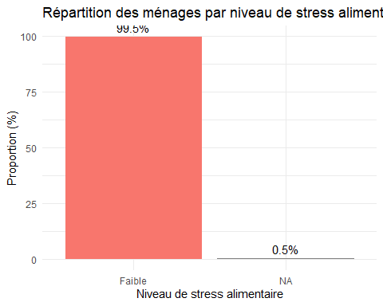

``````{=openxml}

<w:tbl xmlns:w="http://schemas.openxmlformats.org/wordprocessingml/2006/main" xmlns:r="http://schemas.openxmlformats.org/officeDocument/2006/relationships" xmlns:w14="http://schemas.microsoft.com/office/word/2010/wordml" xmlns:wp="http://schemas.openxmlformats.org/drawingml/2006/wordprocessingDrawing" xmlns:a="http://schemas.openxmlformats.org/drawingml/2006/main" xmlns:pic="http://schemas.openxmlformats.org/drawingml/2006/picture"><w:tblPr><w:tblLayout w:type="autofit"/><w:jc w:val="center"/><w:tblW w:type="pct" w:w="5000"/><w:tblLook w:firstRow="1" w:lastRow="0" w:firstColumn="0" w:lastColumn="0" w:noHBand="0" w:noVBand="1"/></w:tblPr><w:tr><w:trPr><w:trHeight w:val="360" w:hRule="auto"/></w:trPr>body1<w:tc><w:tcPr><w:tcBorders><w:bottom w:val="none" w:sz="0" w:space="0" w:color="000000"/><w:top w:val="none" w:sz="0" w:space="0" w:color="000000"/><w:left w:val="none" w:sz="0" w:space="0" w:color="000000"/><w:right w:val="none" w:sz="0" w:space="0" w:color="000000"/></w:tcBorders><w:shd w:val="clear" w:color="auto" w:fill="FFFFFF"/><w:tcMar><w:top w:w="0" w:type="dxa"/><w:bottom w:w="0" w:type="dxa"/><w:left w:w="0" w:type="dxa"/><w:right w:w="0" w:type="dxa"/></w:tcMar><w:vAlign w:val="center"/></w:tcPr><w:p><w:pPr><w:pStyle w:val="Normal"/><w:jc w:val="center"/><w:pBdr><w:bottom w:val="none" w:sz="0" w:space="0" w:color="000000"/><w:top w:val="none" w:sz="0" w:space="0" w:color="000000"/><w:left w:val="none" w:sz="0" w:space="0" w:color="000000"/><w:right w:val="none" w:sz="0" w:space="0" w:color="000000"/></w:pBdr><w:spacing w:after="100" w:before="100" w:line="240"/><w:ind w:left="100" w:right="100" w:firstLine="0" w:firstLineChars="0"/><w:rPr><w:rFonts w:ascii="Times New Roman" w:hAnsi="Times New Roman" w:eastAsia="Times New Roman" w:cs="Times New Roman"/><w:i w:val="false"/><w:b w:val="true"/><w:u w:val="none"/><w:sz w:val="28"/><w:szCs w:val="28"/><w:color w:val="000000"/></w:rPr></w:pPr><w:r xmlns:w="http://schemas.openxmlformats.org/wordprocessingml/2006/main" xmlns:wp="http://schemas.openxmlformats.org/drawingml/2006/wordprocessingDrawing" xmlns:r="http://schemas.openxmlformats.org/officeDocument/2006/relationships" xmlns:w14="http://schemas.microsoft.com/office/word/2010/wordml"><w:rPr><w:rFonts w:ascii="Times New Roman" w:hAnsi="Times New Roman" w:eastAsia="Times New Roman" w:cs="Times New Roman"/><w:i w:val="false"/><w:b w:val="true"/><w:u w:val="none"/><w:sz w:val="28"/><w:szCs w:val="28"/><w:color w:val="000000"/></w:rPr><w:t xml:space="preserve">REPUBLIQUE DU SENEGAL</w:t></w:r></w:p></w:tc></w:tr></w:tbl>
``````

|                                                     |
|:---------------------------------------------------:|
| {width="3cm" height="3cm"} |


``````{=openxml}

<w:tbl xmlns:w="http://schemas.openxmlformats.org/wordprocessingml/2006/main" xmlns:r="http://schemas.openxmlformats.org/officeDocument/2006/relationships" xmlns:w14="http://schemas.microsoft.com/office/word/2010/wordml" xmlns:wp="http://schemas.openxmlformats.org/drawingml/2006/wordprocessingDrawing" xmlns:a="http://schemas.openxmlformats.org/drawingml/2006/main" xmlns:pic="http://schemas.openxmlformats.org/drawingml/2006/picture"><w:tblPr><w:tblLayout w:type="autofit"/><w:jc w:val="center"/><w:tblW w:type="pct" w:w="5000"/><w:tblLook w:firstRow="1" w:lastRow="0" w:firstColumn="0" w:lastColumn="0" w:noHBand="0" w:noVBand="1"/></w:tblPr><w:tr><w:trPr><w:trHeight w:val="360" w:hRule="auto"/></w:trPr>body1<w:tc><w:tcPr><w:tcBorders><w:bottom w:val="none" w:sz="0" w:space="0" w:color="000000"/><w:top w:val="none" w:sz="0" w:space="0" w:color="000000"/><w:left w:val="none" w:sz="0" w:space="0" w:color="000000"/><w:right w:val="none" w:sz="0" w:space="0" w:color="000000"/></w:tcBorders><w:shd w:val="clear" w:color="auto" w:fill="FFFFFF"/><w:tcMar><w:top w:w="0" w:type="dxa"/><w:bottom w:w="0" w:type="dxa"/><w:left w:w="0" w:type="dxa"/><w:right w:w="0" w:type="dxa"/></w:tcMar><w:vAlign w:val="center"/></w:tcPr><w:p><w:pPr><w:pStyle w:val="Normal"/><w:jc w:val="center"/><w:pBdr><w:bottom w:val="none" w:sz="0" w:space="0" w:color="000000"/><w:top w:val="none" w:sz="0" w:space="0" w:color="000000"/><w:left w:val="none" w:sz="0" w:space="0" w:color="000000"/><w:right w:val="none" w:sz="0" w:space="0" w:color="000000"/></w:pBdr><w:spacing w:after="100" w:before="100" w:line="240"/><w:ind w:left="100" w:right="100" w:firstLine="0" w:firstLineChars="0"/><w:rPr><w:rFonts w:ascii="Times New Roman" w:hAnsi="Times New Roman" w:eastAsia="Times New Roman" w:cs="Times New Roman"/><w:i w:val="false"/><w:b w:val="true"/><w:u w:val="none"/><w:sz w:val="28"/><w:szCs w:val="28"/><w:color w:val="000000"/></w:rPr></w:pPr><w:r xmlns:w="http://schemas.openxmlformats.org/wordprocessingml/2006/main" xmlns:wp="http://schemas.openxmlformats.org/drawingml/2006/wordprocessingDrawing" xmlns:r="http://schemas.openxmlformats.org/officeDocument/2006/relationships" xmlns:w14="http://schemas.microsoft.com/office/word/2010/wordml"><w:rPr><w:rFonts w:ascii="Times New Roman" w:hAnsi="Times New Roman" w:eastAsia="Times New Roman" w:cs="Times New Roman"/><w:i w:val="false"/><w:b w:val="true"/><w:u w:val="none"/><w:sz w:val="28"/><w:szCs w:val="28"/><w:color w:val="000000"/></w:rPr><w:t xml:space="preserve">**********</w:t></w:r></w:p></w:tc></w:tr><w:tr><w:trPr><w:trHeight w:val="360" w:hRule="auto"/></w:trPr>body2<w:tc><w:tcPr><w:tcBorders><w:bottom w:val="none" w:sz="0" w:space="0" w:color="000000"/><w:top w:val="none" w:sz="0" w:space="0" w:color="000000"/><w:left w:val="none" w:sz="0" w:space="0" w:color="000000"/><w:right w:val="none" w:sz="0" w:space="0" w:color="000000"/></w:tcBorders><w:shd w:val="clear" w:color="auto" w:fill="FFFFFF"/><w:tcMar><w:top w:w="0" w:type="dxa"/><w:bottom w:w="0" w:type="dxa"/><w:left w:w="0" w:type="dxa"/><w:right w:w="0" w:type="dxa"/></w:tcMar><w:vAlign w:val="center"/></w:tcPr><w:p><w:pPr><w:pStyle w:val="Normal"/><w:jc w:val="center"/><w:pBdr><w:bottom w:val="none" w:sz="0" w:space="0" w:color="000000"/><w:top w:val="none" w:sz="0" w:space="0" w:color="000000"/><w:left w:val="none" w:sz="0" w:space="0" w:color="000000"/><w:right w:val="none" w:sz="0" w:space="0" w:color="000000"/></w:pBdr><w:spacing w:after="100" w:before="100" w:line="240"/><w:ind w:left="100" w:right="100" w:firstLine="0" w:firstLineChars="0"/><w:rPr><w:rFonts w:ascii="Times New Roman" w:hAnsi="Times New Roman" w:eastAsia="Times New Roman" w:cs="Times New Roman"/><w:i w:val="true"/><w:b w:val="true"/><w:u w:val="none"/><w:sz w:val="28"/><w:szCs w:val="28"/><w:color w:val="000000"/></w:rPr></w:pPr><w:r xmlns:w="http://schemas.openxmlformats.org/wordprocessingml/2006/main" xmlns:wp="http://schemas.openxmlformats.org/drawingml/2006/wordprocessingDrawing" xmlns:r="http://schemas.openxmlformats.org/officeDocument/2006/relationships" xmlns:w14="http://schemas.microsoft.com/office/word/2010/wordml"><w:rPr><w:rFonts w:ascii="Times New Roman" w:hAnsi="Times New Roman" w:eastAsia="Times New Roman" w:cs="Times New Roman"/><w:i w:val="true"/><w:b w:val="true"/><w:u w:val="none"/><w:sz w:val="28"/><w:szCs w:val="28"/><w:color w:val="000000"/></w:rPr><w:t xml:space="preserve">Un Peuple - Un But - Une Foi</w:t></w:r></w:p></w:tc></w:tr><w:tr><w:trPr><w:trHeight w:val="360" w:hRule="auto"/></w:trPr>body3<w:tc><w:tcPr><w:tcBorders><w:bottom w:val="none" w:sz="0" w:space="0" w:color="000000"/><w:top w:val="none" w:sz="0" w:space="0" w:color="000000"/><w:left w:val="none" w:sz="0" w:space="0" w:color="000000"/><w:right w:val="none" w:sz="0" w:space="0" w:color="000000"/></w:tcBorders><w:shd w:val="clear" w:color="auto" w:fill="FFFFFF"/><w:tcMar><w:top w:w="0" w:type="dxa"/><w:bottom w:w="0" w:type="dxa"/><w:left w:w="0" w:type="dxa"/><w:right w:w="0" w:type="dxa"/></w:tcMar><w:vAlign w:val="center"/></w:tcPr><w:p><w:pPr><w:pStyle w:val="Normal"/><w:jc w:val="center"/><w:pBdr><w:bottom w:val="none" w:sz="0" w:space="0" w:color="000000"/><w:top w:val="none" w:sz="0" w:space="0" w:color="000000"/><w:left w:val="none" w:sz="0" w:space="0" w:color="000000"/><w:right w:val="none" w:sz="0" w:space="0" w:color="000000"/></w:pBdr><w:spacing w:after="100" w:before="100" w:line="240"/><w:ind w:left="100" w:right="100" w:firstLine="0" w:firstLineChars="0"/><w:rPr><w:rFonts w:ascii="Times New Roman" w:hAnsi="Times New Roman" w:eastAsia="Times New Roman" w:cs="Times New Roman"/><w:i w:val="false"/><w:b w:val="true"/><w:u w:val="none"/><w:sz w:val="28"/><w:szCs w:val="28"/><w:color w:val="000000"/></w:rPr></w:pPr><w:r xmlns:w="http://schemas.openxmlformats.org/wordprocessingml/2006/main" xmlns:wp="http://schemas.openxmlformats.org/drawingml/2006/wordprocessingDrawing" xmlns:r="http://schemas.openxmlformats.org/officeDocument/2006/relationships" xmlns:w14="http://schemas.microsoft.com/office/word/2010/wordml"><w:rPr><w:rFonts w:ascii="Times New Roman" w:hAnsi="Times New Roman" w:eastAsia="Times New Roman" w:cs="Times New Roman"/><w:i w:val="false"/><w:b w:val="true"/><w:u w:val="none"/><w:sz w:val="28"/><w:szCs w:val="28"/><w:color w:val="000000"/></w:rPr><w:t xml:space="preserve">**********</w:t></w:r></w:p></w:tc></w:tr><w:tr><w:trPr><w:trHeight w:val="360" w:hRule="auto"/></w:trPr>body4<w:tc><w:tcPr><w:tcBorders><w:bottom w:val="none" w:sz="0" w:space="0" w:color="000000"/><w:top w:val="none" w:sz="0" w:space="0" w:color="000000"/><w:left w:val="none" w:sz="0" w:space="0" w:color="000000"/><w:right w:val="none" w:sz="0" w:space="0" w:color="000000"/></w:tcBorders><w:shd w:val="clear" w:color="auto" w:fill="FFFFFF"/><w:tcMar><w:top w:w="0" w:type="dxa"/><w:bottom w:w="0" w:type="dxa"/><w:left w:w="0" w:type="dxa"/><w:right w:w="0" w:type="dxa"/></w:tcMar><w:vAlign w:val="center"/></w:tcPr><w:p><w:pPr><w:pStyle w:val="Normal"/><w:jc w:val="center"/><w:pBdr><w:bottom w:val="none" w:sz="0" w:space="0" w:color="000000"/><w:top w:val="none" w:sz="0" w:space="0" w:color="000000"/><w:left w:val="none" w:sz="0" w:space="0" w:color="000000"/><w:right w:val="none" w:sz="0" w:space="0" w:color="000000"/></w:pBdr><w:spacing w:after="100" w:before="100" w:line="240"/><w:ind w:left="100" w:right="100" w:firstLine="0" w:firstLineChars="0"/><w:rPr><w:rFonts w:ascii="Times New Roman" w:hAnsi="Times New Roman" w:eastAsia="Times New Roman" w:cs="Times New Roman"/><w:i w:val="false"/><w:b w:val="true"/><w:u w:val="none"/><w:sz w:val="28"/><w:szCs w:val="28"/><w:color w:val="000000"/></w:rPr></w:pPr><w:r xmlns:w="http://schemas.openxmlformats.org/wordprocessingml/2006/main" xmlns:wp="http://schemas.openxmlformats.org/drawingml/2006/wordprocessingDrawing" xmlns:r="http://schemas.openxmlformats.org/officeDocument/2006/relationships" xmlns:w14="http://schemas.microsoft.com/office/word/2010/wordml"><w:rPr><w:rFonts w:ascii="Times New Roman" w:hAnsi="Times New Roman" w:eastAsia="Times New Roman" w:cs="Times New Roman"/><w:i w:val="false"/><w:b w:val="true"/><w:u w:val="none"/><w:sz w:val="28"/><w:szCs w:val="28"/><w:color w:val="000000"/></w:rPr><w:t xml:space="preserve">Agence nationale de la Statistique et de la démographie</w:t></w:r></w:p></w:tc></w:tr></w:tbl>
``````

|                                          |
|:----------------------------------------:|
| {width="3.5cm"} |


``````{=openxml}

<w:tbl xmlns:w="http://schemas.openxmlformats.org/wordprocessingml/2006/main" xmlns:r="http://schemas.openxmlformats.org/officeDocument/2006/relationships" xmlns:w14="http://schemas.microsoft.com/office/word/2010/wordml" xmlns:wp="http://schemas.openxmlformats.org/drawingml/2006/wordprocessingDrawing" xmlns:a="http://schemas.openxmlformats.org/drawingml/2006/main" xmlns:pic="http://schemas.openxmlformats.org/drawingml/2006/picture"><w:tblPr><w:tblLayout w:type="autofit"/><w:jc w:val="center"/><w:tblW w:type="pct" w:w="5000"/><w:tblLook w:firstRow="1" w:lastRow="0" w:firstColumn="0" w:lastColumn="0" w:noHBand="0" w:noVBand="1"/></w:tblPr><w:tr><w:trPr><w:trHeight w:val="360" w:hRule="auto"/></w:trPr>body1<w:tc><w:tcPr><w:tcBorders><w:bottom w:val="none" w:sz="0" w:space="0" w:color="000000"/><w:top w:val="none" w:sz="0" w:space="0" w:color="000000"/><w:left w:val="none" w:sz="0" w:space="0" w:color="000000"/><w:right w:val="none" w:sz="0" w:space="0" w:color="000000"/></w:tcBorders><w:shd w:val="clear" w:color="auto" w:fill="FFFFFF"/><w:tcMar><w:top w:w="0" w:type="dxa"/><w:bottom w:w="0" w:type="dxa"/><w:left w:w="0" w:type="dxa"/><w:right w:w="0" w:type="dxa"/></w:tcMar><w:vAlign w:val="center"/></w:tcPr><w:p><w:pPr><w:pStyle w:val="Normal"/><w:jc w:val="center"/><w:pBdr><w:bottom w:val="none" w:sz="0" w:space="0" w:color="000000"/><w:top w:val="none" w:sz="0" w:space="0" w:color="000000"/><w:left w:val="none" w:sz="0" w:space="0" w:color="000000"/><w:right w:val="none" w:sz="0" w:space="0" w:color="000000"/></w:pBdr><w:spacing w:after="100" w:before="100" w:line="240"/><w:ind w:left="100" w:right="100" w:firstLine="0" w:firstLineChars="0"/><w:rPr><w:rFonts w:ascii="Times New Roman" w:hAnsi="Times New Roman" w:eastAsia="Times New Roman" w:cs="Times New Roman"/><w:i w:val="false"/><w:b w:val="true"/><w:u w:val="none"/><w:sz w:val="28"/><w:szCs w:val="28"/><w:color w:val="000000"/></w:rPr></w:pPr><w:r xmlns:w="http://schemas.openxmlformats.org/wordprocessingml/2006/main" xmlns:wp="http://schemas.openxmlformats.org/drawingml/2006/wordprocessingDrawing" xmlns:r="http://schemas.openxmlformats.org/officeDocument/2006/relationships" xmlns:w14="http://schemas.microsoft.com/office/word/2010/wordml"><w:rPr><w:rFonts w:ascii="Times New Roman" w:hAnsi="Times New Roman" w:eastAsia="Times New Roman" w:cs="Times New Roman"/><w:i w:val="false"/><w:b w:val="true"/><w:u w:val="none"/><w:sz w:val="28"/><w:szCs w:val="28"/><w:color w:val="000000"/></w:rPr><w:t xml:space="preserve">**********</w:t></w:r></w:p></w:tc></w:tr><w:tr><w:trPr><w:trHeight w:val="360" w:hRule="auto"/></w:trPr>body2<w:tc><w:tcPr><w:tcBorders><w:bottom w:val="none" w:sz="0" w:space="0" w:color="000000"/><w:top w:val="none" w:sz="0" w:space="0" w:color="000000"/><w:left w:val="none" w:sz="0" w:space="0" w:color="000000"/><w:right w:val="none" w:sz="0" w:space="0" w:color="000000"/></w:tcBorders><w:shd w:val="clear" w:color="auto" w:fill="FFFFFF"/><w:tcMar><w:top w:w="0" w:type="dxa"/><w:bottom w:w="0" w:type="dxa"/><w:left w:w="0" w:type="dxa"/><w:right w:w="0" w:type="dxa"/></w:tcMar><w:vAlign w:val="center"/></w:tcPr><w:p><w:pPr><w:pStyle w:val="Normal"/><w:jc w:val="center"/><w:pBdr><w:bottom w:val="none" w:sz="0" w:space="0" w:color="000000"/><w:top w:val="none" w:sz="0" w:space="0" w:color="000000"/><w:left w:val="none" w:sz="0" w:space="0" w:color="000000"/><w:right w:val="none" w:sz="0" w:space="0" w:color="000000"/></w:pBdr><w:spacing w:after="100" w:before="100" w:line="240"/><w:ind w:left="100" w:right="100" w:firstLine="0" w:firstLineChars="0"/><w:rPr><w:rFonts w:ascii="Times New Roman" w:hAnsi="Times New Roman" w:eastAsia="Times New Roman" w:cs="Times New Roman"/><w:i w:val="false"/><w:b w:val="true"/><w:u w:val="none"/><w:sz w:val="28"/><w:szCs w:val="28"/><w:color w:val="000000"/></w:rPr></w:pPr><w:r xmlns:w="http://schemas.openxmlformats.org/wordprocessingml/2006/main" xmlns:wp="http://schemas.openxmlformats.org/drawingml/2006/wordprocessingDrawing" xmlns:r="http://schemas.openxmlformats.org/officeDocument/2006/relationships" xmlns:w14="http://schemas.microsoft.com/office/word/2010/wordml"><w:rPr><w:rFonts w:ascii="Times New Roman" w:hAnsi="Times New Roman" w:eastAsia="Times New Roman" w:cs="Times New Roman"/><w:i w:val="false"/><w:b w:val="true"/><w:u w:val="none"/><w:sz w:val="28"/><w:szCs w:val="28"/><w:color w:val="000000"/></w:rPr><w:t xml:space="preserve">Ecole nationale de la Statistique et de l'Analyse économique Pierre Ndiaye</w:t></w:r></w:p></w:tc></w:tr></w:tbl>
``````

|                                                       |
|:-----------------------------------------------------:|
| {width="2.5cm" height="2cm"} |

##### Projet statistique sur R : Evaluation


$$
$$


``````{=openxml}

<w:tbl xmlns:w="http://schemas.openxmlformats.org/wordprocessingml/2006/main" xmlns:r="http://schemas.openxmlformats.org/officeDocument/2006/relationships" xmlns:w14="http://schemas.microsoft.com/office/word/2010/wordml" xmlns:wp="http://schemas.openxmlformats.org/drawingml/2006/wordprocessingDrawing" xmlns:a="http://schemas.openxmlformats.org/drawingml/2006/main" xmlns:pic="http://schemas.openxmlformats.org/drawingml/2006/picture"><w:tblPr><w:tblLayout w:type="autofit"/><w:jc w:val="center"/><w:tblW w:type="pct" w:w="5000"/><w:tblLook w:firstRow="1" w:lastRow="0" w:firstColumn="0" w:lastColumn="0" w:noHBand="0" w:noVBand="1"/></w:tblPr><w:tr><w:trPr><w:trHeight w:val="360" w:hRule="auto"/></w:trPr>body1<w:tc><w:tcPr><w:tcBorders><w:bottom w:val="none" w:sz="0" w:space="0" w:color="000000"/><w:top w:val="none" w:sz="0" w:space="0" w:color="000000"/><w:left w:val="none" w:sz="0" w:space="0" w:color="000000"/><w:right w:val="none" w:sz="0" w:space="0" w:color="000000"/></w:tcBorders><w:shd w:val="clear" w:color="auto" w:fill="FFFFFF"/><w:tcMar><w:top w:w="0" w:type="dxa"/><w:bottom w:w="0" w:type="dxa"/><w:left w:w="0" w:type="dxa"/><w:right w:w="0" w:type="dxa"/></w:tcMar><w:vAlign w:val="center"/></w:tcPr><w:p><w:pPr><w:pStyle w:val="Normal"/><w:jc w:val="left"/><w:pBdr><w:bottom w:val="none" w:sz="0" w:space="0" w:color="000000"/><w:top w:val="none" w:sz="0" w:space="0" w:color="000000"/><w:left w:val="none" w:sz="0" w:space="0" w:color="000000"/><w:right w:val="none" w:sz="0" w:space="0" w:color="000000"/></w:pBdr><w:spacing w:after="100" w:before="100" w:line="240"/><w:ind w:left="100" w:right="100" w:firstLine="0" w:firstLineChars="0"/><w:rPr><w:rFonts w:ascii="Arial" w:hAnsi="Arial" w:eastAsia="Arial" w:cs="Arial"/><w:i w:val="false"/><w:b w:val="true"/><w:u w:val="none"/><w:sz w:val="22"/><w:szCs w:val="22"/><w:color w:val="000000"/></w:rPr></w:pPr><w:r xmlns:w="http://schemas.openxmlformats.org/wordprocessingml/2006/main" xmlns:wp="http://schemas.openxmlformats.org/drawingml/2006/wordprocessingDrawing" xmlns:r="http://schemas.openxmlformats.org/officeDocument/2006/relationships" xmlns:w14="http://schemas.microsoft.com/office/word/2010/wordml"><w:rPr><w:rFonts w:ascii="Arial" w:hAnsi="Arial" w:eastAsia="Arial" w:cs="Arial"/><w:i w:val="false"/><w:b w:val="true"/><w:u w:val="none"/><w:sz w:val="22"/><w:szCs w:val="22"/><w:color w:val="000000"/></w:rPr><w:t xml:space="preserve">Rédigé par</w:t></w:r></w:p></w:tc><w:tc><w:tcPr><w:tcBorders><w:bottom w:val="none" w:sz="0" w:space="0" w:color="000000"/><w:top w:val="none" w:sz="0" w:space="0" w:color="000000"/><w:left w:val="none" w:sz="0" w:space="0" w:color="000000"/><w:right w:val="none" w:sz="0" w:space="0" w:color="000000"/></w:tcBorders><w:shd w:val="clear" w:color="auto" w:fill="FFFFFF"/><w:tcMar><w:top w:w="0" w:type="dxa"/><w:bottom w:w="0" w:type="dxa"/><w:left w:w="0" w:type="dxa"/><w:right w:w="0" w:type="dxa"/></w:tcMar><w:vAlign w:val="center"/></w:tcPr><w:p><w:pPr><w:pStyle w:val="Normal"/><w:jc w:val="right"/><w:pBdr><w:bottom w:val="none" w:sz="0" w:space="0" w:color="000000"/><w:top w:val="none" w:sz="0" w:space="0" w:color="000000"/><w:left w:val="none" w:sz="0" w:space="0" w:color="000000"/><w:right w:val="none" w:sz="0" w:space="0" w:color="000000"/></w:pBdr><w:spacing w:after="100" w:before="100" w:line="240"/><w:ind w:left="100" w:right="100" w:firstLine="0" w:firstLineChars="0"/><w:rPr><w:rFonts w:ascii="Arial" w:hAnsi="Arial" w:eastAsia="Arial" w:cs="Arial"/><w:i w:val="false"/><w:b w:val="true"/><w:u w:val="none"/><w:sz w:val="22"/><w:szCs w:val="22"/><w:color w:val="000000"/></w:rPr></w:pPr><w:r xmlns:w="http://schemas.openxmlformats.org/wordprocessingml/2006/main" xmlns:wp="http://schemas.openxmlformats.org/drawingml/2006/wordprocessingDrawing" xmlns:r="http://schemas.openxmlformats.org/officeDocument/2006/relationships" xmlns:w14="http://schemas.microsoft.com/office/word/2010/wordml"><w:rPr><w:rFonts w:ascii="Arial" w:hAnsi="Arial" w:eastAsia="Arial" w:cs="Arial"/><w:i w:val="false"/><w:b w:val="true"/><w:u w:val="none"/><w:sz w:val="22"/><w:szCs w:val="22"/><w:color w:val="000000"/></w:rPr><w:t xml:space="preserve">Sous la supervision de</w:t></w:r></w:p></w:tc></w:tr><w:tr><w:trPr><w:trHeight w:val="360" w:hRule="auto"/></w:trPr>body2<w:tc><w:tcPr><w:tcBorders><w:bottom w:val="none" w:sz="0" w:space="0" w:color="000000"/><w:top w:val="none" w:sz="0" w:space="0" w:color="000000"/><w:left w:val="none" w:sz="0" w:space="0" w:color="000000"/><w:right w:val="none" w:sz="0" w:space="0" w:color="000000"/></w:tcBorders><w:shd w:val="clear" w:color="auto" w:fill="FFFFFF"/><w:tcMar><w:top w:w="0" w:type="dxa"/><w:bottom w:w="0" w:type="dxa"/><w:left w:w="0" w:type="dxa"/><w:right w:w="0" w:type="dxa"/></w:tcMar><w:vAlign w:val="center"/></w:tcPr><w:p><w:pPr><w:pStyle w:val="Normal"/><w:jc w:val="left"/><w:pBdr><w:bottom w:val="none" w:sz="0" w:space="0" w:color="000000"/><w:top w:val="none" w:sz="0" w:space="0" w:color="000000"/><w:left w:val="none" w:sz="0" w:space="0" w:color="000000"/><w:right w:val="none" w:sz="0" w:space="0" w:color="000000"/></w:pBdr><w:spacing w:after="100" w:before="100" w:line="240"/><w:ind w:left="100" w:right="100" w:firstLine="0" w:firstLineChars="0"/><w:rPr><w:rFonts w:ascii="Arial" w:hAnsi="Arial" w:eastAsia="Arial" w:cs="Arial"/><w:i w:val="false"/><w:b w:val="false"/><w:u w:val="none"/><w:sz w:val="22"/><w:szCs w:val="22"/><w:color w:val="000000"/></w:rPr></w:pPr><w:r xmlns:w="http://schemas.openxmlformats.org/wordprocessingml/2006/main" xmlns:wp="http://schemas.openxmlformats.org/drawingml/2006/wordprocessingDrawing" xmlns:r="http://schemas.openxmlformats.org/officeDocument/2006/relationships" xmlns:w14="http://schemas.microsoft.com/office/word/2010/wordml"><w:rPr><w:rFonts w:ascii="Arial" w:hAnsi="Arial" w:eastAsia="Arial" w:cs="Arial"/><w:i w:val="false"/><w:b w:val="false"/><w:u w:val="none"/><w:sz w:val="22"/><w:szCs w:val="22"/><w:color w:val="000000"/></w:rPr><w:t xml:space="preserve">ZINABA Albert</w:t></w:r></w:p></w:tc><w:tc><w:tcPr><w:tcBorders><w:bottom w:val="none" w:sz="0" w:space="0" w:color="000000"/><w:top w:val="none" w:sz="0" w:space="0" w:color="000000"/><w:left w:val="none" w:sz="0" w:space="0" w:color="000000"/><w:right w:val="none" w:sz="0" w:space="0" w:color="000000"/></w:tcBorders><w:shd w:val="clear" w:color="auto" w:fill="FFFFFF"/><w:tcMar><w:top w:w="0" w:type="dxa"/><w:bottom w:w="0" w:type="dxa"/><w:left w:w="0" w:type="dxa"/><w:right w:w="0" w:type="dxa"/></w:tcMar><w:vAlign w:val="center"/></w:tcPr><w:p><w:pPr><w:pStyle w:val="Normal"/><w:jc w:val="right"/><w:pBdr><w:bottom w:val="none" w:sz="0" w:space="0" w:color="000000"/><w:top w:val="none" w:sz="0" w:space="0" w:color="000000"/><w:left w:val="none" w:sz="0" w:space="0" w:color="000000"/><w:right w:val="none" w:sz="0" w:space="0" w:color="000000"/></w:pBdr><w:spacing w:after="100" w:before="100" w:line="240"/><w:ind w:left="100" w:right="100" w:firstLine="0" w:firstLineChars="0"/><w:rPr><w:rFonts w:ascii="Arial" w:hAnsi="Arial" w:eastAsia="Arial" w:cs="Arial"/><w:i w:val="false"/><w:b w:val="false"/><w:u w:val="none"/><w:sz w:val="22"/><w:szCs w:val="22"/><w:color w:val="000000"/></w:rPr></w:pPr><w:r xmlns:w="http://schemas.openxmlformats.org/wordprocessingml/2006/main" xmlns:wp="http://schemas.openxmlformats.org/drawingml/2006/wordprocessingDrawing" xmlns:r="http://schemas.openxmlformats.org/officeDocument/2006/relationships" xmlns:w14="http://schemas.microsoft.com/office/word/2010/wordml"><w:rPr><w:rFonts w:ascii="Arial" w:hAnsi="Arial" w:eastAsia="Arial" w:cs="Arial"/><w:i w:val="false"/><w:b w:val="false"/><w:u w:val="none"/><w:sz w:val="22"/><w:szCs w:val="22"/><w:color w:val="000000"/></w:rPr><w:t xml:space="preserve">M. Aboubacar HEMA</w:t></w:r></w:p></w:tc></w:tr><w:tr><w:trPr><w:trHeight w:val="360" w:hRule="auto"/></w:trPr>body3<w:tc><w:tcPr><w:tcBorders><w:bottom w:val="none" w:sz="0" w:space="0" w:color="000000"/><w:top w:val="none" w:sz="0" w:space="0" w:color="000000"/><w:left w:val="none" w:sz="0" w:space="0" w:color="000000"/><w:right w:val="none" w:sz="0" w:space="0" w:color="000000"/></w:tcBorders><w:shd w:val="clear" w:color="auto" w:fill="FFFFFF"/><w:tcMar><w:top w:w="0" w:type="dxa"/><w:bottom w:w="0" w:type="dxa"/><w:left w:w="0" w:type="dxa"/><w:right w:w="0" w:type="dxa"/></w:tcMar><w:vAlign w:val="center"/></w:tcPr><w:p><w:pPr><w:pStyle w:val="Normal"/><w:jc w:val="left"/><w:pBdr><w:bottom w:val="none" w:sz="0" w:space="0" w:color="000000"/><w:top w:val="none" w:sz="0" w:space="0" w:color="000000"/><w:left w:val="none" w:sz="0" w:space="0" w:color="000000"/><w:right w:val="none" w:sz="0" w:space="0" w:color="000000"/></w:pBdr><w:spacing w:after="100" w:before="100" w:line="240"/><w:ind w:left="100" w:right="100" w:firstLine="0" w:firstLineChars="0"/><w:rPr><w:rFonts w:ascii="Arial" w:hAnsi="Arial" w:eastAsia="Arial" w:cs="Arial"/><w:i w:val="true"/><w:b w:val="false"/><w:u w:val="none"/><w:sz w:val="22"/><w:szCs w:val="22"/><w:color w:val="000000"/></w:rPr></w:pPr><w:r xmlns:w="http://schemas.openxmlformats.org/wordprocessingml/2006/main" xmlns:wp="http://schemas.openxmlformats.org/drawingml/2006/wordprocessingDrawing" xmlns:r="http://schemas.openxmlformats.org/officeDocument/2006/relationships" xmlns:w14="http://schemas.microsoft.com/office/word/2010/wordml"><w:rPr><w:rFonts w:ascii="Arial" w:hAnsi="Arial" w:eastAsia="Arial" w:cs="Arial"/><w:i w:val="true"/><w:b w:val="false"/><w:u w:val="none"/><w:sz w:val="22"/><w:szCs w:val="22"/><w:color w:val="000000"/></w:rPr><w:t xml:space="preserve">Élève Ingénieur Statisticien Économiste</w:t></w:r></w:p></w:tc><w:tc><w:tcPr><w:tcBorders><w:bottom w:val="none" w:sz="0" w:space="0" w:color="000000"/><w:top w:val="none" w:sz="0" w:space="0" w:color="000000"/><w:left w:val="none" w:sz="0" w:space="0" w:color="000000"/><w:right w:val="none" w:sz="0" w:space="0" w:color="000000"/></w:tcBorders><w:shd w:val="clear" w:color="auto" w:fill="FFFFFF"/><w:tcMar><w:top w:w="0" w:type="dxa"/><w:bottom w:w="0" w:type="dxa"/><w:left w:w="0" w:type="dxa"/><w:right w:w="0" w:type="dxa"/></w:tcMar><w:vAlign w:val="center"/></w:tcPr><w:p><w:pPr><w:pStyle w:val="Normal"/><w:jc w:val="right"/><w:pBdr><w:bottom w:val="none" w:sz="0" w:space="0" w:color="000000"/><w:top w:val="none" w:sz="0" w:space="0" w:color="000000"/><w:left w:val="none" w:sz="0" w:space="0" w:color="000000"/><w:right w:val="none" w:sz="0" w:space="0" w:color="000000"/></w:pBdr><w:spacing w:after="100" w:before="100" w:line="240"/><w:ind w:left="100" w:right="100" w:firstLine="0" w:firstLineChars="0"/><w:rPr><w:rFonts w:ascii="Arial" w:hAnsi="Arial" w:eastAsia="Arial" w:cs="Arial"/><w:i w:val="true"/><w:b w:val="false"/><w:u w:val="none"/><w:sz w:val="22"/><w:szCs w:val="22"/><w:color w:val="000000"/></w:rPr></w:pPr><w:r xmlns:w="http://schemas.openxmlformats.org/wordprocessingml/2006/main" xmlns:wp="http://schemas.openxmlformats.org/drawingml/2006/wordprocessingDrawing" xmlns:r="http://schemas.openxmlformats.org/officeDocument/2006/relationships" xmlns:w14="http://schemas.microsoft.com/office/word/2010/wordml"><w:rPr><w:rFonts w:ascii="Arial" w:hAnsi="Arial" w:eastAsia="Arial" w:cs="Arial"/><w:i w:val="true"/><w:b w:val="false"/><w:u w:val="none"/><w:sz w:val="22"/><w:szCs w:val="22"/><w:color w:val="000000"/></w:rPr><w:t xml:space="preserve">Data-scientist</w:t></w:r></w:p></w:tc></w:tr></w:tbl>
``````

|                                |
|:------------------------------:|
| **Année académique 2024-2025** |


\newpage


###### Introduction 

<!--Création des fonctions qui sernt utilisé par suite-->

Nous definition cette qui serviera à résumer rapidement la structure d’un tableau de données  


# Analyse des consitence des bases de données 

<!--Importation des bases-->

## importation des bases de données

Nous importons les donnees afin de mieux comprendre leur structure et leur composition? Pour ce faire nous utilisons la fonction read_dta du package haven car les base sont en format stata.


## Nettoyage des bases 

Nous nettoyons les noms de variables des bases Base_Individus et Base_Principale à l’aide de la fonction clean_names() du package janitor, afin de les rendre plus cohérents et compatibles avec les conventions de nommage.


##** Structure des bases de données**

Pour une meilleur traitement et etude de nos base de données il est iportation de voir leur sructure. Pour ce faire a travers la fonction str du package 'utils' nous affichons les structures des deux bases de données.


 
 Ici nous aussi utiliosons la fobction description_base defini plus haut pour afin d'avoir une breve description des deux bases de données.
 

```
La base Individus contient 144 variables sur 22092 individus.
Parmi les variables, on trouve : 9 variable(s) du type character, 2 variable(s) du type Date, 60 variable(s) du type haven_labelled, 73 variable(s) du type numeric.
```

```
La base principale contient 1312 variables sur 3058 individus.
Parmi les variables, on trouve : 53 variable(s) du type character, 2 variable(s) du type Date, 362 variable(s) du type haven_labelled, 895 variable(s) du type numeric.
```

## Vérification et suppressions des colonnes ou lignes vides

Pour ce faire nous verifions d'abord le nombre de ligne et de colonne dans les deux bases avant supression afin de pouvoir se faire une idée globale des deux bases. 


```
[1] 144
```

```
[1] 22092
```

```
[1] 1312
```

```
[1] 3058
```
Nous nettoyons maintenant les bases Base_Individus et Base_Principale à l’aide de la fonction remove_empty() du package janitor, afin de supprimer les colonnes entièrement vides puis les lignes entièrement vides. Cela garantit que seules les observations et variables contenant des informations sont conservées pour l’analyse.


```
[1] 1312
```

```
[1] 3058
```


Les bases **Individus et Principale ** contiennent respectivement 0 et 68 colonnes vides et 0 et 0 lignes vides.


## Vérifications des doublons 

Dans un souci d’assurer la qualité des données, nous avons procédé à la détection et à la suppression des doublons dans les bases utilisées. La fonction get_dupes() du package janitor a d’abord permis d’identifier les éventuelles lignes dupliquées dans les bases Base_Individus et Base_Principale.


```
Le nombre de doublons trouvés dans Base_Individus est : 0 
```

```
Le nombre de doublons trouvés dans Base_Principale est : 0 
```


## **Vérifications des valeurs manquantes**


```
Nombre total de variables avec des valeurs manquantes dans Base_Principale : 1133 
```

```
Nombre total de variables avec des valeurs manquantes dans Base_Individus : 128 
```

\newpage

# Analyse socio-economique des deplaces internes

## Pyramide des ages des individus

Creons une pyramide des ages des indivius
<!-- -->

La pyramide révèle une population jeune, typique des contextes de crise humanitaire, avec une base large (forte proportion de 0-20 ans) et un rétrécissement marqué après 50 ans. On note un déséquilibre de genre chez les 25-45 ans, tandis que les seniors montrent une surreprésentation féminine.


## Creations de tableau


```{=openxml}
<w:tbl xmlns:w="http://schemas.openxmlformats.org/wordprocessingml/2006/main" xmlns:wp="http://schemas.openxmlformats.org/drawingml/2006/wordprocessingDrawing" xmlns:r="http://schemas.openxmlformats.org/officeDocument/2006/relationships" xmlns:w14="http://schemas.microsoft.com/office/word/2010/wordml"><w:tblPr><w:tblCellMar><w:top w:w="0" w:type="dxa"></w:top><w:bottom w:w="0" w:type="dxa"></w:bottom><w:start w:w="60" w:type="dxa"></w:start><w:end w:w="60" w:type="dxa"></w:end></w:tblCellMar><w:tblW w:type="auto" w:w="0"></w:tblW><w:tblLook w:firstRow="0" w:lastRow="0" w:firstColumn="0" w:lastColumn="0" w:noHBand="0" w:noVBand="0"></w:tblLook><w:jc w:val="center"></w:jc></w:tblPr><w:tr><w:trPr><w:cantSplit></w:cantSplit><w:tblHeader></w:tblHeader></w:trPr><w:tc><w:tcPr><w:tcBorders><w:top w:val="single" w:sz="16" w:space="0" w:color="D3D3D3"></w:top><w:bottom w:val="single" w:sz="16" w:space="0" w:color="D3D3D3"></w:bottom><w:start w:val="single" w:space="0" w:color="D3D3D3"></w:start></w:tcBorders></w:tcPr><w:p>
  <w:pPr>
    <w:spacing w:before="0" w:after="60"/>
    <w:keepNext/>
    <w:jc w:val="start"/>
  </w:pPr>
  <w:r>
    <w:rPr>
      <w:b w:val="true"/>
      <w:rFonts w:ascii="Calibri" w:hAnsi="Calibri"/>
      <w:sz w:val="20"/>
    </w:rPr>
    <w:t xml:space="preserve">Caracteristique du chef de menage</w:t>
  </w:r>
</w:p></w:tc><w:tc><w:tcPr><w:tcBorders><w:top w:val="single" w:sz="16" w:space="0" w:color="D3D3D3"></w:top><w:bottom w:val="single" w:sz="16" w:space="0" w:color="D3D3D3"></w:bottom></w:tcBorders></w:tcPr><w:p>
  <w:pPr>
    <w:spacing w:before="0" w:after="60"/>
    <w:keepNext/>
    <w:jc w:val="center"/>
  </w:pPr>
  <w:r>
    <w:rPr>
      <w:b w:val="true"/>
      <w:rFonts w:ascii="Calibri" w:hAnsi="Calibri"/>
      <w:sz w:val="20"/>
    </w:rPr>
    <w:t xml:space="preserve">Host community North</w:t>
  </w:r>
  <w:r>
    <w:rPr>
      <w:rFonts w:ascii="Calibri" w:hAnsi="Calibri"/>
      <w:sz w:val="20"/>
    </w:rPr>
    <w:t xml:space="preserve"/>
  </w:r>
  <w:r xmlns:w="http://schemas.openxmlformats.org/wordprocessingml/2006/main">
    <w:rPr>
      <w:rFonts w:ascii="Calibri" w:hAnsi="Calibri"/>
      <w:sz w:val="20"/>
    </w:rPr>
    <w:t xml:space="preserve"> </w:t>
  </w:r>
  <w:r>
    <w:rPr>
      <w:rFonts w:ascii="Calibri" w:hAnsi="Calibri"/>
      <w:sz w:val="20"/>
    </w:rPr>
    <w:t xml:space="preserve">N = 988</w:t>
  </w:r>
  <w:r>
    <w:rPr>
      <w:vertAlign w:val="superscript"/>
      <w:i/>
      <w:rFonts w:ascii="Calibri" w:hAnsi="Calibri"/>
      <w:sz w:val="20"/>
    </w:rPr>
    <w:t xml:space="default">1</w:t>
  </w:r>
</w:p></w:tc><w:tc><w:tcPr><w:tcBorders><w:top w:val="single" w:sz="16" w:space="0" w:color="D3D3D3"></w:top><w:bottom w:val="single" w:sz="16" w:space="0" w:color="D3D3D3"></w:bottom></w:tcBorders></w:tcPr><w:p>
  <w:pPr>
    <w:spacing w:before="0" w:after="60"/>
    <w:keepNext/>
    <w:jc w:val="center"/>
  </w:pPr>
  <w:r>
    <w:rPr>
      <w:b w:val="true"/>
      <w:rFonts w:ascii="Calibri" w:hAnsi="Calibri"/>
      <w:sz w:val="20"/>
    </w:rPr>
    <w:t xml:space="preserve">Refugees</w:t>
  </w:r>
  <w:r>
    <w:rPr>
      <w:rFonts w:ascii="Calibri" w:hAnsi="Calibri"/>
      <w:sz w:val="20"/>
    </w:rPr>
    <w:t xml:space="preserve"/>
  </w:r>
  <w:r xmlns:w="http://schemas.openxmlformats.org/wordprocessingml/2006/main">
    <w:rPr>
      <w:rFonts w:ascii="Calibri" w:hAnsi="Calibri"/>
      <w:sz w:val="20"/>
    </w:rPr>
    <w:t xml:space="preserve"> </w:t>
  </w:r>
  <w:r>
    <w:rPr>
      <w:rFonts w:ascii="Calibri" w:hAnsi="Calibri"/>
      <w:sz w:val="20"/>
    </w:rPr>
    <w:t xml:space="preserve">N = 2,061</w:t>
  </w:r>
  <w:r>
    <w:rPr>
      <w:vertAlign w:val="superscript"/>
      <w:i/>
      <w:rFonts w:ascii="Calibri" w:hAnsi="Calibri"/>
      <w:sz w:val="20"/>
    </w:rPr>
    <w:t xml:space="default">1</w:t>
  </w:r>
</w:p></w:tc><w:tc><w:tcPr><w:tcBorders><w:top w:val="single" w:sz="16" w:space="0" w:color="D3D3D3"></w:top><w:bottom w:val="single" w:sz="16" w:space="0" w:color="D3D3D3"></w:bottom><w:end w:val="single" w:space="0" w:color="D3D3D3"></w:end></w:tcBorders></w:tcPr><w:p>
  <w:pPr>
    <w:spacing w:before="0" w:after="60"/>
    <w:keepNext/>
    <w:jc w:val="center"/>
  </w:pPr>
  <w:r>
    <w:rPr>
      <w:b w:val="true"/>
      <w:rFonts w:ascii="Calibri" w:hAnsi="Calibri"/>
      <w:sz w:val="20"/>
    </w:rPr>
    <w:t xml:space="preserve">p-value</w:t>
  </w:r>
  <w:r>
    <w:rPr>
      <w:vertAlign w:val="superscript"/>
      <w:i/>
      <w:rFonts w:ascii="Calibri" w:hAnsi="Calibri"/>
      <w:sz w:val="20"/>
    </w:rPr>
    <w:t xml:space="default">2</w:t>
  </w:r>
</w:p></w:tc></w:tr><w:tr><w:trPr><w:cantSplit></w:cantSplit></w:trPr><w:tc><w:tcPr><w:tcBorders><w:top w:val="single" w:space="0" w:color="D3D3D3"></w:top><w:bottom w:val="single" w:space="0" w:color="D3D3D3"></w:bottom><w:start w:val="single" w:space="0" w:color="D3D3D3"></w:start><w:end w:val="single" w:space="0" w:color="D3D3D3"></w:end></w:tcBorders></w:tcPr><w:p>
  <w:pPr>
    <w:spacing w:before="0" w:after="60"/>
    <w:keepNext/>
    <w:jc w:val="start"/>
  </w:pPr>
  <w:r>
    <w:rPr>
      <w:rFonts w:ascii="Calibri" w:hAnsi="Calibri"/>
      <w:sz w:val="20"/>
      <w:b w:val="true"/>
    </w:rPr>
    <w:t xml:space="default">ageYears</w:t>
  </w:r>
</w:p></w:tc><w:tc><w:tcPr><w:tcBorders><w:top w:val="single" w:space="0" w:color="D3D3D3"></w:top><w:bottom w:val="single" w:space="0" w:color="D3D3D3"></w:bottom><w:start w:val="single" w:space="0" w:color="D3D3D3"></w:start><w:end w:val="single" w:space="0" w:color="D3D3D3"></w:end></w:tcBorders></w:tcPr><w:p>
  <w:pPr>
    <w:spacing w:before="0" w:after="60"/>
    <w:keepNext/>
    <w:jc w:val="center"/>
  </w:pPr>
  <w:r>
    <w:rPr>
      <w:rFonts w:ascii="Calibri" w:hAnsi="Calibri"/>
      <w:sz w:val="20"/>
    </w:rPr>
    <w:t xml:space="default">42 (19, 61)</w:t>
  </w:r>
</w:p></w:tc><w:tc><w:tcPr><w:tcBorders><w:top w:val="single" w:space="0" w:color="D3D3D3"></w:top><w:bottom w:val="single" w:space="0" w:color="D3D3D3"></w:bottom><w:start w:val="single" w:space="0" w:color="D3D3D3"></w:start><w:end w:val="single" w:space="0" w:color="D3D3D3"></w:end></w:tcBorders></w:tcPr><w:p>
  <w:pPr>
    <w:spacing w:before="0" w:after="60"/>
    <w:keepNext/>
    <w:jc w:val="center"/>
  </w:pPr>
  <w:r>
    <w:rPr>
      <w:rFonts w:ascii="Calibri" w:hAnsi="Calibri"/>
      <w:sz w:val="20"/>
    </w:rPr>
    <w:t xml:space="default">42 (17, 61)</w:t>
  </w:r>
</w:p></w:tc><w:tc><w:tcPr><w:tcBorders><w:top w:val="single" w:space="0" w:color="D3D3D3"></w:top><w:bottom w:val="single" w:space="0" w:color="D3D3D3"></w:bottom><w:start w:val="single" w:space="0" w:color="D3D3D3"></w:start><w:end w:val="single" w:space="0" w:color="D3D3D3"></w:end></w:tcBorders></w:tcPr><w:p>
  <w:pPr>
    <w:spacing w:before="0" w:after="60"/>
    <w:keepNext/>
    <w:jc w:val="center"/>
  </w:pPr>
  <w:r>
    <w:rPr>
      <w:rFonts w:ascii="Calibri" w:hAnsi="Calibri"/>
      <w:sz w:val="20"/>
    </w:rPr>
    <w:t xml:space="default">&gt;0.9</w:t>
  </w:r>
</w:p></w:tc></w:tr>
<w:tr><w:trPr><w:cantSplit></w:cantSplit></w:trPr><w:tc><w:tcPr><w:tcBorders><w:top w:val="single" w:space="0" w:color="D3D3D3"></w:top><w:bottom w:val="single" w:space="0" w:color="D3D3D3"></w:bottom><w:start w:val="single" w:space="0" w:color="D3D3D3"></w:start><w:end w:val="single" w:space="0" w:color="D3D3D3"></w:end></w:tcBorders></w:tcPr><w:p>
  <w:pPr>
    <w:spacing w:before="0" w:after="60"/>
    <w:keepNext/>
    <w:jc w:val="start"/>
  </w:pPr>
  <w:r>
    <w:rPr>
      <w:rFonts w:ascii="Calibri" w:hAnsi="Calibri"/>
      <w:sz w:val="20"/>
      <w:b w:val="true"/>
    </w:rPr>
    <w:t xml:space="default">Sex</w:t>
  </w:r>
</w:p></w:tc><w:tc><w:tcPr><w:tcBorders><w:top w:val="single" w:space="0" w:color="D3D3D3"></w:top><w:bottom w:val="single" w:space="0" w:color="D3D3D3"></w:bottom><w:start w:val="single" w:space="0" w:color="D3D3D3"></w:start><w:end w:val="single" w:space="0" w:color="D3D3D3"></w:end></w:tcBorders></w:tcPr><w:p>
  <w:pPr>
    <w:spacing w:before="0" w:after="60"/>
    <w:keepNext/>
    <w:jc w:val="center"/>
  </w:pPr>
  <w:r>
    <w:rPr>
      <w:rFonts w:ascii="Calibri" w:hAnsi="Calibri"/>
      <w:sz w:val="20"/>
    </w:rPr>
    <w:t xml:space="default"/>
  </w:r>
</w:p></w:tc><w:tc><w:tcPr><w:tcBorders><w:top w:val="single" w:space="0" w:color="D3D3D3"></w:top><w:bottom w:val="single" w:space="0" w:color="D3D3D3"></w:bottom><w:start w:val="single" w:space="0" w:color="D3D3D3"></w:start><w:end w:val="single" w:space="0" w:color="D3D3D3"></w:end></w:tcBorders></w:tcPr><w:p>
  <w:pPr>
    <w:spacing w:before="0" w:after="60"/>
    <w:keepNext/>
    <w:jc w:val="center"/>
  </w:pPr>
  <w:r>
    <w:rPr>
      <w:rFonts w:ascii="Calibri" w:hAnsi="Calibri"/>
      <w:sz w:val="20"/>
    </w:rPr>
    <w:t xml:space="default"/>
  </w:r>
</w:p></w:tc><w:tc><w:tcPr><w:tcBorders><w:top w:val="single" w:space="0" w:color="D3D3D3"></w:top><w:bottom w:val="single" w:space="0" w:color="D3D3D3"></w:bottom><w:start w:val="single" w:space="0" w:color="D3D3D3"></w:start><w:end w:val="single" w:space="0" w:color="D3D3D3"></w:end></w:tcBorders></w:tcPr><w:p>
  <w:pPr>
    <w:spacing w:before="0" w:after="60"/>
    <w:keepNext/>
    <w:jc w:val="center"/>
  </w:pPr>
  <w:r>
    <w:rPr>
      <w:rFonts w:ascii="Calibri" w:hAnsi="Calibri"/>
      <w:sz w:val="20"/>
    </w:rPr>
    <w:t xml:space="default">&lt;0.001</w:t>
  </w:r>
</w:p></w:tc></w:tr>
<w:tr><w:trPr><w:cantSplit></w:cantSplit></w:trPr><w:tc><w:tcPr><w:tcBorders><w:top w:val="single" w:space="0" w:color="D3D3D3"></w:top><w:bottom w:val="single" w:space="0" w:color="D3D3D3"></w:bottom><w:start w:val="single" w:space="0" w:color="D3D3D3"></w:start><w:end w:val="single" w:space="0" w:color="D3D3D3"></w:end></w:tcBorders></w:tcPr><w:p>
  <w:pPr>
    <w:spacing w:before="0" w:after="60"/>
    <w:keepNext/>
    <w:jc w:val="start"/>
  </w:pPr>
  <w:r>
    <w:rPr>
      <w:rFonts w:ascii="Calibri" w:hAnsi="Calibri"/>
      <w:sz w:val="20"/>
    </w:rPr>
    <w:t xml:space="default">    Male</w:t>
  </w:r>
</w:p></w:tc><w:tc><w:tcPr><w:tcBorders><w:top w:val="single" w:space="0" w:color="D3D3D3"></w:top><w:bottom w:val="single" w:space="0" w:color="D3D3D3"></w:bottom><w:start w:val="single" w:space="0" w:color="D3D3D3"></w:start><w:end w:val="single" w:space="0" w:color="D3D3D3"></w:end></w:tcBorders></w:tcPr><w:p>
  <w:pPr>
    <w:spacing w:before="0" w:after="60"/>
    <w:keepNext/>
    <w:jc w:val="center"/>
  </w:pPr>
  <w:r>
    <w:rPr>
      <w:rFonts w:ascii="Calibri" w:hAnsi="Calibri"/>
      <w:sz w:val="20"/>
    </w:rPr>
    <w:t xml:space="default">623 (63.1%)</w:t>
  </w:r>
</w:p></w:tc><w:tc><w:tcPr><w:tcBorders><w:top w:val="single" w:space="0" w:color="D3D3D3"></w:top><w:bottom w:val="single" w:space="0" w:color="D3D3D3"></w:bottom><w:start w:val="single" w:space="0" w:color="D3D3D3"></w:start><w:end w:val="single" w:space="0" w:color="D3D3D3"></w:end></w:tcBorders></w:tcPr><w:p>
  <w:pPr>
    <w:spacing w:before="0" w:after="60"/>
    <w:keepNext/>
    <w:jc w:val="center"/>
  </w:pPr>
  <w:r>
    <w:rPr>
      <w:rFonts w:ascii="Calibri" w:hAnsi="Calibri"/>
      <w:sz w:val="20"/>
    </w:rPr>
    <w:t xml:space="default">1,117 (54.2%)</w:t>
  </w:r>
</w:p></w:tc><w:tc><w:tcPr><w:tcBorders><w:top w:val="single" w:space="0" w:color="D3D3D3"></w:top><w:bottom w:val="single" w:space="0" w:color="D3D3D3"></w:bottom><w:start w:val="single" w:space="0" w:color="D3D3D3"></w:start><w:end w:val="single" w:space="0" w:color="D3D3D3"></w:end></w:tcBorders></w:tcPr><w:p>
  <w:pPr>
    <w:spacing w:before="0" w:after="60"/>
    <w:keepNext/>
    <w:jc w:val="center"/>
  </w:pPr>
  <w:r>
    <w:rPr>
      <w:rFonts w:ascii="Calibri" w:hAnsi="Calibri"/>
      <w:sz w:val="20"/>
    </w:rPr>
    <w:t xml:space="default"/>
  </w:r>
</w:p></w:tc></w:tr>
<w:tr><w:trPr><w:cantSplit></w:cantSplit></w:trPr><w:tc><w:tcPr><w:tcBorders><w:top w:val="single" w:space="0" w:color="D3D3D3"></w:top><w:bottom w:val="single" w:space="0" w:color="D3D3D3"></w:bottom><w:start w:val="single" w:space="0" w:color="D3D3D3"></w:start><w:end w:val="single" w:space="0" w:color="D3D3D3"></w:end></w:tcBorders></w:tcPr><w:p>
  <w:pPr>
    <w:spacing w:before="0" w:after="60"/>
    <w:keepNext/>
    <w:jc w:val="start"/>
  </w:pPr>
  <w:r>
    <w:rPr>
      <w:rFonts w:ascii="Calibri" w:hAnsi="Calibri"/>
      <w:sz w:val="20"/>
    </w:rPr>
    <w:t xml:space="default">    Female</w:t>
  </w:r>
</w:p></w:tc><w:tc><w:tcPr><w:tcBorders><w:top w:val="single" w:space="0" w:color="D3D3D3"></w:top><w:bottom w:val="single" w:space="0" w:color="D3D3D3"></w:bottom><w:start w:val="single" w:space="0" w:color="D3D3D3"></w:start><w:end w:val="single" w:space="0" w:color="D3D3D3"></w:end></w:tcBorders></w:tcPr><w:p>
  <w:pPr>
    <w:spacing w:before="0" w:after="60"/>
    <w:keepNext/>
    <w:jc w:val="center"/>
  </w:pPr>
  <w:r>
    <w:rPr>
      <w:rFonts w:ascii="Calibri" w:hAnsi="Calibri"/>
      <w:sz w:val="20"/>
    </w:rPr>
    <w:t xml:space="default">365 (36.9%)</w:t>
  </w:r>
</w:p></w:tc><w:tc><w:tcPr><w:tcBorders><w:top w:val="single" w:space="0" w:color="D3D3D3"></w:top><w:bottom w:val="single" w:space="0" w:color="D3D3D3"></w:bottom><w:start w:val="single" w:space="0" w:color="D3D3D3"></w:start><w:end w:val="single" w:space="0" w:color="D3D3D3"></w:end></w:tcBorders></w:tcPr><w:p>
  <w:pPr>
    <w:spacing w:before="0" w:after="60"/>
    <w:keepNext/>
    <w:jc w:val="center"/>
  </w:pPr>
  <w:r>
    <w:rPr>
      <w:rFonts w:ascii="Calibri" w:hAnsi="Calibri"/>
      <w:sz w:val="20"/>
    </w:rPr>
    <w:t xml:space="default">942 (45.8%)</w:t>
  </w:r>
</w:p></w:tc><w:tc><w:tcPr><w:tcBorders><w:top w:val="single" w:space="0" w:color="D3D3D3"></w:top><w:bottom w:val="single" w:space="0" w:color="D3D3D3"></w:bottom><w:start w:val="single" w:space="0" w:color="D3D3D3"></w:start><w:end w:val="single" w:space="0" w:color="D3D3D3"></w:end></w:tcBorders></w:tcPr><w:p>
  <w:pPr>
    <w:spacing w:before="0" w:after="60"/>
    <w:keepNext/>
    <w:jc w:val="center"/>
  </w:pPr>
  <w:r>
    <w:rPr>
      <w:rFonts w:ascii="Calibri" w:hAnsi="Calibri"/>
      <w:sz w:val="20"/>
    </w:rPr>
    <w:t xml:space="default"/>
  </w:r>
</w:p></w:tc></w:tr>
<w:tr><w:trPr><w:cantSplit></w:cantSplit></w:trPr><w:tc><w:tcPr><w:tcBorders><w:top w:val="single" w:space="0" w:color="D3D3D3"></w:top><w:bottom w:val="single" w:space="0" w:color="D3D3D3"></w:bottom><w:start w:val="single" w:space="0" w:color="D3D3D3"></w:start><w:end w:val="single" w:space="0" w:color="D3D3D3"></w:end></w:tcBorders></w:tcPr><w:p>
  <w:pPr>
    <w:spacing w:before="0" w:after="60"/>
    <w:keepNext/>
    <w:jc w:val="start"/>
  </w:pPr>
  <w:r>
    <w:rPr>
      <w:rFonts w:ascii="Calibri" w:hAnsi="Calibri"/>
      <w:sz w:val="20"/>
      <w:b w:val="true"/>
    </w:rPr>
    <w:t xml:space="default">What is [Your/nam'] present marital status</w:t>
  </w:r>
</w:p></w:tc><w:tc><w:tcPr><w:tcBorders><w:top w:val="single" w:space="0" w:color="D3D3D3"></w:top><w:bottom w:val="single" w:space="0" w:color="D3D3D3"></w:bottom><w:start w:val="single" w:space="0" w:color="D3D3D3"></w:start><w:end w:val="single" w:space="0" w:color="D3D3D3"></w:end></w:tcBorders></w:tcPr><w:p>
  <w:pPr>
    <w:spacing w:before="0" w:after="60"/>
    <w:keepNext/>
    <w:jc w:val="center"/>
  </w:pPr>
  <w:r>
    <w:rPr>
      <w:rFonts w:ascii="Calibri" w:hAnsi="Calibri"/>
      <w:sz w:val="20"/>
    </w:rPr>
    <w:t xml:space="default"/>
  </w:r>
</w:p></w:tc><w:tc><w:tcPr><w:tcBorders><w:top w:val="single" w:space="0" w:color="D3D3D3"></w:top><w:bottom w:val="single" w:space="0" w:color="D3D3D3"></w:bottom><w:start w:val="single" w:space="0" w:color="D3D3D3"></w:start><w:end w:val="single" w:space="0" w:color="D3D3D3"></w:end></w:tcBorders></w:tcPr><w:p>
  <w:pPr>
    <w:spacing w:before="0" w:after="60"/>
    <w:keepNext/>
    <w:jc w:val="center"/>
  </w:pPr>
  <w:r>
    <w:rPr>
      <w:rFonts w:ascii="Calibri" w:hAnsi="Calibri"/>
      <w:sz w:val="20"/>
    </w:rPr>
    <w:t xml:space="default"/>
  </w:r>
</w:p></w:tc><w:tc><w:tcPr><w:tcBorders><w:top w:val="single" w:space="0" w:color="D3D3D3"></w:top><w:bottom w:val="single" w:space="0" w:color="D3D3D3"></w:bottom><w:start w:val="single" w:space="0" w:color="D3D3D3"></w:start><w:end w:val="single" w:space="0" w:color="D3D3D3"></w:end></w:tcBorders></w:tcPr><w:p>
  <w:pPr>
    <w:spacing w:before="0" w:after="60"/>
    <w:keepNext/>
    <w:jc w:val="center"/>
  </w:pPr>
  <w:r>
    <w:rPr>
      <w:rFonts w:ascii="Calibri" w:hAnsi="Calibri"/>
      <w:sz w:val="20"/>
    </w:rPr>
    <w:t xml:space="default"/>
  </w:r>
</w:p></w:tc></w:tr>
<w:tr><w:trPr><w:cantSplit></w:cantSplit></w:trPr><w:tc><w:tcPr><w:tcBorders><w:top w:val="single" w:space="0" w:color="D3D3D3"></w:top><w:bottom w:val="single" w:space="0" w:color="D3D3D3"></w:bottom><w:start w:val="single" w:space="0" w:color="D3D3D3"></w:start><w:end w:val="single" w:space="0" w:color="D3D3D3"></w:end></w:tcBorders></w:tcPr><w:p>
  <w:pPr>
    <w:spacing w:before="0" w:after="60"/>
    <w:keepNext/>
    <w:jc w:val="start"/>
  </w:pPr>
  <w:r>
    <w:rPr>
      <w:rFonts w:ascii="Calibri" w:hAnsi="Calibri"/>
      <w:sz w:val="20"/>
    </w:rPr>
    <w:t xml:space="default">    monogamous/married</w:t>
  </w:r>
</w:p></w:tc><w:tc><w:tcPr><w:tcBorders><w:top w:val="single" w:space="0" w:color="D3D3D3"></w:top><w:bottom w:val="single" w:space="0" w:color="D3D3D3"></w:bottom><w:start w:val="single" w:space="0" w:color="D3D3D3"></w:start><w:end w:val="single" w:space="0" w:color="D3D3D3"></w:end></w:tcBorders></w:tcPr><w:p>
  <w:pPr>
    <w:spacing w:before="0" w:after="60"/>
    <w:keepNext/>
    <w:jc w:val="center"/>
  </w:pPr>
  <w:r>
    <w:rPr>
      <w:rFonts w:ascii="Calibri" w:hAnsi="Calibri"/>
      <w:sz w:val="20"/>
    </w:rPr>
    <w:t xml:space="default">713 (72.2%)</w:t>
  </w:r>
</w:p></w:tc><w:tc><w:tcPr><w:tcBorders><w:top w:val="single" w:space="0" w:color="D3D3D3"></w:top><w:bottom w:val="single" w:space="0" w:color="D3D3D3"></w:bottom><w:start w:val="single" w:space="0" w:color="D3D3D3"></w:start><w:end w:val="single" w:space="0" w:color="D3D3D3"></w:end></w:tcBorders></w:tcPr><w:p>
  <w:pPr>
    <w:spacing w:before="0" w:after="60"/>
    <w:keepNext/>
    <w:jc w:val="center"/>
  </w:pPr>
  <w:r>
    <w:rPr>
      <w:rFonts w:ascii="Calibri" w:hAnsi="Calibri"/>
      <w:sz w:val="20"/>
    </w:rPr>
    <w:t xml:space="default">1,290 (62.7%)</w:t>
  </w:r>
</w:p></w:tc><w:tc><w:tcPr><w:tcBorders><w:top w:val="single" w:space="0" w:color="D3D3D3"></w:top><w:bottom w:val="single" w:space="0" w:color="D3D3D3"></w:bottom><w:start w:val="single" w:space="0" w:color="D3D3D3"></w:start><w:end w:val="single" w:space="0" w:color="D3D3D3"></w:end></w:tcBorders></w:tcPr><w:p>
  <w:pPr>
    <w:spacing w:before="0" w:after="60"/>
    <w:keepNext/>
    <w:jc w:val="center"/>
  </w:pPr>
  <w:r>
    <w:rPr>
      <w:rFonts w:ascii="Calibri" w:hAnsi="Calibri"/>
      <w:sz w:val="20"/>
    </w:rPr>
    <w:t xml:space="default"/>
  </w:r>
</w:p></w:tc></w:tr>
<w:tr><w:trPr><w:cantSplit></w:cantSplit></w:trPr><w:tc><w:tcPr><w:tcBorders><w:top w:val="single" w:space="0" w:color="D3D3D3"></w:top><w:bottom w:val="single" w:space="0" w:color="D3D3D3"></w:bottom><w:start w:val="single" w:space="0" w:color="D3D3D3"></w:start><w:end w:val="single" w:space="0" w:color="D3D3D3"></w:end></w:tcBorders></w:tcPr><w:p>
  <w:pPr>
    <w:spacing w:before="0" w:after="60"/>
    <w:keepNext/>
    <w:jc w:val="start"/>
  </w:pPr>
  <w:r>
    <w:rPr>
      <w:rFonts w:ascii="Calibri" w:hAnsi="Calibri"/>
      <w:sz w:val="20"/>
    </w:rPr>
    <w:t xml:space="default">    polygamous/married</w:t>
  </w:r>
</w:p></w:tc><w:tc><w:tcPr><w:tcBorders><w:top w:val="single" w:space="0" w:color="D3D3D3"></w:top><w:bottom w:val="single" w:space="0" w:color="D3D3D3"></w:bottom><w:start w:val="single" w:space="0" w:color="D3D3D3"></w:start><w:end w:val="single" w:space="0" w:color="D3D3D3"></w:end></w:tcBorders></w:tcPr><w:p>
  <w:pPr>
    <w:spacing w:before="0" w:after="60"/>
    <w:keepNext/>
    <w:jc w:val="center"/>
  </w:pPr>
  <w:r>
    <w:rPr>
      <w:rFonts w:ascii="Calibri" w:hAnsi="Calibri"/>
      <w:sz w:val="20"/>
    </w:rPr>
    <w:t xml:space="default">186 (18.8%)</w:t>
  </w:r>
</w:p></w:tc><w:tc><w:tcPr><w:tcBorders><w:top w:val="single" w:space="0" w:color="D3D3D3"></w:top><w:bottom w:val="single" w:space="0" w:color="D3D3D3"></w:bottom><w:start w:val="single" w:space="0" w:color="D3D3D3"></w:start><w:end w:val="single" w:space="0" w:color="D3D3D3"></w:end></w:tcBorders></w:tcPr><w:p>
  <w:pPr>
    <w:spacing w:before="0" w:after="60"/>
    <w:keepNext/>
    <w:jc w:val="center"/>
  </w:pPr>
  <w:r>
    <w:rPr>
      <w:rFonts w:ascii="Calibri" w:hAnsi="Calibri"/>
      <w:sz w:val="20"/>
    </w:rPr>
    <w:t xml:space="default">282 (13.7%)</w:t>
  </w:r>
</w:p></w:tc><w:tc><w:tcPr><w:tcBorders><w:top w:val="single" w:space="0" w:color="D3D3D3"></w:top><w:bottom w:val="single" w:space="0" w:color="D3D3D3"></w:bottom><w:start w:val="single" w:space="0" w:color="D3D3D3"></w:start><w:end w:val="single" w:space="0" w:color="D3D3D3"></w:end></w:tcBorders></w:tcPr><w:p>
  <w:pPr>
    <w:spacing w:before="0" w:after="60"/>
    <w:keepNext/>
    <w:jc w:val="center"/>
  </w:pPr>
  <w:r>
    <w:rPr>
      <w:rFonts w:ascii="Calibri" w:hAnsi="Calibri"/>
      <w:sz w:val="20"/>
    </w:rPr>
    <w:t xml:space="default"/>
  </w:r>
</w:p></w:tc></w:tr>
<w:tr><w:trPr><w:cantSplit></w:cantSplit></w:trPr><w:tc><w:tcPr><w:tcBorders><w:top w:val="single" w:space="0" w:color="D3D3D3"></w:top><w:bottom w:val="single" w:space="0" w:color="D3D3D3"></w:bottom><w:start w:val="single" w:space="0" w:color="D3D3D3"></w:start><w:end w:val="single" w:space="0" w:color="D3D3D3"></w:end></w:tcBorders></w:tcPr><w:p>
  <w:pPr>
    <w:spacing w:before="0" w:after="60"/>
    <w:keepNext/>
    <w:jc w:val="start"/>
  </w:pPr>
  <w:r>
    <w:rPr>
      <w:rFonts w:ascii="Calibri" w:hAnsi="Calibri"/>
      <w:sz w:val="20"/>
    </w:rPr>
    <w:t xml:space="default">    non-formal union</w:t>
  </w:r>
</w:p></w:tc><w:tc><w:tcPr><w:tcBorders><w:top w:val="single" w:space="0" w:color="D3D3D3"></w:top><w:bottom w:val="single" w:space="0" w:color="D3D3D3"></w:bottom><w:start w:val="single" w:space="0" w:color="D3D3D3"></w:start><w:end w:val="single" w:space="0" w:color="D3D3D3"></w:end></w:tcBorders></w:tcPr><w:p>
  <w:pPr>
    <w:spacing w:before="0" w:after="60"/>
    <w:keepNext/>
    <w:jc w:val="center"/>
  </w:pPr>
  <w:r>
    <w:rPr>
      <w:rFonts w:ascii="Calibri" w:hAnsi="Calibri"/>
      <w:sz w:val="20"/>
    </w:rPr>
    <w:t xml:space="default">3 (0.3%)</w:t>
  </w:r>
</w:p></w:tc><w:tc><w:tcPr><w:tcBorders><w:top w:val="single" w:space="0" w:color="D3D3D3"></w:top><w:bottom w:val="single" w:space="0" w:color="D3D3D3"></w:bottom><w:start w:val="single" w:space="0" w:color="D3D3D3"></w:start><w:end w:val="single" w:space="0" w:color="D3D3D3"></w:end></w:tcBorders></w:tcPr><w:p>
  <w:pPr>
    <w:spacing w:before="0" w:after="60"/>
    <w:keepNext/>
    <w:jc w:val="center"/>
  </w:pPr>
  <w:r>
    <w:rPr>
      <w:rFonts w:ascii="Calibri" w:hAnsi="Calibri"/>
      <w:sz w:val="20"/>
    </w:rPr>
    <w:t xml:space="default">12 (0.6%)</w:t>
  </w:r>
</w:p></w:tc><w:tc><w:tcPr><w:tcBorders><w:top w:val="single" w:space="0" w:color="D3D3D3"></w:top><w:bottom w:val="single" w:space="0" w:color="D3D3D3"></w:bottom><w:start w:val="single" w:space="0" w:color="D3D3D3"></w:start><w:end w:val="single" w:space="0" w:color="D3D3D3"></w:end></w:tcBorders></w:tcPr><w:p>
  <w:pPr>
    <w:spacing w:before="0" w:after="60"/>
    <w:keepNext/>
    <w:jc w:val="center"/>
  </w:pPr>
  <w:r>
    <w:rPr>
      <w:rFonts w:ascii="Calibri" w:hAnsi="Calibri"/>
      <w:sz w:val="20"/>
    </w:rPr>
    <w:t xml:space="default"/>
  </w:r>
</w:p></w:tc></w:tr>
<w:tr><w:trPr><w:cantSplit></w:cantSplit></w:trPr><w:tc><w:tcPr><w:tcBorders><w:top w:val="single" w:space="0" w:color="D3D3D3"></w:top><w:bottom w:val="single" w:space="0" w:color="D3D3D3"></w:bottom><w:start w:val="single" w:space="0" w:color="D3D3D3"></w:start><w:end w:val="single" w:space="0" w:color="D3D3D3"></w:end></w:tcBorders></w:tcPr><w:p>
  <w:pPr>
    <w:spacing w:before="0" w:after="60"/>
    <w:keepNext/>
    <w:jc w:val="start"/>
  </w:pPr>
  <w:r>
    <w:rPr>
      <w:rFonts w:ascii="Calibri" w:hAnsi="Calibri"/>
      <w:sz w:val="20"/>
    </w:rPr>
    <w:t xml:space="default">    separated</w:t>
  </w:r>
</w:p></w:tc><w:tc><w:tcPr><w:tcBorders><w:top w:val="single" w:space="0" w:color="D3D3D3"></w:top><w:bottom w:val="single" w:space="0" w:color="D3D3D3"></w:bottom><w:start w:val="single" w:space="0" w:color="D3D3D3"></w:start><w:end w:val="single" w:space="0" w:color="D3D3D3"></w:end></w:tcBorders></w:tcPr><w:p>
  <w:pPr>
    <w:spacing w:before="0" w:after="60"/>
    <w:keepNext/>
    <w:jc w:val="center"/>
  </w:pPr>
  <w:r>
    <w:rPr>
      <w:rFonts w:ascii="Calibri" w:hAnsi="Calibri"/>
      <w:sz w:val="20"/>
    </w:rPr>
    <w:t xml:space="default">15 (1.5%)</w:t>
  </w:r>
</w:p></w:tc><w:tc><w:tcPr><w:tcBorders><w:top w:val="single" w:space="0" w:color="D3D3D3"></w:top><w:bottom w:val="single" w:space="0" w:color="D3D3D3"></w:bottom><w:start w:val="single" w:space="0" w:color="D3D3D3"></w:start><w:end w:val="single" w:space="0" w:color="D3D3D3"></w:end></w:tcBorders></w:tcPr><w:p>
  <w:pPr>
    <w:spacing w:before="0" w:after="60"/>
    <w:keepNext/>
    <w:jc w:val="center"/>
  </w:pPr>
  <w:r>
    <w:rPr>
      <w:rFonts w:ascii="Calibri" w:hAnsi="Calibri"/>
      <w:sz w:val="20"/>
    </w:rPr>
    <w:t xml:space="default">112 (5.4%)</w:t>
  </w:r>
</w:p></w:tc><w:tc><w:tcPr><w:tcBorders><w:top w:val="single" w:space="0" w:color="D3D3D3"></w:top><w:bottom w:val="single" w:space="0" w:color="D3D3D3"></w:bottom><w:start w:val="single" w:space="0" w:color="D3D3D3"></w:start><w:end w:val="single" w:space="0" w:color="D3D3D3"></w:end></w:tcBorders></w:tcPr><w:p>
  <w:pPr>
    <w:spacing w:before="0" w:after="60"/>
    <w:keepNext/>
    <w:jc w:val="center"/>
  </w:pPr>
  <w:r>
    <w:rPr>
      <w:rFonts w:ascii="Calibri" w:hAnsi="Calibri"/>
      <w:sz w:val="20"/>
    </w:rPr>
    <w:t xml:space="default"/>
  </w:r>
</w:p></w:tc></w:tr>
<w:tr><w:trPr><w:cantSplit></w:cantSplit></w:trPr><w:tc><w:tcPr><w:tcBorders><w:top w:val="single" w:space="0" w:color="D3D3D3"></w:top><w:bottom w:val="single" w:space="0" w:color="D3D3D3"></w:bottom><w:start w:val="single" w:space="0" w:color="D3D3D3"></w:start><w:end w:val="single" w:space="0" w:color="D3D3D3"></w:end></w:tcBorders></w:tcPr><w:p>
  <w:pPr>
    <w:spacing w:before="0" w:after="60"/>
    <w:keepNext/>
    <w:jc w:val="start"/>
  </w:pPr>
  <w:r>
    <w:rPr>
      <w:rFonts w:ascii="Calibri" w:hAnsi="Calibri"/>
      <w:sz w:val="20"/>
    </w:rPr>
    <w:t xml:space="default">    divorced</w:t>
  </w:r>
</w:p></w:tc><w:tc><w:tcPr><w:tcBorders><w:top w:val="single" w:space="0" w:color="D3D3D3"></w:top><w:bottom w:val="single" w:space="0" w:color="D3D3D3"></w:bottom><w:start w:val="single" w:space="0" w:color="D3D3D3"></w:start><w:end w:val="single" w:space="0" w:color="D3D3D3"></w:end></w:tcBorders></w:tcPr><w:p>
  <w:pPr>
    <w:spacing w:before="0" w:after="60"/>
    <w:keepNext/>
    <w:jc w:val="center"/>
  </w:pPr>
  <w:r>
    <w:rPr>
      <w:rFonts w:ascii="Calibri" w:hAnsi="Calibri"/>
      <w:sz w:val="20"/>
    </w:rPr>
    <w:t xml:space="default">9 (0.9%)</w:t>
  </w:r>
</w:p></w:tc><w:tc><w:tcPr><w:tcBorders><w:top w:val="single" w:space="0" w:color="D3D3D3"></w:top><w:bottom w:val="single" w:space="0" w:color="D3D3D3"></w:bottom><w:start w:val="single" w:space="0" w:color="D3D3D3"></w:start><w:end w:val="single" w:space="0" w:color="D3D3D3"></w:end></w:tcBorders></w:tcPr><w:p>
  <w:pPr>
    <w:spacing w:before="0" w:after="60"/>
    <w:keepNext/>
    <w:jc w:val="center"/>
  </w:pPr>
  <w:r>
    <w:rPr>
      <w:rFonts w:ascii="Calibri" w:hAnsi="Calibri"/>
      <w:sz w:val="20"/>
    </w:rPr>
    <w:t xml:space="default">68 (3.3%)</w:t>
  </w:r>
</w:p></w:tc><w:tc><w:tcPr><w:tcBorders><w:top w:val="single" w:space="0" w:color="D3D3D3"></w:top><w:bottom w:val="single" w:space="0" w:color="D3D3D3"></w:bottom><w:start w:val="single" w:space="0" w:color="D3D3D3"></w:start><w:end w:val="single" w:space="0" w:color="D3D3D3"></w:end></w:tcBorders></w:tcPr><w:p>
  <w:pPr>
    <w:spacing w:before="0" w:after="60"/>
    <w:keepNext/>
    <w:jc w:val="center"/>
  </w:pPr>
  <w:r>
    <w:rPr>
      <w:rFonts w:ascii="Calibri" w:hAnsi="Calibri"/>
      <w:sz w:val="20"/>
    </w:rPr>
    <w:t xml:space="default"/>
  </w:r>
</w:p></w:tc></w:tr>
<w:tr><w:trPr><w:cantSplit></w:cantSplit></w:trPr><w:tc><w:tcPr><w:tcBorders><w:top w:val="single" w:space="0" w:color="D3D3D3"></w:top><w:bottom w:val="single" w:space="0" w:color="D3D3D3"></w:bottom><w:start w:val="single" w:space="0" w:color="D3D3D3"></w:start><w:end w:val="single" w:space="0" w:color="D3D3D3"></w:end></w:tcBorders></w:tcPr><w:p>
  <w:pPr>
    <w:spacing w:before="0" w:after="60"/>
    <w:keepNext/>
    <w:jc w:val="start"/>
  </w:pPr>
  <w:r>
    <w:rPr>
      <w:rFonts w:ascii="Calibri" w:hAnsi="Calibri"/>
      <w:sz w:val="20"/>
    </w:rPr>
    <w:t xml:space="default">    widow or widower</w:t>
  </w:r>
</w:p></w:tc><w:tc><w:tcPr><w:tcBorders><w:top w:val="single" w:space="0" w:color="D3D3D3"></w:top><w:bottom w:val="single" w:space="0" w:color="D3D3D3"></w:bottom><w:start w:val="single" w:space="0" w:color="D3D3D3"></w:start><w:end w:val="single" w:space="0" w:color="D3D3D3"></w:end></w:tcBorders></w:tcPr><w:p>
  <w:pPr>
    <w:spacing w:before="0" w:after="60"/>
    <w:keepNext/>
    <w:jc w:val="center"/>
  </w:pPr>
  <w:r>
    <w:rPr>
      <w:rFonts w:ascii="Calibri" w:hAnsi="Calibri"/>
      <w:sz w:val="20"/>
    </w:rPr>
    <w:t xml:space="default">51 (5.2%)</w:t>
  </w:r>
</w:p></w:tc><w:tc><w:tcPr><w:tcBorders><w:top w:val="single" w:space="0" w:color="D3D3D3"></w:top><w:bottom w:val="single" w:space="0" w:color="D3D3D3"></w:bottom><w:start w:val="single" w:space="0" w:color="D3D3D3"></w:start><w:end w:val="single" w:space="0" w:color="D3D3D3"></w:end></w:tcBorders></w:tcPr><w:p>
  <w:pPr>
    <w:spacing w:before="0" w:after="60"/>
    <w:keepNext/>
    <w:jc w:val="center"/>
  </w:pPr>
  <w:r>
    <w:rPr>
      <w:rFonts w:ascii="Calibri" w:hAnsi="Calibri"/>
      <w:sz w:val="20"/>
    </w:rPr>
    <w:t xml:space="default">152 (7.4%)</w:t>
  </w:r>
</w:p></w:tc><w:tc><w:tcPr><w:tcBorders><w:top w:val="single" w:space="0" w:color="D3D3D3"></w:top><w:bottom w:val="single" w:space="0" w:color="D3D3D3"></w:bottom><w:start w:val="single" w:space="0" w:color="D3D3D3"></w:start><w:end w:val="single" w:space="0" w:color="D3D3D3"></w:end></w:tcBorders></w:tcPr><w:p>
  <w:pPr>
    <w:spacing w:before="0" w:after="60"/>
    <w:keepNext/>
    <w:jc w:val="center"/>
  </w:pPr>
  <w:r>
    <w:rPr>
      <w:rFonts w:ascii="Calibri" w:hAnsi="Calibri"/>
      <w:sz w:val="20"/>
    </w:rPr>
    <w:t xml:space="default"/>
  </w:r>
</w:p></w:tc></w:tr>
<w:tr><w:trPr><w:cantSplit></w:cantSplit></w:trPr><w:tc><w:tcPr><w:tcBorders><w:top w:val="single" w:space="0" w:color="D3D3D3"></w:top><w:bottom w:val="single" w:space="0" w:color="D3D3D3"></w:bottom><w:start w:val="single" w:space="0" w:color="D3D3D3"></w:start><w:end w:val="single" w:space="0" w:color="D3D3D3"></w:end></w:tcBorders></w:tcPr><w:p>
  <w:pPr>
    <w:spacing w:before="0" w:after="60"/>
    <w:keepNext/>
    <w:jc w:val="start"/>
  </w:pPr>
  <w:r>
    <w:rPr>
      <w:rFonts w:ascii="Calibri" w:hAnsi="Calibri"/>
      <w:sz w:val="20"/>
    </w:rPr>
    <w:t xml:space="default">    never married</w:t>
  </w:r>
</w:p></w:tc><w:tc><w:tcPr><w:tcBorders><w:top w:val="single" w:space="0" w:color="D3D3D3"></w:top><w:bottom w:val="single" w:space="0" w:color="D3D3D3"></w:bottom><w:start w:val="single" w:space="0" w:color="D3D3D3"></w:start><w:end w:val="single" w:space="0" w:color="D3D3D3"></w:end></w:tcBorders></w:tcPr><w:p>
  <w:pPr>
    <w:spacing w:before="0" w:after="60"/>
    <w:keepNext/>
    <w:jc w:val="center"/>
  </w:pPr>
  <w:r>
    <w:rPr>
      <w:rFonts w:ascii="Calibri" w:hAnsi="Calibri"/>
      <w:sz w:val="20"/>
    </w:rPr>
    <w:t xml:space="default">11 (1.1%)</w:t>
  </w:r>
</w:p></w:tc><w:tc><w:tcPr><w:tcBorders><w:top w:val="single" w:space="0" w:color="D3D3D3"></w:top><w:bottom w:val="single" w:space="0" w:color="D3D3D3"></w:bottom><w:start w:val="single" w:space="0" w:color="D3D3D3"></w:start><w:end w:val="single" w:space="0" w:color="D3D3D3"></w:end></w:tcBorders></w:tcPr><w:p>
  <w:pPr>
    <w:spacing w:before="0" w:after="60"/>
    <w:keepNext/>
    <w:jc w:val="center"/>
  </w:pPr>
  <w:r>
    <w:rPr>
      <w:rFonts w:ascii="Calibri" w:hAnsi="Calibri"/>
      <w:sz w:val="20"/>
    </w:rPr>
    <w:t xml:space="default">143 (6.9%)</w:t>
  </w:r>
</w:p></w:tc><w:tc><w:tcPr><w:tcBorders><w:top w:val="single" w:space="0" w:color="D3D3D3"></w:top><w:bottom w:val="single" w:space="0" w:color="D3D3D3"></w:bottom><w:start w:val="single" w:space="0" w:color="D3D3D3"></w:start><w:end w:val="single" w:space="0" w:color="D3D3D3"></w:end></w:tcBorders></w:tcPr><w:p>
  <w:pPr>
    <w:spacing w:before="0" w:after="60"/>
    <w:keepNext/>
    <w:jc w:val="center"/>
  </w:pPr>
  <w:r>
    <w:rPr>
      <w:rFonts w:ascii="Calibri" w:hAnsi="Calibri"/>
      <w:sz w:val="20"/>
    </w:rPr>
    <w:t xml:space="default"/>
  </w:r>
</w:p></w:tc></w:tr><w:tr><w:trPr><w:cantSplit></w:cantSplit></w:trPr><w:tc><w:tcPr><w:gridSpan w:val="4"/></w:tcPr><w:p>
  <w:pPr>
    <w:spacing w:before="0" w:after="60"/>
    <w:keepNext/>
  </w:pPr>
  <w:r>
    <w:rPr>
      <w:vertAlign w:val="superscript"/>
      <w:i/>
      <w:rFonts w:ascii="Calibri" w:hAnsi="Calibri"/>
      <w:sz w:val="20"/>
    </w:rPr>
    <w:t xml:space="default">1</w:t>
  </w:r>
  <w:r>
    <w:rPr>
      <w:rFonts w:ascii="Calibri" w:hAnsi="Calibri"/>
      <w:sz w:val="20"/>
    </w:rPr>
    <w:t xml:space="default">Mean (Min, Max); n (%)</w:t>
  </w:r>
</w:p></w:tc></w:tr>
<w:tr><w:trPr><w:cantSplit></w:cantSplit></w:trPr><w:tc><w:tcPr><w:gridSpan w:val="4"/></w:tcPr><w:p>
  <w:pPr>
    <w:spacing w:before="0" w:after="60"/>
    <w:keepNext/>
  </w:pPr>
  <w:r>
    <w:rPr>
      <w:vertAlign w:val="superscript"/>
      <w:i/>
      <w:rFonts w:ascii="Calibri" w:hAnsi="Calibri"/>
      <w:sz w:val="20"/>
    </w:rPr>
    <w:t xml:space="default">2</w:t>
  </w:r>
  <w:r>
    <w:rPr>
      <w:rFonts w:ascii="Calibri" w:hAnsi="Calibri"/>
      <w:sz w:val="20"/>
    </w:rPr>
    <w:t xml:space="default">Wilcoxon rank sum test; Pearson's Chi-squared test</w:t>
  </w:r>
</w:p></w:tc></w:tr><w:tr><w:trPr><w:cantSplit></w:cantSplit></w:trPr><w:tc><w:tcPr><w:gridSpan w:val="4"/></w:tcPr><w:p>
  <w:pPr>
    <w:spacing w:before="0" w:after="60"/>
    <w:keepNext/>
  </w:pPr>
  <w:r>
    <w:rPr>
      <w:rFonts w:ascii="Calibri" w:hAnsi="Calibri"/>
      <w:sz w:val="20"/>
    </w:rPr>
    <w:t xml:space="default">Source : Enquête sur les déplacements forcés au Sud-Soudan en 2023</w:t>
  </w:r>
</w:p></w:tc></w:tr></w:tbl>
```
Le tableau compare 990 chefs de ménage de la communauté hôte du Nord et 2 068 chefs de ménage réfugiés. L'âge moyen est de 42 ans dans les deux groupes (avec des intervalles de 19-61 ans pour la communauté hôte et 17-61 ans pour les réfugiés), sans différence significative (p > 0.9). Cependant, la distribution des sexes diffère significativement (p < 0.001) : 63% d'hommes et 37% de femmes dans la communauté hôte, contre 54.2% d'hommes et 45.8% de femmes chez les réfugiés. Des différences existent également dans la situation matrimoniale, avec par exemple 72.2% de mariés monogames dans la communauté hôte contre 62.6% chez les réfugiés.


##	Crowding Index ou l’indice d’affluence

### a- Calculons le nombre d'individus par menage 


### b- statistiques descriptives sur  cette variable


``````{=openxml}

<w:tbl xmlns:w="http://schemas.openxmlformats.org/wordprocessingml/2006/main" xmlns:r="http://schemas.openxmlformats.org/officeDocument/2006/relationships" xmlns:w14="http://schemas.microsoft.com/office/word/2010/wordml" xmlns:wp="http://schemas.openxmlformats.org/drawingml/2006/wordprocessingDrawing" xmlns:a="http://schemas.openxmlformats.org/drawingml/2006/main" xmlns:pic="http://schemas.openxmlformats.org/drawingml/2006/picture"><w:tblPr><w:tblLayout w:type="autofit"/><w:jc w:val="center"/><w:tblW w:type="pct" w:w="0"/><w:tblLook w:firstRow="1" w:lastRow="0" w:firstColumn="0" w:lastColumn="0" w:noHBand="0" w:noVBand="1"/></w:tblPr><w:tr><w:trPr><w:trHeight w:val="404" w:hRule="auto"/><w:tblHeader/></w:trPr>header1<w:tc><w:tcPr><w:tcBorders><w:bottom w:val="single" w:sz="16" w:space="0" w:color="000000"/><w:top w:val="single" w:sz="8" w:space="0" w:color="000000"/><w:left w:val="single" w:sz="8" w:space="0" w:color="000000"/><w:right w:val="single" w:sz="8" w:space="0" w:color="000000"/></w:tcBorders><w:shd w:val="clear" w:color="auto" w:fill="D6EAF8"/><w:tcMar><w:top w:w="0" w:type="dxa"/><w:bottom w:w="0" w:type="dxa"/><w:left w:w="0" w:type="dxa"/><w:right w:w="0" w:type="dxa"/></w:tcMar><w:vAlign w:val="center"/></w:tcPr><w:p><w:pPr><w:pStyle w:val="Normal"/><w:jc w:val="center"/><w:pBdr><w:bottom w:val="none" w:sz="0" w:space="0" w:color="000000"/><w:top w:val="none" w:sz="0" w:space="0" w:color="000000"/><w:left w:val="none" w:sz="0" w:space="0" w:color="000000"/><w:right w:val="none" w:sz="0" w:space="0" w:color="000000"/></w:pBdr><w:spacing w:after="40" w:before="40" w:line="240"/><w:ind w:left="100" w:right="100" w:firstLine="0" w:firstLineChars="0"/><w:rPr><w:rFonts w:ascii="Times New Roman" w:hAnsi="Times New Roman" w:eastAsia="Times New Roman" w:cs="Times New Roman"/><w:i w:val="false"/><w:b w:val="false"/><w:u w:val="none"/><w:sz w:val="18"/><w:szCs w:val="18"/><w:color w:val="000000"/></w:rPr></w:pPr><w:r xmlns:w="http://schemas.openxmlformats.org/wordprocessingml/2006/main" xmlns:wp="http://schemas.openxmlformats.org/drawingml/2006/wordprocessingDrawing" xmlns:r="http://schemas.openxmlformats.org/officeDocument/2006/relationships" xmlns:w14="http://schemas.microsoft.com/office/word/2010/wordml"><w:rPr><w:rFonts w:ascii="Times New Roman" w:hAnsi="Times New Roman" w:eastAsia="Times New Roman" w:cs="Times New Roman"/><w:i w:val="false"/><w:b w:val="true"/><w:u w:val="none"/><w:sz w:val="18"/><w:szCs w:val="18"/><w:color w:val="000000"/></w:rPr><w:t xml:space="preserve">Variable</w:t></w:r></w:p></w:tc><w:tc><w:tcPr><w:tcBorders><w:bottom w:val="single" w:sz="16" w:space="0" w:color="000000"/><w:top w:val="single" w:sz="8" w:space="0" w:color="000000"/><w:left w:val="single" w:sz="8" w:space="0" w:color="000000"/><w:right w:val="single" w:sz="8" w:space="0" w:color="000000"/></w:tcBorders><w:shd w:val="clear" w:color="auto" w:fill="D6EAF8"/><w:tcMar><w:top w:w="0" w:type="dxa"/><w:bottom w:w="0" w:type="dxa"/><w:left w:w="0" w:type="dxa"/><w:right w:w="0" w:type="dxa"/></w:tcMar><w:vAlign w:val="center"/></w:tcPr><w:p><w:pPr><w:pStyle w:val="Normal"/><w:jc w:val="center"/><w:pBdr><w:bottom w:val="none" w:sz="0" w:space="0" w:color="000000"/><w:top w:val="none" w:sz="0" w:space="0" w:color="000000"/><w:left w:val="none" w:sz="0" w:space="0" w:color="000000"/><w:right w:val="none" w:sz="0" w:space="0" w:color="000000"/></w:pBdr><w:spacing w:after="40" w:before="40" w:line="240"/><w:ind w:left="100" w:right="100" w:firstLine="0" w:firstLineChars="0"/><w:rPr><w:rFonts w:ascii="Times New Roman" w:hAnsi="Times New Roman" w:eastAsia="Times New Roman" w:cs="Times New Roman"/><w:i w:val="false"/><w:b w:val="false"/><w:u w:val="none"/><w:sz w:val="18"/><w:szCs w:val="18"/><w:color w:val="000000"/></w:rPr></w:pPr><w:r xmlns:w="http://schemas.openxmlformats.org/wordprocessingml/2006/main" xmlns:wp="http://schemas.openxmlformats.org/drawingml/2006/wordprocessingDrawing" xmlns:r="http://schemas.openxmlformats.org/officeDocument/2006/relationships" xmlns:w14="http://schemas.microsoft.com/office/word/2010/wordml"><w:rPr><w:rFonts w:ascii="Times New Roman" w:hAnsi="Times New Roman" w:eastAsia="Times New Roman" w:cs="Times New Roman"/><w:i w:val="false"/><w:b w:val="true"/><w:u w:val="none"/><w:sz w:val="18"/><w:szCs w:val="18"/><w:color w:val="000000"/></w:rPr><w:t xml:space="preserve">N = 3,058</w:t></w:r><w:r xmlns:w="http://schemas.openxmlformats.org/wordprocessingml/2006/main" xmlns:wp="http://schemas.openxmlformats.org/drawingml/2006/wordprocessingDrawing" xmlns:r="http://schemas.openxmlformats.org/officeDocument/2006/relationships" xmlns:w14="http://schemas.microsoft.com/office/word/2010/wordml"><w:rPr><w:rFonts w:ascii="Times New Roman" w:hAnsi="Times New Roman" w:eastAsia="Times New Roman" w:cs="Times New Roman"/><w:i w:val="false"/><w:b w:val="false"/><w:u w:val="none"/><w:vertAlign w:val="superscript"/><w:sz w:val="18"/><w:szCs w:val="18"/><w:color w:val="000000"/></w:rPr><w:t xml:space="preserve">1</w:t></w:r></w:p></w:tc></w:tr><w:tr><w:trPr><w:trHeight w:val="574" w:hRule="auto"/></w:trPr>body1<w:tc><w:tcPr><w:tcBorders><w:bottom w:val="single" w:sz="16" w:space="0" w:color="000000"/><w:top w:val="single" w:sz="16" w:space="0" w:color="000000"/><w:left w:val="single" w:sz="8" w:space="0" w:color="000000"/><w:right w:val="single" w:sz="8" w:space="0" w:color="000000"/></w:tcBorders><w:shd w:val="clear" w:color="auto" w:fill="FFFFFF"/><w:tcMar><w:top w:w="0" w:type="dxa"/><w:bottom w:w="0" w:type="dxa"/><w:left w:w="0" w:type="dxa"/><w:right w:w="0" w:type="dxa"/></w:tcMar><w:vAlign w:val="top"/></w:tcPr><w:p><w:pPr><w:pStyle w:val="Normal"/><w:jc w:val="left"/><w:pBdr><w:bottom w:val="none" w:sz="0" w:space="0" w:color="000000"/><w:top w:val="none" w:sz="0" w:space="0" w:color="000000"/><w:left w:val="none" w:sz="0" w:space="0" w:color="000000"/><w:right w:val="none" w:sz="0" w:space="0" w:color="000000"/></w:pBdr><w:spacing w:after="100" w:before="100" w:line="240"/><w:ind w:left="100" w:right="100" w:firstLine="0" w:firstLineChars="0"/><w:rPr><w:rFonts w:ascii="Times New Roman" w:hAnsi="Times New Roman" w:eastAsia="Times New Roman" w:cs="Times New Roman"/><w:i w:val="false"/><w:b w:val="false"/><w:u w:val="none"/><w:sz w:val="18"/><w:szCs w:val="18"/><w:color w:val="000000"/></w:rPr></w:pPr><w:r xmlns:w="http://schemas.openxmlformats.org/wordprocessingml/2006/main" xmlns:wp="http://schemas.openxmlformats.org/drawingml/2006/wordprocessingDrawing" xmlns:r="http://schemas.openxmlformats.org/officeDocument/2006/relationships" xmlns:w14="http://schemas.microsoft.com/office/word/2010/wordml"><w:rPr><w:rFonts w:ascii="Times New Roman" w:hAnsi="Times New Roman" w:eastAsia="Times New Roman" w:cs="Times New Roman"/><w:i w:val="false"/><w:b w:val="false"/><w:u w:val="none"/><w:sz w:val="18"/><w:szCs w:val="18"/><w:color w:val="000000"/></w:rPr><w:t xml:space="preserve">Nombre de personnes par ménage</w:t></w:r></w:p></w:tc><w:tc><w:tcPr><w:tcBorders><w:bottom w:val="single" w:sz="16" w:space="0" w:color="000000"/><w:top w:val="single" w:sz="16" w:space="0" w:color="000000"/><w:left w:val="single" w:sz="8" w:space="0" w:color="000000"/><w:right w:val="single" w:sz="8" w:space="0" w:color="000000"/></w:tcBorders><w:shd w:val="clear" w:color="auto" w:fill="FFFFFF"/><w:tcMar><w:top w:w="0" w:type="dxa"/><w:bottom w:w="0" w:type="dxa"/><w:left w:w="0" w:type="dxa"/><w:right w:w="0" w:type="dxa"/></w:tcMar><w:vAlign w:val="top"/></w:tcPr><w:p><w:pPr><w:pStyle w:val="Normal"/><w:jc w:val="center"/><w:pBdr><w:bottom w:val="none" w:sz="0" w:space="0" w:color="000000"/><w:top w:val="none" w:sz="0" w:space="0" w:color="000000"/><w:left w:val="none" w:sz="0" w:space="0" w:color="000000"/><w:right w:val="none" w:sz="0" w:space="0" w:color="000000"/></w:pBdr><w:spacing w:after="100" w:before="100" w:line="240"/><w:ind w:left="100" w:right="100" w:firstLine="0" w:firstLineChars="0"/><w:rPr><w:rFonts w:ascii="Times New Roman" w:hAnsi="Times New Roman" w:eastAsia="Times New Roman" w:cs="Times New Roman"/><w:i w:val="false"/><w:b w:val="false"/><w:u w:val="none"/><w:sz w:val="18"/><w:szCs w:val="18"/><w:color w:val="000000"/></w:rPr></w:pPr><w:r xmlns:w="http://schemas.openxmlformats.org/wordprocessingml/2006/main" xmlns:wp="http://schemas.openxmlformats.org/drawingml/2006/wordprocessingDrawing" xmlns:r="http://schemas.openxmlformats.org/officeDocument/2006/relationships" xmlns:w14="http://schemas.microsoft.com/office/word/2010/wordml"><w:rPr><w:rFonts w:ascii="Times New Roman" w:hAnsi="Times New Roman" w:eastAsia="Times New Roman" w:cs="Times New Roman"/><w:i w:val="false"/><w:b w:val="false"/><w:u w:val="none"/><w:sz w:val="18"/><w:szCs w:val="18"/><w:color w:val="000000"/></w:rPr><w:t xml:space="preserve">7.1 (3.1) | Médiane: 7.0 | Min: 1.0 | Max: 17.0</w:t></w:r></w:p></w:tc></w:tr><w:tr><w:trPr><w:trHeight w:val="360" w:hRule="auto"/></w:trPr>footer1<w:tc><w:tcPr><w:gridSpan w:val="2"/><w:tcBorders><w:bottom w:val="single" w:sz="8" w:space="0" w:color="000000"/><w:top w:val="single" w:sz="16" w:space="0" w:color="000000"/><w:left w:val="single" w:sz="8" w:space="0" w:color="000000"/><w:right w:val="single" w:sz="8" w:space="0" w:color="000000"/></w:tcBorders><w:shd w:val="clear" w:color="auto" w:fill="FFFFFF"/><w:tcMar><w:top w:w="0" w:type="dxa"/><w:bottom w:w="0" w:type="dxa"/><w:left w:w="0" w:type="dxa"/><w:right w:w="0" w:type="dxa"/></w:tcMar><w:vAlign w:val="center"/></w:tcPr><w:p><w:pPr><w:pStyle w:val="Normal"/><w:jc w:val="left"/><w:pBdr><w:bottom w:val="none" w:sz="0" w:space="0" w:color="000000"/><w:top w:val="none" w:sz="0" w:space="0" w:color="000000"/><w:left w:val="none" w:sz="0" w:space="0" w:color="000000"/><w:right w:val="none" w:sz="0" w:space="0" w:color="000000"/></w:pBdr><w:spacing w:after="100" w:before="100" w:line="240"/><w:ind w:left="100" w:right="100" w:firstLine="0" w:firstLineChars="0"/><w:rPr><w:rFonts w:ascii="Times New Roman" w:hAnsi="Times New Roman" w:eastAsia="Times New Roman" w:cs="Times New Roman"/><w:i w:val="false"/><w:b w:val="false"/><w:u w:val="none"/><w:sz w:val="18"/><w:szCs w:val="18"/><w:color w:val="000000"/></w:rPr></w:pPr><w:r xmlns:w="http://schemas.openxmlformats.org/wordprocessingml/2006/main" xmlns:wp="http://schemas.openxmlformats.org/drawingml/2006/wordprocessingDrawing" xmlns:r="http://schemas.openxmlformats.org/officeDocument/2006/relationships" xmlns:w14="http://schemas.microsoft.com/office/word/2010/wordml"><w:rPr><w:rFonts w:ascii="Times New Roman" w:hAnsi="Times New Roman" w:eastAsia="Times New Roman" w:cs="Times New Roman"/><w:i w:val="false"/><w:b w:val="false"/><w:u w:val="none"/><w:vertAlign w:val="superscript"/><w:sz w:val="18"/><w:szCs w:val="18"/><w:color w:val="000000"/></w:rPr><w:t xml:space="preserve">1</w:t></w:r><w:r xmlns:w="http://schemas.openxmlformats.org/wordprocessingml/2006/main" xmlns:wp="http://schemas.openxmlformats.org/drawingml/2006/wordprocessingDrawing" xmlns:r="http://schemas.openxmlformats.org/officeDocument/2006/relationships" xmlns:w14="http://schemas.microsoft.com/office/word/2010/wordml"><w:rPr><w:rFonts w:ascii="Times New Roman" w:hAnsi="Times New Roman" w:eastAsia="Times New Roman" w:cs="Times New Roman"/><w:i w:val="false"/><w:b w:val="false"/><w:u w:val="none"/><w:sz w:val="18"/><w:szCs w:val="18"/><w:color w:val="000000"/></w:rPr><w:t xml:space="preserve">Mean (SD) | Médiane: Median | Min: Min | Max: Max</w:t></w:r></w:p></w:tc></w:tr><w:tr><w:trPr><w:trHeight w:val="360" w:hRule="auto"/></w:trPr>footer2<w:tc><w:tcPr><w:gridSpan w:val="2"/><w:tcBorders><w:bottom w:val="single" w:sz="8" w:space="0" w:color="000000"/><w:top w:val="single" w:sz="8" w:space="0" w:color="000000"/><w:left w:val="single" w:sz="8" w:space="0" w:color="000000"/><w:right w:val="single" w:sz="8" w:space="0" w:color="000000"/></w:tcBorders><w:shd w:val="clear" w:color="auto" w:fill="FFFFFF"/><w:tcMar><w:top w:w="0" w:type="dxa"/><w:bottom w:w="0" w:type="dxa"/><w:left w:w="0" w:type="dxa"/><w:right w:w="0" w:type="dxa"/></w:tcMar><w:vAlign w:val="center"/></w:tcPr><w:p><w:pPr><w:pStyle w:val="Normal"/><w:jc w:val="left"/><w:pBdr><w:bottom w:val="none" w:sz="0" w:space="0" w:color="000000"/><w:top w:val="none" w:sz="0" w:space="0" w:color="000000"/><w:left w:val="none" w:sz="0" w:space="0" w:color="000000"/><w:right w:val="none" w:sz="0" w:space="0" w:color="000000"/></w:pBdr><w:spacing w:after="100" w:before="100" w:line="240"/><w:ind w:left="100" w:right="100" w:firstLine="0" w:firstLineChars="0"/><w:rPr><w:rFonts w:ascii="Times New Roman" w:hAnsi="Times New Roman" w:eastAsia="Times New Roman" w:cs="Times New Roman"/><w:i w:val="false"/><w:b w:val="false"/><w:u w:val="none"/><w:sz w:val="18"/><w:szCs w:val="18"/><w:color w:val="000000"/></w:rPr></w:pPr><w:r xmlns:w="http://schemas.openxmlformats.org/wordprocessingml/2006/main" xmlns:wp="http://schemas.openxmlformats.org/drawingml/2006/wordprocessingDrawing" xmlns:r="http://schemas.openxmlformats.org/officeDocument/2006/relationships" xmlns:w14="http://schemas.microsoft.com/office/word/2010/wordml"><w:rPr><w:rFonts w:ascii="Times New Roman" w:hAnsi="Times New Roman" w:eastAsia="Times New Roman" w:cs="Times New Roman"/><w:i w:val="false"/><w:b w:val="false"/><w:u w:val="none"/><w:sz w:val="18"/><w:szCs w:val="18"/><w:color w:val="000000"/></w:rPr><w:t xml:space="preserve">Source : Calculs de l'auteur basés sur les données de l'enquête.</w:t></w:r></w:p></w:tc></w:tr></w:tbl>
``````
Sur échantillon de 3 058 ménages, la taille moyenne d'un ménage est d'environ 7.1 personnes (écart-type de 3.1). La taille médiane est de 7 personnes. La taille des ménages varie considérablement, allant d'un minimum de 1 personne à un maximum de 17 personnes.


<!-- -->

L'histogramme donne une idée  de la taille typique. Il montre que la majorité des ménages ont entre 4 et 9 individus, avec une concentration autour de 6 ou 7 personnes par ménage.

### C-Statistiques descriptives sur la variable renseigant le nombre de pieces du menage


``````{=openxml}

<w:tbl xmlns:w="http://schemas.openxmlformats.org/wordprocessingml/2006/main" xmlns:r="http://schemas.openxmlformats.org/officeDocument/2006/relationships" xmlns:w14="http://schemas.microsoft.com/office/word/2010/wordml" xmlns:wp="http://schemas.openxmlformats.org/drawingml/2006/wordprocessingDrawing" xmlns:a="http://schemas.openxmlformats.org/drawingml/2006/main" xmlns:pic="http://schemas.openxmlformats.org/drawingml/2006/picture"><w:tblPr><w:tblLayout w:type="autofit"/><w:jc w:val="center"/><w:tblW w:type="pct" w:w="0"/><w:tblLook w:firstRow="1" w:lastRow="0" w:firstColumn="0" w:lastColumn="0" w:noHBand="0" w:noVBand="1"/></w:tblPr><w:tr><w:trPr><w:trHeight w:val="404" w:hRule="auto"/><w:tblHeader/></w:trPr>header1<w:tc><w:tcPr><w:tcBorders><w:bottom w:val="single" w:sz="16" w:space="0" w:color="000000"/><w:top w:val="single" w:sz="8" w:space="0" w:color="000000"/><w:left w:val="single" w:sz="8" w:space="0" w:color="000000"/><w:right w:val="single" w:sz="8" w:space="0" w:color="000000"/></w:tcBorders><w:shd w:val="clear" w:color="auto" w:fill="D6EAF8"/><w:tcMar><w:top w:w="0" w:type="dxa"/><w:bottom w:w="0" w:type="dxa"/><w:left w:w="0" w:type="dxa"/><w:right w:w="0" w:type="dxa"/></w:tcMar><w:vAlign w:val="center"/></w:tcPr><w:p><w:pPr><w:pStyle w:val="Normal"/><w:jc w:val="center"/><w:pBdr><w:bottom w:val="none" w:sz="0" w:space="0" w:color="000000"/><w:top w:val="none" w:sz="0" w:space="0" w:color="000000"/><w:left w:val="none" w:sz="0" w:space="0" w:color="000000"/><w:right w:val="none" w:sz="0" w:space="0" w:color="000000"/></w:pBdr><w:spacing w:after="40" w:before="40" w:line="240"/><w:ind w:left="100" w:right="100" w:firstLine="0" w:firstLineChars="0"/><w:rPr><w:rFonts w:ascii="Times New Roman" w:hAnsi="Times New Roman" w:eastAsia="Times New Roman" w:cs="Times New Roman"/><w:i w:val="false"/><w:b w:val="false"/><w:u w:val="none"/><w:sz w:val="18"/><w:szCs w:val="18"/><w:color w:val="000000"/></w:rPr></w:pPr><w:r xmlns:w="http://schemas.openxmlformats.org/wordprocessingml/2006/main" xmlns:wp="http://schemas.openxmlformats.org/drawingml/2006/wordprocessingDrawing" xmlns:r="http://schemas.openxmlformats.org/officeDocument/2006/relationships" xmlns:w14="http://schemas.microsoft.com/office/word/2010/wordml"><w:rPr><w:rFonts w:ascii="Times New Roman" w:hAnsi="Times New Roman" w:eastAsia="Times New Roman" w:cs="Times New Roman"/><w:i w:val="false"/><w:b w:val="true"/><w:u w:val="none"/><w:sz w:val="18"/><w:szCs w:val="18"/><w:color w:val="000000"/></w:rPr><w:t xml:space="preserve">Variable</w:t></w:r></w:p></w:tc><w:tc><w:tcPr><w:tcBorders><w:bottom w:val="single" w:sz="16" w:space="0" w:color="000000"/><w:top w:val="single" w:sz="8" w:space="0" w:color="000000"/><w:left w:val="single" w:sz="8" w:space="0" w:color="000000"/><w:right w:val="single" w:sz="8" w:space="0" w:color="000000"/></w:tcBorders><w:shd w:val="clear" w:color="auto" w:fill="D6EAF8"/><w:tcMar><w:top w:w="0" w:type="dxa"/><w:bottom w:w="0" w:type="dxa"/><w:left w:w="0" w:type="dxa"/><w:right w:w="0" w:type="dxa"/></w:tcMar><w:vAlign w:val="center"/></w:tcPr><w:p><w:pPr><w:pStyle w:val="Normal"/><w:jc w:val="center"/><w:pBdr><w:bottom w:val="none" w:sz="0" w:space="0" w:color="000000"/><w:top w:val="none" w:sz="0" w:space="0" w:color="000000"/><w:left w:val="none" w:sz="0" w:space="0" w:color="000000"/><w:right w:val="none" w:sz="0" w:space="0" w:color="000000"/></w:pBdr><w:spacing w:after="40" w:before="40" w:line="240"/><w:ind w:left="100" w:right="100" w:firstLine="0" w:firstLineChars="0"/><w:rPr><w:rFonts w:ascii="Times New Roman" w:hAnsi="Times New Roman" w:eastAsia="Times New Roman" w:cs="Times New Roman"/><w:i w:val="false"/><w:b w:val="false"/><w:u w:val="none"/><w:sz w:val="18"/><w:szCs w:val="18"/><w:color w:val="000000"/></w:rPr></w:pPr><w:r xmlns:w="http://schemas.openxmlformats.org/wordprocessingml/2006/main" xmlns:wp="http://schemas.openxmlformats.org/drawingml/2006/wordprocessingDrawing" xmlns:r="http://schemas.openxmlformats.org/officeDocument/2006/relationships" xmlns:w14="http://schemas.microsoft.com/office/word/2010/wordml"><w:rPr><w:rFonts w:ascii="Times New Roman" w:hAnsi="Times New Roman" w:eastAsia="Times New Roman" w:cs="Times New Roman"/><w:i w:val="false"/><w:b w:val="true"/><w:u w:val="none"/><w:sz w:val="18"/><w:szCs w:val="18"/><w:color w:val="000000"/></w:rPr><w:t xml:space="preserve">N = 3,058</w:t></w:r><w:r xmlns:w="http://schemas.openxmlformats.org/wordprocessingml/2006/main" xmlns:wp="http://schemas.openxmlformats.org/drawingml/2006/wordprocessingDrawing" xmlns:r="http://schemas.openxmlformats.org/officeDocument/2006/relationships" xmlns:w14="http://schemas.microsoft.com/office/word/2010/wordml"><w:rPr><w:rFonts w:ascii="Times New Roman" w:hAnsi="Times New Roman" w:eastAsia="Times New Roman" w:cs="Times New Roman"/><w:i w:val="false"/><w:b w:val="false"/><w:u w:val="none"/><w:vertAlign w:val="superscript"/><w:sz w:val="18"/><w:szCs w:val="18"/><w:color w:val="000000"/></w:rPr><w:t xml:space="preserve">1</w:t></w:r></w:p></w:tc></w:tr><w:tr><w:trPr><w:trHeight w:val="574" w:hRule="auto"/></w:trPr>body1<w:tc><w:tcPr><w:tcBorders><w:bottom w:val="single" w:sz="8" w:space="0" w:color="000000"/><w:top w:val="single" w:sz="16" w:space="0" w:color="000000"/><w:left w:val="single" w:sz="8" w:space="0" w:color="000000"/><w:right w:val="single" w:sz="8" w:space="0" w:color="000000"/></w:tcBorders><w:shd w:val="clear" w:color="auto" w:fill="FFFFFF"/><w:tcMar><w:top w:w="0" w:type="dxa"/><w:bottom w:w="0" w:type="dxa"/><w:left w:w="0" w:type="dxa"/><w:right w:w="0" w:type="dxa"/></w:tcMar><w:vAlign w:val="top"/></w:tcPr><w:p><w:pPr><w:pStyle w:val="Normal"/><w:jc w:val="left"/><w:pBdr><w:bottom w:val="none" w:sz="0" w:space="0" w:color="000000"/><w:top w:val="none" w:sz="0" w:space="0" w:color="000000"/><w:left w:val="none" w:sz="0" w:space="0" w:color="000000"/><w:right w:val="none" w:sz="0" w:space="0" w:color="000000"/></w:pBdr><w:spacing w:after="100" w:before="100" w:line="240"/><w:ind w:left="100" w:right="100" w:firstLine="0" w:firstLineChars="0"/><w:rPr><w:rFonts w:ascii="Times New Roman" w:hAnsi="Times New Roman" w:eastAsia="Times New Roman" w:cs="Times New Roman"/><w:i w:val="false"/><w:b w:val="false"/><w:u w:val="none"/><w:sz w:val="18"/><w:szCs w:val="18"/><w:color w:val="000000"/></w:rPr></w:pPr><w:r xmlns:w="http://schemas.openxmlformats.org/wordprocessingml/2006/main" xmlns:wp="http://schemas.openxmlformats.org/drawingml/2006/wordprocessingDrawing" xmlns:r="http://schemas.openxmlformats.org/officeDocument/2006/relationships" xmlns:w14="http://schemas.microsoft.com/office/word/2010/wordml"><w:rPr><w:rFonts w:ascii="Times New Roman" w:hAnsi="Times New Roman" w:eastAsia="Times New Roman" w:cs="Times New Roman"/><w:i w:val="false"/><w:b w:val="false"/><w:u w:val="none"/><w:sz w:val="18"/><w:szCs w:val="18"/><w:color w:val="000000"/></w:rPr><w:t xml:space="preserve">Nombre de pièces (hors cuisine et couloirs)</w:t></w:r></w:p></w:tc><w:tc><w:tcPr><w:tcBorders><w:bottom w:val="single" w:sz="8" w:space="0" w:color="000000"/><w:top w:val="single" w:sz="16" w:space="0" w:color="000000"/><w:left w:val="single" w:sz="8" w:space="0" w:color="000000"/><w:right w:val="single" w:sz="8" w:space="0" w:color="000000"/></w:tcBorders><w:shd w:val="clear" w:color="auto" w:fill="FFFFFF"/><w:tcMar><w:top w:w="0" w:type="dxa"/><w:bottom w:w="0" w:type="dxa"/><w:left w:w="0" w:type="dxa"/><w:right w:w="0" w:type="dxa"/></w:tcMar><w:vAlign w:val="top"/></w:tcPr><w:p><w:pPr><w:pStyle w:val="Normal"/><w:jc w:val="center"/><w:pBdr><w:bottom w:val="none" w:sz="0" w:space="0" w:color="000000"/><w:top w:val="none" w:sz="0" w:space="0" w:color="000000"/><w:left w:val="none" w:sz="0" w:space="0" w:color="000000"/><w:right w:val="none" w:sz="0" w:space="0" w:color="000000"/></w:pBdr><w:spacing w:after="100" w:before="100" w:line="240"/><w:ind w:left="100" w:right="100" w:firstLine="0" w:firstLineChars="0"/><w:rPr><w:rFonts w:ascii="Times New Roman" w:hAnsi="Times New Roman" w:eastAsia="Times New Roman" w:cs="Times New Roman"/><w:i w:val="false"/><w:b w:val="false"/><w:u w:val="none"/><w:sz w:val="18"/><w:szCs w:val="18"/><w:color w:val="000000"/></w:rPr></w:pPr><w:r xmlns:w="http://schemas.openxmlformats.org/wordprocessingml/2006/main" xmlns:wp="http://schemas.openxmlformats.org/drawingml/2006/wordprocessingDrawing" xmlns:r="http://schemas.openxmlformats.org/officeDocument/2006/relationships" xmlns:w14="http://schemas.microsoft.com/office/word/2010/wordml"><w:rPr><w:rFonts w:ascii="Times New Roman" w:hAnsi="Times New Roman" w:eastAsia="Times New Roman" w:cs="Times New Roman"/><w:i w:val="false"/><w:b w:val="false"/><w:u w:val="none"/><w:sz w:val="18"/><w:szCs w:val="18"/><w:color w:val="000000"/></w:rPr><w:t xml:space="preserve">2.4 (1.3) | Médiane: 2.0 | Min: 1.0 | Max: 21.0</w:t></w:r></w:p></w:tc></w:tr><w:tr><w:trPr><w:trHeight w:val="538" w:hRule="auto"/></w:trPr>body2<w:tc><w:tcPr><w:tcBorders><w:bottom w:val="single" w:sz="16" w:space="0" w:color="000000"/><w:top w:val="single" w:sz="8" w:space="0" w:color="000000"/><w:left w:val="single" w:sz="8" w:space="0" w:color="000000"/><w:right w:val="single" w:sz="8" w:space="0" w:color="000000"/></w:tcBorders><w:shd w:val="clear" w:color="auto" w:fill="FFFFFF"/><w:tcMar><w:top w:w="0" w:type="dxa"/><w:bottom w:w="0" w:type="dxa"/><w:left w:w="0" w:type="dxa"/><w:right w:w="0" w:type="dxa"/></w:tcMar><w:vAlign w:val="top"/></w:tcPr><w:p><w:pPr><w:pStyle w:val="Normal"/><w:jc w:val="left"/><w:pBdr><w:bottom w:val="none" w:sz="0" w:space="0" w:color="000000"/><w:top w:val="none" w:sz="0" w:space="0" w:color="000000"/><w:left w:val="none" w:sz="0" w:space="0" w:color="000000"/><w:right w:val="none" w:sz="0" w:space="0" w:color="000000"/></w:pBdr><w:spacing w:after="100" w:before="100" w:line="240"/><w:ind w:left="300" w:right="100" w:firstLine="0" w:firstLineChars="0"/><w:rPr><w:rFonts w:ascii="Times New Roman" w:hAnsi="Times New Roman" w:eastAsia="Times New Roman" w:cs="Times New Roman"/><w:i w:val="false"/><w:b w:val="false"/><w:u w:val="none"/><w:sz w:val="18"/><w:szCs w:val="18"/><w:color w:val="000000"/></w:rPr></w:pPr><w:r xmlns:w="http://schemas.openxmlformats.org/wordprocessingml/2006/main" xmlns:wp="http://schemas.openxmlformats.org/drawingml/2006/wordprocessingDrawing" xmlns:r="http://schemas.openxmlformats.org/officeDocument/2006/relationships" xmlns:w14="http://schemas.microsoft.com/office/word/2010/wordml"><w:rPr><w:rFonts w:ascii="Times New Roman" w:hAnsi="Times New Roman" w:eastAsia="Times New Roman" w:cs="Times New Roman"/><w:i w:val="false"/><w:b w:val="false"/><w:u w:val="none"/><w:sz w:val="18"/><w:szCs w:val="18"/><w:color w:val="000000"/></w:rPr><w:t xml:space="preserve">Unknown</w:t></w:r></w:p></w:tc><w:tc><w:tcPr><w:tcBorders><w:bottom w:val="single" w:sz="16" w:space="0" w:color="000000"/><w:top w:val="single" w:sz="8" w:space="0" w:color="000000"/><w:left w:val="single" w:sz="8" w:space="0" w:color="000000"/><w:right w:val="single" w:sz="8" w:space="0" w:color="000000"/></w:tcBorders><w:shd w:val="clear" w:color="auto" w:fill="FFFFFF"/><w:tcMar><w:top w:w="0" w:type="dxa"/><w:bottom w:w="0" w:type="dxa"/><w:left w:w="0" w:type="dxa"/><w:right w:w="0" w:type="dxa"/></w:tcMar><w:vAlign w:val="top"/></w:tcPr><w:p><w:pPr><w:pStyle w:val="Normal"/><w:jc w:val="center"/><w:pBdr><w:bottom w:val="none" w:sz="0" w:space="0" w:color="000000"/><w:top w:val="none" w:sz="0" w:space="0" w:color="000000"/><w:left w:val="none" w:sz="0" w:space="0" w:color="000000"/><w:right w:val="none" w:sz="0" w:space="0" w:color="000000"/></w:pBdr><w:spacing w:after="100" w:before="100" w:line="240"/><w:ind w:left="100" w:right="100" w:firstLine="0" w:firstLineChars="0"/><w:rPr><w:rFonts w:ascii="Times New Roman" w:hAnsi="Times New Roman" w:eastAsia="Times New Roman" w:cs="Times New Roman"/><w:i w:val="false"/><w:b w:val="false"/><w:u w:val="none"/><w:sz w:val="18"/><w:szCs w:val="18"/><w:color w:val="000000"/></w:rPr></w:pPr><w:r xmlns:w="http://schemas.openxmlformats.org/wordprocessingml/2006/main" xmlns:wp="http://schemas.openxmlformats.org/drawingml/2006/wordprocessingDrawing" xmlns:r="http://schemas.openxmlformats.org/officeDocument/2006/relationships" xmlns:w14="http://schemas.microsoft.com/office/word/2010/wordml"><w:rPr><w:rFonts w:ascii="Times New Roman" w:hAnsi="Times New Roman" w:eastAsia="Times New Roman" w:cs="Times New Roman"/><w:i w:val="false"/><w:b w:val="false"/><w:u w:val="none"/><w:sz w:val="18"/><w:szCs w:val="18"/><w:color w:val="000000"/></w:rPr><w:t xml:space="preserve">6</w:t></w:r></w:p></w:tc></w:tr><w:tr><w:trPr><w:trHeight w:val="360" w:hRule="auto"/></w:trPr>footer1<w:tc><w:tcPr><w:gridSpan w:val="2"/><w:tcBorders><w:bottom w:val="single" w:sz="8" w:space="0" w:color="000000"/><w:top w:val="single" w:sz="16" w:space="0" w:color="000000"/><w:left w:val="single" w:sz="8" w:space="0" w:color="000000"/><w:right w:val="single" w:sz="8" w:space="0" w:color="000000"/></w:tcBorders><w:shd w:val="clear" w:color="auto" w:fill="FFFFFF"/><w:tcMar><w:top w:w="0" w:type="dxa"/><w:bottom w:w="0" w:type="dxa"/><w:left w:w="0" w:type="dxa"/><w:right w:w="0" w:type="dxa"/></w:tcMar><w:vAlign w:val="center"/></w:tcPr><w:p><w:pPr><w:pStyle w:val="Normal"/><w:jc w:val="left"/><w:pBdr><w:bottom w:val="none" w:sz="0" w:space="0" w:color="000000"/><w:top w:val="none" w:sz="0" w:space="0" w:color="000000"/><w:left w:val="none" w:sz="0" w:space="0" w:color="000000"/><w:right w:val="none" w:sz="0" w:space="0" w:color="000000"/></w:pBdr><w:spacing w:after="100" w:before="100" w:line="240"/><w:ind w:left="100" w:right="100" w:firstLine="0" w:firstLineChars="0"/><w:rPr><w:rFonts w:ascii="Times New Roman" w:hAnsi="Times New Roman" w:eastAsia="Times New Roman" w:cs="Times New Roman"/><w:i w:val="false"/><w:b w:val="false"/><w:u w:val="none"/><w:sz w:val="18"/><w:szCs w:val="18"/><w:color w:val="000000"/></w:rPr></w:pPr><w:r xmlns:w="http://schemas.openxmlformats.org/wordprocessingml/2006/main" xmlns:wp="http://schemas.openxmlformats.org/drawingml/2006/wordprocessingDrawing" xmlns:r="http://schemas.openxmlformats.org/officeDocument/2006/relationships" xmlns:w14="http://schemas.microsoft.com/office/word/2010/wordml"><w:rPr><w:rFonts w:ascii="Times New Roman" w:hAnsi="Times New Roman" w:eastAsia="Times New Roman" w:cs="Times New Roman"/><w:i w:val="false"/><w:b w:val="false"/><w:u w:val="none"/><w:vertAlign w:val="superscript"/><w:sz w:val="18"/><w:szCs w:val="18"/><w:color w:val="000000"/></w:rPr><w:t xml:space="preserve">1</w:t></w:r><w:r xmlns:w="http://schemas.openxmlformats.org/wordprocessingml/2006/main" xmlns:wp="http://schemas.openxmlformats.org/drawingml/2006/wordprocessingDrawing" xmlns:r="http://schemas.openxmlformats.org/officeDocument/2006/relationships" xmlns:w14="http://schemas.microsoft.com/office/word/2010/wordml"><w:rPr><w:rFonts w:ascii="Times New Roman" w:hAnsi="Times New Roman" w:eastAsia="Times New Roman" w:cs="Times New Roman"/><w:i w:val="false"/><w:b w:val="false"/><w:u w:val="none"/><w:sz w:val="18"/><w:szCs w:val="18"/><w:color w:val="000000"/></w:rPr><w:t xml:space="preserve">Mean (SD) | Médiane: Median | Min: Min | Max: Max</w:t></w:r></w:p></w:tc></w:tr><w:tr><w:trPr><w:trHeight w:val="360" w:hRule="auto"/></w:trPr>footer2<w:tc><w:tcPr><w:gridSpan w:val="2"/><w:tcBorders><w:bottom w:val="single" w:sz="8" w:space="0" w:color="000000"/><w:top w:val="single" w:sz="8" w:space="0" w:color="000000"/><w:left w:val="single" w:sz="8" w:space="0" w:color="000000"/><w:right w:val="single" w:sz="8" w:space="0" w:color="000000"/></w:tcBorders><w:shd w:val="clear" w:color="auto" w:fill="FFFFFF"/><w:tcMar><w:top w:w="0" w:type="dxa"/><w:bottom w:w="0" w:type="dxa"/><w:left w:w="0" w:type="dxa"/><w:right w:w="0" w:type="dxa"/></w:tcMar><w:vAlign w:val="center"/></w:tcPr><w:p><w:pPr><w:pStyle w:val="Normal"/><w:jc w:val="left"/><w:pBdr><w:bottom w:val="none" w:sz="0" w:space="0" w:color="000000"/><w:top w:val="none" w:sz="0" w:space="0" w:color="000000"/><w:left w:val="none" w:sz="0" w:space="0" w:color="000000"/><w:right w:val="none" w:sz="0" w:space="0" w:color="000000"/></w:pBdr><w:spacing w:after="100" w:before="100" w:line="240"/><w:ind w:left="100" w:right="100" w:firstLine="0" w:firstLineChars="0"/><w:rPr><w:rFonts w:ascii="Times New Roman" w:hAnsi="Times New Roman" w:eastAsia="Times New Roman" w:cs="Times New Roman"/><w:i w:val="false"/><w:b w:val="false"/><w:u w:val="none"/><w:sz w:val="18"/><w:szCs w:val="18"/><w:color w:val="000000"/></w:rPr></w:pPr><w:r xmlns:w="http://schemas.openxmlformats.org/wordprocessingml/2006/main" xmlns:wp="http://schemas.openxmlformats.org/drawingml/2006/wordprocessingDrawing" xmlns:r="http://schemas.openxmlformats.org/officeDocument/2006/relationships" xmlns:w14="http://schemas.microsoft.com/office/word/2010/wordml"><w:rPr><w:rFonts w:ascii="Times New Roman" w:hAnsi="Times New Roman" w:eastAsia="Times New Roman" w:cs="Times New Roman"/><w:i w:val="false"/><w:b w:val="false"/><w:u w:val="none"/><w:sz w:val="18"/><w:szCs w:val="18"/><w:color w:val="000000"/></w:rPr><w:t xml:space="preserve">Source: Calculs de l'auteur basés sur les données de l'enquête.</w:t></w:r></w:p></w:tc></w:tr></w:tbl>
``````
Sur échantillon de 3 058 ménages, le nombre moyen de pièces habitables (hors cuisine et couloirs) est d'environ 2.4. La moitié des ménages ont 2 pièces ou moins. Le nombre de pièces varie considérablement, allant de 1 à 21, et il y a 6 cas où cette information est manquante.


<!-- -->
L'histogramme montre que la majorité des ménages ont un nombre de pièces très limité et que les ménages avec un grand nombre de pièces sont rares. Cela correspond à la moyenne de 2.4 pièces du tableau précédent.

### d- Calcule de l’indice d’affluence ou crowding index


```
   Min. 1st Qu.  Median    Mean 3rd Qu.    Max.    NA's 
 0.1429  2.0000  3.0000  3.5548  4.5000 15.0000       6 
```
L'indice d'affluence médian est de 3 personnes par pièce, et la moyenne est légèrement plus élevée (environ 3.55). Un quart des ménages ont une affluence de 2 personnes par pièce ou moins, tandis qu'un quart des ménages ont une affluence de 4.5 personnes par pièce ou plus. L'affluence maximale observée est très élevée, atteignant 15 personnes par pièce dans certains ménages. Il y a également quelques données manquantes pour cette variable.


\newpage

# Analyse de la securite alimentaire des deplaces internes


### a-	Faites une analyse descriptive des variables qui composent le SCA


``````{=openxml}
<w:p xmlns:w="http://schemas.openxmlformats.org/wordprocessingml/2006/main" xmlns:wp="http://schemas.openxmlformats.org/drawingml/2006/wordprocessingDrawing" xmlns:r="http://schemas.openxmlformats.org/officeDocument/2006/relationships" xmlns:w14="http://schemas.microsoft.com/office/word/2010/wordml"><w:pPr><w:pStyle w:val="TableCaption"/><w:jc w:val="center"/><w:keepNext/><w:pBdr><w:bottom w:val="none" w:sz="0" w:space="0" w:color="000000"/><w:top w:val="none" w:sz="0" w:space="0" w:color="000000"/><w:left w:val="none" w:sz="0" w:space="0" w:color="000000"/><w:right w:val="none" w:sz="0" w:space="0" w:color="000000"/></w:pBdr><w:spacing w:after="60" w:before="60" w:line="240"/><w:ind w:left="60" w:right="60" w:firstLine="0" w:firstLineChars="0"/></w:pPr><w:r><w:t xml:space="preserve">Score de consommation alimentaire (SCA)</w:t></w:r></w:p>
<w:tbl xmlns:w="http://schemas.openxmlformats.org/wordprocessingml/2006/main" xmlns:r="http://schemas.openxmlformats.org/officeDocument/2006/relationships" xmlns:w14="http://schemas.microsoft.com/office/word/2010/wordml" xmlns:wp="http://schemas.openxmlformats.org/drawingml/2006/wordprocessingDrawing" xmlns:a="http://schemas.openxmlformats.org/drawingml/2006/main" xmlns:pic="http://schemas.openxmlformats.org/drawingml/2006/picture"><w:tblPr><w:tblLayout w:type="autofit"/><w:jc w:val="center"/><w:tblW w:type="pct" w:w="0"/><w:tblLook w:firstRow="1" w:lastRow="0" w:firstColumn="0" w:lastColumn="0" w:noHBand="0" w:noVBand="1"/></w:tblPr><w:tr><w:trPr><w:trHeight w:val="414" w:hRule="auto"/><w:tblHeader/></w:trPr>header  1<w:tc><w:tcPr><w:tcBorders><w:bottom w:val="single" w:sz="16" w:space="0" w:color="000000"/><w:top w:val="single" w:sz="8" w:space="0" w:color="000000"/><w:left w:val="single" w:sz="8" w:space="0" w:color="000000"/><w:right w:val="single" w:sz="8" w:space="0" w:color="000000"/></w:tcBorders><w:shd w:val="clear" w:color="auto" w:fill="D6EAF8"/><w:tcMar><w:top w:w="0" w:type="dxa"/><w:bottom w:w="0" w:type="dxa"/><w:left w:w="0" w:type="dxa"/><w:right w:w="0" w:type="dxa"/></w:tcMar><w:vAlign w:val="center"/></w:tcPr><w:p><w:pPr><w:pStyle w:val="Normal"/><w:jc w:val="center"/><w:pBdr><w:bottom w:val="none" w:sz="0" w:space="0" w:color="000000"/><w:top w:val="none" w:sz="0" w:space="0" w:color="000000"/><w:left w:val="none" w:sz="0" w:space="0" w:color="000000"/><w:right w:val="none" w:sz="0" w:space="0" w:color="000000"/></w:pBdr><w:spacing w:after="40" w:before="40" w:line="240"/><w:ind w:left="100" w:right="100" w:firstLine="0" w:firstLineChars="0"/><w:rPr><w:rFonts w:ascii="Times New Roman" w:hAnsi="Times New Roman" w:eastAsia="Times New Roman" w:cs="Times New Roman"/><w:i w:val="false"/><w:b w:val="false"/><w:u w:val="none"/><w:sz w:val="18"/><w:szCs w:val="18"/><w:color w:val="000000"/></w:rPr></w:pPr><w:r xmlns:w="http://schemas.openxmlformats.org/wordprocessingml/2006/main" xmlns:wp="http://schemas.openxmlformats.org/drawingml/2006/wordprocessingDrawing" xmlns:r="http://schemas.openxmlformats.org/officeDocument/2006/relationships" xmlns:w14="http://schemas.microsoft.com/office/word/2010/wordml"><w:rPr><w:rFonts w:ascii="Times New Roman" w:hAnsi="Times New Roman" w:eastAsia="Times New Roman" w:cs="Times New Roman"/><w:i w:val="false"/><w:b w:val="false"/><w:u w:val="none"/><w:sz w:val="18"/><w:szCs w:val="18"/><w:color w:val="000000"/></w:rPr><w:t xml:space="preserve">Score de consommation alimentaire (SCA)</w:t></w:r></w:p></w:tc><w:tc><w:tcPr><w:tcBorders><w:bottom w:val="single" w:sz="16" w:space="0" w:color="000000"/><w:top w:val="single" w:sz="8" w:space="0" w:color="000000"/><w:left w:val="single" w:sz="8" w:space="0" w:color="000000"/><w:right w:val="single" w:sz="8" w:space="0" w:color="000000"/></w:tcBorders><w:shd w:val="clear" w:color="auto" w:fill="D6EAF8"/><w:tcMar><w:top w:w="0" w:type="dxa"/><w:bottom w:w="0" w:type="dxa"/><w:left w:w="0" w:type="dxa"/><w:right w:w="0" w:type="dxa"/></w:tcMar><w:vAlign w:val="center"/></w:tcPr><w:p><w:pPr><w:pStyle w:val="Normal"/><w:jc w:val="center"/><w:pBdr><w:bottom w:val="none" w:sz="0" w:space="0" w:color="000000"/><w:top w:val="none" w:sz="0" w:space="0" w:color="000000"/><w:left w:val="none" w:sz="0" w:space="0" w:color="000000"/><w:right w:val="none" w:sz="0" w:space="0" w:color="000000"/></w:pBdr><w:spacing w:after="40" w:before="40" w:line="240"/><w:ind w:left="100" w:right="100" w:firstLine="0" w:firstLineChars="0"/><w:rPr><w:rFonts w:ascii="Times New Roman" w:hAnsi="Times New Roman" w:eastAsia="Times New Roman" w:cs="Times New Roman"/><w:i w:val="false"/><w:b w:val="false"/><w:u w:val="none"/><w:sz w:val="18"/><w:szCs w:val="18"/><w:color w:val="000000"/></w:rPr></w:pPr><w:r xmlns:w="http://schemas.openxmlformats.org/wordprocessingml/2006/main" xmlns:wp="http://schemas.openxmlformats.org/drawingml/2006/wordprocessingDrawing" xmlns:r="http://schemas.openxmlformats.org/officeDocument/2006/relationships" xmlns:w14="http://schemas.microsoft.com/office/word/2010/wordml"><w:rPr><w:rFonts w:ascii="Times New Roman" w:hAnsi="Times New Roman" w:eastAsia="Times New Roman" w:cs="Times New Roman"/><w:i w:val="false"/><w:b w:val="false"/><w:u w:val="none"/><w:sz w:val="18"/><w:szCs w:val="18"/><w:color w:val="000000"/></w:rPr><w:t xml:space="preserve">Score de consommation alimentaire (SCA)</w:t></w:r><w:r xmlns:w="http://schemas.openxmlformats.org/wordprocessingml/2006/main" xmlns:wp="http://schemas.openxmlformats.org/drawingml/2006/wordprocessingDrawing" xmlns:r="http://schemas.openxmlformats.org/officeDocument/2006/relationships" xmlns:w14="http://schemas.microsoft.com/office/word/2010/wordml"><w:rPr><w:rFonts w:ascii="Times New Roman" w:hAnsi="Times New Roman" w:eastAsia="Times New Roman" w:cs="Times New Roman"/><w:i w:val="false"/><w:b w:val="false"/><w:u w:val="none"/><w:vertAlign w:val="superscript"/><w:sz w:val="18"/><w:szCs w:val="18"/><w:color w:val="000000"/></w:rPr><w:t xml:space="preserve">1</w:t></w:r></w:p></w:tc></w:tr><w:tr><w:trPr><w:trHeight w:val="574" w:hRule="auto"/></w:trPr>body  1<w:tc><w:tcPr><w:tcBorders><w:bottom w:val="single" w:sz="8" w:space="0" w:color="000000"/><w:top w:val="single" w:sz="16" w:space="0" w:color="000000"/><w:left w:val="single" w:sz="8" w:space="0" w:color="000000"/><w:right w:val="single" w:sz="8" w:space="0" w:color="000000"/></w:tcBorders><w:shd w:val="clear" w:color="auto" w:fill="FFFFFF"/><w:tcMar><w:top w:w="0" w:type="dxa"/><w:bottom w:w="0" w:type="dxa"/><w:left w:w="0" w:type="dxa"/><w:right w:w="0" w:type="dxa"/></w:tcMar><w:vAlign w:val="top"/></w:tcPr><w:p><w:pPr><w:pStyle w:val="Normal"/><w:jc w:val="left"/><w:pBdr><w:bottom w:val="none" w:sz="0" w:space="0" w:color="000000"/><w:top w:val="none" w:sz="0" w:space="0" w:color="000000"/><w:left w:val="none" w:sz="0" w:space="0" w:color="000000"/><w:right w:val="none" w:sz="0" w:space="0" w:color="000000"/></w:pBdr><w:spacing w:after="100" w:before="100" w:line="240"/><w:ind w:left="100" w:right="100" w:firstLine="0" w:firstLineChars="0"/><w:rPr><w:rFonts w:ascii="Times New Roman" w:hAnsi="Times New Roman" w:eastAsia="Times New Roman" w:cs="Times New Roman"/><w:i w:val="false"/><w:b w:val="false"/><w:u w:val="none"/><w:sz w:val="18"/><w:szCs w:val="18"/><w:color w:val="000000"/></w:rPr></w:pPr><w:r xmlns:w="http://schemas.openxmlformats.org/wordprocessingml/2006/main" xmlns:wp="http://schemas.openxmlformats.org/drawingml/2006/wordprocessingDrawing" xmlns:r="http://schemas.openxmlformats.org/officeDocument/2006/relationships" xmlns:w14="http://schemas.microsoft.com/office/word/2010/wordml"><w:rPr><w:rFonts w:ascii="Times New Roman" w:hAnsi="Times New Roman" w:eastAsia="Times New Roman" w:cs="Times New Roman"/><w:i w:val="false"/><w:b w:val="false"/><w:u w:val="none"/><w:sz w:val="18"/><w:szCs w:val="18"/><w:color w:val="000000"/></w:rPr><w:t xml:space="preserve">Days most hh members ate cereals, grains, roots and tubers Rice(Past 7days)</w:t></w:r></w:p></w:tc><w:tc><w:tcPr><w:tcBorders><w:bottom w:val="single" w:sz="8" w:space="0" w:color="000000"/><w:top w:val="single" w:sz="16" w:space="0" w:color="000000"/><w:left w:val="single" w:sz="8" w:space="0" w:color="000000"/><w:right w:val="single" w:sz="8" w:space="0" w:color="000000"/></w:tcBorders><w:shd w:val="clear" w:color="auto" w:fill="FFFFFF"/><w:tcMar><w:top w:w="0" w:type="dxa"/><w:bottom w:w="0" w:type="dxa"/><w:left w:w="0" w:type="dxa"/><w:right w:w="0" w:type="dxa"/></w:tcMar><w:vAlign w:val="top"/></w:tcPr><w:p><w:pPr><w:pStyle w:val="Normal"/><w:jc w:val="center"/><w:pBdr><w:bottom w:val="none" w:sz="0" w:space="0" w:color="000000"/><w:top w:val="none" w:sz="0" w:space="0" w:color="000000"/><w:left w:val="none" w:sz="0" w:space="0" w:color="000000"/><w:right w:val="none" w:sz="0" w:space="0" w:color="000000"/></w:pBdr><w:spacing w:after="100" w:before="100" w:line="240"/><w:ind w:left="100" w:right="100" w:firstLine="0" w:firstLineChars="0"/><w:rPr><w:rFonts w:ascii="Times New Roman" w:hAnsi="Times New Roman" w:eastAsia="Times New Roman" w:cs="Times New Roman"/><w:i w:val="false"/><w:b w:val="false"/><w:u w:val="none"/><w:sz w:val="18"/><w:szCs w:val="18"/><w:color w:val="000000"/></w:rPr></w:pPr><w:r xmlns:w="http://schemas.openxmlformats.org/wordprocessingml/2006/main" xmlns:wp="http://schemas.openxmlformats.org/drawingml/2006/wordprocessingDrawing" xmlns:r="http://schemas.openxmlformats.org/officeDocument/2006/relationships" xmlns:w14="http://schemas.microsoft.com/office/word/2010/wordml"><w:rPr><w:rFonts w:ascii="Times New Roman" w:hAnsi="Times New Roman" w:eastAsia="Times New Roman" w:cs="Times New Roman"/><w:i w:val="false"/><w:b w:val="false"/><w:u w:val="none"/><w:sz w:val="18"/><w:szCs w:val="18"/><w:color w:val="000000"/></w:rPr><w:t xml:space="preserve"></w:t></w:r></w:p></w:tc></w:tr><w:tr><w:trPr><w:trHeight w:val="574" w:hRule="auto"/></w:trPr>body  2<w:tc><w:tcPr><w:tcBorders><w:bottom w:val="single" w:sz="8" w:space="0" w:color="000000"/><w:top w:val="single" w:sz="8" w:space="0" w:color="000000"/><w:left w:val="single" w:sz="8" w:space="0" w:color="000000"/><w:right w:val="single" w:sz="8" w:space="0" w:color="000000"/></w:tcBorders><w:shd w:val="clear" w:color="auto" w:fill="F8F8F8"/><w:tcMar><w:top w:w="0" w:type="dxa"/><w:bottom w:w="0" w:type="dxa"/><w:left w:w="0" w:type="dxa"/><w:right w:w="0" w:type="dxa"/></w:tcMar><w:vAlign w:val="top"/></w:tcPr><w:p><w:pPr><w:pStyle w:val="Normal"/><w:jc w:val="left"/><w:pBdr><w:bottom w:val="none" w:sz="0" w:space="0" w:color="000000"/><w:top w:val="none" w:sz="0" w:space="0" w:color="000000"/><w:left w:val="none" w:sz="0" w:space="0" w:color="000000"/><w:right w:val="none" w:sz="0" w:space="0" w:color="000000"/></w:pBdr><w:spacing w:after="100" w:before="100" w:line="240"/><w:ind w:left="300" w:right="100" w:firstLine="0" w:firstLineChars="0"/><w:rPr><w:rFonts w:ascii="Times New Roman" w:hAnsi="Times New Roman" w:eastAsia="Times New Roman" w:cs="Times New Roman"/><w:i w:val="false"/><w:b w:val="false"/><w:u w:val="none"/><w:sz w:val="18"/><w:szCs w:val="18"/><w:color w:val="000000"/></w:rPr></w:pPr><w:r xmlns:w="http://schemas.openxmlformats.org/wordprocessingml/2006/main" xmlns:wp="http://schemas.openxmlformats.org/drawingml/2006/wordprocessingDrawing" xmlns:r="http://schemas.openxmlformats.org/officeDocument/2006/relationships" xmlns:w14="http://schemas.microsoft.com/office/word/2010/wordml"><w:rPr><w:rFonts w:ascii="Times New Roman" w:hAnsi="Times New Roman" w:eastAsia="Times New Roman" w:cs="Times New Roman"/><w:i w:val="false"/><w:b w:val="false"/><w:u w:val="none"/><w:sz w:val="18"/><w:szCs w:val="18"/><w:color w:val="000000"/></w:rPr><w:t xml:space="preserve">0</w:t></w:r></w:p></w:tc><w:tc><w:tcPr><w:tcBorders><w:bottom w:val="single" w:sz="8" w:space="0" w:color="000000"/><w:top w:val="single" w:sz="8" w:space="0" w:color="000000"/><w:left w:val="single" w:sz="8" w:space="0" w:color="000000"/><w:right w:val="single" w:sz="8" w:space="0" w:color="000000"/></w:tcBorders><w:shd w:val="clear" w:color="auto" w:fill="F8F8F8"/><w:tcMar><w:top w:w="0" w:type="dxa"/><w:bottom w:w="0" w:type="dxa"/><w:left w:w="0" w:type="dxa"/><w:right w:w="0" w:type="dxa"/></w:tcMar><w:vAlign w:val="top"/></w:tcPr><w:p><w:pPr><w:pStyle w:val="Normal"/><w:jc w:val="center"/><w:pBdr><w:bottom w:val="none" w:sz="0" w:space="0" w:color="000000"/><w:top w:val="none" w:sz="0" w:space="0" w:color="000000"/><w:left w:val="none" w:sz="0" w:space="0" w:color="000000"/><w:right w:val="none" w:sz="0" w:space="0" w:color="000000"/></w:pBdr><w:spacing w:after="100" w:before="100" w:line="240"/><w:ind w:left="100" w:right="100" w:firstLine="0" w:firstLineChars="0"/><w:rPr><w:rFonts w:ascii="Times New Roman" w:hAnsi="Times New Roman" w:eastAsia="Times New Roman" w:cs="Times New Roman"/><w:i w:val="false"/><w:b w:val="false"/><w:u w:val="none"/><w:sz w:val="18"/><w:szCs w:val="18"/><w:color w:val="000000"/></w:rPr></w:pPr><w:r xmlns:w="http://schemas.openxmlformats.org/wordprocessingml/2006/main" xmlns:wp="http://schemas.openxmlformats.org/drawingml/2006/wordprocessingDrawing" xmlns:r="http://schemas.openxmlformats.org/officeDocument/2006/relationships" xmlns:w14="http://schemas.microsoft.com/office/word/2010/wordml"><w:rPr><w:rFonts w:ascii="Times New Roman" w:hAnsi="Times New Roman" w:eastAsia="Times New Roman" w:cs="Times New Roman"/><w:i w:val="false"/><w:b w:val="false"/><w:u w:val="none"/><w:sz w:val="18"/><w:szCs w:val="18"/><w:color w:val="000000"/></w:rPr><w:t xml:space="preserve">677 (22%)</w:t></w:r></w:p></w:tc></w:tr><w:tr><w:trPr><w:trHeight w:val="574" w:hRule="auto"/></w:trPr>body  3<w:tc><w:tcPr><w:tcBorders><w:bottom w:val="single" w:sz="8" w:space="0" w:color="000000"/><w:top w:val="single" w:sz="8" w:space="0" w:color="000000"/><w:left w:val="single" w:sz="8" w:space="0" w:color="000000"/><w:right w:val="single" w:sz="8" w:space="0" w:color="000000"/></w:tcBorders><w:shd w:val="clear" w:color="auto" w:fill="FFFFFF"/><w:tcMar><w:top w:w="0" w:type="dxa"/><w:bottom w:w="0" w:type="dxa"/><w:left w:w="0" w:type="dxa"/><w:right w:w="0" w:type="dxa"/></w:tcMar><w:vAlign w:val="top"/></w:tcPr><w:p><w:pPr><w:pStyle w:val="Normal"/><w:jc w:val="left"/><w:pBdr><w:bottom w:val="none" w:sz="0" w:space="0" w:color="000000"/><w:top w:val="none" w:sz="0" w:space="0" w:color="000000"/><w:left w:val="none" w:sz="0" w:space="0" w:color="000000"/><w:right w:val="none" w:sz="0" w:space="0" w:color="000000"/></w:pBdr><w:spacing w:after="100" w:before="100" w:line="240"/><w:ind w:left="300" w:right="100" w:firstLine="0" w:firstLineChars="0"/><w:rPr><w:rFonts w:ascii="Times New Roman" w:hAnsi="Times New Roman" w:eastAsia="Times New Roman" w:cs="Times New Roman"/><w:i w:val="false"/><w:b w:val="false"/><w:u w:val="none"/><w:sz w:val="18"/><w:szCs w:val="18"/><w:color w:val="000000"/></w:rPr></w:pPr><w:r xmlns:w="http://schemas.openxmlformats.org/wordprocessingml/2006/main" xmlns:wp="http://schemas.openxmlformats.org/drawingml/2006/wordprocessingDrawing" xmlns:r="http://schemas.openxmlformats.org/officeDocument/2006/relationships" xmlns:w14="http://schemas.microsoft.com/office/word/2010/wordml"><w:rPr><w:rFonts w:ascii="Times New Roman" w:hAnsi="Times New Roman" w:eastAsia="Times New Roman" w:cs="Times New Roman"/><w:i w:val="false"/><w:b w:val="false"/><w:u w:val="none"/><w:sz w:val="18"/><w:szCs w:val="18"/><w:color w:val="000000"/></w:rPr><w:t xml:space="preserve">1</w:t></w:r></w:p></w:tc><w:tc><w:tcPr><w:tcBorders><w:bottom w:val="single" w:sz="8" w:space="0" w:color="000000"/><w:top w:val="single" w:sz="8" w:space="0" w:color="000000"/><w:left w:val="single" w:sz="8" w:space="0" w:color="000000"/><w:right w:val="single" w:sz="8" w:space="0" w:color="000000"/></w:tcBorders><w:shd w:val="clear" w:color="auto" w:fill="FFFFFF"/><w:tcMar><w:top w:w="0" w:type="dxa"/><w:bottom w:w="0" w:type="dxa"/><w:left w:w="0" w:type="dxa"/><w:right w:w="0" w:type="dxa"/></w:tcMar><w:vAlign w:val="top"/></w:tcPr><w:p><w:pPr><w:pStyle w:val="Normal"/><w:jc w:val="center"/><w:pBdr><w:bottom w:val="none" w:sz="0" w:space="0" w:color="000000"/><w:top w:val="none" w:sz="0" w:space="0" w:color="000000"/><w:left w:val="none" w:sz="0" w:space="0" w:color="000000"/><w:right w:val="none" w:sz="0" w:space="0" w:color="000000"/></w:pBdr><w:spacing w:after="100" w:before="100" w:line="240"/><w:ind w:left="100" w:right="100" w:firstLine="0" w:firstLineChars="0"/><w:rPr><w:rFonts w:ascii="Times New Roman" w:hAnsi="Times New Roman" w:eastAsia="Times New Roman" w:cs="Times New Roman"/><w:i w:val="false"/><w:b w:val="false"/><w:u w:val="none"/><w:sz w:val="18"/><w:szCs w:val="18"/><w:color w:val="000000"/></w:rPr></w:pPr><w:r xmlns:w="http://schemas.openxmlformats.org/wordprocessingml/2006/main" xmlns:wp="http://schemas.openxmlformats.org/drawingml/2006/wordprocessingDrawing" xmlns:r="http://schemas.openxmlformats.org/officeDocument/2006/relationships" xmlns:w14="http://schemas.microsoft.com/office/word/2010/wordml"><w:rPr><w:rFonts w:ascii="Times New Roman" w:hAnsi="Times New Roman" w:eastAsia="Times New Roman" w:cs="Times New Roman"/><w:i w:val="false"/><w:b w:val="false"/><w:u w:val="none"/><w:sz w:val="18"/><w:szCs w:val="18"/><w:color w:val="000000"/></w:rPr><w:t xml:space="preserve">450 (15%)</w:t></w:r></w:p></w:tc></w:tr><w:tr><w:trPr><w:trHeight w:val="574" w:hRule="auto"/></w:trPr>body  4<w:tc><w:tcPr><w:tcBorders><w:bottom w:val="single" w:sz="8" w:space="0" w:color="000000"/><w:top w:val="single" w:sz="8" w:space="0" w:color="000000"/><w:left w:val="single" w:sz="8" w:space="0" w:color="000000"/><w:right w:val="single" w:sz="8" w:space="0" w:color="000000"/></w:tcBorders><w:shd w:val="clear" w:color="auto" w:fill="F8F8F8"/><w:tcMar><w:top w:w="0" w:type="dxa"/><w:bottom w:w="0" w:type="dxa"/><w:left w:w="0" w:type="dxa"/><w:right w:w="0" w:type="dxa"/></w:tcMar><w:vAlign w:val="top"/></w:tcPr><w:p><w:pPr><w:pStyle w:val="Normal"/><w:jc w:val="left"/><w:pBdr><w:bottom w:val="none" w:sz="0" w:space="0" w:color="000000"/><w:top w:val="none" w:sz="0" w:space="0" w:color="000000"/><w:left w:val="none" w:sz="0" w:space="0" w:color="000000"/><w:right w:val="none" w:sz="0" w:space="0" w:color="000000"/></w:pBdr><w:spacing w:after="100" w:before="100" w:line="240"/><w:ind w:left="300" w:right="100" w:firstLine="0" w:firstLineChars="0"/><w:rPr><w:rFonts w:ascii="Times New Roman" w:hAnsi="Times New Roman" w:eastAsia="Times New Roman" w:cs="Times New Roman"/><w:i w:val="false"/><w:b w:val="false"/><w:u w:val="none"/><w:sz w:val="18"/><w:szCs w:val="18"/><w:color w:val="000000"/></w:rPr></w:pPr><w:r xmlns:w="http://schemas.openxmlformats.org/wordprocessingml/2006/main" xmlns:wp="http://schemas.openxmlformats.org/drawingml/2006/wordprocessingDrawing" xmlns:r="http://schemas.openxmlformats.org/officeDocument/2006/relationships" xmlns:w14="http://schemas.microsoft.com/office/word/2010/wordml"><w:rPr><w:rFonts w:ascii="Times New Roman" w:hAnsi="Times New Roman" w:eastAsia="Times New Roman" w:cs="Times New Roman"/><w:i w:val="false"/><w:b w:val="false"/><w:u w:val="none"/><w:sz w:val="18"/><w:szCs w:val="18"/><w:color w:val="000000"/></w:rPr><w:t xml:space="preserve">2</w:t></w:r></w:p></w:tc><w:tc><w:tcPr><w:tcBorders><w:bottom w:val="single" w:sz="8" w:space="0" w:color="000000"/><w:top w:val="single" w:sz="8" w:space="0" w:color="000000"/><w:left w:val="single" w:sz="8" w:space="0" w:color="000000"/><w:right w:val="single" w:sz="8" w:space="0" w:color="000000"/></w:tcBorders><w:shd w:val="clear" w:color="auto" w:fill="F8F8F8"/><w:tcMar><w:top w:w="0" w:type="dxa"/><w:bottom w:w="0" w:type="dxa"/><w:left w:w="0" w:type="dxa"/><w:right w:w="0" w:type="dxa"/></w:tcMar><w:vAlign w:val="top"/></w:tcPr><w:p><w:pPr><w:pStyle w:val="Normal"/><w:jc w:val="center"/><w:pBdr><w:bottom w:val="none" w:sz="0" w:space="0" w:color="000000"/><w:top w:val="none" w:sz="0" w:space="0" w:color="000000"/><w:left w:val="none" w:sz="0" w:space="0" w:color="000000"/><w:right w:val="none" w:sz="0" w:space="0" w:color="000000"/></w:pBdr><w:spacing w:after="100" w:before="100" w:line="240"/><w:ind w:left="100" w:right="100" w:firstLine="0" w:firstLineChars="0"/><w:rPr><w:rFonts w:ascii="Times New Roman" w:hAnsi="Times New Roman" w:eastAsia="Times New Roman" w:cs="Times New Roman"/><w:i w:val="false"/><w:b w:val="false"/><w:u w:val="none"/><w:sz w:val="18"/><w:szCs w:val="18"/><w:color w:val="000000"/></w:rPr></w:pPr><w:r xmlns:w="http://schemas.openxmlformats.org/wordprocessingml/2006/main" xmlns:wp="http://schemas.openxmlformats.org/drawingml/2006/wordprocessingDrawing" xmlns:r="http://schemas.openxmlformats.org/officeDocument/2006/relationships" xmlns:w14="http://schemas.microsoft.com/office/word/2010/wordml"><w:rPr><w:rFonts w:ascii="Times New Roman" w:hAnsi="Times New Roman" w:eastAsia="Times New Roman" w:cs="Times New Roman"/><w:i w:val="false"/><w:b w:val="false"/><w:u w:val="none"/><w:sz w:val="18"/><w:szCs w:val="18"/><w:color w:val="000000"/></w:rPr><w:t xml:space="preserve">253 (8.3%)</w:t></w:r></w:p></w:tc></w:tr><w:tr><w:trPr><w:trHeight w:val="574" w:hRule="auto"/></w:trPr>body  5<w:tc><w:tcPr><w:tcBorders><w:bottom w:val="single" w:sz="8" w:space="0" w:color="000000"/><w:top w:val="single" w:sz="8" w:space="0" w:color="000000"/><w:left w:val="single" w:sz="8" w:space="0" w:color="000000"/><w:right w:val="single" w:sz="8" w:space="0" w:color="000000"/></w:tcBorders><w:shd w:val="clear" w:color="auto" w:fill="FFFFFF"/><w:tcMar><w:top w:w="0" w:type="dxa"/><w:bottom w:w="0" w:type="dxa"/><w:left w:w="0" w:type="dxa"/><w:right w:w="0" w:type="dxa"/></w:tcMar><w:vAlign w:val="top"/></w:tcPr><w:p><w:pPr><w:pStyle w:val="Normal"/><w:jc w:val="left"/><w:pBdr><w:bottom w:val="none" w:sz="0" w:space="0" w:color="000000"/><w:top w:val="none" w:sz="0" w:space="0" w:color="000000"/><w:left w:val="none" w:sz="0" w:space="0" w:color="000000"/><w:right w:val="none" w:sz="0" w:space="0" w:color="000000"/></w:pBdr><w:spacing w:after="100" w:before="100" w:line="240"/><w:ind w:left="300" w:right="100" w:firstLine="0" w:firstLineChars="0"/><w:rPr><w:rFonts w:ascii="Times New Roman" w:hAnsi="Times New Roman" w:eastAsia="Times New Roman" w:cs="Times New Roman"/><w:i w:val="false"/><w:b w:val="false"/><w:u w:val="none"/><w:sz w:val="18"/><w:szCs w:val="18"/><w:color w:val="000000"/></w:rPr></w:pPr><w:r xmlns:w="http://schemas.openxmlformats.org/wordprocessingml/2006/main" xmlns:wp="http://schemas.openxmlformats.org/drawingml/2006/wordprocessingDrawing" xmlns:r="http://schemas.openxmlformats.org/officeDocument/2006/relationships" xmlns:w14="http://schemas.microsoft.com/office/word/2010/wordml"><w:rPr><w:rFonts w:ascii="Times New Roman" w:hAnsi="Times New Roman" w:eastAsia="Times New Roman" w:cs="Times New Roman"/><w:i w:val="false"/><w:b w:val="false"/><w:u w:val="none"/><w:sz w:val="18"/><w:szCs w:val="18"/><w:color w:val="000000"/></w:rPr><w:t xml:space="preserve">3</w:t></w:r></w:p></w:tc><w:tc><w:tcPr><w:tcBorders><w:bottom w:val="single" w:sz="8" w:space="0" w:color="000000"/><w:top w:val="single" w:sz="8" w:space="0" w:color="000000"/><w:left w:val="single" w:sz="8" w:space="0" w:color="000000"/><w:right w:val="single" w:sz="8" w:space="0" w:color="000000"/></w:tcBorders><w:shd w:val="clear" w:color="auto" w:fill="FFFFFF"/><w:tcMar><w:top w:w="0" w:type="dxa"/><w:bottom w:w="0" w:type="dxa"/><w:left w:w="0" w:type="dxa"/><w:right w:w="0" w:type="dxa"/></w:tcMar><w:vAlign w:val="top"/></w:tcPr><w:p><w:pPr><w:pStyle w:val="Normal"/><w:jc w:val="center"/><w:pBdr><w:bottom w:val="none" w:sz="0" w:space="0" w:color="000000"/><w:top w:val="none" w:sz="0" w:space="0" w:color="000000"/><w:left w:val="none" w:sz="0" w:space="0" w:color="000000"/><w:right w:val="none" w:sz="0" w:space="0" w:color="000000"/></w:pBdr><w:spacing w:after="100" w:before="100" w:line="240"/><w:ind w:left="100" w:right="100" w:firstLine="0" w:firstLineChars="0"/><w:rPr><w:rFonts w:ascii="Times New Roman" w:hAnsi="Times New Roman" w:eastAsia="Times New Roman" w:cs="Times New Roman"/><w:i w:val="false"/><w:b w:val="false"/><w:u w:val="none"/><w:sz w:val="18"/><w:szCs w:val="18"/><w:color w:val="000000"/></w:rPr></w:pPr><w:r xmlns:w="http://schemas.openxmlformats.org/wordprocessingml/2006/main" xmlns:wp="http://schemas.openxmlformats.org/drawingml/2006/wordprocessingDrawing" xmlns:r="http://schemas.openxmlformats.org/officeDocument/2006/relationships" xmlns:w14="http://schemas.microsoft.com/office/word/2010/wordml"><w:rPr><w:rFonts w:ascii="Times New Roman" w:hAnsi="Times New Roman" w:eastAsia="Times New Roman" w:cs="Times New Roman"/><w:i w:val="false"/><w:b w:val="false"/><w:u w:val="none"/><w:sz w:val="18"/><w:szCs w:val="18"/><w:color w:val="000000"/></w:rPr><w:t xml:space="preserve">365 (12%)</w:t></w:r></w:p></w:tc></w:tr><w:tr><w:trPr><w:trHeight w:val="574" w:hRule="auto"/></w:trPr>body  6<w:tc><w:tcPr><w:tcBorders><w:bottom w:val="single" w:sz="8" w:space="0" w:color="000000"/><w:top w:val="single" w:sz="8" w:space="0" w:color="000000"/><w:left w:val="single" w:sz="8" w:space="0" w:color="000000"/><w:right w:val="single" w:sz="8" w:space="0" w:color="000000"/></w:tcBorders><w:shd w:val="clear" w:color="auto" w:fill="F8F8F8"/><w:tcMar><w:top w:w="0" w:type="dxa"/><w:bottom w:w="0" w:type="dxa"/><w:left w:w="0" w:type="dxa"/><w:right w:w="0" w:type="dxa"/></w:tcMar><w:vAlign w:val="top"/></w:tcPr><w:p><w:pPr><w:pStyle w:val="Normal"/><w:jc w:val="left"/><w:pBdr><w:bottom w:val="none" w:sz="0" w:space="0" w:color="000000"/><w:top w:val="none" w:sz="0" w:space="0" w:color="000000"/><w:left w:val="none" w:sz="0" w:space="0" w:color="000000"/><w:right w:val="none" w:sz="0" w:space="0" w:color="000000"/></w:pBdr><w:spacing w:after="100" w:before="100" w:line="240"/><w:ind w:left="300" w:right="100" w:firstLine="0" w:firstLineChars="0"/><w:rPr><w:rFonts w:ascii="Times New Roman" w:hAnsi="Times New Roman" w:eastAsia="Times New Roman" w:cs="Times New Roman"/><w:i w:val="false"/><w:b w:val="false"/><w:u w:val="none"/><w:sz w:val="18"/><w:szCs w:val="18"/><w:color w:val="000000"/></w:rPr></w:pPr><w:r xmlns:w="http://schemas.openxmlformats.org/wordprocessingml/2006/main" xmlns:wp="http://schemas.openxmlformats.org/drawingml/2006/wordprocessingDrawing" xmlns:r="http://schemas.openxmlformats.org/officeDocument/2006/relationships" xmlns:w14="http://schemas.microsoft.com/office/word/2010/wordml"><w:rPr><w:rFonts w:ascii="Times New Roman" w:hAnsi="Times New Roman" w:eastAsia="Times New Roman" w:cs="Times New Roman"/><w:i w:val="false"/><w:b w:val="false"/><w:u w:val="none"/><w:sz w:val="18"/><w:szCs w:val="18"/><w:color w:val="000000"/></w:rPr><w:t xml:space="preserve">4</w:t></w:r></w:p></w:tc><w:tc><w:tcPr><w:tcBorders><w:bottom w:val="single" w:sz="8" w:space="0" w:color="000000"/><w:top w:val="single" w:sz="8" w:space="0" w:color="000000"/><w:left w:val="single" w:sz="8" w:space="0" w:color="000000"/><w:right w:val="single" w:sz="8" w:space="0" w:color="000000"/></w:tcBorders><w:shd w:val="clear" w:color="auto" w:fill="F8F8F8"/><w:tcMar><w:top w:w="0" w:type="dxa"/><w:bottom w:w="0" w:type="dxa"/><w:left w:w="0" w:type="dxa"/><w:right w:w="0" w:type="dxa"/></w:tcMar><w:vAlign w:val="top"/></w:tcPr><w:p><w:pPr><w:pStyle w:val="Normal"/><w:jc w:val="center"/><w:pBdr><w:bottom w:val="none" w:sz="0" w:space="0" w:color="000000"/><w:top w:val="none" w:sz="0" w:space="0" w:color="000000"/><w:left w:val="none" w:sz="0" w:space="0" w:color="000000"/><w:right w:val="none" w:sz="0" w:space="0" w:color="000000"/></w:pBdr><w:spacing w:after="100" w:before="100" w:line="240"/><w:ind w:left="100" w:right="100" w:firstLine="0" w:firstLineChars="0"/><w:rPr><w:rFonts w:ascii="Times New Roman" w:hAnsi="Times New Roman" w:eastAsia="Times New Roman" w:cs="Times New Roman"/><w:i w:val="false"/><w:b w:val="false"/><w:u w:val="none"/><w:sz w:val="18"/><w:szCs w:val="18"/><w:color w:val="000000"/></w:rPr></w:pPr><w:r xmlns:w="http://schemas.openxmlformats.org/wordprocessingml/2006/main" xmlns:wp="http://schemas.openxmlformats.org/drawingml/2006/wordprocessingDrawing" xmlns:r="http://schemas.openxmlformats.org/officeDocument/2006/relationships" xmlns:w14="http://schemas.microsoft.com/office/word/2010/wordml"><w:rPr><w:rFonts w:ascii="Times New Roman" w:hAnsi="Times New Roman" w:eastAsia="Times New Roman" w:cs="Times New Roman"/><w:i w:val="false"/><w:b w:val="false"/><w:u w:val="none"/><w:sz w:val="18"/><w:szCs w:val="18"/><w:color w:val="000000"/></w:rPr><w:t xml:space="preserve">230 (7.5%)</w:t></w:r></w:p></w:tc></w:tr><w:tr><w:trPr><w:trHeight w:val="574" w:hRule="auto"/></w:trPr>body  7<w:tc><w:tcPr><w:tcBorders><w:bottom w:val="single" w:sz="8" w:space="0" w:color="000000"/><w:top w:val="single" w:sz="8" w:space="0" w:color="000000"/><w:left w:val="single" w:sz="8" w:space="0" w:color="000000"/><w:right w:val="single" w:sz="8" w:space="0" w:color="000000"/></w:tcBorders><w:shd w:val="clear" w:color="auto" w:fill="FFFFFF"/><w:tcMar><w:top w:w="0" w:type="dxa"/><w:bottom w:w="0" w:type="dxa"/><w:left w:w="0" w:type="dxa"/><w:right w:w="0" w:type="dxa"/></w:tcMar><w:vAlign w:val="top"/></w:tcPr><w:p><w:pPr><w:pStyle w:val="Normal"/><w:jc w:val="left"/><w:pBdr><w:bottom w:val="none" w:sz="0" w:space="0" w:color="000000"/><w:top w:val="none" w:sz="0" w:space="0" w:color="000000"/><w:left w:val="none" w:sz="0" w:space="0" w:color="000000"/><w:right w:val="none" w:sz="0" w:space="0" w:color="000000"/></w:pBdr><w:spacing w:after="100" w:before="100" w:line="240"/><w:ind w:left="300" w:right="100" w:firstLine="0" w:firstLineChars="0"/><w:rPr><w:rFonts w:ascii="Times New Roman" w:hAnsi="Times New Roman" w:eastAsia="Times New Roman" w:cs="Times New Roman"/><w:i w:val="false"/><w:b w:val="false"/><w:u w:val="none"/><w:sz w:val="18"/><w:szCs w:val="18"/><w:color w:val="000000"/></w:rPr></w:pPr><w:r xmlns:w="http://schemas.openxmlformats.org/wordprocessingml/2006/main" xmlns:wp="http://schemas.openxmlformats.org/drawingml/2006/wordprocessingDrawing" xmlns:r="http://schemas.openxmlformats.org/officeDocument/2006/relationships" xmlns:w14="http://schemas.microsoft.com/office/word/2010/wordml"><w:rPr><w:rFonts w:ascii="Times New Roman" w:hAnsi="Times New Roman" w:eastAsia="Times New Roman" w:cs="Times New Roman"/><w:i w:val="false"/><w:b w:val="false"/><w:u w:val="none"/><w:sz w:val="18"/><w:szCs w:val="18"/><w:color w:val="000000"/></w:rPr><w:t xml:space="preserve">5</w:t></w:r></w:p></w:tc><w:tc><w:tcPr><w:tcBorders><w:bottom w:val="single" w:sz="8" w:space="0" w:color="000000"/><w:top w:val="single" w:sz="8" w:space="0" w:color="000000"/><w:left w:val="single" w:sz="8" w:space="0" w:color="000000"/><w:right w:val="single" w:sz="8" w:space="0" w:color="000000"/></w:tcBorders><w:shd w:val="clear" w:color="auto" w:fill="FFFFFF"/><w:tcMar><w:top w:w="0" w:type="dxa"/><w:bottom w:w="0" w:type="dxa"/><w:left w:w="0" w:type="dxa"/><w:right w:w="0" w:type="dxa"/></w:tcMar><w:vAlign w:val="top"/></w:tcPr><w:p><w:pPr><w:pStyle w:val="Normal"/><w:jc w:val="center"/><w:pBdr><w:bottom w:val="none" w:sz="0" w:space="0" w:color="000000"/><w:top w:val="none" w:sz="0" w:space="0" w:color="000000"/><w:left w:val="none" w:sz="0" w:space="0" w:color="000000"/><w:right w:val="none" w:sz="0" w:space="0" w:color="000000"/></w:pBdr><w:spacing w:after="100" w:before="100" w:line="240"/><w:ind w:left="100" w:right="100" w:firstLine="0" w:firstLineChars="0"/><w:rPr><w:rFonts w:ascii="Times New Roman" w:hAnsi="Times New Roman" w:eastAsia="Times New Roman" w:cs="Times New Roman"/><w:i w:val="false"/><w:b w:val="false"/><w:u w:val="none"/><w:sz w:val="18"/><w:szCs w:val="18"/><w:color w:val="000000"/></w:rPr></w:pPr><w:r xmlns:w="http://schemas.openxmlformats.org/wordprocessingml/2006/main" xmlns:wp="http://schemas.openxmlformats.org/drawingml/2006/wordprocessingDrawing" xmlns:r="http://schemas.openxmlformats.org/officeDocument/2006/relationships" xmlns:w14="http://schemas.microsoft.com/office/word/2010/wordml"><w:rPr><w:rFonts w:ascii="Times New Roman" w:hAnsi="Times New Roman" w:eastAsia="Times New Roman" w:cs="Times New Roman"/><w:i w:val="false"/><w:b w:val="false"/><w:u w:val="none"/><w:sz w:val="18"/><w:szCs w:val="18"/><w:color w:val="000000"/></w:rPr><w:t xml:space="preserve">297 (9.7%)</w:t></w:r></w:p></w:tc></w:tr><w:tr><w:trPr><w:trHeight w:val="574" w:hRule="auto"/></w:trPr>body  8<w:tc><w:tcPr><w:tcBorders><w:bottom w:val="single" w:sz="8" w:space="0" w:color="000000"/><w:top w:val="single" w:sz="8" w:space="0" w:color="000000"/><w:left w:val="single" w:sz="8" w:space="0" w:color="000000"/><w:right w:val="single" w:sz="8" w:space="0" w:color="000000"/></w:tcBorders><w:shd w:val="clear" w:color="auto" w:fill="F8F8F8"/><w:tcMar><w:top w:w="0" w:type="dxa"/><w:bottom w:w="0" w:type="dxa"/><w:left w:w="0" w:type="dxa"/><w:right w:w="0" w:type="dxa"/></w:tcMar><w:vAlign w:val="top"/></w:tcPr><w:p><w:pPr><w:pStyle w:val="Normal"/><w:jc w:val="left"/><w:pBdr><w:bottom w:val="none" w:sz="0" w:space="0" w:color="000000"/><w:top w:val="none" w:sz="0" w:space="0" w:color="000000"/><w:left w:val="none" w:sz="0" w:space="0" w:color="000000"/><w:right w:val="none" w:sz="0" w:space="0" w:color="000000"/></w:pBdr><w:spacing w:after="100" w:before="100" w:line="240"/><w:ind w:left="300" w:right="100" w:firstLine="0" w:firstLineChars="0"/><w:rPr><w:rFonts w:ascii="Times New Roman" w:hAnsi="Times New Roman" w:eastAsia="Times New Roman" w:cs="Times New Roman"/><w:i w:val="false"/><w:b w:val="false"/><w:u w:val="none"/><w:sz w:val="18"/><w:szCs w:val="18"/><w:color w:val="000000"/></w:rPr></w:pPr><w:r xmlns:w="http://schemas.openxmlformats.org/wordprocessingml/2006/main" xmlns:wp="http://schemas.openxmlformats.org/drawingml/2006/wordprocessingDrawing" xmlns:r="http://schemas.openxmlformats.org/officeDocument/2006/relationships" xmlns:w14="http://schemas.microsoft.com/office/word/2010/wordml"><w:rPr><w:rFonts w:ascii="Times New Roman" w:hAnsi="Times New Roman" w:eastAsia="Times New Roman" w:cs="Times New Roman"/><w:i w:val="false"/><w:b w:val="false"/><w:u w:val="none"/><w:sz w:val="18"/><w:szCs w:val="18"/><w:color w:val="000000"/></w:rPr><w:t xml:space="preserve">6</w:t></w:r></w:p></w:tc><w:tc><w:tcPr><w:tcBorders><w:bottom w:val="single" w:sz="8" w:space="0" w:color="000000"/><w:top w:val="single" w:sz="8" w:space="0" w:color="000000"/><w:left w:val="single" w:sz="8" w:space="0" w:color="000000"/><w:right w:val="single" w:sz="8" w:space="0" w:color="000000"/></w:tcBorders><w:shd w:val="clear" w:color="auto" w:fill="F8F8F8"/><w:tcMar><w:top w:w="0" w:type="dxa"/><w:bottom w:w="0" w:type="dxa"/><w:left w:w="0" w:type="dxa"/><w:right w:w="0" w:type="dxa"/></w:tcMar><w:vAlign w:val="top"/></w:tcPr><w:p><w:pPr><w:pStyle w:val="Normal"/><w:jc w:val="center"/><w:pBdr><w:bottom w:val="none" w:sz="0" w:space="0" w:color="000000"/><w:top w:val="none" w:sz="0" w:space="0" w:color="000000"/><w:left w:val="none" w:sz="0" w:space="0" w:color="000000"/><w:right w:val="none" w:sz="0" w:space="0" w:color="000000"/></w:pBdr><w:spacing w:after="100" w:before="100" w:line="240"/><w:ind w:left="100" w:right="100" w:firstLine="0" w:firstLineChars="0"/><w:rPr><w:rFonts w:ascii="Times New Roman" w:hAnsi="Times New Roman" w:eastAsia="Times New Roman" w:cs="Times New Roman"/><w:i w:val="false"/><w:b w:val="false"/><w:u w:val="none"/><w:sz w:val="18"/><w:szCs w:val="18"/><w:color w:val="000000"/></w:rPr></w:pPr><w:r xmlns:w="http://schemas.openxmlformats.org/wordprocessingml/2006/main" xmlns:wp="http://schemas.openxmlformats.org/drawingml/2006/wordprocessingDrawing" xmlns:r="http://schemas.openxmlformats.org/officeDocument/2006/relationships" xmlns:w14="http://schemas.microsoft.com/office/word/2010/wordml"><w:rPr><w:rFonts w:ascii="Times New Roman" w:hAnsi="Times New Roman" w:eastAsia="Times New Roman" w:cs="Times New Roman"/><w:i w:val="false"/><w:b w:val="false"/><w:u w:val="none"/><w:sz w:val="18"/><w:szCs w:val="18"/><w:color w:val="000000"/></w:rPr><w:t xml:space="preserve">92 (3.0%)</w:t></w:r></w:p></w:tc></w:tr><w:tr><w:trPr><w:trHeight w:val="574" w:hRule="auto"/></w:trPr>body  9<w:tc><w:tcPr><w:tcBorders><w:bottom w:val="single" w:sz="8" w:space="0" w:color="000000"/><w:top w:val="single" w:sz="8" w:space="0" w:color="000000"/><w:left w:val="single" w:sz="8" w:space="0" w:color="000000"/><w:right w:val="single" w:sz="8" w:space="0" w:color="000000"/></w:tcBorders><w:shd w:val="clear" w:color="auto" w:fill="FFFFFF"/><w:tcMar><w:top w:w="0" w:type="dxa"/><w:bottom w:w="0" w:type="dxa"/><w:left w:w="0" w:type="dxa"/><w:right w:w="0" w:type="dxa"/></w:tcMar><w:vAlign w:val="top"/></w:tcPr><w:p><w:pPr><w:pStyle w:val="Normal"/><w:jc w:val="left"/><w:pBdr><w:bottom w:val="none" w:sz="0" w:space="0" w:color="000000"/><w:top w:val="none" w:sz="0" w:space="0" w:color="000000"/><w:left w:val="none" w:sz="0" w:space="0" w:color="000000"/><w:right w:val="none" w:sz="0" w:space="0" w:color="000000"/></w:pBdr><w:spacing w:after="100" w:before="100" w:line="240"/><w:ind w:left="300" w:right="100" w:firstLine="0" w:firstLineChars="0"/><w:rPr><w:rFonts w:ascii="Times New Roman" w:hAnsi="Times New Roman" w:eastAsia="Times New Roman" w:cs="Times New Roman"/><w:i w:val="false"/><w:b w:val="false"/><w:u w:val="none"/><w:sz w:val="18"/><w:szCs w:val="18"/><w:color w:val="000000"/></w:rPr></w:pPr><w:r xmlns:w="http://schemas.openxmlformats.org/wordprocessingml/2006/main" xmlns:wp="http://schemas.openxmlformats.org/drawingml/2006/wordprocessingDrawing" xmlns:r="http://schemas.openxmlformats.org/officeDocument/2006/relationships" xmlns:w14="http://schemas.microsoft.com/office/word/2010/wordml"><w:rPr><w:rFonts w:ascii="Times New Roman" w:hAnsi="Times New Roman" w:eastAsia="Times New Roman" w:cs="Times New Roman"/><w:i w:val="false"/><w:b w:val="false"/><w:u w:val="none"/><w:sz w:val="18"/><w:szCs w:val="18"/><w:color w:val="000000"/></w:rPr><w:t xml:space="preserve">7</w:t></w:r></w:p></w:tc><w:tc><w:tcPr><w:tcBorders><w:bottom w:val="single" w:sz="8" w:space="0" w:color="000000"/><w:top w:val="single" w:sz="8" w:space="0" w:color="000000"/><w:left w:val="single" w:sz="8" w:space="0" w:color="000000"/><w:right w:val="single" w:sz="8" w:space="0" w:color="000000"/></w:tcBorders><w:shd w:val="clear" w:color="auto" w:fill="FFFFFF"/><w:tcMar><w:top w:w="0" w:type="dxa"/><w:bottom w:w="0" w:type="dxa"/><w:left w:w="0" w:type="dxa"/><w:right w:w="0" w:type="dxa"/></w:tcMar><w:vAlign w:val="top"/></w:tcPr><w:p><w:pPr><w:pStyle w:val="Normal"/><w:jc w:val="center"/><w:pBdr><w:bottom w:val="none" w:sz="0" w:space="0" w:color="000000"/><w:top w:val="none" w:sz="0" w:space="0" w:color="000000"/><w:left w:val="none" w:sz="0" w:space="0" w:color="000000"/><w:right w:val="none" w:sz="0" w:space="0" w:color="000000"/></w:pBdr><w:spacing w:after="100" w:before="100" w:line="240"/><w:ind w:left="100" w:right="100" w:firstLine="0" w:firstLineChars="0"/><w:rPr><w:rFonts w:ascii="Times New Roman" w:hAnsi="Times New Roman" w:eastAsia="Times New Roman" w:cs="Times New Roman"/><w:i w:val="false"/><w:b w:val="false"/><w:u w:val="none"/><w:sz w:val="18"/><w:szCs w:val="18"/><w:color w:val="000000"/></w:rPr></w:pPr><w:r xmlns:w="http://schemas.openxmlformats.org/wordprocessingml/2006/main" xmlns:wp="http://schemas.openxmlformats.org/drawingml/2006/wordprocessingDrawing" xmlns:r="http://schemas.openxmlformats.org/officeDocument/2006/relationships" xmlns:w14="http://schemas.microsoft.com/office/word/2010/wordml"><w:rPr><w:rFonts w:ascii="Times New Roman" w:hAnsi="Times New Roman" w:eastAsia="Times New Roman" w:cs="Times New Roman"/><w:i w:val="false"/><w:b w:val="false"/><w:u w:val="none"/><w:sz w:val="18"/><w:szCs w:val="18"/><w:color w:val="000000"/></w:rPr><w:t xml:space="preserve">690 (23%)</w:t></w:r></w:p></w:tc></w:tr><w:tr><w:trPr><w:trHeight w:val="538" w:hRule="auto"/></w:trPr>body 10<w:tc><w:tcPr><w:tcBorders><w:bottom w:val="single" w:sz="8" w:space="0" w:color="000000"/><w:top w:val="single" w:sz="8" w:space="0" w:color="000000"/><w:left w:val="single" w:sz="8" w:space="0" w:color="000000"/><w:right w:val="single" w:sz="8" w:space="0" w:color="000000"/></w:tcBorders><w:shd w:val="clear" w:color="auto" w:fill="F8F8F8"/><w:tcMar><w:top w:w="0" w:type="dxa"/><w:bottom w:w="0" w:type="dxa"/><w:left w:w="0" w:type="dxa"/><w:right w:w="0" w:type="dxa"/></w:tcMar><w:vAlign w:val="top"/></w:tcPr><w:p><w:pPr><w:pStyle w:val="Normal"/><w:jc w:val="left"/><w:pBdr><w:bottom w:val="none" w:sz="0" w:space="0" w:color="000000"/><w:top w:val="none" w:sz="0" w:space="0" w:color="000000"/><w:left w:val="none" w:sz="0" w:space="0" w:color="000000"/><w:right w:val="none" w:sz="0" w:space="0" w:color="000000"/></w:pBdr><w:spacing w:after="100" w:before="100" w:line="240"/><w:ind w:left="300" w:right="100" w:firstLine="0" w:firstLineChars="0"/><w:rPr><w:rFonts w:ascii="Times New Roman" w:hAnsi="Times New Roman" w:eastAsia="Times New Roman" w:cs="Times New Roman"/><w:i w:val="false"/><w:b w:val="false"/><w:u w:val="none"/><w:sz w:val="18"/><w:szCs w:val="18"/><w:color w:val="000000"/></w:rPr></w:pPr><w:r xmlns:w="http://schemas.openxmlformats.org/wordprocessingml/2006/main" xmlns:wp="http://schemas.openxmlformats.org/drawingml/2006/wordprocessingDrawing" xmlns:r="http://schemas.openxmlformats.org/officeDocument/2006/relationships" xmlns:w14="http://schemas.microsoft.com/office/word/2010/wordml"><w:rPr><w:rFonts w:ascii="Times New Roman" w:hAnsi="Times New Roman" w:eastAsia="Times New Roman" w:cs="Times New Roman"/><w:i w:val="false"/><w:b w:val="false"/><w:u w:val="none"/><w:sz w:val="18"/><w:szCs w:val="18"/><w:color w:val="000000"/></w:rPr><w:t xml:space="preserve">Unknown</w:t></w:r></w:p></w:tc><w:tc><w:tcPr><w:tcBorders><w:bottom w:val="single" w:sz="8" w:space="0" w:color="000000"/><w:top w:val="single" w:sz="8" w:space="0" w:color="000000"/><w:left w:val="single" w:sz="8" w:space="0" w:color="000000"/><w:right w:val="single" w:sz="8" w:space="0" w:color="000000"/></w:tcBorders><w:shd w:val="clear" w:color="auto" w:fill="F8F8F8"/><w:tcMar><w:top w:w="0" w:type="dxa"/><w:bottom w:w="0" w:type="dxa"/><w:left w:w="0" w:type="dxa"/><w:right w:w="0" w:type="dxa"/></w:tcMar><w:vAlign w:val="top"/></w:tcPr><w:p><w:pPr><w:pStyle w:val="Normal"/><w:jc w:val="center"/><w:pBdr><w:bottom w:val="none" w:sz="0" w:space="0" w:color="000000"/><w:top w:val="none" w:sz="0" w:space="0" w:color="000000"/><w:left w:val="none" w:sz="0" w:space="0" w:color="000000"/><w:right w:val="none" w:sz="0" w:space="0" w:color="000000"/></w:pBdr><w:spacing w:after="100" w:before="100" w:line="240"/><w:ind w:left="100" w:right="100" w:firstLine="0" w:firstLineChars="0"/><w:rPr><w:rFonts w:ascii="Times New Roman" w:hAnsi="Times New Roman" w:eastAsia="Times New Roman" w:cs="Times New Roman"/><w:i w:val="false"/><w:b w:val="false"/><w:u w:val="none"/><w:sz w:val="18"/><w:szCs w:val="18"/><w:color w:val="000000"/></w:rPr></w:pPr><w:r xmlns:w="http://schemas.openxmlformats.org/wordprocessingml/2006/main" xmlns:wp="http://schemas.openxmlformats.org/drawingml/2006/wordprocessingDrawing" xmlns:r="http://schemas.openxmlformats.org/officeDocument/2006/relationships" xmlns:w14="http://schemas.microsoft.com/office/word/2010/wordml"><w:rPr><w:rFonts w:ascii="Times New Roman" w:hAnsi="Times New Roman" w:eastAsia="Times New Roman" w:cs="Times New Roman"/><w:i w:val="false"/><w:b w:val="false"/><w:u w:val="none"/><w:sz w:val="18"/><w:szCs w:val="18"/><w:color w:val="000000"/></w:rPr><w:t xml:space="preserve">4</w:t></w:r></w:p></w:tc></w:tr><w:tr><w:trPr><w:trHeight w:val="574" w:hRule="auto"/></w:trPr>body 11<w:tc><w:tcPr><w:tcBorders><w:bottom w:val="single" w:sz="8" w:space="0" w:color="000000"/><w:top w:val="single" w:sz="8" w:space="0" w:color="000000"/><w:left w:val="single" w:sz="8" w:space="0" w:color="000000"/><w:right w:val="single" w:sz="8" w:space="0" w:color="000000"/></w:tcBorders><w:shd w:val="clear" w:color="auto" w:fill="FFFFFF"/><w:tcMar><w:top w:w="0" w:type="dxa"/><w:bottom w:w="0" w:type="dxa"/><w:left w:w="0" w:type="dxa"/><w:right w:w="0" w:type="dxa"/></w:tcMar><w:vAlign w:val="top"/></w:tcPr><w:p><w:pPr><w:pStyle w:val="Normal"/><w:jc w:val="left"/><w:pBdr><w:bottom w:val="none" w:sz="0" w:space="0" w:color="000000"/><w:top w:val="none" w:sz="0" w:space="0" w:color="000000"/><w:left w:val="none" w:sz="0" w:space="0" w:color="000000"/><w:right w:val="none" w:sz="0" w:space="0" w:color="000000"/></w:pBdr><w:spacing w:after="100" w:before="100" w:line="240"/><w:ind w:left="100" w:right="100" w:firstLine="0" w:firstLineChars="0"/><w:rPr><w:rFonts w:ascii="Times New Roman" w:hAnsi="Times New Roman" w:eastAsia="Times New Roman" w:cs="Times New Roman"/><w:i w:val="false"/><w:b w:val="false"/><w:u w:val="none"/><w:sz w:val="18"/><w:szCs w:val="18"/><w:color w:val="000000"/></w:rPr></w:pPr><w:r xmlns:w="http://schemas.openxmlformats.org/wordprocessingml/2006/main" xmlns:wp="http://schemas.openxmlformats.org/drawingml/2006/wordprocessingDrawing" xmlns:r="http://schemas.openxmlformats.org/officeDocument/2006/relationships" xmlns:w14="http://schemas.microsoft.com/office/word/2010/wordml"><w:rPr><w:rFonts w:ascii="Times New Roman" w:hAnsi="Times New Roman" w:eastAsia="Times New Roman" w:cs="Times New Roman"/><w:i w:val="false"/><w:b w:val="false"/><w:u w:val="none"/><w:sz w:val="18"/><w:szCs w:val="18"/><w:color w:val="000000"/></w:rPr><w:t xml:space="preserve">Food_div1: How was this food acquired? Main source of food (Past 7 days)</w:t></w:r></w:p></w:tc><w:tc><w:tcPr><w:tcBorders><w:bottom w:val="single" w:sz="8" w:space="0" w:color="000000"/><w:top w:val="single" w:sz="8" w:space="0" w:color="000000"/><w:left w:val="single" w:sz="8" w:space="0" w:color="000000"/><w:right w:val="single" w:sz="8" w:space="0" w:color="000000"/></w:tcBorders><w:shd w:val="clear" w:color="auto" w:fill="FFFFFF"/><w:tcMar><w:top w:w="0" w:type="dxa"/><w:bottom w:w="0" w:type="dxa"/><w:left w:w="0" w:type="dxa"/><w:right w:w="0" w:type="dxa"/></w:tcMar><w:vAlign w:val="top"/></w:tcPr><w:p><w:pPr><w:pStyle w:val="Normal"/><w:jc w:val="center"/><w:pBdr><w:bottom w:val="none" w:sz="0" w:space="0" w:color="000000"/><w:top w:val="none" w:sz="0" w:space="0" w:color="000000"/><w:left w:val="none" w:sz="0" w:space="0" w:color="000000"/><w:right w:val="none" w:sz="0" w:space="0" w:color="000000"/></w:pBdr><w:spacing w:after="100" w:before="100" w:line="240"/><w:ind w:left="100" w:right="100" w:firstLine="0" w:firstLineChars="0"/><w:rPr><w:rFonts w:ascii="Times New Roman" w:hAnsi="Times New Roman" w:eastAsia="Times New Roman" w:cs="Times New Roman"/><w:i w:val="false"/><w:b w:val="false"/><w:u w:val="none"/><w:sz w:val="18"/><w:szCs w:val="18"/><w:color w:val="000000"/></w:rPr></w:pPr><w:r xmlns:w="http://schemas.openxmlformats.org/wordprocessingml/2006/main" xmlns:wp="http://schemas.openxmlformats.org/drawingml/2006/wordprocessingDrawing" xmlns:r="http://schemas.openxmlformats.org/officeDocument/2006/relationships" xmlns:w14="http://schemas.microsoft.com/office/word/2010/wordml"><w:rPr><w:rFonts w:ascii="Times New Roman" w:hAnsi="Times New Roman" w:eastAsia="Times New Roman" w:cs="Times New Roman"/><w:i w:val="false"/><w:b w:val="false"/><w:u w:val="none"/><w:sz w:val="18"/><w:szCs w:val="18"/><w:color w:val="000000"/></w:rPr><w:t xml:space="preserve"></w:t></w:r></w:p></w:tc></w:tr><w:tr><w:trPr><w:trHeight w:val="574" w:hRule="auto"/></w:trPr>body 12<w:tc><w:tcPr><w:tcBorders><w:bottom w:val="single" w:sz="8" w:space="0" w:color="000000"/><w:top w:val="single" w:sz="8" w:space="0" w:color="000000"/><w:left w:val="single" w:sz="8" w:space="0" w:color="000000"/><w:right w:val="single" w:sz="8" w:space="0" w:color="000000"/></w:tcBorders><w:shd w:val="clear" w:color="auto" w:fill="F8F8F8"/><w:tcMar><w:top w:w="0" w:type="dxa"/><w:bottom w:w="0" w:type="dxa"/><w:left w:w="0" w:type="dxa"/><w:right w:w="0" w:type="dxa"/></w:tcMar><w:vAlign w:val="top"/></w:tcPr><w:p><w:pPr><w:pStyle w:val="Normal"/><w:jc w:val="left"/><w:pBdr><w:bottom w:val="none" w:sz="0" w:space="0" w:color="000000"/><w:top w:val="none" w:sz="0" w:space="0" w:color="000000"/><w:left w:val="none" w:sz="0" w:space="0" w:color="000000"/><w:right w:val="none" w:sz="0" w:space="0" w:color="000000"/></w:pBdr><w:spacing w:after="100" w:before="100" w:line="240"/><w:ind w:left="300" w:right="100" w:firstLine="0" w:firstLineChars="0"/><w:rPr><w:rFonts w:ascii="Times New Roman" w:hAnsi="Times New Roman" w:eastAsia="Times New Roman" w:cs="Times New Roman"/><w:i w:val="false"/><w:b w:val="false"/><w:u w:val="none"/><w:sz w:val="18"/><w:szCs w:val="18"/><w:color w:val="000000"/></w:rPr></w:pPr><w:r xmlns:w="http://schemas.openxmlformats.org/wordprocessingml/2006/main" xmlns:wp="http://schemas.openxmlformats.org/drawingml/2006/wordprocessingDrawing" xmlns:r="http://schemas.openxmlformats.org/officeDocument/2006/relationships" xmlns:w14="http://schemas.microsoft.com/office/word/2010/wordml"><w:rPr><w:rFonts w:ascii="Times New Roman" w:hAnsi="Times New Roman" w:eastAsia="Times New Roman" w:cs="Times New Roman"/><w:i w:val="false"/><w:b w:val="false"/><w:u w:val="none"/><w:sz w:val="18"/><w:szCs w:val="18"/><w:color w:val="000000"/></w:rPr><w:t xml:space="preserve">own production (crops, livestock, fishing / hunting, gathering)</w:t></w:r></w:p></w:tc><w:tc><w:tcPr><w:tcBorders><w:bottom w:val="single" w:sz="8" w:space="0" w:color="000000"/><w:top w:val="single" w:sz="8" w:space="0" w:color="000000"/><w:left w:val="single" w:sz="8" w:space="0" w:color="000000"/><w:right w:val="single" w:sz="8" w:space="0" w:color="000000"/></w:tcBorders><w:shd w:val="clear" w:color="auto" w:fill="F8F8F8"/><w:tcMar><w:top w:w="0" w:type="dxa"/><w:bottom w:w="0" w:type="dxa"/><w:left w:w="0" w:type="dxa"/><w:right w:w="0" w:type="dxa"/></w:tcMar><w:vAlign w:val="top"/></w:tcPr><w:p><w:pPr><w:pStyle w:val="Normal"/><w:jc w:val="center"/><w:pBdr><w:bottom w:val="none" w:sz="0" w:space="0" w:color="000000"/><w:top w:val="none" w:sz="0" w:space="0" w:color="000000"/><w:left w:val="none" w:sz="0" w:space="0" w:color="000000"/><w:right w:val="none" w:sz="0" w:space="0" w:color="000000"/></w:pBdr><w:spacing w:after="100" w:before="100" w:line="240"/><w:ind w:left="100" w:right="100" w:firstLine="0" w:firstLineChars="0"/><w:rPr><w:rFonts w:ascii="Times New Roman" w:hAnsi="Times New Roman" w:eastAsia="Times New Roman" w:cs="Times New Roman"/><w:i w:val="false"/><w:b w:val="false"/><w:u w:val="none"/><w:sz w:val="18"/><w:szCs w:val="18"/><w:color w:val="000000"/></w:rPr></w:pPr><w:r xmlns:w="http://schemas.openxmlformats.org/wordprocessingml/2006/main" xmlns:wp="http://schemas.openxmlformats.org/drawingml/2006/wordprocessingDrawing" xmlns:r="http://schemas.openxmlformats.org/officeDocument/2006/relationships" xmlns:w14="http://schemas.microsoft.com/office/word/2010/wordml"><w:rPr><w:rFonts w:ascii="Times New Roman" w:hAnsi="Times New Roman" w:eastAsia="Times New Roman" w:cs="Times New Roman"/><w:i w:val="false"/><w:b w:val="false"/><w:u w:val="none"/><w:sz w:val="18"/><w:szCs w:val="18"/><w:color w:val="000000"/></w:rPr><w:t xml:space="preserve">397 (17%)</w:t></w:r></w:p></w:tc></w:tr><w:tr><w:trPr><w:trHeight w:val="574" w:hRule="auto"/></w:trPr>body 13<w:tc><w:tcPr><w:tcBorders><w:bottom w:val="single" w:sz="8" w:space="0" w:color="000000"/><w:top w:val="single" w:sz="8" w:space="0" w:color="000000"/><w:left w:val="single" w:sz="8" w:space="0" w:color="000000"/><w:right w:val="single" w:sz="8" w:space="0" w:color="000000"/></w:tcBorders><w:shd w:val="clear" w:color="auto" w:fill="FFFFFF"/><w:tcMar><w:top w:w="0" w:type="dxa"/><w:bottom w:w="0" w:type="dxa"/><w:left w:w="0" w:type="dxa"/><w:right w:w="0" w:type="dxa"/></w:tcMar><w:vAlign w:val="top"/></w:tcPr><w:p><w:pPr><w:pStyle w:val="Normal"/><w:jc w:val="left"/><w:pBdr><w:bottom w:val="none" w:sz="0" w:space="0" w:color="000000"/><w:top w:val="none" w:sz="0" w:space="0" w:color="000000"/><w:left w:val="none" w:sz="0" w:space="0" w:color="000000"/><w:right w:val="none" w:sz="0" w:space="0" w:color="000000"/></w:pBdr><w:spacing w:after="100" w:before="100" w:line="240"/><w:ind w:left="300" w:right="100" w:firstLine="0" w:firstLineChars="0"/><w:rPr><w:rFonts w:ascii="Times New Roman" w:hAnsi="Times New Roman" w:eastAsia="Times New Roman" w:cs="Times New Roman"/><w:i w:val="false"/><w:b w:val="false"/><w:u w:val="none"/><w:sz w:val="18"/><w:szCs w:val="18"/><w:color w:val="000000"/></w:rPr></w:pPr><w:r xmlns:w="http://schemas.openxmlformats.org/wordprocessingml/2006/main" xmlns:wp="http://schemas.openxmlformats.org/drawingml/2006/wordprocessingDrawing" xmlns:r="http://schemas.openxmlformats.org/officeDocument/2006/relationships" xmlns:w14="http://schemas.microsoft.com/office/word/2010/wordml"><w:rPr><w:rFonts w:ascii="Times New Roman" w:hAnsi="Times New Roman" w:eastAsia="Times New Roman" w:cs="Times New Roman"/><w:i w:val="false"/><w:b w:val="false"/><w:u w:val="none"/><w:sz w:val="18"/><w:szCs w:val="18"/><w:color w:val="000000"/></w:rPr><w:t xml:space="preserve">against money on market</w:t></w:r></w:p></w:tc><w:tc><w:tcPr><w:tcBorders><w:bottom w:val="single" w:sz="8" w:space="0" w:color="000000"/><w:top w:val="single" w:sz="8" w:space="0" w:color="000000"/><w:left w:val="single" w:sz="8" w:space="0" w:color="000000"/><w:right w:val="single" w:sz="8" w:space="0" w:color="000000"/></w:tcBorders><w:shd w:val="clear" w:color="auto" w:fill="FFFFFF"/><w:tcMar><w:top w:w="0" w:type="dxa"/><w:bottom w:w="0" w:type="dxa"/><w:left w:w="0" w:type="dxa"/><w:right w:w="0" w:type="dxa"/></w:tcMar><w:vAlign w:val="top"/></w:tcPr><w:p><w:pPr><w:pStyle w:val="Normal"/><w:jc w:val="center"/><w:pBdr><w:bottom w:val="none" w:sz="0" w:space="0" w:color="000000"/><w:top w:val="none" w:sz="0" w:space="0" w:color="000000"/><w:left w:val="none" w:sz="0" w:space="0" w:color="000000"/><w:right w:val="none" w:sz="0" w:space="0" w:color="000000"/></w:pBdr><w:spacing w:after="100" w:before="100" w:line="240"/><w:ind w:left="100" w:right="100" w:firstLine="0" w:firstLineChars="0"/><w:rPr><w:rFonts w:ascii="Times New Roman" w:hAnsi="Times New Roman" w:eastAsia="Times New Roman" w:cs="Times New Roman"/><w:i w:val="false"/><w:b w:val="false"/><w:u w:val="none"/><w:sz w:val="18"/><w:szCs w:val="18"/><w:color w:val="000000"/></w:rPr></w:pPr><w:r xmlns:w="http://schemas.openxmlformats.org/wordprocessingml/2006/main" xmlns:wp="http://schemas.openxmlformats.org/drawingml/2006/wordprocessingDrawing" xmlns:r="http://schemas.openxmlformats.org/officeDocument/2006/relationships" xmlns:w14="http://schemas.microsoft.com/office/word/2010/wordml"><w:rPr><w:rFonts w:ascii="Times New Roman" w:hAnsi="Times New Roman" w:eastAsia="Times New Roman" w:cs="Times New Roman"/><w:i w:val="false"/><w:b w:val="false"/><w:u w:val="none"/><w:sz w:val="18"/><w:szCs w:val="18"/><w:color w:val="000000"/></w:rPr><w:t xml:space="preserve">1,443 (61%)</w:t></w:r></w:p></w:tc></w:tr><w:tr><w:trPr><w:trHeight w:val="574" w:hRule="auto"/></w:trPr>body 14<w:tc><w:tcPr><w:tcBorders><w:bottom w:val="single" w:sz="8" w:space="0" w:color="000000"/><w:top w:val="single" w:sz="8" w:space="0" w:color="000000"/><w:left w:val="single" w:sz="8" w:space="0" w:color="000000"/><w:right w:val="single" w:sz="8" w:space="0" w:color="000000"/></w:tcBorders><w:shd w:val="clear" w:color="auto" w:fill="F8F8F8"/><w:tcMar><w:top w:w="0" w:type="dxa"/><w:bottom w:w="0" w:type="dxa"/><w:left w:w="0" w:type="dxa"/><w:right w:w="0" w:type="dxa"/></w:tcMar><w:vAlign w:val="top"/></w:tcPr><w:p><w:pPr><w:pStyle w:val="Normal"/><w:jc w:val="left"/><w:pBdr><w:bottom w:val="none" w:sz="0" w:space="0" w:color="000000"/><w:top w:val="none" w:sz="0" w:space="0" w:color="000000"/><w:left w:val="none" w:sz="0" w:space="0" w:color="000000"/><w:right w:val="none" w:sz="0" w:space="0" w:color="000000"/></w:pBdr><w:spacing w:after="100" w:before="100" w:line="240"/><w:ind w:left="300" w:right="100" w:firstLine="0" w:firstLineChars="0"/><w:rPr><w:rFonts w:ascii="Times New Roman" w:hAnsi="Times New Roman" w:eastAsia="Times New Roman" w:cs="Times New Roman"/><w:i w:val="false"/><w:b w:val="false"/><w:u w:val="none"/><w:sz w:val="18"/><w:szCs w:val="18"/><w:color w:val="000000"/></w:rPr></w:pPr><w:r xmlns:w="http://schemas.openxmlformats.org/wordprocessingml/2006/main" xmlns:wp="http://schemas.openxmlformats.org/drawingml/2006/wordprocessingDrawing" xmlns:r="http://schemas.openxmlformats.org/officeDocument/2006/relationships" xmlns:w14="http://schemas.microsoft.com/office/word/2010/wordml"><w:rPr><w:rFonts w:ascii="Times New Roman" w:hAnsi="Times New Roman" w:eastAsia="Times New Roman" w:cs="Times New Roman"/><w:i w:val="false"/><w:b w:val="false"/><w:u w:val="none"/><w:sz w:val="18"/><w:szCs w:val="18"/><w:color w:val="000000"/></w:rPr><w:t xml:space="preserve">barter trade</w:t></w:r></w:p></w:tc><w:tc><w:tcPr><w:tcBorders><w:bottom w:val="single" w:sz="8" w:space="0" w:color="000000"/><w:top w:val="single" w:sz="8" w:space="0" w:color="000000"/><w:left w:val="single" w:sz="8" w:space="0" w:color="000000"/><w:right w:val="single" w:sz="8" w:space="0" w:color="000000"/></w:tcBorders><w:shd w:val="clear" w:color="auto" w:fill="F8F8F8"/><w:tcMar><w:top w:w="0" w:type="dxa"/><w:bottom w:w="0" w:type="dxa"/><w:left w:w="0" w:type="dxa"/><w:right w:w="0" w:type="dxa"/></w:tcMar><w:vAlign w:val="top"/></w:tcPr><w:p><w:pPr><w:pStyle w:val="Normal"/><w:jc w:val="center"/><w:pBdr><w:bottom w:val="none" w:sz="0" w:space="0" w:color="000000"/><w:top w:val="none" w:sz="0" w:space="0" w:color="000000"/><w:left w:val="none" w:sz="0" w:space="0" w:color="000000"/><w:right w:val="none" w:sz="0" w:space="0" w:color="000000"/></w:pBdr><w:spacing w:after="100" w:before="100" w:line="240"/><w:ind w:left="100" w:right="100" w:firstLine="0" w:firstLineChars="0"/><w:rPr><w:rFonts w:ascii="Times New Roman" w:hAnsi="Times New Roman" w:eastAsia="Times New Roman" w:cs="Times New Roman"/><w:i w:val="false"/><w:b w:val="false"/><w:u w:val="none"/><w:sz w:val="18"/><w:szCs w:val="18"/><w:color w:val="000000"/></w:rPr></w:pPr><w:r xmlns:w="http://schemas.openxmlformats.org/wordprocessingml/2006/main" xmlns:wp="http://schemas.openxmlformats.org/drawingml/2006/wordprocessingDrawing" xmlns:r="http://schemas.openxmlformats.org/officeDocument/2006/relationships" xmlns:w14="http://schemas.microsoft.com/office/word/2010/wordml"><w:rPr><w:rFonts w:ascii="Times New Roman" w:hAnsi="Times New Roman" w:eastAsia="Times New Roman" w:cs="Times New Roman"/><w:i w:val="false"/><w:b w:val="false"/><w:u w:val="none"/><w:sz w:val="18"/><w:szCs w:val="18"/><w:color w:val="000000"/></w:rPr><w:t xml:space="preserve">11 (0.5%)</w:t></w:r></w:p></w:tc></w:tr><w:tr><w:trPr><w:trHeight w:val="574" w:hRule="auto"/></w:trPr>body 15<w:tc><w:tcPr><w:tcBorders><w:bottom w:val="single" w:sz="8" w:space="0" w:color="000000"/><w:top w:val="single" w:sz="8" w:space="0" w:color="000000"/><w:left w:val="single" w:sz="8" w:space="0" w:color="000000"/><w:right w:val="single" w:sz="8" w:space="0" w:color="000000"/></w:tcBorders><w:shd w:val="clear" w:color="auto" w:fill="FFFFFF"/><w:tcMar><w:top w:w="0" w:type="dxa"/><w:bottom w:w="0" w:type="dxa"/><w:left w:w="0" w:type="dxa"/><w:right w:w="0" w:type="dxa"/></w:tcMar><w:vAlign w:val="top"/></w:tcPr><w:p><w:pPr><w:pStyle w:val="Normal"/><w:jc w:val="left"/><w:pBdr><w:bottom w:val="none" w:sz="0" w:space="0" w:color="000000"/><w:top w:val="none" w:sz="0" w:space="0" w:color="000000"/><w:left w:val="none" w:sz="0" w:space="0" w:color="000000"/><w:right w:val="none" w:sz="0" w:space="0" w:color="000000"/></w:pBdr><w:spacing w:after="100" w:before="100" w:line="240"/><w:ind w:left="300" w:right="100" w:firstLine="0" w:firstLineChars="0"/><w:rPr><w:rFonts w:ascii="Times New Roman" w:hAnsi="Times New Roman" w:eastAsia="Times New Roman" w:cs="Times New Roman"/><w:i w:val="false"/><w:b w:val="false"/><w:u w:val="none"/><w:sz w:val="18"/><w:szCs w:val="18"/><w:color w:val="000000"/></w:rPr></w:pPr><w:r xmlns:w="http://schemas.openxmlformats.org/wordprocessingml/2006/main" xmlns:wp="http://schemas.openxmlformats.org/drawingml/2006/wordprocessingDrawing" xmlns:r="http://schemas.openxmlformats.org/officeDocument/2006/relationships" xmlns:w14="http://schemas.microsoft.com/office/word/2010/wordml"><w:rPr><w:rFonts w:ascii="Times New Roman" w:hAnsi="Times New Roman" w:eastAsia="Times New Roman" w:cs="Times New Roman"/><w:i w:val="false"/><w:b w:val="false"/><w:u w:val="none"/><w:sz w:val="18"/><w:szCs w:val="18"/><w:color w:val="000000"/></w:rPr><w:t xml:space="preserve">aid from ngos / international organizations</w:t></w:r></w:p></w:tc><w:tc><w:tcPr><w:tcBorders><w:bottom w:val="single" w:sz="8" w:space="0" w:color="000000"/><w:top w:val="single" w:sz="8" w:space="0" w:color="000000"/><w:left w:val="single" w:sz="8" w:space="0" w:color="000000"/><w:right w:val="single" w:sz="8" w:space="0" w:color="000000"/></w:tcBorders><w:shd w:val="clear" w:color="auto" w:fill="FFFFFF"/><w:tcMar><w:top w:w="0" w:type="dxa"/><w:bottom w:w="0" w:type="dxa"/><w:left w:w="0" w:type="dxa"/><w:right w:w="0" w:type="dxa"/></w:tcMar><w:vAlign w:val="top"/></w:tcPr><w:p><w:pPr><w:pStyle w:val="Normal"/><w:jc w:val="center"/><w:pBdr><w:bottom w:val="none" w:sz="0" w:space="0" w:color="000000"/><w:top w:val="none" w:sz="0" w:space="0" w:color="000000"/><w:left w:val="none" w:sz="0" w:space="0" w:color="000000"/><w:right w:val="none" w:sz="0" w:space="0" w:color="000000"/></w:pBdr><w:spacing w:after="100" w:before="100" w:line="240"/><w:ind w:left="100" w:right="100" w:firstLine="0" w:firstLineChars="0"/><w:rPr><w:rFonts w:ascii="Times New Roman" w:hAnsi="Times New Roman" w:eastAsia="Times New Roman" w:cs="Times New Roman"/><w:i w:val="false"/><w:b w:val="false"/><w:u w:val="none"/><w:sz w:val="18"/><w:szCs w:val="18"/><w:color w:val="000000"/></w:rPr></w:pPr><w:r xmlns:w="http://schemas.openxmlformats.org/wordprocessingml/2006/main" xmlns:wp="http://schemas.openxmlformats.org/drawingml/2006/wordprocessingDrawing" xmlns:r="http://schemas.openxmlformats.org/officeDocument/2006/relationships" xmlns:w14="http://schemas.microsoft.com/office/word/2010/wordml"><w:rPr><w:rFonts w:ascii="Times New Roman" w:hAnsi="Times New Roman" w:eastAsia="Times New Roman" w:cs="Times New Roman"/><w:i w:val="false"/><w:b w:val="false"/><w:u w:val="none"/><w:sz w:val="18"/><w:szCs w:val="18"/><w:color w:val="000000"/></w:rPr><w:t xml:space="preserve">435 (18%)</w:t></w:r></w:p></w:tc></w:tr><w:tr><w:trPr><w:trHeight w:val="574" w:hRule="auto"/></w:trPr>body 16<w:tc><w:tcPr><w:tcBorders><w:bottom w:val="single" w:sz="8" w:space="0" w:color="000000"/><w:top w:val="single" w:sz="8" w:space="0" w:color="000000"/><w:left w:val="single" w:sz="8" w:space="0" w:color="000000"/><w:right w:val="single" w:sz="8" w:space="0" w:color="000000"/></w:tcBorders><w:shd w:val="clear" w:color="auto" w:fill="F8F8F8"/><w:tcMar><w:top w:w="0" w:type="dxa"/><w:bottom w:w="0" w:type="dxa"/><w:left w:w="0" w:type="dxa"/><w:right w:w="0" w:type="dxa"/></w:tcMar><w:vAlign w:val="top"/></w:tcPr><w:p><w:pPr><w:pStyle w:val="Normal"/><w:jc w:val="left"/><w:pBdr><w:bottom w:val="none" w:sz="0" w:space="0" w:color="000000"/><w:top w:val="none" w:sz="0" w:space="0" w:color="000000"/><w:left w:val="none" w:sz="0" w:space="0" w:color="000000"/><w:right w:val="none" w:sz="0" w:space="0" w:color="000000"/></w:pBdr><w:spacing w:after="100" w:before="100" w:line="240"/><w:ind w:left="300" w:right="100" w:firstLine="0" w:firstLineChars="0"/><w:rPr><w:rFonts w:ascii="Times New Roman" w:hAnsi="Times New Roman" w:eastAsia="Times New Roman" w:cs="Times New Roman"/><w:i w:val="false"/><w:b w:val="false"/><w:u w:val="none"/><w:sz w:val="18"/><w:szCs w:val="18"/><w:color w:val="000000"/></w:rPr></w:pPr><w:r xmlns:w="http://schemas.openxmlformats.org/wordprocessingml/2006/main" xmlns:wp="http://schemas.openxmlformats.org/drawingml/2006/wordprocessingDrawing" xmlns:r="http://schemas.openxmlformats.org/officeDocument/2006/relationships" xmlns:w14="http://schemas.microsoft.com/office/word/2010/wordml"><w:rPr><w:rFonts w:ascii="Times New Roman" w:hAnsi="Times New Roman" w:eastAsia="Times New Roman" w:cs="Times New Roman"/><w:i w:val="false"/><w:b w:val="false"/><w:u w:val="none"/><w:sz w:val="18"/><w:szCs w:val="18"/><w:color w:val="000000"/></w:rPr><w:t xml:space="preserve">aid from peers (family relatives, friends, neighbours)</w:t></w:r></w:p></w:tc><w:tc><w:tcPr><w:tcBorders><w:bottom w:val="single" w:sz="8" w:space="0" w:color="000000"/><w:top w:val="single" w:sz="8" w:space="0" w:color="000000"/><w:left w:val="single" w:sz="8" w:space="0" w:color="000000"/><w:right w:val="single" w:sz="8" w:space="0" w:color="000000"/></w:tcBorders><w:shd w:val="clear" w:color="auto" w:fill="F8F8F8"/><w:tcMar><w:top w:w="0" w:type="dxa"/><w:bottom w:w="0" w:type="dxa"/><w:left w:w="0" w:type="dxa"/><w:right w:w="0" w:type="dxa"/></w:tcMar><w:vAlign w:val="top"/></w:tcPr><w:p><w:pPr><w:pStyle w:val="Normal"/><w:jc w:val="center"/><w:pBdr><w:bottom w:val="none" w:sz="0" w:space="0" w:color="000000"/><w:top w:val="none" w:sz="0" w:space="0" w:color="000000"/><w:left w:val="none" w:sz="0" w:space="0" w:color="000000"/><w:right w:val="none" w:sz="0" w:space="0" w:color="000000"/></w:pBdr><w:spacing w:after="100" w:before="100" w:line="240"/><w:ind w:left="100" w:right="100" w:firstLine="0" w:firstLineChars="0"/><w:rPr><w:rFonts w:ascii="Times New Roman" w:hAnsi="Times New Roman" w:eastAsia="Times New Roman" w:cs="Times New Roman"/><w:i w:val="false"/><w:b w:val="false"/><w:u w:val="none"/><w:sz w:val="18"/><w:szCs w:val="18"/><w:color w:val="000000"/></w:rPr></w:pPr><w:r xmlns:w="http://schemas.openxmlformats.org/wordprocessingml/2006/main" xmlns:wp="http://schemas.openxmlformats.org/drawingml/2006/wordprocessingDrawing" xmlns:r="http://schemas.openxmlformats.org/officeDocument/2006/relationships" xmlns:w14="http://schemas.microsoft.com/office/word/2010/wordml"><w:rPr><w:rFonts w:ascii="Times New Roman" w:hAnsi="Times New Roman" w:eastAsia="Times New Roman" w:cs="Times New Roman"/><w:i w:val="false"/><w:b w:val="false"/><w:u w:val="none"/><w:sz w:val="18"/><w:szCs w:val="18"/><w:color w:val="000000"/></w:rPr><w:t xml:space="preserve">68 (2.9%)</w:t></w:r></w:p></w:tc></w:tr><w:tr><w:trPr><w:trHeight w:val="574" w:hRule="auto"/></w:trPr>body 17<w:tc><w:tcPr><w:tcBorders><w:bottom w:val="single" w:sz="8" w:space="0" w:color="000000"/><w:top w:val="single" w:sz="8" w:space="0" w:color="000000"/><w:left w:val="single" w:sz="8" w:space="0" w:color="000000"/><w:right w:val="single" w:sz="8" w:space="0" w:color="000000"/></w:tcBorders><w:shd w:val="clear" w:color="auto" w:fill="FFFFFF"/><w:tcMar><w:top w:w="0" w:type="dxa"/><w:bottom w:w="0" w:type="dxa"/><w:left w:w="0" w:type="dxa"/><w:right w:w="0" w:type="dxa"/></w:tcMar><w:vAlign w:val="top"/></w:tcPr><w:p><w:pPr><w:pStyle w:val="Normal"/><w:jc w:val="left"/><w:pBdr><w:bottom w:val="none" w:sz="0" w:space="0" w:color="000000"/><w:top w:val="none" w:sz="0" w:space="0" w:color="000000"/><w:left w:val="none" w:sz="0" w:space="0" w:color="000000"/><w:right w:val="none" w:sz="0" w:space="0" w:color="000000"/></w:pBdr><w:spacing w:after="100" w:before="100" w:line="240"/><w:ind w:left="300" w:right="100" w:firstLine="0" w:firstLineChars="0"/><w:rPr><w:rFonts w:ascii="Times New Roman" w:hAnsi="Times New Roman" w:eastAsia="Times New Roman" w:cs="Times New Roman"/><w:i w:val="false"/><w:b w:val="false"/><w:u w:val="none"/><w:sz w:val="18"/><w:szCs w:val="18"/><w:color w:val="000000"/></w:rPr></w:pPr><w:r xmlns:w="http://schemas.openxmlformats.org/wordprocessingml/2006/main" xmlns:wp="http://schemas.openxmlformats.org/drawingml/2006/wordprocessingDrawing" xmlns:r="http://schemas.openxmlformats.org/officeDocument/2006/relationships" xmlns:w14="http://schemas.microsoft.com/office/word/2010/wordml"><w:rPr><w:rFonts w:ascii="Times New Roman" w:hAnsi="Times New Roman" w:eastAsia="Times New Roman" w:cs="Times New Roman"/><w:i w:val="false"/><w:b w:val="false"/><w:u w:val="none"/><w:sz w:val="18"/><w:szCs w:val="18"/><w:color w:val="000000"/></w:rPr><w:t xml:space="preserve">other: specify</w:t></w:r></w:p></w:tc><w:tc><w:tcPr><w:tcBorders><w:bottom w:val="single" w:sz="8" w:space="0" w:color="000000"/><w:top w:val="single" w:sz="8" w:space="0" w:color="000000"/><w:left w:val="single" w:sz="8" w:space="0" w:color="000000"/><w:right w:val="single" w:sz="8" w:space="0" w:color="000000"/></w:tcBorders><w:shd w:val="clear" w:color="auto" w:fill="FFFFFF"/><w:tcMar><w:top w:w="0" w:type="dxa"/><w:bottom w:w="0" w:type="dxa"/><w:left w:w="0" w:type="dxa"/><w:right w:w="0" w:type="dxa"/></w:tcMar><w:vAlign w:val="top"/></w:tcPr><w:p><w:pPr><w:pStyle w:val="Normal"/><w:jc w:val="center"/><w:pBdr><w:bottom w:val="none" w:sz="0" w:space="0" w:color="000000"/><w:top w:val="none" w:sz="0" w:space="0" w:color="000000"/><w:left w:val="none" w:sz="0" w:space="0" w:color="000000"/><w:right w:val="none" w:sz="0" w:space="0" w:color="000000"/></w:pBdr><w:spacing w:after="100" w:before="100" w:line="240"/><w:ind w:left="100" w:right="100" w:firstLine="0" w:firstLineChars="0"/><w:rPr><w:rFonts w:ascii="Times New Roman" w:hAnsi="Times New Roman" w:eastAsia="Times New Roman" w:cs="Times New Roman"/><w:i w:val="false"/><w:b w:val="false"/><w:u w:val="none"/><w:sz w:val="18"/><w:szCs w:val="18"/><w:color w:val="000000"/></w:rPr></w:pPr><w:r xmlns:w="http://schemas.openxmlformats.org/wordprocessingml/2006/main" xmlns:wp="http://schemas.openxmlformats.org/drawingml/2006/wordprocessingDrawing" xmlns:r="http://schemas.openxmlformats.org/officeDocument/2006/relationships" xmlns:w14="http://schemas.microsoft.com/office/word/2010/wordml"><w:rPr><w:rFonts w:ascii="Times New Roman" w:hAnsi="Times New Roman" w:eastAsia="Times New Roman" w:cs="Times New Roman"/><w:i w:val="false"/><w:b w:val="false"/><w:u w:val="none"/><w:sz w:val="18"/><w:szCs w:val="18"/><w:color w:val="000000"/></w:rPr><w:t xml:space="preserve">20 (0.8%)</w:t></w:r></w:p></w:tc></w:tr><w:tr><w:trPr><w:trHeight w:val="574" w:hRule="auto"/></w:trPr>body 18<w:tc><w:tcPr><w:tcBorders><w:bottom w:val="single" w:sz="8" w:space="0" w:color="000000"/><w:top w:val="single" w:sz="8" w:space="0" w:color="000000"/><w:left w:val="single" w:sz="8" w:space="0" w:color="000000"/><w:right w:val="single" w:sz="8" w:space="0" w:color="000000"/></w:tcBorders><w:shd w:val="clear" w:color="auto" w:fill="F8F8F8"/><w:tcMar><w:top w:w="0" w:type="dxa"/><w:bottom w:w="0" w:type="dxa"/><w:left w:w="0" w:type="dxa"/><w:right w:w="0" w:type="dxa"/></w:tcMar><w:vAlign w:val="top"/></w:tcPr><w:p><w:pPr><w:pStyle w:val="Normal"/><w:jc w:val="left"/><w:pBdr><w:bottom w:val="none" w:sz="0" w:space="0" w:color="000000"/><w:top w:val="none" w:sz="0" w:space="0" w:color="000000"/><w:left w:val="none" w:sz="0" w:space="0" w:color="000000"/><w:right w:val="none" w:sz="0" w:space="0" w:color="000000"/></w:pBdr><w:spacing w:after="100" w:before="100" w:line="240"/><w:ind w:left="300" w:right="100" w:firstLine="0" w:firstLineChars="0"/><w:rPr><w:rFonts w:ascii="Times New Roman" w:hAnsi="Times New Roman" w:eastAsia="Times New Roman" w:cs="Times New Roman"/><w:i w:val="false"/><w:b w:val="false"/><w:u w:val="none"/><w:sz w:val="18"/><w:szCs w:val="18"/><w:color w:val="000000"/></w:rPr></w:pPr><w:r xmlns:w="http://schemas.openxmlformats.org/wordprocessingml/2006/main" xmlns:wp="http://schemas.openxmlformats.org/drawingml/2006/wordprocessingDrawing" xmlns:r="http://schemas.openxmlformats.org/officeDocument/2006/relationships" xmlns:w14="http://schemas.microsoft.com/office/word/2010/wordml"><w:rPr><w:rFonts w:ascii="Times New Roman" w:hAnsi="Times New Roman" w:eastAsia="Times New Roman" w:cs="Times New Roman"/><w:i w:val="false"/><w:b w:val="false"/><w:u w:val="none"/><w:sz w:val="18"/><w:szCs w:val="18"/><w:color w:val="000000"/></w:rPr><w:t xml:space="preserve">don't know</w:t></w:r></w:p></w:tc><w:tc><w:tcPr><w:tcBorders><w:bottom w:val="single" w:sz="8" w:space="0" w:color="000000"/><w:top w:val="single" w:sz="8" w:space="0" w:color="000000"/><w:left w:val="single" w:sz="8" w:space="0" w:color="000000"/><w:right w:val="single" w:sz="8" w:space="0" w:color="000000"/></w:tcBorders><w:shd w:val="clear" w:color="auto" w:fill="F8F8F8"/><w:tcMar><w:top w:w="0" w:type="dxa"/><w:bottom w:w="0" w:type="dxa"/><w:left w:w="0" w:type="dxa"/><w:right w:w="0" w:type="dxa"/></w:tcMar><w:vAlign w:val="top"/></w:tcPr><w:p><w:pPr><w:pStyle w:val="Normal"/><w:jc w:val="center"/><w:pBdr><w:bottom w:val="none" w:sz="0" w:space="0" w:color="000000"/><w:top w:val="none" w:sz="0" w:space="0" w:color="000000"/><w:left w:val="none" w:sz="0" w:space="0" w:color="000000"/><w:right w:val="none" w:sz="0" w:space="0" w:color="000000"/></w:pBdr><w:spacing w:after="100" w:before="100" w:line="240"/><w:ind w:left="100" w:right="100" w:firstLine="0" w:firstLineChars="0"/><w:rPr><w:rFonts w:ascii="Times New Roman" w:hAnsi="Times New Roman" w:eastAsia="Times New Roman" w:cs="Times New Roman"/><w:i w:val="false"/><w:b w:val="false"/><w:u w:val="none"/><w:sz w:val="18"/><w:szCs w:val="18"/><w:color w:val="000000"/></w:rPr></w:pPr><w:r xmlns:w="http://schemas.openxmlformats.org/wordprocessingml/2006/main" xmlns:wp="http://schemas.openxmlformats.org/drawingml/2006/wordprocessingDrawing" xmlns:r="http://schemas.openxmlformats.org/officeDocument/2006/relationships" xmlns:w14="http://schemas.microsoft.com/office/word/2010/wordml"><w:rPr><w:rFonts w:ascii="Times New Roman" w:hAnsi="Times New Roman" w:eastAsia="Times New Roman" w:cs="Times New Roman"/><w:i w:val="false"/><w:b w:val="false"/><w:u w:val="none"/><w:sz w:val="18"/><w:szCs w:val="18"/><w:color w:val="000000"/></w:rPr><w:t xml:space="preserve">2 (&lt;0.1%)</w:t></w:r></w:p></w:tc></w:tr><w:tr><w:trPr><w:trHeight w:val="574" w:hRule="auto"/></w:trPr>body 19<w:tc><w:tcPr><w:tcBorders><w:bottom w:val="single" w:sz="8" w:space="0" w:color="000000"/><w:top w:val="single" w:sz="8" w:space="0" w:color="000000"/><w:left w:val="single" w:sz="8" w:space="0" w:color="000000"/><w:right w:val="single" w:sz="8" w:space="0" w:color="000000"/></w:tcBorders><w:shd w:val="clear" w:color="auto" w:fill="FFFFFF"/><w:tcMar><w:top w:w="0" w:type="dxa"/><w:bottom w:w="0" w:type="dxa"/><w:left w:w="0" w:type="dxa"/><w:right w:w="0" w:type="dxa"/></w:tcMar><w:vAlign w:val="top"/></w:tcPr><w:p><w:pPr><w:pStyle w:val="Normal"/><w:jc w:val="left"/><w:pBdr><w:bottom w:val="none" w:sz="0" w:space="0" w:color="000000"/><w:top w:val="none" w:sz="0" w:space="0" w:color="000000"/><w:left w:val="none" w:sz="0" w:space="0" w:color="000000"/><w:right w:val="none" w:sz="0" w:space="0" w:color="000000"/></w:pBdr><w:spacing w:after="100" w:before="100" w:line="240"/><w:ind w:left="300" w:right="100" w:firstLine="0" w:firstLineChars="0"/><w:rPr><w:rFonts w:ascii="Times New Roman" w:hAnsi="Times New Roman" w:eastAsia="Times New Roman" w:cs="Times New Roman"/><w:i w:val="false"/><w:b w:val="false"/><w:u w:val="none"/><w:sz w:val="18"/><w:szCs w:val="18"/><w:color w:val="000000"/></w:rPr></w:pPr><w:r xmlns:w="http://schemas.openxmlformats.org/wordprocessingml/2006/main" xmlns:wp="http://schemas.openxmlformats.org/drawingml/2006/wordprocessingDrawing" xmlns:r="http://schemas.openxmlformats.org/officeDocument/2006/relationships" xmlns:w14="http://schemas.microsoft.com/office/word/2010/wordml"><w:rPr><w:rFonts w:ascii="Times New Roman" w:hAnsi="Times New Roman" w:eastAsia="Times New Roman" w:cs="Times New Roman"/><w:i w:val="false"/><w:b w:val="false"/><w:u w:val="none"/><w:sz w:val="18"/><w:szCs w:val="18"/><w:color w:val="000000"/></w:rPr><w:t xml:space="preserve">refuse to answer</w:t></w:r></w:p></w:tc><w:tc><w:tcPr><w:tcBorders><w:bottom w:val="single" w:sz="8" w:space="0" w:color="000000"/><w:top w:val="single" w:sz="8" w:space="0" w:color="000000"/><w:left w:val="single" w:sz="8" w:space="0" w:color="000000"/><w:right w:val="single" w:sz="8" w:space="0" w:color="000000"/></w:tcBorders><w:shd w:val="clear" w:color="auto" w:fill="FFFFFF"/><w:tcMar><w:top w:w="0" w:type="dxa"/><w:bottom w:w="0" w:type="dxa"/><w:left w:w="0" w:type="dxa"/><w:right w:w="0" w:type="dxa"/></w:tcMar><w:vAlign w:val="top"/></w:tcPr><w:p><w:pPr><w:pStyle w:val="Normal"/><w:jc w:val="center"/><w:pBdr><w:bottom w:val="none" w:sz="0" w:space="0" w:color="000000"/><w:top w:val="none" w:sz="0" w:space="0" w:color="000000"/><w:left w:val="none" w:sz="0" w:space="0" w:color="000000"/><w:right w:val="none" w:sz="0" w:space="0" w:color="000000"/></w:pBdr><w:spacing w:after="100" w:before="100" w:line="240"/><w:ind w:left="100" w:right="100" w:firstLine="0" w:firstLineChars="0"/><w:rPr><w:rFonts w:ascii="Times New Roman" w:hAnsi="Times New Roman" w:eastAsia="Times New Roman" w:cs="Times New Roman"/><w:i w:val="false"/><w:b w:val="false"/><w:u w:val="none"/><w:sz w:val="18"/><w:szCs w:val="18"/><w:color w:val="000000"/></w:rPr></w:pPr><w:r xmlns:w="http://schemas.openxmlformats.org/wordprocessingml/2006/main" xmlns:wp="http://schemas.openxmlformats.org/drawingml/2006/wordprocessingDrawing" xmlns:r="http://schemas.openxmlformats.org/officeDocument/2006/relationships" xmlns:w14="http://schemas.microsoft.com/office/word/2010/wordml"><w:rPr><w:rFonts w:ascii="Times New Roman" w:hAnsi="Times New Roman" w:eastAsia="Times New Roman" w:cs="Times New Roman"/><w:i w:val="false"/><w:b w:val="false"/><w:u w:val="none"/><w:sz w:val="18"/><w:szCs w:val="18"/><w:color w:val="000000"/></w:rPr><w:t xml:space="preserve">2 (&lt;0.1%)</w:t></w:r></w:p></w:tc></w:tr><w:tr><w:trPr><w:trHeight w:val="538" w:hRule="auto"/></w:trPr>body 20<w:tc><w:tcPr><w:tcBorders><w:bottom w:val="single" w:sz="8" w:space="0" w:color="000000"/><w:top w:val="single" w:sz="8" w:space="0" w:color="000000"/><w:left w:val="single" w:sz="8" w:space="0" w:color="000000"/><w:right w:val="single" w:sz="8" w:space="0" w:color="000000"/></w:tcBorders><w:shd w:val="clear" w:color="auto" w:fill="F8F8F8"/><w:tcMar><w:top w:w="0" w:type="dxa"/><w:bottom w:w="0" w:type="dxa"/><w:left w:w="0" w:type="dxa"/><w:right w:w="0" w:type="dxa"/></w:tcMar><w:vAlign w:val="top"/></w:tcPr><w:p><w:pPr><w:pStyle w:val="Normal"/><w:jc w:val="left"/><w:pBdr><w:bottom w:val="none" w:sz="0" w:space="0" w:color="000000"/><w:top w:val="none" w:sz="0" w:space="0" w:color="000000"/><w:left w:val="none" w:sz="0" w:space="0" w:color="000000"/><w:right w:val="none" w:sz="0" w:space="0" w:color="000000"/></w:pBdr><w:spacing w:after="100" w:before="100" w:line="240"/><w:ind w:left="300" w:right="100" w:firstLine="0" w:firstLineChars="0"/><w:rPr><w:rFonts w:ascii="Times New Roman" w:hAnsi="Times New Roman" w:eastAsia="Times New Roman" w:cs="Times New Roman"/><w:i w:val="false"/><w:b w:val="false"/><w:u w:val="none"/><w:sz w:val="18"/><w:szCs w:val="18"/><w:color w:val="000000"/></w:rPr></w:pPr><w:r xmlns:w="http://schemas.openxmlformats.org/wordprocessingml/2006/main" xmlns:wp="http://schemas.openxmlformats.org/drawingml/2006/wordprocessingDrawing" xmlns:r="http://schemas.openxmlformats.org/officeDocument/2006/relationships" xmlns:w14="http://schemas.microsoft.com/office/word/2010/wordml"><w:rPr><w:rFonts w:ascii="Times New Roman" w:hAnsi="Times New Roman" w:eastAsia="Times New Roman" w:cs="Times New Roman"/><w:i w:val="false"/><w:b w:val="false"/><w:u w:val="none"/><w:sz w:val="18"/><w:szCs w:val="18"/><w:color w:val="000000"/></w:rPr><w:t xml:space="preserve">Unknown</w:t></w:r></w:p></w:tc><w:tc><w:tcPr><w:tcBorders><w:bottom w:val="single" w:sz="8" w:space="0" w:color="000000"/><w:top w:val="single" w:sz="8" w:space="0" w:color="000000"/><w:left w:val="single" w:sz="8" w:space="0" w:color="000000"/><w:right w:val="single" w:sz="8" w:space="0" w:color="000000"/></w:tcBorders><w:shd w:val="clear" w:color="auto" w:fill="F8F8F8"/><w:tcMar><w:top w:w="0" w:type="dxa"/><w:bottom w:w="0" w:type="dxa"/><w:left w:w="0" w:type="dxa"/><w:right w:w="0" w:type="dxa"/></w:tcMar><w:vAlign w:val="top"/></w:tcPr><w:p><w:pPr><w:pStyle w:val="Normal"/><w:jc w:val="center"/><w:pBdr><w:bottom w:val="none" w:sz="0" w:space="0" w:color="000000"/><w:top w:val="none" w:sz="0" w:space="0" w:color="000000"/><w:left w:val="none" w:sz="0" w:space="0" w:color="000000"/><w:right w:val="none" w:sz="0" w:space="0" w:color="000000"/></w:pBdr><w:spacing w:after="100" w:before="100" w:line="240"/><w:ind w:left="100" w:right="100" w:firstLine="0" w:firstLineChars="0"/><w:rPr><w:rFonts w:ascii="Times New Roman" w:hAnsi="Times New Roman" w:eastAsia="Times New Roman" w:cs="Times New Roman"/><w:i w:val="false"/><w:b w:val="false"/><w:u w:val="none"/><w:sz w:val="18"/><w:szCs w:val="18"/><w:color w:val="000000"/></w:rPr></w:pPr><w:r xmlns:w="http://schemas.openxmlformats.org/wordprocessingml/2006/main" xmlns:wp="http://schemas.openxmlformats.org/drawingml/2006/wordprocessingDrawing" xmlns:r="http://schemas.openxmlformats.org/officeDocument/2006/relationships" xmlns:w14="http://schemas.microsoft.com/office/word/2010/wordml"><w:rPr><w:rFonts w:ascii="Times New Roman" w:hAnsi="Times New Roman" w:eastAsia="Times New Roman" w:cs="Times New Roman"/><w:i w:val="false"/><w:b w:val="false"/><w:u w:val="none"/><w:sz w:val="18"/><w:szCs w:val="18"/><w:color w:val="000000"/></w:rPr><w:t xml:space="preserve">680</w:t></w:r></w:p></w:tc></w:tr><w:tr><w:trPr><w:trHeight w:val="574" w:hRule="auto"/></w:trPr>body 21<w:tc><w:tcPr><w:tcBorders><w:bottom w:val="single" w:sz="8" w:space="0" w:color="000000"/><w:top w:val="single" w:sz="8" w:space="0" w:color="000000"/><w:left w:val="single" w:sz="8" w:space="0" w:color="000000"/><w:right w:val="single" w:sz="8" w:space="0" w:color="000000"/></w:tcBorders><w:shd w:val="clear" w:color="auto" w:fill="FFFFFF"/><w:tcMar><w:top w:w="0" w:type="dxa"/><w:bottom w:w="0" w:type="dxa"/><w:left w:w="0" w:type="dxa"/><w:right w:w="0" w:type="dxa"/></w:tcMar><w:vAlign w:val="top"/></w:tcPr><w:p><w:pPr><w:pStyle w:val="Normal"/><w:jc w:val="left"/><w:pBdr><w:bottom w:val="none" w:sz="0" w:space="0" w:color="000000"/><w:top w:val="none" w:sz="0" w:space="0" w:color="000000"/><w:left w:val="none" w:sz="0" w:space="0" w:color="000000"/><w:right w:val="none" w:sz="0" w:space="0" w:color="000000"/></w:pBdr><w:spacing w:after="100" w:before="100" w:line="240"/><w:ind w:left="100" w:right="100" w:firstLine="0" w:firstLineChars="0"/><w:rPr><w:rFonts w:ascii="Times New Roman" w:hAnsi="Times New Roman" w:eastAsia="Times New Roman" w:cs="Times New Roman"/><w:i w:val="false"/><w:b w:val="false"/><w:u w:val="none"/><w:sz w:val="18"/><w:szCs w:val="18"/><w:color w:val="000000"/></w:rPr></w:pPr><w:r xmlns:w="http://schemas.openxmlformats.org/wordprocessingml/2006/main" xmlns:wp="http://schemas.openxmlformats.org/drawingml/2006/wordprocessingDrawing" xmlns:r="http://schemas.openxmlformats.org/officeDocument/2006/relationships" xmlns:w14="http://schemas.microsoft.com/office/word/2010/wordml"><w:rPr><w:rFonts w:ascii="Times New Roman" w:hAnsi="Times New Roman" w:eastAsia="Times New Roman" w:cs="Times New Roman"/><w:i w:val="false"/><w:b w:val="false"/><w:u w:val="none"/><w:sz w:val="18"/><w:szCs w:val="18"/><w:color w:val="000000"/></w:rPr><w:t xml:space="preserve">Food_div1 : Quantity eaten was sufficient to cover the HH needs? (Past 7 d)</w:t></w:r></w:p></w:tc><w:tc><w:tcPr><w:tcBorders><w:bottom w:val="single" w:sz="8" w:space="0" w:color="000000"/><w:top w:val="single" w:sz="8" w:space="0" w:color="000000"/><w:left w:val="single" w:sz="8" w:space="0" w:color="000000"/><w:right w:val="single" w:sz="8" w:space="0" w:color="000000"/></w:tcBorders><w:shd w:val="clear" w:color="auto" w:fill="FFFFFF"/><w:tcMar><w:top w:w="0" w:type="dxa"/><w:bottom w:w="0" w:type="dxa"/><w:left w:w="0" w:type="dxa"/><w:right w:w="0" w:type="dxa"/></w:tcMar><w:vAlign w:val="top"/></w:tcPr><w:p><w:pPr><w:pStyle w:val="Normal"/><w:jc w:val="center"/><w:pBdr><w:bottom w:val="none" w:sz="0" w:space="0" w:color="000000"/><w:top w:val="none" w:sz="0" w:space="0" w:color="000000"/><w:left w:val="none" w:sz="0" w:space="0" w:color="000000"/><w:right w:val="none" w:sz="0" w:space="0" w:color="000000"/></w:pBdr><w:spacing w:after="100" w:before="100" w:line="240"/><w:ind w:left="100" w:right="100" w:firstLine="0" w:firstLineChars="0"/><w:rPr><w:rFonts w:ascii="Times New Roman" w:hAnsi="Times New Roman" w:eastAsia="Times New Roman" w:cs="Times New Roman"/><w:i w:val="false"/><w:b w:val="false"/><w:u w:val="none"/><w:sz w:val="18"/><w:szCs w:val="18"/><w:color w:val="000000"/></w:rPr></w:pPr><w:r xmlns:w="http://schemas.openxmlformats.org/wordprocessingml/2006/main" xmlns:wp="http://schemas.openxmlformats.org/drawingml/2006/wordprocessingDrawing" xmlns:r="http://schemas.openxmlformats.org/officeDocument/2006/relationships" xmlns:w14="http://schemas.microsoft.com/office/word/2010/wordml"><w:rPr><w:rFonts w:ascii="Times New Roman" w:hAnsi="Times New Roman" w:eastAsia="Times New Roman" w:cs="Times New Roman"/><w:i w:val="false"/><w:b w:val="false"/><w:u w:val="none"/><w:sz w:val="18"/><w:szCs w:val="18"/><w:color w:val="000000"/></w:rPr><w:t xml:space="preserve"></w:t></w:r></w:p></w:tc></w:tr><w:tr><w:trPr><w:trHeight w:val="574" w:hRule="auto"/></w:trPr>body 22<w:tc><w:tcPr><w:tcBorders><w:bottom w:val="single" w:sz="8" w:space="0" w:color="000000"/><w:top w:val="single" w:sz="8" w:space="0" w:color="000000"/><w:left w:val="single" w:sz="8" w:space="0" w:color="000000"/><w:right w:val="single" w:sz="8" w:space="0" w:color="000000"/></w:tcBorders><w:shd w:val="clear" w:color="auto" w:fill="FFFFFF"/><w:tcMar><w:top w:w="0" w:type="dxa"/><w:bottom w:w="0" w:type="dxa"/><w:left w:w="0" w:type="dxa"/><w:right w:w="0" w:type="dxa"/></w:tcMar><w:vAlign w:val="top"/></w:tcPr><w:p><w:pPr><w:pStyle w:val="Normal"/><w:jc w:val="left"/><w:pBdr><w:bottom w:val="none" w:sz="0" w:space="0" w:color="000000"/><w:top w:val="none" w:sz="0" w:space="0" w:color="000000"/><w:left w:val="none" w:sz="0" w:space="0" w:color="000000"/><w:right w:val="none" w:sz="0" w:space="0" w:color="000000"/></w:pBdr><w:spacing w:after="100" w:before="100" w:line="240"/><w:ind w:left="300" w:right="100" w:firstLine="0" w:firstLineChars="0"/><w:rPr><w:rFonts w:ascii="Times New Roman" w:hAnsi="Times New Roman" w:eastAsia="Times New Roman" w:cs="Times New Roman"/><w:i w:val="false"/><w:b w:val="false"/><w:u w:val="none"/><w:sz w:val="18"/><w:szCs w:val="18"/><w:color w:val="000000"/></w:rPr></w:pPr><w:r xmlns:w="http://schemas.openxmlformats.org/wordprocessingml/2006/main" xmlns:wp="http://schemas.openxmlformats.org/drawingml/2006/wordprocessingDrawing" xmlns:r="http://schemas.openxmlformats.org/officeDocument/2006/relationships" xmlns:w14="http://schemas.microsoft.com/office/word/2010/wordml"><w:rPr><w:rFonts w:ascii="Times New Roman" w:hAnsi="Times New Roman" w:eastAsia="Times New Roman" w:cs="Times New Roman"/><w:i w:val="false"/><w:b w:val="false"/><w:u w:val="none"/><w:sz w:val="18"/><w:szCs w:val="18"/><w:color w:val="000000"/></w:rPr><w:t xml:space="preserve">sufficient</w:t></w:r></w:p></w:tc><w:tc><w:tcPr><w:tcBorders><w:bottom w:val="single" w:sz="8" w:space="0" w:color="000000"/><w:top w:val="single" w:sz="8" w:space="0" w:color="000000"/><w:left w:val="single" w:sz="8" w:space="0" w:color="000000"/><w:right w:val="single" w:sz="8" w:space="0" w:color="000000"/></w:tcBorders><w:shd w:val="clear" w:color="auto" w:fill="FFFFFF"/><w:tcMar><w:top w:w="0" w:type="dxa"/><w:bottom w:w="0" w:type="dxa"/><w:left w:w="0" w:type="dxa"/><w:right w:w="0" w:type="dxa"/></w:tcMar><w:vAlign w:val="top"/></w:tcPr><w:p><w:pPr><w:pStyle w:val="Normal"/><w:jc w:val="center"/><w:pBdr><w:bottom w:val="none" w:sz="0" w:space="0" w:color="000000"/><w:top w:val="none" w:sz="0" w:space="0" w:color="000000"/><w:left w:val="none" w:sz="0" w:space="0" w:color="000000"/><w:right w:val="none" w:sz="0" w:space="0" w:color="000000"/></w:pBdr><w:spacing w:after="100" w:before="100" w:line="240"/><w:ind w:left="100" w:right="100" w:firstLine="0" w:firstLineChars="0"/><w:rPr><w:rFonts w:ascii="Times New Roman" w:hAnsi="Times New Roman" w:eastAsia="Times New Roman" w:cs="Times New Roman"/><w:i w:val="false"/><w:b w:val="false"/><w:u w:val="none"/><w:sz w:val="18"/><w:szCs w:val="18"/><w:color w:val="000000"/></w:rPr></w:pPr><w:r xmlns:w="http://schemas.openxmlformats.org/wordprocessingml/2006/main" xmlns:wp="http://schemas.openxmlformats.org/drawingml/2006/wordprocessingDrawing" xmlns:r="http://schemas.openxmlformats.org/officeDocument/2006/relationships" xmlns:w14="http://schemas.microsoft.com/office/word/2010/wordml"><w:rPr><w:rFonts w:ascii="Times New Roman" w:hAnsi="Times New Roman" w:eastAsia="Times New Roman" w:cs="Times New Roman"/><w:i w:val="false"/><w:b w:val="false"/><w:u w:val="none"/><w:sz w:val="18"/><w:szCs w:val="18"/><w:color w:val="000000"/></w:rPr><w:t xml:space="preserve">486 (20%)</w:t></w:r></w:p></w:tc></w:tr><w:tr><w:trPr><w:trHeight w:val="574" w:hRule="auto"/></w:trPr>body 23<w:tc><w:tcPr><w:tcBorders><w:bottom w:val="single" w:sz="8" w:space="0" w:color="000000"/><w:top w:val="single" w:sz="8" w:space="0" w:color="000000"/><w:left w:val="single" w:sz="8" w:space="0" w:color="000000"/><w:right w:val="single" w:sz="8" w:space="0" w:color="000000"/></w:tcBorders><w:shd w:val="clear" w:color="auto" w:fill="FFFFFF"/><w:tcMar><w:top w:w="0" w:type="dxa"/><w:bottom w:w="0" w:type="dxa"/><w:left w:w="0" w:type="dxa"/><w:right w:w="0" w:type="dxa"/></w:tcMar><w:vAlign w:val="top"/></w:tcPr><w:p><w:pPr><w:pStyle w:val="Normal"/><w:jc w:val="left"/><w:pBdr><w:bottom w:val="none" w:sz="0" w:space="0" w:color="000000"/><w:top w:val="none" w:sz="0" w:space="0" w:color="000000"/><w:left w:val="none" w:sz="0" w:space="0" w:color="000000"/><w:right w:val="none" w:sz="0" w:space="0" w:color="000000"/></w:pBdr><w:spacing w:after="100" w:before="100" w:line="240"/><w:ind w:left="300" w:right="100" w:firstLine="0" w:firstLineChars="0"/><w:rPr><w:rFonts w:ascii="Times New Roman" w:hAnsi="Times New Roman" w:eastAsia="Times New Roman" w:cs="Times New Roman"/><w:i w:val="false"/><w:b w:val="false"/><w:u w:val="none"/><w:sz w:val="18"/><w:szCs w:val="18"/><w:color w:val="000000"/></w:rPr></w:pPr><w:r xmlns:w="http://schemas.openxmlformats.org/wordprocessingml/2006/main" xmlns:wp="http://schemas.openxmlformats.org/drawingml/2006/wordprocessingDrawing" xmlns:r="http://schemas.openxmlformats.org/officeDocument/2006/relationships" xmlns:w14="http://schemas.microsoft.com/office/word/2010/wordml"><w:rPr><w:rFonts w:ascii="Times New Roman" w:hAnsi="Times New Roman" w:eastAsia="Times New Roman" w:cs="Times New Roman"/><w:i w:val="false"/><w:b w:val="false"/><w:u w:val="none"/><w:sz w:val="18"/><w:szCs w:val="18"/><w:color w:val="000000"/></w:rPr><w:t xml:space="preserve">insufficient</w:t></w:r></w:p></w:tc><w:tc><w:tcPr><w:tcBorders><w:bottom w:val="single" w:sz="8" w:space="0" w:color="000000"/><w:top w:val="single" w:sz="8" w:space="0" w:color="000000"/><w:left w:val="single" w:sz="8" w:space="0" w:color="000000"/><w:right w:val="single" w:sz="8" w:space="0" w:color="000000"/></w:tcBorders><w:shd w:val="clear" w:color="auto" w:fill="FFFFFF"/><w:tcMar><w:top w:w="0" w:type="dxa"/><w:bottom w:w="0" w:type="dxa"/><w:left w:w="0" w:type="dxa"/><w:right w:w="0" w:type="dxa"/></w:tcMar><w:vAlign w:val="top"/></w:tcPr><w:p><w:pPr><w:pStyle w:val="Normal"/><w:jc w:val="center"/><w:pBdr><w:bottom w:val="none" w:sz="0" w:space="0" w:color="000000"/><w:top w:val="none" w:sz="0" w:space="0" w:color="000000"/><w:left w:val="none" w:sz="0" w:space="0" w:color="000000"/><w:right w:val="none" w:sz="0" w:space="0" w:color="000000"/></w:pBdr><w:spacing w:after="100" w:before="100" w:line="240"/><w:ind w:left="100" w:right="100" w:firstLine="0" w:firstLineChars="0"/><w:rPr><w:rFonts w:ascii="Times New Roman" w:hAnsi="Times New Roman" w:eastAsia="Times New Roman" w:cs="Times New Roman"/><w:i w:val="false"/><w:b w:val="false"/><w:u w:val="none"/><w:sz w:val="18"/><w:szCs w:val="18"/><w:color w:val="000000"/></w:rPr></w:pPr><w:r xmlns:w="http://schemas.openxmlformats.org/wordprocessingml/2006/main" xmlns:wp="http://schemas.openxmlformats.org/drawingml/2006/wordprocessingDrawing" xmlns:r="http://schemas.openxmlformats.org/officeDocument/2006/relationships" xmlns:w14="http://schemas.microsoft.com/office/word/2010/wordml"><w:rPr><w:rFonts w:ascii="Times New Roman" w:hAnsi="Times New Roman" w:eastAsia="Times New Roman" w:cs="Times New Roman"/><w:i w:val="false"/><w:b w:val="false"/><w:u w:val="none"/><w:sz w:val="18"/><w:szCs w:val="18"/><w:color w:val="000000"/></w:rPr><w:t xml:space="preserve">1,877 (79%)</w:t></w:r></w:p></w:tc></w:tr><w:tr><w:trPr><w:trHeight w:val="574" w:hRule="auto"/></w:trPr>body 24<w:tc><w:tcPr><w:tcBorders><w:bottom w:val="single" w:sz="8" w:space="0" w:color="000000"/><w:top w:val="single" w:sz="8" w:space="0" w:color="000000"/><w:left w:val="single" w:sz="8" w:space="0" w:color="000000"/><w:right w:val="single" w:sz="8" w:space="0" w:color="000000"/></w:tcBorders><w:shd w:val="clear" w:color="auto" w:fill="FFFFFF"/><w:tcMar><w:top w:w="0" w:type="dxa"/><w:bottom w:w="0" w:type="dxa"/><w:left w:w="0" w:type="dxa"/><w:right w:w="0" w:type="dxa"/></w:tcMar><w:vAlign w:val="top"/></w:tcPr><w:p><w:pPr><w:pStyle w:val="Normal"/><w:jc w:val="left"/><w:pBdr><w:bottom w:val="none" w:sz="0" w:space="0" w:color="000000"/><w:top w:val="none" w:sz="0" w:space="0" w:color="000000"/><w:left w:val="none" w:sz="0" w:space="0" w:color="000000"/><w:right w:val="none" w:sz="0" w:space="0" w:color="000000"/></w:pBdr><w:spacing w:after="100" w:before="100" w:line="240"/><w:ind w:left="300" w:right="100" w:firstLine="0" w:firstLineChars="0"/><w:rPr><w:rFonts w:ascii="Times New Roman" w:hAnsi="Times New Roman" w:eastAsia="Times New Roman" w:cs="Times New Roman"/><w:i w:val="false"/><w:b w:val="false"/><w:u w:val="none"/><w:sz w:val="18"/><w:szCs w:val="18"/><w:color w:val="000000"/></w:rPr></w:pPr><w:r xmlns:w="http://schemas.openxmlformats.org/wordprocessingml/2006/main" xmlns:wp="http://schemas.openxmlformats.org/drawingml/2006/wordprocessingDrawing" xmlns:r="http://schemas.openxmlformats.org/officeDocument/2006/relationships" xmlns:w14="http://schemas.microsoft.com/office/word/2010/wordml"><w:rPr><w:rFonts w:ascii="Times New Roman" w:hAnsi="Times New Roman" w:eastAsia="Times New Roman" w:cs="Times New Roman"/><w:i w:val="false"/><w:b w:val="false"/><w:u w:val="none"/><w:sz w:val="18"/><w:szCs w:val="18"/><w:color w:val="000000"/></w:rPr><w:t xml:space="preserve">don't know</w:t></w:r></w:p></w:tc><w:tc><w:tcPr><w:tcBorders><w:bottom w:val="single" w:sz="8" w:space="0" w:color="000000"/><w:top w:val="single" w:sz="8" w:space="0" w:color="000000"/><w:left w:val="single" w:sz="8" w:space="0" w:color="000000"/><w:right w:val="single" w:sz="8" w:space="0" w:color="000000"/></w:tcBorders><w:shd w:val="clear" w:color="auto" w:fill="FFFFFF"/><w:tcMar><w:top w:w="0" w:type="dxa"/><w:bottom w:w="0" w:type="dxa"/><w:left w:w="0" w:type="dxa"/><w:right w:w="0" w:type="dxa"/></w:tcMar><w:vAlign w:val="top"/></w:tcPr><w:p><w:pPr><w:pStyle w:val="Normal"/><w:jc w:val="center"/><w:pBdr><w:bottom w:val="none" w:sz="0" w:space="0" w:color="000000"/><w:top w:val="none" w:sz="0" w:space="0" w:color="000000"/><w:left w:val="none" w:sz="0" w:space="0" w:color="000000"/><w:right w:val="none" w:sz="0" w:space="0" w:color="000000"/></w:pBdr><w:spacing w:after="100" w:before="100" w:line="240"/><w:ind w:left="100" w:right="100" w:firstLine="0" w:firstLineChars="0"/><w:rPr><w:rFonts w:ascii="Times New Roman" w:hAnsi="Times New Roman" w:eastAsia="Times New Roman" w:cs="Times New Roman"/><w:i w:val="false"/><w:b w:val="false"/><w:u w:val="none"/><w:sz w:val="18"/><w:szCs w:val="18"/><w:color w:val="000000"/></w:rPr></w:pPr><w:r xmlns:w="http://schemas.openxmlformats.org/wordprocessingml/2006/main" xmlns:wp="http://schemas.openxmlformats.org/drawingml/2006/wordprocessingDrawing" xmlns:r="http://schemas.openxmlformats.org/officeDocument/2006/relationships" xmlns:w14="http://schemas.microsoft.com/office/word/2010/wordml"><w:rPr><w:rFonts w:ascii="Times New Roman" w:hAnsi="Times New Roman" w:eastAsia="Times New Roman" w:cs="Times New Roman"/><w:i w:val="false"/><w:b w:val="false"/><w:u w:val="none"/><w:sz w:val="18"/><w:szCs w:val="18"/><w:color w:val="000000"/></w:rPr><w:t xml:space="preserve">12 (0.5%)</w:t></w:r></w:p></w:tc></w:tr><w:tr><w:trPr><w:trHeight w:val="538" w:hRule="auto"/></w:trPr>body 25<w:tc><w:tcPr><w:tcBorders><w:bottom w:val="single" w:sz="8" w:space="0" w:color="000000"/><w:top w:val="single" w:sz="8" w:space="0" w:color="000000"/><w:left w:val="single" w:sz="8" w:space="0" w:color="000000"/><w:right w:val="single" w:sz="8" w:space="0" w:color="000000"/></w:tcBorders><w:shd w:val="clear" w:color="auto" w:fill="FFFFFF"/><w:tcMar><w:top w:w="0" w:type="dxa"/><w:bottom w:w="0" w:type="dxa"/><w:left w:w="0" w:type="dxa"/><w:right w:w="0" w:type="dxa"/></w:tcMar><w:vAlign w:val="top"/></w:tcPr><w:p><w:pPr><w:pStyle w:val="Normal"/><w:jc w:val="left"/><w:pBdr><w:bottom w:val="none" w:sz="0" w:space="0" w:color="000000"/><w:top w:val="none" w:sz="0" w:space="0" w:color="000000"/><w:left w:val="none" w:sz="0" w:space="0" w:color="000000"/><w:right w:val="none" w:sz="0" w:space="0" w:color="000000"/></w:pBdr><w:spacing w:after="100" w:before="100" w:line="240"/><w:ind w:left="300" w:right="100" w:firstLine="0" w:firstLineChars="0"/><w:rPr><w:rFonts w:ascii="Times New Roman" w:hAnsi="Times New Roman" w:eastAsia="Times New Roman" w:cs="Times New Roman"/><w:i w:val="false"/><w:b w:val="false"/><w:u w:val="none"/><w:sz w:val="18"/><w:szCs w:val="18"/><w:color w:val="000000"/></w:rPr></w:pPr><w:r xmlns:w="http://schemas.openxmlformats.org/wordprocessingml/2006/main" xmlns:wp="http://schemas.openxmlformats.org/drawingml/2006/wordprocessingDrawing" xmlns:r="http://schemas.openxmlformats.org/officeDocument/2006/relationships" xmlns:w14="http://schemas.microsoft.com/office/word/2010/wordml"><w:rPr><w:rFonts w:ascii="Times New Roman" w:hAnsi="Times New Roman" w:eastAsia="Times New Roman" w:cs="Times New Roman"/><w:i w:val="false"/><w:b w:val="false"/><w:u w:val="none"/><w:sz w:val="18"/><w:szCs w:val="18"/><w:color w:val="000000"/></w:rPr><w:t xml:space="preserve">Unknown</w:t></w:r></w:p></w:tc><w:tc><w:tcPr><w:tcBorders><w:bottom w:val="single" w:sz="8" w:space="0" w:color="000000"/><w:top w:val="single" w:sz="8" w:space="0" w:color="000000"/><w:left w:val="single" w:sz="8" w:space="0" w:color="000000"/><w:right w:val="single" w:sz="8" w:space="0" w:color="000000"/></w:tcBorders><w:shd w:val="clear" w:color="auto" w:fill="FFFFFF"/><w:tcMar><w:top w:w="0" w:type="dxa"/><w:bottom w:w="0" w:type="dxa"/><w:left w:w="0" w:type="dxa"/><w:right w:w="0" w:type="dxa"/></w:tcMar><w:vAlign w:val="top"/></w:tcPr><w:p><w:pPr><w:pStyle w:val="Normal"/><w:jc w:val="center"/><w:pBdr><w:bottom w:val="none" w:sz="0" w:space="0" w:color="000000"/><w:top w:val="none" w:sz="0" w:space="0" w:color="000000"/><w:left w:val="none" w:sz="0" w:space="0" w:color="000000"/><w:right w:val="none" w:sz="0" w:space="0" w:color="000000"/></w:pBdr><w:spacing w:after="100" w:before="100" w:line="240"/><w:ind w:left="100" w:right="100" w:firstLine="0" w:firstLineChars="0"/><w:rPr><w:rFonts w:ascii="Times New Roman" w:hAnsi="Times New Roman" w:eastAsia="Times New Roman" w:cs="Times New Roman"/><w:i w:val="false"/><w:b w:val="false"/><w:u w:val="none"/><w:sz w:val="18"/><w:szCs w:val="18"/><w:color w:val="000000"/></w:rPr></w:pPr><w:r xmlns:w="http://schemas.openxmlformats.org/wordprocessingml/2006/main" xmlns:wp="http://schemas.openxmlformats.org/drawingml/2006/wordprocessingDrawing" xmlns:r="http://schemas.openxmlformats.org/officeDocument/2006/relationships" xmlns:w14="http://schemas.microsoft.com/office/word/2010/wordml"><w:rPr><w:rFonts w:ascii="Times New Roman" w:hAnsi="Times New Roman" w:eastAsia="Times New Roman" w:cs="Times New Roman"/><w:i w:val="false"/><w:b w:val="false"/><w:u w:val="none"/><w:sz w:val="18"/><w:szCs w:val="18"/><w:color w:val="000000"/></w:rPr><w:t xml:space="preserve">683</w:t></w:r></w:p></w:tc></w:tr><w:tr><w:trPr><w:trHeight w:val="574" w:hRule="auto"/></w:trPr>body 26<w:tc><w:tcPr><w:tcBorders><w:bottom w:val="single" w:sz="8" w:space="0" w:color="000000"/><w:top w:val="single" w:sz="8" w:space="0" w:color="000000"/><w:left w:val="single" w:sz="8" w:space="0" w:color="000000"/><w:right w:val="single" w:sz="8" w:space="0" w:color="000000"/></w:tcBorders><w:shd w:val="clear" w:color="auto" w:fill="FFFFFF"/><w:tcMar><w:top w:w="0" w:type="dxa"/><w:bottom w:w="0" w:type="dxa"/><w:left w:w="0" w:type="dxa"/><w:right w:w="0" w:type="dxa"/></w:tcMar><w:vAlign w:val="top"/></w:tcPr><w:p><w:pPr><w:pStyle w:val="Normal"/><w:jc w:val="left"/><w:pBdr><w:bottom w:val="none" w:sz="0" w:space="0" w:color="000000"/><w:top w:val="none" w:sz="0" w:space="0" w:color="000000"/><w:left w:val="none" w:sz="0" w:space="0" w:color="000000"/><w:right w:val="none" w:sz="0" w:space="0" w:color="000000"/></w:pBdr><w:spacing w:after="100" w:before="100" w:line="240"/><w:ind w:left="100" w:right="100" w:firstLine="0" w:firstLineChars="0"/><w:rPr><w:rFonts w:ascii="Times New Roman" w:hAnsi="Times New Roman" w:eastAsia="Times New Roman" w:cs="Times New Roman"/><w:i w:val="false"/><w:b w:val="false"/><w:u w:val="none"/><w:sz w:val="18"/><w:szCs w:val="18"/><w:color w:val="000000"/></w:rPr></w:pPr><w:r xmlns:w="http://schemas.openxmlformats.org/wordprocessingml/2006/main" xmlns:wp="http://schemas.openxmlformats.org/drawingml/2006/wordprocessingDrawing" xmlns:r="http://schemas.openxmlformats.org/officeDocument/2006/relationships" xmlns:w14="http://schemas.microsoft.com/office/word/2010/wordml"><w:rPr><w:rFonts w:ascii="Times New Roman" w:hAnsi="Times New Roman" w:eastAsia="Times New Roman" w:cs="Times New Roman"/><w:i w:val="false"/><w:b w:val="false"/><w:u w:val="none"/><w:sz w:val="18"/><w:szCs w:val="18"/><w:color w:val="000000"/></w:rPr><w:t xml:space="preserve">Days most hh members ate ulses/ legumes / nuts: beans, cowpeas (Past 7days)</w:t></w:r></w:p></w:tc><w:tc><w:tcPr><w:tcBorders><w:bottom w:val="single" w:sz="8" w:space="0" w:color="000000"/><w:top w:val="single" w:sz="8" w:space="0" w:color="000000"/><w:left w:val="single" w:sz="8" w:space="0" w:color="000000"/><w:right w:val="single" w:sz="8" w:space="0" w:color="000000"/></w:tcBorders><w:shd w:val="clear" w:color="auto" w:fill="FFFFFF"/><w:tcMar><w:top w:w="0" w:type="dxa"/><w:bottom w:w="0" w:type="dxa"/><w:left w:w="0" w:type="dxa"/><w:right w:w="0" w:type="dxa"/></w:tcMar><w:vAlign w:val="top"/></w:tcPr><w:p><w:pPr><w:pStyle w:val="Normal"/><w:jc w:val="center"/><w:pBdr><w:bottom w:val="none" w:sz="0" w:space="0" w:color="000000"/><w:top w:val="none" w:sz="0" w:space="0" w:color="000000"/><w:left w:val="none" w:sz="0" w:space="0" w:color="000000"/><w:right w:val="none" w:sz="0" w:space="0" w:color="000000"/></w:pBdr><w:spacing w:after="100" w:before="100" w:line="240"/><w:ind w:left="100" w:right="100" w:firstLine="0" w:firstLineChars="0"/><w:rPr><w:rFonts w:ascii="Times New Roman" w:hAnsi="Times New Roman" w:eastAsia="Times New Roman" w:cs="Times New Roman"/><w:i w:val="false"/><w:b w:val="false"/><w:u w:val="none"/><w:sz w:val="18"/><w:szCs w:val="18"/><w:color w:val="000000"/></w:rPr></w:pPr><w:r xmlns:w="http://schemas.openxmlformats.org/wordprocessingml/2006/main" xmlns:wp="http://schemas.openxmlformats.org/drawingml/2006/wordprocessingDrawing" xmlns:r="http://schemas.openxmlformats.org/officeDocument/2006/relationships" xmlns:w14="http://schemas.microsoft.com/office/word/2010/wordml"><w:rPr><w:rFonts w:ascii="Times New Roman" w:hAnsi="Times New Roman" w:eastAsia="Times New Roman" w:cs="Times New Roman"/><w:i w:val="false"/><w:b w:val="false"/><w:u w:val="none"/><w:sz w:val="18"/><w:szCs w:val="18"/><w:color w:val="000000"/></w:rPr><w:t xml:space="preserve"></w:t></w:r></w:p></w:tc></w:tr><w:tr><w:trPr><w:trHeight w:val="574" w:hRule="auto"/></w:trPr>body 27<w:tc><w:tcPr><w:tcBorders><w:bottom w:val="single" w:sz="8" w:space="0" w:color="000000"/><w:top w:val="single" w:sz="8" w:space="0" w:color="000000"/><w:left w:val="single" w:sz="8" w:space="0" w:color="000000"/><w:right w:val="single" w:sz="8" w:space="0" w:color="000000"/></w:tcBorders><w:shd w:val="clear" w:color="auto" w:fill="FFFFFF"/><w:tcMar><w:top w:w="0" w:type="dxa"/><w:bottom w:w="0" w:type="dxa"/><w:left w:w="0" w:type="dxa"/><w:right w:w="0" w:type="dxa"/></w:tcMar><w:vAlign w:val="top"/></w:tcPr><w:p><w:pPr><w:pStyle w:val="Normal"/><w:jc w:val="left"/><w:pBdr><w:bottom w:val="none" w:sz="0" w:space="0" w:color="000000"/><w:top w:val="none" w:sz="0" w:space="0" w:color="000000"/><w:left w:val="none" w:sz="0" w:space="0" w:color="000000"/><w:right w:val="none" w:sz="0" w:space="0" w:color="000000"/></w:pBdr><w:spacing w:after="100" w:before="100" w:line="240"/><w:ind w:left="300" w:right="100" w:firstLine="0" w:firstLineChars="0"/><w:rPr><w:rFonts w:ascii="Times New Roman" w:hAnsi="Times New Roman" w:eastAsia="Times New Roman" w:cs="Times New Roman"/><w:i w:val="false"/><w:b w:val="false"/><w:u w:val="none"/><w:sz w:val="18"/><w:szCs w:val="18"/><w:color w:val="000000"/></w:rPr></w:pPr><w:r xmlns:w="http://schemas.openxmlformats.org/wordprocessingml/2006/main" xmlns:wp="http://schemas.openxmlformats.org/drawingml/2006/wordprocessingDrawing" xmlns:r="http://schemas.openxmlformats.org/officeDocument/2006/relationships" xmlns:w14="http://schemas.microsoft.com/office/word/2010/wordml"><w:rPr><w:rFonts w:ascii="Times New Roman" w:hAnsi="Times New Roman" w:eastAsia="Times New Roman" w:cs="Times New Roman"/><w:i w:val="false"/><w:b w:val="false"/><w:u w:val="none"/><w:sz w:val="18"/><w:szCs w:val="18"/><w:color w:val="000000"/></w:rPr><w:t xml:space="preserve">0</w:t></w:r></w:p></w:tc><w:tc><w:tcPr><w:tcBorders><w:bottom w:val="single" w:sz="8" w:space="0" w:color="000000"/><w:top w:val="single" w:sz="8" w:space="0" w:color="000000"/><w:left w:val="single" w:sz="8" w:space="0" w:color="000000"/><w:right w:val="single" w:sz="8" w:space="0" w:color="000000"/></w:tcBorders><w:shd w:val="clear" w:color="auto" w:fill="FFFFFF"/><w:tcMar><w:top w:w="0" w:type="dxa"/><w:bottom w:w="0" w:type="dxa"/><w:left w:w="0" w:type="dxa"/><w:right w:w="0" w:type="dxa"/></w:tcMar><w:vAlign w:val="top"/></w:tcPr><w:p><w:pPr><w:pStyle w:val="Normal"/><w:jc w:val="center"/><w:pBdr><w:bottom w:val="none" w:sz="0" w:space="0" w:color="000000"/><w:top w:val="none" w:sz="0" w:space="0" w:color="000000"/><w:left w:val="none" w:sz="0" w:space="0" w:color="000000"/><w:right w:val="none" w:sz="0" w:space="0" w:color="000000"/></w:pBdr><w:spacing w:after="100" w:before="100" w:line="240"/><w:ind w:left="100" w:right="100" w:firstLine="0" w:firstLineChars="0"/><w:rPr><w:rFonts w:ascii="Times New Roman" w:hAnsi="Times New Roman" w:eastAsia="Times New Roman" w:cs="Times New Roman"/><w:i w:val="false"/><w:b w:val="false"/><w:u w:val="none"/><w:sz w:val="18"/><w:szCs w:val="18"/><w:color w:val="000000"/></w:rPr></w:pPr><w:r xmlns:w="http://schemas.openxmlformats.org/wordprocessingml/2006/main" xmlns:wp="http://schemas.openxmlformats.org/drawingml/2006/wordprocessingDrawing" xmlns:r="http://schemas.openxmlformats.org/officeDocument/2006/relationships" xmlns:w14="http://schemas.microsoft.com/office/word/2010/wordml"><w:rPr><w:rFonts w:ascii="Times New Roman" w:hAnsi="Times New Roman" w:eastAsia="Times New Roman" w:cs="Times New Roman"/><w:i w:val="false"/><w:b w:val="false"/><w:u w:val="none"/><w:sz w:val="18"/><w:szCs w:val="18"/><w:color w:val="000000"/></w:rPr><w:t xml:space="preserve">1,900 (62%)</w:t></w:r></w:p></w:tc></w:tr><w:tr><w:trPr><w:trHeight w:val="574" w:hRule="auto"/></w:trPr>body 28<w:tc><w:tcPr><w:tcBorders><w:bottom w:val="single" w:sz="8" w:space="0" w:color="000000"/><w:top w:val="single" w:sz="8" w:space="0" w:color="000000"/><w:left w:val="single" w:sz="8" w:space="0" w:color="000000"/><w:right w:val="single" w:sz="8" w:space="0" w:color="000000"/></w:tcBorders><w:shd w:val="clear" w:color="auto" w:fill="FFFFFF"/><w:tcMar><w:top w:w="0" w:type="dxa"/><w:bottom w:w="0" w:type="dxa"/><w:left w:w="0" w:type="dxa"/><w:right w:w="0" w:type="dxa"/></w:tcMar><w:vAlign w:val="top"/></w:tcPr><w:p><w:pPr><w:pStyle w:val="Normal"/><w:jc w:val="left"/><w:pBdr><w:bottom w:val="none" w:sz="0" w:space="0" w:color="000000"/><w:top w:val="none" w:sz="0" w:space="0" w:color="000000"/><w:left w:val="none" w:sz="0" w:space="0" w:color="000000"/><w:right w:val="none" w:sz="0" w:space="0" w:color="000000"/></w:pBdr><w:spacing w:after="100" w:before="100" w:line="240"/><w:ind w:left="300" w:right="100" w:firstLine="0" w:firstLineChars="0"/><w:rPr><w:rFonts w:ascii="Times New Roman" w:hAnsi="Times New Roman" w:eastAsia="Times New Roman" w:cs="Times New Roman"/><w:i w:val="false"/><w:b w:val="false"/><w:u w:val="none"/><w:sz w:val="18"/><w:szCs w:val="18"/><w:color w:val="000000"/></w:rPr></w:pPr><w:r xmlns:w="http://schemas.openxmlformats.org/wordprocessingml/2006/main" xmlns:wp="http://schemas.openxmlformats.org/drawingml/2006/wordprocessingDrawing" xmlns:r="http://schemas.openxmlformats.org/officeDocument/2006/relationships" xmlns:w14="http://schemas.microsoft.com/office/word/2010/wordml"><w:rPr><w:rFonts w:ascii="Times New Roman" w:hAnsi="Times New Roman" w:eastAsia="Times New Roman" w:cs="Times New Roman"/><w:i w:val="false"/><w:b w:val="false"/><w:u w:val="none"/><w:sz w:val="18"/><w:szCs w:val="18"/><w:color w:val="000000"/></w:rPr><w:t xml:space="preserve">1</w:t></w:r></w:p></w:tc><w:tc><w:tcPr><w:tcBorders><w:bottom w:val="single" w:sz="8" w:space="0" w:color="000000"/><w:top w:val="single" w:sz="8" w:space="0" w:color="000000"/><w:left w:val="single" w:sz="8" w:space="0" w:color="000000"/><w:right w:val="single" w:sz="8" w:space="0" w:color="000000"/></w:tcBorders><w:shd w:val="clear" w:color="auto" w:fill="FFFFFF"/><w:tcMar><w:top w:w="0" w:type="dxa"/><w:bottom w:w="0" w:type="dxa"/><w:left w:w="0" w:type="dxa"/><w:right w:w="0" w:type="dxa"/></w:tcMar><w:vAlign w:val="top"/></w:tcPr><w:p><w:pPr><w:pStyle w:val="Normal"/><w:jc w:val="center"/><w:pBdr><w:bottom w:val="none" w:sz="0" w:space="0" w:color="000000"/><w:top w:val="none" w:sz="0" w:space="0" w:color="000000"/><w:left w:val="none" w:sz="0" w:space="0" w:color="000000"/><w:right w:val="none" w:sz="0" w:space="0" w:color="000000"/></w:pBdr><w:spacing w:after="100" w:before="100" w:line="240"/><w:ind w:left="100" w:right="100" w:firstLine="0" w:firstLineChars="0"/><w:rPr><w:rFonts w:ascii="Times New Roman" w:hAnsi="Times New Roman" w:eastAsia="Times New Roman" w:cs="Times New Roman"/><w:i w:val="false"/><w:b w:val="false"/><w:u w:val="none"/><w:sz w:val="18"/><w:szCs w:val="18"/><w:color w:val="000000"/></w:rPr></w:pPr><w:r xmlns:w="http://schemas.openxmlformats.org/wordprocessingml/2006/main" xmlns:wp="http://schemas.openxmlformats.org/drawingml/2006/wordprocessingDrawing" xmlns:r="http://schemas.openxmlformats.org/officeDocument/2006/relationships" xmlns:w14="http://schemas.microsoft.com/office/word/2010/wordml"><w:rPr><w:rFonts w:ascii="Times New Roman" w:hAnsi="Times New Roman" w:eastAsia="Times New Roman" w:cs="Times New Roman"/><w:i w:val="false"/><w:b w:val="false"/><w:u w:val="none"/><w:sz w:val="18"/><w:szCs w:val="18"/><w:color w:val="000000"/></w:rPr><w:t xml:space="preserve">317 (10%)</w:t></w:r></w:p></w:tc></w:tr><w:tr><w:trPr><w:trHeight w:val="574" w:hRule="auto"/></w:trPr>body 29<w:tc><w:tcPr><w:tcBorders><w:bottom w:val="single" w:sz="8" w:space="0" w:color="000000"/><w:top w:val="single" w:sz="8" w:space="0" w:color="000000"/><w:left w:val="single" w:sz="8" w:space="0" w:color="000000"/><w:right w:val="single" w:sz="8" w:space="0" w:color="000000"/></w:tcBorders><w:shd w:val="clear" w:color="auto" w:fill="FFFFFF"/><w:tcMar><w:top w:w="0" w:type="dxa"/><w:bottom w:w="0" w:type="dxa"/><w:left w:w="0" w:type="dxa"/><w:right w:w="0" w:type="dxa"/></w:tcMar><w:vAlign w:val="top"/></w:tcPr><w:p><w:pPr><w:pStyle w:val="Normal"/><w:jc w:val="left"/><w:pBdr><w:bottom w:val="none" w:sz="0" w:space="0" w:color="000000"/><w:top w:val="none" w:sz="0" w:space="0" w:color="000000"/><w:left w:val="none" w:sz="0" w:space="0" w:color="000000"/><w:right w:val="none" w:sz="0" w:space="0" w:color="000000"/></w:pBdr><w:spacing w:after="100" w:before="100" w:line="240"/><w:ind w:left="300" w:right="100" w:firstLine="0" w:firstLineChars="0"/><w:rPr><w:rFonts w:ascii="Times New Roman" w:hAnsi="Times New Roman" w:eastAsia="Times New Roman" w:cs="Times New Roman"/><w:i w:val="false"/><w:b w:val="false"/><w:u w:val="none"/><w:sz w:val="18"/><w:szCs w:val="18"/><w:color w:val="000000"/></w:rPr></w:pPr><w:r xmlns:w="http://schemas.openxmlformats.org/wordprocessingml/2006/main" xmlns:wp="http://schemas.openxmlformats.org/drawingml/2006/wordprocessingDrawing" xmlns:r="http://schemas.openxmlformats.org/officeDocument/2006/relationships" xmlns:w14="http://schemas.microsoft.com/office/word/2010/wordml"><w:rPr><w:rFonts w:ascii="Times New Roman" w:hAnsi="Times New Roman" w:eastAsia="Times New Roman" w:cs="Times New Roman"/><w:i w:val="false"/><w:b w:val="false"/><w:u w:val="none"/><w:sz w:val="18"/><w:szCs w:val="18"/><w:color w:val="000000"/></w:rPr><w:t xml:space="preserve">2</w:t></w:r></w:p></w:tc><w:tc><w:tcPr><w:tcBorders><w:bottom w:val="single" w:sz="8" w:space="0" w:color="000000"/><w:top w:val="single" w:sz="8" w:space="0" w:color="000000"/><w:left w:val="single" w:sz="8" w:space="0" w:color="000000"/><w:right w:val="single" w:sz="8" w:space="0" w:color="000000"/></w:tcBorders><w:shd w:val="clear" w:color="auto" w:fill="FFFFFF"/><w:tcMar><w:top w:w="0" w:type="dxa"/><w:bottom w:w="0" w:type="dxa"/><w:left w:w="0" w:type="dxa"/><w:right w:w="0" w:type="dxa"/></w:tcMar><w:vAlign w:val="top"/></w:tcPr><w:p><w:pPr><w:pStyle w:val="Normal"/><w:jc w:val="center"/><w:pBdr><w:bottom w:val="none" w:sz="0" w:space="0" w:color="000000"/><w:top w:val="none" w:sz="0" w:space="0" w:color="000000"/><w:left w:val="none" w:sz="0" w:space="0" w:color="000000"/><w:right w:val="none" w:sz="0" w:space="0" w:color="000000"/></w:pBdr><w:spacing w:after="100" w:before="100" w:line="240"/><w:ind w:left="100" w:right="100" w:firstLine="0" w:firstLineChars="0"/><w:rPr><w:rFonts w:ascii="Times New Roman" w:hAnsi="Times New Roman" w:eastAsia="Times New Roman" w:cs="Times New Roman"/><w:i w:val="false"/><w:b w:val="false"/><w:u w:val="none"/><w:sz w:val="18"/><w:szCs w:val="18"/><w:color w:val="000000"/></w:rPr></w:pPr><w:r xmlns:w="http://schemas.openxmlformats.org/wordprocessingml/2006/main" xmlns:wp="http://schemas.openxmlformats.org/drawingml/2006/wordprocessingDrawing" xmlns:r="http://schemas.openxmlformats.org/officeDocument/2006/relationships" xmlns:w14="http://schemas.microsoft.com/office/word/2010/wordml"><w:rPr><w:rFonts w:ascii="Times New Roman" w:hAnsi="Times New Roman" w:eastAsia="Times New Roman" w:cs="Times New Roman"/><w:i w:val="false"/><w:b w:val="false"/><w:u w:val="none"/><w:sz w:val="18"/><w:szCs w:val="18"/><w:color w:val="000000"/></w:rPr><w:t xml:space="preserve">276 (9.0%)</w:t></w:r></w:p></w:tc></w:tr><w:tr><w:trPr><w:trHeight w:val="574" w:hRule="auto"/></w:trPr>body 30<w:tc><w:tcPr><w:tcBorders><w:bottom w:val="single" w:sz="8" w:space="0" w:color="000000"/><w:top w:val="single" w:sz="8" w:space="0" w:color="000000"/><w:left w:val="single" w:sz="8" w:space="0" w:color="000000"/><w:right w:val="single" w:sz="8" w:space="0" w:color="000000"/></w:tcBorders><w:shd w:val="clear" w:color="auto" w:fill="FFFFFF"/><w:tcMar><w:top w:w="0" w:type="dxa"/><w:bottom w:w="0" w:type="dxa"/><w:left w:w="0" w:type="dxa"/><w:right w:w="0" w:type="dxa"/></w:tcMar><w:vAlign w:val="top"/></w:tcPr><w:p><w:pPr><w:pStyle w:val="Normal"/><w:jc w:val="left"/><w:pBdr><w:bottom w:val="none" w:sz="0" w:space="0" w:color="000000"/><w:top w:val="none" w:sz="0" w:space="0" w:color="000000"/><w:left w:val="none" w:sz="0" w:space="0" w:color="000000"/><w:right w:val="none" w:sz="0" w:space="0" w:color="000000"/></w:pBdr><w:spacing w:after="100" w:before="100" w:line="240"/><w:ind w:left="300" w:right="100" w:firstLine="0" w:firstLineChars="0"/><w:rPr><w:rFonts w:ascii="Times New Roman" w:hAnsi="Times New Roman" w:eastAsia="Times New Roman" w:cs="Times New Roman"/><w:i w:val="false"/><w:b w:val="false"/><w:u w:val="none"/><w:sz w:val="18"/><w:szCs w:val="18"/><w:color w:val="000000"/></w:rPr></w:pPr><w:r xmlns:w="http://schemas.openxmlformats.org/wordprocessingml/2006/main" xmlns:wp="http://schemas.openxmlformats.org/drawingml/2006/wordprocessingDrawing" xmlns:r="http://schemas.openxmlformats.org/officeDocument/2006/relationships" xmlns:w14="http://schemas.microsoft.com/office/word/2010/wordml"><w:rPr><w:rFonts w:ascii="Times New Roman" w:hAnsi="Times New Roman" w:eastAsia="Times New Roman" w:cs="Times New Roman"/><w:i w:val="false"/><w:b w:val="false"/><w:u w:val="none"/><w:sz w:val="18"/><w:szCs w:val="18"/><w:color w:val="000000"/></w:rPr><w:t xml:space="preserve">3</w:t></w:r></w:p></w:tc><w:tc><w:tcPr><w:tcBorders><w:bottom w:val="single" w:sz="8" w:space="0" w:color="000000"/><w:top w:val="single" w:sz="8" w:space="0" w:color="000000"/><w:left w:val="single" w:sz="8" w:space="0" w:color="000000"/><w:right w:val="single" w:sz="8" w:space="0" w:color="000000"/></w:tcBorders><w:shd w:val="clear" w:color="auto" w:fill="FFFFFF"/><w:tcMar><w:top w:w="0" w:type="dxa"/><w:bottom w:w="0" w:type="dxa"/><w:left w:w="0" w:type="dxa"/><w:right w:w="0" w:type="dxa"/></w:tcMar><w:vAlign w:val="top"/></w:tcPr><w:p><w:pPr><w:pStyle w:val="Normal"/><w:jc w:val="center"/><w:pBdr><w:bottom w:val="none" w:sz="0" w:space="0" w:color="000000"/><w:top w:val="none" w:sz="0" w:space="0" w:color="000000"/><w:left w:val="none" w:sz="0" w:space="0" w:color="000000"/><w:right w:val="none" w:sz="0" w:space="0" w:color="000000"/></w:pBdr><w:spacing w:after="100" w:before="100" w:line="240"/><w:ind w:left="100" w:right="100" w:firstLine="0" w:firstLineChars="0"/><w:rPr><w:rFonts w:ascii="Times New Roman" w:hAnsi="Times New Roman" w:eastAsia="Times New Roman" w:cs="Times New Roman"/><w:i w:val="false"/><w:b w:val="false"/><w:u w:val="none"/><w:sz w:val="18"/><w:szCs w:val="18"/><w:color w:val="000000"/></w:rPr></w:pPr><w:r xmlns:w="http://schemas.openxmlformats.org/wordprocessingml/2006/main" xmlns:wp="http://schemas.openxmlformats.org/drawingml/2006/wordprocessingDrawing" xmlns:r="http://schemas.openxmlformats.org/officeDocument/2006/relationships" xmlns:w14="http://schemas.microsoft.com/office/word/2010/wordml"><w:rPr><w:rFonts w:ascii="Times New Roman" w:hAnsi="Times New Roman" w:eastAsia="Times New Roman" w:cs="Times New Roman"/><w:i w:val="false"/><w:b w:val="false"/><w:u w:val="none"/><w:sz w:val="18"/><w:szCs w:val="18"/><w:color w:val="000000"/></w:rPr><w:t xml:space="preserve">228 (7.5%)</w:t></w:r></w:p></w:tc></w:tr><w:tr><w:trPr><w:trHeight w:val="574" w:hRule="auto"/></w:trPr>body 31<w:tc><w:tcPr><w:tcBorders><w:bottom w:val="single" w:sz="8" w:space="0" w:color="000000"/><w:top w:val="single" w:sz="8" w:space="0" w:color="000000"/><w:left w:val="single" w:sz="8" w:space="0" w:color="000000"/><w:right w:val="single" w:sz="8" w:space="0" w:color="000000"/></w:tcBorders><w:shd w:val="clear" w:color="auto" w:fill="FFFFFF"/><w:tcMar><w:top w:w="0" w:type="dxa"/><w:bottom w:w="0" w:type="dxa"/><w:left w:w="0" w:type="dxa"/><w:right w:w="0" w:type="dxa"/></w:tcMar><w:vAlign w:val="top"/></w:tcPr><w:p><w:pPr><w:pStyle w:val="Normal"/><w:jc w:val="left"/><w:pBdr><w:bottom w:val="none" w:sz="0" w:space="0" w:color="000000"/><w:top w:val="none" w:sz="0" w:space="0" w:color="000000"/><w:left w:val="none" w:sz="0" w:space="0" w:color="000000"/><w:right w:val="none" w:sz="0" w:space="0" w:color="000000"/></w:pBdr><w:spacing w:after="100" w:before="100" w:line="240"/><w:ind w:left="300" w:right="100" w:firstLine="0" w:firstLineChars="0"/><w:rPr><w:rFonts w:ascii="Times New Roman" w:hAnsi="Times New Roman" w:eastAsia="Times New Roman" w:cs="Times New Roman"/><w:i w:val="false"/><w:b w:val="false"/><w:u w:val="none"/><w:sz w:val="18"/><w:szCs w:val="18"/><w:color w:val="000000"/></w:rPr></w:pPr><w:r xmlns:w="http://schemas.openxmlformats.org/wordprocessingml/2006/main" xmlns:wp="http://schemas.openxmlformats.org/drawingml/2006/wordprocessingDrawing" xmlns:r="http://schemas.openxmlformats.org/officeDocument/2006/relationships" xmlns:w14="http://schemas.microsoft.com/office/word/2010/wordml"><w:rPr><w:rFonts w:ascii="Times New Roman" w:hAnsi="Times New Roman" w:eastAsia="Times New Roman" w:cs="Times New Roman"/><w:i w:val="false"/><w:b w:val="false"/><w:u w:val="none"/><w:sz w:val="18"/><w:szCs w:val="18"/><w:color w:val="000000"/></w:rPr><w:t xml:space="preserve">4</w:t></w:r></w:p></w:tc><w:tc><w:tcPr><w:tcBorders><w:bottom w:val="single" w:sz="8" w:space="0" w:color="000000"/><w:top w:val="single" w:sz="8" w:space="0" w:color="000000"/><w:left w:val="single" w:sz="8" w:space="0" w:color="000000"/><w:right w:val="single" w:sz="8" w:space="0" w:color="000000"/></w:tcBorders><w:shd w:val="clear" w:color="auto" w:fill="FFFFFF"/><w:tcMar><w:top w:w="0" w:type="dxa"/><w:bottom w:w="0" w:type="dxa"/><w:left w:w="0" w:type="dxa"/><w:right w:w="0" w:type="dxa"/></w:tcMar><w:vAlign w:val="top"/></w:tcPr><w:p><w:pPr><w:pStyle w:val="Normal"/><w:jc w:val="center"/><w:pBdr><w:bottom w:val="none" w:sz="0" w:space="0" w:color="000000"/><w:top w:val="none" w:sz="0" w:space="0" w:color="000000"/><w:left w:val="none" w:sz="0" w:space="0" w:color="000000"/><w:right w:val="none" w:sz="0" w:space="0" w:color="000000"/></w:pBdr><w:spacing w:after="100" w:before="100" w:line="240"/><w:ind w:left="100" w:right="100" w:firstLine="0" w:firstLineChars="0"/><w:rPr><w:rFonts w:ascii="Times New Roman" w:hAnsi="Times New Roman" w:eastAsia="Times New Roman" w:cs="Times New Roman"/><w:i w:val="false"/><w:b w:val="false"/><w:u w:val="none"/><w:sz w:val="18"/><w:szCs w:val="18"/><w:color w:val="000000"/></w:rPr></w:pPr><w:r xmlns:w="http://schemas.openxmlformats.org/wordprocessingml/2006/main" xmlns:wp="http://schemas.openxmlformats.org/drawingml/2006/wordprocessingDrawing" xmlns:r="http://schemas.openxmlformats.org/officeDocument/2006/relationships" xmlns:w14="http://schemas.microsoft.com/office/word/2010/wordml"><w:rPr><w:rFonts w:ascii="Times New Roman" w:hAnsi="Times New Roman" w:eastAsia="Times New Roman" w:cs="Times New Roman"/><w:i w:val="false"/><w:b w:val="false"/><w:u w:val="none"/><w:sz w:val="18"/><w:szCs w:val="18"/><w:color w:val="000000"/></w:rPr><w:t xml:space="preserve">89 (2.9%)</w:t></w:r></w:p></w:tc></w:tr><w:tr><w:trPr><w:trHeight w:val="574" w:hRule="auto"/></w:trPr>body 32<w:tc><w:tcPr><w:tcBorders><w:bottom w:val="single" w:sz="8" w:space="0" w:color="000000"/><w:top w:val="single" w:sz="8" w:space="0" w:color="000000"/><w:left w:val="single" w:sz="8" w:space="0" w:color="000000"/><w:right w:val="single" w:sz="8" w:space="0" w:color="000000"/></w:tcBorders><w:shd w:val="clear" w:color="auto" w:fill="FFFFFF"/><w:tcMar><w:top w:w="0" w:type="dxa"/><w:bottom w:w="0" w:type="dxa"/><w:left w:w="0" w:type="dxa"/><w:right w:w="0" w:type="dxa"/></w:tcMar><w:vAlign w:val="top"/></w:tcPr><w:p><w:pPr><w:pStyle w:val="Normal"/><w:jc w:val="left"/><w:pBdr><w:bottom w:val="none" w:sz="0" w:space="0" w:color="000000"/><w:top w:val="none" w:sz="0" w:space="0" w:color="000000"/><w:left w:val="none" w:sz="0" w:space="0" w:color="000000"/><w:right w:val="none" w:sz="0" w:space="0" w:color="000000"/></w:pBdr><w:spacing w:after="100" w:before="100" w:line="240"/><w:ind w:left="300" w:right="100" w:firstLine="0" w:firstLineChars="0"/><w:rPr><w:rFonts w:ascii="Times New Roman" w:hAnsi="Times New Roman" w:eastAsia="Times New Roman" w:cs="Times New Roman"/><w:i w:val="false"/><w:b w:val="false"/><w:u w:val="none"/><w:sz w:val="18"/><w:szCs w:val="18"/><w:color w:val="000000"/></w:rPr></w:pPr><w:r xmlns:w="http://schemas.openxmlformats.org/wordprocessingml/2006/main" xmlns:wp="http://schemas.openxmlformats.org/drawingml/2006/wordprocessingDrawing" xmlns:r="http://schemas.openxmlformats.org/officeDocument/2006/relationships" xmlns:w14="http://schemas.microsoft.com/office/word/2010/wordml"><w:rPr><w:rFonts w:ascii="Times New Roman" w:hAnsi="Times New Roman" w:eastAsia="Times New Roman" w:cs="Times New Roman"/><w:i w:val="false"/><w:b w:val="false"/><w:u w:val="none"/><w:sz w:val="18"/><w:szCs w:val="18"/><w:color w:val="000000"/></w:rPr><w:t xml:space="preserve">5</w:t></w:r></w:p></w:tc><w:tc><w:tcPr><w:tcBorders><w:bottom w:val="single" w:sz="8" w:space="0" w:color="000000"/><w:top w:val="single" w:sz="8" w:space="0" w:color="000000"/><w:left w:val="single" w:sz="8" w:space="0" w:color="000000"/><w:right w:val="single" w:sz="8" w:space="0" w:color="000000"/></w:tcBorders><w:shd w:val="clear" w:color="auto" w:fill="FFFFFF"/><w:tcMar><w:top w:w="0" w:type="dxa"/><w:bottom w:w="0" w:type="dxa"/><w:left w:w="0" w:type="dxa"/><w:right w:w="0" w:type="dxa"/></w:tcMar><w:vAlign w:val="top"/></w:tcPr><w:p><w:pPr><w:pStyle w:val="Normal"/><w:jc w:val="center"/><w:pBdr><w:bottom w:val="none" w:sz="0" w:space="0" w:color="000000"/><w:top w:val="none" w:sz="0" w:space="0" w:color="000000"/><w:left w:val="none" w:sz="0" w:space="0" w:color="000000"/><w:right w:val="none" w:sz="0" w:space="0" w:color="000000"/></w:pBdr><w:spacing w:after="100" w:before="100" w:line="240"/><w:ind w:left="100" w:right="100" w:firstLine="0" w:firstLineChars="0"/><w:rPr><w:rFonts w:ascii="Times New Roman" w:hAnsi="Times New Roman" w:eastAsia="Times New Roman" w:cs="Times New Roman"/><w:i w:val="false"/><w:b w:val="false"/><w:u w:val="none"/><w:sz w:val="18"/><w:szCs w:val="18"/><w:color w:val="000000"/></w:rPr></w:pPr><w:r xmlns:w="http://schemas.openxmlformats.org/wordprocessingml/2006/main" xmlns:wp="http://schemas.openxmlformats.org/drawingml/2006/wordprocessingDrawing" xmlns:r="http://schemas.openxmlformats.org/officeDocument/2006/relationships" xmlns:w14="http://schemas.microsoft.com/office/word/2010/wordml"><w:rPr><w:rFonts w:ascii="Times New Roman" w:hAnsi="Times New Roman" w:eastAsia="Times New Roman" w:cs="Times New Roman"/><w:i w:val="false"/><w:b w:val="false"/><w:u w:val="none"/><w:sz w:val="18"/><w:szCs w:val="18"/><w:color w:val="000000"/></w:rPr><w:t xml:space="preserve">86 (2.8%)</w:t></w:r></w:p></w:tc></w:tr><w:tr><w:trPr><w:trHeight w:val="574" w:hRule="auto"/></w:trPr>body 33<w:tc><w:tcPr><w:tcBorders><w:bottom w:val="single" w:sz="8" w:space="0" w:color="000000"/><w:top w:val="single" w:sz="8" w:space="0" w:color="000000"/><w:left w:val="single" w:sz="8" w:space="0" w:color="000000"/><w:right w:val="single" w:sz="8" w:space="0" w:color="000000"/></w:tcBorders><w:shd w:val="clear" w:color="auto" w:fill="FFFFFF"/><w:tcMar><w:top w:w="0" w:type="dxa"/><w:bottom w:w="0" w:type="dxa"/><w:left w:w="0" w:type="dxa"/><w:right w:w="0" w:type="dxa"/></w:tcMar><w:vAlign w:val="top"/></w:tcPr><w:p><w:pPr><w:pStyle w:val="Normal"/><w:jc w:val="left"/><w:pBdr><w:bottom w:val="none" w:sz="0" w:space="0" w:color="000000"/><w:top w:val="none" w:sz="0" w:space="0" w:color="000000"/><w:left w:val="none" w:sz="0" w:space="0" w:color="000000"/><w:right w:val="none" w:sz="0" w:space="0" w:color="000000"/></w:pBdr><w:spacing w:after="100" w:before="100" w:line="240"/><w:ind w:left="300" w:right="100" w:firstLine="0" w:firstLineChars="0"/><w:rPr><w:rFonts w:ascii="Times New Roman" w:hAnsi="Times New Roman" w:eastAsia="Times New Roman" w:cs="Times New Roman"/><w:i w:val="false"/><w:b w:val="false"/><w:u w:val="none"/><w:sz w:val="18"/><w:szCs w:val="18"/><w:color w:val="000000"/></w:rPr></w:pPr><w:r xmlns:w="http://schemas.openxmlformats.org/wordprocessingml/2006/main" xmlns:wp="http://schemas.openxmlformats.org/drawingml/2006/wordprocessingDrawing" xmlns:r="http://schemas.openxmlformats.org/officeDocument/2006/relationships" xmlns:w14="http://schemas.microsoft.com/office/word/2010/wordml"><w:rPr><w:rFonts w:ascii="Times New Roman" w:hAnsi="Times New Roman" w:eastAsia="Times New Roman" w:cs="Times New Roman"/><w:i w:val="false"/><w:b w:val="false"/><w:u w:val="none"/><w:sz w:val="18"/><w:szCs w:val="18"/><w:color w:val="000000"/></w:rPr><w:t xml:space="preserve">6</w:t></w:r></w:p></w:tc><w:tc><w:tcPr><w:tcBorders><w:bottom w:val="single" w:sz="8" w:space="0" w:color="000000"/><w:top w:val="single" w:sz="8" w:space="0" w:color="000000"/><w:left w:val="single" w:sz="8" w:space="0" w:color="000000"/><w:right w:val="single" w:sz="8" w:space="0" w:color="000000"/></w:tcBorders><w:shd w:val="clear" w:color="auto" w:fill="FFFFFF"/><w:tcMar><w:top w:w="0" w:type="dxa"/><w:bottom w:w="0" w:type="dxa"/><w:left w:w="0" w:type="dxa"/><w:right w:w="0" w:type="dxa"/></w:tcMar><w:vAlign w:val="top"/></w:tcPr><w:p><w:pPr><w:pStyle w:val="Normal"/><w:jc w:val="center"/><w:pBdr><w:bottom w:val="none" w:sz="0" w:space="0" w:color="000000"/><w:top w:val="none" w:sz="0" w:space="0" w:color="000000"/><w:left w:val="none" w:sz="0" w:space="0" w:color="000000"/><w:right w:val="none" w:sz="0" w:space="0" w:color="000000"/></w:pBdr><w:spacing w:after="100" w:before="100" w:line="240"/><w:ind w:left="100" w:right="100" w:firstLine="0" w:firstLineChars="0"/><w:rPr><w:rFonts w:ascii="Times New Roman" w:hAnsi="Times New Roman" w:eastAsia="Times New Roman" w:cs="Times New Roman"/><w:i w:val="false"/><w:b w:val="false"/><w:u w:val="none"/><w:sz w:val="18"/><w:szCs w:val="18"/><w:color w:val="000000"/></w:rPr></w:pPr><w:r xmlns:w="http://schemas.openxmlformats.org/wordprocessingml/2006/main" xmlns:wp="http://schemas.openxmlformats.org/drawingml/2006/wordprocessingDrawing" xmlns:r="http://schemas.openxmlformats.org/officeDocument/2006/relationships" xmlns:w14="http://schemas.microsoft.com/office/word/2010/wordml"><w:rPr><w:rFonts w:ascii="Times New Roman" w:hAnsi="Times New Roman" w:eastAsia="Times New Roman" w:cs="Times New Roman"/><w:i w:val="false"/><w:b w:val="false"/><w:u w:val="none"/><w:sz w:val="18"/><w:szCs w:val="18"/><w:color w:val="000000"/></w:rPr><w:t xml:space="preserve">43 (1.4%)</w:t></w:r></w:p></w:tc></w:tr><w:tr><w:trPr><w:trHeight w:val="574" w:hRule="auto"/></w:trPr>body 34<w:tc><w:tcPr><w:tcBorders><w:bottom w:val="single" w:sz="8" w:space="0" w:color="000000"/><w:top w:val="single" w:sz="8" w:space="0" w:color="000000"/><w:left w:val="single" w:sz="8" w:space="0" w:color="000000"/><w:right w:val="single" w:sz="8" w:space="0" w:color="000000"/></w:tcBorders><w:shd w:val="clear" w:color="auto" w:fill="FFFFFF"/><w:tcMar><w:top w:w="0" w:type="dxa"/><w:bottom w:w="0" w:type="dxa"/><w:left w:w="0" w:type="dxa"/><w:right w:w="0" w:type="dxa"/></w:tcMar><w:vAlign w:val="top"/></w:tcPr><w:p><w:pPr><w:pStyle w:val="Normal"/><w:jc w:val="left"/><w:pBdr><w:bottom w:val="none" w:sz="0" w:space="0" w:color="000000"/><w:top w:val="none" w:sz="0" w:space="0" w:color="000000"/><w:left w:val="none" w:sz="0" w:space="0" w:color="000000"/><w:right w:val="none" w:sz="0" w:space="0" w:color="000000"/></w:pBdr><w:spacing w:after="100" w:before="100" w:line="240"/><w:ind w:left="300" w:right="100" w:firstLine="0" w:firstLineChars="0"/><w:rPr><w:rFonts w:ascii="Times New Roman" w:hAnsi="Times New Roman" w:eastAsia="Times New Roman" w:cs="Times New Roman"/><w:i w:val="false"/><w:b w:val="false"/><w:u w:val="none"/><w:sz w:val="18"/><w:szCs w:val="18"/><w:color w:val="000000"/></w:rPr></w:pPr><w:r xmlns:w="http://schemas.openxmlformats.org/wordprocessingml/2006/main" xmlns:wp="http://schemas.openxmlformats.org/drawingml/2006/wordprocessingDrawing" xmlns:r="http://schemas.openxmlformats.org/officeDocument/2006/relationships" xmlns:w14="http://schemas.microsoft.com/office/word/2010/wordml"><w:rPr><w:rFonts w:ascii="Times New Roman" w:hAnsi="Times New Roman" w:eastAsia="Times New Roman" w:cs="Times New Roman"/><w:i w:val="false"/><w:b w:val="false"/><w:u w:val="none"/><w:sz w:val="18"/><w:szCs w:val="18"/><w:color w:val="000000"/></w:rPr><w:t xml:space="preserve">7</w:t></w:r></w:p></w:tc><w:tc><w:tcPr><w:tcBorders><w:bottom w:val="single" w:sz="8" w:space="0" w:color="000000"/><w:top w:val="single" w:sz="8" w:space="0" w:color="000000"/><w:left w:val="single" w:sz="8" w:space="0" w:color="000000"/><w:right w:val="single" w:sz="8" w:space="0" w:color="000000"/></w:tcBorders><w:shd w:val="clear" w:color="auto" w:fill="FFFFFF"/><w:tcMar><w:top w:w="0" w:type="dxa"/><w:bottom w:w="0" w:type="dxa"/><w:left w:w="0" w:type="dxa"/><w:right w:w="0" w:type="dxa"/></w:tcMar><w:vAlign w:val="top"/></w:tcPr><w:p><w:pPr><w:pStyle w:val="Normal"/><w:jc w:val="center"/><w:pBdr><w:bottom w:val="none" w:sz="0" w:space="0" w:color="000000"/><w:top w:val="none" w:sz="0" w:space="0" w:color="000000"/><w:left w:val="none" w:sz="0" w:space="0" w:color="000000"/><w:right w:val="none" w:sz="0" w:space="0" w:color="000000"/></w:pBdr><w:spacing w:after="100" w:before="100" w:line="240"/><w:ind w:left="100" w:right="100" w:firstLine="0" w:firstLineChars="0"/><w:rPr><w:rFonts w:ascii="Times New Roman" w:hAnsi="Times New Roman" w:eastAsia="Times New Roman" w:cs="Times New Roman"/><w:i w:val="false"/><w:b w:val="false"/><w:u w:val="none"/><w:sz w:val="18"/><w:szCs w:val="18"/><w:color w:val="000000"/></w:rPr></w:pPr><w:r xmlns:w="http://schemas.openxmlformats.org/wordprocessingml/2006/main" xmlns:wp="http://schemas.openxmlformats.org/drawingml/2006/wordprocessingDrawing" xmlns:r="http://schemas.openxmlformats.org/officeDocument/2006/relationships" xmlns:w14="http://schemas.microsoft.com/office/word/2010/wordml"><w:rPr><w:rFonts w:ascii="Times New Roman" w:hAnsi="Times New Roman" w:eastAsia="Times New Roman" w:cs="Times New Roman"/><w:i w:val="false"/><w:b w:val="false"/><w:u w:val="none"/><w:sz w:val="18"/><w:szCs w:val="18"/><w:color w:val="000000"/></w:rPr><w:t xml:space="preserve">113 (3.7%)</w:t></w:r></w:p></w:tc></w:tr><w:tr><w:trPr><w:trHeight w:val="538" w:hRule="auto"/></w:trPr>body 35<w:tc><w:tcPr><w:tcBorders><w:bottom w:val="single" w:sz="8" w:space="0" w:color="000000"/><w:top w:val="single" w:sz="8" w:space="0" w:color="000000"/><w:left w:val="single" w:sz="8" w:space="0" w:color="000000"/><w:right w:val="single" w:sz="8" w:space="0" w:color="000000"/></w:tcBorders><w:shd w:val="clear" w:color="auto" w:fill="FFFFFF"/><w:tcMar><w:top w:w="0" w:type="dxa"/><w:bottom w:w="0" w:type="dxa"/><w:left w:w="0" w:type="dxa"/><w:right w:w="0" w:type="dxa"/></w:tcMar><w:vAlign w:val="top"/></w:tcPr><w:p><w:pPr><w:pStyle w:val="Normal"/><w:jc w:val="left"/><w:pBdr><w:bottom w:val="none" w:sz="0" w:space="0" w:color="000000"/><w:top w:val="none" w:sz="0" w:space="0" w:color="000000"/><w:left w:val="none" w:sz="0" w:space="0" w:color="000000"/><w:right w:val="none" w:sz="0" w:space="0" w:color="000000"/></w:pBdr><w:spacing w:after="100" w:before="100" w:line="240"/><w:ind w:left="300" w:right="100" w:firstLine="0" w:firstLineChars="0"/><w:rPr><w:rFonts w:ascii="Times New Roman" w:hAnsi="Times New Roman" w:eastAsia="Times New Roman" w:cs="Times New Roman"/><w:i w:val="false"/><w:b w:val="false"/><w:u w:val="none"/><w:sz w:val="18"/><w:szCs w:val="18"/><w:color w:val="000000"/></w:rPr></w:pPr><w:r xmlns:w="http://schemas.openxmlformats.org/wordprocessingml/2006/main" xmlns:wp="http://schemas.openxmlformats.org/drawingml/2006/wordprocessingDrawing" xmlns:r="http://schemas.openxmlformats.org/officeDocument/2006/relationships" xmlns:w14="http://schemas.microsoft.com/office/word/2010/wordml"><w:rPr><w:rFonts w:ascii="Times New Roman" w:hAnsi="Times New Roman" w:eastAsia="Times New Roman" w:cs="Times New Roman"/><w:i w:val="false"/><w:b w:val="false"/><w:u w:val="none"/><w:sz w:val="18"/><w:szCs w:val="18"/><w:color w:val="000000"/></w:rPr><w:t xml:space="preserve">Unknown</w:t></w:r></w:p></w:tc><w:tc><w:tcPr><w:tcBorders><w:bottom w:val="single" w:sz="8" w:space="0" w:color="000000"/><w:top w:val="single" w:sz="8" w:space="0" w:color="000000"/><w:left w:val="single" w:sz="8" w:space="0" w:color="000000"/><w:right w:val="single" w:sz="8" w:space="0" w:color="000000"/></w:tcBorders><w:shd w:val="clear" w:color="auto" w:fill="FFFFFF"/><w:tcMar><w:top w:w="0" w:type="dxa"/><w:bottom w:w="0" w:type="dxa"/><w:left w:w="0" w:type="dxa"/><w:right w:w="0" w:type="dxa"/></w:tcMar><w:vAlign w:val="top"/></w:tcPr><w:p><w:pPr><w:pStyle w:val="Normal"/><w:jc w:val="center"/><w:pBdr><w:bottom w:val="none" w:sz="0" w:space="0" w:color="000000"/><w:top w:val="none" w:sz="0" w:space="0" w:color="000000"/><w:left w:val="none" w:sz="0" w:space="0" w:color="000000"/><w:right w:val="none" w:sz="0" w:space="0" w:color="000000"/></w:pBdr><w:spacing w:after="100" w:before="100" w:line="240"/><w:ind w:left="100" w:right="100" w:firstLine="0" w:firstLineChars="0"/><w:rPr><w:rFonts w:ascii="Times New Roman" w:hAnsi="Times New Roman" w:eastAsia="Times New Roman" w:cs="Times New Roman"/><w:i w:val="false"/><w:b w:val="false"/><w:u w:val="none"/><w:sz w:val="18"/><w:szCs w:val="18"/><w:color w:val="000000"/></w:rPr></w:pPr><w:r xmlns:w="http://schemas.openxmlformats.org/wordprocessingml/2006/main" xmlns:wp="http://schemas.openxmlformats.org/drawingml/2006/wordprocessingDrawing" xmlns:r="http://schemas.openxmlformats.org/officeDocument/2006/relationships" xmlns:w14="http://schemas.microsoft.com/office/word/2010/wordml"><w:rPr><w:rFonts w:ascii="Times New Roman" w:hAnsi="Times New Roman" w:eastAsia="Times New Roman" w:cs="Times New Roman"/><w:i w:val="false"/><w:b w:val="false"/><w:u w:val="none"/><w:sz w:val="18"/><w:szCs w:val="18"/><w:color w:val="000000"/></w:rPr><w:t xml:space="preserve">6</w:t></w:r></w:p></w:tc></w:tr><w:tr><w:trPr><w:trHeight w:val="574" w:hRule="auto"/></w:trPr>body 36<w:tc><w:tcPr><w:tcBorders><w:bottom w:val="single" w:sz="8" w:space="0" w:color="000000"/><w:top w:val="single" w:sz="8" w:space="0" w:color="000000"/><w:left w:val="single" w:sz="8" w:space="0" w:color="000000"/><w:right w:val="single" w:sz="8" w:space="0" w:color="000000"/></w:tcBorders><w:shd w:val="clear" w:color="auto" w:fill="FFFFFF"/><w:tcMar><w:top w:w="0" w:type="dxa"/><w:bottom w:w="0" w:type="dxa"/><w:left w:w="0" w:type="dxa"/><w:right w:w="0" w:type="dxa"/></w:tcMar><w:vAlign w:val="top"/></w:tcPr><w:p><w:pPr><w:pStyle w:val="Normal"/><w:jc w:val="left"/><w:pBdr><w:bottom w:val="none" w:sz="0" w:space="0" w:color="000000"/><w:top w:val="none" w:sz="0" w:space="0" w:color="000000"/><w:left w:val="none" w:sz="0" w:space="0" w:color="000000"/><w:right w:val="none" w:sz="0" w:space="0" w:color="000000"/></w:pBdr><w:spacing w:after="100" w:before="100" w:line="240"/><w:ind w:left="100" w:right="100" w:firstLine="0" w:firstLineChars="0"/><w:rPr><w:rFonts w:ascii="Times New Roman" w:hAnsi="Times New Roman" w:eastAsia="Times New Roman" w:cs="Times New Roman"/><w:i w:val="false"/><w:b w:val="false"/><w:u w:val="none"/><w:sz w:val="18"/><w:szCs w:val="18"/><w:color w:val="000000"/></w:rPr></w:pPr><w:r xmlns:w="http://schemas.openxmlformats.org/wordprocessingml/2006/main" xmlns:wp="http://schemas.openxmlformats.org/drawingml/2006/wordprocessingDrawing" xmlns:r="http://schemas.openxmlformats.org/officeDocument/2006/relationships" xmlns:w14="http://schemas.microsoft.com/office/word/2010/wordml"><w:rPr><w:rFonts w:ascii="Times New Roman" w:hAnsi="Times New Roman" w:eastAsia="Times New Roman" w:cs="Times New Roman"/><w:i w:val="false"/><w:b w:val="false"/><w:u w:val="none"/><w:sz w:val="18"/><w:szCs w:val="18"/><w:color w:val="000000"/></w:rPr><w:t xml:space="preserve">Food_div2: How was this food acquired? Main source of food (Past 7 days)</w:t></w:r></w:p></w:tc><w:tc><w:tcPr><w:tcBorders><w:bottom w:val="single" w:sz="8" w:space="0" w:color="000000"/><w:top w:val="single" w:sz="8" w:space="0" w:color="000000"/><w:left w:val="single" w:sz="8" w:space="0" w:color="000000"/><w:right w:val="single" w:sz="8" w:space="0" w:color="000000"/></w:tcBorders><w:shd w:val="clear" w:color="auto" w:fill="FFFFFF"/><w:tcMar><w:top w:w="0" w:type="dxa"/><w:bottom w:w="0" w:type="dxa"/><w:left w:w="0" w:type="dxa"/><w:right w:w="0" w:type="dxa"/></w:tcMar><w:vAlign w:val="top"/></w:tcPr><w:p><w:pPr><w:pStyle w:val="Normal"/><w:jc w:val="center"/><w:pBdr><w:bottom w:val="none" w:sz="0" w:space="0" w:color="000000"/><w:top w:val="none" w:sz="0" w:space="0" w:color="000000"/><w:left w:val="none" w:sz="0" w:space="0" w:color="000000"/><w:right w:val="none" w:sz="0" w:space="0" w:color="000000"/></w:pBdr><w:spacing w:after="100" w:before="100" w:line="240"/><w:ind w:left="100" w:right="100" w:firstLine="0" w:firstLineChars="0"/><w:rPr><w:rFonts w:ascii="Times New Roman" w:hAnsi="Times New Roman" w:eastAsia="Times New Roman" w:cs="Times New Roman"/><w:i w:val="false"/><w:b w:val="false"/><w:u w:val="none"/><w:sz w:val="18"/><w:szCs w:val="18"/><w:color w:val="000000"/></w:rPr></w:pPr><w:r xmlns:w="http://schemas.openxmlformats.org/wordprocessingml/2006/main" xmlns:wp="http://schemas.openxmlformats.org/drawingml/2006/wordprocessingDrawing" xmlns:r="http://schemas.openxmlformats.org/officeDocument/2006/relationships" xmlns:w14="http://schemas.microsoft.com/office/word/2010/wordml"><w:rPr><w:rFonts w:ascii="Times New Roman" w:hAnsi="Times New Roman" w:eastAsia="Times New Roman" w:cs="Times New Roman"/><w:i w:val="false"/><w:b w:val="false"/><w:u w:val="none"/><w:sz w:val="18"/><w:szCs w:val="18"/><w:color w:val="000000"/></w:rPr><w:t xml:space="preserve"></w:t></w:r></w:p></w:tc></w:tr><w:tr><w:trPr><w:trHeight w:val="574" w:hRule="auto"/></w:trPr>body 37<w:tc><w:tcPr><w:tcBorders><w:bottom w:val="single" w:sz="8" w:space="0" w:color="000000"/><w:top w:val="single" w:sz="8" w:space="0" w:color="000000"/><w:left w:val="single" w:sz="8" w:space="0" w:color="000000"/><w:right w:val="single" w:sz="8" w:space="0" w:color="000000"/></w:tcBorders><w:shd w:val="clear" w:color="auto" w:fill="FFFFFF"/><w:tcMar><w:top w:w="0" w:type="dxa"/><w:bottom w:w="0" w:type="dxa"/><w:left w:w="0" w:type="dxa"/><w:right w:w="0" w:type="dxa"/></w:tcMar><w:vAlign w:val="top"/></w:tcPr><w:p><w:pPr><w:pStyle w:val="Normal"/><w:jc w:val="left"/><w:pBdr><w:bottom w:val="none" w:sz="0" w:space="0" w:color="000000"/><w:top w:val="none" w:sz="0" w:space="0" w:color="000000"/><w:left w:val="none" w:sz="0" w:space="0" w:color="000000"/><w:right w:val="none" w:sz="0" w:space="0" w:color="000000"/></w:pBdr><w:spacing w:after="100" w:before="100" w:line="240"/><w:ind w:left="300" w:right="100" w:firstLine="0" w:firstLineChars="0"/><w:rPr><w:rFonts w:ascii="Times New Roman" w:hAnsi="Times New Roman" w:eastAsia="Times New Roman" w:cs="Times New Roman"/><w:i w:val="false"/><w:b w:val="false"/><w:u w:val="none"/><w:sz w:val="18"/><w:szCs w:val="18"/><w:color w:val="000000"/></w:rPr></w:pPr><w:r xmlns:w="http://schemas.openxmlformats.org/wordprocessingml/2006/main" xmlns:wp="http://schemas.openxmlformats.org/drawingml/2006/wordprocessingDrawing" xmlns:r="http://schemas.openxmlformats.org/officeDocument/2006/relationships" xmlns:w14="http://schemas.microsoft.com/office/word/2010/wordml"><w:rPr><w:rFonts w:ascii="Times New Roman" w:hAnsi="Times New Roman" w:eastAsia="Times New Roman" w:cs="Times New Roman"/><w:i w:val="false"/><w:b w:val="false"/><w:u w:val="none"/><w:sz w:val="18"/><w:szCs w:val="18"/><w:color w:val="000000"/></w:rPr><w:t xml:space="preserve">own production (crops, livestock, fishing / hunting, gathering)</w:t></w:r></w:p></w:tc><w:tc><w:tcPr><w:tcBorders><w:bottom w:val="single" w:sz="8" w:space="0" w:color="000000"/><w:top w:val="single" w:sz="8" w:space="0" w:color="000000"/><w:left w:val="single" w:sz="8" w:space="0" w:color="000000"/><w:right w:val="single" w:sz="8" w:space="0" w:color="000000"/></w:tcBorders><w:shd w:val="clear" w:color="auto" w:fill="FFFFFF"/><w:tcMar><w:top w:w="0" w:type="dxa"/><w:bottom w:w="0" w:type="dxa"/><w:left w:w="0" w:type="dxa"/><w:right w:w="0" w:type="dxa"/></w:tcMar><w:vAlign w:val="top"/></w:tcPr><w:p><w:pPr><w:pStyle w:val="Normal"/><w:jc w:val="center"/><w:pBdr><w:bottom w:val="none" w:sz="0" w:space="0" w:color="000000"/><w:top w:val="none" w:sz="0" w:space="0" w:color="000000"/><w:left w:val="none" w:sz="0" w:space="0" w:color="000000"/><w:right w:val="none" w:sz="0" w:space="0" w:color="000000"/></w:pBdr><w:spacing w:after="100" w:before="100" w:line="240"/><w:ind w:left="100" w:right="100" w:firstLine="0" w:firstLineChars="0"/><w:rPr><w:rFonts w:ascii="Times New Roman" w:hAnsi="Times New Roman" w:eastAsia="Times New Roman" w:cs="Times New Roman"/><w:i w:val="false"/><w:b w:val="false"/><w:u w:val="none"/><w:sz w:val="18"/><w:szCs w:val="18"/><w:color w:val="000000"/></w:rPr></w:pPr><w:r xmlns:w="http://schemas.openxmlformats.org/wordprocessingml/2006/main" xmlns:wp="http://schemas.openxmlformats.org/drawingml/2006/wordprocessingDrawing" xmlns:r="http://schemas.openxmlformats.org/officeDocument/2006/relationships" xmlns:w14="http://schemas.microsoft.com/office/word/2010/wordml"><w:rPr><w:rFonts w:ascii="Times New Roman" w:hAnsi="Times New Roman" w:eastAsia="Times New Roman" w:cs="Times New Roman"/><w:i w:val="false"/><w:b w:val="false"/><w:u w:val="none"/><w:sz w:val="18"/><w:szCs w:val="18"/><w:color w:val="000000"/></w:rPr><w:t xml:space="preserve">227 (20%)</w:t></w:r></w:p></w:tc></w:tr><w:tr><w:trPr><w:trHeight w:val="574" w:hRule="auto"/></w:trPr>body 38<w:tc><w:tcPr><w:tcBorders><w:bottom w:val="single" w:sz="8" w:space="0" w:color="000000"/><w:top w:val="single" w:sz="8" w:space="0" w:color="000000"/><w:left w:val="single" w:sz="8" w:space="0" w:color="000000"/><w:right w:val="single" w:sz="8" w:space="0" w:color="000000"/></w:tcBorders><w:shd w:val="clear" w:color="auto" w:fill="FFFFFF"/><w:tcMar><w:top w:w="0" w:type="dxa"/><w:bottom w:w="0" w:type="dxa"/><w:left w:w="0" w:type="dxa"/><w:right w:w="0" w:type="dxa"/></w:tcMar><w:vAlign w:val="top"/></w:tcPr><w:p><w:pPr><w:pStyle w:val="Normal"/><w:jc w:val="left"/><w:pBdr><w:bottom w:val="none" w:sz="0" w:space="0" w:color="000000"/><w:top w:val="none" w:sz="0" w:space="0" w:color="000000"/><w:left w:val="none" w:sz="0" w:space="0" w:color="000000"/><w:right w:val="none" w:sz="0" w:space="0" w:color="000000"/></w:pBdr><w:spacing w:after="100" w:before="100" w:line="240"/><w:ind w:left="300" w:right="100" w:firstLine="0" w:firstLineChars="0"/><w:rPr><w:rFonts w:ascii="Times New Roman" w:hAnsi="Times New Roman" w:eastAsia="Times New Roman" w:cs="Times New Roman"/><w:i w:val="false"/><w:b w:val="false"/><w:u w:val="none"/><w:sz w:val="18"/><w:szCs w:val="18"/><w:color w:val="000000"/></w:rPr></w:pPr><w:r xmlns:w="http://schemas.openxmlformats.org/wordprocessingml/2006/main" xmlns:wp="http://schemas.openxmlformats.org/drawingml/2006/wordprocessingDrawing" xmlns:r="http://schemas.openxmlformats.org/officeDocument/2006/relationships" xmlns:w14="http://schemas.microsoft.com/office/word/2010/wordml"><w:rPr><w:rFonts w:ascii="Times New Roman" w:hAnsi="Times New Roman" w:eastAsia="Times New Roman" w:cs="Times New Roman"/><w:i w:val="false"/><w:b w:val="false"/><w:u w:val="none"/><w:sz w:val="18"/><w:szCs w:val="18"/><w:color w:val="000000"/></w:rPr><w:t xml:space="preserve">against money on market</w:t></w:r></w:p></w:tc><w:tc><w:tcPr><w:tcBorders><w:bottom w:val="single" w:sz="8" w:space="0" w:color="000000"/><w:top w:val="single" w:sz="8" w:space="0" w:color="000000"/><w:left w:val="single" w:sz="8" w:space="0" w:color="000000"/><w:right w:val="single" w:sz="8" w:space="0" w:color="000000"/></w:tcBorders><w:shd w:val="clear" w:color="auto" w:fill="FFFFFF"/><w:tcMar><w:top w:w="0" w:type="dxa"/><w:bottom w:w="0" w:type="dxa"/><w:left w:w="0" w:type="dxa"/><w:right w:w="0" w:type="dxa"/></w:tcMar><w:vAlign w:val="top"/></w:tcPr><w:p><w:pPr><w:pStyle w:val="Normal"/><w:jc w:val="center"/><w:pBdr><w:bottom w:val="none" w:sz="0" w:space="0" w:color="000000"/><w:top w:val="none" w:sz="0" w:space="0" w:color="000000"/><w:left w:val="none" w:sz="0" w:space="0" w:color="000000"/><w:right w:val="none" w:sz="0" w:space="0" w:color="000000"/></w:pBdr><w:spacing w:after="100" w:before="100" w:line="240"/><w:ind w:left="100" w:right="100" w:firstLine="0" w:firstLineChars="0"/><w:rPr><w:rFonts w:ascii="Times New Roman" w:hAnsi="Times New Roman" w:eastAsia="Times New Roman" w:cs="Times New Roman"/><w:i w:val="false"/><w:b w:val="false"/><w:u w:val="none"/><w:sz w:val="18"/><w:szCs w:val="18"/><w:color w:val="000000"/></w:rPr></w:pPr><w:r xmlns:w="http://schemas.openxmlformats.org/wordprocessingml/2006/main" xmlns:wp="http://schemas.openxmlformats.org/drawingml/2006/wordprocessingDrawing" xmlns:r="http://schemas.openxmlformats.org/officeDocument/2006/relationships" xmlns:w14="http://schemas.microsoft.com/office/word/2010/wordml"><w:rPr><w:rFonts w:ascii="Times New Roman" w:hAnsi="Times New Roman" w:eastAsia="Times New Roman" w:cs="Times New Roman"/><w:i w:val="false"/><w:b w:val="false"/><w:u w:val="none"/><w:sz w:val="18"/><w:szCs w:val="18"/><w:color w:val="000000"/></w:rPr><w:t xml:space="preserve">692 (60%)</w:t></w:r></w:p></w:tc></w:tr><w:tr><w:trPr><w:trHeight w:val="574" w:hRule="auto"/></w:trPr>body 39<w:tc><w:tcPr><w:tcBorders><w:bottom w:val="single" w:sz="8" w:space="0" w:color="000000"/><w:top w:val="single" w:sz="8" w:space="0" w:color="000000"/><w:left w:val="single" w:sz="8" w:space="0" w:color="000000"/><w:right w:val="single" w:sz="8" w:space="0" w:color="000000"/></w:tcBorders><w:shd w:val="clear" w:color="auto" w:fill="FFFFFF"/><w:tcMar><w:top w:w="0" w:type="dxa"/><w:bottom w:w="0" w:type="dxa"/><w:left w:w="0" w:type="dxa"/><w:right w:w="0" w:type="dxa"/></w:tcMar><w:vAlign w:val="top"/></w:tcPr><w:p><w:pPr><w:pStyle w:val="Normal"/><w:jc w:val="left"/><w:pBdr><w:bottom w:val="none" w:sz="0" w:space="0" w:color="000000"/><w:top w:val="none" w:sz="0" w:space="0" w:color="000000"/><w:left w:val="none" w:sz="0" w:space="0" w:color="000000"/><w:right w:val="none" w:sz="0" w:space="0" w:color="000000"/></w:pBdr><w:spacing w:after="100" w:before="100" w:line="240"/><w:ind w:left="300" w:right="100" w:firstLine="0" w:firstLineChars="0"/><w:rPr><w:rFonts w:ascii="Times New Roman" w:hAnsi="Times New Roman" w:eastAsia="Times New Roman" w:cs="Times New Roman"/><w:i w:val="false"/><w:b w:val="false"/><w:u w:val="none"/><w:sz w:val="18"/><w:szCs w:val="18"/><w:color w:val="000000"/></w:rPr></w:pPr><w:r xmlns:w="http://schemas.openxmlformats.org/wordprocessingml/2006/main" xmlns:wp="http://schemas.openxmlformats.org/drawingml/2006/wordprocessingDrawing" xmlns:r="http://schemas.openxmlformats.org/officeDocument/2006/relationships" xmlns:w14="http://schemas.microsoft.com/office/word/2010/wordml"><w:rPr><w:rFonts w:ascii="Times New Roman" w:hAnsi="Times New Roman" w:eastAsia="Times New Roman" w:cs="Times New Roman"/><w:i w:val="false"/><w:b w:val="false"/><w:u w:val="none"/><w:sz w:val="18"/><w:szCs w:val="18"/><w:color w:val="000000"/></w:rPr><w:t xml:space="preserve">barter trade</w:t></w:r></w:p></w:tc><w:tc><w:tcPr><w:tcBorders><w:bottom w:val="single" w:sz="8" w:space="0" w:color="000000"/><w:top w:val="single" w:sz="8" w:space="0" w:color="000000"/><w:left w:val="single" w:sz="8" w:space="0" w:color="000000"/><w:right w:val="single" w:sz="8" w:space="0" w:color="000000"/></w:tcBorders><w:shd w:val="clear" w:color="auto" w:fill="FFFFFF"/><w:tcMar><w:top w:w="0" w:type="dxa"/><w:bottom w:w="0" w:type="dxa"/><w:left w:w="0" w:type="dxa"/><w:right w:w="0" w:type="dxa"/></w:tcMar><w:vAlign w:val="top"/></w:tcPr><w:p><w:pPr><w:pStyle w:val="Normal"/><w:jc w:val="center"/><w:pBdr><w:bottom w:val="none" w:sz="0" w:space="0" w:color="000000"/><w:top w:val="none" w:sz="0" w:space="0" w:color="000000"/><w:left w:val="none" w:sz="0" w:space="0" w:color="000000"/><w:right w:val="none" w:sz="0" w:space="0" w:color="000000"/></w:pBdr><w:spacing w:after="100" w:before="100" w:line="240"/><w:ind w:left="100" w:right="100" w:firstLine="0" w:firstLineChars="0"/><w:rPr><w:rFonts w:ascii="Times New Roman" w:hAnsi="Times New Roman" w:eastAsia="Times New Roman" w:cs="Times New Roman"/><w:i w:val="false"/><w:b w:val="false"/><w:u w:val="none"/><w:sz w:val="18"/><w:szCs w:val="18"/><w:color w:val="000000"/></w:rPr></w:pPr><w:r xmlns:w="http://schemas.openxmlformats.org/wordprocessingml/2006/main" xmlns:wp="http://schemas.openxmlformats.org/drawingml/2006/wordprocessingDrawing" xmlns:r="http://schemas.openxmlformats.org/officeDocument/2006/relationships" xmlns:w14="http://schemas.microsoft.com/office/word/2010/wordml"><w:rPr><w:rFonts w:ascii="Times New Roman" w:hAnsi="Times New Roman" w:eastAsia="Times New Roman" w:cs="Times New Roman"/><w:i w:val="false"/><w:b w:val="false"/><w:u w:val="none"/><w:sz w:val="18"/><w:szCs w:val="18"/><w:color w:val="000000"/></w:rPr><w:t xml:space="preserve">2 (0.2%)</w:t></w:r></w:p></w:tc></w:tr><w:tr><w:trPr><w:trHeight w:val="574" w:hRule="auto"/></w:trPr>body 40<w:tc><w:tcPr><w:tcBorders><w:bottom w:val="single" w:sz="8" w:space="0" w:color="000000"/><w:top w:val="single" w:sz="8" w:space="0" w:color="000000"/><w:left w:val="single" w:sz="8" w:space="0" w:color="000000"/><w:right w:val="single" w:sz="8" w:space="0" w:color="000000"/></w:tcBorders><w:shd w:val="clear" w:color="auto" w:fill="FFFFFF"/><w:tcMar><w:top w:w="0" w:type="dxa"/><w:bottom w:w="0" w:type="dxa"/><w:left w:w="0" w:type="dxa"/><w:right w:w="0" w:type="dxa"/></w:tcMar><w:vAlign w:val="top"/></w:tcPr><w:p><w:pPr><w:pStyle w:val="Normal"/><w:jc w:val="left"/><w:pBdr><w:bottom w:val="none" w:sz="0" w:space="0" w:color="000000"/><w:top w:val="none" w:sz="0" w:space="0" w:color="000000"/><w:left w:val="none" w:sz="0" w:space="0" w:color="000000"/><w:right w:val="none" w:sz="0" w:space="0" w:color="000000"/></w:pBdr><w:spacing w:after="100" w:before="100" w:line="240"/><w:ind w:left="300" w:right="100" w:firstLine="0" w:firstLineChars="0"/><w:rPr><w:rFonts w:ascii="Times New Roman" w:hAnsi="Times New Roman" w:eastAsia="Times New Roman" w:cs="Times New Roman"/><w:i w:val="false"/><w:b w:val="false"/><w:u w:val="none"/><w:sz w:val="18"/><w:szCs w:val="18"/><w:color w:val="000000"/></w:rPr></w:pPr><w:r xmlns:w="http://schemas.openxmlformats.org/wordprocessingml/2006/main" xmlns:wp="http://schemas.openxmlformats.org/drawingml/2006/wordprocessingDrawing" xmlns:r="http://schemas.openxmlformats.org/officeDocument/2006/relationships" xmlns:w14="http://schemas.microsoft.com/office/word/2010/wordml"><w:rPr><w:rFonts w:ascii="Times New Roman" w:hAnsi="Times New Roman" w:eastAsia="Times New Roman" w:cs="Times New Roman"/><w:i w:val="false"/><w:b w:val="false"/><w:u w:val="none"/><w:sz w:val="18"/><w:szCs w:val="18"/><w:color w:val="000000"/></w:rPr><w:t xml:space="preserve">aid from ngos / international organizations</w:t></w:r></w:p></w:tc><w:tc><w:tcPr><w:tcBorders><w:bottom w:val="single" w:sz="8" w:space="0" w:color="000000"/><w:top w:val="single" w:sz="8" w:space="0" w:color="000000"/><w:left w:val="single" w:sz="8" w:space="0" w:color="000000"/><w:right w:val="single" w:sz="8" w:space="0" w:color="000000"/></w:tcBorders><w:shd w:val="clear" w:color="auto" w:fill="FFFFFF"/><w:tcMar><w:top w:w="0" w:type="dxa"/><w:bottom w:w="0" w:type="dxa"/><w:left w:w="0" w:type="dxa"/><w:right w:w="0" w:type="dxa"/></w:tcMar><w:vAlign w:val="top"/></w:tcPr><w:p><w:pPr><w:pStyle w:val="Normal"/><w:jc w:val="center"/><w:pBdr><w:bottom w:val="none" w:sz="0" w:space="0" w:color="000000"/><w:top w:val="none" w:sz="0" w:space="0" w:color="000000"/><w:left w:val="none" w:sz="0" w:space="0" w:color="000000"/><w:right w:val="none" w:sz="0" w:space="0" w:color="000000"/></w:pBdr><w:spacing w:after="100" w:before="100" w:line="240"/><w:ind w:left="100" w:right="100" w:firstLine="0" w:firstLineChars="0"/><w:rPr><w:rFonts w:ascii="Times New Roman" w:hAnsi="Times New Roman" w:eastAsia="Times New Roman" w:cs="Times New Roman"/><w:i w:val="false"/><w:b w:val="false"/><w:u w:val="none"/><w:sz w:val="18"/><w:szCs w:val="18"/><w:color w:val="000000"/></w:rPr></w:pPr><w:r xmlns:w="http://schemas.openxmlformats.org/wordprocessingml/2006/main" xmlns:wp="http://schemas.openxmlformats.org/drawingml/2006/wordprocessingDrawing" xmlns:r="http://schemas.openxmlformats.org/officeDocument/2006/relationships" xmlns:w14="http://schemas.microsoft.com/office/word/2010/wordml"><w:rPr><w:rFonts w:ascii="Times New Roman" w:hAnsi="Times New Roman" w:eastAsia="Times New Roman" w:cs="Times New Roman"/><w:i w:val="false"/><w:b w:val="false"/><w:u w:val="none"/><w:sz w:val="18"/><w:szCs w:val="18"/><w:color w:val="000000"/></w:rPr><w:t xml:space="preserve">200 (17%)</w:t></w:r></w:p></w:tc></w:tr><w:tr><w:trPr><w:trHeight w:val="574" w:hRule="auto"/></w:trPr>body 41<w:tc><w:tcPr><w:tcBorders><w:bottom w:val="single" w:sz="8" w:space="0" w:color="000000"/><w:top w:val="single" w:sz="8" w:space="0" w:color="000000"/><w:left w:val="single" w:sz="8" w:space="0" w:color="000000"/><w:right w:val="single" w:sz="8" w:space="0" w:color="000000"/></w:tcBorders><w:shd w:val="clear" w:color="auto" w:fill="FFFFFF"/><w:tcMar><w:top w:w="0" w:type="dxa"/><w:bottom w:w="0" w:type="dxa"/><w:left w:w="0" w:type="dxa"/><w:right w:w="0" w:type="dxa"/></w:tcMar><w:vAlign w:val="top"/></w:tcPr><w:p><w:pPr><w:pStyle w:val="Normal"/><w:jc w:val="left"/><w:pBdr><w:bottom w:val="none" w:sz="0" w:space="0" w:color="000000"/><w:top w:val="none" w:sz="0" w:space="0" w:color="000000"/><w:left w:val="none" w:sz="0" w:space="0" w:color="000000"/><w:right w:val="none" w:sz="0" w:space="0" w:color="000000"/></w:pBdr><w:spacing w:after="100" w:before="100" w:line="240"/><w:ind w:left="300" w:right="100" w:firstLine="0" w:firstLineChars="0"/><w:rPr><w:rFonts w:ascii="Times New Roman" w:hAnsi="Times New Roman" w:eastAsia="Times New Roman" w:cs="Times New Roman"/><w:i w:val="false"/><w:b w:val="false"/><w:u w:val="none"/><w:sz w:val="18"/><w:szCs w:val="18"/><w:color w:val="000000"/></w:rPr></w:pPr><w:r xmlns:w="http://schemas.openxmlformats.org/wordprocessingml/2006/main" xmlns:wp="http://schemas.openxmlformats.org/drawingml/2006/wordprocessingDrawing" xmlns:r="http://schemas.openxmlformats.org/officeDocument/2006/relationships" xmlns:w14="http://schemas.microsoft.com/office/word/2010/wordml"><w:rPr><w:rFonts w:ascii="Times New Roman" w:hAnsi="Times New Roman" w:eastAsia="Times New Roman" w:cs="Times New Roman"/><w:i w:val="false"/><w:b w:val="false"/><w:u w:val="none"/><w:sz w:val="18"/><w:szCs w:val="18"/><w:color w:val="000000"/></w:rPr><w:t xml:space="preserve">aid from peers (family relatives, friends, neighbours)</w:t></w:r></w:p></w:tc><w:tc><w:tcPr><w:tcBorders><w:bottom w:val="single" w:sz="8" w:space="0" w:color="000000"/><w:top w:val="single" w:sz="8" w:space="0" w:color="000000"/><w:left w:val="single" w:sz="8" w:space="0" w:color="000000"/><w:right w:val="single" w:sz="8" w:space="0" w:color="000000"/></w:tcBorders><w:shd w:val="clear" w:color="auto" w:fill="FFFFFF"/><w:tcMar><w:top w:w="0" w:type="dxa"/><w:bottom w:w="0" w:type="dxa"/><w:left w:w="0" w:type="dxa"/><w:right w:w="0" w:type="dxa"/></w:tcMar><w:vAlign w:val="top"/></w:tcPr><w:p><w:pPr><w:pStyle w:val="Normal"/><w:jc w:val="center"/><w:pBdr><w:bottom w:val="none" w:sz="0" w:space="0" w:color="000000"/><w:top w:val="none" w:sz="0" w:space="0" w:color="000000"/><w:left w:val="none" w:sz="0" w:space="0" w:color="000000"/><w:right w:val="none" w:sz="0" w:space="0" w:color="000000"/></w:pBdr><w:spacing w:after="100" w:before="100" w:line="240"/><w:ind w:left="100" w:right="100" w:firstLine="0" w:firstLineChars="0"/><w:rPr><w:rFonts w:ascii="Times New Roman" w:hAnsi="Times New Roman" w:eastAsia="Times New Roman" w:cs="Times New Roman"/><w:i w:val="false"/><w:b w:val="false"/><w:u w:val="none"/><w:sz w:val="18"/><w:szCs w:val="18"/><w:color w:val="000000"/></w:rPr></w:pPr><w:r xmlns:w="http://schemas.openxmlformats.org/wordprocessingml/2006/main" xmlns:wp="http://schemas.openxmlformats.org/drawingml/2006/wordprocessingDrawing" xmlns:r="http://schemas.openxmlformats.org/officeDocument/2006/relationships" xmlns:w14="http://schemas.microsoft.com/office/word/2010/wordml"><w:rPr><w:rFonts w:ascii="Times New Roman" w:hAnsi="Times New Roman" w:eastAsia="Times New Roman" w:cs="Times New Roman"/><w:i w:val="false"/><w:b w:val="false"/><w:u w:val="none"/><w:sz w:val="18"/><w:szCs w:val="18"/><w:color w:val="000000"/></w:rPr><w:t xml:space="preserve">27 (2.3%)</w:t></w:r></w:p></w:tc></w:tr><w:tr><w:trPr><w:trHeight w:val="574" w:hRule="auto"/></w:trPr>body 42<w:tc><w:tcPr><w:tcBorders><w:bottom w:val="single" w:sz="8" w:space="0" w:color="000000"/><w:top w:val="single" w:sz="8" w:space="0" w:color="000000"/><w:left w:val="single" w:sz="8" w:space="0" w:color="000000"/><w:right w:val="single" w:sz="8" w:space="0" w:color="000000"/></w:tcBorders><w:shd w:val="clear" w:color="auto" w:fill="FFFFFF"/><w:tcMar><w:top w:w="0" w:type="dxa"/><w:bottom w:w="0" w:type="dxa"/><w:left w:w="0" w:type="dxa"/><w:right w:w="0" w:type="dxa"/></w:tcMar><w:vAlign w:val="top"/></w:tcPr><w:p><w:pPr><w:pStyle w:val="Normal"/><w:jc w:val="left"/><w:pBdr><w:bottom w:val="none" w:sz="0" w:space="0" w:color="000000"/><w:top w:val="none" w:sz="0" w:space="0" w:color="000000"/><w:left w:val="none" w:sz="0" w:space="0" w:color="000000"/><w:right w:val="none" w:sz="0" w:space="0" w:color="000000"/></w:pBdr><w:spacing w:after="100" w:before="100" w:line="240"/><w:ind w:left="300" w:right="100" w:firstLine="0" w:firstLineChars="0"/><w:rPr><w:rFonts w:ascii="Times New Roman" w:hAnsi="Times New Roman" w:eastAsia="Times New Roman" w:cs="Times New Roman"/><w:i w:val="false"/><w:b w:val="false"/><w:u w:val="none"/><w:sz w:val="18"/><w:szCs w:val="18"/><w:color w:val="000000"/></w:rPr></w:pPr><w:r xmlns:w="http://schemas.openxmlformats.org/wordprocessingml/2006/main" xmlns:wp="http://schemas.openxmlformats.org/drawingml/2006/wordprocessingDrawing" xmlns:r="http://schemas.openxmlformats.org/officeDocument/2006/relationships" xmlns:w14="http://schemas.microsoft.com/office/word/2010/wordml"><w:rPr><w:rFonts w:ascii="Times New Roman" w:hAnsi="Times New Roman" w:eastAsia="Times New Roman" w:cs="Times New Roman"/><w:i w:val="false"/><w:b w:val="false"/><w:u w:val="none"/><w:sz w:val="18"/><w:szCs w:val="18"/><w:color w:val="000000"/></w:rPr><w:t xml:space="preserve">other: specify</w:t></w:r></w:p></w:tc><w:tc><w:tcPr><w:tcBorders><w:bottom w:val="single" w:sz="8" w:space="0" w:color="000000"/><w:top w:val="single" w:sz="8" w:space="0" w:color="000000"/><w:left w:val="single" w:sz="8" w:space="0" w:color="000000"/><w:right w:val="single" w:sz="8" w:space="0" w:color="000000"/></w:tcBorders><w:shd w:val="clear" w:color="auto" w:fill="FFFFFF"/><w:tcMar><w:top w:w="0" w:type="dxa"/><w:bottom w:w="0" w:type="dxa"/><w:left w:w="0" w:type="dxa"/><w:right w:w="0" w:type="dxa"/></w:tcMar><w:vAlign w:val="top"/></w:tcPr><w:p><w:pPr><w:pStyle w:val="Normal"/><w:jc w:val="center"/><w:pBdr><w:bottom w:val="none" w:sz="0" w:space="0" w:color="000000"/><w:top w:val="none" w:sz="0" w:space="0" w:color="000000"/><w:left w:val="none" w:sz="0" w:space="0" w:color="000000"/><w:right w:val="none" w:sz="0" w:space="0" w:color="000000"/></w:pBdr><w:spacing w:after="100" w:before="100" w:line="240"/><w:ind w:left="100" w:right="100" w:firstLine="0" w:firstLineChars="0"/><w:rPr><w:rFonts w:ascii="Times New Roman" w:hAnsi="Times New Roman" w:eastAsia="Times New Roman" w:cs="Times New Roman"/><w:i w:val="false"/><w:b w:val="false"/><w:u w:val="none"/><w:sz w:val="18"/><w:szCs w:val="18"/><w:color w:val="000000"/></w:rPr></w:pPr><w:r xmlns:w="http://schemas.openxmlformats.org/wordprocessingml/2006/main" xmlns:wp="http://schemas.openxmlformats.org/drawingml/2006/wordprocessingDrawing" xmlns:r="http://schemas.openxmlformats.org/officeDocument/2006/relationships" xmlns:w14="http://schemas.microsoft.com/office/word/2010/wordml"><w:rPr><w:rFonts w:ascii="Times New Roman" w:hAnsi="Times New Roman" w:eastAsia="Times New Roman" w:cs="Times New Roman"/><w:i w:val="false"/><w:b w:val="false"/><w:u w:val="none"/><w:sz w:val="18"/><w:szCs w:val="18"/><w:color w:val="000000"/></w:rPr><w:t xml:space="preserve">4 (0.3%)</w:t></w:r></w:p></w:tc></w:tr><w:tr><w:trPr><w:trHeight w:val="574" w:hRule="auto"/></w:trPr>body 43<w:tc><w:tcPr><w:tcBorders><w:bottom w:val="single" w:sz="8" w:space="0" w:color="000000"/><w:top w:val="single" w:sz="8" w:space="0" w:color="000000"/><w:left w:val="single" w:sz="8" w:space="0" w:color="000000"/><w:right w:val="single" w:sz="8" w:space="0" w:color="000000"/></w:tcBorders><w:shd w:val="clear" w:color="auto" w:fill="FFFFFF"/><w:tcMar><w:top w:w="0" w:type="dxa"/><w:bottom w:w="0" w:type="dxa"/><w:left w:w="0" w:type="dxa"/><w:right w:w="0" w:type="dxa"/></w:tcMar><w:vAlign w:val="top"/></w:tcPr><w:p><w:pPr><w:pStyle w:val="Normal"/><w:jc w:val="left"/><w:pBdr><w:bottom w:val="none" w:sz="0" w:space="0" w:color="000000"/><w:top w:val="none" w:sz="0" w:space="0" w:color="000000"/><w:left w:val="none" w:sz="0" w:space="0" w:color="000000"/><w:right w:val="none" w:sz="0" w:space="0" w:color="000000"/></w:pBdr><w:spacing w:after="100" w:before="100" w:line="240"/><w:ind w:left="300" w:right="100" w:firstLine="0" w:firstLineChars="0"/><w:rPr><w:rFonts w:ascii="Times New Roman" w:hAnsi="Times New Roman" w:eastAsia="Times New Roman" w:cs="Times New Roman"/><w:i w:val="false"/><w:b w:val="false"/><w:u w:val="none"/><w:sz w:val="18"/><w:szCs w:val="18"/><w:color w:val="000000"/></w:rPr></w:pPr><w:r xmlns:w="http://schemas.openxmlformats.org/wordprocessingml/2006/main" xmlns:wp="http://schemas.openxmlformats.org/drawingml/2006/wordprocessingDrawing" xmlns:r="http://schemas.openxmlformats.org/officeDocument/2006/relationships" xmlns:w14="http://schemas.microsoft.com/office/word/2010/wordml"><w:rPr><w:rFonts w:ascii="Times New Roman" w:hAnsi="Times New Roman" w:eastAsia="Times New Roman" w:cs="Times New Roman"/><w:i w:val="false"/><w:b w:val="false"/><w:u w:val="none"/><w:sz w:val="18"/><w:szCs w:val="18"/><w:color w:val="000000"/></w:rPr><w:t xml:space="preserve">don't know</w:t></w:r></w:p></w:tc><w:tc><w:tcPr><w:tcBorders><w:bottom w:val="single" w:sz="8" w:space="0" w:color="000000"/><w:top w:val="single" w:sz="8" w:space="0" w:color="000000"/><w:left w:val="single" w:sz="8" w:space="0" w:color="000000"/><w:right w:val="single" w:sz="8" w:space="0" w:color="000000"/></w:tcBorders><w:shd w:val="clear" w:color="auto" w:fill="FFFFFF"/><w:tcMar><w:top w:w="0" w:type="dxa"/><w:bottom w:w="0" w:type="dxa"/><w:left w:w="0" w:type="dxa"/><w:right w:w="0" w:type="dxa"/></w:tcMar><w:vAlign w:val="top"/></w:tcPr><w:p><w:pPr><w:pStyle w:val="Normal"/><w:jc w:val="center"/><w:pBdr><w:bottom w:val="none" w:sz="0" w:space="0" w:color="000000"/><w:top w:val="none" w:sz="0" w:space="0" w:color="000000"/><w:left w:val="none" w:sz="0" w:space="0" w:color="000000"/><w:right w:val="none" w:sz="0" w:space="0" w:color="000000"/></w:pBdr><w:spacing w:after="100" w:before="100" w:line="240"/><w:ind w:left="100" w:right="100" w:firstLine="0" w:firstLineChars="0"/><w:rPr><w:rFonts w:ascii="Times New Roman" w:hAnsi="Times New Roman" w:eastAsia="Times New Roman" w:cs="Times New Roman"/><w:i w:val="false"/><w:b w:val="false"/><w:u w:val="none"/><w:sz w:val="18"/><w:szCs w:val="18"/><w:color w:val="000000"/></w:rPr></w:pPr><w:r xmlns:w="http://schemas.openxmlformats.org/wordprocessingml/2006/main" xmlns:wp="http://schemas.openxmlformats.org/drawingml/2006/wordprocessingDrawing" xmlns:r="http://schemas.openxmlformats.org/officeDocument/2006/relationships" xmlns:w14="http://schemas.microsoft.com/office/word/2010/wordml"><w:rPr><w:rFonts w:ascii="Times New Roman" w:hAnsi="Times New Roman" w:eastAsia="Times New Roman" w:cs="Times New Roman"/><w:i w:val="false"/><w:b w:val="false"/><w:u w:val="none"/><w:sz w:val="18"/><w:szCs w:val="18"/><w:color w:val="000000"/></w:rPr><w:t xml:space="preserve">1 (&lt;0.1%)</w:t></w:r></w:p></w:tc></w:tr><w:tr><w:trPr><w:trHeight w:val="574" w:hRule="auto"/></w:trPr>body 44<w:tc><w:tcPr><w:tcBorders><w:bottom w:val="single" w:sz="8" w:space="0" w:color="000000"/><w:top w:val="single" w:sz="8" w:space="0" w:color="000000"/><w:left w:val="single" w:sz="8" w:space="0" w:color="000000"/><w:right w:val="single" w:sz="8" w:space="0" w:color="000000"/></w:tcBorders><w:shd w:val="clear" w:color="auto" w:fill="FFFFFF"/><w:tcMar><w:top w:w="0" w:type="dxa"/><w:bottom w:w="0" w:type="dxa"/><w:left w:w="0" w:type="dxa"/><w:right w:w="0" w:type="dxa"/></w:tcMar><w:vAlign w:val="top"/></w:tcPr><w:p><w:pPr><w:pStyle w:val="Normal"/><w:jc w:val="left"/><w:pBdr><w:bottom w:val="none" w:sz="0" w:space="0" w:color="000000"/><w:top w:val="none" w:sz="0" w:space="0" w:color="000000"/><w:left w:val="none" w:sz="0" w:space="0" w:color="000000"/><w:right w:val="none" w:sz="0" w:space="0" w:color="000000"/></w:pBdr><w:spacing w:after="100" w:before="100" w:line="240"/><w:ind w:left="300" w:right="100" w:firstLine="0" w:firstLineChars="0"/><w:rPr><w:rFonts w:ascii="Times New Roman" w:hAnsi="Times New Roman" w:eastAsia="Times New Roman" w:cs="Times New Roman"/><w:i w:val="false"/><w:b w:val="false"/><w:u w:val="none"/><w:sz w:val="18"/><w:szCs w:val="18"/><w:color w:val="000000"/></w:rPr></w:pPr><w:r xmlns:w="http://schemas.openxmlformats.org/wordprocessingml/2006/main" xmlns:wp="http://schemas.openxmlformats.org/drawingml/2006/wordprocessingDrawing" xmlns:r="http://schemas.openxmlformats.org/officeDocument/2006/relationships" xmlns:w14="http://schemas.microsoft.com/office/word/2010/wordml"><w:rPr><w:rFonts w:ascii="Times New Roman" w:hAnsi="Times New Roman" w:eastAsia="Times New Roman" w:cs="Times New Roman"/><w:i w:val="false"/><w:b w:val="false"/><w:u w:val="none"/><w:sz w:val="18"/><w:szCs w:val="18"/><w:color w:val="000000"/></w:rPr><w:t xml:space="preserve">refuse to answer</w:t></w:r></w:p></w:tc><w:tc><w:tcPr><w:tcBorders><w:bottom w:val="single" w:sz="8" w:space="0" w:color="000000"/><w:top w:val="single" w:sz="8" w:space="0" w:color="000000"/><w:left w:val="single" w:sz="8" w:space="0" w:color="000000"/><w:right w:val="single" w:sz="8" w:space="0" w:color="000000"/></w:tcBorders><w:shd w:val="clear" w:color="auto" w:fill="FFFFFF"/><w:tcMar><w:top w:w="0" w:type="dxa"/><w:bottom w:w="0" w:type="dxa"/><w:left w:w="0" w:type="dxa"/><w:right w:w="0" w:type="dxa"/></w:tcMar><w:vAlign w:val="top"/></w:tcPr><w:p><w:pPr><w:pStyle w:val="Normal"/><w:jc w:val="center"/><w:pBdr><w:bottom w:val="none" w:sz="0" w:space="0" w:color="000000"/><w:top w:val="none" w:sz="0" w:space="0" w:color="000000"/><w:left w:val="none" w:sz="0" w:space="0" w:color="000000"/><w:right w:val="none" w:sz="0" w:space="0" w:color="000000"/></w:pBdr><w:spacing w:after="100" w:before="100" w:line="240"/><w:ind w:left="100" w:right="100" w:firstLine="0" w:firstLineChars="0"/><w:rPr><w:rFonts w:ascii="Times New Roman" w:hAnsi="Times New Roman" w:eastAsia="Times New Roman" w:cs="Times New Roman"/><w:i w:val="false"/><w:b w:val="false"/><w:u w:val="none"/><w:sz w:val="18"/><w:szCs w:val="18"/><w:color w:val="000000"/></w:rPr></w:pPr><w:r xmlns:w="http://schemas.openxmlformats.org/wordprocessingml/2006/main" xmlns:wp="http://schemas.openxmlformats.org/drawingml/2006/wordprocessingDrawing" xmlns:r="http://schemas.openxmlformats.org/officeDocument/2006/relationships" xmlns:w14="http://schemas.microsoft.com/office/word/2010/wordml"><w:rPr><w:rFonts w:ascii="Times New Roman" w:hAnsi="Times New Roman" w:eastAsia="Times New Roman" w:cs="Times New Roman"/><w:i w:val="false"/><w:b w:val="false"/><w:u w:val="none"/><w:sz w:val="18"/><w:szCs w:val="18"/><w:color w:val="000000"/></w:rPr><w:t xml:space="preserve">1 (&lt;0.1%)</w:t></w:r></w:p></w:tc></w:tr><w:tr><w:trPr><w:trHeight w:val="562" w:hRule="auto"/></w:trPr>body 45<w:tc><w:tcPr><w:tcBorders><w:bottom w:val="single" w:sz="8" w:space="0" w:color="000000"/><w:top w:val="single" w:sz="8" w:space="0" w:color="000000"/><w:left w:val="single" w:sz="8" w:space="0" w:color="000000"/><w:right w:val="single" w:sz="8" w:space="0" w:color="000000"/></w:tcBorders><w:shd w:val="clear" w:color="auto" w:fill="FFFFFF"/><w:tcMar><w:top w:w="0" w:type="dxa"/><w:bottom w:w="0" w:type="dxa"/><w:left w:w="0" w:type="dxa"/><w:right w:w="0" w:type="dxa"/></w:tcMar><w:vAlign w:val="top"/></w:tcPr><w:p><w:pPr><w:pStyle w:val="Normal"/><w:jc w:val="left"/><w:pBdr><w:bottom w:val="none" w:sz="0" w:space="0" w:color="000000"/><w:top w:val="none" w:sz="0" w:space="0" w:color="000000"/><w:left w:val="none" w:sz="0" w:space="0" w:color="000000"/><w:right w:val="none" w:sz="0" w:space="0" w:color="000000"/></w:pBdr><w:spacing w:after="100" w:before="100" w:line="240"/><w:ind w:left="300" w:right="100" w:firstLine="0" w:firstLineChars="0"/><w:rPr><w:rFonts w:ascii="Times New Roman" w:hAnsi="Times New Roman" w:eastAsia="Times New Roman" w:cs="Times New Roman"/><w:i w:val="false"/><w:b w:val="false"/><w:u w:val="none"/><w:sz w:val="18"/><w:szCs w:val="18"/><w:color w:val="000000"/></w:rPr></w:pPr><w:r xmlns:w="http://schemas.openxmlformats.org/wordprocessingml/2006/main" xmlns:wp="http://schemas.openxmlformats.org/drawingml/2006/wordprocessingDrawing" xmlns:r="http://schemas.openxmlformats.org/officeDocument/2006/relationships" xmlns:w14="http://schemas.microsoft.com/office/word/2010/wordml"><w:rPr><w:rFonts w:ascii="Times New Roman" w:hAnsi="Times New Roman" w:eastAsia="Times New Roman" w:cs="Times New Roman"/><w:i w:val="false"/><w:b w:val="false"/><w:u w:val="none"/><w:sz w:val="18"/><w:szCs w:val="18"/><w:color w:val="000000"/></w:rPr><w:t xml:space="preserve">Unknown</w:t></w:r></w:p></w:tc><w:tc><w:tcPr><w:tcBorders><w:bottom w:val="single" w:sz="8" w:space="0" w:color="000000"/><w:top w:val="single" w:sz="8" w:space="0" w:color="000000"/><w:left w:val="single" w:sz="8" w:space="0" w:color="000000"/><w:right w:val="single" w:sz="8" w:space="0" w:color="000000"/></w:tcBorders><w:shd w:val="clear" w:color="auto" w:fill="FFFFFF"/><w:tcMar><w:top w:w="0" w:type="dxa"/><w:bottom w:w="0" w:type="dxa"/><w:left w:w="0" w:type="dxa"/><w:right w:w="0" w:type="dxa"/></w:tcMar><w:vAlign w:val="top"/></w:tcPr><w:p><w:pPr><w:pStyle w:val="Normal"/><w:jc w:val="center"/><w:pBdr><w:bottom w:val="none" w:sz="0" w:space="0" w:color="000000"/><w:top w:val="none" w:sz="0" w:space="0" w:color="000000"/><w:left w:val="none" w:sz="0" w:space="0" w:color="000000"/><w:right w:val="none" w:sz="0" w:space="0" w:color="000000"/></w:pBdr><w:spacing w:after="100" w:before="100" w:line="240"/><w:ind w:left="100" w:right="100" w:firstLine="0" w:firstLineChars="0"/><w:rPr><w:rFonts w:ascii="Times New Roman" w:hAnsi="Times New Roman" w:eastAsia="Times New Roman" w:cs="Times New Roman"/><w:i w:val="false"/><w:b w:val="false"/><w:u w:val="none"/><w:sz w:val="18"/><w:szCs w:val="18"/><w:color w:val="000000"/></w:rPr></w:pPr><w:r xmlns:w="http://schemas.openxmlformats.org/wordprocessingml/2006/main" xmlns:wp="http://schemas.openxmlformats.org/drawingml/2006/wordprocessingDrawing" xmlns:r="http://schemas.openxmlformats.org/officeDocument/2006/relationships" xmlns:w14="http://schemas.microsoft.com/office/word/2010/wordml"><w:rPr><w:rFonts w:ascii="Times New Roman" w:hAnsi="Times New Roman" w:eastAsia="Times New Roman" w:cs="Times New Roman"/><w:i w:val="false"/><w:b w:val="false"/><w:u w:val="none"/><w:sz w:val="18"/><w:szCs w:val="18"/><w:color w:val="000000"/></w:rPr><w:t xml:space="preserve">1,904</w:t></w:r></w:p></w:tc></w:tr><w:tr><w:trPr><w:trHeight w:val="574" w:hRule="auto"/></w:trPr>body 46<w:tc><w:tcPr><w:tcBorders><w:bottom w:val="single" w:sz="8" w:space="0" w:color="000000"/><w:top w:val="single" w:sz="8" w:space="0" w:color="000000"/><w:left w:val="single" w:sz="8" w:space="0" w:color="000000"/><w:right w:val="single" w:sz="8" w:space="0" w:color="000000"/></w:tcBorders><w:shd w:val="clear" w:color="auto" w:fill="FFFFFF"/><w:tcMar><w:top w:w="0" w:type="dxa"/><w:bottom w:w="0" w:type="dxa"/><w:left w:w="0" w:type="dxa"/><w:right w:w="0" w:type="dxa"/></w:tcMar><w:vAlign w:val="top"/></w:tcPr><w:p><w:pPr><w:pStyle w:val="Normal"/><w:jc w:val="left"/><w:pBdr><w:bottom w:val="none" w:sz="0" w:space="0" w:color="000000"/><w:top w:val="none" w:sz="0" w:space="0" w:color="000000"/><w:left w:val="none" w:sz="0" w:space="0" w:color="000000"/><w:right w:val="none" w:sz="0" w:space="0" w:color="000000"/></w:pBdr><w:spacing w:after="100" w:before="100" w:line="240"/><w:ind w:left="100" w:right="100" w:firstLine="0" w:firstLineChars="0"/><w:rPr><w:rFonts w:ascii="Times New Roman" w:hAnsi="Times New Roman" w:eastAsia="Times New Roman" w:cs="Times New Roman"/><w:i w:val="false"/><w:b w:val="false"/><w:u w:val="none"/><w:sz w:val="18"/><w:szCs w:val="18"/><w:color w:val="000000"/></w:rPr></w:pPr><w:r xmlns:w="http://schemas.openxmlformats.org/wordprocessingml/2006/main" xmlns:wp="http://schemas.openxmlformats.org/drawingml/2006/wordprocessingDrawing" xmlns:r="http://schemas.openxmlformats.org/officeDocument/2006/relationships" xmlns:w14="http://schemas.microsoft.com/office/word/2010/wordml"><w:rPr><w:rFonts w:ascii="Times New Roman" w:hAnsi="Times New Roman" w:eastAsia="Times New Roman" w:cs="Times New Roman"/><w:i w:val="false"/><w:b w:val="false"/><w:u w:val="none"/><w:sz w:val="18"/><w:szCs w:val="18"/><w:color w:val="000000"/></w:rPr><w:t xml:space="preserve">Food_div2 : Quantity eaten was sufficient to cover the HH needs? (Past 7 d)</w:t></w:r></w:p></w:tc><w:tc><w:tcPr><w:tcBorders><w:bottom w:val="single" w:sz="8" w:space="0" w:color="000000"/><w:top w:val="single" w:sz="8" w:space="0" w:color="000000"/><w:left w:val="single" w:sz="8" w:space="0" w:color="000000"/><w:right w:val="single" w:sz="8" w:space="0" w:color="000000"/></w:tcBorders><w:shd w:val="clear" w:color="auto" w:fill="FFFFFF"/><w:tcMar><w:top w:w="0" w:type="dxa"/><w:bottom w:w="0" w:type="dxa"/><w:left w:w="0" w:type="dxa"/><w:right w:w="0" w:type="dxa"/></w:tcMar><w:vAlign w:val="top"/></w:tcPr><w:p><w:pPr><w:pStyle w:val="Normal"/><w:jc w:val="center"/><w:pBdr><w:bottom w:val="none" w:sz="0" w:space="0" w:color="000000"/><w:top w:val="none" w:sz="0" w:space="0" w:color="000000"/><w:left w:val="none" w:sz="0" w:space="0" w:color="000000"/><w:right w:val="none" w:sz="0" w:space="0" w:color="000000"/></w:pBdr><w:spacing w:after="100" w:before="100" w:line="240"/><w:ind w:left="100" w:right="100" w:firstLine="0" w:firstLineChars="0"/><w:rPr><w:rFonts w:ascii="Times New Roman" w:hAnsi="Times New Roman" w:eastAsia="Times New Roman" w:cs="Times New Roman"/><w:i w:val="false"/><w:b w:val="false"/><w:u w:val="none"/><w:sz w:val="18"/><w:szCs w:val="18"/><w:color w:val="000000"/></w:rPr></w:pPr><w:r xmlns:w="http://schemas.openxmlformats.org/wordprocessingml/2006/main" xmlns:wp="http://schemas.openxmlformats.org/drawingml/2006/wordprocessingDrawing" xmlns:r="http://schemas.openxmlformats.org/officeDocument/2006/relationships" xmlns:w14="http://schemas.microsoft.com/office/word/2010/wordml"><w:rPr><w:rFonts w:ascii="Times New Roman" w:hAnsi="Times New Roman" w:eastAsia="Times New Roman" w:cs="Times New Roman"/><w:i w:val="false"/><w:b w:val="false"/><w:u w:val="none"/><w:sz w:val="18"/><w:szCs w:val="18"/><w:color w:val="000000"/></w:rPr><w:t xml:space="preserve"></w:t></w:r></w:p></w:tc></w:tr><w:tr><w:trPr><w:trHeight w:val="574" w:hRule="auto"/></w:trPr>body 47<w:tc><w:tcPr><w:tcBorders><w:bottom w:val="single" w:sz="8" w:space="0" w:color="000000"/><w:top w:val="single" w:sz="8" w:space="0" w:color="000000"/><w:left w:val="single" w:sz="8" w:space="0" w:color="000000"/><w:right w:val="single" w:sz="8" w:space="0" w:color="000000"/></w:tcBorders><w:shd w:val="clear" w:color="auto" w:fill="FFFFFF"/><w:tcMar><w:top w:w="0" w:type="dxa"/><w:bottom w:w="0" w:type="dxa"/><w:left w:w="0" w:type="dxa"/><w:right w:w="0" w:type="dxa"/></w:tcMar><w:vAlign w:val="top"/></w:tcPr><w:p><w:pPr><w:pStyle w:val="Normal"/><w:jc w:val="left"/><w:pBdr><w:bottom w:val="none" w:sz="0" w:space="0" w:color="000000"/><w:top w:val="none" w:sz="0" w:space="0" w:color="000000"/><w:left w:val="none" w:sz="0" w:space="0" w:color="000000"/><w:right w:val="none" w:sz="0" w:space="0" w:color="000000"/></w:pBdr><w:spacing w:after="100" w:before="100" w:line="240"/><w:ind w:left="300" w:right="100" w:firstLine="0" w:firstLineChars="0"/><w:rPr><w:rFonts w:ascii="Times New Roman" w:hAnsi="Times New Roman" w:eastAsia="Times New Roman" w:cs="Times New Roman"/><w:i w:val="false"/><w:b w:val="false"/><w:u w:val="none"/><w:sz w:val="18"/><w:szCs w:val="18"/><w:color w:val="000000"/></w:rPr></w:pPr><w:r xmlns:w="http://schemas.openxmlformats.org/wordprocessingml/2006/main" xmlns:wp="http://schemas.openxmlformats.org/drawingml/2006/wordprocessingDrawing" xmlns:r="http://schemas.openxmlformats.org/officeDocument/2006/relationships" xmlns:w14="http://schemas.microsoft.com/office/word/2010/wordml"><w:rPr><w:rFonts w:ascii="Times New Roman" w:hAnsi="Times New Roman" w:eastAsia="Times New Roman" w:cs="Times New Roman"/><w:i w:val="false"/><w:b w:val="false"/><w:u w:val="none"/><w:sz w:val="18"/><w:szCs w:val="18"/><w:color w:val="000000"/></w:rPr><w:t xml:space="preserve">sufficient</w:t></w:r></w:p></w:tc><w:tc><w:tcPr><w:tcBorders><w:bottom w:val="single" w:sz="8" w:space="0" w:color="000000"/><w:top w:val="single" w:sz="8" w:space="0" w:color="000000"/><w:left w:val="single" w:sz="8" w:space="0" w:color="000000"/><w:right w:val="single" w:sz="8" w:space="0" w:color="000000"/></w:tcBorders><w:shd w:val="clear" w:color="auto" w:fill="FFFFFF"/><w:tcMar><w:top w:w="0" w:type="dxa"/><w:bottom w:w="0" w:type="dxa"/><w:left w:w="0" w:type="dxa"/><w:right w:w="0" w:type="dxa"/></w:tcMar><w:vAlign w:val="top"/></w:tcPr><w:p><w:pPr><w:pStyle w:val="Normal"/><w:jc w:val="center"/><w:pBdr><w:bottom w:val="none" w:sz="0" w:space="0" w:color="000000"/><w:top w:val="none" w:sz="0" w:space="0" w:color="000000"/><w:left w:val="none" w:sz="0" w:space="0" w:color="000000"/><w:right w:val="none" w:sz="0" w:space="0" w:color="000000"/></w:pBdr><w:spacing w:after="100" w:before="100" w:line="240"/><w:ind w:left="100" w:right="100" w:firstLine="0" w:firstLineChars="0"/><w:rPr><w:rFonts w:ascii="Times New Roman" w:hAnsi="Times New Roman" w:eastAsia="Times New Roman" w:cs="Times New Roman"/><w:i w:val="false"/><w:b w:val="false"/><w:u w:val="none"/><w:sz w:val="18"/><w:szCs w:val="18"/><w:color w:val="000000"/></w:rPr></w:pPr><w:r xmlns:w="http://schemas.openxmlformats.org/wordprocessingml/2006/main" xmlns:wp="http://schemas.openxmlformats.org/drawingml/2006/wordprocessingDrawing" xmlns:r="http://schemas.openxmlformats.org/officeDocument/2006/relationships" xmlns:w14="http://schemas.microsoft.com/office/word/2010/wordml"><w:rPr><w:rFonts w:ascii="Times New Roman" w:hAnsi="Times New Roman" w:eastAsia="Times New Roman" w:cs="Times New Roman"/><w:i w:val="false"/><w:b w:val="false"/><w:u w:val="none"/><w:sz w:val="18"/><w:szCs w:val="18"/><w:color w:val="000000"/></w:rPr><w:t xml:space="preserve">317 (27%)</w:t></w:r></w:p></w:tc></w:tr><w:tr><w:trPr><w:trHeight w:val="574" w:hRule="auto"/></w:trPr>body 48<w:tc><w:tcPr><w:tcBorders><w:bottom w:val="single" w:sz="8" w:space="0" w:color="000000"/><w:top w:val="single" w:sz="8" w:space="0" w:color="000000"/><w:left w:val="single" w:sz="8" w:space="0" w:color="000000"/><w:right w:val="single" w:sz="8" w:space="0" w:color="000000"/></w:tcBorders><w:shd w:val="clear" w:color="auto" w:fill="FFFFFF"/><w:tcMar><w:top w:w="0" w:type="dxa"/><w:bottom w:w="0" w:type="dxa"/><w:left w:w="0" w:type="dxa"/><w:right w:w="0" w:type="dxa"/></w:tcMar><w:vAlign w:val="top"/></w:tcPr><w:p><w:pPr><w:pStyle w:val="Normal"/><w:jc w:val="left"/><w:pBdr><w:bottom w:val="none" w:sz="0" w:space="0" w:color="000000"/><w:top w:val="none" w:sz="0" w:space="0" w:color="000000"/><w:left w:val="none" w:sz="0" w:space="0" w:color="000000"/><w:right w:val="none" w:sz="0" w:space="0" w:color="000000"/></w:pBdr><w:spacing w:after="100" w:before="100" w:line="240"/><w:ind w:left="300" w:right="100" w:firstLine="0" w:firstLineChars="0"/><w:rPr><w:rFonts w:ascii="Times New Roman" w:hAnsi="Times New Roman" w:eastAsia="Times New Roman" w:cs="Times New Roman"/><w:i w:val="false"/><w:b w:val="false"/><w:u w:val="none"/><w:sz w:val="18"/><w:szCs w:val="18"/><w:color w:val="000000"/></w:rPr></w:pPr><w:r xmlns:w="http://schemas.openxmlformats.org/wordprocessingml/2006/main" xmlns:wp="http://schemas.openxmlformats.org/drawingml/2006/wordprocessingDrawing" xmlns:r="http://schemas.openxmlformats.org/officeDocument/2006/relationships" xmlns:w14="http://schemas.microsoft.com/office/word/2010/wordml"><w:rPr><w:rFonts w:ascii="Times New Roman" w:hAnsi="Times New Roman" w:eastAsia="Times New Roman" w:cs="Times New Roman"/><w:i w:val="false"/><w:b w:val="false"/><w:u w:val="none"/><w:sz w:val="18"/><w:szCs w:val="18"/><w:color w:val="000000"/></w:rPr><w:t xml:space="preserve">insufficient</w:t></w:r></w:p></w:tc><w:tc><w:tcPr><w:tcBorders><w:bottom w:val="single" w:sz="8" w:space="0" w:color="000000"/><w:top w:val="single" w:sz="8" w:space="0" w:color="000000"/><w:left w:val="single" w:sz="8" w:space="0" w:color="000000"/><w:right w:val="single" w:sz="8" w:space="0" w:color="000000"/></w:tcBorders><w:shd w:val="clear" w:color="auto" w:fill="FFFFFF"/><w:tcMar><w:top w:w="0" w:type="dxa"/><w:bottom w:w="0" w:type="dxa"/><w:left w:w="0" w:type="dxa"/><w:right w:w="0" w:type="dxa"/></w:tcMar><w:vAlign w:val="top"/></w:tcPr><w:p><w:pPr><w:pStyle w:val="Normal"/><w:jc w:val="center"/><w:pBdr><w:bottom w:val="none" w:sz="0" w:space="0" w:color="000000"/><w:top w:val="none" w:sz="0" w:space="0" w:color="000000"/><w:left w:val="none" w:sz="0" w:space="0" w:color="000000"/><w:right w:val="none" w:sz="0" w:space="0" w:color="000000"/></w:pBdr><w:spacing w:after="100" w:before="100" w:line="240"/><w:ind w:left="100" w:right="100" w:firstLine="0" w:firstLineChars="0"/><w:rPr><w:rFonts w:ascii="Times New Roman" w:hAnsi="Times New Roman" w:eastAsia="Times New Roman" w:cs="Times New Roman"/><w:i w:val="false"/><w:b w:val="false"/><w:u w:val="none"/><w:sz w:val="18"/><w:szCs w:val="18"/><w:color w:val="000000"/></w:rPr></w:pPr><w:r xmlns:w="http://schemas.openxmlformats.org/wordprocessingml/2006/main" xmlns:wp="http://schemas.openxmlformats.org/drawingml/2006/wordprocessingDrawing" xmlns:r="http://schemas.openxmlformats.org/officeDocument/2006/relationships" xmlns:w14="http://schemas.microsoft.com/office/word/2010/wordml"><w:rPr><w:rFonts w:ascii="Times New Roman" w:hAnsi="Times New Roman" w:eastAsia="Times New Roman" w:cs="Times New Roman"/><w:i w:val="false"/><w:b w:val="false"/><w:u w:val="none"/><w:sz w:val="18"/><w:szCs w:val="18"/><w:color w:val="000000"/></w:rPr><w:t xml:space="preserve">833 (72%)</w:t></w:r></w:p></w:tc></w:tr><w:tr><w:trPr><w:trHeight w:val="574" w:hRule="auto"/></w:trPr>body 49<w:tc><w:tcPr><w:tcBorders><w:bottom w:val="single" w:sz="8" w:space="0" w:color="000000"/><w:top w:val="single" w:sz="8" w:space="0" w:color="000000"/><w:left w:val="single" w:sz="8" w:space="0" w:color="000000"/><w:right w:val="single" w:sz="8" w:space="0" w:color="000000"/></w:tcBorders><w:shd w:val="clear" w:color="auto" w:fill="FFFFFF"/><w:tcMar><w:top w:w="0" w:type="dxa"/><w:bottom w:w="0" w:type="dxa"/><w:left w:w="0" w:type="dxa"/><w:right w:w="0" w:type="dxa"/></w:tcMar><w:vAlign w:val="top"/></w:tcPr><w:p><w:pPr><w:pStyle w:val="Normal"/><w:jc w:val="left"/><w:pBdr><w:bottom w:val="none" w:sz="0" w:space="0" w:color="000000"/><w:top w:val="none" w:sz="0" w:space="0" w:color="000000"/><w:left w:val="none" w:sz="0" w:space="0" w:color="000000"/><w:right w:val="none" w:sz="0" w:space="0" w:color="000000"/></w:pBdr><w:spacing w:after="100" w:before="100" w:line="240"/><w:ind w:left="300" w:right="100" w:firstLine="0" w:firstLineChars="0"/><w:rPr><w:rFonts w:ascii="Times New Roman" w:hAnsi="Times New Roman" w:eastAsia="Times New Roman" w:cs="Times New Roman"/><w:i w:val="false"/><w:b w:val="false"/><w:u w:val="none"/><w:sz w:val="18"/><w:szCs w:val="18"/><w:color w:val="000000"/></w:rPr></w:pPr><w:r xmlns:w="http://schemas.openxmlformats.org/wordprocessingml/2006/main" xmlns:wp="http://schemas.openxmlformats.org/drawingml/2006/wordprocessingDrawing" xmlns:r="http://schemas.openxmlformats.org/officeDocument/2006/relationships" xmlns:w14="http://schemas.microsoft.com/office/word/2010/wordml"><w:rPr><w:rFonts w:ascii="Times New Roman" w:hAnsi="Times New Roman" w:eastAsia="Times New Roman" w:cs="Times New Roman"/><w:i w:val="false"/><w:b w:val="false"/><w:u w:val="none"/><w:sz w:val="18"/><w:szCs w:val="18"/><w:color w:val="000000"/></w:rPr><w:t xml:space="preserve">don't know</w:t></w:r></w:p></w:tc><w:tc><w:tcPr><w:tcBorders><w:bottom w:val="single" w:sz="8" w:space="0" w:color="000000"/><w:top w:val="single" w:sz="8" w:space="0" w:color="000000"/><w:left w:val="single" w:sz="8" w:space="0" w:color="000000"/><w:right w:val="single" w:sz="8" w:space="0" w:color="000000"/></w:tcBorders><w:shd w:val="clear" w:color="auto" w:fill="FFFFFF"/><w:tcMar><w:top w:w="0" w:type="dxa"/><w:bottom w:w="0" w:type="dxa"/><w:left w:w="0" w:type="dxa"/><w:right w:w="0" w:type="dxa"/></w:tcMar><w:vAlign w:val="top"/></w:tcPr><w:p><w:pPr><w:pStyle w:val="Normal"/><w:jc w:val="center"/><w:pBdr><w:bottom w:val="none" w:sz="0" w:space="0" w:color="000000"/><w:top w:val="none" w:sz="0" w:space="0" w:color="000000"/><w:left w:val="none" w:sz="0" w:space="0" w:color="000000"/><w:right w:val="none" w:sz="0" w:space="0" w:color="000000"/></w:pBdr><w:spacing w:after="100" w:before="100" w:line="240"/><w:ind w:left="100" w:right="100" w:firstLine="0" w:firstLineChars="0"/><w:rPr><w:rFonts w:ascii="Times New Roman" w:hAnsi="Times New Roman" w:eastAsia="Times New Roman" w:cs="Times New Roman"/><w:i w:val="false"/><w:b w:val="false"/><w:u w:val="none"/><w:sz w:val="18"/><w:szCs w:val="18"/><w:color w:val="000000"/></w:rPr></w:pPr><w:r xmlns:w="http://schemas.openxmlformats.org/wordprocessingml/2006/main" xmlns:wp="http://schemas.openxmlformats.org/drawingml/2006/wordprocessingDrawing" xmlns:r="http://schemas.openxmlformats.org/officeDocument/2006/relationships" xmlns:w14="http://schemas.microsoft.com/office/word/2010/wordml"><w:rPr><w:rFonts w:ascii="Times New Roman" w:hAnsi="Times New Roman" w:eastAsia="Times New Roman" w:cs="Times New Roman"/><w:i w:val="false"/><w:b w:val="false"/><w:u w:val="none"/><w:sz w:val="18"/><w:szCs w:val="18"/><w:color w:val="000000"/></w:rPr><w:t xml:space="preserve">4 (0.3%)</w:t></w:r></w:p></w:tc></w:tr><w:tr><w:trPr><w:trHeight w:val="562" w:hRule="auto"/></w:trPr>body 50<w:tc><w:tcPr><w:tcBorders><w:bottom w:val="single" w:sz="8" w:space="0" w:color="000000"/><w:top w:val="single" w:sz="8" w:space="0" w:color="000000"/><w:left w:val="single" w:sz="8" w:space="0" w:color="000000"/><w:right w:val="single" w:sz="8" w:space="0" w:color="000000"/></w:tcBorders><w:shd w:val="clear" w:color="auto" w:fill="FFFFFF"/><w:tcMar><w:top w:w="0" w:type="dxa"/><w:bottom w:w="0" w:type="dxa"/><w:left w:w="0" w:type="dxa"/><w:right w:w="0" w:type="dxa"/></w:tcMar><w:vAlign w:val="top"/></w:tcPr><w:p><w:pPr><w:pStyle w:val="Normal"/><w:jc w:val="left"/><w:pBdr><w:bottom w:val="none" w:sz="0" w:space="0" w:color="000000"/><w:top w:val="none" w:sz="0" w:space="0" w:color="000000"/><w:left w:val="none" w:sz="0" w:space="0" w:color="000000"/><w:right w:val="none" w:sz="0" w:space="0" w:color="000000"/></w:pBdr><w:spacing w:after="100" w:before="100" w:line="240"/><w:ind w:left="300" w:right="100" w:firstLine="0" w:firstLineChars="0"/><w:rPr><w:rFonts w:ascii="Times New Roman" w:hAnsi="Times New Roman" w:eastAsia="Times New Roman" w:cs="Times New Roman"/><w:i w:val="false"/><w:b w:val="false"/><w:u w:val="none"/><w:sz w:val="18"/><w:szCs w:val="18"/><w:color w:val="000000"/></w:rPr></w:pPr><w:r xmlns:w="http://schemas.openxmlformats.org/wordprocessingml/2006/main" xmlns:wp="http://schemas.openxmlformats.org/drawingml/2006/wordprocessingDrawing" xmlns:r="http://schemas.openxmlformats.org/officeDocument/2006/relationships" xmlns:w14="http://schemas.microsoft.com/office/word/2010/wordml"><w:rPr><w:rFonts w:ascii="Times New Roman" w:hAnsi="Times New Roman" w:eastAsia="Times New Roman" w:cs="Times New Roman"/><w:i w:val="false"/><w:b w:val="false"/><w:u w:val="none"/><w:sz w:val="18"/><w:szCs w:val="18"/><w:color w:val="000000"/></w:rPr><w:t xml:space="preserve">Unknown</w:t></w:r></w:p></w:tc><w:tc><w:tcPr><w:tcBorders><w:bottom w:val="single" w:sz="8" w:space="0" w:color="000000"/><w:top w:val="single" w:sz="8" w:space="0" w:color="000000"/><w:left w:val="single" w:sz="8" w:space="0" w:color="000000"/><w:right w:val="single" w:sz="8" w:space="0" w:color="000000"/></w:tcBorders><w:shd w:val="clear" w:color="auto" w:fill="FFFFFF"/><w:tcMar><w:top w:w="0" w:type="dxa"/><w:bottom w:w="0" w:type="dxa"/><w:left w:w="0" w:type="dxa"/><w:right w:w="0" w:type="dxa"/></w:tcMar><w:vAlign w:val="top"/></w:tcPr><w:p><w:pPr><w:pStyle w:val="Normal"/><w:jc w:val="center"/><w:pBdr><w:bottom w:val="none" w:sz="0" w:space="0" w:color="000000"/><w:top w:val="none" w:sz="0" w:space="0" w:color="000000"/><w:left w:val="none" w:sz="0" w:space="0" w:color="000000"/><w:right w:val="none" w:sz="0" w:space="0" w:color="000000"/></w:pBdr><w:spacing w:after="100" w:before="100" w:line="240"/><w:ind w:left="100" w:right="100" w:firstLine="0" w:firstLineChars="0"/><w:rPr><w:rFonts w:ascii="Times New Roman" w:hAnsi="Times New Roman" w:eastAsia="Times New Roman" w:cs="Times New Roman"/><w:i w:val="false"/><w:b w:val="false"/><w:u w:val="none"/><w:sz w:val="18"/><w:szCs w:val="18"/><w:color w:val="000000"/></w:rPr></w:pPr><w:r xmlns:w="http://schemas.openxmlformats.org/wordprocessingml/2006/main" xmlns:wp="http://schemas.openxmlformats.org/drawingml/2006/wordprocessingDrawing" xmlns:r="http://schemas.openxmlformats.org/officeDocument/2006/relationships" xmlns:w14="http://schemas.microsoft.com/office/word/2010/wordml"><w:rPr><w:rFonts w:ascii="Times New Roman" w:hAnsi="Times New Roman" w:eastAsia="Times New Roman" w:cs="Times New Roman"/><w:i w:val="false"/><w:b w:val="false"/><w:u w:val="none"/><w:sz w:val="18"/><w:szCs w:val="18"/><w:color w:val="000000"/></w:rPr><w:t xml:space="preserve">1,904</w:t></w:r></w:p></w:tc></w:tr><w:tr><w:trPr><w:trHeight w:val="574" w:hRule="auto"/></w:trPr>body 51<w:tc><w:tcPr><w:tcBorders><w:bottom w:val="single" w:sz="8" w:space="0" w:color="000000"/><w:top w:val="single" w:sz="8" w:space="0" w:color="000000"/><w:left w:val="single" w:sz="8" w:space="0" w:color="000000"/><w:right w:val="single" w:sz="8" w:space="0" w:color="000000"/></w:tcBorders><w:shd w:val="clear" w:color="auto" w:fill="FFFFFF"/><w:tcMar><w:top w:w="0" w:type="dxa"/><w:bottom w:w="0" w:type="dxa"/><w:left w:w="0" w:type="dxa"/><w:right w:w="0" w:type="dxa"/></w:tcMar><w:vAlign w:val="top"/></w:tcPr><w:p><w:pPr><w:pStyle w:val="Normal"/><w:jc w:val="left"/><w:pBdr><w:bottom w:val="none" w:sz="0" w:space="0" w:color="000000"/><w:top w:val="none" w:sz="0" w:space="0" w:color="000000"/><w:left w:val="none" w:sz="0" w:space="0" w:color="000000"/><w:right w:val="none" w:sz="0" w:space="0" w:color="000000"/></w:pBdr><w:spacing w:after="100" w:before="100" w:line="240"/><w:ind w:left="100" w:right="100" w:firstLine="0" w:firstLineChars="0"/><w:rPr><w:rFonts w:ascii="Times New Roman" w:hAnsi="Times New Roman" w:eastAsia="Times New Roman" w:cs="Times New Roman"/><w:i w:val="false"/><w:b w:val="false"/><w:u w:val="none"/><w:sz w:val="18"/><w:szCs w:val="18"/><w:color w:val="000000"/></w:rPr></w:pPr><w:r xmlns:w="http://schemas.openxmlformats.org/wordprocessingml/2006/main" xmlns:wp="http://schemas.openxmlformats.org/drawingml/2006/wordprocessingDrawing" xmlns:r="http://schemas.openxmlformats.org/officeDocument/2006/relationships" xmlns:w14="http://schemas.microsoft.com/office/word/2010/wordml"><w:rPr><w:rFonts w:ascii="Times New Roman" w:hAnsi="Times New Roman" w:eastAsia="Times New Roman" w:cs="Times New Roman"/><w:i w:val="false"/><w:b w:val="false"/><w:u w:val="none"/><w:sz w:val="18"/><w:szCs w:val="18"/><w:color w:val="000000"/></w:rPr><w:t xml:space="preserve">Days most hh members ate milk and other dairy products...(Past 7days)</w:t></w:r></w:p></w:tc><w:tc><w:tcPr><w:tcBorders><w:bottom w:val="single" w:sz="8" w:space="0" w:color="000000"/><w:top w:val="single" w:sz="8" w:space="0" w:color="000000"/><w:left w:val="single" w:sz="8" w:space="0" w:color="000000"/><w:right w:val="single" w:sz="8" w:space="0" w:color="000000"/></w:tcBorders><w:shd w:val="clear" w:color="auto" w:fill="FFFFFF"/><w:tcMar><w:top w:w="0" w:type="dxa"/><w:bottom w:w="0" w:type="dxa"/><w:left w:w="0" w:type="dxa"/><w:right w:w="0" w:type="dxa"/></w:tcMar><w:vAlign w:val="top"/></w:tcPr><w:p><w:pPr><w:pStyle w:val="Normal"/><w:jc w:val="center"/><w:pBdr><w:bottom w:val="none" w:sz="0" w:space="0" w:color="000000"/><w:top w:val="none" w:sz="0" w:space="0" w:color="000000"/><w:left w:val="none" w:sz="0" w:space="0" w:color="000000"/><w:right w:val="none" w:sz="0" w:space="0" w:color="000000"/></w:pBdr><w:spacing w:after="100" w:before="100" w:line="240"/><w:ind w:left="100" w:right="100" w:firstLine="0" w:firstLineChars="0"/><w:rPr><w:rFonts w:ascii="Times New Roman" w:hAnsi="Times New Roman" w:eastAsia="Times New Roman" w:cs="Times New Roman"/><w:i w:val="false"/><w:b w:val="false"/><w:u w:val="none"/><w:sz w:val="18"/><w:szCs w:val="18"/><w:color w:val="000000"/></w:rPr></w:pPr><w:r xmlns:w="http://schemas.openxmlformats.org/wordprocessingml/2006/main" xmlns:wp="http://schemas.openxmlformats.org/drawingml/2006/wordprocessingDrawing" xmlns:r="http://schemas.openxmlformats.org/officeDocument/2006/relationships" xmlns:w14="http://schemas.microsoft.com/office/word/2010/wordml"><w:rPr><w:rFonts w:ascii="Times New Roman" w:hAnsi="Times New Roman" w:eastAsia="Times New Roman" w:cs="Times New Roman"/><w:i w:val="false"/><w:b w:val="false"/><w:u w:val="none"/><w:sz w:val="18"/><w:szCs w:val="18"/><w:color w:val="000000"/></w:rPr><w:t xml:space="preserve"></w:t></w:r></w:p></w:tc></w:tr><w:tr><w:trPr><w:trHeight w:val="574" w:hRule="auto"/></w:trPr>body 52<w:tc><w:tcPr><w:tcBorders><w:bottom w:val="single" w:sz="8" w:space="0" w:color="000000"/><w:top w:val="single" w:sz="8" w:space="0" w:color="000000"/><w:left w:val="single" w:sz="8" w:space="0" w:color="000000"/><w:right w:val="single" w:sz="8" w:space="0" w:color="000000"/></w:tcBorders><w:shd w:val="clear" w:color="auto" w:fill="FFFFFF"/><w:tcMar><w:top w:w="0" w:type="dxa"/><w:bottom w:w="0" w:type="dxa"/><w:left w:w="0" w:type="dxa"/><w:right w:w="0" w:type="dxa"/></w:tcMar><w:vAlign w:val="top"/></w:tcPr><w:p><w:pPr><w:pStyle w:val="Normal"/><w:jc w:val="left"/><w:pBdr><w:bottom w:val="none" w:sz="0" w:space="0" w:color="000000"/><w:top w:val="none" w:sz="0" w:space="0" w:color="000000"/><w:left w:val="none" w:sz="0" w:space="0" w:color="000000"/><w:right w:val="none" w:sz="0" w:space="0" w:color="000000"/></w:pBdr><w:spacing w:after="100" w:before="100" w:line="240"/><w:ind w:left="300" w:right="100" w:firstLine="0" w:firstLineChars="0"/><w:rPr><w:rFonts w:ascii="Times New Roman" w:hAnsi="Times New Roman" w:eastAsia="Times New Roman" w:cs="Times New Roman"/><w:i w:val="false"/><w:b w:val="false"/><w:u w:val="none"/><w:sz w:val="18"/><w:szCs w:val="18"/><w:color w:val="000000"/></w:rPr></w:pPr><w:r xmlns:w="http://schemas.openxmlformats.org/wordprocessingml/2006/main" xmlns:wp="http://schemas.openxmlformats.org/drawingml/2006/wordprocessingDrawing" xmlns:r="http://schemas.openxmlformats.org/officeDocument/2006/relationships" xmlns:w14="http://schemas.microsoft.com/office/word/2010/wordml"><w:rPr><w:rFonts w:ascii="Times New Roman" w:hAnsi="Times New Roman" w:eastAsia="Times New Roman" w:cs="Times New Roman"/><w:i w:val="false"/><w:b w:val="false"/><w:u w:val="none"/><w:sz w:val="18"/><w:szCs w:val="18"/><w:color w:val="000000"/></w:rPr><w:t xml:space="preserve">0</w:t></w:r></w:p></w:tc><w:tc><w:tcPr><w:tcBorders><w:bottom w:val="single" w:sz="8" w:space="0" w:color="000000"/><w:top w:val="single" w:sz="8" w:space="0" w:color="000000"/><w:left w:val="single" w:sz="8" w:space="0" w:color="000000"/><w:right w:val="single" w:sz="8" w:space="0" w:color="000000"/></w:tcBorders><w:shd w:val="clear" w:color="auto" w:fill="FFFFFF"/><w:tcMar><w:top w:w="0" w:type="dxa"/><w:bottom w:w="0" w:type="dxa"/><w:left w:w="0" w:type="dxa"/><w:right w:w="0" w:type="dxa"/></w:tcMar><w:vAlign w:val="top"/></w:tcPr><w:p><w:pPr><w:pStyle w:val="Normal"/><w:jc w:val="center"/><w:pBdr><w:bottom w:val="none" w:sz="0" w:space="0" w:color="000000"/><w:top w:val="none" w:sz="0" w:space="0" w:color="000000"/><w:left w:val="none" w:sz="0" w:space="0" w:color="000000"/><w:right w:val="none" w:sz="0" w:space="0" w:color="000000"/></w:pBdr><w:spacing w:after="100" w:before="100" w:line="240"/><w:ind w:left="100" w:right="100" w:firstLine="0" w:firstLineChars="0"/><w:rPr><w:rFonts w:ascii="Times New Roman" w:hAnsi="Times New Roman" w:eastAsia="Times New Roman" w:cs="Times New Roman"/><w:i w:val="false"/><w:b w:val="false"/><w:u w:val="none"/><w:sz w:val="18"/><w:szCs w:val="18"/><w:color w:val="000000"/></w:rPr></w:pPr><w:r xmlns:w="http://schemas.openxmlformats.org/wordprocessingml/2006/main" xmlns:wp="http://schemas.openxmlformats.org/drawingml/2006/wordprocessingDrawing" xmlns:r="http://schemas.openxmlformats.org/officeDocument/2006/relationships" xmlns:w14="http://schemas.microsoft.com/office/word/2010/wordml"><w:rPr><w:rFonts w:ascii="Times New Roman" w:hAnsi="Times New Roman" w:eastAsia="Times New Roman" w:cs="Times New Roman"/><w:i w:val="false"/><w:b w:val="false"/><w:u w:val="none"/><w:sz w:val="18"/><w:szCs w:val="18"/><w:color w:val="000000"/></w:rPr><w:t xml:space="preserve">2,479 (81%)</w:t></w:r></w:p></w:tc></w:tr><w:tr><w:trPr><w:trHeight w:val="574" w:hRule="auto"/></w:trPr>body 53<w:tc><w:tcPr><w:tcBorders><w:bottom w:val="single" w:sz="8" w:space="0" w:color="000000"/><w:top w:val="single" w:sz="8" w:space="0" w:color="000000"/><w:left w:val="single" w:sz="8" w:space="0" w:color="000000"/><w:right w:val="single" w:sz="8" w:space="0" w:color="000000"/></w:tcBorders><w:shd w:val="clear" w:color="auto" w:fill="FFFFFF"/><w:tcMar><w:top w:w="0" w:type="dxa"/><w:bottom w:w="0" w:type="dxa"/><w:left w:w="0" w:type="dxa"/><w:right w:w="0" w:type="dxa"/></w:tcMar><w:vAlign w:val="top"/></w:tcPr><w:p><w:pPr><w:pStyle w:val="Normal"/><w:jc w:val="left"/><w:pBdr><w:bottom w:val="none" w:sz="0" w:space="0" w:color="000000"/><w:top w:val="none" w:sz="0" w:space="0" w:color="000000"/><w:left w:val="none" w:sz="0" w:space="0" w:color="000000"/><w:right w:val="none" w:sz="0" w:space="0" w:color="000000"/></w:pBdr><w:spacing w:after="100" w:before="100" w:line="240"/><w:ind w:left="300" w:right="100" w:firstLine="0" w:firstLineChars="0"/><w:rPr><w:rFonts w:ascii="Times New Roman" w:hAnsi="Times New Roman" w:eastAsia="Times New Roman" w:cs="Times New Roman"/><w:i w:val="false"/><w:b w:val="false"/><w:u w:val="none"/><w:sz w:val="18"/><w:szCs w:val="18"/><w:color w:val="000000"/></w:rPr></w:pPr><w:r xmlns:w="http://schemas.openxmlformats.org/wordprocessingml/2006/main" xmlns:wp="http://schemas.openxmlformats.org/drawingml/2006/wordprocessingDrawing" xmlns:r="http://schemas.openxmlformats.org/officeDocument/2006/relationships" xmlns:w14="http://schemas.microsoft.com/office/word/2010/wordml"><w:rPr><w:rFonts w:ascii="Times New Roman" w:hAnsi="Times New Roman" w:eastAsia="Times New Roman" w:cs="Times New Roman"/><w:i w:val="false"/><w:b w:val="false"/><w:u w:val="none"/><w:sz w:val="18"/><w:szCs w:val="18"/><w:color w:val="000000"/></w:rPr><w:t xml:space="preserve">1</w:t></w:r></w:p></w:tc><w:tc><w:tcPr><w:tcBorders><w:bottom w:val="single" w:sz="8" w:space="0" w:color="000000"/><w:top w:val="single" w:sz="8" w:space="0" w:color="000000"/><w:left w:val="single" w:sz="8" w:space="0" w:color="000000"/><w:right w:val="single" w:sz="8" w:space="0" w:color="000000"/></w:tcBorders><w:shd w:val="clear" w:color="auto" w:fill="FFFFFF"/><w:tcMar><w:top w:w="0" w:type="dxa"/><w:bottom w:w="0" w:type="dxa"/><w:left w:w="0" w:type="dxa"/><w:right w:w="0" w:type="dxa"/></w:tcMar><w:vAlign w:val="top"/></w:tcPr><w:p><w:pPr><w:pStyle w:val="Normal"/><w:jc w:val="center"/><w:pBdr><w:bottom w:val="none" w:sz="0" w:space="0" w:color="000000"/><w:top w:val="none" w:sz="0" w:space="0" w:color="000000"/><w:left w:val="none" w:sz="0" w:space="0" w:color="000000"/><w:right w:val="none" w:sz="0" w:space="0" w:color="000000"/></w:pBdr><w:spacing w:after="100" w:before="100" w:line="240"/><w:ind w:left="100" w:right="100" w:firstLine="0" w:firstLineChars="0"/><w:rPr><w:rFonts w:ascii="Times New Roman" w:hAnsi="Times New Roman" w:eastAsia="Times New Roman" w:cs="Times New Roman"/><w:i w:val="false"/><w:b w:val="false"/><w:u w:val="none"/><w:sz w:val="18"/><w:szCs w:val="18"/><w:color w:val="000000"/></w:rPr></w:pPr><w:r xmlns:w="http://schemas.openxmlformats.org/wordprocessingml/2006/main" xmlns:wp="http://schemas.openxmlformats.org/drawingml/2006/wordprocessingDrawing" xmlns:r="http://schemas.openxmlformats.org/officeDocument/2006/relationships" xmlns:w14="http://schemas.microsoft.com/office/word/2010/wordml"><w:rPr><w:rFonts w:ascii="Times New Roman" w:hAnsi="Times New Roman" w:eastAsia="Times New Roman" w:cs="Times New Roman"/><w:i w:val="false"/><w:b w:val="false"/><w:u w:val="none"/><w:sz w:val="18"/><w:szCs w:val="18"/><w:color w:val="000000"/></w:rPr><w:t xml:space="preserve">228 (7.5%)</w:t></w:r></w:p></w:tc></w:tr><w:tr><w:trPr><w:trHeight w:val="574" w:hRule="auto"/></w:trPr>body 54<w:tc><w:tcPr><w:tcBorders><w:bottom w:val="single" w:sz="8" w:space="0" w:color="000000"/><w:top w:val="single" w:sz="8" w:space="0" w:color="000000"/><w:left w:val="single" w:sz="8" w:space="0" w:color="000000"/><w:right w:val="single" w:sz="8" w:space="0" w:color="000000"/></w:tcBorders><w:shd w:val="clear" w:color="auto" w:fill="FFFFFF"/><w:tcMar><w:top w:w="0" w:type="dxa"/><w:bottom w:w="0" w:type="dxa"/><w:left w:w="0" w:type="dxa"/><w:right w:w="0" w:type="dxa"/></w:tcMar><w:vAlign w:val="top"/></w:tcPr><w:p><w:pPr><w:pStyle w:val="Normal"/><w:jc w:val="left"/><w:pBdr><w:bottom w:val="none" w:sz="0" w:space="0" w:color="000000"/><w:top w:val="none" w:sz="0" w:space="0" w:color="000000"/><w:left w:val="none" w:sz="0" w:space="0" w:color="000000"/><w:right w:val="none" w:sz="0" w:space="0" w:color="000000"/></w:pBdr><w:spacing w:after="100" w:before="100" w:line="240"/><w:ind w:left="300" w:right="100" w:firstLine="0" w:firstLineChars="0"/><w:rPr><w:rFonts w:ascii="Times New Roman" w:hAnsi="Times New Roman" w:eastAsia="Times New Roman" w:cs="Times New Roman"/><w:i w:val="false"/><w:b w:val="false"/><w:u w:val="none"/><w:sz w:val="18"/><w:szCs w:val="18"/><w:color w:val="000000"/></w:rPr></w:pPr><w:r xmlns:w="http://schemas.openxmlformats.org/wordprocessingml/2006/main" xmlns:wp="http://schemas.openxmlformats.org/drawingml/2006/wordprocessingDrawing" xmlns:r="http://schemas.openxmlformats.org/officeDocument/2006/relationships" xmlns:w14="http://schemas.microsoft.com/office/word/2010/wordml"><w:rPr><w:rFonts w:ascii="Times New Roman" w:hAnsi="Times New Roman" w:eastAsia="Times New Roman" w:cs="Times New Roman"/><w:i w:val="false"/><w:b w:val="false"/><w:u w:val="none"/><w:sz w:val="18"/><w:szCs w:val="18"/><w:color w:val="000000"/></w:rPr><w:t xml:space="preserve">2</w:t></w:r></w:p></w:tc><w:tc><w:tcPr><w:tcBorders><w:bottom w:val="single" w:sz="8" w:space="0" w:color="000000"/><w:top w:val="single" w:sz="8" w:space="0" w:color="000000"/><w:left w:val="single" w:sz="8" w:space="0" w:color="000000"/><w:right w:val="single" w:sz="8" w:space="0" w:color="000000"/></w:tcBorders><w:shd w:val="clear" w:color="auto" w:fill="FFFFFF"/><w:tcMar><w:top w:w="0" w:type="dxa"/><w:bottom w:w="0" w:type="dxa"/><w:left w:w="0" w:type="dxa"/><w:right w:w="0" w:type="dxa"/></w:tcMar><w:vAlign w:val="top"/></w:tcPr><w:p><w:pPr><w:pStyle w:val="Normal"/><w:jc w:val="center"/><w:pBdr><w:bottom w:val="none" w:sz="0" w:space="0" w:color="000000"/><w:top w:val="none" w:sz="0" w:space="0" w:color="000000"/><w:left w:val="none" w:sz="0" w:space="0" w:color="000000"/><w:right w:val="none" w:sz="0" w:space="0" w:color="000000"/></w:pBdr><w:spacing w:after="100" w:before="100" w:line="240"/><w:ind w:left="100" w:right="100" w:firstLine="0" w:firstLineChars="0"/><w:rPr><w:rFonts w:ascii="Times New Roman" w:hAnsi="Times New Roman" w:eastAsia="Times New Roman" w:cs="Times New Roman"/><w:i w:val="false"/><w:b w:val="false"/><w:u w:val="none"/><w:sz w:val="18"/><w:szCs w:val="18"/><w:color w:val="000000"/></w:rPr></w:pPr><w:r xmlns:w="http://schemas.openxmlformats.org/wordprocessingml/2006/main" xmlns:wp="http://schemas.openxmlformats.org/drawingml/2006/wordprocessingDrawing" xmlns:r="http://schemas.openxmlformats.org/officeDocument/2006/relationships" xmlns:w14="http://schemas.microsoft.com/office/word/2010/wordml"><w:rPr><w:rFonts w:ascii="Times New Roman" w:hAnsi="Times New Roman" w:eastAsia="Times New Roman" w:cs="Times New Roman"/><w:i w:val="false"/><w:b w:val="false"/><w:u w:val="none"/><w:sz w:val="18"/><w:szCs w:val="18"/><w:color w:val="000000"/></w:rPr><w:t xml:space="preserve">113 (3.7%)</w:t></w:r></w:p></w:tc></w:tr><w:tr><w:trPr><w:trHeight w:val="574" w:hRule="auto"/></w:trPr>body 55<w:tc><w:tcPr><w:tcBorders><w:bottom w:val="single" w:sz="8" w:space="0" w:color="000000"/><w:top w:val="single" w:sz="8" w:space="0" w:color="000000"/><w:left w:val="single" w:sz="8" w:space="0" w:color="000000"/><w:right w:val="single" w:sz="8" w:space="0" w:color="000000"/></w:tcBorders><w:shd w:val="clear" w:color="auto" w:fill="FFFFFF"/><w:tcMar><w:top w:w="0" w:type="dxa"/><w:bottom w:w="0" w:type="dxa"/><w:left w:w="0" w:type="dxa"/><w:right w:w="0" w:type="dxa"/></w:tcMar><w:vAlign w:val="top"/></w:tcPr><w:p><w:pPr><w:pStyle w:val="Normal"/><w:jc w:val="left"/><w:pBdr><w:bottom w:val="none" w:sz="0" w:space="0" w:color="000000"/><w:top w:val="none" w:sz="0" w:space="0" w:color="000000"/><w:left w:val="none" w:sz="0" w:space="0" w:color="000000"/><w:right w:val="none" w:sz="0" w:space="0" w:color="000000"/></w:pBdr><w:spacing w:after="100" w:before="100" w:line="240"/><w:ind w:left="300" w:right="100" w:firstLine="0" w:firstLineChars="0"/><w:rPr><w:rFonts w:ascii="Times New Roman" w:hAnsi="Times New Roman" w:eastAsia="Times New Roman" w:cs="Times New Roman"/><w:i w:val="false"/><w:b w:val="false"/><w:u w:val="none"/><w:sz w:val="18"/><w:szCs w:val="18"/><w:color w:val="000000"/></w:rPr></w:pPr><w:r xmlns:w="http://schemas.openxmlformats.org/wordprocessingml/2006/main" xmlns:wp="http://schemas.openxmlformats.org/drawingml/2006/wordprocessingDrawing" xmlns:r="http://schemas.openxmlformats.org/officeDocument/2006/relationships" xmlns:w14="http://schemas.microsoft.com/office/word/2010/wordml"><w:rPr><w:rFonts w:ascii="Times New Roman" w:hAnsi="Times New Roman" w:eastAsia="Times New Roman" w:cs="Times New Roman"/><w:i w:val="false"/><w:b w:val="false"/><w:u w:val="none"/><w:sz w:val="18"/><w:szCs w:val="18"/><w:color w:val="000000"/></w:rPr><w:t xml:space="preserve">3</w:t></w:r></w:p></w:tc><w:tc><w:tcPr><w:tcBorders><w:bottom w:val="single" w:sz="8" w:space="0" w:color="000000"/><w:top w:val="single" w:sz="8" w:space="0" w:color="000000"/><w:left w:val="single" w:sz="8" w:space="0" w:color="000000"/><w:right w:val="single" w:sz="8" w:space="0" w:color="000000"/></w:tcBorders><w:shd w:val="clear" w:color="auto" w:fill="FFFFFF"/><w:tcMar><w:top w:w="0" w:type="dxa"/><w:bottom w:w="0" w:type="dxa"/><w:left w:w="0" w:type="dxa"/><w:right w:w="0" w:type="dxa"/></w:tcMar><w:vAlign w:val="top"/></w:tcPr><w:p><w:pPr><w:pStyle w:val="Normal"/><w:jc w:val="center"/><w:pBdr><w:bottom w:val="none" w:sz="0" w:space="0" w:color="000000"/><w:top w:val="none" w:sz="0" w:space="0" w:color="000000"/><w:left w:val="none" w:sz="0" w:space="0" w:color="000000"/><w:right w:val="none" w:sz="0" w:space="0" w:color="000000"/></w:pBdr><w:spacing w:after="100" w:before="100" w:line="240"/><w:ind w:left="100" w:right="100" w:firstLine="0" w:firstLineChars="0"/><w:rPr><w:rFonts w:ascii="Times New Roman" w:hAnsi="Times New Roman" w:eastAsia="Times New Roman" w:cs="Times New Roman"/><w:i w:val="false"/><w:b w:val="false"/><w:u w:val="none"/><w:sz w:val="18"/><w:szCs w:val="18"/><w:color w:val="000000"/></w:rPr></w:pPr><w:r xmlns:w="http://schemas.openxmlformats.org/wordprocessingml/2006/main" xmlns:wp="http://schemas.openxmlformats.org/drawingml/2006/wordprocessingDrawing" xmlns:r="http://schemas.openxmlformats.org/officeDocument/2006/relationships" xmlns:w14="http://schemas.microsoft.com/office/word/2010/wordml"><w:rPr><w:rFonts w:ascii="Times New Roman" w:hAnsi="Times New Roman" w:eastAsia="Times New Roman" w:cs="Times New Roman"/><w:i w:val="false"/><w:b w:val="false"/><w:u w:val="none"/><w:sz w:val="18"/><w:szCs w:val="18"/><w:color w:val="000000"/></w:rPr><w:t xml:space="preserve">79 (2.6%)</w:t></w:r></w:p></w:tc></w:tr><w:tr><w:trPr><w:trHeight w:val="574" w:hRule="auto"/></w:trPr>body 56<w:tc><w:tcPr><w:tcBorders><w:bottom w:val="single" w:sz="8" w:space="0" w:color="000000"/><w:top w:val="single" w:sz="8" w:space="0" w:color="000000"/><w:left w:val="single" w:sz="8" w:space="0" w:color="000000"/><w:right w:val="single" w:sz="8" w:space="0" w:color="000000"/></w:tcBorders><w:shd w:val="clear" w:color="auto" w:fill="FFFFFF"/><w:tcMar><w:top w:w="0" w:type="dxa"/><w:bottom w:w="0" w:type="dxa"/><w:left w:w="0" w:type="dxa"/><w:right w:w="0" w:type="dxa"/></w:tcMar><w:vAlign w:val="top"/></w:tcPr><w:p><w:pPr><w:pStyle w:val="Normal"/><w:jc w:val="left"/><w:pBdr><w:bottom w:val="none" w:sz="0" w:space="0" w:color="000000"/><w:top w:val="none" w:sz="0" w:space="0" w:color="000000"/><w:left w:val="none" w:sz="0" w:space="0" w:color="000000"/><w:right w:val="none" w:sz="0" w:space="0" w:color="000000"/></w:pBdr><w:spacing w:after="100" w:before="100" w:line="240"/><w:ind w:left="300" w:right="100" w:firstLine="0" w:firstLineChars="0"/><w:rPr><w:rFonts w:ascii="Times New Roman" w:hAnsi="Times New Roman" w:eastAsia="Times New Roman" w:cs="Times New Roman"/><w:i w:val="false"/><w:b w:val="false"/><w:u w:val="none"/><w:sz w:val="18"/><w:szCs w:val="18"/><w:color w:val="000000"/></w:rPr></w:pPr><w:r xmlns:w="http://schemas.openxmlformats.org/wordprocessingml/2006/main" xmlns:wp="http://schemas.openxmlformats.org/drawingml/2006/wordprocessingDrawing" xmlns:r="http://schemas.openxmlformats.org/officeDocument/2006/relationships" xmlns:w14="http://schemas.microsoft.com/office/word/2010/wordml"><w:rPr><w:rFonts w:ascii="Times New Roman" w:hAnsi="Times New Roman" w:eastAsia="Times New Roman" w:cs="Times New Roman"/><w:i w:val="false"/><w:b w:val="false"/><w:u w:val="none"/><w:sz w:val="18"/><w:szCs w:val="18"/><w:color w:val="000000"/></w:rPr><w:t xml:space="preserve">4</w:t></w:r></w:p></w:tc><w:tc><w:tcPr><w:tcBorders><w:bottom w:val="single" w:sz="8" w:space="0" w:color="000000"/><w:top w:val="single" w:sz="8" w:space="0" w:color="000000"/><w:left w:val="single" w:sz="8" w:space="0" w:color="000000"/><w:right w:val="single" w:sz="8" w:space="0" w:color="000000"/></w:tcBorders><w:shd w:val="clear" w:color="auto" w:fill="FFFFFF"/><w:tcMar><w:top w:w="0" w:type="dxa"/><w:bottom w:w="0" w:type="dxa"/><w:left w:w="0" w:type="dxa"/><w:right w:w="0" w:type="dxa"/></w:tcMar><w:vAlign w:val="top"/></w:tcPr><w:p><w:pPr><w:pStyle w:val="Normal"/><w:jc w:val="center"/><w:pBdr><w:bottom w:val="none" w:sz="0" w:space="0" w:color="000000"/><w:top w:val="none" w:sz="0" w:space="0" w:color="000000"/><w:left w:val="none" w:sz="0" w:space="0" w:color="000000"/><w:right w:val="none" w:sz="0" w:space="0" w:color="000000"/></w:pBdr><w:spacing w:after="100" w:before="100" w:line="240"/><w:ind w:left="100" w:right="100" w:firstLine="0" w:firstLineChars="0"/><w:rPr><w:rFonts w:ascii="Times New Roman" w:hAnsi="Times New Roman" w:eastAsia="Times New Roman" w:cs="Times New Roman"/><w:i w:val="false"/><w:b w:val="false"/><w:u w:val="none"/><w:sz w:val="18"/><w:szCs w:val="18"/><w:color w:val="000000"/></w:rPr></w:pPr><w:r xmlns:w="http://schemas.openxmlformats.org/wordprocessingml/2006/main" xmlns:wp="http://schemas.openxmlformats.org/drawingml/2006/wordprocessingDrawing" xmlns:r="http://schemas.openxmlformats.org/officeDocument/2006/relationships" xmlns:w14="http://schemas.microsoft.com/office/word/2010/wordml"><w:rPr><w:rFonts w:ascii="Times New Roman" w:hAnsi="Times New Roman" w:eastAsia="Times New Roman" w:cs="Times New Roman"/><w:i w:val="false"/><w:b w:val="false"/><w:u w:val="none"/><w:sz w:val="18"/><w:szCs w:val="18"/><w:color w:val="000000"/></w:rPr><w:t xml:space="preserve">27 (0.9%)</w:t></w:r></w:p></w:tc></w:tr><w:tr><w:trPr><w:trHeight w:val="574" w:hRule="auto"/></w:trPr>body 57<w:tc><w:tcPr><w:tcBorders><w:bottom w:val="single" w:sz="8" w:space="0" w:color="000000"/><w:top w:val="single" w:sz="8" w:space="0" w:color="000000"/><w:left w:val="single" w:sz="8" w:space="0" w:color="000000"/><w:right w:val="single" w:sz="8" w:space="0" w:color="000000"/></w:tcBorders><w:shd w:val="clear" w:color="auto" w:fill="FFFFFF"/><w:tcMar><w:top w:w="0" w:type="dxa"/><w:bottom w:w="0" w:type="dxa"/><w:left w:w="0" w:type="dxa"/><w:right w:w="0" w:type="dxa"/></w:tcMar><w:vAlign w:val="top"/></w:tcPr><w:p><w:pPr><w:pStyle w:val="Normal"/><w:jc w:val="left"/><w:pBdr><w:bottom w:val="none" w:sz="0" w:space="0" w:color="000000"/><w:top w:val="none" w:sz="0" w:space="0" w:color="000000"/><w:left w:val="none" w:sz="0" w:space="0" w:color="000000"/><w:right w:val="none" w:sz="0" w:space="0" w:color="000000"/></w:pBdr><w:spacing w:after="100" w:before="100" w:line="240"/><w:ind w:left="300" w:right="100" w:firstLine="0" w:firstLineChars="0"/><w:rPr><w:rFonts w:ascii="Times New Roman" w:hAnsi="Times New Roman" w:eastAsia="Times New Roman" w:cs="Times New Roman"/><w:i w:val="false"/><w:b w:val="false"/><w:u w:val="none"/><w:sz w:val="18"/><w:szCs w:val="18"/><w:color w:val="000000"/></w:rPr></w:pPr><w:r xmlns:w="http://schemas.openxmlformats.org/wordprocessingml/2006/main" xmlns:wp="http://schemas.openxmlformats.org/drawingml/2006/wordprocessingDrawing" xmlns:r="http://schemas.openxmlformats.org/officeDocument/2006/relationships" xmlns:w14="http://schemas.microsoft.com/office/word/2010/wordml"><w:rPr><w:rFonts w:ascii="Times New Roman" w:hAnsi="Times New Roman" w:eastAsia="Times New Roman" w:cs="Times New Roman"/><w:i w:val="false"/><w:b w:val="false"/><w:u w:val="none"/><w:sz w:val="18"/><w:szCs w:val="18"/><w:color w:val="000000"/></w:rPr><w:t xml:space="preserve">5</w:t></w:r></w:p></w:tc><w:tc><w:tcPr><w:tcBorders><w:bottom w:val="single" w:sz="8" w:space="0" w:color="000000"/><w:top w:val="single" w:sz="8" w:space="0" w:color="000000"/><w:left w:val="single" w:sz="8" w:space="0" w:color="000000"/><w:right w:val="single" w:sz="8" w:space="0" w:color="000000"/></w:tcBorders><w:shd w:val="clear" w:color="auto" w:fill="FFFFFF"/><w:tcMar><w:top w:w="0" w:type="dxa"/><w:bottom w:w="0" w:type="dxa"/><w:left w:w="0" w:type="dxa"/><w:right w:w="0" w:type="dxa"/></w:tcMar><w:vAlign w:val="top"/></w:tcPr><w:p><w:pPr><w:pStyle w:val="Normal"/><w:jc w:val="center"/><w:pBdr><w:bottom w:val="none" w:sz="0" w:space="0" w:color="000000"/><w:top w:val="none" w:sz="0" w:space="0" w:color="000000"/><w:left w:val="none" w:sz="0" w:space="0" w:color="000000"/><w:right w:val="none" w:sz="0" w:space="0" w:color="000000"/></w:pBdr><w:spacing w:after="100" w:before="100" w:line="240"/><w:ind w:left="100" w:right="100" w:firstLine="0" w:firstLineChars="0"/><w:rPr><w:rFonts w:ascii="Times New Roman" w:hAnsi="Times New Roman" w:eastAsia="Times New Roman" w:cs="Times New Roman"/><w:i w:val="false"/><w:b w:val="false"/><w:u w:val="none"/><w:sz w:val="18"/><w:szCs w:val="18"/><w:color w:val="000000"/></w:rPr></w:pPr><w:r xmlns:w="http://schemas.openxmlformats.org/wordprocessingml/2006/main" xmlns:wp="http://schemas.openxmlformats.org/drawingml/2006/wordprocessingDrawing" xmlns:r="http://schemas.openxmlformats.org/officeDocument/2006/relationships" xmlns:w14="http://schemas.microsoft.com/office/word/2010/wordml"><w:rPr><w:rFonts w:ascii="Times New Roman" w:hAnsi="Times New Roman" w:eastAsia="Times New Roman" w:cs="Times New Roman"/><w:i w:val="false"/><w:b w:val="false"/><w:u w:val="none"/><w:sz w:val="18"/><w:szCs w:val="18"/><w:color w:val="000000"/></w:rPr><w:t xml:space="preserve">38 (1.2%)</w:t></w:r></w:p></w:tc></w:tr><w:tr><w:trPr><w:trHeight w:val="574" w:hRule="auto"/></w:trPr>body 58<w:tc><w:tcPr><w:tcBorders><w:bottom w:val="single" w:sz="8" w:space="0" w:color="000000"/><w:top w:val="single" w:sz="8" w:space="0" w:color="000000"/><w:left w:val="single" w:sz="8" w:space="0" w:color="000000"/><w:right w:val="single" w:sz="8" w:space="0" w:color="000000"/></w:tcBorders><w:shd w:val="clear" w:color="auto" w:fill="FFFFFF"/><w:tcMar><w:top w:w="0" w:type="dxa"/><w:bottom w:w="0" w:type="dxa"/><w:left w:w="0" w:type="dxa"/><w:right w:w="0" w:type="dxa"/></w:tcMar><w:vAlign w:val="top"/></w:tcPr><w:p><w:pPr><w:pStyle w:val="Normal"/><w:jc w:val="left"/><w:pBdr><w:bottom w:val="none" w:sz="0" w:space="0" w:color="000000"/><w:top w:val="none" w:sz="0" w:space="0" w:color="000000"/><w:left w:val="none" w:sz="0" w:space="0" w:color="000000"/><w:right w:val="none" w:sz="0" w:space="0" w:color="000000"/></w:pBdr><w:spacing w:after="100" w:before="100" w:line="240"/><w:ind w:left="300" w:right="100" w:firstLine="0" w:firstLineChars="0"/><w:rPr><w:rFonts w:ascii="Times New Roman" w:hAnsi="Times New Roman" w:eastAsia="Times New Roman" w:cs="Times New Roman"/><w:i w:val="false"/><w:b w:val="false"/><w:u w:val="none"/><w:sz w:val="18"/><w:szCs w:val="18"/><w:color w:val="000000"/></w:rPr></w:pPr><w:r xmlns:w="http://schemas.openxmlformats.org/wordprocessingml/2006/main" xmlns:wp="http://schemas.openxmlformats.org/drawingml/2006/wordprocessingDrawing" xmlns:r="http://schemas.openxmlformats.org/officeDocument/2006/relationships" xmlns:w14="http://schemas.microsoft.com/office/word/2010/wordml"><w:rPr><w:rFonts w:ascii="Times New Roman" w:hAnsi="Times New Roman" w:eastAsia="Times New Roman" w:cs="Times New Roman"/><w:i w:val="false"/><w:b w:val="false"/><w:u w:val="none"/><w:sz w:val="18"/><w:szCs w:val="18"/><w:color w:val="000000"/></w:rPr><w:t xml:space="preserve">6</w:t></w:r></w:p></w:tc><w:tc><w:tcPr><w:tcBorders><w:bottom w:val="single" w:sz="8" w:space="0" w:color="000000"/><w:top w:val="single" w:sz="8" w:space="0" w:color="000000"/><w:left w:val="single" w:sz="8" w:space="0" w:color="000000"/><w:right w:val="single" w:sz="8" w:space="0" w:color="000000"/></w:tcBorders><w:shd w:val="clear" w:color="auto" w:fill="FFFFFF"/><w:tcMar><w:top w:w="0" w:type="dxa"/><w:bottom w:w="0" w:type="dxa"/><w:left w:w="0" w:type="dxa"/><w:right w:w="0" w:type="dxa"/></w:tcMar><w:vAlign w:val="top"/></w:tcPr><w:p><w:pPr><w:pStyle w:val="Normal"/><w:jc w:val="center"/><w:pBdr><w:bottom w:val="none" w:sz="0" w:space="0" w:color="000000"/><w:top w:val="none" w:sz="0" w:space="0" w:color="000000"/><w:left w:val="none" w:sz="0" w:space="0" w:color="000000"/><w:right w:val="none" w:sz="0" w:space="0" w:color="000000"/></w:pBdr><w:spacing w:after="100" w:before="100" w:line="240"/><w:ind w:left="100" w:right="100" w:firstLine="0" w:firstLineChars="0"/><w:rPr><w:rFonts w:ascii="Times New Roman" w:hAnsi="Times New Roman" w:eastAsia="Times New Roman" w:cs="Times New Roman"/><w:i w:val="false"/><w:b w:val="false"/><w:u w:val="none"/><w:sz w:val="18"/><w:szCs w:val="18"/><w:color w:val="000000"/></w:rPr></w:pPr><w:r xmlns:w="http://schemas.openxmlformats.org/wordprocessingml/2006/main" xmlns:wp="http://schemas.openxmlformats.org/drawingml/2006/wordprocessingDrawing" xmlns:r="http://schemas.openxmlformats.org/officeDocument/2006/relationships" xmlns:w14="http://schemas.microsoft.com/office/word/2010/wordml"><w:rPr><w:rFonts w:ascii="Times New Roman" w:hAnsi="Times New Roman" w:eastAsia="Times New Roman" w:cs="Times New Roman"/><w:i w:val="false"/><w:b w:val="false"/><w:u w:val="none"/><w:sz w:val="18"/><w:szCs w:val="18"/><w:color w:val="000000"/></w:rPr><w:t xml:space="preserve">15 (0.5%)</w:t></w:r></w:p></w:tc></w:tr><w:tr><w:trPr><w:trHeight w:val="574" w:hRule="auto"/></w:trPr>body 59<w:tc><w:tcPr><w:tcBorders><w:bottom w:val="single" w:sz="8" w:space="0" w:color="000000"/><w:top w:val="single" w:sz="8" w:space="0" w:color="000000"/><w:left w:val="single" w:sz="8" w:space="0" w:color="000000"/><w:right w:val="single" w:sz="8" w:space="0" w:color="000000"/></w:tcBorders><w:shd w:val="clear" w:color="auto" w:fill="FFFFFF"/><w:tcMar><w:top w:w="0" w:type="dxa"/><w:bottom w:w="0" w:type="dxa"/><w:left w:w="0" w:type="dxa"/><w:right w:w="0" w:type="dxa"/></w:tcMar><w:vAlign w:val="top"/></w:tcPr><w:p><w:pPr><w:pStyle w:val="Normal"/><w:jc w:val="left"/><w:pBdr><w:bottom w:val="none" w:sz="0" w:space="0" w:color="000000"/><w:top w:val="none" w:sz="0" w:space="0" w:color="000000"/><w:left w:val="none" w:sz="0" w:space="0" w:color="000000"/><w:right w:val="none" w:sz="0" w:space="0" w:color="000000"/></w:pBdr><w:spacing w:after="100" w:before="100" w:line="240"/><w:ind w:left="300" w:right="100" w:firstLine="0" w:firstLineChars="0"/><w:rPr><w:rFonts w:ascii="Times New Roman" w:hAnsi="Times New Roman" w:eastAsia="Times New Roman" w:cs="Times New Roman"/><w:i w:val="false"/><w:b w:val="false"/><w:u w:val="none"/><w:sz w:val="18"/><w:szCs w:val="18"/><w:color w:val="000000"/></w:rPr></w:pPr><w:r xmlns:w="http://schemas.openxmlformats.org/wordprocessingml/2006/main" xmlns:wp="http://schemas.openxmlformats.org/drawingml/2006/wordprocessingDrawing" xmlns:r="http://schemas.openxmlformats.org/officeDocument/2006/relationships" xmlns:w14="http://schemas.microsoft.com/office/word/2010/wordml"><w:rPr><w:rFonts w:ascii="Times New Roman" w:hAnsi="Times New Roman" w:eastAsia="Times New Roman" w:cs="Times New Roman"/><w:i w:val="false"/><w:b w:val="false"/><w:u w:val="none"/><w:sz w:val="18"/><w:szCs w:val="18"/><w:color w:val="000000"/></w:rPr><w:t xml:space="preserve">7</w:t></w:r></w:p></w:tc><w:tc><w:tcPr><w:tcBorders><w:bottom w:val="single" w:sz="8" w:space="0" w:color="000000"/><w:top w:val="single" w:sz="8" w:space="0" w:color="000000"/><w:left w:val="single" w:sz="8" w:space="0" w:color="000000"/><w:right w:val="single" w:sz="8" w:space="0" w:color="000000"/></w:tcBorders><w:shd w:val="clear" w:color="auto" w:fill="FFFFFF"/><w:tcMar><w:top w:w="0" w:type="dxa"/><w:bottom w:w="0" w:type="dxa"/><w:left w:w="0" w:type="dxa"/><w:right w:w="0" w:type="dxa"/></w:tcMar><w:vAlign w:val="top"/></w:tcPr><w:p><w:pPr><w:pStyle w:val="Normal"/><w:jc w:val="center"/><w:pBdr><w:bottom w:val="none" w:sz="0" w:space="0" w:color="000000"/><w:top w:val="none" w:sz="0" w:space="0" w:color="000000"/><w:left w:val="none" w:sz="0" w:space="0" w:color="000000"/><w:right w:val="none" w:sz="0" w:space="0" w:color="000000"/></w:pBdr><w:spacing w:after="100" w:before="100" w:line="240"/><w:ind w:left="100" w:right="100" w:firstLine="0" w:firstLineChars="0"/><w:rPr><w:rFonts w:ascii="Times New Roman" w:hAnsi="Times New Roman" w:eastAsia="Times New Roman" w:cs="Times New Roman"/><w:i w:val="false"/><w:b w:val="false"/><w:u w:val="none"/><w:sz w:val="18"/><w:szCs w:val="18"/><w:color w:val="000000"/></w:rPr></w:pPr><w:r xmlns:w="http://schemas.openxmlformats.org/wordprocessingml/2006/main" xmlns:wp="http://schemas.openxmlformats.org/drawingml/2006/wordprocessingDrawing" xmlns:r="http://schemas.openxmlformats.org/officeDocument/2006/relationships" xmlns:w14="http://schemas.microsoft.com/office/word/2010/wordml"><w:rPr><w:rFonts w:ascii="Times New Roman" w:hAnsi="Times New Roman" w:eastAsia="Times New Roman" w:cs="Times New Roman"/><w:i w:val="false"/><w:b w:val="false"/><w:u w:val="none"/><w:sz w:val="18"/><w:szCs w:val="18"/><w:color w:val="000000"/></w:rPr><w:t xml:space="preserve">72 (2.4%)</w:t></w:r></w:p></w:tc></w:tr><w:tr><w:trPr><w:trHeight w:val="538" w:hRule="auto"/></w:trPr>body 60<w:tc><w:tcPr><w:tcBorders><w:bottom w:val="single" w:sz="8" w:space="0" w:color="000000"/><w:top w:val="single" w:sz="8" w:space="0" w:color="000000"/><w:left w:val="single" w:sz="8" w:space="0" w:color="000000"/><w:right w:val="single" w:sz="8" w:space="0" w:color="000000"/></w:tcBorders><w:shd w:val="clear" w:color="auto" w:fill="FFFFFF"/><w:tcMar><w:top w:w="0" w:type="dxa"/><w:bottom w:w="0" w:type="dxa"/><w:left w:w="0" w:type="dxa"/><w:right w:w="0" w:type="dxa"/></w:tcMar><w:vAlign w:val="top"/></w:tcPr><w:p><w:pPr><w:pStyle w:val="Normal"/><w:jc w:val="left"/><w:pBdr><w:bottom w:val="none" w:sz="0" w:space="0" w:color="000000"/><w:top w:val="none" w:sz="0" w:space="0" w:color="000000"/><w:left w:val="none" w:sz="0" w:space="0" w:color="000000"/><w:right w:val="none" w:sz="0" w:space="0" w:color="000000"/></w:pBdr><w:spacing w:after="100" w:before="100" w:line="240"/><w:ind w:left="300" w:right="100" w:firstLine="0" w:firstLineChars="0"/><w:rPr><w:rFonts w:ascii="Times New Roman" w:hAnsi="Times New Roman" w:eastAsia="Times New Roman" w:cs="Times New Roman"/><w:i w:val="false"/><w:b w:val="false"/><w:u w:val="none"/><w:sz w:val="18"/><w:szCs w:val="18"/><w:color w:val="000000"/></w:rPr></w:pPr><w:r xmlns:w="http://schemas.openxmlformats.org/wordprocessingml/2006/main" xmlns:wp="http://schemas.openxmlformats.org/drawingml/2006/wordprocessingDrawing" xmlns:r="http://schemas.openxmlformats.org/officeDocument/2006/relationships" xmlns:w14="http://schemas.microsoft.com/office/word/2010/wordml"><w:rPr><w:rFonts w:ascii="Times New Roman" w:hAnsi="Times New Roman" w:eastAsia="Times New Roman" w:cs="Times New Roman"/><w:i w:val="false"/><w:b w:val="false"/><w:u w:val="none"/><w:sz w:val="18"/><w:szCs w:val="18"/><w:color w:val="000000"/></w:rPr><w:t xml:space="preserve">Unknown</w:t></w:r></w:p></w:tc><w:tc><w:tcPr><w:tcBorders><w:bottom w:val="single" w:sz="8" w:space="0" w:color="000000"/><w:top w:val="single" w:sz="8" w:space="0" w:color="000000"/><w:left w:val="single" w:sz="8" w:space="0" w:color="000000"/><w:right w:val="single" w:sz="8" w:space="0" w:color="000000"/></w:tcBorders><w:shd w:val="clear" w:color="auto" w:fill="FFFFFF"/><w:tcMar><w:top w:w="0" w:type="dxa"/><w:bottom w:w="0" w:type="dxa"/><w:left w:w="0" w:type="dxa"/><w:right w:w="0" w:type="dxa"/></w:tcMar><w:vAlign w:val="top"/></w:tcPr><w:p><w:pPr><w:pStyle w:val="Normal"/><w:jc w:val="center"/><w:pBdr><w:bottom w:val="none" w:sz="0" w:space="0" w:color="000000"/><w:top w:val="none" w:sz="0" w:space="0" w:color="000000"/><w:left w:val="none" w:sz="0" w:space="0" w:color="000000"/><w:right w:val="none" w:sz="0" w:space="0" w:color="000000"/></w:pBdr><w:spacing w:after="100" w:before="100" w:line="240"/><w:ind w:left="100" w:right="100" w:firstLine="0" w:firstLineChars="0"/><w:rPr><w:rFonts w:ascii="Times New Roman" w:hAnsi="Times New Roman" w:eastAsia="Times New Roman" w:cs="Times New Roman"/><w:i w:val="false"/><w:b w:val="false"/><w:u w:val="none"/><w:sz w:val="18"/><w:szCs w:val="18"/><w:color w:val="000000"/></w:rPr></w:pPr><w:r xmlns:w="http://schemas.openxmlformats.org/wordprocessingml/2006/main" xmlns:wp="http://schemas.openxmlformats.org/drawingml/2006/wordprocessingDrawing" xmlns:r="http://schemas.openxmlformats.org/officeDocument/2006/relationships" xmlns:w14="http://schemas.microsoft.com/office/word/2010/wordml"><w:rPr><w:rFonts w:ascii="Times New Roman" w:hAnsi="Times New Roman" w:eastAsia="Times New Roman" w:cs="Times New Roman"/><w:i w:val="false"/><w:b w:val="false"/><w:u w:val="none"/><w:sz w:val="18"/><w:szCs w:val="18"/><w:color w:val="000000"/></w:rPr><w:t xml:space="preserve">7</w:t></w:r></w:p></w:tc></w:tr><w:tr><w:trPr><w:trHeight w:val="574" w:hRule="auto"/></w:trPr>body 61<w:tc><w:tcPr><w:tcBorders><w:bottom w:val="single" w:sz="8" w:space="0" w:color="000000"/><w:top w:val="single" w:sz="8" w:space="0" w:color="000000"/><w:left w:val="single" w:sz="8" w:space="0" w:color="000000"/><w:right w:val="single" w:sz="8" w:space="0" w:color="000000"/></w:tcBorders><w:shd w:val="clear" w:color="auto" w:fill="FFFFFF"/><w:tcMar><w:top w:w="0" w:type="dxa"/><w:bottom w:w="0" w:type="dxa"/><w:left w:w="0" w:type="dxa"/><w:right w:w="0" w:type="dxa"/></w:tcMar><w:vAlign w:val="top"/></w:tcPr><w:p><w:pPr><w:pStyle w:val="Normal"/><w:jc w:val="left"/><w:pBdr><w:bottom w:val="none" w:sz="0" w:space="0" w:color="000000"/><w:top w:val="none" w:sz="0" w:space="0" w:color="000000"/><w:left w:val="none" w:sz="0" w:space="0" w:color="000000"/><w:right w:val="none" w:sz="0" w:space="0" w:color="000000"/></w:pBdr><w:spacing w:after="100" w:before="100" w:line="240"/><w:ind w:left="100" w:right="100" w:firstLine="0" w:firstLineChars="0"/><w:rPr><w:rFonts w:ascii="Times New Roman" w:hAnsi="Times New Roman" w:eastAsia="Times New Roman" w:cs="Times New Roman"/><w:i w:val="false"/><w:b w:val="false"/><w:u w:val="none"/><w:sz w:val="18"/><w:szCs w:val="18"/><w:color w:val="000000"/></w:rPr></w:pPr><w:r xmlns:w="http://schemas.openxmlformats.org/wordprocessingml/2006/main" xmlns:wp="http://schemas.openxmlformats.org/drawingml/2006/wordprocessingDrawing" xmlns:r="http://schemas.openxmlformats.org/officeDocument/2006/relationships" xmlns:w14="http://schemas.microsoft.com/office/word/2010/wordml"><w:rPr><w:rFonts w:ascii="Times New Roman" w:hAnsi="Times New Roman" w:eastAsia="Times New Roman" w:cs="Times New Roman"/><w:i w:val="false"/><w:b w:val="false"/><w:u w:val="none"/><w:sz w:val="18"/><w:szCs w:val="18"/><w:color w:val="000000"/></w:rPr><w:t xml:space="preserve">Food_div3: How was this food acquired? Main source of food (Past 7 days)</w:t></w:r></w:p></w:tc><w:tc><w:tcPr><w:tcBorders><w:bottom w:val="single" w:sz="8" w:space="0" w:color="000000"/><w:top w:val="single" w:sz="8" w:space="0" w:color="000000"/><w:left w:val="single" w:sz="8" w:space="0" w:color="000000"/><w:right w:val="single" w:sz="8" w:space="0" w:color="000000"/></w:tcBorders><w:shd w:val="clear" w:color="auto" w:fill="FFFFFF"/><w:tcMar><w:top w:w="0" w:type="dxa"/><w:bottom w:w="0" w:type="dxa"/><w:left w:w="0" w:type="dxa"/><w:right w:w="0" w:type="dxa"/></w:tcMar><w:vAlign w:val="top"/></w:tcPr><w:p><w:pPr><w:pStyle w:val="Normal"/><w:jc w:val="center"/><w:pBdr><w:bottom w:val="none" w:sz="0" w:space="0" w:color="000000"/><w:top w:val="none" w:sz="0" w:space="0" w:color="000000"/><w:left w:val="none" w:sz="0" w:space="0" w:color="000000"/><w:right w:val="none" w:sz="0" w:space="0" w:color="000000"/></w:pBdr><w:spacing w:after="100" w:before="100" w:line="240"/><w:ind w:left="100" w:right="100" w:firstLine="0" w:firstLineChars="0"/><w:rPr><w:rFonts w:ascii="Times New Roman" w:hAnsi="Times New Roman" w:eastAsia="Times New Roman" w:cs="Times New Roman"/><w:i w:val="false"/><w:b w:val="false"/><w:u w:val="none"/><w:sz w:val="18"/><w:szCs w:val="18"/><w:color w:val="000000"/></w:rPr></w:pPr><w:r xmlns:w="http://schemas.openxmlformats.org/wordprocessingml/2006/main" xmlns:wp="http://schemas.openxmlformats.org/drawingml/2006/wordprocessingDrawing" xmlns:r="http://schemas.openxmlformats.org/officeDocument/2006/relationships" xmlns:w14="http://schemas.microsoft.com/office/word/2010/wordml"><w:rPr><w:rFonts w:ascii="Times New Roman" w:hAnsi="Times New Roman" w:eastAsia="Times New Roman" w:cs="Times New Roman"/><w:i w:val="false"/><w:b w:val="false"/><w:u w:val="none"/><w:sz w:val="18"/><w:szCs w:val="18"/><w:color w:val="000000"/></w:rPr><w:t xml:space="preserve"></w:t></w:r></w:p></w:tc></w:tr><w:tr><w:trPr><w:trHeight w:val="574" w:hRule="auto"/></w:trPr>body 62<w:tc><w:tcPr><w:tcBorders><w:bottom w:val="single" w:sz="8" w:space="0" w:color="000000"/><w:top w:val="single" w:sz="8" w:space="0" w:color="000000"/><w:left w:val="single" w:sz="8" w:space="0" w:color="000000"/><w:right w:val="single" w:sz="8" w:space="0" w:color="000000"/></w:tcBorders><w:shd w:val="clear" w:color="auto" w:fill="FFFFFF"/><w:tcMar><w:top w:w="0" w:type="dxa"/><w:bottom w:w="0" w:type="dxa"/><w:left w:w="0" w:type="dxa"/><w:right w:w="0" w:type="dxa"/></w:tcMar><w:vAlign w:val="top"/></w:tcPr><w:p><w:pPr><w:pStyle w:val="Normal"/><w:jc w:val="left"/><w:pBdr><w:bottom w:val="none" w:sz="0" w:space="0" w:color="000000"/><w:top w:val="none" w:sz="0" w:space="0" w:color="000000"/><w:left w:val="none" w:sz="0" w:space="0" w:color="000000"/><w:right w:val="none" w:sz="0" w:space="0" w:color="000000"/></w:pBdr><w:spacing w:after="100" w:before="100" w:line="240"/><w:ind w:left="300" w:right="100" w:firstLine="0" w:firstLineChars="0"/><w:rPr><w:rFonts w:ascii="Times New Roman" w:hAnsi="Times New Roman" w:eastAsia="Times New Roman" w:cs="Times New Roman"/><w:i w:val="false"/><w:b w:val="false"/><w:u w:val="none"/><w:sz w:val="18"/><w:szCs w:val="18"/><w:color w:val="000000"/></w:rPr></w:pPr><w:r xmlns:w="http://schemas.openxmlformats.org/wordprocessingml/2006/main" xmlns:wp="http://schemas.openxmlformats.org/drawingml/2006/wordprocessingDrawing" xmlns:r="http://schemas.openxmlformats.org/officeDocument/2006/relationships" xmlns:w14="http://schemas.microsoft.com/office/word/2010/wordml"><w:rPr><w:rFonts w:ascii="Times New Roman" w:hAnsi="Times New Roman" w:eastAsia="Times New Roman" w:cs="Times New Roman"/><w:i w:val="false"/><w:b w:val="false"/><w:u w:val="none"/><w:sz w:val="18"/><w:szCs w:val="18"/><w:color w:val="000000"/></w:rPr><w:t xml:space="preserve">own production (crops, livestock, fishing / hunting, gathering)</w:t></w:r></w:p></w:tc><w:tc><w:tcPr><w:tcBorders><w:bottom w:val="single" w:sz="8" w:space="0" w:color="000000"/><w:top w:val="single" w:sz="8" w:space="0" w:color="000000"/><w:left w:val="single" w:sz="8" w:space="0" w:color="000000"/><w:right w:val="single" w:sz="8" w:space="0" w:color="000000"/></w:tcBorders><w:shd w:val="clear" w:color="auto" w:fill="FFFFFF"/><w:tcMar><w:top w:w="0" w:type="dxa"/><w:bottom w:w="0" w:type="dxa"/><w:left w:w="0" w:type="dxa"/><w:right w:w="0" w:type="dxa"/></w:tcMar><w:vAlign w:val="top"/></w:tcPr><w:p><w:pPr><w:pStyle w:val="Normal"/><w:jc w:val="center"/><w:pBdr><w:bottom w:val="none" w:sz="0" w:space="0" w:color="000000"/><w:top w:val="none" w:sz="0" w:space="0" w:color="000000"/><w:left w:val="none" w:sz="0" w:space="0" w:color="000000"/><w:right w:val="none" w:sz="0" w:space="0" w:color="000000"/></w:pBdr><w:spacing w:after="100" w:before="100" w:line="240"/><w:ind w:left="100" w:right="100" w:firstLine="0" w:firstLineChars="0"/><w:rPr><w:rFonts w:ascii="Times New Roman" w:hAnsi="Times New Roman" w:eastAsia="Times New Roman" w:cs="Times New Roman"/><w:i w:val="false"/><w:b w:val="false"/><w:u w:val="none"/><w:sz w:val="18"/><w:szCs w:val="18"/><w:color w:val="000000"/></w:rPr></w:pPr><w:r xmlns:w="http://schemas.openxmlformats.org/wordprocessingml/2006/main" xmlns:wp="http://schemas.openxmlformats.org/drawingml/2006/wordprocessingDrawing" xmlns:r="http://schemas.openxmlformats.org/officeDocument/2006/relationships" xmlns:w14="http://schemas.microsoft.com/office/word/2010/wordml"><w:rPr><w:rFonts w:ascii="Times New Roman" w:hAnsi="Times New Roman" w:eastAsia="Times New Roman" w:cs="Times New Roman"/><w:i w:val="false"/><w:b w:val="false"/><w:u w:val="none"/><w:sz w:val="18"/><w:szCs w:val="18"/><w:color w:val="000000"/></w:rPr><w:t xml:space="preserve">155 (27%)</w:t></w:r></w:p></w:tc></w:tr><w:tr><w:trPr><w:trHeight w:val="574" w:hRule="auto"/></w:trPr>body 63<w:tc><w:tcPr><w:tcBorders><w:bottom w:val="single" w:sz="8" w:space="0" w:color="000000"/><w:top w:val="single" w:sz="8" w:space="0" w:color="000000"/><w:left w:val="single" w:sz="8" w:space="0" w:color="000000"/><w:right w:val="single" w:sz="8" w:space="0" w:color="000000"/></w:tcBorders><w:shd w:val="clear" w:color="auto" w:fill="FFFFFF"/><w:tcMar><w:top w:w="0" w:type="dxa"/><w:bottom w:w="0" w:type="dxa"/><w:left w:w="0" w:type="dxa"/><w:right w:w="0" w:type="dxa"/></w:tcMar><w:vAlign w:val="top"/></w:tcPr><w:p><w:pPr><w:pStyle w:val="Normal"/><w:jc w:val="left"/><w:pBdr><w:bottom w:val="none" w:sz="0" w:space="0" w:color="000000"/><w:top w:val="none" w:sz="0" w:space="0" w:color="000000"/><w:left w:val="none" w:sz="0" w:space="0" w:color="000000"/><w:right w:val="none" w:sz="0" w:space="0" w:color="000000"/></w:pBdr><w:spacing w:after="100" w:before="100" w:line="240"/><w:ind w:left="300" w:right="100" w:firstLine="0" w:firstLineChars="0"/><w:rPr><w:rFonts w:ascii="Times New Roman" w:hAnsi="Times New Roman" w:eastAsia="Times New Roman" w:cs="Times New Roman"/><w:i w:val="false"/><w:b w:val="false"/><w:u w:val="none"/><w:sz w:val="18"/><w:szCs w:val="18"/><w:color w:val="000000"/></w:rPr></w:pPr><w:r xmlns:w="http://schemas.openxmlformats.org/wordprocessingml/2006/main" xmlns:wp="http://schemas.openxmlformats.org/drawingml/2006/wordprocessingDrawing" xmlns:r="http://schemas.openxmlformats.org/officeDocument/2006/relationships" xmlns:w14="http://schemas.microsoft.com/office/word/2010/wordml"><w:rPr><w:rFonts w:ascii="Times New Roman" w:hAnsi="Times New Roman" w:eastAsia="Times New Roman" w:cs="Times New Roman"/><w:i w:val="false"/><w:b w:val="false"/><w:u w:val="none"/><w:sz w:val="18"/><w:szCs w:val="18"/><w:color w:val="000000"/></w:rPr><w:t xml:space="preserve">against money on market</w:t></w:r></w:p></w:tc><w:tc><w:tcPr><w:tcBorders><w:bottom w:val="single" w:sz="8" w:space="0" w:color="000000"/><w:top w:val="single" w:sz="8" w:space="0" w:color="000000"/><w:left w:val="single" w:sz="8" w:space="0" w:color="000000"/><w:right w:val="single" w:sz="8" w:space="0" w:color="000000"/></w:tcBorders><w:shd w:val="clear" w:color="auto" w:fill="FFFFFF"/><w:tcMar><w:top w:w="0" w:type="dxa"/><w:bottom w:w="0" w:type="dxa"/><w:left w:w="0" w:type="dxa"/><w:right w:w="0" w:type="dxa"/></w:tcMar><w:vAlign w:val="top"/></w:tcPr><w:p><w:pPr><w:pStyle w:val="Normal"/><w:jc w:val="center"/><w:pBdr><w:bottom w:val="none" w:sz="0" w:space="0" w:color="000000"/><w:top w:val="none" w:sz="0" w:space="0" w:color="000000"/><w:left w:val="none" w:sz="0" w:space="0" w:color="000000"/><w:right w:val="none" w:sz="0" w:space="0" w:color="000000"/></w:pBdr><w:spacing w:after="100" w:before="100" w:line="240"/><w:ind w:left="100" w:right="100" w:firstLine="0" w:firstLineChars="0"/><w:rPr><w:rFonts w:ascii="Times New Roman" w:hAnsi="Times New Roman" w:eastAsia="Times New Roman" w:cs="Times New Roman"/><w:i w:val="false"/><w:b w:val="false"/><w:u w:val="none"/><w:sz w:val="18"/><w:szCs w:val="18"/><w:color w:val="000000"/></w:rPr></w:pPr><w:r xmlns:w="http://schemas.openxmlformats.org/wordprocessingml/2006/main" xmlns:wp="http://schemas.openxmlformats.org/drawingml/2006/wordprocessingDrawing" xmlns:r="http://schemas.openxmlformats.org/officeDocument/2006/relationships" xmlns:w14="http://schemas.microsoft.com/office/word/2010/wordml"><w:rPr><w:rFonts w:ascii="Times New Roman" w:hAnsi="Times New Roman" w:eastAsia="Times New Roman" w:cs="Times New Roman"/><w:i w:val="false"/><w:b w:val="false"/><w:u w:val="none"/><w:sz w:val="18"/><w:szCs w:val="18"/><w:color w:val="000000"/></w:rPr><w:t xml:space="preserve">403 (70%)</w:t></w:r></w:p></w:tc></w:tr><w:tr><w:trPr><w:trHeight w:val="574" w:hRule="auto"/></w:trPr>body 64<w:tc><w:tcPr><w:tcBorders><w:bottom w:val="single" w:sz="8" w:space="0" w:color="000000"/><w:top w:val="single" w:sz="8" w:space="0" w:color="000000"/><w:left w:val="single" w:sz="8" w:space="0" w:color="000000"/><w:right w:val="single" w:sz="8" w:space="0" w:color="000000"/></w:tcBorders><w:shd w:val="clear" w:color="auto" w:fill="FFFFFF"/><w:tcMar><w:top w:w="0" w:type="dxa"/><w:bottom w:w="0" w:type="dxa"/><w:left w:w="0" w:type="dxa"/><w:right w:w="0" w:type="dxa"/></w:tcMar><w:vAlign w:val="top"/></w:tcPr><w:p><w:pPr><w:pStyle w:val="Normal"/><w:jc w:val="left"/><w:pBdr><w:bottom w:val="none" w:sz="0" w:space="0" w:color="000000"/><w:top w:val="none" w:sz="0" w:space="0" w:color="000000"/><w:left w:val="none" w:sz="0" w:space="0" w:color="000000"/><w:right w:val="none" w:sz="0" w:space="0" w:color="000000"/></w:pBdr><w:spacing w:after="100" w:before="100" w:line="240"/><w:ind w:left="300" w:right="100" w:firstLine="0" w:firstLineChars="0"/><w:rPr><w:rFonts w:ascii="Times New Roman" w:hAnsi="Times New Roman" w:eastAsia="Times New Roman" w:cs="Times New Roman"/><w:i w:val="false"/><w:b w:val="false"/><w:u w:val="none"/><w:sz w:val="18"/><w:szCs w:val="18"/><w:color w:val="000000"/></w:rPr></w:pPr><w:r xmlns:w="http://schemas.openxmlformats.org/wordprocessingml/2006/main" xmlns:wp="http://schemas.openxmlformats.org/drawingml/2006/wordprocessingDrawing" xmlns:r="http://schemas.openxmlformats.org/officeDocument/2006/relationships" xmlns:w14="http://schemas.microsoft.com/office/word/2010/wordml"><w:rPr><w:rFonts w:ascii="Times New Roman" w:hAnsi="Times New Roman" w:eastAsia="Times New Roman" w:cs="Times New Roman"/><w:i w:val="false"/><w:b w:val="false"/><w:u w:val="none"/><w:sz w:val="18"/><w:szCs w:val="18"/><w:color w:val="000000"/></w:rPr><w:t xml:space="preserve">barter trade</w:t></w:r></w:p></w:tc><w:tc><w:tcPr><w:tcBorders><w:bottom w:val="single" w:sz="8" w:space="0" w:color="000000"/><w:top w:val="single" w:sz="8" w:space="0" w:color="000000"/><w:left w:val="single" w:sz="8" w:space="0" w:color="000000"/><w:right w:val="single" w:sz="8" w:space="0" w:color="000000"/></w:tcBorders><w:shd w:val="clear" w:color="auto" w:fill="FFFFFF"/><w:tcMar><w:top w:w="0" w:type="dxa"/><w:bottom w:w="0" w:type="dxa"/><w:left w:w="0" w:type="dxa"/><w:right w:w="0" w:type="dxa"/></w:tcMar><w:vAlign w:val="top"/></w:tcPr><w:p><w:pPr><w:pStyle w:val="Normal"/><w:jc w:val="center"/><w:pBdr><w:bottom w:val="none" w:sz="0" w:space="0" w:color="000000"/><w:top w:val="none" w:sz="0" w:space="0" w:color="000000"/><w:left w:val="none" w:sz="0" w:space="0" w:color="000000"/><w:right w:val="none" w:sz="0" w:space="0" w:color="000000"/></w:pBdr><w:spacing w:after="100" w:before="100" w:line="240"/><w:ind w:left="100" w:right="100" w:firstLine="0" w:firstLineChars="0"/><w:rPr><w:rFonts w:ascii="Times New Roman" w:hAnsi="Times New Roman" w:eastAsia="Times New Roman" w:cs="Times New Roman"/><w:i w:val="false"/><w:b w:val="false"/><w:u w:val="none"/><w:sz w:val="18"/><w:szCs w:val="18"/><w:color w:val="000000"/></w:rPr></w:pPr><w:r xmlns:w="http://schemas.openxmlformats.org/wordprocessingml/2006/main" xmlns:wp="http://schemas.openxmlformats.org/drawingml/2006/wordprocessingDrawing" xmlns:r="http://schemas.openxmlformats.org/officeDocument/2006/relationships" xmlns:w14="http://schemas.microsoft.com/office/word/2010/wordml"><w:rPr><w:rFonts w:ascii="Times New Roman" w:hAnsi="Times New Roman" w:eastAsia="Times New Roman" w:cs="Times New Roman"/><w:i w:val="false"/><w:b w:val="false"/><w:u w:val="none"/><w:sz w:val="18"/><w:szCs w:val="18"/><w:color w:val="000000"/></w:rPr><w:t xml:space="preserve">0 (0%)</w:t></w:r></w:p></w:tc></w:tr><w:tr><w:trPr><w:trHeight w:val="574" w:hRule="auto"/></w:trPr>body 65<w:tc><w:tcPr><w:tcBorders><w:bottom w:val="single" w:sz="8" w:space="0" w:color="000000"/><w:top w:val="single" w:sz="8" w:space="0" w:color="000000"/><w:left w:val="single" w:sz="8" w:space="0" w:color="000000"/><w:right w:val="single" w:sz="8" w:space="0" w:color="000000"/></w:tcBorders><w:shd w:val="clear" w:color="auto" w:fill="FFFFFF"/><w:tcMar><w:top w:w="0" w:type="dxa"/><w:bottom w:w="0" w:type="dxa"/><w:left w:w="0" w:type="dxa"/><w:right w:w="0" w:type="dxa"/></w:tcMar><w:vAlign w:val="top"/></w:tcPr><w:p><w:pPr><w:pStyle w:val="Normal"/><w:jc w:val="left"/><w:pBdr><w:bottom w:val="none" w:sz="0" w:space="0" w:color="000000"/><w:top w:val="none" w:sz="0" w:space="0" w:color="000000"/><w:left w:val="none" w:sz="0" w:space="0" w:color="000000"/><w:right w:val="none" w:sz="0" w:space="0" w:color="000000"/></w:pBdr><w:spacing w:after="100" w:before="100" w:line="240"/><w:ind w:left="300" w:right="100" w:firstLine="0" w:firstLineChars="0"/><w:rPr><w:rFonts w:ascii="Times New Roman" w:hAnsi="Times New Roman" w:eastAsia="Times New Roman" w:cs="Times New Roman"/><w:i w:val="false"/><w:b w:val="false"/><w:u w:val="none"/><w:sz w:val="18"/><w:szCs w:val="18"/><w:color w:val="000000"/></w:rPr></w:pPr><w:r xmlns:w="http://schemas.openxmlformats.org/wordprocessingml/2006/main" xmlns:wp="http://schemas.openxmlformats.org/drawingml/2006/wordprocessingDrawing" xmlns:r="http://schemas.openxmlformats.org/officeDocument/2006/relationships" xmlns:w14="http://schemas.microsoft.com/office/word/2010/wordml"><w:rPr><w:rFonts w:ascii="Times New Roman" w:hAnsi="Times New Roman" w:eastAsia="Times New Roman" w:cs="Times New Roman"/><w:i w:val="false"/><w:b w:val="false"/><w:u w:val="none"/><w:sz w:val="18"/><w:szCs w:val="18"/><w:color w:val="000000"/></w:rPr><w:t xml:space="preserve">aid from ngos / international organizations</w:t></w:r></w:p></w:tc><w:tc><w:tcPr><w:tcBorders><w:bottom w:val="single" w:sz="8" w:space="0" w:color="000000"/><w:top w:val="single" w:sz="8" w:space="0" w:color="000000"/><w:left w:val="single" w:sz="8" w:space="0" w:color="000000"/><w:right w:val="single" w:sz="8" w:space="0" w:color="000000"/></w:tcBorders><w:shd w:val="clear" w:color="auto" w:fill="FFFFFF"/><w:tcMar><w:top w:w="0" w:type="dxa"/><w:bottom w:w="0" w:type="dxa"/><w:left w:w="0" w:type="dxa"/><w:right w:w="0" w:type="dxa"/></w:tcMar><w:vAlign w:val="top"/></w:tcPr><w:p><w:pPr><w:pStyle w:val="Normal"/><w:jc w:val="center"/><w:pBdr><w:bottom w:val="none" w:sz="0" w:space="0" w:color="000000"/><w:top w:val="none" w:sz="0" w:space="0" w:color="000000"/><w:left w:val="none" w:sz="0" w:space="0" w:color="000000"/><w:right w:val="none" w:sz="0" w:space="0" w:color="000000"/></w:pBdr><w:spacing w:after="100" w:before="100" w:line="240"/><w:ind w:left="100" w:right="100" w:firstLine="0" w:firstLineChars="0"/><w:rPr><w:rFonts w:ascii="Times New Roman" w:hAnsi="Times New Roman" w:eastAsia="Times New Roman" w:cs="Times New Roman"/><w:i w:val="false"/><w:b w:val="false"/><w:u w:val="none"/><w:sz w:val="18"/><w:szCs w:val="18"/><w:color w:val="000000"/></w:rPr></w:pPr><w:r xmlns:w="http://schemas.openxmlformats.org/wordprocessingml/2006/main" xmlns:wp="http://schemas.openxmlformats.org/drawingml/2006/wordprocessingDrawing" xmlns:r="http://schemas.openxmlformats.org/officeDocument/2006/relationships" xmlns:w14="http://schemas.microsoft.com/office/word/2010/wordml"><w:rPr><w:rFonts w:ascii="Times New Roman" w:hAnsi="Times New Roman" w:eastAsia="Times New Roman" w:cs="Times New Roman"/><w:i w:val="false"/><w:b w:val="false"/><w:u w:val="none"/><w:sz w:val="18"/><w:szCs w:val="18"/><w:color w:val="000000"/></w:rPr><w:t xml:space="preserve">11 (1.9%)</w:t></w:r></w:p></w:tc></w:tr><w:tr><w:trPr><w:trHeight w:val="574" w:hRule="auto"/></w:trPr>body 66<w:tc><w:tcPr><w:tcBorders><w:bottom w:val="single" w:sz="8" w:space="0" w:color="000000"/><w:top w:val="single" w:sz="8" w:space="0" w:color="000000"/><w:left w:val="single" w:sz="8" w:space="0" w:color="000000"/><w:right w:val="single" w:sz="8" w:space="0" w:color="000000"/></w:tcBorders><w:shd w:val="clear" w:color="auto" w:fill="FFFFFF"/><w:tcMar><w:top w:w="0" w:type="dxa"/><w:bottom w:w="0" w:type="dxa"/><w:left w:w="0" w:type="dxa"/><w:right w:w="0" w:type="dxa"/></w:tcMar><w:vAlign w:val="top"/></w:tcPr><w:p><w:pPr><w:pStyle w:val="Normal"/><w:jc w:val="left"/><w:pBdr><w:bottom w:val="none" w:sz="0" w:space="0" w:color="000000"/><w:top w:val="none" w:sz="0" w:space="0" w:color="000000"/><w:left w:val="none" w:sz="0" w:space="0" w:color="000000"/><w:right w:val="none" w:sz="0" w:space="0" w:color="000000"/></w:pBdr><w:spacing w:after="100" w:before="100" w:line="240"/><w:ind w:left="300" w:right="100" w:firstLine="0" w:firstLineChars="0"/><w:rPr><w:rFonts w:ascii="Times New Roman" w:hAnsi="Times New Roman" w:eastAsia="Times New Roman" w:cs="Times New Roman"/><w:i w:val="false"/><w:b w:val="false"/><w:u w:val="none"/><w:sz w:val="18"/><w:szCs w:val="18"/><w:color w:val="000000"/></w:rPr></w:pPr><w:r xmlns:w="http://schemas.openxmlformats.org/wordprocessingml/2006/main" xmlns:wp="http://schemas.openxmlformats.org/drawingml/2006/wordprocessingDrawing" xmlns:r="http://schemas.openxmlformats.org/officeDocument/2006/relationships" xmlns:w14="http://schemas.microsoft.com/office/word/2010/wordml"><w:rPr><w:rFonts w:ascii="Times New Roman" w:hAnsi="Times New Roman" w:eastAsia="Times New Roman" w:cs="Times New Roman"/><w:i w:val="false"/><w:b w:val="false"/><w:u w:val="none"/><w:sz w:val="18"/><w:szCs w:val="18"/><w:color w:val="000000"/></w:rPr><w:t xml:space="preserve">aid from peers (family relatives, friends, neighbours)</w:t></w:r></w:p></w:tc><w:tc><w:tcPr><w:tcBorders><w:bottom w:val="single" w:sz="8" w:space="0" w:color="000000"/><w:top w:val="single" w:sz="8" w:space="0" w:color="000000"/><w:left w:val="single" w:sz="8" w:space="0" w:color="000000"/><w:right w:val="single" w:sz="8" w:space="0" w:color="000000"/></w:tcBorders><w:shd w:val="clear" w:color="auto" w:fill="FFFFFF"/><w:tcMar><w:top w:w="0" w:type="dxa"/><w:bottom w:w="0" w:type="dxa"/><w:left w:w="0" w:type="dxa"/><w:right w:w="0" w:type="dxa"/></w:tcMar><w:vAlign w:val="top"/></w:tcPr><w:p><w:pPr><w:pStyle w:val="Normal"/><w:jc w:val="center"/><w:pBdr><w:bottom w:val="none" w:sz="0" w:space="0" w:color="000000"/><w:top w:val="none" w:sz="0" w:space="0" w:color="000000"/><w:left w:val="none" w:sz="0" w:space="0" w:color="000000"/><w:right w:val="none" w:sz="0" w:space="0" w:color="000000"/></w:pBdr><w:spacing w:after="100" w:before="100" w:line="240"/><w:ind w:left="100" w:right="100" w:firstLine="0" w:firstLineChars="0"/><w:rPr><w:rFonts w:ascii="Times New Roman" w:hAnsi="Times New Roman" w:eastAsia="Times New Roman" w:cs="Times New Roman"/><w:i w:val="false"/><w:b w:val="false"/><w:u w:val="none"/><w:sz w:val="18"/><w:szCs w:val="18"/><w:color w:val="000000"/></w:rPr></w:pPr><w:r xmlns:w="http://schemas.openxmlformats.org/wordprocessingml/2006/main" xmlns:wp="http://schemas.openxmlformats.org/drawingml/2006/wordprocessingDrawing" xmlns:r="http://schemas.openxmlformats.org/officeDocument/2006/relationships" xmlns:w14="http://schemas.microsoft.com/office/word/2010/wordml"><w:rPr><w:rFonts w:ascii="Times New Roman" w:hAnsi="Times New Roman" w:eastAsia="Times New Roman" w:cs="Times New Roman"/><w:i w:val="false"/><w:b w:val="false"/><w:u w:val="none"/><w:sz w:val="18"/><w:szCs w:val="18"/><w:color w:val="000000"/></w:rPr><w:t xml:space="preserve">5 (0.9%)</w:t></w:r></w:p></w:tc></w:tr><w:tr><w:trPr><w:trHeight w:val="574" w:hRule="auto"/></w:trPr>body 67<w:tc><w:tcPr><w:tcBorders><w:bottom w:val="single" w:sz="8" w:space="0" w:color="000000"/><w:top w:val="single" w:sz="8" w:space="0" w:color="000000"/><w:left w:val="single" w:sz="8" w:space="0" w:color="000000"/><w:right w:val="single" w:sz="8" w:space="0" w:color="000000"/></w:tcBorders><w:shd w:val="clear" w:color="auto" w:fill="FFFFFF"/><w:tcMar><w:top w:w="0" w:type="dxa"/><w:bottom w:w="0" w:type="dxa"/><w:left w:w="0" w:type="dxa"/><w:right w:w="0" w:type="dxa"/></w:tcMar><w:vAlign w:val="top"/></w:tcPr><w:p><w:pPr><w:pStyle w:val="Normal"/><w:jc w:val="left"/><w:pBdr><w:bottom w:val="none" w:sz="0" w:space="0" w:color="000000"/><w:top w:val="none" w:sz="0" w:space="0" w:color="000000"/><w:left w:val="none" w:sz="0" w:space="0" w:color="000000"/><w:right w:val="none" w:sz="0" w:space="0" w:color="000000"/></w:pBdr><w:spacing w:after="100" w:before="100" w:line="240"/><w:ind w:left="300" w:right="100" w:firstLine="0" w:firstLineChars="0"/><w:rPr><w:rFonts w:ascii="Times New Roman" w:hAnsi="Times New Roman" w:eastAsia="Times New Roman" w:cs="Times New Roman"/><w:i w:val="false"/><w:b w:val="false"/><w:u w:val="none"/><w:sz w:val="18"/><w:szCs w:val="18"/><w:color w:val="000000"/></w:rPr></w:pPr><w:r xmlns:w="http://schemas.openxmlformats.org/wordprocessingml/2006/main" xmlns:wp="http://schemas.openxmlformats.org/drawingml/2006/wordprocessingDrawing" xmlns:r="http://schemas.openxmlformats.org/officeDocument/2006/relationships" xmlns:w14="http://schemas.microsoft.com/office/word/2010/wordml"><w:rPr><w:rFonts w:ascii="Times New Roman" w:hAnsi="Times New Roman" w:eastAsia="Times New Roman" w:cs="Times New Roman"/><w:i w:val="false"/><w:b w:val="false"/><w:u w:val="none"/><w:sz w:val="18"/><w:szCs w:val="18"/><w:color w:val="000000"/></w:rPr><w:t xml:space="preserve">other: specify</w:t></w:r></w:p></w:tc><w:tc><w:tcPr><w:tcBorders><w:bottom w:val="single" w:sz="8" w:space="0" w:color="000000"/><w:top w:val="single" w:sz="8" w:space="0" w:color="000000"/><w:left w:val="single" w:sz="8" w:space="0" w:color="000000"/><w:right w:val="single" w:sz="8" w:space="0" w:color="000000"/></w:tcBorders><w:shd w:val="clear" w:color="auto" w:fill="FFFFFF"/><w:tcMar><w:top w:w="0" w:type="dxa"/><w:bottom w:w="0" w:type="dxa"/><w:left w:w="0" w:type="dxa"/><w:right w:w="0" w:type="dxa"/></w:tcMar><w:vAlign w:val="top"/></w:tcPr><w:p><w:pPr><w:pStyle w:val="Normal"/><w:jc w:val="center"/><w:pBdr><w:bottom w:val="none" w:sz="0" w:space="0" w:color="000000"/><w:top w:val="none" w:sz="0" w:space="0" w:color="000000"/><w:left w:val="none" w:sz="0" w:space="0" w:color="000000"/><w:right w:val="none" w:sz="0" w:space="0" w:color="000000"/></w:pBdr><w:spacing w:after="100" w:before="100" w:line="240"/><w:ind w:left="100" w:right="100" w:firstLine="0" w:firstLineChars="0"/><w:rPr><w:rFonts w:ascii="Times New Roman" w:hAnsi="Times New Roman" w:eastAsia="Times New Roman" w:cs="Times New Roman"/><w:i w:val="false"/><w:b w:val="false"/><w:u w:val="none"/><w:sz w:val="18"/><w:szCs w:val="18"/><w:color w:val="000000"/></w:rPr></w:pPr><w:r xmlns:w="http://schemas.openxmlformats.org/wordprocessingml/2006/main" xmlns:wp="http://schemas.openxmlformats.org/drawingml/2006/wordprocessingDrawing" xmlns:r="http://schemas.openxmlformats.org/officeDocument/2006/relationships" xmlns:w14="http://schemas.microsoft.com/office/word/2010/wordml"><w:rPr><w:rFonts w:ascii="Times New Roman" w:hAnsi="Times New Roman" w:eastAsia="Times New Roman" w:cs="Times New Roman"/><w:i w:val="false"/><w:b w:val="false"/><w:u w:val="none"/><w:sz w:val="18"/><w:szCs w:val="18"/><w:color w:val="000000"/></w:rPr><w:t xml:space="preserve">1 (0.2%)</w:t></w:r></w:p></w:tc></w:tr><w:tr><w:trPr><w:trHeight w:val="574" w:hRule="auto"/></w:trPr>body 68<w:tc><w:tcPr><w:tcBorders><w:bottom w:val="single" w:sz="8" w:space="0" w:color="000000"/><w:top w:val="single" w:sz="8" w:space="0" w:color="000000"/><w:left w:val="single" w:sz="8" w:space="0" w:color="000000"/><w:right w:val="single" w:sz="8" w:space="0" w:color="000000"/></w:tcBorders><w:shd w:val="clear" w:color="auto" w:fill="FFFFFF"/><w:tcMar><w:top w:w="0" w:type="dxa"/><w:bottom w:w="0" w:type="dxa"/><w:left w:w="0" w:type="dxa"/><w:right w:w="0" w:type="dxa"/></w:tcMar><w:vAlign w:val="top"/></w:tcPr><w:p><w:pPr><w:pStyle w:val="Normal"/><w:jc w:val="left"/><w:pBdr><w:bottom w:val="none" w:sz="0" w:space="0" w:color="000000"/><w:top w:val="none" w:sz="0" w:space="0" w:color="000000"/><w:left w:val="none" w:sz="0" w:space="0" w:color="000000"/><w:right w:val="none" w:sz="0" w:space="0" w:color="000000"/></w:pBdr><w:spacing w:after="100" w:before="100" w:line="240"/><w:ind w:left="300" w:right="100" w:firstLine="0" w:firstLineChars="0"/><w:rPr><w:rFonts w:ascii="Times New Roman" w:hAnsi="Times New Roman" w:eastAsia="Times New Roman" w:cs="Times New Roman"/><w:i w:val="false"/><w:b w:val="false"/><w:u w:val="none"/><w:sz w:val="18"/><w:szCs w:val="18"/><w:color w:val="000000"/></w:rPr></w:pPr><w:r xmlns:w="http://schemas.openxmlformats.org/wordprocessingml/2006/main" xmlns:wp="http://schemas.openxmlformats.org/drawingml/2006/wordprocessingDrawing" xmlns:r="http://schemas.openxmlformats.org/officeDocument/2006/relationships" xmlns:w14="http://schemas.microsoft.com/office/word/2010/wordml"><w:rPr><w:rFonts w:ascii="Times New Roman" w:hAnsi="Times New Roman" w:eastAsia="Times New Roman" w:cs="Times New Roman"/><w:i w:val="false"/><w:b w:val="false"/><w:u w:val="none"/><w:sz w:val="18"/><w:szCs w:val="18"/><w:color w:val="000000"/></w:rPr><w:t xml:space="preserve">don't know</w:t></w:r></w:p></w:tc><w:tc><w:tcPr><w:tcBorders><w:bottom w:val="single" w:sz="8" w:space="0" w:color="000000"/><w:top w:val="single" w:sz="8" w:space="0" w:color="000000"/><w:left w:val="single" w:sz="8" w:space="0" w:color="000000"/><w:right w:val="single" w:sz="8" w:space="0" w:color="000000"/></w:tcBorders><w:shd w:val="clear" w:color="auto" w:fill="FFFFFF"/><w:tcMar><w:top w:w="0" w:type="dxa"/><w:bottom w:w="0" w:type="dxa"/><w:left w:w="0" w:type="dxa"/><w:right w:w="0" w:type="dxa"/></w:tcMar><w:vAlign w:val="top"/></w:tcPr><w:p><w:pPr><w:pStyle w:val="Normal"/><w:jc w:val="center"/><w:pBdr><w:bottom w:val="none" w:sz="0" w:space="0" w:color="000000"/><w:top w:val="none" w:sz="0" w:space="0" w:color="000000"/><w:left w:val="none" w:sz="0" w:space="0" w:color="000000"/><w:right w:val="none" w:sz="0" w:space="0" w:color="000000"/></w:pBdr><w:spacing w:after="100" w:before="100" w:line="240"/><w:ind w:left="100" w:right="100" w:firstLine="0" w:firstLineChars="0"/><w:rPr><w:rFonts w:ascii="Times New Roman" w:hAnsi="Times New Roman" w:eastAsia="Times New Roman" w:cs="Times New Roman"/><w:i w:val="false"/><w:b w:val="false"/><w:u w:val="none"/><w:sz w:val="18"/><w:szCs w:val="18"/><w:color w:val="000000"/></w:rPr></w:pPr><w:r xmlns:w="http://schemas.openxmlformats.org/wordprocessingml/2006/main" xmlns:wp="http://schemas.openxmlformats.org/drawingml/2006/wordprocessingDrawing" xmlns:r="http://schemas.openxmlformats.org/officeDocument/2006/relationships" xmlns:w14="http://schemas.microsoft.com/office/word/2010/wordml"><w:rPr><w:rFonts w:ascii="Times New Roman" w:hAnsi="Times New Roman" w:eastAsia="Times New Roman" w:cs="Times New Roman"/><w:i w:val="false"/><w:b w:val="false"/><w:u w:val="none"/><w:sz w:val="18"/><w:szCs w:val="18"/><w:color w:val="000000"/></w:rPr><w:t xml:space="preserve">0 (0%)</w:t></w:r></w:p></w:tc></w:tr><w:tr><w:trPr><w:trHeight w:val="574" w:hRule="auto"/></w:trPr>body 69<w:tc><w:tcPr><w:tcBorders><w:bottom w:val="single" w:sz="8" w:space="0" w:color="000000"/><w:top w:val="single" w:sz="8" w:space="0" w:color="000000"/><w:left w:val="single" w:sz="8" w:space="0" w:color="000000"/><w:right w:val="single" w:sz="8" w:space="0" w:color="000000"/></w:tcBorders><w:shd w:val="clear" w:color="auto" w:fill="FFFFFF"/><w:tcMar><w:top w:w="0" w:type="dxa"/><w:bottom w:w="0" w:type="dxa"/><w:left w:w="0" w:type="dxa"/><w:right w:w="0" w:type="dxa"/></w:tcMar><w:vAlign w:val="top"/></w:tcPr><w:p><w:pPr><w:pStyle w:val="Normal"/><w:jc w:val="left"/><w:pBdr><w:bottom w:val="none" w:sz="0" w:space="0" w:color="000000"/><w:top w:val="none" w:sz="0" w:space="0" w:color="000000"/><w:left w:val="none" w:sz="0" w:space="0" w:color="000000"/><w:right w:val="none" w:sz="0" w:space="0" w:color="000000"/></w:pBdr><w:spacing w:after="100" w:before="100" w:line="240"/><w:ind w:left="300" w:right="100" w:firstLine="0" w:firstLineChars="0"/><w:rPr><w:rFonts w:ascii="Times New Roman" w:hAnsi="Times New Roman" w:eastAsia="Times New Roman" w:cs="Times New Roman"/><w:i w:val="false"/><w:b w:val="false"/><w:u w:val="none"/><w:sz w:val="18"/><w:szCs w:val="18"/><w:color w:val="000000"/></w:rPr></w:pPr><w:r xmlns:w="http://schemas.openxmlformats.org/wordprocessingml/2006/main" xmlns:wp="http://schemas.openxmlformats.org/drawingml/2006/wordprocessingDrawing" xmlns:r="http://schemas.openxmlformats.org/officeDocument/2006/relationships" xmlns:w14="http://schemas.microsoft.com/office/word/2010/wordml"><w:rPr><w:rFonts w:ascii="Times New Roman" w:hAnsi="Times New Roman" w:eastAsia="Times New Roman" w:cs="Times New Roman"/><w:i w:val="false"/><w:b w:val="false"/><w:u w:val="none"/><w:sz w:val="18"/><w:szCs w:val="18"/><w:color w:val="000000"/></w:rPr><w:t xml:space="preserve">refuse to answer</w:t></w:r></w:p></w:tc><w:tc><w:tcPr><w:tcBorders><w:bottom w:val="single" w:sz="8" w:space="0" w:color="000000"/><w:top w:val="single" w:sz="8" w:space="0" w:color="000000"/><w:left w:val="single" w:sz="8" w:space="0" w:color="000000"/><w:right w:val="single" w:sz="8" w:space="0" w:color="000000"/></w:tcBorders><w:shd w:val="clear" w:color="auto" w:fill="FFFFFF"/><w:tcMar><w:top w:w="0" w:type="dxa"/><w:bottom w:w="0" w:type="dxa"/><w:left w:w="0" w:type="dxa"/><w:right w:w="0" w:type="dxa"/></w:tcMar><w:vAlign w:val="top"/></w:tcPr><w:p><w:pPr><w:pStyle w:val="Normal"/><w:jc w:val="center"/><w:pBdr><w:bottom w:val="none" w:sz="0" w:space="0" w:color="000000"/><w:top w:val="none" w:sz="0" w:space="0" w:color="000000"/><w:left w:val="none" w:sz="0" w:space="0" w:color="000000"/><w:right w:val="none" w:sz="0" w:space="0" w:color="000000"/></w:pBdr><w:spacing w:after="100" w:before="100" w:line="240"/><w:ind w:left="100" w:right="100" w:firstLine="0" w:firstLineChars="0"/><w:rPr><w:rFonts w:ascii="Times New Roman" w:hAnsi="Times New Roman" w:eastAsia="Times New Roman" w:cs="Times New Roman"/><w:i w:val="false"/><w:b w:val="false"/><w:u w:val="none"/><w:sz w:val="18"/><w:szCs w:val="18"/><w:color w:val="000000"/></w:rPr></w:pPr><w:r xmlns:w="http://schemas.openxmlformats.org/wordprocessingml/2006/main" xmlns:wp="http://schemas.openxmlformats.org/drawingml/2006/wordprocessingDrawing" xmlns:r="http://schemas.openxmlformats.org/officeDocument/2006/relationships" xmlns:w14="http://schemas.microsoft.com/office/word/2010/wordml"><w:rPr><w:rFonts w:ascii="Times New Roman" w:hAnsi="Times New Roman" w:eastAsia="Times New Roman" w:cs="Times New Roman"/><w:i w:val="false"/><w:b w:val="false"/><w:u w:val="none"/><w:sz w:val="18"/><w:szCs w:val="18"/><w:color w:val="000000"/></w:rPr><w:t xml:space="preserve">0 (0%)</w:t></w:r></w:p></w:tc></w:tr><w:tr><w:trPr><w:trHeight w:val="562" w:hRule="auto"/></w:trPr>body 70<w:tc><w:tcPr><w:tcBorders><w:bottom w:val="single" w:sz="8" w:space="0" w:color="000000"/><w:top w:val="single" w:sz="8" w:space="0" w:color="000000"/><w:left w:val="single" w:sz="8" w:space="0" w:color="000000"/><w:right w:val="single" w:sz="8" w:space="0" w:color="000000"/></w:tcBorders><w:shd w:val="clear" w:color="auto" w:fill="FFFFFF"/><w:tcMar><w:top w:w="0" w:type="dxa"/><w:bottom w:w="0" w:type="dxa"/><w:left w:w="0" w:type="dxa"/><w:right w:w="0" w:type="dxa"/></w:tcMar><w:vAlign w:val="top"/></w:tcPr><w:p><w:pPr><w:pStyle w:val="Normal"/><w:jc w:val="left"/><w:pBdr><w:bottom w:val="none" w:sz="0" w:space="0" w:color="000000"/><w:top w:val="none" w:sz="0" w:space="0" w:color="000000"/><w:left w:val="none" w:sz="0" w:space="0" w:color="000000"/><w:right w:val="none" w:sz="0" w:space="0" w:color="000000"/></w:pBdr><w:spacing w:after="100" w:before="100" w:line="240"/><w:ind w:left="300" w:right="100" w:firstLine="0" w:firstLineChars="0"/><w:rPr><w:rFonts w:ascii="Times New Roman" w:hAnsi="Times New Roman" w:eastAsia="Times New Roman" w:cs="Times New Roman"/><w:i w:val="false"/><w:b w:val="false"/><w:u w:val="none"/><w:sz w:val="18"/><w:szCs w:val="18"/><w:color w:val="000000"/></w:rPr></w:pPr><w:r xmlns:w="http://schemas.openxmlformats.org/wordprocessingml/2006/main" xmlns:wp="http://schemas.openxmlformats.org/drawingml/2006/wordprocessingDrawing" xmlns:r="http://schemas.openxmlformats.org/officeDocument/2006/relationships" xmlns:w14="http://schemas.microsoft.com/office/word/2010/wordml"><w:rPr><w:rFonts w:ascii="Times New Roman" w:hAnsi="Times New Roman" w:eastAsia="Times New Roman" w:cs="Times New Roman"/><w:i w:val="false"/><w:b w:val="false"/><w:u w:val="none"/><w:sz w:val="18"/><w:szCs w:val="18"/><w:color w:val="000000"/></w:rPr><w:t xml:space="preserve">Unknown</w:t></w:r></w:p></w:tc><w:tc><w:tcPr><w:tcBorders><w:bottom w:val="single" w:sz="8" w:space="0" w:color="000000"/><w:top w:val="single" w:sz="8" w:space="0" w:color="000000"/><w:left w:val="single" w:sz="8" w:space="0" w:color="000000"/><w:right w:val="single" w:sz="8" w:space="0" w:color="000000"/></w:tcBorders><w:shd w:val="clear" w:color="auto" w:fill="FFFFFF"/><w:tcMar><w:top w:w="0" w:type="dxa"/><w:bottom w:w="0" w:type="dxa"/><w:left w:w="0" w:type="dxa"/><w:right w:w="0" w:type="dxa"/></w:tcMar><w:vAlign w:val="top"/></w:tcPr><w:p><w:pPr><w:pStyle w:val="Normal"/><w:jc w:val="center"/><w:pBdr><w:bottom w:val="none" w:sz="0" w:space="0" w:color="000000"/><w:top w:val="none" w:sz="0" w:space="0" w:color="000000"/><w:left w:val="none" w:sz="0" w:space="0" w:color="000000"/><w:right w:val="none" w:sz="0" w:space="0" w:color="000000"/></w:pBdr><w:spacing w:after="100" w:before="100" w:line="240"/><w:ind w:left="100" w:right="100" w:firstLine="0" w:firstLineChars="0"/><w:rPr><w:rFonts w:ascii="Times New Roman" w:hAnsi="Times New Roman" w:eastAsia="Times New Roman" w:cs="Times New Roman"/><w:i w:val="false"/><w:b w:val="false"/><w:u w:val="none"/><w:sz w:val="18"/><w:szCs w:val="18"/><w:color w:val="000000"/></w:rPr></w:pPr><w:r xmlns:w="http://schemas.openxmlformats.org/wordprocessingml/2006/main" xmlns:wp="http://schemas.openxmlformats.org/drawingml/2006/wordprocessingDrawing" xmlns:r="http://schemas.openxmlformats.org/officeDocument/2006/relationships" xmlns:w14="http://schemas.microsoft.com/office/word/2010/wordml"><w:rPr><w:rFonts w:ascii="Times New Roman" w:hAnsi="Times New Roman" w:eastAsia="Times New Roman" w:cs="Times New Roman"/><w:i w:val="false"/><w:b w:val="false"/><w:u w:val="none"/><w:sz w:val="18"/><w:szCs w:val="18"/><w:color w:val="000000"/></w:rPr><w:t xml:space="preserve">2,483</w:t></w:r></w:p></w:tc></w:tr><w:tr><w:trPr><w:trHeight w:val="574" w:hRule="auto"/></w:trPr>body 71<w:tc><w:tcPr><w:tcBorders><w:bottom w:val="single" w:sz="8" w:space="0" w:color="000000"/><w:top w:val="single" w:sz="8" w:space="0" w:color="000000"/><w:left w:val="single" w:sz="8" w:space="0" w:color="000000"/><w:right w:val="single" w:sz="8" w:space="0" w:color="000000"/></w:tcBorders><w:shd w:val="clear" w:color="auto" w:fill="FFFFFF"/><w:tcMar><w:top w:w="0" w:type="dxa"/><w:bottom w:w="0" w:type="dxa"/><w:left w:w="0" w:type="dxa"/><w:right w:w="0" w:type="dxa"/></w:tcMar><w:vAlign w:val="top"/></w:tcPr><w:p><w:pPr><w:pStyle w:val="Normal"/><w:jc w:val="left"/><w:pBdr><w:bottom w:val="none" w:sz="0" w:space="0" w:color="000000"/><w:top w:val="none" w:sz="0" w:space="0" w:color="000000"/><w:left w:val="none" w:sz="0" w:space="0" w:color="000000"/><w:right w:val="none" w:sz="0" w:space="0" w:color="000000"/></w:pBdr><w:spacing w:after="100" w:before="100" w:line="240"/><w:ind w:left="100" w:right="100" w:firstLine="0" w:firstLineChars="0"/><w:rPr><w:rFonts w:ascii="Times New Roman" w:hAnsi="Times New Roman" w:eastAsia="Times New Roman" w:cs="Times New Roman"/><w:i w:val="false"/><w:b w:val="false"/><w:u w:val="none"/><w:sz w:val="18"/><w:szCs w:val="18"/><w:color w:val="000000"/></w:rPr></w:pPr><w:r xmlns:w="http://schemas.openxmlformats.org/wordprocessingml/2006/main" xmlns:wp="http://schemas.openxmlformats.org/drawingml/2006/wordprocessingDrawing" xmlns:r="http://schemas.openxmlformats.org/officeDocument/2006/relationships" xmlns:w14="http://schemas.microsoft.com/office/word/2010/wordml"><w:rPr><w:rFonts w:ascii="Times New Roman" w:hAnsi="Times New Roman" w:eastAsia="Times New Roman" w:cs="Times New Roman"/><w:i w:val="false"/><w:b w:val="false"/><w:u w:val="none"/><w:sz w:val="18"/><w:szCs w:val="18"/><w:color w:val="000000"/></w:rPr><w:t xml:space="preserve">Food_div3 : Quantity eaten was sufficient to cover the HH needs? (Past 7 d)</w:t></w:r></w:p></w:tc><w:tc><w:tcPr><w:tcBorders><w:bottom w:val="single" w:sz="8" w:space="0" w:color="000000"/><w:top w:val="single" w:sz="8" w:space="0" w:color="000000"/><w:left w:val="single" w:sz="8" w:space="0" w:color="000000"/><w:right w:val="single" w:sz="8" w:space="0" w:color="000000"/></w:tcBorders><w:shd w:val="clear" w:color="auto" w:fill="FFFFFF"/><w:tcMar><w:top w:w="0" w:type="dxa"/><w:bottom w:w="0" w:type="dxa"/><w:left w:w="0" w:type="dxa"/><w:right w:w="0" w:type="dxa"/></w:tcMar><w:vAlign w:val="top"/></w:tcPr><w:p><w:pPr><w:pStyle w:val="Normal"/><w:jc w:val="center"/><w:pBdr><w:bottom w:val="none" w:sz="0" w:space="0" w:color="000000"/><w:top w:val="none" w:sz="0" w:space="0" w:color="000000"/><w:left w:val="none" w:sz="0" w:space="0" w:color="000000"/><w:right w:val="none" w:sz="0" w:space="0" w:color="000000"/></w:pBdr><w:spacing w:after="100" w:before="100" w:line="240"/><w:ind w:left="100" w:right="100" w:firstLine="0" w:firstLineChars="0"/><w:rPr><w:rFonts w:ascii="Times New Roman" w:hAnsi="Times New Roman" w:eastAsia="Times New Roman" w:cs="Times New Roman"/><w:i w:val="false"/><w:b w:val="false"/><w:u w:val="none"/><w:sz w:val="18"/><w:szCs w:val="18"/><w:color w:val="000000"/></w:rPr></w:pPr><w:r xmlns:w="http://schemas.openxmlformats.org/wordprocessingml/2006/main" xmlns:wp="http://schemas.openxmlformats.org/drawingml/2006/wordprocessingDrawing" xmlns:r="http://schemas.openxmlformats.org/officeDocument/2006/relationships" xmlns:w14="http://schemas.microsoft.com/office/word/2010/wordml"><w:rPr><w:rFonts w:ascii="Times New Roman" w:hAnsi="Times New Roman" w:eastAsia="Times New Roman" w:cs="Times New Roman"/><w:i w:val="false"/><w:b w:val="false"/><w:u w:val="none"/><w:sz w:val="18"/><w:szCs w:val="18"/><w:color w:val="000000"/></w:rPr><w:t xml:space="preserve"></w:t></w:r></w:p></w:tc></w:tr><w:tr><w:trPr><w:trHeight w:val="574" w:hRule="auto"/></w:trPr>body 72<w:tc><w:tcPr><w:tcBorders><w:bottom w:val="single" w:sz="8" w:space="0" w:color="000000"/><w:top w:val="single" w:sz="8" w:space="0" w:color="000000"/><w:left w:val="single" w:sz="8" w:space="0" w:color="000000"/><w:right w:val="single" w:sz="8" w:space="0" w:color="000000"/></w:tcBorders><w:shd w:val="clear" w:color="auto" w:fill="FFFFFF"/><w:tcMar><w:top w:w="0" w:type="dxa"/><w:bottom w:w="0" w:type="dxa"/><w:left w:w="0" w:type="dxa"/><w:right w:w="0" w:type="dxa"/></w:tcMar><w:vAlign w:val="top"/></w:tcPr><w:p><w:pPr><w:pStyle w:val="Normal"/><w:jc w:val="left"/><w:pBdr><w:bottom w:val="none" w:sz="0" w:space="0" w:color="000000"/><w:top w:val="none" w:sz="0" w:space="0" w:color="000000"/><w:left w:val="none" w:sz="0" w:space="0" w:color="000000"/><w:right w:val="none" w:sz="0" w:space="0" w:color="000000"/></w:pBdr><w:spacing w:after="100" w:before="100" w:line="240"/><w:ind w:left="300" w:right="100" w:firstLine="0" w:firstLineChars="0"/><w:rPr><w:rFonts w:ascii="Times New Roman" w:hAnsi="Times New Roman" w:eastAsia="Times New Roman" w:cs="Times New Roman"/><w:i w:val="false"/><w:b w:val="false"/><w:u w:val="none"/><w:sz w:val="18"/><w:szCs w:val="18"/><w:color w:val="000000"/></w:rPr></w:pPr><w:r xmlns:w="http://schemas.openxmlformats.org/wordprocessingml/2006/main" xmlns:wp="http://schemas.openxmlformats.org/drawingml/2006/wordprocessingDrawing" xmlns:r="http://schemas.openxmlformats.org/officeDocument/2006/relationships" xmlns:w14="http://schemas.microsoft.com/office/word/2010/wordml"><w:rPr><w:rFonts w:ascii="Times New Roman" w:hAnsi="Times New Roman" w:eastAsia="Times New Roman" w:cs="Times New Roman"/><w:i w:val="false"/><w:b w:val="false"/><w:u w:val="none"/><w:sz w:val="18"/><w:szCs w:val="18"/><w:color w:val="000000"/></w:rPr><w:t xml:space="preserve">sufficient</w:t></w:r></w:p></w:tc><w:tc><w:tcPr><w:tcBorders><w:bottom w:val="single" w:sz="8" w:space="0" w:color="000000"/><w:top w:val="single" w:sz="8" w:space="0" w:color="000000"/><w:left w:val="single" w:sz="8" w:space="0" w:color="000000"/><w:right w:val="single" w:sz="8" w:space="0" w:color="000000"/></w:tcBorders><w:shd w:val="clear" w:color="auto" w:fill="FFFFFF"/><w:tcMar><w:top w:w="0" w:type="dxa"/><w:bottom w:w="0" w:type="dxa"/><w:left w:w="0" w:type="dxa"/><w:right w:w="0" w:type="dxa"/></w:tcMar><w:vAlign w:val="top"/></w:tcPr><w:p><w:pPr><w:pStyle w:val="Normal"/><w:jc w:val="center"/><w:pBdr><w:bottom w:val="none" w:sz="0" w:space="0" w:color="000000"/><w:top w:val="none" w:sz="0" w:space="0" w:color="000000"/><w:left w:val="none" w:sz="0" w:space="0" w:color="000000"/><w:right w:val="none" w:sz="0" w:space="0" w:color="000000"/></w:pBdr><w:spacing w:after="100" w:before="100" w:line="240"/><w:ind w:left="100" w:right="100" w:firstLine="0" w:firstLineChars="0"/><w:rPr><w:rFonts w:ascii="Times New Roman" w:hAnsi="Times New Roman" w:eastAsia="Times New Roman" w:cs="Times New Roman"/><w:i w:val="false"/><w:b w:val="false"/><w:u w:val="none"/><w:sz w:val="18"/><w:szCs w:val="18"/><w:color w:val="000000"/></w:rPr></w:pPr><w:r xmlns:w="http://schemas.openxmlformats.org/wordprocessingml/2006/main" xmlns:wp="http://schemas.openxmlformats.org/drawingml/2006/wordprocessingDrawing" xmlns:r="http://schemas.openxmlformats.org/officeDocument/2006/relationships" xmlns:w14="http://schemas.microsoft.com/office/word/2010/wordml"><w:rPr><w:rFonts w:ascii="Times New Roman" w:hAnsi="Times New Roman" w:eastAsia="Times New Roman" w:cs="Times New Roman"/><w:i w:val="false"/><w:b w:val="false"/><w:u w:val="none"/><w:sz w:val="18"/><w:szCs w:val="18"/><w:color w:val="000000"/></w:rPr><w:t xml:space="preserve">204 (36%)</w:t></w:r></w:p></w:tc></w:tr><w:tr><w:trPr><w:trHeight w:val="574" w:hRule="auto"/></w:trPr>body 73<w:tc><w:tcPr><w:tcBorders><w:bottom w:val="single" w:sz="8" w:space="0" w:color="000000"/><w:top w:val="single" w:sz="8" w:space="0" w:color="000000"/><w:left w:val="single" w:sz="8" w:space="0" w:color="000000"/><w:right w:val="single" w:sz="8" w:space="0" w:color="000000"/></w:tcBorders><w:shd w:val="clear" w:color="auto" w:fill="FFFFFF"/><w:tcMar><w:top w:w="0" w:type="dxa"/><w:bottom w:w="0" w:type="dxa"/><w:left w:w="0" w:type="dxa"/><w:right w:w="0" w:type="dxa"/></w:tcMar><w:vAlign w:val="top"/></w:tcPr><w:p><w:pPr><w:pStyle w:val="Normal"/><w:jc w:val="left"/><w:pBdr><w:bottom w:val="none" w:sz="0" w:space="0" w:color="000000"/><w:top w:val="none" w:sz="0" w:space="0" w:color="000000"/><w:left w:val="none" w:sz="0" w:space="0" w:color="000000"/><w:right w:val="none" w:sz="0" w:space="0" w:color="000000"/></w:pBdr><w:spacing w:after="100" w:before="100" w:line="240"/><w:ind w:left="300" w:right="100" w:firstLine="0" w:firstLineChars="0"/><w:rPr><w:rFonts w:ascii="Times New Roman" w:hAnsi="Times New Roman" w:eastAsia="Times New Roman" w:cs="Times New Roman"/><w:i w:val="false"/><w:b w:val="false"/><w:u w:val="none"/><w:sz w:val="18"/><w:szCs w:val="18"/><w:color w:val="000000"/></w:rPr></w:pPr><w:r xmlns:w="http://schemas.openxmlformats.org/wordprocessingml/2006/main" xmlns:wp="http://schemas.openxmlformats.org/drawingml/2006/wordprocessingDrawing" xmlns:r="http://schemas.openxmlformats.org/officeDocument/2006/relationships" xmlns:w14="http://schemas.microsoft.com/office/word/2010/wordml"><w:rPr><w:rFonts w:ascii="Times New Roman" w:hAnsi="Times New Roman" w:eastAsia="Times New Roman" w:cs="Times New Roman"/><w:i w:val="false"/><w:b w:val="false"/><w:u w:val="none"/><w:sz w:val="18"/><w:szCs w:val="18"/><w:color w:val="000000"/></w:rPr><w:t xml:space="preserve">insufficient</w:t></w:r></w:p></w:tc><w:tc><w:tcPr><w:tcBorders><w:bottom w:val="single" w:sz="8" w:space="0" w:color="000000"/><w:top w:val="single" w:sz="8" w:space="0" w:color="000000"/><w:left w:val="single" w:sz="8" w:space="0" w:color="000000"/><w:right w:val="single" w:sz="8" w:space="0" w:color="000000"/></w:tcBorders><w:shd w:val="clear" w:color="auto" w:fill="FFFFFF"/><w:tcMar><w:top w:w="0" w:type="dxa"/><w:bottom w:w="0" w:type="dxa"/><w:left w:w="0" w:type="dxa"/><w:right w:w="0" w:type="dxa"/></w:tcMar><w:vAlign w:val="top"/></w:tcPr><w:p><w:pPr><w:pStyle w:val="Normal"/><w:jc w:val="center"/><w:pBdr><w:bottom w:val="none" w:sz="0" w:space="0" w:color="000000"/><w:top w:val="none" w:sz="0" w:space="0" w:color="000000"/><w:left w:val="none" w:sz="0" w:space="0" w:color="000000"/><w:right w:val="none" w:sz="0" w:space="0" w:color="000000"/></w:pBdr><w:spacing w:after="100" w:before="100" w:line="240"/><w:ind w:left="100" w:right="100" w:firstLine="0" w:firstLineChars="0"/><w:rPr><w:rFonts w:ascii="Times New Roman" w:hAnsi="Times New Roman" w:eastAsia="Times New Roman" w:cs="Times New Roman"/><w:i w:val="false"/><w:b w:val="false"/><w:u w:val="none"/><w:sz w:val="18"/><w:szCs w:val="18"/><w:color w:val="000000"/></w:rPr></w:pPr><w:r xmlns:w="http://schemas.openxmlformats.org/wordprocessingml/2006/main" xmlns:wp="http://schemas.openxmlformats.org/drawingml/2006/wordprocessingDrawing" xmlns:r="http://schemas.openxmlformats.org/officeDocument/2006/relationships" xmlns:w14="http://schemas.microsoft.com/office/word/2010/wordml"><w:rPr><w:rFonts w:ascii="Times New Roman" w:hAnsi="Times New Roman" w:eastAsia="Times New Roman" w:cs="Times New Roman"/><w:i w:val="false"/><w:b w:val="false"/><w:u w:val="none"/><w:sz w:val="18"/><w:szCs w:val="18"/><w:color w:val="000000"/></w:rPr><w:t xml:space="preserve">369 (64%)</w:t></w:r></w:p></w:tc></w:tr><w:tr><w:trPr><w:trHeight w:val="574" w:hRule="auto"/></w:trPr>body 74<w:tc><w:tcPr><w:tcBorders><w:bottom w:val="single" w:sz="8" w:space="0" w:color="000000"/><w:top w:val="single" w:sz="8" w:space="0" w:color="000000"/><w:left w:val="single" w:sz="8" w:space="0" w:color="000000"/><w:right w:val="single" w:sz="8" w:space="0" w:color="000000"/></w:tcBorders><w:shd w:val="clear" w:color="auto" w:fill="FFFFFF"/><w:tcMar><w:top w:w="0" w:type="dxa"/><w:bottom w:w="0" w:type="dxa"/><w:left w:w="0" w:type="dxa"/><w:right w:w="0" w:type="dxa"/></w:tcMar><w:vAlign w:val="top"/></w:tcPr><w:p><w:pPr><w:pStyle w:val="Normal"/><w:jc w:val="left"/><w:pBdr><w:bottom w:val="none" w:sz="0" w:space="0" w:color="000000"/><w:top w:val="none" w:sz="0" w:space="0" w:color="000000"/><w:left w:val="none" w:sz="0" w:space="0" w:color="000000"/><w:right w:val="none" w:sz="0" w:space="0" w:color="000000"/></w:pBdr><w:spacing w:after="100" w:before="100" w:line="240"/><w:ind w:left="300" w:right="100" w:firstLine="0" w:firstLineChars="0"/><w:rPr><w:rFonts w:ascii="Times New Roman" w:hAnsi="Times New Roman" w:eastAsia="Times New Roman" w:cs="Times New Roman"/><w:i w:val="false"/><w:b w:val="false"/><w:u w:val="none"/><w:sz w:val="18"/><w:szCs w:val="18"/><w:color w:val="000000"/></w:rPr></w:pPr><w:r xmlns:w="http://schemas.openxmlformats.org/wordprocessingml/2006/main" xmlns:wp="http://schemas.openxmlformats.org/drawingml/2006/wordprocessingDrawing" xmlns:r="http://schemas.openxmlformats.org/officeDocument/2006/relationships" xmlns:w14="http://schemas.microsoft.com/office/word/2010/wordml"><w:rPr><w:rFonts w:ascii="Times New Roman" w:hAnsi="Times New Roman" w:eastAsia="Times New Roman" w:cs="Times New Roman"/><w:i w:val="false"/><w:b w:val="false"/><w:u w:val="none"/><w:sz w:val="18"/><w:szCs w:val="18"/><w:color w:val="000000"/></w:rPr><w:t xml:space="preserve">don't know</w:t></w:r></w:p></w:tc><w:tc><w:tcPr><w:tcBorders><w:bottom w:val="single" w:sz="8" w:space="0" w:color="000000"/><w:top w:val="single" w:sz="8" w:space="0" w:color="000000"/><w:left w:val="single" w:sz="8" w:space="0" w:color="000000"/><w:right w:val="single" w:sz="8" w:space="0" w:color="000000"/></w:tcBorders><w:shd w:val="clear" w:color="auto" w:fill="FFFFFF"/><w:tcMar><w:top w:w="0" w:type="dxa"/><w:bottom w:w="0" w:type="dxa"/><w:left w:w="0" w:type="dxa"/><w:right w:w="0" w:type="dxa"/></w:tcMar><w:vAlign w:val="top"/></w:tcPr><w:p><w:pPr><w:pStyle w:val="Normal"/><w:jc w:val="center"/><w:pBdr><w:bottom w:val="none" w:sz="0" w:space="0" w:color="000000"/><w:top w:val="none" w:sz="0" w:space="0" w:color="000000"/><w:left w:val="none" w:sz="0" w:space="0" w:color="000000"/><w:right w:val="none" w:sz="0" w:space="0" w:color="000000"/></w:pBdr><w:spacing w:after="100" w:before="100" w:line="240"/><w:ind w:left="100" w:right="100" w:firstLine="0" w:firstLineChars="0"/><w:rPr><w:rFonts w:ascii="Times New Roman" w:hAnsi="Times New Roman" w:eastAsia="Times New Roman" w:cs="Times New Roman"/><w:i w:val="false"/><w:b w:val="false"/><w:u w:val="none"/><w:sz w:val="18"/><w:szCs w:val="18"/><w:color w:val="000000"/></w:rPr></w:pPr><w:r xmlns:w="http://schemas.openxmlformats.org/wordprocessingml/2006/main" xmlns:wp="http://schemas.openxmlformats.org/drawingml/2006/wordprocessingDrawing" xmlns:r="http://schemas.openxmlformats.org/officeDocument/2006/relationships" xmlns:w14="http://schemas.microsoft.com/office/word/2010/wordml"><w:rPr><w:rFonts w:ascii="Times New Roman" w:hAnsi="Times New Roman" w:eastAsia="Times New Roman" w:cs="Times New Roman"/><w:i w:val="false"/><w:b w:val="false"/><w:u w:val="none"/><w:sz w:val="18"/><w:szCs w:val="18"/><w:color w:val="000000"/></w:rPr><w:t xml:space="preserve">1 (0.2%)</w:t></w:r></w:p></w:tc></w:tr><w:tr><w:trPr><w:trHeight w:val="562" w:hRule="auto"/></w:trPr>body 75<w:tc><w:tcPr><w:tcBorders><w:bottom w:val="single" w:sz="8" w:space="0" w:color="000000"/><w:top w:val="single" w:sz="8" w:space="0" w:color="000000"/><w:left w:val="single" w:sz="8" w:space="0" w:color="000000"/><w:right w:val="single" w:sz="8" w:space="0" w:color="000000"/></w:tcBorders><w:shd w:val="clear" w:color="auto" w:fill="FFFFFF"/><w:tcMar><w:top w:w="0" w:type="dxa"/><w:bottom w:w="0" w:type="dxa"/><w:left w:w="0" w:type="dxa"/><w:right w:w="0" w:type="dxa"/></w:tcMar><w:vAlign w:val="top"/></w:tcPr><w:p><w:pPr><w:pStyle w:val="Normal"/><w:jc w:val="left"/><w:pBdr><w:bottom w:val="none" w:sz="0" w:space="0" w:color="000000"/><w:top w:val="none" w:sz="0" w:space="0" w:color="000000"/><w:left w:val="none" w:sz="0" w:space="0" w:color="000000"/><w:right w:val="none" w:sz="0" w:space="0" w:color="000000"/></w:pBdr><w:spacing w:after="100" w:before="100" w:line="240"/><w:ind w:left="300" w:right="100" w:firstLine="0" w:firstLineChars="0"/><w:rPr><w:rFonts w:ascii="Times New Roman" w:hAnsi="Times New Roman" w:eastAsia="Times New Roman" w:cs="Times New Roman"/><w:i w:val="false"/><w:b w:val="false"/><w:u w:val="none"/><w:sz w:val="18"/><w:szCs w:val="18"/><w:color w:val="000000"/></w:rPr></w:pPr><w:r xmlns:w="http://schemas.openxmlformats.org/wordprocessingml/2006/main" xmlns:wp="http://schemas.openxmlformats.org/drawingml/2006/wordprocessingDrawing" xmlns:r="http://schemas.openxmlformats.org/officeDocument/2006/relationships" xmlns:w14="http://schemas.microsoft.com/office/word/2010/wordml"><w:rPr><w:rFonts w:ascii="Times New Roman" w:hAnsi="Times New Roman" w:eastAsia="Times New Roman" w:cs="Times New Roman"/><w:i w:val="false"/><w:b w:val="false"/><w:u w:val="none"/><w:sz w:val="18"/><w:szCs w:val="18"/><w:color w:val="000000"/></w:rPr><w:t xml:space="preserve">Unknown</w:t></w:r></w:p></w:tc><w:tc><w:tcPr><w:tcBorders><w:bottom w:val="single" w:sz="8" w:space="0" w:color="000000"/><w:top w:val="single" w:sz="8" w:space="0" w:color="000000"/><w:left w:val="single" w:sz="8" w:space="0" w:color="000000"/><w:right w:val="single" w:sz="8" w:space="0" w:color="000000"/></w:tcBorders><w:shd w:val="clear" w:color="auto" w:fill="FFFFFF"/><w:tcMar><w:top w:w="0" w:type="dxa"/><w:bottom w:w="0" w:type="dxa"/><w:left w:w="0" w:type="dxa"/><w:right w:w="0" w:type="dxa"/></w:tcMar><w:vAlign w:val="top"/></w:tcPr><w:p><w:pPr><w:pStyle w:val="Normal"/><w:jc w:val="center"/><w:pBdr><w:bottom w:val="none" w:sz="0" w:space="0" w:color="000000"/><w:top w:val="none" w:sz="0" w:space="0" w:color="000000"/><w:left w:val="none" w:sz="0" w:space="0" w:color="000000"/><w:right w:val="none" w:sz="0" w:space="0" w:color="000000"/></w:pBdr><w:spacing w:after="100" w:before="100" w:line="240"/><w:ind w:left="100" w:right="100" w:firstLine="0" w:firstLineChars="0"/><w:rPr><w:rFonts w:ascii="Times New Roman" w:hAnsi="Times New Roman" w:eastAsia="Times New Roman" w:cs="Times New Roman"/><w:i w:val="false"/><w:b w:val="false"/><w:u w:val="none"/><w:sz w:val="18"/><w:szCs w:val="18"/><w:color w:val="000000"/></w:rPr></w:pPr><w:r xmlns:w="http://schemas.openxmlformats.org/wordprocessingml/2006/main" xmlns:wp="http://schemas.openxmlformats.org/drawingml/2006/wordprocessingDrawing" xmlns:r="http://schemas.openxmlformats.org/officeDocument/2006/relationships" xmlns:w14="http://schemas.microsoft.com/office/word/2010/wordml"><w:rPr><w:rFonts w:ascii="Times New Roman" w:hAnsi="Times New Roman" w:eastAsia="Times New Roman" w:cs="Times New Roman"/><w:i w:val="false"/><w:b w:val="false"/><w:u w:val="none"/><w:sz w:val="18"/><w:szCs w:val="18"/><w:color w:val="000000"/></w:rPr><w:t xml:space="preserve">2,484</w:t></w:r></w:p></w:tc></w:tr><w:tr><w:trPr><w:trHeight w:val="574" w:hRule="auto"/></w:trPr>body 76<w:tc><w:tcPr><w:tcBorders><w:bottom w:val="single" w:sz="8" w:space="0" w:color="000000"/><w:top w:val="single" w:sz="8" w:space="0" w:color="000000"/><w:left w:val="single" w:sz="8" w:space="0" w:color="000000"/><w:right w:val="single" w:sz="8" w:space="0" w:color="000000"/></w:tcBorders><w:shd w:val="clear" w:color="auto" w:fill="FFFFFF"/><w:tcMar><w:top w:w="0" w:type="dxa"/><w:bottom w:w="0" w:type="dxa"/><w:left w:w="0" w:type="dxa"/><w:right w:w="0" w:type="dxa"/></w:tcMar><w:vAlign w:val="top"/></w:tcPr><w:p><w:pPr><w:pStyle w:val="Normal"/><w:jc w:val="left"/><w:pBdr><w:bottom w:val="none" w:sz="0" w:space="0" w:color="000000"/><w:top w:val="none" w:sz="0" w:space="0" w:color="000000"/><w:left w:val="none" w:sz="0" w:space="0" w:color="000000"/><w:right w:val="none" w:sz="0" w:space="0" w:color="000000"/></w:pBdr><w:spacing w:after="100" w:before="100" w:line="240"/><w:ind w:left="100" w:right="100" w:firstLine="0" w:firstLineChars="0"/><w:rPr><w:rFonts w:ascii="Times New Roman" w:hAnsi="Times New Roman" w:eastAsia="Times New Roman" w:cs="Times New Roman"/><w:i w:val="false"/><w:b w:val="false"/><w:u w:val="none"/><w:sz w:val="18"/><w:szCs w:val="18"/><w:color w:val="000000"/></w:rPr></w:pPr><w:r xmlns:w="http://schemas.openxmlformats.org/wordprocessingml/2006/main" xmlns:wp="http://schemas.openxmlformats.org/drawingml/2006/wordprocessingDrawing" xmlns:r="http://schemas.openxmlformats.org/officeDocument/2006/relationships" xmlns:w14="http://schemas.microsoft.com/office/word/2010/wordml"><w:rPr><w:rFonts w:ascii="Times New Roman" w:hAnsi="Times New Roman" w:eastAsia="Times New Roman" w:cs="Times New Roman"/><w:i w:val="false"/><w:b w:val="false"/><w:u w:val="none"/><w:sz w:val="18"/><w:szCs w:val="18"/><w:color w:val="000000"/></w:rPr><w:t xml:space="preserve">Days most hh members ate meat, fish and eggs...(Past 7days)</w:t></w:r></w:p></w:tc><w:tc><w:tcPr><w:tcBorders><w:bottom w:val="single" w:sz="8" w:space="0" w:color="000000"/><w:top w:val="single" w:sz="8" w:space="0" w:color="000000"/><w:left w:val="single" w:sz="8" w:space="0" w:color="000000"/><w:right w:val="single" w:sz="8" w:space="0" w:color="000000"/></w:tcBorders><w:shd w:val="clear" w:color="auto" w:fill="FFFFFF"/><w:tcMar><w:top w:w="0" w:type="dxa"/><w:bottom w:w="0" w:type="dxa"/><w:left w:w="0" w:type="dxa"/><w:right w:w="0" w:type="dxa"/></w:tcMar><w:vAlign w:val="top"/></w:tcPr><w:p><w:pPr><w:pStyle w:val="Normal"/><w:jc w:val="center"/><w:pBdr><w:bottom w:val="none" w:sz="0" w:space="0" w:color="000000"/><w:top w:val="none" w:sz="0" w:space="0" w:color="000000"/><w:left w:val="none" w:sz="0" w:space="0" w:color="000000"/><w:right w:val="none" w:sz="0" w:space="0" w:color="000000"/></w:pBdr><w:spacing w:after="100" w:before="100" w:line="240"/><w:ind w:left="100" w:right="100" w:firstLine="0" w:firstLineChars="0"/><w:rPr><w:rFonts w:ascii="Times New Roman" w:hAnsi="Times New Roman" w:eastAsia="Times New Roman" w:cs="Times New Roman"/><w:i w:val="false"/><w:b w:val="false"/><w:u w:val="none"/><w:sz w:val="18"/><w:szCs w:val="18"/><w:color w:val="000000"/></w:rPr></w:pPr><w:r xmlns:w="http://schemas.openxmlformats.org/wordprocessingml/2006/main" xmlns:wp="http://schemas.openxmlformats.org/drawingml/2006/wordprocessingDrawing" xmlns:r="http://schemas.openxmlformats.org/officeDocument/2006/relationships" xmlns:w14="http://schemas.microsoft.com/office/word/2010/wordml"><w:rPr><w:rFonts w:ascii="Times New Roman" w:hAnsi="Times New Roman" w:eastAsia="Times New Roman" w:cs="Times New Roman"/><w:i w:val="false"/><w:b w:val="false"/><w:u w:val="none"/><w:sz w:val="18"/><w:szCs w:val="18"/><w:color w:val="000000"/></w:rPr><w:t xml:space="preserve"></w:t></w:r></w:p></w:tc></w:tr><w:tr><w:trPr><w:trHeight w:val="574" w:hRule="auto"/></w:trPr>body 77<w:tc><w:tcPr><w:tcBorders><w:bottom w:val="single" w:sz="8" w:space="0" w:color="000000"/><w:top w:val="single" w:sz="8" w:space="0" w:color="000000"/><w:left w:val="single" w:sz="8" w:space="0" w:color="000000"/><w:right w:val="single" w:sz="8" w:space="0" w:color="000000"/></w:tcBorders><w:shd w:val="clear" w:color="auto" w:fill="FFFFFF"/><w:tcMar><w:top w:w="0" w:type="dxa"/><w:bottom w:w="0" w:type="dxa"/><w:left w:w="0" w:type="dxa"/><w:right w:w="0" w:type="dxa"/></w:tcMar><w:vAlign w:val="top"/></w:tcPr><w:p><w:pPr><w:pStyle w:val="Normal"/><w:jc w:val="left"/><w:pBdr><w:bottom w:val="none" w:sz="0" w:space="0" w:color="000000"/><w:top w:val="none" w:sz="0" w:space="0" w:color="000000"/><w:left w:val="none" w:sz="0" w:space="0" w:color="000000"/><w:right w:val="none" w:sz="0" w:space="0" w:color="000000"/></w:pBdr><w:spacing w:after="100" w:before="100" w:line="240"/><w:ind w:left="300" w:right="100" w:firstLine="0" w:firstLineChars="0"/><w:rPr><w:rFonts w:ascii="Times New Roman" w:hAnsi="Times New Roman" w:eastAsia="Times New Roman" w:cs="Times New Roman"/><w:i w:val="false"/><w:b w:val="false"/><w:u w:val="none"/><w:sz w:val="18"/><w:szCs w:val="18"/><w:color w:val="000000"/></w:rPr></w:pPr><w:r xmlns:w="http://schemas.openxmlformats.org/wordprocessingml/2006/main" xmlns:wp="http://schemas.openxmlformats.org/drawingml/2006/wordprocessingDrawing" xmlns:r="http://schemas.openxmlformats.org/officeDocument/2006/relationships" xmlns:w14="http://schemas.microsoft.com/office/word/2010/wordml"><w:rPr><w:rFonts w:ascii="Times New Roman" w:hAnsi="Times New Roman" w:eastAsia="Times New Roman" w:cs="Times New Roman"/><w:i w:val="false"/><w:b w:val="false"/><w:u w:val="none"/><w:sz w:val="18"/><w:szCs w:val="18"/><w:color w:val="000000"/></w:rPr><w:t xml:space="preserve">0</w:t></w:r></w:p></w:tc><w:tc><w:tcPr><w:tcBorders><w:bottom w:val="single" w:sz="8" w:space="0" w:color="000000"/><w:top w:val="single" w:sz="8" w:space="0" w:color="000000"/><w:left w:val="single" w:sz="8" w:space="0" w:color="000000"/><w:right w:val="single" w:sz="8" w:space="0" w:color="000000"/></w:tcBorders><w:shd w:val="clear" w:color="auto" w:fill="FFFFFF"/><w:tcMar><w:top w:w="0" w:type="dxa"/><w:bottom w:w="0" w:type="dxa"/><w:left w:w="0" w:type="dxa"/><w:right w:w="0" w:type="dxa"/></w:tcMar><w:vAlign w:val="top"/></w:tcPr><w:p><w:pPr><w:pStyle w:val="Normal"/><w:jc w:val="center"/><w:pBdr><w:bottom w:val="none" w:sz="0" w:space="0" w:color="000000"/><w:top w:val="none" w:sz="0" w:space="0" w:color="000000"/><w:left w:val="none" w:sz="0" w:space="0" w:color="000000"/><w:right w:val="none" w:sz="0" w:space="0" w:color="000000"/></w:pBdr><w:spacing w:after="100" w:before="100" w:line="240"/><w:ind w:left="100" w:right="100" w:firstLine="0" w:firstLineChars="0"/><w:rPr><w:rFonts w:ascii="Times New Roman" w:hAnsi="Times New Roman" w:eastAsia="Times New Roman" w:cs="Times New Roman"/><w:i w:val="false"/><w:b w:val="false"/><w:u w:val="none"/><w:sz w:val="18"/><w:szCs w:val="18"/><w:color w:val="000000"/></w:rPr></w:pPr><w:r xmlns:w="http://schemas.openxmlformats.org/wordprocessingml/2006/main" xmlns:wp="http://schemas.openxmlformats.org/drawingml/2006/wordprocessingDrawing" xmlns:r="http://schemas.openxmlformats.org/officeDocument/2006/relationships" xmlns:w14="http://schemas.microsoft.com/office/word/2010/wordml"><w:rPr><w:rFonts w:ascii="Times New Roman" w:hAnsi="Times New Roman" w:eastAsia="Times New Roman" w:cs="Times New Roman"/><w:i w:val="false"/><w:b w:val="false"/><w:u w:val="none"/><w:sz w:val="18"/><w:szCs w:val="18"/><w:color w:val="000000"/></w:rPr><w:t xml:space="preserve">2,179 (71%)</w:t></w:r></w:p></w:tc></w:tr><w:tr><w:trPr><w:trHeight w:val="574" w:hRule="auto"/></w:trPr>body 78<w:tc><w:tcPr><w:tcBorders><w:bottom w:val="single" w:sz="8" w:space="0" w:color="000000"/><w:top w:val="single" w:sz="8" w:space="0" w:color="000000"/><w:left w:val="single" w:sz="8" w:space="0" w:color="000000"/><w:right w:val="single" w:sz="8" w:space="0" w:color="000000"/></w:tcBorders><w:shd w:val="clear" w:color="auto" w:fill="FFFFFF"/><w:tcMar><w:top w:w="0" w:type="dxa"/><w:bottom w:w="0" w:type="dxa"/><w:left w:w="0" w:type="dxa"/><w:right w:w="0" w:type="dxa"/></w:tcMar><w:vAlign w:val="top"/></w:tcPr><w:p><w:pPr><w:pStyle w:val="Normal"/><w:jc w:val="left"/><w:pBdr><w:bottom w:val="none" w:sz="0" w:space="0" w:color="000000"/><w:top w:val="none" w:sz="0" w:space="0" w:color="000000"/><w:left w:val="none" w:sz="0" w:space="0" w:color="000000"/><w:right w:val="none" w:sz="0" w:space="0" w:color="000000"/></w:pBdr><w:spacing w:after="100" w:before="100" w:line="240"/><w:ind w:left="300" w:right="100" w:firstLine="0" w:firstLineChars="0"/><w:rPr><w:rFonts w:ascii="Times New Roman" w:hAnsi="Times New Roman" w:eastAsia="Times New Roman" w:cs="Times New Roman"/><w:i w:val="false"/><w:b w:val="false"/><w:u w:val="none"/><w:sz w:val="18"/><w:szCs w:val="18"/><w:color w:val="000000"/></w:rPr></w:pPr><w:r xmlns:w="http://schemas.openxmlformats.org/wordprocessingml/2006/main" xmlns:wp="http://schemas.openxmlformats.org/drawingml/2006/wordprocessingDrawing" xmlns:r="http://schemas.openxmlformats.org/officeDocument/2006/relationships" xmlns:w14="http://schemas.microsoft.com/office/word/2010/wordml"><w:rPr><w:rFonts w:ascii="Times New Roman" w:hAnsi="Times New Roman" w:eastAsia="Times New Roman" w:cs="Times New Roman"/><w:i w:val="false"/><w:b w:val="false"/><w:u w:val="none"/><w:sz w:val="18"/><w:szCs w:val="18"/><w:color w:val="000000"/></w:rPr><w:t xml:space="preserve">1</w:t></w:r></w:p></w:tc><w:tc><w:tcPr><w:tcBorders><w:bottom w:val="single" w:sz="8" w:space="0" w:color="000000"/><w:top w:val="single" w:sz="8" w:space="0" w:color="000000"/><w:left w:val="single" w:sz="8" w:space="0" w:color="000000"/><w:right w:val="single" w:sz="8" w:space="0" w:color="000000"/></w:tcBorders><w:shd w:val="clear" w:color="auto" w:fill="FFFFFF"/><w:tcMar><w:top w:w="0" w:type="dxa"/><w:bottom w:w="0" w:type="dxa"/><w:left w:w="0" w:type="dxa"/><w:right w:w="0" w:type="dxa"/></w:tcMar><w:vAlign w:val="top"/></w:tcPr><w:p><w:pPr><w:pStyle w:val="Normal"/><w:jc w:val="center"/><w:pBdr><w:bottom w:val="none" w:sz="0" w:space="0" w:color="000000"/><w:top w:val="none" w:sz="0" w:space="0" w:color="000000"/><w:left w:val="none" w:sz="0" w:space="0" w:color="000000"/><w:right w:val="none" w:sz="0" w:space="0" w:color="000000"/></w:pBdr><w:spacing w:after="100" w:before="100" w:line="240"/><w:ind w:left="100" w:right="100" w:firstLine="0" w:firstLineChars="0"/><w:rPr><w:rFonts w:ascii="Times New Roman" w:hAnsi="Times New Roman" w:eastAsia="Times New Roman" w:cs="Times New Roman"/><w:i w:val="false"/><w:b w:val="false"/><w:u w:val="none"/><w:sz w:val="18"/><w:szCs w:val="18"/><w:color w:val="000000"/></w:rPr></w:pPr><w:r xmlns:w="http://schemas.openxmlformats.org/wordprocessingml/2006/main" xmlns:wp="http://schemas.openxmlformats.org/drawingml/2006/wordprocessingDrawing" xmlns:r="http://schemas.openxmlformats.org/officeDocument/2006/relationships" xmlns:w14="http://schemas.microsoft.com/office/word/2010/wordml"><w:rPr><w:rFonts w:ascii="Times New Roman" w:hAnsi="Times New Roman" w:eastAsia="Times New Roman" w:cs="Times New Roman"/><w:i w:val="false"/><w:b w:val="false"/><w:u w:val="none"/><w:sz w:val="18"/><w:szCs w:val="18"/><w:color w:val="000000"/></w:rPr><w:t xml:space="preserve">397 (13%)</w:t></w:r></w:p></w:tc></w:tr><w:tr><w:trPr><w:trHeight w:val="574" w:hRule="auto"/></w:trPr>body 79<w:tc><w:tcPr><w:tcBorders><w:bottom w:val="single" w:sz="8" w:space="0" w:color="000000"/><w:top w:val="single" w:sz="8" w:space="0" w:color="000000"/><w:left w:val="single" w:sz="8" w:space="0" w:color="000000"/><w:right w:val="single" w:sz="8" w:space="0" w:color="000000"/></w:tcBorders><w:shd w:val="clear" w:color="auto" w:fill="FFFFFF"/><w:tcMar><w:top w:w="0" w:type="dxa"/><w:bottom w:w="0" w:type="dxa"/><w:left w:w="0" w:type="dxa"/><w:right w:w="0" w:type="dxa"/></w:tcMar><w:vAlign w:val="top"/></w:tcPr><w:p><w:pPr><w:pStyle w:val="Normal"/><w:jc w:val="left"/><w:pBdr><w:bottom w:val="none" w:sz="0" w:space="0" w:color="000000"/><w:top w:val="none" w:sz="0" w:space="0" w:color="000000"/><w:left w:val="none" w:sz="0" w:space="0" w:color="000000"/><w:right w:val="none" w:sz="0" w:space="0" w:color="000000"/></w:pBdr><w:spacing w:after="100" w:before="100" w:line="240"/><w:ind w:left="300" w:right="100" w:firstLine="0" w:firstLineChars="0"/><w:rPr><w:rFonts w:ascii="Times New Roman" w:hAnsi="Times New Roman" w:eastAsia="Times New Roman" w:cs="Times New Roman"/><w:i w:val="false"/><w:b w:val="false"/><w:u w:val="none"/><w:sz w:val="18"/><w:szCs w:val="18"/><w:color w:val="000000"/></w:rPr></w:pPr><w:r xmlns:w="http://schemas.openxmlformats.org/wordprocessingml/2006/main" xmlns:wp="http://schemas.openxmlformats.org/drawingml/2006/wordprocessingDrawing" xmlns:r="http://schemas.openxmlformats.org/officeDocument/2006/relationships" xmlns:w14="http://schemas.microsoft.com/office/word/2010/wordml"><w:rPr><w:rFonts w:ascii="Times New Roman" w:hAnsi="Times New Roman" w:eastAsia="Times New Roman" w:cs="Times New Roman"/><w:i w:val="false"/><w:b w:val="false"/><w:u w:val="none"/><w:sz w:val="18"/><w:szCs w:val="18"/><w:color w:val="000000"/></w:rPr><w:t xml:space="preserve">2</w:t></w:r></w:p></w:tc><w:tc><w:tcPr><w:tcBorders><w:bottom w:val="single" w:sz="8" w:space="0" w:color="000000"/><w:top w:val="single" w:sz="8" w:space="0" w:color="000000"/><w:left w:val="single" w:sz="8" w:space="0" w:color="000000"/><w:right w:val="single" w:sz="8" w:space="0" w:color="000000"/></w:tcBorders><w:shd w:val="clear" w:color="auto" w:fill="FFFFFF"/><w:tcMar><w:top w:w="0" w:type="dxa"/><w:bottom w:w="0" w:type="dxa"/><w:left w:w="0" w:type="dxa"/><w:right w:w="0" w:type="dxa"/></w:tcMar><w:vAlign w:val="top"/></w:tcPr><w:p><w:pPr><w:pStyle w:val="Normal"/><w:jc w:val="center"/><w:pBdr><w:bottom w:val="none" w:sz="0" w:space="0" w:color="000000"/><w:top w:val="none" w:sz="0" w:space="0" w:color="000000"/><w:left w:val="none" w:sz="0" w:space="0" w:color="000000"/><w:right w:val="none" w:sz="0" w:space="0" w:color="000000"/></w:pBdr><w:spacing w:after="100" w:before="100" w:line="240"/><w:ind w:left="100" w:right="100" w:firstLine="0" w:firstLineChars="0"/><w:rPr><w:rFonts w:ascii="Times New Roman" w:hAnsi="Times New Roman" w:eastAsia="Times New Roman" w:cs="Times New Roman"/><w:i w:val="false"/><w:b w:val="false"/><w:u w:val="none"/><w:sz w:val="18"/><w:szCs w:val="18"/><w:color w:val="000000"/></w:rPr></w:pPr><w:r xmlns:w="http://schemas.openxmlformats.org/wordprocessingml/2006/main" xmlns:wp="http://schemas.openxmlformats.org/drawingml/2006/wordprocessingDrawing" xmlns:r="http://schemas.openxmlformats.org/officeDocument/2006/relationships" xmlns:w14="http://schemas.microsoft.com/office/word/2010/wordml"><w:rPr><w:rFonts w:ascii="Times New Roman" w:hAnsi="Times New Roman" w:eastAsia="Times New Roman" w:cs="Times New Roman"/><w:i w:val="false"/><w:b w:val="false"/><w:u w:val="none"/><w:sz w:val="18"/><w:szCs w:val="18"/><w:color w:val="000000"/></w:rPr><w:t xml:space="preserve">231 (7.6%)</w:t></w:r></w:p></w:tc></w:tr><w:tr><w:trPr><w:trHeight w:val="574" w:hRule="auto"/></w:trPr>body 80<w:tc><w:tcPr><w:tcBorders><w:bottom w:val="single" w:sz="8" w:space="0" w:color="000000"/><w:top w:val="single" w:sz="8" w:space="0" w:color="000000"/><w:left w:val="single" w:sz="8" w:space="0" w:color="000000"/><w:right w:val="single" w:sz="8" w:space="0" w:color="000000"/></w:tcBorders><w:shd w:val="clear" w:color="auto" w:fill="FFFFFF"/><w:tcMar><w:top w:w="0" w:type="dxa"/><w:bottom w:w="0" w:type="dxa"/><w:left w:w="0" w:type="dxa"/><w:right w:w="0" w:type="dxa"/></w:tcMar><w:vAlign w:val="top"/></w:tcPr><w:p><w:pPr><w:pStyle w:val="Normal"/><w:jc w:val="left"/><w:pBdr><w:bottom w:val="none" w:sz="0" w:space="0" w:color="000000"/><w:top w:val="none" w:sz="0" w:space="0" w:color="000000"/><w:left w:val="none" w:sz="0" w:space="0" w:color="000000"/><w:right w:val="none" w:sz="0" w:space="0" w:color="000000"/></w:pBdr><w:spacing w:after="100" w:before="100" w:line="240"/><w:ind w:left="300" w:right="100" w:firstLine="0" w:firstLineChars="0"/><w:rPr><w:rFonts w:ascii="Times New Roman" w:hAnsi="Times New Roman" w:eastAsia="Times New Roman" w:cs="Times New Roman"/><w:i w:val="false"/><w:b w:val="false"/><w:u w:val="none"/><w:sz w:val="18"/><w:szCs w:val="18"/><w:color w:val="000000"/></w:rPr></w:pPr><w:r xmlns:w="http://schemas.openxmlformats.org/wordprocessingml/2006/main" xmlns:wp="http://schemas.openxmlformats.org/drawingml/2006/wordprocessingDrawing" xmlns:r="http://schemas.openxmlformats.org/officeDocument/2006/relationships" xmlns:w14="http://schemas.microsoft.com/office/word/2010/wordml"><w:rPr><w:rFonts w:ascii="Times New Roman" w:hAnsi="Times New Roman" w:eastAsia="Times New Roman" w:cs="Times New Roman"/><w:i w:val="false"/><w:b w:val="false"/><w:u w:val="none"/><w:sz w:val="18"/><w:szCs w:val="18"/><w:color w:val="000000"/></w:rPr><w:t xml:space="preserve">3</w:t></w:r></w:p></w:tc><w:tc><w:tcPr><w:tcBorders><w:bottom w:val="single" w:sz="8" w:space="0" w:color="000000"/><w:top w:val="single" w:sz="8" w:space="0" w:color="000000"/><w:left w:val="single" w:sz="8" w:space="0" w:color="000000"/><w:right w:val="single" w:sz="8" w:space="0" w:color="000000"/></w:tcBorders><w:shd w:val="clear" w:color="auto" w:fill="FFFFFF"/><w:tcMar><w:top w:w="0" w:type="dxa"/><w:bottom w:w="0" w:type="dxa"/><w:left w:w="0" w:type="dxa"/><w:right w:w="0" w:type="dxa"/></w:tcMar><w:vAlign w:val="top"/></w:tcPr><w:p><w:pPr><w:pStyle w:val="Normal"/><w:jc w:val="center"/><w:pBdr><w:bottom w:val="none" w:sz="0" w:space="0" w:color="000000"/><w:top w:val="none" w:sz="0" w:space="0" w:color="000000"/><w:left w:val="none" w:sz="0" w:space="0" w:color="000000"/><w:right w:val="none" w:sz="0" w:space="0" w:color="000000"/></w:pBdr><w:spacing w:after="100" w:before="100" w:line="240"/><w:ind w:left="100" w:right="100" w:firstLine="0" w:firstLineChars="0"/><w:rPr><w:rFonts w:ascii="Times New Roman" w:hAnsi="Times New Roman" w:eastAsia="Times New Roman" w:cs="Times New Roman"/><w:i w:val="false"/><w:b w:val="false"/><w:u w:val="none"/><w:sz w:val="18"/><w:szCs w:val="18"/><w:color w:val="000000"/></w:rPr></w:pPr><w:r xmlns:w="http://schemas.openxmlformats.org/wordprocessingml/2006/main" xmlns:wp="http://schemas.openxmlformats.org/drawingml/2006/wordprocessingDrawing" xmlns:r="http://schemas.openxmlformats.org/officeDocument/2006/relationships" xmlns:w14="http://schemas.microsoft.com/office/word/2010/wordml"><w:rPr><w:rFonts w:ascii="Times New Roman" w:hAnsi="Times New Roman" w:eastAsia="Times New Roman" w:cs="Times New Roman"/><w:i w:val="false"/><w:b w:val="false"/><w:u w:val="none"/><w:sz w:val="18"/><w:szCs w:val="18"/><w:color w:val="000000"/></w:rPr><w:t xml:space="preserve">124 (4.1%)</w:t></w:r></w:p></w:tc></w:tr><w:tr><w:trPr><w:trHeight w:val="574" w:hRule="auto"/></w:trPr>body 81<w:tc><w:tcPr><w:tcBorders><w:bottom w:val="single" w:sz="8" w:space="0" w:color="000000"/><w:top w:val="single" w:sz="8" w:space="0" w:color="000000"/><w:left w:val="single" w:sz="8" w:space="0" w:color="000000"/><w:right w:val="single" w:sz="8" w:space="0" w:color="000000"/></w:tcBorders><w:shd w:val="clear" w:color="auto" w:fill="FFFFFF"/><w:tcMar><w:top w:w="0" w:type="dxa"/><w:bottom w:w="0" w:type="dxa"/><w:left w:w="0" w:type="dxa"/><w:right w:w="0" w:type="dxa"/></w:tcMar><w:vAlign w:val="top"/></w:tcPr><w:p><w:pPr><w:pStyle w:val="Normal"/><w:jc w:val="left"/><w:pBdr><w:bottom w:val="none" w:sz="0" w:space="0" w:color="000000"/><w:top w:val="none" w:sz="0" w:space="0" w:color="000000"/><w:left w:val="none" w:sz="0" w:space="0" w:color="000000"/><w:right w:val="none" w:sz="0" w:space="0" w:color="000000"/></w:pBdr><w:spacing w:after="100" w:before="100" w:line="240"/><w:ind w:left="300" w:right="100" w:firstLine="0" w:firstLineChars="0"/><w:rPr><w:rFonts w:ascii="Times New Roman" w:hAnsi="Times New Roman" w:eastAsia="Times New Roman" w:cs="Times New Roman"/><w:i w:val="false"/><w:b w:val="false"/><w:u w:val="none"/><w:sz w:val="18"/><w:szCs w:val="18"/><w:color w:val="000000"/></w:rPr></w:pPr><w:r xmlns:w="http://schemas.openxmlformats.org/wordprocessingml/2006/main" xmlns:wp="http://schemas.openxmlformats.org/drawingml/2006/wordprocessingDrawing" xmlns:r="http://schemas.openxmlformats.org/officeDocument/2006/relationships" xmlns:w14="http://schemas.microsoft.com/office/word/2010/wordml"><w:rPr><w:rFonts w:ascii="Times New Roman" w:hAnsi="Times New Roman" w:eastAsia="Times New Roman" w:cs="Times New Roman"/><w:i w:val="false"/><w:b w:val="false"/><w:u w:val="none"/><w:sz w:val="18"/><w:szCs w:val="18"/><w:color w:val="000000"/></w:rPr><w:t xml:space="preserve">4</w:t></w:r></w:p></w:tc><w:tc><w:tcPr><w:tcBorders><w:bottom w:val="single" w:sz="8" w:space="0" w:color="000000"/><w:top w:val="single" w:sz="8" w:space="0" w:color="000000"/><w:left w:val="single" w:sz="8" w:space="0" w:color="000000"/><w:right w:val="single" w:sz="8" w:space="0" w:color="000000"/></w:tcBorders><w:shd w:val="clear" w:color="auto" w:fill="FFFFFF"/><w:tcMar><w:top w:w="0" w:type="dxa"/><w:bottom w:w="0" w:type="dxa"/><w:left w:w="0" w:type="dxa"/><w:right w:w="0" w:type="dxa"/></w:tcMar><w:vAlign w:val="top"/></w:tcPr><w:p><w:pPr><w:pStyle w:val="Normal"/><w:jc w:val="center"/><w:pBdr><w:bottom w:val="none" w:sz="0" w:space="0" w:color="000000"/><w:top w:val="none" w:sz="0" w:space="0" w:color="000000"/><w:left w:val="none" w:sz="0" w:space="0" w:color="000000"/><w:right w:val="none" w:sz="0" w:space="0" w:color="000000"/></w:pBdr><w:spacing w:after="100" w:before="100" w:line="240"/><w:ind w:left="100" w:right="100" w:firstLine="0" w:firstLineChars="0"/><w:rPr><w:rFonts w:ascii="Times New Roman" w:hAnsi="Times New Roman" w:eastAsia="Times New Roman" w:cs="Times New Roman"/><w:i w:val="false"/><w:b w:val="false"/><w:u w:val="none"/><w:sz w:val="18"/><w:szCs w:val="18"/><w:color w:val="000000"/></w:rPr></w:pPr><w:r xmlns:w="http://schemas.openxmlformats.org/wordprocessingml/2006/main" xmlns:wp="http://schemas.openxmlformats.org/drawingml/2006/wordprocessingDrawing" xmlns:r="http://schemas.openxmlformats.org/officeDocument/2006/relationships" xmlns:w14="http://schemas.microsoft.com/office/word/2010/wordml"><w:rPr><w:rFonts w:ascii="Times New Roman" w:hAnsi="Times New Roman" w:eastAsia="Times New Roman" w:cs="Times New Roman"/><w:i w:val="false"/><w:b w:val="false"/><w:u w:val="none"/><w:sz w:val="18"/><w:szCs w:val="18"/><w:color w:val="000000"/></w:rPr><w:t xml:space="preserve">34 (1.1%)</w:t></w:r></w:p></w:tc></w:tr><w:tr><w:trPr><w:trHeight w:val="574" w:hRule="auto"/></w:trPr>body 82<w:tc><w:tcPr><w:tcBorders><w:bottom w:val="single" w:sz="8" w:space="0" w:color="000000"/><w:top w:val="single" w:sz="8" w:space="0" w:color="000000"/><w:left w:val="single" w:sz="8" w:space="0" w:color="000000"/><w:right w:val="single" w:sz="8" w:space="0" w:color="000000"/></w:tcBorders><w:shd w:val="clear" w:color="auto" w:fill="FFFFFF"/><w:tcMar><w:top w:w="0" w:type="dxa"/><w:bottom w:w="0" w:type="dxa"/><w:left w:w="0" w:type="dxa"/><w:right w:w="0" w:type="dxa"/></w:tcMar><w:vAlign w:val="top"/></w:tcPr><w:p><w:pPr><w:pStyle w:val="Normal"/><w:jc w:val="left"/><w:pBdr><w:bottom w:val="none" w:sz="0" w:space="0" w:color="000000"/><w:top w:val="none" w:sz="0" w:space="0" w:color="000000"/><w:left w:val="none" w:sz="0" w:space="0" w:color="000000"/><w:right w:val="none" w:sz="0" w:space="0" w:color="000000"/></w:pBdr><w:spacing w:after="100" w:before="100" w:line="240"/><w:ind w:left="300" w:right="100" w:firstLine="0" w:firstLineChars="0"/><w:rPr><w:rFonts w:ascii="Times New Roman" w:hAnsi="Times New Roman" w:eastAsia="Times New Roman" w:cs="Times New Roman"/><w:i w:val="false"/><w:b w:val="false"/><w:u w:val="none"/><w:sz w:val="18"/><w:szCs w:val="18"/><w:color w:val="000000"/></w:rPr></w:pPr><w:r xmlns:w="http://schemas.openxmlformats.org/wordprocessingml/2006/main" xmlns:wp="http://schemas.openxmlformats.org/drawingml/2006/wordprocessingDrawing" xmlns:r="http://schemas.openxmlformats.org/officeDocument/2006/relationships" xmlns:w14="http://schemas.microsoft.com/office/word/2010/wordml"><w:rPr><w:rFonts w:ascii="Times New Roman" w:hAnsi="Times New Roman" w:eastAsia="Times New Roman" w:cs="Times New Roman"/><w:i w:val="false"/><w:b w:val="false"/><w:u w:val="none"/><w:sz w:val="18"/><w:szCs w:val="18"/><w:color w:val="000000"/></w:rPr><w:t xml:space="preserve">5</w:t></w:r></w:p></w:tc><w:tc><w:tcPr><w:tcBorders><w:bottom w:val="single" w:sz="8" w:space="0" w:color="000000"/><w:top w:val="single" w:sz="8" w:space="0" w:color="000000"/><w:left w:val="single" w:sz="8" w:space="0" w:color="000000"/><w:right w:val="single" w:sz="8" w:space="0" w:color="000000"/></w:tcBorders><w:shd w:val="clear" w:color="auto" w:fill="FFFFFF"/><w:tcMar><w:top w:w="0" w:type="dxa"/><w:bottom w:w="0" w:type="dxa"/><w:left w:w="0" w:type="dxa"/><w:right w:w="0" w:type="dxa"/></w:tcMar><w:vAlign w:val="top"/></w:tcPr><w:p><w:pPr><w:pStyle w:val="Normal"/><w:jc w:val="center"/><w:pBdr><w:bottom w:val="none" w:sz="0" w:space="0" w:color="000000"/><w:top w:val="none" w:sz="0" w:space="0" w:color="000000"/><w:left w:val="none" w:sz="0" w:space="0" w:color="000000"/><w:right w:val="none" w:sz="0" w:space="0" w:color="000000"/></w:pBdr><w:spacing w:after="100" w:before="100" w:line="240"/><w:ind w:left="100" w:right="100" w:firstLine="0" w:firstLineChars="0"/><w:rPr><w:rFonts w:ascii="Times New Roman" w:hAnsi="Times New Roman" w:eastAsia="Times New Roman" w:cs="Times New Roman"/><w:i w:val="false"/><w:b w:val="false"/><w:u w:val="none"/><w:sz w:val="18"/><w:szCs w:val="18"/><w:color w:val="000000"/></w:rPr></w:pPr><w:r xmlns:w="http://schemas.openxmlformats.org/wordprocessingml/2006/main" xmlns:wp="http://schemas.openxmlformats.org/drawingml/2006/wordprocessingDrawing" xmlns:r="http://schemas.openxmlformats.org/officeDocument/2006/relationships" xmlns:w14="http://schemas.microsoft.com/office/word/2010/wordml"><w:rPr><w:rFonts w:ascii="Times New Roman" w:hAnsi="Times New Roman" w:eastAsia="Times New Roman" w:cs="Times New Roman"/><w:i w:val="false"/><w:b w:val="false"/><w:u w:val="none"/><w:sz w:val="18"/><w:szCs w:val="18"/><w:color w:val="000000"/></w:rPr><w:t xml:space="preserve">31 (1.0%)</w:t></w:r></w:p></w:tc></w:tr><w:tr><w:trPr><w:trHeight w:val="574" w:hRule="auto"/></w:trPr>body 83<w:tc><w:tcPr><w:tcBorders><w:bottom w:val="single" w:sz="8" w:space="0" w:color="000000"/><w:top w:val="single" w:sz="8" w:space="0" w:color="000000"/><w:left w:val="single" w:sz="8" w:space="0" w:color="000000"/><w:right w:val="single" w:sz="8" w:space="0" w:color="000000"/></w:tcBorders><w:shd w:val="clear" w:color="auto" w:fill="FFFFFF"/><w:tcMar><w:top w:w="0" w:type="dxa"/><w:bottom w:w="0" w:type="dxa"/><w:left w:w="0" w:type="dxa"/><w:right w:w="0" w:type="dxa"/></w:tcMar><w:vAlign w:val="top"/></w:tcPr><w:p><w:pPr><w:pStyle w:val="Normal"/><w:jc w:val="left"/><w:pBdr><w:bottom w:val="none" w:sz="0" w:space="0" w:color="000000"/><w:top w:val="none" w:sz="0" w:space="0" w:color="000000"/><w:left w:val="none" w:sz="0" w:space="0" w:color="000000"/><w:right w:val="none" w:sz="0" w:space="0" w:color="000000"/></w:pBdr><w:spacing w:after="100" w:before="100" w:line="240"/><w:ind w:left="300" w:right="100" w:firstLine="0" w:firstLineChars="0"/><w:rPr><w:rFonts w:ascii="Times New Roman" w:hAnsi="Times New Roman" w:eastAsia="Times New Roman" w:cs="Times New Roman"/><w:i w:val="false"/><w:b w:val="false"/><w:u w:val="none"/><w:sz w:val="18"/><w:szCs w:val="18"/><w:color w:val="000000"/></w:rPr></w:pPr><w:r xmlns:w="http://schemas.openxmlformats.org/wordprocessingml/2006/main" xmlns:wp="http://schemas.openxmlformats.org/drawingml/2006/wordprocessingDrawing" xmlns:r="http://schemas.openxmlformats.org/officeDocument/2006/relationships" xmlns:w14="http://schemas.microsoft.com/office/word/2010/wordml"><w:rPr><w:rFonts w:ascii="Times New Roman" w:hAnsi="Times New Roman" w:eastAsia="Times New Roman" w:cs="Times New Roman"/><w:i w:val="false"/><w:b w:val="false"/><w:u w:val="none"/><w:sz w:val="18"/><w:szCs w:val="18"/><w:color w:val="000000"/></w:rPr><w:t xml:space="preserve">6</w:t></w:r></w:p></w:tc><w:tc><w:tcPr><w:tcBorders><w:bottom w:val="single" w:sz="8" w:space="0" w:color="000000"/><w:top w:val="single" w:sz="8" w:space="0" w:color="000000"/><w:left w:val="single" w:sz="8" w:space="0" w:color="000000"/><w:right w:val="single" w:sz="8" w:space="0" w:color="000000"/></w:tcBorders><w:shd w:val="clear" w:color="auto" w:fill="FFFFFF"/><w:tcMar><w:top w:w="0" w:type="dxa"/><w:bottom w:w="0" w:type="dxa"/><w:left w:w="0" w:type="dxa"/><w:right w:w="0" w:type="dxa"/></w:tcMar><w:vAlign w:val="top"/></w:tcPr><w:p><w:pPr><w:pStyle w:val="Normal"/><w:jc w:val="center"/><w:pBdr><w:bottom w:val="none" w:sz="0" w:space="0" w:color="000000"/><w:top w:val="none" w:sz="0" w:space="0" w:color="000000"/><w:left w:val="none" w:sz="0" w:space="0" w:color="000000"/><w:right w:val="none" w:sz="0" w:space="0" w:color="000000"/></w:pBdr><w:spacing w:after="100" w:before="100" w:line="240"/><w:ind w:left="100" w:right="100" w:firstLine="0" w:firstLineChars="0"/><w:rPr><w:rFonts w:ascii="Times New Roman" w:hAnsi="Times New Roman" w:eastAsia="Times New Roman" w:cs="Times New Roman"/><w:i w:val="false"/><w:b w:val="false"/><w:u w:val="none"/><w:sz w:val="18"/><w:szCs w:val="18"/><w:color w:val="000000"/></w:rPr></w:pPr><w:r xmlns:w="http://schemas.openxmlformats.org/wordprocessingml/2006/main" xmlns:wp="http://schemas.openxmlformats.org/drawingml/2006/wordprocessingDrawing" xmlns:r="http://schemas.openxmlformats.org/officeDocument/2006/relationships" xmlns:w14="http://schemas.microsoft.com/office/word/2010/wordml"><w:rPr><w:rFonts w:ascii="Times New Roman" w:hAnsi="Times New Roman" w:eastAsia="Times New Roman" w:cs="Times New Roman"/><w:i w:val="false"/><w:b w:val="false"/><w:u w:val="none"/><w:sz w:val="18"/><w:szCs w:val="18"/><w:color w:val="000000"/></w:rPr><w:t xml:space="preserve">12 (0.4%)</w:t></w:r></w:p></w:tc></w:tr><w:tr><w:trPr><w:trHeight w:val="574" w:hRule="auto"/></w:trPr>body 84<w:tc><w:tcPr><w:tcBorders><w:bottom w:val="single" w:sz="8" w:space="0" w:color="000000"/><w:top w:val="single" w:sz="8" w:space="0" w:color="000000"/><w:left w:val="single" w:sz="8" w:space="0" w:color="000000"/><w:right w:val="single" w:sz="8" w:space="0" w:color="000000"/></w:tcBorders><w:shd w:val="clear" w:color="auto" w:fill="FFFFFF"/><w:tcMar><w:top w:w="0" w:type="dxa"/><w:bottom w:w="0" w:type="dxa"/><w:left w:w="0" w:type="dxa"/><w:right w:w="0" w:type="dxa"/></w:tcMar><w:vAlign w:val="top"/></w:tcPr><w:p><w:pPr><w:pStyle w:val="Normal"/><w:jc w:val="left"/><w:pBdr><w:bottom w:val="none" w:sz="0" w:space="0" w:color="000000"/><w:top w:val="none" w:sz="0" w:space="0" w:color="000000"/><w:left w:val="none" w:sz="0" w:space="0" w:color="000000"/><w:right w:val="none" w:sz="0" w:space="0" w:color="000000"/></w:pBdr><w:spacing w:after="100" w:before="100" w:line="240"/><w:ind w:left="300" w:right="100" w:firstLine="0" w:firstLineChars="0"/><w:rPr><w:rFonts w:ascii="Times New Roman" w:hAnsi="Times New Roman" w:eastAsia="Times New Roman" w:cs="Times New Roman"/><w:i w:val="false"/><w:b w:val="false"/><w:u w:val="none"/><w:sz w:val="18"/><w:szCs w:val="18"/><w:color w:val="000000"/></w:rPr></w:pPr><w:r xmlns:w="http://schemas.openxmlformats.org/wordprocessingml/2006/main" xmlns:wp="http://schemas.openxmlformats.org/drawingml/2006/wordprocessingDrawing" xmlns:r="http://schemas.openxmlformats.org/officeDocument/2006/relationships" xmlns:w14="http://schemas.microsoft.com/office/word/2010/wordml"><w:rPr><w:rFonts w:ascii="Times New Roman" w:hAnsi="Times New Roman" w:eastAsia="Times New Roman" w:cs="Times New Roman"/><w:i w:val="false"/><w:b w:val="false"/><w:u w:val="none"/><w:sz w:val="18"/><w:szCs w:val="18"/><w:color w:val="000000"/></w:rPr><w:t xml:space="preserve">7</w:t></w:r></w:p></w:tc><w:tc><w:tcPr><w:tcBorders><w:bottom w:val="single" w:sz="8" w:space="0" w:color="000000"/><w:top w:val="single" w:sz="8" w:space="0" w:color="000000"/><w:left w:val="single" w:sz="8" w:space="0" w:color="000000"/><w:right w:val="single" w:sz="8" w:space="0" w:color="000000"/></w:tcBorders><w:shd w:val="clear" w:color="auto" w:fill="FFFFFF"/><w:tcMar><w:top w:w="0" w:type="dxa"/><w:bottom w:w="0" w:type="dxa"/><w:left w:w="0" w:type="dxa"/><w:right w:w="0" w:type="dxa"/></w:tcMar><w:vAlign w:val="top"/></w:tcPr><w:p><w:pPr><w:pStyle w:val="Normal"/><w:jc w:val="center"/><w:pBdr><w:bottom w:val="none" w:sz="0" w:space="0" w:color="000000"/><w:top w:val="none" w:sz="0" w:space="0" w:color="000000"/><w:left w:val="none" w:sz="0" w:space="0" w:color="000000"/><w:right w:val="none" w:sz="0" w:space="0" w:color="000000"/></w:pBdr><w:spacing w:after="100" w:before="100" w:line="240"/><w:ind w:left="100" w:right="100" w:firstLine="0" w:firstLineChars="0"/><w:rPr><w:rFonts w:ascii="Times New Roman" w:hAnsi="Times New Roman" w:eastAsia="Times New Roman" w:cs="Times New Roman"/><w:i w:val="false"/><w:b w:val="false"/><w:u w:val="none"/><w:sz w:val="18"/><w:szCs w:val="18"/><w:color w:val="000000"/></w:rPr></w:pPr><w:r xmlns:w="http://schemas.openxmlformats.org/wordprocessingml/2006/main" xmlns:wp="http://schemas.openxmlformats.org/drawingml/2006/wordprocessingDrawing" xmlns:r="http://schemas.openxmlformats.org/officeDocument/2006/relationships" xmlns:w14="http://schemas.microsoft.com/office/word/2010/wordml"><w:rPr><w:rFonts w:ascii="Times New Roman" w:hAnsi="Times New Roman" w:eastAsia="Times New Roman" w:cs="Times New Roman"/><w:i w:val="false"/><w:b w:val="false"/><w:u w:val="none"/><w:sz w:val="18"/><w:szCs w:val="18"/><w:color w:val="000000"/></w:rPr><w:t xml:space="preserve">40 (1.3%)</w:t></w:r></w:p></w:tc></w:tr><w:tr><w:trPr><w:trHeight w:val="538" w:hRule="auto"/></w:trPr>body 85<w:tc><w:tcPr><w:tcBorders><w:bottom w:val="single" w:sz="8" w:space="0" w:color="000000"/><w:top w:val="single" w:sz="8" w:space="0" w:color="000000"/><w:left w:val="single" w:sz="8" w:space="0" w:color="000000"/><w:right w:val="single" w:sz="8" w:space="0" w:color="000000"/></w:tcBorders><w:shd w:val="clear" w:color="auto" w:fill="FFFFFF"/><w:tcMar><w:top w:w="0" w:type="dxa"/><w:bottom w:w="0" w:type="dxa"/><w:left w:w="0" w:type="dxa"/><w:right w:w="0" w:type="dxa"/></w:tcMar><w:vAlign w:val="top"/></w:tcPr><w:p><w:pPr><w:pStyle w:val="Normal"/><w:jc w:val="left"/><w:pBdr><w:bottom w:val="none" w:sz="0" w:space="0" w:color="000000"/><w:top w:val="none" w:sz="0" w:space="0" w:color="000000"/><w:left w:val="none" w:sz="0" w:space="0" w:color="000000"/><w:right w:val="none" w:sz="0" w:space="0" w:color="000000"/></w:pBdr><w:spacing w:after="100" w:before="100" w:line="240"/><w:ind w:left="300" w:right="100" w:firstLine="0" w:firstLineChars="0"/><w:rPr><w:rFonts w:ascii="Times New Roman" w:hAnsi="Times New Roman" w:eastAsia="Times New Roman" w:cs="Times New Roman"/><w:i w:val="false"/><w:b w:val="false"/><w:u w:val="none"/><w:sz w:val="18"/><w:szCs w:val="18"/><w:color w:val="000000"/></w:rPr></w:pPr><w:r xmlns:w="http://schemas.openxmlformats.org/wordprocessingml/2006/main" xmlns:wp="http://schemas.openxmlformats.org/drawingml/2006/wordprocessingDrawing" xmlns:r="http://schemas.openxmlformats.org/officeDocument/2006/relationships" xmlns:w14="http://schemas.microsoft.com/office/word/2010/wordml"><w:rPr><w:rFonts w:ascii="Times New Roman" w:hAnsi="Times New Roman" w:eastAsia="Times New Roman" w:cs="Times New Roman"/><w:i w:val="false"/><w:b w:val="false"/><w:u w:val="none"/><w:sz w:val="18"/><w:szCs w:val="18"/><w:color w:val="000000"/></w:rPr><w:t xml:space="preserve">Unknown</w:t></w:r></w:p></w:tc><w:tc><w:tcPr><w:tcBorders><w:bottom w:val="single" w:sz="8" w:space="0" w:color="000000"/><w:top w:val="single" w:sz="8" w:space="0" w:color="000000"/><w:left w:val="single" w:sz="8" w:space="0" w:color="000000"/><w:right w:val="single" w:sz="8" w:space="0" w:color="000000"/></w:tcBorders><w:shd w:val="clear" w:color="auto" w:fill="FFFFFF"/><w:tcMar><w:top w:w="0" w:type="dxa"/><w:bottom w:w="0" w:type="dxa"/><w:left w:w="0" w:type="dxa"/><w:right w:w="0" w:type="dxa"/></w:tcMar><w:vAlign w:val="top"/></w:tcPr><w:p><w:pPr><w:pStyle w:val="Normal"/><w:jc w:val="center"/><w:pBdr><w:bottom w:val="none" w:sz="0" w:space="0" w:color="000000"/><w:top w:val="none" w:sz="0" w:space="0" w:color="000000"/><w:left w:val="none" w:sz="0" w:space="0" w:color="000000"/><w:right w:val="none" w:sz="0" w:space="0" w:color="000000"/></w:pBdr><w:spacing w:after="100" w:before="100" w:line="240"/><w:ind w:left="100" w:right="100" w:firstLine="0" w:firstLineChars="0"/><w:rPr><w:rFonts w:ascii="Times New Roman" w:hAnsi="Times New Roman" w:eastAsia="Times New Roman" w:cs="Times New Roman"/><w:i w:val="false"/><w:b w:val="false"/><w:u w:val="none"/><w:sz w:val="18"/><w:szCs w:val="18"/><w:color w:val="000000"/></w:rPr></w:pPr><w:r xmlns:w="http://schemas.openxmlformats.org/wordprocessingml/2006/main" xmlns:wp="http://schemas.openxmlformats.org/drawingml/2006/wordprocessingDrawing" xmlns:r="http://schemas.openxmlformats.org/officeDocument/2006/relationships" xmlns:w14="http://schemas.microsoft.com/office/word/2010/wordml"><w:rPr><w:rFonts w:ascii="Times New Roman" w:hAnsi="Times New Roman" w:eastAsia="Times New Roman" w:cs="Times New Roman"/><w:i w:val="false"/><w:b w:val="false"/><w:u w:val="none"/><w:sz w:val="18"/><w:szCs w:val="18"/><w:color w:val="000000"/></w:rPr><w:t xml:space="preserve">10</w:t></w:r></w:p></w:tc></w:tr><w:tr><w:trPr><w:trHeight w:val="574" w:hRule="auto"/></w:trPr>body 86<w:tc><w:tcPr><w:tcBorders><w:bottom w:val="single" w:sz="8" w:space="0" w:color="000000"/><w:top w:val="single" w:sz="8" w:space="0" w:color="000000"/><w:left w:val="single" w:sz="8" w:space="0" w:color="000000"/><w:right w:val="single" w:sz="8" w:space="0" w:color="000000"/></w:tcBorders><w:shd w:val="clear" w:color="auto" w:fill="FFFFFF"/><w:tcMar><w:top w:w="0" w:type="dxa"/><w:bottom w:w="0" w:type="dxa"/><w:left w:w="0" w:type="dxa"/><w:right w:w="0" w:type="dxa"/></w:tcMar><w:vAlign w:val="top"/></w:tcPr><w:p><w:pPr><w:pStyle w:val="Normal"/><w:jc w:val="left"/><w:pBdr><w:bottom w:val="none" w:sz="0" w:space="0" w:color="000000"/><w:top w:val="none" w:sz="0" w:space="0" w:color="000000"/><w:left w:val="none" w:sz="0" w:space="0" w:color="000000"/><w:right w:val="none" w:sz="0" w:space="0" w:color="000000"/></w:pBdr><w:spacing w:after="100" w:before="100" w:line="240"/><w:ind w:left="100" w:right="100" w:firstLine="0" w:firstLineChars="0"/><w:rPr><w:rFonts w:ascii="Times New Roman" w:hAnsi="Times New Roman" w:eastAsia="Times New Roman" w:cs="Times New Roman"/><w:i w:val="false"/><w:b w:val="false"/><w:u w:val="none"/><w:sz w:val="18"/><w:szCs w:val="18"/><w:color w:val="000000"/></w:rPr></w:pPr><w:r xmlns:w="http://schemas.openxmlformats.org/wordprocessingml/2006/main" xmlns:wp="http://schemas.openxmlformats.org/drawingml/2006/wordprocessingDrawing" xmlns:r="http://schemas.openxmlformats.org/officeDocument/2006/relationships" xmlns:w14="http://schemas.microsoft.com/office/word/2010/wordml"><w:rPr><w:rFonts w:ascii="Times New Roman" w:hAnsi="Times New Roman" w:eastAsia="Times New Roman" w:cs="Times New Roman"/><w:i w:val="false"/><w:b w:val="false"/><w:u w:val="none"/><w:sz w:val="18"/><w:szCs w:val="18"/><w:color w:val="000000"/></w:rPr><w:t xml:space="preserve">Food_div4: How was this food acquired? Main source of food (Past 7 days)</w:t></w:r></w:p></w:tc><w:tc><w:tcPr><w:tcBorders><w:bottom w:val="single" w:sz="8" w:space="0" w:color="000000"/><w:top w:val="single" w:sz="8" w:space="0" w:color="000000"/><w:left w:val="single" w:sz="8" w:space="0" w:color="000000"/><w:right w:val="single" w:sz="8" w:space="0" w:color="000000"/></w:tcBorders><w:shd w:val="clear" w:color="auto" w:fill="FFFFFF"/><w:tcMar><w:top w:w="0" w:type="dxa"/><w:bottom w:w="0" w:type="dxa"/><w:left w:w="0" w:type="dxa"/><w:right w:w="0" w:type="dxa"/></w:tcMar><w:vAlign w:val="top"/></w:tcPr><w:p><w:pPr><w:pStyle w:val="Normal"/><w:jc w:val="center"/><w:pBdr><w:bottom w:val="none" w:sz="0" w:space="0" w:color="000000"/><w:top w:val="none" w:sz="0" w:space="0" w:color="000000"/><w:left w:val="none" w:sz="0" w:space="0" w:color="000000"/><w:right w:val="none" w:sz="0" w:space="0" w:color="000000"/></w:pBdr><w:spacing w:after="100" w:before="100" w:line="240"/><w:ind w:left="100" w:right="100" w:firstLine="0" w:firstLineChars="0"/><w:rPr><w:rFonts w:ascii="Times New Roman" w:hAnsi="Times New Roman" w:eastAsia="Times New Roman" w:cs="Times New Roman"/><w:i w:val="false"/><w:b w:val="false"/><w:u w:val="none"/><w:sz w:val="18"/><w:szCs w:val="18"/><w:color w:val="000000"/></w:rPr></w:pPr><w:r xmlns:w="http://schemas.openxmlformats.org/wordprocessingml/2006/main" xmlns:wp="http://schemas.openxmlformats.org/drawingml/2006/wordprocessingDrawing" xmlns:r="http://schemas.openxmlformats.org/officeDocument/2006/relationships" xmlns:w14="http://schemas.microsoft.com/office/word/2010/wordml"><w:rPr><w:rFonts w:ascii="Times New Roman" w:hAnsi="Times New Roman" w:eastAsia="Times New Roman" w:cs="Times New Roman"/><w:i w:val="false"/><w:b w:val="false"/><w:u w:val="none"/><w:sz w:val="18"/><w:szCs w:val="18"/><w:color w:val="000000"/></w:rPr><w:t xml:space="preserve"></w:t></w:r></w:p></w:tc></w:tr><w:tr><w:trPr><w:trHeight w:val="574" w:hRule="auto"/></w:trPr>body 87<w:tc><w:tcPr><w:tcBorders><w:bottom w:val="single" w:sz="8" w:space="0" w:color="000000"/><w:top w:val="single" w:sz="8" w:space="0" w:color="000000"/><w:left w:val="single" w:sz="8" w:space="0" w:color="000000"/><w:right w:val="single" w:sz="8" w:space="0" w:color="000000"/></w:tcBorders><w:shd w:val="clear" w:color="auto" w:fill="FFFFFF"/><w:tcMar><w:top w:w="0" w:type="dxa"/><w:bottom w:w="0" w:type="dxa"/><w:left w:w="0" w:type="dxa"/><w:right w:w="0" w:type="dxa"/></w:tcMar><w:vAlign w:val="top"/></w:tcPr><w:p><w:pPr><w:pStyle w:val="Normal"/><w:jc w:val="left"/><w:pBdr><w:bottom w:val="none" w:sz="0" w:space="0" w:color="000000"/><w:top w:val="none" w:sz="0" w:space="0" w:color="000000"/><w:left w:val="none" w:sz="0" w:space="0" w:color="000000"/><w:right w:val="none" w:sz="0" w:space="0" w:color="000000"/></w:pBdr><w:spacing w:after="100" w:before="100" w:line="240"/><w:ind w:left="300" w:right="100" w:firstLine="0" w:firstLineChars="0"/><w:rPr><w:rFonts w:ascii="Times New Roman" w:hAnsi="Times New Roman" w:eastAsia="Times New Roman" w:cs="Times New Roman"/><w:i w:val="false"/><w:b w:val="false"/><w:u w:val="none"/><w:sz w:val="18"/><w:szCs w:val="18"/><w:color w:val="000000"/></w:rPr></w:pPr><w:r xmlns:w="http://schemas.openxmlformats.org/wordprocessingml/2006/main" xmlns:wp="http://schemas.openxmlformats.org/drawingml/2006/wordprocessingDrawing" xmlns:r="http://schemas.openxmlformats.org/officeDocument/2006/relationships" xmlns:w14="http://schemas.microsoft.com/office/word/2010/wordml"><w:rPr><w:rFonts w:ascii="Times New Roman" w:hAnsi="Times New Roman" w:eastAsia="Times New Roman" w:cs="Times New Roman"/><w:i w:val="false"/><w:b w:val="false"/><w:u w:val="none"/><w:sz w:val="18"/><w:szCs w:val="18"/><w:color w:val="000000"/></w:rPr><w:t xml:space="preserve">own production (crops, livestock, fishing / hunting, gathering)</w:t></w:r></w:p></w:tc><w:tc><w:tcPr><w:tcBorders><w:bottom w:val="single" w:sz="8" w:space="0" w:color="000000"/><w:top w:val="single" w:sz="8" w:space="0" w:color="000000"/><w:left w:val="single" w:sz="8" w:space="0" w:color="000000"/><w:right w:val="single" w:sz="8" w:space="0" w:color="000000"/></w:tcBorders><w:shd w:val="clear" w:color="auto" w:fill="FFFFFF"/><w:tcMar><w:top w:w="0" w:type="dxa"/><w:bottom w:w="0" w:type="dxa"/><w:left w:w="0" w:type="dxa"/><w:right w:w="0" w:type="dxa"/></w:tcMar><w:vAlign w:val="top"/></w:tcPr><w:p><w:pPr><w:pStyle w:val="Normal"/><w:jc w:val="center"/><w:pBdr><w:bottom w:val="none" w:sz="0" w:space="0" w:color="000000"/><w:top w:val="none" w:sz="0" w:space="0" w:color="000000"/><w:left w:val="none" w:sz="0" w:space="0" w:color="000000"/><w:right w:val="none" w:sz="0" w:space="0" w:color="000000"/></w:pBdr><w:spacing w:after="100" w:before="100" w:line="240"/><w:ind w:left="100" w:right="100" w:firstLine="0" w:firstLineChars="0"/><w:rPr><w:rFonts w:ascii="Times New Roman" w:hAnsi="Times New Roman" w:eastAsia="Times New Roman" w:cs="Times New Roman"/><w:i w:val="false"/><w:b w:val="false"/><w:u w:val="none"/><w:sz w:val="18"/><w:szCs w:val="18"/><w:color w:val="000000"/></w:rPr></w:pPr><w:r xmlns:w="http://schemas.openxmlformats.org/wordprocessingml/2006/main" xmlns:wp="http://schemas.openxmlformats.org/drawingml/2006/wordprocessingDrawing" xmlns:r="http://schemas.openxmlformats.org/officeDocument/2006/relationships" xmlns:w14="http://schemas.microsoft.com/office/word/2010/wordml"><w:rPr><w:rFonts w:ascii="Times New Roman" w:hAnsi="Times New Roman" w:eastAsia="Times New Roman" w:cs="Times New Roman"/><w:i w:val="false"/><w:b w:val="false"/><w:u w:val="none"/><w:sz w:val="18"/><w:szCs w:val="18"/><w:color w:val="000000"/></w:rPr><w:t xml:space="preserve">137 (16%)</w:t></w:r></w:p></w:tc></w:tr><w:tr><w:trPr><w:trHeight w:val="574" w:hRule="auto"/></w:trPr>body 88<w:tc><w:tcPr><w:tcBorders><w:bottom w:val="single" w:sz="8" w:space="0" w:color="000000"/><w:top w:val="single" w:sz="8" w:space="0" w:color="000000"/><w:left w:val="single" w:sz="8" w:space="0" w:color="000000"/><w:right w:val="single" w:sz="8" w:space="0" w:color="000000"/></w:tcBorders><w:shd w:val="clear" w:color="auto" w:fill="FFFFFF"/><w:tcMar><w:top w:w="0" w:type="dxa"/><w:bottom w:w="0" w:type="dxa"/><w:left w:w="0" w:type="dxa"/><w:right w:w="0" w:type="dxa"/></w:tcMar><w:vAlign w:val="top"/></w:tcPr><w:p><w:pPr><w:pStyle w:val="Normal"/><w:jc w:val="left"/><w:pBdr><w:bottom w:val="none" w:sz="0" w:space="0" w:color="000000"/><w:top w:val="none" w:sz="0" w:space="0" w:color="000000"/><w:left w:val="none" w:sz="0" w:space="0" w:color="000000"/><w:right w:val="none" w:sz="0" w:space="0" w:color="000000"/></w:pBdr><w:spacing w:after="100" w:before="100" w:line="240"/><w:ind w:left="300" w:right="100" w:firstLine="0" w:firstLineChars="0"/><w:rPr><w:rFonts w:ascii="Times New Roman" w:hAnsi="Times New Roman" w:eastAsia="Times New Roman" w:cs="Times New Roman"/><w:i w:val="false"/><w:b w:val="false"/><w:u w:val="none"/><w:sz w:val="18"/><w:szCs w:val="18"/><w:color w:val="000000"/></w:rPr></w:pPr><w:r xmlns:w="http://schemas.openxmlformats.org/wordprocessingml/2006/main" xmlns:wp="http://schemas.openxmlformats.org/drawingml/2006/wordprocessingDrawing" xmlns:r="http://schemas.openxmlformats.org/officeDocument/2006/relationships" xmlns:w14="http://schemas.microsoft.com/office/word/2010/wordml"><w:rPr><w:rFonts w:ascii="Times New Roman" w:hAnsi="Times New Roman" w:eastAsia="Times New Roman" w:cs="Times New Roman"/><w:i w:val="false"/><w:b w:val="false"/><w:u w:val="none"/><w:sz w:val="18"/><w:szCs w:val="18"/><w:color w:val="000000"/></w:rPr><w:t xml:space="preserve">against money on market</w:t></w:r></w:p></w:tc><w:tc><w:tcPr><w:tcBorders><w:bottom w:val="single" w:sz="8" w:space="0" w:color="000000"/><w:top w:val="single" w:sz="8" w:space="0" w:color="000000"/><w:left w:val="single" w:sz="8" w:space="0" w:color="000000"/><w:right w:val="single" w:sz="8" w:space="0" w:color="000000"/></w:tcBorders><w:shd w:val="clear" w:color="auto" w:fill="FFFFFF"/><w:tcMar><w:top w:w="0" w:type="dxa"/><w:bottom w:w="0" w:type="dxa"/><w:left w:w="0" w:type="dxa"/><w:right w:w="0" w:type="dxa"/></w:tcMar><w:vAlign w:val="top"/></w:tcPr><w:p><w:pPr><w:pStyle w:val="Normal"/><w:jc w:val="center"/><w:pBdr><w:bottom w:val="none" w:sz="0" w:space="0" w:color="000000"/><w:top w:val="none" w:sz="0" w:space="0" w:color="000000"/><w:left w:val="none" w:sz="0" w:space="0" w:color="000000"/><w:right w:val="none" w:sz="0" w:space="0" w:color="000000"/></w:pBdr><w:spacing w:after="100" w:before="100" w:line="240"/><w:ind w:left="100" w:right="100" w:firstLine="0" w:firstLineChars="0"/><w:rPr><w:rFonts w:ascii="Times New Roman" w:hAnsi="Times New Roman" w:eastAsia="Times New Roman" w:cs="Times New Roman"/><w:i w:val="false"/><w:b w:val="false"/><w:u w:val="none"/><w:sz w:val="18"/><w:szCs w:val="18"/><w:color w:val="000000"/></w:rPr></w:pPr><w:r xmlns:w="http://schemas.openxmlformats.org/wordprocessingml/2006/main" xmlns:wp="http://schemas.openxmlformats.org/drawingml/2006/wordprocessingDrawing" xmlns:r="http://schemas.openxmlformats.org/officeDocument/2006/relationships" xmlns:w14="http://schemas.microsoft.com/office/word/2010/wordml"><w:rPr><w:rFonts w:ascii="Times New Roman" w:hAnsi="Times New Roman" w:eastAsia="Times New Roman" w:cs="Times New Roman"/><w:i w:val="false"/><w:b w:val="false"/><w:u w:val="none"/><w:sz w:val="18"/><w:szCs w:val="18"/><w:color w:val="000000"/></w:rPr><w:t xml:space="preserve">708 (81%)</w:t></w:r></w:p></w:tc></w:tr><w:tr><w:trPr><w:trHeight w:val="574" w:hRule="auto"/></w:trPr>body 89<w:tc><w:tcPr><w:tcBorders><w:bottom w:val="single" w:sz="8" w:space="0" w:color="000000"/><w:top w:val="single" w:sz="8" w:space="0" w:color="000000"/><w:left w:val="single" w:sz="8" w:space="0" w:color="000000"/><w:right w:val="single" w:sz="8" w:space="0" w:color="000000"/></w:tcBorders><w:shd w:val="clear" w:color="auto" w:fill="FFFFFF"/><w:tcMar><w:top w:w="0" w:type="dxa"/><w:bottom w:w="0" w:type="dxa"/><w:left w:w="0" w:type="dxa"/><w:right w:w="0" w:type="dxa"/></w:tcMar><w:vAlign w:val="top"/></w:tcPr><w:p><w:pPr><w:pStyle w:val="Normal"/><w:jc w:val="left"/><w:pBdr><w:bottom w:val="none" w:sz="0" w:space="0" w:color="000000"/><w:top w:val="none" w:sz="0" w:space="0" w:color="000000"/><w:left w:val="none" w:sz="0" w:space="0" w:color="000000"/><w:right w:val="none" w:sz="0" w:space="0" w:color="000000"/></w:pBdr><w:spacing w:after="100" w:before="100" w:line="240"/><w:ind w:left="300" w:right="100" w:firstLine="0" w:firstLineChars="0"/><w:rPr><w:rFonts w:ascii="Times New Roman" w:hAnsi="Times New Roman" w:eastAsia="Times New Roman" w:cs="Times New Roman"/><w:i w:val="false"/><w:b w:val="false"/><w:u w:val="none"/><w:sz w:val="18"/><w:szCs w:val="18"/><w:color w:val="000000"/></w:rPr></w:pPr><w:r xmlns:w="http://schemas.openxmlformats.org/wordprocessingml/2006/main" xmlns:wp="http://schemas.openxmlformats.org/drawingml/2006/wordprocessingDrawing" xmlns:r="http://schemas.openxmlformats.org/officeDocument/2006/relationships" xmlns:w14="http://schemas.microsoft.com/office/word/2010/wordml"><w:rPr><w:rFonts w:ascii="Times New Roman" w:hAnsi="Times New Roman" w:eastAsia="Times New Roman" w:cs="Times New Roman"/><w:i w:val="false"/><w:b w:val="false"/><w:u w:val="none"/><w:sz w:val="18"/><w:szCs w:val="18"/><w:color w:val="000000"/></w:rPr><w:t xml:space="preserve">barter trade</w:t></w:r></w:p></w:tc><w:tc><w:tcPr><w:tcBorders><w:bottom w:val="single" w:sz="8" w:space="0" w:color="000000"/><w:top w:val="single" w:sz="8" w:space="0" w:color="000000"/><w:left w:val="single" w:sz="8" w:space="0" w:color="000000"/><w:right w:val="single" w:sz="8" w:space="0" w:color="000000"/></w:tcBorders><w:shd w:val="clear" w:color="auto" w:fill="FFFFFF"/><w:tcMar><w:top w:w="0" w:type="dxa"/><w:bottom w:w="0" w:type="dxa"/><w:left w:w="0" w:type="dxa"/><w:right w:w="0" w:type="dxa"/></w:tcMar><w:vAlign w:val="top"/></w:tcPr><w:p><w:pPr><w:pStyle w:val="Normal"/><w:jc w:val="center"/><w:pBdr><w:bottom w:val="none" w:sz="0" w:space="0" w:color="000000"/><w:top w:val="none" w:sz="0" w:space="0" w:color="000000"/><w:left w:val="none" w:sz="0" w:space="0" w:color="000000"/><w:right w:val="none" w:sz="0" w:space="0" w:color="000000"/></w:pBdr><w:spacing w:after="100" w:before="100" w:line="240"/><w:ind w:left="100" w:right="100" w:firstLine="0" w:firstLineChars="0"/><w:rPr><w:rFonts w:ascii="Times New Roman" w:hAnsi="Times New Roman" w:eastAsia="Times New Roman" w:cs="Times New Roman"/><w:i w:val="false"/><w:b w:val="false"/><w:u w:val="none"/><w:sz w:val="18"/><w:szCs w:val="18"/><w:color w:val="000000"/></w:rPr></w:pPr><w:r xmlns:w="http://schemas.openxmlformats.org/wordprocessingml/2006/main" xmlns:wp="http://schemas.openxmlformats.org/drawingml/2006/wordprocessingDrawing" xmlns:r="http://schemas.openxmlformats.org/officeDocument/2006/relationships" xmlns:w14="http://schemas.microsoft.com/office/word/2010/wordml"><w:rPr><w:rFonts w:ascii="Times New Roman" w:hAnsi="Times New Roman" w:eastAsia="Times New Roman" w:cs="Times New Roman"/><w:i w:val="false"/><w:b w:val="false"/><w:u w:val="none"/><w:sz w:val="18"/><w:szCs w:val="18"/><w:color w:val="000000"/></w:rPr><w:t xml:space="preserve">2 (0.2%)</w:t></w:r></w:p></w:tc></w:tr><w:tr><w:trPr><w:trHeight w:val="574" w:hRule="auto"/></w:trPr>body 90<w:tc><w:tcPr><w:tcBorders><w:bottom w:val="single" w:sz="8" w:space="0" w:color="000000"/><w:top w:val="single" w:sz="8" w:space="0" w:color="000000"/><w:left w:val="single" w:sz="8" w:space="0" w:color="000000"/><w:right w:val="single" w:sz="8" w:space="0" w:color="000000"/></w:tcBorders><w:shd w:val="clear" w:color="auto" w:fill="FFFFFF"/><w:tcMar><w:top w:w="0" w:type="dxa"/><w:bottom w:w="0" w:type="dxa"/><w:left w:w="0" w:type="dxa"/><w:right w:w="0" w:type="dxa"/></w:tcMar><w:vAlign w:val="top"/></w:tcPr><w:p><w:pPr><w:pStyle w:val="Normal"/><w:jc w:val="left"/><w:pBdr><w:bottom w:val="none" w:sz="0" w:space="0" w:color="000000"/><w:top w:val="none" w:sz="0" w:space="0" w:color="000000"/><w:left w:val="none" w:sz="0" w:space="0" w:color="000000"/><w:right w:val="none" w:sz="0" w:space="0" w:color="000000"/></w:pBdr><w:spacing w:after="100" w:before="100" w:line="240"/><w:ind w:left="300" w:right="100" w:firstLine="0" w:firstLineChars="0"/><w:rPr><w:rFonts w:ascii="Times New Roman" w:hAnsi="Times New Roman" w:eastAsia="Times New Roman" w:cs="Times New Roman"/><w:i w:val="false"/><w:b w:val="false"/><w:u w:val="none"/><w:sz w:val="18"/><w:szCs w:val="18"/><w:color w:val="000000"/></w:rPr></w:pPr><w:r xmlns:w="http://schemas.openxmlformats.org/wordprocessingml/2006/main" xmlns:wp="http://schemas.openxmlformats.org/drawingml/2006/wordprocessingDrawing" xmlns:r="http://schemas.openxmlformats.org/officeDocument/2006/relationships" xmlns:w14="http://schemas.microsoft.com/office/word/2010/wordml"><w:rPr><w:rFonts w:ascii="Times New Roman" w:hAnsi="Times New Roman" w:eastAsia="Times New Roman" w:cs="Times New Roman"/><w:i w:val="false"/><w:b w:val="false"/><w:u w:val="none"/><w:sz w:val="18"/><w:szCs w:val="18"/><w:color w:val="000000"/></w:rPr><w:t xml:space="preserve">aid from ngos / international organizations</w:t></w:r></w:p></w:tc><w:tc><w:tcPr><w:tcBorders><w:bottom w:val="single" w:sz="8" w:space="0" w:color="000000"/><w:top w:val="single" w:sz="8" w:space="0" w:color="000000"/><w:left w:val="single" w:sz="8" w:space="0" w:color="000000"/><w:right w:val="single" w:sz="8" w:space="0" w:color="000000"/></w:tcBorders><w:shd w:val="clear" w:color="auto" w:fill="FFFFFF"/><w:tcMar><w:top w:w="0" w:type="dxa"/><w:bottom w:w="0" w:type="dxa"/><w:left w:w="0" w:type="dxa"/><w:right w:w="0" w:type="dxa"/></w:tcMar><w:vAlign w:val="top"/></w:tcPr><w:p><w:pPr><w:pStyle w:val="Normal"/><w:jc w:val="center"/><w:pBdr><w:bottom w:val="none" w:sz="0" w:space="0" w:color="000000"/><w:top w:val="none" w:sz="0" w:space="0" w:color="000000"/><w:left w:val="none" w:sz="0" w:space="0" w:color="000000"/><w:right w:val="none" w:sz="0" w:space="0" w:color="000000"/></w:pBdr><w:spacing w:after="100" w:before="100" w:line="240"/><w:ind w:left="100" w:right="100" w:firstLine="0" w:firstLineChars="0"/><w:rPr><w:rFonts w:ascii="Times New Roman" w:hAnsi="Times New Roman" w:eastAsia="Times New Roman" w:cs="Times New Roman"/><w:i w:val="false"/><w:b w:val="false"/><w:u w:val="none"/><w:sz w:val="18"/><w:szCs w:val="18"/><w:color w:val="000000"/></w:rPr></w:pPr><w:r xmlns:w="http://schemas.openxmlformats.org/wordprocessingml/2006/main" xmlns:wp="http://schemas.openxmlformats.org/drawingml/2006/wordprocessingDrawing" xmlns:r="http://schemas.openxmlformats.org/officeDocument/2006/relationships" xmlns:w14="http://schemas.microsoft.com/office/word/2010/wordml"><w:rPr><w:rFonts w:ascii="Times New Roman" w:hAnsi="Times New Roman" w:eastAsia="Times New Roman" w:cs="Times New Roman"/><w:i w:val="false"/><w:b w:val="false"/><w:u w:val="none"/><w:sz w:val="18"/><w:szCs w:val="18"/><w:color w:val="000000"/></w:rPr><w:t xml:space="preserve">4 (0.5%)</w:t></w:r></w:p></w:tc></w:tr><w:tr><w:trPr><w:trHeight w:val="574" w:hRule="auto"/></w:trPr>body 91<w:tc><w:tcPr><w:tcBorders><w:bottom w:val="single" w:sz="8" w:space="0" w:color="000000"/><w:top w:val="single" w:sz="8" w:space="0" w:color="000000"/><w:left w:val="single" w:sz="8" w:space="0" w:color="000000"/><w:right w:val="single" w:sz="8" w:space="0" w:color="000000"/></w:tcBorders><w:shd w:val="clear" w:color="auto" w:fill="FFFFFF"/><w:tcMar><w:top w:w="0" w:type="dxa"/><w:bottom w:w="0" w:type="dxa"/><w:left w:w="0" w:type="dxa"/><w:right w:w="0" w:type="dxa"/></w:tcMar><w:vAlign w:val="top"/></w:tcPr><w:p><w:pPr><w:pStyle w:val="Normal"/><w:jc w:val="left"/><w:pBdr><w:bottom w:val="none" w:sz="0" w:space="0" w:color="000000"/><w:top w:val="none" w:sz="0" w:space="0" w:color="000000"/><w:left w:val="none" w:sz="0" w:space="0" w:color="000000"/><w:right w:val="none" w:sz="0" w:space="0" w:color="000000"/></w:pBdr><w:spacing w:after="100" w:before="100" w:line="240"/><w:ind w:left="300" w:right="100" w:firstLine="0" w:firstLineChars="0"/><w:rPr><w:rFonts w:ascii="Times New Roman" w:hAnsi="Times New Roman" w:eastAsia="Times New Roman" w:cs="Times New Roman"/><w:i w:val="false"/><w:b w:val="false"/><w:u w:val="none"/><w:sz w:val="18"/><w:szCs w:val="18"/><w:color w:val="000000"/></w:rPr></w:pPr><w:r xmlns:w="http://schemas.openxmlformats.org/wordprocessingml/2006/main" xmlns:wp="http://schemas.openxmlformats.org/drawingml/2006/wordprocessingDrawing" xmlns:r="http://schemas.openxmlformats.org/officeDocument/2006/relationships" xmlns:w14="http://schemas.microsoft.com/office/word/2010/wordml"><w:rPr><w:rFonts w:ascii="Times New Roman" w:hAnsi="Times New Roman" w:eastAsia="Times New Roman" w:cs="Times New Roman"/><w:i w:val="false"/><w:b w:val="false"/><w:u w:val="none"/><w:sz w:val="18"/><w:szCs w:val="18"/><w:color w:val="000000"/></w:rPr><w:t xml:space="preserve">aid from peers (family relatives, friends, neighbours)</w:t></w:r></w:p></w:tc><w:tc><w:tcPr><w:tcBorders><w:bottom w:val="single" w:sz="8" w:space="0" w:color="000000"/><w:top w:val="single" w:sz="8" w:space="0" w:color="000000"/><w:left w:val="single" w:sz="8" w:space="0" w:color="000000"/><w:right w:val="single" w:sz="8" w:space="0" w:color="000000"/></w:tcBorders><w:shd w:val="clear" w:color="auto" w:fill="FFFFFF"/><w:tcMar><w:top w:w="0" w:type="dxa"/><w:bottom w:w="0" w:type="dxa"/><w:left w:w="0" w:type="dxa"/><w:right w:w="0" w:type="dxa"/></w:tcMar><w:vAlign w:val="top"/></w:tcPr><w:p><w:pPr><w:pStyle w:val="Normal"/><w:jc w:val="center"/><w:pBdr><w:bottom w:val="none" w:sz="0" w:space="0" w:color="000000"/><w:top w:val="none" w:sz="0" w:space="0" w:color="000000"/><w:left w:val="none" w:sz="0" w:space="0" w:color="000000"/><w:right w:val="none" w:sz="0" w:space="0" w:color="000000"/></w:pBdr><w:spacing w:after="100" w:before="100" w:line="240"/><w:ind w:left="100" w:right="100" w:firstLine="0" w:firstLineChars="0"/><w:rPr><w:rFonts w:ascii="Times New Roman" w:hAnsi="Times New Roman" w:eastAsia="Times New Roman" w:cs="Times New Roman"/><w:i w:val="false"/><w:b w:val="false"/><w:u w:val="none"/><w:sz w:val="18"/><w:szCs w:val="18"/><w:color w:val="000000"/></w:rPr></w:pPr><w:r xmlns:w="http://schemas.openxmlformats.org/wordprocessingml/2006/main" xmlns:wp="http://schemas.openxmlformats.org/drawingml/2006/wordprocessingDrawing" xmlns:r="http://schemas.openxmlformats.org/officeDocument/2006/relationships" xmlns:w14="http://schemas.microsoft.com/office/word/2010/wordml"><w:rPr><w:rFonts w:ascii="Times New Roman" w:hAnsi="Times New Roman" w:eastAsia="Times New Roman" w:cs="Times New Roman"/><w:i w:val="false"/><w:b w:val="false"/><w:u w:val="none"/><w:sz w:val="18"/><w:szCs w:val="18"/><w:color w:val="000000"/></w:rPr><w:t xml:space="preserve">16 (1.8%)</w:t></w:r></w:p></w:tc></w:tr><w:tr><w:trPr><w:trHeight w:val="574" w:hRule="auto"/></w:trPr>body 92<w:tc><w:tcPr><w:tcBorders><w:bottom w:val="single" w:sz="8" w:space="0" w:color="000000"/><w:top w:val="single" w:sz="8" w:space="0" w:color="000000"/><w:left w:val="single" w:sz="8" w:space="0" w:color="000000"/><w:right w:val="single" w:sz="8" w:space="0" w:color="000000"/></w:tcBorders><w:shd w:val="clear" w:color="auto" w:fill="FFFFFF"/><w:tcMar><w:top w:w="0" w:type="dxa"/><w:bottom w:w="0" w:type="dxa"/><w:left w:w="0" w:type="dxa"/><w:right w:w="0" w:type="dxa"/></w:tcMar><w:vAlign w:val="top"/></w:tcPr><w:p><w:pPr><w:pStyle w:val="Normal"/><w:jc w:val="left"/><w:pBdr><w:bottom w:val="none" w:sz="0" w:space="0" w:color="000000"/><w:top w:val="none" w:sz="0" w:space="0" w:color="000000"/><w:left w:val="none" w:sz="0" w:space="0" w:color="000000"/><w:right w:val="none" w:sz="0" w:space="0" w:color="000000"/></w:pBdr><w:spacing w:after="100" w:before="100" w:line="240"/><w:ind w:left="300" w:right="100" w:firstLine="0" w:firstLineChars="0"/><w:rPr><w:rFonts w:ascii="Times New Roman" w:hAnsi="Times New Roman" w:eastAsia="Times New Roman" w:cs="Times New Roman"/><w:i w:val="false"/><w:b w:val="false"/><w:u w:val="none"/><w:sz w:val="18"/><w:szCs w:val="18"/><w:color w:val="000000"/></w:rPr></w:pPr><w:r xmlns:w="http://schemas.openxmlformats.org/wordprocessingml/2006/main" xmlns:wp="http://schemas.openxmlformats.org/drawingml/2006/wordprocessingDrawing" xmlns:r="http://schemas.openxmlformats.org/officeDocument/2006/relationships" xmlns:w14="http://schemas.microsoft.com/office/word/2010/wordml"><w:rPr><w:rFonts w:ascii="Times New Roman" w:hAnsi="Times New Roman" w:eastAsia="Times New Roman" w:cs="Times New Roman"/><w:i w:val="false"/><w:b w:val="false"/><w:u w:val="none"/><w:sz w:val="18"/><w:szCs w:val="18"/><w:color w:val="000000"/></w:rPr><w:t xml:space="preserve">other: specify</w:t></w:r></w:p></w:tc><w:tc><w:tcPr><w:tcBorders><w:bottom w:val="single" w:sz="8" w:space="0" w:color="000000"/><w:top w:val="single" w:sz="8" w:space="0" w:color="000000"/><w:left w:val="single" w:sz="8" w:space="0" w:color="000000"/><w:right w:val="single" w:sz="8" w:space="0" w:color="000000"/></w:tcBorders><w:shd w:val="clear" w:color="auto" w:fill="FFFFFF"/><w:tcMar><w:top w:w="0" w:type="dxa"/><w:bottom w:w="0" w:type="dxa"/><w:left w:w="0" w:type="dxa"/><w:right w:w="0" w:type="dxa"/></w:tcMar><w:vAlign w:val="top"/></w:tcPr><w:p><w:pPr><w:pStyle w:val="Normal"/><w:jc w:val="center"/><w:pBdr><w:bottom w:val="none" w:sz="0" w:space="0" w:color="000000"/><w:top w:val="none" w:sz="0" w:space="0" w:color="000000"/><w:left w:val="none" w:sz="0" w:space="0" w:color="000000"/><w:right w:val="none" w:sz="0" w:space="0" w:color="000000"/></w:pBdr><w:spacing w:after="100" w:before="100" w:line="240"/><w:ind w:left="100" w:right="100" w:firstLine="0" w:firstLineChars="0"/><w:rPr><w:rFonts w:ascii="Times New Roman" w:hAnsi="Times New Roman" w:eastAsia="Times New Roman" w:cs="Times New Roman"/><w:i w:val="false"/><w:b w:val="false"/><w:u w:val="none"/><w:sz w:val="18"/><w:szCs w:val="18"/><w:color w:val="000000"/></w:rPr></w:pPr><w:r xmlns:w="http://schemas.openxmlformats.org/wordprocessingml/2006/main" xmlns:wp="http://schemas.openxmlformats.org/drawingml/2006/wordprocessingDrawing" xmlns:r="http://schemas.openxmlformats.org/officeDocument/2006/relationships" xmlns:w14="http://schemas.microsoft.com/office/word/2010/wordml"><w:rPr><w:rFonts w:ascii="Times New Roman" w:hAnsi="Times New Roman" w:eastAsia="Times New Roman" w:cs="Times New Roman"/><w:i w:val="false"/><w:b w:val="false"/><w:u w:val="none"/><w:sz w:val="18"/><w:szCs w:val="18"/><w:color w:val="000000"/></w:rPr><w:t xml:space="preserve">5 (0.6%)</w:t></w:r></w:p></w:tc></w:tr><w:tr><w:trPr><w:trHeight w:val="574" w:hRule="auto"/></w:trPr>body 93<w:tc><w:tcPr><w:tcBorders><w:bottom w:val="single" w:sz="8" w:space="0" w:color="000000"/><w:top w:val="single" w:sz="8" w:space="0" w:color="000000"/><w:left w:val="single" w:sz="8" w:space="0" w:color="000000"/><w:right w:val="single" w:sz="8" w:space="0" w:color="000000"/></w:tcBorders><w:shd w:val="clear" w:color="auto" w:fill="FFFFFF"/><w:tcMar><w:top w:w="0" w:type="dxa"/><w:bottom w:w="0" w:type="dxa"/><w:left w:w="0" w:type="dxa"/><w:right w:w="0" w:type="dxa"/></w:tcMar><w:vAlign w:val="top"/></w:tcPr><w:p><w:pPr><w:pStyle w:val="Normal"/><w:jc w:val="left"/><w:pBdr><w:bottom w:val="none" w:sz="0" w:space="0" w:color="000000"/><w:top w:val="none" w:sz="0" w:space="0" w:color="000000"/><w:left w:val="none" w:sz="0" w:space="0" w:color="000000"/><w:right w:val="none" w:sz="0" w:space="0" w:color="000000"/></w:pBdr><w:spacing w:after="100" w:before="100" w:line="240"/><w:ind w:left="300" w:right="100" w:firstLine="0" w:firstLineChars="0"/><w:rPr><w:rFonts w:ascii="Times New Roman" w:hAnsi="Times New Roman" w:eastAsia="Times New Roman" w:cs="Times New Roman"/><w:i w:val="false"/><w:b w:val="false"/><w:u w:val="none"/><w:sz w:val="18"/><w:szCs w:val="18"/><w:color w:val="000000"/></w:rPr></w:pPr><w:r xmlns:w="http://schemas.openxmlformats.org/wordprocessingml/2006/main" xmlns:wp="http://schemas.openxmlformats.org/drawingml/2006/wordprocessingDrawing" xmlns:r="http://schemas.openxmlformats.org/officeDocument/2006/relationships" xmlns:w14="http://schemas.microsoft.com/office/word/2010/wordml"><w:rPr><w:rFonts w:ascii="Times New Roman" w:hAnsi="Times New Roman" w:eastAsia="Times New Roman" w:cs="Times New Roman"/><w:i w:val="false"/><w:b w:val="false"/><w:u w:val="none"/><w:sz w:val="18"/><w:szCs w:val="18"/><w:color w:val="000000"/></w:rPr><w:t xml:space="preserve">don't know</w:t></w:r></w:p></w:tc><w:tc><w:tcPr><w:tcBorders><w:bottom w:val="single" w:sz="8" w:space="0" w:color="000000"/><w:top w:val="single" w:sz="8" w:space="0" w:color="000000"/><w:left w:val="single" w:sz="8" w:space="0" w:color="000000"/><w:right w:val="single" w:sz="8" w:space="0" w:color="000000"/></w:tcBorders><w:shd w:val="clear" w:color="auto" w:fill="FFFFFF"/><w:tcMar><w:top w:w="0" w:type="dxa"/><w:bottom w:w="0" w:type="dxa"/><w:left w:w="0" w:type="dxa"/><w:right w:w="0" w:type="dxa"/></w:tcMar><w:vAlign w:val="top"/></w:tcPr><w:p><w:pPr><w:pStyle w:val="Normal"/><w:jc w:val="center"/><w:pBdr><w:bottom w:val="none" w:sz="0" w:space="0" w:color="000000"/><w:top w:val="none" w:sz="0" w:space="0" w:color="000000"/><w:left w:val="none" w:sz="0" w:space="0" w:color="000000"/><w:right w:val="none" w:sz="0" w:space="0" w:color="000000"/></w:pBdr><w:spacing w:after="100" w:before="100" w:line="240"/><w:ind w:left="100" w:right="100" w:firstLine="0" w:firstLineChars="0"/><w:rPr><w:rFonts w:ascii="Times New Roman" w:hAnsi="Times New Roman" w:eastAsia="Times New Roman" w:cs="Times New Roman"/><w:i w:val="false"/><w:b w:val="false"/><w:u w:val="none"/><w:sz w:val="18"/><w:szCs w:val="18"/><w:color w:val="000000"/></w:rPr></w:pPr><w:r xmlns:w="http://schemas.openxmlformats.org/wordprocessingml/2006/main" xmlns:wp="http://schemas.openxmlformats.org/drawingml/2006/wordprocessingDrawing" xmlns:r="http://schemas.openxmlformats.org/officeDocument/2006/relationships" xmlns:w14="http://schemas.microsoft.com/office/word/2010/wordml"><w:rPr><w:rFonts w:ascii="Times New Roman" w:hAnsi="Times New Roman" w:eastAsia="Times New Roman" w:cs="Times New Roman"/><w:i w:val="false"/><w:b w:val="false"/><w:u w:val="none"/><w:sz w:val="18"/><w:szCs w:val="18"/><w:color w:val="000000"/></w:rPr><w:t xml:space="preserve">0 (0%)</w:t></w:r></w:p></w:tc></w:tr><w:tr><w:trPr><w:trHeight w:val="574" w:hRule="auto"/></w:trPr>body 94<w:tc><w:tcPr><w:tcBorders><w:bottom w:val="single" w:sz="8" w:space="0" w:color="000000"/><w:top w:val="single" w:sz="8" w:space="0" w:color="000000"/><w:left w:val="single" w:sz="8" w:space="0" w:color="000000"/><w:right w:val="single" w:sz="8" w:space="0" w:color="000000"/></w:tcBorders><w:shd w:val="clear" w:color="auto" w:fill="FFFFFF"/><w:tcMar><w:top w:w="0" w:type="dxa"/><w:bottom w:w="0" w:type="dxa"/><w:left w:w="0" w:type="dxa"/><w:right w:w="0" w:type="dxa"/></w:tcMar><w:vAlign w:val="top"/></w:tcPr><w:p><w:pPr><w:pStyle w:val="Normal"/><w:jc w:val="left"/><w:pBdr><w:bottom w:val="none" w:sz="0" w:space="0" w:color="000000"/><w:top w:val="none" w:sz="0" w:space="0" w:color="000000"/><w:left w:val="none" w:sz="0" w:space="0" w:color="000000"/><w:right w:val="none" w:sz="0" w:space="0" w:color="000000"/></w:pBdr><w:spacing w:after="100" w:before="100" w:line="240"/><w:ind w:left="300" w:right="100" w:firstLine="0" w:firstLineChars="0"/><w:rPr><w:rFonts w:ascii="Times New Roman" w:hAnsi="Times New Roman" w:eastAsia="Times New Roman" w:cs="Times New Roman"/><w:i w:val="false"/><w:b w:val="false"/><w:u w:val="none"/><w:sz w:val="18"/><w:szCs w:val="18"/><w:color w:val="000000"/></w:rPr></w:pPr><w:r xmlns:w="http://schemas.openxmlformats.org/wordprocessingml/2006/main" xmlns:wp="http://schemas.openxmlformats.org/drawingml/2006/wordprocessingDrawing" xmlns:r="http://schemas.openxmlformats.org/officeDocument/2006/relationships" xmlns:w14="http://schemas.microsoft.com/office/word/2010/wordml"><w:rPr><w:rFonts w:ascii="Times New Roman" w:hAnsi="Times New Roman" w:eastAsia="Times New Roman" w:cs="Times New Roman"/><w:i w:val="false"/><w:b w:val="false"/><w:u w:val="none"/><w:sz w:val="18"/><w:szCs w:val="18"/><w:color w:val="000000"/></w:rPr><w:t xml:space="preserve">refuse to answer</w:t></w:r></w:p></w:tc><w:tc><w:tcPr><w:tcBorders><w:bottom w:val="single" w:sz="8" w:space="0" w:color="000000"/><w:top w:val="single" w:sz="8" w:space="0" w:color="000000"/><w:left w:val="single" w:sz="8" w:space="0" w:color="000000"/><w:right w:val="single" w:sz="8" w:space="0" w:color="000000"/></w:tcBorders><w:shd w:val="clear" w:color="auto" w:fill="FFFFFF"/><w:tcMar><w:top w:w="0" w:type="dxa"/><w:bottom w:w="0" w:type="dxa"/><w:left w:w="0" w:type="dxa"/><w:right w:w="0" w:type="dxa"/></w:tcMar><w:vAlign w:val="top"/></w:tcPr><w:p><w:pPr><w:pStyle w:val="Normal"/><w:jc w:val="center"/><w:pBdr><w:bottom w:val="none" w:sz="0" w:space="0" w:color="000000"/><w:top w:val="none" w:sz="0" w:space="0" w:color="000000"/><w:left w:val="none" w:sz="0" w:space="0" w:color="000000"/><w:right w:val="none" w:sz="0" w:space="0" w:color="000000"/></w:pBdr><w:spacing w:after="100" w:before="100" w:line="240"/><w:ind w:left="100" w:right="100" w:firstLine="0" w:firstLineChars="0"/><w:rPr><w:rFonts w:ascii="Times New Roman" w:hAnsi="Times New Roman" w:eastAsia="Times New Roman" w:cs="Times New Roman"/><w:i w:val="false"/><w:b w:val="false"/><w:u w:val="none"/><w:sz w:val="18"/><w:szCs w:val="18"/><w:color w:val="000000"/></w:rPr></w:pPr><w:r xmlns:w="http://schemas.openxmlformats.org/wordprocessingml/2006/main" xmlns:wp="http://schemas.openxmlformats.org/drawingml/2006/wordprocessingDrawing" xmlns:r="http://schemas.openxmlformats.org/officeDocument/2006/relationships" xmlns:w14="http://schemas.microsoft.com/office/word/2010/wordml"><w:rPr><w:rFonts w:ascii="Times New Roman" w:hAnsi="Times New Roman" w:eastAsia="Times New Roman" w:cs="Times New Roman"/><w:i w:val="false"/><w:b w:val="false"/><w:u w:val="none"/><w:sz w:val="18"/><w:szCs w:val="18"/><w:color w:val="000000"/></w:rPr><w:t xml:space="preserve">0 (0%)</w:t></w:r></w:p></w:tc></w:tr><w:tr><w:trPr><w:trHeight w:val="562" w:hRule="auto"/></w:trPr>body 95<w:tc><w:tcPr><w:tcBorders><w:bottom w:val="single" w:sz="8" w:space="0" w:color="000000"/><w:top w:val="single" w:sz="8" w:space="0" w:color="000000"/><w:left w:val="single" w:sz="8" w:space="0" w:color="000000"/><w:right w:val="single" w:sz="8" w:space="0" w:color="000000"/></w:tcBorders><w:shd w:val="clear" w:color="auto" w:fill="FFFFFF"/><w:tcMar><w:top w:w="0" w:type="dxa"/><w:bottom w:w="0" w:type="dxa"/><w:left w:w="0" w:type="dxa"/><w:right w:w="0" w:type="dxa"/></w:tcMar><w:vAlign w:val="top"/></w:tcPr><w:p><w:pPr><w:pStyle w:val="Normal"/><w:jc w:val="left"/><w:pBdr><w:bottom w:val="none" w:sz="0" w:space="0" w:color="000000"/><w:top w:val="none" w:sz="0" w:space="0" w:color="000000"/><w:left w:val="none" w:sz="0" w:space="0" w:color="000000"/><w:right w:val="none" w:sz="0" w:space="0" w:color="000000"/></w:pBdr><w:spacing w:after="100" w:before="100" w:line="240"/><w:ind w:left="300" w:right="100" w:firstLine="0" w:firstLineChars="0"/><w:rPr><w:rFonts w:ascii="Times New Roman" w:hAnsi="Times New Roman" w:eastAsia="Times New Roman" w:cs="Times New Roman"/><w:i w:val="false"/><w:b w:val="false"/><w:u w:val="none"/><w:sz w:val="18"/><w:szCs w:val="18"/><w:color w:val="000000"/></w:rPr></w:pPr><w:r xmlns:w="http://schemas.openxmlformats.org/wordprocessingml/2006/main" xmlns:wp="http://schemas.openxmlformats.org/drawingml/2006/wordprocessingDrawing" xmlns:r="http://schemas.openxmlformats.org/officeDocument/2006/relationships" xmlns:w14="http://schemas.microsoft.com/office/word/2010/wordml"><w:rPr><w:rFonts w:ascii="Times New Roman" w:hAnsi="Times New Roman" w:eastAsia="Times New Roman" w:cs="Times New Roman"/><w:i w:val="false"/><w:b w:val="false"/><w:u w:val="none"/><w:sz w:val="18"/><w:szCs w:val="18"/><w:color w:val="000000"/></w:rPr><w:t xml:space="preserve">Unknown</w:t></w:r></w:p></w:tc><w:tc><w:tcPr><w:tcBorders><w:bottom w:val="single" w:sz="8" w:space="0" w:color="000000"/><w:top w:val="single" w:sz="8" w:space="0" w:color="000000"/><w:left w:val="single" w:sz="8" w:space="0" w:color="000000"/><w:right w:val="single" w:sz="8" w:space="0" w:color="000000"/></w:tcBorders><w:shd w:val="clear" w:color="auto" w:fill="FFFFFF"/><w:tcMar><w:top w:w="0" w:type="dxa"/><w:bottom w:w="0" w:type="dxa"/><w:left w:w="0" w:type="dxa"/><w:right w:w="0" w:type="dxa"/></w:tcMar><w:vAlign w:val="top"/></w:tcPr><w:p><w:pPr><w:pStyle w:val="Normal"/><w:jc w:val="center"/><w:pBdr><w:bottom w:val="none" w:sz="0" w:space="0" w:color="000000"/><w:top w:val="none" w:sz="0" w:space="0" w:color="000000"/><w:left w:val="none" w:sz="0" w:space="0" w:color="000000"/><w:right w:val="none" w:sz="0" w:space="0" w:color="000000"/></w:pBdr><w:spacing w:after="100" w:before="100" w:line="240"/><w:ind w:left="100" w:right="100" w:firstLine="0" w:firstLineChars="0"/><w:rPr><w:rFonts w:ascii="Times New Roman" w:hAnsi="Times New Roman" w:eastAsia="Times New Roman" w:cs="Times New Roman"/><w:i w:val="false"/><w:b w:val="false"/><w:u w:val="none"/><w:sz w:val="18"/><w:szCs w:val="18"/><w:color w:val="000000"/></w:rPr></w:pPr><w:r xmlns:w="http://schemas.openxmlformats.org/wordprocessingml/2006/main" xmlns:wp="http://schemas.openxmlformats.org/drawingml/2006/wordprocessingDrawing" xmlns:r="http://schemas.openxmlformats.org/officeDocument/2006/relationships" xmlns:w14="http://schemas.microsoft.com/office/word/2010/wordml"><w:rPr><w:rFonts w:ascii="Times New Roman" w:hAnsi="Times New Roman" w:eastAsia="Times New Roman" w:cs="Times New Roman"/><w:i w:val="false"/><w:b w:val="false"/><w:u w:val="none"/><w:sz w:val="18"/><w:szCs w:val="18"/><w:color w:val="000000"/></w:rPr><w:t xml:space="preserve">2,186</w:t></w:r></w:p></w:tc></w:tr><w:tr><w:trPr><w:trHeight w:val="574" w:hRule="auto"/></w:trPr>body 96<w:tc><w:tcPr><w:tcBorders><w:bottom w:val="single" w:sz="8" w:space="0" w:color="000000"/><w:top w:val="single" w:sz="8" w:space="0" w:color="000000"/><w:left w:val="single" w:sz="8" w:space="0" w:color="000000"/><w:right w:val="single" w:sz="8" w:space="0" w:color="000000"/></w:tcBorders><w:shd w:val="clear" w:color="auto" w:fill="FFFFFF"/><w:tcMar><w:top w:w="0" w:type="dxa"/><w:bottom w:w="0" w:type="dxa"/><w:left w:w="0" w:type="dxa"/><w:right w:w="0" w:type="dxa"/></w:tcMar><w:vAlign w:val="top"/></w:tcPr><w:p><w:pPr><w:pStyle w:val="Normal"/><w:jc w:val="left"/><w:pBdr><w:bottom w:val="none" w:sz="0" w:space="0" w:color="000000"/><w:top w:val="none" w:sz="0" w:space="0" w:color="000000"/><w:left w:val="none" w:sz="0" w:space="0" w:color="000000"/><w:right w:val="none" w:sz="0" w:space="0" w:color="000000"/></w:pBdr><w:spacing w:after="100" w:before="100" w:line="240"/><w:ind w:left="100" w:right="100" w:firstLine="0" w:firstLineChars="0"/><w:rPr><w:rFonts w:ascii="Times New Roman" w:hAnsi="Times New Roman" w:eastAsia="Times New Roman" w:cs="Times New Roman"/><w:i w:val="false"/><w:b w:val="false"/><w:u w:val="none"/><w:sz w:val="18"/><w:szCs w:val="18"/><w:color w:val="000000"/></w:rPr></w:pPr><w:r xmlns:w="http://schemas.openxmlformats.org/wordprocessingml/2006/main" xmlns:wp="http://schemas.openxmlformats.org/drawingml/2006/wordprocessingDrawing" xmlns:r="http://schemas.openxmlformats.org/officeDocument/2006/relationships" xmlns:w14="http://schemas.microsoft.com/office/word/2010/wordml"><w:rPr><w:rFonts w:ascii="Times New Roman" w:hAnsi="Times New Roman" w:eastAsia="Times New Roman" w:cs="Times New Roman"/><w:i w:val="false"/><w:b w:val="false"/><w:u w:val="none"/><w:sz w:val="18"/><w:szCs w:val="18"/><w:color w:val="000000"/></w:rPr><w:t xml:space="preserve">Food_div4 : Quantity eaten was sufficient to cover the HH needs? (Past 7 d)</w:t></w:r></w:p></w:tc><w:tc><w:tcPr><w:tcBorders><w:bottom w:val="single" w:sz="8" w:space="0" w:color="000000"/><w:top w:val="single" w:sz="8" w:space="0" w:color="000000"/><w:left w:val="single" w:sz="8" w:space="0" w:color="000000"/><w:right w:val="single" w:sz="8" w:space="0" w:color="000000"/></w:tcBorders><w:shd w:val="clear" w:color="auto" w:fill="FFFFFF"/><w:tcMar><w:top w:w="0" w:type="dxa"/><w:bottom w:w="0" w:type="dxa"/><w:left w:w="0" w:type="dxa"/><w:right w:w="0" w:type="dxa"/></w:tcMar><w:vAlign w:val="top"/></w:tcPr><w:p><w:pPr><w:pStyle w:val="Normal"/><w:jc w:val="center"/><w:pBdr><w:bottom w:val="none" w:sz="0" w:space="0" w:color="000000"/><w:top w:val="none" w:sz="0" w:space="0" w:color="000000"/><w:left w:val="none" w:sz="0" w:space="0" w:color="000000"/><w:right w:val="none" w:sz="0" w:space="0" w:color="000000"/></w:pBdr><w:spacing w:after="100" w:before="100" w:line="240"/><w:ind w:left="100" w:right="100" w:firstLine="0" w:firstLineChars="0"/><w:rPr><w:rFonts w:ascii="Times New Roman" w:hAnsi="Times New Roman" w:eastAsia="Times New Roman" w:cs="Times New Roman"/><w:i w:val="false"/><w:b w:val="false"/><w:u w:val="none"/><w:sz w:val="18"/><w:szCs w:val="18"/><w:color w:val="000000"/></w:rPr></w:pPr><w:r xmlns:w="http://schemas.openxmlformats.org/wordprocessingml/2006/main" xmlns:wp="http://schemas.openxmlformats.org/drawingml/2006/wordprocessingDrawing" xmlns:r="http://schemas.openxmlformats.org/officeDocument/2006/relationships" xmlns:w14="http://schemas.microsoft.com/office/word/2010/wordml"><w:rPr><w:rFonts w:ascii="Times New Roman" w:hAnsi="Times New Roman" w:eastAsia="Times New Roman" w:cs="Times New Roman"/><w:i w:val="false"/><w:b w:val="false"/><w:u w:val="none"/><w:sz w:val="18"/><w:szCs w:val="18"/><w:color w:val="000000"/></w:rPr><w:t xml:space="preserve"></w:t></w:r></w:p></w:tc></w:tr><w:tr><w:trPr><w:trHeight w:val="574" w:hRule="auto"/></w:trPr>body 97<w:tc><w:tcPr><w:tcBorders><w:bottom w:val="single" w:sz="8" w:space="0" w:color="000000"/><w:top w:val="single" w:sz="8" w:space="0" w:color="000000"/><w:left w:val="single" w:sz="8" w:space="0" w:color="000000"/><w:right w:val="single" w:sz="8" w:space="0" w:color="000000"/></w:tcBorders><w:shd w:val="clear" w:color="auto" w:fill="FFFFFF"/><w:tcMar><w:top w:w="0" w:type="dxa"/><w:bottom w:w="0" w:type="dxa"/><w:left w:w="0" w:type="dxa"/><w:right w:w="0" w:type="dxa"/></w:tcMar><w:vAlign w:val="top"/></w:tcPr><w:p><w:pPr><w:pStyle w:val="Normal"/><w:jc w:val="left"/><w:pBdr><w:bottom w:val="none" w:sz="0" w:space="0" w:color="000000"/><w:top w:val="none" w:sz="0" w:space="0" w:color="000000"/><w:left w:val="none" w:sz="0" w:space="0" w:color="000000"/><w:right w:val="none" w:sz="0" w:space="0" w:color="000000"/></w:pBdr><w:spacing w:after="100" w:before="100" w:line="240"/><w:ind w:left="300" w:right="100" w:firstLine="0" w:firstLineChars="0"/><w:rPr><w:rFonts w:ascii="Times New Roman" w:hAnsi="Times New Roman" w:eastAsia="Times New Roman" w:cs="Times New Roman"/><w:i w:val="false"/><w:b w:val="false"/><w:u w:val="none"/><w:sz w:val="18"/><w:szCs w:val="18"/><w:color w:val="000000"/></w:rPr></w:pPr><w:r xmlns:w="http://schemas.openxmlformats.org/wordprocessingml/2006/main" xmlns:wp="http://schemas.openxmlformats.org/drawingml/2006/wordprocessingDrawing" xmlns:r="http://schemas.openxmlformats.org/officeDocument/2006/relationships" xmlns:w14="http://schemas.microsoft.com/office/word/2010/wordml"><w:rPr><w:rFonts w:ascii="Times New Roman" w:hAnsi="Times New Roman" w:eastAsia="Times New Roman" w:cs="Times New Roman"/><w:i w:val="false"/><w:b w:val="false"/><w:u w:val="none"/><w:sz w:val="18"/><w:szCs w:val="18"/><w:color w:val="000000"/></w:rPr><w:t xml:space="preserve">sufficient</w:t></w:r></w:p></w:tc><w:tc><w:tcPr><w:tcBorders><w:bottom w:val="single" w:sz="8" w:space="0" w:color="000000"/><w:top w:val="single" w:sz="8" w:space="0" w:color="000000"/><w:left w:val="single" w:sz="8" w:space="0" w:color="000000"/><w:right w:val="single" w:sz="8" w:space="0" w:color="000000"/></w:tcBorders><w:shd w:val="clear" w:color="auto" w:fill="FFFFFF"/><w:tcMar><w:top w:w="0" w:type="dxa"/><w:bottom w:w="0" w:type="dxa"/><w:left w:w="0" w:type="dxa"/><w:right w:w="0" w:type="dxa"/></w:tcMar><w:vAlign w:val="top"/></w:tcPr><w:p><w:pPr><w:pStyle w:val="Normal"/><w:jc w:val="center"/><w:pBdr><w:bottom w:val="none" w:sz="0" w:space="0" w:color="000000"/><w:top w:val="none" w:sz="0" w:space="0" w:color="000000"/><w:left w:val="none" w:sz="0" w:space="0" w:color="000000"/><w:right w:val="none" w:sz="0" w:space="0" w:color="000000"/></w:pBdr><w:spacing w:after="100" w:before="100" w:line="240"/><w:ind w:left="100" w:right="100" w:firstLine="0" w:firstLineChars="0"/><w:rPr><w:rFonts w:ascii="Times New Roman" w:hAnsi="Times New Roman" w:eastAsia="Times New Roman" w:cs="Times New Roman"/><w:i w:val="false"/><w:b w:val="false"/><w:u w:val="none"/><w:sz w:val="18"/><w:szCs w:val="18"/><w:color w:val="000000"/></w:rPr></w:pPr><w:r xmlns:w="http://schemas.openxmlformats.org/wordprocessingml/2006/main" xmlns:wp="http://schemas.openxmlformats.org/drawingml/2006/wordprocessingDrawing" xmlns:r="http://schemas.openxmlformats.org/officeDocument/2006/relationships" xmlns:w14="http://schemas.microsoft.com/office/word/2010/wordml"><w:rPr><w:rFonts w:ascii="Times New Roman" w:hAnsi="Times New Roman" w:eastAsia="Times New Roman" w:cs="Times New Roman"/><w:i w:val="false"/><w:b w:val="false"/><w:u w:val="none"/><w:sz w:val="18"/><w:szCs w:val="18"/><w:color w:val="000000"/></w:rPr><w:t xml:space="preserve">235 (27%)</w:t></w:r></w:p></w:tc></w:tr><w:tr><w:trPr><w:trHeight w:val="574" w:hRule="auto"/></w:trPr>body 98<w:tc><w:tcPr><w:tcBorders><w:bottom w:val="single" w:sz="8" w:space="0" w:color="000000"/><w:top w:val="single" w:sz="8" w:space="0" w:color="000000"/><w:left w:val="single" w:sz="8" w:space="0" w:color="000000"/><w:right w:val="single" w:sz="8" w:space="0" w:color="000000"/></w:tcBorders><w:shd w:val="clear" w:color="auto" w:fill="FFFFFF"/><w:tcMar><w:top w:w="0" w:type="dxa"/><w:bottom w:w="0" w:type="dxa"/><w:left w:w="0" w:type="dxa"/><w:right w:w="0" w:type="dxa"/></w:tcMar><w:vAlign w:val="top"/></w:tcPr><w:p><w:pPr><w:pStyle w:val="Normal"/><w:jc w:val="left"/><w:pBdr><w:bottom w:val="none" w:sz="0" w:space="0" w:color="000000"/><w:top w:val="none" w:sz="0" w:space="0" w:color="000000"/><w:left w:val="none" w:sz="0" w:space="0" w:color="000000"/><w:right w:val="none" w:sz="0" w:space="0" w:color="000000"/></w:pBdr><w:spacing w:after="100" w:before="100" w:line="240"/><w:ind w:left="300" w:right="100" w:firstLine="0" w:firstLineChars="0"/><w:rPr><w:rFonts w:ascii="Times New Roman" w:hAnsi="Times New Roman" w:eastAsia="Times New Roman" w:cs="Times New Roman"/><w:i w:val="false"/><w:b w:val="false"/><w:u w:val="none"/><w:sz w:val="18"/><w:szCs w:val="18"/><w:color w:val="000000"/></w:rPr></w:pPr><w:r xmlns:w="http://schemas.openxmlformats.org/wordprocessingml/2006/main" xmlns:wp="http://schemas.openxmlformats.org/drawingml/2006/wordprocessingDrawing" xmlns:r="http://schemas.openxmlformats.org/officeDocument/2006/relationships" xmlns:w14="http://schemas.microsoft.com/office/word/2010/wordml"><w:rPr><w:rFonts w:ascii="Times New Roman" w:hAnsi="Times New Roman" w:eastAsia="Times New Roman" w:cs="Times New Roman"/><w:i w:val="false"/><w:b w:val="false"/><w:u w:val="none"/><w:sz w:val="18"/><w:szCs w:val="18"/><w:color w:val="000000"/></w:rPr><w:t xml:space="preserve">insufficient</w:t></w:r></w:p></w:tc><w:tc><w:tcPr><w:tcBorders><w:bottom w:val="single" w:sz="8" w:space="0" w:color="000000"/><w:top w:val="single" w:sz="8" w:space="0" w:color="000000"/><w:left w:val="single" w:sz="8" w:space="0" w:color="000000"/><w:right w:val="single" w:sz="8" w:space="0" w:color="000000"/></w:tcBorders><w:shd w:val="clear" w:color="auto" w:fill="FFFFFF"/><w:tcMar><w:top w:w="0" w:type="dxa"/><w:bottom w:w="0" w:type="dxa"/><w:left w:w="0" w:type="dxa"/><w:right w:w="0" w:type="dxa"/></w:tcMar><w:vAlign w:val="top"/></w:tcPr><w:p><w:pPr><w:pStyle w:val="Normal"/><w:jc w:val="center"/><w:pBdr><w:bottom w:val="none" w:sz="0" w:space="0" w:color="000000"/><w:top w:val="none" w:sz="0" w:space="0" w:color="000000"/><w:left w:val="none" w:sz="0" w:space="0" w:color="000000"/><w:right w:val="none" w:sz="0" w:space="0" w:color="000000"/></w:pBdr><w:spacing w:after="100" w:before="100" w:line="240"/><w:ind w:left="100" w:right="100" w:firstLine="0" w:firstLineChars="0"/><w:rPr><w:rFonts w:ascii="Times New Roman" w:hAnsi="Times New Roman" w:eastAsia="Times New Roman" w:cs="Times New Roman"/><w:i w:val="false"/><w:b w:val="false"/><w:u w:val="none"/><w:sz w:val="18"/><w:szCs w:val="18"/><w:color w:val="000000"/></w:rPr></w:pPr><w:r xmlns:w="http://schemas.openxmlformats.org/wordprocessingml/2006/main" xmlns:wp="http://schemas.openxmlformats.org/drawingml/2006/wordprocessingDrawing" xmlns:r="http://schemas.openxmlformats.org/officeDocument/2006/relationships" xmlns:w14="http://schemas.microsoft.com/office/word/2010/wordml"><w:rPr><w:rFonts w:ascii="Times New Roman" w:hAnsi="Times New Roman" w:eastAsia="Times New Roman" w:cs="Times New Roman"/><w:i w:val="false"/><w:b w:val="false"/><w:u w:val="none"/><w:sz w:val="18"/><w:szCs w:val="18"/><w:color w:val="000000"/></w:rPr><w:t xml:space="preserve">631 (72%)</w:t></w:r></w:p></w:tc></w:tr><w:tr><w:trPr><w:trHeight w:val="574" w:hRule="auto"/></w:trPr>body 99<w:tc><w:tcPr><w:tcBorders><w:bottom w:val="single" w:sz="8" w:space="0" w:color="000000"/><w:top w:val="single" w:sz="8" w:space="0" w:color="000000"/><w:left w:val="single" w:sz="8" w:space="0" w:color="000000"/><w:right w:val="single" w:sz="8" w:space="0" w:color="000000"/></w:tcBorders><w:shd w:val="clear" w:color="auto" w:fill="FFFFFF"/><w:tcMar><w:top w:w="0" w:type="dxa"/><w:bottom w:w="0" w:type="dxa"/><w:left w:w="0" w:type="dxa"/><w:right w:w="0" w:type="dxa"/></w:tcMar><w:vAlign w:val="top"/></w:tcPr><w:p><w:pPr><w:pStyle w:val="Normal"/><w:jc w:val="left"/><w:pBdr><w:bottom w:val="none" w:sz="0" w:space="0" w:color="000000"/><w:top w:val="none" w:sz="0" w:space="0" w:color="000000"/><w:left w:val="none" w:sz="0" w:space="0" w:color="000000"/><w:right w:val="none" w:sz="0" w:space="0" w:color="000000"/></w:pBdr><w:spacing w:after="100" w:before="100" w:line="240"/><w:ind w:left="300" w:right="100" w:firstLine="0" w:firstLineChars="0"/><w:rPr><w:rFonts w:ascii="Times New Roman" w:hAnsi="Times New Roman" w:eastAsia="Times New Roman" w:cs="Times New Roman"/><w:i w:val="false"/><w:b w:val="false"/><w:u w:val="none"/><w:sz w:val="18"/><w:szCs w:val="18"/><w:color w:val="000000"/></w:rPr></w:pPr><w:r xmlns:w="http://schemas.openxmlformats.org/wordprocessingml/2006/main" xmlns:wp="http://schemas.openxmlformats.org/drawingml/2006/wordprocessingDrawing" xmlns:r="http://schemas.openxmlformats.org/officeDocument/2006/relationships" xmlns:w14="http://schemas.microsoft.com/office/word/2010/wordml"><w:rPr><w:rFonts w:ascii="Times New Roman" w:hAnsi="Times New Roman" w:eastAsia="Times New Roman" w:cs="Times New Roman"/><w:i w:val="false"/><w:b w:val="false"/><w:u w:val="none"/><w:sz w:val="18"/><w:szCs w:val="18"/><w:color w:val="000000"/></w:rPr><w:t xml:space="preserve">don't know</w:t></w:r></w:p></w:tc><w:tc><w:tcPr><w:tcBorders><w:bottom w:val="single" w:sz="8" w:space="0" w:color="000000"/><w:top w:val="single" w:sz="8" w:space="0" w:color="000000"/><w:left w:val="single" w:sz="8" w:space="0" w:color="000000"/><w:right w:val="single" w:sz="8" w:space="0" w:color="000000"/></w:tcBorders><w:shd w:val="clear" w:color="auto" w:fill="FFFFFF"/><w:tcMar><w:top w:w="0" w:type="dxa"/><w:bottom w:w="0" w:type="dxa"/><w:left w:w="0" w:type="dxa"/><w:right w:w="0" w:type="dxa"/></w:tcMar><w:vAlign w:val="top"/></w:tcPr><w:p><w:pPr><w:pStyle w:val="Normal"/><w:jc w:val="center"/><w:pBdr><w:bottom w:val="none" w:sz="0" w:space="0" w:color="000000"/><w:top w:val="none" w:sz="0" w:space="0" w:color="000000"/><w:left w:val="none" w:sz="0" w:space="0" w:color="000000"/><w:right w:val="none" w:sz="0" w:space="0" w:color="000000"/></w:pBdr><w:spacing w:after="100" w:before="100" w:line="240"/><w:ind w:left="100" w:right="100" w:firstLine="0" w:firstLineChars="0"/><w:rPr><w:rFonts w:ascii="Times New Roman" w:hAnsi="Times New Roman" w:eastAsia="Times New Roman" w:cs="Times New Roman"/><w:i w:val="false"/><w:b w:val="false"/><w:u w:val="none"/><w:sz w:val="18"/><w:szCs w:val="18"/><w:color w:val="000000"/></w:rPr></w:pPr><w:r xmlns:w="http://schemas.openxmlformats.org/wordprocessingml/2006/main" xmlns:wp="http://schemas.openxmlformats.org/drawingml/2006/wordprocessingDrawing" xmlns:r="http://schemas.openxmlformats.org/officeDocument/2006/relationships" xmlns:w14="http://schemas.microsoft.com/office/word/2010/wordml"><w:rPr><w:rFonts w:ascii="Times New Roman" w:hAnsi="Times New Roman" w:eastAsia="Times New Roman" w:cs="Times New Roman"/><w:i w:val="false"/><w:b w:val="false"/><w:u w:val="none"/><w:sz w:val="18"/><w:szCs w:val="18"/><w:color w:val="000000"/></w:rPr><w:t xml:space="preserve">7 (0.8%)</w:t></w:r></w:p></w:tc></w:tr><w:tr><w:trPr><w:trHeight w:val="562" w:hRule="auto"/></w:trPr>body100<w:tc><w:tcPr><w:tcBorders><w:bottom w:val="single" w:sz="8" w:space="0" w:color="000000"/><w:top w:val="single" w:sz="8" w:space="0" w:color="000000"/><w:left w:val="single" w:sz="8" w:space="0" w:color="000000"/><w:right w:val="single" w:sz="8" w:space="0" w:color="000000"/></w:tcBorders><w:shd w:val="clear" w:color="auto" w:fill="FFFFFF"/><w:tcMar><w:top w:w="0" w:type="dxa"/><w:bottom w:w="0" w:type="dxa"/><w:left w:w="0" w:type="dxa"/><w:right w:w="0" w:type="dxa"/></w:tcMar><w:vAlign w:val="top"/></w:tcPr><w:p><w:pPr><w:pStyle w:val="Normal"/><w:jc w:val="left"/><w:pBdr><w:bottom w:val="none" w:sz="0" w:space="0" w:color="000000"/><w:top w:val="none" w:sz="0" w:space="0" w:color="000000"/><w:left w:val="none" w:sz="0" w:space="0" w:color="000000"/><w:right w:val="none" w:sz="0" w:space="0" w:color="000000"/></w:pBdr><w:spacing w:after="100" w:before="100" w:line="240"/><w:ind w:left="300" w:right="100" w:firstLine="0" w:firstLineChars="0"/><w:rPr><w:rFonts w:ascii="Times New Roman" w:hAnsi="Times New Roman" w:eastAsia="Times New Roman" w:cs="Times New Roman"/><w:i w:val="false"/><w:b w:val="false"/><w:u w:val="none"/><w:sz w:val="18"/><w:szCs w:val="18"/><w:color w:val="000000"/></w:rPr></w:pPr><w:r xmlns:w="http://schemas.openxmlformats.org/wordprocessingml/2006/main" xmlns:wp="http://schemas.openxmlformats.org/drawingml/2006/wordprocessingDrawing" xmlns:r="http://schemas.openxmlformats.org/officeDocument/2006/relationships" xmlns:w14="http://schemas.microsoft.com/office/word/2010/wordml"><w:rPr><w:rFonts w:ascii="Times New Roman" w:hAnsi="Times New Roman" w:eastAsia="Times New Roman" w:cs="Times New Roman"/><w:i w:val="false"/><w:b w:val="false"/><w:u w:val="none"/><w:sz w:val="18"/><w:szCs w:val="18"/><w:color w:val="000000"/></w:rPr><w:t xml:space="preserve">Unknown</w:t></w:r></w:p></w:tc><w:tc><w:tcPr><w:tcBorders><w:bottom w:val="single" w:sz="8" w:space="0" w:color="000000"/><w:top w:val="single" w:sz="8" w:space="0" w:color="000000"/><w:left w:val="single" w:sz="8" w:space="0" w:color="000000"/><w:right w:val="single" w:sz="8" w:space="0" w:color="000000"/></w:tcBorders><w:shd w:val="clear" w:color="auto" w:fill="FFFFFF"/><w:tcMar><w:top w:w="0" w:type="dxa"/><w:bottom w:w="0" w:type="dxa"/><w:left w:w="0" w:type="dxa"/><w:right w:w="0" w:type="dxa"/></w:tcMar><w:vAlign w:val="top"/></w:tcPr><w:p><w:pPr><w:pStyle w:val="Normal"/><w:jc w:val="center"/><w:pBdr><w:bottom w:val="none" w:sz="0" w:space="0" w:color="000000"/><w:top w:val="none" w:sz="0" w:space="0" w:color="000000"/><w:left w:val="none" w:sz="0" w:space="0" w:color="000000"/><w:right w:val="none" w:sz="0" w:space="0" w:color="000000"/></w:pBdr><w:spacing w:after="100" w:before="100" w:line="240"/><w:ind w:left="100" w:right="100" w:firstLine="0" w:firstLineChars="0"/><w:rPr><w:rFonts w:ascii="Times New Roman" w:hAnsi="Times New Roman" w:eastAsia="Times New Roman" w:cs="Times New Roman"/><w:i w:val="false"/><w:b w:val="false"/><w:u w:val="none"/><w:sz w:val="18"/><w:szCs w:val="18"/><w:color w:val="000000"/></w:rPr></w:pPr><w:r xmlns:w="http://schemas.openxmlformats.org/wordprocessingml/2006/main" xmlns:wp="http://schemas.openxmlformats.org/drawingml/2006/wordprocessingDrawing" xmlns:r="http://schemas.openxmlformats.org/officeDocument/2006/relationships" xmlns:w14="http://schemas.microsoft.com/office/word/2010/wordml"><w:rPr><w:rFonts w:ascii="Times New Roman" w:hAnsi="Times New Roman" w:eastAsia="Times New Roman" w:cs="Times New Roman"/><w:i w:val="false"/><w:b w:val="false"/><w:u w:val="none"/><w:sz w:val="18"/><w:szCs w:val="18"/><w:color w:val="000000"/></w:rPr><w:t xml:space="preserve">2,185</w:t></w:r></w:p></w:tc></w:tr><w:tr><w:trPr><w:trHeight w:val="574" w:hRule="auto"/></w:trPr>body101<w:tc><w:tcPr><w:tcBorders><w:bottom w:val="single" w:sz="8" w:space="0" w:color="000000"/><w:top w:val="single" w:sz="8" w:space="0" w:color="000000"/><w:left w:val="single" w:sz="8" w:space="0" w:color="000000"/><w:right w:val="single" w:sz="8" w:space="0" w:color="000000"/></w:tcBorders><w:shd w:val="clear" w:color="auto" w:fill="FFFFFF"/><w:tcMar><w:top w:w="0" w:type="dxa"/><w:bottom w:w="0" w:type="dxa"/><w:left w:w="0" w:type="dxa"/><w:right w:w="0" w:type="dxa"/></w:tcMar><w:vAlign w:val="top"/></w:tcPr><w:p><w:pPr><w:pStyle w:val="Normal"/><w:jc w:val="left"/><w:pBdr><w:bottom w:val="none" w:sz="0" w:space="0" w:color="000000"/><w:top w:val="none" w:sz="0" w:space="0" w:color="000000"/><w:left w:val="none" w:sz="0" w:space="0" w:color="000000"/><w:right w:val="none" w:sz="0" w:space="0" w:color="000000"/></w:pBdr><w:spacing w:after="100" w:before="100" w:line="240"/><w:ind w:left="100" w:right="100" w:firstLine="0" w:firstLineChars="0"/><w:rPr><w:rFonts w:ascii="Times New Roman" w:hAnsi="Times New Roman" w:eastAsia="Times New Roman" w:cs="Times New Roman"/><w:i w:val="false"/><w:b w:val="false"/><w:u w:val="none"/><w:sz w:val="18"/><w:szCs w:val="18"/><w:color w:val="000000"/></w:rPr></w:pPr><w:r xmlns:w="http://schemas.openxmlformats.org/wordprocessingml/2006/main" xmlns:wp="http://schemas.openxmlformats.org/drawingml/2006/wordprocessingDrawing" xmlns:r="http://schemas.openxmlformats.org/officeDocument/2006/relationships" xmlns:w14="http://schemas.microsoft.com/office/word/2010/wordml"><w:rPr><w:rFonts w:ascii="Times New Roman" w:hAnsi="Times New Roman" w:eastAsia="Times New Roman" w:cs="Times New Roman"/><w:i w:val="false"/><w:b w:val="false"/><w:u w:val="none"/><w:sz w:val="18"/><w:szCs w:val="18"/><w:color w:val="000000"/></w:rPr><w:t xml:space="preserve">Days most hh members ate flesh meat: beef, pork, lamb, goat...(Past 7days)</w:t></w:r></w:p></w:tc><w:tc><w:tcPr><w:tcBorders><w:bottom w:val="single" w:sz="8" w:space="0" w:color="000000"/><w:top w:val="single" w:sz="8" w:space="0" w:color="000000"/><w:left w:val="single" w:sz="8" w:space="0" w:color="000000"/><w:right w:val="single" w:sz="8" w:space="0" w:color="000000"/></w:tcBorders><w:shd w:val="clear" w:color="auto" w:fill="FFFFFF"/><w:tcMar><w:top w:w="0" w:type="dxa"/><w:bottom w:w="0" w:type="dxa"/><w:left w:w="0" w:type="dxa"/><w:right w:w="0" w:type="dxa"/></w:tcMar><w:vAlign w:val="top"/></w:tcPr><w:p><w:pPr><w:pStyle w:val="Normal"/><w:jc w:val="center"/><w:pBdr><w:bottom w:val="none" w:sz="0" w:space="0" w:color="000000"/><w:top w:val="none" w:sz="0" w:space="0" w:color="000000"/><w:left w:val="none" w:sz="0" w:space="0" w:color="000000"/><w:right w:val="none" w:sz="0" w:space="0" w:color="000000"/></w:pBdr><w:spacing w:after="100" w:before="100" w:line="240"/><w:ind w:left="100" w:right="100" w:firstLine="0" w:firstLineChars="0"/><w:rPr><w:rFonts w:ascii="Times New Roman" w:hAnsi="Times New Roman" w:eastAsia="Times New Roman" w:cs="Times New Roman"/><w:i w:val="false"/><w:b w:val="false"/><w:u w:val="none"/><w:sz w:val="18"/><w:szCs w:val="18"/><w:color w:val="000000"/></w:rPr></w:pPr><w:r xmlns:w="http://schemas.openxmlformats.org/wordprocessingml/2006/main" xmlns:wp="http://schemas.openxmlformats.org/drawingml/2006/wordprocessingDrawing" xmlns:r="http://schemas.openxmlformats.org/officeDocument/2006/relationships" xmlns:w14="http://schemas.microsoft.com/office/word/2010/wordml"><w:rPr><w:rFonts w:ascii="Times New Roman" w:hAnsi="Times New Roman" w:eastAsia="Times New Roman" w:cs="Times New Roman"/><w:i w:val="false"/><w:b w:val="false"/><w:u w:val="none"/><w:sz w:val="18"/><w:szCs w:val="18"/><w:color w:val="000000"/></w:rPr><w:t xml:space="preserve"></w:t></w:r></w:p></w:tc></w:tr><w:tr><w:trPr><w:trHeight w:val="574" w:hRule="auto"/></w:trPr>body102<w:tc><w:tcPr><w:tcBorders><w:bottom w:val="single" w:sz="8" w:space="0" w:color="000000"/><w:top w:val="single" w:sz="8" w:space="0" w:color="000000"/><w:left w:val="single" w:sz="8" w:space="0" w:color="000000"/><w:right w:val="single" w:sz="8" w:space="0" w:color="000000"/></w:tcBorders><w:shd w:val="clear" w:color="auto" w:fill="FFFFFF"/><w:tcMar><w:top w:w="0" w:type="dxa"/><w:bottom w:w="0" w:type="dxa"/><w:left w:w="0" w:type="dxa"/><w:right w:w="0" w:type="dxa"/></w:tcMar><w:vAlign w:val="top"/></w:tcPr><w:p><w:pPr><w:pStyle w:val="Normal"/><w:jc w:val="left"/><w:pBdr><w:bottom w:val="none" w:sz="0" w:space="0" w:color="000000"/><w:top w:val="none" w:sz="0" w:space="0" w:color="000000"/><w:left w:val="none" w:sz="0" w:space="0" w:color="000000"/><w:right w:val="none" w:sz="0" w:space="0" w:color="000000"/></w:pBdr><w:spacing w:after="100" w:before="100" w:line="240"/><w:ind w:left="300" w:right="100" w:firstLine="0" w:firstLineChars="0"/><w:rPr><w:rFonts w:ascii="Times New Roman" w:hAnsi="Times New Roman" w:eastAsia="Times New Roman" w:cs="Times New Roman"/><w:i w:val="false"/><w:b w:val="false"/><w:u w:val="none"/><w:sz w:val="18"/><w:szCs w:val="18"/><w:color w:val="000000"/></w:rPr></w:pPr><w:r xmlns:w="http://schemas.openxmlformats.org/wordprocessingml/2006/main" xmlns:wp="http://schemas.openxmlformats.org/drawingml/2006/wordprocessingDrawing" xmlns:r="http://schemas.openxmlformats.org/officeDocument/2006/relationships" xmlns:w14="http://schemas.microsoft.com/office/word/2010/wordml"><w:rPr><w:rFonts w:ascii="Times New Roman" w:hAnsi="Times New Roman" w:eastAsia="Times New Roman" w:cs="Times New Roman"/><w:i w:val="false"/><w:b w:val="false"/><w:u w:val="none"/><w:sz w:val="18"/><w:szCs w:val="18"/><w:color w:val="000000"/></w:rPr><w:t xml:space="preserve">0</w:t></w:r></w:p></w:tc><w:tc><w:tcPr><w:tcBorders><w:bottom w:val="single" w:sz="8" w:space="0" w:color="000000"/><w:top w:val="single" w:sz="8" w:space="0" w:color="000000"/><w:left w:val="single" w:sz="8" w:space="0" w:color="000000"/><w:right w:val="single" w:sz="8" w:space="0" w:color="000000"/></w:tcBorders><w:shd w:val="clear" w:color="auto" w:fill="FFFFFF"/><w:tcMar><w:top w:w="0" w:type="dxa"/><w:bottom w:w="0" w:type="dxa"/><w:left w:w="0" w:type="dxa"/><w:right w:w="0" w:type="dxa"/></w:tcMar><w:vAlign w:val="top"/></w:tcPr><w:p><w:pPr><w:pStyle w:val="Normal"/><w:jc w:val="center"/><w:pBdr><w:bottom w:val="none" w:sz="0" w:space="0" w:color="000000"/><w:top w:val="none" w:sz="0" w:space="0" w:color="000000"/><w:left w:val="none" w:sz="0" w:space="0" w:color="000000"/><w:right w:val="none" w:sz="0" w:space="0" w:color="000000"/></w:pBdr><w:spacing w:after="100" w:before="100" w:line="240"/><w:ind w:left="100" w:right="100" w:firstLine="0" w:firstLineChars="0"/><w:rPr><w:rFonts w:ascii="Times New Roman" w:hAnsi="Times New Roman" w:eastAsia="Times New Roman" w:cs="Times New Roman"/><w:i w:val="false"/><w:b w:val="false"/><w:u w:val="none"/><w:sz w:val="18"/><w:szCs w:val="18"/><w:color w:val="000000"/></w:rPr></w:pPr><w:r xmlns:w="http://schemas.openxmlformats.org/wordprocessingml/2006/main" xmlns:wp="http://schemas.openxmlformats.org/drawingml/2006/wordprocessingDrawing" xmlns:r="http://schemas.openxmlformats.org/officeDocument/2006/relationships" xmlns:w14="http://schemas.microsoft.com/office/word/2010/wordml"><w:rPr><w:rFonts w:ascii="Times New Roman" w:hAnsi="Times New Roman" w:eastAsia="Times New Roman" w:cs="Times New Roman"/><w:i w:val="false"/><w:b w:val="false"/><w:u w:val="none"/><w:sz w:val="18"/><w:szCs w:val="18"/><w:color w:val="000000"/></w:rPr><w:t xml:space="preserve">577 (67%)</w:t></w:r></w:p></w:tc></w:tr><w:tr><w:trPr><w:trHeight w:val="574" w:hRule="auto"/></w:trPr>body103<w:tc><w:tcPr><w:tcBorders><w:bottom w:val="single" w:sz="8" w:space="0" w:color="000000"/><w:top w:val="single" w:sz="8" w:space="0" w:color="000000"/><w:left w:val="single" w:sz="8" w:space="0" w:color="000000"/><w:right w:val="single" w:sz="8" w:space="0" w:color="000000"/></w:tcBorders><w:shd w:val="clear" w:color="auto" w:fill="FFFFFF"/><w:tcMar><w:top w:w="0" w:type="dxa"/><w:bottom w:w="0" w:type="dxa"/><w:left w:w="0" w:type="dxa"/><w:right w:w="0" w:type="dxa"/></w:tcMar><w:vAlign w:val="top"/></w:tcPr><w:p><w:pPr><w:pStyle w:val="Normal"/><w:jc w:val="left"/><w:pBdr><w:bottom w:val="none" w:sz="0" w:space="0" w:color="000000"/><w:top w:val="none" w:sz="0" w:space="0" w:color="000000"/><w:left w:val="none" w:sz="0" w:space="0" w:color="000000"/><w:right w:val="none" w:sz="0" w:space="0" w:color="000000"/></w:pBdr><w:spacing w:after="100" w:before="100" w:line="240"/><w:ind w:left="300" w:right="100" w:firstLine="0" w:firstLineChars="0"/><w:rPr><w:rFonts w:ascii="Times New Roman" w:hAnsi="Times New Roman" w:eastAsia="Times New Roman" w:cs="Times New Roman"/><w:i w:val="false"/><w:b w:val="false"/><w:u w:val="none"/><w:sz w:val="18"/><w:szCs w:val="18"/><w:color w:val="000000"/></w:rPr></w:pPr><w:r xmlns:w="http://schemas.openxmlformats.org/wordprocessingml/2006/main" xmlns:wp="http://schemas.openxmlformats.org/drawingml/2006/wordprocessingDrawing" xmlns:r="http://schemas.openxmlformats.org/officeDocument/2006/relationships" xmlns:w14="http://schemas.microsoft.com/office/word/2010/wordml"><w:rPr><w:rFonts w:ascii="Times New Roman" w:hAnsi="Times New Roman" w:eastAsia="Times New Roman" w:cs="Times New Roman"/><w:i w:val="false"/><w:b w:val="false"/><w:u w:val="none"/><w:sz w:val="18"/><w:szCs w:val="18"/><w:color w:val="000000"/></w:rPr><w:t xml:space="preserve">1</w:t></w:r></w:p></w:tc><w:tc><w:tcPr><w:tcBorders><w:bottom w:val="single" w:sz="8" w:space="0" w:color="000000"/><w:top w:val="single" w:sz="8" w:space="0" w:color="000000"/><w:left w:val="single" w:sz="8" w:space="0" w:color="000000"/><w:right w:val="single" w:sz="8" w:space="0" w:color="000000"/></w:tcBorders><w:shd w:val="clear" w:color="auto" w:fill="FFFFFF"/><w:tcMar><w:top w:w="0" w:type="dxa"/><w:bottom w:w="0" w:type="dxa"/><w:left w:w="0" w:type="dxa"/><w:right w:w="0" w:type="dxa"/></w:tcMar><w:vAlign w:val="top"/></w:tcPr><w:p><w:pPr><w:pStyle w:val="Normal"/><w:jc w:val="center"/><w:pBdr><w:bottom w:val="none" w:sz="0" w:space="0" w:color="000000"/><w:top w:val="none" w:sz="0" w:space="0" w:color="000000"/><w:left w:val="none" w:sz="0" w:space="0" w:color="000000"/><w:right w:val="none" w:sz="0" w:space="0" w:color="000000"/></w:pBdr><w:spacing w:after="100" w:before="100" w:line="240"/><w:ind w:left="100" w:right="100" w:firstLine="0" w:firstLineChars="0"/><w:rPr><w:rFonts w:ascii="Times New Roman" w:hAnsi="Times New Roman" w:eastAsia="Times New Roman" w:cs="Times New Roman"/><w:i w:val="false"/><w:b w:val="false"/><w:u w:val="none"/><w:sz w:val="18"/><w:szCs w:val="18"/><w:color w:val="000000"/></w:rPr></w:pPr><w:r xmlns:w="http://schemas.openxmlformats.org/wordprocessingml/2006/main" xmlns:wp="http://schemas.openxmlformats.org/drawingml/2006/wordprocessingDrawing" xmlns:r="http://schemas.openxmlformats.org/officeDocument/2006/relationships" xmlns:w14="http://schemas.microsoft.com/office/word/2010/wordml"><w:rPr><w:rFonts w:ascii="Times New Roman" w:hAnsi="Times New Roman" w:eastAsia="Times New Roman" w:cs="Times New Roman"/><w:i w:val="false"/><w:b w:val="false"/><w:u w:val="none"/><w:sz w:val="18"/><w:szCs w:val="18"/><w:color w:val="000000"/></w:rPr><w:t xml:space="preserve">148 (17%)</w:t></w:r></w:p></w:tc></w:tr><w:tr><w:trPr><w:trHeight w:val="574" w:hRule="auto"/></w:trPr>body104<w:tc><w:tcPr><w:tcBorders><w:bottom w:val="single" w:sz="8" w:space="0" w:color="000000"/><w:top w:val="single" w:sz="8" w:space="0" w:color="000000"/><w:left w:val="single" w:sz="8" w:space="0" w:color="000000"/><w:right w:val="single" w:sz="8" w:space="0" w:color="000000"/></w:tcBorders><w:shd w:val="clear" w:color="auto" w:fill="FFFFFF"/><w:tcMar><w:top w:w="0" w:type="dxa"/><w:bottom w:w="0" w:type="dxa"/><w:left w:w="0" w:type="dxa"/><w:right w:w="0" w:type="dxa"/></w:tcMar><w:vAlign w:val="top"/></w:tcPr><w:p><w:pPr><w:pStyle w:val="Normal"/><w:jc w:val="left"/><w:pBdr><w:bottom w:val="none" w:sz="0" w:space="0" w:color="000000"/><w:top w:val="none" w:sz="0" w:space="0" w:color="000000"/><w:left w:val="none" w:sz="0" w:space="0" w:color="000000"/><w:right w:val="none" w:sz="0" w:space="0" w:color="000000"/></w:pBdr><w:spacing w:after="100" w:before="100" w:line="240"/><w:ind w:left="300" w:right="100" w:firstLine="0" w:firstLineChars="0"/><w:rPr><w:rFonts w:ascii="Times New Roman" w:hAnsi="Times New Roman" w:eastAsia="Times New Roman" w:cs="Times New Roman"/><w:i w:val="false"/><w:b w:val="false"/><w:u w:val="none"/><w:sz w:val="18"/><w:szCs w:val="18"/><w:color w:val="000000"/></w:rPr></w:pPr><w:r xmlns:w="http://schemas.openxmlformats.org/wordprocessingml/2006/main" xmlns:wp="http://schemas.openxmlformats.org/drawingml/2006/wordprocessingDrawing" xmlns:r="http://schemas.openxmlformats.org/officeDocument/2006/relationships" xmlns:w14="http://schemas.microsoft.com/office/word/2010/wordml"><w:rPr><w:rFonts w:ascii="Times New Roman" w:hAnsi="Times New Roman" w:eastAsia="Times New Roman" w:cs="Times New Roman"/><w:i w:val="false"/><w:b w:val="false"/><w:u w:val="none"/><w:sz w:val="18"/><w:szCs w:val="18"/><w:color w:val="000000"/></w:rPr><w:t xml:space="preserve">2</w:t></w:r></w:p></w:tc><w:tc><w:tcPr><w:tcBorders><w:bottom w:val="single" w:sz="8" w:space="0" w:color="000000"/><w:top w:val="single" w:sz="8" w:space="0" w:color="000000"/><w:left w:val="single" w:sz="8" w:space="0" w:color="000000"/><w:right w:val="single" w:sz="8" w:space="0" w:color="000000"/></w:tcBorders><w:shd w:val="clear" w:color="auto" w:fill="FFFFFF"/><w:tcMar><w:top w:w="0" w:type="dxa"/><w:bottom w:w="0" w:type="dxa"/><w:left w:w="0" w:type="dxa"/><w:right w:w="0" w:type="dxa"/></w:tcMar><w:vAlign w:val="top"/></w:tcPr><w:p><w:pPr><w:pStyle w:val="Normal"/><w:jc w:val="center"/><w:pBdr><w:bottom w:val="none" w:sz="0" w:space="0" w:color="000000"/><w:top w:val="none" w:sz="0" w:space="0" w:color="000000"/><w:left w:val="none" w:sz="0" w:space="0" w:color="000000"/><w:right w:val="none" w:sz="0" w:space="0" w:color="000000"/></w:pBdr><w:spacing w:after="100" w:before="100" w:line="240"/><w:ind w:left="100" w:right="100" w:firstLine="0" w:firstLineChars="0"/><w:rPr><w:rFonts w:ascii="Times New Roman" w:hAnsi="Times New Roman" w:eastAsia="Times New Roman" w:cs="Times New Roman"/><w:i w:val="false"/><w:b w:val="false"/><w:u w:val="none"/><w:sz w:val="18"/><w:szCs w:val="18"/><w:color w:val="000000"/></w:rPr></w:pPr><w:r xmlns:w="http://schemas.openxmlformats.org/wordprocessingml/2006/main" xmlns:wp="http://schemas.openxmlformats.org/drawingml/2006/wordprocessingDrawing" xmlns:r="http://schemas.openxmlformats.org/officeDocument/2006/relationships" xmlns:w14="http://schemas.microsoft.com/office/word/2010/wordml"><w:rPr><w:rFonts w:ascii="Times New Roman" w:hAnsi="Times New Roman" w:eastAsia="Times New Roman" w:cs="Times New Roman"/><w:i w:val="false"/><w:b w:val="false"/><w:u w:val="none"/><w:sz w:val="18"/><w:szCs w:val="18"/><w:color w:val="000000"/></w:rPr><w:t xml:space="preserve">78 (9.0%)</w:t></w:r></w:p></w:tc></w:tr><w:tr><w:trPr><w:trHeight w:val="574" w:hRule="auto"/></w:trPr>body105<w:tc><w:tcPr><w:tcBorders><w:bottom w:val="single" w:sz="8" w:space="0" w:color="000000"/><w:top w:val="single" w:sz="8" w:space="0" w:color="000000"/><w:left w:val="single" w:sz="8" w:space="0" w:color="000000"/><w:right w:val="single" w:sz="8" w:space="0" w:color="000000"/></w:tcBorders><w:shd w:val="clear" w:color="auto" w:fill="FFFFFF"/><w:tcMar><w:top w:w="0" w:type="dxa"/><w:bottom w:w="0" w:type="dxa"/><w:left w:w="0" w:type="dxa"/><w:right w:w="0" w:type="dxa"/></w:tcMar><w:vAlign w:val="top"/></w:tcPr><w:p><w:pPr><w:pStyle w:val="Normal"/><w:jc w:val="left"/><w:pBdr><w:bottom w:val="none" w:sz="0" w:space="0" w:color="000000"/><w:top w:val="none" w:sz="0" w:space="0" w:color="000000"/><w:left w:val="none" w:sz="0" w:space="0" w:color="000000"/><w:right w:val="none" w:sz="0" w:space="0" w:color="000000"/></w:pBdr><w:spacing w:after="100" w:before="100" w:line="240"/><w:ind w:left="300" w:right="100" w:firstLine="0" w:firstLineChars="0"/><w:rPr><w:rFonts w:ascii="Times New Roman" w:hAnsi="Times New Roman" w:eastAsia="Times New Roman" w:cs="Times New Roman"/><w:i w:val="false"/><w:b w:val="false"/><w:u w:val="none"/><w:sz w:val="18"/><w:szCs w:val="18"/><w:color w:val="000000"/></w:rPr></w:pPr><w:r xmlns:w="http://schemas.openxmlformats.org/wordprocessingml/2006/main" xmlns:wp="http://schemas.openxmlformats.org/drawingml/2006/wordprocessingDrawing" xmlns:r="http://schemas.openxmlformats.org/officeDocument/2006/relationships" xmlns:w14="http://schemas.microsoft.com/office/word/2010/wordml"><w:rPr><w:rFonts w:ascii="Times New Roman" w:hAnsi="Times New Roman" w:eastAsia="Times New Roman" w:cs="Times New Roman"/><w:i w:val="false"/><w:b w:val="false"/><w:u w:val="none"/><w:sz w:val="18"/><w:szCs w:val="18"/><w:color w:val="000000"/></w:rPr><w:t xml:space="preserve">3</w:t></w:r></w:p></w:tc><w:tc><w:tcPr><w:tcBorders><w:bottom w:val="single" w:sz="8" w:space="0" w:color="000000"/><w:top w:val="single" w:sz="8" w:space="0" w:color="000000"/><w:left w:val="single" w:sz="8" w:space="0" w:color="000000"/><w:right w:val="single" w:sz="8" w:space="0" w:color="000000"/></w:tcBorders><w:shd w:val="clear" w:color="auto" w:fill="FFFFFF"/><w:tcMar><w:top w:w="0" w:type="dxa"/><w:bottom w:w="0" w:type="dxa"/><w:left w:w="0" w:type="dxa"/><w:right w:w="0" w:type="dxa"/></w:tcMar><w:vAlign w:val="top"/></w:tcPr><w:p><w:pPr><w:pStyle w:val="Normal"/><w:jc w:val="center"/><w:pBdr><w:bottom w:val="none" w:sz="0" w:space="0" w:color="000000"/><w:top w:val="none" w:sz="0" w:space="0" w:color="000000"/><w:left w:val="none" w:sz="0" w:space="0" w:color="000000"/><w:right w:val="none" w:sz="0" w:space="0" w:color="000000"/></w:pBdr><w:spacing w:after="100" w:before="100" w:line="240"/><w:ind w:left="100" w:right="100" w:firstLine="0" w:firstLineChars="0"/><w:rPr><w:rFonts w:ascii="Times New Roman" w:hAnsi="Times New Roman" w:eastAsia="Times New Roman" w:cs="Times New Roman"/><w:i w:val="false"/><w:b w:val="false"/><w:u w:val="none"/><w:sz w:val="18"/><w:szCs w:val="18"/><w:color w:val="000000"/></w:rPr></w:pPr><w:r xmlns:w="http://schemas.openxmlformats.org/wordprocessingml/2006/main" xmlns:wp="http://schemas.openxmlformats.org/drawingml/2006/wordprocessingDrawing" xmlns:r="http://schemas.openxmlformats.org/officeDocument/2006/relationships" xmlns:w14="http://schemas.microsoft.com/office/word/2010/wordml"><w:rPr><w:rFonts w:ascii="Times New Roman" w:hAnsi="Times New Roman" w:eastAsia="Times New Roman" w:cs="Times New Roman"/><w:i w:val="false"/><w:b w:val="false"/><w:u w:val="none"/><w:sz w:val="18"/><w:szCs w:val="18"/><w:color w:val="000000"/></w:rPr><w:t xml:space="preserve">33 (3.8%)</w:t></w:r></w:p></w:tc></w:tr><w:tr><w:trPr><w:trHeight w:val="574" w:hRule="auto"/></w:trPr>body106<w:tc><w:tcPr><w:tcBorders><w:bottom w:val="single" w:sz="8" w:space="0" w:color="000000"/><w:top w:val="single" w:sz="8" w:space="0" w:color="000000"/><w:left w:val="single" w:sz="8" w:space="0" w:color="000000"/><w:right w:val="single" w:sz="8" w:space="0" w:color="000000"/></w:tcBorders><w:shd w:val="clear" w:color="auto" w:fill="FFFFFF"/><w:tcMar><w:top w:w="0" w:type="dxa"/><w:bottom w:w="0" w:type="dxa"/><w:left w:w="0" w:type="dxa"/><w:right w:w="0" w:type="dxa"/></w:tcMar><w:vAlign w:val="top"/></w:tcPr><w:p><w:pPr><w:pStyle w:val="Normal"/><w:jc w:val="left"/><w:pBdr><w:bottom w:val="none" w:sz="0" w:space="0" w:color="000000"/><w:top w:val="none" w:sz="0" w:space="0" w:color="000000"/><w:left w:val="none" w:sz="0" w:space="0" w:color="000000"/><w:right w:val="none" w:sz="0" w:space="0" w:color="000000"/></w:pBdr><w:spacing w:after="100" w:before="100" w:line="240"/><w:ind w:left="300" w:right="100" w:firstLine="0" w:firstLineChars="0"/><w:rPr><w:rFonts w:ascii="Times New Roman" w:hAnsi="Times New Roman" w:eastAsia="Times New Roman" w:cs="Times New Roman"/><w:i w:val="false"/><w:b w:val="false"/><w:u w:val="none"/><w:sz w:val="18"/><w:szCs w:val="18"/><w:color w:val="000000"/></w:rPr></w:pPr><w:r xmlns:w="http://schemas.openxmlformats.org/wordprocessingml/2006/main" xmlns:wp="http://schemas.openxmlformats.org/drawingml/2006/wordprocessingDrawing" xmlns:r="http://schemas.openxmlformats.org/officeDocument/2006/relationships" xmlns:w14="http://schemas.microsoft.com/office/word/2010/wordml"><w:rPr><w:rFonts w:ascii="Times New Roman" w:hAnsi="Times New Roman" w:eastAsia="Times New Roman" w:cs="Times New Roman"/><w:i w:val="false"/><w:b w:val="false"/><w:u w:val="none"/><w:sz w:val="18"/><w:szCs w:val="18"/><w:color w:val="000000"/></w:rPr><w:t xml:space="preserve">4</w:t></w:r></w:p></w:tc><w:tc><w:tcPr><w:tcBorders><w:bottom w:val="single" w:sz="8" w:space="0" w:color="000000"/><w:top w:val="single" w:sz="8" w:space="0" w:color="000000"/><w:left w:val="single" w:sz="8" w:space="0" w:color="000000"/><w:right w:val="single" w:sz="8" w:space="0" w:color="000000"/></w:tcBorders><w:shd w:val="clear" w:color="auto" w:fill="FFFFFF"/><w:tcMar><w:top w:w="0" w:type="dxa"/><w:bottom w:w="0" w:type="dxa"/><w:left w:w="0" w:type="dxa"/><w:right w:w="0" w:type="dxa"/></w:tcMar><w:vAlign w:val="top"/></w:tcPr><w:p><w:pPr><w:pStyle w:val="Normal"/><w:jc w:val="center"/><w:pBdr><w:bottom w:val="none" w:sz="0" w:space="0" w:color="000000"/><w:top w:val="none" w:sz="0" w:space="0" w:color="000000"/><w:left w:val="none" w:sz="0" w:space="0" w:color="000000"/><w:right w:val="none" w:sz="0" w:space="0" w:color="000000"/></w:pBdr><w:spacing w:after="100" w:before="100" w:line="240"/><w:ind w:left="100" w:right="100" w:firstLine="0" w:firstLineChars="0"/><w:rPr><w:rFonts w:ascii="Times New Roman" w:hAnsi="Times New Roman" w:eastAsia="Times New Roman" w:cs="Times New Roman"/><w:i w:val="false"/><w:b w:val="false"/><w:u w:val="none"/><w:sz w:val="18"/><w:szCs w:val="18"/><w:color w:val="000000"/></w:rPr></w:pPr><w:r xmlns:w="http://schemas.openxmlformats.org/wordprocessingml/2006/main" xmlns:wp="http://schemas.openxmlformats.org/drawingml/2006/wordprocessingDrawing" xmlns:r="http://schemas.openxmlformats.org/officeDocument/2006/relationships" xmlns:w14="http://schemas.microsoft.com/office/word/2010/wordml"><w:rPr><w:rFonts w:ascii="Times New Roman" w:hAnsi="Times New Roman" w:eastAsia="Times New Roman" w:cs="Times New Roman"/><w:i w:val="false"/><w:b w:val="false"/><w:u w:val="none"/><w:sz w:val="18"/><w:szCs w:val="18"/><w:color w:val="000000"/></w:rPr><w:t xml:space="preserve">18 (2.1%)</w:t></w:r></w:p></w:tc></w:tr><w:tr><w:trPr><w:trHeight w:val="574" w:hRule="auto"/></w:trPr>body107<w:tc><w:tcPr><w:tcBorders><w:bottom w:val="single" w:sz="8" w:space="0" w:color="000000"/><w:top w:val="single" w:sz="8" w:space="0" w:color="000000"/><w:left w:val="single" w:sz="8" w:space="0" w:color="000000"/><w:right w:val="single" w:sz="8" w:space="0" w:color="000000"/></w:tcBorders><w:shd w:val="clear" w:color="auto" w:fill="FFFFFF"/><w:tcMar><w:top w:w="0" w:type="dxa"/><w:bottom w:w="0" w:type="dxa"/><w:left w:w="0" w:type="dxa"/><w:right w:w="0" w:type="dxa"/></w:tcMar><w:vAlign w:val="top"/></w:tcPr><w:p><w:pPr><w:pStyle w:val="Normal"/><w:jc w:val="left"/><w:pBdr><w:bottom w:val="none" w:sz="0" w:space="0" w:color="000000"/><w:top w:val="none" w:sz="0" w:space="0" w:color="000000"/><w:left w:val="none" w:sz="0" w:space="0" w:color="000000"/><w:right w:val="none" w:sz="0" w:space="0" w:color="000000"/></w:pBdr><w:spacing w:after="100" w:before="100" w:line="240"/><w:ind w:left="300" w:right="100" w:firstLine="0" w:firstLineChars="0"/><w:rPr><w:rFonts w:ascii="Times New Roman" w:hAnsi="Times New Roman" w:eastAsia="Times New Roman" w:cs="Times New Roman"/><w:i w:val="false"/><w:b w:val="false"/><w:u w:val="none"/><w:sz w:val="18"/><w:szCs w:val="18"/><w:color w:val="000000"/></w:rPr></w:pPr><w:r xmlns:w="http://schemas.openxmlformats.org/wordprocessingml/2006/main" xmlns:wp="http://schemas.openxmlformats.org/drawingml/2006/wordprocessingDrawing" xmlns:r="http://schemas.openxmlformats.org/officeDocument/2006/relationships" xmlns:w14="http://schemas.microsoft.com/office/word/2010/wordml"><w:rPr><w:rFonts w:ascii="Times New Roman" w:hAnsi="Times New Roman" w:eastAsia="Times New Roman" w:cs="Times New Roman"/><w:i w:val="false"/><w:b w:val="false"/><w:u w:val="none"/><w:sz w:val="18"/><w:szCs w:val="18"/><w:color w:val="000000"/></w:rPr><w:t xml:space="preserve">5</w:t></w:r></w:p></w:tc><w:tc><w:tcPr><w:tcBorders><w:bottom w:val="single" w:sz="8" w:space="0" w:color="000000"/><w:top w:val="single" w:sz="8" w:space="0" w:color="000000"/><w:left w:val="single" w:sz="8" w:space="0" w:color="000000"/><w:right w:val="single" w:sz="8" w:space="0" w:color="000000"/></w:tcBorders><w:shd w:val="clear" w:color="auto" w:fill="FFFFFF"/><w:tcMar><w:top w:w="0" w:type="dxa"/><w:bottom w:w="0" w:type="dxa"/><w:left w:w="0" w:type="dxa"/><w:right w:w="0" w:type="dxa"/></w:tcMar><w:vAlign w:val="top"/></w:tcPr><w:p><w:pPr><w:pStyle w:val="Normal"/><w:jc w:val="center"/><w:pBdr><w:bottom w:val="none" w:sz="0" w:space="0" w:color="000000"/><w:top w:val="none" w:sz="0" w:space="0" w:color="000000"/><w:left w:val="none" w:sz="0" w:space="0" w:color="000000"/><w:right w:val="none" w:sz="0" w:space="0" w:color="000000"/></w:pBdr><w:spacing w:after="100" w:before="100" w:line="240"/><w:ind w:left="100" w:right="100" w:firstLine="0" w:firstLineChars="0"/><w:rPr><w:rFonts w:ascii="Times New Roman" w:hAnsi="Times New Roman" w:eastAsia="Times New Roman" w:cs="Times New Roman"/><w:i w:val="false"/><w:b w:val="false"/><w:u w:val="none"/><w:sz w:val="18"/><w:szCs w:val="18"/><w:color w:val="000000"/></w:rPr></w:pPr><w:r xmlns:w="http://schemas.openxmlformats.org/wordprocessingml/2006/main" xmlns:wp="http://schemas.openxmlformats.org/drawingml/2006/wordprocessingDrawing" xmlns:r="http://schemas.openxmlformats.org/officeDocument/2006/relationships" xmlns:w14="http://schemas.microsoft.com/office/word/2010/wordml"><w:rPr><w:rFonts w:ascii="Times New Roman" w:hAnsi="Times New Roman" w:eastAsia="Times New Roman" w:cs="Times New Roman"/><w:i w:val="false"/><w:b w:val="false"/><w:u w:val="none"/><w:sz w:val="18"/><w:szCs w:val="18"/><w:color w:val="000000"/></w:rPr><w:t xml:space="preserve">7 (0.8%)</w:t></w:r></w:p></w:tc></w:tr><w:tr><w:trPr><w:trHeight w:val="574" w:hRule="auto"/></w:trPr>body108<w:tc><w:tcPr><w:tcBorders><w:bottom w:val="single" w:sz="8" w:space="0" w:color="000000"/><w:top w:val="single" w:sz="8" w:space="0" w:color="000000"/><w:left w:val="single" w:sz="8" w:space="0" w:color="000000"/><w:right w:val="single" w:sz="8" w:space="0" w:color="000000"/></w:tcBorders><w:shd w:val="clear" w:color="auto" w:fill="FFFFFF"/><w:tcMar><w:top w:w="0" w:type="dxa"/><w:bottom w:w="0" w:type="dxa"/><w:left w:w="0" w:type="dxa"/><w:right w:w="0" w:type="dxa"/></w:tcMar><w:vAlign w:val="top"/></w:tcPr><w:p><w:pPr><w:pStyle w:val="Normal"/><w:jc w:val="left"/><w:pBdr><w:bottom w:val="none" w:sz="0" w:space="0" w:color="000000"/><w:top w:val="none" w:sz="0" w:space="0" w:color="000000"/><w:left w:val="none" w:sz="0" w:space="0" w:color="000000"/><w:right w:val="none" w:sz="0" w:space="0" w:color="000000"/></w:pBdr><w:spacing w:after="100" w:before="100" w:line="240"/><w:ind w:left="300" w:right="100" w:firstLine="0" w:firstLineChars="0"/><w:rPr><w:rFonts w:ascii="Times New Roman" w:hAnsi="Times New Roman" w:eastAsia="Times New Roman" w:cs="Times New Roman"/><w:i w:val="false"/><w:b w:val="false"/><w:u w:val="none"/><w:sz w:val="18"/><w:szCs w:val="18"/><w:color w:val="000000"/></w:rPr></w:pPr><w:r xmlns:w="http://schemas.openxmlformats.org/wordprocessingml/2006/main" xmlns:wp="http://schemas.openxmlformats.org/drawingml/2006/wordprocessingDrawing" xmlns:r="http://schemas.openxmlformats.org/officeDocument/2006/relationships" xmlns:w14="http://schemas.microsoft.com/office/word/2010/wordml"><w:rPr><w:rFonts w:ascii="Times New Roman" w:hAnsi="Times New Roman" w:eastAsia="Times New Roman" w:cs="Times New Roman"/><w:i w:val="false"/><w:b w:val="false"/><w:u w:val="none"/><w:sz w:val="18"/><w:szCs w:val="18"/><w:color w:val="000000"/></w:rPr><w:t xml:space="preserve">6</w:t></w:r></w:p></w:tc><w:tc><w:tcPr><w:tcBorders><w:bottom w:val="single" w:sz="8" w:space="0" w:color="000000"/><w:top w:val="single" w:sz="8" w:space="0" w:color="000000"/><w:left w:val="single" w:sz="8" w:space="0" w:color="000000"/><w:right w:val="single" w:sz="8" w:space="0" w:color="000000"/></w:tcBorders><w:shd w:val="clear" w:color="auto" w:fill="FFFFFF"/><w:tcMar><w:top w:w="0" w:type="dxa"/><w:bottom w:w="0" w:type="dxa"/><w:left w:w="0" w:type="dxa"/><w:right w:w="0" w:type="dxa"/></w:tcMar><w:vAlign w:val="top"/></w:tcPr><w:p><w:pPr><w:pStyle w:val="Normal"/><w:jc w:val="center"/><w:pBdr><w:bottom w:val="none" w:sz="0" w:space="0" w:color="000000"/><w:top w:val="none" w:sz="0" w:space="0" w:color="000000"/><w:left w:val="none" w:sz="0" w:space="0" w:color="000000"/><w:right w:val="none" w:sz="0" w:space="0" w:color="000000"/></w:pBdr><w:spacing w:after="100" w:before="100" w:line="240"/><w:ind w:left="100" w:right="100" w:firstLine="0" w:firstLineChars="0"/><w:rPr><w:rFonts w:ascii="Times New Roman" w:hAnsi="Times New Roman" w:eastAsia="Times New Roman" w:cs="Times New Roman"/><w:i w:val="false"/><w:b w:val="false"/><w:u w:val="none"/><w:sz w:val="18"/><w:szCs w:val="18"/><w:color w:val="000000"/></w:rPr></w:pPr><w:r xmlns:w="http://schemas.openxmlformats.org/wordprocessingml/2006/main" xmlns:wp="http://schemas.openxmlformats.org/drawingml/2006/wordprocessingDrawing" xmlns:r="http://schemas.openxmlformats.org/officeDocument/2006/relationships" xmlns:w14="http://schemas.microsoft.com/office/word/2010/wordml"><w:rPr><w:rFonts w:ascii="Times New Roman" w:hAnsi="Times New Roman" w:eastAsia="Times New Roman" w:cs="Times New Roman"/><w:i w:val="false"/><w:b w:val="false"/><w:u w:val="none"/><w:sz w:val="18"/><w:szCs w:val="18"/><w:color w:val="000000"/></w:rPr><w:t xml:space="preserve">4 (0.5%)</w:t></w:r></w:p></w:tc></w:tr><w:tr><w:trPr><w:trHeight w:val="574" w:hRule="auto"/></w:trPr>body109<w:tc><w:tcPr><w:tcBorders><w:bottom w:val="single" w:sz="8" w:space="0" w:color="000000"/><w:top w:val="single" w:sz="8" w:space="0" w:color="000000"/><w:left w:val="single" w:sz="8" w:space="0" w:color="000000"/><w:right w:val="single" w:sz="8" w:space="0" w:color="000000"/></w:tcBorders><w:shd w:val="clear" w:color="auto" w:fill="FFFFFF"/><w:tcMar><w:top w:w="0" w:type="dxa"/><w:bottom w:w="0" w:type="dxa"/><w:left w:w="0" w:type="dxa"/><w:right w:w="0" w:type="dxa"/></w:tcMar><w:vAlign w:val="top"/></w:tcPr><w:p><w:pPr><w:pStyle w:val="Normal"/><w:jc w:val="left"/><w:pBdr><w:bottom w:val="none" w:sz="0" w:space="0" w:color="000000"/><w:top w:val="none" w:sz="0" w:space="0" w:color="000000"/><w:left w:val="none" w:sz="0" w:space="0" w:color="000000"/><w:right w:val="none" w:sz="0" w:space="0" w:color="000000"/></w:pBdr><w:spacing w:after="100" w:before="100" w:line="240"/><w:ind w:left="300" w:right="100" w:firstLine="0" w:firstLineChars="0"/><w:rPr><w:rFonts w:ascii="Times New Roman" w:hAnsi="Times New Roman" w:eastAsia="Times New Roman" w:cs="Times New Roman"/><w:i w:val="false"/><w:b w:val="false"/><w:u w:val="none"/><w:sz w:val="18"/><w:szCs w:val="18"/><w:color w:val="000000"/></w:rPr></w:pPr><w:r xmlns:w="http://schemas.openxmlformats.org/wordprocessingml/2006/main" xmlns:wp="http://schemas.openxmlformats.org/drawingml/2006/wordprocessingDrawing" xmlns:r="http://schemas.openxmlformats.org/officeDocument/2006/relationships" xmlns:w14="http://schemas.microsoft.com/office/word/2010/wordml"><w:rPr><w:rFonts w:ascii="Times New Roman" w:hAnsi="Times New Roman" w:eastAsia="Times New Roman" w:cs="Times New Roman"/><w:i w:val="false"/><w:b w:val="false"/><w:u w:val="none"/><w:sz w:val="18"/><w:szCs w:val="18"/><w:color w:val="000000"/></w:rPr><w:t xml:space="preserve">7</w:t></w:r></w:p></w:tc><w:tc><w:tcPr><w:tcBorders><w:bottom w:val="single" w:sz="8" w:space="0" w:color="000000"/><w:top w:val="single" w:sz="8" w:space="0" w:color="000000"/><w:left w:val="single" w:sz="8" w:space="0" w:color="000000"/><w:right w:val="single" w:sz="8" w:space="0" w:color="000000"/></w:tcBorders><w:shd w:val="clear" w:color="auto" w:fill="FFFFFF"/><w:tcMar><w:top w:w="0" w:type="dxa"/><w:bottom w:w="0" w:type="dxa"/><w:left w:w="0" w:type="dxa"/><w:right w:w="0" w:type="dxa"/></w:tcMar><w:vAlign w:val="top"/></w:tcPr><w:p><w:pPr><w:pStyle w:val="Normal"/><w:jc w:val="center"/><w:pBdr><w:bottom w:val="none" w:sz="0" w:space="0" w:color="000000"/><w:top w:val="none" w:sz="0" w:space="0" w:color="000000"/><w:left w:val="none" w:sz="0" w:space="0" w:color="000000"/><w:right w:val="none" w:sz="0" w:space="0" w:color="000000"/></w:pBdr><w:spacing w:after="100" w:before="100" w:line="240"/><w:ind w:left="100" w:right="100" w:firstLine="0" w:firstLineChars="0"/><w:rPr><w:rFonts w:ascii="Times New Roman" w:hAnsi="Times New Roman" w:eastAsia="Times New Roman" w:cs="Times New Roman"/><w:i w:val="false"/><w:b w:val="false"/><w:u w:val="none"/><w:sz w:val="18"/><w:szCs w:val="18"/><w:color w:val="000000"/></w:rPr></w:pPr><w:r xmlns:w="http://schemas.openxmlformats.org/wordprocessingml/2006/main" xmlns:wp="http://schemas.openxmlformats.org/drawingml/2006/wordprocessingDrawing" xmlns:r="http://schemas.openxmlformats.org/officeDocument/2006/relationships" xmlns:w14="http://schemas.microsoft.com/office/word/2010/wordml"><w:rPr><w:rFonts w:ascii="Times New Roman" w:hAnsi="Times New Roman" w:eastAsia="Times New Roman" w:cs="Times New Roman"/><w:i w:val="false"/><w:b w:val="false"/><w:u w:val="none"/><w:sz w:val="18"/><w:szCs w:val="18"/><w:color w:val="000000"/></w:rPr><w:t xml:space="preserve">2 (0.2%)</w:t></w:r></w:p></w:tc></w:tr><w:tr><w:trPr><w:trHeight w:val="562" w:hRule="auto"/></w:trPr>body110<w:tc><w:tcPr><w:tcBorders><w:bottom w:val="single" w:sz="8" w:space="0" w:color="000000"/><w:top w:val="single" w:sz="8" w:space="0" w:color="000000"/><w:left w:val="single" w:sz="8" w:space="0" w:color="000000"/><w:right w:val="single" w:sz="8" w:space="0" w:color="000000"/></w:tcBorders><w:shd w:val="clear" w:color="auto" w:fill="FFFFFF"/><w:tcMar><w:top w:w="0" w:type="dxa"/><w:bottom w:w="0" w:type="dxa"/><w:left w:w="0" w:type="dxa"/><w:right w:w="0" w:type="dxa"/></w:tcMar><w:vAlign w:val="top"/></w:tcPr><w:p><w:pPr><w:pStyle w:val="Normal"/><w:jc w:val="left"/><w:pBdr><w:bottom w:val="none" w:sz="0" w:space="0" w:color="000000"/><w:top w:val="none" w:sz="0" w:space="0" w:color="000000"/><w:left w:val="none" w:sz="0" w:space="0" w:color="000000"/><w:right w:val="none" w:sz="0" w:space="0" w:color="000000"/></w:pBdr><w:spacing w:after="100" w:before="100" w:line="240"/><w:ind w:left="300" w:right="100" w:firstLine="0" w:firstLineChars="0"/><w:rPr><w:rFonts w:ascii="Times New Roman" w:hAnsi="Times New Roman" w:eastAsia="Times New Roman" w:cs="Times New Roman"/><w:i w:val="false"/><w:b w:val="false"/><w:u w:val="none"/><w:sz w:val="18"/><w:szCs w:val="18"/><w:color w:val="000000"/></w:rPr></w:pPr><w:r xmlns:w="http://schemas.openxmlformats.org/wordprocessingml/2006/main" xmlns:wp="http://schemas.openxmlformats.org/drawingml/2006/wordprocessingDrawing" xmlns:r="http://schemas.openxmlformats.org/officeDocument/2006/relationships" xmlns:w14="http://schemas.microsoft.com/office/word/2010/wordml"><w:rPr><w:rFonts w:ascii="Times New Roman" w:hAnsi="Times New Roman" w:eastAsia="Times New Roman" w:cs="Times New Roman"/><w:i w:val="false"/><w:b w:val="false"/><w:u w:val="none"/><w:sz w:val="18"/><w:szCs w:val="18"/><w:color w:val="000000"/></w:rPr><w:t xml:space="preserve">Unknown</w:t></w:r></w:p></w:tc><w:tc><w:tcPr><w:tcBorders><w:bottom w:val="single" w:sz="8" w:space="0" w:color="000000"/><w:top w:val="single" w:sz="8" w:space="0" w:color="000000"/><w:left w:val="single" w:sz="8" w:space="0" w:color="000000"/><w:right w:val="single" w:sz="8" w:space="0" w:color="000000"/></w:tcBorders><w:shd w:val="clear" w:color="auto" w:fill="FFFFFF"/><w:tcMar><w:top w:w="0" w:type="dxa"/><w:bottom w:w="0" w:type="dxa"/><w:left w:w="0" w:type="dxa"/><w:right w:w="0" w:type="dxa"/></w:tcMar><w:vAlign w:val="top"/></w:tcPr><w:p><w:pPr><w:pStyle w:val="Normal"/><w:jc w:val="center"/><w:pBdr><w:bottom w:val="none" w:sz="0" w:space="0" w:color="000000"/><w:top w:val="none" w:sz="0" w:space="0" w:color="000000"/><w:left w:val="none" w:sz="0" w:space="0" w:color="000000"/><w:right w:val="none" w:sz="0" w:space="0" w:color="000000"/></w:pBdr><w:spacing w:after="100" w:before="100" w:line="240"/><w:ind w:left="100" w:right="100" w:firstLine="0" w:firstLineChars="0"/><w:rPr><w:rFonts w:ascii="Times New Roman" w:hAnsi="Times New Roman" w:eastAsia="Times New Roman" w:cs="Times New Roman"/><w:i w:val="false"/><w:b w:val="false"/><w:u w:val="none"/><w:sz w:val="18"/><w:szCs w:val="18"/><w:color w:val="000000"/></w:rPr></w:pPr><w:r xmlns:w="http://schemas.openxmlformats.org/wordprocessingml/2006/main" xmlns:wp="http://schemas.openxmlformats.org/drawingml/2006/wordprocessingDrawing" xmlns:r="http://schemas.openxmlformats.org/officeDocument/2006/relationships" xmlns:w14="http://schemas.microsoft.com/office/word/2010/wordml"><w:rPr><w:rFonts w:ascii="Times New Roman" w:hAnsi="Times New Roman" w:eastAsia="Times New Roman" w:cs="Times New Roman"/><w:i w:val="false"/><w:b w:val="false"/><w:u w:val="none"/><w:sz w:val="18"/><w:szCs w:val="18"/><w:color w:val="000000"/></w:rPr><w:t xml:space="preserve">2,191</w:t></w:r></w:p></w:tc></w:tr><w:tr><w:trPr><w:trHeight w:val="574" w:hRule="auto"/></w:trPr>body111<w:tc><w:tcPr><w:tcBorders><w:bottom w:val="single" w:sz="8" w:space="0" w:color="000000"/><w:top w:val="single" w:sz="8" w:space="0" w:color="000000"/><w:left w:val="single" w:sz="8" w:space="0" w:color="000000"/><w:right w:val="single" w:sz="8" w:space="0" w:color="000000"/></w:tcBorders><w:shd w:val="clear" w:color="auto" w:fill="FFFFFF"/><w:tcMar><w:top w:w="0" w:type="dxa"/><w:bottom w:w="0" w:type="dxa"/><w:left w:w="0" w:type="dxa"/><w:right w:w="0" w:type="dxa"/></w:tcMar><w:vAlign w:val="top"/></w:tcPr><w:p><w:pPr><w:pStyle w:val="Normal"/><w:jc w:val="left"/><w:pBdr><w:bottom w:val="none" w:sz="0" w:space="0" w:color="000000"/><w:top w:val="none" w:sz="0" w:space="0" w:color="000000"/><w:left w:val="none" w:sz="0" w:space="0" w:color="000000"/><w:right w:val="none" w:sz="0" w:space="0" w:color="000000"/></w:pBdr><w:spacing w:after="100" w:before="100" w:line="240"/><w:ind w:left="100" w:right="100" w:firstLine="0" w:firstLineChars="0"/><w:rPr><w:rFonts w:ascii="Times New Roman" w:hAnsi="Times New Roman" w:eastAsia="Times New Roman" w:cs="Times New Roman"/><w:i w:val="false"/><w:b w:val="false"/><w:u w:val="none"/><w:sz w:val="18"/><w:szCs w:val="18"/><w:color w:val="000000"/></w:rPr></w:pPr><w:r xmlns:w="http://schemas.openxmlformats.org/wordprocessingml/2006/main" xmlns:wp="http://schemas.openxmlformats.org/drawingml/2006/wordprocessingDrawing" xmlns:r="http://schemas.openxmlformats.org/officeDocument/2006/relationships" xmlns:w14="http://schemas.microsoft.com/office/word/2010/wordml"><w:rPr><w:rFonts w:ascii="Times New Roman" w:hAnsi="Times New Roman" w:eastAsia="Times New Roman" w:cs="Times New Roman"/><w:i w:val="false"/><w:b w:val="false"/><w:u w:val="none"/><w:sz w:val="18"/><w:szCs w:val="18"/><w:color w:val="000000"/></w:rPr><w:t xml:space="preserve">Food_div41: How was this food acquired? Main source of food (Past 7 days)</w:t></w:r></w:p></w:tc><w:tc><w:tcPr><w:tcBorders><w:bottom w:val="single" w:sz="8" w:space="0" w:color="000000"/><w:top w:val="single" w:sz="8" w:space="0" w:color="000000"/><w:left w:val="single" w:sz="8" w:space="0" w:color="000000"/><w:right w:val="single" w:sz="8" w:space="0" w:color="000000"/></w:tcBorders><w:shd w:val="clear" w:color="auto" w:fill="FFFFFF"/><w:tcMar><w:top w:w="0" w:type="dxa"/><w:bottom w:w="0" w:type="dxa"/><w:left w:w="0" w:type="dxa"/><w:right w:w="0" w:type="dxa"/></w:tcMar><w:vAlign w:val="top"/></w:tcPr><w:p><w:pPr><w:pStyle w:val="Normal"/><w:jc w:val="center"/><w:pBdr><w:bottom w:val="none" w:sz="0" w:space="0" w:color="000000"/><w:top w:val="none" w:sz="0" w:space="0" w:color="000000"/><w:left w:val="none" w:sz="0" w:space="0" w:color="000000"/><w:right w:val="none" w:sz="0" w:space="0" w:color="000000"/></w:pBdr><w:spacing w:after="100" w:before="100" w:line="240"/><w:ind w:left="100" w:right="100" w:firstLine="0" w:firstLineChars="0"/><w:rPr><w:rFonts w:ascii="Times New Roman" w:hAnsi="Times New Roman" w:eastAsia="Times New Roman" w:cs="Times New Roman"/><w:i w:val="false"/><w:b w:val="false"/><w:u w:val="none"/><w:sz w:val="18"/><w:szCs w:val="18"/><w:color w:val="000000"/></w:rPr></w:pPr><w:r xmlns:w="http://schemas.openxmlformats.org/wordprocessingml/2006/main" xmlns:wp="http://schemas.openxmlformats.org/drawingml/2006/wordprocessingDrawing" xmlns:r="http://schemas.openxmlformats.org/officeDocument/2006/relationships" xmlns:w14="http://schemas.microsoft.com/office/word/2010/wordml"><w:rPr><w:rFonts w:ascii="Times New Roman" w:hAnsi="Times New Roman" w:eastAsia="Times New Roman" w:cs="Times New Roman"/><w:i w:val="false"/><w:b w:val="false"/><w:u w:val="none"/><w:sz w:val="18"/><w:szCs w:val="18"/><w:color w:val="000000"/></w:rPr><w:t xml:space="preserve"></w:t></w:r></w:p></w:tc></w:tr><w:tr><w:trPr><w:trHeight w:val="574" w:hRule="auto"/></w:trPr>body112<w:tc><w:tcPr><w:tcBorders><w:bottom w:val="single" w:sz="8" w:space="0" w:color="000000"/><w:top w:val="single" w:sz="8" w:space="0" w:color="000000"/><w:left w:val="single" w:sz="8" w:space="0" w:color="000000"/><w:right w:val="single" w:sz="8" w:space="0" w:color="000000"/></w:tcBorders><w:shd w:val="clear" w:color="auto" w:fill="FFFFFF"/><w:tcMar><w:top w:w="0" w:type="dxa"/><w:bottom w:w="0" w:type="dxa"/><w:left w:w="0" w:type="dxa"/><w:right w:w="0" w:type="dxa"/></w:tcMar><w:vAlign w:val="top"/></w:tcPr><w:p><w:pPr><w:pStyle w:val="Normal"/><w:jc w:val="left"/><w:pBdr><w:bottom w:val="none" w:sz="0" w:space="0" w:color="000000"/><w:top w:val="none" w:sz="0" w:space="0" w:color="000000"/><w:left w:val="none" w:sz="0" w:space="0" w:color="000000"/><w:right w:val="none" w:sz="0" w:space="0" w:color="000000"/></w:pBdr><w:spacing w:after="100" w:before="100" w:line="240"/><w:ind w:left="300" w:right="100" w:firstLine="0" w:firstLineChars="0"/><w:rPr><w:rFonts w:ascii="Times New Roman" w:hAnsi="Times New Roman" w:eastAsia="Times New Roman" w:cs="Times New Roman"/><w:i w:val="false"/><w:b w:val="false"/><w:u w:val="none"/><w:sz w:val="18"/><w:szCs w:val="18"/><w:color w:val="000000"/></w:rPr></w:pPr><w:r xmlns:w="http://schemas.openxmlformats.org/wordprocessingml/2006/main" xmlns:wp="http://schemas.openxmlformats.org/drawingml/2006/wordprocessingDrawing" xmlns:r="http://schemas.openxmlformats.org/officeDocument/2006/relationships" xmlns:w14="http://schemas.microsoft.com/office/word/2010/wordml"><w:rPr><w:rFonts w:ascii="Times New Roman" w:hAnsi="Times New Roman" w:eastAsia="Times New Roman" w:cs="Times New Roman"/><w:i w:val="false"/><w:b w:val="false"/><w:u w:val="none"/><w:sz w:val="18"/><w:szCs w:val="18"/><w:color w:val="000000"/></w:rPr><w:t xml:space="preserve">own production (crops, livestock, fishing / hunting, gathering)</w:t></w:r></w:p></w:tc><w:tc><w:tcPr><w:tcBorders><w:bottom w:val="single" w:sz="8" w:space="0" w:color="000000"/><w:top w:val="single" w:sz="8" w:space="0" w:color="000000"/><w:left w:val="single" w:sz="8" w:space="0" w:color="000000"/><w:right w:val="single" w:sz="8" w:space="0" w:color="000000"/></w:tcBorders><w:shd w:val="clear" w:color="auto" w:fill="FFFFFF"/><w:tcMar><w:top w:w="0" w:type="dxa"/><w:bottom w:w="0" w:type="dxa"/><w:left w:w="0" w:type="dxa"/><w:right w:w="0" w:type="dxa"/></w:tcMar><w:vAlign w:val="top"/></w:tcPr><w:p><w:pPr><w:pStyle w:val="Normal"/><w:jc w:val="center"/><w:pBdr><w:bottom w:val="none" w:sz="0" w:space="0" w:color="000000"/><w:top w:val="none" w:sz="0" w:space="0" w:color="000000"/><w:left w:val="none" w:sz="0" w:space="0" w:color="000000"/><w:right w:val="none" w:sz="0" w:space="0" w:color="000000"/></w:pBdr><w:spacing w:after="100" w:before="100" w:line="240"/><w:ind w:left="100" w:right="100" w:firstLine="0" w:firstLineChars="0"/><w:rPr><w:rFonts w:ascii="Times New Roman" w:hAnsi="Times New Roman" w:eastAsia="Times New Roman" w:cs="Times New Roman"/><w:i w:val="false"/><w:b w:val="false"/><w:u w:val="none"/><w:sz w:val="18"/><w:szCs w:val="18"/><w:color w:val="000000"/></w:rPr></w:pPr><w:r xmlns:w="http://schemas.openxmlformats.org/wordprocessingml/2006/main" xmlns:wp="http://schemas.openxmlformats.org/drawingml/2006/wordprocessingDrawing" xmlns:r="http://schemas.openxmlformats.org/officeDocument/2006/relationships" xmlns:w14="http://schemas.microsoft.com/office/word/2010/wordml"><w:rPr><w:rFonts w:ascii="Times New Roman" w:hAnsi="Times New Roman" w:eastAsia="Times New Roman" w:cs="Times New Roman"/><w:i w:val="false"/><w:b w:val="false"/><w:u w:val="none"/><w:sz w:val="18"/><w:szCs w:val="18"/><w:color w:val="000000"/></w:rPr><w:t xml:space="preserve">40 (12%)</w:t></w:r></w:p></w:tc></w:tr><w:tr><w:trPr><w:trHeight w:val="574" w:hRule="auto"/></w:trPr>body113<w:tc><w:tcPr><w:tcBorders><w:bottom w:val="single" w:sz="8" w:space="0" w:color="000000"/><w:top w:val="single" w:sz="8" w:space="0" w:color="000000"/><w:left w:val="single" w:sz="8" w:space="0" w:color="000000"/><w:right w:val="single" w:sz="8" w:space="0" w:color="000000"/></w:tcBorders><w:shd w:val="clear" w:color="auto" w:fill="FFFFFF"/><w:tcMar><w:top w:w="0" w:type="dxa"/><w:bottom w:w="0" w:type="dxa"/><w:left w:w="0" w:type="dxa"/><w:right w:w="0" w:type="dxa"/></w:tcMar><w:vAlign w:val="top"/></w:tcPr><w:p><w:pPr><w:pStyle w:val="Normal"/><w:jc w:val="left"/><w:pBdr><w:bottom w:val="none" w:sz="0" w:space="0" w:color="000000"/><w:top w:val="none" w:sz="0" w:space="0" w:color="000000"/><w:left w:val="none" w:sz="0" w:space="0" w:color="000000"/><w:right w:val="none" w:sz="0" w:space="0" w:color="000000"/></w:pBdr><w:spacing w:after="100" w:before="100" w:line="240"/><w:ind w:left="300" w:right="100" w:firstLine="0" w:firstLineChars="0"/><w:rPr><w:rFonts w:ascii="Times New Roman" w:hAnsi="Times New Roman" w:eastAsia="Times New Roman" w:cs="Times New Roman"/><w:i w:val="false"/><w:b w:val="false"/><w:u w:val="none"/><w:sz w:val="18"/><w:szCs w:val="18"/><w:color w:val="000000"/></w:rPr></w:pPr><w:r xmlns:w="http://schemas.openxmlformats.org/wordprocessingml/2006/main" xmlns:wp="http://schemas.openxmlformats.org/drawingml/2006/wordprocessingDrawing" xmlns:r="http://schemas.openxmlformats.org/officeDocument/2006/relationships" xmlns:w14="http://schemas.microsoft.com/office/word/2010/wordml"><w:rPr><w:rFonts w:ascii="Times New Roman" w:hAnsi="Times New Roman" w:eastAsia="Times New Roman" w:cs="Times New Roman"/><w:i w:val="false"/><w:b w:val="false"/><w:u w:val="none"/><w:sz w:val="18"/><w:szCs w:val="18"/><w:color w:val="000000"/></w:rPr><w:t xml:space="preserve">against money on market</w:t></w:r></w:p></w:tc><w:tc><w:tcPr><w:tcBorders><w:bottom w:val="single" w:sz="8" w:space="0" w:color="000000"/><w:top w:val="single" w:sz="8" w:space="0" w:color="000000"/><w:left w:val="single" w:sz="8" w:space="0" w:color="000000"/><w:right w:val="single" w:sz="8" w:space="0" w:color="000000"/></w:tcBorders><w:shd w:val="clear" w:color="auto" w:fill="FFFFFF"/><w:tcMar><w:top w:w="0" w:type="dxa"/><w:bottom w:w="0" w:type="dxa"/><w:left w:w="0" w:type="dxa"/><w:right w:w="0" w:type="dxa"/></w:tcMar><w:vAlign w:val="top"/></w:tcPr><w:p><w:pPr><w:pStyle w:val="Normal"/><w:jc w:val="center"/><w:pBdr><w:bottom w:val="none" w:sz="0" w:space="0" w:color="000000"/><w:top w:val="none" w:sz="0" w:space="0" w:color="000000"/><w:left w:val="none" w:sz="0" w:space="0" w:color="000000"/><w:right w:val="none" w:sz="0" w:space="0" w:color="000000"/></w:pBdr><w:spacing w:after="100" w:before="100" w:line="240"/><w:ind w:left="100" w:right="100" w:firstLine="0" w:firstLineChars="0"/><w:rPr><w:rFonts w:ascii="Times New Roman" w:hAnsi="Times New Roman" w:eastAsia="Times New Roman" w:cs="Times New Roman"/><w:i w:val="false"/><w:b w:val="false"/><w:u w:val="none"/><w:sz w:val="18"/><w:szCs w:val="18"/><w:color w:val="000000"/></w:rPr></w:pPr><w:r xmlns:w="http://schemas.openxmlformats.org/wordprocessingml/2006/main" xmlns:wp="http://schemas.openxmlformats.org/drawingml/2006/wordprocessingDrawing" xmlns:r="http://schemas.openxmlformats.org/officeDocument/2006/relationships" xmlns:w14="http://schemas.microsoft.com/office/word/2010/wordml"><w:rPr><w:rFonts w:ascii="Times New Roman" w:hAnsi="Times New Roman" w:eastAsia="Times New Roman" w:cs="Times New Roman"/><w:i w:val="false"/><w:b w:val="false"/><w:u w:val="none"/><w:sz w:val="18"/><w:szCs w:val="18"/><w:color w:val="000000"/></w:rPr><w:t xml:space="preserve">253 (79%)</w:t></w:r></w:p></w:tc></w:tr><w:tr><w:trPr><w:trHeight w:val="574" w:hRule="auto"/></w:trPr>body114<w:tc><w:tcPr><w:tcBorders><w:bottom w:val="single" w:sz="8" w:space="0" w:color="000000"/><w:top w:val="single" w:sz="8" w:space="0" w:color="000000"/><w:left w:val="single" w:sz="8" w:space="0" w:color="000000"/><w:right w:val="single" w:sz="8" w:space="0" w:color="000000"/></w:tcBorders><w:shd w:val="clear" w:color="auto" w:fill="FFFFFF"/><w:tcMar><w:top w:w="0" w:type="dxa"/><w:bottom w:w="0" w:type="dxa"/><w:left w:w="0" w:type="dxa"/><w:right w:w="0" w:type="dxa"/></w:tcMar><w:vAlign w:val="top"/></w:tcPr><w:p><w:pPr><w:pStyle w:val="Normal"/><w:jc w:val="left"/><w:pBdr><w:bottom w:val="none" w:sz="0" w:space="0" w:color="000000"/><w:top w:val="none" w:sz="0" w:space="0" w:color="000000"/><w:left w:val="none" w:sz="0" w:space="0" w:color="000000"/><w:right w:val="none" w:sz="0" w:space="0" w:color="000000"/></w:pBdr><w:spacing w:after="100" w:before="100" w:line="240"/><w:ind w:left="300" w:right="100" w:firstLine="0" w:firstLineChars="0"/><w:rPr><w:rFonts w:ascii="Times New Roman" w:hAnsi="Times New Roman" w:eastAsia="Times New Roman" w:cs="Times New Roman"/><w:i w:val="false"/><w:b w:val="false"/><w:u w:val="none"/><w:sz w:val="18"/><w:szCs w:val="18"/><w:color w:val="000000"/></w:rPr></w:pPr><w:r xmlns:w="http://schemas.openxmlformats.org/wordprocessingml/2006/main" xmlns:wp="http://schemas.openxmlformats.org/drawingml/2006/wordprocessingDrawing" xmlns:r="http://schemas.openxmlformats.org/officeDocument/2006/relationships" xmlns:w14="http://schemas.microsoft.com/office/word/2010/wordml"><w:rPr><w:rFonts w:ascii="Times New Roman" w:hAnsi="Times New Roman" w:eastAsia="Times New Roman" w:cs="Times New Roman"/><w:i w:val="false"/><w:b w:val="false"/><w:u w:val="none"/><w:sz w:val="18"/><w:szCs w:val="18"/><w:color w:val="000000"/></w:rPr><w:t xml:space="preserve">barter trade</w:t></w:r></w:p></w:tc><w:tc><w:tcPr><w:tcBorders><w:bottom w:val="single" w:sz="8" w:space="0" w:color="000000"/><w:top w:val="single" w:sz="8" w:space="0" w:color="000000"/><w:left w:val="single" w:sz="8" w:space="0" w:color="000000"/><w:right w:val="single" w:sz="8" w:space="0" w:color="000000"/></w:tcBorders><w:shd w:val="clear" w:color="auto" w:fill="FFFFFF"/><w:tcMar><w:top w:w="0" w:type="dxa"/><w:bottom w:w="0" w:type="dxa"/><w:left w:w="0" w:type="dxa"/><w:right w:w="0" w:type="dxa"/></w:tcMar><w:vAlign w:val="top"/></w:tcPr><w:p><w:pPr><w:pStyle w:val="Normal"/><w:jc w:val="center"/><w:pBdr><w:bottom w:val="none" w:sz="0" w:space="0" w:color="000000"/><w:top w:val="none" w:sz="0" w:space="0" w:color="000000"/><w:left w:val="none" w:sz="0" w:space="0" w:color="000000"/><w:right w:val="none" w:sz="0" w:space="0" w:color="000000"/></w:pBdr><w:spacing w:after="100" w:before="100" w:line="240"/><w:ind w:left="100" w:right="100" w:firstLine="0" w:firstLineChars="0"/><w:rPr><w:rFonts w:ascii="Times New Roman" w:hAnsi="Times New Roman" w:eastAsia="Times New Roman" w:cs="Times New Roman"/><w:i w:val="false"/><w:b w:val="false"/><w:u w:val="none"/><w:sz w:val="18"/><w:szCs w:val="18"/><w:color w:val="000000"/></w:rPr></w:pPr><w:r xmlns:w="http://schemas.openxmlformats.org/wordprocessingml/2006/main" xmlns:wp="http://schemas.openxmlformats.org/drawingml/2006/wordprocessingDrawing" xmlns:r="http://schemas.openxmlformats.org/officeDocument/2006/relationships" xmlns:w14="http://schemas.microsoft.com/office/word/2010/wordml"><w:rPr><w:rFonts w:ascii="Times New Roman" w:hAnsi="Times New Roman" w:eastAsia="Times New Roman" w:cs="Times New Roman"/><w:i w:val="false"/><w:b w:val="false"/><w:u w:val="none"/><w:sz w:val="18"/><w:szCs w:val="18"/><w:color w:val="000000"/></w:rPr><w:t xml:space="preserve">0 (0%)</w:t></w:r></w:p></w:tc></w:tr><w:tr><w:trPr><w:trHeight w:val="574" w:hRule="auto"/></w:trPr>body115<w:tc><w:tcPr><w:tcBorders><w:bottom w:val="single" w:sz="8" w:space="0" w:color="000000"/><w:top w:val="single" w:sz="8" w:space="0" w:color="000000"/><w:left w:val="single" w:sz="8" w:space="0" w:color="000000"/><w:right w:val="single" w:sz="8" w:space="0" w:color="000000"/></w:tcBorders><w:shd w:val="clear" w:color="auto" w:fill="FFFFFF"/><w:tcMar><w:top w:w="0" w:type="dxa"/><w:bottom w:w="0" w:type="dxa"/><w:left w:w="0" w:type="dxa"/><w:right w:w="0" w:type="dxa"/></w:tcMar><w:vAlign w:val="top"/></w:tcPr><w:p><w:pPr><w:pStyle w:val="Normal"/><w:jc w:val="left"/><w:pBdr><w:bottom w:val="none" w:sz="0" w:space="0" w:color="000000"/><w:top w:val="none" w:sz="0" w:space="0" w:color="000000"/><w:left w:val="none" w:sz="0" w:space="0" w:color="000000"/><w:right w:val="none" w:sz="0" w:space="0" w:color="000000"/></w:pBdr><w:spacing w:after="100" w:before="100" w:line="240"/><w:ind w:left="300" w:right="100" w:firstLine="0" w:firstLineChars="0"/><w:rPr><w:rFonts w:ascii="Times New Roman" w:hAnsi="Times New Roman" w:eastAsia="Times New Roman" w:cs="Times New Roman"/><w:i w:val="false"/><w:b w:val="false"/><w:u w:val="none"/><w:sz w:val="18"/><w:szCs w:val="18"/><w:color w:val="000000"/></w:rPr></w:pPr><w:r xmlns:w="http://schemas.openxmlformats.org/wordprocessingml/2006/main" xmlns:wp="http://schemas.openxmlformats.org/drawingml/2006/wordprocessingDrawing" xmlns:r="http://schemas.openxmlformats.org/officeDocument/2006/relationships" xmlns:w14="http://schemas.microsoft.com/office/word/2010/wordml"><w:rPr><w:rFonts w:ascii="Times New Roman" w:hAnsi="Times New Roman" w:eastAsia="Times New Roman" w:cs="Times New Roman"/><w:i w:val="false"/><w:b w:val="false"/><w:u w:val="none"/><w:sz w:val="18"/><w:szCs w:val="18"/><w:color w:val="000000"/></w:rPr><w:t xml:space="preserve">aid from ngos / international organizations</w:t></w:r></w:p></w:tc><w:tc><w:tcPr><w:tcBorders><w:bottom w:val="single" w:sz="8" w:space="0" w:color="000000"/><w:top w:val="single" w:sz="8" w:space="0" w:color="000000"/><w:left w:val="single" w:sz="8" w:space="0" w:color="000000"/><w:right w:val="single" w:sz="8" w:space="0" w:color="000000"/></w:tcBorders><w:shd w:val="clear" w:color="auto" w:fill="FFFFFF"/><w:tcMar><w:top w:w="0" w:type="dxa"/><w:bottom w:w="0" w:type="dxa"/><w:left w:w="0" w:type="dxa"/><w:right w:w="0" w:type="dxa"/></w:tcMar><w:vAlign w:val="top"/></w:tcPr><w:p><w:pPr><w:pStyle w:val="Normal"/><w:jc w:val="center"/><w:pBdr><w:bottom w:val="none" w:sz="0" w:space="0" w:color="000000"/><w:top w:val="none" w:sz="0" w:space="0" w:color="000000"/><w:left w:val="none" w:sz="0" w:space="0" w:color="000000"/><w:right w:val="none" w:sz="0" w:space="0" w:color="000000"/></w:pBdr><w:spacing w:after="100" w:before="100" w:line="240"/><w:ind w:left="100" w:right="100" w:firstLine="0" w:firstLineChars="0"/><w:rPr><w:rFonts w:ascii="Times New Roman" w:hAnsi="Times New Roman" w:eastAsia="Times New Roman" w:cs="Times New Roman"/><w:i w:val="false"/><w:b w:val="false"/><w:u w:val="none"/><w:sz w:val="18"/><w:szCs w:val="18"/><w:color w:val="000000"/></w:rPr></w:pPr><w:r xmlns:w="http://schemas.openxmlformats.org/wordprocessingml/2006/main" xmlns:wp="http://schemas.openxmlformats.org/drawingml/2006/wordprocessingDrawing" xmlns:r="http://schemas.openxmlformats.org/officeDocument/2006/relationships" xmlns:w14="http://schemas.microsoft.com/office/word/2010/wordml"><w:rPr><w:rFonts w:ascii="Times New Roman" w:hAnsi="Times New Roman" w:eastAsia="Times New Roman" w:cs="Times New Roman"/><w:i w:val="false"/><w:b w:val="false"/><w:u w:val="none"/><w:sz w:val="18"/><w:szCs w:val="18"/><w:color w:val="000000"/></w:rPr><w:t xml:space="preserve">6 (1.9%)</w:t></w:r></w:p></w:tc></w:tr><w:tr><w:trPr><w:trHeight w:val="574" w:hRule="auto"/></w:trPr>body116<w:tc><w:tcPr><w:tcBorders><w:bottom w:val="single" w:sz="8" w:space="0" w:color="000000"/><w:top w:val="single" w:sz="8" w:space="0" w:color="000000"/><w:left w:val="single" w:sz="8" w:space="0" w:color="000000"/><w:right w:val="single" w:sz="8" w:space="0" w:color="000000"/></w:tcBorders><w:shd w:val="clear" w:color="auto" w:fill="FFFFFF"/><w:tcMar><w:top w:w="0" w:type="dxa"/><w:bottom w:w="0" w:type="dxa"/><w:left w:w="0" w:type="dxa"/><w:right w:w="0" w:type="dxa"/></w:tcMar><w:vAlign w:val="top"/></w:tcPr><w:p><w:pPr><w:pStyle w:val="Normal"/><w:jc w:val="left"/><w:pBdr><w:bottom w:val="none" w:sz="0" w:space="0" w:color="000000"/><w:top w:val="none" w:sz="0" w:space="0" w:color="000000"/><w:left w:val="none" w:sz="0" w:space="0" w:color="000000"/><w:right w:val="none" w:sz="0" w:space="0" w:color="000000"/></w:pBdr><w:spacing w:after="100" w:before="100" w:line="240"/><w:ind w:left="300" w:right="100" w:firstLine="0" w:firstLineChars="0"/><w:rPr><w:rFonts w:ascii="Times New Roman" w:hAnsi="Times New Roman" w:eastAsia="Times New Roman" w:cs="Times New Roman"/><w:i w:val="false"/><w:b w:val="false"/><w:u w:val="none"/><w:sz w:val="18"/><w:szCs w:val="18"/><w:color w:val="000000"/></w:rPr></w:pPr><w:r xmlns:w="http://schemas.openxmlformats.org/wordprocessingml/2006/main" xmlns:wp="http://schemas.openxmlformats.org/drawingml/2006/wordprocessingDrawing" xmlns:r="http://schemas.openxmlformats.org/officeDocument/2006/relationships" xmlns:w14="http://schemas.microsoft.com/office/word/2010/wordml"><w:rPr><w:rFonts w:ascii="Times New Roman" w:hAnsi="Times New Roman" w:eastAsia="Times New Roman" w:cs="Times New Roman"/><w:i w:val="false"/><w:b w:val="false"/><w:u w:val="none"/><w:sz w:val="18"/><w:szCs w:val="18"/><w:color w:val="000000"/></w:rPr><w:t xml:space="preserve">aid from peers (family relatives, friends, neighbours)</w:t></w:r></w:p></w:tc><w:tc><w:tcPr><w:tcBorders><w:bottom w:val="single" w:sz="8" w:space="0" w:color="000000"/><w:top w:val="single" w:sz="8" w:space="0" w:color="000000"/><w:left w:val="single" w:sz="8" w:space="0" w:color="000000"/><w:right w:val="single" w:sz="8" w:space="0" w:color="000000"/></w:tcBorders><w:shd w:val="clear" w:color="auto" w:fill="FFFFFF"/><w:tcMar><w:top w:w="0" w:type="dxa"/><w:bottom w:w="0" w:type="dxa"/><w:left w:w="0" w:type="dxa"/><w:right w:w="0" w:type="dxa"/></w:tcMar><w:vAlign w:val="top"/></w:tcPr><w:p><w:pPr><w:pStyle w:val="Normal"/><w:jc w:val="center"/><w:pBdr><w:bottom w:val="none" w:sz="0" w:space="0" w:color="000000"/><w:top w:val="none" w:sz="0" w:space="0" w:color="000000"/><w:left w:val="none" w:sz="0" w:space="0" w:color="000000"/><w:right w:val="none" w:sz="0" w:space="0" w:color="000000"/></w:pBdr><w:spacing w:after="100" w:before="100" w:line="240"/><w:ind w:left="100" w:right="100" w:firstLine="0" w:firstLineChars="0"/><w:rPr><w:rFonts w:ascii="Times New Roman" w:hAnsi="Times New Roman" w:eastAsia="Times New Roman" w:cs="Times New Roman"/><w:i w:val="false"/><w:b w:val="false"/><w:u w:val="none"/><w:sz w:val="18"/><w:szCs w:val="18"/><w:color w:val="000000"/></w:rPr></w:pPr><w:r xmlns:w="http://schemas.openxmlformats.org/wordprocessingml/2006/main" xmlns:wp="http://schemas.openxmlformats.org/drawingml/2006/wordprocessingDrawing" xmlns:r="http://schemas.openxmlformats.org/officeDocument/2006/relationships" xmlns:w14="http://schemas.microsoft.com/office/word/2010/wordml"><w:rPr><w:rFonts w:ascii="Times New Roman" w:hAnsi="Times New Roman" w:eastAsia="Times New Roman" w:cs="Times New Roman"/><w:i w:val="false"/><w:b w:val="false"/><w:u w:val="none"/><w:sz w:val="18"/><w:szCs w:val="18"/><w:color w:val="000000"/></w:rPr><w:t xml:space="preserve">10 (3.1%)</w:t></w:r></w:p></w:tc></w:tr><w:tr><w:trPr><w:trHeight w:val="574" w:hRule="auto"/></w:trPr>body117<w:tc><w:tcPr><w:tcBorders><w:bottom w:val="single" w:sz="8" w:space="0" w:color="000000"/><w:top w:val="single" w:sz="8" w:space="0" w:color="000000"/><w:left w:val="single" w:sz="8" w:space="0" w:color="000000"/><w:right w:val="single" w:sz="8" w:space="0" w:color="000000"/></w:tcBorders><w:shd w:val="clear" w:color="auto" w:fill="FFFFFF"/><w:tcMar><w:top w:w="0" w:type="dxa"/><w:bottom w:w="0" w:type="dxa"/><w:left w:w="0" w:type="dxa"/><w:right w:w="0" w:type="dxa"/></w:tcMar><w:vAlign w:val="top"/></w:tcPr><w:p><w:pPr><w:pStyle w:val="Normal"/><w:jc w:val="left"/><w:pBdr><w:bottom w:val="none" w:sz="0" w:space="0" w:color="000000"/><w:top w:val="none" w:sz="0" w:space="0" w:color="000000"/><w:left w:val="none" w:sz="0" w:space="0" w:color="000000"/><w:right w:val="none" w:sz="0" w:space="0" w:color="000000"/></w:pBdr><w:spacing w:after="100" w:before="100" w:line="240"/><w:ind w:left="300" w:right="100" w:firstLine="0" w:firstLineChars="0"/><w:rPr><w:rFonts w:ascii="Times New Roman" w:hAnsi="Times New Roman" w:eastAsia="Times New Roman" w:cs="Times New Roman"/><w:i w:val="false"/><w:b w:val="false"/><w:u w:val="none"/><w:sz w:val="18"/><w:szCs w:val="18"/><w:color w:val="000000"/></w:rPr></w:pPr><w:r xmlns:w="http://schemas.openxmlformats.org/wordprocessingml/2006/main" xmlns:wp="http://schemas.openxmlformats.org/drawingml/2006/wordprocessingDrawing" xmlns:r="http://schemas.openxmlformats.org/officeDocument/2006/relationships" xmlns:w14="http://schemas.microsoft.com/office/word/2010/wordml"><w:rPr><w:rFonts w:ascii="Times New Roman" w:hAnsi="Times New Roman" w:eastAsia="Times New Roman" w:cs="Times New Roman"/><w:i w:val="false"/><w:b w:val="false"/><w:u w:val="none"/><w:sz w:val="18"/><w:szCs w:val="18"/><w:color w:val="000000"/></w:rPr><w:t xml:space="preserve">other: specify</w:t></w:r></w:p></w:tc><w:tc><w:tcPr><w:tcBorders><w:bottom w:val="single" w:sz="8" w:space="0" w:color="000000"/><w:top w:val="single" w:sz="8" w:space="0" w:color="000000"/><w:left w:val="single" w:sz="8" w:space="0" w:color="000000"/><w:right w:val="single" w:sz="8" w:space="0" w:color="000000"/></w:tcBorders><w:shd w:val="clear" w:color="auto" w:fill="FFFFFF"/><w:tcMar><w:top w:w="0" w:type="dxa"/><w:bottom w:w="0" w:type="dxa"/><w:left w:w="0" w:type="dxa"/><w:right w:w="0" w:type="dxa"/></w:tcMar><w:vAlign w:val="top"/></w:tcPr><w:p><w:pPr><w:pStyle w:val="Normal"/><w:jc w:val="center"/><w:pBdr><w:bottom w:val="none" w:sz="0" w:space="0" w:color="000000"/><w:top w:val="none" w:sz="0" w:space="0" w:color="000000"/><w:left w:val="none" w:sz="0" w:space="0" w:color="000000"/><w:right w:val="none" w:sz="0" w:space="0" w:color="000000"/></w:pBdr><w:spacing w:after="100" w:before="100" w:line="240"/><w:ind w:left="100" w:right="100" w:firstLine="0" w:firstLineChars="0"/><w:rPr><w:rFonts w:ascii="Times New Roman" w:hAnsi="Times New Roman" w:eastAsia="Times New Roman" w:cs="Times New Roman"/><w:i w:val="false"/><w:b w:val="false"/><w:u w:val="none"/><w:sz w:val="18"/><w:szCs w:val="18"/><w:color w:val="000000"/></w:rPr></w:pPr><w:r xmlns:w="http://schemas.openxmlformats.org/wordprocessingml/2006/main" xmlns:wp="http://schemas.openxmlformats.org/drawingml/2006/wordprocessingDrawing" xmlns:r="http://schemas.openxmlformats.org/officeDocument/2006/relationships" xmlns:w14="http://schemas.microsoft.com/office/word/2010/wordml"><w:rPr><w:rFonts w:ascii="Times New Roman" w:hAnsi="Times New Roman" w:eastAsia="Times New Roman" w:cs="Times New Roman"/><w:i w:val="false"/><w:b w:val="false"/><w:u w:val="none"/><w:sz w:val="18"/><w:szCs w:val="18"/><w:color w:val="000000"/></w:rPr><w:t xml:space="preserve">4 (1.2%)</w:t></w:r></w:p></w:tc></w:tr><w:tr><w:trPr><w:trHeight w:val="574" w:hRule="auto"/></w:trPr>body118<w:tc><w:tcPr><w:tcBorders><w:bottom w:val="single" w:sz="8" w:space="0" w:color="000000"/><w:top w:val="single" w:sz="8" w:space="0" w:color="000000"/><w:left w:val="single" w:sz="8" w:space="0" w:color="000000"/><w:right w:val="single" w:sz="8" w:space="0" w:color="000000"/></w:tcBorders><w:shd w:val="clear" w:color="auto" w:fill="FFFFFF"/><w:tcMar><w:top w:w="0" w:type="dxa"/><w:bottom w:w="0" w:type="dxa"/><w:left w:w="0" w:type="dxa"/><w:right w:w="0" w:type="dxa"/></w:tcMar><w:vAlign w:val="top"/></w:tcPr><w:p><w:pPr><w:pStyle w:val="Normal"/><w:jc w:val="left"/><w:pBdr><w:bottom w:val="none" w:sz="0" w:space="0" w:color="000000"/><w:top w:val="none" w:sz="0" w:space="0" w:color="000000"/><w:left w:val="none" w:sz="0" w:space="0" w:color="000000"/><w:right w:val="none" w:sz="0" w:space="0" w:color="000000"/></w:pBdr><w:spacing w:after="100" w:before="100" w:line="240"/><w:ind w:left="300" w:right="100" w:firstLine="0" w:firstLineChars="0"/><w:rPr><w:rFonts w:ascii="Times New Roman" w:hAnsi="Times New Roman" w:eastAsia="Times New Roman" w:cs="Times New Roman"/><w:i w:val="false"/><w:b w:val="false"/><w:u w:val="none"/><w:sz w:val="18"/><w:szCs w:val="18"/><w:color w:val="000000"/></w:rPr></w:pPr><w:r xmlns:w="http://schemas.openxmlformats.org/wordprocessingml/2006/main" xmlns:wp="http://schemas.openxmlformats.org/drawingml/2006/wordprocessingDrawing" xmlns:r="http://schemas.openxmlformats.org/officeDocument/2006/relationships" xmlns:w14="http://schemas.microsoft.com/office/word/2010/wordml"><w:rPr><w:rFonts w:ascii="Times New Roman" w:hAnsi="Times New Roman" w:eastAsia="Times New Roman" w:cs="Times New Roman"/><w:i w:val="false"/><w:b w:val="false"/><w:u w:val="none"/><w:sz w:val="18"/><w:szCs w:val="18"/><w:color w:val="000000"/></w:rPr><w:t xml:space="preserve">don't know</w:t></w:r></w:p></w:tc><w:tc><w:tcPr><w:tcBorders><w:bottom w:val="single" w:sz="8" w:space="0" w:color="000000"/><w:top w:val="single" w:sz="8" w:space="0" w:color="000000"/><w:left w:val="single" w:sz="8" w:space="0" w:color="000000"/><w:right w:val="single" w:sz="8" w:space="0" w:color="000000"/></w:tcBorders><w:shd w:val="clear" w:color="auto" w:fill="FFFFFF"/><w:tcMar><w:top w:w="0" w:type="dxa"/><w:bottom w:w="0" w:type="dxa"/><w:left w:w="0" w:type="dxa"/><w:right w:w="0" w:type="dxa"/></w:tcMar><w:vAlign w:val="top"/></w:tcPr><w:p><w:pPr><w:pStyle w:val="Normal"/><w:jc w:val="center"/><w:pBdr><w:bottom w:val="none" w:sz="0" w:space="0" w:color="000000"/><w:top w:val="none" w:sz="0" w:space="0" w:color="000000"/><w:left w:val="none" w:sz="0" w:space="0" w:color="000000"/><w:right w:val="none" w:sz="0" w:space="0" w:color="000000"/></w:pBdr><w:spacing w:after="100" w:before="100" w:line="240"/><w:ind w:left="100" w:right="100" w:firstLine="0" w:firstLineChars="0"/><w:rPr><w:rFonts w:ascii="Times New Roman" w:hAnsi="Times New Roman" w:eastAsia="Times New Roman" w:cs="Times New Roman"/><w:i w:val="false"/><w:b w:val="false"/><w:u w:val="none"/><w:sz w:val="18"/><w:szCs w:val="18"/><w:color w:val="000000"/></w:rPr></w:pPr><w:r xmlns:w="http://schemas.openxmlformats.org/wordprocessingml/2006/main" xmlns:wp="http://schemas.openxmlformats.org/drawingml/2006/wordprocessingDrawing" xmlns:r="http://schemas.openxmlformats.org/officeDocument/2006/relationships" xmlns:w14="http://schemas.microsoft.com/office/word/2010/wordml"><w:rPr><w:rFonts w:ascii="Times New Roman" w:hAnsi="Times New Roman" w:eastAsia="Times New Roman" w:cs="Times New Roman"/><w:i w:val="false"/><w:b w:val="false"/><w:u w:val="none"/><w:sz w:val="18"/><w:szCs w:val="18"/><w:color w:val="000000"/></w:rPr><w:t xml:space="preserve">7 (2.2%)</w:t></w:r></w:p></w:tc></w:tr><w:tr><w:trPr><w:trHeight w:val="574" w:hRule="auto"/></w:trPr>body119<w:tc><w:tcPr><w:tcBorders><w:bottom w:val="single" w:sz="8" w:space="0" w:color="000000"/><w:top w:val="single" w:sz="8" w:space="0" w:color="000000"/><w:left w:val="single" w:sz="8" w:space="0" w:color="000000"/><w:right w:val="single" w:sz="8" w:space="0" w:color="000000"/></w:tcBorders><w:shd w:val="clear" w:color="auto" w:fill="FFFFFF"/><w:tcMar><w:top w:w="0" w:type="dxa"/><w:bottom w:w="0" w:type="dxa"/><w:left w:w="0" w:type="dxa"/><w:right w:w="0" w:type="dxa"/></w:tcMar><w:vAlign w:val="top"/></w:tcPr><w:p><w:pPr><w:pStyle w:val="Normal"/><w:jc w:val="left"/><w:pBdr><w:bottom w:val="none" w:sz="0" w:space="0" w:color="000000"/><w:top w:val="none" w:sz="0" w:space="0" w:color="000000"/><w:left w:val="none" w:sz="0" w:space="0" w:color="000000"/><w:right w:val="none" w:sz="0" w:space="0" w:color="000000"/></w:pBdr><w:spacing w:after="100" w:before="100" w:line="240"/><w:ind w:left="300" w:right="100" w:firstLine="0" w:firstLineChars="0"/><w:rPr><w:rFonts w:ascii="Times New Roman" w:hAnsi="Times New Roman" w:eastAsia="Times New Roman" w:cs="Times New Roman"/><w:i w:val="false"/><w:b w:val="false"/><w:u w:val="none"/><w:sz w:val="18"/><w:szCs w:val="18"/><w:color w:val="000000"/></w:rPr></w:pPr><w:r xmlns:w="http://schemas.openxmlformats.org/wordprocessingml/2006/main" xmlns:wp="http://schemas.openxmlformats.org/drawingml/2006/wordprocessingDrawing" xmlns:r="http://schemas.openxmlformats.org/officeDocument/2006/relationships" xmlns:w14="http://schemas.microsoft.com/office/word/2010/wordml"><w:rPr><w:rFonts w:ascii="Times New Roman" w:hAnsi="Times New Roman" w:eastAsia="Times New Roman" w:cs="Times New Roman"/><w:i w:val="false"/><w:b w:val="false"/><w:u w:val="none"/><w:sz w:val="18"/><w:szCs w:val="18"/><w:color w:val="000000"/></w:rPr><w:t xml:space="preserve">refuse to answer</w:t></w:r></w:p></w:tc><w:tc><w:tcPr><w:tcBorders><w:bottom w:val="single" w:sz="8" w:space="0" w:color="000000"/><w:top w:val="single" w:sz="8" w:space="0" w:color="000000"/><w:left w:val="single" w:sz="8" w:space="0" w:color="000000"/><w:right w:val="single" w:sz="8" w:space="0" w:color="000000"/></w:tcBorders><w:shd w:val="clear" w:color="auto" w:fill="FFFFFF"/><w:tcMar><w:top w:w="0" w:type="dxa"/><w:bottom w:w="0" w:type="dxa"/><w:left w:w="0" w:type="dxa"/><w:right w:w="0" w:type="dxa"/></w:tcMar><w:vAlign w:val="top"/></w:tcPr><w:p><w:pPr><w:pStyle w:val="Normal"/><w:jc w:val="center"/><w:pBdr><w:bottom w:val="none" w:sz="0" w:space="0" w:color="000000"/><w:top w:val="none" w:sz="0" w:space="0" w:color="000000"/><w:left w:val="none" w:sz="0" w:space="0" w:color="000000"/><w:right w:val="none" w:sz="0" w:space="0" w:color="000000"/></w:pBdr><w:spacing w:after="100" w:before="100" w:line="240"/><w:ind w:left="100" w:right="100" w:firstLine="0" w:firstLineChars="0"/><w:rPr><w:rFonts w:ascii="Times New Roman" w:hAnsi="Times New Roman" w:eastAsia="Times New Roman" w:cs="Times New Roman"/><w:i w:val="false"/><w:b w:val="false"/><w:u w:val="none"/><w:sz w:val="18"/><w:szCs w:val="18"/><w:color w:val="000000"/></w:rPr></w:pPr><w:r xmlns:w="http://schemas.openxmlformats.org/wordprocessingml/2006/main" xmlns:wp="http://schemas.openxmlformats.org/drawingml/2006/wordprocessingDrawing" xmlns:r="http://schemas.openxmlformats.org/officeDocument/2006/relationships" xmlns:w14="http://schemas.microsoft.com/office/word/2010/wordml"><w:rPr><w:rFonts w:ascii="Times New Roman" w:hAnsi="Times New Roman" w:eastAsia="Times New Roman" w:cs="Times New Roman"/><w:i w:val="false"/><w:b w:val="false"/><w:u w:val="none"/><w:sz w:val="18"/><w:szCs w:val="18"/><w:color w:val="000000"/></w:rPr><w:t xml:space="preserve">1 (0.3%)</w:t></w:r></w:p></w:tc></w:tr><w:tr><w:trPr><w:trHeight w:val="562" w:hRule="auto"/></w:trPr>body120<w:tc><w:tcPr><w:tcBorders><w:bottom w:val="single" w:sz="8" w:space="0" w:color="000000"/><w:top w:val="single" w:sz="8" w:space="0" w:color="000000"/><w:left w:val="single" w:sz="8" w:space="0" w:color="000000"/><w:right w:val="single" w:sz="8" w:space="0" w:color="000000"/></w:tcBorders><w:shd w:val="clear" w:color="auto" w:fill="FFFFFF"/><w:tcMar><w:top w:w="0" w:type="dxa"/><w:bottom w:w="0" w:type="dxa"/><w:left w:w="0" w:type="dxa"/><w:right w:w="0" w:type="dxa"/></w:tcMar><w:vAlign w:val="top"/></w:tcPr><w:p><w:pPr><w:pStyle w:val="Normal"/><w:jc w:val="left"/><w:pBdr><w:bottom w:val="none" w:sz="0" w:space="0" w:color="000000"/><w:top w:val="none" w:sz="0" w:space="0" w:color="000000"/><w:left w:val="none" w:sz="0" w:space="0" w:color="000000"/><w:right w:val="none" w:sz="0" w:space="0" w:color="000000"/></w:pBdr><w:spacing w:after="100" w:before="100" w:line="240"/><w:ind w:left="300" w:right="100" w:firstLine="0" w:firstLineChars="0"/><w:rPr><w:rFonts w:ascii="Times New Roman" w:hAnsi="Times New Roman" w:eastAsia="Times New Roman" w:cs="Times New Roman"/><w:i w:val="false"/><w:b w:val="false"/><w:u w:val="none"/><w:sz w:val="18"/><w:szCs w:val="18"/><w:color w:val="000000"/></w:rPr></w:pPr><w:r xmlns:w="http://schemas.openxmlformats.org/wordprocessingml/2006/main" xmlns:wp="http://schemas.openxmlformats.org/drawingml/2006/wordprocessingDrawing" xmlns:r="http://schemas.openxmlformats.org/officeDocument/2006/relationships" xmlns:w14="http://schemas.microsoft.com/office/word/2010/wordml"><w:rPr><w:rFonts w:ascii="Times New Roman" w:hAnsi="Times New Roman" w:eastAsia="Times New Roman" w:cs="Times New Roman"/><w:i w:val="false"/><w:b w:val="false"/><w:u w:val="none"/><w:sz w:val="18"/><w:szCs w:val="18"/><w:color w:val="000000"/></w:rPr><w:t xml:space="preserve">Unknown</w:t></w:r></w:p></w:tc><w:tc><w:tcPr><w:tcBorders><w:bottom w:val="single" w:sz="8" w:space="0" w:color="000000"/><w:top w:val="single" w:sz="8" w:space="0" w:color="000000"/><w:left w:val="single" w:sz="8" w:space="0" w:color="000000"/><w:right w:val="single" w:sz="8" w:space="0" w:color="000000"/></w:tcBorders><w:shd w:val="clear" w:color="auto" w:fill="FFFFFF"/><w:tcMar><w:top w:w="0" w:type="dxa"/><w:bottom w:w="0" w:type="dxa"/><w:left w:w="0" w:type="dxa"/><w:right w:w="0" w:type="dxa"/></w:tcMar><w:vAlign w:val="top"/></w:tcPr><w:p><w:pPr><w:pStyle w:val="Normal"/><w:jc w:val="center"/><w:pBdr><w:bottom w:val="none" w:sz="0" w:space="0" w:color="000000"/><w:top w:val="none" w:sz="0" w:space="0" w:color="000000"/><w:left w:val="none" w:sz="0" w:space="0" w:color="000000"/><w:right w:val="none" w:sz="0" w:space="0" w:color="000000"/></w:pBdr><w:spacing w:after="100" w:before="100" w:line="240"/><w:ind w:left="100" w:right="100" w:firstLine="0" w:firstLineChars="0"/><w:rPr><w:rFonts w:ascii="Times New Roman" w:hAnsi="Times New Roman" w:eastAsia="Times New Roman" w:cs="Times New Roman"/><w:i w:val="false"/><w:b w:val="false"/><w:u w:val="none"/><w:sz w:val="18"/><w:szCs w:val="18"/><w:color w:val="000000"/></w:rPr></w:pPr><w:r xmlns:w="http://schemas.openxmlformats.org/wordprocessingml/2006/main" xmlns:wp="http://schemas.openxmlformats.org/drawingml/2006/wordprocessingDrawing" xmlns:r="http://schemas.openxmlformats.org/officeDocument/2006/relationships" xmlns:w14="http://schemas.microsoft.com/office/word/2010/wordml"><w:rPr><w:rFonts w:ascii="Times New Roman" w:hAnsi="Times New Roman" w:eastAsia="Times New Roman" w:cs="Times New Roman"/><w:i w:val="false"/><w:b w:val="false"/><w:u w:val="none"/><w:sz w:val="18"/><w:szCs w:val="18"/><w:color w:val="000000"/></w:rPr><w:t xml:space="preserve">2,737</w:t></w:r></w:p></w:tc></w:tr><w:tr><w:trPr><w:trHeight w:val="574" w:hRule="auto"/></w:trPr>body121<w:tc><w:tcPr><w:tcBorders><w:bottom w:val="single" w:sz="8" w:space="0" w:color="000000"/><w:top w:val="single" w:sz="8" w:space="0" w:color="000000"/><w:left w:val="single" w:sz="8" w:space="0" w:color="000000"/><w:right w:val="single" w:sz="8" w:space="0" w:color="000000"/></w:tcBorders><w:shd w:val="clear" w:color="auto" w:fill="FFFFFF"/><w:tcMar><w:top w:w="0" w:type="dxa"/><w:bottom w:w="0" w:type="dxa"/><w:left w:w="0" w:type="dxa"/><w:right w:w="0" w:type="dxa"/></w:tcMar><w:vAlign w:val="top"/></w:tcPr><w:p><w:pPr><w:pStyle w:val="Normal"/><w:jc w:val="left"/><w:pBdr><w:bottom w:val="none" w:sz="0" w:space="0" w:color="000000"/><w:top w:val="none" w:sz="0" w:space="0" w:color="000000"/><w:left w:val="none" w:sz="0" w:space="0" w:color="000000"/><w:right w:val="none" w:sz="0" w:space="0" w:color="000000"/></w:pBdr><w:spacing w:after="100" w:before="100" w:line="240"/><w:ind w:left="100" w:right="100" w:firstLine="0" w:firstLineChars="0"/><w:rPr><w:rFonts w:ascii="Times New Roman" w:hAnsi="Times New Roman" w:eastAsia="Times New Roman" w:cs="Times New Roman"/><w:i w:val="false"/><w:b w:val="false"/><w:u w:val="none"/><w:sz w:val="18"/><w:szCs w:val="18"/><w:color w:val="000000"/></w:rPr></w:pPr><w:r xmlns:w="http://schemas.openxmlformats.org/wordprocessingml/2006/main" xmlns:wp="http://schemas.openxmlformats.org/drawingml/2006/wordprocessingDrawing" xmlns:r="http://schemas.openxmlformats.org/officeDocument/2006/relationships" xmlns:w14="http://schemas.microsoft.com/office/word/2010/wordml"><w:rPr><w:rFonts w:ascii="Times New Roman" w:hAnsi="Times New Roman" w:eastAsia="Times New Roman" w:cs="Times New Roman"/><w:i w:val="false"/><w:b w:val="false"/><w:u w:val="none"/><w:sz w:val="18"/><w:szCs w:val="18"/><w:color w:val="000000"/></w:rPr><w:t xml:space="preserve">Food_div41 : Quantity eaten was sufficient to cover the HH needs? (Past 7 d)</w:t></w:r></w:p></w:tc><w:tc><w:tcPr><w:tcBorders><w:bottom w:val="single" w:sz="8" w:space="0" w:color="000000"/><w:top w:val="single" w:sz="8" w:space="0" w:color="000000"/><w:left w:val="single" w:sz="8" w:space="0" w:color="000000"/><w:right w:val="single" w:sz="8" w:space="0" w:color="000000"/></w:tcBorders><w:shd w:val="clear" w:color="auto" w:fill="FFFFFF"/><w:tcMar><w:top w:w="0" w:type="dxa"/><w:bottom w:w="0" w:type="dxa"/><w:left w:w="0" w:type="dxa"/><w:right w:w="0" w:type="dxa"/></w:tcMar><w:vAlign w:val="top"/></w:tcPr><w:p><w:pPr><w:pStyle w:val="Normal"/><w:jc w:val="center"/><w:pBdr><w:bottom w:val="none" w:sz="0" w:space="0" w:color="000000"/><w:top w:val="none" w:sz="0" w:space="0" w:color="000000"/><w:left w:val="none" w:sz="0" w:space="0" w:color="000000"/><w:right w:val="none" w:sz="0" w:space="0" w:color="000000"/></w:pBdr><w:spacing w:after="100" w:before="100" w:line="240"/><w:ind w:left="100" w:right="100" w:firstLine="0" w:firstLineChars="0"/><w:rPr><w:rFonts w:ascii="Times New Roman" w:hAnsi="Times New Roman" w:eastAsia="Times New Roman" w:cs="Times New Roman"/><w:i w:val="false"/><w:b w:val="false"/><w:u w:val="none"/><w:sz w:val="18"/><w:szCs w:val="18"/><w:color w:val="000000"/></w:rPr></w:pPr><w:r xmlns:w="http://schemas.openxmlformats.org/wordprocessingml/2006/main" xmlns:wp="http://schemas.openxmlformats.org/drawingml/2006/wordprocessingDrawing" xmlns:r="http://schemas.openxmlformats.org/officeDocument/2006/relationships" xmlns:w14="http://schemas.microsoft.com/office/word/2010/wordml"><w:rPr><w:rFonts w:ascii="Times New Roman" w:hAnsi="Times New Roman" w:eastAsia="Times New Roman" w:cs="Times New Roman"/><w:i w:val="false"/><w:b w:val="false"/><w:u w:val="none"/><w:sz w:val="18"/><w:szCs w:val="18"/><w:color w:val="000000"/></w:rPr><w:t xml:space="preserve"></w:t></w:r></w:p></w:tc></w:tr><w:tr><w:trPr><w:trHeight w:val="574" w:hRule="auto"/></w:trPr>body122<w:tc><w:tcPr><w:tcBorders><w:bottom w:val="single" w:sz="8" w:space="0" w:color="000000"/><w:top w:val="single" w:sz="8" w:space="0" w:color="000000"/><w:left w:val="single" w:sz="8" w:space="0" w:color="000000"/><w:right w:val="single" w:sz="8" w:space="0" w:color="000000"/></w:tcBorders><w:shd w:val="clear" w:color="auto" w:fill="FFFFFF"/><w:tcMar><w:top w:w="0" w:type="dxa"/><w:bottom w:w="0" w:type="dxa"/><w:left w:w="0" w:type="dxa"/><w:right w:w="0" w:type="dxa"/></w:tcMar><w:vAlign w:val="top"/></w:tcPr><w:p><w:pPr><w:pStyle w:val="Normal"/><w:jc w:val="left"/><w:pBdr><w:bottom w:val="none" w:sz="0" w:space="0" w:color="000000"/><w:top w:val="none" w:sz="0" w:space="0" w:color="000000"/><w:left w:val="none" w:sz="0" w:space="0" w:color="000000"/><w:right w:val="none" w:sz="0" w:space="0" w:color="000000"/></w:pBdr><w:spacing w:after="100" w:before="100" w:line="240"/><w:ind w:left="300" w:right="100" w:firstLine="0" w:firstLineChars="0"/><w:rPr><w:rFonts w:ascii="Times New Roman" w:hAnsi="Times New Roman" w:eastAsia="Times New Roman" w:cs="Times New Roman"/><w:i w:val="false"/><w:b w:val="false"/><w:u w:val="none"/><w:sz w:val="18"/><w:szCs w:val="18"/><w:color w:val="000000"/></w:rPr></w:pPr><w:r xmlns:w="http://schemas.openxmlformats.org/wordprocessingml/2006/main" xmlns:wp="http://schemas.openxmlformats.org/drawingml/2006/wordprocessingDrawing" xmlns:r="http://schemas.openxmlformats.org/officeDocument/2006/relationships" xmlns:w14="http://schemas.microsoft.com/office/word/2010/wordml"><w:rPr><w:rFonts w:ascii="Times New Roman" w:hAnsi="Times New Roman" w:eastAsia="Times New Roman" w:cs="Times New Roman"/><w:i w:val="false"/><w:b w:val="false"/><w:u w:val="none"/><w:sz w:val="18"/><w:szCs w:val="18"/><w:color w:val="000000"/></w:rPr><w:t xml:space="preserve">sufficient</w:t></w:r></w:p></w:tc><w:tc><w:tcPr><w:tcBorders><w:bottom w:val="single" w:sz="8" w:space="0" w:color="000000"/><w:top w:val="single" w:sz="8" w:space="0" w:color="000000"/><w:left w:val="single" w:sz="8" w:space="0" w:color="000000"/><w:right w:val="single" w:sz="8" w:space="0" w:color="000000"/></w:tcBorders><w:shd w:val="clear" w:color="auto" w:fill="FFFFFF"/><w:tcMar><w:top w:w="0" w:type="dxa"/><w:bottom w:w="0" w:type="dxa"/><w:left w:w="0" w:type="dxa"/><w:right w:w="0" w:type="dxa"/></w:tcMar><w:vAlign w:val="top"/></w:tcPr><w:p><w:pPr><w:pStyle w:val="Normal"/><w:jc w:val="center"/><w:pBdr><w:bottom w:val="none" w:sz="0" w:space="0" w:color="000000"/><w:top w:val="none" w:sz="0" w:space="0" w:color="000000"/><w:left w:val="none" w:sz="0" w:space="0" w:color="000000"/><w:right w:val="none" w:sz="0" w:space="0" w:color="000000"/></w:pBdr><w:spacing w:after="100" w:before="100" w:line="240"/><w:ind w:left="100" w:right="100" w:firstLine="0" w:firstLineChars="0"/><w:rPr><w:rFonts w:ascii="Times New Roman" w:hAnsi="Times New Roman" w:eastAsia="Times New Roman" w:cs="Times New Roman"/><w:i w:val="false"/><w:b w:val="false"/><w:u w:val="none"/><w:sz w:val="18"/><w:szCs w:val="18"/><w:color w:val="000000"/></w:rPr></w:pPr><w:r xmlns:w="http://schemas.openxmlformats.org/wordprocessingml/2006/main" xmlns:wp="http://schemas.openxmlformats.org/drawingml/2006/wordprocessingDrawing" xmlns:r="http://schemas.openxmlformats.org/officeDocument/2006/relationships" xmlns:w14="http://schemas.microsoft.com/office/word/2010/wordml"><w:rPr><w:rFonts w:ascii="Times New Roman" w:hAnsi="Times New Roman" w:eastAsia="Times New Roman" w:cs="Times New Roman"/><w:i w:val="false"/><w:b w:val="false"/><w:u w:val="none"/><w:sz w:val="18"/><w:szCs w:val="18"/><w:color w:val="000000"/></w:rPr><w:t xml:space="preserve">91 (28%)</w:t></w:r></w:p></w:tc></w:tr><w:tr><w:trPr><w:trHeight w:val="574" w:hRule="auto"/></w:trPr>body123<w:tc><w:tcPr><w:tcBorders><w:bottom w:val="single" w:sz="8" w:space="0" w:color="000000"/><w:top w:val="single" w:sz="8" w:space="0" w:color="000000"/><w:left w:val="single" w:sz="8" w:space="0" w:color="000000"/><w:right w:val="single" w:sz="8" w:space="0" w:color="000000"/></w:tcBorders><w:shd w:val="clear" w:color="auto" w:fill="FFFFFF"/><w:tcMar><w:top w:w="0" w:type="dxa"/><w:bottom w:w="0" w:type="dxa"/><w:left w:w="0" w:type="dxa"/><w:right w:w="0" w:type="dxa"/></w:tcMar><w:vAlign w:val="top"/></w:tcPr><w:p><w:pPr><w:pStyle w:val="Normal"/><w:jc w:val="left"/><w:pBdr><w:bottom w:val="none" w:sz="0" w:space="0" w:color="000000"/><w:top w:val="none" w:sz="0" w:space="0" w:color="000000"/><w:left w:val="none" w:sz="0" w:space="0" w:color="000000"/><w:right w:val="none" w:sz="0" w:space="0" w:color="000000"/></w:pBdr><w:spacing w:after="100" w:before="100" w:line="240"/><w:ind w:left="300" w:right="100" w:firstLine="0" w:firstLineChars="0"/><w:rPr><w:rFonts w:ascii="Times New Roman" w:hAnsi="Times New Roman" w:eastAsia="Times New Roman" w:cs="Times New Roman"/><w:i w:val="false"/><w:b w:val="false"/><w:u w:val="none"/><w:sz w:val="18"/><w:szCs w:val="18"/><w:color w:val="000000"/></w:rPr></w:pPr><w:r xmlns:w="http://schemas.openxmlformats.org/wordprocessingml/2006/main" xmlns:wp="http://schemas.openxmlformats.org/drawingml/2006/wordprocessingDrawing" xmlns:r="http://schemas.openxmlformats.org/officeDocument/2006/relationships" xmlns:w14="http://schemas.microsoft.com/office/word/2010/wordml"><w:rPr><w:rFonts w:ascii="Times New Roman" w:hAnsi="Times New Roman" w:eastAsia="Times New Roman" w:cs="Times New Roman"/><w:i w:val="false"/><w:b w:val="false"/><w:u w:val="none"/><w:sz w:val="18"/><w:szCs w:val="18"/><w:color w:val="000000"/></w:rPr><w:t xml:space="preserve">insufficient</w:t></w:r></w:p></w:tc><w:tc><w:tcPr><w:tcBorders><w:bottom w:val="single" w:sz="8" w:space="0" w:color="000000"/><w:top w:val="single" w:sz="8" w:space="0" w:color="000000"/><w:left w:val="single" w:sz="8" w:space="0" w:color="000000"/><w:right w:val="single" w:sz="8" w:space="0" w:color="000000"/></w:tcBorders><w:shd w:val="clear" w:color="auto" w:fill="FFFFFF"/><w:tcMar><w:top w:w="0" w:type="dxa"/><w:bottom w:w="0" w:type="dxa"/><w:left w:w="0" w:type="dxa"/><w:right w:w="0" w:type="dxa"/></w:tcMar><w:vAlign w:val="top"/></w:tcPr><w:p><w:pPr><w:pStyle w:val="Normal"/><w:jc w:val="center"/><w:pBdr><w:bottom w:val="none" w:sz="0" w:space="0" w:color="000000"/><w:top w:val="none" w:sz="0" w:space="0" w:color="000000"/><w:left w:val="none" w:sz="0" w:space="0" w:color="000000"/><w:right w:val="none" w:sz="0" w:space="0" w:color="000000"/></w:pBdr><w:spacing w:after="100" w:before="100" w:line="240"/><w:ind w:left="100" w:right="100" w:firstLine="0" w:firstLineChars="0"/><w:rPr><w:rFonts w:ascii="Times New Roman" w:hAnsi="Times New Roman" w:eastAsia="Times New Roman" w:cs="Times New Roman"/><w:i w:val="false"/><w:b w:val="false"/><w:u w:val="none"/><w:sz w:val="18"/><w:szCs w:val="18"/><w:color w:val="000000"/></w:rPr></w:pPr><w:r xmlns:w="http://schemas.openxmlformats.org/wordprocessingml/2006/main" xmlns:wp="http://schemas.openxmlformats.org/drawingml/2006/wordprocessingDrawing" xmlns:r="http://schemas.openxmlformats.org/officeDocument/2006/relationships" xmlns:w14="http://schemas.microsoft.com/office/word/2010/wordml"><w:rPr><w:rFonts w:ascii="Times New Roman" w:hAnsi="Times New Roman" w:eastAsia="Times New Roman" w:cs="Times New Roman"/><w:i w:val="false"/><w:b w:val="false"/><w:u w:val="none"/><w:sz w:val="18"/><w:szCs w:val="18"/><w:color w:val="000000"/></w:rPr><w:t xml:space="preserve">232 (71%)</w:t></w:r></w:p></w:tc></w:tr><w:tr><w:trPr><w:trHeight w:val="574" w:hRule="auto"/></w:trPr>body124<w:tc><w:tcPr><w:tcBorders><w:bottom w:val="single" w:sz="8" w:space="0" w:color="000000"/><w:top w:val="single" w:sz="8" w:space="0" w:color="000000"/><w:left w:val="single" w:sz="8" w:space="0" w:color="000000"/><w:right w:val="single" w:sz="8" w:space="0" w:color="000000"/></w:tcBorders><w:shd w:val="clear" w:color="auto" w:fill="FFFFFF"/><w:tcMar><w:top w:w="0" w:type="dxa"/><w:bottom w:w="0" w:type="dxa"/><w:left w:w="0" w:type="dxa"/><w:right w:w="0" w:type="dxa"/></w:tcMar><w:vAlign w:val="top"/></w:tcPr><w:p><w:pPr><w:pStyle w:val="Normal"/><w:jc w:val="left"/><w:pBdr><w:bottom w:val="none" w:sz="0" w:space="0" w:color="000000"/><w:top w:val="none" w:sz="0" w:space="0" w:color="000000"/><w:left w:val="none" w:sz="0" w:space="0" w:color="000000"/><w:right w:val="none" w:sz="0" w:space="0" w:color="000000"/></w:pBdr><w:spacing w:after="100" w:before="100" w:line="240"/><w:ind w:left="300" w:right="100" w:firstLine="0" w:firstLineChars="0"/><w:rPr><w:rFonts w:ascii="Times New Roman" w:hAnsi="Times New Roman" w:eastAsia="Times New Roman" w:cs="Times New Roman"/><w:i w:val="false"/><w:b w:val="false"/><w:u w:val="none"/><w:sz w:val="18"/><w:szCs w:val="18"/><w:color w:val="000000"/></w:rPr></w:pPr><w:r xmlns:w="http://schemas.openxmlformats.org/wordprocessingml/2006/main" xmlns:wp="http://schemas.openxmlformats.org/drawingml/2006/wordprocessingDrawing" xmlns:r="http://schemas.openxmlformats.org/officeDocument/2006/relationships" xmlns:w14="http://schemas.microsoft.com/office/word/2010/wordml"><w:rPr><w:rFonts w:ascii="Times New Roman" w:hAnsi="Times New Roman" w:eastAsia="Times New Roman" w:cs="Times New Roman"/><w:i w:val="false"/><w:b w:val="false"/><w:u w:val="none"/><w:sz w:val="18"/><w:szCs w:val="18"/><w:color w:val="000000"/></w:rPr><w:t xml:space="preserve">don't know</w:t></w:r></w:p></w:tc><w:tc><w:tcPr><w:tcBorders><w:bottom w:val="single" w:sz="8" w:space="0" w:color="000000"/><w:top w:val="single" w:sz="8" w:space="0" w:color="000000"/><w:left w:val="single" w:sz="8" w:space="0" w:color="000000"/><w:right w:val="single" w:sz="8" w:space="0" w:color="000000"/></w:tcBorders><w:shd w:val="clear" w:color="auto" w:fill="FFFFFF"/><w:tcMar><w:top w:w="0" w:type="dxa"/><w:bottom w:w="0" w:type="dxa"/><w:left w:w="0" w:type="dxa"/><w:right w:w="0" w:type="dxa"/></w:tcMar><w:vAlign w:val="top"/></w:tcPr><w:p><w:pPr><w:pStyle w:val="Normal"/><w:jc w:val="center"/><w:pBdr><w:bottom w:val="none" w:sz="0" w:space="0" w:color="000000"/><w:top w:val="none" w:sz="0" w:space="0" w:color="000000"/><w:left w:val="none" w:sz="0" w:space="0" w:color="000000"/><w:right w:val="none" w:sz="0" w:space="0" w:color="000000"/></w:pBdr><w:spacing w:after="100" w:before="100" w:line="240"/><w:ind w:left="100" w:right="100" w:firstLine="0" w:firstLineChars="0"/><w:rPr><w:rFonts w:ascii="Times New Roman" w:hAnsi="Times New Roman" w:eastAsia="Times New Roman" w:cs="Times New Roman"/><w:i w:val="false"/><w:b w:val="false"/><w:u w:val="none"/><w:sz w:val="18"/><w:szCs w:val="18"/><w:color w:val="000000"/></w:rPr></w:pPr><w:r xmlns:w="http://schemas.openxmlformats.org/wordprocessingml/2006/main" xmlns:wp="http://schemas.openxmlformats.org/drawingml/2006/wordprocessingDrawing" xmlns:r="http://schemas.openxmlformats.org/officeDocument/2006/relationships" xmlns:w14="http://schemas.microsoft.com/office/word/2010/wordml"><w:rPr><w:rFonts w:ascii="Times New Roman" w:hAnsi="Times New Roman" w:eastAsia="Times New Roman" w:cs="Times New Roman"/><w:i w:val="false"/><w:b w:val="false"/><w:u w:val="none"/><w:sz w:val="18"/><w:szCs w:val="18"/><w:color w:val="000000"/></w:rPr><w:t xml:space="preserve">6 (1.8%)</w:t></w:r></w:p></w:tc></w:tr><w:tr><w:trPr><w:trHeight w:val="562" w:hRule="auto"/></w:trPr>body125<w:tc><w:tcPr><w:tcBorders><w:bottom w:val="single" w:sz="8" w:space="0" w:color="000000"/><w:top w:val="single" w:sz="8" w:space="0" w:color="000000"/><w:left w:val="single" w:sz="8" w:space="0" w:color="000000"/><w:right w:val="single" w:sz="8" w:space="0" w:color="000000"/></w:tcBorders><w:shd w:val="clear" w:color="auto" w:fill="FFFFFF"/><w:tcMar><w:top w:w="0" w:type="dxa"/><w:bottom w:w="0" w:type="dxa"/><w:left w:w="0" w:type="dxa"/><w:right w:w="0" w:type="dxa"/></w:tcMar><w:vAlign w:val="top"/></w:tcPr><w:p><w:pPr><w:pStyle w:val="Normal"/><w:jc w:val="left"/><w:pBdr><w:bottom w:val="none" w:sz="0" w:space="0" w:color="000000"/><w:top w:val="none" w:sz="0" w:space="0" w:color="000000"/><w:left w:val="none" w:sz="0" w:space="0" w:color="000000"/><w:right w:val="none" w:sz="0" w:space="0" w:color="000000"/></w:pBdr><w:spacing w:after="100" w:before="100" w:line="240"/><w:ind w:left="300" w:right="100" w:firstLine="0" w:firstLineChars="0"/><w:rPr><w:rFonts w:ascii="Times New Roman" w:hAnsi="Times New Roman" w:eastAsia="Times New Roman" w:cs="Times New Roman"/><w:i w:val="false"/><w:b w:val="false"/><w:u w:val="none"/><w:sz w:val="18"/><w:szCs w:val="18"/><w:color w:val="000000"/></w:rPr></w:pPr><w:r xmlns:w="http://schemas.openxmlformats.org/wordprocessingml/2006/main" xmlns:wp="http://schemas.openxmlformats.org/drawingml/2006/wordprocessingDrawing" xmlns:r="http://schemas.openxmlformats.org/officeDocument/2006/relationships" xmlns:w14="http://schemas.microsoft.com/office/word/2010/wordml"><w:rPr><w:rFonts w:ascii="Times New Roman" w:hAnsi="Times New Roman" w:eastAsia="Times New Roman" w:cs="Times New Roman"/><w:i w:val="false"/><w:b w:val="false"/><w:u w:val="none"/><w:sz w:val="18"/><w:szCs w:val="18"/><w:color w:val="000000"/></w:rPr><w:t xml:space="preserve">Unknown</w:t></w:r></w:p></w:tc><w:tc><w:tcPr><w:tcBorders><w:bottom w:val="single" w:sz="8" w:space="0" w:color="000000"/><w:top w:val="single" w:sz="8" w:space="0" w:color="000000"/><w:left w:val="single" w:sz="8" w:space="0" w:color="000000"/><w:right w:val="single" w:sz="8" w:space="0" w:color="000000"/></w:tcBorders><w:shd w:val="clear" w:color="auto" w:fill="FFFFFF"/><w:tcMar><w:top w:w="0" w:type="dxa"/><w:bottom w:w="0" w:type="dxa"/><w:left w:w="0" w:type="dxa"/><w:right w:w="0" w:type="dxa"/></w:tcMar><w:vAlign w:val="top"/></w:tcPr><w:p><w:pPr><w:pStyle w:val="Normal"/><w:jc w:val="center"/><w:pBdr><w:bottom w:val="none" w:sz="0" w:space="0" w:color="000000"/><w:top w:val="none" w:sz="0" w:space="0" w:color="000000"/><w:left w:val="none" w:sz="0" w:space="0" w:color="000000"/><w:right w:val="none" w:sz="0" w:space="0" w:color="000000"/></w:pBdr><w:spacing w:after="100" w:before="100" w:line="240"/><w:ind w:left="100" w:right="100" w:firstLine="0" w:firstLineChars="0"/><w:rPr><w:rFonts w:ascii="Times New Roman" w:hAnsi="Times New Roman" w:eastAsia="Times New Roman" w:cs="Times New Roman"/><w:i w:val="false"/><w:b w:val="false"/><w:u w:val="none"/><w:sz w:val="18"/><w:szCs w:val="18"/><w:color w:val="000000"/></w:rPr></w:pPr><w:r xmlns:w="http://schemas.openxmlformats.org/wordprocessingml/2006/main" xmlns:wp="http://schemas.openxmlformats.org/drawingml/2006/wordprocessingDrawing" xmlns:r="http://schemas.openxmlformats.org/officeDocument/2006/relationships" xmlns:w14="http://schemas.microsoft.com/office/word/2010/wordml"><w:rPr><w:rFonts w:ascii="Times New Roman" w:hAnsi="Times New Roman" w:eastAsia="Times New Roman" w:cs="Times New Roman"/><w:i w:val="false"/><w:b w:val="false"/><w:u w:val="none"/><w:sz w:val="18"/><w:szCs w:val="18"/><w:color w:val="000000"/></w:rPr><w:t xml:space="preserve">2,729</w:t></w:r></w:p></w:tc></w:tr><w:tr><w:trPr><w:trHeight w:val="574" w:hRule="auto"/></w:trPr>body126<w:tc><w:tcPr><w:tcBorders><w:bottom w:val="single" w:sz="8" w:space="0" w:color="000000"/><w:top w:val="single" w:sz="8" w:space="0" w:color="000000"/><w:left w:val="single" w:sz="8" w:space="0" w:color="000000"/><w:right w:val="single" w:sz="8" w:space="0" w:color="000000"/></w:tcBorders><w:shd w:val="clear" w:color="auto" w:fill="FFFFFF"/><w:tcMar><w:top w:w="0" w:type="dxa"/><w:bottom w:w="0" w:type="dxa"/><w:left w:w="0" w:type="dxa"/><w:right w:w="0" w:type="dxa"/></w:tcMar><w:vAlign w:val="top"/></w:tcPr><w:p><w:pPr><w:pStyle w:val="Normal"/><w:jc w:val="left"/><w:pBdr><w:bottom w:val="none" w:sz="0" w:space="0" w:color="000000"/><w:top w:val="none" w:sz="0" w:space="0" w:color="000000"/><w:left w:val="none" w:sz="0" w:space="0" w:color="000000"/><w:right w:val="none" w:sz="0" w:space="0" w:color="000000"/></w:pBdr><w:spacing w:after="100" w:before="100" w:line="240"/><w:ind w:left="100" w:right="100" w:firstLine="0" w:firstLineChars="0"/><w:rPr><w:rFonts w:ascii="Times New Roman" w:hAnsi="Times New Roman" w:eastAsia="Times New Roman" w:cs="Times New Roman"/><w:i w:val="false"/><w:b w:val="false"/><w:u w:val="none"/><w:sz w:val="18"/><w:szCs w:val="18"/><w:color w:val="000000"/></w:rPr></w:pPr><w:r xmlns:w="http://schemas.openxmlformats.org/wordprocessingml/2006/main" xmlns:wp="http://schemas.openxmlformats.org/drawingml/2006/wordprocessingDrawing" xmlns:r="http://schemas.openxmlformats.org/officeDocument/2006/relationships" xmlns:w14="http://schemas.microsoft.com/office/word/2010/wordml"><w:rPr><w:rFonts w:ascii="Times New Roman" w:hAnsi="Times New Roman" w:eastAsia="Times New Roman" w:cs="Times New Roman"/><w:i w:val="false"/><w:b w:val="false"/><w:u w:val="none"/><w:sz w:val="18"/><w:szCs w:val="18"/><w:color w:val="000000"/></w:rPr><w:t xml:space="preserve">Days most hh members ate organ meat: liver, kidney, heart...(Past 7days)</w:t></w:r></w:p></w:tc><w:tc><w:tcPr><w:tcBorders><w:bottom w:val="single" w:sz="8" w:space="0" w:color="000000"/><w:top w:val="single" w:sz="8" w:space="0" w:color="000000"/><w:left w:val="single" w:sz="8" w:space="0" w:color="000000"/><w:right w:val="single" w:sz="8" w:space="0" w:color="000000"/></w:tcBorders><w:shd w:val="clear" w:color="auto" w:fill="FFFFFF"/><w:tcMar><w:top w:w="0" w:type="dxa"/><w:bottom w:w="0" w:type="dxa"/><w:left w:w="0" w:type="dxa"/><w:right w:w="0" w:type="dxa"/></w:tcMar><w:vAlign w:val="top"/></w:tcPr><w:p><w:pPr><w:pStyle w:val="Normal"/><w:jc w:val="center"/><w:pBdr><w:bottom w:val="none" w:sz="0" w:space="0" w:color="000000"/><w:top w:val="none" w:sz="0" w:space="0" w:color="000000"/><w:left w:val="none" w:sz="0" w:space="0" w:color="000000"/><w:right w:val="none" w:sz="0" w:space="0" w:color="000000"/></w:pBdr><w:spacing w:after="100" w:before="100" w:line="240"/><w:ind w:left="100" w:right="100" w:firstLine="0" w:firstLineChars="0"/><w:rPr><w:rFonts w:ascii="Times New Roman" w:hAnsi="Times New Roman" w:eastAsia="Times New Roman" w:cs="Times New Roman"/><w:i w:val="false"/><w:b w:val="false"/><w:u w:val="none"/><w:sz w:val="18"/><w:szCs w:val="18"/><w:color w:val="000000"/></w:rPr></w:pPr><w:r xmlns:w="http://schemas.openxmlformats.org/wordprocessingml/2006/main" xmlns:wp="http://schemas.openxmlformats.org/drawingml/2006/wordprocessingDrawing" xmlns:r="http://schemas.openxmlformats.org/officeDocument/2006/relationships" xmlns:w14="http://schemas.microsoft.com/office/word/2010/wordml"><w:rPr><w:rFonts w:ascii="Times New Roman" w:hAnsi="Times New Roman" w:eastAsia="Times New Roman" w:cs="Times New Roman"/><w:i w:val="false"/><w:b w:val="false"/><w:u w:val="none"/><w:sz w:val="18"/><w:szCs w:val="18"/><w:color w:val="000000"/></w:rPr><w:t xml:space="preserve"></w:t></w:r></w:p></w:tc></w:tr><w:tr><w:trPr><w:trHeight w:val="574" w:hRule="auto"/></w:trPr>body127<w:tc><w:tcPr><w:tcBorders><w:bottom w:val="single" w:sz="8" w:space="0" w:color="000000"/><w:top w:val="single" w:sz="8" w:space="0" w:color="000000"/><w:left w:val="single" w:sz="8" w:space="0" w:color="000000"/><w:right w:val="single" w:sz="8" w:space="0" w:color="000000"/></w:tcBorders><w:shd w:val="clear" w:color="auto" w:fill="FFFFFF"/><w:tcMar><w:top w:w="0" w:type="dxa"/><w:bottom w:w="0" w:type="dxa"/><w:left w:w="0" w:type="dxa"/><w:right w:w="0" w:type="dxa"/></w:tcMar><w:vAlign w:val="top"/></w:tcPr><w:p><w:pPr><w:pStyle w:val="Normal"/><w:jc w:val="left"/><w:pBdr><w:bottom w:val="none" w:sz="0" w:space="0" w:color="000000"/><w:top w:val="none" w:sz="0" w:space="0" w:color="000000"/><w:left w:val="none" w:sz="0" w:space="0" w:color="000000"/><w:right w:val="none" w:sz="0" w:space="0" w:color="000000"/></w:pBdr><w:spacing w:after="100" w:before="100" w:line="240"/><w:ind w:left="300" w:right="100" w:firstLine="0" w:firstLineChars="0"/><w:rPr><w:rFonts w:ascii="Times New Roman" w:hAnsi="Times New Roman" w:eastAsia="Times New Roman" w:cs="Times New Roman"/><w:i w:val="false"/><w:b w:val="false"/><w:u w:val="none"/><w:sz w:val="18"/><w:szCs w:val="18"/><w:color w:val="000000"/></w:rPr></w:pPr><w:r xmlns:w="http://schemas.openxmlformats.org/wordprocessingml/2006/main" xmlns:wp="http://schemas.openxmlformats.org/drawingml/2006/wordprocessingDrawing" xmlns:r="http://schemas.openxmlformats.org/officeDocument/2006/relationships" xmlns:w14="http://schemas.microsoft.com/office/word/2010/wordml"><w:rPr><w:rFonts w:ascii="Times New Roman" w:hAnsi="Times New Roman" w:eastAsia="Times New Roman" w:cs="Times New Roman"/><w:i w:val="false"/><w:b w:val="false"/><w:u w:val="none"/><w:sz w:val="18"/><w:szCs w:val="18"/><w:color w:val="000000"/></w:rPr><w:t xml:space="preserve">0</w:t></w:r></w:p></w:tc><w:tc><w:tcPr><w:tcBorders><w:bottom w:val="single" w:sz="8" w:space="0" w:color="000000"/><w:top w:val="single" w:sz="8" w:space="0" w:color="000000"/><w:left w:val="single" w:sz="8" w:space="0" w:color="000000"/><w:right w:val="single" w:sz="8" w:space="0" w:color="000000"/></w:tcBorders><w:shd w:val="clear" w:color="auto" w:fill="FFFFFF"/><w:tcMar><w:top w:w="0" w:type="dxa"/><w:bottom w:w="0" w:type="dxa"/><w:left w:w="0" w:type="dxa"/><w:right w:w="0" w:type="dxa"/></w:tcMar><w:vAlign w:val="top"/></w:tcPr><w:p><w:pPr><w:pStyle w:val="Normal"/><w:jc w:val="center"/><w:pBdr><w:bottom w:val="none" w:sz="0" w:space="0" w:color="000000"/><w:top w:val="none" w:sz="0" w:space="0" w:color="000000"/><w:left w:val="none" w:sz="0" w:space="0" w:color="000000"/><w:right w:val="none" w:sz="0" w:space="0" w:color="000000"/></w:pBdr><w:spacing w:after="100" w:before="100" w:line="240"/><w:ind w:left="100" w:right="100" w:firstLine="0" w:firstLineChars="0"/><w:rPr><w:rFonts w:ascii="Times New Roman" w:hAnsi="Times New Roman" w:eastAsia="Times New Roman" w:cs="Times New Roman"/><w:i w:val="false"/><w:b w:val="false"/><w:u w:val="none"/><w:sz w:val="18"/><w:szCs w:val="18"/><w:color w:val="000000"/></w:rPr></w:pPr><w:r xmlns:w="http://schemas.openxmlformats.org/wordprocessingml/2006/main" xmlns:wp="http://schemas.openxmlformats.org/drawingml/2006/wordprocessingDrawing" xmlns:r="http://schemas.openxmlformats.org/officeDocument/2006/relationships" xmlns:w14="http://schemas.microsoft.com/office/word/2010/wordml"><w:rPr><w:rFonts w:ascii="Times New Roman" w:hAnsi="Times New Roman" w:eastAsia="Times New Roman" w:cs="Times New Roman"/><w:i w:val="false"/><w:b w:val="false"/><w:u w:val="none"/><w:sz w:val="18"/><w:szCs w:val="18"/><w:color w:val="000000"/></w:rPr><w:t xml:space="preserve">805 (93%)</w:t></w:r></w:p></w:tc></w:tr><w:tr><w:trPr><w:trHeight w:val="574" w:hRule="auto"/></w:trPr>body128<w:tc><w:tcPr><w:tcBorders><w:bottom w:val="single" w:sz="8" w:space="0" w:color="000000"/><w:top w:val="single" w:sz="8" w:space="0" w:color="000000"/><w:left w:val="single" w:sz="8" w:space="0" w:color="000000"/><w:right w:val="single" w:sz="8" w:space="0" w:color="000000"/></w:tcBorders><w:shd w:val="clear" w:color="auto" w:fill="FFFFFF"/><w:tcMar><w:top w:w="0" w:type="dxa"/><w:bottom w:w="0" w:type="dxa"/><w:left w:w="0" w:type="dxa"/><w:right w:w="0" w:type="dxa"/></w:tcMar><w:vAlign w:val="top"/></w:tcPr><w:p><w:pPr><w:pStyle w:val="Normal"/><w:jc w:val="left"/><w:pBdr><w:bottom w:val="none" w:sz="0" w:space="0" w:color="000000"/><w:top w:val="none" w:sz="0" w:space="0" w:color="000000"/><w:left w:val="none" w:sz="0" w:space="0" w:color="000000"/><w:right w:val="none" w:sz="0" w:space="0" w:color="000000"/></w:pBdr><w:spacing w:after="100" w:before="100" w:line="240"/><w:ind w:left="300" w:right="100" w:firstLine="0" w:firstLineChars="0"/><w:rPr><w:rFonts w:ascii="Times New Roman" w:hAnsi="Times New Roman" w:eastAsia="Times New Roman" w:cs="Times New Roman"/><w:i w:val="false"/><w:b w:val="false"/><w:u w:val="none"/><w:sz w:val="18"/><w:szCs w:val="18"/><w:color w:val="000000"/></w:rPr></w:pPr><w:r xmlns:w="http://schemas.openxmlformats.org/wordprocessingml/2006/main" xmlns:wp="http://schemas.openxmlformats.org/drawingml/2006/wordprocessingDrawing" xmlns:r="http://schemas.openxmlformats.org/officeDocument/2006/relationships" xmlns:w14="http://schemas.microsoft.com/office/word/2010/wordml"><w:rPr><w:rFonts w:ascii="Times New Roman" w:hAnsi="Times New Roman" w:eastAsia="Times New Roman" w:cs="Times New Roman"/><w:i w:val="false"/><w:b w:val="false"/><w:u w:val="none"/><w:sz w:val="18"/><w:szCs w:val="18"/><w:color w:val="000000"/></w:rPr><w:t xml:space="preserve">1</w:t></w:r></w:p></w:tc><w:tc><w:tcPr><w:tcBorders><w:bottom w:val="single" w:sz="8" w:space="0" w:color="000000"/><w:top w:val="single" w:sz="8" w:space="0" w:color="000000"/><w:left w:val="single" w:sz="8" w:space="0" w:color="000000"/><w:right w:val="single" w:sz="8" w:space="0" w:color="000000"/></w:tcBorders><w:shd w:val="clear" w:color="auto" w:fill="FFFFFF"/><w:tcMar><w:top w:w="0" w:type="dxa"/><w:bottom w:w="0" w:type="dxa"/><w:left w:w="0" w:type="dxa"/><w:right w:w="0" w:type="dxa"/></w:tcMar><w:vAlign w:val="top"/></w:tcPr><w:p><w:pPr><w:pStyle w:val="Normal"/><w:jc w:val="center"/><w:pBdr><w:bottom w:val="none" w:sz="0" w:space="0" w:color="000000"/><w:top w:val="none" w:sz="0" w:space="0" w:color="000000"/><w:left w:val="none" w:sz="0" w:space="0" w:color="000000"/><w:right w:val="none" w:sz="0" w:space="0" w:color="000000"/></w:pBdr><w:spacing w:after="100" w:before="100" w:line="240"/><w:ind w:left="100" w:right="100" w:firstLine="0" w:firstLineChars="0"/><w:rPr><w:rFonts w:ascii="Times New Roman" w:hAnsi="Times New Roman" w:eastAsia="Times New Roman" w:cs="Times New Roman"/><w:i w:val="false"/><w:b w:val="false"/><w:u w:val="none"/><w:sz w:val="18"/><w:szCs w:val="18"/><w:color w:val="000000"/></w:rPr></w:pPr><w:r xmlns:w="http://schemas.openxmlformats.org/wordprocessingml/2006/main" xmlns:wp="http://schemas.openxmlformats.org/drawingml/2006/wordprocessingDrawing" xmlns:r="http://schemas.openxmlformats.org/officeDocument/2006/relationships" xmlns:w14="http://schemas.microsoft.com/office/word/2010/wordml"><w:rPr><w:rFonts w:ascii="Times New Roman" w:hAnsi="Times New Roman" w:eastAsia="Times New Roman" w:cs="Times New Roman"/><w:i w:val="false"/><w:b w:val="false"/><w:u w:val="none"/><w:sz w:val="18"/><w:szCs w:val="18"/><w:color w:val="000000"/></w:rPr><w:t xml:space="preserve">33 (3.8%)</w:t></w:r></w:p></w:tc></w:tr><w:tr><w:trPr><w:trHeight w:val="574" w:hRule="auto"/></w:trPr>body129<w:tc><w:tcPr><w:tcBorders><w:bottom w:val="single" w:sz="8" w:space="0" w:color="000000"/><w:top w:val="single" w:sz="8" w:space="0" w:color="000000"/><w:left w:val="single" w:sz="8" w:space="0" w:color="000000"/><w:right w:val="single" w:sz="8" w:space="0" w:color="000000"/></w:tcBorders><w:shd w:val="clear" w:color="auto" w:fill="FFFFFF"/><w:tcMar><w:top w:w="0" w:type="dxa"/><w:bottom w:w="0" w:type="dxa"/><w:left w:w="0" w:type="dxa"/><w:right w:w="0" w:type="dxa"/></w:tcMar><w:vAlign w:val="top"/></w:tcPr><w:p><w:pPr><w:pStyle w:val="Normal"/><w:jc w:val="left"/><w:pBdr><w:bottom w:val="none" w:sz="0" w:space="0" w:color="000000"/><w:top w:val="none" w:sz="0" w:space="0" w:color="000000"/><w:left w:val="none" w:sz="0" w:space="0" w:color="000000"/><w:right w:val="none" w:sz="0" w:space="0" w:color="000000"/></w:pBdr><w:spacing w:after="100" w:before="100" w:line="240"/><w:ind w:left="300" w:right="100" w:firstLine="0" w:firstLineChars="0"/><w:rPr><w:rFonts w:ascii="Times New Roman" w:hAnsi="Times New Roman" w:eastAsia="Times New Roman" w:cs="Times New Roman"/><w:i w:val="false"/><w:b w:val="false"/><w:u w:val="none"/><w:sz w:val="18"/><w:szCs w:val="18"/><w:color w:val="000000"/></w:rPr></w:pPr><w:r xmlns:w="http://schemas.openxmlformats.org/wordprocessingml/2006/main" xmlns:wp="http://schemas.openxmlformats.org/drawingml/2006/wordprocessingDrawing" xmlns:r="http://schemas.openxmlformats.org/officeDocument/2006/relationships" xmlns:w14="http://schemas.microsoft.com/office/word/2010/wordml"><w:rPr><w:rFonts w:ascii="Times New Roman" w:hAnsi="Times New Roman" w:eastAsia="Times New Roman" w:cs="Times New Roman"/><w:i w:val="false"/><w:b w:val="false"/><w:u w:val="none"/><w:sz w:val="18"/><w:szCs w:val="18"/><w:color w:val="000000"/></w:rPr><w:t xml:space="preserve">2</w:t></w:r></w:p></w:tc><w:tc><w:tcPr><w:tcBorders><w:bottom w:val="single" w:sz="8" w:space="0" w:color="000000"/><w:top w:val="single" w:sz="8" w:space="0" w:color="000000"/><w:left w:val="single" w:sz="8" w:space="0" w:color="000000"/><w:right w:val="single" w:sz="8" w:space="0" w:color="000000"/></w:tcBorders><w:shd w:val="clear" w:color="auto" w:fill="FFFFFF"/><w:tcMar><w:top w:w="0" w:type="dxa"/><w:bottom w:w="0" w:type="dxa"/><w:left w:w="0" w:type="dxa"/><w:right w:w="0" w:type="dxa"/></w:tcMar><w:vAlign w:val="top"/></w:tcPr><w:p><w:pPr><w:pStyle w:val="Normal"/><w:jc w:val="center"/><w:pBdr><w:bottom w:val="none" w:sz="0" w:space="0" w:color="000000"/><w:top w:val="none" w:sz="0" w:space="0" w:color="000000"/><w:left w:val="none" w:sz="0" w:space="0" w:color="000000"/><w:right w:val="none" w:sz="0" w:space="0" w:color="000000"/></w:pBdr><w:spacing w:after="100" w:before="100" w:line="240"/><w:ind w:left="100" w:right="100" w:firstLine="0" w:firstLineChars="0"/><w:rPr><w:rFonts w:ascii="Times New Roman" w:hAnsi="Times New Roman" w:eastAsia="Times New Roman" w:cs="Times New Roman"/><w:i w:val="false"/><w:b w:val="false"/><w:u w:val="none"/><w:sz w:val="18"/><w:szCs w:val="18"/><w:color w:val="000000"/></w:rPr></w:pPr><w:r xmlns:w="http://schemas.openxmlformats.org/wordprocessingml/2006/main" xmlns:wp="http://schemas.openxmlformats.org/drawingml/2006/wordprocessingDrawing" xmlns:r="http://schemas.openxmlformats.org/officeDocument/2006/relationships" xmlns:w14="http://schemas.microsoft.com/office/word/2010/wordml"><w:rPr><w:rFonts w:ascii="Times New Roman" w:hAnsi="Times New Roman" w:eastAsia="Times New Roman" w:cs="Times New Roman"/><w:i w:val="false"/><w:b w:val="false"/><w:u w:val="none"/><w:sz w:val="18"/><w:szCs w:val="18"/><w:color w:val="000000"/></w:rPr><w:t xml:space="preserve">23 (2.7%)</w:t></w:r></w:p></w:tc></w:tr><w:tr><w:trPr><w:trHeight w:val="574" w:hRule="auto"/></w:trPr>body130<w:tc><w:tcPr><w:tcBorders><w:bottom w:val="single" w:sz="8" w:space="0" w:color="000000"/><w:top w:val="single" w:sz="8" w:space="0" w:color="000000"/><w:left w:val="single" w:sz="8" w:space="0" w:color="000000"/><w:right w:val="single" w:sz="8" w:space="0" w:color="000000"/></w:tcBorders><w:shd w:val="clear" w:color="auto" w:fill="FFFFFF"/><w:tcMar><w:top w:w="0" w:type="dxa"/><w:bottom w:w="0" w:type="dxa"/><w:left w:w="0" w:type="dxa"/><w:right w:w="0" w:type="dxa"/></w:tcMar><w:vAlign w:val="top"/></w:tcPr><w:p><w:pPr><w:pStyle w:val="Normal"/><w:jc w:val="left"/><w:pBdr><w:bottom w:val="none" w:sz="0" w:space="0" w:color="000000"/><w:top w:val="none" w:sz="0" w:space="0" w:color="000000"/><w:left w:val="none" w:sz="0" w:space="0" w:color="000000"/><w:right w:val="none" w:sz="0" w:space="0" w:color="000000"/></w:pBdr><w:spacing w:after="100" w:before="100" w:line="240"/><w:ind w:left="300" w:right="100" w:firstLine="0" w:firstLineChars="0"/><w:rPr><w:rFonts w:ascii="Times New Roman" w:hAnsi="Times New Roman" w:eastAsia="Times New Roman" w:cs="Times New Roman"/><w:i w:val="false"/><w:b w:val="false"/><w:u w:val="none"/><w:sz w:val="18"/><w:szCs w:val="18"/><w:color w:val="000000"/></w:rPr></w:pPr><w:r xmlns:w="http://schemas.openxmlformats.org/wordprocessingml/2006/main" xmlns:wp="http://schemas.openxmlformats.org/drawingml/2006/wordprocessingDrawing" xmlns:r="http://schemas.openxmlformats.org/officeDocument/2006/relationships" xmlns:w14="http://schemas.microsoft.com/office/word/2010/wordml"><w:rPr><w:rFonts w:ascii="Times New Roman" w:hAnsi="Times New Roman" w:eastAsia="Times New Roman" w:cs="Times New Roman"/><w:i w:val="false"/><w:b w:val="false"/><w:u w:val="none"/><w:sz w:val="18"/><w:szCs w:val="18"/><w:color w:val="000000"/></w:rPr><w:t xml:space="preserve">3</w:t></w:r></w:p></w:tc><w:tc><w:tcPr><w:tcBorders><w:bottom w:val="single" w:sz="8" w:space="0" w:color="000000"/><w:top w:val="single" w:sz="8" w:space="0" w:color="000000"/><w:left w:val="single" w:sz="8" w:space="0" w:color="000000"/><w:right w:val="single" w:sz="8" w:space="0" w:color="000000"/></w:tcBorders><w:shd w:val="clear" w:color="auto" w:fill="FFFFFF"/><w:tcMar><w:top w:w="0" w:type="dxa"/><w:bottom w:w="0" w:type="dxa"/><w:left w:w="0" w:type="dxa"/><w:right w:w="0" w:type="dxa"/></w:tcMar><w:vAlign w:val="top"/></w:tcPr><w:p><w:pPr><w:pStyle w:val="Normal"/><w:jc w:val="center"/><w:pBdr><w:bottom w:val="none" w:sz="0" w:space="0" w:color="000000"/><w:top w:val="none" w:sz="0" w:space="0" w:color="000000"/><w:left w:val="none" w:sz="0" w:space="0" w:color="000000"/><w:right w:val="none" w:sz="0" w:space="0" w:color="000000"/></w:pBdr><w:spacing w:after="100" w:before="100" w:line="240"/><w:ind w:left="100" w:right="100" w:firstLine="0" w:firstLineChars="0"/><w:rPr><w:rFonts w:ascii="Times New Roman" w:hAnsi="Times New Roman" w:eastAsia="Times New Roman" w:cs="Times New Roman"/><w:i w:val="false"/><w:b w:val="false"/><w:u w:val="none"/><w:sz w:val="18"/><w:szCs w:val="18"/><w:color w:val="000000"/></w:rPr></w:pPr><w:r xmlns:w="http://schemas.openxmlformats.org/wordprocessingml/2006/main" xmlns:wp="http://schemas.openxmlformats.org/drawingml/2006/wordprocessingDrawing" xmlns:r="http://schemas.openxmlformats.org/officeDocument/2006/relationships" xmlns:w14="http://schemas.microsoft.com/office/word/2010/wordml"><w:rPr><w:rFonts w:ascii="Times New Roman" w:hAnsi="Times New Roman" w:eastAsia="Times New Roman" w:cs="Times New Roman"/><w:i w:val="false"/><w:b w:val="false"/><w:u w:val="none"/><w:sz w:val="18"/><w:szCs w:val="18"/><w:color w:val="000000"/></w:rPr><w:t xml:space="preserve">4 (0.5%)</w:t></w:r></w:p></w:tc></w:tr><w:tr><w:trPr><w:trHeight w:val="574" w:hRule="auto"/></w:trPr>body131<w:tc><w:tcPr><w:tcBorders><w:bottom w:val="single" w:sz="8" w:space="0" w:color="000000"/><w:top w:val="single" w:sz="8" w:space="0" w:color="000000"/><w:left w:val="single" w:sz="8" w:space="0" w:color="000000"/><w:right w:val="single" w:sz="8" w:space="0" w:color="000000"/></w:tcBorders><w:shd w:val="clear" w:color="auto" w:fill="FFFFFF"/><w:tcMar><w:top w:w="0" w:type="dxa"/><w:bottom w:w="0" w:type="dxa"/><w:left w:w="0" w:type="dxa"/><w:right w:w="0" w:type="dxa"/></w:tcMar><w:vAlign w:val="top"/></w:tcPr><w:p><w:pPr><w:pStyle w:val="Normal"/><w:jc w:val="left"/><w:pBdr><w:bottom w:val="none" w:sz="0" w:space="0" w:color="000000"/><w:top w:val="none" w:sz="0" w:space="0" w:color="000000"/><w:left w:val="none" w:sz="0" w:space="0" w:color="000000"/><w:right w:val="none" w:sz="0" w:space="0" w:color="000000"/></w:pBdr><w:spacing w:after="100" w:before="100" w:line="240"/><w:ind w:left="300" w:right="100" w:firstLine="0" w:firstLineChars="0"/><w:rPr><w:rFonts w:ascii="Times New Roman" w:hAnsi="Times New Roman" w:eastAsia="Times New Roman" w:cs="Times New Roman"/><w:i w:val="false"/><w:b w:val="false"/><w:u w:val="none"/><w:sz w:val="18"/><w:szCs w:val="18"/><w:color w:val="000000"/></w:rPr></w:pPr><w:r xmlns:w="http://schemas.openxmlformats.org/wordprocessingml/2006/main" xmlns:wp="http://schemas.openxmlformats.org/drawingml/2006/wordprocessingDrawing" xmlns:r="http://schemas.openxmlformats.org/officeDocument/2006/relationships" xmlns:w14="http://schemas.microsoft.com/office/word/2010/wordml"><w:rPr><w:rFonts w:ascii="Times New Roman" w:hAnsi="Times New Roman" w:eastAsia="Times New Roman" w:cs="Times New Roman"/><w:i w:val="false"/><w:b w:val="false"/><w:u w:val="none"/><w:sz w:val="18"/><w:szCs w:val="18"/><w:color w:val="000000"/></w:rPr><w:t xml:space="preserve">6</w:t></w:r></w:p></w:tc><w:tc><w:tcPr><w:tcBorders><w:bottom w:val="single" w:sz="8" w:space="0" w:color="000000"/><w:top w:val="single" w:sz="8" w:space="0" w:color="000000"/><w:left w:val="single" w:sz="8" w:space="0" w:color="000000"/><w:right w:val="single" w:sz="8" w:space="0" w:color="000000"/></w:tcBorders><w:shd w:val="clear" w:color="auto" w:fill="FFFFFF"/><w:tcMar><w:top w:w="0" w:type="dxa"/><w:bottom w:w="0" w:type="dxa"/><w:left w:w="0" w:type="dxa"/><w:right w:w="0" w:type="dxa"/></w:tcMar><w:vAlign w:val="top"/></w:tcPr><w:p><w:pPr><w:pStyle w:val="Normal"/><w:jc w:val="center"/><w:pBdr><w:bottom w:val="none" w:sz="0" w:space="0" w:color="000000"/><w:top w:val="none" w:sz="0" w:space="0" w:color="000000"/><w:left w:val="none" w:sz="0" w:space="0" w:color="000000"/><w:right w:val="none" w:sz="0" w:space="0" w:color="000000"/></w:pBdr><w:spacing w:after="100" w:before="100" w:line="240"/><w:ind w:left="100" w:right="100" w:firstLine="0" w:firstLineChars="0"/><w:rPr><w:rFonts w:ascii="Times New Roman" w:hAnsi="Times New Roman" w:eastAsia="Times New Roman" w:cs="Times New Roman"/><w:i w:val="false"/><w:b w:val="false"/><w:u w:val="none"/><w:sz w:val="18"/><w:szCs w:val="18"/><w:color w:val="000000"/></w:rPr></w:pPr><w:r xmlns:w="http://schemas.openxmlformats.org/wordprocessingml/2006/main" xmlns:wp="http://schemas.openxmlformats.org/drawingml/2006/wordprocessingDrawing" xmlns:r="http://schemas.openxmlformats.org/officeDocument/2006/relationships" xmlns:w14="http://schemas.microsoft.com/office/word/2010/wordml"><w:rPr><w:rFonts w:ascii="Times New Roman" w:hAnsi="Times New Roman" w:eastAsia="Times New Roman" w:cs="Times New Roman"/><w:i w:val="false"/><w:b w:val="false"/><w:u w:val="none"/><w:sz w:val="18"/><w:szCs w:val="18"/><w:color w:val="000000"/></w:rPr><w:t xml:space="preserve">1 (0.1%)</w:t></w:r></w:p></w:tc></w:tr><w:tr><w:trPr><w:trHeight w:val="562" w:hRule="auto"/></w:trPr>body132<w:tc><w:tcPr><w:tcBorders><w:bottom w:val="single" w:sz="8" w:space="0" w:color="000000"/><w:top w:val="single" w:sz="8" w:space="0" w:color="000000"/><w:left w:val="single" w:sz="8" w:space="0" w:color="000000"/><w:right w:val="single" w:sz="8" w:space="0" w:color="000000"/></w:tcBorders><w:shd w:val="clear" w:color="auto" w:fill="FFFFFF"/><w:tcMar><w:top w:w="0" w:type="dxa"/><w:bottom w:w="0" w:type="dxa"/><w:left w:w="0" w:type="dxa"/><w:right w:w="0" w:type="dxa"/></w:tcMar><w:vAlign w:val="top"/></w:tcPr><w:p><w:pPr><w:pStyle w:val="Normal"/><w:jc w:val="left"/><w:pBdr><w:bottom w:val="none" w:sz="0" w:space="0" w:color="000000"/><w:top w:val="none" w:sz="0" w:space="0" w:color="000000"/><w:left w:val="none" w:sz="0" w:space="0" w:color="000000"/><w:right w:val="none" w:sz="0" w:space="0" w:color="000000"/></w:pBdr><w:spacing w:after="100" w:before="100" w:line="240"/><w:ind w:left="300" w:right="100" w:firstLine="0" w:firstLineChars="0"/><w:rPr><w:rFonts w:ascii="Times New Roman" w:hAnsi="Times New Roman" w:eastAsia="Times New Roman" w:cs="Times New Roman"/><w:i w:val="false"/><w:b w:val="false"/><w:u w:val="none"/><w:sz w:val="18"/><w:szCs w:val="18"/><w:color w:val="000000"/></w:rPr></w:pPr><w:r xmlns:w="http://schemas.openxmlformats.org/wordprocessingml/2006/main" xmlns:wp="http://schemas.openxmlformats.org/drawingml/2006/wordprocessingDrawing" xmlns:r="http://schemas.openxmlformats.org/officeDocument/2006/relationships" xmlns:w14="http://schemas.microsoft.com/office/word/2010/wordml"><w:rPr><w:rFonts w:ascii="Times New Roman" w:hAnsi="Times New Roman" w:eastAsia="Times New Roman" w:cs="Times New Roman"/><w:i w:val="false"/><w:b w:val="false"/><w:u w:val="none"/><w:sz w:val="18"/><w:szCs w:val="18"/><w:color w:val="000000"/></w:rPr><w:t xml:space="preserve">Unknown</w:t></w:r></w:p></w:tc><w:tc><w:tcPr><w:tcBorders><w:bottom w:val="single" w:sz="8" w:space="0" w:color="000000"/><w:top w:val="single" w:sz="8" w:space="0" w:color="000000"/><w:left w:val="single" w:sz="8" w:space="0" w:color="000000"/><w:right w:val="single" w:sz="8" w:space="0" w:color="000000"/></w:tcBorders><w:shd w:val="clear" w:color="auto" w:fill="FFFFFF"/><w:tcMar><w:top w:w="0" w:type="dxa"/><w:bottom w:w="0" w:type="dxa"/><w:left w:w="0" w:type="dxa"/><w:right w:w="0" w:type="dxa"/></w:tcMar><w:vAlign w:val="top"/></w:tcPr><w:p><w:pPr><w:pStyle w:val="Normal"/><w:jc w:val="center"/><w:pBdr><w:bottom w:val="none" w:sz="0" w:space="0" w:color="000000"/><w:top w:val="none" w:sz="0" w:space="0" w:color="000000"/><w:left w:val="none" w:sz="0" w:space="0" w:color="000000"/><w:right w:val="none" w:sz="0" w:space="0" w:color="000000"/></w:pBdr><w:spacing w:after="100" w:before="100" w:line="240"/><w:ind w:left="100" w:right="100" w:firstLine="0" w:firstLineChars="0"/><w:rPr><w:rFonts w:ascii="Times New Roman" w:hAnsi="Times New Roman" w:eastAsia="Times New Roman" w:cs="Times New Roman"/><w:i w:val="false"/><w:b w:val="false"/><w:u w:val="none"/><w:sz w:val="18"/><w:szCs w:val="18"/><w:color w:val="000000"/></w:rPr></w:pPr><w:r xmlns:w="http://schemas.openxmlformats.org/wordprocessingml/2006/main" xmlns:wp="http://schemas.openxmlformats.org/drawingml/2006/wordprocessingDrawing" xmlns:r="http://schemas.openxmlformats.org/officeDocument/2006/relationships" xmlns:w14="http://schemas.microsoft.com/office/word/2010/wordml"><w:rPr><w:rFonts w:ascii="Times New Roman" w:hAnsi="Times New Roman" w:eastAsia="Times New Roman" w:cs="Times New Roman"/><w:i w:val="false"/><w:b w:val="false"/><w:u w:val="none"/><w:sz w:val="18"/><w:szCs w:val="18"/><w:color w:val="000000"/></w:rPr><w:t xml:space="preserve">2,192</w:t></w:r></w:p></w:tc></w:tr><w:tr><w:trPr><w:trHeight w:val="574" w:hRule="auto"/></w:trPr>body133<w:tc><w:tcPr><w:tcBorders><w:bottom w:val="single" w:sz="8" w:space="0" w:color="000000"/><w:top w:val="single" w:sz="8" w:space="0" w:color="000000"/><w:left w:val="single" w:sz="8" w:space="0" w:color="000000"/><w:right w:val="single" w:sz="8" w:space="0" w:color="000000"/></w:tcBorders><w:shd w:val="clear" w:color="auto" w:fill="FFFFFF"/><w:tcMar><w:top w:w="0" w:type="dxa"/><w:bottom w:w="0" w:type="dxa"/><w:left w:w="0" w:type="dxa"/><w:right w:w="0" w:type="dxa"/></w:tcMar><w:vAlign w:val="top"/></w:tcPr><w:p><w:pPr><w:pStyle w:val="Normal"/><w:jc w:val="left"/><w:pBdr><w:bottom w:val="none" w:sz="0" w:space="0" w:color="000000"/><w:top w:val="none" w:sz="0" w:space="0" w:color="000000"/><w:left w:val="none" w:sz="0" w:space="0" w:color="000000"/><w:right w:val="none" w:sz="0" w:space="0" w:color="000000"/></w:pBdr><w:spacing w:after="100" w:before="100" w:line="240"/><w:ind w:left="100" w:right="100" w:firstLine="0" w:firstLineChars="0"/><w:rPr><w:rFonts w:ascii="Times New Roman" w:hAnsi="Times New Roman" w:eastAsia="Times New Roman" w:cs="Times New Roman"/><w:i w:val="false"/><w:b w:val="false"/><w:u w:val="none"/><w:sz w:val="18"/><w:szCs w:val="18"/><w:color w:val="000000"/></w:rPr></w:pPr><w:r xmlns:w="http://schemas.openxmlformats.org/wordprocessingml/2006/main" xmlns:wp="http://schemas.openxmlformats.org/drawingml/2006/wordprocessingDrawing" xmlns:r="http://schemas.openxmlformats.org/officeDocument/2006/relationships" xmlns:w14="http://schemas.microsoft.com/office/word/2010/wordml"><w:rPr><w:rFonts w:ascii="Times New Roman" w:hAnsi="Times New Roman" w:eastAsia="Times New Roman" w:cs="Times New Roman"/><w:i w:val="false"/><w:b w:val="false"/><w:u w:val="none"/><w:sz w:val="18"/><w:szCs w:val="18"/><w:color w:val="000000"/></w:rPr><w:t xml:space="preserve">Food_div42: How was this food acquired? Main source of food (Past 7 days)</w:t></w:r></w:p></w:tc><w:tc><w:tcPr><w:tcBorders><w:bottom w:val="single" w:sz="8" w:space="0" w:color="000000"/><w:top w:val="single" w:sz="8" w:space="0" w:color="000000"/><w:left w:val="single" w:sz="8" w:space="0" w:color="000000"/><w:right w:val="single" w:sz="8" w:space="0" w:color="000000"/></w:tcBorders><w:shd w:val="clear" w:color="auto" w:fill="FFFFFF"/><w:tcMar><w:top w:w="0" w:type="dxa"/><w:bottom w:w="0" w:type="dxa"/><w:left w:w="0" w:type="dxa"/><w:right w:w="0" w:type="dxa"/></w:tcMar><w:vAlign w:val="top"/></w:tcPr><w:p><w:pPr><w:pStyle w:val="Normal"/><w:jc w:val="center"/><w:pBdr><w:bottom w:val="none" w:sz="0" w:space="0" w:color="000000"/><w:top w:val="none" w:sz="0" w:space="0" w:color="000000"/><w:left w:val="none" w:sz="0" w:space="0" w:color="000000"/><w:right w:val="none" w:sz="0" w:space="0" w:color="000000"/></w:pBdr><w:spacing w:after="100" w:before="100" w:line="240"/><w:ind w:left="100" w:right="100" w:firstLine="0" w:firstLineChars="0"/><w:rPr><w:rFonts w:ascii="Times New Roman" w:hAnsi="Times New Roman" w:eastAsia="Times New Roman" w:cs="Times New Roman"/><w:i w:val="false"/><w:b w:val="false"/><w:u w:val="none"/><w:sz w:val="18"/><w:szCs w:val="18"/><w:color w:val="000000"/></w:rPr></w:pPr><w:r xmlns:w="http://schemas.openxmlformats.org/wordprocessingml/2006/main" xmlns:wp="http://schemas.openxmlformats.org/drawingml/2006/wordprocessingDrawing" xmlns:r="http://schemas.openxmlformats.org/officeDocument/2006/relationships" xmlns:w14="http://schemas.microsoft.com/office/word/2010/wordml"><w:rPr><w:rFonts w:ascii="Times New Roman" w:hAnsi="Times New Roman" w:eastAsia="Times New Roman" w:cs="Times New Roman"/><w:i w:val="false"/><w:b w:val="false"/><w:u w:val="none"/><w:sz w:val="18"/><w:szCs w:val="18"/><w:color w:val="000000"/></w:rPr><w:t xml:space="preserve"></w:t></w:r></w:p></w:tc></w:tr><w:tr><w:trPr><w:trHeight w:val="574" w:hRule="auto"/></w:trPr>body134<w:tc><w:tcPr><w:tcBorders><w:bottom w:val="single" w:sz="8" w:space="0" w:color="000000"/><w:top w:val="single" w:sz="8" w:space="0" w:color="000000"/><w:left w:val="single" w:sz="8" w:space="0" w:color="000000"/><w:right w:val="single" w:sz="8" w:space="0" w:color="000000"/></w:tcBorders><w:shd w:val="clear" w:color="auto" w:fill="FFFFFF"/><w:tcMar><w:top w:w="0" w:type="dxa"/><w:bottom w:w="0" w:type="dxa"/><w:left w:w="0" w:type="dxa"/><w:right w:w="0" w:type="dxa"/></w:tcMar><w:vAlign w:val="top"/></w:tcPr><w:p><w:pPr><w:pStyle w:val="Normal"/><w:jc w:val="left"/><w:pBdr><w:bottom w:val="none" w:sz="0" w:space="0" w:color="000000"/><w:top w:val="none" w:sz="0" w:space="0" w:color="000000"/><w:left w:val="none" w:sz="0" w:space="0" w:color="000000"/><w:right w:val="none" w:sz="0" w:space="0" w:color="000000"/></w:pBdr><w:spacing w:after="100" w:before="100" w:line="240"/><w:ind w:left="300" w:right="100" w:firstLine="0" w:firstLineChars="0"/><w:rPr><w:rFonts w:ascii="Times New Roman" w:hAnsi="Times New Roman" w:eastAsia="Times New Roman" w:cs="Times New Roman"/><w:i w:val="false"/><w:b w:val="false"/><w:u w:val="none"/><w:sz w:val="18"/><w:szCs w:val="18"/><w:color w:val="000000"/></w:rPr></w:pPr><w:r xmlns:w="http://schemas.openxmlformats.org/wordprocessingml/2006/main" xmlns:wp="http://schemas.openxmlformats.org/drawingml/2006/wordprocessingDrawing" xmlns:r="http://schemas.openxmlformats.org/officeDocument/2006/relationships" xmlns:w14="http://schemas.microsoft.com/office/word/2010/wordml"><w:rPr><w:rFonts w:ascii="Times New Roman" w:hAnsi="Times New Roman" w:eastAsia="Times New Roman" w:cs="Times New Roman"/><w:i w:val="false"/><w:b w:val="false"/><w:u w:val="none"/><w:sz w:val="18"/><w:szCs w:val="18"/><w:color w:val="000000"/></w:rPr><w:t xml:space="preserve">own production (crops, livestock, fishing / hunting, gathering)</w:t></w:r></w:p></w:tc><w:tc><w:tcPr><w:tcBorders><w:bottom w:val="single" w:sz="8" w:space="0" w:color="000000"/><w:top w:val="single" w:sz="8" w:space="0" w:color="000000"/><w:left w:val="single" w:sz="8" w:space="0" w:color="000000"/><w:right w:val="single" w:sz="8" w:space="0" w:color="000000"/></w:tcBorders><w:shd w:val="clear" w:color="auto" w:fill="FFFFFF"/><w:tcMar><w:top w:w="0" w:type="dxa"/><w:bottom w:w="0" w:type="dxa"/><w:left w:w="0" w:type="dxa"/><w:right w:w="0" w:type="dxa"/></w:tcMar><w:vAlign w:val="top"/></w:tcPr><w:p><w:pPr><w:pStyle w:val="Normal"/><w:jc w:val="center"/><w:pBdr><w:bottom w:val="none" w:sz="0" w:space="0" w:color="000000"/><w:top w:val="none" w:sz="0" w:space="0" w:color="000000"/><w:left w:val="none" w:sz="0" w:space="0" w:color="000000"/><w:right w:val="none" w:sz="0" w:space="0" w:color="000000"/></w:pBdr><w:spacing w:after="100" w:before="100" w:line="240"/><w:ind w:left="100" w:right="100" w:firstLine="0" w:firstLineChars="0"/><w:rPr><w:rFonts w:ascii="Times New Roman" w:hAnsi="Times New Roman" w:eastAsia="Times New Roman" w:cs="Times New Roman"/><w:i w:val="false"/><w:b w:val="false"/><w:u w:val="none"/><w:sz w:val="18"/><w:szCs w:val="18"/><w:color w:val="000000"/></w:rPr></w:pPr><w:r xmlns:w="http://schemas.openxmlformats.org/wordprocessingml/2006/main" xmlns:wp="http://schemas.openxmlformats.org/drawingml/2006/wordprocessingDrawing" xmlns:r="http://schemas.openxmlformats.org/officeDocument/2006/relationships" xmlns:w14="http://schemas.microsoft.com/office/word/2010/wordml"><w:rPr><w:rFonts w:ascii="Times New Roman" w:hAnsi="Times New Roman" w:eastAsia="Times New Roman" w:cs="Times New Roman"/><w:i w:val="false"/><w:b w:val="false"/><w:u w:val="none"/><w:sz w:val="18"/><w:szCs w:val="18"/><w:color w:val="000000"/></w:rPr><w:t xml:space="preserve">6 (6.3%)</w:t></w:r></w:p></w:tc></w:tr><w:tr><w:trPr><w:trHeight w:val="574" w:hRule="auto"/></w:trPr>body135<w:tc><w:tcPr><w:tcBorders><w:bottom w:val="single" w:sz="8" w:space="0" w:color="000000"/><w:top w:val="single" w:sz="8" w:space="0" w:color="000000"/><w:left w:val="single" w:sz="8" w:space="0" w:color="000000"/><w:right w:val="single" w:sz="8" w:space="0" w:color="000000"/></w:tcBorders><w:shd w:val="clear" w:color="auto" w:fill="FFFFFF"/><w:tcMar><w:top w:w="0" w:type="dxa"/><w:bottom w:w="0" w:type="dxa"/><w:left w:w="0" w:type="dxa"/><w:right w:w="0" w:type="dxa"/></w:tcMar><w:vAlign w:val="top"/></w:tcPr><w:p><w:pPr><w:pStyle w:val="Normal"/><w:jc w:val="left"/><w:pBdr><w:bottom w:val="none" w:sz="0" w:space="0" w:color="000000"/><w:top w:val="none" w:sz="0" w:space="0" w:color="000000"/><w:left w:val="none" w:sz="0" w:space="0" w:color="000000"/><w:right w:val="none" w:sz="0" w:space="0" w:color="000000"/></w:pBdr><w:spacing w:after="100" w:before="100" w:line="240"/><w:ind w:left="300" w:right="100" w:firstLine="0" w:firstLineChars="0"/><w:rPr><w:rFonts w:ascii="Times New Roman" w:hAnsi="Times New Roman" w:eastAsia="Times New Roman" w:cs="Times New Roman"/><w:i w:val="false"/><w:b w:val="false"/><w:u w:val="none"/><w:sz w:val="18"/><w:szCs w:val="18"/><w:color w:val="000000"/></w:rPr></w:pPr><w:r xmlns:w="http://schemas.openxmlformats.org/wordprocessingml/2006/main" xmlns:wp="http://schemas.openxmlformats.org/drawingml/2006/wordprocessingDrawing" xmlns:r="http://schemas.openxmlformats.org/officeDocument/2006/relationships" xmlns:w14="http://schemas.microsoft.com/office/word/2010/wordml"><w:rPr><w:rFonts w:ascii="Times New Roman" w:hAnsi="Times New Roman" w:eastAsia="Times New Roman" w:cs="Times New Roman"/><w:i w:val="false"/><w:b w:val="false"/><w:u w:val="none"/><w:sz w:val="18"/><w:szCs w:val="18"/><w:color w:val="000000"/></w:rPr><w:t xml:space="preserve">against money on market</w:t></w:r></w:p></w:tc><w:tc><w:tcPr><w:tcBorders><w:bottom w:val="single" w:sz="8" w:space="0" w:color="000000"/><w:top w:val="single" w:sz="8" w:space="0" w:color="000000"/><w:left w:val="single" w:sz="8" w:space="0" w:color="000000"/><w:right w:val="single" w:sz="8" w:space="0" w:color="000000"/></w:tcBorders><w:shd w:val="clear" w:color="auto" w:fill="FFFFFF"/><w:tcMar><w:top w:w="0" w:type="dxa"/><w:bottom w:w="0" w:type="dxa"/><w:left w:w="0" w:type="dxa"/><w:right w:w="0" w:type="dxa"/></w:tcMar><w:vAlign w:val="top"/></w:tcPr><w:p><w:pPr><w:pStyle w:val="Normal"/><w:jc w:val="center"/><w:pBdr><w:bottom w:val="none" w:sz="0" w:space="0" w:color="000000"/><w:top w:val="none" w:sz="0" w:space="0" w:color="000000"/><w:left w:val="none" w:sz="0" w:space="0" w:color="000000"/><w:right w:val="none" w:sz="0" w:space="0" w:color="000000"/></w:pBdr><w:spacing w:after="100" w:before="100" w:line="240"/><w:ind w:left="100" w:right="100" w:firstLine="0" w:firstLineChars="0"/><w:rPr><w:rFonts w:ascii="Times New Roman" w:hAnsi="Times New Roman" w:eastAsia="Times New Roman" w:cs="Times New Roman"/><w:i w:val="false"/><w:b w:val="false"/><w:u w:val="none"/><w:sz w:val="18"/><w:szCs w:val="18"/><w:color w:val="000000"/></w:rPr></w:pPr><w:r xmlns:w="http://schemas.openxmlformats.org/wordprocessingml/2006/main" xmlns:wp="http://schemas.openxmlformats.org/drawingml/2006/wordprocessingDrawing" xmlns:r="http://schemas.openxmlformats.org/officeDocument/2006/relationships" xmlns:w14="http://schemas.microsoft.com/office/word/2010/wordml"><w:rPr><w:rFonts w:ascii="Times New Roman" w:hAnsi="Times New Roman" w:eastAsia="Times New Roman" w:cs="Times New Roman"/><w:i w:val="false"/><w:b w:val="false"/><w:u w:val="none"/><w:sz w:val="18"/><w:szCs w:val="18"/><w:color w:val="000000"/></w:rPr><w:t xml:space="preserve">70 (74%)</w:t></w:r></w:p></w:tc></w:tr><w:tr><w:trPr><w:trHeight w:val="574" w:hRule="auto"/></w:trPr>body136<w:tc><w:tcPr><w:tcBorders><w:bottom w:val="single" w:sz="8" w:space="0" w:color="000000"/><w:top w:val="single" w:sz="8" w:space="0" w:color="000000"/><w:left w:val="single" w:sz="8" w:space="0" w:color="000000"/><w:right w:val="single" w:sz="8" w:space="0" w:color="000000"/></w:tcBorders><w:shd w:val="clear" w:color="auto" w:fill="FFFFFF"/><w:tcMar><w:top w:w="0" w:type="dxa"/><w:bottom w:w="0" w:type="dxa"/><w:left w:w="0" w:type="dxa"/><w:right w:w="0" w:type="dxa"/></w:tcMar><w:vAlign w:val="top"/></w:tcPr><w:p><w:pPr><w:pStyle w:val="Normal"/><w:jc w:val="left"/><w:pBdr><w:bottom w:val="none" w:sz="0" w:space="0" w:color="000000"/><w:top w:val="none" w:sz="0" w:space="0" w:color="000000"/><w:left w:val="none" w:sz="0" w:space="0" w:color="000000"/><w:right w:val="none" w:sz="0" w:space="0" w:color="000000"/></w:pBdr><w:spacing w:after="100" w:before="100" w:line="240"/><w:ind w:left="300" w:right="100" w:firstLine="0" w:firstLineChars="0"/><w:rPr><w:rFonts w:ascii="Times New Roman" w:hAnsi="Times New Roman" w:eastAsia="Times New Roman" w:cs="Times New Roman"/><w:i w:val="false"/><w:b w:val="false"/><w:u w:val="none"/><w:sz w:val="18"/><w:szCs w:val="18"/><w:color w:val="000000"/></w:rPr></w:pPr><w:r xmlns:w="http://schemas.openxmlformats.org/wordprocessingml/2006/main" xmlns:wp="http://schemas.openxmlformats.org/drawingml/2006/wordprocessingDrawing" xmlns:r="http://schemas.openxmlformats.org/officeDocument/2006/relationships" xmlns:w14="http://schemas.microsoft.com/office/word/2010/wordml"><w:rPr><w:rFonts w:ascii="Times New Roman" w:hAnsi="Times New Roman" w:eastAsia="Times New Roman" w:cs="Times New Roman"/><w:i w:val="false"/><w:b w:val="false"/><w:u w:val="none"/><w:sz w:val="18"/><w:szCs w:val="18"/><w:color w:val="000000"/></w:rPr><w:t xml:space="preserve">barter trade</w:t></w:r></w:p></w:tc><w:tc><w:tcPr><w:tcBorders><w:bottom w:val="single" w:sz="8" w:space="0" w:color="000000"/><w:top w:val="single" w:sz="8" w:space="0" w:color="000000"/><w:left w:val="single" w:sz="8" w:space="0" w:color="000000"/><w:right w:val="single" w:sz="8" w:space="0" w:color="000000"/></w:tcBorders><w:shd w:val="clear" w:color="auto" w:fill="FFFFFF"/><w:tcMar><w:top w:w="0" w:type="dxa"/><w:bottom w:w="0" w:type="dxa"/><w:left w:w="0" w:type="dxa"/><w:right w:w="0" w:type="dxa"/></w:tcMar><w:vAlign w:val="top"/></w:tcPr><w:p><w:pPr><w:pStyle w:val="Normal"/><w:jc w:val="center"/><w:pBdr><w:bottom w:val="none" w:sz="0" w:space="0" w:color="000000"/><w:top w:val="none" w:sz="0" w:space="0" w:color="000000"/><w:left w:val="none" w:sz="0" w:space="0" w:color="000000"/><w:right w:val="none" w:sz="0" w:space="0" w:color="000000"/></w:pBdr><w:spacing w:after="100" w:before="100" w:line="240"/><w:ind w:left="100" w:right="100" w:firstLine="0" w:firstLineChars="0"/><w:rPr><w:rFonts w:ascii="Times New Roman" w:hAnsi="Times New Roman" w:eastAsia="Times New Roman" w:cs="Times New Roman"/><w:i w:val="false"/><w:b w:val="false"/><w:u w:val="none"/><w:sz w:val="18"/><w:szCs w:val="18"/><w:color w:val="000000"/></w:rPr></w:pPr><w:r xmlns:w="http://schemas.openxmlformats.org/wordprocessingml/2006/main" xmlns:wp="http://schemas.openxmlformats.org/drawingml/2006/wordprocessingDrawing" xmlns:r="http://schemas.openxmlformats.org/officeDocument/2006/relationships" xmlns:w14="http://schemas.microsoft.com/office/word/2010/wordml"><w:rPr><w:rFonts w:ascii="Times New Roman" w:hAnsi="Times New Roman" w:eastAsia="Times New Roman" w:cs="Times New Roman"/><w:i w:val="false"/><w:b w:val="false"/><w:u w:val="none"/><w:sz w:val="18"/><w:szCs w:val="18"/><w:color w:val="000000"/></w:rPr><w:t xml:space="preserve">1 (1.1%)</w:t></w:r></w:p></w:tc></w:tr><w:tr><w:trPr><w:trHeight w:val="574" w:hRule="auto"/></w:trPr>body137<w:tc><w:tcPr><w:tcBorders><w:bottom w:val="single" w:sz="8" w:space="0" w:color="000000"/><w:top w:val="single" w:sz="8" w:space="0" w:color="000000"/><w:left w:val="single" w:sz="8" w:space="0" w:color="000000"/><w:right w:val="single" w:sz="8" w:space="0" w:color="000000"/></w:tcBorders><w:shd w:val="clear" w:color="auto" w:fill="FFFFFF"/><w:tcMar><w:top w:w="0" w:type="dxa"/><w:bottom w:w="0" w:type="dxa"/><w:left w:w="0" w:type="dxa"/><w:right w:w="0" w:type="dxa"/></w:tcMar><w:vAlign w:val="top"/></w:tcPr><w:p><w:pPr><w:pStyle w:val="Normal"/><w:jc w:val="left"/><w:pBdr><w:bottom w:val="none" w:sz="0" w:space="0" w:color="000000"/><w:top w:val="none" w:sz="0" w:space="0" w:color="000000"/><w:left w:val="none" w:sz="0" w:space="0" w:color="000000"/><w:right w:val="none" w:sz="0" w:space="0" w:color="000000"/></w:pBdr><w:spacing w:after="100" w:before="100" w:line="240"/><w:ind w:left="300" w:right="100" w:firstLine="0" w:firstLineChars="0"/><w:rPr><w:rFonts w:ascii="Times New Roman" w:hAnsi="Times New Roman" w:eastAsia="Times New Roman" w:cs="Times New Roman"/><w:i w:val="false"/><w:b w:val="false"/><w:u w:val="none"/><w:sz w:val="18"/><w:szCs w:val="18"/><w:color w:val="000000"/></w:rPr></w:pPr><w:r xmlns:w="http://schemas.openxmlformats.org/wordprocessingml/2006/main" xmlns:wp="http://schemas.openxmlformats.org/drawingml/2006/wordprocessingDrawing" xmlns:r="http://schemas.openxmlformats.org/officeDocument/2006/relationships" xmlns:w14="http://schemas.microsoft.com/office/word/2010/wordml"><w:rPr><w:rFonts w:ascii="Times New Roman" w:hAnsi="Times New Roman" w:eastAsia="Times New Roman" w:cs="Times New Roman"/><w:i w:val="false"/><w:b w:val="false"/><w:u w:val="none"/><w:sz w:val="18"/><w:szCs w:val="18"/><w:color w:val="000000"/></w:rPr><w:t xml:space="preserve">aid from ngos / international organizations</w:t></w:r></w:p></w:tc><w:tc><w:tcPr><w:tcBorders><w:bottom w:val="single" w:sz="8" w:space="0" w:color="000000"/><w:top w:val="single" w:sz="8" w:space="0" w:color="000000"/><w:left w:val="single" w:sz="8" w:space="0" w:color="000000"/><w:right w:val="single" w:sz="8" w:space="0" w:color="000000"/></w:tcBorders><w:shd w:val="clear" w:color="auto" w:fill="FFFFFF"/><w:tcMar><w:top w:w="0" w:type="dxa"/><w:bottom w:w="0" w:type="dxa"/><w:left w:w="0" w:type="dxa"/><w:right w:w="0" w:type="dxa"/></w:tcMar><w:vAlign w:val="top"/></w:tcPr><w:p><w:pPr><w:pStyle w:val="Normal"/><w:jc w:val="center"/><w:pBdr><w:bottom w:val="none" w:sz="0" w:space="0" w:color="000000"/><w:top w:val="none" w:sz="0" w:space="0" w:color="000000"/><w:left w:val="none" w:sz="0" w:space="0" w:color="000000"/><w:right w:val="none" w:sz="0" w:space="0" w:color="000000"/></w:pBdr><w:spacing w:after="100" w:before="100" w:line="240"/><w:ind w:left="100" w:right="100" w:firstLine="0" w:firstLineChars="0"/><w:rPr><w:rFonts w:ascii="Times New Roman" w:hAnsi="Times New Roman" w:eastAsia="Times New Roman" w:cs="Times New Roman"/><w:i w:val="false"/><w:b w:val="false"/><w:u w:val="none"/><w:sz w:val="18"/><w:szCs w:val="18"/><w:color w:val="000000"/></w:rPr></w:pPr><w:r xmlns:w="http://schemas.openxmlformats.org/wordprocessingml/2006/main" xmlns:wp="http://schemas.openxmlformats.org/drawingml/2006/wordprocessingDrawing" xmlns:r="http://schemas.openxmlformats.org/officeDocument/2006/relationships" xmlns:w14="http://schemas.microsoft.com/office/word/2010/wordml"><w:rPr><w:rFonts w:ascii="Times New Roman" w:hAnsi="Times New Roman" w:eastAsia="Times New Roman" w:cs="Times New Roman"/><w:i w:val="false"/><w:b w:val="false"/><w:u w:val="none"/><w:sz w:val="18"/><w:szCs w:val="18"/><w:color w:val="000000"/></w:rPr><w:t xml:space="preserve">5 (5.3%)</w:t></w:r></w:p></w:tc></w:tr><w:tr><w:trPr><w:trHeight w:val="574" w:hRule="auto"/></w:trPr>body138<w:tc><w:tcPr><w:tcBorders><w:bottom w:val="single" w:sz="8" w:space="0" w:color="000000"/><w:top w:val="single" w:sz="8" w:space="0" w:color="000000"/><w:left w:val="single" w:sz="8" w:space="0" w:color="000000"/><w:right w:val="single" w:sz="8" w:space="0" w:color="000000"/></w:tcBorders><w:shd w:val="clear" w:color="auto" w:fill="FFFFFF"/><w:tcMar><w:top w:w="0" w:type="dxa"/><w:bottom w:w="0" w:type="dxa"/><w:left w:w="0" w:type="dxa"/><w:right w:w="0" w:type="dxa"/></w:tcMar><w:vAlign w:val="top"/></w:tcPr><w:p><w:pPr><w:pStyle w:val="Normal"/><w:jc w:val="left"/><w:pBdr><w:bottom w:val="none" w:sz="0" w:space="0" w:color="000000"/><w:top w:val="none" w:sz="0" w:space="0" w:color="000000"/><w:left w:val="none" w:sz="0" w:space="0" w:color="000000"/><w:right w:val="none" w:sz="0" w:space="0" w:color="000000"/></w:pBdr><w:spacing w:after="100" w:before="100" w:line="240"/><w:ind w:left="300" w:right="100" w:firstLine="0" w:firstLineChars="0"/><w:rPr><w:rFonts w:ascii="Times New Roman" w:hAnsi="Times New Roman" w:eastAsia="Times New Roman" w:cs="Times New Roman"/><w:i w:val="false"/><w:b w:val="false"/><w:u w:val="none"/><w:sz w:val="18"/><w:szCs w:val="18"/><w:color w:val="000000"/></w:rPr></w:pPr><w:r xmlns:w="http://schemas.openxmlformats.org/wordprocessingml/2006/main" xmlns:wp="http://schemas.openxmlformats.org/drawingml/2006/wordprocessingDrawing" xmlns:r="http://schemas.openxmlformats.org/officeDocument/2006/relationships" xmlns:w14="http://schemas.microsoft.com/office/word/2010/wordml"><w:rPr><w:rFonts w:ascii="Times New Roman" w:hAnsi="Times New Roman" w:eastAsia="Times New Roman" w:cs="Times New Roman"/><w:i w:val="false"/><w:b w:val="false"/><w:u w:val="none"/><w:sz w:val="18"/><w:szCs w:val="18"/><w:color w:val="000000"/></w:rPr><w:t xml:space="preserve">aid from peers (family relatives, friends, neighbours)</w:t></w:r></w:p></w:tc><w:tc><w:tcPr><w:tcBorders><w:bottom w:val="single" w:sz="8" w:space="0" w:color="000000"/><w:top w:val="single" w:sz="8" w:space="0" w:color="000000"/><w:left w:val="single" w:sz="8" w:space="0" w:color="000000"/><w:right w:val="single" w:sz="8" w:space="0" w:color="000000"/></w:tcBorders><w:shd w:val="clear" w:color="auto" w:fill="FFFFFF"/><w:tcMar><w:top w:w="0" w:type="dxa"/><w:bottom w:w="0" w:type="dxa"/><w:left w:w="0" w:type="dxa"/><w:right w:w="0" w:type="dxa"/></w:tcMar><w:vAlign w:val="top"/></w:tcPr><w:p><w:pPr><w:pStyle w:val="Normal"/><w:jc w:val="center"/><w:pBdr><w:bottom w:val="none" w:sz="0" w:space="0" w:color="000000"/><w:top w:val="none" w:sz="0" w:space="0" w:color="000000"/><w:left w:val="none" w:sz="0" w:space="0" w:color="000000"/><w:right w:val="none" w:sz="0" w:space="0" w:color="000000"/></w:pBdr><w:spacing w:after="100" w:before="100" w:line="240"/><w:ind w:left="100" w:right="100" w:firstLine="0" w:firstLineChars="0"/><w:rPr><w:rFonts w:ascii="Times New Roman" w:hAnsi="Times New Roman" w:eastAsia="Times New Roman" w:cs="Times New Roman"/><w:i w:val="false"/><w:b w:val="false"/><w:u w:val="none"/><w:sz w:val="18"/><w:szCs w:val="18"/><w:color w:val="000000"/></w:rPr></w:pPr><w:r xmlns:w="http://schemas.openxmlformats.org/wordprocessingml/2006/main" xmlns:wp="http://schemas.openxmlformats.org/drawingml/2006/wordprocessingDrawing" xmlns:r="http://schemas.openxmlformats.org/officeDocument/2006/relationships" xmlns:w14="http://schemas.microsoft.com/office/word/2010/wordml"><w:rPr><w:rFonts w:ascii="Times New Roman" w:hAnsi="Times New Roman" w:eastAsia="Times New Roman" w:cs="Times New Roman"/><w:i w:val="false"/><w:b w:val="false"/><w:u w:val="none"/><w:sz w:val="18"/><w:szCs w:val="18"/><w:color w:val="000000"/></w:rPr><w:t xml:space="preserve">2 (2.1%)</w:t></w:r></w:p></w:tc></w:tr><w:tr><w:trPr><w:trHeight w:val="574" w:hRule="auto"/></w:trPr>body139<w:tc><w:tcPr><w:tcBorders><w:bottom w:val="single" w:sz="8" w:space="0" w:color="000000"/><w:top w:val="single" w:sz="8" w:space="0" w:color="000000"/><w:left w:val="single" w:sz="8" w:space="0" w:color="000000"/><w:right w:val="single" w:sz="8" w:space="0" w:color="000000"/></w:tcBorders><w:shd w:val="clear" w:color="auto" w:fill="FFFFFF"/><w:tcMar><w:top w:w="0" w:type="dxa"/><w:bottom w:w="0" w:type="dxa"/><w:left w:w="0" w:type="dxa"/><w:right w:w="0" w:type="dxa"/></w:tcMar><w:vAlign w:val="top"/></w:tcPr><w:p><w:pPr><w:pStyle w:val="Normal"/><w:jc w:val="left"/><w:pBdr><w:bottom w:val="none" w:sz="0" w:space="0" w:color="000000"/><w:top w:val="none" w:sz="0" w:space="0" w:color="000000"/><w:left w:val="none" w:sz="0" w:space="0" w:color="000000"/><w:right w:val="none" w:sz="0" w:space="0" w:color="000000"/></w:pBdr><w:spacing w:after="100" w:before="100" w:line="240"/><w:ind w:left="300" w:right="100" w:firstLine="0" w:firstLineChars="0"/><w:rPr><w:rFonts w:ascii="Times New Roman" w:hAnsi="Times New Roman" w:eastAsia="Times New Roman" w:cs="Times New Roman"/><w:i w:val="false"/><w:b w:val="false"/><w:u w:val="none"/><w:sz w:val="18"/><w:szCs w:val="18"/><w:color w:val="000000"/></w:rPr></w:pPr><w:r xmlns:w="http://schemas.openxmlformats.org/wordprocessingml/2006/main" xmlns:wp="http://schemas.openxmlformats.org/drawingml/2006/wordprocessingDrawing" xmlns:r="http://schemas.openxmlformats.org/officeDocument/2006/relationships" xmlns:w14="http://schemas.microsoft.com/office/word/2010/wordml"><w:rPr><w:rFonts w:ascii="Times New Roman" w:hAnsi="Times New Roman" w:eastAsia="Times New Roman" w:cs="Times New Roman"/><w:i w:val="false"/><w:b w:val="false"/><w:u w:val="none"/><w:sz w:val="18"/><w:szCs w:val="18"/><w:color w:val="000000"/></w:rPr><w:t xml:space="preserve">other: specify</w:t></w:r></w:p></w:tc><w:tc><w:tcPr><w:tcBorders><w:bottom w:val="single" w:sz="8" w:space="0" w:color="000000"/><w:top w:val="single" w:sz="8" w:space="0" w:color="000000"/><w:left w:val="single" w:sz="8" w:space="0" w:color="000000"/><w:right w:val="single" w:sz="8" w:space="0" w:color="000000"/></w:tcBorders><w:shd w:val="clear" w:color="auto" w:fill="FFFFFF"/><w:tcMar><w:top w:w="0" w:type="dxa"/><w:bottom w:w="0" w:type="dxa"/><w:left w:w="0" w:type="dxa"/><w:right w:w="0" w:type="dxa"/></w:tcMar><w:vAlign w:val="top"/></w:tcPr><w:p><w:pPr><w:pStyle w:val="Normal"/><w:jc w:val="center"/><w:pBdr><w:bottom w:val="none" w:sz="0" w:space="0" w:color="000000"/><w:top w:val="none" w:sz="0" w:space="0" w:color="000000"/><w:left w:val="none" w:sz="0" w:space="0" w:color="000000"/><w:right w:val="none" w:sz="0" w:space="0" w:color="000000"/></w:pBdr><w:spacing w:after="100" w:before="100" w:line="240"/><w:ind w:left="100" w:right="100" w:firstLine="0" w:firstLineChars="0"/><w:rPr><w:rFonts w:ascii="Times New Roman" w:hAnsi="Times New Roman" w:eastAsia="Times New Roman" w:cs="Times New Roman"/><w:i w:val="false"/><w:b w:val="false"/><w:u w:val="none"/><w:sz w:val="18"/><w:szCs w:val="18"/><w:color w:val="000000"/></w:rPr></w:pPr><w:r xmlns:w="http://schemas.openxmlformats.org/wordprocessingml/2006/main" xmlns:wp="http://schemas.openxmlformats.org/drawingml/2006/wordprocessingDrawing" xmlns:r="http://schemas.openxmlformats.org/officeDocument/2006/relationships" xmlns:w14="http://schemas.microsoft.com/office/word/2010/wordml"><w:rPr><w:rFonts w:ascii="Times New Roman" w:hAnsi="Times New Roman" w:eastAsia="Times New Roman" w:cs="Times New Roman"/><w:i w:val="false"/><w:b w:val="false"/><w:u w:val="none"/><w:sz w:val="18"/><w:szCs w:val="18"/><w:color w:val="000000"/></w:rPr><w:t xml:space="preserve">5 (5.3%)</w:t></w:r></w:p></w:tc></w:tr><w:tr><w:trPr><w:trHeight w:val="574" w:hRule="auto"/></w:trPr>body140<w:tc><w:tcPr><w:tcBorders><w:bottom w:val="single" w:sz="8" w:space="0" w:color="000000"/><w:top w:val="single" w:sz="8" w:space="0" w:color="000000"/><w:left w:val="single" w:sz="8" w:space="0" w:color="000000"/><w:right w:val="single" w:sz="8" w:space="0" w:color="000000"/></w:tcBorders><w:shd w:val="clear" w:color="auto" w:fill="FFFFFF"/><w:tcMar><w:top w:w="0" w:type="dxa"/><w:bottom w:w="0" w:type="dxa"/><w:left w:w="0" w:type="dxa"/><w:right w:w="0" w:type="dxa"/></w:tcMar><w:vAlign w:val="top"/></w:tcPr><w:p><w:pPr><w:pStyle w:val="Normal"/><w:jc w:val="left"/><w:pBdr><w:bottom w:val="none" w:sz="0" w:space="0" w:color="000000"/><w:top w:val="none" w:sz="0" w:space="0" w:color="000000"/><w:left w:val="none" w:sz="0" w:space="0" w:color="000000"/><w:right w:val="none" w:sz="0" w:space="0" w:color="000000"/></w:pBdr><w:spacing w:after="100" w:before="100" w:line="240"/><w:ind w:left="300" w:right="100" w:firstLine="0" w:firstLineChars="0"/><w:rPr><w:rFonts w:ascii="Times New Roman" w:hAnsi="Times New Roman" w:eastAsia="Times New Roman" w:cs="Times New Roman"/><w:i w:val="false"/><w:b w:val="false"/><w:u w:val="none"/><w:sz w:val="18"/><w:szCs w:val="18"/><w:color w:val="000000"/></w:rPr></w:pPr><w:r xmlns:w="http://schemas.openxmlformats.org/wordprocessingml/2006/main" xmlns:wp="http://schemas.openxmlformats.org/drawingml/2006/wordprocessingDrawing" xmlns:r="http://schemas.openxmlformats.org/officeDocument/2006/relationships" xmlns:w14="http://schemas.microsoft.com/office/word/2010/wordml"><w:rPr><w:rFonts w:ascii="Times New Roman" w:hAnsi="Times New Roman" w:eastAsia="Times New Roman" w:cs="Times New Roman"/><w:i w:val="false"/><w:b w:val="false"/><w:u w:val="none"/><w:sz w:val="18"/><w:szCs w:val="18"/><w:color w:val="000000"/></w:rPr><w:t xml:space="preserve">don't know</w:t></w:r></w:p></w:tc><w:tc><w:tcPr><w:tcBorders><w:bottom w:val="single" w:sz="8" w:space="0" w:color="000000"/><w:top w:val="single" w:sz="8" w:space="0" w:color="000000"/><w:left w:val="single" w:sz="8" w:space="0" w:color="000000"/><w:right w:val="single" w:sz="8" w:space="0" w:color="000000"/></w:tcBorders><w:shd w:val="clear" w:color="auto" w:fill="FFFFFF"/><w:tcMar><w:top w:w="0" w:type="dxa"/><w:bottom w:w="0" w:type="dxa"/><w:left w:w="0" w:type="dxa"/><w:right w:w="0" w:type="dxa"/></w:tcMar><w:vAlign w:val="top"/></w:tcPr><w:p><w:pPr><w:pStyle w:val="Normal"/><w:jc w:val="center"/><w:pBdr><w:bottom w:val="none" w:sz="0" w:space="0" w:color="000000"/><w:top w:val="none" w:sz="0" w:space="0" w:color="000000"/><w:left w:val="none" w:sz="0" w:space="0" w:color="000000"/><w:right w:val="none" w:sz="0" w:space="0" w:color="000000"/></w:pBdr><w:spacing w:after="100" w:before="100" w:line="240"/><w:ind w:left="100" w:right="100" w:firstLine="0" w:firstLineChars="0"/><w:rPr><w:rFonts w:ascii="Times New Roman" w:hAnsi="Times New Roman" w:eastAsia="Times New Roman" w:cs="Times New Roman"/><w:i w:val="false"/><w:b w:val="false"/><w:u w:val="none"/><w:sz w:val="18"/><w:szCs w:val="18"/><w:color w:val="000000"/></w:rPr></w:pPr><w:r xmlns:w="http://schemas.openxmlformats.org/wordprocessingml/2006/main" xmlns:wp="http://schemas.openxmlformats.org/drawingml/2006/wordprocessingDrawing" xmlns:r="http://schemas.openxmlformats.org/officeDocument/2006/relationships" xmlns:w14="http://schemas.microsoft.com/office/word/2010/wordml"><w:rPr><w:rFonts w:ascii="Times New Roman" w:hAnsi="Times New Roman" w:eastAsia="Times New Roman" w:cs="Times New Roman"/><w:i w:val="false"/><w:b w:val="false"/><w:u w:val="none"/><w:sz w:val="18"/><w:szCs w:val="18"/><w:color w:val="000000"/></w:rPr><w:t xml:space="preserve">5 (5.3%)</w:t></w:r></w:p></w:tc></w:tr><w:tr><w:trPr><w:trHeight w:val="574" w:hRule="auto"/></w:trPr>body141<w:tc><w:tcPr><w:tcBorders><w:bottom w:val="single" w:sz="8" w:space="0" w:color="000000"/><w:top w:val="single" w:sz="8" w:space="0" w:color="000000"/><w:left w:val="single" w:sz="8" w:space="0" w:color="000000"/><w:right w:val="single" w:sz="8" w:space="0" w:color="000000"/></w:tcBorders><w:shd w:val="clear" w:color="auto" w:fill="FFFFFF"/><w:tcMar><w:top w:w="0" w:type="dxa"/><w:bottom w:w="0" w:type="dxa"/><w:left w:w="0" w:type="dxa"/><w:right w:w="0" w:type="dxa"/></w:tcMar><w:vAlign w:val="top"/></w:tcPr><w:p><w:pPr><w:pStyle w:val="Normal"/><w:jc w:val="left"/><w:pBdr><w:bottom w:val="none" w:sz="0" w:space="0" w:color="000000"/><w:top w:val="none" w:sz="0" w:space="0" w:color="000000"/><w:left w:val="none" w:sz="0" w:space="0" w:color="000000"/><w:right w:val="none" w:sz="0" w:space="0" w:color="000000"/></w:pBdr><w:spacing w:after="100" w:before="100" w:line="240"/><w:ind w:left="300" w:right="100" w:firstLine="0" w:firstLineChars="0"/><w:rPr><w:rFonts w:ascii="Times New Roman" w:hAnsi="Times New Roman" w:eastAsia="Times New Roman" w:cs="Times New Roman"/><w:i w:val="false"/><w:b w:val="false"/><w:u w:val="none"/><w:sz w:val="18"/><w:szCs w:val="18"/><w:color w:val="000000"/></w:rPr></w:pPr><w:r xmlns:w="http://schemas.openxmlformats.org/wordprocessingml/2006/main" xmlns:wp="http://schemas.openxmlformats.org/drawingml/2006/wordprocessingDrawing" xmlns:r="http://schemas.openxmlformats.org/officeDocument/2006/relationships" xmlns:w14="http://schemas.microsoft.com/office/word/2010/wordml"><w:rPr><w:rFonts w:ascii="Times New Roman" w:hAnsi="Times New Roman" w:eastAsia="Times New Roman" w:cs="Times New Roman"/><w:i w:val="false"/><w:b w:val="false"/><w:u w:val="none"/><w:sz w:val="18"/><w:szCs w:val="18"/><w:color w:val="000000"/></w:rPr><w:t xml:space="preserve">refuse to answer</w:t></w:r></w:p></w:tc><w:tc><w:tcPr><w:tcBorders><w:bottom w:val="single" w:sz="8" w:space="0" w:color="000000"/><w:top w:val="single" w:sz="8" w:space="0" w:color="000000"/><w:left w:val="single" w:sz="8" w:space="0" w:color="000000"/><w:right w:val="single" w:sz="8" w:space="0" w:color="000000"/></w:tcBorders><w:shd w:val="clear" w:color="auto" w:fill="FFFFFF"/><w:tcMar><w:top w:w="0" w:type="dxa"/><w:bottom w:w="0" w:type="dxa"/><w:left w:w="0" w:type="dxa"/><w:right w:w="0" w:type="dxa"/></w:tcMar><w:vAlign w:val="top"/></w:tcPr><w:p><w:pPr><w:pStyle w:val="Normal"/><w:jc w:val="center"/><w:pBdr><w:bottom w:val="none" w:sz="0" w:space="0" w:color="000000"/><w:top w:val="none" w:sz="0" w:space="0" w:color="000000"/><w:left w:val="none" w:sz="0" w:space="0" w:color="000000"/><w:right w:val="none" w:sz="0" w:space="0" w:color="000000"/></w:pBdr><w:spacing w:after="100" w:before="100" w:line="240"/><w:ind w:left="100" w:right="100" w:firstLine="0" w:firstLineChars="0"/><w:rPr><w:rFonts w:ascii="Times New Roman" w:hAnsi="Times New Roman" w:eastAsia="Times New Roman" w:cs="Times New Roman"/><w:i w:val="false"/><w:b w:val="false"/><w:u w:val="none"/><w:sz w:val="18"/><w:szCs w:val="18"/><w:color w:val="000000"/></w:rPr></w:pPr><w:r xmlns:w="http://schemas.openxmlformats.org/wordprocessingml/2006/main" xmlns:wp="http://schemas.openxmlformats.org/drawingml/2006/wordprocessingDrawing" xmlns:r="http://schemas.openxmlformats.org/officeDocument/2006/relationships" xmlns:w14="http://schemas.microsoft.com/office/word/2010/wordml"><w:rPr><w:rFonts w:ascii="Times New Roman" w:hAnsi="Times New Roman" w:eastAsia="Times New Roman" w:cs="Times New Roman"/><w:i w:val="false"/><w:b w:val="false"/><w:u w:val="none"/><w:sz w:val="18"/><w:szCs w:val="18"/><w:color w:val="000000"/></w:rPr><w:t xml:space="preserve">1 (1.1%)</w:t></w:r></w:p></w:tc></w:tr><w:tr><w:trPr><w:trHeight w:val="562" w:hRule="auto"/></w:trPr>body142<w:tc><w:tcPr><w:tcBorders><w:bottom w:val="single" w:sz="8" w:space="0" w:color="000000"/><w:top w:val="single" w:sz="8" w:space="0" w:color="000000"/><w:left w:val="single" w:sz="8" w:space="0" w:color="000000"/><w:right w:val="single" w:sz="8" w:space="0" w:color="000000"/></w:tcBorders><w:shd w:val="clear" w:color="auto" w:fill="FFFFFF"/><w:tcMar><w:top w:w="0" w:type="dxa"/><w:bottom w:w="0" w:type="dxa"/><w:left w:w="0" w:type="dxa"/><w:right w:w="0" w:type="dxa"/></w:tcMar><w:vAlign w:val="top"/></w:tcPr><w:p><w:pPr><w:pStyle w:val="Normal"/><w:jc w:val="left"/><w:pBdr><w:bottom w:val="none" w:sz="0" w:space="0" w:color="000000"/><w:top w:val="none" w:sz="0" w:space="0" w:color="000000"/><w:left w:val="none" w:sz="0" w:space="0" w:color="000000"/><w:right w:val="none" w:sz="0" w:space="0" w:color="000000"/></w:pBdr><w:spacing w:after="100" w:before="100" w:line="240"/><w:ind w:left="300" w:right="100" w:firstLine="0" w:firstLineChars="0"/><w:rPr><w:rFonts w:ascii="Times New Roman" w:hAnsi="Times New Roman" w:eastAsia="Times New Roman" w:cs="Times New Roman"/><w:i w:val="false"/><w:b w:val="false"/><w:u w:val="none"/><w:sz w:val="18"/><w:szCs w:val="18"/><w:color w:val="000000"/></w:rPr></w:pPr><w:r xmlns:w="http://schemas.openxmlformats.org/wordprocessingml/2006/main" xmlns:wp="http://schemas.openxmlformats.org/drawingml/2006/wordprocessingDrawing" xmlns:r="http://schemas.openxmlformats.org/officeDocument/2006/relationships" xmlns:w14="http://schemas.microsoft.com/office/word/2010/wordml"><w:rPr><w:rFonts w:ascii="Times New Roman" w:hAnsi="Times New Roman" w:eastAsia="Times New Roman" w:cs="Times New Roman"/><w:i w:val="false"/><w:b w:val="false"/><w:u w:val="none"/><w:sz w:val="18"/><w:szCs w:val="18"/><w:color w:val="000000"/></w:rPr><w:t xml:space="preserve">Unknown</w:t></w:r></w:p></w:tc><w:tc><w:tcPr><w:tcBorders><w:bottom w:val="single" w:sz="8" w:space="0" w:color="000000"/><w:top w:val="single" w:sz="8" w:space="0" w:color="000000"/><w:left w:val="single" w:sz="8" w:space="0" w:color="000000"/><w:right w:val="single" w:sz="8" w:space="0" w:color="000000"/></w:tcBorders><w:shd w:val="clear" w:color="auto" w:fill="FFFFFF"/><w:tcMar><w:top w:w="0" w:type="dxa"/><w:bottom w:w="0" w:type="dxa"/><w:left w:w="0" w:type="dxa"/><w:right w:w="0" w:type="dxa"/></w:tcMar><w:vAlign w:val="top"/></w:tcPr><w:p><w:pPr><w:pStyle w:val="Normal"/><w:jc w:val="center"/><w:pBdr><w:bottom w:val="none" w:sz="0" w:space="0" w:color="000000"/><w:top w:val="none" w:sz="0" w:space="0" w:color="000000"/><w:left w:val="none" w:sz="0" w:space="0" w:color="000000"/><w:right w:val="none" w:sz="0" w:space="0" w:color="000000"/></w:pBdr><w:spacing w:after="100" w:before="100" w:line="240"/><w:ind w:left="100" w:right="100" w:firstLine="0" w:firstLineChars="0"/><w:rPr><w:rFonts w:ascii="Times New Roman" w:hAnsi="Times New Roman" w:eastAsia="Times New Roman" w:cs="Times New Roman"/><w:i w:val="false"/><w:b w:val="false"/><w:u w:val="none"/><w:sz w:val="18"/><w:szCs w:val="18"/><w:color w:val="000000"/></w:rPr></w:pPr><w:r xmlns:w="http://schemas.openxmlformats.org/wordprocessingml/2006/main" xmlns:wp="http://schemas.openxmlformats.org/drawingml/2006/wordprocessingDrawing" xmlns:r="http://schemas.openxmlformats.org/officeDocument/2006/relationships" xmlns:w14="http://schemas.microsoft.com/office/word/2010/wordml"><w:rPr><w:rFonts w:ascii="Times New Roman" w:hAnsi="Times New Roman" w:eastAsia="Times New Roman" w:cs="Times New Roman"/><w:i w:val="false"/><w:b w:val="false"/><w:u w:val="none"/><w:sz w:val="18"/><w:szCs w:val="18"/><w:color w:val="000000"/></w:rPr><w:t xml:space="preserve">2,963</w:t></w:r></w:p></w:tc></w:tr><w:tr><w:trPr><w:trHeight w:val="574" w:hRule="auto"/></w:trPr>body143<w:tc><w:tcPr><w:tcBorders><w:bottom w:val="single" w:sz="8" w:space="0" w:color="000000"/><w:top w:val="single" w:sz="8" w:space="0" w:color="000000"/><w:left w:val="single" w:sz="8" w:space="0" w:color="000000"/><w:right w:val="single" w:sz="8" w:space="0" w:color="000000"/></w:tcBorders><w:shd w:val="clear" w:color="auto" w:fill="FFFFFF"/><w:tcMar><w:top w:w="0" w:type="dxa"/><w:bottom w:w="0" w:type="dxa"/><w:left w:w="0" w:type="dxa"/><w:right w:w="0" w:type="dxa"/></w:tcMar><w:vAlign w:val="top"/></w:tcPr><w:p><w:pPr><w:pStyle w:val="Normal"/><w:jc w:val="left"/><w:pBdr><w:bottom w:val="none" w:sz="0" w:space="0" w:color="000000"/><w:top w:val="none" w:sz="0" w:space="0" w:color="000000"/><w:left w:val="none" w:sz="0" w:space="0" w:color="000000"/><w:right w:val="none" w:sz="0" w:space="0" w:color="000000"/></w:pBdr><w:spacing w:after="100" w:before="100" w:line="240"/><w:ind w:left="100" w:right="100" w:firstLine="0" w:firstLineChars="0"/><w:rPr><w:rFonts w:ascii="Times New Roman" w:hAnsi="Times New Roman" w:eastAsia="Times New Roman" w:cs="Times New Roman"/><w:i w:val="false"/><w:b w:val="false"/><w:u w:val="none"/><w:sz w:val="18"/><w:szCs w:val="18"/><w:color w:val="000000"/></w:rPr></w:pPr><w:r xmlns:w="http://schemas.openxmlformats.org/wordprocessingml/2006/main" xmlns:wp="http://schemas.openxmlformats.org/drawingml/2006/wordprocessingDrawing" xmlns:r="http://schemas.openxmlformats.org/officeDocument/2006/relationships" xmlns:w14="http://schemas.microsoft.com/office/word/2010/wordml"><w:rPr><w:rFonts w:ascii="Times New Roman" w:hAnsi="Times New Roman" w:eastAsia="Times New Roman" w:cs="Times New Roman"/><w:i w:val="false"/><w:b w:val="false"/><w:u w:val="none"/><w:sz w:val="18"/><w:szCs w:val="18"/><w:color w:val="000000"/></w:rPr><w:t xml:space="preserve">Food_div42 : Quantity eaten was sufficient to cover the HH needs? (Past 7 d)</w:t></w:r></w:p></w:tc><w:tc><w:tcPr><w:tcBorders><w:bottom w:val="single" w:sz="8" w:space="0" w:color="000000"/><w:top w:val="single" w:sz="8" w:space="0" w:color="000000"/><w:left w:val="single" w:sz="8" w:space="0" w:color="000000"/><w:right w:val="single" w:sz="8" w:space="0" w:color="000000"/></w:tcBorders><w:shd w:val="clear" w:color="auto" w:fill="FFFFFF"/><w:tcMar><w:top w:w="0" w:type="dxa"/><w:bottom w:w="0" w:type="dxa"/><w:left w:w="0" w:type="dxa"/><w:right w:w="0" w:type="dxa"/></w:tcMar><w:vAlign w:val="top"/></w:tcPr><w:p><w:pPr><w:pStyle w:val="Normal"/><w:jc w:val="center"/><w:pBdr><w:bottom w:val="none" w:sz="0" w:space="0" w:color="000000"/><w:top w:val="none" w:sz="0" w:space="0" w:color="000000"/><w:left w:val="none" w:sz="0" w:space="0" w:color="000000"/><w:right w:val="none" w:sz="0" w:space="0" w:color="000000"/></w:pBdr><w:spacing w:after="100" w:before="100" w:line="240"/><w:ind w:left="100" w:right="100" w:firstLine="0" w:firstLineChars="0"/><w:rPr><w:rFonts w:ascii="Times New Roman" w:hAnsi="Times New Roman" w:eastAsia="Times New Roman" w:cs="Times New Roman"/><w:i w:val="false"/><w:b w:val="false"/><w:u w:val="none"/><w:sz w:val="18"/><w:szCs w:val="18"/><w:color w:val="000000"/></w:rPr></w:pPr><w:r xmlns:w="http://schemas.openxmlformats.org/wordprocessingml/2006/main" xmlns:wp="http://schemas.openxmlformats.org/drawingml/2006/wordprocessingDrawing" xmlns:r="http://schemas.openxmlformats.org/officeDocument/2006/relationships" xmlns:w14="http://schemas.microsoft.com/office/word/2010/wordml"><w:rPr><w:rFonts w:ascii="Times New Roman" w:hAnsi="Times New Roman" w:eastAsia="Times New Roman" w:cs="Times New Roman"/><w:i w:val="false"/><w:b w:val="false"/><w:u w:val="none"/><w:sz w:val="18"/><w:szCs w:val="18"/><w:color w:val="000000"/></w:rPr><w:t xml:space="preserve"></w:t></w:r></w:p></w:tc></w:tr><w:tr><w:trPr><w:trHeight w:val="574" w:hRule="auto"/></w:trPr>body144<w:tc><w:tcPr><w:tcBorders><w:bottom w:val="single" w:sz="8" w:space="0" w:color="000000"/><w:top w:val="single" w:sz="8" w:space="0" w:color="000000"/><w:left w:val="single" w:sz="8" w:space="0" w:color="000000"/><w:right w:val="single" w:sz="8" w:space="0" w:color="000000"/></w:tcBorders><w:shd w:val="clear" w:color="auto" w:fill="FFFFFF"/><w:tcMar><w:top w:w="0" w:type="dxa"/><w:bottom w:w="0" w:type="dxa"/><w:left w:w="0" w:type="dxa"/><w:right w:w="0" w:type="dxa"/></w:tcMar><w:vAlign w:val="top"/></w:tcPr><w:p><w:pPr><w:pStyle w:val="Normal"/><w:jc w:val="left"/><w:pBdr><w:bottom w:val="none" w:sz="0" w:space="0" w:color="000000"/><w:top w:val="none" w:sz="0" w:space="0" w:color="000000"/><w:left w:val="none" w:sz="0" w:space="0" w:color="000000"/><w:right w:val="none" w:sz="0" w:space="0" w:color="000000"/></w:pBdr><w:spacing w:after="100" w:before="100" w:line="240"/><w:ind w:left="300" w:right="100" w:firstLine="0" w:firstLineChars="0"/><w:rPr><w:rFonts w:ascii="Times New Roman" w:hAnsi="Times New Roman" w:eastAsia="Times New Roman" w:cs="Times New Roman"/><w:i w:val="false"/><w:b w:val="false"/><w:u w:val="none"/><w:sz w:val="18"/><w:szCs w:val="18"/><w:color w:val="000000"/></w:rPr></w:pPr><w:r xmlns:w="http://schemas.openxmlformats.org/wordprocessingml/2006/main" xmlns:wp="http://schemas.openxmlformats.org/drawingml/2006/wordprocessingDrawing" xmlns:r="http://schemas.openxmlformats.org/officeDocument/2006/relationships" xmlns:w14="http://schemas.microsoft.com/office/word/2010/wordml"><w:rPr><w:rFonts w:ascii="Times New Roman" w:hAnsi="Times New Roman" w:eastAsia="Times New Roman" w:cs="Times New Roman"/><w:i w:val="false"/><w:b w:val="false"/><w:u w:val="none"/><w:sz w:val="18"/><w:szCs w:val="18"/><w:color w:val="000000"/></w:rPr><w:t xml:space="preserve">sufficient</w:t></w:r></w:p></w:tc><w:tc><w:tcPr><w:tcBorders><w:bottom w:val="single" w:sz="8" w:space="0" w:color="000000"/><w:top w:val="single" w:sz="8" w:space="0" w:color="000000"/><w:left w:val="single" w:sz="8" w:space="0" w:color="000000"/><w:right w:val="single" w:sz="8" w:space="0" w:color="000000"/></w:tcBorders><w:shd w:val="clear" w:color="auto" w:fill="FFFFFF"/><w:tcMar><w:top w:w="0" w:type="dxa"/><w:bottom w:w="0" w:type="dxa"/><w:left w:w="0" w:type="dxa"/><w:right w:w="0" w:type="dxa"/></w:tcMar><w:vAlign w:val="top"/></w:tcPr><w:p><w:pPr><w:pStyle w:val="Normal"/><w:jc w:val="center"/><w:pBdr><w:bottom w:val="none" w:sz="0" w:space="0" w:color="000000"/><w:top w:val="none" w:sz="0" w:space="0" w:color="000000"/><w:left w:val="none" w:sz="0" w:space="0" w:color="000000"/><w:right w:val="none" w:sz="0" w:space="0" w:color="000000"/></w:pBdr><w:spacing w:after="100" w:before="100" w:line="240"/><w:ind w:left="100" w:right="100" w:firstLine="0" w:firstLineChars="0"/><w:rPr><w:rFonts w:ascii="Times New Roman" w:hAnsi="Times New Roman" w:eastAsia="Times New Roman" w:cs="Times New Roman"/><w:i w:val="false"/><w:b w:val="false"/><w:u w:val="none"/><w:sz w:val="18"/><w:szCs w:val="18"/><w:color w:val="000000"/></w:rPr></w:pPr><w:r xmlns:w="http://schemas.openxmlformats.org/wordprocessingml/2006/main" xmlns:wp="http://schemas.openxmlformats.org/drawingml/2006/wordprocessingDrawing" xmlns:r="http://schemas.openxmlformats.org/officeDocument/2006/relationships" xmlns:w14="http://schemas.microsoft.com/office/word/2010/wordml"><w:rPr><w:rFonts w:ascii="Times New Roman" w:hAnsi="Times New Roman" w:eastAsia="Times New Roman" w:cs="Times New Roman"/><w:i w:val="false"/><w:b w:val="false"/><w:u w:val="none"/><w:sz w:val="18"/><w:szCs w:val="18"/><w:color w:val="000000"/></w:rPr><w:t xml:space="preserve">31 (32%)</w:t></w:r></w:p></w:tc></w:tr><w:tr><w:trPr><w:trHeight w:val="574" w:hRule="auto"/></w:trPr>body145<w:tc><w:tcPr><w:tcBorders><w:bottom w:val="single" w:sz="8" w:space="0" w:color="000000"/><w:top w:val="single" w:sz="8" w:space="0" w:color="000000"/><w:left w:val="single" w:sz="8" w:space="0" w:color="000000"/><w:right w:val="single" w:sz="8" w:space="0" w:color="000000"/></w:tcBorders><w:shd w:val="clear" w:color="auto" w:fill="FFFFFF"/><w:tcMar><w:top w:w="0" w:type="dxa"/><w:bottom w:w="0" w:type="dxa"/><w:left w:w="0" w:type="dxa"/><w:right w:w="0" w:type="dxa"/></w:tcMar><w:vAlign w:val="top"/></w:tcPr><w:p><w:pPr><w:pStyle w:val="Normal"/><w:jc w:val="left"/><w:pBdr><w:bottom w:val="none" w:sz="0" w:space="0" w:color="000000"/><w:top w:val="none" w:sz="0" w:space="0" w:color="000000"/><w:left w:val="none" w:sz="0" w:space="0" w:color="000000"/><w:right w:val="none" w:sz="0" w:space="0" w:color="000000"/></w:pBdr><w:spacing w:after="100" w:before="100" w:line="240"/><w:ind w:left="300" w:right="100" w:firstLine="0" w:firstLineChars="0"/><w:rPr><w:rFonts w:ascii="Times New Roman" w:hAnsi="Times New Roman" w:eastAsia="Times New Roman" w:cs="Times New Roman"/><w:i w:val="false"/><w:b w:val="false"/><w:u w:val="none"/><w:sz w:val="18"/><w:szCs w:val="18"/><w:color w:val="000000"/></w:rPr></w:pPr><w:r xmlns:w="http://schemas.openxmlformats.org/wordprocessingml/2006/main" xmlns:wp="http://schemas.openxmlformats.org/drawingml/2006/wordprocessingDrawing" xmlns:r="http://schemas.openxmlformats.org/officeDocument/2006/relationships" xmlns:w14="http://schemas.microsoft.com/office/word/2010/wordml"><w:rPr><w:rFonts w:ascii="Times New Roman" w:hAnsi="Times New Roman" w:eastAsia="Times New Roman" w:cs="Times New Roman"/><w:i w:val="false"/><w:b w:val="false"/><w:u w:val="none"/><w:sz w:val="18"/><w:szCs w:val="18"/><w:color w:val="000000"/></w:rPr><w:t xml:space="preserve">insufficient</w:t></w:r></w:p></w:tc><w:tc><w:tcPr><w:tcBorders><w:bottom w:val="single" w:sz="8" w:space="0" w:color="000000"/><w:top w:val="single" w:sz="8" w:space="0" w:color="000000"/><w:left w:val="single" w:sz="8" w:space="0" w:color="000000"/><w:right w:val="single" w:sz="8" w:space="0" w:color="000000"/></w:tcBorders><w:shd w:val="clear" w:color="auto" w:fill="FFFFFF"/><w:tcMar><w:top w:w="0" w:type="dxa"/><w:bottom w:w="0" w:type="dxa"/><w:left w:w="0" w:type="dxa"/><w:right w:w="0" w:type="dxa"/></w:tcMar><w:vAlign w:val="top"/></w:tcPr><w:p><w:pPr><w:pStyle w:val="Normal"/><w:jc w:val="center"/><w:pBdr><w:bottom w:val="none" w:sz="0" w:space="0" w:color="000000"/><w:top w:val="none" w:sz="0" w:space="0" w:color="000000"/><w:left w:val="none" w:sz="0" w:space="0" w:color="000000"/><w:right w:val="none" w:sz="0" w:space="0" w:color="000000"/></w:pBdr><w:spacing w:after="100" w:before="100" w:line="240"/><w:ind w:left="100" w:right="100" w:firstLine="0" w:firstLineChars="0"/><w:rPr><w:rFonts w:ascii="Times New Roman" w:hAnsi="Times New Roman" w:eastAsia="Times New Roman" w:cs="Times New Roman"/><w:i w:val="false"/><w:b w:val="false"/><w:u w:val="none"/><w:sz w:val="18"/><w:szCs w:val="18"/><w:color w:val="000000"/></w:rPr></w:pPr><w:r xmlns:w="http://schemas.openxmlformats.org/wordprocessingml/2006/main" xmlns:wp="http://schemas.openxmlformats.org/drawingml/2006/wordprocessingDrawing" xmlns:r="http://schemas.openxmlformats.org/officeDocument/2006/relationships" xmlns:w14="http://schemas.microsoft.com/office/word/2010/wordml"><w:rPr><w:rFonts w:ascii="Times New Roman" w:hAnsi="Times New Roman" w:eastAsia="Times New Roman" w:cs="Times New Roman"/><w:i w:val="false"/><w:b w:val="false"/><w:u w:val="none"/><w:sz w:val="18"/><w:szCs w:val="18"/><w:color w:val="000000"/></w:rPr><w:t xml:space="preserve">64 (65%)</w:t></w:r></w:p></w:tc></w:tr><w:tr><w:trPr><w:trHeight w:val="574" w:hRule="auto"/></w:trPr>body146<w:tc><w:tcPr><w:tcBorders><w:bottom w:val="single" w:sz="8" w:space="0" w:color="000000"/><w:top w:val="single" w:sz="8" w:space="0" w:color="000000"/><w:left w:val="single" w:sz="8" w:space="0" w:color="000000"/><w:right w:val="single" w:sz="8" w:space="0" w:color="000000"/></w:tcBorders><w:shd w:val="clear" w:color="auto" w:fill="FFFFFF"/><w:tcMar><w:top w:w="0" w:type="dxa"/><w:bottom w:w="0" w:type="dxa"/><w:left w:w="0" w:type="dxa"/><w:right w:w="0" w:type="dxa"/></w:tcMar><w:vAlign w:val="top"/></w:tcPr><w:p><w:pPr><w:pStyle w:val="Normal"/><w:jc w:val="left"/><w:pBdr><w:bottom w:val="none" w:sz="0" w:space="0" w:color="000000"/><w:top w:val="none" w:sz="0" w:space="0" w:color="000000"/><w:left w:val="none" w:sz="0" w:space="0" w:color="000000"/><w:right w:val="none" w:sz="0" w:space="0" w:color="000000"/></w:pBdr><w:spacing w:after="100" w:before="100" w:line="240"/><w:ind w:left="300" w:right="100" w:firstLine="0" w:firstLineChars="0"/><w:rPr><w:rFonts w:ascii="Times New Roman" w:hAnsi="Times New Roman" w:eastAsia="Times New Roman" w:cs="Times New Roman"/><w:i w:val="false"/><w:b w:val="false"/><w:u w:val="none"/><w:sz w:val="18"/><w:szCs w:val="18"/><w:color w:val="000000"/></w:rPr></w:pPr><w:r xmlns:w="http://schemas.openxmlformats.org/wordprocessingml/2006/main" xmlns:wp="http://schemas.openxmlformats.org/drawingml/2006/wordprocessingDrawing" xmlns:r="http://schemas.openxmlformats.org/officeDocument/2006/relationships" xmlns:w14="http://schemas.microsoft.com/office/word/2010/wordml"><w:rPr><w:rFonts w:ascii="Times New Roman" w:hAnsi="Times New Roman" w:eastAsia="Times New Roman" w:cs="Times New Roman"/><w:i w:val="false"/><w:b w:val="false"/><w:u w:val="none"/><w:sz w:val="18"/><w:szCs w:val="18"/><w:color w:val="000000"/></w:rPr><w:t xml:space="preserve">don't know</w:t></w:r></w:p></w:tc><w:tc><w:tcPr><w:tcBorders><w:bottom w:val="single" w:sz="8" w:space="0" w:color="000000"/><w:top w:val="single" w:sz="8" w:space="0" w:color="000000"/><w:left w:val="single" w:sz="8" w:space="0" w:color="000000"/><w:right w:val="single" w:sz="8" w:space="0" w:color="000000"/></w:tcBorders><w:shd w:val="clear" w:color="auto" w:fill="FFFFFF"/><w:tcMar><w:top w:w="0" w:type="dxa"/><w:bottom w:w="0" w:type="dxa"/><w:left w:w="0" w:type="dxa"/><w:right w:w="0" w:type="dxa"/></w:tcMar><w:vAlign w:val="top"/></w:tcPr><w:p><w:pPr><w:pStyle w:val="Normal"/><w:jc w:val="center"/><w:pBdr><w:bottom w:val="none" w:sz="0" w:space="0" w:color="000000"/><w:top w:val="none" w:sz="0" w:space="0" w:color="000000"/><w:left w:val="none" w:sz="0" w:space="0" w:color="000000"/><w:right w:val="none" w:sz="0" w:space="0" w:color="000000"/></w:pBdr><w:spacing w:after="100" w:before="100" w:line="240"/><w:ind w:left="100" w:right="100" w:firstLine="0" w:firstLineChars="0"/><w:rPr><w:rFonts w:ascii="Times New Roman" w:hAnsi="Times New Roman" w:eastAsia="Times New Roman" w:cs="Times New Roman"/><w:i w:val="false"/><w:b w:val="false"/><w:u w:val="none"/><w:sz w:val="18"/><w:szCs w:val="18"/><w:color w:val="000000"/></w:rPr></w:pPr><w:r xmlns:w="http://schemas.openxmlformats.org/wordprocessingml/2006/main" xmlns:wp="http://schemas.openxmlformats.org/drawingml/2006/wordprocessingDrawing" xmlns:r="http://schemas.openxmlformats.org/officeDocument/2006/relationships" xmlns:w14="http://schemas.microsoft.com/office/word/2010/wordml"><w:rPr><w:rFonts w:ascii="Times New Roman" w:hAnsi="Times New Roman" w:eastAsia="Times New Roman" w:cs="Times New Roman"/><w:i w:val="false"/><w:b w:val="false"/><w:u w:val="none"/><w:sz w:val="18"/><w:szCs w:val="18"/><w:color w:val="000000"/></w:rPr><w:t xml:space="preserve">3 (3.1%)</w:t></w:r></w:p></w:tc></w:tr><w:tr><w:trPr><w:trHeight w:val="562" w:hRule="auto"/></w:trPr>body147<w:tc><w:tcPr><w:tcBorders><w:bottom w:val="single" w:sz="8" w:space="0" w:color="000000"/><w:top w:val="single" w:sz="8" w:space="0" w:color="000000"/><w:left w:val="single" w:sz="8" w:space="0" w:color="000000"/><w:right w:val="single" w:sz="8" w:space="0" w:color="000000"/></w:tcBorders><w:shd w:val="clear" w:color="auto" w:fill="FFFFFF"/><w:tcMar><w:top w:w="0" w:type="dxa"/><w:bottom w:w="0" w:type="dxa"/><w:left w:w="0" w:type="dxa"/><w:right w:w="0" w:type="dxa"/></w:tcMar><w:vAlign w:val="top"/></w:tcPr><w:p><w:pPr><w:pStyle w:val="Normal"/><w:jc w:val="left"/><w:pBdr><w:bottom w:val="none" w:sz="0" w:space="0" w:color="000000"/><w:top w:val="none" w:sz="0" w:space="0" w:color="000000"/><w:left w:val="none" w:sz="0" w:space="0" w:color="000000"/><w:right w:val="none" w:sz="0" w:space="0" w:color="000000"/></w:pBdr><w:spacing w:after="100" w:before="100" w:line="240"/><w:ind w:left="300" w:right="100" w:firstLine="0" w:firstLineChars="0"/><w:rPr><w:rFonts w:ascii="Times New Roman" w:hAnsi="Times New Roman" w:eastAsia="Times New Roman" w:cs="Times New Roman"/><w:i w:val="false"/><w:b w:val="false"/><w:u w:val="none"/><w:sz w:val="18"/><w:szCs w:val="18"/><w:color w:val="000000"/></w:rPr></w:pPr><w:r xmlns:w="http://schemas.openxmlformats.org/wordprocessingml/2006/main" xmlns:wp="http://schemas.openxmlformats.org/drawingml/2006/wordprocessingDrawing" xmlns:r="http://schemas.openxmlformats.org/officeDocument/2006/relationships" xmlns:w14="http://schemas.microsoft.com/office/word/2010/wordml"><w:rPr><w:rFonts w:ascii="Times New Roman" w:hAnsi="Times New Roman" w:eastAsia="Times New Roman" w:cs="Times New Roman"/><w:i w:val="false"/><w:b w:val="false"/><w:u w:val="none"/><w:sz w:val="18"/><w:szCs w:val="18"/><w:color w:val="000000"/></w:rPr><w:t xml:space="preserve">Unknown</w:t></w:r></w:p></w:tc><w:tc><w:tcPr><w:tcBorders><w:bottom w:val="single" w:sz="8" w:space="0" w:color="000000"/><w:top w:val="single" w:sz="8" w:space="0" w:color="000000"/><w:left w:val="single" w:sz="8" w:space="0" w:color="000000"/><w:right w:val="single" w:sz="8" w:space="0" w:color="000000"/></w:tcBorders><w:shd w:val="clear" w:color="auto" w:fill="FFFFFF"/><w:tcMar><w:top w:w="0" w:type="dxa"/><w:bottom w:w="0" w:type="dxa"/><w:left w:w="0" w:type="dxa"/><w:right w:w="0" w:type="dxa"/></w:tcMar><w:vAlign w:val="top"/></w:tcPr><w:p><w:pPr><w:pStyle w:val="Normal"/><w:jc w:val="center"/><w:pBdr><w:bottom w:val="none" w:sz="0" w:space="0" w:color="000000"/><w:top w:val="none" w:sz="0" w:space="0" w:color="000000"/><w:left w:val="none" w:sz="0" w:space="0" w:color="000000"/><w:right w:val="none" w:sz="0" w:space="0" w:color="000000"/></w:pBdr><w:spacing w:after="100" w:before="100" w:line="240"/><w:ind w:left="100" w:right="100" w:firstLine="0" w:firstLineChars="0"/><w:rPr><w:rFonts w:ascii="Times New Roman" w:hAnsi="Times New Roman" w:eastAsia="Times New Roman" w:cs="Times New Roman"/><w:i w:val="false"/><w:b w:val="false"/><w:u w:val="none"/><w:sz w:val="18"/><w:szCs w:val="18"/><w:color w:val="000000"/></w:rPr></w:pPr><w:r xmlns:w="http://schemas.openxmlformats.org/wordprocessingml/2006/main" xmlns:wp="http://schemas.openxmlformats.org/drawingml/2006/wordprocessingDrawing" xmlns:r="http://schemas.openxmlformats.org/officeDocument/2006/relationships" xmlns:w14="http://schemas.microsoft.com/office/word/2010/wordml"><w:rPr><w:rFonts w:ascii="Times New Roman" w:hAnsi="Times New Roman" w:eastAsia="Times New Roman" w:cs="Times New Roman"/><w:i w:val="false"/><w:b w:val="false"/><w:u w:val="none"/><w:sz w:val="18"/><w:szCs w:val="18"/><w:color w:val="000000"/></w:rPr><w:t xml:space="preserve">2,960</w:t></w:r></w:p></w:tc></w:tr><w:tr><w:trPr><w:trHeight w:val="574" w:hRule="auto"/></w:trPr>body148<w:tc><w:tcPr><w:tcBorders><w:bottom w:val="single" w:sz="8" w:space="0" w:color="000000"/><w:top w:val="single" w:sz="8" w:space="0" w:color="000000"/><w:left w:val="single" w:sz="8" w:space="0" w:color="000000"/><w:right w:val="single" w:sz="8" w:space="0" w:color="000000"/></w:tcBorders><w:shd w:val="clear" w:color="auto" w:fill="FFFFFF"/><w:tcMar><w:top w:w="0" w:type="dxa"/><w:bottom w:w="0" w:type="dxa"/><w:left w:w="0" w:type="dxa"/><w:right w:w="0" w:type="dxa"/></w:tcMar><w:vAlign w:val="top"/></w:tcPr><w:p><w:pPr><w:pStyle w:val="Normal"/><w:jc w:val="left"/><w:pBdr><w:bottom w:val="none" w:sz="0" w:space="0" w:color="000000"/><w:top w:val="none" w:sz="0" w:space="0" w:color="000000"/><w:left w:val="none" w:sz="0" w:space="0" w:color="000000"/><w:right w:val="none" w:sz="0" w:space="0" w:color="000000"/></w:pBdr><w:spacing w:after="100" w:before="100" w:line="240"/><w:ind w:left="100" w:right="100" w:firstLine="0" w:firstLineChars="0"/><w:rPr><w:rFonts w:ascii="Times New Roman" w:hAnsi="Times New Roman" w:eastAsia="Times New Roman" w:cs="Times New Roman"/><w:i w:val="false"/><w:b w:val="false"/><w:u w:val="none"/><w:sz w:val="18"/><w:szCs w:val="18"/><w:color w:val="000000"/></w:rPr></w:pPr><w:r xmlns:w="http://schemas.openxmlformats.org/wordprocessingml/2006/main" xmlns:wp="http://schemas.openxmlformats.org/drawingml/2006/wordprocessingDrawing" xmlns:r="http://schemas.openxmlformats.org/officeDocument/2006/relationships" xmlns:w14="http://schemas.microsoft.com/office/word/2010/wordml"><w:rPr><w:rFonts w:ascii="Times New Roman" w:hAnsi="Times New Roman" w:eastAsia="Times New Roman" w:cs="Times New Roman"/><w:i w:val="false"/><w:b w:val="false"/><w:u w:val="none"/><w:sz w:val="18"/><w:szCs w:val="18"/><w:color w:val="000000"/></w:rPr><w:t xml:space="preserve">Days most hh members ate eggs(Past 7days)</w:t></w:r></w:p></w:tc><w:tc><w:tcPr><w:tcBorders><w:bottom w:val="single" w:sz="8" w:space="0" w:color="000000"/><w:top w:val="single" w:sz="8" w:space="0" w:color="000000"/><w:left w:val="single" w:sz="8" w:space="0" w:color="000000"/><w:right w:val="single" w:sz="8" w:space="0" w:color="000000"/></w:tcBorders><w:shd w:val="clear" w:color="auto" w:fill="FFFFFF"/><w:tcMar><w:top w:w="0" w:type="dxa"/><w:bottom w:w="0" w:type="dxa"/><w:left w:w="0" w:type="dxa"/><w:right w:w="0" w:type="dxa"/></w:tcMar><w:vAlign w:val="top"/></w:tcPr><w:p><w:pPr><w:pStyle w:val="Normal"/><w:jc w:val="center"/><w:pBdr><w:bottom w:val="none" w:sz="0" w:space="0" w:color="000000"/><w:top w:val="none" w:sz="0" w:space="0" w:color="000000"/><w:left w:val="none" w:sz="0" w:space="0" w:color="000000"/><w:right w:val="none" w:sz="0" w:space="0" w:color="000000"/></w:pBdr><w:spacing w:after="100" w:before="100" w:line="240"/><w:ind w:left="100" w:right="100" w:firstLine="0" w:firstLineChars="0"/><w:rPr><w:rFonts w:ascii="Times New Roman" w:hAnsi="Times New Roman" w:eastAsia="Times New Roman" w:cs="Times New Roman"/><w:i w:val="false"/><w:b w:val="false"/><w:u w:val="none"/><w:sz w:val="18"/><w:szCs w:val="18"/><w:color w:val="000000"/></w:rPr></w:pPr><w:r xmlns:w="http://schemas.openxmlformats.org/wordprocessingml/2006/main" xmlns:wp="http://schemas.openxmlformats.org/drawingml/2006/wordprocessingDrawing" xmlns:r="http://schemas.openxmlformats.org/officeDocument/2006/relationships" xmlns:w14="http://schemas.microsoft.com/office/word/2010/wordml"><w:rPr><w:rFonts w:ascii="Times New Roman" w:hAnsi="Times New Roman" w:eastAsia="Times New Roman" w:cs="Times New Roman"/><w:i w:val="false"/><w:b w:val="false"/><w:u w:val="none"/><w:sz w:val="18"/><w:szCs w:val="18"/><w:color w:val="000000"/></w:rPr><w:t xml:space="preserve"></w:t></w:r></w:p></w:tc></w:tr><w:tr><w:trPr><w:trHeight w:val="574" w:hRule="auto"/></w:trPr>body149<w:tc><w:tcPr><w:tcBorders><w:bottom w:val="single" w:sz="8" w:space="0" w:color="000000"/><w:top w:val="single" w:sz="8" w:space="0" w:color="000000"/><w:left w:val="single" w:sz="8" w:space="0" w:color="000000"/><w:right w:val="single" w:sz="8" w:space="0" w:color="000000"/></w:tcBorders><w:shd w:val="clear" w:color="auto" w:fill="FFFFFF"/><w:tcMar><w:top w:w="0" w:type="dxa"/><w:bottom w:w="0" w:type="dxa"/><w:left w:w="0" w:type="dxa"/><w:right w:w="0" w:type="dxa"/></w:tcMar><w:vAlign w:val="top"/></w:tcPr><w:p><w:pPr><w:pStyle w:val="Normal"/><w:jc w:val="left"/><w:pBdr><w:bottom w:val="none" w:sz="0" w:space="0" w:color="000000"/><w:top w:val="none" w:sz="0" w:space="0" w:color="000000"/><w:left w:val="none" w:sz="0" w:space="0" w:color="000000"/><w:right w:val="none" w:sz="0" w:space="0" w:color="000000"/></w:pBdr><w:spacing w:after="100" w:before="100" w:line="240"/><w:ind w:left="300" w:right="100" w:firstLine="0" w:firstLineChars="0"/><w:rPr><w:rFonts w:ascii="Times New Roman" w:hAnsi="Times New Roman" w:eastAsia="Times New Roman" w:cs="Times New Roman"/><w:i w:val="false"/><w:b w:val="false"/><w:u w:val="none"/><w:sz w:val="18"/><w:szCs w:val="18"/><w:color w:val="000000"/></w:rPr></w:pPr><w:r xmlns:w="http://schemas.openxmlformats.org/wordprocessingml/2006/main" xmlns:wp="http://schemas.openxmlformats.org/drawingml/2006/wordprocessingDrawing" xmlns:r="http://schemas.openxmlformats.org/officeDocument/2006/relationships" xmlns:w14="http://schemas.microsoft.com/office/word/2010/wordml"><w:rPr><w:rFonts w:ascii="Times New Roman" w:hAnsi="Times New Roman" w:eastAsia="Times New Roman" w:cs="Times New Roman"/><w:i w:val="false"/><w:b w:val="false"/><w:u w:val="none"/><w:sz w:val="18"/><w:szCs w:val="18"/><w:color w:val="000000"/></w:rPr><w:t xml:space="preserve">0</w:t></w:r></w:p></w:tc><w:tc><w:tcPr><w:tcBorders><w:bottom w:val="single" w:sz="8" w:space="0" w:color="000000"/><w:top w:val="single" w:sz="8" w:space="0" w:color="000000"/><w:left w:val="single" w:sz="8" w:space="0" w:color="000000"/><w:right w:val="single" w:sz="8" w:space="0" w:color="000000"/></w:tcBorders><w:shd w:val="clear" w:color="auto" w:fill="FFFFFF"/><w:tcMar><w:top w:w="0" w:type="dxa"/><w:bottom w:w="0" w:type="dxa"/><w:left w:w="0" w:type="dxa"/><w:right w:w="0" w:type="dxa"/></w:tcMar><w:vAlign w:val="top"/></w:tcPr><w:p><w:pPr><w:pStyle w:val="Normal"/><w:jc w:val="center"/><w:pBdr><w:bottom w:val="none" w:sz="0" w:space="0" w:color="000000"/><w:top w:val="none" w:sz="0" w:space="0" w:color="000000"/><w:left w:val="none" w:sz="0" w:space="0" w:color="000000"/><w:right w:val="none" w:sz="0" w:space="0" w:color="000000"/></w:pBdr><w:spacing w:after="100" w:before="100" w:line="240"/><w:ind w:left="100" w:right="100" w:firstLine="0" w:firstLineChars="0"/><w:rPr><w:rFonts w:ascii="Times New Roman" w:hAnsi="Times New Roman" w:eastAsia="Times New Roman" w:cs="Times New Roman"/><w:i w:val="false"/><w:b w:val="false"/><w:u w:val="none"/><w:sz w:val="18"/><w:szCs w:val="18"/><w:color w:val="000000"/></w:rPr></w:pPr><w:r xmlns:w="http://schemas.openxmlformats.org/wordprocessingml/2006/main" xmlns:wp="http://schemas.openxmlformats.org/drawingml/2006/wordprocessingDrawing" xmlns:r="http://schemas.openxmlformats.org/officeDocument/2006/relationships" xmlns:w14="http://schemas.microsoft.com/office/word/2010/wordml"><w:rPr><w:rFonts w:ascii="Times New Roman" w:hAnsi="Times New Roman" w:eastAsia="Times New Roman" w:cs="Times New Roman"/><w:i w:val="false"/><w:b w:val="false"/><w:u w:val="none"/><w:sz w:val="18"/><w:szCs w:val="18"/><w:color w:val="000000"/></w:rPr><w:t xml:space="preserve">731 (84%)</w:t></w:r></w:p></w:tc></w:tr><w:tr><w:trPr><w:trHeight w:val="574" w:hRule="auto"/></w:trPr>body150<w:tc><w:tcPr><w:tcBorders><w:bottom w:val="single" w:sz="8" w:space="0" w:color="000000"/><w:top w:val="single" w:sz="8" w:space="0" w:color="000000"/><w:left w:val="single" w:sz="8" w:space="0" w:color="000000"/><w:right w:val="single" w:sz="8" w:space="0" w:color="000000"/></w:tcBorders><w:shd w:val="clear" w:color="auto" w:fill="FFFFFF"/><w:tcMar><w:top w:w="0" w:type="dxa"/><w:bottom w:w="0" w:type="dxa"/><w:left w:w="0" w:type="dxa"/><w:right w:w="0" w:type="dxa"/></w:tcMar><w:vAlign w:val="top"/></w:tcPr><w:p><w:pPr><w:pStyle w:val="Normal"/><w:jc w:val="left"/><w:pBdr><w:bottom w:val="none" w:sz="0" w:space="0" w:color="000000"/><w:top w:val="none" w:sz="0" w:space="0" w:color="000000"/><w:left w:val="none" w:sz="0" w:space="0" w:color="000000"/><w:right w:val="none" w:sz="0" w:space="0" w:color="000000"/></w:pBdr><w:spacing w:after="100" w:before="100" w:line="240"/><w:ind w:left="300" w:right="100" w:firstLine="0" w:firstLineChars="0"/><w:rPr><w:rFonts w:ascii="Times New Roman" w:hAnsi="Times New Roman" w:eastAsia="Times New Roman" w:cs="Times New Roman"/><w:i w:val="false"/><w:b w:val="false"/><w:u w:val="none"/><w:sz w:val="18"/><w:szCs w:val="18"/><w:color w:val="000000"/></w:rPr></w:pPr><w:r xmlns:w="http://schemas.openxmlformats.org/wordprocessingml/2006/main" xmlns:wp="http://schemas.openxmlformats.org/drawingml/2006/wordprocessingDrawing" xmlns:r="http://schemas.openxmlformats.org/officeDocument/2006/relationships" xmlns:w14="http://schemas.microsoft.com/office/word/2010/wordml"><w:rPr><w:rFonts w:ascii="Times New Roman" w:hAnsi="Times New Roman" w:eastAsia="Times New Roman" w:cs="Times New Roman"/><w:i w:val="false"/><w:b w:val="false"/><w:u w:val="none"/><w:sz w:val="18"/><w:szCs w:val="18"/><w:color w:val="000000"/></w:rPr><w:t xml:space="preserve">1</w:t></w:r></w:p></w:tc><w:tc><w:tcPr><w:tcBorders><w:bottom w:val="single" w:sz="8" w:space="0" w:color="000000"/><w:top w:val="single" w:sz="8" w:space="0" w:color="000000"/><w:left w:val="single" w:sz="8" w:space="0" w:color="000000"/><w:right w:val="single" w:sz="8" w:space="0" w:color="000000"/></w:tcBorders><w:shd w:val="clear" w:color="auto" w:fill="FFFFFF"/><w:tcMar><w:top w:w="0" w:type="dxa"/><w:bottom w:w="0" w:type="dxa"/><w:left w:w="0" w:type="dxa"/><w:right w:w="0" w:type="dxa"/></w:tcMar><w:vAlign w:val="top"/></w:tcPr><w:p><w:pPr><w:pStyle w:val="Normal"/><w:jc w:val="center"/><w:pBdr><w:bottom w:val="none" w:sz="0" w:space="0" w:color="000000"/><w:top w:val="none" w:sz="0" w:space="0" w:color="000000"/><w:left w:val="none" w:sz="0" w:space="0" w:color="000000"/><w:right w:val="none" w:sz="0" w:space="0" w:color="000000"/></w:pBdr><w:spacing w:after="100" w:before="100" w:line="240"/><w:ind w:left="100" w:right="100" w:firstLine="0" w:firstLineChars="0"/><w:rPr><w:rFonts w:ascii="Times New Roman" w:hAnsi="Times New Roman" w:eastAsia="Times New Roman" w:cs="Times New Roman"/><w:i w:val="false"/><w:b w:val="false"/><w:u w:val="none"/><w:sz w:val="18"/><w:szCs w:val="18"/><w:color w:val="000000"/></w:rPr></w:pPr><w:r xmlns:w="http://schemas.openxmlformats.org/wordprocessingml/2006/main" xmlns:wp="http://schemas.openxmlformats.org/drawingml/2006/wordprocessingDrawing" xmlns:r="http://schemas.openxmlformats.org/officeDocument/2006/relationships" xmlns:w14="http://schemas.microsoft.com/office/word/2010/wordml"><w:rPr><w:rFonts w:ascii="Times New Roman" w:hAnsi="Times New Roman" w:eastAsia="Times New Roman" w:cs="Times New Roman"/><w:i w:val="false"/><w:b w:val="false"/><w:u w:val="none"/><w:sz w:val="18"/><w:szCs w:val="18"/><w:color w:val="000000"/></w:rPr><w:t xml:space="preserve">62 (7.2%)</w:t></w:r></w:p></w:tc></w:tr><w:tr><w:trPr><w:trHeight w:val="574" w:hRule="auto"/></w:trPr>body151<w:tc><w:tcPr><w:tcBorders><w:bottom w:val="single" w:sz="8" w:space="0" w:color="000000"/><w:top w:val="single" w:sz="8" w:space="0" w:color="000000"/><w:left w:val="single" w:sz="8" w:space="0" w:color="000000"/><w:right w:val="single" w:sz="8" w:space="0" w:color="000000"/></w:tcBorders><w:shd w:val="clear" w:color="auto" w:fill="FFFFFF"/><w:tcMar><w:top w:w="0" w:type="dxa"/><w:bottom w:w="0" w:type="dxa"/><w:left w:w="0" w:type="dxa"/><w:right w:w="0" w:type="dxa"/></w:tcMar><w:vAlign w:val="top"/></w:tcPr><w:p><w:pPr><w:pStyle w:val="Normal"/><w:jc w:val="left"/><w:pBdr><w:bottom w:val="none" w:sz="0" w:space="0" w:color="000000"/><w:top w:val="none" w:sz="0" w:space="0" w:color="000000"/><w:left w:val="none" w:sz="0" w:space="0" w:color="000000"/><w:right w:val="none" w:sz="0" w:space="0" w:color="000000"/></w:pBdr><w:spacing w:after="100" w:before="100" w:line="240"/><w:ind w:left="300" w:right="100" w:firstLine="0" w:firstLineChars="0"/><w:rPr><w:rFonts w:ascii="Times New Roman" w:hAnsi="Times New Roman" w:eastAsia="Times New Roman" w:cs="Times New Roman"/><w:i w:val="false"/><w:b w:val="false"/><w:u w:val="none"/><w:sz w:val="18"/><w:szCs w:val="18"/><w:color w:val="000000"/></w:rPr></w:pPr><w:r xmlns:w="http://schemas.openxmlformats.org/wordprocessingml/2006/main" xmlns:wp="http://schemas.openxmlformats.org/drawingml/2006/wordprocessingDrawing" xmlns:r="http://schemas.openxmlformats.org/officeDocument/2006/relationships" xmlns:w14="http://schemas.microsoft.com/office/word/2010/wordml"><w:rPr><w:rFonts w:ascii="Times New Roman" w:hAnsi="Times New Roman" w:eastAsia="Times New Roman" w:cs="Times New Roman"/><w:i w:val="false"/><w:b w:val="false"/><w:u w:val="none"/><w:sz w:val="18"/><w:szCs w:val="18"/><w:color w:val="000000"/></w:rPr><w:t xml:space="preserve">2</w:t></w:r></w:p></w:tc><w:tc><w:tcPr><w:tcBorders><w:bottom w:val="single" w:sz="8" w:space="0" w:color="000000"/><w:top w:val="single" w:sz="8" w:space="0" w:color="000000"/><w:left w:val="single" w:sz="8" w:space="0" w:color="000000"/><w:right w:val="single" w:sz="8" w:space="0" w:color="000000"/></w:tcBorders><w:shd w:val="clear" w:color="auto" w:fill="FFFFFF"/><w:tcMar><w:top w:w="0" w:type="dxa"/><w:bottom w:w="0" w:type="dxa"/><w:left w:w="0" w:type="dxa"/><w:right w:w="0" w:type="dxa"/></w:tcMar><w:vAlign w:val="top"/></w:tcPr><w:p><w:pPr><w:pStyle w:val="Normal"/><w:jc w:val="center"/><w:pBdr><w:bottom w:val="none" w:sz="0" w:space="0" w:color="000000"/><w:top w:val="none" w:sz="0" w:space="0" w:color="000000"/><w:left w:val="none" w:sz="0" w:space="0" w:color="000000"/><w:right w:val="none" w:sz="0" w:space="0" w:color="000000"/></w:pBdr><w:spacing w:after="100" w:before="100" w:line="240"/><w:ind w:left="100" w:right="100" w:firstLine="0" w:firstLineChars="0"/><w:rPr><w:rFonts w:ascii="Times New Roman" w:hAnsi="Times New Roman" w:eastAsia="Times New Roman" w:cs="Times New Roman"/><w:i w:val="false"/><w:b w:val="false"/><w:u w:val="none"/><w:sz w:val="18"/><w:szCs w:val="18"/><w:color w:val="000000"/></w:rPr></w:pPr><w:r xmlns:w="http://schemas.openxmlformats.org/wordprocessingml/2006/main" xmlns:wp="http://schemas.openxmlformats.org/drawingml/2006/wordprocessingDrawing" xmlns:r="http://schemas.openxmlformats.org/officeDocument/2006/relationships" xmlns:w14="http://schemas.microsoft.com/office/word/2010/wordml"><w:rPr><w:rFonts w:ascii="Times New Roman" w:hAnsi="Times New Roman" w:eastAsia="Times New Roman" w:cs="Times New Roman"/><w:i w:val="false"/><w:b w:val="false"/><w:u w:val="none"/><w:sz w:val="18"/><w:szCs w:val="18"/><w:color w:val="000000"/></w:rPr><w:t xml:space="preserve">41 (4.7%)</w:t></w:r></w:p></w:tc></w:tr><w:tr><w:trPr><w:trHeight w:val="574" w:hRule="auto"/></w:trPr>body152<w:tc><w:tcPr><w:tcBorders><w:bottom w:val="single" w:sz="8" w:space="0" w:color="000000"/><w:top w:val="single" w:sz="8" w:space="0" w:color="000000"/><w:left w:val="single" w:sz="8" w:space="0" w:color="000000"/><w:right w:val="single" w:sz="8" w:space="0" w:color="000000"/></w:tcBorders><w:shd w:val="clear" w:color="auto" w:fill="FFFFFF"/><w:tcMar><w:top w:w="0" w:type="dxa"/><w:bottom w:w="0" w:type="dxa"/><w:left w:w="0" w:type="dxa"/><w:right w:w="0" w:type="dxa"/></w:tcMar><w:vAlign w:val="top"/></w:tcPr><w:p><w:pPr><w:pStyle w:val="Normal"/><w:jc w:val="left"/><w:pBdr><w:bottom w:val="none" w:sz="0" w:space="0" w:color="000000"/><w:top w:val="none" w:sz="0" w:space="0" w:color="000000"/><w:left w:val="none" w:sz="0" w:space="0" w:color="000000"/><w:right w:val="none" w:sz="0" w:space="0" w:color="000000"/></w:pBdr><w:spacing w:after="100" w:before="100" w:line="240"/><w:ind w:left="300" w:right="100" w:firstLine="0" w:firstLineChars="0"/><w:rPr><w:rFonts w:ascii="Times New Roman" w:hAnsi="Times New Roman" w:eastAsia="Times New Roman" w:cs="Times New Roman"/><w:i w:val="false"/><w:b w:val="false"/><w:u w:val="none"/><w:sz w:val="18"/><w:szCs w:val="18"/><w:color w:val="000000"/></w:rPr></w:pPr><w:r xmlns:w="http://schemas.openxmlformats.org/wordprocessingml/2006/main" xmlns:wp="http://schemas.openxmlformats.org/drawingml/2006/wordprocessingDrawing" xmlns:r="http://schemas.openxmlformats.org/officeDocument/2006/relationships" xmlns:w14="http://schemas.microsoft.com/office/word/2010/wordml"><w:rPr><w:rFonts w:ascii="Times New Roman" w:hAnsi="Times New Roman" w:eastAsia="Times New Roman" w:cs="Times New Roman"/><w:i w:val="false"/><w:b w:val="false"/><w:u w:val="none"/><w:sz w:val="18"/><w:szCs w:val="18"/><w:color w:val="000000"/></w:rPr><w:t xml:space="preserve">3</w:t></w:r></w:p></w:tc><w:tc><w:tcPr><w:tcBorders><w:bottom w:val="single" w:sz="8" w:space="0" w:color="000000"/><w:top w:val="single" w:sz="8" w:space="0" w:color="000000"/><w:left w:val="single" w:sz="8" w:space="0" w:color="000000"/><w:right w:val="single" w:sz="8" w:space="0" w:color="000000"/></w:tcBorders><w:shd w:val="clear" w:color="auto" w:fill="FFFFFF"/><w:tcMar><w:top w:w="0" w:type="dxa"/><w:bottom w:w="0" w:type="dxa"/><w:left w:w="0" w:type="dxa"/><w:right w:w="0" w:type="dxa"/></w:tcMar><w:vAlign w:val="top"/></w:tcPr><w:p><w:pPr><w:pStyle w:val="Normal"/><w:jc w:val="center"/><w:pBdr><w:bottom w:val="none" w:sz="0" w:space="0" w:color="000000"/><w:top w:val="none" w:sz="0" w:space="0" w:color="000000"/><w:left w:val="none" w:sz="0" w:space="0" w:color="000000"/><w:right w:val="none" w:sz="0" w:space="0" w:color="000000"/></w:pBdr><w:spacing w:after="100" w:before="100" w:line="240"/><w:ind w:left="100" w:right="100" w:firstLine="0" w:firstLineChars="0"/><w:rPr><w:rFonts w:ascii="Times New Roman" w:hAnsi="Times New Roman" w:eastAsia="Times New Roman" w:cs="Times New Roman"/><w:i w:val="false"/><w:b w:val="false"/><w:u w:val="none"/><w:sz w:val="18"/><w:szCs w:val="18"/><w:color w:val="000000"/></w:rPr></w:pPr><w:r xmlns:w="http://schemas.openxmlformats.org/wordprocessingml/2006/main" xmlns:wp="http://schemas.openxmlformats.org/drawingml/2006/wordprocessingDrawing" xmlns:r="http://schemas.openxmlformats.org/officeDocument/2006/relationships" xmlns:w14="http://schemas.microsoft.com/office/word/2010/wordml"><w:rPr><w:rFonts w:ascii="Times New Roman" w:hAnsi="Times New Roman" w:eastAsia="Times New Roman" w:cs="Times New Roman"/><w:i w:val="false"/><w:b w:val="false"/><w:u w:val="none"/><w:sz w:val="18"/><w:szCs w:val="18"/><w:color w:val="000000"/></w:rPr><w:t xml:space="preserve">16 (1.8%)</w:t></w:r></w:p></w:tc></w:tr><w:tr><w:trPr><w:trHeight w:val="574" w:hRule="auto"/></w:trPr>body153<w:tc><w:tcPr><w:tcBorders><w:bottom w:val="single" w:sz="8" w:space="0" w:color="000000"/><w:top w:val="single" w:sz="8" w:space="0" w:color="000000"/><w:left w:val="single" w:sz="8" w:space="0" w:color="000000"/><w:right w:val="single" w:sz="8" w:space="0" w:color="000000"/></w:tcBorders><w:shd w:val="clear" w:color="auto" w:fill="FFFFFF"/><w:tcMar><w:top w:w="0" w:type="dxa"/><w:bottom w:w="0" w:type="dxa"/><w:left w:w="0" w:type="dxa"/><w:right w:w="0" w:type="dxa"/></w:tcMar><w:vAlign w:val="top"/></w:tcPr><w:p><w:pPr><w:pStyle w:val="Normal"/><w:jc w:val="left"/><w:pBdr><w:bottom w:val="none" w:sz="0" w:space="0" w:color="000000"/><w:top w:val="none" w:sz="0" w:space="0" w:color="000000"/><w:left w:val="none" w:sz="0" w:space="0" w:color="000000"/><w:right w:val="none" w:sz="0" w:space="0" w:color="000000"/></w:pBdr><w:spacing w:after="100" w:before="100" w:line="240"/><w:ind w:left="300" w:right="100" w:firstLine="0" w:firstLineChars="0"/><w:rPr><w:rFonts w:ascii="Times New Roman" w:hAnsi="Times New Roman" w:eastAsia="Times New Roman" w:cs="Times New Roman"/><w:i w:val="false"/><w:b w:val="false"/><w:u w:val="none"/><w:sz w:val="18"/><w:szCs w:val="18"/><w:color w:val="000000"/></w:rPr></w:pPr><w:r xmlns:w="http://schemas.openxmlformats.org/wordprocessingml/2006/main" xmlns:wp="http://schemas.openxmlformats.org/drawingml/2006/wordprocessingDrawing" xmlns:r="http://schemas.openxmlformats.org/officeDocument/2006/relationships" xmlns:w14="http://schemas.microsoft.com/office/word/2010/wordml"><w:rPr><w:rFonts w:ascii="Times New Roman" w:hAnsi="Times New Roman" w:eastAsia="Times New Roman" w:cs="Times New Roman"/><w:i w:val="false"/><w:b w:val="false"/><w:u w:val="none"/><w:sz w:val="18"/><w:szCs w:val="18"/><w:color w:val="000000"/></w:rPr><w:t xml:space="preserve">4</w:t></w:r></w:p></w:tc><w:tc><w:tcPr><w:tcBorders><w:bottom w:val="single" w:sz="8" w:space="0" w:color="000000"/><w:top w:val="single" w:sz="8" w:space="0" w:color="000000"/><w:left w:val="single" w:sz="8" w:space="0" w:color="000000"/><w:right w:val="single" w:sz="8" w:space="0" w:color="000000"/></w:tcBorders><w:shd w:val="clear" w:color="auto" w:fill="FFFFFF"/><w:tcMar><w:top w:w="0" w:type="dxa"/><w:bottom w:w="0" w:type="dxa"/><w:left w:w="0" w:type="dxa"/><w:right w:w="0" w:type="dxa"/></w:tcMar><w:vAlign w:val="top"/></w:tcPr><w:p><w:pPr><w:pStyle w:val="Normal"/><w:jc w:val="center"/><w:pBdr><w:bottom w:val="none" w:sz="0" w:space="0" w:color="000000"/><w:top w:val="none" w:sz="0" w:space="0" w:color="000000"/><w:left w:val="none" w:sz="0" w:space="0" w:color="000000"/><w:right w:val="none" w:sz="0" w:space="0" w:color="000000"/></w:pBdr><w:spacing w:after="100" w:before="100" w:line="240"/><w:ind w:left="100" w:right="100" w:firstLine="0" w:firstLineChars="0"/><w:rPr><w:rFonts w:ascii="Times New Roman" w:hAnsi="Times New Roman" w:eastAsia="Times New Roman" w:cs="Times New Roman"/><w:i w:val="false"/><w:b w:val="false"/><w:u w:val="none"/><w:sz w:val="18"/><w:szCs w:val="18"/><w:color w:val="000000"/></w:rPr></w:pPr><w:r xmlns:w="http://schemas.openxmlformats.org/wordprocessingml/2006/main" xmlns:wp="http://schemas.openxmlformats.org/drawingml/2006/wordprocessingDrawing" xmlns:r="http://schemas.openxmlformats.org/officeDocument/2006/relationships" xmlns:w14="http://schemas.microsoft.com/office/word/2010/wordml"><w:rPr><w:rFonts w:ascii="Times New Roman" w:hAnsi="Times New Roman" w:eastAsia="Times New Roman" w:cs="Times New Roman"/><w:i w:val="false"/><w:b w:val="false"/><w:u w:val="none"/><w:sz w:val="18"/><w:szCs w:val="18"/><w:color w:val="000000"/></w:rPr><w:t xml:space="preserve">8 (0.9%)</w:t></w:r></w:p></w:tc></w:tr><w:tr><w:trPr><w:trHeight w:val="574" w:hRule="auto"/></w:trPr>body154<w:tc><w:tcPr><w:tcBorders><w:bottom w:val="single" w:sz="8" w:space="0" w:color="000000"/><w:top w:val="single" w:sz="8" w:space="0" w:color="000000"/><w:left w:val="single" w:sz="8" w:space="0" w:color="000000"/><w:right w:val="single" w:sz="8" w:space="0" w:color="000000"/></w:tcBorders><w:shd w:val="clear" w:color="auto" w:fill="FFFFFF"/><w:tcMar><w:top w:w="0" w:type="dxa"/><w:bottom w:w="0" w:type="dxa"/><w:left w:w="0" w:type="dxa"/><w:right w:w="0" w:type="dxa"/></w:tcMar><w:vAlign w:val="top"/></w:tcPr><w:p><w:pPr><w:pStyle w:val="Normal"/><w:jc w:val="left"/><w:pBdr><w:bottom w:val="none" w:sz="0" w:space="0" w:color="000000"/><w:top w:val="none" w:sz="0" w:space="0" w:color="000000"/><w:left w:val="none" w:sz="0" w:space="0" w:color="000000"/><w:right w:val="none" w:sz="0" w:space="0" w:color="000000"/></w:pBdr><w:spacing w:after="100" w:before="100" w:line="240"/><w:ind w:left="300" w:right="100" w:firstLine="0" w:firstLineChars="0"/><w:rPr><w:rFonts w:ascii="Times New Roman" w:hAnsi="Times New Roman" w:eastAsia="Times New Roman" w:cs="Times New Roman"/><w:i w:val="false"/><w:b w:val="false"/><w:u w:val="none"/><w:sz w:val="18"/><w:szCs w:val="18"/><w:color w:val="000000"/></w:rPr></w:pPr><w:r xmlns:w="http://schemas.openxmlformats.org/wordprocessingml/2006/main" xmlns:wp="http://schemas.openxmlformats.org/drawingml/2006/wordprocessingDrawing" xmlns:r="http://schemas.openxmlformats.org/officeDocument/2006/relationships" xmlns:w14="http://schemas.microsoft.com/office/word/2010/wordml"><w:rPr><w:rFonts w:ascii="Times New Roman" w:hAnsi="Times New Roman" w:eastAsia="Times New Roman" w:cs="Times New Roman"/><w:i w:val="false"/><w:b w:val="false"/><w:u w:val="none"/><w:sz w:val="18"/><w:szCs w:val="18"/><w:color w:val="000000"/></w:rPr><w:t xml:space="preserve">5</w:t></w:r></w:p></w:tc><w:tc><w:tcPr><w:tcBorders><w:bottom w:val="single" w:sz="8" w:space="0" w:color="000000"/><w:top w:val="single" w:sz="8" w:space="0" w:color="000000"/><w:left w:val="single" w:sz="8" w:space="0" w:color="000000"/><w:right w:val="single" w:sz="8" w:space="0" w:color="000000"/></w:tcBorders><w:shd w:val="clear" w:color="auto" w:fill="FFFFFF"/><w:tcMar><w:top w:w="0" w:type="dxa"/><w:bottom w:w="0" w:type="dxa"/><w:left w:w="0" w:type="dxa"/><w:right w:w="0" w:type="dxa"/></w:tcMar><w:vAlign w:val="top"/></w:tcPr><w:p><w:pPr><w:pStyle w:val="Normal"/><w:jc w:val="center"/><w:pBdr><w:bottom w:val="none" w:sz="0" w:space="0" w:color="000000"/><w:top w:val="none" w:sz="0" w:space="0" w:color="000000"/><w:left w:val="none" w:sz="0" w:space="0" w:color="000000"/><w:right w:val="none" w:sz="0" w:space="0" w:color="000000"/></w:pBdr><w:spacing w:after="100" w:before="100" w:line="240"/><w:ind w:left="100" w:right="100" w:firstLine="0" w:firstLineChars="0"/><w:rPr><w:rFonts w:ascii="Times New Roman" w:hAnsi="Times New Roman" w:eastAsia="Times New Roman" w:cs="Times New Roman"/><w:i w:val="false"/><w:b w:val="false"/><w:u w:val="none"/><w:sz w:val="18"/><w:szCs w:val="18"/><w:color w:val="000000"/></w:rPr></w:pPr><w:r xmlns:w="http://schemas.openxmlformats.org/wordprocessingml/2006/main" xmlns:wp="http://schemas.openxmlformats.org/drawingml/2006/wordprocessingDrawing" xmlns:r="http://schemas.openxmlformats.org/officeDocument/2006/relationships" xmlns:w14="http://schemas.microsoft.com/office/word/2010/wordml"><w:rPr><w:rFonts w:ascii="Times New Roman" w:hAnsi="Times New Roman" w:eastAsia="Times New Roman" w:cs="Times New Roman"/><w:i w:val="false"/><w:b w:val="false"/><w:u w:val="none"/><w:sz w:val="18"/><w:szCs w:val="18"/><w:color w:val="000000"/></w:rPr><w:t xml:space="preserve">5 (0.6%)</w:t></w:r></w:p></w:tc></w:tr><w:tr><w:trPr><w:trHeight w:val="574" w:hRule="auto"/></w:trPr>body155<w:tc><w:tcPr><w:tcBorders><w:bottom w:val="single" w:sz="8" w:space="0" w:color="000000"/><w:top w:val="single" w:sz="8" w:space="0" w:color="000000"/><w:left w:val="single" w:sz="8" w:space="0" w:color="000000"/><w:right w:val="single" w:sz="8" w:space="0" w:color="000000"/></w:tcBorders><w:shd w:val="clear" w:color="auto" w:fill="FFFFFF"/><w:tcMar><w:top w:w="0" w:type="dxa"/><w:bottom w:w="0" w:type="dxa"/><w:left w:w="0" w:type="dxa"/><w:right w:w="0" w:type="dxa"/></w:tcMar><w:vAlign w:val="top"/></w:tcPr><w:p><w:pPr><w:pStyle w:val="Normal"/><w:jc w:val="left"/><w:pBdr><w:bottom w:val="none" w:sz="0" w:space="0" w:color="000000"/><w:top w:val="none" w:sz="0" w:space="0" w:color="000000"/><w:left w:val="none" w:sz="0" w:space="0" w:color="000000"/><w:right w:val="none" w:sz="0" w:space="0" w:color="000000"/></w:pBdr><w:spacing w:after="100" w:before="100" w:line="240"/><w:ind w:left="300" w:right="100" w:firstLine="0" w:firstLineChars="0"/><w:rPr><w:rFonts w:ascii="Times New Roman" w:hAnsi="Times New Roman" w:eastAsia="Times New Roman" w:cs="Times New Roman"/><w:i w:val="false"/><w:b w:val="false"/><w:u w:val="none"/><w:sz w:val="18"/><w:szCs w:val="18"/><w:color w:val="000000"/></w:rPr></w:pPr><w:r xmlns:w="http://schemas.openxmlformats.org/wordprocessingml/2006/main" xmlns:wp="http://schemas.openxmlformats.org/drawingml/2006/wordprocessingDrawing" xmlns:r="http://schemas.openxmlformats.org/officeDocument/2006/relationships" xmlns:w14="http://schemas.microsoft.com/office/word/2010/wordml"><w:rPr><w:rFonts w:ascii="Times New Roman" w:hAnsi="Times New Roman" w:eastAsia="Times New Roman" w:cs="Times New Roman"/><w:i w:val="false"/><w:b w:val="false"/><w:u w:val="none"/><w:sz w:val="18"/><w:szCs w:val="18"/><w:color w:val="000000"/></w:rPr><w:t xml:space="preserve">6</w:t></w:r></w:p></w:tc><w:tc><w:tcPr><w:tcBorders><w:bottom w:val="single" w:sz="8" w:space="0" w:color="000000"/><w:top w:val="single" w:sz="8" w:space="0" w:color="000000"/><w:left w:val="single" w:sz="8" w:space="0" w:color="000000"/><w:right w:val="single" w:sz="8" w:space="0" w:color="000000"/></w:tcBorders><w:shd w:val="clear" w:color="auto" w:fill="FFFFFF"/><w:tcMar><w:top w:w="0" w:type="dxa"/><w:bottom w:w="0" w:type="dxa"/><w:left w:w="0" w:type="dxa"/><w:right w:w="0" w:type="dxa"/></w:tcMar><w:vAlign w:val="top"/></w:tcPr><w:p><w:pPr><w:pStyle w:val="Normal"/><w:jc w:val="center"/><w:pBdr><w:bottom w:val="none" w:sz="0" w:space="0" w:color="000000"/><w:top w:val="none" w:sz="0" w:space="0" w:color="000000"/><w:left w:val="none" w:sz="0" w:space="0" w:color="000000"/><w:right w:val="none" w:sz="0" w:space="0" w:color="000000"/></w:pBdr><w:spacing w:after="100" w:before="100" w:line="240"/><w:ind w:left="100" w:right="100" w:firstLine="0" w:firstLineChars="0"/><w:rPr><w:rFonts w:ascii="Times New Roman" w:hAnsi="Times New Roman" w:eastAsia="Times New Roman" w:cs="Times New Roman"/><w:i w:val="false"/><w:b w:val="false"/><w:u w:val="none"/><w:sz w:val="18"/><w:szCs w:val="18"/><w:color w:val="000000"/></w:rPr></w:pPr><w:r xmlns:w="http://schemas.openxmlformats.org/wordprocessingml/2006/main" xmlns:wp="http://schemas.openxmlformats.org/drawingml/2006/wordprocessingDrawing" xmlns:r="http://schemas.openxmlformats.org/officeDocument/2006/relationships" xmlns:w14="http://schemas.microsoft.com/office/word/2010/wordml"><w:rPr><w:rFonts w:ascii="Times New Roman" w:hAnsi="Times New Roman" w:eastAsia="Times New Roman" w:cs="Times New Roman"/><w:i w:val="false"/><w:b w:val="false"/><w:u w:val="none"/><w:sz w:val="18"/><w:szCs w:val="18"/><w:color w:val="000000"/></w:rPr><w:t xml:space="preserve">1 (0.1%)</w:t></w:r></w:p></w:tc></w:tr><w:tr><w:trPr><w:trHeight w:val="574" w:hRule="auto"/></w:trPr>body156<w:tc><w:tcPr><w:tcBorders><w:bottom w:val="single" w:sz="8" w:space="0" w:color="000000"/><w:top w:val="single" w:sz="8" w:space="0" w:color="000000"/><w:left w:val="single" w:sz="8" w:space="0" w:color="000000"/><w:right w:val="single" w:sz="8" w:space="0" w:color="000000"/></w:tcBorders><w:shd w:val="clear" w:color="auto" w:fill="FFFFFF"/><w:tcMar><w:top w:w="0" w:type="dxa"/><w:bottom w:w="0" w:type="dxa"/><w:left w:w="0" w:type="dxa"/><w:right w:w="0" w:type="dxa"/></w:tcMar><w:vAlign w:val="top"/></w:tcPr><w:p><w:pPr><w:pStyle w:val="Normal"/><w:jc w:val="left"/><w:pBdr><w:bottom w:val="none" w:sz="0" w:space="0" w:color="000000"/><w:top w:val="none" w:sz="0" w:space="0" w:color="000000"/><w:left w:val="none" w:sz="0" w:space="0" w:color="000000"/><w:right w:val="none" w:sz="0" w:space="0" w:color="000000"/></w:pBdr><w:spacing w:after="100" w:before="100" w:line="240"/><w:ind w:left="300" w:right="100" w:firstLine="0" w:firstLineChars="0"/><w:rPr><w:rFonts w:ascii="Times New Roman" w:hAnsi="Times New Roman" w:eastAsia="Times New Roman" w:cs="Times New Roman"/><w:i w:val="false"/><w:b w:val="false"/><w:u w:val="none"/><w:sz w:val="18"/><w:szCs w:val="18"/><w:color w:val="000000"/></w:rPr></w:pPr><w:r xmlns:w="http://schemas.openxmlformats.org/wordprocessingml/2006/main" xmlns:wp="http://schemas.openxmlformats.org/drawingml/2006/wordprocessingDrawing" xmlns:r="http://schemas.openxmlformats.org/officeDocument/2006/relationships" xmlns:w14="http://schemas.microsoft.com/office/word/2010/wordml"><w:rPr><w:rFonts w:ascii="Times New Roman" w:hAnsi="Times New Roman" w:eastAsia="Times New Roman" w:cs="Times New Roman"/><w:i w:val="false"/><w:b w:val="false"/><w:u w:val="none"/><w:sz w:val="18"/><w:szCs w:val="18"/><w:color w:val="000000"/></w:rPr><w:t xml:space="preserve">7</w:t></w:r></w:p></w:tc><w:tc><w:tcPr><w:tcBorders><w:bottom w:val="single" w:sz="8" w:space="0" w:color="000000"/><w:top w:val="single" w:sz="8" w:space="0" w:color="000000"/><w:left w:val="single" w:sz="8" w:space="0" w:color="000000"/><w:right w:val="single" w:sz="8" w:space="0" w:color="000000"/></w:tcBorders><w:shd w:val="clear" w:color="auto" w:fill="FFFFFF"/><w:tcMar><w:top w:w="0" w:type="dxa"/><w:bottom w:w="0" w:type="dxa"/><w:left w:w="0" w:type="dxa"/><w:right w:w="0" w:type="dxa"/></w:tcMar><w:vAlign w:val="top"/></w:tcPr><w:p><w:pPr><w:pStyle w:val="Normal"/><w:jc w:val="center"/><w:pBdr><w:bottom w:val="none" w:sz="0" w:space="0" w:color="000000"/><w:top w:val="none" w:sz="0" w:space="0" w:color="000000"/><w:left w:val="none" w:sz="0" w:space="0" w:color="000000"/><w:right w:val="none" w:sz="0" w:space="0" w:color="000000"/></w:pBdr><w:spacing w:after="100" w:before="100" w:line="240"/><w:ind w:left="100" w:right="100" w:firstLine="0" w:firstLineChars="0"/><w:rPr><w:rFonts w:ascii="Times New Roman" w:hAnsi="Times New Roman" w:eastAsia="Times New Roman" w:cs="Times New Roman"/><w:i w:val="false"/><w:b w:val="false"/><w:u w:val="none"/><w:sz w:val="18"/><w:szCs w:val="18"/><w:color w:val="000000"/></w:rPr></w:pPr><w:r xmlns:w="http://schemas.openxmlformats.org/wordprocessingml/2006/main" xmlns:wp="http://schemas.openxmlformats.org/drawingml/2006/wordprocessingDrawing" xmlns:r="http://schemas.openxmlformats.org/officeDocument/2006/relationships" xmlns:w14="http://schemas.microsoft.com/office/word/2010/wordml"><w:rPr><w:rFonts w:ascii="Times New Roman" w:hAnsi="Times New Roman" w:eastAsia="Times New Roman" w:cs="Times New Roman"/><w:i w:val="false"/><w:b w:val="false"/><w:u w:val="none"/><w:sz w:val="18"/><w:szCs w:val="18"/><w:color w:val="000000"/></w:rPr><w:t xml:space="preserve">2 (0.2%)</w:t></w:r></w:p></w:tc></w:tr><w:tr><w:trPr><w:trHeight w:val="562" w:hRule="auto"/></w:trPr>body157<w:tc><w:tcPr><w:tcBorders><w:bottom w:val="single" w:sz="8" w:space="0" w:color="000000"/><w:top w:val="single" w:sz="8" w:space="0" w:color="000000"/><w:left w:val="single" w:sz="8" w:space="0" w:color="000000"/><w:right w:val="single" w:sz="8" w:space="0" w:color="000000"/></w:tcBorders><w:shd w:val="clear" w:color="auto" w:fill="FFFFFF"/><w:tcMar><w:top w:w="0" w:type="dxa"/><w:bottom w:w="0" w:type="dxa"/><w:left w:w="0" w:type="dxa"/><w:right w:w="0" w:type="dxa"/></w:tcMar><w:vAlign w:val="top"/></w:tcPr><w:p><w:pPr><w:pStyle w:val="Normal"/><w:jc w:val="left"/><w:pBdr><w:bottom w:val="none" w:sz="0" w:space="0" w:color="000000"/><w:top w:val="none" w:sz="0" w:space="0" w:color="000000"/><w:left w:val="none" w:sz="0" w:space="0" w:color="000000"/><w:right w:val="none" w:sz="0" w:space="0" w:color="000000"/></w:pBdr><w:spacing w:after="100" w:before="100" w:line="240"/><w:ind w:left="300" w:right="100" w:firstLine="0" w:firstLineChars="0"/><w:rPr><w:rFonts w:ascii="Times New Roman" w:hAnsi="Times New Roman" w:eastAsia="Times New Roman" w:cs="Times New Roman"/><w:i w:val="false"/><w:b w:val="false"/><w:u w:val="none"/><w:sz w:val="18"/><w:szCs w:val="18"/><w:color w:val="000000"/></w:rPr></w:pPr><w:r xmlns:w="http://schemas.openxmlformats.org/wordprocessingml/2006/main" xmlns:wp="http://schemas.openxmlformats.org/drawingml/2006/wordprocessingDrawing" xmlns:r="http://schemas.openxmlformats.org/officeDocument/2006/relationships" xmlns:w14="http://schemas.microsoft.com/office/word/2010/wordml"><w:rPr><w:rFonts w:ascii="Times New Roman" w:hAnsi="Times New Roman" w:eastAsia="Times New Roman" w:cs="Times New Roman"/><w:i w:val="false"/><w:b w:val="false"/><w:u w:val="none"/><w:sz w:val="18"/><w:szCs w:val="18"/><w:color w:val="000000"/></w:rPr><w:t xml:space="preserve">Unknown</w:t></w:r></w:p></w:tc><w:tc><w:tcPr><w:tcBorders><w:bottom w:val="single" w:sz="8" w:space="0" w:color="000000"/><w:top w:val="single" w:sz="8" w:space="0" w:color="000000"/><w:left w:val="single" w:sz="8" w:space="0" w:color="000000"/><w:right w:val="single" w:sz="8" w:space="0" w:color="000000"/></w:tcBorders><w:shd w:val="clear" w:color="auto" w:fill="FFFFFF"/><w:tcMar><w:top w:w="0" w:type="dxa"/><w:bottom w:w="0" w:type="dxa"/><w:left w:w="0" w:type="dxa"/><w:right w:w="0" w:type="dxa"/></w:tcMar><w:vAlign w:val="top"/></w:tcPr><w:p><w:pPr><w:pStyle w:val="Normal"/><w:jc w:val="center"/><w:pBdr><w:bottom w:val="none" w:sz="0" w:space="0" w:color="000000"/><w:top w:val="none" w:sz="0" w:space="0" w:color="000000"/><w:left w:val="none" w:sz="0" w:space="0" w:color="000000"/><w:right w:val="none" w:sz="0" w:space="0" w:color="000000"/></w:pBdr><w:spacing w:after="100" w:before="100" w:line="240"/><w:ind w:left="100" w:right="100" w:firstLine="0" w:firstLineChars="0"/><w:rPr><w:rFonts w:ascii="Times New Roman" w:hAnsi="Times New Roman" w:eastAsia="Times New Roman" w:cs="Times New Roman"/><w:i w:val="false"/><w:b w:val="false"/><w:u w:val="none"/><w:sz w:val="18"/><w:szCs w:val="18"/><w:color w:val="000000"/></w:rPr></w:pPr><w:r xmlns:w="http://schemas.openxmlformats.org/wordprocessingml/2006/main" xmlns:wp="http://schemas.openxmlformats.org/drawingml/2006/wordprocessingDrawing" xmlns:r="http://schemas.openxmlformats.org/officeDocument/2006/relationships" xmlns:w14="http://schemas.microsoft.com/office/word/2010/wordml"><w:rPr><w:rFonts w:ascii="Times New Roman" w:hAnsi="Times New Roman" w:eastAsia="Times New Roman" w:cs="Times New Roman"/><w:i w:val="false"/><w:b w:val="false"/><w:u w:val="none"/><w:sz w:val="18"/><w:szCs w:val="18"/><w:color w:val="000000"/></w:rPr><w:t xml:space="preserve">2,192</w:t></w:r></w:p></w:tc></w:tr><w:tr><w:trPr><w:trHeight w:val="574" w:hRule="auto"/></w:trPr>body158<w:tc><w:tcPr><w:tcBorders><w:bottom w:val="single" w:sz="8" w:space="0" w:color="000000"/><w:top w:val="single" w:sz="8" w:space="0" w:color="000000"/><w:left w:val="single" w:sz="8" w:space="0" w:color="000000"/><w:right w:val="single" w:sz="8" w:space="0" w:color="000000"/></w:tcBorders><w:shd w:val="clear" w:color="auto" w:fill="FFFFFF"/><w:tcMar><w:top w:w="0" w:type="dxa"/><w:bottom w:w="0" w:type="dxa"/><w:left w:w="0" w:type="dxa"/><w:right w:w="0" w:type="dxa"/></w:tcMar><w:vAlign w:val="top"/></w:tcPr><w:p><w:pPr><w:pStyle w:val="Normal"/><w:jc w:val="left"/><w:pBdr><w:bottom w:val="none" w:sz="0" w:space="0" w:color="000000"/><w:top w:val="none" w:sz="0" w:space="0" w:color="000000"/><w:left w:val="none" w:sz="0" w:space="0" w:color="000000"/><w:right w:val="none" w:sz="0" w:space="0" w:color="000000"/></w:pBdr><w:spacing w:after="100" w:before="100" w:line="240"/><w:ind w:left="100" w:right="100" w:firstLine="0" w:firstLineChars="0"/><w:rPr><w:rFonts w:ascii="Times New Roman" w:hAnsi="Times New Roman" w:eastAsia="Times New Roman" w:cs="Times New Roman"/><w:i w:val="false"/><w:b w:val="false"/><w:u w:val="none"/><w:sz w:val="18"/><w:szCs w:val="18"/><w:color w:val="000000"/></w:rPr></w:pPr><w:r xmlns:w="http://schemas.openxmlformats.org/wordprocessingml/2006/main" xmlns:wp="http://schemas.openxmlformats.org/drawingml/2006/wordprocessingDrawing" xmlns:r="http://schemas.openxmlformats.org/officeDocument/2006/relationships" xmlns:w14="http://schemas.microsoft.com/office/word/2010/wordml"><w:rPr><w:rFonts w:ascii="Times New Roman" w:hAnsi="Times New Roman" w:eastAsia="Times New Roman" w:cs="Times New Roman"/><w:i w:val="false"/><w:b w:val="false"/><w:u w:val="none"/><w:sz w:val="18"/><w:szCs w:val="18"/><w:color w:val="000000"/></w:rPr><w:t xml:space="preserve">Food_div43: How was this food acquired? Main source of food (Past 7 days)</w:t></w:r></w:p></w:tc><w:tc><w:tcPr><w:tcBorders><w:bottom w:val="single" w:sz="8" w:space="0" w:color="000000"/><w:top w:val="single" w:sz="8" w:space="0" w:color="000000"/><w:left w:val="single" w:sz="8" w:space="0" w:color="000000"/><w:right w:val="single" w:sz="8" w:space="0" w:color="000000"/></w:tcBorders><w:shd w:val="clear" w:color="auto" w:fill="FFFFFF"/><w:tcMar><w:top w:w="0" w:type="dxa"/><w:bottom w:w="0" w:type="dxa"/><w:left w:w="0" w:type="dxa"/><w:right w:w="0" w:type="dxa"/></w:tcMar><w:vAlign w:val="top"/></w:tcPr><w:p><w:pPr><w:pStyle w:val="Normal"/><w:jc w:val="center"/><w:pBdr><w:bottom w:val="none" w:sz="0" w:space="0" w:color="000000"/><w:top w:val="none" w:sz="0" w:space="0" w:color="000000"/><w:left w:val="none" w:sz="0" w:space="0" w:color="000000"/><w:right w:val="none" w:sz="0" w:space="0" w:color="000000"/></w:pBdr><w:spacing w:after="100" w:before="100" w:line="240"/><w:ind w:left="100" w:right="100" w:firstLine="0" w:firstLineChars="0"/><w:rPr><w:rFonts w:ascii="Times New Roman" w:hAnsi="Times New Roman" w:eastAsia="Times New Roman" w:cs="Times New Roman"/><w:i w:val="false"/><w:b w:val="false"/><w:u w:val="none"/><w:sz w:val="18"/><w:szCs w:val="18"/><w:color w:val="000000"/></w:rPr></w:pPr><w:r xmlns:w="http://schemas.openxmlformats.org/wordprocessingml/2006/main" xmlns:wp="http://schemas.openxmlformats.org/drawingml/2006/wordprocessingDrawing" xmlns:r="http://schemas.openxmlformats.org/officeDocument/2006/relationships" xmlns:w14="http://schemas.microsoft.com/office/word/2010/wordml"><w:rPr><w:rFonts w:ascii="Times New Roman" w:hAnsi="Times New Roman" w:eastAsia="Times New Roman" w:cs="Times New Roman"/><w:i w:val="false"/><w:b w:val="false"/><w:u w:val="none"/><w:sz w:val="18"/><w:szCs w:val="18"/><w:color w:val="000000"/></w:rPr><w:t xml:space="preserve"></w:t></w:r></w:p></w:tc></w:tr><w:tr><w:trPr><w:trHeight w:val="574" w:hRule="auto"/></w:trPr>body159<w:tc><w:tcPr><w:tcBorders><w:bottom w:val="single" w:sz="8" w:space="0" w:color="000000"/><w:top w:val="single" w:sz="8" w:space="0" w:color="000000"/><w:left w:val="single" w:sz="8" w:space="0" w:color="000000"/><w:right w:val="single" w:sz="8" w:space="0" w:color="000000"/></w:tcBorders><w:shd w:val="clear" w:color="auto" w:fill="FFFFFF"/><w:tcMar><w:top w:w="0" w:type="dxa"/><w:bottom w:w="0" w:type="dxa"/><w:left w:w="0" w:type="dxa"/><w:right w:w="0" w:type="dxa"/></w:tcMar><w:vAlign w:val="top"/></w:tcPr><w:p><w:pPr><w:pStyle w:val="Normal"/><w:jc w:val="left"/><w:pBdr><w:bottom w:val="none" w:sz="0" w:space="0" w:color="000000"/><w:top w:val="none" w:sz="0" w:space="0" w:color="000000"/><w:left w:val="none" w:sz="0" w:space="0" w:color="000000"/><w:right w:val="none" w:sz="0" w:space="0" w:color="000000"/></w:pBdr><w:spacing w:after="100" w:before="100" w:line="240"/><w:ind w:left="300" w:right="100" w:firstLine="0" w:firstLineChars="0"/><w:rPr><w:rFonts w:ascii="Times New Roman" w:hAnsi="Times New Roman" w:eastAsia="Times New Roman" w:cs="Times New Roman"/><w:i w:val="false"/><w:b w:val="false"/><w:u w:val="none"/><w:sz w:val="18"/><w:szCs w:val="18"/><w:color w:val="000000"/></w:rPr></w:pPr><w:r xmlns:w="http://schemas.openxmlformats.org/wordprocessingml/2006/main" xmlns:wp="http://schemas.openxmlformats.org/drawingml/2006/wordprocessingDrawing" xmlns:r="http://schemas.openxmlformats.org/officeDocument/2006/relationships" xmlns:w14="http://schemas.microsoft.com/office/word/2010/wordml"><w:rPr><w:rFonts w:ascii="Times New Roman" w:hAnsi="Times New Roman" w:eastAsia="Times New Roman" w:cs="Times New Roman"/><w:i w:val="false"/><w:b w:val="false"/><w:u w:val="none"/><w:sz w:val="18"/><w:szCs w:val="18"/><w:color w:val="000000"/></w:rPr><w:t xml:space="preserve">own production (crops, livestock, fishing / hunting, gathering)</w:t></w:r></w:p></w:tc><w:tc><w:tcPr><w:tcBorders><w:bottom w:val="single" w:sz="8" w:space="0" w:color="000000"/><w:top w:val="single" w:sz="8" w:space="0" w:color="000000"/><w:left w:val="single" w:sz="8" w:space="0" w:color="000000"/><w:right w:val="single" w:sz="8" w:space="0" w:color="000000"/></w:tcBorders><w:shd w:val="clear" w:color="auto" w:fill="FFFFFF"/><w:tcMar><w:top w:w="0" w:type="dxa"/><w:bottom w:w="0" w:type="dxa"/><w:left w:w="0" w:type="dxa"/><w:right w:w="0" w:type="dxa"/></w:tcMar><w:vAlign w:val="top"/></w:tcPr><w:p><w:pPr><w:pStyle w:val="Normal"/><w:jc w:val="center"/><w:pBdr><w:bottom w:val="none" w:sz="0" w:space="0" w:color="000000"/><w:top w:val="none" w:sz="0" w:space="0" w:color="000000"/><w:left w:val="none" w:sz="0" w:space="0" w:color="000000"/><w:right w:val="none" w:sz="0" w:space="0" w:color="000000"/></w:pBdr><w:spacing w:after="100" w:before="100" w:line="240"/><w:ind w:left="100" w:right="100" w:firstLine="0" w:firstLineChars="0"/><w:rPr><w:rFonts w:ascii="Times New Roman" w:hAnsi="Times New Roman" w:eastAsia="Times New Roman" w:cs="Times New Roman"/><w:i w:val="false"/><w:b w:val="false"/><w:u w:val="none"/><w:sz w:val="18"/><w:szCs w:val="18"/><w:color w:val="000000"/></w:rPr></w:pPr><w:r xmlns:w="http://schemas.openxmlformats.org/wordprocessingml/2006/main" xmlns:wp="http://schemas.openxmlformats.org/drawingml/2006/wordprocessingDrawing" xmlns:r="http://schemas.openxmlformats.org/officeDocument/2006/relationships" xmlns:w14="http://schemas.microsoft.com/office/word/2010/wordml"><w:rPr><w:rFonts w:ascii="Times New Roman" w:hAnsi="Times New Roman" w:eastAsia="Times New Roman" w:cs="Times New Roman"/><w:i w:val="false"/><w:b w:val="false"/><w:u w:val="none"/><w:sz w:val="18"/><w:szCs w:val="18"/><w:color w:val="000000"/></w:rPr><w:t xml:space="preserve">28 (17%)</w:t></w:r></w:p></w:tc></w:tr><w:tr><w:trPr><w:trHeight w:val="574" w:hRule="auto"/></w:trPr>body160<w:tc><w:tcPr><w:tcBorders><w:bottom w:val="single" w:sz="8" w:space="0" w:color="000000"/><w:top w:val="single" w:sz="8" w:space="0" w:color="000000"/><w:left w:val="single" w:sz="8" w:space="0" w:color="000000"/><w:right w:val="single" w:sz="8" w:space="0" w:color="000000"/></w:tcBorders><w:shd w:val="clear" w:color="auto" w:fill="FFFFFF"/><w:tcMar><w:top w:w="0" w:type="dxa"/><w:bottom w:w="0" w:type="dxa"/><w:left w:w="0" w:type="dxa"/><w:right w:w="0" w:type="dxa"/></w:tcMar><w:vAlign w:val="top"/></w:tcPr><w:p><w:pPr><w:pStyle w:val="Normal"/><w:jc w:val="left"/><w:pBdr><w:bottom w:val="none" w:sz="0" w:space="0" w:color="000000"/><w:top w:val="none" w:sz="0" w:space="0" w:color="000000"/><w:left w:val="none" w:sz="0" w:space="0" w:color="000000"/><w:right w:val="none" w:sz="0" w:space="0" w:color="000000"/></w:pBdr><w:spacing w:after="100" w:before="100" w:line="240"/><w:ind w:left="300" w:right="100" w:firstLine="0" w:firstLineChars="0"/><w:rPr><w:rFonts w:ascii="Times New Roman" w:hAnsi="Times New Roman" w:eastAsia="Times New Roman" w:cs="Times New Roman"/><w:i w:val="false"/><w:b w:val="false"/><w:u w:val="none"/><w:sz w:val="18"/><w:szCs w:val="18"/><w:color w:val="000000"/></w:rPr></w:pPr><w:r xmlns:w="http://schemas.openxmlformats.org/wordprocessingml/2006/main" xmlns:wp="http://schemas.openxmlformats.org/drawingml/2006/wordprocessingDrawing" xmlns:r="http://schemas.openxmlformats.org/officeDocument/2006/relationships" xmlns:w14="http://schemas.microsoft.com/office/word/2010/wordml"><w:rPr><w:rFonts w:ascii="Times New Roman" w:hAnsi="Times New Roman" w:eastAsia="Times New Roman" w:cs="Times New Roman"/><w:i w:val="false"/><w:b w:val="false"/><w:u w:val="none"/><w:sz w:val="18"/><w:szCs w:val="18"/><w:color w:val="000000"/></w:rPr><w:t xml:space="preserve">against money on market</w:t></w:r></w:p></w:tc><w:tc><w:tcPr><w:tcBorders><w:bottom w:val="single" w:sz="8" w:space="0" w:color="000000"/><w:top w:val="single" w:sz="8" w:space="0" w:color="000000"/><w:left w:val="single" w:sz="8" w:space="0" w:color="000000"/><w:right w:val="single" w:sz="8" w:space="0" w:color="000000"/></w:tcBorders><w:shd w:val="clear" w:color="auto" w:fill="FFFFFF"/><w:tcMar><w:top w:w="0" w:type="dxa"/><w:bottom w:w="0" w:type="dxa"/><w:left w:w="0" w:type="dxa"/><w:right w:w="0" w:type="dxa"/></w:tcMar><w:vAlign w:val="top"/></w:tcPr><w:p><w:pPr><w:pStyle w:val="Normal"/><w:jc w:val="center"/><w:pBdr><w:bottom w:val="none" w:sz="0" w:space="0" w:color="000000"/><w:top w:val="none" w:sz="0" w:space="0" w:color="000000"/><w:left w:val="none" w:sz="0" w:space="0" w:color="000000"/><w:right w:val="none" w:sz="0" w:space="0" w:color="000000"/></w:pBdr><w:spacing w:after="100" w:before="100" w:line="240"/><w:ind w:left="100" w:right="100" w:firstLine="0" w:firstLineChars="0"/><w:rPr><w:rFonts w:ascii="Times New Roman" w:hAnsi="Times New Roman" w:eastAsia="Times New Roman" w:cs="Times New Roman"/><w:i w:val="false"/><w:b w:val="false"/><w:u w:val="none"/><w:sz w:val="18"/><w:szCs w:val="18"/><w:color w:val="000000"/></w:rPr></w:pPr><w:r xmlns:w="http://schemas.openxmlformats.org/wordprocessingml/2006/main" xmlns:wp="http://schemas.openxmlformats.org/drawingml/2006/wordprocessingDrawing" xmlns:r="http://schemas.openxmlformats.org/officeDocument/2006/relationships" xmlns:w14="http://schemas.microsoft.com/office/word/2010/wordml"><w:rPr><w:rFonts w:ascii="Times New Roman" w:hAnsi="Times New Roman" w:eastAsia="Times New Roman" w:cs="Times New Roman"/><w:i w:val="false"/><w:b w:val="false"/><w:u w:val="none"/><w:sz w:val="18"/><w:szCs w:val="18"/><w:color w:val="000000"/></w:rPr><w:t xml:space="preserve">125 (75%)</w:t></w:r></w:p></w:tc></w:tr><w:tr><w:trPr><w:trHeight w:val="574" w:hRule="auto"/></w:trPr>body161<w:tc><w:tcPr><w:tcBorders><w:bottom w:val="single" w:sz="8" w:space="0" w:color="000000"/><w:top w:val="single" w:sz="8" w:space="0" w:color="000000"/><w:left w:val="single" w:sz="8" w:space="0" w:color="000000"/><w:right w:val="single" w:sz="8" w:space="0" w:color="000000"/></w:tcBorders><w:shd w:val="clear" w:color="auto" w:fill="FFFFFF"/><w:tcMar><w:top w:w="0" w:type="dxa"/><w:bottom w:w="0" w:type="dxa"/><w:left w:w="0" w:type="dxa"/><w:right w:w="0" w:type="dxa"/></w:tcMar><w:vAlign w:val="top"/></w:tcPr><w:p><w:pPr><w:pStyle w:val="Normal"/><w:jc w:val="left"/><w:pBdr><w:bottom w:val="none" w:sz="0" w:space="0" w:color="000000"/><w:top w:val="none" w:sz="0" w:space="0" w:color="000000"/><w:left w:val="none" w:sz="0" w:space="0" w:color="000000"/><w:right w:val="none" w:sz="0" w:space="0" w:color="000000"/></w:pBdr><w:spacing w:after="100" w:before="100" w:line="240"/><w:ind w:left="300" w:right="100" w:firstLine="0" w:firstLineChars="0"/><w:rPr><w:rFonts w:ascii="Times New Roman" w:hAnsi="Times New Roman" w:eastAsia="Times New Roman" w:cs="Times New Roman"/><w:i w:val="false"/><w:b w:val="false"/><w:u w:val="none"/><w:sz w:val="18"/><w:szCs w:val="18"/><w:color w:val="000000"/></w:rPr></w:pPr><w:r xmlns:w="http://schemas.openxmlformats.org/wordprocessingml/2006/main" xmlns:wp="http://schemas.openxmlformats.org/drawingml/2006/wordprocessingDrawing" xmlns:r="http://schemas.openxmlformats.org/officeDocument/2006/relationships" xmlns:w14="http://schemas.microsoft.com/office/word/2010/wordml"><w:rPr><w:rFonts w:ascii="Times New Roman" w:hAnsi="Times New Roman" w:eastAsia="Times New Roman" w:cs="Times New Roman"/><w:i w:val="false"/><w:b w:val="false"/><w:u w:val="none"/><w:sz w:val="18"/><w:szCs w:val="18"/><w:color w:val="000000"/></w:rPr><w:t xml:space="preserve">barter trade</w:t></w:r></w:p></w:tc><w:tc><w:tcPr><w:tcBorders><w:bottom w:val="single" w:sz="8" w:space="0" w:color="000000"/><w:top w:val="single" w:sz="8" w:space="0" w:color="000000"/><w:left w:val="single" w:sz="8" w:space="0" w:color="000000"/><w:right w:val="single" w:sz="8" w:space="0" w:color="000000"/></w:tcBorders><w:shd w:val="clear" w:color="auto" w:fill="FFFFFF"/><w:tcMar><w:top w:w="0" w:type="dxa"/><w:bottom w:w="0" w:type="dxa"/><w:left w:w="0" w:type="dxa"/><w:right w:w="0" w:type="dxa"/></w:tcMar><w:vAlign w:val="top"/></w:tcPr><w:p><w:pPr><w:pStyle w:val="Normal"/><w:jc w:val="center"/><w:pBdr><w:bottom w:val="none" w:sz="0" w:space="0" w:color="000000"/><w:top w:val="none" w:sz="0" w:space="0" w:color="000000"/><w:left w:val="none" w:sz="0" w:space="0" w:color="000000"/><w:right w:val="none" w:sz="0" w:space="0" w:color="000000"/></w:pBdr><w:spacing w:after="100" w:before="100" w:line="240"/><w:ind w:left="100" w:right="100" w:firstLine="0" w:firstLineChars="0"/><w:rPr><w:rFonts w:ascii="Times New Roman" w:hAnsi="Times New Roman" w:eastAsia="Times New Roman" w:cs="Times New Roman"/><w:i w:val="false"/><w:b w:val="false"/><w:u w:val="none"/><w:sz w:val="18"/><w:szCs w:val="18"/><w:color w:val="000000"/></w:rPr></w:pPr><w:r xmlns:w="http://schemas.openxmlformats.org/wordprocessingml/2006/main" xmlns:wp="http://schemas.openxmlformats.org/drawingml/2006/wordprocessingDrawing" xmlns:r="http://schemas.openxmlformats.org/officeDocument/2006/relationships" xmlns:w14="http://schemas.microsoft.com/office/word/2010/wordml"><w:rPr><w:rFonts w:ascii="Times New Roman" w:hAnsi="Times New Roman" w:eastAsia="Times New Roman" w:cs="Times New Roman"/><w:i w:val="false"/><w:b w:val="false"/><w:u w:val="none"/><w:sz w:val="18"/><w:szCs w:val="18"/><w:color w:val="000000"/></w:rPr><w:t xml:space="preserve">1 (0.6%)</w:t></w:r></w:p></w:tc></w:tr><w:tr><w:trPr><w:trHeight w:val="574" w:hRule="auto"/></w:trPr>body162<w:tc><w:tcPr><w:tcBorders><w:bottom w:val="single" w:sz="8" w:space="0" w:color="000000"/><w:top w:val="single" w:sz="8" w:space="0" w:color="000000"/><w:left w:val="single" w:sz="8" w:space="0" w:color="000000"/><w:right w:val="single" w:sz="8" w:space="0" w:color="000000"/></w:tcBorders><w:shd w:val="clear" w:color="auto" w:fill="FFFFFF"/><w:tcMar><w:top w:w="0" w:type="dxa"/><w:bottom w:w="0" w:type="dxa"/><w:left w:w="0" w:type="dxa"/><w:right w:w="0" w:type="dxa"/></w:tcMar><w:vAlign w:val="top"/></w:tcPr><w:p><w:pPr><w:pStyle w:val="Normal"/><w:jc w:val="left"/><w:pBdr><w:bottom w:val="none" w:sz="0" w:space="0" w:color="000000"/><w:top w:val="none" w:sz="0" w:space="0" w:color="000000"/><w:left w:val="none" w:sz="0" w:space="0" w:color="000000"/><w:right w:val="none" w:sz="0" w:space="0" w:color="000000"/></w:pBdr><w:spacing w:after="100" w:before="100" w:line="240"/><w:ind w:left="300" w:right="100" w:firstLine="0" w:firstLineChars="0"/><w:rPr><w:rFonts w:ascii="Times New Roman" w:hAnsi="Times New Roman" w:eastAsia="Times New Roman" w:cs="Times New Roman"/><w:i w:val="false"/><w:b w:val="false"/><w:u w:val="none"/><w:sz w:val="18"/><w:szCs w:val="18"/><w:color w:val="000000"/></w:rPr></w:pPr><w:r xmlns:w="http://schemas.openxmlformats.org/wordprocessingml/2006/main" xmlns:wp="http://schemas.openxmlformats.org/drawingml/2006/wordprocessingDrawing" xmlns:r="http://schemas.openxmlformats.org/officeDocument/2006/relationships" xmlns:w14="http://schemas.microsoft.com/office/word/2010/wordml"><w:rPr><w:rFonts w:ascii="Times New Roman" w:hAnsi="Times New Roman" w:eastAsia="Times New Roman" w:cs="Times New Roman"/><w:i w:val="false"/><w:b w:val="false"/><w:u w:val="none"/><w:sz w:val="18"/><w:szCs w:val="18"/><w:color w:val="000000"/></w:rPr><w:t xml:space="preserve">aid from ngos / international organizations</w:t></w:r></w:p></w:tc><w:tc><w:tcPr><w:tcBorders><w:bottom w:val="single" w:sz="8" w:space="0" w:color="000000"/><w:top w:val="single" w:sz="8" w:space="0" w:color="000000"/><w:left w:val="single" w:sz="8" w:space="0" w:color="000000"/><w:right w:val="single" w:sz="8" w:space="0" w:color="000000"/></w:tcBorders><w:shd w:val="clear" w:color="auto" w:fill="FFFFFF"/><w:tcMar><w:top w:w="0" w:type="dxa"/><w:bottom w:w="0" w:type="dxa"/><w:left w:w="0" w:type="dxa"/><w:right w:w="0" w:type="dxa"/></w:tcMar><w:vAlign w:val="top"/></w:tcPr><w:p><w:pPr><w:pStyle w:val="Normal"/><w:jc w:val="center"/><w:pBdr><w:bottom w:val="none" w:sz="0" w:space="0" w:color="000000"/><w:top w:val="none" w:sz="0" w:space="0" w:color="000000"/><w:left w:val="none" w:sz="0" w:space="0" w:color="000000"/><w:right w:val="none" w:sz="0" w:space="0" w:color="000000"/></w:pBdr><w:spacing w:after="100" w:before="100" w:line="240"/><w:ind w:left="100" w:right="100" w:firstLine="0" w:firstLineChars="0"/><w:rPr><w:rFonts w:ascii="Times New Roman" w:hAnsi="Times New Roman" w:eastAsia="Times New Roman" w:cs="Times New Roman"/><w:i w:val="false"/><w:b w:val="false"/><w:u w:val="none"/><w:sz w:val="18"/><w:szCs w:val="18"/><w:color w:val="000000"/></w:rPr></w:pPr><w:r xmlns:w="http://schemas.openxmlformats.org/wordprocessingml/2006/main" xmlns:wp="http://schemas.openxmlformats.org/drawingml/2006/wordprocessingDrawing" xmlns:r="http://schemas.openxmlformats.org/officeDocument/2006/relationships" xmlns:w14="http://schemas.microsoft.com/office/word/2010/wordml"><w:rPr><w:rFonts w:ascii="Times New Roman" w:hAnsi="Times New Roman" w:eastAsia="Times New Roman" w:cs="Times New Roman"/><w:i w:val="false"/><w:b w:val="false"/><w:u w:val="none"/><w:sz w:val="18"/><w:szCs w:val="18"/><w:color w:val="000000"/></w:rPr><w:t xml:space="preserve">4 (2.4%)</w:t></w:r></w:p></w:tc></w:tr><w:tr><w:trPr><w:trHeight w:val="574" w:hRule="auto"/></w:trPr>body163<w:tc><w:tcPr><w:tcBorders><w:bottom w:val="single" w:sz="8" w:space="0" w:color="000000"/><w:top w:val="single" w:sz="8" w:space="0" w:color="000000"/><w:left w:val="single" w:sz="8" w:space="0" w:color="000000"/><w:right w:val="single" w:sz="8" w:space="0" w:color="000000"/></w:tcBorders><w:shd w:val="clear" w:color="auto" w:fill="FFFFFF"/><w:tcMar><w:top w:w="0" w:type="dxa"/><w:bottom w:w="0" w:type="dxa"/><w:left w:w="0" w:type="dxa"/><w:right w:w="0" w:type="dxa"/></w:tcMar><w:vAlign w:val="top"/></w:tcPr><w:p><w:pPr><w:pStyle w:val="Normal"/><w:jc w:val="left"/><w:pBdr><w:bottom w:val="none" w:sz="0" w:space="0" w:color="000000"/><w:top w:val="none" w:sz="0" w:space="0" w:color="000000"/><w:left w:val="none" w:sz="0" w:space="0" w:color="000000"/><w:right w:val="none" w:sz="0" w:space="0" w:color="000000"/></w:pBdr><w:spacing w:after="100" w:before="100" w:line="240"/><w:ind w:left="300" w:right="100" w:firstLine="0" w:firstLineChars="0"/><w:rPr><w:rFonts w:ascii="Times New Roman" w:hAnsi="Times New Roman" w:eastAsia="Times New Roman" w:cs="Times New Roman"/><w:i w:val="false"/><w:b w:val="false"/><w:u w:val="none"/><w:sz w:val="18"/><w:szCs w:val="18"/><w:color w:val="000000"/></w:rPr></w:pPr><w:r xmlns:w="http://schemas.openxmlformats.org/wordprocessingml/2006/main" xmlns:wp="http://schemas.openxmlformats.org/drawingml/2006/wordprocessingDrawing" xmlns:r="http://schemas.openxmlformats.org/officeDocument/2006/relationships" xmlns:w14="http://schemas.microsoft.com/office/word/2010/wordml"><w:rPr><w:rFonts w:ascii="Times New Roman" w:hAnsi="Times New Roman" w:eastAsia="Times New Roman" w:cs="Times New Roman"/><w:i w:val="false"/><w:b w:val="false"/><w:u w:val="none"/><w:sz w:val="18"/><w:szCs w:val="18"/><w:color w:val="000000"/></w:rPr><w:t xml:space="preserve">aid from peers (family relatives, friends, neighbours)</w:t></w:r></w:p></w:tc><w:tc><w:tcPr><w:tcBorders><w:bottom w:val="single" w:sz="8" w:space="0" w:color="000000"/><w:top w:val="single" w:sz="8" w:space="0" w:color="000000"/><w:left w:val="single" w:sz="8" w:space="0" w:color="000000"/><w:right w:val="single" w:sz="8" w:space="0" w:color="000000"/></w:tcBorders><w:shd w:val="clear" w:color="auto" w:fill="FFFFFF"/><w:tcMar><w:top w:w="0" w:type="dxa"/><w:bottom w:w="0" w:type="dxa"/><w:left w:w="0" w:type="dxa"/><w:right w:w="0" w:type="dxa"/></w:tcMar><w:vAlign w:val="top"/></w:tcPr><w:p><w:pPr><w:pStyle w:val="Normal"/><w:jc w:val="center"/><w:pBdr><w:bottom w:val="none" w:sz="0" w:space="0" w:color="000000"/><w:top w:val="none" w:sz="0" w:space="0" w:color="000000"/><w:left w:val="none" w:sz="0" w:space="0" w:color="000000"/><w:right w:val="none" w:sz="0" w:space="0" w:color="000000"/></w:pBdr><w:spacing w:after="100" w:before="100" w:line="240"/><w:ind w:left="100" w:right="100" w:firstLine="0" w:firstLineChars="0"/><w:rPr><w:rFonts w:ascii="Times New Roman" w:hAnsi="Times New Roman" w:eastAsia="Times New Roman" w:cs="Times New Roman"/><w:i w:val="false"/><w:b w:val="false"/><w:u w:val="none"/><w:sz w:val="18"/><w:szCs w:val="18"/><w:color w:val="000000"/></w:rPr></w:pPr><w:r xmlns:w="http://schemas.openxmlformats.org/wordprocessingml/2006/main" xmlns:wp="http://schemas.openxmlformats.org/drawingml/2006/wordprocessingDrawing" xmlns:r="http://schemas.openxmlformats.org/officeDocument/2006/relationships" xmlns:w14="http://schemas.microsoft.com/office/word/2010/wordml"><w:rPr><w:rFonts w:ascii="Times New Roman" w:hAnsi="Times New Roman" w:eastAsia="Times New Roman" w:cs="Times New Roman"/><w:i w:val="false"/><w:b w:val="false"/><w:u w:val="none"/><w:sz w:val="18"/><w:szCs w:val="18"/><w:color w:val="000000"/></w:rPr><w:t xml:space="preserve">0 (0%)</w:t></w:r></w:p></w:tc></w:tr><w:tr><w:trPr><w:trHeight w:val="574" w:hRule="auto"/></w:trPr>body164<w:tc><w:tcPr><w:tcBorders><w:bottom w:val="single" w:sz="8" w:space="0" w:color="000000"/><w:top w:val="single" w:sz="8" w:space="0" w:color="000000"/><w:left w:val="single" w:sz="8" w:space="0" w:color="000000"/><w:right w:val="single" w:sz="8" w:space="0" w:color="000000"/></w:tcBorders><w:shd w:val="clear" w:color="auto" w:fill="FFFFFF"/><w:tcMar><w:top w:w="0" w:type="dxa"/><w:bottom w:w="0" w:type="dxa"/><w:left w:w="0" w:type="dxa"/><w:right w:w="0" w:type="dxa"/></w:tcMar><w:vAlign w:val="top"/></w:tcPr><w:p><w:pPr><w:pStyle w:val="Normal"/><w:jc w:val="left"/><w:pBdr><w:bottom w:val="none" w:sz="0" w:space="0" w:color="000000"/><w:top w:val="none" w:sz="0" w:space="0" w:color="000000"/><w:left w:val="none" w:sz="0" w:space="0" w:color="000000"/><w:right w:val="none" w:sz="0" w:space="0" w:color="000000"/></w:pBdr><w:spacing w:after="100" w:before="100" w:line="240"/><w:ind w:left="300" w:right="100" w:firstLine="0" w:firstLineChars="0"/><w:rPr><w:rFonts w:ascii="Times New Roman" w:hAnsi="Times New Roman" w:eastAsia="Times New Roman" w:cs="Times New Roman"/><w:i w:val="false"/><w:b w:val="false"/><w:u w:val="none"/><w:sz w:val="18"/><w:szCs w:val="18"/><w:color w:val="000000"/></w:rPr></w:pPr><w:r xmlns:w="http://schemas.openxmlformats.org/wordprocessingml/2006/main" xmlns:wp="http://schemas.openxmlformats.org/drawingml/2006/wordprocessingDrawing" xmlns:r="http://schemas.openxmlformats.org/officeDocument/2006/relationships" xmlns:w14="http://schemas.microsoft.com/office/word/2010/wordml"><w:rPr><w:rFonts w:ascii="Times New Roman" w:hAnsi="Times New Roman" w:eastAsia="Times New Roman" w:cs="Times New Roman"/><w:i w:val="false"/><w:b w:val="false"/><w:u w:val="none"/><w:sz w:val="18"/><w:szCs w:val="18"/><w:color w:val="000000"/></w:rPr><w:t xml:space="preserve">other: specify</w:t></w:r></w:p></w:tc><w:tc><w:tcPr><w:tcBorders><w:bottom w:val="single" w:sz="8" w:space="0" w:color="000000"/><w:top w:val="single" w:sz="8" w:space="0" w:color="000000"/><w:left w:val="single" w:sz="8" w:space="0" w:color="000000"/><w:right w:val="single" w:sz="8" w:space="0" w:color="000000"/></w:tcBorders><w:shd w:val="clear" w:color="auto" w:fill="FFFFFF"/><w:tcMar><w:top w:w="0" w:type="dxa"/><w:bottom w:w="0" w:type="dxa"/><w:left w:w="0" w:type="dxa"/><w:right w:w="0" w:type="dxa"/></w:tcMar><w:vAlign w:val="top"/></w:tcPr><w:p><w:pPr><w:pStyle w:val="Normal"/><w:jc w:val="center"/><w:pBdr><w:bottom w:val="none" w:sz="0" w:space="0" w:color="000000"/><w:top w:val="none" w:sz="0" w:space="0" w:color="000000"/><w:left w:val="none" w:sz="0" w:space="0" w:color="000000"/><w:right w:val="none" w:sz="0" w:space="0" w:color="000000"/></w:pBdr><w:spacing w:after="100" w:before="100" w:line="240"/><w:ind w:left="100" w:right="100" w:firstLine="0" w:firstLineChars="0"/><w:rPr><w:rFonts w:ascii="Times New Roman" w:hAnsi="Times New Roman" w:eastAsia="Times New Roman" w:cs="Times New Roman"/><w:i w:val="false"/><w:b w:val="false"/><w:u w:val="none"/><w:sz w:val="18"/><w:szCs w:val="18"/><w:color w:val="000000"/></w:rPr></w:pPr><w:r xmlns:w="http://schemas.openxmlformats.org/wordprocessingml/2006/main" xmlns:wp="http://schemas.openxmlformats.org/drawingml/2006/wordprocessingDrawing" xmlns:r="http://schemas.openxmlformats.org/officeDocument/2006/relationships" xmlns:w14="http://schemas.microsoft.com/office/word/2010/wordml"><w:rPr><w:rFonts w:ascii="Times New Roman" w:hAnsi="Times New Roman" w:eastAsia="Times New Roman" w:cs="Times New Roman"/><w:i w:val="false"/><w:b w:val="false"/><w:u w:val="none"/><w:sz w:val="18"/><w:szCs w:val="18"/><w:color w:val="000000"/></w:rPr><w:t xml:space="preserve">3 (1.8%)</w:t></w:r></w:p></w:tc></w:tr><w:tr><w:trPr><w:trHeight w:val="574" w:hRule="auto"/></w:trPr>body165<w:tc><w:tcPr><w:tcBorders><w:bottom w:val="single" w:sz="8" w:space="0" w:color="000000"/><w:top w:val="single" w:sz="8" w:space="0" w:color="000000"/><w:left w:val="single" w:sz="8" w:space="0" w:color="000000"/><w:right w:val="single" w:sz="8" w:space="0" w:color="000000"/></w:tcBorders><w:shd w:val="clear" w:color="auto" w:fill="FFFFFF"/><w:tcMar><w:top w:w="0" w:type="dxa"/><w:bottom w:w="0" w:type="dxa"/><w:left w:w="0" w:type="dxa"/><w:right w:w="0" w:type="dxa"/></w:tcMar><w:vAlign w:val="top"/></w:tcPr><w:p><w:pPr><w:pStyle w:val="Normal"/><w:jc w:val="left"/><w:pBdr><w:bottom w:val="none" w:sz="0" w:space="0" w:color="000000"/><w:top w:val="none" w:sz="0" w:space="0" w:color="000000"/><w:left w:val="none" w:sz="0" w:space="0" w:color="000000"/><w:right w:val="none" w:sz="0" w:space="0" w:color="000000"/></w:pBdr><w:spacing w:after="100" w:before="100" w:line="240"/><w:ind w:left="300" w:right="100" w:firstLine="0" w:firstLineChars="0"/><w:rPr><w:rFonts w:ascii="Times New Roman" w:hAnsi="Times New Roman" w:eastAsia="Times New Roman" w:cs="Times New Roman"/><w:i w:val="false"/><w:b w:val="false"/><w:u w:val="none"/><w:sz w:val="18"/><w:szCs w:val="18"/><w:color w:val="000000"/></w:rPr></w:pPr><w:r xmlns:w="http://schemas.openxmlformats.org/wordprocessingml/2006/main" xmlns:wp="http://schemas.openxmlformats.org/drawingml/2006/wordprocessingDrawing" xmlns:r="http://schemas.openxmlformats.org/officeDocument/2006/relationships" xmlns:w14="http://schemas.microsoft.com/office/word/2010/wordml"><w:rPr><w:rFonts w:ascii="Times New Roman" w:hAnsi="Times New Roman" w:eastAsia="Times New Roman" w:cs="Times New Roman"/><w:i w:val="false"/><w:b w:val="false"/><w:u w:val="none"/><w:sz w:val="18"/><w:szCs w:val="18"/><w:color w:val="000000"/></w:rPr><w:t xml:space="preserve">don't know</w:t></w:r></w:p></w:tc><w:tc><w:tcPr><w:tcBorders><w:bottom w:val="single" w:sz="8" w:space="0" w:color="000000"/><w:top w:val="single" w:sz="8" w:space="0" w:color="000000"/><w:left w:val="single" w:sz="8" w:space="0" w:color="000000"/><w:right w:val="single" w:sz="8" w:space="0" w:color="000000"/></w:tcBorders><w:shd w:val="clear" w:color="auto" w:fill="FFFFFF"/><w:tcMar><w:top w:w="0" w:type="dxa"/><w:bottom w:w="0" w:type="dxa"/><w:left w:w="0" w:type="dxa"/><w:right w:w="0" w:type="dxa"/></w:tcMar><w:vAlign w:val="top"/></w:tcPr><w:p><w:pPr><w:pStyle w:val="Normal"/><w:jc w:val="center"/><w:pBdr><w:bottom w:val="none" w:sz="0" w:space="0" w:color="000000"/><w:top w:val="none" w:sz="0" w:space="0" w:color="000000"/><w:left w:val="none" w:sz="0" w:space="0" w:color="000000"/><w:right w:val="none" w:sz="0" w:space="0" w:color="000000"/></w:pBdr><w:spacing w:after="100" w:before="100" w:line="240"/><w:ind w:left="100" w:right="100" w:firstLine="0" w:firstLineChars="0"/><w:rPr><w:rFonts w:ascii="Times New Roman" w:hAnsi="Times New Roman" w:eastAsia="Times New Roman" w:cs="Times New Roman"/><w:i w:val="false"/><w:b w:val="false"/><w:u w:val="none"/><w:sz w:val="18"/><w:szCs w:val="18"/><w:color w:val="000000"/></w:rPr></w:pPr><w:r xmlns:w="http://schemas.openxmlformats.org/wordprocessingml/2006/main" xmlns:wp="http://schemas.openxmlformats.org/drawingml/2006/wordprocessingDrawing" xmlns:r="http://schemas.openxmlformats.org/officeDocument/2006/relationships" xmlns:w14="http://schemas.microsoft.com/office/word/2010/wordml"><w:rPr><w:rFonts w:ascii="Times New Roman" w:hAnsi="Times New Roman" w:eastAsia="Times New Roman" w:cs="Times New Roman"/><w:i w:val="false"/><w:b w:val="false"/><w:u w:val="none"/><w:sz w:val="18"/><w:szCs w:val="18"/><w:color w:val="000000"/></w:rPr><w:t xml:space="preserve">5 (3.0%)</w:t></w:r></w:p></w:tc></w:tr><w:tr><w:trPr><w:trHeight w:val="574" w:hRule="auto"/></w:trPr>body166<w:tc><w:tcPr><w:tcBorders><w:bottom w:val="single" w:sz="8" w:space="0" w:color="000000"/><w:top w:val="single" w:sz="8" w:space="0" w:color="000000"/><w:left w:val="single" w:sz="8" w:space="0" w:color="000000"/><w:right w:val="single" w:sz="8" w:space="0" w:color="000000"/></w:tcBorders><w:shd w:val="clear" w:color="auto" w:fill="FFFFFF"/><w:tcMar><w:top w:w="0" w:type="dxa"/><w:bottom w:w="0" w:type="dxa"/><w:left w:w="0" w:type="dxa"/><w:right w:w="0" w:type="dxa"/></w:tcMar><w:vAlign w:val="top"/></w:tcPr><w:p><w:pPr><w:pStyle w:val="Normal"/><w:jc w:val="left"/><w:pBdr><w:bottom w:val="none" w:sz="0" w:space="0" w:color="000000"/><w:top w:val="none" w:sz="0" w:space="0" w:color="000000"/><w:left w:val="none" w:sz="0" w:space="0" w:color="000000"/><w:right w:val="none" w:sz="0" w:space="0" w:color="000000"/></w:pBdr><w:spacing w:after="100" w:before="100" w:line="240"/><w:ind w:left="300" w:right="100" w:firstLine="0" w:firstLineChars="0"/><w:rPr><w:rFonts w:ascii="Times New Roman" w:hAnsi="Times New Roman" w:eastAsia="Times New Roman" w:cs="Times New Roman"/><w:i w:val="false"/><w:b w:val="false"/><w:u w:val="none"/><w:sz w:val="18"/><w:szCs w:val="18"/><w:color w:val="000000"/></w:rPr></w:pPr><w:r xmlns:w="http://schemas.openxmlformats.org/wordprocessingml/2006/main" xmlns:wp="http://schemas.openxmlformats.org/drawingml/2006/wordprocessingDrawing" xmlns:r="http://schemas.openxmlformats.org/officeDocument/2006/relationships" xmlns:w14="http://schemas.microsoft.com/office/word/2010/wordml"><w:rPr><w:rFonts w:ascii="Times New Roman" w:hAnsi="Times New Roman" w:eastAsia="Times New Roman" w:cs="Times New Roman"/><w:i w:val="false"/><w:b w:val="false"/><w:u w:val="none"/><w:sz w:val="18"/><w:szCs w:val="18"/><w:color w:val="000000"/></w:rPr><w:t xml:space="preserve">refuse to answer</w:t></w:r></w:p></w:tc><w:tc><w:tcPr><w:tcBorders><w:bottom w:val="single" w:sz="8" w:space="0" w:color="000000"/><w:top w:val="single" w:sz="8" w:space="0" w:color="000000"/><w:left w:val="single" w:sz="8" w:space="0" w:color="000000"/><w:right w:val="single" w:sz="8" w:space="0" w:color="000000"/></w:tcBorders><w:shd w:val="clear" w:color="auto" w:fill="FFFFFF"/><w:tcMar><w:top w:w="0" w:type="dxa"/><w:bottom w:w="0" w:type="dxa"/><w:left w:w="0" w:type="dxa"/><w:right w:w="0" w:type="dxa"/></w:tcMar><w:vAlign w:val="top"/></w:tcPr><w:p><w:pPr><w:pStyle w:val="Normal"/><w:jc w:val="center"/><w:pBdr><w:bottom w:val="none" w:sz="0" w:space="0" w:color="000000"/><w:top w:val="none" w:sz="0" w:space="0" w:color="000000"/><w:left w:val="none" w:sz="0" w:space="0" w:color="000000"/><w:right w:val="none" w:sz="0" w:space="0" w:color="000000"/></w:pBdr><w:spacing w:after="100" w:before="100" w:line="240"/><w:ind w:left="100" w:right="100" w:firstLine="0" w:firstLineChars="0"/><w:rPr><w:rFonts w:ascii="Times New Roman" w:hAnsi="Times New Roman" w:eastAsia="Times New Roman" w:cs="Times New Roman"/><w:i w:val="false"/><w:b w:val="false"/><w:u w:val="none"/><w:sz w:val="18"/><w:szCs w:val="18"/><w:color w:val="000000"/></w:rPr></w:pPr><w:r xmlns:w="http://schemas.openxmlformats.org/wordprocessingml/2006/main" xmlns:wp="http://schemas.openxmlformats.org/drawingml/2006/wordprocessingDrawing" xmlns:r="http://schemas.openxmlformats.org/officeDocument/2006/relationships" xmlns:w14="http://schemas.microsoft.com/office/word/2010/wordml"><w:rPr><w:rFonts w:ascii="Times New Roman" w:hAnsi="Times New Roman" w:eastAsia="Times New Roman" w:cs="Times New Roman"/><w:i w:val="false"/><w:b w:val="false"/><w:u w:val="none"/><w:sz w:val="18"/><w:szCs w:val="18"/><w:color w:val="000000"/></w:rPr><w:t xml:space="preserve">1 (0.6%)</w:t></w:r></w:p></w:tc></w:tr><w:tr><w:trPr><w:trHeight w:val="562" w:hRule="auto"/></w:trPr>body167<w:tc><w:tcPr><w:tcBorders><w:bottom w:val="single" w:sz="8" w:space="0" w:color="000000"/><w:top w:val="single" w:sz="8" w:space="0" w:color="000000"/><w:left w:val="single" w:sz="8" w:space="0" w:color="000000"/><w:right w:val="single" w:sz="8" w:space="0" w:color="000000"/></w:tcBorders><w:shd w:val="clear" w:color="auto" w:fill="FFFFFF"/><w:tcMar><w:top w:w="0" w:type="dxa"/><w:bottom w:w="0" w:type="dxa"/><w:left w:w="0" w:type="dxa"/><w:right w:w="0" w:type="dxa"/></w:tcMar><w:vAlign w:val="top"/></w:tcPr><w:p><w:pPr><w:pStyle w:val="Normal"/><w:jc w:val="left"/><w:pBdr><w:bottom w:val="none" w:sz="0" w:space="0" w:color="000000"/><w:top w:val="none" w:sz="0" w:space="0" w:color="000000"/><w:left w:val="none" w:sz="0" w:space="0" w:color="000000"/><w:right w:val="none" w:sz="0" w:space="0" w:color="000000"/></w:pBdr><w:spacing w:after="100" w:before="100" w:line="240"/><w:ind w:left="300" w:right="100" w:firstLine="0" w:firstLineChars="0"/><w:rPr><w:rFonts w:ascii="Times New Roman" w:hAnsi="Times New Roman" w:eastAsia="Times New Roman" w:cs="Times New Roman"/><w:i w:val="false"/><w:b w:val="false"/><w:u w:val="none"/><w:sz w:val="18"/><w:szCs w:val="18"/><w:color w:val="000000"/></w:rPr></w:pPr><w:r xmlns:w="http://schemas.openxmlformats.org/wordprocessingml/2006/main" xmlns:wp="http://schemas.openxmlformats.org/drawingml/2006/wordprocessingDrawing" xmlns:r="http://schemas.openxmlformats.org/officeDocument/2006/relationships" xmlns:w14="http://schemas.microsoft.com/office/word/2010/wordml"><w:rPr><w:rFonts w:ascii="Times New Roman" w:hAnsi="Times New Roman" w:eastAsia="Times New Roman" w:cs="Times New Roman"/><w:i w:val="false"/><w:b w:val="false"/><w:u w:val="none"/><w:sz w:val="18"/><w:szCs w:val="18"/><w:color w:val="000000"/></w:rPr><w:t xml:space="preserve">Unknown</w:t></w:r></w:p></w:tc><w:tc><w:tcPr><w:tcBorders><w:bottom w:val="single" w:sz="8" w:space="0" w:color="000000"/><w:top w:val="single" w:sz="8" w:space="0" w:color="000000"/><w:left w:val="single" w:sz="8" w:space="0" w:color="000000"/><w:right w:val="single" w:sz="8" w:space="0" w:color="000000"/></w:tcBorders><w:shd w:val="clear" w:color="auto" w:fill="FFFFFF"/><w:tcMar><w:top w:w="0" w:type="dxa"/><w:bottom w:w="0" w:type="dxa"/><w:left w:w="0" w:type="dxa"/><w:right w:w="0" w:type="dxa"/></w:tcMar><w:vAlign w:val="top"/></w:tcPr><w:p><w:pPr><w:pStyle w:val="Normal"/><w:jc w:val="center"/><w:pBdr><w:bottom w:val="none" w:sz="0" w:space="0" w:color="000000"/><w:top w:val="none" w:sz="0" w:space="0" w:color="000000"/><w:left w:val="none" w:sz="0" w:space="0" w:color="000000"/><w:right w:val="none" w:sz="0" w:space="0" w:color="000000"/></w:pBdr><w:spacing w:after="100" w:before="100" w:line="240"/><w:ind w:left="100" w:right="100" w:firstLine="0" w:firstLineChars="0"/><w:rPr><w:rFonts w:ascii="Times New Roman" w:hAnsi="Times New Roman" w:eastAsia="Times New Roman" w:cs="Times New Roman"/><w:i w:val="false"/><w:b w:val="false"/><w:u w:val="none"/><w:sz w:val="18"/><w:szCs w:val="18"/><w:color w:val="000000"/></w:rPr></w:pPr><w:r xmlns:w="http://schemas.openxmlformats.org/wordprocessingml/2006/main" xmlns:wp="http://schemas.openxmlformats.org/drawingml/2006/wordprocessingDrawing" xmlns:r="http://schemas.openxmlformats.org/officeDocument/2006/relationships" xmlns:w14="http://schemas.microsoft.com/office/word/2010/wordml"><w:rPr><w:rFonts w:ascii="Times New Roman" w:hAnsi="Times New Roman" w:eastAsia="Times New Roman" w:cs="Times New Roman"/><w:i w:val="false"/><w:b w:val="false"/><w:u w:val="none"/><w:sz w:val="18"/><w:szCs w:val="18"/><w:color w:val="000000"/></w:rPr><w:t xml:space="preserve">2,891</w:t></w:r></w:p></w:tc></w:tr><w:tr><w:trPr><w:trHeight w:val="574" w:hRule="auto"/></w:trPr>body168<w:tc><w:tcPr><w:tcBorders><w:bottom w:val="single" w:sz="8" w:space="0" w:color="000000"/><w:top w:val="single" w:sz="8" w:space="0" w:color="000000"/><w:left w:val="single" w:sz="8" w:space="0" w:color="000000"/><w:right w:val="single" w:sz="8" w:space="0" w:color="000000"/></w:tcBorders><w:shd w:val="clear" w:color="auto" w:fill="FFFFFF"/><w:tcMar><w:top w:w="0" w:type="dxa"/><w:bottom w:w="0" w:type="dxa"/><w:left w:w="0" w:type="dxa"/><w:right w:w="0" w:type="dxa"/></w:tcMar><w:vAlign w:val="top"/></w:tcPr><w:p><w:pPr><w:pStyle w:val="Normal"/><w:jc w:val="left"/><w:pBdr><w:bottom w:val="none" w:sz="0" w:space="0" w:color="000000"/><w:top w:val="none" w:sz="0" w:space="0" w:color="000000"/><w:left w:val="none" w:sz="0" w:space="0" w:color="000000"/><w:right w:val="none" w:sz="0" w:space="0" w:color="000000"/></w:pBdr><w:spacing w:after="100" w:before="100" w:line="240"/><w:ind w:left="100" w:right="100" w:firstLine="0" w:firstLineChars="0"/><w:rPr><w:rFonts w:ascii="Times New Roman" w:hAnsi="Times New Roman" w:eastAsia="Times New Roman" w:cs="Times New Roman"/><w:i w:val="false"/><w:b w:val="false"/><w:u w:val="none"/><w:sz w:val="18"/><w:szCs w:val="18"/><w:color w:val="000000"/></w:rPr></w:pPr><w:r xmlns:w="http://schemas.openxmlformats.org/wordprocessingml/2006/main" xmlns:wp="http://schemas.openxmlformats.org/drawingml/2006/wordprocessingDrawing" xmlns:r="http://schemas.openxmlformats.org/officeDocument/2006/relationships" xmlns:w14="http://schemas.microsoft.com/office/word/2010/wordml"><w:rPr><w:rFonts w:ascii="Times New Roman" w:hAnsi="Times New Roman" w:eastAsia="Times New Roman" w:cs="Times New Roman"/><w:i w:val="false"/><w:b w:val="false"/><w:u w:val="none"/><w:sz w:val="18"/><w:szCs w:val="18"/><w:color w:val="000000"/></w:rPr><w:t xml:space="preserve">Food_div43 : Quantity eaten was sufficient to cover the HH needs? (Past 7 d)</w:t></w:r></w:p></w:tc><w:tc><w:tcPr><w:tcBorders><w:bottom w:val="single" w:sz="8" w:space="0" w:color="000000"/><w:top w:val="single" w:sz="8" w:space="0" w:color="000000"/><w:left w:val="single" w:sz="8" w:space="0" w:color="000000"/><w:right w:val="single" w:sz="8" w:space="0" w:color="000000"/></w:tcBorders><w:shd w:val="clear" w:color="auto" w:fill="FFFFFF"/><w:tcMar><w:top w:w="0" w:type="dxa"/><w:bottom w:w="0" w:type="dxa"/><w:left w:w="0" w:type="dxa"/><w:right w:w="0" w:type="dxa"/></w:tcMar><w:vAlign w:val="top"/></w:tcPr><w:p><w:pPr><w:pStyle w:val="Normal"/><w:jc w:val="center"/><w:pBdr><w:bottom w:val="none" w:sz="0" w:space="0" w:color="000000"/><w:top w:val="none" w:sz="0" w:space="0" w:color="000000"/><w:left w:val="none" w:sz="0" w:space="0" w:color="000000"/><w:right w:val="none" w:sz="0" w:space="0" w:color="000000"/></w:pBdr><w:spacing w:after="100" w:before="100" w:line="240"/><w:ind w:left="100" w:right="100" w:firstLine="0" w:firstLineChars="0"/><w:rPr><w:rFonts w:ascii="Times New Roman" w:hAnsi="Times New Roman" w:eastAsia="Times New Roman" w:cs="Times New Roman"/><w:i w:val="false"/><w:b w:val="false"/><w:u w:val="none"/><w:sz w:val="18"/><w:szCs w:val="18"/><w:color w:val="000000"/></w:rPr></w:pPr><w:r xmlns:w="http://schemas.openxmlformats.org/wordprocessingml/2006/main" xmlns:wp="http://schemas.openxmlformats.org/drawingml/2006/wordprocessingDrawing" xmlns:r="http://schemas.openxmlformats.org/officeDocument/2006/relationships" xmlns:w14="http://schemas.microsoft.com/office/word/2010/wordml"><w:rPr><w:rFonts w:ascii="Times New Roman" w:hAnsi="Times New Roman" w:eastAsia="Times New Roman" w:cs="Times New Roman"/><w:i w:val="false"/><w:b w:val="false"/><w:u w:val="none"/><w:sz w:val="18"/><w:szCs w:val="18"/><w:color w:val="000000"/></w:rPr><w:t xml:space="preserve"></w:t></w:r></w:p></w:tc></w:tr><w:tr><w:trPr><w:trHeight w:val="574" w:hRule="auto"/></w:trPr>body169<w:tc><w:tcPr><w:tcBorders><w:bottom w:val="single" w:sz="8" w:space="0" w:color="000000"/><w:top w:val="single" w:sz="8" w:space="0" w:color="000000"/><w:left w:val="single" w:sz="8" w:space="0" w:color="000000"/><w:right w:val="single" w:sz="8" w:space="0" w:color="000000"/></w:tcBorders><w:shd w:val="clear" w:color="auto" w:fill="FFFFFF"/><w:tcMar><w:top w:w="0" w:type="dxa"/><w:bottom w:w="0" w:type="dxa"/><w:left w:w="0" w:type="dxa"/><w:right w:w="0" w:type="dxa"/></w:tcMar><w:vAlign w:val="top"/></w:tcPr><w:p><w:pPr><w:pStyle w:val="Normal"/><w:jc w:val="left"/><w:pBdr><w:bottom w:val="none" w:sz="0" w:space="0" w:color="000000"/><w:top w:val="none" w:sz="0" w:space="0" w:color="000000"/><w:left w:val="none" w:sz="0" w:space="0" w:color="000000"/><w:right w:val="none" w:sz="0" w:space="0" w:color="000000"/></w:pBdr><w:spacing w:after="100" w:before="100" w:line="240"/><w:ind w:left="300" w:right="100" w:firstLine="0" w:firstLineChars="0"/><w:rPr><w:rFonts w:ascii="Times New Roman" w:hAnsi="Times New Roman" w:eastAsia="Times New Roman" w:cs="Times New Roman"/><w:i w:val="false"/><w:b w:val="false"/><w:u w:val="none"/><w:sz w:val="18"/><w:szCs w:val="18"/><w:color w:val="000000"/></w:rPr></w:pPr><w:r xmlns:w="http://schemas.openxmlformats.org/wordprocessingml/2006/main" xmlns:wp="http://schemas.openxmlformats.org/drawingml/2006/wordprocessingDrawing" xmlns:r="http://schemas.openxmlformats.org/officeDocument/2006/relationships" xmlns:w14="http://schemas.microsoft.com/office/word/2010/wordml"><w:rPr><w:rFonts w:ascii="Times New Roman" w:hAnsi="Times New Roman" w:eastAsia="Times New Roman" w:cs="Times New Roman"/><w:i w:val="false"/><w:b w:val="false"/><w:u w:val="none"/><w:sz w:val="18"/><w:szCs w:val="18"/><w:color w:val="000000"/></w:rPr><w:t xml:space="preserve">sufficient</w:t></w:r></w:p></w:tc><w:tc><w:tcPr><w:tcBorders><w:bottom w:val="single" w:sz="8" w:space="0" w:color="000000"/><w:top w:val="single" w:sz="8" w:space="0" w:color="000000"/><w:left w:val="single" w:sz="8" w:space="0" w:color="000000"/><w:right w:val="single" w:sz="8" w:space="0" w:color="000000"/></w:tcBorders><w:shd w:val="clear" w:color="auto" w:fill="FFFFFF"/><w:tcMar><w:top w:w="0" w:type="dxa"/><w:bottom w:w="0" w:type="dxa"/><w:left w:w="0" w:type="dxa"/><w:right w:w="0" w:type="dxa"/></w:tcMar><w:vAlign w:val="top"/></w:tcPr><w:p><w:pPr><w:pStyle w:val="Normal"/><w:jc w:val="center"/><w:pBdr><w:bottom w:val="none" w:sz="0" w:space="0" w:color="000000"/><w:top w:val="none" w:sz="0" w:space="0" w:color="000000"/><w:left w:val="none" w:sz="0" w:space="0" w:color="000000"/><w:right w:val="none" w:sz="0" w:space="0" w:color="000000"/></w:pBdr><w:spacing w:after="100" w:before="100" w:line="240"/><w:ind w:left="100" w:right="100" w:firstLine="0" w:firstLineChars="0"/><w:rPr><w:rFonts w:ascii="Times New Roman" w:hAnsi="Times New Roman" w:eastAsia="Times New Roman" w:cs="Times New Roman"/><w:i w:val="false"/><w:b w:val="false"/><w:u w:val="none"/><w:sz w:val="18"/><w:szCs w:val="18"/><w:color w:val="000000"/></w:rPr></w:pPr><w:r xmlns:w="http://schemas.openxmlformats.org/wordprocessingml/2006/main" xmlns:wp="http://schemas.openxmlformats.org/drawingml/2006/wordprocessingDrawing" xmlns:r="http://schemas.openxmlformats.org/officeDocument/2006/relationships" xmlns:w14="http://schemas.microsoft.com/office/word/2010/wordml"><w:rPr><w:rFonts w:ascii="Times New Roman" w:hAnsi="Times New Roman" w:eastAsia="Times New Roman" w:cs="Times New Roman"/><w:i w:val="false"/><w:b w:val="false"/><w:u w:val="none"/><w:sz w:val="18"/><w:szCs w:val="18"/><w:color w:val="000000"/></w:rPr><w:t xml:space="preserve">41 (24%)</w:t></w:r></w:p></w:tc></w:tr><w:tr><w:trPr><w:trHeight w:val="574" w:hRule="auto"/></w:trPr>body170<w:tc><w:tcPr><w:tcBorders><w:bottom w:val="single" w:sz="8" w:space="0" w:color="000000"/><w:top w:val="single" w:sz="8" w:space="0" w:color="000000"/><w:left w:val="single" w:sz="8" w:space="0" w:color="000000"/><w:right w:val="single" w:sz="8" w:space="0" w:color="000000"/></w:tcBorders><w:shd w:val="clear" w:color="auto" w:fill="FFFFFF"/><w:tcMar><w:top w:w="0" w:type="dxa"/><w:bottom w:w="0" w:type="dxa"/><w:left w:w="0" w:type="dxa"/><w:right w:w="0" w:type="dxa"/></w:tcMar><w:vAlign w:val="top"/></w:tcPr><w:p><w:pPr><w:pStyle w:val="Normal"/><w:jc w:val="left"/><w:pBdr><w:bottom w:val="none" w:sz="0" w:space="0" w:color="000000"/><w:top w:val="none" w:sz="0" w:space="0" w:color="000000"/><w:left w:val="none" w:sz="0" w:space="0" w:color="000000"/><w:right w:val="none" w:sz="0" w:space="0" w:color="000000"/></w:pBdr><w:spacing w:after="100" w:before="100" w:line="240"/><w:ind w:left="300" w:right="100" w:firstLine="0" w:firstLineChars="0"/><w:rPr><w:rFonts w:ascii="Times New Roman" w:hAnsi="Times New Roman" w:eastAsia="Times New Roman" w:cs="Times New Roman"/><w:i w:val="false"/><w:b w:val="false"/><w:u w:val="none"/><w:sz w:val="18"/><w:szCs w:val="18"/><w:color w:val="000000"/></w:rPr></w:pPr><w:r xmlns:w="http://schemas.openxmlformats.org/wordprocessingml/2006/main" xmlns:wp="http://schemas.openxmlformats.org/drawingml/2006/wordprocessingDrawing" xmlns:r="http://schemas.openxmlformats.org/officeDocument/2006/relationships" xmlns:w14="http://schemas.microsoft.com/office/word/2010/wordml"><w:rPr><w:rFonts w:ascii="Times New Roman" w:hAnsi="Times New Roman" w:eastAsia="Times New Roman" w:cs="Times New Roman"/><w:i w:val="false"/><w:b w:val="false"/><w:u w:val="none"/><w:sz w:val="18"/><w:szCs w:val="18"/><w:color w:val="000000"/></w:rPr><w:t xml:space="preserve">insufficient</w:t></w:r></w:p></w:tc><w:tc><w:tcPr><w:tcBorders><w:bottom w:val="single" w:sz="8" w:space="0" w:color="000000"/><w:top w:val="single" w:sz="8" w:space="0" w:color="000000"/><w:left w:val="single" w:sz="8" w:space="0" w:color="000000"/><w:right w:val="single" w:sz="8" w:space="0" w:color="000000"/></w:tcBorders><w:shd w:val="clear" w:color="auto" w:fill="FFFFFF"/><w:tcMar><w:top w:w="0" w:type="dxa"/><w:bottom w:w="0" w:type="dxa"/><w:left w:w="0" w:type="dxa"/><w:right w:w="0" w:type="dxa"/></w:tcMar><w:vAlign w:val="top"/></w:tcPr><w:p><w:pPr><w:pStyle w:val="Normal"/><w:jc w:val="center"/><w:pBdr><w:bottom w:val="none" w:sz="0" w:space="0" w:color="000000"/><w:top w:val="none" w:sz="0" w:space="0" w:color="000000"/><w:left w:val="none" w:sz="0" w:space="0" w:color="000000"/><w:right w:val="none" w:sz="0" w:space="0" w:color="000000"/></w:pBdr><w:spacing w:after="100" w:before="100" w:line="240"/><w:ind w:left="100" w:right="100" w:firstLine="0" w:firstLineChars="0"/><w:rPr><w:rFonts w:ascii="Times New Roman" w:hAnsi="Times New Roman" w:eastAsia="Times New Roman" w:cs="Times New Roman"/><w:i w:val="false"/><w:b w:val="false"/><w:u w:val="none"/><w:sz w:val="18"/><w:szCs w:val="18"/><w:color w:val="000000"/></w:rPr></w:pPr><w:r xmlns:w="http://schemas.openxmlformats.org/wordprocessingml/2006/main" xmlns:wp="http://schemas.openxmlformats.org/drawingml/2006/wordprocessingDrawing" xmlns:r="http://schemas.openxmlformats.org/officeDocument/2006/relationships" xmlns:w14="http://schemas.microsoft.com/office/word/2010/wordml"><w:rPr><w:rFonts w:ascii="Times New Roman" w:hAnsi="Times New Roman" w:eastAsia="Times New Roman" w:cs="Times New Roman"/><w:i w:val="false"/><w:b w:val="false"/><w:u w:val="none"/><w:sz w:val="18"/><w:szCs w:val="18"/><w:color w:val="000000"/></w:rPr><w:t xml:space="preserve">126 (74%)</w:t></w:r></w:p></w:tc></w:tr><w:tr><w:trPr><w:trHeight w:val="574" w:hRule="auto"/></w:trPr>body171<w:tc><w:tcPr><w:tcBorders><w:bottom w:val="single" w:sz="8" w:space="0" w:color="000000"/><w:top w:val="single" w:sz="8" w:space="0" w:color="000000"/><w:left w:val="single" w:sz="8" w:space="0" w:color="000000"/><w:right w:val="single" w:sz="8" w:space="0" w:color="000000"/></w:tcBorders><w:shd w:val="clear" w:color="auto" w:fill="FFFFFF"/><w:tcMar><w:top w:w="0" w:type="dxa"/><w:bottom w:w="0" w:type="dxa"/><w:left w:w="0" w:type="dxa"/><w:right w:w="0" w:type="dxa"/></w:tcMar><w:vAlign w:val="top"/></w:tcPr><w:p><w:pPr><w:pStyle w:val="Normal"/><w:jc w:val="left"/><w:pBdr><w:bottom w:val="none" w:sz="0" w:space="0" w:color="000000"/><w:top w:val="none" w:sz="0" w:space="0" w:color="000000"/><w:left w:val="none" w:sz="0" w:space="0" w:color="000000"/><w:right w:val="none" w:sz="0" w:space="0" w:color="000000"/></w:pBdr><w:spacing w:after="100" w:before="100" w:line="240"/><w:ind w:left="300" w:right="100" w:firstLine="0" w:firstLineChars="0"/><w:rPr><w:rFonts w:ascii="Times New Roman" w:hAnsi="Times New Roman" w:eastAsia="Times New Roman" w:cs="Times New Roman"/><w:i w:val="false"/><w:b w:val="false"/><w:u w:val="none"/><w:sz w:val="18"/><w:szCs w:val="18"/><w:color w:val="000000"/></w:rPr></w:pPr><w:r xmlns:w="http://schemas.openxmlformats.org/wordprocessingml/2006/main" xmlns:wp="http://schemas.openxmlformats.org/drawingml/2006/wordprocessingDrawing" xmlns:r="http://schemas.openxmlformats.org/officeDocument/2006/relationships" xmlns:w14="http://schemas.microsoft.com/office/word/2010/wordml"><w:rPr><w:rFonts w:ascii="Times New Roman" w:hAnsi="Times New Roman" w:eastAsia="Times New Roman" w:cs="Times New Roman"/><w:i w:val="false"/><w:b w:val="false"/><w:u w:val="none"/><w:sz w:val="18"/><w:szCs w:val="18"/><w:color w:val="000000"/></w:rPr><w:t xml:space="preserve">don't know</w:t></w:r></w:p></w:tc><w:tc><w:tcPr><w:tcBorders><w:bottom w:val="single" w:sz="8" w:space="0" w:color="000000"/><w:top w:val="single" w:sz="8" w:space="0" w:color="000000"/><w:left w:val="single" w:sz="8" w:space="0" w:color="000000"/><w:right w:val="single" w:sz="8" w:space="0" w:color="000000"/></w:tcBorders><w:shd w:val="clear" w:color="auto" w:fill="FFFFFF"/><w:tcMar><w:top w:w="0" w:type="dxa"/><w:bottom w:w="0" w:type="dxa"/><w:left w:w="0" w:type="dxa"/><w:right w:w="0" w:type="dxa"/></w:tcMar><w:vAlign w:val="top"/></w:tcPr><w:p><w:pPr><w:pStyle w:val="Normal"/><w:jc w:val="center"/><w:pBdr><w:bottom w:val="none" w:sz="0" w:space="0" w:color="000000"/><w:top w:val="none" w:sz="0" w:space="0" w:color="000000"/><w:left w:val="none" w:sz="0" w:space="0" w:color="000000"/><w:right w:val="none" w:sz="0" w:space="0" w:color="000000"/></w:pBdr><w:spacing w:after="100" w:before="100" w:line="240"/><w:ind w:left="100" w:right="100" w:firstLine="0" w:firstLineChars="0"/><w:rPr><w:rFonts w:ascii="Times New Roman" w:hAnsi="Times New Roman" w:eastAsia="Times New Roman" w:cs="Times New Roman"/><w:i w:val="false"/><w:b w:val="false"/><w:u w:val="none"/><w:sz w:val="18"/><w:szCs w:val="18"/><w:color w:val="000000"/></w:rPr></w:pPr><w:r xmlns:w="http://schemas.openxmlformats.org/wordprocessingml/2006/main" xmlns:wp="http://schemas.openxmlformats.org/drawingml/2006/wordprocessingDrawing" xmlns:r="http://schemas.openxmlformats.org/officeDocument/2006/relationships" xmlns:w14="http://schemas.microsoft.com/office/word/2010/wordml"><w:rPr><w:rFonts w:ascii="Times New Roman" w:hAnsi="Times New Roman" w:eastAsia="Times New Roman" w:cs="Times New Roman"/><w:i w:val="false"/><w:b w:val="false"/><w:u w:val="none"/><w:sz w:val="18"/><w:szCs w:val="18"/><w:color w:val="000000"/></w:rPr><w:t xml:space="preserve">4 (2.3%)</w:t></w:r></w:p></w:tc></w:tr><w:tr><w:trPr><w:trHeight w:val="562" w:hRule="auto"/></w:trPr>body172<w:tc><w:tcPr><w:tcBorders><w:bottom w:val="single" w:sz="8" w:space="0" w:color="000000"/><w:top w:val="single" w:sz="8" w:space="0" w:color="000000"/><w:left w:val="single" w:sz="8" w:space="0" w:color="000000"/><w:right w:val="single" w:sz="8" w:space="0" w:color="000000"/></w:tcBorders><w:shd w:val="clear" w:color="auto" w:fill="FFFFFF"/><w:tcMar><w:top w:w="0" w:type="dxa"/><w:bottom w:w="0" w:type="dxa"/><w:left w:w="0" w:type="dxa"/><w:right w:w="0" w:type="dxa"/></w:tcMar><w:vAlign w:val="top"/></w:tcPr><w:p><w:pPr><w:pStyle w:val="Normal"/><w:jc w:val="left"/><w:pBdr><w:bottom w:val="none" w:sz="0" w:space="0" w:color="000000"/><w:top w:val="none" w:sz="0" w:space="0" w:color="000000"/><w:left w:val="none" w:sz="0" w:space="0" w:color="000000"/><w:right w:val="none" w:sz="0" w:space="0" w:color="000000"/></w:pBdr><w:spacing w:after="100" w:before="100" w:line="240"/><w:ind w:left="300" w:right="100" w:firstLine="0" w:firstLineChars="0"/><w:rPr><w:rFonts w:ascii="Times New Roman" w:hAnsi="Times New Roman" w:eastAsia="Times New Roman" w:cs="Times New Roman"/><w:i w:val="false"/><w:b w:val="false"/><w:u w:val="none"/><w:sz w:val="18"/><w:szCs w:val="18"/><w:color w:val="000000"/></w:rPr></w:pPr><w:r xmlns:w="http://schemas.openxmlformats.org/wordprocessingml/2006/main" xmlns:wp="http://schemas.openxmlformats.org/drawingml/2006/wordprocessingDrawing" xmlns:r="http://schemas.openxmlformats.org/officeDocument/2006/relationships" xmlns:w14="http://schemas.microsoft.com/office/word/2010/wordml"><w:rPr><w:rFonts w:ascii="Times New Roman" w:hAnsi="Times New Roman" w:eastAsia="Times New Roman" w:cs="Times New Roman"/><w:i w:val="false"/><w:b w:val="false"/><w:u w:val="none"/><w:sz w:val="18"/><w:szCs w:val="18"/><w:color w:val="000000"/></w:rPr><w:t xml:space="preserve">Unknown</w:t></w:r></w:p></w:tc><w:tc><w:tcPr><w:tcBorders><w:bottom w:val="single" w:sz="8" w:space="0" w:color="000000"/><w:top w:val="single" w:sz="8" w:space="0" w:color="000000"/><w:left w:val="single" w:sz="8" w:space="0" w:color="000000"/><w:right w:val="single" w:sz="8" w:space="0" w:color="000000"/></w:tcBorders><w:shd w:val="clear" w:color="auto" w:fill="FFFFFF"/><w:tcMar><w:top w:w="0" w:type="dxa"/><w:bottom w:w="0" w:type="dxa"/><w:left w:w="0" w:type="dxa"/><w:right w:w="0" w:type="dxa"/></w:tcMar><w:vAlign w:val="top"/></w:tcPr><w:p><w:pPr><w:pStyle w:val="Normal"/><w:jc w:val="center"/><w:pBdr><w:bottom w:val="none" w:sz="0" w:space="0" w:color="000000"/><w:top w:val="none" w:sz="0" w:space="0" w:color="000000"/><w:left w:val="none" w:sz="0" w:space="0" w:color="000000"/><w:right w:val="none" w:sz="0" w:space="0" w:color="000000"/></w:pBdr><w:spacing w:after="100" w:before="100" w:line="240"/><w:ind w:left="100" w:right="100" w:firstLine="0" w:firstLineChars="0"/><w:rPr><w:rFonts w:ascii="Times New Roman" w:hAnsi="Times New Roman" w:eastAsia="Times New Roman" w:cs="Times New Roman"/><w:i w:val="false"/><w:b w:val="false"/><w:u w:val="none"/><w:sz w:val="18"/><w:szCs w:val="18"/><w:color w:val="000000"/></w:rPr></w:pPr><w:r xmlns:w="http://schemas.openxmlformats.org/wordprocessingml/2006/main" xmlns:wp="http://schemas.openxmlformats.org/drawingml/2006/wordprocessingDrawing" xmlns:r="http://schemas.openxmlformats.org/officeDocument/2006/relationships" xmlns:w14="http://schemas.microsoft.com/office/word/2010/wordml"><w:rPr><w:rFonts w:ascii="Times New Roman" w:hAnsi="Times New Roman" w:eastAsia="Times New Roman" w:cs="Times New Roman"/><w:i w:val="false"/><w:b w:val="false"/><w:u w:val="none"/><w:sz w:val="18"/><w:szCs w:val="18"/><w:color w:val="000000"/></w:rPr><w:t xml:space="preserve">2,887</w:t></w:r></w:p></w:tc></w:tr><w:tr><w:trPr><w:trHeight w:val="574" w:hRule="auto"/></w:trPr>body173<w:tc><w:tcPr><w:tcBorders><w:bottom w:val="single" w:sz="8" w:space="0" w:color="000000"/><w:top w:val="single" w:sz="8" w:space="0" w:color="000000"/><w:left w:val="single" w:sz="8" w:space="0" w:color="000000"/><w:right w:val="single" w:sz="8" w:space="0" w:color="000000"/></w:tcBorders><w:shd w:val="clear" w:color="auto" w:fill="FFFFFF"/><w:tcMar><w:top w:w="0" w:type="dxa"/><w:bottom w:w="0" w:type="dxa"/><w:left w:w="0" w:type="dxa"/><w:right w:w="0" w:type="dxa"/></w:tcMar><w:vAlign w:val="top"/></w:tcPr><w:p><w:pPr><w:pStyle w:val="Normal"/><w:jc w:val="left"/><w:pBdr><w:bottom w:val="none" w:sz="0" w:space="0" w:color="000000"/><w:top w:val="none" w:sz="0" w:space="0" w:color="000000"/><w:left w:val="none" w:sz="0" w:space="0" w:color="000000"/><w:right w:val="none" w:sz="0" w:space="0" w:color="000000"/></w:pBdr><w:spacing w:after="100" w:before="100" w:line="240"/><w:ind w:left="100" w:right="100" w:firstLine="0" w:firstLineChars="0"/><w:rPr><w:rFonts w:ascii="Times New Roman" w:hAnsi="Times New Roman" w:eastAsia="Times New Roman" w:cs="Times New Roman"/><w:i w:val="false"/><w:b w:val="false"/><w:u w:val="none"/><w:sz w:val="18"/><w:szCs w:val="18"/><w:color w:val="000000"/></w:rPr></w:pPr><w:r xmlns:w="http://schemas.openxmlformats.org/wordprocessingml/2006/main" xmlns:wp="http://schemas.openxmlformats.org/drawingml/2006/wordprocessingDrawing" xmlns:r="http://schemas.openxmlformats.org/officeDocument/2006/relationships" xmlns:w14="http://schemas.microsoft.com/office/word/2010/wordml"><w:rPr><w:rFonts w:ascii="Times New Roman" w:hAnsi="Times New Roman" w:eastAsia="Times New Roman" w:cs="Times New Roman"/><w:i w:val="false"/><w:b w:val="false"/><w:u w:val="none"/><w:sz w:val="18"/><w:szCs w:val="18"/><w:color w:val="000000"/></w:rPr><w:t xml:space="preserve">Days most hh members ate fish/shellfish: fish, incl. canned tuna(Past 7days)</w:t></w:r></w:p></w:tc><w:tc><w:tcPr><w:tcBorders><w:bottom w:val="single" w:sz="8" w:space="0" w:color="000000"/><w:top w:val="single" w:sz="8" w:space="0" w:color="000000"/><w:left w:val="single" w:sz="8" w:space="0" w:color="000000"/><w:right w:val="single" w:sz="8" w:space="0" w:color="000000"/></w:tcBorders><w:shd w:val="clear" w:color="auto" w:fill="FFFFFF"/><w:tcMar><w:top w:w="0" w:type="dxa"/><w:bottom w:w="0" w:type="dxa"/><w:left w:w="0" w:type="dxa"/><w:right w:w="0" w:type="dxa"/></w:tcMar><w:vAlign w:val="top"/></w:tcPr><w:p><w:pPr><w:pStyle w:val="Normal"/><w:jc w:val="center"/><w:pBdr><w:bottom w:val="none" w:sz="0" w:space="0" w:color="000000"/><w:top w:val="none" w:sz="0" w:space="0" w:color="000000"/><w:left w:val="none" w:sz="0" w:space="0" w:color="000000"/><w:right w:val="none" w:sz="0" w:space="0" w:color="000000"/></w:pBdr><w:spacing w:after="100" w:before="100" w:line="240"/><w:ind w:left="100" w:right="100" w:firstLine="0" w:firstLineChars="0"/><w:rPr><w:rFonts w:ascii="Times New Roman" w:hAnsi="Times New Roman" w:eastAsia="Times New Roman" w:cs="Times New Roman"/><w:i w:val="false"/><w:b w:val="false"/><w:u w:val="none"/><w:sz w:val="18"/><w:szCs w:val="18"/><w:color w:val="000000"/></w:rPr></w:pPr><w:r xmlns:w="http://schemas.openxmlformats.org/wordprocessingml/2006/main" xmlns:wp="http://schemas.openxmlformats.org/drawingml/2006/wordprocessingDrawing" xmlns:r="http://schemas.openxmlformats.org/officeDocument/2006/relationships" xmlns:w14="http://schemas.microsoft.com/office/word/2010/wordml"><w:rPr><w:rFonts w:ascii="Times New Roman" w:hAnsi="Times New Roman" w:eastAsia="Times New Roman" w:cs="Times New Roman"/><w:i w:val="false"/><w:b w:val="false"/><w:u w:val="none"/><w:sz w:val="18"/><w:szCs w:val="18"/><w:color w:val="000000"/></w:rPr><w:t xml:space="preserve"></w:t></w:r></w:p></w:tc></w:tr><w:tr><w:trPr><w:trHeight w:val="574" w:hRule="auto"/></w:trPr>body174<w:tc><w:tcPr><w:tcBorders><w:bottom w:val="single" w:sz="8" w:space="0" w:color="000000"/><w:top w:val="single" w:sz="8" w:space="0" w:color="000000"/><w:left w:val="single" w:sz="8" w:space="0" w:color="000000"/><w:right w:val="single" w:sz="8" w:space="0" w:color="000000"/></w:tcBorders><w:shd w:val="clear" w:color="auto" w:fill="FFFFFF"/><w:tcMar><w:top w:w="0" w:type="dxa"/><w:bottom w:w="0" w:type="dxa"/><w:left w:w="0" w:type="dxa"/><w:right w:w="0" w:type="dxa"/></w:tcMar><w:vAlign w:val="top"/></w:tcPr><w:p><w:pPr><w:pStyle w:val="Normal"/><w:jc w:val="left"/><w:pBdr><w:bottom w:val="none" w:sz="0" w:space="0" w:color="000000"/><w:top w:val="none" w:sz="0" w:space="0" w:color="000000"/><w:left w:val="none" w:sz="0" w:space="0" w:color="000000"/><w:right w:val="none" w:sz="0" w:space="0" w:color="000000"/></w:pBdr><w:spacing w:after="100" w:before="100" w:line="240"/><w:ind w:left="300" w:right="100" w:firstLine="0" w:firstLineChars="0"/><w:rPr><w:rFonts w:ascii="Times New Roman" w:hAnsi="Times New Roman" w:eastAsia="Times New Roman" w:cs="Times New Roman"/><w:i w:val="false"/><w:b w:val="false"/><w:u w:val="none"/><w:sz w:val="18"/><w:szCs w:val="18"/><w:color w:val="000000"/></w:rPr></w:pPr><w:r xmlns:w="http://schemas.openxmlformats.org/wordprocessingml/2006/main" xmlns:wp="http://schemas.openxmlformats.org/drawingml/2006/wordprocessingDrawing" xmlns:r="http://schemas.openxmlformats.org/officeDocument/2006/relationships" xmlns:w14="http://schemas.microsoft.com/office/word/2010/wordml"><w:rPr><w:rFonts w:ascii="Times New Roman" w:hAnsi="Times New Roman" w:eastAsia="Times New Roman" w:cs="Times New Roman"/><w:i w:val="false"/><w:b w:val="false"/><w:u w:val="none"/><w:sz w:val="18"/><w:szCs w:val="18"/><w:color w:val="000000"/></w:rPr><w:t xml:space="preserve">0</w:t></w:r></w:p></w:tc><w:tc><w:tcPr><w:tcBorders><w:bottom w:val="single" w:sz="8" w:space="0" w:color="000000"/><w:top w:val="single" w:sz="8" w:space="0" w:color="000000"/><w:left w:val="single" w:sz="8" w:space="0" w:color="000000"/><w:right w:val="single" w:sz="8" w:space="0" w:color="000000"/></w:tcBorders><w:shd w:val="clear" w:color="auto" w:fill="FFFFFF"/><w:tcMar><w:top w:w="0" w:type="dxa"/><w:bottom w:w="0" w:type="dxa"/><w:left w:w="0" w:type="dxa"/><w:right w:w="0" w:type="dxa"/></w:tcMar><w:vAlign w:val="top"/></w:tcPr><w:p><w:pPr><w:pStyle w:val="Normal"/><w:jc w:val="center"/><w:pBdr><w:bottom w:val="none" w:sz="0" w:space="0" w:color="000000"/><w:top w:val="none" w:sz="0" w:space="0" w:color="000000"/><w:left w:val="none" w:sz="0" w:space="0" w:color="000000"/><w:right w:val="none" w:sz="0" w:space="0" w:color="000000"/></w:pBdr><w:spacing w:after="100" w:before="100" w:line="240"/><w:ind w:left="100" w:right="100" w:firstLine="0" w:firstLineChars="0"/><w:rPr><w:rFonts w:ascii="Times New Roman" w:hAnsi="Times New Roman" w:eastAsia="Times New Roman" w:cs="Times New Roman"/><w:i w:val="false"/><w:b w:val="false"/><w:u w:val="none"/><w:sz w:val="18"/><w:szCs w:val="18"/><w:color w:val="000000"/></w:rPr></w:pPr><w:r xmlns:w="http://schemas.openxmlformats.org/wordprocessingml/2006/main" xmlns:wp="http://schemas.openxmlformats.org/drawingml/2006/wordprocessingDrawing" xmlns:r="http://schemas.openxmlformats.org/officeDocument/2006/relationships" xmlns:w14="http://schemas.microsoft.com/office/word/2010/wordml"><w:rPr><w:rFonts w:ascii="Times New Roman" w:hAnsi="Times New Roman" w:eastAsia="Times New Roman" w:cs="Times New Roman"/><w:i w:val="false"/><w:b w:val="false"/><w:u w:val="none"/><w:sz w:val="18"/><w:szCs w:val="18"/><w:color w:val="000000"/></w:rPr><w:t xml:space="preserve">741 (85%)</w:t></w:r></w:p></w:tc></w:tr><w:tr><w:trPr><w:trHeight w:val="574" w:hRule="auto"/></w:trPr>body175<w:tc><w:tcPr><w:tcBorders><w:bottom w:val="single" w:sz="8" w:space="0" w:color="000000"/><w:top w:val="single" w:sz="8" w:space="0" w:color="000000"/><w:left w:val="single" w:sz="8" w:space="0" w:color="000000"/><w:right w:val="single" w:sz="8" w:space="0" w:color="000000"/></w:tcBorders><w:shd w:val="clear" w:color="auto" w:fill="FFFFFF"/><w:tcMar><w:top w:w="0" w:type="dxa"/><w:bottom w:w="0" w:type="dxa"/><w:left w:w="0" w:type="dxa"/><w:right w:w="0" w:type="dxa"/></w:tcMar><w:vAlign w:val="top"/></w:tcPr><w:p><w:pPr><w:pStyle w:val="Normal"/><w:jc w:val="left"/><w:pBdr><w:bottom w:val="none" w:sz="0" w:space="0" w:color="000000"/><w:top w:val="none" w:sz="0" w:space="0" w:color="000000"/><w:left w:val="none" w:sz="0" w:space="0" w:color="000000"/><w:right w:val="none" w:sz="0" w:space="0" w:color="000000"/></w:pBdr><w:spacing w:after="100" w:before="100" w:line="240"/><w:ind w:left="300" w:right="100" w:firstLine="0" w:firstLineChars="0"/><w:rPr><w:rFonts w:ascii="Times New Roman" w:hAnsi="Times New Roman" w:eastAsia="Times New Roman" w:cs="Times New Roman"/><w:i w:val="false"/><w:b w:val="false"/><w:u w:val="none"/><w:sz w:val="18"/><w:szCs w:val="18"/><w:color w:val="000000"/></w:rPr></w:pPr><w:r xmlns:w="http://schemas.openxmlformats.org/wordprocessingml/2006/main" xmlns:wp="http://schemas.openxmlformats.org/drawingml/2006/wordprocessingDrawing" xmlns:r="http://schemas.openxmlformats.org/officeDocument/2006/relationships" xmlns:w14="http://schemas.microsoft.com/office/word/2010/wordml"><w:rPr><w:rFonts w:ascii="Times New Roman" w:hAnsi="Times New Roman" w:eastAsia="Times New Roman" w:cs="Times New Roman"/><w:i w:val="false"/><w:b w:val="false"/><w:u w:val="none"/><w:sz w:val="18"/><w:szCs w:val="18"/><w:color w:val="000000"/></w:rPr><w:t xml:space="preserve">1</w:t></w:r></w:p></w:tc><w:tc><w:tcPr><w:tcBorders><w:bottom w:val="single" w:sz="8" w:space="0" w:color="000000"/><w:top w:val="single" w:sz="8" w:space="0" w:color="000000"/><w:left w:val="single" w:sz="8" w:space="0" w:color="000000"/><w:right w:val="single" w:sz="8" w:space="0" w:color="000000"/></w:tcBorders><w:shd w:val="clear" w:color="auto" w:fill="FFFFFF"/><w:tcMar><w:top w:w="0" w:type="dxa"/><w:bottom w:w="0" w:type="dxa"/><w:left w:w="0" w:type="dxa"/><w:right w:w="0" w:type="dxa"/></w:tcMar><w:vAlign w:val="top"/></w:tcPr><w:p><w:pPr><w:pStyle w:val="Normal"/><w:jc w:val="center"/><w:pBdr><w:bottom w:val="none" w:sz="0" w:space="0" w:color="000000"/><w:top w:val="none" w:sz="0" w:space="0" w:color="000000"/><w:left w:val="none" w:sz="0" w:space="0" w:color="000000"/><w:right w:val="none" w:sz="0" w:space="0" w:color="000000"/></w:pBdr><w:spacing w:after="100" w:before="100" w:line="240"/><w:ind w:left="100" w:right="100" w:firstLine="0" w:firstLineChars="0"/><w:rPr><w:rFonts w:ascii="Times New Roman" w:hAnsi="Times New Roman" w:eastAsia="Times New Roman" w:cs="Times New Roman"/><w:i w:val="false"/><w:b w:val="false"/><w:u w:val="none"/><w:sz w:val="18"/><w:szCs w:val="18"/><w:color w:val="000000"/></w:rPr></w:pPr><w:r xmlns:w="http://schemas.openxmlformats.org/wordprocessingml/2006/main" xmlns:wp="http://schemas.openxmlformats.org/drawingml/2006/wordprocessingDrawing" xmlns:r="http://schemas.openxmlformats.org/officeDocument/2006/relationships" xmlns:w14="http://schemas.microsoft.com/office/word/2010/wordml"><w:rPr><w:rFonts w:ascii="Times New Roman" w:hAnsi="Times New Roman" w:eastAsia="Times New Roman" w:cs="Times New Roman"/><w:i w:val="false"/><w:b w:val="false"/><w:u w:val="none"/><w:sz w:val="18"/><w:szCs w:val="18"/><w:color w:val="000000"/></w:rPr><w:t xml:space="preserve">38 (4.4%)</w:t></w:r></w:p></w:tc></w:tr><w:tr><w:trPr><w:trHeight w:val="574" w:hRule="auto"/></w:trPr>body176<w:tc><w:tcPr><w:tcBorders><w:bottom w:val="single" w:sz="8" w:space="0" w:color="000000"/><w:top w:val="single" w:sz="8" w:space="0" w:color="000000"/><w:left w:val="single" w:sz="8" w:space="0" w:color="000000"/><w:right w:val="single" w:sz="8" w:space="0" w:color="000000"/></w:tcBorders><w:shd w:val="clear" w:color="auto" w:fill="FFFFFF"/><w:tcMar><w:top w:w="0" w:type="dxa"/><w:bottom w:w="0" w:type="dxa"/><w:left w:w="0" w:type="dxa"/><w:right w:w="0" w:type="dxa"/></w:tcMar><w:vAlign w:val="top"/></w:tcPr><w:p><w:pPr><w:pStyle w:val="Normal"/><w:jc w:val="left"/><w:pBdr><w:bottom w:val="none" w:sz="0" w:space="0" w:color="000000"/><w:top w:val="none" w:sz="0" w:space="0" w:color="000000"/><w:left w:val="none" w:sz="0" w:space="0" w:color="000000"/><w:right w:val="none" w:sz="0" w:space="0" w:color="000000"/></w:pBdr><w:spacing w:after="100" w:before="100" w:line="240"/><w:ind w:left="300" w:right="100" w:firstLine="0" w:firstLineChars="0"/><w:rPr><w:rFonts w:ascii="Times New Roman" w:hAnsi="Times New Roman" w:eastAsia="Times New Roman" w:cs="Times New Roman"/><w:i w:val="false"/><w:b w:val="false"/><w:u w:val="none"/><w:sz w:val="18"/><w:szCs w:val="18"/><w:color w:val="000000"/></w:rPr></w:pPr><w:r xmlns:w="http://schemas.openxmlformats.org/wordprocessingml/2006/main" xmlns:wp="http://schemas.openxmlformats.org/drawingml/2006/wordprocessingDrawing" xmlns:r="http://schemas.openxmlformats.org/officeDocument/2006/relationships" xmlns:w14="http://schemas.microsoft.com/office/word/2010/wordml"><w:rPr><w:rFonts w:ascii="Times New Roman" w:hAnsi="Times New Roman" w:eastAsia="Times New Roman" w:cs="Times New Roman"/><w:i w:val="false"/><w:b w:val="false"/><w:u w:val="none"/><w:sz w:val="18"/><w:szCs w:val="18"/><w:color w:val="000000"/></w:rPr><w:t xml:space="preserve">2</w:t></w:r></w:p></w:tc><w:tc><w:tcPr><w:tcBorders><w:bottom w:val="single" w:sz="8" w:space="0" w:color="000000"/><w:top w:val="single" w:sz="8" w:space="0" w:color="000000"/><w:left w:val="single" w:sz="8" w:space="0" w:color="000000"/><w:right w:val="single" w:sz="8" w:space="0" w:color="000000"/></w:tcBorders><w:shd w:val="clear" w:color="auto" w:fill="FFFFFF"/><w:tcMar><w:top w:w="0" w:type="dxa"/><w:bottom w:w="0" w:type="dxa"/><w:left w:w="0" w:type="dxa"/><w:right w:w="0" w:type="dxa"/></w:tcMar><w:vAlign w:val="top"/></w:tcPr><w:p><w:pPr><w:pStyle w:val="Normal"/><w:jc w:val="center"/><w:pBdr><w:bottom w:val="none" w:sz="0" w:space="0" w:color="000000"/><w:top w:val="none" w:sz="0" w:space="0" w:color="000000"/><w:left w:val="none" w:sz="0" w:space="0" w:color="000000"/><w:right w:val="none" w:sz="0" w:space="0" w:color="000000"/></w:pBdr><w:spacing w:after="100" w:before="100" w:line="240"/><w:ind w:left="100" w:right="100" w:firstLine="0" w:firstLineChars="0"/><w:rPr><w:rFonts w:ascii="Times New Roman" w:hAnsi="Times New Roman" w:eastAsia="Times New Roman" w:cs="Times New Roman"/><w:i w:val="false"/><w:b w:val="false"/><w:u w:val="none"/><w:sz w:val="18"/><w:szCs w:val="18"/><w:color w:val="000000"/></w:rPr></w:pPr><w:r xmlns:w="http://schemas.openxmlformats.org/wordprocessingml/2006/main" xmlns:wp="http://schemas.openxmlformats.org/drawingml/2006/wordprocessingDrawing" xmlns:r="http://schemas.openxmlformats.org/officeDocument/2006/relationships" xmlns:w14="http://schemas.microsoft.com/office/word/2010/wordml"><w:rPr><w:rFonts w:ascii="Times New Roman" w:hAnsi="Times New Roman" w:eastAsia="Times New Roman" w:cs="Times New Roman"/><w:i w:val="false"/><w:b w:val="false"/><w:u w:val="none"/><w:sz w:val="18"/><w:szCs w:val="18"/><w:color w:val="000000"/></w:rPr><w:t xml:space="preserve">57 (6.6%)</w:t></w:r></w:p></w:tc></w:tr><w:tr><w:trPr><w:trHeight w:val="574" w:hRule="auto"/></w:trPr>body177<w:tc><w:tcPr><w:tcBorders><w:bottom w:val="single" w:sz="8" w:space="0" w:color="000000"/><w:top w:val="single" w:sz="8" w:space="0" w:color="000000"/><w:left w:val="single" w:sz="8" w:space="0" w:color="000000"/><w:right w:val="single" w:sz="8" w:space="0" w:color="000000"/></w:tcBorders><w:shd w:val="clear" w:color="auto" w:fill="FFFFFF"/><w:tcMar><w:top w:w="0" w:type="dxa"/><w:bottom w:w="0" w:type="dxa"/><w:left w:w="0" w:type="dxa"/><w:right w:w="0" w:type="dxa"/></w:tcMar><w:vAlign w:val="top"/></w:tcPr><w:p><w:pPr><w:pStyle w:val="Normal"/><w:jc w:val="left"/><w:pBdr><w:bottom w:val="none" w:sz="0" w:space="0" w:color="000000"/><w:top w:val="none" w:sz="0" w:space="0" w:color="000000"/><w:left w:val="none" w:sz="0" w:space="0" w:color="000000"/><w:right w:val="none" w:sz="0" w:space="0" w:color="000000"/></w:pBdr><w:spacing w:after="100" w:before="100" w:line="240"/><w:ind w:left="300" w:right="100" w:firstLine="0" w:firstLineChars="0"/><w:rPr><w:rFonts w:ascii="Times New Roman" w:hAnsi="Times New Roman" w:eastAsia="Times New Roman" w:cs="Times New Roman"/><w:i w:val="false"/><w:b w:val="false"/><w:u w:val="none"/><w:sz w:val="18"/><w:szCs w:val="18"/><w:color w:val="000000"/></w:rPr></w:pPr><w:r xmlns:w="http://schemas.openxmlformats.org/wordprocessingml/2006/main" xmlns:wp="http://schemas.openxmlformats.org/drawingml/2006/wordprocessingDrawing" xmlns:r="http://schemas.openxmlformats.org/officeDocument/2006/relationships" xmlns:w14="http://schemas.microsoft.com/office/word/2010/wordml"><w:rPr><w:rFonts w:ascii="Times New Roman" w:hAnsi="Times New Roman" w:eastAsia="Times New Roman" w:cs="Times New Roman"/><w:i w:val="false"/><w:b w:val="false"/><w:u w:val="none"/><w:sz w:val="18"/><w:szCs w:val="18"/><w:color w:val="000000"/></w:rPr><w:t xml:space="preserve">3</w:t></w:r></w:p></w:tc><w:tc><w:tcPr><w:tcBorders><w:bottom w:val="single" w:sz="8" w:space="0" w:color="000000"/><w:top w:val="single" w:sz="8" w:space="0" w:color="000000"/><w:left w:val="single" w:sz="8" w:space="0" w:color="000000"/><w:right w:val="single" w:sz="8" w:space="0" w:color="000000"/></w:tcBorders><w:shd w:val="clear" w:color="auto" w:fill="FFFFFF"/><w:tcMar><w:top w:w="0" w:type="dxa"/><w:bottom w:w="0" w:type="dxa"/><w:left w:w="0" w:type="dxa"/><w:right w:w="0" w:type="dxa"/></w:tcMar><w:vAlign w:val="top"/></w:tcPr><w:p><w:pPr><w:pStyle w:val="Normal"/><w:jc w:val="center"/><w:pBdr><w:bottom w:val="none" w:sz="0" w:space="0" w:color="000000"/><w:top w:val="none" w:sz="0" w:space="0" w:color="000000"/><w:left w:val="none" w:sz="0" w:space="0" w:color="000000"/><w:right w:val="none" w:sz="0" w:space="0" w:color="000000"/></w:pBdr><w:spacing w:after="100" w:before="100" w:line="240"/><w:ind w:left="100" w:right="100" w:firstLine="0" w:firstLineChars="0"/><w:rPr><w:rFonts w:ascii="Times New Roman" w:hAnsi="Times New Roman" w:eastAsia="Times New Roman" w:cs="Times New Roman"/><w:i w:val="false"/><w:b w:val="false"/><w:u w:val="none"/><w:sz w:val="18"/><w:szCs w:val="18"/><w:color w:val="000000"/></w:rPr></w:pPr><w:r xmlns:w="http://schemas.openxmlformats.org/wordprocessingml/2006/main" xmlns:wp="http://schemas.openxmlformats.org/drawingml/2006/wordprocessingDrawing" xmlns:r="http://schemas.openxmlformats.org/officeDocument/2006/relationships" xmlns:w14="http://schemas.microsoft.com/office/word/2010/wordml"><w:rPr><w:rFonts w:ascii="Times New Roman" w:hAnsi="Times New Roman" w:eastAsia="Times New Roman" w:cs="Times New Roman"/><w:i w:val="false"/><w:b w:val="false"/><w:u w:val="none"/><w:sz w:val="18"/><w:szCs w:val="18"/><w:color w:val="000000"/></w:rPr><w:t xml:space="preserve">24 (2.8%)</w:t></w:r></w:p></w:tc></w:tr><w:tr><w:trPr><w:trHeight w:val="574" w:hRule="auto"/></w:trPr>body178<w:tc><w:tcPr><w:tcBorders><w:bottom w:val="single" w:sz="8" w:space="0" w:color="000000"/><w:top w:val="single" w:sz="8" w:space="0" w:color="000000"/><w:left w:val="single" w:sz="8" w:space="0" w:color="000000"/><w:right w:val="single" w:sz="8" w:space="0" w:color="000000"/></w:tcBorders><w:shd w:val="clear" w:color="auto" w:fill="FFFFFF"/><w:tcMar><w:top w:w="0" w:type="dxa"/><w:bottom w:w="0" w:type="dxa"/><w:left w:w="0" w:type="dxa"/><w:right w:w="0" w:type="dxa"/></w:tcMar><w:vAlign w:val="top"/></w:tcPr><w:p><w:pPr><w:pStyle w:val="Normal"/><w:jc w:val="left"/><w:pBdr><w:bottom w:val="none" w:sz="0" w:space="0" w:color="000000"/><w:top w:val="none" w:sz="0" w:space="0" w:color="000000"/><w:left w:val="none" w:sz="0" w:space="0" w:color="000000"/><w:right w:val="none" w:sz="0" w:space="0" w:color="000000"/></w:pBdr><w:spacing w:after="100" w:before="100" w:line="240"/><w:ind w:left="300" w:right="100" w:firstLine="0" w:firstLineChars="0"/><w:rPr><w:rFonts w:ascii="Times New Roman" w:hAnsi="Times New Roman" w:eastAsia="Times New Roman" w:cs="Times New Roman"/><w:i w:val="false"/><w:b w:val="false"/><w:u w:val="none"/><w:sz w:val="18"/><w:szCs w:val="18"/><w:color w:val="000000"/></w:rPr></w:pPr><w:r xmlns:w="http://schemas.openxmlformats.org/wordprocessingml/2006/main" xmlns:wp="http://schemas.openxmlformats.org/drawingml/2006/wordprocessingDrawing" xmlns:r="http://schemas.openxmlformats.org/officeDocument/2006/relationships" xmlns:w14="http://schemas.microsoft.com/office/word/2010/wordml"><w:rPr><w:rFonts w:ascii="Times New Roman" w:hAnsi="Times New Roman" w:eastAsia="Times New Roman" w:cs="Times New Roman"/><w:i w:val="false"/><w:b w:val="false"/><w:u w:val="none"/><w:sz w:val="18"/><w:szCs w:val="18"/><w:color w:val="000000"/></w:rPr><w:t xml:space="preserve">4</w:t></w:r></w:p></w:tc><w:tc><w:tcPr><w:tcBorders><w:bottom w:val="single" w:sz="8" w:space="0" w:color="000000"/><w:top w:val="single" w:sz="8" w:space="0" w:color="000000"/><w:left w:val="single" w:sz="8" w:space="0" w:color="000000"/><w:right w:val="single" w:sz="8" w:space="0" w:color="000000"/></w:tcBorders><w:shd w:val="clear" w:color="auto" w:fill="FFFFFF"/><w:tcMar><w:top w:w="0" w:type="dxa"/><w:bottom w:w="0" w:type="dxa"/><w:left w:w="0" w:type="dxa"/><w:right w:w="0" w:type="dxa"/></w:tcMar><w:vAlign w:val="top"/></w:tcPr><w:p><w:pPr><w:pStyle w:val="Normal"/><w:jc w:val="center"/><w:pBdr><w:bottom w:val="none" w:sz="0" w:space="0" w:color="000000"/><w:top w:val="none" w:sz="0" w:space="0" w:color="000000"/><w:left w:val="none" w:sz="0" w:space="0" w:color="000000"/><w:right w:val="none" w:sz="0" w:space="0" w:color="000000"/></w:pBdr><w:spacing w:after="100" w:before="100" w:line="240"/><w:ind w:left="100" w:right="100" w:firstLine="0" w:firstLineChars="0"/><w:rPr><w:rFonts w:ascii="Times New Roman" w:hAnsi="Times New Roman" w:eastAsia="Times New Roman" w:cs="Times New Roman"/><w:i w:val="false"/><w:b w:val="false"/><w:u w:val="none"/><w:sz w:val="18"/><w:szCs w:val="18"/><w:color w:val="000000"/></w:rPr></w:pPr><w:r xmlns:w="http://schemas.openxmlformats.org/wordprocessingml/2006/main" xmlns:wp="http://schemas.openxmlformats.org/drawingml/2006/wordprocessingDrawing" xmlns:r="http://schemas.openxmlformats.org/officeDocument/2006/relationships" xmlns:w14="http://schemas.microsoft.com/office/word/2010/wordml"><w:rPr><w:rFonts w:ascii="Times New Roman" w:hAnsi="Times New Roman" w:eastAsia="Times New Roman" w:cs="Times New Roman"/><w:i w:val="false"/><w:b w:val="false"/><w:u w:val="none"/><w:sz w:val="18"/><w:szCs w:val="18"/><w:color w:val="000000"/></w:rPr><w:t xml:space="preserve">2 (0.2%)</w:t></w:r></w:p></w:tc></w:tr><w:tr><w:trPr><w:trHeight w:val="574" w:hRule="auto"/></w:trPr>body179<w:tc><w:tcPr><w:tcBorders><w:bottom w:val="single" w:sz="8" w:space="0" w:color="000000"/><w:top w:val="single" w:sz="8" w:space="0" w:color="000000"/><w:left w:val="single" w:sz="8" w:space="0" w:color="000000"/><w:right w:val="single" w:sz="8" w:space="0" w:color="000000"/></w:tcBorders><w:shd w:val="clear" w:color="auto" w:fill="FFFFFF"/><w:tcMar><w:top w:w="0" w:type="dxa"/><w:bottom w:w="0" w:type="dxa"/><w:left w:w="0" w:type="dxa"/><w:right w:w="0" w:type="dxa"/></w:tcMar><w:vAlign w:val="top"/></w:tcPr><w:p><w:pPr><w:pStyle w:val="Normal"/><w:jc w:val="left"/><w:pBdr><w:bottom w:val="none" w:sz="0" w:space="0" w:color="000000"/><w:top w:val="none" w:sz="0" w:space="0" w:color="000000"/><w:left w:val="none" w:sz="0" w:space="0" w:color="000000"/><w:right w:val="none" w:sz="0" w:space="0" w:color="000000"/></w:pBdr><w:spacing w:after="100" w:before="100" w:line="240"/><w:ind w:left="300" w:right="100" w:firstLine="0" w:firstLineChars="0"/><w:rPr><w:rFonts w:ascii="Times New Roman" w:hAnsi="Times New Roman" w:eastAsia="Times New Roman" w:cs="Times New Roman"/><w:i w:val="false"/><w:b w:val="false"/><w:u w:val="none"/><w:sz w:val="18"/><w:szCs w:val="18"/><w:color w:val="000000"/></w:rPr></w:pPr><w:r xmlns:w="http://schemas.openxmlformats.org/wordprocessingml/2006/main" xmlns:wp="http://schemas.openxmlformats.org/drawingml/2006/wordprocessingDrawing" xmlns:r="http://schemas.openxmlformats.org/officeDocument/2006/relationships" xmlns:w14="http://schemas.microsoft.com/office/word/2010/wordml"><w:rPr><w:rFonts w:ascii="Times New Roman" w:hAnsi="Times New Roman" w:eastAsia="Times New Roman" w:cs="Times New Roman"/><w:i w:val="false"/><w:b w:val="false"/><w:u w:val="none"/><w:sz w:val="18"/><w:szCs w:val="18"/><w:color w:val="000000"/></w:rPr><w:t xml:space="preserve">5</w:t></w:r></w:p></w:tc><w:tc><w:tcPr><w:tcBorders><w:bottom w:val="single" w:sz="8" w:space="0" w:color="000000"/><w:top w:val="single" w:sz="8" w:space="0" w:color="000000"/><w:left w:val="single" w:sz="8" w:space="0" w:color="000000"/><w:right w:val="single" w:sz="8" w:space="0" w:color="000000"/></w:tcBorders><w:shd w:val="clear" w:color="auto" w:fill="FFFFFF"/><w:tcMar><w:top w:w="0" w:type="dxa"/><w:bottom w:w="0" w:type="dxa"/><w:left w:w="0" w:type="dxa"/><w:right w:w="0" w:type="dxa"/></w:tcMar><w:vAlign w:val="top"/></w:tcPr><w:p><w:pPr><w:pStyle w:val="Normal"/><w:jc w:val="center"/><w:pBdr><w:bottom w:val="none" w:sz="0" w:space="0" w:color="000000"/><w:top w:val="none" w:sz="0" w:space="0" w:color="000000"/><w:left w:val="none" w:sz="0" w:space="0" w:color="000000"/><w:right w:val="none" w:sz="0" w:space="0" w:color="000000"/></w:pBdr><w:spacing w:after="100" w:before="100" w:line="240"/><w:ind w:left="100" w:right="100" w:firstLine="0" w:firstLineChars="0"/><w:rPr><w:rFonts w:ascii="Times New Roman" w:hAnsi="Times New Roman" w:eastAsia="Times New Roman" w:cs="Times New Roman"/><w:i w:val="false"/><w:b w:val="false"/><w:u w:val="none"/><w:sz w:val="18"/><w:szCs w:val="18"/><w:color w:val="000000"/></w:rPr></w:pPr><w:r xmlns:w="http://schemas.openxmlformats.org/wordprocessingml/2006/main" xmlns:wp="http://schemas.openxmlformats.org/drawingml/2006/wordprocessingDrawing" xmlns:r="http://schemas.openxmlformats.org/officeDocument/2006/relationships" xmlns:w14="http://schemas.microsoft.com/office/word/2010/wordml"><w:rPr><w:rFonts w:ascii="Times New Roman" w:hAnsi="Times New Roman" w:eastAsia="Times New Roman" w:cs="Times New Roman"/><w:i w:val="false"/><w:b w:val="false"/><w:u w:val="none"/><w:sz w:val="18"/><w:szCs w:val="18"/><w:color w:val="000000"/></w:rPr><w:t xml:space="preserve">3 (0.3%)</w:t></w:r></w:p></w:tc></w:tr><w:tr><w:trPr><w:trHeight w:val="574" w:hRule="auto"/></w:trPr>body180<w:tc><w:tcPr><w:tcBorders><w:bottom w:val="single" w:sz="8" w:space="0" w:color="000000"/><w:top w:val="single" w:sz="8" w:space="0" w:color="000000"/><w:left w:val="single" w:sz="8" w:space="0" w:color="000000"/><w:right w:val="single" w:sz="8" w:space="0" w:color="000000"/></w:tcBorders><w:shd w:val="clear" w:color="auto" w:fill="FFFFFF"/><w:tcMar><w:top w:w="0" w:type="dxa"/><w:bottom w:w="0" w:type="dxa"/><w:left w:w="0" w:type="dxa"/><w:right w:w="0" w:type="dxa"/></w:tcMar><w:vAlign w:val="top"/></w:tcPr><w:p><w:pPr><w:pStyle w:val="Normal"/><w:jc w:val="left"/><w:pBdr><w:bottom w:val="none" w:sz="0" w:space="0" w:color="000000"/><w:top w:val="none" w:sz="0" w:space="0" w:color="000000"/><w:left w:val="none" w:sz="0" w:space="0" w:color="000000"/><w:right w:val="none" w:sz="0" w:space="0" w:color="000000"/></w:pBdr><w:spacing w:after="100" w:before="100" w:line="240"/><w:ind w:left="300" w:right="100" w:firstLine="0" w:firstLineChars="0"/><w:rPr><w:rFonts w:ascii="Times New Roman" w:hAnsi="Times New Roman" w:eastAsia="Times New Roman" w:cs="Times New Roman"/><w:i w:val="false"/><w:b w:val="false"/><w:u w:val="none"/><w:sz w:val="18"/><w:szCs w:val="18"/><w:color w:val="000000"/></w:rPr></w:pPr><w:r xmlns:w="http://schemas.openxmlformats.org/wordprocessingml/2006/main" xmlns:wp="http://schemas.openxmlformats.org/drawingml/2006/wordprocessingDrawing" xmlns:r="http://schemas.openxmlformats.org/officeDocument/2006/relationships" xmlns:w14="http://schemas.microsoft.com/office/word/2010/wordml"><w:rPr><w:rFonts w:ascii="Times New Roman" w:hAnsi="Times New Roman" w:eastAsia="Times New Roman" w:cs="Times New Roman"/><w:i w:val="false"/><w:b w:val="false"/><w:u w:val="none"/><w:sz w:val="18"/><w:szCs w:val="18"/><w:color w:val="000000"/></w:rPr><w:t xml:space="preserve">6</w:t></w:r></w:p></w:tc><w:tc><w:tcPr><w:tcBorders><w:bottom w:val="single" w:sz="8" w:space="0" w:color="000000"/><w:top w:val="single" w:sz="8" w:space="0" w:color="000000"/><w:left w:val="single" w:sz="8" w:space="0" w:color="000000"/><w:right w:val="single" w:sz="8" w:space="0" w:color="000000"/></w:tcBorders><w:shd w:val="clear" w:color="auto" w:fill="FFFFFF"/><w:tcMar><w:top w:w="0" w:type="dxa"/><w:bottom w:w="0" w:type="dxa"/><w:left w:w="0" w:type="dxa"/><w:right w:w="0" w:type="dxa"/></w:tcMar><w:vAlign w:val="top"/></w:tcPr><w:p><w:pPr><w:pStyle w:val="Normal"/><w:jc w:val="center"/><w:pBdr><w:bottom w:val="none" w:sz="0" w:space="0" w:color="000000"/><w:top w:val="none" w:sz="0" w:space="0" w:color="000000"/><w:left w:val="none" w:sz="0" w:space="0" w:color="000000"/><w:right w:val="none" w:sz="0" w:space="0" w:color="000000"/></w:pBdr><w:spacing w:after="100" w:before="100" w:line="240"/><w:ind w:left="100" w:right="100" w:firstLine="0" w:firstLineChars="0"/><w:rPr><w:rFonts w:ascii="Times New Roman" w:hAnsi="Times New Roman" w:eastAsia="Times New Roman" w:cs="Times New Roman"/><w:i w:val="false"/><w:b w:val="false"/><w:u w:val="none"/><w:sz w:val="18"/><w:szCs w:val="18"/><w:color w:val="000000"/></w:rPr></w:pPr><w:r xmlns:w="http://schemas.openxmlformats.org/wordprocessingml/2006/main" xmlns:wp="http://schemas.openxmlformats.org/drawingml/2006/wordprocessingDrawing" xmlns:r="http://schemas.openxmlformats.org/officeDocument/2006/relationships" xmlns:w14="http://schemas.microsoft.com/office/word/2010/wordml"><w:rPr><w:rFonts w:ascii="Times New Roman" w:hAnsi="Times New Roman" w:eastAsia="Times New Roman" w:cs="Times New Roman"/><w:i w:val="false"/><w:b w:val="false"/><w:u w:val="none"/><w:sz w:val="18"/><w:szCs w:val="18"/><w:color w:val="000000"/></w:rPr><w:t xml:space="preserve">1 (0.1%)</w:t></w:r></w:p></w:tc></w:tr><w:tr><w:trPr><w:trHeight w:val="574" w:hRule="auto"/></w:trPr>body181<w:tc><w:tcPr><w:tcBorders><w:bottom w:val="single" w:sz="8" w:space="0" w:color="000000"/><w:top w:val="single" w:sz="8" w:space="0" w:color="000000"/><w:left w:val="single" w:sz="8" w:space="0" w:color="000000"/><w:right w:val="single" w:sz="8" w:space="0" w:color="000000"/></w:tcBorders><w:shd w:val="clear" w:color="auto" w:fill="FFFFFF"/><w:tcMar><w:top w:w="0" w:type="dxa"/><w:bottom w:w="0" w:type="dxa"/><w:left w:w="0" w:type="dxa"/><w:right w:w="0" w:type="dxa"/></w:tcMar><w:vAlign w:val="top"/></w:tcPr><w:p><w:pPr><w:pStyle w:val="Normal"/><w:jc w:val="left"/><w:pBdr><w:bottom w:val="none" w:sz="0" w:space="0" w:color="000000"/><w:top w:val="none" w:sz="0" w:space="0" w:color="000000"/><w:left w:val="none" w:sz="0" w:space="0" w:color="000000"/><w:right w:val="none" w:sz="0" w:space="0" w:color="000000"/></w:pBdr><w:spacing w:after="100" w:before="100" w:line="240"/><w:ind w:left="300" w:right="100" w:firstLine="0" w:firstLineChars="0"/><w:rPr><w:rFonts w:ascii="Times New Roman" w:hAnsi="Times New Roman" w:eastAsia="Times New Roman" w:cs="Times New Roman"/><w:i w:val="false"/><w:b w:val="false"/><w:u w:val="none"/><w:sz w:val="18"/><w:szCs w:val="18"/><w:color w:val="000000"/></w:rPr></w:pPr><w:r xmlns:w="http://schemas.openxmlformats.org/wordprocessingml/2006/main" xmlns:wp="http://schemas.openxmlformats.org/drawingml/2006/wordprocessingDrawing" xmlns:r="http://schemas.openxmlformats.org/officeDocument/2006/relationships" xmlns:w14="http://schemas.microsoft.com/office/word/2010/wordml"><w:rPr><w:rFonts w:ascii="Times New Roman" w:hAnsi="Times New Roman" w:eastAsia="Times New Roman" w:cs="Times New Roman"/><w:i w:val="false"/><w:b w:val="false"/><w:u w:val="none"/><w:sz w:val="18"/><w:szCs w:val="18"/><w:color w:val="000000"/></w:rPr><w:t xml:space="preserve">7</w:t></w:r></w:p></w:tc><w:tc><w:tcPr><w:tcBorders><w:bottom w:val="single" w:sz="8" w:space="0" w:color="000000"/><w:top w:val="single" w:sz="8" w:space="0" w:color="000000"/><w:left w:val="single" w:sz="8" w:space="0" w:color="000000"/><w:right w:val="single" w:sz="8" w:space="0" w:color="000000"/></w:tcBorders><w:shd w:val="clear" w:color="auto" w:fill="FFFFFF"/><w:tcMar><w:top w:w="0" w:type="dxa"/><w:bottom w:w="0" w:type="dxa"/><w:left w:w="0" w:type="dxa"/><w:right w:w="0" w:type="dxa"/></w:tcMar><w:vAlign w:val="top"/></w:tcPr><w:p><w:pPr><w:pStyle w:val="Normal"/><w:jc w:val="center"/><w:pBdr><w:bottom w:val="none" w:sz="0" w:space="0" w:color="000000"/><w:top w:val="none" w:sz="0" w:space="0" w:color="000000"/><w:left w:val="none" w:sz="0" w:space="0" w:color="000000"/><w:right w:val="none" w:sz="0" w:space="0" w:color="000000"/></w:pBdr><w:spacing w:after="100" w:before="100" w:line="240"/><w:ind w:left="100" w:right="100" w:firstLine="0" w:firstLineChars="0"/><w:rPr><w:rFonts w:ascii="Times New Roman" w:hAnsi="Times New Roman" w:eastAsia="Times New Roman" w:cs="Times New Roman"/><w:i w:val="false"/><w:b w:val="false"/><w:u w:val="none"/><w:sz w:val="18"/><w:szCs w:val="18"/><w:color w:val="000000"/></w:rPr></w:pPr><w:r xmlns:w="http://schemas.openxmlformats.org/wordprocessingml/2006/main" xmlns:wp="http://schemas.openxmlformats.org/drawingml/2006/wordprocessingDrawing" xmlns:r="http://schemas.openxmlformats.org/officeDocument/2006/relationships" xmlns:w14="http://schemas.microsoft.com/office/word/2010/wordml"><w:rPr><w:rFonts w:ascii="Times New Roman" w:hAnsi="Times New Roman" w:eastAsia="Times New Roman" w:cs="Times New Roman"/><w:i w:val="false"/><w:b w:val="false"/><w:u w:val="none"/><w:sz w:val="18"/><w:szCs w:val="18"/><w:color w:val="000000"/></w:rPr><w:t xml:space="preserve">1 (0.1%)</w:t></w:r></w:p></w:tc></w:tr><w:tr><w:trPr><w:trHeight w:val="562" w:hRule="auto"/></w:trPr>body182<w:tc><w:tcPr><w:tcBorders><w:bottom w:val="single" w:sz="8" w:space="0" w:color="000000"/><w:top w:val="single" w:sz="8" w:space="0" w:color="000000"/><w:left w:val="single" w:sz="8" w:space="0" w:color="000000"/><w:right w:val="single" w:sz="8" w:space="0" w:color="000000"/></w:tcBorders><w:shd w:val="clear" w:color="auto" w:fill="FFFFFF"/><w:tcMar><w:top w:w="0" w:type="dxa"/><w:bottom w:w="0" w:type="dxa"/><w:left w:w="0" w:type="dxa"/><w:right w:w="0" w:type="dxa"/></w:tcMar><w:vAlign w:val="top"/></w:tcPr><w:p><w:pPr><w:pStyle w:val="Normal"/><w:jc w:val="left"/><w:pBdr><w:bottom w:val="none" w:sz="0" w:space="0" w:color="000000"/><w:top w:val="none" w:sz="0" w:space="0" w:color="000000"/><w:left w:val="none" w:sz="0" w:space="0" w:color="000000"/><w:right w:val="none" w:sz="0" w:space="0" w:color="000000"/></w:pBdr><w:spacing w:after="100" w:before="100" w:line="240"/><w:ind w:left="300" w:right="100" w:firstLine="0" w:firstLineChars="0"/><w:rPr><w:rFonts w:ascii="Times New Roman" w:hAnsi="Times New Roman" w:eastAsia="Times New Roman" w:cs="Times New Roman"/><w:i w:val="false"/><w:b w:val="false"/><w:u w:val="none"/><w:sz w:val="18"/><w:szCs w:val="18"/><w:color w:val="000000"/></w:rPr></w:pPr><w:r xmlns:w="http://schemas.openxmlformats.org/wordprocessingml/2006/main" xmlns:wp="http://schemas.openxmlformats.org/drawingml/2006/wordprocessingDrawing" xmlns:r="http://schemas.openxmlformats.org/officeDocument/2006/relationships" xmlns:w14="http://schemas.microsoft.com/office/word/2010/wordml"><w:rPr><w:rFonts w:ascii="Times New Roman" w:hAnsi="Times New Roman" w:eastAsia="Times New Roman" w:cs="Times New Roman"/><w:i w:val="false"/><w:b w:val="false"/><w:u w:val="none"/><w:sz w:val="18"/><w:szCs w:val="18"/><w:color w:val="000000"/></w:rPr><w:t xml:space="preserve">Unknown</w:t></w:r></w:p></w:tc><w:tc><w:tcPr><w:tcBorders><w:bottom w:val="single" w:sz="8" w:space="0" w:color="000000"/><w:top w:val="single" w:sz="8" w:space="0" w:color="000000"/><w:left w:val="single" w:sz="8" w:space="0" w:color="000000"/><w:right w:val="single" w:sz="8" w:space="0" w:color="000000"/></w:tcBorders><w:shd w:val="clear" w:color="auto" w:fill="FFFFFF"/><w:tcMar><w:top w:w="0" w:type="dxa"/><w:bottom w:w="0" w:type="dxa"/><w:left w:w="0" w:type="dxa"/><w:right w:w="0" w:type="dxa"/></w:tcMar><w:vAlign w:val="top"/></w:tcPr><w:p><w:pPr><w:pStyle w:val="Normal"/><w:jc w:val="center"/><w:pBdr><w:bottom w:val="none" w:sz="0" w:space="0" w:color="000000"/><w:top w:val="none" w:sz="0" w:space="0" w:color="000000"/><w:left w:val="none" w:sz="0" w:space="0" w:color="000000"/><w:right w:val="none" w:sz="0" w:space="0" w:color="000000"/></w:pBdr><w:spacing w:after="100" w:before="100" w:line="240"/><w:ind w:left="100" w:right="100" w:firstLine="0" w:firstLineChars="0"/><w:rPr><w:rFonts w:ascii="Times New Roman" w:hAnsi="Times New Roman" w:eastAsia="Times New Roman" w:cs="Times New Roman"/><w:i w:val="false"/><w:b w:val="false"/><w:u w:val="none"/><w:sz w:val="18"/><w:szCs w:val="18"/><w:color w:val="000000"/></w:rPr></w:pPr><w:r xmlns:w="http://schemas.openxmlformats.org/wordprocessingml/2006/main" xmlns:wp="http://schemas.openxmlformats.org/drawingml/2006/wordprocessingDrawing" xmlns:r="http://schemas.openxmlformats.org/officeDocument/2006/relationships" xmlns:w14="http://schemas.microsoft.com/office/word/2010/wordml"><w:rPr><w:rFonts w:ascii="Times New Roman" w:hAnsi="Times New Roman" w:eastAsia="Times New Roman" w:cs="Times New Roman"/><w:i w:val="false"/><w:b w:val="false"/><w:u w:val="none"/><w:sz w:val="18"/><w:szCs w:val="18"/><w:color w:val="000000"/></w:rPr><w:t xml:space="preserve">2,191</w:t></w:r></w:p></w:tc></w:tr><w:tr><w:trPr><w:trHeight w:val="574" w:hRule="auto"/></w:trPr>body183<w:tc><w:tcPr><w:tcBorders><w:bottom w:val="single" w:sz="8" w:space="0" w:color="000000"/><w:top w:val="single" w:sz="8" w:space="0" w:color="000000"/><w:left w:val="single" w:sz="8" w:space="0" w:color="000000"/><w:right w:val="single" w:sz="8" w:space="0" w:color="000000"/></w:tcBorders><w:shd w:val="clear" w:color="auto" w:fill="FFFFFF"/><w:tcMar><w:top w:w="0" w:type="dxa"/><w:bottom w:w="0" w:type="dxa"/><w:left w:w="0" w:type="dxa"/><w:right w:w="0" w:type="dxa"/></w:tcMar><w:vAlign w:val="top"/></w:tcPr><w:p><w:pPr><w:pStyle w:val="Normal"/><w:jc w:val="left"/><w:pBdr><w:bottom w:val="none" w:sz="0" w:space="0" w:color="000000"/><w:top w:val="none" w:sz="0" w:space="0" w:color="000000"/><w:left w:val="none" w:sz="0" w:space="0" w:color="000000"/><w:right w:val="none" w:sz="0" w:space="0" w:color="000000"/></w:pBdr><w:spacing w:after="100" w:before="100" w:line="240"/><w:ind w:left="100" w:right="100" w:firstLine="0" w:firstLineChars="0"/><w:rPr><w:rFonts w:ascii="Times New Roman" w:hAnsi="Times New Roman" w:eastAsia="Times New Roman" w:cs="Times New Roman"/><w:i w:val="false"/><w:b w:val="false"/><w:u w:val="none"/><w:sz w:val="18"/><w:szCs w:val="18"/><w:color w:val="000000"/></w:rPr></w:pPr><w:r xmlns:w="http://schemas.openxmlformats.org/wordprocessingml/2006/main" xmlns:wp="http://schemas.openxmlformats.org/drawingml/2006/wordprocessingDrawing" xmlns:r="http://schemas.openxmlformats.org/officeDocument/2006/relationships" xmlns:w14="http://schemas.microsoft.com/office/word/2010/wordml"><w:rPr><w:rFonts w:ascii="Times New Roman" w:hAnsi="Times New Roman" w:eastAsia="Times New Roman" w:cs="Times New Roman"/><w:i w:val="false"/><w:b w:val="false"/><w:u w:val="none"/><w:sz w:val="18"/><w:szCs w:val="18"/><w:color w:val="000000"/></w:rPr><w:t xml:space="preserve">Food_div44: How was this food acquired? Main source of food (Past 7 days)</w:t></w:r></w:p></w:tc><w:tc><w:tcPr><w:tcBorders><w:bottom w:val="single" w:sz="8" w:space="0" w:color="000000"/><w:top w:val="single" w:sz="8" w:space="0" w:color="000000"/><w:left w:val="single" w:sz="8" w:space="0" w:color="000000"/><w:right w:val="single" w:sz="8" w:space="0" w:color="000000"/></w:tcBorders><w:shd w:val="clear" w:color="auto" w:fill="FFFFFF"/><w:tcMar><w:top w:w="0" w:type="dxa"/><w:bottom w:w="0" w:type="dxa"/><w:left w:w="0" w:type="dxa"/><w:right w:w="0" w:type="dxa"/></w:tcMar><w:vAlign w:val="top"/></w:tcPr><w:p><w:pPr><w:pStyle w:val="Normal"/><w:jc w:val="center"/><w:pBdr><w:bottom w:val="none" w:sz="0" w:space="0" w:color="000000"/><w:top w:val="none" w:sz="0" w:space="0" w:color="000000"/><w:left w:val="none" w:sz="0" w:space="0" w:color="000000"/><w:right w:val="none" w:sz="0" w:space="0" w:color="000000"/></w:pBdr><w:spacing w:after="100" w:before="100" w:line="240"/><w:ind w:left="100" w:right="100" w:firstLine="0" w:firstLineChars="0"/><w:rPr><w:rFonts w:ascii="Times New Roman" w:hAnsi="Times New Roman" w:eastAsia="Times New Roman" w:cs="Times New Roman"/><w:i w:val="false"/><w:b w:val="false"/><w:u w:val="none"/><w:sz w:val="18"/><w:szCs w:val="18"/><w:color w:val="000000"/></w:rPr></w:pPr><w:r xmlns:w="http://schemas.openxmlformats.org/wordprocessingml/2006/main" xmlns:wp="http://schemas.openxmlformats.org/drawingml/2006/wordprocessingDrawing" xmlns:r="http://schemas.openxmlformats.org/officeDocument/2006/relationships" xmlns:w14="http://schemas.microsoft.com/office/word/2010/wordml"><w:rPr><w:rFonts w:ascii="Times New Roman" w:hAnsi="Times New Roman" w:eastAsia="Times New Roman" w:cs="Times New Roman"/><w:i w:val="false"/><w:b w:val="false"/><w:u w:val="none"/><w:sz w:val="18"/><w:szCs w:val="18"/><w:color w:val="000000"/></w:rPr><w:t xml:space="preserve"></w:t></w:r></w:p></w:tc></w:tr><w:tr><w:trPr><w:trHeight w:val="574" w:hRule="auto"/></w:trPr>body184<w:tc><w:tcPr><w:tcBorders><w:bottom w:val="single" w:sz="8" w:space="0" w:color="000000"/><w:top w:val="single" w:sz="8" w:space="0" w:color="000000"/><w:left w:val="single" w:sz="8" w:space="0" w:color="000000"/><w:right w:val="single" w:sz="8" w:space="0" w:color="000000"/></w:tcBorders><w:shd w:val="clear" w:color="auto" w:fill="FFFFFF"/><w:tcMar><w:top w:w="0" w:type="dxa"/><w:bottom w:w="0" w:type="dxa"/><w:left w:w="0" w:type="dxa"/><w:right w:w="0" w:type="dxa"/></w:tcMar><w:vAlign w:val="top"/></w:tcPr><w:p><w:pPr><w:pStyle w:val="Normal"/><w:jc w:val="left"/><w:pBdr><w:bottom w:val="none" w:sz="0" w:space="0" w:color="000000"/><w:top w:val="none" w:sz="0" w:space="0" w:color="000000"/><w:left w:val="none" w:sz="0" w:space="0" w:color="000000"/><w:right w:val="none" w:sz="0" w:space="0" w:color="000000"/></w:pBdr><w:spacing w:after="100" w:before="100" w:line="240"/><w:ind w:left="300" w:right="100" w:firstLine="0" w:firstLineChars="0"/><w:rPr><w:rFonts w:ascii="Times New Roman" w:hAnsi="Times New Roman" w:eastAsia="Times New Roman" w:cs="Times New Roman"/><w:i w:val="false"/><w:b w:val="false"/><w:u w:val="none"/><w:sz w:val="18"/><w:szCs w:val="18"/><w:color w:val="000000"/></w:rPr></w:pPr><w:r xmlns:w="http://schemas.openxmlformats.org/wordprocessingml/2006/main" xmlns:wp="http://schemas.openxmlformats.org/drawingml/2006/wordprocessingDrawing" xmlns:r="http://schemas.openxmlformats.org/officeDocument/2006/relationships" xmlns:w14="http://schemas.microsoft.com/office/word/2010/wordml"><w:rPr><w:rFonts w:ascii="Times New Roman" w:hAnsi="Times New Roman" w:eastAsia="Times New Roman" w:cs="Times New Roman"/><w:i w:val="false"/><w:b w:val="false"/><w:u w:val="none"/><w:sz w:val="18"/><w:szCs w:val="18"/><w:color w:val="000000"/></w:rPr><w:t xml:space="preserve">own production (crops, livestock, fishing / hunting, gathering)</w:t></w:r></w:p></w:tc><w:tc><w:tcPr><w:tcBorders><w:bottom w:val="single" w:sz="8" w:space="0" w:color="000000"/><w:top w:val="single" w:sz="8" w:space="0" w:color="000000"/><w:left w:val="single" w:sz="8" w:space="0" w:color="000000"/><w:right w:val="single" w:sz="8" w:space="0" w:color="000000"/></w:tcBorders><w:shd w:val="clear" w:color="auto" w:fill="FFFFFF"/><w:tcMar><w:top w:w="0" w:type="dxa"/><w:bottom w:w="0" w:type="dxa"/><w:left w:w="0" w:type="dxa"/><w:right w:w="0" w:type="dxa"/></w:tcMar><w:vAlign w:val="top"/></w:tcPr><w:p><w:pPr><w:pStyle w:val="Normal"/><w:jc w:val="center"/><w:pBdr><w:bottom w:val="none" w:sz="0" w:space="0" w:color="000000"/><w:top w:val="none" w:sz="0" w:space="0" w:color="000000"/><w:left w:val="none" w:sz="0" w:space="0" w:color="000000"/><w:right w:val="none" w:sz="0" w:space="0" w:color="000000"/></w:pBdr><w:spacing w:after="100" w:before="100" w:line="240"/><w:ind w:left="100" w:right="100" w:firstLine="0" w:firstLineChars="0"/><w:rPr><w:rFonts w:ascii="Times New Roman" w:hAnsi="Times New Roman" w:eastAsia="Times New Roman" w:cs="Times New Roman"/><w:i w:val="false"/><w:b w:val="false"/><w:u w:val="none"/><w:sz w:val="18"/><w:szCs w:val="18"/><w:color w:val="000000"/></w:rPr></w:pPr><w:r xmlns:w="http://schemas.openxmlformats.org/wordprocessingml/2006/main" xmlns:wp="http://schemas.openxmlformats.org/drawingml/2006/wordprocessingDrawing" xmlns:r="http://schemas.openxmlformats.org/officeDocument/2006/relationships" xmlns:w14="http://schemas.microsoft.com/office/word/2010/wordml"><w:rPr><w:rFonts w:ascii="Times New Roman" w:hAnsi="Times New Roman" w:eastAsia="Times New Roman" w:cs="Times New Roman"/><w:i w:val="false"/><w:b w:val="false"/><w:u w:val="none"/><w:sz w:val="18"/><w:szCs w:val="18"/><w:color w:val="000000"/></w:rPr><w:t xml:space="preserve">60 (38%)</w:t></w:r></w:p></w:tc></w:tr><w:tr><w:trPr><w:trHeight w:val="574" w:hRule="auto"/></w:trPr>body185<w:tc><w:tcPr><w:tcBorders><w:bottom w:val="single" w:sz="8" w:space="0" w:color="000000"/><w:top w:val="single" w:sz="8" w:space="0" w:color="000000"/><w:left w:val="single" w:sz="8" w:space="0" w:color="000000"/><w:right w:val="single" w:sz="8" w:space="0" w:color="000000"/></w:tcBorders><w:shd w:val="clear" w:color="auto" w:fill="FFFFFF"/><w:tcMar><w:top w:w="0" w:type="dxa"/><w:bottom w:w="0" w:type="dxa"/><w:left w:w="0" w:type="dxa"/><w:right w:w="0" w:type="dxa"/></w:tcMar><w:vAlign w:val="top"/></w:tcPr><w:p><w:pPr><w:pStyle w:val="Normal"/><w:jc w:val="left"/><w:pBdr><w:bottom w:val="none" w:sz="0" w:space="0" w:color="000000"/><w:top w:val="none" w:sz="0" w:space="0" w:color="000000"/><w:left w:val="none" w:sz="0" w:space="0" w:color="000000"/><w:right w:val="none" w:sz="0" w:space="0" w:color="000000"/></w:pBdr><w:spacing w:after="100" w:before="100" w:line="240"/><w:ind w:left="300" w:right="100" w:firstLine="0" w:firstLineChars="0"/><w:rPr><w:rFonts w:ascii="Times New Roman" w:hAnsi="Times New Roman" w:eastAsia="Times New Roman" w:cs="Times New Roman"/><w:i w:val="false"/><w:b w:val="false"/><w:u w:val="none"/><w:sz w:val="18"/><w:szCs w:val="18"/><w:color w:val="000000"/></w:rPr></w:pPr><w:r xmlns:w="http://schemas.openxmlformats.org/wordprocessingml/2006/main" xmlns:wp="http://schemas.openxmlformats.org/drawingml/2006/wordprocessingDrawing" xmlns:r="http://schemas.openxmlformats.org/officeDocument/2006/relationships" xmlns:w14="http://schemas.microsoft.com/office/word/2010/wordml"><w:rPr><w:rFonts w:ascii="Times New Roman" w:hAnsi="Times New Roman" w:eastAsia="Times New Roman" w:cs="Times New Roman"/><w:i w:val="false"/><w:b w:val="false"/><w:u w:val="none"/><w:sz w:val="18"/><w:szCs w:val="18"/><w:color w:val="000000"/></w:rPr><w:t xml:space="preserve">against money on market</w:t></w:r></w:p></w:tc><w:tc><w:tcPr><w:tcBorders><w:bottom w:val="single" w:sz="8" w:space="0" w:color="000000"/><w:top w:val="single" w:sz="8" w:space="0" w:color="000000"/><w:left w:val="single" w:sz="8" w:space="0" w:color="000000"/><w:right w:val="single" w:sz="8" w:space="0" w:color="000000"/></w:tcBorders><w:shd w:val="clear" w:color="auto" w:fill="FFFFFF"/><w:tcMar><w:top w:w="0" w:type="dxa"/><w:bottom w:w="0" w:type="dxa"/><w:left w:w="0" w:type="dxa"/><w:right w:w="0" w:type="dxa"/></w:tcMar><w:vAlign w:val="top"/></w:tcPr><w:p><w:pPr><w:pStyle w:val="Normal"/><w:jc w:val="center"/><w:pBdr><w:bottom w:val="none" w:sz="0" w:space="0" w:color="000000"/><w:top w:val="none" w:sz="0" w:space="0" w:color="000000"/><w:left w:val="none" w:sz="0" w:space="0" w:color="000000"/><w:right w:val="none" w:sz="0" w:space="0" w:color="000000"/></w:pBdr><w:spacing w:after="100" w:before="100" w:line="240"/><w:ind w:left="100" w:right="100" w:firstLine="0" w:firstLineChars="0"/><w:rPr><w:rFonts w:ascii="Times New Roman" w:hAnsi="Times New Roman" w:eastAsia="Times New Roman" w:cs="Times New Roman"/><w:i w:val="false"/><w:b w:val="false"/><w:u w:val="none"/><w:sz w:val="18"/><w:szCs w:val="18"/><w:color w:val="000000"/></w:rPr></w:pPr><w:r xmlns:w="http://schemas.openxmlformats.org/wordprocessingml/2006/main" xmlns:wp="http://schemas.openxmlformats.org/drawingml/2006/wordprocessingDrawing" xmlns:r="http://schemas.openxmlformats.org/officeDocument/2006/relationships" xmlns:w14="http://schemas.microsoft.com/office/word/2010/wordml"><w:rPr><w:rFonts w:ascii="Times New Roman" w:hAnsi="Times New Roman" w:eastAsia="Times New Roman" w:cs="Times New Roman"/><w:i w:val="false"/><w:b w:val="false"/><w:u w:val="none"/><w:sz w:val="18"/><w:szCs w:val="18"/><w:color w:val="000000"/></w:rPr><w:t xml:space="preserve">80 (51%)</w:t></w:r></w:p></w:tc></w:tr><w:tr><w:trPr><w:trHeight w:val="574" w:hRule="auto"/></w:trPr>body186<w:tc><w:tcPr><w:tcBorders><w:bottom w:val="single" w:sz="8" w:space="0" w:color="000000"/><w:top w:val="single" w:sz="8" w:space="0" w:color="000000"/><w:left w:val="single" w:sz="8" w:space="0" w:color="000000"/><w:right w:val="single" w:sz="8" w:space="0" w:color="000000"/></w:tcBorders><w:shd w:val="clear" w:color="auto" w:fill="FFFFFF"/><w:tcMar><w:top w:w="0" w:type="dxa"/><w:bottom w:w="0" w:type="dxa"/><w:left w:w="0" w:type="dxa"/><w:right w:w="0" w:type="dxa"/></w:tcMar><w:vAlign w:val="top"/></w:tcPr><w:p><w:pPr><w:pStyle w:val="Normal"/><w:jc w:val="left"/><w:pBdr><w:bottom w:val="none" w:sz="0" w:space="0" w:color="000000"/><w:top w:val="none" w:sz="0" w:space="0" w:color="000000"/><w:left w:val="none" w:sz="0" w:space="0" w:color="000000"/><w:right w:val="none" w:sz="0" w:space="0" w:color="000000"/></w:pBdr><w:spacing w:after="100" w:before="100" w:line="240"/><w:ind w:left="300" w:right="100" w:firstLine="0" w:firstLineChars="0"/><w:rPr><w:rFonts w:ascii="Times New Roman" w:hAnsi="Times New Roman" w:eastAsia="Times New Roman" w:cs="Times New Roman"/><w:i w:val="false"/><w:b w:val="false"/><w:u w:val="none"/><w:sz w:val="18"/><w:szCs w:val="18"/><w:color w:val="000000"/></w:rPr></w:pPr><w:r xmlns:w="http://schemas.openxmlformats.org/wordprocessingml/2006/main" xmlns:wp="http://schemas.openxmlformats.org/drawingml/2006/wordprocessingDrawing" xmlns:r="http://schemas.openxmlformats.org/officeDocument/2006/relationships" xmlns:w14="http://schemas.microsoft.com/office/word/2010/wordml"><w:rPr><w:rFonts w:ascii="Times New Roman" w:hAnsi="Times New Roman" w:eastAsia="Times New Roman" w:cs="Times New Roman"/><w:i w:val="false"/><w:b w:val="false"/><w:u w:val="none"/><w:sz w:val="18"/><w:szCs w:val="18"/><w:color w:val="000000"/></w:rPr><w:t xml:space="preserve">barter trade</w:t></w:r></w:p></w:tc><w:tc><w:tcPr><w:tcBorders><w:bottom w:val="single" w:sz="8" w:space="0" w:color="000000"/><w:top w:val="single" w:sz="8" w:space="0" w:color="000000"/><w:left w:val="single" w:sz="8" w:space="0" w:color="000000"/><w:right w:val="single" w:sz="8" w:space="0" w:color="000000"/></w:tcBorders><w:shd w:val="clear" w:color="auto" w:fill="FFFFFF"/><w:tcMar><w:top w:w="0" w:type="dxa"/><w:bottom w:w="0" w:type="dxa"/><w:left w:w="0" w:type="dxa"/><w:right w:w="0" w:type="dxa"/></w:tcMar><w:vAlign w:val="top"/></w:tcPr><w:p><w:pPr><w:pStyle w:val="Normal"/><w:jc w:val="center"/><w:pBdr><w:bottom w:val="none" w:sz="0" w:space="0" w:color="000000"/><w:top w:val="none" w:sz="0" w:space="0" w:color="000000"/><w:left w:val="none" w:sz="0" w:space="0" w:color="000000"/><w:right w:val="none" w:sz="0" w:space="0" w:color="000000"/></w:pBdr><w:spacing w:after="100" w:before="100" w:line="240"/><w:ind w:left="100" w:right="100" w:firstLine="0" w:firstLineChars="0"/><w:rPr><w:rFonts w:ascii="Times New Roman" w:hAnsi="Times New Roman" w:eastAsia="Times New Roman" w:cs="Times New Roman"/><w:i w:val="false"/><w:b w:val="false"/><w:u w:val="none"/><w:sz w:val="18"/><w:szCs w:val="18"/><w:color w:val="000000"/></w:rPr></w:pPr><w:r xmlns:w="http://schemas.openxmlformats.org/wordprocessingml/2006/main" xmlns:wp="http://schemas.openxmlformats.org/drawingml/2006/wordprocessingDrawing" xmlns:r="http://schemas.openxmlformats.org/officeDocument/2006/relationships" xmlns:w14="http://schemas.microsoft.com/office/word/2010/wordml"><w:rPr><w:rFonts w:ascii="Times New Roman" w:hAnsi="Times New Roman" w:eastAsia="Times New Roman" w:cs="Times New Roman"/><w:i w:val="false"/><w:b w:val="false"/><w:u w:val="none"/><w:sz w:val="18"/><w:szCs w:val="18"/><w:color w:val="000000"/></w:rPr><w:t xml:space="preserve">0 (0%)</w:t></w:r></w:p></w:tc></w:tr><w:tr><w:trPr><w:trHeight w:val="574" w:hRule="auto"/></w:trPr>body187<w:tc><w:tcPr><w:tcBorders><w:bottom w:val="single" w:sz="8" w:space="0" w:color="000000"/><w:top w:val="single" w:sz="8" w:space="0" w:color="000000"/><w:left w:val="single" w:sz="8" w:space="0" w:color="000000"/><w:right w:val="single" w:sz="8" w:space="0" w:color="000000"/></w:tcBorders><w:shd w:val="clear" w:color="auto" w:fill="FFFFFF"/><w:tcMar><w:top w:w="0" w:type="dxa"/><w:bottom w:w="0" w:type="dxa"/><w:left w:w="0" w:type="dxa"/><w:right w:w="0" w:type="dxa"/></w:tcMar><w:vAlign w:val="top"/></w:tcPr><w:p><w:pPr><w:pStyle w:val="Normal"/><w:jc w:val="left"/><w:pBdr><w:bottom w:val="none" w:sz="0" w:space="0" w:color="000000"/><w:top w:val="none" w:sz="0" w:space="0" w:color="000000"/><w:left w:val="none" w:sz="0" w:space="0" w:color="000000"/><w:right w:val="none" w:sz="0" w:space="0" w:color="000000"/></w:pBdr><w:spacing w:after="100" w:before="100" w:line="240"/><w:ind w:left="300" w:right="100" w:firstLine="0" w:firstLineChars="0"/><w:rPr><w:rFonts w:ascii="Times New Roman" w:hAnsi="Times New Roman" w:eastAsia="Times New Roman" w:cs="Times New Roman"/><w:i w:val="false"/><w:b w:val="false"/><w:u w:val="none"/><w:sz w:val="18"/><w:szCs w:val="18"/><w:color w:val="000000"/></w:rPr></w:pPr><w:r xmlns:w="http://schemas.openxmlformats.org/wordprocessingml/2006/main" xmlns:wp="http://schemas.openxmlformats.org/drawingml/2006/wordprocessingDrawing" xmlns:r="http://schemas.openxmlformats.org/officeDocument/2006/relationships" xmlns:w14="http://schemas.microsoft.com/office/word/2010/wordml"><w:rPr><w:rFonts w:ascii="Times New Roman" w:hAnsi="Times New Roman" w:eastAsia="Times New Roman" w:cs="Times New Roman"/><w:i w:val="false"/><w:b w:val="false"/><w:u w:val="none"/><w:sz w:val="18"/><w:szCs w:val="18"/><w:color w:val="000000"/></w:rPr><w:t xml:space="preserve">aid from ngos / international organizations</w:t></w:r></w:p></w:tc><w:tc><w:tcPr><w:tcBorders><w:bottom w:val="single" w:sz="8" w:space="0" w:color="000000"/><w:top w:val="single" w:sz="8" w:space="0" w:color="000000"/><w:left w:val="single" w:sz="8" w:space="0" w:color="000000"/><w:right w:val="single" w:sz="8" w:space="0" w:color="000000"/></w:tcBorders><w:shd w:val="clear" w:color="auto" w:fill="FFFFFF"/><w:tcMar><w:top w:w="0" w:type="dxa"/><w:bottom w:w="0" w:type="dxa"/><w:left w:w="0" w:type="dxa"/><w:right w:w="0" w:type="dxa"/></w:tcMar><w:vAlign w:val="top"/></w:tcPr><w:p><w:pPr><w:pStyle w:val="Normal"/><w:jc w:val="center"/><w:pBdr><w:bottom w:val="none" w:sz="0" w:space="0" w:color="000000"/><w:top w:val="none" w:sz="0" w:space="0" w:color="000000"/><w:left w:val="none" w:sz="0" w:space="0" w:color="000000"/><w:right w:val="none" w:sz="0" w:space="0" w:color="000000"/></w:pBdr><w:spacing w:after="100" w:before="100" w:line="240"/><w:ind w:left="100" w:right="100" w:firstLine="0" w:firstLineChars="0"/><w:rPr><w:rFonts w:ascii="Times New Roman" w:hAnsi="Times New Roman" w:eastAsia="Times New Roman" w:cs="Times New Roman"/><w:i w:val="false"/><w:b w:val="false"/><w:u w:val="none"/><w:sz w:val="18"/><w:szCs w:val="18"/><w:color w:val="000000"/></w:rPr></w:pPr><w:r xmlns:w="http://schemas.openxmlformats.org/wordprocessingml/2006/main" xmlns:wp="http://schemas.openxmlformats.org/drawingml/2006/wordprocessingDrawing" xmlns:r="http://schemas.openxmlformats.org/officeDocument/2006/relationships" xmlns:w14="http://schemas.microsoft.com/office/word/2010/wordml"><w:rPr><w:rFonts w:ascii="Times New Roman" w:hAnsi="Times New Roman" w:eastAsia="Times New Roman" w:cs="Times New Roman"/><w:i w:val="false"/><w:b w:val="false"/><w:u w:val="none"/><w:sz w:val="18"/><w:szCs w:val="18"/><w:color w:val="000000"/></w:rPr><w:t xml:space="preserve">6 (3.8%)</w:t></w:r></w:p></w:tc></w:tr><w:tr><w:trPr><w:trHeight w:val="574" w:hRule="auto"/></w:trPr>body188<w:tc><w:tcPr><w:tcBorders><w:bottom w:val="single" w:sz="8" w:space="0" w:color="000000"/><w:top w:val="single" w:sz="8" w:space="0" w:color="000000"/><w:left w:val="single" w:sz="8" w:space="0" w:color="000000"/><w:right w:val="single" w:sz="8" w:space="0" w:color="000000"/></w:tcBorders><w:shd w:val="clear" w:color="auto" w:fill="FFFFFF"/><w:tcMar><w:top w:w="0" w:type="dxa"/><w:bottom w:w="0" w:type="dxa"/><w:left w:w="0" w:type="dxa"/><w:right w:w="0" w:type="dxa"/></w:tcMar><w:vAlign w:val="top"/></w:tcPr><w:p><w:pPr><w:pStyle w:val="Normal"/><w:jc w:val="left"/><w:pBdr><w:bottom w:val="none" w:sz="0" w:space="0" w:color="000000"/><w:top w:val="none" w:sz="0" w:space="0" w:color="000000"/><w:left w:val="none" w:sz="0" w:space="0" w:color="000000"/><w:right w:val="none" w:sz="0" w:space="0" w:color="000000"/></w:pBdr><w:spacing w:after="100" w:before="100" w:line="240"/><w:ind w:left="300" w:right="100" w:firstLine="0" w:firstLineChars="0"/><w:rPr><w:rFonts w:ascii="Times New Roman" w:hAnsi="Times New Roman" w:eastAsia="Times New Roman" w:cs="Times New Roman"/><w:i w:val="false"/><w:b w:val="false"/><w:u w:val="none"/><w:sz w:val="18"/><w:szCs w:val="18"/><w:color w:val="000000"/></w:rPr></w:pPr><w:r xmlns:w="http://schemas.openxmlformats.org/wordprocessingml/2006/main" xmlns:wp="http://schemas.openxmlformats.org/drawingml/2006/wordprocessingDrawing" xmlns:r="http://schemas.openxmlformats.org/officeDocument/2006/relationships" xmlns:w14="http://schemas.microsoft.com/office/word/2010/wordml"><w:rPr><w:rFonts w:ascii="Times New Roman" w:hAnsi="Times New Roman" w:eastAsia="Times New Roman" w:cs="Times New Roman"/><w:i w:val="false"/><w:b w:val="false"/><w:u w:val="none"/><w:sz w:val="18"/><w:szCs w:val="18"/><w:color w:val="000000"/></w:rPr><w:t xml:space="preserve">aid from peers (family relatives, friends, neighbours)</w:t></w:r></w:p></w:tc><w:tc><w:tcPr><w:tcBorders><w:bottom w:val="single" w:sz="8" w:space="0" w:color="000000"/><w:top w:val="single" w:sz="8" w:space="0" w:color="000000"/><w:left w:val="single" w:sz="8" w:space="0" w:color="000000"/><w:right w:val="single" w:sz="8" w:space="0" w:color="000000"/></w:tcBorders><w:shd w:val="clear" w:color="auto" w:fill="FFFFFF"/><w:tcMar><w:top w:w="0" w:type="dxa"/><w:bottom w:w="0" w:type="dxa"/><w:left w:w="0" w:type="dxa"/><w:right w:w="0" w:type="dxa"/></w:tcMar><w:vAlign w:val="top"/></w:tcPr><w:p><w:pPr><w:pStyle w:val="Normal"/><w:jc w:val="center"/><w:pBdr><w:bottom w:val="none" w:sz="0" w:space="0" w:color="000000"/><w:top w:val="none" w:sz="0" w:space="0" w:color="000000"/><w:left w:val="none" w:sz="0" w:space="0" w:color="000000"/><w:right w:val="none" w:sz="0" w:space="0" w:color="000000"/></w:pBdr><w:spacing w:after="100" w:before="100" w:line="240"/><w:ind w:left="100" w:right="100" w:firstLine="0" w:firstLineChars="0"/><w:rPr><w:rFonts w:ascii="Times New Roman" w:hAnsi="Times New Roman" w:eastAsia="Times New Roman" w:cs="Times New Roman"/><w:i w:val="false"/><w:b w:val="false"/><w:u w:val="none"/><w:sz w:val="18"/><w:szCs w:val="18"/><w:color w:val="000000"/></w:rPr></w:pPr><w:r xmlns:w="http://schemas.openxmlformats.org/wordprocessingml/2006/main" xmlns:wp="http://schemas.openxmlformats.org/drawingml/2006/wordprocessingDrawing" xmlns:r="http://schemas.openxmlformats.org/officeDocument/2006/relationships" xmlns:w14="http://schemas.microsoft.com/office/word/2010/wordml"><w:rPr><w:rFonts w:ascii="Times New Roman" w:hAnsi="Times New Roman" w:eastAsia="Times New Roman" w:cs="Times New Roman"/><w:i w:val="false"/><w:b w:val="false"/><w:u w:val="none"/><w:sz w:val="18"/><w:szCs w:val="18"/><w:color w:val="000000"/></w:rPr><w:t xml:space="preserve">3 (1.9%)</w:t></w:r></w:p></w:tc></w:tr><w:tr><w:trPr><w:trHeight w:val="574" w:hRule="auto"/></w:trPr>body189<w:tc><w:tcPr><w:tcBorders><w:bottom w:val="single" w:sz="8" w:space="0" w:color="000000"/><w:top w:val="single" w:sz="8" w:space="0" w:color="000000"/><w:left w:val="single" w:sz="8" w:space="0" w:color="000000"/><w:right w:val="single" w:sz="8" w:space="0" w:color="000000"/></w:tcBorders><w:shd w:val="clear" w:color="auto" w:fill="FFFFFF"/><w:tcMar><w:top w:w="0" w:type="dxa"/><w:bottom w:w="0" w:type="dxa"/><w:left w:w="0" w:type="dxa"/><w:right w:w="0" w:type="dxa"/></w:tcMar><w:vAlign w:val="top"/></w:tcPr><w:p><w:pPr><w:pStyle w:val="Normal"/><w:jc w:val="left"/><w:pBdr><w:bottom w:val="none" w:sz="0" w:space="0" w:color="000000"/><w:top w:val="none" w:sz="0" w:space="0" w:color="000000"/><w:left w:val="none" w:sz="0" w:space="0" w:color="000000"/><w:right w:val="none" w:sz="0" w:space="0" w:color="000000"/></w:pBdr><w:spacing w:after="100" w:before="100" w:line="240"/><w:ind w:left="300" w:right="100" w:firstLine="0" w:firstLineChars="0"/><w:rPr><w:rFonts w:ascii="Times New Roman" w:hAnsi="Times New Roman" w:eastAsia="Times New Roman" w:cs="Times New Roman"/><w:i w:val="false"/><w:b w:val="false"/><w:u w:val="none"/><w:sz w:val="18"/><w:szCs w:val="18"/><w:color w:val="000000"/></w:rPr></w:pPr><w:r xmlns:w="http://schemas.openxmlformats.org/wordprocessingml/2006/main" xmlns:wp="http://schemas.openxmlformats.org/drawingml/2006/wordprocessingDrawing" xmlns:r="http://schemas.openxmlformats.org/officeDocument/2006/relationships" xmlns:w14="http://schemas.microsoft.com/office/word/2010/wordml"><w:rPr><w:rFonts w:ascii="Times New Roman" w:hAnsi="Times New Roman" w:eastAsia="Times New Roman" w:cs="Times New Roman"/><w:i w:val="false"/><w:b w:val="false"/><w:u w:val="none"/><w:sz w:val="18"/><w:szCs w:val="18"/><w:color w:val="000000"/></w:rPr><w:t xml:space="preserve">other: specify</w:t></w:r></w:p></w:tc><w:tc><w:tcPr><w:tcBorders><w:bottom w:val="single" w:sz="8" w:space="0" w:color="000000"/><w:top w:val="single" w:sz="8" w:space="0" w:color="000000"/><w:left w:val="single" w:sz="8" w:space="0" w:color="000000"/><w:right w:val="single" w:sz="8" w:space="0" w:color="000000"/></w:tcBorders><w:shd w:val="clear" w:color="auto" w:fill="FFFFFF"/><w:tcMar><w:top w:w="0" w:type="dxa"/><w:bottom w:w="0" w:type="dxa"/><w:left w:w="0" w:type="dxa"/><w:right w:w="0" w:type="dxa"/></w:tcMar><w:vAlign w:val="top"/></w:tcPr><w:p><w:pPr><w:pStyle w:val="Normal"/><w:jc w:val="center"/><w:pBdr><w:bottom w:val="none" w:sz="0" w:space="0" w:color="000000"/><w:top w:val="none" w:sz="0" w:space="0" w:color="000000"/><w:left w:val="none" w:sz="0" w:space="0" w:color="000000"/><w:right w:val="none" w:sz="0" w:space="0" w:color="000000"/></w:pBdr><w:spacing w:after="100" w:before="100" w:line="240"/><w:ind w:left="100" w:right="100" w:firstLine="0" w:firstLineChars="0"/><w:rPr><w:rFonts w:ascii="Times New Roman" w:hAnsi="Times New Roman" w:eastAsia="Times New Roman" w:cs="Times New Roman"/><w:i w:val="false"/><w:b w:val="false"/><w:u w:val="none"/><w:sz w:val="18"/><w:szCs w:val="18"/><w:color w:val="000000"/></w:rPr></w:pPr><w:r xmlns:w="http://schemas.openxmlformats.org/wordprocessingml/2006/main" xmlns:wp="http://schemas.openxmlformats.org/drawingml/2006/wordprocessingDrawing" xmlns:r="http://schemas.openxmlformats.org/officeDocument/2006/relationships" xmlns:w14="http://schemas.microsoft.com/office/word/2010/wordml"><w:rPr><w:rFonts w:ascii="Times New Roman" w:hAnsi="Times New Roman" w:eastAsia="Times New Roman" w:cs="Times New Roman"/><w:i w:val="false"/><w:b w:val="false"/><w:u w:val="none"/><w:sz w:val="18"/><w:szCs w:val="18"/><w:color w:val="000000"/></w:rPr><w:t xml:space="preserve">3 (1.9%)</w:t></w:r></w:p></w:tc></w:tr><w:tr><w:trPr><w:trHeight w:val="574" w:hRule="auto"/></w:trPr>body190<w:tc><w:tcPr><w:tcBorders><w:bottom w:val="single" w:sz="8" w:space="0" w:color="000000"/><w:top w:val="single" w:sz="8" w:space="0" w:color="000000"/><w:left w:val="single" w:sz="8" w:space="0" w:color="000000"/><w:right w:val="single" w:sz="8" w:space="0" w:color="000000"/></w:tcBorders><w:shd w:val="clear" w:color="auto" w:fill="FFFFFF"/><w:tcMar><w:top w:w="0" w:type="dxa"/><w:bottom w:w="0" w:type="dxa"/><w:left w:w="0" w:type="dxa"/><w:right w:w="0" w:type="dxa"/></w:tcMar><w:vAlign w:val="top"/></w:tcPr><w:p><w:pPr><w:pStyle w:val="Normal"/><w:jc w:val="left"/><w:pBdr><w:bottom w:val="none" w:sz="0" w:space="0" w:color="000000"/><w:top w:val="none" w:sz="0" w:space="0" w:color="000000"/><w:left w:val="none" w:sz="0" w:space="0" w:color="000000"/><w:right w:val="none" w:sz="0" w:space="0" w:color="000000"/></w:pBdr><w:spacing w:after="100" w:before="100" w:line="240"/><w:ind w:left="300" w:right="100" w:firstLine="0" w:firstLineChars="0"/><w:rPr><w:rFonts w:ascii="Times New Roman" w:hAnsi="Times New Roman" w:eastAsia="Times New Roman" w:cs="Times New Roman"/><w:i w:val="false"/><w:b w:val="false"/><w:u w:val="none"/><w:sz w:val="18"/><w:szCs w:val="18"/><w:color w:val="000000"/></w:rPr></w:pPr><w:r xmlns:w="http://schemas.openxmlformats.org/wordprocessingml/2006/main" xmlns:wp="http://schemas.openxmlformats.org/drawingml/2006/wordprocessingDrawing" xmlns:r="http://schemas.openxmlformats.org/officeDocument/2006/relationships" xmlns:w14="http://schemas.microsoft.com/office/word/2010/wordml"><w:rPr><w:rFonts w:ascii="Times New Roman" w:hAnsi="Times New Roman" w:eastAsia="Times New Roman" w:cs="Times New Roman"/><w:i w:val="false"/><w:b w:val="false"/><w:u w:val="none"/><w:sz w:val="18"/><w:szCs w:val="18"/><w:color w:val="000000"/></w:rPr><w:t xml:space="preserve">don't know</w:t></w:r></w:p></w:tc><w:tc><w:tcPr><w:tcBorders><w:bottom w:val="single" w:sz="8" w:space="0" w:color="000000"/><w:top w:val="single" w:sz="8" w:space="0" w:color="000000"/><w:left w:val="single" w:sz="8" w:space="0" w:color="000000"/><w:right w:val="single" w:sz="8" w:space="0" w:color="000000"/></w:tcBorders><w:shd w:val="clear" w:color="auto" w:fill="FFFFFF"/><w:tcMar><w:top w:w="0" w:type="dxa"/><w:bottom w:w="0" w:type="dxa"/><w:left w:w="0" w:type="dxa"/><w:right w:w="0" w:type="dxa"/></w:tcMar><w:vAlign w:val="top"/></w:tcPr><w:p><w:pPr><w:pStyle w:val="Normal"/><w:jc w:val="center"/><w:pBdr><w:bottom w:val="none" w:sz="0" w:space="0" w:color="000000"/><w:top w:val="none" w:sz="0" w:space="0" w:color="000000"/><w:left w:val="none" w:sz="0" w:space="0" w:color="000000"/><w:right w:val="none" w:sz="0" w:space="0" w:color="000000"/></w:pBdr><w:spacing w:after="100" w:before="100" w:line="240"/><w:ind w:left="100" w:right="100" w:firstLine="0" w:firstLineChars="0"/><w:rPr><w:rFonts w:ascii="Times New Roman" w:hAnsi="Times New Roman" w:eastAsia="Times New Roman" w:cs="Times New Roman"/><w:i w:val="false"/><w:b w:val="false"/><w:u w:val="none"/><w:sz w:val="18"/><w:szCs w:val="18"/><w:color w:val="000000"/></w:rPr></w:pPr><w:r xmlns:w="http://schemas.openxmlformats.org/wordprocessingml/2006/main" xmlns:wp="http://schemas.openxmlformats.org/drawingml/2006/wordprocessingDrawing" xmlns:r="http://schemas.openxmlformats.org/officeDocument/2006/relationships" xmlns:w14="http://schemas.microsoft.com/office/word/2010/wordml"><w:rPr><w:rFonts w:ascii="Times New Roman" w:hAnsi="Times New Roman" w:eastAsia="Times New Roman" w:cs="Times New Roman"/><w:i w:val="false"/><w:b w:val="false"/><w:u w:val="none"/><w:sz w:val="18"/><w:szCs w:val="18"/><w:color w:val="000000"/></w:rPr><w:t xml:space="preserve">5 (3.2%)</w:t></w:r></w:p></w:tc></w:tr><w:tr><w:trPr><w:trHeight w:val="574" w:hRule="auto"/></w:trPr>body191<w:tc><w:tcPr><w:tcBorders><w:bottom w:val="single" w:sz="8" w:space="0" w:color="000000"/><w:top w:val="single" w:sz="8" w:space="0" w:color="000000"/><w:left w:val="single" w:sz="8" w:space="0" w:color="000000"/><w:right w:val="single" w:sz="8" w:space="0" w:color="000000"/></w:tcBorders><w:shd w:val="clear" w:color="auto" w:fill="FFFFFF"/><w:tcMar><w:top w:w="0" w:type="dxa"/><w:bottom w:w="0" w:type="dxa"/><w:left w:w="0" w:type="dxa"/><w:right w:w="0" w:type="dxa"/></w:tcMar><w:vAlign w:val="top"/></w:tcPr><w:p><w:pPr><w:pStyle w:val="Normal"/><w:jc w:val="left"/><w:pBdr><w:bottom w:val="none" w:sz="0" w:space="0" w:color="000000"/><w:top w:val="none" w:sz="0" w:space="0" w:color="000000"/><w:left w:val="none" w:sz="0" w:space="0" w:color="000000"/><w:right w:val="none" w:sz="0" w:space="0" w:color="000000"/></w:pBdr><w:spacing w:after="100" w:before="100" w:line="240"/><w:ind w:left="300" w:right="100" w:firstLine="0" w:firstLineChars="0"/><w:rPr><w:rFonts w:ascii="Times New Roman" w:hAnsi="Times New Roman" w:eastAsia="Times New Roman" w:cs="Times New Roman"/><w:i w:val="false"/><w:b w:val="false"/><w:u w:val="none"/><w:sz w:val="18"/><w:szCs w:val="18"/><w:color w:val="000000"/></w:rPr></w:pPr><w:r xmlns:w="http://schemas.openxmlformats.org/wordprocessingml/2006/main" xmlns:wp="http://schemas.openxmlformats.org/drawingml/2006/wordprocessingDrawing" xmlns:r="http://schemas.openxmlformats.org/officeDocument/2006/relationships" xmlns:w14="http://schemas.microsoft.com/office/word/2010/wordml"><w:rPr><w:rFonts w:ascii="Times New Roman" w:hAnsi="Times New Roman" w:eastAsia="Times New Roman" w:cs="Times New Roman"/><w:i w:val="false"/><w:b w:val="false"/><w:u w:val="none"/><w:sz w:val="18"/><w:szCs w:val="18"/><w:color w:val="000000"/></w:rPr><w:t xml:space="preserve">refuse to answer</w:t></w:r></w:p></w:tc><w:tc><w:tcPr><w:tcBorders><w:bottom w:val="single" w:sz="8" w:space="0" w:color="000000"/><w:top w:val="single" w:sz="8" w:space="0" w:color="000000"/><w:left w:val="single" w:sz="8" w:space="0" w:color="000000"/><w:right w:val="single" w:sz="8" w:space="0" w:color="000000"/></w:tcBorders><w:shd w:val="clear" w:color="auto" w:fill="FFFFFF"/><w:tcMar><w:top w:w="0" w:type="dxa"/><w:bottom w:w="0" w:type="dxa"/><w:left w:w="0" w:type="dxa"/><w:right w:w="0" w:type="dxa"/></w:tcMar><w:vAlign w:val="top"/></w:tcPr><w:p><w:pPr><w:pStyle w:val="Normal"/><w:jc w:val="center"/><w:pBdr><w:bottom w:val="none" w:sz="0" w:space="0" w:color="000000"/><w:top w:val="none" w:sz="0" w:space="0" w:color="000000"/><w:left w:val="none" w:sz="0" w:space="0" w:color="000000"/><w:right w:val="none" w:sz="0" w:space="0" w:color="000000"/></w:pBdr><w:spacing w:after="100" w:before="100" w:line="240"/><w:ind w:left="100" w:right="100" w:firstLine="0" w:firstLineChars="0"/><w:rPr><w:rFonts w:ascii="Times New Roman" w:hAnsi="Times New Roman" w:eastAsia="Times New Roman" w:cs="Times New Roman"/><w:i w:val="false"/><w:b w:val="false"/><w:u w:val="none"/><w:sz w:val="18"/><w:szCs w:val="18"/><w:color w:val="000000"/></w:rPr></w:pPr><w:r xmlns:w="http://schemas.openxmlformats.org/wordprocessingml/2006/main" xmlns:wp="http://schemas.openxmlformats.org/drawingml/2006/wordprocessingDrawing" xmlns:r="http://schemas.openxmlformats.org/officeDocument/2006/relationships" xmlns:w14="http://schemas.microsoft.com/office/word/2010/wordml"><w:rPr><w:rFonts w:ascii="Times New Roman" w:hAnsi="Times New Roman" w:eastAsia="Times New Roman" w:cs="Times New Roman"/><w:i w:val="false"/><w:b w:val="false"/><w:u w:val="none"/><w:sz w:val="18"/><w:szCs w:val="18"/><w:color w:val="000000"/></w:rPr><w:t xml:space="preserve">1 (0.6%)</w:t></w:r></w:p></w:tc></w:tr><w:tr><w:trPr><w:trHeight w:val="562" w:hRule="auto"/></w:trPr>body192<w:tc><w:tcPr><w:tcBorders><w:bottom w:val="single" w:sz="8" w:space="0" w:color="000000"/><w:top w:val="single" w:sz="8" w:space="0" w:color="000000"/><w:left w:val="single" w:sz="8" w:space="0" w:color="000000"/><w:right w:val="single" w:sz="8" w:space="0" w:color="000000"/></w:tcBorders><w:shd w:val="clear" w:color="auto" w:fill="FFFFFF"/><w:tcMar><w:top w:w="0" w:type="dxa"/><w:bottom w:w="0" w:type="dxa"/><w:left w:w="0" w:type="dxa"/><w:right w:w="0" w:type="dxa"/></w:tcMar><w:vAlign w:val="top"/></w:tcPr><w:p><w:pPr><w:pStyle w:val="Normal"/><w:jc w:val="left"/><w:pBdr><w:bottom w:val="none" w:sz="0" w:space="0" w:color="000000"/><w:top w:val="none" w:sz="0" w:space="0" w:color="000000"/><w:left w:val="none" w:sz="0" w:space="0" w:color="000000"/><w:right w:val="none" w:sz="0" w:space="0" w:color="000000"/></w:pBdr><w:spacing w:after="100" w:before="100" w:line="240"/><w:ind w:left="300" w:right="100" w:firstLine="0" w:firstLineChars="0"/><w:rPr><w:rFonts w:ascii="Times New Roman" w:hAnsi="Times New Roman" w:eastAsia="Times New Roman" w:cs="Times New Roman"/><w:i w:val="false"/><w:b w:val="false"/><w:u w:val="none"/><w:sz w:val="18"/><w:szCs w:val="18"/><w:color w:val="000000"/></w:rPr></w:pPr><w:r xmlns:w="http://schemas.openxmlformats.org/wordprocessingml/2006/main" xmlns:wp="http://schemas.openxmlformats.org/drawingml/2006/wordprocessingDrawing" xmlns:r="http://schemas.openxmlformats.org/officeDocument/2006/relationships" xmlns:w14="http://schemas.microsoft.com/office/word/2010/wordml"><w:rPr><w:rFonts w:ascii="Times New Roman" w:hAnsi="Times New Roman" w:eastAsia="Times New Roman" w:cs="Times New Roman"/><w:i w:val="false"/><w:b w:val="false"/><w:u w:val="none"/><w:sz w:val="18"/><w:szCs w:val="18"/><w:color w:val="000000"/></w:rPr><w:t xml:space="preserve">Unknown</w:t></w:r></w:p></w:tc><w:tc><w:tcPr><w:tcBorders><w:bottom w:val="single" w:sz="8" w:space="0" w:color="000000"/><w:top w:val="single" w:sz="8" w:space="0" w:color="000000"/><w:left w:val="single" w:sz="8" w:space="0" w:color="000000"/><w:right w:val="single" w:sz="8" w:space="0" w:color="000000"/></w:tcBorders><w:shd w:val="clear" w:color="auto" w:fill="FFFFFF"/><w:tcMar><w:top w:w="0" w:type="dxa"/><w:bottom w:w="0" w:type="dxa"/><w:left w:w="0" w:type="dxa"/><w:right w:w="0" w:type="dxa"/></w:tcMar><w:vAlign w:val="top"/></w:tcPr><w:p><w:pPr><w:pStyle w:val="Normal"/><w:jc w:val="center"/><w:pBdr><w:bottom w:val="none" w:sz="0" w:space="0" w:color="000000"/><w:top w:val="none" w:sz="0" w:space="0" w:color="000000"/><w:left w:val="none" w:sz="0" w:space="0" w:color="000000"/><w:right w:val="none" w:sz="0" w:space="0" w:color="000000"/></w:pBdr><w:spacing w:after="100" w:before="100" w:line="240"/><w:ind w:left="100" w:right="100" w:firstLine="0" w:firstLineChars="0"/><w:rPr><w:rFonts w:ascii="Times New Roman" w:hAnsi="Times New Roman" w:eastAsia="Times New Roman" w:cs="Times New Roman"/><w:i w:val="false"/><w:b w:val="false"/><w:u w:val="none"/><w:sz w:val="18"/><w:szCs w:val="18"/><w:color w:val="000000"/></w:rPr></w:pPr><w:r xmlns:w="http://schemas.openxmlformats.org/wordprocessingml/2006/main" xmlns:wp="http://schemas.openxmlformats.org/drawingml/2006/wordprocessingDrawing" xmlns:r="http://schemas.openxmlformats.org/officeDocument/2006/relationships" xmlns:w14="http://schemas.microsoft.com/office/word/2010/wordml"><w:rPr><w:rFonts w:ascii="Times New Roman" w:hAnsi="Times New Roman" w:eastAsia="Times New Roman" w:cs="Times New Roman"/><w:i w:val="false"/><w:b w:val="false"/><w:u w:val="none"/><w:sz w:val="18"/><w:szCs w:val="18"/><w:color w:val="000000"/></w:rPr><w:t xml:space="preserve">2,900</w:t></w:r></w:p></w:tc></w:tr><w:tr><w:trPr><w:trHeight w:val="574" w:hRule="auto"/></w:trPr>body193<w:tc><w:tcPr><w:tcBorders><w:bottom w:val="single" w:sz="8" w:space="0" w:color="000000"/><w:top w:val="single" w:sz="8" w:space="0" w:color="000000"/><w:left w:val="single" w:sz="8" w:space="0" w:color="000000"/><w:right w:val="single" w:sz="8" w:space="0" w:color="000000"/></w:tcBorders><w:shd w:val="clear" w:color="auto" w:fill="FFFFFF"/><w:tcMar><w:top w:w="0" w:type="dxa"/><w:bottom w:w="0" w:type="dxa"/><w:left w:w="0" w:type="dxa"/><w:right w:w="0" w:type="dxa"/></w:tcMar><w:vAlign w:val="top"/></w:tcPr><w:p><w:pPr><w:pStyle w:val="Normal"/><w:jc w:val="left"/><w:pBdr><w:bottom w:val="none" w:sz="0" w:space="0" w:color="000000"/><w:top w:val="none" w:sz="0" w:space="0" w:color="000000"/><w:left w:val="none" w:sz="0" w:space="0" w:color="000000"/><w:right w:val="none" w:sz="0" w:space="0" w:color="000000"/></w:pBdr><w:spacing w:after="100" w:before="100" w:line="240"/><w:ind w:left="100" w:right="100" w:firstLine="0" w:firstLineChars="0"/><w:rPr><w:rFonts w:ascii="Times New Roman" w:hAnsi="Times New Roman" w:eastAsia="Times New Roman" w:cs="Times New Roman"/><w:i w:val="false"/><w:b w:val="false"/><w:u w:val="none"/><w:sz w:val="18"/><w:szCs w:val="18"/><w:color w:val="000000"/></w:rPr></w:pPr><w:r xmlns:w="http://schemas.openxmlformats.org/wordprocessingml/2006/main" xmlns:wp="http://schemas.openxmlformats.org/drawingml/2006/wordprocessingDrawing" xmlns:r="http://schemas.openxmlformats.org/officeDocument/2006/relationships" xmlns:w14="http://schemas.microsoft.com/office/word/2010/wordml"><w:rPr><w:rFonts w:ascii="Times New Roman" w:hAnsi="Times New Roman" w:eastAsia="Times New Roman" w:cs="Times New Roman"/><w:i w:val="false"/><w:b w:val="false"/><w:u w:val="none"/><w:sz w:val="18"/><w:szCs w:val="18"/><w:color w:val="000000"/></w:rPr><w:t xml:space="preserve">Food_div44 : Quantity eaten was sufficient to cover the HH needs? (Past 7 d)</w:t></w:r></w:p></w:tc><w:tc><w:tcPr><w:tcBorders><w:bottom w:val="single" w:sz="8" w:space="0" w:color="000000"/><w:top w:val="single" w:sz="8" w:space="0" w:color="000000"/><w:left w:val="single" w:sz="8" w:space="0" w:color="000000"/><w:right w:val="single" w:sz="8" w:space="0" w:color="000000"/></w:tcBorders><w:shd w:val="clear" w:color="auto" w:fill="FFFFFF"/><w:tcMar><w:top w:w="0" w:type="dxa"/><w:bottom w:w="0" w:type="dxa"/><w:left w:w="0" w:type="dxa"/><w:right w:w="0" w:type="dxa"/></w:tcMar><w:vAlign w:val="top"/></w:tcPr><w:p><w:pPr><w:pStyle w:val="Normal"/><w:jc w:val="center"/><w:pBdr><w:bottom w:val="none" w:sz="0" w:space="0" w:color="000000"/><w:top w:val="none" w:sz="0" w:space="0" w:color="000000"/><w:left w:val="none" w:sz="0" w:space="0" w:color="000000"/><w:right w:val="none" w:sz="0" w:space="0" w:color="000000"/></w:pBdr><w:spacing w:after="100" w:before="100" w:line="240"/><w:ind w:left="100" w:right="100" w:firstLine="0" w:firstLineChars="0"/><w:rPr><w:rFonts w:ascii="Times New Roman" w:hAnsi="Times New Roman" w:eastAsia="Times New Roman" w:cs="Times New Roman"/><w:i w:val="false"/><w:b w:val="false"/><w:u w:val="none"/><w:sz w:val="18"/><w:szCs w:val="18"/><w:color w:val="000000"/></w:rPr></w:pPr><w:r xmlns:w="http://schemas.openxmlformats.org/wordprocessingml/2006/main" xmlns:wp="http://schemas.openxmlformats.org/drawingml/2006/wordprocessingDrawing" xmlns:r="http://schemas.openxmlformats.org/officeDocument/2006/relationships" xmlns:w14="http://schemas.microsoft.com/office/word/2010/wordml"><w:rPr><w:rFonts w:ascii="Times New Roman" w:hAnsi="Times New Roman" w:eastAsia="Times New Roman" w:cs="Times New Roman"/><w:i w:val="false"/><w:b w:val="false"/><w:u w:val="none"/><w:sz w:val="18"/><w:szCs w:val="18"/><w:color w:val="000000"/></w:rPr><w:t xml:space="preserve"></w:t></w:r></w:p></w:tc></w:tr><w:tr><w:trPr><w:trHeight w:val="574" w:hRule="auto"/></w:trPr>body194<w:tc><w:tcPr><w:tcBorders><w:bottom w:val="single" w:sz="8" w:space="0" w:color="000000"/><w:top w:val="single" w:sz="8" w:space="0" w:color="000000"/><w:left w:val="single" w:sz="8" w:space="0" w:color="000000"/><w:right w:val="single" w:sz="8" w:space="0" w:color="000000"/></w:tcBorders><w:shd w:val="clear" w:color="auto" w:fill="FFFFFF"/><w:tcMar><w:top w:w="0" w:type="dxa"/><w:bottom w:w="0" w:type="dxa"/><w:left w:w="0" w:type="dxa"/><w:right w:w="0" w:type="dxa"/></w:tcMar><w:vAlign w:val="top"/></w:tcPr><w:p><w:pPr><w:pStyle w:val="Normal"/><w:jc w:val="left"/><w:pBdr><w:bottom w:val="none" w:sz="0" w:space="0" w:color="000000"/><w:top w:val="none" w:sz="0" w:space="0" w:color="000000"/><w:left w:val="none" w:sz="0" w:space="0" w:color="000000"/><w:right w:val="none" w:sz="0" w:space="0" w:color="000000"/></w:pBdr><w:spacing w:after="100" w:before="100" w:line="240"/><w:ind w:left="300" w:right="100" w:firstLine="0" w:firstLineChars="0"/><w:rPr><w:rFonts w:ascii="Times New Roman" w:hAnsi="Times New Roman" w:eastAsia="Times New Roman" w:cs="Times New Roman"/><w:i w:val="false"/><w:b w:val="false"/><w:u w:val="none"/><w:sz w:val="18"/><w:szCs w:val="18"/><w:color w:val="000000"/></w:rPr></w:pPr><w:r xmlns:w="http://schemas.openxmlformats.org/wordprocessingml/2006/main" xmlns:wp="http://schemas.openxmlformats.org/drawingml/2006/wordprocessingDrawing" xmlns:r="http://schemas.openxmlformats.org/officeDocument/2006/relationships" xmlns:w14="http://schemas.microsoft.com/office/word/2010/wordml"><w:rPr><w:rFonts w:ascii="Times New Roman" w:hAnsi="Times New Roman" w:eastAsia="Times New Roman" w:cs="Times New Roman"/><w:i w:val="false"/><w:b w:val="false"/><w:u w:val="none"/><w:sz w:val="18"/><w:szCs w:val="18"/><w:color w:val="000000"/></w:rPr><w:t xml:space="preserve">sufficient</w:t></w:r></w:p></w:tc><w:tc><w:tcPr><w:tcBorders><w:bottom w:val="single" w:sz="8" w:space="0" w:color="000000"/><w:top w:val="single" w:sz="8" w:space="0" w:color="000000"/><w:left w:val="single" w:sz="8" w:space="0" w:color="000000"/><w:right w:val="single" w:sz="8" w:space="0" w:color="000000"/></w:tcBorders><w:shd w:val="clear" w:color="auto" w:fill="FFFFFF"/><w:tcMar><w:top w:w="0" w:type="dxa"/><w:bottom w:w="0" w:type="dxa"/><w:left w:w="0" w:type="dxa"/><w:right w:w="0" w:type="dxa"/></w:tcMar><w:vAlign w:val="top"/></w:tcPr><w:p><w:pPr><w:pStyle w:val="Normal"/><w:jc w:val="center"/><w:pBdr><w:bottom w:val="none" w:sz="0" w:space="0" w:color="000000"/><w:top w:val="none" w:sz="0" w:space="0" w:color="000000"/><w:left w:val="none" w:sz="0" w:space="0" w:color="000000"/><w:right w:val="none" w:sz="0" w:space="0" w:color="000000"/></w:pBdr><w:spacing w:after="100" w:before="100" w:line="240"/><w:ind w:left="100" w:right="100" w:firstLine="0" w:firstLineChars="0"/><w:rPr><w:rFonts w:ascii="Times New Roman" w:hAnsi="Times New Roman" w:eastAsia="Times New Roman" w:cs="Times New Roman"/><w:i w:val="false"/><w:b w:val="false"/><w:u w:val="none"/><w:sz w:val="18"/><w:szCs w:val="18"/><w:color w:val="000000"/></w:rPr></w:pPr><w:r xmlns:w="http://schemas.openxmlformats.org/wordprocessingml/2006/main" xmlns:wp="http://schemas.openxmlformats.org/drawingml/2006/wordprocessingDrawing" xmlns:r="http://schemas.openxmlformats.org/officeDocument/2006/relationships" xmlns:w14="http://schemas.microsoft.com/office/word/2010/wordml"><w:rPr><w:rFonts w:ascii="Times New Roman" w:hAnsi="Times New Roman" w:eastAsia="Times New Roman" w:cs="Times New Roman"/><w:i w:val="false"/><w:b w:val="false"/><w:u w:val="none"/><w:sz w:val="18"/><w:szCs w:val="18"/><w:color w:val="000000"/></w:rPr><w:t xml:space="preserve">46 (29%)</w:t></w:r></w:p></w:tc></w:tr><w:tr><w:trPr><w:trHeight w:val="574" w:hRule="auto"/></w:trPr>body195<w:tc><w:tcPr><w:tcBorders><w:bottom w:val="single" w:sz="8" w:space="0" w:color="000000"/><w:top w:val="single" w:sz="8" w:space="0" w:color="000000"/><w:left w:val="single" w:sz="8" w:space="0" w:color="000000"/><w:right w:val="single" w:sz="8" w:space="0" w:color="000000"/></w:tcBorders><w:shd w:val="clear" w:color="auto" w:fill="FFFFFF"/><w:tcMar><w:top w:w="0" w:type="dxa"/><w:bottom w:w="0" w:type="dxa"/><w:left w:w="0" w:type="dxa"/><w:right w:w="0" w:type="dxa"/></w:tcMar><w:vAlign w:val="top"/></w:tcPr><w:p><w:pPr><w:pStyle w:val="Normal"/><w:jc w:val="left"/><w:pBdr><w:bottom w:val="none" w:sz="0" w:space="0" w:color="000000"/><w:top w:val="none" w:sz="0" w:space="0" w:color="000000"/><w:left w:val="none" w:sz="0" w:space="0" w:color="000000"/><w:right w:val="none" w:sz="0" w:space="0" w:color="000000"/></w:pBdr><w:spacing w:after="100" w:before="100" w:line="240"/><w:ind w:left="300" w:right="100" w:firstLine="0" w:firstLineChars="0"/><w:rPr><w:rFonts w:ascii="Times New Roman" w:hAnsi="Times New Roman" w:eastAsia="Times New Roman" w:cs="Times New Roman"/><w:i w:val="false"/><w:b w:val="false"/><w:u w:val="none"/><w:sz w:val="18"/><w:szCs w:val="18"/><w:color w:val="000000"/></w:rPr></w:pPr><w:r xmlns:w="http://schemas.openxmlformats.org/wordprocessingml/2006/main" xmlns:wp="http://schemas.openxmlformats.org/drawingml/2006/wordprocessingDrawing" xmlns:r="http://schemas.openxmlformats.org/officeDocument/2006/relationships" xmlns:w14="http://schemas.microsoft.com/office/word/2010/wordml"><w:rPr><w:rFonts w:ascii="Times New Roman" w:hAnsi="Times New Roman" w:eastAsia="Times New Roman" w:cs="Times New Roman"/><w:i w:val="false"/><w:b w:val="false"/><w:u w:val="none"/><w:sz w:val="18"/><w:szCs w:val="18"/><w:color w:val="000000"/></w:rPr><w:t xml:space="preserve">insufficient</w:t></w:r></w:p></w:tc><w:tc><w:tcPr><w:tcBorders><w:bottom w:val="single" w:sz="8" w:space="0" w:color="000000"/><w:top w:val="single" w:sz="8" w:space="0" w:color="000000"/><w:left w:val="single" w:sz="8" w:space="0" w:color="000000"/><w:right w:val="single" w:sz="8" w:space="0" w:color="000000"/></w:tcBorders><w:shd w:val="clear" w:color="auto" w:fill="FFFFFF"/><w:tcMar><w:top w:w="0" w:type="dxa"/><w:bottom w:w="0" w:type="dxa"/><w:left w:w="0" w:type="dxa"/><w:right w:w="0" w:type="dxa"/></w:tcMar><w:vAlign w:val="top"/></w:tcPr><w:p><w:pPr><w:pStyle w:val="Normal"/><w:jc w:val="center"/><w:pBdr><w:bottom w:val="none" w:sz="0" w:space="0" w:color="000000"/><w:top w:val="none" w:sz="0" w:space="0" w:color="000000"/><w:left w:val="none" w:sz="0" w:space="0" w:color="000000"/><w:right w:val="none" w:sz="0" w:space="0" w:color="000000"/></w:pBdr><w:spacing w:after="100" w:before="100" w:line="240"/><w:ind w:left="100" w:right="100" w:firstLine="0" w:firstLineChars="0"/><w:rPr><w:rFonts w:ascii="Times New Roman" w:hAnsi="Times New Roman" w:eastAsia="Times New Roman" w:cs="Times New Roman"/><w:i w:val="false"/><w:b w:val="false"/><w:u w:val="none"/><w:sz w:val="18"/><w:szCs w:val="18"/><w:color w:val="000000"/></w:rPr></w:pPr><w:r xmlns:w="http://schemas.openxmlformats.org/wordprocessingml/2006/main" xmlns:wp="http://schemas.openxmlformats.org/drawingml/2006/wordprocessingDrawing" xmlns:r="http://schemas.openxmlformats.org/officeDocument/2006/relationships" xmlns:w14="http://schemas.microsoft.com/office/word/2010/wordml"><w:rPr><w:rFonts w:ascii="Times New Roman" w:hAnsi="Times New Roman" w:eastAsia="Times New Roman" w:cs="Times New Roman"/><w:i w:val="false"/><w:b w:val="false"/><w:u w:val="none"/><w:sz w:val="18"/><w:szCs w:val="18"/><w:color w:val="000000"/></w:rPr><w:t xml:space="preserve">108 (68%)</w:t></w:r></w:p></w:tc></w:tr><w:tr><w:trPr><w:trHeight w:val="574" w:hRule="auto"/></w:trPr>body196<w:tc><w:tcPr><w:tcBorders><w:bottom w:val="single" w:sz="8" w:space="0" w:color="000000"/><w:top w:val="single" w:sz="8" w:space="0" w:color="000000"/><w:left w:val="single" w:sz="8" w:space="0" w:color="000000"/><w:right w:val="single" w:sz="8" w:space="0" w:color="000000"/></w:tcBorders><w:shd w:val="clear" w:color="auto" w:fill="FFFFFF"/><w:tcMar><w:top w:w="0" w:type="dxa"/><w:bottom w:w="0" w:type="dxa"/><w:left w:w="0" w:type="dxa"/><w:right w:w="0" w:type="dxa"/></w:tcMar><w:vAlign w:val="top"/></w:tcPr><w:p><w:pPr><w:pStyle w:val="Normal"/><w:jc w:val="left"/><w:pBdr><w:bottom w:val="none" w:sz="0" w:space="0" w:color="000000"/><w:top w:val="none" w:sz="0" w:space="0" w:color="000000"/><w:left w:val="none" w:sz="0" w:space="0" w:color="000000"/><w:right w:val="none" w:sz="0" w:space="0" w:color="000000"/></w:pBdr><w:spacing w:after="100" w:before="100" w:line="240"/><w:ind w:left="300" w:right="100" w:firstLine="0" w:firstLineChars="0"/><w:rPr><w:rFonts w:ascii="Times New Roman" w:hAnsi="Times New Roman" w:eastAsia="Times New Roman" w:cs="Times New Roman"/><w:i w:val="false"/><w:b w:val="false"/><w:u w:val="none"/><w:sz w:val="18"/><w:szCs w:val="18"/><w:color w:val="000000"/></w:rPr></w:pPr><w:r xmlns:w="http://schemas.openxmlformats.org/wordprocessingml/2006/main" xmlns:wp="http://schemas.openxmlformats.org/drawingml/2006/wordprocessingDrawing" xmlns:r="http://schemas.openxmlformats.org/officeDocument/2006/relationships" xmlns:w14="http://schemas.microsoft.com/office/word/2010/wordml"><w:rPr><w:rFonts w:ascii="Times New Roman" w:hAnsi="Times New Roman" w:eastAsia="Times New Roman" w:cs="Times New Roman"/><w:i w:val="false"/><w:b w:val="false"/><w:u w:val="none"/><w:sz w:val="18"/><w:szCs w:val="18"/><w:color w:val="000000"/></w:rPr><w:t xml:space="preserve">don't know</w:t></w:r></w:p></w:tc><w:tc><w:tcPr><w:tcBorders><w:bottom w:val="single" w:sz="8" w:space="0" w:color="000000"/><w:top w:val="single" w:sz="8" w:space="0" w:color="000000"/><w:left w:val="single" w:sz="8" w:space="0" w:color="000000"/><w:right w:val="single" w:sz="8" w:space="0" w:color="000000"/></w:tcBorders><w:shd w:val="clear" w:color="auto" w:fill="FFFFFF"/><w:tcMar><w:top w:w="0" w:type="dxa"/><w:bottom w:w="0" w:type="dxa"/><w:left w:w="0" w:type="dxa"/><w:right w:w="0" w:type="dxa"/></w:tcMar><w:vAlign w:val="top"/></w:tcPr><w:p><w:pPr><w:pStyle w:val="Normal"/><w:jc w:val="center"/><w:pBdr><w:bottom w:val="none" w:sz="0" w:space="0" w:color="000000"/><w:top w:val="none" w:sz="0" w:space="0" w:color="000000"/><w:left w:val="none" w:sz="0" w:space="0" w:color="000000"/><w:right w:val="none" w:sz="0" w:space="0" w:color="000000"/></w:pBdr><w:spacing w:after="100" w:before="100" w:line="240"/><w:ind w:left="100" w:right="100" w:firstLine="0" w:firstLineChars="0"/><w:rPr><w:rFonts w:ascii="Times New Roman" w:hAnsi="Times New Roman" w:eastAsia="Times New Roman" w:cs="Times New Roman"/><w:i w:val="false"/><w:b w:val="false"/><w:u w:val="none"/><w:sz w:val="18"/><w:szCs w:val="18"/><w:color w:val="000000"/></w:rPr></w:pPr><w:r xmlns:w="http://schemas.openxmlformats.org/wordprocessingml/2006/main" xmlns:wp="http://schemas.openxmlformats.org/drawingml/2006/wordprocessingDrawing" xmlns:r="http://schemas.openxmlformats.org/officeDocument/2006/relationships" xmlns:w14="http://schemas.microsoft.com/office/word/2010/wordml"><w:rPr><w:rFonts w:ascii="Times New Roman" w:hAnsi="Times New Roman" w:eastAsia="Times New Roman" w:cs="Times New Roman"/><w:i w:val="false"/><w:b w:val="false"/><w:u w:val="none"/><w:sz w:val="18"/><w:szCs w:val="18"/><w:color w:val="000000"/></w:rPr><w:t xml:space="preserve">6 (3.8%)</w:t></w:r></w:p></w:tc></w:tr><w:tr><w:trPr><w:trHeight w:val="562" w:hRule="auto"/></w:trPr>body197<w:tc><w:tcPr><w:tcBorders><w:bottom w:val="single" w:sz="8" w:space="0" w:color="000000"/><w:top w:val="single" w:sz="8" w:space="0" w:color="000000"/><w:left w:val="single" w:sz="8" w:space="0" w:color="000000"/><w:right w:val="single" w:sz="8" w:space="0" w:color="000000"/></w:tcBorders><w:shd w:val="clear" w:color="auto" w:fill="FFFFFF"/><w:tcMar><w:top w:w="0" w:type="dxa"/><w:bottom w:w="0" w:type="dxa"/><w:left w:w="0" w:type="dxa"/><w:right w:w="0" w:type="dxa"/></w:tcMar><w:vAlign w:val="top"/></w:tcPr><w:p><w:pPr><w:pStyle w:val="Normal"/><w:jc w:val="left"/><w:pBdr><w:bottom w:val="none" w:sz="0" w:space="0" w:color="000000"/><w:top w:val="none" w:sz="0" w:space="0" w:color="000000"/><w:left w:val="none" w:sz="0" w:space="0" w:color="000000"/><w:right w:val="none" w:sz="0" w:space="0" w:color="000000"/></w:pBdr><w:spacing w:after="100" w:before="100" w:line="240"/><w:ind w:left="300" w:right="100" w:firstLine="0" w:firstLineChars="0"/><w:rPr><w:rFonts w:ascii="Times New Roman" w:hAnsi="Times New Roman" w:eastAsia="Times New Roman" w:cs="Times New Roman"/><w:i w:val="false"/><w:b w:val="false"/><w:u w:val="none"/><w:sz w:val="18"/><w:szCs w:val="18"/><w:color w:val="000000"/></w:rPr></w:pPr><w:r xmlns:w="http://schemas.openxmlformats.org/wordprocessingml/2006/main" xmlns:wp="http://schemas.openxmlformats.org/drawingml/2006/wordprocessingDrawing" xmlns:r="http://schemas.openxmlformats.org/officeDocument/2006/relationships" xmlns:w14="http://schemas.microsoft.com/office/word/2010/wordml"><w:rPr><w:rFonts w:ascii="Times New Roman" w:hAnsi="Times New Roman" w:eastAsia="Times New Roman" w:cs="Times New Roman"/><w:i w:val="false"/><w:b w:val="false"/><w:u w:val="none"/><w:sz w:val="18"/><w:szCs w:val="18"/><w:color w:val="000000"/></w:rPr><w:t xml:space="preserve">Unknown</w:t></w:r></w:p></w:tc><w:tc><w:tcPr><w:tcBorders><w:bottom w:val="single" w:sz="8" w:space="0" w:color="000000"/><w:top w:val="single" w:sz="8" w:space="0" w:color="000000"/><w:left w:val="single" w:sz="8" w:space="0" w:color="000000"/><w:right w:val="single" w:sz="8" w:space="0" w:color="000000"/></w:tcBorders><w:shd w:val="clear" w:color="auto" w:fill="FFFFFF"/><w:tcMar><w:top w:w="0" w:type="dxa"/><w:bottom w:w="0" w:type="dxa"/><w:left w:w="0" w:type="dxa"/><w:right w:w="0" w:type="dxa"/></w:tcMar><w:vAlign w:val="top"/></w:tcPr><w:p><w:pPr><w:pStyle w:val="Normal"/><w:jc w:val="center"/><w:pBdr><w:bottom w:val="none" w:sz="0" w:space="0" w:color="000000"/><w:top w:val="none" w:sz="0" w:space="0" w:color="000000"/><w:left w:val="none" w:sz="0" w:space="0" w:color="000000"/><w:right w:val="none" w:sz="0" w:space="0" w:color="000000"/></w:pBdr><w:spacing w:after="100" w:before="100" w:line="240"/><w:ind w:left="100" w:right="100" w:firstLine="0" w:firstLineChars="0"/><w:rPr><w:rFonts w:ascii="Times New Roman" w:hAnsi="Times New Roman" w:eastAsia="Times New Roman" w:cs="Times New Roman"/><w:i w:val="false"/><w:b w:val="false"/><w:u w:val="none"/><w:sz w:val="18"/><w:szCs w:val="18"/><w:color w:val="000000"/></w:rPr></w:pPr><w:r xmlns:w="http://schemas.openxmlformats.org/wordprocessingml/2006/main" xmlns:wp="http://schemas.openxmlformats.org/drawingml/2006/wordprocessingDrawing" xmlns:r="http://schemas.openxmlformats.org/officeDocument/2006/relationships" xmlns:w14="http://schemas.microsoft.com/office/word/2010/wordml"><w:rPr><w:rFonts w:ascii="Times New Roman" w:hAnsi="Times New Roman" w:eastAsia="Times New Roman" w:cs="Times New Roman"/><w:i w:val="false"/><w:b w:val="false"/><w:u w:val="none"/><w:sz w:val="18"/><w:szCs w:val="18"/><w:color w:val="000000"/></w:rPr><w:t xml:space="preserve">2,898</w:t></w:r></w:p></w:tc></w:tr><w:tr><w:trPr><w:trHeight w:val="574" w:hRule="auto"/></w:trPr>body198<w:tc><w:tcPr><w:tcBorders><w:bottom w:val="single" w:sz="8" w:space="0" w:color="000000"/><w:top w:val="single" w:sz="8" w:space="0" w:color="000000"/><w:left w:val="single" w:sz="8" w:space="0" w:color="000000"/><w:right w:val="single" w:sz="8" w:space="0" w:color="000000"/></w:tcBorders><w:shd w:val="clear" w:color="auto" w:fill="FFFFFF"/><w:tcMar><w:top w:w="0" w:type="dxa"/><w:bottom w:w="0" w:type="dxa"/><w:left w:w="0" w:type="dxa"/><w:right w:w="0" w:type="dxa"/></w:tcMar><w:vAlign w:val="top"/></w:tcPr><w:p><w:pPr><w:pStyle w:val="Normal"/><w:jc w:val="left"/><w:pBdr><w:bottom w:val="none" w:sz="0" w:space="0" w:color="000000"/><w:top w:val="none" w:sz="0" w:space="0" w:color="000000"/><w:left w:val="none" w:sz="0" w:space="0" w:color="000000"/><w:right w:val="none" w:sz="0" w:space="0" w:color="000000"/></w:pBdr><w:spacing w:after="100" w:before="100" w:line="240"/><w:ind w:left="100" w:right="100" w:firstLine="0" w:firstLineChars="0"/><w:rPr><w:rFonts w:ascii="Times New Roman" w:hAnsi="Times New Roman" w:eastAsia="Times New Roman" w:cs="Times New Roman"/><w:i w:val="false"/><w:b w:val="false"/><w:u w:val="none"/><w:sz w:val="18"/><w:szCs w:val="18"/><w:color w:val="000000"/></w:rPr></w:pPr><w:r xmlns:w="http://schemas.openxmlformats.org/wordprocessingml/2006/main" xmlns:wp="http://schemas.openxmlformats.org/drawingml/2006/wordprocessingDrawing" xmlns:r="http://schemas.openxmlformats.org/officeDocument/2006/relationships" xmlns:w14="http://schemas.microsoft.com/office/word/2010/wordml"><w:rPr><w:rFonts w:ascii="Times New Roman" w:hAnsi="Times New Roman" w:eastAsia="Times New Roman" w:cs="Times New Roman"/><w:i w:val="false"/><w:b w:val="false"/><w:u w:val="none"/><w:sz w:val="18"/><w:szCs w:val="18"/><w:color w:val="000000"/></w:rPr><w:t xml:space="preserve">Days most hh members ate vegetables and leaves: spinach, onion (Past 7days)</w:t></w:r></w:p></w:tc><w:tc><w:tcPr><w:tcBorders><w:bottom w:val="single" w:sz="8" w:space="0" w:color="000000"/><w:top w:val="single" w:sz="8" w:space="0" w:color="000000"/><w:left w:val="single" w:sz="8" w:space="0" w:color="000000"/><w:right w:val="single" w:sz="8" w:space="0" w:color="000000"/></w:tcBorders><w:shd w:val="clear" w:color="auto" w:fill="FFFFFF"/><w:tcMar><w:top w:w="0" w:type="dxa"/><w:bottom w:w="0" w:type="dxa"/><w:left w:w="0" w:type="dxa"/><w:right w:w="0" w:type="dxa"/></w:tcMar><w:vAlign w:val="top"/></w:tcPr><w:p><w:pPr><w:pStyle w:val="Normal"/><w:jc w:val="center"/><w:pBdr><w:bottom w:val="none" w:sz="0" w:space="0" w:color="000000"/><w:top w:val="none" w:sz="0" w:space="0" w:color="000000"/><w:left w:val="none" w:sz="0" w:space="0" w:color="000000"/><w:right w:val="none" w:sz="0" w:space="0" w:color="000000"/></w:pBdr><w:spacing w:after="100" w:before="100" w:line="240"/><w:ind w:left="100" w:right="100" w:firstLine="0" w:firstLineChars="0"/><w:rPr><w:rFonts w:ascii="Times New Roman" w:hAnsi="Times New Roman" w:eastAsia="Times New Roman" w:cs="Times New Roman"/><w:i w:val="false"/><w:b w:val="false"/><w:u w:val="none"/><w:sz w:val="18"/><w:szCs w:val="18"/><w:color w:val="000000"/></w:rPr></w:pPr><w:r xmlns:w="http://schemas.openxmlformats.org/wordprocessingml/2006/main" xmlns:wp="http://schemas.openxmlformats.org/drawingml/2006/wordprocessingDrawing" xmlns:r="http://schemas.openxmlformats.org/officeDocument/2006/relationships" xmlns:w14="http://schemas.microsoft.com/office/word/2010/wordml"><w:rPr><w:rFonts w:ascii="Times New Roman" w:hAnsi="Times New Roman" w:eastAsia="Times New Roman" w:cs="Times New Roman"/><w:i w:val="false"/><w:b w:val="false"/><w:u w:val="none"/><w:sz w:val="18"/><w:szCs w:val="18"/><w:color w:val="000000"/></w:rPr><w:t xml:space="preserve"></w:t></w:r></w:p></w:tc></w:tr><w:tr><w:trPr><w:trHeight w:val="574" w:hRule="auto"/></w:trPr>body199<w:tc><w:tcPr><w:tcBorders><w:bottom w:val="single" w:sz="8" w:space="0" w:color="000000"/><w:top w:val="single" w:sz="8" w:space="0" w:color="000000"/><w:left w:val="single" w:sz="8" w:space="0" w:color="000000"/><w:right w:val="single" w:sz="8" w:space="0" w:color="000000"/></w:tcBorders><w:shd w:val="clear" w:color="auto" w:fill="FFFFFF"/><w:tcMar><w:top w:w="0" w:type="dxa"/><w:bottom w:w="0" w:type="dxa"/><w:left w:w="0" w:type="dxa"/><w:right w:w="0" w:type="dxa"/></w:tcMar><w:vAlign w:val="top"/></w:tcPr><w:p><w:pPr><w:pStyle w:val="Normal"/><w:jc w:val="left"/><w:pBdr><w:bottom w:val="none" w:sz="0" w:space="0" w:color="000000"/><w:top w:val="none" w:sz="0" w:space="0" w:color="000000"/><w:left w:val="none" w:sz="0" w:space="0" w:color="000000"/><w:right w:val="none" w:sz="0" w:space="0" w:color="000000"/></w:pBdr><w:spacing w:after="100" w:before="100" w:line="240"/><w:ind w:left="300" w:right="100" w:firstLine="0" w:firstLineChars="0"/><w:rPr><w:rFonts w:ascii="Times New Roman" w:hAnsi="Times New Roman" w:eastAsia="Times New Roman" w:cs="Times New Roman"/><w:i w:val="false"/><w:b w:val="false"/><w:u w:val="none"/><w:sz w:val="18"/><w:szCs w:val="18"/><w:color w:val="000000"/></w:rPr></w:pPr><w:r xmlns:w="http://schemas.openxmlformats.org/wordprocessingml/2006/main" xmlns:wp="http://schemas.openxmlformats.org/drawingml/2006/wordprocessingDrawing" xmlns:r="http://schemas.openxmlformats.org/officeDocument/2006/relationships" xmlns:w14="http://schemas.microsoft.com/office/word/2010/wordml"><w:rPr><w:rFonts w:ascii="Times New Roman" w:hAnsi="Times New Roman" w:eastAsia="Times New Roman" w:cs="Times New Roman"/><w:i w:val="false"/><w:b w:val="false"/><w:u w:val="none"/><w:sz w:val="18"/><w:szCs w:val="18"/><w:color w:val="000000"/></w:rPr><w:t xml:space="preserve">0</w:t></w:r></w:p></w:tc><w:tc><w:tcPr><w:tcBorders><w:bottom w:val="single" w:sz="8" w:space="0" w:color="000000"/><w:top w:val="single" w:sz="8" w:space="0" w:color="000000"/><w:left w:val="single" w:sz="8" w:space="0" w:color="000000"/><w:right w:val="single" w:sz="8" w:space="0" w:color="000000"/></w:tcBorders><w:shd w:val="clear" w:color="auto" w:fill="FFFFFF"/><w:tcMar><w:top w:w="0" w:type="dxa"/><w:bottom w:w="0" w:type="dxa"/><w:left w:w="0" w:type="dxa"/><w:right w:w="0" w:type="dxa"/></w:tcMar><w:vAlign w:val="top"/></w:tcPr><w:p><w:pPr><w:pStyle w:val="Normal"/><w:jc w:val="center"/><w:pBdr><w:bottom w:val="none" w:sz="0" w:space="0" w:color="000000"/><w:top w:val="none" w:sz="0" w:space="0" w:color="000000"/><w:left w:val="none" w:sz="0" w:space="0" w:color="000000"/><w:right w:val="none" w:sz="0" w:space="0" w:color="000000"/></w:pBdr><w:spacing w:after="100" w:before="100" w:line="240"/><w:ind w:left="100" w:right="100" w:firstLine="0" w:firstLineChars="0"/><w:rPr><w:rFonts w:ascii="Times New Roman" w:hAnsi="Times New Roman" w:eastAsia="Times New Roman" w:cs="Times New Roman"/><w:i w:val="false"/><w:b w:val="false"/><w:u w:val="none"/><w:sz w:val="18"/><w:szCs w:val="18"/><w:color w:val="000000"/></w:rPr></w:pPr><w:r xmlns:w="http://schemas.openxmlformats.org/wordprocessingml/2006/main" xmlns:wp="http://schemas.openxmlformats.org/drawingml/2006/wordprocessingDrawing" xmlns:r="http://schemas.openxmlformats.org/officeDocument/2006/relationships" xmlns:w14="http://schemas.microsoft.com/office/word/2010/wordml"><w:rPr><w:rFonts w:ascii="Times New Roman" w:hAnsi="Times New Roman" w:eastAsia="Times New Roman" w:cs="Times New Roman"/><w:i w:val="false"/><w:b w:val="false"/><w:u w:val="none"/><w:sz w:val="18"/><w:szCs w:val="18"/><w:color w:val="000000"/></w:rPr><w:t xml:space="preserve">2,099 (69%)</w:t></w:r></w:p></w:tc></w:tr><w:tr><w:trPr><w:trHeight w:val="574" w:hRule="auto"/></w:trPr>body200<w:tc><w:tcPr><w:tcBorders><w:bottom w:val="single" w:sz="8" w:space="0" w:color="000000"/><w:top w:val="single" w:sz="8" w:space="0" w:color="000000"/><w:left w:val="single" w:sz="8" w:space="0" w:color="000000"/><w:right w:val="single" w:sz="8" w:space="0" w:color="000000"/></w:tcBorders><w:shd w:val="clear" w:color="auto" w:fill="FFFFFF"/><w:tcMar><w:top w:w="0" w:type="dxa"/><w:bottom w:w="0" w:type="dxa"/><w:left w:w="0" w:type="dxa"/><w:right w:w="0" w:type="dxa"/></w:tcMar><w:vAlign w:val="top"/></w:tcPr><w:p><w:pPr><w:pStyle w:val="Normal"/><w:jc w:val="left"/><w:pBdr><w:bottom w:val="none" w:sz="0" w:space="0" w:color="000000"/><w:top w:val="none" w:sz="0" w:space="0" w:color="000000"/><w:left w:val="none" w:sz="0" w:space="0" w:color="000000"/><w:right w:val="none" w:sz="0" w:space="0" w:color="000000"/></w:pBdr><w:spacing w:after="100" w:before="100" w:line="240"/><w:ind w:left="300" w:right="100" w:firstLine="0" w:firstLineChars="0"/><w:rPr><w:rFonts w:ascii="Times New Roman" w:hAnsi="Times New Roman" w:eastAsia="Times New Roman" w:cs="Times New Roman"/><w:i w:val="false"/><w:b w:val="false"/><w:u w:val="none"/><w:sz w:val="18"/><w:szCs w:val="18"/><w:color w:val="000000"/></w:rPr></w:pPr><w:r xmlns:w="http://schemas.openxmlformats.org/wordprocessingml/2006/main" xmlns:wp="http://schemas.openxmlformats.org/drawingml/2006/wordprocessingDrawing" xmlns:r="http://schemas.openxmlformats.org/officeDocument/2006/relationships" xmlns:w14="http://schemas.microsoft.com/office/word/2010/wordml"><w:rPr><w:rFonts w:ascii="Times New Roman" w:hAnsi="Times New Roman" w:eastAsia="Times New Roman" w:cs="Times New Roman"/><w:i w:val="false"/><w:b w:val="false"/><w:u w:val="none"/><w:sz w:val="18"/><w:szCs w:val="18"/><w:color w:val="000000"/></w:rPr><w:t xml:space="preserve">1</w:t></w:r></w:p></w:tc><w:tc><w:tcPr><w:tcBorders><w:bottom w:val="single" w:sz="8" w:space="0" w:color="000000"/><w:top w:val="single" w:sz="8" w:space="0" w:color="000000"/><w:left w:val="single" w:sz="8" w:space="0" w:color="000000"/><w:right w:val="single" w:sz="8" w:space="0" w:color="000000"/></w:tcBorders><w:shd w:val="clear" w:color="auto" w:fill="FFFFFF"/><w:tcMar><w:top w:w="0" w:type="dxa"/><w:bottom w:w="0" w:type="dxa"/><w:left w:w="0" w:type="dxa"/><w:right w:w="0" w:type="dxa"/></w:tcMar><w:vAlign w:val="top"/></w:tcPr><w:p><w:pPr><w:pStyle w:val="Normal"/><w:jc w:val="center"/><w:pBdr><w:bottom w:val="none" w:sz="0" w:space="0" w:color="000000"/><w:top w:val="none" w:sz="0" w:space="0" w:color="000000"/><w:left w:val="none" w:sz="0" w:space="0" w:color="000000"/><w:right w:val="none" w:sz="0" w:space="0" w:color="000000"/></w:pBdr><w:spacing w:after="100" w:before="100" w:line="240"/><w:ind w:left="100" w:right="100" w:firstLine="0" w:firstLineChars="0"/><w:rPr><w:rFonts w:ascii="Times New Roman" w:hAnsi="Times New Roman" w:eastAsia="Times New Roman" w:cs="Times New Roman"/><w:i w:val="false"/><w:b w:val="false"/><w:u w:val="none"/><w:sz w:val="18"/><w:szCs w:val="18"/><w:color w:val="000000"/></w:rPr></w:pPr><w:r xmlns:w="http://schemas.openxmlformats.org/wordprocessingml/2006/main" xmlns:wp="http://schemas.openxmlformats.org/drawingml/2006/wordprocessingDrawing" xmlns:r="http://schemas.openxmlformats.org/officeDocument/2006/relationships" xmlns:w14="http://schemas.microsoft.com/office/word/2010/wordml"><w:rPr><w:rFonts w:ascii="Times New Roman" w:hAnsi="Times New Roman" w:eastAsia="Times New Roman" w:cs="Times New Roman"/><w:i w:val="false"/><w:b w:val="false"/><w:u w:val="none"/><w:sz w:val="18"/><w:szCs w:val="18"/><w:color w:val="000000"/></w:rPr><w:t xml:space="preserve">244 (8.0%)</w:t></w:r></w:p></w:tc></w:tr><w:tr><w:trPr><w:trHeight w:val="574" w:hRule="auto"/></w:trPr>body201<w:tc><w:tcPr><w:tcBorders><w:bottom w:val="single" w:sz="8" w:space="0" w:color="000000"/><w:top w:val="single" w:sz="8" w:space="0" w:color="000000"/><w:left w:val="single" w:sz="8" w:space="0" w:color="000000"/><w:right w:val="single" w:sz="8" w:space="0" w:color="000000"/></w:tcBorders><w:shd w:val="clear" w:color="auto" w:fill="FFFFFF"/><w:tcMar><w:top w:w="0" w:type="dxa"/><w:bottom w:w="0" w:type="dxa"/><w:left w:w="0" w:type="dxa"/><w:right w:w="0" w:type="dxa"/></w:tcMar><w:vAlign w:val="top"/></w:tcPr><w:p><w:pPr><w:pStyle w:val="Normal"/><w:jc w:val="left"/><w:pBdr><w:bottom w:val="none" w:sz="0" w:space="0" w:color="000000"/><w:top w:val="none" w:sz="0" w:space="0" w:color="000000"/><w:left w:val="none" w:sz="0" w:space="0" w:color="000000"/><w:right w:val="none" w:sz="0" w:space="0" w:color="000000"/></w:pBdr><w:spacing w:after="100" w:before="100" w:line="240"/><w:ind w:left="300" w:right="100" w:firstLine="0" w:firstLineChars="0"/><w:rPr><w:rFonts w:ascii="Times New Roman" w:hAnsi="Times New Roman" w:eastAsia="Times New Roman" w:cs="Times New Roman"/><w:i w:val="false"/><w:b w:val="false"/><w:u w:val="none"/><w:sz w:val="18"/><w:szCs w:val="18"/><w:color w:val="000000"/></w:rPr></w:pPr><w:r xmlns:w="http://schemas.openxmlformats.org/wordprocessingml/2006/main" xmlns:wp="http://schemas.openxmlformats.org/drawingml/2006/wordprocessingDrawing" xmlns:r="http://schemas.openxmlformats.org/officeDocument/2006/relationships" xmlns:w14="http://schemas.microsoft.com/office/word/2010/wordml"><w:rPr><w:rFonts w:ascii="Times New Roman" w:hAnsi="Times New Roman" w:eastAsia="Times New Roman" w:cs="Times New Roman"/><w:i w:val="false"/><w:b w:val="false"/><w:u w:val="none"/><w:sz w:val="18"/><w:szCs w:val="18"/><w:color w:val="000000"/></w:rPr><w:t xml:space="preserve">2</w:t></w:r></w:p></w:tc><w:tc><w:tcPr><w:tcBorders><w:bottom w:val="single" w:sz="8" w:space="0" w:color="000000"/><w:top w:val="single" w:sz="8" w:space="0" w:color="000000"/><w:left w:val="single" w:sz="8" w:space="0" w:color="000000"/><w:right w:val="single" w:sz="8" w:space="0" w:color="000000"/></w:tcBorders><w:shd w:val="clear" w:color="auto" w:fill="FFFFFF"/><w:tcMar><w:top w:w="0" w:type="dxa"/><w:bottom w:w="0" w:type="dxa"/><w:left w:w="0" w:type="dxa"/><w:right w:w="0" w:type="dxa"/></w:tcMar><w:vAlign w:val="top"/></w:tcPr><w:p><w:pPr><w:pStyle w:val="Normal"/><w:jc w:val="center"/><w:pBdr><w:bottom w:val="none" w:sz="0" w:space="0" w:color="000000"/><w:top w:val="none" w:sz="0" w:space="0" w:color="000000"/><w:left w:val="none" w:sz="0" w:space="0" w:color="000000"/><w:right w:val="none" w:sz="0" w:space="0" w:color="000000"/></w:pBdr><w:spacing w:after="100" w:before="100" w:line="240"/><w:ind w:left="100" w:right="100" w:firstLine="0" w:firstLineChars="0"/><w:rPr><w:rFonts w:ascii="Times New Roman" w:hAnsi="Times New Roman" w:eastAsia="Times New Roman" w:cs="Times New Roman"/><w:i w:val="false"/><w:b w:val="false"/><w:u w:val="none"/><w:sz w:val="18"/><w:szCs w:val="18"/><w:color w:val="000000"/></w:rPr></w:pPr><w:r xmlns:w="http://schemas.openxmlformats.org/wordprocessingml/2006/main" xmlns:wp="http://schemas.openxmlformats.org/drawingml/2006/wordprocessingDrawing" xmlns:r="http://schemas.openxmlformats.org/officeDocument/2006/relationships" xmlns:w14="http://schemas.microsoft.com/office/word/2010/wordml"><w:rPr><w:rFonts w:ascii="Times New Roman" w:hAnsi="Times New Roman" w:eastAsia="Times New Roman" w:cs="Times New Roman"/><w:i w:val="false"/><w:b w:val="false"/><w:u w:val="none"/><w:sz w:val="18"/><w:szCs w:val="18"/><w:color w:val="000000"/></w:rPr><w:t xml:space="preserve">243 (8.0%)</w:t></w:r></w:p></w:tc></w:tr><w:tr><w:trPr><w:trHeight w:val="574" w:hRule="auto"/></w:trPr>body202<w:tc><w:tcPr><w:tcBorders><w:bottom w:val="single" w:sz="8" w:space="0" w:color="000000"/><w:top w:val="single" w:sz="8" w:space="0" w:color="000000"/><w:left w:val="single" w:sz="8" w:space="0" w:color="000000"/><w:right w:val="single" w:sz="8" w:space="0" w:color="000000"/></w:tcBorders><w:shd w:val="clear" w:color="auto" w:fill="FFFFFF"/><w:tcMar><w:top w:w="0" w:type="dxa"/><w:bottom w:w="0" w:type="dxa"/><w:left w:w="0" w:type="dxa"/><w:right w:w="0" w:type="dxa"/></w:tcMar><w:vAlign w:val="top"/></w:tcPr><w:p><w:pPr><w:pStyle w:val="Normal"/><w:jc w:val="left"/><w:pBdr><w:bottom w:val="none" w:sz="0" w:space="0" w:color="000000"/><w:top w:val="none" w:sz="0" w:space="0" w:color="000000"/><w:left w:val="none" w:sz="0" w:space="0" w:color="000000"/><w:right w:val="none" w:sz="0" w:space="0" w:color="000000"/></w:pBdr><w:spacing w:after="100" w:before="100" w:line="240"/><w:ind w:left="300" w:right="100" w:firstLine="0" w:firstLineChars="0"/><w:rPr><w:rFonts w:ascii="Times New Roman" w:hAnsi="Times New Roman" w:eastAsia="Times New Roman" w:cs="Times New Roman"/><w:i w:val="false"/><w:b w:val="false"/><w:u w:val="none"/><w:sz w:val="18"/><w:szCs w:val="18"/><w:color w:val="000000"/></w:rPr></w:pPr><w:r xmlns:w="http://schemas.openxmlformats.org/wordprocessingml/2006/main" xmlns:wp="http://schemas.openxmlformats.org/drawingml/2006/wordprocessingDrawing" xmlns:r="http://schemas.openxmlformats.org/officeDocument/2006/relationships" xmlns:w14="http://schemas.microsoft.com/office/word/2010/wordml"><w:rPr><w:rFonts w:ascii="Times New Roman" w:hAnsi="Times New Roman" w:eastAsia="Times New Roman" w:cs="Times New Roman"/><w:i w:val="false"/><w:b w:val="false"/><w:u w:val="none"/><w:sz w:val="18"/><w:szCs w:val="18"/><w:color w:val="000000"/></w:rPr><w:t xml:space="preserve">3</w:t></w:r></w:p></w:tc><w:tc><w:tcPr><w:tcBorders><w:bottom w:val="single" w:sz="8" w:space="0" w:color="000000"/><w:top w:val="single" w:sz="8" w:space="0" w:color="000000"/><w:left w:val="single" w:sz="8" w:space="0" w:color="000000"/><w:right w:val="single" w:sz="8" w:space="0" w:color="000000"/></w:tcBorders><w:shd w:val="clear" w:color="auto" w:fill="FFFFFF"/><w:tcMar><w:top w:w="0" w:type="dxa"/><w:bottom w:w="0" w:type="dxa"/><w:left w:w="0" w:type="dxa"/><w:right w:w="0" w:type="dxa"/></w:tcMar><w:vAlign w:val="top"/></w:tcPr><w:p><w:pPr><w:pStyle w:val="Normal"/><w:jc w:val="center"/><w:pBdr><w:bottom w:val="none" w:sz="0" w:space="0" w:color="000000"/><w:top w:val="none" w:sz="0" w:space="0" w:color="000000"/><w:left w:val="none" w:sz="0" w:space="0" w:color="000000"/><w:right w:val="none" w:sz="0" w:space="0" w:color="000000"/></w:pBdr><w:spacing w:after="100" w:before="100" w:line="240"/><w:ind w:left="100" w:right="100" w:firstLine="0" w:firstLineChars="0"/><w:rPr><w:rFonts w:ascii="Times New Roman" w:hAnsi="Times New Roman" w:eastAsia="Times New Roman" w:cs="Times New Roman"/><w:i w:val="false"/><w:b w:val="false"/><w:u w:val="none"/><w:sz w:val="18"/><w:szCs w:val="18"/><w:color w:val="000000"/></w:rPr></w:pPr><w:r xmlns:w="http://schemas.openxmlformats.org/wordprocessingml/2006/main" xmlns:wp="http://schemas.openxmlformats.org/drawingml/2006/wordprocessingDrawing" xmlns:r="http://schemas.openxmlformats.org/officeDocument/2006/relationships" xmlns:w14="http://schemas.microsoft.com/office/word/2010/wordml"><w:rPr><w:rFonts w:ascii="Times New Roman" w:hAnsi="Times New Roman" w:eastAsia="Times New Roman" w:cs="Times New Roman"/><w:i w:val="false"/><w:b w:val="false"/><w:u w:val="none"/><w:sz w:val="18"/><w:szCs w:val="18"/><w:color w:val="000000"/></w:rPr><w:t xml:space="preserve">175 (5.8%)</w:t></w:r></w:p></w:tc></w:tr><w:tr><w:trPr><w:trHeight w:val="574" w:hRule="auto"/></w:trPr>body203<w:tc><w:tcPr><w:tcBorders><w:bottom w:val="single" w:sz="8" w:space="0" w:color="000000"/><w:top w:val="single" w:sz="8" w:space="0" w:color="000000"/><w:left w:val="single" w:sz="8" w:space="0" w:color="000000"/><w:right w:val="single" w:sz="8" w:space="0" w:color="000000"/></w:tcBorders><w:shd w:val="clear" w:color="auto" w:fill="FFFFFF"/><w:tcMar><w:top w:w="0" w:type="dxa"/><w:bottom w:w="0" w:type="dxa"/><w:left w:w="0" w:type="dxa"/><w:right w:w="0" w:type="dxa"/></w:tcMar><w:vAlign w:val="top"/></w:tcPr><w:p><w:pPr><w:pStyle w:val="Normal"/><w:jc w:val="left"/><w:pBdr><w:bottom w:val="none" w:sz="0" w:space="0" w:color="000000"/><w:top w:val="none" w:sz="0" w:space="0" w:color="000000"/><w:left w:val="none" w:sz="0" w:space="0" w:color="000000"/><w:right w:val="none" w:sz="0" w:space="0" w:color="000000"/></w:pBdr><w:spacing w:after="100" w:before="100" w:line="240"/><w:ind w:left="300" w:right="100" w:firstLine="0" w:firstLineChars="0"/><w:rPr><w:rFonts w:ascii="Times New Roman" w:hAnsi="Times New Roman" w:eastAsia="Times New Roman" w:cs="Times New Roman"/><w:i w:val="false"/><w:b w:val="false"/><w:u w:val="none"/><w:sz w:val="18"/><w:szCs w:val="18"/><w:color w:val="000000"/></w:rPr></w:pPr><w:r xmlns:w="http://schemas.openxmlformats.org/wordprocessingml/2006/main" xmlns:wp="http://schemas.openxmlformats.org/drawingml/2006/wordprocessingDrawing" xmlns:r="http://schemas.openxmlformats.org/officeDocument/2006/relationships" xmlns:w14="http://schemas.microsoft.com/office/word/2010/wordml"><w:rPr><w:rFonts w:ascii="Times New Roman" w:hAnsi="Times New Roman" w:eastAsia="Times New Roman" w:cs="Times New Roman"/><w:i w:val="false"/><w:b w:val="false"/><w:u w:val="none"/><w:sz w:val="18"/><w:szCs w:val="18"/><w:color w:val="000000"/></w:rPr><w:t xml:space="preserve">4</w:t></w:r></w:p></w:tc><w:tc><w:tcPr><w:tcBorders><w:bottom w:val="single" w:sz="8" w:space="0" w:color="000000"/><w:top w:val="single" w:sz="8" w:space="0" w:color="000000"/><w:left w:val="single" w:sz="8" w:space="0" w:color="000000"/><w:right w:val="single" w:sz="8" w:space="0" w:color="000000"/></w:tcBorders><w:shd w:val="clear" w:color="auto" w:fill="FFFFFF"/><w:tcMar><w:top w:w="0" w:type="dxa"/><w:bottom w:w="0" w:type="dxa"/><w:left w:w="0" w:type="dxa"/><w:right w:w="0" w:type="dxa"/></w:tcMar><w:vAlign w:val="top"/></w:tcPr><w:p><w:pPr><w:pStyle w:val="Normal"/><w:jc w:val="center"/><w:pBdr><w:bottom w:val="none" w:sz="0" w:space="0" w:color="000000"/><w:top w:val="none" w:sz="0" w:space="0" w:color="000000"/><w:left w:val="none" w:sz="0" w:space="0" w:color="000000"/><w:right w:val="none" w:sz="0" w:space="0" w:color="000000"/></w:pBdr><w:spacing w:after="100" w:before="100" w:line="240"/><w:ind w:left="100" w:right="100" w:firstLine="0" w:firstLineChars="0"/><w:rPr><w:rFonts w:ascii="Times New Roman" w:hAnsi="Times New Roman" w:eastAsia="Times New Roman" w:cs="Times New Roman"/><w:i w:val="false"/><w:b w:val="false"/><w:u w:val="none"/><w:sz w:val="18"/><w:szCs w:val="18"/><w:color w:val="000000"/></w:rPr></w:pPr><w:r xmlns:w="http://schemas.openxmlformats.org/wordprocessingml/2006/main" xmlns:wp="http://schemas.openxmlformats.org/drawingml/2006/wordprocessingDrawing" xmlns:r="http://schemas.openxmlformats.org/officeDocument/2006/relationships" xmlns:w14="http://schemas.microsoft.com/office/word/2010/wordml"><w:rPr><w:rFonts w:ascii="Times New Roman" w:hAnsi="Times New Roman" w:eastAsia="Times New Roman" w:cs="Times New Roman"/><w:i w:val="false"/><w:b w:val="false"/><w:u w:val="none"/><w:sz w:val="18"/><w:szCs w:val="18"/><w:color w:val="000000"/></w:rPr><w:t xml:space="preserve">91 (3.0%)</w:t></w:r></w:p></w:tc></w:tr><w:tr><w:trPr><w:trHeight w:val="574" w:hRule="auto"/></w:trPr>body204<w:tc><w:tcPr><w:tcBorders><w:bottom w:val="single" w:sz="8" w:space="0" w:color="000000"/><w:top w:val="single" w:sz="8" w:space="0" w:color="000000"/><w:left w:val="single" w:sz="8" w:space="0" w:color="000000"/><w:right w:val="single" w:sz="8" w:space="0" w:color="000000"/></w:tcBorders><w:shd w:val="clear" w:color="auto" w:fill="FFFFFF"/><w:tcMar><w:top w:w="0" w:type="dxa"/><w:bottom w:w="0" w:type="dxa"/><w:left w:w="0" w:type="dxa"/><w:right w:w="0" w:type="dxa"/></w:tcMar><w:vAlign w:val="top"/></w:tcPr><w:p><w:pPr><w:pStyle w:val="Normal"/><w:jc w:val="left"/><w:pBdr><w:bottom w:val="none" w:sz="0" w:space="0" w:color="000000"/><w:top w:val="none" w:sz="0" w:space="0" w:color="000000"/><w:left w:val="none" w:sz="0" w:space="0" w:color="000000"/><w:right w:val="none" w:sz="0" w:space="0" w:color="000000"/></w:pBdr><w:spacing w:after="100" w:before="100" w:line="240"/><w:ind w:left="300" w:right="100" w:firstLine="0" w:firstLineChars="0"/><w:rPr><w:rFonts w:ascii="Times New Roman" w:hAnsi="Times New Roman" w:eastAsia="Times New Roman" w:cs="Times New Roman"/><w:i w:val="false"/><w:b w:val="false"/><w:u w:val="none"/><w:sz w:val="18"/><w:szCs w:val="18"/><w:color w:val="000000"/></w:rPr></w:pPr><w:r xmlns:w="http://schemas.openxmlformats.org/wordprocessingml/2006/main" xmlns:wp="http://schemas.openxmlformats.org/drawingml/2006/wordprocessingDrawing" xmlns:r="http://schemas.openxmlformats.org/officeDocument/2006/relationships" xmlns:w14="http://schemas.microsoft.com/office/word/2010/wordml"><w:rPr><w:rFonts w:ascii="Times New Roman" w:hAnsi="Times New Roman" w:eastAsia="Times New Roman" w:cs="Times New Roman"/><w:i w:val="false"/><w:b w:val="false"/><w:u w:val="none"/><w:sz w:val="18"/><w:szCs w:val="18"/><w:color w:val="000000"/></w:rPr><w:t xml:space="preserve">5</w:t></w:r></w:p></w:tc><w:tc><w:tcPr><w:tcBorders><w:bottom w:val="single" w:sz="8" w:space="0" w:color="000000"/><w:top w:val="single" w:sz="8" w:space="0" w:color="000000"/><w:left w:val="single" w:sz="8" w:space="0" w:color="000000"/><w:right w:val="single" w:sz="8" w:space="0" w:color="000000"/></w:tcBorders><w:shd w:val="clear" w:color="auto" w:fill="FFFFFF"/><w:tcMar><w:top w:w="0" w:type="dxa"/><w:bottom w:w="0" w:type="dxa"/><w:left w:w="0" w:type="dxa"/><w:right w:w="0" w:type="dxa"/></w:tcMar><w:vAlign w:val="top"/></w:tcPr><w:p><w:pPr><w:pStyle w:val="Normal"/><w:jc w:val="center"/><w:pBdr><w:bottom w:val="none" w:sz="0" w:space="0" w:color="000000"/><w:top w:val="none" w:sz="0" w:space="0" w:color="000000"/><w:left w:val="none" w:sz="0" w:space="0" w:color="000000"/><w:right w:val="none" w:sz="0" w:space="0" w:color="000000"/></w:pBdr><w:spacing w:after="100" w:before="100" w:line="240"/><w:ind w:left="100" w:right="100" w:firstLine="0" w:firstLineChars="0"/><w:rPr><w:rFonts w:ascii="Times New Roman" w:hAnsi="Times New Roman" w:eastAsia="Times New Roman" w:cs="Times New Roman"/><w:i w:val="false"/><w:b w:val="false"/><w:u w:val="none"/><w:sz w:val="18"/><w:szCs w:val="18"/><w:color w:val="000000"/></w:rPr></w:pPr><w:r xmlns:w="http://schemas.openxmlformats.org/wordprocessingml/2006/main" xmlns:wp="http://schemas.openxmlformats.org/drawingml/2006/wordprocessingDrawing" xmlns:r="http://schemas.openxmlformats.org/officeDocument/2006/relationships" xmlns:w14="http://schemas.microsoft.com/office/word/2010/wordml"><w:rPr><w:rFonts w:ascii="Times New Roman" w:hAnsi="Times New Roman" w:eastAsia="Times New Roman" w:cs="Times New Roman"/><w:i w:val="false"/><w:b w:val="false"/><w:u w:val="none"/><w:sz w:val="18"/><w:szCs w:val="18"/><w:color w:val="000000"/></w:rPr><w:t xml:space="preserve">64 (2.1%)</w:t></w:r></w:p></w:tc></w:tr><w:tr><w:trPr><w:trHeight w:val="574" w:hRule="auto"/></w:trPr>body205<w:tc><w:tcPr><w:tcBorders><w:bottom w:val="single" w:sz="8" w:space="0" w:color="000000"/><w:top w:val="single" w:sz="8" w:space="0" w:color="000000"/><w:left w:val="single" w:sz="8" w:space="0" w:color="000000"/><w:right w:val="single" w:sz="8" w:space="0" w:color="000000"/></w:tcBorders><w:shd w:val="clear" w:color="auto" w:fill="FFFFFF"/><w:tcMar><w:top w:w="0" w:type="dxa"/><w:bottom w:w="0" w:type="dxa"/><w:left w:w="0" w:type="dxa"/><w:right w:w="0" w:type="dxa"/></w:tcMar><w:vAlign w:val="top"/></w:tcPr><w:p><w:pPr><w:pStyle w:val="Normal"/><w:jc w:val="left"/><w:pBdr><w:bottom w:val="none" w:sz="0" w:space="0" w:color="000000"/><w:top w:val="none" w:sz="0" w:space="0" w:color="000000"/><w:left w:val="none" w:sz="0" w:space="0" w:color="000000"/><w:right w:val="none" w:sz="0" w:space="0" w:color="000000"/></w:pBdr><w:spacing w:after="100" w:before="100" w:line="240"/><w:ind w:left="300" w:right="100" w:firstLine="0" w:firstLineChars="0"/><w:rPr><w:rFonts w:ascii="Times New Roman" w:hAnsi="Times New Roman" w:eastAsia="Times New Roman" w:cs="Times New Roman"/><w:i w:val="false"/><w:b w:val="false"/><w:u w:val="none"/><w:sz w:val="18"/><w:szCs w:val="18"/><w:color w:val="000000"/></w:rPr></w:pPr><w:r xmlns:w="http://schemas.openxmlformats.org/wordprocessingml/2006/main" xmlns:wp="http://schemas.openxmlformats.org/drawingml/2006/wordprocessingDrawing" xmlns:r="http://schemas.openxmlformats.org/officeDocument/2006/relationships" xmlns:w14="http://schemas.microsoft.com/office/word/2010/wordml"><w:rPr><w:rFonts w:ascii="Times New Roman" w:hAnsi="Times New Roman" w:eastAsia="Times New Roman" w:cs="Times New Roman"/><w:i w:val="false"/><w:b w:val="false"/><w:u w:val="none"/><w:sz w:val="18"/><w:szCs w:val="18"/><w:color w:val="000000"/></w:rPr><w:t xml:space="preserve">6</w:t></w:r></w:p></w:tc><w:tc><w:tcPr><w:tcBorders><w:bottom w:val="single" w:sz="8" w:space="0" w:color="000000"/><w:top w:val="single" w:sz="8" w:space="0" w:color="000000"/><w:left w:val="single" w:sz="8" w:space="0" w:color="000000"/><w:right w:val="single" w:sz="8" w:space="0" w:color="000000"/></w:tcBorders><w:shd w:val="clear" w:color="auto" w:fill="FFFFFF"/><w:tcMar><w:top w:w="0" w:type="dxa"/><w:bottom w:w="0" w:type="dxa"/><w:left w:w="0" w:type="dxa"/><w:right w:w="0" w:type="dxa"/></w:tcMar><w:vAlign w:val="top"/></w:tcPr><w:p><w:pPr><w:pStyle w:val="Normal"/><w:jc w:val="center"/><w:pBdr><w:bottom w:val="none" w:sz="0" w:space="0" w:color="000000"/><w:top w:val="none" w:sz="0" w:space="0" w:color="000000"/><w:left w:val="none" w:sz="0" w:space="0" w:color="000000"/><w:right w:val="none" w:sz="0" w:space="0" w:color="000000"/></w:pBdr><w:spacing w:after="100" w:before="100" w:line="240"/><w:ind w:left="100" w:right="100" w:firstLine="0" w:firstLineChars="0"/><w:rPr><w:rFonts w:ascii="Times New Roman" w:hAnsi="Times New Roman" w:eastAsia="Times New Roman" w:cs="Times New Roman"/><w:i w:val="false"/><w:b w:val="false"/><w:u w:val="none"/><w:sz w:val="18"/><w:szCs w:val="18"/><w:color w:val="000000"/></w:rPr></w:pPr><w:r xmlns:w="http://schemas.openxmlformats.org/wordprocessingml/2006/main" xmlns:wp="http://schemas.openxmlformats.org/drawingml/2006/wordprocessingDrawing" xmlns:r="http://schemas.openxmlformats.org/officeDocument/2006/relationships" xmlns:w14="http://schemas.microsoft.com/office/word/2010/wordml"><w:rPr><w:rFonts w:ascii="Times New Roman" w:hAnsi="Times New Roman" w:eastAsia="Times New Roman" w:cs="Times New Roman"/><w:i w:val="false"/><w:b w:val="false"/><w:u w:val="none"/><w:sz w:val="18"/><w:szCs w:val="18"/><w:color w:val="000000"/></w:rPr><w:t xml:space="preserve">15 (0.5%)</w:t></w:r></w:p></w:tc></w:tr><w:tr><w:trPr><w:trHeight w:val="574" w:hRule="auto"/></w:trPr>body206<w:tc><w:tcPr><w:tcBorders><w:bottom w:val="single" w:sz="8" w:space="0" w:color="000000"/><w:top w:val="single" w:sz="8" w:space="0" w:color="000000"/><w:left w:val="single" w:sz="8" w:space="0" w:color="000000"/><w:right w:val="single" w:sz="8" w:space="0" w:color="000000"/></w:tcBorders><w:shd w:val="clear" w:color="auto" w:fill="FFFFFF"/><w:tcMar><w:top w:w="0" w:type="dxa"/><w:bottom w:w="0" w:type="dxa"/><w:left w:w="0" w:type="dxa"/><w:right w:w="0" w:type="dxa"/></w:tcMar><w:vAlign w:val="top"/></w:tcPr><w:p><w:pPr><w:pStyle w:val="Normal"/><w:jc w:val="left"/><w:pBdr><w:bottom w:val="none" w:sz="0" w:space="0" w:color="000000"/><w:top w:val="none" w:sz="0" w:space="0" w:color="000000"/><w:left w:val="none" w:sz="0" w:space="0" w:color="000000"/><w:right w:val="none" w:sz="0" w:space="0" w:color="000000"/></w:pBdr><w:spacing w:after="100" w:before="100" w:line="240"/><w:ind w:left="300" w:right="100" w:firstLine="0" w:firstLineChars="0"/><w:rPr><w:rFonts w:ascii="Times New Roman" w:hAnsi="Times New Roman" w:eastAsia="Times New Roman" w:cs="Times New Roman"/><w:i w:val="false"/><w:b w:val="false"/><w:u w:val="none"/><w:sz w:val="18"/><w:szCs w:val="18"/><w:color w:val="000000"/></w:rPr></w:pPr><w:r xmlns:w="http://schemas.openxmlformats.org/wordprocessingml/2006/main" xmlns:wp="http://schemas.openxmlformats.org/drawingml/2006/wordprocessingDrawing" xmlns:r="http://schemas.openxmlformats.org/officeDocument/2006/relationships" xmlns:w14="http://schemas.microsoft.com/office/word/2010/wordml"><w:rPr><w:rFonts w:ascii="Times New Roman" w:hAnsi="Times New Roman" w:eastAsia="Times New Roman" w:cs="Times New Roman"/><w:i w:val="false"/><w:b w:val="false"/><w:u w:val="none"/><w:sz w:val="18"/><w:szCs w:val="18"/><w:color w:val="000000"/></w:rPr><w:t xml:space="preserve">7</w:t></w:r></w:p></w:tc><w:tc><w:tcPr><w:tcBorders><w:bottom w:val="single" w:sz="8" w:space="0" w:color="000000"/><w:top w:val="single" w:sz="8" w:space="0" w:color="000000"/><w:left w:val="single" w:sz="8" w:space="0" w:color="000000"/><w:right w:val="single" w:sz="8" w:space="0" w:color="000000"/></w:tcBorders><w:shd w:val="clear" w:color="auto" w:fill="FFFFFF"/><w:tcMar><w:top w:w="0" w:type="dxa"/><w:bottom w:w="0" w:type="dxa"/><w:left w:w="0" w:type="dxa"/><w:right w:w="0" w:type="dxa"/></w:tcMar><w:vAlign w:val="top"/></w:tcPr><w:p><w:pPr><w:pStyle w:val="Normal"/><w:jc w:val="center"/><w:pBdr><w:bottom w:val="none" w:sz="0" w:space="0" w:color="000000"/><w:top w:val="none" w:sz="0" w:space="0" w:color="000000"/><w:left w:val="none" w:sz="0" w:space="0" w:color="000000"/><w:right w:val="none" w:sz="0" w:space="0" w:color="000000"/></w:pBdr><w:spacing w:after="100" w:before="100" w:line="240"/><w:ind w:left="100" w:right="100" w:firstLine="0" w:firstLineChars="0"/><w:rPr><w:rFonts w:ascii="Times New Roman" w:hAnsi="Times New Roman" w:eastAsia="Times New Roman" w:cs="Times New Roman"/><w:i w:val="false"/><w:b w:val="false"/><w:u w:val="none"/><w:sz w:val="18"/><w:szCs w:val="18"/><w:color w:val="000000"/></w:rPr></w:pPr><w:r xmlns:w="http://schemas.openxmlformats.org/wordprocessingml/2006/main" xmlns:wp="http://schemas.openxmlformats.org/drawingml/2006/wordprocessingDrawing" xmlns:r="http://schemas.openxmlformats.org/officeDocument/2006/relationships" xmlns:w14="http://schemas.microsoft.com/office/word/2010/wordml"><w:rPr><w:rFonts w:ascii="Times New Roman" w:hAnsi="Times New Roman" w:eastAsia="Times New Roman" w:cs="Times New Roman"/><w:i w:val="false"/><w:b w:val="false"/><w:u w:val="none"/><w:sz w:val="18"/><w:szCs w:val="18"/><w:color w:val="000000"/></w:rPr><w:t xml:space="preserve">112 (3.7%)</w:t></w:r></w:p></w:tc></w:tr><w:tr><w:trPr><w:trHeight w:val="538" w:hRule="auto"/></w:trPr>body207<w:tc><w:tcPr><w:tcBorders><w:bottom w:val="single" w:sz="8" w:space="0" w:color="000000"/><w:top w:val="single" w:sz="8" w:space="0" w:color="000000"/><w:left w:val="single" w:sz="8" w:space="0" w:color="000000"/><w:right w:val="single" w:sz="8" w:space="0" w:color="000000"/></w:tcBorders><w:shd w:val="clear" w:color="auto" w:fill="FFFFFF"/><w:tcMar><w:top w:w="0" w:type="dxa"/><w:bottom w:w="0" w:type="dxa"/><w:left w:w="0" w:type="dxa"/><w:right w:w="0" w:type="dxa"/></w:tcMar><w:vAlign w:val="top"/></w:tcPr><w:p><w:pPr><w:pStyle w:val="Normal"/><w:jc w:val="left"/><w:pBdr><w:bottom w:val="none" w:sz="0" w:space="0" w:color="000000"/><w:top w:val="none" w:sz="0" w:space="0" w:color="000000"/><w:left w:val="none" w:sz="0" w:space="0" w:color="000000"/><w:right w:val="none" w:sz="0" w:space="0" w:color="000000"/></w:pBdr><w:spacing w:after="100" w:before="100" w:line="240"/><w:ind w:left="300" w:right="100" w:firstLine="0" w:firstLineChars="0"/><w:rPr><w:rFonts w:ascii="Times New Roman" w:hAnsi="Times New Roman" w:eastAsia="Times New Roman" w:cs="Times New Roman"/><w:i w:val="false"/><w:b w:val="false"/><w:u w:val="none"/><w:sz w:val="18"/><w:szCs w:val="18"/><w:color w:val="000000"/></w:rPr></w:pPr><w:r xmlns:w="http://schemas.openxmlformats.org/wordprocessingml/2006/main" xmlns:wp="http://schemas.openxmlformats.org/drawingml/2006/wordprocessingDrawing" xmlns:r="http://schemas.openxmlformats.org/officeDocument/2006/relationships" xmlns:w14="http://schemas.microsoft.com/office/word/2010/wordml"><w:rPr><w:rFonts w:ascii="Times New Roman" w:hAnsi="Times New Roman" w:eastAsia="Times New Roman" w:cs="Times New Roman"/><w:i w:val="false"/><w:b w:val="false"/><w:u w:val="none"/><w:sz w:val="18"/><w:szCs w:val="18"/><w:color w:val="000000"/></w:rPr><w:t xml:space="preserve">Unknown</w:t></w:r></w:p></w:tc><w:tc><w:tcPr><w:tcBorders><w:bottom w:val="single" w:sz="8" w:space="0" w:color="000000"/><w:top w:val="single" w:sz="8" w:space="0" w:color="000000"/><w:left w:val="single" w:sz="8" w:space="0" w:color="000000"/><w:right w:val="single" w:sz="8" w:space="0" w:color="000000"/></w:tcBorders><w:shd w:val="clear" w:color="auto" w:fill="FFFFFF"/><w:tcMar><w:top w:w="0" w:type="dxa"/><w:bottom w:w="0" w:type="dxa"/><w:left w:w="0" w:type="dxa"/><w:right w:w="0" w:type="dxa"/></w:tcMar><w:vAlign w:val="top"/></w:tcPr><w:p><w:pPr><w:pStyle w:val="Normal"/><w:jc w:val="center"/><w:pBdr><w:bottom w:val="none" w:sz="0" w:space="0" w:color="000000"/><w:top w:val="none" w:sz="0" w:space="0" w:color="000000"/><w:left w:val="none" w:sz="0" w:space="0" w:color="000000"/><w:right w:val="none" w:sz="0" w:space="0" w:color="000000"/></w:pBdr><w:spacing w:after="100" w:before="100" w:line="240"/><w:ind w:left="100" w:right="100" w:firstLine="0" w:firstLineChars="0"/><w:rPr><w:rFonts w:ascii="Times New Roman" w:hAnsi="Times New Roman" w:eastAsia="Times New Roman" w:cs="Times New Roman"/><w:i w:val="false"/><w:b w:val="false"/><w:u w:val="none"/><w:sz w:val="18"/><w:szCs w:val="18"/><w:color w:val="000000"/></w:rPr></w:pPr><w:r xmlns:w="http://schemas.openxmlformats.org/wordprocessingml/2006/main" xmlns:wp="http://schemas.openxmlformats.org/drawingml/2006/wordprocessingDrawing" xmlns:r="http://schemas.openxmlformats.org/officeDocument/2006/relationships" xmlns:w14="http://schemas.microsoft.com/office/word/2010/wordml"><w:rPr><w:rFonts w:ascii="Times New Roman" w:hAnsi="Times New Roman" w:eastAsia="Times New Roman" w:cs="Times New Roman"/><w:i w:val="false"/><w:b w:val="false"/><w:u w:val="none"/><w:sz w:val="18"/><w:szCs w:val="18"/><w:color w:val="000000"/></w:rPr><w:t xml:space="preserve">15</w:t></w:r></w:p></w:tc></w:tr><w:tr><w:trPr><w:trHeight w:val="574" w:hRule="auto"/></w:trPr>body208<w:tc><w:tcPr><w:tcBorders><w:bottom w:val="single" w:sz="8" w:space="0" w:color="000000"/><w:top w:val="single" w:sz="8" w:space="0" w:color="000000"/><w:left w:val="single" w:sz="8" w:space="0" w:color="000000"/><w:right w:val="single" w:sz="8" w:space="0" w:color="000000"/></w:tcBorders><w:shd w:val="clear" w:color="auto" w:fill="FFFFFF"/><w:tcMar><w:top w:w="0" w:type="dxa"/><w:bottom w:w="0" w:type="dxa"/><w:left w:w="0" w:type="dxa"/><w:right w:w="0" w:type="dxa"/></w:tcMar><w:vAlign w:val="top"/></w:tcPr><w:p><w:pPr><w:pStyle w:val="Normal"/><w:jc w:val="left"/><w:pBdr><w:bottom w:val="none" w:sz="0" w:space="0" w:color="000000"/><w:top w:val="none" w:sz="0" w:space="0" w:color="000000"/><w:left w:val="none" w:sz="0" w:space="0" w:color="000000"/><w:right w:val="none" w:sz="0" w:space="0" w:color="000000"/></w:pBdr><w:spacing w:after="100" w:before="100" w:line="240"/><w:ind w:left="100" w:right="100" w:firstLine="0" w:firstLineChars="0"/><w:rPr><w:rFonts w:ascii="Times New Roman" w:hAnsi="Times New Roman" w:eastAsia="Times New Roman" w:cs="Times New Roman"/><w:i w:val="false"/><w:b w:val="false"/><w:u w:val="none"/><w:sz w:val="18"/><w:szCs w:val="18"/><w:color w:val="000000"/></w:rPr></w:pPr><w:r xmlns:w="http://schemas.openxmlformats.org/wordprocessingml/2006/main" xmlns:wp="http://schemas.openxmlformats.org/drawingml/2006/wordprocessingDrawing" xmlns:r="http://schemas.openxmlformats.org/officeDocument/2006/relationships" xmlns:w14="http://schemas.microsoft.com/office/word/2010/wordml"><w:rPr><w:rFonts w:ascii="Times New Roman" w:hAnsi="Times New Roman" w:eastAsia="Times New Roman" w:cs="Times New Roman"/><w:i w:val="false"/><w:b w:val="false"/><w:u w:val="none"/><w:sz w:val="18"/><w:szCs w:val="18"/><w:color w:val="000000"/></w:rPr><w:t xml:space="preserve">Food_div5: How was this food acquired? Main source of food (Past 7 days)</w:t></w:r></w:p></w:tc><w:tc><w:tcPr><w:tcBorders><w:bottom w:val="single" w:sz="8" w:space="0" w:color="000000"/><w:top w:val="single" w:sz="8" w:space="0" w:color="000000"/><w:left w:val="single" w:sz="8" w:space="0" w:color="000000"/><w:right w:val="single" w:sz="8" w:space="0" w:color="000000"/></w:tcBorders><w:shd w:val="clear" w:color="auto" w:fill="FFFFFF"/><w:tcMar><w:top w:w="0" w:type="dxa"/><w:bottom w:w="0" w:type="dxa"/><w:left w:w="0" w:type="dxa"/><w:right w:w="0" w:type="dxa"/></w:tcMar><w:vAlign w:val="top"/></w:tcPr><w:p><w:pPr><w:pStyle w:val="Normal"/><w:jc w:val="center"/><w:pBdr><w:bottom w:val="none" w:sz="0" w:space="0" w:color="000000"/><w:top w:val="none" w:sz="0" w:space="0" w:color="000000"/><w:left w:val="none" w:sz="0" w:space="0" w:color="000000"/><w:right w:val="none" w:sz="0" w:space="0" w:color="000000"/></w:pBdr><w:spacing w:after="100" w:before="100" w:line="240"/><w:ind w:left="100" w:right="100" w:firstLine="0" w:firstLineChars="0"/><w:rPr><w:rFonts w:ascii="Times New Roman" w:hAnsi="Times New Roman" w:eastAsia="Times New Roman" w:cs="Times New Roman"/><w:i w:val="false"/><w:b w:val="false"/><w:u w:val="none"/><w:sz w:val="18"/><w:szCs w:val="18"/><w:color w:val="000000"/></w:rPr></w:pPr><w:r xmlns:w="http://schemas.openxmlformats.org/wordprocessingml/2006/main" xmlns:wp="http://schemas.openxmlformats.org/drawingml/2006/wordprocessingDrawing" xmlns:r="http://schemas.openxmlformats.org/officeDocument/2006/relationships" xmlns:w14="http://schemas.microsoft.com/office/word/2010/wordml"><w:rPr><w:rFonts w:ascii="Times New Roman" w:hAnsi="Times New Roman" w:eastAsia="Times New Roman" w:cs="Times New Roman"/><w:i w:val="false"/><w:b w:val="false"/><w:u w:val="none"/><w:sz w:val="18"/><w:szCs w:val="18"/><w:color w:val="000000"/></w:rPr><w:t xml:space="preserve"></w:t></w:r></w:p></w:tc></w:tr><w:tr><w:trPr><w:trHeight w:val="574" w:hRule="auto"/></w:trPr>body209<w:tc><w:tcPr><w:tcBorders><w:bottom w:val="single" w:sz="8" w:space="0" w:color="000000"/><w:top w:val="single" w:sz="8" w:space="0" w:color="000000"/><w:left w:val="single" w:sz="8" w:space="0" w:color="000000"/><w:right w:val="single" w:sz="8" w:space="0" w:color="000000"/></w:tcBorders><w:shd w:val="clear" w:color="auto" w:fill="FFFFFF"/><w:tcMar><w:top w:w="0" w:type="dxa"/><w:bottom w:w="0" w:type="dxa"/><w:left w:w="0" w:type="dxa"/><w:right w:w="0" w:type="dxa"/></w:tcMar><w:vAlign w:val="top"/></w:tcPr><w:p><w:pPr><w:pStyle w:val="Normal"/><w:jc w:val="left"/><w:pBdr><w:bottom w:val="none" w:sz="0" w:space="0" w:color="000000"/><w:top w:val="none" w:sz="0" w:space="0" w:color="000000"/><w:left w:val="none" w:sz="0" w:space="0" w:color="000000"/><w:right w:val="none" w:sz="0" w:space="0" w:color="000000"/></w:pBdr><w:spacing w:after="100" w:before="100" w:line="240"/><w:ind w:left="300" w:right="100" w:firstLine="0" w:firstLineChars="0"/><w:rPr><w:rFonts w:ascii="Times New Roman" w:hAnsi="Times New Roman" w:eastAsia="Times New Roman" w:cs="Times New Roman"/><w:i w:val="false"/><w:b w:val="false"/><w:u w:val="none"/><w:sz w:val="18"/><w:szCs w:val="18"/><w:color w:val="000000"/></w:rPr></w:pPr><w:r xmlns:w="http://schemas.openxmlformats.org/wordprocessingml/2006/main" xmlns:wp="http://schemas.openxmlformats.org/drawingml/2006/wordprocessingDrawing" xmlns:r="http://schemas.openxmlformats.org/officeDocument/2006/relationships" xmlns:w14="http://schemas.microsoft.com/office/word/2010/wordml"><w:rPr><w:rFonts w:ascii="Times New Roman" w:hAnsi="Times New Roman" w:eastAsia="Times New Roman" w:cs="Times New Roman"/><w:i w:val="false"/><w:b w:val="false"/><w:u w:val="none"/><w:sz w:val="18"/><w:szCs w:val="18"/><w:color w:val="000000"/></w:rPr><w:t xml:space="preserve">own production (crops, livestock, fishing / hunting, gathering)</w:t></w:r></w:p></w:tc><w:tc><w:tcPr><w:tcBorders><w:bottom w:val="single" w:sz="8" w:space="0" w:color="000000"/><w:top w:val="single" w:sz="8" w:space="0" w:color="000000"/><w:left w:val="single" w:sz="8" w:space="0" w:color="000000"/><w:right w:val="single" w:sz="8" w:space="0" w:color="000000"/></w:tcBorders><w:shd w:val="clear" w:color="auto" w:fill="FFFFFF"/><w:tcMar><w:top w:w="0" w:type="dxa"/><w:bottom w:w="0" w:type="dxa"/><w:left w:w="0" w:type="dxa"/><w:right w:w="0" w:type="dxa"/></w:tcMar><w:vAlign w:val="top"/></w:tcPr><w:p><w:pPr><w:pStyle w:val="Normal"/><w:jc w:val="center"/><w:pBdr><w:bottom w:val="none" w:sz="0" w:space="0" w:color="000000"/><w:top w:val="none" w:sz="0" w:space="0" w:color="000000"/><w:left w:val="none" w:sz="0" w:space="0" w:color="000000"/><w:right w:val="none" w:sz="0" w:space="0" w:color="000000"/></w:pBdr><w:spacing w:after="100" w:before="100" w:line="240"/><w:ind w:left="100" w:right="100" w:firstLine="0" w:firstLineChars="0"/><w:rPr><w:rFonts w:ascii="Times New Roman" w:hAnsi="Times New Roman" w:eastAsia="Times New Roman" w:cs="Times New Roman"/><w:i w:val="false"/><w:b w:val="false"/><w:u w:val="none"/><w:sz w:val="18"/><w:szCs w:val="18"/><w:color w:val="000000"/></w:rPr></w:pPr><w:r xmlns:w="http://schemas.openxmlformats.org/wordprocessingml/2006/main" xmlns:wp="http://schemas.openxmlformats.org/drawingml/2006/wordprocessingDrawing" xmlns:r="http://schemas.openxmlformats.org/officeDocument/2006/relationships" xmlns:w14="http://schemas.microsoft.com/office/word/2010/wordml"><w:rPr><w:rFonts w:ascii="Times New Roman" w:hAnsi="Times New Roman" w:eastAsia="Times New Roman" w:cs="Times New Roman"/><w:i w:val="false"/><w:b w:val="false"/><w:u w:val="none"/><w:sz w:val="18"/><w:szCs w:val="18"/><w:color w:val="000000"/></w:rPr><w:t xml:space="preserve">223 (23%)</w:t></w:r></w:p></w:tc></w:tr><w:tr><w:trPr><w:trHeight w:val="574" w:hRule="auto"/></w:trPr>body210<w:tc><w:tcPr><w:tcBorders><w:bottom w:val="single" w:sz="8" w:space="0" w:color="000000"/><w:top w:val="single" w:sz="8" w:space="0" w:color="000000"/><w:left w:val="single" w:sz="8" w:space="0" w:color="000000"/><w:right w:val="single" w:sz="8" w:space="0" w:color="000000"/></w:tcBorders><w:shd w:val="clear" w:color="auto" w:fill="FFFFFF"/><w:tcMar><w:top w:w="0" w:type="dxa"/><w:bottom w:w="0" w:type="dxa"/><w:left w:w="0" w:type="dxa"/><w:right w:w="0" w:type="dxa"/></w:tcMar><w:vAlign w:val="top"/></w:tcPr><w:p><w:pPr><w:pStyle w:val="Normal"/><w:jc w:val="left"/><w:pBdr><w:bottom w:val="none" w:sz="0" w:space="0" w:color="000000"/><w:top w:val="none" w:sz="0" w:space="0" w:color="000000"/><w:left w:val="none" w:sz="0" w:space="0" w:color="000000"/><w:right w:val="none" w:sz="0" w:space="0" w:color="000000"/></w:pBdr><w:spacing w:after="100" w:before="100" w:line="240"/><w:ind w:left="300" w:right="100" w:firstLine="0" w:firstLineChars="0"/><w:rPr><w:rFonts w:ascii="Times New Roman" w:hAnsi="Times New Roman" w:eastAsia="Times New Roman" w:cs="Times New Roman"/><w:i w:val="false"/><w:b w:val="false"/><w:u w:val="none"/><w:sz w:val="18"/><w:szCs w:val="18"/><w:color w:val="000000"/></w:rPr></w:pPr><w:r xmlns:w="http://schemas.openxmlformats.org/wordprocessingml/2006/main" xmlns:wp="http://schemas.openxmlformats.org/drawingml/2006/wordprocessingDrawing" xmlns:r="http://schemas.openxmlformats.org/officeDocument/2006/relationships" xmlns:w14="http://schemas.microsoft.com/office/word/2010/wordml"><w:rPr><w:rFonts w:ascii="Times New Roman" w:hAnsi="Times New Roman" w:eastAsia="Times New Roman" w:cs="Times New Roman"/><w:i w:val="false"/><w:b w:val="false"/><w:u w:val="none"/><w:sz w:val="18"/><w:szCs w:val="18"/><w:color w:val="000000"/></w:rPr><w:t xml:space="preserve">against money on market</w:t></w:r></w:p></w:tc><w:tc><w:tcPr><w:tcBorders><w:bottom w:val="single" w:sz="8" w:space="0" w:color="000000"/><w:top w:val="single" w:sz="8" w:space="0" w:color="000000"/><w:left w:val="single" w:sz="8" w:space="0" w:color="000000"/><w:right w:val="single" w:sz="8" w:space="0" w:color="000000"/></w:tcBorders><w:shd w:val="clear" w:color="auto" w:fill="FFFFFF"/><w:tcMar><w:top w:w="0" w:type="dxa"/><w:bottom w:w="0" w:type="dxa"/><w:left w:w="0" w:type="dxa"/><w:right w:w="0" w:type="dxa"/></w:tcMar><w:vAlign w:val="top"/></w:tcPr><w:p><w:pPr><w:pStyle w:val="Normal"/><w:jc w:val="center"/><w:pBdr><w:bottom w:val="none" w:sz="0" w:space="0" w:color="000000"/><w:top w:val="none" w:sz="0" w:space="0" w:color="000000"/><w:left w:val="none" w:sz="0" w:space="0" w:color="000000"/><w:right w:val="none" w:sz="0" w:space="0" w:color="000000"/></w:pBdr><w:spacing w:after="100" w:before="100" w:line="240"/><w:ind w:left="100" w:right="100" w:firstLine="0" w:firstLineChars="0"/><w:rPr><w:rFonts w:ascii="Times New Roman" w:hAnsi="Times New Roman" w:eastAsia="Times New Roman" w:cs="Times New Roman"/><w:i w:val="false"/><w:b w:val="false"/><w:u w:val="none"/><w:sz w:val="18"/><w:szCs w:val="18"/><w:color w:val="000000"/></w:rPr></w:pPr><w:r xmlns:w="http://schemas.openxmlformats.org/wordprocessingml/2006/main" xmlns:wp="http://schemas.openxmlformats.org/drawingml/2006/wordprocessingDrawing" xmlns:r="http://schemas.openxmlformats.org/officeDocument/2006/relationships" xmlns:w14="http://schemas.microsoft.com/office/word/2010/wordml"><w:rPr><w:rFonts w:ascii="Times New Roman" w:hAnsi="Times New Roman" w:eastAsia="Times New Roman" w:cs="Times New Roman"/><w:i w:val="false"/><w:b w:val="false"/><w:u w:val="none"/><w:sz w:val="18"/><w:szCs w:val="18"/><w:color w:val="000000"/></w:rPr><w:t xml:space="preserve">667 (70%)</w:t></w:r></w:p></w:tc></w:tr><w:tr><w:trPr><w:trHeight w:val="574" w:hRule="auto"/></w:trPr>body211<w:tc><w:tcPr><w:tcBorders><w:bottom w:val="single" w:sz="8" w:space="0" w:color="000000"/><w:top w:val="single" w:sz="8" w:space="0" w:color="000000"/><w:left w:val="single" w:sz="8" w:space="0" w:color="000000"/><w:right w:val="single" w:sz="8" w:space="0" w:color="000000"/></w:tcBorders><w:shd w:val="clear" w:color="auto" w:fill="FFFFFF"/><w:tcMar><w:top w:w="0" w:type="dxa"/><w:bottom w:w="0" w:type="dxa"/><w:left w:w="0" w:type="dxa"/><w:right w:w="0" w:type="dxa"/></w:tcMar><w:vAlign w:val="top"/></w:tcPr><w:p><w:pPr><w:pStyle w:val="Normal"/><w:jc w:val="left"/><w:pBdr><w:bottom w:val="none" w:sz="0" w:space="0" w:color="000000"/><w:top w:val="none" w:sz="0" w:space="0" w:color="000000"/><w:left w:val="none" w:sz="0" w:space="0" w:color="000000"/><w:right w:val="none" w:sz="0" w:space="0" w:color="000000"/></w:pBdr><w:spacing w:after="100" w:before="100" w:line="240"/><w:ind w:left="300" w:right="100" w:firstLine="0" w:firstLineChars="0"/><w:rPr><w:rFonts w:ascii="Times New Roman" w:hAnsi="Times New Roman" w:eastAsia="Times New Roman" w:cs="Times New Roman"/><w:i w:val="false"/><w:b w:val="false"/><w:u w:val="none"/><w:sz w:val="18"/><w:szCs w:val="18"/><w:color w:val="000000"/></w:rPr></w:pPr><w:r xmlns:w="http://schemas.openxmlformats.org/wordprocessingml/2006/main" xmlns:wp="http://schemas.openxmlformats.org/drawingml/2006/wordprocessingDrawing" xmlns:r="http://schemas.openxmlformats.org/officeDocument/2006/relationships" xmlns:w14="http://schemas.microsoft.com/office/word/2010/wordml"><w:rPr><w:rFonts w:ascii="Times New Roman" w:hAnsi="Times New Roman" w:eastAsia="Times New Roman" w:cs="Times New Roman"/><w:i w:val="false"/><w:b w:val="false"/><w:u w:val="none"/><w:sz w:val="18"/><w:szCs w:val="18"/><w:color w:val="000000"/></w:rPr><w:t xml:space="preserve">barter trade</w:t></w:r></w:p></w:tc><w:tc><w:tcPr><w:tcBorders><w:bottom w:val="single" w:sz="8" w:space="0" w:color="000000"/><w:top w:val="single" w:sz="8" w:space="0" w:color="000000"/><w:left w:val="single" w:sz="8" w:space="0" w:color="000000"/><w:right w:val="single" w:sz="8" w:space="0" w:color="000000"/></w:tcBorders><w:shd w:val="clear" w:color="auto" w:fill="FFFFFF"/><w:tcMar><w:top w:w="0" w:type="dxa"/><w:bottom w:w="0" w:type="dxa"/><w:left w:w="0" w:type="dxa"/><w:right w:w="0" w:type="dxa"/></w:tcMar><w:vAlign w:val="top"/></w:tcPr><w:p><w:pPr><w:pStyle w:val="Normal"/><w:jc w:val="center"/><w:pBdr><w:bottom w:val="none" w:sz="0" w:space="0" w:color="000000"/><w:top w:val="none" w:sz="0" w:space="0" w:color="000000"/><w:left w:val="none" w:sz="0" w:space="0" w:color="000000"/><w:right w:val="none" w:sz="0" w:space="0" w:color="000000"/></w:pBdr><w:spacing w:after="100" w:before="100" w:line="240"/><w:ind w:left="100" w:right="100" w:firstLine="0" w:firstLineChars="0"/><w:rPr><w:rFonts w:ascii="Times New Roman" w:hAnsi="Times New Roman" w:eastAsia="Times New Roman" w:cs="Times New Roman"/><w:i w:val="false"/><w:b w:val="false"/><w:u w:val="none"/><w:sz w:val="18"/><w:szCs w:val="18"/><w:color w:val="000000"/></w:rPr></w:pPr><w:r xmlns:w="http://schemas.openxmlformats.org/wordprocessingml/2006/main" xmlns:wp="http://schemas.openxmlformats.org/drawingml/2006/wordprocessingDrawing" xmlns:r="http://schemas.openxmlformats.org/officeDocument/2006/relationships" xmlns:w14="http://schemas.microsoft.com/office/word/2010/wordml"><w:rPr><w:rFonts w:ascii="Times New Roman" w:hAnsi="Times New Roman" w:eastAsia="Times New Roman" w:cs="Times New Roman"/><w:i w:val="false"/><w:b w:val="false"/><w:u w:val="none"/><w:sz w:val="18"/><w:szCs w:val="18"/><w:color w:val="000000"/></w:rPr><w:t xml:space="preserve">5 (0.5%)</w:t></w:r></w:p></w:tc></w:tr><w:tr><w:trPr><w:trHeight w:val="574" w:hRule="auto"/></w:trPr>body212<w:tc><w:tcPr><w:tcBorders><w:bottom w:val="single" w:sz="8" w:space="0" w:color="000000"/><w:top w:val="single" w:sz="8" w:space="0" w:color="000000"/><w:left w:val="single" w:sz="8" w:space="0" w:color="000000"/><w:right w:val="single" w:sz="8" w:space="0" w:color="000000"/></w:tcBorders><w:shd w:val="clear" w:color="auto" w:fill="FFFFFF"/><w:tcMar><w:top w:w="0" w:type="dxa"/><w:bottom w:w="0" w:type="dxa"/><w:left w:w="0" w:type="dxa"/><w:right w:w="0" w:type="dxa"/></w:tcMar><w:vAlign w:val="top"/></w:tcPr><w:p><w:pPr><w:pStyle w:val="Normal"/><w:jc w:val="left"/><w:pBdr><w:bottom w:val="none" w:sz="0" w:space="0" w:color="000000"/><w:top w:val="none" w:sz="0" w:space="0" w:color="000000"/><w:left w:val="none" w:sz="0" w:space="0" w:color="000000"/><w:right w:val="none" w:sz="0" w:space="0" w:color="000000"/></w:pBdr><w:spacing w:after="100" w:before="100" w:line="240"/><w:ind w:left="300" w:right="100" w:firstLine="0" w:firstLineChars="0"/><w:rPr><w:rFonts w:ascii="Times New Roman" w:hAnsi="Times New Roman" w:eastAsia="Times New Roman" w:cs="Times New Roman"/><w:i w:val="false"/><w:b w:val="false"/><w:u w:val="none"/><w:sz w:val="18"/><w:szCs w:val="18"/><w:color w:val="000000"/></w:rPr></w:pPr><w:r xmlns:w="http://schemas.openxmlformats.org/wordprocessingml/2006/main" xmlns:wp="http://schemas.openxmlformats.org/drawingml/2006/wordprocessingDrawing" xmlns:r="http://schemas.openxmlformats.org/officeDocument/2006/relationships" xmlns:w14="http://schemas.microsoft.com/office/word/2010/wordml"><w:rPr><w:rFonts w:ascii="Times New Roman" w:hAnsi="Times New Roman" w:eastAsia="Times New Roman" w:cs="Times New Roman"/><w:i w:val="false"/><w:b w:val="false"/><w:u w:val="none"/><w:sz w:val="18"/><w:szCs w:val="18"/><w:color w:val="000000"/></w:rPr><w:t xml:space="preserve">aid from ngos / international organizations</w:t></w:r></w:p></w:tc><w:tc><w:tcPr><w:tcBorders><w:bottom w:val="single" w:sz="8" w:space="0" w:color="000000"/><w:top w:val="single" w:sz="8" w:space="0" w:color="000000"/><w:left w:val="single" w:sz="8" w:space="0" w:color="000000"/><w:right w:val="single" w:sz="8" w:space="0" w:color="000000"/></w:tcBorders><w:shd w:val="clear" w:color="auto" w:fill="FFFFFF"/><w:tcMar><w:top w:w="0" w:type="dxa"/><w:bottom w:w="0" w:type="dxa"/><w:left w:w="0" w:type="dxa"/><w:right w:w="0" w:type="dxa"/></w:tcMar><w:vAlign w:val="top"/></w:tcPr><w:p><w:pPr><w:pStyle w:val="Normal"/><w:jc w:val="center"/><w:pBdr><w:bottom w:val="none" w:sz="0" w:space="0" w:color="000000"/><w:top w:val="none" w:sz="0" w:space="0" w:color="000000"/><w:left w:val="none" w:sz="0" w:space="0" w:color="000000"/><w:right w:val="none" w:sz="0" w:space="0" w:color="000000"/></w:pBdr><w:spacing w:after="100" w:before="100" w:line="240"/><w:ind w:left="100" w:right="100" w:firstLine="0" w:firstLineChars="0"/><w:rPr><w:rFonts w:ascii="Times New Roman" w:hAnsi="Times New Roman" w:eastAsia="Times New Roman" w:cs="Times New Roman"/><w:i w:val="false"/><w:b w:val="false"/><w:u w:val="none"/><w:sz w:val="18"/><w:szCs w:val="18"/><w:color w:val="000000"/></w:rPr></w:pPr><w:r xmlns:w="http://schemas.openxmlformats.org/wordprocessingml/2006/main" xmlns:wp="http://schemas.openxmlformats.org/drawingml/2006/wordprocessingDrawing" xmlns:r="http://schemas.openxmlformats.org/officeDocument/2006/relationships" xmlns:w14="http://schemas.microsoft.com/office/word/2010/wordml"><w:rPr><w:rFonts w:ascii="Times New Roman" w:hAnsi="Times New Roman" w:eastAsia="Times New Roman" w:cs="Times New Roman"/><w:i w:val="false"/><w:b w:val="false"/><w:u w:val="none"/><w:sz w:val="18"/><w:szCs w:val="18"/><w:color w:val="000000"/></w:rPr><w:t xml:space="preserve">8 (0.8%)</w:t></w:r></w:p></w:tc></w:tr><w:tr><w:trPr><w:trHeight w:val="574" w:hRule="auto"/></w:trPr>body213<w:tc><w:tcPr><w:tcBorders><w:bottom w:val="single" w:sz="8" w:space="0" w:color="000000"/><w:top w:val="single" w:sz="8" w:space="0" w:color="000000"/><w:left w:val="single" w:sz="8" w:space="0" w:color="000000"/><w:right w:val="single" w:sz="8" w:space="0" w:color="000000"/></w:tcBorders><w:shd w:val="clear" w:color="auto" w:fill="FFFFFF"/><w:tcMar><w:top w:w="0" w:type="dxa"/><w:bottom w:w="0" w:type="dxa"/><w:left w:w="0" w:type="dxa"/><w:right w:w="0" w:type="dxa"/></w:tcMar><w:vAlign w:val="top"/></w:tcPr><w:p><w:pPr><w:pStyle w:val="Normal"/><w:jc w:val="left"/><w:pBdr><w:bottom w:val="none" w:sz="0" w:space="0" w:color="000000"/><w:top w:val="none" w:sz="0" w:space="0" w:color="000000"/><w:left w:val="none" w:sz="0" w:space="0" w:color="000000"/><w:right w:val="none" w:sz="0" w:space="0" w:color="000000"/></w:pBdr><w:spacing w:after="100" w:before="100" w:line="240"/><w:ind w:left="300" w:right="100" w:firstLine="0" w:firstLineChars="0"/><w:rPr><w:rFonts w:ascii="Times New Roman" w:hAnsi="Times New Roman" w:eastAsia="Times New Roman" w:cs="Times New Roman"/><w:i w:val="false"/><w:b w:val="false"/><w:u w:val="none"/><w:sz w:val="18"/><w:szCs w:val="18"/><w:color w:val="000000"/></w:rPr></w:pPr><w:r xmlns:w="http://schemas.openxmlformats.org/wordprocessingml/2006/main" xmlns:wp="http://schemas.openxmlformats.org/drawingml/2006/wordprocessingDrawing" xmlns:r="http://schemas.openxmlformats.org/officeDocument/2006/relationships" xmlns:w14="http://schemas.microsoft.com/office/word/2010/wordml"><w:rPr><w:rFonts w:ascii="Times New Roman" w:hAnsi="Times New Roman" w:eastAsia="Times New Roman" w:cs="Times New Roman"/><w:i w:val="false"/><w:b w:val="false"/><w:u w:val="none"/><w:sz w:val="18"/><w:szCs w:val="18"/><w:color w:val="000000"/></w:rPr><w:t xml:space="preserve">aid from peers (family relatives, friends, neighbours)</w:t></w:r></w:p></w:tc><w:tc><w:tcPr><w:tcBorders><w:bottom w:val="single" w:sz="8" w:space="0" w:color="000000"/><w:top w:val="single" w:sz="8" w:space="0" w:color="000000"/><w:left w:val="single" w:sz="8" w:space="0" w:color="000000"/><w:right w:val="single" w:sz="8" w:space="0" w:color="000000"/></w:tcBorders><w:shd w:val="clear" w:color="auto" w:fill="FFFFFF"/><w:tcMar><w:top w:w="0" w:type="dxa"/><w:bottom w:w="0" w:type="dxa"/><w:left w:w="0" w:type="dxa"/><w:right w:w="0" w:type="dxa"/></w:tcMar><w:vAlign w:val="top"/></w:tcPr><w:p><w:pPr><w:pStyle w:val="Normal"/><w:jc w:val="center"/><w:pBdr><w:bottom w:val="none" w:sz="0" w:space="0" w:color="000000"/><w:top w:val="none" w:sz="0" w:space="0" w:color="000000"/><w:left w:val="none" w:sz="0" w:space="0" w:color="000000"/><w:right w:val="none" w:sz="0" w:space="0" w:color="000000"/></w:pBdr><w:spacing w:after="100" w:before="100" w:line="240"/><w:ind w:left="100" w:right="100" w:firstLine="0" w:firstLineChars="0"/><w:rPr><w:rFonts w:ascii="Times New Roman" w:hAnsi="Times New Roman" w:eastAsia="Times New Roman" w:cs="Times New Roman"/><w:i w:val="false"/><w:b w:val="false"/><w:u w:val="none"/><w:sz w:val="18"/><w:szCs w:val="18"/><w:color w:val="000000"/></w:rPr></w:pPr><w:r xmlns:w="http://schemas.openxmlformats.org/wordprocessingml/2006/main" xmlns:wp="http://schemas.openxmlformats.org/drawingml/2006/wordprocessingDrawing" xmlns:r="http://schemas.openxmlformats.org/officeDocument/2006/relationships" xmlns:w14="http://schemas.microsoft.com/office/word/2010/wordml"><w:rPr><w:rFonts w:ascii="Times New Roman" w:hAnsi="Times New Roman" w:eastAsia="Times New Roman" w:cs="Times New Roman"/><w:i w:val="false"/><w:b w:val="false"/><w:u w:val="none"/><w:sz w:val="18"/><w:szCs w:val="18"/><w:color w:val="000000"/></w:rPr><w:t xml:space="preserve">10 (1.1%)</w:t></w:r></w:p></w:tc></w:tr><w:tr><w:trPr><w:trHeight w:val="574" w:hRule="auto"/></w:trPr>body214<w:tc><w:tcPr><w:tcBorders><w:bottom w:val="single" w:sz="8" w:space="0" w:color="000000"/><w:top w:val="single" w:sz="8" w:space="0" w:color="000000"/><w:left w:val="single" w:sz="8" w:space="0" w:color="000000"/><w:right w:val="single" w:sz="8" w:space="0" w:color="000000"/></w:tcBorders><w:shd w:val="clear" w:color="auto" w:fill="FFFFFF"/><w:tcMar><w:top w:w="0" w:type="dxa"/><w:bottom w:w="0" w:type="dxa"/><w:left w:w="0" w:type="dxa"/><w:right w:w="0" w:type="dxa"/></w:tcMar><w:vAlign w:val="top"/></w:tcPr><w:p><w:pPr><w:pStyle w:val="Normal"/><w:jc w:val="left"/><w:pBdr><w:bottom w:val="none" w:sz="0" w:space="0" w:color="000000"/><w:top w:val="none" w:sz="0" w:space="0" w:color="000000"/><w:left w:val="none" w:sz="0" w:space="0" w:color="000000"/><w:right w:val="none" w:sz="0" w:space="0" w:color="000000"/></w:pBdr><w:spacing w:after="100" w:before="100" w:line="240"/><w:ind w:left="300" w:right="100" w:firstLine="0" w:firstLineChars="0"/><w:rPr><w:rFonts w:ascii="Times New Roman" w:hAnsi="Times New Roman" w:eastAsia="Times New Roman" w:cs="Times New Roman"/><w:i w:val="false"/><w:b w:val="false"/><w:u w:val="none"/><w:sz w:val="18"/><w:szCs w:val="18"/><w:color w:val="000000"/></w:rPr></w:pPr><w:r xmlns:w="http://schemas.openxmlformats.org/wordprocessingml/2006/main" xmlns:wp="http://schemas.openxmlformats.org/drawingml/2006/wordprocessingDrawing" xmlns:r="http://schemas.openxmlformats.org/officeDocument/2006/relationships" xmlns:w14="http://schemas.microsoft.com/office/word/2010/wordml"><w:rPr><w:rFonts w:ascii="Times New Roman" w:hAnsi="Times New Roman" w:eastAsia="Times New Roman" w:cs="Times New Roman"/><w:i w:val="false"/><w:b w:val="false"/><w:u w:val="none"/><w:sz w:val="18"/><w:szCs w:val="18"/><w:color w:val="000000"/></w:rPr><w:t xml:space="preserve">other: specify</w:t></w:r></w:p></w:tc><w:tc><w:tcPr><w:tcBorders><w:bottom w:val="single" w:sz="8" w:space="0" w:color="000000"/><w:top w:val="single" w:sz="8" w:space="0" w:color="000000"/><w:left w:val="single" w:sz="8" w:space="0" w:color="000000"/><w:right w:val="single" w:sz="8" w:space="0" w:color="000000"/></w:tcBorders><w:shd w:val="clear" w:color="auto" w:fill="FFFFFF"/><w:tcMar><w:top w:w="0" w:type="dxa"/><w:bottom w:w="0" w:type="dxa"/><w:left w:w="0" w:type="dxa"/><w:right w:w="0" w:type="dxa"/></w:tcMar><w:vAlign w:val="top"/></w:tcPr><w:p><w:pPr><w:pStyle w:val="Normal"/><w:jc w:val="center"/><w:pBdr><w:bottom w:val="none" w:sz="0" w:space="0" w:color="000000"/><w:top w:val="none" w:sz="0" w:space="0" w:color="000000"/><w:left w:val="none" w:sz="0" w:space="0" w:color="000000"/><w:right w:val="none" w:sz="0" w:space="0" w:color="000000"/></w:pBdr><w:spacing w:after="100" w:before="100" w:line="240"/><w:ind w:left="100" w:right="100" w:firstLine="0" w:firstLineChars="0"/><w:rPr><w:rFonts w:ascii="Times New Roman" w:hAnsi="Times New Roman" w:eastAsia="Times New Roman" w:cs="Times New Roman"/><w:i w:val="false"/><w:b w:val="false"/><w:u w:val="none"/><w:sz w:val="18"/><w:szCs w:val="18"/><w:color w:val="000000"/></w:rPr></w:pPr><w:r xmlns:w="http://schemas.openxmlformats.org/wordprocessingml/2006/main" xmlns:wp="http://schemas.openxmlformats.org/drawingml/2006/wordprocessingDrawing" xmlns:r="http://schemas.openxmlformats.org/officeDocument/2006/relationships" xmlns:w14="http://schemas.microsoft.com/office/word/2010/wordml"><w:rPr><w:rFonts w:ascii="Times New Roman" w:hAnsi="Times New Roman" w:eastAsia="Times New Roman" w:cs="Times New Roman"/><w:i w:val="false"/><w:b w:val="false"/><w:u w:val="none"/><w:sz w:val="18"/><w:szCs w:val="18"/><w:color w:val="000000"/></w:rPr><w:t xml:space="preserve">33 (3.5%)</w:t></w:r></w:p></w:tc></w:tr><w:tr><w:trPr><w:trHeight w:val="574" w:hRule="auto"/></w:trPr>body215<w:tc><w:tcPr><w:tcBorders><w:bottom w:val="single" w:sz="8" w:space="0" w:color="000000"/><w:top w:val="single" w:sz="8" w:space="0" w:color="000000"/><w:left w:val="single" w:sz="8" w:space="0" w:color="000000"/><w:right w:val="single" w:sz="8" w:space="0" w:color="000000"/></w:tcBorders><w:shd w:val="clear" w:color="auto" w:fill="FFFFFF"/><w:tcMar><w:top w:w="0" w:type="dxa"/><w:bottom w:w="0" w:type="dxa"/><w:left w:w="0" w:type="dxa"/><w:right w:w="0" w:type="dxa"/></w:tcMar><w:vAlign w:val="top"/></w:tcPr><w:p><w:pPr><w:pStyle w:val="Normal"/><w:jc w:val="left"/><w:pBdr><w:bottom w:val="none" w:sz="0" w:space="0" w:color="000000"/><w:top w:val="none" w:sz="0" w:space="0" w:color="000000"/><w:left w:val="none" w:sz="0" w:space="0" w:color="000000"/><w:right w:val="none" w:sz="0" w:space="0" w:color="000000"/></w:pBdr><w:spacing w:after="100" w:before="100" w:line="240"/><w:ind w:left="300" w:right="100" w:firstLine="0" w:firstLineChars="0"/><w:rPr><w:rFonts w:ascii="Times New Roman" w:hAnsi="Times New Roman" w:eastAsia="Times New Roman" w:cs="Times New Roman"/><w:i w:val="false"/><w:b w:val="false"/><w:u w:val="none"/><w:sz w:val="18"/><w:szCs w:val="18"/><w:color w:val="000000"/></w:rPr></w:pPr><w:r xmlns:w="http://schemas.openxmlformats.org/wordprocessingml/2006/main" xmlns:wp="http://schemas.openxmlformats.org/drawingml/2006/wordprocessingDrawing" xmlns:r="http://schemas.openxmlformats.org/officeDocument/2006/relationships" xmlns:w14="http://schemas.microsoft.com/office/word/2010/wordml"><w:rPr><w:rFonts w:ascii="Times New Roman" w:hAnsi="Times New Roman" w:eastAsia="Times New Roman" w:cs="Times New Roman"/><w:i w:val="false"/><w:b w:val="false"/><w:u w:val="none"/><w:sz w:val="18"/><w:szCs w:val="18"/><w:color w:val="000000"/></w:rPr><w:t xml:space="preserve">don't know</w:t></w:r></w:p></w:tc><w:tc><w:tcPr><w:tcBorders><w:bottom w:val="single" w:sz="8" w:space="0" w:color="000000"/><w:top w:val="single" w:sz="8" w:space="0" w:color="000000"/><w:left w:val="single" w:sz="8" w:space="0" w:color="000000"/><w:right w:val="single" w:sz="8" w:space="0" w:color="000000"/></w:tcBorders><w:shd w:val="clear" w:color="auto" w:fill="FFFFFF"/><w:tcMar><w:top w:w="0" w:type="dxa"/><w:bottom w:w="0" w:type="dxa"/><w:left w:w="0" w:type="dxa"/><w:right w:w="0" w:type="dxa"/></w:tcMar><w:vAlign w:val="top"/></w:tcPr><w:p><w:pPr><w:pStyle w:val="Normal"/><w:jc w:val="center"/><w:pBdr><w:bottom w:val="none" w:sz="0" w:space="0" w:color="000000"/><w:top w:val="none" w:sz="0" w:space="0" w:color="000000"/><w:left w:val="none" w:sz="0" w:space="0" w:color="000000"/><w:right w:val="none" w:sz="0" w:space="0" w:color="000000"/></w:pBdr><w:spacing w:after="100" w:before="100" w:line="240"/><w:ind w:left="100" w:right="100" w:firstLine="0" w:firstLineChars="0"/><w:rPr><w:rFonts w:ascii="Times New Roman" w:hAnsi="Times New Roman" w:eastAsia="Times New Roman" w:cs="Times New Roman"/><w:i w:val="false"/><w:b w:val="false"/><w:u w:val="none"/><w:sz w:val="18"/><w:szCs w:val="18"/><w:color w:val="000000"/></w:rPr></w:pPr><w:r xmlns:w="http://schemas.openxmlformats.org/wordprocessingml/2006/main" xmlns:wp="http://schemas.openxmlformats.org/drawingml/2006/wordprocessingDrawing" xmlns:r="http://schemas.openxmlformats.org/officeDocument/2006/relationships" xmlns:w14="http://schemas.microsoft.com/office/word/2010/wordml"><w:rPr><w:rFonts w:ascii="Times New Roman" w:hAnsi="Times New Roman" w:eastAsia="Times New Roman" w:cs="Times New Roman"/><w:i w:val="false"/><w:b w:val="false"/><w:u w:val="none"/><w:sz w:val="18"/><w:szCs w:val="18"/><w:color w:val="000000"/></w:rPr><w:t xml:space="preserve">2 (0.2%)</w:t></w:r></w:p></w:tc></w:tr><w:tr><w:trPr><w:trHeight w:val="574" w:hRule="auto"/></w:trPr>body216<w:tc><w:tcPr><w:tcBorders><w:bottom w:val="single" w:sz="8" w:space="0" w:color="000000"/><w:top w:val="single" w:sz="8" w:space="0" w:color="000000"/><w:left w:val="single" w:sz="8" w:space="0" w:color="000000"/><w:right w:val="single" w:sz="8" w:space="0" w:color="000000"/></w:tcBorders><w:shd w:val="clear" w:color="auto" w:fill="FFFFFF"/><w:tcMar><w:top w:w="0" w:type="dxa"/><w:bottom w:w="0" w:type="dxa"/><w:left w:w="0" w:type="dxa"/><w:right w:w="0" w:type="dxa"/></w:tcMar><w:vAlign w:val="top"/></w:tcPr><w:p><w:pPr><w:pStyle w:val="Normal"/><w:jc w:val="left"/><w:pBdr><w:bottom w:val="none" w:sz="0" w:space="0" w:color="000000"/><w:top w:val="none" w:sz="0" w:space="0" w:color="000000"/><w:left w:val="none" w:sz="0" w:space="0" w:color="000000"/><w:right w:val="none" w:sz="0" w:space="0" w:color="000000"/></w:pBdr><w:spacing w:after="100" w:before="100" w:line="240"/><w:ind w:left="300" w:right="100" w:firstLine="0" w:firstLineChars="0"/><w:rPr><w:rFonts w:ascii="Times New Roman" w:hAnsi="Times New Roman" w:eastAsia="Times New Roman" w:cs="Times New Roman"/><w:i w:val="false"/><w:b w:val="false"/><w:u w:val="none"/><w:sz w:val="18"/><w:szCs w:val="18"/><w:color w:val="000000"/></w:rPr></w:pPr><w:r xmlns:w="http://schemas.openxmlformats.org/wordprocessingml/2006/main" xmlns:wp="http://schemas.openxmlformats.org/drawingml/2006/wordprocessingDrawing" xmlns:r="http://schemas.openxmlformats.org/officeDocument/2006/relationships" xmlns:w14="http://schemas.microsoft.com/office/word/2010/wordml"><w:rPr><w:rFonts w:ascii="Times New Roman" w:hAnsi="Times New Roman" w:eastAsia="Times New Roman" w:cs="Times New Roman"/><w:i w:val="false"/><w:b w:val="false"/><w:u w:val="none"/><w:sz w:val="18"/><w:szCs w:val="18"/><w:color w:val="000000"/></w:rPr><w:t xml:space="preserve">refuse to answer</w:t></w:r></w:p></w:tc><w:tc><w:tcPr><w:tcBorders><w:bottom w:val="single" w:sz="8" w:space="0" w:color="000000"/><w:top w:val="single" w:sz="8" w:space="0" w:color="000000"/><w:left w:val="single" w:sz="8" w:space="0" w:color="000000"/><w:right w:val="single" w:sz="8" w:space="0" w:color="000000"/></w:tcBorders><w:shd w:val="clear" w:color="auto" w:fill="FFFFFF"/><w:tcMar><w:top w:w="0" w:type="dxa"/><w:bottom w:w="0" w:type="dxa"/><w:left w:w="0" w:type="dxa"/><w:right w:w="0" w:type="dxa"/></w:tcMar><w:vAlign w:val="top"/></w:tcPr><w:p><w:pPr><w:pStyle w:val="Normal"/><w:jc w:val="center"/><w:pBdr><w:bottom w:val="none" w:sz="0" w:space="0" w:color="000000"/><w:top w:val="none" w:sz="0" w:space="0" w:color="000000"/><w:left w:val="none" w:sz="0" w:space="0" w:color="000000"/><w:right w:val="none" w:sz="0" w:space="0" w:color="000000"/></w:pBdr><w:spacing w:after="100" w:before="100" w:line="240"/><w:ind w:left="100" w:right="100" w:firstLine="0" w:firstLineChars="0"/><w:rPr><w:rFonts w:ascii="Times New Roman" w:hAnsi="Times New Roman" w:eastAsia="Times New Roman" w:cs="Times New Roman"/><w:i w:val="false"/><w:b w:val="false"/><w:u w:val="none"/><w:sz w:val="18"/><w:szCs w:val="18"/><w:color w:val="000000"/></w:rPr></w:pPr><w:r xmlns:w="http://schemas.openxmlformats.org/wordprocessingml/2006/main" xmlns:wp="http://schemas.openxmlformats.org/drawingml/2006/wordprocessingDrawing" xmlns:r="http://schemas.openxmlformats.org/officeDocument/2006/relationships" xmlns:w14="http://schemas.microsoft.com/office/word/2010/wordml"><w:rPr><w:rFonts w:ascii="Times New Roman" w:hAnsi="Times New Roman" w:eastAsia="Times New Roman" w:cs="Times New Roman"/><w:i w:val="false"/><w:b w:val="false"/><w:u w:val="none"/><w:sz w:val="18"/><w:szCs w:val="18"/><w:color w:val="000000"/></w:rPr><w:t xml:space="preserve">1 (0.1%)</w:t></w:r></w:p></w:tc></w:tr><w:tr><w:trPr><w:trHeight w:val="562" w:hRule="auto"/></w:trPr>body217<w:tc><w:tcPr><w:tcBorders><w:bottom w:val="single" w:sz="8" w:space="0" w:color="000000"/><w:top w:val="single" w:sz="8" w:space="0" w:color="000000"/><w:left w:val="single" w:sz="8" w:space="0" w:color="000000"/><w:right w:val="single" w:sz="8" w:space="0" w:color="000000"/></w:tcBorders><w:shd w:val="clear" w:color="auto" w:fill="FFFFFF"/><w:tcMar><w:top w:w="0" w:type="dxa"/><w:bottom w:w="0" w:type="dxa"/><w:left w:w="0" w:type="dxa"/><w:right w:w="0" w:type="dxa"/></w:tcMar><w:vAlign w:val="top"/></w:tcPr><w:p><w:pPr><w:pStyle w:val="Normal"/><w:jc w:val="left"/><w:pBdr><w:bottom w:val="none" w:sz="0" w:space="0" w:color="000000"/><w:top w:val="none" w:sz="0" w:space="0" w:color="000000"/><w:left w:val="none" w:sz="0" w:space="0" w:color="000000"/><w:right w:val="none" w:sz="0" w:space="0" w:color="000000"/></w:pBdr><w:spacing w:after="100" w:before="100" w:line="240"/><w:ind w:left="300" w:right="100" w:firstLine="0" w:firstLineChars="0"/><w:rPr><w:rFonts w:ascii="Times New Roman" w:hAnsi="Times New Roman" w:eastAsia="Times New Roman" w:cs="Times New Roman"/><w:i w:val="false"/><w:b w:val="false"/><w:u w:val="none"/><w:sz w:val="18"/><w:szCs w:val="18"/><w:color w:val="000000"/></w:rPr></w:pPr><w:r xmlns:w="http://schemas.openxmlformats.org/wordprocessingml/2006/main" xmlns:wp="http://schemas.openxmlformats.org/drawingml/2006/wordprocessingDrawing" xmlns:r="http://schemas.openxmlformats.org/officeDocument/2006/relationships" xmlns:w14="http://schemas.microsoft.com/office/word/2010/wordml"><w:rPr><w:rFonts w:ascii="Times New Roman" w:hAnsi="Times New Roman" w:eastAsia="Times New Roman" w:cs="Times New Roman"/><w:i w:val="false"/><w:b w:val="false"/><w:u w:val="none"/><w:sz w:val="18"/><w:szCs w:val="18"/><w:color w:val="000000"/></w:rPr><w:t xml:space="preserve">Unknown</w:t></w:r></w:p></w:tc><w:tc><w:tcPr><w:tcBorders><w:bottom w:val="single" w:sz="8" w:space="0" w:color="000000"/><w:top w:val="single" w:sz="8" w:space="0" w:color="000000"/><w:left w:val="single" w:sz="8" w:space="0" w:color="000000"/><w:right w:val="single" w:sz="8" w:space="0" w:color="000000"/></w:tcBorders><w:shd w:val="clear" w:color="auto" w:fill="FFFFFF"/><w:tcMar><w:top w:w="0" w:type="dxa"/><w:bottom w:w="0" w:type="dxa"/><w:left w:w="0" w:type="dxa"/><w:right w:w="0" w:type="dxa"/></w:tcMar><w:vAlign w:val="top"/></w:tcPr><w:p><w:pPr><w:pStyle w:val="Normal"/><w:jc w:val="center"/><w:pBdr><w:bottom w:val="none" w:sz="0" w:space="0" w:color="000000"/><w:top w:val="none" w:sz="0" w:space="0" w:color="000000"/><w:left w:val="none" w:sz="0" w:space="0" w:color="000000"/><w:right w:val="none" w:sz="0" w:space="0" w:color="000000"/></w:pBdr><w:spacing w:after="100" w:before="100" w:line="240"/><w:ind w:left="100" w:right="100" w:firstLine="0" w:firstLineChars="0"/><w:rPr><w:rFonts w:ascii="Times New Roman" w:hAnsi="Times New Roman" w:eastAsia="Times New Roman" w:cs="Times New Roman"/><w:i w:val="false"/><w:b w:val="false"/><w:u w:val="none"/><w:sz w:val="18"/><w:szCs w:val="18"/><w:color w:val="000000"/></w:rPr></w:pPr><w:r xmlns:w="http://schemas.openxmlformats.org/wordprocessingml/2006/main" xmlns:wp="http://schemas.openxmlformats.org/drawingml/2006/wordprocessingDrawing" xmlns:r="http://schemas.openxmlformats.org/officeDocument/2006/relationships" xmlns:w14="http://schemas.microsoft.com/office/word/2010/wordml"><w:rPr><w:rFonts w:ascii="Times New Roman" w:hAnsi="Times New Roman" w:eastAsia="Times New Roman" w:cs="Times New Roman"/><w:i w:val="false"/><w:b w:val="false"/><w:u w:val="none"/><w:sz w:val="18"/><w:szCs w:val="18"/><w:color w:val="000000"/></w:rPr><w:t xml:space="preserve">2,109</w:t></w:r></w:p></w:tc></w:tr><w:tr><w:trPr><w:trHeight w:val="574" w:hRule="auto"/></w:trPr>body218<w:tc><w:tcPr><w:tcBorders><w:bottom w:val="single" w:sz="8" w:space="0" w:color="000000"/><w:top w:val="single" w:sz="8" w:space="0" w:color="000000"/><w:left w:val="single" w:sz="8" w:space="0" w:color="000000"/><w:right w:val="single" w:sz="8" w:space="0" w:color="000000"/></w:tcBorders><w:shd w:val="clear" w:color="auto" w:fill="FFFFFF"/><w:tcMar><w:top w:w="0" w:type="dxa"/><w:bottom w:w="0" w:type="dxa"/><w:left w:w="0" w:type="dxa"/><w:right w:w="0" w:type="dxa"/></w:tcMar><w:vAlign w:val="top"/></w:tcPr><w:p><w:pPr><w:pStyle w:val="Normal"/><w:jc w:val="left"/><w:pBdr><w:bottom w:val="none" w:sz="0" w:space="0" w:color="000000"/><w:top w:val="none" w:sz="0" w:space="0" w:color="000000"/><w:left w:val="none" w:sz="0" w:space="0" w:color="000000"/><w:right w:val="none" w:sz="0" w:space="0" w:color="000000"/></w:pBdr><w:spacing w:after="100" w:before="100" w:line="240"/><w:ind w:left="100" w:right="100" w:firstLine="0" w:firstLineChars="0"/><w:rPr><w:rFonts w:ascii="Times New Roman" w:hAnsi="Times New Roman" w:eastAsia="Times New Roman" w:cs="Times New Roman"/><w:i w:val="false"/><w:b w:val="false"/><w:u w:val="none"/><w:sz w:val="18"/><w:szCs w:val="18"/><w:color w:val="000000"/></w:rPr></w:pPr><w:r xmlns:w="http://schemas.openxmlformats.org/wordprocessingml/2006/main" xmlns:wp="http://schemas.openxmlformats.org/drawingml/2006/wordprocessingDrawing" xmlns:r="http://schemas.openxmlformats.org/officeDocument/2006/relationships" xmlns:w14="http://schemas.microsoft.com/office/word/2010/wordml"><w:rPr><w:rFonts w:ascii="Times New Roman" w:hAnsi="Times New Roman" w:eastAsia="Times New Roman" w:cs="Times New Roman"/><w:i w:val="false"/><w:b w:val="false"/><w:u w:val="none"/><w:sz w:val="18"/><w:szCs w:val="18"/><w:color w:val="000000"/></w:rPr><w:t xml:space="preserve">Food_div5 : Quantity eaten was sufficient to cover the HH needs? (Past 7 d)</w:t></w:r></w:p></w:tc><w:tc><w:tcPr><w:tcBorders><w:bottom w:val="single" w:sz="8" w:space="0" w:color="000000"/><w:top w:val="single" w:sz="8" w:space="0" w:color="000000"/><w:left w:val="single" w:sz="8" w:space="0" w:color="000000"/><w:right w:val="single" w:sz="8" w:space="0" w:color="000000"/></w:tcBorders><w:shd w:val="clear" w:color="auto" w:fill="FFFFFF"/><w:tcMar><w:top w:w="0" w:type="dxa"/><w:bottom w:w="0" w:type="dxa"/><w:left w:w="0" w:type="dxa"/><w:right w:w="0" w:type="dxa"/></w:tcMar><w:vAlign w:val="top"/></w:tcPr><w:p><w:pPr><w:pStyle w:val="Normal"/><w:jc w:val="center"/><w:pBdr><w:bottom w:val="none" w:sz="0" w:space="0" w:color="000000"/><w:top w:val="none" w:sz="0" w:space="0" w:color="000000"/><w:left w:val="none" w:sz="0" w:space="0" w:color="000000"/><w:right w:val="none" w:sz="0" w:space="0" w:color="000000"/></w:pBdr><w:spacing w:after="100" w:before="100" w:line="240"/><w:ind w:left="100" w:right="100" w:firstLine="0" w:firstLineChars="0"/><w:rPr><w:rFonts w:ascii="Times New Roman" w:hAnsi="Times New Roman" w:eastAsia="Times New Roman" w:cs="Times New Roman"/><w:i w:val="false"/><w:b w:val="false"/><w:u w:val="none"/><w:sz w:val="18"/><w:szCs w:val="18"/><w:color w:val="000000"/></w:rPr></w:pPr><w:r xmlns:w="http://schemas.openxmlformats.org/wordprocessingml/2006/main" xmlns:wp="http://schemas.openxmlformats.org/drawingml/2006/wordprocessingDrawing" xmlns:r="http://schemas.openxmlformats.org/officeDocument/2006/relationships" xmlns:w14="http://schemas.microsoft.com/office/word/2010/wordml"><w:rPr><w:rFonts w:ascii="Times New Roman" w:hAnsi="Times New Roman" w:eastAsia="Times New Roman" w:cs="Times New Roman"/><w:i w:val="false"/><w:b w:val="false"/><w:u w:val="none"/><w:sz w:val="18"/><w:szCs w:val="18"/><w:color w:val="000000"/></w:rPr><w:t xml:space="preserve"></w:t></w:r></w:p></w:tc></w:tr><w:tr><w:trPr><w:trHeight w:val="574" w:hRule="auto"/></w:trPr>body219<w:tc><w:tcPr><w:tcBorders><w:bottom w:val="single" w:sz="8" w:space="0" w:color="000000"/><w:top w:val="single" w:sz="8" w:space="0" w:color="000000"/><w:left w:val="single" w:sz="8" w:space="0" w:color="000000"/><w:right w:val="single" w:sz="8" w:space="0" w:color="000000"/></w:tcBorders><w:shd w:val="clear" w:color="auto" w:fill="FFFFFF"/><w:tcMar><w:top w:w="0" w:type="dxa"/><w:bottom w:w="0" w:type="dxa"/><w:left w:w="0" w:type="dxa"/><w:right w:w="0" w:type="dxa"/></w:tcMar><w:vAlign w:val="top"/></w:tcPr><w:p><w:pPr><w:pStyle w:val="Normal"/><w:jc w:val="left"/><w:pBdr><w:bottom w:val="none" w:sz="0" w:space="0" w:color="000000"/><w:top w:val="none" w:sz="0" w:space="0" w:color="000000"/><w:left w:val="none" w:sz="0" w:space="0" w:color="000000"/><w:right w:val="none" w:sz="0" w:space="0" w:color="000000"/></w:pBdr><w:spacing w:after="100" w:before="100" w:line="240"/><w:ind w:left="300" w:right="100" w:firstLine="0" w:firstLineChars="0"/><w:rPr><w:rFonts w:ascii="Times New Roman" w:hAnsi="Times New Roman" w:eastAsia="Times New Roman" w:cs="Times New Roman"/><w:i w:val="false"/><w:b w:val="false"/><w:u w:val="none"/><w:sz w:val="18"/><w:szCs w:val="18"/><w:color w:val="000000"/></w:rPr></w:pPr><w:r xmlns:w="http://schemas.openxmlformats.org/wordprocessingml/2006/main" xmlns:wp="http://schemas.openxmlformats.org/drawingml/2006/wordprocessingDrawing" xmlns:r="http://schemas.openxmlformats.org/officeDocument/2006/relationships" xmlns:w14="http://schemas.microsoft.com/office/word/2010/wordml"><w:rPr><w:rFonts w:ascii="Times New Roman" w:hAnsi="Times New Roman" w:eastAsia="Times New Roman" w:cs="Times New Roman"/><w:i w:val="false"/><w:b w:val="false"/><w:u w:val="none"/><w:sz w:val="18"/><w:szCs w:val="18"/><w:color w:val="000000"/></w:rPr><w:t xml:space="preserve">sufficient</w:t></w:r></w:p></w:tc><w:tc><w:tcPr><w:tcBorders><w:bottom w:val="single" w:sz="8" w:space="0" w:color="000000"/><w:top w:val="single" w:sz="8" w:space="0" w:color="000000"/><w:left w:val="single" w:sz="8" w:space="0" w:color="000000"/><w:right w:val="single" w:sz="8" w:space="0" w:color="000000"/></w:tcBorders><w:shd w:val="clear" w:color="auto" w:fill="FFFFFF"/><w:tcMar><w:top w:w="0" w:type="dxa"/><w:bottom w:w="0" w:type="dxa"/><w:left w:w="0" w:type="dxa"/><w:right w:w="0" w:type="dxa"/></w:tcMar><w:vAlign w:val="top"/></w:tcPr><w:p><w:pPr><w:pStyle w:val="Normal"/><w:jc w:val="center"/><w:pBdr><w:bottom w:val="none" w:sz="0" w:space="0" w:color="000000"/><w:top w:val="none" w:sz="0" w:space="0" w:color="000000"/><w:left w:val="none" w:sz="0" w:space="0" w:color="000000"/><w:right w:val="none" w:sz="0" w:space="0" w:color="000000"/></w:pBdr><w:spacing w:after="100" w:before="100" w:line="240"/><w:ind w:left="100" w:right="100" w:firstLine="0" w:firstLineChars="0"/><w:rPr><w:rFonts w:ascii="Times New Roman" w:hAnsi="Times New Roman" w:eastAsia="Times New Roman" w:cs="Times New Roman"/><w:i w:val="false"/><w:b w:val="false"/><w:u w:val="none"/><w:sz w:val="18"/><w:szCs w:val="18"/><w:color w:val="000000"/></w:rPr></w:pPr><w:r xmlns:w="http://schemas.openxmlformats.org/wordprocessingml/2006/main" xmlns:wp="http://schemas.openxmlformats.org/drawingml/2006/wordprocessingDrawing" xmlns:r="http://schemas.openxmlformats.org/officeDocument/2006/relationships" xmlns:w14="http://schemas.microsoft.com/office/word/2010/wordml"><w:rPr><w:rFonts w:ascii="Times New Roman" w:hAnsi="Times New Roman" w:eastAsia="Times New Roman" w:cs="Times New Roman"/><w:i w:val="false"/><w:b w:val="false"/><w:u w:val="none"/><w:sz w:val="18"/><w:szCs w:val="18"/><w:color w:val="000000"/></w:rPr><w:t xml:space="preserve">262 (28%)</w:t></w:r></w:p></w:tc></w:tr><w:tr><w:trPr><w:trHeight w:val="574" w:hRule="auto"/></w:trPr>body220<w:tc><w:tcPr><w:tcBorders><w:bottom w:val="single" w:sz="8" w:space="0" w:color="000000"/><w:top w:val="single" w:sz="8" w:space="0" w:color="000000"/><w:left w:val="single" w:sz="8" w:space="0" w:color="000000"/><w:right w:val="single" w:sz="8" w:space="0" w:color="000000"/></w:tcBorders><w:shd w:val="clear" w:color="auto" w:fill="FFFFFF"/><w:tcMar><w:top w:w="0" w:type="dxa"/><w:bottom w:w="0" w:type="dxa"/><w:left w:w="0" w:type="dxa"/><w:right w:w="0" w:type="dxa"/></w:tcMar><w:vAlign w:val="top"/></w:tcPr><w:p><w:pPr><w:pStyle w:val="Normal"/><w:jc w:val="left"/><w:pBdr><w:bottom w:val="none" w:sz="0" w:space="0" w:color="000000"/><w:top w:val="none" w:sz="0" w:space="0" w:color="000000"/><w:left w:val="none" w:sz="0" w:space="0" w:color="000000"/><w:right w:val="none" w:sz="0" w:space="0" w:color="000000"/></w:pBdr><w:spacing w:after="100" w:before="100" w:line="240"/><w:ind w:left="300" w:right="100" w:firstLine="0" w:firstLineChars="0"/><w:rPr><w:rFonts w:ascii="Times New Roman" w:hAnsi="Times New Roman" w:eastAsia="Times New Roman" w:cs="Times New Roman"/><w:i w:val="false"/><w:b w:val="false"/><w:u w:val="none"/><w:sz w:val="18"/><w:szCs w:val="18"/><w:color w:val="000000"/></w:rPr></w:pPr><w:r xmlns:w="http://schemas.openxmlformats.org/wordprocessingml/2006/main" xmlns:wp="http://schemas.openxmlformats.org/drawingml/2006/wordprocessingDrawing" xmlns:r="http://schemas.openxmlformats.org/officeDocument/2006/relationships" xmlns:w14="http://schemas.microsoft.com/office/word/2010/wordml"><w:rPr><w:rFonts w:ascii="Times New Roman" w:hAnsi="Times New Roman" w:eastAsia="Times New Roman" w:cs="Times New Roman"/><w:i w:val="false"/><w:b w:val="false"/><w:u w:val="none"/><w:sz w:val="18"/><w:szCs w:val="18"/><w:color w:val="000000"/></w:rPr><w:t xml:space="preserve">insufficient</w:t></w:r></w:p></w:tc><w:tc><w:tcPr><w:tcBorders><w:bottom w:val="single" w:sz="8" w:space="0" w:color="000000"/><w:top w:val="single" w:sz="8" w:space="0" w:color="000000"/><w:left w:val="single" w:sz="8" w:space="0" w:color="000000"/><w:right w:val="single" w:sz="8" w:space="0" w:color="000000"/></w:tcBorders><w:shd w:val="clear" w:color="auto" w:fill="FFFFFF"/><w:tcMar><w:top w:w="0" w:type="dxa"/><w:bottom w:w="0" w:type="dxa"/><w:left w:w="0" w:type="dxa"/><w:right w:w="0" w:type="dxa"/></w:tcMar><w:vAlign w:val="top"/></w:tcPr><w:p><w:pPr><w:pStyle w:val="Normal"/><w:jc w:val="center"/><w:pBdr><w:bottom w:val="none" w:sz="0" w:space="0" w:color="000000"/><w:top w:val="none" w:sz="0" w:space="0" w:color="000000"/><w:left w:val="none" w:sz="0" w:space="0" w:color="000000"/><w:right w:val="none" w:sz="0" w:space="0" w:color="000000"/></w:pBdr><w:spacing w:after="100" w:before="100" w:line="240"/><w:ind w:left="100" w:right="100" w:firstLine="0" w:firstLineChars="0"/><w:rPr><w:rFonts w:ascii="Times New Roman" w:hAnsi="Times New Roman" w:eastAsia="Times New Roman" w:cs="Times New Roman"/><w:i w:val="false"/><w:b w:val="false"/><w:u w:val="none"/><w:sz w:val="18"/><w:szCs w:val="18"/><w:color w:val="000000"/></w:rPr></w:pPr><w:r xmlns:w="http://schemas.openxmlformats.org/wordprocessingml/2006/main" xmlns:wp="http://schemas.openxmlformats.org/drawingml/2006/wordprocessingDrawing" xmlns:r="http://schemas.openxmlformats.org/officeDocument/2006/relationships" xmlns:w14="http://schemas.microsoft.com/office/word/2010/wordml"><w:rPr><w:rFonts w:ascii="Times New Roman" w:hAnsi="Times New Roman" w:eastAsia="Times New Roman" w:cs="Times New Roman"/><w:i w:val="false"/><w:b w:val="false"/><w:u w:val="none"/><w:sz w:val="18"/><w:szCs w:val="18"/><w:color w:val="000000"/></w:rPr><w:t xml:space="preserve">676 (71%)</w:t></w:r></w:p></w:tc></w:tr><w:tr><w:trPr><w:trHeight w:val="574" w:hRule="auto"/></w:trPr>body221<w:tc><w:tcPr><w:tcBorders><w:bottom w:val="single" w:sz="8" w:space="0" w:color="000000"/><w:top w:val="single" w:sz="8" w:space="0" w:color="000000"/><w:left w:val="single" w:sz="8" w:space="0" w:color="000000"/><w:right w:val="single" w:sz="8" w:space="0" w:color="000000"/></w:tcBorders><w:shd w:val="clear" w:color="auto" w:fill="FFFFFF"/><w:tcMar><w:top w:w="0" w:type="dxa"/><w:bottom w:w="0" w:type="dxa"/><w:left w:w="0" w:type="dxa"/><w:right w:w="0" w:type="dxa"/></w:tcMar><w:vAlign w:val="top"/></w:tcPr><w:p><w:pPr><w:pStyle w:val="Normal"/><w:jc w:val="left"/><w:pBdr><w:bottom w:val="none" w:sz="0" w:space="0" w:color="000000"/><w:top w:val="none" w:sz="0" w:space="0" w:color="000000"/><w:left w:val="none" w:sz="0" w:space="0" w:color="000000"/><w:right w:val="none" w:sz="0" w:space="0" w:color="000000"/></w:pBdr><w:spacing w:after="100" w:before="100" w:line="240"/><w:ind w:left="300" w:right="100" w:firstLine="0" w:firstLineChars="0"/><w:rPr><w:rFonts w:ascii="Times New Roman" w:hAnsi="Times New Roman" w:eastAsia="Times New Roman" w:cs="Times New Roman"/><w:i w:val="false"/><w:b w:val="false"/><w:u w:val="none"/><w:sz w:val="18"/><w:szCs w:val="18"/><w:color w:val="000000"/></w:rPr></w:pPr><w:r xmlns:w="http://schemas.openxmlformats.org/wordprocessingml/2006/main" xmlns:wp="http://schemas.openxmlformats.org/drawingml/2006/wordprocessingDrawing" xmlns:r="http://schemas.openxmlformats.org/officeDocument/2006/relationships" xmlns:w14="http://schemas.microsoft.com/office/word/2010/wordml"><w:rPr><w:rFonts w:ascii="Times New Roman" w:hAnsi="Times New Roman" w:eastAsia="Times New Roman" w:cs="Times New Roman"/><w:i w:val="false"/><w:b w:val="false"/><w:u w:val="none"/><w:sz w:val="18"/><w:szCs w:val="18"/><w:color w:val="000000"/></w:rPr><w:t xml:space="preserve">don't know</w:t></w:r></w:p></w:tc><w:tc><w:tcPr><w:tcBorders><w:bottom w:val="single" w:sz="8" w:space="0" w:color="000000"/><w:top w:val="single" w:sz="8" w:space="0" w:color="000000"/><w:left w:val="single" w:sz="8" w:space="0" w:color="000000"/><w:right w:val="single" w:sz="8" w:space="0" w:color="000000"/></w:tcBorders><w:shd w:val="clear" w:color="auto" w:fill="FFFFFF"/><w:tcMar><w:top w:w="0" w:type="dxa"/><w:bottom w:w="0" w:type="dxa"/><w:left w:w="0" w:type="dxa"/><w:right w:w="0" w:type="dxa"/></w:tcMar><w:vAlign w:val="top"/></w:tcPr><w:p><w:pPr><w:pStyle w:val="Normal"/><w:jc w:val="center"/><w:pBdr><w:bottom w:val="none" w:sz="0" w:space="0" w:color="000000"/><w:top w:val="none" w:sz="0" w:space="0" w:color="000000"/><w:left w:val="none" w:sz="0" w:space="0" w:color="000000"/><w:right w:val="none" w:sz="0" w:space="0" w:color="000000"/></w:pBdr><w:spacing w:after="100" w:before="100" w:line="240"/><w:ind w:left="100" w:right="100" w:firstLine="0" w:firstLineChars="0"/><w:rPr><w:rFonts w:ascii="Times New Roman" w:hAnsi="Times New Roman" w:eastAsia="Times New Roman" w:cs="Times New Roman"/><w:i w:val="false"/><w:b w:val="false"/><w:u w:val="none"/><w:sz w:val="18"/><w:szCs w:val="18"/><w:color w:val="000000"/></w:rPr></w:pPr><w:r xmlns:w="http://schemas.openxmlformats.org/wordprocessingml/2006/main" xmlns:wp="http://schemas.openxmlformats.org/drawingml/2006/wordprocessingDrawing" xmlns:r="http://schemas.openxmlformats.org/officeDocument/2006/relationships" xmlns:w14="http://schemas.microsoft.com/office/word/2010/wordml"><w:rPr><w:rFonts w:ascii="Times New Roman" w:hAnsi="Times New Roman" w:eastAsia="Times New Roman" w:cs="Times New Roman"/><w:i w:val="false"/><w:b w:val="false"/><w:u w:val="none"/><w:sz w:val="18"/><w:szCs w:val="18"/><w:color w:val="000000"/></w:rPr><w:t xml:space="preserve">11 (1.2%)</w:t></w:r></w:p></w:tc></w:tr><w:tr><w:trPr><w:trHeight w:val="562" w:hRule="auto"/></w:trPr>body222<w:tc><w:tcPr><w:tcBorders><w:bottom w:val="single" w:sz="8" w:space="0" w:color="000000"/><w:top w:val="single" w:sz="8" w:space="0" w:color="000000"/><w:left w:val="single" w:sz="8" w:space="0" w:color="000000"/><w:right w:val="single" w:sz="8" w:space="0" w:color="000000"/></w:tcBorders><w:shd w:val="clear" w:color="auto" w:fill="FFFFFF"/><w:tcMar><w:top w:w="0" w:type="dxa"/><w:bottom w:w="0" w:type="dxa"/><w:left w:w="0" w:type="dxa"/><w:right w:w="0" w:type="dxa"/></w:tcMar><w:vAlign w:val="top"/></w:tcPr><w:p><w:pPr><w:pStyle w:val="Normal"/><w:jc w:val="left"/><w:pBdr><w:bottom w:val="none" w:sz="0" w:space="0" w:color="000000"/><w:top w:val="none" w:sz="0" w:space="0" w:color="000000"/><w:left w:val="none" w:sz="0" w:space="0" w:color="000000"/><w:right w:val="none" w:sz="0" w:space="0" w:color="000000"/></w:pBdr><w:spacing w:after="100" w:before="100" w:line="240"/><w:ind w:left="300" w:right="100" w:firstLine="0" w:firstLineChars="0"/><w:rPr><w:rFonts w:ascii="Times New Roman" w:hAnsi="Times New Roman" w:eastAsia="Times New Roman" w:cs="Times New Roman"/><w:i w:val="false"/><w:b w:val="false"/><w:u w:val="none"/><w:sz w:val="18"/><w:szCs w:val="18"/><w:color w:val="000000"/></w:rPr></w:pPr><w:r xmlns:w="http://schemas.openxmlformats.org/wordprocessingml/2006/main" xmlns:wp="http://schemas.openxmlformats.org/drawingml/2006/wordprocessingDrawing" xmlns:r="http://schemas.openxmlformats.org/officeDocument/2006/relationships" xmlns:w14="http://schemas.microsoft.com/office/word/2010/wordml"><w:rPr><w:rFonts w:ascii="Times New Roman" w:hAnsi="Times New Roman" w:eastAsia="Times New Roman" w:cs="Times New Roman"/><w:i w:val="false"/><w:b w:val="false"/><w:u w:val="none"/><w:sz w:val="18"/><w:szCs w:val="18"/><w:color w:val="000000"/></w:rPr><w:t xml:space="preserve">Unknown</w:t></w:r></w:p></w:tc><w:tc><w:tcPr><w:tcBorders><w:bottom w:val="single" w:sz="8" w:space="0" w:color="000000"/><w:top w:val="single" w:sz="8" w:space="0" w:color="000000"/><w:left w:val="single" w:sz="8" w:space="0" w:color="000000"/><w:right w:val="single" w:sz="8" w:space="0" w:color="000000"/></w:tcBorders><w:shd w:val="clear" w:color="auto" w:fill="FFFFFF"/><w:tcMar><w:top w:w="0" w:type="dxa"/><w:bottom w:w="0" w:type="dxa"/><w:left w:w="0" w:type="dxa"/><w:right w:w="0" w:type="dxa"/></w:tcMar><w:vAlign w:val="top"/></w:tcPr><w:p><w:pPr><w:pStyle w:val="Normal"/><w:jc w:val="center"/><w:pBdr><w:bottom w:val="none" w:sz="0" w:space="0" w:color="000000"/><w:top w:val="none" w:sz="0" w:space="0" w:color="000000"/><w:left w:val="none" w:sz="0" w:space="0" w:color="000000"/><w:right w:val="none" w:sz="0" w:space="0" w:color="000000"/></w:pBdr><w:spacing w:after="100" w:before="100" w:line="240"/><w:ind w:left="100" w:right="100" w:firstLine="0" w:firstLineChars="0"/><w:rPr><w:rFonts w:ascii="Times New Roman" w:hAnsi="Times New Roman" w:eastAsia="Times New Roman" w:cs="Times New Roman"/><w:i w:val="false"/><w:b w:val="false"/><w:u w:val="none"/><w:sz w:val="18"/><w:szCs w:val="18"/><w:color w:val="000000"/></w:rPr></w:pPr><w:r xmlns:w="http://schemas.openxmlformats.org/wordprocessingml/2006/main" xmlns:wp="http://schemas.openxmlformats.org/drawingml/2006/wordprocessingDrawing" xmlns:r="http://schemas.openxmlformats.org/officeDocument/2006/relationships" xmlns:w14="http://schemas.microsoft.com/office/word/2010/wordml"><w:rPr><w:rFonts w:ascii="Times New Roman" w:hAnsi="Times New Roman" w:eastAsia="Times New Roman" w:cs="Times New Roman"/><w:i w:val="false"/><w:b w:val="false"/><w:u w:val="none"/><w:sz w:val="18"/><w:szCs w:val="18"/><w:color w:val="000000"/></w:rPr><w:t xml:space="preserve">2,109</w:t></w:r></w:p></w:tc></w:tr><w:tr><w:trPr><w:trHeight w:val="574" w:hRule="auto"/></w:trPr>body223<w:tc><w:tcPr><w:tcBorders><w:bottom w:val="single" w:sz="8" w:space="0" w:color="000000"/><w:top w:val="single" w:sz="8" w:space="0" w:color="000000"/><w:left w:val="single" w:sz="8" w:space="0" w:color="000000"/><w:right w:val="single" w:sz="8" w:space="0" w:color="000000"/></w:tcBorders><w:shd w:val="clear" w:color="auto" w:fill="FFFFFF"/><w:tcMar><w:top w:w="0" w:type="dxa"/><w:bottom w:w="0" w:type="dxa"/><w:left w:w="0" w:type="dxa"/><w:right w:w="0" w:type="dxa"/></w:tcMar><w:vAlign w:val="top"/></w:tcPr><w:p><w:pPr><w:pStyle w:val="Normal"/><w:jc w:val="left"/><w:pBdr><w:bottom w:val="none" w:sz="0" w:space="0" w:color="000000"/><w:top w:val="none" w:sz="0" w:space="0" w:color="000000"/><w:left w:val="none" w:sz="0" w:space="0" w:color="000000"/><w:right w:val="none" w:sz="0" w:space="0" w:color="000000"/></w:pBdr><w:spacing w:after="100" w:before="100" w:line="240"/><w:ind w:left="100" w:right="100" w:firstLine="0" w:firstLineChars="0"/><w:rPr><w:rFonts w:ascii="Times New Roman" w:hAnsi="Times New Roman" w:eastAsia="Times New Roman" w:cs="Times New Roman"/><w:i w:val="false"/><w:b w:val="false"/><w:u w:val="none"/><w:sz w:val="18"/><w:szCs w:val="18"/><w:color w:val="000000"/></w:rPr></w:pPr><w:r xmlns:w="http://schemas.openxmlformats.org/wordprocessingml/2006/main" xmlns:wp="http://schemas.openxmlformats.org/drawingml/2006/wordprocessingDrawing" xmlns:r="http://schemas.openxmlformats.org/officeDocument/2006/relationships" xmlns:w14="http://schemas.microsoft.com/office/word/2010/wordml"><w:rPr><w:rFonts w:ascii="Times New Roman" w:hAnsi="Times New Roman" w:eastAsia="Times New Roman" w:cs="Times New Roman"/><w:i w:val="false"/><w:b w:val="false"/><w:u w:val="none"/><w:sz w:val="18"/><w:szCs w:val="18"/><w:color w:val="000000"/></w:rPr><w:t xml:space="preserve">Days most hh members ate orange vegetables: carrot, red pepper (Past 7days)</w:t></w:r></w:p></w:tc><w:tc><w:tcPr><w:tcBorders><w:bottom w:val="single" w:sz="8" w:space="0" w:color="000000"/><w:top w:val="single" w:sz="8" w:space="0" w:color="000000"/><w:left w:val="single" w:sz="8" w:space="0" w:color="000000"/><w:right w:val="single" w:sz="8" w:space="0" w:color="000000"/></w:tcBorders><w:shd w:val="clear" w:color="auto" w:fill="FFFFFF"/><w:tcMar><w:top w:w="0" w:type="dxa"/><w:bottom w:w="0" w:type="dxa"/><w:left w:w="0" w:type="dxa"/><w:right w:w="0" w:type="dxa"/></w:tcMar><w:vAlign w:val="top"/></w:tcPr><w:p><w:pPr><w:pStyle w:val="Normal"/><w:jc w:val="center"/><w:pBdr><w:bottom w:val="none" w:sz="0" w:space="0" w:color="000000"/><w:top w:val="none" w:sz="0" w:space="0" w:color="000000"/><w:left w:val="none" w:sz="0" w:space="0" w:color="000000"/><w:right w:val="none" w:sz="0" w:space="0" w:color="000000"/></w:pBdr><w:spacing w:after="100" w:before="100" w:line="240"/><w:ind w:left="100" w:right="100" w:firstLine="0" w:firstLineChars="0"/><w:rPr><w:rFonts w:ascii="Times New Roman" w:hAnsi="Times New Roman" w:eastAsia="Times New Roman" w:cs="Times New Roman"/><w:i w:val="false"/><w:b w:val="false"/><w:u w:val="none"/><w:sz w:val="18"/><w:szCs w:val="18"/><w:color w:val="000000"/></w:rPr></w:pPr><w:r xmlns:w="http://schemas.openxmlformats.org/wordprocessingml/2006/main" xmlns:wp="http://schemas.openxmlformats.org/drawingml/2006/wordprocessingDrawing" xmlns:r="http://schemas.openxmlformats.org/officeDocument/2006/relationships" xmlns:w14="http://schemas.microsoft.com/office/word/2010/wordml"><w:rPr><w:rFonts w:ascii="Times New Roman" w:hAnsi="Times New Roman" w:eastAsia="Times New Roman" w:cs="Times New Roman"/><w:i w:val="false"/><w:b w:val="false"/><w:u w:val="none"/><w:sz w:val="18"/><w:szCs w:val="18"/><w:color w:val="000000"/></w:rPr><w:t xml:space="preserve"></w:t></w:r></w:p></w:tc></w:tr><w:tr><w:trPr><w:trHeight w:val="574" w:hRule="auto"/></w:trPr>body224<w:tc><w:tcPr><w:tcBorders><w:bottom w:val="single" w:sz="8" w:space="0" w:color="000000"/><w:top w:val="single" w:sz="8" w:space="0" w:color="000000"/><w:left w:val="single" w:sz="8" w:space="0" w:color="000000"/><w:right w:val="single" w:sz="8" w:space="0" w:color="000000"/></w:tcBorders><w:shd w:val="clear" w:color="auto" w:fill="FFFFFF"/><w:tcMar><w:top w:w="0" w:type="dxa"/><w:bottom w:w="0" w:type="dxa"/><w:left w:w="0" w:type="dxa"/><w:right w:w="0" w:type="dxa"/></w:tcMar><w:vAlign w:val="top"/></w:tcPr><w:p><w:pPr><w:pStyle w:val="Normal"/><w:jc w:val="left"/><w:pBdr><w:bottom w:val="none" w:sz="0" w:space="0" w:color="000000"/><w:top w:val="none" w:sz="0" w:space="0" w:color="000000"/><w:left w:val="none" w:sz="0" w:space="0" w:color="000000"/><w:right w:val="none" w:sz="0" w:space="0" w:color="000000"/></w:pBdr><w:spacing w:after="100" w:before="100" w:line="240"/><w:ind w:left="300" w:right="100" w:firstLine="0" w:firstLineChars="0"/><w:rPr><w:rFonts w:ascii="Times New Roman" w:hAnsi="Times New Roman" w:eastAsia="Times New Roman" w:cs="Times New Roman"/><w:i w:val="false"/><w:b w:val="false"/><w:u w:val="none"/><w:sz w:val="18"/><w:szCs w:val="18"/><w:color w:val="000000"/></w:rPr></w:pPr><w:r xmlns:w="http://schemas.openxmlformats.org/wordprocessingml/2006/main" xmlns:wp="http://schemas.openxmlformats.org/drawingml/2006/wordprocessingDrawing" xmlns:r="http://schemas.openxmlformats.org/officeDocument/2006/relationships" xmlns:w14="http://schemas.microsoft.com/office/word/2010/wordml"><w:rPr><w:rFonts w:ascii="Times New Roman" w:hAnsi="Times New Roman" w:eastAsia="Times New Roman" w:cs="Times New Roman"/><w:i w:val="false"/><w:b w:val="false"/><w:u w:val="none"/><w:sz w:val="18"/><w:szCs w:val="18"/><w:color w:val="000000"/></w:rPr><w:t xml:space="preserve">0</w:t></w:r></w:p></w:tc><w:tc><w:tcPr><w:tcBorders><w:bottom w:val="single" w:sz="8" w:space="0" w:color="000000"/><w:top w:val="single" w:sz="8" w:space="0" w:color="000000"/><w:left w:val="single" w:sz="8" w:space="0" w:color="000000"/><w:right w:val="single" w:sz="8" w:space="0" w:color="000000"/></w:tcBorders><w:shd w:val="clear" w:color="auto" w:fill="FFFFFF"/><w:tcMar><w:top w:w="0" w:type="dxa"/><w:bottom w:w="0" w:type="dxa"/><w:left w:w="0" w:type="dxa"/><w:right w:w="0" w:type="dxa"/></w:tcMar><w:vAlign w:val="top"/></w:tcPr><w:p><w:pPr><w:pStyle w:val="Normal"/><w:jc w:val="center"/><w:pBdr><w:bottom w:val="none" w:sz="0" w:space="0" w:color="000000"/><w:top w:val="none" w:sz="0" w:space="0" w:color="000000"/><w:left w:val="none" w:sz="0" w:space="0" w:color="000000"/><w:right w:val="none" w:sz="0" w:space="0" w:color="000000"/></w:pBdr><w:spacing w:after="100" w:before="100" w:line="240"/><w:ind w:left="100" w:right="100" w:firstLine="0" w:firstLineChars="0"/><w:rPr><w:rFonts w:ascii="Times New Roman" w:hAnsi="Times New Roman" w:eastAsia="Times New Roman" w:cs="Times New Roman"/><w:i w:val="false"/><w:b w:val="false"/><w:u w:val="none"/><w:sz w:val="18"/><w:szCs w:val="18"/><w:color w:val="000000"/></w:rPr></w:pPr><w:r xmlns:w="http://schemas.openxmlformats.org/wordprocessingml/2006/main" xmlns:wp="http://schemas.openxmlformats.org/drawingml/2006/wordprocessingDrawing" xmlns:r="http://schemas.openxmlformats.org/officeDocument/2006/relationships" xmlns:w14="http://schemas.microsoft.com/office/word/2010/wordml"><w:rPr><w:rFonts w:ascii="Times New Roman" w:hAnsi="Times New Roman" w:eastAsia="Times New Roman" w:cs="Times New Roman"/><w:i w:val="false"/><w:b w:val="false"/><w:u w:val="none"/><w:sz w:val="18"/><w:szCs w:val="18"/><w:color w:val="000000"/></w:rPr><w:t xml:space="preserve">719 (76%)</w:t></w:r></w:p></w:tc></w:tr><w:tr><w:trPr><w:trHeight w:val="574" w:hRule="auto"/></w:trPr>body225<w:tc><w:tcPr><w:tcBorders><w:bottom w:val="single" w:sz="8" w:space="0" w:color="000000"/><w:top w:val="single" w:sz="8" w:space="0" w:color="000000"/><w:left w:val="single" w:sz="8" w:space="0" w:color="000000"/><w:right w:val="single" w:sz="8" w:space="0" w:color="000000"/></w:tcBorders><w:shd w:val="clear" w:color="auto" w:fill="FFFFFF"/><w:tcMar><w:top w:w="0" w:type="dxa"/><w:bottom w:w="0" w:type="dxa"/><w:left w:w="0" w:type="dxa"/><w:right w:w="0" w:type="dxa"/></w:tcMar><w:vAlign w:val="top"/></w:tcPr><w:p><w:pPr><w:pStyle w:val="Normal"/><w:jc w:val="left"/><w:pBdr><w:bottom w:val="none" w:sz="0" w:space="0" w:color="000000"/><w:top w:val="none" w:sz="0" w:space="0" w:color="000000"/><w:left w:val="none" w:sz="0" w:space="0" w:color="000000"/><w:right w:val="none" w:sz="0" w:space="0" w:color="000000"/></w:pBdr><w:spacing w:after="100" w:before="100" w:line="240"/><w:ind w:left="300" w:right="100" w:firstLine="0" w:firstLineChars="0"/><w:rPr><w:rFonts w:ascii="Times New Roman" w:hAnsi="Times New Roman" w:eastAsia="Times New Roman" w:cs="Times New Roman"/><w:i w:val="false"/><w:b w:val="false"/><w:u w:val="none"/><w:sz w:val="18"/><w:szCs w:val="18"/><w:color w:val="000000"/></w:rPr></w:pPr><w:r xmlns:w="http://schemas.openxmlformats.org/wordprocessingml/2006/main" xmlns:wp="http://schemas.openxmlformats.org/drawingml/2006/wordprocessingDrawing" xmlns:r="http://schemas.openxmlformats.org/officeDocument/2006/relationships" xmlns:w14="http://schemas.microsoft.com/office/word/2010/wordml"><w:rPr><w:rFonts w:ascii="Times New Roman" w:hAnsi="Times New Roman" w:eastAsia="Times New Roman" w:cs="Times New Roman"/><w:i w:val="false"/><w:b w:val="false"/><w:u w:val="none"/><w:sz w:val="18"/><w:szCs w:val="18"/><w:color w:val="000000"/></w:rPr><w:t xml:space="preserve">1</w:t></w:r></w:p></w:tc><w:tc><w:tcPr><w:tcBorders><w:bottom w:val="single" w:sz="8" w:space="0" w:color="000000"/><w:top w:val="single" w:sz="8" w:space="0" w:color="000000"/><w:left w:val="single" w:sz="8" w:space="0" w:color="000000"/><w:right w:val="single" w:sz="8" w:space="0" w:color="000000"/></w:tcBorders><w:shd w:val="clear" w:color="auto" w:fill="FFFFFF"/><w:tcMar><w:top w:w="0" w:type="dxa"/><w:bottom w:w="0" w:type="dxa"/><w:left w:w="0" w:type="dxa"/><w:right w:w="0" w:type="dxa"/></w:tcMar><w:vAlign w:val="top"/></w:tcPr><w:p><w:pPr><w:pStyle w:val="Normal"/><w:jc w:val="center"/><w:pBdr><w:bottom w:val="none" w:sz="0" w:space="0" w:color="000000"/><w:top w:val="none" w:sz="0" w:space="0" w:color="000000"/><w:left w:val="none" w:sz="0" w:space="0" w:color="000000"/><w:right w:val="none" w:sz="0" w:space="0" w:color="000000"/></w:pBdr><w:spacing w:after="100" w:before="100" w:line="240"/><w:ind w:left="100" w:right="100" w:firstLine="0" w:firstLineChars="0"/><w:rPr><w:rFonts w:ascii="Times New Roman" w:hAnsi="Times New Roman" w:eastAsia="Times New Roman" w:cs="Times New Roman"/><w:i w:val="false"/><w:b w:val="false"/><w:u w:val="none"/><w:sz w:val="18"/><w:szCs w:val="18"/><w:color w:val="000000"/></w:rPr></w:pPr><w:r xmlns:w="http://schemas.openxmlformats.org/wordprocessingml/2006/main" xmlns:wp="http://schemas.openxmlformats.org/drawingml/2006/wordprocessingDrawing" xmlns:r="http://schemas.openxmlformats.org/officeDocument/2006/relationships" xmlns:w14="http://schemas.microsoft.com/office/word/2010/wordml"><w:rPr><w:rFonts w:ascii="Times New Roman" w:hAnsi="Times New Roman" w:eastAsia="Times New Roman" w:cs="Times New Roman"/><w:i w:val="false"/><w:b w:val="false"/><w:u w:val="none"/><w:sz w:val="18"/><w:szCs w:val="18"/><w:color w:val="000000"/></w:rPr><w:t xml:space="preserve">51 (5.4%)</w:t></w:r></w:p></w:tc></w:tr><w:tr><w:trPr><w:trHeight w:val="574" w:hRule="auto"/></w:trPr>body226<w:tc><w:tcPr><w:tcBorders><w:bottom w:val="single" w:sz="8" w:space="0" w:color="000000"/><w:top w:val="single" w:sz="8" w:space="0" w:color="000000"/><w:left w:val="single" w:sz="8" w:space="0" w:color="000000"/><w:right w:val="single" w:sz="8" w:space="0" w:color="000000"/></w:tcBorders><w:shd w:val="clear" w:color="auto" w:fill="FFFFFF"/><w:tcMar><w:top w:w="0" w:type="dxa"/><w:bottom w:w="0" w:type="dxa"/><w:left w:w="0" w:type="dxa"/><w:right w:w="0" w:type="dxa"/></w:tcMar><w:vAlign w:val="top"/></w:tcPr><w:p><w:pPr><w:pStyle w:val="Normal"/><w:jc w:val="left"/><w:pBdr><w:bottom w:val="none" w:sz="0" w:space="0" w:color="000000"/><w:top w:val="none" w:sz="0" w:space="0" w:color="000000"/><w:left w:val="none" w:sz="0" w:space="0" w:color="000000"/><w:right w:val="none" w:sz="0" w:space="0" w:color="000000"/></w:pBdr><w:spacing w:after="100" w:before="100" w:line="240"/><w:ind w:left="300" w:right="100" w:firstLine="0" w:firstLineChars="0"/><w:rPr><w:rFonts w:ascii="Times New Roman" w:hAnsi="Times New Roman" w:eastAsia="Times New Roman" w:cs="Times New Roman"/><w:i w:val="false"/><w:b w:val="false"/><w:u w:val="none"/><w:sz w:val="18"/><w:szCs w:val="18"/><w:color w:val="000000"/></w:rPr></w:pPr><w:r xmlns:w="http://schemas.openxmlformats.org/wordprocessingml/2006/main" xmlns:wp="http://schemas.openxmlformats.org/drawingml/2006/wordprocessingDrawing" xmlns:r="http://schemas.openxmlformats.org/officeDocument/2006/relationships" xmlns:w14="http://schemas.microsoft.com/office/word/2010/wordml"><w:rPr><w:rFonts w:ascii="Times New Roman" w:hAnsi="Times New Roman" w:eastAsia="Times New Roman" w:cs="Times New Roman"/><w:i w:val="false"/><w:b w:val="false"/><w:u w:val="none"/><w:sz w:val="18"/><w:szCs w:val="18"/><w:color w:val="000000"/></w:rPr><w:t xml:space="preserve">2</w:t></w:r></w:p></w:tc><w:tc><w:tcPr><w:tcBorders><w:bottom w:val="single" w:sz="8" w:space="0" w:color="000000"/><w:top w:val="single" w:sz="8" w:space="0" w:color="000000"/><w:left w:val="single" w:sz="8" w:space="0" w:color="000000"/><w:right w:val="single" w:sz="8" w:space="0" w:color="000000"/></w:tcBorders><w:shd w:val="clear" w:color="auto" w:fill="FFFFFF"/><w:tcMar><w:top w:w="0" w:type="dxa"/><w:bottom w:w="0" w:type="dxa"/><w:left w:w="0" w:type="dxa"/><w:right w:w="0" w:type="dxa"/></w:tcMar><w:vAlign w:val="top"/></w:tcPr><w:p><w:pPr><w:pStyle w:val="Normal"/><w:jc w:val="center"/><w:pBdr><w:bottom w:val="none" w:sz="0" w:space="0" w:color="000000"/><w:top w:val="none" w:sz="0" w:space="0" w:color="000000"/><w:left w:val="none" w:sz="0" w:space="0" w:color="000000"/><w:right w:val="none" w:sz="0" w:space="0" w:color="000000"/></w:pBdr><w:spacing w:after="100" w:before="100" w:line="240"/><w:ind w:left="100" w:right="100" w:firstLine="0" w:firstLineChars="0"/><w:rPr><w:rFonts w:ascii="Times New Roman" w:hAnsi="Times New Roman" w:eastAsia="Times New Roman" w:cs="Times New Roman"/><w:i w:val="false"/><w:b w:val="false"/><w:u w:val="none"/><w:sz w:val="18"/><w:szCs w:val="18"/><w:color w:val="000000"/></w:rPr></w:pPr><w:r xmlns:w="http://schemas.openxmlformats.org/wordprocessingml/2006/main" xmlns:wp="http://schemas.openxmlformats.org/drawingml/2006/wordprocessingDrawing" xmlns:r="http://schemas.openxmlformats.org/officeDocument/2006/relationships" xmlns:w14="http://schemas.microsoft.com/office/word/2010/wordml"><w:rPr><w:rFonts w:ascii="Times New Roman" w:hAnsi="Times New Roman" w:eastAsia="Times New Roman" w:cs="Times New Roman"/><w:i w:val="false"/><w:b w:val="false"/><w:u w:val="none"/><w:sz w:val="18"/><w:szCs w:val="18"/><w:color w:val="000000"/></w:rPr><w:t xml:space="preserve">63 (6.7%)</w:t></w:r></w:p></w:tc></w:tr><w:tr><w:trPr><w:trHeight w:val="574" w:hRule="auto"/></w:trPr>body227<w:tc><w:tcPr><w:tcBorders><w:bottom w:val="single" w:sz="8" w:space="0" w:color="000000"/><w:top w:val="single" w:sz="8" w:space="0" w:color="000000"/><w:left w:val="single" w:sz="8" w:space="0" w:color="000000"/><w:right w:val="single" w:sz="8" w:space="0" w:color="000000"/></w:tcBorders><w:shd w:val="clear" w:color="auto" w:fill="FFFFFF"/><w:tcMar><w:top w:w="0" w:type="dxa"/><w:bottom w:w="0" w:type="dxa"/><w:left w:w="0" w:type="dxa"/><w:right w:w="0" w:type="dxa"/></w:tcMar><w:vAlign w:val="top"/></w:tcPr><w:p><w:pPr><w:pStyle w:val="Normal"/><w:jc w:val="left"/><w:pBdr><w:bottom w:val="none" w:sz="0" w:space="0" w:color="000000"/><w:top w:val="none" w:sz="0" w:space="0" w:color="000000"/><w:left w:val="none" w:sz="0" w:space="0" w:color="000000"/><w:right w:val="none" w:sz="0" w:space="0" w:color="000000"/></w:pBdr><w:spacing w:after="100" w:before="100" w:line="240"/><w:ind w:left="300" w:right="100" w:firstLine="0" w:firstLineChars="0"/><w:rPr><w:rFonts w:ascii="Times New Roman" w:hAnsi="Times New Roman" w:eastAsia="Times New Roman" w:cs="Times New Roman"/><w:i w:val="false"/><w:b w:val="false"/><w:u w:val="none"/><w:sz w:val="18"/><w:szCs w:val="18"/><w:color w:val="000000"/></w:rPr></w:pPr><w:r xmlns:w="http://schemas.openxmlformats.org/wordprocessingml/2006/main" xmlns:wp="http://schemas.openxmlformats.org/drawingml/2006/wordprocessingDrawing" xmlns:r="http://schemas.openxmlformats.org/officeDocument/2006/relationships" xmlns:w14="http://schemas.microsoft.com/office/word/2010/wordml"><w:rPr><w:rFonts w:ascii="Times New Roman" w:hAnsi="Times New Roman" w:eastAsia="Times New Roman" w:cs="Times New Roman"/><w:i w:val="false"/><w:b w:val="false"/><w:u w:val="none"/><w:sz w:val="18"/><w:szCs w:val="18"/><w:color w:val="000000"/></w:rPr><w:t xml:space="preserve">3</w:t></w:r></w:p></w:tc><w:tc><w:tcPr><w:tcBorders><w:bottom w:val="single" w:sz="8" w:space="0" w:color="000000"/><w:top w:val="single" w:sz="8" w:space="0" w:color="000000"/><w:left w:val="single" w:sz="8" w:space="0" w:color="000000"/><w:right w:val="single" w:sz="8" w:space="0" w:color="000000"/></w:tcBorders><w:shd w:val="clear" w:color="auto" w:fill="FFFFFF"/><w:tcMar><w:top w:w="0" w:type="dxa"/><w:bottom w:w="0" w:type="dxa"/><w:left w:w="0" w:type="dxa"/><w:right w:w="0" w:type="dxa"/></w:tcMar><w:vAlign w:val="top"/></w:tcPr><w:p><w:pPr><w:pStyle w:val="Normal"/><w:jc w:val="center"/><w:pBdr><w:bottom w:val="none" w:sz="0" w:space="0" w:color="000000"/><w:top w:val="none" w:sz="0" w:space="0" w:color="000000"/><w:left w:val="none" w:sz="0" w:space="0" w:color="000000"/><w:right w:val="none" w:sz="0" w:space="0" w:color="000000"/></w:pBdr><w:spacing w:after="100" w:before="100" w:line="240"/><w:ind w:left="100" w:right="100" w:firstLine="0" w:firstLineChars="0"/><w:rPr><w:rFonts w:ascii="Times New Roman" w:hAnsi="Times New Roman" w:eastAsia="Times New Roman" w:cs="Times New Roman"/><w:i w:val="false"/><w:b w:val="false"/><w:u w:val="none"/><w:sz w:val="18"/><w:szCs w:val="18"/><w:color w:val="000000"/></w:rPr></w:pPr><w:r xmlns:w="http://schemas.openxmlformats.org/wordprocessingml/2006/main" xmlns:wp="http://schemas.openxmlformats.org/drawingml/2006/wordprocessingDrawing" xmlns:r="http://schemas.openxmlformats.org/officeDocument/2006/relationships" xmlns:w14="http://schemas.microsoft.com/office/word/2010/wordml"><w:rPr><w:rFonts w:ascii="Times New Roman" w:hAnsi="Times New Roman" w:eastAsia="Times New Roman" w:cs="Times New Roman"/><w:i w:val="false"/><w:b w:val="false"/><w:u w:val="none"/><w:sz w:val="18"/><w:szCs w:val="18"/><w:color w:val="000000"/></w:rPr><w:t xml:space="preserve">31 (3.3%)</w:t></w:r></w:p></w:tc></w:tr><w:tr><w:trPr><w:trHeight w:val="574" w:hRule="auto"/></w:trPr>body228<w:tc><w:tcPr><w:tcBorders><w:bottom w:val="single" w:sz="8" w:space="0" w:color="000000"/><w:top w:val="single" w:sz="8" w:space="0" w:color="000000"/><w:left w:val="single" w:sz="8" w:space="0" w:color="000000"/><w:right w:val="single" w:sz="8" w:space="0" w:color="000000"/></w:tcBorders><w:shd w:val="clear" w:color="auto" w:fill="FFFFFF"/><w:tcMar><w:top w:w="0" w:type="dxa"/><w:bottom w:w="0" w:type="dxa"/><w:left w:w="0" w:type="dxa"/><w:right w:w="0" w:type="dxa"/></w:tcMar><w:vAlign w:val="top"/></w:tcPr><w:p><w:pPr><w:pStyle w:val="Normal"/><w:jc w:val="left"/><w:pBdr><w:bottom w:val="none" w:sz="0" w:space="0" w:color="000000"/><w:top w:val="none" w:sz="0" w:space="0" w:color="000000"/><w:left w:val="none" w:sz="0" w:space="0" w:color="000000"/><w:right w:val="none" w:sz="0" w:space="0" w:color="000000"/></w:pBdr><w:spacing w:after="100" w:before="100" w:line="240"/><w:ind w:left="300" w:right="100" w:firstLine="0" w:firstLineChars="0"/><w:rPr><w:rFonts w:ascii="Times New Roman" w:hAnsi="Times New Roman" w:eastAsia="Times New Roman" w:cs="Times New Roman"/><w:i w:val="false"/><w:b w:val="false"/><w:u w:val="none"/><w:sz w:val="18"/><w:szCs w:val="18"/><w:color w:val="000000"/></w:rPr></w:pPr><w:r xmlns:w="http://schemas.openxmlformats.org/wordprocessingml/2006/main" xmlns:wp="http://schemas.openxmlformats.org/drawingml/2006/wordprocessingDrawing" xmlns:r="http://schemas.openxmlformats.org/officeDocument/2006/relationships" xmlns:w14="http://schemas.microsoft.com/office/word/2010/wordml"><w:rPr><w:rFonts w:ascii="Times New Roman" w:hAnsi="Times New Roman" w:eastAsia="Times New Roman" w:cs="Times New Roman"/><w:i w:val="false"/><w:b w:val="false"/><w:u w:val="none"/><w:sz w:val="18"/><w:szCs w:val="18"/><w:color w:val="000000"/></w:rPr><w:t xml:space="preserve">4</w:t></w:r></w:p></w:tc><w:tc><w:tcPr><w:tcBorders><w:bottom w:val="single" w:sz="8" w:space="0" w:color="000000"/><w:top w:val="single" w:sz="8" w:space="0" w:color="000000"/><w:left w:val="single" w:sz="8" w:space="0" w:color="000000"/><w:right w:val="single" w:sz="8" w:space="0" w:color="000000"/></w:tcBorders><w:shd w:val="clear" w:color="auto" w:fill="FFFFFF"/><w:tcMar><w:top w:w="0" w:type="dxa"/><w:bottom w:w="0" w:type="dxa"/><w:left w:w="0" w:type="dxa"/><w:right w:w="0" w:type="dxa"/></w:tcMar><w:vAlign w:val="top"/></w:tcPr><w:p><w:pPr><w:pStyle w:val="Normal"/><w:jc w:val="center"/><w:pBdr><w:bottom w:val="none" w:sz="0" w:space="0" w:color="000000"/><w:top w:val="none" w:sz="0" w:space="0" w:color="000000"/><w:left w:val="none" w:sz="0" w:space="0" w:color="000000"/><w:right w:val="none" w:sz="0" w:space="0" w:color="000000"/></w:pBdr><w:spacing w:after="100" w:before="100" w:line="240"/><w:ind w:left="100" w:right="100" w:firstLine="0" w:firstLineChars="0"/><w:rPr><w:rFonts w:ascii="Times New Roman" w:hAnsi="Times New Roman" w:eastAsia="Times New Roman" w:cs="Times New Roman"/><w:i w:val="false"/><w:b w:val="false"/><w:u w:val="none"/><w:sz w:val="18"/><w:szCs w:val="18"/><w:color w:val="000000"/></w:rPr></w:pPr><w:r xmlns:w="http://schemas.openxmlformats.org/wordprocessingml/2006/main" xmlns:wp="http://schemas.openxmlformats.org/drawingml/2006/wordprocessingDrawing" xmlns:r="http://schemas.openxmlformats.org/officeDocument/2006/relationships" xmlns:w14="http://schemas.microsoft.com/office/word/2010/wordml"><w:rPr><w:rFonts w:ascii="Times New Roman" w:hAnsi="Times New Roman" w:eastAsia="Times New Roman" w:cs="Times New Roman"/><w:i w:val="false"/><w:b w:val="false"/><w:u w:val="none"/><w:sz w:val="18"/><w:szCs w:val="18"/><w:color w:val="000000"/></w:rPr><w:t xml:space="preserve">31 (3.3%)</w:t></w:r></w:p></w:tc></w:tr><w:tr><w:trPr><w:trHeight w:val="574" w:hRule="auto"/></w:trPr>body229<w:tc><w:tcPr><w:tcBorders><w:bottom w:val="single" w:sz="8" w:space="0" w:color="000000"/><w:top w:val="single" w:sz="8" w:space="0" w:color="000000"/><w:left w:val="single" w:sz="8" w:space="0" w:color="000000"/><w:right w:val="single" w:sz="8" w:space="0" w:color="000000"/></w:tcBorders><w:shd w:val="clear" w:color="auto" w:fill="FFFFFF"/><w:tcMar><w:top w:w="0" w:type="dxa"/><w:bottom w:w="0" w:type="dxa"/><w:left w:w="0" w:type="dxa"/><w:right w:w="0" w:type="dxa"/></w:tcMar><w:vAlign w:val="top"/></w:tcPr><w:p><w:pPr><w:pStyle w:val="Normal"/><w:jc w:val="left"/><w:pBdr><w:bottom w:val="none" w:sz="0" w:space="0" w:color="000000"/><w:top w:val="none" w:sz="0" w:space="0" w:color="000000"/><w:left w:val="none" w:sz="0" w:space="0" w:color="000000"/><w:right w:val="none" w:sz="0" w:space="0" w:color="000000"/></w:pBdr><w:spacing w:after="100" w:before="100" w:line="240"/><w:ind w:left="300" w:right="100" w:firstLine="0" w:firstLineChars="0"/><w:rPr><w:rFonts w:ascii="Times New Roman" w:hAnsi="Times New Roman" w:eastAsia="Times New Roman" w:cs="Times New Roman"/><w:i w:val="false"/><w:b w:val="false"/><w:u w:val="none"/><w:sz w:val="18"/><w:szCs w:val="18"/><w:color w:val="000000"/></w:rPr></w:pPr><w:r xmlns:w="http://schemas.openxmlformats.org/wordprocessingml/2006/main" xmlns:wp="http://schemas.openxmlformats.org/drawingml/2006/wordprocessingDrawing" xmlns:r="http://schemas.openxmlformats.org/officeDocument/2006/relationships" xmlns:w14="http://schemas.microsoft.com/office/word/2010/wordml"><w:rPr><w:rFonts w:ascii="Times New Roman" w:hAnsi="Times New Roman" w:eastAsia="Times New Roman" w:cs="Times New Roman"/><w:i w:val="false"/><w:b w:val="false"/><w:u w:val="none"/><w:sz w:val="18"/><w:szCs w:val="18"/><w:color w:val="000000"/></w:rPr><w:t xml:space="preserve">5</w:t></w:r></w:p></w:tc><w:tc><w:tcPr><w:tcBorders><w:bottom w:val="single" w:sz="8" w:space="0" w:color="000000"/><w:top w:val="single" w:sz="8" w:space="0" w:color="000000"/><w:left w:val="single" w:sz="8" w:space="0" w:color="000000"/><w:right w:val="single" w:sz="8" w:space="0" w:color="000000"/></w:tcBorders><w:shd w:val="clear" w:color="auto" w:fill="FFFFFF"/><w:tcMar><w:top w:w="0" w:type="dxa"/><w:bottom w:w="0" w:type="dxa"/><w:left w:w="0" w:type="dxa"/><w:right w:w="0" w:type="dxa"/></w:tcMar><w:vAlign w:val="top"/></w:tcPr><w:p><w:pPr><w:pStyle w:val="Normal"/><w:jc w:val="center"/><w:pBdr><w:bottom w:val="none" w:sz="0" w:space="0" w:color="000000"/><w:top w:val="none" w:sz="0" w:space="0" w:color="000000"/><w:left w:val="none" w:sz="0" w:space="0" w:color="000000"/><w:right w:val="none" w:sz="0" w:space="0" w:color="000000"/></w:pBdr><w:spacing w:after="100" w:before="100" w:line="240"/><w:ind w:left="100" w:right="100" w:firstLine="0" w:firstLineChars="0"/><w:rPr><w:rFonts w:ascii="Times New Roman" w:hAnsi="Times New Roman" w:eastAsia="Times New Roman" w:cs="Times New Roman"/><w:i w:val="false"/><w:b w:val="false"/><w:u w:val="none"/><w:sz w:val="18"/><w:szCs w:val="18"/><w:color w:val="000000"/></w:rPr></w:pPr><w:r xmlns:w="http://schemas.openxmlformats.org/wordprocessingml/2006/main" xmlns:wp="http://schemas.openxmlformats.org/drawingml/2006/wordprocessingDrawing" xmlns:r="http://schemas.openxmlformats.org/officeDocument/2006/relationships" xmlns:w14="http://schemas.microsoft.com/office/word/2010/wordml"><w:rPr><w:rFonts w:ascii="Times New Roman" w:hAnsi="Times New Roman" w:eastAsia="Times New Roman" w:cs="Times New Roman"/><w:i w:val="false"/><w:b w:val="false"/><w:u w:val="none"/><w:sz w:val="18"/><w:szCs w:val="18"/><w:color w:val="000000"/></w:rPr><w:t xml:space="preserve">32 (3.4%)</w:t></w:r></w:p></w:tc></w:tr><w:tr><w:trPr><w:trHeight w:val="574" w:hRule="auto"/></w:trPr>body230<w:tc><w:tcPr><w:tcBorders><w:bottom w:val="single" w:sz="8" w:space="0" w:color="000000"/><w:top w:val="single" w:sz="8" w:space="0" w:color="000000"/><w:left w:val="single" w:sz="8" w:space="0" w:color="000000"/><w:right w:val="single" w:sz="8" w:space="0" w:color="000000"/></w:tcBorders><w:shd w:val="clear" w:color="auto" w:fill="FFFFFF"/><w:tcMar><w:top w:w="0" w:type="dxa"/><w:bottom w:w="0" w:type="dxa"/><w:left w:w="0" w:type="dxa"/><w:right w:w="0" w:type="dxa"/></w:tcMar><w:vAlign w:val="top"/></w:tcPr><w:p><w:pPr><w:pStyle w:val="Normal"/><w:jc w:val="left"/><w:pBdr><w:bottom w:val="none" w:sz="0" w:space="0" w:color="000000"/><w:top w:val="none" w:sz="0" w:space="0" w:color="000000"/><w:left w:val="none" w:sz="0" w:space="0" w:color="000000"/><w:right w:val="none" w:sz="0" w:space="0" w:color="000000"/></w:pBdr><w:spacing w:after="100" w:before="100" w:line="240"/><w:ind w:left="300" w:right="100" w:firstLine="0" w:firstLineChars="0"/><w:rPr><w:rFonts w:ascii="Times New Roman" w:hAnsi="Times New Roman" w:eastAsia="Times New Roman" w:cs="Times New Roman"/><w:i w:val="false"/><w:b w:val="false"/><w:u w:val="none"/><w:sz w:val="18"/><w:szCs w:val="18"/><w:color w:val="000000"/></w:rPr></w:pPr><w:r xmlns:w="http://schemas.openxmlformats.org/wordprocessingml/2006/main" xmlns:wp="http://schemas.openxmlformats.org/drawingml/2006/wordprocessingDrawing" xmlns:r="http://schemas.openxmlformats.org/officeDocument/2006/relationships" xmlns:w14="http://schemas.microsoft.com/office/word/2010/wordml"><w:rPr><w:rFonts w:ascii="Times New Roman" w:hAnsi="Times New Roman" w:eastAsia="Times New Roman" w:cs="Times New Roman"/><w:i w:val="false"/><w:b w:val="false"/><w:u w:val="none"/><w:sz w:val="18"/><w:szCs w:val="18"/><w:color w:val="000000"/></w:rPr><w:t xml:space="preserve">6</w:t></w:r></w:p></w:tc><w:tc><w:tcPr><w:tcBorders><w:bottom w:val="single" w:sz="8" w:space="0" w:color="000000"/><w:top w:val="single" w:sz="8" w:space="0" w:color="000000"/><w:left w:val="single" w:sz="8" w:space="0" w:color="000000"/><w:right w:val="single" w:sz="8" w:space="0" w:color="000000"/></w:tcBorders><w:shd w:val="clear" w:color="auto" w:fill="FFFFFF"/><w:tcMar><w:top w:w="0" w:type="dxa"/><w:bottom w:w="0" w:type="dxa"/><w:left w:w="0" w:type="dxa"/><w:right w:w="0" w:type="dxa"/></w:tcMar><w:vAlign w:val="top"/></w:tcPr><w:p><w:pPr><w:pStyle w:val="Normal"/><w:jc w:val="center"/><w:pBdr><w:bottom w:val="none" w:sz="0" w:space="0" w:color="000000"/><w:top w:val="none" w:sz="0" w:space="0" w:color="000000"/><w:left w:val="none" w:sz="0" w:space="0" w:color="000000"/><w:right w:val="none" w:sz="0" w:space="0" w:color="000000"/></w:pBdr><w:spacing w:after="100" w:before="100" w:line="240"/><w:ind w:left="100" w:right="100" w:firstLine="0" w:firstLineChars="0"/><w:rPr><w:rFonts w:ascii="Times New Roman" w:hAnsi="Times New Roman" w:eastAsia="Times New Roman" w:cs="Times New Roman"/><w:i w:val="false"/><w:b w:val="false"/><w:u w:val="none"/><w:sz w:val="18"/><w:szCs w:val="18"/><w:color w:val="000000"/></w:rPr></w:pPr><w:r xmlns:w="http://schemas.openxmlformats.org/wordprocessingml/2006/main" xmlns:wp="http://schemas.openxmlformats.org/drawingml/2006/wordprocessingDrawing" xmlns:r="http://schemas.openxmlformats.org/officeDocument/2006/relationships" xmlns:w14="http://schemas.microsoft.com/office/word/2010/wordml"><w:rPr><w:rFonts w:ascii="Times New Roman" w:hAnsi="Times New Roman" w:eastAsia="Times New Roman" w:cs="Times New Roman"/><w:i w:val="false"/><w:b w:val="false"/><w:u w:val="none"/><w:sz w:val="18"/><w:szCs w:val="18"/><w:color w:val="000000"/></w:rPr><w:t xml:space="preserve">4 (0.4%)</w:t></w:r></w:p></w:tc></w:tr><w:tr><w:trPr><w:trHeight w:val="574" w:hRule="auto"/></w:trPr>body231<w:tc><w:tcPr><w:tcBorders><w:bottom w:val="single" w:sz="8" w:space="0" w:color="000000"/><w:top w:val="single" w:sz="8" w:space="0" w:color="000000"/><w:left w:val="single" w:sz="8" w:space="0" w:color="000000"/><w:right w:val="single" w:sz="8" w:space="0" w:color="000000"/></w:tcBorders><w:shd w:val="clear" w:color="auto" w:fill="FFFFFF"/><w:tcMar><w:top w:w="0" w:type="dxa"/><w:bottom w:w="0" w:type="dxa"/><w:left w:w="0" w:type="dxa"/><w:right w:w="0" w:type="dxa"/></w:tcMar><w:vAlign w:val="top"/></w:tcPr><w:p><w:pPr><w:pStyle w:val="Normal"/><w:jc w:val="left"/><w:pBdr><w:bottom w:val="none" w:sz="0" w:space="0" w:color="000000"/><w:top w:val="none" w:sz="0" w:space="0" w:color="000000"/><w:left w:val="none" w:sz="0" w:space="0" w:color="000000"/><w:right w:val="none" w:sz="0" w:space="0" w:color="000000"/></w:pBdr><w:spacing w:after="100" w:before="100" w:line="240"/><w:ind w:left="300" w:right="100" w:firstLine="0" w:firstLineChars="0"/><w:rPr><w:rFonts w:ascii="Times New Roman" w:hAnsi="Times New Roman" w:eastAsia="Times New Roman" w:cs="Times New Roman"/><w:i w:val="false"/><w:b w:val="false"/><w:u w:val="none"/><w:sz w:val="18"/><w:szCs w:val="18"/><w:color w:val="000000"/></w:rPr></w:pPr><w:r xmlns:w="http://schemas.openxmlformats.org/wordprocessingml/2006/main" xmlns:wp="http://schemas.openxmlformats.org/drawingml/2006/wordprocessingDrawing" xmlns:r="http://schemas.openxmlformats.org/officeDocument/2006/relationships" xmlns:w14="http://schemas.microsoft.com/office/word/2010/wordml"><w:rPr><w:rFonts w:ascii="Times New Roman" w:hAnsi="Times New Roman" w:eastAsia="Times New Roman" w:cs="Times New Roman"/><w:i w:val="false"/><w:b w:val="false"/><w:u w:val="none"/><w:sz w:val="18"/><w:szCs w:val="18"/><w:color w:val="000000"/></w:rPr><w:t xml:space="preserve">7</w:t></w:r></w:p></w:tc><w:tc><w:tcPr><w:tcBorders><w:bottom w:val="single" w:sz="8" w:space="0" w:color="000000"/><w:top w:val="single" w:sz="8" w:space="0" w:color="000000"/><w:left w:val="single" w:sz="8" w:space="0" w:color="000000"/><w:right w:val="single" w:sz="8" w:space="0" w:color="000000"/></w:tcBorders><w:shd w:val="clear" w:color="auto" w:fill="FFFFFF"/><w:tcMar><w:top w:w="0" w:type="dxa"/><w:bottom w:w="0" w:type="dxa"/><w:left w:w="0" w:type="dxa"/><w:right w:w="0" w:type="dxa"/></w:tcMar><w:vAlign w:val="top"/></w:tcPr><w:p><w:pPr><w:pStyle w:val="Normal"/><w:jc w:val="center"/><w:pBdr><w:bottom w:val="none" w:sz="0" w:space="0" w:color="000000"/><w:top w:val="none" w:sz="0" w:space="0" w:color="000000"/><w:left w:val="none" w:sz="0" w:space="0" w:color="000000"/><w:right w:val="none" w:sz="0" w:space="0" w:color="000000"/></w:pBdr><w:spacing w:after="100" w:before="100" w:line="240"/><w:ind w:left="100" w:right="100" w:firstLine="0" w:firstLineChars="0"/><w:rPr><w:rFonts w:ascii="Times New Roman" w:hAnsi="Times New Roman" w:eastAsia="Times New Roman" w:cs="Times New Roman"/><w:i w:val="false"/><w:b w:val="false"/><w:u w:val="none"/><w:sz w:val="18"/><w:szCs w:val="18"/><w:color w:val="000000"/></w:rPr></w:pPr><w:r xmlns:w="http://schemas.openxmlformats.org/wordprocessingml/2006/main" xmlns:wp="http://schemas.openxmlformats.org/drawingml/2006/wordprocessingDrawing" xmlns:r="http://schemas.openxmlformats.org/officeDocument/2006/relationships" xmlns:w14="http://schemas.microsoft.com/office/word/2010/wordml"><w:rPr><w:rFonts w:ascii="Times New Roman" w:hAnsi="Times New Roman" w:eastAsia="Times New Roman" w:cs="Times New Roman"/><w:i w:val="false"/><w:b w:val="false"/><w:u w:val="none"/><w:sz w:val="18"/><w:szCs w:val="18"/><w:color w:val="000000"/></w:rPr><w:t xml:space="preserve">14 (1.5%)</w:t></w:r></w:p></w:tc></w:tr><w:tr><w:trPr><w:trHeight w:val="562" w:hRule="auto"/></w:trPr>body232<w:tc><w:tcPr><w:tcBorders><w:bottom w:val="single" w:sz="8" w:space="0" w:color="000000"/><w:top w:val="single" w:sz="8" w:space="0" w:color="000000"/><w:left w:val="single" w:sz="8" w:space="0" w:color="000000"/><w:right w:val="single" w:sz="8" w:space="0" w:color="000000"/></w:tcBorders><w:shd w:val="clear" w:color="auto" w:fill="FFFFFF"/><w:tcMar><w:top w:w="0" w:type="dxa"/><w:bottom w:w="0" w:type="dxa"/><w:left w:w="0" w:type="dxa"/><w:right w:w="0" w:type="dxa"/></w:tcMar><w:vAlign w:val="top"/></w:tcPr><w:p><w:pPr><w:pStyle w:val="Normal"/><w:jc w:val="left"/><w:pBdr><w:bottom w:val="none" w:sz="0" w:space="0" w:color="000000"/><w:top w:val="none" w:sz="0" w:space="0" w:color="000000"/><w:left w:val="none" w:sz="0" w:space="0" w:color="000000"/><w:right w:val="none" w:sz="0" w:space="0" w:color="000000"/></w:pBdr><w:spacing w:after="100" w:before="100" w:line="240"/><w:ind w:left="300" w:right="100" w:firstLine="0" w:firstLineChars="0"/><w:rPr><w:rFonts w:ascii="Times New Roman" w:hAnsi="Times New Roman" w:eastAsia="Times New Roman" w:cs="Times New Roman"/><w:i w:val="false"/><w:b w:val="false"/><w:u w:val="none"/><w:sz w:val="18"/><w:szCs w:val="18"/><w:color w:val="000000"/></w:rPr></w:pPr><w:r xmlns:w="http://schemas.openxmlformats.org/wordprocessingml/2006/main" xmlns:wp="http://schemas.openxmlformats.org/drawingml/2006/wordprocessingDrawing" xmlns:r="http://schemas.openxmlformats.org/officeDocument/2006/relationships" xmlns:w14="http://schemas.microsoft.com/office/word/2010/wordml"><w:rPr><w:rFonts w:ascii="Times New Roman" w:hAnsi="Times New Roman" w:eastAsia="Times New Roman" w:cs="Times New Roman"/><w:i w:val="false"/><w:b w:val="false"/><w:u w:val="none"/><w:sz w:val="18"/><w:szCs w:val="18"/><w:color w:val="000000"/></w:rPr><w:t xml:space="preserve">Unknown</w:t></w:r></w:p></w:tc><w:tc><w:tcPr><w:tcBorders><w:bottom w:val="single" w:sz="8" w:space="0" w:color="000000"/><w:top w:val="single" w:sz="8" w:space="0" w:color="000000"/><w:left w:val="single" w:sz="8" w:space="0" w:color="000000"/><w:right w:val="single" w:sz="8" w:space="0" w:color="000000"/></w:tcBorders><w:shd w:val="clear" w:color="auto" w:fill="FFFFFF"/><w:tcMar><w:top w:w="0" w:type="dxa"/><w:bottom w:w="0" w:type="dxa"/><w:left w:w="0" w:type="dxa"/><w:right w:w="0" w:type="dxa"/></w:tcMar><w:vAlign w:val="top"/></w:tcPr><w:p><w:pPr><w:pStyle w:val="Normal"/><w:jc w:val="center"/><w:pBdr><w:bottom w:val="none" w:sz="0" w:space="0" w:color="000000"/><w:top w:val="none" w:sz="0" w:space="0" w:color="000000"/><w:left w:val="none" w:sz="0" w:space="0" w:color="000000"/><w:right w:val="none" w:sz="0" w:space="0" w:color="000000"/></w:pBdr><w:spacing w:after="100" w:before="100" w:line="240"/><w:ind w:left="100" w:right="100" w:firstLine="0" w:firstLineChars="0"/><w:rPr><w:rFonts w:ascii="Times New Roman" w:hAnsi="Times New Roman" w:eastAsia="Times New Roman" w:cs="Times New Roman"/><w:i w:val="false"/><w:b w:val="false"/><w:u w:val="none"/><w:sz w:val="18"/><w:szCs w:val="18"/><w:color w:val="000000"/></w:rPr></w:pPr><w:r xmlns:w="http://schemas.openxmlformats.org/wordprocessingml/2006/main" xmlns:wp="http://schemas.openxmlformats.org/drawingml/2006/wordprocessingDrawing" xmlns:r="http://schemas.openxmlformats.org/officeDocument/2006/relationships" xmlns:w14="http://schemas.microsoft.com/office/word/2010/wordml"><w:rPr><w:rFonts w:ascii="Times New Roman" w:hAnsi="Times New Roman" w:eastAsia="Times New Roman" w:cs="Times New Roman"/><w:i w:val="false"/><w:b w:val="false"/><w:u w:val="none"/><w:sz w:val="18"/><w:szCs w:val="18"/><w:color w:val="000000"/></w:rPr><w:t xml:space="preserve">2,113</w:t></w:r></w:p></w:tc></w:tr><w:tr><w:trPr><w:trHeight w:val="574" w:hRule="auto"/></w:trPr>body233<w:tc><w:tcPr><w:tcBorders><w:bottom w:val="single" w:sz="8" w:space="0" w:color="000000"/><w:top w:val="single" w:sz="8" w:space="0" w:color="000000"/><w:left w:val="single" w:sz="8" w:space="0" w:color="000000"/><w:right w:val="single" w:sz="8" w:space="0" w:color="000000"/></w:tcBorders><w:shd w:val="clear" w:color="auto" w:fill="FFFFFF"/><w:tcMar><w:top w:w="0" w:type="dxa"/><w:bottom w:w="0" w:type="dxa"/><w:left w:w="0" w:type="dxa"/><w:right w:w="0" w:type="dxa"/></w:tcMar><w:vAlign w:val="top"/></w:tcPr><w:p><w:pPr><w:pStyle w:val="Normal"/><w:jc w:val="left"/><w:pBdr><w:bottom w:val="none" w:sz="0" w:space="0" w:color="000000"/><w:top w:val="none" w:sz="0" w:space="0" w:color="000000"/><w:left w:val="none" w:sz="0" w:space="0" w:color="000000"/><w:right w:val="none" w:sz="0" w:space="0" w:color="000000"/></w:pBdr><w:spacing w:after="100" w:before="100" w:line="240"/><w:ind w:left="100" w:right="100" w:firstLine="0" w:firstLineChars="0"/><w:rPr><w:rFonts w:ascii="Times New Roman" w:hAnsi="Times New Roman" w:eastAsia="Times New Roman" w:cs="Times New Roman"/><w:i w:val="false"/><w:b w:val="false"/><w:u w:val="none"/><w:sz w:val="18"/><w:szCs w:val="18"/><w:color w:val="000000"/></w:rPr></w:pPr><w:r xmlns:w="http://schemas.openxmlformats.org/wordprocessingml/2006/main" xmlns:wp="http://schemas.openxmlformats.org/drawingml/2006/wordprocessingDrawing" xmlns:r="http://schemas.openxmlformats.org/officeDocument/2006/relationships" xmlns:w14="http://schemas.microsoft.com/office/word/2010/wordml"><w:rPr><w:rFonts w:ascii="Times New Roman" w:hAnsi="Times New Roman" w:eastAsia="Times New Roman" w:cs="Times New Roman"/><w:i w:val="false"/><w:b w:val="false"/><w:u w:val="none"/><w:sz w:val="18"/><w:szCs w:val="18"/><w:color w:val="000000"/></w:rPr><w:t xml:space="preserve">Food_div51: How was this food acquired? Main source of food (Past 7 days)</w:t></w:r></w:p></w:tc><w:tc><w:tcPr><w:tcBorders><w:bottom w:val="single" w:sz="8" w:space="0" w:color="000000"/><w:top w:val="single" w:sz="8" w:space="0" w:color="000000"/><w:left w:val="single" w:sz="8" w:space="0" w:color="000000"/><w:right w:val="single" w:sz="8" w:space="0" w:color="000000"/></w:tcBorders><w:shd w:val="clear" w:color="auto" w:fill="FFFFFF"/><w:tcMar><w:top w:w="0" w:type="dxa"/><w:bottom w:w="0" w:type="dxa"/><w:left w:w="0" w:type="dxa"/><w:right w:w="0" w:type="dxa"/></w:tcMar><w:vAlign w:val="top"/></w:tcPr><w:p><w:pPr><w:pStyle w:val="Normal"/><w:jc w:val="center"/><w:pBdr><w:bottom w:val="none" w:sz="0" w:space="0" w:color="000000"/><w:top w:val="none" w:sz="0" w:space="0" w:color="000000"/><w:left w:val="none" w:sz="0" w:space="0" w:color="000000"/><w:right w:val="none" w:sz="0" w:space="0" w:color="000000"/></w:pBdr><w:spacing w:after="100" w:before="100" w:line="240"/><w:ind w:left="100" w:right="100" w:firstLine="0" w:firstLineChars="0"/><w:rPr><w:rFonts w:ascii="Times New Roman" w:hAnsi="Times New Roman" w:eastAsia="Times New Roman" w:cs="Times New Roman"/><w:i w:val="false"/><w:b w:val="false"/><w:u w:val="none"/><w:sz w:val="18"/><w:szCs w:val="18"/><w:color w:val="000000"/></w:rPr></w:pPr><w:r xmlns:w="http://schemas.openxmlformats.org/wordprocessingml/2006/main" xmlns:wp="http://schemas.openxmlformats.org/drawingml/2006/wordprocessingDrawing" xmlns:r="http://schemas.openxmlformats.org/officeDocument/2006/relationships" xmlns:w14="http://schemas.microsoft.com/office/word/2010/wordml"><w:rPr><w:rFonts w:ascii="Times New Roman" w:hAnsi="Times New Roman" w:eastAsia="Times New Roman" w:cs="Times New Roman"/><w:i w:val="false"/><w:b w:val="false"/><w:u w:val="none"/><w:sz w:val="18"/><w:szCs w:val="18"/><w:color w:val="000000"/></w:rPr><w:t xml:space="preserve"></w:t></w:r></w:p></w:tc></w:tr><w:tr><w:trPr><w:trHeight w:val="574" w:hRule="auto"/></w:trPr>body234<w:tc><w:tcPr><w:tcBorders><w:bottom w:val="single" w:sz="8" w:space="0" w:color="000000"/><w:top w:val="single" w:sz="8" w:space="0" w:color="000000"/><w:left w:val="single" w:sz="8" w:space="0" w:color="000000"/><w:right w:val="single" w:sz="8" w:space="0" w:color="000000"/></w:tcBorders><w:shd w:val="clear" w:color="auto" w:fill="FFFFFF"/><w:tcMar><w:top w:w="0" w:type="dxa"/><w:bottom w:w="0" w:type="dxa"/><w:left w:w="0" w:type="dxa"/><w:right w:w="0" w:type="dxa"/></w:tcMar><w:vAlign w:val="top"/></w:tcPr><w:p><w:pPr><w:pStyle w:val="Normal"/><w:jc w:val="left"/><w:pBdr><w:bottom w:val="none" w:sz="0" w:space="0" w:color="000000"/><w:top w:val="none" w:sz="0" w:space="0" w:color="000000"/><w:left w:val="none" w:sz="0" w:space="0" w:color="000000"/><w:right w:val="none" w:sz="0" w:space="0" w:color="000000"/></w:pBdr><w:spacing w:after="100" w:before="100" w:line="240"/><w:ind w:left="300" w:right="100" w:firstLine="0" w:firstLineChars="0"/><w:rPr><w:rFonts w:ascii="Times New Roman" w:hAnsi="Times New Roman" w:eastAsia="Times New Roman" w:cs="Times New Roman"/><w:i w:val="false"/><w:b w:val="false"/><w:u w:val="none"/><w:sz w:val="18"/><w:szCs w:val="18"/><w:color w:val="000000"/></w:rPr></w:pPr><w:r xmlns:w="http://schemas.openxmlformats.org/wordprocessingml/2006/main" xmlns:wp="http://schemas.openxmlformats.org/drawingml/2006/wordprocessingDrawing" xmlns:r="http://schemas.openxmlformats.org/officeDocument/2006/relationships" xmlns:w14="http://schemas.microsoft.com/office/word/2010/wordml"><w:rPr><w:rFonts w:ascii="Times New Roman" w:hAnsi="Times New Roman" w:eastAsia="Times New Roman" w:cs="Times New Roman"/><w:i w:val="false"/><w:b w:val="false"/><w:u w:val="none"/><w:sz w:val="18"/><w:szCs w:val="18"/><w:color w:val="000000"/></w:rPr><w:t xml:space="preserve">own production (crops, livestock, fishing / hunting, gathering)</w:t></w:r></w:p></w:tc><w:tc><w:tcPr><w:tcBorders><w:bottom w:val="single" w:sz="8" w:space="0" w:color="000000"/><w:top w:val="single" w:sz="8" w:space="0" w:color="000000"/><w:left w:val="single" w:sz="8" w:space="0" w:color="000000"/><w:right w:val="single" w:sz="8" w:space="0" w:color="000000"/></w:tcBorders><w:shd w:val="clear" w:color="auto" w:fill="FFFFFF"/><w:tcMar><w:top w:w="0" w:type="dxa"/><w:bottom w:w="0" w:type="dxa"/><w:left w:w="0" w:type="dxa"/><w:right w:w="0" w:type="dxa"/></w:tcMar><w:vAlign w:val="top"/></w:tcPr><w:p><w:pPr><w:pStyle w:val="Normal"/><w:jc w:val="center"/><w:pBdr><w:bottom w:val="none" w:sz="0" w:space="0" w:color="000000"/><w:top w:val="none" w:sz="0" w:space="0" w:color="000000"/><w:left w:val="none" w:sz="0" w:space="0" w:color="000000"/><w:right w:val="none" w:sz="0" w:space="0" w:color="000000"/></w:pBdr><w:spacing w:after="100" w:before="100" w:line="240"/><w:ind w:left="100" w:right="100" w:firstLine="0" w:firstLineChars="0"/><w:rPr><w:rFonts w:ascii="Times New Roman" w:hAnsi="Times New Roman" w:eastAsia="Times New Roman" w:cs="Times New Roman"/><w:i w:val="false"/><w:b w:val="false"/><w:u w:val="none"/><w:sz w:val="18"/><w:szCs w:val="18"/><w:color w:val="000000"/></w:rPr></w:pPr><w:r xmlns:w="http://schemas.openxmlformats.org/wordprocessingml/2006/main" xmlns:wp="http://schemas.openxmlformats.org/drawingml/2006/wordprocessingDrawing" xmlns:r="http://schemas.openxmlformats.org/officeDocument/2006/relationships" xmlns:w14="http://schemas.microsoft.com/office/word/2010/wordml"><w:rPr><w:rFonts w:ascii="Times New Roman" w:hAnsi="Times New Roman" w:eastAsia="Times New Roman" w:cs="Times New Roman"/><w:i w:val="false"/><w:b w:val="false"/><w:u w:val="none"/><w:sz w:val="18"/><w:szCs w:val="18"/><w:color w:val="000000"/></w:rPr><w:t xml:space="preserve">101 (39%)</w:t></w:r></w:p></w:tc></w:tr><w:tr><w:trPr><w:trHeight w:val="574" w:hRule="auto"/></w:trPr>body235<w:tc><w:tcPr><w:tcBorders><w:bottom w:val="single" w:sz="8" w:space="0" w:color="000000"/><w:top w:val="single" w:sz="8" w:space="0" w:color="000000"/><w:left w:val="single" w:sz="8" w:space="0" w:color="000000"/><w:right w:val="single" w:sz="8" w:space="0" w:color="000000"/></w:tcBorders><w:shd w:val="clear" w:color="auto" w:fill="FFFFFF"/><w:tcMar><w:top w:w="0" w:type="dxa"/><w:bottom w:w="0" w:type="dxa"/><w:left w:w="0" w:type="dxa"/><w:right w:w="0" w:type="dxa"/></w:tcMar><w:vAlign w:val="top"/></w:tcPr><w:p><w:pPr><w:pStyle w:val="Normal"/><w:jc w:val="left"/><w:pBdr><w:bottom w:val="none" w:sz="0" w:space="0" w:color="000000"/><w:top w:val="none" w:sz="0" w:space="0" w:color="000000"/><w:left w:val="none" w:sz="0" w:space="0" w:color="000000"/><w:right w:val="none" w:sz="0" w:space="0" w:color="000000"/></w:pBdr><w:spacing w:after="100" w:before="100" w:line="240"/><w:ind w:left="300" w:right="100" w:firstLine="0" w:firstLineChars="0"/><w:rPr><w:rFonts w:ascii="Times New Roman" w:hAnsi="Times New Roman" w:eastAsia="Times New Roman" w:cs="Times New Roman"/><w:i w:val="false"/><w:b w:val="false"/><w:u w:val="none"/><w:sz w:val="18"/><w:szCs w:val="18"/><w:color w:val="000000"/></w:rPr></w:pPr><w:r xmlns:w="http://schemas.openxmlformats.org/wordprocessingml/2006/main" xmlns:wp="http://schemas.openxmlformats.org/drawingml/2006/wordprocessingDrawing" xmlns:r="http://schemas.openxmlformats.org/officeDocument/2006/relationships" xmlns:w14="http://schemas.microsoft.com/office/word/2010/wordml"><w:rPr><w:rFonts w:ascii="Times New Roman" w:hAnsi="Times New Roman" w:eastAsia="Times New Roman" w:cs="Times New Roman"/><w:i w:val="false"/><w:b w:val="false"/><w:u w:val="none"/><w:sz w:val="18"/><w:szCs w:val="18"/><w:color w:val="000000"/></w:rPr><w:t xml:space="preserve">against money on market</w:t></w:r></w:p></w:tc><w:tc><w:tcPr><w:tcBorders><w:bottom w:val="single" w:sz="8" w:space="0" w:color="000000"/><w:top w:val="single" w:sz="8" w:space="0" w:color="000000"/><w:left w:val="single" w:sz="8" w:space="0" w:color="000000"/><w:right w:val="single" w:sz="8" w:space="0" w:color="000000"/></w:tcBorders><w:shd w:val="clear" w:color="auto" w:fill="FFFFFF"/><w:tcMar><w:top w:w="0" w:type="dxa"/><w:bottom w:w="0" w:type="dxa"/><w:left w:w="0" w:type="dxa"/><w:right w:w="0" w:type="dxa"/></w:tcMar><w:vAlign w:val="top"/></w:tcPr><w:p><w:pPr><w:pStyle w:val="Normal"/><w:jc w:val="center"/><w:pBdr><w:bottom w:val="none" w:sz="0" w:space="0" w:color="000000"/><w:top w:val="none" w:sz="0" w:space="0" w:color="000000"/><w:left w:val="none" w:sz="0" w:space="0" w:color="000000"/><w:right w:val="none" w:sz="0" w:space="0" w:color="000000"/></w:pBdr><w:spacing w:after="100" w:before="100" w:line="240"/><w:ind w:left="100" w:right="100" w:firstLine="0" w:firstLineChars="0"/><w:rPr><w:rFonts w:ascii="Times New Roman" w:hAnsi="Times New Roman" w:eastAsia="Times New Roman" w:cs="Times New Roman"/><w:i w:val="false"/><w:b w:val="false"/><w:u w:val="none"/><w:sz w:val="18"/><w:szCs w:val="18"/><w:color w:val="000000"/></w:rPr></w:pPr><w:r xmlns:w="http://schemas.openxmlformats.org/wordprocessingml/2006/main" xmlns:wp="http://schemas.openxmlformats.org/drawingml/2006/wordprocessingDrawing" xmlns:r="http://schemas.openxmlformats.org/officeDocument/2006/relationships" xmlns:w14="http://schemas.microsoft.com/office/word/2010/wordml"><w:rPr><w:rFonts w:ascii="Times New Roman" w:hAnsi="Times New Roman" w:eastAsia="Times New Roman" w:cs="Times New Roman"/><w:i w:val="false"/><w:b w:val="false"/><w:u w:val="none"/><w:sz w:val="18"/><w:szCs w:val="18"/><w:color w:val="000000"/></w:rPr><w:t xml:space="preserve">138 (53%)</w:t></w:r></w:p></w:tc></w:tr><w:tr><w:trPr><w:trHeight w:val="574" w:hRule="auto"/></w:trPr>body236<w:tc><w:tcPr><w:tcBorders><w:bottom w:val="single" w:sz="8" w:space="0" w:color="000000"/><w:top w:val="single" w:sz="8" w:space="0" w:color="000000"/><w:left w:val="single" w:sz="8" w:space="0" w:color="000000"/><w:right w:val="single" w:sz="8" w:space="0" w:color="000000"/></w:tcBorders><w:shd w:val="clear" w:color="auto" w:fill="FFFFFF"/><w:tcMar><w:top w:w="0" w:type="dxa"/><w:bottom w:w="0" w:type="dxa"/><w:left w:w="0" w:type="dxa"/><w:right w:w="0" w:type="dxa"/></w:tcMar><w:vAlign w:val="top"/></w:tcPr><w:p><w:pPr><w:pStyle w:val="Normal"/><w:jc w:val="left"/><w:pBdr><w:bottom w:val="none" w:sz="0" w:space="0" w:color="000000"/><w:top w:val="none" w:sz="0" w:space="0" w:color="000000"/><w:left w:val="none" w:sz="0" w:space="0" w:color="000000"/><w:right w:val="none" w:sz="0" w:space="0" w:color="000000"/></w:pBdr><w:spacing w:after="100" w:before="100" w:line="240"/><w:ind w:left="300" w:right="100" w:firstLine="0" w:firstLineChars="0"/><w:rPr><w:rFonts w:ascii="Times New Roman" w:hAnsi="Times New Roman" w:eastAsia="Times New Roman" w:cs="Times New Roman"/><w:i w:val="false"/><w:b w:val="false"/><w:u w:val="none"/><w:sz w:val="18"/><w:szCs w:val="18"/><w:color w:val="000000"/></w:rPr></w:pPr><w:r xmlns:w="http://schemas.openxmlformats.org/wordprocessingml/2006/main" xmlns:wp="http://schemas.openxmlformats.org/drawingml/2006/wordprocessingDrawing" xmlns:r="http://schemas.openxmlformats.org/officeDocument/2006/relationships" xmlns:w14="http://schemas.microsoft.com/office/word/2010/wordml"><w:rPr><w:rFonts w:ascii="Times New Roman" w:hAnsi="Times New Roman" w:eastAsia="Times New Roman" w:cs="Times New Roman"/><w:i w:val="false"/><w:b w:val="false"/><w:u w:val="none"/><w:sz w:val="18"/><w:szCs w:val="18"/><w:color w:val="000000"/></w:rPr><w:t xml:space="preserve">barter trade</w:t></w:r></w:p></w:tc><w:tc><w:tcPr><w:tcBorders><w:bottom w:val="single" w:sz="8" w:space="0" w:color="000000"/><w:top w:val="single" w:sz="8" w:space="0" w:color="000000"/><w:left w:val="single" w:sz="8" w:space="0" w:color="000000"/><w:right w:val="single" w:sz="8" w:space="0" w:color="000000"/></w:tcBorders><w:shd w:val="clear" w:color="auto" w:fill="FFFFFF"/><w:tcMar><w:top w:w="0" w:type="dxa"/><w:bottom w:w="0" w:type="dxa"/><w:left w:w="0" w:type="dxa"/><w:right w:w="0" w:type="dxa"/></w:tcMar><w:vAlign w:val="top"/></w:tcPr><w:p><w:pPr><w:pStyle w:val="Normal"/><w:jc w:val="center"/><w:pBdr><w:bottom w:val="none" w:sz="0" w:space="0" w:color="000000"/><w:top w:val="none" w:sz="0" w:space="0" w:color="000000"/><w:left w:val="none" w:sz="0" w:space="0" w:color="000000"/><w:right w:val="none" w:sz="0" w:space="0" w:color="000000"/></w:pBdr><w:spacing w:after="100" w:before="100" w:line="240"/><w:ind w:left="100" w:right="100" w:firstLine="0" w:firstLineChars="0"/><w:rPr><w:rFonts w:ascii="Times New Roman" w:hAnsi="Times New Roman" w:eastAsia="Times New Roman" w:cs="Times New Roman"/><w:i w:val="false"/><w:b w:val="false"/><w:u w:val="none"/><w:sz w:val="18"/><w:szCs w:val="18"/><w:color w:val="000000"/></w:rPr></w:pPr><w:r xmlns:w="http://schemas.openxmlformats.org/wordprocessingml/2006/main" xmlns:wp="http://schemas.openxmlformats.org/drawingml/2006/wordprocessingDrawing" xmlns:r="http://schemas.openxmlformats.org/officeDocument/2006/relationships" xmlns:w14="http://schemas.microsoft.com/office/word/2010/wordml"><w:rPr><w:rFonts w:ascii="Times New Roman" w:hAnsi="Times New Roman" w:eastAsia="Times New Roman" w:cs="Times New Roman"/><w:i w:val="false"/><w:b w:val="false"/><w:u w:val="none"/><w:sz w:val="18"/><w:szCs w:val="18"/><w:color w:val="000000"/></w:rPr><w:t xml:space="preserve">1 (0.4%)</w:t></w:r></w:p></w:tc></w:tr><w:tr><w:trPr><w:trHeight w:val="574" w:hRule="auto"/></w:trPr>body237<w:tc><w:tcPr><w:tcBorders><w:bottom w:val="single" w:sz="8" w:space="0" w:color="000000"/><w:top w:val="single" w:sz="8" w:space="0" w:color="000000"/><w:left w:val="single" w:sz="8" w:space="0" w:color="000000"/><w:right w:val="single" w:sz="8" w:space="0" w:color="000000"/></w:tcBorders><w:shd w:val="clear" w:color="auto" w:fill="FFFFFF"/><w:tcMar><w:top w:w="0" w:type="dxa"/><w:bottom w:w="0" w:type="dxa"/><w:left w:w="0" w:type="dxa"/><w:right w:w="0" w:type="dxa"/></w:tcMar><w:vAlign w:val="top"/></w:tcPr><w:p><w:pPr><w:pStyle w:val="Normal"/><w:jc w:val="left"/><w:pBdr><w:bottom w:val="none" w:sz="0" w:space="0" w:color="000000"/><w:top w:val="none" w:sz="0" w:space="0" w:color="000000"/><w:left w:val="none" w:sz="0" w:space="0" w:color="000000"/><w:right w:val="none" w:sz="0" w:space="0" w:color="000000"/></w:pBdr><w:spacing w:after="100" w:before="100" w:line="240"/><w:ind w:left="300" w:right="100" w:firstLine="0" w:firstLineChars="0"/><w:rPr><w:rFonts w:ascii="Times New Roman" w:hAnsi="Times New Roman" w:eastAsia="Times New Roman" w:cs="Times New Roman"/><w:i w:val="false"/><w:b w:val="false"/><w:u w:val="none"/><w:sz w:val="18"/><w:szCs w:val="18"/><w:color w:val="000000"/></w:rPr></w:pPr><w:r xmlns:w="http://schemas.openxmlformats.org/wordprocessingml/2006/main" xmlns:wp="http://schemas.openxmlformats.org/drawingml/2006/wordprocessingDrawing" xmlns:r="http://schemas.openxmlformats.org/officeDocument/2006/relationships" xmlns:w14="http://schemas.microsoft.com/office/word/2010/wordml"><w:rPr><w:rFonts w:ascii="Times New Roman" w:hAnsi="Times New Roman" w:eastAsia="Times New Roman" w:cs="Times New Roman"/><w:i w:val="false"/><w:b w:val="false"/><w:u w:val="none"/><w:sz w:val="18"/><w:szCs w:val="18"/><w:color w:val="000000"/></w:rPr><w:t xml:space="preserve">aid from ngos / international organizations</w:t></w:r></w:p></w:tc><w:tc><w:tcPr><w:tcBorders><w:bottom w:val="single" w:sz="8" w:space="0" w:color="000000"/><w:top w:val="single" w:sz="8" w:space="0" w:color="000000"/><w:left w:val="single" w:sz="8" w:space="0" w:color="000000"/><w:right w:val="single" w:sz="8" w:space="0" w:color="000000"/></w:tcBorders><w:shd w:val="clear" w:color="auto" w:fill="FFFFFF"/><w:tcMar><w:top w:w="0" w:type="dxa"/><w:bottom w:w="0" w:type="dxa"/><w:left w:w="0" w:type="dxa"/><w:right w:w="0" w:type="dxa"/></w:tcMar><w:vAlign w:val="top"/></w:tcPr><w:p><w:pPr><w:pStyle w:val="Normal"/><w:jc w:val="center"/><w:pBdr><w:bottom w:val="none" w:sz="0" w:space="0" w:color="000000"/><w:top w:val="none" w:sz="0" w:space="0" w:color="000000"/><w:left w:val="none" w:sz="0" w:space="0" w:color="000000"/><w:right w:val="none" w:sz="0" w:space="0" w:color="000000"/></w:pBdr><w:spacing w:after="100" w:before="100" w:line="240"/><w:ind w:left="100" w:right="100" w:firstLine="0" w:firstLineChars="0"/><w:rPr><w:rFonts w:ascii="Times New Roman" w:hAnsi="Times New Roman" w:eastAsia="Times New Roman" w:cs="Times New Roman"/><w:i w:val="false"/><w:b w:val="false"/><w:u w:val="none"/><w:sz w:val="18"/><w:szCs w:val="18"/><w:color w:val="000000"/></w:rPr></w:pPr><w:r xmlns:w="http://schemas.openxmlformats.org/wordprocessingml/2006/main" xmlns:wp="http://schemas.openxmlformats.org/drawingml/2006/wordprocessingDrawing" xmlns:r="http://schemas.openxmlformats.org/officeDocument/2006/relationships" xmlns:w14="http://schemas.microsoft.com/office/word/2010/wordml"><w:rPr><w:rFonts w:ascii="Times New Roman" w:hAnsi="Times New Roman" w:eastAsia="Times New Roman" w:cs="Times New Roman"/><w:i w:val="false"/><w:b w:val="false"/><w:u w:val="none"/><w:sz w:val="18"/><w:szCs w:val="18"/><w:color w:val="000000"/></w:rPr><w:t xml:space="preserve">6 (2.3%)</w:t></w:r></w:p></w:tc></w:tr><w:tr><w:trPr><w:trHeight w:val="574" w:hRule="auto"/></w:trPr>body238<w:tc><w:tcPr><w:tcBorders><w:bottom w:val="single" w:sz="8" w:space="0" w:color="000000"/><w:top w:val="single" w:sz="8" w:space="0" w:color="000000"/><w:left w:val="single" w:sz="8" w:space="0" w:color="000000"/><w:right w:val="single" w:sz="8" w:space="0" w:color="000000"/></w:tcBorders><w:shd w:val="clear" w:color="auto" w:fill="FFFFFF"/><w:tcMar><w:top w:w="0" w:type="dxa"/><w:bottom w:w="0" w:type="dxa"/><w:left w:w="0" w:type="dxa"/><w:right w:w="0" w:type="dxa"/></w:tcMar><w:vAlign w:val="top"/></w:tcPr><w:p><w:pPr><w:pStyle w:val="Normal"/><w:jc w:val="left"/><w:pBdr><w:bottom w:val="none" w:sz="0" w:space="0" w:color="000000"/><w:top w:val="none" w:sz="0" w:space="0" w:color="000000"/><w:left w:val="none" w:sz="0" w:space="0" w:color="000000"/><w:right w:val="none" w:sz="0" w:space="0" w:color="000000"/></w:pBdr><w:spacing w:after="100" w:before="100" w:line="240"/><w:ind w:left="300" w:right="100" w:firstLine="0" w:firstLineChars="0"/><w:rPr><w:rFonts w:ascii="Times New Roman" w:hAnsi="Times New Roman" w:eastAsia="Times New Roman" w:cs="Times New Roman"/><w:i w:val="false"/><w:b w:val="false"/><w:u w:val="none"/><w:sz w:val="18"/><w:szCs w:val="18"/><w:color w:val="000000"/></w:rPr></w:pPr><w:r xmlns:w="http://schemas.openxmlformats.org/wordprocessingml/2006/main" xmlns:wp="http://schemas.openxmlformats.org/drawingml/2006/wordprocessingDrawing" xmlns:r="http://schemas.openxmlformats.org/officeDocument/2006/relationships" xmlns:w14="http://schemas.microsoft.com/office/word/2010/wordml"><w:rPr><w:rFonts w:ascii="Times New Roman" w:hAnsi="Times New Roman" w:eastAsia="Times New Roman" w:cs="Times New Roman"/><w:i w:val="false"/><w:b w:val="false"/><w:u w:val="none"/><w:sz w:val="18"/><w:szCs w:val="18"/><w:color w:val="000000"/></w:rPr><w:t xml:space="preserve">aid from peers (family relatives, friends, neighbours)</w:t></w:r></w:p></w:tc><w:tc><w:tcPr><w:tcBorders><w:bottom w:val="single" w:sz="8" w:space="0" w:color="000000"/><w:top w:val="single" w:sz="8" w:space="0" w:color="000000"/><w:left w:val="single" w:sz="8" w:space="0" w:color="000000"/><w:right w:val="single" w:sz="8" w:space="0" w:color="000000"/></w:tcBorders><w:shd w:val="clear" w:color="auto" w:fill="FFFFFF"/><w:tcMar><w:top w:w="0" w:type="dxa"/><w:bottom w:w="0" w:type="dxa"/><w:left w:w="0" w:type="dxa"/><w:right w:w="0" w:type="dxa"/></w:tcMar><w:vAlign w:val="top"/></w:tcPr><w:p><w:pPr><w:pStyle w:val="Normal"/><w:jc w:val="center"/><w:pBdr><w:bottom w:val="none" w:sz="0" w:space="0" w:color="000000"/><w:top w:val="none" w:sz="0" w:space="0" w:color="000000"/><w:left w:val="none" w:sz="0" w:space="0" w:color="000000"/><w:right w:val="none" w:sz="0" w:space="0" w:color="000000"/></w:pBdr><w:spacing w:after="100" w:before="100" w:line="240"/><w:ind w:left="100" w:right="100" w:firstLine="0" w:firstLineChars="0"/><w:rPr><w:rFonts w:ascii="Times New Roman" w:hAnsi="Times New Roman" w:eastAsia="Times New Roman" w:cs="Times New Roman"/><w:i w:val="false"/><w:b w:val="false"/><w:u w:val="none"/><w:sz w:val="18"/><w:szCs w:val="18"/><w:color w:val="000000"/></w:rPr></w:pPr><w:r xmlns:w="http://schemas.openxmlformats.org/wordprocessingml/2006/main" xmlns:wp="http://schemas.openxmlformats.org/drawingml/2006/wordprocessingDrawing" xmlns:r="http://schemas.openxmlformats.org/officeDocument/2006/relationships" xmlns:w14="http://schemas.microsoft.com/office/word/2010/wordml"><w:rPr><w:rFonts w:ascii="Times New Roman" w:hAnsi="Times New Roman" w:eastAsia="Times New Roman" w:cs="Times New Roman"/><w:i w:val="false"/><w:b w:val="false"/><w:u w:val="none"/><w:sz w:val="18"/><w:szCs w:val="18"/><w:color w:val="000000"/></w:rPr><w:t xml:space="preserve">4 (1.5%)</w:t></w:r></w:p></w:tc></w:tr><w:tr><w:trPr><w:trHeight w:val="574" w:hRule="auto"/></w:trPr>body239<w:tc><w:tcPr><w:tcBorders><w:bottom w:val="single" w:sz="8" w:space="0" w:color="000000"/><w:top w:val="single" w:sz="8" w:space="0" w:color="000000"/><w:left w:val="single" w:sz="8" w:space="0" w:color="000000"/><w:right w:val="single" w:sz="8" w:space="0" w:color="000000"/></w:tcBorders><w:shd w:val="clear" w:color="auto" w:fill="FFFFFF"/><w:tcMar><w:top w:w="0" w:type="dxa"/><w:bottom w:w="0" w:type="dxa"/><w:left w:w="0" w:type="dxa"/><w:right w:w="0" w:type="dxa"/></w:tcMar><w:vAlign w:val="top"/></w:tcPr><w:p><w:pPr><w:pStyle w:val="Normal"/><w:jc w:val="left"/><w:pBdr><w:bottom w:val="none" w:sz="0" w:space="0" w:color="000000"/><w:top w:val="none" w:sz="0" w:space="0" w:color="000000"/><w:left w:val="none" w:sz="0" w:space="0" w:color="000000"/><w:right w:val="none" w:sz="0" w:space="0" w:color="000000"/></w:pBdr><w:spacing w:after="100" w:before="100" w:line="240"/><w:ind w:left="300" w:right="100" w:firstLine="0" w:firstLineChars="0"/><w:rPr><w:rFonts w:ascii="Times New Roman" w:hAnsi="Times New Roman" w:eastAsia="Times New Roman" w:cs="Times New Roman"/><w:i w:val="false"/><w:b w:val="false"/><w:u w:val="none"/><w:sz w:val="18"/><w:szCs w:val="18"/><w:color w:val="000000"/></w:rPr></w:pPr><w:r xmlns:w="http://schemas.openxmlformats.org/wordprocessingml/2006/main" xmlns:wp="http://schemas.openxmlformats.org/drawingml/2006/wordprocessingDrawing" xmlns:r="http://schemas.openxmlformats.org/officeDocument/2006/relationships" xmlns:w14="http://schemas.microsoft.com/office/word/2010/wordml"><w:rPr><w:rFonts w:ascii="Times New Roman" w:hAnsi="Times New Roman" w:eastAsia="Times New Roman" w:cs="Times New Roman"/><w:i w:val="false"/><w:b w:val="false"/><w:u w:val="none"/><w:sz w:val="18"/><w:szCs w:val="18"/><w:color w:val="000000"/></w:rPr><w:t xml:space="preserve">other: specify</w:t></w:r></w:p></w:tc><w:tc><w:tcPr><w:tcBorders><w:bottom w:val="single" w:sz="8" w:space="0" w:color="000000"/><w:top w:val="single" w:sz="8" w:space="0" w:color="000000"/><w:left w:val="single" w:sz="8" w:space="0" w:color="000000"/><w:right w:val="single" w:sz="8" w:space="0" w:color="000000"/></w:tcBorders><w:shd w:val="clear" w:color="auto" w:fill="FFFFFF"/><w:tcMar><w:top w:w="0" w:type="dxa"/><w:bottom w:w="0" w:type="dxa"/><w:left w:w="0" w:type="dxa"/><w:right w:w="0" w:type="dxa"/></w:tcMar><w:vAlign w:val="top"/></w:tcPr><w:p><w:pPr><w:pStyle w:val="Normal"/><w:jc w:val="center"/><w:pBdr><w:bottom w:val="none" w:sz="0" w:space="0" w:color="000000"/><w:top w:val="none" w:sz="0" w:space="0" w:color="000000"/><w:left w:val="none" w:sz="0" w:space="0" w:color="000000"/><w:right w:val="none" w:sz="0" w:space="0" w:color="000000"/></w:pBdr><w:spacing w:after="100" w:before="100" w:line="240"/><w:ind w:left="100" w:right="100" w:firstLine="0" w:firstLineChars="0"/><w:rPr><w:rFonts w:ascii="Times New Roman" w:hAnsi="Times New Roman" w:eastAsia="Times New Roman" w:cs="Times New Roman"/><w:i w:val="false"/><w:b w:val="false"/><w:u w:val="none"/><w:sz w:val="18"/><w:szCs w:val="18"/><w:color w:val="000000"/></w:rPr></w:pPr><w:r xmlns:w="http://schemas.openxmlformats.org/wordprocessingml/2006/main" xmlns:wp="http://schemas.openxmlformats.org/drawingml/2006/wordprocessingDrawing" xmlns:r="http://schemas.openxmlformats.org/officeDocument/2006/relationships" xmlns:w14="http://schemas.microsoft.com/office/word/2010/wordml"><w:rPr><w:rFonts w:ascii="Times New Roman" w:hAnsi="Times New Roman" w:eastAsia="Times New Roman" w:cs="Times New Roman"/><w:i w:val="false"/><w:b w:val="false"/><w:u w:val="none"/><w:sz w:val="18"/><w:szCs w:val="18"/><w:color w:val="000000"/></w:rPr><w:t xml:space="preserve">4 (1.5%)</w:t></w:r></w:p></w:tc></w:tr><w:tr><w:trPr><w:trHeight w:val="574" w:hRule="auto"/></w:trPr>body240<w:tc><w:tcPr><w:tcBorders><w:bottom w:val="single" w:sz="8" w:space="0" w:color="000000"/><w:top w:val="single" w:sz="8" w:space="0" w:color="000000"/><w:left w:val="single" w:sz="8" w:space="0" w:color="000000"/><w:right w:val="single" w:sz="8" w:space="0" w:color="000000"/></w:tcBorders><w:shd w:val="clear" w:color="auto" w:fill="FFFFFF"/><w:tcMar><w:top w:w="0" w:type="dxa"/><w:bottom w:w="0" w:type="dxa"/><w:left w:w="0" w:type="dxa"/><w:right w:w="0" w:type="dxa"/></w:tcMar><w:vAlign w:val="top"/></w:tcPr><w:p><w:pPr><w:pStyle w:val="Normal"/><w:jc w:val="left"/><w:pBdr><w:bottom w:val="none" w:sz="0" w:space="0" w:color="000000"/><w:top w:val="none" w:sz="0" w:space="0" w:color="000000"/><w:left w:val="none" w:sz="0" w:space="0" w:color="000000"/><w:right w:val="none" w:sz="0" w:space="0" w:color="000000"/></w:pBdr><w:spacing w:after="100" w:before="100" w:line="240"/><w:ind w:left="300" w:right="100" w:firstLine="0" w:firstLineChars="0"/><w:rPr><w:rFonts w:ascii="Times New Roman" w:hAnsi="Times New Roman" w:eastAsia="Times New Roman" w:cs="Times New Roman"/><w:i w:val="false"/><w:b w:val="false"/><w:u w:val="none"/><w:sz w:val="18"/><w:szCs w:val="18"/><w:color w:val="000000"/></w:rPr></w:pPr><w:r xmlns:w="http://schemas.openxmlformats.org/wordprocessingml/2006/main" xmlns:wp="http://schemas.openxmlformats.org/drawingml/2006/wordprocessingDrawing" xmlns:r="http://schemas.openxmlformats.org/officeDocument/2006/relationships" xmlns:w14="http://schemas.microsoft.com/office/word/2010/wordml"><w:rPr><w:rFonts w:ascii="Times New Roman" w:hAnsi="Times New Roman" w:eastAsia="Times New Roman" w:cs="Times New Roman"/><w:i w:val="false"/><w:b w:val="false"/><w:u w:val="none"/><w:sz w:val="18"/><w:szCs w:val="18"/><w:color w:val="000000"/></w:rPr><w:t xml:space="preserve">don't know</w:t></w:r></w:p></w:tc><w:tc><w:tcPr><w:tcBorders><w:bottom w:val="single" w:sz="8" w:space="0" w:color="000000"/><w:top w:val="single" w:sz="8" w:space="0" w:color="000000"/><w:left w:val="single" w:sz="8" w:space="0" w:color="000000"/><w:right w:val="single" w:sz="8" w:space="0" w:color="000000"/></w:tcBorders><w:shd w:val="clear" w:color="auto" w:fill="FFFFFF"/><w:tcMar><w:top w:w="0" w:type="dxa"/><w:bottom w:w="0" w:type="dxa"/><w:left w:w="0" w:type="dxa"/><w:right w:w="0" w:type="dxa"/></w:tcMar><w:vAlign w:val="top"/></w:tcPr><w:p><w:pPr><w:pStyle w:val="Normal"/><w:jc w:val="center"/><w:pBdr><w:bottom w:val="none" w:sz="0" w:space="0" w:color="000000"/><w:top w:val="none" w:sz="0" w:space="0" w:color="000000"/><w:left w:val="none" w:sz="0" w:space="0" w:color="000000"/><w:right w:val="none" w:sz="0" w:space="0" w:color="000000"/></w:pBdr><w:spacing w:after="100" w:before="100" w:line="240"/><w:ind w:left="100" w:right="100" w:firstLine="0" w:firstLineChars="0"/><w:rPr><w:rFonts w:ascii="Times New Roman" w:hAnsi="Times New Roman" w:eastAsia="Times New Roman" w:cs="Times New Roman"/><w:i w:val="false"/><w:b w:val="false"/><w:u w:val="none"/><w:sz w:val="18"/><w:szCs w:val="18"/><w:color w:val="000000"/></w:rPr></w:pPr><w:r xmlns:w="http://schemas.openxmlformats.org/wordprocessingml/2006/main" xmlns:wp="http://schemas.openxmlformats.org/drawingml/2006/wordprocessingDrawing" xmlns:r="http://schemas.openxmlformats.org/officeDocument/2006/relationships" xmlns:w14="http://schemas.microsoft.com/office/word/2010/wordml"><w:rPr><w:rFonts w:ascii="Times New Roman" w:hAnsi="Times New Roman" w:eastAsia="Times New Roman" w:cs="Times New Roman"/><w:i w:val="false"/><w:b w:val="false"/><w:u w:val="none"/><w:sz w:val="18"/><w:szCs w:val="18"/><w:color w:val="000000"/></w:rPr><w:t xml:space="preserve">6 (2.3%)</w:t></w:r></w:p></w:tc></w:tr><w:tr><w:trPr><w:trHeight w:val="574" w:hRule="auto"/></w:trPr>body241<w:tc><w:tcPr><w:tcBorders><w:bottom w:val="single" w:sz="8" w:space="0" w:color="000000"/><w:top w:val="single" w:sz="8" w:space="0" w:color="000000"/><w:left w:val="single" w:sz="8" w:space="0" w:color="000000"/><w:right w:val="single" w:sz="8" w:space="0" w:color="000000"/></w:tcBorders><w:shd w:val="clear" w:color="auto" w:fill="FFFFFF"/><w:tcMar><w:top w:w="0" w:type="dxa"/><w:bottom w:w="0" w:type="dxa"/><w:left w:w="0" w:type="dxa"/><w:right w:w="0" w:type="dxa"/></w:tcMar><w:vAlign w:val="top"/></w:tcPr><w:p><w:pPr><w:pStyle w:val="Normal"/><w:jc w:val="left"/><w:pBdr><w:bottom w:val="none" w:sz="0" w:space="0" w:color="000000"/><w:top w:val="none" w:sz="0" w:space="0" w:color="000000"/><w:left w:val="none" w:sz="0" w:space="0" w:color="000000"/><w:right w:val="none" w:sz="0" w:space="0" w:color="000000"/></w:pBdr><w:spacing w:after="100" w:before="100" w:line="240"/><w:ind w:left="300" w:right="100" w:firstLine="0" w:firstLineChars="0"/><w:rPr><w:rFonts w:ascii="Times New Roman" w:hAnsi="Times New Roman" w:eastAsia="Times New Roman" w:cs="Times New Roman"/><w:i w:val="false"/><w:b w:val="false"/><w:u w:val="none"/><w:sz w:val="18"/><w:szCs w:val="18"/><w:color w:val="000000"/></w:rPr></w:pPr><w:r xmlns:w="http://schemas.openxmlformats.org/wordprocessingml/2006/main" xmlns:wp="http://schemas.openxmlformats.org/drawingml/2006/wordprocessingDrawing" xmlns:r="http://schemas.openxmlformats.org/officeDocument/2006/relationships" xmlns:w14="http://schemas.microsoft.com/office/word/2010/wordml"><w:rPr><w:rFonts w:ascii="Times New Roman" w:hAnsi="Times New Roman" w:eastAsia="Times New Roman" w:cs="Times New Roman"/><w:i w:val="false"/><w:b w:val="false"/><w:u w:val="none"/><w:sz w:val="18"/><w:szCs w:val="18"/><w:color w:val="000000"/></w:rPr><w:t xml:space="preserve">refuse to answer</w:t></w:r></w:p></w:tc><w:tc><w:tcPr><w:tcBorders><w:bottom w:val="single" w:sz="8" w:space="0" w:color="000000"/><w:top w:val="single" w:sz="8" w:space="0" w:color="000000"/><w:left w:val="single" w:sz="8" w:space="0" w:color="000000"/><w:right w:val="single" w:sz="8" w:space="0" w:color="000000"/></w:tcBorders><w:shd w:val="clear" w:color="auto" w:fill="FFFFFF"/><w:tcMar><w:top w:w="0" w:type="dxa"/><w:bottom w:w="0" w:type="dxa"/><w:left w:w="0" w:type="dxa"/><w:right w:w="0" w:type="dxa"/></w:tcMar><w:vAlign w:val="top"/></w:tcPr><w:p><w:pPr><w:pStyle w:val="Normal"/><w:jc w:val="center"/><w:pBdr><w:bottom w:val="none" w:sz="0" w:space="0" w:color="000000"/><w:top w:val="none" w:sz="0" w:space="0" w:color="000000"/><w:left w:val="none" w:sz="0" w:space="0" w:color="000000"/><w:right w:val="none" w:sz="0" w:space="0" w:color="000000"/></w:pBdr><w:spacing w:after="100" w:before="100" w:line="240"/><w:ind w:left="100" w:right="100" w:firstLine="0" w:firstLineChars="0"/><w:rPr><w:rFonts w:ascii="Times New Roman" w:hAnsi="Times New Roman" w:eastAsia="Times New Roman" w:cs="Times New Roman"/><w:i w:val="false"/><w:b w:val="false"/><w:u w:val="none"/><w:sz w:val="18"/><w:szCs w:val="18"/><w:color w:val="000000"/></w:rPr></w:pPr><w:r xmlns:w="http://schemas.openxmlformats.org/wordprocessingml/2006/main" xmlns:wp="http://schemas.openxmlformats.org/drawingml/2006/wordprocessingDrawing" xmlns:r="http://schemas.openxmlformats.org/officeDocument/2006/relationships" xmlns:w14="http://schemas.microsoft.com/office/word/2010/wordml"><w:rPr><w:rFonts w:ascii="Times New Roman" w:hAnsi="Times New Roman" w:eastAsia="Times New Roman" w:cs="Times New Roman"/><w:i w:val="false"/><w:b w:val="false"/><w:u w:val="none"/><w:sz w:val="18"/><w:szCs w:val="18"/><w:color w:val="000000"/></w:rPr><w:t xml:space="preserve">1 (0.4%)</w:t></w:r></w:p></w:tc></w:tr><w:tr><w:trPr><w:trHeight w:val="562" w:hRule="auto"/></w:trPr>body242<w:tc><w:tcPr><w:tcBorders><w:bottom w:val="single" w:sz="8" w:space="0" w:color="000000"/><w:top w:val="single" w:sz="8" w:space="0" w:color="000000"/><w:left w:val="single" w:sz="8" w:space="0" w:color="000000"/><w:right w:val="single" w:sz="8" w:space="0" w:color="000000"/></w:tcBorders><w:shd w:val="clear" w:color="auto" w:fill="FFFFFF"/><w:tcMar><w:top w:w="0" w:type="dxa"/><w:bottom w:w="0" w:type="dxa"/><w:left w:w="0" w:type="dxa"/><w:right w:w="0" w:type="dxa"/></w:tcMar><w:vAlign w:val="top"/></w:tcPr><w:p><w:pPr><w:pStyle w:val="Normal"/><w:jc w:val="left"/><w:pBdr><w:bottom w:val="none" w:sz="0" w:space="0" w:color="000000"/><w:top w:val="none" w:sz="0" w:space="0" w:color="000000"/><w:left w:val="none" w:sz="0" w:space="0" w:color="000000"/><w:right w:val="none" w:sz="0" w:space="0" w:color="000000"/></w:pBdr><w:spacing w:after="100" w:before="100" w:line="240"/><w:ind w:left="300" w:right="100" w:firstLine="0" w:firstLineChars="0"/><w:rPr><w:rFonts w:ascii="Times New Roman" w:hAnsi="Times New Roman" w:eastAsia="Times New Roman" w:cs="Times New Roman"/><w:i w:val="false"/><w:b w:val="false"/><w:u w:val="none"/><w:sz w:val="18"/><w:szCs w:val="18"/><w:color w:val="000000"/></w:rPr></w:pPr><w:r xmlns:w="http://schemas.openxmlformats.org/wordprocessingml/2006/main" xmlns:wp="http://schemas.openxmlformats.org/drawingml/2006/wordprocessingDrawing" xmlns:r="http://schemas.openxmlformats.org/officeDocument/2006/relationships" xmlns:w14="http://schemas.microsoft.com/office/word/2010/wordml"><w:rPr><w:rFonts w:ascii="Times New Roman" w:hAnsi="Times New Roman" w:eastAsia="Times New Roman" w:cs="Times New Roman"/><w:i w:val="false"/><w:b w:val="false"/><w:u w:val="none"/><w:sz w:val="18"/><w:szCs w:val="18"/><w:color w:val="000000"/></w:rPr><w:t xml:space="preserve">Unknown</w:t></w:r></w:p></w:tc><w:tc><w:tcPr><w:tcBorders><w:bottom w:val="single" w:sz="8" w:space="0" w:color="000000"/><w:top w:val="single" w:sz="8" w:space="0" w:color="000000"/><w:left w:val="single" w:sz="8" w:space="0" w:color="000000"/><w:right w:val="single" w:sz="8" w:space="0" w:color="000000"/></w:tcBorders><w:shd w:val="clear" w:color="auto" w:fill="FFFFFF"/><w:tcMar><w:top w:w="0" w:type="dxa"/><w:bottom w:w="0" w:type="dxa"/><w:left w:w="0" w:type="dxa"/><w:right w:w="0" w:type="dxa"/></w:tcMar><w:vAlign w:val="top"/></w:tcPr><w:p><w:pPr><w:pStyle w:val="Normal"/><w:jc w:val="center"/><w:pBdr><w:bottom w:val="none" w:sz="0" w:space="0" w:color="000000"/><w:top w:val="none" w:sz="0" w:space="0" w:color="000000"/><w:left w:val="none" w:sz="0" w:space="0" w:color="000000"/><w:right w:val="none" w:sz="0" w:space="0" w:color="000000"/></w:pBdr><w:spacing w:after="100" w:before="100" w:line="240"/><w:ind w:left="100" w:right="100" w:firstLine="0" w:firstLineChars="0"/><w:rPr><w:rFonts w:ascii="Times New Roman" w:hAnsi="Times New Roman" w:eastAsia="Times New Roman" w:cs="Times New Roman"/><w:i w:val="false"/><w:b w:val="false"/><w:u w:val="none"/><w:sz w:val="18"/><w:szCs w:val="18"/><w:color w:val="000000"/></w:rPr></w:pPr><w:r xmlns:w="http://schemas.openxmlformats.org/wordprocessingml/2006/main" xmlns:wp="http://schemas.openxmlformats.org/drawingml/2006/wordprocessingDrawing" xmlns:r="http://schemas.openxmlformats.org/officeDocument/2006/relationships" xmlns:w14="http://schemas.microsoft.com/office/word/2010/wordml"><w:rPr><w:rFonts w:ascii="Times New Roman" w:hAnsi="Times New Roman" w:eastAsia="Times New Roman" w:cs="Times New Roman"/><w:i w:val="false"/><w:b w:val="false"/><w:u w:val="none"/><w:sz w:val="18"/><w:szCs w:val="18"/><w:color w:val="000000"/></w:rPr><w:t xml:space="preserve">2,797</w:t></w:r></w:p></w:tc></w:tr><w:tr><w:trPr><w:trHeight w:val="574" w:hRule="auto"/></w:trPr>body243<w:tc><w:tcPr><w:tcBorders><w:bottom w:val="single" w:sz="8" w:space="0" w:color="000000"/><w:top w:val="single" w:sz="8" w:space="0" w:color="000000"/><w:left w:val="single" w:sz="8" w:space="0" w:color="000000"/><w:right w:val="single" w:sz="8" w:space="0" w:color="000000"/></w:tcBorders><w:shd w:val="clear" w:color="auto" w:fill="FFFFFF"/><w:tcMar><w:top w:w="0" w:type="dxa"/><w:bottom w:w="0" w:type="dxa"/><w:left w:w="0" w:type="dxa"/><w:right w:w="0" w:type="dxa"/></w:tcMar><w:vAlign w:val="top"/></w:tcPr><w:p><w:pPr><w:pStyle w:val="Normal"/><w:jc w:val="left"/><w:pBdr><w:bottom w:val="none" w:sz="0" w:space="0" w:color="000000"/><w:top w:val="none" w:sz="0" w:space="0" w:color="000000"/><w:left w:val="none" w:sz="0" w:space="0" w:color="000000"/><w:right w:val="none" w:sz="0" w:space="0" w:color="000000"/></w:pBdr><w:spacing w:after="100" w:before="100" w:line="240"/><w:ind w:left="100" w:right="100" w:firstLine="0" w:firstLineChars="0"/><w:rPr><w:rFonts w:ascii="Times New Roman" w:hAnsi="Times New Roman" w:eastAsia="Times New Roman" w:cs="Times New Roman"/><w:i w:val="false"/><w:b w:val="false"/><w:u w:val="none"/><w:sz w:val="18"/><w:szCs w:val="18"/><w:color w:val="000000"/></w:rPr></w:pPr><w:r xmlns:w="http://schemas.openxmlformats.org/wordprocessingml/2006/main" xmlns:wp="http://schemas.openxmlformats.org/drawingml/2006/wordprocessingDrawing" xmlns:r="http://schemas.openxmlformats.org/officeDocument/2006/relationships" xmlns:w14="http://schemas.microsoft.com/office/word/2010/wordml"><w:rPr><w:rFonts w:ascii="Times New Roman" w:hAnsi="Times New Roman" w:eastAsia="Times New Roman" w:cs="Times New Roman"/><w:i w:val="false"/><w:b w:val="false"/><w:u w:val="none"/><w:sz w:val="18"/><w:szCs w:val="18"/><w:color w:val="000000"/></w:rPr><w:t xml:space="preserve">Food_div51 : Quantity eaten was sufficient to cover the HH needs? (Past 7 d)</w:t></w:r></w:p></w:tc><w:tc><w:tcPr><w:tcBorders><w:bottom w:val="single" w:sz="8" w:space="0" w:color="000000"/><w:top w:val="single" w:sz="8" w:space="0" w:color="000000"/><w:left w:val="single" w:sz="8" w:space="0" w:color="000000"/><w:right w:val="single" w:sz="8" w:space="0" w:color="000000"/></w:tcBorders><w:shd w:val="clear" w:color="auto" w:fill="FFFFFF"/><w:tcMar><w:top w:w="0" w:type="dxa"/><w:bottom w:w="0" w:type="dxa"/><w:left w:w="0" w:type="dxa"/><w:right w:w="0" w:type="dxa"/></w:tcMar><w:vAlign w:val="top"/></w:tcPr><w:p><w:pPr><w:pStyle w:val="Normal"/><w:jc w:val="center"/><w:pBdr><w:bottom w:val="none" w:sz="0" w:space="0" w:color="000000"/><w:top w:val="none" w:sz="0" w:space="0" w:color="000000"/><w:left w:val="none" w:sz="0" w:space="0" w:color="000000"/><w:right w:val="none" w:sz="0" w:space="0" w:color="000000"/></w:pBdr><w:spacing w:after="100" w:before="100" w:line="240"/><w:ind w:left="100" w:right="100" w:firstLine="0" w:firstLineChars="0"/><w:rPr><w:rFonts w:ascii="Times New Roman" w:hAnsi="Times New Roman" w:eastAsia="Times New Roman" w:cs="Times New Roman"/><w:i w:val="false"/><w:b w:val="false"/><w:u w:val="none"/><w:sz w:val="18"/><w:szCs w:val="18"/><w:color w:val="000000"/></w:rPr></w:pPr><w:r xmlns:w="http://schemas.openxmlformats.org/wordprocessingml/2006/main" xmlns:wp="http://schemas.openxmlformats.org/drawingml/2006/wordprocessingDrawing" xmlns:r="http://schemas.openxmlformats.org/officeDocument/2006/relationships" xmlns:w14="http://schemas.microsoft.com/office/word/2010/wordml"><w:rPr><w:rFonts w:ascii="Times New Roman" w:hAnsi="Times New Roman" w:eastAsia="Times New Roman" w:cs="Times New Roman"/><w:i w:val="false"/><w:b w:val="false"/><w:u w:val="none"/><w:sz w:val="18"/><w:szCs w:val="18"/><w:color w:val="000000"/></w:rPr><w:t xml:space="preserve"></w:t></w:r></w:p></w:tc></w:tr><w:tr><w:trPr><w:trHeight w:val="574" w:hRule="auto"/></w:trPr>body244<w:tc><w:tcPr><w:tcBorders><w:bottom w:val="single" w:sz="8" w:space="0" w:color="000000"/><w:top w:val="single" w:sz="8" w:space="0" w:color="000000"/><w:left w:val="single" w:sz="8" w:space="0" w:color="000000"/><w:right w:val="single" w:sz="8" w:space="0" w:color="000000"/></w:tcBorders><w:shd w:val="clear" w:color="auto" w:fill="FFFFFF"/><w:tcMar><w:top w:w="0" w:type="dxa"/><w:bottom w:w="0" w:type="dxa"/><w:left w:w="0" w:type="dxa"/><w:right w:w="0" w:type="dxa"/></w:tcMar><w:vAlign w:val="top"/></w:tcPr><w:p><w:pPr><w:pStyle w:val="Normal"/><w:jc w:val="left"/><w:pBdr><w:bottom w:val="none" w:sz="0" w:space="0" w:color="000000"/><w:top w:val="none" w:sz="0" w:space="0" w:color="000000"/><w:left w:val="none" w:sz="0" w:space="0" w:color="000000"/><w:right w:val="none" w:sz="0" w:space="0" w:color="000000"/></w:pBdr><w:spacing w:after="100" w:before="100" w:line="240"/><w:ind w:left="300" w:right="100" w:firstLine="0" w:firstLineChars="0"/><w:rPr><w:rFonts w:ascii="Times New Roman" w:hAnsi="Times New Roman" w:eastAsia="Times New Roman" w:cs="Times New Roman"/><w:i w:val="false"/><w:b w:val="false"/><w:u w:val="none"/><w:sz w:val="18"/><w:szCs w:val="18"/><w:color w:val="000000"/></w:rPr></w:pPr><w:r xmlns:w="http://schemas.openxmlformats.org/wordprocessingml/2006/main" xmlns:wp="http://schemas.openxmlformats.org/drawingml/2006/wordprocessingDrawing" xmlns:r="http://schemas.openxmlformats.org/officeDocument/2006/relationships" xmlns:w14="http://schemas.microsoft.com/office/word/2010/wordml"><w:rPr><w:rFonts w:ascii="Times New Roman" w:hAnsi="Times New Roman" w:eastAsia="Times New Roman" w:cs="Times New Roman"/><w:i w:val="false"/><w:b w:val="false"/><w:u w:val="none"/><w:sz w:val="18"/><w:szCs w:val="18"/><w:color w:val="000000"/></w:rPr><w:t xml:space="preserve">sufficient</w:t></w:r></w:p></w:tc><w:tc><w:tcPr><w:tcBorders><w:bottom w:val="single" w:sz="8" w:space="0" w:color="000000"/><w:top w:val="single" w:sz="8" w:space="0" w:color="000000"/><w:left w:val="single" w:sz="8" w:space="0" w:color="000000"/><w:right w:val="single" w:sz="8" w:space="0" w:color="000000"/></w:tcBorders><w:shd w:val="clear" w:color="auto" w:fill="FFFFFF"/><w:tcMar><w:top w:w="0" w:type="dxa"/><w:bottom w:w="0" w:type="dxa"/><w:left w:w="0" w:type="dxa"/><w:right w:w="0" w:type="dxa"/></w:tcMar><w:vAlign w:val="top"/></w:tcPr><w:p><w:pPr><w:pStyle w:val="Normal"/><w:jc w:val="center"/><w:pBdr><w:bottom w:val="none" w:sz="0" w:space="0" w:color="000000"/><w:top w:val="none" w:sz="0" w:space="0" w:color="000000"/><w:left w:val="none" w:sz="0" w:space="0" w:color="000000"/><w:right w:val="none" w:sz="0" w:space="0" w:color="000000"/></w:pBdr><w:spacing w:after="100" w:before="100" w:line="240"/><w:ind w:left="100" w:right="100" w:firstLine="0" w:firstLineChars="0"/><w:rPr><w:rFonts w:ascii="Times New Roman" w:hAnsi="Times New Roman" w:eastAsia="Times New Roman" w:cs="Times New Roman"/><w:i w:val="false"/><w:b w:val="false"/><w:u w:val="none"/><w:sz w:val="18"/><w:szCs w:val="18"/><w:color w:val="000000"/></w:rPr></w:pPr><w:r xmlns:w="http://schemas.openxmlformats.org/wordprocessingml/2006/main" xmlns:wp="http://schemas.openxmlformats.org/drawingml/2006/wordprocessingDrawing" xmlns:r="http://schemas.openxmlformats.org/officeDocument/2006/relationships" xmlns:w14="http://schemas.microsoft.com/office/word/2010/wordml"><w:rPr><w:rFonts w:ascii="Times New Roman" w:hAnsi="Times New Roman" w:eastAsia="Times New Roman" w:cs="Times New Roman"/><w:i w:val="false"/><w:b w:val="false"/><w:u w:val="none"/><w:sz w:val="18"/><w:szCs w:val="18"/><w:color w:val="000000"/></w:rPr><w:t xml:space="preserve">93 (35%)</w:t></w:r></w:p></w:tc></w:tr><w:tr><w:trPr><w:trHeight w:val="574" w:hRule="auto"/></w:trPr>body245<w:tc><w:tcPr><w:tcBorders><w:bottom w:val="single" w:sz="8" w:space="0" w:color="000000"/><w:top w:val="single" w:sz="8" w:space="0" w:color="000000"/><w:left w:val="single" w:sz="8" w:space="0" w:color="000000"/><w:right w:val="single" w:sz="8" w:space="0" w:color="000000"/></w:tcBorders><w:shd w:val="clear" w:color="auto" w:fill="FFFFFF"/><w:tcMar><w:top w:w="0" w:type="dxa"/><w:bottom w:w="0" w:type="dxa"/><w:left w:w="0" w:type="dxa"/><w:right w:w="0" w:type="dxa"/></w:tcMar><w:vAlign w:val="top"/></w:tcPr><w:p><w:pPr><w:pStyle w:val="Normal"/><w:jc w:val="left"/><w:pBdr><w:bottom w:val="none" w:sz="0" w:space="0" w:color="000000"/><w:top w:val="none" w:sz="0" w:space="0" w:color="000000"/><w:left w:val="none" w:sz="0" w:space="0" w:color="000000"/><w:right w:val="none" w:sz="0" w:space="0" w:color="000000"/></w:pBdr><w:spacing w:after="100" w:before="100" w:line="240"/><w:ind w:left="300" w:right="100" w:firstLine="0" w:firstLineChars="0"/><w:rPr><w:rFonts w:ascii="Times New Roman" w:hAnsi="Times New Roman" w:eastAsia="Times New Roman" w:cs="Times New Roman"/><w:i w:val="false"/><w:b w:val="false"/><w:u w:val="none"/><w:sz w:val="18"/><w:szCs w:val="18"/><w:color w:val="000000"/></w:rPr></w:pPr><w:r xmlns:w="http://schemas.openxmlformats.org/wordprocessingml/2006/main" xmlns:wp="http://schemas.openxmlformats.org/drawingml/2006/wordprocessingDrawing" xmlns:r="http://schemas.openxmlformats.org/officeDocument/2006/relationships" xmlns:w14="http://schemas.microsoft.com/office/word/2010/wordml"><w:rPr><w:rFonts w:ascii="Times New Roman" w:hAnsi="Times New Roman" w:eastAsia="Times New Roman" w:cs="Times New Roman"/><w:i w:val="false"/><w:b w:val="false"/><w:u w:val="none"/><w:sz w:val="18"/><w:szCs w:val="18"/><w:color w:val="000000"/></w:rPr><w:t xml:space="preserve">insufficient</w:t></w:r></w:p></w:tc><w:tc><w:tcPr><w:tcBorders><w:bottom w:val="single" w:sz="8" w:space="0" w:color="000000"/><w:top w:val="single" w:sz="8" w:space="0" w:color="000000"/><w:left w:val="single" w:sz="8" w:space="0" w:color="000000"/><w:right w:val="single" w:sz="8" w:space="0" w:color="000000"/></w:tcBorders><w:shd w:val="clear" w:color="auto" w:fill="FFFFFF"/><w:tcMar><w:top w:w="0" w:type="dxa"/><w:bottom w:w="0" w:type="dxa"/><w:left w:w="0" w:type="dxa"/><w:right w:w="0" w:type="dxa"/></w:tcMar><w:vAlign w:val="top"/></w:tcPr><w:p><w:pPr><w:pStyle w:val="Normal"/><w:jc w:val="center"/><w:pBdr><w:bottom w:val="none" w:sz="0" w:space="0" w:color="000000"/><w:top w:val="none" w:sz="0" w:space="0" w:color="000000"/><w:left w:val="none" w:sz="0" w:space="0" w:color="000000"/><w:right w:val="none" w:sz="0" w:space="0" w:color="000000"/></w:pBdr><w:spacing w:after="100" w:before="100" w:line="240"/><w:ind w:left="100" w:right="100" w:firstLine="0" w:firstLineChars="0"/><w:rPr><w:rFonts w:ascii="Times New Roman" w:hAnsi="Times New Roman" w:eastAsia="Times New Roman" w:cs="Times New Roman"/><w:i w:val="false"/><w:b w:val="false"/><w:u w:val="none"/><w:sz w:val="18"/><w:szCs w:val="18"/><w:color w:val="000000"/></w:rPr></w:pPr><w:r xmlns:w="http://schemas.openxmlformats.org/wordprocessingml/2006/main" xmlns:wp="http://schemas.openxmlformats.org/drawingml/2006/wordprocessingDrawing" xmlns:r="http://schemas.openxmlformats.org/officeDocument/2006/relationships" xmlns:w14="http://schemas.microsoft.com/office/word/2010/wordml"><w:rPr><w:rFonts w:ascii="Times New Roman" w:hAnsi="Times New Roman" w:eastAsia="Times New Roman" w:cs="Times New Roman"/><w:i w:val="false"/><w:b w:val="false"/><w:u w:val="none"/><w:sz w:val="18"/><w:szCs w:val="18"/><w:color w:val="000000"/></w:rPr><w:t xml:space="preserve">164 (62%)</w:t></w:r></w:p></w:tc></w:tr><w:tr><w:trPr><w:trHeight w:val="574" w:hRule="auto"/></w:trPr>body246<w:tc><w:tcPr><w:tcBorders><w:bottom w:val="single" w:sz="8" w:space="0" w:color="000000"/><w:top w:val="single" w:sz="8" w:space="0" w:color="000000"/><w:left w:val="single" w:sz="8" w:space="0" w:color="000000"/><w:right w:val="single" w:sz="8" w:space="0" w:color="000000"/></w:tcBorders><w:shd w:val="clear" w:color="auto" w:fill="FFFFFF"/><w:tcMar><w:top w:w="0" w:type="dxa"/><w:bottom w:w="0" w:type="dxa"/><w:left w:w="0" w:type="dxa"/><w:right w:w="0" w:type="dxa"/></w:tcMar><w:vAlign w:val="top"/></w:tcPr><w:p><w:pPr><w:pStyle w:val="Normal"/><w:jc w:val="left"/><w:pBdr><w:bottom w:val="none" w:sz="0" w:space="0" w:color="000000"/><w:top w:val="none" w:sz="0" w:space="0" w:color="000000"/><w:left w:val="none" w:sz="0" w:space="0" w:color="000000"/><w:right w:val="none" w:sz="0" w:space="0" w:color="000000"/></w:pBdr><w:spacing w:after="100" w:before="100" w:line="240"/><w:ind w:left="300" w:right="100" w:firstLine="0" w:firstLineChars="0"/><w:rPr><w:rFonts w:ascii="Times New Roman" w:hAnsi="Times New Roman" w:eastAsia="Times New Roman" w:cs="Times New Roman"/><w:i w:val="false"/><w:b w:val="false"/><w:u w:val="none"/><w:sz w:val="18"/><w:szCs w:val="18"/><w:color w:val="000000"/></w:rPr></w:pPr><w:r xmlns:w="http://schemas.openxmlformats.org/wordprocessingml/2006/main" xmlns:wp="http://schemas.openxmlformats.org/drawingml/2006/wordprocessingDrawing" xmlns:r="http://schemas.openxmlformats.org/officeDocument/2006/relationships" xmlns:w14="http://schemas.microsoft.com/office/word/2010/wordml"><w:rPr><w:rFonts w:ascii="Times New Roman" w:hAnsi="Times New Roman" w:eastAsia="Times New Roman" w:cs="Times New Roman"/><w:i w:val="false"/><w:b w:val="false"/><w:u w:val="none"/><w:sz w:val="18"/><w:szCs w:val="18"/><w:color w:val="000000"/></w:rPr><w:t xml:space="preserve">don't know</w:t></w:r></w:p></w:tc><w:tc><w:tcPr><w:tcBorders><w:bottom w:val="single" w:sz="8" w:space="0" w:color="000000"/><w:top w:val="single" w:sz="8" w:space="0" w:color="000000"/><w:left w:val="single" w:sz="8" w:space="0" w:color="000000"/><w:right w:val="single" w:sz="8" w:space="0" w:color="000000"/></w:tcBorders><w:shd w:val="clear" w:color="auto" w:fill="FFFFFF"/><w:tcMar><w:top w:w="0" w:type="dxa"/><w:bottom w:w="0" w:type="dxa"/><w:left w:w="0" w:type="dxa"/><w:right w:w="0" w:type="dxa"/></w:tcMar><w:vAlign w:val="top"/></w:tcPr><w:p><w:pPr><w:pStyle w:val="Normal"/><w:jc w:val="center"/><w:pBdr><w:bottom w:val="none" w:sz="0" w:space="0" w:color="000000"/><w:top w:val="none" w:sz="0" w:space="0" w:color="000000"/><w:left w:val="none" w:sz="0" w:space="0" w:color="000000"/><w:right w:val="none" w:sz="0" w:space="0" w:color="000000"/></w:pBdr><w:spacing w:after="100" w:before="100" w:line="240"/><w:ind w:left="100" w:right="100" w:firstLine="0" w:firstLineChars="0"/><w:rPr><w:rFonts w:ascii="Times New Roman" w:hAnsi="Times New Roman" w:eastAsia="Times New Roman" w:cs="Times New Roman"/><w:i w:val="false"/><w:b w:val="false"/><w:u w:val="none"/><w:sz w:val="18"/><w:szCs w:val="18"/><w:color w:val="000000"/></w:rPr></w:pPr><w:r xmlns:w="http://schemas.openxmlformats.org/wordprocessingml/2006/main" xmlns:wp="http://schemas.openxmlformats.org/drawingml/2006/wordprocessingDrawing" xmlns:r="http://schemas.openxmlformats.org/officeDocument/2006/relationships" xmlns:w14="http://schemas.microsoft.com/office/word/2010/wordml"><w:rPr><w:rFonts w:ascii="Times New Roman" w:hAnsi="Times New Roman" w:eastAsia="Times New Roman" w:cs="Times New Roman"/><w:i w:val="false"/><w:b w:val="false"/><w:u w:val="none"/><w:sz w:val="18"/><w:szCs w:val="18"/><w:color w:val="000000"/></w:rPr><w:t xml:space="preserve">7 (2.7%)</w:t></w:r></w:p></w:tc></w:tr><w:tr><w:trPr><w:trHeight w:val="562" w:hRule="auto"/></w:trPr>body247<w:tc><w:tcPr><w:tcBorders><w:bottom w:val="single" w:sz="8" w:space="0" w:color="000000"/><w:top w:val="single" w:sz="8" w:space="0" w:color="000000"/><w:left w:val="single" w:sz="8" w:space="0" w:color="000000"/><w:right w:val="single" w:sz="8" w:space="0" w:color="000000"/></w:tcBorders><w:shd w:val="clear" w:color="auto" w:fill="FFFFFF"/><w:tcMar><w:top w:w="0" w:type="dxa"/><w:bottom w:w="0" w:type="dxa"/><w:left w:w="0" w:type="dxa"/><w:right w:w="0" w:type="dxa"/></w:tcMar><w:vAlign w:val="top"/></w:tcPr><w:p><w:pPr><w:pStyle w:val="Normal"/><w:jc w:val="left"/><w:pBdr><w:bottom w:val="none" w:sz="0" w:space="0" w:color="000000"/><w:top w:val="none" w:sz="0" w:space="0" w:color="000000"/><w:left w:val="none" w:sz="0" w:space="0" w:color="000000"/><w:right w:val="none" w:sz="0" w:space="0" w:color="000000"/></w:pBdr><w:spacing w:after="100" w:before="100" w:line="240"/><w:ind w:left="300" w:right="100" w:firstLine="0" w:firstLineChars="0"/><w:rPr><w:rFonts w:ascii="Times New Roman" w:hAnsi="Times New Roman" w:eastAsia="Times New Roman" w:cs="Times New Roman"/><w:i w:val="false"/><w:b w:val="false"/><w:u w:val="none"/><w:sz w:val="18"/><w:szCs w:val="18"/><w:color w:val="000000"/></w:rPr></w:pPr><w:r xmlns:w="http://schemas.openxmlformats.org/wordprocessingml/2006/main" xmlns:wp="http://schemas.openxmlformats.org/drawingml/2006/wordprocessingDrawing" xmlns:r="http://schemas.openxmlformats.org/officeDocument/2006/relationships" xmlns:w14="http://schemas.microsoft.com/office/word/2010/wordml"><w:rPr><w:rFonts w:ascii="Times New Roman" w:hAnsi="Times New Roman" w:eastAsia="Times New Roman" w:cs="Times New Roman"/><w:i w:val="false"/><w:b w:val="false"/><w:u w:val="none"/><w:sz w:val="18"/><w:szCs w:val="18"/><w:color w:val="000000"/></w:rPr><w:t xml:space="preserve">Unknown</w:t></w:r></w:p></w:tc><w:tc><w:tcPr><w:tcBorders><w:bottom w:val="single" w:sz="8" w:space="0" w:color="000000"/><w:top w:val="single" w:sz="8" w:space="0" w:color="000000"/><w:left w:val="single" w:sz="8" w:space="0" w:color="000000"/><w:right w:val="single" w:sz="8" w:space="0" w:color="000000"/></w:tcBorders><w:shd w:val="clear" w:color="auto" w:fill="FFFFFF"/><w:tcMar><w:top w:w="0" w:type="dxa"/><w:bottom w:w="0" w:type="dxa"/><w:left w:w="0" w:type="dxa"/><w:right w:w="0" w:type="dxa"/></w:tcMar><w:vAlign w:val="top"/></w:tcPr><w:p><w:pPr><w:pStyle w:val="Normal"/><w:jc w:val="center"/><w:pBdr><w:bottom w:val="none" w:sz="0" w:space="0" w:color="000000"/><w:top w:val="none" w:sz="0" w:space="0" w:color="000000"/><w:left w:val="none" w:sz="0" w:space="0" w:color="000000"/><w:right w:val="none" w:sz="0" w:space="0" w:color="000000"/></w:pBdr><w:spacing w:after="100" w:before="100" w:line="240"/><w:ind w:left="100" w:right="100" w:firstLine="0" w:firstLineChars="0"/><w:rPr><w:rFonts w:ascii="Times New Roman" w:hAnsi="Times New Roman" w:eastAsia="Times New Roman" w:cs="Times New Roman"/><w:i w:val="false"/><w:b w:val="false"/><w:u w:val="none"/><w:sz w:val="18"/><w:szCs w:val="18"/><w:color w:val="000000"/></w:rPr></w:pPr><w:r xmlns:w="http://schemas.openxmlformats.org/wordprocessingml/2006/main" xmlns:wp="http://schemas.openxmlformats.org/drawingml/2006/wordprocessingDrawing" xmlns:r="http://schemas.openxmlformats.org/officeDocument/2006/relationships" xmlns:w14="http://schemas.microsoft.com/office/word/2010/wordml"><w:rPr><w:rFonts w:ascii="Times New Roman" w:hAnsi="Times New Roman" w:eastAsia="Times New Roman" w:cs="Times New Roman"/><w:i w:val="false"/><w:b w:val="false"/><w:u w:val="none"/><w:sz w:val="18"/><w:szCs w:val="18"/><w:color w:val="000000"/></w:rPr><w:t xml:space="preserve">2,794</w:t></w:r></w:p></w:tc></w:tr><w:tr><w:trPr><w:trHeight w:val="574" w:hRule="auto"/></w:trPr>body248<w:tc><w:tcPr><w:tcBorders><w:bottom w:val="single" w:sz="8" w:space="0" w:color="000000"/><w:top w:val="single" w:sz="8" w:space="0" w:color="000000"/><w:left w:val="single" w:sz="8" w:space="0" w:color="000000"/><w:right w:val="single" w:sz="8" w:space="0" w:color="000000"/></w:tcBorders><w:shd w:val="clear" w:color="auto" w:fill="FFFFFF"/><w:tcMar><w:top w:w="0" w:type="dxa"/><w:bottom w:w="0" w:type="dxa"/><w:left w:w="0" w:type="dxa"/><w:right w:w="0" w:type="dxa"/></w:tcMar><w:vAlign w:val="top"/></w:tcPr><w:p><w:pPr><w:pStyle w:val="Normal"/><w:jc w:val="left"/><w:pBdr><w:bottom w:val="none" w:sz="0" w:space="0" w:color="000000"/><w:top w:val="none" w:sz="0" w:space="0" w:color="000000"/><w:left w:val="none" w:sz="0" w:space="0" w:color="000000"/><w:right w:val="none" w:sz="0" w:space="0" w:color="000000"/></w:pBdr><w:spacing w:after="100" w:before="100" w:line="240"/><w:ind w:left="100" w:right="100" w:firstLine="0" w:firstLineChars="0"/><w:rPr><w:rFonts w:ascii="Times New Roman" w:hAnsi="Times New Roman" w:eastAsia="Times New Roman" w:cs="Times New Roman"/><w:i w:val="false"/><w:b w:val="false"/><w:u w:val="none"/><w:sz w:val="18"/><w:szCs w:val="18"/><w:color w:val="000000"/></w:rPr></w:pPr><w:r xmlns:w="http://schemas.openxmlformats.org/wordprocessingml/2006/main" xmlns:wp="http://schemas.openxmlformats.org/drawingml/2006/wordprocessingDrawing" xmlns:r="http://schemas.openxmlformats.org/officeDocument/2006/relationships" xmlns:w14="http://schemas.microsoft.com/office/word/2010/wordml"><w:rPr><w:rFonts w:ascii="Times New Roman" w:hAnsi="Times New Roman" w:eastAsia="Times New Roman" w:cs="Times New Roman"/><w:i w:val="false"/><w:b w:val="false"/><w:u w:val="none"/><w:sz w:val="18"/><w:szCs w:val="18"/><w:color w:val="000000"/></w:rPr><w:t xml:space="preserve">Days most hh members ate green leafy vegetables: spinach,… (Past 7days)</w:t></w:r></w:p></w:tc><w:tc><w:tcPr><w:tcBorders><w:bottom w:val="single" w:sz="8" w:space="0" w:color="000000"/><w:top w:val="single" w:sz="8" w:space="0" w:color="000000"/><w:left w:val="single" w:sz="8" w:space="0" w:color="000000"/><w:right w:val="single" w:sz="8" w:space="0" w:color="000000"/></w:tcBorders><w:shd w:val="clear" w:color="auto" w:fill="FFFFFF"/><w:tcMar><w:top w:w="0" w:type="dxa"/><w:bottom w:w="0" w:type="dxa"/><w:left w:w="0" w:type="dxa"/><w:right w:w="0" w:type="dxa"/></w:tcMar><w:vAlign w:val="top"/></w:tcPr><w:p><w:pPr><w:pStyle w:val="Normal"/><w:jc w:val="center"/><w:pBdr><w:bottom w:val="none" w:sz="0" w:space="0" w:color="000000"/><w:top w:val="none" w:sz="0" w:space="0" w:color="000000"/><w:left w:val="none" w:sz="0" w:space="0" w:color="000000"/><w:right w:val="none" w:sz="0" w:space="0" w:color="000000"/></w:pBdr><w:spacing w:after="100" w:before="100" w:line="240"/><w:ind w:left="100" w:right="100" w:firstLine="0" w:firstLineChars="0"/><w:rPr><w:rFonts w:ascii="Times New Roman" w:hAnsi="Times New Roman" w:eastAsia="Times New Roman" w:cs="Times New Roman"/><w:i w:val="false"/><w:b w:val="false"/><w:u w:val="none"/><w:sz w:val="18"/><w:szCs w:val="18"/><w:color w:val="000000"/></w:rPr></w:pPr><w:r xmlns:w="http://schemas.openxmlformats.org/wordprocessingml/2006/main" xmlns:wp="http://schemas.openxmlformats.org/drawingml/2006/wordprocessingDrawing" xmlns:r="http://schemas.openxmlformats.org/officeDocument/2006/relationships" xmlns:w14="http://schemas.microsoft.com/office/word/2010/wordml"><w:rPr><w:rFonts w:ascii="Times New Roman" w:hAnsi="Times New Roman" w:eastAsia="Times New Roman" w:cs="Times New Roman"/><w:i w:val="false"/><w:b w:val="false"/><w:u w:val="none"/><w:sz w:val="18"/><w:szCs w:val="18"/><w:color w:val="000000"/></w:rPr><w:t xml:space="preserve"></w:t></w:r></w:p></w:tc></w:tr><w:tr><w:trPr><w:trHeight w:val="574" w:hRule="auto"/></w:trPr>body249<w:tc><w:tcPr><w:tcBorders><w:bottom w:val="single" w:sz="8" w:space="0" w:color="000000"/><w:top w:val="single" w:sz="8" w:space="0" w:color="000000"/><w:left w:val="single" w:sz="8" w:space="0" w:color="000000"/><w:right w:val="single" w:sz="8" w:space="0" w:color="000000"/></w:tcBorders><w:shd w:val="clear" w:color="auto" w:fill="FFFFFF"/><w:tcMar><w:top w:w="0" w:type="dxa"/><w:bottom w:w="0" w:type="dxa"/><w:left w:w="0" w:type="dxa"/><w:right w:w="0" w:type="dxa"/></w:tcMar><w:vAlign w:val="top"/></w:tcPr><w:p><w:pPr><w:pStyle w:val="Normal"/><w:jc w:val="left"/><w:pBdr><w:bottom w:val="none" w:sz="0" w:space="0" w:color="000000"/><w:top w:val="none" w:sz="0" w:space="0" w:color="000000"/><w:left w:val="none" w:sz="0" w:space="0" w:color="000000"/><w:right w:val="none" w:sz="0" w:space="0" w:color="000000"/></w:pBdr><w:spacing w:after="100" w:before="100" w:line="240"/><w:ind w:left="300" w:right="100" w:firstLine="0" w:firstLineChars="0"/><w:rPr><w:rFonts w:ascii="Times New Roman" w:hAnsi="Times New Roman" w:eastAsia="Times New Roman" w:cs="Times New Roman"/><w:i w:val="false"/><w:b w:val="false"/><w:u w:val="none"/><w:sz w:val="18"/><w:szCs w:val="18"/><w:color w:val="000000"/></w:rPr></w:pPr><w:r xmlns:w="http://schemas.openxmlformats.org/wordprocessingml/2006/main" xmlns:wp="http://schemas.openxmlformats.org/drawingml/2006/wordprocessingDrawing" xmlns:r="http://schemas.openxmlformats.org/officeDocument/2006/relationships" xmlns:w14="http://schemas.microsoft.com/office/word/2010/wordml"><w:rPr><w:rFonts w:ascii="Times New Roman" w:hAnsi="Times New Roman" w:eastAsia="Times New Roman" w:cs="Times New Roman"/><w:i w:val="false"/><w:b w:val="false"/><w:u w:val="none"/><w:sz w:val="18"/><w:szCs w:val="18"/><w:color w:val="000000"/></w:rPr><w:t xml:space="preserve">0</w:t></w:r></w:p></w:tc><w:tc><w:tcPr><w:tcBorders><w:bottom w:val="single" w:sz="8" w:space="0" w:color="000000"/><w:top w:val="single" w:sz="8" w:space="0" w:color="000000"/><w:left w:val="single" w:sz="8" w:space="0" w:color="000000"/><w:right w:val="single" w:sz="8" w:space="0" w:color="000000"/></w:tcBorders><w:shd w:val="clear" w:color="auto" w:fill="FFFFFF"/><w:tcMar><w:top w:w="0" w:type="dxa"/><w:bottom w:w="0" w:type="dxa"/><w:left w:w="0" w:type="dxa"/><w:right w:w="0" w:type="dxa"/></w:tcMar><w:vAlign w:val="top"/></w:tcPr><w:p><w:pPr><w:pStyle w:val="Normal"/><w:jc w:val="center"/><w:pBdr><w:bottom w:val="none" w:sz="0" w:space="0" w:color="000000"/><w:top w:val="none" w:sz="0" w:space="0" w:color="000000"/><w:left w:val="none" w:sz="0" w:space="0" w:color="000000"/><w:right w:val="none" w:sz="0" w:space="0" w:color="000000"/></w:pBdr><w:spacing w:after="100" w:before="100" w:line="240"/><w:ind w:left="100" w:right="100" w:firstLine="0" w:firstLineChars="0"/><w:rPr><w:rFonts w:ascii="Times New Roman" w:hAnsi="Times New Roman" w:eastAsia="Times New Roman" w:cs="Times New Roman"/><w:i w:val="false"/><w:b w:val="false"/><w:u w:val="none"/><w:sz w:val="18"/><w:szCs w:val="18"/><w:color w:val="000000"/></w:rPr></w:pPr><w:r xmlns:w="http://schemas.openxmlformats.org/wordprocessingml/2006/main" xmlns:wp="http://schemas.openxmlformats.org/drawingml/2006/wordprocessingDrawing" xmlns:r="http://schemas.openxmlformats.org/officeDocument/2006/relationships" xmlns:w14="http://schemas.microsoft.com/office/word/2010/wordml"><w:rPr><w:rFonts w:ascii="Times New Roman" w:hAnsi="Times New Roman" w:eastAsia="Times New Roman" w:cs="Times New Roman"/><w:i w:val="false"/><w:b w:val="false"/><w:u w:val="none"/><w:sz w:val="18"/><w:szCs w:val="18"/><w:color w:val="000000"/></w:rPr><w:t xml:space="preserve">406 (43%)</w:t></w:r></w:p></w:tc></w:tr><w:tr><w:trPr><w:trHeight w:val="574" w:hRule="auto"/></w:trPr>body250<w:tc><w:tcPr><w:tcBorders><w:bottom w:val="single" w:sz="8" w:space="0" w:color="000000"/><w:top w:val="single" w:sz="8" w:space="0" w:color="000000"/><w:left w:val="single" w:sz="8" w:space="0" w:color="000000"/><w:right w:val="single" w:sz="8" w:space="0" w:color="000000"/></w:tcBorders><w:shd w:val="clear" w:color="auto" w:fill="FFFFFF"/><w:tcMar><w:top w:w="0" w:type="dxa"/><w:bottom w:w="0" w:type="dxa"/><w:left w:w="0" w:type="dxa"/><w:right w:w="0" w:type="dxa"/></w:tcMar><w:vAlign w:val="top"/></w:tcPr><w:p><w:pPr><w:pStyle w:val="Normal"/><w:jc w:val="left"/><w:pBdr><w:bottom w:val="none" w:sz="0" w:space="0" w:color="000000"/><w:top w:val="none" w:sz="0" w:space="0" w:color="000000"/><w:left w:val="none" w:sz="0" w:space="0" w:color="000000"/><w:right w:val="none" w:sz="0" w:space="0" w:color="000000"/></w:pBdr><w:spacing w:after="100" w:before="100" w:line="240"/><w:ind w:left="300" w:right="100" w:firstLine="0" w:firstLineChars="0"/><w:rPr><w:rFonts w:ascii="Times New Roman" w:hAnsi="Times New Roman" w:eastAsia="Times New Roman" w:cs="Times New Roman"/><w:i w:val="false"/><w:b w:val="false"/><w:u w:val="none"/><w:sz w:val="18"/><w:szCs w:val="18"/><w:color w:val="000000"/></w:rPr></w:pPr><w:r xmlns:w="http://schemas.openxmlformats.org/wordprocessingml/2006/main" xmlns:wp="http://schemas.openxmlformats.org/drawingml/2006/wordprocessingDrawing" xmlns:r="http://schemas.openxmlformats.org/officeDocument/2006/relationships" xmlns:w14="http://schemas.microsoft.com/office/word/2010/wordml"><w:rPr><w:rFonts w:ascii="Times New Roman" w:hAnsi="Times New Roman" w:eastAsia="Times New Roman" w:cs="Times New Roman"/><w:i w:val="false"/><w:b w:val="false"/><w:u w:val="none"/><w:sz w:val="18"/><w:szCs w:val="18"/><w:color w:val="000000"/></w:rPr><w:t xml:space="preserve">1</w:t></w:r></w:p></w:tc><w:tc><w:tcPr><w:tcBorders><w:bottom w:val="single" w:sz="8" w:space="0" w:color="000000"/><w:top w:val="single" w:sz="8" w:space="0" w:color="000000"/><w:left w:val="single" w:sz="8" w:space="0" w:color="000000"/><w:right w:val="single" w:sz="8" w:space="0" w:color="000000"/></w:tcBorders><w:shd w:val="clear" w:color="auto" w:fill="FFFFFF"/><w:tcMar><w:top w:w="0" w:type="dxa"/><w:bottom w:w="0" w:type="dxa"/><w:left w:w="0" w:type="dxa"/><w:right w:w="0" w:type="dxa"/></w:tcMar><w:vAlign w:val="top"/></w:tcPr><w:p><w:pPr><w:pStyle w:val="Normal"/><w:jc w:val="center"/><w:pBdr><w:bottom w:val="none" w:sz="0" w:space="0" w:color="000000"/><w:top w:val="none" w:sz="0" w:space="0" w:color="000000"/><w:left w:val="none" w:sz="0" w:space="0" w:color="000000"/><w:right w:val="none" w:sz="0" w:space="0" w:color="000000"/></w:pBdr><w:spacing w:after="100" w:before="100" w:line="240"/><w:ind w:left="100" w:right="100" w:firstLine="0" w:firstLineChars="0"/><w:rPr><w:rFonts w:ascii="Times New Roman" w:hAnsi="Times New Roman" w:eastAsia="Times New Roman" w:cs="Times New Roman"/><w:i w:val="false"/><w:b w:val="false"/><w:u w:val="none"/><w:sz w:val="18"/><w:szCs w:val="18"/><w:color w:val="000000"/></w:rPr></w:pPr><w:r xmlns:w="http://schemas.openxmlformats.org/wordprocessingml/2006/main" xmlns:wp="http://schemas.openxmlformats.org/drawingml/2006/wordprocessingDrawing" xmlns:r="http://schemas.openxmlformats.org/officeDocument/2006/relationships" xmlns:w14="http://schemas.microsoft.com/office/word/2010/wordml"><w:rPr><w:rFonts w:ascii="Times New Roman" w:hAnsi="Times New Roman" w:eastAsia="Times New Roman" w:cs="Times New Roman"/><w:i w:val="false"/><w:b w:val="false"/><w:u w:val="none"/><w:sz w:val="18"/><w:szCs w:val="18"/><w:color w:val="000000"/></w:rPr><w:t xml:space="preserve">41 (4.3%)</w:t></w:r></w:p></w:tc></w:tr><w:tr><w:trPr><w:trHeight w:val="574" w:hRule="auto"/></w:trPr>body251<w:tc><w:tcPr><w:tcBorders><w:bottom w:val="single" w:sz="8" w:space="0" w:color="000000"/><w:top w:val="single" w:sz="8" w:space="0" w:color="000000"/><w:left w:val="single" w:sz="8" w:space="0" w:color="000000"/><w:right w:val="single" w:sz="8" w:space="0" w:color="000000"/></w:tcBorders><w:shd w:val="clear" w:color="auto" w:fill="FFFFFF"/><w:tcMar><w:top w:w="0" w:type="dxa"/><w:bottom w:w="0" w:type="dxa"/><w:left w:w="0" w:type="dxa"/><w:right w:w="0" w:type="dxa"/></w:tcMar><w:vAlign w:val="top"/></w:tcPr><w:p><w:pPr><w:pStyle w:val="Normal"/><w:jc w:val="left"/><w:pBdr><w:bottom w:val="none" w:sz="0" w:space="0" w:color="000000"/><w:top w:val="none" w:sz="0" w:space="0" w:color="000000"/><w:left w:val="none" w:sz="0" w:space="0" w:color="000000"/><w:right w:val="none" w:sz="0" w:space="0" w:color="000000"/></w:pBdr><w:spacing w:after="100" w:before="100" w:line="240"/><w:ind w:left="300" w:right="100" w:firstLine="0" w:firstLineChars="0"/><w:rPr><w:rFonts w:ascii="Times New Roman" w:hAnsi="Times New Roman" w:eastAsia="Times New Roman" w:cs="Times New Roman"/><w:i w:val="false"/><w:b w:val="false"/><w:u w:val="none"/><w:sz w:val="18"/><w:szCs w:val="18"/><w:color w:val="000000"/></w:rPr></w:pPr><w:r xmlns:w="http://schemas.openxmlformats.org/wordprocessingml/2006/main" xmlns:wp="http://schemas.openxmlformats.org/drawingml/2006/wordprocessingDrawing" xmlns:r="http://schemas.openxmlformats.org/officeDocument/2006/relationships" xmlns:w14="http://schemas.microsoft.com/office/word/2010/wordml"><w:rPr><w:rFonts w:ascii="Times New Roman" w:hAnsi="Times New Roman" w:eastAsia="Times New Roman" w:cs="Times New Roman"/><w:i w:val="false"/><w:b w:val="false"/><w:u w:val="none"/><w:sz w:val="18"/><w:szCs w:val="18"/><w:color w:val="000000"/></w:rPr><w:t xml:space="preserve">2</w:t></w:r></w:p></w:tc><w:tc><w:tcPr><w:tcBorders><w:bottom w:val="single" w:sz="8" w:space="0" w:color="000000"/><w:top w:val="single" w:sz="8" w:space="0" w:color="000000"/><w:left w:val="single" w:sz="8" w:space="0" w:color="000000"/><w:right w:val="single" w:sz="8" w:space="0" w:color="000000"/></w:tcBorders><w:shd w:val="clear" w:color="auto" w:fill="FFFFFF"/><w:tcMar><w:top w:w="0" w:type="dxa"/><w:bottom w:w="0" w:type="dxa"/><w:left w:w="0" w:type="dxa"/><w:right w:w="0" w:type="dxa"/></w:tcMar><w:vAlign w:val="top"/></w:tcPr><w:p><w:pPr><w:pStyle w:val="Normal"/><w:jc w:val="center"/><w:pBdr><w:bottom w:val="none" w:sz="0" w:space="0" w:color="000000"/><w:top w:val="none" w:sz="0" w:space="0" w:color="000000"/><w:left w:val="none" w:sz="0" w:space="0" w:color="000000"/><w:right w:val="none" w:sz="0" w:space="0" w:color="000000"/></w:pBdr><w:spacing w:after="100" w:before="100" w:line="240"/><w:ind w:left="100" w:right="100" w:firstLine="0" w:firstLineChars="0"/><w:rPr><w:rFonts w:ascii="Times New Roman" w:hAnsi="Times New Roman" w:eastAsia="Times New Roman" w:cs="Times New Roman"/><w:i w:val="false"/><w:b w:val="false"/><w:u w:val="none"/><w:sz w:val="18"/><w:szCs w:val="18"/><w:color w:val="000000"/></w:rPr></w:pPr><w:r xmlns:w="http://schemas.openxmlformats.org/wordprocessingml/2006/main" xmlns:wp="http://schemas.openxmlformats.org/drawingml/2006/wordprocessingDrawing" xmlns:r="http://schemas.openxmlformats.org/officeDocument/2006/relationships" xmlns:w14="http://schemas.microsoft.com/office/word/2010/wordml"><w:rPr><w:rFonts w:ascii="Times New Roman" w:hAnsi="Times New Roman" w:eastAsia="Times New Roman" w:cs="Times New Roman"/><w:i w:val="false"/><w:b w:val="false"/><w:u w:val="none"/><w:sz w:val="18"/><w:szCs w:val="18"/><w:color w:val="000000"/></w:rPr><w:t xml:space="preserve">88 (9.3%)</w:t></w:r></w:p></w:tc></w:tr><w:tr><w:trPr><w:trHeight w:val="574" w:hRule="auto"/></w:trPr>body252<w:tc><w:tcPr><w:tcBorders><w:bottom w:val="single" w:sz="8" w:space="0" w:color="000000"/><w:top w:val="single" w:sz="8" w:space="0" w:color="000000"/><w:left w:val="single" w:sz="8" w:space="0" w:color="000000"/><w:right w:val="single" w:sz="8" w:space="0" w:color="000000"/></w:tcBorders><w:shd w:val="clear" w:color="auto" w:fill="FFFFFF"/><w:tcMar><w:top w:w="0" w:type="dxa"/><w:bottom w:w="0" w:type="dxa"/><w:left w:w="0" w:type="dxa"/><w:right w:w="0" w:type="dxa"/></w:tcMar><w:vAlign w:val="top"/></w:tcPr><w:p><w:pPr><w:pStyle w:val="Normal"/><w:jc w:val="left"/><w:pBdr><w:bottom w:val="none" w:sz="0" w:space="0" w:color="000000"/><w:top w:val="none" w:sz="0" w:space="0" w:color="000000"/><w:left w:val="none" w:sz="0" w:space="0" w:color="000000"/><w:right w:val="none" w:sz="0" w:space="0" w:color="000000"/></w:pBdr><w:spacing w:after="100" w:before="100" w:line="240"/><w:ind w:left="300" w:right="100" w:firstLine="0" w:firstLineChars="0"/><w:rPr><w:rFonts w:ascii="Times New Roman" w:hAnsi="Times New Roman" w:eastAsia="Times New Roman" w:cs="Times New Roman"/><w:i w:val="false"/><w:b w:val="false"/><w:u w:val="none"/><w:sz w:val="18"/><w:szCs w:val="18"/><w:color w:val="000000"/></w:rPr></w:pPr><w:r xmlns:w="http://schemas.openxmlformats.org/wordprocessingml/2006/main" xmlns:wp="http://schemas.openxmlformats.org/drawingml/2006/wordprocessingDrawing" xmlns:r="http://schemas.openxmlformats.org/officeDocument/2006/relationships" xmlns:w14="http://schemas.microsoft.com/office/word/2010/wordml"><w:rPr><w:rFonts w:ascii="Times New Roman" w:hAnsi="Times New Roman" w:eastAsia="Times New Roman" w:cs="Times New Roman"/><w:i w:val="false"/><w:b w:val="false"/><w:u w:val="none"/><w:sz w:val="18"/><w:szCs w:val="18"/><w:color w:val="000000"/></w:rPr><w:t xml:space="preserve">3</w:t></w:r></w:p></w:tc><w:tc><w:tcPr><w:tcBorders><w:bottom w:val="single" w:sz="8" w:space="0" w:color="000000"/><w:top w:val="single" w:sz="8" w:space="0" w:color="000000"/><w:left w:val="single" w:sz="8" w:space="0" w:color="000000"/><w:right w:val="single" w:sz="8" w:space="0" w:color="000000"/></w:tcBorders><w:shd w:val="clear" w:color="auto" w:fill="FFFFFF"/><w:tcMar><w:top w:w="0" w:type="dxa"/><w:bottom w:w="0" w:type="dxa"/><w:left w:w="0" w:type="dxa"/><w:right w:w="0" w:type="dxa"/></w:tcMar><w:vAlign w:val="top"/></w:tcPr><w:p><w:pPr><w:pStyle w:val="Normal"/><w:jc w:val="center"/><w:pBdr><w:bottom w:val="none" w:sz="0" w:space="0" w:color="000000"/><w:top w:val="none" w:sz="0" w:space="0" w:color="000000"/><w:left w:val="none" w:sz="0" w:space="0" w:color="000000"/><w:right w:val="none" w:sz="0" w:space="0" w:color="000000"/></w:pBdr><w:spacing w:after="100" w:before="100" w:line="240"/><w:ind w:left="100" w:right="100" w:firstLine="0" w:firstLineChars="0"/><w:rPr><w:rFonts w:ascii="Times New Roman" w:hAnsi="Times New Roman" w:eastAsia="Times New Roman" w:cs="Times New Roman"/><w:i w:val="false"/><w:b w:val="false"/><w:u w:val="none"/><w:sz w:val="18"/><w:szCs w:val="18"/><w:color w:val="000000"/></w:rPr></w:pPr><w:r xmlns:w="http://schemas.openxmlformats.org/wordprocessingml/2006/main" xmlns:wp="http://schemas.openxmlformats.org/drawingml/2006/wordprocessingDrawing" xmlns:r="http://schemas.openxmlformats.org/officeDocument/2006/relationships" xmlns:w14="http://schemas.microsoft.com/office/word/2010/wordml"><w:rPr><w:rFonts w:ascii="Times New Roman" w:hAnsi="Times New Roman" w:eastAsia="Times New Roman" w:cs="Times New Roman"/><w:i w:val="false"/><w:b w:val="false"/><w:u w:val="none"/><w:sz w:val="18"/><w:szCs w:val="18"/><w:color w:val="000000"/></w:rPr><w:t xml:space="preserve">121 (13%)</w:t></w:r></w:p></w:tc></w:tr><w:tr><w:trPr><w:trHeight w:val="574" w:hRule="auto"/></w:trPr>body253<w:tc><w:tcPr><w:tcBorders><w:bottom w:val="single" w:sz="8" w:space="0" w:color="000000"/><w:top w:val="single" w:sz="8" w:space="0" w:color="000000"/><w:left w:val="single" w:sz="8" w:space="0" w:color="000000"/><w:right w:val="single" w:sz="8" w:space="0" w:color="000000"/></w:tcBorders><w:shd w:val="clear" w:color="auto" w:fill="FFFFFF"/><w:tcMar><w:top w:w="0" w:type="dxa"/><w:bottom w:w="0" w:type="dxa"/><w:left w:w="0" w:type="dxa"/><w:right w:w="0" w:type="dxa"/></w:tcMar><w:vAlign w:val="top"/></w:tcPr><w:p><w:pPr><w:pStyle w:val="Normal"/><w:jc w:val="left"/><w:pBdr><w:bottom w:val="none" w:sz="0" w:space="0" w:color="000000"/><w:top w:val="none" w:sz="0" w:space="0" w:color="000000"/><w:left w:val="none" w:sz="0" w:space="0" w:color="000000"/><w:right w:val="none" w:sz="0" w:space="0" w:color="000000"/></w:pBdr><w:spacing w:after="100" w:before="100" w:line="240"/><w:ind w:left="300" w:right="100" w:firstLine="0" w:firstLineChars="0"/><w:rPr><w:rFonts w:ascii="Times New Roman" w:hAnsi="Times New Roman" w:eastAsia="Times New Roman" w:cs="Times New Roman"/><w:i w:val="false"/><w:b w:val="false"/><w:u w:val="none"/><w:sz w:val="18"/><w:szCs w:val="18"/><w:color w:val="000000"/></w:rPr></w:pPr><w:r xmlns:w="http://schemas.openxmlformats.org/wordprocessingml/2006/main" xmlns:wp="http://schemas.openxmlformats.org/drawingml/2006/wordprocessingDrawing" xmlns:r="http://schemas.openxmlformats.org/officeDocument/2006/relationships" xmlns:w14="http://schemas.microsoft.com/office/word/2010/wordml"><w:rPr><w:rFonts w:ascii="Times New Roman" w:hAnsi="Times New Roman" w:eastAsia="Times New Roman" w:cs="Times New Roman"/><w:i w:val="false"/><w:b w:val="false"/><w:u w:val="none"/><w:sz w:val="18"/><w:szCs w:val="18"/><w:color w:val="000000"/></w:rPr><w:t xml:space="preserve">4</w:t></w:r></w:p></w:tc><w:tc><w:tcPr><w:tcBorders><w:bottom w:val="single" w:sz="8" w:space="0" w:color="000000"/><w:top w:val="single" w:sz="8" w:space="0" w:color="000000"/><w:left w:val="single" w:sz="8" w:space="0" w:color="000000"/><w:right w:val="single" w:sz="8" w:space="0" w:color="000000"/></w:tcBorders><w:shd w:val="clear" w:color="auto" w:fill="FFFFFF"/><w:tcMar><w:top w:w="0" w:type="dxa"/><w:bottom w:w="0" w:type="dxa"/><w:left w:w="0" w:type="dxa"/><w:right w:w="0" w:type="dxa"/></w:tcMar><w:vAlign w:val="top"/></w:tcPr><w:p><w:pPr><w:pStyle w:val="Normal"/><w:jc w:val="center"/><w:pBdr><w:bottom w:val="none" w:sz="0" w:space="0" w:color="000000"/><w:top w:val="none" w:sz="0" w:space="0" w:color="000000"/><w:left w:val="none" w:sz="0" w:space="0" w:color="000000"/><w:right w:val="none" w:sz="0" w:space="0" w:color="000000"/></w:pBdr><w:spacing w:after="100" w:before="100" w:line="240"/><w:ind w:left="100" w:right="100" w:firstLine="0" w:firstLineChars="0"/><w:rPr><w:rFonts w:ascii="Times New Roman" w:hAnsi="Times New Roman" w:eastAsia="Times New Roman" w:cs="Times New Roman"/><w:i w:val="false"/><w:b w:val="false"/><w:u w:val="none"/><w:sz w:val="18"/><w:szCs w:val="18"/><w:color w:val="000000"/></w:rPr></w:pPr><w:r xmlns:w="http://schemas.openxmlformats.org/wordprocessingml/2006/main" xmlns:wp="http://schemas.openxmlformats.org/drawingml/2006/wordprocessingDrawing" xmlns:r="http://schemas.openxmlformats.org/officeDocument/2006/relationships" xmlns:w14="http://schemas.microsoft.com/office/word/2010/wordml"><w:rPr><w:rFonts w:ascii="Times New Roman" w:hAnsi="Times New Roman" w:eastAsia="Times New Roman" w:cs="Times New Roman"/><w:i w:val="false"/><w:b w:val="false"/><w:u w:val="none"/><w:sz w:val="18"/><w:szCs w:val="18"/><w:color w:val="000000"/></w:rPr><w:t xml:space="preserve">98 (10%)</w:t></w:r></w:p></w:tc></w:tr><w:tr><w:trPr><w:trHeight w:val="574" w:hRule="auto"/></w:trPr>body254<w:tc><w:tcPr><w:tcBorders><w:bottom w:val="single" w:sz="8" w:space="0" w:color="000000"/><w:top w:val="single" w:sz="8" w:space="0" w:color="000000"/><w:left w:val="single" w:sz="8" w:space="0" w:color="000000"/><w:right w:val="single" w:sz="8" w:space="0" w:color="000000"/></w:tcBorders><w:shd w:val="clear" w:color="auto" w:fill="FFFFFF"/><w:tcMar><w:top w:w="0" w:type="dxa"/><w:bottom w:w="0" w:type="dxa"/><w:left w:w="0" w:type="dxa"/><w:right w:w="0" w:type="dxa"/></w:tcMar><w:vAlign w:val="top"/></w:tcPr><w:p><w:pPr><w:pStyle w:val="Normal"/><w:jc w:val="left"/><w:pBdr><w:bottom w:val="none" w:sz="0" w:space="0" w:color="000000"/><w:top w:val="none" w:sz="0" w:space="0" w:color="000000"/><w:left w:val="none" w:sz="0" w:space="0" w:color="000000"/><w:right w:val="none" w:sz="0" w:space="0" w:color="000000"/></w:pBdr><w:spacing w:after="100" w:before="100" w:line="240"/><w:ind w:left="300" w:right="100" w:firstLine="0" w:firstLineChars="0"/><w:rPr><w:rFonts w:ascii="Times New Roman" w:hAnsi="Times New Roman" w:eastAsia="Times New Roman" w:cs="Times New Roman"/><w:i w:val="false"/><w:b w:val="false"/><w:u w:val="none"/><w:sz w:val="18"/><w:szCs w:val="18"/><w:color w:val="000000"/></w:rPr></w:pPr><w:r xmlns:w="http://schemas.openxmlformats.org/wordprocessingml/2006/main" xmlns:wp="http://schemas.openxmlformats.org/drawingml/2006/wordprocessingDrawing" xmlns:r="http://schemas.openxmlformats.org/officeDocument/2006/relationships" xmlns:w14="http://schemas.microsoft.com/office/word/2010/wordml"><w:rPr><w:rFonts w:ascii="Times New Roman" w:hAnsi="Times New Roman" w:eastAsia="Times New Roman" w:cs="Times New Roman"/><w:i w:val="false"/><w:b w:val="false"/><w:u w:val="none"/><w:sz w:val="18"/><w:szCs w:val="18"/><w:color w:val="000000"/></w:rPr><w:t xml:space="preserve">5</w:t></w:r></w:p></w:tc><w:tc><w:tcPr><w:tcBorders><w:bottom w:val="single" w:sz="8" w:space="0" w:color="000000"/><w:top w:val="single" w:sz="8" w:space="0" w:color="000000"/><w:left w:val="single" w:sz="8" w:space="0" w:color="000000"/><w:right w:val="single" w:sz="8" w:space="0" w:color="000000"/></w:tcBorders><w:shd w:val="clear" w:color="auto" w:fill="FFFFFF"/><w:tcMar><w:top w:w="0" w:type="dxa"/><w:bottom w:w="0" w:type="dxa"/><w:left w:w="0" w:type="dxa"/><w:right w:w="0" w:type="dxa"/></w:tcMar><w:vAlign w:val="top"/></w:tcPr><w:p><w:pPr><w:pStyle w:val="Normal"/><w:jc w:val="center"/><w:pBdr><w:bottom w:val="none" w:sz="0" w:space="0" w:color="000000"/><w:top w:val="none" w:sz="0" w:space="0" w:color="000000"/><w:left w:val="none" w:sz="0" w:space="0" w:color="000000"/><w:right w:val="none" w:sz="0" w:space="0" w:color="000000"/></w:pBdr><w:spacing w:after="100" w:before="100" w:line="240"/><w:ind w:left="100" w:right="100" w:firstLine="0" w:firstLineChars="0"/><w:rPr><w:rFonts w:ascii="Times New Roman" w:hAnsi="Times New Roman" w:eastAsia="Times New Roman" w:cs="Times New Roman"/><w:i w:val="false"/><w:b w:val="false"/><w:u w:val="none"/><w:sz w:val="18"/><w:szCs w:val="18"/><w:color w:val="000000"/></w:rPr></w:pPr><w:r xmlns:w="http://schemas.openxmlformats.org/wordprocessingml/2006/main" xmlns:wp="http://schemas.openxmlformats.org/drawingml/2006/wordprocessingDrawing" xmlns:r="http://schemas.openxmlformats.org/officeDocument/2006/relationships" xmlns:w14="http://schemas.microsoft.com/office/word/2010/wordml"><w:rPr><w:rFonts w:ascii="Times New Roman" w:hAnsi="Times New Roman" w:eastAsia="Times New Roman" w:cs="Times New Roman"/><w:i w:val="false"/><w:b w:val="false"/><w:u w:val="none"/><w:sz w:val="18"/><w:szCs w:val="18"/><w:color w:val="000000"/></w:rPr><w:t xml:space="preserve">98 (10%)</w:t></w:r></w:p></w:tc></w:tr><w:tr><w:trPr><w:trHeight w:val="574" w:hRule="auto"/></w:trPr>body255<w:tc><w:tcPr><w:tcBorders><w:bottom w:val="single" w:sz="8" w:space="0" w:color="000000"/><w:top w:val="single" w:sz="8" w:space="0" w:color="000000"/><w:left w:val="single" w:sz="8" w:space="0" w:color="000000"/><w:right w:val="single" w:sz="8" w:space="0" w:color="000000"/></w:tcBorders><w:shd w:val="clear" w:color="auto" w:fill="FFFFFF"/><w:tcMar><w:top w:w="0" w:type="dxa"/><w:bottom w:w="0" w:type="dxa"/><w:left w:w="0" w:type="dxa"/><w:right w:w="0" w:type="dxa"/></w:tcMar><w:vAlign w:val="top"/></w:tcPr><w:p><w:pPr><w:pStyle w:val="Normal"/><w:jc w:val="left"/><w:pBdr><w:bottom w:val="none" w:sz="0" w:space="0" w:color="000000"/><w:top w:val="none" w:sz="0" w:space="0" w:color="000000"/><w:left w:val="none" w:sz="0" w:space="0" w:color="000000"/><w:right w:val="none" w:sz="0" w:space="0" w:color="000000"/></w:pBdr><w:spacing w:after="100" w:before="100" w:line="240"/><w:ind w:left="300" w:right="100" w:firstLine="0" w:firstLineChars="0"/><w:rPr><w:rFonts w:ascii="Times New Roman" w:hAnsi="Times New Roman" w:eastAsia="Times New Roman" w:cs="Times New Roman"/><w:i w:val="false"/><w:b w:val="false"/><w:u w:val="none"/><w:sz w:val="18"/><w:szCs w:val="18"/><w:color w:val="000000"/></w:rPr></w:pPr><w:r xmlns:w="http://schemas.openxmlformats.org/wordprocessingml/2006/main" xmlns:wp="http://schemas.openxmlformats.org/drawingml/2006/wordprocessingDrawing" xmlns:r="http://schemas.openxmlformats.org/officeDocument/2006/relationships" xmlns:w14="http://schemas.microsoft.com/office/word/2010/wordml"><w:rPr><w:rFonts w:ascii="Times New Roman" w:hAnsi="Times New Roman" w:eastAsia="Times New Roman" w:cs="Times New Roman"/><w:i w:val="false"/><w:b w:val="false"/><w:u w:val="none"/><w:sz w:val="18"/><w:szCs w:val="18"/><w:color w:val="000000"/></w:rPr><w:t xml:space="preserve">6</w:t></w:r></w:p></w:tc><w:tc><w:tcPr><w:tcBorders><w:bottom w:val="single" w:sz="8" w:space="0" w:color="000000"/><w:top w:val="single" w:sz="8" w:space="0" w:color="000000"/><w:left w:val="single" w:sz="8" w:space="0" w:color="000000"/><w:right w:val="single" w:sz="8" w:space="0" w:color="000000"/></w:tcBorders><w:shd w:val="clear" w:color="auto" w:fill="FFFFFF"/><w:tcMar><w:top w:w="0" w:type="dxa"/><w:bottom w:w="0" w:type="dxa"/><w:left w:w="0" w:type="dxa"/><w:right w:w="0" w:type="dxa"/></w:tcMar><w:vAlign w:val="top"/></w:tcPr><w:p><w:pPr><w:pStyle w:val="Normal"/><w:jc w:val="center"/><w:pBdr><w:bottom w:val="none" w:sz="0" w:space="0" w:color="000000"/><w:top w:val="none" w:sz="0" w:space="0" w:color="000000"/><w:left w:val="none" w:sz="0" w:space="0" w:color="000000"/><w:right w:val="none" w:sz="0" w:space="0" w:color="000000"/></w:pBdr><w:spacing w:after="100" w:before="100" w:line="240"/><w:ind w:left="100" w:right="100" w:firstLine="0" w:firstLineChars="0"/><w:rPr><w:rFonts w:ascii="Times New Roman" w:hAnsi="Times New Roman" w:eastAsia="Times New Roman" w:cs="Times New Roman"/><w:i w:val="false"/><w:b w:val="false"/><w:u w:val="none"/><w:sz w:val="18"/><w:szCs w:val="18"/><w:color w:val="000000"/></w:rPr></w:pPr><w:r xmlns:w="http://schemas.openxmlformats.org/wordprocessingml/2006/main" xmlns:wp="http://schemas.openxmlformats.org/drawingml/2006/wordprocessingDrawing" xmlns:r="http://schemas.openxmlformats.org/officeDocument/2006/relationships" xmlns:w14="http://schemas.microsoft.com/office/word/2010/wordml"><w:rPr><w:rFonts w:ascii="Times New Roman" w:hAnsi="Times New Roman" w:eastAsia="Times New Roman" w:cs="Times New Roman"/><w:i w:val="false"/><w:b w:val="false"/><w:u w:val="none"/><w:sz w:val="18"/><w:szCs w:val="18"/><w:color w:val="000000"/></w:rPr><w:t xml:space="preserve">32 (3.4%)</w:t></w:r></w:p></w:tc></w:tr><w:tr><w:trPr><w:trHeight w:val="574" w:hRule="auto"/></w:trPr>body256<w:tc><w:tcPr><w:tcBorders><w:bottom w:val="single" w:sz="8" w:space="0" w:color="000000"/><w:top w:val="single" w:sz="8" w:space="0" w:color="000000"/><w:left w:val="single" w:sz="8" w:space="0" w:color="000000"/><w:right w:val="single" w:sz="8" w:space="0" w:color="000000"/></w:tcBorders><w:shd w:val="clear" w:color="auto" w:fill="FFFFFF"/><w:tcMar><w:top w:w="0" w:type="dxa"/><w:bottom w:w="0" w:type="dxa"/><w:left w:w="0" w:type="dxa"/><w:right w:w="0" w:type="dxa"/></w:tcMar><w:vAlign w:val="top"/></w:tcPr><w:p><w:pPr><w:pStyle w:val="Normal"/><w:jc w:val="left"/><w:pBdr><w:bottom w:val="none" w:sz="0" w:space="0" w:color="000000"/><w:top w:val="none" w:sz="0" w:space="0" w:color="000000"/><w:left w:val="none" w:sz="0" w:space="0" w:color="000000"/><w:right w:val="none" w:sz="0" w:space="0" w:color="000000"/></w:pBdr><w:spacing w:after="100" w:before="100" w:line="240"/><w:ind w:left="300" w:right="100" w:firstLine="0" w:firstLineChars="0"/><w:rPr><w:rFonts w:ascii="Times New Roman" w:hAnsi="Times New Roman" w:eastAsia="Times New Roman" w:cs="Times New Roman"/><w:i w:val="false"/><w:b w:val="false"/><w:u w:val="none"/><w:sz w:val="18"/><w:szCs w:val="18"/><w:color w:val="000000"/></w:rPr></w:pPr><w:r xmlns:w="http://schemas.openxmlformats.org/wordprocessingml/2006/main" xmlns:wp="http://schemas.openxmlformats.org/drawingml/2006/wordprocessingDrawing" xmlns:r="http://schemas.openxmlformats.org/officeDocument/2006/relationships" xmlns:w14="http://schemas.microsoft.com/office/word/2010/wordml"><w:rPr><w:rFonts w:ascii="Times New Roman" w:hAnsi="Times New Roman" w:eastAsia="Times New Roman" w:cs="Times New Roman"/><w:i w:val="false"/><w:b w:val="false"/><w:u w:val="none"/><w:sz w:val="18"/><w:szCs w:val="18"/><w:color w:val="000000"/></w:rPr><w:t xml:space="preserve">7</w:t></w:r></w:p></w:tc><w:tc><w:tcPr><w:tcBorders><w:bottom w:val="single" w:sz="8" w:space="0" w:color="000000"/><w:top w:val="single" w:sz="8" w:space="0" w:color="000000"/><w:left w:val="single" w:sz="8" w:space="0" w:color="000000"/><w:right w:val="single" w:sz="8" w:space="0" w:color="000000"/></w:tcBorders><w:shd w:val="clear" w:color="auto" w:fill="FFFFFF"/><w:tcMar><w:top w:w="0" w:type="dxa"/><w:bottom w:w="0" w:type="dxa"/><w:left w:w="0" w:type="dxa"/><w:right w:w="0" w:type="dxa"/></w:tcMar><w:vAlign w:val="top"/></w:tcPr><w:p><w:pPr><w:pStyle w:val="Normal"/><w:jc w:val="center"/><w:pBdr><w:bottom w:val="none" w:sz="0" w:space="0" w:color="000000"/><w:top w:val="none" w:sz="0" w:space="0" w:color="000000"/><w:left w:val="none" w:sz="0" w:space="0" w:color="000000"/><w:right w:val="none" w:sz="0" w:space="0" w:color="000000"/></w:pBdr><w:spacing w:after="100" w:before="100" w:line="240"/><w:ind w:left="100" w:right="100" w:firstLine="0" w:firstLineChars="0"/><w:rPr><w:rFonts w:ascii="Times New Roman" w:hAnsi="Times New Roman" w:eastAsia="Times New Roman" w:cs="Times New Roman"/><w:i w:val="false"/><w:b w:val="false"/><w:u w:val="none"/><w:sz w:val="18"/><w:szCs w:val="18"/><w:color w:val="000000"/></w:rPr></w:pPr><w:r xmlns:w="http://schemas.openxmlformats.org/wordprocessingml/2006/main" xmlns:wp="http://schemas.openxmlformats.org/drawingml/2006/wordprocessingDrawing" xmlns:r="http://schemas.openxmlformats.org/officeDocument/2006/relationships" xmlns:w14="http://schemas.microsoft.com/office/word/2010/wordml"><w:rPr><w:rFonts w:ascii="Times New Roman" w:hAnsi="Times New Roman" w:eastAsia="Times New Roman" w:cs="Times New Roman"/><w:i w:val="false"/><w:b w:val="false"/><w:u w:val="none"/><w:sz w:val="18"/><w:szCs w:val="18"/><w:color w:val="000000"/></w:rPr><w:t xml:space="preserve">61 (6.5%)</w:t></w:r></w:p></w:tc></w:tr><w:tr><w:trPr><w:trHeight w:val="562" w:hRule="auto"/></w:trPr>body257<w:tc><w:tcPr><w:tcBorders><w:bottom w:val="single" w:sz="8" w:space="0" w:color="000000"/><w:top w:val="single" w:sz="8" w:space="0" w:color="000000"/><w:left w:val="single" w:sz="8" w:space="0" w:color="000000"/><w:right w:val="single" w:sz="8" w:space="0" w:color="000000"/></w:tcBorders><w:shd w:val="clear" w:color="auto" w:fill="FFFFFF"/><w:tcMar><w:top w:w="0" w:type="dxa"/><w:bottom w:w="0" w:type="dxa"/><w:left w:w="0" w:type="dxa"/><w:right w:w="0" w:type="dxa"/></w:tcMar><w:vAlign w:val="top"/></w:tcPr><w:p><w:pPr><w:pStyle w:val="Normal"/><w:jc w:val="left"/><w:pBdr><w:bottom w:val="none" w:sz="0" w:space="0" w:color="000000"/><w:top w:val="none" w:sz="0" w:space="0" w:color="000000"/><w:left w:val="none" w:sz="0" w:space="0" w:color="000000"/><w:right w:val="none" w:sz="0" w:space="0" w:color="000000"/></w:pBdr><w:spacing w:after="100" w:before="100" w:line="240"/><w:ind w:left="300" w:right="100" w:firstLine="0" w:firstLineChars="0"/><w:rPr><w:rFonts w:ascii="Times New Roman" w:hAnsi="Times New Roman" w:eastAsia="Times New Roman" w:cs="Times New Roman"/><w:i w:val="false"/><w:b w:val="false"/><w:u w:val="none"/><w:sz w:val="18"/><w:szCs w:val="18"/><w:color w:val="000000"/></w:rPr></w:pPr><w:r xmlns:w="http://schemas.openxmlformats.org/wordprocessingml/2006/main" xmlns:wp="http://schemas.openxmlformats.org/drawingml/2006/wordprocessingDrawing" xmlns:r="http://schemas.openxmlformats.org/officeDocument/2006/relationships" xmlns:w14="http://schemas.microsoft.com/office/word/2010/wordml"><w:rPr><w:rFonts w:ascii="Times New Roman" w:hAnsi="Times New Roman" w:eastAsia="Times New Roman" w:cs="Times New Roman"/><w:i w:val="false"/><w:b w:val="false"/><w:u w:val="none"/><w:sz w:val="18"/><w:szCs w:val="18"/><w:color w:val="000000"/></w:rPr><w:t xml:space="preserve">Unknown</w:t></w:r></w:p></w:tc><w:tc><w:tcPr><w:tcBorders><w:bottom w:val="single" w:sz="8" w:space="0" w:color="000000"/><w:top w:val="single" w:sz="8" w:space="0" w:color="000000"/><w:left w:val="single" w:sz="8" w:space="0" w:color="000000"/><w:right w:val="single" w:sz="8" w:space="0" w:color="000000"/></w:tcBorders><w:shd w:val="clear" w:color="auto" w:fill="FFFFFF"/><w:tcMar><w:top w:w="0" w:type="dxa"/><w:bottom w:w="0" w:type="dxa"/><w:left w:w="0" w:type="dxa"/><w:right w:w="0" w:type="dxa"/></w:tcMar><w:vAlign w:val="top"/></w:tcPr><w:p><w:pPr><w:pStyle w:val="Normal"/><w:jc w:val="center"/><w:pBdr><w:bottom w:val="none" w:sz="0" w:space="0" w:color="000000"/><w:top w:val="none" w:sz="0" w:space="0" w:color="000000"/><w:left w:val="none" w:sz="0" w:space="0" w:color="000000"/><w:right w:val="none" w:sz="0" w:space="0" w:color="000000"/></w:pBdr><w:spacing w:after="100" w:before="100" w:line="240"/><w:ind w:left="100" w:right="100" w:firstLine="0" w:firstLineChars="0"/><w:rPr><w:rFonts w:ascii="Times New Roman" w:hAnsi="Times New Roman" w:eastAsia="Times New Roman" w:cs="Times New Roman"/><w:i w:val="false"/><w:b w:val="false"/><w:u w:val="none"/><w:sz w:val="18"/><w:szCs w:val="18"/><w:color w:val="000000"/></w:rPr></w:pPr><w:r xmlns:w="http://schemas.openxmlformats.org/wordprocessingml/2006/main" xmlns:wp="http://schemas.openxmlformats.org/drawingml/2006/wordprocessingDrawing" xmlns:r="http://schemas.openxmlformats.org/officeDocument/2006/relationships" xmlns:w14="http://schemas.microsoft.com/office/word/2010/wordml"><w:rPr><w:rFonts w:ascii="Times New Roman" w:hAnsi="Times New Roman" w:eastAsia="Times New Roman" w:cs="Times New Roman"/><w:i w:val="false"/><w:b w:val="false"/><w:u w:val="none"/><w:sz w:val="18"/><w:szCs w:val="18"/><w:color w:val="000000"/></w:rPr><w:t xml:space="preserve">2,113</w:t></w:r></w:p></w:tc></w:tr><w:tr><w:trPr><w:trHeight w:val="574" w:hRule="auto"/></w:trPr>body258<w:tc><w:tcPr><w:tcBorders><w:bottom w:val="single" w:sz="8" w:space="0" w:color="000000"/><w:top w:val="single" w:sz="8" w:space="0" w:color="000000"/><w:left w:val="single" w:sz="8" w:space="0" w:color="000000"/><w:right w:val="single" w:sz="8" w:space="0" w:color="000000"/></w:tcBorders><w:shd w:val="clear" w:color="auto" w:fill="FFFFFF"/><w:tcMar><w:top w:w="0" w:type="dxa"/><w:bottom w:w="0" w:type="dxa"/><w:left w:w="0" w:type="dxa"/><w:right w:w="0" w:type="dxa"/></w:tcMar><w:vAlign w:val="top"/></w:tcPr><w:p><w:pPr><w:pStyle w:val="Normal"/><w:jc w:val="left"/><w:pBdr><w:bottom w:val="none" w:sz="0" w:space="0" w:color="000000"/><w:top w:val="none" w:sz="0" w:space="0" w:color="000000"/><w:left w:val="none" w:sz="0" w:space="0" w:color="000000"/><w:right w:val="none" w:sz="0" w:space="0" w:color="000000"/></w:pBdr><w:spacing w:after="100" w:before="100" w:line="240"/><w:ind w:left="100" w:right="100" w:firstLine="0" w:firstLineChars="0"/><w:rPr><w:rFonts w:ascii="Times New Roman" w:hAnsi="Times New Roman" w:eastAsia="Times New Roman" w:cs="Times New Roman"/><w:i w:val="false"/><w:b w:val="false"/><w:u w:val="none"/><w:sz w:val="18"/><w:szCs w:val="18"/><w:color w:val="000000"/></w:rPr></w:pPr><w:r xmlns:w="http://schemas.openxmlformats.org/wordprocessingml/2006/main" xmlns:wp="http://schemas.openxmlformats.org/drawingml/2006/wordprocessingDrawing" xmlns:r="http://schemas.openxmlformats.org/officeDocument/2006/relationships" xmlns:w14="http://schemas.microsoft.com/office/word/2010/wordml"><w:rPr><w:rFonts w:ascii="Times New Roman" w:hAnsi="Times New Roman" w:eastAsia="Times New Roman" w:cs="Times New Roman"/><w:i w:val="false"/><w:b w:val="false"/><w:u w:val="none"/><w:sz w:val="18"/><w:szCs w:val="18"/><w:color w:val="000000"/></w:rPr><w:t xml:space="preserve">Food_div52: How was this food acquired? Main source of food (Past 7 days)</w:t></w:r></w:p></w:tc><w:tc><w:tcPr><w:tcBorders><w:bottom w:val="single" w:sz="8" w:space="0" w:color="000000"/><w:top w:val="single" w:sz="8" w:space="0" w:color="000000"/><w:left w:val="single" w:sz="8" w:space="0" w:color="000000"/><w:right w:val="single" w:sz="8" w:space="0" w:color="000000"/></w:tcBorders><w:shd w:val="clear" w:color="auto" w:fill="FFFFFF"/><w:tcMar><w:top w:w="0" w:type="dxa"/><w:bottom w:w="0" w:type="dxa"/><w:left w:w="0" w:type="dxa"/><w:right w:w="0" w:type="dxa"/></w:tcMar><w:vAlign w:val="top"/></w:tcPr><w:p><w:pPr><w:pStyle w:val="Normal"/><w:jc w:val="center"/><w:pBdr><w:bottom w:val="none" w:sz="0" w:space="0" w:color="000000"/><w:top w:val="none" w:sz="0" w:space="0" w:color="000000"/><w:left w:val="none" w:sz="0" w:space="0" w:color="000000"/><w:right w:val="none" w:sz="0" w:space="0" w:color="000000"/></w:pBdr><w:spacing w:after="100" w:before="100" w:line="240"/><w:ind w:left="100" w:right="100" w:firstLine="0" w:firstLineChars="0"/><w:rPr><w:rFonts w:ascii="Times New Roman" w:hAnsi="Times New Roman" w:eastAsia="Times New Roman" w:cs="Times New Roman"/><w:i w:val="false"/><w:b w:val="false"/><w:u w:val="none"/><w:sz w:val="18"/><w:szCs w:val="18"/><w:color w:val="000000"/></w:rPr></w:pPr><w:r xmlns:w="http://schemas.openxmlformats.org/wordprocessingml/2006/main" xmlns:wp="http://schemas.openxmlformats.org/drawingml/2006/wordprocessingDrawing" xmlns:r="http://schemas.openxmlformats.org/officeDocument/2006/relationships" xmlns:w14="http://schemas.microsoft.com/office/word/2010/wordml"><w:rPr><w:rFonts w:ascii="Times New Roman" w:hAnsi="Times New Roman" w:eastAsia="Times New Roman" w:cs="Times New Roman"/><w:i w:val="false"/><w:b w:val="false"/><w:u w:val="none"/><w:sz w:val="18"/><w:szCs w:val="18"/><w:color w:val="000000"/></w:rPr><w:t xml:space="preserve"></w:t></w:r></w:p></w:tc></w:tr><w:tr><w:trPr><w:trHeight w:val="574" w:hRule="auto"/></w:trPr>body259<w:tc><w:tcPr><w:tcBorders><w:bottom w:val="single" w:sz="8" w:space="0" w:color="000000"/><w:top w:val="single" w:sz="8" w:space="0" w:color="000000"/><w:left w:val="single" w:sz="8" w:space="0" w:color="000000"/><w:right w:val="single" w:sz="8" w:space="0" w:color="000000"/></w:tcBorders><w:shd w:val="clear" w:color="auto" w:fill="FFFFFF"/><w:tcMar><w:top w:w="0" w:type="dxa"/><w:bottom w:w="0" w:type="dxa"/><w:left w:w="0" w:type="dxa"/><w:right w:w="0" w:type="dxa"/></w:tcMar><w:vAlign w:val="top"/></w:tcPr><w:p><w:pPr><w:pStyle w:val="Normal"/><w:jc w:val="left"/><w:pBdr><w:bottom w:val="none" w:sz="0" w:space="0" w:color="000000"/><w:top w:val="none" w:sz="0" w:space="0" w:color="000000"/><w:left w:val="none" w:sz="0" w:space="0" w:color="000000"/><w:right w:val="none" w:sz="0" w:space="0" w:color="000000"/></w:pBdr><w:spacing w:after="100" w:before="100" w:line="240"/><w:ind w:left="300" w:right="100" w:firstLine="0" w:firstLineChars="0"/><w:rPr><w:rFonts w:ascii="Times New Roman" w:hAnsi="Times New Roman" w:eastAsia="Times New Roman" w:cs="Times New Roman"/><w:i w:val="false"/><w:b w:val="false"/><w:u w:val="none"/><w:sz w:val="18"/><w:szCs w:val="18"/><w:color w:val="000000"/></w:rPr></w:pPr><w:r xmlns:w="http://schemas.openxmlformats.org/wordprocessingml/2006/main" xmlns:wp="http://schemas.openxmlformats.org/drawingml/2006/wordprocessingDrawing" xmlns:r="http://schemas.openxmlformats.org/officeDocument/2006/relationships" xmlns:w14="http://schemas.microsoft.com/office/word/2010/wordml"><w:rPr><w:rFonts w:ascii="Times New Roman" w:hAnsi="Times New Roman" w:eastAsia="Times New Roman" w:cs="Times New Roman"/><w:i w:val="false"/><w:b w:val="false"/><w:u w:val="none"/><w:sz w:val="18"/><w:szCs w:val="18"/><w:color w:val="000000"/></w:rPr><w:t xml:space="preserve">own production (crops, livestock, fishing / hunting, gathering)</w:t></w:r></w:p></w:tc><w:tc><w:tcPr><w:tcBorders><w:bottom w:val="single" w:sz="8" w:space="0" w:color="000000"/><w:top w:val="single" w:sz="8" w:space="0" w:color="000000"/><w:left w:val="single" w:sz="8" w:space="0" w:color="000000"/><w:right w:val="single" w:sz="8" w:space="0" w:color="000000"/></w:tcBorders><w:shd w:val="clear" w:color="auto" w:fill="FFFFFF"/><w:tcMar><w:top w:w="0" w:type="dxa"/><w:bottom w:w="0" w:type="dxa"/><w:left w:w="0" w:type="dxa"/><w:right w:w="0" w:type="dxa"/></w:tcMar><w:vAlign w:val="top"/></w:tcPr><w:p><w:pPr><w:pStyle w:val="Normal"/><w:jc w:val="center"/><w:pBdr><w:bottom w:val="none" w:sz="0" w:space="0" w:color="000000"/><w:top w:val="none" w:sz="0" w:space="0" w:color="000000"/><w:left w:val="none" w:sz="0" w:space="0" w:color="000000"/><w:right w:val="none" w:sz="0" w:space="0" w:color="000000"/></w:pBdr><w:spacing w:after="100" w:before="100" w:line="240"/><w:ind w:left="100" w:right="100" w:firstLine="0" w:firstLineChars="0"/><w:rPr><w:rFonts w:ascii="Times New Roman" w:hAnsi="Times New Roman" w:eastAsia="Times New Roman" w:cs="Times New Roman"/><w:i w:val="false"/><w:b w:val="false"/><w:u w:val="none"/><w:sz w:val="18"/><w:szCs w:val="18"/><w:color w:val="000000"/></w:rPr></w:pPr><w:r xmlns:w="http://schemas.openxmlformats.org/wordprocessingml/2006/main" xmlns:wp="http://schemas.openxmlformats.org/drawingml/2006/wordprocessingDrawing" xmlns:r="http://schemas.openxmlformats.org/officeDocument/2006/relationships" xmlns:w14="http://schemas.microsoft.com/office/word/2010/wordml"><w:rPr><w:rFonts w:ascii="Times New Roman" w:hAnsi="Times New Roman" w:eastAsia="Times New Roman" w:cs="Times New Roman"/><w:i w:val="false"/><w:b w:val="false"/><w:u w:val="none"/><w:sz w:val="18"/><w:szCs w:val="18"/><w:color w:val="000000"/></w:rPr><w:t xml:space="preserve">263 (46%)</w:t></w:r></w:p></w:tc></w:tr><w:tr><w:trPr><w:trHeight w:val="574" w:hRule="auto"/></w:trPr>body260<w:tc><w:tcPr><w:tcBorders><w:bottom w:val="single" w:sz="8" w:space="0" w:color="000000"/><w:top w:val="single" w:sz="8" w:space="0" w:color="000000"/><w:left w:val="single" w:sz="8" w:space="0" w:color="000000"/><w:right w:val="single" w:sz="8" w:space="0" w:color="000000"/></w:tcBorders><w:shd w:val="clear" w:color="auto" w:fill="FFFFFF"/><w:tcMar><w:top w:w="0" w:type="dxa"/><w:bottom w:w="0" w:type="dxa"/><w:left w:w="0" w:type="dxa"/><w:right w:w="0" w:type="dxa"/></w:tcMar><w:vAlign w:val="top"/></w:tcPr><w:p><w:pPr><w:pStyle w:val="Normal"/><w:jc w:val="left"/><w:pBdr><w:bottom w:val="none" w:sz="0" w:space="0" w:color="000000"/><w:top w:val="none" w:sz="0" w:space="0" w:color="000000"/><w:left w:val="none" w:sz="0" w:space="0" w:color="000000"/><w:right w:val="none" w:sz="0" w:space="0" w:color="000000"/></w:pBdr><w:spacing w:after="100" w:before="100" w:line="240"/><w:ind w:left="300" w:right="100" w:firstLine="0" w:firstLineChars="0"/><w:rPr><w:rFonts w:ascii="Times New Roman" w:hAnsi="Times New Roman" w:eastAsia="Times New Roman" w:cs="Times New Roman"/><w:i w:val="false"/><w:b w:val="false"/><w:u w:val="none"/><w:sz w:val="18"/><w:szCs w:val="18"/><w:color w:val="000000"/></w:rPr></w:pPr><w:r xmlns:w="http://schemas.openxmlformats.org/wordprocessingml/2006/main" xmlns:wp="http://schemas.openxmlformats.org/drawingml/2006/wordprocessingDrawing" xmlns:r="http://schemas.openxmlformats.org/officeDocument/2006/relationships" xmlns:w14="http://schemas.microsoft.com/office/word/2010/wordml"><w:rPr><w:rFonts w:ascii="Times New Roman" w:hAnsi="Times New Roman" w:eastAsia="Times New Roman" w:cs="Times New Roman"/><w:i w:val="false"/><w:b w:val="false"/><w:u w:val="none"/><w:sz w:val="18"/><w:szCs w:val="18"/><w:color w:val="000000"/></w:rPr><w:t xml:space="preserve">against money on market</w:t></w:r></w:p></w:tc><w:tc><w:tcPr><w:tcBorders><w:bottom w:val="single" w:sz="8" w:space="0" w:color="000000"/><w:top w:val="single" w:sz="8" w:space="0" w:color="000000"/><w:left w:val="single" w:sz="8" w:space="0" w:color="000000"/><w:right w:val="single" w:sz="8" w:space="0" w:color="000000"/></w:tcBorders><w:shd w:val="clear" w:color="auto" w:fill="FFFFFF"/><w:tcMar><w:top w:w="0" w:type="dxa"/><w:bottom w:w="0" w:type="dxa"/><w:left w:w="0" w:type="dxa"/><w:right w:w="0" w:type="dxa"/></w:tcMar><w:vAlign w:val="top"/></w:tcPr><w:p><w:pPr><w:pStyle w:val="Normal"/><w:jc w:val="center"/><w:pBdr><w:bottom w:val="none" w:sz="0" w:space="0" w:color="000000"/><w:top w:val="none" w:sz="0" w:space="0" w:color="000000"/><w:left w:val="none" w:sz="0" w:space="0" w:color="000000"/><w:right w:val="none" w:sz="0" w:space="0" w:color="000000"/></w:pBdr><w:spacing w:after="100" w:before="100" w:line="240"/><w:ind w:left="100" w:right="100" w:firstLine="0" w:firstLineChars="0"/><w:rPr><w:rFonts w:ascii="Times New Roman" w:hAnsi="Times New Roman" w:eastAsia="Times New Roman" w:cs="Times New Roman"/><w:i w:val="false"/><w:b w:val="false"/><w:u w:val="none"/><w:sz w:val="18"/><w:szCs w:val="18"/><w:color w:val="000000"/></w:rPr></w:pPr><w:r xmlns:w="http://schemas.openxmlformats.org/wordprocessingml/2006/main" xmlns:wp="http://schemas.openxmlformats.org/drawingml/2006/wordprocessingDrawing" xmlns:r="http://schemas.openxmlformats.org/officeDocument/2006/relationships" xmlns:w14="http://schemas.microsoft.com/office/word/2010/wordml"><w:rPr><w:rFonts w:ascii="Times New Roman" w:hAnsi="Times New Roman" w:eastAsia="Times New Roman" w:cs="Times New Roman"/><w:i w:val="false"/><w:b w:val="false"/><w:u w:val="none"/><w:sz w:val="18"/><w:szCs w:val="18"/><w:color w:val="000000"/></w:rPr><w:t xml:space="preserve">257 (45%)</w:t></w:r></w:p></w:tc></w:tr><w:tr><w:trPr><w:trHeight w:val="574" w:hRule="auto"/></w:trPr>body261<w:tc><w:tcPr><w:tcBorders><w:bottom w:val="single" w:sz="8" w:space="0" w:color="000000"/><w:top w:val="single" w:sz="8" w:space="0" w:color="000000"/><w:left w:val="single" w:sz="8" w:space="0" w:color="000000"/><w:right w:val="single" w:sz="8" w:space="0" w:color="000000"/></w:tcBorders><w:shd w:val="clear" w:color="auto" w:fill="FFFFFF"/><w:tcMar><w:top w:w="0" w:type="dxa"/><w:bottom w:w="0" w:type="dxa"/><w:left w:w="0" w:type="dxa"/><w:right w:w="0" w:type="dxa"/></w:tcMar><w:vAlign w:val="top"/></w:tcPr><w:p><w:pPr><w:pStyle w:val="Normal"/><w:jc w:val="left"/><w:pBdr><w:bottom w:val="none" w:sz="0" w:space="0" w:color="000000"/><w:top w:val="none" w:sz="0" w:space="0" w:color="000000"/><w:left w:val="none" w:sz="0" w:space="0" w:color="000000"/><w:right w:val="none" w:sz="0" w:space="0" w:color="000000"/></w:pBdr><w:spacing w:after="100" w:before="100" w:line="240"/><w:ind w:left="300" w:right="100" w:firstLine="0" w:firstLineChars="0"/><w:rPr><w:rFonts w:ascii="Times New Roman" w:hAnsi="Times New Roman" w:eastAsia="Times New Roman" w:cs="Times New Roman"/><w:i w:val="false"/><w:b w:val="false"/><w:u w:val="none"/><w:sz w:val="18"/><w:szCs w:val="18"/><w:color w:val="000000"/></w:rPr></w:pPr><w:r xmlns:w="http://schemas.openxmlformats.org/wordprocessingml/2006/main" xmlns:wp="http://schemas.openxmlformats.org/drawingml/2006/wordprocessingDrawing" xmlns:r="http://schemas.openxmlformats.org/officeDocument/2006/relationships" xmlns:w14="http://schemas.microsoft.com/office/word/2010/wordml"><w:rPr><w:rFonts w:ascii="Times New Roman" w:hAnsi="Times New Roman" w:eastAsia="Times New Roman" w:cs="Times New Roman"/><w:i w:val="false"/><w:b w:val="false"/><w:u w:val="none"/><w:sz w:val="18"/><w:szCs w:val="18"/><w:color w:val="000000"/></w:rPr><w:t xml:space="preserve">barter trade</w:t></w:r></w:p></w:tc><w:tc><w:tcPr><w:tcBorders><w:bottom w:val="single" w:sz="8" w:space="0" w:color="000000"/><w:top w:val="single" w:sz="8" w:space="0" w:color="000000"/><w:left w:val="single" w:sz="8" w:space="0" w:color="000000"/><w:right w:val="single" w:sz="8" w:space="0" w:color="000000"/></w:tcBorders><w:shd w:val="clear" w:color="auto" w:fill="FFFFFF"/><w:tcMar><w:top w:w="0" w:type="dxa"/><w:bottom w:w="0" w:type="dxa"/><w:left w:w="0" w:type="dxa"/><w:right w:w="0" w:type="dxa"/></w:tcMar><w:vAlign w:val="top"/></w:tcPr><w:p><w:pPr><w:pStyle w:val="Normal"/><w:jc w:val="center"/><w:pBdr><w:bottom w:val="none" w:sz="0" w:space="0" w:color="000000"/><w:top w:val="none" w:sz="0" w:space="0" w:color="000000"/><w:left w:val="none" w:sz="0" w:space="0" w:color="000000"/><w:right w:val="none" w:sz="0" w:space="0" w:color="000000"/></w:pBdr><w:spacing w:after="100" w:before="100" w:line="240"/><w:ind w:left="100" w:right="100" w:firstLine="0" w:firstLineChars="0"/><w:rPr><w:rFonts w:ascii="Times New Roman" w:hAnsi="Times New Roman" w:eastAsia="Times New Roman" w:cs="Times New Roman"/><w:i w:val="false"/><w:b w:val="false"/><w:u w:val="none"/><w:sz w:val="18"/><w:szCs w:val="18"/><w:color w:val="000000"/></w:rPr></w:pPr><w:r xmlns:w="http://schemas.openxmlformats.org/wordprocessingml/2006/main" xmlns:wp="http://schemas.openxmlformats.org/drawingml/2006/wordprocessingDrawing" xmlns:r="http://schemas.openxmlformats.org/officeDocument/2006/relationships" xmlns:w14="http://schemas.microsoft.com/office/word/2010/wordml"><w:rPr><w:rFonts w:ascii="Times New Roman" w:hAnsi="Times New Roman" w:eastAsia="Times New Roman" w:cs="Times New Roman"/><w:i w:val="false"/><w:b w:val="false"/><w:u w:val="none"/><w:sz w:val="18"/><w:szCs w:val="18"/><w:color w:val="000000"/></w:rPr><w:t xml:space="preserve">1 (0.2%)</w:t></w:r></w:p></w:tc></w:tr><w:tr><w:trPr><w:trHeight w:val="574" w:hRule="auto"/></w:trPr>body262<w:tc><w:tcPr><w:tcBorders><w:bottom w:val="single" w:sz="8" w:space="0" w:color="000000"/><w:top w:val="single" w:sz="8" w:space="0" w:color="000000"/><w:left w:val="single" w:sz="8" w:space="0" w:color="000000"/><w:right w:val="single" w:sz="8" w:space="0" w:color="000000"/></w:tcBorders><w:shd w:val="clear" w:color="auto" w:fill="FFFFFF"/><w:tcMar><w:top w:w="0" w:type="dxa"/><w:bottom w:w="0" w:type="dxa"/><w:left w:w="0" w:type="dxa"/><w:right w:w="0" w:type="dxa"/></w:tcMar><w:vAlign w:val="top"/></w:tcPr><w:p><w:pPr><w:pStyle w:val="Normal"/><w:jc w:val="left"/><w:pBdr><w:bottom w:val="none" w:sz="0" w:space="0" w:color="000000"/><w:top w:val="none" w:sz="0" w:space="0" w:color="000000"/><w:left w:val="none" w:sz="0" w:space="0" w:color="000000"/><w:right w:val="none" w:sz="0" w:space="0" w:color="000000"/></w:pBdr><w:spacing w:after="100" w:before="100" w:line="240"/><w:ind w:left="300" w:right="100" w:firstLine="0" w:firstLineChars="0"/><w:rPr><w:rFonts w:ascii="Times New Roman" w:hAnsi="Times New Roman" w:eastAsia="Times New Roman" w:cs="Times New Roman"/><w:i w:val="false"/><w:b w:val="false"/><w:u w:val="none"/><w:sz w:val="18"/><w:szCs w:val="18"/><w:color w:val="000000"/></w:rPr></w:pPr><w:r xmlns:w="http://schemas.openxmlformats.org/wordprocessingml/2006/main" xmlns:wp="http://schemas.openxmlformats.org/drawingml/2006/wordprocessingDrawing" xmlns:r="http://schemas.openxmlformats.org/officeDocument/2006/relationships" xmlns:w14="http://schemas.microsoft.com/office/word/2010/wordml"><w:rPr><w:rFonts w:ascii="Times New Roman" w:hAnsi="Times New Roman" w:eastAsia="Times New Roman" w:cs="Times New Roman"/><w:i w:val="false"/><w:b w:val="false"/><w:u w:val="none"/><w:sz w:val="18"/><w:szCs w:val="18"/><w:color w:val="000000"/></w:rPr><w:t xml:space="preserve">aid from ngos / international organizations</w:t></w:r></w:p></w:tc><w:tc><w:tcPr><w:tcBorders><w:bottom w:val="single" w:sz="8" w:space="0" w:color="000000"/><w:top w:val="single" w:sz="8" w:space="0" w:color="000000"/><w:left w:val="single" w:sz="8" w:space="0" w:color="000000"/><w:right w:val="single" w:sz="8" w:space="0" w:color="000000"/></w:tcBorders><w:shd w:val="clear" w:color="auto" w:fill="FFFFFF"/><w:tcMar><w:top w:w="0" w:type="dxa"/><w:bottom w:w="0" w:type="dxa"/><w:left w:w="0" w:type="dxa"/><w:right w:w="0" w:type="dxa"/></w:tcMar><w:vAlign w:val="top"/></w:tcPr><w:p><w:pPr><w:pStyle w:val="Normal"/><w:jc w:val="center"/><w:pBdr><w:bottom w:val="none" w:sz="0" w:space="0" w:color="000000"/><w:top w:val="none" w:sz="0" w:space="0" w:color="000000"/><w:left w:val="none" w:sz="0" w:space="0" w:color="000000"/><w:right w:val="none" w:sz="0" w:space="0" w:color="000000"/></w:pBdr><w:spacing w:after="100" w:before="100" w:line="240"/><w:ind w:left="100" w:right="100" w:firstLine="0" w:firstLineChars="0"/><w:rPr><w:rFonts w:ascii="Times New Roman" w:hAnsi="Times New Roman" w:eastAsia="Times New Roman" w:cs="Times New Roman"/><w:i w:val="false"/><w:b w:val="false"/><w:u w:val="none"/><w:sz w:val="18"/><w:szCs w:val="18"/><w:color w:val="000000"/></w:rPr></w:pPr><w:r xmlns:w="http://schemas.openxmlformats.org/wordprocessingml/2006/main" xmlns:wp="http://schemas.openxmlformats.org/drawingml/2006/wordprocessingDrawing" xmlns:r="http://schemas.openxmlformats.org/officeDocument/2006/relationships" xmlns:w14="http://schemas.microsoft.com/office/word/2010/wordml"><w:rPr><w:rFonts w:ascii="Times New Roman" w:hAnsi="Times New Roman" w:eastAsia="Times New Roman" w:cs="Times New Roman"/><w:i w:val="false"/><w:b w:val="false"/><w:u w:val="none"/><w:sz w:val="18"/><w:szCs w:val="18"/><w:color w:val="000000"/></w:rPr><w:t xml:space="preserve">3 (0.5%)</w:t></w:r></w:p></w:tc></w:tr><w:tr><w:trPr><w:trHeight w:val="574" w:hRule="auto"/></w:trPr>body263<w:tc><w:tcPr><w:tcBorders><w:bottom w:val="single" w:sz="8" w:space="0" w:color="000000"/><w:top w:val="single" w:sz="8" w:space="0" w:color="000000"/><w:left w:val="single" w:sz="8" w:space="0" w:color="000000"/><w:right w:val="single" w:sz="8" w:space="0" w:color="000000"/></w:tcBorders><w:shd w:val="clear" w:color="auto" w:fill="FFFFFF"/><w:tcMar><w:top w:w="0" w:type="dxa"/><w:bottom w:w="0" w:type="dxa"/><w:left w:w="0" w:type="dxa"/><w:right w:w="0" w:type="dxa"/></w:tcMar><w:vAlign w:val="top"/></w:tcPr><w:p><w:pPr><w:pStyle w:val="Normal"/><w:jc w:val="left"/><w:pBdr><w:bottom w:val="none" w:sz="0" w:space="0" w:color="000000"/><w:top w:val="none" w:sz="0" w:space="0" w:color="000000"/><w:left w:val="none" w:sz="0" w:space="0" w:color="000000"/><w:right w:val="none" w:sz="0" w:space="0" w:color="000000"/></w:pBdr><w:spacing w:after="100" w:before="100" w:line="240"/><w:ind w:left="300" w:right="100" w:firstLine="0" w:firstLineChars="0"/><w:rPr><w:rFonts w:ascii="Times New Roman" w:hAnsi="Times New Roman" w:eastAsia="Times New Roman" w:cs="Times New Roman"/><w:i w:val="false"/><w:b w:val="false"/><w:u w:val="none"/><w:sz w:val="18"/><w:szCs w:val="18"/><w:color w:val="000000"/></w:rPr></w:pPr><w:r xmlns:w="http://schemas.openxmlformats.org/wordprocessingml/2006/main" xmlns:wp="http://schemas.openxmlformats.org/drawingml/2006/wordprocessingDrawing" xmlns:r="http://schemas.openxmlformats.org/officeDocument/2006/relationships" xmlns:w14="http://schemas.microsoft.com/office/word/2010/wordml"><w:rPr><w:rFonts w:ascii="Times New Roman" w:hAnsi="Times New Roman" w:eastAsia="Times New Roman" w:cs="Times New Roman"/><w:i w:val="false"/><w:b w:val="false"/><w:u w:val="none"/><w:sz w:val="18"/><w:szCs w:val="18"/><w:color w:val="000000"/></w:rPr><w:t xml:space="preserve">aid from peers (family relatives, friends, neighbours)</w:t></w:r></w:p></w:tc><w:tc><w:tcPr><w:tcBorders><w:bottom w:val="single" w:sz="8" w:space="0" w:color="000000"/><w:top w:val="single" w:sz="8" w:space="0" w:color="000000"/><w:left w:val="single" w:sz="8" w:space="0" w:color="000000"/><w:right w:val="single" w:sz="8" w:space="0" w:color="000000"/></w:tcBorders><w:shd w:val="clear" w:color="auto" w:fill="FFFFFF"/><w:tcMar><w:top w:w="0" w:type="dxa"/><w:bottom w:w="0" w:type="dxa"/><w:left w:w="0" w:type="dxa"/><w:right w:w="0" w:type="dxa"/></w:tcMar><w:vAlign w:val="top"/></w:tcPr><w:p><w:pPr><w:pStyle w:val="Normal"/><w:jc w:val="center"/><w:pBdr><w:bottom w:val="none" w:sz="0" w:space="0" w:color="000000"/><w:top w:val="none" w:sz="0" w:space="0" w:color="000000"/><w:left w:val="none" w:sz="0" w:space="0" w:color="000000"/><w:right w:val="none" w:sz="0" w:space="0" w:color="000000"/></w:pBdr><w:spacing w:after="100" w:before="100" w:line="240"/><w:ind w:left="100" w:right="100" w:firstLine="0" w:firstLineChars="0"/><w:rPr><w:rFonts w:ascii="Times New Roman" w:hAnsi="Times New Roman" w:eastAsia="Times New Roman" w:cs="Times New Roman"/><w:i w:val="false"/><w:b w:val="false"/><w:u w:val="none"/><w:sz w:val="18"/><w:szCs w:val="18"/><w:color w:val="000000"/></w:rPr></w:pPr><w:r xmlns:w="http://schemas.openxmlformats.org/wordprocessingml/2006/main" xmlns:wp="http://schemas.openxmlformats.org/drawingml/2006/wordprocessingDrawing" xmlns:r="http://schemas.openxmlformats.org/officeDocument/2006/relationships" xmlns:w14="http://schemas.microsoft.com/office/word/2010/wordml"><w:rPr><w:rFonts w:ascii="Times New Roman" w:hAnsi="Times New Roman" w:eastAsia="Times New Roman" w:cs="Times New Roman"/><w:i w:val="false"/><w:b w:val="false"/><w:u w:val="none"/><w:sz w:val="18"/><w:szCs w:val="18"/><w:color w:val="000000"/></w:rPr><w:t xml:space="preserve">6 (1.0%)</w:t></w:r></w:p></w:tc></w:tr><w:tr><w:trPr><w:trHeight w:val="574" w:hRule="auto"/></w:trPr>body264<w:tc><w:tcPr><w:tcBorders><w:bottom w:val="single" w:sz="8" w:space="0" w:color="000000"/><w:top w:val="single" w:sz="8" w:space="0" w:color="000000"/><w:left w:val="single" w:sz="8" w:space="0" w:color="000000"/><w:right w:val="single" w:sz="8" w:space="0" w:color="000000"/></w:tcBorders><w:shd w:val="clear" w:color="auto" w:fill="FFFFFF"/><w:tcMar><w:top w:w="0" w:type="dxa"/><w:bottom w:w="0" w:type="dxa"/><w:left w:w="0" w:type="dxa"/><w:right w:w="0" w:type="dxa"/></w:tcMar><w:vAlign w:val="top"/></w:tcPr><w:p><w:pPr><w:pStyle w:val="Normal"/><w:jc w:val="left"/><w:pBdr><w:bottom w:val="none" w:sz="0" w:space="0" w:color="000000"/><w:top w:val="none" w:sz="0" w:space="0" w:color="000000"/><w:left w:val="none" w:sz="0" w:space="0" w:color="000000"/><w:right w:val="none" w:sz="0" w:space="0" w:color="000000"/></w:pBdr><w:spacing w:after="100" w:before="100" w:line="240"/><w:ind w:left="300" w:right="100" w:firstLine="0" w:firstLineChars="0"/><w:rPr><w:rFonts w:ascii="Times New Roman" w:hAnsi="Times New Roman" w:eastAsia="Times New Roman" w:cs="Times New Roman"/><w:i w:val="false"/><w:b w:val="false"/><w:u w:val="none"/><w:sz w:val="18"/><w:szCs w:val="18"/><w:color w:val="000000"/></w:rPr></w:pPr><w:r xmlns:w="http://schemas.openxmlformats.org/wordprocessingml/2006/main" xmlns:wp="http://schemas.openxmlformats.org/drawingml/2006/wordprocessingDrawing" xmlns:r="http://schemas.openxmlformats.org/officeDocument/2006/relationships" xmlns:w14="http://schemas.microsoft.com/office/word/2010/wordml"><w:rPr><w:rFonts w:ascii="Times New Roman" w:hAnsi="Times New Roman" w:eastAsia="Times New Roman" w:cs="Times New Roman"/><w:i w:val="false"/><w:b w:val="false"/><w:u w:val="none"/><w:sz w:val="18"/><w:szCs w:val="18"/><w:color w:val="000000"/></w:rPr><w:t xml:space="preserve">other: specify</w:t></w:r></w:p></w:tc><w:tc><w:tcPr><w:tcBorders><w:bottom w:val="single" w:sz="8" w:space="0" w:color="000000"/><w:top w:val="single" w:sz="8" w:space="0" w:color="000000"/><w:left w:val="single" w:sz="8" w:space="0" w:color="000000"/><w:right w:val="single" w:sz="8" w:space="0" w:color="000000"/></w:tcBorders><w:shd w:val="clear" w:color="auto" w:fill="FFFFFF"/><w:tcMar><w:top w:w="0" w:type="dxa"/><w:bottom w:w="0" w:type="dxa"/><w:left w:w="0" w:type="dxa"/><w:right w:w="0" w:type="dxa"/></w:tcMar><w:vAlign w:val="top"/></w:tcPr><w:p><w:pPr><w:pStyle w:val="Normal"/><w:jc w:val="center"/><w:pBdr><w:bottom w:val="none" w:sz="0" w:space="0" w:color="000000"/><w:top w:val="none" w:sz="0" w:space="0" w:color="000000"/><w:left w:val="none" w:sz="0" w:space="0" w:color="000000"/><w:right w:val="none" w:sz="0" w:space="0" w:color="000000"/></w:pBdr><w:spacing w:after="100" w:before="100" w:line="240"/><w:ind w:left="100" w:right="100" w:firstLine="0" w:firstLineChars="0"/><w:rPr><w:rFonts w:ascii="Times New Roman" w:hAnsi="Times New Roman" w:eastAsia="Times New Roman" w:cs="Times New Roman"/><w:i w:val="false"/><w:b w:val="false"/><w:u w:val="none"/><w:sz w:val="18"/><w:szCs w:val="18"/><w:color w:val="000000"/></w:rPr></w:pPr><w:r xmlns:w="http://schemas.openxmlformats.org/wordprocessingml/2006/main" xmlns:wp="http://schemas.openxmlformats.org/drawingml/2006/wordprocessingDrawing" xmlns:r="http://schemas.openxmlformats.org/officeDocument/2006/relationships" xmlns:w14="http://schemas.microsoft.com/office/word/2010/wordml"><w:rPr><w:rFonts w:ascii="Times New Roman" w:hAnsi="Times New Roman" w:eastAsia="Times New Roman" w:cs="Times New Roman"/><w:i w:val="false"/><w:b w:val="false"/><w:u w:val="none"/><w:sz w:val="18"/><w:szCs w:val="18"/><w:color w:val="000000"/></w:rPr><w:t xml:space="preserve">36 (6.3%)</w:t></w:r></w:p></w:tc></w:tr><w:tr><w:trPr><w:trHeight w:val="574" w:hRule="auto"/></w:trPr>body265<w:tc><w:tcPr><w:tcBorders><w:bottom w:val="single" w:sz="8" w:space="0" w:color="000000"/><w:top w:val="single" w:sz="8" w:space="0" w:color="000000"/><w:left w:val="single" w:sz="8" w:space="0" w:color="000000"/><w:right w:val="single" w:sz="8" w:space="0" w:color="000000"/></w:tcBorders><w:shd w:val="clear" w:color="auto" w:fill="FFFFFF"/><w:tcMar><w:top w:w="0" w:type="dxa"/><w:bottom w:w="0" w:type="dxa"/><w:left w:w="0" w:type="dxa"/><w:right w:w="0" w:type="dxa"/></w:tcMar><w:vAlign w:val="top"/></w:tcPr><w:p><w:pPr><w:pStyle w:val="Normal"/><w:jc w:val="left"/><w:pBdr><w:bottom w:val="none" w:sz="0" w:space="0" w:color="000000"/><w:top w:val="none" w:sz="0" w:space="0" w:color="000000"/><w:left w:val="none" w:sz="0" w:space="0" w:color="000000"/><w:right w:val="none" w:sz="0" w:space="0" w:color="000000"/></w:pBdr><w:spacing w:after="100" w:before="100" w:line="240"/><w:ind w:left="300" w:right="100" w:firstLine="0" w:firstLineChars="0"/><w:rPr><w:rFonts w:ascii="Times New Roman" w:hAnsi="Times New Roman" w:eastAsia="Times New Roman" w:cs="Times New Roman"/><w:i w:val="false"/><w:b w:val="false"/><w:u w:val="none"/><w:sz w:val="18"/><w:szCs w:val="18"/><w:color w:val="000000"/></w:rPr></w:pPr><w:r xmlns:w="http://schemas.openxmlformats.org/wordprocessingml/2006/main" xmlns:wp="http://schemas.openxmlformats.org/drawingml/2006/wordprocessingDrawing" xmlns:r="http://schemas.openxmlformats.org/officeDocument/2006/relationships" xmlns:w14="http://schemas.microsoft.com/office/word/2010/wordml"><w:rPr><w:rFonts w:ascii="Times New Roman" w:hAnsi="Times New Roman" w:eastAsia="Times New Roman" w:cs="Times New Roman"/><w:i w:val="false"/><w:b w:val="false"/><w:u w:val="none"/><w:sz w:val="18"/><w:szCs w:val="18"/><w:color w:val="000000"/></w:rPr><w:t xml:space="preserve">don't know</w:t></w:r></w:p></w:tc><w:tc><w:tcPr><w:tcBorders><w:bottom w:val="single" w:sz="8" w:space="0" w:color="000000"/><w:top w:val="single" w:sz="8" w:space="0" w:color="000000"/><w:left w:val="single" w:sz="8" w:space="0" w:color="000000"/><w:right w:val="single" w:sz="8" w:space="0" w:color="000000"/></w:tcBorders><w:shd w:val="clear" w:color="auto" w:fill="FFFFFF"/><w:tcMar><w:top w:w="0" w:type="dxa"/><w:bottom w:w="0" w:type="dxa"/><w:left w:w="0" w:type="dxa"/><w:right w:w="0" w:type="dxa"/></w:tcMar><w:vAlign w:val="top"/></w:tcPr><w:p><w:pPr><w:pStyle w:val="Normal"/><w:jc w:val="center"/><w:pBdr><w:bottom w:val="none" w:sz="0" w:space="0" w:color="000000"/><w:top w:val="none" w:sz="0" w:space="0" w:color="000000"/><w:left w:val="none" w:sz="0" w:space="0" w:color="000000"/><w:right w:val="none" w:sz="0" w:space="0" w:color="000000"/></w:pBdr><w:spacing w:after="100" w:before="100" w:line="240"/><w:ind w:left="100" w:right="100" w:firstLine="0" w:firstLineChars="0"/><w:rPr><w:rFonts w:ascii="Times New Roman" w:hAnsi="Times New Roman" w:eastAsia="Times New Roman" w:cs="Times New Roman"/><w:i w:val="false"/><w:b w:val="false"/><w:u w:val="none"/><w:sz w:val="18"/><w:szCs w:val="18"/><w:color w:val="000000"/></w:rPr></w:pPr><w:r xmlns:w="http://schemas.openxmlformats.org/wordprocessingml/2006/main" xmlns:wp="http://schemas.openxmlformats.org/drawingml/2006/wordprocessingDrawing" xmlns:r="http://schemas.openxmlformats.org/officeDocument/2006/relationships" xmlns:w14="http://schemas.microsoft.com/office/word/2010/wordml"><w:rPr><w:rFonts w:ascii="Times New Roman" w:hAnsi="Times New Roman" w:eastAsia="Times New Roman" w:cs="Times New Roman"/><w:i w:val="false"/><w:b w:val="false"/><w:u w:val="none"/><w:sz w:val="18"/><w:szCs w:val="18"/><w:color w:val="000000"/></w:rPr><w:t xml:space="preserve">6 (1.0%)</w:t></w:r></w:p></w:tc></w:tr><w:tr><w:trPr><w:trHeight w:val="574" w:hRule="auto"/></w:trPr>body266<w:tc><w:tcPr><w:tcBorders><w:bottom w:val="single" w:sz="8" w:space="0" w:color="000000"/><w:top w:val="single" w:sz="8" w:space="0" w:color="000000"/><w:left w:val="single" w:sz="8" w:space="0" w:color="000000"/><w:right w:val="single" w:sz="8" w:space="0" w:color="000000"/></w:tcBorders><w:shd w:val="clear" w:color="auto" w:fill="FFFFFF"/><w:tcMar><w:top w:w="0" w:type="dxa"/><w:bottom w:w="0" w:type="dxa"/><w:left w:w="0" w:type="dxa"/><w:right w:w="0" w:type="dxa"/></w:tcMar><w:vAlign w:val="top"/></w:tcPr><w:p><w:pPr><w:pStyle w:val="Normal"/><w:jc w:val="left"/><w:pBdr><w:bottom w:val="none" w:sz="0" w:space="0" w:color="000000"/><w:top w:val="none" w:sz="0" w:space="0" w:color="000000"/><w:left w:val="none" w:sz="0" w:space="0" w:color="000000"/><w:right w:val="none" w:sz="0" w:space="0" w:color="000000"/></w:pBdr><w:spacing w:after="100" w:before="100" w:line="240"/><w:ind w:left="300" w:right="100" w:firstLine="0" w:firstLineChars="0"/><w:rPr><w:rFonts w:ascii="Times New Roman" w:hAnsi="Times New Roman" w:eastAsia="Times New Roman" w:cs="Times New Roman"/><w:i w:val="false"/><w:b w:val="false"/><w:u w:val="none"/><w:sz w:val="18"/><w:szCs w:val="18"/><w:color w:val="000000"/></w:rPr></w:pPr><w:r xmlns:w="http://schemas.openxmlformats.org/wordprocessingml/2006/main" xmlns:wp="http://schemas.openxmlformats.org/drawingml/2006/wordprocessingDrawing" xmlns:r="http://schemas.openxmlformats.org/officeDocument/2006/relationships" xmlns:w14="http://schemas.microsoft.com/office/word/2010/wordml"><w:rPr><w:rFonts w:ascii="Times New Roman" w:hAnsi="Times New Roman" w:eastAsia="Times New Roman" w:cs="Times New Roman"/><w:i w:val="false"/><w:b w:val="false"/><w:u w:val="none"/><w:sz w:val="18"/><w:szCs w:val="18"/><w:color w:val="000000"/></w:rPr><w:t xml:space="preserve">refuse to answer</w:t></w:r></w:p></w:tc><w:tc><w:tcPr><w:tcBorders><w:bottom w:val="single" w:sz="8" w:space="0" w:color="000000"/><w:top w:val="single" w:sz="8" w:space="0" w:color="000000"/><w:left w:val="single" w:sz="8" w:space="0" w:color="000000"/><w:right w:val="single" w:sz="8" w:space="0" w:color="000000"/></w:tcBorders><w:shd w:val="clear" w:color="auto" w:fill="FFFFFF"/><w:tcMar><w:top w:w="0" w:type="dxa"/><w:bottom w:w="0" w:type="dxa"/><w:left w:w="0" w:type="dxa"/><w:right w:w="0" w:type="dxa"/></w:tcMar><w:vAlign w:val="top"/></w:tcPr><w:p><w:pPr><w:pStyle w:val="Normal"/><w:jc w:val="center"/><w:pBdr><w:bottom w:val="none" w:sz="0" w:space="0" w:color="000000"/><w:top w:val="none" w:sz="0" w:space="0" w:color="000000"/><w:left w:val="none" w:sz="0" w:space="0" w:color="000000"/><w:right w:val="none" w:sz="0" w:space="0" w:color="000000"/></w:pBdr><w:spacing w:after="100" w:before="100" w:line="240"/><w:ind w:left="100" w:right="100" w:firstLine="0" w:firstLineChars="0"/><w:rPr><w:rFonts w:ascii="Times New Roman" w:hAnsi="Times New Roman" w:eastAsia="Times New Roman" w:cs="Times New Roman"/><w:i w:val="false"/><w:b w:val="false"/><w:u w:val="none"/><w:sz w:val="18"/><w:szCs w:val="18"/><w:color w:val="000000"/></w:rPr></w:pPr><w:r xmlns:w="http://schemas.openxmlformats.org/wordprocessingml/2006/main" xmlns:wp="http://schemas.openxmlformats.org/drawingml/2006/wordprocessingDrawing" xmlns:r="http://schemas.openxmlformats.org/officeDocument/2006/relationships" xmlns:w14="http://schemas.microsoft.com/office/word/2010/wordml"><w:rPr><w:rFonts w:ascii="Times New Roman" w:hAnsi="Times New Roman" w:eastAsia="Times New Roman" w:cs="Times New Roman"/><w:i w:val="false"/><w:b w:val="false"/><w:u w:val="none"/><w:sz w:val="18"/><w:szCs w:val="18"/><w:color w:val="000000"/></w:rPr><w:t xml:space="preserve">1 (0.2%)</w:t></w:r></w:p></w:tc></w:tr><w:tr><w:trPr><w:trHeight w:val="562" w:hRule="auto"/></w:trPr>body267<w:tc><w:tcPr><w:tcBorders><w:bottom w:val="single" w:sz="8" w:space="0" w:color="000000"/><w:top w:val="single" w:sz="8" w:space="0" w:color="000000"/><w:left w:val="single" w:sz="8" w:space="0" w:color="000000"/><w:right w:val="single" w:sz="8" w:space="0" w:color="000000"/></w:tcBorders><w:shd w:val="clear" w:color="auto" w:fill="FFFFFF"/><w:tcMar><w:top w:w="0" w:type="dxa"/><w:bottom w:w="0" w:type="dxa"/><w:left w:w="0" w:type="dxa"/><w:right w:w="0" w:type="dxa"/></w:tcMar><w:vAlign w:val="top"/></w:tcPr><w:p><w:pPr><w:pStyle w:val="Normal"/><w:jc w:val="left"/><w:pBdr><w:bottom w:val="none" w:sz="0" w:space="0" w:color="000000"/><w:top w:val="none" w:sz="0" w:space="0" w:color="000000"/><w:left w:val="none" w:sz="0" w:space="0" w:color="000000"/><w:right w:val="none" w:sz="0" w:space="0" w:color="000000"/></w:pBdr><w:spacing w:after="100" w:before="100" w:line="240"/><w:ind w:left="300" w:right="100" w:firstLine="0" w:firstLineChars="0"/><w:rPr><w:rFonts w:ascii="Times New Roman" w:hAnsi="Times New Roman" w:eastAsia="Times New Roman" w:cs="Times New Roman"/><w:i w:val="false"/><w:b w:val="false"/><w:u w:val="none"/><w:sz w:val="18"/><w:szCs w:val="18"/><w:color w:val="000000"/></w:rPr></w:pPr><w:r xmlns:w="http://schemas.openxmlformats.org/wordprocessingml/2006/main" xmlns:wp="http://schemas.openxmlformats.org/drawingml/2006/wordprocessingDrawing" xmlns:r="http://schemas.openxmlformats.org/officeDocument/2006/relationships" xmlns:w14="http://schemas.microsoft.com/office/word/2010/wordml"><w:rPr><w:rFonts w:ascii="Times New Roman" w:hAnsi="Times New Roman" w:eastAsia="Times New Roman" w:cs="Times New Roman"/><w:i w:val="false"/><w:b w:val="false"/><w:u w:val="none"/><w:sz w:val="18"/><w:szCs w:val="18"/><w:color w:val="000000"/></w:rPr><w:t xml:space="preserve">Unknown</w:t></w:r></w:p></w:tc><w:tc><w:tcPr><w:tcBorders><w:bottom w:val="single" w:sz="8" w:space="0" w:color="000000"/><w:top w:val="single" w:sz="8" w:space="0" w:color="000000"/><w:left w:val="single" w:sz="8" w:space="0" w:color="000000"/><w:right w:val="single" w:sz="8" w:space="0" w:color="000000"/></w:tcBorders><w:shd w:val="clear" w:color="auto" w:fill="FFFFFF"/><w:tcMar><w:top w:w="0" w:type="dxa"/><w:bottom w:w="0" w:type="dxa"/><w:left w:w="0" w:type="dxa"/><w:right w:w="0" w:type="dxa"/></w:tcMar><w:vAlign w:val="top"/></w:tcPr><w:p><w:pPr><w:pStyle w:val="Normal"/><w:jc w:val="center"/><w:pBdr><w:bottom w:val="none" w:sz="0" w:space="0" w:color="000000"/><w:top w:val="none" w:sz="0" w:space="0" w:color="000000"/><w:left w:val="none" w:sz="0" w:space="0" w:color="000000"/><w:right w:val="none" w:sz="0" w:space="0" w:color="000000"/></w:pBdr><w:spacing w:after="100" w:before="100" w:line="240"/><w:ind w:left="100" w:right="100" w:firstLine="0" w:firstLineChars="0"/><w:rPr><w:rFonts w:ascii="Times New Roman" w:hAnsi="Times New Roman" w:eastAsia="Times New Roman" w:cs="Times New Roman"/><w:i w:val="false"/><w:b w:val="false"/><w:u w:val="none"/><w:sz w:val="18"/><w:szCs w:val="18"/><w:color w:val="000000"/></w:rPr></w:pPr><w:r xmlns:w="http://schemas.openxmlformats.org/wordprocessingml/2006/main" xmlns:wp="http://schemas.openxmlformats.org/drawingml/2006/wordprocessingDrawing" xmlns:r="http://schemas.openxmlformats.org/officeDocument/2006/relationships" xmlns:w14="http://schemas.microsoft.com/office/word/2010/wordml"><w:rPr><w:rFonts w:ascii="Times New Roman" w:hAnsi="Times New Roman" w:eastAsia="Times New Roman" w:cs="Times New Roman"/><w:i w:val="false"/><w:b w:val="false"/><w:u w:val="none"/><w:sz w:val="18"/><w:szCs w:val="18"/><w:color w:val="000000"/></w:rPr><w:t xml:space="preserve">2,485</w:t></w:r></w:p></w:tc></w:tr><w:tr><w:trPr><w:trHeight w:val="574" w:hRule="auto"/></w:trPr>body268<w:tc><w:tcPr><w:tcBorders><w:bottom w:val="single" w:sz="8" w:space="0" w:color="000000"/><w:top w:val="single" w:sz="8" w:space="0" w:color="000000"/><w:left w:val="single" w:sz="8" w:space="0" w:color="000000"/><w:right w:val="single" w:sz="8" w:space="0" w:color="000000"/></w:tcBorders><w:shd w:val="clear" w:color="auto" w:fill="FFFFFF"/><w:tcMar><w:top w:w="0" w:type="dxa"/><w:bottom w:w="0" w:type="dxa"/><w:left w:w="0" w:type="dxa"/><w:right w:w="0" w:type="dxa"/></w:tcMar><w:vAlign w:val="top"/></w:tcPr><w:p><w:pPr><w:pStyle w:val="Normal"/><w:jc w:val="left"/><w:pBdr><w:bottom w:val="none" w:sz="0" w:space="0" w:color="000000"/><w:top w:val="none" w:sz="0" w:space="0" w:color="000000"/><w:left w:val="none" w:sz="0" w:space="0" w:color="000000"/><w:right w:val="none" w:sz="0" w:space="0" w:color="000000"/></w:pBdr><w:spacing w:after="100" w:before="100" w:line="240"/><w:ind w:left="100" w:right="100" w:firstLine="0" w:firstLineChars="0"/><w:rPr><w:rFonts w:ascii="Times New Roman" w:hAnsi="Times New Roman" w:eastAsia="Times New Roman" w:cs="Times New Roman"/><w:i w:val="false"/><w:b w:val="false"/><w:u w:val="none"/><w:sz w:val="18"/><w:szCs w:val="18"/><w:color w:val="000000"/></w:rPr></w:pPr><w:r xmlns:w="http://schemas.openxmlformats.org/wordprocessingml/2006/main" xmlns:wp="http://schemas.openxmlformats.org/drawingml/2006/wordprocessingDrawing" xmlns:r="http://schemas.openxmlformats.org/officeDocument/2006/relationships" xmlns:w14="http://schemas.microsoft.com/office/word/2010/wordml"><w:rPr><w:rFonts w:ascii="Times New Roman" w:hAnsi="Times New Roman" w:eastAsia="Times New Roman" w:cs="Times New Roman"/><w:i w:val="false"/><w:b w:val="false"/><w:u w:val="none"/><w:sz w:val="18"/><w:szCs w:val="18"/><w:color w:val="000000"/></w:rPr><w:t xml:space="preserve">Food_div52 : Quantity eaten was sufficient to cover the HH needs? (Past 7 d)</w:t></w:r></w:p></w:tc><w:tc><w:tcPr><w:tcBorders><w:bottom w:val="single" w:sz="8" w:space="0" w:color="000000"/><w:top w:val="single" w:sz="8" w:space="0" w:color="000000"/><w:left w:val="single" w:sz="8" w:space="0" w:color="000000"/><w:right w:val="single" w:sz="8" w:space="0" w:color="000000"/></w:tcBorders><w:shd w:val="clear" w:color="auto" w:fill="FFFFFF"/><w:tcMar><w:top w:w="0" w:type="dxa"/><w:bottom w:w="0" w:type="dxa"/><w:left w:w="0" w:type="dxa"/><w:right w:w="0" w:type="dxa"/></w:tcMar><w:vAlign w:val="top"/></w:tcPr><w:p><w:pPr><w:pStyle w:val="Normal"/><w:jc w:val="center"/><w:pBdr><w:bottom w:val="none" w:sz="0" w:space="0" w:color="000000"/><w:top w:val="none" w:sz="0" w:space="0" w:color="000000"/><w:left w:val="none" w:sz="0" w:space="0" w:color="000000"/><w:right w:val="none" w:sz="0" w:space="0" w:color="000000"/></w:pBdr><w:spacing w:after="100" w:before="100" w:line="240"/><w:ind w:left="100" w:right="100" w:firstLine="0" w:firstLineChars="0"/><w:rPr><w:rFonts w:ascii="Times New Roman" w:hAnsi="Times New Roman" w:eastAsia="Times New Roman" w:cs="Times New Roman"/><w:i w:val="false"/><w:b w:val="false"/><w:u w:val="none"/><w:sz w:val="18"/><w:szCs w:val="18"/><w:color w:val="000000"/></w:rPr></w:pPr><w:r xmlns:w="http://schemas.openxmlformats.org/wordprocessingml/2006/main" xmlns:wp="http://schemas.openxmlformats.org/drawingml/2006/wordprocessingDrawing" xmlns:r="http://schemas.openxmlformats.org/officeDocument/2006/relationships" xmlns:w14="http://schemas.microsoft.com/office/word/2010/wordml"><w:rPr><w:rFonts w:ascii="Times New Roman" w:hAnsi="Times New Roman" w:eastAsia="Times New Roman" w:cs="Times New Roman"/><w:i w:val="false"/><w:b w:val="false"/><w:u w:val="none"/><w:sz w:val="18"/><w:szCs w:val="18"/><w:color w:val="000000"/></w:rPr><w:t xml:space="preserve"></w:t></w:r></w:p></w:tc></w:tr><w:tr><w:trPr><w:trHeight w:val="574" w:hRule="auto"/></w:trPr>body269<w:tc><w:tcPr><w:tcBorders><w:bottom w:val="single" w:sz="8" w:space="0" w:color="000000"/><w:top w:val="single" w:sz="8" w:space="0" w:color="000000"/><w:left w:val="single" w:sz="8" w:space="0" w:color="000000"/><w:right w:val="single" w:sz="8" w:space="0" w:color="000000"/></w:tcBorders><w:shd w:val="clear" w:color="auto" w:fill="FFFFFF"/><w:tcMar><w:top w:w="0" w:type="dxa"/><w:bottom w:w="0" w:type="dxa"/><w:left w:w="0" w:type="dxa"/><w:right w:w="0" w:type="dxa"/></w:tcMar><w:vAlign w:val="top"/></w:tcPr><w:p><w:pPr><w:pStyle w:val="Normal"/><w:jc w:val="left"/><w:pBdr><w:bottom w:val="none" w:sz="0" w:space="0" w:color="000000"/><w:top w:val="none" w:sz="0" w:space="0" w:color="000000"/><w:left w:val="none" w:sz="0" w:space="0" w:color="000000"/><w:right w:val="none" w:sz="0" w:space="0" w:color="000000"/></w:pBdr><w:spacing w:after="100" w:before="100" w:line="240"/><w:ind w:left="300" w:right="100" w:firstLine="0" w:firstLineChars="0"/><w:rPr><w:rFonts w:ascii="Times New Roman" w:hAnsi="Times New Roman" w:eastAsia="Times New Roman" w:cs="Times New Roman"/><w:i w:val="false"/><w:b w:val="false"/><w:u w:val="none"/><w:sz w:val="18"/><w:szCs w:val="18"/><w:color w:val="000000"/></w:rPr></w:pPr><w:r xmlns:w="http://schemas.openxmlformats.org/wordprocessingml/2006/main" xmlns:wp="http://schemas.openxmlformats.org/drawingml/2006/wordprocessingDrawing" xmlns:r="http://schemas.openxmlformats.org/officeDocument/2006/relationships" xmlns:w14="http://schemas.microsoft.com/office/word/2010/wordml"><w:rPr><w:rFonts w:ascii="Times New Roman" w:hAnsi="Times New Roman" w:eastAsia="Times New Roman" w:cs="Times New Roman"/><w:i w:val="false"/><w:b w:val="false"/><w:u w:val="none"/><w:sz w:val="18"/><w:szCs w:val="18"/><w:color w:val="000000"/></w:rPr><w:t xml:space="preserve">sufficient</w:t></w:r></w:p></w:tc><w:tc><w:tcPr><w:tcBorders><w:bottom w:val="single" w:sz="8" w:space="0" w:color="000000"/><w:top w:val="single" w:sz="8" w:space="0" w:color="000000"/><w:left w:val="single" w:sz="8" w:space="0" w:color="000000"/><w:right w:val="single" w:sz="8" w:space="0" w:color="000000"/></w:tcBorders><w:shd w:val="clear" w:color="auto" w:fill="FFFFFF"/><w:tcMar><w:top w:w="0" w:type="dxa"/><w:bottom w:w="0" w:type="dxa"/><w:left w:w="0" w:type="dxa"/><w:right w:w="0" w:type="dxa"/></w:tcMar><w:vAlign w:val="top"/></w:tcPr><w:p><w:pPr><w:pStyle w:val="Normal"/><w:jc w:val="center"/><w:pBdr><w:bottom w:val="none" w:sz="0" w:space="0" w:color="000000"/><w:top w:val="none" w:sz="0" w:space="0" w:color="000000"/><w:left w:val="none" w:sz="0" w:space="0" w:color="000000"/><w:right w:val="none" w:sz="0" w:space="0" w:color="000000"/></w:pBdr><w:spacing w:after="100" w:before="100" w:line="240"/><w:ind w:left="100" w:right="100" w:firstLine="0" w:firstLineChars="0"/><w:rPr><w:rFonts w:ascii="Times New Roman" w:hAnsi="Times New Roman" w:eastAsia="Times New Roman" w:cs="Times New Roman"/><w:i w:val="false"/><w:b w:val="false"/><w:u w:val="none"/><w:sz w:val="18"/><w:szCs w:val="18"/><w:color w:val="000000"/></w:rPr></w:pPr><w:r xmlns:w="http://schemas.openxmlformats.org/wordprocessingml/2006/main" xmlns:wp="http://schemas.openxmlformats.org/drawingml/2006/wordprocessingDrawing" xmlns:r="http://schemas.openxmlformats.org/officeDocument/2006/relationships" xmlns:w14="http://schemas.microsoft.com/office/word/2010/wordml"><w:rPr><w:rFonts w:ascii="Times New Roman" w:hAnsi="Times New Roman" w:eastAsia="Times New Roman" w:cs="Times New Roman"/><w:i w:val="false"/><w:b w:val="false"/><w:u w:val="none"/><w:sz w:val="18"/><w:szCs w:val="18"/><w:color w:val="000000"/></w:rPr><w:t xml:space="preserve">235 (41%)</w:t></w:r></w:p></w:tc></w:tr><w:tr><w:trPr><w:trHeight w:val="574" w:hRule="auto"/></w:trPr>body270<w:tc><w:tcPr><w:tcBorders><w:bottom w:val="single" w:sz="8" w:space="0" w:color="000000"/><w:top w:val="single" w:sz="8" w:space="0" w:color="000000"/><w:left w:val="single" w:sz="8" w:space="0" w:color="000000"/><w:right w:val="single" w:sz="8" w:space="0" w:color="000000"/></w:tcBorders><w:shd w:val="clear" w:color="auto" w:fill="FFFFFF"/><w:tcMar><w:top w:w="0" w:type="dxa"/><w:bottom w:w="0" w:type="dxa"/><w:left w:w="0" w:type="dxa"/><w:right w:w="0" w:type="dxa"/></w:tcMar><w:vAlign w:val="top"/></w:tcPr><w:p><w:pPr><w:pStyle w:val="Normal"/><w:jc w:val="left"/><w:pBdr><w:bottom w:val="none" w:sz="0" w:space="0" w:color="000000"/><w:top w:val="none" w:sz="0" w:space="0" w:color="000000"/><w:left w:val="none" w:sz="0" w:space="0" w:color="000000"/><w:right w:val="none" w:sz="0" w:space="0" w:color="000000"/></w:pBdr><w:spacing w:after="100" w:before="100" w:line="240"/><w:ind w:left="300" w:right="100" w:firstLine="0" w:firstLineChars="0"/><w:rPr><w:rFonts w:ascii="Times New Roman" w:hAnsi="Times New Roman" w:eastAsia="Times New Roman" w:cs="Times New Roman"/><w:i w:val="false"/><w:b w:val="false"/><w:u w:val="none"/><w:sz w:val="18"/><w:szCs w:val="18"/><w:color w:val="000000"/></w:rPr></w:pPr><w:r xmlns:w="http://schemas.openxmlformats.org/wordprocessingml/2006/main" xmlns:wp="http://schemas.openxmlformats.org/drawingml/2006/wordprocessingDrawing" xmlns:r="http://schemas.openxmlformats.org/officeDocument/2006/relationships" xmlns:w14="http://schemas.microsoft.com/office/word/2010/wordml"><w:rPr><w:rFonts w:ascii="Times New Roman" w:hAnsi="Times New Roman" w:eastAsia="Times New Roman" w:cs="Times New Roman"/><w:i w:val="false"/><w:b w:val="false"/><w:u w:val="none"/><w:sz w:val="18"/><w:szCs w:val="18"/><w:color w:val="000000"/></w:rPr><w:t xml:space="preserve">insufficient</w:t></w:r></w:p></w:tc><w:tc><w:tcPr><w:tcBorders><w:bottom w:val="single" w:sz="8" w:space="0" w:color="000000"/><w:top w:val="single" w:sz="8" w:space="0" w:color="000000"/><w:left w:val="single" w:sz="8" w:space="0" w:color="000000"/><w:right w:val="single" w:sz="8" w:space="0" w:color="000000"/></w:tcBorders><w:shd w:val="clear" w:color="auto" w:fill="FFFFFF"/><w:tcMar><w:top w:w="0" w:type="dxa"/><w:bottom w:w="0" w:type="dxa"/><w:left w:w="0" w:type="dxa"/><w:right w:w="0" w:type="dxa"/></w:tcMar><w:vAlign w:val="top"/></w:tcPr><w:p><w:pPr><w:pStyle w:val="Normal"/><w:jc w:val="center"/><w:pBdr><w:bottom w:val="none" w:sz="0" w:space="0" w:color="000000"/><w:top w:val="none" w:sz="0" w:space="0" w:color="000000"/><w:left w:val="none" w:sz="0" w:space="0" w:color="000000"/><w:right w:val="none" w:sz="0" w:space="0" w:color="000000"/></w:pBdr><w:spacing w:after="100" w:before="100" w:line="240"/><w:ind w:left="100" w:right="100" w:firstLine="0" w:firstLineChars="0"/><w:rPr><w:rFonts w:ascii="Times New Roman" w:hAnsi="Times New Roman" w:eastAsia="Times New Roman" w:cs="Times New Roman"/><w:i w:val="false"/><w:b w:val="false"/><w:u w:val="none"/><w:sz w:val="18"/><w:szCs w:val="18"/><w:color w:val="000000"/></w:rPr></w:pPr><w:r xmlns:w="http://schemas.openxmlformats.org/wordprocessingml/2006/main" xmlns:wp="http://schemas.openxmlformats.org/drawingml/2006/wordprocessingDrawing" xmlns:r="http://schemas.openxmlformats.org/officeDocument/2006/relationships" xmlns:w14="http://schemas.microsoft.com/office/word/2010/wordml"><w:rPr><w:rFonts w:ascii="Times New Roman" w:hAnsi="Times New Roman" w:eastAsia="Times New Roman" w:cs="Times New Roman"/><w:i w:val="false"/><w:b w:val="false"/><w:u w:val="none"/><w:sz w:val="18"/><w:szCs w:val="18"/><w:color w:val="000000"/></w:rPr><w:t xml:space="preserve">327 (57%)</w:t></w:r></w:p></w:tc></w:tr><w:tr><w:trPr><w:trHeight w:val="574" w:hRule="auto"/></w:trPr>body271<w:tc><w:tcPr><w:tcBorders><w:bottom w:val="single" w:sz="8" w:space="0" w:color="000000"/><w:top w:val="single" w:sz="8" w:space="0" w:color="000000"/><w:left w:val="single" w:sz="8" w:space="0" w:color="000000"/><w:right w:val="single" w:sz="8" w:space="0" w:color="000000"/></w:tcBorders><w:shd w:val="clear" w:color="auto" w:fill="FFFFFF"/><w:tcMar><w:top w:w="0" w:type="dxa"/><w:bottom w:w="0" w:type="dxa"/><w:left w:w="0" w:type="dxa"/><w:right w:w="0" w:type="dxa"/></w:tcMar><w:vAlign w:val="top"/></w:tcPr><w:p><w:pPr><w:pStyle w:val="Normal"/><w:jc w:val="left"/><w:pBdr><w:bottom w:val="none" w:sz="0" w:space="0" w:color="000000"/><w:top w:val="none" w:sz="0" w:space="0" w:color="000000"/><w:left w:val="none" w:sz="0" w:space="0" w:color="000000"/><w:right w:val="none" w:sz="0" w:space="0" w:color="000000"/></w:pBdr><w:spacing w:after="100" w:before="100" w:line="240"/><w:ind w:left="300" w:right="100" w:firstLine="0" w:firstLineChars="0"/><w:rPr><w:rFonts w:ascii="Times New Roman" w:hAnsi="Times New Roman" w:eastAsia="Times New Roman" w:cs="Times New Roman"/><w:i w:val="false"/><w:b w:val="false"/><w:u w:val="none"/><w:sz w:val="18"/><w:szCs w:val="18"/><w:color w:val="000000"/></w:rPr></w:pPr><w:r xmlns:w="http://schemas.openxmlformats.org/wordprocessingml/2006/main" xmlns:wp="http://schemas.openxmlformats.org/drawingml/2006/wordprocessingDrawing" xmlns:r="http://schemas.openxmlformats.org/officeDocument/2006/relationships" xmlns:w14="http://schemas.microsoft.com/office/word/2010/wordml"><w:rPr><w:rFonts w:ascii="Times New Roman" w:hAnsi="Times New Roman" w:eastAsia="Times New Roman" w:cs="Times New Roman"/><w:i w:val="false"/><w:b w:val="false"/><w:u w:val="none"/><w:sz w:val="18"/><w:szCs w:val="18"/><w:color w:val="000000"/></w:rPr><w:t xml:space="preserve">don't know</w:t></w:r></w:p></w:tc><w:tc><w:tcPr><w:tcBorders><w:bottom w:val="single" w:sz="8" w:space="0" w:color="000000"/><w:top w:val="single" w:sz="8" w:space="0" w:color="000000"/><w:left w:val="single" w:sz="8" w:space="0" w:color="000000"/><w:right w:val="single" w:sz="8" w:space="0" w:color="000000"/></w:tcBorders><w:shd w:val="clear" w:color="auto" w:fill="FFFFFF"/><w:tcMar><w:top w:w="0" w:type="dxa"/><w:bottom w:w="0" w:type="dxa"/><w:left w:w="0" w:type="dxa"/><w:right w:w="0" w:type="dxa"/></w:tcMar><w:vAlign w:val="top"/></w:tcPr><w:p><w:pPr><w:pStyle w:val="Normal"/><w:jc w:val="center"/><w:pBdr><w:bottom w:val="none" w:sz="0" w:space="0" w:color="000000"/><w:top w:val="none" w:sz="0" w:space="0" w:color="000000"/><w:left w:val="none" w:sz="0" w:space="0" w:color="000000"/><w:right w:val="none" w:sz="0" w:space="0" w:color="000000"/></w:pBdr><w:spacing w:after="100" w:before="100" w:line="240"/><w:ind w:left="100" w:right="100" w:firstLine="0" w:firstLineChars="0"/><w:rPr><w:rFonts w:ascii="Times New Roman" w:hAnsi="Times New Roman" w:eastAsia="Times New Roman" w:cs="Times New Roman"/><w:i w:val="false"/><w:b w:val="false"/><w:u w:val="none"/><w:sz w:val="18"/><w:szCs w:val="18"/><w:color w:val="000000"/></w:rPr></w:pPr><w:r xmlns:w="http://schemas.openxmlformats.org/wordprocessingml/2006/main" xmlns:wp="http://schemas.openxmlformats.org/drawingml/2006/wordprocessingDrawing" xmlns:r="http://schemas.openxmlformats.org/officeDocument/2006/relationships" xmlns:w14="http://schemas.microsoft.com/office/word/2010/wordml"><w:rPr><w:rFonts w:ascii="Times New Roman" w:hAnsi="Times New Roman" w:eastAsia="Times New Roman" w:cs="Times New Roman"/><w:i w:val="false"/><w:b w:val="false"/><w:u w:val="none"/><w:sz w:val="18"/><w:szCs w:val="18"/><w:color w:val="000000"/></w:rPr><w:t xml:space="preserve">14 (2.4%)</w:t></w:r></w:p></w:tc></w:tr><w:tr><w:trPr><w:trHeight w:val="562" w:hRule="auto"/></w:trPr>body272<w:tc><w:tcPr><w:tcBorders><w:bottom w:val="single" w:sz="8" w:space="0" w:color="000000"/><w:top w:val="single" w:sz="8" w:space="0" w:color="000000"/><w:left w:val="single" w:sz="8" w:space="0" w:color="000000"/><w:right w:val="single" w:sz="8" w:space="0" w:color="000000"/></w:tcBorders><w:shd w:val="clear" w:color="auto" w:fill="FFFFFF"/><w:tcMar><w:top w:w="0" w:type="dxa"/><w:bottom w:w="0" w:type="dxa"/><w:left w:w="0" w:type="dxa"/><w:right w:w="0" w:type="dxa"/></w:tcMar><w:vAlign w:val="top"/></w:tcPr><w:p><w:pPr><w:pStyle w:val="Normal"/><w:jc w:val="left"/><w:pBdr><w:bottom w:val="none" w:sz="0" w:space="0" w:color="000000"/><w:top w:val="none" w:sz="0" w:space="0" w:color="000000"/><w:left w:val="none" w:sz="0" w:space="0" w:color="000000"/><w:right w:val="none" w:sz="0" w:space="0" w:color="000000"/></w:pBdr><w:spacing w:after="100" w:before="100" w:line="240"/><w:ind w:left="300" w:right="100" w:firstLine="0" w:firstLineChars="0"/><w:rPr><w:rFonts w:ascii="Times New Roman" w:hAnsi="Times New Roman" w:eastAsia="Times New Roman" w:cs="Times New Roman"/><w:i w:val="false"/><w:b w:val="false"/><w:u w:val="none"/><w:sz w:val="18"/><w:szCs w:val="18"/><w:color w:val="000000"/></w:rPr></w:pPr><w:r xmlns:w="http://schemas.openxmlformats.org/wordprocessingml/2006/main" xmlns:wp="http://schemas.openxmlformats.org/drawingml/2006/wordprocessingDrawing" xmlns:r="http://schemas.openxmlformats.org/officeDocument/2006/relationships" xmlns:w14="http://schemas.microsoft.com/office/word/2010/wordml"><w:rPr><w:rFonts w:ascii="Times New Roman" w:hAnsi="Times New Roman" w:eastAsia="Times New Roman" w:cs="Times New Roman"/><w:i w:val="false"/><w:b w:val="false"/><w:u w:val="none"/><w:sz w:val="18"/><w:szCs w:val="18"/><w:color w:val="000000"/></w:rPr><w:t xml:space="preserve">Unknown</w:t></w:r></w:p></w:tc><w:tc><w:tcPr><w:tcBorders><w:bottom w:val="single" w:sz="8" w:space="0" w:color="000000"/><w:top w:val="single" w:sz="8" w:space="0" w:color="000000"/><w:left w:val="single" w:sz="8" w:space="0" w:color="000000"/><w:right w:val="single" w:sz="8" w:space="0" w:color="000000"/></w:tcBorders><w:shd w:val="clear" w:color="auto" w:fill="FFFFFF"/><w:tcMar><w:top w:w="0" w:type="dxa"/><w:bottom w:w="0" w:type="dxa"/><w:left w:w="0" w:type="dxa"/><w:right w:w="0" w:type="dxa"/></w:tcMar><w:vAlign w:val="top"/></w:tcPr><w:p><w:pPr><w:pStyle w:val="Normal"/><w:jc w:val="center"/><w:pBdr><w:bottom w:val="none" w:sz="0" w:space="0" w:color="000000"/><w:top w:val="none" w:sz="0" w:space="0" w:color="000000"/><w:left w:val="none" w:sz="0" w:space="0" w:color="000000"/><w:right w:val="none" w:sz="0" w:space="0" w:color="000000"/></w:pBdr><w:spacing w:after="100" w:before="100" w:line="240"/><w:ind w:left="100" w:right="100" w:firstLine="0" w:firstLineChars="0"/><w:rPr><w:rFonts w:ascii="Times New Roman" w:hAnsi="Times New Roman" w:eastAsia="Times New Roman" w:cs="Times New Roman"/><w:i w:val="false"/><w:b w:val="false"/><w:u w:val="none"/><w:sz w:val="18"/><w:szCs w:val="18"/><w:color w:val="000000"/></w:rPr></w:pPr><w:r xmlns:w="http://schemas.openxmlformats.org/wordprocessingml/2006/main" xmlns:wp="http://schemas.openxmlformats.org/drawingml/2006/wordprocessingDrawing" xmlns:r="http://schemas.openxmlformats.org/officeDocument/2006/relationships" xmlns:w14="http://schemas.microsoft.com/office/word/2010/wordml"><w:rPr><w:rFonts w:ascii="Times New Roman" w:hAnsi="Times New Roman" w:eastAsia="Times New Roman" w:cs="Times New Roman"/><w:i w:val="false"/><w:b w:val="false"/><w:u w:val="none"/><w:sz w:val="18"/><w:szCs w:val="18"/><w:color w:val="000000"/></w:rPr><w:t xml:space="preserve">2,482</w:t></w:r></w:p></w:tc></w:tr><w:tr><w:trPr><w:trHeight w:val="574" w:hRule="auto"/></w:trPr>body273<w:tc><w:tcPr><w:tcBorders><w:bottom w:val="single" w:sz="8" w:space="0" w:color="000000"/><w:top w:val="single" w:sz="8" w:space="0" w:color="000000"/><w:left w:val="single" w:sz="8" w:space="0" w:color="000000"/><w:right w:val="single" w:sz="8" w:space="0" w:color="000000"/></w:tcBorders><w:shd w:val="clear" w:color="auto" w:fill="FFFFFF"/><w:tcMar><w:top w:w="0" w:type="dxa"/><w:bottom w:w="0" w:type="dxa"/><w:left w:w="0" w:type="dxa"/><w:right w:w="0" w:type="dxa"/></w:tcMar><w:vAlign w:val="top"/></w:tcPr><w:p><w:pPr><w:pStyle w:val="Normal"/><w:jc w:val="left"/><w:pBdr><w:bottom w:val="none" w:sz="0" w:space="0" w:color="000000"/><w:top w:val="none" w:sz="0" w:space="0" w:color="000000"/><w:left w:val="none" w:sz="0" w:space="0" w:color="000000"/><w:right w:val="none" w:sz="0" w:space="0" w:color="000000"/></w:pBdr><w:spacing w:after="100" w:before="100" w:line="240"/><w:ind w:left="100" w:right="100" w:firstLine="0" w:firstLineChars="0"/><w:rPr><w:rFonts w:ascii="Times New Roman" w:hAnsi="Times New Roman" w:eastAsia="Times New Roman" w:cs="Times New Roman"/><w:i w:val="false"/><w:b w:val="false"/><w:u w:val="none"/><w:sz w:val="18"/><w:szCs w:val="18"/><w:color w:val="000000"/></w:rPr></w:pPr><w:r xmlns:w="http://schemas.openxmlformats.org/wordprocessingml/2006/main" xmlns:wp="http://schemas.openxmlformats.org/drawingml/2006/wordprocessingDrawing" xmlns:r="http://schemas.openxmlformats.org/officeDocument/2006/relationships" xmlns:w14="http://schemas.microsoft.com/office/word/2010/wordml"><w:rPr><w:rFonts w:ascii="Times New Roman" w:hAnsi="Times New Roman" w:eastAsia="Times New Roman" w:cs="Times New Roman"/><w:i w:val="false"/><w:b w:val="false"/><w:u w:val="none"/><w:sz w:val="18"/><w:szCs w:val="18"/><w:color w:val="000000"/></w:rPr><w:t xml:space="preserve">Days most hh members ate fruits (Past7 days)</w:t></w:r></w:p></w:tc><w:tc><w:tcPr><w:tcBorders><w:bottom w:val="single" w:sz="8" w:space="0" w:color="000000"/><w:top w:val="single" w:sz="8" w:space="0" w:color="000000"/><w:left w:val="single" w:sz="8" w:space="0" w:color="000000"/><w:right w:val="single" w:sz="8" w:space="0" w:color="000000"/></w:tcBorders><w:shd w:val="clear" w:color="auto" w:fill="FFFFFF"/><w:tcMar><w:top w:w="0" w:type="dxa"/><w:bottom w:w="0" w:type="dxa"/><w:left w:w="0" w:type="dxa"/><w:right w:w="0" w:type="dxa"/></w:tcMar><w:vAlign w:val="top"/></w:tcPr><w:p><w:pPr><w:pStyle w:val="Normal"/><w:jc w:val="center"/><w:pBdr><w:bottom w:val="none" w:sz="0" w:space="0" w:color="000000"/><w:top w:val="none" w:sz="0" w:space="0" w:color="000000"/><w:left w:val="none" w:sz="0" w:space="0" w:color="000000"/><w:right w:val="none" w:sz="0" w:space="0" w:color="000000"/></w:pBdr><w:spacing w:after="100" w:before="100" w:line="240"/><w:ind w:left="100" w:right="100" w:firstLine="0" w:firstLineChars="0"/><w:rPr><w:rFonts w:ascii="Times New Roman" w:hAnsi="Times New Roman" w:eastAsia="Times New Roman" w:cs="Times New Roman"/><w:i w:val="false"/><w:b w:val="false"/><w:u w:val="none"/><w:sz w:val="18"/><w:szCs w:val="18"/><w:color w:val="000000"/></w:rPr></w:pPr><w:r xmlns:w="http://schemas.openxmlformats.org/wordprocessingml/2006/main" xmlns:wp="http://schemas.openxmlformats.org/drawingml/2006/wordprocessingDrawing" xmlns:r="http://schemas.openxmlformats.org/officeDocument/2006/relationships" xmlns:w14="http://schemas.microsoft.com/office/word/2010/wordml"><w:rPr><w:rFonts w:ascii="Times New Roman" w:hAnsi="Times New Roman" w:eastAsia="Times New Roman" w:cs="Times New Roman"/><w:i w:val="false"/><w:b w:val="false"/><w:u w:val="none"/><w:sz w:val="18"/><w:szCs w:val="18"/><w:color w:val="000000"/></w:rPr><w:t xml:space="preserve"></w:t></w:r></w:p></w:tc></w:tr><w:tr><w:trPr><w:trHeight w:val="574" w:hRule="auto"/></w:trPr>body274<w:tc><w:tcPr><w:tcBorders><w:bottom w:val="single" w:sz="8" w:space="0" w:color="000000"/><w:top w:val="single" w:sz="8" w:space="0" w:color="000000"/><w:left w:val="single" w:sz="8" w:space="0" w:color="000000"/><w:right w:val="single" w:sz="8" w:space="0" w:color="000000"/></w:tcBorders><w:shd w:val="clear" w:color="auto" w:fill="FFFFFF"/><w:tcMar><w:top w:w="0" w:type="dxa"/><w:bottom w:w="0" w:type="dxa"/><w:left w:w="0" w:type="dxa"/><w:right w:w="0" w:type="dxa"/></w:tcMar><w:vAlign w:val="top"/></w:tcPr><w:p><w:pPr><w:pStyle w:val="Normal"/><w:jc w:val="left"/><w:pBdr><w:bottom w:val="none" w:sz="0" w:space="0" w:color="000000"/><w:top w:val="none" w:sz="0" w:space="0" w:color="000000"/><w:left w:val="none" w:sz="0" w:space="0" w:color="000000"/><w:right w:val="none" w:sz="0" w:space="0" w:color="000000"/></w:pBdr><w:spacing w:after="100" w:before="100" w:line="240"/><w:ind w:left="300" w:right="100" w:firstLine="0" w:firstLineChars="0"/><w:rPr><w:rFonts w:ascii="Times New Roman" w:hAnsi="Times New Roman" w:eastAsia="Times New Roman" w:cs="Times New Roman"/><w:i w:val="false"/><w:b w:val="false"/><w:u w:val="none"/><w:sz w:val="18"/><w:szCs w:val="18"/><w:color w:val="000000"/></w:rPr></w:pPr><w:r xmlns:w="http://schemas.openxmlformats.org/wordprocessingml/2006/main" xmlns:wp="http://schemas.openxmlformats.org/drawingml/2006/wordprocessingDrawing" xmlns:r="http://schemas.openxmlformats.org/officeDocument/2006/relationships" xmlns:w14="http://schemas.microsoft.com/office/word/2010/wordml"><w:rPr><w:rFonts w:ascii="Times New Roman" w:hAnsi="Times New Roman" w:eastAsia="Times New Roman" w:cs="Times New Roman"/><w:i w:val="false"/><w:b w:val="false"/><w:u w:val="none"/><w:sz w:val="18"/><w:szCs w:val="18"/><w:color w:val="000000"/></w:rPr><w:t xml:space="preserve">0</w:t></w:r></w:p></w:tc><w:tc><w:tcPr><w:tcBorders><w:bottom w:val="single" w:sz="8" w:space="0" w:color="000000"/><w:top w:val="single" w:sz="8" w:space="0" w:color="000000"/><w:left w:val="single" w:sz="8" w:space="0" w:color="000000"/><w:right w:val="single" w:sz="8" w:space="0" w:color="000000"/></w:tcBorders><w:shd w:val="clear" w:color="auto" w:fill="FFFFFF"/><w:tcMar><w:top w:w="0" w:type="dxa"/><w:bottom w:w="0" w:type="dxa"/><w:left w:w="0" w:type="dxa"/><w:right w:w="0" w:type="dxa"/></w:tcMar><w:vAlign w:val="top"/></w:tcPr><w:p><w:pPr><w:pStyle w:val="Normal"/><w:jc w:val="center"/><w:pBdr><w:bottom w:val="none" w:sz="0" w:space="0" w:color="000000"/><w:top w:val="none" w:sz="0" w:space="0" w:color="000000"/><w:left w:val="none" w:sz="0" w:space="0" w:color="000000"/><w:right w:val="none" w:sz="0" w:space="0" w:color="000000"/></w:pBdr><w:spacing w:after="100" w:before="100" w:line="240"/><w:ind w:left="100" w:right="100" w:firstLine="0" w:firstLineChars="0"/><w:rPr><w:rFonts w:ascii="Times New Roman" w:hAnsi="Times New Roman" w:eastAsia="Times New Roman" w:cs="Times New Roman"/><w:i w:val="false"/><w:b w:val="false"/><w:u w:val="none"/><w:sz w:val="18"/><w:szCs w:val="18"/><w:color w:val="000000"/></w:rPr></w:pPr><w:r xmlns:w="http://schemas.openxmlformats.org/wordprocessingml/2006/main" xmlns:wp="http://schemas.openxmlformats.org/drawingml/2006/wordprocessingDrawing" xmlns:r="http://schemas.openxmlformats.org/officeDocument/2006/relationships" xmlns:w14="http://schemas.microsoft.com/office/word/2010/wordml"><w:rPr><w:rFonts w:ascii="Times New Roman" w:hAnsi="Times New Roman" w:eastAsia="Times New Roman" w:cs="Times New Roman"/><w:i w:val="false"/><w:b w:val="false"/><w:u w:val="none"/><w:sz w:val="18"/><w:szCs w:val="18"/><w:color w:val="000000"/></w:rPr><w:t xml:space="preserve">2,775 (91%)</w:t></w:r></w:p></w:tc></w:tr><w:tr><w:trPr><w:trHeight w:val="574" w:hRule="auto"/></w:trPr>body275<w:tc><w:tcPr><w:tcBorders><w:bottom w:val="single" w:sz="8" w:space="0" w:color="000000"/><w:top w:val="single" w:sz="8" w:space="0" w:color="000000"/><w:left w:val="single" w:sz="8" w:space="0" w:color="000000"/><w:right w:val="single" w:sz="8" w:space="0" w:color="000000"/></w:tcBorders><w:shd w:val="clear" w:color="auto" w:fill="FFFFFF"/><w:tcMar><w:top w:w="0" w:type="dxa"/><w:bottom w:w="0" w:type="dxa"/><w:left w:w="0" w:type="dxa"/><w:right w:w="0" w:type="dxa"/></w:tcMar><w:vAlign w:val="top"/></w:tcPr><w:p><w:pPr><w:pStyle w:val="Normal"/><w:jc w:val="left"/><w:pBdr><w:bottom w:val="none" w:sz="0" w:space="0" w:color="000000"/><w:top w:val="none" w:sz="0" w:space="0" w:color="000000"/><w:left w:val="none" w:sz="0" w:space="0" w:color="000000"/><w:right w:val="none" w:sz="0" w:space="0" w:color="000000"/></w:pBdr><w:spacing w:after="100" w:before="100" w:line="240"/><w:ind w:left="300" w:right="100" w:firstLine="0" w:firstLineChars="0"/><w:rPr><w:rFonts w:ascii="Times New Roman" w:hAnsi="Times New Roman" w:eastAsia="Times New Roman" w:cs="Times New Roman"/><w:i w:val="false"/><w:b w:val="false"/><w:u w:val="none"/><w:sz w:val="18"/><w:szCs w:val="18"/><w:color w:val="000000"/></w:rPr></w:pPr><w:r xmlns:w="http://schemas.openxmlformats.org/wordprocessingml/2006/main" xmlns:wp="http://schemas.openxmlformats.org/drawingml/2006/wordprocessingDrawing" xmlns:r="http://schemas.openxmlformats.org/officeDocument/2006/relationships" xmlns:w14="http://schemas.microsoft.com/office/word/2010/wordml"><w:rPr><w:rFonts w:ascii="Times New Roman" w:hAnsi="Times New Roman" w:eastAsia="Times New Roman" w:cs="Times New Roman"/><w:i w:val="false"/><w:b w:val="false"/><w:u w:val="none"/><w:sz w:val="18"/><w:szCs w:val="18"/><w:color w:val="000000"/></w:rPr><w:t xml:space="preserve">1</w:t></w:r></w:p></w:tc><w:tc><w:tcPr><w:tcBorders><w:bottom w:val="single" w:sz="8" w:space="0" w:color="000000"/><w:top w:val="single" w:sz="8" w:space="0" w:color="000000"/><w:left w:val="single" w:sz="8" w:space="0" w:color="000000"/><w:right w:val="single" w:sz="8" w:space="0" w:color="000000"/></w:tcBorders><w:shd w:val="clear" w:color="auto" w:fill="FFFFFF"/><w:tcMar><w:top w:w="0" w:type="dxa"/><w:bottom w:w="0" w:type="dxa"/><w:left w:w="0" w:type="dxa"/><w:right w:w="0" w:type="dxa"/></w:tcMar><w:vAlign w:val="top"/></w:tcPr><w:p><w:pPr><w:pStyle w:val="Normal"/><w:jc w:val="center"/><w:pBdr><w:bottom w:val="none" w:sz="0" w:space="0" w:color="000000"/><w:top w:val="none" w:sz="0" w:space="0" w:color="000000"/><w:left w:val="none" w:sz="0" w:space="0" w:color="000000"/><w:right w:val="none" w:sz="0" w:space="0" w:color="000000"/></w:pBdr><w:spacing w:after="100" w:before="100" w:line="240"/><w:ind w:left="100" w:right="100" w:firstLine="0" w:firstLineChars="0"/><w:rPr><w:rFonts w:ascii="Times New Roman" w:hAnsi="Times New Roman" w:eastAsia="Times New Roman" w:cs="Times New Roman"/><w:i w:val="false"/><w:b w:val="false"/><w:u w:val="none"/><w:sz w:val="18"/><w:szCs w:val="18"/><w:color w:val="000000"/></w:rPr></w:pPr><w:r xmlns:w="http://schemas.openxmlformats.org/wordprocessingml/2006/main" xmlns:wp="http://schemas.openxmlformats.org/drawingml/2006/wordprocessingDrawing" xmlns:r="http://schemas.openxmlformats.org/officeDocument/2006/relationships" xmlns:w14="http://schemas.microsoft.com/office/word/2010/wordml"><w:rPr><w:rFonts w:ascii="Times New Roman" w:hAnsi="Times New Roman" w:eastAsia="Times New Roman" w:cs="Times New Roman"/><w:i w:val="false"/><w:b w:val="false"/><w:u w:val="none"/><w:sz w:val="18"/><w:szCs w:val="18"/><w:color w:val="000000"/></w:rPr><w:t xml:space="preserve">56 (1.8%)</w:t></w:r></w:p></w:tc></w:tr><w:tr><w:trPr><w:trHeight w:val="574" w:hRule="auto"/></w:trPr>body276<w:tc><w:tcPr><w:tcBorders><w:bottom w:val="single" w:sz="8" w:space="0" w:color="000000"/><w:top w:val="single" w:sz="8" w:space="0" w:color="000000"/><w:left w:val="single" w:sz="8" w:space="0" w:color="000000"/><w:right w:val="single" w:sz="8" w:space="0" w:color="000000"/></w:tcBorders><w:shd w:val="clear" w:color="auto" w:fill="FFFFFF"/><w:tcMar><w:top w:w="0" w:type="dxa"/><w:bottom w:w="0" w:type="dxa"/><w:left w:w="0" w:type="dxa"/><w:right w:w="0" w:type="dxa"/></w:tcMar><w:vAlign w:val="top"/></w:tcPr><w:p><w:pPr><w:pStyle w:val="Normal"/><w:jc w:val="left"/><w:pBdr><w:bottom w:val="none" w:sz="0" w:space="0" w:color="000000"/><w:top w:val="none" w:sz="0" w:space="0" w:color="000000"/><w:left w:val="none" w:sz="0" w:space="0" w:color="000000"/><w:right w:val="none" w:sz="0" w:space="0" w:color="000000"/></w:pBdr><w:spacing w:after="100" w:before="100" w:line="240"/><w:ind w:left="300" w:right="100" w:firstLine="0" w:firstLineChars="0"/><w:rPr><w:rFonts w:ascii="Times New Roman" w:hAnsi="Times New Roman" w:eastAsia="Times New Roman" w:cs="Times New Roman"/><w:i w:val="false"/><w:b w:val="false"/><w:u w:val="none"/><w:sz w:val="18"/><w:szCs w:val="18"/><w:color w:val="000000"/></w:rPr></w:pPr><w:r xmlns:w="http://schemas.openxmlformats.org/wordprocessingml/2006/main" xmlns:wp="http://schemas.openxmlformats.org/drawingml/2006/wordprocessingDrawing" xmlns:r="http://schemas.openxmlformats.org/officeDocument/2006/relationships" xmlns:w14="http://schemas.microsoft.com/office/word/2010/wordml"><w:rPr><w:rFonts w:ascii="Times New Roman" w:hAnsi="Times New Roman" w:eastAsia="Times New Roman" w:cs="Times New Roman"/><w:i w:val="false"/><w:b w:val="false"/><w:u w:val="none"/><w:sz w:val="18"/><w:szCs w:val="18"/><w:color w:val="000000"/></w:rPr><w:t xml:space="preserve">2</w:t></w:r></w:p></w:tc><w:tc><w:tcPr><w:tcBorders><w:bottom w:val="single" w:sz="8" w:space="0" w:color="000000"/><w:top w:val="single" w:sz="8" w:space="0" w:color="000000"/><w:left w:val="single" w:sz="8" w:space="0" w:color="000000"/><w:right w:val="single" w:sz="8" w:space="0" w:color="000000"/></w:tcBorders><w:shd w:val="clear" w:color="auto" w:fill="FFFFFF"/><w:tcMar><w:top w:w="0" w:type="dxa"/><w:bottom w:w="0" w:type="dxa"/><w:left w:w="0" w:type="dxa"/><w:right w:w="0" w:type="dxa"/></w:tcMar><w:vAlign w:val="top"/></w:tcPr><w:p><w:pPr><w:pStyle w:val="Normal"/><w:jc w:val="center"/><w:pBdr><w:bottom w:val="none" w:sz="0" w:space="0" w:color="000000"/><w:top w:val="none" w:sz="0" w:space="0" w:color="000000"/><w:left w:val="none" w:sz="0" w:space="0" w:color="000000"/><w:right w:val="none" w:sz="0" w:space="0" w:color="000000"/></w:pBdr><w:spacing w:after="100" w:before="100" w:line="240"/><w:ind w:left="100" w:right="100" w:firstLine="0" w:firstLineChars="0"/><w:rPr><w:rFonts w:ascii="Times New Roman" w:hAnsi="Times New Roman" w:eastAsia="Times New Roman" w:cs="Times New Roman"/><w:i w:val="false"/><w:b w:val="false"/><w:u w:val="none"/><w:sz w:val="18"/><w:szCs w:val="18"/><w:color w:val="000000"/></w:rPr></w:pPr><w:r xmlns:w="http://schemas.openxmlformats.org/wordprocessingml/2006/main" xmlns:wp="http://schemas.openxmlformats.org/drawingml/2006/wordprocessingDrawing" xmlns:r="http://schemas.openxmlformats.org/officeDocument/2006/relationships" xmlns:w14="http://schemas.microsoft.com/office/word/2010/wordml"><w:rPr><w:rFonts w:ascii="Times New Roman" w:hAnsi="Times New Roman" w:eastAsia="Times New Roman" w:cs="Times New Roman"/><w:i w:val="false"/><w:b w:val="false"/><w:u w:val="none"/><w:sz w:val="18"/><w:szCs w:val="18"/><w:color w:val="000000"/></w:rPr><w:t xml:space="preserve">56 (1.8%)</w:t></w:r></w:p></w:tc></w:tr><w:tr><w:trPr><w:trHeight w:val="574" w:hRule="auto"/></w:trPr>body277<w:tc><w:tcPr><w:tcBorders><w:bottom w:val="single" w:sz="8" w:space="0" w:color="000000"/><w:top w:val="single" w:sz="8" w:space="0" w:color="000000"/><w:left w:val="single" w:sz="8" w:space="0" w:color="000000"/><w:right w:val="single" w:sz="8" w:space="0" w:color="000000"/></w:tcBorders><w:shd w:val="clear" w:color="auto" w:fill="FFFFFF"/><w:tcMar><w:top w:w="0" w:type="dxa"/><w:bottom w:w="0" w:type="dxa"/><w:left w:w="0" w:type="dxa"/><w:right w:w="0" w:type="dxa"/></w:tcMar><w:vAlign w:val="top"/></w:tcPr><w:p><w:pPr><w:pStyle w:val="Normal"/><w:jc w:val="left"/><w:pBdr><w:bottom w:val="none" w:sz="0" w:space="0" w:color="000000"/><w:top w:val="none" w:sz="0" w:space="0" w:color="000000"/><w:left w:val="none" w:sz="0" w:space="0" w:color="000000"/><w:right w:val="none" w:sz="0" w:space="0" w:color="000000"/></w:pBdr><w:spacing w:after="100" w:before="100" w:line="240"/><w:ind w:left="300" w:right="100" w:firstLine="0" w:firstLineChars="0"/><w:rPr><w:rFonts w:ascii="Times New Roman" w:hAnsi="Times New Roman" w:eastAsia="Times New Roman" w:cs="Times New Roman"/><w:i w:val="false"/><w:b w:val="false"/><w:u w:val="none"/><w:sz w:val="18"/><w:szCs w:val="18"/><w:color w:val="000000"/></w:rPr></w:pPr><w:r xmlns:w="http://schemas.openxmlformats.org/wordprocessingml/2006/main" xmlns:wp="http://schemas.openxmlformats.org/drawingml/2006/wordprocessingDrawing" xmlns:r="http://schemas.openxmlformats.org/officeDocument/2006/relationships" xmlns:w14="http://schemas.microsoft.com/office/word/2010/wordml"><w:rPr><w:rFonts w:ascii="Times New Roman" w:hAnsi="Times New Roman" w:eastAsia="Times New Roman" w:cs="Times New Roman"/><w:i w:val="false"/><w:b w:val="false"/><w:u w:val="none"/><w:sz w:val="18"/><w:szCs w:val="18"/><w:color w:val="000000"/></w:rPr><w:t xml:space="preserve">3</w:t></w:r></w:p></w:tc><w:tc><w:tcPr><w:tcBorders><w:bottom w:val="single" w:sz="8" w:space="0" w:color="000000"/><w:top w:val="single" w:sz="8" w:space="0" w:color="000000"/><w:left w:val="single" w:sz="8" w:space="0" w:color="000000"/><w:right w:val="single" w:sz="8" w:space="0" w:color="000000"/></w:tcBorders><w:shd w:val="clear" w:color="auto" w:fill="FFFFFF"/><w:tcMar><w:top w:w="0" w:type="dxa"/><w:bottom w:w="0" w:type="dxa"/><w:left w:w="0" w:type="dxa"/><w:right w:w="0" w:type="dxa"/></w:tcMar><w:vAlign w:val="top"/></w:tcPr><w:p><w:pPr><w:pStyle w:val="Normal"/><w:jc w:val="center"/><w:pBdr><w:bottom w:val="none" w:sz="0" w:space="0" w:color="000000"/><w:top w:val="none" w:sz="0" w:space="0" w:color="000000"/><w:left w:val="none" w:sz="0" w:space="0" w:color="000000"/><w:right w:val="none" w:sz="0" w:space="0" w:color="000000"/></w:pBdr><w:spacing w:after="100" w:before="100" w:line="240"/><w:ind w:left="100" w:right="100" w:firstLine="0" w:firstLineChars="0"/><w:rPr><w:rFonts w:ascii="Times New Roman" w:hAnsi="Times New Roman" w:eastAsia="Times New Roman" w:cs="Times New Roman"/><w:i w:val="false"/><w:b w:val="false"/><w:u w:val="none"/><w:sz w:val="18"/><w:szCs w:val="18"/><w:color w:val="000000"/></w:rPr></w:pPr><w:r xmlns:w="http://schemas.openxmlformats.org/wordprocessingml/2006/main" xmlns:wp="http://schemas.openxmlformats.org/drawingml/2006/wordprocessingDrawing" xmlns:r="http://schemas.openxmlformats.org/officeDocument/2006/relationships" xmlns:w14="http://schemas.microsoft.com/office/word/2010/wordml"><w:rPr><w:rFonts w:ascii="Times New Roman" w:hAnsi="Times New Roman" w:eastAsia="Times New Roman" w:cs="Times New Roman"/><w:i w:val="false"/><w:b w:val="false"/><w:u w:val="none"/><w:sz w:val="18"/><w:szCs w:val="18"/><w:color w:val="000000"/></w:rPr><w:t xml:space="preserve">47 (1.5%)</w:t></w:r></w:p></w:tc></w:tr><w:tr><w:trPr><w:trHeight w:val="574" w:hRule="auto"/></w:trPr>body278<w:tc><w:tcPr><w:tcBorders><w:bottom w:val="single" w:sz="8" w:space="0" w:color="000000"/><w:top w:val="single" w:sz="8" w:space="0" w:color="000000"/><w:left w:val="single" w:sz="8" w:space="0" w:color="000000"/><w:right w:val="single" w:sz="8" w:space="0" w:color="000000"/></w:tcBorders><w:shd w:val="clear" w:color="auto" w:fill="FFFFFF"/><w:tcMar><w:top w:w="0" w:type="dxa"/><w:bottom w:w="0" w:type="dxa"/><w:left w:w="0" w:type="dxa"/><w:right w:w="0" w:type="dxa"/></w:tcMar><w:vAlign w:val="top"/></w:tcPr><w:p><w:pPr><w:pStyle w:val="Normal"/><w:jc w:val="left"/><w:pBdr><w:bottom w:val="none" w:sz="0" w:space="0" w:color="000000"/><w:top w:val="none" w:sz="0" w:space="0" w:color="000000"/><w:left w:val="none" w:sz="0" w:space="0" w:color="000000"/><w:right w:val="none" w:sz="0" w:space="0" w:color="000000"/></w:pBdr><w:spacing w:after="100" w:before="100" w:line="240"/><w:ind w:left="300" w:right="100" w:firstLine="0" w:firstLineChars="0"/><w:rPr><w:rFonts w:ascii="Times New Roman" w:hAnsi="Times New Roman" w:eastAsia="Times New Roman" w:cs="Times New Roman"/><w:i w:val="false"/><w:b w:val="false"/><w:u w:val="none"/><w:sz w:val="18"/><w:szCs w:val="18"/><w:color w:val="000000"/></w:rPr></w:pPr><w:r xmlns:w="http://schemas.openxmlformats.org/wordprocessingml/2006/main" xmlns:wp="http://schemas.openxmlformats.org/drawingml/2006/wordprocessingDrawing" xmlns:r="http://schemas.openxmlformats.org/officeDocument/2006/relationships" xmlns:w14="http://schemas.microsoft.com/office/word/2010/wordml"><w:rPr><w:rFonts w:ascii="Times New Roman" w:hAnsi="Times New Roman" w:eastAsia="Times New Roman" w:cs="Times New Roman"/><w:i w:val="false"/><w:b w:val="false"/><w:u w:val="none"/><w:sz w:val="18"/><w:szCs w:val="18"/><w:color w:val="000000"/></w:rPr><w:t xml:space="preserve">4</w:t></w:r></w:p></w:tc><w:tc><w:tcPr><w:tcBorders><w:bottom w:val="single" w:sz="8" w:space="0" w:color="000000"/><w:top w:val="single" w:sz="8" w:space="0" w:color="000000"/><w:left w:val="single" w:sz="8" w:space="0" w:color="000000"/><w:right w:val="single" w:sz="8" w:space="0" w:color="000000"/></w:tcBorders><w:shd w:val="clear" w:color="auto" w:fill="FFFFFF"/><w:tcMar><w:top w:w="0" w:type="dxa"/><w:bottom w:w="0" w:type="dxa"/><w:left w:w="0" w:type="dxa"/><w:right w:w="0" w:type="dxa"/></w:tcMar><w:vAlign w:val="top"/></w:tcPr><w:p><w:pPr><w:pStyle w:val="Normal"/><w:jc w:val="center"/><w:pBdr><w:bottom w:val="none" w:sz="0" w:space="0" w:color="000000"/><w:top w:val="none" w:sz="0" w:space="0" w:color="000000"/><w:left w:val="none" w:sz="0" w:space="0" w:color="000000"/><w:right w:val="none" w:sz="0" w:space="0" w:color="000000"/></w:pBdr><w:spacing w:after="100" w:before="100" w:line="240"/><w:ind w:left="100" w:right="100" w:firstLine="0" w:firstLineChars="0"/><w:rPr><w:rFonts w:ascii="Times New Roman" w:hAnsi="Times New Roman" w:eastAsia="Times New Roman" w:cs="Times New Roman"/><w:i w:val="false"/><w:b w:val="false"/><w:u w:val="none"/><w:sz w:val="18"/><w:szCs w:val="18"/><w:color w:val="000000"/></w:rPr></w:pPr><w:r xmlns:w="http://schemas.openxmlformats.org/wordprocessingml/2006/main" xmlns:wp="http://schemas.openxmlformats.org/drawingml/2006/wordprocessingDrawing" xmlns:r="http://schemas.openxmlformats.org/officeDocument/2006/relationships" xmlns:w14="http://schemas.microsoft.com/office/word/2010/wordml"><w:rPr><w:rFonts w:ascii="Times New Roman" w:hAnsi="Times New Roman" w:eastAsia="Times New Roman" w:cs="Times New Roman"/><w:i w:val="false"/><w:b w:val="false"/><w:u w:val="none"/><w:sz w:val="18"/><w:szCs w:val="18"/><w:color w:val="000000"/></w:rPr><w:t xml:space="preserve">25 (0.8%)</w:t></w:r></w:p></w:tc></w:tr><w:tr><w:trPr><w:trHeight w:val="574" w:hRule="auto"/></w:trPr>body279<w:tc><w:tcPr><w:tcBorders><w:bottom w:val="single" w:sz="8" w:space="0" w:color="000000"/><w:top w:val="single" w:sz="8" w:space="0" w:color="000000"/><w:left w:val="single" w:sz="8" w:space="0" w:color="000000"/><w:right w:val="single" w:sz="8" w:space="0" w:color="000000"/></w:tcBorders><w:shd w:val="clear" w:color="auto" w:fill="FFFFFF"/><w:tcMar><w:top w:w="0" w:type="dxa"/><w:bottom w:w="0" w:type="dxa"/><w:left w:w="0" w:type="dxa"/><w:right w:w="0" w:type="dxa"/></w:tcMar><w:vAlign w:val="top"/></w:tcPr><w:p><w:pPr><w:pStyle w:val="Normal"/><w:jc w:val="left"/><w:pBdr><w:bottom w:val="none" w:sz="0" w:space="0" w:color="000000"/><w:top w:val="none" w:sz="0" w:space="0" w:color="000000"/><w:left w:val="none" w:sz="0" w:space="0" w:color="000000"/><w:right w:val="none" w:sz="0" w:space="0" w:color="000000"/></w:pBdr><w:spacing w:after="100" w:before="100" w:line="240"/><w:ind w:left="300" w:right="100" w:firstLine="0" w:firstLineChars="0"/><w:rPr><w:rFonts w:ascii="Times New Roman" w:hAnsi="Times New Roman" w:eastAsia="Times New Roman" w:cs="Times New Roman"/><w:i w:val="false"/><w:b w:val="false"/><w:u w:val="none"/><w:sz w:val="18"/><w:szCs w:val="18"/><w:color w:val="000000"/></w:rPr></w:pPr><w:r xmlns:w="http://schemas.openxmlformats.org/wordprocessingml/2006/main" xmlns:wp="http://schemas.openxmlformats.org/drawingml/2006/wordprocessingDrawing" xmlns:r="http://schemas.openxmlformats.org/officeDocument/2006/relationships" xmlns:w14="http://schemas.microsoft.com/office/word/2010/wordml"><w:rPr><w:rFonts w:ascii="Times New Roman" w:hAnsi="Times New Roman" w:eastAsia="Times New Roman" w:cs="Times New Roman"/><w:i w:val="false"/><w:b w:val="false"/><w:u w:val="none"/><w:sz w:val="18"/><w:szCs w:val="18"/><w:color w:val="000000"/></w:rPr><w:t xml:space="preserve">5</w:t></w:r></w:p></w:tc><w:tc><w:tcPr><w:tcBorders><w:bottom w:val="single" w:sz="8" w:space="0" w:color="000000"/><w:top w:val="single" w:sz="8" w:space="0" w:color="000000"/><w:left w:val="single" w:sz="8" w:space="0" w:color="000000"/><w:right w:val="single" w:sz="8" w:space="0" w:color="000000"/></w:tcBorders><w:shd w:val="clear" w:color="auto" w:fill="FFFFFF"/><w:tcMar><w:top w:w="0" w:type="dxa"/><w:bottom w:w="0" w:type="dxa"/><w:left w:w="0" w:type="dxa"/><w:right w:w="0" w:type="dxa"/></w:tcMar><w:vAlign w:val="top"/></w:tcPr><w:p><w:pPr><w:pStyle w:val="Normal"/><w:jc w:val="center"/><w:pBdr><w:bottom w:val="none" w:sz="0" w:space="0" w:color="000000"/><w:top w:val="none" w:sz="0" w:space="0" w:color="000000"/><w:left w:val="none" w:sz="0" w:space="0" w:color="000000"/><w:right w:val="none" w:sz="0" w:space="0" w:color="000000"/></w:pBdr><w:spacing w:after="100" w:before="100" w:line="240"/><w:ind w:left="100" w:right="100" w:firstLine="0" w:firstLineChars="0"/><w:rPr><w:rFonts w:ascii="Times New Roman" w:hAnsi="Times New Roman" w:eastAsia="Times New Roman" w:cs="Times New Roman"/><w:i w:val="false"/><w:b w:val="false"/><w:u w:val="none"/><w:sz w:val="18"/><w:szCs w:val="18"/><w:color w:val="000000"/></w:rPr></w:pPr><w:r xmlns:w="http://schemas.openxmlformats.org/wordprocessingml/2006/main" xmlns:wp="http://schemas.openxmlformats.org/drawingml/2006/wordprocessingDrawing" xmlns:r="http://schemas.openxmlformats.org/officeDocument/2006/relationships" xmlns:w14="http://schemas.microsoft.com/office/word/2010/wordml"><w:rPr><w:rFonts w:ascii="Times New Roman" w:hAnsi="Times New Roman" w:eastAsia="Times New Roman" w:cs="Times New Roman"/><w:i w:val="false"/><w:b w:val="false"/><w:u w:val="none"/><w:sz w:val="18"/><w:szCs w:val="18"/><w:color w:val="000000"/></w:rPr><w:t xml:space="preserve">38 (1.2%)</w:t></w:r></w:p></w:tc></w:tr><w:tr><w:trPr><w:trHeight w:val="574" w:hRule="auto"/></w:trPr>body280<w:tc><w:tcPr><w:tcBorders><w:bottom w:val="single" w:sz="8" w:space="0" w:color="000000"/><w:top w:val="single" w:sz="8" w:space="0" w:color="000000"/><w:left w:val="single" w:sz="8" w:space="0" w:color="000000"/><w:right w:val="single" w:sz="8" w:space="0" w:color="000000"/></w:tcBorders><w:shd w:val="clear" w:color="auto" w:fill="FFFFFF"/><w:tcMar><w:top w:w="0" w:type="dxa"/><w:bottom w:w="0" w:type="dxa"/><w:left w:w="0" w:type="dxa"/><w:right w:w="0" w:type="dxa"/></w:tcMar><w:vAlign w:val="top"/></w:tcPr><w:p><w:pPr><w:pStyle w:val="Normal"/><w:jc w:val="left"/><w:pBdr><w:bottom w:val="none" w:sz="0" w:space="0" w:color="000000"/><w:top w:val="none" w:sz="0" w:space="0" w:color="000000"/><w:left w:val="none" w:sz="0" w:space="0" w:color="000000"/><w:right w:val="none" w:sz="0" w:space="0" w:color="000000"/></w:pBdr><w:spacing w:after="100" w:before="100" w:line="240"/><w:ind w:left="300" w:right="100" w:firstLine="0" w:firstLineChars="0"/><w:rPr><w:rFonts w:ascii="Times New Roman" w:hAnsi="Times New Roman" w:eastAsia="Times New Roman" w:cs="Times New Roman"/><w:i w:val="false"/><w:b w:val="false"/><w:u w:val="none"/><w:sz w:val="18"/><w:szCs w:val="18"/><w:color w:val="000000"/></w:rPr></w:pPr><w:r xmlns:w="http://schemas.openxmlformats.org/wordprocessingml/2006/main" xmlns:wp="http://schemas.openxmlformats.org/drawingml/2006/wordprocessingDrawing" xmlns:r="http://schemas.openxmlformats.org/officeDocument/2006/relationships" xmlns:w14="http://schemas.microsoft.com/office/word/2010/wordml"><w:rPr><w:rFonts w:ascii="Times New Roman" w:hAnsi="Times New Roman" w:eastAsia="Times New Roman" w:cs="Times New Roman"/><w:i w:val="false"/><w:b w:val="false"/><w:u w:val="none"/><w:sz w:val="18"/><w:szCs w:val="18"/><w:color w:val="000000"/></w:rPr><w:t xml:space="preserve">6</w:t></w:r></w:p></w:tc><w:tc><w:tcPr><w:tcBorders><w:bottom w:val="single" w:sz="8" w:space="0" w:color="000000"/><w:top w:val="single" w:sz="8" w:space="0" w:color="000000"/><w:left w:val="single" w:sz="8" w:space="0" w:color="000000"/><w:right w:val="single" w:sz="8" w:space="0" w:color="000000"/></w:tcBorders><w:shd w:val="clear" w:color="auto" w:fill="FFFFFF"/><w:tcMar><w:top w:w="0" w:type="dxa"/><w:bottom w:w="0" w:type="dxa"/><w:left w:w="0" w:type="dxa"/><w:right w:w="0" w:type="dxa"/></w:tcMar><w:vAlign w:val="top"/></w:tcPr><w:p><w:pPr><w:pStyle w:val="Normal"/><w:jc w:val="center"/><w:pBdr><w:bottom w:val="none" w:sz="0" w:space="0" w:color="000000"/><w:top w:val="none" w:sz="0" w:space="0" w:color="000000"/><w:left w:val="none" w:sz="0" w:space="0" w:color="000000"/><w:right w:val="none" w:sz="0" w:space="0" w:color="000000"/></w:pBdr><w:spacing w:after="100" w:before="100" w:line="240"/><w:ind w:left="100" w:right="100" w:firstLine="0" w:firstLineChars="0"/><w:rPr><w:rFonts w:ascii="Times New Roman" w:hAnsi="Times New Roman" w:eastAsia="Times New Roman" w:cs="Times New Roman"/><w:i w:val="false"/><w:b w:val="false"/><w:u w:val="none"/><w:sz w:val="18"/><w:szCs w:val="18"/><w:color w:val="000000"/></w:rPr></w:pPr><w:r xmlns:w="http://schemas.openxmlformats.org/wordprocessingml/2006/main" xmlns:wp="http://schemas.openxmlformats.org/drawingml/2006/wordprocessingDrawing" xmlns:r="http://schemas.openxmlformats.org/officeDocument/2006/relationships" xmlns:w14="http://schemas.microsoft.com/office/word/2010/wordml"><w:rPr><w:rFonts w:ascii="Times New Roman" w:hAnsi="Times New Roman" w:eastAsia="Times New Roman" w:cs="Times New Roman"/><w:i w:val="false"/><w:b w:val="false"/><w:u w:val="none"/><w:sz w:val="18"/><w:szCs w:val="18"/><w:color w:val="000000"/></w:rPr><w:t xml:space="preserve">3 (&lt;0.1%)</w:t></w:r></w:p></w:tc></w:tr><w:tr><w:trPr><w:trHeight w:val="574" w:hRule="auto"/></w:trPr>body281<w:tc><w:tcPr><w:tcBorders><w:bottom w:val="single" w:sz="8" w:space="0" w:color="000000"/><w:top w:val="single" w:sz="8" w:space="0" w:color="000000"/><w:left w:val="single" w:sz="8" w:space="0" w:color="000000"/><w:right w:val="single" w:sz="8" w:space="0" w:color="000000"/></w:tcBorders><w:shd w:val="clear" w:color="auto" w:fill="FFFFFF"/><w:tcMar><w:top w:w="0" w:type="dxa"/><w:bottom w:w="0" w:type="dxa"/><w:left w:w="0" w:type="dxa"/><w:right w:w="0" w:type="dxa"/></w:tcMar><w:vAlign w:val="top"/></w:tcPr><w:p><w:pPr><w:pStyle w:val="Normal"/><w:jc w:val="left"/><w:pBdr><w:bottom w:val="none" w:sz="0" w:space="0" w:color="000000"/><w:top w:val="none" w:sz="0" w:space="0" w:color="000000"/><w:left w:val="none" w:sz="0" w:space="0" w:color="000000"/><w:right w:val="none" w:sz="0" w:space="0" w:color="000000"/></w:pBdr><w:spacing w:after="100" w:before="100" w:line="240"/><w:ind w:left="300" w:right="100" w:firstLine="0" w:firstLineChars="0"/><w:rPr><w:rFonts w:ascii="Times New Roman" w:hAnsi="Times New Roman" w:eastAsia="Times New Roman" w:cs="Times New Roman"/><w:i w:val="false"/><w:b w:val="false"/><w:u w:val="none"/><w:sz w:val="18"/><w:szCs w:val="18"/><w:color w:val="000000"/></w:rPr></w:pPr><w:r xmlns:w="http://schemas.openxmlformats.org/wordprocessingml/2006/main" xmlns:wp="http://schemas.openxmlformats.org/drawingml/2006/wordprocessingDrawing" xmlns:r="http://schemas.openxmlformats.org/officeDocument/2006/relationships" xmlns:w14="http://schemas.microsoft.com/office/word/2010/wordml"><w:rPr><w:rFonts w:ascii="Times New Roman" w:hAnsi="Times New Roman" w:eastAsia="Times New Roman" w:cs="Times New Roman"/><w:i w:val="false"/><w:b w:val="false"/><w:u w:val="none"/><w:sz w:val="18"/><w:szCs w:val="18"/><w:color w:val="000000"/></w:rPr><w:t xml:space="preserve">7</w:t></w:r></w:p></w:tc><w:tc><w:tcPr><w:tcBorders><w:bottom w:val="single" w:sz="8" w:space="0" w:color="000000"/><w:top w:val="single" w:sz="8" w:space="0" w:color="000000"/><w:left w:val="single" w:sz="8" w:space="0" w:color="000000"/><w:right w:val="single" w:sz="8" w:space="0" w:color="000000"/></w:tcBorders><w:shd w:val="clear" w:color="auto" w:fill="FFFFFF"/><w:tcMar><w:top w:w="0" w:type="dxa"/><w:bottom w:w="0" w:type="dxa"/><w:left w:w="0" w:type="dxa"/><w:right w:w="0" w:type="dxa"/></w:tcMar><w:vAlign w:val="top"/></w:tcPr><w:p><w:pPr><w:pStyle w:val="Normal"/><w:jc w:val="center"/><w:pBdr><w:bottom w:val="none" w:sz="0" w:space="0" w:color="000000"/><w:top w:val="none" w:sz="0" w:space="0" w:color="000000"/><w:left w:val="none" w:sz="0" w:space="0" w:color="000000"/><w:right w:val="none" w:sz="0" w:space="0" w:color="000000"/></w:pBdr><w:spacing w:after="100" w:before="100" w:line="240"/><w:ind w:left="100" w:right="100" w:firstLine="0" w:firstLineChars="0"/><w:rPr><w:rFonts w:ascii="Times New Roman" w:hAnsi="Times New Roman" w:eastAsia="Times New Roman" w:cs="Times New Roman"/><w:i w:val="false"/><w:b w:val="false"/><w:u w:val="none"/><w:sz w:val="18"/><w:szCs w:val="18"/><w:color w:val="000000"/></w:rPr></w:pPr><w:r xmlns:w="http://schemas.openxmlformats.org/wordprocessingml/2006/main" xmlns:wp="http://schemas.openxmlformats.org/drawingml/2006/wordprocessingDrawing" xmlns:r="http://schemas.openxmlformats.org/officeDocument/2006/relationships" xmlns:w14="http://schemas.microsoft.com/office/word/2010/wordml"><w:rPr><w:rFonts w:ascii="Times New Roman" w:hAnsi="Times New Roman" w:eastAsia="Times New Roman" w:cs="Times New Roman"/><w:i w:val="false"/><w:b w:val="false"/><w:u w:val="none"/><w:sz w:val="18"/><w:szCs w:val="18"/><w:color w:val="000000"/></w:rPr><w:t xml:space="preserve">42 (1.4%)</w:t></w:r></w:p></w:tc></w:tr><w:tr><w:trPr><w:trHeight w:val="538" w:hRule="auto"/></w:trPr>body282<w:tc><w:tcPr><w:tcBorders><w:bottom w:val="single" w:sz="8" w:space="0" w:color="000000"/><w:top w:val="single" w:sz="8" w:space="0" w:color="000000"/><w:left w:val="single" w:sz="8" w:space="0" w:color="000000"/><w:right w:val="single" w:sz="8" w:space="0" w:color="000000"/></w:tcBorders><w:shd w:val="clear" w:color="auto" w:fill="FFFFFF"/><w:tcMar><w:top w:w="0" w:type="dxa"/><w:bottom w:w="0" w:type="dxa"/><w:left w:w="0" w:type="dxa"/><w:right w:w="0" w:type="dxa"/></w:tcMar><w:vAlign w:val="top"/></w:tcPr><w:p><w:pPr><w:pStyle w:val="Normal"/><w:jc w:val="left"/><w:pBdr><w:bottom w:val="none" w:sz="0" w:space="0" w:color="000000"/><w:top w:val="none" w:sz="0" w:space="0" w:color="000000"/><w:left w:val="none" w:sz="0" w:space="0" w:color="000000"/><w:right w:val="none" w:sz="0" w:space="0" w:color="000000"/></w:pBdr><w:spacing w:after="100" w:before="100" w:line="240"/><w:ind w:left="300" w:right="100" w:firstLine="0" w:firstLineChars="0"/><w:rPr><w:rFonts w:ascii="Times New Roman" w:hAnsi="Times New Roman" w:eastAsia="Times New Roman" w:cs="Times New Roman"/><w:i w:val="false"/><w:b w:val="false"/><w:u w:val="none"/><w:sz w:val="18"/><w:szCs w:val="18"/><w:color w:val="000000"/></w:rPr></w:pPr><w:r xmlns:w="http://schemas.openxmlformats.org/wordprocessingml/2006/main" xmlns:wp="http://schemas.openxmlformats.org/drawingml/2006/wordprocessingDrawing" xmlns:r="http://schemas.openxmlformats.org/officeDocument/2006/relationships" xmlns:w14="http://schemas.microsoft.com/office/word/2010/wordml"><w:rPr><w:rFonts w:ascii="Times New Roman" w:hAnsi="Times New Roman" w:eastAsia="Times New Roman" w:cs="Times New Roman"/><w:i w:val="false"/><w:b w:val="false"/><w:u w:val="none"/><w:sz w:val="18"/><w:szCs w:val="18"/><w:color w:val="000000"/></w:rPr><w:t xml:space="preserve">Unknown</w:t></w:r></w:p></w:tc><w:tc><w:tcPr><w:tcBorders><w:bottom w:val="single" w:sz="8" w:space="0" w:color="000000"/><w:top w:val="single" w:sz="8" w:space="0" w:color="000000"/><w:left w:val="single" w:sz="8" w:space="0" w:color="000000"/><w:right w:val="single" w:sz="8" w:space="0" w:color="000000"/></w:tcBorders><w:shd w:val="clear" w:color="auto" w:fill="FFFFFF"/><w:tcMar><w:top w:w="0" w:type="dxa"/><w:bottom w:w="0" w:type="dxa"/><w:left w:w="0" w:type="dxa"/><w:right w:w="0" w:type="dxa"/></w:tcMar><w:vAlign w:val="top"/></w:tcPr><w:p><w:pPr><w:pStyle w:val="Normal"/><w:jc w:val="center"/><w:pBdr><w:bottom w:val="none" w:sz="0" w:space="0" w:color="000000"/><w:top w:val="none" w:sz="0" w:space="0" w:color="000000"/><w:left w:val="none" w:sz="0" w:space="0" w:color="000000"/><w:right w:val="none" w:sz="0" w:space="0" w:color="000000"/></w:pBdr><w:spacing w:after="100" w:before="100" w:line="240"/><w:ind w:left="100" w:right="100" w:firstLine="0" w:firstLineChars="0"/><w:rPr><w:rFonts w:ascii="Times New Roman" w:hAnsi="Times New Roman" w:eastAsia="Times New Roman" w:cs="Times New Roman"/><w:i w:val="false"/><w:b w:val="false"/><w:u w:val="none"/><w:sz w:val="18"/><w:szCs w:val="18"/><w:color w:val="000000"/></w:rPr></w:pPr><w:r xmlns:w="http://schemas.openxmlformats.org/wordprocessingml/2006/main" xmlns:wp="http://schemas.openxmlformats.org/drawingml/2006/wordprocessingDrawing" xmlns:r="http://schemas.openxmlformats.org/officeDocument/2006/relationships" xmlns:w14="http://schemas.microsoft.com/office/word/2010/wordml"><w:rPr><w:rFonts w:ascii="Times New Roman" w:hAnsi="Times New Roman" w:eastAsia="Times New Roman" w:cs="Times New Roman"/><w:i w:val="false"/><w:b w:val="false"/><w:u w:val="none"/><w:sz w:val="18"/><w:szCs w:val="18"/><w:color w:val="000000"/></w:rPr><w:t xml:space="preserve">16</w:t></w:r></w:p></w:tc></w:tr><w:tr><w:trPr><w:trHeight w:val="574" w:hRule="auto"/></w:trPr>body283<w:tc><w:tcPr><w:tcBorders><w:bottom w:val="single" w:sz="8" w:space="0" w:color="000000"/><w:top w:val="single" w:sz="8" w:space="0" w:color="000000"/><w:left w:val="single" w:sz="8" w:space="0" w:color="000000"/><w:right w:val="single" w:sz="8" w:space="0" w:color="000000"/></w:tcBorders><w:shd w:val="clear" w:color="auto" w:fill="FFFFFF"/><w:tcMar><w:top w:w="0" w:type="dxa"/><w:bottom w:w="0" w:type="dxa"/><w:left w:w="0" w:type="dxa"/><w:right w:w="0" w:type="dxa"/></w:tcMar><w:vAlign w:val="top"/></w:tcPr><w:p><w:pPr><w:pStyle w:val="Normal"/><w:jc w:val="left"/><w:pBdr><w:bottom w:val="none" w:sz="0" w:space="0" w:color="000000"/><w:top w:val="none" w:sz="0" w:space="0" w:color="000000"/><w:left w:val="none" w:sz="0" w:space="0" w:color="000000"/><w:right w:val="none" w:sz="0" w:space="0" w:color="000000"/></w:pBdr><w:spacing w:after="100" w:before="100" w:line="240"/><w:ind w:left="100" w:right="100" w:firstLine="0" w:firstLineChars="0"/><w:rPr><w:rFonts w:ascii="Times New Roman" w:hAnsi="Times New Roman" w:eastAsia="Times New Roman" w:cs="Times New Roman"/><w:i w:val="false"/><w:b w:val="false"/><w:u w:val="none"/><w:sz w:val="18"/><w:szCs w:val="18"/><w:color w:val="000000"/></w:rPr></w:pPr><w:r xmlns:w="http://schemas.openxmlformats.org/wordprocessingml/2006/main" xmlns:wp="http://schemas.openxmlformats.org/drawingml/2006/wordprocessingDrawing" xmlns:r="http://schemas.openxmlformats.org/officeDocument/2006/relationships" xmlns:w14="http://schemas.microsoft.com/office/word/2010/wordml"><w:rPr><w:rFonts w:ascii="Times New Roman" w:hAnsi="Times New Roman" w:eastAsia="Times New Roman" w:cs="Times New Roman"/><w:i w:val="false"/><w:b w:val="false"/><w:u w:val="none"/><w:sz w:val="18"/><w:szCs w:val="18"/><w:color w:val="000000"/></w:rPr><w:t xml:space="preserve">Food_div6: How was this food acquired? Main source of food (Past 7 days)</w:t></w:r></w:p></w:tc><w:tc><w:tcPr><w:tcBorders><w:bottom w:val="single" w:sz="8" w:space="0" w:color="000000"/><w:top w:val="single" w:sz="8" w:space="0" w:color="000000"/><w:left w:val="single" w:sz="8" w:space="0" w:color="000000"/><w:right w:val="single" w:sz="8" w:space="0" w:color="000000"/></w:tcBorders><w:shd w:val="clear" w:color="auto" w:fill="FFFFFF"/><w:tcMar><w:top w:w="0" w:type="dxa"/><w:bottom w:w="0" w:type="dxa"/><w:left w:w="0" w:type="dxa"/><w:right w:w="0" w:type="dxa"/></w:tcMar><w:vAlign w:val="top"/></w:tcPr><w:p><w:pPr><w:pStyle w:val="Normal"/><w:jc w:val="center"/><w:pBdr><w:bottom w:val="none" w:sz="0" w:space="0" w:color="000000"/><w:top w:val="none" w:sz="0" w:space="0" w:color="000000"/><w:left w:val="none" w:sz="0" w:space="0" w:color="000000"/><w:right w:val="none" w:sz="0" w:space="0" w:color="000000"/></w:pBdr><w:spacing w:after="100" w:before="100" w:line="240"/><w:ind w:left="100" w:right="100" w:firstLine="0" w:firstLineChars="0"/><w:rPr><w:rFonts w:ascii="Times New Roman" w:hAnsi="Times New Roman" w:eastAsia="Times New Roman" w:cs="Times New Roman"/><w:i w:val="false"/><w:b w:val="false"/><w:u w:val="none"/><w:sz w:val="18"/><w:szCs w:val="18"/><w:color w:val="000000"/></w:rPr></w:pPr><w:r xmlns:w="http://schemas.openxmlformats.org/wordprocessingml/2006/main" xmlns:wp="http://schemas.openxmlformats.org/drawingml/2006/wordprocessingDrawing" xmlns:r="http://schemas.openxmlformats.org/officeDocument/2006/relationships" xmlns:w14="http://schemas.microsoft.com/office/word/2010/wordml"><w:rPr><w:rFonts w:ascii="Times New Roman" w:hAnsi="Times New Roman" w:eastAsia="Times New Roman" w:cs="Times New Roman"/><w:i w:val="false"/><w:b w:val="false"/><w:u w:val="none"/><w:sz w:val="18"/><w:szCs w:val="18"/><w:color w:val="000000"/></w:rPr><w:t xml:space="preserve"></w:t></w:r></w:p></w:tc></w:tr><w:tr><w:trPr><w:trHeight w:val="574" w:hRule="auto"/></w:trPr>body284<w:tc><w:tcPr><w:tcBorders><w:bottom w:val="single" w:sz="8" w:space="0" w:color="000000"/><w:top w:val="single" w:sz="8" w:space="0" w:color="000000"/><w:left w:val="single" w:sz="8" w:space="0" w:color="000000"/><w:right w:val="single" w:sz="8" w:space="0" w:color="000000"/></w:tcBorders><w:shd w:val="clear" w:color="auto" w:fill="FFFFFF"/><w:tcMar><w:top w:w="0" w:type="dxa"/><w:bottom w:w="0" w:type="dxa"/><w:left w:w="0" w:type="dxa"/><w:right w:w="0" w:type="dxa"/></w:tcMar><w:vAlign w:val="top"/></w:tcPr><w:p><w:pPr><w:pStyle w:val="Normal"/><w:jc w:val="left"/><w:pBdr><w:bottom w:val="none" w:sz="0" w:space="0" w:color="000000"/><w:top w:val="none" w:sz="0" w:space="0" w:color="000000"/><w:left w:val="none" w:sz="0" w:space="0" w:color="000000"/><w:right w:val="none" w:sz="0" w:space="0" w:color="000000"/></w:pBdr><w:spacing w:after="100" w:before="100" w:line="240"/><w:ind w:left="300" w:right="100" w:firstLine="0" w:firstLineChars="0"/><w:rPr><w:rFonts w:ascii="Times New Roman" w:hAnsi="Times New Roman" w:eastAsia="Times New Roman" w:cs="Times New Roman"/><w:i w:val="false"/><w:b w:val="false"/><w:u w:val="none"/><w:sz w:val="18"/><w:szCs w:val="18"/><w:color w:val="000000"/></w:rPr></w:pPr><w:r xmlns:w="http://schemas.openxmlformats.org/wordprocessingml/2006/main" xmlns:wp="http://schemas.openxmlformats.org/drawingml/2006/wordprocessingDrawing" xmlns:r="http://schemas.openxmlformats.org/officeDocument/2006/relationships" xmlns:w14="http://schemas.microsoft.com/office/word/2010/wordml"><w:rPr><w:rFonts w:ascii="Times New Roman" w:hAnsi="Times New Roman" w:eastAsia="Times New Roman" w:cs="Times New Roman"/><w:i w:val="false"/><w:b w:val="false"/><w:u w:val="none"/><w:sz w:val="18"/><w:szCs w:val="18"/><w:color w:val="000000"/></w:rPr><w:t xml:space="preserve">own production (crops, livestock, fishing / hunting, gathering)</w:t></w:r></w:p></w:tc><w:tc><w:tcPr><w:tcBorders><w:bottom w:val="single" w:sz="8" w:space="0" w:color="000000"/><w:top w:val="single" w:sz="8" w:space="0" w:color="000000"/><w:left w:val="single" w:sz="8" w:space="0" w:color="000000"/><w:right w:val="single" w:sz="8" w:space="0" w:color="000000"/></w:tcBorders><w:shd w:val="clear" w:color="auto" w:fill="FFFFFF"/><w:tcMar><w:top w:w="0" w:type="dxa"/><w:bottom w:w="0" w:type="dxa"/><w:left w:w="0" w:type="dxa"/><w:right w:w="0" w:type="dxa"/></w:tcMar><w:vAlign w:val="top"/></w:tcPr><w:p><w:pPr><w:pStyle w:val="Normal"/><w:jc w:val="center"/><w:pBdr><w:bottom w:val="none" w:sz="0" w:space="0" w:color="000000"/><w:top w:val="none" w:sz="0" w:space="0" w:color="000000"/><w:left w:val="none" w:sz="0" w:space="0" w:color="000000"/><w:right w:val="none" w:sz="0" w:space="0" w:color="000000"/></w:pBdr><w:spacing w:after="100" w:before="100" w:line="240"/><w:ind w:left="100" w:right="100" w:firstLine="0" w:firstLineChars="0"/><w:rPr><w:rFonts w:ascii="Times New Roman" w:hAnsi="Times New Roman" w:eastAsia="Times New Roman" w:cs="Times New Roman"/><w:i w:val="false"/><w:b w:val="false"/><w:u w:val="none"/><w:sz w:val="18"/><w:szCs w:val="18"/><w:color w:val="000000"/></w:rPr></w:pPr><w:r xmlns:w="http://schemas.openxmlformats.org/wordprocessingml/2006/main" xmlns:wp="http://schemas.openxmlformats.org/drawingml/2006/wordprocessingDrawing" xmlns:r="http://schemas.openxmlformats.org/officeDocument/2006/relationships" xmlns:w14="http://schemas.microsoft.com/office/word/2010/wordml"><w:rPr><w:rFonts w:ascii="Times New Roman" w:hAnsi="Times New Roman" w:eastAsia="Times New Roman" w:cs="Times New Roman"/><w:i w:val="false"/><w:b w:val="false"/><w:u w:val="none"/><w:sz w:val="18"/><w:szCs w:val="18"/><w:color w:val="000000"/></w:rPr><w:t xml:space="preserve">108 (39%)</w:t></w:r></w:p></w:tc></w:tr><w:tr><w:trPr><w:trHeight w:val="574" w:hRule="auto"/></w:trPr>body285<w:tc><w:tcPr><w:tcBorders><w:bottom w:val="single" w:sz="8" w:space="0" w:color="000000"/><w:top w:val="single" w:sz="8" w:space="0" w:color="000000"/><w:left w:val="single" w:sz="8" w:space="0" w:color="000000"/><w:right w:val="single" w:sz="8" w:space="0" w:color="000000"/></w:tcBorders><w:shd w:val="clear" w:color="auto" w:fill="FFFFFF"/><w:tcMar><w:top w:w="0" w:type="dxa"/><w:bottom w:w="0" w:type="dxa"/><w:left w:w="0" w:type="dxa"/><w:right w:w="0" w:type="dxa"/></w:tcMar><w:vAlign w:val="top"/></w:tcPr><w:p><w:pPr><w:pStyle w:val="Normal"/><w:jc w:val="left"/><w:pBdr><w:bottom w:val="none" w:sz="0" w:space="0" w:color="000000"/><w:top w:val="none" w:sz="0" w:space="0" w:color="000000"/><w:left w:val="none" w:sz="0" w:space="0" w:color="000000"/><w:right w:val="none" w:sz="0" w:space="0" w:color="000000"/></w:pBdr><w:spacing w:after="100" w:before="100" w:line="240"/><w:ind w:left="300" w:right="100" w:firstLine="0" w:firstLineChars="0"/><w:rPr><w:rFonts w:ascii="Times New Roman" w:hAnsi="Times New Roman" w:eastAsia="Times New Roman" w:cs="Times New Roman"/><w:i w:val="false"/><w:b w:val="false"/><w:u w:val="none"/><w:sz w:val="18"/><w:szCs w:val="18"/><w:color w:val="000000"/></w:rPr></w:pPr><w:r xmlns:w="http://schemas.openxmlformats.org/wordprocessingml/2006/main" xmlns:wp="http://schemas.openxmlformats.org/drawingml/2006/wordprocessingDrawing" xmlns:r="http://schemas.openxmlformats.org/officeDocument/2006/relationships" xmlns:w14="http://schemas.microsoft.com/office/word/2010/wordml"><w:rPr><w:rFonts w:ascii="Times New Roman" w:hAnsi="Times New Roman" w:eastAsia="Times New Roman" w:cs="Times New Roman"/><w:i w:val="false"/><w:b w:val="false"/><w:u w:val="none"/><w:sz w:val="18"/><w:szCs w:val="18"/><w:color w:val="000000"/></w:rPr><w:t xml:space="preserve">against money on market</w:t></w:r></w:p></w:tc><w:tc><w:tcPr><w:tcBorders><w:bottom w:val="single" w:sz="8" w:space="0" w:color="000000"/><w:top w:val="single" w:sz="8" w:space="0" w:color="000000"/><w:left w:val="single" w:sz="8" w:space="0" w:color="000000"/><w:right w:val="single" w:sz="8" w:space="0" w:color="000000"/></w:tcBorders><w:shd w:val="clear" w:color="auto" w:fill="FFFFFF"/><w:tcMar><w:top w:w="0" w:type="dxa"/><w:bottom w:w="0" w:type="dxa"/><w:left w:w="0" w:type="dxa"/><w:right w:w="0" w:type="dxa"/></w:tcMar><w:vAlign w:val="top"/></w:tcPr><w:p><w:pPr><w:pStyle w:val="Normal"/><w:jc w:val="center"/><w:pBdr><w:bottom w:val="none" w:sz="0" w:space="0" w:color="000000"/><w:top w:val="none" w:sz="0" w:space="0" w:color="000000"/><w:left w:val="none" w:sz="0" w:space="0" w:color="000000"/><w:right w:val="none" w:sz="0" w:space="0" w:color="000000"/></w:pBdr><w:spacing w:after="100" w:before="100" w:line="240"/><w:ind w:left="100" w:right="100" w:firstLine="0" w:firstLineChars="0"/><w:rPr><w:rFonts w:ascii="Times New Roman" w:hAnsi="Times New Roman" w:eastAsia="Times New Roman" w:cs="Times New Roman"/><w:i w:val="false"/><w:b w:val="false"/><w:u w:val="none"/><w:sz w:val="18"/><w:szCs w:val="18"/><w:color w:val="000000"/></w:rPr></w:pPr><w:r xmlns:w="http://schemas.openxmlformats.org/wordprocessingml/2006/main" xmlns:wp="http://schemas.openxmlformats.org/drawingml/2006/wordprocessingDrawing" xmlns:r="http://schemas.openxmlformats.org/officeDocument/2006/relationships" xmlns:w14="http://schemas.microsoft.com/office/word/2010/wordml"><w:rPr><w:rFonts w:ascii="Times New Roman" w:hAnsi="Times New Roman" w:eastAsia="Times New Roman" w:cs="Times New Roman"/><w:i w:val="false"/><w:b w:val="false"/><w:u w:val="none"/><w:sz w:val="18"/><w:szCs w:val="18"/><w:color w:val="000000"/></w:rPr><w:t xml:space="preserve">141 (51%)</w:t></w:r></w:p></w:tc></w:tr><w:tr><w:trPr><w:trHeight w:val="574" w:hRule="auto"/></w:trPr>body286<w:tc><w:tcPr><w:tcBorders><w:bottom w:val="single" w:sz="8" w:space="0" w:color="000000"/><w:top w:val="single" w:sz="8" w:space="0" w:color="000000"/><w:left w:val="single" w:sz="8" w:space="0" w:color="000000"/><w:right w:val="single" w:sz="8" w:space="0" w:color="000000"/></w:tcBorders><w:shd w:val="clear" w:color="auto" w:fill="FFFFFF"/><w:tcMar><w:top w:w="0" w:type="dxa"/><w:bottom w:w="0" w:type="dxa"/><w:left w:w="0" w:type="dxa"/><w:right w:w="0" w:type="dxa"/></w:tcMar><w:vAlign w:val="top"/></w:tcPr><w:p><w:pPr><w:pStyle w:val="Normal"/><w:jc w:val="left"/><w:pBdr><w:bottom w:val="none" w:sz="0" w:space="0" w:color="000000"/><w:top w:val="none" w:sz="0" w:space="0" w:color="000000"/><w:left w:val="none" w:sz="0" w:space="0" w:color="000000"/><w:right w:val="none" w:sz="0" w:space="0" w:color="000000"/></w:pBdr><w:spacing w:after="100" w:before="100" w:line="240"/><w:ind w:left="300" w:right="100" w:firstLine="0" w:firstLineChars="0"/><w:rPr><w:rFonts w:ascii="Times New Roman" w:hAnsi="Times New Roman" w:eastAsia="Times New Roman" w:cs="Times New Roman"/><w:i w:val="false"/><w:b w:val="false"/><w:u w:val="none"/><w:sz w:val="18"/><w:szCs w:val="18"/><w:color w:val="000000"/></w:rPr></w:pPr><w:r xmlns:w="http://schemas.openxmlformats.org/wordprocessingml/2006/main" xmlns:wp="http://schemas.openxmlformats.org/drawingml/2006/wordprocessingDrawing" xmlns:r="http://schemas.openxmlformats.org/officeDocument/2006/relationships" xmlns:w14="http://schemas.microsoft.com/office/word/2010/wordml"><w:rPr><w:rFonts w:ascii="Times New Roman" w:hAnsi="Times New Roman" w:eastAsia="Times New Roman" w:cs="Times New Roman"/><w:i w:val="false"/><w:b w:val="false"/><w:u w:val="none"/><w:sz w:val="18"/><w:szCs w:val="18"/><w:color w:val="000000"/></w:rPr><w:t xml:space="preserve">barter trade</w:t></w:r></w:p></w:tc><w:tc><w:tcPr><w:tcBorders><w:bottom w:val="single" w:sz="8" w:space="0" w:color="000000"/><w:top w:val="single" w:sz="8" w:space="0" w:color="000000"/><w:left w:val="single" w:sz="8" w:space="0" w:color="000000"/><w:right w:val="single" w:sz="8" w:space="0" w:color="000000"/></w:tcBorders><w:shd w:val="clear" w:color="auto" w:fill="FFFFFF"/><w:tcMar><w:top w:w="0" w:type="dxa"/><w:bottom w:w="0" w:type="dxa"/><w:left w:w="0" w:type="dxa"/><w:right w:w="0" w:type="dxa"/></w:tcMar><w:vAlign w:val="top"/></w:tcPr><w:p><w:pPr><w:pStyle w:val="Normal"/><w:jc w:val="center"/><w:pBdr><w:bottom w:val="none" w:sz="0" w:space="0" w:color="000000"/><w:top w:val="none" w:sz="0" w:space="0" w:color="000000"/><w:left w:val="none" w:sz="0" w:space="0" w:color="000000"/><w:right w:val="none" w:sz="0" w:space="0" w:color="000000"/></w:pBdr><w:spacing w:after="100" w:before="100" w:line="240"/><w:ind w:left="100" w:right="100" w:firstLine="0" w:firstLineChars="0"/><w:rPr><w:rFonts w:ascii="Times New Roman" w:hAnsi="Times New Roman" w:eastAsia="Times New Roman" w:cs="Times New Roman"/><w:i w:val="false"/><w:b w:val="false"/><w:u w:val="none"/><w:sz w:val="18"/><w:szCs w:val="18"/><w:color w:val="000000"/></w:rPr></w:pPr><w:r xmlns:w="http://schemas.openxmlformats.org/wordprocessingml/2006/main" xmlns:wp="http://schemas.openxmlformats.org/drawingml/2006/wordprocessingDrawing" xmlns:r="http://schemas.openxmlformats.org/officeDocument/2006/relationships" xmlns:w14="http://schemas.microsoft.com/office/word/2010/wordml"><w:rPr><w:rFonts w:ascii="Times New Roman" w:hAnsi="Times New Roman" w:eastAsia="Times New Roman" w:cs="Times New Roman"/><w:i w:val="false"/><w:b w:val="false"/><w:u w:val="none"/><w:sz w:val="18"/><w:szCs w:val="18"/><w:color w:val="000000"/></w:rPr><w:t xml:space="preserve">1 (0.4%)</w:t></w:r></w:p></w:tc></w:tr><w:tr><w:trPr><w:trHeight w:val="574" w:hRule="auto"/></w:trPr>body287<w:tc><w:tcPr><w:tcBorders><w:bottom w:val="single" w:sz="8" w:space="0" w:color="000000"/><w:top w:val="single" w:sz="8" w:space="0" w:color="000000"/><w:left w:val="single" w:sz="8" w:space="0" w:color="000000"/><w:right w:val="single" w:sz="8" w:space="0" w:color="000000"/></w:tcBorders><w:shd w:val="clear" w:color="auto" w:fill="FFFFFF"/><w:tcMar><w:top w:w="0" w:type="dxa"/><w:bottom w:w="0" w:type="dxa"/><w:left w:w="0" w:type="dxa"/><w:right w:w="0" w:type="dxa"/></w:tcMar><w:vAlign w:val="top"/></w:tcPr><w:p><w:pPr><w:pStyle w:val="Normal"/><w:jc w:val="left"/><w:pBdr><w:bottom w:val="none" w:sz="0" w:space="0" w:color="000000"/><w:top w:val="none" w:sz="0" w:space="0" w:color="000000"/><w:left w:val="none" w:sz="0" w:space="0" w:color="000000"/><w:right w:val="none" w:sz="0" w:space="0" w:color="000000"/></w:pBdr><w:spacing w:after="100" w:before="100" w:line="240"/><w:ind w:left="300" w:right="100" w:firstLine="0" w:firstLineChars="0"/><w:rPr><w:rFonts w:ascii="Times New Roman" w:hAnsi="Times New Roman" w:eastAsia="Times New Roman" w:cs="Times New Roman"/><w:i w:val="false"/><w:b w:val="false"/><w:u w:val="none"/><w:sz w:val="18"/><w:szCs w:val="18"/><w:color w:val="000000"/></w:rPr></w:pPr><w:r xmlns:w="http://schemas.openxmlformats.org/wordprocessingml/2006/main" xmlns:wp="http://schemas.openxmlformats.org/drawingml/2006/wordprocessingDrawing" xmlns:r="http://schemas.openxmlformats.org/officeDocument/2006/relationships" xmlns:w14="http://schemas.microsoft.com/office/word/2010/wordml"><w:rPr><w:rFonts w:ascii="Times New Roman" w:hAnsi="Times New Roman" w:eastAsia="Times New Roman" w:cs="Times New Roman"/><w:i w:val="false"/><w:b w:val="false"/><w:u w:val="none"/><w:sz w:val="18"/><w:szCs w:val="18"/><w:color w:val="000000"/></w:rPr><w:t xml:space="preserve">aid from ngos / international organizations</w:t></w:r></w:p></w:tc><w:tc><w:tcPr><w:tcBorders><w:bottom w:val="single" w:sz="8" w:space="0" w:color="000000"/><w:top w:val="single" w:sz="8" w:space="0" w:color="000000"/><w:left w:val="single" w:sz="8" w:space="0" w:color="000000"/><w:right w:val="single" w:sz="8" w:space="0" w:color="000000"/></w:tcBorders><w:shd w:val="clear" w:color="auto" w:fill="FFFFFF"/><w:tcMar><w:top w:w="0" w:type="dxa"/><w:bottom w:w="0" w:type="dxa"/><w:left w:w="0" w:type="dxa"/><w:right w:w="0" w:type="dxa"/></w:tcMar><w:vAlign w:val="top"/></w:tcPr><w:p><w:pPr><w:pStyle w:val="Normal"/><w:jc w:val="center"/><w:pBdr><w:bottom w:val="none" w:sz="0" w:space="0" w:color="000000"/><w:top w:val="none" w:sz="0" w:space="0" w:color="000000"/><w:left w:val="none" w:sz="0" w:space="0" w:color="000000"/><w:right w:val="none" w:sz="0" w:space="0" w:color="000000"/></w:pBdr><w:spacing w:after="100" w:before="100" w:line="240"/><w:ind w:left="100" w:right="100" w:firstLine="0" w:firstLineChars="0"/><w:rPr><w:rFonts w:ascii="Times New Roman" w:hAnsi="Times New Roman" w:eastAsia="Times New Roman" w:cs="Times New Roman"/><w:i w:val="false"/><w:b w:val="false"/><w:u w:val="none"/><w:sz w:val="18"/><w:szCs w:val="18"/><w:color w:val="000000"/></w:rPr></w:pPr><w:r xmlns:w="http://schemas.openxmlformats.org/wordprocessingml/2006/main" xmlns:wp="http://schemas.openxmlformats.org/drawingml/2006/wordprocessingDrawing" xmlns:r="http://schemas.openxmlformats.org/officeDocument/2006/relationships" xmlns:w14="http://schemas.microsoft.com/office/word/2010/wordml"><w:rPr><w:rFonts w:ascii="Times New Roman" w:hAnsi="Times New Roman" w:eastAsia="Times New Roman" w:cs="Times New Roman"/><w:i w:val="false"/><w:b w:val="false"/><w:u w:val="none"/><w:sz w:val="18"/><w:szCs w:val="18"/><w:color w:val="000000"/></w:rPr><w:t xml:space="preserve">4 (1.5%)</w:t></w:r></w:p></w:tc></w:tr><w:tr><w:trPr><w:trHeight w:val="574" w:hRule="auto"/></w:trPr>body288<w:tc><w:tcPr><w:tcBorders><w:bottom w:val="single" w:sz="8" w:space="0" w:color="000000"/><w:top w:val="single" w:sz="8" w:space="0" w:color="000000"/><w:left w:val="single" w:sz="8" w:space="0" w:color="000000"/><w:right w:val="single" w:sz="8" w:space="0" w:color="000000"/></w:tcBorders><w:shd w:val="clear" w:color="auto" w:fill="FFFFFF"/><w:tcMar><w:top w:w="0" w:type="dxa"/><w:bottom w:w="0" w:type="dxa"/><w:left w:w="0" w:type="dxa"/><w:right w:w="0" w:type="dxa"/></w:tcMar><w:vAlign w:val="top"/></w:tcPr><w:p><w:pPr><w:pStyle w:val="Normal"/><w:jc w:val="left"/><w:pBdr><w:bottom w:val="none" w:sz="0" w:space="0" w:color="000000"/><w:top w:val="none" w:sz="0" w:space="0" w:color="000000"/><w:left w:val="none" w:sz="0" w:space="0" w:color="000000"/><w:right w:val="none" w:sz="0" w:space="0" w:color="000000"/></w:pBdr><w:spacing w:after="100" w:before="100" w:line="240"/><w:ind w:left="300" w:right="100" w:firstLine="0" w:firstLineChars="0"/><w:rPr><w:rFonts w:ascii="Times New Roman" w:hAnsi="Times New Roman" w:eastAsia="Times New Roman" w:cs="Times New Roman"/><w:i w:val="false"/><w:b w:val="false"/><w:u w:val="none"/><w:sz w:val="18"/><w:szCs w:val="18"/><w:color w:val="000000"/></w:rPr></w:pPr><w:r xmlns:w="http://schemas.openxmlformats.org/wordprocessingml/2006/main" xmlns:wp="http://schemas.openxmlformats.org/drawingml/2006/wordprocessingDrawing" xmlns:r="http://schemas.openxmlformats.org/officeDocument/2006/relationships" xmlns:w14="http://schemas.microsoft.com/office/word/2010/wordml"><w:rPr><w:rFonts w:ascii="Times New Roman" w:hAnsi="Times New Roman" w:eastAsia="Times New Roman" w:cs="Times New Roman"/><w:i w:val="false"/><w:b w:val="false"/><w:u w:val="none"/><w:sz w:val="18"/><w:szCs w:val="18"/><w:color w:val="000000"/></w:rPr><w:t xml:space="preserve">aid from peers (family relatives, friends, neighbours)</w:t></w:r></w:p></w:tc><w:tc><w:tcPr><w:tcBorders><w:bottom w:val="single" w:sz="8" w:space="0" w:color="000000"/><w:top w:val="single" w:sz="8" w:space="0" w:color="000000"/><w:left w:val="single" w:sz="8" w:space="0" w:color="000000"/><w:right w:val="single" w:sz="8" w:space="0" w:color="000000"/></w:tcBorders><w:shd w:val="clear" w:color="auto" w:fill="FFFFFF"/><w:tcMar><w:top w:w="0" w:type="dxa"/><w:bottom w:w="0" w:type="dxa"/><w:left w:w="0" w:type="dxa"/><w:right w:w="0" w:type="dxa"/></w:tcMar><w:vAlign w:val="top"/></w:tcPr><w:p><w:pPr><w:pStyle w:val="Normal"/><w:jc w:val="center"/><w:pBdr><w:bottom w:val="none" w:sz="0" w:space="0" w:color="000000"/><w:top w:val="none" w:sz="0" w:space="0" w:color="000000"/><w:left w:val="none" w:sz="0" w:space="0" w:color="000000"/><w:right w:val="none" w:sz="0" w:space="0" w:color="000000"/></w:pBdr><w:spacing w:after="100" w:before="100" w:line="240"/><w:ind w:left="100" w:right="100" w:firstLine="0" w:firstLineChars="0"/><w:rPr><w:rFonts w:ascii="Times New Roman" w:hAnsi="Times New Roman" w:eastAsia="Times New Roman" w:cs="Times New Roman"/><w:i w:val="false"/><w:b w:val="false"/><w:u w:val="none"/><w:sz w:val="18"/><w:szCs w:val="18"/><w:color w:val="000000"/></w:rPr></w:pPr><w:r xmlns:w="http://schemas.openxmlformats.org/wordprocessingml/2006/main" xmlns:wp="http://schemas.openxmlformats.org/drawingml/2006/wordprocessingDrawing" xmlns:r="http://schemas.openxmlformats.org/officeDocument/2006/relationships" xmlns:w14="http://schemas.microsoft.com/office/word/2010/wordml"><w:rPr><w:rFonts w:ascii="Times New Roman" w:hAnsi="Times New Roman" w:eastAsia="Times New Roman" w:cs="Times New Roman"/><w:i w:val="false"/><w:b w:val="false"/><w:u w:val="none"/><w:sz w:val="18"/><w:szCs w:val="18"/><w:color w:val="000000"/></w:rPr><w:t xml:space="preserve">17 (6.2%)</w:t></w:r></w:p></w:tc></w:tr><w:tr><w:trPr><w:trHeight w:val="574" w:hRule="auto"/></w:trPr>body289<w:tc><w:tcPr><w:tcBorders><w:bottom w:val="single" w:sz="8" w:space="0" w:color="000000"/><w:top w:val="single" w:sz="8" w:space="0" w:color="000000"/><w:left w:val="single" w:sz="8" w:space="0" w:color="000000"/><w:right w:val="single" w:sz="8" w:space="0" w:color="000000"/></w:tcBorders><w:shd w:val="clear" w:color="auto" w:fill="FFFFFF"/><w:tcMar><w:top w:w="0" w:type="dxa"/><w:bottom w:w="0" w:type="dxa"/><w:left w:w="0" w:type="dxa"/><w:right w:w="0" w:type="dxa"/></w:tcMar><w:vAlign w:val="top"/></w:tcPr><w:p><w:pPr><w:pStyle w:val="Normal"/><w:jc w:val="left"/><w:pBdr><w:bottom w:val="none" w:sz="0" w:space="0" w:color="000000"/><w:top w:val="none" w:sz="0" w:space="0" w:color="000000"/><w:left w:val="none" w:sz="0" w:space="0" w:color="000000"/><w:right w:val="none" w:sz="0" w:space="0" w:color="000000"/></w:pBdr><w:spacing w:after="100" w:before="100" w:line="240"/><w:ind w:left="300" w:right="100" w:firstLine="0" w:firstLineChars="0"/><w:rPr><w:rFonts w:ascii="Times New Roman" w:hAnsi="Times New Roman" w:eastAsia="Times New Roman" w:cs="Times New Roman"/><w:i w:val="false"/><w:b w:val="false"/><w:u w:val="none"/><w:sz w:val="18"/><w:szCs w:val="18"/><w:color w:val="000000"/></w:rPr></w:pPr><w:r xmlns:w="http://schemas.openxmlformats.org/wordprocessingml/2006/main" xmlns:wp="http://schemas.openxmlformats.org/drawingml/2006/wordprocessingDrawing" xmlns:r="http://schemas.openxmlformats.org/officeDocument/2006/relationships" xmlns:w14="http://schemas.microsoft.com/office/word/2010/wordml"><w:rPr><w:rFonts w:ascii="Times New Roman" w:hAnsi="Times New Roman" w:eastAsia="Times New Roman" w:cs="Times New Roman"/><w:i w:val="false"/><w:b w:val="false"/><w:u w:val="none"/><w:sz w:val="18"/><w:szCs w:val="18"/><w:color w:val="000000"/></w:rPr><w:t xml:space="preserve">other: specify</w:t></w:r></w:p></w:tc><w:tc><w:tcPr><w:tcBorders><w:bottom w:val="single" w:sz="8" w:space="0" w:color="000000"/><w:top w:val="single" w:sz="8" w:space="0" w:color="000000"/><w:left w:val="single" w:sz="8" w:space="0" w:color="000000"/><w:right w:val="single" w:sz="8" w:space="0" w:color="000000"/></w:tcBorders><w:shd w:val="clear" w:color="auto" w:fill="FFFFFF"/><w:tcMar><w:top w:w="0" w:type="dxa"/><w:bottom w:w="0" w:type="dxa"/><w:left w:w="0" w:type="dxa"/><w:right w:w="0" w:type="dxa"/></w:tcMar><w:vAlign w:val="top"/></w:tcPr><w:p><w:pPr><w:pStyle w:val="Normal"/><w:jc w:val="center"/><w:pBdr><w:bottom w:val="none" w:sz="0" w:space="0" w:color="000000"/><w:top w:val="none" w:sz="0" w:space="0" w:color="000000"/><w:left w:val="none" w:sz="0" w:space="0" w:color="000000"/><w:right w:val="none" w:sz="0" w:space="0" w:color="000000"/></w:pBdr><w:spacing w:after="100" w:before="100" w:line="240"/><w:ind w:left="100" w:right="100" w:firstLine="0" w:firstLineChars="0"/><w:rPr><w:rFonts w:ascii="Times New Roman" w:hAnsi="Times New Roman" w:eastAsia="Times New Roman" w:cs="Times New Roman"/><w:i w:val="false"/><w:b w:val="false"/><w:u w:val="none"/><w:sz w:val="18"/><w:szCs w:val="18"/><w:color w:val="000000"/></w:rPr></w:pPr><w:r xmlns:w="http://schemas.openxmlformats.org/wordprocessingml/2006/main" xmlns:wp="http://schemas.openxmlformats.org/drawingml/2006/wordprocessingDrawing" xmlns:r="http://schemas.openxmlformats.org/officeDocument/2006/relationships" xmlns:w14="http://schemas.microsoft.com/office/word/2010/wordml"><w:rPr><w:rFonts w:ascii="Times New Roman" w:hAnsi="Times New Roman" w:eastAsia="Times New Roman" w:cs="Times New Roman"/><w:i w:val="false"/><w:b w:val="false"/><w:u w:val="none"/><w:sz w:val="18"/><w:szCs w:val="18"/><w:color w:val="000000"/></w:rPr><w:t xml:space="preserve">2 (0.7%)</w:t></w:r></w:p></w:tc></w:tr><w:tr><w:trPr><w:trHeight w:val="574" w:hRule="auto"/></w:trPr>body290<w:tc><w:tcPr><w:tcBorders><w:bottom w:val="single" w:sz="8" w:space="0" w:color="000000"/><w:top w:val="single" w:sz="8" w:space="0" w:color="000000"/><w:left w:val="single" w:sz="8" w:space="0" w:color="000000"/><w:right w:val="single" w:sz="8" w:space="0" w:color="000000"/></w:tcBorders><w:shd w:val="clear" w:color="auto" w:fill="FFFFFF"/><w:tcMar><w:top w:w="0" w:type="dxa"/><w:bottom w:w="0" w:type="dxa"/><w:left w:w="0" w:type="dxa"/><w:right w:w="0" w:type="dxa"/></w:tcMar><w:vAlign w:val="top"/></w:tcPr><w:p><w:pPr><w:pStyle w:val="Normal"/><w:jc w:val="left"/><w:pBdr><w:bottom w:val="none" w:sz="0" w:space="0" w:color="000000"/><w:top w:val="none" w:sz="0" w:space="0" w:color="000000"/><w:left w:val="none" w:sz="0" w:space="0" w:color="000000"/><w:right w:val="none" w:sz="0" w:space="0" w:color="000000"/></w:pBdr><w:spacing w:after="100" w:before="100" w:line="240"/><w:ind w:left="300" w:right="100" w:firstLine="0" w:firstLineChars="0"/><w:rPr><w:rFonts w:ascii="Times New Roman" w:hAnsi="Times New Roman" w:eastAsia="Times New Roman" w:cs="Times New Roman"/><w:i w:val="false"/><w:b w:val="false"/><w:u w:val="none"/><w:sz w:val="18"/><w:szCs w:val="18"/><w:color w:val="000000"/></w:rPr></w:pPr><w:r xmlns:w="http://schemas.openxmlformats.org/wordprocessingml/2006/main" xmlns:wp="http://schemas.openxmlformats.org/drawingml/2006/wordprocessingDrawing" xmlns:r="http://schemas.openxmlformats.org/officeDocument/2006/relationships" xmlns:w14="http://schemas.microsoft.com/office/word/2010/wordml"><w:rPr><w:rFonts w:ascii="Times New Roman" w:hAnsi="Times New Roman" w:eastAsia="Times New Roman" w:cs="Times New Roman"/><w:i w:val="false"/><w:b w:val="false"/><w:u w:val="none"/><w:sz w:val="18"/><w:szCs w:val="18"/><w:color w:val="000000"/></w:rPr><w:t xml:space="preserve">don't know</w:t></w:r></w:p></w:tc><w:tc><w:tcPr><w:tcBorders><w:bottom w:val="single" w:sz="8" w:space="0" w:color="000000"/><w:top w:val="single" w:sz="8" w:space="0" w:color="000000"/><w:left w:val="single" w:sz="8" w:space="0" w:color="000000"/><w:right w:val="single" w:sz="8" w:space="0" w:color="000000"/></w:tcBorders><w:shd w:val="clear" w:color="auto" w:fill="FFFFFF"/><w:tcMar><w:top w:w="0" w:type="dxa"/><w:bottom w:w="0" w:type="dxa"/><w:left w:w="0" w:type="dxa"/><w:right w:w="0" w:type="dxa"/></w:tcMar><w:vAlign w:val="top"/></w:tcPr><w:p><w:pPr><w:pStyle w:val="Normal"/><w:jc w:val="center"/><w:pBdr><w:bottom w:val="none" w:sz="0" w:space="0" w:color="000000"/><w:top w:val="none" w:sz="0" w:space="0" w:color="000000"/><w:left w:val="none" w:sz="0" w:space="0" w:color="000000"/><w:right w:val="none" w:sz="0" w:space="0" w:color="000000"/></w:pBdr><w:spacing w:after="100" w:before="100" w:line="240"/><w:ind w:left="100" w:right="100" w:firstLine="0" w:firstLineChars="0"/><w:rPr><w:rFonts w:ascii="Times New Roman" w:hAnsi="Times New Roman" w:eastAsia="Times New Roman" w:cs="Times New Roman"/><w:i w:val="false"/><w:b w:val="false"/><w:u w:val="none"/><w:sz w:val="18"/><w:szCs w:val="18"/><w:color w:val="000000"/></w:rPr></w:pPr><w:r xmlns:w="http://schemas.openxmlformats.org/wordprocessingml/2006/main" xmlns:wp="http://schemas.openxmlformats.org/drawingml/2006/wordprocessingDrawing" xmlns:r="http://schemas.openxmlformats.org/officeDocument/2006/relationships" xmlns:w14="http://schemas.microsoft.com/office/word/2010/wordml"><w:rPr><w:rFonts w:ascii="Times New Roman" w:hAnsi="Times New Roman" w:eastAsia="Times New Roman" w:cs="Times New Roman"/><w:i w:val="false"/><w:b w:val="false"/><w:u w:val="none"/><w:sz w:val="18"/><w:szCs w:val="18"/><w:color w:val="000000"/></w:rPr><w:t xml:space="preserve">0 (0%)</w:t></w:r></w:p></w:tc></w:tr><w:tr><w:trPr><w:trHeight w:val="574" w:hRule="auto"/></w:trPr>body291<w:tc><w:tcPr><w:tcBorders><w:bottom w:val="single" w:sz="8" w:space="0" w:color="000000"/><w:top w:val="single" w:sz="8" w:space="0" w:color="000000"/><w:left w:val="single" w:sz="8" w:space="0" w:color="000000"/><w:right w:val="single" w:sz="8" w:space="0" w:color="000000"/></w:tcBorders><w:shd w:val="clear" w:color="auto" w:fill="FFFFFF"/><w:tcMar><w:top w:w="0" w:type="dxa"/><w:bottom w:w="0" w:type="dxa"/><w:left w:w="0" w:type="dxa"/><w:right w:w="0" w:type="dxa"/></w:tcMar><w:vAlign w:val="top"/></w:tcPr><w:p><w:pPr><w:pStyle w:val="Normal"/><w:jc w:val="left"/><w:pBdr><w:bottom w:val="none" w:sz="0" w:space="0" w:color="000000"/><w:top w:val="none" w:sz="0" w:space="0" w:color="000000"/><w:left w:val="none" w:sz="0" w:space="0" w:color="000000"/><w:right w:val="none" w:sz="0" w:space="0" w:color="000000"/></w:pBdr><w:spacing w:after="100" w:before="100" w:line="240"/><w:ind w:left="300" w:right="100" w:firstLine="0" w:firstLineChars="0"/><w:rPr><w:rFonts w:ascii="Times New Roman" w:hAnsi="Times New Roman" w:eastAsia="Times New Roman" w:cs="Times New Roman"/><w:i w:val="false"/><w:b w:val="false"/><w:u w:val="none"/><w:sz w:val="18"/><w:szCs w:val="18"/><w:color w:val="000000"/></w:rPr></w:pPr><w:r xmlns:w="http://schemas.openxmlformats.org/wordprocessingml/2006/main" xmlns:wp="http://schemas.openxmlformats.org/drawingml/2006/wordprocessingDrawing" xmlns:r="http://schemas.openxmlformats.org/officeDocument/2006/relationships" xmlns:w14="http://schemas.microsoft.com/office/word/2010/wordml"><w:rPr><w:rFonts w:ascii="Times New Roman" w:hAnsi="Times New Roman" w:eastAsia="Times New Roman" w:cs="Times New Roman"/><w:i w:val="false"/><w:b w:val="false"/><w:u w:val="none"/><w:sz w:val="18"/><w:szCs w:val="18"/><w:color w:val="000000"/></w:rPr><w:t xml:space="preserve">refuse to answer</w:t></w:r></w:p></w:tc><w:tc><w:tcPr><w:tcBorders><w:bottom w:val="single" w:sz="8" w:space="0" w:color="000000"/><w:top w:val="single" w:sz="8" w:space="0" w:color="000000"/><w:left w:val="single" w:sz="8" w:space="0" w:color="000000"/><w:right w:val="single" w:sz="8" w:space="0" w:color="000000"/></w:tcBorders><w:shd w:val="clear" w:color="auto" w:fill="FFFFFF"/><w:tcMar><w:top w:w="0" w:type="dxa"/><w:bottom w:w="0" w:type="dxa"/><w:left w:w="0" w:type="dxa"/><w:right w:w="0" w:type="dxa"/></w:tcMar><w:vAlign w:val="top"/></w:tcPr><w:p><w:pPr><w:pStyle w:val="Normal"/><w:jc w:val="center"/><w:pBdr><w:bottom w:val="none" w:sz="0" w:space="0" w:color="000000"/><w:top w:val="none" w:sz="0" w:space="0" w:color="000000"/><w:left w:val="none" w:sz="0" w:space="0" w:color="000000"/><w:right w:val="none" w:sz="0" w:space="0" w:color="000000"/></w:pBdr><w:spacing w:after="100" w:before="100" w:line="240"/><w:ind w:left="100" w:right="100" w:firstLine="0" w:firstLineChars="0"/><w:rPr><w:rFonts w:ascii="Times New Roman" w:hAnsi="Times New Roman" w:eastAsia="Times New Roman" w:cs="Times New Roman"/><w:i w:val="false"/><w:b w:val="false"/><w:u w:val="none"/><w:sz w:val="18"/><w:szCs w:val="18"/><w:color w:val="000000"/></w:rPr></w:pPr><w:r xmlns:w="http://schemas.openxmlformats.org/wordprocessingml/2006/main" xmlns:wp="http://schemas.openxmlformats.org/drawingml/2006/wordprocessingDrawing" xmlns:r="http://schemas.openxmlformats.org/officeDocument/2006/relationships" xmlns:w14="http://schemas.microsoft.com/office/word/2010/wordml"><w:rPr><w:rFonts w:ascii="Times New Roman" w:hAnsi="Times New Roman" w:eastAsia="Times New Roman" w:cs="Times New Roman"/><w:i w:val="false"/><w:b w:val="false"/><w:u w:val="none"/><w:sz w:val="18"/><w:szCs w:val="18"/><w:color w:val="000000"/></w:rPr><w:t xml:space="preserve">1 (0.4%)</w:t></w:r></w:p></w:tc></w:tr><w:tr><w:trPr><w:trHeight w:val="562" w:hRule="auto"/></w:trPr>body292<w:tc><w:tcPr><w:tcBorders><w:bottom w:val="single" w:sz="8" w:space="0" w:color="000000"/><w:top w:val="single" w:sz="8" w:space="0" w:color="000000"/><w:left w:val="single" w:sz="8" w:space="0" w:color="000000"/><w:right w:val="single" w:sz="8" w:space="0" w:color="000000"/></w:tcBorders><w:shd w:val="clear" w:color="auto" w:fill="FFFFFF"/><w:tcMar><w:top w:w="0" w:type="dxa"/><w:bottom w:w="0" w:type="dxa"/><w:left w:w="0" w:type="dxa"/><w:right w:w="0" w:type="dxa"/></w:tcMar><w:vAlign w:val="top"/></w:tcPr><w:p><w:pPr><w:pStyle w:val="Normal"/><w:jc w:val="left"/><w:pBdr><w:bottom w:val="none" w:sz="0" w:space="0" w:color="000000"/><w:top w:val="none" w:sz="0" w:space="0" w:color="000000"/><w:left w:val="none" w:sz="0" w:space="0" w:color="000000"/><w:right w:val="none" w:sz="0" w:space="0" w:color="000000"/></w:pBdr><w:spacing w:after="100" w:before="100" w:line="240"/><w:ind w:left="300" w:right="100" w:firstLine="0" w:firstLineChars="0"/><w:rPr><w:rFonts w:ascii="Times New Roman" w:hAnsi="Times New Roman" w:eastAsia="Times New Roman" w:cs="Times New Roman"/><w:i w:val="false"/><w:b w:val="false"/><w:u w:val="none"/><w:sz w:val="18"/><w:szCs w:val="18"/><w:color w:val="000000"/></w:rPr></w:pPr><w:r xmlns:w="http://schemas.openxmlformats.org/wordprocessingml/2006/main" xmlns:wp="http://schemas.openxmlformats.org/drawingml/2006/wordprocessingDrawing" xmlns:r="http://schemas.openxmlformats.org/officeDocument/2006/relationships" xmlns:w14="http://schemas.microsoft.com/office/word/2010/wordml"><w:rPr><w:rFonts w:ascii="Times New Roman" w:hAnsi="Times New Roman" w:eastAsia="Times New Roman" w:cs="Times New Roman"/><w:i w:val="false"/><w:b w:val="false"/><w:u w:val="none"/><w:sz w:val="18"/><w:szCs w:val="18"/><w:color w:val="000000"/></w:rPr><w:t xml:space="preserve">Unknown</w:t></w:r></w:p></w:tc><w:tc><w:tcPr><w:tcBorders><w:bottom w:val="single" w:sz="8" w:space="0" w:color="000000"/><w:top w:val="single" w:sz="8" w:space="0" w:color="000000"/><w:left w:val="single" w:sz="8" w:space="0" w:color="000000"/><w:right w:val="single" w:sz="8" w:space="0" w:color="000000"/></w:tcBorders><w:shd w:val="clear" w:color="auto" w:fill="FFFFFF"/><w:tcMar><w:top w:w="0" w:type="dxa"/><w:bottom w:w="0" w:type="dxa"/><w:left w:w="0" w:type="dxa"/><w:right w:w="0" w:type="dxa"/></w:tcMar><w:vAlign w:val="top"/></w:tcPr><w:p><w:pPr><w:pStyle w:val="Normal"/><w:jc w:val="center"/><w:pBdr><w:bottom w:val="none" w:sz="0" w:space="0" w:color="000000"/><w:top w:val="none" w:sz="0" w:space="0" w:color="000000"/><w:left w:val="none" w:sz="0" w:space="0" w:color="000000"/><w:right w:val="none" w:sz="0" w:space="0" w:color="000000"/></w:pBdr><w:spacing w:after="100" w:before="100" w:line="240"/><w:ind w:left="100" w:right="100" w:firstLine="0" w:firstLineChars="0"/><w:rPr><w:rFonts w:ascii="Times New Roman" w:hAnsi="Times New Roman" w:eastAsia="Times New Roman" w:cs="Times New Roman"/><w:i w:val="false"/><w:b w:val="false"/><w:u w:val="none"/><w:sz w:val="18"/><w:szCs w:val="18"/><w:color w:val="000000"/></w:rPr></w:pPr><w:r xmlns:w="http://schemas.openxmlformats.org/wordprocessingml/2006/main" xmlns:wp="http://schemas.openxmlformats.org/drawingml/2006/wordprocessingDrawing" xmlns:r="http://schemas.openxmlformats.org/officeDocument/2006/relationships" xmlns:w14="http://schemas.microsoft.com/office/word/2010/wordml"><w:rPr><w:rFonts w:ascii="Times New Roman" w:hAnsi="Times New Roman" w:eastAsia="Times New Roman" w:cs="Times New Roman"/><w:i w:val="false"/><w:b w:val="false"/><w:u w:val="none"/><w:sz w:val="18"/><w:szCs w:val="18"/><w:color w:val="000000"/></w:rPr><w:t xml:space="preserve">2,784</w:t></w:r></w:p></w:tc></w:tr><w:tr><w:trPr><w:trHeight w:val="574" w:hRule="auto"/></w:trPr>body293<w:tc><w:tcPr><w:tcBorders><w:bottom w:val="single" w:sz="8" w:space="0" w:color="000000"/><w:top w:val="single" w:sz="8" w:space="0" w:color="000000"/><w:left w:val="single" w:sz="8" w:space="0" w:color="000000"/><w:right w:val="single" w:sz="8" w:space="0" w:color="000000"/></w:tcBorders><w:shd w:val="clear" w:color="auto" w:fill="FFFFFF"/><w:tcMar><w:top w:w="0" w:type="dxa"/><w:bottom w:w="0" w:type="dxa"/><w:left w:w="0" w:type="dxa"/><w:right w:w="0" w:type="dxa"/></w:tcMar><w:vAlign w:val="top"/></w:tcPr><w:p><w:pPr><w:pStyle w:val="Normal"/><w:jc w:val="left"/><w:pBdr><w:bottom w:val="none" w:sz="0" w:space="0" w:color="000000"/><w:top w:val="none" w:sz="0" w:space="0" w:color="000000"/><w:left w:val="none" w:sz="0" w:space="0" w:color="000000"/><w:right w:val="none" w:sz="0" w:space="0" w:color="000000"/></w:pBdr><w:spacing w:after="100" w:before="100" w:line="240"/><w:ind w:left="100" w:right="100" w:firstLine="0" w:firstLineChars="0"/><w:rPr><w:rFonts w:ascii="Times New Roman" w:hAnsi="Times New Roman" w:eastAsia="Times New Roman" w:cs="Times New Roman"/><w:i w:val="false"/><w:b w:val="false"/><w:u w:val="none"/><w:sz w:val="18"/><w:szCs w:val="18"/><w:color w:val="000000"/></w:rPr></w:pPr><w:r xmlns:w="http://schemas.openxmlformats.org/wordprocessingml/2006/main" xmlns:wp="http://schemas.openxmlformats.org/drawingml/2006/wordprocessingDrawing" xmlns:r="http://schemas.openxmlformats.org/officeDocument/2006/relationships" xmlns:w14="http://schemas.microsoft.com/office/word/2010/wordml"><w:rPr><w:rFonts w:ascii="Times New Roman" w:hAnsi="Times New Roman" w:eastAsia="Times New Roman" w:cs="Times New Roman"/><w:i w:val="false"/><w:b w:val="false"/><w:u w:val="none"/><w:sz w:val="18"/><w:szCs w:val="18"/><w:color w:val="000000"/></w:rPr><w:t xml:space="preserve">Food_div6 : Quantity eaten was sufficient to cover the HH needs? (Past 7 d)</w:t></w:r></w:p></w:tc><w:tc><w:tcPr><w:tcBorders><w:bottom w:val="single" w:sz="8" w:space="0" w:color="000000"/><w:top w:val="single" w:sz="8" w:space="0" w:color="000000"/><w:left w:val="single" w:sz="8" w:space="0" w:color="000000"/><w:right w:val="single" w:sz="8" w:space="0" w:color="000000"/></w:tcBorders><w:shd w:val="clear" w:color="auto" w:fill="FFFFFF"/><w:tcMar><w:top w:w="0" w:type="dxa"/><w:bottom w:w="0" w:type="dxa"/><w:left w:w="0" w:type="dxa"/><w:right w:w="0" w:type="dxa"/></w:tcMar><w:vAlign w:val="top"/></w:tcPr><w:p><w:pPr><w:pStyle w:val="Normal"/><w:jc w:val="center"/><w:pBdr><w:bottom w:val="none" w:sz="0" w:space="0" w:color="000000"/><w:top w:val="none" w:sz="0" w:space="0" w:color="000000"/><w:left w:val="none" w:sz="0" w:space="0" w:color="000000"/><w:right w:val="none" w:sz="0" w:space="0" w:color="000000"/></w:pBdr><w:spacing w:after="100" w:before="100" w:line="240"/><w:ind w:left="100" w:right="100" w:firstLine="0" w:firstLineChars="0"/><w:rPr><w:rFonts w:ascii="Times New Roman" w:hAnsi="Times New Roman" w:eastAsia="Times New Roman" w:cs="Times New Roman"/><w:i w:val="false"/><w:b w:val="false"/><w:u w:val="none"/><w:sz w:val="18"/><w:szCs w:val="18"/><w:color w:val="000000"/></w:rPr></w:pPr><w:r xmlns:w="http://schemas.openxmlformats.org/wordprocessingml/2006/main" xmlns:wp="http://schemas.openxmlformats.org/drawingml/2006/wordprocessingDrawing" xmlns:r="http://schemas.openxmlformats.org/officeDocument/2006/relationships" xmlns:w14="http://schemas.microsoft.com/office/word/2010/wordml"><w:rPr><w:rFonts w:ascii="Times New Roman" w:hAnsi="Times New Roman" w:eastAsia="Times New Roman" w:cs="Times New Roman"/><w:i w:val="false"/><w:b w:val="false"/><w:u w:val="none"/><w:sz w:val="18"/><w:szCs w:val="18"/><w:color w:val="000000"/></w:rPr><w:t xml:space="preserve"></w:t></w:r></w:p></w:tc></w:tr><w:tr><w:trPr><w:trHeight w:val="574" w:hRule="auto"/></w:trPr>body294<w:tc><w:tcPr><w:tcBorders><w:bottom w:val="single" w:sz="8" w:space="0" w:color="000000"/><w:top w:val="single" w:sz="8" w:space="0" w:color="000000"/><w:left w:val="single" w:sz="8" w:space="0" w:color="000000"/><w:right w:val="single" w:sz="8" w:space="0" w:color="000000"/></w:tcBorders><w:shd w:val="clear" w:color="auto" w:fill="FFFFFF"/><w:tcMar><w:top w:w="0" w:type="dxa"/><w:bottom w:w="0" w:type="dxa"/><w:left w:w="0" w:type="dxa"/><w:right w:w="0" w:type="dxa"/></w:tcMar><w:vAlign w:val="top"/></w:tcPr><w:p><w:pPr><w:pStyle w:val="Normal"/><w:jc w:val="left"/><w:pBdr><w:bottom w:val="none" w:sz="0" w:space="0" w:color="000000"/><w:top w:val="none" w:sz="0" w:space="0" w:color="000000"/><w:left w:val="none" w:sz="0" w:space="0" w:color="000000"/><w:right w:val="none" w:sz="0" w:space="0" w:color="000000"/></w:pBdr><w:spacing w:after="100" w:before="100" w:line="240"/><w:ind w:left="300" w:right="100" w:firstLine="0" w:firstLineChars="0"/><w:rPr><w:rFonts w:ascii="Times New Roman" w:hAnsi="Times New Roman" w:eastAsia="Times New Roman" w:cs="Times New Roman"/><w:i w:val="false"/><w:b w:val="false"/><w:u w:val="none"/><w:sz w:val="18"/><w:szCs w:val="18"/><w:color w:val="000000"/></w:rPr></w:pPr><w:r xmlns:w="http://schemas.openxmlformats.org/wordprocessingml/2006/main" xmlns:wp="http://schemas.openxmlformats.org/drawingml/2006/wordprocessingDrawing" xmlns:r="http://schemas.openxmlformats.org/officeDocument/2006/relationships" xmlns:w14="http://schemas.microsoft.com/office/word/2010/wordml"><w:rPr><w:rFonts w:ascii="Times New Roman" w:hAnsi="Times New Roman" w:eastAsia="Times New Roman" w:cs="Times New Roman"/><w:i w:val="false"/><w:b w:val="false"/><w:u w:val="none"/><w:sz w:val="18"/><w:szCs w:val="18"/><w:color w:val="000000"/></w:rPr><w:t xml:space="preserve">sufficient</w:t></w:r></w:p></w:tc><w:tc><w:tcPr><w:tcBorders><w:bottom w:val="single" w:sz="8" w:space="0" w:color="000000"/><w:top w:val="single" w:sz="8" w:space="0" w:color="000000"/><w:left w:val="single" w:sz="8" w:space="0" w:color="000000"/><w:right w:val="single" w:sz="8" w:space="0" w:color="000000"/></w:tcBorders><w:shd w:val="clear" w:color="auto" w:fill="FFFFFF"/><w:tcMar><w:top w:w="0" w:type="dxa"/><w:bottom w:w="0" w:type="dxa"/><w:left w:w="0" w:type="dxa"/><w:right w:w="0" w:type="dxa"/></w:tcMar><w:vAlign w:val="top"/></w:tcPr><w:p><w:pPr><w:pStyle w:val="Normal"/><w:jc w:val="center"/><w:pBdr><w:bottom w:val="none" w:sz="0" w:space="0" w:color="000000"/><w:top w:val="none" w:sz="0" w:space="0" w:color="000000"/><w:left w:val="none" w:sz="0" w:space="0" w:color="000000"/><w:right w:val="none" w:sz="0" w:space="0" w:color="000000"/></w:pBdr><w:spacing w:after="100" w:before="100" w:line="240"/><w:ind w:left="100" w:right="100" w:firstLine="0" w:firstLineChars="0"/><w:rPr><w:rFonts w:ascii="Times New Roman" w:hAnsi="Times New Roman" w:eastAsia="Times New Roman" w:cs="Times New Roman"/><w:i w:val="false"/><w:b w:val="false"/><w:u w:val="none"/><w:sz w:val="18"/><w:szCs w:val="18"/><w:color w:val="000000"/></w:rPr></w:pPr><w:r xmlns:w="http://schemas.openxmlformats.org/wordprocessingml/2006/main" xmlns:wp="http://schemas.openxmlformats.org/drawingml/2006/wordprocessingDrawing" xmlns:r="http://schemas.openxmlformats.org/officeDocument/2006/relationships" xmlns:w14="http://schemas.microsoft.com/office/word/2010/wordml"><w:rPr><w:rFonts w:ascii="Times New Roman" w:hAnsi="Times New Roman" w:eastAsia="Times New Roman" w:cs="Times New Roman"/><w:i w:val="false"/><w:b w:val="false"/><w:u w:val="none"/><w:sz w:val="18"/><w:szCs w:val="18"/><w:color w:val="000000"/></w:rPr><w:t xml:space="preserve">142 (52%)</w:t></w:r></w:p></w:tc></w:tr><w:tr><w:trPr><w:trHeight w:val="574" w:hRule="auto"/></w:trPr>body295<w:tc><w:tcPr><w:tcBorders><w:bottom w:val="single" w:sz="8" w:space="0" w:color="000000"/><w:top w:val="single" w:sz="8" w:space="0" w:color="000000"/><w:left w:val="single" w:sz="8" w:space="0" w:color="000000"/><w:right w:val="single" w:sz="8" w:space="0" w:color="000000"/></w:tcBorders><w:shd w:val="clear" w:color="auto" w:fill="FFFFFF"/><w:tcMar><w:top w:w="0" w:type="dxa"/><w:bottom w:w="0" w:type="dxa"/><w:left w:w="0" w:type="dxa"/><w:right w:w="0" w:type="dxa"/></w:tcMar><w:vAlign w:val="top"/></w:tcPr><w:p><w:pPr><w:pStyle w:val="Normal"/><w:jc w:val="left"/><w:pBdr><w:bottom w:val="none" w:sz="0" w:space="0" w:color="000000"/><w:top w:val="none" w:sz="0" w:space="0" w:color="000000"/><w:left w:val="none" w:sz="0" w:space="0" w:color="000000"/><w:right w:val="none" w:sz="0" w:space="0" w:color="000000"/></w:pBdr><w:spacing w:after="100" w:before="100" w:line="240"/><w:ind w:left="300" w:right="100" w:firstLine="0" w:firstLineChars="0"/><w:rPr><w:rFonts w:ascii="Times New Roman" w:hAnsi="Times New Roman" w:eastAsia="Times New Roman" w:cs="Times New Roman"/><w:i w:val="false"/><w:b w:val="false"/><w:u w:val="none"/><w:sz w:val="18"/><w:szCs w:val="18"/><w:color w:val="000000"/></w:rPr></w:pPr><w:r xmlns:w="http://schemas.openxmlformats.org/wordprocessingml/2006/main" xmlns:wp="http://schemas.openxmlformats.org/drawingml/2006/wordprocessingDrawing" xmlns:r="http://schemas.openxmlformats.org/officeDocument/2006/relationships" xmlns:w14="http://schemas.microsoft.com/office/word/2010/wordml"><w:rPr><w:rFonts w:ascii="Times New Roman" w:hAnsi="Times New Roman" w:eastAsia="Times New Roman" w:cs="Times New Roman"/><w:i w:val="false"/><w:b w:val="false"/><w:u w:val="none"/><w:sz w:val="18"/><w:szCs w:val="18"/><w:color w:val="000000"/></w:rPr><w:t xml:space="preserve">insufficient</w:t></w:r></w:p></w:tc><w:tc><w:tcPr><w:tcBorders><w:bottom w:val="single" w:sz="8" w:space="0" w:color="000000"/><w:top w:val="single" w:sz="8" w:space="0" w:color="000000"/><w:left w:val="single" w:sz="8" w:space="0" w:color="000000"/><w:right w:val="single" w:sz="8" w:space="0" w:color="000000"/></w:tcBorders><w:shd w:val="clear" w:color="auto" w:fill="FFFFFF"/><w:tcMar><w:top w:w="0" w:type="dxa"/><w:bottom w:w="0" w:type="dxa"/><w:left w:w="0" w:type="dxa"/><w:right w:w="0" w:type="dxa"/></w:tcMar><w:vAlign w:val="top"/></w:tcPr><w:p><w:pPr><w:pStyle w:val="Normal"/><w:jc w:val="center"/><w:pBdr><w:bottom w:val="none" w:sz="0" w:space="0" w:color="000000"/><w:top w:val="none" w:sz="0" w:space="0" w:color="000000"/><w:left w:val="none" w:sz="0" w:space="0" w:color="000000"/><w:right w:val="none" w:sz="0" w:space="0" w:color="000000"/></w:pBdr><w:spacing w:after="100" w:before="100" w:line="240"/><w:ind w:left="100" w:right="100" w:firstLine="0" w:firstLineChars="0"/><w:rPr><w:rFonts w:ascii="Times New Roman" w:hAnsi="Times New Roman" w:eastAsia="Times New Roman" w:cs="Times New Roman"/><w:i w:val="false"/><w:b w:val="false"/><w:u w:val="none"/><w:sz w:val="18"/><w:szCs w:val="18"/><w:color w:val="000000"/></w:rPr></w:pPr><w:r xmlns:w="http://schemas.openxmlformats.org/wordprocessingml/2006/main" xmlns:wp="http://schemas.openxmlformats.org/drawingml/2006/wordprocessingDrawing" xmlns:r="http://schemas.openxmlformats.org/officeDocument/2006/relationships" xmlns:w14="http://schemas.microsoft.com/office/word/2010/wordml"><w:rPr><w:rFonts w:ascii="Times New Roman" w:hAnsi="Times New Roman" w:eastAsia="Times New Roman" w:cs="Times New Roman"/><w:i w:val="false"/><w:b w:val="false"/><w:u w:val="none"/><w:sz w:val="18"/><w:szCs w:val="18"/><w:color w:val="000000"/></w:rPr><w:t xml:space="preserve">132 (48%)</w:t></w:r></w:p></w:tc></w:tr><w:tr><w:trPr><w:trHeight w:val="574" w:hRule="auto"/></w:trPr>body296<w:tc><w:tcPr><w:tcBorders><w:bottom w:val="single" w:sz="8" w:space="0" w:color="000000"/><w:top w:val="single" w:sz="8" w:space="0" w:color="000000"/><w:left w:val="single" w:sz="8" w:space="0" w:color="000000"/><w:right w:val="single" w:sz="8" w:space="0" w:color="000000"/></w:tcBorders><w:shd w:val="clear" w:color="auto" w:fill="FFFFFF"/><w:tcMar><w:top w:w="0" w:type="dxa"/><w:bottom w:w="0" w:type="dxa"/><w:left w:w="0" w:type="dxa"/><w:right w:w="0" w:type="dxa"/></w:tcMar><w:vAlign w:val="top"/></w:tcPr><w:p><w:pPr><w:pStyle w:val="Normal"/><w:jc w:val="left"/><w:pBdr><w:bottom w:val="none" w:sz="0" w:space="0" w:color="000000"/><w:top w:val="none" w:sz="0" w:space="0" w:color="000000"/><w:left w:val="none" w:sz="0" w:space="0" w:color="000000"/><w:right w:val="none" w:sz="0" w:space="0" w:color="000000"/></w:pBdr><w:spacing w:after="100" w:before="100" w:line="240"/><w:ind w:left="300" w:right="100" w:firstLine="0" w:firstLineChars="0"/><w:rPr><w:rFonts w:ascii="Times New Roman" w:hAnsi="Times New Roman" w:eastAsia="Times New Roman" w:cs="Times New Roman"/><w:i w:val="false"/><w:b w:val="false"/><w:u w:val="none"/><w:sz w:val="18"/><w:szCs w:val="18"/><w:color w:val="000000"/></w:rPr></w:pPr><w:r xmlns:w="http://schemas.openxmlformats.org/wordprocessingml/2006/main" xmlns:wp="http://schemas.openxmlformats.org/drawingml/2006/wordprocessingDrawing" xmlns:r="http://schemas.openxmlformats.org/officeDocument/2006/relationships" xmlns:w14="http://schemas.microsoft.com/office/word/2010/wordml"><w:rPr><w:rFonts w:ascii="Times New Roman" w:hAnsi="Times New Roman" w:eastAsia="Times New Roman" w:cs="Times New Roman"/><w:i w:val="false"/><w:b w:val="false"/><w:u w:val="none"/><w:sz w:val="18"/><w:szCs w:val="18"/><w:color w:val="000000"/></w:rPr><w:t xml:space="preserve">don't know</w:t></w:r></w:p></w:tc><w:tc><w:tcPr><w:tcBorders><w:bottom w:val="single" w:sz="8" w:space="0" w:color="000000"/><w:top w:val="single" w:sz="8" w:space="0" w:color="000000"/><w:left w:val="single" w:sz="8" w:space="0" w:color="000000"/><w:right w:val="single" w:sz="8" w:space="0" w:color="000000"/></w:tcBorders><w:shd w:val="clear" w:color="auto" w:fill="FFFFFF"/><w:tcMar><w:top w:w="0" w:type="dxa"/><w:bottom w:w="0" w:type="dxa"/><w:left w:w="0" w:type="dxa"/><w:right w:w="0" w:type="dxa"/></w:tcMar><w:vAlign w:val="top"/></w:tcPr><w:p><w:pPr><w:pStyle w:val="Normal"/><w:jc w:val="center"/><w:pBdr><w:bottom w:val="none" w:sz="0" w:space="0" w:color="000000"/><w:top w:val="none" w:sz="0" w:space="0" w:color="000000"/><w:left w:val="none" w:sz="0" w:space="0" w:color="000000"/><w:right w:val="none" w:sz="0" w:space="0" w:color="000000"/></w:pBdr><w:spacing w:after="100" w:before="100" w:line="240"/><w:ind w:left="100" w:right="100" w:firstLine="0" w:firstLineChars="0"/><w:rPr><w:rFonts w:ascii="Times New Roman" w:hAnsi="Times New Roman" w:eastAsia="Times New Roman" w:cs="Times New Roman"/><w:i w:val="false"/><w:b w:val="false"/><w:u w:val="none"/><w:sz w:val="18"/><w:szCs w:val="18"/><w:color w:val="000000"/></w:rPr></w:pPr><w:r xmlns:w="http://schemas.openxmlformats.org/wordprocessingml/2006/main" xmlns:wp="http://schemas.openxmlformats.org/drawingml/2006/wordprocessingDrawing" xmlns:r="http://schemas.openxmlformats.org/officeDocument/2006/relationships" xmlns:w14="http://schemas.microsoft.com/office/word/2010/wordml"><w:rPr><w:rFonts w:ascii="Times New Roman" w:hAnsi="Times New Roman" w:eastAsia="Times New Roman" w:cs="Times New Roman"/><w:i w:val="false"/><w:b w:val="false"/><w:u w:val="none"/><w:sz w:val="18"/><w:szCs w:val="18"/><w:color w:val="000000"/></w:rPr><w:t xml:space="preserve">0 (0%)</w:t></w:r></w:p></w:tc></w:tr><w:tr><w:trPr><w:trHeight w:val="562" w:hRule="auto"/></w:trPr>body297<w:tc><w:tcPr><w:tcBorders><w:bottom w:val="single" w:sz="8" w:space="0" w:color="000000"/><w:top w:val="single" w:sz="8" w:space="0" w:color="000000"/><w:left w:val="single" w:sz="8" w:space="0" w:color="000000"/><w:right w:val="single" w:sz="8" w:space="0" w:color="000000"/></w:tcBorders><w:shd w:val="clear" w:color="auto" w:fill="FFFFFF"/><w:tcMar><w:top w:w="0" w:type="dxa"/><w:bottom w:w="0" w:type="dxa"/><w:left w:w="0" w:type="dxa"/><w:right w:w="0" w:type="dxa"/></w:tcMar><w:vAlign w:val="top"/></w:tcPr><w:p><w:pPr><w:pStyle w:val="Normal"/><w:jc w:val="left"/><w:pBdr><w:bottom w:val="none" w:sz="0" w:space="0" w:color="000000"/><w:top w:val="none" w:sz="0" w:space="0" w:color="000000"/><w:left w:val="none" w:sz="0" w:space="0" w:color="000000"/><w:right w:val="none" w:sz="0" w:space="0" w:color="000000"/></w:pBdr><w:spacing w:after="100" w:before="100" w:line="240"/><w:ind w:left="300" w:right="100" w:firstLine="0" w:firstLineChars="0"/><w:rPr><w:rFonts w:ascii="Times New Roman" w:hAnsi="Times New Roman" w:eastAsia="Times New Roman" w:cs="Times New Roman"/><w:i w:val="false"/><w:b w:val="false"/><w:u w:val="none"/><w:sz w:val="18"/><w:szCs w:val="18"/><w:color w:val="000000"/></w:rPr></w:pPr><w:r xmlns:w="http://schemas.openxmlformats.org/wordprocessingml/2006/main" xmlns:wp="http://schemas.openxmlformats.org/drawingml/2006/wordprocessingDrawing" xmlns:r="http://schemas.openxmlformats.org/officeDocument/2006/relationships" xmlns:w14="http://schemas.microsoft.com/office/word/2010/wordml"><w:rPr><w:rFonts w:ascii="Times New Roman" w:hAnsi="Times New Roman" w:eastAsia="Times New Roman" w:cs="Times New Roman"/><w:i w:val="false"/><w:b w:val="false"/><w:u w:val="none"/><w:sz w:val="18"/><w:szCs w:val="18"/><w:color w:val="000000"/></w:rPr><w:t xml:space="preserve">Unknown</w:t></w:r></w:p></w:tc><w:tc><w:tcPr><w:tcBorders><w:bottom w:val="single" w:sz="8" w:space="0" w:color="000000"/><w:top w:val="single" w:sz="8" w:space="0" w:color="000000"/><w:left w:val="single" w:sz="8" w:space="0" w:color="000000"/><w:right w:val="single" w:sz="8" w:space="0" w:color="000000"/></w:tcBorders><w:shd w:val="clear" w:color="auto" w:fill="FFFFFF"/><w:tcMar><w:top w:w="0" w:type="dxa"/><w:bottom w:w="0" w:type="dxa"/><w:left w:w="0" w:type="dxa"/><w:right w:w="0" w:type="dxa"/></w:tcMar><w:vAlign w:val="top"/></w:tcPr><w:p><w:pPr><w:pStyle w:val="Normal"/><w:jc w:val="center"/><w:pBdr><w:bottom w:val="none" w:sz="0" w:space="0" w:color="000000"/><w:top w:val="none" w:sz="0" w:space="0" w:color="000000"/><w:left w:val="none" w:sz="0" w:space="0" w:color="000000"/><w:right w:val="none" w:sz="0" w:space="0" w:color="000000"/></w:pBdr><w:spacing w:after="100" w:before="100" w:line="240"/><w:ind w:left="100" w:right="100" w:firstLine="0" w:firstLineChars="0"/><w:rPr><w:rFonts w:ascii="Times New Roman" w:hAnsi="Times New Roman" w:eastAsia="Times New Roman" w:cs="Times New Roman"/><w:i w:val="false"/><w:b w:val="false"/><w:u w:val="none"/><w:sz w:val="18"/><w:szCs w:val="18"/><w:color w:val="000000"/></w:rPr></w:pPr><w:r xmlns:w="http://schemas.openxmlformats.org/wordprocessingml/2006/main" xmlns:wp="http://schemas.openxmlformats.org/drawingml/2006/wordprocessingDrawing" xmlns:r="http://schemas.openxmlformats.org/officeDocument/2006/relationships" xmlns:w14="http://schemas.microsoft.com/office/word/2010/wordml"><w:rPr><w:rFonts w:ascii="Times New Roman" w:hAnsi="Times New Roman" w:eastAsia="Times New Roman" w:cs="Times New Roman"/><w:i w:val="false"/><w:b w:val="false"/><w:u w:val="none"/><w:sz w:val="18"/><w:szCs w:val="18"/><w:color w:val="000000"/></w:rPr><w:t xml:space="preserve">2,784</w:t></w:r></w:p></w:tc></w:tr><w:tr><w:trPr><w:trHeight w:val="574" w:hRule="auto"/></w:trPr>body298<w:tc><w:tcPr><w:tcBorders><w:bottom w:val="single" w:sz="8" w:space="0" w:color="000000"/><w:top w:val="single" w:sz="8" w:space="0" w:color="000000"/><w:left w:val="single" w:sz="8" w:space="0" w:color="000000"/><w:right w:val="single" w:sz="8" w:space="0" w:color="000000"/></w:tcBorders><w:shd w:val="clear" w:color="auto" w:fill="FFFFFF"/><w:tcMar><w:top w:w="0" w:type="dxa"/><w:bottom w:w="0" w:type="dxa"/><w:left w:w="0" w:type="dxa"/><w:right w:w="0" w:type="dxa"/></w:tcMar><w:vAlign w:val="top"/></w:tcPr><w:p><w:pPr><w:pStyle w:val="Normal"/><w:jc w:val="left"/><w:pBdr><w:bottom w:val="none" w:sz="0" w:space="0" w:color="000000"/><w:top w:val="none" w:sz="0" w:space="0" w:color="000000"/><w:left w:val="none" w:sz="0" w:space="0" w:color="000000"/><w:right w:val="none" w:sz="0" w:space="0" w:color="000000"/></w:pBdr><w:spacing w:after="100" w:before="100" w:line="240"/><w:ind w:left="100" w:right="100" w:firstLine="0" w:firstLineChars="0"/><w:rPr><w:rFonts w:ascii="Times New Roman" w:hAnsi="Times New Roman" w:eastAsia="Times New Roman" w:cs="Times New Roman"/><w:i w:val="false"/><w:b w:val="false"/><w:u w:val="none"/><w:sz w:val="18"/><w:szCs w:val="18"/><w:color w:val="000000"/></w:rPr></w:pPr><w:r xmlns:w="http://schemas.openxmlformats.org/wordprocessingml/2006/main" xmlns:wp="http://schemas.openxmlformats.org/drawingml/2006/wordprocessingDrawing" xmlns:r="http://schemas.openxmlformats.org/officeDocument/2006/relationships" xmlns:w14="http://schemas.microsoft.com/office/word/2010/wordml"><w:rPr><w:rFonts w:ascii="Times New Roman" w:hAnsi="Times New Roman" w:eastAsia="Times New Roman" w:cs="Times New Roman"/><w:i w:val="false"/><w:b w:val="false"/><w:u w:val="none"/><w:sz w:val="18"/><w:szCs w:val="18"/><w:color w:val="000000"/></w:rPr><w:t xml:space="preserve">Days most hh members ate orange fruits: mango, papaya, apricot...(Past 7days)</w:t></w:r></w:p></w:tc><w:tc><w:tcPr><w:tcBorders><w:bottom w:val="single" w:sz="8" w:space="0" w:color="000000"/><w:top w:val="single" w:sz="8" w:space="0" w:color="000000"/><w:left w:val="single" w:sz="8" w:space="0" w:color="000000"/><w:right w:val="single" w:sz="8" w:space="0" w:color="000000"/></w:tcBorders><w:shd w:val="clear" w:color="auto" w:fill="FFFFFF"/><w:tcMar><w:top w:w="0" w:type="dxa"/><w:bottom w:w="0" w:type="dxa"/><w:left w:w="0" w:type="dxa"/><w:right w:w="0" w:type="dxa"/></w:tcMar><w:vAlign w:val="top"/></w:tcPr><w:p><w:pPr><w:pStyle w:val="Normal"/><w:jc w:val="center"/><w:pBdr><w:bottom w:val="none" w:sz="0" w:space="0" w:color="000000"/><w:top w:val="none" w:sz="0" w:space="0" w:color="000000"/><w:left w:val="none" w:sz="0" w:space="0" w:color="000000"/><w:right w:val="none" w:sz="0" w:space="0" w:color="000000"/></w:pBdr><w:spacing w:after="100" w:before="100" w:line="240"/><w:ind w:left="100" w:right="100" w:firstLine="0" w:firstLineChars="0"/><w:rPr><w:rFonts w:ascii="Times New Roman" w:hAnsi="Times New Roman" w:eastAsia="Times New Roman" w:cs="Times New Roman"/><w:i w:val="false"/><w:b w:val="false"/><w:u w:val="none"/><w:sz w:val="18"/><w:szCs w:val="18"/><w:color w:val="000000"/></w:rPr></w:pPr><w:r xmlns:w="http://schemas.openxmlformats.org/wordprocessingml/2006/main" xmlns:wp="http://schemas.openxmlformats.org/drawingml/2006/wordprocessingDrawing" xmlns:r="http://schemas.openxmlformats.org/officeDocument/2006/relationships" xmlns:w14="http://schemas.microsoft.com/office/word/2010/wordml"><w:rPr><w:rFonts w:ascii="Times New Roman" w:hAnsi="Times New Roman" w:eastAsia="Times New Roman" w:cs="Times New Roman"/><w:i w:val="false"/><w:b w:val="false"/><w:u w:val="none"/><w:sz w:val="18"/><w:szCs w:val="18"/><w:color w:val="000000"/></w:rPr><w:t xml:space="preserve"></w:t></w:r></w:p></w:tc></w:tr><w:tr><w:trPr><w:trHeight w:val="574" w:hRule="auto"/></w:trPr>body299<w:tc><w:tcPr><w:tcBorders><w:bottom w:val="single" w:sz="8" w:space="0" w:color="000000"/><w:top w:val="single" w:sz="8" w:space="0" w:color="000000"/><w:left w:val="single" w:sz="8" w:space="0" w:color="000000"/><w:right w:val="single" w:sz="8" w:space="0" w:color="000000"/></w:tcBorders><w:shd w:val="clear" w:color="auto" w:fill="FFFFFF"/><w:tcMar><w:top w:w="0" w:type="dxa"/><w:bottom w:w="0" w:type="dxa"/><w:left w:w="0" w:type="dxa"/><w:right w:w="0" w:type="dxa"/></w:tcMar><w:vAlign w:val="top"/></w:tcPr><w:p><w:pPr><w:pStyle w:val="Normal"/><w:jc w:val="left"/><w:pBdr><w:bottom w:val="none" w:sz="0" w:space="0" w:color="000000"/><w:top w:val="none" w:sz="0" w:space="0" w:color="000000"/><w:left w:val="none" w:sz="0" w:space="0" w:color="000000"/><w:right w:val="none" w:sz="0" w:space="0" w:color="000000"/></w:pBdr><w:spacing w:after="100" w:before="100" w:line="240"/><w:ind w:left="300" w:right="100" w:firstLine="0" w:firstLineChars="0"/><w:rPr><w:rFonts w:ascii="Times New Roman" w:hAnsi="Times New Roman" w:eastAsia="Times New Roman" w:cs="Times New Roman"/><w:i w:val="false"/><w:b w:val="false"/><w:u w:val="none"/><w:sz w:val="18"/><w:szCs w:val="18"/><w:color w:val="000000"/></w:rPr></w:pPr><w:r xmlns:w="http://schemas.openxmlformats.org/wordprocessingml/2006/main" xmlns:wp="http://schemas.openxmlformats.org/drawingml/2006/wordprocessingDrawing" xmlns:r="http://schemas.openxmlformats.org/officeDocument/2006/relationships" xmlns:w14="http://schemas.microsoft.com/office/word/2010/wordml"><w:rPr><w:rFonts w:ascii="Times New Roman" w:hAnsi="Times New Roman" w:eastAsia="Times New Roman" w:cs="Times New Roman"/><w:i w:val="false"/><w:b w:val="false"/><w:u w:val="none"/><w:sz w:val="18"/><w:szCs w:val="18"/><w:color w:val="000000"/></w:rPr><w:t xml:space="preserve">0</w:t></w:r></w:p></w:tc><w:tc><w:tcPr><w:tcBorders><w:bottom w:val="single" w:sz="8" w:space="0" w:color="000000"/><w:top w:val="single" w:sz="8" w:space="0" w:color="000000"/><w:left w:val="single" w:sz="8" w:space="0" w:color="000000"/><w:right w:val="single" w:sz="8" w:space="0" w:color="000000"/></w:tcBorders><w:shd w:val="clear" w:color="auto" w:fill="FFFFFF"/><w:tcMar><w:top w:w="0" w:type="dxa"/><w:bottom w:w="0" w:type="dxa"/><w:left w:w="0" w:type="dxa"/><w:right w:w="0" w:type="dxa"/></w:tcMar><w:vAlign w:val="top"/></w:tcPr><w:p><w:pPr><w:pStyle w:val="Normal"/><w:jc w:val="center"/><w:pBdr><w:bottom w:val="none" w:sz="0" w:space="0" w:color="000000"/><w:top w:val="none" w:sz="0" w:space="0" w:color="000000"/><w:left w:val="none" w:sz="0" w:space="0" w:color="000000"/><w:right w:val="none" w:sz="0" w:space="0" w:color="000000"/></w:pBdr><w:spacing w:after="100" w:before="100" w:line="240"/><w:ind w:left="100" w:right="100" w:firstLine="0" w:firstLineChars="0"/><w:rPr><w:rFonts w:ascii="Times New Roman" w:hAnsi="Times New Roman" w:eastAsia="Times New Roman" w:cs="Times New Roman"/><w:i w:val="false"/><w:b w:val="false"/><w:u w:val="none"/><w:sz w:val="18"/><w:szCs w:val="18"/><w:color w:val="000000"/></w:rPr></w:pPr><w:r xmlns:w="http://schemas.openxmlformats.org/wordprocessingml/2006/main" xmlns:wp="http://schemas.openxmlformats.org/drawingml/2006/wordprocessingDrawing" xmlns:r="http://schemas.openxmlformats.org/officeDocument/2006/relationships" xmlns:w14="http://schemas.microsoft.com/office/word/2010/wordml"><w:rPr><w:rFonts w:ascii="Times New Roman" w:hAnsi="Times New Roman" w:eastAsia="Times New Roman" w:cs="Times New Roman"/><w:i w:val="false"/><w:b w:val="false"/><w:u w:val="none"/><w:sz w:val="18"/><w:szCs w:val="18"/><w:color w:val="000000"/></w:rPr><w:t xml:space="preserve">109 (41%)</w:t></w:r></w:p></w:tc></w:tr><w:tr><w:trPr><w:trHeight w:val="574" w:hRule="auto"/></w:trPr>body300<w:tc><w:tcPr><w:tcBorders><w:bottom w:val="single" w:sz="8" w:space="0" w:color="000000"/><w:top w:val="single" w:sz="8" w:space="0" w:color="000000"/><w:left w:val="single" w:sz="8" w:space="0" w:color="000000"/><w:right w:val="single" w:sz="8" w:space="0" w:color="000000"/></w:tcBorders><w:shd w:val="clear" w:color="auto" w:fill="FFFFFF"/><w:tcMar><w:top w:w="0" w:type="dxa"/><w:bottom w:w="0" w:type="dxa"/><w:left w:w="0" w:type="dxa"/><w:right w:w="0" w:type="dxa"/></w:tcMar><w:vAlign w:val="top"/></w:tcPr><w:p><w:pPr><w:pStyle w:val="Normal"/><w:jc w:val="left"/><w:pBdr><w:bottom w:val="none" w:sz="0" w:space="0" w:color="000000"/><w:top w:val="none" w:sz="0" w:space="0" w:color="000000"/><w:left w:val="none" w:sz="0" w:space="0" w:color="000000"/><w:right w:val="none" w:sz="0" w:space="0" w:color="000000"/></w:pBdr><w:spacing w:after="100" w:before="100" w:line="240"/><w:ind w:left="300" w:right="100" w:firstLine="0" w:firstLineChars="0"/><w:rPr><w:rFonts w:ascii="Times New Roman" w:hAnsi="Times New Roman" w:eastAsia="Times New Roman" w:cs="Times New Roman"/><w:i w:val="false"/><w:b w:val="false"/><w:u w:val="none"/><w:sz w:val="18"/><w:szCs w:val="18"/><w:color w:val="000000"/></w:rPr></w:pPr><w:r xmlns:w="http://schemas.openxmlformats.org/wordprocessingml/2006/main" xmlns:wp="http://schemas.openxmlformats.org/drawingml/2006/wordprocessingDrawing" xmlns:r="http://schemas.openxmlformats.org/officeDocument/2006/relationships" xmlns:w14="http://schemas.microsoft.com/office/word/2010/wordml"><w:rPr><w:rFonts w:ascii="Times New Roman" w:hAnsi="Times New Roman" w:eastAsia="Times New Roman" w:cs="Times New Roman"/><w:i w:val="false"/><w:b w:val="false"/><w:u w:val="none"/><w:sz w:val="18"/><w:szCs w:val="18"/><w:color w:val="000000"/></w:rPr><w:t xml:space="preserve">1</w:t></w:r></w:p></w:tc><w:tc><w:tcPr><w:tcBorders><w:bottom w:val="single" w:sz="8" w:space="0" w:color="000000"/><w:top w:val="single" w:sz="8" w:space="0" w:color="000000"/><w:left w:val="single" w:sz="8" w:space="0" w:color="000000"/><w:right w:val="single" w:sz="8" w:space="0" w:color="000000"/></w:tcBorders><w:shd w:val="clear" w:color="auto" w:fill="FFFFFF"/><w:tcMar><w:top w:w="0" w:type="dxa"/><w:bottom w:w="0" w:type="dxa"/><w:left w:w="0" w:type="dxa"/><w:right w:w="0" w:type="dxa"/></w:tcMar><w:vAlign w:val="top"/></w:tcPr><w:p><w:pPr><w:pStyle w:val="Normal"/><w:jc w:val="center"/><w:pBdr><w:bottom w:val="none" w:sz="0" w:space="0" w:color="000000"/><w:top w:val="none" w:sz="0" w:space="0" w:color="000000"/><w:left w:val="none" w:sz="0" w:space="0" w:color="000000"/><w:right w:val="none" w:sz="0" w:space="0" w:color="000000"/></w:pBdr><w:spacing w:after="100" w:before="100" w:line="240"/><w:ind w:left="100" w:right="100" w:firstLine="0" w:firstLineChars="0"/><w:rPr><w:rFonts w:ascii="Times New Roman" w:hAnsi="Times New Roman" w:eastAsia="Times New Roman" w:cs="Times New Roman"/><w:i w:val="false"/><w:b w:val="false"/><w:u w:val="none"/><w:sz w:val="18"/><w:szCs w:val="18"/><w:color w:val="000000"/></w:rPr></w:pPr><w:r xmlns:w="http://schemas.openxmlformats.org/wordprocessingml/2006/main" xmlns:wp="http://schemas.openxmlformats.org/drawingml/2006/wordprocessingDrawing" xmlns:r="http://schemas.openxmlformats.org/officeDocument/2006/relationships" xmlns:w14="http://schemas.microsoft.com/office/word/2010/wordml"><w:rPr><w:rFonts w:ascii="Times New Roman" w:hAnsi="Times New Roman" w:eastAsia="Times New Roman" w:cs="Times New Roman"/><w:i w:val="false"/><w:b w:val="false"/><w:u w:val="none"/><w:sz w:val="18"/><w:szCs w:val="18"/><w:color w:val="000000"/></w:rPr><w:t xml:space="preserve">23 (8.6%)</w:t></w:r></w:p></w:tc></w:tr><w:tr><w:trPr><w:trHeight w:val="574" w:hRule="auto"/></w:trPr>body301<w:tc><w:tcPr><w:tcBorders><w:bottom w:val="single" w:sz="8" w:space="0" w:color="000000"/><w:top w:val="single" w:sz="8" w:space="0" w:color="000000"/><w:left w:val="single" w:sz="8" w:space="0" w:color="000000"/><w:right w:val="single" w:sz="8" w:space="0" w:color="000000"/></w:tcBorders><w:shd w:val="clear" w:color="auto" w:fill="FFFFFF"/><w:tcMar><w:top w:w="0" w:type="dxa"/><w:bottom w:w="0" w:type="dxa"/><w:left w:w="0" w:type="dxa"/><w:right w:w="0" w:type="dxa"/></w:tcMar><w:vAlign w:val="top"/></w:tcPr><w:p><w:pPr><w:pStyle w:val="Normal"/><w:jc w:val="left"/><w:pBdr><w:bottom w:val="none" w:sz="0" w:space="0" w:color="000000"/><w:top w:val="none" w:sz="0" w:space="0" w:color="000000"/><w:left w:val="none" w:sz="0" w:space="0" w:color="000000"/><w:right w:val="none" w:sz="0" w:space="0" w:color="000000"/></w:pBdr><w:spacing w:after="100" w:before="100" w:line="240"/><w:ind w:left="300" w:right="100" w:firstLine="0" w:firstLineChars="0"/><w:rPr><w:rFonts w:ascii="Times New Roman" w:hAnsi="Times New Roman" w:eastAsia="Times New Roman" w:cs="Times New Roman"/><w:i w:val="false"/><w:b w:val="false"/><w:u w:val="none"/><w:sz w:val="18"/><w:szCs w:val="18"/><w:color w:val="000000"/></w:rPr></w:pPr><w:r xmlns:w="http://schemas.openxmlformats.org/wordprocessingml/2006/main" xmlns:wp="http://schemas.openxmlformats.org/drawingml/2006/wordprocessingDrawing" xmlns:r="http://schemas.openxmlformats.org/officeDocument/2006/relationships" xmlns:w14="http://schemas.microsoft.com/office/word/2010/wordml"><w:rPr><w:rFonts w:ascii="Times New Roman" w:hAnsi="Times New Roman" w:eastAsia="Times New Roman" w:cs="Times New Roman"/><w:i w:val="false"/><w:b w:val="false"/><w:u w:val="none"/><w:sz w:val="18"/><w:szCs w:val="18"/><w:color w:val="000000"/></w:rPr><w:t xml:space="preserve">2</w:t></w:r></w:p></w:tc><w:tc><w:tcPr><w:tcBorders><w:bottom w:val="single" w:sz="8" w:space="0" w:color="000000"/><w:top w:val="single" w:sz="8" w:space="0" w:color="000000"/><w:left w:val="single" w:sz="8" w:space="0" w:color="000000"/><w:right w:val="single" w:sz="8" w:space="0" w:color="000000"/></w:tcBorders><w:shd w:val="clear" w:color="auto" w:fill="FFFFFF"/><w:tcMar><w:top w:w="0" w:type="dxa"/><w:bottom w:w="0" w:type="dxa"/><w:left w:w="0" w:type="dxa"/><w:right w:w="0" w:type="dxa"/></w:tcMar><w:vAlign w:val="top"/></w:tcPr><w:p><w:pPr><w:pStyle w:val="Normal"/><w:jc w:val="center"/><w:pBdr><w:bottom w:val="none" w:sz="0" w:space="0" w:color="000000"/><w:top w:val="none" w:sz="0" w:space="0" w:color="000000"/><w:left w:val="none" w:sz="0" w:space="0" w:color="000000"/><w:right w:val="none" w:sz="0" w:space="0" w:color="000000"/></w:pBdr><w:spacing w:after="100" w:before="100" w:line="240"/><w:ind w:left="100" w:right="100" w:firstLine="0" w:firstLineChars="0"/><w:rPr><w:rFonts w:ascii="Times New Roman" w:hAnsi="Times New Roman" w:eastAsia="Times New Roman" w:cs="Times New Roman"/><w:i w:val="false"/><w:b w:val="false"/><w:u w:val="none"/><w:sz w:val="18"/><w:szCs w:val="18"/><w:color w:val="000000"/></w:rPr></w:pPr><w:r xmlns:w="http://schemas.openxmlformats.org/wordprocessingml/2006/main" xmlns:wp="http://schemas.openxmlformats.org/drawingml/2006/wordprocessingDrawing" xmlns:r="http://schemas.openxmlformats.org/officeDocument/2006/relationships" xmlns:w14="http://schemas.microsoft.com/office/word/2010/wordml"><w:rPr><w:rFonts w:ascii="Times New Roman" w:hAnsi="Times New Roman" w:eastAsia="Times New Roman" w:cs="Times New Roman"/><w:i w:val="false"/><w:b w:val="false"/><w:u w:val="none"/><w:sz w:val="18"/><w:szCs w:val="18"/><w:color w:val="000000"/></w:rPr><w:t xml:space="preserve">33 (12%)</w:t></w:r></w:p></w:tc></w:tr><w:tr><w:trPr><w:trHeight w:val="574" w:hRule="auto"/></w:trPr>body302<w:tc><w:tcPr><w:tcBorders><w:bottom w:val="single" w:sz="8" w:space="0" w:color="000000"/><w:top w:val="single" w:sz="8" w:space="0" w:color="000000"/><w:left w:val="single" w:sz="8" w:space="0" w:color="000000"/><w:right w:val="single" w:sz="8" w:space="0" w:color="000000"/></w:tcBorders><w:shd w:val="clear" w:color="auto" w:fill="FFFFFF"/><w:tcMar><w:top w:w="0" w:type="dxa"/><w:bottom w:w="0" w:type="dxa"/><w:left w:w="0" w:type="dxa"/><w:right w:w="0" w:type="dxa"/></w:tcMar><w:vAlign w:val="top"/></w:tcPr><w:p><w:pPr><w:pStyle w:val="Normal"/><w:jc w:val="left"/><w:pBdr><w:bottom w:val="none" w:sz="0" w:space="0" w:color="000000"/><w:top w:val="none" w:sz="0" w:space="0" w:color="000000"/><w:left w:val="none" w:sz="0" w:space="0" w:color="000000"/><w:right w:val="none" w:sz="0" w:space="0" w:color="000000"/></w:pBdr><w:spacing w:after="100" w:before="100" w:line="240"/><w:ind w:left="300" w:right="100" w:firstLine="0" w:firstLineChars="0"/><w:rPr><w:rFonts w:ascii="Times New Roman" w:hAnsi="Times New Roman" w:eastAsia="Times New Roman" w:cs="Times New Roman"/><w:i w:val="false"/><w:b w:val="false"/><w:u w:val="none"/><w:sz w:val="18"/><w:szCs w:val="18"/><w:color w:val="000000"/></w:rPr></w:pPr><w:r xmlns:w="http://schemas.openxmlformats.org/wordprocessingml/2006/main" xmlns:wp="http://schemas.openxmlformats.org/drawingml/2006/wordprocessingDrawing" xmlns:r="http://schemas.openxmlformats.org/officeDocument/2006/relationships" xmlns:w14="http://schemas.microsoft.com/office/word/2010/wordml"><w:rPr><w:rFonts w:ascii="Times New Roman" w:hAnsi="Times New Roman" w:eastAsia="Times New Roman" w:cs="Times New Roman"/><w:i w:val="false"/><w:b w:val="false"/><w:u w:val="none"/><w:sz w:val="18"/><w:szCs w:val="18"/><w:color w:val="000000"/></w:rPr><w:t xml:space="preserve">3</w:t></w:r></w:p></w:tc><w:tc><w:tcPr><w:tcBorders><w:bottom w:val="single" w:sz="8" w:space="0" w:color="000000"/><w:top w:val="single" w:sz="8" w:space="0" w:color="000000"/><w:left w:val="single" w:sz="8" w:space="0" w:color="000000"/><w:right w:val="single" w:sz="8" w:space="0" w:color="000000"/></w:tcBorders><w:shd w:val="clear" w:color="auto" w:fill="FFFFFF"/><w:tcMar><w:top w:w="0" w:type="dxa"/><w:bottom w:w="0" w:type="dxa"/><w:left w:w="0" w:type="dxa"/><w:right w:w="0" w:type="dxa"/></w:tcMar><w:vAlign w:val="top"/></w:tcPr><w:p><w:pPr><w:pStyle w:val="Normal"/><w:jc w:val="center"/><w:pBdr><w:bottom w:val="none" w:sz="0" w:space="0" w:color="000000"/><w:top w:val="none" w:sz="0" w:space="0" w:color="000000"/><w:left w:val="none" w:sz="0" w:space="0" w:color="000000"/><w:right w:val="none" w:sz="0" w:space="0" w:color="000000"/></w:pBdr><w:spacing w:after="100" w:before="100" w:line="240"/><w:ind w:left="100" w:right="100" w:firstLine="0" w:firstLineChars="0"/><w:rPr><w:rFonts w:ascii="Times New Roman" w:hAnsi="Times New Roman" w:eastAsia="Times New Roman" w:cs="Times New Roman"/><w:i w:val="false"/><w:b w:val="false"/><w:u w:val="none"/><w:sz w:val="18"/><w:szCs w:val="18"/><w:color w:val="000000"/></w:rPr></w:pPr><w:r xmlns:w="http://schemas.openxmlformats.org/wordprocessingml/2006/main" xmlns:wp="http://schemas.openxmlformats.org/drawingml/2006/wordprocessingDrawing" xmlns:r="http://schemas.openxmlformats.org/officeDocument/2006/relationships" xmlns:w14="http://schemas.microsoft.com/office/word/2010/wordml"><w:rPr><w:rFonts w:ascii="Times New Roman" w:hAnsi="Times New Roman" w:eastAsia="Times New Roman" w:cs="Times New Roman"/><w:i w:val="false"/><w:b w:val="false"/><w:u w:val="none"/><w:sz w:val="18"/><w:szCs w:val="18"/><w:color w:val="000000"/></w:rPr><w:t xml:space="preserve">24 (8.9%)</w:t></w:r></w:p></w:tc></w:tr><w:tr><w:trPr><w:trHeight w:val="574" w:hRule="auto"/></w:trPr>body303<w:tc><w:tcPr><w:tcBorders><w:bottom w:val="single" w:sz="8" w:space="0" w:color="000000"/><w:top w:val="single" w:sz="8" w:space="0" w:color="000000"/><w:left w:val="single" w:sz="8" w:space="0" w:color="000000"/><w:right w:val="single" w:sz="8" w:space="0" w:color="000000"/></w:tcBorders><w:shd w:val="clear" w:color="auto" w:fill="FFFFFF"/><w:tcMar><w:top w:w="0" w:type="dxa"/><w:bottom w:w="0" w:type="dxa"/><w:left w:w="0" w:type="dxa"/><w:right w:w="0" w:type="dxa"/></w:tcMar><w:vAlign w:val="top"/></w:tcPr><w:p><w:pPr><w:pStyle w:val="Normal"/><w:jc w:val="left"/><w:pBdr><w:bottom w:val="none" w:sz="0" w:space="0" w:color="000000"/><w:top w:val="none" w:sz="0" w:space="0" w:color="000000"/><w:left w:val="none" w:sz="0" w:space="0" w:color="000000"/><w:right w:val="none" w:sz="0" w:space="0" w:color="000000"/></w:pBdr><w:spacing w:after="100" w:before="100" w:line="240"/><w:ind w:left="300" w:right="100" w:firstLine="0" w:firstLineChars="0"/><w:rPr><w:rFonts w:ascii="Times New Roman" w:hAnsi="Times New Roman" w:eastAsia="Times New Roman" w:cs="Times New Roman"/><w:i w:val="false"/><w:b w:val="false"/><w:u w:val="none"/><w:sz w:val="18"/><w:szCs w:val="18"/><w:color w:val="000000"/></w:rPr></w:pPr><w:r xmlns:w="http://schemas.openxmlformats.org/wordprocessingml/2006/main" xmlns:wp="http://schemas.openxmlformats.org/drawingml/2006/wordprocessingDrawing" xmlns:r="http://schemas.openxmlformats.org/officeDocument/2006/relationships" xmlns:w14="http://schemas.microsoft.com/office/word/2010/wordml"><w:rPr><w:rFonts w:ascii="Times New Roman" w:hAnsi="Times New Roman" w:eastAsia="Times New Roman" w:cs="Times New Roman"/><w:i w:val="false"/><w:b w:val="false"/><w:u w:val="none"/><w:sz w:val="18"/><w:szCs w:val="18"/><w:color w:val="000000"/></w:rPr><w:t xml:space="preserve">4</w:t></w:r></w:p></w:tc><w:tc><w:tcPr><w:tcBorders><w:bottom w:val="single" w:sz="8" w:space="0" w:color="000000"/><w:top w:val="single" w:sz="8" w:space="0" w:color="000000"/><w:left w:val="single" w:sz="8" w:space="0" w:color="000000"/><w:right w:val="single" w:sz="8" w:space="0" w:color="000000"/></w:tcBorders><w:shd w:val="clear" w:color="auto" w:fill="FFFFFF"/><w:tcMar><w:top w:w="0" w:type="dxa"/><w:bottom w:w="0" w:type="dxa"/><w:left w:w="0" w:type="dxa"/><w:right w:w="0" w:type="dxa"/></w:tcMar><w:vAlign w:val="top"/></w:tcPr><w:p><w:pPr><w:pStyle w:val="Normal"/><w:jc w:val="center"/><w:pBdr><w:bottom w:val="none" w:sz="0" w:space="0" w:color="000000"/><w:top w:val="none" w:sz="0" w:space="0" w:color="000000"/><w:left w:val="none" w:sz="0" w:space="0" w:color="000000"/><w:right w:val="none" w:sz="0" w:space="0" w:color="000000"/></w:pBdr><w:spacing w:after="100" w:before="100" w:line="240"/><w:ind w:left="100" w:right="100" w:firstLine="0" w:firstLineChars="0"/><w:rPr><w:rFonts w:ascii="Times New Roman" w:hAnsi="Times New Roman" w:eastAsia="Times New Roman" w:cs="Times New Roman"/><w:i w:val="false"/><w:b w:val="false"/><w:u w:val="none"/><w:sz w:val="18"/><w:szCs w:val="18"/><w:color w:val="000000"/></w:rPr></w:pPr><w:r xmlns:w="http://schemas.openxmlformats.org/wordprocessingml/2006/main" xmlns:wp="http://schemas.openxmlformats.org/drawingml/2006/wordprocessingDrawing" xmlns:r="http://schemas.openxmlformats.org/officeDocument/2006/relationships" xmlns:w14="http://schemas.microsoft.com/office/word/2010/wordml"><w:rPr><w:rFonts w:ascii="Times New Roman" w:hAnsi="Times New Roman" w:eastAsia="Times New Roman" w:cs="Times New Roman"/><w:i w:val="false"/><w:b w:val="false"/><w:u w:val="none"/><w:sz w:val="18"/><w:szCs w:val="18"/><w:color w:val="000000"/></w:rPr><w:t xml:space="preserve">16 (5.9%)</w:t></w:r></w:p></w:tc></w:tr><w:tr><w:trPr><w:trHeight w:val="574" w:hRule="auto"/></w:trPr>body304<w:tc><w:tcPr><w:tcBorders><w:bottom w:val="single" w:sz="8" w:space="0" w:color="000000"/><w:top w:val="single" w:sz="8" w:space="0" w:color="000000"/><w:left w:val="single" w:sz="8" w:space="0" w:color="000000"/><w:right w:val="single" w:sz="8" w:space="0" w:color="000000"/></w:tcBorders><w:shd w:val="clear" w:color="auto" w:fill="FFFFFF"/><w:tcMar><w:top w:w="0" w:type="dxa"/><w:bottom w:w="0" w:type="dxa"/><w:left w:w="0" w:type="dxa"/><w:right w:w="0" w:type="dxa"/></w:tcMar><w:vAlign w:val="top"/></w:tcPr><w:p><w:pPr><w:pStyle w:val="Normal"/><w:jc w:val="left"/><w:pBdr><w:bottom w:val="none" w:sz="0" w:space="0" w:color="000000"/><w:top w:val="none" w:sz="0" w:space="0" w:color="000000"/><w:left w:val="none" w:sz="0" w:space="0" w:color="000000"/><w:right w:val="none" w:sz="0" w:space="0" w:color="000000"/></w:pBdr><w:spacing w:after="100" w:before="100" w:line="240"/><w:ind w:left="300" w:right="100" w:firstLine="0" w:firstLineChars="0"/><w:rPr><w:rFonts w:ascii="Times New Roman" w:hAnsi="Times New Roman" w:eastAsia="Times New Roman" w:cs="Times New Roman"/><w:i w:val="false"/><w:b w:val="false"/><w:u w:val="none"/><w:sz w:val="18"/><w:szCs w:val="18"/><w:color w:val="000000"/></w:rPr></w:pPr><w:r xmlns:w="http://schemas.openxmlformats.org/wordprocessingml/2006/main" xmlns:wp="http://schemas.openxmlformats.org/drawingml/2006/wordprocessingDrawing" xmlns:r="http://schemas.openxmlformats.org/officeDocument/2006/relationships" xmlns:w14="http://schemas.microsoft.com/office/word/2010/wordml"><w:rPr><w:rFonts w:ascii="Times New Roman" w:hAnsi="Times New Roman" w:eastAsia="Times New Roman" w:cs="Times New Roman"/><w:i w:val="false"/><w:b w:val="false"/><w:u w:val="none"/><w:sz w:val="18"/><w:szCs w:val="18"/><w:color w:val="000000"/></w:rPr><w:t xml:space="preserve">5</w:t></w:r></w:p></w:tc><w:tc><w:tcPr><w:tcBorders><w:bottom w:val="single" w:sz="8" w:space="0" w:color="000000"/><w:top w:val="single" w:sz="8" w:space="0" w:color="000000"/><w:left w:val="single" w:sz="8" w:space="0" w:color="000000"/><w:right w:val="single" w:sz="8" w:space="0" w:color="000000"/></w:tcBorders><w:shd w:val="clear" w:color="auto" w:fill="FFFFFF"/><w:tcMar><w:top w:w="0" w:type="dxa"/><w:bottom w:w="0" w:type="dxa"/><w:left w:w="0" w:type="dxa"/><w:right w:w="0" w:type="dxa"/></w:tcMar><w:vAlign w:val="top"/></w:tcPr><w:p><w:pPr><w:pStyle w:val="Normal"/><w:jc w:val="center"/><w:pBdr><w:bottom w:val="none" w:sz="0" w:space="0" w:color="000000"/><w:top w:val="none" w:sz="0" w:space="0" w:color="000000"/><w:left w:val="none" w:sz="0" w:space="0" w:color="000000"/><w:right w:val="none" w:sz="0" w:space="0" w:color="000000"/></w:pBdr><w:spacing w:after="100" w:before="100" w:line="240"/><w:ind w:left="100" w:right="100" w:firstLine="0" w:firstLineChars="0"/><w:rPr><w:rFonts w:ascii="Times New Roman" w:hAnsi="Times New Roman" w:eastAsia="Times New Roman" w:cs="Times New Roman"/><w:i w:val="false"/><w:b w:val="false"/><w:u w:val="none"/><w:sz w:val="18"/><w:szCs w:val="18"/><w:color w:val="000000"/></w:rPr></w:pPr><w:r xmlns:w="http://schemas.openxmlformats.org/wordprocessingml/2006/main" xmlns:wp="http://schemas.openxmlformats.org/drawingml/2006/wordprocessingDrawing" xmlns:r="http://schemas.openxmlformats.org/officeDocument/2006/relationships" xmlns:w14="http://schemas.microsoft.com/office/word/2010/wordml"><w:rPr><w:rFonts w:ascii="Times New Roman" w:hAnsi="Times New Roman" w:eastAsia="Times New Roman" w:cs="Times New Roman"/><w:i w:val="false"/><w:b w:val="false"/><w:u w:val="none"/><w:sz w:val="18"/><w:szCs w:val="18"/><w:color w:val="000000"/></w:rPr><w:t xml:space="preserve">22 (8.2%)</w:t></w:r></w:p></w:tc></w:tr><w:tr><w:trPr><w:trHeight w:val="574" w:hRule="auto"/></w:trPr>body305<w:tc><w:tcPr><w:tcBorders><w:bottom w:val="single" w:sz="8" w:space="0" w:color="000000"/><w:top w:val="single" w:sz="8" w:space="0" w:color="000000"/><w:left w:val="single" w:sz="8" w:space="0" w:color="000000"/><w:right w:val="single" w:sz="8" w:space="0" w:color="000000"/></w:tcBorders><w:shd w:val="clear" w:color="auto" w:fill="FFFFFF"/><w:tcMar><w:top w:w="0" w:type="dxa"/><w:bottom w:w="0" w:type="dxa"/><w:left w:w="0" w:type="dxa"/><w:right w:w="0" w:type="dxa"/></w:tcMar><w:vAlign w:val="top"/></w:tcPr><w:p><w:pPr><w:pStyle w:val="Normal"/><w:jc w:val="left"/><w:pBdr><w:bottom w:val="none" w:sz="0" w:space="0" w:color="000000"/><w:top w:val="none" w:sz="0" w:space="0" w:color="000000"/><w:left w:val="none" w:sz="0" w:space="0" w:color="000000"/><w:right w:val="none" w:sz="0" w:space="0" w:color="000000"/></w:pBdr><w:spacing w:after="100" w:before="100" w:line="240"/><w:ind w:left="300" w:right="100" w:firstLine="0" w:firstLineChars="0"/><w:rPr><w:rFonts w:ascii="Times New Roman" w:hAnsi="Times New Roman" w:eastAsia="Times New Roman" w:cs="Times New Roman"/><w:i w:val="false"/><w:b w:val="false"/><w:u w:val="none"/><w:sz w:val="18"/><w:szCs w:val="18"/><w:color w:val="000000"/></w:rPr></w:pPr><w:r xmlns:w="http://schemas.openxmlformats.org/wordprocessingml/2006/main" xmlns:wp="http://schemas.openxmlformats.org/drawingml/2006/wordprocessingDrawing" xmlns:r="http://schemas.openxmlformats.org/officeDocument/2006/relationships" xmlns:w14="http://schemas.microsoft.com/office/word/2010/wordml"><w:rPr><w:rFonts w:ascii="Times New Roman" w:hAnsi="Times New Roman" w:eastAsia="Times New Roman" w:cs="Times New Roman"/><w:i w:val="false"/><w:b w:val="false"/><w:u w:val="none"/><w:sz w:val="18"/><w:szCs w:val="18"/><w:color w:val="000000"/></w:rPr><w:t xml:space="preserve">6</w:t></w:r></w:p></w:tc><w:tc><w:tcPr><w:tcBorders><w:bottom w:val="single" w:sz="8" w:space="0" w:color="000000"/><w:top w:val="single" w:sz="8" w:space="0" w:color="000000"/><w:left w:val="single" w:sz="8" w:space="0" w:color="000000"/><w:right w:val="single" w:sz="8" w:space="0" w:color="000000"/></w:tcBorders><w:shd w:val="clear" w:color="auto" w:fill="FFFFFF"/><w:tcMar><w:top w:w="0" w:type="dxa"/><w:bottom w:w="0" w:type="dxa"/><w:left w:w="0" w:type="dxa"/><w:right w:w="0" w:type="dxa"/></w:tcMar><w:vAlign w:val="top"/></w:tcPr><w:p><w:pPr><w:pStyle w:val="Normal"/><w:jc w:val="center"/><w:pBdr><w:bottom w:val="none" w:sz="0" w:space="0" w:color="000000"/><w:top w:val="none" w:sz="0" w:space="0" w:color="000000"/><w:left w:val="none" w:sz="0" w:space="0" w:color="000000"/><w:right w:val="none" w:sz="0" w:space="0" w:color="000000"/></w:pBdr><w:spacing w:after="100" w:before="100" w:line="240"/><w:ind w:left="100" w:right="100" w:firstLine="0" w:firstLineChars="0"/><w:rPr><w:rFonts w:ascii="Times New Roman" w:hAnsi="Times New Roman" w:eastAsia="Times New Roman" w:cs="Times New Roman"/><w:i w:val="false"/><w:b w:val="false"/><w:u w:val="none"/><w:sz w:val="18"/><w:szCs w:val="18"/><w:color w:val="000000"/></w:rPr></w:pPr><w:r xmlns:w="http://schemas.openxmlformats.org/wordprocessingml/2006/main" xmlns:wp="http://schemas.openxmlformats.org/drawingml/2006/wordprocessingDrawing" xmlns:r="http://schemas.openxmlformats.org/officeDocument/2006/relationships" xmlns:w14="http://schemas.microsoft.com/office/word/2010/wordml"><w:rPr><w:rFonts w:ascii="Times New Roman" w:hAnsi="Times New Roman" w:eastAsia="Times New Roman" w:cs="Times New Roman"/><w:i w:val="false"/><w:b w:val="false"/><w:u w:val="none"/><w:sz w:val="18"/><w:szCs w:val="18"/><w:color w:val="000000"/></w:rPr><w:t xml:space="preserve">3 (1.1%)</w:t></w:r></w:p></w:tc></w:tr><w:tr><w:trPr><w:trHeight w:val="574" w:hRule="auto"/></w:trPr>body306<w:tc><w:tcPr><w:tcBorders><w:bottom w:val="single" w:sz="8" w:space="0" w:color="000000"/><w:top w:val="single" w:sz="8" w:space="0" w:color="000000"/><w:left w:val="single" w:sz="8" w:space="0" w:color="000000"/><w:right w:val="single" w:sz="8" w:space="0" w:color="000000"/></w:tcBorders><w:shd w:val="clear" w:color="auto" w:fill="FFFFFF"/><w:tcMar><w:top w:w="0" w:type="dxa"/><w:bottom w:w="0" w:type="dxa"/><w:left w:w="0" w:type="dxa"/><w:right w:w="0" w:type="dxa"/></w:tcMar><w:vAlign w:val="top"/></w:tcPr><w:p><w:pPr><w:pStyle w:val="Normal"/><w:jc w:val="left"/><w:pBdr><w:bottom w:val="none" w:sz="0" w:space="0" w:color="000000"/><w:top w:val="none" w:sz="0" w:space="0" w:color="000000"/><w:left w:val="none" w:sz="0" w:space="0" w:color="000000"/><w:right w:val="none" w:sz="0" w:space="0" w:color="000000"/></w:pBdr><w:spacing w:after="100" w:before="100" w:line="240"/><w:ind w:left="300" w:right="100" w:firstLine="0" w:firstLineChars="0"/><w:rPr><w:rFonts w:ascii="Times New Roman" w:hAnsi="Times New Roman" w:eastAsia="Times New Roman" w:cs="Times New Roman"/><w:i w:val="false"/><w:b w:val="false"/><w:u w:val="none"/><w:sz w:val="18"/><w:szCs w:val="18"/><w:color w:val="000000"/></w:rPr></w:pPr><w:r xmlns:w="http://schemas.openxmlformats.org/wordprocessingml/2006/main" xmlns:wp="http://schemas.openxmlformats.org/drawingml/2006/wordprocessingDrawing" xmlns:r="http://schemas.openxmlformats.org/officeDocument/2006/relationships" xmlns:w14="http://schemas.microsoft.com/office/word/2010/wordml"><w:rPr><w:rFonts w:ascii="Times New Roman" w:hAnsi="Times New Roman" w:eastAsia="Times New Roman" w:cs="Times New Roman"/><w:i w:val="false"/><w:b w:val="false"/><w:u w:val="none"/><w:sz w:val="18"/><w:szCs w:val="18"/><w:color w:val="000000"/></w:rPr><w:t xml:space="preserve">7</w:t></w:r></w:p></w:tc><w:tc><w:tcPr><w:tcBorders><w:bottom w:val="single" w:sz="8" w:space="0" w:color="000000"/><w:top w:val="single" w:sz="8" w:space="0" w:color="000000"/><w:left w:val="single" w:sz="8" w:space="0" w:color="000000"/><w:right w:val="single" w:sz="8" w:space="0" w:color="000000"/></w:tcBorders><w:shd w:val="clear" w:color="auto" w:fill="FFFFFF"/><w:tcMar><w:top w:w="0" w:type="dxa"/><w:bottom w:w="0" w:type="dxa"/><w:left w:w="0" w:type="dxa"/><w:right w:w="0" w:type="dxa"/></w:tcMar><w:vAlign w:val="top"/></w:tcPr><w:p><w:pPr><w:pStyle w:val="Normal"/><w:jc w:val="center"/><w:pBdr><w:bottom w:val="none" w:sz="0" w:space="0" w:color="000000"/><w:top w:val="none" w:sz="0" w:space="0" w:color="000000"/><w:left w:val="none" w:sz="0" w:space="0" w:color="000000"/><w:right w:val="none" w:sz="0" w:space="0" w:color="000000"/></w:pBdr><w:spacing w:after="100" w:before="100" w:line="240"/><w:ind w:left="100" w:right="100" w:firstLine="0" w:firstLineChars="0"/><w:rPr><w:rFonts w:ascii="Times New Roman" w:hAnsi="Times New Roman" w:eastAsia="Times New Roman" w:cs="Times New Roman"/><w:i w:val="false"/><w:b w:val="false"/><w:u w:val="none"/><w:sz w:val="18"/><w:szCs w:val="18"/><w:color w:val="000000"/></w:rPr></w:pPr><w:r xmlns:w="http://schemas.openxmlformats.org/wordprocessingml/2006/main" xmlns:wp="http://schemas.openxmlformats.org/drawingml/2006/wordprocessingDrawing" xmlns:r="http://schemas.openxmlformats.org/officeDocument/2006/relationships" xmlns:w14="http://schemas.microsoft.com/office/word/2010/wordml"><w:rPr><w:rFonts w:ascii="Times New Roman" w:hAnsi="Times New Roman" w:eastAsia="Times New Roman" w:cs="Times New Roman"/><w:i w:val="false"/><w:b w:val="false"/><w:u w:val="none"/><w:sz w:val="18"/><w:szCs w:val="18"/><w:color w:val="000000"/></w:rPr><w:t xml:space="preserve">39 (14%)</w:t></w:r></w:p></w:tc></w:tr><w:tr><w:trPr><w:trHeight w:val="562" w:hRule="auto"/></w:trPr>body307<w:tc><w:tcPr><w:tcBorders><w:bottom w:val="single" w:sz="8" w:space="0" w:color="000000"/><w:top w:val="single" w:sz="8" w:space="0" w:color="000000"/><w:left w:val="single" w:sz="8" w:space="0" w:color="000000"/><w:right w:val="single" w:sz="8" w:space="0" w:color="000000"/></w:tcBorders><w:shd w:val="clear" w:color="auto" w:fill="FFFFFF"/><w:tcMar><w:top w:w="0" w:type="dxa"/><w:bottom w:w="0" w:type="dxa"/><w:left w:w="0" w:type="dxa"/><w:right w:w="0" w:type="dxa"/></w:tcMar><w:vAlign w:val="top"/></w:tcPr><w:p><w:pPr><w:pStyle w:val="Normal"/><w:jc w:val="left"/><w:pBdr><w:bottom w:val="none" w:sz="0" w:space="0" w:color="000000"/><w:top w:val="none" w:sz="0" w:space="0" w:color="000000"/><w:left w:val="none" w:sz="0" w:space="0" w:color="000000"/><w:right w:val="none" w:sz="0" w:space="0" w:color="000000"/></w:pBdr><w:spacing w:after="100" w:before="100" w:line="240"/><w:ind w:left="300" w:right="100" w:firstLine="0" w:firstLineChars="0"/><w:rPr><w:rFonts w:ascii="Times New Roman" w:hAnsi="Times New Roman" w:eastAsia="Times New Roman" w:cs="Times New Roman"/><w:i w:val="false"/><w:b w:val="false"/><w:u w:val="none"/><w:sz w:val="18"/><w:szCs w:val="18"/><w:color w:val="000000"/></w:rPr></w:pPr><w:r xmlns:w="http://schemas.openxmlformats.org/wordprocessingml/2006/main" xmlns:wp="http://schemas.openxmlformats.org/drawingml/2006/wordprocessingDrawing" xmlns:r="http://schemas.openxmlformats.org/officeDocument/2006/relationships" xmlns:w14="http://schemas.microsoft.com/office/word/2010/wordml"><w:rPr><w:rFonts w:ascii="Times New Roman" w:hAnsi="Times New Roman" w:eastAsia="Times New Roman" w:cs="Times New Roman"/><w:i w:val="false"/><w:b w:val="false"/><w:u w:val="none"/><w:sz w:val="18"/><w:szCs w:val="18"/><w:color w:val="000000"/></w:rPr><w:t xml:space="preserve">Unknown</w:t></w:r></w:p></w:tc><w:tc><w:tcPr><w:tcBorders><w:bottom w:val="single" w:sz="8" w:space="0" w:color="000000"/><w:top w:val="single" w:sz="8" w:space="0" w:color="000000"/><w:left w:val="single" w:sz="8" w:space="0" w:color="000000"/><w:right w:val="single" w:sz="8" w:space="0" w:color="000000"/></w:tcBorders><w:shd w:val="clear" w:color="auto" w:fill="FFFFFF"/><w:tcMar><w:top w:w="0" w:type="dxa"/><w:bottom w:w="0" w:type="dxa"/><w:left w:w="0" w:type="dxa"/><w:right w:w="0" w:type="dxa"/></w:tcMar><w:vAlign w:val="top"/></w:tcPr><w:p><w:pPr><w:pStyle w:val="Normal"/><w:jc w:val="center"/><w:pBdr><w:bottom w:val="none" w:sz="0" w:space="0" w:color="000000"/><w:top w:val="none" w:sz="0" w:space="0" w:color="000000"/><w:left w:val="none" w:sz="0" w:space="0" w:color="000000"/><w:right w:val="none" w:sz="0" w:space="0" w:color="000000"/></w:pBdr><w:spacing w:after="100" w:before="100" w:line="240"/><w:ind w:left="100" w:right="100" w:firstLine="0" w:firstLineChars="0"/><w:rPr><w:rFonts w:ascii="Times New Roman" w:hAnsi="Times New Roman" w:eastAsia="Times New Roman" w:cs="Times New Roman"/><w:i w:val="false"/><w:b w:val="false"/><w:u w:val="none"/><w:sz w:val="18"/><w:szCs w:val="18"/><w:color w:val="000000"/></w:rPr></w:pPr><w:r xmlns:w="http://schemas.openxmlformats.org/wordprocessingml/2006/main" xmlns:wp="http://schemas.openxmlformats.org/drawingml/2006/wordprocessingDrawing" xmlns:r="http://schemas.openxmlformats.org/officeDocument/2006/relationships" xmlns:w14="http://schemas.microsoft.com/office/word/2010/wordml"><w:rPr><w:rFonts w:ascii="Times New Roman" w:hAnsi="Times New Roman" w:eastAsia="Times New Roman" w:cs="Times New Roman"/><w:i w:val="false"/><w:b w:val="false"/><w:u w:val="none"/><w:sz w:val="18"/><w:szCs w:val="18"/><w:color w:val="000000"/></w:rPr><w:t xml:space="preserve">2,789</w:t></w:r></w:p></w:tc></w:tr><w:tr><w:trPr><w:trHeight w:val="574" w:hRule="auto"/></w:trPr>body308<w:tc><w:tcPr><w:tcBorders><w:bottom w:val="single" w:sz="8" w:space="0" w:color="000000"/><w:top w:val="single" w:sz="8" w:space="0" w:color="000000"/><w:left w:val="single" w:sz="8" w:space="0" w:color="000000"/><w:right w:val="single" w:sz="8" w:space="0" w:color="000000"/></w:tcBorders><w:shd w:val="clear" w:color="auto" w:fill="FFFFFF"/><w:tcMar><w:top w:w="0" w:type="dxa"/><w:bottom w:w="0" w:type="dxa"/><w:left w:w="0" w:type="dxa"/><w:right w:w="0" w:type="dxa"/></w:tcMar><w:vAlign w:val="top"/></w:tcPr><w:p><w:pPr><w:pStyle w:val="Normal"/><w:jc w:val="left"/><w:pBdr><w:bottom w:val="none" w:sz="0" w:space="0" w:color="000000"/><w:top w:val="none" w:sz="0" w:space="0" w:color="000000"/><w:left w:val="none" w:sz="0" w:space="0" w:color="000000"/><w:right w:val="none" w:sz="0" w:space="0" w:color="000000"/></w:pBdr><w:spacing w:after="100" w:before="100" w:line="240"/><w:ind w:left="100" w:right="100" w:firstLine="0" w:firstLineChars="0"/><w:rPr><w:rFonts w:ascii="Times New Roman" w:hAnsi="Times New Roman" w:eastAsia="Times New Roman" w:cs="Times New Roman"/><w:i w:val="false"/><w:b w:val="false"/><w:u w:val="none"/><w:sz w:val="18"/><w:szCs w:val="18"/><w:color w:val="000000"/></w:rPr></w:pPr><w:r xmlns:w="http://schemas.openxmlformats.org/wordprocessingml/2006/main" xmlns:wp="http://schemas.openxmlformats.org/drawingml/2006/wordprocessingDrawing" xmlns:r="http://schemas.openxmlformats.org/officeDocument/2006/relationships" xmlns:w14="http://schemas.microsoft.com/office/word/2010/wordml"><w:rPr><w:rFonts w:ascii="Times New Roman" w:hAnsi="Times New Roman" w:eastAsia="Times New Roman" w:cs="Times New Roman"/><w:i w:val="false"/><w:b w:val="false"/><w:u w:val="none"/><w:sz w:val="18"/><w:szCs w:val="18"/><w:color w:val="000000"/></w:rPr><w:t xml:space="preserve">Food_div61: How was this food acquired? Main source of food (Past 7 days)</w:t></w:r></w:p></w:tc><w:tc><w:tcPr><w:tcBorders><w:bottom w:val="single" w:sz="8" w:space="0" w:color="000000"/><w:top w:val="single" w:sz="8" w:space="0" w:color="000000"/><w:left w:val="single" w:sz="8" w:space="0" w:color="000000"/><w:right w:val="single" w:sz="8" w:space="0" w:color="000000"/></w:tcBorders><w:shd w:val="clear" w:color="auto" w:fill="FFFFFF"/><w:tcMar><w:top w:w="0" w:type="dxa"/><w:bottom w:w="0" w:type="dxa"/><w:left w:w="0" w:type="dxa"/><w:right w:w="0" w:type="dxa"/></w:tcMar><w:vAlign w:val="top"/></w:tcPr><w:p><w:pPr><w:pStyle w:val="Normal"/><w:jc w:val="center"/><w:pBdr><w:bottom w:val="none" w:sz="0" w:space="0" w:color="000000"/><w:top w:val="none" w:sz="0" w:space="0" w:color="000000"/><w:left w:val="none" w:sz="0" w:space="0" w:color="000000"/><w:right w:val="none" w:sz="0" w:space="0" w:color="000000"/></w:pBdr><w:spacing w:after="100" w:before="100" w:line="240"/><w:ind w:left="100" w:right="100" w:firstLine="0" w:firstLineChars="0"/><w:rPr><w:rFonts w:ascii="Times New Roman" w:hAnsi="Times New Roman" w:eastAsia="Times New Roman" w:cs="Times New Roman"/><w:i w:val="false"/><w:b w:val="false"/><w:u w:val="none"/><w:sz w:val="18"/><w:szCs w:val="18"/><w:color w:val="000000"/></w:rPr></w:pPr><w:r xmlns:w="http://schemas.openxmlformats.org/wordprocessingml/2006/main" xmlns:wp="http://schemas.openxmlformats.org/drawingml/2006/wordprocessingDrawing" xmlns:r="http://schemas.openxmlformats.org/officeDocument/2006/relationships" xmlns:w14="http://schemas.microsoft.com/office/word/2010/wordml"><w:rPr><w:rFonts w:ascii="Times New Roman" w:hAnsi="Times New Roman" w:eastAsia="Times New Roman" w:cs="Times New Roman"/><w:i w:val="false"/><w:b w:val="false"/><w:u w:val="none"/><w:sz w:val="18"/><w:szCs w:val="18"/><w:color w:val="000000"/></w:rPr><w:t xml:space="preserve"></w:t></w:r></w:p></w:tc></w:tr><w:tr><w:trPr><w:trHeight w:val="574" w:hRule="auto"/></w:trPr>body309<w:tc><w:tcPr><w:tcBorders><w:bottom w:val="single" w:sz="8" w:space="0" w:color="000000"/><w:top w:val="single" w:sz="8" w:space="0" w:color="000000"/><w:left w:val="single" w:sz="8" w:space="0" w:color="000000"/><w:right w:val="single" w:sz="8" w:space="0" w:color="000000"/></w:tcBorders><w:shd w:val="clear" w:color="auto" w:fill="FFFFFF"/><w:tcMar><w:top w:w="0" w:type="dxa"/><w:bottom w:w="0" w:type="dxa"/><w:left w:w="0" w:type="dxa"/><w:right w:w="0" w:type="dxa"/></w:tcMar><w:vAlign w:val="top"/></w:tcPr><w:p><w:pPr><w:pStyle w:val="Normal"/><w:jc w:val="left"/><w:pBdr><w:bottom w:val="none" w:sz="0" w:space="0" w:color="000000"/><w:top w:val="none" w:sz="0" w:space="0" w:color="000000"/><w:left w:val="none" w:sz="0" w:space="0" w:color="000000"/><w:right w:val="none" w:sz="0" w:space="0" w:color="000000"/></w:pBdr><w:spacing w:after="100" w:before="100" w:line="240"/><w:ind w:left="300" w:right="100" w:firstLine="0" w:firstLineChars="0"/><w:rPr><w:rFonts w:ascii="Times New Roman" w:hAnsi="Times New Roman" w:eastAsia="Times New Roman" w:cs="Times New Roman"/><w:i w:val="false"/><w:b w:val="false"/><w:u w:val="none"/><w:sz w:val="18"/><w:szCs w:val="18"/><w:color w:val="000000"/></w:rPr></w:pPr><w:r xmlns:w="http://schemas.openxmlformats.org/wordprocessingml/2006/main" xmlns:wp="http://schemas.openxmlformats.org/drawingml/2006/wordprocessingDrawing" xmlns:r="http://schemas.openxmlformats.org/officeDocument/2006/relationships" xmlns:w14="http://schemas.microsoft.com/office/word/2010/wordml"><w:rPr><w:rFonts w:ascii="Times New Roman" w:hAnsi="Times New Roman" w:eastAsia="Times New Roman" w:cs="Times New Roman"/><w:i w:val="false"/><w:b w:val="false"/><w:u w:val="none"/><w:sz w:val="18"/><w:szCs w:val="18"/><w:color w:val="000000"/></w:rPr><w:t xml:space="preserve">own production (crops, livestock, fishing / hunting, gathering)</w:t></w:r></w:p></w:tc><w:tc><w:tcPr><w:tcBorders><w:bottom w:val="single" w:sz="8" w:space="0" w:color="000000"/><w:top w:val="single" w:sz="8" w:space="0" w:color="000000"/><w:left w:val="single" w:sz="8" w:space="0" w:color="000000"/><w:right w:val="single" w:sz="8" w:space="0" w:color="000000"/></w:tcBorders><w:shd w:val="clear" w:color="auto" w:fill="FFFFFF"/><w:tcMar><w:top w:w="0" w:type="dxa"/><w:bottom w:w="0" w:type="dxa"/><w:left w:w="0" w:type="dxa"/><w:right w:w="0" w:type="dxa"/></w:tcMar><w:vAlign w:val="top"/></w:tcPr><w:p><w:pPr><w:pStyle w:val="Normal"/><w:jc w:val="center"/><w:pBdr><w:bottom w:val="none" w:sz="0" w:space="0" w:color="000000"/><w:top w:val="none" w:sz="0" w:space="0" w:color="000000"/><w:left w:val="none" w:sz="0" w:space="0" w:color="000000"/><w:right w:val="none" w:sz="0" w:space="0" w:color="000000"/></w:pBdr><w:spacing w:after="100" w:before="100" w:line="240"/><w:ind w:left="100" w:right="100" w:firstLine="0" w:firstLineChars="0"/><w:rPr><w:rFonts w:ascii="Times New Roman" w:hAnsi="Times New Roman" w:eastAsia="Times New Roman" w:cs="Times New Roman"/><w:i w:val="false"/><w:b w:val="false"/><w:u w:val="none"/><w:sz w:val="18"/><w:szCs w:val="18"/><w:color w:val="000000"/></w:rPr></w:pPr><w:r xmlns:w="http://schemas.openxmlformats.org/wordprocessingml/2006/main" xmlns:wp="http://schemas.openxmlformats.org/drawingml/2006/wordprocessingDrawing" xmlns:r="http://schemas.openxmlformats.org/officeDocument/2006/relationships" xmlns:w14="http://schemas.microsoft.com/office/word/2010/wordml"><w:rPr><w:rFonts w:ascii="Times New Roman" w:hAnsi="Times New Roman" w:eastAsia="Times New Roman" w:cs="Times New Roman"/><w:i w:val="false"/><w:b w:val="false"/><w:u w:val="none"/><w:sz w:val="18"/><w:szCs w:val="18"/><w:color w:val="000000"/></w:rPr><w:t xml:space="preserve">72 (37%)</w:t></w:r></w:p></w:tc></w:tr><w:tr><w:trPr><w:trHeight w:val="574" w:hRule="auto"/></w:trPr>body310<w:tc><w:tcPr><w:tcBorders><w:bottom w:val="single" w:sz="8" w:space="0" w:color="000000"/><w:top w:val="single" w:sz="8" w:space="0" w:color="000000"/><w:left w:val="single" w:sz="8" w:space="0" w:color="000000"/><w:right w:val="single" w:sz="8" w:space="0" w:color="000000"/></w:tcBorders><w:shd w:val="clear" w:color="auto" w:fill="FFFFFF"/><w:tcMar><w:top w:w="0" w:type="dxa"/><w:bottom w:w="0" w:type="dxa"/><w:left w:w="0" w:type="dxa"/><w:right w:w="0" w:type="dxa"/></w:tcMar><w:vAlign w:val="top"/></w:tcPr><w:p><w:pPr><w:pStyle w:val="Normal"/><w:jc w:val="left"/><w:pBdr><w:bottom w:val="none" w:sz="0" w:space="0" w:color="000000"/><w:top w:val="none" w:sz="0" w:space="0" w:color="000000"/><w:left w:val="none" w:sz="0" w:space="0" w:color="000000"/><w:right w:val="none" w:sz="0" w:space="0" w:color="000000"/></w:pBdr><w:spacing w:after="100" w:before="100" w:line="240"/><w:ind w:left="300" w:right="100" w:firstLine="0" w:firstLineChars="0"/><w:rPr><w:rFonts w:ascii="Times New Roman" w:hAnsi="Times New Roman" w:eastAsia="Times New Roman" w:cs="Times New Roman"/><w:i w:val="false"/><w:b w:val="false"/><w:u w:val="none"/><w:sz w:val="18"/><w:szCs w:val="18"/><w:color w:val="000000"/></w:rPr></w:pPr><w:r xmlns:w="http://schemas.openxmlformats.org/wordprocessingml/2006/main" xmlns:wp="http://schemas.openxmlformats.org/drawingml/2006/wordprocessingDrawing" xmlns:r="http://schemas.openxmlformats.org/officeDocument/2006/relationships" xmlns:w14="http://schemas.microsoft.com/office/word/2010/wordml"><w:rPr><w:rFonts w:ascii="Times New Roman" w:hAnsi="Times New Roman" w:eastAsia="Times New Roman" w:cs="Times New Roman"/><w:i w:val="false"/><w:b w:val="false"/><w:u w:val="none"/><w:sz w:val="18"/><w:szCs w:val="18"/><w:color w:val="000000"/></w:rPr><w:t xml:space="preserve">against money on market</w:t></w:r></w:p></w:tc><w:tc><w:tcPr><w:tcBorders><w:bottom w:val="single" w:sz="8" w:space="0" w:color="000000"/><w:top w:val="single" w:sz="8" w:space="0" w:color="000000"/><w:left w:val="single" w:sz="8" w:space="0" w:color="000000"/><w:right w:val="single" w:sz="8" w:space="0" w:color="000000"/></w:tcBorders><w:shd w:val="clear" w:color="auto" w:fill="FFFFFF"/><w:tcMar><w:top w:w="0" w:type="dxa"/><w:bottom w:w="0" w:type="dxa"/><w:left w:w="0" w:type="dxa"/><w:right w:w="0" w:type="dxa"/></w:tcMar><w:vAlign w:val="top"/></w:tcPr><w:p><w:pPr><w:pStyle w:val="Normal"/><w:jc w:val="center"/><w:pBdr><w:bottom w:val="none" w:sz="0" w:space="0" w:color="000000"/><w:top w:val="none" w:sz="0" w:space="0" w:color="000000"/><w:left w:val="none" w:sz="0" w:space="0" w:color="000000"/><w:right w:val="none" w:sz="0" w:space="0" w:color="000000"/></w:pBdr><w:spacing w:after="100" w:before="100" w:line="240"/><w:ind w:left="100" w:right="100" w:firstLine="0" w:firstLineChars="0"/><w:rPr><w:rFonts w:ascii="Times New Roman" w:hAnsi="Times New Roman" w:eastAsia="Times New Roman" w:cs="Times New Roman"/><w:i w:val="false"/><w:b w:val="false"/><w:u w:val="none"/><w:sz w:val="18"/><w:szCs w:val="18"/><w:color w:val="000000"/></w:rPr></w:pPr><w:r xmlns:w="http://schemas.openxmlformats.org/wordprocessingml/2006/main" xmlns:wp="http://schemas.openxmlformats.org/drawingml/2006/wordprocessingDrawing" xmlns:r="http://schemas.openxmlformats.org/officeDocument/2006/relationships" xmlns:w14="http://schemas.microsoft.com/office/word/2010/wordml"><w:rPr><w:rFonts w:ascii="Times New Roman" w:hAnsi="Times New Roman" w:eastAsia="Times New Roman" w:cs="Times New Roman"/><w:i w:val="false"/><w:b w:val="false"/><w:u w:val="none"/><w:sz w:val="18"/><w:szCs w:val="18"/><w:color w:val="000000"/></w:rPr><w:t xml:space="preserve">88 (45%)</w:t></w:r></w:p></w:tc></w:tr><w:tr><w:trPr><w:trHeight w:val="574" w:hRule="auto"/></w:trPr>body311<w:tc><w:tcPr><w:tcBorders><w:bottom w:val="single" w:sz="8" w:space="0" w:color="000000"/><w:top w:val="single" w:sz="8" w:space="0" w:color="000000"/><w:left w:val="single" w:sz="8" w:space="0" w:color="000000"/><w:right w:val="single" w:sz="8" w:space="0" w:color="000000"/></w:tcBorders><w:shd w:val="clear" w:color="auto" w:fill="FFFFFF"/><w:tcMar><w:top w:w="0" w:type="dxa"/><w:bottom w:w="0" w:type="dxa"/><w:left w:w="0" w:type="dxa"/><w:right w:w="0" w:type="dxa"/></w:tcMar><w:vAlign w:val="top"/></w:tcPr><w:p><w:pPr><w:pStyle w:val="Normal"/><w:jc w:val="left"/><w:pBdr><w:bottom w:val="none" w:sz="0" w:space="0" w:color="000000"/><w:top w:val="none" w:sz="0" w:space="0" w:color="000000"/><w:left w:val="none" w:sz="0" w:space="0" w:color="000000"/><w:right w:val="none" w:sz="0" w:space="0" w:color="000000"/></w:pBdr><w:spacing w:after="100" w:before="100" w:line="240"/><w:ind w:left="300" w:right="100" w:firstLine="0" w:firstLineChars="0"/><w:rPr><w:rFonts w:ascii="Times New Roman" w:hAnsi="Times New Roman" w:eastAsia="Times New Roman" w:cs="Times New Roman"/><w:i w:val="false"/><w:b w:val="false"/><w:u w:val="none"/><w:sz w:val="18"/><w:szCs w:val="18"/><w:color w:val="000000"/></w:rPr></w:pPr><w:r xmlns:w="http://schemas.openxmlformats.org/wordprocessingml/2006/main" xmlns:wp="http://schemas.openxmlformats.org/drawingml/2006/wordprocessingDrawing" xmlns:r="http://schemas.openxmlformats.org/officeDocument/2006/relationships" xmlns:w14="http://schemas.microsoft.com/office/word/2010/wordml"><w:rPr><w:rFonts w:ascii="Times New Roman" w:hAnsi="Times New Roman" w:eastAsia="Times New Roman" w:cs="Times New Roman"/><w:i w:val="false"/><w:b w:val="false"/><w:u w:val="none"/><w:sz w:val="18"/><w:szCs w:val="18"/><w:color w:val="000000"/></w:rPr><w:t xml:space="preserve">barter trade</w:t></w:r></w:p></w:tc><w:tc><w:tcPr><w:tcBorders><w:bottom w:val="single" w:sz="8" w:space="0" w:color="000000"/><w:top w:val="single" w:sz="8" w:space="0" w:color="000000"/><w:left w:val="single" w:sz="8" w:space="0" w:color="000000"/><w:right w:val="single" w:sz="8" w:space="0" w:color="000000"/></w:tcBorders><w:shd w:val="clear" w:color="auto" w:fill="FFFFFF"/><w:tcMar><w:top w:w="0" w:type="dxa"/><w:bottom w:w="0" w:type="dxa"/><w:left w:w="0" w:type="dxa"/><w:right w:w="0" w:type="dxa"/></w:tcMar><w:vAlign w:val="top"/></w:tcPr><w:p><w:pPr><w:pStyle w:val="Normal"/><w:jc w:val="center"/><w:pBdr><w:bottom w:val="none" w:sz="0" w:space="0" w:color="000000"/><w:top w:val="none" w:sz="0" w:space="0" w:color="000000"/><w:left w:val="none" w:sz="0" w:space="0" w:color="000000"/><w:right w:val="none" w:sz="0" w:space="0" w:color="000000"/></w:pBdr><w:spacing w:after="100" w:before="100" w:line="240"/><w:ind w:left="100" w:right="100" w:firstLine="0" w:firstLineChars="0"/><w:rPr><w:rFonts w:ascii="Times New Roman" w:hAnsi="Times New Roman" w:eastAsia="Times New Roman" w:cs="Times New Roman"/><w:i w:val="false"/><w:b w:val="false"/><w:u w:val="none"/><w:sz w:val="18"/><w:szCs w:val="18"/><w:color w:val="000000"/></w:rPr></w:pPr><w:r xmlns:w="http://schemas.openxmlformats.org/wordprocessingml/2006/main" xmlns:wp="http://schemas.openxmlformats.org/drawingml/2006/wordprocessingDrawing" xmlns:r="http://schemas.openxmlformats.org/officeDocument/2006/relationships" xmlns:w14="http://schemas.microsoft.com/office/word/2010/wordml"><w:rPr><w:rFonts w:ascii="Times New Roman" w:hAnsi="Times New Roman" w:eastAsia="Times New Roman" w:cs="Times New Roman"/><w:i w:val="false"/><w:b w:val="false"/><w:u w:val="none"/><w:sz w:val="18"/><w:szCs w:val="18"/><w:color w:val="000000"/></w:rPr><w:t xml:space="preserve">0 (0%)</w:t></w:r></w:p></w:tc></w:tr><w:tr><w:trPr><w:trHeight w:val="574" w:hRule="auto"/></w:trPr>body312<w:tc><w:tcPr><w:tcBorders><w:bottom w:val="single" w:sz="8" w:space="0" w:color="000000"/><w:top w:val="single" w:sz="8" w:space="0" w:color="000000"/><w:left w:val="single" w:sz="8" w:space="0" w:color="000000"/><w:right w:val="single" w:sz="8" w:space="0" w:color="000000"/></w:tcBorders><w:shd w:val="clear" w:color="auto" w:fill="FFFFFF"/><w:tcMar><w:top w:w="0" w:type="dxa"/><w:bottom w:w="0" w:type="dxa"/><w:left w:w="0" w:type="dxa"/><w:right w:w="0" w:type="dxa"/></w:tcMar><w:vAlign w:val="top"/></w:tcPr><w:p><w:pPr><w:pStyle w:val="Normal"/><w:jc w:val="left"/><w:pBdr><w:bottom w:val="none" w:sz="0" w:space="0" w:color="000000"/><w:top w:val="none" w:sz="0" w:space="0" w:color="000000"/><w:left w:val="none" w:sz="0" w:space="0" w:color="000000"/><w:right w:val="none" w:sz="0" w:space="0" w:color="000000"/></w:pBdr><w:spacing w:after="100" w:before="100" w:line="240"/><w:ind w:left="300" w:right="100" w:firstLine="0" w:firstLineChars="0"/><w:rPr><w:rFonts w:ascii="Times New Roman" w:hAnsi="Times New Roman" w:eastAsia="Times New Roman" w:cs="Times New Roman"/><w:i w:val="false"/><w:b w:val="false"/><w:u w:val="none"/><w:sz w:val="18"/><w:szCs w:val="18"/><w:color w:val="000000"/></w:rPr></w:pPr><w:r xmlns:w="http://schemas.openxmlformats.org/wordprocessingml/2006/main" xmlns:wp="http://schemas.openxmlformats.org/drawingml/2006/wordprocessingDrawing" xmlns:r="http://schemas.openxmlformats.org/officeDocument/2006/relationships" xmlns:w14="http://schemas.microsoft.com/office/word/2010/wordml"><w:rPr><w:rFonts w:ascii="Times New Roman" w:hAnsi="Times New Roman" w:eastAsia="Times New Roman" w:cs="Times New Roman"/><w:i w:val="false"/><w:b w:val="false"/><w:u w:val="none"/><w:sz w:val="18"/><w:szCs w:val="18"/><w:color w:val="000000"/></w:rPr><w:t xml:space="preserve">aid from ngos / international organizations</w:t></w:r></w:p></w:tc><w:tc><w:tcPr><w:tcBorders><w:bottom w:val="single" w:sz="8" w:space="0" w:color="000000"/><w:top w:val="single" w:sz="8" w:space="0" w:color="000000"/><w:left w:val="single" w:sz="8" w:space="0" w:color="000000"/><w:right w:val="single" w:sz="8" w:space="0" w:color="000000"/></w:tcBorders><w:shd w:val="clear" w:color="auto" w:fill="FFFFFF"/><w:tcMar><w:top w:w="0" w:type="dxa"/><w:bottom w:w="0" w:type="dxa"/><w:left w:w="0" w:type="dxa"/><w:right w:w="0" w:type="dxa"/></w:tcMar><w:vAlign w:val="top"/></w:tcPr><w:p><w:pPr><w:pStyle w:val="Normal"/><w:jc w:val="center"/><w:pBdr><w:bottom w:val="none" w:sz="0" w:space="0" w:color="000000"/><w:top w:val="none" w:sz="0" w:space="0" w:color="000000"/><w:left w:val="none" w:sz="0" w:space="0" w:color="000000"/><w:right w:val="none" w:sz="0" w:space="0" w:color="000000"/></w:pBdr><w:spacing w:after="100" w:before="100" w:line="240"/><w:ind w:left="100" w:right="100" w:firstLine="0" w:firstLineChars="0"/><w:rPr><w:rFonts w:ascii="Times New Roman" w:hAnsi="Times New Roman" w:eastAsia="Times New Roman" w:cs="Times New Roman"/><w:i w:val="false"/><w:b w:val="false"/><w:u w:val="none"/><w:sz w:val="18"/><w:szCs w:val="18"/><w:color w:val="000000"/></w:rPr></w:pPr><w:r xmlns:w="http://schemas.openxmlformats.org/wordprocessingml/2006/main" xmlns:wp="http://schemas.openxmlformats.org/drawingml/2006/wordprocessingDrawing" xmlns:r="http://schemas.openxmlformats.org/officeDocument/2006/relationships" xmlns:w14="http://schemas.microsoft.com/office/word/2010/wordml"><w:rPr><w:rFonts w:ascii="Times New Roman" w:hAnsi="Times New Roman" w:eastAsia="Times New Roman" w:cs="Times New Roman"/><w:i w:val="false"/><w:b w:val="false"/><w:u w:val="none"/><w:sz w:val="18"/><w:szCs w:val="18"/><w:color w:val="000000"/></w:rPr><w:t xml:space="preserve">6 (3.1%)</w:t></w:r></w:p></w:tc></w:tr><w:tr><w:trPr><w:trHeight w:val="574" w:hRule="auto"/></w:trPr>body313<w:tc><w:tcPr><w:tcBorders><w:bottom w:val="single" w:sz="8" w:space="0" w:color="000000"/><w:top w:val="single" w:sz="8" w:space="0" w:color="000000"/><w:left w:val="single" w:sz="8" w:space="0" w:color="000000"/><w:right w:val="single" w:sz="8" w:space="0" w:color="000000"/></w:tcBorders><w:shd w:val="clear" w:color="auto" w:fill="FFFFFF"/><w:tcMar><w:top w:w="0" w:type="dxa"/><w:bottom w:w="0" w:type="dxa"/><w:left w:w="0" w:type="dxa"/><w:right w:w="0" w:type="dxa"/></w:tcMar><w:vAlign w:val="top"/></w:tcPr><w:p><w:pPr><w:pStyle w:val="Normal"/><w:jc w:val="left"/><w:pBdr><w:bottom w:val="none" w:sz="0" w:space="0" w:color="000000"/><w:top w:val="none" w:sz="0" w:space="0" w:color="000000"/><w:left w:val="none" w:sz="0" w:space="0" w:color="000000"/><w:right w:val="none" w:sz="0" w:space="0" w:color="000000"/></w:pBdr><w:spacing w:after="100" w:before="100" w:line="240"/><w:ind w:left="300" w:right="100" w:firstLine="0" w:firstLineChars="0"/><w:rPr><w:rFonts w:ascii="Times New Roman" w:hAnsi="Times New Roman" w:eastAsia="Times New Roman" w:cs="Times New Roman"/><w:i w:val="false"/><w:b w:val="false"/><w:u w:val="none"/><w:sz w:val="18"/><w:szCs w:val="18"/><w:color w:val="000000"/></w:rPr></w:pPr><w:r xmlns:w="http://schemas.openxmlformats.org/wordprocessingml/2006/main" xmlns:wp="http://schemas.openxmlformats.org/drawingml/2006/wordprocessingDrawing" xmlns:r="http://schemas.openxmlformats.org/officeDocument/2006/relationships" xmlns:w14="http://schemas.microsoft.com/office/word/2010/wordml"><w:rPr><w:rFonts w:ascii="Times New Roman" w:hAnsi="Times New Roman" w:eastAsia="Times New Roman" w:cs="Times New Roman"/><w:i w:val="false"/><w:b w:val="false"/><w:u w:val="none"/><w:sz w:val="18"/><w:szCs w:val="18"/><w:color w:val="000000"/></w:rPr><w:t xml:space="preserve">aid from peers (family relatives, friends, neighbours)</w:t></w:r></w:p></w:tc><w:tc><w:tcPr><w:tcBorders><w:bottom w:val="single" w:sz="8" w:space="0" w:color="000000"/><w:top w:val="single" w:sz="8" w:space="0" w:color="000000"/><w:left w:val="single" w:sz="8" w:space="0" w:color="000000"/><w:right w:val="single" w:sz="8" w:space="0" w:color="000000"/></w:tcBorders><w:shd w:val="clear" w:color="auto" w:fill="FFFFFF"/><w:tcMar><w:top w:w="0" w:type="dxa"/><w:bottom w:w="0" w:type="dxa"/><w:left w:w="0" w:type="dxa"/><w:right w:w="0" w:type="dxa"/></w:tcMar><w:vAlign w:val="top"/></w:tcPr><w:p><w:pPr><w:pStyle w:val="Normal"/><w:jc w:val="center"/><w:pBdr><w:bottom w:val="none" w:sz="0" w:space="0" w:color="000000"/><w:top w:val="none" w:sz="0" w:space="0" w:color="000000"/><w:left w:val="none" w:sz="0" w:space="0" w:color="000000"/><w:right w:val="none" w:sz="0" w:space="0" w:color="000000"/></w:pBdr><w:spacing w:after="100" w:before="100" w:line="240"/><w:ind w:left="100" w:right="100" w:firstLine="0" w:firstLineChars="0"/><w:rPr><w:rFonts w:ascii="Times New Roman" w:hAnsi="Times New Roman" w:eastAsia="Times New Roman" w:cs="Times New Roman"/><w:i w:val="false"/><w:b w:val="false"/><w:u w:val="none"/><w:sz w:val="18"/><w:szCs w:val="18"/><w:color w:val="000000"/></w:rPr></w:pPr><w:r xmlns:w="http://schemas.openxmlformats.org/wordprocessingml/2006/main" xmlns:wp="http://schemas.openxmlformats.org/drawingml/2006/wordprocessingDrawing" xmlns:r="http://schemas.openxmlformats.org/officeDocument/2006/relationships" xmlns:w14="http://schemas.microsoft.com/office/word/2010/wordml"><w:rPr><w:rFonts w:ascii="Times New Roman" w:hAnsi="Times New Roman" w:eastAsia="Times New Roman" w:cs="Times New Roman"/><w:i w:val="false"/><w:b w:val="false"/><w:u w:val="none"/><w:sz w:val="18"/><w:szCs w:val="18"/><w:color w:val="000000"/></w:rPr><w:t xml:space="preserve">11 (5.6%)</w:t></w:r></w:p></w:tc></w:tr><w:tr><w:trPr><w:trHeight w:val="574" w:hRule="auto"/></w:trPr>body314<w:tc><w:tcPr><w:tcBorders><w:bottom w:val="single" w:sz="8" w:space="0" w:color="000000"/><w:top w:val="single" w:sz="8" w:space="0" w:color="000000"/><w:left w:val="single" w:sz="8" w:space="0" w:color="000000"/><w:right w:val="single" w:sz="8" w:space="0" w:color="000000"/></w:tcBorders><w:shd w:val="clear" w:color="auto" w:fill="FFFFFF"/><w:tcMar><w:top w:w="0" w:type="dxa"/><w:bottom w:w="0" w:type="dxa"/><w:left w:w="0" w:type="dxa"/><w:right w:w="0" w:type="dxa"/></w:tcMar><w:vAlign w:val="top"/></w:tcPr><w:p><w:pPr><w:pStyle w:val="Normal"/><w:jc w:val="left"/><w:pBdr><w:bottom w:val="none" w:sz="0" w:space="0" w:color="000000"/><w:top w:val="none" w:sz="0" w:space="0" w:color="000000"/><w:left w:val="none" w:sz="0" w:space="0" w:color="000000"/><w:right w:val="none" w:sz="0" w:space="0" w:color="000000"/></w:pBdr><w:spacing w:after="100" w:before="100" w:line="240"/><w:ind w:left="300" w:right="100" w:firstLine="0" w:firstLineChars="0"/><w:rPr><w:rFonts w:ascii="Times New Roman" w:hAnsi="Times New Roman" w:eastAsia="Times New Roman" w:cs="Times New Roman"/><w:i w:val="false"/><w:b w:val="false"/><w:u w:val="none"/><w:sz w:val="18"/><w:szCs w:val="18"/><w:color w:val="000000"/></w:rPr></w:pPr><w:r xmlns:w="http://schemas.openxmlformats.org/wordprocessingml/2006/main" xmlns:wp="http://schemas.openxmlformats.org/drawingml/2006/wordprocessingDrawing" xmlns:r="http://schemas.openxmlformats.org/officeDocument/2006/relationships" xmlns:w14="http://schemas.microsoft.com/office/word/2010/wordml"><w:rPr><w:rFonts w:ascii="Times New Roman" w:hAnsi="Times New Roman" w:eastAsia="Times New Roman" w:cs="Times New Roman"/><w:i w:val="false"/><w:b w:val="false"/><w:u w:val="none"/><w:sz w:val="18"/><w:szCs w:val="18"/><w:color w:val="000000"/></w:rPr><w:t xml:space="preserve">other: specify</w:t></w:r></w:p></w:tc><w:tc><w:tcPr><w:tcBorders><w:bottom w:val="single" w:sz="8" w:space="0" w:color="000000"/><w:top w:val="single" w:sz="8" w:space="0" w:color="000000"/><w:left w:val="single" w:sz="8" w:space="0" w:color="000000"/><w:right w:val="single" w:sz="8" w:space="0" w:color="000000"/></w:tcBorders><w:shd w:val="clear" w:color="auto" w:fill="FFFFFF"/><w:tcMar><w:top w:w="0" w:type="dxa"/><w:bottom w:w="0" w:type="dxa"/><w:left w:w="0" w:type="dxa"/><w:right w:w="0" w:type="dxa"/></w:tcMar><w:vAlign w:val="top"/></w:tcPr><w:p><w:pPr><w:pStyle w:val="Normal"/><w:jc w:val="center"/><w:pBdr><w:bottom w:val="none" w:sz="0" w:space="0" w:color="000000"/><w:top w:val="none" w:sz="0" w:space="0" w:color="000000"/><w:left w:val="none" w:sz="0" w:space="0" w:color="000000"/><w:right w:val="none" w:sz="0" w:space="0" w:color="000000"/></w:pBdr><w:spacing w:after="100" w:before="100" w:line="240"/><w:ind w:left="100" w:right="100" w:firstLine="0" w:firstLineChars="0"/><w:rPr><w:rFonts w:ascii="Times New Roman" w:hAnsi="Times New Roman" w:eastAsia="Times New Roman" w:cs="Times New Roman"/><w:i w:val="false"/><w:b w:val="false"/><w:u w:val="none"/><w:sz w:val="18"/><w:szCs w:val="18"/><w:color w:val="000000"/></w:rPr></w:pPr><w:r xmlns:w="http://schemas.openxmlformats.org/wordprocessingml/2006/main" xmlns:wp="http://schemas.openxmlformats.org/drawingml/2006/wordprocessingDrawing" xmlns:r="http://schemas.openxmlformats.org/officeDocument/2006/relationships" xmlns:w14="http://schemas.microsoft.com/office/word/2010/wordml"><w:rPr><w:rFonts w:ascii="Times New Roman" w:hAnsi="Times New Roman" w:eastAsia="Times New Roman" w:cs="Times New Roman"/><w:i w:val="false"/><w:b w:val="false"/><w:u w:val="none"/><w:sz w:val="18"/><w:szCs w:val="18"/><w:color w:val="000000"/></w:rPr><w:t xml:space="preserve">5 (2.6%)</w:t></w:r></w:p></w:tc></w:tr><w:tr><w:trPr><w:trHeight w:val="574" w:hRule="auto"/></w:trPr>body315<w:tc><w:tcPr><w:tcBorders><w:bottom w:val="single" w:sz="8" w:space="0" w:color="000000"/><w:top w:val="single" w:sz="8" w:space="0" w:color="000000"/><w:left w:val="single" w:sz="8" w:space="0" w:color="000000"/><w:right w:val="single" w:sz="8" w:space="0" w:color="000000"/></w:tcBorders><w:shd w:val="clear" w:color="auto" w:fill="FFFFFF"/><w:tcMar><w:top w:w="0" w:type="dxa"/><w:bottom w:w="0" w:type="dxa"/><w:left w:w="0" w:type="dxa"/><w:right w:w="0" w:type="dxa"/></w:tcMar><w:vAlign w:val="top"/></w:tcPr><w:p><w:pPr><w:pStyle w:val="Normal"/><w:jc w:val="left"/><w:pBdr><w:bottom w:val="none" w:sz="0" w:space="0" w:color="000000"/><w:top w:val="none" w:sz="0" w:space="0" w:color="000000"/><w:left w:val="none" w:sz="0" w:space="0" w:color="000000"/><w:right w:val="none" w:sz="0" w:space="0" w:color="000000"/></w:pBdr><w:spacing w:after="100" w:before="100" w:line="240"/><w:ind w:left="300" w:right="100" w:firstLine="0" w:firstLineChars="0"/><w:rPr><w:rFonts w:ascii="Times New Roman" w:hAnsi="Times New Roman" w:eastAsia="Times New Roman" w:cs="Times New Roman"/><w:i w:val="false"/><w:b w:val="false"/><w:u w:val="none"/><w:sz w:val="18"/><w:szCs w:val="18"/><w:color w:val="000000"/></w:rPr></w:pPr><w:r xmlns:w="http://schemas.openxmlformats.org/wordprocessingml/2006/main" xmlns:wp="http://schemas.openxmlformats.org/drawingml/2006/wordprocessingDrawing" xmlns:r="http://schemas.openxmlformats.org/officeDocument/2006/relationships" xmlns:w14="http://schemas.microsoft.com/office/word/2010/wordml"><w:rPr><w:rFonts w:ascii="Times New Roman" w:hAnsi="Times New Roman" w:eastAsia="Times New Roman" w:cs="Times New Roman"/><w:i w:val="false"/><w:b w:val="false"/><w:u w:val="none"/><w:sz w:val="18"/><w:szCs w:val="18"/><w:color w:val="000000"/></w:rPr><w:t xml:space="preserve">don't know</w:t></w:r></w:p></w:tc><w:tc><w:tcPr><w:tcBorders><w:bottom w:val="single" w:sz="8" w:space="0" w:color="000000"/><w:top w:val="single" w:sz="8" w:space="0" w:color="000000"/><w:left w:val="single" w:sz="8" w:space="0" w:color="000000"/><w:right w:val="single" w:sz="8" w:space="0" w:color="000000"/></w:tcBorders><w:shd w:val="clear" w:color="auto" w:fill="FFFFFF"/><w:tcMar><w:top w:w="0" w:type="dxa"/><w:bottom w:w="0" w:type="dxa"/><w:left w:w="0" w:type="dxa"/><w:right w:w="0" w:type="dxa"/></w:tcMar><w:vAlign w:val="top"/></w:tcPr><w:p><w:pPr><w:pStyle w:val="Normal"/><w:jc w:val="center"/><w:pBdr><w:bottom w:val="none" w:sz="0" w:space="0" w:color="000000"/><w:top w:val="none" w:sz="0" w:space="0" w:color="000000"/><w:left w:val="none" w:sz="0" w:space="0" w:color="000000"/><w:right w:val="none" w:sz="0" w:space="0" w:color="000000"/></w:pBdr><w:spacing w:after="100" w:before="100" w:line="240"/><w:ind w:left="100" w:right="100" w:firstLine="0" w:firstLineChars="0"/><w:rPr><w:rFonts w:ascii="Times New Roman" w:hAnsi="Times New Roman" w:eastAsia="Times New Roman" w:cs="Times New Roman"/><w:i w:val="false"/><w:b w:val="false"/><w:u w:val="none"/><w:sz w:val="18"/><w:szCs w:val="18"/><w:color w:val="000000"/></w:rPr></w:pPr><w:r xmlns:w="http://schemas.openxmlformats.org/wordprocessingml/2006/main" xmlns:wp="http://schemas.openxmlformats.org/drawingml/2006/wordprocessingDrawing" xmlns:r="http://schemas.openxmlformats.org/officeDocument/2006/relationships" xmlns:w14="http://schemas.microsoft.com/office/word/2010/wordml"><w:rPr><w:rFonts w:ascii="Times New Roman" w:hAnsi="Times New Roman" w:eastAsia="Times New Roman" w:cs="Times New Roman"/><w:i w:val="false"/><w:b w:val="false"/><w:u w:val="none"/><w:sz w:val="18"/><w:szCs w:val="18"/><w:color w:val="000000"/></w:rPr><w:t xml:space="preserve">11 (5.6%)</w:t></w:r></w:p></w:tc></w:tr><w:tr><w:trPr><w:trHeight w:val="574" w:hRule="auto"/></w:trPr>body316<w:tc><w:tcPr><w:tcBorders><w:bottom w:val="single" w:sz="8" w:space="0" w:color="000000"/><w:top w:val="single" w:sz="8" w:space="0" w:color="000000"/><w:left w:val="single" w:sz="8" w:space="0" w:color="000000"/><w:right w:val="single" w:sz="8" w:space="0" w:color="000000"/></w:tcBorders><w:shd w:val="clear" w:color="auto" w:fill="FFFFFF"/><w:tcMar><w:top w:w="0" w:type="dxa"/><w:bottom w:w="0" w:type="dxa"/><w:left w:w="0" w:type="dxa"/><w:right w:w="0" w:type="dxa"/></w:tcMar><w:vAlign w:val="top"/></w:tcPr><w:p><w:pPr><w:pStyle w:val="Normal"/><w:jc w:val="left"/><w:pBdr><w:bottom w:val="none" w:sz="0" w:space="0" w:color="000000"/><w:top w:val="none" w:sz="0" w:space="0" w:color="000000"/><w:left w:val="none" w:sz="0" w:space="0" w:color="000000"/><w:right w:val="none" w:sz="0" w:space="0" w:color="000000"/></w:pBdr><w:spacing w:after="100" w:before="100" w:line="240"/><w:ind w:left="300" w:right="100" w:firstLine="0" w:firstLineChars="0"/><w:rPr><w:rFonts w:ascii="Times New Roman" w:hAnsi="Times New Roman" w:eastAsia="Times New Roman" w:cs="Times New Roman"/><w:i w:val="false"/><w:b w:val="false"/><w:u w:val="none"/><w:sz w:val="18"/><w:szCs w:val="18"/><w:color w:val="000000"/></w:rPr></w:pPr><w:r xmlns:w="http://schemas.openxmlformats.org/wordprocessingml/2006/main" xmlns:wp="http://schemas.openxmlformats.org/drawingml/2006/wordprocessingDrawing" xmlns:r="http://schemas.openxmlformats.org/officeDocument/2006/relationships" xmlns:w14="http://schemas.microsoft.com/office/word/2010/wordml"><w:rPr><w:rFonts w:ascii="Times New Roman" w:hAnsi="Times New Roman" w:eastAsia="Times New Roman" w:cs="Times New Roman"/><w:i w:val="false"/><w:b w:val="false"/><w:u w:val="none"/><w:sz w:val="18"/><w:szCs w:val="18"/><w:color w:val="000000"/></w:rPr><w:t xml:space="preserve">refuse to answer</w:t></w:r></w:p></w:tc><w:tc><w:tcPr><w:tcBorders><w:bottom w:val="single" w:sz="8" w:space="0" w:color="000000"/><w:top w:val="single" w:sz="8" w:space="0" w:color="000000"/><w:left w:val="single" w:sz="8" w:space="0" w:color="000000"/><w:right w:val="single" w:sz="8" w:space="0" w:color="000000"/></w:tcBorders><w:shd w:val="clear" w:color="auto" w:fill="FFFFFF"/><w:tcMar><w:top w:w="0" w:type="dxa"/><w:bottom w:w="0" w:type="dxa"/><w:left w:w="0" w:type="dxa"/><w:right w:w="0" w:type="dxa"/></w:tcMar><w:vAlign w:val="top"/></w:tcPr><w:p><w:pPr><w:pStyle w:val="Normal"/><w:jc w:val="center"/><w:pBdr><w:bottom w:val="none" w:sz="0" w:space="0" w:color="000000"/><w:top w:val="none" w:sz="0" w:space="0" w:color="000000"/><w:left w:val="none" w:sz="0" w:space="0" w:color="000000"/><w:right w:val="none" w:sz="0" w:space="0" w:color="000000"/></w:pBdr><w:spacing w:after="100" w:before="100" w:line="240"/><w:ind w:left="100" w:right="100" w:firstLine="0" w:firstLineChars="0"/><w:rPr><w:rFonts w:ascii="Times New Roman" w:hAnsi="Times New Roman" w:eastAsia="Times New Roman" w:cs="Times New Roman"/><w:i w:val="false"/><w:b w:val="false"/><w:u w:val="none"/><w:sz w:val="18"/><w:szCs w:val="18"/><w:color w:val="000000"/></w:rPr></w:pPr><w:r xmlns:w="http://schemas.openxmlformats.org/wordprocessingml/2006/main" xmlns:wp="http://schemas.openxmlformats.org/drawingml/2006/wordprocessingDrawing" xmlns:r="http://schemas.openxmlformats.org/officeDocument/2006/relationships" xmlns:w14="http://schemas.microsoft.com/office/word/2010/wordml"><w:rPr><w:rFonts w:ascii="Times New Roman" w:hAnsi="Times New Roman" w:eastAsia="Times New Roman" w:cs="Times New Roman"/><w:i w:val="false"/><w:b w:val="false"/><w:u w:val="none"/><w:sz w:val="18"/><w:szCs w:val="18"/><w:color w:val="000000"/></w:rPr><w:t xml:space="preserve">3 (1.5%)</w:t></w:r></w:p></w:tc></w:tr><w:tr><w:trPr><w:trHeight w:val="562" w:hRule="auto"/></w:trPr>body317<w:tc><w:tcPr><w:tcBorders><w:bottom w:val="single" w:sz="8" w:space="0" w:color="000000"/><w:top w:val="single" w:sz="8" w:space="0" w:color="000000"/><w:left w:val="single" w:sz="8" w:space="0" w:color="000000"/><w:right w:val="single" w:sz="8" w:space="0" w:color="000000"/></w:tcBorders><w:shd w:val="clear" w:color="auto" w:fill="FFFFFF"/><w:tcMar><w:top w:w="0" w:type="dxa"/><w:bottom w:w="0" w:type="dxa"/><w:left w:w="0" w:type="dxa"/><w:right w:w="0" w:type="dxa"/></w:tcMar><w:vAlign w:val="top"/></w:tcPr><w:p><w:pPr><w:pStyle w:val="Normal"/><w:jc w:val="left"/><w:pBdr><w:bottom w:val="none" w:sz="0" w:space="0" w:color="000000"/><w:top w:val="none" w:sz="0" w:space="0" w:color="000000"/><w:left w:val="none" w:sz="0" w:space="0" w:color="000000"/><w:right w:val="none" w:sz="0" w:space="0" w:color="000000"/></w:pBdr><w:spacing w:after="100" w:before="100" w:line="240"/><w:ind w:left="300" w:right="100" w:firstLine="0" w:firstLineChars="0"/><w:rPr><w:rFonts w:ascii="Times New Roman" w:hAnsi="Times New Roman" w:eastAsia="Times New Roman" w:cs="Times New Roman"/><w:i w:val="false"/><w:b w:val="false"/><w:u w:val="none"/><w:sz w:val="18"/><w:szCs w:val="18"/><w:color w:val="000000"/></w:rPr></w:pPr><w:r xmlns:w="http://schemas.openxmlformats.org/wordprocessingml/2006/main" xmlns:wp="http://schemas.openxmlformats.org/drawingml/2006/wordprocessingDrawing" xmlns:r="http://schemas.openxmlformats.org/officeDocument/2006/relationships" xmlns:w14="http://schemas.microsoft.com/office/word/2010/wordml"><w:rPr><w:rFonts w:ascii="Times New Roman" w:hAnsi="Times New Roman" w:eastAsia="Times New Roman" w:cs="Times New Roman"/><w:i w:val="false"/><w:b w:val="false"/><w:u w:val="none"/><w:sz w:val="18"/><w:szCs w:val="18"/><w:color w:val="000000"/></w:rPr><w:t xml:space="preserve">Unknown</w:t></w:r></w:p></w:tc><w:tc><w:tcPr><w:tcBorders><w:bottom w:val="single" w:sz="8" w:space="0" w:color="000000"/><w:top w:val="single" w:sz="8" w:space="0" w:color="000000"/><w:left w:val="single" w:sz="8" w:space="0" w:color="000000"/><w:right w:val="single" w:sz="8" w:space="0" w:color="000000"/></w:tcBorders><w:shd w:val="clear" w:color="auto" w:fill="FFFFFF"/><w:tcMar><w:top w:w="0" w:type="dxa"/><w:bottom w:w="0" w:type="dxa"/><w:left w:w="0" w:type="dxa"/><w:right w:w="0" w:type="dxa"/></w:tcMar><w:vAlign w:val="top"/></w:tcPr><w:p><w:pPr><w:pStyle w:val="Normal"/><w:jc w:val="center"/><w:pBdr><w:bottom w:val="none" w:sz="0" w:space="0" w:color="000000"/><w:top w:val="none" w:sz="0" w:space="0" w:color="000000"/><w:left w:val="none" w:sz="0" w:space="0" w:color="000000"/><w:right w:val="none" w:sz="0" w:space="0" w:color="000000"/></w:pBdr><w:spacing w:after="100" w:before="100" w:line="240"/><w:ind w:left="100" w:right="100" w:firstLine="0" w:firstLineChars="0"/><w:rPr><w:rFonts w:ascii="Times New Roman" w:hAnsi="Times New Roman" w:eastAsia="Times New Roman" w:cs="Times New Roman"/><w:i w:val="false"/><w:b w:val="false"/><w:u w:val="none"/><w:sz w:val="18"/><w:szCs w:val="18"/><w:color w:val="000000"/></w:rPr></w:pPr><w:r xmlns:w="http://schemas.openxmlformats.org/wordprocessingml/2006/main" xmlns:wp="http://schemas.openxmlformats.org/drawingml/2006/wordprocessingDrawing" xmlns:r="http://schemas.openxmlformats.org/officeDocument/2006/relationships" xmlns:w14="http://schemas.microsoft.com/office/word/2010/wordml"><w:rPr><w:rFonts w:ascii="Times New Roman" w:hAnsi="Times New Roman" w:eastAsia="Times New Roman" w:cs="Times New Roman"/><w:i w:val="false"/><w:b w:val="false"/><w:u w:val="none"/><w:sz w:val="18"/><w:szCs w:val="18"/><w:color w:val="000000"/></w:rPr><w:t xml:space="preserve">2,862</w:t></w:r></w:p></w:tc></w:tr><w:tr><w:trPr><w:trHeight w:val="574" w:hRule="auto"/></w:trPr>body318<w:tc><w:tcPr><w:tcBorders><w:bottom w:val="single" w:sz="8" w:space="0" w:color="000000"/><w:top w:val="single" w:sz="8" w:space="0" w:color="000000"/><w:left w:val="single" w:sz="8" w:space="0" w:color="000000"/><w:right w:val="single" w:sz="8" w:space="0" w:color="000000"/></w:tcBorders><w:shd w:val="clear" w:color="auto" w:fill="FFFFFF"/><w:tcMar><w:top w:w="0" w:type="dxa"/><w:bottom w:w="0" w:type="dxa"/><w:left w:w="0" w:type="dxa"/><w:right w:w="0" w:type="dxa"/></w:tcMar><w:vAlign w:val="top"/></w:tcPr><w:p><w:pPr><w:pStyle w:val="Normal"/><w:jc w:val="left"/><w:pBdr><w:bottom w:val="none" w:sz="0" w:space="0" w:color="000000"/><w:top w:val="none" w:sz="0" w:space="0" w:color="000000"/><w:left w:val="none" w:sz="0" w:space="0" w:color="000000"/><w:right w:val="none" w:sz="0" w:space="0" w:color="000000"/></w:pBdr><w:spacing w:after="100" w:before="100" w:line="240"/><w:ind w:left="100" w:right="100" w:firstLine="0" w:firstLineChars="0"/><w:rPr><w:rFonts w:ascii="Times New Roman" w:hAnsi="Times New Roman" w:eastAsia="Times New Roman" w:cs="Times New Roman"/><w:i w:val="false"/><w:b w:val="false"/><w:u w:val="none"/><w:sz w:val="18"/><w:szCs w:val="18"/><w:color w:val="000000"/></w:rPr></w:pPr><w:r xmlns:w="http://schemas.openxmlformats.org/wordprocessingml/2006/main" xmlns:wp="http://schemas.openxmlformats.org/drawingml/2006/wordprocessingDrawing" xmlns:r="http://schemas.openxmlformats.org/officeDocument/2006/relationships" xmlns:w14="http://schemas.microsoft.com/office/word/2010/wordml"><w:rPr><w:rFonts w:ascii="Times New Roman" w:hAnsi="Times New Roman" w:eastAsia="Times New Roman" w:cs="Times New Roman"/><w:i w:val="false"/><w:b w:val="false"/><w:u w:val="none"/><w:sz w:val="18"/><w:szCs w:val="18"/><w:color w:val="000000"/></w:rPr><w:t xml:space="preserve">Food_div61 : Quantity eaten was sufficient to cover the HH needs? (Past 7 d)</w:t></w:r></w:p></w:tc><w:tc><w:tcPr><w:tcBorders><w:bottom w:val="single" w:sz="8" w:space="0" w:color="000000"/><w:top w:val="single" w:sz="8" w:space="0" w:color="000000"/><w:left w:val="single" w:sz="8" w:space="0" w:color="000000"/><w:right w:val="single" w:sz="8" w:space="0" w:color="000000"/></w:tcBorders><w:shd w:val="clear" w:color="auto" w:fill="FFFFFF"/><w:tcMar><w:top w:w="0" w:type="dxa"/><w:bottom w:w="0" w:type="dxa"/><w:left w:w="0" w:type="dxa"/><w:right w:w="0" w:type="dxa"/></w:tcMar><w:vAlign w:val="top"/></w:tcPr><w:p><w:pPr><w:pStyle w:val="Normal"/><w:jc w:val="center"/><w:pBdr><w:bottom w:val="none" w:sz="0" w:space="0" w:color="000000"/><w:top w:val="none" w:sz="0" w:space="0" w:color="000000"/><w:left w:val="none" w:sz="0" w:space="0" w:color="000000"/><w:right w:val="none" w:sz="0" w:space="0" w:color="000000"/></w:pBdr><w:spacing w:after="100" w:before="100" w:line="240"/><w:ind w:left="100" w:right="100" w:firstLine="0" w:firstLineChars="0"/><w:rPr><w:rFonts w:ascii="Times New Roman" w:hAnsi="Times New Roman" w:eastAsia="Times New Roman" w:cs="Times New Roman"/><w:i w:val="false"/><w:b w:val="false"/><w:u w:val="none"/><w:sz w:val="18"/><w:szCs w:val="18"/><w:color w:val="000000"/></w:rPr></w:pPr><w:r xmlns:w="http://schemas.openxmlformats.org/wordprocessingml/2006/main" xmlns:wp="http://schemas.openxmlformats.org/drawingml/2006/wordprocessingDrawing" xmlns:r="http://schemas.openxmlformats.org/officeDocument/2006/relationships" xmlns:w14="http://schemas.microsoft.com/office/word/2010/wordml"><w:rPr><w:rFonts w:ascii="Times New Roman" w:hAnsi="Times New Roman" w:eastAsia="Times New Roman" w:cs="Times New Roman"/><w:i w:val="false"/><w:b w:val="false"/><w:u w:val="none"/><w:sz w:val="18"/><w:szCs w:val="18"/><w:color w:val="000000"/></w:rPr><w:t xml:space="preserve"></w:t></w:r></w:p></w:tc></w:tr><w:tr><w:trPr><w:trHeight w:val="574" w:hRule="auto"/></w:trPr>body319<w:tc><w:tcPr><w:tcBorders><w:bottom w:val="single" w:sz="8" w:space="0" w:color="000000"/><w:top w:val="single" w:sz="8" w:space="0" w:color="000000"/><w:left w:val="single" w:sz="8" w:space="0" w:color="000000"/><w:right w:val="single" w:sz="8" w:space="0" w:color="000000"/></w:tcBorders><w:shd w:val="clear" w:color="auto" w:fill="FFFFFF"/><w:tcMar><w:top w:w="0" w:type="dxa"/><w:bottom w:w="0" w:type="dxa"/><w:left w:w="0" w:type="dxa"/><w:right w:w="0" w:type="dxa"/></w:tcMar><w:vAlign w:val="top"/></w:tcPr><w:p><w:pPr><w:pStyle w:val="Normal"/><w:jc w:val="left"/><w:pBdr><w:bottom w:val="none" w:sz="0" w:space="0" w:color="000000"/><w:top w:val="none" w:sz="0" w:space="0" w:color="000000"/><w:left w:val="none" w:sz="0" w:space="0" w:color="000000"/><w:right w:val="none" w:sz="0" w:space="0" w:color="000000"/></w:pBdr><w:spacing w:after="100" w:before="100" w:line="240"/><w:ind w:left="300" w:right="100" w:firstLine="0" w:firstLineChars="0"/><w:rPr><w:rFonts w:ascii="Times New Roman" w:hAnsi="Times New Roman" w:eastAsia="Times New Roman" w:cs="Times New Roman"/><w:i w:val="false"/><w:b w:val="false"/><w:u w:val="none"/><w:sz w:val="18"/><w:szCs w:val="18"/><w:color w:val="000000"/></w:rPr></w:pPr><w:r xmlns:w="http://schemas.openxmlformats.org/wordprocessingml/2006/main" xmlns:wp="http://schemas.openxmlformats.org/drawingml/2006/wordprocessingDrawing" xmlns:r="http://schemas.openxmlformats.org/officeDocument/2006/relationships" xmlns:w14="http://schemas.microsoft.com/office/word/2010/wordml"><w:rPr><w:rFonts w:ascii="Times New Roman" w:hAnsi="Times New Roman" w:eastAsia="Times New Roman" w:cs="Times New Roman"/><w:i w:val="false"/><w:b w:val="false"/><w:u w:val="none"/><w:sz w:val="18"/><w:szCs w:val="18"/><w:color w:val="000000"/></w:rPr><w:t xml:space="preserve">sufficient</w:t></w:r></w:p></w:tc><w:tc><w:tcPr><w:tcBorders><w:bottom w:val="single" w:sz="8" w:space="0" w:color="000000"/><w:top w:val="single" w:sz="8" w:space="0" w:color="000000"/><w:left w:val="single" w:sz="8" w:space="0" w:color="000000"/><w:right w:val="single" w:sz="8" w:space="0" w:color="000000"/></w:tcBorders><w:shd w:val="clear" w:color="auto" w:fill="FFFFFF"/><w:tcMar><w:top w:w="0" w:type="dxa"/><w:bottom w:w="0" w:type="dxa"/><w:left w:w="0" w:type="dxa"/><w:right w:w="0" w:type="dxa"/></w:tcMar><w:vAlign w:val="top"/></w:tcPr><w:p><w:pPr><w:pStyle w:val="Normal"/><w:jc w:val="center"/><w:pBdr><w:bottom w:val="none" w:sz="0" w:space="0" w:color="000000"/><w:top w:val="none" w:sz="0" w:space="0" w:color="000000"/><w:left w:val="none" w:sz="0" w:space="0" w:color="000000"/><w:right w:val="none" w:sz="0" w:space="0" w:color="000000"/></w:pBdr><w:spacing w:after="100" w:before="100" w:line="240"/><w:ind w:left="100" w:right="100" w:firstLine="0" w:firstLineChars="0"/><w:rPr><w:rFonts w:ascii="Times New Roman" w:hAnsi="Times New Roman" w:eastAsia="Times New Roman" w:cs="Times New Roman"/><w:i w:val="false"/><w:b w:val="false"/><w:u w:val="none"/><w:sz w:val="18"/><w:szCs w:val="18"/><w:color w:val="000000"/></w:rPr></w:pPr><w:r xmlns:w="http://schemas.openxmlformats.org/wordprocessingml/2006/main" xmlns:wp="http://schemas.openxmlformats.org/drawingml/2006/wordprocessingDrawing" xmlns:r="http://schemas.openxmlformats.org/officeDocument/2006/relationships" xmlns:w14="http://schemas.microsoft.com/office/word/2010/wordml"><w:rPr><w:rFonts w:ascii="Times New Roman" w:hAnsi="Times New Roman" w:eastAsia="Times New Roman" w:cs="Times New Roman"/><w:i w:val="false"/><w:b w:val="false"/><w:u w:val="none"/><w:sz w:val="18"/><w:szCs w:val="18"/><w:color w:val="000000"/></w:rPr><w:t xml:space="preserve">89 (45%)</w:t></w:r></w:p></w:tc></w:tr><w:tr><w:trPr><w:trHeight w:val="574" w:hRule="auto"/></w:trPr>body320<w:tc><w:tcPr><w:tcBorders><w:bottom w:val="single" w:sz="8" w:space="0" w:color="000000"/><w:top w:val="single" w:sz="8" w:space="0" w:color="000000"/><w:left w:val="single" w:sz="8" w:space="0" w:color="000000"/><w:right w:val="single" w:sz="8" w:space="0" w:color="000000"/></w:tcBorders><w:shd w:val="clear" w:color="auto" w:fill="FFFFFF"/><w:tcMar><w:top w:w="0" w:type="dxa"/><w:bottom w:w="0" w:type="dxa"/><w:left w:w="0" w:type="dxa"/><w:right w:w="0" w:type="dxa"/></w:tcMar><w:vAlign w:val="top"/></w:tcPr><w:p><w:pPr><w:pStyle w:val="Normal"/><w:jc w:val="left"/><w:pBdr><w:bottom w:val="none" w:sz="0" w:space="0" w:color="000000"/><w:top w:val="none" w:sz="0" w:space="0" w:color="000000"/><w:left w:val="none" w:sz="0" w:space="0" w:color="000000"/><w:right w:val="none" w:sz="0" w:space="0" w:color="000000"/></w:pBdr><w:spacing w:after="100" w:before="100" w:line="240"/><w:ind w:left="300" w:right="100" w:firstLine="0" w:firstLineChars="0"/><w:rPr><w:rFonts w:ascii="Times New Roman" w:hAnsi="Times New Roman" w:eastAsia="Times New Roman" w:cs="Times New Roman"/><w:i w:val="false"/><w:b w:val="false"/><w:u w:val="none"/><w:sz w:val="18"/><w:szCs w:val="18"/><w:color w:val="000000"/></w:rPr></w:pPr><w:r xmlns:w="http://schemas.openxmlformats.org/wordprocessingml/2006/main" xmlns:wp="http://schemas.openxmlformats.org/drawingml/2006/wordprocessingDrawing" xmlns:r="http://schemas.openxmlformats.org/officeDocument/2006/relationships" xmlns:w14="http://schemas.microsoft.com/office/word/2010/wordml"><w:rPr><w:rFonts w:ascii="Times New Roman" w:hAnsi="Times New Roman" w:eastAsia="Times New Roman" w:cs="Times New Roman"/><w:i w:val="false"/><w:b w:val="false"/><w:u w:val="none"/><w:sz w:val="18"/><w:szCs w:val="18"/><w:color w:val="000000"/></w:rPr><w:t xml:space="preserve">insufficient</w:t></w:r></w:p></w:tc><w:tc><w:tcPr><w:tcBorders><w:bottom w:val="single" w:sz="8" w:space="0" w:color="000000"/><w:top w:val="single" w:sz="8" w:space="0" w:color="000000"/><w:left w:val="single" w:sz="8" w:space="0" w:color="000000"/><w:right w:val="single" w:sz="8" w:space="0" w:color="000000"/></w:tcBorders><w:shd w:val="clear" w:color="auto" w:fill="FFFFFF"/><w:tcMar><w:top w:w="0" w:type="dxa"/><w:bottom w:w="0" w:type="dxa"/><w:left w:w="0" w:type="dxa"/><w:right w:w="0" w:type="dxa"/></w:tcMar><w:vAlign w:val="top"/></w:tcPr><w:p><w:pPr><w:pStyle w:val="Normal"/><w:jc w:val="center"/><w:pBdr><w:bottom w:val="none" w:sz="0" w:space="0" w:color="000000"/><w:top w:val="none" w:sz="0" w:space="0" w:color="000000"/><w:left w:val="none" w:sz="0" w:space="0" w:color="000000"/><w:right w:val="none" w:sz="0" w:space="0" w:color="000000"/></w:pBdr><w:spacing w:after="100" w:before="100" w:line="240"/><w:ind w:left="100" w:right="100" w:firstLine="0" w:firstLineChars="0"/><w:rPr><w:rFonts w:ascii="Times New Roman" w:hAnsi="Times New Roman" w:eastAsia="Times New Roman" w:cs="Times New Roman"/><w:i w:val="false"/><w:b w:val="false"/><w:u w:val="none"/><w:sz w:val="18"/><w:szCs w:val="18"/><w:color w:val="000000"/></w:rPr></w:pPr><w:r xmlns:w="http://schemas.openxmlformats.org/wordprocessingml/2006/main" xmlns:wp="http://schemas.openxmlformats.org/drawingml/2006/wordprocessingDrawing" xmlns:r="http://schemas.openxmlformats.org/officeDocument/2006/relationships" xmlns:w14="http://schemas.microsoft.com/office/word/2010/wordml"><w:rPr><w:rFonts w:ascii="Times New Roman" w:hAnsi="Times New Roman" w:eastAsia="Times New Roman" w:cs="Times New Roman"/><w:i w:val="false"/><w:b w:val="false"/><w:u w:val="none"/><w:sz w:val="18"/><w:szCs w:val="18"/><w:color w:val="000000"/></w:rPr><w:t xml:space="preserve">98 (50%)</w:t></w:r></w:p></w:tc></w:tr><w:tr><w:trPr><w:trHeight w:val="574" w:hRule="auto"/></w:trPr>body321<w:tc><w:tcPr><w:tcBorders><w:bottom w:val="single" w:sz="8" w:space="0" w:color="000000"/><w:top w:val="single" w:sz="8" w:space="0" w:color="000000"/><w:left w:val="single" w:sz="8" w:space="0" w:color="000000"/><w:right w:val="single" w:sz="8" w:space="0" w:color="000000"/></w:tcBorders><w:shd w:val="clear" w:color="auto" w:fill="FFFFFF"/><w:tcMar><w:top w:w="0" w:type="dxa"/><w:bottom w:w="0" w:type="dxa"/><w:left w:w="0" w:type="dxa"/><w:right w:w="0" w:type="dxa"/></w:tcMar><w:vAlign w:val="top"/></w:tcPr><w:p><w:pPr><w:pStyle w:val="Normal"/><w:jc w:val="left"/><w:pBdr><w:bottom w:val="none" w:sz="0" w:space="0" w:color="000000"/><w:top w:val="none" w:sz="0" w:space="0" w:color="000000"/><w:left w:val="none" w:sz="0" w:space="0" w:color="000000"/><w:right w:val="none" w:sz="0" w:space="0" w:color="000000"/></w:pBdr><w:spacing w:after="100" w:before="100" w:line="240"/><w:ind w:left="300" w:right="100" w:firstLine="0" w:firstLineChars="0"/><w:rPr><w:rFonts w:ascii="Times New Roman" w:hAnsi="Times New Roman" w:eastAsia="Times New Roman" w:cs="Times New Roman"/><w:i w:val="false"/><w:b w:val="false"/><w:u w:val="none"/><w:sz w:val="18"/><w:szCs w:val="18"/><w:color w:val="000000"/></w:rPr></w:pPr><w:r xmlns:w="http://schemas.openxmlformats.org/wordprocessingml/2006/main" xmlns:wp="http://schemas.openxmlformats.org/drawingml/2006/wordprocessingDrawing" xmlns:r="http://schemas.openxmlformats.org/officeDocument/2006/relationships" xmlns:w14="http://schemas.microsoft.com/office/word/2010/wordml"><w:rPr><w:rFonts w:ascii="Times New Roman" w:hAnsi="Times New Roman" w:eastAsia="Times New Roman" w:cs="Times New Roman"/><w:i w:val="false"/><w:b w:val="false"/><w:u w:val="none"/><w:sz w:val="18"/><w:szCs w:val="18"/><w:color w:val="000000"/></w:rPr><w:t xml:space="preserve">don't know</w:t></w:r></w:p></w:tc><w:tc><w:tcPr><w:tcBorders><w:bottom w:val="single" w:sz="8" w:space="0" w:color="000000"/><w:top w:val="single" w:sz="8" w:space="0" w:color="000000"/><w:left w:val="single" w:sz="8" w:space="0" w:color="000000"/><w:right w:val="single" w:sz="8" w:space="0" w:color="000000"/></w:tcBorders><w:shd w:val="clear" w:color="auto" w:fill="FFFFFF"/><w:tcMar><w:top w:w="0" w:type="dxa"/><w:bottom w:w="0" w:type="dxa"/><w:left w:w="0" w:type="dxa"/><w:right w:w="0" w:type="dxa"/></w:tcMar><w:vAlign w:val="top"/></w:tcPr><w:p><w:pPr><w:pStyle w:val="Normal"/><w:jc w:val="center"/><w:pBdr><w:bottom w:val="none" w:sz="0" w:space="0" w:color="000000"/><w:top w:val="none" w:sz="0" w:space="0" w:color="000000"/><w:left w:val="none" w:sz="0" w:space="0" w:color="000000"/><w:right w:val="none" w:sz="0" w:space="0" w:color="000000"/></w:pBdr><w:spacing w:after="100" w:before="100" w:line="240"/><w:ind w:left="100" w:right="100" w:firstLine="0" w:firstLineChars="0"/><w:rPr><w:rFonts w:ascii="Times New Roman" w:hAnsi="Times New Roman" w:eastAsia="Times New Roman" w:cs="Times New Roman"/><w:i w:val="false"/><w:b w:val="false"/><w:u w:val="none"/><w:sz w:val="18"/><w:szCs w:val="18"/><w:color w:val="000000"/></w:rPr></w:pPr><w:r xmlns:w="http://schemas.openxmlformats.org/wordprocessingml/2006/main" xmlns:wp="http://schemas.openxmlformats.org/drawingml/2006/wordprocessingDrawing" xmlns:r="http://schemas.openxmlformats.org/officeDocument/2006/relationships" xmlns:w14="http://schemas.microsoft.com/office/word/2010/wordml"><w:rPr><w:rFonts w:ascii="Times New Roman" w:hAnsi="Times New Roman" w:eastAsia="Times New Roman" w:cs="Times New Roman"/><w:i w:val="false"/><w:b w:val="false"/><w:u w:val="none"/><w:sz w:val="18"/><w:szCs w:val="18"/><w:color w:val="000000"/></w:rPr><w:t xml:space="preserve">10 (5.1%)</w:t></w:r></w:p></w:tc></w:tr><w:tr><w:trPr><w:trHeight w:val="562" w:hRule="auto"/></w:trPr>body322<w:tc><w:tcPr><w:tcBorders><w:bottom w:val="single" w:sz="8" w:space="0" w:color="000000"/><w:top w:val="single" w:sz="8" w:space="0" w:color="000000"/><w:left w:val="single" w:sz="8" w:space="0" w:color="000000"/><w:right w:val="single" w:sz="8" w:space="0" w:color="000000"/></w:tcBorders><w:shd w:val="clear" w:color="auto" w:fill="FFFFFF"/><w:tcMar><w:top w:w="0" w:type="dxa"/><w:bottom w:w="0" w:type="dxa"/><w:left w:w="0" w:type="dxa"/><w:right w:w="0" w:type="dxa"/></w:tcMar><w:vAlign w:val="top"/></w:tcPr><w:p><w:pPr><w:pStyle w:val="Normal"/><w:jc w:val="left"/><w:pBdr><w:bottom w:val="none" w:sz="0" w:space="0" w:color="000000"/><w:top w:val="none" w:sz="0" w:space="0" w:color="000000"/><w:left w:val="none" w:sz="0" w:space="0" w:color="000000"/><w:right w:val="none" w:sz="0" w:space="0" w:color="000000"/></w:pBdr><w:spacing w:after="100" w:before="100" w:line="240"/><w:ind w:left="300" w:right="100" w:firstLine="0" w:firstLineChars="0"/><w:rPr><w:rFonts w:ascii="Times New Roman" w:hAnsi="Times New Roman" w:eastAsia="Times New Roman" w:cs="Times New Roman"/><w:i w:val="false"/><w:b w:val="false"/><w:u w:val="none"/><w:sz w:val="18"/><w:szCs w:val="18"/><w:color w:val="000000"/></w:rPr></w:pPr><w:r xmlns:w="http://schemas.openxmlformats.org/wordprocessingml/2006/main" xmlns:wp="http://schemas.openxmlformats.org/drawingml/2006/wordprocessingDrawing" xmlns:r="http://schemas.openxmlformats.org/officeDocument/2006/relationships" xmlns:w14="http://schemas.microsoft.com/office/word/2010/wordml"><w:rPr><w:rFonts w:ascii="Times New Roman" w:hAnsi="Times New Roman" w:eastAsia="Times New Roman" w:cs="Times New Roman"/><w:i w:val="false"/><w:b w:val="false"/><w:u w:val="none"/><w:sz w:val="18"/><w:szCs w:val="18"/><w:color w:val="000000"/></w:rPr><w:t xml:space="preserve">Unknown</w:t></w:r></w:p></w:tc><w:tc><w:tcPr><w:tcBorders><w:bottom w:val="single" w:sz="8" w:space="0" w:color="000000"/><w:top w:val="single" w:sz="8" w:space="0" w:color="000000"/><w:left w:val="single" w:sz="8" w:space="0" w:color="000000"/><w:right w:val="single" w:sz="8" w:space="0" w:color="000000"/></w:tcBorders><w:shd w:val="clear" w:color="auto" w:fill="FFFFFF"/><w:tcMar><w:top w:w="0" w:type="dxa"/><w:bottom w:w="0" w:type="dxa"/><w:left w:w="0" w:type="dxa"/><w:right w:w="0" w:type="dxa"/></w:tcMar><w:vAlign w:val="top"/></w:tcPr><w:p><w:pPr><w:pStyle w:val="Normal"/><w:jc w:val="center"/><w:pBdr><w:bottom w:val="none" w:sz="0" w:space="0" w:color="000000"/><w:top w:val="none" w:sz="0" w:space="0" w:color="000000"/><w:left w:val="none" w:sz="0" w:space="0" w:color="000000"/><w:right w:val="none" w:sz="0" w:space="0" w:color="000000"/></w:pBdr><w:spacing w:after="100" w:before="100" w:line="240"/><w:ind w:left="100" w:right="100" w:firstLine="0" w:firstLineChars="0"/><w:rPr><w:rFonts w:ascii="Times New Roman" w:hAnsi="Times New Roman" w:eastAsia="Times New Roman" w:cs="Times New Roman"/><w:i w:val="false"/><w:b w:val="false"/><w:u w:val="none"/><w:sz w:val="18"/><w:szCs w:val="18"/><w:color w:val="000000"/></w:rPr></w:pPr><w:r xmlns:w="http://schemas.openxmlformats.org/wordprocessingml/2006/main" xmlns:wp="http://schemas.openxmlformats.org/drawingml/2006/wordprocessingDrawing" xmlns:r="http://schemas.openxmlformats.org/officeDocument/2006/relationships" xmlns:w14="http://schemas.microsoft.com/office/word/2010/wordml"><w:rPr><w:rFonts w:ascii="Times New Roman" w:hAnsi="Times New Roman" w:eastAsia="Times New Roman" w:cs="Times New Roman"/><w:i w:val="false"/><w:b w:val="false"/><w:u w:val="none"/><w:sz w:val="18"/><w:szCs w:val="18"/><w:color w:val="000000"/></w:rPr><w:t xml:space="preserve">2,861</w:t></w:r></w:p></w:tc></w:tr><w:tr><w:trPr><w:trHeight w:val="574" w:hRule="auto"/></w:trPr>body323<w:tc><w:tcPr><w:tcBorders><w:bottom w:val="single" w:sz="8" w:space="0" w:color="000000"/><w:top w:val="single" w:sz="8" w:space="0" w:color="000000"/><w:left w:val="single" w:sz="8" w:space="0" w:color="000000"/><w:right w:val="single" w:sz="8" w:space="0" w:color="000000"/></w:tcBorders><w:shd w:val="clear" w:color="auto" w:fill="FFFFFF"/><w:tcMar><w:top w:w="0" w:type="dxa"/><w:bottom w:w="0" w:type="dxa"/><w:left w:w="0" w:type="dxa"/><w:right w:w="0" w:type="dxa"/></w:tcMar><w:vAlign w:val="top"/></w:tcPr><w:p><w:pPr><w:pStyle w:val="Normal"/><w:jc w:val="left"/><w:pBdr><w:bottom w:val="none" w:sz="0" w:space="0" w:color="000000"/><w:top w:val="none" w:sz="0" w:space="0" w:color="000000"/><w:left w:val="none" w:sz="0" w:space="0" w:color="000000"/><w:right w:val="none" w:sz="0" w:space="0" w:color="000000"/></w:pBdr><w:spacing w:after="100" w:before="100" w:line="240"/><w:ind w:left="100" w:right="100" w:firstLine="0" w:firstLineChars="0"/><w:rPr><w:rFonts w:ascii="Times New Roman" w:hAnsi="Times New Roman" w:eastAsia="Times New Roman" w:cs="Times New Roman"/><w:i w:val="false"/><w:b w:val="false"/><w:u w:val="none"/><w:sz w:val="18"/><w:szCs w:val="18"/><w:color w:val="000000"/></w:rPr></w:pPr><w:r xmlns:w="http://schemas.openxmlformats.org/wordprocessingml/2006/main" xmlns:wp="http://schemas.openxmlformats.org/drawingml/2006/wordprocessingDrawing" xmlns:r="http://schemas.openxmlformats.org/officeDocument/2006/relationships" xmlns:w14="http://schemas.microsoft.com/office/word/2010/wordml"><w:rPr><w:rFonts w:ascii="Times New Roman" w:hAnsi="Times New Roman" w:eastAsia="Times New Roman" w:cs="Times New Roman"/><w:i w:val="false"/><w:b w:val="false"/><w:u w:val="none"/><w:sz w:val="18"/><w:szCs w:val="18"/><w:color w:val="000000"/></w:rPr><w:t xml:space="preserve">Days most hh members ate oil/fat/butter: vegetable oil, palm oil(Past 7days)</w:t></w:r></w:p></w:tc><w:tc><w:tcPr><w:tcBorders><w:bottom w:val="single" w:sz="8" w:space="0" w:color="000000"/><w:top w:val="single" w:sz="8" w:space="0" w:color="000000"/><w:left w:val="single" w:sz="8" w:space="0" w:color="000000"/><w:right w:val="single" w:sz="8" w:space="0" w:color="000000"/></w:tcBorders><w:shd w:val="clear" w:color="auto" w:fill="FFFFFF"/><w:tcMar><w:top w:w="0" w:type="dxa"/><w:bottom w:w="0" w:type="dxa"/><w:left w:w="0" w:type="dxa"/><w:right w:w="0" w:type="dxa"/></w:tcMar><w:vAlign w:val="top"/></w:tcPr><w:p><w:pPr><w:pStyle w:val="Normal"/><w:jc w:val="center"/><w:pBdr><w:bottom w:val="none" w:sz="0" w:space="0" w:color="000000"/><w:top w:val="none" w:sz="0" w:space="0" w:color="000000"/><w:left w:val="none" w:sz="0" w:space="0" w:color="000000"/><w:right w:val="none" w:sz="0" w:space="0" w:color="000000"/></w:pBdr><w:spacing w:after="100" w:before="100" w:line="240"/><w:ind w:left="100" w:right="100" w:firstLine="0" w:firstLineChars="0"/><w:rPr><w:rFonts w:ascii="Times New Roman" w:hAnsi="Times New Roman" w:eastAsia="Times New Roman" w:cs="Times New Roman"/><w:i w:val="false"/><w:b w:val="false"/><w:u w:val="none"/><w:sz w:val="18"/><w:szCs w:val="18"/><w:color w:val="000000"/></w:rPr></w:pPr><w:r xmlns:w="http://schemas.openxmlformats.org/wordprocessingml/2006/main" xmlns:wp="http://schemas.openxmlformats.org/drawingml/2006/wordprocessingDrawing" xmlns:r="http://schemas.openxmlformats.org/officeDocument/2006/relationships" xmlns:w14="http://schemas.microsoft.com/office/word/2010/wordml"><w:rPr><w:rFonts w:ascii="Times New Roman" w:hAnsi="Times New Roman" w:eastAsia="Times New Roman" w:cs="Times New Roman"/><w:i w:val="false"/><w:b w:val="false"/><w:u w:val="none"/><w:sz w:val="18"/><w:szCs w:val="18"/><w:color w:val="000000"/></w:rPr><w:t xml:space="preserve"></w:t></w:r></w:p></w:tc></w:tr><w:tr><w:trPr><w:trHeight w:val="574" w:hRule="auto"/></w:trPr>body324<w:tc><w:tcPr><w:tcBorders><w:bottom w:val="single" w:sz="8" w:space="0" w:color="000000"/><w:top w:val="single" w:sz="8" w:space="0" w:color="000000"/><w:left w:val="single" w:sz="8" w:space="0" w:color="000000"/><w:right w:val="single" w:sz="8" w:space="0" w:color="000000"/></w:tcBorders><w:shd w:val="clear" w:color="auto" w:fill="FFFFFF"/><w:tcMar><w:top w:w="0" w:type="dxa"/><w:bottom w:w="0" w:type="dxa"/><w:left w:w="0" w:type="dxa"/><w:right w:w="0" w:type="dxa"/></w:tcMar><w:vAlign w:val="top"/></w:tcPr><w:p><w:pPr><w:pStyle w:val="Normal"/><w:jc w:val="left"/><w:pBdr><w:bottom w:val="none" w:sz="0" w:space="0" w:color="000000"/><w:top w:val="none" w:sz="0" w:space="0" w:color="000000"/><w:left w:val="none" w:sz="0" w:space="0" w:color="000000"/><w:right w:val="none" w:sz="0" w:space="0" w:color="000000"/></w:pBdr><w:spacing w:after="100" w:before="100" w:line="240"/><w:ind w:left="300" w:right="100" w:firstLine="0" w:firstLineChars="0"/><w:rPr><w:rFonts w:ascii="Times New Roman" w:hAnsi="Times New Roman" w:eastAsia="Times New Roman" w:cs="Times New Roman"/><w:i w:val="false"/><w:b w:val="false"/><w:u w:val="none"/><w:sz w:val="18"/><w:szCs w:val="18"/><w:color w:val="000000"/></w:rPr></w:pPr><w:r xmlns:w="http://schemas.openxmlformats.org/wordprocessingml/2006/main" xmlns:wp="http://schemas.openxmlformats.org/drawingml/2006/wordprocessingDrawing" xmlns:r="http://schemas.openxmlformats.org/officeDocument/2006/relationships" xmlns:w14="http://schemas.microsoft.com/office/word/2010/wordml"><w:rPr><w:rFonts w:ascii="Times New Roman" w:hAnsi="Times New Roman" w:eastAsia="Times New Roman" w:cs="Times New Roman"/><w:i w:val="false"/><w:b w:val="false"/><w:u w:val="none"/><w:sz w:val="18"/><w:szCs w:val="18"/><w:color w:val="000000"/></w:rPr><w:t xml:space="preserve">0</w:t></w:r></w:p></w:tc><w:tc><w:tcPr><w:tcBorders><w:bottom w:val="single" w:sz="8" w:space="0" w:color="000000"/><w:top w:val="single" w:sz="8" w:space="0" w:color="000000"/><w:left w:val="single" w:sz="8" w:space="0" w:color="000000"/><w:right w:val="single" w:sz="8" w:space="0" w:color="000000"/></w:tcBorders><w:shd w:val="clear" w:color="auto" w:fill="FFFFFF"/><w:tcMar><w:top w:w="0" w:type="dxa"/><w:bottom w:w="0" w:type="dxa"/><w:left w:w="0" w:type="dxa"/><w:right w:w="0" w:type="dxa"/></w:tcMar><w:vAlign w:val="top"/></w:tcPr><w:p><w:pPr><w:pStyle w:val="Normal"/><w:jc w:val="center"/><w:pBdr><w:bottom w:val="none" w:sz="0" w:space="0" w:color="000000"/><w:top w:val="none" w:sz="0" w:space="0" w:color="000000"/><w:left w:val="none" w:sz="0" w:space="0" w:color="000000"/><w:right w:val="none" w:sz="0" w:space="0" w:color="000000"/></w:pBdr><w:spacing w:after="100" w:before="100" w:line="240"/><w:ind w:left="100" w:right="100" w:firstLine="0" w:firstLineChars="0"/><w:rPr><w:rFonts w:ascii="Times New Roman" w:hAnsi="Times New Roman" w:eastAsia="Times New Roman" w:cs="Times New Roman"/><w:i w:val="false"/><w:b w:val="false"/><w:u w:val="none"/><w:sz w:val="18"/><w:szCs w:val="18"/><w:color w:val="000000"/></w:rPr></w:pPr><w:r xmlns:w="http://schemas.openxmlformats.org/wordprocessingml/2006/main" xmlns:wp="http://schemas.openxmlformats.org/drawingml/2006/wordprocessingDrawing" xmlns:r="http://schemas.openxmlformats.org/officeDocument/2006/relationships" xmlns:w14="http://schemas.microsoft.com/office/word/2010/wordml"><w:rPr><w:rFonts w:ascii="Times New Roman" w:hAnsi="Times New Roman" w:eastAsia="Times New Roman" w:cs="Times New Roman"/><w:i w:val="false"/><w:b w:val="false"/><w:u w:val="none"/><w:sz w:val="18"/><w:szCs w:val="18"/><w:color w:val="000000"/></w:rPr><w:t xml:space="preserve">2,144 (70%)</w:t></w:r></w:p></w:tc></w:tr><w:tr><w:trPr><w:trHeight w:val="574" w:hRule="auto"/></w:trPr>body325<w:tc><w:tcPr><w:tcBorders><w:bottom w:val="single" w:sz="8" w:space="0" w:color="000000"/><w:top w:val="single" w:sz="8" w:space="0" w:color="000000"/><w:left w:val="single" w:sz="8" w:space="0" w:color="000000"/><w:right w:val="single" w:sz="8" w:space="0" w:color="000000"/></w:tcBorders><w:shd w:val="clear" w:color="auto" w:fill="FFFFFF"/><w:tcMar><w:top w:w="0" w:type="dxa"/><w:bottom w:w="0" w:type="dxa"/><w:left w:w="0" w:type="dxa"/><w:right w:w="0" w:type="dxa"/></w:tcMar><w:vAlign w:val="top"/></w:tcPr><w:p><w:pPr><w:pStyle w:val="Normal"/><w:jc w:val="left"/><w:pBdr><w:bottom w:val="none" w:sz="0" w:space="0" w:color="000000"/><w:top w:val="none" w:sz="0" w:space="0" w:color="000000"/><w:left w:val="none" w:sz="0" w:space="0" w:color="000000"/><w:right w:val="none" w:sz="0" w:space="0" w:color="000000"/></w:pBdr><w:spacing w:after="100" w:before="100" w:line="240"/><w:ind w:left="300" w:right="100" w:firstLine="0" w:firstLineChars="0"/><w:rPr><w:rFonts w:ascii="Times New Roman" w:hAnsi="Times New Roman" w:eastAsia="Times New Roman" w:cs="Times New Roman"/><w:i w:val="false"/><w:b w:val="false"/><w:u w:val="none"/><w:sz w:val="18"/><w:szCs w:val="18"/><w:color w:val="000000"/></w:rPr></w:pPr><w:r xmlns:w="http://schemas.openxmlformats.org/wordprocessingml/2006/main" xmlns:wp="http://schemas.openxmlformats.org/drawingml/2006/wordprocessingDrawing" xmlns:r="http://schemas.openxmlformats.org/officeDocument/2006/relationships" xmlns:w14="http://schemas.microsoft.com/office/word/2010/wordml"><w:rPr><w:rFonts w:ascii="Times New Roman" w:hAnsi="Times New Roman" w:eastAsia="Times New Roman" w:cs="Times New Roman"/><w:i w:val="false"/><w:b w:val="false"/><w:u w:val="none"/><w:sz w:val="18"/><w:szCs w:val="18"/><w:color w:val="000000"/></w:rPr><w:t xml:space="preserve">1</w:t></w:r></w:p></w:tc><w:tc><w:tcPr><w:tcBorders><w:bottom w:val="single" w:sz="8" w:space="0" w:color="000000"/><w:top w:val="single" w:sz="8" w:space="0" w:color="000000"/><w:left w:val="single" w:sz="8" w:space="0" w:color="000000"/><w:right w:val="single" w:sz="8" w:space="0" w:color="000000"/></w:tcBorders><w:shd w:val="clear" w:color="auto" w:fill="FFFFFF"/><w:tcMar><w:top w:w="0" w:type="dxa"/><w:bottom w:w="0" w:type="dxa"/><w:left w:w="0" w:type="dxa"/><w:right w:w="0" w:type="dxa"/></w:tcMar><w:vAlign w:val="top"/></w:tcPr><w:p><w:pPr><w:pStyle w:val="Normal"/><w:jc w:val="center"/><w:pBdr><w:bottom w:val="none" w:sz="0" w:space="0" w:color="000000"/><w:top w:val="none" w:sz="0" w:space="0" w:color="000000"/><w:left w:val="none" w:sz="0" w:space="0" w:color="000000"/><w:right w:val="none" w:sz="0" w:space="0" w:color="000000"/></w:pBdr><w:spacing w:after="100" w:before="100" w:line="240"/><w:ind w:left="100" w:right="100" w:firstLine="0" w:firstLineChars="0"/><w:rPr><w:rFonts w:ascii="Times New Roman" w:hAnsi="Times New Roman" w:eastAsia="Times New Roman" w:cs="Times New Roman"/><w:i w:val="false"/><w:b w:val="false"/><w:u w:val="none"/><w:sz w:val="18"/><w:szCs w:val="18"/><w:color w:val="000000"/></w:rPr></w:pPr><w:r xmlns:w="http://schemas.openxmlformats.org/wordprocessingml/2006/main" xmlns:wp="http://schemas.openxmlformats.org/drawingml/2006/wordprocessingDrawing" xmlns:r="http://schemas.openxmlformats.org/officeDocument/2006/relationships" xmlns:w14="http://schemas.microsoft.com/office/word/2010/wordml"><w:rPr><w:rFonts w:ascii="Times New Roman" w:hAnsi="Times New Roman" w:eastAsia="Times New Roman" w:cs="Times New Roman"/><w:i w:val="false"/><w:b w:val="false"/><w:u w:val="none"/><w:sz w:val="18"/><w:szCs w:val="18"/><w:color w:val="000000"/></w:rPr><w:t xml:space="preserve">152 (5.0%)</w:t></w:r></w:p></w:tc></w:tr><w:tr><w:trPr><w:trHeight w:val="574" w:hRule="auto"/></w:trPr>body326<w:tc><w:tcPr><w:tcBorders><w:bottom w:val="single" w:sz="8" w:space="0" w:color="000000"/><w:top w:val="single" w:sz="8" w:space="0" w:color="000000"/><w:left w:val="single" w:sz="8" w:space="0" w:color="000000"/><w:right w:val="single" w:sz="8" w:space="0" w:color="000000"/></w:tcBorders><w:shd w:val="clear" w:color="auto" w:fill="FFFFFF"/><w:tcMar><w:top w:w="0" w:type="dxa"/><w:bottom w:w="0" w:type="dxa"/><w:left w:w="0" w:type="dxa"/><w:right w:w="0" w:type="dxa"/></w:tcMar><w:vAlign w:val="top"/></w:tcPr><w:p><w:pPr><w:pStyle w:val="Normal"/><w:jc w:val="left"/><w:pBdr><w:bottom w:val="none" w:sz="0" w:space="0" w:color="000000"/><w:top w:val="none" w:sz="0" w:space="0" w:color="000000"/><w:left w:val="none" w:sz="0" w:space="0" w:color="000000"/><w:right w:val="none" w:sz="0" w:space="0" w:color="000000"/></w:pBdr><w:spacing w:after="100" w:before="100" w:line="240"/><w:ind w:left="300" w:right="100" w:firstLine="0" w:firstLineChars="0"/><w:rPr><w:rFonts w:ascii="Times New Roman" w:hAnsi="Times New Roman" w:eastAsia="Times New Roman" w:cs="Times New Roman"/><w:i w:val="false"/><w:b w:val="false"/><w:u w:val="none"/><w:sz w:val="18"/><w:szCs w:val="18"/><w:color w:val="000000"/></w:rPr></w:pPr><w:r xmlns:w="http://schemas.openxmlformats.org/wordprocessingml/2006/main" xmlns:wp="http://schemas.openxmlformats.org/drawingml/2006/wordprocessingDrawing" xmlns:r="http://schemas.openxmlformats.org/officeDocument/2006/relationships" xmlns:w14="http://schemas.microsoft.com/office/word/2010/wordml"><w:rPr><w:rFonts w:ascii="Times New Roman" w:hAnsi="Times New Roman" w:eastAsia="Times New Roman" w:cs="Times New Roman"/><w:i w:val="false"/><w:b w:val="false"/><w:u w:val="none"/><w:sz w:val="18"/><w:szCs w:val="18"/><w:color w:val="000000"/></w:rPr><w:t xml:space="preserve">2</w:t></w:r></w:p></w:tc><w:tc><w:tcPr><w:tcBorders><w:bottom w:val="single" w:sz="8" w:space="0" w:color="000000"/><w:top w:val="single" w:sz="8" w:space="0" w:color="000000"/><w:left w:val="single" w:sz="8" w:space="0" w:color="000000"/><w:right w:val="single" w:sz="8" w:space="0" w:color="000000"/></w:tcBorders><w:shd w:val="clear" w:color="auto" w:fill="FFFFFF"/><w:tcMar><w:top w:w="0" w:type="dxa"/><w:bottom w:w="0" w:type="dxa"/><w:left w:w="0" w:type="dxa"/><w:right w:w="0" w:type="dxa"/></w:tcMar><w:vAlign w:val="top"/></w:tcPr><w:p><w:pPr><w:pStyle w:val="Normal"/><w:jc w:val="center"/><w:pBdr><w:bottom w:val="none" w:sz="0" w:space="0" w:color="000000"/><w:top w:val="none" w:sz="0" w:space="0" w:color="000000"/><w:left w:val="none" w:sz="0" w:space="0" w:color="000000"/><w:right w:val="none" w:sz="0" w:space="0" w:color="000000"/></w:pBdr><w:spacing w:after="100" w:before="100" w:line="240"/><w:ind w:left="100" w:right="100" w:firstLine="0" w:firstLineChars="0"/><w:rPr><w:rFonts w:ascii="Times New Roman" w:hAnsi="Times New Roman" w:eastAsia="Times New Roman" w:cs="Times New Roman"/><w:i w:val="false"/><w:b w:val="false"/><w:u w:val="none"/><w:sz w:val="18"/><w:szCs w:val="18"/><w:color w:val="000000"/></w:rPr></w:pPr><w:r xmlns:w="http://schemas.openxmlformats.org/wordprocessingml/2006/main" xmlns:wp="http://schemas.openxmlformats.org/drawingml/2006/wordprocessingDrawing" xmlns:r="http://schemas.openxmlformats.org/officeDocument/2006/relationships" xmlns:w14="http://schemas.microsoft.com/office/word/2010/wordml"><w:rPr><w:rFonts w:ascii="Times New Roman" w:hAnsi="Times New Roman" w:eastAsia="Times New Roman" w:cs="Times New Roman"/><w:i w:val="false"/><w:b w:val="false"/><w:u w:val="none"/><w:sz w:val="18"/><w:szCs w:val="18"/><w:color w:val="000000"/></w:rPr><w:t xml:space="preserve">198 (6.5%)</w:t></w:r></w:p></w:tc></w:tr><w:tr><w:trPr><w:trHeight w:val="574" w:hRule="auto"/></w:trPr>body327<w:tc><w:tcPr><w:tcBorders><w:bottom w:val="single" w:sz="8" w:space="0" w:color="000000"/><w:top w:val="single" w:sz="8" w:space="0" w:color="000000"/><w:left w:val="single" w:sz="8" w:space="0" w:color="000000"/><w:right w:val="single" w:sz="8" w:space="0" w:color="000000"/></w:tcBorders><w:shd w:val="clear" w:color="auto" w:fill="FFFFFF"/><w:tcMar><w:top w:w="0" w:type="dxa"/><w:bottom w:w="0" w:type="dxa"/><w:left w:w="0" w:type="dxa"/><w:right w:w="0" w:type="dxa"/></w:tcMar><w:vAlign w:val="top"/></w:tcPr><w:p><w:pPr><w:pStyle w:val="Normal"/><w:jc w:val="left"/><w:pBdr><w:bottom w:val="none" w:sz="0" w:space="0" w:color="000000"/><w:top w:val="none" w:sz="0" w:space="0" w:color="000000"/><w:left w:val="none" w:sz="0" w:space="0" w:color="000000"/><w:right w:val="none" w:sz="0" w:space="0" w:color="000000"/></w:pBdr><w:spacing w:after="100" w:before="100" w:line="240"/><w:ind w:left="300" w:right="100" w:firstLine="0" w:firstLineChars="0"/><w:rPr><w:rFonts w:ascii="Times New Roman" w:hAnsi="Times New Roman" w:eastAsia="Times New Roman" w:cs="Times New Roman"/><w:i w:val="false"/><w:b w:val="false"/><w:u w:val="none"/><w:sz w:val="18"/><w:szCs w:val="18"/><w:color w:val="000000"/></w:rPr></w:pPr><w:r xmlns:w="http://schemas.openxmlformats.org/wordprocessingml/2006/main" xmlns:wp="http://schemas.openxmlformats.org/drawingml/2006/wordprocessingDrawing" xmlns:r="http://schemas.openxmlformats.org/officeDocument/2006/relationships" xmlns:w14="http://schemas.microsoft.com/office/word/2010/wordml"><w:rPr><w:rFonts w:ascii="Times New Roman" w:hAnsi="Times New Roman" w:eastAsia="Times New Roman" w:cs="Times New Roman"/><w:i w:val="false"/><w:b w:val="false"/><w:u w:val="none"/><w:sz w:val="18"/><w:szCs w:val="18"/><w:color w:val="000000"/></w:rPr><w:t xml:space="preserve">3</w:t></w:r></w:p></w:tc><w:tc><w:tcPr><w:tcBorders><w:bottom w:val="single" w:sz="8" w:space="0" w:color="000000"/><w:top w:val="single" w:sz="8" w:space="0" w:color="000000"/><w:left w:val="single" w:sz="8" w:space="0" w:color="000000"/><w:right w:val="single" w:sz="8" w:space="0" w:color="000000"/></w:tcBorders><w:shd w:val="clear" w:color="auto" w:fill="FFFFFF"/><w:tcMar><w:top w:w="0" w:type="dxa"/><w:bottom w:w="0" w:type="dxa"/><w:left w:w="0" w:type="dxa"/><w:right w:w="0" w:type="dxa"/></w:tcMar><w:vAlign w:val="top"/></w:tcPr><w:p><w:pPr><w:pStyle w:val="Normal"/><w:jc w:val="center"/><w:pBdr><w:bottom w:val="none" w:sz="0" w:space="0" w:color="000000"/><w:top w:val="none" w:sz="0" w:space="0" w:color="000000"/><w:left w:val="none" w:sz="0" w:space="0" w:color="000000"/><w:right w:val="none" w:sz="0" w:space="0" w:color="000000"/></w:pBdr><w:spacing w:after="100" w:before="100" w:line="240"/><w:ind w:left="100" w:right="100" w:firstLine="0" w:firstLineChars="0"/><w:rPr><w:rFonts w:ascii="Times New Roman" w:hAnsi="Times New Roman" w:eastAsia="Times New Roman" w:cs="Times New Roman"/><w:i w:val="false"/><w:b w:val="false"/><w:u w:val="none"/><w:sz w:val="18"/><w:szCs w:val="18"/><w:color w:val="000000"/></w:rPr></w:pPr><w:r xmlns:w="http://schemas.openxmlformats.org/wordprocessingml/2006/main" xmlns:wp="http://schemas.openxmlformats.org/drawingml/2006/wordprocessingDrawing" xmlns:r="http://schemas.openxmlformats.org/officeDocument/2006/relationships" xmlns:w14="http://schemas.microsoft.com/office/word/2010/wordml"><w:rPr><w:rFonts w:ascii="Times New Roman" w:hAnsi="Times New Roman" w:eastAsia="Times New Roman" w:cs="Times New Roman"/><w:i w:val="false"/><w:b w:val="false"/><w:u w:val="none"/><w:sz w:val="18"/><w:szCs w:val="18"/><w:color w:val="000000"/></w:rPr><w:t xml:space="preserve">199 (6.5%)</w:t></w:r></w:p></w:tc></w:tr><w:tr><w:trPr><w:trHeight w:val="574" w:hRule="auto"/></w:trPr>body328<w:tc><w:tcPr><w:tcBorders><w:bottom w:val="single" w:sz="8" w:space="0" w:color="000000"/><w:top w:val="single" w:sz="8" w:space="0" w:color="000000"/><w:left w:val="single" w:sz="8" w:space="0" w:color="000000"/><w:right w:val="single" w:sz="8" w:space="0" w:color="000000"/></w:tcBorders><w:shd w:val="clear" w:color="auto" w:fill="FFFFFF"/><w:tcMar><w:top w:w="0" w:type="dxa"/><w:bottom w:w="0" w:type="dxa"/><w:left w:w="0" w:type="dxa"/><w:right w:w="0" w:type="dxa"/></w:tcMar><w:vAlign w:val="top"/></w:tcPr><w:p><w:pPr><w:pStyle w:val="Normal"/><w:jc w:val="left"/><w:pBdr><w:bottom w:val="none" w:sz="0" w:space="0" w:color="000000"/><w:top w:val="none" w:sz="0" w:space="0" w:color="000000"/><w:left w:val="none" w:sz="0" w:space="0" w:color="000000"/><w:right w:val="none" w:sz="0" w:space="0" w:color="000000"/></w:pBdr><w:spacing w:after="100" w:before="100" w:line="240"/><w:ind w:left="300" w:right="100" w:firstLine="0" w:firstLineChars="0"/><w:rPr><w:rFonts w:ascii="Times New Roman" w:hAnsi="Times New Roman" w:eastAsia="Times New Roman" w:cs="Times New Roman"/><w:i w:val="false"/><w:b w:val="false"/><w:u w:val="none"/><w:sz w:val="18"/><w:szCs w:val="18"/><w:color w:val="000000"/></w:rPr></w:pPr><w:r xmlns:w="http://schemas.openxmlformats.org/wordprocessingml/2006/main" xmlns:wp="http://schemas.openxmlformats.org/drawingml/2006/wordprocessingDrawing" xmlns:r="http://schemas.openxmlformats.org/officeDocument/2006/relationships" xmlns:w14="http://schemas.microsoft.com/office/word/2010/wordml"><w:rPr><w:rFonts w:ascii="Times New Roman" w:hAnsi="Times New Roman" w:eastAsia="Times New Roman" w:cs="Times New Roman"/><w:i w:val="false"/><w:b w:val="false"/><w:u w:val="none"/><w:sz w:val="18"/><w:szCs w:val="18"/><w:color w:val="000000"/></w:rPr><w:t xml:space="preserve">4</w:t></w:r></w:p></w:tc><w:tc><w:tcPr><w:tcBorders><w:bottom w:val="single" w:sz="8" w:space="0" w:color="000000"/><w:top w:val="single" w:sz="8" w:space="0" w:color="000000"/><w:left w:val="single" w:sz="8" w:space="0" w:color="000000"/><w:right w:val="single" w:sz="8" w:space="0" w:color="000000"/></w:tcBorders><w:shd w:val="clear" w:color="auto" w:fill="FFFFFF"/><w:tcMar><w:top w:w="0" w:type="dxa"/><w:bottom w:w="0" w:type="dxa"/><w:left w:w="0" w:type="dxa"/><w:right w:w="0" w:type="dxa"/></w:tcMar><w:vAlign w:val="top"/></w:tcPr><w:p><w:pPr><w:pStyle w:val="Normal"/><w:jc w:val="center"/><w:pBdr><w:bottom w:val="none" w:sz="0" w:space="0" w:color="000000"/><w:top w:val="none" w:sz="0" w:space="0" w:color="000000"/><w:left w:val="none" w:sz="0" w:space="0" w:color="000000"/><w:right w:val="none" w:sz="0" w:space="0" w:color="000000"/></w:pBdr><w:spacing w:after="100" w:before="100" w:line="240"/><w:ind w:left="100" w:right="100" w:firstLine="0" w:firstLineChars="0"/><w:rPr><w:rFonts w:ascii="Times New Roman" w:hAnsi="Times New Roman" w:eastAsia="Times New Roman" w:cs="Times New Roman"/><w:i w:val="false"/><w:b w:val="false"/><w:u w:val="none"/><w:sz w:val="18"/><w:szCs w:val="18"/><w:color w:val="000000"/></w:rPr></w:pPr><w:r xmlns:w="http://schemas.openxmlformats.org/wordprocessingml/2006/main" xmlns:wp="http://schemas.openxmlformats.org/drawingml/2006/wordprocessingDrawing" xmlns:r="http://schemas.openxmlformats.org/officeDocument/2006/relationships" xmlns:w14="http://schemas.microsoft.com/office/word/2010/wordml"><w:rPr><w:rFonts w:ascii="Times New Roman" w:hAnsi="Times New Roman" w:eastAsia="Times New Roman" w:cs="Times New Roman"/><w:i w:val="false"/><w:b w:val="false"/><w:u w:val="none"/><w:sz w:val="18"/><w:szCs w:val="18"/><w:color w:val="000000"/></w:rPr><w:t xml:space="preserve">109 (3.6%)</w:t></w:r></w:p></w:tc></w:tr><w:tr><w:trPr><w:trHeight w:val="574" w:hRule="auto"/></w:trPr>body329<w:tc><w:tcPr><w:tcBorders><w:bottom w:val="single" w:sz="8" w:space="0" w:color="000000"/><w:top w:val="single" w:sz="8" w:space="0" w:color="000000"/><w:left w:val="single" w:sz="8" w:space="0" w:color="000000"/><w:right w:val="single" w:sz="8" w:space="0" w:color="000000"/></w:tcBorders><w:shd w:val="clear" w:color="auto" w:fill="FFFFFF"/><w:tcMar><w:top w:w="0" w:type="dxa"/><w:bottom w:w="0" w:type="dxa"/><w:left w:w="0" w:type="dxa"/><w:right w:w="0" w:type="dxa"/></w:tcMar><w:vAlign w:val="top"/></w:tcPr><w:p><w:pPr><w:pStyle w:val="Normal"/><w:jc w:val="left"/><w:pBdr><w:bottom w:val="none" w:sz="0" w:space="0" w:color="000000"/><w:top w:val="none" w:sz="0" w:space="0" w:color="000000"/><w:left w:val="none" w:sz="0" w:space="0" w:color="000000"/><w:right w:val="none" w:sz="0" w:space="0" w:color="000000"/></w:pBdr><w:spacing w:after="100" w:before="100" w:line="240"/><w:ind w:left="300" w:right="100" w:firstLine="0" w:firstLineChars="0"/><w:rPr><w:rFonts w:ascii="Times New Roman" w:hAnsi="Times New Roman" w:eastAsia="Times New Roman" w:cs="Times New Roman"/><w:i w:val="false"/><w:b w:val="false"/><w:u w:val="none"/><w:sz w:val="18"/><w:szCs w:val="18"/><w:color w:val="000000"/></w:rPr></w:pPr><w:r xmlns:w="http://schemas.openxmlformats.org/wordprocessingml/2006/main" xmlns:wp="http://schemas.openxmlformats.org/drawingml/2006/wordprocessingDrawing" xmlns:r="http://schemas.openxmlformats.org/officeDocument/2006/relationships" xmlns:w14="http://schemas.microsoft.com/office/word/2010/wordml"><w:rPr><w:rFonts w:ascii="Times New Roman" w:hAnsi="Times New Roman" w:eastAsia="Times New Roman" w:cs="Times New Roman"/><w:i w:val="false"/><w:b w:val="false"/><w:u w:val="none"/><w:sz w:val="18"/><w:szCs w:val="18"/><w:color w:val="000000"/></w:rPr><w:t xml:space="preserve">5</w:t></w:r></w:p></w:tc><w:tc><w:tcPr><w:tcBorders><w:bottom w:val="single" w:sz="8" w:space="0" w:color="000000"/><w:top w:val="single" w:sz="8" w:space="0" w:color="000000"/><w:left w:val="single" w:sz="8" w:space="0" w:color="000000"/><w:right w:val="single" w:sz="8" w:space="0" w:color="000000"/></w:tcBorders><w:shd w:val="clear" w:color="auto" w:fill="FFFFFF"/><w:tcMar><w:top w:w="0" w:type="dxa"/><w:bottom w:w="0" w:type="dxa"/><w:left w:w="0" w:type="dxa"/><w:right w:w="0" w:type="dxa"/></w:tcMar><w:vAlign w:val="top"/></w:tcPr><w:p><w:pPr><w:pStyle w:val="Normal"/><w:jc w:val="center"/><w:pBdr><w:bottom w:val="none" w:sz="0" w:space="0" w:color="000000"/><w:top w:val="none" w:sz="0" w:space="0" w:color="000000"/><w:left w:val="none" w:sz="0" w:space="0" w:color="000000"/><w:right w:val="none" w:sz="0" w:space="0" w:color="000000"/></w:pBdr><w:spacing w:after="100" w:before="100" w:line="240"/><w:ind w:left="100" w:right="100" w:firstLine="0" w:firstLineChars="0"/><w:rPr><w:rFonts w:ascii="Times New Roman" w:hAnsi="Times New Roman" w:eastAsia="Times New Roman" w:cs="Times New Roman"/><w:i w:val="false"/><w:b w:val="false"/><w:u w:val="none"/><w:sz w:val="18"/><w:szCs w:val="18"/><w:color w:val="000000"/></w:rPr></w:pPr><w:r xmlns:w="http://schemas.openxmlformats.org/wordprocessingml/2006/main" xmlns:wp="http://schemas.openxmlformats.org/drawingml/2006/wordprocessingDrawing" xmlns:r="http://schemas.openxmlformats.org/officeDocument/2006/relationships" xmlns:w14="http://schemas.microsoft.com/office/word/2010/wordml"><w:rPr><w:rFonts w:ascii="Times New Roman" w:hAnsi="Times New Roman" w:eastAsia="Times New Roman" w:cs="Times New Roman"/><w:i w:val="false"/><w:b w:val="false"/><w:u w:val="none"/><w:sz w:val="18"/><w:szCs w:val="18"/><w:color w:val="000000"/></w:rPr><w:t xml:space="preserve">70 (2.3%)</w:t></w:r></w:p></w:tc></w:tr><w:tr><w:trPr><w:trHeight w:val="574" w:hRule="auto"/></w:trPr>body330<w:tc><w:tcPr><w:tcBorders><w:bottom w:val="single" w:sz="8" w:space="0" w:color="000000"/><w:top w:val="single" w:sz="8" w:space="0" w:color="000000"/><w:left w:val="single" w:sz="8" w:space="0" w:color="000000"/><w:right w:val="single" w:sz="8" w:space="0" w:color="000000"/></w:tcBorders><w:shd w:val="clear" w:color="auto" w:fill="FFFFFF"/><w:tcMar><w:top w:w="0" w:type="dxa"/><w:bottom w:w="0" w:type="dxa"/><w:left w:w="0" w:type="dxa"/><w:right w:w="0" w:type="dxa"/></w:tcMar><w:vAlign w:val="top"/></w:tcPr><w:p><w:pPr><w:pStyle w:val="Normal"/><w:jc w:val="left"/><w:pBdr><w:bottom w:val="none" w:sz="0" w:space="0" w:color="000000"/><w:top w:val="none" w:sz="0" w:space="0" w:color="000000"/><w:left w:val="none" w:sz="0" w:space="0" w:color="000000"/><w:right w:val="none" w:sz="0" w:space="0" w:color="000000"/></w:pBdr><w:spacing w:after="100" w:before="100" w:line="240"/><w:ind w:left="300" w:right="100" w:firstLine="0" w:firstLineChars="0"/><w:rPr><w:rFonts w:ascii="Times New Roman" w:hAnsi="Times New Roman" w:eastAsia="Times New Roman" w:cs="Times New Roman"/><w:i w:val="false"/><w:b w:val="false"/><w:u w:val="none"/><w:sz w:val="18"/><w:szCs w:val="18"/><w:color w:val="000000"/></w:rPr></w:pPr><w:r xmlns:w="http://schemas.openxmlformats.org/wordprocessingml/2006/main" xmlns:wp="http://schemas.openxmlformats.org/drawingml/2006/wordprocessingDrawing" xmlns:r="http://schemas.openxmlformats.org/officeDocument/2006/relationships" xmlns:w14="http://schemas.microsoft.com/office/word/2010/wordml"><w:rPr><w:rFonts w:ascii="Times New Roman" w:hAnsi="Times New Roman" w:eastAsia="Times New Roman" w:cs="Times New Roman"/><w:i w:val="false"/><w:b w:val="false"/><w:u w:val="none"/><w:sz w:val="18"/><w:szCs w:val="18"/><w:color w:val="000000"/></w:rPr><w:t xml:space="preserve">6</w:t></w:r></w:p></w:tc><w:tc><w:tcPr><w:tcBorders><w:bottom w:val="single" w:sz="8" w:space="0" w:color="000000"/><w:top w:val="single" w:sz="8" w:space="0" w:color="000000"/><w:left w:val="single" w:sz="8" w:space="0" w:color="000000"/><w:right w:val="single" w:sz="8" w:space="0" w:color="000000"/></w:tcBorders><w:shd w:val="clear" w:color="auto" w:fill="FFFFFF"/><w:tcMar><w:top w:w="0" w:type="dxa"/><w:bottom w:w="0" w:type="dxa"/><w:left w:w="0" w:type="dxa"/><w:right w:w="0" w:type="dxa"/></w:tcMar><w:vAlign w:val="top"/></w:tcPr><w:p><w:pPr><w:pStyle w:val="Normal"/><w:jc w:val="center"/><w:pBdr><w:bottom w:val="none" w:sz="0" w:space="0" w:color="000000"/><w:top w:val="none" w:sz="0" w:space="0" w:color="000000"/><w:left w:val="none" w:sz="0" w:space="0" w:color="000000"/><w:right w:val="none" w:sz="0" w:space="0" w:color="000000"/></w:pBdr><w:spacing w:after="100" w:before="100" w:line="240"/><w:ind w:left="100" w:right="100" w:firstLine="0" w:firstLineChars="0"/><w:rPr><w:rFonts w:ascii="Times New Roman" w:hAnsi="Times New Roman" w:eastAsia="Times New Roman" w:cs="Times New Roman"/><w:i w:val="false"/><w:b w:val="false"/><w:u w:val="none"/><w:sz w:val="18"/><w:szCs w:val="18"/><w:color w:val="000000"/></w:rPr></w:pPr><w:r xmlns:w="http://schemas.openxmlformats.org/wordprocessingml/2006/main" xmlns:wp="http://schemas.openxmlformats.org/drawingml/2006/wordprocessingDrawing" xmlns:r="http://schemas.openxmlformats.org/officeDocument/2006/relationships" xmlns:w14="http://schemas.microsoft.com/office/word/2010/wordml"><w:rPr><w:rFonts w:ascii="Times New Roman" w:hAnsi="Times New Roman" w:eastAsia="Times New Roman" w:cs="Times New Roman"/><w:i w:val="false"/><w:b w:val="false"/><w:u w:val="none"/><w:sz w:val="18"/><w:szCs w:val="18"/><w:color w:val="000000"/></w:rPr><w:t xml:space="preserve">41 (1.3%)</w:t></w:r></w:p></w:tc></w:tr><w:tr><w:trPr><w:trHeight w:val="574" w:hRule="auto"/></w:trPr>body331<w:tc><w:tcPr><w:tcBorders><w:bottom w:val="single" w:sz="8" w:space="0" w:color="000000"/><w:top w:val="single" w:sz="8" w:space="0" w:color="000000"/><w:left w:val="single" w:sz="8" w:space="0" w:color="000000"/><w:right w:val="single" w:sz="8" w:space="0" w:color="000000"/></w:tcBorders><w:shd w:val="clear" w:color="auto" w:fill="FFFFFF"/><w:tcMar><w:top w:w="0" w:type="dxa"/><w:bottom w:w="0" w:type="dxa"/><w:left w:w="0" w:type="dxa"/><w:right w:w="0" w:type="dxa"/></w:tcMar><w:vAlign w:val="top"/></w:tcPr><w:p><w:pPr><w:pStyle w:val="Normal"/><w:jc w:val="left"/><w:pBdr><w:bottom w:val="none" w:sz="0" w:space="0" w:color="000000"/><w:top w:val="none" w:sz="0" w:space="0" w:color="000000"/><w:left w:val="none" w:sz="0" w:space="0" w:color="000000"/><w:right w:val="none" w:sz="0" w:space="0" w:color="000000"/></w:pBdr><w:spacing w:after="100" w:before="100" w:line="240"/><w:ind w:left="300" w:right="100" w:firstLine="0" w:firstLineChars="0"/><w:rPr><w:rFonts w:ascii="Times New Roman" w:hAnsi="Times New Roman" w:eastAsia="Times New Roman" w:cs="Times New Roman"/><w:i w:val="false"/><w:b w:val="false"/><w:u w:val="none"/><w:sz w:val="18"/><w:szCs w:val="18"/><w:color w:val="000000"/></w:rPr></w:pPr><w:r xmlns:w="http://schemas.openxmlformats.org/wordprocessingml/2006/main" xmlns:wp="http://schemas.openxmlformats.org/drawingml/2006/wordprocessingDrawing" xmlns:r="http://schemas.openxmlformats.org/officeDocument/2006/relationships" xmlns:w14="http://schemas.microsoft.com/office/word/2010/wordml"><w:rPr><w:rFonts w:ascii="Times New Roman" w:hAnsi="Times New Roman" w:eastAsia="Times New Roman" w:cs="Times New Roman"/><w:i w:val="false"/><w:b w:val="false"/><w:u w:val="none"/><w:sz w:val="18"/><w:szCs w:val="18"/><w:color w:val="000000"/></w:rPr><w:t xml:space="preserve">7</w:t></w:r></w:p></w:tc><w:tc><w:tcPr><w:tcBorders><w:bottom w:val="single" w:sz="8" w:space="0" w:color="000000"/><w:top w:val="single" w:sz="8" w:space="0" w:color="000000"/><w:left w:val="single" w:sz="8" w:space="0" w:color="000000"/><w:right w:val="single" w:sz="8" w:space="0" w:color="000000"/></w:tcBorders><w:shd w:val="clear" w:color="auto" w:fill="FFFFFF"/><w:tcMar><w:top w:w="0" w:type="dxa"/><w:bottom w:w="0" w:type="dxa"/><w:left w:w="0" w:type="dxa"/><w:right w:w="0" w:type="dxa"/></w:tcMar><w:vAlign w:val="top"/></w:tcPr><w:p><w:pPr><w:pStyle w:val="Normal"/><w:jc w:val="center"/><w:pBdr><w:bottom w:val="none" w:sz="0" w:space="0" w:color="000000"/><w:top w:val="none" w:sz="0" w:space="0" w:color="000000"/><w:left w:val="none" w:sz="0" w:space="0" w:color="000000"/><w:right w:val="none" w:sz="0" w:space="0" w:color="000000"/></w:pBdr><w:spacing w:after="100" w:before="100" w:line="240"/><w:ind w:left="100" w:right="100" w:firstLine="0" w:firstLineChars="0"/><w:rPr><w:rFonts w:ascii="Times New Roman" w:hAnsi="Times New Roman" w:eastAsia="Times New Roman" w:cs="Times New Roman"/><w:i w:val="false"/><w:b w:val="false"/><w:u w:val="none"/><w:sz w:val="18"/><w:szCs w:val="18"/><w:color w:val="000000"/></w:rPr></w:pPr><w:r xmlns:w="http://schemas.openxmlformats.org/wordprocessingml/2006/main" xmlns:wp="http://schemas.openxmlformats.org/drawingml/2006/wordprocessingDrawing" xmlns:r="http://schemas.openxmlformats.org/officeDocument/2006/relationships" xmlns:w14="http://schemas.microsoft.com/office/word/2010/wordml"><w:rPr><w:rFonts w:ascii="Times New Roman" w:hAnsi="Times New Roman" w:eastAsia="Times New Roman" w:cs="Times New Roman"/><w:i w:val="false"/><w:b w:val="false"/><w:u w:val="none"/><w:sz w:val="18"/><w:szCs w:val="18"/><w:color w:val="000000"/></w:rPr><w:t xml:space="preserve">134 (4.4%)</w:t></w:r></w:p></w:tc></w:tr><w:tr><w:trPr><w:trHeight w:val="538" w:hRule="auto"/></w:trPr>body332<w:tc><w:tcPr><w:tcBorders><w:bottom w:val="single" w:sz="8" w:space="0" w:color="000000"/><w:top w:val="single" w:sz="8" w:space="0" w:color="000000"/><w:left w:val="single" w:sz="8" w:space="0" w:color="000000"/><w:right w:val="single" w:sz="8" w:space="0" w:color="000000"/></w:tcBorders><w:shd w:val="clear" w:color="auto" w:fill="FFFFFF"/><w:tcMar><w:top w:w="0" w:type="dxa"/><w:bottom w:w="0" w:type="dxa"/><w:left w:w="0" w:type="dxa"/><w:right w:w="0" w:type="dxa"/></w:tcMar><w:vAlign w:val="top"/></w:tcPr><w:p><w:pPr><w:pStyle w:val="Normal"/><w:jc w:val="left"/><w:pBdr><w:bottom w:val="none" w:sz="0" w:space="0" w:color="000000"/><w:top w:val="none" w:sz="0" w:space="0" w:color="000000"/><w:left w:val="none" w:sz="0" w:space="0" w:color="000000"/><w:right w:val="none" w:sz="0" w:space="0" w:color="000000"/></w:pBdr><w:spacing w:after="100" w:before="100" w:line="240"/><w:ind w:left="300" w:right="100" w:firstLine="0" w:firstLineChars="0"/><w:rPr><w:rFonts w:ascii="Times New Roman" w:hAnsi="Times New Roman" w:eastAsia="Times New Roman" w:cs="Times New Roman"/><w:i w:val="false"/><w:b w:val="false"/><w:u w:val="none"/><w:sz w:val="18"/><w:szCs w:val="18"/><w:color w:val="000000"/></w:rPr></w:pPr><w:r xmlns:w="http://schemas.openxmlformats.org/wordprocessingml/2006/main" xmlns:wp="http://schemas.openxmlformats.org/drawingml/2006/wordprocessingDrawing" xmlns:r="http://schemas.openxmlformats.org/officeDocument/2006/relationships" xmlns:w14="http://schemas.microsoft.com/office/word/2010/wordml"><w:rPr><w:rFonts w:ascii="Times New Roman" w:hAnsi="Times New Roman" w:eastAsia="Times New Roman" w:cs="Times New Roman"/><w:i w:val="false"/><w:b w:val="false"/><w:u w:val="none"/><w:sz w:val="18"/><w:szCs w:val="18"/><w:color w:val="000000"/></w:rPr><w:t xml:space="preserve">Unknown</w:t></w:r></w:p></w:tc><w:tc><w:tcPr><w:tcBorders><w:bottom w:val="single" w:sz="8" w:space="0" w:color="000000"/><w:top w:val="single" w:sz="8" w:space="0" w:color="000000"/><w:left w:val="single" w:sz="8" w:space="0" w:color="000000"/><w:right w:val="single" w:sz="8" w:space="0" w:color="000000"/></w:tcBorders><w:shd w:val="clear" w:color="auto" w:fill="FFFFFF"/><w:tcMar><w:top w:w="0" w:type="dxa"/><w:bottom w:w="0" w:type="dxa"/><w:left w:w="0" w:type="dxa"/><w:right w:w="0" w:type="dxa"/></w:tcMar><w:vAlign w:val="top"/></w:tcPr><w:p><w:pPr><w:pStyle w:val="Normal"/><w:jc w:val="center"/><w:pBdr><w:bottom w:val="none" w:sz="0" w:space="0" w:color="000000"/><w:top w:val="none" w:sz="0" w:space="0" w:color="000000"/><w:left w:val="none" w:sz="0" w:space="0" w:color="000000"/><w:right w:val="none" w:sz="0" w:space="0" w:color="000000"/></w:pBdr><w:spacing w:after="100" w:before="100" w:line="240"/><w:ind w:left="100" w:right="100" w:firstLine="0" w:firstLineChars="0"/><w:rPr><w:rFonts w:ascii="Times New Roman" w:hAnsi="Times New Roman" w:eastAsia="Times New Roman" w:cs="Times New Roman"/><w:i w:val="false"/><w:b w:val="false"/><w:u w:val="none"/><w:sz w:val="18"/><w:szCs w:val="18"/><w:color w:val="000000"/></w:rPr></w:pPr><w:r xmlns:w="http://schemas.openxmlformats.org/wordprocessingml/2006/main" xmlns:wp="http://schemas.openxmlformats.org/drawingml/2006/wordprocessingDrawing" xmlns:r="http://schemas.openxmlformats.org/officeDocument/2006/relationships" xmlns:w14="http://schemas.microsoft.com/office/word/2010/wordml"><w:rPr><w:rFonts w:ascii="Times New Roman" w:hAnsi="Times New Roman" w:eastAsia="Times New Roman" w:cs="Times New Roman"/><w:i w:val="false"/><w:b w:val="false"/><w:u w:val="none"/><w:sz w:val="18"/><w:szCs w:val="18"/><w:color w:val="000000"/></w:rPr><w:t xml:space="preserve">11</w:t></w:r></w:p></w:tc></w:tr><w:tr><w:trPr><w:trHeight w:val="574" w:hRule="auto"/></w:trPr>body333<w:tc><w:tcPr><w:tcBorders><w:bottom w:val="single" w:sz="8" w:space="0" w:color="000000"/><w:top w:val="single" w:sz="8" w:space="0" w:color="000000"/><w:left w:val="single" w:sz="8" w:space="0" w:color="000000"/><w:right w:val="single" w:sz="8" w:space="0" w:color="000000"/></w:tcBorders><w:shd w:val="clear" w:color="auto" w:fill="FFFFFF"/><w:tcMar><w:top w:w="0" w:type="dxa"/><w:bottom w:w="0" w:type="dxa"/><w:left w:w="0" w:type="dxa"/><w:right w:w="0" w:type="dxa"/></w:tcMar><w:vAlign w:val="top"/></w:tcPr><w:p><w:pPr><w:pStyle w:val="Normal"/><w:jc w:val="left"/><w:pBdr><w:bottom w:val="none" w:sz="0" w:space="0" w:color="000000"/><w:top w:val="none" w:sz="0" w:space="0" w:color="000000"/><w:left w:val="none" w:sz="0" w:space="0" w:color="000000"/><w:right w:val="none" w:sz="0" w:space="0" w:color="000000"/></w:pBdr><w:spacing w:after="100" w:before="100" w:line="240"/><w:ind w:left="100" w:right="100" w:firstLine="0" w:firstLineChars="0"/><w:rPr><w:rFonts w:ascii="Times New Roman" w:hAnsi="Times New Roman" w:eastAsia="Times New Roman" w:cs="Times New Roman"/><w:i w:val="false"/><w:b w:val="false"/><w:u w:val="none"/><w:sz w:val="18"/><w:szCs w:val="18"/><w:color w:val="000000"/></w:rPr></w:pPr><w:r xmlns:w="http://schemas.openxmlformats.org/wordprocessingml/2006/main" xmlns:wp="http://schemas.openxmlformats.org/drawingml/2006/wordprocessingDrawing" xmlns:r="http://schemas.openxmlformats.org/officeDocument/2006/relationships" xmlns:w14="http://schemas.microsoft.com/office/word/2010/wordml"><w:rPr><w:rFonts w:ascii="Times New Roman" w:hAnsi="Times New Roman" w:eastAsia="Times New Roman" w:cs="Times New Roman"/><w:i w:val="false"/><w:b w:val="false"/><w:u w:val="none"/><w:sz w:val="18"/><w:szCs w:val="18"/><w:color w:val="000000"/></w:rPr><w:t xml:space="preserve">Food_div7: How was this food acquired? Main source of food (Past 7 days)</w:t></w:r></w:p></w:tc><w:tc><w:tcPr><w:tcBorders><w:bottom w:val="single" w:sz="8" w:space="0" w:color="000000"/><w:top w:val="single" w:sz="8" w:space="0" w:color="000000"/><w:left w:val="single" w:sz="8" w:space="0" w:color="000000"/><w:right w:val="single" w:sz="8" w:space="0" w:color="000000"/></w:tcBorders><w:shd w:val="clear" w:color="auto" w:fill="FFFFFF"/><w:tcMar><w:top w:w="0" w:type="dxa"/><w:bottom w:w="0" w:type="dxa"/><w:left w:w="0" w:type="dxa"/><w:right w:w="0" w:type="dxa"/></w:tcMar><w:vAlign w:val="top"/></w:tcPr><w:p><w:pPr><w:pStyle w:val="Normal"/><w:jc w:val="center"/><w:pBdr><w:bottom w:val="none" w:sz="0" w:space="0" w:color="000000"/><w:top w:val="none" w:sz="0" w:space="0" w:color="000000"/><w:left w:val="none" w:sz="0" w:space="0" w:color="000000"/><w:right w:val="none" w:sz="0" w:space="0" w:color="000000"/></w:pBdr><w:spacing w:after="100" w:before="100" w:line="240"/><w:ind w:left="100" w:right="100" w:firstLine="0" w:firstLineChars="0"/><w:rPr><w:rFonts w:ascii="Times New Roman" w:hAnsi="Times New Roman" w:eastAsia="Times New Roman" w:cs="Times New Roman"/><w:i w:val="false"/><w:b w:val="false"/><w:u w:val="none"/><w:sz w:val="18"/><w:szCs w:val="18"/><w:color w:val="000000"/></w:rPr></w:pPr><w:r xmlns:w="http://schemas.openxmlformats.org/wordprocessingml/2006/main" xmlns:wp="http://schemas.openxmlformats.org/drawingml/2006/wordprocessingDrawing" xmlns:r="http://schemas.openxmlformats.org/officeDocument/2006/relationships" xmlns:w14="http://schemas.microsoft.com/office/word/2010/wordml"><w:rPr><w:rFonts w:ascii="Times New Roman" w:hAnsi="Times New Roman" w:eastAsia="Times New Roman" w:cs="Times New Roman"/><w:i w:val="false"/><w:b w:val="false"/><w:u w:val="none"/><w:sz w:val="18"/><w:szCs w:val="18"/><w:color w:val="000000"/></w:rPr><w:t xml:space="preserve"></w:t></w:r></w:p></w:tc></w:tr><w:tr><w:trPr><w:trHeight w:val="574" w:hRule="auto"/></w:trPr>body334<w:tc><w:tcPr><w:tcBorders><w:bottom w:val="single" w:sz="8" w:space="0" w:color="000000"/><w:top w:val="single" w:sz="8" w:space="0" w:color="000000"/><w:left w:val="single" w:sz="8" w:space="0" w:color="000000"/><w:right w:val="single" w:sz="8" w:space="0" w:color="000000"/></w:tcBorders><w:shd w:val="clear" w:color="auto" w:fill="FFFFFF"/><w:tcMar><w:top w:w="0" w:type="dxa"/><w:bottom w:w="0" w:type="dxa"/><w:left w:w="0" w:type="dxa"/><w:right w:w="0" w:type="dxa"/></w:tcMar><w:vAlign w:val="top"/></w:tcPr><w:p><w:pPr><w:pStyle w:val="Normal"/><w:jc w:val="left"/><w:pBdr><w:bottom w:val="none" w:sz="0" w:space="0" w:color="000000"/><w:top w:val="none" w:sz="0" w:space="0" w:color="000000"/><w:left w:val="none" w:sz="0" w:space="0" w:color="000000"/><w:right w:val="none" w:sz="0" w:space="0" w:color="000000"/></w:pBdr><w:spacing w:after="100" w:before="100" w:line="240"/><w:ind w:left="300" w:right="100" w:firstLine="0" w:firstLineChars="0"/><w:rPr><w:rFonts w:ascii="Times New Roman" w:hAnsi="Times New Roman" w:eastAsia="Times New Roman" w:cs="Times New Roman"/><w:i w:val="false"/><w:b w:val="false"/><w:u w:val="none"/><w:sz w:val="18"/><w:szCs w:val="18"/><w:color w:val="000000"/></w:rPr></w:pPr><w:r xmlns:w="http://schemas.openxmlformats.org/wordprocessingml/2006/main" xmlns:wp="http://schemas.openxmlformats.org/drawingml/2006/wordprocessingDrawing" xmlns:r="http://schemas.openxmlformats.org/officeDocument/2006/relationships" xmlns:w14="http://schemas.microsoft.com/office/word/2010/wordml"><w:rPr><w:rFonts w:ascii="Times New Roman" w:hAnsi="Times New Roman" w:eastAsia="Times New Roman" w:cs="Times New Roman"/><w:i w:val="false"/><w:b w:val="false"/><w:u w:val="none"/><w:sz w:val="18"/><w:szCs w:val="18"/><w:color w:val="000000"/></w:rPr><w:t xml:space="preserve">own production (crops, livestock, fishing / hunting, gathering)</w:t></w:r></w:p></w:tc><w:tc><w:tcPr><w:tcBorders><w:bottom w:val="single" w:sz="8" w:space="0" w:color="000000"/><w:top w:val="single" w:sz="8" w:space="0" w:color="000000"/><w:left w:val="single" w:sz="8" w:space="0" w:color="000000"/><w:right w:val="single" w:sz="8" w:space="0" w:color="000000"/></w:tcBorders><w:shd w:val="clear" w:color="auto" w:fill="FFFFFF"/><w:tcMar><w:top w:w="0" w:type="dxa"/><w:bottom w:w="0" w:type="dxa"/><w:left w:w="0" w:type="dxa"/><w:right w:w="0" w:type="dxa"/></w:tcMar><w:vAlign w:val="top"/></w:tcPr><w:p><w:pPr><w:pStyle w:val="Normal"/><w:jc w:val="center"/><w:pBdr><w:bottom w:val="none" w:sz="0" w:space="0" w:color="000000"/><w:top w:val="none" w:sz="0" w:space="0" w:color="000000"/><w:left w:val="none" w:sz="0" w:space="0" w:color="000000"/><w:right w:val="none" w:sz="0" w:space="0" w:color="000000"/></w:pBdr><w:spacing w:after="100" w:before="100" w:line="240"/><w:ind w:left="100" w:right="100" w:firstLine="0" w:firstLineChars="0"/><w:rPr><w:rFonts w:ascii="Times New Roman" w:hAnsi="Times New Roman" w:eastAsia="Times New Roman" w:cs="Times New Roman"/><w:i w:val="false"/><w:b w:val="false"/><w:u w:val="none"/><w:sz w:val="18"/><w:szCs w:val="18"/><w:color w:val="000000"/></w:rPr></w:pPr><w:r xmlns:w="http://schemas.openxmlformats.org/wordprocessingml/2006/main" xmlns:wp="http://schemas.openxmlformats.org/drawingml/2006/wordprocessingDrawing" xmlns:r="http://schemas.openxmlformats.org/officeDocument/2006/relationships" xmlns:w14="http://schemas.microsoft.com/office/word/2010/wordml"><w:rPr><w:rFonts w:ascii="Times New Roman" w:hAnsi="Times New Roman" w:eastAsia="Times New Roman" w:cs="Times New Roman"/><w:i w:val="false"/><w:b w:val="false"/><w:u w:val="none"/><w:sz w:val="18"/><w:szCs w:val="18"/><w:color w:val="000000"/></w:rPr><w:t xml:space="preserve">31 (3.4%)</w:t></w:r></w:p></w:tc></w:tr><w:tr><w:trPr><w:trHeight w:val="574" w:hRule="auto"/></w:trPr>body335<w:tc><w:tcPr><w:tcBorders><w:bottom w:val="single" w:sz="8" w:space="0" w:color="000000"/><w:top w:val="single" w:sz="8" w:space="0" w:color="000000"/><w:left w:val="single" w:sz="8" w:space="0" w:color="000000"/><w:right w:val="single" w:sz="8" w:space="0" w:color="000000"/></w:tcBorders><w:shd w:val="clear" w:color="auto" w:fill="FFFFFF"/><w:tcMar><w:top w:w="0" w:type="dxa"/><w:bottom w:w="0" w:type="dxa"/><w:left w:w="0" w:type="dxa"/><w:right w:w="0" w:type="dxa"/></w:tcMar><w:vAlign w:val="top"/></w:tcPr><w:p><w:pPr><w:pStyle w:val="Normal"/><w:jc w:val="left"/><w:pBdr><w:bottom w:val="none" w:sz="0" w:space="0" w:color="000000"/><w:top w:val="none" w:sz="0" w:space="0" w:color="000000"/><w:left w:val="none" w:sz="0" w:space="0" w:color="000000"/><w:right w:val="none" w:sz="0" w:space="0" w:color="000000"/></w:pBdr><w:spacing w:after="100" w:before="100" w:line="240"/><w:ind w:left="300" w:right="100" w:firstLine="0" w:firstLineChars="0"/><w:rPr><w:rFonts w:ascii="Times New Roman" w:hAnsi="Times New Roman" w:eastAsia="Times New Roman" w:cs="Times New Roman"/><w:i w:val="false"/><w:b w:val="false"/><w:u w:val="none"/><w:sz w:val="18"/><w:szCs w:val="18"/><w:color w:val="000000"/></w:rPr></w:pPr><w:r xmlns:w="http://schemas.openxmlformats.org/wordprocessingml/2006/main" xmlns:wp="http://schemas.openxmlformats.org/drawingml/2006/wordprocessingDrawing" xmlns:r="http://schemas.openxmlformats.org/officeDocument/2006/relationships" xmlns:w14="http://schemas.microsoft.com/office/word/2010/wordml"><w:rPr><w:rFonts w:ascii="Times New Roman" w:hAnsi="Times New Roman" w:eastAsia="Times New Roman" w:cs="Times New Roman"/><w:i w:val="false"/><w:b w:val="false"/><w:u w:val="none"/><w:sz w:val="18"/><w:szCs w:val="18"/><w:color w:val="000000"/></w:rPr><w:t xml:space="preserve">against money on market</w:t></w:r></w:p></w:tc><w:tc><w:tcPr><w:tcBorders><w:bottom w:val="single" w:sz="8" w:space="0" w:color="000000"/><w:top w:val="single" w:sz="8" w:space="0" w:color="000000"/><w:left w:val="single" w:sz="8" w:space="0" w:color="000000"/><w:right w:val="single" w:sz="8" w:space="0" w:color="000000"/></w:tcBorders><w:shd w:val="clear" w:color="auto" w:fill="FFFFFF"/><w:tcMar><w:top w:w="0" w:type="dxa"/><w:bottom w:w="0" w:type="dxa"/><w:left w:w="0" w:type="dxa"/><w:right w:w="0" w:type="dxa"/></w:tcMar><w:vAlign w:val="top"/></w:tcPr><w:p><w:pPr><w:pStyle w:val="Normal"/><w:jc w:val="center"/><w:pBdr><w:bottom w:val="none" w:sz="0" w:space="0" w:color="000000"/><w:top w:val="none" w:sz="0" w:space="0" w:color="000000"/><w:left w:val="none" w:sz="0" w:space="0" w:color="000000"/><w:right w:val="none" w:sz="0" w:space="0" w:color="000000"/></w:pBdr><w:spacing w:after="100" w:before="100" w:line="240"/><w:ind w:left="100" w:right="100" w:firstLine="0" w:firstLineChars="0"/><w:rPr><w:rFonts w:ascii="Times New Roman" w:hAnsi="Times New Roman" w:eastAsia="Times New Roman" w:cs="Times New Roman"/><w:i w:val="false"/><w:b w:val="false"/><w:u w:val="none"/><w:sz w:val="18"/><w:szCs w:val="18"/><w:color w:val="000000"/></w:rPr></w:pPr><w:r xmlns:w="http://schemas.openxmlformats.org/wordprocessingml/2006/main" xmlns:wp="http://schemas.openxmlformats.org/drawingml/2006/wordprocessingDrawing" xmlns:r="http://schemas.openxmlformats.org/officeDocument/2006/relationships" xmlns:w14="http://schemas.microsoft.com/office/word/2010/wordml"><w:rPr><w:rFonts w:ascii="Times New Roman" w:hAnsi="Times New Roman" w:eastAsia="Times New Roman" w:cs="Times New Roman"/><w:i w:val="false"/><w:b w:val="false"/><w:u w:val="none"/><w:sz w:val="18"/><w:szCs w:val="18"/><w:color w:val="000000"/></w:rPr><w:t xml:space="preserve">712 (79%)</w:t></w:r></w:p></w:tc></w:tr><w:tr><w:trPr><w:trHeight w:val="574" w:hRule="auto"/></w:trPr>body336<w:tc><w:tcPr><w:tcBorders><w:bottom w:val="single" w:sz="8" w:space="0" w:color="000000"/><w:top w:val="single" w:sz="8" w:space="0" w:color="000000"/><w:left w:val="single" w:sz="8" w:space="0" w:color="000000"/><w:right w:val="single" w:sz="8" w:space="0" w:color="000000"/></w:tcBorders><w:shd w:val="clear" w:color="auto" w:fill="FFFFFF"/><w:tcMar><w:top w:w="0" w:type="dxa"/><w:bottom w:w="0" w:type="dxa"/><w:left w:w="0" w:type="dxa"/><w:right w:w="0" w:type="dxa"/></w:tcMar><w:vAlign w:val="top"/></w:tcPr><w:p><w:pPr><w:pStyle w:val="Normal"/><w:jc w:val="left"/><w:pBdr><w:bottom w:val="none" w:sz="0" w:space="0" w:color="000000"/><w:top w:val="none" w:sz="0" w:space="0" w:color="000000"/><w:left w:val="none" w:sz="0" w:space="0" w:color="000000"/><w:right w:val="none" w:sz="0" w:space="0" w:color="000000"/></w:pBdr><w:spacing w:after="100" w:before="100" w:line="240"/><w:ind w:left="300" w:right="100" w:firstLine="0" w:firstLineChars="0"/><w:rPr><w:rFonts w:ascii="Times New Roman" w:hAnsi="Times New Roman" w:eastAsia="Times New Roman" w:cs="Times New Roman"/><w:i w:val="false"/><w:b w:val="false"/><w:u w:val="none"/><w:sz w:val="18"/><w:szCs w:val="18"/><w:color w:val="000000"/></w:rPr></w:pPr><w:r xmlns:w="http://schemas.openxmlformats.org/wordprocessingml/2006/main" xmlns:wp="http://schemas.openxmlformats.org/drawingml/2006/wordprocessingDrawing" xmlns:r="http://schemas.openxmlformats.org/officeDocument/2006/relationships" xmlns:w14="http://schemas.microsoft.com/office/word/2010/wordml"><w:rPr><w:rFonts w:ascii="Times New Roman" w:hAnsi="Times New Roman" w:eastAsia="Times New Roman" w:cs="Times New Roman"/><w:i w:val="false"/><w:b w:val="false"/><w:u w:val="none"/><w:sz w:val="18"/><w:szCs w:val="18"/><w:color w:val="000000"/></w:rPr><w:t xml:space="preserve">barter trade</w:t></w:r></w:p></w:tc><w:tc><w:tcPr><w:tcBorders><w:bottom w:val="single" w:sz="8" w:space="0" w:color="000000"/><w:top w:val="single" w:sz="8" w:space="0" w:color="000000"/><w:left w:val="single" w:sz="8" w:space="0" w:color="000000"/><w:right w:val="single" w:sz="8" w:space="0" w:color="000000"/></w:tcBorders><w:shd w:val="clear" w:color="auto" w:fill="FFFFFF"/><w:tcMar><w:top w:w="0" w:type="dxa"/><w:bottom w:w="0" w:type="dxa"/><w:left w:w="0" w:type="dxa"/><w:right w:w="0" w:type="dxa"/></w:tcMar><w:vAlign w:val="top"/></w:tcPr><w:p><w:pPr><w:pStyle w:val="Normal"/><w:jc w:val="center"/><w:pBdr><w:bottom w:val="none" w:sz="0" w:space="0" w:color="000000"/><w:top w:val="none" w:sz="0" w:space="0" w:color="000000"/><w:left w:val="none" w:sz="0" w:space="0" w:color="000000"/><w:right w:val="none" w:sz="0" w:space="0" w:color="000000"/></w:pBdr><w:spacing w:after="100" w:before="100" w:line="240"/><w:ind w:left="100" w:right="100" w:firstLine="0" w:firstLineChars="0"/><w:rPr><w:rFonts w:ascii="Times New Roman" w:hAnsi="Times New Roman" w:eastAsia="Times New Roman" w:cs="Times New Roman"/><w:i w:val="false"/><w:b w:val="false"/><w:u w:val="none"/><w:sz w:val="18"/><w:szCs w:val="18"/><w:color w:val="000000"/></w:rPr></w:pPr><w:r xmlns:w="http://schemas.openxmlformats.org/wordprocessingml/2006/main" xmlns:wp="http://schemas.openxmlformats.org/drawingml/2006/wordprocessingDrawing" xmlns:r="http://schemas.openxmlformats.org/officeDocument/2006/relationships" xmlns:w14="http://schemas.microsoft.com/office/word/2010/wordml"><w:rPr><w:rFonts w:ascii="Times New Roman" w:hAnsi="Times New Roman" w:eastAsia="Times New Roman" w:cs="Times New Roman"/><w:i w:val="false"/><w:b w:val="false"/><w:u w:val="none"/><w:sz w:val="18"/><w:szCs w:val="18"/><w:color w:val="000000"/></w:rPr><w:t xml:space="preserve">6 (0.7%)</w:t></w:r></w:p></w:tc></w:tr><w:tr><w:trPr><w:trHeight w:val="574" w:hRule="auto"/></w:trPr>body337<w:tc><w:tcPr><w:tcBorders><w:bottom w:val="single" w:sz="8" w:space="0" w:color="000000"/><w:top w:val="single" w:sz="8" w:space="0" w:color="000000"/><w:left w:val="single" w:sz="8" w:space="0" w:color="000000"/><w:right w:val="single" w:sz="8" w:space="0" w:color="000000"/></w:tcBorders><w:shd w:val="clear" w:color="auto" w:fill="FFFFFF"/><w:tcMar><w:top w:w="0" w:type="dxa"/><w:bottom w:w="0" w:type="dxa"/><w:left w:w="0" w:type="dxa"/><w:right w:w="0" w:type="dxa"/></w:tcMar><w:vAlign w:val="top"/></w:tcPr><w:p><w:pPr><w:pStyle w:val="Normal"/><w:jc w:val="left"/><w:pBdr><w:bottom w:val="none" w:sz="0" w:space="0" w:color="000000"/><w:top w:val="none" w:sz="0" w:space="0" w:color="000000"/><w:left w:val="none" w:sz="0" w:space="0" w:color="000000"/><w:right w:val="none" w:sz="0" w:space="0" w:color="000000"/></w:pBdr><w:spacing w:after="100" w:before="100" w:line="240"/><w:ind w:left="300" w:right="100" w:firstLine="0" w:firstLineChars="0"/><w:rPr><w:rFonts w:ascii="Times New Roman" w:hAnsi="Times New Roman" w:eastAsia="Times New Roman" w:cs="Times New Roman"/><w:i w:val="false"/><w:b w:val="false"/><w:u w:val="none"/><w:sz w:val="18"/><w:szCs w:val="18"/><w:color w:val="000000"/></w:rPr></w:pPr><w:r xmlns:w="http://schemas.openxmlformats.org/wordprocessingml/2006/main" xmlns:wp="http://schemas.openxmlformats.org/drawingml/2006/wordprocessingDrawing" xmlns:r="http://schemas.openxmlformats.org/officeDocument/2006/relationships" xmlns:w14="http://schemas.microsoft.com/office/word/2010/wordml"><w:rPr><w:rFonts w:ascii="Times New Roman" w:hAnsi="Times New Roman" w:eastAsia="Times New Roman" w:cs="Times New Roman"/><w:i w:val="false"/><w:b w:val="false"/><w:u w:val="none"/><w:sz w:val="18"/><w:szCs w:val="18"/><w:color w:val="000000"/></w:rPr><w:t xml:space="preserve">aid from ngos / international organizations</w:t></w:r></w:p></w:tc><w:tc><w:tcPr><w:tcBorders><w:bottom w:val="single" w:sz="8" w:space="0" w:color="000000"/><w:top w:val="single" w:sz="8" w:space="0" w:color="000000"/><w:left w:val="single" w:sz="8" w:space="0" w:color="000000"/><w:right w:val="single" w:sz="8" w:space="0" w:color="000000"/></w:tcBorders><w:shd w:val="clear" w:color="auto" w:fill="FFFFFF"/><w:tcMar><w:top w:w="0" w:type="dxa"/><w:bottom w:w="0" w:type="dxa"/><w:left w:w="0" w:type="dxa"/><w:right w:w="0" w:type="dxa"/></w:tcMar><w:vAlign w:val="top"/></w:tcPr><w:p><w:pPr><w:pStyle w:val="Normal"/><w:jc w:val="center"/><w:pBdr><w:bottom w:val="none" w:sz="0" w:space="0" w:color="000000"/><w:top w:val="none" w:sz="0" w:space="0" w:color="000000"/><w:left w:val="none" w:sz="0" w:space="0" w:color="000000"/><w:right w:val="none" w:sz="0" w:space="0" w:color="000000"/></w:pBdr><w:spacing w:after="100" w:before="100" w:line="240"/><w:ind w:left="100" w:right="100" w:firstLine="0" w:firstLineChars="0"/><w:rPr><w:rFonts w:ascii="Times New Roman" w:hAnsi="Times New Roman" w:eastAsia="Times New Roman" w:cs="Times New Roman"/><w:i w:val="false"/><w:b w:val="false"/><w:u w:val="none"/><w:sz w:val="18"/><w:szCs w:val="18"/><w:color w:val="000000"/></w:rPr></w:pPr><w:r xmlns:w="http://schemas.openxmlformats.org/wordprocessingml/2006/main" xmlns:wp="http://schemas.openxmlformats.org/drawingml/2006/wordprocessingDrawing" xmlns:r="http://schemas.openxmlformats.org/officeDocument/2006/relationships" xmlns:w14="http://schemas.microsoft.com/office/word/2010/wordml"><w:rPr><w:rFonts w:ascii="Times New Roman" w:hAnsi="Times New Roman" w:eastAsia="Times New Roman" w:cs="Times New Roman"/><w:i w:val="false"/><w:b w:val="false"/><w:u w:val="none"/><w:sz w:val="18"/><w:szCs w:val="18"/><w:color w:val="000000"/></w:rPr><w:t xml:space="preserve">142 (16%)</w:t></w:r></w:p></w:tc></w:tr><w:tr><w:trPr><w:trHeight w:val="574" w:hRule="auto"/></w:trPr>body338<w:tc><w:tcPr><w:tcBorders><w:bottom w:val="single" w:sz="8" w:space="0" w:color="000000"/><w:top w:val="single" w:sz="8" w:space="0" w:color="000000"/><w:left w:val="single" w:sz="8" w:space="0" w:color="000000"/><w:right w:val="single" w:sz="8" w:space="0" w:color="000000"/></w:tcBorders><w:shd w:val="clear" w:color="auto" w:fill="FFFFFF"/><w:tcMar><w:top w:w="0" w:type="dxa"/><w:bottom w:w="0" w:type="dxa"/><w:left w:w="0" w:type="dxa"/><w:right w:w="0" w:type="dxa"/></w:tcMar><w:vAlign w:val="top"/></w:tcPr><w:p><w:pPr><w:pStyle w:val="Normal"/><w:jc w:val="left"/><w:pBdr><w:bottom w:val="none" w:sz="0" w:space="0" w:color="000000"/><w:top w:val="none" w:sz="0" w:space="0" w:color="000000"/><w:left w:val="none" w:sz="0" w:space="0" w:color="000000"/><w:right w:val="none" w:sz="0" w:space="0" w:color="000000"/></w:pBdr><w:spacing w:after="100" w:before="100" w:line="240"/><w:ind w:left="300" w:right="100" w:firstLine="0" w:firstLineChars="0"/><w:rPr><w:rFonts w:ascii="Times New Roman" w:hAnsi="Times New Roman" w:eastAsia="Times New Roman" w:cs="Times New Roman"/><w:i w:val="false"/><w:b w:val="false"/><w:u w:val="none"/><w:sz w:val="18"/><w:szCs w:val="18"/><w:color w:val="000000"/></w:rPr></w:pPr><w:r xmlns:w="http://schemas.openxmlformats.org/wordprocessingml/2006/main" xmlns:wp="http://schemas.openxmlformats.org/drawingml/2006/wordprocessingDrawing" xmlns:r="http://schemas.openxmlformats.org/officeDocument/2006/relationships" xmlns:w14="http://schemas.microsoft.com/office/word/2010/wordml"><w:rPr><w:rFonts w:ascii="Times New Roman" w:hAnsi="Times New Roman" w:eastAsia="Times New Roman" w:cs="Times New Roman"/><w:i w:val="false"/><w:b w:val="false"/><w:u w:val="none"/><w:sz w:val="18"/><w:szCs w:val="18"/><w:color w:val="000000"/></w:rPr><w:t xml:space="preserve">aid from peers (family relatives, friends, neighbours)</w:t></w:r></w:p></w:tc><w:tc><w:tcPr><w:tcBorders><w:bottom w:val="single" w:sz="8" w:space="0" w:color="000000"/><w:top w:val="single" w:sz="8" w:space="0" w:color="000000"/><w:left w:val="single" w:sz="8" w:space="0" w:color="000000"/><w:right w:val="single" w:sz="8" w:space="0" w:color="000000"/></w:tcBorders><w:shd w:val="clear" w:color="auto" w:fill="FFFFFF"/><w:tcMar><w:top w:w="0" w:type="dxa"/><w:bottom w:w="0" w:type="dxa"/><w:left w:w="0" w:type="dxa"/><w:right w:w="0" w:type="dxa"/></w:tcMar><w:vAlign w:val="top"/></w:tcPr><w:p><w:pPr><w:pStyle w:val="Normal"/><w:jc w:val="center"/><w:pBdr><w:bottom w:val="none" w:sz="0" w:space="0" w:color="000000"/><w:top w:val="none" w:sz="0" w:space="0" w:color="000000"/><w:left w:val="none" w:sz="0" w:space="0" w:color="000000"/><w:right w:val="none" w:sz="0" w:space="0" w:color="000000"/></w:pBdr><w:spacing w:after="100" w:before="100" w:line="240"/><w:ind w:left="100" w:right="100" w:firstLine="0" w:firstLineChars="0"/><w:rPr><w:rFonts w:ascii="Times New Roman" w:hAnsi="Times New Roman" w:eastAsia="Times New Roman" w:cs="Times New Roman"/><w:i w:val="false"/><w:b w:val="false"/><w:u w:val="none"/><w:sz w:val="18"/><w:szCs w:val="18"/><w:color w:val="000000"/></w:rPr></w:pPr><w:r xmlns:w="http://schemas.openxmlformats.org/wordprocessingml/2006/main" xmlns:wp="http://schemas.openxmlformats.org/drawingml/2006/wordprocessingDrawing" xmlns:r="http://schemas.openxmlformats.org/officeDocument/2006/relationships" xmlns:w14="http://schemas.microsoft.com/office/word/2010/wordml"><w:rPr><w:rFonts w:ascii="Times New Roman" w:hAnsi="Times New Roman" w:eastAsia="Times New Roman" w:cs="Times New Roman"/><w:i w:val="false"/><w:b w:val="false"/><w:u w:val="none"/><w:sz w:val="18"/><w:szCs w:val="18"/><w:color w:val="000000"/></w:rPr><w:t xml:space="preserve">13 (1.4%)</w:t></w:r></w:p></w:tc></w:tr><w:tr><w:trPr><w:trHeight w:val="574" w:hRule="auto"/></w:trPr>body339<w:tc><w:tcPr><w:tcBorders><w:bottom w:val="single" w:sz="8" w:space="0" w:color="000000"/><w:top w:val="single" w:sz="8" w:space="0" w:color="000000"/><w:left w:val="single" w:sz="8" w:space="0" w:color="000000"/><w:right w:val="single" w:sz="8" w:space="0" w:color="000000"/></w:tcBorders><w:shd w:val="clear" w:color="auto" w:fill="FFFFFF"/><w:tcMar><w:top w:w="0" w:type="dxa"/><w:bottom w:w="0" w:type="dxa"/><w:left w:w="0" w:type="dxa"/><w:right w:w="0" w:type="dxa"/></w:tcMar><w:vAlign w:val="top"/></w:tcPr><w:p><w:pPr><w:pStyle w:val="Normal"/><w:jc w:val="left"/><w:pBdr><w:bottom w:val="none" w:sz="0" w:space="0" w:color="000000"/><w:top w:val="none" w:sz="0" w:space="0" w:color="000000"/><w:left w:val="none" w:sz="0" w:space="0" w:color="000000"/><w:right w:val="none" w:sz="0" w:space="0" w:color="000000"/></w:pBdr><w:spacing w:after="100" w:before="100" w:line="240"/><w:ind w:left="300" w:right="100" w:firstLine="0" w:firstLineChars="0"/><w:rPr><w:rFonts w:ascii="Times New Roman" w:hAnsi="Times New Roman" w:eastAsia="Times New Roman" w:cs="Times New Roman"/><w:i w:val="false"/><w:b w:val="false"/><w:u w:val="none"/><w:sz w:val="18"/><w:szCs w:val="18"/><w:color w:val="000000"/></w:rPr></w:pPr><w:r xmlns:w="http://schemas.openxmlformats.org/wordprocessingml/2006/main" xmlns:wp="http://schemas.openxmlformats.org/drawingml/2006/wordprocessingDrawing" xmlns:r="http://schemas.openxmlformats.org/officeDocument/2006/relationships" xmlns:w14="http://schemas.microsoft.com/office/word/2010/wordml"><w:rPr><w:rFonts w:ascii="Times New Roman" w:hAnsi="Times New Roman" w:eastAsia="Times New Roman" w:cs="Times New Roman"/><w:i w:val="false"/><w:b w:val="false"/><w:u w:val="none"/><w:sz w:val="18"/><w:szCs w:val="18"/><w:color w:val="000000"/></w:rPr><w:t xml:space="preserve">other: specify</w:t></w:r></w:p></w:tc><w:tc><w:tcPr><w:tcBorders><w:bottom w:val="single" w:sz="8" w:space="0" w:color="000000"/><w:top w:val="single" w:sz="8" w:space="0" w:color="000000"/><w:left w:val="single" w:sz="8" w:space="0" w:color="000000"/><w:right w:val="single" w:sz="8" w:space="0" w:color="000000"/></w:tcBorders><w:shd w:val="clear" w:color="auto" w:fill="FFFFFF"/><w:tcMar><w:top w:w="0" w:type="dxa"/><w:bottom w:w="0" w:type="dxa"/><w:left w:w="0" w:type="dxa"/><w:right w:w="0" w:type="dxa"/></w:tcMar><w:vAlign w:val="top"/></w:tcPr><w:p><w:pPr><w:pStyle w:val="Normal"/><w:jc w:val="center"/><w:pBdr><w:bottom w:val="none" w:sz="0" w:space="0" w:color="000000"/><w:top w:val="none" w:sz="0" w:space="0" w:color="000000"/><w:left w:val="none" w:sz="0" w:space="0" w:color="000000"/><w:right w:val="none" w:sz="0" w:space="0" w:color="000000"/></w:pBdr><w:spacing w:after="100" w:before="100" w:line="240"/><w:ind w:left="100" w:right="100" w:firstLine="0" w:firstLineChars="0"/><w:rPr><w:rFonts w:ascii="Times New Roman" w:hAnsi="Times New Roman" w:eastAsia="Times New Roman" w:cs="Times New Roman"/><w:i w:val="false"/><w:b w:val="false"/><w:u w:val="none"/><w:sz w:val="18"/><w:szCs w:val="18"/><w:color w:val="000000"/></w:rPr></w:pPr><w:r xmlns:w="http://schemas.openxmlformats.org/wordprocessingml/2006/main" xmlns:wp="http://schemas.openxmlformats.org/drawingml/2006/wordprocessingDrawing" xmlns:r="http://schemas.openxmlformats.org/officeDocument/2006/relationships" xmlns:w14="http://schemas.microsoft.com/office/word/2010/wordml"><w:rPr><w:rFonts w:ascii="Times New Roman" w:hAnsi="Times New Roman" w:eastAsia="Times New Roman" w:cs="Times New Roman"/><w:i w:val="false"/><w:b w:val="false"/><w:u w:val="none"/><w:sz w:val="18"/><w:szCs w:val="18"/><w:color w:val="000000"/></w:rPr><w:t xml:space="preserve">2 (0.2%)</w:t></w:r></w:p></w:tc></w:tr><w:tr><w:trPr><w:trHeight w:val="574" w:hRule="auto"/></w:trPr>body340<w:tc><w:tcPr><w:tcBorders><w:bottom w:val="single" w:sz="8" w:space="0" w:color="000000"/><w:top w:val="single" w:sz="8" w:space="0" w:color="000000"/><w:left w:val="single" w:sz="8" w:space="0" w:color="000000"/><w:right w:val="single" w:sz="8" w:space="0" w:color="000000"/></w:tcBorders><w:shd w:val="clear" w:color="auto" w:fill="FFFFFF"/><w:tcMar><w:top w:w="0" w:type="dxa"/><w:bottom w:w="0" w:type="dxa"/><w:left w:w="0" w:type="dxa"/><w:right w:w="0" w:type="dxa"/></w:tcMar><w:vAlign w:val="top"/></w:tcPr><w:p><w:pPr><w:pStyle w:val="Normal"/><w:jc w:val="left"/><w:pBdr><w:bottom w:val="none" w:sz="0" w:space="0" w:color="000000"/><w:top w:val="none" w:sz="0" w:space="0" w:color="000000"/><w:left w:val="none" w:sz="0" w:space="0" w:color="000000"/><w:right w:val="none" w:sz="0" w:space="0" w:color="000000"/></w:pBdr><w:spacing w:after="100" w:before="100" w:line="240"/><w:ind w:left="300" w:right="100" w:firstLine="0" w:firstLineChars="0"/><w:rPr><w:rFonts w:ascii="Times New Roman" w:hAnsi="Times New Roman" w:eastAsia="Times New Roman" w:cs="Times New Roman"/><w:i w:val="false"/><w:b w:val="false"/><w:u w:val="none"/><w:sz w:val="18"/><w:szCs w:val="18"/><w:color w:val="000000"/></w:rPr></w:pPr><w:r xmlns:w="http://schemas.openxmlformats.org/wordprocessingml/2006/main" xmlns:wp="http://schemas.openxmlformats.org/drawingml/2006/wordprocessingDrawing" xmlns:r="http://schemas.openxmlformats.org/officeDocument/2006/relationships" xmlns:w14="http://schemas.microsoft.com/office/word/2010/wordml"><w:rPr><w:rFonts w:ascii="Times New Roman" w:hAnsi="Times New Roman" w:eastAsia="Times New Roman" w:cs="Times New Roman"/><w:i w:val="false"/><w:b w:val="false"/><w:u w:val="none"/><w:sz w:val="18"/><w:szCs w:val="18"/><w:color w:val="000000"/></w:rPr><w:t xml:space="preserve">don't know</w:t></w:r></w:p></w:tc><w:tc><w:tcPr><w:tcBorders><w:bottom w:val="single" w:sz="8" w:space="0" w:color="000000"/><w:top w:val="single" w:sz="8" w:space="0" w:color="000000"/><w:left w:val="single" w:sz="8" w:space="0" w:color="000000"/><w:right w:val="single" w:sz="8" w:space="0" w:color="000000"/></w:tcBorders><w:shd w:val="clear" w:color="auto" w:fill="FFFFFF"/><w:tcMar><w:top w:w="0" w:type="dxa"/><w:bottom w:w="0" w:type="dxa"/><w:left w:w="0" w:type="dxa"/><w:right w:w="0" w:type="dxa"/></w:tcMar><w:vAlign w:val="top"/></w:tcPr><w:p><w:pPr><w:pStyle w:val="Normal"/><w:jc w:val="center"/><w:pBdr><w:bottom w:val="none" w:sz="0" w:space="0" w:color="000000"/><w:top w:val="none" w:sz="0" w:space="0" w:color="000000"/><w:left w:val="none" w:sz="0" w:space="0" w:color="000000"/><w:right w:val="none" w:sz="0" w:space="0" w:color="000000"/></w:pBdr><w:spacing w:after="100" w:before="100" w:line="240"/><w:ind w:left="100" w:right="100" w:firstLine="0" w:firstLineChars="0"/><w:rPr><w:rFonts w:ascii="Times New Roman" w:hAnsi="Times New Roman" w:eastAsia="Times New Roman" w:cs="Times New Roman"/><w:i w:val="false"/><w:b w:val="false"/><w:u w:val="none"/><w:sz w:val="18"/><w:szCs w:val="18"/><w:color w:val="000000"/></w:rPr></w:pPr><w:r xmlns:w="http://schemas.openxmlformats.org/wordprocessingml/2006/main" xmlns:wp="http://schemas.openxmlformats.org/drawingml/2006/wordprocessingDrawing" xmlns:r="http://schemas.openxmlformats.org/officeDocument/2006/relationships" xmlns:w14="http://schemas.microsoft.com/office/word/2010/wordml"><w:rPr><w:rFonts w:ascii="Times New Roman" w:hAnsi="Times New Roman" w:eastAsia="Times New Roman" w:cs="Times New Roman"/><w:i w:val="false"/><w:b w:val="false"/><w:u w:val="none"/><w:sz w:val="18"/><w:szCs w:val="18"/><w:color w:val="000000"/></w:rPr><w:t xml:space="preserve">0 (0%)</w:t></w:r></w:p></w:tc></w:tr><w:tr><w:trPr><w:trHeight w:val="574" w:hRule="auto"/></w:trPr>body341<w:tc><w:tcPr><w:tcBorders><w:bottom w:val="single" w:sz="8" w:space="0" w:color="000000"/><w:top w:val="single" w:sz="8" w:space="0" w:color="000000"/><w:left w:val="single" w:sz="8" w:space="0" w:color="000000"/><w:right w:val="single" w:sz="8" w:space="0" w:color="000000"/></w:tcBorders><w:shd w:val="clear" w:color="auto" w:fill="FFFFFF"/><w:tcMar><w:top w:w="0" w:type="dxa"/><w:bottom w:w="0" w:type="dxa"/><w:left w:w="0" w:type="dxa"/><w:right w:w="0" w:type="dxa"/></w:tcMar><w:vAlign w:val="top"/></w:tcPr><w:p><w:pPr><w:pStyle w:val="Normal"/><w:jc w:val="left"/><w:pBdr><w:bottom w:val="none" w:sz="0" w:space="0" w:color="000000"/><w:top w:val="none" w:sz="0" w:space="0" w:color="000000"/><w:left w:val="none" w:sz="0" w:space="0" w:color="000000"/><w:right w:val="none" w:sz="0" w:space="0" w:color="000000"/></w:pBdr><w:spacing w:after="100" w:before="100" w:line="240"/><w:ind w:left="300" w:right="100" w:firstLine="0" w:firstLineChars="0"/><w:rPr><w:rFonts w:ascii="Times New Roman" w:hAnsi="Times New Roman" w:eastAsia="Times New Roman" w:cs="Times New Roman"/><w:i w:val="false"/><w:b w:val="false"/><w:u w:val="none"/><w:sz w:val="18"/><w:szCs w:val="18"/><w:color w:val="000000"/></w:rPr></w:pPr><w:r xmlns:w="http://schemas.openxmlformats.org/wordprocessingml/2006/main" xmlns:wp="http://schemas.openxmlformats.org/drawingml/2006/wordprocessingDrawing" xmlns:r="http://schemas.openxmlformats.org/officeDocument/2006/relationships" xmlns:w14="http://schemas.microsoft.com/office/word/2010/wordml"><w:rPr><w:rFonts w:ascii="Times New Roman" w:hAnsi="Times New Roman" w:eastAsia="Times New Roman" w:cs="Times New Roman"/><w:i w:val="false"/><w:b w:val="false"/><w:u w:val="none"/><w:sz w:val="18"/><w:szCs w:val="18"/><w:color w:val="000000"/></w:rPr><w:t xml:space="preserve">refuse to answer</w:t></w:r></w:p></w:tc><w:tc><w:tcPr><w:tcBorders><w:bottom w:val="single" w:sz="8" w:space="0" w:color="000000"/><w:top w:val="single" w:sz="8" w:space="0" w:color="000000"/><w:left w:val="single" w:sz="8" w:space="0" w:color="000000"/><w:right w:val="single" w:sz="8" w:space="0" w:color="000000"/></w:tcBorders><w:shd w:val="clear" w:color="auto" w:fill="FFFFFF"/><w:tcMar><w:top w:w="0" w:type="dxa"/><w:bottom w:w="0" w:type="dxa"/><w:left w:w="0" w:type="dxa"/><w:right w:w="0" w:type="dxa"/></w:tcMar><w:vAlign w:val="top"/></w:tcPr><w:p><w:pPr><w:pStyle w:val="Normal"/><w:jc w:val="center"/><w:pBdr><w:bottom w:val="none" w:sz="0" w:space="0" w:color="000000"/><w:top w:val="none" w:sz="0" w:space="0" w:color="000000"/><w:left w:val="none" w:sz="0" w:space="0" w:color="000000"/><w:right w:val="none" w:sz="0" w:space="0" w:color="000000"/></w:pBdr><w:spacing w:after="100" w:before="100" w:line="240"/><w:ind w:left="100" w:right="100" w:firstLine="0" w:firstLineChars="0"/><w:rPr><w:rFonts w:ascii="Times New Roman" w:hAnsi="Times New Roman" w:eastAsia="Times New Roman" w:cs="Times New Roman"/><w:i w:val="false"/><w:b w:val="false"/><w:u w:val="none"/><w:sz w:val="18"/><w:szCs w:val="18"/><w:color w:val="000000"/></w:rPr></w:pPr><w:r xmlns:w="http://schemas.openxmlformats.org/wordprocessingml/2006/main" xmlns:wp="http://schemas.openxmlformats.org/drawingml/2006/wordprocessingDrawing" xmlns:r="http://schemas.openxmlformats.org/officeDocument/2006/relationships" xmlns:w14="http://schemas.microsoft.com/office/word/2010/wordml"><w:rPr><w:rFonts w:ascii="Times New Roman" w:hAnsi="Times New Roman" w:eastAsia="Times New Roman" w:cs="Times New Roman"/><w:i w:val="false"/><w:b w:val="false"/><w:u w:val="none"/><w:sz w:val="18"/><w:szCs w:val="18"/><w:color w:val="000000"/></w:rPr><w:t xml:space="preserve">0 (0%)</w:t></w:r></w:p></w:tc></w:tr><w:tr><w:trPr><w:trHeight w:val="562" w:hRule="auto"/></w:trPr>body342<w:tc><w:tcPr><w:tcBorders><w:bottom w:val="single" w:sz="8" w:space="0" w:color="000000"/><w:top w:val="single" w:sz="8" w:space="0" w:color="000000"/><w:left w:val="single" w:sz="8" w:space="0" w:color="000000"/><w:right w:val="single" w:sz="8" w:space="0" w:color="000000"/></w:tcBorders><w:shd w:val="clear" w:color="auto" w:fill="FFFFFF"/><w:tcMar><w:top w:w="0" w:type="dxa"/><w:bottom w:w="0" w:type="dxa"/><w:left w:w="0" w:type="dxa"/><w:right w:w="0" w:type="dxa"/></w:tcMar><w:vAlign w:val="top"/></w:tcPr><w:p><w:pPr><w:pStyle w:val="Normal"/><w:jc w:val="left"/><w:pBdr><w:bottom w:val="none" w:sz="0" w:space="0" w:color="000000"/><w:top w:val="none" w:sz="0" w:space="0" w:color="000000"/><w:left w:val="none" w:sz="0" w:space="0" w:color="000000"/><w:right w:val="none" w:sz="0" w:space="0" w:color="000000"/></w:pBdr><w:spacing w:after="100" w:before="100" w:line="240"/><w:ind w:left="300" w:right="100" w:firstLine="0" w:firstLineChars="0"/><w:rPr><w:rFonts w:ascii="Times New Roman" w:hAnsi="Times New Roman" w:eastAsia="Times New Roman" w:cs="Times New Roman"/><w:i w:val="false"/><w:b w:val="false"/><w:u w:val="none"/><w:sz w:val="18"/><w:szCs w:val="18"/><w:color w:val="000000"/></w:rPr></w:pPr><w:r xmlns:w="http://schemas.openxmlformats.org/wordprocessingml/2006/main" xmlns:wp="http://schemas.openxmlformats.org/drawingml/2006/wordprocessingDrawing" xmlns:r="http://schemas.openxmlformats.org/officeDocument/2006/relationships" xmlns:w14="http://schemas.microsoft.com/office/word/2010/wordml"><w:rPr><w:rFonts w:ascii="Times New Roman" w:hAnsi="Times New Roman" w:eastAsia="Times New Roman" w:cs="Times New Roman"/><w:i w:val="false"/><w:b w:val="false"/><w:u w:val="none"/><w:sz w:val="18"/><w:szCs w:val="18"/><w:color w:val="000000"/></w:rPr><w:t xml:space="preserve">Unknown</w:t></w:r></w:p></w:tc><w:tc><w:tcPr><w:tcBorders><w:bottom w:val="single" w:sz="8" w:space="0" w:color="000000"/><w:top w:val="single" w:sz="8" w:space="0" w:color="000000"/><w:left w:val="single" w:sz="8" w:space="0" w:color="000000"/><w:right w:val="single" w:sz="8" w:space="0" w:color="000000"/></w:tcBorders><w:shd w:val="clear" w:color="auto" w:fill="FFFFFF"/><w:tcMar><w:top w:w="0" w:type="dxa"/><w:bottom w:w="0" w:type="dxa"/><w:left w:w="0" w:type="dxa"/><w:right w:w="0" w:type="dxa"/></w:tcMar><w:vAlign w:val="top"/></w:tcPr><w:p><w:pPr><w:pStyle w:val="Normal"/><w:jc w:val="center"/><w:pBdr><w:bottom w:val="none" w:sz="0" w:space="0" w:color="000000"/><w:top w:val="none" w:sz="0" w:space="0" w:color="000000"/><w:left w:val="none" w:sz="0" w:space="0" w:color="000000"/><w:right w:val="none" w:sz="0" w:space="0" w:color="000000"/></w:pBdr><w:spacing w:after="100" w:before="100" w:line="240"/><w:ind w:left="100" w:right="100" w:firstLine="0" w:firstLineChars="0"/><w:rPr><w:rFonts w:ascii="Times New Roman" w:hAnsi="Times New Roman" w:eastAsia="Times New Roman" w:cs="Times New Roman"/><w:i w:val="false"/><w:b w:val="false"/><w:u w:val="none"/><w:sz w:val="18"/><w:szCs w:val="18"/><w:color w:val="000000"/></w:rPr></w:pPr><w:r xmlns:w="http://schemas.openxmlformats.org/wordprocessingml/2006/main" xmlns:wp="http://schemas.openxmlformats.org/drawingml/2006/wordprocessingDrawing" xmlns:r="http://schemas.openxmlformats.org/officeDocument/2006/relationships" xmlns:w14="http://schemas.microsoft.com/office/word/2010/wordml"><w:rPr><w:rFonts w:ascii="Times New Roman" w:hAnsi="Times New Roman" w:eastAsia="Times New Roman" w:cs="Times New Roman"/><w:i w:val="false"/><w:b w:val="false"/><w:u w:val="none"/><w:sz w:val="18"/><w:szCs w:val="18"/><w:color w:val="000000"/></w:rPr><w:t xml:space="preserve">2,152</w:t></w:r></w:p></w:tc></w:tr><w:tr><w:trPr><w:trHeight w:val="574" w:hRule="auto"/></w:trPr>body343<w:tc><w:tcPr><w:tcBorders><w:bottom w:val="single" w:sz="8" w:space="0" w:color="000000"/><w:top w:val="single" w:sz="8" w:space="0" w:color="000000"/><w:left w:val="single" w:sz="8" w:space="0" w:color="000000"/><w:right w:val="single" w:sz="8" w:space="0" w:color="000000"/></w:tcBorders><w:shd w:val="clear" w:color="auto" w:fill="FFFFFF"/><w:tcMar><w:top w:w="0" w:type="dxa"/><w:bottom w:w="0" w:type="dxa"/><w:left w:w="0" w:type="dxa"/><w:right w:w="0" w:type="dxa"/></w:tcMar><w:vAlign w:val="top"/></w:tcPr><w:p><w:pPr><w:pStyle w:val="Normal"/><w:jc w:val="left"/><w:pBdr><w:bottom w:val="none" w:sz="0" w:space="0" w:color="000000"/><w:top w:val="none" w:sz="0" w:space="0" w:color="000000"/><w:left w:val="none" w:sz="0" w:space="0" w:color="000000"/><w:right w:val="none" w:sz="0" w:space="0" w:color="000000"/></w:pBdr><w:spacing w:after="100" w:before="100" w:line="240"/><w:ind w:left="100" w:right="100" w:firstLine="0" w:firstLineChars="0"/><w:rPr><w:rFonts w:ascii="Times New Roman" w:hAnsi="Times New Roman" w:eastAsia="Times New Roman" w:cs="Times New Roman"/><w:i w:val="false"/><w:b w:val="false"/><w:u w:val="none"/><w:sz w:val="18"/><w:szCs w:val="18"/><w:color w:val="000000"/></w:rPr></w:pPr><w:r xmlns:w="http://schemas.openxmlformats.org/wordprocessingml/2006/main" xmlns:wp="http://schemas.openxmlformats.org/drawingml/2006/wordprocessingDrawing" xmlns:r="http://schemas.openxmlformats.org/officeDocument/2006/relationships" xmlns:w14="http://schemas.microsoft.com/office/word/2010/wordml"><w:rPr><w:rFonts w:ascii="Times New Roman" w:hAnsi="Times New Roman" w:eastAsia="Times New Roman" w:cs="Times New Roman"/><w:i w:val="false"/><w:b w:val="false"/><w:u w:val="none"/><w:sz w:val="18"/><w:szCs w:val="18"/><w:color w:val="000000"/></w:rPr><w:t xml:space="preserve">Food_div7 : Quantity eaten was sufficient to cover the HH needs? (Past 7 d)</w:t></w:r></w:p></w:tc><w:tc><w:tcPr><w:tcBorders><w:bottom w:val="single" w:sz="8" w:space="0" w:color="000000"/><w:top w:val="single" w:sz="8" w:space="0" w:color="000000"/><w:left w:val="single" w:sz="8" w:space="0" w:color="000000"/><w:right w:val="single" w:sz="8" w:space="0" w:color="000000"/></w:tcBorders><w:shd w:val="clear" w:color="auto" w:fill="FFFFFF"/><w:tcMar><w:top w:w="0" w:type="dxa"/><w:bottom w:w="0" w:type="dxa"/><w:left w:w="0" w:type="dxa"/><w:right w:w="0" w:type="dxa"/></w:tcMar><w:vAlign w:val="top"/></w:tcPr><w:p><w:pPr><w:pStyle w:val="Normal"/><w:jc w:val="center"/><w:pBdr><w:bottom w:val="none" w:sz="0" w:space="0" w:color="000000"/><w:top w:val="none" w:sz="0" w:space="0" w:color="000000"/><w:left w:val="none" w:sz="0" w:space="0" w:color="000000"/><w:right w:val="none" w:sz="0" w:space="0" w:color="000000"/></w:pBdr><w:spacing w:after="100" w:before="100" w:line="240"/><w:ind w:left="100" w:right="100" w:firstLine="0" w:firstLineChars="0"/><w:rPr><w:rFonts w:ascii="Times New Roman" w:hAnsi="Times New Roman" w:eastAsia="Times New Roman" w:cs="Times New Roman"/><w:i w:val="false"/><w:b w:val="false"/><w:u w:val="none"/><w:sz w:val="18"/><w:szCs w:val="18"/><w:color w:val="000000"/></w:rPr></w:pPr><w:r xmlns:w="http://schemas.openxmlformats.org/wordprocessingml/2006/main" xmlns:wp="http://schemas.openxmlformats.org/drawingml/2006/wordprocessingDrawing" xmlns:r="http://schemas.openxmlformats.org/officeDocument/2006/relationships" xmlns:w14="http://schemas.microsoft.com/office/word/2010/wordml"><w:rPr><w:rFonts w:ascii="Times New Roman" w:hAnsi="Times New Roman" w:eastAsia="Times New Roman" w:cs="Times New Roman"/><w:i w:val="false"/><w:b w:val="false"/><w:u w:val="none"/><w:sz w:val="18"/><w:szCs w:val="18"/><w:color w:val="000000"/></w:rPr><w:t xml:space="preserve"></w:t></w:r></w:p></w:tc></w:tr><w:tr><w:trPr><w:trHeight w:val="574" w:hRule="auto"/></w:trPr>body344<w:tc><w:tcPr><w:tcBorders><w:bottom w:val="single" w:sz="8" w:space="0" w:color="000000"/><w:top w:val="single" w:sz="8" w:space="0" w:color="000000"/><w:left w:val="single" w:sz="8" w:space="0" w:color="000000"/><w:right w:val="single" w:sz="8" w:space="0" w:color="000000"/></w:tcBorders><w:shd w:val="clear" w:color="auto" w:fill="FFFFFF"/><w:tcMar><w:top w:w="0" w:type="dxa"/><w:bottom w:w="0" w:type="dxa"/><w:left w:w="0" w:type="dxa"/><w:right w:w="0" w:type="dxa"/></w:tcMar><w:vAlign w:val="top"/></w:tcPr><w:p><w:pPr><w:pStyle w:val="Normal"/><w:jc w:val="left"/><w:pBdr><w:bottom w:val="none" w:sz="0" w:space="0" w:color="000000"/><w:top w:val="none" w:sz="0" w:space="0" w:color="000000"/><w:left w:val="none" w:sz="0" w:space="0" w:color="000000"/><w:right w:val="none" w:sz="0" w:space="0" w:color="000000"/></w:pBdr><w:spacing w:after="100" w:before="100" w:line="240"/><w:ind w:left="300" w:right="100" w:firstLine="0" w:firstLineChars="0"/><w:rPr><w:rFonts w:ascii="Times New Roman" w:hAnsi="Times New Roman" w:eastAsia="Times New Roman" w:cs="Times New Roman"/><w:i w:val="false"/><w:b w:val="false"/><w:u w:val="none"/><w:sz w:val="18"/><w:szCs w:val="18"/><w:color w:val="000000"/></w:rPr></w:pPr><w:r xmlns:w="http://schemas.openxmlformats.org/wordprocessingml/2006/main" xmlns:wp="http://schemas.openxmlformats.org/drawingml/2006/wordprocessingDrawing" xmlns:r="http://schemas.openxmlformats.org/officeDocument/2006/relationships" xmlns:w14="http://schemas.microsoft.com/office/word/2010/wordml"><w:rPr><w:rFonts w:ascii="Times New Roman" w:hAnsi="Times New Roman" w:eastAsia="Times New Roman" w:cs="Times New Roman"/><w:i w:val="false"/><w:b w:val="false"/><w:u w:val="none"/><w:sz w:val="18"/><w:szCs w:val="18"/><w:color w:val="000000"/></w:rPr><w:t xml:space="preserve">sufficient</w:t></w:r></w:p></w:tc><w:tc><w:tcPr><w:tcBorders><w:bottom w:val="single" w:sz="8" w:space="0" w:color="000000"/><w:top w:val="single" w:sz="8" w:space="0" w:color="000000"/><w:left w:val="single" w:sz="8" w:space="0" w:color="000000"/><w:right w:val="single" w:sz="8" w:space="0" w:color="000000"/></w:tcBorders><w:shd w:val="clear" w:color="auto" w:fill="FFFFFF"/><w:tcMar><w:top w:w="0" w:type="dxa"/><w:bottom w:w="0" w:type="dxa"/><w:left w:w="0" w:type="dxa"/><w:right w:w="0" w:type="dxa"/></w:tcMar><w:vAlign w:val="top"/></w:tcPr><w:p><w:pPr><w:pStyle w:val="Normal"/><w:jc w:val="center"/><w:pBdr><w:bottom w:val="none" w:sz="0" w:space="0" w:color="000000"/><w:top w:val="none" w:sz="0" w:space="0" w:color="000000"/><w:left w:val="none" w:sz="0" w:space="0" w:color="000000"/><w:right w:val="none" w:sz="0" w:space="0" w:color="000000"/></w:pBdr><w:spacing w:after="100" w:before="100" w:line="240"/><w:ind w:left="100" w:right="100" w:firstLine="0" w:firstLineChars="0"/><w:rPr><w:rFonts w:ascii="Times New Roman" w:hAnsi="Times New Roman" w:eastAsia="Times New Roman" w:cs="Times New Roman"/><w:i w:val="false"/><w:b w:val="false"/><w:u w:val="none"/><w:sz w:val="18"/><w:szCs w:val="18"/><w:color w:val="000000"/></w:rPr></w:pPr><w:r xmlns:w="http://schemas.openxmlformats.org/wordprocessingml/2006/main" xmlns:wp="http://schemas.openxmlformats.org/drawingml/2006/wordprocessingDrawing" xmlns:r="http://schemas.openxmlformats.org/officeDocument/2006/relationships" xmlns:w14="http://schemas.microsoft.com/office/word/2010/wordml"><w:rPr><w:rFonts w:ascii="Times New Roman" w:hAnsi="Times New Roman" w:eastAsia="Times New Roman" w:cs="Times New Roman"/><w:i w:val="false"/><w:b w:val="false"/><w:u w:val="none"/><w:sz w:val="18"/><w:szCs w:val="18"/><w:color w:val="000000"/></w:rPr><w:t xml:space="preserve">202 (22%)</w:t></w:r></w:p></w:tc></w:tr><w:tr><w:trPr><w:trHeight w:val="574" w:hRule="auto"/></w:trPr>body345<w:tc><w:tcPr><w:tcBorders><w:bottom w:val="single" w:sz="8" w:space="0" w:color="000000"/><w:top w:val="single" w:sz="8" w:space="0" w:color="000000"/><w:left w:val="single" w:sz="8" w:space="0" w:color="000000"/><w:right w:val="single" w:sz="8" w:space="0" w:color="000000"/></w:tcBorders><w:shd w:val="clear" w:color="auto" w:fill="FFFFFF"/><w:tcMar><w:top w:w="0" w:type="dxa"/><w:bottom w:w="0" w:type="dxa"/><w:left w:w="0" w:type="dxa"/><w:right w:w="0" w:type="dxa"/></w:tcMar><w:vAlign w:val="top"/></w:tcPr><w:p><w:pPr><w:pStyle w:val="Normal"/><w:jc w:val="left"/><w:pBdr><w:bottom w:val="none" w:sz="0" w:space="0" w:color="000000"/><w:top w:val="none" w:sz="0" w:space="0" w:color="000000"/><w:left w:val="none" w:sz="0" w:space="0" w:color="000000"/><w:right w:val="none" w:sz="0" w:space="0" w:color="000000"/></w:pBdr><w:spacing w:after="100" w:before="100" w:line="240"/><w:ind w:left="300" w:right="100" w:firstLine="0" w:firstLineChars="0"/><w:rPr><w:rFonts w:ascii="Times New Roman" w:hAnsi="Times New Roman" w:eastAsia="Times New Roman" w:cs="Times New Roman"/><w:i w:val="false"/><w:b w:val="false"/><w:u w:val="none"/><w:sz w:val="18"/><w:szCs w:val="18"/><w:color w:val="000000"/></w:rPr></w:pPr><w:r xmlns:w="http://schemas.openxmlformats.org/wordprocessingml/2006/main" xmlns:wp="http://schemas.openxmlformats.org/drawingml/2006/wordprocessingDrawing" xmlns:r="http://schemas.openxmlformats.org/officeDocument/2006/relationships" xmlns:w14="http://schemas.microsoft.com/office/word/2010/wordml"><w:rPr><w:rFonts w:ascii="Times New Roman" w:hAnsi="Times New Roman" w:eastAsia="Times New Roman" w:cs="Times New Roman"/><w:i w:val="false"/><w:b w:val="false"/><w:u w:val="none"/><w:sz w:val="18"/><w:szCs w:val="18"/><w:color w:val="000000"/></w:rPr><w:t xml:space="preserve">insufficient</w:t></w:r></w:p></w:tc><w:tc><w:tcPr><w:tcBorders><w:bottom w:val="single" w:sz="8" w:space="0" w:color="000000"/><w:top w:val="single" w:sz="8" w:space="0" w:color="000000"/><w:left w:val="single" w:sz="8" w:space="0" w:color="000000"/><w:right w:val="single" w:sz="8" w:space="0" w:color="000000"/></w:tcBorders><w:shd w:val="clear" w:color="auto" w:fill="FFFFFF"/><w:tcMar><w:top w:w="0" w:type="dxa"/><w:bottom w:w="0" w:type="dxa"/><w:left w:w="0" w:type="dxa"/><w:right w:w="0" w:type="dxa"/></w:tcMar><w:vAlign w:val="top"/></w:tcPr><w:p><w:pPr><w:pStyle w:val="Normal"/><w:jc w:val="center"/><w:pBdr><w:bottom w:val="none" w:sz="0" w:space="0" w:color="000000"/><w:top w:val="none" w:sz="0" w:space="0" w:color="000000"/><w:left w:val="none" w:sz="0" w:space="0" w:color="000000"/><w:right w:val="none" w:sz="0" w:space="0" w:color="000000"/></w:pBdr><w:spacing w:after="100" w:before="100" w:line="240"/><w:ind w:left="100" w:right="100" w:firstLine="0" w:firstLineChars="0"/><w:rPr><w:rFonts w:ascii="Times New Roman" w:hAnsi="Times New Roman" w:eastAsia="Times New Roman" w:cs="Times New Roman"/><w:i w:val="false"/><w:b w:val="false"/><w:u w:val="none"/><w:sz w:val="18"/><w:szCs w:val="18"/><w:color w:val="000000"/></w:rPr></w:pPr><w:r xmlns:w="http://schemas.openxmlformats.org/wordprocessingml/2006/main" xmlns:wp="http://schemas.openxmlformats.org/drawingml/2006/wordprocessingDrawing" xmlns:r="http://schemas.openxmlformats.org/officeDocument/2006/relationships" xmlns:w14="http://schemas.microsoft.com/office/word/2010/wordml"><w:rPr><w:rFonts w:ascii="Times New Roman" w:hAnsi="Times New Roman" w:eastAsia="Times New Roman" w:cs="Times New Roman"/><w:i w:val="false"/><w:b w:val="false"/><w:u w:val="none"/><w:sz w:val="18"/><w:szCs w:val="18"/><w:color w:val="000000"/></w:rPr><w:t xml:space="preserve">701 (77%)</w:t></w:r></w:p></w:tc></w:tr><w:tr><w:trPr><w:trHeight w:val="574" w:hRule="auto"/></w:trPr>body346<w:tc><w:tcPr><w:tcBorders><w:bottom w:val="single" w:sz="8" w:space="0" w:color="000000"/><w:top w:val="single" w:sz="8" w:space="0" w:color="000000"/><w:left w:val="single" w:sz="8" w:space="0" w:color="000000"/><w:right w:val="single" w:sz="8" w:space="0" w:color="000000"/></w:tcBorders><w:shd w:val="clear" w:color="auto" w:fill="FFFFFF"/><w:tcMar><w:top w:w="0" w:type="dxa"/><w:bottom w:w="0" w:type="dxa"/><w:left w:w="0" w:type="dxa"/><w:right w:w="0" w:type="dxa"/></w:tcMar><w:vAlign w:val="top"/></w:tcPr><w:p><w:pPr><w:pStyle w:val="Normal"/><w:jc w:val="left"/><w:pBdr><w:bottom w:val="none" w:sz="0" w:space="0" w:color="000000"/><w:top w:val="none" w:sz="0" w:space="0" w:color="000000"/><w:left w:val="none" w:sz="0" w:space="0" w:color="000000"/><w:right w:val="none" w:sz="0" w:space="0" w:color="000000"/></w:pBdr><w:spacing w:after="100" w:before="100" w:line="240"/><w:ind w:left="300" w:right="100" w:firstLine="0" w:firstLineChars="0"/><w:rPr><w:rFonts w:ascii="Times New Roman" w:hAnsi="Times New Roman" w:eastAsia="Times New Roman" w:cs="Times New Roman"/><w:i w:val="false"/><w:b w:val="false"/><w:u w:val="none"/><w:sz w:val="18"/><w:szCs w:val="18"/><w:color w:val="000000"/></w:rPr></w:pPr><w:r xmlns:w="http://schemas.openxmlformats.org/wordprocessingml/2006/main" xmlns:wp="http://schemas.openxmlformats.org/drawingml/2006/wordprocessingDrawing" xmlns:r="http://schemas.openxmlformats.org/officeDocument/2006/relationships" xmlns:w14="http://schemas.microsoft.com/office/word/2010/wordml"><w:rPr><w:rFonts w:ascii="Times New Roman" w:hAnsi="Times New Roman" w:eastAsia="Times New Roman" w:cs="Times New Roman"/><w:i w:val="false"/><w:b w:val="false"/><w:u w:val="none"/><w:sz w:val="18"/><w:szCs w:val="18"/><w:color w:val="000000"/></w:rPr><w:t xml:space="preserve">don't know</w:t></w:r></w:p></w:tc><w:tc><w:tcPr><w:tcBorders><w:bottom w:val="single" w:sz="8" w:space="0" w:color="000000"/><w:top w:val="single" w:sz="8" w:space="0" w:color="000000"/><w:left w:val="single" w:sz="8" w:space="0" w:color="000000"/><w:right w:val="single" w:sz="8" w:space="0" w:color="000000"/></w:tcBorders><w:shd w:val="clear" w:color="auto" w:fill="FFFFFF"/><w:tcMar><w:top w:w="0" w:type="dxa"/><w:bottom w:w="0" w:type="dxa"/><w:left w:w="0" w:type="dxa"/><w:right w:w="0" w:type="dxa"/></w:tcMar><w:vAlign w:val="top"/></w:tcPr><w:p><w:pPr><w:pStyle w:val="Normal"/><w:jc w:val="center"/><w:pBdr><w:bottom w:val="none" w:sz="0" w:space="0" w:color="000000"/><w:top w:val="none" w:sz="0" w:space="0" w:color="000000"/><w:left w:val="none" w:sz="0" w:space="0" w:color="000000"/><w:right w:val="none" w:sz="0" w:space="0" w:color="000000"/></w:pBdr><w:spacing w:after="100" w:before="100" w:line="240"/><w:ind w:left="100" w:right="100" w:firstLine="0" w:firstLineChars="0"/><w:rPr><w:rFonts w:ascii="Times New Roman" w:hAnsi="Times New Roman" w:eastAsia="Times New Roman" w:cs="Times New Roman"/><w:i w:val="false"/><w:b w:val="false"/><w:u w:val="none"/><w:sz w:val="18"/><w:szCs w:val="18"/><w:color w:val="000000"/></w:rPr></w:pPr><w:r xmlns:w="http://schemas.openxmlformats.org/wordprocessingml/2006/main" xmlns:wp="http://schemas.openxmlformats.org/drawingml/2006/wordprocessingDrawing" xmlns:r="http://schemas.openxmlformats.org/officeDocument/2006/relationships" xmlns:w14="http://schemas.microsoft.com/office/word/2010/wordml"><w:rPr><w:rFonts w:ascii="Times New Roman" w:hAnsi="Times New Roman" w:eastAsia="Times New Roman" w:cs="Times New Roman"/><w:i w:val="false"/><w:b w:val="false"/><w:u w:val="none"/><w:sz w:val="18"/><w:szCs w:val="18"/><w:color w:val="000000"/></w:rPr><w:t xml:space="preserve">2 (0.2%)</w:t></w:r></w:p></w:tc></w:tr><w:tr><w:trPr><w:trHeight w:val="562" w:hRule="auto"/></w:trPr>body347<w:tc><w:tcPr><w:tcBorders><w:bottom w:val="single" w:sz="8" w:space="0" w:color="000000"/><w:top w:val="single" w:sz="8" w:space="0" w:color="000000"/><w:left w:val="single" w:sz="8" w:space="0" w:color="000000"/><w:right w:val="single" w:sz="8" w:space="0" w:color="000000"/></w:tcBorders><w:shd w:val="clear" w:color="auto" w:fill="FFFFFF"/><w:tcMar><w:top w:w="0" w:type="dxa"/><w:bottom w:w="0" w:type="dxa"/><w:left w:w="0" w:type="dxa"/><w:right w:w="0" w:type="dxa"/></w:tcMar><w:vAlign w:val="top"/></w:tcPr><w:p><w:pPr><w:pStyle w:val="Normal"/><w:jc w:val="left"/><w:pBdr><w:bottom w:val="none" w:sz="0" w:space="0" w:color="000000"/><w:top w:val="none" w:sz="0" w:space="0" w:color="000000"/><w:left w:val="none" w:sz="0" w:space="0" w:color="000000"/><w:right w:val="none" w:sz="0" w:space="0" w:color="000000"/></w:pBdr><w:spacing w:after="100" w:before="100" w:line="240"/><w:ind w:left="300" w:right="100" w:firstLine="0" w:firstLineChars="0"/><w:rPr><w:rFonts w:ascii="Times New Roman" w:hAnsi="Times New Roman" w:eastAsia="Times New Roman" w:cs="Times New Roman"/><w:i w:val="false"/><w:b w:val="false"/><w:u w:val="none"/><w:sz w:val="18"/><w:szCs w:val="18"/><w:color w:val="000000"/></w:rPr></w:pPr><w:r xmlns:w="http://schemas.openxmlformats.org/wordprocessingml/2006/main" xmlns:wp="http://schemas.openxmlformats.org/drawingml/2006/wordprocessingDrawing" xmlns:r="http://schemas.openxmlformats.org/officeDocument/2006/relationships" xmlns:w14="http://schemas.microsoft.com/office/word/2010/wordml"><w:rPr><w:rFonts w:ascii="Times New Roman" w:hAnsi="Times New Roman" w:eastAsia="Times New Roman" w:cs="Times New Roman"/><w:i w:val="false"/><w:b w:val="false"/><w:u w:val="none"/><w:sz w:val="18"/><w:szCs w:val="18"/><w:color w:val="000000"/></w:rPr><w:t xml:space="preserve">Unknown</w:t></w:r></w:p></w:tc><w:tc><w:tcPr><w:tcBorders><w:bottom w:val="single" w:sz="8" w:space="0" w:color="000000"/><w:top w:val="single" w:sz="8" w:space="0" w:color="000000"/><w:left w:val="single" w:sz="8" w:space="0" w:color="000000"/><w:right w:val="single" w:sz="8" w:space="0" w:color="000000"/></w:tcBorders><w:shd w:val="clear" w:color="auto" w:fill="FFFFFF"/><w:tcMar><w:top w:w="0" w:type="dxa"/><w:bottom w:w="0" w:type="dxa"/><w:left w:w="0" w:type="dxa"/><w:right w:w="0" w:type="dxa"/></w:tcMar><w:vAlign w:val="top"/></w:tcPr><w:p><w:pPr><w:pStyle w:val="Normal"/><w:jc w:val="center"/><w:pBdr><w:bottom w:val="none" w:sz="0" w:space="0" w:color="000000"/><w:top w:val="none" w:sz="0" w:space="0" w:color="000000"/><w:left w:val="none" w:sz="0" w:space="0" w:color="000000"/><w:right w:val="none" w:sz="0" w:space="0" w:color="000000"/></w:pBdr><w:spacing w:after="100" w:before="100" w:line="240"/><w:ind w:left="100" w:right="100" w:firstLine="0" w:firstLineChars="0"/><w:rPr><w:rFonts w:ascii="Times New Roman" w:hAnsi="Times New Roman" w:eastAsia="Times New Roman" w:cs="Times New Roman"/><w:i w:val="false"/><w:b w:val="false"/><w:u w:val="none"/><w:sz w:val="18"/><w:szCs w:val="18"/><w:color w:val="000000"/></w:rPr></w:pPr><w:r xmlns:w="http://schemas.openxmlformats.org/wordprocessingml/2006/main" xmlns:wp="http://schemas.openxmlformats.org/drawingml/2006/wordprocessingDrawing" xmlns:r="http://schemas.openxmlformats.org/officeDocument/2006/relationships" xmlns:w14="http://schemas.microsoft.com/office/word/2010/wordml"><w:rPr><w:rFonts w:ascii="Times New Roman" w:hAnsi="Times New Roman" w:eastAsia="Times New Roman" w:cs="Times New Roman"/><w:i w:val="false"/><w:b w:val="false"/><w:u w:val="none"/><w:sz w:val="18"/><w:szCs w:val="18"/><w:color w:val="000000"/></w:rPr><w:t xml:space="preserve">2,153</w:t></w:r></w:p></w:tc></w:tr><w:tr><w:trPr><w:trHeight w:val="575" w:hRule="auto"/></w:trPr>body348<w:tc><w:tcPr><w:tcBorders><w:bottom w:val="single" w:sz="8" w:space="0" w:color="000000"/><w:top w:val="single" w:sz="8" w:space="0" w:color="000000"/><w:left w:val="single" w:sz="8" w:space="0" w:color="000000"/><w:right w:val="single" w:sz="8" w:space="0" w:color="000000"/></w:tcBorders><w:shd w:val="clear" w:color="auto" w:fill="FFFFFF"/><w:tcMar><w:top w:w="0" w:type="dxa"/><w:bottom w:w="0" w:type="dxa"/><w:left w:w="0" w:type="dxa"/><w:right w:w="0" w:type="dxa"/></w:tcMar><w:vAlign w:val="top"/></w:tcPr><w:p><w:pPr><w:pStyle w:val="Normal"/><w:jc w:val="left"/><w:pBdr><w:bottom w:val="none" w:sz="0" w:space="0" w:color="000000"/><w:top w:val="none" w:sz="0" w:space="0" w:color="000000"/><w:left w:val="none" w:sz="0" w:space="0" w:color="000000"/><w:right w:val="none" w:sz="0" w:space="0" w:color="000000"/></w:pBdr><w:spacing w:after="100" w:before="100" w:line="240"/><w:ind w:left="100" w:right="100" w:firstLine="0" w:firstLineChars="0"/><w:rPr><w:rFonts w:ascii="Times New Roman" w:hAnsi="Times New Roman" w:eastAsia="Times New Roman" w:cs="Times New Roman"/><w:i w:val="false"/><w:b w:val="false"/><w:u w:val="none"/><w:sz w:val="18"/><w:szCs w:val="18"/><w:color w:val="000000"/></w:rPr></w:pPr><w:r xmlns:w="http://schemas.openxmlformats.org/wordprocessingml/2006/main" xmlns:wp="http://schemas.openxmlformats.org/drawingml/2006/wordprocessingDrawing" xmlns:r="http://schemas.openxmlformats.org/officeDocument/2006/relationships" xmlns:w14="http://schemas.microsoft.com/office/word/2010/wordml"><w:rPr><w:rFonts w:ascii="Times New Roman" w:hAnsi="Times New Roman" w:eastAsia="Times New Roman" w:cs="Times New Roman"/><w:i w:val="false"/><w:b w:val="false"/><w:u w:val="none"/><w:sz w:val="18"/><w:szCs w:val="18"/><w:color w:val="000000"/></w:rPr><w:t xml:space="preserve">Days most hh members ate sugar or sweet: sugar, honey, jam, cakes(Past 7days)</w:t></w:r></w:p></w:tc><w:tc><w:tcPr><w:tcBorders><w:bottom w:val="single" w:sz="8" w:space="0" w:color="000000"/><w:top w:val="single" w:sz="8" w:space="0" w:color="000000"/><w:left w:val="single" w:sz="8" w:space="0" w:color="000000"/><w:right w:val="single" w:sz="8" w:space="0" w:color="000000"/></w:tcBorders><w:shd w:val="clear" w:color="auto" w:fill="FFFFFF"/><w:tcMar><w:top w:w="0" w:type="dxa"/><w:bottom w:w="0" w:type="dxa"/><w:left w:w="0" w:type="dxa"/><w:right w:w="0" w:type="dxa"/></w:tcMar><w:vAlign w:val="top"/></w:tcPr><w:p><w:pPr><w:pStyle w:val="Normal"/><w:jc w:val="center"/><w:pBdr><w:bottom w:val="none" w:sz="0" w:space="0" w:color="000000"/><w:top w:val="none" w:sz="0" w:space="0" w:color="000000"/><w:left w:val="none" w:sz="0" w:space="0" w:color="000000"/><w:right w:val="none" w:sz="0" w:space="0" w:color="000000"/></w:pBdr><w:spacing w:after="100" w:before="100" w:line="240"/><w:ind w:left="100" w:right="100" w:firstLine="0" w:firstLineChars="0"/><w:rPr><w:rFonts w:ascii="Times New Roman" w:hAnsi="Times New Roman" w:eastAsia="Times New Roman" w:cs="Times New Roman"/><w:i w:val="false"/><w:b w:val="false"/><w:u w:val="none"/><w:sz w:val="18"/><w:szCs w:val="18"/><w:color w:val="000000"/></w:rPr></w:pPr><w:r xmlns:w="http://schemas.openxmlformats.org/wordprocessingml/2006/main" xmlns:wp="http://schemas.openxmlformats.org/drawingml/2006/wordprocessingDrawing" xmlns:r="http://schemas.openxmlformats.org/officeDocument/2006/relationships" xmlns:w14="http://schemas.microsoft.com/office/word/2010/wordml"><w:rPr><w:rFonts w:ascii="Times New Roman" w:hAnsi="Times New Roman" w:eastAsia="Times New Roman" w:cs="Times New Roman"/><w:i w:val="false"/><w:b w:val="false"/><w:u w:val="none"/><w:sz w:val="18"/><w:szCs w:val="18"/><w:color w:val="000000"/></w:rPr><w:t xml:space="preserve"></w:t></w:r></w:p></w:tc></w:tr><w:tr><w:trPr><w:trHeight w:val="574" w:hRule="auto"/></w:trPr>body349<w:tc><w:tcPr><w:tcBorders><w:bottom w:val="single" w:sz="8" w:space="0" w:color="000000"/><w:top w:val="single" w:sz="8" w:space="0" w:color="000000"/><w:left w:val="single" w:sz="8" w:space="0" w:color="000000"/><w:right w:val="single" w:sz="8" w:space="0" w:color="000000"/></w:tcBorders><w:shd w:val="clear" w:color="auto" w:fill="FFFFFF"/><w:tcMar><w:top w:w="0" w:type="dxa"/><w:bottom w:w="0" w:type="dxa"/><w:left w:w="0" w:type="dxa"/><w:right w:w="0" w:type="dxa"/></w:tcMar><w:vAlign w:val="top"/></w:tcPr><w:p><w:pPr><w:pStyle w:val="Normal"/><w:jc w:val="left"/><w:pBdr><w:bottom w:val="none" w:sz="0" w:space="0" w:color="000000"/><w:top w:val="none" w:sz="0" w:space="0" w:color="000000"/><w:left w:val="none" w:sz="0" w:space="0" w:color="000000"/><w:right w:val="none" w:sz="0" w:space="0" w:color="000000"/></w:pBdr><w:spacing w:after="100" w:before="100" w:line="240"/><w:ind w:left="300" w:right="100" w:firstLine="0" w:firstLineChars="0"/><w:rPr><w:rFonts w:ascii="Times New Roman" w:hAnsi="Times New Roman" w:eastAsia="Times New Roman" w:cs="Times New Roman"/><w:i w:val="false"/><w:b w:val="false"/><w:u w:val="none"/><w:sz w:val="18"/><w:szCs w:val="18"/><w:color w:val="000000"/></w:rPr></w:pPr><w:r xmlns:w="http://schemas.openxmlformats.org/wordprocessingml/2006/main" xmlns:wp="http://schemas.openxmlformats.org/drawingml/2006/wordprocessingDrawing" xmlns:r="http://schemas.openxmlformats.org/officeDocument/2006/relationships" xmlns:w14="http://schemas.microsoft.com/office/word/2010/wordml"><w:rPr><w:rFonts w:ascii="Times New Roman" w:hAnsi="Times New Roman" w:eastAsia="Times New Roman" w:cs="Times New Roman"/><w:i w:val="false"/><w:b w:val="false"/><w:u w:val="none"/><w:sz w:val="18"/><w:szCs w:val="18"/><w:color w:val="000000"/></w:rPr><w:t xml:space="preserve">0</w:t></w:r></w:p></w:tc><w:tc><w:tcPr><w:tcBorders><w:bottom w:val="single" w:sz="8" w:space="0" w:color="000000"/><w:top w:val="single" w:sz="8" w:space="0" w:color="000000"/><w:left w:val="single" w:sz="8" w:space="0" w:color="000000"/><w:right w:val="single" w:sz="8" w:space="0" w:color="000000"/></w:tcBorders><w:shd w:val="clear" w:color="auto" w:fill="FFFFFF"/><w:tcMar><w:top w:w="0" w:type="dxa"/><w:bottom w:w="0" w:type="dxa"/><w:left w:w="0" w:type="dxa"/><w:right w:w="0" w:type="dxa"/></w:tcMar><w:vAlign w:val="top"/></w:tcPr><w:p><w:pPr><w:pStyle w:val="Normal"/><w:jc w:val="center"/><w:pBdr><w:bottom w:val="none" w:sz="0" w:space="0" w:color="000000"/><w:top w:val="none" w:sz="0" w:space="0" w:color="000000"/><w:left w:val="none" w:sz="0" w:space="0" w:color="000000"/><w:right w:val="none" w:sz="0" w:space="0" w:color="000000"/></w:pBdr><w:spacing w:after="100" w:before="100" w:line="240"/><w:ind w:left="100" w:right="100" w:firstLine="0" w:firstLineChars="0"/><w:rPr><w:rFonts w:ascii="Times New Roman" w:hAnsi="Times New Roman" w:eastAsia="Times New Roman" w:cs="Times New Roman"/><w:i w:val="false"/><w:b w:val="false"/><w:u w:val="none"/><w:sz w:val="18"/><w:szCs w:val="18"/><w:color w:val="000000"/></w:rPr></w:pPr><w:r xmlns:w="http://schemas.openxmlformats.org/wordprocessingml/2006/main" xmlns:wp="http://schemas.openxmlformats.org/drawingml/2006/wordprocessingDrawing" xmlns:r="http://schemas.openxmlformats.org/officeDocument/2006/relationships" xmlns:w14="http://schemas.microsoft.com/office/word/2010/wordml"><w:rPr><w:rFonts w:ascii="Times New Roman" w:hAnsi="Times New Roman" w:eastAsia="Times New Roman" w:cs="Times New Roman"/><w:i w:val="false"/><w:b w:val="false"/><w:u w:val="none"/><w:sz w:val="18"/><w:szCs w:val="18"/><w:color w:val="000000"/></w:rPr><w:t xml:space="preserve">2,280 (75%)</w:t></w:r></w:p></w:tc></w:tr><w:tr><w:trPr><w:trHeight w:val="574" w:hRule="auto"/></w:trPr>body350<w:tc><w:tcPr><w:tcBorders><w:bottom w:val="single" w:sz="8" w:space="0" w:color="000000"/><w:top w:val="single" w:sz="8" w:space="0" w:color="000000"/><w:left w:val="single" w:sz="8" w:space="0" w:color="000000"/><w:right w:val="single" w:sz="8" w:space="0" w:color="000000"/></w:tcBorders><w:shd w:val="clear" w:color="auto" w:fill="FFFFFF"/><w:tcMar><w:top w:w="0" w:type="dxa"/><w:bottom w:w="0" w:type="dxa"/><w:left w:w="0" w:type="dxa"/><w:right w:w="0" w:type="dxa"/></w:tcMar><w:vAlign w:val="top"/></w:tcPr><w:p><w:pPr><w:pStyle w:val="Normal"/><w:jc w:val="left"/><w:pBdr><w:bottom w:val="none" w:sz="0" w:space="0" w:color="000000"/><w:top w:val="none" w:sz="0" w:space="0" w:color="000000"/><w:left w:val="none" w:sz="0" w:space="0" w:color="000000"/><w:right w:val="none" w:sz="0" w:space="0" w:color="000000"/></w:pBdr><w:spacing w:after="100" w:before="100" w:line="240"/><w:ind w:left="300" w:right="100" w:firstLine="0" w:firstLineChars="0"/><w:rPr><w:rFonts w:ascii="Times New Roman" w:hAnsi="Times New Roman" w:eastAsia="Times New Roman" w:cs="Times New Roman"/><w:i w:val="false"/><w:b w:val="false"/><w:u w:val="none"/><w:sz w:val="18"/><w:szCs w:val="18"/><w:color w:val="000000"/></w:rPr></w:pPr><w:r xmlns:w="http://schemas.openxmlformats.org/wordprocessingml/2006/main" xmlns:wp="http://schemas.openxmlformats.org/drawingml/2006/wordprocessingDrawing" xmlns:r="http://schemas.openxmlformats.org/officeDocument/2006/relationships" xmlns:w14="http://schemas.microsoft.com/office/word/2010/wordml"><w:rPr><w:rFonts w:ascii="Times New Roman" w:hAnsi="Times New Roman" w:eastAsia="Times New Roman" w:cs="Times New Roman"/><w:i w:val="false"/><w:b w:val="false"/><w:u w:val="none"/><w:sz w:val="18"/><w:szCs w:val="18"/><w:color w:val="000000"/></w:rPr><w:t xml:space="preserve">1</w:t></w:r></w:p></w:tc><w:tc><w:tcPr><w:tcBorders><w:bottom w:val="single" w:sz="8" w:space="0" w:color="000000"/><w:top w:val="single" w:sz="8" w:space="0" w:color="000000"/><w:left w:val="single" w:sz="8" w:space="0" w:color="000000"/><w:right w:val="single" w:sz="8" w:space="0" w:color="000000"/></w:tcBorders><w:shd w:val="clear" w:color="auto" w:fill="FFFFFF"/><w:tcMar><w:top w:w="0" w:type="dxa"/><w:bottom w:w="0" w:type="dxa"/><w:left w:w="0" w:type="dxa"/><w:right w:w="0" w:type="dxa"/></w:tcMar><w:vAlign w:val="top"/></w:tcPr><w:p><w:pPr><w:pStyle w:val="Normal"/><w:jc w:val="center"/><w:pBdr><w:bottom w:val="none" w:sz="0" w:space="0" w:color="000000"/><w:top w:val="none" w:sz="0" w:space="0" w:color="000000"/><w:left w:val="none" w:sz="0" w:space="0" w:color="000000"/><w:right w:val="none" w:sz="0" w:space="0" w:color="000000"/></w:pBdr><w:spacing w:after="100" w:before="100" w:line="240"/><w:ind w:left="100" w:right="100" w:firstLine="0" w:firstLineChars="0"/><w:rPr><w:rFonts w:ascii="Times New Roman" w:hAnsi="Times New Roman" w:eastAsia="Times New Roman" w:cs="Times New Roman"/><w:i w:val="false"/><w:b w:val="false"/><w:u w:val="none"/><w:sz w:val="18"/><w:szCs w:val="18"/><w:color w:val="000000"/></w:rPr></w:pPr><w:r xmlns:w="http://schemas.openxmlformats.org/wordprocessingml/2006/main" xmlns:wp="http://schemas.openxmlformats.org/drawingml/2006/wordprocessingDrawing" xmlns:r="http://schemas.openxmlformats.org/officeDocument/2006/relationships" xmlns:w14="http://schemas.microsoft.com/office/word/2010/wordml"><w:rPr><w:rFonts w:ascii="Times New Roman" w:hAnsi="Times New Roman" w:eastAsia="Times New Roman" w:cs="Times New Roman"/><w:i w:val="false"/><w:b w:val="false"/><w:u w:val="none"/><w:sz w:val="18"/><w:szCs w:val="18"/><w:color w:val="000000"/></w:rPr><w:t xml:space="preserve">194 (6.4%)</w:t></w:r></w:p></w:tc></w:tr><w:tr><w:trPr><w:trHeight w:val="574" w:hRule="auto"/></w:trPr>body351<w:tc><w:tcPr><w:tcBorders><w:bottom w:val="single" w:sz="8" w:space="0" w:color="000000"/><w:top w:val="single" w:sz="8" w:space="0" w:color="000000"/><w:left w:val="single" w:sz="8" w:space="0" w:color="000000"/><w:right w:val="single" w:sz="8" w:space="0" w:color="000000"/></w:tcBorders><w:shd w:val="clear" w:color="auto" w:fill="FFFFFF"/><w:tcMar><w:top w:w="0" w:type="dxa"/><w:bottom w:w="0" w:type="dxa"/><w:left w:w="0" w:type="dxa"/><w:right w:w="0" w:type="dxa"/></w:tcMar><w:vAlign w:val="top"/></w:tcPr><w:p><w:pPr><w:pStyle w:val="Normal"/><w:jc w:val="left"/><w:pBdr><w:bottom w:val="none" w:sz="0" w:space="0" w:color="000000"/><w:top w:val="none" w:sz="0" w:space="0" w:color="000000"/><w:left w:val="none" w:sz="0" w:space="0" w:color="000000"/><w:right w:val="none" w:sz="0" w:space="0" w:color="000000"/></w:pBdr><w:spacing w:after="100" w:before="100" w:line="240"/><w:ind w:left="300" w:right="100" w:firstLine="0" w:firstLineChars="0"/><w:rPr><w:rFonts w:ascii="Times New Roman" w:hAnsi="Times New Roman" w:eastAsia="Times New Roman" w:cs="Times New Roman"/><w:i w:val="false"/><w:b w:val="false"/><w:u w:val="none"/><w:sz w:val="18"/><w:szCs w:val="18"/><w:color w:val="000000"/></w:rPr></w:pPr><w:r xmlns:w="http://schemas.openxmlformats.org/wordprocessingml/2006/main" xmlns:wp="http://schemas.openxmlformats.org/drawingml/2006/wordprocessingDrawing" xmlns:r="http://schemas.openxmlformats.org/officeDocument/2006/relationships" xmlns:w14="http://schemas.microsoft.com/office/word/2010/wordml"><w:rPr><w:rFonts w:ascii="Times New Roman" w:hAnsi="Times New Roman" w:eastAsia="Times New Roman" w:cs="Times New Roman"/><w:i w:val="false"/><w:b w:val="false"/><w:u w:val="none"/><w:sz w:val="18"/><w:szCs w:val="18"/><w:color w:val="000000"/></w:rPr><w:t xml:space="preserve">2</w:t></w:r></w:p></w:tc><w:tc><w:tcPr><w:tcBorders><w:bottom w:val="single" w:sz="8" w:space="0" w:color="000000"/><w:top w:val="single" w:sz="8" w:space="0" w:color="000000"/><w:left w:val="single" w:sz="8" w:space="0" w:color="000000"/><w:right w:val="single" w:sz="8" w:space="0" w:color="000000"/></w:tcBorders><w:shd w:val="clear" w:color="auto" w:fill="FFFFFF"/><w:tcMar><w:top w:w="0" w:type="dxa"/><w:bottom w:w="0" w:type="dxa"/><w:left w:w="0" w:type="dxa"/><w:right w:w="0" w:type="dxa"/></w:tcMar><w:vAlign w:val="top"/></w:tcPr><w:p><w:pPr><w:pStyle w:val="Normal"/><w:jc w:val="center"/><w:pBdr><w:bottom w:val="none" w:sz="0" w:space="0" w:color="000000"/><w:top w:val="none" w:sz="0" w:space="0" w:color="000000"/><w:left w:val="none" w:sz="0" w:space="0" w:color="000000"/><w:right w:val="none" w:sz="0" w:space="0" w:color="000000"/></w:pBdr><w:spacing w:after="100" w:before="100" w:line="240"/><w:ind w:left="100" w:right="100" w:firstLine="0" w:firstLineChars="0"/><w:rPr><w:rFonts w:ascii="Times New Roman" w:hAnsi="Times New Roman" w:eastAsia="Times New Roman" w:cs="Times New Roman"/><w:i w:val="false"/><w:b w:val="false"/><w:u w:val="none"/><w:sz w:val="18"/><w:szCs w:val="18"/><w:color w:val="000000"/></w:rPr></w:pPr><w:r xmlns:w="http://schemas.openxmlformats.org/wordprocessingml/2006/main" xmlns:wp="http://schemas.openxmlformats.org/drawingml/2006/wordprocessingDrawing" xmlns:r="http://schemas.openxmlformats.org/officeDocument/2006/relationships" xmlns:w14="http://schemas.microsoft.com/office/word/2010/wordml"><w:rPr><w:rFonts w:ascii="Times New Roman" w:hAnsi="Times New Roman" w:eastAsia="Times New Roman" w:cs="Times New Roman"/><w:i w:val="false"/><w:b w:val="false"/><w:u w:val="none"/><w:sz w:val="18"/><w:szCs w:val="18"/><w:color w:val="000000"/></w:rPr><w:t xml:space="preserve">161 (5.3%)</w:t></w:r></w:p></w:tc></w:tr><w:tr><w:trPr><w:trHeight w:val="574" w:hRule="auto"/></w:trPr>body352<w:tc><w:tcPr><w:tcBorders><w:bottom w:val="single" w:sz="8" w:space="0" w:color="000000"/><w:top w:val="single" w:sz="8" w:space="0" w:color="000000"/><w:left w:val="single" w:sz="8" w:space="0" w:color="000000"/><w:right w:val="single" w:sz="8" w:space="0" w:color="000000"/></w:tcBorders><w:shd w:val="clear" w:color="auto" w:fill="FFFFFF"/><w:tcMar><w:top w:w="0" w:type="dxa"/><w:bottom w:w="0" w:type="dxa"/><w:left w:w="0" w:type="dxa"/><w:right w:w="0" w:type="dxa"/></w:tcMar><w:vAlign w:val="top"/></w:tcPr><w:p><w:pPr><w:pStyle w:val="Normal"/><w:jc w:val="left"/><w:pBdr><w:bottom w:val="none" w:sz="0" w:space="0" w:color="000000"/><w:top w:val="none" w:sz="0" w:space="0" w:color="000000"/><w:left w:val="none" w:sz="0" w:space="0" w:color="000000"/><w:right w:val="none" w:sz="0" w:space="0" w:color="000000"/></w:pBdr><w:spacing w:after="100" w:before="100" w:line="240"/><w:ind w:left="300" w:right="100" w:firstLine="0" w:firstLineChars="0"/><w:rPr><w:rFonts w:ascii="Times New Roman" w:hAnsi="Times New Roman" w:eastAsia="Times New Roman" w:cs="Times New Roman"/><w:i w:val="false"/><w:b w:val="false"/><w:u w:val="none"/><w:sz w:val="18"/><w:szCs w:val="18"/><w:color w:val="000000"/></w:rPr></w:pPr><w:r xmlns:w="http://schemas.openxmlformats.org/wordprocessingml/2006/main" xmlns:wp="http://schemas.openxmlformats.org/drawingml/2006/wordprocessingDrawing" xmlns:r="http://schemas.openxmlformats.org/officeDocument/2006/relationships" xmlns:w14="http://schemas.microsoft.com/office/word/2010/wordml"><w:rPr><w:rFonts w:ascii="Times New Roman" w:hAnsi="Times New Roman" w:eastAsia="Times New Roman" w:cs="Times New Roman"/><w:i w:val="false"/><w:b w:val="false"/><w:u w:val="none"/><w:sz w:val="18"/><w:szCs w:val="18"/><w:color w:val="000000"/></w:rPr><w:t xml:space="preserve">3</w:t></w:r></w:p></w:tc><w:tc><w:tcPr><w:tcBorders><w:bottom w:val="single" w:sz="8" w:space="0" w:color="000000"/><w:top w:val="single" w:sz="8" w:space="0" w:color="000000"/><w:left w:val="single" w:sz="8" w:space="0" w:color="000000"/><w:right w:val="single" w:sz="8" w:space="0" w:color="000000"/></w:tcBorders><w:shd w:val="clear" w:color="auto" w:fill="FFFFFF"/><w:tcMar><w:top w:w="0" w:type="dxa"/><w:bottom w:w="0" w:type="dxa"/><w:left w:w="0" w:type="dxa"/><w:right w:w="0" w:type="dxa"/></w:tcMar><w:vAlign w:val="top"/></w:tcPr><w:p><w:pPr><w:pStyle w:val="Normal"/><w:jc w:val="center"/><w:pBdr><w:bottom w:val="none" w:sz="0" w:space="0" w:color="000000"/><w:top w:val="none" w:sz="0" w:space="0" w:color="000000"/><w:left w:val="none" w:sz="0" w:space="0" w:color="000000"/><w:right w:val="none" w:sz="0" w:space="0" w:color="000000"/></w:pBdr><w:spacing w:after="100" w:before="100" w:line="240"/><w:ind w:left="100" w:right="100" w:firstLine="0" w:firstLineChars="0"/><w:rPr><w:rFonts w:ascii="Times New Roman" w:hAnsi="Times New Roman" w:eastAsia="Times New Roman" w:cs="Times New Roman"/><w:i w:val="false"/><w:b w:val="false"/><w:u w:val="none"/><w:sz w:val="18"/><w:szCs w:val="18"/><w:color w:val="000000"/></w:rPr></w:pPr><w:r xmlns:w="http://schemas.openxmlformats.org/wordprocessingml/2006/main" xmlns:wp="http://schemas.openxmlformats.org/drawingml/2006/wordprocessingDrawing" xmlns:r="http://schemas.openxmlformats.org/officeDocument/2006/relationships" xmlns:w14="http://schemas.microsoft.com/office/word/2010/wordml"><w:rPr><w:rFonts w:ascii="Times New Roman" w:hAnsi="Times New Roman" w:eastAsia="Times New Roman" w:cs="Times New Roman"/><w:i w:val="false"/><w:b w:val="false"/><w:u w:val="none"/><w:sz w:val="18"/><w:szCs w:val="18"/><w:color w:val="000000"/></w:rPr><w:t xml:space="preserve">129 (4.2%)</w:t></w:r></w:p></w:tc></w:tr><w:tr><w:trPr><w:trHeight w:val="574" w:hRule="auto"/></w:trPr>body353<w:tc><w:tcPr><w:tcBorders><w:bottom w:val="single" w:sz="8" w:space="0" w:color="000000"/><w:top w:val="single" w:sz="8" w:space="0" w:color="000000"/><w:left w:val="single" w:sz="8" w:space="0" w:color="000000"/><w:right w:val="single" w:sz="8" w:space="0" w:color="000000"/></w:tcBorders><w:shd w:val="clear" w:color="auto" w:fill="FFFFFF"/><w:tcMar><w:top w:w="0" w:type="dxa"/><w:bottom w:w="0" w:type="dxa"/><w:left w:w="0" w:type="dxa"/><w:right w:w="0" w:type="dxa"/></w:tcMar><w:vAlign w:val="top"/></w:tcPr><w:p><w:pPr><w:pStyle w:val="Normal"/><w:jc w:val="left"/><w:pBdr><w:bottom w:val="none" w:sz="0" w:space="0" w:color="000000"/><w:top w:val="none" w:sz="0" w:space="0" w:color="000000"/><w:left w:val="none" w:sz="0" w:space="0" w:color="000000"/><w:right w:val="none" w:sz="0" w:space="0" w:color="000000"/></w:pBdr><w:spacing w:after="100" w:before="100" w:line="240"/><w:ind w:left="300" w:right="100" w:firstLine="0" w:firstLineChars="0"/><w:rPr><w:rFonts w:ascii="Times New Roman" w:hAnsi="Times New Roman" w:eastAsia="Times New Roman" w:cs="Times New Roman"/><w:i w:val="false"/><w:b w:val="false"/><w:u w:val="none"/><w:sz w:val="18"/><w:szCs w:val="18"/><w:color w:val="000000"/></w:rPr></w:pPr><w:r xmlns:w="http://schemas.openxmlformats.org/wordprocessingml/2006/main" xmlns:wp="http://schemas.openxmlformats.org/drawingml/2006/wordprocessingDrawing" xmlns:r="http://schemas.openxmlformats.org/officeDocument/2006/relationships" xmlns:w14="http://schemas.microsoft.com/office/word/2010/wordml"><w:rPr><w:rFonts w:ascii="Times New Roman" w:hAnsi="Times New Roman" w:eastAsia="Times New Roman" w:cs="Times New Roman"/><w:i w:val="false"/><w:b w:val="false"/><w:u w:val="none"/><w:sz w:val="18"/><w:szCs w:val="18"/><w:color w:val="000000"/></w:rPr><w:t xml:space="preserve">4</w:t></w:r></w:p></w:tc><w:tc><w:tcPr><w:tcBorders><w:bottom w:val="single" w:sz="8" w:space="0" w:color="000000"/><w:top w:val="single" w:sz="8" w:space="0" w:color="000000"/><w:left w:val="single" w:sz="8" w:space="0" w:color="000000"/><w:right w:val="single" w:sz="8" w:space="0" w:color="000000"/></w:tcBorders><w:shd w:val="clear" w:color="auto" w:fill="FFFFFF"/><w:tcMar><w:top w:w="0" w:type="dxa"/><w:bottom w:w="0" w:type="dxa"/><w:left w:w="0" w:type="dxa"/><w:right w:w="0" w:type="dxa"/></w:tcMar><w:vAlign w:val="top"/></w:tcPr><w:p><w:pPr><w:pStyle w:val="Normal"/><w:jc w:val="center"/><w:pBdr><w:bottom w:val="none" w:sz="0" w:space="0" w:color="000000"/><w:top w:val="none" w:sz="0" w:space="0" w:color="000000"/><w:left w:val="none" w:sz="0" w:space="0" w:color="000000"/><w:right w:val="none" w:sz="0" w:space="0" w:color="000000"/></w:pBdr><w:spacing w:after="100" w:before="100" w:line="240"/><w:ind w:left="100" w:right="100" w:firstLine="0" w:firstLineChars="0"/><w:rPr><w:rFonts w:ascii="Times New Roman" w:hAnsi="Times New Roman" w:eastAsia="Times New Roman" w:cs="Times New Roman"/><w:i w:val="false"/><w:b w:val="false"/><w:u w:val="none"/><w:sz w:val="18"/><w:szCs w:val="18"/><w:color w:val="000000"/></w:rPr></w:pPr><w:r xmlns:w="http://schemas.openxmlformats.org/wordprocessingml/2006/main" xmlns:wp="http://schemas.openxmlformats.org/drawingml/2006/wordprocessingDrawing" xmlns:r="http://schemas.openxmlformats.org/officeDocument/2006/relationships" xmlns:w14="http://schemas.microsoft.com/office/word/2010/wordml"><w:rPr><w:rFonts w:ascii="Times New Roman" w:hAnsi="Times New Roman" w:eastAsia="Times New Roman" w:cs="Times New Roman"/><w:i w:val="false"/><w:b w:val="false"/><w:u w:val="none"/><w:sz w:val="18"/><w:szCs w:val="18"/><w:color w:val="000000"/></w:rPr><w:t xml:space="preserve">73 (2.4%)</w:t></w:r></w:p></w:tc></w:tr><w:tr><w:trPr><w:trHeight w:val="574" w:hRule="auto"/></w:trPr>body354<w:tc><w:tcPr><w:tcBorders><w:bottom w:val="single" w:sz="8" w:space="0" w:color="000000"/><w:top w:val="single" w:sz="8" w:space="0" w:color="000000"/><w:left w:val="single" w:sz="8" w:space="0" w:color="000000"/><w:right w:val="single" w:sz="8" w:space="0" w:color="000000"/></w:tcBorders><w:shd w:val="clear" w:color="auto" w:fill="FFFFFF"/><w:tcMar><w:top w:w="0" w:type="dxa"/><w:bottom w:w="0" w:type="dxa"/><w:left w:w="0" w:type="dxa"/><w:right w:w="0" w:type="dxa"/></w:tcMar><w:vAlign w:val="top"/></w:tcPr><w:p><w:pPr><w:pStyle w:val="Normal"/><w:jc w:val="left"/><w:pBdr><w:bottom w:val="none" w:sz="0" w:space="0" w:color="000000"/><w:top w:val="none" w:sz="0" w:space="0" w:color="000000"/><w:left w:val="none" w:sz="0" w:space="0" w:color="000000"/><w:right w:val="none" w:sz="0" w:space="0" w:color="000000"/></w:pBdr><w:spacing w:after="100" w:before="100" w:line="240"/><w:ind w:left="300" w:right="100" w:firstLine="0" w:firstLineChars="0"/><w:rPr><w:rFonts w:ascii="Times New Roman" w:hAnsi="Times New Roman" w:eastAsia="Times New Roman" w:cs="Times New Roman"/><w:i w:val="false"/><w:b w:val="false"/><w:u w:val="none"/><w:sz w:val="18"/><w:szCs w:val="18"/><w:color w:val="000000"/></w:rPr></w:pPr><w:r xmlns:w="http://schemas.openxmlformats.org/wordprocessingml/2006/main" xmlns:wp="http://schemas.openxmlformats.org/drawingml/2006/wordprocessingDrawing" xmlns:r="http://schemas.openxmlformats.org/officeDocument/2006/relationships" xmlns:w14="http://schemas.microsoft.com/office/word/2010/wordml"><w:rPr><w:rFonts w:ascii="Times New Roman" w:hAnsi="Times New Roman" w:eastAsia="Times New Roman" w:cs="Times New Roman"/><w:i w:val="false"/><w:b w:val="false"/><w:u w:val="none"/><w:sz w:val="18"/><w:szCs w:val="18"/><w:color w:val="000000"/></w:rPr><w:t xml:space="preserve">5</w:t></w:r></w:p></w:tc><w:tc><w:tcPr><w:tcBorders><w:bottom w:val="single" w:sz="8" w:space="0" w:color="000000"/><w:top w:val="single" w:sz="8" w:space="0" w:color="000000"/><w:left w:val="single" w:sz="8" w:space="0" w:color="000000"/><w:right w:val="single" w:sz="8" w:space="0" w:color="000000"/></w:tcBorders><w:shd w:val="clear" w:color="auto" w:fill="FFFFFF"/><w:tcMar><w:top w:w="0" w:type="dxa"/><w:bottom w:w="0" w:type="dxa"/><w:left w:w="0" w:type="dxa"/><w:right w:w="0" w:type="dxa"/></w:tcMar><w:vAlign w:val="top"/></w:tcPr><w:p><w:pPr><w:pStyle w:val="Normal"/><w:jc w:val="center"/><w:pBdr><w:bottom w:val="none" w:sz="0" w:space="0" w:color="000000"/><w:top w:val="none" w:sz="0" w:space="0" w:color="000000"/><w:left w:val="none" w:sz="0" w:space="0" w:color="000000"/><w:right w:val="none" w:sz="0" w:space="0" w:color="000000"/></w:pBdr><w:spacing w:after="100" w:before="100" w:line="240"/><w:ind w:left="100" w:right="100" w:firstLine="0" w:firstLineChars="0"/><w:rPr><w:rFonts w:ascii="Times New Roman" w:hAnsi="Times New Roman" w:eastAsia="Times New Roman" w:cs="Times New Roman"/><w:i w:val="false"/><w:b w:val="false"/><w:u w:val="none"/><w:sz w:val="18"/><w:szCs w:val="18"/><w:color w:val="000000"/></w:rPr></w:pPr><w:r xmlns:w="http://schemas.openxmlformats.org/wordprocessingml/2006/main" xmlns:wp="http://schemas.openxmlformats.org/drawingml/2006/wordprocessingDrawing" xmlns:r="http://schemas.openxmlformats.org/officeDocument/2006/relationships" xmlns:w14="http://schemas.microsoft.com/office/word/2010/wordml"><w:rPr><w:rFonts w:ascii="Times New Roman" w:hAnsi="Times New Roman" w:eastAsia="Times New Roman" w:cs="Times New Roman"/><w:i w:val="false"/><w:b w:val="false"/><w:u w:val="none"/><w:sz w:val="18"/><w:szCs w:val="18"/><w:color w:val="000000"/></w:rPr><w:t xml:space="preserve">66 (2.2%)</w:t></w:r></w:p></w:tc></w:tr><w:tr><w:trPr><w:trHeight w:val="574" w:hRule="auto"/></w:trPr>body355<w:tc><w:tcPr><w:tcBorders><w:bottom w:val="single" w:sz="8" w:space="0" w:color="000000"/><w:top w:val="single" w:sz="8" w:space="0" w:color="000000"/><w:left w:val="single" w:sz="8" w:space="0" w:color="000000"/><w:right w:val="single" w:sz="8" w:space="0" w:color="000000"/></w:tcBorders><w:shd w:val="clear" w:color="auto" w:fill="FFFFFF"/><w:tcMar><w:top w:w="0" w:type="dxa"/><w:bottom w:w="0" w:type="dxa"/><w:left w:w="0" w:type="dxa"/><w:right w:w="0" w:type="dxa"/></w:tcMar><w:vAlign w:val="top"/></w:tcPr><w:p><w:pPr><w:pStyle w:val="Normal"/><w:jc w:val="left"/><w:pBdr><w:bottom w:val="none" w:sz="0" w:space="0" w:color="000000"/><w:top w:val="none" w:sz="0" w:space="0" w:color="000000"/><w:left w:val="none" w:sz="0" w:space="0" w:color="000000"/><w:right w:val="none" w:sz="0" w:space="0" w:color="000000"/></w:pBdr><w:spacing w:after="100" w:before="100" w:line="240"/><w:ind w:left="300" w:right="100" w:firstLine="0" w:firstLineChars="0"/><w:rPr><w:rFonts w:ascii="Times New Roman" w:hAnsi="Times New Roman" w:eastAsia="Times New Roman" w:cs="Times New Roman"/><w:i w:val="false"/><w:b w:val="false"/><w:u w:val="none"/><w:sz w:val="18"/><w:szCs w:val="18"/><w:color w:val="000000"/></w:rPr></w:pPr><w:r xmlns:w="http://schemas.openxmlformats.org/wordprocessingml/2006/main" xmlns:wp="http://schemas.openxmlformats.org/drawingml/2006/wordprocessingDrawing" xmlns:r="http://schemas.openxmlformats.org/officeDocument/2006/relationships" xmlns:w14="http://schemas.microsoft.com/office/word/2010/wordml"><w:rPr><w:rFonts w:ascii="Times New Roman" w:hAnsi="Times New Roman" w:eastAsia="Times New Roman" w:cs="Times New Roman"/><w:i w:val="false"/><w:b w:val="false"/><w:u w:val="none"/><w:sz w:val="18"/><w:szCs w:val="18"/><w:color w:val="000000"/></w:rPr><w:t xml:space="preserve">6</w:t></w:r></w:p></w:tc><w:tc><w:tcPr><w:tcBorders><w:bottom w:val="single" w:sz="8" w:space="0" w:color="000000"/><w:top w:val="single" w:sz="8" w:space="0" w:color="000000"/><w:left w:val="single" w:sz="8" w:space="0" w:color="000000"/><w:right w:val="single" w:sz="8" w:space="0" w:color="000000"/></w:tcBorders><w:shd w:val="clear" w:color="auto" w:fill="FFFFFF"/><w:tcMar><w:top w:w="0" w:type="dxa"/><w:bottom w:w="0" w:type="dxa"/><w:left w:w="0" w:type="dxa"/><w:right w:w="0" w:type="dxa"/></w:tcMar><w:vAlign w:val="top"/></w:tcPr><w:p><w:pPr><w:pStyle w:val="Normal"/><w:jc w:val="center"/><w:pBdr><w:bottom w:val="none" w:sz="0" w:space="0" w:color="000000"/><w:top w:val="none" w:sz="0" w:space="0" w:color="000000"/><w:left w:val="none" w:sz="0" w:space="0" w:color="000000"/><w:right w:val="none" w:sz="0" w:space="0" w:color="000000"/></w:pBdr><w:spacing w:after="100" w:before="100" w:line="240"/><w:ind w:left="100" w:right="100" w:firstLine="0" w:firstLineChars="0"/><w:rPr><w:rFonts w:ascii="Times New Roman" w:hAnsi="Times New Roman" w:eastAsia="Times New Roman" w:cs="Times New Roman"/><w:i w:val="false"/><w:b w:val="false"/><w:u w:val="none"/><w:sz w:val="18"/><w:szCs w:val="18"/><w:color w:val="000000"/></w:rPr></w:pPr><w:r xmlns:w="http://schemas.openxmlformats.org/wordprocessingml/2006/main" xmlns:wp="http://schemas.openxmlformats.org/drawingml/2006/wordprocessingDrawing" xmlns:r="http://schemas.openxmlformats.org/officeDocument/2006/relationships" xmlns:w14="http://schemas.microsoft.com/office/word/2010/wordml"><w:rPr><w:rFonts w:ascii="Times New Roman" w:hAnsi="Times New Roman" w:eastAsia="Times New Roman" w:cs="Times New Roman"/><w:i w:val="false"/><w:b w:val="false"/><w:u w:val="none"/><w:sz w:val="18"/><w:szCs w:val="18"/><w:color w:val="000000"/></w:rPr><w:t xml:space="preserve">33 (1.1%)</w:t></w:r></w:p></w:tc></w:tr><w:tr><w:trPr><w:trHeight w:val="574" w:hRule="auto"/></w:trPr>body356<w:tc><w:tcPr><w:tcBorders><w:bottom w:val="single" w:sz="8" w:space="0" w:color="000000"/><w:top w:val="single" w:sz="8" w:space="0" w:color="000000"/><w:left w:val="single" w:sz="8" w:space="0" w:color="000000"/><w:right w:val="single" w:sz="8" w:space="0" w:color="000000"/></w:tcBorders><w:shd w:val="clear" w:color="auto" w:fill="FFFFFF"/><w:tcMar><w:top w:w="0" w:type="dxa"/><w:bottom w:w="0" w:type="dxa"/><w:left w:w="0" w:type="dxa"/><w:right w:w="0" w:type="dxa"/></w:tcMar><w:vAlign w:val="top"/></w:tcPr><w:p><w:pPr><w:pStyle w:val="Normal"/><w:jc w:val="left"/><w:pBdr><w:bottom w:val="none" w:sz="0" w:space="0" w:color="000000"/><w:top w:val="none" w:sz="0" w:space="0" w:color="000000"/><w:left w:val="none" w:sz="0" w:space="0" w:color="000000"/><w:right w:val="none" w:sz="0" w:space="0" w:color="000000"/></w:pBdr><w:spacing w:after="100" w:before="100" w:line="240"/><w:ind w:left="300" w:right="100" w:firstLine="0" w:firstLineChars="0"/><w:rPr><w:rFonts w:ascii="Times New Roman" w:hAnsi="Times New Roman" w:eastAsia="Times New Roman" w:cs="Times New Roman"/><w:i w:val="false"/><w:b w:val="false"/><w:u w:val="none"/><w:sz w:val="18"/><w:szCs w:val="18"/><w:color w:val="000000"/></w:rPr></w:pPr><w:r xmlns:w="http://schemas.openxmlformats.org/wordprocessingml/2006/main" xmlns:wp="http://schemas.openxmlformats.org/drawingml/2006/wordprocessingDrawing" xmlns:r="http://schemas.openxmlformats.org/officeDocument/2006/relationships" xmlns:w14="http://schemas.microsoft.com/office/word/2010/wordml"><w:rPr><w:rFonts w:ascii="Times New Roman" w:hAnsi="Times New Roman" w:eastAsia="Times New Roman" w:cs="Times New Roman"/><w:i w:val="false"/><w:b w:val="false"/><w:u w:val="none"/><w:sz w:val="18"/><w:szCs w:val="18"/><w:color w:val="000000"/></w:rPr><w:t xml:space="preserve">7</w:t></w:r></w:p></w:tc><w:tc><w:tcPr><w:tcBorders><w:bottom w:val="single" w:sz="8" w:space="0" w:color="000000"/><w:top w:val="single" w:sz="8" w:space="0" w:color="000000"/><w:left w:val="single" w:sz="8" w:space="0" w:color="000000"/><w:right w:val="single" w:sz="8" w:space="0" w:color="000000"/></w:tcBorders><w:shd w:val="clear" w:color="auto" w:fill="FFFFFF"/><w:tcMar><w:top w:w="0" w:type="dxa"/><w:bottom w:w="0" w:type="dxa"/><w:left w:w="0" w:type="dxa"/><w:right w:w="0" w:type="dxa"/></w:tcMar><w:vAlign w:val="top"/></w:tcPr><w:p><w:pPr><w:pStyle w:val="Normal"/><w:jc w:val="center"/><w:pBdr><w:bottom w:val="none" w:sz="0" w:space="0" w:color="000000"/><w:top w:val="none" w:sz="0" w:space="0" w:color="000000"/><w:left w:val="none" w:sz="0" w:space="0" w:color="000000"/><w:right w:val="none" w:sz="0" w:space="0" w:color="000000"/></w:pBdr><w:spacing w:after="100" w:before="100" w:line="240"/><w:ind w:left="100" w:right="100" w:firstLine="0" w:firstLineChars="0"/><w:rPr><w:rFonts w:ascii="Times New Roman" w:hAnsi="Times New Roman" w:eastAsia="Times New Roman" w:cs="Times New Roman"/><w:i w:val="false"/><w:b w:val="false"/><w:u w:val="none"/><w:sz w:val="18"/><w:szCs w:val="18"/><w:color w:val="000000"/></w:rPr></w:pPr><w:r xmlns:w="http://schemas.openxmlformats.org/wordprocessingml/2006/main" xmlns:wp="http://schemas.openxmlformats.org/drawingml/2006/wordprocessingDrawing" xmlns:r="http://schemas.openxmlformats.org/officeDocument/2006/relationships" xmlns:w14="http://schemas.microsoft.com/office/word/2010/wordml"><w:rPr><w:rFonts w:ascii="Times New Roman" w:hAnsi="Times New Roman" w:eastAsia="Times New Roman" w:cs="Times New Roman"/><w:i w:val="false"/><w:b w:val="false"/><w:u w:val="none"/><w:sz w:val="18"/><w:szCs w:val="18"/><w:color w:val="000000"/></w:rPr><w:t xml:space="preserve">106 (3.5%)</w:t></w:r></w:p></w:tc></w:tr><w:tr><w:trPr><w:trHeight w:val="538" w:hRule="auto"/></w:trPr>body357<w:tc><w:tcPr><w:tcBorders><w:bottom w:val="single" w:sz="8" w:space="0" w:color="000000"/><w:top w:val="single" w:sz="8" w:space="0" w:color="000000"/><w:left w:val="single" w:sz="8" w:space="0" w:color="000000"/><w:right w:val="single" w:sz="8" w:space="0" w:color="000000"/></w:tcBorders><w:shd w:val="clear" w:color="auto" w:fill="FFFFFF"/><w:tcMar><w:top w:w="0" w:type="dxa"/><w:bottom w:w="0" w:type="dxa"/><w:left w:w="0" w:type="dxa"/><w:right w:w="0" w:type="dxa"/></w:tcMar><w:vAlign w:val="top"/></w:tcPr><w:p><w:pPr><w:pStyle w:val="Normal"/><w:jc w:val="left"/><w:pBdr><w:bottom w:val="none" w:sz="0" w:space="0" w:color="000000"/><w:top w:val="none" w:sz="0" w:space="0" w:color="000000"/><w:left w:val="none" w:sz="0" w:space="0" w:color="000000"/><w:right w:val="none" w:sz="0" w:space="0" w:color="000000"/></w:pBdr><w:spacing w:after="100" w:before="100" w:line="240"/><w:ind w:left="300" w:right="100" w:firstLine="0" w:firstLineChars="0"/><w:rPr><w:rFonts w:ascii="Times New Roman" w:hAnsi="Times New Roman" w:eastAsia="Times New Roman" w:cs="Times New Roman"/><w:i w:val="false"/><w:b w:val="false"/><w:u w:val="none"/><w:sz w:val="18"/><w:szCs w:val="18"/><w:color w:val="000000"/></w:rPr></w:pPr><w:r xmlns:w="http://schemas.openxmlformats.org/wordprocessingml/2006/main" xmlns:wp="http://schemas.openxmlformats.org/drawingml/2006/wordprocessingDrawing" xmlns:r="http://schemas.openxmlformats.org/officeDocument/2006/relationships" xmlns:w14="http://schemas.microsoft.com/office/word/2010/wordml"><w:rPr><w:rFonts w:ascii="Times New Roman" w:hAnsi="Times New Roman" w:eastAsia="Times New Roman" w:cs="Times New Roman"/><w:i w:val="false"/><w:b w:val="false"/><w:u w:val="none"/><w:sz w:val="18"/><w:szCs w:val="18"/><w:color w:val="000000"/></w:rPr><w:t xml:space="preserve">Unknown</w:t></w:r></w:p></w:tc><w:tc><w:tcPr><w:tcBorders><w:bottom w:val="single" w:sz="8" w:space="0" w:color="000000"/><w:top w:val="single" w:sz="8" w:space="0" w:color="000000"/><w:left w:val="single" w:sz="8" w:space="0" w:color="000000"/><w:right w:val="single" w:sz="8" w:space="0" w:color="000000"/></w:tcBorders><w:shd w:val="clear" w:color="auto" w:fill="FFFFFF"/><w:tcMar><w:top w:w="0" w:type="dxa"/><w:bottom w:w="0" w:type="dxa"/><w:left w:w="0" w:type="dxa"/><w:right w:w="0" w:type="dxa"/></w:tcMar><w:vAlign w:val="top"/></w:tcPr><w:p><w:pPr><w:pStyle w:val="Normal"/><w:jc w:val="center"/><w:pBdr><w:bottom w:val="none" w:sz="0" w:space="0" w:color="000000"/><w:top w:val="none" w:sz="0" w:space="0" w:color="000000"/><w:left w:val="none" w:sz="0" w:space="0" w:color="000000"/><w:right w:val="none" w:sz="0" w:space="0" w:color="000000"/></w:pBdr><w:spacing w:after="100" w:before="100" w:line="240"/><w:ind w:left="100" w:right="100" w:firstLine="0" w:firstLineChars="0"/><w:rPr><w:rFonts w:ascii="Times New Roman" w:hAnsi="Times New Roman" w:eastAsia="Times New Roman" w:cs="Times New Roman"/><w:i w:val="false"/><w:b w:val="false"/><w:u w:val="none"/><w:sz w:val="18"/><w:szCs w:val="18"/><w:color w:val="000000"/></w:rPr></w:pPr><w:r xmlns:w="http://schemas.openxmlformats.org/wordprocessingml/2006/main" xmlns:wp="http://schemas.openxmlformats.org/drawingml/2006/wordprocessingDrawing" xmlns:r="http://schemas.openxmlformats.org/officeDocument/2006/relationships" xmlns:w14="http://schemas.microsoft.com/office/word/2010/wordml"><w:rPr><w:rFonts w:ascii="Times New Roman" w:hAnsi="Times New Roman" w:eastAsia="Times New Roman" w:cs="Times New Roman"/><w:i w:val="false"/><w:b w:val="false"/><w:u w:val="none"/><w:sz w:val="18"/><w:szCs w:val="18"/><w:color w:val="000000"/></w:rPr><w:t xml:space="preserve">16</w:t></w:r></w:p></w:tc></w:tr><w:tr><w:trPr><w:trHeight w:val="574" w:hRule="auto"/></w:trPr>body358<w:tc><w:tcPr><w:tcBorders><w:bottom w:val="single" w:sz="8" w:space="0" w:color="000000"/><w:top w:val="single" w:sz="8" w:space="0" w:color="000000"/><w:left w:val="single" w:sz="8" w:space="0" w:color="000000"/><w:right w:val="single" w:sz="8" w:space="0" w:color="000000"/></w:tcBorders><w:shd w:val="clear" w:color="auto" w:fill="FFFFFF"/><w:tcMar><w:top w:w="0" w:type="dxa"/><w:bottom w:w="0" w:type="dxa"/><w:left w:w="0" w:type="dxa"/><w:right w:w="0" w:type="dxa"/></w:tcMar><w:vAlign w:val="top"/></w:tcPr><w:p><w:pPr><w:pStyle w:val="Normal"/><w:jc w:val="left"/><w:pBdr><w:bottom w:val="none" w:sz="0" w:space="0" w:color="000000"/><w:top w:val="none" w:sz="0" w:space="0" w:color="000000"/><w:left w:val="none" w:sz="0" w:space="0" w:color="000000"/><w:right w:val="none" w:sz="0" w:space="0" w:color="000000"/></w:pBdr><w:spacing w:after="100" w:before="100" w:line="240"/><w:ind w:left="100" w:right="100" w:firstLine="0" w:firstLineChars="0"/><w:rPr><w:rFonts w:ascii="Times New Roman" w:hAnsi="Times New Roman" w:eastAsia="Times New Roman" w:cs="Times New Roman"/><w:i w:val="false"/><w:b w:val="false"/><w:u w:val="none"/><w:sz w:val="18"/><w:szCs w:val="18"/><w:color w:val="000000"/></w:rPr></w:pPr><w:r xmlns:w="http://schemas.openxmlformats.org/wordprocessingml/2006/main" xmlns:wp="http://schemas.openxmlformats.org/drawingml/2006/wordprocessingDrawing" xmlns:r="http://schemas.openxmlformats.org/officeDocument/2006/relationships" xmlns:w14="http://schemas.microsoft.com/office/word/2010/wordml"><w:rPr><w:rFonts w:ascii="Times New Roman" w:hAnsi="Times New Roman" w:eastAsia="Times New Roman" w:cs="Times New Roman"/><w:i w:val="false"/><w:b w:val="false"/><w:u w:val="none"/><w:sz w:val="18"/><w:szCs w:val="18"/><w:color w:val="000000"/></w:rPr><w:t xml:space="preserve">Food_div8: How was this food acquired? Main source of food (Past 7 days)</w:t></w:r></w:p></w:tc><w:tc><w:tcPr><w:tcBorders><w:bottom w:val="single" w:sz="8" w:space="0" w:color="000000"/><w:top w:val="single" w:sz="8" w:space="0" w:color="000000"/><w:left w:val="single" w:sz="8" w:space="0" w:color="000000"/><w:right w:val="single" w:sz="8" w:space="0" w:color="000000"/></w:tcBorders><w:shd w:val="clear" w:color="auto" w:fill="FFFFFF"/><w:tcMar><w:top w:w="0" w:type="dxa"/><w:bottom w:w="0" w:type="dxa"/><w:left w:w="0" w:type="dxa"/><w:right w:w="0" w:type="dxa"/></w:tcMar><w:vAlign w:val="top"/></w:tcPr><w:p><w:pPr><w:pStyle w:val="Normal"/><w:jc w:val="center"/><w:pBdr><w:bottom w:val="none" w:sz="0" w:space="0" w:color="000000"/><w:top w:val="none" w:sz="0" w:space="0" w:color="000000"/><w:left w:val="none" w:sz="0" w:space="0" w:color="000000"/><w:right w:val="none" w:sz="0" w:space="0" w:color="000000"/></w:pBdr><w:spacing w:after="100" w:before="100" w:line="240"/><w:ind w:left="100" w:right="100" w:firstLine="0" w:firstLineChars="0"/><w:rPr><w:rFonts w:ascii="Times New Roman" w:hAnsi="Times New Roman" w:eastAsia="Times New Roman" w:cs="Times New Roman"/><w:i w:val="false"/><w:b w:val="false"/><w:u w:val="none"/><w:sz w:val="18"/><w:szCs w:val="18"/><w:color w:val="000000"/></w:rPr></w:pPr><w:r xmlns:w="http://schemas.openxmlformats.org/wordprocessingml/2006/main" xmlns:wp="http://schemas.openxmlformats.org/drawingml/2006/wordprocessingDrawing" xmlns:r="http://schemas.openxmlformats.org/officeDocument/2006/relationships" xmlns:w14="http://schemas.microsoft.com/office/word/2010/wordml"><w:rPr><w:rFonts w:ascii="Times New Roman" w:hAnsi="Times New Roman" w:eastAsia="Times New Roman" w:cs="Times New Roman"/><w:i w:val="false"/><w:b w:val="false"/><w:u w:val="none"/><w:sz w:val="18"/><w:szCs w:val="18"/><w:color w:val="000000"/></w:rPr><w:t xml:space="preserve"></w:t></w:r></w:p></w:tc></w:tr><w:tr><w:trPr><w:trHeight w:val="574" w:hRule="auto"/></w:trPr>body359<w:tc><w:tcPr><w:tcBorders><w:bottom w:val="single" w:sz="8" w:space="0" w:color="000000"/><w:top w:val="single" w:sz="8" w:space="0" w:color="000000"/><w:left w:val="single" w:sz="8" w:space="0" w:color="000000"/><w:right w:val="single" w:sz="8" w:space="0" w:color="000000"/></w:tcBorders><w:shd w:val="clear" w:color="auto" w:fill="FFFFFF"/><w:tcMar><w:top w:w="0" w:type="dxa"/><w:bottom w:w="0" w:type="dxa"/><w:left w:w="0" w:type="dxa"/><w:right w:w="0" w:type="dxa"/></w:tcMar><w:vAlign w:val="top"/></w:tcPr><w:p><w:pPr><w:pStyle w:val="Normal"/><w:jc w:val="left"/><w:pBdr><w:bottom w:val="none" w:sz="0" w:space="0" w:color="000000"/><w:top w:val="none" w:sz="0" w:space="0" w:color="000000"/><w:left w:val="none" w:sz="0" w:space="0" w:color="000000"/><w:right w:val="none" w:sz="0" w:space="0" w:color="000000"/></w:pBdr><w:spacing w:after="100" w:before="100" w:line="240"/><w:ind w:left="300" w:right="100" w:firstLine="0" w:firstLineChars="0"/><w:rPr><w:rFonts w:ascii="Times New Roman" w:hAnsi="Times New Roman" w:eastAsia="Times New Roman" w:cs="Times New Roman"/><w:i w:val="false"/><w:b w:val="false"/><w:u w:val="none"/><w:sz w:val="18"/><w:szCs w:val="18"/><w:color w:val="000000"/></w:rPr></w:pPr><w:r xmlns:w="http://schemas.openxmlformats.org/wordprocessingml/2006/main" xmlns:wp="http://schemas.openxmlformats.org/drawingml/2006/wordprocessingDrawing" xmlns:r="http://schemas.openxmlformats.org/officeDocument/2006/relationships" xmlns:w14="http://schemas.microsoft.com/office/word/2010/wordml"><w:rPr><w:rFonts w:ascii="Times New Roman" w:hAnsi="Times New Roman" w:eastAsia="Times New Roman" w:cs="Times New Roman"/><w:i w:val="false"/><w:b w:val="false"/><w:u w:val="none"/><w:sz w:val="18"/><w:szCs w:val="18"/><w:color w:val="000000"/></w:rPr><w:t xml:space="preserve">own production (crops, livestock, fishing / hunting, gathering)</w:t></w:r></w:p></w:tc><w:tc><w:tcPr><w:tcBorders><w:bottom w:val="single" w:sz="8" w:space="0" w:color="000000"/><w:top w:val="single" w:sz="8" w:space="0" w:color="000000"/><w:left w:val="single" w:sz="8" w:space="0" w:color="000000"/><w:right w:val="single" w:sz="8" w:space="0" w:color="000000"/></w:tcBorders><w:shd w:val="clear" w:color="auto" w:fill="FFFFFF"/><w:tcMar><w:top w:w="0" w:type="dxa"/><w:bottom w:w="0" w:type="dxa"/><w:left w:w="0" w:type="dxa"/><w:right w:w="0" w:type="dxa"/></w:tcMar><w:vAlign w:val="top"/></w:tcPr><w:p><w:pPr><w:pStyle w:val="Normal"/><w:jc w:val="center"/><w:pBdr><w:bottom w:val="none" w:sz="0" w:space="0" w:color="000000"/><w:top w:val="none" w:sz="0" w:space="0" w:color="000000"/><w:left w:val="none" w:sz="0" w:space="0" w:color="000000"/><w:right w:val="none" w:sz="0" w:space="0" w:color="000000"/></w:pBdr><w:spacing w:after="100" w:before="100" w:line="240"/><w:ind w:left="100" w:right="100" w:firstLine="0" w:firstLineChars="0"/><w:rPr><w:rFonts w:ascii="Times New Roman" w:hAnsi="Times New Roman" w:eastAsia="Times New Roman" w:cs="Times New Roman"/><w:i w:val="false"/><w:b w:val="false"/><w:u w:val="none"/><w:sz w:val="18"/><w:szCs w:val="18"/><w:color w:val="000000"/></w:rPr></w:pPr><w:r xmlns:w="http://schemas.openxmlformats.org/wordprocessingml/2006/main" xmlns:wp="http://schemas.openxmlformats.org/drawingml/2006/wordprocessingDrawing" xmlns:r="http://schemas.openxmlformats.org/officeDocument/2006/relationships" xmlns:w14="http://schemas.microsoft.com/office/word/2010/wordml"><w:rPr><w:rFonts w:ascii="Times New Roman" w:hAnsi="Times New Roman" w:eastAsia="Times New Roman" w:cs="Times New Roman"/><w:i w:val="false"/><w:b w:val="false"/><w:u w:val="none"/><w:sz w:val="18"/><w:szCs w:val="18"/><w:color w:val="000000"/></w:rPr><w:t xml:space="preserve">17 (2.2%)</w:t></w:r></w:p></w:tc></w:tr><w:tr><w:trPr><w:trHeight w:val="574" w:hRule="auto"/></w:trPr>body360<w:tc><w:tcPr><w:tcBorders><w:bottom w:val="single" w:sz="8" w:space="0" w:color="000000"/><w:top w:val="single" w:sz="8" w:space="0" w:color="000000"/><w:left w:val="single" w:sz="8" w:space="0" w:color="000000"/><w:right w:val="single" w:sz="8" w:space="0" w:color="000000"/></w:tcBorders><w:shd w:val="clear" w:color="auto" w:fill="FFFFFF"/><w:tcMar><w:top w:w="0" w:type="dxa"/><w:bottom w:w="0" w:type="dxa"/><w:left w:w="0" w:type="dxa"/><w:right w:w="0" w:type="dxa"/></w:tcMar><w:vAlign w:val="top"/></w:tcPr><w:p><w:pPr><w:pStyle w:val="Normal"/><w:jc w:val="left"/><w:pBdr><w:bottom w:val="none" w:sz="0" w:space="0" w:color="000000"/><w:top w:val="none" w:sz="0" w:space="0" w:color="000000"/><w:left w:val="none" w:sz="0" w:space="0" w:color="000000"/><w:right w:val="none" w:sz="0" w:space="0" w:color="000000"/></w:pBdr><w:spacing w:after="100" w:before="100" w:line="240"/><w:ind w:left="300" w:right="100" w:firstLine="0" w:firstLineChars="0"/><w:rPr><w:rFonts w:ascii="Times New Roman" w:hAnsi="Times New Roman" w:eastAsia="Times New Roman" w:cs="Times New Roman"/><w:i w:val="false"/><w:b w:val="false"/><w:u w:val="none"/><w:sz w:val="18"/><w:szCs w:val="18"/><w:color w:val="000000"/></w:rPr></w:pPr><w:r xmlns:w="http://schemas.openxmlformats.org/wordprocessingml/2006/main" xmlns:wp="http://schemas.openxmlformats.org/drawingml/2006/wordprocessingDrawing" xmlns:r="http://schemas.openxmlformats.org/officeDocument/2006/relationships" xmlns:w14="http://schemas.microsoft.com/office/word/2010/wordml"><w:rPr><w:rFonts w:ascii="Times New Roman" w:hAnsi="Times New Roman" w:eastAsia="Times New Roman" w:cs="Times New Roman"/><w:i w:val="false"/><w:b w:val="false"/><w:u w:val="none"/><w:sz w:val="18"/><w:szCs w:val="18"/><w:color w:val="000000"/></w:rPr><w:t xml:space="preserve">against money on market</w:t></w:r></w:p></w:tc><w:tc><w:tcPr><w:tcBorders><w:bottom w:val="single" w:sz="8" w:space="0" w:color="000000"/><w:top w:val="single" w:sz="8" w:space="0" w:color="000000"/><w:left w:val="single" w:sz="8" w:space="0" w:color="000000"/><w:right w:val="single" w:sz="8" w:space="0" w:color="000000"/></w:tcBorders><w:shd w:val="clear" w:color="auto" w:fill="FFFFFF"/><w:tcMar><w:top w:w="0" w:type="dxa"/><w:bottom w:w="0" w:type="dxa"/><w:left w:w="0" w:type="dxa"/><w:right w:w="0" w:type="dxa"/></w:tcMar><w:vAlign w:val="top"/></w:tcPr><w:p><w:pPr><w:pStyle w:val="Normal"/><w:jc w:val="center"/><w:pBdr><w:bottom w:val="none" w:sz="0" w:space="0" w:color="000000"/><w:top w:val="none" w:sz="0" w:space="0" w:color="000000"/><w:left w:val="none" w:sz="0" w:space="0" w:color="000000"/><w:right w:val="none" w:sz="0" w:space="0" w:color="000000"/></w:pBdr><w:spacing w:after="100" w:before="100" w:line="240"/><w:ind w:left="100" w:right="100" w:firstLine="0" w:firstLineChars="0"/><w:rPr><w:rFonts w:ascii="Times New Roman" w:hAnsi="Times New Roman" w:eastAsia="Times New Roman" w:cs="Times New Roman"/><w:i w:val="false"/><w:b w:val="false"/><w:u w:val="none"/><w:sz w:val="18"/><w:szCs w:val="18"/><w:color w:val="000000"/></w:rPr></w:pPr><w:r xmlns:w="http://schemas.openxmlformats.org/wordprocessingml/2006/main" xmlns:wp="http://schemas.openxmlformats.org/drawingml/2006/wordprocessingDrawing" xmlns:r="http://schemas.openxmlformats.org/officeDocument/2006/relationships" xmlns:w14="http://schemas.microsoft.com/office/word/2010/wordml"><w:rPr><w:rFonts w:ascii="Times New Roman" w:hAnsi="Times New Roman" w:eastAsia="Times New Roman" w:cs="Times New Roman"/><w:i w:val="false"/><w:b w:val="false"/><w:u w:val="none"/><w:sz w:val="18"/><w:szCs w:val="18"/><w:color w:val="000000"/></w:rPr><w:t xml:space="preserve">732 (95%)</w:t></w:r></w:p></w:tc></w:tr><w:tr><w:trPr><w:trHeight w:val="574" w:hRule="auto"/></w:trPr>body361<w:tc><w:tcPr><w:tcBorders><w:bottom w:val="single" w:sz="8" w:space="0" w:color="000000"/><w:top w:val="single" w:sz="8" w:space="0" w:color="000000"/><w:left w:val="single" w:sz="8" w:space="0" w:color="000000"/><w:right w:val="single" w:sz="8" w:space="0" w:color="000000"/></w:tcBorders><w:shd w:val="clear" w:color="auto" w:fill="FFFFFF"/><w:tcMar><w:top w:w="0" w:type="dxa"/><w:bottom w:w="0" w:type="dxa"/><w:left w:w="0" w:type="dxa"/><w:right w:w="0" w:type="dxa"/></w:tcMar><w:vAlign w:val="top"/></w:tcPr><w:p><w:pPr><w:pStyle w:val="Normal"/><w:jc w:val="left"/><w:pBdr><w:bottom w:val="none" w:sz="0" w:space="0" w:color="000000"/><w:top w:val="none" w:sz="0" w:space="0" w:color="000000"/><w:left w:val="none" w:sz="0" w:space="0" w:color="000000"/><w:right w:val="none" w:sz="0" w:space="0" w:color="000000"/></w:pBdr><w:spacing w:after="100" w:before="100" w:line="240"/><w:ind w:left="300" w:right="100" w:firstLine="0" w:firstLineChars="0"/><w:rPr><w:rFonts w:ascii="Times New Roman" w:hAnsi="Times New Roman" w:eastAsia="Times New Roman" w:cs="Times New Roman"/><w:i w:val="false"/><w:b w:val="false"/><w:u w:val="none"/><w:sz w:val="18"/><w:szCs w:val="18"/><w:color w:val="000000"/></w:rPr></w:pPr><w:r xmlns:w="http://schemas.openxmlformats.org/wordprocessingml/2006/main" xmlns:wp="http://schemas.openxmlformats.org/drawingml/2006/wordprocessingDrawing" xmlns:r="http://schemas.openxmlformats.org/officeDocument/2006/relationships" xmlns:w14="http://schemas.microsoft.com/office/word/2010/wordml"><w:rPr><w:rFonts w:ascii="Times New Roman" w:hAnsi="Times New Roman" w:eastAsia="Times New Roman" w:cs="Times New Roman"/><w:i w:val="false"/><w:b w:val="false"/><w:u w:val="none"/><w:sz w:val="18"/><w:szCs w:val="18"/><w:color w:val="000000"/></w:rPr><w:t xml:space="preserve">barter trade</w:t></w:r></w:p></w:tc><w:tc><w:tcPr><w:tcBorders><w:bottom w:val="single" w:sz="8" w:space="0" w:color="000000"/><w:top w:val="single" w:sz="8" w:space="0" w:color="000000"/><w:left w:val="single" w:sz="8" w:space="0" w:color="000000"/><w:right w:val="single" w:sz="8" w:space="0" w:color="000000"/></w:tcBorders><w:shd w:val="clear" w:color="auto" w:fill="FFFFFF"/><w:tcMar><w:top w:w="0" w:type="dxa"/><w:bottom w:w="0" w:type="dxa"/><w:left w:w="0" w:type="dxa"/><w:right w:w="0" w:type="dxa"/></w:tcMar><w:vAlign w:val="top"/></w:tcPr><w:p><w:pPr><w:pStyle w:val="Normal"/><w:jc w:val="center"/><w:pBdr><w:bottom w:val="none" w:sz="0" w:space="0" w:color="000000"/><w:top w:val="none" w:sz="0" w:space="0" w:color="000000"/><w:left w:val="none" w:sz="0" w:space="0" w:color="000000"/><w:right w:val="none" w:sz="0" w:space="0" w:color="000000"/></w:pBdr><w:spacing w:after="100" w:before="100" w:line="240"/><w:ind w:left="100" w:right="100" w:firstLine="0" w:firstLineChars="0"/><w:rPr><w:rFonts w:ascii="Times New Roman" w:hAnsi="Times New Roman" w:eastAsia="Times New Roman" w:cs="Times New Roman"/><w:i w:val="false"/><w:b w:val="false"/><w:u w:val="none"/><w:sz w:val="18"/><w:szCs w:val="18"/><w:color w:val="000000"/></w:rPr></w:pPr><w:r xmlns:w="http://schemas.openxmlformats.org/wordprocessingml/2006/main" xmlns:wp="http://schemas.openxmlformats.org/drawingml/2006/wordprocessingDrawing" xmlns:r="http://schemas.openxmlformats.org/officeDocument/2006/relationships" xmlns:w14="http://schemas.microsoft.com/office/word/2010/wordml"><w:rPr><w:rFonts w:ascii="Times New Roman" w:hAnsi="Times New Roman" w:eastAsia="Times New Roman" w:cs="Times New Roman"/><w:i w:val="false"/><w:b w:val="false"/><w:u w:val="none"/><w:sz w:val="18"/><w:szCs w:val="18"/><w:color w:val="000000"/></w:rPr><w:t xml:space="preserve">3 (0.4%)</w:t></w:r></w:p></w:tc></w:tr><w:tr><w:trPr><w:trHeight w:val="574" w:hRule="auto"/></w:trPr>body362<w:tc><w:tcPr><w:tcBorders><w:bottom w:val="single" w:sz="8" w:space="0" w:color="000000"/><w:top w:val="single" w:sz="8" w:space="0" w:color="000000"/><w:left w:val="single" w:sz="8" w:space="0" w:color="000000"/><w:right w:val="single" w:sz="8" w:space="0" w:color="000000"/></w:tcBorders><w:shd w:val="clear" w:color="auto" w:fill="FFFFFF"/><w:tcMar><w:top w:w="0" w:type="dxa"/><w:bottom w:w="0" w:type="dxa"/><w:left w:w="0" w:type="dxa"/><w:right w:w="0" w:type="dxa"/></w:tcMar><w:vAlign w:val="top"/></w:tcPr><w:p><w:pPr><w:pStyle w:val="Normal"/><w:jc w:val="left"/><w:pBdr><w:bottom w:val="none" w:sz="0" w:space="0" w:color="000000"/><w:top w:val="none" w:sz="0" w:space="0" w:color="000000"/><w:left w:val="none" w:sz="0" w:space="0" w:color="000000"/><w:right w:val="none" w:sz="0" w:space="0" w:color="000000"/></w:pBdr><w:spacing w:after="100" w:before="100" w:line="240"/><w:ind w:left="300" w:right="100" w:firstLine="0" w:firstLineChars="0"/><w:rPr><w:rFonts w:ascii="Times New Roman" w:hAnsi="Times New Roman" w:eastAsia="Times New Roman" w:cs="Times New Roman"/><w:i w:val="false"/><w:b w:val="false"/><w:u w:val="none"/><w:sz w:val="18"/><w:szCs w:val="18"/><w:color w:val="000000"/></w:rPr></w:pPr><w:r xmlns:w="http://schemas.openxmlformats.org/wordprocessingml/2006/main" xmlns:wp="http://schemas.openxmlformats.org/drawingml/2006/wordprocessingDrawing" xmlns:r="http://schemas.openxmlformats.org/officeDocument/2006/relationships" xmlns:w14="http://schemas.microsoft.com/office/word/2010/wordml"><w:rPr><w:rFonts w:ascii="Times New Roman" w:hAnsi="Times New Roman" w:eastAsia="Times New Roman" w:cs="Times New Roman"/><w:i w:val="false"/><w:b w:val="false"/><w:u w:val="none"/><w:sz w:val="18"/><w:szCs w:val="18"/><w:color w:val="000000"/></w:rPr><w:t xml:space="preserve">aid from ngos / international organizations</w:t></w:r></w:p></w:tc><w:tc><w:tcPr><w:tcBorders><w:bottom w:val="single" w:sz="8" w:space="0" w:color="000000"/><w:top w:val="single" w:sz="8" w:space="0" w:color="000000"/><w:left w:val="single" w:sz="8" w:space="0" w:color="000000"/><w:right w:val="single" w:sz="8" w:space="0" w:color="000000"/></w:tcBorders><w:shd w:val="clear" w:color="auto" w:fill="FFFFFF"/><w:tcMar><w:top w:w="0" w:type="dxa"/><w:bottom w:w="0" w:type="dxa"/><w:left w:w="0" w:type="dxa"/><w:right w:w="0" w:type="dxa"/></w:tcMar><w:vAlign w:val="top"/></w:tcPr><w:p><w:pPr><w:pStyle w:val="Normal"/><w:jc w:val="center"/><w:pBdr><w:bottom w:val="none" w:sz="0" w:space="0" w:color="000000"/><w:top w:val="none" w:sz="0" w:space="0" w:color="000000"/><w:left w:val="none" w:sz="0" w:space="0" w:color="000000"/><w:right w:val="none" w:sz="0" w:space="0" w:color="000000"/></w:pBdr><w:spacing w:after="100" w:before="100" w:line="240"/><w:ind w:left="100" w:right="100" w:firstLine="0" w:firstLineChars="0"/><w:rPr><w:rFonts w:ascii="Times New Roman" w:hAnsi="Times New Roman" w:eastAsia="Times New Roman" w:cs="Times New Roman"/><w:i w:val="false"/><w:b w:val="false"/><w:u w:val="none"/><w:sz w:val="18"/><w:szCs w:val="18"/><w:color w:val="000000"/></w:rPr></w:pPr><w:r xmlns:w="http://schemas.openxmlformats.org/wordprocessingml/2006/main" xmlns:wp="http://schemas.openxmlformats.org/drawingml/2006/wordprocessingDrawing" xmlns:r="http://schemas.openxmlformats.org/officeDocument/2006/relationships" xmlns:w14="http://schemas.microsoft.com/office/word/2010/wordml"><w:rPr><w:rFonts w:ascii="Times New Roman" w:hAnsi="Times New Roman" w:eastAsia="Times New Roman" w:cs="Times New Roman"/><w:i w:val="false"/><w:b w:val="false"/><w:u w:val="none"/><w:sz w:val="18"/><w:szCs w:val="18"/><w:color w:val="000000"/></w:rPr><w:t xml:space="preserve">7 (0.9%)</w:t></w:r></w:p></w:tc></w:tr><w:tr><w:trPr><w:trHeight w:val="574" w:hRule="auto"/></w:trPr>body363<w:tc><w:tcPr><w:tcBorders><w:bottom w:val="single" w:sz="8" w:space="0" w:color="000000"/><w:top w:val="single" w:sz="8" w:space="0" w:color="000000"/><w:left w:val="single" w:sz="8" w:space="0" w:color="000000"/><w:right w:val="single" w:sz="8" w:space="0" w:color="000000"/></w:tcBorders><w:shd w:val="clear" w:color="auto" w:fill="FFFFFF"/><w:tcMar><w:top w:w="0" w:type="dxa"/><w:bottom w:w="0" w:type="dxa"/><w:left w:w="0" w:type="dxa"/><w:right w:w="0" w:type="dxa"/></w:tcMar><w:vAlign w:val="top"/></w:tcPr><w:p><w:pPr><w:pStyle w:val="Normal"/><w:jc w:val="left"/><w:pBdr><w:bottom w:val="none" w:sz="0" w:space="0" w:color="000000"/><w:top w:val="none" w:sz="0" w:space="0" w:color="000000"/><w:left w:val="none" w:sz="0" w:space="0" w:color="000000"/><w:right w:val="none" w:sz="0" w:space="0" w:color="000000"/></w:pBdr><w:spacing w:after="100" w:before="100" w:line="240"/><w:ind w:left="300" w:right="100" w:firstLine="0" w:firstLineChars="0"/><w:rPr><w:rFonts w:ascii="Times New Roman" w:hAnsi="Times New Roman" w:eastAsia="Times New Roman" w:cs="Times New Roman"/><w:i w:val="false"/><w:b w:val="false"/><w:u w:val="none"/><w:sz w:val="18"/><w:szCs w:val="18"/><w:color w:val="000000"/></w:rPr></w:pPr><w:r xmlns:w="http://schemas.openxmlformats.org/wordprocessingml/2006/main" xmlns:wp="http://schemas.openxmlformats.org/drawingml/2006/wordprocessingDrawing" xmlns:r="http://schemas.openxmlformats.org/officeDocument/2006/relationships" xmlns:w14="http://schemas.microsoft.com/office/word/2010/wordml"><w:rPr><w:rFonts w:ascii="Times New Roman" w:hAnsi="Times New Roman" w:eastAsia="Times New Roman" w:cs="Times New Roman"/><w:i w:val="false"/><w:b w:val="false"/><w:u w:val="none"/><w:sz w:val="18"/><w:szCs w:val="18"/><w:color w:val="000000"/></w:rPr><w:t xml:space="preserve">aid from peers (family relatives, friends, neighbours)</w:t></w:r></w:p></w:tc><w:tc><w:tcPr><w:tcBorders><w:bottom w:val="single" w:sz="8" w:space="0" w:color="000000"/><w:top w:val="single" w:sz="8" w:space="0" w:color="000000"/><w:left w:val="single" w:sz="8" w:space="0" w:color="000000"/><w:right w:val="single" w:sz="8" w:space="0" w:color="000000"/></w:tcBorders><w:shd w:val="clear" w:color="auto" w:fill="FFFFFF"/><w:tcMar><w:top w:w="0" w:type="dxa"/><w:bottom w:w="0" w:type="dxa"/><w:left w:w="0" w:type="dxa"/><w:right w:w="0" w:type="dxa"/></w:tcMar><w:vAlign w:val="top"/></w:tcPr><w:p><w:pPr><w:pStyle w:val="Normal"/><w:jc w:val="center"/><w:pBdr><w:bottom w:val="none" w:sz="0" w:space="0" w:color="000000"/><w:top w:val="none" w:sz="0" w:space="0" w:color="000000"/><w:left w:val="none" w:sz="0" w:space="0" w:color="000000"/><w:right w:val="none" w:sz="0" w:space="0" w:color="000000"/></w:pBdr><w:spacing w:after="100" w:before="100" w:line="240"/><w:ind w:left="100" w:right="100" w:firstLine="0" w:firstLineChars="0"/><w:rPr><w:rFonts w:ascii="Times New Roman" w:hAnsi="Times New Roman" w:eastAsia="Times New Roman" w:cs="Times New Roman"/><w:i w:val="false"/><w:b w:val="false"/><w:u w:val="none"/><w:sz w:val="18"/><w:szCs w:val="18"/><w:color w:val="000000"/></w:rPr></w:pPr><w:r xmlns:w="http://schemas.openxmlformats.org/wordprocessingml/2006/main" xmlns:wp="http://schemas.openxmlformats.org/drawingml/2006/wordprocessingDrawing" xmlns:r="http://schemas.openxmlformats.org/officeDocument/2006/relationships" xmlns:w14="http://schemas.microsoft.com/office/word/2010/wordml"><w:rPr><w:rFonts w:ascii="Times New Roman" w:hAnsi="Times New Roman" w:eastAsia="Times New Roman" w:cs="Times New Roman"/><w:i w:val="false"/><w:b w:val="false"/><w:u w:val="none"/><w:sz w:val="18"/><w:szCs w:val="18"/><w:color w:val="000000"/></w:rPr><w:t xml:space="preserve">8 (1.0%)</w:t></w:r></w:p></w:tc></w:tr><w:tr><w:trPr><w:trHeight w:val="574" w:hRule="auto"/></w:trPr>body364<w:tc><w:tcPr><w:tcBorders><w:bottom w:val="single" w:sz="8" w:space="0" w:color="000000"/><w:top w:val="single" w:sz="8" w:space="0" w:color="000000"/><w:left w:val="single" w:sz="8" w:space="0" w:color="000000"/><w:right w:val="single" w:sz="8" w:space="0" w:color="000000"/></w:tcBorders><w:shd w:val="clear" w:color="auto" w:fill="FFFFFF"/><w:tcMar><w:top w:w="0" w:type="dxa"/><w:bottom w:w="0" w:type="dxa"/><w:left w:w="0" w:type="dxa"/><w:right w:w="0" w:type="dxa"/></w:tcMar><w:vAlign w:val="top"/></w:tcPr><w:p><w:pPr><w:pStyle w:val="Normal"/><w:jc w:val="left"/><w:pBdr><w:bottom w:val="none" w:sz="0" w:space="0" w:color="000000"/><w:top w:val="none" w:sz="0" w:space="0" w:color="000000"/><w:left w:val="none" w:sz="0" w:space="0" w:color="000000"/><w:right w:val="none" w:sz="0" w:space="0" w:color="000000"/></w:pBdr><w:spacing w:after="100" w:before="100" w:line="240"/><w:ind w:left="300" w:right="100" w:firstLine="0" w:firstLineChars="0"/><w:rPr><w:rFonts w:ascii="Times New Roman" w:hAnsi="Times New Roman" w:eastAsia="Times New Roman" w:cs="Times New Roman"/><w:i w:val="false"/><w:b w:val="false"/><w:u w:val="none"/><w:sz w:val="18"/><w:szCs w:val="18"/><w:color w:val="000000"/></w:rPr></w:pPr><w:r xmlns:w="http://schemas.openxmlformats.org/wordprocessingml/2006/main" xmlns:wp="http://schemas.openxmlformats.org/drawingml/2006/wordprocessingDrawing" xmlns:r="http://schemas.openxmlformats.org/officeDocument/2006/relationships" xmlns:w14="http://schemas.microsoft.com/office/word/2010/wordml"><w:rPr><w:rFonts w:ascii="Times New Roman" w:hAnsi="Times New Roman" w:eastAsia="Times New Roman" w:cs="Times New Roman"/><w:i w:val="false"/><w:b w:val="false"/><w:u w:val="none"/><w:sz w:val="18"/><w:szCs w:val="18"/><w:color w:val="000000"/></w:rPr><w:t xml:space="preserve">other: specify</w:t></w:r></w:p></w:tc><w:tc><w:tcPr><w:tcBorders><w:bottom w:val="single" w:sz="8" w:space="0" w:color="000000"/><w:top w:val="single" w:sz="8" w:space="0" w:color="000000"/><w:left w:val="single" w:sz="8" w:space="0" w:color="000000"/><w:right w:val="single" w:sz="8" w:space="0" w:color="000000"/></w:tcBorders><w:shd w:val="clear" w:color="auto" w:fill="FFFFFF"/><w:tcMar><w:top w:w="0" w:type="dxa"/><w:bottom w:w="0" w:type="dxa"/><w:left w:w="0" w:type="dxa"/><w:right w:w="0" w:type="dxa"/></w:tcMar><w:vAlign w:val="top"/></w:tcPr><w:p><w:pPr><w:pStyle w:val="Normal"/><w:jc w:val="center"/><w:pBdr><w:bottom w:val="none" w:sz="0" w:space="0" w:color="000000"/><w:top w:val="none" w:sz="0" w:space="0" w:color="000000"/><w:left w:val="none" w:sz="0" w:space="0" w:color="000000"/><w:right w:val="none" w:sz="0" w:space="0" w:color="000000"/></w:pBdr><w:spacing w:after="100" w:before="100" w:line="240"/><w:ind w:left="100" w:right="100" w:firstLine="0" w:firstLineChars="0"/><w:rPr><w:rFonts w:ascii="Times New Roman" w:hAnsi="Times New Roman" w:eastAsia="Times New Roman" w:cs="Times New Roman"/><w:i w:val="false"/><w:b w:val="false"/><w:u w:val="none"/><w:sz w:val="18"/><w:szCs w:val="18"/><w:color w:val="000000"/></w:rPr></w:pPr><w:r xmlns:w="http://schemas.openxmlformats.org/wordprocessingml/2006/main" xmlns:wp="http://schemas.openxmlformats.org/drawingml/2006/wordprocessingDrawing" xmlns:r="http://schemas.openxmlformats.org/officeDocument/2006/relationships" xmlns:w14="http://schemas.microsoft.com/office/word/2010/wordml"><w:rPr><w:rFonts w:ascii="Times New Roman" w:hAnsi="Times New Roman" w:eastAsia="Times New Roman" w:cs="Times New Roman"/><w:i w:val="false"/><w:b w:val="false"/><w:u w:val="none"/><w:sz w:val="18"/><w:szCs w:val="18"/><w:color w:val="000000"/></w:rPr><w:t xml:space="preserve">1 (0.1%)</w:t></w:r></w:p></w:tc></w:tr><w:tr><w:trPr><w:trHeight w:val="574" w:hRule="auto"/></w:trPr>body365<w:tc><w:tcPr><w:tcBorders><w:bottom w:val="single" w:sz="8" w:space="0" w:color="000000"/><w:top w:val="single" w:sz="8" w:space="0" w:color="000000"/><w:left w:val="single" w:sz="8" w:space="0" w:color="000000"/><w:right w:val="single" w:sz="8" w:space="0" w:color="000000"/></w:tcBorders><w:shd w:val="clear" w:color="auto" w:fill="FFFFFF"/><w:tcMar><w:top w:w="0" w:type="dxa"/><w:bottom w:w="0" w:type="dxa"/><w:left w:w="0" w:type="dxa"/><w:right w:w="0" w:type="dxa"/></w:tcMar><w:vAlign w:val="top"/></w:tcPr><w:p><w:pPr><w:pStyle w:val="Normal"/><w:jc w:val="left"/><w:pBdr><w:bottom w:val="none" w:sz="0" w:space="0" w:color="000000"/><w:top w:val="none" w:sz="0" w:space="0" w:color="000000"/><w:left w:val="none" w:sz="0" w:space="0" w:color="000000"/><w:right w:val="none" w:sz="0" w:space="0" w:color="000000"/></w:pBdr><w:spacing w:after="100" w:before="100" w:line="240"/><w:ind w:left="300" w:right="100" w:firstLine="0" w:firstLineChars="0"/><w:rPr><w:rFonts w:ascii="Times New Roman" w:hAnsi="Times New Roman" w:eastAsia="Times New Roman" w:cs="Times New Roman"/><w:i w:val="false"/><w:b w:val="false"/><w:u w:val="none"/><w:sz w:val="18"/><w:szCs w:val="18"/><w:color w:val="000000"/></w:rPr></w:pPr><w:r xmlns:w="http://schemas.openxmlformats.org/wordprocessingml/2006/main" xmlns:wp="http://schemas.openxmlformats.org/drawingml/2006/wordprocessingDrawing" xmlns:r="http://schemas.openxmlformats.org/officeDocument/2006/relationships" xmlns:w14="http://schemas.microsoft.com/office/word/2010/wordml"><w:rPr><w:rFonts w:ascii="Times New Roman" w:hAnsi="Times New Roman" w:eastAsia="Times New Roman" w:cs="Times New Roman"/><w:i w:val="false"/><w:b w:val="false"/><w:u w:val="none"/><w:sz w:val="18"/><w:szCs w:val="18"/><w:color w:val="000000"/></w:rPr><w:t xml:space="preserve">don't know</w:t></w:r></w:p></w:tc><w:tc><w:tcPr><w:tcBorders><w:bottom w:val="single" w:sz="8" w:space="0" w:color="000000"/><w:top w:val="single" w:sz="8" w:space="0" w:color="000000"/><w:left w:val="single" w:sz="8" w:space="0" w:color="000000"/><w:right w:val="single" w:sz="8" w:space="0" w:color="000000"/></w:tcBorders><w:shd w:val="clear" w:color="auto" w:fill="FFFFFF"/><w:tcMar><w:top w:w="0" w:type="dxa"/><w:bottom w:w="0" w:type="dxa"/><w:left w:w="0" w:type="dxa"/><w:right w:w="0" w:type="dxa"/></w:tcMar><w:vAlign w:val="top"/></w:tcPr><w:p><w:pPr><w:pStyle w:val="Normal"/><w:jc w:val="center"/><w:pBdr><w:bottom w:val="none" w:sz="0" w:space="0" w:color="000000"/><w:top w:val="none" w:sz="0" w:space="0" w:color="000000"/><w:left w:val="none" w:sz="0" w:space="0" w:color="000000"/><w:right w:val="none" w:sz="0" w:space="0" w:color="000000"/></w:pBdr><w:spacing w:after="100" w:before="100" w:line="240"/><w:ind w:left="100" w:right="100" w:firstLine="0" w:firstLineChars="0"/><w:rPr><w:rFonts w:ascii="Times New Roman" w:hAnsi="Times New Roman" w:eastAsia="Times New Roman" w:cs="Times New Roman"/><w:i w:val="false"/><w:b w:val="false"/><w:u w:val="none"/><w:sz w:val="18"/><w:szCs w:val="18"/><w:color w:val="000000"/></w:rPr></w:pPr><w:r xmlns:w="http://schemas.openxmlformats.org/wordprocessingml/2006/main" xmlns:wp="http://schemas.openxmlformats.org/drawingml/2006/wordprocessingDrawing" xmlns:r="http://schemas.openxmlformats.org/officeDocument/2006/relationships" xmlns:w14="http://schemas.microsoft.com/office/word/2010/wordml"><w:rPr><w:rFonts w:ascii="Times New Roman" w:hAnsi="Times New Roman" w:eastAsia="Times New Roman" w:cs="Times New Roman"/><w:i w:val="false"/><w:b w:val="false"/><w:u w:val="none"/><w:sz w:val="18"/><w:szCs w:val="18"/><w:color w:val="000000"/></w:rPr><w:t xml:space="preserve">0 (0%)</w:t></w:r></w:p></w:tc></w:tr><w:tr><w:trPr><w:trHeight w:val="574" w:hRule="auto"/></w:trPr>body366<w:tc><w:tcPr><w:tcBorders><w:bottom w:val="single" w:sz="8" w:space="0" w:color="000000"/><w:top w:val="single" w:sz="8" w:space="0" w:color="000000"/><w:left w:val="single" w:sz="8" w:space="0" w:color="000000"/><w:right w:val="single" w:sz="8" w:space="0" w:color="000000"/></w:tcBorders><w:shd w:val="clear" w:color="auto" w:fill="FFFFFF"/><w:tcMar><w:top w:w="0" w:type="dxa"/><w:bottom w:w="0" w:type="dxa"/><w:left w:w="0" w:type="dxa"/><w:right w:w="0" w:type="dxa"/></w:tcMar><w:vAlign w:val="top"/></w:tcPr><w:p><w:pPr><w:pStyle w:val="Normal"/><w:jc w:val="left"/><w:pBdr><w:bottom w:val="none" w:sz="0" w:space="0" w:color="000000"/><w:top w:val="none" w:sz="0" w:space="0" w:color="000000"/><w:left w:val="none" w:sz="0" w:space="0" w:color="000000"/><w:right w:val="none" w:sz="0" w:space="0" w:color="000000"/></w:pBdr><w:spacing w:after="100" w:before="100" w:line="240"/><w:ind w:left="300" w:right="100" w:firstLine="0" w:firstLineChars="0"/><w:rPr><w:rFonts w:ascii="Times New Roman" w:hAnsi="Times New Roman" w:eastAsia="Times New Roman" w:cs="Times New Roman"/><w:i w:val="false"/><w:b w:val="false"/><w:u w:val="none"/><w:sz w:val="18"/><w:szCs w:val="18"/><w:color w:val="000000"/></w:rPr></w:pPr><w:r xmlns:w="http://schemas.openxmlformats.org/wordprocessingml/2006/main" xmlns:wp="http://schemas.openxmlformats.org/drawingml/2006/wordprocessingDrawing" xmlns:r="http://schemas.openxmlformats.org/officeDocument/2006/relationships" xmlns:w14="http://schemas.microsoft.com/office/word/2010/wordml"><w:rPr><w:rFonts w:ascii="Times New Roman" w:hAnsi="Times New Roman" w:eastAsia="Times New Roman" w:cs="Times New Roman"/><w:i w:val="false"/><w:b w:val="false"/><w:u w:val="none"/><w:sz w:val="18"/><w:szCs w:val="18"/><w:color w:val="000000"/></w:rPr><w:t xml:space="preserve">refuse to answer</w:t></w:r></w:p></w:tc><w:tc><w:tcPr><w:tcBorders><w:bottom w:val="single" w:sz="8" w:space="0" w:color="000000"/><w:top w:val="single" w:sz="8" w:space="0" w:color="000000"/><w:left w:val="single" w:sz="8" w:space="0" w:color="000000"/><w:right w:val="single" w:sz="8" w:space="0" w:color="000000"/></w:tcBorders><w:shd w:val="clear" w:color="auto" w:fill="FFFFFF"/><w:tcMar><w:top w:w="0" w:type="dxa"/><w:bottom w:w="0" w:type="dxa"/><w:left w:w="0" w:type="dxa"/><w:right w:w="0" w:type="dxa"/></w:tcMar><w:vAlign w:val="top"/></w:tcPr><w:p><w:pPr><w:pStyle w:val="Normal"/><w:jc w:val="center"/><w:pBdr><w:bottom w:val="none" w:sz="0" w:space="0" w:color="000000"/><w:top w:val="none" w:sz="0" w:space="0" w:color="000000"/><w:left w:val="none" w:sz="0" w:space="0" w:color="000000"/><w:right w:val="none" w:sz="0" w:space="0" w:color="000000"/></w:pBdr><w:spacing w:after="100" w:before="100" w:line="240"/><w:ind w:left="100" w:right="100" w:firstLine="0" w:firstLineChars="0"/><w:rPr><w:rFonts w:ascii="Times New Roman" w:hAnsi="Times New Roman" w:eastAsia="Times New Roman" w:cs="Times New Roman"/><w:i w:val="false"/><w:b w:val="false"/><w:u w:val="none"/><w:sz w:val="18"/><w:szCs w:val="18"/><w:color w:val="000000"/></w:rPr></w:pPr><w:r xmlns:w="http://schemas.openxmlformats.org/wordprocessingml/2006/main" xmlns:wp="http://schemas.openxmlformats.org/drawingml/2006/wordprocessingDrawing" xmlns:r="http://schemas.openxmlformats.org/officeDocument/2006/relationships" xmlns:w14="http://schemas.microsoft.com/office/word/2010/wordml"><w:rPr><w:rFonts w:ascii="Times New Roman" w:hAnsi="Times New Roman" w:eastAsia="Times New Roman" w:cs="Times New Roman"/><w:i w:val="false"/><w:b w:val="false"/><w:u w:val="none"/><w:sz w:val="18"/><w:szCs w:val="18"/><w:color w:val="000000"/></w:rPr><w:t xml:space="preserve">0 (0%)</w:t></w:r></w:p></w:tc></w:tr><w:tr><w:trPr><w:trHeight w:val="562" w:hRule="auto"/></w:trPr>body367<w:tc><w:tcPr><w:tcBorders><w:bottom w:val="single" w:sz="8" w:space="0" w:color="000000"/><w:top w:val="single" w:sz="8" w:space="0" w:color="000000"/><w:left w:val="single" w:sz="8" w:space="0" w:color="000000"/><w:right w:val="single" w:sz="8" w:space="0" w:color="000000"/></w:tcBorders><w:shd w:val="clear" w:color="auto" w:fill="FFFFFF"/><w:tcMar><w:top w:w="0" w:type="dxa"/><w:bottom w:w="0" w:type="dxa"/><w:left w:w="0" w:type="dxa"/><w:right w:w="0" w:type="dxa"/></w:tcMar><w:vAlign w:val="top"/></w:tcPr><w:p><w:pPr><w:pStyle w:val="Normal"/><w:jc w:val="left"/><w:pBdr><w:bottom w:val="none" w:sz="0" w:space="0" w:color="000000"/><w:top w:val="none" w:sz="0" w:space="0" w:color="000000"/><w:left w:val="none" w:sz="0" w:space="0" w:color="000000"/><w:right w:val="none" w:sz="0" w:space="0" w:color="000000"/></w:pBdr><w:spacing w:after="100" w:before="100" w:line="240"/><w:ind w:left="300" w:right="100" w:firstLine="0" w:firstLineChars="0"/><w:rPr><w:rFonts w:ascii="Times New Roman" w:hAnsi="Times New Roman" w:eastAsia="Times New Roman" w:cs="Times New Roman"/><w:i w:val="false"/><w:b w:val="false"/><w:u w:val="none"/><w:sz w:val="18"/><w:szCs w:val="18"/><w:color w:val="000000"/></w:rPr></w:pPr><w:r xmlns:w="http://schemas.openxmlformats.org/wordprocessingml/2006/main" xmlns:wp="http://schemas.openxmlformats.org/drawingml/2006/wordprocessingDrawing" xmlns:r="http://schemas.openxmlformats.org/officeDocument/2006/relationships" xmlns:w14="http://schemas.microsoft.com/office/word/2010/wordml"><w:rPr><w:rFonts w:ascii="Times New Roman" w:hAnsi="Times New Roman" w:eastAsia="Times New Roman" w:cs="Times New Roman"/><w:i w:val="false"/><w:b w:val="false"/><w:u w:val="none"/><w:sz w:val="18"/><w:szCs w:val="18"/><w:color w:val="000000"/></w:rPr><w:t xml:space="preserve">Unknown</w:t></w:r></w:p></w:tc><w:tc><w:tcPr><w:tcBorders><w:bottom w:val="single" w:sz="8" w:space="0" w:color="000000"/><w:top w:val="single" w:sz="8" w:space="0" w:color="000000"/><w:left w:val="single" w:sz="8" w:space="0" w:color="000000"/><w:right w:val="single" w:sz="8" w:space="0" w:color="000000"/></w:tcBorders><w:shd w:val="clear" w:color="auto" w:fill="FFFFFF"/><w:tcMar><w:top w:w="0" w:type="dxa"/><w:bottom w:w="0" w:type="dxa"/><w:left w:w="0" w:type="dxa"/><w:right w:w="0" w:type="dxa"/></w:tcMar><w:vAlign w:val="top"/></w:tcPr><w:p><w:pPr><w:pStyle w:val="Normal"/><w:jc w:val="center"/><w:pBdr><w:bottom w:val="none" w:sz="0" w:space="0" w:color="000000"/><w:top w:val="none" w:sz="0" w:space="0" w:color="000000"/><w:left w:val="none" w:sz="0" w:space="0" w:color="000000"/><w:right w:val="none" w:sz="0" w:space="0" w:color="000000"/></w:pBdr><w:spacing w:after="100" w:before="100" w:line="240"/><w:ind w:left="100" w:right="100" w:firstLine="0" w:firstLineChars="0"/><w:rPr><w:rFonts w:ascii="Times New Roman" w:hAnsi="Times New Roman" w:eastAsia="Times New Roman" w:cs="Times New Roman"/><w:i w:val="false"/><w:b w:val="false"/><w:u w:val="none"/><w:sz w:val="18"/><w:szCs w:val="18"/><w:color w:val="000000"/></w:rPr></w:pPr><w:r xmlns:w="http://schemas.openxmlformats.org/wordprocessingml/2006/main" xmlns:wp="http://schemas.openxmlformats.org/drawingml/2006/wordprocessingDrawing" xmlns:r="http://schemas.openxmlformats.org/officeDocument/2006/relationships" xmlns:w14="http://schemas.microsoft.com/office/word/2010/wordml"><w:rPr><w:rFonts w:ascii="Times New Roman" w:hAnsi="Times New Roman" w:eastAsia="Times New Roman" w:cs="Times New Roman"/><w:i w:val="false"/><w:b w:val="false"/><w:u w:val="none"/><w:sz w:val="18"/><w:szCs w:val="18"/><w:color w:val="000000"/></w:rPr><w:t xml:space="preserve">2,290</w:t></w:r></w:p></w:tc></w:tr><w:tr><w:trPr><w:trHeight w:val="574" w:hRule="auto"/></w:trPr>body368<w:tc><w:tcPr><w:tcBorders><w:bottom w:val="single" w:sz="8" w:space="0" w:color="000000"/><w:top w:val="single" w:sz="8" w:space="0" w:color="000000"/><w:left w:val="single" w:sz="8" w:space="0" w:color="000000"/><w:right w:val="single" w:sz="8" w:space="0" w:color="000000"/></w:tcBorders><w:shd w:val="clear" w:color="auto" w:fill="FFFFFF"/><w:tcMar><w:top w:w="0" w:type="dxa"/><w:bottom w:w="0" w:type="dxa"/><w:left w:w="0" w:type="dxa"/><w:right w:w="0" w:type="dxa"/></w:tcMar><w:vAlign w:val="top"/></w:tcPr><w:p><w:pPr><w:pStyle w:val="Normal"/><w:jc w:val="left"/><w:pBdr><w:bottom w:val="none" w:sz="0" w:space="0" w:color="000000"/><w:top w:val="none" w:sz="0" w:space="0" w:color="000000"/><w:left w:val="none" w:sz="0" w:space="0" w:color="000000"/><w:right w:val="none" w:sz="0" w:space="0" w:color="000000"/></w:pBdr><w:spacing w:after="100" w:before="100" w:line="240"/><w:ind w:left="100" w:right="100" w:firstLine="0" w:firstLineChars="0"/><w:rPr><w:rFonts w:ascii="Times New Roman" w:hAnsi="Times New Roman" w:eastAsia="Times New Roman" w:cs="Times New Roman"/><w:i w:val="false"/><w:b w:val="false"/><w:u w:val="none"/><w:sz w:val="18"/><w:szCs w:val="18"/><w:color w:val="000000"/></w:rPr></w:pPr><w:r xmlns:w="http://schemas.openxmlformats.org/wordprocessingml/2006/main" xmlns:wp="http://schemas.openxmlformats.org/drawingml/2006/wordprocessingDrawing" xmlns:r="http://schemas.openxmlformats.org/officeDocument/2006/relationships" xmlns:w14="http://schemas.microsoft.com/office/word/2010/wordml"><w:rPr><w:rFonts w:ascii="Times New Roman" w:hAnsi="Times New Roman" w:eastAsia="Times New Roman" w:cs="Times New Roman"/><w:i w:val="false"/><w:b w:val="false"/><w:u w:val="none"/><w:sz w:val="18"/><w:szCs w:val="18"/><w:color w:val="000000"/></w:rPr><w:t xml:space="preserve">Food_div8 : Quantity eaten was sufficient to cover the HH needs? (Past 7 d)</w:t></w:r></w:p></w:tc><w:tc><w:tcPr><w:tcBorders><w:bottom w:val="single" w:sz="8" w:space="0" w:color="000000"/><w:top w:val="single" w:sz="8" w:space="0" w:color="000000"/><w:left w:val="single" w:sz="8" w:space="0" w:color="000000"/><w:right w:val="single" w:sz="8" w:space="0" w:color="000000"/></w:tcBorders><w:shd w:val="clear" w:color="auto" w:fill="FFFFFF"/><w:tcMar><w:top w:w="0" w:type="dxa"/><w:bottom w:w="0" w:type="dxa"/><w:left w:w="0" w:type="dxa"/><w:right w:w="0" w:type="dxa"/></w:tcMar><w:vAlign w:val="top"/></w:tcPr><w:p><w:pPr><w:pStyle w:val="Normal"/><w:jc w:val="center"/><w:pBdr><w:bottom w:val="none" w:sz="0" w:space="0" w:color="000000"/><w:top w:val="none" w:sz="0" w:space="0" w:color="000000"/><w:left w:val="none" w:sz="0" w:space="0" w:color="000000"/><w:right w:val="none" w:sz="0" w:space="0" w:color="000000"/></w:pBdr><w:spacing w:after="100" w:before="100" w:line="240"/><w:ind w:left="100" w:right="100" w:firstLine="0" w:firstLineChars="0"/><w:rPr><w:rFonts w:ascii="Times New Roman" w:hAnsi="Times New Roman" w:eastAsia="Times New Roman" w:cs="Times New Roman"/><w:i w:val="false"/><w:b w:val="false"/><w:u w:val="none"/><w:sz w:val="18"/><w:szCs w:val="18"/><w:color w:val="000000"/></w:rPr></w:pPr><w:r xmlns:w="http://schemas.openxmlformats.org/wordprocessingml/2006/main" xmlns:wp="http://schemas.openxmlformats.org/drawingml/2006/wordprocessingDrawing" xmlns:r="http://schemas.openxmlformats.org/officeDocument/2006/relationships" xmlns:w14="http://schemas.microsoft.com/office/word/2010/wordml"><w:rPr><w:rFonts w:ascii="Times New Roman" w:hAnsi="Times New Roman" w:eastAsia="Times New Roman" w:cs="Times New Roman"/><w:i w:val="false"/><w:b w:val="false"/><w:u w:val="none"/><w:sz w:val="18"/><w:szCs w:val="18"/><w:color w:val="000000"/></w:rPr><w:t xml:space="preserve"></w:t></w:r></w:p></w:tc></w:tr><w:tr><w:trPr><w:trHeight w:val="574" w:hRule="auto"/></w:trPr>body369<w:tc><w:tcPr><w:tcBorders><w:bottom w:val="single" w:sz="8" w:space="0" w:color="000000"/><w:top w:val="single" w:sz="8" w:space="0" w:color="000000"/><w:left w:val="single" w:sz="8" w:space="0" w:color="000000"/><w:right w:val="single" w:sz="8" w:space="0" w:color="000000"/></w:tcBorders><w:shd w:val="clear" w:color="auto" w:fill="FFFFFF"/><w:tcMar><w:top w:w="0" w:type="dxa"/><w:bottom w:w="0" w:type="dxa"/><w:left w:w="0" w:type="dxa"/><w:right w:w="0" w:type="dxa"/></w:tcMar><w:vAlign w:val="top"/></w:tcPr><w:p><w:pPr><w:pStyle w:val="Normal"/><w:jc w:val="left"/><w:pBdr><w:bottom w:val="none" w:sz="0" w:space="0" w:color="000000"/><w:top w:val="none" w:sz="0" w:space="0" w:color="000000"/><w:left w:val="none" w:sz="0" w:space="0" w:color="000000"/><w:right w:val="none" w:sz="0" w:space="0" w:color="000000"/></w:pBdr><w:spacing w:after="100" w:before="100" w:line="240"/><w:ind w:left="300" w:right="100" w:firstLine="0" w:firstLineChars="0"/><w:rPr><w:rFonts w:ascii="Times New Roman" w:hAnsi="Times New Roman" w:eastAsia="Times New Roman" w:cs="Times New Roman"/><w:i w:val="false"/><w:b w:val="false"/><w:u w:val="none"/><w:sz w:val="18"/><w:szCs w:val="18"/><w:color w:val="000000"/></w:rPr></w:pPr><w:r xmlns:w="http://schemas.openxmlformats.org/wordprocessingml/2006/main" xmlns:wp="http://schemas.openxmlformats.org/drawingml/2006/wordprocessingDrawing" xmlns:r="http://schemas.openxmlformats.org/officeDocument/2006/relationships" xmlns:w14="http://schemas.microsoft.com/office/word/2010/wordml"><w:rPr><w:rFonts w:ascii="Times New Roman" w:hAnsi="Times New Roman" w:eastAsia="Times New Roman" w:cs="Times New Roman"/><w:i w:val="false"/><w:b w:val="false"/><w:u w:val="none"/><w:sz w:val="18"/><w:szCs w:val="18"/><w:color w:val="000000"/></w:rPr><w:t xml:space="preserve">sufficient</w:t></w:r></w:p></w:tc><w:tc><w:tcPr><w:tcBorders><w:bottom w:val="single" w:sz="8" w:space="0" w:color="000000"/><w:top w:val="single" w:sz="8" w:space="0" w:color="000000"/><w:left w:val="single" w:sz="8" w:space="0" w:color="000000"/><w:right w:val="single" w:sz="8" w:space="0" w:color="000000"/></w:tcBorders><w:shd w:val="clear" w:color="auto" w:fill="FFFFFF"/><w:tcMar><w:top w:w="0" w:type="dxa"/><w:bottom w:w="0" w:type="dxa"/><w:left w:w="0" w:type="dxa"/><w:right w:w="0" w:type="dxa"/></w:tcMar><w:vAlign w:val="top"/></w:tcPr><w:p><w:pPr><w:pStyle w:val="Normal"/><w:jc w:val="center"/><w:pBdr><w:bottom w:val="none" w:sz="0" w:space="0" w:color="000000"/><w:top w:val="none" w:sz="0" w:space="0" w:color="000000"/><w:left w:val="none" w:sz="0" w:space="0" w:color="000000"/><w:right w:val="none" w:sz="0" w:space="0" w:color="000000"/></w:pBdr><w:spacing w:after="100" w:before="100" w:line="240"/><w:ind w:left="100" w:right="100" w:firstLine="0" w:firstLineChars="0"/><w:rPr><w:rFonts w:ascii="Times New Roman" w:hAnsi="Times New Roman" w:eastAsia="Times New Roman" w:cs="Times New Roman"/><w:i w:val="false"/><w:b w:val="false"/><w:u w:val="none"/><w:sz w:val="18"/><w:szCs w:val="18"/><w:color w:val="000000"/></w:rPr></w:pPr><w:r xmlns:w="http://schemas.openxmlformats.org/wordprocessingml/2006/main" xmlns:wp="http://schemas.openxmlformats.org/drawingml/2006/wordprocessingDrawing" xmlns:r="http://schemas.openxmlformats.org/officeDocument/2006/relationships" xmlns:w14="http://schemas.microsoft.com/office/word/2010/wordml"><w:rPr><w:rFonts w:ascii="Times New Roman" w:hAnsi="Times New Roman" w:eastAsia="Times New Roman" w:cs="Times New Roman"/><w:i w:val="false"/><w:b w:val="false"/><w:u w:val="none"/><w:sz w:val="18"/><w:szCs w:val="18"/><w:color w:val="000000"/></w:rPr><w:t xml:space="preserve">185 (24%)</w:t></w:r></w:p></w:tc></w:tr><w:tr><w:trPr><w:trHeight w:val="574" w:hRule="auto"/></w:trPr>body370<w:tc><w:tcPr><w:tcBorders><w:bottom w:val="single" w:sz="8" w:space="0" w:color="000000"/><w:top w:val="single" w:sz="8" w:space="0" w:color="000000"/><w:left w:val="single" w:sz="8" w:space="0" w:color="000000"/><w:right w:val="single" w:sz="8" w:space="0" w:color="000000"/></w:tcBorders><w:shd w:val="clear" w:color="auto" w:fill="FFFFFF"/><w:tcMar><w:top w:w="0" w:type="dxa"/><w:bottom w:w="0" w:type="dxa"/><w:left w:w="0" w:type="dxa"/><w:right w:w="0" w:type="dxa"/></w:tcMar><w:vAlign w:val="top"/></w:tcPr><w:p><w:pPr><w:pStyle w:val="Normal"/><w:jc w:val="left"/><w:pBdr><w:bottom w:val="none" w:sz="0" w:space="0" w:color="000000"/><w:top w:val="none" w:sz="0" w:space="0" w:color="000000"/><w:left w:val="none" w:sz="0" w:space="0" w:color="000000"/><w:right w:val="none" w:sz="0" w:space="0" w:color="000000"/></w:pBdr><w:spacing w:after="100" w:before="100" w:line="240"/><w:ind w:left="300" w:right="100" w:firstLine="0" w:firstLineChars="0"/><w:rPr><w:rFonts w:ascii="Times New Roman" w:hAnsi="Times New Roman" w:eastAsia="Times New Roman" w:cs="Times New Roman"/><w:i w:val="false"/><w:b w:val="false"/><w:u w:val="none"/><w:sz w:val="18"/><w:szCs w:val="18"/><w:color w:val="000000"/></w:rPr></w:pPr><w:r xmlns:w="http://schemas.openxmlformats.org/wordprocessingml/2006/main" xmlns:wp="http://schemas.openxmlformats.org/drawingml/2006/wordprocessingDrawing" xmlns:r="http://schemas.openxmlformats.org/officeDocument/2006/relationships" xmlns:w14="http://schemas.microsoft.com/office/word/2010/wordml"><w:rPr><w:rFonts w:ascii="Times New Roman" w:hAnsi="Times New Roman" w:eastAsia="Times New Roman" w:cs="Times New Roman"/><w:i w:val="false"/><w:b w:val="false"/><w:u w:val="none"/><w:sz w:val="18"/><w:szCs w:val="18"/><w:color w:val="000000"/></w:rPr><w:t xml:space="preserve">insufficient</w:t></w:r></w:p></w:tc><w:tc><w:tcPr><w:tcBorders><w:bottom w:val="single" w:sz="8" w:space="0" w:color="000000"/><w:top w:val="single" w:sz="8" w:space="0" w:color="000000"/><w:left w:val="single" w:sz="8" w:space="0" w:color="000000"/><w:right w:val="single" w:sz="8" w:space="0" w:color="000000"/></w:tcBorders><w:shd w:val="clear" w:color="auto" w:fill="FFFFFF"/><w:tcMar><w:top w:w="0" w:type="dxa"/><w:bottom w:w="0" w:type="dxa"/><w:left w:w="0" w:type="dxa"/><w:right w:w="0" w:type="dxa"/></w:tcMar><w:vAlign w:val="top"/></w:tcPr><w:p><w:pPr><w:pStyle w:val="Normal"/><w:jc w:val="center"/><w:pBdr><w:bottom w:val="none" w:sz="0" w:space="0" w:color="000000"/><w:top w:val="none" w:sz="0" w:space="0" w:color="000000"/><w:left w:val="none" w:sz="0" w:space="0" w:color="000000"/><w:right w:val="none" w:sz="0" w:space="0" w:color="000000"/></w:pBdr><w:spacing w:after="100" w:before="100" w:line="240"/><w:ind w:left="100" w:right="100" w:firstLine="0" w:firstLineChars="0"/><w:rPr><w:rFonts w:ascii="Times New Roman" w:hAnsi="Times New Roman" w:eastAsia="Times New Roman" w:cs="Times New Roman"/><w:i w:val="false"/><w:b w:val="false"/><w:u w:val="none"/><w:sz w:val="18"/><w:szCs w:val="18"/><w:color w:val="000000"/></w:rPr></w:pPr><w:r xmlns:w="http://schemas.openxmlformats.org/wordprocessingml/2006/main" xmlns:wp="http://schemas.openxmlformats.org/drawingml/2006/wordprocessingDrawing" xmlns:r="http://schemas.openxmlformats.org/officeDocument/2006/relationships" xmlns:w14="http://schemas.microsoft.com/office/word/2010/wordml"><w:rPr><w:rFonts w:ascii="Times New Roman" w:hAnsi="Times New Roman" w:eastAsia="Times New Roman" w:cs="Times New Roman"/><w:i w:val="false"/><w:b w:val="false"/><w:u w:val="none"/><w:sz w:val="18"/><w:szCs w:val="18"/><w:color w:val="000000"/></w:rPr><w:t xml:space="preserve">582 (76%)</w:t></w:r></w:p></w:tc></w:tr><w:tr><w:trPr><w:trHeight w:val="574" w:hRule="auto"/></w:trPr>body371<w:tc><w:tcPr><w:tcBorders><w:bottom w:val="single" w:sz="8" w:space="0" w:color="000000"/><w:top w:val="single" w:sz="8" w:space="0" w:color="000000"/><w:left w:val="single" w:sz="8" w:space="0" w:color="000000"/><w:right w:val="single" w:sz="8" w:space="0" w:color="000000"/></w:tcBorders><w:shd w:val="clear" w:color="auto" w:fill="FFFFFF"/><w:tcMar><w:top w:w="0" w:type="dxa"/><w:bottom w:w="0" w:type="dxa"/><w:left w:w="0" w:type="dxa"/><w:right w:w="0" w:type="dxa"/></w:tcMar><w:vAlign w:val="top"/></w:tcPr><w:p><w:pPr><w:pStyle w:val="Normal"/><w:jc w:val="left"/><w:pBdr><w:bottom w:val="none" w:sz="0" w:space="0" w:color="000000"/><w:top w:val="none" w:sz="0" w:space="0" w:color="000000"/><w:left w:val="none" w:sz="0" w:space="0" w:color="000000"/><w:right w:val="none" w:sz="0" w:space="0" w:color="000000"/></w:pBdr><w:spacing w:after="100" w:before="100" w:line="240"/><w:ind w:left="300" w:right="100" w:firstLine="0" w:firstLineChars="0"/><w:rPr><w:rFonts w:ascii="Times New Roman" w:hAnsi="Times New Roman" w:eastAsia="Times New Roman" w:cs="Times New Roman"/><w:i w:val="false"/><w:b w:val="false"/><w:u w:val="none"/><w:sz w:val="18"/><w:szCs w:val="18"/><w:color w:val="000000"/></w:rPr></w:pPr><w:r xmlns:w="http://schemas.openxmlformats.org/wordprocessingml/2006/main" xmlns:wp="http://schemas.openxmlformats.org/drawingml/2006/wordprocessingDrawing" xmlns:r="http://schemas.openxmlformats.org/officeDocument/2006/relationships" xmlns:w14="http://schemas.microsoft.com/office/word/2010/wordml"><w:rPr><w:rFonts w:ascii="Times New Roman" w:hAnsi="Times New Roman" w:eastAsia="Times New Roman" w:cs="Times New Roman"/><w:i w:val="false"/><w:b w:val="false"/><w:u w:val="none"/><w:sz w:val="18"/><w:szCs w:val="18"/><w:color w:val="000000"/></w:rPr><w:t xml:space="preserve">don't know</w:t></w:r></w:p></w:tc><w:tc><w:tcPr><w:tcBorders><w:bottom w:val="single" w:sz="8" w:space="0" w:color="000000"/><w:top w:val="single" w:sz="8" w:space="0" w:color="000000"/><w:left w:val="single" w:sz="8" w:space="0" w:color="000000"/><w:right w:val="single" w:sz="8" w:space="0" w:color="000000"/></w:tcBorders><w:shd w:val="clear" w:color="auto" w:fill="FFFFFF"/><w:tcMar><w:top w:w="0" w:type="dxa"/><w:bottom w:w="0" w:type="dxa"/><w:left w:w="0" w:type="dxa"/><w:right w:w="0" w:type="dxa"/></w:tcMar><w:vAlign w:val="top"/></w:tcPr><w:p><w:pPr><w:pStyle w:val="Normal"/><w:jc w:val="center"/><w:pBdr><w:bottom w:val="none" w:sz="0" w:space="0" w:color="000000"/><w:top w:val="none" w:sz="0" w:space="0" w:color="000000"/><w:left w:val="none" w:sz="0" w:space="0" w:color="000000"/><w:right w:val="none" w:sz="0" w:space="0" w:color="000000"/></w:pBdr><w:spacing w:after="100" w:before="100" w:line="240"/><w:ind w:left="100" w:right="100" w:firstLine="0" w:firstLineChars="0"/><w:rPr><w:rFonts w:ascii="Times New Roman" w:hAnsi="Times New Roman" w:eastAsia="Times New Roman" w:cs="Times New Roman"/><w:i w:val="false"/><w:b w:val="false"/><w:u w:val="none"/><w:sz w:val="18"/><w:szCs w:val="18"/><w:color w:val="000000"/></w:rPr></w:pPr><w:r xmlns:w="http://schemas.openxmlformats.org/wordprocessingml/2006/main" xmlns:wp="http://schemas.openxmlformats.org/drawingml/2006/wordprocessingDrawing" xmlns:r="http://schemas.openxmlformats.org/officeDocument/2006/relationships" xmlns:w14="http://schemas.microsoft.com/office/word/2010/wordml"><w:rPr><w:rFonts w:ascii="Times New Roman" w:hAnsi="Times New Roman" w:eastAsia="Times New Roman" w:cs="Times New Roman"/><w:i w:val="false"/><w:b w:val="false"/><w:u w:val="none"/><w:sz w:val="18"/><w:szCs w:val="18"/><w:color w:val="000000"/></w:rPr><w:t xml:space="preserve">1 (0.1%)</w:t></w:r></w:p></w:tc></w:tr><w:tr><w:trPr><w:trHeight w:val="562" w:hRule="auto"/></w:trPr>body372<w:tc><w:tcPr><w:tcBorders><w:bottom w:val="single" w:sz="8" w:space="0" w:color="000000"/><w:top w:val="single" w:sz="8" w:space="0" w:color="000000"/><w:left w:val="single" w:sz="8" w:space="0" w:color="000000"/><w:right w:val="single" w:sz="8" w:space="0" w:color="000000"/></w:tcBorders><w:shd w:val="clear" w:color="auto" w:fill="FFFFFF"/><w:tcMar><w:top w:w="0" w:type="dxa"/><w:bottom w:w="0" w:type="dxa"/><w:left w:w="0" w:type="dxa"/><w:right w:w="0" w:type="dxa"/></w:tcMar><w:vAlign w:val="top"/></w:tcPr><w:p><w:pPr><w:pStyle w:val="Normal"/><w:jc w:val="left"/><w:pBdr><w:bottom w:val="none" w:sz="0" w:space="0" w:color="000000"/><w:top w:val="none" w:sz="0" w:space="0" w:color="000000"/><w:left w:val="none" w:sz="0" w:space="0" w:color="000000"/><w:right w:val="none" w:sz="0" w:space="0" w:color="000000"/></w:pBdr><w:spacing w:after="100" w:before="100" w:line="240"/><w:ind w:left="300" w:right="100" w:firstLine="0" w:firstLineChars="0"/><w:rPr><w:rFonts w:ascii="Times New Roman" w:hAnsi="Times New Roman" w:eastAsia="Times New Roman" w:cs="Times New Roman"/><w:i w:val="false"/><w:b w:val="false"/><w:u w:val="none"/><w:sz w:val="18"/><w:szCs w:val="18"/><w:color w:val="000000"/></w:rPr></w:pPr><w:r xmlns:w="http://schemas.openxmlformats.org/wordprocessingml/2006/main" xmlns:wp="http://schemas.openxmlformats.org/drawingml/2006/wordprocessingDrawing" xmlns:r="http://schemas.openxmlformats.org/officeDocument/2006/relationships" xmlns:w14="http://schemas.microsoft.com/office/word/2010/wordml"><w:rPr><w:rFonts w:ascii="Times New Roman" w:hAnsi="Times New Roman" w:eastAsia="Times New Roman" w:cs="Times New Roman"/><w:i w:val="false"/><w:b w:val="false"/><w:u w:val="none"/><w:sz w:val="18"/><w:szCs w:val="18"/><w:color w:val="000000"/></w:rPr><w:t xml:space="preserve">Unknown</w:t></w:r></w:p></w:tc><w:tc><w:tcPr><w:tcBorders><w:bottom w:val="single" w:sz="8" w:space="0" w:color="000000"/><w:top w:val="single" w:sz="8" w:space="0" w:color="000000"/><w:left w:val="single" w:sz="8" w:space="0" w:color="000000"/><w:right w:val="single" w:sz="8" w:space="0" w:color="000000"/></w:tcBorders><w:shd w:val="clear" w:color="auto" w:fill="FFFFFF"/><w:tcMar><w:top w:w="0" w:type="dxa"/><w:bottom w:w="0" w:type="dxa"/><w:left w:w="0" w:type="dxa"/><w:right w:w="0" w:type="dxa"/></w:tcMar><w:vAlign w:val="top"/></w:tcPr><w:p><w:pPr><w:pStyle w:val="Normal"/><w:jc w:val="center"/><w:pBdr><w:bottom w:val="none" w:sz="0" w:space="0" w:color="000000"/><w:top w:val="none" w:sz="0" w:space="0" w:color="000000"/><w:left w:val="none" w:sz="0" w:space="0" w:color="000000"/><w:right w:val="none" w:sz="0" w:space="0" w:color="000000"/></w:pBdr><w:spacing w:after="100" w:before="100" w:line="240"/><w:ind w:left="100" w:right="100" w:firstLine="0" w:firstLineChars="0"/><w:rPr><w:rFonts w:ascii="Times New Roman" w:hAnsi="Times New Roman" w:eastAsia="Times New Roman" w:cs="Times New Roman"/><w:i w:val="false"/><w:b w:val="false"/><w:u w:val="none"/><w:sz w:val="18"/><w:szCs w:val="18"/><w:color w:val="000000"/></w:rPr></w:pPr><w:r xmlns:w="http://schemas.openxmlformats.org/wordprocessingml/2006/main" xmlns:wp="http://schemas.openxmlformats.org/drawingml/2006/wordprocessingDrawing" xmlns:r="http://schemas.openxmlformats.org/officeDocument/2006/relationships" xmlns:w14="http://schemas.microsoft.com/office/word/2010/wordml"><w:rPr><w:rFonts w:ascii="Times New Roman" w:hAnsi="Times New Roman" w:eastAsia="Times New Roman" w:cs="Times New Roman"/><w:i w:val="false"/><w:b w:val="false"/><w:u w:val="none"/><w:sz w:val="18"/><w:szCs w:val="18"/><w:color w:val="000000"/></w:rPr><w:t xml:space="preserve">2,290</w:t></w:r></w:p></w:tc></w:tr><w:tr><w:trPr><w:trHeight w:val="574" w:hRule="auto"/></w:trPr>body373<w:tc><w:tcPr><w:tcBorders><w:bottom w:val="single" w:sz="8" w:space="0" w:color="000000"/><w:top w:val="single" w:sz="8" w:space="0" w:color="000000"/><w:left w:val="single" w:sz="8" w:space="0" w:color="000000"/><w:right w:val="single" w:sz="8" w:space="0" w:color="000000"/></w:tcBorders><w:shd w:val="clear" w:color="auto" w:fill="FFFFFF"/><w:tcMar><w:top w:w="0" w:type="dxa"/><w:bottom w:w="0" w:type="dxa"/><w:left w:w="0" w:type="dxa"/><w:right w:w="0" w:type="dxa"/></w:tcMar><w:vAlign w:val="top"/></w:tcPr><w:p><w:pPr><w:pStyle w:val="Normal"/><w:jc w:val="left"/><w:pBdr><w:bottom w:val="none" w:sz="0" w:space="0" w:color="000000"/><w:top w:val="none" w:sz="0" w:space="0" w:color="000000"/><w:left w:val="none" w:sz="0" w:space="0" w:color="000000"/><w:right w:val="none" w:sz="0" w:space="0" w:color="000000"/></w:pBdr><w:spacing w:after="100" w:before="100" w:line="240"/><w:ind w:left="100" w:right="100" w:firstLine="0" w:firstLineChars="0"/><w:rPr><w:rFonts w:ascii="Times New Roman" w:hAnsi="Times New Roman" w:eastAsia="Times New Roman" w:cs="Times New Roman"/><w:i w:val="false"/><w:b w:val="false"/><w:u w:val="none"/><w:sz w:val="18"/><w:szCs w:val="18"/><w:color w:val="000000"/></w:rPr></w:pPr><w:r xmlns:w="http://schemas.openxmlformats.org/wordprocessingml/2006/main" xmlns:wp="http://schemas.openxmlformats.org/drawingml/2006/wordprocessingDrawing" xmlns:r="http://schemas.openxmlformats.org/officeDocument/2006/relationships" xmlns:w14="http://schemas.microsoft.com/office/word/2010/wordml"><w:rPr><w:rFonts w:ascii="Times New Roman" w:hAnsi="Times New Roman" w:eastAsia="Times New Roman" w:cs="Times New Roman"/><w:i w:val="false"/><w:b w:val="false"/><w:u w:val="none"/><w:sz w:val="18"/><w:szCs w:val="18"/><w:color w:val="000000"/></w:rPr><w:t xml:space="preserve">Days most hh members ate condiments: tea, coffee/cocoa, salt...(Past 7days)</w:t></w:r></w:p></w:tc><w:tc><w:tcPr><w:tcBorders><w:bottom w:val="single" w:sz="8" w:space="0" w:color="000000"/><w:top w:val="single" w:sz="8" w:space="0" w:color="000000"/><w:left w:val="single" w:sz="8" w:space="0" w:color="000000"/><w:right w:val="single" w:sz="8" w:space="0" w:color="000000"/></w:tcBorders><w:shd w:val="clear" w:color="auto" w:fill="FFFFFF"/><w:tcMar><w:top w:w="0" w:type="dxa"/><w:bottom w:w="0" w:type="dxa"/><w:left w:w="0" w:type="dxa"/><w:right w:w="0" w:type="dxa"/></w:tcMar><w:vAlign w:val="top"/></w:tcPr><w:p><w:pPr><w:pStyle w:val="Normal"/><w:jc w:val="center"/><w:pBdr><w:bottom w:val="none" w:sz="0" w:space="0" w:color="000000"/><w:top w:val="none" w:sz="0" w:space="0" w:color="000000"/><w:left w:val="none" w:sz="0" w:space="0" w:color="000000"/><w:right w:val="none" w:sz="0" w:space="0" w:color="000000"/></w:pBdr><w:spacing w:after="100" w:before="100" w:line="240"/><w:ind w:left="100" w:right="100" w:firstLine="0" w:firstLineChars="0"/><w:rPr><w:rFonts w:ascii="Times New Roman" w:hAnsi="Times New Roman" w:eastAsia="Times New Roman" w:cs="Times New Roman"/><w:i w:val="false"/><w:b w:val="false"/><w:u w:val="none"/><w:sz w:val="18"/><w:szCs w:val="18"/><w:color w:val="000000"/></w:rPr></w:pPr><w:r xmlns:w="http://schemas.openxmlformats.org/wordprocessingml/2006/main" xmlns:wp="http://schemas.openxmlformats.org/drawingml/2006/wordprocessingDrawing" xmlns:r="http://schemas.openxmlformats.org/officeDocument/2006/relationships" xmlns:w14="http://schemas.microsoft.com/office/word/2010/wordml"><w:rPr><w:rFonts w:ascii="Times New Roman" w:hAnsi="Times New Roman" w:eastAsia="Times New Roman" w:cs="Times New Roman"/><w:i w:val="false"/><w:b w:val="false"/><w:u w:val="none"/><w:sz w:val="18"/><w:szCs w:val="18"/><w:color w:val="000000"/></w:rPr><w:t xml:space="preserve"></w:t></w:r></w:p></w:tc></w:tr><w:tr><w:trPr><w:trHeight w:val="574" w:hRule="auto"/></w:trPr>body374<w:tc><w:tcPr><w:tcBorders><w:bottom w:val="single" w:sz="8" w:space="0" w:color="000000"/><w:top w:val="single" w:sz="8" w:space="0" w:color="000000"/><w:left w:val="single" w:sz="8" w:space="0" w:color="000000"/><w:right w:val="single" w:sz="8" w:space="0" w:color="000000"/></w:tcBorders><w:shd w:val="clear" w:color="auto" w:fill="FFFFFF"/><w:tcMar><w:top w:w="0" w:type="dxa"/><w:bottom w:w="0" w:type="dxa"/><w:left w:w="0" w:type="dxa"/><w:right w:w="0" w:type="dxa"/></w:tcMar><w:vAlign w:val="top"/></w:tcPr><w:p><w:pPr><w:pStyle w:val="Normal"/><w:jc w:val="left"/><w:pBdr><w:bottom w:val="none" w:sz="0" w:space="0" w:color="000000"/><w:top w:val="none" w:sz="0" w:space="0" w:color="000000"/><w:left w:val="none" w:sz="0" w:space="0" w:color="000000"/><w:right w:val="none" w:sz="0" w:space="0" w:color="000000"/></w:pBdr><w:spacing w:after="100" w:before="100" w:line="240"/><w:ind w:left="300" w:right="100" w:firstLine="0" w:firstLineChars="0"/><w:rPr><w:rFonts w:ascii="Times New Roman" w:hAnsi="Times New Roman" w:eastAsia="Times New Roman" w:cs="Times New Roman"/><w:i w:val="false"/><w:b w:val="false"/><w:u w:val="none"/><w:sz w:val="18"/><w:szCs w:val="18"/><w:color w:val="000000"/></w:rPr></w:pPr><w:r xmlns:w="http://schemas.openxmlformats.org/wordprocessingml/2006/main" xmlns:wp="http://schemas.openxmlformats.org/drawingml/2006/wordprocessingDrawing" xmlns:r="http://schemas.openxmlformats.org/officeDocument/2006/relationships" xmlns:w14="http://schemas.microsoft.com/office/word/2010/wordml"><w:rPr><w:rFonts w:ascii="Times New Roman" w:hAnsi="Times New Roman" w:eastAsia="Times New Roman" w:cs="Times New Roman"/><w:i w:val="false"/><w:b w:val="false"/><w:u w:val="none"/><w:sz w:val="18"/><w:szCs w:val="18"/><w:color w:val="000000"/></w:rPr><w:t xml:space="preserve">0</w:t></w:r></w:p></w:tc><w:tc><w:tcPr><w:tcBorders><w:bottom w:val="single" w:sz="8" w:space="0" w:color="000000"/><w:top w:val="single" w:sz="8" w:space="0" w:color="000000"/><w:left w:val="single" w:sz="8" w:space="0" w:color="000000"/><w:right w:val="single" w:sz="8" w:space="0" w:color="000000"/></w:tcBorders><w:shd w:val="clear" w:color="auto" w:fill="FFFFFF"/><w:tcMar><w:top w:w="0" w:type="dxa"/><w:bottom w:w="0" w:type="dxa"/><w:left w:w="0" w:type="dxa"/><w:right w:w="0" w:type="dxa"/></w:tcMar><w:vAlign w:val="top"/></w:tcPr><w:p><w:pPr><w:pStyle w:val="Normal"/><w:jc w:val="center"/><w:pBdr><w:bottom w:val="none" w:sz="0" w:space="0" w:color="000000"/><w:top w:val="none" w:sz="0" w:space="0" w:color="000000"/><w:left w:val="none" w:sz="0" w:space="0" w:color="000000"/><w:right w:val="none" w:sz="0" w:space="0" w:color="000000"/></w:pBdr><w:spacing w:after="100" w:before="100" w:line="240"/><w:ind w:left="100" w:right="100" w:firstLine="0" w:firstLineChars="0"/><w:rPr><w:rFonts w:ascii="Times New Roman" w:hAnsi="Times New Roman" w:eastAsia="Times New Roman" w:cs="Times New Roman"/><w:i w:val="false"/><w:b w:val="false"/><w:u w:val="none"/><w:sz w:val="18"/><w:szCs w:val="18"/><w:color w:val="000000"/></w:rPr></w:pPr><w:r xmlns:w="http://schemas.openxmlformats.org/wordprocessingml/2006/main" xmlns:wp="http://schemas.openxmlformats.org/drawingml/2006/wordprocessingDrawing" xmlns:r="http://schemas.openxmlformats.org/officeDocument/2006/relationships" xmlns:w14="http://schemas.microsoft.com/office/word/2010/wordml"><w:rPr><w:rFonts w:ascii="Times New Roman" w:hAnsi="Times New Roman" w:eastAsia="Times New Roman" w:cs="Times New Roman"/><w:i w:val="false"/><w:b w:val="false"/><w:u w:val="none"/><w:sz w:val="18"/><w:szCs w:val="18"/><w:color w:val="000000"/></w:rPr><w:t xml:space="preserve">2,242 (74%)</w:t></w:r></w:p></w:tc></w:tr><w:tr><w:trPr><w:trHeight w:val="574" w:hRule="auto"/></w:trPr>body375<w:tc><w:tcPr><w:tcBorders><w:bottom w:val="single" w:sz="8" w:space="0" w:color="000000"/><w:top w:val="single" w:sz="8" w:space="0" w:color="000000"/><w:left w:val="single" w:sz="8" w:space="0" w:color="000000"/><w:right w:val="single" w:sz="8" w:space="0" w:color="000000"/></w:tcBorders><w:shd w:val="clear" w:color="auto" w:fill="FFFFFF"/><w:tcMar><w:top w:w="0" w:type="dxa"/><w:bottom w:w="0" w:type="dxa"/><w:left w:w="0" w:type="dxa"/><w:right w:w="0" w:type="dxa"/></w:tcMar><w:vAlign w:val="top"/></w:tcPr><w:p><w:pPr><w:pStyle w:val="Normal"/><w:jc w:val="left"/><w:pBdr><w:bottom w:val="none" w:sz="0" w:space="0" w:color="000000"/><w:top w:val="none" w:sz="0" w:space="0" w:color="000000"/><w:left w:val="none" w:sz="0" w:space="0" w:color="000000"/><w:right w:val="none" w:sz="0" w:space="0" w:color="000000"/></w:pBdr><w:spacing w:after="100" w:before="100" w:line="240"/><w:ind w:left="300" w:right="100" w:firstLine="0" w:firstLineChars="0"/><w:rPr><w:rFonts w:ascii="Times New Roman" w:hAnsi="Times New Roman" w:eastAsia="Times New Roman" w:cs="Times New Roman"/><w:i w:val="false"/><w:b w:val="false"/><w:u w:val="none"/><w:sz w:val="18"/><w:szCs w:val="18"/><w:color w:val="000000"/></w:rPr></w:pPr><w:r xmlns:w="http://schemas.openxmlformats.org/wordprocessingml/2006/main" xmlns:wp="http://schemas.openxmlformats.org/drawingml/2006/wordprocessingDrawing" xmlns:r="http://schemas.openxmlformats.org/officeDocument/2006/relationships" xmlns:w14="http://schemas.microsoft.com/office/word/2010/wordml"><w:rPr><w:rFonts w:ascii="Times New Roman" w:hAnsi="Times New Roman" w:eastAsia="Times New Roman" w:cs="Times New Roman"/><w:i w:val="false"/><w:b w:val="false"/><w:u w:val="none"/><w:sz w:val="18"/><w:szCs w:val="18"/><w:color w:val="000000"/></w:rPr><w:t xml:space="preserve">1</w:t></w:r></w:p></w:tc><w:tc><w:tcPr><w:tcBorders><w:bottom w:val="single" w:sz="8" w:space="0" w:color="000000"/><w:top w:val="single" w:sz="8" w:space="0" w:color="000000"/><w:left w:val="single" w:sz="8" w:space="0" w:color="000000"/><w:right w:val="single" w:sz="8" w:space="0" w:color="000000"/></w:tcBorders><w:shd w:val="clear" w:color="auto" w:fill="FFFFFF"/><w:tcMar><w:top w:w="0" w:type="dxa"/><w:bottom w:w="0" w:type="dxa"/><w:left w:w="0" w:type="dxa"/><w:right w:w="0" w:type="dxa"/></w:tcMar><w:vAlign w:val="top"/></w:tcPr><w:p><w:pPr><w:pStyle w:val="Normal"/><w:jc w:val="center"/><w:pBdr><w:bottom w:val="none" w:sz="0" w:space="0" w:color="000000"/><w:top w:val="none" w:sz="0" w:space="0" w:color="000000"/><w:left w:val="none" w:sz="0" w:space="0" w:color="000000"/><w:right w:val="none" w:sz="0" w:space="0" w:color="000000"/></w:pBdr><w:spacing w:after="100" w:before="100" w:line="240"/><w:ind w:left="100" w:right="100" w:firstLine="0" w:firstLineChars="0"/><w:rPr><w:rFonts w:ascii="Times New Roman" w:hAnsi="Times New Roman" w:eastAsia="Times New Roman" w:cs="Times New Roman"/><w:i w:val="false"/><w:b w:val="false"/><w:u w:val="none"/><w:sz w:val="18"/><w:szCs w:val="18"/><w:color w:val="000000"/></w:rPr></w:pPr><w:r xmlns:w="http://schemas.openxmlformats.org/wordprocessingml/2006/main" xmlns:wp="http://schemas.openxmlformats.org/drawingml/2006/wordprocessingDrawing" xmlns:r="http://schemas.openxmlformats.org/officeDocument/2006/relationships" xmlns:w14="http://schemas.microsoft.com/office/word/2010/wordml"><w:rPr><w:rFonts w:ascii="Times New Roman" w:hAnsi="Times New Roman" w:eastAsia="Times New Roman" w:cs="Times New Roman"/><w:i w:val="false"/><w:b w:val="false"/><w:u w:val="none"/><w:sz w:val="18"/><w:szCs w:val="18"/><w:color w:val="000000"/></w:rPr><w:t xml:space="preserve">131 (4.3%)</w:t></w:r></w:p></w:tc></w:tr><w:tr><w:trPr><w:trHeight w:val="574" w:hRule="auto"/></w:trPr>body376<w:tc><w:tcPr><w:tcBorders><w:bottom w:val="single" w:sz="8" w:space="0" w:color="000000"/><w:top w:val="single" w:sz="8" w:space="0" w:color="000000"/><w:left w:val="single" w:sz="8" w:space="0" w:color="000000"/><w:right w:val="single" w:sz="8" w:space="0" w:color="000000"/></w:tcBorders><w:shd w:val="clear" w:color="auto" w:fill="FFFFFF"/><w:tcMar><w:top w:w="0" w:type="dxa"/><w:bottom w:w="0" w:type="dxa"/><w:left w:w="0" w:type="dxa"/><w:right w:w="0" w:type="dxa"/></w:tcMar><w:vAlign w:val="top"/></w:tcPr><w:p><w:pPr><w:pStyle w:val="Normal"/><w:jc w:val="left"/><w:pBdr><w:bottom w:val="none" w:sz="0" w:space="0" w:color="000000"/><w:top w:val="none" w:sz="0" w:space="0" w:color="000000"/><w:left w:val="none" w:sz="0" w:space="0" w:color="000000"/><w:right w:val="none" w:sz="0" w:space="0" w:color="000000"/></w:pBdr><w:spacing w:after="100" w:before="100" w:line="240"/><w:ind w:left="300" w:right="100" w:firstLine="0" w:firstLineChars="0"/><w:rPr><w:rFonts w:ascii="Times New Roman" w:hAnsi="Times New Roman" w:eastAsia="Times New Roman" w:cs="Times New Roman"/><w:i w:val="false"/><w:b w:val="false"/><w:u w:val="none"/><w:sz w:val="18"/><w:szCs w:val="18"/><w:color w:val="000000"/></w:rPr></w:pPr><w:r xmlns:w="http://schemas.openxmlformats.org/wordprocessingml/2006/main" xmlns:wp="http://schemas.openxmlformats.org/drawingml/2006/wordprocessingDrawing" xmlns:r="http://schemas.openxmlformats.org/officeDocument/2006/relationships" xmlns:w14="http://schemas.microsoft.com/office/word/2010/wordml"><w:rPr><w:rFonts w:ascii="Times New Roman" w:hAnsi="Times New Roman" w:eastAsia="Times New Roman" w:cs="Times New Roman"/><w:i w:val="false"/><w:b w:val="false"/><w:u w:val="none"/><w:sz w:val="18"/><w:szCs w:val="18"/><w:color w:val="000000"/></w:rPr><w:t xml:space="preserve">2</w:t></w:r></w:p></w:tc><w:tc><w:tcPr><w:tcBorders><w:bottom w:val="single" w:sz="8" w:space="0" w:color="000000"/><w:top w:val="single" w:sz="8" w:space="0" w:color="000000"/><w:left w:val="single" w:sz="8" w:space="0" w:color="000000"/><w:right w:val="single" w:sz="8" w:space="0" w:color="000000"/></w:tcBorders><w:shd w:val="clear" w:color="auto" w:fill="FFFFFF"/><w:tcMar><w:top w:w="0" w:type="dxa"/><w:bottom w:w="0" w:type="dxa"/><w:left w:w="0" w:type="dxa"/><w:right w:w="0" w:type="dxa"/></w:tcMar><w:vAlign w:val="top"/></w:tcPr><w:p><w:pPr><w:pStyle w:val="Normal"/><w:jc w:val="center"/><w:pBdr><w:bottom w:val="none" w:sz="0" w:space="0" w:color="000000"/><w:top w:val="none" w:sz="0" w:space="0" w:color="000000"/><w:left w:val="none" w:sz="0" w:space="0" w:color="000000"/><w:right w:val="none" w:sz="0" w:space="0" w:color="000000"/></w:pBdr><w:spacing w:after="100" w:before="100" w:line="240"/><w:ind w:left="100" w:right="100" w:firstLine="0" w:firstLineChars="0"/><w:rPr><w:rFonts w:ascii="Times New Roman" w:hAnsi="Times New Roman" w:eastAsia="Times New Roman" w:cs="Times New Roman"/><w:i w:val="false"/><w:b w:val="false"/><w:u w:val="none"/><w:sz w:val="18"/><w:szCs w:val="18"/><w:color w:val="000000"/></w:rPr></w:pPr><w:r xmlns:w="http://schemas.openxmlformats.org/wordprocessingml/2006/main" xmlns:wp="http://schemas.openxmlformats.org/drawingml/2006/wordprocessingDrawing" xmlns:r="http://schemas.openxmlformats.org/officeDocument/2006/relationships" xmlns:w14="http://schemas.microsoft.com/office/word/2010/wordml"><w:rPr><w:rFonts w:ascii="Times New Roman" w:hAnsi="Times New Roman" w:eastAsia="Times New Roman" w:cs="Times New Roman"/><w:i w:val="false"/><w:b w:val="false"/><w:u w:val="none"/><w:sz w:val="18"/><w:szCs w:val="18"/><w:color w:val="000000"/></w:rPr><w:t xml:space="preserve">173 (5.7%)</w:t></w:r></w:p></w:tc></w:tr><w:tr><w:trPr><w:trHeight w:val="574" w:hRule="auto"/></w:trPr>body377<w:tc><w:tcPr><w:tcBorders><w:bottom w:val="single" w:sz="8" w:space="0" w:color="000000"/><w:top w:val="single" w:sz="8" w:space="0" w:color="000000"/><w:left w:val="single" w:sz="8" w:space="0" w:color="000000"/><w:right w:val="single" w:sz="8" w:space="0" w:color="000000"/></w:tcBorders><w:shd w:val="clear" w:color="auto" w:fill="FFFFFF"/><w:tcMar><w:top w:w="0" w:type="dxa"/><w:bottom w:w="0" w:type="dxa"/><w:left w:w="0" w:type="dxa"/><w:right w:w="0" w:type="dxa"/></w:tcMar><w:vAlign w:val="top"/></w:tcPr><w:p><w:pPr><w:pStyle w:val="Normal"/><w:jc w:val="left"/><w:pBdr><w:bottom w:val="none" w:sz="0" w:space="0" w:color="000000"/><w:top w:val="none" w:sz="0" w:space="0" w:color="000000"/><w:left w:val="none" w:sz="0" w:space="0" w:color="000000"/><w:right w:val="none" w:sz="0" w:space="0" w:color="000000"/></w:pBdr><w:spacing w:after="100" w:before="100" w:line="240"/><w:ind w:left="300" w:right="100" w:firstLine="0" w:firstLineChars="0"/><w:rPr><w:rFonts w:ascii="Times New Roman" w:hAnsi="Times New Roman" w:eastAsia="Times New Roman" w:cs="Times New Roman"/><w:i w:val="false"/><w:b w:val="false"/><w:u w:val="none"/><w:sz w:val="18"/><w:szCs w:val="18"/><w:color w:val="000000"/></w:rPr></w:pPr><w:r xmlns:w="http://schemas.openxmlformats.org/wordprocessingml/2006/main" xmlns:wp="http://schemas.openxmlformats.org/drawingml/2006/wordprocessingDrawing" xmlns:r="http://schemas.openxmlformats.org/officeDocument/2006/relationships" xmlns:w14="http://schemas.microsoft.com/office/word/2010/wordml"><w:rPr><w:rFonts w:ascii="Times New Roman" w:hAnsi="Times New Roman" w:eastAsia="Times New Roman" w:cs="Times New Roman"/><w:i w:val="false"/><w:b w:val="false"/><w:u w:val="none"/><w:sz w:val="18"/><w:szCs w:val="18"/><w:color w:val="000000"/></w:rPr><w:t xml:space="preserve">3</w:t></w:r></w:p></w:tc><w:tc><w:tcPr><w:tcBorders><w:bottom w:val="single" w:sz="8" w:space="0" w:color="000000"/><w:top w:val="single" w:sz="8" w:space="0" w:color="000000"/><w:left w:val="single" w:sz="8" w:space="0" w:color="000000"/><w:right w:val="single" w:sz="8" w:space="0" w:color="000000"/></w:tcBorders><w:shd w:val="clear" w:color="auto" w:fill="FFFFFF"/><w:tcMar><w:top w:w="0" w:type="dxa"/><w:bottom w:w="0" w:type="dxa"/><w:left w:w="0" w:type="dxa"/><w:right w:w="0" w:type="dxa"/></w:tcMar><w:vAlign w:val="top"/></w:tcPr><w:p><w:pPr><w:pStyle w:val="Normal"/><w:jc w:val="center"/><w:pBdr><w:bottom w:val="none" w:sz="0" w:space="0" w:color="000000"/><w:top w:val="none" w:sz="0" w:space="0" w:color="000000"/><w:left w:val="none" w:sz="0" w:space="0" w:color="000000"/><w:right w:val="none" w:sz="0" w:space="0" w:color="000000"/></w:pBdr><w:spacing w:after="100" w:before="100" w:line="240"/><w:ind w:left="100" w:right="100" w:firstLine="0" w:firstLineChars="0"/><w:rPr><w:rFonts w:ascii="Times New Roman" w:hAnsi="Times New Roman" w:eastAsia="Times New Roman" w:cs="Times New Roman"/><w:i w:val="false"/><w:b w:val="false"/><w:u w:val="none"/><w:sz w:val="18"/><w:szCs w:val="18"/><w:color w:val="000000"/></w:rPr></w:pPr><w:r xmlns:w="http://schemas.openxmlformats.org/wordprocessingml/2006/main" xmlns:wp="http://schemas.openxmlformats.org/drawingml/2006/wordprocessingDrawing" xmlns:r="http://schemas.openxmlformats.org/officeDocument/2006/relationships" xmlns:w14="http://schemas.microsoft.com/office/word/2010/wordml"><w:rPr><w:rFonts w:ascii="Times New Roman" w:hAnsi="Times New Roman" w:eastAsia="Times New Roman" w:cs="Times New Roman"/><w:i w:val="false"/><w:b w:val="false"/><w:u w:val="none"/><w:sz w:val="18"/><w:szCs w:val="18"/><w:color w:val="000000"/></w:rPr><w:t xml:space="preserve">173 (5.7%)</w:t></w:r></w:p></w:tc></w:tr><w:tr><w:trPr><w:trHeight w:val="574" w:hRule="auto"/></w:trPr>body378<w:tc><w:tcPr><w:tcBorders><w:bottom w:val="single" w:sz="8" w:space="0" w:color="000000"/><w:top w:val="single" w:sz="8" w:space="0" w:color="000000"/><w:left w:val="single" w:sz="8" w:space="0" w:color="000000"/><w:right w:val="single" w:sz="8" w:space="0" w:color="000000"/></w:tcBorders><w:shd w:val="clear" w:color="auto" w:fill="FFFFFF"/><w:tcMar><w:top w:w="0" w:type="dxa"/><w:bottom w:w="0" w:type="dxa"/><w:left w:w="0" w:type="dxa"/><w:right w:w="0" w:type="dxa"/></w:tcMar><w:vAlign w:val="top"/></w:tcPr><w:p><w:pPr><w:pStyle w:val="Normal"/><w:jc w:val="left"/><w:pBdr><w:bottom w:val="none" w:sz="0" w:space="0" w:color="000000"/><w:top w:val="none" w:sz="0" w:space="0" w:color="000000"/><w:left w:val="none" w:sz="0" w:space="0" w:color="000000"/><w:right w:val="none" w:sz="0" w:space="0" w:color="000000"/></w:pBdr><w:spacing w:after="100" w:before="100" w:line="240"/><w:ind w:left="300" w:right="100" w:firstLine="0" w:firstLineChars="0"/><w:rPr><w:rFonts w:ascii="Times New Roman" w:hAnsi="Times New Roman" w:eastAsia="Times New Roman" w:cs="Times New Roman"/><w:i w:val="false"/><w:b w:val="false"/><w:u w:val="none"/><w:sz w:val="18"/><w:szCs w:val="18"/><w:color w:val="000000"/></w:rPr></w:pPr><w:r xmlns:w="http://schemas.openxmlformats.org/wordprocessingml/2006/main" xmlns:wp="http://schemas.openxmlformats.org/drawingml/2006/wordprocessingDrawing" xmlns:r="http://schemas.openxmlformats.org/officeDocument/2006/relationships" xmlns:w14="http://schemas.microsoft.com/office/word/2010/wordml"><w:rPr><w:rFonts w:ascii="Times New Roman" w:hAnsi="Times New Roman" w:eastAsia="Times New Roman" w:cs="Times New Roman"/><w:i w:val="false"/><w:b w:val="false"/><w:u w:val="none"/><w:sz w:val="18"/><w:szCs w:val="18"/><w:color w:val="000000"/></w:rPr><w:t xml:space="preserve">4</w:t></w:r></w:p></w:tc><w:tc><w:tcPr><w:tcBorders><w:bottom w:val="single" w:sz="8" w:space="0" w:color="000000"/><w:top w:val="single" w:sz="8" w:space="0" w:color="000000"/><w:left w:val="single" w:sz="8" w:space="0" w:color="000000"/><w:right w:val="single" w:sz="8" w:space="0" w:color="000000"/></w:tcBorders><w:shd w:val="clear" w:color="auto" w:fill="FFFFFF"/><w:tcMar><w:top w:w="0" w:type="dxa"/><w:bottom w:w="0" w:type="dxa"/><w:left w:w="0" w:type="dxa"/><w:right w:w="0" w:type="dxa"/></w:tcMar><w:vAlign w:val="top"/></w:tcPr><w:p><w:pPr><w:pStyle w:val="Normal"/><w:jc w:val="center"/><w:pBdr><w:bottom w:val="none" w:sz="0" w:space="0" w:color="000000"/><w:top w:val="none" w:sz="0" w:space="0" w:color="000000"/><w:left w:val="none" w:sz="0" w:space="0" w:color="000000"/><w:right w:val="none" w:sz="0" w:space="0" w:color="000000"/></w:pBdr><w:spacing w:after="100" w:before="100" w:line="240"/><w:ind w:left="100" w:right="100" w:firstLine="0" w:firstLineChars="0"/><w:rPr><w:rFonts w:ascii="Times New Roman" w:hAnsi="Times New Roman" w:eastAsia="Times New Roman" w:cs="Times New Roman"/><w:i w:val="false"/><w:b w:val="false"/><w:u w:val="none"/><w:sz w:val="18"/><w:szCs w:val="18"/><w:color w:val="000000"/></w:rPr></w:pPr><w:r xmlns:w="http://schemas.openxmlformats.org/wordprocessingml/2006/main" xmlns:wp="http://schemas.openxmlformats.org/drawingml/2006/wordprocessingDrawing" xmlns:r="http://schemas.openxmlformats.org/officeDocument/2006/relationships" xmlns:w14="http://schemas.microsoft.com/office/word/2010/wordml"><w:rPr><w:rFonts w:ascii="Times New Roman" w:hAnsi="Times New Roman" w:eastAsia="Times New Roman" w:cs="Times New Roman"/><w:i w:val="false"/><w:b w:val="false"/><w:u w:val="none"/><w:sz w:val="18"/><w:szCs w:val="18"/><w:color w:val="000000"/></w:rPr><w:t xml:space="preserve">71 (2.3%)</w:t></w:r></w:p></w:tc></w:tr><w:tr><w:trPr><w:trHeight w:val="574" w:hRule="auto"/></w:trPr>body379<w:tc><w:tcPr><w:tcBorders><w:bottom w:val="single" w:sz="8" w:space="0" w:color="000000"/><w:top w:val="single" w:sz="8" w:space="0" w:color="000000"/><w:left w:val="single" w:sz="8" w:space="0" w:color="000000"/><w:right w:val="single" w:sz="8" w:space="0" w:color="000000"/></w:tcBorders><w:shd w:val="clear" w:color="auto" w:fill="FFFFFF"/><w:tcMar><w:top w:w="0" w:type="dxa"/><w:bottom w:w="0" w:type="dxa"/><w:left w:w="0" w:type="dxa"/><w:right w:w="0" w:type="dxa"/></w:tcMar><w:vAlign w:val="top"/></w:tcPr><w:p><w:pPr><w:pStyle w:val="Normal"/><w:jc w:val="left"/><w:pBdr><w:bottom w:val="none" w:sz="0" w:space="0" w:color="000000"/><w:top w:val="none" w:sz="0" w:space="0" w:color="000000"/><w:left w:val="none" w:sz="0" w:space="0" w:color="000000"/><w:right w:val="none" w:sz="0" w:space="0" w:color="000000"/></w:pBdr><w:spacing w:after="100" w:before="100" w:line="240"/><w:ind w:left="300" w:right="100" w:firstLine="0" w:firstLineChars="0"/><w:rPr><w:rFonts w:ascii="Times New Roman" w:hAnsi="Times New Roman" w:eastAsia="Times New Roman" w:cs="Times New Roman"/><w:i w:val="false"/><w:b w:val="false"/><w:u w:val="none"/><w:sz w:val="18"/><w:szCs w:val="18"/><w:color w:val="000000"/></w:rPr></w:pPr><w:r xmlns:w="http://schemas.openxmlformats.org/wordprocessingml/2006/main" xmlns:wp="http://schemas.openxmlformats.org/drawingml/2006/wordprocessingDrawing" xmlns:r="http://schemas.openxmlformats.org/officeDocument/2006/relationships" xmlns:w14="http://schemas.microsoft.com/office/word/2010/wordml"><w:rPr><w:rFonts w:ascii="Times New Roman" w:hAnsi="Times New Roman" w:eastAsia="Times New Roman" w:cs="Times New Roman"/><w:i w:val="false"/><w:b w:val="false"/><w:u w:val="none"/><w:sz w:val="18"/><w:szCs w:val="18"/><w:color w:val="000000"/></w:rPr><w:t xml:space="preserve">5</w:t></w:r></w:p></w:tc><w:tc><w:tcPr><w:tcBorders><w:bottom w:val="single" w:sz="8" w:space="0" w:color="000000"/><w:top w:val="single" w:sz="8" w:space="0" w:color="000000"/><w:left w:val="single" w:sz="8" w:space="0" w:color="000000"/><w:right w:val="single" w:sz="8" w:space="0" w:color="000000"/></w:tcBorders><w:shd w:val="clear" w:color="auto" w:fill="FFFFFF"/><w:tcMar><w:top w:w="0" w:type="dxa"/><w:bottom w:w="0" w:type="dxa"/><w:left w:w="0" w:type="dxa"/><w:right w:w="0" w:type="dxa"/></w:tcMar><w:vAlign w:val="top"/></w:tcPr><w:p><w:pPr><w:pStyle w:val="Normal"/><w:jc w:val="center"/><w:pBdr><w:bottom w:val="none" w:sz="0" w:space="0" w:color="000000"/><w:top w:val="none" w:sz="0" w:space="0" w:color="000000"/><w:left w:val="none" w:sz="0" w:space="0" w:color="000000"/><w:right w:val="none" w:sz="0" w:space="0" w:color="000000"/></w:pBdr><w:spacing w:after="100" w:before="100" w:line="240"/><w:ind w:left="100" w:right="100" w:firstLine="0" w:firstLineChars="0"/><w:rPr><w:rFonts w:ascii="Times New Roman" w:hAnsi="Times New Roman" w:eastAsia="Times New Roman" w:cs="Times New Roman"/><w:i w:val="false"/><w:b w:val="false"/><w:u w:val="none"/><w:sz w:val="18"/><w:szCs w:val="18"/><w:color w:val="000000"/></w:rPr></w:pPr><w:r xmlns:w="http://schemas.openxmlformats.org/wordprocessingml/2006/main" xmlns:wp="http://schemas.openxmlformats.org/drawingml/2006/wordprocessingDrawing" xmlns:r="http://schemas.openxmlformats.org/officeDocument/2006/relationships" xmlns:w14="http://schemas.microsoft.com/office/word/2010/wordml"><w:rPr><w:rFonts w:ascii="Times New Roman" w:hAnsi="Times New Roman" w:eastAsia="Times New Roman" w:cs="Times New Roman"/><w:i w:val="false"/><w:b w:val="false"/><w:u w:val="none"/><w:sz w:val="18"/><w:szCs w:val="18"/><w:color w:val="000000"/></w:rPr><w:t xml:space="preserve">82 (2.7%)</w:t></w:r></w:p></w:tc></w:tr><w:tr><w:trPr><w:trHeight w:val="574" w:hRule="auto"/></w:trPr>body380<w:tc><w:tcPr><w:tcBorders><w:bottom w:val="single" w:sz="8" w:space="0" w:color="000000"/><w:top w:val="single" w:sz="8" w:space="0" w:color="000000"/><w:left w:val="single" w:sz="8" w:space="0" w:color="000000"/><w:right w:val="single" w:sz="8" w:space="0" w:color="000000"/></w:tcBorders><w:shd w:val="clear" w:color="auto" w:fill="FFFFFF"/><w:tcMar><w:top w:w="0" w:type="dxa"/><w:bottom w:w="0" w:type="dxa"/><w:left w:w="0" w:type="dxa"/><w:right w:w="0" w:type="dxa"/></w:tcMar><w:vAlign w:val="top"/></w:tcPr><w:p><w:pPr><w:pStyle w:val="Normal"/><w:jc w:val="left"/><w:pBdr><w:bottom w:val="none" w:sz="0" w:space="0" w:color="000000"/><w:top w:val="none" w:sz="0" w:space="0" w:color="000000"/><w:left w:val="none" w:sz="0" w:space="0" w:color="000000"/><w:right w:val="none" w:sz="0" w:space="0" w:color="000000"/></w:pBdr><w:spacing w:after="100" w:before="100" w:line="240"/><w:ind w:left="300" w:right="100" w:firstLine="0" w:firstLineChars="0"/><w:rPr><w:rFonts w:ascii="Times New Roman" w:hAnsi="Times New Roman" w:eastAsia="Times New Roman" w:cs="Times New Roman"/><w:i w:val="false"/><w:b w:val="false"/><w:u w:val="none"/><w:sz w:val="18"/><w:szCs w:val="18"/><w:color w:val="000000"/></w:rPr></w:pPr><w:r xmlns:w="http://schemas.openxmlformats.org/wordprocessingml/2006/main" xmlns:wp="http://schemas.openxmlformats.org/drawingml/2006/wordprocessingDrawing" xmlns:r="http://schemas.openxmlformats.org/officeDocument/2006/relationships" xmlns:w14="http://schemas.microsoft.com/office/word/2010/wordml"><w:rPr><w:rFonts w:ascii="Times New Roman" w:hAnsi="Times New Roman" w:eastAsia="Times New Roman" w:cs="Times New Roman"/><w:i w:val="false"/><w:b w:val="false"/><w:u w:val="none"/><w:sz w:val="18"/><w:szCs w:val="18"/><w:color w:val="000000"/></w:rPr><w:t xml:space="preserve">6</w:t></w:r></w:p></w:tc><w:tc><w:tcPr><w:tcBorders><w:bottom w:val="single" w:sz="8" w:space="0" w:color="000000"/><w:top w:val="single" w:sz="8" w:space="0" w:color="000000"/><w:left w:val="single" w:sz="8" w:space="0" w:color="000000"/><w:right w:val="single" w:sz="8" w:space="0" w:color="000000"/></w:tcBorders><w:shd w:val="clear" w:color="auto" w:fill="FFFFFF"/><w:tcMar><w:top w:w="0" w:type="dxa"/><w:bottom w:w="0" w:type="dxa"/><w:left w:w="0" w:type="dxa"/><w:right w:w="0" w:type="dxa"/></w:tcMar><w:vAlign w:val="top"/></w:tcPr><w:p><w:pPr><w:pStyle w:val="Normal"/><w:jc w:val="center"/><w:pBdr><w:bottom w:val="none" w:sz="0" w:space="0" w:color="000000"/><w:top w:val="none" w:sz="0" w:space="0" w:color="000000"/><w:left w:val="none" w:sz="0" w:space="0" w:color="000000"/><w:right w:val="none" w:sz="0" w:space="0" w:color="000000"/></w:pBdr><w:spacing w:after="100" w:before="100" w:line="240"/><w:ind w:left="100" w:right="100" w:firstLine="0" w:firstLineChars="0"/><w:rPr><w:rFonts w:ascii="Times New Roman" w:hAnsi="Times New Roman" w:eastAsia="Times New Roman" w:cs="Times New Roman"/><w:i w:val="false"/><w:b w:val="false"/><w:u w:val="none"/><w:sz w:val="18"/><w:szCs w:val="18"/><w:color w:val="000000"/></w:rPr></w:pPr><w:r xmlns:w="http://schemas.openxmlformats.org/wordprocessingml/2006/main" xmlns:wp="http://schemas.openxmlformats.org/drawingml/2006/wordprocessingDrawing" xmlns:r="http://schemas.openxmlformats.org/officeDocument/2006/relationships" xmlns:w14="http://schemas.microsoft.com/office/word/2010/wordml"><w:rPr><w:rFonts w:ascii="Times New Roman" w:hAnsi="Times New Roman" w:eastAsia="Times New Roman" w:cs="Times New Roman"/><w:i w:val="false"/><w:b w:val="false"/><w:u w:val="none"/><w:sz w:val="18"/><w:szCs w:val="18"/><w:color w:val="000000"/></w:rPr><w:t xml:space="preserve">36 (1.2%)</w:t></w:r></w:p></w:tc></w:tr><w:tr><w:trPr><w:trHeight w:val="574" w:hRule="auto"/></w:trPr>body381<w:tc><w:tcPr><w:tcBorders><w:bottom w:val="single" w:sz="8" w:space="0" w:color="000000"/><w:top w:val="single" w:sz="8" w:space="0" w:color="000000"/><w:left w:val="single" w:sz="8" w:space="0" w:color="000000"/><w:right w:val="single" w:sz="8" w:space="0" w:color="000000"/></w:tcBorders><w:shd w:val="clear" w:color="auto" w:fill="FFFFFF"/><w:tcMar><w:top w:w="0" w:type="dxa"/><w:bottom w:w="0" w:type="dxa"/><w:left w:w="0" w:type="dxa"/><w:right w:w="0" w:type="dxa"/></w:tcMar><w:vAlign w:val="top"/></w:tcPr><w:p><w:pPr><w:pStyle w:val="Normal"/><w:jc w:val="left"/><w:pBdr><w:bottom w:val="none" w:sz="0" w:space="0" w:color="000000"/><w:top w:val="none" w:sz="0" w:space="0" w:color="000000"/><w:left w:val="none" w:sz="0" w:space="0" w:color="000000"/><w:right w:val="none" w:sz="0" w:space="0" w:color="000000"/></w:pBdr><w:spacing w:after="100" w:before="100" w:line="240"/><w:ind w:left="300" w:right="100" w:firstLine="0" w:firstLineChars="0"/><w:rPr><w:rFonts w:ascii="Times New Roman" w:hAnsi="Times New Roman" w:eastAsia="Times New Roman" w:cs="Times New Roman"/><w:i w:val="false"/><w:b w:val="false"/><w:u w:val="none"/><w:sz w:val="18"/><w:szCs w:val="18"/><w:color w:val="000000"/></w:rPr></w:pPr><w:r xmlns:w="http://schemas.openxmlformats.org/wordprocessingml/2006/main" xmlns:wp="http://schemas.openxmlformats.org/drawingml/2006/wordprocessingDrawing" xmlns:r="http://schemas.openxmlformats.org/officeDocument/2006/relationships" xmlns:w14="http://schemas.microsoft.com/office/word/2010/wordml"><w:rPr><w:rFonts w:ascii="Times New Roman" w:hAnsi="Times New Roman" w:eastAsia="Times New Roman" w:cs="Times New Roman"/><w:i w:val="false"/><w:b w:val="false"/><w:u w:val="none"/><w:sz w:val="18"/><w:szCs w:val="18"/><w:color w:val="000000"/></w:rPr><w:t xml:space="preserve">7</w:t></w:r></w:p></w:tc><w:tc><w:tcPr><w:tcBorders><w:bottom w:val="single" w:sz="8" w:space="0" w:color="000000"/><w:top w:val="single" w:sz="8" w:space="0" w:color="000000"/><w:left w:val="single" w:sz="8" w:space="0" w:color="000000"/><w:right w:val="single" w:sz="8" w:space="0" w:color="000000"/></w:tcBorders><w:shd w:val="clear" w:color="auto" w:fill="FFFFFF"/><w:tcMar><w:top w:w="0" w:type="dxa"/><w:bottom w:w="0" w:type="dxa"/><w:left w:w="0" w:type="dxa"/><w:right w:w="0" w:type="dxa"/></w:tcMar><w:vAlign w:val="top"/></w:tcPr><w:p><w:pPr><w:pStyle w:val="Normal"/><w:jc w:val="center"/><w:pBdr><w:bottom w:val="none" w:sz="0" w:space="0" w:color="000000"/><w:top w:val="none" w:sz="0" w:space="0" w:color="000000"/><w:left w:val="none" w:sz="0" w:space="0" w:color="000000"/><w:right w:val="none" w:sz="0" w:space="0" w:color="000000"/></w:pBdr><w:spacing w:after="100" w:before="100" w:line="240"/><w:ind w:left="100" w:right="100" w:firstLine="0" w:firstLineChars="0"/><w:rPr><w:rFonts w:ascii="Times New Roman" w:hAnsi="Times New Roman" w:eastAsia="Times New Roman" w:cs="Times New Roman"/><w:i w:val="false"/><w:b w:val="false"/><w:u w:val="none"/><w:sz w:val="18"/><w:szCs w:val="18"/><w:color w:val="000000"/></w:rPr></w:pPr><w:r xmlns:w="http://schemas.openxmlformats.org/wordprocessingml/2006/main" xmlns:wp="http://schemas.openxmlformats.org/drawingml/2006/wordprocessingDrawing" xmlns:r="http://schemas.openxmlformats.org/officeDocument/2006/relationships" xmlns:w14="http://schemas.microsoft.com/office/word/2010/wordml"><w:rPr><w:rFonts w:ascii="Times New Roman" w:hAnsi="Times New Roman" w:eastAsia="Times New Roman" w:cs="Times New Roman"/><w:i w:val="false"/><w:b w:val="false"/><w:u w:val="none"/><w:sz w:val="18"/><w:szCs w:val="18"/><w:color w:val="000000"/></w:rPr><w:t xml:space="preserve">138 (4.5%)</w:t></w:r></w:p></w:tc></w:tr><w:tr><w:trPr><w:trHeight w:val="538" w:hRule="auto"/></w:trPr>body382<w:tc><w:tcPr><w:tcBorders><w:bottom w:val="single" w:sz="8" w:space="0" w:color="000000"/><w:top w:val="single" w:sz="8" w:space="0" w:color="000000"/><w:left w:val="single" w:sz="8" w:space="0" w:color="000000"/><w:right w:val="single" w:sz="8" w:space="0" w:color="000000"/></w:tcBorders><w:shd w:val="clear" w:color="auto" w:fill="FFFFFF"/><w:tcMar><w:top w:w="0" w:type="dxa"/><w:bottom w:w="0" w:type="dxa"/><w:left w:w="0" w:type="dxa"/><w:right w:w="0" w:type="dxa"/></w:tcMar><w:vAlign w:val="top"/></w:tcPr><w:p><w:pPr><w:pStyle w:val="Normal"/><w:jc w:val="left"/><w:pBdr><w:bottom w:val="none" w:sz="0" w:space="0" w:color="000000"/><w:top w:val="none" w:sz="0" w:space="0" w:color="000000"/><w:left w:val="none" w:sz="0" w:space="0" w:color="000000"/><w:right w:val="none" w:sz="0" w:space="0" w:color="000000"/></w:pBdr><w:spacing w:after="100" w:before="100" w:line="240"/><w:ind w:left="300" w:right="100" w:firstLine="0" w:firstLineChars="0"/><w:rPr><w:rFonts w:ascii="Times New Roman" w:hAnsi="Times New Roman" w:eastAsia="Times New Roman" w:cs="Times New Roman"/><w:i w:val="false"/><w:b w:val="false"/><w:u w:val="none"/><w:sz w:val="18"/><w:szCs w:val="18"/><w:color w:val="000000"/></w:rPr></w:pPr><w:r xmlns:w="http://schemas.openxmlformats.org/wordprocessingml/2006/main" xmlns:wp="http://schemas.openxmlformats.org/drawingml/2006/wordprocessingDrawing" xmlns:r="http://schemas.openxmlformats.org/officeDocument/2006/relationships" xmlns:w14="http://schemas.microsoft.com/office/word/2010/wordml"><w:rPr><w:rFonts w:ascii="Times New Roman" w:hAnsi="Times New Roman" w:eastAsia="Times New Roman" w:cs="Times New Roman"/><w:i w:val="false"/><w:b w:val="false"/><w:u w:val="none"/><w:sz w:val="18"/><w:szCs w:val="18"/><w:color w:val="000000"/></w:rPr><w:t xml:space="preserve">Unknown</w:t></w:r></w:p></w:tc><w:tc><w:tcPr><w:tcBorders><w:bottom w:val="single" w:sz="8" w:space="0" w:color="000000"/><w:top w:val="single" w:sz="8" w:space="0" w:color="000000"/><w:left w:val="single" w:sz="8" w:space="0" w:color="000000"/><w:right w:val="single" w:sz="8" w:space="0" w:color="000000"/></w:tcBorders><w:shd w:val="clear" w:color="auto" w:fill="FFFFFF"/><w:tcMar><w:top w:w="0" w:type="dxa"/><w:bottom w:w="0" w:type="dxa"/><w:left w:w="0" w:type="dxa"/><w:right w:w="0" w:type="dxa"/></w:tcMar><w:vAlign w:val="top"/></w:tcPr><w:p><w:pPr><w:pStyle w:val="Normal"/><w:jc w:val="center"/><w:pBdr><w:bottom w:val="none" w:sz="0" w:space="0" w:color="000000"/><w:top w:val="none" w:sz="0" w:space="0" w:color="000000"/><w:left w:val="none" w:sz="0" w:space="0" w:color="000000"/><w:right w:val="none" w:sz="0" w:space="0" w:color="000000"/></w:pBdr><w:spacing w:after="100" w:before="100" w:line="240"/><w:ind w:left="100" w:right="100" w:firstLine="0" w:firstLineChars="0"/><w:rPr><w:rFonts w:ascii="Times New Roman" w:hAnsi="Times New Roman" w:eastAsia="Times New Roman" w:cs="Times New Roman"/><w:i w:val="false"/><w:b w:val="false"/><w:u w:val="none"/><w:sz w:val="18"/><w:szCs w:val="18"/><w:color w:val="000000"/></w:rPr></w:pPr><w:r xmlns:w="http://schemas.openxmlformats.org/wordprocessingml/2006/main" xmlns:wp="http://schemas.openxmlformats.org/drawingml/2006/wordprocessingDrawing" xmlns:r="http://schemas.openxmlformats.org/officeDocument/2006/relationships" xmlns:w14="http://schemas.microsoft.com/office/word/2010/wordml"><w:rPr><w:rFonts w:ascii="Times New Roman" w:hAnsi="Times New Roman" w:eastAsia="Times New Roman" w:cs="Times New Roman"/><w:i w:val="false"/><w:b w:val="false"/><w:u w:val="none"/><w:sz w:val="18"/><w:szCs w:val="18"/><w:color w:val="000000"/></w:rPr><w:t xml:space="preserve">12</w:t></w:r></w:p></w:tc></w:tr><w:tr><w:trPr><w:trHeight w:val="574" w:hRule="auto"/></w:trPr>body383<w:tc><w:tcPr><w:tcBorders><w:bottom w:val="single" w:sz="8" w:space="0" w:color="000000"/><w:top w:val="single" w:sz="8" w:space="0" w:color="000000"/><w:left w:val="single" w:sz="8" w:space="0" w:color="000000"/><w:right w:val="single" w:sz="8" w:space="0" w:color="000000"/></w:tcBorders><w:shd w:val="clear" w:color="auto" w:fill="FFFFFF"/><w:tcMar><w:top w:w="0" w:type="dxa"/><w:bottom w:w="0" w:type="dxa"/><w:left w:w="0" w:type="dxa"/><w:right w:w="0" w:type="dxa"/></w:tcMar><w:vAlign w:val="top"/></w:tcPr><w:p><w:pPr><w:pStyle w:val="Normal"/><w:jc w:val="left"/><w:pBdr><w:bottom w:val="none" w:sz="0" w:space="0" w:color="000000"/><w:top w:val="none" w:sz="0" w:space="0" w:color="000000"/><w:left w:val="none" w:sz="0" w:space="0" w:color="000000"/><w:right w:val="none" w:sz="0" w:space="0" w:color="000000"/></w:pBdr><w:spacing w:after="100" w:before="100" w:line="240"/><w:ind w:left="100" w:right="100" w:firstLine="0" w:firstLineChars="0"/><w:rPr><w:rFonts w:ascii="Times New Roman" w:hAnsi="Times New Roman" w:eastAsia="Times New Roman" w:cs="Times New Roman"/><w:i w:val="false"/><w:b w:val="false"/><w:u w:val="none"/><w:sz w:val="18"/><w:szCs w:val="18"/><w:color w:val="000000"/></w:rPr></w:pPr><w:r xmlns:w="http://schemas.openxmlformats.org/wordprocessingml/2006/main" xmlns:wp="http://schemas.openxmlformats.org/drawingml/2006/wordprocessingDrawing" xmlns:r="http://schemas.openxmlformats.org/officeDocument/2006/relationships" xmlns:w14="http://schemas.microsoft.com/office/word/2010/wordml"><w:rPr><w:rFonts w:ascii="Times New Roman" w:hAnsi="Times New Roman" w:eastAsia="Times New Roman" w:cs="Times New Roman"/><w:i w:val="false"/><w:b w:val="false"/><w:u w:val="none"/><w:sz w:val="18"/><w:szCs w:val="18"/><w:color w:val="000000"/></w:rPr><w:t xml:space="preserve">Food_div9: How was this food acquired? Main source of food (Past 7 days)</w:t></w:r></w:p></w:tc><w:tc><w:tcPr><w:tcBorders><w:bottom w:val="single" w:sz="8" w:space="0" w:color="000000"/><w:top w:val="single" w:sz="8" w:space="0" w:color="000000"/><w:left w:val="single" w:sz="8" w:space="0" w:color="000000"/><w:right w:val="single" w:sz="8" w:space="0" w:color="000000"/></w:tcBorders><w:shd w:val="clear" w:color="auto" w:fill="FFFFFF"/><w:tcMar><w:top w:w="0" w:type="dxa"/><w:bottom w:w="0" w:type="dxa"/><w:left w:w="0" w:type="dxa"/><w:right w:w="0" w:type="dxa"/></w:tcMar><w:vAlign w:val="top"/></w:tcPr><w:p><w:pPr><w:pStyle w:val="Normal"/><w:jc w:val="center"/><w:pBdr><w:bottom w:val="none" w:sz="0" w:space="0" w:color="000000"/><w:top w:val="none" w:sz="0" w:space="0" w:color="000000"/><w:left w:val="none" w:sz="0" w:space="0" w:color="000000"/><w:right w:val="none" w:sz="0" w:space="0" w:color="000000"/></w:pBdr><w:spacing w:after="100" w:before="100" w:line="240"/><w:ind w:left="100" w:right="100" w:firstLine="0" w:firstLineChars="0"/><w:rPr><w:rFonts w:ascii="Times New Roman" w:hAnsi="Times New Roman" w:eastAsia="Times New Roman" w:cs="Times New Roman"/><w:i w:val="false"/><w:b w:val="false"/><w:u w:val="none"/><w:sz w:val="18"/><w:szCs w:val="18"/><w:color w:val="000000"/></w:rPr></w:pPr><w:r xmlns:w="http://schemas.openxmlformats.org/wordprocessingml/2006/main" xmlns:wp="http://schemas.openxmlformats.org/drawingml/2006/wordprocessingDrawing" xmlns:r="http://schemas.openxmlformats.org/officeDocument/2006/relationships" xmlns:w14="http://schemas.microsoft.com/office/word/2010/wordml"><w:rPr><w:rFonts w:ascii="Times New Roman" w:hAnsi="Times New Roman" w:eastAsia="Times New Roman" w:cs="Times New Roman"/><w:i w:val="false"/><w:b w:val="false"/><w:u w:val="none"/><w:sz w:val="18"/><w:szCs w:val="18"/><w:color w:val="000000"/></w:rPr><w:t xml:space="preserve"></w:t></w:r></w:p></w:tc></w:tr><w:tr><w:trPr><w:trHeight w:val="574" w:hRule="auto"/></w:trPr>body384<w:tc><w:tcPr><w:tcBorders><w:bottom w:val="single" w:sz="8" w:space="0" w:color="000000"/><w:top w:val="single" w:sz="8" w:space="0" w:color="000000"/><w:left w:val="single" w:sz="8" w:space="0" w:color="000000"/><w:right w:val="single" w:sz="8" w:space="0" w:color="000000"/></w:tcBorders><w:shd w:val="clear" w:color="auto" w:fill="FFFFFF"/><w:tcMar><w:top w:w="0" w:type="dxa"/><w:bottom w:w="0" w:type="dxa"/><w:left w:w="0" w:type="dxa"/><w:right w:w="0" w:type="dxa"/></w:tcMar><w:vAlign w:val="top"/></w:tcPr><w:p><w:pPr><w:pStyle w:val="Normal"/><w:jc w:val="left"/><w:pBdr><w:bottom w:val="none" w:sz="0" w:space="0" w:color="000000"/><w:top w:val="none" w:sz="0" w:space="0" w:color="000000"/><w:left w:val="none" w:sz="0" w:space="0" w:color="000000"/><w:right w:val="none" w:sz="0" w:space="0" w:color="000000"/></w:pBdr><w:spacing w:after="100" w:before="100" w:line="240"/><w:ind w:left="300" w:right="100" w:firstLine="0" w:firstLineChars="0"/><w:rPr><w:rFonts w:ascii="Times New Roman" w:hAnsi="Times New Roman" w:eastAsia="Times New Roman" w:cs="Times New Roman"/><w:i w:val="false"/><w:b w:val="false"/><w:u w:val="none"/><w:sz w:val="18"/><w:szCs w:val="18"/><w:color w:val="000000"/></w:rPr></w:pPr><w:r xmlns:w="http://schemas.openxmlformats.org/wordprocessingml/2006/main" xmlns:wp="http://schemas.openxmlformats.org/drawingml/2006/wordprocessingDrawing" xmlns:r="http://schemas.openxmlformats.org/officeDocument/2006/relationships" xmlns:w14="http://schemas.microsoft.com/office/word/2010/wordml"><w:rPr><w:rFonts w:ascii="Times New Roman" w:hAnsi="Times New Roman" w:eastAsia="Times New Roman" w:cs="Times New Roman"/><w:i w:val="false"/><w:b w:val="false"/><w:u w:val="none"/><w:sz w:val="18"/><w:szCs w:val="18"/><w:color w:val="000000"/></w:rPr><w:t xml:space="preserve">own production (crops, livestock, fishing / hunting, gathering)</w:t></w:r></w:p></w:tc><w:tc><w:tcPr><w:tcBorders><w:bottom w:val="single" w:sz="8" w:space="0" w:color="000000"/><w:top w:val="single" w:sz="8" w:space="0" w:color="000000"/><w:left w:val="single" w:sz="8" w:space="0" w:color="000000"/><w:right w:val="single" w:sz="8" w:space="0" w:color="000000"/></w:tcBorders><w:shd w:val="clear" w:color="auto" w:fill="FFFFFF"/><w:tcMar><w:top w:w="0" w:type="dxa"/><w:bottom w:w="0" w:type="dxa"/><w:left w:w="0" w:type="dxa"/><w:right w:w="0" w:type="dxa"/></w:tcMar><w:vAlign w:val="top"/></w:tcPr><w:p><w:pPr><w:pStyle w:val="Normal"/><w:jc w:val="center"/><w:pBdr><w:bottom w:val="none" w:sz="0" w:space="0" w:color="000000"/><w:top w:val="none" w:sz="0" w:space="0" w:color="000000"/><w:left w:val="none" w:sz="0" w:space="0" w:color="000000"/><w:right w:val="none" w:sz="0" w:space="0" w:color="000000"/></w:pBdr><w:spacing w:after="100" w:before="100" w:line="240"/><w:ind w:left="100" w:right="100" w:firstLine="0" w:firstLineChars="0"/><w:rPr><w:rFonts w:ascii="Times New Roman" w:hAnsi="Times New Roman" w:eastAsia="Times New Roman" w:cs="Times New Roman"/><w:i w:val="false"/><w:b w:val="false"/><w:u w:val="none"/><w:sz w:val="18"/><w:szCs w:val="18"/><w:color w:val="000000"/></w:rPr></w:pPr><w:r xmlns:w="http://schemas.openxmlformats.org/wordprocessingml/2006/main" xmlns:wp="http://schemas.openxmlformats.org/drawingml/2006/wordprocessingDrawing" xmlns:r="http://schemas.openxmlformats.org/officeDocument/2006/relationships" xmlns:w14="http://schemas.microsoft.com/office/word/2010/wordml"><w:rPr><w:rFonts w:ascii="Times New Roman" w:hAnsi="Times New Roman" w:eastAsia="Times New Roman" w:cs="Times New Roman"/><w:i w:val="false"/><w:b w:val="false"/><w:u w:val="none"/><w:sz w:val="18"/><w:szCs w:val="18"/><w:color w:val="000000"/></w:rPr><w:t xml:space="preserve">18 (2.2%)</w:t></w:r></w:p></w:tc></w:tr><w:tr><w:trPr><w:trHeight w:val="574" w:hRule="auto"/></w:trPr>body385<w:tc><w:tcPr><w:tcBorders><w:bottom w:val="single" w:sz="8" w:space="0" w:color="000000"/><w:top w:val="single" w:sz="8" w:space="0" w:color="000000"/><w:left w:val="single" w:sz="8" w:space="0" w:color="000000"/><w:right w:val="single" w:sz="8" w:space="0" w:color="000000"/></w:tcBorders><w:shd w:val="clear" w:color="auto" w:fill="FFFFFF"/><w:tcMar><w:top w:w="0" w:type="dxa"/><w:bottom w:w="0" w:type="dxa"/><w:left w:w="0" w:type="dxa"/><w:right w:w="0" w:type="dxa"/></w:tcMar><w:vAlign w:val="top"/></w:tcPr><w:p><w:pPr><w:pStyle w:val="Normal"/><w:jc w:val="left"/><w:pBdr><w:bottom w:val="none" w:sz="0" w:space="0" w:color="000000"/><w:top w:val="none" w:sz="0" w:space="0" w:color="000000"/><w:left w:val="none" w:sz="0" w:space="0" w:color="000000"/><w:right w:val="none" w:sz="0" w:space="0" w:color="000000"/></w:pBdr><w:spacing w:after="100" w:before="100" w:line="240"/><w:ind w:left="300" w:right="100" w:firstLine="0" w:firstLineChars="0"/><w:rPr><w:rFonts w:ascii="Times New Roman" w:hAnsi="Times New Roman" w:eastAsia="Times New Roman" w:cs="Times New Roman"/><w:i w:val="false"/><w:b w:val="false"/><w:u w:val="none"/><w:sz w:val="18"/><w:szCs w:val="18"/><w:color w:val="000000"/></w:rPr></w:pPr><w:r xmlns:w="http://schemas.openxmlformats.org/wordprocessingml/2006/main" xmlns:wp="http://schemas.openxmlformats.org/drawingml/2006/wordprocessingDrawing" xmlns:r="http://schemas.openxmlformats.org/officeDocument/2006/relationships" xmlns:w14="http://schemas.microsoft.com/office/word/2010/wordml"><w:rPr><w:rFonts w:ascii="Times New Roman" w:hAnsi="Times New Roman" w:eastAsia="Times New Roman" w:cs="Times New Roman"/><w:i w:val="false"/><w:b w:val="false"/><w:u w:val="none"/><w:sz w:val="18"/><w:szCs w:val="18"/><w:color w:val="000000"/></w:rPr><w:t xml:space="preserve">against money on market</w:t></w:r></w:p></w:tc><w:tc><w:tcPr><w:tcBorders><w:bottom w:val="single" w:sz="8" w:space="0" w:color="000000"/><w:top w:val="single" w:sz="8" w:space="0" w:color="000000"/><w:left w:val="single" w:sz="8" w:space="0" w:color="000000"/><w:right w:val="single" w:sz="8" w:space="0" w:color="000000"/></w:tcBorders><w:shd w:val="clear" w:color="auto" w:fill="FFFFFF"/><w:tcMar><w:top w:w="0" w:type="dxa"/><w:bottom w:w="0" w:type="dxa"/><w:left w:w="0" w:type="dxa"/><w:right w:w="0" w:type="dxa"/></w:tcMar><w:vAlign w:val="top"/></w:tcPr><w:p><w:pPr><w:pStyle w:val="Normal"/><w:jc w:val="center"/><w:pBdr><w:bottom w:val="none" w:sz="0" w:space="0" w:color="000000"/><w:top w:val="none" w:sz="0" w:space="0" w:color="000000"/><w:left w:val="none" w:sz="0" w:space="0" w:color="000000"/><w:right w:val="none" w:sz="0" w:space="0" w:color="000000"/></w:pBdr><w:spacing w:after="100" w:before="100" w:line="240"/><w:ind w:left="100" w:right="100" w:firstLine="0" w:firstLineChars="0"/><w:rPr><w:rFonts w:ascii="Times New Roman" w:hAnsi="Times New Roman" w:eastAsia="Times New Roman" w:cs="Times New Roman"/><w:i w:val="false"/><w:b w:val="false"/><w:u w:val="none"/><w:sz w:val="18"/><w:szCs w:val="18"/><w:color w:val="000000"/></w:rPr></w:pPr><w:r xmlns:w="http://schemas.openxmlformats.org/wordprocessingml/2006/main" xmlns:wp="http://schemas.openxmlformats.org/drawingml/2006/wordprocessingDrawing" xmlns:r="http://schemas.openxmlformats.org/officeDocument/2006/relationships" xmlns:w14="http://schemas.microsoft.com/office/word/2010/wordml"><w:rPr><w:rFonts w:ascii="Times New Roman" w:hAnsi="Times New Roman" w:eastAsia="Times New Roman" w:cs="Times New Roman"/><w:i w:val="false"/><w:b w:val="false"/><w:u w:val="none"/><w:sz w:val="18"/><w:szCs w:val="18"/><w:color w:val="000000"/></w:rPr><w:t xml:space="preserve">770 (95%)</w:t></w:r></w:p></w:tc></w:tr><w:tr><w:trPr><w:trHeight w:val="574" w:hRule="auto"/></w:trPr>body386<w:tc><w:tcPr><w:tcBorders><w:bottom w:val="single" w:sz="8" w:space="0" w:color="000000"/><w:top w:val="single" w:sz="8" w:space="0" w:color="000000"/><w:left w:val="single" w:sz="8" w:space="0" w:color="000000"/><w:right w:val="single" w:sz="8" w:space="0" w:color="000000"/></w:tcBorders><w:shd w:val="clear" w:color="auto" w:fill="FFFFFF"/><w:tcMar><w:top w:w="0" w:type="dxa"/><w:bottom w:w="0" w:type="dxa"/><w:left w:w="0" w:type="dxa"/><w:right w:w="0" w:type="dxa"/></w:tcMar><w:vAlign w:val="top"/></w:tcPr><w:p><w:pPr><w:pStyle w:val="Normal"/><w:jc w:val="left"/><w:pBdr><w:bottom w:val="none" w:sz="0" w:space="0" w:color="000000"/><w:top w:val="none" w:sz="0" w:space="0" w:color="000000"/><w:left w:val="none" w:sz="0" w:space="0" w:color="000000"/><w:right w:val="none" w:sz="0" w:space="0" w:color="000000"/></w:pBdr><w:spacing w:after="100" w:before="100" w:line="240"/><w:ind w:left="300" w:right="100" w:firstLine="0" w:firstLineChars="0"/><w:rPr><w:rFonts w:ascii="Times New Roman" w:hAnsi="Times New Roman" w:eastAsia="Times New Roman" w:cs="Times New Roman"/><w:i w:val="false"/><w:b w:val="false"/><w:u w:val="none"/><w:sz w:val="18"/><w:szCs w:val="18"/><w:color w:val="000000"/></w:rPr></w:pPr><w:r xmlns:w="http://schemas.openxmlformats.org/wordprocessingml/2006/main" xmlns:wp="http://schemas.openxmlformats.org/drawingml/2006/wordprocessingDrawing" xmlns:r="http://schemas.openxmlformats.org/officeDocument/2006/relationships" xmlns:w14="http://schemas.microsoft.com/office/word/2010/wordml"><w:rPr><w:rFonts w:ascii="Times New Roman" w:hAnsi="Times New Roman" w:eastAsia="Times New Roman" w:cs="Times New Roman"/><w:i w:val="false"/><w:b w:val="false"/><w:u w:val="none"/><w:sz w:val="18"/><w:szCs w:val="18"/><w:color w:val="000000"/></w:rPr><w:t xml:space="preserve">barter trade</w:t></w:r></w:p></w:tc><w:tc><w:tcPr><w:tcBorders><w:bottom w:val="single" w:sz="8" w:space="0" w:color="000000"/><w:top w:val="single" w:sz="8" w:space="0" w:color="000000"/><w:left w:val="single" w:sz="8" w:space="0" w:color="000000"/><w:right w:val="single" w:sz="8" w:space="0" w:color="000000"/></w:tcBorders><w:shd w:val="clear" w:color="auto" w:fill="FFFFFF"/><w:tcMar><w:top w:w="0" w:type="dxa"/><w:bottom w:w="0" w:type="dxa"/><w:left w:w="0" w:type="dxa"/><w:right w:w="0" w:type="dxa"/></w:tcMar><w:vAlign w:val="top"/></w:tcPr><w:p><w:pPr><w:pStyle w:val="Normal"/><w:jc w:val="center"/><w:pBdr><w:bottom w:val="none" w:sz="0" w:space="0" w:color="000000"/><w:top w:val="none" w:sz="0" w:space="0" w:color="000000"/><w:left w:val="none" w:sz="0" w:space="0" w:color="000000"/><w:right w:val="none" w:sz="0" w:space="0" w:color="000000"/></w:pBdr><w:spacing w:after="100" w:before="100" w:line="240"/><w:ind w:left="100" w:right="100" w:firstLine="0" w:firstLineChars="0"/><w:rPr><w:rFonts w:ascii="Times New Roman" w:hAnsi="Times New Roman" w:eastAsia="Times New Roman" w:cs="Times New Roman"/><w:i w:val="false"/><w:b w:val="false"/><w:u w:val="none"/><w:sz w:val="18"/><w:szCs w:val="18"/><w:color w:val="000000"/></w:rPr></w:pPr><w:r xmlns:w="http://schemas.openxmlformats.org/wordprocessingml/2006/main" xmlns:wp="http://schemas.openxmlformats.org/drawingml/2006/wordprocessingDrawing" xmlns:r="http://schemas.openxmlformats.org/officeDocument/2006/relationships" xmlns:w14="http://schemas.microsoft.com/office/word/2010/wordml"><w:rPr><w:rFonts w:ascii="Times New Roman" w:hAnsi="Times New Roman" w:eastAsia="Times New Roman" w:cs="Times New Roman"/><w:i w:val="false"/><w:b w:val="false"/><w:u w:val="none"/><w:sz w:val="18"/><w:szCs w:val="18"/><w:color w:val="000000"/></w:rPr><w:t xml:space="preserve">6 (0.7%)</w:t></w:r></w:p></w:tc></w:tr><w:tr><w:trPr><w:trHeight w:val="574" w:hRule="auto"/></w:trPr>body387<w:tc><w:tcPr><w:tcBorders><w:bottom w:val="single" w:sz="8" w:space="0" w:color="000000"/><w:top w:val="single" w:sz="8" w:space="0" w:color="000000"/><w:left w:val="single" w:sz="8" w:space="0" w:color="000000"/><w:right w:val="single" w:sz="8" w:space="0" w:color="000000"/></w:tcBorders><w:shd w:val="clear" w:color="auto" w:fill="FFFFFF"/><w:tcMar><w:top w:w="0" w:type="dxa"/><w:bottom w:w="0" w:type="dxa"/><w:left w:w="0" w:type="dxa"/><w:right w:w="0" w:type="dxa"/></w:tcMar><w:vAlign w:val="top"/></w:tcPr><w:p><w:pPr><w:pStyle w:val="Normal"/><w:jc w:val="left"/><w:pBdr><w:bottom w:val="none" w:sz="0" w:space="0" w:color="000000"/><w:top w:val="none" w:sz="0" w:space="0" w:color="000000"/><w:left w:val="none" w:sz="0" w:space="0" w:color="000000"/><w:right w:val="none" w:sz="0" w:space="0" w:color="000000"/></w:pBdr><w:spacing w:after="100" w:before="100" w:line="240"/><w:ind w:left="300" w:right="100" w:firstLine="0" w:firstLineChars="0"/><w:rPr><w:rFonts w:ascii="Times New Roman" w:hAnsi="Times New Roman" w:eastAsia="Times New Roman" w:cs="Times New Roman"/><w:i w:val="false"/><w:b w:val="false"/><w:u w:val="none"/><w:sz w:val="18"/><w:szCs w:val="18"/><w:color w:val="000000"/></w:rPr></w:pPr><w:r xmlns:w="http://schemas.openxmlformats.org/wordprocessingml/2006/main" xmlns:wp="http://schemas.openxmlformats.org/drawingml/2006/wordprocessingDrawing" xmlns:r="http://schemas.openxmlformats.org/officeDocument/2006/relationships" xmlns:w14="http://schemas.microsoft.com/office/word/2010/wordml"><w:rPr><w:rFonts w:ascii="Times New Roman" w:hAnsi="Times New Roman" w:eastAsia="Times New Roman" w:cs="Times New Roman"/><w:i w:val="false"/><w:b w:val="false"/><w:u w:val="none"/><w:sz w:val="18"/><w:szCs w:val="18"/><w:color w:val="000000"/></w:rPr><w:t xml:space="preserve">aid from ngos / international organizations</w:t></w:r></w:p></w:tc><w:tc><w:tcPr><w:tcBorders><w:bottom w:val="single" w:sz="8" w:space="0" w:color="000000"/><w:top w:val="single" w:sz="8" w:space="0" w:color="000000"/><w:left w:val="single" w:sz="8" w:space="0" w:color="000000"/><w:right w:val="single" w:sz="8" w:space="0" w:color="000000"/></w:tcBorders><w:shd w:val="clear" w:color="auto" w:fill="FFFFFF"/><w:tcMar><w:top w:w="0" w:type="dxa"/><w:bottom w:w="0" w:type="dxa"/><w:left w:w="0" w:type="dxa"/><w:right w:w="0" w:type="dxa"/></w:tcMar><w:vAlign w:val="top"/></w:tcPr><w:p><w:pPr><w:pStyle w:val="Normal"/><w:jc w:val="center"/><w:pBdr><w:bottom w:val="none" w:sz="0" w:space="0" w:color="000000"/><w:top w:val="none" w:sz="0" w:space="0" w:color="000000"/><w:left w:val="none" w:sz="0" w:space="0" w:color="000000"/><w:right w:val="none" w:sz="0" w:space="0" w:color="000000"/></w:pBdr><w:spacing w:after="100" w:before="100" w:line="240"/><w:ind w:left="100" w:right="100" w:firstLine="0" w:firstLineChars="0"/><w:rPr><w:rFonts w:ascii="Times New Roman" w:hAnsi="Times New Roman" w:eastAsia="Times New Roman" w:cs="Times New Roman"/><w:i w:val="false"/><w:b w:val="false"/><w:u w:val="none"/><w:sz w:val="18"/><w:szCs w:val="18"/><w:color w:val="000000"/></w:rPr></w:pPr><w:r xmlns:w="http://schemas.openxmlformats.org/wordprocessingml/2006/main" xmlns:wp="http://schemas.openxmlformats.org/drawingml/2006/wordprocessingDrawing" xmlns:r="http://schemas.openxmlformats.org/officeDocument/2006/relationships" xmlns:w14="http://schemas.microsoft.com/office/word/2010/wordml"><w:rPr><w:rFonts w:ascii="Times New Roman" w:hAnsi="Times New Roman" w:eastAsia="Times New Roman" w:cs="Times New Roman"/><w:i w:val="false"/><w:b w:val="false"/><w:u w:val="none"/><w:sz w:val="18"/><w:szCs w:val="18"/><w:color w:val="000000"/></w:rPr><w:t xml:space="preserve">3 (0.4%)</w:t></w:r></w:p></w:tc></w:tr><w:tr><w:trPr><w:trHeight w:val="574" w:hRule="auto"/></w:trPr>body388<w:tc><w:tcPr><w:tcBorders><w:bottom w:val="single" w:sz="8" w:space="0" w:color="000000"/><w:top w:val="single" w:sz="8" w:space="0" w:color="000000"/><w:left w:val="single" w:sz="8" w:space="0" w:color="000000"/><w:right w:val="single" w:sz="8" w:space="0" w:color="000000"/></w:tcBorders><w:shd w:val="clear" w:color="auto" w:fill="FFFFFF"/><w:tcMar><w:top w:w="0" w:type="dxa"/><w:bottom w:w="0" w:type="dxa"/><w:left w:w="0" w:type="dxa"/><w:right w:w="0" w:type="dxa"/></w:tcMar><w:vAlign w:val="top"/></w:tcPr><w:p><w:pPr><w:pStyle w:val="Normal"/><w:jc w:val="left"/><w:pBdr><w:bottom w:val="none" w:sz="0" w:space="0" w:color="000000"/><w:top w:val="none" w:sz="0" w:space="0" w:color="000000"/><w:left w:val="none" w:sz="0" w:space="0" w:color="000000"/><w:right w:val="none" w:sz="0" w:space="0" w:color="000000"/></w:pBdr><w:spacing w:after="100" w:before="100" w:line="240"/><w:ind w:left="300" w:right="100" w:firstLine="0" w:firstLineChars="0"/><w:rPr><w:rFonts w:ascii="Times New Roman" w:hAnsi="Times New Roman" w:eastAsia="Times New Roman" w:cs="Times New Roman"/><w:i w:val="false"/><w:b w:val="false"/><w:u w:val="none"/><w:sz w:val="18"/><w:szCs w:val="18"/><w:color w:val="000000"/></w:rPr></w:pPr><w:r xmlns:w="http://schemas.openxmlformats.org/wordprocessingml/2006/main" xmlns:wp="http://schemas.openxmlformats.org/drawingml/2006/wordprocessingDrawing" xmlns:r="http://schemas.openxmlformats.org/officeDocument/2006/relationships" xmlns:w14="http://schemas.microsoft.com/office/word/2010/wordml"><w:rPr><w:rFonts w:ascii="Times New Roman" w:hAnsi="Times New Roman" w:eastAsia="Times New Roman" w:cs="Times New Roman"/><w:i w:val="false"/><w:b w:val="false"/><w:u w:val="none"/><w:sz w:val="18"/><w:szCs w:val="18"/><w:color w:val="000000"/></w:rPr><w:t xml:space="preserve">aid from peers (family relatives, friends, neighbours)</w:t></w:r></w:p></w:tc><w:tc><w:tcPr><w:tcBorders><w:bottom w:val="single" w:sz="8" w:space="0" w:color="000000"/><w:top w:val="single" w:sz="8" w:space="0" w:color="000000"/><w:left w:val="single" w:sz="8" w:space="0" w:color="000000"/><w:right w:val="single" w:sz="8" w:space="0" w:color="000000"/></w:tcBorders><w:shd w:val="clear" w:color="auto" w:fill="FFFFFF"/><w:tcMar><w:top w:w="0" w:type="dxa"/><w:bottom w:w="0" w:type="dxa"/><w:left w:w="0" w:type="dxa"/><w:right w:w="0" w:type="dxa"/></w:tcMar><w:vAlign w:val="top"/></w:tcPr><w:p><w:pPr><w:pStyle w:val="Normal"/><w:jc w:val="center"/><w:pBdr><w:bottom w:val="none" w:sz="0" w:space="0" w:color="000000"/><w:top w:val="none" w:sz="0" w:space="0" w:color="000000"/><w:left w:val="none" w:sz="0" w:space="0" w:color="000000"/><w:right w:val="none" w:sz="0" w:space="0" w:color="000000"/></w:pBdr><w:spacing w:after="100" w:before="100" w:line="240"/><w:ind w:left="100" w:right="100" w:firstLine="0" w:firstLineChars="0"/><w:rPr><w:rFonts w:ascii="Times New Roman" w:hAnsi="Times New Roman" w:eastAsia="Times New Roman" w:cs="Times New Roman"/><w:i w:val="false"/><w:b w:val="false"/><w:u w:val="none"/><w:sz w:val="18"/><w:szCs w:val="18"/><w:color w:val="000000"/></w:rPr></w:pPr><w:r xmlns:w="http://schemas.openxmlformats.org/wordprocessingml/2006/main" xmlns:wp="http://schemas.openxmlformats.org/drawingml/2006/wordprocessingDrawing" xmlns:r="http://schemas.openxmlformats.org/officeDocument/2006/relationships" xmlns:w14="http://schemas.microsoft.com/office/word/2010/wordml"><w:rPr><w:rFonts w:ascii="Times New Roman" w:hAnsi="Times New Roman" w:eastAsia="Times New Roman" w:cs="Times New Roman"/><w:i w:val="false"/><w:b w:val="false"/><w:u w:val="none"/><w:sz w:val="18"/><w:szCs w:val="18"/><w:color w:val="000000"/></w:rPr><w:t xml:space="preserve">9 (1.1%)</w:t></w:r></w:p></w:tc></w:tr><w:tr><w:trPr><w:trHeight w:val="574" w:hRule="auto"/></w:trPr>body389<w:tc><w:tcPr><w:tcBorders><w:bottom w:val="single" w:sz="8" w:space="0" w:color="000000"/><w:top w:val="single" w:sz="8" w:space="0" w:color="000000"/><w:left w:val="single" w:sz="8" w:space="0" w:color="000000"/><w:right w:val="single" w:sz="8" w:space="0" w:color="000000"/></w:tcBorders><w:shd w:val="clear" w:color="auto" w:fill="FFFFFF"/><w:tcMar><w:top w:w="0" w:type="dxa"/><w:bottom w:w="0" w:type="dxa"/><w:left w:w="0" w:type="dxa"/><w:right w:w="0" w:type="dxa"/></w:tcMar><w:vAlign w:val="top"/></w:tcPr><w:p><w:pPr><w:pStyle w:val="Normal"/><w:jc w:val="left"/><w:pBdr><w:bottom w:val="none" w:sz="0" w:space="0" w:color="000000"/><w:top w:val="none" w:sz="0" w:space="0" w:color="000000"/><w:left w:val="none" w:sz="0" w:space="0" w:color="000000"/><w:right w:val="none" w:sz="0" w:space="0" w:color="000000"/></w:pBdr><w:spacing w:after="100" w:before="100" w:line="240"/><w:ind w:left="300" w:right="100" w:firstLine="0" w:firstLineChars="0"/><w:rPr><w:rFonts w:ascii="Times New Roman" w:hAnsi="Times New Roman" w:eastAsia="Times New Roman" w:cs="Times New Roman"/><w:i w:val="false"/><w:b w:val="false"/><w:u w:val="none"/><w:sz w:val="18"/><w:szCs w:val="18"/><w:color w:val="000000"/></w:rPr></w:pPr><w:r xmlns:w="http://schemas.openxmlformats.org/wordprocessingml/2006/main" xmlns:wp="http://schemas.openxmlformats.org/drawingml/2006/wordprocessingDrawing" xmlns:r="http://schemas.openxmlformats.org/officeDocument/2006/relationships" xmlns:w14="http://schemas.microsoft.com/office/word/2010/wordml"><w:rPr><w:rFonts w:ascii="Times New Roman" w:hAnsi="Times New Roman" w:eastAsia="Times New Roman" w:cs="Times New Roman"/><w:i w:val="false"/><w:b w:val="false"/><w:u w:val="none"/><w:sz w:val="18"/><w:szCs w:val="18"/><w:color w:val="000000"/></w:rPr><w:t xml:space="preserve">other: specify</w:t></w:r></w:p></w:tc><w:tc><w:tcPr><w:tcBorders><w:bottom w:val="single" w:sz="8" w:space="0" w:color="000000"/><w:top w:val="single" w:sz="8" w:space="0" w:color="000000"/><w:left w:val="single" w:sz="8" w:space="0" w:color="000000"/><w:right w:val="single" w:sz="8" w:space="0" w:color="000000"/></w:tcBorders><w:shd w:val="clear" w:color="auto" w:fill="FFFFFF"/><w:tcMar><w:top w:w="0" w:type="dxa"/><w:bottom w:w="0" w:type="dxa"/><w:left w:w="0" w:type="dxa"/><w:right w:w="0" w:type="dxa"/></w:tcMar><w:vAlign w:val="top"/></w:tcPr><w:p><w:pPr><w:pStyle w:val="Normal"/><w:jc w:val="center"/><w:pBdr><w:bottom w:val="none" w:sz="0" w:space="0" w:color="000000"/><w:top w:val="none" w:sz="0" w:space="0" w:color="000000"/><w:left w:val="none" w:sz="0" w:space="0" w:color="000000"/><w:right w:val="none" w:sz="0" w:space="0" w:color="000000"/></w:pBdr><w:spacing w:after="100" w:before="100" w:line="240"/><w:ind w:left="100" w:right="100" w:firstLine="0" w:firstLineChars="0"/><w:rPr><w:rFonts w:ascii="Times New Roman" w:hAnsi="Times New Roman" w:eastAsia="Times New Roman" w:cs="Times New Roman"/><w:i w:val="false"/><w:b w:val="false"/><w:u w:val="none"/><w:sz w:val="18"/><w:szCs w:val="18"/><w:color w:val="000000"/></w:rPr></w:pPr><w:r xmlns:w="http://schemas.openxmlformats.org/wordprocessingml/2006/main" xmlns:wp="http://schemas.openxmlformats.org/drawingml/2006/wordprocessingDrawing" xmlns:r="http://schemas.openxmlformats.org/officeDocument/2006/relationships" xmlns:w14="http://schemas.microsoft.com/office/word/2010/wordml"><w:rPr><w:rFonts w:ascii="Times New Roman" w:hAnsi="Times New Roman" w:eastAsia="Times New Roman" w:cs="Times New Roman"/><w:i w:val="false"/><w:b w:val="false"/><w:u w:val="none"/><w:sz w:val="18"/><w:szCs w:val="18"/><w:color w:val="000000"/></w:rPr><w:t xml:space="preserve">0 (0%)</w:t></w:r></w:p></w:tc></w:tr><w:tr><w:trPr><w:trHeight w:val="574" w:hRule="auto"/></w:trPr>body390<w:tc><w:tcPr><w:tcBorders><w:bottom w:val="single" w:sz="8" w:space="0" w:color="000000"/><w:top w:val="single" w:sz="8" w:space="0" w:color="000000"/><w:left w:val="single" w:sz="8" w:space="0" w:color="000000"/><w:right w:val="single" w:sz="8" w:space="0" w:color="000000"/></w:tcBorders><w:shd w:val="clear" w:color="auto" w:fill="FFFFFF"/><w:tcMar><w:top w:w="0" w:type="dxa"/><w:bottom w:w="0" w:type="dxa"/><w:left w:w="0" w:type="dxa"/><w:right w:w="0" w:type="dxa"/></w:tcMar><w:vAlign w:val="top"/></w:tcPr><w:p><w:pPr><w:pStyle w:val="Normal"/><w:jc w:val="left"/><w:pBdr><w:bottom w:val="none" w:sz="0" w:space="0" w:color="000000"/><w:top w:val="none" w:sz="0" w:space="0" w:color="000000"/><w:left w:val="none" w:sz="0" w:space="0" w:color="000000"/><w:right w:val="none" w:sz="0" w:space="0" w:color="000000"/></w:pBdr><w:spacing w:after="100" w:before="100" w:line="240"/><w:ind w:left="300" w:right="100" w:firstLine="0" w:firstLineChars="0"/><w:rPr><w:rFonts w:ascii="Times New Roman" w:hAnsi="Times New Roman" w:eastAsia="Times New Roman" w:cs="Times New Roman"/><w:i w:val="false"/><w:b w:val="false"/><w:u w:val="none"/><w:sz w:val="18"/><w:szCs w:val="18"/><w:color w:val="000000"/></w:rPr></w:pPr><w:r xmlns:w="http://schemas.openxmlformats.org/wordprocessingml/2006/main" xmlns:wp="http://schemas.openxmlformats.org/drawingml/2006/wordprocessingDrawing" xmlns:r="http://schemas.openxmlformats.org/officeDocument/2006/relationships" xmlns:w14="http://schemas.microsoft.com/office/word/2010/wordml"><w:rPr><w:rFonts w:ascii="Times New Roman" w:hAnsi="Times New Roman" w:eastAsia="Times New Roman" w:cs="Times New Roman"/><w:i w:val="false"/><w:b w:val="false"/><w:u w:val="none"/><w:sz w:val="18"/><w:szCs w:val="18"/><w:color w:val="000000"/></w:rPr><w:t xml:space="preserve">don't know</w:t></w:r></w:p></w:tc><w:tc><w:tcPr><w:tcBorders><w:bottom w:val="single" w:sz="8" w:space="0" w:color="000000"/><w:top w:val="single" w:sz="8" w:space="0" w:color="000000"/><w:left w:val="single" w:sz="8" w:space="0" w:color="000000"/><w:right w:val="single" w:sz="8" w:space="0" w:color="000000"/></w:tcBorders><w:shd w:val="clear" w:color="auto" w:fill="FFFFFF"/><w:tcMar><w:top w:w="0" w:type="dxa"/><w:bottom w:w="0" w:type="dxa"/><w:left w:w="0" w:type="dxa"/><w:right w:w="0" w:type="dxa"/></w:tcMar><w:vAlign w:val="top"/></w:tcPr><w:p><w:pPr><w:pStyle w:val="Normal"/><w:jc w:val="center"/><w:pBdr><w:bottom w:val="none" w:sz="0" w:space="0" w:color="000000"/><w:top w:val="none" w:sz="0" w:space="0" w:color="000000"/><w:left w:val="none" w:sz="0" w:space="0" w:color="000000"/><w:right w:val="none" w:sz="0" w:space="0" w:color="000000"/></w:pBdr><w:spacing w:after="100" w:before="100" w:line="240"/><w:ind w:left="100" w:right="100" w:firstLine="0" w:firstLineChars="0"/><w:rPr><w:rFonts w:ascii="Times New Roman" w:hAnsi="Times New Roman" w:eastAsia="Times New Roman" w:cs="Times New Roman"/><w:i w:val="false"/><w:b w:val="false"/><w:u w:val="none"/><w:sz w:val="18"/><w:szCs w:val="18"/><w:color w:val="000000"/></w:rPr></w:pPr><w:r xmlns:w="http://schemas.openxmlformats.org/wordprocessingml/2006/main" xmlns:wp="http://schemas.openxmlformats.org/drawingml/2006/wordprocessingDrawing" xmlns:r="http://schemas.openxmlformats.org/officeDocument/2006/relationships" xmlns:w14="http://schemas.microsoft.com/office/word/2010/wordml"><w:rPr><w:rFonts w:ascii="Times New Roman" w:hAnsi="Times New Roman" w:eastAsia="Times New Roman" w:cs="Times New Roman"/><w:i w:val="false"/><w:b w:val="false"/><w:u w:val="none"/><w:sz w:val="18"/><w:szCs w:val="18"/><w:color w:val="000000"/></w:rPr><w:t xml:space="preserve">2 (0.2%)</w:t></w:r></w:p></w:tc></w:tr><w:tr><w:trPr><w:trHeight w:val="574" w:hRule="auto"/></w:trPr>body391<w:tc><w:tcPr><w:tcBorders><w:bottom w:val="single" w:sz="8" w:space="0" w:color="000000"/><w:top w:val="single" w:sz="8" w:space="0" w:color="000000"/><w:left w:val="single" w:sz="8" w:space="0" w:color="000000"/><w:right w:val="single" w:sz="8" w:space="0" w:color="000000"/></w:tcBorders><w:shd w:val="clear" w:color="auto" w:fill="FFFFFF"/><w:tcMar><w:top w:w="0" w:type="dxa"/><w:bottom w:w="0" w:type="dxa"/><w:left w:w="0" w:type="dxa"/><w:right w:w="0" w:type="dxa"/></w:tcMar><w:vAlign w:val="top"/></w:tcPr><w:p><w:pPr><w:pStyle w:val="Normal"/><w:jc w:val="left"/><w:pBdr><w:bottom w:val="none" w:sz="0" w:space="0" w:color="000000"/><w:top w:val="none" w:sz="0" w:space="0" w:color="000000"/><w:left w:val="none" w:sz="0" w:space="0" w:color="000000"/><w:right w:val="none" w:sz="0" w:space="0" w:color="000000"/></w:pBdr><w:spacing w:after="100" w:before="100" w:line="240"/><w:ind w:left="300" w:right="100" w:firstLine="0" w:firstLineChars="0"/><w:rPr><w:rFonts w:ascii="Times New Roman" w:hAnsi="Times New Roman" w:eastAsia="Times New Roman" w:cs="Times New Roman"/><w:i w:val="false"/><w:b w:val="false"/><w:u w:val="none"/><w:sz w:val="18"/><w:szCs w:val="18"/><w:color w:val="000000"/></w:rPr></w:pPr><w:r xmlns:w="http://schemas.openxmlformats.org/wordprocessingml/2006/main" xmlns:wp="http://schemas.openxmlformats.org/drawingml/2006/wordprocessingDrawing" xmlns:r="http://schemas.openxmlformats.org/officeDocument/2006/relationships" xmlns:w14="http://schemas.microsoft.com/office/word/2010/wordml"><w:rPr><w:rFonts w:ascii="Times New Roman" w:hAnsi="Times New Roman" w:eastAsia="Times New Roman" w:cs="Times New Roman"/><w:i w:val="false"/><w:b w:val="false"/><w:u w:val="none"/><w:sz w:val="18"/><w:szCs w:val="18"/><w:color w:val="000000"/></w:rPr><w:t xml:space="preserve">refuse to answer</w:t></w:r></w:p></w:tc><w:tc><w:tcPr><w:tcBorders><w:bottom w:val="single" w:sz="8" w:space="0" w:color="000000"/><w:top w:val="single" w:sz="8" w:space="0" w:color="000000"/><w:left w:val="single" w:sz="8" w:space="0" w:color="000000"/><w:right w:val="single" w:sz="8" w:space="0" w:color="000000"/></w:tcBorders><w:shd w:val="clear" w:color="auto" w:fill="FFFFFF"/><w:tcMar><w:top w:w="0" w:type="dxa"/><w:bottom w:w="0" w:type="dxa"/><w:left w:w="0" w:type="dxa"/><w:right w:w="0" w:type="dxa"/></w:tcMar><w:vAlign w:val="top"/></w:tcPr><w:p><w:pPr><w:pStyle w:val="Normal"/><w:jc w:val="center"/><w:pBdr><w:bottom w:val="none" w:sz="0" w:space="0" w:color="000000"/><w:top w:val="none" w:sz="0" w:space="0" w:color="000000"/><w:left w:val="none" w:sz="0" w:space="0" w:color="000000"/><w:right w:val="none" w:sz="0" w:space="0" w:color="000000"/></w:pBdr><w:spacing w:after="100" w:before="100" w:line="240"/><w:ind w:left="100" w:right="100" w:firstLine="0" w:firstLineChars="0"/><w:rPr><w:rFonts w:ascii="Times New Roman" w:hAnsi="Times New Roman" w:eastAsia="Times New Roman" w:cs="Times New Roman"/><w:i w:val="false"/><w:b w:val="false"/><w:u w:val="none"/><w:sz w:val="18"/><w:szCs w:val="18"/><w:color w:val="000000"/></w:rPr></w:pPr><w:r xmlns:w="http://schemas.openxmlformats.org/wordprocessingml/2006/main" xmlns:wp="http://schemas.openxmlformats.org/drawingml/2006/wordprocessingDrawing" xmlns:r="http://schemas.openxmlformats.org/officeDocument/2006/relationships" xmlns:w14="http://schemas.microsoft.com/office/word/2010/wordml"><w:rPr><w:rFonts w:ascii="Times New Roman" w:hAnsi="Times New Roman" w:eastAsia="Times New Roman" w:cs="Times New Roman"/><w:i w:val="false"/><w:b w:val="false"/><w:u w:val="none"/><w:sz w:val="18"/><w:szCs w:val="18"/><w:color w:val="000000"/></w:rPr><w:t xml:space="preserve">1 (0.1%)</w:t></w:r></w:p></w:tc></w:tr><w:tr><w:trPr><w:trHeight w:val="562" w:hRule="auto"/></w:trPr>body392<w:tc><w:tcPr><w:tcBorders><w:bottom w:val="single" w:sz="8" w:space="0" w:color="000000"/><w:top w:val="single" w:sz="8" w:space="0" w:color="000000"/><w:left w:val="single" w:sz="8" w:space="0" w:color="000000"/><w:right w:val="single" w:sz="8" w:space="0" w:color="000000"/></w:tcBorders><w:shd w:val="clear" w:color="auto" w:fill="FFFFFF"/><w:tcMar><w:top w:w="0" w:type="dxa"/><w:bottom w:w="0" w:type="dxa"/><w:left w:w="0" w:type="dxa"/><w:right w:w="0" w:type="dxa"/></w:tcMar><w:vAlign w:val="top"/></w:tcPr><w:p><w:pPr><w:pStyle w:val="Normal"/><w:jc w:val="left"/><w:pBdr><w:bottom w:val="none" w:sz="0" w:space="0" w:color="000000"/><w:top w:val="none" w:sz="0" w:space="0" w:color="000000"/><w:left w:val="none" w:sz="0" w:space="0" w:color="000000"/><w:right w:val="none" w:sz="0" w:space="0" w:color="000000"/></w:pBdr><w:spacing w:after="100" w:before="100" w:line="240"/><w:ind w:left="300" w:right="100" w:firstLine="0" w:firstLineChars="0"/><w:rPr><w:rFonts w:ascii="Times New Roman" w:hAnsi="Times New Roman" w:eastAsia="Times New Roman" w:cs="Times New Roman"/><w:i w:val="false"/><w:b w:val="false"/><w:u w:val="none"/><w:sz w:val="18"/><w:szCs w:val="18"/><w:color w:val="000000"/></w:rPr></w:pPr><w:r xmlns:w="http://schemas.openxmlformats.org/wordprocessingml/2006/main" xmlns:wp="http://schemas.openxmlformats.org/drawingml/2006/wordprocessingDrawing" xmlns:r="http://schemas.openxmlformats.org/officeDocument/2006/relationships" xmlns:w14="http://schemas.microsoft.com/office/word/2010/wordml"><w:rPr><w:rFonts w:ascii="Times New Roman" w:hAnsi="Times New Roman" w:eastAsia="Times New Roman" w:cs="Times New Roman"/><w:i w:val="false"/><w:b w:val="false"/><w:u w:val="none"/><w:sz w:val="18"/><w:szCs w:val="18"/><w:color w:val="000000"/></w:rPr><w:t xml:space="preserve">Unknown</w:t></w:r></w:p></w:tc><w:tc><w:tcPr><w:tcBorders><w:bottom w:val="single" w:sz="8" w:space="0" w:color="000000"/><w:top w:val="single" w:sz="8" w:space="0" w:color="000000"/><w:left w:val="single" w:sz="8" w:space="0" w:color="000000"/><w:right w:val="single" w:sz="8" w:space="0" w:color="000000"/></w:tcBorders><w:shd w:val="clear" w:color="auto" w:fill="FFFFFF"/><w:tcMar><w:top w:w="0" w:type="dxa"/><w:bottom w:w="0" w:type="dxa"/><w:left w:w="0" w:type="dxa"/><w:right w:w="0" w:type="dxa"/></w:tcMar><w:vAlign w:val="top"/></w:tcPr><w:p><w:pPr><w:pStyle w:val="Normal"/><w:jc w:val="center"/><w:pBdr><w:bottom w:val="none" w:sz="0" w:space="0" w:color="000000"/><w:top w:val="none" w:sz="0" w:space="0" w:color="000000"/><w:left w:val="none" w:sz="0" w:space="0" w:color="000000"/><w:right w:val="none" w:sz="0" w:space="0" w:color="000000"/></w:pBdr><w:spacing w:after="100" w:before="100" w:line="240"/><w:ind w:left="100" w:right="100" w:firstLine="0" w:firstLineChars="0"/><w:rPr><w:rFonts w:ascii="Times New Roman" w:hAnsi="Times New Roman" w:eastAsia="Times New Roman" w:cs="Times New Roman"/><w:i w:val="false"/><w:b w:val="false"/><w:u w:val="none"/><w:sz w:val="18"/><w:szCs w:val="18"/><w:color w:val="000000"/></w:rPr></w:pPr><w:r xmlns:w="http://schemas.openxmlformats.org/wordprocessingml/2006/main" xmlns:wp="http://schemas.openxmlformats.org/drawingml/2006/wordprocessingDrawing" xmlns:r="http://schemas.openxmlformats.org/officeDocument/2006/relationships" xmlns:w14="http://schemas.microsoft.com/office/word/2010/wordml"><w:rPr><w:rFonts w:ascii="Times New Roman" w:hAnsi="Times New Roman" w:eastAsia="Times New Roman" w:cs="Times New Roman"/><w:i w:val="false"/><w:b w:val="false"/><w:u w:val="none"/><w:sz w:val="18"/><w:szCs w:val="18"/><w:color w:val="000000"/></w:rPr><w:t xml:space="preserve">2,249</w:t></w:r></w:p></w:tc></w:tr><w:tr><w:trPr><w:trHeight w:val="574" w:hRule="auto"/></w:trPr>body393<w:tc><w:tcPr><w:tcBorders><w:bottom w:val="single" w:sz="8" w:space="0" w:color="000000"/><w:top w:val="single" w:sz="8" w:space="0" w:color="000000"/><w:left w:val="single" w:sz="8" w:space="0" w:color="000000"/><w:right w:val="single" w:sz="8" w:space="0" w:color="000000"/></w:tcBorders><w:shd w:val="clear" w:color="auto" w:fill="FFFFFF"/><w:tcMar><w:top w:w="0" w:type="dxa"/><w:bottom w:w="0" w:type="dxa"/><w:left w:w="0" w:type="dxa"/><w:right w:w="0" w:type="dxa"/></w:tcMar><w:vAlign w:val="top"/></w:tcPr><w:p><w:pPr><w:pStyle w:val="Normal"/><w:jc w:val="left"/><w:pBdr><w:bottom w:val="none" w:sz="0" w:space="0" w:color="000000"/><w:top w:val="none" w:sz="0" w:space="0" w:color="000000"/><w:left w:val="none" w:sz="0" w:space="0" w:color="000000"/><w:right w:val="none" w:sz="0" w:space="0" w:color="000000"/></w:pBdr><w:spacing w:after="100" w:before="100" w:line="240"/><w:ind w:left="100" w:right="100" w:firstLine="0" w:firstLineChars="0"/><w:rPr><w:rFonts w:ascii="Times New Roman" w:hAnsi="Times New Roman" w:eastAsia="Times New Roman" w:cs="Times New Roman"/><w:i w:val="false"/><w:b w:val="false"/><w:u w:val="none"/><w:sz w:val="18"/><w:szCs w:val="18"/><w:color w:val="000000"/></w:rPr></w:pPr><w:r xmlns:w="http://schemas.openxmlformats.org/wordprocessingml/2006/main" xmlns:wp="http://schemas.openxmlformats.org/drawingml/2006/wordprocessingDrawing" xmlns:r="http://schemas.openxmlformats.org/officeDocument/2006/relationships" xmlns:w14="http://schemas.microsoft.com/office/word/2010/wordml"><w:rPr><w:rFonts w:ascii="Times New Roman" w:hAnsi="Times New Roman" w:eastAsia="Times New Roman" w:cs="Times New Roman"/><w:i w:val="false"/><w:b w:val="false"/><w:u w:val="none"/><w:sz w:val="18"/><w:szCs w:val="18"/><w:color w:val="000000"/></w:rPr><w:t xml:space="preserve">Food_div9 : Quantity eaten was sufficient to cover the HH needs? (Past 7 d)</w:t></w:r></w:p></w:tc><w:tc><w:tcPr><w:tcBorders><w:bottom w:val="single" w:sz="8" w:space="0" w:color="000000"/><w:top w:val="single" w:sz="8" w:space="0" w:color="000000"/><w:left w:val="single" w:sz="8" w:space="0" w:color="000000"/><w:right w:val="single" w:sz="8" w:space="0" w:color="000000"/></w:tcBorders><w:shd w:val="clear" w:color="auto" w:fill="FFFFFF"/><w:tcMar><w:top w:w="0" w:type="dxa"/><w:bottom w:w="0" w:type="dxa"/><w:left w:w="0" w:type="dxa"/><w:right w:w="0" w:type="dxa"/></w:tcMar><w:vAlign w:val="top"/></w:tcPr><w:p><w:pPr><w:pStyle w:val="Normal"/><w:jc w:val="center"/><w:pBdr><w:bottom w:val="none" w:sz="0" w:space="0" w:color="000000"/><w:top w:val="none" w:sz="0" w:space="0" w:color="000000"/><w:left w:val="none" w:sz="0" w:space="0" w:color="000000"/><w:right w:val="none" w:sz="0" w:space="0" w:color="000000"/></w:pBdr><w:spacing w:after="100" w:before="100" w:line="240"/><w:ind w:left="100" w:right="100" w:firstLine="0" w:firstLineChars="0"/><w:rPr><w:rFonts w:ascii="Times New Roman" w:hAnsi="Times New Roman" w:eastAsia="Times New Roman" w:cs="Times New Roman"/><w:i w:val="false"/><w:b w:val="false"/><w:u w:val="none"/><w:sz w:val="18"/><w:szCs w:val="18"/><w:color w:val="000000"/></w:rPr></w:pPr><w:r xmlns:w="http://schemas.openxmlformats.org/wordprocessingml/2006/main" xmlns:wp="http://schemas.openxmlformats.org/drawingml/2006/wordprocessingDrawing" xmlns:r="http://schemas.openxmlformats.org/officeDocument/2006/relationships" xmlns:w14="http://schemas.microsoft.com/office/word/2010/wordml"><w:rPr><w:rFonts w:ascii="Times New Roman" w:hAnsi="Times New Roman" w:eastAsia="Times New Roman" w:cs="Times New Roman"/><w:i w:val="false"/><w:b w:val="false"/><w:u w:val="none"/><w:sz w:val="18"/><w:szCs w:val="18"/><w:color w:val="000000"/></w:rPr><w:t xml:space="preserve"></w:t></w:r></w:p></w:tc></w:tr><w:tr><w:trPr><w:trHeight w:val="574" w:hRule="auto"/></w:trPr>body394<w:tc><w:tcPr><w:tcBorders><w:bottom w:val="single" w:sz="8" w:space="0" w:color="000000"/><w:top w:val="single" w:sz="8" w:space="0" w:color="000000"/><w:left w:val="single" w:sz="8" w:space="0" w:color="000000"/><w:right w:val="single" w:sz="8" w:space="0" w:color="000000"/></w:tcBorders><w:shd w:val="clear" w:color="auto" w:fill="FFFFFF"/><w:tcMar><w:top w:w="0" w:type="dxa"/><w:bottom w:w="0" w:type="dxa"/><w:left w:w="0" w:type="dxa"/><w:right w:w="0" w:type="dxa"/></w:tcMar><w:vAlign w:val="top"/></w:tcPr><w:p><w:pPr><w:pStyle w:val="Normal"/><w:jc w:val="left"/><w:pBdr><w:bottom w:val="none" w:sz="0" w:space="0" w:color="000000"/><w:top w:val="none" w:sz="0" w:space="0" w:color="000000"/><w:left w:val="none" w:sz="0" w:space="0" w:color="000000"/><w:right w:val="none" w:sz="0" w:space="0" w:color="000000"/></w:pBdr><w:spacing w:after="100" w:before="100" w:line="240"/><w:ind w:left="300" w:right="100" w:firstLine="0" w:firstLineChars="0"/><w:rPr><w:rFonts w:ascii="Times New Roman" w:hAnsi="Times New Roman" w:eastAsia="Times New Roman" w:cs="Times New Roman"/><w:i w:val="false"/><w:b w:val="false"/><w:u w:val="none"/><w:sz w:val="18"/><w:szCs w:val="18"/><w:color w:val="000000"/></w:rPr></w:pPr><w:r xmlns:w="http://schemas.openxmlformats.org/wordprocessingml/2006/main" xmlns:wp="http://schemas.openxmlformats.org/drawingml/2006/wordprocessingDrawing" xmlns:r="http://schemas.openxmlformats.org/officeDocument/2006/relationships" xmlns:w14="http://schemas.microsoft.com/office/word/2010/wordml"><w:rPr><w:rFonts w:ascii="Times New Roman" w:hAnsi="Times New Roman" w:eastAsia="Times New Roman" w:cs="Times New Roman"/><w:i w:val="false"/><w:b w:val="false"/><w:u w:val="none"/><w:sz w:val="18"/><w:szCs w:val="18"/><w:color w:val="000000"/></w:rPr><w:t xml:space="preserve">sufficient</w:t></w:r></w:p></w:tc><w:tc><w:tcPr><w:tcBorders><w:bottom w:val="single" w:sz="8" w:space="0" w:color="000000"/><w:top w:val="single" w:sz="8" w:space="0" w:color="000000"/><w:left w:val="single" w:sz="8" w:space="0" w:color="000000"/><w:right w:val="single" w:sz="8" w:space="0" w:color="000000"/></w:tcBorders><w:shd w:val="clear" w:color="auto" w:fill="FFFFFF"/><w:tcMar><w:top w:w="0" w:type="dxa"/><w:bottom w:w="0" w:type="dxa"/><w:left w:w="0" w:type="dxa"/><w:right w:w="0" w:type="dxa"/></w:tcMar><w:vAlign w:val="top"/></w:tcPr><w:p><w:pPr><w:pStyle w:val="Normal"/><w:jc w:val="center"/><w:pBdr><w:bottom w:val="none" w:sz="0" w:space="0" w:color="000000"/><w:top w:val="none" w:sz="0" w:space="0" w:color="000000"/><w:left w:val="none" w:sz="0" w:space="0" w:color="000000"/><w:right w:val="none" w:sz="0" w:space="0" w:color="000000"/></w:pBdr><w:spacing w:after="100" w:before="100" w:line="240"/><w:ind w:left="100" w:right="100" w:firstLine="0" w:firstLineChars="0"/><w:rPr><w:rFonts w:ascii="Times New Roman" w:hAnsi="Times New Roman" w:eastAsia="Times New Roman" w:cs="Times New Roman"/><w:i w:val="false"/><w:b w:val="false"/><w:u w:val="none"/><w:sz w:val="18"/><w:szCs w:val="18"/><w:color w:val="000000"/></w:rPr></w:pPr><w:r xmlns:w="http://schemas.openxmlformats.org/wordprocessingml/2006/main" xmlns:wp="http://schemas.openxmlformats.org/drawingml/2006/wordprocessingDrawing" xmlns:r="http://schemas.openxmlformats.org/officeDocument/2006/relationships" xmlns:w14="http://schemas.microsoft.com/office/word/2010/wordml"><w:rPr><w:rFonts w:ascii="Times New Roman" w:hAnsi="Times New Roman" w:eastAsia="Times New Roman" w:cs="Times New Roman"/><w:i w:val="false"/><w:b w:val="false"/><w:u w:val="none"/><w:sz w:val="18"/><w:szCs w:val="18"/><w:color w:val="000000"/></w:rPr><w:t xml:space="preserve">219 (27%)</w:t></w:r></w:p></w:tc></w:tr><w:tr><w:trPr><w:trHeight w:val="574" w:hRule="auto"/></w:trPr>body395<w:tc><w:tcPr><w:tcBorders><w:bottom w:val="single" w:sz="8" w:space="0" w:color="000000"/><w:top w:val="single" w:sz="8" w:space="0" w:color="000000"/><w:left w:val="single" w:sz="8" w:space="0" w:color="000000"/><w:right w:val="single" w:sz="8" w:space="0" w:color="000000"/></w:tcBorders><w:shd w:val="clear" w:color="auto" w:fill="FFFFFF"/><w:tcMar><w:top w:w="0" w:type="dxa"/><w:bottom w:w="0" w:type="dxa"/><w:left w:w="0" w:type="dxa"/><w:right w:w="0" w:type="dxa"/></w:tcMar><w:vAlign w:val="top"/></w:tcPr><w:p><w:pPr><w:pStyle w:val="Normal"/><w:jc w:val="left"/><w:pBdr><w:bottom w:val="none" w:sz="0" w:space="0" w:color="000000"/><w:top w:val="none" w:sz="0" w:space="0" w:color="000000"/><w:left w:val="none" w:sz="0" w:space="0" w:color="000000"/><w:right w:val="none" w:sz="0" w:space="0" w:color="000000"/></w:pBdr><w:spacing w:after="100" w:before="100" w:line="240"/><w:ind w:left="300" w:right="100" w:firstLine="0" w:firstLineChars="0"/><w:rPr><w:rFonts w:ascii="Times New Roman" w:hAnsi="Times New Roman" w:eastAsia="Times New Roman" w:cs="Times New Roman"/><w:i w:val="false"/><w:b w:val="false"/><w:u w:val="none"/><w:sz w:val="18"/><w:szCs w:val="18"/><w:color w:val="000000"/></w:rPr></w:pPr><w:r xmlns:w="http://schemas.openxmlformats.org/wordprocessingml/2006/main" xmlns:wp="http://schemas.openxmlformats.org/drawingml/2006/wordprocessingDrawing" xmlns:r="http://schemas.openxmlformats.org/officeDocument/2006/relationships" xmlns:w14="http://schemas.microsoft.com/office/word/2010/wordml"><w:rPr><w:rFonts w:ascii="Times New Roman" w:hAnsi="Times New Roman" w:eastAsia="Times New Roman" w:cs="Times New Roman"/><w:i w:val="false"/><w:b w:val="false"/><w:u w:val="none"/><w:sz w:val="18"/><w:szCs w:val="18"/><w:color w:val="000000"/></w:rPr><w:t xml:space="preserve">insufficient</w:t></w:r></w:p></w:tc><w:tc><w:tcPr><w:tcBorders><w:bottom w:val="single" w:sz="8" w:space="0" w:color="000000"/><w:top w:val="single" w:sz="8" w:space="0" w:color="000000"/><w:left w:val="single" w:sz="8" w:space="0" w:color="000000"/><w:right w:val="single" w:sz="8" w:space="0" w:color="000000"/></w:tcBorders><w:shd w:val="clear" w:color="auto" w:fill="FFFFFF"/><w:tcMar><w:top w:w="0" w:type="dxa"/><w:bottom w:w="0" w:type="dxa"/><w:left w:w="0" w:type="dxa"/><w:right w:w="0" w:type="dxa"/></w:tcMar><w:vAlign w:val="top"/></w:tcPr><w:p><w:pPr><w:pStyle w:val="Normal"/><w:jc w:val="center"/><w:pBdr><w:bottom w:val="none" w:sz="0" w:space="0" w:color="000000"/><w:top w:val="none" w:sz="0" w:space="0" w:color="000000"/><w:left w:val="none" w:sz="0" w:space="0" w:color="000000"/><w:right w:val="none" w:sz="0" w:space="0" w:color="000000"/></w:pBdr><w:spacing w:after="100" w:before="100" w:line="240"/><w:ind w:left="100" w:right="100" w:firstLine="0" w:firstLineChars="0"/><w:rPr><w:rFonts w:ascii="Times New Roman" w:hAnsi="Times New Roman" w:eastAsia="Times New Roman" w:cs="Times New Roman"/><w:i w:val="false"/><w:b w:val="false"/><w:u w:val="none"/><w:sz w:val="18"/><w:szCs w:val="18"/><w:color w:val="000000"/></w:rPr></w:pPr><w:r xmlns:w="http://schemas.openxmlformats.org/wordprocessingml/2006/main" xmlns:wp="http://schemas.openxmlformats.org/drawingml/2006/wordprocessingDrawing" xmlns:r="http://schemas.openxmlformats.org/officeDocument/2006/relationships" xmlns:w14="http://schemas.microsoft.com/office/word/2010/wordml"><w:rPr><w:rFonts w:ascii="Times New Roman" w:hAnsi="Times New Roman" w:eastAsia="Times New Roman" w:cs="Times New Roman"/><w:i w:val="false"/><w:b w:val="false"/><w:u w:val="none"/><w:sz w:val="18"/><w:szCs w:val="18"/><w:color w:val="000000"/></w:rPr><w:t xml:space="preserve">588 (73%)</w:t></w:r></w:p></w:tc></w:tr><w:tr><w:trPr><w:trHeight w:val="574" w:hRule="auto"/></w:trPr>body396<w:tc><w:tcPr><w:tcBorders><w:bottom w:val="single" w:sz="8" w:space="0" w:color="000000"/><w:top w:val="single" w:sz="8" w:space="0" w:color="000000"/><w:left w:val="single" w:sz="8" w:space="0" w:color="000000"/><w:right w:val="single" w:sz="8" w:space="0" w:color="000000"/></w:tcBorders><w:shd w:val="clear" w:color="auto" w:fill="FFFFFF"/><w:tcMar><w:top w:w="0" w:type="dxa"/><w:bottom w:w="0" w:type="dxa"/><w:left w:w="0" w:type="dxa"/><w:right w:w="0" w:type="dxa"/></w:tcMar><w:vAlign w:val="top"/></w:tcPr><w:p><w:pPr><w:pStyle w:val="Normal"/><w:jc w:val="left"/><w:pBdr><w:bottom w:val="none" w:sz="0" w:space="0" w:color="000000"/><w:top w:val="none" w:sz="0" w:space="0" w:color="000000"/><w:left w:val="none" w:sz="0" w:space="0" w:color="000000"/><w:right w:val="none" w:sz="0" w:space="0" w:color="000000"/></w:pBdr><w:spacing w:after="100" w:before="100" w:line="240"/><w:ind w:left="300" w:right="100" w:firstLine="0" w:firstLineChars="0"/><w:rPr><w:rFonts w:ascii="Times New Roman" w:hAnsi="Times New Roman" w:eastAsia="Times New Roman" w:cs="Times New Roman"/><w:i w:val="false"/><w:b w:val="false"/><w:u w:val="none"/><w:sz w:val="18"/><w:szCs w:val="18"/><w:color w:val="000000"/></w:rPr></w:pPr><w:r xmlns:w="http://schemas.openxmlformats.org/wordprocessingml/2006/main" xmlns:wp="http://schemas.openxmlformats.org/drawingml/2006/wordprocessingDrawing" xmlns:r="http://schemas.openxmlformats.org/officeDocument/2006/relationships" xmlns:w14="http://schemas.microsoft.com/office/word/2010/wordml"><w:rPr><w:rFonts w:ascii="Times New Roman" w:hAnsi="Times New Roman" w:eastAsia="Times New Roman" w:cs="Times New Roman"/><w:i w:val="false"/><w:b w:val="false"/><w:u w:val="none"/><w:sz w:val="18"/><w:szCs w:val="18"/><w:color w:val="000000"/></w:rPr><w:t xml:space="preserve">don't know</w:t></w:r></w:p></w:tc><w:tc><w:tcPr><w:tcBorders><w:bottom w:val="single" w:sz="8" w:space="0" w:color="000000"/><w:top w:val="single" w:sz="8" w:space="0" w:color="000000"/><w:left w:val="single" w:sz="8" w:space="0" w:color="000000"/><w:right w:val="single" w:sz="8" w:space="0" w:color="000000"/></w:tcBorders><w:shd w:val="clear" w:color="auto" w:fill="FFFFFF"/><w:tcMar><w:top w:w="0" w:type="dxa"/><w:bottom w:w="0" w:type="dxa"/><w:left w:w="0" w:type="dxa"/><w:right w:w="0" w:type="dxa"/></w:tcMar><w:vAlign w:val="top"/></w:tcPr><w:p><w:pPr><w:pStyle w:val="Normal"/><w:jc w:val="center"/><w:pBdr><w:bottom w:val="none" w:sz="0" w:space="0" w:color="000000"/><w:top w:val="none" w:sz="0" w:space="0" w:color="000000"/><w:left w:val="none" w:sz="0" w:space="0" w:color="000000"/><w:right w:val="none" w:sz="0" w:space="0" w:color="000000"/></w:pBdr><w:spacing w:after="100" w:before="100" w:line="240"/><w:ind w:left="100" w:right="100" w:firstLine="0" w:firstLineChars="0"/><w:rPr><w:rFonts w:ascii="Times New Roman" w:hAnsi="Times New Roman" w:eastAsia="Times New Roman" w:cs="Times New Roman"/><w:i w:val="false"/><w:b w:val="false"/><w:u w:val="none"/><w:sz w:val="18"/><w:szCs w:val="18"/><w:color w:val="000000"/></w:rPr></w:pPr><w:r xmlns:w="http://schemas.openxmlformats.org/wordprocessingml/2006/main" xmlns:wp="http://schemas.openxmlformats.org/drawingml/2006/wordprocessingDrawing" xmlns:r="http://schemas.openxmlformats.org/officeDocument/2006/relationships" xmlns:w14="http://schemas.microsoft.com/office/word/2010/wordml"><w:rPr><w:rFonts w:ascii="Times New Roman" w:hAnsi="Times New Roman" w:eastAsia="Times New Roman" w:cs="Times New Roman"/><w:i w:val="false"/><w:b w:val="false"/><w:u w:val="none"/><w:sz w:val="18"/><w:szCs w:val="18"/><w:color w:val="000000"/></w:rPr><w:t xml:space="preserve">2 (0.2%)</w:t></w:r></w:p></w:tc></w:tr><w:tr><w:trPr><w:trHeight w:val="562" w:hRule="auto"/></w:trPr>body397<w:tc><w:tcPr><w:tcBorders><w:bottom w:val="single" w:sz="16" w:space="0" w:color="000000"/><w:top w:val="single" w:sz="8" w:space="0" w:color="000000"/><w:left w:val="single" w:sz="8" w:space="0" w:color="000000"/><w:right w:val="single" w:sz="8" w:space="0" w:color="000000"/></w:tcBorders><w:shd w:val="clear" w:color="auto" w:fill="FFFFFF"/><w:tcMar><w:top w:w="0" w:type="dxa"/><w:bottom w:w="0" w:type="dxa"/><w:left w:w="0" w:type="dxa"/><w:right w:w="0" w:type="dxa"/></w:tcMar><w:vAlign w:val="top"/></w:tcPr><w:p><w:pPr><w:pStyle w:val="Normal"/><w:jc w:val="left"/><w:pBdr><w:bottom w:val="none" w:sz="0" w:space="0" w:color="000000"/><w:top w:val="none" w:sz="0" w:space="0" w:color="000000"/><w:left w:val="none" w:sz="0" w:space="0" w:color="000000"/><w:right w:val="none" w:sz="0" w:space="0" w:color="000000"/></w:pBdr><w:spacing w:after="100" w:before="100" w:line="240"/><w:ind w:left="300" w:right="100" w:firstLine="0" w:firstLineChars="0"/><w:rPr><w:rFonts w:ascii="Times New Roman" w:hAnsi="Times New Roman" w:eastAsia="Times New Roman" w:cs="Times New Roman"/><w:i w:val="false"/><w:b w:val="false"/><w:u w:val="none"/><w:sz w:val="18"/><w:szCs w:val="18"/><w:color w:val="000000"/></w:rPr></w:pPr><w:r xmlns:w="http://schemas.openxmlformats.org/wordprocessingml/2006/main" xmlns:wp="http://schemas.openxmlformats.org/drawingml/2006/wordprocessingDrawing" xmlns:r="http://schemas.openxmlformats.org/officeDocument/2006/relationships" xmlns:w14="http://schemas.microsoft.com/office/word/2010/wordml"><w:rPr><w:rFonts w:ascii="Times New Roman" w:hAnsi="Times New Roman" w:eastAsia="Times New Roman" w:cs="Times New Roman"/><w:i w:val="false"/><w:b w:val="false"/><w:u w:val="none"/><w:sz w:val="18"/><w:szCs w:val="18"/><w:color w:val="000000"/></w:rPr><w:t xml:space="preserve">Unknown</w:t></w:r></w:p></w:tc><w:tc><w:tcPr><w:tcBorders><w:bottom w:val="single" w:sz="16" w:space="0" w:color="000000"/><w:top w:val="single" w:sz="8" w:space="0" w:color="000000"/><w:left w:val="single" w:sz="8" w:space="0" w:color="000000"/><w:right w:val="single" w:sz="8" w:space="0" w:color="000000"/></w:tcBorders><w:shd w:val="clear" w:color="auto" w:fill="FFFFFF"/><w:tcMar><w:top w:w="0" w:type="dxa"/><w:bottom w:w="0" w:type="dxa"/><w:left w:w="0" w:type="dxa"/><w:right w:w="0" w:type="dxa"/></w:tcMar><w:vAlign w:val="top"/></w:tcPr><w:p><w:pPr><w:pStyle w:val="Normal"/><w:jc w:val="center"/><w:pBdr><w:bottom w:val="none" w:sz="0" w:space="0" w:color="000000"/><w:top w:val="none" w:sz="0" w:space="0" w:color="000000"/><w:left w:val="none" w:sz="0" w:space="0" w:color="000000"/><w:right w:val="none" w:sz="0" w:space="0" w:color="000000"/></w:pBdr><w:spacing w:after="100" w:before="100" w:line="240"/><w:ind w:left="100" w:right="100" w:firstLine="0" w:firstLineChars="0"/><w:rPr><w:rFonts w:ascii="Times New Roman" w:hAnsi="Times New Roman" w:eastAsia="Times New Roman" w:cs="Times New Roman"/><w:i w:val="false"/><w:b w:val="false"/><w:u w:val="none"/><w:sz w:val="18"/><w:szCs w:val="18"/><w:color w:val="000000"/></w:rPr></w:pPr><w:r xmlns:w="http://schemas.openxmlformats.org/wordprocessingml/2006/main" xmlns:wp="http://schemas.openxmlformats.org/drawingml/2006/wordprocessingDrawing" xmlns:r="http://schemas.openxmlformats.org/officeDocument/2006/relationships" xmlns:w14="http://schemas.microsoft.com/office/word/2010/wordml"><w:rPr><w:rFonts w:ascii="Times New Roman" w:hAnsi="Times New Roman" w:eastAsia="Times New Roman" w:cs="Times New Roman"/><w:i w:val="false"/><w:b w:val="false"/><w:u w:val="none"/><w:sz w:val="18"/><w:szCs w:val="18"/><w:color w:val="000000"/></w:rPr><w:t xml:space="preserve">2,249</w:t></w:r></w:p></w:tc></w:tr><w:tr><w:trPr><w:trHeight w:val="360" w:hRule="auto"/></w:trPr>footer  1<w:tc><w:tcPr><w:gridSpan w:val="2"/><w:tcBorders><w:bottom w:val="single" w:sz="8" w:space="0" w:color="000000"/><w:top w:val="single" w:sz="16" w:space="0" w:color="000000"/><w:left w:val="single" w:sz="8" w:space="0" w:color="000000"/><w:right w:val="single" w:sz="8" w:space="0" w:color="000000"/></w:tcBorders><w:shd w:val="clear" w:color="auto" w:fill="FFFFFF"/><w:tcMar><w:top w:w="0" w:type="dxa"/><w:bottom w:w="0" w:type="dxa"/><w:left w:w="0" w:type="dxa"/><w:right w:w="0" w:type="dxa"/></w:tcMar><w:vAlign w:val="center"/></w:tcPr><w:p><w:pPr><w:pStyle w:val="Normal"/><w:jc w:val="left"/><w:pBdr><w:bottom w:val="none" w:sz="0" w:space="0" w:color="000000"/><w:top w:val="none" w:sz="0" w:space="0" w:color="000000"/><w:left w:val="none" w:sz="0" w:space="0" w:color="000000"/><w:right w:val="none" w:sz="0" w:space="0" w:color="000000"/></w:pBdr><w:spacing w:after="100" w:before="100" w:line="240"/><w:ind w:left="100" w:right="100" w:firstLine="0" w:firstLineChars="0"/><w:rPr><w:rFonts w:ascii="Times New Roman" w:hAnsi="Times New Roman" w:eastAsia="Times New Roman" w:cs="Times New Roman"/><w:i w:val="false"/><w:b w:val="false"/><w:u w:val="none"/><w:sz w:val="18"/><w:szCs w:val="18"/><w:color w:val="000000"/></w:rPr></w:pPr><w:r xmlns:w="http://schemas.openxmlformats.org/wordprocessingml/2006/main" xmlns:wp="http://schemas.openxmlformats.org/drawingml/2006/wordprocessingDrawing" xmlns:r="http://schemas.openxmlformats.org/officeDocument/2006/relationships" xmlns:w14="http://schemas.microsoft.com/office/word/2010/wordml"><w:rPr><w:rFonts w:ascii="Times New Roman" w:hAnsi="Times New Roman" w:eastAsia="Times New Roman" w:cs="Times New Roman"/><w:i w:val="false"/><w:b w:val="false"/><w:u w:val="none"/><w:vertAlign w:val="superscript"/><w:sz w:val="18"/><w:szCs w:val="18"/><w:color w:val="000000"/></w:rPr><w:t xml:space="preserve">1</w:t></w:r><w:r xmlns:w="http://schemas.openxmlformats.org/wordprocessingml/2006/main" xmlns:wp="http://schemas.openxmlformats.org/drawingml/2006/wordprocessingDrawing" xmlns:r="http://schemas.openxmlformats.org/officeDocument/2006/relationships" xmlns:w14="http://schemas.microsoft.com/office/word/2010/wordml"><w:rPr><w:rFonts w:ascii="Times New Roman" w:hAnsi="Times New Roman" w:eastAsia="Times New Roman" w:cs="Times New Roman"/><w:i w:val="false"/><w:b w:val="false"/><w:u w:val="none"/><w:sz w:val="18"/><w:szCs w:val="18"/><w:color w:val="000000"/></w:rPr><w:t xml:space="preserve">n (%)</w:t></w:r></w:p></w:tc></w:tr><w:tr><w:trPr><w:trHeight w:val="360" w:hRule="auto"/></w:trPr>footer  2<w:tc><w:tcPr><w:gridSpan w:val="2"/><w:tcBorders><w:bottom w:val="single" w:sz="8" w:space="0" w:color="000000"/><w:top w:val="single" w:sz="8" w:space="0" w:color="000000"/><w:left w:val="single" w:sz="8" w:space="0" w:color="000000"/><w:right w:val="single" w:sz="8" w:space="0" w:color="000000"/></w:tcBorders><w:shd w:val="clear" w:color="auto" w:fill="FFFFFF"/><w:tcMar><w:top w:w="0" w:type="dxa"/><w:bottom w:w="0" w:type="dxa"/><w:left w:w="0" w:type="dxa"/><w:right w:w="0" w:type="dxa"/></w:tcMar><w:vAlign w:val="center"/></w:tcPr><w:p><w:pPr><w:pStyle w:val="Normal"/><w:jc w:val="left"/><w:pBdr><w:bottom w:val="none" w:sz="0" w:space="0" w:color="000000"/><w:top w:val="none" w:sz="0" w:space="0" w:color="000000"/><w:left w:val="none" w:sz="0" w:space="0" w:color="000000"/><w:right w:val="none" w:sz="0" w:space="0" w:color="000000"/></w:pBdr><w:spacing w:after="100" w:before="100" w:line="240"/><w:ind w:left="100" w:right="100" w:firstLine="0" w:firstLineChars="0"/><w:rPr><w:rFonts w:ascii="Times New Roman" w:hAnsi="Times New Roman" w:eastAsia="Times New Roman" w:cs="Times New Roman"/><w:i w:val="false"/><w:b w:val="false"/><w:u w:val="none"/><w:sz w:val="18"/><w:szCs w:val="18"/><w:color w:val="000000"/></w:rPr></w:pPr><w:r xmlns:w="http://schemas.openxmlformats.org/wordprocessingml/2006/main" xmlns:wp="http://schemas.openxmlformats.org/drawingml/2006/wordprocessingDrawing" xmlns:r="http://schemas.openxmlformats.org/officeDocument/2006/relationships" xmlns:w14="http://schemas.microsoft.com/office/word/2010/wordml"><w:rPr><w:rFonts w:ascii="Times New Roman" w:hAnsi="Times New Roman" w:eastAsia="Times New Roman" w:cs="Times New Roman"/><w:i w:val="false"/><w:b w:val="false"/><w:u w:val="none"/><w:sz w:val="18"/><w:szCs w:val="18"/><w:color w:val="000000"/></w:rPr><w:t xml:space="preserve">Source: Calculs de l'auteur basés sur les données de l'enquête.</w:t></w:r></w:p></w:tc></w:tr></w:tbl>
``````

L'enquête révèle une grave insécurité alimentaire : 84% des ménages ont manqué de nourriture ou d'argent pour en acheter récemment, et 89% s'en inquiètent. Face à cela, une majorité importante a adopté des stratégies de survie : 83% ont consommé des aliments moins variés ou de moindre qualité, 85% ont réduit leurs portions, et 70% des adultes ont mangé moins pour que les enfants mangent. Le recours à l'aide externe ou à des actions extrêmes (emprunter, vendre, mendier) est fréquent. En conclusion, les données indiquent une crise alimentaire aiguë caractérisée par des privations régulières et des solutions de dernier recours souvent précaires.

### b-	Calculer le score de consommation alimentaire 


``````{=openxml}

<w:tbl xmlns:w="http://schemas.openxmlformats.org/wordprocessingml/2006/main" xmlns:r="http://schemas.openxmlformats.org/officeDocument/2006/relationships" xmlns:w14="http://schemas.microsoft.com/office/word/2010/wordml" xmlns:wp="http://schemas.openxmlformats.org/drawingml/2006/wordprocessingDrawing" xmlns:a="http://schemas.openxmlformats.org/drawingml/2006/main" xmlns:pic="http://schemas.openxmlformats.org/drawingml/2006/picture"><w:tblPr><w:tblLayout w:type="fixed"/><w:jc w:val="center"/><w:tblLook w:firstRow="1" w:lastRow="0" w:firstColumn="0" w:lastColumn="0" w:noHBand="0" w:noVBand="1"/></w:tblPr><w:tblGrid><w:gridCol w:w="3003"/><w:gridCol w:w="1487"/><w:gridCol w:w="961"/></w:tblGrid><w:tr><w:trPr><w:trHeight w:val="615" w:hRule="auto"/><w:tblHeader/></w:trPr>header 1<w:tc><w:tcPr><w:tcBorders><w:bottom w:val="single" w:sz="12" w:space="0" w:color="666666"/><w:top w:val="single" w:sz="12" w:space="0" w:color="666666"/><w:left w:val="none" w:sz="0" w:space="0" w:color="000000"/><w:right w:val="none" w:sz="0" w:space="0" w:color="000000"/></w:tcBorders><w:shd w:val="clear" w:color="auto" w:fill="FFFFFF"/><w:tcMar><w:top w:w="0" w:type="dxa"/><w:bottom w:w="0" w:type="dxa"/><w:left w:w="0" w:type="dxa"/><w:right w:w="0" w:type="dxa"/></w:tcMar><w:vAlign w:val="center"/></w:tcPr><w:p><w:pPr><w:pStyle w:val="Normal"/><w:jc w:val="center"/><w:pBdr><w:bottom w:val="none" w:sz="0" w:space="0" w:color="000000"/><w:top w:val="none" w:sz="0" w:space="0" w:color="000000"/><w:left w:val="none" w:sz="0" w:space="0" w:color="000000"/><w:right w:val="none" w:sz="0" w:space="0" w:color="000000"/></w:pBdr><w:spacing w:after="100" w:before="100" w:line="240"/><w:ind w:left="100" w:right="100" w:firstLine="0" w:firstLineChars="0"/><w:rPr><w:rFonts w:ascii="Arial" w:hAnsi="Arial" w:eastAsia="Arial" w:cs="Arial"/><w:i w:val="false"/><w:b w:val="true"/><w:u w:val="none"/><w:sz w:val="22"/><w:szCs w:val="22"/><w:color w:val="000000"/></w:rPr></w:pPr><w:r xmlns:w="http://schemas.openxmlformats.org/wordprocessingml/2006/main" xmlns:wp="http://schemas.openxmlformats.org/drawingml/2006/wordprocessingDrawing" xmlns:r="http://schemas.openxmlformats.org/officeDocument/2006/relationships" xmlns:w14="http://schemas.microsoft.com/office/word/2010/wordml"><w:rPr><w:rFonts w:ascii="Arial" w:hAnsi="Arial" w:eastAsia="Arial" w:cs="Arial"/><w:i w:val="false"/><w:b w:val="true"/><w:u w:val="none"/><w:sz w:val="22"/><w:szCs w:val="22"/><w:color w:val="000000"/></w:rPr><w:t xml:space="preserve">Groupe.alimentaire</w:t></w:r></w:p></w:tc><w:tc><w:tcPr><w:tcBorders><w:bottom w:val="single" w:sz="12" w:space="0" w:color="666666"/><w:top w:val="single" w:sz="12" w:space="0" w:color="666666"/><w:left w:val="none" w:sz="0" w:space="0" w:color="000000"/><w:right w:val="none" w:sz="0" w:space="0" w:color="000000"/></w:tcBorders><w:shd w:val="clear" w:color="auto" w:fill="FFFFFF"/><w:tcMar><w:top w:w="0" w:type="dxa"/><w:bottom w:w="0" w:type="dxa"/><w:left w:w="0" w:type="dxa"/><w:right w:w="0" w:type="dxa"/></w:tcMar><w:vAlign w:val="center"/></w:tcPr><w:p><w:pPr><w:pStyle w:val="Normal"/><w:jc w:val="center"/><w:pBdr><w:bottom w:val="none" w:sz="0" w:space="0" w:color="000000"/><w:top w:val="none" w:sz="0" w:space="0" w:color="000000"/><w:left w:val="none" w:sz="0" w:space="0" w:color="000000"/><w:right w:val="none" w:sz="0" w:space="0" w:color="000000"/></w:pBdr><w:spacing w:after="100" w:before="100" w:line="240"/><w:ind w:left="100" w:right="100" w:firstLine="0" w:firstLineChars="0"/><w:rPr><w:rFonts w:ascii="Arial" w:hAnsi="Arial" w:eastAsia="Arial" w:cs="Arial"/><w:i w:val="false"/><w:b w:val="true"/><w:u w:val="none"/><w:sz w:val="22"/><w:szCs w:val="22"/><w:color w:val="000000"/></w:rPr></w:pPr><w:r xmlns:w="http://schemas.openxmlformats.org/wordprocessingml/2006/main" xmlns:wp="http://schemas.openxmlformats.org/drawingml/2006/wordprocessingDrawing" xmlns:r="http://schemas.openxmlformats.org/officeDocument/2006/relationships" xmlns:w14="http://schemas.microsoft.com/office/word/2010/wordml"><w:rPr><w:rFonts w:ascii="Arial" w:hAnsi="Arial" w:eastAsia="Arial" w:cs="Arial"/><w:i w:val="false"/><w:b w:val="true"/><w:u w:val="none"/><w:sz w:val="22"/><w:szCs w:val="22"/><w:color w:val="000000"/></w:rPr><w:t xml:space="preserve">Variable</w:t></w:r></w:p></w:tc><w:tc><w:tcPr><w:tcBorders><w:bottom w:val="single" w:sz="12" w:space="0" w:color="666666"/><w:top w:val="single" w:sz="12" w:space="0" w:color="666666"/><w:left w:val="none" w:sz="0" w:space="0" w:color="000000"/><w:right w:val="none" w:sz="0" w:space="0" w:color="000000"/></w:tcBorders><w:shd w:val="clear" w:color="auto" w:fill="FFFFFF"/><w:tcMar><w:top w:w="0" w:type="dxa"/><w:bottom w:w="0" w:type="dxa"/><w:left w:w="0" w:type="dxa"/><w:right w:w="0" w:type="dxa"/></w:tcMar><w:vAlign w:val="center"/></w:tcPr><w:p><w:pPr><w:pStyle w:val="Normal"/><w:jc w:val="center"/><w:pBdr><w:bottom w:val="none" w:sz="0" w:space="0" w:color="000000"/><w:top w:val="none" w:sz="0" w:space="0" w:color="000000"/><w:left w:val="none" w:sz="0" w:space="0" w:color="000000"/><w:right w:val="none" w:sz="0" w:space="0" w:color="000000"/></w:pBdr><w:spacing w:after="100" w:before="100" w:line="240"/><w:ind w:left="100" w:right="100" w:firstLine="0" w:firstLineChars="0"/><w:rPr><w:rFonts w:ascii="Arial" w:hAnsi="Arial" w:eastAsia="Arial" w:cs="Arial"/><w:i w:val="false"/><w:b w:val="true"/><w:u w:val="none"/><w:sz w:val="22"/><w:szCs w:val="22"/><w:color w:val="000000"/></w:rPr></w:pPr><w:r xmlns:w="http://schemas.openxmlformats.org/wordprocessingml/2006/main" xmlns:wp="http://schemas.openxmlformats.org/drawingml/2006/wordprocessingDrawing" xmlns:r="http://schemas.openxmlformats.org/officeDocument/2006/relationships" xmlns:w14="http://schemas.microsoft.com/office/word/2010/wordml"><w:rPr><w:rFonts w:ascii="Arial" w:hAnsi="Arial" w:eastAsia="Arial" w:cs="Arial"/><w:i w:val="false"/><w:b w:val="true"/><w:u w:val="none"/><w:sz w:val="22"/><w:szCs w:val="22"/><w:color w:val="000000"/></w:rPr><w:t xml:space="preserve">Poids</w:t></w:r></w:p></w:tc></w:tr><w:tr><w:trPr><w:trHeight w:val="615" w:hRule="auto"/></w:trPr>body 1<w:tc><w:tcPr><w:tcBorders><w:bottom w:val="none" w:sz="0" w:space="0" w:color="000000"/><w:top w:val="single" w:sz="12" w:space="0" w:color="666666"/><w:left w:val="none" w:sz="0" w:space="0" w:color="000000"/><w:right w:val="none" w:sz="0" w:space="0" w:color="000000"/></w:tcBorders><w:shd w:val="clear" w:color="auto" w:fill="FFFFFF"/><w:tcMar><w:top w:w="0" w:type="dxa"/><w:bottom w:w="0" w:type="dxa"/><w:left w:w="0" w:type="dxa"/><w:right w:w="0" w:type="dxa"/></w:tcMar><w:vAlign w:val="center"/></w:tcPr><w:p><w:pPr><w:pStyle w:val="Normal"/><w:jc w:val="center"/><w:pBdr><w:bottom w:val="none" w:sz="0" w:space="0" w:color="000000"/><w:top w:val="none" w:sz="0" w:space="0" w:color="000000"/><w:left w:val="none" w:sz="0" w:space="0" w:color="000000"/><w:right w:val="none" w:sz="0" w:space="0" w:color="000000"/></w:pBdr><w:spacing w:after="100" w:before="100" w:line="240"/><w:ind w:left="100" w:right="100" w:firstLine="0" w:firstLineChars="0"/><w:rPr><w:rFonts w:ascii="Arial" w:hAnsi="Arial" w:eastAsia="Arial" w:cs="Arial"/><w:i w:val="false"/><w:b w:val="false"/><w:u w:val="none"/><w:sz w:val="22"/><w:szCs w:val="22"/><w:color w:val="000000"/></w:rPr></w:pPr><w:r xmlns:w="http://schemas.openxmlformats.org/wordprocessingml/2006/main" xmlns:wp="http://schemas.openxmlformats.org/drawingml/2006/wordprocessingDrawing" xmlns:r="http://schemas.openxmlformats.org/officeDocument/2006/relationships" xmlns:w14="http://schemas.microsoft.com/office/word/2010/wordml"><w:rPr><w:rFonts w:ascii="Arial" w:hAnsi="Arial" w:eastAsia="Arial" w:cs="Arial"/><w:i w:val="false"/><w:b w:val="false"/><w:u w:val="none"/><w:sz w:val="22"/><w:szCs w:val="22"/><w:color w:val="000000"/></w:rPr><w:t xml:space="preserve">Céréales et tubercules</w:t></w:r></w:p></w:tc><w:tc><w:tcPr><w:tcBorders><w:bottom w:val="none" w:sz="0" w:space="0" w:color="000000"/><w:top w:val="single" w:sz="12" w:space="0" w:color="666666"/><w:left w:val="none" w:sz="0" w:space="0" w:color="000000"/><w:right w:val="none" w:sz="0" w:space="0" w:color="000000"/></w:tcBorders><w:shd w:val="clear" w:color="auto" w:fill="FFFFFF"/><w:tcMar><w:top w:w="0" w:type="dxa"/><w:bottom w:w="0" w:type="dxa"/><w:left w:w="0" w:type="dxa"/><w:right w:w="0" w:type="dxa"/></w:tcMar><w:vAlign w:val="center"/></w:tcPr><w:p><w:pPr><w:pStyle w:val="Normal"/><w:jc w:val="center"/><w:pBdr><w:bottom w:val="none" w:sz="0" w:space="0" w:color="000000"/><w:top w:val="none" w:sz="0" w:space="0" w:color="000000"/><w:left w:val="none" w:sz="0" w:space="0" w:color="000000"/><w:right w:val="none" w:sz="0" w:space="0" w:color="000000"/></w:pBdr><w:spacing w:after="100" w:before="100" w:line="240"/><w:ind w:left="100" w:right="100" w:firstLine="0" w:firstLineChars="0"/><w:rPr><w:rFonts w:ascii="Arial" w:hAnsi="Arial" w:eastAsia="Arial" w:cs="Arial"/><w:i w:val="false"/><w:b w:val="false"/><w:u w:val="none"/><w:sz w:val="22"/><w:szCs w:val="22"/><w:color w:val="000000"/></w:rPr></w:pPr><w:r xmlns:w="http://schemas.openxmlformats.org/wordprocessingml/2006/main" xmlns:wp="http://schemas.openxmlformats.org/drawingml/2006/wordprocessingDrawing" xmlns:r="http://schemas.openxmlformats.org/officeDocument/2006/relationships" xmlns:w14="http://schemas.microsoft.com/office/word/2010/wordml"><w:rPr><w:rFonts w:ascii="Arial" w:hAnsi="Arial" w:eastAsia="Arial" w:cs="Arial"/><w:i w:val="false"/><w:b w:val="false"/><w:u w:val="none"/><w:sz w:val="22"/><w:szCs w:val="22"/><w:color w:val="000000"/></w:rPr><w:t xml:space="preserve">food_div1</w:t></w:r></w:p></w:tc><w:tc><w:tcPr><w:tcBorders><w:bottom w:val="none" w:sz="0" w:space="0" w:color="000000"/><w:top w:val="single" w:sz="12" w:space="0" w:color="666666"/><w:left w:val="none" w:sz="0" w:space="0" w:color="000000"/><w:right w:val="none" w:sz="0" w:space="0" w:color="000000"/></w:tcBorders><w:shd w:val="clear" w:color="auto" w:fill="FFFFFF"/><w:tcMar><w:top w:w="0" w:type="dxa"/><w:bottom w:w="0" w:type="dxa"/><w:left w:w="0" w:type="dxa"/><w:right w:w="0" w:type="dxa"/></w:tcMar><w:vAlign w:val="center"/></w:tcPr><w:p><w:pPr><w:pStyle w:val="Normal"/><w:jc w:val="center"/><w:pBdr><w:bottom w:val="none" w:sz="0" w:space="0" w:color="000000"/><w:top w:val="none" w:sz="0" w:space="0" w:color="000000"/><w:left w:val="none" w:sz="0" w:space="0" w:color="000000"/><w:right w:val="none" w:sz="0" w:space="0" w:color="000000"/></w:pBdr><w:spacing w:after="100" w:before="100" w:line="240"/><w:ind w:left="100" w:right="100" w:firstLine="0" w:firstLineChars="0"/><w:rPr><w:rFonts w:ascii="Arial" w:hAnsi="Arial" w:eastAsia="Arial" w:cs="Arial"/><w:i w:val="false"/><w:b w:val="false"/><w:u w:val="none"/><w:sz w:val="22"/><w:szCs w:val="22"/><w:color w:val="000000"/></w:rPr></w:pPr><w:r xmlns:w="http://schemas.openxmlformats.org/wordprocessingml/2006/main" xmlns:wp="http://schemas.openxmlformats.org/drawingml/2006/wordprocessingDrawing" xmlns:r="http://schemas.openxmlformats.org/officeDocument/2006/relationships" xmlns:w14="http://schemas.microsoft.com/office/word/2010/wordml"><w:rPr><w:rFonts w:ascii="Arial" w:hAnsi="Arial" w:eastAsia="Arial" w:cs="Arial"/><w:i w:val="false"/><w:b w:val="false"/><w:u w:val="none"/><w:sz w:val="22"/><w:szCs w:val="22"/><w:color w:val="000000"/></w:rPr><w:t xml:space="preserve">2.0</w:t></w:r></w:p></w:tc></w:tr><w:tr><w:trPr><w:trHeight w:val="615" w:hRule="auto"/></w:trPr>body 2<w:tc><w:tcPr><w:tcBorders><w:bottom w:val="none" w:sz="0" w:space="0" w:color="000000"/><w:top w:val="none" w:sz="0" w:space="0" w:color="000000"/><w:left w:val="none" w:sz="0" w:space="0" w:color="000000"/><w:right w:val="none" w:sz="0" w:space="0" w:color="000000"/></w:tcBorders><w:shd w:val="clear" w:color="auto" w:fill="FFFFFF"/><w:tcMar><w:top w:w="0" w:type="dxa"/><w:bottom w:w="0" w:type="dxa"/><w:left w:w="0" w:type="dxa"/><w:right w:w="0" w:type="dxa"/></w:tcMar><w:vAlign w:val="center"/></w:tcPr><w:p><w:pPr><w:pStyle w:val="Normal"/><w:jc w:val="center"/><w:pBdr><w:bottom w:val="none" w:sz="0" w:space="0" w:color="000000"/><w:top w:val="none" w:sz="0" w:space="0" w:color="000000"/><w:left w:val="none" w:sz="0" w:space="0" w:color="000000"/><w:right w:val="none" w:sz="0" w:space="0" w:color="000000"/></w:pBdr><w:spacing w:after="100" w:before="100" w:line="240"/><w:ind w:left="100" w:right="100" w:firstLine="0" w:firstLineChars="0"/><w:rPr><w:rFonts w:ascii="Arial" w:hAnsi="Arial" w:eastAsia="Arial" w:cs="Arial"/><w:i w:val="false"/><w:b w:val="false"/><w:u w:val="none"/><w:sz w:val="22"/><w:szCs w:val="22"/><w:color w:val="000000"/></w:rPr></w:pPr><w:r xmlns:w="http://schemas.openxmlformats.org/wordprocessingml/2006/main" xmlns:wp="http://schemas.openxmlformats.org/drawingml/2006/wordprocessingDrawing" xmlns:r="http://schemas.openxmlformats.org/officeDocument/2006/relationships" xmlns:w14="http://schemas.microsoft.com/office/word/2010/wordml"><w:rPr><w:rFonts w:ascii="Arial" w:hAnsi="Arial" w:eastAsia="Arial" w:cs="Arial"/><w:i w:val="false"/><w:b w:val="false"/><w:u w:val="none"/><w:sz w:val="22"/><w:szCs w:val="22"/><w:color w:val="000000"/></w:rPr><w:t xml:space="preserve">Légumineuses</w:t></w:r></w:p></w:tc><w:tc><w:tcPr><w:tcBorders><w:bottom w:val="none" w:sz="0" w:space="0" w:color="000000"/><w:top w:val="none" w:sz="0" w:space="0" w:color="000000"/><w:left w:val="none" w:sz="0" w:space="0" w:color="000000"/><w:right w:val="none" w:sz="0" w:space="0" w:color="000000"/></w:tcBorders><w:shd w:val="clear" w:color="auto" w:fill="FFFFFF"/><w:tcMar><w:top w:w="0" w:type="dxa"/><w:bottom w:w="0" w:type="dxa"/><w:left w:w="0" w:type="dxa"/><w:right w:w="0" w:type="dxa"/></w:tcMar><w:vAlign w:val="center"/></w:tcPr><w:p><w:pPr><w:pStyle w:val="Normal"/><w:jc w:val="center"/><w:pBdr><w:bottom w:val="none" w:sz="0" w:space="0" w:color="000000"/><w:top w:val="none" w:sz="0" w:space="0" w:color="000000"/><w:left w:val="none" w:sz="0" w:space="0" w:color="000000"/><w:right w:val="none" w:sz="0" w:space="0" w:color="000000"/></w:pBdr><w:spacing w:after="100" w:before="100" w:line="240"/><w:ind w:left="100" w:right="100" w:firstLine="0" w:firstLineChars="0"/><w:rPr><w:rFonts w:ascii="Arial" w:hAnsi="Arial" w:eastAsia="Arial" w:cs="Arial"/><w:i w:val="false"/><w:b w:val="false"/><w:u w:val="none"/><w:sz w:val="22"/><w:szCs w:val="22"/><w:color w:val="000000"/></w:rPr></w:pPr><w:r xmlns:w="http://schemas.openxmlformats.org/wordprocessingml/2006/main" xmlns:wp="http://schemas.openxmlformats.org/drawingml/2006/wordprocessingDrawing" xmlns:r="http://schemas.openxmlformats.org/officeDocument/2006/relationships" xmlns:w14="http://schemas.microsoft.com/office/word/2010/wordml"><w:rPr><w:rFonts w:ascii="Arial" w:hAnsi="Arial" w:eastAsia="Arial" w:cs="Arial"/><w:i w:val="false"/><w:b w:val="false"/><w:u w:val="none"/><w:sz w:val="22"/><w:szCs w:val="22"/><w:color w:val="000000"/></w:rPr><w:t xml:space="preserve">food_div2</w:t></w:r></w:p></w:tc><w:tc><w:tcPr><w:tcBorders><w:bottom w:val="none" w:sz="0" w:space="0" w:color="000000"/><w:top w:val="none" w:sz="0" w:space="0" w:color="000000"/><w:left w:val="none" w:sz="0" w:space="0" w:color="000000"/><w:right w:val="none" w:sz="0" w:space="0" w:color="000000"/></w:tcBorders><w:shd w:val="clear" w:color="auto" w:fill="FFFFFF"/><w:tcMar><w:top w:w="0" w:type="dxa"/><w:bottom w:w="0" w:type="dxa"/><w:left w:w="0" w:type="dxa"/><w:right w:w="0" w:type="dxa"/></w:tcMar><w:vAlign w:val="center"/></w:tcPr><w:p><w:pPr><w:pStyle w:val="Normal"/><w:jc w:val="center"/><w:pBdr><w:bottom w:val="none" w:sz="0" w:space="0" w:color="000000"/><w:top w:val="none" w:sz="0" w:space="0" w:color="000000"/><w:left w:val="none" w:sz="0" w:space="0" w:color="000000"/><w:right w:val="none" w:sz="0" w:space="0" w:color="000000"/></w:pBdr><w:spacing w:after="100" w:before="100" w:line="240"/><w:ind w:left="100" w:right="100" w:firstLine="0" w:firstLineChars="0"/><w:rPr><w:rFonts w:ascii="Arial" w:hAnsi="Arial" w:eastAsia="Arial" w:cs="Arial"/><w:i w:val="false"/><w:b w:val="false"/><w:u w:val="none"/><w:sz w:val="22"/><w:szCs w:val="22"/><w:color w:val="000000"/></w:rPr></w:pPr><w:r xmlns:w="http://schemas.openxmlformats.org/wordprocessingml/2006/main" xmlns:wp="http://schemas.openxmlformats.org/drawingml/2006/wordprocessingDrawing" xmlns:r="http://schemas.openxmlformats.org/officeDocument/2006/relationships" xmlns:w14="http://schemas.microsoft.com/office/word/2010/wordml"><w:rPr><w:rFonts w:ascii="Arial" w:hAnsi="Arial" w:eastAsia="Arial" w:cs="Arial"/><w:i w:val="false"/><w:b w:val="false"/><w:u w:val="none"/><w:sz w:val="22"/><w:szCs w:val="22"/><w:color w:val="000000"/></w:rPr><w:t xml:space="preserve">3.0</w:t></w:r></w:p></w:tc></w:tr><w:tr><w:trPr><w:trHeight w:val="615" w:hRule="auto"/></w:trPr>body 3<w:tc><w:tcPr><w:tcBorders><w:bottom w:val="none" w:sz="0" w:space="0" w:color="000000"/><w:top w:val="none" w:sz="0" w:space="0" w:color="000000"/><w:left w:val="none" w:sz="0" w:space="0" w:color="000000"/><w:right w:val="none" w:sz="0" w:space="0" w:color="000000"/></w:tcBorders><w:shd w:val="clear" w:color="auto" w:fill="FFFFFF"/><w:tcMar><w:top w:w="0" w:type="dxa"/><w:bottom w:w="0" w:type="dxa"/><w:left w:w="0" w:type="dxa"/><w:right w:w="0" w:type="dxa"/></w:tcMar><w:vAlign w:val="center"/></w:tcPr><w:p><w:pPr><w:pStyle w:val="Normal"/><w:jc w:val="center"/><w:pBdr><w:bottom w:val="none" w:sz="0" w:space="0" w:color="000000"/><w:top w:val="none" w:sz="0" w:space="0" w:color="000000"/><w:left w:val="none" w:sz="0" w:space="0" w:color="000000"/><w:right w:val="none" w:sz="0" w:space="0" w:color="000000"/></w:pBdr><w:spacing w:after="100" w:before="100" w:line="240"/><w:ind w:left="100" w:right="100" w:firstLine="0" w:firstLineChars="0"/><w:rPr><w:rFonts w:ascii="Arial" w:hAnsi="Arial" w:eastAsia="Arial" w:cs="Arial"/><w:i w:val="false"/><w:b w:val="false"/><w:u w:val="none"/><w:sz w:val="22"/><w:szCs w:val="22"/><w:color w:val="000000"/></w:rPr></w:pPr><w:r xmlns:w="http://schemas.openxmlformats.org/wordprocessingml/2006/main" xmlns:wp="http://schemas.openxmlformats.org/drawingml/2006/wordprocessingDrawing" xmlns:r="http://schemas.openxmlformats.org/officeDocument/2006/relationships" xmlns:w14="http://schemas.microsoft.com/office/word/2010/wordml"><w:rPr><w:rFonts w:ascii="Arial" w:hAnsi="Arial" w:eastAsia="Arial" w:cs="Arial"/><w:i w:val="false"/><w:b w:val="false"/><w:u w:val="none"/><w:sz w:val="22"/><w:szCs w:val="22"/><w:color w:val="000000"/></w:rPr><w:t xml:space="preserve">Lait et produits laitiers</w:t></w:r></w:p></w:tc><w:tc><w:tcPr><w:tcBorders><w:bottom w:val="none" w:sz="0" w:space="0" w:color="000000"/><w:top w:val="none" w:sz="0" w:space="0" w:color="000000"/><w:left w:val="none" w:sz="0" w:space="0" w:color="000000"/><w:right w:val="none" w:sz="0" w:space="0" w:color="000000"/></w:tcBorders><w:shd w:val="clear" w:color="auto" w:fill="FFFFFF"/><w:tcMar><w:top w:w="0" w:type="dxa"/><w:bottom w:w="0" w:type="dxa"/><w:left w:w="0" w:type="dxa"/><w:right w:w="0" w:type="dxa"/></w:tcMar><w:vAlign w:val="center"/></w:tcPr><w:p><w:pPr><w:pStyle w:val="Normal"/><w:jc w:val="center"/><w:pBdr><w:bottom w:val="none" w:sz="0" w:space="0" w:color="000000"/><w:top w:val="none" w:sz="0" w:space="0" w:color="000000"/><w:left w:val="none" w:sz="0" w:space="0" w:color="000000"/><w:right w:val="none" w:sz="0" w:space="0" w:color="000000"/></w:pBdr><w:spacing w:after="100" w:before="100" w:line="240"/><w:ind w:left="100" w:right="100" w:firstLine="0" w:firstLineChars="0"/><w:rPr><w:rFonts w:ascii="Arial" w:hAnsi="Arial" w:eastAsia="Arial" w:cs="Arial"/><w:i w:val="false"/><w:b w:val="false"/><w:u w:val="none"/><w:sz w:val="22"/><w:szCs w:val="22"/><w:color w:val="000000"/></w:rPr></w:pPr><w:r xmlns:w="http://schemas.openxmlformats.org/wordprocessingml/2006/main" xmlns:wp="http://schemas.openxmlformats.org/drawingml/2006/wordprocessingDrawing" xmlns:r="http://schemas.openxmlformats.org/officeDocument/2006/relationships" xmlns:w14="http://schemas.microsoft.com/office/word/2010/wordml"><w:rPr><w:rFonts w:ascii="Arial" w:hAnsi="Arial" w:eastAsia="Arial" w:cs="Arial"/><w:i w:val="false"/><w:b w:val="false"/><w:u w:val="none"/><w:sz w:val="22"/><w:szCs w:val="22"/><w:color w:val="000000"/></w:rPr><w:t xml:space="preserve">food_div3</w:t></w:r></w:p></w:tc><w:tc><w:tcPr><w:tcBorders><w:bottom w:val="none" w:sz="0" w:space="0" w:color="000000"/><w:top w:val="none" w:sz="0" w:space="0" w:color="000000"/><w:left w:val="none" w:sz="0" w:space="0" w:color="000000"/><w:right w:val="none" w:sz="0" w:space="0" w:color="000000"/></w:tcBorders><w:shd w:val="clear" w:color="auto" w:fill="FFFFFF"/><w:tcMar><w:top w:w="0" w:type="dxa"/><w:bottom w:w="0" w:type="dxa"/><w:left w:w="0" w:type="dxa"/><w:right w:w="0" w:type="dxa"/></w:tcMar><w:vAlign w:val="center"/></w:tcPr><w:p><w:pPr><w:pStyle w:val="Normal"/><w:jc w:val="center"/><w:pBdr><w:bottom w:val="none" w:sz="0" w:space="0" w:color="000000"/><w:top w:val="none" w:sz="0" w:space="0" w:color="000000"/><w:left w:val="none" w:sz="0" w:space="0" w:color="000000"/><w:right w:val="none" w:sz="0" w:space="0" w:color="000000"/></w:pBdr><w:spacing w:after="100" w:before="100" w:line="240"/><w:ind w:left="100" w:right="100" w:firstLine="0" w:firstLineChars="0"/><w:rPr><w:rFonts w:ascii="Arial" w:hAnsi="Arial" w:eastAsia="Arial" w:cs="Arial"/><w:i w:val="false"/><w:b w:val="false"/><w:u w:val="none"/><w:sz w:val="22"/><w:szCs w:val="22"/><w:color w:val="000000"/></w:rPr></w:pPr><w:r xmlns:w="http://schemas.openxmlformats.org/wordprocessingml/2006/main" xmlns:wp="http://schemas.openxmlformats.org/drawingml/2006/wordprocessingDrawing" xmlns:r="http://schemas.openxmlformats.org/officeDocument/2006/relationships" xmlns:w14="http://schemas.microsoft.com/office/word/2010/wordml"><w:rPr><w:rFonts w:ascii="Arial" w:hAnsi="Arial" w:eastAsia="Arial" w:cs="Arial"/><w:i w:val="false"/><w:b w:val="false"/><w:u w:val="none"/><w:sz w:val="22"/><w:szCs w:val="22"/><w:color w:val="000000"/></w:rPr><w:t xml:space="preserve">4.0</w:t></w:r></w:p></w:tc></w:tr><w:tr><w:trPr><w:trHeight w:val="615" w:hRule="auto"/></w:trPr>body 4<w:tc><w:tcPr><w:tcBorders><w:bottom w:val="none" w:sz="0" w:space="0" w:color="000000"/><w:top w:val="none" w:sz="0" w:space="0" w:color="000000"/><w:left w:val="none" w:sz="0" w:space="0" w:color="000000"/><w:right w:val="none" w:sz="0" w:space="0" w:color="000000"/></w:tcBorders><w:shd w:val="clear" w:color="auto" w:fill="FFFFFF"/><w:tcMar><w:top w:w="0" w:type="dxa"/><w:bottom w:w="0" w:type="dxa"/><w:left w:w="0" w:type="dxa"/><w:right w:w="0" w:type="dxa"/></w:tcMar><w:vAlign w:val="center"/></w:tcPr><w:p><w:pPr><w:pStyle w:val="Normal"/><w:jc w:val="center"/><w:pBdr><w:bottom w:val="none" w:sz="0" w:space="0" w:color="000000"/><w:top w:val="none" w:sz="0" w:space="0" w:color="000000"/><w:left w:val="none" w:sz="0" w:space="0" w:color="000000"/><w:right w:val="none" w:sz="0" w:space="0" w:color="000000"/></w:pBdr><w:spacing w:after="100" w:before="100" w:line="240"/><w:ind w:left="100" w:right="100" w:firstLine="0" w:firstLineChars="0"/><w:rPr><w:rFonts w:ascii="Arial" w:hAnsi="Arial" w:eastAsia="Arial" w:cs="Arial"/><w:i w:val="false"/><w:b w:val="false"/><w:u w:val="none"/><w:sz w:val="22"/><w:szCs w:val="22"/><w:color w:val="000000"/></w:rPr></w:pPr><w:r xmlns:w="http://schemas.openxmlformats.org/wordprocessingml/2006/main" xmlns:wp="http://schemas.openxmlformats.org/drawingml/2006/wordprocessingDrawing" xmlns:r="http://schemas.openxmlformats.org/officeDocument/2006/relationships" xmlns:w14="http://schemas.microsoft.com/office/word/2010/wordml"><w:rPr><w:rFonts w:ascii="Arial" w:hAnsi="Arial" w:eastAsia="Arial" w:cs="Arial"/><w:i w:val="false"/><w:b w:val="false"/><w:u w:val="none"/><w:sz w:val="22"/><w:szCs w:val="22"/><w:color w:val="000000"/></w:rPr><w:t xml:space="preserve">Viande, poisson et œufs</w:t></w:r></w:p></w:tc><w:tc><w:tcPr><w:tcBorders><w:bottom w:val="none" w:sz="0" w:space="0" w:color="000000"/><w:top w:val="none" w:sz="0" w:space="0" w:color="000000"/><w:left w:val="none" w:sz="0" w:space="0" w:color="000000"/><w:right w:val="none" w:sz="0" w:space="0" w:color="000000"/></w:tcBorders><w:shd w:val="clear" w:color="auto" w:fill="FFFFFF"/><w:tcMar><w:top w:w="0" w:type="dxa"/><w:bottom w:w="0" w:type="dxa"/><w:left w:w="0" w:type="dxa"/><w:right w:w="0" w:type="dxa"/></w:tcMar><w:vAlign w:val="center"/></w:tcPr><w:p><w:pPr><w:pStyle w:val="Normal"/><w:jc w:val="center"/><w:pBdr><w:bottom w:val="none" w:sz="0" w:space="0" w:color="000000"/><w:top w:val="none" w:sz="0" w:space="0" w:color="000000"/><w:left w:val="none" w:sz="0" w:space="0" w:color="000000"/><w:right w:val="none" w:sz="0" w:space="0" w:color="000000"/></w:pBdr><w:spacing w:after="100" w:before="100" w:line="240"/><w:ind w:left="100" w:right="100" w:firstLine="0" w:firstLineChars="0"/><w:rPr><w:rFonts w:ascii="Arial" w:hAnsi="Arial" w:eastAsia="Arial" w:cs="Arial"/><w:i w:val="false"/><w:b w:val="false"/><w:u w:val="none"/><w:sz w:val="22"/><w:szCs w:val="22"/><w:color w:val="000000"/></w:rPr></w:pPr><w:r xmlns:w="http://schemas.openxmlformats.org/wordprocessingml/2006/main" xmlns:wp="http://schemas.openxmlformats.org/drawingml/2006/wordprocessingDrawing" xmlns:r="http://schemas.openxmlformats.org/officeDocument/2006/relationships" xmlns:w14="http://schemas.microsoft.com/office/word/2010/wordml"><w:rPr><w:rFonts w:ascii="Arial" w:hAnsi="Arial" w:eastAsia="Arial" w:cs="Arial"/><w:i w:val="false"/><w:b w:val="false"/><w:u w:val="none"/><w:sz w:val="22"/><w:szCs w:val="22"/><w:color w:val="000000"/></w:rPr><w:t xml:space="preserve">food_div4</w:t></w:r></w:p></w:tc><w:tc><w:tcPr><w:tcBorders><w:bottom w:val="none" w:sz="0" w:space="0" w:color="000000"/><w:top w:val="none" w:sz="0" w:space="0" w:color="000000"/><w:left w:val="none" w:sz="0" w:space="0" w:color="000000"/><w:right w:val="none" w:sz="0" w:space="0" w:color="000000"/></w:tcBorders><w:shd w:val="clear" w:color="auto" w:fill="FFFFFF"/><w:tcMar><w:top w:w="0" w:type="dxa"/><w:bottom w:w="0" w:type="dxa"/><w:left w:w="0" w:type="dxa"/><w:right w:w="0" w:type="dxa"/></w:tcMar><w:vAlign w:val="center"/></w:tcPr><w:p><w:pPr><w:pStyle w:val="Normal"/><w:jc w:val="center"/><w:pBdr><w:bottom w:val="none" w:sz="0" w:space="0" w:color="000000"/><w:top w:val="none" w:sz="0" w:space="0" w:color="000000"/><w:left w:val="none" w:sz="0" w:space="0" w:color="000000"/><w:right w:val="none" w:sz="0" w:space="0" w:color="000000"/></w:pBdr><w:spacing w:after="100" w:before="100" w:line="240"/><w:ind w:left="100" w:right="100" w:firstLine="0" w:firstLineChars="0"/><w:rPr><w:rFonts w:ascii="Arial" w:hAnsi="Arial" w:eastAsia="Arial" w:cs="Arial"/><w:i w:val="false"/><w:b w:val="false"/><w:u w:val="none"/><w:sz w:val="22"/><w:szCs w:val="22"/><w:color w:val="000000"/></w:rPr></w:pPr><w:r xmlns:w="http://schemas.openxmlformats.org/wordprocessingml/2006/main" xmlns:wp="http://schemas.openxmlformats.org/drawingml/2006/wordprocessingDrawing" xmlns:r="http://schemas.openxmlformats.org/officeDocument/2006/relationships" xmlns:w14="http://schemas.microsoft.com/office/word/2010/wordml"><w:rPr><w:rFonts w:ascii="Arial" w:hAnsi="Arial" w:eastAsia="Arial" w:cs="Arial"/><w:i w:val="false"/><w:b w:val="false"/><w:u w:val="none"/><w:sz w:val="22"/><w:szCs w:val="22"/><w:color w:val="000000"/></w:rPr><w:t xml:space="preserve">4.0</w:t></w:r></w:p></w:tc></w:tr><w:tr><w:trPr><w:trHeight w:val="615" w:hRule="auto"/></w:trPr>body 5<w:tc><w:tcPr><w:tcBorders><w:bottom w:val="none" w:sz="0" w:space="0" w:color="000000"/><w:top w:val="none" w:sz="0" w:space="0" w:color="000000"/><w:left w:val="none" w:sz="0" w:space="0" w:color="000000"/><w:right w:val="none" w:sz="0" w:space="0" w:color="000000"/></w:tcBorders><w:shd w:val="clear" w:color="auto" w:fill="FFFFFF"/><w:tcMar><w:top w:w="0" w:type="dxa"/><w:bottom w:w="0" w:type="dxa"/><w:left w:w="0" w:type="dxa"/><w:right w:w="0" w:type="dxa"/></w:tcMar><w:vAlign w:val="center"/></w:tcPr><w:p><w:pPr><w:pStyle w:val="Normal"/><w:jc w:val="center"/><w:pBdr><w:bottom w:val="none" w:sz="0" w:space="0" w:color="000000"/><w:top w:val="none" w:sz="0" w:space="0" w:color="000000"/><w:left w:val="none" w:sz="0" w:space="0" w:color="000000"/><w:right w:val="none" w:sz="0" w:space="0" w:color="000000"/></w:pBdr><w:spacing w:after="100" w:before="100" w:line="240"/><w:ind w:left="100" w:right="100" w:firstLine="0" w:firstLineChars="0"/><w:rPr><w:rFonts w:ascii="Arial" w:hAnsi="Arial" w:eastAsia="Arial" w:cs="Arial"/><w:i w:val="false"/><w:b w:val="false"/><w:u w:val="none"/><w:sz w:val="22"/><w:szCs w:val="22"/><w:color w:val="000000"/></w:rPr></w:pPr><w:r xmlns:w="http://schemas.openxmlformats.org/wordprocessingml/2006/main" xmlns:wp="http://schemas.openxmlformats.org/drawingml/2006/wordprocessingDrawing" xmlns:r="http://schemas.openxmlformats.org/officeDocument/2006/relationships" xmlns:w14="http://schemas.microsoft.com/office/word/2010/wordml"><w:rPr><w:rFonts w:ascii="Arial" w:hAnsi="Arial" w:eastAsia="Arial" w:cs="Arial"/><w:i w:val="false"/><w:b w:val="false"/><w:u w:val="none"/><w:sz w:val="22"/><w:szCs w:val="22"/><w:color w:val="000000"/></w:rPr><w:t xml:space="preserve">Légumes</w:t></w:r></w:p></w:tc><w:tc><w:tcPr><w:tcBorders><w:bottom w:val="none" w:sz="0" w:space="0" w:color="000000"/><w:top w:val="none" w:sz="0" w:space="0" w:color="000000"/><w:left w:val="none" w:sz="0" w:space="0" w:color="000000"/><w:right w:val="none" w:sz="0" w:space="0" w:color="000000"/></w:tcBorders><w:shd w:val="clear" w:color="auto" w:fill="FFFFFF"/><w:tcMar><w:top w:w="0" w:type="dxa"/><w:bottom w:w="0" w:type="dxa"/><w:left w:w="0" w:type="dxa"/><w:right w:w="0" w:type="dxa"/></w:tcMar><w:vAlign w:val="center"/></w:tcPr><w:p><w:pPr><w:pStyle w:val="Normal"/><w:jc w:val="center"/><w:pBdr><w:bottom w:val="none" w:sz="0" w:space="0" w:color="000000"/><w:top w:val="none" w:sz="0" w:space="0" w:color="000000"/><w:left w:val="none" w:sz="0" w:space="0" w:color="000000"/><w:right w:val="none" w:sz="0" w:space="0" w:color="000000"/></w:pBdr><w:spacing w:after="100" w:before="100" w:line="240"/><w:ind w:left="100" w:right="100" w:firstLine="0" w:firstLineChars="0"/><w:rPr><w:rFonts w:ascii="Arial" w:hAnsi="Arial" w:eastAsia="Arial" w:cs="Arial"/><w:i w:val="false"/><w:b w:val="false"/><w:u w:val="none"/><w:sz w:val="22"/><w:szCs w:val="22"/><w:color w:val="000000"/></w:rPr></w:pPr><w:r xmlns:w="http://schemas.openxmlformats.org/wordprocessingml/2006/main" xmlns:wp="http://schemas.openxmlformats.org/drawingml/2006/wordprocessingDrawing" xmlns:r="http://schemas.openxmlformats.org/officeDocument/2006/relationships" xmlns:w14="http://schemas.microsoft.com/office/word/2010/wordml"><w:rPr><w:rFonts w:ascii="Arial" w:hAnsi="Arial" w:eastAsia="Arial" w:cs="Arial"/><w:i w:val="false"/><w:b w:val="false"/><w:u w:val="none"/><w:sz w:val="22"/><w:szCs w:val="22"/><w:color w:val="000000"/></w:rPr><w:t xml:space="preserve">food_div5</w:t></w:r></w:p></w:tc><w:tc><w:tcPr><w:tcBorders><w:bottom w:val="none" w:sz="0" w:space="0" w:color="000000"/><w:top w:val="none" w:sz="0" w:space="0" w:color="000000"/><w:left w:val="none" w:sz="0" w:space="0" w:color="000000"/><w:right w:val="none" w:sz="0" w:space="0" w:color="000000"/></w:tcBorders><w:shd w:val="clear" w:color="auto" w:fill="FFFFFF"/><w:tcMar><w:top w:w="0" w:type="dxa"/><w:bottom w:w="0" w:type="dxa"/><w:left w:w="0" w:type="dxa"/><w:right w:w="0" w:type="dxa"/></w:tcMar><w:vAlign w:val="center"/></w:tcPr><w:p><w:pPr><w:pStyle w:val="Normal"/><w:jc w:val="center"/><w:pBdr><w:bottom w:val="none" w:sz="0" w:space="0" w:color="000000"/><w:top w:val="none" w:sz="0" w:space="0" w:color="000000"/><w:left w:val="none" w:sz="0" w:space="0" w:color="000000"/><w:right w:val="none" w:sz="0" w:space="0" w:color="000000"/></w:pBdr><w:spacing w:after="100" w:before="100" w:line="240"/><w:ind w:left="100" w:right="100" w:firstLine="0" w:firstLineChars="0"/><w:rPr><w:rFonts w:ascii="Arial" w:hAnsi="Arial" w:eastAsia="Arial" w:cs="Arial"/><w:i w:val="false"/><w:b w:val="false"/><w:u w:val="none"/><w:sz w:val="22"/><w:szCs w:val="22"/><w:color w:val="000000"/></w:rPr></w:pPr><w:r xmlns:w="http://schemas.openxmlformats.org/wordprocessingml/2006/main" xmlns:wp="http://schemas.openxmlformats.org/drawingml/2006/wordprocessingDrawing" xmlns:r="http://schemas.openxmlformats.org/officeDocument/2006/relationships" xmlns:w14="http://schemas.microsoft.com/office/word/2010/wordml"><w:rPr><w:rFonts w:ascii="Arial" w:hAnsi="Arial" w:eastAsia="Arial" w:cs="Arial"/><w:i w:val="false"/><w:b w:val="false"/><w:u w:val="none"/><w:sz w:val="22"/><w:szCs w:val="22"/><w:color w:val="000000"/></w:rPr><w:t xml:space="preserve">1.0</w:t></w:r></w:p></w:tc></w:tr><w:tr><w:trPr><w:trHeight w:val="615" w:hRule="auto"/></w:trPr>body 6<w:tc><w:tcPr><w:tcBorders><w:bottom w:val="none" w:sz="0" w:space="0" w:color="000000"/><w:top w:val="none" w:sz="0" w:space="0" w:color="000000"/><w:left w:val="none" w:sz="0" w:space="0" w:color="000000"/><w:right w:val="none" w:sz="0" w:space="0" w:color="000000"/></w:tcBorders><w:shd w:val="clear" w:color="auto" w:fill="FFFFFF"/><w:tcMar><w:top w:w="0" w:type="dxa"/><w:bottom w:w="0" w:type="dxa"/><w:left w:w="0" w:type="dxa"/><w:right w:w="0" w:type="dxa"/></w:tcMar><w:vAlign w:val="center"/></w:tcPr><w:p><w:pPr><w:pStyle w:val="Normal"/><w:jc w:val="center"/><w:pBdr><w:bottom w:val="none" w:sz="0" w:space="0" w:color="000000"/><w:top w:val="none" w:sz="0" w:space="0" w:color="000000"/><w:left w:val="none" w:sz="0" w:space="0" w:color="000000"/><w:right w:val="none" w:sz="0" w:space="0" w:color="000000"/></w:pBdr><w:spacing w:after="100" w:before="100" w:line="240"/><w:ind w:left="100" w:right="100" w:firstLine="0" w:firstLineChars="0"/><w:rPr><w:rFonts w:ascii="Arial" w:hAnsi="Arial" w:eastAsia="Arial" w:cs="Arial"/><w:i w:val="false"/><w:b w:val="false"/><w:u w:val="none"/><w:sz w:val="22"/><w:szCs w:val="22"/><w:color w:val="000000"/></w:rPr></w:pPr><w:r xmlns:w="http://schemas.openxmlformats.org/wordprocessingml/2006/main" xmlns:wp="http://schemas.openxmlformats.org/drawingml/2006/wordprocessingDrawing" xmlns:r="http://schemas.openxmlformats.org/officeDocument/2006/relationships" xmlns:w14="http://schemas.microsoft.com/office/word/2010/wordml"><w:rPr><w:rFonts w:ascii="Arial" w:hAnsi="Arial" w:eastAsia="Arial" w:cs="Arial"/><w:i w:val="false"/><w:b w:val="false"/><w:u w:val="none"/><w:sz w:val="22"/><w:szCs w:val="22"/><w:color w:val="000000"/></w:rPr><w:t xml:space="preserve">Fruits</w:t></w:r></w:p></w:tc><w:tc><w:tcPr><w:tcBorders><w:bottom w:val="none" w:sz="0" w:space="0" w:color="000000"/><w:top w:val="none" w:sz="0" w:space="0" w:color="000000"/><w:left w:val="none" w:sz="0" w:space="0" w:color="000000"/><w:right w:val="none" w:sz="0" w:space="0" w:color="000000"/></w:tcBorders><w:shd w:val="clear" w:color="auto" w:fill="FFFFFF"/><w:tcMar><w:top w:w="0" w:type="dxa"/><w:bottom w:w="0" w:type="dxa"/><w:left w:w="0" w:type="dxa"/><w:right w:w="0" w:type="dxa"/></w:tcMar><w:vAlign w:val="center"/></w:tcPr><w:p><w:pPr><w:pStyle w:val="Normal"/><w:jc w:val="center"/><w:pBdr><w:bottom w:val="none" w:sz="0" w:space="0" w:color="000000"/><w:top w:val="none" w:sz="0" w:space="0" w:color="000000"/><w:left w:val="none" w:sz="0" w:space="0" w:color="000000"/><w:right w:val="none" w:sz="0" w:space="0" w:color="000000"/></w:pBdr><w:spacing w:after="100" w:before="100" w:line="240"/><w:ind w:left="100" w:right="100" w:firstLine="0" w:firstLineChars="0"/><w:rPr><w:rFonts w:ascii="Arial" w:hAnsi="Arial" w:eastAsia="Arial" w:cs="Arial"/><w:i w:val="false"/><w:b w:val="false"/><w:u w:val="none"/><w:sz w:val="22"/><w:szCs w:val="22"/><w:color w:val="000000"/></w:rPr></w:pPr><w:r xmlns:w="http://schemas.openxmlformats.org/wordprocessingml/2006/main" xmlns:wp="http://schemas.openxmlformats.org/drawingml/2006/wordprocessingDrawing" xmlns:r="http://schemas.openxmlformats.org/officeDocument/2006/relationships" xmlns:w14="http://schemas.microsoft.com/office/word/2010/wordml"><w:rPr><w:rFonts w:ascii="Arial" w:hAnsi="Arial" w:eastAsia="Arial" w:cs="Arial"/><w:i w:val="false"/><w:b w:val="false"/><w:u w:val="none"/><w:sz w:val="22"/><w:szCs w:val="22"/><w:color w:val="000000"/></w:rPr><w:t xml:space="preserve">food_div6</w:t></w:r></w:p></w:tc><w:tc><w:tcPr><w:tcBorders><w:bottom w:val="none" w:sz="0" w:space="0" w:color="000000"/><w:top w:val="none" w:sz="0" w:space="0" w:color="000000"/><w:left w:val="none" w:sz="0" w:space="0" w:color="000000"/><w:right w:val="none" w:sz="0" w:space="0" w:color="000000"/></w:tcBorders><w:shd w:val="clear" w:color="auto" w:fill="FFFFFF"/><w:tcMar><w:top w:w="0" w:type="dxa"/><w:bottom w:w="0" w:type="dxa"/><w:left w:w="0" w:type="dxa"/><w:right w:w="0" w:type="dxa"/></w:tcMar><w:vAlign w:val="center"/></w:tcPr><w:p><w:pPr><w:pStyle w:val="Normal"/><w:jc w:val="center"/><w:pBdr><w:bottom w:val="none" w:sz="0" w:space="0" w:color="000000"/><w:top w:val="none" w:sz="0" w:space="0" w:color="000000"/><w:left w:val="none" w:sz="0" w:space="0" w:color="000000"/><w:right w:val="none" w:sz="0" w:space="0" w:color="000000"/></w:pBdr><w:spacing w:after="100" w:before="100" w:line="240"/><w:ind w:left="100" w:right="100" w:firstLine="0" w:firstLineChars="0"/><w:rPr><w:rFonts w:ascii="Arial" w:hAnsi="Arial" w:eastAsia="Arial" w:cs="Arial"/><w:i w:val="false"/><w:b w:val="false"/><w:u w:val="none"/><w:sz w:val="22"/><w:szCs w:val="22"/><w:color w:val="000000"/></w:rPr></w:pPr><w:r xmlns:w="http://schemas.openxmlformats.org/wordprocessingml/2006/main" xmlns:wp="http://schemas.openxmlformats.org/drawingml/2006/wordprocessingDrawing" xmlns:r="http://schemas.openxmlformats.org/officeDocument/2006/relationships" xmlns:w14="http://schemas.microsoft.com/office/word/2010/wordml"><w:rPr><w:rFonts w:ascii="Arial" w:hAnsi="Arial" w:eastAsia="Arial" w:cs="Arial"/><w:i w:val="false"/><w:b w:val="false"/><w:u w:val="none"/><w:sz w:val="22"/><w:szCs w:val="22"/><w:color w:val="000000"/></w:rPr><w:t xml:space="preserve">1.0</w:t></w:r></w:p></w:tc></w:tr><w:tr><w:trPr><w:trHeight w:val="615" w:hRule="auto"/></w:trPr>body 7<w:tc><w:tcPr><w:tcBorders><w:bottom w:val="none" w:sz="0" w:space="0" w:color="000000"/><w:top w:val="none" w:sz="0" w:space="0" w:color="000000"/><w:left w:val="none" w:sz="0" w:space="0" w:color="000000"/><w:right w:val="none" w:sz="0" w:space="0" w:color="000000"/></w:tcBorders><w:shd w:val="clear" w:color="auto" w:fill="FFFFFF"/><w:tcMar><w:top w:w="0" w:type="dxa"/><w:bottom w:w="0" w:type="dxa"/><w:left w:w="0" w:type="dxa"/><w:right w:w="0" w:type="dxa"/></w:tcMar><w:vAlign w:val="center"/></w:tcPr><w:p><w:pPr><w:pStyle w:val="Normal"/><w:jc w:val="center"/><w:pBdr><w:bottom w:val="none" w:sz="0" w:space="0" w:color="000000"/><w:top w:val="none" w:sz="0" w:space="0" w:color="000000"/><w:left w:val="none" w:sz="0" w:space="0" w:color="000000"/><w:right w:val="none" w:sz="0" w:space="0" w:color="000000"/></w:pBdr><w:spacing w:after="100" w:before="100" w:line="240"/><w:ind w:left="100" w:right="100" w:firstLine="0" w:firstLineChars="0"/><w:rPr><w:rFonts w:ascii="Arial" w:hAnsi="Arial" w:eastAsia="Arial" w:cs="Arial"/><w:i w:val="false"/><w:b w:val="false"/><w:u w:val="none"/><w:sz w:val="22"/><w:szCs w:val="22"/><w:color w:val="000000"/></w:rPr></w:pPr><w:r xmlns:w="http://schemas.openxmlformats.org/wordprocessingml/2006/main" xmlns:wp="http://schemas.openxmlformats.org/drawingml/2006/wordprocessingDrawing" xmlns:r="http://schemas.openxmlformats.org/officeDocument/2006/relationships" xmlns:w14="http://schemas.microsoft.com/office/word/2010/wordml"><w:rPr><w:rFonts w:ascii="Arial" w:hAnsi="Arial" w:eastAsia="Arial" w:cs="Arial"/><w:i w:val="false"/><w:b w:val="false"/><w:u w:val="none"/><w:sz w:val="22"/><w:szCs w:val="22"/><w:color w:val="000000"/></w:rPr><w:t xml:space="preserve">Fruits riches en vitamine A</w:t></w:r></w:p></w:tc><w:tc><w:tcPr><w:tcBorders><w:bottom w:val="none" w:sz="0" w:space="0" w:color="000000"/><w:top w:val="none" w:sz="0" w:space="0" w:color="000000"/><w:left w:val="none" w:sz="0" w:space="0" w:color="000000"/><w:right w:val="none" w:sz="0" w:space="0" w:color="000000"/></w:tcBorders><w:shd w:val="clear" w:color="auto" w:fill="FFFFFF"/><w:tcMar><w:top w:w="0" w:type="dxa"/><w:bottom w:w="0" w:type="dxa"/><w:left w:w="0" w:type="dxa"/><w:right w:w="0" w:type="dxa"/></w:tcMar><w:vAlign w:val="center"/></w:tcPr><w:p><w:pPr><w:pStyle w:val="Normal"/><w:jc w:val="center"/><w:pBdr><w:bottom w:val="none" w:sz="0" w:space="0" w:color="000000"/><w:top w:val="none" w:sz="0" w:space="0" w:color="000000"/><w:left w:val="none" w:sz="0" w:space="0" w:color="000000"/><w:right w:val="none" w:sz="0" w:space="0" w:color="000000"/></w:pBdr><w:spacing w:after="100" w:before="100" w:line="240"/><w:ind w:left="100" w:right="100" w:firstLine="0" w:firstLineChars="0"/><w:rPr><w:rFonts w:ascii="Arial" w:hAnsi="Arial" w:eastAsia="Arial" w:cs="Arial"/><w:i w:val="false"/><w:b w:val="false"/><w:u w:val="none"/><w:sz w:val="22"/><w:szCs w:val="22"/><w:color w:val="000000"/></w:rPr></w:pPr><w:r xmlns:w="http://schemas.openxmlformats.org/wordprocessingml/2006/main" xmlns:wp="http://schemas.openxmlformats.org/drawingml/2006/wordprocessingDrawing" xmlns:r="http://schemas.openxmlformats.org/officeDocument/2006/relationships" xmlns:w14="http://schemas.microsoft.com/office/word/2010/wordml"><w:rPr><w:rFonts w:ascii="Arial" w:hAnsi="Arial" w:eastAsia="Arial" w:cs="Arial"/><w:i w:val="false"/><w:b w:val="false"/><w:u w:val="none"/><w:sz w:val="22"/><w:szCs w:val="22"/><w:color w:val="000000"/></w:rPr><w:t xml:space="preserve">food_div61</w:t></w:r></w:p></w:tc><w:tc><w:tcPr><w:tcBorders><w:bottom w:val="none" w:sz="0" w:space="0" w:color="000000"/><w:top w:val="none" w:sz="0" w:space="0" w:color="000000"/><w:left w:val="none" w:sz="0" w:space="0" w:color="000000"/><w:right w:val="none" w:sz="0" w:space="0" w:color="000000"/></w:tcBorders><w:shd w:val="clear" w:color="auto" w:fill="FFFFFF"/><w:tcMar><w:top w:w="0" w:type="dxa"/><w:bottom w:w="0" w:type="dxa"/><w:left w:w="0" w:type="dxa"/><w:right w:w="0" w:type="dxa"/></w:tcMar><w:vAlign w:val="center"/></w:tcPr><w:p><w:pPr><w:pStyle w:val="Normal"/><w:jc w:val="center"/><w:pBdr><w:bottom w:val="none" w:sz="0" w:space="0" w:color="000000"/><w:top w:val="none" w:sz="0" w:space="0" w:color="000000"/><w:left w:val="none" w:sz="0" w:space="0" w:color="000000"/><w:right w:val="none" w:sz="0" w:space="0" w:color="000000"/></w:pBdr><w:spacing w:after="100" w:before="100" w:line="240"/><w:ind w:left="100" w:right="100" w:firstLine="0" w:firstLineChars="0"/><w:rPr><w:rFonts w:ascii="Arial" w:hAnsi="Arial" w:eastAsia="Arial" w:cs="Arial"/><w:i w:val="false"/><w:b w:val="false"/><w:u w:val="none"/><w:sz w:val="22"/><w:szCs w:val="22"/><w:color w:val="000000"/></w:rPr></w:pPr><w:r xmlns:w="http://schemas.openxmlformats.org/wordprocessingml/2006/main" xmlns:wp="http://schemas.openxmlformats.org/drawingml/2006/wordprocessingDrawing" xmlns:r="http://schemas.openxmlformats.org/officeDocument/2006/relationships" xmlns:w14="http://schemas.microsoft.com/office/word/2010/wordml"><w:rPr><w:rFonts w:ascii="Arial" w:hAnsi="Arial" w:eastAsia="Arial" w:cs="Arial"/><w:i w:val="false"/><w:b w:val="false"/><w:u w:val="none"/><w:sz w:val="22"/><w:szCs w:val="22"/><w:color w:val="000000"/></w:rPr><w:t xml:space="preserve">1.0</w:t></w:r></w:p></w:tc></w:tr><w:tr><w:trPr><w:trHeight w:val="615" w:hRule="auto"/></w:trPr>body 8<w:tc><w:tcPr><w:tcBorders><w:bottom w:val="none" w:sz="0" w:space="0" w:color="000000"/><w:top w:val="none" w:sz="0" w:space="0" w:color="000000"/><w:left w:val="none" w:sz="0" w:space="0" w:color="000000"/><w:right w:val="none" w:sz="0" w:space="0" w:color="000000"/></w:tcBorders><w:shd w:val="clear" w:color="auto" w:fill="FFFFFF"/><w:tcMar><w:top w:w="0" w:type="dxa"/><w:bottom w:w="0" w:type="dxa"/><w:left w:w="0" w:type="dxa"/><w:right w:w="0" w:type="dxa"/></w:tcMar><w:vAlign w:val="center"/></w:tcPr><w:p><w:pPr><w:pStyle w:val="Normal"/><w:jc w:val="center"/><w:pBdr><w:bottom w:val="none" w:sz="0" w:space="0" w:color="000000"/><w:top w:val="none" w:sz="0" w:space="0" w:color="000000"/><w:left w:val="none" w:sz="0" w:space="0" w:color="000000"/><w:right w:val="none" w:sz="0" w:space="0" w:color="000000"/></w:pBdr><w:spacing w:after="100" w:before="100" w:line="240"/><w:ind w:left="100" w:right="100" w:firstLine="0" w:firstLineChars="0"/><w:rPr><w:rFonts w:ascii="Arial" w:hAnsi="Arial" w:eastAsia="Arial" w:cs="Arial"/><w:i w:val="false"/><w:b w:val="false"/><w:u w:val="none"/><w:sz w:val="22"/><w:szCs w:val="22"/><w:color w:val="000000"/></w:rPr></w:pPr><w:r xmlns:w="http://schemas.openxmlformats.org/wordprocessingml/2006/main" xmlns:wp="http://schemas.openxmlformats.org/drawingml/2006/wordprocessingDrawing" xmlns:r="http://schemas.openxmlformats.org/officeDocument/2006/relationships" xmlns:w14="http://schemas.microsoft.com/office/word/2010/wordml"><w:rPr><w:rFonts w:ascii="Arial" w:hAnsi="Arial" w:eastAsia="Arial" w:cs="Arial"/><w:i w:val="false"/><w:b w:val="false"/><w:u w:val="none"/><w:sz w:val="22"/><w:szCs w:val="22"/><w:color w:val="000000"/></w:rPr><w:t xml:space="preserve">Huiles et graisses</w:t></w:r></w:p></w:tc><w:tc><w:tcPr><w:tcBorders><w:bottom w:val="none" w:sz="0" w:space="0" w:color="000000"/><w:top w:val="none" w:sz="0" w:space="0" w:color="000000"/><w:left w:val="none" w:sz="0" w:space="0" w:color="000000"/><w:right w:val="none" w:sz="0" w:space="0" w:color="000000"/></w:tcBorders><w:shd w:val="clear" w:color="auto" w:fill="FFFFFF"/><w:tcMar><w:top w:w="0" w:type="dxa"/><w:bottom w:w="0" w:type="dxa"/><w:left w:w="0" w:type="dxa"/><w:right w:w="0" w:type="dxa"/></w:tcMar><w:vAlign w:val="center"/></w:tcPr><w:p><w:pPr><w:pStyle w:val="Normal"/><w:jc w:val="center"/><w:pBdr><w:bottom w:val="none" w:sz="0" w:space="0" w:color="000000"/><w:top w:val="none" w:sz="0" w:space="0" w:color="000000"/><w:left w:val="none" w:sz="0" w:space="0" w:color="000000"/><w:right w:val="none" w:sz="0" w:space="0" w:color="000000"/></w:pBdr><w:spacing w:after="100" w:before="100" w:line="240"/><w:ind w:left="100" w:right="100" w:firstLine="0" w:firstLineChars="0"/><w:rPr><w:rFonts w:ascii="Arial" w:hAnsi="Arial" w:eastAsia="Arial" w:cs="Arial"/><w:i w:val="false"/><w:b w:val="false"/><w:u w:val="none"/><w:sz w:val="22"/><w:szCs w:val="22"/><w:color w:val="000000"/></w:rPr></w:pPr><w:r xmlns:w="http://schemas.openxmlformats.org/wordprocessingml/2006/main" xmlns:wp="http://schemas.openxmlformats.org/drawingml/2006/wordprocessingDrawing" xmlns:r="http://schemas.openxmlformats.org/officeDocument/2006/relationships" xmlns:w14="http://schemas.microsoft.com/office/word/2010/wordml"><w:rPr><w:rFonts w:ascii="Arial" w:hAnsi="Arial" w:eastAsia="Arial" w:cs="Arial"/><w:i w:val="false"/><w:b w:val="false"/><w:u w:val="none"/><w:sz w:val="22"/><w:szCs w:val="22"/><w:color w:val="000000"/></w:rPr><w:t xml:space="preserve">food_div7</w:t></w:r></w:p></w:tc><w:tc><w:tcPr><w:tcBorders><w:bottom w:val="none" w:sz="0" w:space="0" w:color="000000"/><w:top w:val="none" w:sz="0" w:space="0" w:color="000000"/><w:left w:val="none" w:sz="0" w:space="0" w:color="000000"/><w:right w:val="none" w:sz="0" w:space="0" w:color="000000"/></w:tcBorders><w:shd w:val="clear" w:color="auto" w:fill="FFFFFF"/><w:tcMar><w:top w:w="0" w:type="dxa"/><w:bottom w:w="0" w:type="dxa"/><w:left w:w="0" w:type="dxa"/><w:right w:w="0" w:type="dxa"/></w:tcMar><w:vAlign w:val="center"/></w:tcPr><w:p><w:pPr><w:pStyle w:val="Normal"/><w:jc w:val="center"/><w:pBdr><w:bottom w:val="none" w:sz="0" w:space="0" w:color="000000"/><w:top w:val="none" w:sz="0" w:space="0" w:color="000000"/><w:left w:val="none" w:sz="0" w:space="0" w:color="000000"/><w:right w:val="none" w:sz="0" w:space="0" w:color="000000"/></w:pBdr><w:spacing w:after="100" w:before="100" w:line="240"/><w:ind w:left="100" w:right="100" w:firstLine="0" w:firstLineChars="0"/><w:rPr><w:rFonts w:ascii="Arial" w:hAnsi="Arial" w:eastAsia="Arial" w:cs="Arial"/><w:i w:val="false"/><w:b w:val="false"/><w:u w:val="none"/><w:sz w:val="22"/><w:szCs w:val="22"/><w:color w:val="000000"/></w:rPr></w:pPr><w:r xmlns:w="http://schemas.openxmlformats.org/wordprocessingml/2006/main" xmlns:wp="http://schemas.openxmlformats.org/drawingml/2006/wordprocessingDrawing" xmlns:r="http://schemas.openxmlformats.org/officeDocument/2006/relationships" xmlns:w14="http://schemas.microsoft.com/office/word/2010/wordml"><w:rPr><w:rFonts w:ascii="Arial" w:hAnsi="Arial" w:eastAsia="Arial" w:cs="Arial"/><w:i w:val="false"/><w:b w:val="false"/><w:u w:val="none"/><w:sz w:val="22"/><w:szCs w:val="22"/><w:color w:val="000000"/></w:rPr><w:t xml:space="preserve">0.5</w:t></w:r></w:p></w:tc></w:tr><w:tr><w:trPr><w:trHeight w:val="615" w:hRule="auto"/></w:trPr>body 9<w:tc><w:tcPr><w:tcBorders><w:bottom w:val="none" w:sz="0" w:space="0" w:color="000000"/><w:top w:val="none" w:sz="0" w:space="0" w:color="000000"/><w:left w:val="none" w:sz="0" w:space="0" w:color="000000"/><w:right w:val="none" w:sz="0" w:space="0" w:color="000000"/></w:tcBorders><w:shd w:val="clear" w:color="auto" w:fill="FFFFFF"/><w:tcMar><w:top w:w="0" w:type="dxa"/><w:bottom w:w="0" w:type="dxa"/><w:left w:w="0" w:type="dxa"/><w:right w:w="0" w:type="dxa"/></w:tcMar><w:vAlign w:val="center"/></w:tcPr><w:p><w:pPr><w:pStyle w:val="Normal"/><w:jc w:val="center"/><w:pBdr><w:bottom w:val="none" w:sz="0" w:space="0" w:color="000000"/><w:top w:val="none" w:sz="0" w:space="0" w:color="000000"/><w:left w:val="none" w:sz="0" w:space="0" w:color="000000"/><w:right w:val="none" w:sz="0" w:space="0" w:color="000000"/></w:pBdr><w:spacing w:after="100" w:before="100" w:line="240"/><w:ind w:left="100" w:right="100" w:firstLine="0" w:firstLineChars="0"/><w:rPr><w:rFonts w:ascii="Arial" w:hAnsi="Arial" w:eastAsia="Arial" w:cs="Arial"/><w:i w:val="false"/><w:b w:val="false"/><w:u w:val="none"/><w:sz w:val="22"/><w:szCs w:val="22"/><w:color w:val="000000"/></w:rPr></w:pPr><w:r xmlns:w="http://schemas.openxmlformats.org/wordprocessingml/2006/main" xmlns:wp="http://schemas.openxmlformats.org/drawingml/2006/wordprocessingDrawing" xmlns:r="http://schemas.openxmlformats.org/officeDocument/2006/relationships" xmlns:w14="http://schemas.microsoft.com/office/word/2010/wordml"><w:rPr><w:rFonts w:ascii="Arial" w:hAnsi="Arial" w:eastAsia="Arial" w:cs="Arial"/><w:i w:val="false"/><w:b w:val="false"/><w:u w:val="none"/><w:sz w:val="22"/><w:szCs w:val="22"/><w:color w:val="000000"/></w:rPr><w:t xml:space="preserve">Sucres</w:t></w:r></w:p></w:tc><w:tc><w:tcPr><w:tcBorders><w:bottom w:val="none" w:sz="0" w:space="0" w:color="000000"/><w:top w:val="none" w:sz="0" w:space="0" w:color="000000"/><w:left w:val="none" w:sz="0" w:space="0" w:color="000000"/><w:right w:val="none" w:sz="0" w:space="0" w:color="000000"/></w:tcBorders><w:shd w:val="clear" w:color="auto" w:fill="FFFFFF"/><w:tcMar><w:top w:w="0" w:type="dxa"/><w:bottom w:w="0" w:type="dxa"/><w:left w:w="0" w:type="dxa"/><w:right w:w="0" w:type="dxa"/></w:tcMar><w:vAlign w:val="center"/></w:tcPr><w:p><w:pPr><w:pStyle w:val="Normal"/><w:jc w:val="center"/><w:pBdr><w:bottom w:val="none" w:sz="0" w:space="0" w:color="000000"/><w:top w:val="none" w:sz="0" w:space="0" w:color="000000"/><w:left w:val="none" w:sz="0" w:space="0" w:color="000000"/><w:right w:val="none" w:sz="0" w:space="0" w:color="000000"/></w:pBdr><w:spacing w:after="100" w:before="100" w:line="240"/><w:ind w:left="100" w:right="100" w:firstLine="0" w:firstLineChars="0"/><w:rPr><w:rFonts w:ascii="Arial" w:hAnsi="Arial" w:eastAsia="Arial" w:cs="Arial"/><w:i w:val="false"/><w:b w:val="false"/><w:u w:val="none"/><w:sz w:val="22"/><w:szCs w:val="22"/><w:color w:val="000000"/></w:rPr></w:pPr><w:r xmlns:w="http://schemas.openxmlformats.org/wordprocessingml/2006/main" xmlns:wp="http://schemas.openxmlformats.org/drawingml/2006/wordprocessingDrawing" xmlns:r="http://schemas.openxmlformats.org/officeDocument/2006/relationships" xmlns:w14="http://schemas.microsoft.com/office/word/2010/wordml"><w:rPr><w:rFonts w:ascii="Arial" w:hAnsi="Arial" w:eastAsia="Arial" w:cs="Arial"/><w:i w:val="false"/><w:b w:val="false"/><w:u w:val="none"/><w:sz w:val="22"/><w:szCs w:val="22"/><w:color w:val="000000"/></w:rPr><w:t xml:space="preserve">food_div8</w:t></w:r></w:p></w:tc><w:tc><w:tcPr><w:tcBorders><w:bottom w:val="none" w:sz="0" w:space="0" w:color="000000"/><w:top w:val="none" w:sz="0" w:space="0" w:color="000000"/><w:left w:val="none" w:sz="0" w:space="0" w:color="000000"/><w:right w:val="none" w:sz="0" w:space="0" w:color="000000"/></w:tcBorders><w:shd w:val="clear" w:color="auto" w:fill="FFFFFF"/><w:tcMar><w:top w:w="0" w:type="dxa"/><w:bottom w:w="0" w:type="dxa"/><w:left w:w="0" w:type="dxa"/><w:right w:w="0" w:type="dxa"/></w:tcMar><w:vAlign w:val="center"/></w:tcPr><w:p><w:pPr><w:pStyle w:val="Normal"/><w:jc w:val="center"/><w:pBdr><w:bottom w:val="none" w:sz="0" w:space="0" w:color="000000"/><w:top w:val="none" w:sz="0" w:space="0" w:color="000000"/><w:left w:val="none" w:sz="0" w:space="0" w:color="000000"/><w:right w:val="none" w:sz="0" w:space="0" w:color="000000"/></w:pBdr><w:spacing w:after="100" w:before="100" w:line="240"/><w:ind w:left="100" w:right="100" w:firstLine="0" w:firstLineChars="0"/><w:rPr><w:rFonts w:ascii="Arial" w:hAnsi="Arial" w:eastAsia="Arial" w:cs="Arial"/><w:i w:val="false"/><w:b w:val="false"/><w:u w:val="none"/><w:sz w:val="22"/><w:szCs w:val="22"/><w:color w:val="000000"/></w:rPr></w:pPr><w:r xmlns:w="http://schemas.openxmlformats.org/wordprocessingml/2006/main" xmlns:wp="http://schemas.openxmlformats.org/drawingml/2006/wordprocessingDrawing" xmlns:r="http://schemas.openxmlformats.org/officeDocument/2006/relationships" xmlns:w14="http://schemas.microsoft.com/office/word/2010/wordml"><w:rPr><w:rFonts w:ascii="Arial" w:hAnsi="Arial" w:eastAsia="Arial" w:cs="Arial"/><w:i w:val="false"/><w:b w:val="false"/><w:u w:val="none"/><w:sz w:val="22"/><w:szCs w:val="22"/><w:color w:val="000000"/></w:rPr><w:t xml:space="preserve">0.5</w:t></w:r></w:p></w:tc></w:tr><w:tr><w:trPr><w:trHeight w:val="615" w:hRule="auto"/></w:trPr>body10<w:tc><w:tcPr><w:tcBorders><w:bottom w:val="single" w:sz="12" w:space="0" w:color="666666"/><w:top w:val="none" w:sz="0" w:space="0" w:color="000000"/><w:left w:val="none" w:sz="0" w:space="0" w:color="000000"/><w:right w:val="none" w:sz="0" w:space="0" w:color="000000"/></w:tcBorders><w:shd w:val="clear" w:color="auto" w:fill="FFFFFF"/><w:tcMar><w:top w:w="0" w:type="dxa"/><w:bottom w:w="0" w:type="dxa"/><w:left w:w="0" w:type="dxa"/><w:right w:w="0" w:type="dxa"/></w:tcMar><w:vAlign w:val="center"/></w:tcPr><w:p><w:pPr><w:pStyle w:val="Normal"/><w:jc w:val="center"/><w:pBdr><w:bottom w:val="none" w:sz="0" w:space="0" w:color="000000"/><w:top w:val="none" w:sz="0" w:space="0" w:color="000000"/><w:left w:val="none" w:sz="0" w:space="0" w:color="000000"/><w:right w:val="none" w:sz="0" w:space="0" w:color="000000"/></w:pBdr><w:spacing w:after="100" w:before="100" w:line="240"/><w:ind w:left="100" w:right="100" w:firstLine="0" w:firstLineChars="0"/><w:rPr><w:rFonts w:ascii="Arial" w:hAnsi="Arial" w:eastAsia="Arial" w:cs="Arial"/><w:i w:val="false"/><w:b w:val="false"/><w:u w:val="none"/><w:sz w:val="22"/><w:szCs w:val="22"/><w:color w:val="000000"/></w:rPr></w:pPr><w:r xmlns:w="http://schemas.openxmlformats.org/wordprocessingml/2006/main" xmlns:wp="http://schemas.openxmlformats.org/drawingml/2006/wordprocessingDrawing" xmlns:r="http://schemas.openxmlformats.org/officeDocument/2006/relationships" xmlns:w14="http://schemas.microsoft.com/office/word/2010/wordml"><w:rPr><w:rFonts w:ascii="Arial" w:hAnsi="Arial" w:eastAsia="Arial" w:cs="Arial"/><w:i w:val="false"/><w:b w:val="false"/><w:u w:val="none"/><w:sz w:val="22"/><w:szCs w:val="22"/><w:color w:val="000000"/></w:rPr><w:t xml:space="preserve">Condiments/épices</w:t></w:r></w:p></w:tc><w:tc><w:tcPr><w:tcBorders><w:bottom w:val="single" w:sz="12" w:space="0" w:color="666666"/><w:top w:val="none" w:sz="0" w:space="0" w:color="000000"/><w:left w:val="none" w:sz="0" w:space="0" w:color="000000"/><w:right w:val="none" w:sz="0" w:space="0" w:color="000000"/></w:tcBorders><w:shd w:val="clear" w:color="auto" w:fill="FFFFFF"/><w:tcMar><w:top w:w="0" w:type="dxa"/><w:bottom w:w="0" w:type="dxa"/><w:left w:w="0" w:type="dxa"/><w:right w:w="0" w:type="dxa"/></w:tcMar><w:vAlign w:val="center"/></w:tcPr><w:p><w:pPr><w:pStyle w:val="Normal"/><w:jc w:val="center"/><w:pBdr><w:bottom w:val="none" w:sz="0" w:space="0" w:color="000000"/><w:top w:val="none" w:sz="0" w:space="0" w:color="000000"/><w:left w:val="none" w:sz="0" w:space="0" w:color="000000"/><w:right w:val="none" w:sz="0" w:space="0" w:color="000000"/></w:pBdr><w:spacing w:after="100" w:before="100" w:line="240"/><w:ind w:left="100" w:right="100" w:firstLine="0" w:firstLineChars="0"/><w:rPr><w:rFonts w:ascii="Arial" w:hAnsi="Arial" w:eastAsia="Arial" w:cs="Arial"/><w:i w:val="false"/><w:b w:val="false"/><w:u w:val="none"/><w:sz w:val="22"/><w:szCs w:val="22"/><w:color w:val="000000"/></w:rPr></w:pPr><w:r xmlns:w="http://schemas.openxmlformats.org/wordprocessingml/2006/main" xmlns:wp="http://schemas.openxmlformats.org/drawingml/2006/wordprocessingDrawing" xmlns:r="http://schemas.openxmlformats.org/officeDocument/2006/relationships" xmlns:w14="http://schemas.microsoft.com/office/word/2010/wordml"><w:rPr><w:rFonts w:ascii="Arial" w:hAnsi="Arial" w:eastAsia="Arial" w:cs="Arial"/><w:i w:val="false"/><w:b w:val="false"/><w:u w:val="none"/><w:sz w:val="22"/><w:szCs w:val="22"/><w:color w:val="000000"/></w:rPr><w:t xml:space="preserve">food_div9</w:t></w:r></w:p></w:tc><w:tc><w:tcPr><w:tcBorders><w:bottom w:val="single" w:sz="12" w:space="0" w:color="666666"/><w:top w:val="none" w:sz="0" w:space="0" w:color="000000"/><w:left w:val="none" w:sz="0" w:space="0" w:color="000000"/><w:right w:val="none" w:sz="0" w:space="0" w:color="000000"/></w:tcBorders><w:shd w:val="clear" w:color="auto" w:fill="FFFFFF"/><w:tcMar><w:top w:w="0" w:type="dxa"/><w:bottom w:w="0" w:type="dxa"/><w:left w:w="0" w:type="dxa"/><w:right w:w="0" w:type="dxa"/></w:tcMar><w:vAlign w:val="center"/></w:tcPr><w:p><w:pPr><w:pStyle w:val="Normal"/><w:jc w:val="center"/><w:pBdr><w:bottom w:val="none" w:sz="0" w:space="0" w:color="000000"/><w:top w:val="none" w:sz="0" w:space="0" w:color="000000"/><w:left w:val="none" w:sz="0" w:space="0" w:color="000000"/><w:right w:val="none" w:sz="0" w:space="0" w:color="000000"/></w:pBdr><w:spacing w:after="100" w:before="100" w:line="240"/><w:ind w:left="100" w:right="100" w:firstLine="0" w:firstLineChars="0"/><w:rPr><w:rFonts w:ascii="Arial" w:hAnsi="Arial" w:eastAsia="Arial" w:cs="Arial"/><w:i w:val="false"/><w:b w:val="false"/><w:u w:val="none"/><w:sz w:val="22"/><w:szCs w:val="22"/><w:color w:val="000000"/></w:rPr></w:pPr><w:r xmlns:w="http://schemas.openxmlformats.org/wordprocessingml/2006/main" xmlns:wp="http://schemas.openxmlformats.org/drawingml/2006/wordprocessingDrawing" xmlns:r="http://schemas.openxmlformats.org/officeDocument/2006/relationships" xmlns:w14="http://schemas.microsoft.com/office/word/2010/wordml"><w:rPr><w:rFonts w:ascii="Arial" w:hAnsi="Arial" w:eastAsia="Arial" w:cs="Arial"/><w:i w:val="false"/><w:b w:val="false"/><w:u w:val="none"/><w:sz w:val="22"/><w:szCs w:val="22"/><w:color w:val="000000"/></w:rPr><w:t xml:space="preserve">0.0</w:t></w:r></w:p></w:tc></w:tr></w:tbl>
``````


Le tableau montre de groupe d'aliments pondérés pour évaluer la diversité de l'alimentation des ménages. Les groupes d'origine animale et les légumineuses ont le plus d'importance dans ce score.

### c- tableau illustrant le poids attribue a chaque groupe alimentaire pour le calcul du 

``````{=openxml}

<w:tbl xmlns:w="http://schemas.openxmlformats.org/wordprocessingml/2006/main" xmlns:r="http://schemas.openxmlformats.org/officeDocument/2006/relationships" xmlns:w14="http://schemas.microsoft.com/office/word/2010/wordml" xmlns:wp="http://schemas.openxmlformats.org/drawingml/2006/wordprocessingDrawing" xmlns:a="http://schemas.openxmlformats.org/drawingml/2006/main" xmlns:pic="http://schemas.openxmlformats.org/drawingml/2006/picture"><w:tblPr><w:tblLayout w:type="fixed"/><w:jc w:val="center"/><w:tblLook w:firstRow="1" w:lastRow="0" w:firstColumn="0" w:lastColumn="0" w:noHBand="0" w:noVBand="1"/></w:tblPr><w:tblGrid><w:gridCol w:w="1080"/><w:gridCol w:w="1080"/><w:gridCol w:w="1080"/></w:tblGrid><w:tr><w:trPr><w:trHeight w:val="360" w:hRule="auto"/><w:tblHeader/></w:trPr>header 1<w:tc><w:tcPr><w:tcBorders><w:bottom w:val="single" w:sz="12" w:space="0" w:color="666666"/><w:top w:val="single" w:sz="12" w:space="0" w:color="666666"/><w:left w:val="none" w:sz="0" w:space="0" w:color="000000"/><w:right w:val="none" w:sz="0" w:space="0" w:color="000000"/></w:tcBorders><w:shd w:val="clear" w:color="auto" w:fill="FFFFFF"/><w:tcMar><w:top w:w="0" w:type="dxa"/><w:bottom w:w="0" w:type="dxa"/><w:left w:w="0" w:type="dxa"/><w:right w:w="0" w:type="dxa"/></w:tcMar><w:vAlign w:val="center"/></w:tcPr><w:p><w:pPr><w:pStyle w:val="Normal"/><w:jc w:val="left"/><w:pBdr><w:bottom w:val="none" w:sz="0" w:space="0" w:color="000000"/><w:top w:val="none" w:sz="0" w:space="0" w:color="000000"/><w:left w:val="none" w:sz="0" w:space="0" w:color="000000"/><w:right w:val="none" w:sz="0" w:space="0" w:color="000000"/></w:pBdr><w:spacing w:after="100" w:before="100" w:line="240"/><w:ind w:left="100" w:right="100" w:firstLine="0" w:firstLineChars="0"/><w:rPr><w:rFonts w:ascii="Arial" w:hAnsi="Arial" w:eastAsia="Arial" w:cs="Arial"/><w:i w:val="false"/><w:b w:val="false"/><w:u w:val="none"/><w:sz w:val="22"/><w:szCs w:val="22"/><w:color w:val="000000"/></w:rPr></w:pPr><w:r xmlns:w="http://schemas.openxmlformats.org/wordprocessingml/2006/main" xmlns:wp="http://schemas.openxmlformats.org/drawingml/2006/wordprocessingDrawing" xmlns:r="http://schemas.openxmlformats.org/officeDocument/2006/relationships" xmlns:w14="http://schemas.microsoft.com/office/word/2010/wordml"><w:rPr><w:rFonts w:ascii="Arial" w:hAnsi="Arial" w:eastAsia="Arial" w:cs="Arial"/><w:i w:val="false"/><w:b w:val="false"/><w:u w:val="none"/><w:sz w:val="22"/><w:szCs w:val="22"/><w:color w:val="000000"/></w:rPr><w:t xml:space="preserve">Groupe</w:t></w:r></w:p></w:tc><w:tc><w:tcPr><w:tcBorders><w:bottom w:val="single" w:sz="12" w:space="0" w:color="666666"/><w:top w:val="single" w:sz="12" w:space="0" w:color="666666"/><w:left w:val="none" w:sz="0" w:space="0" w:color="000000"/><w:right w:val="none" w:sz="0" w:space="0" w:color="000000"/></w:tcBorders><w:shd w:val="clear" w:color="auto" w:fill="FFFFFF"/><w:tcMar><w:top w:w="0" w:type="dxa"/><w:bottom w:w="0" w:type="dxa"/><w:left w:w="0" w:type="dxa"/><w:right w:w="0" w:type="dxa"/></w:tcMar><w:vAlign w:val="center"/></w:tcPr><w:p><w:pPr><w:pStyle w:val="Normal"/><w:jc w:val="left"/><w:pBdr><w:bottom w:val="none" w:sz="0" w:space="0" w:color="000000"/><w:top w:val="none" w:sz="0" w:space="0" w:color="000000"/><w:left w:val="none" w:sz="0" w:space="0" w:color="000000"/><w:right w:val="none" w:sz="0" w:space="0" w:color="000000"/></w:pBdr><w:spacing w:after="100" w:before="100" w:line="240"/><w:ind w:left="100" w:right="100" w:firstLine="0" w:firstLineChars="0"/><w:rPr><w:rFonts w:ascii="Arial" w:hAnsi="Arial" w:eastAsia="Arial" w:cs="Arial"/><w:i w:val="false"/><w:b w:val="false"/><w:u w:val="none"/><w:sz w:val="22"/><w:szCs w:val="22"/><w:color w:val="000000"/></w:rPr></w:pPr><w:r xmlns:w="http://schemas.openxmlformats.org/wordprocessingml/2006/main" xmlns:wp="http://schemas.openxmlformats.org/drawingml/2006/wordprocessingDrawing" xmlns:r="http://schemas.openxmlformats.org/officeDocument/2006/relationships" xmlns:w14="http://schemas.microsoft.com/office/word/2010/wordml"><w:rPr><w:rFonts w:ascii="Arial" w:hAnsi="Arial" w:eastAsia="Arial" w:cs="Arial"/><w:i w:val="false"/><w:b w:val="false"/><w:u w:val="none"/><w:sz w:val="22"/><w:szCs w:val="22"/><w:color w:val="000000"/></w:rPr><w:t xml:space="preserve">Variable</w:t></w:r></w:p></w:tc><w:tc><w:tcPr><w:tcBorders><w:bottom w:val="single" w:sz="12" w:space="0" w:color="666666"/><w:top w:val="single" w:sz="12" w:space="0" w:color="666666"/><w:left w:val="none" w:sz="0" w:space="0" w:color="000000"/><w:right w:val="none" w:sz="0" w:space="0" w:color="000000"/></w:tcBorders><w:shd w:val="clear" w:color="auto" w:fill="FFFFFF"/><w:tcMar><w:top w:w="0" w:type="dxa"/><w:bottom w:w="0" w:type="dxa"/><w:left w:w="0" w:type="dxa"/><w:right w:w="0" w:type="dxa"/></w:tcMar><w:vAlign w:val="center"/></w:tcPr><w:p><w:pPr><w:pStyle w:val="Normal"/><w:jc w:val="right"/><w:pBdr><w:bottom w:val="none" w:sz="0" w:space="0" w:color="000000"/><w:top w:val="none" w:sz="0" w:space="0" w:color="000000"/><w:left w:val="none" w:sz="0" w:space="0" w:color="000000"/><w:right w:val="none" w:sz="0" w:space="0" w:color="000000"/></w:pBdr><w:spacing w:after="100" w:before="100" w:line="240"/><w:ind w:left="100" w:right="100" w:firstLine="0" w:firstLineChars="0"/><w:rPr><w:rFonts w:ascii="Arial" w:hAnsi="Arial" w:eastAsia="Arial" w:cs="Arial"/><w:i w:val="false"/><w:b w:val="false"/><w:u w:val="none"/><w:sz w:val="22"/><w:szCs w:val="22"/><w:color w:val="000000"/></w:rPr></w:pPr><w:r xmlns:w="http://schemas.openxmlformats.org/wordprocessingml/2006/main" xmlns:wp="http://schemas.openxmlformats.org/drawingml/2006/wordprocessingDrawing" xmlns:r="http://schemas.openxmlformats.org/officeDocument/2006/relationships" xmlns:w14="http://schemas.microsoft.com/office/word/2010/wordml"><w:rPr><w:rFonts w:ascii="Arial" w:hAnsi="Arial" w:eastAsia="Arial" w:cs="Arial"/><w:i w:val="false"/><w:b w:val="false"/><w:u w:val="none"/><w:sz w:val="22"/><w:szCs w:val="22"/><w:color w:val="000000"/></w:rPr><w:t xml:space="preserve">Poids</w:t></w:r></w:p></w:tc></w:tr><w:tr><w:trPr><w:trHeight w:val="360" w:hRule="auto"/></w:trPr>body 1<w:tc><w:tcPr><w:tcBorders><w:bottom w:val="none" w:sz="0" w:space="0" w:color="000000"/><w:top w:val="single" w:sz="12" w:space="0" w:color="666666"/><w:left w:val="none" w:sz="0" w:space="0" w:color="000000"/><w:right w:val="none" w:sz="0" w:space="0" w:color="000000"/></w:tcBorders><w:shd w:val="clear" w:color="auto" w:fill="FFFFFF"/><w:tcMar><w:top w:w="0" w:type="dxa"/><w:bottom w:w="0" w:type="dxa"/><w:left w:w="0" w:type="dxa"/><w:right w:w="0" w:type="dxa"/></w:tcMar><w:vAlign w:val="center"/></w:tcPr><w:p><w:pPr><w:pStyle w:val="Normal"/><w:jc w:val="left"/><w:pBdr><w:bottom w:val="none" w:sz="0" w:space="0" w:color="000000"/><w:top w:val="none" w:sz="0" w:space="0" w:color="000000"/><w:left w:val="none" w:sz="0" w:space="0" w:color="000000"/><w:right w:val="none" w:sz="0" w:space="0" w:color="000000"/></w:pBdr><w:spacing w:after="100" w:before="100" w:line="240"/><w:ind w:left="100" w:right="100" w:firstLine="0" w:firstLineChars="0"/><w:rPr><w:rFonts w:ascii="Arial" w:hAnsi="Arial" w:eastAsia="Arial" w:cs="Arial"/><w:i w:val="false"/><w:b w:val="false"/><w:u w:val="none"/><w:sz w:val="22"/><w:szCs w:val="22"/><w:color w:val="000000"/></w:rPr></w:pPr><w:r xmlns:w="http://schemas.openxmlformats.org/wordprocessingml/2006/main" xmlns:wp="http://schemas.openxmlformats.org/drawingml/2006/wordprocessingDrawing" xmlns:r="http://schemas.openxmlformats.org/officeDocument/2006/relationships" xmlns:w14="http://schemas.microsoft.com/office/word/2010/wordml"><w:rPr><w:rFonts w:ascii="Arial" w:hAnsi="Arial" w:eastAsia="Arial" w:cs="Arial"/><w:i w:val="false"/><w:b w:val="false"/><w:u w:val="none"/><w:sz w:val="22"/><w:szCs w:val="22"/><w:color w:val="000000"/></w:rPr><w:t xml:space="preserve">Céréales</w:t></w:r></w:p></w:tc><w:tc><w:tcPr><w:tcBorders><w:bottom w:val="none" w:sz="0" w:space="0" w:color="000000"/><w:top w:val="single" w:sz="12" w:space="0" w:color="666666"/><w:left w:val="none" w:sz="0" w:space="0" w:color="000000"/><w:right w:val="none" w:sz="0" w:space="0" w:color="000000"/></w:tcBorders><w:shd w:val="clear" w:color="auto" w:fill="FFFFFF"/><w:tcMar><w:top w:w="0" w:type="dxa"/><w:bottom w:w="0" w:type="dxa"/><w:left w:w="0" w:type="dxa"/><w:right w:w="0" w:type="dxa"/></w:tcMar><w:vAlign w:val="center"/></w:tcPr><w:p><w:pPr><w:pStyle w:val="Normal"/><w:jc w:val="left"/><w:pBdr><w:bottom w:val="none" w:sz="0" w:space="0" w:color="000000"/><w:top w:val="none" w:sz="0" w:space="0" w:color="000000"/><w:left w:val="none" w:sz="0" w:space="0" w:color="000000"/><w:right w:val="none" w:sz="0" w:space="0" w:color="000000"/></w:pBdr><w:spacing w:after="100" w:before="100" w:line="240"/><w:ind w:left="100" w:right="100" w:firstLine="0" w:firstLineChars="0"/><w:rPr><w:rFonts w:ascii="Arial" w:hAnsi="Arial" w:eastAsia="Arial" w:cs="Arial"/><w:i w:val="false"/><w:b w:val="false"/><w:u w:val="none"/><w:sz w:val="22"/><w:szCs w:val="22"/><w:color w:val="000000"/></w:rPr></w:pPr><w:r xmlns:w="http://schemas.openxmlformats.org/wordprocessingml/2006/main" xmlns:wp="http://schemas.openxmlformats.org/drawingml/2006/wordprocessingDrawing" xmlns:r="http://schemas.openxmlformats.org/officeDocument/2006/relationships" xmlns:w14="http://schemas.microsoft.com/office/word/2010/wordml"><w:rPr><w:rFonts w:ascii="Arial" w:hAnsi="Arial" w:eastAsia="Arial" w:cs="Arial"/><w:i w:val="false"/><w:b w:val="false"/><w:u w:val="none"/><w:sz w:val="22"/><w:szCs w:val="22"/><w:color w:val="000000"/></w:rPr><w:t xml:space="preserve">Food_div1</w:t></w:r></w:p></w:tc><w:tc><w:tcPr><w:tcBorders><w:bottom w:val="none" w:sz="0" w:space="0" w:color="000000"/><w:top w:val="single" w:sz="12" w:space="0" w:color="666666"/><w:left w:val="none" w:sz="0" w:space="0" w:color="000000"/><w:right w:val="none" w:sz="0" w:space="0" w:color="000000"/></w:tcBorders><w:shd w:val="clear" w:color="auto" w:fill="FFFFFF"/><w:tcMar><w:top w:w="0" w:type="dxa"/><w:bottom w:w="0" w:type="dxa"/><w:left w:w="0" w:type="dxa"/><w:right w:w="0" w:type="dxa"/></w:tcMar><w:vAlign w:val="center"/></w:tcPr><w:p><w:pPr><w:pStyle w:val="Normal"/><w:jc w:val="right"/><w:pBdr><w:bottom w:val="none" w:sz="0" w:space="0" w:color="000000"/><w:top w:val="none" w:sz="0" w:space="0" w:color="000000"/><w:left w:val="none" w:sz="0" w:space="0" w:color="000000"/><w:right w:val="none" w:sz="0" w:space="0" w:color="000000"/></w:pBdr><w:spacing w:after="100" w:before="100" w:line="240"/><w:ind w:left="100" w:right="100" w:firstLine="0" w:firstLineChars="0"/><w:rPr><w:rFonts w:ascii="Arial" w:hAnsi="Arial" w:eastAsia="Arial" w:cs="Arial"/><w:i w:val="false"/><w:b w:val="false"/><w:u w:val="none"/><w:sz w:val="22"/><w:szCs w:val="22"/><w:color w:val="000000"/></w:rPr></w:pPr><w:r xmlns:w="http://schemas.openxmlformats.org/wordprocessingml/2006/main" xmlns:wp="http://schemas.openxmlformats.org/drawingml/2006/wordprocessingDrawing" xmlns:r="http://schemas.openxmlformats.org/officeDocument/2006/relationships" xmlns:w14="http://schemas.microsoft.com/office/word/2010/wordml"><w:rPr><w:rFonts w:ascii="Arial" w:hAnsi="Arial" w:eastAsia="Arial" w:cs="Arial"/><w:i w:val="false"/><w:b w:val="false"/><w:u w:val="none"/><w:sz w:val="22"/><w:szCs w:val="22"/><w:color w:val="000000"/></w:rPr><w:t xml:space="preserve">2.0</w:t></w:r></w:p></w:tc></w:tr><w:tr><w:trPr><w:trHeight w:val="360" w:hRule="auto"/></w:trPr>body 2<w:tc><w:tcPr><w:tcBorders><w:bottom w:val="none" w:sz="0" w:space="0" w:color="000000"/><w:top w:val="none" w:sz="0" w:space="0" w:color="000000"/><w:left w:val="none" w:sz="0" w:space="0" w:color="000000"/><w:right w:val="none" w:sz="0" w:space="0" w:color="000000"/></w:tcBorders><w:shd w:val="clear" w:color="auto" w:fill="FFFFFF"/><w:tcMar><w:top w:w="0" w:type="dxa"/><w:bottom w:w="0" w:type="dxa"/><w:left w:w="0" w:type="dxa"/><w:right w:w="0" w:type="dxa"/></w:tcMar><w:vAlign w:val="center"/></w:tcPr><w:p><w:pPr><w:pStyle w:val="Normal"/><w:jc w:val="left"/><w:pBdr><w:bottom w:val="none" w:sz="0" w:space="0" w:color="000000"/><w:top w:val="none" w:sz="0" w:space="0" w:color="000000"/><w:left w:val="none" w:sz="0" w:space="0" w:color="000000"/><w:right w:val="none" w:sz="0" w:space="0" w:color="000000"/></w:pBdr><w:spacing w:after="100" w:before="100" w:line="240"/><w:ind w:left="100" w:right="100" w:firstLine="0" w:firstLineChars="0"/><w:rPr><w:rFonts w:ascii="Arial" w:hAnsi="Arial" w:eastAsia="Arial" w:cs="Arial"/><w:i w:val="false"/><w:b w:val="false"/><w:u w:val="none"/><w:sz w:val="22"/><w:szCs w:val="22"/><w:color w:val="000000"/></w:rPr></w:pPr><w:r xmlns:w="http://schemas.openxmlformats.org/wordprocessingml/2006/main" xmlns:wp="http://schemas.openxmlformats.org/drawingml/2006/wordprocessingDrawing" xmlns:r="http://schemas.openxmlformats.org/officeDocument/2006/relationships" xmlns:w14="http://schemas.microsoft.com/office/word/2010/wordml"><w:rPr><w:rFonts w:ascii="Arial" w:hAnsi="Arial" w:eastAsia="Arial" w:cs="Arial"/><w:i w:val="false"/><w:b w:val="false"/><w:u w:val="none"/><w:sz w:val="22"/><w:szCs w:val="22"/><w:color w:val="000000"/></w:rPr><w:t xml:space="preserve">Légumineuses</w:t></w:r></w:p></w:tc><w:tc><w:tcPr><w:tcBorders><w:bottom w:val="none" w:sz="0" w:space="0" w:color="000000"/><w:top w:val="none" w:sz="0" w:space="0" w:color="000000"/><w:left w:val="none" w:sz="0" w:space="0" w:color="000000"/><w:right w:val="none" w:sz="0" w:space="0" w:color="000000"/></w:tcBorders><w:shd w:val="clear" w:color="auto" w:fill="FFFFFF"/><w:tcMar><w:top w:w="0" w:type="dxa"/><w:bottom w:w="0" w:type="dxa"/><w:left w:w="0" w:type="dxa"/><w:right w:w="0" w:type="dxa"/></w:tcMar><w:vAlign w:val="center"/></w:tcPr><w:p><w:pPr><w:pStyle w:val="Normal"/><w:jc w:val="left"/><w:pBdr><w:bottom w:val="none" w:sz="0" w:space="0" w:color="000000"/><w:top w:val="none" w:sz="0" w:space="0" w:color="000000"/><w:left w:val="none" w:sz="0" w:space="0" w:color="000000"/><w:right w:val="none" w:sz="0" w:space="0" w:color="000000"/></w:pBdr><w:spacing w:after="100" w:before="100" w:line="240"/><w:ind w:left="100" w:right="100" w:firstLine="0" w:firstLineChars="0"/><w:rPr><w:rFonts w:ascii="Arial" w:hAnsi="Arial" w:eastAsia="Arial" w:cs="Arial"/><w:i w:val="false"/><w:b w:val="false"/><w:u w:val="none"/><w:sz w:val="22"/><w:szCs w:val="22"/><w:color w:val="000000"/></w:rPr></w:pPr><w:r xmlns:w="http://schemas.openxmlformats.org/wordprocessingml/2006/main" xmlns:wp="http://schemas.openxmlformats.org/drawingml/2006/wordprocessingDrawing" xmlns:r="http://schemas.openxmlformats.org/officeDocument/2006/relationships" xmlns:w14="http://schemas.microsoft.com/office/word/2010/wordml"><w:rPr><w:rFonts w:ascii="Arial" w:hAnsi="Arial" w:eastAsia="Arial" w:cs="Arial"/><w:i w:val="false"/><w:b w:val="false"/><w:u w:val="none"/><w:sz w:val="22"/><w:szCs w:val="22"/><w:color w:val="000000"/></w:rPr><w:t xml:space="preserve">Food_div2</w:t></w:r></w:p></w:tc><w:tc><w:tcPr><w:tcBorders><w:bottom w:val="none" w:sz="0" w:space="0" w:color="000000"/><w:top w:val="none" w:sz="0" w:space="0" w:color="000000"/><w:left w:val="none" w:sz="0" w:space="0" w:color="000000"/><w:right w:val="none" w:sz="0" w:space="0" w:color="000000"/></w:tcBorders><w:shd w:val="clear" w:color="auto" w:fill="FFFFFF"/><w:tcMar><w:top w:w="0" w:type="dxa"/><w:bottom w:w="0" w:type="dxa"/><w:left w:w="0" w:type="dxa"/><w:right w:w="0" w:type="dxa"/></w:tcMar><w:vAlign w:val="center"/></w:tcPr><w:p><w:pPr><w:pStyle w:val="Normal"/><w:jc w:val="right"/><w:pBdr><w:bottom w:val="none" w:sz="0" w:space="0" w:color="000000"/><w:top w:val="none" w:sz="0" w:space="0" w:color="000000"/><w:left w:val="none" w:sz="0" w:space="0" w:color="000000"/><w:right w:val="none" w:sz="0" w:space="0" w:color="000000"/></w:pBdr><w:spacing w:after="100" w:before="100" w:line="240"/><w:ind w:left="100" w:right="100" w:firstLine="0" w:firstLineChars="0"/><w:rPr><w:rFonts w:ascii="Arial" w:hAnsi="Arial" w:eastAsia="Arial" w:cs="Arial"/><w:i w:val="false"/><w:b w:val="false"/><w:u w:val="none"/><w:sz w:val="22"/><w:szCs w:val="22"/><w:color w:val="000000"/></w:rPr></w:pPr><w:r xmlns:w="http://schemas.openxmlformats.org/wordprocessingml/2006/main" xmlns:wp="http://schemas.openxmlformats.org/drawingml/2006/wordprocessingDrawing" xmlns:r="http://schemas.openxmlformats.org/officeDocument/2006/relationships" xmlns:w14="http://schemas.microsoft.com/office/word/2010/wordml"><w:rPr><w:rFonts w:ascii="Arial" w:hAnsi="Arial" w:eastAsia="Arial" w:cs="Arial"/><w:i w:val="false"/><w:b w:val="false"/><w:u w:val="none"/><w:sz w:val="22"/><w:szCs w:val="22"/><w:color w:val="000000"/></w:rPr><w:t xml:space="preserve">3.0</w:t></w:r></w:p></w:tc></w:tr><w:tr><w:trPr><w:trHeight w:val="360" w:hRule="auto"/></w:trPr>body 3<w:tc><w:tcPr><w:tcBorders><w:bottom w:val="none" w:sz="0" w:space="0" w:color="000000"/><w:top w:val="none" w:sz="0" w:space="0" w:color="000000"/><w:left w:val="none" w:sz="0" w:space="0" w:color="000000"/><w:right w:val="none" w:sz="0" w:space="0" w:color="000000"/></w:tcBorders><w:shd w:val="clear" w:color="auto" w:fill="FFFFFF"/><w:tcMar><w:top w:w="0" w:type="dxa"/><w:bottom w:w="0" w:type="dxa"/><w:left w:w="0" w:type="dxa"/><w:right w:w="0" w:type="dxa"/></w:tcMar><w:vAlign w:val="center"/></w:tcPr><w:p><w:pPr><w:pStyle w:val="Normal"/><w:jc w:val="left"/><w:pBdr><w:bottom w:val="none" w:sz="0" w:space="0" w:color="000000"/><w:top w:val="none" w:sz="0" w:space="0" w:color="000000"/><w:left w:val="none" w:sz="0" w:space="0" w:color="000000"/><w:right w:val="none" w:sz="0" w:space="0" w:color="000000"/></w:pBdr><w:spacing w:after="100" w:before="100" w:line="240"/><w:ind w:left="100" w:right="100" w:firstLine="0" w:firstLineChars="0"/><w:rPr><w:rFonts w:ascii="Arial" w:hAnsi="Arial" w:eastAsia="Arial" w:cs="Arial"/><w:i w:val="false"/><w:b w:val="false"/><w:u w:val="none"/><w:sz w:val="22"/><w:szCs w:val="22"/><w:color w:val="000000"/></w:rPr></w:pPr><w:r xmlns:w="http://schemas.openxmlformats.org/wordprocessingml/2006/main" xmlns:wp="http://schemas.openxmlformats.org/drawingml/2006/wordprocessingDrawing" xmlns:r="http://schemas.openxmlformats.org/officeDocument/2006/relationships" xmlns:w14="http://schemas.microsoft.com/office/word/2010/wordml"><w:rPr><w:rFonts w:ascii="Arial" w:hAnsi="Arial" w:eastAsia="Arial" w:cs="Arial"/><w:i w:val="false"/><w:b w:val="false"/><w:u w:val="none"/><w:sz w:val="22"/><w:szCs w:val="22"/><w:color w:val="000000"/></w:rPr><w:t xml:space="preserve">Légumes</w:t></w:r></w:p></w:tc><w:tc><w:tcPr><w:tcBorders><w:bottom w:val="none" w:sz="0" w:space="0" w:color="000000"/><w:top w:val="none" w:sz="0" w:space="0" w:color="000000"/><w:left w:val="none" w:sz="0" w:space="0" w:color="000000"/><w:right w:val="none" w:sz="0" w:space="0" w:color="000000"/></w:tcBorders><w:shd w:val="clear" w:color="auto" w:fill="FFFFFF"/><w:tcMar><w:top w:w="0" w:type="dxa"/><w:bottom w:w="0" w:type="dxa"/><w:left w:w="0" w:type="dxa"/><w:right w:w="0" w:type="dxa"/></w:tcMar><w:vAlign w:val="center"/></w:tcPr><w:p><w:pPr><w:pStyle w:val="Normal"/><w:jc w:val="left"/><w:pBdr><w:bottom w:val="none" w:sz="0" w:space="0" w:color="000000"/><w:top w:val="none" w:sz="0" w:space="0" w:color="000000"/><w:left w:val="none" w:sz="0" w:space="0" w:color="000000"/><w:right w:val="none" w:sz="0" w:space="0" w:color="000000"/></w:pBdr><w:spacing w:after="100" w:before="100" w:line="240"/><w:ind w:left="100" w:right="100" w:firstLine="0" w:firstLineChars="0"/><w:rPr><w:rFonts w:ascii="Arial" w:hAnsi="Arial" w:eastAsia="Arial" w:cs="Arial"/><w:i w:val="false"/><w:b w:val="false"/><w:u w:val="none"/><w:sz w:val="22"/><w:szCs w:val="22"/><w:color w:val="000000"/></w:rPr></w:pPr><w:r xmlns:w="http://schemas.openxmlformats.org/wordprocessingml/2006/main" xmlns:wp="http://schemas.openxmlformats.org/drawingml/2006/wordprocessingDrawing" xmlns:r="http://schemas.openxmlformats.org/officeDocument/2006/relationships" xmlns:w14="http://schemas.microsoft.com/office/word/2010/wordml"><w:rPr><w:rFonts w:ascii="Arial" w:hAnsi="Arial" w:eastAsia="Arial" w:cs="Arial"/><w:i w:val="false"/><w:b w:val="false"/><w:u w:val="none"/><w:sz w:val="22"/><w:szCs w:val="22"/><w:color w:val="000000"/></w:rPr><w:t xml:space="preserve">Food_div3</w:t></w:r></w:p></w:tc><w:tc><w:tcPr><w:tcBorders><w:bottom w:val="none" w:sz="0" w:space="0" w:color="000000"/><w:top w:val="none" w:sz="0" w:space="0" w:color="000000"/><w:left w:val="none" w:sz="0" w:space="0" w:color="000000"/><w:right w:val="none" w:sz="0" w:space="0" w:color="000000"/></w:tcBorders><w:shd w:val="clear" w:color="auto" w:fill="FFFFFF"/><w:tcMar><w:top w:w="0" w:type="dxa"/><w:bottom w:w="0" w:type="dxa"/><w:left w:w="0" w:type="dxa"/><w:right w:w="0" w:type="dxa"/></w:tcMar><w:vAlign w:val="center"/></w:tcPr><w:p><w:pPr><w:pStyle w:val="Normal"/><w:jc w:val="right"/><w:pBdr><w:bottom w:val="none" w:sz="0" w:space="0" w:color="000000"/><w:top w:val="none" w:sz="0" w:space="0" w:color="000000"/><w:left w:val="none" w:sz="0" w:space="0" w:color="000000"/><w:right w:val="none" w:sz="0" w:space="0" w:color="000000"/></w:pBdr><w:spacing w:after="100" w:before="100" w:line="240"/><w:ind w:left="100" w:right="100" w:firstLine="0" w:firstLineChars="0"/><w:rPr><w:rFonts w:ascii="Arial" w:hAnsi="Arial" w:eastAsia="Arial" w:cs="Arial"/><w:i w:val="false"/><w:b w:val="false"/><w:u w:val="none"/><w:sz w:val="22"/><w:szCs w:val="22"/><w:color w:val="000000"/></w:rPr></w:pPr><w:r xmlns:w="http://schemas.openxmlformats.org/wordprocessingml/2006/main" xmlns:wp="http://schemas.openxmlformats.org/drawingml/2006/wordprocessingDrawing" xmlns:r="http://schemas.openxmlformats.org/officeDocument/2006/relationships" xmlns:w14="http://schemas.microsoft.com/office/word/2010/wordml"><w:rPr><w:rFonts w:ascii="Arial" w:hAnsi="Arial" w:eastAsia="Arial" w:cs="Arial"/><w:i w:val="false"/><w:b w:val="false"/><w:u w:val="none"/><w:sz w:val="22"/><w:szCs w:val="22"/><w:color w:val="000000"/></w:rPr><w:t xml:space="preserve">1.0</w:t></w:r></w:p></w:tc></w:tr><w:tr><w:trPr><w:trHeight w:val="360" w:hRule="auto"/></w:trPr>body 4<w:tc><w:tcPr><w:tcBorders><w:bottom w:val="none" w:sz="0" w:space="0" w:color="000000"/><w:top w:val="none" w:sz="0" w:space="0" w:color="000000"/><w:left w:val="none" w:sz="0" w:space="0" w:color="000000"/><w:right w:val="none" w:sz="0" w:space="0" w:color="000000"/></w:tcBorders><w:shd w:val="clear" w:color="auto" w:fill="FFFFFF"/><w:tcMar><w:top w:w="0" w:type="dxa"/><w:bottom w:w="0" w:type="dxa"/><w:left w:w="0" w:type="dxa"/><w:right w:w="0" w:type="dxa"/></w:tcMar><w:vAlign w:val="center"/></w:tcPr><w:p><w:pPr><w:pStyle w:val="Normal"/><w:jc w:val="left"/><w:pBdr><w:bottom w:val="none" w:sz="0" w:space="0" w:color="000000"/><w:top w:val="none" w:sz="0" w:space="0" w:color="000000"/><w:left w:val="none" w:sz="0" w:space="0" w:color="000000"/><w:right w:val="none" w:sz="0" w:space="0" w:color="000000"/></w:pBdr><w:spacing w:after="100" w:before="100" w:line="240"/><w:ind w:left="100" w:right="100" w:firstLine="0" w:firstLineChars="0"/><w:rPr><w:rFonts w:ascii="Arial" w:hAnsi="Arial" w:eastAsia="Arial" w:cs="Arial"/><w:i w:val="false"/><w:b w:val="false"/><w:u w:val="none"/><w:sz w:val="22"/><w:szCs w:val="22"/><w:color w:val="000000"/></w:rPr></w:pPr><w:r xmlns:w="http://schemas.openxmlformats.org/wordprocessingml/2006/main" xmlns:wp="http://schemas.openxmlformats.org/drawingml/2006/wordprocessingDrawing" xmlns:r="http://schemas.openxmlformats.org/officeDocument/2006/relationships" xmlns:w14="http://schemas.microsoft.com/office/word/2010/wordml"><w:rPr><w:rFonts w:ascii="Arial" w:hAnsi="Arial" w:eastAsia="Arial" w:cs="Arial"/><w:i w:val="false"/><w:b w:val="false"/><w:u w:val="none"/><w:sz w:val="22"/><w:szCs w:val="22"/><w:color w:val="000000"/></w:rPr><w:t xml:space="preserve">Fruits</w:t></w:r></w:p></w:tc><w:tc><w:tcPr><w:tcBorders><w:bottom w:val="none" w:sz="0" w:space="0" w:color="000000"/><w:top w:val="none" w:sz="0" w:space="0" w:color="000000"/><w:left w:val="none" w:sz="0" w:space="0" w:color="000000"/><w:right w:val="none" w:sz="0" w:space="0" w:color="000000"/></w:tcBorders><w:shd w:val="clear" w:color="auto" w:fill="FFFFFF"/><w:tcMar><w:top w:w="0" w:type="dxa"/><w:bottom w:w="0" w:type="dxa"/><w:left w:w="0" w:type="dxa"/><w:right w:w="0" w:type="dxa"/></w:tcMar><w:vAlign w:val="center"/></w:tcPr><w:p><w:pPr><w:pStyle w:val="Normal"/><w:jc w:val="left"/><w:pBdr><w:bottom w:val="none" w:sz="0" w:space="0" w:color="000000"/><w:top w:val="none" w:sz="0" w:space="0" w:color="000000"/><w:left w:val="none" w:sz="0" w:space="0" w:color="000000"/><w:right w:val="none" w:sz="0" w:space="0" w:color="000000"/></w:pBdr><w:spacing w:after="100" w:before="100" w:line="240"/><w:ind w:left="100" w:right="100" w:firstLine="0" w:firstLineChars="0"/><w:rPr><w:rFonts w:ascii="Arial" w:hAnsi="Arial" w:eastAsia="Arial" w:cs="Arial"/><w:i w:val="false"/><w:b w:val="false"/><w:u w:val="none"/><w:sz w:val="22"/><w:szCs w:val="22"/><w:color w:val="000000"/></w:rPr></w:pPr><w:r xmlns:w="http://schemas.openxmlformats.org/wordprocessingml/2006/main" xmlns:wp="http://schemas.openxmlformats.org/drawingml/2006/wordprocessingDrawing" xmlns:r="http://schemas.openxmlformats.org/officeDocument/2006/relationships" xmlns:w14="http://schemas.microsoft.com/office/word/2010/wordml"><w:rPr><w:rFonts w:ascii="Arial" w:hAnsi="Arial" w:eastAsia="Arial" w:cs="Arial"/><w:i w:val="false"/><w:b w:val="false"/><w:u w:val="none"/><w:sz w:val="22"/><w:szCs w:val="22"/><w:color w:val="000000"/></w:rPr><w:t xml:space="preserve">Food_div4</w:t></w:r></w:p></w:tc><w:tc><w:tcPr><w:tcBorders><w:bottom w:val="none" w:sz="0" w:space="0" w:color="000000"/><w:top w:val="none" w:sz="0" w:space="0" w:color="000000"/><w:left w:val="none" w:sz="0" w:space="0" w:color="000000"/><w:right w:val="none" w:sz="0" w:space="0" w:color="000000"/></w:tcBorders><w:shd w:val="clear" w:color="auto" w:fill="FFFFFF"/><w:tcMar><w:top w:w="0" w:type="dxa"/><w:bottom w:w="0" w:type="dxa"/><w:left w:w="0" w:type="dxa"/><w:right w:w="0" w:type="dxa"/></w:tcMar><w:vAlign w:val="center"/></w:tcPr><w:p><w:pPr><w:pStyle w:val="Normal"/><w:jc w:val="right"/><w:pBdr><w:bottom w:val="none" w:sz="0" w:space="0" w:color="000000"/><w:top w:val="none" w:sz="0" w:space="0" w:color="000000"/><w:left w:val="none" w:sz="0" w:space="0" w:color="000000"/><w:right w:val="none" w:sz="0" w:space="0" w:color="000000"/></w:pBdr><w:spacing w:after="100" w:before="100" w:line="240"/><w:ind w:left="100" w:right="100" w:firstLine="0" w:firstLineChars="0"/><w:rPr><w:rFonts w:ascii="Arial" w:hAnsi="Arial" w:eastAsia="Arial" w:cs="Arial"/><w:i w:val="false"/><w:b w:val="false"/><w:u w:val="none"/><w:sz w:val="22"/><w:szCs w:val="22"/><w:color w:val="000000"/></w:rPr></w:pPr><w:r xmlns:w="http://schemas.openxmlformats.org/wordprocessingml/2006/main" xmlns:wp="http://schemas.openxmlformats.org/drawingml/2006/wordprocessingDrawing" xmlns:r="http://schemas.openxmlformats.org/officeDocument/2006/relationships" xmlns:w14="http://schemas.microsoft.com/office/word/2010/wordml"><w:rPr><w:rFonts w:ascii="Arial" w:hAnsi="Arial" w:eastAsia="Arial" w:cs="Arial"/><w:i w:val="false"/><w:b w:val="false"/><w:u w:val="none"/><w:sz w:val="22"/><w:szCs w:val="22"/><w:color w:val="000000"/></w:rPr><w:t xml:space="preserve">1.0</w:t></w:r></w:p></w:tc></w:tr><w:tr><w:trPr><w:trHeight w:val="360" w:hRule="auto"/></w:trPr>body 5<w:tc><w:tcPr><w:tcBorders><w:bottom w:val="none" w:sz="0" w:space="0" w:color="000000"/><w:top w:val="none" w:sz="0" w:space="0" w:color="000000"/><w:left w:val="none" w:sz="0" w:space="0" w:color="000000"/><w:right w:val="none" w:sz="0" w:space="0" w:color="000000"/></w:tcBorders><w:shd w:val="clear" w:color="auto" w:fill="FFFFFF"/><w:tcMar><w:top w:w="0" w:type="dxa"/><w:bottom w:w="0" w:type="dxa"/><w:left w:w="0" w:type="dxa"/><w:right w:w="0" w:type="dxa"/></w:tcMar><w:vAlign w:val="center"/></w:tcPr><w:p><w:pPr><w:pStyle w:val="Normal"/><w:jc w:val="left"/><w:pBdr><w:bottom w:val="none" w:sz="0" w:space="0" w:color="000000"/><w:top w:val="none" w:sz="0" w:space="0" w:color="000000"/><w:left w:val="none" w:sz="0" w:space="0" w:color="000000"/><w:right w:val="none" w:sz="0" w:space="0" w:color="000000"/></w:pBdr><w:spacing w:after="100" w:before="100" w:line="240"/><w:ind w:left="100" w:right="100" w:firstLine="0" w:firstLineChars="0"/><w:rPr><w:rFonts w:ascii="Arial" w:hAnsi="Arial" w:eastAsia="Arial" w:cs="Arial"/><w:i w:val="false"/><w:b w:val="false"/><w:u w:val="none"/><w:sz w:val="22"/><w:szCs w:val="22"/><w:color w:val="000000"/></w:rPr></w:pPr><w:r xmlns:w="http://schemas.openxmlformats.org/wordprocessingml/2006/main" xmlns:wp="http://schemas.openxmlformats.org/drawingml/2006/wordprocessingDrawing" xmlns:r="http://schemas.openxmlformats.org/officeDocument/2006/relationships" xmlns:w14="http://schemas.microsoft.com/office/word/2010/wordml"><w:rPr><w:rFonts w:ascii="Arial" w:hAnsi="Arial" w:eastAsia="Arial" w:cs="Arial"/><w:i w:val="false"/><w:b w:val="false"/><w:u w:val="none"/><w:sz w:val="22"/><w:szCs w:val="22"/><w:color w:val="000000"/></w:rPr><w:t xml:space="preserve">Viande/Poisson/Œufs</w:t></w:r></w:p></w:tc><w:tc><w:tcPr><w:tcBorders><w:bottom w:val="none" w:sz="0" w:space="0" w:color="000000"/><w:top w:val="none" w:sz="0" w:space="0" w:color="000000"/><w:left w:val="none" w:sz="0" w:space="0" w:color="000000"/><w:right w:val="none" w:sz="0" w:space="0" w:color="000000"/></w:tcBorders><w:shd w:val="clear" w:color="auto" w:fill="FFFFFF"/><w:tcMar><w:top w:w="0" w:type="dxa"/><w:bottom w:w="0" w:type="dxa"/><w:left w:w="0" w:type="dxa"/><w:right w:w="0" w:type="dxa"/></w:tcMar><w:vAlign w:val="center"/></w:tcPr><w:p><w:pPr><w:pStyle w:val="Normal"/><w:jc w:val="left"/><w:pBdr><w:bottom w:val="none" w:sz="0" w:space="0" w:color="000000"/><w:top w:val="none" w:sz="0" w:space="0" w:color="000000"/><w:left w:val="none" w:sz="0" w:space="0" w:color="000000"/><w:right w:val="none" w:sz="0" w:space="0" w:color="000000"/></w:pBdr><w:spacing w:after="100" w:before="100" w:line="240"/><w:ind w:left="100" w:right="100" w:firstLine="0" w:firstLineChars="0"/><w:rPr><w:rFonts w:ascii="Arial" w:hAnsi="Arial" w:eastAsia="Arial" w:cs="Arial"/><w:i w:val="false"/><w:b w:val="false"/><w:u w:val="none"/><w:sz w:val="22"/><w:szCs w:val="22"/><w:color w:val="000000"/></w:rPr></w:pPr><w:r xmlns:w="http://schemas.openxmlformats.org/wordprocessingml/2006/main" xmlns:wp="http://schemas.openxmlformats.org/drawingml/2006/wordprocessingDrawing" xmlns:r="http://schemas.openxmlformats.org/officeDocument/2006/relationships" xmlns:w14="http://schemas.microsoft.com/office/word/2010/wordml"><w:rPr><w:rFonts w:ascii="Arial" w:hAnsi="Arial" w:eastAsia="Arial" w:cs="Arial"/><w:i w:val="false"/><w:b w:val="false"/><w:u w:val="none"/><w:sz w:val="22"/><w:szCs w:val="22"/><w:color w:val="000000"/></w:rPr><w:t xml:space="preserve">Food_div5</w:t></w:r></w:p></w:tc><w:tc><w:tcPr><w:tcBorders><w:bottom w:val="none" w:sz="0" w:space="0" w:color="000000"/><w:top w:val="none" w:sz="0" w:space="0" w:color="000000"/><w:left w:val="none" w:sz="0" w:space="0" w:color="000000"/><w:right w:val="none" w:sz="0" w:space="0" w:color="000000"/></w:tcBorders><w:shd w:val="clear" w:color="auto" w:fill="FFFFFF"/><w:tcMar><w:top w:w="0" w:type="dxa"/><w:bottom w:w="0" w:type="dxa"/><w:left w:w="0" w:type="dxa"/><w:right w:w="0" w:type="dxa"/></w:tcMar><w:vAlign w:val="center"/></w:tcPr><w:p><w:pPr><w:pStyle w:val="Normal"/><w:jc w:val="right"/><w:pBdr><w:bottom w:val="none" w:sz="0" w:space="0" w:color="000000"/><w:top w:val="none" w:sz="0" w:space="0" w:color="000000"/><w:left w:val="none" w:sz="0" w:space="0" w:color="000000"/><w:right w:val="none" w:sz="0" w:space="0" w:color="000000"/></w:pBdr><w:spacing w:after="100" w:before="100" w:line="240"/><w:ind w:left="100" w:right="100" w:firstLine="0" w:firstLineChars="0"/><w:rPr><w:rFonts w:ascii="Arial" w:hAnsi="Arial" w:eastAsia="Arial" w:cs="Arial"/><w:i w:val="false"/><w:b w:val="false"/><w:u w:val="none"/><w:sz w:val="22"/><w:szCs w:val="22"/><w:color w:val="000000"/></w:rPr></w:pPr><w:r xmlns:w="http://schemas.openxmlformats.org/wordprocessingml/2006/main" xmlns:wp="http://schemas.openxmlformats.org/drawingml/2006/wordprocessingDrawing" xmlns:r="http://schemas.openxmlformats.org/officeDocument/2006/relationships" xmlns:w14="http://schemas.microsoft.com/office/word/2010/wordml"><w:rPr><w:rFonts w:ascii="Arial" w:hAnsi="Arial" w:eastAsia="Arial" w:cs="Arial"/><w:i w:val="false"/><w:b w:val="false"/><w:u w:val="none"/><w:sz w:val="22"/><w:szCs w:val="22"/><w:color w:val="000000"/></w:rPr><w:t xml:space="preserve">4.0</w:t></w:r></w:p></w:tc></w:tr><w:tr><w:trPr><w:trHeight w:val="360" w:hRule="auto"/></w:trPr>body 6<w:tc><w:tcPr><w:tcBorders><w:bottom w:val="none" w:sz="0" w:space="0" w:color="000000"/><w:top w:val="none" w:sz="0" w:space="0" w:color="000000"/><w:left w:val="none" w:sz="0" w:space="0" w:color="000000"/><w:right w:val="none" w:sz="0" w:space="0" w:color="000000"/></w:tcBorders><w:shd w:val="clear" w:color="auto" w:fill="FFFFFF"/><w:tcMar><w:top w:w="0" w:type="dxa"/><w:bottom w:w="0" w:type="dxa"/><w:left w:w="0" w:type="dxa"/><w:right w:w="0" w:type="dxa"/></w:tcMar><w:vAlign w:val="center"/></w:tcPr><w:p><w:pPr><w:pStyle w:val="Normal"/><w:jc w:val="left"/><w:pBdr><w:bottom w:val="none" w:sz="0" w:space="0" w:color="000000"/><w:top w:val="none" w:sz="0" w:space="0" w:color="000000"/><w:left w:val="none" w:sz="0" w:space="0" w:color="000000"/><w:right w:val="none" w:sz="0" w:space="0" w:color="000000"/></w:pBdr><w:spacing w:after="100" w:before="100" w:line="240"/><w:ind w:left="100" w:right="100" w:firstLine="0" w:firstLineChars="0"/><w:rPr><w:rFonts w:ascii="Arial" w:hAnsi="Arial" w:eastAsia="Arial" w:cs="Arial"/><w:i w:val="false"/><w:b w:val="false"/><w:u w:val="none"/><w:sz w:val="22"/><w:szCs w:val="22"/><w:color w:val="000000"/></w:rPr></w:pPr><w:r xmlns:w="http://schemas.openxmlformats.org/wordprocessingml/2006/main" xmlns:wp="http://schemas.openxmlformats.org/drawingml/2006/wordprocessingDrawing" xmlns:r="http://schemas.openxmlformats.org/officeDocument/2006/relationships" xmlns:w14="http://schemas.microsoft.com/office/word/2010/wordml"><w:rPr><w:rFonts w:ascii="Arial" w:hAnsi="Arial" w:eastAsia="Arial" w:cs="Arial"/><w:i w:val="false"/><w:b w:val="false"/><w:u w:val="none"/><w:sz w:val="22"/><w:szCs w:val="22"/><w:color w:val="000000"/></w:rPr><w:t xml:space="preserve">Produits laitiers</w:t></w:r></w:p></w:tc><w:tc><w:tcPr><w:tcBorders><w:bottom w:val="none" w:sz="0" w:space="0" w:color="000000"/><w:top w:val="none" w:sz="0" w:space="0" w:color="000000"/><w:left w:val="none" w:sz="0" w:space="0" w:color="000000"/><w:right w:val="none" w:sz="0" w:space="0" w:color="000000"/></w:tcBorders><w:shd w:val="clear" w:color="auto" w:fill="FFFFFF"/><w:tcMar><w:top w:w="0" w:type="dxa"/><w:bottom w:w="0" w:type="dxa"/><w:left w:w="0" w:type="dxa"/><w:right w:w="0" w:type="dxa"/></w:tcMar><w:vAlign w:val="center"/></w:tcPr><w:p><w:pPr><w:pStyle w:val="Normal"/><w:jc w:val="left"/><w:pBdr><w:bottom w:val="none" w:sz="0" w:space="0" w:color="000000"/><w:top w:val="none" w:sz="0" w:space="0" w:color="000000"/><w:left w:val="none" w:sz="0" w:space="0" w:color="000000"/><w:right w:val="none" w:sz="0" w:space="0" w:color="000000"/></w:pBdr><w:spacing w:after="100" w:before="100" w:line="240"/><w:ind w:left="100" w:right="100" w:firstLine="0" w:firstLineChars="0"/><w:rPr><w:rFonts w:ascii="Arial" w:hAnsi="Arial" w:eastAsia="Arial" w:cs="Arial"/><w:i w:val="false"/><w:b w:val="false"/><w:u w:val="none"/><w:sz w:val="22"/><w:szCs w:val="22"/><w:color w:val="000000"/></w:rPr></w:pPr><w:r xmlns:w="http://schemas.openxmlformats.org/wordprocessingml/2006/main" xmlns:wp="http://schemas.openxmlformats.org/drawingml/2006/wordprocessingDrawing" xmlns:r="http://schemas.openxmlformats.org/officeDocument/2006/relationships" xmlns:w14="http://schemas.microsoft.com/office/word/2010/wordml"><w:rPr><w:rFonts w:ascii="Arial" w:hAnsi="Arial" w:eastAsia="Arial" w:cs="Arial"/><w:i w:val="false"/><w:b w:val="false"/><w:u w:val="none"/><w:sz w:val="22"/><w:szCs w:val="22"/><w:color w:val="000000"/></w:rPr><w:t xml:space="preserve">Food_div6</w:t></w:r></w:p></w:tc><w:tc><w:tcPr><w:tcBorders><w:bottom w:val="none" w:sz="0" w:space="0" w:color="000000"/><w:top w:val="none" w:sz="0" w:space="0" w:color="000000"/><w:left w:val="none" w:sz="0" w:space="0" w:color="000000"/><w:right w:val="none" w:sz="0" w:space="0" w:color="000000"/></w:tcBorders><w:shd w:val="clear" w:color="auto" w:fill="FFFFFF"/><w:tcMar><w:top w:w="0" w:type="dxa"/><w:bottom w:w="0" w:type="dxa"/><w:left w:w="0" w:type="dxa"/><w:right w:w="0" w:type="dxa"/></w:tcMar><w:vAlign w:val="center"/></w:tcPr><w:p><w:pPr><w:pStyle w:val="Normal"/><w:jc w:val="right"/><w:pBdr><w:bottom w:val="none" w:sz="0" w:space="0" w:color="000000"/><w:top w:val="none" w:sz="0" w:space="0" w:color="000000"/><w:left w:val="none" w:sz="0" w:space="0" w:color="000000"/><w:right w:val="none" w:sz="0" w:space="0" w:color="000000"/></w:pBdr><w:spacing w:after="100" w:before="100" w:line="240"/><w:ind w:left="100" w:right="100" w:firstLine="0" w:firstLineChars="0"/><w:rPr><w:rFonts w:ascii="Arial" w:hAnsi="Arial" w:eastAsia="Arial" w:cs="Arial"/><w:i w:val="false"/><w:b w:val="false"/><w:u w:val="none"/><w:sz w:val="22"/><w:szCs w:val="22"/><w:color w:val="000000"/></w:rPr></w:pPr><w:r xmlns:w="http://schemas.openxmlformats.org/wordprocessingml/2006/main" xmlns:wp="http://schemas.openxmlformats.org/drawingml/2006/wordprocessingDrawing" xmlns:r="http://schemas.openxmlformats.org/officeDocument/2006/relationships" xmlns:w14="http://schemas.microsoft.com/office/word/2010/wordml"><w:rPr><w:rFonts w:ascii="Arial" w:hAnsi="Arial" w:eastAsia="Arial" w:cs="Arial"/><w:i w:val="false"/><w:b w:val="false"/><w:u w:val="none"/><w:sz w:val="22"/><w:szCs w:val="22"/><w:color w:val="000000"/></w:rPr><w:t xml:space="preserve">4.0</w:t></w:r></w:p></w:tc></w:tr><w:tr><w:trPr><w:trHeight w:val="360" w:hRule="auto"/></w:trPr>body 7<w:tc><w:tcPr><w:tcBorders><w:bottom w:val="none" w:sz="0" w:space="0" w:color="000000"/><w:top w:val="none" w:sz="0" w:space="0" w:color="000000"/><w:left w:val="none" w:sz="0" w:space="0" w:color="000000"/><w:right w:val="none" w:sz="0" w:space="0" w:color="000000"/></w:tcBorders><w:shd w:val="clear" w:color="auto" w:fill="FFFFFF"/><w:tcMar><w:top w:w="0" w:type="dxa"/><w:bottom w:w="0" w:type="dxa"/><w:left w:w="0" w:type="dxa"/><w:right w:w="0" w:type="dxa"/></w:tcMar><w:vAlign w:val="center"/></w:tcPr><w:p><w:pPr><w:pStyle w:val="Normal"/><w:jc w:val="left"/><w:pBdr><w:bottom w:val="none" w:sz="0" w:space="0" w:color="000000"/><w:top w:val="none" w:sz="0" w:space="0" w:color="000000"/><w:left w:val="none" w:sz="0" w:space="0" w:color="000000"/><w:right w:val="none" w:sz="0" w:space="0" w:color="000000"/></w:pBdr><w:spacing w:after="100" w:before="100" w:line="240"/><w:ind w:left="100" w:right="100" w:firstLine="0" w:firstLineChars="0"/><w:rPr><w:rFonts w:ascii="Arial" w:hAnsi="Arial" w:eastAsia="Arial" w:cs="Arial"/><w:i w:val="false"/><w:b w:val="false"/><w:u w:val="none"/><w:sz w:val="22"/><w:szCs w:val="22"/><w:color w:val="000000"/></w:rPr></w:pPr><w:r xmlns:w="http://schemas.openxmlformats.org/wordprocessingml/2006/main" xmlns:wp="http://schemas.openxmlformats.org/drawingml/2006/wordprocessingDrawing" xmlns:r="http://schemas.openxmlformats.org/officeDocument/2006/relationships" xmlns:w14="http://schemas.microsoft.com/office/word/2010/wordml"><w:rPr><w:rFonts w:ascii="Arial" w:hAnsi="Arial" w:eastAsia="Arial" w:cs="Arial"/><w:i w:val="false"/><w:b w:val="false"/><w:u w:val="none"/><w:sz w:val="22"/><w:szCs w:val="22"/><w:color w:val="000000"/></w:rPr><w:t xml:space="preserve">Tubercules</w:t></w:r></w:p></w:tc><w:tc><w:tcPr><w:tcBorders><w:bottom w:val="none" w:sz="0" w:space="0" w:color="000000"/><w:top w:val="none" w:sz="0" w:space="0" w:color="000000"/><w:left w:val="none" w:sz="0" w:space="0" w:color="000000"/><w:right w:val="none" w:sz="0" w:space="0" w:color="000000"/></w:tcBorders><w:shd w:val="clear" w:color="auto" w:fill="FFFFFF"/><w:tcMar><w:top w:w="0" w:type="dxa"/><w:bottom w:w="0" w:type="dxa"/><w:left w:w="0" w:type="dxa"/><w:right w:w="0" w:type="dxa"/></w:tcMar><w:vAlign w:val="center"/></w:tcPr><w:p><w:pPr><w:pStyle w:val="Normal"/><w:jc w:val="left"/><w:pBdr><w:bottom w:val="none" w:sz="0" w:space="0" w:color="000000"/><w:top w:val="none" w:sz="0" w:space="0" w:color="000000"/><w:left w:val="none" w:sz="0" w:space="0" w:color="000000"/><w:right w:val="none" w:sz="0" w:space="0" w:color="000000"/></w:pBdr><w:spacing w:after="100" w:before="100" w:line="240"/><w:ind w:left="100" w:right="100" w:firstLine="0" w:firstLineChars="0"/><w:rPr><w:rFonts w:ascii="Arial" w:hAnsi="Arial" w:eastAsia="Arial" w:cs="Arial"/><w:i w:val="false"/><w:b w:val="false"/><w:u w:val="none"/><w:sz w:val="22"/><w:szCs w:val="22"/><w:color w:val="000000"/></w:rPr></w:pPr><w:r xmlns:w="http://schemas.openxmlformats.org/wordprocessingml/2006/main" xmlns:wp="http://schemas.openxmlformats.org/drawingml/2006/wordprocessingDrawing" xmlns:r="http://schemas.openxmlformats.org/officeDocument/2006/relationships" xmlns:w14="http://schemas.microsoft.com/office/word/2010/wordml"><w:rPr><w:rFonts w:ascii="Arial" w:hAnsi="Arial" w:eastAsia="Arial" w:cs="Arial"/><w:i w:val="false"/><w:b w:val="false"/><w:u w:val="none"/><w:sz w:val="22"/><w:szCs w:val="22"/><w:color w:val="000000"/></w:rPr><w:t xml:space="preserve">Food_div61</w:t></w:r></w:p></w:tc><w:tc><w:tcPr><w:tcBorders><w:bottom w:val="none" w:sz="0" w:space="0" w:color="000000"/><w:top w:val="none" w:sz="0" w:space="0" w:color="000000"/><w:left w:val="none" w:sz="0" w:space="0" w:color="000000"/><w:right w:val="none" w:sz="0" w:space="0" w:color="000000"/></w:tcBorders><w:shd w:val="clear" w:color="auto" w:fill="FFFFFF"/><w:tcMar><w:top w:w="0" w:type="dxa"/><w:bottom w:w="0" w:type="dxa"/><w:left w:w="0" w:type="dxa"/><w:right w:w="0" w:type="dxa"/></w:tcMar><w:vAlign w:val="center"/></w:tcPr><w:p><w:pPr><w:pStyle w:val="Normal"/><w:jc w:val="right"/><w:pBdr><w:bottom w:val="none" w:sz="0" w:space="0" w:color="000000"/><w:top w:val="none" w:sz="0" w:space="0" w:color="000000"/><w:left w:val="none" w:sz="0" w:space="0" w:color="000000"/><w:right w:val="none" w:sz="0" w:space="0" w:color="000000"/></w:pBdr><w:spacing w:after="100" w:before="100" w:line="240"/><w:ind w:left="100" w:right="100" w:firstLine="0" w:firstLineChars="0"/><w:rPr><w:rFonts w:ascii="Arial" w:hAnsi="Arial" w:eastAsia="Arial" w:cs="Arial"/><w:i w:val="false"/><w:b w:val="false"/><w:u w:val="none"/><w:sz w:val="22"/><w:szCs w:val="22"/><w:color w:val="000000"/></w:rPr></w:pPr><w:r xmlns:w="http://schemas.openxmlformats.org/wordprocessingml/2006/main" xmlns:wp="http://schemas.openxmlformats.org/drawingml/2006/wordprocessingDrawing" xmlns:r="http://schemas.openxmlformats.org/officeDocument/2006/relationships" xmlns:w14="http://schemas.microsoft.com/office/word/2010/wordml"><w:rPr><w:rFonts w:ascii="Arial" w:hAnsi="Arial" w:eastAsia="Arial" w:cs="Arial"/><w:i w:val="false"/><w:b w:val="false"/><w:u w:val="none"/><w:sz w:val="22"/><w:szCs w:val="22"/><w:color w:val="000000"/></w:rPr><w:t xml:space="preserve">0.5</w:t></w:r></w:p></w:tc></w:tr><w:tr><w:trPr><w:trHeight w:val="360" w:hRule="auto"/></w:trPr>body 8<w:tc><w:tcPr><w:tcBorders><w:bottom w:val="none" w:sz="0" w:space="0" w:color="000000"/><w:top w:val="none" w:sz="0" w:space="0" w:color="000000"/><w:left w:val="none" w:sz="0" w:space="0" w:color="000000"/><w:right w:val="none" w:sz="0" w:space="0" w:color="000000"/></w:tcBorders><w:shd w:val="clear" w:color="auto" w:fill="FFFFFF"/><w:tcMar><w:top w:w="0" w:type="dxa"/><w:bottom w:w="0" w:type="dxa"/><w:left w:w="0" w:type="dxa"/><w:right w:w="0" w:type="dxa"/></w:tcMar><w:vAlign w:val="center"/></w:tcPr><w:p><w:pPr><w:pStyle w:val="Normal"/><w:jc w:val="left"/><w:pBdr><w:bottom w:val="none" w:sz="0" w:space="0" w:color="000000"/><w:top w:val="none" w:sz="0" w:space="0" w:color="000000"/><w:left w:val="none" w:sz="0" w:space="0" w:color="000000"/><w:right w:val="none" w:sz="0" w:space="0" w:color="000000"/></w:pBdr><w:spacing w:after="100" w:before="100" w:line="240"/><w:ind w:left="100" w:right="100" w:firstLine="0" w:firstLineChars="0"/><w:rPr><w:rFonts w:ascii="Arial" w:hAnsi="Arial" w:eastAsia="Arial" w:cs="Arial"/><w:i w:val="false"/><w:b w:val="false"/><w:u w:val="none"/><w:sz w:val="22"/><w:szCs w:val="22"/><w:color w:val="000000"/></w:rPr></w:pPr><w:r xmlns:w="http://schemas.openxmlformats.org/wordprocessingml/2006/main" xmlns:wp="http://schemas.openxmlformats.org/drawingml/2006/wordprocessingDrawing" xmlns:r="http://schemas.openxmlformats.org/officeDocument/2006/relationships" xmlns:w14="http://schemas.microsoft.com/office/word/2010/wordml"><w:rPr><w:rFonts w:ascii="Arial" w:hAnsi="Arial" w:eastAsia="Arial" w:cs="Arial"/><w:i w:val="false"/><w:b w:val="false"/><w:u w:val="none"/><w:sz w:val="22"/><w:szCs w:val="22"/><w:color w:val="000000"/></w:rPr><w:t xml:space="preserve">Sucre</w:t></w:r></w:p></w:tc><w:tc><w:tcPr><w:tcBorders><w:bottom w:val="none" w:sz="0" w:space="0" w:color="000000"/><w:top w:val="none" w:sz="0" w:space="0" w:color="000000"/><w:left w:val="none" w:sz="0" w:space="0" w:color="000000"/><w:right w:val="none" w:sz="0" w:space="0" w:color="000000"/></w:tcBorders><w:shd w:val="clear" w:color="auto" w:fill="FFFFFF"/><w:tcMar><w:top w:w="0" w:type="dxa"/><w:bottom w:w="0" w:type="dxa"/><w:left w:w="0" w:type="dxa"/><w:right w:w="0" w:type="dxa"/></w:tcMar><w:vAlign w:val="center"/></w:tcPr><w:p><w:pPr><w:pStyle w:val="Normal"/><w:jc w:val="left"/><w:pBdr><w:bottom w:val="none" w:sz="0" w:space="0" w:color="000000"/><w:top w:val="none" w:sz="0" w:space="0" w:color="000000"/><w:left w:val="none" w:sz="0" w:space="0" w:color="000000"/><w:right w:val="none" w:sz="0" w:space="0" w:color="000000"/></w:pBdr><w:spacing w:after="100" w:before="100" w:line="240"/><w:ind w:left="100" w:right="100" w:firstLine="0" w:firstLineChars="0"/><w:rPr><w:rFonts w:ascii="Arial" w:hAnsi="Arial" w:eastAsia="Arial" w:cs="Arial"/><w:i w:val="false"/><w:b w:val="false"/><w:u w:val="none"/><w:sz w:val="22"/><w:szCs w:val="22"/><w:color w:val="000000"/></w:rPr></w:pPr><w:r xmlns:w="http://schemas.openxmlformats.org/wordprocessingml/2006/main" xmlns:wp="http://schemas.openxmlformats.org/drawingml/2006/wordprocessingDrawing" xmlns:r="http://schemas.openxmlformats.org/officeDocument/2006/relationships" xmlns:w14="http://schemas.microsoft.com/office/word/2010/wordml"><w:rPr><w:rFonts w:ascii="Arial" w:hAnsi="Arial" w:eastAsia="Arial" w:cs="Arial"/><w:i w:val="false"/><w:b w:val="false"/><w:u w:val="none"/><w:sz w:val="22"/><w:szCs w:val="22"/><w:color w:val="000000"/></w:rPr><w:t xml:space="preserve">Food_div7</w:t></w:r></w:p></w:tc><w:tc><w:tcPr><w:tcBorders><w:bottom w:val="none" w:sz="0" w:space="0" w:color="000000"/><w:top w:val="none" w:sz="0" w:space="0" w:color="000000"/><w:left w:val="none" w:sz="0" w:space="0" w:color="000000"/><w:right w:val="none" w:sz="0" w:space="0" w:color="000000"/></w:tcBorders><w:shd w:val="clear" w:color="auto" w:fill="FFFFFF"/><w:tcMar><w:top w:w="0" w:type="dxa"/><w:bottom w:w="0" w:type="dxa"/><w:left w:w="0" w:type="dxa"/><w:right w:w="0" w:type="dxa"/></w:tcMar><w:vAlign w:val="center"/></w:tcPr><w:p><w:pPr><w:pStyle w:val="Normal"/><w:jc w:val="right"/><w:pBdr><w:bottom w:val="none" w:sz="0" w:space="0" w:color="000000"/><w:top w:val="none" w:sz="0" w:space="0" w:color="000000"/><w:left w:val="none" w:sz="0" w:space="0" w:color="000000"/><w:right w:val="none" w:sz="0" w:space="0" w:color="000000"/></w:pBdr><w:spacing w:after="100" w:before="100" w:line="240"/><w:ind w:left="100" w:right="100" w:firstLine="0" w:firstLineChars="0"/><w:rPr><w:rFonts w:ascii="Arial" w:hAnsi="Arial" w:eastAsia="Arial" w:cs="Arial"/><w:i w:val="false"/><w:b w:val="false"/><w:u w:val="none"/><w:sz w:val="22"/><w:szCs w:val="22"/><w:color w:val="000000"/></w:rPr></w:pPr><w:r xmlns:w="http://schemas.openxmlformats.org/wordprocessingml/2006/main" xmlns:wp="http://schemas.openxmlformats.org/drawingml/2006/wordprocessingDrawing" xmlns:r="http://schemas.openxmlformats.org/officeDocument/2006/relationships" xmlns:w14="http://schemas.microsoft.com/office/word/2010/wordml"><w:rPr><w:rFonts w:ascii="Arial" w:hAnsi="Arial" w:eastAsia="Arial" w:cs="Arial"/><w:i w:val="false"/><w:b w:val="false"/><w:u w:val="none"/><w:sz w:val="22"/><w:szCs w:val="22"/><w:color w:val="000000"/></w:rPr><w:t xml:space="preserve">0.5</w:t></w:r></w:p></w:tc></w:tr><w:tr><w:trPr><w:trHeight w:val="360" w:hRule="auto"/></w:trPr>body 9<w:tc><w:tcPr><w:tcBorders><w:bottom w:val="none" w:sz="0" w:space="0" w:color="000000"/><w:top w:val="none" w:sz="0" w:space="0" w:color="000000"/><w:left w:val="none" w:sz="0" w:space="0" w:color="000000"/><w:right w:val="none" w:sz="0" w:space="0" w:color="000000"/></w:tcBorders><w:shd w:val="clear" w:color="auto" w:fill="FFFFFF"/><w:tcMar><w:top w:w="0" w:type="dxa"/><w:bottom w:w="0" w:type="dxa"/><w:left w:w="0" w:type="dxa"/><w:right w:w="0" w:type="dxa"/></w:tcMar><w:vAlign w:val="center"/></w:tcPr><w:p><w:pPr><w:pStyle w:val="Normal"/><w:jc w:val="left"/><w:pBdr><w:bottom w:val="none" w:sz="0" w:space="0" w:color="000000"/><w:top w:val="none" w:sz="0" w:space="0" w:color="000000"/><w:left w:val="none" w:sz="0" w:space="0" w:color="000000"/><w:right w:val="none" w:sz="0" w:space="0" w:color="000000"/></w:pBdr><w:spacing w:after="100" w:before="100" w:line="240"/><w:ind w:left="100" w:right="100" w:firstLine="0" w:firstLineChars="0"/><w:rPr><w:rFonts w:ascii="Arial" w:hAnsi="Arial" w:eastAsia="Arial" w:cs="Arial"/><w:i w:val="false"/><w:b w:val="false"/><w:u w:val="none"/><w:sz w:val="22"/><w:szCs w:val="22"/><w:color w:val="000000"/></w:rPr></w:pPr><w:r xmlns:w="http://schemas.openxmlformats.org/wordprocessingml/2006/main" xmlns:wp="http://schemas.openxmlformats.org/drawingml/2006/wordprocessingDrawing" xmlns:r="http://schemas.openxmlformats.org/officeDocument/2006/relationships" xmlns:w14="http://schemas.microsoft.com/office/word/2010/wordml"><w:rPr><w:rFonts w:ascii="Arial" w:hAnsi="Arial" w:eastAsia="Arial" w:cs="Arial"/><w:i w:val="false"/><w:b w:val="false"/><w:u w:val="none"/><w:sz w:val="22"/><w:szCs w:val="22"/><w:color w:val="000000"/></w:rPr><w:t xml:space="preserve">Matières grasses</w:t></w:r></w:p></w:tc><w:tc><w:tcPr><w:tcBorders><w:bottom w:val="none" w:sz="0" w:space="0" w:color="000000"/><w:top w:val="none" w:sz="0" w:space="0" w:color="000000"/><w:left w:val="none" w:sz="0" w:space="0" w:color="000000"/><w:right w:val="none" w:sz="0" w:space="0" w:color="000000"/></w:tcBorders><w:shd w:val="clear" w:color="auto" w:fill="FFFFFF"/><w:tcMar><w:top w:w="0" w:type="dxa"/><w:bottom w:w="0" w:type="dxa"/><w:left w:w="0" w:type="dxa"/><w:right w:w="0" w:type="dxa"/></w:tcMar><w:vAlign w:val="center"/></w:tcPr><w:p><w:pPr><w:pStyle w:val="Normal"/><w:jc w:val="left"/><w:pBdr><w:bottom w:val="none" w:sz="0" w:space="0" w:color="000000"/><w:top w:val="none" w:sz="0" w:space="0" w:color="000000"/><w:left w:val="none" w:sz="0" w:space="0" w:color="000000"/><w:right w:val="none" w:sz="0" w:space="0" w:color="000000"/></w:pBdr><w:spacing w:after="100" w:before="100" w:line="240"/><w:ind w:left="100" w:right="100" w:firstLine="0" w:firstLineChars="0"/><w:rPr><w:rFonts w:ascii="Arial" w:hAnsi="Arial" w:eastAsia="Arial" w:cs="Arial"/><w:i w:val="false"/><w:b w:val="false"/><w:u w:val="none"/><w:sz w:val="22"/><w:szCs w:val="22"/><w:color w:val="000000"/></w:rPr></w:pPr><w:r xmlns:w="http://schemas.openxmlformats.org/wordprocessingml/2006/main" xmlns:wp="http://schemas.openxmlformats.org/drawingml/2006/wordprocessingDrawing" xmlns:r="http://schemas.openxmlformats.org/officeDocument/2006/relationships" xmlns:w14="http://schemas.microsoft.com/office/word/2010/wordml"><w:rPr><w:rFonts w:ascii="Arial" w:hAnsi="Arial" w:eastAsia="Arial" w:cs="Arial"/><w:i w:val="false"/><w:b w:val="false"/><w:u w:val="none"/><w:sz w:val="22"/><w:szCs w:val="22"/><w:color w:val="000000"/></w:rPr><w:t xml:space="preserve">Food_div8</w:t></w:r></w:p></w:tc><w:tc><w:tcPr><w:tcBorders><w:bottom w:val="none" w:sz="0" w:space="0" w:color="000000"/><w:top w:val="none" w:sz="0" w:space="0" w:color="000000"/><w:left w:val="none" w:sz="0" w:space="0" w:color="000000"/><w:right w:val="none" w:sz="0" w:space="0" w:color="000000"/></w:tcBorders><w:shd w:val="clear" w:color="auto" w:fill="FFFFFF"/><w:tcMar><w:top w:w="0" w:type="dxa"/><w:bottom w:w="0" w:type="dxa"/><w:left w:w="0" w:type="dxa"/><w:right w:w="0" w:type="dxa"/></w:tcMar><w:vAlign w:val="center"/></w:tcPr><w:p><w:pPr><w:pStyle w:val="Normal"/><w:jc w:val="right"/><w:pBdr><w:bottom w:val="none" w:sz="0" w:space="0" w:color="000000"/><w:top w:val="none" w:sz="0" w:space="0" w:color="000000"/><w:left w:val="none" w:sz="0" w:space="0" w:color="000000"/><w:right w:val="none" w:sz="0" w:space="0" w:color="000000"/></w:pBdr><w:spacing w:after="100" w:before="100" w:line="240"/><w:ind w:left="100" w:right="100" w:firstLine="0" w:firstLineChars="0"/><w:rPr><w:rFonts w:ascii="Arial" w:hAnsi="Arial" w:eastAsia="Arial" w:cs="Arial"/><w:i w:val="false"/><w:b w:val="false"/><w:u w:val="none"/><w:sz w:val="22"/><w:szCs w:val="22"/><w:color w:val="000000"/></w:rPr></w:pPr><w:r xmlns:w="http://schemas.openxmlformats.org/wordprocessingml/2006/main" xmlns:wp="http://schemas.openxmlformats.org/drawingml/2006/wordprocessingDrawing" xmlns:r="http://schemas.openxmlformats.org/officeDocument/2006/relationships" xmlns:w14="http://schemas.microsoft.com/office/word/2010/wordml"><w:rPr><w:rFonts w:ascii="Arial" w:hAnsi="Arial" w:eastAsia="Arial" w:cs="Arial"/><w:i w:val="false"/><w:b w:val="false"/><w:u w:val="none"/><w:sz w:val="22"/><w:szCs w:val="22"/><w:color w:val="000000"/></w:rPr><w:t xml:space="preserve">0.5</w:t></w:r></w:p></w:tc></w:tr><w:tr><w:trPr><w:trHeight w:val="360" w:hRule="auto"/></w:trPr>body10<w:tc><w:tcPr><w:tcBorders><w:bottom w:val="single" w:sz="12" w:space="0" w:color="666666"/><w:top w:val="none" w:sz="0" w:space="0" w:color="000000"/><w:left w:val="none" w:sz="0" w:space="0" w:color="000000"/><w:right w:val="none" w:sz="0" w:space="0" w:color="000000"/></w:tcBorders><w:shd w:val="clear" w:color="auto" w:fill="FFFFFF"/><w:tcMar><w:top w:w="0" w:type="dxa"/><w:bottom w:w="0" w:type="dxa"/><w:left w:w="0" w:type="dxa"/><w:right w:w="0" w:type="dxa"/></w:tcMar><w:vAlign w:val="center"/></w:tcPr><w:p><w:pPr><w:pStyle w:val="Normal"/><w:jc w:val="left"/><w:pBdr><w:bottom w:val="none" w:sz="0" w:space="0" w:color="000000"/><w:top w:val="none" w:sz="0" w:space="0" w:color="000000"/><w:left w:val="none" w:sz="0" w:space="0" w:color="000000"/><w:right w:val="none" w:sz="0" w:space="0" w:color="000000"/></w:pBdr><w:spacing w:after="100" w:before="100" w:line="240"/><w:ind w:left="100" w:right="100" w:firstLine="0" w:firstLineChars="0"/><w:rPr><w:rFonts w:ascii="Arial" w:hAnsi="Arial" w:eastAsia="Arial" w:cs="Arial"/><w:i w:val="false"/><w:b w:val="false"/><w:u w:val="none"/><w:sz w:val="22"/><w:szCs w:val="22"/><w:color w:val="000000"/></w:rPr></w:pPr><w:r xmlns:w="http://schemas.openxmlformats.org/wordprocessingml/2006/main" xmlns:wp="http://schemas.openxmlformats.org/drawingml/2006/wordprocessingDrawing" xmlns:r="http://schemas.openxmlformats.org/officeDocument/2006/relationships" xmlns:w14="http://schemas.microsoft.com/office/word/2010/wordml"><w:rPr><w:rFonts w:ascii="Arial" w:hAnsi="Arial" w:eastAsia="Arial" w:cs="Arial"/><w:i w:val="false"/><w:b w:val="false"/><w:u w:val="none"/><w:sz w:val="22"/><w:szCs w:val="22"/><w:color w:val="000000"/></w:rPr><w:t xml:space="preserve">Épices/condiments</w:t></w:r></w:p></w:tc><w:tc><w:tcPr><w:tcBorders><w:bottom w:val="single" w:sz="12" w:space="0" w:color="666666"/><w:top w:val="none" w:sz="0" w:space="0" w:color="000000"/><w:left w:val="none" w:sz="0" w:space="0" w:color="000000"/><w:right w:val="none" w:sz="0" w:space="0" w:color="000000"/></w:tcBorders><w:shd w:val="clear" w:color="auto" w:fill="FFFFFF"/><w:tcMar><w:top w:w="0" w:type="dxa"/><w:bottom w:w="0" w:type="dxa"/><w:left w:w="0" w:type="dxa"/><w:right w:w="0" w:type="dxa"/></w:tcMar><w:vAlign w:val="center"/></w:tcPr><w:p><w:pPr><w:pStyle w:val="Normal"/><w:jc w:val="left"/><w:pBdr><w:bottom w:val="none" w:sz="0" w:space="0" w:color="000000"/><w:top w:val="none" w:sz="0" w:space="0" w:color="000000"/><w:left w:val="none" w:sz="0" w:space="0" w:color="000000"/><w:right w:val="none" w:sz="0" w:space="0" w:color="000000"/></w:pBdr><w:spacing w:after="100" w:before="100" w:line="240"/><w:ind w:left="100" w:right="100" w:firstLine="0" w:firstLineChars="0"/><w:rPr><w:rFonts w:ascii="Arial" w:hAnsi="Arial" w:eastAsia="Arial" w:cs="Arial"/><w:i w:val="false"/><w:b w:val="false"/><w:u w:val="none"/><w:sz w:val="22"/><w:szCs w:val="22"/><w:color w:val="000000"/></w:rPr></w:pPr><w:r xmlns:w="http://schemas.openxmlformats.org/wordprocessingml/2006/main" xmlns:wp="http://schemas.openxmlformats.org/drawingml/2006/wordprocessingDrawing" xmlns:r="http://schemas.openxmlformats.org/officeDocument/2006/relationships" xmlns:w14="http://schemas.microsoft.com/office/word/2010/wordml"><w:rPr><w:rFonts w:ascii="Arial" w:hAnsi="Arial" w:eastAsia="Arial" w:cs="Arial"/><w:i w:val="false"/><w:b w:val="false"/><w:u w:val="none"/><w:sz w:val="22"/><w:szCs w:val="22"/><w:color w:val="000000"/></w:rPr><w:t xml:space="preserve">Food_div9</w:t></w:r></w:p></w:tc><w:tc><w:tcPr><w:tcBorders><w:bottom w:val="single" w:sz="12" w:space="0" w:color="666666"/><w:top w:val="none" w:sz="0" w:space="0" w:color="000000"/><w:left w:val="none" w:sz="0" w:space="0" w:color="000000"/><w:right w:val="none" w:sz="0" w:space="0" w:color="000000"/></w:tcBorders><w:shd w:val="clear" w:color="auto" w:fill="FFFFFF"/><w:tcMar><w:top w:w="0" w:type="dxa"/><w:bottom w:w="0" w:type="dxa"/><w:left w:w="0" w:type="dxa"/><w:right w:w="0" w:type="dxa"/></w:tcMar><w:vAlign w:val="center"/></w:tcPr><w:p><w:pPr><w:pStyle w:val="Normal"/><w:jc w:val="right"/><w:pBdr><w:bottom w:val="none" w:sz="0" w:space="0" w:color="000000"/><w:top w:val="none" w:sz="0" w:space="0" w:color="000000"/><w:left w:val="none" w:sz="0" w:space="0" w:color="000000"/><w:right w:val="none" w:sz="0" w:space="0" w:color="000000"/></w:pBdr><w:spacing w:after="100" w:before="100" w:line="240"/><w:ind w:left="100" w:right="100" w:firstLine="0" w:firstLineChars="0"/><w:rPr><w:rFonts w:ascii="Arial" w:hAnsi="Arial" w:eastAsia="Arial" w:cs="Arial"/><w:i w:val="false"/><w:b w:val="false"/><w:u w:val="none"/><w:sz w:val="22"/><w:szCs w:val="22"/><w:color w:val="000000"/></w:rPr></w:pPr><w:r xmlns:w="http://schemas.openxmlformats.org/wordprocessingml/2006/main" xmlns:wp="http://schemas.openxmlformats.org/drawingml/2006/wordprocessingDrawing" xmlns:r="http://schemas.openxmlformats.org/officeDocument/2006/relationships" xmlns:w14="http://schemas.microsoft.com/office/word/2010/wordml"><w:rPr><w:rFonts w:ascii="Arial" w:hAnsi="Arial" w:eastAsia="Arial" w:cs="Arial"/><w:i w:val="false"/><w:b w:val="false"/><w:u w:val="none"/><w:sz w:val="22"/><w:szCs w:val="22"/><w:color w:val="000000"/></w:rPr><w:t xml:space="preserve">0.0</w:t></w:r></w:p></w:tc></w:tr></w:tbl>
``````
Le tableau présente les poids utilisés pour calculer un score de diversité alimentaire. Les groupes Viande/Poisson/Œufs et Produits laitiers ont le poids le plus élevé (4.0), suivis des Légumineuses (3.0) et des Céréales (2.0). Les Légumes et les Fruits ont un poids de 1.0. Les Tubercules, le Sucre et les Matières grasses ont un poids de 0.5. Les Épices/condiments ont un poids de 0.0 et ne contribuent pas au score.


## L'indice réduit des stratégies de survie (rCSI)

L'indice réduit des stratégies de survie (rCSI) est un indicateur qui mesure les comportements d'adaptation que les ménages adoptent lorsqu'ils n'ont pas accès à suffisamment de nourriture. Il est basé sur un ensemble de cinq stratégies de survie communes liées à la consommation alimentaire. Un score plus élevé indique une plus grande insécurité alimentaire.

### a- Analyse descriptive des variables qui composent le rCSI

Les cinq stratégies d'adaptation communes utilisées pour calculer le rCSI sont:

1. Consommer des aliments moins préférés et moins chers (Food02a)
2. Emprunter de la nourriture ou compter sur l'aide de proches (Food05a)
3. Limiter la taille des portions au moment des repas (Food06a)
4. Réduire le nombre de repas par jour (Food08a)
5. Réduire la consommation des adultes pour nourrir les enfants (Food07a)


Table: Statistiques descriptives des variables du rCSI

|variable    | oui| non| manquants|
|:-----------|---:|---:|---------:|
|food02a_n   |   0|   0|         2|
|food02a_pct |   0|  NA|        NA|
|food05a_n   |   0|   0|         5|
|food05a_pct |   0|  NA|        NA|
|food06a_n   |   0|   0|         4|
|food06a_pct |   0|  NA|        NA|
|food08a_n   |   0|   0|         1|
|food08a_pct |   0|  NA|        NA|
|food07a_n   |   0|   0|         7|
|food07a_pct |   0|  NA|        NA|
Le tableau montre la prévalence de différentes stratégies de survie liées à l'alimentation au sein de la population étudiée. Les stratégies food06a (85.13%), food08a (83.32%) et food02a (81.58%) sont les plus fréquemment adoptées, tandis que food05a (59.97%) et food07a (70.30%) sont également courantes

<!-- -->
Le graphique met en évidence que face à l'insécurité alimentaire, la majorité des ménages ont recours à des stratégies de restriction de la consommation (limiter les portions, réduire les repas) et à la consommation d'aliments de moindre qualité. L'entraide par l'emprunt de nourriture est moins fréquente, mais reste une stratégie importante pour une part non négligeable des ménages.


### b- Statistiques et analyse de nouvelles variables numériques pour le rCSI


Table: Statistiques descriptives des nouvelles variables numériques du rCSI

|variable          | moyenne| mediane| type| min| max|
|:-----------------|-------:|-------:|----:|---:|---:|
|food02a_num       |       0|       0|   NA|   0|   0|
|food02a_num_ecart |      NA|      NA|    0|  NA|  NA|
|food05a_num       |       0|       0|   NA|   0|   0|
|food05a_num_ecart |      NA|      NA|    0|  NA|  NA|
|food06a_num       |       0|       0|   NA|   0|   0|
|food06a_num_ecart |      NA|      NA|    0|  NA|  NA|
|food08a_num       |       0|       0|   NA|   0|   0|
|food08a_num_ecart |      NA|      NA|    0|  NA|  NA|
|food07a_num       |       0|       0|   NA|   0|   0|
|food07a_num_ecart |      NA|      NA|    0|  NA|  NA|

Le tableau fournit des statistiques de base sur les valeurs numériques que vous avez aléatoirement attribuées aux stratégies de survie. Les moyennes et les médianes donnent une idée de la "force" typique de chaque stratégie lorsqu'elle est adoptée (sur une échelle de 1 à 7), tandis que le minimum est toujours 0 (non adoption) et le maximum est toujours 7

<!-- -->
Pour les stratégies "Emprunter nourriture", la majorité des ménages ne l'ont pas utilisée du tout, mais ceux qui l'ont fait l'ont souvent fait pendant une courte période (1 jour).
Pour les stratégies "Adultes mangent moins", "Aliments moins préférés", "Limiter portions" et "Réduire repas", une proportion importante de ménages ne les a pas utilisées (fréquence à 0 jour), mais parmi ceux qui les ont utilisées, l'adoption semble s'étaler sur un nombre de jours plus variable, souvent sur plusieurs jours de la semaine. "Limiter portions" semble être une stratégie plus "habituelle" pour ceux qui l'utilisent, avec une distribution plus homogène des fréquences.

### c- Calcul de l'indice réduit des stratégies de survie (rCSI)


```
[1] 21
```


Table: Poids attribués aux stratégies pour le calcul du rCSI

|strategie               |variable    | poids|
|:-----------------------|:-----------|-----:|
|Aliments moins préférés |Food02a_num |     2|
|Emprunter nourriture    |Food05a_num |     2|
|Limiter portions        |Food06a_num |     3|
|Réduire repas           |Food08a_num |     7|
|Adultes mangent moins   |Food07a_num |     7|

```
   Min. 1st Qu.  Median    Mean 3rd Qu.    Max.    NA's 
      0       0       0       0       0       0      15 
```
Le tableau montre comment les différentes stratégies de survie sont pondérées pour calculer le rCSI. Les stratégies impliquant une réduction de la quantité de nourriture consommée (réduire les repas, limiter les portions, adultes mangent moins) ont des poids plus élevés, indiquant qu'elles contribuent davantage à un score rCSI élevé, synonyme d'insécurité alimentaire plus importante.

<!-- -->

Table: Répartition des ménages par niveau de stress alimentaire

|categorie_rcsi |    n| proportion|
|:--------------|----:|----------:|
|Faible         | 3043| 99.5094833|
|NA             |   15|  0.4905167|

<!-- -->

L'histogramme montre la répartition des niveaux de stress alimentaire au sein de la population, tel que mesuré par le rCSI. La majorité des ménages présentent un niveau de stress alimentaire modéré à élevé (autour de 80-90), mais il existe également des ménages avec des niveaux très bas (y compris ceux n'ayant pas utilisé de stratégies) et des niveaux très élevés, indiquant une hétérogénéité de la sécurité alimentaire au sein de la population étudiée.

Selon le tableau une part importante des ménages enquêtés présente un niveau de stress alimentaire moyen à élevé, avec une proportion plus faible mais non négligeable dans la catégorie moyen-faible, et une petite minorité avec un stress faible.

## Représentation spatiale du rCSI selon le milieu de résidence


Table: rCSI moyen par milieu de résidence

|intro_09   | rcsi_moyen| rcsi_median| rcsi_ecart_type|    n|
|:----------|----------:|-----------:|---------------:|----:|
|rural      |          0|           0|               0| 2058|
|peri-urban |          0|           0|               0|  740|
|urban      |          0|           0|               0|  258|
|NA         |          0|           0|               0|    2|

<!-- --><!-- --><!-- -->
Les graphiques mettent en évidence des différences dans le niveau de stress alimentaire moyen entre les différents milieux de résidence.
Le diagramme en boîte permet de comparer la distribution du stress alimentaire (rCSI) entre les différents milieux de résidence. Le milieu 3 semble avoir les niveaux de rCSI les plus élevés en général, tandis que les ménages avec un milieu de résidence non renseigné ('NA') ont tendance à avoir les niveaux les plus bas. Les milieux 1 et 2 présentent des distributions similaires avec des niveaux intermédiaires. 
