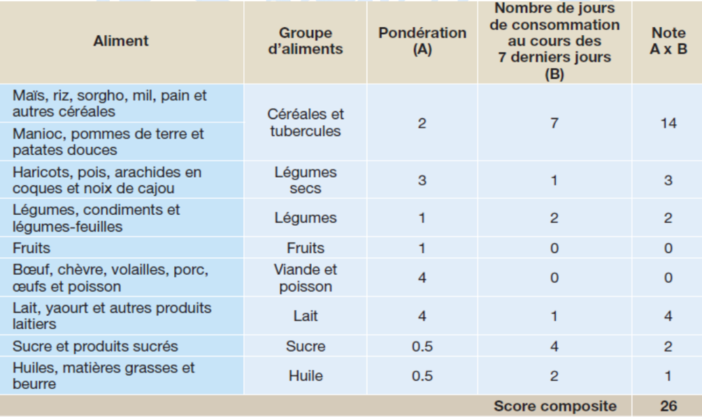
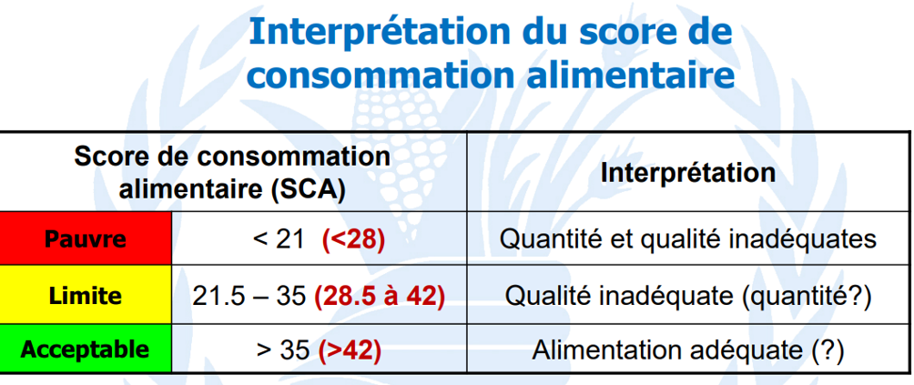

<!-- Logos alignés en haut de la page -->
<div style="text-align: center; margin-bottom: 20px;">
  
  
  
</div>


```{r setup, include=FALSE}
knitr::opts_chunk$set(eval = TRUE, echo = FALSE)

dir <- here::here()

knitr::opts_knit$set(root.dir = dir)
```

```{r, message=FALSE}
library(haven)
library(tidyverse)
library(officedown)
library(gtsummary)
library(janitor)
library(labelled)
library(sf)      
library(dplyr)     
library(ggplot2)   
```

```{r Import_data, echo=TRUE, message=FALSE, include=FALSE}

data_main <- haven::read_dta("data/Base_Principale.dta")
  
data_mad <- haven::read_dta("data/Base_MAD.dta")


## Pour meiux voir toutes les modalités des variables
data_main <- labelled::to_factor(data_main)

data_mad <- labelled::to_factor(data_mad)

```

# Analyse de consistence des bases de données:

## Dimension et variables

### Base main

La base a `{r dim(data_main)[1]}` lignes et `{r dim(data_main)[2]}` colonnes.

```{r}
dim(data_main)
```

```{r eval=FALSE}
names(data_main)
```

```{r}
head(data_main[,1:5])
```

### Base MAD

La base a `{r dim(data_mad)[1]}` lignes et `{r dim(data_mad)[2]}` colonnes.

```{r}
dim(data_mad)
```

```{r}
names(data_mad)
```

```{r}
head(data_mad[,1:5])
```

## Suppression des colonnes et lignes vides

```{r}
data_main <- data_main %>% 
  janitor::remove_empty(which = c("rows", "cols"))

# Vérification pour voir s'il y a des lignes ou colonnes qui ont été supprimées.
dim(data_main)
```

Il y avait 3 colonnes vides.

```{r}
data_mad <- data_mad %>% 
  janitor::remove_empty(which = c("rows", "cols"))

# Vérification pour voir s'il y a des lignes ou colonnes qui ont été supprimées.
dim(data_mad)
```

Aucune ligne ou colonne vide avant.

## Vérification de doublons

Il n'y a pas de doublons dans la base principale.

```{r}
janitor::get_dupes(data_main)
```

```{r}
janitor::get_dupes(data_mad, "ID")
```

```{r}
janitor::get_dupes(data_mad)
```

Il y a deux lignes qui se répètent. La question est de savoir si effectivement il s'agit de doublons.

```{r}
# Nombre d'ID différents dans la base 
unique(data_mad$ID) %>% length()
```

Dans cette base, il y a `{r unique(data_mad$ID) %>% length()}` ID différents, ce qui est suppérieur au nombre d'observations.

Mais comme toutes les variables ont les mêmes valeurs, on suppose que ce sont des doublons. Supprimons les.

```{r}
# suppression des doublons
data_mad <- unique(data_mad)
```

# Analyse des données et calcul d’indicateurs

## Analyse socio-démographique des ménages

Prenons les variables socio-démongraphiques et tabulons les.

```{r vars_to_tab}

# Choix des variables à tabuler

vars_to_tab <- c("ADMIN1Name", "HHSize", "HHHSex", "HHHAge",
                 "HHHEdu", "HHSourceIncome")
```

Construisons un tableau pour elles. On créer aussi une variable contenant le nombre d'hommes et une le nombre de femmes dans la maison

```{r}
tab_desc <- data_main %>% 
  dplyr::group_by(ID) %>% 
  dplyr::mutate(
    # somme des colonnes HHSize05M à HHSize5064M
    HHSizeM = rowSums(across(HHSize05M:HHSize5064M), na.rm = TRUE),
    
    # somme des colonnes HHSize05F à HHSize5064F
    HHSizeF = rowSums(across(HHSize05F:HHSize5064F), na.rm = TRUE)
    
  ) %>% 
  
  dplyr::ungroup() %>% 
  
  dplyr::select(all_of(vars_to_tab), HHSizeM, HHSizeF) %>% 
  
  gtsummary::tbl_summary(
    # Pour les numériques, mettre le min, max, mean et sd
    statistic = all_continuous() ~ "{mean} ({sd}, {min}, {max})",  
    
    digits = all_continuous() ~ 1,  # Val num avec 1 décimales
    missing = "ifany"  # Affichage explicite des valeurs manquantes si elles existent
    
  ) %>% 
  modify_caption(caption = "Caractéristiques socio-démographiques des ménages")

tab_desc
```

### Analyse


L’enquête porte sur un échantillon de 8 950 ménages répartis dans l’ensemble des régions étudiées. Batha (18 %) et Lac (16 %) arrivent en tête du classement, suivies de près par Guéra (16 %) et Kanem (14 %). Les autres régions affichent des proportions plus modestes : Ouaddaï (10 %), Salamat (5,4 %), Sila (5 %) et Ennedi Est (2,6 %). Notons enfin que Wadi Fira ne représente que 0,1 % de l’échantillon (11 ménages), ce qui peut traduire une couverture locale limitée ou un faible taux de réponse.


La taille moyenne des ménages de l’étude est de 7,5 personnes, avec un écart-type élevé de 12,9. Les valeurs extrêmes vont de 0 à 352 individus, suggérant la présence possible de codages particuliers ou d’unités de recueil atypiques. Cette large dispersion incite à vérifier la qualité des données avant toute analyse fine, notamment pour s’assurer que les ménages de taille nulle ou très élevée correspondent à des cas réels et non à des erreurs de saisie.


Les chefs de ménage sont majoritairement des hommes (56 %), tandis que les femmes représentent 44 % des cas. L’âge moyen est de 42,9 ans (écart-type : 12,6), avec un minimum observé à 15 ans et un maximum à 96 ans. Cette répartition montre une relative homogénéité générationnelle, tout en soulignant la présence de chefs très jeunes et très âgés.


En matière d’instruction, près d’un tiers des chefs de ménage (31 %) déclarent n’avoir aucun niveau formel, et la grande majorité (62 %) se situe dans la catégorie « alphabétisé ou coranique ». Les niveaux primaire (4,5 %), secondaire (2,1 %) et supérieur (0,4 %) sont beaucoup moins fréquents. Par ailleurs, environ un tiers des répondants (34 %) sont codés « Unknown », indiquant des données manquantes ou non renseignées qui pourraient mériter une exploration ou une imputation lors des analyses ultérieures.


La moitié des chefs de ménage tire ses revenus de l’agriculture vivrière ou de rente hors maraîchage (50 %, soit 861 ménages). Viennent ensuite la vente de produits maraîchers (11 %, 187 cas) et le travail journalier (9 %, 154 cas). Les autres activités génératrices de revenus — artisanat/petits métiers (5 %), aides ou transferts d’argent (6 %), petit commerce non alimentaire (4 %) — sont relativement minoritaires. Les sources très spécialisées (élevage, pêche, transport, salarié/pension) représentent chacune moins de 2 % des cas. Enfin, un nombre important de répondants (7 238 ménages, soit environ 81 %) est codé « Unknown », ce qui suggère un effort à faire pour améliorer la collecte ou le codage de cette information.


En moyenne, chaque ménage compte 3,7 hommes (écart-type 6,4, min 0, max 335) et 3,5 femmes (écart-type 5,1, min 0, max 125). Ces valeurs confirment que la composition par sexe est globalement équilibrée, tout en révélant une forte hétérogénéité — notamment des ménages où un seul des deux genres prédomine de manière exceptionnelle. Une vérification des cas extrêmes (plus de 50 individus d’un même sexe) est néanmoins recommandée pour s’assurer qu’il ne s’agit pas d’erreurs de saisie.


## Score de consommation alimentaire (SCA - Food Consumption score):


Le score de consommation alimentaire, aussi appelé score de diversité alimentaire (SCA) ou score de qualité de l'alimentation, est un outil essentiel pour évaluer la variété et la qualité de l'alimentation d'une personne ou d'un groupe. Ce score se base sur la consommation de différents groupes d'aliments sur une période donnée, généralement une journée ou une semaine. Il permet d'obtenir une vue d'ensemble sur la diversité des aliments ingérés et la qualité nutritionnelle de l'alimentation.


### Variables qui composent le SCA

Prenons les variables qui peuvent nous interesser. On prend alors celles qui commencent par FCS.

```{r}
data_fcs <- data_main %>% 
  dplyr::select(starts_with("FCS"), -ends_with("SRf"))

names(data_fcs)
```

Tabulons les pour voir.

```{r}

tab_fcs <-   data_fcs %>% 
  gtsummary::tbl_summary(
    # Pour les numériques, mettre le min, max, mean et sd
    statistic = all_continuous() ~ "{mean} ({sd}, {min}, {max})",  
    
    digits = all_continuous() ~ 1,  # Val num avec 1 décimales
    missing = "ifany"  # Affichage explicite des valeurs manquantes si elles existent
    
  ) %>% 
  modify_caption(caption = "Variables du FCS")

tab_fcs
```


### Calculons le SCA.


Nous utilisons le [document](https://library.ipcinfo.org/Acute%20Food%20Insecurity/IPC%20Level%202%20Training/English/Virtual%20Modality/Supporting%20Materials/Session%201/FCS/FCS%202008.pdf) décrivant comment est calculé le FCS.

L'image suivante montre aussi la méthode de calcul.



```{r}
# A chaque variable on lui associe le poids associé et on fait la somme

data_main <- data_main %>% mutate(
  SCA= (FCSStap  * 2)   + 
  (FCSPulse * 3)   +
  (FCSPr    * 4)   +
  (FCSDairy * 4)   + 
   FCSVeg          +
   FCSFruit        +
  (FCSFat   * 0.5) +
  (FCSSugar * 0.5))

attr(data_main$SCA, "label") <- "Score de consommation alimentaire"

```

Nous ne prenons pas en compte les fruits oranges et la comsommation de légumes verts car on les considère comme des sous parties.

### Tableau illustrant le poids de chaque groupe alimentaire

```{r}


# Pour les groupes
groupe <- c(" cereals, grains and tubers",
            "pulses", "meat, fish and eggs",
            "dairy product", "vegetables", "fruit", 
            "fat and oil", "sugaror sweets", "condiments or spices")
            
# Leurs poids      
poids <- c(2, 3, 4, 4, 1, 1, 0.5, 0.5, 0)


 # On en fait un tableau
table_poids <- cbind(groupe, poids) %>%as.data.frame()

kableExtra::kable(table_poids)
```

### Catégorisons

Nous utilisons l'image suivant pour nous gider dans les catégories. 

```{r}
data_main<- data_main%>% mutate(SCA_21_35 = case_when(
                             SCA <= 21 ~ "Pauvre",
                             between(SCA, 21.5, 35) ~  "Limite", 
                             SCA > 35 ~ "Acceptable"  ),
                        SCA_28_42 = case_when(
                             SCA <= 28 ~ "Pauvre", 
                             between(SCA, 28.5, 42) ~ "Limite", 
                             SCA > 42 ~ "Acceptable"))

# Labellisons

attr(data_main$SCA_21_35, "label") <- "Catégories SCA seuil 21 \ 35"
attr(data_main$SCA_28_42, "label") <- "Catégories SCA seuil 28 \ 42"


```


Tabulons pour voir et faire une petite analyse.

```{r}
tab_SCA <- data_main %>% 
  gtsummary::tbl_summary(
    include = c(SCA, SCA_21_35,SCA_28_42 ),
     statistic = all_continuous() ~ "{mean} ({sd}, {min}, {max})"
  ) %>% 
  modify_caption("Score de consommation alimentaire")

tab_SCA

```

Le score de consommation alimentaire (SCA) moyen des ménages est estimé à 47, avec un écart-type de 17, et des valeurs comprises entre 0 et 112. Cela reflète une diversité importante dans les habitudes alimentaires des ménages. En appliquant les seuils standards du PAM (seuil 21), une large majorité des ménages (75 %) présente une consommation acceptable, tandis que 20 % se situent en zone limite et 5 % en situation de consommation pauvre, signalant une insécurité alimentaire préoccupante.


Cependant, l’utilisation d’un seuil plus strict (seuil 28) modifie la répartition : seuls 59 % des ménages sont alors considérés comme ayant une consommation acceptable, contre 29 % en situation limite et 13 % en situation pauvre. Cette seconde lecture permet d’identifier une proportion plus élevée de ménages potentiellement vulnérables, mettant en évidence la sensibilité de l’analyse aux seuils choisis pour le classement.


### Représentation graphique

```{r}

data_main <- data_main %>%
  mutate(
    adm1_ocha_shp = str_replace(adm1_ocha, "^TD", "TCD") %>% 
      as.numeric(),
    adm1_ocha_shp = str_replace(adm1_ocha, "^TD", "TCD") %>% 
      as.numeric()
  )

SCA_region <- data_main %>% 
  dplyr::group_by(adm1_ocha) %>% 
  summarise(SCA_mean1= mean(SCA, na.rm= TRUE)) %>% 
  ungroup()

SCA_depart <- data_main %>% 
  dplyr::group_by(adm2_ocha) %>% 
  summarise(SCA_mean2= mean(SCA, na.rm= TRUE)) %>% 
  ungroup()

#"Importons le shp. Il contient les admin 1 et 2
tcd_adm2 <- st_read("Shapefile/tcd_admbnda_adm2_20250212_AB.shp", quiet=T)
  
```

```{r}

# Fusionnons mes deux
tcd_adm2_sca <- tcd_adm2 %>%
  left_join(SCA_region, by = c("ADM1_PCODE" = "adm1_ocha")) %>% 
  left_join(SCA_depart, by = c("ADM2_PCODE" = "adm2_ocha"))

```

```{r}
 # Visualisons les deux

ggplot(tcd_adm2_sca) +
  geom_sf(aes(fill = SCA_mean2), lwd = 0.2) +
  scale_fill_viridis_c(
    option = "plasma",
    name = "SCA moyen",
    na.value = "lightgrey"
  ) +
  labs(
    title = "Score de consommation alimentaire moyen par région (Tchad)",
    subtitle = "Calculé sur N = 8 950 ménages",
    caption  = "Source : Votre enquête"
  ) +
  theme_minimal() +
  theme(
    panel.grid = element_blank(),
    axis.text  = element_blank(),
    axis.ticks = element_blank()
  )
```

## L’indice réduit des stratégies de survie (rCSI):

### Variables qui composent le rCSI

Prenons les variables qui peuvent nous interesser. On prend alors celles qui commencent par rCSI.

```{r include=FALSE}
data_rCSI <- data_main %>% 
  dplyr::select(starts_with("rCSI"))

names(data_fcs)
```

Tabulons les pour voir.

```{r}

tab_rCSI <-   data_rCSI %>% 
  gtsummary::tbl_summary(
    # Pour les numériques, mettre le min, max, mean et sd
    statistic = all_continuous() ~ "{mean} ({sd}, {min}, {max})",  
    
    digits = all_continuous() ~ 1,  # Val num avec 1 décimales
    missing = "ifany"  # Affichage explicite des valeurs manquantes si elles existent
    
  ) %>% 
  modify_caption(caption = "Variables du rCSI")

tab_rCSI
```


L’analyse des cinq indicateurs composant l’indice réduit des stratégies de survie (rCSI) montre que la majorité des ménages ont eu recours à des stratégies alimentaires de façon limitée au cours des 7 derniers jours.


La stratégie la plus fréquemment rapportée est le recours à des aliments moins préférés ou moins chers, avec 45 % des ménages n’ayant pas eu besoin de le faire, mais 25 % l’ayant utilisée une fois, 16 % deux fois et une minorité allant jusqu’à 7 fois. Cela révèle une pression modérée sur la qualité perçue de l’alimentation.

La stratégie d’emprunt de nourriture ou d’aide de proches suit un profil similaire : 47 % n’y ont pas eu recours, tandis qu’environ 24 % l’ont pratiquée une fois, et près de 16 % deux fois. Ces résultats suggèrent un filet social encore actif, mais sollicité pour près de la moitié des ménages.

Concernant la réduction des portions lors des repas, 62 % des ménages n’ont pas adopté cette stratégie, tandis que 20 % l’ont fait une fois et 11 % deux fois. Cette réduction quantitative est donc moins courante que les autres formes d’ajustement, mais reste significative.

Le comportement le moins fréquent est la restriction alimentaire des adultes au profit des enfants, avec 76 % des ménages n’y ayant pas eu recours. Seuls 15 % l’ont pratiquée une fois, ce qui indique que les situations extrêmes de privation ciblée restent minoritaires.

Enfin, la réduction du nombre de repas quotidiens a concerné 36 % des ménages au moins une fois, mais une large majorité (64 %) n’a pas eu à adopter cette stratégie, ce qui traduit un maintien général du rythme alimentaire de base.


### Calculons l'indice rCSI

Nous attribuons un poids à chacune des stratégies.

L'image suivante montre les poids "universels". Les mêmes poids ont été retrouvés sur le site de [WFP](https://resources.vam.wfp.org/data-analysis/quantitative/food-security/reduced-coping-strategies-index).


```{r echo=FALSE, message=FALSE, warning=FALSE}

data_main<- data_main%>% mutate(rCSI = rCSILessQlty + 
                              rCSIBorrow * 2 + 
                              rCSIMealNb + 
                              rCSIMealSize + 
                              rCSIMealAdult * 3)

attr(data_main$rCSI, "label") <- "Indice réduit des stratégies de survie" 

```

Tabulons un peu

```{r}
tab_rCSI_value <- data_main %>% 
  gtsummary::tbl_summary(
    include = rCSI,
     statistic = all_continuous() ~ "{mean} ({sd}, {min}, {max})"
  ) %>% 
  modify_caption("Indice réduit des stratégies de survie")

tab_rCSI_value
```


L’**indice réduit des stratégies de survie (rCSI)** présente une moyenne de\
`r round(mean(data_main$rCSI, na.rm = TRUE), 1)` ( avec un écart-type = `r round(sd(data_main$rCSI, na.rm = TRUE), 1)`), et des valeurs extrêmes allant de `r min(data_main$rCSI, na.rm = TRUE)` à `r max(data_main$rCSI, na.rm = TRUE)`.\
Cette distribution suggère qu’en moyenne chaque ménage a eu recours à un nombre modéré de stratégies d’ajustement alimentaire, mais que certains ménages ont dû mobiliser un éventail très large de réponses de survie, témoignant de situations d’insécurité alimentaire particulièrement aiguës.


### Tableau du poids de chaque variable

```{r}

# Pour les groupes
groupe <- c(" rCSILessQlty - Relied on less preferred, less expensive food, grains and tubers",
            "rCSIBorrow - Borrowed food or relied on help from friends or relatives", 
            "rCSIMealNb - Reduced the number of meals eaten per day",
            "rCSIMealSize - Reduced portion size of meals at meals time",
            "rCSIMealAdult - Restricted consumption by adults in order for young children to eat")
# Leurs poids      
poids <- c(1, 2, 1, 1 ,3)


 # On en fait un tableau
table_poids <- cbind(groupe, poids) %>%as.data.frame()

kableExtra::kable(table_poids, caption = "poids des variables dans le rCSI")
```

## Stratégies d'adaptation aux moyens d'existence (LhCSI)

### Variables qui composent le LhCSI

Prenons les variables qui peuvent nous interesser. On prend alors celles qui commencent par rCSI.

```{r include=T}
data_LhCSI <- data_main %>% 
  dplyr::select(starts_with("LhCSI"))

names(data_LhCSI)
```

Tabulons les pour voir.

```{r}

tab_LhCSI <-   data_LhCSI %>% 
  gtsummary::tbl_summary(
    # Pour les numériques, mettre le min, max, mean et sd
    statistic = all_continuous() ~ "{mean} ({sd}, {min}, {max})",  
    
    digits = all_continuous() ~ 1,  # Val num avec 1 décimales
    missing = "ifany"  # Affichage explicite des valeurs manquantes si elles existent
    
  ) %>% 
  modify_caption(caption = "Variables du LhCSI")

tab_LhCSI
```


Le tableau répertorie neuf stratégies de coping liées aux moyens de subsistance (LhCSI) pour les 8 950 ménages enquêtés. On constate d’abord que la vente d’actifs du ménage (radio, mobilier, réfrigérateur, télévision, bijoux) n’a jamais été utilisée : 100 % des répondants sont en catégorie « Not applicable », ce qui suggère qu’ils ne possèdent pas ces biens ou que la question ne s’applique pas. En ce qui concerne l’utilisation de l’épargne, 35 % des ménages n’en ont pas eu besoin, tandis que 16 % déclarent avoir déjà puisé dans leurs économies dans les 12 mois précédents et ne peuvent plus le faire, et seulement 4,7 % l’ont utilisé durant la semaine de référence.

Parmi les stratégies plus « financières », l’achat à crédit concerne 19 % des ménages, alors que 36 % n’en ont pas eu besoin et 15 % ont épuisé cette option ; 29 % sont « Not applicable ». La vente d’actifs productifs ou moyens de transport (machine à coudre, brouette, vélo…) reste marginale (3,4 % de « Yes »), avec 39 % de « No, did not need », 17 % de « No, already sold/épuisé » et 40 % de non applicables.

Les stratégies les plus extrêmes — réduction des dépenses de santé (1,8 %), retrait d’enfants de l’école (1,2 %), hypothèque ou vente de maison/terre (0,6 %), mendicité (3,2 %) et recours à des activités illicites (2,3 %) — sont peu fréquentes, la très grande majorité des ménages déclarant ne pas en avoir eu besoin (31–36 %) ou relevant de la catégorie « Not applicable » (46–52 %).


### Mettons les catégories

```{r echo=FALSE, message=FALSE, warning=FALSE, eval=FALSE}
data_main <- data_main %>% 
  dplyr::mutate(
    LhCSIStress1_new = ifelse(LhCSIStress1 == "Yes", 1L, 0L),
    LhCSIStress2_new = ifelse(LhCSIStress2 == "Yes", 1L, 0L) ,
    LhCSIStress3_new= ifelse(LhCSIStress3== "Yes", 1, 0),
    LhCSIStress4_new= ifelse(LhCSIStress4== "Yes", 1, 0),
    LhCSICrisis1_new= ifelse(LhCSICrisis1 == "Yes", 1, 0),
    LhCSICrisis2_new= ifelse(LhCSICrisis2== "Yes", 1, 0),
    LhCSICrisis3_new= ifelse(LhCSICrisis3 == "Yes", 1, 0),
    LhCSIEmergency1_new= ifelse(LhCSIEmergency1 == "Yes", 1, 0),
    LhCSIEmergency2_new = ifelse(LhCSIEmergency2 == "Yes", 1, 0),
    LhCSIEmergency3_new= ifelse(LhCSIEmergency3 == "Yes", 1, 0))

    
```

```{r eval=FALSE}

data_main <- data_main %>%
  mutate(
    # flags Stress, Crise et Urgence
    Stress_use  = ifelse(
      (LhCSIStress1_new + LhCSIStress2_new + LhCSIStress3_new + LhCSIStress4_new) >= 1,1L, 0L),
    Crisis_use  = ifelse(
      LhCSICrisis1_new + LhCSICrisis2_new + LhCSICrisis3_new >= 1,
      1L, 0L
    ),
    Emerg_use  = ifelse(
      LhCSIEmergency1_new + LhCSIEmergency2_new + LhCSIEmergency3_new >= 1,
      1L, 0L
    ),
 
    LhCSI_cat = case_when(
      Emerg_use  == 1                         ~ "Urgence",
      Crisis_use == 1 & Emerg_use  == 0       ~ "Crise",
      Stress_use == 1 & Crisis_use == 0       ~ "Stress",
      TRUE                                    ~ "Aucune stratégie"
    )
  )

```

```{r eval=FALSE}
lhcsi_cat_tab <- data_main %>% 
  gtsummary::tbl_summary(  include = LhCSI_cat,
                           by= YEAR
) %>%  modify_caption("Catégories du LhSCI")

lhcsi_cat_tab
```


En 2022, 63 % des ménages n’ont adopté aucune stratégie de survie, tandis que 28 % ont eu recours à des stratégies de type stress. Les situations plus graves étaient moins fréquentes : 4,1 % des ménages se trouvaient en crise, et 5,4 % en urgence.

En 2023, la situation semble s’être améliorée : 79 % des ménages n’ont eu recours à aucune stratégie, soit une progression notable par rapport à l’année précédente. La part des ménages en stress a nettement diminué, atteignant seulement 13 %, tandis que les proportions en crise (2,7 %) et en urgence (4,8 %) sont restées relativement stables.


### Représentation graphique

```{r}

```

## Score de diversité alimentaire des ménages:

### Variables qui composent le SDA

Prenons les variables qui peuvent nous interesser. On prend alors celles qui commencent par rCSI.

```{r include=T}
data_SDA <- data_main %>% 
  dplyr::select(starts_with("HDDS"))

names(data_SDA)
```

Tabulons les pour voir.

```{r}

tab_HDDS <-   data_SDA %>% 
  gtsummary::tbl_summary(
    # Pour les numériques, mettre le min, max, mean et sd
    statistic = all_continuous() ~ "{mean} ({sd}, {min}, {max})",  
    
    digits = all_continuous() ~ 1,  # Val num avec 1 décimales
    missing = "ifany"  # Affichage explicite des valeurs manquantes si elles existent
    
  ) %>% 
  modify_caption(caption = "Variables du HDDS")

tab_HDDS
```

## Calculons le score

```{r}
data_main <- data_main %>%
  mutate(
    SDA = rowSums(
      across(
        HDDSStapCer:HDDSPrMeat,         
        ~ if_else(.x == "Oui", 1L, 0L)     
      ),
      na.rm = TRUE                         
    )
  )

```

```{r}
SDA_value_tab <- data_main %>% 
  gtsummary::tbl_summary(
    include = SDA,
     statistic = all_continuous() ~ "{mean} ({sd}, {min}, {max})"
  ) %>% 
  modify_caption("Score de diversité alimentaire")

SDA_value_tab
```


## Score de résilience auto-évaluée (SERS):

### Variables qui composent le SERS

Prenons les variables qui peuvent nous interesser. On prend alors celles qui commencent par rCSI.

```{r include=T}
data_SERS <- data_main %>% 
  dplyr::select(starts_with("SERS"))

names(data_SERS)
```

Tabulons les pour voir.

```{r}

tab_SERS <-   data_SERS %>% 
  gtsummary::tbl_summary(
    # Pour les numériques, mettre le min, max, mean et sd
    statistic = all_continuous() ~ "{mean} ({sd}, {min}, {max})",  
    
    digits = all_continuous() ~ 1,  # Val num avec 1 décimales
    missing = "ifany"  # Affichage explicite des valeurs manquantes si elles existent
    
  ) %>% 
  modify_caption(caption = "Variables du SERS")

tab_SERS
```

## Régime alimentaire minimum acceptable (MAD)

## Nombre de groupes d’aliments consommé par un enfant

On prend les enfants qui nous interessent, les enfants de 6 à 23 mois.

```{r}
data_023 <- data_mad %>% 
  filter(
    MAD_resp_age >= 6,
    MAD_resp_age <= 23
  )
```

Voyons le nombre de groupe alimentaires consommés

```{r}

## On fait la somme des OUI pour les groupes


data_023 <- data_023 %>%
  mutate(
    Nb_groups = rowSums(
      across(
        PCMADStapCer:PCMADDairy,         
        ~ if_else(.x == "Oui", 1L, 0L)     
      ),
      na.rm = TRUE                         
    )
    
  )

```

### Si l'enfant a consommé au moins cinq groupes d'aliments...

```{r}
data_023 <- data_023 %>%
  mutate(
    Nb_groups_5 = ifelse(
       Nb_groups >= 5, "Yes", "Non"
    )
    
  )


```

Tabulons les 2 pour voir

```{r}
tab_MAD <- data_023 %>% 
  gtsummary::tbl_summary(
    include = c(Nb_groups, Nb_groups_5),
     statistic = all_continuous() ~ "{mean} ({sd}, {min}, {max})"
  ) %>% 
  modify_caption("Groupe alimentaires consommés par les enfants")

tab_MAD
```

### Les enfants disposant d'un régime alimentaire au minimum acceptable

Fusions pour cela nos bases

```{r}

data_regime <- left_join(data_023, 
                         data_main, by="ID")

```

Tabulons maintenant avec le SCA

```{r}
tab_regime_1 <- data_regime %>% 
  gtsummary::tbl_summary(
    include = Nb_groups_5,
    by=SCA_21_35,
     statistic = all_continuous() ~ "{mean} ({sd}, {min}, {max})",
   missing = "ifany") %>% 
  modify_caption("Groupe alimentaires consommés par les enfants")


tab_regime_2 <- data_regime %>% 
  gtsummary::tbl_summary(
    include = Nb_groups_5,
    by=SCA_28_42,
     statistic = all_continuous() ~ "{mean} ({sd}, {min}, {max})",
   missing = "ifany") %>% 
  modify_caption("Groupe alimentaires consommés par les enfants")

```

```{r}
tab_regime_merge <- tbl_merge(
  tbls = list(tab_regime_1, tab_regime_2),
  tab_spanner = c("Seuil SCA 21–35", "Seuil SCA 28–42")
) %>% 
  modify_caption("Différents régimes d'alimentation")

tab_regime_merge
```

#### Statistique suivi le chef de ménage et l'année

On considère acceptable suivant le premier seuil 21 _ 35.

```{r}
tab_annee <- data_regime %>% 
  filter(SCA_21_35 == "Acceptable") %>% 
  gtsummary::tbl_summary(
    include = Nb_groups_5,
    by=YEAR,
     statistic = all_continuous() ~ "{mean} ({sd}, {min}, {max})",
   missing = "ifany") %>% 
  modify_caption("Groupe alimentaires consommés par les enfants")

tab_sex <- data_regime %>% 
  filter(SCA_21_35 == "Acceptable") %>% 
  gtsummary::tbl_summary(
    include = Nb_groups_5,
    by=HHHSex,
     statistic = all_continuous() ~ "{mean} ({sd}, {min}, {max})",
   missing = "ifany") %>% 
  modify_caption("Groupe alimentaires consommés par les enfants")

```

```{r}
tab_merge2 <- tbl_merge(
  tbls = list(tab_sex, tab_annee),
  tab_spanner = c("Sexe du chef de ménage", "nnnée")
) %>% 
  modify_caption("Enfants dispocant d'un régime acceptable Suivant l'année et le sexe")

tab_merge2
```

