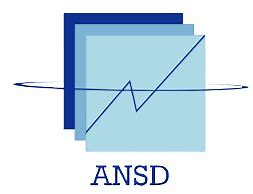

---
output:
  officedown::rdocx_document:
    reference_docx: "Modèle.docx"
    toc_depth: 3
    fig_caption: true
    keep_md: true
---


```{r setup, include=FALSE}
knitr::opts_chunk$set(echo = FALSE, 
                      warning = FALSE, 
                      message = FALSE,
                      comment = NA)
library(flextable)
library(dplyr)
library(officedown)
library(officer)
```

```{r page_garde_1}
flextable(data.frame(Contenu = "REPUBLIQUE DU SENEGAL")) %>%
  delete_part(part = "header") %>% 
  border_remove() %>% 
  # Application de la police
  font(fontname = "Times New Roman", part = "all") %>% 
  fontsize(size = 14, part = "all") %>% 
  # Mise en forme du texte
  bold(i = 1, j = 1) %>% 
  align(align = "center") %>% 
  set_table_properties(layout = "autofit", width = 1)
```

|                                                     |
|:---------------------------------------------------:|
| {width="3cm" height="3cm"} |


```{r page_garde_2}
flextable(data.frame(Contenu = c( "**********",
                                  "Un Peuple - Un But - Une Foi",
                                  "**********",
                                  "Agence nationale de la Statistique et de la démographie"))) %>% 
  delete_part(part = "header") %>% 
  border_remove() %>% 
  # Application de la police
  font(fontname = "Times New Roman", part = "all") %>% 
  fontsize(size = 14, part = "all") %>% 
  # Mise en forme du texte
  bold(i = 1:4, j = 1) %>% 
  italic(i = 2, j = 1) %>% 
  align(align = "center") %>% 
  set_table_properties(layout = "autofit", width = 1)
```

|                                          |
|:----------------------------------------:|
| {width="3.5cm"} |

```{r page_garde_3}
flextable(data.frame(Contenu = c("**********",
                                  "Ecole nationale de la Statistique et de l'Analyse économique Pierre Ndiaye"))) %>%
  delete_part(part = "header") %>% 
  border_remove() %>% 
  # Application de la police
  font(fontname = "Times New Roman", part = "all") %>% 
  fontsize(size = 14, part = "all") %>% 
  # Mise en forme du texte
  bold(i = 1:2, j = 1) %>% 
  align(align = "center") %>% 
  set_table_properties(layout = "autofit", width = 1)
```

|                                                       |
|:-----------------------------------------------------:|
| {width="2.5cm" height="2cm"}|

# EVALUATION

```{r page garde_4}
flextable(data.frame(Contenu = "Projet statistique avec R")) %>%
  delete_part(part = "header") %>% 
  border_remove() %>% 
  # Application de la police
  font(fontname = "Times New Roman", part = "all") %>% 
  fontsize(size = 15, part = "all") %>% 
  # Mise en forme du texte
  italic(i = 1, j = 1) %>% 
  align(align = "center") %>% 
  set_table_properties(layout = "autofit", width = 1)
```

$$
$$

```{r page_garde_5}
donnees <- data.frame(
  col1 = c("Rédigé par", "Mame Balla BOUSSO", "Élève Ingénieur Statisticien Économiste"),
  col2 = c("Sous la supervision de", "M. Aboubacar HEMA", "Analyste de recherche"),
  stringsAsFactors = FALSE
)
flextable(donnees) %>% 
  delete_part(part = "header") %>% 
  width(j = 1:2, width = 0.5) %>%  # Répartition égale de la largeur
  align(j = 1, align = "left") %>% 
  align(j = 2, align = "right") %>% 
  border_remove() %>% 
  bold(i = 1, j = 1:2) %>% 
  italic(i = 3, j = 1:2) %>% 
  set_table_properties(layout = "autofit", width = 1) %>%  # Force la largeur totale
  fontsize(size = 11)  # Ajuste la taille de police si nécessaire
```


|                                |
|:------------------------------:|
| **Année académique 2024-2025** |

\newpage

# Sommaire

<!---BLOCK_TOC--->

\newpage

## Liste des figures

<!---BLOCK_TOC{seq_id: 'fig'}--->

## Liste des tableaux

<!---BLOCK_TOC{seq_id: 'tab'}--->


\newpage


# I.	Analyse de consistence des bases de données:


#### Aperçu des deux bases

```{r, echo=FALSE, message= FALSE, warning=FALSE}
#  I : Analyse de consistence des bases de données
# Chargement des packages
library(haven)
library(tidyverse)
library(janitor)      # Pour nettoyer les noms de variables
library(gtsummary)    # Pour les tableaux
library(labelled)     # Pour gérer les variables avec labels

# Importation des bases des bases

Base_MAD <- read_dta("Data/Base_MAD.dta")
Base_Principale <- read_dta("Data/Base_Principale.dta")

# Dimensions
dim(Base_Principale)  # Nombre de lignes et colonnes
dim(Base_MAD)

```

La base de donnée Base_Principale contient 8950 observations et 100 variables, alors celle MAD contient 2206 lignes et 26 variables.

#### Analyses des deux bases

Par ailleurs l'application de clean_names() du package a permis de nettoyer les noms des colonnes. La fonction names offre cet appercu dans les noms des colonnes


```{r, echo=FALSE, message= FALSE, warning=FALSE}

# Nettoyage des noms de colonnes
Base_Principale <- Base_Principale %>% clean_names()
Base_MAD <- Base_MAD %>% clean_names()


```
Cette action permet d'uniformiser les variables dans les deux bases. Elle peut trouver son utilité notamment lorqu'on souhaite merger des bases. Elle permet de rendre uniforme à l'occurrence les clés.

#### Vérification de doublons sur l'indentification des ménages


```{r echo=FALSE, message=FALSE, warning=FALSE, include=FALSE}
Base_Principale %>%
  count(id) %>%
  filter(n > 1)

"Chaque identifiant dans la base Base_Principale est unique "

Base_MAD %>%
  count(id) %>%
  filter(n > 1)
```


Nous avons examiné la variable id dans chaque base afin d’identifier d’éventuels doublons :

Dans la **Base_Principale**, chaque identifiant est unique. Aucune duplication n’a été détectée (n = 0 pour tous les id).

En revanche, **Base_MAD** contient plusieurs doublons d’identifiants. Par exemple, l'identifiant '1050' est présent 3 fois. De plus, 9 lignes ont un identifiant vide ('')


#### Analyse des valeurs manquantes

```{r, echo=FALSE, message= FALSE, warning=FALSE}
# Analyse des valeurs manquantes

Base_Principale %>% 
  summarise(across(everything(), ~ mean(is.na(.))*100)) %>% 
  pivot_longer(everything(), names_to = "variable", values_to = "pct_na") %>%
  filter(pct_na > 0) %>%
  arrange(desc(pct_na)) %>%
  head(10)  # Les 10 variables avec le plus de valeurs manquantes

```


On voit ainsi le aux de valeurs manquantes pour les 10 variables avec le plus de valeurs manquantes. On voit la plupart des variables présentent un très grand nombre de valeurs manquantes. On va supprimer les varibales ayant un taux de NA supérieur à 40%.

Ce chois peut-être justifié par le fait que :

-  au-delà de ce seuil, les estimations par imputation deviennent peu fiables ;

-  l’analyse peut être biaisée ou affaiblie si trop de données sont absentes.


```{r}
# Définir le seuil (ex. : 40 %)
seuil_na <- 40

# Identifier et supprimer les variables dont le taux de NA dépasse le seuil
vars_a_supprimer <- Base_Principale %>% 
  summarise(across(everything(), ~ mean(is.na(.)) * 100)) %>% 
  pivot_longer(everything(), names_to = "variable", values_to = "pct_na") %>%
  filter(pct_na > seuil_na) %>%
  pull(variable)

# Supprimer ces variables de la base
Base_Principale <- Base_Principale %>% select(-all_of(vars_a_supprimer))

# Afficher les variables supprimées
cat("Variables supprimées (taux de NA >", seuil_na, "%):\n")
print(vars_a_supprimer)
```


```{r, echo=FALSE, message= FALSE, warning=FALSE}
# Pour la base Base_MAD
Base_MAD %>% 
  summarise(across(everything(), ~ mean(is.na(.))*100)) %>% 
  pivot_longer(everything(), names_to = "variable", values_to = "pct_na") %>%
  filter(pct_na > 0) %>%
  arrange(desc(pct_na)) %>%
  head(10)  # Les 10 variables avec le plus de valeurs manquantes

```

Par contre dans la base, **BASE_MAD**, on a une seule variable ayant des NA et le taux est très faible.


#### Vérification de la cohérence dans la variables age

Dans l'analyse que l'on s'apprète à faire,la variables âge sera déterminante. Par conséquent, il serait important de vérifier sa validité.

On vérifie la cohérence entre la taille totale du ménage (hh_size) et la somme des membres du ménage par tranche d’âge et sexe. Le résultat montre une parfaite logique.


```{r, echo=FALSE, message= FALSE, warning=FALSE}
Base_Principale %>%
  mutate(total_age_sex = hh_size05m + hh_size23m + hh_size59m + hh_size5114m +
           hh_size1549m + hh_size5064m + hh_size65above_m +
           hh_size05f + hh_size23f + hh_size59f + hh_size5114f +
           hh_size1549f + hh_size5064f + hh_size65above_f) %>%
  summarise(prop_coherent = mean(total_age_sex == hh_size, na.rm = TRUE))
```

En effet, aa proportion prop_coherent est égale à 1. Cela signifie que dans tous les cas de la
base_principale, la somme des tailles de ménage par tranche d'âge et sexe est cohérente 
avec la taille totale du ménage. Aucun ménage ne présente d'incohérence dans ce calcul.


# II.	Analyse des données et calcul d’indicateurs

## 1)	Faites une analyse socio-démographique des ménages


```{r, echo=FALSE, message= FALSE, warning=FALSE}
Base_Principale_labelled <- Base_Principale %>% 
  haven::as_factor() 

Base_Principale_labelled %>%
  select(hhh_sex, hhh_age, hh_size, hhh_edu) %>%
  clean_names() %>%
  tbl_summary(
    statistic = list(
      all_continuous() ~ "{mean} ({sd})",
      all_categorical() ~ "{n} ({p}%)"
    ),
    label = list(
      hhh_sex = "Sexe du chef de ménage",
      hhh_age = "Âge du chef de ménage",
      hh_size = "Taille du ménage",
      hhh_edu = "Niveau d\u2019\u00e9ducation du chef de ménage"
    ),
    missing = "ifany"
  ) 
```


Le tableau présente des caractéristiques sociodémographiques des ménages. Les chefs de ménage sont majoritairement des hommes (56 %, soit 5 012 individus), contre 44 % de femmes (3 938 individus), reflétant des normes culturelles où les hommes sont plus souvent désignés comme chefs de famille. L’âge moyen du chef de ménage est de 43 ans (avec un écart-type de 13 ans), indiquant une population en âge d’assumer des responsabilités économiques et familiales. La taille moyenne des ménages est de 7,55 personnes, avec un écart-type élevé (12,90), suggérant une grande variabilité, allant de petits noyaux familiaux à des familles étendues nombreuses, typique des sociétés rurales.

En matière d’éducation, les chefs de ménage ont principalement un faible niveau de formation : 31 % n’ont aucune éducation (1 827 individus), tandis que 62 % (3 684) sont alphabétisés ou ont une éducation coranique. Seulement 4,5 % ont un niveau primaire, 2,1 % secondaire, et 0,4 % supérieur, soulignant des obstacles structurels à l’accès à l’éducation formelle. Cependant, 3 024 cas n’ont pas de données renseignées, ce qui limite l’interprétation.


## 2)	Score de consommation alimentaire (SCA)

### a) Analyse descriptive des variables qui composent le SCA

L'analyse des variables composant le Score de Consommation Alimentaire (SCA) repose sur la fréquence de consommation de différents groupes alimentaires au sein des ménages, mesurée sur une période de 7 jours. Cinq principaux groupes alimentaires ont été identifiés, chacun se verra attribuer un poids attribué en fonction de son importance nutritionnelle dans le calcul du SCA.

Le premier groupe, les céréales, racines et tubercules (représenté par la variable fcs_stap), inclut des aliments essentiels à l'alimentation de base dans de nombreuses régions. Le deuxième groupe est constitué des légumineuses (variable fcs_pulse), qui comprennent des aliments comme les haricots, les pois et les lentilles.

Les produits laitiers, représentés par la variable fcs_dairy, comprennent des produits tels que le lait, le fromage et le yaourt.

Le groupe suivant regroupe les viandes, poissons et œufs (combinant les variables fcs_pr_meat_f, fcs_pr_meat_o, fcs_pr_fish et fcs_pr_egg), qui représentent des sources majeures de protéines animales et d'acides gras essentiels.

Enfin, les légumes (variable fcs_veg), qui incluent aussi bien les légumes frais que cuits.

Le calcul du Score de Consommation Alimentaire (SCA) consiste à multiplier la fréquence de consommation de chaque groupe alimentaire par son poids respectif. La somme de ces valeurs pondérées donne un score global, qui reflète la diversité alimentaire et l'équilibre nutritionnel du ménage au cours des sept derniers jours. Ce score permet de mieux comprendre les habitudes alimentaires des ménages et de les évaluer par rapport à des standards de sécurité alimentaire et de nutrition.

#### Attribution des poids

Les poids attribués à chaque groupe alimentaire dans le calcul du Score de Consommation Alimentaire (SCA) sont basés sur leur importance nutritionnelle et leur contribution à un régime alimentaire équilibré. En accord avec les recommandations de l'OMS :

- Les céréales sont la base énergétique de l'alimentation (Poids = 3).

- Les légumineuses apportent une alternative de qualité pour les protéines végétales (Poids = 2).

- Les produits laitiers jouent un rôle clé dans la santé osseuse et la fourniture de nutriments essentiels (Poids = 4).

- Les viandes, poissons et œufs sont essentiels pour des protéines de haute qualité et des micronutriments cruciaux (Poids = 5).

- Les légumes fournissent des micronutriments et des fibres importantes pour la prévention des maladies (Poids = 2).

Les poids attribués à chaque groupe alimentaire dans le SCA sont donc un reflet de leur rôle dans une alimentation saine et équilibrée, en mettant l'accent sur la diversité des apports nutritionnels.


### b)	Calculer le score de consommation alimentaire 

Le calcul du SCA repose sur l'agrégation des variables mentionnées précédemment, avec les poids spécifiés.

Formule générale :

\[
\text{SCA} = 3 \times \text{fcs\_stap} + 2 \times \text{fcs\_pulse} + 4 \times \text{fcs\_dairy} + 5 \times (\text{fcs\_pr\_meat\_f} + \text{fcs\_pr\_meat\_o} + \text{fcs\_pr\_fish} + \text{fcs\_pr\_egg}) + 2 \times \text{fcs\_veg}
\]

Où chaque variable (fcs_*) représente le nombre de jours de consommation de chaque catégorie alimentaire, et les poids sont appliqués pour refléter leur importance respective dans le score final.

```{r, echo=FALSE, message= FALSE, warning=FALSE}
Base_Principale <- Base_Principale %>%
  mutate(
    SCA = (fcs_stap * 3) +  # Poids  pour les céréales
      (fcs_pulse * 2) +  # Poids pour les légumineuses
      (fcs_dairy * 4) +  # Poids pour les produits laitiers
      ((fcs_pr_meat_f + fcs_pr_meat_o + fcs_pr_fish + fcs_pr_egg) * 5) +  # Poids modifié pour la viande, poisson et œufs
      (fcs_veg * 2)  # Poids pour les légumes
  )


```

On a aisin les valeurs de SCA

### c)	Tableau illustrant le poids attribue a chaque groupe alimentaire pour le calcul du SCA (la somme totale des poids doit etre egale a 16)

```{r, echo=FALSE, message= FALSE, warning=FALSE}
library(tibble)

tribble(
  ~"Groupe alimentaire",         ~"Variables",                                         ~"Poids",
  "Céréales, racines, tubercules", "fcs_stap",                                           3,
  "Légumineuses",                 "fcs_pulse",                                          2,
  "Produits laitiers",           "fcs_dairy",                                          4,
  "Viandes, poisson, œufs",      "fcs_pr_meat_f + fcs_pr_meat_o + fcs_pr_fish + fcs_pr_egg", 5,
  "Légumes",                     "fcs_veg",                                            2
)

```

On fait ensuit la classification


```{r, echo=FALSE, message=FALSE, warning=FALSE}
Base_Principale <- Base_Principale %>%
  mutate(
    SCA_cat_21_35 = case_when(
      SCA < 3 ~ "Faible",
      SCA >= 3 & SCA < 5 ~ "Limite",
      SCA >= 5 ~ "Acceptable"
    ),
    SCA_cat_28_42 = case_when(
      SCA < 4 ~ "Faible",
      SCA >= 4 & SCA < 6 ~ "Limite",
      SCA >= 6 ~ "Acceptable"
    )
  )

```


```{r, echo=FALSE, message=FALSE, warning=FALSE}
library(ggplot2)
library(sf)
library(leaflet)

shapefile_adm1 <- st_read("Data/shapefile/tcd_admbnda_adm1_20250212_AB.shp")

# Fusionner les données de consommation alimentaire avec le shapefile en utilisant la bonne clé
shapefile_adm1_data <- shapefile_adm1 %>%
  left_join(Base_Principale, by = c("ADM1_FR" = "admin1name"))  # Remplace "region" par le nom de ta colonne dans data_region

shapefile_adm2 <- st_read("Data/shapefile/tcd_admbnda_adm2_20250212_AB.shp")

# Fusionner les données de consommation alimentaire avec le shapefile en utilisant la bonne clé
shapefile_adm2_data <- shapefile_adm2 %>%
  left_join(Base_Principale, by = c("ADM2_FR" = "admin2name"))  # Remplace "region" par le nom de ta colonne dans data_region

```

#### SCA par département

```{r, echo=FALSE, message=FALSE, warning=FALSE}

# Créer la carte en utilisant ggplot2
ggplot(shapefile_adm2_data) +
  geom_sf(aes(fill = SCA)) +  # Remplace "SCA" par la variable que tu veux afficher
  scale_fill_viridis_c(option = "C", na.value = "gray") +  # Choisir une palette de couleurs
  labs(title = "Score de Consommation Alimentaire (SCA) par département",
       fill = "SCA") +
  theme_minimal() +
  theme(legend.position = "right")
```


## 3)	L’indice réduit des stratégies de survie (rCSI):

L'indice réduit des stratégies de survie, basé sur la consommation, est utilisé pour évaluer le niveau de stress d'un ménage dû à une pénurie alimentaire. Il mesure les stratégies comportementales que les gens appliquent lorsqu'ils n'ont pas accès à suffisamment de nourriture ou lorsqu'ils prévoient une diminution de la sécurité alimentaire.


### a) Analyse descriptive des variables qui composent le rCSI

Nous allons donner le tableau qui suit pour servir de descriotion à nos variables du rCSI.

```{r, echo=FALSE, message=FALSE, warning=FALSE}
# Sélection automatique des variables qui commencent par "lh_csi_"
vars_rcsi <- Base_Principale %>% 
  select(starts_with("lh_csi_")) %>% 
  names()

Base_Principale_labelled1 <- Base_Principale %>% 
  haven::as_factor()
# Analyse descriptive
Base_Principale_labelled1 %>%
  select(all_of(vars_rcsi)) %>%
  tbl_summary(statistic = list(all_continuous() ~ "{mean} ({sd})"),
              digits = all_continuous() ~ 1,
              missing = "no") %>%
  bold_labels()
```


### b)	Calculer l’indice réduit des stratégies de survie


```{r, echo=FALSE, message=FALSE, warning=FALSE}
# Création des poids automatiques
poids_rcsi <- tibble(
  Variable = vars_rcsi,
  Poids = c(rep(1, 4), rep(2, 3), rep(3, 3))  # ajusté selon l'ordre attendu
)
# Fusion et calcul
data_rcsi <- Base_Principale %>%
  rowwise() %>%
  mutate(rCSI = sum(c_across(all_of(poids_rcsi$Variable)) * poids_rcsi$Poids, na.rm = TRUE)) %>%
  ungroup()

```


### c) Rableau illustrant le poids attribue a chaque variable pour le calcul du rCSI (la somme totale des poids doit etre egale a 21)


```{r, echo=FALSE, message=FALSE, warning=FALSE}

# Ajout des noms stratégiques (si tu veux)
rcsi_weights <- poids_rcsi %>%
  mutate(Stratégie = c("Stress1", "Stress2", "Stress3", "Stress4",
                       "Crisis1", "Crisis2", "Crisis3",
                       "Emergency1", "Emergency2", "Emergency3")) %>%
  select(Stratégie, Variable, Poids)

flextable(rcsi_weights) %>%
  set_caption("Poids attribués aux variables pour le calcul du rCSI (somme = 21)") %>%
  theme_zebra() %>%
  align(align = "center", part = "all") %>%
  bold(part = "header") %>%
  fontsize(size = 10) %>%
  autofit()

```

### d)	Faites une representation spatiale (region et departement) du rCSI 

```{r, echo=FALSE, message=FALSE, warning=FALSE}
shapefile_adm2_rcsi <- shapefile_adm2 %>%
  left_join(data_rcsi, by = c("ADM2_FR" = "admin2name"))  # Remplace "region" par le nom de ta colonne dans data_region

ggplot(shapefile_adm2_rcsi) +
  geom_sf(aes(fill = rCSI)) +  # Remplace "SCA" par la variable que tu veux afficher
  scale_fill_viridis_c(option = "C", na.value = "gray") +  # Choisir une palette de couleurs
  labs(title = "Score de Consommation Alimentaire (SCA) par région",
       fill = "SCA") +
  theme_minimal() +
  theme(legend.position = "right")

```


## 4)	Stratégies d'adaptation aux moyens d'existence (LhCSI)


Les indicateurs de stratégies d'adaptation des moyens de subsistance (LCS) sont des indicateurs mesurés au niveau des ménages qui sont relativement simples et qui sont en corrélation avec d'autres mesures de la sécurité alimentaire et de la vulnérabilité. Ils sont basés sur une série de questions concernant la manière dont les ménages parviennent à faire face aux chocs qui mettent à mal leurs moyens de subsistance. Les indicateurs LCS évaluent les capacités d’adaptation et de production des ménages à moyen et à long terme et leur impact futur sur les besoins alimentaires. L'indicateur des stratégies d'adaptation des moyens de subsistance existe en deux versions. L'une pour la sécurité alimentaire (LCS-FS) et l'autre pour les besoins essentiels (LCS-EN). Pour le cadre de l’examen on s’interesse a LCS-FS.


### a)	Faites une analyse descriptive des variables qui composent le LhCSI.
### b)	La proportion de menage en situation de stress, de crise et d’urgence en 2022 et 2023 


```{r, echo=FALSE, message=FALSE, warning=FALSE}
stress_vars <- c("lh_csi_stress1", "lh_csi_stress2", "lh_csi_stress3", "lh_csi_stress4")
crisis_vars <- c("lh_csi_crisis1", "lh_csi_crisis2", "lh_csi_crisis3")
emergency_vars <- c("lh_csi_emergency1", "lh_csi_emergency2", "lh_csi_emergency3")

# Nettoyage des labels éventuels
Base_Principale <- Base_Principale %>%
  mutate(across(c(stress_vars, crisis_vars, emergency_vars), haven::zap_labels))

# Création d’une variable pour chaque niveau de stratégie
# Création des indicateurs logiques pour chaque ménage
Base_Principale <- Base_Principale %>%
  mutate(
    stress = if_any(all_of(stress_vars), ~ .x == 3),
    crisis = if_any(all_of(crisis_vars), ~ .x == 3),
    emergency = if_any(all_of(emergency_vars), ~ .x == 3)
  )

# Résumé des proportions par année
prop_severite <- Base_Principale %>%
  group_by(year) %>%
  summarise(
    stress = mean(stress, na.rm = TRUE),
    crisis = mean(crisis, na.rm = TRUE),
    emergency = mean(emergency, na.rm = TRUE),
    .groups = "drop"
  ) %>%
  pivot_longer(cols = -year, names_to = "niveau", values_to = "proportion") %>%
  mutate(proportion = round(proportion * 100, 1)) # en pourcentage

# Affichage du tableau
# Graphique en barres des proportions par année et par niveau de sévérité
ggplot(prop_severite, aes(x = niveau, y = proportion, fill = niveau)) +
  geom_col(position = "dodge") +
  facet_wrap(~ year) +
  labs(
    title = "Proportion de ménages selon le type de stratégie d’adaptation (2022-2023)",
    x = "Niveau de sévérité",
    y = "Proportion (%)",
    fill = "Niveau"
  ) +
  scale_fill_manual(
    values = c("stress" = "#FBC02D", "crisis" = "#E64A19", "emergency" = "#C62828"),
    labels = c("Stress", "Crise", "Urgence")
  ) +
  theme_minimal(base_size = 13)


```


### c) Representation spatiale (region et departement) des strategies d’adaptation


## 5)	Score de diversité alimentaire des ménages

### a)	Analyse descriptive des variables qui composent le module HDDS
### b)	Le score de diversité alimentaire des ménages c’est a dire le nombre total de groupes alimentaires consommés par les membres du ménage.

### c)	Representation spatiale (region et departement) du score de diversité alimentaire


\newpage

# Table des matières

<!---BLOCK_TOC--->